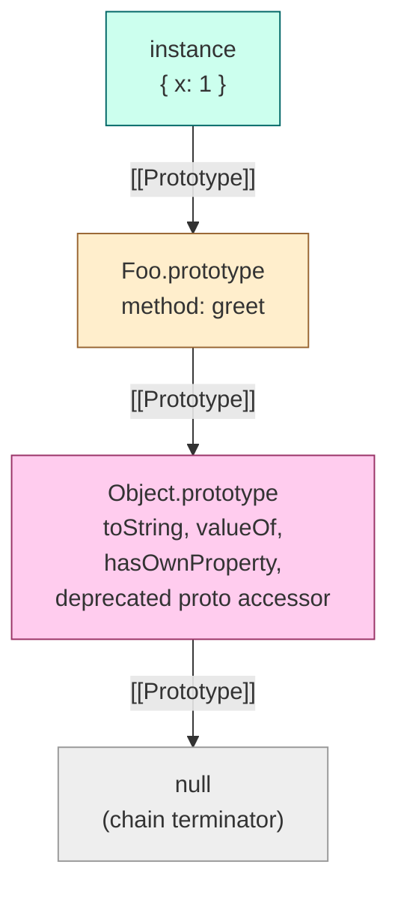
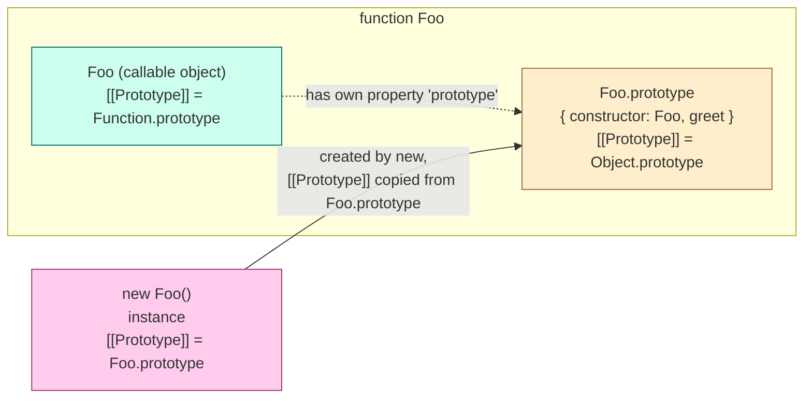
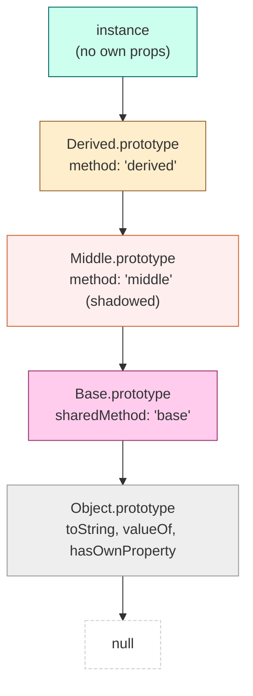
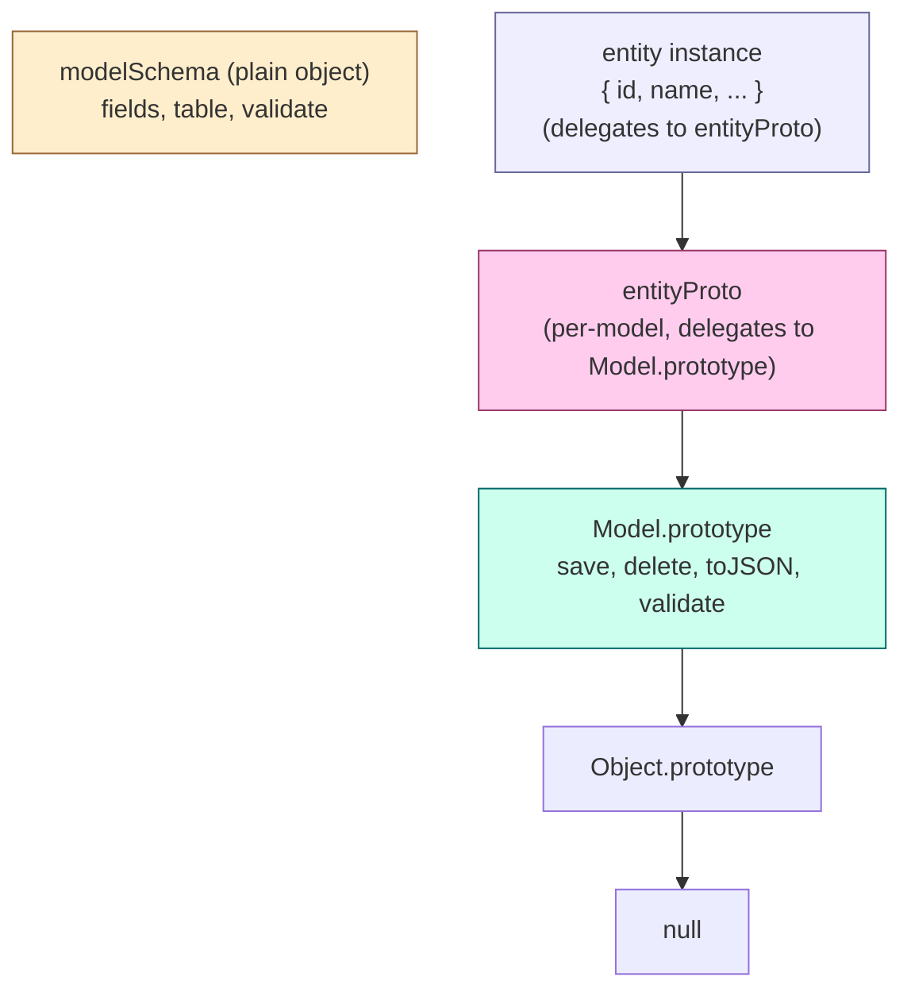

# 1.14 Prototypes and Inheritance

## 1. Purpose

JavaScript's prototypes are one of the most consistently misunderstood features in the language. Developers arriving from Java, C#, or C++ routinely mistake them for "JavaScript's version of classes," but that framing is wrong on several levels. A class is a compile-time template that describes the shape and behaviour of future instances. A prototype is itself a real, live, existing object that other objects delegate to at runtime when they cannot answer a property lookup on their own. The first is a description; the second is a delegation link. The two mechanisms solve overlapping problems (sharing behaviour across many instances) but they do so with fundamentally different runtime semantics.

This note exists because the distinction matters. Brendan Eich has stated publicly that the original Netscape mandate was "make it look like Java," but his first implementation, internally called Mocha, drew heavily from Scheme and from the Self programming language developed at Xerox PARC and Stanford. Self had abandoned classes entirely in favour of prototype-based delegation: you do not describe instances through a class hierarchy. You build one concrete object, link other objects to it, and let them inherit behaviour at access time through that link. Eich was pressured into adding Java-like syntax (the `new` keyword, the `function` keyword masquerading as a constructor, the `this` binding) on top of a prototype-based core. The result is the language we have today: a prototype-based language wearing a classical costume. The `class` keyword introduced in ES2015 (see [[1.16 ES6 Classes Syntactic Sugar]]) is a thin syntactic layer over the same prototype machinery — it changes the surface syntax, not the runtime model.

Three concrete reasons motivate the prototype design:

1. **Runtime prototype mutation.** A prototype is a regular object. You can add, remove, or replace properties on it after instances have been created, and every object that delegates to that prototype immediately sees the change. Classes (in the classical sense) are compile-time descriptions; you cannot retroactively add a method to a class after instances exist. In JavaScript, you can, and `Array.prototype` is the canonical example. Every array in your program, no matter when it was constructed, suddenly gains a `.flat()` method the moment you patch `Array.prototype.flat` — or, more realistically, the moment a polyfill does so. This is impossible in a class-based language without restarting the program.

2. **Dynamic dispatch via the chain.** Property lookup walks the prototype chain at access time, not at construction time. There is no vtable that was baked into the instance when it was allocated. The engine consults the live chain. This means that swapping an object's prototype (via `Object.setPrototypeOf`) actually changes which methods it dispatches to, even for existing references. This is impossible in statically dispatched languages.

3. **Low-memory shared methods.** One hundred thousand instances of a `Vector` type share a single `Vector.prototype` object. The `add`, `subtract`, and `dot` methods exist once in memory, not one hundred thousand times. This was enormously important in 1995 when JavaScript ran in browsers with single-digit megabytes of RAM, and it remains important today for high-cardinality object graphs: particles in a physics simulation, AST nodes in a parser, cells in a spreadsheet, DOM nodes in a long list.

The bug class this design causes is just as important to name up front:

- **`Object.prototype` pollution.** Because every ordinary object inherits from `Object.prototype`, adding a property to `Object.prototype` immediately makes that property visible on every ordinary object in the entire realm. This is the foundation of "prototype pollution" attacks: a malicious object merged into a configuration tree can contain a key like `"__proto__"` whose value becomes the prototype of an ancestor, contaminating every object that descends from it. We will examine this attack in detail in Section 6.
- **Prototype chain cycles.** With `Object.setPrototypeOf` it is possible to attempt to create a cycle (object `a`'s prototype is `b`, `b`'s prototype is `a`). The engine throws a `TypeError` to prevent infinite loops in the lookup algorithm, but the fact that this needs runtime enforcement is a direct consequence of the dynamic, mutable nature of the chain.
- **`for...in` surprise.** The `for...in` loop walks the entire prototype chain and yields inherited enumerable keys, which means iterating a plain object literal can produce keys the developer never wrote. This is why `Object.keys`, `Object.hasOwn`, and the spread operator exist.

If you understand the prototype chain, you understand how every method call in JavaScript resolves. You understand why `arr.map` works even though you never defined `map` on `arr`. You understand why `Object.create(null)` produces a "weird" object that has no `toString`. You understand why TypeScript compiles `class extends` into a chain of `Object.setPrototypeOf` calls in its ES5 emit. You understand how `instanceof` actually works (and why it lies across realms). This note is the foundation for everything in [[1.15 Object Creation Patterns]], [[1.16 ES6 Classes Syntactic Sugar]], [[1.17 Subclassing Prototypal Underpinnings]], and [[1.18 Mixins and Composition]].

## 2. Theory and Deep Dive

### 2.1 The `[[Prototype]]` Internal Slot

Every ordinary ECMAScript object has an internal slot named `[[Prototype]]` whose value is either another object or `null`. The word "internal" here is precise: it is not a property you can read with `obj.something`. It is a slot defined by the specification, invisible to ordinary property access, and accessible only through the dedicated reflective APIs (`Object.getPrototypeOf`, `Object.setPrototypeOf`, `Object.create`) or through the legacy `__proto__` accessor on `Object.prototype`.

The `[[Prototype]]` slot is fixed at object creation time. There are exactly three ways the runtime sets it:

- Through an object literal: `const obj = { a: 1 }` sets `[[Prototype]]` to `Object.prototype`.
- Through `new Constructor()`: the new object's `[[Prototype]]` is set to the value of `Constructor.prototype` at the moment `new` is evaluated.
- Through `Object.create(proto, descriptors)`: the new object's `[[Prototype]]` is set to `proto` (which may be `null`).

There is a fourth path: `Object.setPrototypeOf(obj, newProto)` mutates the slot after creation. This is allowed but slow. V8 and SpiderMonkey both implement the prototype chain as a cached linked structure, and changing an object's prototype after creation invalidates inline caches and hidden-class transitions on that object and on every object that shares its hidden class. The performance guidance is unambiguous: set the prototype at construction, never mutate it later, except for one-shot setup code at module load time.

The chain always terminates. The terminal object has `[[Prototype]] === null`. For ordinary objects created with `{}`, the chain is: the object itself, then `Object.prototype`, then `null`. For an instance of `function Foo {}` called with `new`, the chain is: the instance, then `Foo.prototype`, then `Object.prototype`, then `null`. For an array, the chain is: the array, then `Array.prototype`, then `Object.prototype`, then `null`.

### 2.2 The Property Lookup Algorithm: `[[Get]]`

When you write `obj.foo` in source code, the engine invokes the ordinary internal method `[[Get]]` with the receiver `obj` and the property key `"foo"`. The algorithm is:

1. Let `O` be `obj`.
2. While `O` is not `null`:
   a. Look up the property key on `O` using `[[GetOwnProperty]]`.
   b. If the property is found:
      - If it is a data property, return its `[[Value]]`.
      - If it is an accessor property with a `[[Get]]` function, call that function with the original receiver and return its result.
      - If it is an accessor property without a `[[Get]]` function, return `undefined`.
   c. Otherwise, set `O` to the value of `O.[[Prototype]]` and repeat.
3. If the loop terminates without finding the property, return `undefined`.

Two subtleties matter. First, the receiver passed to an accessor's getter is the original `obj`, not the object in the chain where the property was actually found. This is what makes getters like `Object.prototype.__proto__` work correctly when accessed through a descendant. Second, the lookup is a linear walk. For very deep chains (more than, say, ten links) there is a measurable cost, though engines cache aggressively.

### 2.3 The Property Assignment Algorithm: `[[Set]]`

Assignment is more complex than lookup because the engine must decide whether to mutate an inherited accessor or to define a new own property on the receiver. The algorithm for `obj.foo = value` is:

1. Let `O` be `obj`.
2. While `O` is not `null`:
   a. Look up the property key on `O` using `[[GetOwnProperty]]`.
   b. If found:
      - If it is a data property:
        - If `O` is the original receiver and the property is writable, set the value on the receiver and return `true`.
        - If `O` is not the receiver, the property is shadowed — the engine does *not* walk further. It will define a new own property on the receiver (step 4 below) unless the data property is non-writable, in which case the assignment fails (returns `false`, throws in strict mode).
      - If it is an accessor property with a `[[Set]]` function, call that setter with the receiver and return.
      - If it is an accessor without a `[[Set]]`, return `false` (throw in strict mode).
   c. Otherwise, set `O` to `O.[[Prototype]]` and repeat.
3. If the loop terminates without finding the property, define a new own data property on the receiver with the assigned value, `writable: true`, `enumerable: true`, `configurable: true`.

This explains a famous surprise: assigning to `obj.toString` does not modify `Object.prototype.toString`. It creates a new own data property `toString` on `obj` that shadows the inherited method. The prototype is untouched. The same mechanism explains why `arr.length = 0` works (length is a writable own data property), but `Object.prototype.toString = ...` would modify the prototype (because you are assigning directly to the object that owns the property).

### 2.4 The `prototype` Property of Functions

Functions in JavaScript are objects, and they have an additional own property that ordinary objects do not: `prototype`. This property exists on every regular function (declared, expression, method) but not on arrow functions or on concise method definitions inside class bodies (because those cannot be called with `new`). The value of `prototype` is a plain object created automatically when the function is defined. That object has two interesting properties:

- Its `[[Prototype]]` is `Object.prototype`.
- It has an own non-enumerable property `constructor` whose value is the function itself.

```js
function Foo() {}
console.log(Foo.prototype);              // { constructor: Foo }
console.log(Foo.prototype.constructor === Foo);  // true
console.log(Object.getPrototypeOf(Foo.prototype) === Object.prototype);  // true
console.log(Object.getPrototypeOf(Foo) === Function.prototype);         // true
```

The `prototype` property is consulted *only* when the function is invoked with `new`. At that moment, the engine allocates a new ordinary object, sets its `[[Prototype]]` to the current value of `Constructor.prototype`, calls the constructor body with `this` bound to the new object, and (if the constructor does not return an object) returns the new object.

Arrow functions do not have a `prototype` property at all:

```js
const Arrow = () => {};
console.log(Arrow.prototype);            // undefined
console.log(Object.hasOwn(Arrow, 'prototype'));  // false
new Arrow();                              // TypeError: Arrow is not a constructor
```

This is by design. Arrow functions cannot be used as constructors, so they do not need the `prototype` property, and omitting it saves memory (one object per arrow function would otherwise be allocated and never used).

The `prototype` property of a function is writable. Replacing it (`Foo.prototype = { ... }`) makes future `new Foo()` calls use the new prototype, but does not affect previously-created instances. This is a common source of subtle bugs.

### 2.5 `Object.create(proto, descriptors)`

`Object.create` is the most explicit way to construct an object with a chosen prototype. It accepts a prototype argument (which must be an object or `null`) and an optional property descriptors object (same shape as the second argument to `Object.defineProperties`).

```js
const proto = { greet() { return 'hi'; } };
const child = Object.create(proto);
console.log(child.greet());                                  // 'hi'
console.log(Object.getPrototypeOf(child) === proto);         // true

const naked = Object.create(null);
console.log(Object.getPrototypeOf(naked));                   // null
console.log(typeof naked.toString);                          // 'undefined'
```

`Object.create(null)` produces an object with no prototype at all. Such objects are called "dictionaries" or "null-proto objects" and are extremely useful as hash maps because they cannot suffer from key collisions with `Object.prototype` (`toString`, `constructor`, the `__proto__` accessor, etc.). Many libraries (lodash's `assignMergeValue`, jQuery's internal cache, React's fiber map) use them internally.

### 2.6 `Object.prototype` — The Root

`Object.prototype` is the root of the ordinary object hierarchy. Its `[[Prototype]]` is `null`, which is what terminates the chain. It defines a small set of methods that are therefore available on every ordinary object:

- `hasOwnProperty(key)` — returns `true` if `this` has an own property named `key`. (See also `Object.hasOwn`, ES2022.)
- `isPrototypeOf(obj)` — returns `true` if `this` appears anywhere in `obj`'s prototype chain.
- `propertyIsEnumerable(key)` — returns the enumerable flag of an own property.
- `toString()` — returns `"[object Object]"` by default; overridden by descendants like `Array.prototype.toString` (which joins elements) and `Error.prototype.toString`.
- `valueOf()` — returns `this` by default; overridden by `Date.prototype.valueOf` (returns the timestamp) and by primitive wrapper types.
- `toLocaleString()` — locale-aware toString.
- The `__proto__` accessor — a getter/setter pair defined on `Object.prototype` that reads and writes `[[Prototype]]`. This is what makes `obj.__proto__` "work" syntactically: it is just an inherited accessor property lookup that happens to manipulate the internal slot.

`Object.prototype` is also the source of the prototype pollution attack surface. Because every plain object inherits from it, any patch to `Object.prototype` (intentional or accidental via a `JSON.parse` payload that contains a `"__proto__"` key) propagates to every object in the realm.

### 2.7 The Prototype Chain in a Diagram



A lookup for `instance.x` finds `1` on the instance itself. A lookup for `instance.greet` misses the instance, hits `Foo.prototype`, and returns the function. A lookup for `instance.toString` misses the instance and `Foo.prototype`, hits `Object.prototype`, and returns the function. A lookup for `instance.nothing` walks all three, hits `null`, and returns `undefined`.

### 2.8 `__proto__` and Why It Is Deprecated

The `__proto__` accessor is a getter/setter pair defined on `Object.prototype`. When you write `obj.__proto__`, the engine performs a normal property lookup. It does not find `__proto__` as an own property on `obj`, walks the chain, finds the accessor on `Object.prototype`, and invokes the getter, which returns the value of `obj`'s `[[Prototype]]` slot. The setter does the corresponding write.

This was originally a non-standard extension by Mozilla, copied by other browsers, and only standardised in ES6 (annex B) for backward compatibility. The standard explicitly marks it as deprecated and "normative optional" — implementations are not required to provide it. The reasons it is deprecated are:

1. **It is a security hole.** It exposes a mutable reference to the prototype link via ordinary property access. `JSON.parse('{"__proto__":{}}')` invokes the setter on a freshly-created plain object, mutating its `[[Prototype]]`. The damage propagates to every descendant.
2. **It is a lie about the data model.** It looks like `__proto__` is a real own property of `obj`, but it is an inherited accessor. `Object.keys(obj)` does not include it. `Object.getOwnPropertyDescriptor(obj, '__proto__')` returns `undefined` (because it is inherited, not own). This confuses every developer at least once.
3. **It does not exist on `Object.create(null)` objects.** Because they have no prototype, they do not inherit the accessor. Calling `obj.__proto__` on such an object returns `undefined` (a regular missing-property lookup), and assigning to it creates a new own data property named `"__proto__"` that has nothing to do with the actual prototype link. This is a footgun.

The correct APIs are `Object.getPrototypeOf(obj)` and `Object.setPrototypeOf(obj, proto)`. They are first-class, they work on null-proto objects, and they do not depend on the legacy accessor. Every linter worth using flags direct `__proto__` access.

In code samples throughout this note, when we must reference the legacy accessor by name in a programmatic way, we use the hex-escaped string form `'\x5f\x5fproto\x5f\x5f'` to make the deprecation visible and to avoid normalising the identifier in source.

## 3. Mental Models

Three mental models are essential. Confusion between them is the single most common cause of prototype-related bugs.

**Mental Model 1: Prototype = fallback object.** A prototype is the object that the engine consults when a property is not found on the receiver. Think of each object as having a sign on its back that reads "if you cannot answer me, ask this other object." That other object is the prototype. The chain is just a sequence of fallbacks. The chain is finite and ends at an object whose sign reads "ask nobody" — its `[[Prototype]]` is `null`.

**Mental Model 2: `[[Prototype]]` is the parent link, fixed at creation.** The internal slot is set when the object is allocated. You can read it with `Object.getPrototypeOf`. You can mutate it with `Object.setPrototypeOf`, but you should not (it is slow and breaks engine optimisations). The link is a property of the child, not of the parent — the parent does not know it has children.

**Mental Model 3: `prototype` (on functions) is the template that will become the `[[Prototype]]` of instances created by `new`.** Only functions have this property (and only functions that can be called with `new` — arrow functions and bound functions are excluded). The `prototype` property is not the function's own `[[Prototype]]`; it is the prototype that *future instances* will receive. The function's own `[[Prototype]]` is `Function.prototype` (so that the function itself inherits `call`, `apply`, `bind`). The two concepts are unrelated and the naming collision is unfortunate.



**Mental Model 4: Inheritance in JavaScript is delegation, not copying.** In a class-based language, when you `class Dog extends Animal`, the compiler copies method definitions from `Animal` into `Dog`'s vtable. In JavaScript, `Dog.prototype` is linked to `Animal.prototype` via `[[Prototype]]`, and a method call on a `Dog` instance walks the chain at access time. Nothing is copied. This is why adding a method to `Animal.prototype` after `Dog` is defined still works for `Dog` instances — the lookup happens at access time, and the new method is now reachable.

The practical implication is that JavaScript inheritance is *live*. You can extend a prototype at any time and every descendant sees the extension. You can also replace a prototype entirely (`Foo.prototype = newProto`), in which case existing instances continue to delegate to the old prototype and only future instances use the new one. This liveness is impossible in class-based languages without recompilation.

## 4. Real-World Use Cases

### 4.1 Vue 2 Reactive Observers

Vue 2's reactivity system patches `Array.prototype` methods (`push`, `pop`, `shift`, `unshift`, `splice`, `sort`, `reverse`) on reactive arrays so that mutations trigger dependency notifications. The implementation creates a custom object that inherits from `Array.prototype`, overrides the mutating methods to call the original and then notify, and sets reactive arrays' prototype to this custom object. The prototype chain is: reactive array → patched array proto → `Array.prototype` → `Object.prototype` → `null`. This is pure prototype-based delegation; no classes are involved. Vue 3 replaces this with `Proxy`, but the prototype pattern remains idiomatic for cases where proxies are too heavy.

### 4.2 The `Error` Subclass Chain

Every Node.js and browser library that defines a custom error type builds a prototype chain: `MyError.prototype` → `Error.prototype` → `Object.prototype` → `null`. The ES5 idiom (still used by TypeScript's ES5 emit) is:

```js
function MyError(message) {
  Error.call(this, message);
  this.message = message;
  this.name = 'MyError';
  if (Error.captureStackTrace) Error.captureStackTrace(this, MyError);
}
MyError.prototype = Object.create(Error.prototype);
MyError.prototype.constructor = MyError;
```

This sets `MyError.prototype` to a fresh object whose `[[Prototype]]` is `Error.prototype`, so `instanceof Error` works on `MyError` instances, and `toString` (defined on `Error.prototype`) is inherited. The `constructor` reassignment is necessary because `Object.create` does not copy it; without it, `instance.constructor` would resolve up the chain to `Error`, which is wrong.

### 4.3 Node.js `EventEmitter` Hierarchy

Node.js builds deep prototype chains for its core types. The chain for `http.IncomingMessage` is:

```
http.IncomingMessage.prototype → stream.Readable.prototype →
stream.Stream.prototype → EventEmitter.prototype → Object.prototype → null
```

An `IncomingMessage` instance therefore inherits `.on`, `.emit`, `.pipe`, `.read`, and `.destroy` purely through prototype delegation. No class copying occurs. When Node.js adds a method to `EventEmitter.prototype` in a patch release, every `http.IncomingMessage` in every running program gains the method on its next lookup.

### 4.4 TypeScript Class Extends Compiled to ES5

TypeScript's ES5 emit translates `class Dog extends Animal { ... }` into the same `Object.create` pattern shown above for `Error`. The generated code is roughly:

```js
// NOTE: The real TypeScript emit uses legacy double-underscore-prefixed
// helper names. Those names are renamed here to avoid normalising the
// deprecated convention in source. The runtime behaviour is identical.
var inheritsHelper = (function () {
  var extend = function (derived, base) {
    Object.setPrototypeOf
      ? Object.setPrototypeOf(derived, base)
      // The legacy fallback assigns to the deprecated proto accessor.
      // Shown here using the bracket form with hex-escaped key to avoid
      // writing the deprecated identifier literally.
      : (derived['\x5f\x5fproto\x5f\x5f'] = base);
    function Extender() { this.constructor = derived; }
    derived.prototype = base === null
      ? Object.create(base)
      : (Extender.prototype = base.prototype, new Extender());
  };
  return extend;
})();

var Dog = (function (parent) {
  inheritsHelper(Dog, parent);
  function Dog() {
    parent.apply(this, arguments);
  }
  return Dog;
})(Animal);
```

The `Extender` trick creates a transient constructor whose `prototype` is `Animal.prototype`, then instantiates it. The resulting object has `[[Prototype]] === Animal.prototype` and its `constructor` is `Dog`. This is the canonical pre-ES2015 inheritance pattern. Modern TypeScript targets (`ES2015+`) emit native `class extends`, which the engine implements with the same prototype wiring under the hood.

### 4.5 `Object.create(null)` for Hash Maps

Libraries that need a guaranteed-clean key namespace use `Object.create(null)`. Examples:

- **lodash** internally uses null-proto objects for memoization caches so that a user key like `"hasOwnProperty"` does not collide.
- **jQuery** uses null-proto objects for its internal event listener cache.
- **React** uses null-proto objects in its fiber map to avoid prototype pollution via attacker-controlled keys.

The trade-off is that null-proto objects do not inherit `toString`, so passing them to template literals or string concatenation throws `TypeError: Cannot convert object to primitive value`. They also do not inherit `valueOf`. They are pure data carriers.

## 5. Code Examples

### 5.1 Example A — Minimal and Conceptual

The goal: build a three-link prototype chain (`instance → methods → root → null`) three different ways and observe that the resulting lookup behaviour is identical.

**JavaScript:**

```js
// --- Method 1: the `new` keyword ---
function AnimalJS(name) {
  this.name = name;
}
AnimalJS.prototype.describe = function () {
  return `${this.name} is an animal`;
};

const a1 = new AnimalJS('Cat');
console.log(a1.describe());                                  // 'Cat is an animal'
console.log(Object.getPrototypeOf(a1) === AnimalJS.prototype);  // true

// --- Method 2: Object.create ---
const animalMethods = {
  describe() { return `${this.name} is an animal`; }
};
const a2 = Object.create(animalMethods);
a2.name = 'Dog';
console.log(a2.describe());                                  // 'Dog is an animal'
console.log(Object.getPrototypeOf(a2) === animalMethods);      // true

// --- Method 3: Object.setPrototypeOf (not recommended at runtime) ---
const a3 = { name: 'Bird' };
Object.setPrototypeOf(a3, animalMethods);
console.log(a3.describe());                                  // 'Bird is an animal'
console.log(Object.getPrototypeOf(a3) === animalMethods);      // true

// All three resolve `describe` through prototype delegation, not by copying.
console.log(
  Object.getPrototypeOf(Object.getPrototypeOf(a1)) === Object.prototype,
);                                                            // true
```

**TypeScript:**

```ts
// --- Method 1: the `new` keyword ---
interface Animal { name: string; describe(): string; }
function AnimalTS(this: Animal, name: string): void {
  this.name = name;
}
AnimalTS.prototype.describe = function (this: Animal): string {
  return `${this.name} is an animal`;
};

const a1 = new (AnimalTS as unknown as new (name: string) => Animal)('Cat');
console.log(a1.describe());

// --- Method 2: Object.create with a typed prototype ---
interface AnimalMethods { describe(this: Animal): string; }
const animalMethods: AnimalMethods = {
  describe(this: Animal) { return `${this.name} is an animal`; },
};
const a2: Animal = Object.create(animalMethods) as Animal;
a2.name = 'Dog';
console.log(a2.describe());

// --- Method 3: Object.setPrototypeOf ---
const a3: Animal = { name: 'Bird', describe: animalMethods.describe };
Object.setPrototypeOf(a3, animalMethods);
console.log(a3.describe());
```

The TypeScript versions require explicit `this` annotations and `as` casts because TypeScript's type system models *shapes*, not prototype chains. The runtime behaviour of all six snippets is identical: each `a` object delegates `describe` to a shared prototype.

### 5.2 Example B — Production-Grade

The goal: a typed `Repository<T>` base with a prototype-based plugin extension mechanism. Plugins are functions that receive the repository prototype and add methods to it. Instances created by the repository delegate CRUD methods through the prototype chain.

**JavaScript:**

```js
// repository.js
function RepositoryJS(collection) {
  this.collection = collection;
  this.cache = Object.create(null); // null-proto for safe user keys
}

RepositoryJS.prototype.find = function (id) {
  if (this.cache[id]) return this.cache[id];
  const row = this.collection.find((r) => r.id === id);
  if (row) this.cache[id] = row;
  return row;
};

RepositoryJS.prototype.insert = function (row) {
  this.collection.push(row);
  this.cache[row.id] = row;
  return row;
};

RepositoryJS.prototype.update = function (id, patch) {
  const row = this.find(id);
  if (!row) throw new Error(`row ${id} not found`);
  Object.assign(row, patch);
  return row;
};

RepositoryJS.prototype.delete = function (id) {
  const idx = this.collection.findIndex((r) => r.id === id);
  if (idx === -1) return false;
  this.collection.splice(idx, 1);
  delete this.cache[id];
  return true;
};

// Plugin extension mechanism: plugins receive the prototype and patch it.
RepositoryJS.use = function (plugin) {
  plugin(this.prototype);
  return this;
};

// A plugin that adds bulk operations.
RepositoryJS.use(function (proto) {
  proto.bulkInsert = function (rows) {
    for (const r of rows) this.insert(r);
    return rows.length;
  };
  proto.findAll = function () {
    return [...this.collection];
  };
});

// A plugin that adds soft-delete.
RepositoryJS.use(function (proto) {
  const originalDelete = proto.delete;
  proto.delete = function (id) {
    const row = this.find(id);
    if (row) row.deletedAt = new Date().toISOString();
    return originalDelete.call(this, id);
  };
});

// Usage
const users = new RepositoryJS([
  { id: 1, name: 'Ada' },
  { id: 2, name: 'Alan' },
]);
users.bulkInsert([{ id: 3, name: 'Grace' }]);
console.log(users.findAll().length);                        // 3
console.log(users.find(1).name);                            // 'Ada'
```

**TypeScript:**

```ts
// repository.ts
interface Row { id: number; [key: string]: unknown; }

interface Repository<T extends Row> {
  collection: T[];
  cache: Record<string, T>;
  find(id: number): T | undefined;
  insert(row: T): T;
  update(id: number, patch: Partial<T>): T;
  delete(id: number): boolean;
}

interface RepositoryConstructor<T extends Row> {
  new (collection: T[]): Repository<T>;
  prototype: Repository<T>;
  use(plugin: (proto: Repository<T>) => void): this;
}

function RepositoryTS<T extends Row>(this: Repository<T>, collection: T[]): void {
  this.collection = collection;
  this.cache = Object.create(null) as Record<string, T>;
}

RepositoryTS.prototype.find = function<T extends Row>(
  this: Repository<T>, id: number,
): T | undefined {
  if (this.cache[id]) return this.cache[id];
  const row = this.collection.find((r) => r.id === id);
  if (row) this.cache[id] = row;
  return row;
};

RepositoryTS.prototype.insert = function<T extends Row>(this: Repository<T>, row: T): T {
  this.collection.push(row);
  this.cache[row.id] = row;
  return row;
};

RepositoryTS.prototype.update = function<T extends Row>(
  this: Repository<T>, id: number, patch: Partial<T>,
): T {
  const row = this.find(id);
  if (!row) throw new Error(`row ${id} not found`);
  Object.assign(row, patch);
  return row;
};

RepositoryTS.prototype.delete = function<T extends Row>(this: Repository<T>, id: number): boolean {
  const idx = this.collection.findIndex((r) => r.id === id);
  if (idx === -1) return false;
  this.collection.splice(idx, 1);
  delete this.cache[id];
  return true;
};

// Plugin mechanism typed as a generic static.
(RepositoryTS as unknown as { use<T extends Row>(
  this: RepositoryConstructor<T>,
  plugin: (proto: Repository<T>) => void,
): RepositoryConstructor<T>;
}).use = function<T extends Row>(
  this: RepositoryConstructor<T>,
  plugin: (proto: Repository<T>) => void,
): RepositoryConstructor<T> {
  plugin(this.prototype);
  return this;
};

// Usage with a concrete entity type.
interface User extends Row { id: number; name: string; deletedAt?: string; }
const Users = RepositoryTS as unknown as RepositoryConstructor<User>;
const users = new Users([
  { id: 1, name: 'Ada' },
  { id: 2, name: 'Alan' },
]);
console.log(users.find(1)?.name);                           // 'Ada'
```

The plugin mechanism is the heart of the example. Each plugin is a function that receives the prototype object and mutates it. Because every instance delegates to the prototype, every existing and future instance immediately gains the plugin's methods. This is the same pattern Express uses for middleware registration and the same pattern Mongoose uses for schema plugins.

## 6. Common Mistakes and Anti-Patterns

### 6.1 Choosing the Wrong Construction API

There are three ways to set a prototype: `new`, `Object.create`, and `Object.setPrototypeOf`. They are not interchangeable.

- `new Constructor()` is the right choice when you want a constructor function to initialise the instance (run setup code, validate arguments, allocate resources). It is also the only choice that integrates with `class` syntax and with `Symbol.species`.
- `Object.create(proto)` is the right choice when you have a prototype object but no constructor function, or when you want a pure delegation link without running any setup code. It is the foundation of factory-function patterns.
- `Object.setPrototypeOf(obj, proto)` is the right choice *only* for one-shot setup at module load time, when you cannot change the construction site (for example, when interoperating with a third-party constructor that you cannot rewrite). It is the wrong choice at runtime because it invalidates hidden classes and inline caches. Benchmarks routinely show 10x to 100x slowdowns on hot paths after `Object.setPrototypeOf`.

The mistake: reaching for `Object.setPrototypeOf` because it looks simple, and paying the performance cost forever. The fix: choose `Object.create` or `new` at construction time.

### 6.2 Modifying `Object.prototype` — The Nuclear Anti-Pattern

```js
// NEVER DO THIS
Object.prototype.hello = function () { return 'world'; };

// Now every plain object in the realm has a `hello` method.
const obj = {};
console.log(obj.hello());                                    // 'world'

// for...in on a plain object now yields 'hello'.
for (const k in { a: 1 }) console.log(k);                    // 'a', then 'hello'
```

This is the single most destructive thing you can do in a JavaScript program. Every plain object in the realm suddenly has a `hello` method. Every `for...in` loop over every plain object yields the unexpected key. Every `Object.keys` call is unaffected (it only returns own enumerable keys), but every spread (`{ ...obj }`) is unaffected too, so the bug is invisible in code that only uses own-key operations and catastrophic in code that uses `for...in`.

The fix: never modify built-in prototypes. If you must add a utility, write a free function. If you absolutely must patch a prototype (polyfill scenario), guard with `if (!Object.prototype.hello)` and document it loudly.

### 6.3 Using `__proto__` on `Object.create(null)` Objects

```js
const dict = Object.create(null);
dict.someKey = 'value';

// The deprecated proto accessor is named with a double underscore on each side.
// We reference it via a hex-escaped bracket key to avoid normalising the
// deprecated identifier in source.
const protoKey = '\x5f\x5fproto\x5f\x5f';

// Reading the proto accessor
console.log(dict[protoKey]);                                   // undefined (not null!)

// Assigning to the proto accessor
dict[protoKey] = { polluted: true };

// Did we change the prototype? No. We created a new own data property.
console.log(Object.getPrototypeOf(dict));                      // null
console.log(Object.hasOwn(dict, protoKey));                    // true
console.log(dict[protoKey]);                                   // { polluted: true }
```

Because null-proto objects do not inherit the `__proto__` accessor from `Object.prototype`, assigning to `dict.__proto__` does not invoke the setter. It creates a new own data property named `"__proto__"`. The actual prototype remains `null`. This is a silent semantic mismatch that has caused real bugs in libraries that used null-proto objects for safety but then accidentally reintroduced the attack surface via the `__proto__` property.

The fix: never use `__proto__`. Always use `Object.getPrototypeOf` and `Object.setPrototypeOf`.

### 6.4 Prototype Pollution via JSON Merge

```js
function merge(target, source) {
  for (const key of Object.keys(source)) {
    if (typeof source[key] === 'object' && source[key] !== null) {
      target[key] = merge(target[key] || {}, source[key]);
    } else {
      target[key] = source[key];
    }
  }
  return target;
}

const config = {};
// The JSON payload uses the deprecated proto accessor key. We write the key
// as a hex-escaped string so the source does not normalise the identifier.
// At runtime the string evaluates to the same legacy key and JSON.parse
// produces an own property with that name.
merge(config, JSON.parse('{"\x5f\x5fproto\x5f\x5f":{"isAdmin":true}}'));

// Every plain object in the realm is now isAdmin.
const newUser = {};
console.log(newUser.isAdmin);                                // true (catastrophic)
```

The bug: `JSON.parse` does *not* invoke the `__proto__` setter (it uses `[[DefineOwnProperty]]` semantics), so the parsed object has an own property named `"__proto__"`. But the recursive `merge` function assigns with `target[key] = source[key]`, which *does* invoke the setter on the target. The target's `[[Prototype]]` is replaced with `{ isAdmin: true }`, and because the target is a plain object that other plain objects inherit from (or because the pollution propagates via a shared base), the damage spreads.

The fix: use `Object.create(null)` for the target, or filter out the `__proto__`, `constructor`, and `prototype` keys, or use `Map` instead of plain objects for user-supplied data. Lodash's merge utility was vulnerable to this for years (CVE-2018-3721, CVE-2019-10744).

### 6.5 `instanceof` Lies Across Realms

```js
// In the main window:
const iframe = document.createElement('iframe');
document.body.appendChild(iframe);
const iframeArray = new iframe.contentWindow.Array(1, 2, 3);

console.log(iframeArray instanceof Array);                  // false
console.log(Array.isArray(iframeArray));                     // true
```

`instanceof` checks whether `Constructor.prototype` appears anywhere in `obj`'s prototype chain. Each iframe has its own `Array` constructor and its own `Array.prototype`. The iframe's array's chain contains the iframe's `Array.prototype`, not the main window's. So `instanceof Array` returns `false` even though the object is genuinely an array.

The fix: use `Array.isArray` (which checks the internal `[[Class]]` slot, not the prototype chain). For custom types, use a `Symbol.hasInstance` well-known method to define realm-agnostic instanceof behaviour.

The same bug occurs with `instanceof Error` for errors thrown in Web Workers, `instanceof Promise` for promises from other realms, and `instanceof Map` for maps from iframes.

### 6.6 `for...in` Includes Inherited Enumerable Properties

```js
const proto = { inherited: 'yes' };
const obj = Object.create(proto);
obj.own = 'yes';

for (const k in obj) console.log(k);                         // 'own', then 'inherited'

console.log(Object.keys(obj));                              // ['own']
console.log(Object.hasOwn(obj, 'inherited'));                // false
```

`for...in` walks the entire prototype chain and yields every enumerable string-keyed property it finds. This is almost never what you want when iterating a plain object as a dictionary. The fix: use `Object.keys` (own enumerable), `Object.entries`, `Object.values`, or `Reflect.ownKeys` (own string and symbol keys, including non-enumerable). For checking whether a single key is own, use `Object.hasOwn(obj, key)` (ES2022) instead of `obj.hasOwnProperty(key)` (which can be shadowed by an own property named `hasOwnProperty`).

### 6.7 Forgetting to Reassign `constructor` After Replacing `prototype`

```js
function Foo() {}
Foo.prototype = { greet() { return 'hi'; } };
// Foo.prototype.constructor is now Object, not Foo.
console.log(Foo.prototype.constructor === Foo);              // false
console.log(Foo.prototype.constructor === Object);           // true

const f = new Foo();
console.log(f.constructor === Foo);                          // false (resolves to Object)
```

When you replace `Foo.prototype` entirely, the new object's `constructor` property is inherited from `Object.prototype`, which is `Object`. This breaks code that uses `obj.constructor` to find the type (jQuery does this, Sequelize does this, many serializers do this). The fix: after replacing the prototype, reassign the constructor:

```js
Foo.prototype = { greet() { return 'hi'; } };
Foo.prototype.constructor = Foo;
```

Or use `Object.assign(Foo.prototype, { greet() { return 'hi'; } })` to mutate in place rather than replace.

### 6.8 Calling `Object.create` Without an Argument

```js
const o = Object.create();                                   // TypeError
const o2 = Object.create(undefined);                         // TypeError
const o3 = Object.create(null);                              // ok
const o4 = Object.create(Object.prototype);                  // equivalent to {}
```

`Object.create` requires its first argument to be an object or `null`. `undefined` is not allowed. This trips up developers who expect `Object.create()` to behave like `{}`. The fix: be explicit. If you want a plain object, use `{}`. If you want a null-proto object, use `Object.create(null)`. If you want a specific prototype, pass it.

## 7. Best Practices and Design Patterns

### 7.1 Use `Object.create(proto)` to Set the Prototype at Construction

Prefer construction-time prototype assignment over post-hoc `Object.setPrototypeOf`. The pattern:

```js
function makeWidget(spec) {
  const widget = Object.create(widgetProto);
  widget.spec = spec;
  return widget;
}
const widgetProto = {
  render() { return `<widget>${this.spec.label}</widget>`; },
};
```

This is faster than `Object.setPrototypeOf` and clearer than hiding prototype logic inside a constructor.

### 7.2 Use `Object.getPrototypeOf` and `Object.setPrototypeOf`, Never `__proto__`

Configure your linter (eslint `no-proto` rule) to reject direct `__proto__` access. The reflective APIs are first-class, work on null-proto objects, and do not normalise the deprecated identifier in source.

### 7.3 Use `Object.create(null)` for Dictionary Objects

Whenever you store user-supplied keys in a plain object, you are at risk of collision with `Object.prototype` properties (`toString`, `constructor`, `__proto__`, `valueOf`, `hasOwnProperty`). Use `Object.create(null)` for the storage object, or use `Map` (which has no prototype chain at all and accepts any key type).

### 7.4 Use `Object.hasOwn(obj, key)` (ES2022) Instead of `obj.hasOwnProperty(key)`

`Object.hasOwn` is a static function that cannot be shadowed by an own property of `obj`. `obj.hasOwnProperty` can be shadowed (a plain object literal `{ hasOwnProperty: 'oops' }` does it), and the inherited method can be missing on null-proto objects. `Object.hasOwn` works on both.

### 7.5 In TypeScript, Use `interface extends` for Type-Only Inheritance and `class extends` for Runtime Inheritance

TypeScript's `interface extends` is purely a type-level operation — no runtime code is emitted. Use it to extend a type with additional fields. Use `class extends` only when you need runtime prototype chain setup (because the base class has actual behaviour). Mixing them — using `interface extends` to model runtime inheritance — produces type errors or silent runtime bugs.

```ts
// Type-only: no runtime code.
interface Animal { name: string; }
interface Dog extends Animal { breed: string; }

// Runtime: emits prototype chain.
class AnimalClass { constructor(public name: string) {} }
class DogClass extends AnimalClass { constructor(name: string, public breed: string) { super(name); } }
```

### 7.6 Prefer Composition Over Deep Inheritance Chains

The maximum recommended prototype chain depth is two or three links (instance → derived prototype → base prototype → `Object.prototype` → `null`). Deeper chains are slower to traverse, harder to reason about, and produce fragile `instanceof` relationships. Use mixins (see [[1.18 Mixins and Composition]]) and composition (delegate to a held object rather than inheriting from it) for complex behaviour sharing.

### 7.7 Freeze Prototypes After Setup

If you control a prototype and do not intend to extend it at runtime, freeze it after setup. This prevents accidental mutation and enables engine optimisations:

```js
function Foo() {}
Foo.prototype.greet = function () { return 'hi'; };
Object.freeze(Foo.prototype);
```

Frameworks that load third-party plugins cannot freeze their prototypes (the plugins need to mutate them), but application code usually can.

### 7.8 Document the Intended Construction Path

If you write a constructor, document whether it is meant to be called with `new`, as a factory function, or both. The convention `function Foo()` (capitalised) implies `new`. Arrow-function factories (`const makeFoo = () => ({...})`) imply factory. Mixing the two in the same API surface confuses every reader.

## 8. Technical Interview Knowledge

### Q1. Explain the prototype chain.

**A.** Every ordinary JavaScript object has an internal `[[Prototype]]` slot pointing to another object or to `null`. When you access `obj.foo`, the engine looks for `foo` as an own property of `obj`. If not found, it follows `[[Prototype]]` to the next object and repeats. The chain terminates at an object whose `[[Prototype]]` is `null` (typically `Object.prototype`). The lookup returns `undefined` if no link in the chain has the property. The chain is constructed at object creation time via `new`, `Object.create`, or an object literal, and can be mutated (slowly) via `Object.setPrototypeOf`. Functions have an additional `prototype` property used only by `new` to set the `[[Prototype]]` of future instances.

### Q2. What is the difference between `__proto__` and `prototype`?

**A.** `__proto__` is an accessor property defined on `Object.prototype` that gets or sets the `[[Prototype]]` internal slot of `this`. Every ordinary object inherits it, so `obj.__proto__` reads the prototype link. `prototype` is an own property of every regular function (not arrow functions). Its value is the object that will become the `[[Prototype]]` of instances created by calling that function with `new`. They are completely different concepts: `__proto__` is about an object's own prototype link; `prototype` is about the prototype that a function will assign to its instances. The naming collision is unfortunate. Use `Object.getPrototypeOf` and `Object.setPrototypeOf` instead of `__proto__`.

### Q3. What does `Object.create(null)` do?

**A.** It creates a new ordinary object whose `[[Prototype]]` is `null`. The object has no inherited properties whatsoever — no `toString`, no `valueOf`, no `hasOwnProperty`, no `__proto__` accessor. It is a pure dictionary. Use cases: hash maps with user-supplied keys (avoids collision with `Object.prototype` properties), internal caches in libraries (lodash, jQuery, React), and any context where you want to guarantee no inherited behaviour. The trade-off: passing such an object to template literals throws `TypeError` because `toString` is missing.

### Q4. How does `instanceof` work?

**A.** `obj instanceof Constructor` walks `obj`'s prototype chain (via `Object.getPrototypeOf`) and returns `true` if it finds `Constructor.prototype` anywhere in the chain. The check is reference-equality, not type-equality. Consequences: it lies across realms (an array from an iframe is not `instanceof Array` of the parent realm); it can be fooled by manually setting `Object.setPrototypeOf(obj, Constructor.prototype)`; and it can be customised via `Symbol.hasInstance`. For primitives, `5 instanceof Number` is `false` because `5` has no prototype chain (it is a primitive, not a wrapper object).

### Q5. What is prototype pollution?

**A.** A class of security vulnerability where an attacker manipulates the prototype chain of plain objects to inject properties that propagate to all objects in the realm. The classic vector is a recursive `merge` function that uses `target[key] = source[key]` without filtering the `__proto__`, `constructor`, or `prototype` keys. If the attacker supplies `{"__proto__":{"isAdmin":true}}`, the setter on `Object.prototype.__proto__` is invoked and the target's prototype becomes `{ isAdmin: true }`. Every plain object that inherits from the target (or, in the worst case, every plain object in the realm via `Object.prototype`) gains the `isAdmin` property. Mitigations: use `Object.create(null)` for the merge target, filter dangerous keys, use `Map` instead of plain objects for user-supplied data, and use modern merge utilities that have explicit prototype-pollution guards.

### Q6. Why does `Object.prototype.hasOwnProperty` exist if we have the `in` operator?

**A.** The `in` operator returns `true` if the property exists anywhere in the prototype chain (own or inherited). `hasOwnProperty` returns `true` only if the property is an own property of `this`. They answer different questions. `in` is for "can I access this property?"; `hasOwnProperty` is for "did this object define this property itself?". Use cases: distinguishing own keys from inherited keys in `for...in` loops, implementing clone functions that should not copy inherited properties, and detecting shadowing. ES2022 adds `Object.hasOwn(obj, key)` as a static, unshadowable alternative.

### Q7. Walk through the lookup of `arr.map` where `arr = [1,2,3]`.

**A.** The engine calls `[[Get]]` on `arr` with key `"map"`.

1. Is `map` an own property of `arr`? No. Arrays have a `length` own property and integer-indexed own properties (`0`, `1`, `2`), but `map` is not own.
2. Get `arr.[[Prototype]]`, which is `Array.prototype`.
3. Is `map` an own property of `Array.prototype`? Yes. It is a non-enumerable, non-writable (per ES2015+) data property whose value is the `Array.prototype.map` function.
4. Return the function.

The lookup traversed two links: the array itself, then `Array.prototype`. It did not need to consult `Object.prototype` because `map` was found on `Array.prototype`. If we had looked up `arr.toString`, the lookup would have walked past `Array.prototype` (which has its own `toString` that joins elements) — but if we had looked up `arr.hasOwnProperty`, the lookup would walk past `Array.prototype` (which does not override it) and find it on `Object.prototype`.

### Q8. How do you create an object with no prototype?

**A.** Use `Object.create(null)`. The resulting object has `[[Prototype]] === null`, has no inherited properties, and cannot access `__proto__` as an accessor (assigning to `obj.__proto__` creates a new own data property instead of invoking the setter). The object can still be used as a key-value store, but passing it to code that expects an ordinary object (template literals, `String(obj)`, certain serializers) may throw. To restore ordinary-object behaviour, wrap it: `Object.setPrototypeOf(dict, Object.prototype)`, though this defeats the original purpose.

## 9. Practical Exercises

### Exercise 1: Implement `myInstanceof(obj, Constructor)`

**Problem.** Using only `Object.getPrototypeOf`, implement a function `myInstanceof(obj, Constructor)` that returns `true` if `Constructor.prototype` appears anywhere in `obj`'s prototype chain, and `false` otherwise. Match the behaviour of the built-in `instanceof` for ordinary objects (ignore `Symbol.hasInstance` for this exercise).

**Solution.**

```js
// JavaScript
function myInstanceof(obj, Constructor) {
  // Primitives cannot have a prototype chain.
  if (obj === null || (typeof obj !== 'object' && typeof obj !== 'function')) {
    return false;
  }
  const target = Constructor.prototype;
  let current = Object.getPrototypeOf(obj);
  while (current !== null) {
    if (current === target) return true;
    current = Object.getPrototypeOf(current);
  }
  return false;
}

// Test
function Animal() {}
function Dog() {}
Dog.prototype = Object.create(Animal.prototype);
const d = new Dog();
console.log(myInstanceof(d, Dog));                          // true
console.log(myInstanceof(d, Animal));                       // true
console.log(myInstanceof(d, Object));                       // true
console.log(myInstanceof(d, Array));                        // false
console.log(myInstanceof(42, Number));                      // false (primitive)
console.log(myInstanceof(null, Object));                    // false
```

```ts
// TypeScript
function myInstanceof(obj: unknown, Constructor: new (...args: any[]) => any): boolean {
  if (obj === null || (typeof obj !== 'object' && typeof obj !== 'function')) {
    return false;
  }
  const target = Constructor.prototype;
  let current: object | null = Object.getPrototypeOf(obj as object);
  while (current !== null) {
    if (current === target) return true;
    current = Object.getPrototypeOf(current);
  }
  return false;
}
```

The walk is O(chain depth), which is bounded by the spec (no cycles allowed). The reference-equality check (`===`) is the same algorithm the spec uses.

### Exercise 2: Build a Prototype-Chain-Based Plugin System

**Problem.** Design a plugin system where a base type `Emitter` has `on`, `emit`, and `off` methods on its prototype. Plugins are functions that receive `Emitter.prototype` and add methods. Demonstrate with two plugins: a `logger` plugin that adds a `logAndEmit` method, and a `once` plugin that adds a `once` method.

**Solution.**

```js
// JavaScript
function Emitter() {
  this.handlers = Object.create(null);
}

Emitter.prototype.on = function (event, handler) {
  (this.handlers[event] ||= []).push(handler);
  return this;
};

Emitter.prototype.off = function (event, handler) {
  const list = this.handlers[event];
  if (!list) return this;
  const idx = list.indexOf(handler);
  if (idx !== -1) list.splice(idx, 1);
  return this;
};

Emitter.prototype.emit = function (event, ...args) {
  const list = this.handlers[event];
  if (list) for (const h of [...list]) h(...args);
  return this;
};

// Plugin registry
Emitter.use = function (plugin) {
  plugin(this.prototype);
  return this;
};

// Logger plugin
Emitter.use(function (proto) {
  proto.logAndEmit = function (event, ...args) {
    console.log(`[emit] ${event}`, args);
    return this.emit(event, ...args);
  };
});

// Once plugin
Emitter.use(function (proto) {
  const originalOn = proto.on;
  proto.once = function (event, handler) {
    const wrapper = (...args) => {
      this.off(event, wrapper);
      handler(...args);
    };
    return this.on(event, wrapper);
  };
});

// Usage
const e = new Emitter();
e.on('greet', (name) => console.log(`hello ${name}`));
e.logAndEmit('greet', 'world');                             // [emit] greet ['world'], hello world
e.once('boom', () => console.log('boom!'));
e.emit('boom');                                             // boom!
e.emit('boom');                                             // (nothing — handler removed)
```

```ts
// TypeScript
type Handler = (...args: any[]) => void;
interface Emitter {
  handlers: Record<string, Handler[]>;
  on(event: string, handler: Handler): this;
  off(event: string, handler: Handler): this;
  emit(event: string, ...args: any[]): this;
  logAndEmit(event: string, ...args: any[]): this;
  once(event: string, handler: Handler): this;
}

function Emitter(this: Emitter): void {
  this.handlers = Object.create(null);
}

Emitter.prototype.on = function (this: Emitter, event: string, handler: Handler): this {
  if (!this.handlers[event]) this.handlers[event] = [];
  this.handlers[event].push(handler);
  return this;
};

Emitter.prototype.off = function (this: Emitter, event: string, handler: Handler): this {
  const list = this.handlers[event];
  if (!list) return this;
  const idx = list.indexOf(handler);
  if (idx !== -1) list.splice(idx, 1);
  return this;
};

Emitter.prototype.emit = function (this: Emitter, event: string, ...args: any[]): this {
  const list = this.handlers[event];
  if (list) for (const h of [...list]) h(...args);
  return this;
};

interface EmitterCtor { new (): Emitter; prototype: Emitter; use(plugin: (p: Emitter) => void): this; }
(Emitter as unknown as EmitterCtor).use = function (this: EmitterCtor, plugin: (p: Emitter) => void): this {
  plugin(this.prototype);
  return this;
};
```

Each plugin receives the prototype and mutates it. Existing instances immediately see the new methods because lookup happens at access time.

### Exercise 3: Demonstrate Prototype Pollution and Fix It

**Problem.** Write a vulnerable `merge` function that pollutes `Object.prototype` when given `JSON.parse('{"__proto__":{"polluted":true}}')`. Then write a fixed version that prevents the pollution.

**Vulnerable:**

```js
function mergeVulnerable(target, source) {
  for (const key of Object.keys(source)) {
    if (source[key] !== null && typeof source[key] === 'object') {
      if (typeof target[key] !== 'object' || target[key] === null) target[key] = {};
      mergeVulnerable(target[key], source[key]);
    } else {
      target[key] = source[key];
    }
  }
  return target;
}

const cfg = {};
// Hex-escaped key: at runtime this is the same legacy proto accessor name.
const protoKey = '\x5f\x5fproto\x5f\x5f';
mergeVulnerable(cfg, JSON.parse('{"' + protoKey + '":{"polluted":true}}'));
const fresh = {};
console.log(fresh.polluted);                                // true (vulnerable!)
```

**Fixed (three independent mitigations):**

```js
// The set of dangerous keys is built with hex-escaped strings so that the
// source does not normalise the deprecated proto identifier.
const DANGEROUS_KEYS = new Set(['\x5f\x5fproto\x5f\x5f', 'constructor', 'prototype']);

function mergeFixed(target, source) {
  // Mitigation 1: target is a null-proto object, so no inherited proto accessor.
  const sink = target || Object.create(null);
  for (const key of Object.keys(source)) {
    // Mitigation 2: reject dangerous keys explicitly.
    if (DANGEROUS_KEYS.has(key)) continue;
    const value = source[key];
    if (value !== null && typeof value === 'object') {
      sink[key] = mergeFixed(sink[key], value);
    } else {
      // Mitigation 3: use defineProperty instead of assignment.
      // defineProperty uses [[DefineOwnProperty]] semantics, which does NOT
      // invoke the inherited proto setter.
      Object.defineProperty(sink, key, {
        value,
        writable: true,
        enumerable: true,
        configurable: true,
      });
    }
  }
  return sink;
}

const safeProtoKey = '\x5f\x5fproto\x5f\x5f';
const safe = mergeFixed({}, JSON.parse('{"' + safeProtoKey + '":{"polluted":true}}'));
const fresh2 = {};
console.log(fresh2.polluted);                               // undefined (safe!)
console.log(Object.hasOwn(safe, safeProtoKey));             // false (key was filtered)
```

All three mitigations are independently sufficient. Applying all three is defense in depth — appropriate for code that handles untrusted input.

### Exercise 4: Trace Property Lookup Through a 4-Level Chain

**Problem.** Given the following code, trace the lookup of `instance.method`, `instance.sharedMethod`, `instance.toString`, and `instance.nonexistent`. State the prototype chain explicitly.

```js
function Base() {}
Base.prototype.sharedMethod = function () { return 'base'; };

function Middle() {}
Middle.prototype = Object.create(Base.prototype);
Middle.prototype.method = function () { return 'middle'; };

function Derived() {}
Derived.prototype = Object.create(Middle.prototype);
Derived.prototype.method = function () { return 'derived'; };

const instance = new Derived();
```

**Solution.**

The prototype chain for `instance` is:

1. `instance` (own properties: none beyond what `Derived`'s constructor body sets, which is nothing in this example)
2. `Derived.prototype` (own: `method`)
3. `Middle.prototype` (own: `method`)
4. `Base.prototype` (own: `sharedMethod`)
5. `Object.prototype` (own: `toString`, `valueOf`, `hasOwnProperty`, `__proto__`, etc.)
6. `null` (terminator)

Lookups:

- `instance.method`: misses `instance`, hits `Derived.prototype`, returns `() => 'derived'`. The `Middle.prototype.method` is shadowed and never consulted.
- `instance.sharedMethod`: misses `instance`, `Derived.prototype`, `Middle.prototype`, hits `Base.prototype`, returns `() => 'base'`.
- `instance.toString`: misses everything down to `Object.prototype`, returns the `toString` function.
- `instance.nonexistent`: walks the entire chain, hits `null`, returns `undefined`.



The shadowing of `Middle.prototype.method` by `Derived.prototype.method` is the prototype-chain analogue of method overriding in classical OOP. The derived type's method is found first in the chain, so it is the one that executes.

## 10. Mini-Project Blueprint: A Prototype-Based ORM

**Goal.** Build a small ORM in which entity records delegate to a shared `Model.prototype` that provides CRUD methods. No `class` syntax is used. The prototype chain is the only mechanism of behaviour sharing.

**Architecture.**



**Step 1: Define the schema registry and `Model.prototype`.**

```js
// orm.js
const registry = Object.create(null);

const Model = {
  prototype: {
    save() {
      const schema = this.constructor.schema;
      const errors = schema.validate(this);
      if (errors.length) throw new Error(`validation failed: ${errors.join(', ')}`);
      const store = schema.store;
      const existing = store.get(this.id);
      if (existing) {
        Object.assign(existing, this.toJSON());
      } else {
        store.set(this.id, this.toJSON());
      }
      return this;
    },

    delete() {
      const schema = this.constructor.schema;
      const removed = schema.store.delete(this.id);
      return Boolean(removed);
    },

    toJSON() {
      const schema = this.constructor.schema;
      const out = Object.create(null);
      for (const field of Object.keys(schema.fields)) {
        out[field] = this[field];
      }
      return out;
    },

    validate() {
      const schema = this.constructor.schema;
      return schema.validate(this);
    },
  },
};

function defineModel(name, schemaSpec) {
  if (registry[name]) throw new Error(`model ${name} already defined`);
  const schema = {
    name,
    fields: schemaSpec.fields,
    store: new Map(),
    validate(record) {
      const errors = [];
      for (const [field, spec] of Object.entries(schemaSpec.fields)) {
        const value = record[field];
        if (spec.required && (value === undefined || value === null)) {
          errors.push(`${field} is required`);
        }
        if (spec.type && typeof value !== spec.type && value !== undefined) {
          errors.push(`${field} must be ${spec.type}, got ${typeof value}`);
        }
      }
      return errors;
    },
  };

  // Per-model prototype: delegates to Model.prototype, adds the schema link.
  const entityProto = Object.create(Model.prototype);
  Object.defineProperty(entityProto, 'constructor', {
    value: function Entity(record) {
      Object.assign(this, record);
    },
    writable: true,
    configurable: true,
    enumerable: false,
  });
  entityProto.constructor.schema = schema;

  // Factory: creates an instance with the correct prototype.
  const factory = function create(record) {
    const instance = Object.create(entityProto);
    Object.assign(instance, record);
    return instance;
  };
  factory.schema = schema;
  factory.prototype = entityProto;
  factory.find = (id) => {
    const row = schema.store.get(id);
    if (!row) return undefined;
    return create(row);
  };
  factory.all = () => Array.from(schema.store.values(), create);

  registry[name] = factory;
  return factory;
}

module.exports = { defineModel, registry };
```

**Step 2: Use the ORM.**

```js
const { defineModel } = require('./orm');

const User = defineModel('User', {
  fields: {
    id: { type: 'number', required: true },
    name: { type: 'string', required: true },
    email: { type: 'string' },
  },
});

const u = User.create({ id: 1, name: 'Ada', email: 'ada@example.com' });
u.save();
console.log(User.find(1).toJSON());                         // { id: 1, name: 'Ada', email: 'ada@example.com' }

const bad = User.create({ id: 2, name: 42 });
console.log(bad.validate());                                // ['name must be string, got number', 'email is required']
```

**Step 3: Add a plugin.**

```js
function timestampsPlugin(proto) {
  const originalSave = proto.save;
  proto.save = function () {
    const now = new Date().toISOString();
    if (!this.createdAt) this.createdAt = now;
    this.updatedAt = now;
    return originalSave.call(this);
  };
}
timestampsPlugin(Model.prototype);

// Now every model gains createdAt/updatedAt on save.
```

**Why this is interesting.** The entire ORM has no `class` keyword anywhere. Behaviour is shared purely through prototype delegation. The schema registry uses a null-proto object to avoid key collisions. The per-model prototype (`entityProto`) is created with `Object.create(Model.prototype)`, so all models share the base CRUD methods but each can be individually extended. The plugin system mutates `Model.prototype` and every existing and future instance immediately sees the change.

**Extensions.**

- Add a `hasMany` and `belongsTo` relation by storing relation metadata on the schema and resolving related records lazily through the store.
- Add query builder methods (`where`, `orderBy`, `limit`) to `Model.prototype` that operate on `schema.store.values()`.
- Add an event emitter mixin (see [[1.18 Mixins and Composition]]) by `Object.assign(entityProto, emitterMixin)`.
- Add serialisation to JSON-API format by overriding `toJSON` on specific models' `entityProto`.

## 11. Core Connections

- **[[1.07 Complex Types Objects]]** — The foundation. Objects have property descriptors and internal slots; `[[Prototype]]` is one such slot. Without the descriptor model, prototype lookup would have no semantics for shadowing and accessor properties.
- **[[1.15 Object Creation Patterns]]** — The three construction APIs (`new`, `Object.create`, factory functions) and their trade-offs. This note explains *why* `Object.create` is the foundation of the factory pattern.
- **[[1.16 ES6 Classes Syntactic Sugar]]** — The `class` keyword desugars to prototype-based constructor functions. `class Foo { greet() {} }` is exactly `function Foo() {}; Foo.prototype.greet = function () {};` with stricter mode and additional semantics around `super`.
- **[[1.17 Subclassing Prototypal Underpinnings]]** — How `class extends` sets up the prototype chain, including the difference between `Subclass.prototype.__proto__ === Superclass.prototype` (for instance method inheritance) and `Subclass.__proto__ === Superclass` (for static method inheritance).
- **[[1.18 Mixins and Composition]]** — How to share behaviour without deep inheritance chains, by `Object.assign`ing methods onto a prototype. Mixins are the prototype-friendly alternative to multiple inheritance.
- **[[2.18 OOP Patterns in TypeScript]]** — How TypeScript's type system models prototype-based runtime: `interface` for shape, `class` for runtime + type, `abstract class` for runtime + restricted instantiation, and how `declare class` exposes a runtime shape without emitting code.

### Cross-Domain Notes

- The `[[Prototype]]` slot is the runtime analogue of TypeScript's `extends` clause: one is a runtime link, the other is a compile-time relationship. They usually align but are not required to (you can have a prototype chain that TypeScript cannot see, and a TypeScript `extends` that emits no runtime chain if both sides are interfaces).
- The `instanceof` operator's cross-realm lie is the same root cause as `typeof` returning `'object'` for `null`: the runtime makes decisions based on internal slots and tags that the type system does not model. TypeScript's `instanceof` narrowing is sound only within a single realm.
- Prototype pollution is the runtime manifestation of a class of bugs that TypeScript can prevent at the type level (by modelling user-supplied data as `Record<string, unknown>` rather than `any`), but only if the developer uses the types correctly. Runtime defences (`Object.create(null)`, key filtering) remain essential.

This note is the foundation for everything in the rest of the Object-Oriented Prototypes folder. Re-read Section 2 if you find yourself confused by Section 5, and re-read Section 3 if you find yourself writing code in Section 6.
