# 1.15 Object Creation Patterns

> JavaScript gives you four ways to make an object that "has methods": constructor functions invoked with `new`, `Object.create(proto)` for explicit prototype linking, factory functions that just return an object literal, and the `class` keyword (which is itself sugar over constructors). There is also the OLOO pattern (Objects Linking to Other Objects), which uses `Object.create` without any constructor, and the module pattern, which uses an IIFE plus closures to hide private state. Each pattern is a different trade-off across five axes: memory cost, prototype-chain clarity, `this`-binding safety, ease of extension, and privacy. None of them is universally best. The mark of a senior JavaScript engineer is knowing which axis matters most for the problem at hand, and picking the pattern that wins on that axis without paying more than necessary on the others.

## 1. Purpose

JavaScript was born without a `class` keyword. Brendan Eich was hired in 1995 to put a "Java-like" language into Netscape Navigator, and the marketing department wanted the syntax to resemble Java enough that the language could be called "JavaScript." But Eich had also been influenced by Self and Smalltalk, where objects delegate to other objects directly rather than belonging to a class. The result was a hybrid: every object has a hidden link to a prototype object, but the only way the first version of the language gave you to set up that link was to call a function with the `new` operator. Functions, not classes, were the templates.

That single decision created the entire family of patterns this note covers. The constructor-function pattern is the original 1995 mechanism: you write `function Person(name) { this.name = name; }`, attach methods to `Person.prototype`, and create instances with `new Person("Ada")`. Each instance gets its own `name` property but shares the methods through the prototype chain. This is memory-efficient and is exactly how every built-in type in the language works (`Array`, `Date`, `Error`, `Promise`, `Map`, `Set`, `RegExp`, `TypedArray` — all are constructor functions whose prototypes carry the methods).

The trouble with constructors is the `new` keyword is invisible to the function. If you call `Person("Ada")` without `new`, the function still runs, but `this` is bound to `undefined` in strict mode (throwing) or to `globalThis` in sloppy mode (silently attaching `name` to the global object). The "forgot `new`" bug class has caused more production incidents than almost any other JavaScript gotcha. The language has never added an enforcement mechanism; even in 2024, calling a constructor without `new` is a runtime mistake, not a compile error, unless you opt in to checking `new.target` yourself.

The second pattern, `Object.create(proto)`, was added in ECMAScript 5 (2009) to address two limitations of constructors. First, it lets you create an object with a specified prototype in one expression, without writing a function at all. Second, it accepts an optional second argument — a property-descriptor map — that lets you specify `writable`, `enumerable`, `configurable`, and `value` (or `get`/`set`) for each property, giving you control that constructor functions cannot match without `Object.defineProperties`. `Object.create(null)` is the canonical way to make a "dictionary object" that has no inherited properties at all — no `toString`, no `valueOf`, no `hasOwnProperty` — which is useful when you want a lookup table keyed by arbitrary strings including `"toString"` and `"constructor"`.

The third pattern, factory functions, is the simplest of all: write a function that returns an object. The function can return an object literal, an `Object.create` result, a `new`ed instance, or anything else. Factories avoid the `new` keyword entirely. They avoid the `this` keyword entirely (you can return a closure that captures the parameters directly). They can return different subtypes from the same call site based on the input. They make privacy trivial: any variable declared inside the factory body is closed over by the returned methods and is invisible from outside. The cost is that every instance carries its own copy of every method unless you explicitly delegate to a shared prototype, and the resulting object is not `instanceof` anything by default.

The fourth pattern, the `class` keyword (ES2015), is sugar over the constructor pattern. A `class Person { constructor(name) { this.name = name; } greet() { ... } }` desugars into a constructor function `Person` with `Person.prototype.greet` attached, exactly as you would have written it in 1995. What `class` adds: a syntax that visually signals "this is a template for instances"; a `constructor` body that is impossible to forget to call (calling the class without `new` throws); single-inheritance via `extends`; `super` calls; private fields (`#x`); and static blocks. What `class` does not add is anything fundamentally new at the runtime level — the prototype chain, the `this` binding, and the `instanceof` operator are the same. We cover `class` thoroughly in `[[1.16 ES6 Classes Syntactic Sugar]]` and only mention it here as one option among several.

The fifth pattern, OLOO (Objects Linking to Other Objects), was named and popularized by Kyle Simpson around 2013. It uses `Object.create` to link one object to another and then calls an `init` method on the new object to set up its state. There is no constructor function. There is no `new`. There is no `instanceof`. The prototype chain is set up explicitly and is visible in the source. Simpson's argument is that OLOO is "more honest" about what JavaScript is actually doing: objects linked to other objects, with no classes anywhere. The argument against OLOO is that it abandons `instanceof` and the visual affordances of `class`, which makes it harder for new developers to read.

The sixth pattern, the module pattern, predates ES2015 modules by a decade. It is an IIFE that returns an object whose methods close over private variables declared in the IIFE's scope. There is no prototype, no `this`, and only one instance — the object the IIFE returns. The module pattern is for singletons with private state (jQuery is a module-pattern object; Express's default export is one too). Before 2015, every well-written JavaScript library used the module pattern for its public API. ES2015 modules replaced the IIFE form for code organization, but the pattern still appears whenever you need a singleton with closure-based privacy and you do not want to write a `class` with a static factory method.

Why does JavaScript have all of these? Because each one optimizes for a different combination of the five axes:

- **Memory cost**: constructors and classes share methods via the prototype (one copy per type). Factories and modules copy methods per instance unless they explicitly delegate.
- **Prototype-chain clarity**: OLOO and `Object.create` make the chain visible. Constructors and classes hide it behind syntax.
- **`this`-binding safety**: factories and modules never use `this`, so they cannot lose it. Constructors and classes can lose `this` when methods are destructured.
- **Ease of extension**: `class extends` is the most ergonomic. OLOO composition is manual. Factory composition is the most flexible.
- **Privacy**: modules and factories give privacy for free via closures. Classes give privacy via `#private` fields (ES2022). Constructor functions give no privacy without help.

The trade-offs are real. A React component benefits from `class` because `extends React.Component` is the cleanest way to inherit lifecycle methods. A typed DTO factory benefits from the factory pattern because it can return a different subtype based on the input shape. A lookup table benefits from `Object.create(null)` because it must not inherit `toString`. A singleton configuration object benefits from the module pattern because it needs closure-based privacy and never needs to be instantiated.

Factory functions are underrated. The JavaScript community spent the years 2015 to 2020 treating `class` as the "modern" way and factories as "the old way." That framing is wrong. Factories are the only pattern that gives you polymorphic return types, async initialization without the awkward `async constructor()` workaround, and privacy without `#private` syntax. The React team's move to hooks in 2018 was, in part, a move from the class pattern back to the factory pattern (a function component is a factory for elements). The trend in modern TypeScript is toward factories for value objects and classes only for things that genuinely need inheritance.

By the end of this note you should be able to pick the right pattern for any problem on sight, explain what `new` actually does in spec terms, and diagnose the "forgot `new`" bug in seconds. We will revisit prototypes from `[[1.14 Prototypes and Inheritance]]` and prepare you for `[[1.16 ES6 Classes Syntactic Sugar]]` and `[[1.18 Mixins and Composition]]`.

## 2. Theory and Deep Dive

### 2.1 The four steps of `new`

When the JavaScript engine evaluates `new F(args)`, it does not just call `F`. It runs the abstract operation `OrdinaryCallEvaluateConstructor` (in ECMAScript clause 8.4), which eventually calls `F.[[Construct]]` with the arguments and a `newTarget`. The `[[Construct]]` internal method of an ordinary function does the following four steps, in order. Every JavaScript engineer should be able to recite these from memory.

1. **Create a fresh ordinary object.** The engine allocates a new object whose `[[Prototype]]` is not yet set. The object's `[[Extensible]]` slot is `true`. No own properties exist yet.
2. **Set the `[[Prototype]]` of the new object.** The engine reads `F.prototype`. If `F.prototype` is an object, the new object's `[[Prototype]]` is set to that object. If `F.prototype` is not an object (which can happen if someone has reassigned `F.prototype = 42`, or for some bound-function edge cases), the new object's `[[Prototype]]` falls back to `Object.prototype` (the default prototype for ordinary objects, in clause 5.3 of the spec via ` OrdinaryObjectCreate`).
3. **Call `F` with `this` bound to the new object.** The engine invokes `F.[[Call]]` with `thisArgument = newObject` and the provided arguments list. The `ThisBinding` of the new execution context is `newObject`. The function body runs; any `this.x = y` assignments install own properties on the new object.
4. **Return the right thing.** After `F.[[Call]]` returns, the engine examines the return value. If `F` returned an object (an actual Object, not a primitive — `typeof null === "object"` is the one trap here; `null` is treated as a primitive for this check), the engine returns that object instead of the new one, and the new object is silently discarded. If `F` returned a primitive (number, string, boolean, symbol, bigint, `undefined`, or `null`), the engine returns the new object. The primitive return value is ignored.

Step 4 is the source of two important behaviors. First, a constructor that returns a primitive (e.g. an early `return 42;` for input validation) is a no-op for the return value — the new object is still returned. Second, a constructor that returns an object (e.g. a cached instance from a pool, or a different subtype) replaces the new object entirely. This second behavior is what lets factories-via-constructors return different subtypes, and what lets `Promise` subclasses return instances of `Promise` rather than the subclass when the subclass's constructor is bypassed by the spec.

There is also a subtlety around `newTarget`. When you write `class Cat extends Animal { constructor() { super(); } }`, the `new Cat()` call sets `newTarget = Cat`. When `super()` runs, the parent's `[[Construct]]` is invoked with `newTarget = Cat` (not `Animal`), so the parent allocates an object whose prototype is `Cat.prototype`. This is how `extends` produces instances whose `[[Prototype]]` chain runs through both classes. See `[[1.16 ES6 Classes Syntactic Sugar]]` for the full mechanism. The `new.target` meta-property lets a function read `newTarget` at runtime: it is `undefined` in a function called without `new`, and the constructor (or the subclass that triggered the construction) otherwise. This is the modern enforcement mechanism for "this function must be called with `new`": `if (!new.target) throw new TypeError("Call this with new");`.

### 2.2 Constructor functions and `F.prototype`

Every function, when declared, automatically gets a `prototype` property. That property is an ordinary object with two own properties: `constructor` (which points back to the function) and `[[Prototype]]` (which is `Object.prototype`). This automatic `prototype` property is the link between the function and the prototype chain that `new` will set up.

When you write:

```javascript
function Person(name) {
  this.name = name;
}
Person.prototype.greet = function () {
  return "Hello, " + this.name;
};
const ada = new Person("Ada");
```

The object `ada` has:
- Own property `name` with value `"Ada"`.
- `[[Prototype]]` pointing to `Person.prototype`.
- `Person.prototype` has own property `greet` (the method) and `constructor` (pointing back to `Person`).
- `Person.prototype.[[Prototype]]` is `Object.prototype`.
- `Object.prototype.[[Prototype]]` is `null`.

The chain is `ada` → `Person.prototype` → `Object.prototype` → `null`. A property lookup for `ada.greet` walks the chain, finds `greet` on `Person.prototype`, and returns it. A lookup for `ada.toString` walks further, finds `toString` on `Object.prototype`, and returns it. A lookup for `ada.notAProperty` walks to `null` and returns `undefined`.

Two important details. First, `Person.prototype` is a single shared object. Every instance created by `new Person(...)` has its `[[Prototype]]` pointing to that same object. Adding a method to `Person.prototype` after construction makes it available on all existing instances. Second, the `constructor` property is just a back-pointer; `ada.constructor === Person` is `true` only because `ada` inherits `constructor` from `Person.prototype`. If you reassign `Person.prototype = { greet() { ... } }`, you break the `constructor` link unless you explicitly restore it (`Person.prototype.constructor = Person`). See Section 6 for the bug. Arrow functions are an exception: `const F = () => {}; F.prototype` is `undefined`, so `new F()` throws `TypeError: F is not a constructor`.

### 2.3 `Object.create(proto, propertyDescriptors)`

`Object.create` was added in ES5 to give developers direct control over the prototype chain without needing a constructor function. Its signature is `Object.create(proto, propertiesObject)` where `proto` is the object to use as `[[Prototype]]` (or `null` for no prototype) and `propertiesObject` is an optional map of property descriptors.

```javascript
const personProto = {
  greet() { return "Hello, " + this.name; }
};
const ada = Object.create(personProto, {
  name: { value: "Ada", writable: true, enumerable: true, configurable: true }
});
ada.greet();  // "Hello, Ada"
Object.getPrototypeOf(ada) === personProto;  // true
```

The second argument uses the same property-descriptor shape as `Object.defineProperties`. If you omit the descriptor fields, they default to `false` — `writable: false, enumerable: false, configurable: false`. This is the opposite of an object literal, where properties default to all-`true`. Many developers are surprised that `Object.create(proto, { x: { value: 1 } })` produces a non-writable, non-enumerable, non-configurable `x`. Always specify the descriptor fields explicitly when you care.

`Object.create(null)` produces an object with no `[[Prototype]]` at all. Such an object has no inherited properties. `obj.toString` is `undefined`. `obj.hasOwnProperty` is `undefined`. `obj.constructor` is `undefined`. This is the right shape for a string-keyed dictionary where you do not want any collisions with inherited names. The downside is that any code that calls `obj.toString()` (for example, template literal interpolation, or `console.log` in some engines, or JSON serialization edge cases) will throw. Use `Object.create(null)` only when you control all the call sites.

`Object.create` is also the canonical way to implement `Object.getPrototypeOf` and `Object.setPrototypeOf` correctly without using the deprecated accessor that lives on `Object.prototype` (the one historically spelled with surrounding double-underscore characters around the word `proto`). Never use that deprecated accessor in new code. See `[[1.14 Prototypes and Inheritance]]` for the full story.

### 2.4 Factory functions

A factory function is any function that returns an object. The simplest form is a function that returns an object literal:

```javascript
function createPerson(name) {
  return {
    name,
    greet() { return "Hello, " + name; }  // closes over `name`
  };
}
const ada = createPerson("Ada");
```

Note that `greet` closes over `name` directly; it does not read `this.name`. This is the privacy-by-default behavior of factories. Each instance has its own `greet` function (a closure), not a shared prototype method. The memory cost is one function object per method per instance — small for a handful of instances, large for thousands.

You can recover the memory savings of prototype sharing while keeping the factory pattern by having the factory delegate to a shared prototype:

```javascript
const personProto = {
  greet() { return "Hello, " + this.name; }
};
function createPerson(name) {
  const obj = Object.create(personProto);
  obj.name = name;
  return obj;
}
```

This is the OLOO pattern. We will cover it in Section 2.5.

The factory pattern's killer features are polymorphic return types and async initialization. A factory can return a different subtype based on its input (e.g. `createAnimal(data)` returning a `Cat` or `Dog` based on `data.type`), which a constructor cannot do cleanly. A factory can also be async:

```javascript
async function createDbConnection(config) {
  const socket = await connect(config.url);
  return { query: (sql) => socket.send(sql) };
}
```

An async constructor is impossible. The `class` workaround (`constructor() { return connect(...).then(s => { this.socket = s; return this; }); }`) is fragile because `new Db()` returns a Promise that resolves to an instance, which surprises every caller. Factories handle this naturally.

### 2.5 The OLOO pattern

OLOO (Objects Linking to Other Objects) is `Object.create` plus an `init` method, with no constructor function in sight. The pattern:

```javascript
const Person = {
  init(name) {
    this.name = name;
    return this;  // for chaining
  },
  greet() {
    return "Hello, " + this.name;
  }
};
const ada = Object.create(Person).init("Ada");
ada.greet();  // "Hello, Ada"
Object.getPrototypeOf(ada) === Person;  // true
```

The `Person` object is the prototype. It is not a constructor, not a class — just an object with two methods. `Object.create(Person)` produces a new empty object whose `[[Prototype]]` is `Person`. Calling `.init("Ada")` on that new object sets `this.name = "Ada"` (implicit binding makes `this` the new object), and returns `this` for chaining.

The advantages of OLOO are: the prototype chain is explicit in the source; there is no `new` keyword (so no "forgot `new`" bug); there is no `constructor` property to maintain; and composition is trivial (`const Employee = Object.create(Person); Employee.init = function(name, role) { Person.init.call(this, name); this.role = role; return this; };`). The disadvantages are: `ada instanceof Person` throws a `TypeError` because `Person` is not a function (use `Object.getPrototypeOf(ada) === Person` or `Person.isPrototypeOf(ada)` instead); tooling support is weaker (TypeScript infers `any` from `Object.create(Person)` without careful annotation); and the `init` method is awkward — you can forget to call it, call it twice, or forget to `return this` and break chaining.

OLOO is a minority pattern in production code. It appears in some libraries (notably early React internal helpers and some Three.js object pools) and in educational material. Most teams prefer `class` for the readability wins. But OLOO teaches you what is actually happening under the hood.

### 2.6 The module pattern (IIFE)

The module pattern is an IIFE that returns an object. The object's methods close over variables declared in the IIFE's scope, which are therefore private. There is no `this` and no `new`. There is exactly one instance — the object the IIFE returns.

```javascript
const Counter = (function () {
  let count = 0;  // private
  function increment() { count += 1; return count; }
  function decrement() { count -= 1; return count; }
  function value() { return count; }
  return { increment, decrement, value };
})();
Counter.increment();  // 1
Counter.increment();  // 2
Counter.value();      // 2
Counter.count;        // undefined — private
```

The IIFE runs once, at the time the `const Counter = ...` statement is evaluated. The variables `count`, `increment`, `decrement`, `value` are scoped to the IIFE's function body. The returned object's methods close over them. External code can call `Counter.increment()` but cannot read or write `count` directly.

The module pattern predates ES2015 modules. Before 2015, every well-structured JavaScript library used the module pattern to expose a public API while hiding implementation details (jQuery, lodash, moment, backbone, underscore). The modern equivalent is an ES module: `let count = 0; export function increment() { count += 1; return count; }` — each ES module is itself a singleton with module-scoped private state. The module pattern still appears when you need a singleton with closure-based privacy and you do not want to export multiple functions from a module (for example, when you want a single object that can be passed around as a value), and inside class bodies as the "factory method" pattern: `class Logger { static create() { /* module-pattern setup */ return { log, warn }; } }`. The IIFE can also take arguments that become closed-over configuration (e.g. `(function(defaults){ ... })({ host: "localhost" })`), producing a closure-based configurable singleton.

### 2.7 Comparing the prototype chains

The following Mermaid diagram shows the prototype chain produced by each pattern for an instance `ada` of a "Person" type. The differences are small but real, and they explain why `instanceof` and `Object.getPrototypeOf` behave slightly differently across patterns.

```mermaid
flowchart TD
    subgraph Constructor["Constructor function"]
        A1["function Person(name){ this.name=name }<br/>Person.prototype.greet = ..."]
        B1["ada instance<br/>own: name"]
        C1["Person.prototype<br/>own: greet, constructor"]
        D1["Object.prototype<br/>own: toString, hasOwnProperty, ..."]
        E1["null"]
        B1 -->|"[[Prototype]]"| C1
        C1 -->|"[[Prototype]]"| D1
        D1 -->|"[[Prototype]]"| E1
    end
    subgraph ObjectCreate["Object.create"]
        A2["const proto = { greet(){...} }<br/>const ada = Object.create(proto)"]
        B2["ada instance<br/>own: name"]
        C2["proto<br/>own: greet"]
        D2["Object.prototype"]
        E2["null"]
        B2 -->|"[[Prototype]]"| C2
        C2 -->|"[[Prototype]]"| D2
        D2 -->|"[[Prototype]]"| E2
    end
    subgraph OLOO["OLOO pattern"]
        A3["const Person = { init(name){this.name=name;return this}, greet(){...} }<br/>const ada = Object.create(Person).init('Ada')"]
        B3["ada instance<br/>own: name"]
        C3["Person object<br/>own: init, greet"]
        D3["Object.prototype"]
        E3["null"]
        B3 -->|"[[Prototype]]"| C3
        C3 -->|"[[Prototype]]"| D3
        D3 -->|"[[Prototype]]"| E3
    end
    subgraph FactoryProto["Factory with shared proto"]
        A4["const proto = { greet(){...} }<br/>function createPerson(name){ const o=Object.create(proto); o.name=name; return o }"]
        B4["ada instance<br/>own: name"]
        C4["proto<br/>own: greet"]
        D4["Object.prototype"]
        E4["null"]
        B4 -->|"[[Prototype]]"| C4
        C4 -->|"[[Prototype]]"| D4
        D4 -->|"[[Prototype]]"| E4
    end
    subgraph FactoryClosure["Factory with closures (no proto)"]
        A5["function createPerson(name){ return { greet(){ return 'Hello, '+name } } }"]
        B5["ada instance<br/>own: name, greet"]
        C5["Object.prototype"]
        D5["null"]
        B5 -->|"[[Prototype]]"| C5
        C5 -->|"[[Prototype]]"| D5
    end
    subgraph Module["Module pattern (singleton)"]
        A6["const Counter = (function(){ let count=0; return { inc(){count++} } })()"]
        B6["Counter object<br/>own: inc"]
        C6["Object.prototype"]
        D6["null"]
        B6 -->|"[[Prototype]]"| C6
        C6 -->|"[[Prototype]]"| D6
    end
```



The Constructor, Object.create, OLOO, and Factory-with-shared-proto patterns all produce the same shape: a two-link chain ending at `Object.prototype` then `null`. The only difference is whether the middle object has a `constructor` property pointing back to a function. The Factory-with-closures pattern produces a one-link chain (instance → `Object.prototype` → `null`) where every method is an own property of the instance. The Module pattern is just one object linked to `Object.prototype`; there are no instances.

### 2.8 The `instanceof` operator

`instanceof` checks the prototype chain of the left operand against the `prototype` property of the right operand. `ada instanceof Person` walks `ada.[[Prototype]]` and its successors, comparing each to `Person.prototype`. If any matches, the result is `true`. The right operand must be a function (it must have a `prototype` property); otherwise a `TypeError` is thrown.

The consequence for our patterns: for Constructor and Class, `ada instanceof Person` is `true`. For Object.create and OLOO, `ada instanceof Person` throws if `Person` is a plain object (use `Person.isPrototypeOf(ada)` instead). For Factory with shared proto, `instanceof` throws unless `Person` is the function that owns the proto (factories typically do not expose the constructor). For Factory with closures, there is no shared prototype to check against, so `instanceof` is meaningless. This is the most visible practical difference between the patterns: if your codebase relies on `instanceof` checks (for example, `if (err instanceof ValidationError)`), you must use constructors or classes; otherwise factories and OLOO are viable.

The `Symbol.hasInstance` well-known symbol lets you customize `instanceof` for any function. `Person[Symbol.hasInstance] = function (obj) { return ... }` overrides the default chain walk. This is how libraries make `instanceof` work across realms (iframes, Node `vm` contexts) where the constructor's `prototype` is a different object in each realm.

### 2.9 Privacy across the patterns

Privacy is the question "can external code read or write this variable?" Each pattern answers it differently. Constructor functions give no privacy (every `this.x = y` is public; workarounds are weak maps keyed by `this` or naming conventions). `class` with `#private` fields (ES2022) gives true privacy — `#count` is accessible only inside the class body, and external code reading `obj.#count` is a syntax error. Factory functions and the module pattern both give closure-based privacy: any `let` or `const` in the factory body is closed over by the returned methods and is invisible from outside. OLOO has no built-in privacy unless you combine it with a factory wrapper.

Closure-based privacy is more flexible than `#private` fields: you can share a private variable across all instances of a factory (declare it in the module scope, outside the factory), have per-instance private state (declare it inside the factory), and define private methods that are not on any prototype. The cost is one closure per instance per private method. `#private` fields are more memory-efficient (they live on the instance, not in a closure) and integrate with `instanceof` and TypeScript; they are the right choice for new `class`-based code. Closures remain the right choice for factories.

## 3. Mental Models

Each pattern has a one-sentence mental model that captures how to think about it. Internalize these and you will rarely need to look up the details.

### 3.1 Constructor = "stamp out instances from a template, linked to a shared prototype"

A constructor function is a template. `new Person("Ada")` stamps out a fresh instance, links that instance to `Person.prototype` (the shared bag of methods), and runs the constructor body to fill in the instance's own state. Every instance shares the same prototype object. Memory cost: one instance object per call, plus shared references to the prototype's methods. The trap: the template is a function, and the function does not know whether you called it with `new` — if you forgot `new`, the function runs anyway, `this` is the wrong thing (global or undefined), and you get either silent global pollution or a confusing `TypeError`. The fix is to either use `class` (which enforces `new`) or to check `new.target` at the top of the constructor.

### 3.2 Factory = "a function that builds an object, however it wants"

A factory function has no constraints. It can return an object literal, an `Object.create` result, a `new`ed instance, a different subtype based on input, a Promise that resolves to an instance, or a cached singleton. The caller does not care how the object was built; they only care that they got one. This is the most flexible pattern and the easiest to refactor. The trap: there is no `instanceof` for factory-produced objects unless you also expose a constructor and link instances to its prototype. If your codebase relies on `instanceof`, factories are awkward. The fix is to either expose a sentinel prototype and use `Symbol.hasInstance`, or to switch to a discriminated-union check (`if (obj.kind === "cat")`) which is more robust across realms anyway.

### 3.3 OLOO = "delegate, don't classify"

OLOO reframes the question. Instead of "what class is this object?" you ask "what object does this delegate to?" The prototype chain is not a class hierarchy; it is a chain of delegation links. You build the chain explicitly with `Object.create`, and you call an `init` method to set up state. There is no `new`, no `constructor`, no `instanceof` — only objects and the links between them. The trap: tooling and team familiarity. Most JavaScript engineers expect `class` or at least constructor functions; OLOO reads as "weird" to them. Use OLOO only when you genuinely need its advantages (explicit chain, no `new`, no `this`-binding concerns from `new`) and the team is on board.

### 3.4 Module = "closure-based privacy, no `this` needed"

The module pattern is a closure over private state. You write an IIFE, declare some variables, and return an object whose methods close over those variables. There is no `this` because there is no need for `this` — the methods reference the private variables directly by name. There is no `new` because there is exactly one instance. The trap: the module pattern is for singletons. If you need multiple instances, you want a factory, not a module. The module pattern is also a code-organization pattern that ES2015 modules do better (each ES module is itself a singleton with module-scoped private state). Use the module pattern only for the singleton-with-methods shape.

### 3.5 Combining the metaphors

A working decision procedure:

1. Do I need exactly one instance with private state? Use the module pattern (or an ES module).
2. Do I need polymorphic return types, async init, or trivial privacy? Use a factory.
3. Do I need `instanceof` checks and clean inheritance? Use `class`.
4. Do I need to link objects explicitly without `new`? Use OLOO.
5. Do I need a dictionary with no inherited properties? Use `Object.create(null)`.

The patterns are not exclusive. A `class` can have a static factory method (`Logger.create()`). A factory can use `class` internally (`function createPoint(x, y) { return new Point(x, y); }`). A module can expose a factory (`const API = { createClient }; function createClient(config) { ... }`). The patterns compose. Pick the right one for each layer of your code.

## 4. Real-World Use Cases

### 4.1 `React.createElement` is a factory

The React API for creating elements is `React.createElement(type, props, ...children)`. It does not use `new`, `this`, or `class`. It is a factory. The returned object has a `$$typeof: Symbol.for("react.element")` field for security (so JSON-injected fake elements cannot trick React into rendering arbitrary HTML). React elements are immutable value objects produced at high volume (often hundreds per render), with no methods to share via a prototype — a class instance per element would add prototype-chain overhead for no benefit. The factory pattern lets React produce a plain object with a fixed shape, which engines optimize well. JSX compiles `<div className="x" />` to `React.createElement("div", { className: "x" })` (or, since React 17, to `jsx("div", { className: "x" })` from `react/jsx-runtime` — still a factory call).

### 4.2 Express `app` is a factory

The Express framework's default export is a function: `const express = require("express"); const app = express();`. That function is a factory. It creates a new Express application each time it is called; you can have multiple apps in one process (`const api = express(); const admin = express();`). The factory shape is preferred because Express also exposes a sub-application pattern (`express.Router()` is another factory call) and the factory shape lets the framework produce many related kinds of objects without forcing users to remember which class to instantiate. Internally, Express does use prototypes — `app` is an `Object.create(appProto)` where `appProto` carries methods like `get`, `post`, `listen`. But that is an implementation detail hidden behind the factory. This is the modern pattern: factories at the API surface, prototypes (or classes) behind the scenes for memory-efficient method sharing.

### 4.3 Mongoose schemas use constructor + prototype

Mongoose, the MongoDB ODM, exposes `const schema = new Schema({ name: String }); const Model = mongoose.model("Cat", schema); const cat = new Model({ name: "Whiskers" });`. The `Schema` and compiled `Model` constructors both use the constructor pattern with prototype methods (`cat.save()` lives on `Model.prototype`). Mongoose models are deeply tied to `instanceof` checks (the middleware system uses `cat instanceof Model`), and the constructor pattern gives Mongoose a clean place to attach static (`Model.findById`) and instance (`cat.save`) methods. This choice reflects Mongoose's 2010 origin and its heavy use of inheritance (`Model` inherits from `Document`, which inherits from `EventEmitter`). For libraries with deep inheritance hierarchies, constructors and classes remain the right choice.

### 4.4 TypeScript DTOs often use factories

A Data Transfer Object (DTO) is a typed shape that crosses a boundary (HTTP response, database row, message queue payload). In TypeScript, DTOs are often produced by factory functions because the factory can perform validation, defaulting, and subtype selection in a way that a `class` constructor cannot:

```typescript
type UserDTO = { id: string; role: "admin" | "member"; email: string };
function createUserDTO(input: unknown): UserDTO {
  if (typeof input !== "object" || input === null) throw new TypeError("input");
  const obj = input as Record<string, unknown>;
  if (typeof obj.id !== "string") throw new TypeError("id");
  if (obj.role !== "admin" && obj.role !== "member") throw new TypeError("role");
  if (typeof obj.email !== "string") throw new TypeError("email");
  return { id: obj.id, role: obj.role, email: obj.email };
}
```

This factory returns a plain object typed as `UserDTO`. There is no class. The factory's job is to validate and shape the input; the result is a value object with no methods. Factories are common in TypeScript codebases that use Zod, io-ts, or similar runtime validators, because the natural shape of "validate then return a typed object" is a function call, not a `new` expression. The factory can also return a discriminated union (`{ kind: "success", value } | { kind: "failure", error }`), which a `class` cannot do without breaking `instanceof`.

### 4.5 jQuery is a factory disguised as a constructor

jQuery's famous API is `$(".selector")`. That looks like a function call. It returns a jQuery object (a collection of matched DOM elements). Internally, jQuery's `init` function is a factory: it returns `new jQuery.fn.init(selector, context)`, where `jQuery.fn.init` is a constructor whose prototype is `jQuery.fn` (which is also `jQuery.prototype`). The result is that `$(".x")` returns an object that is `instanceof jQuery.fn.init`, and that object has all of jQuery's methods (`addClass`, `css`, `on`, etc.) via the prototype chain.

This is the "factory that uses `new` internally" pattern. It is the best of both worlds: callers do not have to remember to use `new`; the library gets prototype-based method sharing; `instanceof` works (against `jQuery.fn.init`, which is the public constructor). jQuery's design has been copied by Cheerio, Zepto, and many DOM-wrapping libraries.

### 4.6 Lodash and the chainable-wrapper factory

Lodash applies the same pattern: its main export is a function (conventionally bound to a single-underscore identifier) that takes an array and returns a chainable wrapper object. Internally lodash uses a prototype chain (the wrapper inherits from `lodash.prototype`), but the public API is a factory — for the same reason as jQuery: callers should not have to write `new LodashWrapper(arr)`.

### 4.7 Native `Error` subclasses

The built-in `Error` type and its subclasses (`TypeError`, `RangeError`, `SyntaxError`, etc.) are constructors. Custom error subclasses in modern code use `class`:

```javascript
class ValidationError extends Error {
  constructor(message, field) {
    super(message);
    this.name = "ValidationError";
    this.field = field;
  }
}
```

This is the canonical case where `class extends` is the right pattern. `instanceof ValidationError` must work for catch blocks to discriminate, and the prototype chain (`ValidationError.prototype` → `Error.prototype` → `Object.prototype`) must be set up correctly for `err.message`, `err.stack`, and `err.toString()` to work. A factory-based error system would lose `instanceof` and break the `throw new X()` convention.

## 5. Code Examples

### 5.1 Example A — Minimal and Conceptual

The minimal example implements the same `Person` type four ways: as a constructor function, via `Object.create`, as a factory, and as a class. Each implementation supports `name` (instance state) and `greet()` (a method). After each, we show usage and the prototype-chain shape.

**JavaScript — Constructor function:**

```javascript
"use strict";

function PersonCtor(name) {
  if (!new.target) throw new TypeError("PersonCtor must be called with new");
  this.name = name;
}
PersonCtor.prototype.greet = function greet() {
  return "Hello, " + this.name;
};
PersonCtor.prototype.toString = function toString() {
  return "[Person:" + this.name + "]";
};

const a1 = new PersonCtor("Ada");
console.log(a1.greet(), a1.toString(), a1 instanceof PersonCtor);
// "Hello, Ada" "[Person:Ada]" true
```

**TypeScript — Constructor function:**

```typescript
interface Person {
  name: string;
  greet(): string;
  toString(): string;
}
interface PersonConstructor {
  new (name: string): Person;
  prototype: Person;
}

function PersonCtor(this: Person, name: string): void {
  if (!new.target) throw new TypeError("PersonCtor must be called with new");
  this.name = name;
}
PersonCtor.prototype.greet = function greet(): string {
  return "Hello, " + this.name;
};
PersonCtor.prototype.toString = function toString(): string {
  return "[Person:" + this.name + "]";
};

const Person = PersonCtor as unknown as PersonConstructor;
const a1 = new Person("Ada");
console.log(a1.greet(), a1 instanceof Person);  // "Hello, Ada" true
```

The TypeScript version is awkward because TypeScript's first-class support for constructors is limited — you have to declare an interface with a `new` signature and cast the function to it. This awkwardness is one reason TypeScript developers reach for `class` instead.

**JavaScript — `Object.create`:**

```javascript
"use strict";

const personProto = {
  greet() { return "Hello, " + this.name; },
  toString() { return "[Person:" + this.name + "]"; }
};
function createPerson(name) {
  const obj = Object.create(personProto);
  obj.name = name;
  return obj;
}

const a2 = createPerson("Ada");
console.log(a2.greet());    // "Hello, Ada"
console.log(Object.getPrototypeOf(a2) === personProto); // true
// console.log(a2 instanceof personProto); // TypeError: Right-hand side of instanceof is not callable
```

**TypeScript — `Object.create`:**

```typescript
interface Person { name: string; greet(): string; toString(): string; }
const personProto: Person = {
  greet() { return "Hello, " + this.name; },
  toString() { return "[Person:" + this.name + "]"; }
} as Person; // name is provided at construction
function createPerson(name: string): Person {
  const obj = Object.create(personProto) as Person;
  obj.name = name;
  return obj;
}
```

The TypeScript version is cleaner here than the constructor version. `Object.create` returns `any` so we cast. The factory's return type is `Person`, so callers get full type safety.

**JavaScript — Factory function:**

```javascript
"use strict";

function createPersonFactory(name) {
  return {
    name,
    greet() { return "Hello, " + name; },        // closes over `name`
    toString() { return "[Person:" + name + "]"; }
  };
}

const a3 = createPersonFactory("Ada");
console.log(a3.greet());    // "Hello, Ada"
console.log(Object.getPrototypeOf(a3) === Object.prototype); // true
console.log(a3 instanceof Object); // true (everything is)
```

**TypeScript — Factory function:**

```typescript
interface Person { name: string; greet(): string; toString(): string; }
function createPersonFactory(name: string): Person {
  return {
    name,
    greet() { return "Hello, " + name; },
    toString() { return "[Person:" + name + "]"; }
  };
}
```

The TypeScript version is clean — the factory returns `Person`, the caller uses the result. Note that `greet` reads `name` from the closure, not from `this`. This means the method cannot be "lost" by destructuring; it always works.

**JavaScript — `class`:**

```javascript
"use strict";

class PersonClass {
  constructor(name) { this.name = name; }
  greet() { return "Hello, " + this.name; }
  toString() { return "[Person:" + this.name + "]"; }
}

const a4 = new PersonClass("Ada");
console.log(a4.greet(), a4 instanceof PersonClass, a4.constructor === PersonClass);
// "Hello, Ada" true true
```

**TypeScript — `class`:**

```typescript
class PersonClass {
  constructor(public name: string) {}
  greet(): string { return "Hello, " + this.name; }
  toString(): string { return "[Person:" + this.name + "]"; }
}
```

The TypeScript `class` version is the cleanest of all four. The `public name: string` parameter property shorthand declares and assigns in one line. This is why TypeScript developers default to `class` — it has the best tooling support.

### 5.2 Example B — Production-Grade Multi-Transport Logger

A real-world logger sends messages to multiple destinations (console, file, remote HTTP), each with its own configuration. The factory pattern shines here: transports are polymorphic, initialization can be async, and the logger itself is stateful (buffer, level filter) but does not need to be a `class` instance. We implement the logger as a factory that produces an object closing over private state, and the transports as a constructor-plus-prototype hierarchy that supports `instanceof` checks.

**JavaScript — Logger factory and transports:**

```javascript
"use strict";

// --- Transports: constructor + prototype pattern, so instanceof works ---

function ConsoleTransport(opts) {
  if (!new.target) throw new TypeError("Use new ConsoleTransport");
  this.level = opts.level || "info";
}
ConsoleTransport.prototype.write = function (entry) {
  if (rank(entry.level) < rank(this.level)) return;
  console.log("[" + entry.level + "] " + entry.message);
};

function FileTransport(opts) {
  if (!new.target) throw new TypeError("Use new FileTransport");
  this.level = opts.level || "info";
  this.path = opts.path;
  this.buffer = [];
  this.flushSize = opts.flushSize || 100;
}
FileTransport.prototype.write = function (entry) {
  if (rank(entry.level) < rank(this.level)) return;
  this.buffer.push(JSON.stringify(entry));
  if (this.buffer.length >= this.flushSize) this.flush();
};
FileTransport.prototype.flush = function () {
  process.stdout.write("[file:" + this.path + "] flushed " + this.buffer.length + " lines\n");
  this.buffer.length = 0;
};

function RemoteTransport(opts) {
  if (!new.target) throw new TypeError("Use new RemoteTransport");
  this.level = opts.level || "info";
  this.url = opts.url;
  this.queue = [];
  this.timer = null;
}
RemoteTransport.prototype.write = function (entry) {
  if (rank(entry.level) < rank(this.level)) return;
  this.queue.push(entry);
  if (!this.timer) this.timer = setTimeout(() => this.ship(), 1000);
};
RemoteTransport.prototype.ship = function () {
  process.stdout.write("[remote:" + this.url + "] shipped " + this.queue.length + " entries\n");
  this.queue.length = 0;
  this.timer = null;
};

function rank(level) { return { debug: 10, info: 20, warn: 30, error: 40 }[level] || 0; }

// --- Logger factory: closure-based privacy, polymorphic transports ---

function createLogger(config) {
  const transports = config.transports || [];
  let count = 0;  // private: total entries logged

  function log(level, message, meta) {
    count += 1;
    const entry = { level, message, meta, ts: Date.now(), seq: count };
    for (const t of transports) {
      try { t.write(entry); } catch (e) { /* swallow transport errors */ }
    }
  }

  return {
    debug: (msg, meta) => log("debug", msg, meta),
    info:  (msg, meta) => log("info",  msg, meta),
    warn:  (msg, meta) => log("warn",  msg, meta),
    error: (msg, meta) => log("error", msg, meta),
    flush: () => transports.forEach(t => { if (t instanceof FileTransport || t instanceof RemoteTransport) t.flush ? t.flush() : t.ship(); }),
    get count() { return count; }  // privileged getter
  };
}

// --- Usage ---
const logger = createLogger({
  transports: [
    new ConsoleTransport({ level: "info" }),
    new FileTransport({ level: "warn", path: "/var/log/app.log", flushSize: 3 }),
    new RemoteTransport({ level: "error", url: "https://log.example.com/ingest" })
  ]
});
logger.info("server started", { port: 3000 });
logger.error("db down", { host: "db-1" });
logger.flush();
console.log("total entries:", logger.count);  // 2
```

**TypeScript — Logger factory and transports:**

```typescript
type Level = "debug" | "info" | "warn" | "error";
interface LogEntry { level: Level; message: string; meta: unknown; ts: number; seq: number; }
interface Transport { level: Level; write(entry: LogEntry): void; }
interface LoggerConfig { transports?: Transport[]; }

class ConsoleTransport implements Transport {
  level: Level;
  constructor(opts: { level?: Level } = {}) {
    this.level = opts.level ?? "info";
  }
  write(entry: LogEntry): void {
    if (rank(entry.level) < rank(this.level)) return;
    console.log(`[${entry.level}] ${entry.message}`);
  }
}

class FileTransport implements Transport {
  level: Level;
  path: string;
  private buffer: string[] = [];
  private flushSize: number;
  constructor(opts: { level?: Level; path: string; flushSize?: number }) {
    this.level = opts.level ?? "info";
    this.path = opts.path;
    this.flushSize = opts.flushSize ?? 100;
  }
  write(entry: LogEntry): void {
    if (rank(entry.level) < rank(this.level)) return;
    this.buffer.push(JSON.stringify(entry));
    if (this.buffer.length >= this.flushSize) this.flush();
  }
  flush(): void {
    process.stdout.write(`[file:${this.path}] flushed ${this.buffer.length} lines\n`);
    this.buffer.length = 0;
  }
}
// RemoteTransport mirrors the JavaScript version above with the same shape:
//   class RemoteTransport implements Transport { level; url; private queue; private timer; ... }

function rank(level: Level): number {
  return ({ debug: 10, info: 20, warn: 30, error: 40 } as const)[level];
}

interface Logger {
  debug(msg: string, meta?: unknown): void;
  info(msg: string, meta?: unknown): void;
  warn(msg: string, meta?: unknown): void;
  error(msg: string, meta?: unknown): void;
  flush(): void;
  readonly count: number;
}

function createLogger(config: LoggerConfig): Logger {
  const transports: Transport[] = config.transports ?? [];
  let count = 0;

  function log(level: Level, message: string, meta: unknown): void {
    count += 1;
    const entry: LogEntry = { level, message, meta, ts: Date.now(), seq: count };
    for (const t of transports) {
      try { t.write(entry); } catch (e) { /* swallow */ }
    }
  }

  return {
    debug: (msg, meta) => log("debug", msg, meta),
    info:  (msg, meta) => log("info",  msg, meta),
    warn:  (msg, meta) => log("warn",  msg, meta),
    error: (msg, meta) => log("error", msg, meta),
    flush: () => transports.forEach(t => {
      if (t instanceof FileTransport) t.flush();
      else if (t instanceof RemoteTransport) t.ship();
    }),
    get count() { return count; }
  };
}

// --- Usage ---
const logger: Logger = createLogger({
  transports: [
    new ConsoleTransport({ level: "info" }),
    new FileTransport({ level: "warn", path: "/var/log/app.log", flushSize: 3 }),
    new RemoteTransport({ level: "error", url: "https://log.example.com/ingest" })
  ]
});
logger.info("server started", { port: 3000 });
logger.warn("slow query", { ms: 2400 });
logger.error("db connection lost", { host: "db-1" });
logger.flush();
console.log("total entries:", logger.count);
```

Two design points stand out. First, the transports are `class`-based because they need `instanceof` checks in the logger's `flush()` method (we dispatch differently for `FileTransport` vs `RemoteTransport`), and `class` is the cleanest way to express "interface implementation with state and methods" in TypeScript. Second, the logger itself is a factory because it needs closure-based privacy for `count` (no caller should be able to reset it) and does not need `instanceof` (the public `Logger` type is structural). The `get count()` accessor is a privileged method: it reads the private `count` variable but does not let callers mutate it.

This is the production-grade pattern: classes where `instanceof` matters, factories where privacy matters, and a clean structural type at the API surface. It composes the patterns rather than picking one universally.

## 6. Common Mistakes and Anti-Patterns

### 6.1 Forgetting `new` on a constructor

The most common constructor bug. In sloppy mode, calling `PersonCtor("Ada")` without `new` binds `this` to `globalThis`, which silently attaches `name` to the global object. In strict mode, `this` is `undefined` and the assignment `this.name = name` throws `TypeError: Cannot set properties of undefined (setting 'name')`. The strict-mode error is loud and easy to diagnose. The sloppy-mode silent pollution is insidious: the function appears to work, the global object gets mutated, and the bug only surfaces later when some other code reads `globalThis.name` and finds an unexpected value.

**JavaScript — the bug:**

```javascript
function Person(name) { this.name = name; }
Person.prototype.greet = function () { return "Hi " + this.name; };

const a = Person("Ada");  // forgot new
console.log(a);           // undefined
console.log(globalThis.name);  // "Ada" (sloppy mode) — pollution!
// In strict mode: TypeError at the assignment line
```

**Fix:** use `class` (which throws if called without `new`), or check `new.target`:

```javascript
function Person(name) {
  if (!new.target) throw new TypeError("Person requires new");
  this.name = name;
}
```

### 6.2 `Object.create(null)` has no `toString`

A dictionary created with `Object.create(null)` has no inherited methods. `dict.toString` is `undefined`. Calling `dict + ""` (string concatenation, which calls `toString`) throws `TypeError: Cannot convert object to primitive value`. Template literals (`${dict}`) also throw. `JSON.stringify(dict)` works (JSON only enumerates own properties), but `console.log(dict)` may print `[Object: null prototype] {}` or similar.

**JavaScript — the bug:**

```javascript
const dict = Object.create(null);
dict.foo = "bar";
console.log(dict.foo);           // "bar"
console.log(`${dict}`);          // TypeError: Cannot convert object to primitive value
console.log("" + dict);          // TypeError
console.log(dict.toString());    // TypeError: dict.toString is not a function
console.log(dict.hasOwnProperty("foo"));  // TypeError
```

**Fix:** either do not concatenate (use `JSON.stringify` for logging), or install a `toString` and `hasOwnProperty` yourself on the dictionary object (`dict.toString = () => "[dict]"; dict.hasOwnProperty = k => Object.prototype.hasOwnProperty.call(dict, k);`).

### 6.3 Factory function returning `this`

A factory that returns `this` is almost always a mistake. The factory is called as a bare function (`createPerson("Ada")`), so `this` is `undefined` (strict) or `globalThis` (sloppy). Returning `this` returns the wrong thing. This usually happens when a developer copies a constructor function and changes `new` to a function call without changing the body.

**JavaScript — the bug:**

```javascript
function createPerson(name) {
  this.name = name;        // throws in strict mode
  return this;
}
const a = createPerson("Ada");  // TypeError in strict mode, global pollution in sloppy
```

**Fix:** use a local variable (or `Object.create`) instead of `this`:

```javascript
function createPerson(name) {
  const obj = { name };
  obj.greet = () => "Hi " + name;
  return obj;
}
```

### 6.4 Mixing `class extends` with `Object.create` chain

A class hierarchy built with `extends` sets up a specific prototype chain. If you also call `Object.create` on instances or prototypes, you break the chain. `instanceof` stops working. `super` calls inside methods start pointing to the wrong parent.

**JavaScript — the bug:**

```javascript
class Animal { speak() { return "..."; } }
class Dog extends Animal { speak() { return "woof"; } }
const d = new Dog();
Object.setPrototypeOf(d, Animal.prototype);  // break the chain
console.log(d instanceof Dog);    // false now
console.log(d.speak());           // "..." — Animal's version, not Dog's
```

**Fix:** do not mutate `[[Prototype]]` of class instances. If you need to delegate to a different object, use a separate own property (e.g. `this.extra = { suffix: "!" }` on the instance) rather than rewiring the prototype chain.

### 6.5 `instanceof` failing across module reloads

In Node.js with Hot Module Replacement (HMR, as in Vite, Webpack HMR, Next.js dev mode), a class can be re-evaluated. The new `Dog` is a different function object with a different `Dog.prototype`. An instance created before the reload has its `[[Prototype]]` pointing to the old `Dog.prototype`, so `oldInstance instanceof newDog` is `false`. This also happens across realms (iframes, the Node `vm` module, Node worker threads): the same source code, evaluated in two realms, produces two different function objects.

```javascript
// module dog.js (reloaded by HMR)
class Dog { bark() { return "woof"; } }
export default Dog;

// consumer
import Dog from "./dog.js";
const d = new Dog();
// ... HMR reloads dog.js ...
console.log(d instanceof Dog);  // false after reload
```

**Fix:** use a duck-type check (`if (d.bark)`), or use `Symbol.hasInstance` to make `instanceof` realm-independent, or check `d.constructor?.name === "Dog"` (fragile but works across realms). The robust fix is to not rely on `instanceof` for cross-realm or cross-reload code.

### 6.6 Returning primitives from constructors

A constructor that returns a primitive (number, string, boolean, symbol, bigint, `undefined`, `null`) has its return value ignored; the newly created object is returned instead (spec step 4 of `new`). The bug is to write a constructor that early-returns a primitive for input validation, expecting the caller to receive that primitive:

```javascript
function Score(value) {
  if (value < 0) return -1;  // intended: signal invalid input
  this.value = value;
}
const s = new Score(-5);
console.log(s);       // Score {} — the -1 was ignored
console.log(s.value); // undefined
```

**Fix:** throw an error instead (`if (value < 0) throw new RangeError("Score must be non-negative");`), or return an object (which `new` will respect).

### 6.7 Reassigning `Constructor.prototype` without restoring `constructor`

When you reassign `Person.prototype = { greet() {...} }`, the new prototype object's `constructor` property is `Object` (the default), not `Person`. Code that relies on `instance.constructor === Person` (for example, to clone an instance) breaks silently.

**JavaScript — the bug:**

```javascript
function Person(name) { this.name = name; }
Person.prototype = { greet() { return "Hi " + this.name; } };
const a = new Person("Ada");
console.log(a.constructor === Person);  // false
console.log(a.constructor === Object);  // true
```

**Fix:** restore the `constructor` link after reassigning the prototype (`Person.prototype.constructor = Person;`), or assign methods one at a time (`Person.prototype.greet = function () { ... };`) to keep the original prototype object. `class` syntax does this automatically — `Person.prototype.constructor` always points to `Person`.

### 6.8 Calling a factory as a constructor

A factory function that returns an object, when called with `new`, wastes effort: `new` creates a fresh object, binds `this` to it, runs the factory body, the factory returns its own object, and `new` discards the fresh object. The result is correct (the factory's return value), but the fresh object allocation was wasted. Worse, if the factory does not return an object (say, it returns `undefined` because of a bug), `new` returns the fresh, empty object, which has none of the intended properties.

```javascript
function createPerson(name) { return { name }; }
const a = new createPerson("Ada");  // works but wastes an allocation
function brokenFactory(name) { /* forgot return */ }
const c = new brokenFactory("Ada");  // c is an empty object {}
```

**Fix:** do not call factories with `new`. Name factories with a `create` prefix and lint against `new createX(...)`. (Note: the deprecated prototype accessor — the one historically spelled with surrounding double-underscore characters around the word `proto` — has the same "wasted indirection" problem; prefer `Object.getPrototypeOf` / `Object.setPrototypeOf` / `Object.create` directly.)

## 7. Best Practices and Design Patterns

### 7.1 Prefer `class` for new code

For new code that needs methods and instances, default to `class`. Reasons: TypeScript support is best-in-class; `class` enforces `new`; `class` makes the constructor/method distinction visible; `extends` is the cleanest inheritance syntax; private fields (`#x`) are spec-standard. The factory pattern is correct for specific use cases (privacy, polymorphic return, async init), but `class` is the right default.

### 7.2 Use factory functions when you need privacy, polymorphic return, or async init

Reach for a factory when:
- You need closure-based privacy without `#private` syntax.
- You need to return different subtypes based on input.
- You need async initialization (an async factory function returning `Promise<MyType>`).
- You need to pool instances (a factory can return a cached instance).
- You need to return a value that is not an instance (a plain object with `Symbol.hasInstance` if `instanceof` matters).

In TypeScript, type the factory's return type explicitly. Do not let TypeScript infer the return type as a structural supertype; declare the most specific type you intend callers to see.

### 7.3 Use `Object.create(null)` for dictionary objects

When you need a string-keyed lookup table that may contain keys like `"toString"` or `"constructor"`, use `Object.create(null)`. This avoids all collisions with `Object.prototype`'s inherited properties. Document the object's purpose clearly so other developers know not to call methods on it.

### 7.4 Never call a constructor without `new` (or enforce with `new.target`)

If you write a constructor function (not a `class`), check `new.target` at the top and throw if it is `undefined`. This converts the silent sloppy-mode pollution into a loud error and matches the behavior of `class`:

```javascript
function Person(name) {
  if (!new.target) throw new TypeError("Person requires new");
  this.name = name;
}
```

In TypeScript, you can also use the `this` parameter to enforce that the function is called with `new`: `function Person(this: Person, name: string) { ... }` — calling `Person("Ada")` without `new` is a type error.

### 7.5 In TypeScript, type factory function return types explicitly

```typescript
function createPerson(name: string): Person {
  return { name, greet: () => "Hi " + name };
}
```

Do not let TypeScript infer the return type as a structural supertype. The inferred type works but loses the named `Person` identity. Explicit return types make refactoring safer (the call site breaks if you change the factory's output shape) and make the API contract visible.

### 7.6 Expose a sentinel prototype if you need `instanceof` from a factory

If your factory produces objects that callers want to `instanceof`-check, expose the prototype as a property of the factory and use `Symbol.hasInstance`:

```javascript
const personProto = { greet() { return "Hi " + this.name; } };
function createPerson(name) {
  return Object.assign(Object.create(personProto), { name });
}
createPerson.isPerson = function (obj) {
  return personProto.isPrototypeOf(obj);
};
// or:
createPerson[Symbol.hasInstance] = function (obj) {
  return personProto.isPrototypeOf(obj);
};
const a = createPerson("Ada");
console.log(a instanceof createPerson);  // true via Symbol.hasInstance
```

### 7.7 Avoid mutating `[[Prototype]]` after creation

`Object.setPrototypeOf(obj, proto)` is slow (it can deoptimize the object's hidden class in V8). Set the prototype at creation time with `Object.create` or `new`. If you must change prototypes, do it once, early, before the object is used.

### 7.8 Use `class` `#private` for new privacy needs; reserve closures for factories

The `#private` field syntax is spec-standard, integrates with `instanceof` and TypeScript, and is more memory-efficient than closures. Use it in new `class`-based code. Reserve closure-based privacy for factory functions and module-pattern singletons, where there is no `class` body to host `#private` fields.

### 7.9 Name factories with `create` prefix; document non-default patterns

Conventional naming helps callers remember whether to use `new`: `createPerson` (factory, no `new`), `Person` (constructor or class, use `new`), `makeX` or `buildX` (also factories). Lint rules can enforce this — any function whose name starts with `create` or `make` should not be called with `new`; any function whose name starts with an uppercase letter should be called with `new` (unless it is a factory by design, like `express()`). When you pick a non-default pattern (OLOO, module pattern, factory-with-shared-proto), leave a one-line comment explaining why — future maintainers will see `Object.create(Person).init("Ada")` and wonder why it is not a `class`.

## 8. Technical Interview Knowledge

### 8.1 Q: What does `new` do step by step?

**A:** Four steps, per ECMAScript clause 8.4 (`OrdinaryCallEvaluateConstructor` → `[[Construct]]`):

1. Allocate a fresh ordinary object (via `OrdinaryObjectCreate`).
2. Set its `[[Prototype]]` to `F.prototype` if that is an object, otherwise to `Object.prototype`. The `newTarget` (which is the originally-invoked constructor, even when `super()` is involved) determines this for subclass cases.
3. Call `F.[[Call]]` with `thisArgument = newObject` and the provided arguments list.
4. If `F` returned an object, return that object. Otherwise (primitive, `undefined`, or `null`), return the new object.

The fourth step is the subtle one: a constructor that returns a primitive has its return value ignored, while a constructor that returns an object replaces the instance entirely.

### 8.2 Q: What happens if you call a constructor without `new`?

**A:** The function is called as an ordinary function. `this` is bound by the default binding rule: `undefined` in strict mode, `globalThis` in sloppy mode. In strict mode, the first `this.x = y` assignment throws `TypeError: Cannot set properties of undefined`. In sloppy mode, the assignments silently attach properties to the global object (browser `window` or Node `global`). The function's return value is whatever the function returns (often `undefined`), not a new object. The fix is `class` (which throws `TypeError: Class constructor X cannot be invoked without 'new'`) or an explicit `new.target` check at the top of the function.

### 8.3 Q: What is the difference between a factory function and a constructor?

**A:** Six differences:

1. **Invocation:** factories are called as `f(args)`; constructors as `new F(args)`.
2. **`this`:** factories do not use `this`; constructors do.
3. **Return:** factories must `return` an object; constructors implicitly return the new object (or the explicit object if one is returned).
4. **Prototype:** constructors automatically get a `prototype` property; factories do not.
5. **`instanceof`:** works with constructors; does not work with factories (unless `Symbol.hasInstance` is set).
6. **Privacy:** factories get closure-based privacy for free; constructors need `#private` fields or weak maps.

Factories are more flexible (polymorphic return, async init, privacy). Constructors are more idiomatic for inheritance hierarchies and `instanceof`-based code.

### 8.4 Q: What is OLOO?

**A:** OLOO (Objects Linking to Other Objects) uses `Object.create` to link an instance object to a prototype object, then calls an `init` method on the instance to set up state. There is no constructor function, no `new`, no `instanceof`. The prototype object is just a plain object with methods. The pattern emphasizes that JavaScript has only objects and prototype links, not classes.

```javascript
const Person = {
  init(name) { this.name = name; return this; },
  greet() { return "Hi " + this.name; }
};
const ada = Object.create(Person).init("Ada");
```

Advantages: explicit prototype chains and no "forgot `new`" bug. Disadvantages: weak tooling support, no `instanceof`, and the awkward `init` method that can be forgotten or called twice.

### 8.5 Q: When would you use `Object.create(null)`?

**A:** When you need a string-keyed dictionary that must not inherit any properties from `Object.prototype`. Use cases: parsed query string maps (where keys can be arbitrary user input including `"toString"`), hash maps for string interning, lookup tables for string-keyed metadata. The downside is that `Object.create(null)` objects have no `toString`, `valueOf`, or `hasOwnProperty`, so any code that calls those methods will throw. Use `Object.prototype.hasOwnProperty.call(dict, key)` for safety.

### 8.6 Q: How does the module pattern work?

**A:** The module pattern is an immediately-invoked function expression (IIFE) that returns an object whose methods close over variables declared in the IIFE's scope. The variables are private; the returned object's methods are the public API. There is exactly one instance (the object the IIFE returns), no `this`, and no `new`.

```javascript
const Counter = (function () {
  let count = 0;
  return { inc() { count += 1; return count; } };
})();
```

The pattern predates ES2015 modules. Modern code uses ES modules (each module is a singleton with module-scoped private state). The module pattern still appears for singletons that need to be passed as values, and inside class bodies as the "static factory" pattern.

### 8.7 Q: Can a constructor return a different object?

**A:** Yes. Per step 4 of `new`, if the constructor returns an object, `new` returns that object instead of the freshly allocated one. The fresh object is discarded. This is how `new` can produce an instance that is not `instanceof` the constructor:

```javascript
function Weird() { return { notWeird: true }; }
const w = new Weird();
console.log(w instanceof Weird);  // false
console.log(w.notWeird);          // true
```

Use cases: instance pooling (return a cached instance), polymorphic construction (return a different subtype based on input), and proxying (return a Proxy around the fresh object). The trap is that `instanceof` checks against the constructor's `prototype`, which the returned object may not have.

### 8.8 Q: How do you enforce that a constructor must be called with `new`?

**A:** Three approaches:

1. Use `class`. The spec throws `TypeError: Class constructor X cannot be invoked without 'new'` automatically.
2. Check `new.target` at the top of a function constructor: `if (!new.target) throw new TypeError("X requires new");`.
3. In TypeScript, use the `this` parameter: `function Person(this: Person, name: string) { ... }` — calling `Person("Ada")` without `new` is a type error.

The `new.target` approach works at runtime (catches dynamically-loaded code that calls your constructor without `new`). The TypeScript approach works at compile time only (type information is erased at runtime).

## 9. Practical Exercises

### 9.1 Exercise 1 — Implement `myNew(Constructor, ...args)`

Implement a function `myNew` that replicates the `new` operator. It should: (a) create a fresh object, (b) set its `[[Prototype]]` to `Constructor.prototype`, (c) call `Constructor` with `this` bound to the fresh object, (d) return the result if it is an object, otherwise return the fresh object.

**JavaScript — solution:**

```javascript
"use strict";

function myNew(Constructor, ...args) {
  // Step 1 and 2: allocate and set prototype
  const obj = Object.create(Constructor.prototype);
  // Step 3: call the constructor with this = obj
  const result = Constructor.apply(obj, args);
  // Step 4: if result is an object, return it; otherwise return obj
  if (result !== null && (typeof result === "object" || typeof result === "function")) return result;
  return obj;
}

// Tests
function Person(name) { this.name = name; }
Person.prototype.greet = function () { return "Hi " + this.name; };

const a = myNew(Person, "Ada");
console.log(a.name, a.greet(), a instanceof Person);  // "Ada" "Hi Ada" true

// Returning an object replaces the fresh object; returning a primitive is ignored:
function ReturnsObject() { this.discarded = true; return { kept: true }; }
const b = myNew(ReturnsObject);
console.log(b.kept, b.discarded);  // true undefined
```

**TypeScript — solution:**

```typescript
function myNew<T extends new (...args: any[]) => any>(Constructor: T, ...args: ConstructorParameters<T>): InstanceType<T> {
  const obj = Object.create(Constructor.prototype) as InstanceType<T>;
  const result = (Constructor as any).apply(obj, args) as unknown;
  if (result !== null && (typeof result === "object" || typeof result === "function")) return result as InstanceType<T>;
  return obj;
}
// Usage: const a = myNew(Person, "Ada"); — `a` is typed as InstanceType<Person>
```

The TypeScript version uses generics to preserve the constructor's instance type. The cast `as InstanceType<T>` is necessary because `Object.create` returns `any`.

### 9.2 Exercise 2 — Refactor a constructor-based hierarchy to factories

Given this constructor-based hierarchy, refactor it to use factory functions while preserving behavior:

```javascript
function Animal(name) { this.name = name; }
Animal.prototype.speak = function () { return this.name + " makes a sound"; };
function Dog(name) { Animal.call(this, name); }
Dog.prototype = Object.create(Animal.prototype);
Dog.prototype.bark = function () { return this.name + " barks"; };

const d = new Dog("Rex");
d.speak();  // "Rex makes a sound"
d.bark();   // "Rex barks"
```

**JavaScript — solution:**

```javascript
"use strict";

function createAnimal(name) {
  return {
    name,
    speak() { return name + " makes a sound"; }
  };
}

function createDog(name) {
  const animal = createAnimal(name);
  return Object.assign(Object.create(animal), {
    bark() { return name + " barks"; }
  });
}
// Usage: const d = createDog("Rex"); d.speak(); d.bark();
```

A simpler alternative avoids the prototype chain entirely by spreading the animal's methods onto a fresh object literal (`{ ...createAnimal(name), bark() { ... } }`). This is the more common factory-composition idiom in modern TypeScript code, at the cost of duplicating method references per instance.

**TypeScript — solution:**

```typescript
interface Animal { name: string; speak(): string; }
interface Dog extends Animal { bark(): string; }

function createAnimal(name: string): Animal {
  return {
    name,
    speak() { return name + " makes a sound"; }
  };
}

function createDog(name: string): Dog {
  const animal = createAnimal(name);
  return {
    ...animal,
    bark() { return name + " barks"; }
  };
}
```

The factory version is shorter, has no `this`-binding pitfalls, and works naturally in TypeScript. The cost is that `d instanceof Dog` is no longer possible (use a discriminated-union check on a `kind` field if you need to discriminate at runtime).

### 9.3 Exercise 3 — Build a typed factory that returns different subtypes based on input

Implement a `createShape(input)` factory that returns a `Circle`, `Rectangle`, or `Triangle` based on `input.kind`. Each shape should have an `area()` method. Use TypeScript to ensure the return type is the discriminated union of the three.

**JavaScript — solution:**

```javascript
"use strict";

function createShape(input) {
  if (input.kind === "circle")    return { kind: "circle",    radius: input.radius, area: () => Math.PI * input.radius * input.radius };
  if (input.kind === "rectangle") return { kind: "rectangle", width: input.width, height: input.height, area: () => input.width * input.height };
  if (input.kind === "triangle")  return { kind: "triangle",  base: input.base,   height: input.height, area: () => 0.5 * input.base * input.height };
  throw new Error("Unknown shape: " + input.kind);
}
```

**TypeScript — solution:**

```typescript
type CircleInput    = { kind: "circle";    radius: number };
type RectangleInput = { kind: "rectangle"; width: number; height: number };
type TriangleInput  = { kind: "triangle";  base: number;   height: number };
type ShapeInput     = CircleInput | RectangleInput | TriangleInput;

interface Circle    { kind: "circle";    radius: number;    area(): number; }
interface Rectangle { kind: "rectangle"; width: number; height: number; area(): number; }
interface Triangle  { kind: "triangle";  base: number;   height: number; area(): number; }
type Shape = Circle | Rectangle | Triangle;

function createShape(input: ShapeInput): Shape {
  switch (input.kind) {
    case "circle":    return { kind: "circle",    radius: input.radius,  area: () => Math.PI * input.radius * input.radius };
    case "rectangle": return { kind: "rectangle", width: input.width, height: input.height, area: () => input.width * input.height };
    case "triangle":  return { kind: "triangle",  base: input.base,   height: input.height, area: () => 0.5 * input.base * input.height };
  }
}

// TypeScript narrows the union after createShape:
const s = createShape({ kind: "circle", radius: 5 });
if (s.kind === "circle") console.log(s.radius);  // OK: narrowed to Circle
```

The TypeScript factory's return type is the discriminated union `Shape`. Callers get full type narrowing after checking `s.kind`. This is the killer feature of factories in TypeScript: the return type can be a union, and the caller's discriminated-union checks work seamlessly.

### 9.4 Exercise 4 — Implement the module pattern with private state and a privileged method

Implement a `createBankAccount(initialBalance)` factory that returns an object with `deposit(amount)`, `withdraw(amount)`, and `balance()` methods. The balance must be private (not readable as a property). The `balance()` method is privileged (it can read the private balance). Add a `freeze()` method that prevents further deposits and withdrawals.

**JavaScript — solution:**

```javascript
"use strict";

function createBankAccount(initialBalance) {
  let balance = initialBalance;  // private
  let frozen = false;            // private
  const assertNotFrozen = () => { if (frozen) throw new Error("Account is frozen"); };
  return {
    deposit(amount) { assertNotFrozen(); if (amount <= 0) throw new Error("Deposit must be positive"); balance += amount; return balance; },
    withdraw(amount) { assertNotFrozen(); if (amount <= 0) throw new Error("Withdraw must be positive"); if (amount > balance) throw new Error("Insufficient funds"); balance -= amount; return balance; },
    balance() { return balance; },  // privileged: reads private state
    freeze() { frozen = true; },
    unfreeze() { frozen = false; }
  };
}

const acc = createBankAccount(100);
console.log(acc.balance());   // 100
acc.deposit(50);
console.log(acc.balance());   // 150
acc.freeze();
try { acc.deposit(10); } catch (e) { console.log(e.message); }  // "Account is frozen"
console.log(acc.balance);     // function — not the value (privileged method, not a property)
```

**TypeScript — solution:**

```typescript
interface BankAccount {
  deposit(amount: number): number;
  withdraw(amount: number): number;
  balance(): number;
  freeze(): void;
  unfreeze(): void;
}

function createBankAccount(initialBalance: number): BankAccount {
  let balance = initialBalance;   // private — closure-based
  let frozen = false;             // private
  const assertNotFrozen = () => { if (frozen) throw new Error("Account is frozen"); };
  return {
    deposit(amount) { assertNotFrozen(); if (amount <= 0) throw new Error("Deposit must be positive"); balance += amount; return balance; },
    withdraw(amount) { assertNotFrozen(); if (amount <= 0) throw new Error("Withdraw must be positive"); if (amount > balance) throw new Error("Insufficient funds"); balance -= amount; return balance; },
    balance() { return balance; },
    freeze() { frozen = true; },
    unfreeze() { frozen = false; }
  };
}
```

Note that `acc.balance` is a function, not the balance value — to read the balance, you must call `acc.balance()`. If you want property-access syntax instead, expose a getter (`get balance() { return balanceValue; }`) so `acc.balance` returns the number directly. Either way, the underlying state is private.

## 10. Mini-Project Blueprint

### Build a multi-transport logger

This mini-project ties together the patterns from this note. You will build a logger that supports console, file, and remote transports, with level filtering, async flushing, and a clean public API. The project demonstrates when factories beat classes (the logger itself) and when classes beat factories (the transports).

**Architecture:**

- `Transport` interface — defines `write(entry)` and `flush()`.
- `ConsoleTransport`, `FileTransport`, `RemoteTransport` — three classes implementing `Transport`. Classes are used because they share state and methods naturally, and because `instanceof` checks in the logger's `flush()` method dispatch differently per transport.
- `createLogger(config)` — a factory function that returns a `Logger` object. The factory uses closure-based privacy for the entry counter and the buffer. It does not use `this`.
- `Logger` interface — the public type callers see. Structural; no `instanceof` needed.
- `formatEntry(entry)` — a pure function for formatting. No state, no methods, just a function.

**File layout:**

```
src/
  logger/
    types.ts        — Transport, LogEntry, Level, Logger interfaces
    transports/
      ConsoleTransport.ts
      FileTransport.ts
      RemoteTransport.ts
    createLogger.ts  — the factory
    formatEntry.ts   — pure formatter
  index.ts           — public API exports
```

**Key design decisions:**

1. **Why a factory for `Logger`?** The logger needs closure-based privacy for the entry counter (callers should not be able to reset it) and polymorphic dispatch in `flush()` (different transports flush differently). It does not need `instanceof` — callers use the structural `Logger` type. A factory satisfies all of these; a class would force `#private` fields for the counter.

2. **Why classes for transports?** Each transport has both state (buffer, timer, file handle) and behavior (write, flush, close). The `class` syntax is the cleanest way to express "state + behavior," and `instanceof` checks in `Logger.flush()` dispatch differently per transport class. Inheritance (`class RemoteTransport extends HttpTransport`) is plausible if you later add a `WebsocketTransport` that shares HTTP-like base behavior.

3. **Why a pure function for `formatEntry`, and why a structural `Logger` type?** Formatting has no state, so a pure function is the simplest, most testable, most reusable shape (it would be wrong to make it a method on `Transport` or `Logger`). And callers should depend on the shape of the logger, not a specific class, so that you can swap implementations (`createNoopLogger` for tests, `createRemoteOnlyLogger` for production) without changing call sites. Structural typing is the TypeScript way; nominal `instanceof` typing is the Java way.

**Implementation sketch:** The full reference implementation (types, three transports, factory, usage) appears in Section 5.2. The skeleton below shows only the public type definitions and the factory function — the parts that demonstrate the pattern composition:

```typescript
// types.ts — public structural types (see Section 5.2 for full definitions)
export type Level = "debug" | "info" | "warn" | "error";
export interface LogEntry { level: Level; message: string; meta?: unknown; ts: number; seq: number; }
export interface Transport { level: Level; write(entry: LogEntry): void; flush?(): void | Promise<void>; close?(): void | Promise<void>; }
export interface Logger {
  debug(msg: string, meta?: unknown): void;
  info(msg: string, meta?: unknown): void;
  warn(msg: string, meta?: unknown): void;
  error(msg: string, meta?: unknown): void;
  flush(): Promise<void>;
  close(): Promise<void>;
  readonly count: number;
}

// createLogger.ts — the factory (closure-based privacy for `count`)
export function createLogger(config: LoggerConfig): Logger {
  const transports: Transport[] = config.transports ?? [];
  const minLevel: Level = config.level ?? "info";
  let count = 0;  // private — closure-based
  function log(level: Level, message: string, meta: unknown): void {
    if (ranks[level] < ranks[minLevel]) return;
    count += 1;
    const entry: LogEntry = { level, message, meta, ts: Date.now(), seq: count };
    for (const t of transports) { try { t.write(entry); } catch (e) { /* swallow */ } }
  }
  return {
    debug: (msg, meta) => log("debug", msg, meta),
    info:  (msg, meta) => log("info",  msg, meta),
    warn:  (msg, meta) => log("warn",  msg, meta),
    error: (msg, meta) => log("error", msg, meta),
    async flush() { await Promise.all(transports.map(t => t.flush?.())); },
    async close() { await Promise.all(transports.map(t => t.close?.())); },
    get count() { return count; }
  };
}
```

Usage (wiring transports into the factory):

```typescript
import { createLogger, ConsoleTransport, FileTransport, RemoteTransport } from "./index";
const logger = createLogger({
  level: "info",
  transports: [
    new ConsoleTransport({ level: "info" }),
    new FileTransport({ level: "warn", path: "/var/log/app.log", flushSize: 50 }),
    new RemoteTransport({ level: "error", url: "https://log.example.com/ingest" })
  ]
});
logger.info("server started", { port: 3000 });
logger.warn("slow query", { ms: 2400 });
logger.error("db down", { host: "db-1" });
process.on("beforeExit", async () => { await logger.close(); });
```

**Extensions to implement:**

1. **Child loggers** — `logger.child({ requestId })` returns a new logger that auto-includes `requestId` in every entry's meta. This is a factory method on the logger (the logger returns a new logger).
2. **Redaction** — a config option `redact: ["password", "token"]` that strips those keys from `meta` before writing. Implement as a pure function in the logger's `log` closure.
3. **Custom formatters** — a config option `format: (entry) => string` that overrides the default JSON formatting for transports that take strings (like `FileTransport`).
4. **Transport inheritance** — add `HttpTransport` as a base class for `RemoteTransport` and a new `WebhookTransport`. Demonstrates when `class extends` becomes useful.
5. **Realm-safe `instanceof`** — use `Symbol.hasInstance` on `Transport`'s implementations so that `instanceof Transport` works across Node worker threads and `vm` contexts.

This blueprint demonstrates the central thesis of the note: **different patterns are right for different layers of the same project.** The transports are classes because they need state and `instanceof`. The logger is a factory because it needs privacy and does not need `instanceof`. The formatter is a pure function because it has no state. The public API is structural types because callers should not care about implementation classes. Mixing patterns deliberately — not dogmatically insisting on one — is the senior-engineer move.

## 11. Core Connections

- `[[1.10 Closures and Lexical Scope]]` — the mechanism behind factory-function privacy and the module pattern.
- `[[1.14 Prototypes and Inheritance]]` — the underlying mechanism that `new`, `Object.create`, and OLOO all configure.
- `[[1.16 ES6 Classes Syntactic Sugar]]` — the `class` keyword, which desugars to the constructor pattern. Read this for `extends`, `super`, `#private`, and `static`.
- `[[1.18 Mixins and Composition]]` — sharing behavior across hierarchies without inheritance. Mixins compose with factories particularly well.
- `[[2.18 OOP Patterns in TypeScript]]` — TypeScript-specific patterns: abstract classes, interfaces, `this` types, parameter properties.
- `[[4.08 Dependency Injection DI]]` — when factories become injectable dependencies. The factory pattern is the foundation of most DI containers in JavaScript and TypeScript.
- `[[1.11 This Keyword Binding]]` — the binding rules that constructors rely on; `new` binding is one of the four rules.
- `[[1.08 Execution Context and Lexical Environment]]` — the spec mechanism behind closures and `this`. The `ThisBinding` slot of an execution context is what `new` fills.
- `[[1.13 Functional Programming Concepts]]` — factories are the object-creation analog of higher-order functions; pure factories bridge FP and OOP.

---

> **The takeaway:** JavaScript gives you four main patterns for creating objects with methods — constructors, `Object.create`, factories, and `class` (sugar over constructors) — plus two specialized patterns: OLOO (explicit prototype linking without `new`) and the module pattern (closure-based singletons). None is universally best. The right choice depends on which of five axes you care about most: memory cost, prototype-chain clarity, `this`-binding safety, ease of extension, and privacy. Senior engineers mix patterns deliberately within a single project — classes where `instanceof` matters, factories where privacy matters, pure functions where there is no state. The mark of mastery is not knowing one pattern; it is knowing all of them and choosing without dogma.
