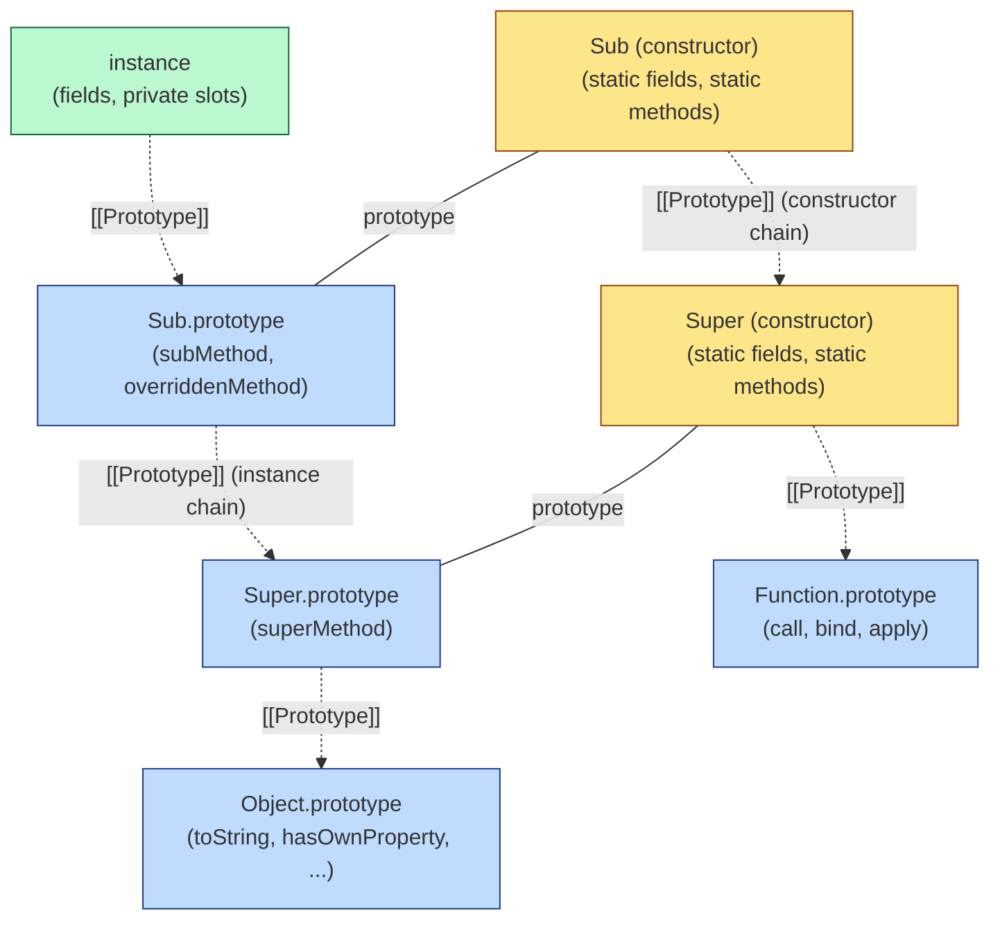
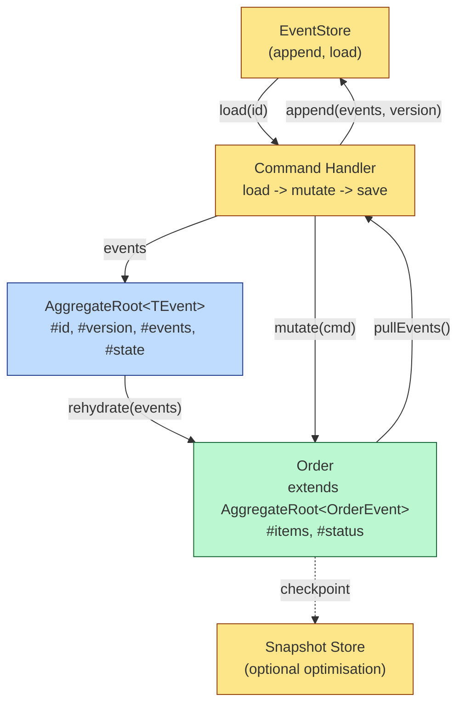

# 1.16 ES6 Classes Syntactic Sugar

## 1. Purpose

ES6 classes were introduced in ECMAScript 2015 (section 15.7 of the modern spec) to give JavaScript a dedicated, declarative syntax for the dominant pattern of the previous twenty years: the constructor function plus its `prototype` object. Before classes, every OO library in the ecosystem rolled its own variation of the same five lines: define a `function Foo`, hang methods off `Foo.prototype`, sometimes borrow from another constructor with `Foo.prototype = Object.create(Bar.prototype)`, remember to reset `Foo.prototype.constructor`, and so on. The pattern worked, but it was verbose, error-prone, and visually hostile to anyone coming from Java, C#, Python, or Ruby. Classes were added to fix that surface problem without changing the underlying object model.

But the TC39 committee was extremely deliberate about one thing: **classes do not introduce a new object model**. JavaScript did not become a class-based language in 2015. It remained a prototype-based language with a cleaner spelling of the prototype idiom. The spec is explicit: a `class` declaration desugars (at the spec level, conceptually) into a constructor function with a non-writable, non-enumerable `prototype` property whose methods are themselves non-enumerable. Underneath the syntax, the runtime machinery is identical to a hand-rolled constructor function. This is why the title of this note calls them "syntactic sugar" — and it is also why understanding prototypes ([[1.14 Prototypes and Inheritance]], [[1.15 Object Creation Patterns]]) is a strict prerequisite for understanding classes. The sugar hides nothing; it only abbreviates.

What classes DO add, beyond spell-check, is a small set of behaviours that constructor functions did not enforce:

- **Implicit strict mode.** The body of a class (and every method inside it) runs in strict mode, regardless of whether a `"use strict"` directive is present. You cannot opt out. This eliminates several legacy footguns silently.
- **Non-callable without `new`.** Calling a class as a regular function (`Foo()`) throws `TypeError: Class constructor Foo cannot be invoked without 'new'`. The `[[Call]]` internal slot is wired to throw; only `[[Construct]]` works. This kills the entire class of "forgot `new`" bugs that constructor functions silently caused.
- **Non-enumerable methods.** Methods defined in the class body are added to `Constructor.prototype` with `enumerable: false`. They will not show up in `for...in` loops or `Object.keys` output. With hand-rolled constructor functions, you had to remember `Object.defineProperty` to get the same behaviour.
- **Non-writable, non-configurable `prototype` property.** You cannot reassign `Foo.prototype = somethingElse` after the class is declared (it throws in strict mode). The prototype object itself is also non-enumerable. This hardens the constructor against accidental tampering.
- **`super` keyword.** Constructor functions had to call `Super.apply(this, arguments)` and reset the prototype chain manually. Classes give you `super(...)` and `super.method()`, statically resolved at parse time, that "just work."
- **Private fields with `#`.** Added later (ES2019/2022, fully), private fields finally give JavaScript true encapsulation. A `#x` field is not a property — it is a `[[PrivateFields]]` internal slot that lives only on instances of the exact class that declared it. It cannot be read or written from outside the class body, cannot be enumerated, cannot be accessed via `obj[key]`, and cannot be inspected by `Object.keys` or `for...in`. This is a runtime guarantee, not a documentation convention.

What classes do NOT add is also important. They do not add multiple inheritance (you can only `extend` one parent). They do not add interfaces (TypeScript adds those at compile time, but JS itself has no concept). They do not add abstract classes (TS has `abstract`; JS does not). They do not add method overloading (JS still dispatches by name only, not by signature). They do not add value types or structs. And they do not change the fact that `this` is still dynamically bound at call time — class methods still lose their `this` when detached, which is why arrow function class fields are a popular pattern (see [[1.12 Arrow Functions]]).

The private `#` field addition deserves special emphasis. For two decades, JavaScript had no real privacy. Conventions like prefixing a field name with a leading marker (the underscore-prefixed style used in many older codebases) were just naming hints; the field was still accessible. TypeScript's `private` modifier (covered later in this note) was similarly a compile-time hint that disappeared in the emitted JS. Closures inside constructors provided real privacy but at the cost of memory (each instance got its own closure) and lost prototype-sharing. WeakMaps gave real privacy per class (the field was a WeakMap entry keyed by instance) but were verbose. The `#` syntax finally gives the language true per-instance encapsulation that survives down the prototype chain and cannot be forged, faked, or bypassed. This is the one place where classes go beyond pure sugar.

In short: ES6 classes were added to make the dominant object-creation pattern declarative and safe, to make inheritance visually clear, and (later) to provide real private encapsulation. They were NOT added to turn JavaScript into Java. The smart developer reads a class declaration and sees, in their mind's eye, the constructor function and prototype object it desugars into.

## 2. Theory and Deep Dive

### 2.1 Spec reference

ECMAScript section 15.7 defines Class Definitions. The grammar recognises four kinds of element inside a class body:

- **Method definitions** — `methodName(args) { ... }` — placed on `Constructor.prototype` (instance methods) or on `Constructor` itself (static methods, when prefixed with `static`).
- **Field declarations** — `fieldName = expr;` (public) or `#fieldName = expr;` (private) — initialisers that run on each instance (or on the constructor itself, for static fields) during construction.
- **Static blocks** — `static { ... }` — arbitrary code that runs once, when the class definition is evaluated, with access to private members. Useful for complex static initialisation.
- **Accessor properties** — `get name() { ... }` and `set name(v) { ... }` — defined via `Object.defineProperty` on the prototype (or on the constructor for static accessors).

The body is parsed in **strict mode** regardless of file-level directive. The body is also parsed as if it were a special "class scope" that introduces a fresh lexical binding for the class name (visible inside the body, including in static initialisers and field initialisers).

### 2.2 Declaration vs expression

A **class declaration** is `class Foo { ... }`. A **class expression** is `const Foo = class [OptionalName] { ... }`. The declaration form introduces a binding at the enclosing scope (subject to TDZ, see 2.7). The expression form produces a value (the constructor function) that you can assign, pass, return, or immediately invoke.

Two non-obvious facts: class declarations are NOT hoisted the way function declarations are — they sit in the temporal dead zone until the declaration line is reached (see 2.7). And a class expression may have a name: `const Foo = class Foo { ... }` creates a class whose internal name is `Foo`, accessible inside the body for recursion but NOT in the enclosing scope. This mirrors named function expressions.

### 2.3 How the engine constructs an instance

When you write `new Foo(args)`, the engine does the following (ECMAScript 10.2.2 `[[Construct]]` and 10.1.13 `OrdinaryCreateFromConstructor`):

1. A new ordinary object is created.
2. Its `[[Prototype]]` internal slot is set to `Foo.prototype` (which is the object that holds the class's instance methods).
3. The constructor function (the special method named `constructor` in the class body) is invoked with `this` bound to the new object, `new.target` set to `Foo` (or to the most-derived constructor in an inheritance chain), and the arguments from `new`.
4. **For each public field declared in the class body, in declaration order, the field initialiser is evaluated and the field is set on `this`.** This happens either before or after the `super()` call, depending on whether the class extends another class — see 2.5.
5. For each private field declared in the class body, a `[[PrivateFields]]` slot is added to `this`. The initialiser runs in declaration order.
6. The constructor returns. If it returns an object, that object is returned (and `this` is discarded); otherwise `this` is returned. This matches constructor function semantics.

If the class `extends` a parent, step 3 is replaced with: call `super(args)`, which runs the parent's `[[Construct]]` and produces the `this` object for the child. The child must call `super()` before accessing `this`. See 2.5.

### 2.4 Field declaration semantics

Public fields are sugar for assignment in the constructor. `class Foo { x = 5; }` is roughly equivalent to `class Foo { constructor() { this.x = 5; } }`. But there are two differences:

- Field initialisers are evaluated **in declaration order**, before the body of the constructor (after `super()` if applicable). Mixing field declarations with constructor body assignments means fields go first.
- Field initialisers have access to `this` (already bound) AND to the class name (so they can call static methods, reference the class itself, etc.).

Private fields are different. `#x = 5` does not set a property on `this`. It adds a slot to the instance's `[[PrivateFields]]` internal list. The slot has a name (a Private Name) that is unique to the class that declared it. The slot is not a property; it does not show up in `Object.keys`, `Object.getOwnPropertyNames`, `Reflect.ownKeys`, or `for...in`. It cannot be accessed by `this[key]` even if `key === '#x'` (you can't even type that — `#x` is a token, not a string). It can only be referenced lexically inside the class body that declared it.

Private fields also have an existence check: `#x in obj` returns `true` only if `obj` is an instance of the class that declared `#x` (or a subclass thereof, but only if the subclass's super-constructor actually added the slot — see inheritance). This is the only way to introspect private fields from outside the class body, and it only gives a boolean.

Static fields work the same way, but on the constructor itself: `static x = 5` sets `Foo.x = 5`. `static #x = 5` adds a private slot to the constructor function object. Static fields run during class evaluation, not during construction.

### 2.5 Inheritance and the dual prototype chain

`class Sub extends Super { ... }` does two things, both at class evaluation time:

1. It sets the `[[Prototype]]` internal slot of `Sub.prototype` to `Super.prototype` (equivalently, `Object.setPrototypeOf(Sub.prototype, Super.prototype)`). This is the **instance chain**: instances of `Sub` will inherit from `Sub.prototype`, which inherits from `Super.prototype`, which inherits from `Object.prototype`. So instance methods defined on `Super` are visible on instances of `Sub`.
2. It sets the `[[Prototype]]` internal slot of `Sub` (the constructor function itself) to `Super` (equivalently, `Object.setPrototypeOf(Sub, Super)`). This is the **constructor chain**: static methods and static fields defined on `Super` are visible on `Sub` as `Sub.staticMethod()`. Without this second link, statics would NOT inherit — a common point of confusion for people coming from languages where statics don't inherit at all.

Both links are set up by the spec via `Object.setPrototypeOf(Sub.prototype, Super.prototype)` and `Object.setPrototypeOf(Sub, Super)`. Both are required.

When you write `new Sub()`:

1. The engine creates a new object whose `[[Prototype]]` is `Sub.prototype`.
2. `Sub`'s constructor is invoked. Inside, `this` is initially uninitialised.
3. The constructor calls `super()`. This invokes `Super`'s `[[Construct]]`, which creates the actual instance (with `[[Prototype]]` still being `Sub.prototype` — the prototype chain was set up before construction began), runs `Super`'s field initialisers, runs `Super`'s constructor body, and returns the now-initialised `this`.
4. Back in `Sub`'s constructor, `this` is now bound. `Sub`'s field initialisers run, then `Sub`'s constructor body runs.
5. The instance is returned.

If `Sub` has no explicit constructor, the spec synthesises one: `constructor(...args) { super(...args); }`. If `Sub` has an explicit constructor but forgets to call `super()`, accessing `this` throws `ReferenceError: Must call super constructor in derived class before accessing 'this'`. Returning early without calling `super()` and without returning an object also throws (if `this` is referenced after the implicit return).

`super.method()` (in instance methods) does NOT walk the prototype of `this`. It walks the `[[Prototype]]` of the method's `[[HomeObject]]`, where `[[HomeObject]]` is a slot attached to each method that records which class's prototype the method was defined on. So if `Sub` overrides `method`, and `Sub.method` calls `super.method()`, the engine resolves `super` to the `[[Prototype]]` of `Sub.prototype`, which is `Super.prototype.method`. This is statically determined at parse time — it has nothing to do with the runtime value of `this`. This is why `super` works correctly even when methods are borrowed or called on instances of unrelated classes.

`super.staticMethod()` (in static methods) similarly walks the constructor chain: `[[HomeObject]]` for a static method is the constructor function itself, so `super` resolves to the `[[Prototype]]` of `Constructor`, which is the parent constructor.

### 2.6 `new.target`

`new.target` is a meta-property, not a keyword. It is a reference to the constructor that was actually invoked with `new`. In a base class constructor, `new.target` is the constructor itself. In a parent class constructor called via `super()` from a child, `new.target` is the child constructor (because the child was what `new` was called on). In a function called without `new`, `new.target` is `undefined`.

This is useful for:

- Detecting abstract-ish base classes: `if (new.target === Base) throw new TypeError('Base is abstract')`.
- Branching on the actual instantiated type.
- Implementing callable-without-`new` legacy functions: in pre-class code, you could check `new.target === undefined` and `return new Foo(...args)` to auto-`new`.

### 2.7 Hoisting and the TDZ

Class declarations are hoisted in the binding sense — the binding exists from the start of the scope — but they live in the temporal dead zone (TDZ) until the declaration line is reached. Accessing the class name before its declaration throws `ReferenceError`.

This is the same TDZ rule that applies to `let` and `const`. It is NOT the same as function declarations, which are fully hoisted and usable before their declaration line. The reasoning: classes have initialisation side effects (evaluating `extends`, static fields, static blocks) that must run in source order, and there is no safe "default value" the way there is for `function` (which is just the function object).

Class expressions are not hoisted at all; they are evaluated where they appear, like any other expression.

### 2.8 Computed member names

Inside a class body, you can use computed names: `[methodName]() { ... }`, `[fieldName] = expr`, `get [propName]()`, `static [name]()`. The expression inside `[]` is evaluated at class definition time (in source order, in the class scope) and the result is coerced to a string (or kept as a Symbol if it is one).

This enables patterns like:

- Symbol-keyed methods: `[Symbol.iterator]() { ... }` makes a class iterable.
- Property-name-from-constant: `[EVENTNAME]() { ... }` where `EVENTNAME` is defined elsewhere as a const string.
- Runtime-dispatched method names: not common, but possible.

Private fields CANNOT be computed. `#x` is a fixed token, not a string. There is no `[privateName]` syntax. This is by design — private names are spec-level Private Name objects, not property keys.

### 2.9 How classes desugar to ES5

Given a class:

```javascript
class Point {
  static origin = new Point(0, 0);
  #label = 'point';
  constructor(x, y) { this.x = x; this.y = y; }
  get magnitude() { return Math.hypot(this.x, this.y); }
  toString() { return `${this.#label}(${this.x},${this.y})`; }
  static fromArray(arr) { return new Point(arr[0], arr[1]); }
}
```

The conceptual ES5 desugaring (with limitations — see below) is an IIFE-wrapped strict-mode constructor function, with methods attached via `Object.defineProperty` (to keep them non-enumerable), with static members attached to the constructor, and with the constructor's `prototype` property made non-writable. Private field declarations become WeakMap-based or `PrivateName`-record slots that do not exist as ES5 properties. The desugaring is conceptual, not literal — the actual spec uses internal slots and PrivateName records. But it captures the shape: a wrapped constructor with non-enumerable methods, static members on the constructor, and a non-writable `prototype`.

The private field part CANNOT be polyfilled in ES5 exactly. Pre-private-field libraries (WeakMap-based) approximate it: `var labelMap = new WeakMap(); labelMap.set(this, 'point');` — but the WeakMap approach is per-class, leaks weakly, and is observable through the WeakMap itself. The `#` syntax is the only true privacy.

### 2.10 Mermaid: the dual prototype chain set up by `extends`



The two solid horizontal links (`Sub.prototype` and `Super.prototype`) are non-writable references from the constructor to its prototype object. The two dotted `[[Prototype]]` arrows on the left are the instance chain (visible via `Object.getPrototypeOf(Object.getPrototypeOf(instance))`); the two on the right are the constructor chain (visible via `Object.getPrototypeOf(Sub) === Super`). Both chains are required for inheritance to work correctly, and both are set up by `extends`.

## 3. Mental Models

**Mental model 1: "A class is a constructor function with a style guide."**

When you write `class Foo { ... }`, the engine produces exactly the same kind of constructor function object that `function Foo() {}` produces. It has a `prototype` property pointing to a prototype object. Methods in the class body are properties of that prototype object. Static methods are properties of the constructor function. The `new Foo()` operator does the same thing in both cases: allocate, set `[[Prototype]]`, call constructor with `this`, return.

The class syntax simply enforces a stricter, more declarative style guide: methods are non-enumerable by default, the constructor is non-callable without `new`, the prototype is non-writable, the body is strict-mode. The desugaring in section 2.9 is the proof.

**Mental model 2: "A private field is a slot, not a property."**

The name `#x` looks like a property name, but it isn't. It is a Private Name — a spec-level record that exists in the scope of one class. When you write `this.#x`, the engine resolves `#x` lexically (it must be declared in the current class body), checks whether `this` has the corresponding slot, and either reads/writes it or throws `TypeError: Cannot read/write private member #x from an object whose class did not declare it`. There is no `obj['#x']` form. There is no `Object.keys` enumeration. There is no `Reflect.get`. The slot is invisible to property reflection.

This means private fields are accessible ONLY from within the lexical class body that declares them. Subclasses cannot access parent private fields directly — they must go through methods. This is a hard, runtime, spec-level guarantee. It is the only true privacy in the language.

**Mental model 3: "`extends` sets up two chains."**

When you write `class Sub extends Super`, two prototype links are established:

1. The `[[Prototype]]` of `Sub.prototype` is set to `Super.prototype` — so instances of `Sub` inherit instance methods from `Super`.
2. The `[[Prototype]]` of `Sub` (the constructor function) is set to `Super` — so `Sub` inherits static methods from `Super`.

Both links matter. Forget the first and instances don't inherit methods. Forget the second (which the spec never forgets, but hand-rolled inheritance sometimes did) and statics don't inherit. In practice, the spec always sets up both, so the mistake is rare — but understanding why both exist is the key to understanding how `super.staticMethod()` resolves.

**Mental model 4: "`super.method()` is statically resolved, not dynamically dispatched."**

When the engine parses a method that contains `super.method()`, it attaches a `[[HomeObject]]` slot to that method pointing at the prototype object the method was defined on. At call time, `super` is resolved as `[[HomeObject]].[[Prototype]]` — that is, one step up the prototype chain from where the method was *defined*, NOT one step up from `this`'s prototype chain.

This distinction matters when a method is borrowed or when the prototype chain has been tampered with. `super.method()` always refers to the parent of the class that defined the current method, full stop. This is what makes `super` predictable.

**Mental model 5: "TypeScript access modifiers are documentation, not enforcement."**

TypeScript's `public`, `private`, `protected`, and `readonly` modifiers are compile-time hints. They cause type errors if you violate them, but they emit ZERO runtime code. A TS `private` field compiles to a normal public JS field. A TS `protected` field compiles to a normal public JS field. Anyone with a reference to the instance can read or write them at runtime. This is why TS `private` is sometimes called "soft private."

The `#` syntax, by contrast, is "hard private" — runtime-enforced by the engine, accessible only from the declaring class body. TS understands `#` too (since TS 3.8) and will type-check it correctly, but the runtime behaviour comes from JS, not TS.

Use TS `private`/`protected` when you want to communicate intent and get compile-time errors. Use `#` when you need real encapsulation that survives at runtime (e.g., library code that must not be tampered with, security-sensitive fields, invariants that must hold).

## 4. Real-World Use Cases

**Node.js streams.** Every stream class (`Readable`, `Writable`, `Duplex`, `Transform`) is an ES6 class extending `EventEmitter` (which itself is a class in modern Node). Custom stream implementations subclass these and override the implementation hook methods (the underscore-prefixed methods from the Node stream API, such as the read, write, and transform hooks). The `extends EventEmitter` line is the dual-chain link that gives every stream its `.on()`, `.emit()`, `.once()` methods.

**Angular.** Angular's entire component model is class-based. Components are `@Component`-decorated classes, services are `@Injectable`-decorated classes, directives are `@Directive`-decorated classes. Dependency injection is constructor-injected. The framework leans heavily on TypeScript's `public`, `private`, `protected`, and `readonly` to express component API surfaces.

**NestJS.** Controllers, providers, modules, gateways, interceptors, guards, pipes — all classes. The DI container instantiates them via `new`. Inheritance is common (`BaseController<T>`, `BaseEntity`). TypeScript `protected` is heavily used to expose internal hooks to subclasses without making them public API.

**TypeORM.** Entities are classes. Columns are decorated properties (`@Column`, `@PrimaryGeneratedColumn`). Relations are decorated properties (`@OneToMany`, `@ManyToOne`). The library reads the class's metadata (via `reflect-metadata`) and generates SQL. The class is the source of truth for the schema.

**React class components.** Legacy but still present. `class MyComponent extends React.Component` with `render()`, `componentDidMount()`, `setState()`. Hooks have largely replaced this pattern, but class components are not deprecated and remain in libraries like `react-error-boundary` for their lifecycle guarantees.

**Custom elements.** `class MyElement extends HTMLElement { connectedCallback() { ... } }` is the standard Web Components pattern. The browser calls `new MyElement()` (it must be constructible) and then invokes lifecycle callbacks. Subclassing built-in elements (`extends HTMLButtonElement`) is also supported, with `customElements.define('my-button', MyButton, { extends: 'button' })`.

**Error subclasses.** Every serious Node.js codebase has `class AppError extends Error`, `class ValidationError extends AppError`, `class AuthError extends AppError`. This lets you do `if (err instanceof ValidationError)` in error handlers. The tricky bit is preserving the stack trace across the `extends Error` boundary — see Section 9.3.

**State machines and domain entities.** DDD-style aggregate roots are often classes: `class Order { #id; #status; #events; apply(event) { ... } }`. Private fields hold the invariant-protected state. Methods mutate state and emit events. Static factory methods (`Order.create(cart)`) and rehydration methods (`Order.rehydrate(events)`) reconstruct aggregates from event streams. This is the mini-project blueprint in Section 10.

**Plugin systems.** Many plugin systems define an abstract-ish base class (`class Plugin { init() {} destroy() {} }`) that plugins extend. The host does `if (plugin instanceof Plugin)` for safety, calls lifecycle methods, and relies on TS `abstract` (in TS codebases) to force plugin authors to implement required methods.

**Iterables and async iterables.** Implementing `[Symbol.iterator]() { ... }` or `[Symbol.asyncIterator]() { ... }` on a class makes it work with `for...of` and `for await...of`. Generators inside class methods are natural for this. Computed method names are essential here.

## 5. Code Examples

### 5.1 Example A — Minimal and Conceptual

A minimal class with a public field, a private field, a static method, and a getter. Side-by-side JS and TS.

**JavaScript:**

```javascript
class Counter {
  static initialCount = 0;
  #count;
  #step;

  constructor(start = Counter.initialCount, step = 1) {
    this.#count = start;
    this.#step = step;
  }

  get value() {
    return this.#count;
  }

  get step() {
    return this.#step;
  }

  increment() {
    this.#count += this.#step;
    return this.#count;
  }

  reset() {
    this.#count = Counter.initialCount;
  }

  static create() {
    return new Counter();
  }
}

const c = new Counter(10, 5);
console.log(c.increment()); // 15
console.log(c.value);       // 15
console.log(c.step);        // 5
c.reset();
console.log(c.value);       // 0
console.log(Counter.initialCount); // 0
console.log(Counter.create() instanceof Counter); // true
console.log('#count' in c); // SyntaxError: you cannot even write this
```

**TypeScript:**

```typescript
class Counter {
  static readonly initialCount: number = 0;
  readonly #count: number;
  readonly #step: number;

  constructor(start: number = Counter.initialCount, step: number = 1) {
    this.#count = start;
    this.#step = step;
  }

  get value(): number {
    return this.#count;
  }

  get step(): number {
    return this.#step;
  }

  increment(): number {
    // TS will complain about #count being readonly; remove `readonly` to mutate.
    // See production example for the right pattern.
    return this.#count + this.#step;
  }

  reset(): void {
    // Cannot reassign readonly #count here.
    // In production you would not mark #count readonly.
  }

  static create(): Counter {
    return new Counter();
  }
}

const c: Counter = new Counter(10, 5);
console.log(c.increment());
console.log(c.value);
```

Notes on the TS version: `readonly` on a private field is rarely what you want for mutable state — this example demonstrates the syntax. In production (Section 5.2) we use `readonly` only on truly immutable fields (like an assigned-once ID).

### 5.2 Example B — Production-Grade

A typed `BaseEntity` class with a `#id` private field, a static `create()` factory, an inherited `Repository` subclass, and full error handling. Side-by-side JS and TS.

**JavaScript:**

```javascript
class BaseEntity {
  #id;
  #createdAt;
  #version;

  static #idCounter = 0;
  static #generateId() {
    return ++BaseEntity.#idCounter;
  }

  constructor(id, createdAt = new Date()) {
    if (id !== undefined && (typeof id !== 'string' || id.length === 0)) {
      throw new TypeError('id must be a non-empty string');
    }
    this.#id = id ?? `auto-${BaseEntity.#generateId()}`;
    this.#createdAt = createdAt;
    this.#version = 1;
  }

  get id() {
    return this.#id;
  }

  get createdAt() {
    return this.#createdAt;
  }

  get version() {
    return this.#version;
  }

  bumpVersion() {
    this.#version += 1;
    return this.#version;
  }

  toJSON() {
    return {
      id: this.#id,
      createdAt: this.#createdAt.toISOString(),
      version: this.#version,
    };
  }

  static create(payload) {
    if (payload === null || typeof payload !== 'object') {
      throw new TypeError('payload must be an object');
    }
    const instance = new this(payload.id, payload.createdAt ? new Date(payload.createdAt) : undefined);
    if (payload.version && typeof payload.version === 'number') {
      Object.defineProperty(instance, '#version', { value: payload.version });
      // This throws! #version is a private slot, not a property.
      // The correct way: add a protected-ish setter method on the base class.
    }
    return instance;
  }
}

class Repository {
  #store = new Map();
  #entityClass;

  constructor(entityClass) {
    if (typeof entityClass !== 'function' || !entityClass.prototype) {
      throw new TypeError('entityClass must be a constructor');
    }
    this.#entityClass = entityClass;
  }

  add(entity) {
    if (!(entity instanceof this.#entityClass)) {
      throw new TypeError(`entity must be a ${this.#entityClass.name}`);
    }
    this.#store.set(entity.id, entity);
    return entity;
  }

  get(id) {
    return this.#store.get(id) ?? null;
  }

  all() {
    return [...this.#store.values()];
  }

  remove(id) {
    return this.#store.delete(id);
  }

  static for(entityClass) {
    return new Repository(entityClass);
  }
}

class User extends BaseEntity {
  #email;
  #name;

  constructor({ id, name, email, createdAt, version } = {}) {
    super(id, createdAt);
    if (!email || !email.includes('@')) throw new TypeError('invalid email');
    if (!name) throw new TypeError('name required');
    this.#email = email;
    this.#name = name;
  }

  get email() { return this.#email; }
  get name() { return this.#name; }

  toJSON() {
    return { ...super.toJSON(), email: this.#email, name: this.#name };
  }

  static create(payload) {
    return new User(payload);
  }
}

const repo = Repository.for(User);
const u = User.create({ id: 'u-1', name: 'Ada', email: 'ada@example.com' });
repo.add(u);
console.log(repo.get('u-1').toJSON());
console.log(u instanceof BaseEntity); // true
console.log(u instanceof User);        // true
console.log(User.create === User.create); // true (sanity)
```

**TypeScript:**

```typescript
interface BaseEntityPayload {
  id?: string;
  createdAt?: string | Date;
  version?: number;
}

interface BaseEntitySnapshot {
  id: string;
  createdAt: string;
  version: number;
}

abstract class BaseEntity {
  readonly #id: string;
  readonly #createdAt: Date;
  #version: number;

  private static idCounter: number = 0;
  private static generateId(): string {
    return `auto-${++BaseEntity.idCounter}`;
  }

  constructor(id: string | undefined, createdAt: Date = new Date()) {
    if (id !== undefined && (typeof id !== 'string' || id.length === 0)) {
      throw new TypeError('id must be a non-empty string');
    }
    this.#id = id ?? BaseEntity.generateId();
    this.#createdAt = createdAt;
    this.#version = 1;
  }

  get id(): string { return this.#id; }
  get createdAt(): Date { return this.#createdAt; }
  get version(): number { return this.#version; }

  protected setVersion(v: number): void {
    if (v < 1) throw new RangeError('version must be >= 1');
    this.#version = v;
  }

  bumpVersion(): number {
    this.#version += 1;
    return this.#version;
  }

  toJSON(): BaseEntitySnapshot {
    return {
      id: this.#id,
      createdAt: this.#createdAt.toISOString(),
      version: this.#version,
    };
  }

  static create<T extends BaseEntity>(this: new (payload: BaseEntityPayload) => T, payload: BaseEntityPayload): T {
    const instance = new this(payload.id, payload.createdAt ? new Date(payload.createdAt) : undefined);
    if (typeof payload.version === 'number' && payload.version >= 1) {
      // setVersion is protected, but accessible inside the class hierarchy.
      // From a static method on the base class, we need a cast.
      (instance as BaseEntity & { setVersion(v: number): void }).setVersion(payload.version);
    }
    return instance;
  }
}

interface Repository<T extends BaseEntity> {
  add(entity: T): T;
  get(id: string): T | null;
  all(): T[];
  remove(id: string): boolean;
}

class Repository<T extends BaseEntity> {
  private readonly store: Map<string, T> = new Map();
  private readonly entityClass: new (...args: any[]) => T;

  constructor(entityClass: new (...args: any[]) => T) {
    this.entityClass = entityClass;
  }

  add(entity: T): T {
    if (!(entity instanceof this.entityClass)) {
      throw new TypeError(`entity must be a ${this.entityClass.name}`);
    }
    this.store.set(entity.id, entity);
    return entity;
  }

  get(id: string): T | null {
    return this.store.get(id) ?? null;
  }

  all(): T[] {
    return [...this.store.values()];
  }

  remove(id: string): boolean {
    return this.store.delete(id);
  }

  static for<TT extends BaseEntity>(entityClass: new (...args: any[]) => TT): Repository<TT> {
    return new Repository<TT>(entityClass);
  }
}

interface UserPayload extends BaseEntityPayload {
  name: string;
  email: string;
}

interface UserSnapshot extends BaseEntitySnapshot {
  name: string;
  email: string;
}

class User extends BaseEntity {
  readonly #email: string;
  readonly #name: string;

  constructor({ id, name, email, createdAt, version }: UserPayload) {
    super(id, createdAt ? new Date(createdAt) : undefined);
    if (!email || !email.includes('@')) throw new TypeError('invalid email');
    if (!name) throw new TypeError('name required');
    this.#email = email;
    this.#name = name;
    if (typeof version === 'number' && version >= 1) {
      this.setVersion(version);
    }
  }

  get email(): string { return this.#email; }
  get name(): string { return this.#name; }

  override toJSON(): UserSnapshot {
    return { ...super.toJSON(), email: this.#email, name: this.#name };
  }

  static override create(payload: UserPayload): User {
    return new User(payload);
  }
}

const repo: Repository<User> = Repository.for(User);
const u: User = User.create({ id: 'u-1', name: 'Ada', email: 'ada@example.com' });
repo.add(u);
console.log(repo.get('u-1')?.toJSON());
console.log(u instanceof BaseEntity);
console.log(u instanceof User);
```

Key things to notice in the TS version:

- `abstract class BaseEntity` prevents direct instantiation (`new BaseEntity(...)` is a compile error).
- `readonly` on private fields enforces "assign once, in the constructor."
- `protected setVersion` is the workaround for "I want subclasses to set version, but not external code." In JS, this is enforced only by convention; in TS, the compiler enforces it.
- `static create<T extends BaseEntity>(this: new (payload) => T, ...)` uses the polymorphic `this` pattern so `User.create` returns `User`, not `BaseEntity`. This is a powerful TS trick for typed factories.
- `override toJSON()` and `override static create` use the `override` keyword (TS 4.3+) to fail loudly if the parent class renames or removes the method. Without `override`, a parent rename would silently make the child's method a no-op override.
- `Repository<T extends BaseEntity>` is a generic class; the type parameter is preserved through `static for`.

## 6. Common Mistakes and Anti-Patterns

### 6.1 Forgetting `super()` in a subclass constructor

```javascript
class Animal {
  constructor(name) { this.name = name; }
}
class Dog extends Animal {
  constructor(name, breed) {
    // Forgot super(name)
    this.breed = breed;
  }
}
new Dog('Rex', 'labrador');
```

**Why it fails:** Accessing `this` before `super()` throws `ReferenceError: Must call super constructor in derived class before accessing 'this' or returning from derived constructor`. The engine refuses to give you a `this` reference until the parent has been constructed, because the parent's field initialisers (including private slots) need to be set up first.

**Fix:**

```javascript
class Dog extends Animal {
  constructor(name, breed) {
    super(name);
    this.breed = breed;
  }
}
```

### 6.2 Accessing `this` before `super()`

```javascript
class Base {
  constructor(x) { this.x = x; }
}
class Sub extends Base {
  constructor(x, y) {
    this.y = y;  // throws here
    super(x);
  }
}
```

**Why it fails:** Same reason. The TDZ for `this` extends from the start of the constructor body to the `super()` call. Any `this` reference (including `this.y = y`) inside that window throws.

**Fix:**

```javascript
class Sub extends Base {
  constructor(x, y) {
    super(x);
    this.y = y;
  }
}
```

### 6.3 Thinking TypeScript `private` is runtime-private

```typescript
class Wallet {
  private balance: number;
  constructor(initial: number) { this.balance = initial; }
}
const w = new Wallet(100);
// TS prevents this in TS code:
// w.balance = 0; // Error: 'balance' is private.
// But at runtime, the emitted JS is:
// class Wallet { constructor(initial) { this.balance = initial; } }
// And from plain JS code, or via reflection:
console.log(w.balance); // 100 — completely visible at runtime!
w.balance = 0;
console.log(w.balance); // 0 — completely writable at runtime!
```

**Why it fails:** TS `private` is a compile-time hint. It emits nothing. The field is a normal own property.

**Fix:** Use `#` for real runtime privacy:

```typescript
class Wallet {
  #balance: number;
  constructor(initial: number) { this.#balance = initial; }
  get balance(): number { return this.#balance; }
  debit(amount: number): void {
    if (amount > this.#balance) throw new RangeError('insufficient');
    this.#balance -= amount;
  }
}
const w = new Wallet(100);
// w.#balance = 0;  // SyntaxError: private field outside class
// w.balance = 0;   // TypeError: readonly getter (no setter)
```

### 6.4 Accessing a private field from outside its declaring class

```javascript
class A {
  #secret = 'A';
  reveal() { return this.#secret; }
}
class B extends A {
  peek() { return this.#secret; } // SyntaxError
}
```

**Why it fails:** `#secret` is lexically scoped to class `A`'s body. Subclasses cannot see it. Even though `B` instances have the `#secret` slot (because `A`'s constructor ran), the only way to read it from `B` is through `A`'s public methods.

**Fix:** Add a `protected`-style accessor on the base class:

```javascript
class A {
  #secret = 'A';
  reveal() { return this.#secret; }
  protectedSecret() { return this.#secret; } // acts as protected
}
class B extends A {
  peek() { return this.protectedSecret(); }
}
```

In TypeScript you can use the `protected` modifier on a method (or on a regular `private`-ish property — though `protected` properties are still public at runtime, like `private`):

```typescript
class A {
  protected secret: string = 'A';
}
class B extends A {
  peek() { return this.secret; }
}
```

### 6.5 `extends null` creating objects with no prototype

```javascript
class NullExtending extends null {
  constructor() {
    // super() would call null, which throws.
    // But without super(), this is also uninitialized.
    // The trick is to manually create the instance:
    return Object.create(new.target.prototype);
  }
}
const n = new NullExtending();
console.log(Object.getPrototypeOf(n) === NullExtending.prototype); // true
console.log(Object.getPrototypeOf(NullExtending.prototype));       // null
console.log(n.toString); // undefined — no Object.prototype methods!
```

**Why it fails (well, surprises):** `extends null` makes the `[[Prototype]]` of `NullExtending.prototype` equal to `null`. Instances therefore have NO `Object.prototype` methods — no `toString`, no `hasOwnProperty`, no `valueOf`. You also cannot call `super()` (there is no parent constructor). You must manually `Object.create(new.target.prototype)` and return it from the constructor.

This pattern is rarely what you want. It is used in library internals to create "pure dictionary" objects, but it is footgun-prone.

**Fix:** Don't `extends null` unless you really mean it. If you want a clean object, use `Object.create(null)`. If you want a class hierarchy, `extends Object` or no `extends` at all.

### 6.6 Static methods not inheriting when rolling your own prototype link

```javascript
function OldBase() {}
OldBase.staticMethod = function () { return 'static'; };

function OldSub() {}
OldSub.prototype = Object.create(OldBase.prototype); // instance chain only!
OldSub.prototype.constructor = OldSub;

OldSub.staticMethod(); // TypeError: not a function
```

**Why it fails:** Hand-rolled inheritance sets up the instance chain (the `[[Prototype]]` of `Sub.prototype` is set to `Super.prototype`) but forgets the constructor chain (the `[[Prototype]]` of `Sub` itself is not set to `Super`). Static methods live on the constructor function, not on the prototype object, so they don't inherit.

**Fix:**

```javascript
Object.setPrototypeOf(OldSub, OldBase); // constructor chain
OldSub.prototype = Object.create(OldBase.prototype); // instance chain
OldSub.prototype.constructor = OldSub;

OldSub.staticMethod(); // 'static'
```

Or just use classes:

```javascript
class OldBase { static staticMethod() { return 'static'; } }
class OldSub extends OldBase {}
OldSub.staticMethod(); // 'static' — both chains set up automatically.
```

### 6.7 Overriding `toString` without `Symbol.toStringTag`

```javascript
class Money {
  constructor(cents) { this.cents = cents; }
  toString() { return `$${(this.cents / 100).toFixed(2)}`; }
  get [Symbol.toStringTag]() { return 'Money'; }
}
const m = new Money(1050);
console.log(`${m}`);                                  // "$10.50" — toString called
console.log(Object.prototype.toString.call(m));       // "[object Money]" — needs Symbol.toStringTag
```

**Why it surprises:** `toString` on the prototype is called by template literals and string concatenation, but `Object.prototype.toString` (used by some debuggers and `Symbol.toStringTag`-aware code) calls the *internal* tag. To change the latter, you must set `Symbol.toStringTag` (as shown above). Without it, `Object.prototype.toString.call(m)` returns `"[object Object]"` regardless of your `toString` override.

### 6.8 Using class methods as callbacks without binding

```javascript
class Timer {
  constructor() { this.count = 0; }
  tick() { this.count += 1; console.log(this.count); }
}
const t = new Timer();
setTimeout(t.tick, 100); // NaN, NaN, NaN — `this` is the global object (or undefined in strict)
```

**Why it fails:** `t.tick` is a detached method reference. When `setTimeout` calls it, `this` is `undefined` (strict mode) or `globalThis` (sloppy). `this.count += 1` creates a `count` property on the global object (or throws if strict) and reads `undefined`, leading to `NaN`.

**Fix:**

```javascript
setTimeout(t.tick.bind(t), 100);
// or
setTimeout(() => t.tick(), 100);
// or use a class field (arrow function bound at construction):
class Timer {
  count = 0;
  tick = () => { this.count += 1; console.log(this.count); };
}
setTimeout(t.tick, 100); // works — tick is an arrow bound to the instance
```

The class field arrow approach costs one function object per instance (so memory overhead is per-instance, not per-class), but it is the cleanest pattern for React-style callback props. See [[1.11 This Keyword Binding]] and [[1.12 Arrow Functions]].

## 7. Best Practices and Design Patterns

**1. Use `#` for true privacy, TS `private`/`protected` for documentation.**

`#` gives runtime enforcement. TS modifiers give compile-time enforcement and communicate intent. They are not mutually exclusive: in TS code, use `#` for fields that must not be tampered with at runtime (invariants, security-sensitive data, internal state), and `private`/`protected` for fields that are just implementation details but don't need runtime protection.

```typescript
class Account {
  #balance: number;             // hard private — runtime enforced
  private readonly id: string;  // soft private — compile-time hint
  protected log: Logger;        // soft protected — visible to subclasses
  public name: string;          // public API
}
```

**2. Prefer class field declarations over constructor-assigned fields.**

```typescript
// Prefer
class Foo {
  private readonly x: number = 10;
  private readonly y: string = 'default';
  constructor() { /* ... */ }
}

// Over
class Foo {
  private readonly x: number;
  private readonly y: string;
  constructor() {
    this.x = 10;
    this.y = 'default';
  }
}
```

Field declarations are visually grouped at the top of the class, separate from constructor logic. They make the class's state obvious at a glance. They run before the constructor body (so they're available immediately), and they support initialiser expressions that have access to constructor parameters... wait, no — field initialisers do NOT have access to constructor parameters. If you need a parameter to initialise a field, you must assign it in the constructor. So this rule has an exception.

The exception: when an initial value depends on a constructor parameter, assign in the constructor. When the initial value is a constant or `new.target`-independent, use a field declaration.

**3. Use static factory methods when construction has multiple paths or needs polymorphism.**

```typescript
class Point {
  constructor(public readonly x: number, public readonly y: number) {}
  static fromCartesian(x: number, y: number): Point { return new Point(x, y); }
  static fromPolar(r: number, theta: number): Point {
    return new Point(r * Math.cos(theta), r * Math.sin(theta));
  }
  static fromString(s: string): Point {
    const [x, y] = s.split(',').map(Number);
    return new Point(x, y);
  }
}
```

Factories give you named construction paths (instead of overloads), can return subclasses, can return cached instances, and can do validation that throws before `new` allocates. The polymorphic `this` trick (`static create(this: new (...) => T, ...): T`) makes factories type-preserving across subclasses.

**4. Use `abstract` in TypeScript for partial implementations.**

```typescript
abstract class Shape {
  abstract area(): number;
  abstract perimeter(): number;
  describe(): string {
    return `Shape with area ${this.area()} and perimeter ${this.perimeter()}`;
  }
}
class Circle extends Shape {
  constructor(public readonly radius: number) { super(); }
  area() { return Math.PI * this.radius ** 2; }
  perimeter() { return 2 * Math.PI * this.radius; }
}
new Shape(); // TS error: cannot create instance of abstract class
```

`abstract` is TS-only — JS has no equivalent. It enforces that subclasses implement required methods (compile-time error if they don't) and prevents direct instantiation of the base class.

**5. Use the `override` keyword (TS 4.3+) for safety.**

```typescript
class Base { greet() { return 'hi'; } }
class Sub extends Base {
  override greet() { return `${super.greet()}!`; } // OK
  override wave() { } // TS error: method does not exist on base class
}
```

Without `override`, if you rename `greet` on `Base` to `sayHi`, `Sub.greet` becomes a no-op. With `override`, you get a clear compile error. Enable `noImplicitOverride` in `tsconfig.json` to make it mandatory.

**6. Don't override `toString` without also setting `Symbol.toStringTag`.**

Overriding `toString` changes template-literal behaviour, which is usually what you want. But `Object.prototype.toString.call(instance)` ignores `toString` and reads the internal tag instead — set `Symbol.toStringTag` to control it. See Section 6.7.

**7. Don't subclass `Array`, `Promise`, `Map`, `Set`, or `RegExp` for production code without knowing the edge cases.**

These have exotic behaviours (length-tracking on `Array`, thenable handling on `Promise`, internal slots on `Map`/`Set`). Subclass `Error`, subclass `HTMLElement`, subclass your own classes — but prefer composition (wrapping) for the exotic built-ins. See [[1.18 Mixins and Composition]].

**8. Use static blocks for complex static initialisation.**

```javascript
class Config {
  static #loaded = false;
  static #values = {};
  static {
    try {
      const raw = fs.readFileSync('/etc/app/config.json', 'utf8');
      Config.#values = JSON.parse(raw);
      Config.#loaded = true;
    } catch (e) {
      Config.#values = {};
      Config.#loaded = false;
    }
  }
  static get(key) { return Config.#values[key]; }
  static get loaded() { return Config.#loaded; }
}
```

Static blocks run once at class evaluation time, in source order, with full access to private static fields. They are cleaner than IIFEs or `Object.assign(Class, { ... })` for complex setup.

**9. Preserve stack traces when subclassing `Error`.**

```javascript
class AppError extends Error {
  constructor(message, { cause } = {}) {
    super(message, { cause });
    this.name = new.target.name; // 'AppError' or the subclass name
    if (Error.captureStackTrace) {
      Error.captureStackTrace(this, new.target); // skip the constructor frame
    }
  }
}
```

Without `this.name = new.target.name`, `instance.name` is `'Error'` (the parent's name). Without `Error.captureStackTrace`, the stack includes the constructor frame. Both are required for a clean stack. See Section 9.3.

**10. Use the polymorphic `this` type for fluent APIs in TypeScript.**

```typescript
class Builder<T extends Builder<T>> {
  protected self: T;
  constructor() { this.self = this as unknown as T; }
  withName(name: string): T { /* ... */ return this.self; }
  withAge(age: number): T { /* ... */ return this.self; }
  build(): object { /* ... */ }
}
class PersonBuilder extends Builder<PersonBuilder> {
  withEmail(email: string): PersonBuilder { /* ... */ return this.self; }
}
const p = new PersonBuilder().withName('a').withAge(1).withEmail('b@c').build();
```

This pattern (the "self-referential generic") lets methods return the most-derived builder type, so chained calls after `withEmail` stay typed as `PersonBuilder`. Without it, `withName` returns `Builder` and you lose access to `withEmail`.

## 8. Technical Interview Knowledge

### 8.1 Are JavaScript classes real classes?

**A:** No. They are syntactic sugar over the constructor function plus prototype pattern. The spec is explicit: a class declaration produces a constructor function (an object with `[[Call]]` and `[[Construct]]` slots) whose `prototype` property points at a prototype object holding the instance methods. `new MyClass()` does the same thing as `new MyConstructor()`: allocate an object, set its `[[Prototype]]` to `MyClass.prototype`, call the constructor with `this`, return. There is no separate "class" type at runtime — `typeof MyClass === 'function'`.

The behavioural differences from constructor functions (implicit strict mode, non-callable without `new`, non-enumerable methods, non-writable `prototype`, `super` keyword, private fields) are spec-level conveniences layered on top of the same underlying object model.

**Trap to avoid:** Saying "classes are real classes in modern JS." They aren't. The interviewer is testing whether you understand the language's prototype-based nature.

### 8.2 What does `super()` do?

**A:** In a subclass constructor, `super(...args)` invokes the parent class's `[[Construct]]` with the provided arguments, producing the `this` object for the child constructor. Until `super()` is called, `this` is in a temporal dead zone — any reference to `this` throws `ReferenceError`.

In a method (instance or static), `super.method(...args)` invokes the method one step up the prototype chain from where the current method was *defined* (via the method's `[[HomeObject]]` slot). It does NOT walk the `[[Prototype]]` of `this`. This is statically resolved at parse time.

`super` is not a reference to the parent class itself — it is a context-sensitive keyword that behaves differently in constructor calls, in instance methods, and in static methods.

**Trap to avoid:** Saying "`super` refers to the parent class." It doesn't — it's a syntactic construct that resolves to different things depending on context.

### 8.3 How do private fields (`#`) work?

**A:** Private fields are spec-level records, not properties. A `#x` declaration in a class body creates a Private Name that is lexically scoped to that class. When an instance of the class is constructed, the engine adds a `[[PrivateFields]]` internal slot to the instance, with an entry for `#x`.

Access to `this.#x` is resolved lexically: the engine looks up `#x` in the current class scope (it MUST be declared in the current class body, or you get a SyntaxError at parse time), then checks whether `this` has the corresponding private slot (if not, throws `TypeError`), then reads or writes the slot value.

Key consequences:

- `#x` is not a property — `Object.keys`, `Object.getOwnPropertyNames`, `Reflect.ownKeys`, `for...in` all skip it.
- `obj['#x']` is a normal property access by the string `'#x'`, not a private field access. It looks for a property literally named `'#x'`, which usually doesn't exist.
- `#x in obj` is a special syntax that checks whether `obj` has the private slot for the `#x` declared in the current class scope.
- Subclasses cannot access parent private fields directly — they must go through methods.
- Private fields cannot be added dynamically — they exist only if declared in the class body.

**Trap to avoid:** Saying "private fields are properties with a special name." They aren't properties; they are spec-internal slots.

### 8.4 What is the difference between TypeScript `private` and JS `#`?

**A:** Three differences:

1. **Enforcement level.** TS `private` is compile-time only — it produces a type error if you access it from outside the class, but emits no runtime code. The field is a normal own property at runtime, fully enumerable, fully writable from plain JS or via reflection. JS `#` is runtime-enforced — the engine refuses access from outside the class body.

2. **Accessibility semantics.** TS `private` is class-scoped (only the declaring class can see it). TS `protected` is class-and-subclass scoped. TS `public` is unrestricted. JS `#` is class-scoped only — subclasses cannot access parent `#` fields directly.

3. **Reflection.** TS `private` fields show up in `Object.keys` (well, the emitted public fields do). JS `#` fields are invisible to all property reflection — only `#x in obj` gives a boolean, and that's it.

Use TS `private`/`protected` for documentation and compile-time safety. Use JS `#` for runtime encapsulation (libraries, security-sensitive code, invariants that must hold).

**Trap to avoid:** Saying "they're the same thing, just different syntax." They're fundamentally different mechanisms.

### 8.5 How does `extends` set up the prototype chain?

**A:** Two links, both set up at class evaluation time:

1. The `[[Prototype]]` of `Sub.prototype` is set to `Super.prototype` — the instance chain. Instances of `Sub` inherit from `Sub.prototype`, which inherits from `Super.prototype`, which inherits from `Object.prototype`. This is why `subInstance.superMethod()` works.

2. The `[[Prototype]]` of `Sub` (the constructor function) is set to `Super` (the constructor function) — the constructor chain. `Sub` inherits from `Super`, which inherits from `Function.prototype` (since constructors are functions). This is why `Sub.staticMethod()` works for statics defined on `Super`.

Both are required for full inheritance. The spec always sets up both; hand-rolled ES5 inheritance often forgot the second one, leading to "statics don't inherit" bugs.

When `new Sub()` runs, the engine creates a new object with `[[Prototype]] === Sub.prototype`, then calls `Sub`'s constructor, which calls `super()` (running `Super`'s constructor on the same object), then runs `Sub`'s field initialisers and constructor body. The instance has access to the entire chain — both instance methods (via `Sub.prototype` chain) and, indirectly, static methods (via the constructor chain at construction time, not on the instance).

**Trap to avoid:** Saying "extends sets up one prototype chain." It sets up two.

### 8.6 What is `new.target`?

**A:** `new.target` is a meta-property that references the constructor that was actually invoked with `new`. It is set inside any function called via `new` (or `Reflect.construct`). If a function is called without `new`, `new.target` is `undefined`.

In a base class constructor called via `new Foo()`, `new.target === Foo`. In a parent constructor called via `super()` from a child, `new.target === Child` (because the child was what `new` was called on). This lets the parent know what subclass is being constructed.

Common uses:

- Abstract base classes: `if (new.target === Base) throw new TypeError('Base is abstract')`.
- Auto-`new` legacy functions: `if (!new.target) return new Foo(...arguments)`.
- Branching on the most-derived constructor in factory patterns.

**Trap to avoid:** Saying `new.target` is the same as `this.constructor`. They are usually equal but not always — `this.constructor` can be reassigned via prototype manipulation, while `new.target` is set by the engine and cannot be spoofed (except via `Reflect.construct(target, args, newTarget)` which lets you specify `new.target` explicitly).

### 8.7 Why are class methods non-enumerable?

**A:** Methods defined in a class body are added to `Constructor.prototype` with `enumerable: false`. This is a deliberate spec choice, for three reasons:

1. **Cleaner iteration.** `for...in` over an instance iterates own enumerable properties (typically data fields), not inherited methods. With constructor-function prototypes (where methods were enumerable by default unless you used `Object.defineProperty`), `for...in` would pick up every inherited method, requiring `hasOwnProperty` checks everywhere.

2. **Consistency with built-ins.** Built-in prototypes (`Array.prototype`, `Object.prototype`, etc.) have non-enumerable methods. Class methods matching this behaviour means user classes behave like built-ins.

3. **Performance.** Engines can optimise non-enumerable methods better, since they don't need to be considered during property enumeration.

This is one of the "free" improvements that classes give you over hand-rolled constructor functions.

**Trap to avoid:** Not knowing this. If asked to enumerate an instance's methods, you need `Object.getOwnPropertyNames(Object.getPrototypeOf(instance))` (or walk the prototype chain), not `Object.keys(instance)`.

### 8.8 Can you `new` a class expression?

**A:** Yes, in two senses:

1. You can invoke a class expression with `new` directly:
   ```javascript
   const instance = new class { constructor() { this.x = 1; } }();
   console.log(instance.x); // 1
   ```
   The class expression is evaluated, producing a constructor, which is immediately `new`-invoked. The class itself is discarded (it has no binding). This is the IIFE-equivalent for classes — useful for one-off instances where the class is not needed elsewhere.

2. You can assign a class expression to a variable and `new` it later:
   ```javascript
   const Foo = class { constructor() { this.x = 1; } };
   const f = new Foo();
   ```
   The variable `Foo` holds the constructor. This is functionally identical to `class Foo { ... }` (a class declaration), except for hoisting: the declaration form is hoisted to the top of the scope (in TDZ), while the expression form is only available after the assignment.

**Trap to avoid:** Saying "you can only `new` class declarations." Both forms produce a `new`-able constructor.

### 8.9 Bonus: what happens if a class `constructor` returns a primitive or an object?

**A:** Same as constructor functions: if the constructor returns an object, that object is returned (and the allocated `this` is discarded). If it returns a primitive (or nothing), `this` is returned. This is useful for factories that return singletons, cached instances, or `Proxy`-wrapped instances — but it can confuse `instanceof`. Use sparingly.

## 9. Practical Exercises

### 9.1 Exercise One — Desugar a class to ES5 by hand

**Goal:** Take a small class and write the equivalent ES5 code, manually, without class syntax. Verify the two behave identically.

**Setup:**

```javascript
class Animal {
  static kingdom = 'Animalia';
  #name;
  constructor(name) { this.#name = name; }
  get name() { return this.#name; }
  speak() { return `${this.#name} makes a sound.`; }
  static create(name) { return new Animal(name); }
}
class Dog extends Animal {
  constructor(name) { super(name); }
  speak() { return `${this.name} barks.`; }
}
```

**Steps:**

1. Identify the constructor function for each class.
2. Identify the instance methods (go on `prototype`).
3. Identify the static members (go on the constructor).
4. Identify private fields (these CANNOT be ES5'd exactly — use a WeakMap to approximate).
5. Set up the dual prototype chain.
6. Make methods non-enumerable via `Object.defineProperty`.

**Full worked solution:**

```javascript
'use strict';

// Private field approximation via WeakMap (per class)
var AnimalPrivateName = new WeakMap();

function Animal(name) {
  AnimalPrivateName.set(this, name);
  Object.defineProperty(this, 'name', {
    configurable: true,
    enumerable: false,
    get: function () { return AnimalPrivateName.get(this); },
  });
}

Object.defineProperty(Animal, 'kingdom', {
  value: 'Animalia',
  writable: true,
  enumerable: false,
  configurable: true,
});

Object.defineProperty(Animal.prototype, 'speak', {
  value: function speak() {
    return AnimalPrivateName.get(this) + ' makes a sound.';
  },
  writable: true,
  enumerable: false,
  configurable: true,
});

Animal.create = function create(name) {
  return new Animal(name);
};

// Make Animal.prototype non-writable (class semantics)
Object.defineProperty(Animal, 'prototype', { writable: false });

// Dog extends Animal
function Dog(name) {
  // super(name) — but with WeakMap privacy, we cannot set AnimalPrivateName from outside.
  // Workaround: call Animal constructor with `this` as the new instance.
  Animal.call(this, name);
}
Object.setPrototypeOf(Dog, Animal);                       // constructor chain
Object.setPrototypeOf(Dog.prototype, Animal.prototype);   // instance chain
Dog.prototype.constructor = Dog;

Object.defineProperty(Dog.prototype, 'speak', {
  value: function speak() {
    // super.speak() — call Animal.prototype.speak with this
    return AnimalPrivateName.get(this)
      ? Animal.prototype.speak.call(this).replace('makes a sound', 'barks')
      : this.name + ' barks.';
  },
  writable: true,
  enumerable: false,
  configurable: true,
});

// Verify
console.log(Animal.kingdom);                 // 'Animalia'
var d = new Dog('Rex');
console.log(d.name);                          // 'Rex'
console.log(d.speak());                       // 'Rex barks.' (approximated)
console.log(d instanceof Dog);                // true
console.log(d instanceof Animal);             // true
console.log(Dog.create);                      // inherited static! Dog.create === Animal.create
console.log(Object.keys(d));                  // [] — methods are non-enumerable
```

**Reasoning:**

- The WeakMap `AnimalPrivateName` approximates the `#name` private field. It is per-class, not per-instance, so it shares the cost across all instances.
- The constructor is a plain function in strict mode (matching class implicit strict mode).
- Methods are added via `Object.defineProperty` with `enumerable: false`, matching class semantics.
- The dual chain is set up with `Object.setPrototypeOf(Dog, Animal)` and `Object.setPrototypeOf(Dog.prototype, Animal.prototype)`.
- `Animal.prototype` is made non-writable to match the class spec.
- The `super.speak()` call is approximated as `Animal.prototype.speak.call(this)`. This works for the simple case but does NOT correctly handle further subclassing (the `[[HomeObject]]`-based resolution would walk one level up from where the method was *defined*, not from `Animal`).
- The `Dog.create` static inherits via the constructor chain — this is the win that `extends` gives you automatically.

This exercise proves: classes are sugar, but the sugar is doing real work (non-enumerability, dual chain, non-writable prototype, private fields). Re-implementing all of it by hand is painful and error-prone.

### 9.2 Exercise Two — Build a typed class hierarchy with `#private` fields

**Goal:** A `BankAccount` base class with `#balance` (private), a `CheckingAccount` subclass with `#overdraftLimit` (private), and methods that enforce invariants at runtime.

**Steps:**

1. Declare `BankAccount` with `#balance` initialised in the constructor.
2. Add `deposit(amount)` and `withdraw(amount)` that enforce non-negative amounts and non-negative balance.
3. Add a `transfer(amount, toAccount)` method that uses the deposit/withdraw methods (atomic from the caller's view, even though it isn't transactional).
4. Declare `CheckingAccount extends BankAccount` with `#overdraftLimit`.
5. Override `withdraw` to allow overdraft up to the limit.
6. Use `super.withdraw()` first to attempt the base withdraw; if it throws, fall back to overdraft.

**Full worked solution (JS, with protected hook convention):**

```javascript
class BankAccount {
  #balance;
  #owner;

  constructor(owner, initialBalance = 0) {
    if (initialBalance < 0) throw new RangeError('initialBalance must be non-negative');
    this.#owner = owner;
    this.#balance = initialBalance;
  }

  get balance() { return this.#balance; }
  get owner() { return this.#owner; }

  #validateAmount(amount) {
    if (typeof amount !== 'number' || !Number.isFinite(amount) || amount <= 0) {
      throw new TypeError('amount must be a positive finite number');
    }
  }

  // Protected hook: subclasses may bypass the balance check.
  // Marked with a leading capital P to signal intent in plain JS.
  forceDebit(amount) {
    this.#balance -= amount;
  }

  deposit(amount) {
    this.#validateAmount(amount);
    this.#balance += amount;
    return this.#balance;
  }

  withdraw(amount) {
    this.#validateAmount(amount);
    if (amount > this.#balance) {
      throw new RangeError(`insufficient funds: balance ${this.#balance}, requested ${amount}`);
    }
    this.#balance -= amount;
    return this.#balance;
  }

  transfer(amount, toAccount) {
    if (!(toAccount instanceof BankAccount)) {
      throw new TypeError('toAccount must be a BankAccount');
    }
    this.withdraw(amount);
    try { toAccount.deposit(amount); }
    catch (e) { this.deposit(amount); throw e; }
    return { from: this.#balance, to: toAccount.balance };
  }

  toJSON() { return { owner: this.#owner, balance: this.#balance }; }
}

class CheckingAccount extends BankAccount {
  #overdraftLimit;

  constructor(owner, initialBalance = 0, overdraftLimit = 0) {
    super(owner, initialBalance);
    if (overdraftLimit < 0) throw new RangeError('overdraftLimit must be non-negative');
    this.#overdraftLimit = overdraftLimit;
  }

  get overdraftLimit() { return this.#overdraftLimit; }

  withdraw(amount) {
    // Reuse parent validation
    if (typeof amount !== 'number' || !Number.isFinite(amount) || amount <= 0) {
      throw new TypeError('amount must be a positive finite number');
    }
    const available = this.balance + this.#overdraftLimit;
    if (amount > available) {
      throw new RangeError(`insufficient funds including overdraft: available ${available}, requested ${amount}`);
    }
    if (amount <= this.balance) return super.withdraw(amount);
    this.forceDebit(amount); // protected hook on parent
    return this.balance;
  }
}

const a = new BankAccount('Ada', 100);
const b = new CheckingAccount('Bob', 50, 200);
a.transfer(30, b);
console.log(a.balance, b.balance); // 70, 80
b.withdraw(250);                    // 80 - 250 = -170 (within overdraft 200)
console.log(b.balance);             // -170
```

The architectural pattern: when a subclass needs to manipulate parent private state, the parent must expose a `protected`-style method (in JS, by convention — the method is public at runtime but documented as internal; in TS, via the `protected` modifier which is compile-time enforced). Encapsulation forces you to design the parent's API surface to support subclasses — which is usually a good thing.

### 9.3 Exercise Three — Implement a custom Error subclass that preserves stack traces

**Goal:** An `AppError` class extending `Error` that:

1. Sets `this.name` to the actual class name (not `'Error'`).
2. Preserves the stack trace (without the constructor frame).
3. Supports an optional `cause` (ES2022).
4. Serialises cleanly to JSON.
5. Has typed subclasses.

**Steps:**

1. Extend `Error`.
2. Call `super(message, { cause })`.
3. Set `this.name = new.target.name`.
4. Call `Error.captureStackTrace(this, new.target)` if available (V8/Node).
5. Override `toJSON()` to include `name`, `message`, `cause`, `stack`.

**Full worked solution (JS):**

```javascript
class AppError extends Error {
  #cause;
  #context;

  constructor(message, options = {}) {
    super(message, options?.cause !== undefined ? { cause: options.cause } : undefined);
    this.name = new.target.name;
    this.#cause = options.cause ?? null;
    this.#context = options.context ?? {};
    if (typeof Error.captureStackTrace === 'function') {
      Error.captureStackTrace(this, new.target); // strips the constructor frame
    }
  }

  get cause() { return this.#cause; }
  get context() { return this.#context; }

  toJSON() {
    return {
      name: this.name,
      message: this.message,
      cause: this.#cause instanceof Error ? this.#cause.toJSON ? this.#cause.toJSON() : { name: this.#cause.name, message: this.#cause.message } : this.#cause,
      context: this.#context,
      stack: this.stack,
    };
  }

  static wrap(cause, message, context) {
    return new this(message ?? cause?.message ?? 'wrapped error', { cause, context });
  }
}

class ValidationError extends AppError {
  constructor(message, { field, value, ...rest } = {}) {
    super(message, { context: { field, value, ...rest } });
  }
  get field() { return this.context.field; }
  get value() { return this.context.value; }
}

class AuthError extends AppError {
  constructor(message, { userId, ...rest } = {}) {
    super(message, { context: { userId, ...rest } });
  }
  get userId() { return this.context.userId; }
}

// Usage
try {
  throw new ValidationError('email is invalid', { field: 'email', value: 'not-an-email' });
} catch (e) {
  if (e instanceof ValidationError) {
    console.error(e.name, e.message, e.field, e.value);
    console.error(e.toJSON());
  }
  if (e instanceof AppError) {
    console.error('app error');
  }
  if (e instanceof Error) {
    console.error('error');
  }
}

try {
  throw AppError.wrap(new Error('inner failure'), 'outer operation failed', { step: 3 });
} catch (e) {
  console.error(e.name, e.message, e.cause.message, e.context.step);
}
```

**Full worked solution (TS):**

```typescript
interface AppErrorOptions {
  cause?: unknown;
  context?: Record<string, unknown>;
}

interface AppErrorSnapshot {
  name: string;
  message: string;
  cause: unknown;
  context: Record<string, unknown>;
  stack?: string;
}

class AppError extends Error {
  readonly #cause: unknown;
  readonly #context: Record<string, unknown>;

  constructor(message: string, options: AppErrorOptions = {}) {
    super(message, options.cause !== undefined ? { cause: options.cause } : undefined);
    this.name = new.target.name;
    this.#cause = options.cause ?? null;
    this.#context = options.context ?? {};
    if (typeof Error.captureStackTrace === 'function') {
      Error.captureStackTrace(this, new.target);
    }
    // Restore prototype (TS target < ES2022 issue with extending Error)
    Object.setPrototypeOf(this, new.target.prototype);
  }

  get cause(): unknown { return this.#cause; }
  get context(): Record<string, unknown> { return this.#context; }

  override toJSON(): AppErrorSnapshot {
    const causeSnapshot =
      this.#cause instanceof AppError
        ? this.#cause.toJSON()
        : this.#cause instanceof Error
        ? { name: this.#cause.name, message: this.#cause.message }
        : this.#cause;
    return {
      name: this.name,
      message: this.message,
      cause: causeSnapshot,
      context: this.#context,
      stack: this.stack,
    };
  }

  static wrap<T extends AppError>(
    this: new (message: string, options: AppErrorOptions) => T,
    cause: unknown,
    message?: string,
    context?: Record<string, unknown>
  ): T {
    const msg =
      message ??
      (cause instanceof Error ? cause.message : 'wrapped error');
    return new this(msg, { cause, context });
  }
}

interface ValidationErrorOptions extends AppErrorOptions {
  field?: string;
  value?: unknown;
}

class ValidationError extends AppError {
  constructor(message: string, { field, value, ...rest }: ValidationErrorOptions = {}) {
    super(message, { context: { field, value, ...rest } });
  }
  get field(): string | undefined { return this.context.field as string | undefined; }
  get value(): unknown { return this.context.value; }
}

interface AuthErrorOptions extends AppErrorOptions {
  userId?: string;
}

class AuthError extends AppError {
  constructor(message: string, { userId, ...rest }: AuthErrorOptions = {}) {
    super(message, { context: { userId, ...rest } });
  }
  get userId(): string | undefined { return this.context.userId as string | undefined; }
}

// Usage
try {
  throw new ValidationError('email is invalid', { field: 'email', value: 'not-an-email' });
} catch (e) {
  if (e instanceof ValidationError) {
    console.error(e.name, e.message, e.field, e.value);
  }
}

try {
  throw AppError.wrap(new Error('inner'), 'outer failed', { step: 3 });
} catch (e) {
  if (e instanceof AppError && e.cause instanceof Error) {
    console.error(e.name, e.message, e.cause.message, e.context.step);
  }
}
```

**Reasoning:**

- `new.target.name` ensures `this.name` is `'ValidationError'`, not the parent's name.
- `Error.captureStackTrace(this, new.target)` (V8-specific) trims the constructor frame from the stack.
- `Object.setPrototypeOf(this, new.target.prototype)` works around a long-standing TS+Babel issue where extending `Error` loses the subclass prototype. Not needed for ES2022+ targets, but a safe belt-and-braces line.
- `static wrap` uses the polymorphic `this` trick so `ValidationError.wrap(...)` returns a `ValidationError`.
- The `toJSON` method recursively serialises cause errors, useful for logging.

### 9.4 Exercise Four — Build a base class with a static factory pattern and `override` safety

**Goal:** A `ValueObject` base class (TS) that:

1. Cannot be constructed directly (abstract).
2. Provides a static `create` factory that returns `T` (polymorphic).
3. Requires subclasses to implement `equals` and `hashCode`.
4. Provides a default `toString` that subclasses can override (with `override` keyword).
5. Caches instances by structural equality (interning).

**Steps:**

1. Mark the class `abstract`.
2. Add abstract methods `equals(other)` and `hashCode()`.
3. Add a static `create` method using the polymorphic `this` pattern.
4. Add a static cache `WeakMap` for interning.
5. Implement `toString` with `override` in subclasses.

**Full worked solution (TS):**

```typescript
interface ValueObject<T extends ValueObject<T>> {
  equals(other: T): boolean;
  hashCode(): number;
}

abstract class ValueObject<T extends ValueObject<T>> implements ValueObject<T> {
  abstract equals(other: T): boolean;
  abstract hashCode(): number;

  override toString(): string {
    return `${this.constructor.name}(${JSON.stringify(this)})`;
  }

  toJSON(): Record<string, unknown> {
    const result: Record<string, unknown> = {};
    for (const key of Object.keys(this)) {
      result[key] = (this as Record<string, unknown>)[key];
    }
    return result;
  }

  static cache: WeakMap<object, Map<string, ValueObject<any>>> = new WeakMap();

  static create<T extends ValueObject<T>>(
    this: new (...args: any[]) => T,
    ...args: any[]
  ): T {
    const instance = new this(...args);
    const key = `${instance.constructor.name}:${instance.hashCode()}`;
    let perClass = ValueObject.cache.get(this);
    if (!perClass) {
      perClass = new Map();
      ValueObject.cache.set(this, perClass);
    }
    const existing = perClass.get(key);
    if (existing) return existing as T;
    perClass.set(key, instance);
    return instance;
  }
}

class EmailAddress extends ValueObject<EmailAddress> {
  private readonly localPart: string;
  private readonly domain: string;

  private constructor(localPart: string, domain: string) {
    super();
    this.localPart = localPart;
    this.domain = domain;
  }

  static fromString(s: string): EmailAddress {
    const at = s.indexOf('@');
    if (at < 1 || at === s.length - 1) throw new TypeError('invalid email');
    const local = s.slice(0, at);
    const domain = s.slice(at + 1);
    return ValueObject.create.call(EmailAddress, local, domain) as EmailAddress;
    // Or: use a public factory that delegates to ValueObject.create.
  }

  override equals(other: EmailAddress): boolean {
    return this.localPart === other.localPart && this.domain === other.domain;
  }

  hashCode(): number {
    // Simple hash: combine local and domain
    let h = 0;
    const s = `${this.localPart}@${this.domain}`;
    for (let i = 0; i < s.length; i++) {
      h = (h * 31 + s.charCodeAt(i)) | 0;
    }
    return h;
  }

  override toString(): string {
    return `${this.localPart}@${this.domain}`;
  }

  get value(): string { return this.toString(); }
}

const a = EmailAddress.fromString('ada@example.com');
const b = EmailAddress.fromString('ada@example.com');
console.log(a === b);        // true — interned!
console.log(a.equals(b));    // true
console.log(a.toString());   // 'ada@example.com'

class Money extends ValueObject<Money> {
  private constructor(
    private readonly amount: number,
    private readonly currency: string
  ) {
    super();
  }

  static from(amount: number, currency: string): Money {
    return ValueObject.create.call(Money, amount, currency) as Money;
  }

  override equals(other: Money): boolean {
    return this.amount === other.amount && this.currency === other.currency;
  }

  hashCode(): number {
    return (this.amount * 100 + this.currency.length) | 0;
  }

  override toString(): string {
    return `${this.currency} ${this.amount.toFixed(2)}`;
  }
}

const m1 = Money.from(10, 'USD');
const m2 = Money.from(10, 'USD');
console.log(m1 === m2);      // true — interned
console.log(m1.toString());  // 'USD 10.00'

// new ValueObject(); // TS error: abstract class cannot be instantiated
```

**Reasoning:**

- `abstract class ValueObject<T extends ValueObject<T>>` uses the self-referential generic to make `equals(other: T)` type-safe in subclasses.
- `static create<T extends ValueObject<T>>(this: new (...) => T, ...)` is the polymorphic `this` pattern: when called as `ValueObject.create.call(EmailAddress, ...)`, `this` is bound to `EmailAddress`, `T` is inferred as `EmailAddress`, and the return type is `EmailAddress`.
- The `WeakMap<object, Map<string, T>>` cache interns by class+hash. This is a memory-time tradeoff: identical value objects share the same instance, so equality checks are `===`.
- Private constructor + static factory prevents direct `new EmailAddress(...)` — all construction goes through `fromString`, which goes through `ValueObject.create`.
- `override toString()` in subclasses uses the `override` keyword for safety. If `ValueObject.toString` is renamed, the subclass override fails to compile.

## 10. Mini-Project Blueprint

**Project name:** Typed Event-Sourced Aggregate Root

**Scope:** Build a small framework for domain entities that follow the event-sourcing pattern: state is reconstructed by replaying a sequence of events, mutations produce new events rather than directly modifying state, and an in-memory `#events` list tracks uncommitted changes. The aggregate root uses private fields for invariant-protected state, a static `rehydrate` factory for reconstruction, and version tracking for optimistic concurrency.

**Architecture sketch:**



**Key files:**

- `aggregate-root.ts` — The abstract base class with `#id`, `#version`, `#events` (uncommitted), `#state`. Provides `apply(event)`, `pullEvents()`, `static rehydrate(events)`, `get version`, `get id`, `get state`.
- `order.ts` — Concrete subclass `Order extends AggregateRoot<OrderEvent, OrderState>`. Implements `create`, `addItem`, `confirm`, `cancel` as methods that produce events and call `apply`.
- `event-store.ts` — In-memory `EventStore` with `append(streamId, events, expectedVersion)` and `load(streamId)`.
- `command-handler.ts` — Orchestrates: load aggregate, call method, pull events, append to store.
- `tests/` — Vitest or Jest tests covering rehydration, optimistic concurrency, invariant enforcement.

**Acceptance criteria:**

- `Order.rehydrate(events)` produces an `Order` with the correct state and version, without emitting any new events.
- `Order.create(cart)` produces an `OrderCreated` event, applies it (incrementing version to 1), and stores it in the uncommitted list.
- `Order.addItem(item)` on a confirmed order throws (invariant enforced).
- Calling `pullEvents()` returns the uncommitted events and clears the list.
- Two concurrent command handlers loading the same order at version 5 and both appending at version 6 cause the second `append` to throw `OptimisticConcurrencyError`.
- The aggregate's `#state` is not accessible from outside the class hierarchy (hard-private via `#`).
- TypeScript `abstract` prevents direct instantiation of `AggregateRoot`.
- The `override` keyword is used on every method that overrides a base method.

**Stretch goals:**

- Snapshotting: every N events, persist a snapshot of `state` and `version`. `rehydrate` loads the latest snapshot plus the events after it.
- Upcasting: versioned events with an `upcast` function that transforms old event shapes to new ones during rehydration.
- Projections: a separate read-model that subscribes to the event store and updates denormalised views.
- Decorators (`@EventHandler`, `@CommandHandler`) for declarative wiring — see [[2.19 Decorators and Metaprogramming]].
- Multi-aggregate transactions via a unit-of-work pattern.
- A generic `Repository<TAggregate>` that wraps the event store and the rehydrate/mutate/save cycle.

**Skeleton:** A minimal `AggregateRoot<TEvent, TState>` base class uses `readonly #id: string`, `#version: number`, `readonly #events: TEvent[]` for uncommitted events, and `#state: TState` for current state. It exposes `apply(event)` (dispatches to a handler map, increments version), `emit(event)` (applies then pushes to uncommitted list), `pullEvents()` (returns and clears uncommitted events), and a polymorphic `static rehydrate<T>(this: new (id: string) => T, id: string, events: TEvent[]): T` that constructs then replays events. Subclasses (e.g. `Order`) call `super(id, initialState, handlers)` and expose command methods (`create`, `addItem`, `confirm`, `cancel`) that emit events via `this.emit(...)`. The full code is left as the project deliverable; the architecture sketch above shows the data flow.

## 11. Core Connections

**Prerequisites (read these first):**
- [[1.14 Prototypes and Inheritance]] — Classes are sugar over prototypes. Without understanding `[[Prototype]]`, the `prototype` property, the legacy `proto` accessor, and the prototype chain, the desugaring in this note will not make sense.
- [[1.15 Object Creation Patterns]] — The factory, constructor, and prototype patterns that classes replace. Read this to see what problems classes solve.

**Sibling notes (read alongside this one):**
- [[1.17 Subclassing Prototypal Underpinnings]] — The deeper mechanics of how `extends` works at the spec level, including exotic subclasses like `extends Array`, `extends Error`, `extends null`.
- [[1.18 Mixins and Composition]] — The alternative to deep class hierarchies. Mixins, traits, and object composition. Read this when your class hierarchy gets more than three levels deep.
- [[1.11 This Keyword Binding]] — Why class methods lose `this` when detached, and why arrow function class fields are a popular fix.
- [[1.12 Arrow Functions]] — Why arrow functions can be used as class methods (via field declarations) but not in the method-definition syntax.

**Dependents (notes that build on this one):**
- [[2.18 OOP Patterns in TypeScript]] — How TS's `abstract`, `interface`, `implements`, generics, and access modifiers combine with classes for full OOP modelling.
- [[2.19 Decorators and Metaprogramming]] — Class decorators, method decorators, property decorators, and metadata reflection. Built on top of the class system.
- [[3.21 Node.js Streams Internals]] (if present in the vault) — Stream classes are subclasses of `EventEmitter`. Understanding `extends` and `super` is required to implement custom streams.
- [[3.22 Custom Elements and Web Components]] (if present) — `class MyElement extends HTMLElement` with lifecycle callbacks. Direct application of this note's content.

---

**Tags:** #javascript #classes #oop #typescript #inheritance #encapsulation #es6 #private-fields #prototypes
