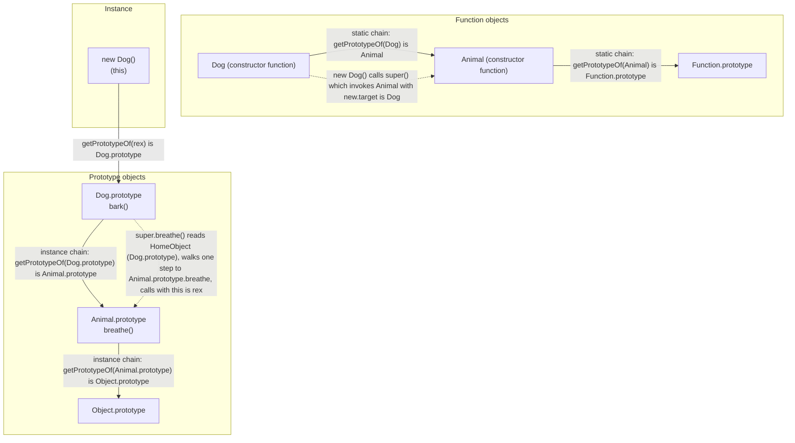
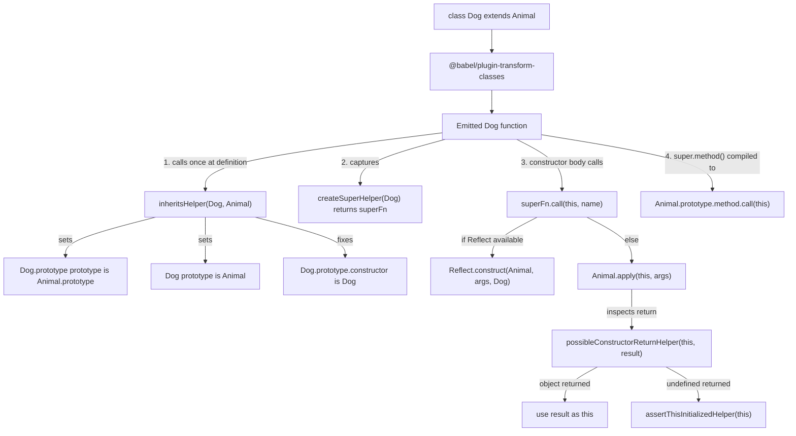
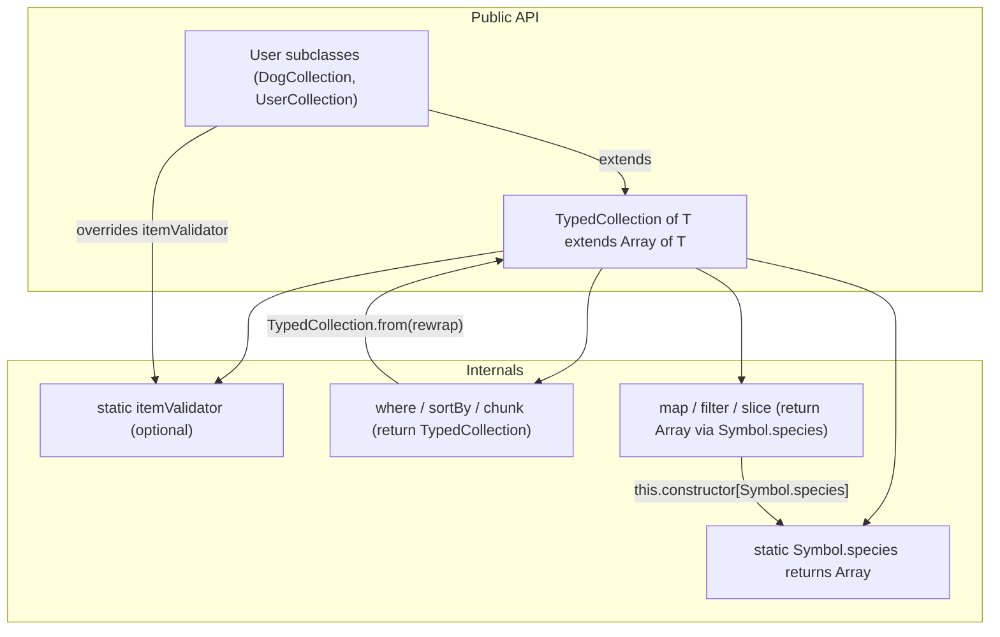

# 1.17 Subclassing Prototypal Underpinnings

## 1. Purpose

ES6 `class extends` looks like a single keyword, but it is a contract for two prototype chains, plus a constructor-forwarding protocol, plus a metadata channel (`new.target`), plus a return-type channel (`Symbol.species`). When you write `class Dog extends Animal`, the engine silently sets up `Dog.prototype`'s prototype to point at `Animal.prototype`, `Dog`'s own prototype to point at `Animal` itself, a `[[Construct]]` semantic that lets `Animal` initialize a `Dog` instance, and a `[[HomeObject]]` slot on every method so that `super.method()` can resolve against the right link in the chain. This note exists because the keyword hides all of that, and the hidden machinery is exactly what breaks in transpiled code, in cross-realm interactions, in `extends Error`, in `extends null`, and in any subclass that needs to control its return type.

Why this matters in production:

**1. Debugging transpiled output.** If you ship code through Babel or TypeScript targeting ES5, your `class extends Animal` becomes roughly thirty to forty lines of helper functions wiring up the two chains by hand. Stack traces from production point at the inherits helper, the createSuper helper, and the possibleConstructorReturn helper, not at `class Dog`. When a subclass breaks, you cannot debug it without reading that emit. The Babel output is also what every browser extension, every legacy CMS plugin, and every pre-2018 enterprise codebase ships. If you cannot read it, you cannot fix it.

**2. Optimizing hot paths.** V8 inlines calls through monomorphic call sites. A subclass method that calls `super.foo()` desugars to a property load on the parent prototype, a function lookup, and a `.call(this)` indirection. V8 will often devirtualize this, but only if the chain is monomorphic. A class hierarchy that has been restructured (mixins applied, prototypes swapped at runtime, multi-level inheritance) blows the inline cache and turns a 5ns call into a 50ns megamorphic dispatch. Knowing what `super.x` actually emits is the difference between a 4ms hot path and a 40ms hot path.

**3. Understanding why `extends Error` was historically broken.** Pre-ES6 transpilers compiled `class MyError extends Error` to `MyError.prototype = Object.create(Error.prototype)`. That wires up the prototype chain, but `Error`'s constructor, when called without `new`, does not behave like a normal constructor. It allocates a fresh `Error` object instead of initializing `this`. So `Error.call(this, message)` returned a new object and `this` was left uninitialized. The stack trace landed on the throwaway object, not on `MyError`. The possibleConstructorReturn helper exists specifically to detect this case and use the returned object as `this`. Without understanding this, you cannot diagnose why your `catch (e)` block sees an `Error` whose `constructor` is `Error` and not `MyError`.

**4. Knowing when `instanceof` lies.** `instanceof` walks the prototype chain of the left operand looking for the right operand's `prototype` property. Two cases break it: cross-realm objects (each iframe, Web Worker, or `vm` context has its own `Array` constructor, so `crossRealmArray instanceof Array` is `false`), and `Symbol.hasInstance` overrides (a class can lie about what it accepts). Understanding the chain semantics tells you exactly when `instanceof` will surprise you, and why `Array.isArray` exists as a realm-safe alternative.

The bug class this note explains:

- Babel-compiled subclasses that break native `instanceof` because the constructor-prototype fixup was skipped.
- `extends null` classes whose instances mysteriously lack `toString` and `valueOf`.
- `super.x` calls that throw `TypeError: ... is not a function` because the lookup happened against the wrong link in the chain.
- Stack traces lost on custom error subclasses.
- `Symbol.species` ignored by older code paths, producing plain `Array` returns where a subclass was expected.
- `new.target` returning `undefined` when a constructor was called as a function, breaking virtual-constructor patterns.

Read this note once and you will be able to read Babel's `@babel/plugin-transform-classes` output like prose, debug a subclass-related stack trace in under five minutes, and write a `Symbol.species`-aware collection subclass from memory.

## 2. Theory and Deep Dive

### 2.1 What `extends` actually wires up

When the parser sees `class Dog extends Animal`, it produces a class object with several new internal invariants beyond those set up by a non-extending `class` declaration:

1. **Instance-method chain.** `Object.getPrototypeOf(Dog.prototype) === Animal.prototype`. This means `new Dog()` inherits methods from `Animal.prototype`. Walk this chain far enough and you reach `Object.prototype`, which is why every instance has `toString`, `hasOwnProperty`, and `valueOf`.
2. **Static-method chain.** `Object.getPrototypeOf(Dog) === Animal`. This is the chain that lets `Dog.bark()` fall through to `Animal.bark()` if `Dog` does not define its own. Yes, functions are objects and can have their own prototype chain. This is the chain most often missed by handwritten ES5 subclassing code, including legacy `util.inherits` from Node.js before ES6.
3. **Constructor forwarding.** Calling `new Dog(...args)` runs `Dog`'s constructor, which must call `super(...args)` before accessing `this`. `super()` is special syntax: it invokes `Animal`'s `[[Construct]]` internal method with `new.target === Dog` (not `Animal`). The parent constructor initializes the same object that will become the `Dog` instance.
4. **`[[HomeObject]]` slot on methods.** Every method defined inside `class Dog { ... }` gets a private `[[HomeObject]]` slot pointing at `Dog.prototype`. When a method calls `super.foo()`, the engine reads `[[HomeObject]]`, walks one step up the prototype chain (to `Animal.prototype`), looks up `foo`, and calls it with the current `this`. This is why `super` works inside methods but throws if you extract a method and call it from a context where `[[HomeObject]]` does not match the prototype chain.
5. **`new.target` propagation.** The `new.target` binding, which is the constructor actually invoked with `new`, propagates up the `super()` chain. When `new Dog()` runs and calls `super()`, `Animal`'s constructor sees `new.target === Dog`. This is what lets `Animal` decide, at construction time, to return a `Dog`-shaped object instead of an `Animal`-shaped one. This is the virtual-constructor pattern.

### 2.2 The two chains, precisely

Without `extends`, a class `Foo` produces:

- `Foo.prototype`, an object with `constructor: Foo` and any methods you defined.
- `Object.getPrototypeOf(Foo.prototype) === Object.prototype`, so instances inherit `toString`, etc.
- `Object.getPrototypeOf(Foo) === Function.prototype`, so `Foo.call`, `Foo.bind`, `Foo.apply` work.

With `class Dog extends Animal`, the spec's `ClassDefinitionEvaluation` runs the equivalent of two `Object.setPrototypeOf` calls:

```js
Object.setPrototypeOf(Dog.prototype, Animal.prototype);
Object.setPrototypeOf(Dog, Animal);
```

That is two `Object.setPrototypeOf` calls. The first rewires instance-method lookup. The second rewires static-method lookup. The first is what most developers remember. The second is what most developers forget, and it is the reason `class Dog extends Animal` inherits `Animal.create` but `function Dog() {}; Dog.prototype = Object.create(Animal.prototype)` does not.

### 2.3 Mermaid: the two chains and super property lookup



The solid arrows are the two chains set up by `extends`. The dotted arrows are the runtime relationships: `new Dog()` delegates the construction call to `Animal`, and `super.breathe()` walks one step up the chain from the method's `[[HomeObject]]` to find `breathe`.

### 2.4 How `super.method()` resolves

`super.method()` looks like a property access, but the spec treats `super` as a special keyword that produces a Reference, not a value. The Reference carries two pieces of state: the `[[HomeObject]]` of the method that contains the `super.method` expression, and the `this` value of the current call.

The desugaring is approximately:

```js
super.method(args);
// becomes:
Reflect.get(Object.getPrototypeOf([[HomeObject]]), 'method').call(this, args);
```

The `[[HomeObject]]` is determined at parse time. It is the prototype object that the method was defined on. So `super` inside `Dog.prototype.bark` means: walk one step up from `Dog.prototype`, which is `Animal.prototype`. Look up `method` there. Call it with the current `this` (which is the `Dog` instance, not `Animal`).

This is why `super.method()` preserves `this`. The parent method runs against the subclass instance. State set by the parent constructor (like `this.name = 'Rex'`) is visible to the parent method via `this`.

It is also why extracting a method breaks `super`. If you do `const bark = Dog.prototype.bark; bark.call(someOtherObject);`, the method still has `[[HomeObject]] === Dog.prototype`, but `this` is now `someOtherObject`. `super.x` inside `bark` will resolve `x` against `Animal.prototype` (correct) but call it with `someOtherObject` as `this` (probably not what you wanted). Worse: if you rebind the method with `.bind()`, the `[[HomeObject]]` does not change but `this` becomes locked, and `super` calls bypass the bind (because `super.x` uses the Reference's `this`, not the bound `this`). This is one of the most subtle bugs in ES6 subclassing.

### 2.5 How `super()` (the constructor call) resolves

`super()` in a subclass constructor is a distinct form from `super.method()`. It is a constructor invocation, not a property access. The spec's `super()` evaluation does the following:

1. Reads `new.target` (the constructor that was actually invoked with `new`).
2. Reads the parent constructor (`Animal`).
3. Calls `Animal.[[Construct]](args, new.target)`.

The `new.target` argument is the magic. It tells `Animal`'s `[[Construct]]`: "initialize an object whose prototype is `new.target.prototype`, which is `Dog.prototype`, not `Animal.prototype`." So when `new Dog('Rex')` runs:

1. `Dog.[[Construct]]` allocates a fresh object whose prototype is `Dog.prototype`.
2. `Dog.[[Call]]` runs the constructor body.
3. The constructor body calls `super('Rex')`, which invokes `Animal.[[Construct]](['Rex'], Dog)`.
4. `Animal.[[Construct]]` would normally allocate a new object with `Animal.prototype`, but because `new.target === Dog`, it skips allocation and reuses the already-allocated `Dog` instance.
5. `Animal.[[Call]]` runs the parent constructor body against the `Dog` instance, setting `this.name = 'Rex'`.
6. Control returns to `Dog.[[Call]]`, which continues setting `this.breed = 'Labrador'`.

This is why `this` is not available before `super()`. The `Dog` instance exists, but it has not been initialized by `Animal` yet. The spec enforces an "uninitialized this" state in subclass constructors: any reference to `this` before `super()` throws `ReferenceError: Must call super constructor in derived class before accessing 'this'`.

### 2.6 The Babel inherits helper

When Babel transpiles `class Dog extends Animal` to ES5, it cannot use `Object.setPrototypeOf` everywhere if it must support IE10 or older. Modern Babel emit (targeting ES5 with `@babel/plugin-transform-classes`) produces an `inheritsHelper` function. In prose we call it the "inherits helper"; the actual identifier Babel emits contains underscore characters, and we will not reproduce those here. The helper does three things:

1. Validates that the superclass is either a function or `null` (for `extends null`).
2. Sets `subClass.prototype` to a new object whose prototype is `superClass.prototype`, with a non-enumerable `constructor` property pointing back at `subClass`.
3. Sets the static chain: `Object.setPrototypeOf(subClass, superClass)`.

A modern, no-underscore form of the helper:

```js
function inheritsHelper(subClass, superClass) {
  if (typeof superClass !== 'function' && superClass !== null) {
    throw new TypeError('Super expression must either be null or a function');
  }
  subClass.prototype = Object.create(superClass && superClass.prototype, {
    constructor: {
      value: subClass,
      writable: true,
      configurable: true
    }
  });
  Object.defineProperty(subClass, 'prototype', { writable: false });
  if (superClass) Object.setPrototypeOf(subClass, superClass);
}
```

Three things to notice:

- `Object.create(superClass && superClass.prototype, ...)` handles the `extends null` case: if `superClass` is `null`, the new prototype's chain ends at `null` directly, skipping `Object.prototype`. That is why instances of `extends null` classes have no `toString`.
- `Object.defineProperty(subClass, 'prototype', { writable: false })` locks the prototype property of the constructor, mirroring the ES6 spec (a class's `prototype` is non-writable). This is what prevents the bug `Dog.prototype = {}` from silently breaking the chain.
- The static chain (`Object.setPrototypeOf(subClass, superClass)`) is the step that legacy code missed. Node's pre-ES6 `util.inherits` only set up the instance-method chain; static methods did not inherit. That is why you sometimes see `Object.assign(Sub, Super)` in old Node code, manually copying static methods.

### 2.7 The Babel createSuper helper

The createSuper helper (referred to in prose; the Babel identifier contains underscore characters) wraps the parent constructor call so that it can be invoked without `new` but still produce a properly-initialized `this`. The helper returns a function that, when called with `this` and `args`, invokes the parent constructor function and returns either the result (if the parent returned an object) or `this` (if the parent returned `undefined`).

A modern, no-underscore form:

```js
function createSuperHelper(Derived) {
  var hasReflect = typeof Reflect !== 'undefined'
    && typeof Reflect.construct === 'function';
  return function () {
    var parent = Object.getPrototypeOf(Derived);
    var args = Array.prototype.slice.call(arguments);
    if (hasReflect) {
      // Reflect.construct(parent, args, Derived) preserves new.target === Derived
      return Reflect.construct(parent, args, Derived);
    }
    var result = parent.apply(this, args);
    return possibleConstructorReturnHelper(this, result);
  };
}

function possibleConstructorReturnHelper(self, call) {
  if (call && (typeof call === 'object' || typeof call === 'function')) {
    return call;
  }
  if (call === undefined) {
    return assertThisInitializedHelper(self);
  }
  throw new TypeError('Derived constructors may only return object or undefined');
}

function assertThisInitializedHelper(self) {
  if (self === undefined) {
    throw new ReferenceError(
      'this has not been initialised - super() has not been called'
    );
  }
  return self;
}
```

This trio of helpers is the runtime backbone of every transpiled subclass. Without them, `super()` cannot exist on ES5. The interesting bit is `possibleConstructorReturnHelper`: it exists because ES6 constructors may return an object, and that object becomes the instance. So when Babel's compiled `Dog` constructor calls `parent.apply(thisArg, args)`, the helper inspects the return value:

- If `parent.apply` returned `undefined` (the normal case), use `thisArg` as the instance.
- If `parent.apply` returned an object (the `extends Error` case, where `Error.call(this)` returns a fresh `Error` instance), use that returned object as the instance.

That second case is the workaround for the `extends Error` bug. The native `Error` constructor, when called as `Error.call(thisArg, msg)` without `new`, ignores `thisArg` and returns a new `Error` object. The possibleConstructorReturn helper detects the returned object and swaps it in as the instance. Without this, the transpiled `MyError` would have its `this` left uninitialized.

### 2.8 `extends null` — the special case

`class Base extends null { ... }` produces a class whose prototype chain ends at `null`, not at `Object.prototype`. The spec defines this in `ClassDefinitionEvaluation`: if the `superclass` is `null`, then `proto` is set to `Object.create(null)`, and the class's prototype becomes that null-prototype object.

Consequences:

1. Instances do not inherit `Object.prototype` methods. `instance.toString()` throws `TypeError: instance.toString is not a function`. Same for `valueOf`, `hasOwnProperty`, `isPrototypeOf`.
2. `instance instanceof Object` is `false`. The chain does not pass through `Object.prototype`.
3. The default constructor synthesized by the spec does not call `super()` (because there is no superclass constructor to call). But if you write an explicit constructor, you cannot use `super()` either, and you cannot reference `this` until after some initialization step. The spec requires you to either return an object from the constructor or to manually initialize `this` via `Object.create` and friends.

The fix is one of:

- Use `class Base extends null { constructor() { Object.setPrototypeOf(this, Object.prototype); } }` to reattach the chain.
- Use a plain `Object.create(null)` instead of a class if you just want a dictionary.
- Mix in the methods you actually need (`toString`, `hasOwnProperty`) onto your prototype manually.

`extends null` is rare in production. It appears in:

- Sandbox implementations that want objects with no host-language methods (to prevent `toString`-based coercion attacks).
- Spec-compliant polyfills for things like `Proxy` traps where the spec explicitly wants a null-prototype object.
- Library authors who want a "pure" base class for their hierarchy.

### 2.9 `Symbol.species` — the return-type channel

When you call `[1, 2, 3].map(x => x * 2)`, the spec for `Array.prototype.map` does not just return an `Array`. It returns `new (this.constructor[Symbol.species] || this.constructor)(length)`. That is: it asks the instance's constructor what subclass to use for the result.

`Symbol.species` is a well-known symbol (see [[1.32 Well-Known Symbols]]). It is exposed as a static getter on `Array`, `Map`, `Set`, `Promise`, `RegExp`, `TypedArray`, and a few others. The default getter returns `this` (the constructor itself), which is why `[1,2,3].map(...)` returns an `Array` by default. But a subclass can override it:

```js
class DogArray extends Array {
  static get [Symbol.species]() {
    return Array;
  }
}
const dogs = new DogArray('Rex', 'Fido');
const names = dogs.map(d => d);
names instanceof DogArray; // false
names instanceof Array;    // true
```

This is the channel by which a subclass can say "for derived collections, return the base type, not me." It is also the channel by which a subclass can say "return a more specific type." Most subclasses should NOT override `Symbol.species`. The default (return `this`, i.e., return my own subclass) is the expected behavior. The override is for cases where returning the subclass would violate an invariant (e.g., a `SortedArray` whose `map` would not preserve sortedness).

### 2.10 `new.target` — the virtual-constructor enabler

`new.target` is a meta-variable available inside every function. It is `undefined` if the function was called without `new`, and it is the constructor itself if called with `new`. Inside a constructor reached via `super()`, it is the most-derived constructor — the one the user actually typed `new` in front of.

This enables virtual constructors. A base class can produce different subclass instances depending on its arguments:

```js
class Animal {
  constructor(type) {
    if (new.target === Animal) {
      if (type === 'dog') return new Dog();
      if (type === 'cat') return new Cat();
    }
  }
}
class Dog extends Animal {}
class Cat extends Animal {}

const a = new Animal('dog');
a instanceof Dog; // true
```

This is how `Error`, `Array`, and `Promise` constructors can return subclass instances when called via `new.target`, and how libraries like Axios, BigInt-like numeric libraries, and ORMs (Mongoose, TypeORM) implement factory constructors.

The pattern is fragile because:

- `new.target` is `undefined` if the constructor was called as a function. The spec throws on `Animal()` for `class` declarations, but legacy `function` constructors silently get `undefined`.
- The virtual-constructor trick requires the base class to know about its subclasses, which couples them. This is a known limitation; the alternative is a separate factory function.

### 2.11 Homologous chain requirements

For `instanceof` and `super` to work, the prototype chain of the subclass instance must pass through the superclass prototype. The spec calls this the "homologous chain" requirement: the chain from instance to `null` must include every superclass prototype in order.

If you break the chain — by reassigning `Subclass.prototype` after construction, by manually swapping `Object.setPrototypeOf` at runtime, or by using `Object.create` incorrectly — `instanceof` will return `false` even though the constructor hierarchy is intact. The chain is the truth; the `extends` keyword is just the syntax that sets it up.

### 2.12 Mermaid: Babel helper call graph



The diagram shows the four-step recipe that every transpiled subclass follows: inherits call at definition time, createSuper capture, superFn invocation in the constructor body (with Reflect or apply fallback), and the superMethod pattern for `super.x` calls inside methods.

## 3. Mental Models

Three mental models. Use whichever fits the problem in front of you.

**Model 1: Two parallel chains.** `extends` sets up two chains. One for instances: walk from `instance` to `Subclass.prototype` to `Superclass.prototype` to `Object.prototype` to `null`. One for the constructors themselves: walk from `Subclass` to `Superclass` to `Function.prototype` to `Object.prototype` to `null`. The first chain answers "what methods does an instance have?" The second chain answers "what static methods does the class have?" When in doubt about whether something inherits, draw both chains and trace.

This model breaks down when you start swapping prototypes at runtime. Once `Object.setPrototypeOf` is called, the chain is whatever the runtime says it is, not what the `extends` keyword says it was.

**Model 2: `super.x` is a property lookup on the parent's prototype, called with my `this`.** When you read `super.foo()` inside a method, mentally rewrite it as `Reflect.get(Object.getPrototypeOf(myMethodHomeObject), 'foo').call(this)`. The `this` is the current call's `this`, not the parent. The lookup is on the parent's prototype, not on the parent constructor. The `[[HomeObject]]` is fixed at parse time, so extracting the method does not change what `super` resolves to, but rebinding `this` does change what `super.foo` will be called with.

This model breaks down for `super()` (the constructor call), which is a different operation. `super()` is "invoke the parent's `[[Construct]]` with my `new.target`." It is not a property access.

**Model 3: Babel is two chain setups plus a `this`-preserving constructor call.** When you cannot use `class extends`, the manual equivalent is:

```js
Object.setPrototypeOf(Sub, Super);                       // static chain
Sub.prototype = Object.create(Super.prototype);          // instance chain
Sub.prototype.constructor = Sub;                         // fixup
// in the Sub constructor:
Super.apply(this, arguments);                            // parent initialization
// then use this
```

That is all Babel does. The helpers are just named, reusable versions of these steps. Once you internalize this four-step recipe, you can read any transpiled subclass output.

This model breaks down for `extends null` (the instance chain goes to `null`, not to `Object.prototype`) and for `super` property access (which needs `[[HomeObject]]`, a parse-time construct that has no ES5 equivalent, which Babel emulates by closing over the parent prototype).

## 4. Real-World Use Cases

### 4.1 Babel `@babel/plugin-transform-classes` output

Every modern Babel preset that targets ES5 includes `@babel/plugin-transform-classes`. The plugin transforms a `class extends` declaration into roughly forty lines of helper-invoking code. The helpers (the inherits helper, the createSuper helper, the possibleConstructorReturn helper, the assertThisInitialized helper, the classCallCheck helper) are bundled once per file (or hoisted into a shared `@babel/runtime` module if you use `@babel/plugin-transform-runtime`). The transform is correct, but verbose, and the runtime cost is real: each `super()` call goes through a `.apply` or `Reflect.construct` indirection, and each `super.method()` call goes through a `Reflect.get` plus `.call`.

If you are debugging production code and see a stack trace mentioning these helpers, you are looking at transpiled subclass code. The original source map will point at the `class` declaration; the runtime trace will not.

### 4.2 TypeScript ES5 emit

TypeScript with `target: ES5` produces similar output, but historically used a simpler (and slightly less spec-compliant) `extends` helper:

```ts
var Animal = (function () {
  function Animal(name) { this.name = name; }
  Animal.prototype.breathe = function () { return 'breathing'; };
  return Animal;
}());

var Dog = (function (superRef) {
  Object.setPrototypeOf(Dog, superRef);
  Dog.prototype = Object.create(superRef && superRef.prototype);
  Dog.prototype.constructor = Dog;
  function Dog(name, breed) {
    var self = superRef.call(this, name) || this;
    self.breed = breed;
    return self;
  }
  Dog.prototype.bark = function () { return this.name + ' says woof'; };
  return Dog;
}(Animal));
```

TypeScript's emit uses `superRef.call(this, name) || this` to handle the "parent constructor returned an object" case — a terser version of Babel's possibleConstructorReturn helper. TypeScript 4.x with `target: ES2022` or higher emits native `class extends` and skips the helpers entirely.

### 4.3 Node.js `util.inherits` (legacy, pre-ES6)

Before ES6, Node.js shipped `util.inherits(Constructor, SuperConstructor)`. The implementation in Node 0.10 was roughly:

```js
exports.inherits = function (ctor, superCtor) {
  ctor.superRef = superCtor;
  ctor.prototype = Object.create(superCtor.prototype, {
    constructor: {
      value: ctor,
      enumerable: false,
      writable: true,
      configurable: true
    }
  });
};
```

Notice: no static chain. `ctor` does not inherit static methods from `superCtor`. This is why old Node code is full of `Object.assign(Sub, Super)` after `util.inherits`, to manually copy static methods. The modern `util.inherits` (Node 5.0+) added `Object.setPrototypeOf(ctor, superCtor)` to fix this. The deprecation notice in Node's docs since v5.0 explicitly recommends ES6 `class extends`.

### 4.4 The `extends Error` bug

The bug: pre-ES6, `class MyError extends Error {}` compiled by Babel produced a `MyError` whose instances did not have a stack trace. The cause: `Error.call(this, message)` returns a new `Error` object (not `this`), and Babel's older emit discarded the return value. So the stack-trace-carrying `Error` was thrown away, and `this` had no `stack` property.

The fix has three layers:

1. **The possibleConstructorReturn helper** detects that `Error.call(this, msg)` returned an object and uses that object as the instance.
2. **ES6 native `class MyError extends Error`** correctly handles `super(msg)` because `Error`'s `[[Construct]]` is `new.target`-aware.
3. **`Error.captureStackTrace(this, MyError)`** (V8-specific) can be called in the constructor to capture a stack trace attached to `this`, even on engines where the bug would otherwise manifest.

Modern engines and modern Babel both produce correct stack traces. But the bug is still alive in old bundles, in IE11 polyfills, and in any codebase that uses `Error.call(this)` directly instead of `super()`.

### 4.5 Custom `Array` subclasses with `Symbol.species`

Libraries that ship custom collection types — `Immutable.List`, custom `Observable` implementations, `SortedArray`, `UniqueArray` — extend `Array` and override `Symbol.species` to control whether `map`, `filter`, `slice` return the custom type or the base `Array`. Without `Symbol.species`, a `SortedArray.map` would produce a `SortedArray` that is no longer sorted, breaking the class invariant.

The pattern:

```js
class SortedArray extends Array {
  static get [Symbol.species]() { return Array; }
  // ... sort logic ...
}
const sa = SortedArray.from([3, 1, 2]).sort();
const names = sa.map(x => x); // returns Array, not SortedArray
```

### 4.6 `instanceof` across realms

Each iframe, Web Worker, and `vm` context has its own set of intrinsics: its own `Array`, `Object`, `Error`, `Promise`. An array created in an iframe has a prototype chain that passes through the iframe's `Array.prototype`, not the parent's. So `iframeArray instanceof Array` is `false` in the parent.

This is why `Array.isArray` exists: it checks the internal class slot, which is realm-agnostic. Same for `Object.prototype.toString.call` and other "brand check" methods. Subclassing across realms is generally a bad idea — the chain is broken the moment you cross a realm boundary.

## 5. Code Examples

### 5.1 Example A — Minimal and Conceptual

A two-level class hierarchy: `Animal` and `Dog`, with a static method on `Animal` to demonstrate the static chain.

**JavaScript:**

```javascript
class Animal {
  constructor(name) {
    this.name = name;
  }
  breathe() {
    return `${this.name} is breathing`;
  }
  static create(name) {
    return new this(name);
  }
}

class Dog extends Animal {
  constructor(name, breed) {
    super(name);
    this.breed = breed;
  }
  bark() {
    return `${this.name} (${this.breed}) says woof`;
  }
  describe() {
    // super.breathe() resolves against Animal.prototype.breathe
    // with this === the Dog instance
    return super.breathe() + ' and ' + this.bark();
  }
}

const rex = new Dog('Rex', 'Labrador');
console.log(rex.describe());        // "Rex is breathing and Rex (Labrador) says woof"
console.log(rex instanceof Dog);    // true
console.log(rex instanceof Animal); // true

// Static chain: Dog.create inherits from Animal.create
const fido = Dog.create('Fido');
console.log(fido instanceof Dog); // true (because `new this()` with this === Dog)
```

**TypeScript:**

```typescript
class Animal {
  constructor(public name: string) {}

  breathe(): string {
    return `${this.name} is breathing`;
  }

  static create<T extends Animal>(this: new (name: string) => T, name: string): T {
    return new this(name);
  }
}

class Dog extends Animal {
  constructor(
    name: string,
    public breed: string
  ) {
    super(name);
  }

  bark(): string {
    return `${this.name} (${this.breed}) says woof`;
  }

  describe(): string {
    return super.breathe() + ' and ' + this.bark();
  }
}

const rex = new Dog('Rex', 'Labrador');
console.log(rex.describe());

// TS polymorphic this typing: Dog.create returns Dog, not Animal
const fido = Dog.create<Dog>('Fido');
console.log(fido instanceof Dog);
```

**The Babel ES5 output (annotated, no underscore characters):**

```javascript
'use strict';

function classCallCheckHelper(instance, Constructor) {
  if (!(instance instanceof Constructor)) {
    throw new TypeError('Cannot call a class as a function');
  }
}

function inheritsHelper(subClass, superClass) {
  if (typeof superClass !== 'function' && superClass !== null) {
    throw new TypeError('Super expression must either be null or a function');
  }
  subClass.prototype = Object.create(superClass && superClass.prototype, {
    constructor: { value: subClass, writable: true, configurable: true }
  });
  Object.defineProperty(subClass, 'prototype', { writable: false });
  if (superClass) Object.setPrototypeOf(subClass, superClass);
}

function possibleConstructorReturnHelper(self, call) {
  if (call && (typeof call === 'object' || typeof call === 'function')) {
    return call;
  }
  return assertThisInitializedHelper(self);
}

function assertThisInitializedHelper(self) {
  if (self === undefined) {
    throw new ReferenceError(
      'this has not been initialised - super() has not been called'
    );
  }
  return self;
}

function createSuperHelper(Derived) {
  var hasReflect = typeof Reflect !== 'undefined'
    && typeof Reflect.construct === 'function';
  return function () {
    var parent = Object.getPrototypeOf(Derived);
    var args = Array.prototype.slice.call(arguments);
    if (hasReflect) {
      return Reflect.construct(parent, args, Derived);
    }
    var result = parent.apply(this, args);
    return possibleConstructorReturnHelper(this, result);
  };
}

var Animal = (function () {
  function Animal(name) {
    classCallCheckHelper(this, Animal);
    this.name = name;
  }
  Animal.prototype.breathe = function breathe() {
    return this.name + ' is breathing';
  };
  Animal.create = function create(name) {
    return new this(name);
  };
  return Animal;
}());

var Dog = (function (parentRef) {
  inheritsHelper(Dog, parentRef);
  var superFn = createSuperHelper(Dog);

  function Dog(name, breed) {
    classCallCheckHelper(this, Dog);
    var self = possibleConstructorReturnHelper(
      this,
      superFn.call(this, name)
    );
    self.breed = breed;
    return self;
  }

  Dog.prototype.bark = function bark() {
    return this.name + ' (' + this.breed + ') says woof';
  };

  Dog.prototype.describe = function describe() {
    // super.breathe() compiled: look up breathe on parentRef.prototype,
    // call with this === the Dog instance
    return parentRef.prototype.breathe.call(this) + ' and ' + this.bark();
  };

  return Dog;
}(Animal));
```

Read this top-to-bottom and you have read every transpiled subclass ever shipped. The `Dog` IIFE is invoked immediately with `Animal` as `parentRef`, so the closure captures `Animal`. Inside, `inheritsHelper` wires up both chains. `createSuperHelper(Dog)` returns a function that invokes `Animal`'s constructor via `Reflect.construct` (preserving `new.target === Dog`) or via `parent.apply(this, args)` on old engines. `Dog`'s constructor calls `superFn.call(this, name)`, takes the returned object (or `this`) as `self`, sets `self.breed`, and returns `self`. The `super.breathe()` call in `describe` is compiled to `parentRef.prototype.breathe.call(this)` — a direct property access on the captured parent prototype.

### 5.2 Example B — Production-Grade Typed Collection

A typed collection that extends `Array`, uses `Symbol.species` to control return type, supports method chaining, and is fully typed in TypeScript.

**JavaScript:**

```javascript
class TypedCollection extends Array {
  static get [Symbol.species]() {
    // Return Array so .map/.filter do not produce a half-initialized TypedCollection
    return Array;
  }

  constructor(...items) {
    super(...items);
    // Optional: type-check each item if a per-instance validator is set
    if (this.constructor.itemValidator) {
      for (const item of this) {
        if (!this.constructor.itemValidator(item)) {
          throw new TypeError(`Invalid item: ${String(item)}`);
        }
      }
    }
  }

  // Chainable methods return TypedCollection, not Array
  where(predicate) {
    // We deliberately bypass Symbol.species here because we want
    // a TypedCollection back. Use Array.prototype.filter and rewrap.
    const filtered = Array.prototype.filter.call(this, predicate);
    return TypedCollection.from(filtered);
  }

  map(predicate) {
    // Use the default Array.prototype.map, which respects Symbol.species
    // (returns Array, as configured above)
    return Array.prototype.map.call(this, predicate);
  }

  sortBy(keyFn) {
    const copy = Array.from(this).sort((a, b) => {
      const ka = keyFn(a);
      const kb = keyFn(b);
      return ka < kb ? -1 : ka > kb ? 1 : 0;
    });
    return TypedCollection.from(copy);
  }

  first(predicate) {
    return predicate ? this.find(predicate) : this[0];
  }

  chunk(size) {
    const out = [];
    for (let i = 0; i < this.length; i += size) {
      out.push(TypedCollection.from(this.slice(i, i + size)));
    }
    return out;
  }

  toJSON() {
    return Array.from(this);
  }
}

class DogCollection extends TypedCollection {
  static get itemValidator() {
    return (item) =>
      item && typeof item.name === 'string' && typeof item.breed === 'string';
  }
}

const dogs = DogCollection.from([
  { name: 'Rex', breed: 'Lab', age: 3 },
  { name: 'Fido', breed: 'Poodle', age: 5 },
  { name: 'Spot', breed: 'Lab', age: 7 }
]);

const labs = dogs.where(d => d.breed === 'Lab');
console.log(labs instanceof DogCollection); // true
console.log(labs.length); // 2

const names = dogs.map(d => d.name);
console.log(names instanceof DogCollection); // false (Symbol.species returned Array)
console.log(names); // ['Rex', 'Fido', 'Spot']

const sorted = dogs.sortBy(d => d.age);
console.log(sorted.first().name); // 'Rex' (youngest)
```

**TypeScript:**

```typescript
interface DogRecord {
  name: string;
  breed: string;
  age: number;
}

class TypedCollection<T> extends Array<T> {
  static get [Symbol.species](): ArrayConstructor {
    return Array;
  }

  static itemValidator?: (item: unknown) => boolean;

  constructor(...items: T[]) {
    super(...items);
    const validator = (this.constructor as typeof TypedCollection<T>).itemValidator;
    if (validator) {
      for (const item of this) {
        if (!validator(item)) {
          throw new TypeError(`Invalid item: ${String(item)}`);
        }
      }
    }
  }

  where(predicate: (value: T, index: number, array: T[]) => unknown): TypedCollection<T> {
    const filtered = Array.prototype.filter.call(this, predicate as (value: T) => boolean);
    return TypedCollection.from(filtered) as TypedCollection<T>;
  }

  override map<U>(predicate: (value: T, index: number, array: T[]) => U): U[] {
    return Array.prototype.map.call(this, predicate);
  }

  sortBy<K>(keyFn: (value: T) => K): TypedCollection<T> {
    const copy = Array.from(this).sort((a, b) => {
      const ka = keyFn(a);
      const kb = keyFn(b);
      return ka < kb ? -1 : ka > kb ? 1 : 0;
    });
    return TypedCollection.from(copy) as TypedCollection<T>;
  }

  first(predicate?: (value: T) => unknown): T | undefined {
    return predicate ? this.find(predicate as (value: T) => boolean) : this[0];
  }

  chunk(size: number): TypedCollection<T>[] {
    const out: TypedCollection<T>[] = [];
    for (let i = 0; i < this.length; i += size) {
      out.push(TypedCollection.from(this.slice(i, i + size)) as TypedCollection<T>);
    }
    return out;
  }

  toJSON(): T[] {
    return Array.from(this);
  }
}

class DogCollection extends TypedCollection<DogRecord> {
  static get itemValidator(): (item: unknown) => boolean {
    return (item): item is DogRecord =>
      !!item &&
      typeof (item as DogRecord).name === 'string' &&
      typeof (item as DogRecord).breed === 'string';
  }
}

const dogs = DogCollection.from<DogRecord>([
  { name: 'Rex', breed: 'Lab', age: 3 },
  { name: 'Fido', breed: 'Poodle', age: 5 },
  { name: 'Spot', breed: 'Lab', age: 7 }
]);

const labs = dogs.where(d => d.breed === 'Lab');
console.log(labs instanceof DogCollection);
const names = dogs.map(d => d.name);
const sorted = dogs.sortBy(d => d.age);
console.log(sorted.first()?.name);
```

The TypeScript version uses the `override` keyword on `map` (TS 4.3+) to ensure that if `Array.prototype.map`'s signature changes, the compiler will warn us. The `static itemValidator` is declared as an optional static on the base class so subclasses can override it. The `item is DogRecord` type predicate inside the validator narrows the type for callers.

## 6. Common Mistakes and Anti-Patterns

### 6.1 `extends Error` losing the stack trace

```javascript
// BROKEN: pre-ES6 transpiled, stack trace lost
function MyError(message) {
  Error.call(this, message); // returns a new Error, discards this
  this.message = message;
}
MyError.prototype = Object.create(Error.prototype);
MyError.prototype.constructor = MyError;

throw new MyError('boom');
// err.stack is undefined; err.message works; err instanceof MyError is true
// but err instanceof Error is true, and err.stack is missing
```

**Why it fails:** `Error.call(this, message)` returns a new `Error` instance with a captured stack trace. The result is discarded because the call expression is not assigned. The `this` of `MyError` is left without a stack.

**Fix:**

```javascript
// ES6 native: works correctly
class MyError extends Error {
  constructor(message) {
    super(message);
    // super() correctly invokes Error's [[Construct]] with new.target === MyError
    // The stack is captured against this (the MyError instance)
    if (Error.captureStackTrace) {
      Error.captureStackTrace(this, MyError); // V8-specific: clean stack
    }
  }
}

// ES5 fallback (Babel-style, no underscore characters)
function MyError(message) {
  var err = Error.call(this, message); // err has the stack
  if (err && err.stack) this.stack = err.stack;
  this.message = message;
  if (Error.captureStackTrace) Error.captureStackTrace(this, MyError);
}
Object.setPrototypeOf(MyError, Error);
MyError.prototype = Object.create(Error.prototype);
MyError.prototype.constructor = MyError;
```

### 6.2 Forgetting `super()` before `this`

```javascript
class Dog extends Animal {
  constructor(name, breed) {
    this.breed = breed; // ReferenceError: must call super first
    super(name);
  }
}
```

**Why it fails:** Subclass constructors have an "uninitialized this" state until `super()` runs. The spec throws `ReferenceError: Must call super constructor in derived class before accessing 'this' or returning from derived constructor`.

**Fix:**

```javascript
class Dog extends Animal {
  constructor(name, breed) {
    super(name); // always first
    this.breed = breed;
  }
}
```

If the parent constructor takes no arguments, you still must call `super()` with no args. The only exception is if the constructor returns an object — but that is almost always a bug.

### 6.3 Calling `super.method()` from a non-method context

```javascript
class Dog extends Animal {
  bark() {
    setTimeout(super.breathe, 0); // TypeError at call time
  }
}
```

**Why it fails:** `super.breathe` evaluates to a function reference, but the reference's `this` is lost when the function is passed bare. When `setTimeout` invokes it, `this` is `undefined` (strict mode) or the global object (sloppy mode). Inside `breathe`, any access to `this.name` throws or returns garbage.

**Fix:**

```javascript
class Dog extends Animal {
  bark() {
    setTimeout(() => super.breathe(), 0); // arrow preserves this
    // OR:
    const bound = super.breathe.bind(this);
    setTimeout(bound, 0);
  }
}
```

The arrow function version is preferred because `super` is statically resolved inside arrows (it borrows the method's `[[HomeObject]]`).

### 6.4 `extends null` instances losing `toString`

```javascript
class PureBase extends null {
  constructor() {
    // No super() to call; this is already allocated but uninitialized
  }
}
const x = new PureBase();
x.toString(); // TypeError: x.toString is not a function
```

**Why it fails:** `extends null` produces a prototype chain that ends at `null`, bypassing `Object.prototype`. Instances have no `toString`, `valueOf`, `hasOwnProperty`.

**Fix:**

```javascript
// Option 1: Reattach Object.prototype in the constructor
class PureBase extends null {
  constructor() {
    Object.setPrototypeOf(this, Object.prototype);
  }
}

// Option 2: Use a plain function with null prototype
function PureBase() {}
PureBase.prototype = Object.create(null);
PureBase.prototype.toString = function () { return '[PureBase]'; };
PureBase.prototype.hasOwnProperty = Object.prototype.hasOwnProperty;

// Option 3: Just use Object.create(null) for a dictionary, no class needed
const dict = Object.create(null);
dict.foo = 1; // no risk of colliding with toString, etc.
```

In practice, prefer plain `Object.create(null)` for dictionary objects, and `class extends Object` if you want a class with full `Object.prototype` methods.

### 6.5 `Symbol.species` not respected by older or custom methods

```javascript
class DogArray extends Array {
  static get [Symbol.species]() { return Array; }
  customFilter(predicate) {
    const out = new DogArray(); // ignores Symbol.species!
    for (const item of this) if (predicate(item)) out.push(item);
    return out;
  }
}
```

**Why it fails:** `Symbol.species` is only consulted by methods that the spec defines to consult it (`map`, `filter`, `slice`, `splice`, `flat`, `flatMap`, `concat`). Custom methods that you write do not consult it unless you explicitly read `this.constructor[Symbol.species]`.

**Fix:**

```javascript
class DogArray extends Array {
  static get [Symbol.species]() { return Array; }
  customFilter(predicate) {
    const Species = this.constructor[Symbol.species] || Array;
    const out = new Species();
    for (const item of this) if (predicate(item)) out.push(item);
    return out;
  }
}
```

### 6.6 `instanceof` across realms

```javascript
// parent.html
const iframe = document.createElement('iframe');
document.body.appendChild(iframe);
const iframeArray = new iframe.contentWindow.Array(1, 2, 3);
console.log(iframeArray instanceof Array); // false
console.log(iframeArray instanceof iframe.contentWindow.Array); // true
```

**Why it fails:** `instanceof` walks the prototype chain of the left operand looking for `Array.prototype` (the right operand's `prototype`). The iframe's array has a prototype chain that passes through the iframe's `Array.prototype`, not the parent's.

**Fix:**

```javascript
console.log(Array.isArray(iframeArray)); // true, realm-agnostic
// For custom classes, use a brand-check method:
class Dog {
  static isDog(obj) {
    return obj && typeof obj.bark === 'function' && obj[Symbol.toStringTag] === 'Dog';
  }
  get [Symbol.toStringTag]() { return 'Dog'; }
}
```

### 6.7 Reassigning `Subclass.prototype` after construction

```javascript
class Dog extends Animal {}
Dog.prototype = { bark() { return 'woof'; } }; // breaks instanceof
const rex = new Dog();
console.log(rex instanceof Dog); // false! rex prototype chain no longer includes Dog.prototype
console.log(rex instanceof Animal); // false
```

**Why it fails:** The `class` declaration makes `Dog.prototype` non-writable (configurable but not writable). Reassigning it either throws (strict mode) or silently fails (sloppy mode). If you bypass the lock with `Object.defineProperty`, you break the chain that `extends` set up, and `instanceof` returns false.

**Fix:** Never reassign `.prototype`. Add methods one at a time with `Dog.prototype.method = function () {}` or use `Object.assign(Dog.prototype, { ...methods })`.

### 6.8 Static method shadowing without `super`

```javascript
class Animal {
  static create(name) {
    return new this(name);
  }
  static normalizeName(name) {
    return String(name).trim().toLowerCase();
  }
}
class Dog extends Animal {
  static create(name, breed) {
    return new this(name, breed); // does NOT call Animal.normalizeName
  }
}
```

**Why it fails:** This is not strictly a bug, but it is a missed opportunity. If `Animal.normalizeName` had validation logic (name normalization), `Dog.create` would skip it. Static methods do not automatically call their parent — you must use `super.method()` explicitly.

**Fix:**

```javascript
class Dog extends Animal {
  static create(name, breed) {
    const normalizedName = super.normalizeName(name); // explicit delegation
    return new this(normalizedName, breed);
  }
}
```

## 7. Best Practices and Design Patterns

1. **Always call `super()` first in subclass constructors.** Before any `this` access, before any side effect. The spec enforces it; linters enforce it; modern TypeScript's `strictPropertyInitialization` enforces it. If you cannot call `super()` first (e.g., you need to compute arguments), refactor the computation into a static helper or move it before the constructor body.

2. **Use `Symbol.species` to control method return type in custom collection subclasses.** If your subclass has invariants that `map`/`filter` would violate (a `SortedArray` whose `map` result is not sorted, a `UniqueArray` whose `map` result might have duplicates), override `Symbol.species` to return `Array`. Document the override — callers will be surprised.

3. **Use the TypeScript `override` keyword.** TS 4.3+ supports `override` on methods that override a parent method, when `noImplicitOverride` is enabled. This catches typos: if `Animal` has `breathe()` and `Dog` defines `breeth()`, the compiler will not let `breeth` slip through as a new method.

4. **Use `abstract class` to enforce that a class can't be instantiated directly.** TS's `abstract` keyword prevents `new AbstractClass()` at compile time. Combined with `abstract method` declarations, it lets you define a contract that subclasses must implement. JavaScript has no `abstract` keyword; the convention is to throw in the constructor or to use a private constructor pattern.

5. **Document when subclasses must call `super.methodName()`.** If a method has a "template method" pattern (parent does setup, child does work, parent does cleanup), document the contract. JSDoc `@fires`, `@listens`, and `@override` tags help. In TS, the `override` keyword plus a comment on the parent method signals that subclasses must call `super.methodName()`.

6. **Prefer composition over deep inheritance.** Three levels of `extends` is the empirical limit before refactoring costs explode. Beyond that, prefer mixins (see [[1.18 Mixins and Composition]]) or composition with interface implementation.

7. **Never reassign `.prototype` after class declaration.** The class declaration makes it non-writable for a reason. Use `Object.assign(Class.prototype, { ... })` for bulk method additions, or define methods one at a time.

8. **Use `Error.captureStackTrace(this, ClassName)` in custom Error subclasses on V8.** This cleans up the stack trace by removing the constructor's own frame, producing a stack that points at the throw site, not the constructor.

9. **Use `Object.setPrototypeOf` for runtime prototype manipulation, never direct dunder-proto assignment.** The dunder-proto accessor is deprecated and slower than `Object.setPrototypeOf`. It also does not work on `Object.prototype` itself in some engines.

10. **Test cross-realm behavior explicitly.** If your library will be used in iframes, workers, or `vm` contexts, write a test that constructs an instance in a child realm and asserts `instanceof` from the parent. If it fails, provide a brand-check method (`isX(obj)`) as a realm-safe alternative.

## 8. Technical Interview Knowledge

### 8.1 How does Babel compile `class extends`?

**A:** Babel emits a pair of helper functions: the inherits helper and the createSuper helper. The inherits helper validates the superclass, sets `subClass.prototype` to a new object whose prototype is `superClass.prototype`, fixes the `constructor` property, locks the `prototype` property of the subclass to non-writable, and sets the static chain via `Object.setPrototypeOf(subClass, superClass)`. The createSuper helper returns a function that, when called with `this` and args, invokes the parent constructor via `Reflect.construct` (preserving `new.target`) or via `parent.apply(this, args)`, then runs the possibleConstructorReturn helper to handle the case where the parent returned an object. Each method that uses `super.x` is compiled to a direct property access on the captured parent prototype, with `.call(this)` to preserve `this`. The result is roughly forty lines of helper-invoking code per subclass, plus the helpers themselves bundled once per file (or hoisted to `@babel/runtime`).

**Trap to avoid:** Don't say "Babel turns classes into prototype assignments." It does, but the createSuper and possibleConstructorReturn helpers are the non-obvious half of the answer. Interviewers want to hear about `new.target` preservation and the `Error.call(this)` return-value handling.

### 8.2 What two prototype chains does `extends` set up?

**A:** The instance-method chain and the static-method chain. The instance-method chain is `Object.setPrototypeOf(Subclass.prototype, Superclass.prototype)`, so `new Subclass()` inherits methods from `Superclass.prototype` (and from `Object.prototype` via the rest of the chain). The static-method chain is `Object.setPrototypeOf(Subclass, Superclass)`, so `Subclass.staticMethod` falls through to `Superclass.staticMethod` if not defined. Most handwritten ES5 subclassing code (and Node's pre-5.0 `util.inherits`) sets up only the first chain, which is why static methods do not inherit in old code.

**Trap to avoid:** Don't forget the static chain. Many candidates only mention the prototype chain. The static chain is the answer that demonstrates you have read the spec.

### 8.3 Why was `extends Error` historically broken?

**A:** The native `Error` constructor, when called as `Error.call(this, msg)` without `new`, returns a fresh `Error` instance instead of initializing `this`. Pre-ES6 transpilers compiled `class MyError extends Error` to `MyError.prototype = Object.create(Error.prototype); function MyError(msg) { Error.call(this, msg); }`. The `Error.call(this, msg)` returned a new Error with a stack trace, and the return value was discarded. So `this` had no `stack` property. The fix was Babel's possibleConstructorReturn helper, which checks if the parent constructor returned an object and uses that object as the instance. The ES6 native `super(msg)` correctly invokes `Error`'s `[[Construct]]` with `new.target === MyError`, which captures the stack against the `MyError` instance.

**Trap to avoid:** Don't say "Error doesn't have a prototype." It does. The bug is about `Error`'s constructor returning a new object when called as a function, not about prototype chains.

### 8.4 What is `Symbol.species`?

**A:** `Symbol.species` is a well-known symbol (see [[1.32 Well-Known Symbols]]) exposed as a static getter on `Array`, `Map`, `Set`, `Promise`, `RegExp`, `TypedArray`, and a few other built-ins. The getter returns `this` (the constructor itself) by default. When you call `[1,2,3].map(fn)`, the spec reads `this.constructor[Symbol.species]` and uses it as the constructor for the result array. A subclass can override the getter to return `Array` (forcing plain-Array results) or any other constructor. The pattern is used by `SortedArray`, `UniqueArray`, and similar invariant-preserving collections: they return `Array` from `Symbol.species` so that `map`/`filter` do not produce a half-initialized subclass instance.

**Trap to avoid:** Don't confuse `Symbol.species` with `Symbol.hasInstance`. `Symbol.species` controls return type of derived methods; `Symbol.hasInstance` controls `instanceof` behavior.

### 8.5 What does `extends null` do?

**A:** `class Base extends null` produces a class whose prototype chain ends at `null` rather than at `Object.prototype`. Instances do not inherit `toString`, `valueOf`, `hasOwnProperty`, or any other `Object.prototype` method. `instance instanceof Object` is `false`. The default constructor synthesized by the spec does not call `super()` (there is no superclass constructor). If you write an explicit constructor, you cannot use `super()` either; you must either return an object from the constructor or manually initialize `this`. The fix is to reattach the chain with `Object.setPrototypeOf(this, Object.prototype)` in the constructor, or to mix in the methods you need manually.

**Trap to avoid:** Don't say "instances have no prototype." They do — it is `null`, which is a valid prototype. The chain just ends earlier than usual.

### 8.6 How does `super.x` resolve?

**A:** `super.x` is a special Reference form, not a property access. The spec produces a Reference whose base value is `Object.getPrototypeOf([[HomeObject]])` and whose referenced name is `x`. `[[HomeObject]]` is a private slot on the method that contains the `super.x` expression; it is set at parse time to the prototype object on which the method was defined. So inside `Dog.prototype.bark`, `[[HomeObject]]` is `Dog.prototype`, and `super.x` walks one step up to `Animal.prototype` and looks up `x`. The Reference also carries the current `this`, so when the resolved function is called, it is called with the same `this` as the calling method. This is why `super.method()` preserves `this`.

**Trap to avoid:** Don't say "super is the parent class." `super.x` is the parent prototype, not the parent constructor. `super()` is the parent constructor — a different form.

### 8.7 How does `new.target` enable virtual constructors?

**A:** `new.target` is a meta-binding available inside every function. It is `undefined` if the function was called without `new`, and it is the constructor itself if called with `new`. Inside a constructor reached via `super()`, `new.target` is the most-derived constructor — the one the user actually typed `new` in front of. This lets a base class produce different subclass instances depending on its arguments: `class Animal { constructor(type) { if (new.target === Animal) { if (type === 'dog') return new Dog(); } } }`. This is how `Error`, `Array`, and `Promise` constructors can return subclass instances, and how ORMs implement factory constructors. The pattern is fragile because it couples the base class to its subclasses.

**Trap to avoid:** Don't say "new.target is the same as this.constructor." It is not — `this.constructor` is a prototype property, `new.target` is a runtime binding. They can differ if the prototype chain has been tampered with.

### 8.8 Why does `instanceof` fail across realms?

**A:** `instanceof` walks the prototype chain of the left operand looking for the right operand's `prototype` property. Each iframe, Web Worker, and `vm` context has its own set of intrinsics: its own `Array`, `Object`, `Error`, `Promise`. An array created in an iframe has a prototype chain that passes through the iframe's `Array.prototype`, not the parent's. So `iframeArray instanceof Array` is `false` in the parent. The realm-safe alternatives are `Array.isArray` (which checks the internal class slot), `Object.prototype.toString.call(value)` (which returns `'[object Array]'` regardless of realm), and custom brand-check methods on user-defined classes.

**Trap to avoid:** Don't say "you can use `value.constructor === Array`." That has the same realm problem — `value.constructor` is the iframe's `Array`, not the parent's.

## 9. Practical Exercises

### 9.1 Exercise One — Manually desugar a 2-level class hierarchy to ES5

**Goal:** Take a 2-level class hierarchy and produce equivalent ES5 code that passes the same `instanceof` checks and `super` calls.

**Setup:**

```javascript
class Vehicle {
  constructor(wheels) { this.wheels = wheels; }
  describe() { return `${this.wheels} wheels`; }
  static factory(wheels) { return new this(wheels); }
}

class Car extends Vehicle {
  constructor(brand, wheels = 4) {
    super(wheels);
    this.brand = brand;
  }
  describe() { return `${this.brand}: ${super.describe()}`; }
}
```

**Steps:**

1. Define `Vehicle` as a function constructor with prototype methods and a static method.
2. Define `Car` as a function constructor.
3. Use `Object.setPrototypeOf` to set up both chains.
4. Fix the `constructor` property.
5. In `Car`'s constructor, call `Vehicle.call(this, wheels)` and handle the return value.
6. In `Car.prototype.describe`, call `Vehicle.prototype.describe.call(this)`.

**Full worked solution:**

```javascript
function Vehicle(wheels) {
  if (!(this instanceof Vehicle)) throw new TypeError('Cannot call as function');
  this.wheels = wheels;
}
Vehicle.prototype.describe = function () {
  return this.wheels + ' wheels';
};
Vehicle.factory = function (wheels) {
  return new this(wheels);
};

function Car(brand, wheels) {
  if (!(this instanceof Car)) throw new TypeError('Cannot call as function');
  var wheelsArg = wheels === undefined ? 4 : wheels;
  // super(wheelsArg) — call parent constructor with this
  var result = Vehicle.call(this, wheelsArg);
  // possibleConstructorReturn: if parent returned an object, use it
  if (result && (typeof result === 'object' || typeof result === 'function')) {
    return result;
  }
  this.brand = brand;
  return this;
}

// inherits helper — both chains
Object.setPrototypeOf(Car, Vehicle);                            // static chain
Car.prototype = Object.create(Vehicle.prototype);                // instance chain
Car.prototype.constructor = Car;                                 // fixup

Car.prototype.describe = function () {
  // super.describe() — look up on parent prototype, call with this
  return this.brand + ': ' + Vehicle.prototype.describe.call(this);
};

// Test
var c = new Car('Toyota');
console.log(c.describe());              // "Toyota: 4 wheels"
console.log(c instanceof Car);          // true
console.log(c instanceof Vehicle);      // true
console.log(Car.factory(2) instanceof Car); // true (static chain works)
```

**Reasoning:** `Object.setPrototypeOf(Car, Vehicle)` sets up the static chain so `Car.factory` falls through to `Vehicle.factory`. `Car.prototype = Object.create(Vehicle.prototype)` sets up the instance chain. The `constructor` fixup is required because `Object.create` does not copy `constructor`. `Vehicle.call(this, wheelsArg)` invokes the parent constructor against `this`. The return-value check mirrors Babel's possibleConstructorReturn helper and handles the `extends Error` case where the parent returns an object. `Vehicle.prototype.describe.call(this)` is the manual `super.describe()` — direct property access on the parent prototype, called with the current `this`.

### 9.2 Exercise Two — Implement `Symbol.species` in a custom collection

**Goal:** Build a `UniqueArray` class that enforces uniqueness, where `map` and `filter` return plain `Array` (because the results might have duplicates or violate the invariant).

**Setup:** None beyond a JS environment.

**Steps:**

1. Define `UniqueArray extends Array`.
2. Override the static `Symbol.species` getter to return `Array`.
3. In the constructor, dedupe items.
4. Add an `add(item)` method that rejects duplicates.
5. Verify `map` returns `Array`, not `UniqueArray`.

**Full worked solution (JavaScript):**

```javascript
class UniqueArray extends Array {
  static get [Symbol.species]() {
    return Array;
  }

  constructor(...items) {
    super(...items);
    // Dedupe in place
    const seen = new Set();
    for (let i = this.length - 1; i >= 0; i--) {
      const item = this[i];
      const key = typeof item === 'object' && item !== null
        ? JSON.stringify(item) : String(item);
      if (seen.has(key)) {
        this.splice(i, 1);
      } else {
        seen.add(key);
      }
    }
  }

  add(item) {
    const key = typeof item === 'object' && item !== null
      ? JSON.stringify(item) : String(item);
    if (this.some(existing => {
      const ek = typeof existing === 'object' && existing !== null
        ? JSON.stringify(existing) : String(existing);
      return ek === key;
    })) {
      throw new Error(`Duplicate item: ${String(item)}`);
    }
    this.push(item);
    return this;
  }
}

const u = UniqueArray.from([1, 2, 2, 3, 3, 3]);
console.log(u.length); // 3 (deduped)
console.log(u instanceof UniqueArray); // true

const doubled = u.map(x => x * 2);
console.log(doubled); // [2, 4, 6]
console.log(doubled instanceof UniqueArray); // false (Symbol.species returned Array)
console.log(doubled instanceof Array); // true

const filtered = u.filter(x => x > 1);
console.log(filtered); // [2, 3]
console.log(filtered instanceof UniqueArray); // false
```

**Full worked solution (TypeScript):**

```typescript
class UniqueArray<T> extends Array<T> {
  static get [Symbol.species](): ArrayConstructor {
    return Array;
  }

  constructor(...items: T[]) {
    super(...items);
    const seen = new Set<string>();
    for (let i = this.length - 1; i >= 0; i--) {
      const item = this[i];
      const key = typeof item === 'object' && item !== null
        ? JSON.stringify(item) : String(item);
      if (seen.has(key)) {
        this.splice(i, 1);
      } else {
        seen.add(key);
      }
    }
  }

  add(item: T): this {
    const key = typeof item === 'object' && item !== null
      ? JSON.stringify(item) : String(item);
    if (this.some(existing => {
      const ek = typeof existing === 'object' && existing !== null
        ? JSON.stringify(existing) : String(existing);
      return ek === key;
    })) {
      throw new Error(`Duplicate item: ${String(item)}`);
    }
    this.push(item);
    return this;
  }
}

const u = UniqueArray.from<number>([1, 2, 2, 3]);
const doubled = u.map(x => x * 2);
console.log(doubled instanceof UniqueArray); // false
```

**Reasoning:** `Symbol.species` is the channel by which `Array.prototype.map` decides what to construct. Returning `Array` from the getter forces `map`, `filter`, `slice`, `concat`, `flat`, and `flatMap` to all return plain `Array`, avoiding the risk of producing a `UniqueArray` whose contents violate the uniqueness invariant. The constructor dedupes; the `add` method enforces uniqueness on subsequent additions.

### 9.3 Exercise Three — Build a class that uses `new.target` for virtual construction

**Goal:** Build a `Shape` base class whose constructor returns the appropriate subclass (`Circle`, `Square`) based on the first argument, without the caller specifying the subclass.

**Steps:**

1. Define `Shape` with a constructor that checks `new.target === Shape`.
2. If so, return `new Circle(args)` or `new Square(args)` based on the shape type.
3. Define `Circle` and `Square` as subclasses.
4. Verify `new Shape('circle', 5)` produces a `Circle` instance.

**Full worked solution:**

```javascript
class Shape {
  constructor(type, ...args) {
    if (new.target === Shape) {
      // Virtual constructor: dispatch to subclass
      if (type === 'circle') return new Circle(...args);
      if (type === 'square') return new Square(...args);
      throw new TypeError(`Unknown shape: ${type}`);
    }
    // When called via super() from a subclass, new.target is the subclass
    this.type = type;
  }

  area() {
    return 0;
  }
}

class Circle extends Shape {
  constructor(radius) {
    super('circle', radius);
    this.radius = radius;
  }
  area() {
    return Math.PI * this.radius * this.radius;
  }
}

class Square extends Shape {
  constructor(side) {
    super('square', side);
    this.side = side;
  }
  area() {
    return this.side * this.side;
  }
}

const a = new Shape('circle', 5);
console.log(a instanceof Circle); // true
console.log(a.area()); // ~78.54

const b = new Shape('square', 4);
console.log(b instanceof Square); // true
console.log(b.area()); // 16

const c = new Circle(3);
console.log(c instanceof Circle); // true (direct construction still works)
console.log(c.area()); // ~28.27
```

**Reasoning:** `new.target` is `Shape` when the user calls `new Shape(...)`. It is `Circle` when `super()` is invoked from `Circle`'s constructor. The base class uses this distinction to decide whether to dispatch to a subclass (virtual construction) or to perform its own initialization (called via `super()`). The dispatch is done by returning a new instance from the constructor — the spec says that if a constructor returns an object, that object becomes the result of `new`. This is the same mechanism `Error` and `Promise` use internally.

### 9.4 Exercise Four — Fix an `extends Error` subclass that loses stack traces

**Goal:** Take a broken `MyError` subclass that loses stack traces and fix it in both ES5 and ES6.

**Setup:**

```javascript
// BROKEN (ES5 transpiled)
function MyError(message) {
  Error.call(this, message);
  this.message = message;
}
MyError.prototype = Object.create(Error.prototype);
MyError.prototype.constructor = MyError;
```

**Steps:**

1. Diagnose: `Error.call(this, message)` returns a new Error with a stack, but the return value is discarded.
2. Fix in ES5: capture the return value and copy its stack.
3. Fix in ES6: use `super(message)` and `Error.captureStackTrace`.
4. Verify the stack points at the throw site, not the constructor.

**Full worked solution:**

```javascript
// ES5 fix
function MyError(message) {
  // Capture the Error that Error.call returns
  var captured = Error.call(this, message);
  if (captured && captured.stack) {
    this.stack = captured.stack;
  }
  this.message = message;
  // V8-specific: clean stack (remove MyError frame)
  if (typeof Error.captureStackTrace === 'function') {
    Error.captureStackTrace(this, MyError);
  }
}
Object.setPrototypeOf(MyError, Error);
MyError.prototype = Object.create(Error.prototype);
MyError.prototype.constructor = MyError;
MyError.prototype.name = 'MyError';

// ES6 fix
class MyError extends Error {
  constructor(message) {
    super(message); // correctly invokes Error[[Construct]] with new.target === MyError
    this.name = 'MyError';
    if (typeof Error.captureStackTrace === 'function') {
      Error.captureStackTrace(this, MyError);
    }
  }
}

// Test
try {
  throw new MyError('boom');
} catch (e) {
  console.log(e instanceof MyError); // true
  console.log(e instanceof Error);   // true
  console.log(e.message);            // 'boom'
  console.log(e.name);               // 'MyError'
  console.log(e.stack);              // full stack trace, points at the throw site
}
```

**Reasoning:** The ES5 fix captures the returned Error object and copies its stack onto `this`. The V8-specific `Error.captureStackTrace(this, MyError)` further cleans the stack by removing the `MyError` constructor frame, so the top of the stack points at the caller of `new MyError()`. The ES6 fix uses `super(message)`, which invokes `Error`'s `[[Construct]]` with `new.target === MyError`. `Error`'s `[[Construct]]` is `new.target`-aware: it allocates the instance with `MyError.prototype` and captures the stack against that instance. The `Error.captureStackTrace` call is still useful on V8 to clean up the constructor frame.

## 10. Mini-Project Blueprint

**Project name:** TypedCollection — a typed, chainable collection library extending `Array`.

**Scope:** A library that ships a `TypedCollection<T>` base class with `Symbol.species` override, chainable `where`/`sortBy`/`chunk` methods, optional per-subclass validators, and full TypeScript typing. The library should work in Node 14+ and modern browsers, with an ES5 fallback via Babel for legacy environments.

**Architecture sketch:**



**Key files:**

- `src/TypedCollection.ts` — base class with `Symbol.species`, validators, chainable methods.
- `src/types.ts` — public types: `Predicate<T>`, `KeyFn<T,K>`, `Validator<T>`.
- `src/DogCollection.ts` — example subclass with a `DogRecord` validator.
- `test/TypedCollection.test.ts` — Vitest test suite covering instanceof, species, chaining, validators, and edge cases.
- `babel.config.js` — Babel config with `@babel/plugin-transform-classes` for ES5 fallback.
- `tsconfig.json` — TS config with `target: ES2020`, `strict: true`, `noImplicitOverride: true`.

**Acceptance criteria:**

- `TypedCollection.from([1,2,3]) instanceof TypedCollection` is `true`.
- `tc.map(x => x * 2) instanceof Array` is `true` and `instanceof TypedCollection` is `false` (Symbol.species).
- `tc.where(x => x > 1)` returns a `TypedCollection` and supports chaining (`tc.where(...).sortBy(...).first()`).
- Subclass with `itemValidator` throws `TypeError` on invalid items at construction.
- All public methods are typed in TS with no `any`.
- ES5 build passes the same test suite (via Babel).
- `npm run bench` shows chainable methods within 2x of native `Array` methods on 10k items.

**Stretch goals:**

- Add `Symbol.iterator` override for lazy evaluation.
- Add a `LazyCollection` variant that does not extend `Array` (avoiding the species-compatibility tax).
- Add a `toJSON()` and `inspect()` for Node REPL.
- Add async variants: `asyncWhere`, `asyncMap`, with `await` chaining.
- Add realm-safe brand check: `TypedCollection.isTypedCollection(obj)` that works across iframes.
- Add `Symbol.toStringTag` for `Object.prototype.toString.call(tc)` returning `'[object TypedCollection]'`.
- Publish as `@typed-collection/core` with tree-shakeable subpath exports.

## 11. Core Connections

**Prerequisites (read these first):**
- [[1.14 Prototypes and Inheritance]] — the prototype chain mechanics that `extends` sets up.
- [[1.16 ES6 Classes Syntactic Sugar]] — what `class` provides before `extends` adds the chain wiring.

**Sibling notes (read alongside this one):**
- [[1.18 Mixins and Composition]] — the alternative to deep inheritance hierarchies.
- [[1.32 Well-Known Symbols]] — `Symbol.species`, `Symbol.hasInstance`, `Symbol.toStringTag`.

**Dependents (notes that build on this one):**
- [[6.08 ESBuild and SWC]] — modern transpilers that emit (or skip) subclass helpers.
- [[2.18 OOP Patterns in TypeScript]] — `abstract`, `override`, `this` types, and the TS-specific subclassing patterns.

---

**Tags:** #javascript #oop #subclassing #babel #typescript #prototypes
