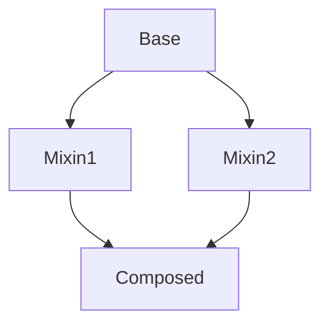
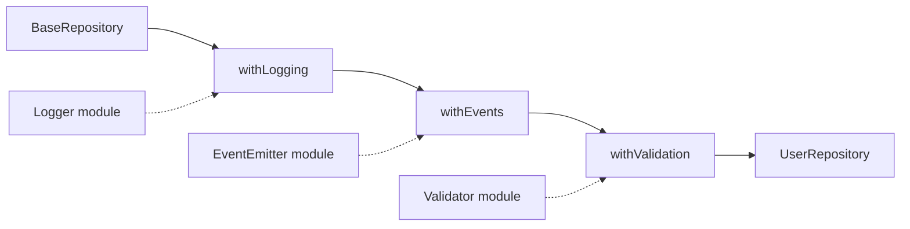
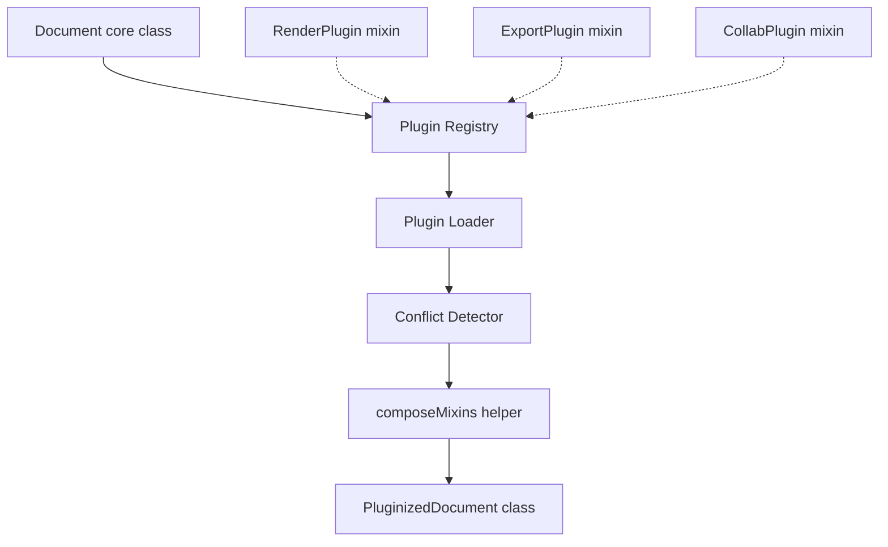

# 1.18 Mixins and Composition

> Tags: #javascript #composition #mixins #traits #typescript #oop #design-patterns

## 1. Purpose

JavaScript has a single inheritance chain. Every regular object has exactly one [[Prototype]] internal slot, and an ES6 class can extend exactly one base class. The moment you want a class that is "a Logger AND an EventEmitter AND a Validatable," classical inheritance runs into a wall — you would need to stack `Logger extends EventEmitter extends Validatable`, and that tower of base classes is brittle, fragile, and impossible to re-order without rewriting the chain.

Mixins exist to break that wall. A mixin is a reusable unit of behavior that you can apply to many different classes without making those classes part of a single lineage. A `withLogging` mixin can be applied to a `UserRepository`, a `PaymentGateway`, and a `BackgroundWorker`, all of which also extend their own unrelated base classes. The mixin is mixed in sideways, not stacked up vertically.

The behaviors mixins typically enable read like a wishlist of cross-cutting concerns:

- A **Logger mixin** that gives any class a `log`, `warn`, `error` method family.
- An **EventEmitter mixin** that gives any class `on`, `off`, `emit`.
- A **Validatable mixin** that gives any class a `validate` method that walks declared schema fields.
- A **Serializable mixin** that adds `toJSON` and `fromJSON`.
- A **Disposable mixin** that adds `dispose` and a `disposed` flag.
- A **Cached mixin** that adds a `cache` map and a `cached(key, fn)` helper.

Each of those behaviors is small, focused, and reusable across hundreds of classes. Trying to model them with inheritance would require either a towering multiple-inheritance hierarchy (which JS does not have) or a fat shared base class that every class in the app must extend — the "God Base Class" anti-pattern.

**The bug class mixins prevent:**

1. **Deep inheritance hierarchies.** A class extending `BaseRepository extends BasePersistable extends BaseEventEmitter extends BaseLoggable extends BaseEntity` is impossible to reason about, change, or test. Mixins let each concern be applied independently.
2. **Fragile base classes.** A change to a base class ripples to every descendant, even those that did not ask for the new behavior. Mixins localize the ripple — only classes that explicitly apply the mixin see the change.
3. **Behavioral duplication.** Without mixins, every class that needs `on`/`emit` re-implements it, or copies a helper module by hand. Mixins centralize the behavior.
4. **God base classes.** Without mixins, frameworks tend to evolve a single `BaseThing` that accumulates every concern. Mixins let a class opt into only what it needs.

**The bug class mixins introduce:**

1. **Silent name collisions.** If two mixins both define `log`, the second to be applied silently overwrites the first. There is no compiler error, no warning — just behavior that quietly changes.
2. **Mixin ordering bugs.** `compose(withA, withB)` and `compose(withB, withA)` can produce different runtime behavior, and the difference is invisible at the call site.
3. **The diamond problem.** Two mixins both pull in a third shared behavior (or both define the same method), and the resolution is ambiguous — which one wins?
4. **Implicit contracts.** A mixin often assumes its host has certain other methods or fields. `withEventEmitter` may assume `this.id` exists. If the host does not provide it, the mixin fails at runtime, not at type-check time (unless the TS mixin is properly constrained).
5. **Shared state across instances.** A naive mixin that closes over a `Map` defined in the mixin body shares that Map across every instance of every class that uses the mixin — a particularly nasty form of cross-instance bleed.
6. **Loss of type safety in TS.** Without the `Constructor<T>` pattern, TS class mixins fall back to `any`, and the compiler cannot catch missing host methods.

The rest of this note is a guided tour of how mixins work at the engine level, how to type them in TypeScript, how to detect and resolve the diamond problem with traits, and how to decide — for any given design problem — whether to reach for inheritance, mixins, traits, or plain functional composition.

## 2. Theory and Deep Dive

### 2.1 The single-inheritance wall

Every object constructed by `new SomeClass()` has, at construction time, exactly one [[Prototype]] internal slot. That slot points at `SomeClass.prototype`, which itself has a [[Prototype]] pointing at its base class prototype, and so on up to `Object.prototype`. The chain is a singly linked list. There is no second-parent slot, no "also extends" field, no protocol for merging two prototype chains.

ES6 `class extends Base` syntactic sugar writes that single slot via `Object.setPrototypeOf(Subclass.prototype, Base.prototype)` and `Object.setPrototypeOf(Subclass, Base)`. You can only do this once per class. The result is a tree, not a graph. Mixins are how you make it a graph.

### 2.2 Object mixins via Object.assign

The simplest mixin mechanism in JavaScript is `Object.assign(target, ...sources)`. It copies own enumerable properties (including methods, since methods are just function-valued properties) from each source onto the target. Later sources overwrite earlier ones.

```javascript
const withLogging = {
  log(msg)   { console.log(`[info] ${msg}`); },
  warn(msg)  { console.warn(`[warn] ${msg}`); },
  error(msg) { console.error(`[err]  ${msg}`); },
};

const withEvents = {
  on(evt, cb)   { /* subscribe */ },
  off(evt, cb)  { /* unsubscribe */ },
  emit(evt, payload) { /* dispatch */ },
};

class UserService {
  getUser(id) { return { id, name: 'Ada' }; }
}

Object.assign(UserService.prototype, withLogging, withEvents);

const svc = new UserService();
svc.log('hello');        // [info] hello
svc.emit('ready', null); // fires 'ready'
```

What this does at the engine level: for each source object, V8 walks its own enumerable string-keyed properties and assigns each one to `target` via `[[Set]]`. Inherited properties on the source (from its prototype chain) are NOT copied — only own properties. Symbols are NOT copied by `Object.assign` (use `Reflect.ownKeys` if you need them). Getters on the source are invoked once, and their return value is assigned — the getter itself is not transferred to the target.

The same pattern in TypeScript requires a cast because `Object.assign`'s inferred intersection return type only kicks in for the static overload — when applied to `SomeClass.prototype` you usually need to assert:

```typescript
const withLogging = {
  log(msg: string)   { console.log(`[info] ${msg}`); },
  warn(msg: string)  { console.warn(`[warn] ${msg}`); },
  error(msg: string) { console.error(`[err]  ${msg}`); },
};

type Loggable = typeof withLogging;

class UserService {
  getUser(id: number) { return { id, name: 'Ada' }; }
}

Object.assign(UserService.prototype, withLogging) as Loggable;

const svc = new UserService() as unknown as InstanceType<typeof UserService> & Loggable;
svc.log('hello');
```

This is verbose and error-prone, which is one of the reasons TS developers reach for class-based mixins instead.

### 2.3 Functional mixins

A functional mixin is a function that takes an object and returns an augmented object. The simplest form is a pure spread:

```javascript
const withLogging = (obj) => ({
  ...obj,
  log(msg)   { console.log(`[info] ${msg}`); },
  warn(msg)  { console.warn(`[warn] ${msg}`); },
  error(msg) { console.error(`[err]  ${msg}`); },
});

const withEvents = (obj) => ({
  ...obj,
  on(evt, cb)   { /* subscribe */ },
  off(evt, cb)  { /* unsubscribe */ },
  emit(evt, p)  { /* dispatch */ },
});

const makeService = (initial) =>
  withEvents(withLogging(initial));

const svc = makeService({ getUser(id) { return { id, name: 'Ada' }; } });
svc.log('hello');
svc.getUser(42);
```

A more flexible pattern accepts options:

```javascript
const withLogging = (obj, { prefix = 'info' } = {}) => ({
  ...obj,
  log(msg)  { console.log(`[${prefix}] ${msg}`); },
});
```

And a "tap" pattern mutates and returns the same object, which is closer to what class mixins do:

```javascript
const withLogging = (obj) => {
  obj.log   = (m) => console.log(`[info] ${m}`);
  obj.warn  = (m) => console.warn(`[warn] ${m}`);
  obj.error = (m) => console.error(`[err]  ${m}`);
  return obj;
};
```

The pure-spread version is immutable (it creates a new object), which is safer for sharing state but breaks `instanceof` and prototype-based dispatch. The tap version preserves identity but introduces mutation. Both are valid functional mixins.

### 2.4 Class-based mixins

A class-based mixin is a function that takes a base class and returns a subclass that adds the mixin's methods. The returned class can then be used directly or further mixed.

```javascript
function withLogging(Base) {
  return class extends Base {
    log(msg)   { console.log(`[info] ${msg}`); }
    warn(msg)  { console.warn(`[warn] ${msg}`); }
    error(msg) { console.error(`[err]  ${msg}`); }
  };
}

function withEvents(Base) {
  return class extends Base {
    on(evt, cb)   { /* subscribe */ }
    off(evt, cb)  { /* unsubscribe */ }
    emit(evt, p)  { /* dispatch */ }
  };
}

class UserService {
  getUser(id) { return { id, name: 'Ada' }; }
}

const LoggedEventfulUserService = withEvents(withLogging(UserService));

const svc = new LoggedEventfulUserService();
svc.log('hello');
svc.getUser(42);
svc instanceof UserService; // true — prototype chain preserved
```

The `instanceof` check passes because the mixed class genuinely extends `UserService` through two layers of prototype linkage. This is the killer feature of class-based mixins over functional spread: the prototype chain is intact, so all the usual JS dispatch machinery (including `super` calls inside the mixin methods) works.

### 2.5 The TypeScript Constructor<T> pattern

In TypeScript, a class is also a value (the constructor function). To describe "any constructor that produces a T," you write:

```typescript
type Constructor<T = {}> = new (...args: any[]) => T;
```

This says: any function that, when called with `new`, returns an instance of `T`. The default `T = {}` lets you write `Constructor` (no type argument) for "any constructor at all." A typed class mixin then looks like:

```typescript
type Constructor<T = {}> = new (...args: any[]) => T;

function withLogging<T extends Constructor>(Base: T) {
  return class extends Base {
    log(msg: string)   { console.log(`[info] ${msg}`); }
    warn(msg: string)  { console.warn(`[warn] ${msg}`); }
    error(msg: string) { console.error(`[err]  ${msg}`); }
  };
}

function withEvents<T extends Constructor>(Base: T) {
  return class extends Base {
    private listeners: Record<string, Array<(p: unknown) => void>> = {};
    on(evt: string, cb: (p: unknown) => void) {
      (this.listeners[evt] ??= []).push(cb);
    }
    off(evt: string, cb: (p: unknown) => void) {
      this.listeners[evt] = (this.listeners[evt] ?? []).filter(c => c !== cb);
    }
    emit(evt: string, p: unknown) {
      (this.listeners[evt] ?? []).forEach(cb => cb(p));
    }
  };
}

class UserService {
  getUser(id: number) { return { id, name: 'Ada' }; }
}

class LoggedEventfulUserService extends withEvents(withLogging(UserService)) {}

const svc = new LoggedEventfulUserService();
svc.log('hello');
svc.emit('ready', null);
svc.getUser(42);
```

The `T extends Constructor` generic preserves the type of `Base` so that the returned class is recognized as a subclass of whatever was passed in — `instanceof UserService` still works at the type level, and the mixin's methods are added to the type without `as` casts.

If a mixin requires its host to have a particular field, you constrain `T` further:

```typescript
function withSerializedId<T extends Constructor<{ id: string | number }>>(Base: T) {
  return class extends Base {
    serializedId() { return `id:${this.id}`; }
  };
}
```

Now TypeScript will refuse to apply `withSerializedId` to a class that does not expose an `id` property. This is how you turn an implicit contract into a compile-time checked contract.

### 2.6 The `class extends BaseMixin {}` pattern

When you do not want to use a helper function call inside `extends`, you can declare a class that mixes a base inline:

```javascript
class UserRepo extends withEvents(withLogging(BaseRepository)) {
  findAll() { /* ... */ }
}
```

This is the same mechanism — `withEvents(withLogging(BaseRepository))` evaluates to a class expression, and `extends` accepts any expression that resolves to a constructor. TypeScript handles this correctly as long as the mixin is typed with `Constructor<T>`.

The class-expression-in-extends pattern is concise but has a subtle cost: every time the module is evaluated, the mixed base class is constructed. In practice this happens once per module load, so it is fine, but it does mean you cannot share the same mixed base across files unless you extract it:

```javascript
// shared.js
export const LoggedRepository = withLogging(BaseRepository);

// userRepo.js
import { LoggedRepository } from './shared.js';
class UserRepo extends LoggedRepository { /* ... */ }
```

### 2.7 Traits and conflict resolution

A trait is a stricter form of mixin that requires conflict resolution to be explicit. Where a mixin silently lets later sources overwrite earlier ones, a trait makes you choose between three operations when two methods collide:

1. **Exclude** — drop one of the conflicting methods entirely.
2. **Alias** — rename one of the conflicting methods so both survive under different names.
3. **Override** — explicitly state which one wins.

The classic example: two traits both define `toString`. With mixins, the second silently wins. With traits, you must write something like:

```javascript
const composed = trait({
  ...traitA,
  ...traitB,
  toString: alias(traitA.toString, 'aToString'),
});
```

or:

```javascript
const composed = trait({
  ...traitA,
  ...exclude(traitB, ['toString']),
});
```

Languages like Scala, PHP, and Rust have native trait systems. JavaScript has no native traits, but they can be implemented as a small library (we build one in Section 9.3). The point is to make the diamond problem loud rather than silent.

### 2.8 The diamond problem

The diamond problem is the classic multiple-inheritance hazard. Given a base class, two mixins that both inherit from that base (or both define the same method), and a composed class that pulls from both mixins, the composed class has ambiguous inheritance:



If `Mixin1` and `Mixin2` both define `log`, and `Composed` inherits from both, which `log` does `Composed` get? In C++ this is ambiguous and the compiler rejects it. In Python the answer is determined by Method Resolution Order (C3 linearization). In JavaScript mixins, the answer is "whichever was applied last," which is silent and ordering-dependent.

Traits solve this by forcing the composer to resolve the conflict explicitly via alias, exclude, or override. Without traits, the best you can do is:

1. Use distinct method names per mixin (`logInfo` vs `logAudit`) so collisions cannot happen.
2. Apply mixins in a deterministic, documented order.
3. Manually alias: copy the method to a new name and delete the original before applying the next mixin.
4. Use a `composeMixins` helper that detects collisions and throws.

We build option 4 in Section 5.2.

### 2.9 Mermaid: the mixin composition graph



The dotted lines indicate that the mixin imports the behavior from a shared module; the solid lines indicate the prototype chain built by successive `class extends` applications. The final `UserRepository` has all four behaviors in its prototype chain, but the chain is still linear — `withValidation extends withEvents extends withLogging extends BaseRepository`. The "diamond" only appears when two unrelated mixins in the chain happen to define the same method.

## 3. Mental Models

A handful of mental models make mixins easier to reason about. Each model is a simplification, but each captures a real property of the mechanism.

### 3.1 Mixin = a function that augments

The most general definition: a mixin is any function that takes an object (or a class) and returns the same object (or a subclass) augmented with new behavior. The augmentation can be via spread (functional mixin), via `Object.assign` (object mixin), or via `class extends` (class mixin). The unifying idea is "add capabilities to a thing without changing its lineage."

### 3.2 Functional mixin = a pipe of behaviors

Treat the initial object as a value flowing through a pipeline. Each mixin is a stage that takes the value in, attaches a layer of behavior, and passes the value on. The final value has all the layers stacked.

```javascript
const svc = pipe(
  { getUser(id) { return { id, name: 'Ada' }; } },
  withLogging,
  withEvents,
  withValidation,
);
```

This model is honest about ordering: the pipeline runs left-to-right, and later stages can override earlier ones. It also makes it obvious that the result is a plain object, not an instance of any class — `instanceof` is meaningless here.

### 3.3 Class mixin = wrap and extend

A class mixin is a wrapper that takes a base class, returns a new class that extends it, and adds methods to the new class. The base class is not modified. The new class can be used as a base for further wrapping.

```javascript
const Enhanced = withEvents(withLogging(Base));
```

The wrapping is conceptually infinite: `withA(withB(withC(Base)))` builds a three-deep class tower. The prototype chain is linear, but the capabilities are additive.

### 3.4 Composition over inheritance = small pieces, not tall trees

The Gang of Four advice ("favor object composition over class inheritance") is the philosophical core. Inheritance is for "is-a" relationships that are stable and taxonomic. Composition (including mixins) is for "has-a" or "can-do" relationships that may change. A `User` is a `Person` (inheritance, probably stable). A `User` can log, can emit events, can be validated (composition, can change as requirements evolve).

### 3.5 Where the models break down

- The "pipe" model hides the `this` rebinding issue: methods defined inside a functional mixin's spread close over the original object, so `this` inside them is the spread target, not the host. This is fine for stateless mixins but breaks for stateful ones.
- The "wrap and extend" model hides the fact that `super` calls inside a class mixin refer to the wrapped base's methods, not to "the other mixins applied later." If `withLogging.log` calls `super.log`, that calls the base class's `log` (if any), not some other mixin's `log`.
- The "small pieces" model assumes the pieces really are small. In practice, mixins tend to grow. Ember's `Ember.Object.extend` mixins were often hundreds of lines.

## 4. Real-World Use Cases

### 4.1 Ember.Object.extend

Ember.js (released 2011) was the first major JS framework to ship mixins as a first-class feature. `Ember.Object.extend` accepted a hash of properties and returned a subclass; `Ember.Mixin.create` produced a reusable mixin that could be passed to `extend`. The framework itself used mixins heavily: `Ember.EventedMixin`, `Ember.ActionHandler`, `Ember.ControllerMixin`. Ember's runtime kept a per-class method table that resolved collisions at class-creation time, which is closer to traits than to bare `Object.assign`. Ember mixins are still supported in the modern Ember Octane edition, but the recommended pattern has shifted to plain classes with composition.

### 4.2 Vue 2 mixins

Vue 2 popularized component-level mixins: a `mixins: [myMixin]` option on a component definition merged the mixin's data, computed, methods, lifecycle hooks, and watchers into the component. The merge strategy was per-option-type: data was merged recursively, hooks were concatenated and run in mixin-then-component order, methods were last-wins (component over mixin). This was convenient for sharing behavior across components but caused two persistent problems:

1. **Implicit dependencies.** A mixin could call `this.someMethodDefinedByComponent` and the parent component was expected to provide it. There was no compile-time check, and the dependency was invisible at the call site.
2. **Name collisions.** Two mixins both defining `fetchData` resolved silently to the last applied. Vue 2's `mixins: [a, b]` array gave no warning.

Vue 3 deprecated component mixins in favor of the Composition API (`setup()`, `useX()` composables), which are essentially functional mixins with explicit dependency injection. The same idea — small composable functions that return behavior — appears in React as custom hooks.

### 4.3 React higher-order components (HOCs)

A React HOC is a function that takes a component and returns a new component that wraps it. This is structurally identical to a class mixin: `withLogging(Component)` returns a new component that renders `Component` and adds logging. The HOC pattern was dominant in React before hooks (2019) and is now mostly replaced by hooks, but the underlying idea — "compose behavior by wrapping" — is the same.

The HOC pattern's well-known pitfalls are the same as mixins': name collisions (`displayName`, `statics` hoisting), implicit contracts (the wrapped component must accept certain props), and ordering (`withRouter(withTheme(C))` vs `withTheme(withRouter(C))` can differ). The React team's hooks RFC explicitly cited these problems as motivation for the move to hooks.

### 4.4 TypeScript Constructor<T> in NestJS and TypeORM

NestJS and TypeORM both lean heavily on the `Constructor<T>` mixin pattern. TypeORM's `BaseEntity` is often extended via a typed mixin that adds timestamps:

```typescript
function withTimestamps<T extends Constructor>(Base: T) {
  return class extends Base {
    createdAt: Date;
    updatedAt: Date;
    touch() { this.updatedAt = new Date(); }
  };
}
```

NestJS's official documentation includes a "mixin" recipe for dynamic modules and providers. The pattern is the same: a function that takes a base class and returns a subclass, typed with `Constructor<T>` so the returned class is recognized by the DI container.

### 4.5 Lodash merge as a runtime object mixin

Lodash's `merge(target, ...sources)` is a deep variant of `Object.assign` that recurses into plain objects and arrays. It is the runtime equivalent of an object mixin: given a target object and several source objects, it merges all of them into the target, with last-wins for primitives and deep merge for nested objects. `merge` is widely used to compose configuration objects, default options, and partial updates — all of which are mixin use cases at the data level rather than the class level.

The deep-merge behavior is sometimes what you want (config composition) and sometimes a footgun (accidentally merging two mixins that both have a `state` object produces a state object with all keys from both, which is rarely the intent).

### 4.6 Three.js class mixins for material behaviors

Three.js uses class-based mixins internally for material behaviors. `Material`, `MeshBasicMaterial`, `MeshStandardMaterial`, and others share behaviors like `dispose`, `addEventListener`, and `hasEventListener` via a mixin applied to the base `Material` class. The pattern lets the library add or remove behaviors without disturbing the (already long) inheritance chain `Material -> MeshBasicMaterial -> MeshStandardMaterial`.

### 4.7 Mixin use cases summary

- **Cross-cutting concerns** that do not fit a single inheritance line: logging, metrics, events, validation, serialization, disposal, caching, retry, throttling.
- **Plugin systems** where third-party code augments a core class without modifying it.
- **Framework extensibility** where the framework provides a base class and developers add behaviors.
- **Test doubles** where a test-only mixin adds stubbing or spying to a production class.

## 5. Code Examples

### 5.1 Example A — Minimal and Conceptual

The same three mixins (`withLogging`, `withEvents`, `withValidation`) implemented three ways: object mixin, functional mixin, and class mixin.

#### 5.1.1 Object mixin (Object.assign)

**JavaScript:**

```javascript
const withLogging = {
  log(msg)   { console.log(`[info] ${msg}`); },
  warn(msg)  { console.warn(`[warn] ${msg}`); },
  error(msg) { console.error(`[err]  ${msg}`); },
};

const withEvents = {
  on(evt, cb) {
    if (!this.eventListeners) this.eventListeners = new Map();
    const set = this.eventListeners.get(evt) ?? new Set();
    set.add(cb);
    this.eventListeners.set(evt, set);
    return () => this.off(evt, cb);
  },
  off(evt, cb) { this.eventListeners?.get(evt)?.delete(cb); },
  emit(evt, payload) {
    this.eventListeners?.get(evt)?.forEach(cb => cb(payload));
  },
};

const withValidation = {
  validate(data, schema) {
    const errors = [];
    for (const [field, rule] of Object.entries(schema)) {
      if (!rule(data[field])) errors.push(`${field} failed`);
    }
    return errors.length === 0 ? null : errors;
  },
};

class UserService {
  getUser(id) { return { id, name: 'Ada', email: 'ada@x.dev' }; }
}

Object.assign(UserService.prototype, withLogging, withEvents, withValidation);

const svc = new UserService();
svc.log('booting');
svc.on('ready', () => svc.log('ready fired'));
const user = svc.getUser(42);
const err = svc.validate(user, { id: v => typeof v === 'number' });
svc.emit('ready', null);
```

**TypeScript:**

```typescript
interface EventHost {
  eventListeners?: Map<string, Set<(p: unknown) => void>>;
}

const withLogging = {
  log(msg: string)   { console.log(`[info] ${msg}`); },
  warn(msg: string)  { console.warn(`[warn] ${msg}`); },
  error(msg: string) { console.error(`[err]  ${msg}`); },
};

const withEvents = {
  on(this: EventHost, evt: string, cb: (p: unknown) => void) {
    if (!this.eventListeners) this.eventListeners = new Map();
    const set = this.eventListeners.get(evt) ?? new Set();
    set.add(cb);
    this.eventListeners.set(evt, set);
    return () => this.off(evt, cb);
  },
  off(this: EventHost, evt: string, cb: (p: unknown) => void) {
    this.eventListeners?.get(evt)?.delete(cb);
  },
  emit(this: EventHost, evt: string, payload: unknown) {
    this.eventListeners?.get(evt)?.forEach(cb => cb(payload));
  },
};

const withValidation = {
  validate<T extends Record<string, unknown>>(
    data: T,
    schema: Partial<{ [K in keyof T]: (v: T[K]) => boolean }>,
  ): string[] | null {
    const errors: string[] = [];
    for (const [field, rule] of Object.entries(schema) as [string, (v: unknown) => boolean][]) {
      if (rule && !rule(data[field as keyof T])) errors.push(`${field} failed`);
    }
    return errors.length === 0 ? null : errors;
  },
};

type Mixin = typeof withLogging & typeof withEvents & typeof withValidation;

class UserService {
  getUser(id: number) { return { id, name: 'Ada', email: 'ada@x.dev' }; }
}
Object.assign(UserService.prototype, withLogging, withEvents, withValidation);

const svc = new UserService() as unknown as UserService & Mixin;
svc.log('booting');
svc.on('ready', () => svc.log('ready fired'));
const user = svc.getUser(42);
const err = svc.validate(user, { id: v => typeof v === 'number' });
svc.emit('ready', null);
```

Note the `as unknown as` cast — the object-mixin pattern does not flow types through `Object.assign` cleanly, which is one of the reasons to prefer class mixins in TS.

#### 5.1.2 Functional mixin (spread)

**JavaScript:**

```javascript
const withLogging = (obj) => ({
  ...obj,
  log(msg)   { console.log(`[info] ${msg}`); },
  warn(msg)  { console.warn(`[warn] ${msg}`); },
  error(msg) { console.error(`[err]  ${msg}`); },
});

const withEvents = (obj) => {
  const listeners = new Map();
  return {
    ...obj,
    on(evt, cb) {
      const set = listeners.get(evt) ?? new Set();
      set.add(cb);
      listeners.set(evt, set);
      return () => listeners.get(evt)?.delete(cb);
    },
    off(evt, cb) { listeners.get(evt)?.delete(cb); },
    emit(evt, payload) { listeners.get(evt)?.forEach(cb => cb(payload)); },
  };
};

const withValidation = (obj) => ({
  ...obj,
  validate(data, schema) {
    const errors = [];
    for (const [field, rule] of Object.entries(schema)) {
      if (!rule(data[field])) errors.push(`${field} failed`);
    }
    return errors.length === 0 ? null : errors;
  },
});

const compose = (...mixins) => (initial) =>
  mixins.reduce((acc, m) => m(acc), initial);

const makeUserService = compose(withValidation, withEvents, withLogging);

const svc = makeUserService({
  getUser(id) { return { id, name: 'Ada' }; },
});

svc.log('booting');
svc.on('ready', () => svc.log('ready fired'));
svc.emit('ready', null);
```

**TypeScript:**

```typescript
type AnyObj = Record<string, any>;

const withLogging = <T extends AnyObj>(obj: T) => ({
  ...obj,
  log(msg: string)   { console.log(`[info] ${msg}`); },
  warn(msg: string)  { console.warn(`[warn] ${msg}`); },
  error(msg: string) { console.error(`[err]  ${msg}`); },
});

const withEvents = <T extends AnyObj>(obj: T) => {
  const listeners = new Map<string, Set<(p: unknown) => void>>();
  return {
    ...obj,
    on(evt: string, cb: (p: unknown) => void) {
      const set = listeners.get(evt) ?? new Set();
      set.add(cb);
      listeners.set(evt, set);
      return () => listeners.get(evt)?.delete(cb);
    },
    off(evt: string, cb: (p: unknown) => void) {
      listeners.get(evt)?.delete(cb);
    },
    emit(evt: string, payload: unknown) {
      listeners.get(evt)?.forEach(cb => cb(payload));
    },
  };
};

const withValidation = <T extends AnyObj>(obj: T) => ({
  ...obj,
  validate<D extends Record<string, unknown>>(
    data: D,
    schema: Partial<{ [K in keyof D]: (v: D[K]) => boolean }>,
  ): string[] | null {
    const errors: string[] = [];
    for (const [field, rule] of Object.entries(schema) as [string, (v: unknown) => boolean][]) {
      if (rule && !rule(data[field as keyof D])) errors.push(`${field} failed`);
    }
    return errors.length === 0 ? null : errors;
  },
});

type Mixin<T> = (obj: T) => T & AnyObj;
const compose = <T extends AnyObj>(...mixins: Array<Mixin<T>>) =>
  (initial: T) => mixins.reduce((acc, m) => m(acc) as T, initial);

const makeUserService = compose(
  withValidation,
  withEvents,
  withLogging,
);

const svc = makeUserService({ getUser(id: number) { return { id, name: 'Ada' }; } });
svc.log('booting');
svc.on('ready', () => svc.log('ready fired'));
svc.emit('ready', null);
```

#### 5.1.3 Class mixin (extends)

**JavaScript:**

```javascript
function withLogging(Base) {
  return class extends Base {
    log(msg)   { console.log(`[info] ${msg}`); }
    warn(msg)  { console.warn(`[warn] ${msg}`); }
    error(msg) { console.error(`[err]  ${msg}`); }
  };
}

function withEvents(Base) {
  return class extends Base {
    #listeners = new Map();
    on(evt, cb) {
      const set = this.#listeners.get(evt) ?? new Set();
      set.add(cb);
      this.#listeners.set(evt, set);
      return () => this.off(evt, cb);
    }
    off(evt, cb) { this.#listeners.get(evt)?.delete(cb); }
    emit(evt, payload) {
      this.#listeners.get(evt)?.forEach(cb => cb(payload));
    }
  };
}

function withValidation(Base) {
  return class extends Base {
    validate(data, schema) {
      const errors = [];
      for (const [field, rule] of Object.entries(schema)) {
        if (!rule(data[field])) errors.push(`${field} failed`);
      }
      return errors.length === 0 ? null : errors;
    }
  };
}

class UserService {
  getUser(id) { return { id, name: 'Ada' }; }
}

class AppUserService extends withValidation(withEvents(withLogging(UserService))) {}

const svc = new AppUserService();
svc.log('booting');
svc.on('ready', () => svc.log('ready fired'));
const user = svc.getUser(42);
svc.validate(user, { id: v => typeof v === 'number' });
svc.emit('ready', null);
console.log(svc instanceof UserService); // true
```

**TypeScript:**

```typescript
type Constructor<T = {}> = new (...args: any[]) => T;

function withLogging<T extends Constructor>(Base: T) {
  return class extends Base {
    log(msg: string)   { console.log(`[info] ${msg}`); }
    warn(msg: string)  { console.warn(`[warn] ${msg}`); }
    error(msg: string) { console.error(`[err]  ${msg}`); }
  };
}

function withEvents<T extends Constructor>(Base: T) {
  return class extends Base {
    #listeners = new Map<string, Set<(p: unknown) => void>>();
    on(evt: string, cb: (p: unknown) => void) {
      const set = this.#listeners.get(evt) ?? new Set();
      set.add(cb);
      this.#listeners.set(evt, set);
      return () => this.off(evt, cb);
    }
    off(evt: string, cb: (p: unknown) => void) {
      this.#listeners.get(evt)?.delete(cb);
    }
    emit(evt: string, payload: unknown) {
      this.#listeners.get(evt)?.forEach(cb => cb(payload));
    }
  };
}

function withValidation<T extends Constructor>(Base: T) {
  return class extends Base {
    validate<D extends Record<string, unknown>>(
      data: D,
      schema: Partial<{ [K in keyof D]: (v: D[K]) => boolean }>,
    ): string[] | null {
      const errors: string[] = [];
      for (const [field, rule] of Object.entries(schema) as [string, (v: unknown) => boolean][]) {
        if (rule && !rule(data[field as keyof D])) errors.push(`${field} failed`);
      }
      return errors.length === 0 ? null : errors;
    }
  };
}

class UserService {
  getUser(id: number) { return { id, name: 'Ada' }; }
}

class AppUserService extends withValidation(withEvents(withLogging(UserService))) {}

const svc = new AppUserService();
svc.log('booting');
svc.on('ready', () => svc.log('ready fired'));
const user = svc.getUser(42);
svc.validate(user, { id: v => typeof v === 'number' });
svc.emit('ready', null);
console.log(svc instanceof UserService); // true
```

The class mixin version is the only one that preserves `instanceof UserService`, supports `super` inside the mixin methods, and gives TypeScript enough information to type-check the resulting class without casts.

### 5.2 Example B — Production-Grade Typed Mixin System with Conflict Detection

A production mixin system should:

1. Be typed with `Constructor<T>` so TS understands the result.
2. Detect method-name collisions at composition time and throw.
3. Support per-instance state (no shared state across instances).
4. Document each mixin's implicit contract via generic constraints.
5. Provide a `composeMixins(...mixins)(Base)` helper that returns a single mixed class.

**JavaScript:**

```javascript
function defineMixin(name, contract, factory) {
  return { name, contract, factory };
}

function composeMixins(...mixins) {
  return function (Base) {
    const seen = new Map();
    let Mixed = Base;
    for (const m of mixins) {
      // Probe the mixin's prototype to learn which methods it adds.
      const probe = m.factory(class {});
      const methodNames = Object.getOwnPropertyNames(probe.prototype)
        .filter(n => n !== 'constructor');
      for (const methodName of methodNames) {
        if (seen.has(methodName)) {
          throw new Error(
            `Mixin collision: "${methodName}" is defined by both ` +
            `"${seen.get(methodName)}" and "${m.name}". ` +
            `Use alias, exclude, or override to resolve.`,
          );
        }
        seen.set(methodName, m.name);
      }
      Mixed = m.factory(Mixed);
    }
    return Mixed;
  };
}

const withLogging = defineMixin(
  'withLogging',
  {},
  (Base) => class extends Base {
    log(msg)   { console.log(`[info] ${msg}`); }
    warn(msg)  { console.warn(`[warn] ${msg}`); }
    error(msg) { console.error(`[err]  ${msg}`); }
  },
);

const withEvents = defineMixin(
  'withEvents',
  {},
  (Base) => class extends Base {
    #listeners = new Map();
    on(evt, cb) {
      const set = this.#listeners.get(evt) ?? new Set();
      set.add(cb);
      this.#listeners.set(evt, set);
      return () => this.off(evt, cb);
    }
    off(evt, cb) { this.#listeners.get(evt)?.delete(cb); }
    emit(evt, payload) {
      this.#listeners.get(evt)?.forEach(cb => cb(payload));
    }
  },
);

const withValidation = defineMixin(
  'withValidation',
  { schema: 'object' },
  (Base) => class extends Base {
    validate(data, schema) {
      const errors = [];
      for (const [field, rule] of Object.entries(schema)) {
        if (!rule(data[field])) errors.push(`${field} failed`);
      }
      return errors.length === 0 ? null : errors;
    }
  },
);

const withAudit = defineMixin(
  'withAudit',
  { log: 'function' }, // implicit contract: host must have log()
  (Base) => class extends Base {
    audit(action, details) {
      this.log(`[audit] ${action}: ${JSON.stringify(details)}`);
    }
  },
);

class UserService {
  getUser(id) { return { id, name: 'Ada' }; }
}

class AppUserService extends composeMixins(
  withLogging, withEvents, withValidation, withAudit,
)(UserService) {}

const svc = new AppUserService();
svc.log('booting');
svc.audit('getUser', { id: 42 });
const user = svc.getUser(42);
svc.validate(user, { id: v => typeof v === 'number' });
svc.emit('ready', null);

// Collision example (uncomment to see the throw):
// class Bad extends composeMixins(withLogging, withLogging)(UserService) {}
// Error: Mixin collision: "log" is defined by both "withLogging" and "withLogging".
```

**TypeScript:**

```typescript
type Constructor<T = {}> = new (...args: any[]) => T;

interface MixinDef<TContract = {}> {
  name: string;
  contract: TContract;
  factory: <T extends Constructor>(Base: T) => new (...args: any[]) => any;
}

function defineMixin<TContract extends Record<string, string>>(
  name: string,
  contract: TContract,
  factory: <T extends Constructor>(Base: T) => any,
): MixinDef<TContract> {
  return { name, contract, factory };
}

function composeMixins(...mixins: MixinDef[]) {
  return function <T extends Constructor>(Base: T) {
    const seen = new Map<string, string>();
    let Mixed: any = Base;
    for (const m of mixins) {
      const probe = m.factory(class {});
      const methodNames = Object.getOwnPropertyNames(probe.prototype)
        .filter(n => n !== 'constructor');
      for (const methodName of methodNames) {
        if (seen.has(methodName)) {
          throw new Error(
            `Mixin collision: "${methodName}" is defined by both ` +
            `"${seen.get(methodName)}" and "${m.name}". ` +
            `Use alias, exclude, or override to resolve.`,
          );
        }
        seen.set(methodName, m.name);
      }
      Mixed = m.factory(Mixed);
    }
    return Mixed as new (...args: any[]) => InstanceType<T>;
  };
}

const withLogging = defineMixin(
  'withLogging',
  {},
  <T extends Constructor>(Base: T) =>
    class extends Base {
      log(msg: string)   { console.log(`[info] ${msg}`); }
      warn(msg: string)  { console.warn(`[warn] ${msg}`); }
      error(msg: string) { console.error(`[err]  ${msg}`); }
    },
);

const withEvents = defineMixin(
  'withEvents',
  {},
  <T extends Constructor>(Base: T) =>
    class extends Base {
      #listeners = new Map<string, Set<(p: unknown) => void>>();
      on(evt: string, cb: (p: unknown) => void) {
        const set = this.#listeners.get(evt) ?? new Set();
        set.add(cb);
        this.#listeners.set(evt, set);
        return () => this.off(evt, cb);
      }
      off(evt: string, cb: (p: unknown) => void) {
        this.#listeners.get(evt)?.delete(cb);
      }
      emit(evt: string, payload: unknown) {
        this.#listeners.get(evt)?.forEach(cb => cb(payload));
      }
    },
);

const withValidation = defineMixin(
  'withValidation',
  { schema: 'object' },
  <T extends Constructor>(Base: T) =>
    class extends Base {
      validate<D extends Record<string, unknown>>(
        data: D,
        schema: Partial<{ [K in keyof D]: (v: D[K]) => boolean }>,
      ): string[] | null {
        const errors: string[] = [];
        for (const [field, rule] of Object.entries(schema) as [string, (v: unknown) => boolean][]) {
          if (rule && !rule(data[field as keyof D])) errors.push(`${field} failed`);
        }
        return errors.length === 0 ? null : errors;
      }
    },
);

const withAudit = defineMixin(
  'withAudit',
  { log: 'function' },
  <T extends Constructor<{ log: (msg: string) => void }>>(Base: T) =>
    class extends Base {
      audit(action: string, details: unknown) {
        this.log(`[audit] ${action}: ${JSON.stringify(details)}`);
      }
    },
);

class UserService {
  getUser(id: number) { return { id, name: 'Ada' }; }
}

// Note: composeMixins uses `any` internally for the mixed base, so the
// withAudit contract is NOT enforced at compile time through this path.
// To get full contract enforcement, apply mixins directly:
//   class X extends withAudit(withValidation(withEvents(withLogging(Base)))) {}
class AppUserService extends composeMixins(
  withLogging,
  withEvents,
  withValidation,
  withAudit,
)(UserService) {}

const svc = new AppUserService() as unknown as InstanceType<typeof AppUserService>;
svc.log('booting');
svc.audit('getUser', { id: 42 });
const user = svc.getUser(42);
svc.validate(user, { id: v => typeof v === 'number' });
svc.emit('ready', null);
```

Key properties of this production system:

- `defineMixin` records the mixin's name and its expected host contract, which makes the implicit contract visible at the type level (when applied directly).
- `composeMixins(...mixins)(Base)` walks the mixin list once to detect collisions before applying them; if two mixins define the same method, it throws with a clear message naming both mixins and the conflicting method.
- `#listeners` is a private field on each instance, so there is no shared-state bleed.
- The `withAudit` mixin's generic constraint `<T extends Constructor<{ log: (msg: string) => void }>>` makes TypeScript refuse to apply `withAudit` to a class that lacks a `log` method when used directly. The implicit contract is now explicit.

## 6. Common Mistakes and Anti-Patterns

### 6.1 Silent name collisions (last-wins)

```javascript
const withFileLog = (Base) => class extends Base {
  log(msg) { console.log(`[file] ${msg}`); } // mock file write
};
const withConsoleLog = (Base) => class extends Base {
  log(msg) { console.log(`[console] ${msg}`); }
};

class Svc extends withFileLog(withConsoleLog(Base)) {}
new Svc().log('hi'); // "[console] hi" — file log silently overwritten
```

The second mixin's `log` overwrites the first's prototype method. There is no warning. The fix is either (a) rename one to `logToConsole`, (b) use a `composeMixins` helper that detects collisions (Section 5.2), or (c) adopt a traits library that requires explicit resolution.

### 6.2 Mixin ordering matters (silent bug)

```javascript
// Order A: cache wraps retry — retry fires first, cache hits skip retry
const A = withCache(withRetry(Fetcher));
// Order B: retry wraps cache — cache stores the failed attempt, retry re-uses it
const B = withRetry(withCache(Fetcher));
```

Both lines produce a class that has both `cache` and `retry` behavior, but the runtime semantics differ. Worse, neither produces an error — the bug surfaces only as "the cache seems to be returning stale errors" in production. The fix is to document each mixin's expected position (e.g., "withCache must be the outermost mixin") and to enforce it in `composeMixins` via a `priority` field.

### 6.3 `this` in mixins assumes the host has certain props (implicit contract)

```javascript
const withAudit = (Base) => class extends Base {
  audit(action) {
    this.log(`[audit] ${this.id} ${action}`); // assumes this.log and this.id exist
  }
};
```

If the host does not have `log` or `id`, this throws at runtime — `TypeError: this.log is not a function` or `undefined` in the template string. There is no compile-time check unless the mixin's TS generic is constrained (Section 5.2's `withAudit`). The fix is to constrain the generic and to document the contract in JSDoc.

### 6.4 TypeScript mixin generic constraint too loose (loses type safety)

```typescript
function withAudit(Base: any) {  // too loose
  return class extends Base {
    audit(action: string) { this.log(`[audit] ${action}`); }
  };
}
```

Because `Base` is `any`, the returned class is `any`, and `this.log` is unchecked. Applying `withAudit` to a class without `log` compiles fine and fails at runtime. The fix is `function withAudit<T extends Constructor<{ log: (s: string) => void }>>(Base: T)`.

### 6.5 Stateful mixins share state across instances

```javascript
// WRONG: shared Map across all instances of all classes using this mixin
const withEvents = (Base) => class extends Base {
  static listeners = new Map(); // shared across instances!
  on(evt, cb) { /* mutates the shared static map */ }
};
```

Or the more insidious version:

```javascript
const withEvents = (Base) => {
  const listeners = new Map(); // captured once, shared across all instances
  return class extends Base {
    on(evt, cb) { /* mutates the shared `listeners` */ }
  };
};
```

Every instance of every class that uses this mixin writes into the same `listeners` Map. Two unrelated classes share event subscriptions. The fix is to put state on the instance: either as a field initializer (`listeners = new Map()` — instance field) or as a private field (`#listeners = new Map()`).

### 6.6 Vue 2 global mixin registration pollutes everything

```javascript
// main.js
Vue.mixin({
  created() { console.log('a component was created'); },
});
```

`Vue.mixin` registers a mixin that is applied to EVERY component in the app, including third-party ones. There is no way to opt out. Two `Vue.mixin` calls in different libraries both apply, and their `created` hooks concatenate. The result is unpredictable global behavior. Vue 3's Composition API and `app.directive` / `app.provide` replace this pattern with explicit, scoped extension points.

### 6.7 Object.assign is shallow and skips symbols

```javascript
const sym = Symbol('id');
const source = { [sym]: 42, nested: { a: 1 } };
const target = {};
Object.assign(target, source);
target[sym];                    // undefined — symbols are not copied
target.nested === source.nested; // true — shallow copy, same reference
```

A mixin that uses symbol keys (for "private" fields) is silently dropped by `Object.assign`. Use `Reflect.ownKeys` with a manual copy if symbols matter, or use class mixins (which put fields on the prototype and instances, not on a shared source object).

### 6.8 Diamond problem with no resolution strategy

```javascript
const withLogA = (Base) => class extends Base {
  log(msg) { console.log(`A: ${msg}`); }
};
const withLogB = (Base) => class extends Base {
  log(msg) { console.log(`B: ${msg}`); }
};
// Both mixins define log(). When composed, B wins silently.
class Svc extends withLogB(withLogA(Base)) {}
new Svc().log('hi'); // "B: hi" — A is gone, no warning
```

The fix is to use distinct method names, or to use a traits-style library that requires `alias`, `exclude`, or `override` to resolve the conflict explicitly.

### 6.9 Treating mixins as a substitute for type design

Mixins are a tool for code reuse, not for type modeling. If you find yourself writing mixins with names like `withIsAPerson` or `withExtendsAnimal`, you are misusing them — those should be inheritance. Mixins are for capabilities ("can log," "can emit events"), not for taxonomic relationships ("is a person").

### 6.10 Forgetting that `super` inside a mixin refers to the wrapped base

```javascript
const withOverride = (Base) => class extends Base {
  log(msg) {
    console.log('before');
    super.log(msg);      // calls Base.prototype.log, not "the next mixin's log"
    console.log('after');
  }
};
```

If `Base` is itself a mixed class (`withLogging(SomeBase)`), `super.log` calls `withLogging`'s `log`, not some other mixin's `log`. The chain is linear and well-defined, but developers often assume `super` will find "any other log somewhere in the composition." It will not — it walks the linear prototype chain.

## 7. Best Practices and Design Patterns

### 7.1 Prefer composition over inheritance (Gang of Four)

The advice from "Design Patterns" (Gamma, Helm, Johnson, Vlissides, 1994) is to favor object composition over class inheritance. Inheritance is for "is-a" relationships that are stable for the lifetime of the system. Composition (including mixins, functional mixins, and plain function injection) is for "has-a" or "can-do" relationships that may change. When in doubt, ask: "If I later need to remove this behavior from this class, how hard is it?" If the answer is "I have to change the class hierarchy," you should have used composition.

### 7.2 Use small, single-purpose mixins

A mixin that does one thing (logging, events, validation, disposal) is easy to test, easy to document, and easy to remove. A mixin that does six things is a God Object in disguise. Rule of thumb: if the mixin's name has an "and" in it (`withLoggingAndEvents`), split it.

### 7.3 Use TS Constructor<T> to type class mixins

```typescript
type Constructor<T = {}> = new (...args: any[]) => T;

function withLogging<T extends Constructor>(Base: T) {
  return class extends Base { /* ... */ };
}
```

This preserves the type of `Base` through the mixin, so the returned class is recognized as a subclass of whatever was passed in, with the mixin's methods added. Avoid `Base: any` — it discards all type information.

### 7.4 Document the implicit contract a mixin expects on its host

A mixin that calls `this.id` or `this.log` inside its methods has an implicit contract: the host must provide `id` or `log`. Document this in JSDoc and, in TS, encode it in the generic constraint:

```typescript
function withAudit<T extends Constructor<{ log: (msg: string) => void }>>(Base: T) {
  return class extends Base {
    audit(action: string) { this.log(`[audit] ${action}`); }
  };
}
```

Now the contract is enforced at compile time.

### 7.5 Avoid stateful mixins, or use a factory that creates fresh state per instance

Stateful mixins (those that close over a `Map`, `Array`, or other mutable object) are a common source of cross-instance bleed. The safe patterns are:

1. **Instance fields.** Put state on the instance: `#listeners = new Map()` inside the class body. Each instance gets its own Map.
2. **Factory functions.** If the mixin needs configuration, accept it as a parameter to the factory: `withEvents({ maxListeners: 10 })(Base)`. The configuration is captured once per application, but the state goes on the instance.
3. **No mixin-level state.** Design the mixin to be stateless — pure functions that take `this` and return values. State lives elsewhere.

### 7.6 Consider composition with plain functions (no `this`) as an alternative

A growing body of opinion in the JS community holds that the cleanest form of composition is plain functions that take an explicit context object, with no `this` at all:

```javascript
const makeLogger = (ctx) => ({
  log: (msg) => console.log(`[${ctx.name}] ${msg}`),
});
const makeEvents = (ctx) => {
  const listeners = new Map();
  return {
    on: (evt, cb) => { (listeners.get(evt) ?? new Set()).add(cb); },
    emit: (evt, p) => { listeners.get(evt)?.forEach(cb => cb(p)); },
  };
};

const svc = {
  name: 'user',
  ...makeLogger({ name: 'user' }),
  ...makeEvents({ name: 'user' }),
};
```

This is the approach taken by Vue 3 composables, React hooks, and many modern TS codebases. It sidesteps the `this` binding, the implicit contract problem, and the shared-state problem entirely. The cost is that `instanceof` is meaningless and there is no prototype chain.

### 7.7 Use a composeMixins helper that detects collisions

Bare `class extends withA(withB(Base))` silently overwrites on collision. A `composeMixins(...mixins)(Base)` helper that walks the method names first and throws on collision (Section 5.2) turns silent bugs into loud errors at module-load time.

### 7.8 Treat mixins as a layering tool, not a configuration tool

Mixins are for adding capabilities. They are not for configuring the host (use constructor parameters for that), not for swapping implementations (use dependency injection for that), and not for conditional behavior (use strategy objects for that). Mixing configuration into mixins leads to mixins that take 12 constructor parameters and are impossible to test in isolation.

## 8. Technical Interview Knowledge

### 8.1 Q: What is a mixin?

A: A mixin is a reusable unit of behavior that can be applied to many different classes without being part of their inheritance lineage. In JavaScript, the three common forms are (1) object mixins via `Object.assign(target, ...sources)`, (2) functional mixins via `const withX = (obj) => ({ ...obj, ...newBehavior })`, and (3) class mixins via `function withX(Base) { return class extends Base {} }`. The unifying idea is "add capabilities to a thing without changing its parent." Trap to avoid: confusing mixins with multiple inheritance — JS has no multiple inheritance, and mixins are an emulation, not a language feature.

### 8.2 Q: What is the difference between a mixin and inheritance?

A: Inheritance is for "is-a" relationships and creates a single linear prototype chain. A class can extend exactly one base class. Mixins are for "can-do" or "has-a" relationships and can be applied to many unrelated classes. A class can have many mixins. Inheritance is structural and taxonomic (a `Dog` is an `Animal`); mixins are behavioral and cross-cutting (a `Dog` can `Log`, can `EmitEvents`, can be `Validatable`). Inheritance is checked by `instanceof`; mixins are not (unless you use class mixins, which preserve the chain). Trap to avoid: using mixins to model "is-a" relationships — that leads to mixins like `withIsAPerson`, which is a misuse.

### 8.3 Q: What is the diamond problem?

A: The diamond problem arises when a class inherits (or mixes in) the same method from two different sources. Given `Base -> MixinA -> Composed` and `Base -> MixinB -> Composed`, if both `MixinA` and `MixinB` define `log`, which one does `Composed` get? In C++ this is a compile error; in Python it is resolved by MRO (C3 linearization); in JavaScript mixins it is resolved silently by application order — the last applied wins, with no warning. Trap to avoid: assuming the diamond problem only affects languages with native multiple inheritance — it affects JS mixins just as much, only silently.

### 8.4 Q: How do traits differ from mixins?

A: A trait is a stricter form of mixin that requires explicit conflict resolution. Where a mixin silently overwrites on collision, a trait makes you choose: **alias** (rename one method so both survive), **exclude** (drop one entirely), or **override** (explicitly state which wins). Traits were popularized by Scala and PHP; JavaScript has no native trait system but they can be implemented as a small library. The benefit of traits is that the diamond problem becomes loud (the library refuses to compose two traits with a collision unless you resolve it) instead of silent. Trap to avoid: claiming traits and mixins are fundamentally different mechanisms — traits are a refinement of mixins, not a separate concept.

### 8.5 Q: How do you implement a typed class mixin in TypeScript?

A: Use the `Constructor<T>` pattern:

```typescript
type Constructor<T = {}> = new (...args: any[]) => T;

function withLogging<T extends Constructor>(Base: T) {
  return class extends Base {
    log(msg: string) { console.log(msg); }
  };
}
```

The generic `T` preserves the type of `Base` so the returned class is recognized as a subclass of whatever was passed in. If the mixin requires its host to have certain fields, constrain `T` further:

```typescript
function withAudit<T extends Constructor<{ id: string }>>(Base: T) {
  return class extends Base {
    audit(action: string) { console.log(`${this.id}: ${action}`); }
  };
}
```

Trap to avoid: using `Base: any` instead of `Base: T extends Constructor` — this discards all type information and the returned class is `any`.

### 8.6 Q: Why did Vue 3 drop component mixins in favor of the Composition API?

A: Vue 2 mixins had three persistent problems: (1) **implicit dependencies** — a mixin could call `this.someMethodDefinedByComponent` with no compile-time check; (2) **name collisions** — two mixins defining `fetchData` silently overwrote each other; (3) **no clear data flow** — it was impossible to tell which mixin provided which property without reading all of them. The Composition API (`setup()`, `useX()` composables) replaces this with explicit function calls: `const { fetch } = useFetch()`. The dependency is visible at the call site, naming collisions are impossible (you can rename on destructure), and data flow is explicit. Trap to avoid: assuming the Composition API is a TypeScript feature — it is a runtime pattern that works in plain JS too.

### 8.7 Q: What is the implicit contract problem?

A: A mixin's methods often call `this.someMethod()` or read `this.someField`, assuming the host class provides them. This is the mixin's "implicit contract" — a precondition that is not enforced by the type system (unless you constrain the TS generic) and not documented by the syntax. If the host does not provide the required method, the mixin fails at runtime with `TypeError: this.someMethod is not a function`. The fixes are: (1) constrain the TS generic so the contract is checked at compile time; (2) document the contract in JSDoc; (3) use a `composeMixins` helper that validates the contract at composition time. Trap to avoid: assuming that "it compiles" means "the contract is satisfied" — without generic constraints, TS does not check mixin contracts at all.

### 8.8 Q: When does composition beat inheritance?

A: Composition (including mixins) beats inheritance when:

1. The relationship is "can-do" (a `User` can log) rather than "is-a" (a `Dog` is an `Animal`).
2. The behavior is cross-cutting (logging, events, validation apply to many unrelated classes).
3. The behavior may change (you might want to remove logging from `User` later — easy with a mixin, painful with inheritance).
4. The behavior is configurable (different instances of the same class may want different logging behavior — impossible with inheritance, trivial with composed mixins).
5. The class hierarchy would otherwise be deep and fragile (more than 2-3 levels of inheritance is usually a smell).

Inheritance wins when the relationship is genuinely taxonomic and stable (a `Square` is a `Rectangle`, a `SavingsAccount` is an `Account`). Trap to avoid: using inheritance for code reuse — that is what composition is for. Inheritance is for type modeling.

## 9. Practical Exercises

### 9.1 Implement three functional mixins and compose them

**Exercise:** Write `withLogging`, `withEvents`, and `withValidation` as functional mixins (functions that take an object and return an augmented object). Compose them into a `makeUserService` factory that produces an object with all three behaviors.

**JavaScript solution:**

```javascript
const withLogging = (obj) => ({
  ...obj,
  log(msg)   { console.log(`[info] ${msg}`); },
  warn(msg)  { console.warn(`[warn] ${msg}`); },
  error(msg) { console.error(`[err]  ${msg}`); },
});

const withEvents = (obj) => {
  const listeners = new Map();
  return {
    ...obj,
    on(evt, cb) {
      const set = listeners.get(evt) ?? new Set();
      set.add(cb);
      listeners.set(evt, set);
      return () => listeners.get(evt)?.delete(cb);
    },
    off(evt, cb) { listeners.get(evt)?.delete(cb); },
    emit(evt, payload) { listeners.get(evt)?.forEach(cb => cb(payload)); },
  };
};

const withValidation = (obj) => ({
  ...obj,
  validate(data, schema) {
    const errors = [];
    for (const [field, rule] of Object.entries(schema)) {
      if (!rule(data[field])) errors.push(`${field} failed`);
    }
    return errors.length === 0 ? null : errors;
  },
});

const compose = (...mixins) => (initial) =>
  mixins.reduce((acc, m) => m(acc), initial);

const makeUserService = compose(withValidation, withEvents, withLogging);

const svc = makeUserService({
  getUser(id) { return { id, name: 'Ada', email: 'ada@x.dev' }; },
});

svc.log('booting');
svc.on('ready', () => svc.log('ready fired'));
const user = svc.getUser(42);
console.log(svc.validate(user, { id: v => typeof v === 'number' })); // null
svc.emit('ready', null);
```

**TypeScript solution:**

```typescript
type AnyObj = Record<string, any>;

const withLogging = <T extends AnyObj>(obj: T) => ({
  ...obj,
  log(msg: string)   { console.log(`[info] ${msg}`); },
  warn(msg: string)  { console.warn(`[warn] ${msg}`); },
  error(msg: string) { console.error(`[err]  ${msg}`); },
});

const withEvents = <T extends AnyObj>(obj: T) => {
  const listeners = new Map<string, Set<(p: unknown) => void>>();
  return {
    ...obj,
    on(evt: string, cb: (p: unknown) => void) {
      const set = listeners.get(evt) ?? new Set();
      set.add(cb);
      listeners.set(evt, set);
      return () => listeners.get(evt)?.delete(cb);
    },
    off(evt: string, cb: (p: unknown) => void) {
      listeners.get(evt)?.delete(cb);
    },
    emit(evt: string, payload: unknown) {
      listeners.get(evt)?.forEach(cb => cb(payload));
    },
  };
};

const withValidation = <T extends AnyObj>(obj: T) => ({
  ...obj,
  validate<D extends Record<string, unknown>>(
    data: D,
    schema: Partial<{ [K in keyof D]: (v: D[K]) => boolean }>,
  ): string[] | null {
    const errors: string[] = [];
    for (const [field, rule] of Object.entries(schema) as [string, (v: unknown) => boolean][]) {
      if (rule && !rule(data[field as keyof D])) errors.push(`${field} failed`);
    }
    return errors.length === 0 ? null : errors;
  },
});

type Mixin<T> = (obj: T) => T & AnyObj;
const compose = <T extends AnyObj>(...mixins: Array<Mixin<T>>) =>
  (initial: T) => mixins.reduce((acc, m) => m(acc) as T, initial);

const makeUserService = compose(
  withValidation,
  withEvents,
  withLogging,
);

const svc = makeUserService({
  getUser(id: number) { return { id, name: 'Ada', email: 'ada@x.dev' }; },
});

svc.log('booting');
svc.on('ready', () => svc.log('ready fired'));
const user = svc.getUser(42);
console.log(svc.validate(user, { id: v => typeof v === 'number' })); // null
svc.emit('ready', null);
```

### 9.2 Implement a TS-typed class mixin system

**Exercise:** Using `Constructor<T>`, implement `withLogging`, `withEvents`, `withValidation`, and `withDisposable` as typed class mixins. Compose them into a `Repository` class that extends a `BaseRepository` base. Verify `instanceof BaseRepository` still works.

**JavaScript solution:**

```javascript
function withLogging(Base) {
  return class extends Base {
    log(msg)   { console.log(`[info] ${msg}`); }
    warn(msg)  { console.warn(`[warn] ${msg}`); }
    error(msg) { console.error(`[err]  ${msg}`); }
  };
}

function withEvents(Base) {
  return class extends Base {
    #listeners = new Map();
    on(evt, cb) {
      const set = this.#listeners.get(evt) ?? new Set();
      set.add(cb);
      this.#listeners.set(evt, set);
      return () => this.off(evt, cb);
    }
    off(evt, cb) { this.#listeners.get(evt)?.delete(cb); }
    emit(evt, payload) {
      this.#listeners.get(evt)?.forEach(cb => cb(payload));
    }
  };
}

function withValidation(Base) {
  return class extends Base {
    validate(data, schema) {
      const errors = [];
      for (const [field, rule] of Object.entries(schema)) {
        if (!rule(data[field])) errors.push(`${field} failed`);
      }
      return errors.length === 0 ? null : errors;
    }
  };
}

function withDisposable(Base) {
  return class extends Base {
    #disposed = false;
    get disposed() { return this.#disposed; }
    dispose() {
      if (this.#disposed) return;
      this.#disposed = true;
      this.onDispose?.();
    }
  };
}

class BaseRepository {
  constructor(tableName) { this.tableName = tableName; }
  find(id) { return { id, name: 'Ada' }; }
}

class Repository extends withDisposable(
  withValidation(withEvents(withLogging(BaseRepository))),
) {}

const repo = new Repository('users');
repo.log('opening');
repo.on('close', () => repo.log('closed'));
const user = repo.find(42);
const err = repo.validate(user, { id: v => typeof v === 'number' });
repo.emit('close', null);
repo.dispose();
console.log(repo.disposed);                       // true
console.log(repo instanceof BaseRepository);      // true
console.log(repo instanceof Repository);          // true
```

**TypeScript solution:**

```typescript
type Constructor<T = {}> = new (...args: any[]) => T;

function withLogging<T extends Constructor>(Base: T) {
  return class extends Base {
    log(msg: string)   { console.log(`[info] ${msg}`); }
    warn(msg: string)  { console.warn(`[warn] ${msg}`); }
    error(msg: string) { console.error(`[err]  ${msg}`); }
  };
}

function withEvents<T extends Constructor>(Base: T) {
  return class extends Base {
    #listeners = new Map<string, Set<(p: unknown) => void>>();
    on(evt: string, cb: (p: unknown) => void) {
      const set = this.#listeners.get(evt) ?? new Set();
      set.add(cb);
      this.#listeners.set(evt, set);
      return () => this.off(evt, cb);
    }
    off(evt: string, cb: (p: unknown) => void) {
      this.#listeners.get(evt)?.delete(cb);
    }
    emit(evt: string, payload: unknown) {
      this.#listeners.get(evt)?.forEach(cb => cb(payload));
    }
  };
}

function withValidation<T extends Constructor>(Base: T) {
  return class extends Base {
    validate<D extends Record<string, unknown>>(
      data: D,
      schema: Partial<{ [K in keyof D]: (v: D[K]) => boolean }>,
    ): string[] | null {
      const errors: string[] = [];
      for (const [field, rule] of Object.entries(schema) as [string, (v: unknown) => boolean][]) {
        if (rule && !rule(data[field as keyof D])) errors.push(`${field} failed`);
      }
      return errors.length === 0 ? null : errors;
    }
  };
}

function withDisposable<T extends Constructor>(Base: T) {
  return class extends Base {
    #disposed = false;
    get disposed() { return this.#disposed; }
    dispose() {
      if (this.#disposed) return;
      this.#disposed = true;
      (this as any).onDispose?.();
    }
  };
}

class BaseRepository {
  constructor(public tableName: string) {}
  find(id: number) { return { id, name: 'Ada' }; }
}

class Repository extends withDisposable(
  withValidation(withEvents(withLogging(BaseRepository))),
) {}

const repo = new Repository('users');
repo.log('opening');
repo.on('close', () => repo.log('closed'));
const user = repo.find(42);
const err = repo.validate(user, { id: v => typeof v === 'number' });
repo.emit('close', null);
repo.dispose();
console.log(repo.disposed);                       // true
console.log(repo instanceof BaseRepository);      // true
console.log(repo instanceof Repository);          // true
```

### 9.3 Build a trait with conflict resolution (alias, exclude, override)

**Exercise:** Implement a small trait library with three operations: `alias(trait, from, to)` renames a method; `exclude(trait, methodNames)` removes methods; `override(t1, t2, method, winner)` resolves a collision explicitly. Compose two traits that both define `log` using each operation.

**JavaScript solution:**

```javascript
const trait = (methods) => ({ methods });

const alias = (t, from, to) => ({
  methods: {
    ...t.methods,
    [to]: t.methods[from],
  },
});

const exclude = (t, methodNames) => {
  const out = { ...t.methods };
  for (const name of methodNames) delete out[name];
  return { methods: out };
};

const override = (t1, t2, method, winner) => ({
  methods: {
    ...t1.methods,
    ...t2.methods,
    [method]: (winner === 't1' ? t1.methods : t2.methods)[method],
  },
});

const composeTraits = (...traits) => {
  const result = {};
  for (const t of traits) {
    for (const [name, fn] of Object.entries(t.methods)) {
      if (result[name] !== undefined && result[name] !== fn) {
        throw new Error(`Unresolved trait conflict on "${name}"`);
      }
      result[name] = fn;
    }
  }
  return trait(result);
};

// Two traits that both define log()
const consoleTrait = trait({
  log(msg) { console.log(`[console] ${msg}`); },
  info(msg) { console.log(`[info] ${msg}`); },
});

const fileTrait = trait({
  log(msg) { console.log(`[file] ${msg}`); }, // mock file write
  flush()   { console.log('flushed'); },
});

// Strategy A: alias fileTrait.log to logToFile, then compose
const aliasedFile = alias(fileTrait, 'log', 'logToFile');
const composedA = composeTraits(consoleTrait, aliasedFile);
composedA.methods.log('hello');       // [console] hello
composedA.methods.logToFile('hello'); // [file] hello

// Strategy B: exclude fileTrait.log entirely
const excludedFile = exclude(fileTrait, ['log']);
const composedB = composeTraits(consoleTrait, excludedFile);
composedB.methods.log('hello'); // [console] hello
composedB.methods.flush();      // flushed

// Strategy C: override — let fileTrait.log win
const composedC = override(consoleTrait, fileTrait, 'log', 't2');
composedC.methods.log('hello'); // [file] hello
```

**TypeScript solution:**

```typescript
type TraitMethods = Record<string, (...args: any[]) => any>;
interface Trait { methods: TraitMethods; }

const trait = (methods: TraitMethods): Trait => ({ methods });

const alias = (t: Trait, from: string, to: string): Trait => ({
  methods: { ...t.methods, [to]: t.methods[from] },
});

const exclude = (t: Trait, methodNames: string[]): Trait => {
  const out: TraitMethods = { ...t.methods };
  for (const name of methodNames) delete out[name];
  return { methods: out };
};

const override = (
  t1: Trait, t2: Trait, method: string, winner: 't1' | 't2',
): Trait => ({
  methods: {
    ...t1.methods,
    ...t2.methods,
    [method]: (winner === 't1' ? t1.methods : t2.methods)[method],
  },
});

const composeTraits = (...traits: Trait[]): Trait => {
  const result: TraitMethods = {};
  for (const t of traits) {
    for (const [name, fn] of Object.entries(t.methods)) {
      if (result[name] !== undefined && result[name] !== fn) {
        throw new Error(`Unresolved trait conflict on "${name}"`);
      }
      result[name] = fn;
    }
  }
  return trait(result);
};

const consoleTrait = trait({
  log(msg: string) { console.log(`[console] ${msg}`); },
  info(msg: string) { console.log(`[info] ${msg}`); },
});

const fileTrait = trait({
  log(msg: string) { console.log(`[file] ${msg}`); },
  flush() { console.log('flushed'); },
});

const aliasedFile = alias(fileTrait, 'log', 'logToFile');
const composedA = composeTraits(consoleTrait, aliasedFile);
composedA.methods.log('hello');
composedA.methods.logToFile('hello');

const excludedFile = exclude(fileTrait, ['log']);
const composedB = composeTraits(consoleTrait, excludedFile);
composedB.methods.log('hello');
composedB.methods.flush();

const composedC = override(consoleTrait, fileTrait, 'log', 't2');
composedC.methods.log('hello');
```

### 9.4 Refactor a deep inheritance hierarchy into composed mixins

**Exercise:** Given the following fragile deep hierarchy, refactor it into a flat base class plus composed mixins. The hierarchy crams three behaviors into inheritance: logging, event emission, and validation. The `UserService` extends `LoggableEventEmitter extends Loggable extends Base` — and `LoggableEventEmitter` exists only to combine two concerns.

**Before (JavaScript):**

```javascript
class Base {
  constructor(name) { this.name = name; }
}

class Loggable extends Base {
  log(msg) { console.log(`[${this.name}] ${msg}`); }
}

class LoggableEventEmitter extends Loggable {
  constructor(name) {
    super(name);
    this.listeners = new Map();
  }
  on(evt, cb) {
    const set = this.listeners.get(evt) ?? new Set();
    set.add(cb);
    this.listeners.set(evt, set);
  }
  emit(evt, payload) {
    this.listeners.get(evt)?.forEach(cb => cb(payload));
  }
}

class ValidatableLoggableEventEmitter extends LoggableEventEmitter {
  validate(data, schema) {
    const errors = [];
    for (const [k, rule] of Object.entries(schema)) {
      if (!rule(data[k])) errors.push(`${k} failed`);
    }
    return errors.length === 0 ? null : errors;
  }
}

class UserService extends ValidatableLoggableEventEmitter {
  getUser(id) { return { id, name: 'Ada' }; }
}

const svc = new UserService('user-svc');
svc.log('booting');
svc.on('ready', () => svc.log('ready'));
svc.getUser(42);
svc.validate({ id: 42 }, { id: v => typeof v === 'number' });
```

**After (JavaScript, refactored to mixins):**

```javascript
function withLogging(Base) {
  return class extends Base {
    log(msg) { console.log(`[${this.name}] ${msg}`); }
  };
}

function withEvents(Base) {
  return class extends Base {
    #listeners = new Map();
    on(evt, cb) {
      const set = this.#listeners.get(evt) ?? new Set();
      set.add(cb);
      this.#listeners.set(evt, set);
    }
    emit(evt, payload) {
      this.#listeners.get(evt)?.forEach(cb => cb(payload));
    }
  };
}

function withValidation(Base) {
  return class extends Base {
    validate(data, schema) {
      const errors = [];
      for (const [k, rule] of Object.entries(schema)) {
        if (!rule(data[k])) errors.push(`${k} failed`);
      }
      return errors.length === 0 ? null : errors;
    }
  };
}

class Base {
  constructor(name) { this.name = name; }
}

class UserService extends withValidation(withEvents(withLogging(Base))) {
  getUser(id) { return { id, name: 'Ada' }; }
}

const svc = new UserService('user-svc');
svc.log('booting');
svc.on('ready', () => svc.log('ready'));
svc.getUser(42);
svc.validate({ id: 42 }, { id: v => typeof v === 'number' });
```

**After (TypeScript):**

```typescript
type Constructor<T = {}> = new (...args: any[]) => T;

function withLogging<T extends Constructor<{ name: string }>>(Base: T) {
  return class extends Base {
    log(msg: string) { console.log(`[${this.name}] ${msg}`); }
  };
}

function withEvents<T extends Constructor>(Base: T) {
  return class extends Base {
    #listeners = new Map<string, Set<(p: unknown) => void>>();
    on(evt: string, cb: (p: unknown) => void) {
      const set = this.#listeners.get(evt) ?? new Set();
      set.add(cb);
      this.#listeners.set(evt, set);
    }
    emit(evt: string, payload: unknown) {
      this.#listeners.get(evt)?.forEach(cb => cb(payload));
    }
  };
}

function withValidation<T extends Constructor>(Base: T) {
  return class extends Base {
    validate<D extends Record<string, unknown>>(
      data: D,
      schema: Partial<{ [K in keyof D]: (v: D[K]) => boolean }>,
    ): string[] | null {
      const errors: string[] = [];
      for (const [k, rule] of Object.entries(schema) as [string, (v: unknown) => boolean][]) {
        if (rule && !rule(data[k as keyof D])) errors.push(`${k} failed`);
      }
      return errors.length === 0 ? null : errors;
    }
  };
}

class Base {
  constructor(public name: string) {}
}

class UserService extends withValidation(withEvents(withLogging(Base))) {
  getUser(id: number) { return { id, name: 'Ada' }; }
}

const svc = new UserService('user-svc');
svc.log('booting');
svc.on('ready', () => svc.log('ready'));
svc.getUser(42);
svc.validate({ id: 42 }, { id: v => typeof v === 'number' });
```

The refactored version is shorter, has only one level of inheritance, and each behavior can be added or removed independently. The `withLogging` mixin's generic constraint `T extends Constructor<{ name: string }>` makes the implicit contract ("host must have a `name` field") explicit and checked at compile time.

## 10. Mini-Project Blueprint — Plugin System Using Mixins

**Goal:** Build a plugin system where third-party code can augment a core `Document` class with new behaviors (rendering, export, collaboration, versioning) without modifying the core. Plugins are mixins applied at runtime, with conflict detection and a typed TS plugin API.

### 10.1 Architecture



The Document core exposes a stable, minimal API (CRUD on nodes, serialization). Plugins are class mixins that extend Document with new methods. The Plugin Registry accepts plugin definitions at startup; the Loader sorts them by priority, the Conflict Detector walks method names and throws on collisions, and `composeMixins` returns the final `PluginizedDocument` class that the application instantiates.

### 10.2 Key files

- `src/document/Document.ts` — core class with `addNode`, `removeNode`, `serialize`.
- `src/document/types.ts` — `Constructor<T>`, `PluginDef`, `PluginContext`.
- `src/document/composeMixins.ts` — the composer with conflict detection.
- `src/document/registry.ts` — `PluginRegistry` that collects plugins and produces `PluginizedDocument`.
- `src/plugins/render.ts` — `withRender` mixin (adds `render()`).
- `src/plugins/export.ts` — `withExport` mixin (adds `exportJSON()`, `exportXML()`).
- `src/plugins/collab.ts` — `withCollab` mixin (adds `subscribe()`, `broadcast()`).
- `src/plugins/versioning.ts` — `withVersioning` mixin (adds `commit()`, `revert()`).
- `src/app.ts` — registers plugins, instantiates `PluginizedDocument`, runs.

### 10.3 Reference implementation (compact, TypeScript)

```typescript
// src/document/types.ts
export type Constructor<T = {}> = new (...args: any[]) => T;
export interface PluginDef<TContract = {}> {
  name: string;
  priority: number;
  contract: TContract;
  factory: <T extends Constructor>(Base: T) => any;
}

// src/document/composeMixins.ts
import { Constructor, PluginDef } from './types';

export function composeMixins(...plugins: PluginDef[]) {
  return function <T extends Constructor>(Base: T) {
    const sorted = [...plugins].sort((a, b) => a.priority - b.priority);
    const seen = new Map<string, string>();
    let Mixed: any = Base;
    for (const p of sorted) {
      const probe = p.factory(class {});
      const methods = Object.getOwnPropertyNames(probe.prototype)
        .filter(n => n !== 'constructor');
      for (const m of methods) {
        if (seen.has(m)) {
          throw new Error(
            `Plugin collision: "${m}" defined by both "${seen.get(m)}" and "${p.name}".`,
          );
        }
        seen.set(m, p.name);
      }
      Mixed = p.factory(Mixed);
    }
    return Mixed as new (...args: any[]) => InstanceType<T>;
  };
}

// src/document/Document.ts
export class Document {
  #nodes: any[] = [];
  addNode(node: any) { this.#nodes.push(node); }
  removeNode(id: string) {
    this.#nodes = this.#nodes.filter(n => n.id !== id);
  }
  serialize() { return JSON.stringify(this.#nodes); }
}

// src/plugins/render.ts
import { Constructor, PluginDef } from '../document/types';
export const renderPlugin: PluginDef = {
  name: 'render',
  priority: 10,
  contract: {},
  factory: <T extends Constructor>(Base: T) =>
    class extends Base {
      render() { return `[document] ${(this as any).serialize()}`; }
    },
};

// src/plugins/export.ts
export const exportPlugin: PluginDef = {
  name: 'export',
  priority: 20,
  contract: { serialize: 'function' },
  factory: <T extends Constructor<{ serialize: () => string }>>(Base: T) =>
    class extends Base {
      exportJSON() { return this.serialize(); }
      exportXML()  { return `<doc>${this.serialize()}</doc>`; }
    },
};

// src/plugins/collab.ts
export const collabPlugin: PluginDef = {
  name: 'collab',
  priority: 30,
  contract: {},
  factory: <T extends Constructor>(Base: T) =>
    class extends Base {
      #peers = new Set<(msg: unknown) => void>();
      subscribe(cb: (msg: unknown) => void) {
        this.#peers.add(cb);
        return () => this.#peers.delete(cb);
      }
      broadcast(msg: unknown) { this.#peers.forEach(p => p(msg)); }
    },
};

// src/plugins/versioning.ts
export const versioningPlugin: PluginDef = {
  name: 'versioning',
  priority: 40,
  contract: {},
  factory: <T extends Constructor>(Base: T) =>
    class extends Base {
      #history: string[] = [];
      commit() { this.#history.push((this as any).serialize()); }
      revert() {
        const prev = this.#history.pop();
        if (prev) console.log('revert to', prev); // simplified
      }
    },
};

// src/app.ts
import { Document } from './document/Document';
import { composeMixins } from './document/composeMixins';
import { renderPlugin } from './plugins/render';
import { exportPlugin } from './plugins/export';
import { collabPlugin } from './plugins/collab';
import { versioningPlugin } from './plugins/versioning';

class PluginizedDocument extends composeMixins(
  renderPlugin, exportPlugin, collabPlugin, versioningPlugin,
)(Document) {}

const doc = new PluginizedDocument();
doc.addNode({ id: 'n1', text: 'hello' });
console.log(doc.render());      // [document] [{"id":"n1","text":"hello"}]
console.log(doc.exportJSON());
doc.subscribe(msg => console.log('peer got', msg));
doc.broadcast('changed');
doc.commit();
doc.revert();
```

### 10.4 Acceptance criteria

- `PluginizedDocument` exposes all four plugins' methods with full type inference (no `any` at the call site).
- A second plugin that defines `render` (collision) causes `composeMixins` to throw at class-declaration time with a message naming both plugins and the conflicting method.
- `instanceof Document` returns `true` on a `PluginizedDocument` instance (prototype chain preserved).
- Per-instance state (`#peers`, `#history`) is not shared across instances — verify with two `PluginizedDocument` instances that subscribing on one does not deliver to the other.
- Plugins are sorted by `priority` before composition; lower priority is applied first (becomes inner).

### 10.5 Stretch goals

- Add an `exclude(methodNames)` and `alias(from, to)` operation to the registry, so plugin authors can resolve collisions without changing the plugins themselves.
- Support plugin unregistration: produce a new `PluginizedDocument` class with a plugin removed, without mutating the original.
- Add a `peerDependencies` field to `PluginDef` so a plugin can declare that it requires another plugin to also be registered (e.g., `withAudit` requires `withLogging`).
- Add a runtime `validateContract()` that uses the `contract` field to assert the host has the expected methods at composition time, in addition to the TS-level generic constraint.

## 11. Core Connections

- [[1.13 Functional Programming Concepts]] — functional mixins are an application of higher-order functions and function composition; the `compose(...mixins)` helper is the same `compose` you would write for any function pipeline.
- [[1.14 Prototypes and Inheritance]] — class mixins work by writing to the prototype chain via `class extends`; understanding the single-inheritance wall is prerequisite to understanding why mixins exist.
- [[1.15 Object Creation Patterns]] — object mixins via `Object.assign` are a runtime variant of the factory and module patterns covered here; functional mixins are factories that return augmented objects.
- [[1.16 ES6 Classes Syntactic Sugar]] — class mixins depend on the `class extends <expression>` syntax, which is one of the few things ES6 classes enable that ES5 constructor functions could not do cleanly.
- [[2.07 Generics and Constraints]] — the TS `Constructor<T>` pattern is a direct application of generic constraints; the `T extends Constructor<{ log: ... }>` form is a constraint that turns an implicit contract into a compile-time check.
- [[2.18 OOP Patterns in TypeScript]] — typed mixins are one of the most common OOP patterns in TS codebases, alongside abstract classes and interfaces; this note is the deep dive on that pattern.
- [[4.01 SOLID Single Responsibility]] — small, single-purpose mixins are an application of SRP; a mixin that does six things violates SRP and becomes a God Object in disguise.

---

> **Takeaway:** Mixins are how JavaScript, a single-inheritance language, achieves the effect of multiple inheritance without the tax of deep hierarchies. The three forms — object mixins via `Object.assign`, functional mixins via spread, and class mixins via `class extends` — trade off type safety, identity, and ordering semantics in different ways. The TypeScript `Constructor<T>` pattern turns class mixins from a runtime trick into a statically typed abstraction, and a `composeMixins` helper that detects collisions turns the silent diamond problem into a loud, actionable error. Use mixins for cross-cutting capabilities (logging, events, validation), use inheritance for stable taxonomic relationships (Dog is an Animal), and when in doubt, reach for plain functions with explicit context objects — the cleanest composition of all.
