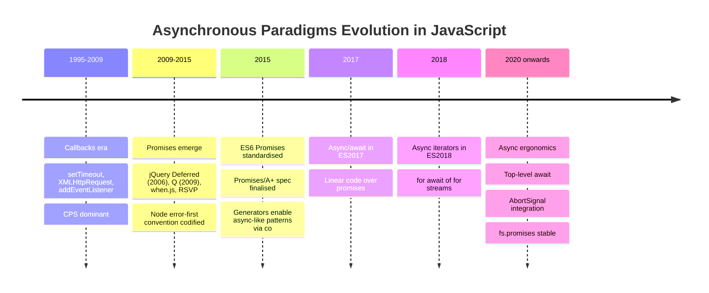
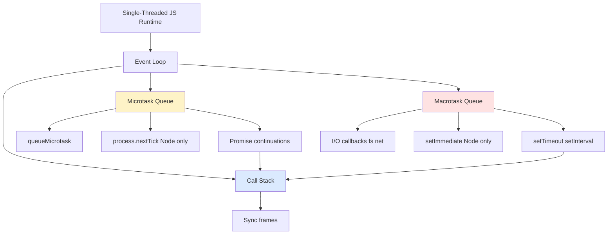
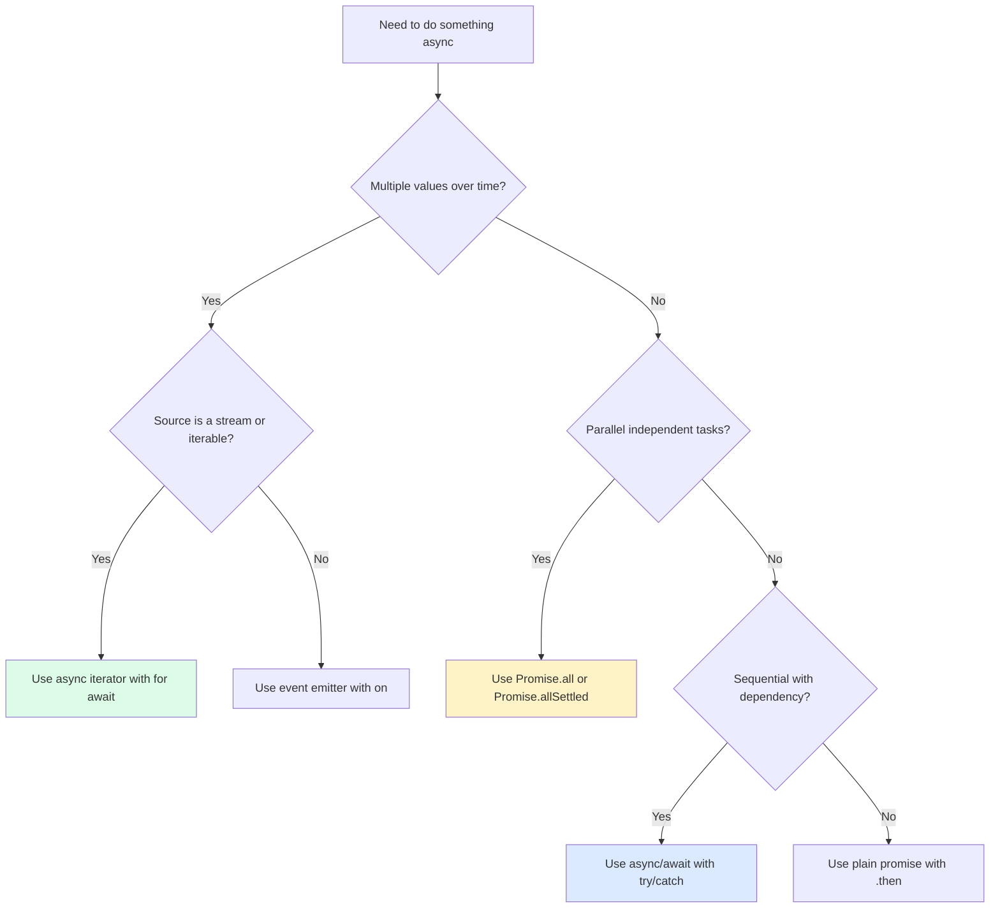
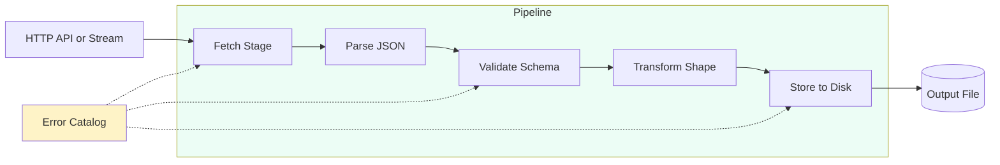

# 1.19 Asynchronous Paradigms Evolution

> JavaScript was born single-threaded, and the entire history of its asynchronous design is an attempt to make non-blocking code readable. This note is the historical and conceptual foundation for the rest of the asynchronous chapter. Read it to understand the *why* behind every async feature you will touch in Node, browsers, Deno, Bun, and edge runtimes: callbacks, continuation-passing style, the Node error-first convention, callback hell, inversion of control, promises, async/await, and async iterators.

---

## 1. Purpose

JavaScript shipped in 1995 inside a browser, sharing a single OS thread with the page rendering pipeline, the DOM event dispatch, the garbage collector, and every script the page loaded. Brendan Eich had ten days to deliver a language that could validate forms, animate images, and respond to button clicks without freezing the UI. The pragmatic decision was a single-threaded runtime with a non-blocking I/O model: long-running operations (timers, network requests, file access in Node, image decodes) are dispatched to the host environment, and the JS thread keeps running. When the operation completes, the host pushes a task into the event-loop queue. The thread eventually picks it up and resumes the corresponding JavaScript.

The single-threaded, non-blocking choice has a hard consequence: the language must express "do this later, when X finishes" without blocking the thread. Synchronous return values do not work for asynchronous results — by the time `readFile('a.txt')` returns, the file is not yet read. The language therefore had to evolve a series of paradigms for expressing deferred computation, each one fixing the wounds of the previous one.

The evolution proceeds in four major steps:

1. **Callbacks (1995 to roughly 2009).** Pass a function to the API; the API calls it later with the result. Direct, simple, and the only tool available in the browser for a decade. Adequate for one-shot events, painful for sequences.

2. **Promises (ES6, 2015).** A first-class object representing a future value. Chains flatten nested callbacks. Errors propagate automatically. Control returns to the caller. Standardised by [[1.20 Promises Specification]] and expanded in [[1.21 Promises API and Concurrency]].

3. **Async/await (ES2017).** Syntactic sugar over promises. The engine rewrites `await` into `.then` continuations, but the surface code reads top-to-bottom like synchronous code. Try/catch finally works across async boundaries. Detailed in [[1.22 Async Await Runtime]].

4. **Async iterators (ES2018).** Extends async to streams of values. `for await...of` consumes data that arrives over time — sockets, file streams, message queues. Built on the generator machinery from [[1.23 Generators and Iterators]] and formalised in [[1.24 Async Generators and Iterators]].

Each step fixed a specific problem of the previous one. Callbacks lost stack traces and inverted control (the caller trusts the API to call back correctly). Promises restored control to the caller and made chains flat, but introduced `.then` pyramids for conditional flows. Async/await restored the linear, try/catch style. Async iterators extended the linear style to streams where the number of values is not known in advance.

The problems each step fixed, summarised:

| Paradigm | Fixed | Left Unsolved |
| --- | --- | --- |
| Callbacks | Non-blocking I/O is expressible at all | Inversion of control, callback hell, no stack traces, no return values, no try/catch across async boundary |
| Promises | Inversion of control, callback hell, error propagation, single settlement | Conditional flows still need `.then` nesting; still promise-chain-shaped |
| Async/await | Linear surface code, try/catch across async boundary, stack traces | Single-value semantics; streams still awkward |
| Async iterators | Streams of async values; `for await` composes with the rest of the async/await style | Nothing fundamental; remaining work is ergonomics (top-level await, AbortSignal integration) |

This note is the *why* behind the *what* of the rest of the chapter. The reader who finishes it will be able to explain to a junior engineer why `await` exists at all, why older Node code looks the way it does, and why the community spent a decade migrating from callbacks to promises.

---

## 2. Theory and Deep Dive

### 2.1 Direct Style vs Continuation-Passing Style

In **direct style**, a function computes a value and returns it to the caller. The caller's runtime stack frame waits for the return value, then resumes:

```js
function add(a, b) {
  return a + b;
}
const sum = add(2, 3); // 5, synchronously
console.log(sum);
```

In **continuation-passing style (CPS)**, the caller does not wait. Instead, it passes an extra argument — a **continuation** function — that the callee invokes with the result. The callee never returns a value to the caller; the caller's continuation receives it instead:

```js
function addCPS(a, b, k) {
  k(a + b);
}
addCPS(2, 3, function (sum) {
  console.log(sum);
});
```

CPS is not unique to JavaScript. It is a foundational concept from Scheme and the lambda calculus. Any direct-style function can be mechanically transformed into CPS: replace every `return x` with `k(x)`, and make every call site pass a continuation. The transformation is so mechanical that many compilers use CPS as an intermediate representation. What matters for JavaScript is that CPS is the *only* way to express non-blocking computation in a single-threaded runtime: if the callee cannot return a value synchronously (because the value will only exist after a network round-trip), the caller must give it a continuation.

### 2.2 The Error-First Convention

The Node.js community, around 2009-2010, codified a convention for callback signatures to bring some order to the chaos. The **error-first callback** (sometimes called the Node-style callback) is a function whose first parameter is reserved for an error value, and whose second parameter is reserved for the success result:

```js
function readConfig(path, callback) {
  fs.readFile(path, 'utf8', (err, data) => {
    if (err) return callback(err);
    callback(null, data);
  });
}
```

Rules of the convention:

1. The callback is always the last argument of the calling function.
2. The first argument to the callback is the error, or `null` if there is no error.
3. The second argument (and any further arguments) is the success value or values.
4. The callback is called exactly once — either with an error, or with a success value, never both, never neither, never twice.

This convention is enforced by social pressure and by `util.promisify` (which only works on functions matching it). It made Node callbacks at least uniform, but it did not solve the deeper structural problems: inversion of control and callback hell.

### 2.3 The Two Fundamental Problems with Callbacks

**Problem 1: Inversion of Control.** In synchronous code, the caller controls the flow: you call `add(2, 3)`, you get `5`, you decide what to do with it. In CPS, you hand a function to the API and *trust the API* to:

- Call your callback at all.
- Call it only once.
- Call it with the right number of arguments.
- Call it with the right types of arguments.
- Call it in the right context (the `this` value).
- Call it asynchronously, not synchronously (the "Zalgo" problem).
- Not swallow exceptions thrown inside your callback.

You have no recourse if any of these expectations are violated. The API holds your function; you no longer control when or whether it runs. This is **inversion of control**: control flows from the caller to the callee, and the caller can only hope.

**Problem 2: Callback Hell (Pyramid of Doom).** When you need to perform a sequence of asynchronous operations where each depends on the previous one's result, you must nest callbacks:

```js
readFile('a.txt', function (errA, a) {
  if (errA) return handleError(errA);
  readFile('b.txt', function (errB, b) {
    if (errB) return handleError(errB);
    readFile('c.txt', function (errC, c) {
      if (errC) return handleError(errC);
      writeFile('out.txt', a + b + c, function (errW) {
        if (errW) return handleError(errW);
        console.log('done');
      });
    });
  });
});
```

The code drifts to the right. Variable scopes are nested. Error handling is duplicated at every level. Return statements inside inner callbacks return from the wrong function. Stack traces are lost because each callback is invoked from the event loop, not from its lexical parent's call site. Refactoring becomes a hazard. This is **callback hell**: the *structural* cost of using CPS for sequential composition. It is not a problem of bad code or bad programmers; it is the only way to express sequential dependency in pure CPS.

### 2.4 How Promises Solve Both Problems

A **Promise** is a first-class object representing the eventual result of an asynchronous operation. It has three states: pending, fulfilled, or rejected. Once settled (fulfilled or rejected), it is immutable. The formal semantics are covered in [[1.20 Promises Specification]].

Promises solve inversion of control because the *caller* decides what to do with the result. The promise does not push the value into a callback you wrote; you pull the value out by registering handlers via `.then` and `.catch`. The promise guarantees:

- A handler is called at most once.
- It is called asynchronously (after the current microtask queue drains, not synchronously inside `.then`).
- If the handler throws, the rejection propagates to the next `.catch`.
- A rejected promise that has no handler attached fires an `unhandledrejection` event — you cannot silently lose errors.

Promises solve callback hell because `.then` returns a new promise, so chains are linear rather than nested:

```js
readFileP('a.txt')
  .then(a => readFileP('b.txt'))
  .then(b => readFileP('c.txt'))
  .then(c => writeFileP('out.txt', c))
  .then(() => console.log('done'))
  .catch(handleError);
```

A single `.catch` at the end handles errors from any step. Each `.then` receives the previous step's resolved value, so the chain is a flat pipeline. The structure mirrors the *sequence of operations*, not the *nesting of scopes*.

What promises do *not* solve: cancellation (a promise cannot be cancelled; you need `AbortSignal` for that), multiple emissions (a promise settles once; for streams you need async iterators), and conditional flows still require some `.then` nesting when each step needs the previous result transformed.

### 2.5 Async/Await: Syntactic Sugar Over Promises

The `async` keyword makes a function always return a promise. The `await` keyword suspends the function until the awaited promise settles, then resumes with the resolved value (or throws the rejection). Internally, the engine transforms `async`/`await` into a state machine that calls `.then` on each awaited promise. The transformation is similar to how generators are desugared; see [[1.22 Async Await Runtime]] for the full mechanical details.

The benefit is purely syntactic and ergonomic: the code reads top-to-bottom, exactly like synchronous code, but it is non-blocking. Try/catch finally works across async boundaries because `await` rethrows the promise's rejection in the lexical scope where it was awaited:

```js
async function build() {
  try {
    const a = await readFileP('a.txt');
    const b = await readFileP('b.txt');
    const c = await readFileP('c.txt');
    await writeFileP('out.txt', a + b + c);
    console.log('done');
  } catch (err) {
    handleError(err);
  }
}
```

What async/await does *not* change: the runtime is still single-threaded, the function still yields to the event loop on every `await`, and rejected promises still need handling. What changes is the *surface syntax*: control flow that used to require nested `.then` calls now reads linearly. Stack traces are also improved because the engine can preserve the await chain in the `.stack` property of errors (V8 has done this since Node 12 via async stack traces).

### 2.6 Async Iterators: Promises Over a Stream

A regular iterator yields values synchronously: `iterator.next()` returns `{ value, done }`. An **async iterator** yields promises: `iterator.next()` returns `Promise<{ value, done }>`. The `for await...of` loop consumes it:

```js
for await (const chunk of inputStream) {
  console.log(chunk);
}
```

Async iterators are built on two pieces of machinery from [[1.23 Generators and Iterators]] and [[1.24 Async Generators and Iterators]]:

1. The iterable protocol (`[Symbol.asyncIterator]()` returning an object with a `next()` method).
2. The generator protocol, extended so `yield` can produce a promise that the runtime awaits.

Async iterators solve the case where the number of async values is unknown in advance: file streams, network sockets, message queues, database cursors. Node streams implement `[Symbol.asyncIterator]` since Node 10. Web `ReadableStream` can be consumed via `for await` in modern browsers and runtimes. This extends the linear, async/await style to the streaming domain.

### 2.7 Evolution Timeline



### 2.8 The Async Stack and the Queues



Promises schedule continuations on the **microtask queue**, which drains completely after each macrotask and before the next macrotask. This is why `.then` callbacks run before `setTimeout(..., 0)` callbacks — a critical detail for understanding async ordering, and the foundation of [[1.21 Promises API and Concurrency]].

### 2.9 The Decision Tree



---

## 3. Mental Models

### 3.1 Callback: "Here is what to do when you are done — I trust you to call me."

The callback model is like dropping off a package at a courier with no tracking number. You hand the courier a destination address (your function) and walk away. You trust the courier to deliver. You do not know when, you do not know if, and if the courier loses the package you have no recourse. The contract is implicit, social, and unenforceable. The only way to verify delivery is to add your own logging inside the callback — and even then, you cannot make the courier call you. Worse, you have to trust the courier to call you exactly once, with the right arguments, in the right context, and asynchronously (not synchronously while you are still setting up state).

### 3.2 Promise: "An IOU for a future value, plus a chain of transformations."

A promise is like a claim ticket. You walk up to the counter, you ask for the value, the clerk hands you a ticket and you walk away. You can attach a `.then` to the ticket: "when the value arrives, do X to it, and give me a new ticket for the result." The transformations compose without nesting. If the clerk cannot fulfil the ticket (rejection), the chain routes to the next `.catch` you attached. The ticket is yours; *you* decide what to do with the value when it arrives. You are not at the mercy of the API. The promise contract — settle at most once, settle asynchronously, route rejections automatically — is enforced by the language, not by the API's goodwill.

### 3.3 Async/Await: "Write async code that LOOKS synchronous."

Async/await is the linear illusion. The code reads like a recipe: do step 1, do step 2, do step 3, handle any failure in a try/catch. Underneath, the runtime still suspends and resumes; the function still yields to the event loop at every `await`. But the suspension is invisible at the surface. You write `const data = await fetch(url)` and it *looks* like a synchronous assignment, even though the thread is free to do other work during the fetch. The mental load drops from "manage a chain of continuations" to "write normal-looking code that happens to await." Stack traces are better, error handling is familiar, and refactoring (extracting a step into its own function) does not require restructuring the entire chain.

### 3.4 Async Iterator: "A stream where each `next()` returns a promise."

An async iterator is a tap. Each turn of the handle (`await iterator.next()`) pours out one value, but you do not know how many turns until done. You cannot ask for all the values at once (the stream may be infinite). You consume with `for await...of`, which under the hood awaits each `next()`. This is the right model for any source where data arrives over time: sockets, file streams, message queues, server-sent events, gRPC streaming. Contrast with arrays (finite, synchronous) and promises (single value, async). The async iterator unifies the linear async/await style with the streaming world — your `for await` loop reads exactly like a `for...of` loop, except each iteration may suspend.

### 3.5 The Unifying Frame

All four paradigms answer the same question: *how does a single-threaded runtime express "do this later"?* The answers differ in ergonomics, not in capability. Anything expressible in async/await is expressible in promises, and anything in promises is expressible in CPS. The evolution is about *reducing the cognitive load* of writing correct async code, not about enabling new computations. A senior engineer should be able to read callback code, mentally rewrite it as promises, then mentally rewrite it as async/await, and finally identify the streaming case that needs an async iterator. That mental fluency is what this note trains.

---

## 4. Real-World Use Cases

### 4.1 Node.js Core APIs: The Error-First Era and Its Migration

Node.js from version 0.1 (2009) shipped every I/O API in error-first callback form: `fs.readFile`, `http.get`, `dns.lookup`, `crypto.pbkdf2`, `zlib.gzip`, and dozens more. This was the canonical style for the entire Node ecosystem through Node 4 (2015).

The community gradually promisified:

- Promise library wrappers (`bluebird`, `q`, `when`) wrapped Node APIs into promise-returning variants throughout the 2012-2016 era. Bluebird's `Promise.promisifyAll` was the workhorse: pass it the entire `fs` module, get back a module where every method had a `Promise`-returning `Async`-suffixed variant.
- `util.promisify` (Node 8, 2017) provided a standard way to wrap any error-first callback function into a promise-returning one. It is the canonical tool for migrating legacy code at the boundary.
- `fs.promises` (Node 10 experimental, Node 14 stable) shipped a promise-based fs API as a first-class property accessor on the `fs` object. There is no need to `promisify` anything; you just call `fs.promises.readFile` directly.
- Modern Node streams (Node 10+) implement `Symbol.asyncIterator`, so `for await (const chunk of stream)` works directly. See [[3.07 Streams Fundamentals]].

### 4.2 jQuery: The Pre-Promise AJAX Era

jQuery 1.5 (2011) introduced `jQuery.Deferred` and made `jQuery.ajax` return a promise-like (thenable) object. Before that, `$.ajax` took a callback-style options bag: `success`, `error`, `complete`. The Deferred API was the bridge that exposed async AJAX as a chainable object. By jQuery 3 (2016), Deferred was Promises/A+ compatible. This was a major driver of promise adoption in the browser — millions of developers first encountered promises through jQuery's AJAX wrapper.

### 4.3 Express Middleware: Callback-Based

Express (2010) uses callbacks for middleware: `app.get('/users', (req, res, next) => { ... next(); })`. The `next` callback is the continuation — calling it tells Express to proceed to the next middleware. Modern alternatives (Koa, Fastify, NestJS) use async/await natively: `app.get('/users', async (ctx) => { ... })`. Express 5 (in long beta at time of writing) added async middleware support that automatically catches rejected promises. The callback style survives in Express because it is simple and the `next` callback is a clean continuation primitive; for genuine middleware chains, it remains a defensible design.

### 4.4 Modern Node Streams: Async Iterable

Since Node 10, `Readable` streams implement `Symbol.asyncIterator`. This enables:

```js
for await (const chunk of process.stdin) {
  console.log('chunk:', chunk.length);
}
```

This replaces the older event-based pattern (`stream.on('data', ...)`, `stream.on('end', ...)`), which had backpressure issues and required manual `pause` and `resume` calls. The async-iterator form respects backpressure automatically — the loop only pulls the next chunk when the current iteration finishes, so memory stays bounded. See [[3.07 Streams Fundamentals]] for the streaming layer in depth.

### 4.5 Fetch API: Promise-Based from Day One

The browser Fetch API (2015+) and Node Fetch (Node 18+ global) return promises natively:

```js
const res = await fetch('https://api.example.com/users');
const body = await res.json();
```

There is no callback form of Fetch. The promise-based API was the only one ever specified, reflecting the post-2015 consensus that promises are the default async primitive. Cancellation is via `AbortSignal`, not via any callback mechanism.

### 4.6 Web Streams: Async Iterable

The Web Streams API (`ReadableStream`, `WritableStream`, `TransformStream`) is async-iterable in modern browsers and Node 18+:

```js
const res = await fetch(url);
for await (const chunk of res.body) {
  // chunk is a Uint8Array
}
```

This unifies streaming I/O across browsers, Node, Deno, and Bun, all on the async-iterator foundation. A `TransformStream` can be piped between a `ReadableStream` and a `WritableStream`, and the entire pipeline composes with async/await on the consumer side.

### 4.7 Worker Threads, Web Workers, Service Workers

All inter-worker messaging is callback-based (`worker.on('message', ...)`) or promise-based via `MessageChannel` ports. The async nature of cross-thread communication makes it impossible to use synchronous return — you must register a handler. Async iterators can wrap message ports into a stream of incoming messages, which is the cleanest way to consume a worker that emits many results over its lifetime.

### 4.8 Database Drivers

Most modern database drivers ship both callback and promise APIs. `pg` (PostgreSQL) defaults to promises. `mongodb` defaults to promises since v4 (2021). `mysql2` exposes a `.promise()` method on the connection pool that returns a promise-returning wrapper. The trend is uniform: new drivers are promise-native; older drivers expose a promise wrapper alongside the legacy callback API.

---

## 5. Code Examples

### 5.1 Example A — Minimal and Conceptual

The same problem solved three ways: read three files in sequence and concatenate their contents. The problem is intentionally trivial so the structural difference between paradigms is visible. Each version is side-by-side JavaScript and TypeScript.

#### 5.1.A — Callbacks (the original era)

**JavaScript:**

```js
const fs = require('fs');

function readThreeFilesCallback(paths, done) {
  fs.readFile(paths[0], 'utf8', (errA, a) => {
    if (errA) return done(errA);
    fs.readFile(paths[1], 'utf8', (errB, b) => {
      if (errB) return done(errB);
      fs.readFile(paths[2], 'utf8', (errC, c) => {
        if (errC) return done(errC);
        done(null, a + b + c);
      });
    });
  });
}

readThreeFilesCallback(['a.txt', 'b.txt', 'c.txt'], (err, result) => {
  if (err) {
    console.error('Failed:', err.message);
    return;
  }
  console.log('Concatenated:', result);
});
```

**TypeScript:**

```ts
import * as fs from 'fs';

type NodeCallback<T> = (err: Error | null, value?: T) => void;

function readThreeFilesCallback(paths: string[], done: NodeCallback<string>): void {
  fs.readFile(paths[0], 'utf8', (errA, a) => {
    if (errA) return done(errA);
    fs.readFile(paths[1], 'utf8', (errB, b) => {
      if (errB) return done(errB);
      fs.readFile(paths[2], 'utf8', (errC, c) => {
        if (errC) return done(errC);
        done(null, (a ?? '') + (b ?? '') + (c ?? ''));
      });
    });
  });
}

readThreeFilesCallback(['a.txt', 'b.txt', 'c.txt'], (err, result) => {
  if (err) {
    console.error('Failed:', err.message);
    return;
  }
  console.log('Concatenated:', result);
});
```

Note the pyramid shape, the triplicated error checks, and the type-defeating `value?: T` (TypeScript cannot enforce that the callback is called with exactly one of `err` or `value`). The `done` parameter must be called exactly once, but the language provides no enforcement — this is the inversion-of-control problem at the type level.

#### 5.1.B — Promises (ES6 era)

**JavaScript:**

```js
const fs = require('fs');
const { promisify } = require('util');

const readFileP = promisify(fs.readFile);

function readThreeFilesPromise(paths) {
  return readFileP(paths[0], 'utf8')
    .then(a => readFileP(paths[1], 'utf8').then(b => a + b))
    .then(ab => readFileP(paths[2], 'utf8').then(c => ab + c));
}

readThreeFilesPromise(['a.txt', 'b.txt', 'c.txt'])
  .then(result => console.log('Concatenated:', result))
  .catch(err => console.error('Failed:', err.message));
```

**TypeScript:**

```ts
import * as fs from 'fs';
import { promisify } from 'util';

const readFileP = promisify(fs.readFile) as (
  path: string,
  encoding: BufferEncoding
) => Promise<string>;

function readThreeFilesPromise(paths: string[]): Promise<string> {
  return readFileP(paths[0], 'utf8')
    .then(a => readFileP(paths[1], 'utf8').then(b => a + b))
    .then(ab => readFileP(paths[2], 'utf8').then(c => ab + c));
}

readThreeFilesPromise(['a.txt', 'b.txt', 'c.txt'])
  .then(result => console.log('Concatenated:', result))
  .catch(err => console.error('Failed:', (err as Error).message));
```

The chain is flat; one `.catch` covers all three reads. But note the `.then(b => a + b)` nesting — even with promises, *dependency* between results forces some inner `.then` calls. This is the gap async/await closes.

#### 5.1.C — Async/Await (ES2017 era)

**JavaScript:**

```js
const fs = require('fs');
const { promisify } = require('util');

const readFileP = promisify(fs.readFile);

async function readThreeFilesAsync(paths) {
  const a = await readFileP(paths[0], 'utf8');
  const b = await readFileP(paths[1], 'utf8');
  const c = await readFileP(paths[2], 'utf8');
  return a + b + c;
}

(async () => {
  try {
    const result = await readThreeFilesAsync(['a.txt', 'b.txt', 'c.txt']);
    console.log('Concatenated:', result);
  } catch (err) {
    console.error('Failed:', err.message);
  }
})();
```

**TypeScript:**

```ts
import * as fs from 'fs';
import { promisify } from 'util';

const readFileP = promisify(fs.readFile) as (
  path: string,
  encoding: BufferEncoding
) => Promise<string>;

async function readThreeFilesAsync(paths: string[]): Promise<string> {
  const a = await readFileP(paths[0], 'utf8');
  const b = await readFileP(paths[1], 'utf8');
  const c = await readFileP(paths[2], 'utf8');
  return a + b + c;
}

(async (): Promise<void> => {
  try {
    const result = await readThreeFilesAsync(['a.txt', 'b.txt', 'c.txt']);
    console.log('Concatenated:', result);
  } catch (err) {
    console.error('Failed:', (err as Error).message);
  }
})();
```

The code reads exactly like the synchronous version, but each `await` is a suspension point. One `try`/`catch` covers all three reads. Stack traces point back to the correct `await`. The cognitive load is the same as synchronous code; the runtime cost is non-blocking I/O.

### 5.2 Example B — Production-Grade

A typed pipeline that fetches a user from an API, parses the JSON, validates the schema, transforms the shape, and stores it. Demonstrates error typing, bounded concurrency, cancellation via `AbortSignal`, and structured result reporting.

**JavaScript:**

```js
class ValidationError extends Error {
  constructor(field, message) {
    super(`${field}: ${message}`);
    this.name = 'ValidationError';
    this.field = field;
  }
}

class FetchError extends Error {
  constructor(url, status) {
    super(`GET ${url} failed with ${status}`);
    this.name = 'FetchError';
    this.status = status;
  }
}

const store = new Map();

async function fetchUser(userId, signal) {
  const url = `https://api.example.com/users/${userId}`;
  const res = await fetch(url, { signal });
  if (!res.ok) throw new FetchError(url, res.status);
  return res.json();
}

function validateUser(raw) {
  if (typeof raw.id !== 'number') throw new ValidationError('id', 'expected number');
  if (typeof raw.email !== 'string' || !raw.email.includes('@')) {
    throw new ValidationError('email', 'expected valid email string');
  }
  if (typeof raw.name !== 'string') throw new ValidationError('name', 'expected string');
  return { id: raw.id, email: raw.email, name: raw.name };
}

function transformUser(valid) {
  return {
    userId: valid.id,
    contact: { email: valid.email.toLowerCase(), displayName: valid.name },
    updatedAt: Date.now(),
  };
}

async function storeUser(record) {
  store.set(record.userId, record);
  return record;
}

async function processUser(userId, signal) {
  const raw = await fetchUser(userId, signal);
  const valid = validateUser(raw);
  const transformed = transformUser(valid);
  return storeUser(transformed);
}

async function processMany(userIds, concurrency = 4) {
  const controller = new AbortController();
  const timer = setTimeout(() => controller.abort(), 5000);
  const results = { success: [], failed: [] };
  const queue = [...userIds];

  async function worker() {
    while (queue.length > 0) {
      const id = queue.shift();
      if (id === undefined) break;
      try {
        const stored = await processUser(id, controller.signal);
        results.success.push(stored);
      } catch (err) {
        results.failed.push({ id, error: err.message, kind: err.name });
      }
    }
  }

  try {
    const workerCount = Math.min(concurrency, userIds.length);
    await Promise.all(Array.from({ length: workerCount }, () => worker()));
  } finally {
    clearTimeout(timer);
  }
  return results;
}

module.exports = { processUser, processMany, ValidationError, FetchError };
```

**TypeScript:**

```ts
export class ValidationError extends Error {
  constructor(public readonly field: string, message: string) {
    super(`${field}: ${message}`);
    this.name = 'ValidationError';
  }
}

export class FetchError extends Error {
  constructor(public readonly url: string, public readonly status: number) {
    super(`GET ${url} failed with ${status}`);
    this.name = 'FetchError';
  }
}

export interface RawUser {
  id?: unknown;
  email?: unknown;
  name?: unknown;
  [key: string]: unknown;
}

export interface ValidUser {
  readonly id: number;
  readonly email: string;
  readonly name: string;
}

export interface StoredUser {
  readonly userId: number;
  readonly contact: { email: string; displayName: string };
  readonly updatedAt: number;
}

const store = new Map<number, StoredUser>();

async function fetchUser(userId: number, signal?: AbortSignal): Promise<RawUser> {
  const url = `https://api.example.com/users/${userId}`;
  const res = await fetch(url, { signal });
  if (!res.ok) throw new FetchError(url, res.status);
  return (await res.json()) as RawUser;
}

function validateUser(raw: RawUser): ValidUser {
  if (typeof raw.id !== 'number') throw new ValidationError('id', 'expected number');
  if (typeof raw.email !== 'string' || !raw.email.includes('@')) {
    throw new ValidationError('email', 'expected valid email string');
  }
  if (typeof raw.name !== 'string') throw new ValidationError('name', 'expected string');
  return { id: raw.id, email: raw.email, name: raw.name };
}

function transformUser(valid: ValidUser): StoredUser {
  return {
    userId: valid.id,
    contact: { email: valid.email.toLowerCase(), displayName: valid.name },
    updatedAt: Date.now(),
  };
}

async function storeUser(record: StoredUser): Promise<StoredUser> {
  store.set(record.userId, record);
  return record;
}

export async function processUser(
  userId: number,
  signal?: AbortSignal
): Promise<StoredUser> {
  const raw = await fetchUser(userId, signal);
  const valid = validateUser(raw);
  const transformed = transformUser(valid);
  return storeUser(transformed);
}

export interface ProcessManyResult {
  success: StoredUser[];
  failed: Array<{ id: number; error: string; kind: string }>;
}

export async function processMany(
  userIds: number[],
  concurrency = 4
): Promise<ProcessManyResult> {
  const controller = new AbortController();
  const timer = setTimeout(() => controller.abort(), 5000);
  const results: ProcessManyResult = { success: [], failed: [] };
  const queue: number[] = [...userIds];

  async function worker(): Promise<void> {
    while (queue.length > 0) {
      const id = queue.shift();
      if (id === undefined) break;
      try {
        const stored = await processUser(id, controller.signal);
        results.success.push(stored);
      } catch (err) {
        const e = err as Error;
        results.failed.push({ id, error: e.message, kind: e.name });
      }
    }
  }

  try {
    const workerCount = Math.min(concurrency, userIds.length);
    await Promise.all(
      Array.from({ length: workerCount }, () => worker())
    );
  } finally {
    clearTimeout(timer);
  }
  return results;
}
```

Production-grade points illustrated: typed error classes for caller-side `instanceof` narrowing, `AbortSignal` for timeout and cancellation, `Promise.all` of N workers for bounded concurrency, `finally` to release the timer regardless of success or failure, and a structured result type (`ProcessManyResult`) so callers can branch on success or failure without exceptions. Note also the deliberate separation between pure synchronous transforms (`validateUser`, `transformUser`) and async I/O (`fetchUser`, `storeUser`); this makes the pure functions trivially testable.

---

## 6. Common Mistakes and Anti-Patterns

### 6.1 Forgetting to Call the Callback (Silent Hang)

In callback code, if you forget to invoke the callback on some code path, the operation hangs forever. There is no error, no warning, no stack trace — the caller is simply never resumed.

**Broken (JS):**

```js
function loadUser(id, cb) {
  if (id == null) {
    // BUG: forgot to call cb
    return;
  }
  db.find(id, cb);
}
```

**Fixed:**

```js
function loadUser(id, cb) {
  if (id == null) {
    return cb(new TypeError('id is required'));
  }
  db.find(id, cb);
}
```

The fix is to never silently return; always invoke the callback with an error. Promises solve this at the language level — an `async function` always returns a promise that will settle (or hang the same way if you forget to call something, but at least the type system and runtime make the contract visible).

### 6.2 Calling the Callback Twice (Silent Bug)

A subtler bug: the callback is invoked once for the success path and then again on the error path of a downstream operation.

**Broken:**

```js
function saveUser(user, cb) {
  validate(user, err => {
    if (err) return cb(err);
  });
  db.insert(user, (err, saved) => {
    if (err) return cb(err);
    cb(null, saved);
  });
}
```

If `validate` fails, `cb` is called with the error — but `db.insert` is still scheduled and may later call `cb` again with success or another error. The caller's logic runs twice.

**Fixed:**

```js
function saveUser(user, cb) {
  let settled = false;
  const done = (err, value) => {
    if (settled) return;
    settled = true;
    cb(err, value);
  };
  validate(user, err => {
    if (err) return done(err);
    db.insert(user, (err, saved) => {
      if (err) return done(err);
      done(null, saved);
    });
  });
}
```

Promises solve this at the language level — a promise can only settle once, and any subsequent `resolve` or `reject` calls are silently ignored.

### 6.3 Not Handling the Error in an Error-First Callback

The classic: ignore the `err` argument and proceed as if it were `null`.

**Broken:**

```js
fs.readFile('config.json', 'utf8', (err, data) => {
  const config = JSON.parse(data); // throws if err is set, because data is undefined
  startServer(config);
});
```

When `readFile` fails, `data` is `undefined`, and `JSON.parse(undefined)` throws `SyntaxError`. The throw happens inside an event-loop callback, so it is not caught by any surrounding `try`/`catch` — it crashes the Node process (or silently fails in the browser).

**Fixed:**

```js
fs.readFile('config.json', 'utf8', (err, data) => {
  if (err) {
    console.error('Could not read config:', err.message);
    process.exit(1);
  }
  try {
    const config = JSON.parse(data);
    startServer(config);
  } catch (parseErr) {
    console.error('Invalid JSON in config:', parseErr.message);
    process.exit(1);
  }
});
```

Rule: the first thing you do in an error-first callback is check `err`.

### 6.4 Pyramid of Doom

Even with error-first discipline, deeply nested callbacks drift rightward and become unreadable. The fix pre-promises was named, top-level functions composed by reference:

**Broken:**

```js
getUser(id, (err, user) => {
  if (err) return fail(err);
  getOrders(user, (err, orders) => {
    if (err) return fail(err);
    getItems(orders, (err, items) => {
      if (err) return fail(err);
      render(user, orders, items);
    });
  });
});
```

**Fixed (named functions, pre-promise style):**

```js
function onUser(err, user) {
  if (err) return fail(err);
  getOrders(user, onOrders.bind(null, user));
}
function onOrders(user, err, orders) {
  if (err) return fail(err);
  getItems(orders, onItems.bind(null, user, orders));
}
function onItems(user, orders, err, items) {
  if (err) return fail(err);
  render(user, orders, items);
}
getUser(id, onUser);
```

This is what people actually did pre-promises. It works, but it spreads the logic across many functions and loses lexical scope (hence the `.bind(null, ...)` accumulator pattern). Promises and async/await are the modern fix.

### 6.5 Losing Stack Traces Across Callbacks

When an error is thrown inside a callback invoked from the event loop, the call stack at the throw site contains only the event-loop dispatch frame — not the original call site. The original lexical parent is long gone.

```js
function loadConfig() {
  readFile('config.json', 'utf8', (err, data) => {
    if (err) throw err; // stack trace points to this line only, not to loadConfig's caller
    JSON.parse(data);
  });
}
loadConfig();
// stack: (anonymous) -> readFile callback -> throw
// loadConfig is NOT in the stack
```

Promises partially fix this via async stack traces (V8 since Node 12): when a promise rejects, V8 records the await chain and stitches it into the error's `.stack`. Async/await improves it further because each `await` becomes a real stack frame in the resume.

### 6.6 Mixing Callbacks and Promises

A function that takes both a callback and returns a promise is a maintenance trap. Callers will sometimes pass a callback, sometimes not, and the function must handle both paths.

**Broken:**

```js
function loadUser(id, cb) {
  return fetch(`/users/${id}`)
    .then(r => r.json())
    .then(user => {
      if (cb) cb(null, user); // double-handling
      return user;
    })
    .catch(err => {
      if (cb) cb(err); // error path also double-handling
      throw err;
    });
}
```

**Fixed:**

```js
async function loadUser(id) {
  const res = await fetch(`/users/${id}`);
  if (!res.ok) throw new Error(`Failed: ${res.status}`);
  return res.json();
}
// callers use await; legacy callers wrap with promisify or adapt
```

Rule: pick one paradigm per function. Do not dual-return. If you must support legacy callers, expose two functions: `loadUser` (promise) and `loadUserCb` (callback wrapper that calls `loadUser` internally).

### 6.7 `return await` Inside Try/Catch

A subtle one. Consider:

```js
async function load() {
  try {
    return fetch('/data'); // no await
  } catch (err) {
    // never reached if fetch rejects — rejection happens after return
  }
}
```

Without `await`, the `try` block returns the promise immediately. If the promise later rejects, the rejection escapes the try/catch (becomes an unhandled rejection at the caller, not caught locally).

```js
async function load() {
  try {
    return await fetch('/data'); // rejection caught here
  } catch (err) {
    // reached
  }
}
```

With `await`, the rejection surfaces inside the try block. The rule: **`return await` inside try/catch is correct**. Outside try/catch, `return await` is a no-op (the function is async, so it returns a promise either way) and linters will warn.

### 6.8 Not Returning Inside `.then`

A `.then` callback that does an async operation but forgets to return the promise breaks the chain — the next `.then` runs synchronously, ignoring the async result.

**Broken:**

```js
fetch('/users')
  .then(r => r.json())
  .then(users => {
    saveUsers(users); // promise not returned
  })
  .then(() => console.log('saved!')); // runs before saveUsers finishes
```

**Fixed:**

```js
fetch('/users')
  .then(r => r.json())
  .then(users => saveUsers(users)) // returns the promise
  .then(() => console.log('saved!')); // waits for saveUsers
```

Async/await sidesteps this entirely because `await` is explicit — you cannot accidentally forget to await.

### 6.9 Using `async` Without `await` (or Vice Versa)

Marking a function `async` but never awaiting anything is harmless but misleading — the function still returns a promise, surprising callers who expect a plain value. Awaiting something inside a non-async function is a `SyntaxError`. Both are mistakes of intent.

### 6.10 Treating `Promise.all` as `Promise.any`

`Promise.all` rejects on the first rejection; `Promise.any` resolves on the first fulfilment. Using `all` when you wanted "at least one succeeds" leads to surprising failures. Use `Promise.allSettled` when you want to wait for all and inspect each outcome, and `Promise.any` when you want the first success and are willing to ignore failures.

### 6.11 Awaiting Inside a Loop Without Needing Sequentiality

```js
// Slow: serial
for (const url of urls) {
  const res = await fetch(url);
  // ...
}
```

If the fetches are independent, this serialises them unnecessarily. The fix:

```js
// Fast: parallel
const results = await Promise.all(urls.map(url => fetch(url)));
```

Rule: only `await` in a loop when each iteration depends on the previous one's result.

---

## 7. Best Practices and Design Patterns

1. **Use promises over callbacks for new code.** Promises are the language-level primitive; callbacks are legacy. New code, new modules, new APIs should return promises. Reserve callbacks for genuine event subscriptions (`EventEmitter`, `addEventListener`), where the source genuinely emits multiple values over time and the "callback" is a handler, not a continuation.

2. **Use `util.promisify` for legacy Node APIs.** Wrap error-first callbacks at the boundary, then work in promises internally. Do not let callback code leak into your business logic.

   ```js
   const { promisify } = require('util');
   const fs = require('fs');
   const zlib = require('zlib');
   const readFile = promisify(fs.readFile);
   const writeFile = promisify(fs.writeFile);
   const gzip = promisify(zlib.gzip);
   ```

   Note that for the `fs` module specifically, `fs.promises` (Node 14+) is preferred over `promisify` because it is the official promise API.

3. **Use async/await for sequential async.** When each step depends on the previous, async/await reads cleanest. The stack traces are best; the try/catch is natural; the intent is obvious. Refactoring (extracting a step into its own function) does not require restructuring the surrounding code.

4. **Use `Promise.all` for parallel independent work.** If you have N independent async tasks, `await Promise.all(tasks)` runs them concurrently and waits for all. Use `Promise.allSettled` if you want to tolerate partial failures and inspect each. See [[1.21 Promises API and Concurrency]] for the full combinator guide.

5. **Use async iterators for streams.** For data that arrives over time (file streams, sockets, message queues, paginated APIs), `for await...of` is the right tool. It composes with the rest of the async/await style and handles backpressure correctly in Node streams. Do not pump a stream into an array via `on('data', ...)` and then process the array — you lose backpressure and may exhaust memory on large streams.

6. **Always handle errors.** Every promise chain ends in a `.catch` or is wrapped in `try`/`catch` via async/await. Unhandled rejections crash Node (since Node 15) and emit `unhandledrejection` in browsers. Treat them as bugs.

7. **Never ignore the `err` argument.** In callback code, the first line is `if (err) return cb(err)`. In promise code, do not write `.then(value => ...)` without a `.catch` somewhere downstream. Even if you "know" the operation cannot fail, you are wrong — disk fills, networks drop, JSON has trailing commas.

8. **Prefer typed errors.** Subclass `Error` for distinct failure modes (`ValidationError`, `FetchError`, `TimeoutError`) so callers can `instanceof`-narrow and respond appropriately. The Section 5.2 example demonstrates this pattern. TypeScript enforces the narrowing at compile time.

9. **Pass `AbortSignal` through.** Any async function that does I/O should accept an optional `AbortSignal` and pass it to the underlying fetch, file, or stream operation. This enables timeouts and user-initiated cancellation uniformly. Pair with `AbortController.timeout(ms)` (Node 20+) for one-line timeouts.

10. **Bound concurrency explicitly.** Use a small worker pool with `Promise.all` (as in Section 5.2) or a library like `p-limit` to bound parallelism. Unbounded concurrency overwhelms downstream services and local memory. The "spawn N workers, each pulling from a shared queue" pattern is the standard idiom.

11. **Separate pure transforms from I/O.** Keep `validate`, `transform`, `parse` synchronous and pure; put I/O in its own functions. This makes the pure functions trivially unit-testable and lets you compose them in either sync or async contexts.

---

## 8. Technical Interview Knowledge

### 8.1 Q: Why did JavaScript move from callbacks to promises?

**A:** Callbacks worked but had two structural problems. **Inversion of control**: the caller hands a function to the API and trusts it to call back once, with the right arguments, in the right context, asynchronously. There is no recourse if the API violates any of these. **Callback hell**: sequential async operations force nested callbacks, producing the pyramid of doom and making error handling, refactoring, and stack traces painful. Promises restore control to the caller (you pull values via `.then`, the promise guarantees single-settlement and async dispatch), flatten sequences into chains, and route errors automatically. Promises also compose: `Promise.all`, `Promise.race`, `Promise.allSettled`, `Promise.any` give you parallel primitives that callbacks cannot express cleanly.

**Trap:** Do not say "promises are faster" — they are not. They are an ergonomics and correctness improvement, not a performance one. A raw callback is faster than a promise allocation, which is why very hot Node stream paths still use callbacks.

### 8.2 Q: What is inversion of control?

**A:** In CPS, you pass a function (the continuation) to an API and rely on the API to invoke it correctly. Control over *when*, *whether*, *how many times*, *with what arguments*, *in what context*, and *synchronously or asynchronously* the function is called belongs to the API, not the caller. This trust dependency is inversion of control. Promises invert it back: the promise is a first-class value the caller holds; the caller attaches handlers via `.then`. The promise contractually settles at most once, asynchronously, with a single value or reason — enforced by the language, not by the API's goodwill.

**Trap:** Do not conflate this with dependency injection. This is specifically about who controls the continuation in an async flow.

### 8.3 Q: What is callback hell?

**A:** Callback hell (the pyramid of doom) is the rightward-drifting, deeply nested structure that results from sequencing async operations via CPS. Each step's callback nests inside the previous step's callback, because each step needs the previous step's result in scope. The visible symptoms are deep indentation, duplicated error handling at every level, lost stack traces, and difficult refactoring. The root cause is that CPS forces *lexical nesting* for *sequential* composition. Promises fix this because `.then` returns a new promise, so a sequence of steps becomes a flat chain rather than a nested tree.

**Trap:** Do not say "callback hell is when callbacks are too long." It is specifically about nesting depth, not function length. A long callback is just a long function; a five-deep nested callback pyramid is callback hell.

### 8.4 Q: What is the error-first convention?

**A:** A Node.js community convention for callback signatures: the callback is the last argument, and its first argument is reserved for an error (or `null` on success), with subsequent arguments being the success value or values. The callback must be called exactly once, either with an error or with a value, never both. This convention is enforced socially and by `util.promisify` (which only works on functions matching it). It made Node callbacks at least uniform, but did not solve inversion of control or callback hell. Example: `fs.readFile(path, 'utf8', (err, data) => { if (err) ...; else ...; })`.

**Trap:** Do not confuse "error-first" with "errors first in the call." The error is the first argument of the callback, not the first argument of the calling function. The calling function's last argument is the callback.

### 8.5 Q: How does async/await differ from promises?

**A:** It does not differ at runtime. An `async` function always returns a promise. `await` suspends the function until the awaited promise settles, then resumes with the resolved value or throws the rejection. Internally the engine rewrites `async`/`await` into a state machine that calls `.then` on each awaited promise — the same machinery as generators (see [[1.22 Async Await Runtime]]). The difference is purely syntactic: async/await lets you write linear, top-to-bottom code with normal try/catch, instead of `.then` chains. Stack traces are also better because the engine can stitch the await chain into the error's `.stack`. Capabilities are identical: anything expressible in async/await is expressible in promises.

**Trap:** Do not say "async/await replaces promises." It is sugar over promises; you still need to understand promises to debug async/await code.

### 8.6 Q: When would you still use callbacks?

**A:** Three cases. (1) **Event subscriptions** where the source emits multiple values over time and you cannot predict when (or whether) emission will end — `EventEmitter.on('data', ...)`, `addEventListener('click', ...)`, `process.on('SIGTERM', ...)`. Here the callback is not a continuation; it is a handler. (2) **Interfacing with legacy APIs** that you cannot change. (3) **Performance-critical paths** where allocating a promise per call has measurable overhead — rare, but real in hot loops (the Node stream `on('data', ...)` path is still faster than `for await` for raw throughput). For everything else, promises and async/await are the right tools.

**Trap:** Do not say "use callbacks for backwards compatibility only." Event handlers are a legitimate, ongoing use case; promises are single-settlement and cannot represent a stream of clicks.

### 8.7 Q: What is CPS?

**A:** Continuation-passing style. A programming style where instead of returning a value to the caller, a function invokes a continuation (a callback passed as an argument) with the value. Every direct-style function can be mechanically transformed into CPS: replace every `return x` with `k(x)`, and make every call site pass a continuation. CPS is foundational in the lambda calculus and is the natural form for non-blocking I/O in a single-threaded runtime: if you cannot return synchronously, you must hand the callee a function to invoke later. JavaScript's callback style is a pragmatic, unprincipled variant of CPS (without tail-call optimisation, without the formal continuation discipline).

**Trap:** Do not say "CPS is just callbacks." Callbacks are a surface-level pattern; CPS is the formal style with specific reduction rules. JavaScript does not enforce those rules — that is exactly why callback code can have double-fire bugs.

### 8.8 Q: How do you promisify a callback API?

**A:** Wrap the callback function in a function that returns a promise. Call the original with a callback that resolves the promise on success or rejects on error. Use `util.promisify` for Node-style error-first callbacks. Hand-rolled:

```js
function promisify(fn) {
  return function (...args) {
    return new Promise((resolve, reject) => {
      fn.call(this, ...args, (err, value) => {
        if (err) reject(err);
        else resolve(value);
      });
    });
  };
}
```

This assumes the error-first convention. For multi-value callbacks, you need to capture all args after `err` (resolve with an array, or with the first value only — pick a convention). For non-error-first callbacks (like `setTimeout`), use a different wrapper:

```js
function fromNodeCallbackStyle(fn) {
  return function (...args) {
    return new Promise((resolve, reject) => {
      fn.call(this, ...args, (err, ...values) => {
        if (err) return reject(err);
        resolve(values.length <= 1 ? values[0] : values);
      });
    });
  };
}
```

**Trap:** Do not forget to preserve `this` if the original is a method — use a regular `function` (not an arrow) and `.call(this, ...)`.

---

## 9. Practical Exercises

### 9.1 Exercise: Rewrite Callback Hell as Promises, Then Async/Await

**Problem.** Convert this callback-based pyramid into promise-based code, then into async/await. The pyramid reads a config JSON, reads the input file the config points to, uppercases the content, and writes it to the output path the config specifies.

```js
const fs = require('fs');

function build(cb) {
  fs.readFile('config.json', 'utf8', (err1, configRaw) => {
    if (err1) return cb(err1);
    const config = JSON.parse(configRaw);
    fs.readFile(config.input, 'utf8', (err2, input) => {
      if (err2) return cb(err2);
      fs.writeFile(config.output, input.toUpperCase(), err3 => {
        if (err3) return cb(err3);
        cb(null, { bytes: input.length });
      });
    });
  });
}
```

**Solution — Promises (JS):**

```js
const fs = require('fs');
const { promisify } = require('util');
const readFile = promisify(fs.readFile);
const writeFile = promisify(fs.writeFile);

function buildP() {
  return readFile('config.json', 'utf8')
    .then(raw => JSON.parse(raw))
    .then(config =>
      readFile(config.input, 'utf8').then(input => ({ config, input }))
    )
    .then(({ config, input }) =>
      writeFile(config.output, input.toUpperCase()).then(() => ({
        bytes: input.length,
      }))
    );
}

buildP()
  .then(r => console.log(r))
  .catch(e => console.error(e));
```

**Solution — Promises (TS):**

```ts
import * as fs from 'fs';
import { promisify } from 'util';

const readFile = promisify(fs.readFile) as (
  path: string,
  encoding: BufferEncoding
) => Promise<string>;
const writeFile = promisify(fs.writeFile) as (
  path: string,
  data: string
) => Promise<void>;

interface BuildConfig {
  input: string;
  output: string;
}

interface BuildResult {
  bytes: number;
}

function buildP(): Promise<BuildResult> {
  return readFile('config.json', 'utf8')
    .then(raw => JSON.parse(raw) as BuildConfig)
    .then(config =>
      readFile(config.input, 'utf8').then(input => ({ config, input }))
    )
    .then(({ config, input }) =>
      writeFile(config.output, input.toUpperCase()).then(
        (): BuildResult => ({ bytes: input.length })
      )
    );
}

buildP()
  .then(r => console.log(r))
  .catch(e => console.error(e));
```

**Solution — Async/Await (JS):**

```js
const fs = require('fs');
const { promisify } = require('util');
const readFile = promisify(fs.readFile);
const writeFile = promisify(fs.writeFile);

async function buildAsync() {
  const raw = await readFile('config.json', 'utf8');
  const config = JSON.parse(raw);
  const input = await readFile(config.input, 'utf8');
  await writeFile(config.output, input.toUpperCase());
  return { bytes: input.length };
}

buildAsync()
  .then(r => console.log(r))
  .catch(e => console.error(e));
```

**Solution — Async/Await (TS):**

```ts
import * as fs from 'fs';
import { promisify } from 'util';

const readFile = promisify(fs.readFile) as (
  path: string,
  encoding: BufferEncoding
) => Promise<string>;
const writeFile = promisify(fs.writeFile) as (
  path: string,
  data: string
) => Promise<void>;

interface BuildConfig {
  input: string;
  output: string;
}

interface BuildResult {
  bytes: number;
}

async function buildAsync(): Promise<BuildResult> {
  const raw = await readFile('config.json', 'utf8');
  const config = JSON.parse(raw) as BuildConfig;
  const input = await readFile(config.input, 'utf8');
  await writeFile(config.output, input.toUpperCase());
  return { bytes: input.length };
}

buildAsync()
  .then(r => console.log(r))
  .catch(e => console.error(e));
```

Note how the async/await version is structurally identical to a synchronous version, with `await` inserted before each async call. That is the entire ergonomic win.

### 9.2 Exercise: Implement `promisify(fn)` from Scratch

**Problem.** Implement your own `promisify` that converts any error-first callback function into a promise-returning function. Preserve `this`. Support multi-arg callbacks.

**Solution (JS):**

```js
function promisify(fn) {
  return function promisified(...args) {
    return new Promise((resolve, reject) => {
      fn.call(this, ...args, (err, ...values) => {
        if (err) return reject(err);
        resolve(values.length <= 1 ? values[0] : values);
      });
    });
  };
}

// Demo
const fs = require('fs');
const readFileP = promisify(fs.readFile);
readFileP('a.txt', 'utf8')
  .then(data => console.log('len:', data.length))
  .catch(err => console.error('err:', err.message));

// Demo with this preservation
const obj = {
  prefix: 'hello',
  greet(name, cb) {
    cb(null, `${this.prefix}, ${name}`);
  },
};
const greetP = promisify(obj.greet);
obj.greetP = greetP;
obj.greetP('world').then(s => console.log(s)); // hello, world
```

**Solution (TS):**

```ts
type ErrorFirstCallback<T> = (err: Error | null, ...values: T[]) => void;
type ErrorFirstFn<TArgs extends unknown[], TResult> = (
  this: unknown,
  ...args: [...TArgs, ErrorFirstCallback<TResult>]
) => void;

function promisify<TArgs extends unknown[], TResult>(
  fn: ErrorFirstFn<TArgs, TResult>
): (...args: TArgs) => Promise<TResult> {
  return function promisified(this: unknown, ...args: TArgs): Promise<TResult> {
    return new Promise<TResult>((resolve, reject) => {
      const cb: ErrorFirstCallback<TResult> = (
        err: Error | null,
        ...values: TResult[]
      ) => {
        if (err) return reject(err);
        resolve(values.length <= 1 ? values[0] : (values as unknown as TResult));
      };
      fn.call(this, ...args, cb);
    });
  };
}

// Demo
import * as fs from 'fs';
const readFileP = promisify<string[], string>(
  fs.readFile as unknown as ErrorFirstFn<string[], string>
);
readFileP('a.txt', 'utf8')
  .then(data => console.log('len:', data.length))
  .catch(err => console.error('err:', (err as Error).message));
```

The `this: unknown` annotation on `promisified` ensures the wrapper is callable as a method. The cast `values as unknown as TResult` is the price of supporting both single-value and multi-value callbacks in one function — for production code, prefer two separate `promisify` variants.

### 9.3 Exercise: Parallel File Loader with Concurrency Limit

**Problem.** Implement `loadFiles(paths, concurrency)` that reads all files in parallel but never more than `concurrency` files at once. Returns a map of path to content. Use `Promise.all` for the workers and a shared queue of paths.

**Solution (JS):**

```js
const fs = require('fs');
const { promisify } = require('util');
const readFile = promisify(fs.readFile);

async function loadFiles(paths, concurrency = 4) {
  const results = {};
  const queue = [...paths];

  async function worker() {
    while (queue.length > 0) {
      const path = queue.shift();
      if (path === undefined) return;
      try {
        results[path] = await readFile(path, 'utf8');
      } catch (err) {
        results[path] = null;
        console.error(`Failed to read ${path}:`, err.message);
      }
    }
  }

  const workerCount = Math.min(concurrency, paths.length);
  const workers = Array.from({ length: workerCount }, () => worker());
  await Promise.all(workers);
  return results;
}

loadFiles(['a.txt', 'b.txt', 'c.txt', 'd.txt', 'e.txt'], 2)
  .then(r => console.log(Object.keys(r)))
  .catch(e => console.error(e));
```

**Solution (TS):**

```ts
import * as fs from 'fs';
import { promisify } from 'util';

const readFile = promisify(fs.readFile) as (
  path: string,
  encoding: BufferEncoding
) => Promise<string>;

type FileMap = Record<string, string | null>;

async function loadFiles(
  paths: string[],
  concurrency = 4
): Promise<FileMap> {
  const results: FileMap = {};
  const queue: string[] = [...paths];

  async function worker(): Promise<void> {
    while (queue.length > 0) {
      const path = queue.shift();
      if (path === undefined) return;
      try {
        results[path] = await readFile(path, 'utf8');
      } catch (err) {
        results[path] = null;
        console.error(`Failed to read ${path}:`, (err as Error).message);
      }
    }
  }

  const workerCount = Math.min(concurrency, paths.length);
  const workers = Array.from({ length: workerCount }, () => worker());
  await Promise.all(workers);
  return results;
}

loadFiles(['a.txt', 'b.txt', 'c.txt', 'd.txt', 'e.txt'], 2)
  .then(r => console.log(Object.keys(r)))
  .catch(e => console.error(e));
```

The pattern is: shared queue, N worker coroutines, each pulling work until the queue is empty. This is the canonical bounded-concurrency idiom for promise-based code. Note that `Promise.all` here waits for all workers to drain — it does not run the file reads in parallel; the workers do that internally.

### 9.4 Exercise: Implement a Simple Async Iterator

**Problem.** Implement an async iterator that produces the Fibonacci sequence up to N values, sleeping 100ms between each. Make it usable with `for await...of`. Then implement the same iterator manually (without `async function*`) to expose the underlying protocol.

**Solution (JS):**

```js
function sleep(ms) {
  return new Promise(resolve => setTimeout(resolve, ms));
}

async function* fibonacci(count) {
  let a = 0;
  let b = 1;
  for (let i = 0; i < count; i++) {
    await sleep(100);
    yield a;
    [a, b] = [b, a + b];
  }
}

(async () => {
  for await (const n of fibonacci(8)) {
    console.log(n);
  }
})();
// Output: 0, 1, 1, 2, 3, 5, 8, 13
```

**Solution (TS):**

```ts
function sleep(ms: number): Promise<void> {
  return new Promise(resolve => setTimeout(resolve, ms));
}

async function* fibonacci(count: number): AsyncGenerator<number, void, unknown> {
  let a = 0;
  let b = 1;
  for (let i = 0; i < count; i++) {
    await sleep(100);
    yield a;
    [a, b] = [b, a + b];
  }
}

(async (): Promise<void> => {
  for await (const n of fibonacci(8)) {
    console.log(n);
  }
})();
// Output: 0, 1, 1, 2, 3, 5, 8, 13
```

**Manual implementation without `async function*` (for understanding the protocol):**

```ts
function fibonacciManual(count: number): AsyncIterable<number> {
  return {
    [Symbol.asyncIterator]() {
      let a = 0;
      let b = 1;
      let i = 0;
      return {
        async next(): Promise<IteratorResult<number>> {
          if (i >= count) {
            return { value: undefined, done: true };
          }
          await sleep(100);
          const value = a;
          [a, b] = [b, a + b];
          i++;
          return { value, done: false };
        },
      };
    },
  };
}

(async (): Promise<void> => {
  for await (const n of fibonacciManual(8)) {
    console.log(n);
  }
})();
```

This is roughly what `async function*` desugars to. The `[Symbol.asyncIterator]` method returns an object with a `next()` method that returns a `Promise<IteratorResult<T>>`. The `for await...of` loop awaits each `next()` call and exits when `done` is `true`. See [[1.24 Async Generators and Iterators]] for the full desugaring and the `return`/`throw` methods that complete the protocol.

---

## 10. Mini-Project Blueprint

### Project: A Request Pipeline in Four Paradigms

Build the same data pipeline four times — once per paradigm — to internalise the differences. The pipeline fetches a user from an API, parses the JSON, validates the schema, transforms the shape, and stores the result.

**Pipeline stages:** fetch from API -> parse JSON -> validate schema -> transform shape -> store to disk.

**Stage 1: Callback implementation.** Each stage takes `(input, callback)`. Compose them with nested callbacks. Observe the pyramid, the duplicated error handling, the loss of stack traces. Add a fifth stage (logging) and watch the pyramid deepen further.

**Stage 2: Promise implementation.** Wrap each stage in a promise (either with `util.promisify` or by hand). Compose with `.then`. Observe the flat chain, single `.catch`, easier error typing. Add a conditional stage (skip transform if `raw.version === 2`) and observe how even promises require some `.then` nesting for branches.

**Stage 3: Async/await implementation.** Reimplement as an `async function` with `await` at each stage. Wrap the whole thing in try/catch. Observe the linear code and proper stack traces. Add the same conditional stage and observe that an `if` statement is just an `if` statement — no restructuring needed.

**Stage 4: Async iterator implementation.** Convert the input from a single fetch to a paginated stream: `for await (const batch of paginate(url))` where `paginate` is an async generator that yields each page until the API signals done. Inside the loop, process each batch through the same pipeline (now in a separate `async function processBatch(batch)`). Observe how the streaming case composes naturally with async iterators where it did not with the earlier paradigms.

### Architecture



### Key Files

- `pipelineCallback.js` — CPS implementation, ~80 lines, deeply nested.
- `pipelinePromise.js` — Promise implementation, ~50 lines, flat chain.
- `pipelineAsync.js` — Async/await implementation, ~40 lines, linear.
- `pipelineStream.js` — Async iterator implementation, ~60 lines, paginated.
- `errors.ts` — Typed error classes: `FetchError`, `ParseError`, `ValidationError`, `StoreError`.
- `schema.ts` — Validation predicates and `validate(raw): ValidRecord` function.
- `bench.js` — Bench all four implementations on the same input; compare wall-clock time and peak memory.

### Acceptance Criteria

- All four implementations produce identical output for the same input.
- Each implementation handles every error type from `errors.ts` and does not crash on input errors.
- The async-iterator version processes an infinite paginated stream up to a configurable max-page count, with backpressure observable via a memory ceiling.
- A unit test compares the four outputs and asserts equality.

### Stretch Goals

- Add an `AbortSignal` to every implementation; verify that abort cancels in-flight work.
- Add per-stage timing logs; compare overheads across paradigms.
- Add a fifth implementation using `Promise.all` of N workers for concurrency-bounded parallel processing of multiple inputs.
- Convert the pipeline into a `TransformStream` (Web Streams) and consume it with `for await` on the output side.
- Add a retry policy (exponential backoff) to the fetch stage; observe how the same retry logic fits naturally in all four paradigms once you wrap it as a `withRetry(fn)` higher-order function.

---

## 11. Core Connections

- **[[1.10 Closures and Lexical Scope]]** — Async continuations capture closures. Every callback is a closure over its lexical scope; every `.then` callback closes over the variables it references. The pyramid of doom is fundamentally a closure-nesting problem; promises flatten it by making the closure chain linear. Understanding closures is a prerequisite for understanding why callbacks work at all.
- **[[1.20 Promises Specification]]** — The formal Promises/A+ specification, the ES6 `Promise` class, states (pending, fulfilled, rejected), and the `then`/`catch`/`finally` contract. This note is the historical prelude; that note is the rigorous spec deep dive. Read this note for the *why*, then that note for the *how*.
- **[[1.21 Promises API and Concurrency]]** — The combinator methods: `Promise.all`, `Promise.race`, `Promise.allSettled`, `Promise.any`. How to choose between them for parallel composition. How `queueMicrotask` and the microtask queue schedule continuations. The concurrency primitives that callbacks could never express cleanly.
- **[[1.22 Async Await Runtime]]** — How the engine desugars `async`/`await` into a state machine. The relationship between `async`/`await` and generators. Why `await` is a suspension point, not a blocking call. Stack trace reconstruction. The deep mechanics behind the surface sugar described in this note.
- **[[1.23 Generators and Iterators]]** — The generator protocol (`function*`, `yield`, `next()`). The shared machinery between generators and async functions. How generators enabled pre-`async`/`await` promise-flattening via libraries like `co` (the bridge that proved async/await was the right design).
- **[[1.24 Async Generators and Iterators]]** — The async generator protocol (`async function*`, `yield` of promises, `for await...of`). The `[Symbol.asyncIterator]` interface. How Node streams and Web Streams implement it. The streaming layer that extends the linear async/await style to multi-value async sources.
- **[[3.07 Streams Fundamentals]]** — Node streams and Web Streams as the primary consumer of async iterators. Backpressure, chunking, the relationship between `Readable`, `Writable`, `Transform` and async iteration. How the paradigms in this note apply at the streaming scale — the place where async iterators earn their keep in production.

---

**End of note 1.19.** The reader should now be able to articulate why each async paradigm was introduced, identify inversion-of-control and callback-hell bugs on sight, convert callback code to promises to async/await fluently, and implement `promisify` from scratch.
