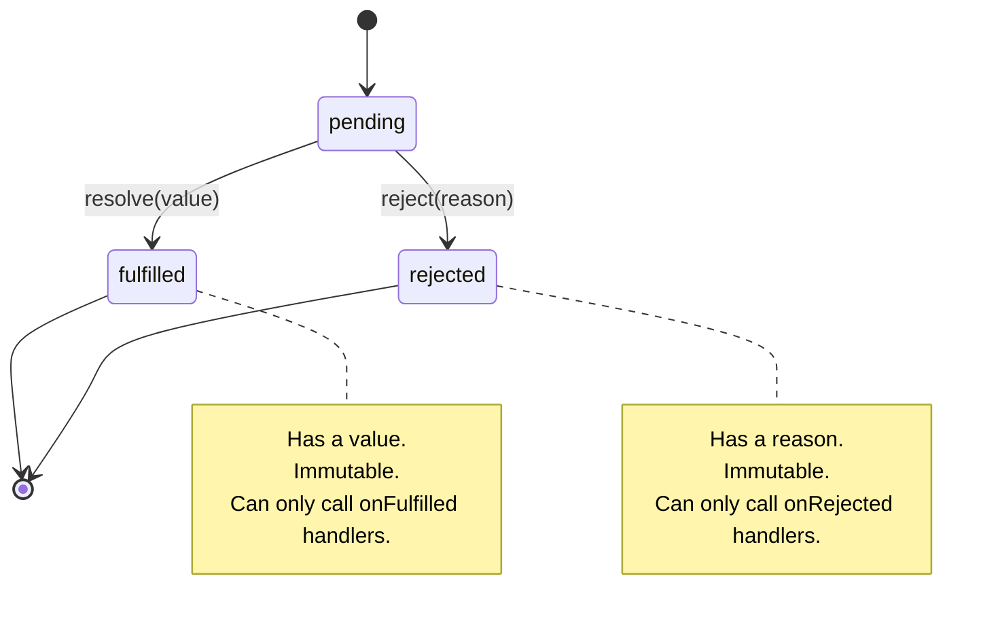
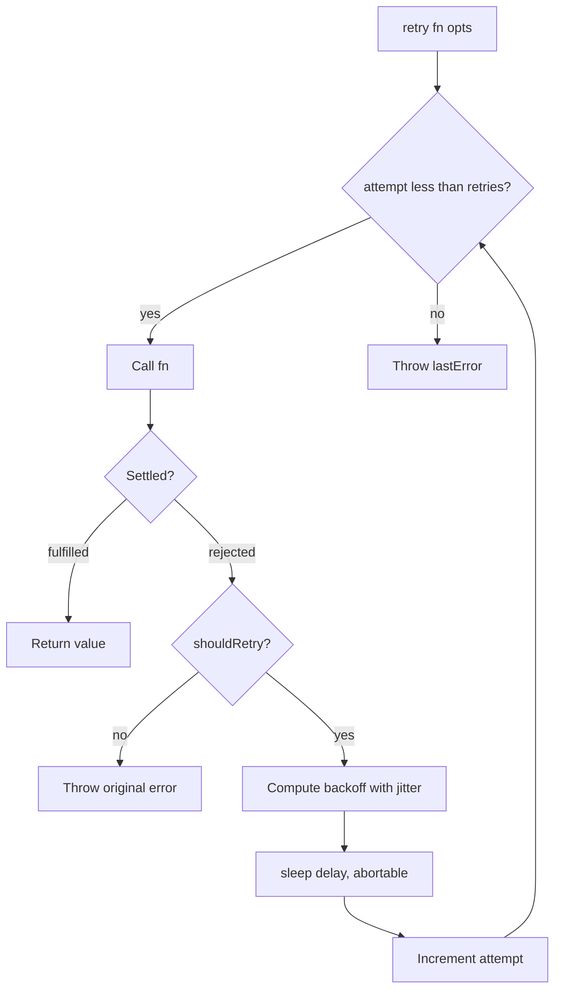

# 1.20 Promises Specification

> A Promise is a state machine for asynchronous values. Once it transitions, it never goes back. This single invariant is what unblocks callback hell, enables composable async pipelines, and gives `async/await` its semantics. This note is the canonical deep dive on the Promises/A+ specification, the ECMAScript `Promise` concrete subclass, and how V8 implements them internally.

---

## 1. Purpose

### 1.1 The Problem Promises Were Invented to Solve

Before promises, asynchronous JavaScript was expressed exclusively through continuation-passing style: you handed a function to an async operation, and that operation called your function later. This produced two deep structural problems.

**Problem 1: Inversion of Control.** When you pass a callback to a third-party function, you surrender control over when, how many times, and with what arguments your callback is invoked. A buggy library could call your callback twice, never, or with the wrong arity. You had no contractual guarantee.

**Problem 2: Callback Hell / Pyramid of Doom.** Sequential async dependencies had to be nested, because each step needed the result of the previous step inside its callback. Five sequential async operations produced a five-level-deep indentation pyramid that was unreadable, untestable, and impossible to reason about error-wise:

```js
// Pre-promise style — inversion of control plus pyramid
loadUser(id, function (err, user) {
  if (err) return handleError(err);
  loadProfile(user.profileId, function (err, profile) {
    if (err) return handleError(err);
    loadPermissions(profile.roleId, function (err, perms) {
      if (err) return handleError(err);
      render(user, profile, perms);
    });
  });
});
```

### 1.2 What Promises Guarantee

A Promise is an object that represents the eventual result of an asynchronous operation. By design, the spec gives you four hard guarantees:

1. **State is one-way.** A pending promise can transition to fulfilled or rejected, but never back, and never from fulfilled to rejected.
2. **Callbacks fire at most once.** A fulfilled or rejected promise will invoke its `onFulfilled` or `onRejected` handler exactly once. No double-fire, no zero-fire.
3. **Callbacks fire asynchronously.** Even if a promise is already settled, `then` callbacks are scheduled as microtasks and never run synchronously inside `then`.
4. **Errors propagate.** A rejection cascades through the chain until it meets an `onRejected` handler. No silent swallowing.

### 1.3 What Promises Do NOT Solve

Promises are deliberately minimal. They do not handle:

- **Cancellation.** A promise cannot be cancelled. Once created, it will settle. Cancellation is delegated to the underlying resource (e.g., `AbortController` for `fetch`). See [[1.21 Promises API and Concurrency]].
- **Multiple emissions.** A promise settles once. Streams of values over time need a different abstraction — Observables, Node streams, or async iterators. See [[3.07 Streams Fundamentals]] and [[1.22 Async Await Runtime]].
- **Synchronous resolution introspection.** You cannot synchronously ask "is this promise pending?" from outside. You only know by attaching `then`.

### 1.4 Why the Specification Matters

In 2012, the JavaScript ecosystem had dozens of incompatible promise-like libraries: Q, when.js, RSVP, jQuery Deferred, Bluebird. Code written against one library could not consume promises from another. The Promises/A+ specification solved this by defining a minimal, interoperable contract:

> An object is "thenable" if it has a `then` method. Any thenable can be assimilated by any conformant promise implementation.

This single rule — *if it has a `then`, you can follow it* — is what made `Q.when(jQueryDeferred)` work, and what made the ECMAScript 2015 `Promise` a drop-in replacement. The spec is small (about 50 lines of normative text) but its consequences are vast.

---

## 2. Theory and Deep Dive

### 2.1 The Three States

A promise is always in exactly one of three states:

| State | Meaning | Has |
|---|---|---|
| `pending` | Initial state. Operation has not finished. | No value, no reason |
| `fulfilled` | Operation succeeded. | A value |
| `rejected` | Operation failed. | A reason (typically an Error) |

A promise that is either fulfilled or rejected is called **settled**. Settled is not a state — it is a category.

### 2.2 Irreversible State Transitions



The transitions are strict:

- From `pending` to `fulfilled` via `resolve(value)`.
- From `pending` to `rejected` via `reject(reason)`.
- No other transitions exist. Calling `reject` after `resolve` is a no-op. Calling `resolve` after `reject` is a no-op. Calling either on an already-settled promise is a no-op.

### 2.3 Settled Value Immutability

Once fulfilled, the promise's value is frozen in the spec sense — calling `resolve` again with a different value does nothing. This is what lets you cache promises safely: a cached promise can be handed to any consumer without worrying they will mutate its result.

### 2.4 The `then` Method

`then` is the only mandatory method on a Promises/A+ conformant object. Its signature:

```
promise.then(onFulfilled, onRejected) -> newPromise
```

Two essential properties:

1. **`then` always returns a NEW promise.** It does not mutate the original. This is what makes chaining possible.
2. **Both arguments are optional.** If omitted, the value or reason is forwarded.

The handlers are called according to these rules:

- `onFulfilled` is called with the promise's value, only after fulfillment, exactly once, as a microtask.
- `onRejected` is called with the promise's reason, only after rejection, exactly once, as a microtask.
- Either handler is called at most once across the lifetime of the promise.

### 2.5 The Promise Resolution Procedure

This is the heart of the spec. When `onFulfilled` (or `onRejected`) returns a value `x`, the new promise returned by `then` is resolved according to the **Promise Resolution Procedure** (spec section 2.3, often abbreviated `[[Resolve]](promise, x)`):

1. If `promise` and `x` refer to the same object, reject `promise` with a `TypeError` (cycle guard).
2. If `x` is a promise (a native `Promise` instance), adopt its state: when `x` settles, `promise` settles the same way.
3. If `x` is an object or function (i.e., a "thenable"):
   - Retrieve `x.then`. If retrieving it throws, reject `promise` with that error.
   - If `x.then` is not a function, fulfill `promise` with `x` (it is a plain value).
   - If `x.then` is a function, call it as `x.then(resolveX, rejectX)`, where `resolveX` and `rejectX` are settle functions for `promise`. Only the first call to either wins.
4. If `x` is neither a promise nor a thenable (it is a primitive or non-thenable object), fulfill `promise` with `x`.

This is **thenable assimilation**. It is the interoperability mechanism. It is also why `Promise.resolve(thenable)` is not a no-op: it unwraps.

### 2.6 Error Propagation

Two paths to rejection of the new promise returned by `then`:

- **Handler throws.** If `onFulfilled` or `onRejected` throws synchronously, the new promise rejects with the thrown value.
- **Handler returns a rejected promise or a thenable that ultimately rejects.** The new promise adopts that rejection.

If `onRejected` is not provided, the rejection **forwards** through the new promise unchanged. This is what lets you write:

```js
doStep1()
  .then(doStep2)
  .then(doStep3)
  .catch(handleAnyErrorAbove);
```

A rejection from any of `doStep1`, `doStep2`, `doStep3` skips past the `then` calls (which have no `onRejected`) and lands in `catch`.

### 2.7 The Microtask Queue

`then` callbacks are scheduled as **microtasks**, not macrotasks. The event loop drains the microtask queue to empty before processing the next macrotask. This has two consequences:

1. **Predictable ordering.** Microtasks run before `setTimeout(fn, 0)`, before `setImmediate` (in Node), and before I/O.
2. **Starvation risk.** An infinite chain of microtasks will block the event loop indefinitely. No macrotask will ever run.

See [[1.26 Event Loop Concurrency Model]] for the full taxonomy.

A subtlety: each `then` registers ONE microtask. A chain of N `then` calls is N microtasks, scheduled across N microtask drains, not all at once. So:

```js
Promise.resolve().then(() => console.log("a"));
Promise.resolve().then(() => console.log("b"));
console.log("sync");
// Logs: sync, a, b
```

Both `a` and `b` are scheduled in the same microtask drain, but the chain order is queue order: registration order.

### 2.8 `Promise.resolve` and `Promise.reject`

- `Promise.resolve(x)` returns a promise that is already resolved according to the Promise Resolution Procedure. If `x` is a thenable, the returned promise follows `x`. If `x` is a native promise, `Promise.resolve` returns `x` itself (spec optimization, not just same state — same identity).
- `Promise.reject(reason)` always creates a NEW rejected promise with that reason. It never assimilates. This asymmetry is intentional: rejection does not "follow" anything.

### 2.9 Chaining Semantics Summary

For `p2 = p1.then(onFulfilled, onRejected)`:

| What `onFulfilled` returns / does | What `p2` becomes |
|---|---|
| Returns plain value `v` | Fulfilled with `v` |
| Returns native `Promise` (fulfilled) | Fulfilled with that promise's value |
| Returns native `Promise` (rejected) | Rejected with that promise's reason |
| Returns a thenable | Follows the thenable |
| Returns `p2` itself | Rejected with `TypeError` (cycle) |
| Throws `e` | Rejected with `e` |
| Returns nothing (`undefined`) | Fulfilled with `undefined` |

### 2.10 V8's Internal Representation

In V8, a native Promise is a C++ `JSPromise` object whose layout roughly contains:

- **State field.** A tagged small integer: 0 = pending, 1 = fulfilled, 2 = rejected.
- **Value / reason field.** Tagged pointer to the result, valid only once settled.
- **Reactions list.** A pair of lists (or a single linked list of reaction cells) for fulfilled and rejected handlers attached via `then`. Each reaction cell is a `PromiseReaction` containing the handler closure and the resolve/reject functions for the derived promise.

V8 optimizations:

- **Inline caching on `then`.** Monomorphic `then` call sites get fast paths.
- **Lazy microtask enqueue.** Reactions are enqueued only when the promise actually settles.
- **`PromiseResolve` builtin.** Special-cased in bytecode to be near-zero cost when the input is already a native Promise.
- **Fulfill-with-thenable fast path.** If V8 sees the thenable is a native Promise, it skips the slow "retrieve `.then` and call it" path.

The microtask queue itself is a V8-internal `MicrotaskQueue` (since V8 7.4), a doubly-linked list of pending microtasks. `Isolate::RunMicrotasks()` drains it. This is the same queue used by `queueMicrotask`, `MutationObserver` callbacks, and `await` continuations.

### 2.11 The Spec Is Small, the Consequences Are Large

The Promises/A+ spec is roughly 2,000 words of normative text. From those 2,000 words you can derive all of async/await, `Promise.all`, `Promise.race`, `Promise.allSettled`, `Promise.any`, fetch chaining, and Node's `util.promisify`. The whole modern async stack is built on it.

### 2.12 Subtle Ordering Nuances Inside `then`

Three subtleties often trip up even experienced engineers.

**Subtlety A: Multiple `then` on the same promise run in registration order.** If you attach three `then` callbacks to the same settled promise, they fire in the order you registered them, as separate microtasks. This is a guarantee, not an implementation detail.

```js
const p = Promise.resolve(1);
p.then((v) => console.log("first", v));
p.then((v) => console.log("second", v));
p.then((v) => console.log("third", v));
// first 1, second 1, third 1
```

**Subtlety B: A `then` chain is NOT one microtask per link.** Each link in a chain like `p.then(a).then(b).then(c)` is its own microtask, scheduled when the prior link resolves. So a 3-link chain takes 3 microtask drains, not 1. This means deeper chains produce visibly higher latency on hot paths. In performance-sensitive code, prefer collapsing pure-transform chains into a single `then`.

**Subtlety C: `onFulfilled` and `onRejected` are NEVER called in the same microtask.** They are mutually exclusive by state. A fulfilled promise will never call any `onRejected`, even ones registered after fulfillment. The asymmetry goes one way only.

### 2.13 The `called` Guard and the At-Most-Once Contract

When assimilating a thenable, the spec mandates that the resolve and reject callbacks passed to its `then` are invoked at most once across BOTH — i.e., once `resolve` has been called, a subsequent `reject` is ignored, and vice versa. This is enforced by a `called` flag in any correct implementation. The guard prevents buggy thenables from leaving the derived promise in an inconsistent state.

```js
// A pathological thenable that tries to resolve AND reject
const evil = {
  then(resolve, reject) {
    resolve("good");
    reject(new Error("bad")); // ignored by spec contract
  },
};
Promise.resolve(evil).then(
  (v) => console.log("fulfilled:", v),    // fulfilled: good
  (e) => console.log("rejected:", e.message) // never runs
);
```

### 2.14 Why `resolve` Inside the Executor Is Async-Following

The `resolve` function passed to the `Promise` constructor is NOT a synchronous "set state" function when given a thenable. It schedules following. This is observable:

```js
const p = new Promise((resolve) => {
  resolve(Promise.resolve("inner"));
  console.log("executor returned");
});
p.then((v) => console.log("p resolved with", v));
// executor returned
// p resolved with inner
```

The executor returns BEFORE `p` is settled. The state adoption happens on a later microtask. This is because the spec's Promise Resolution Procedure runs `then` on the inner thenable, and `then` is always async.

### 2.15 V8 Promise Reaction Internals (Deeper)

When you call `then` on an unsettled V8 `JSPromise`, V8 allocates a `PromiseReaction` struct containing:

- The `onFulfilled` and `onRejected` closures (or `undefined` for passthrough).
- A pointer to the derived `JSPromise` to settle.
- The resolve/reject functions for that derived promise.

These reactions are appended to the source promise's reaction list. When the source settles, V8 iterates the list and enqueues each reaction as a `PromiseReactionJob` in the microtask queue. The job, when run, calls the appropriate handler, then invokes `[[Resolve]](derivedPromise, handlerResult)`.

For an already-settled source, V8 skips the list entirely and enqueues the reaction immediately. This is why `Promise.resolve(x).then(fn)` has a one-microtask delay regardless of when `x` was settled.

A further optimization: V8 tracks whether a promise has at most one reaction and uses a "forwarding" fast path that avoids allocating a list. Multi-subscriber promises (rare in most code) fall back to the list path.

### 2.16 Stack Trace Reconstruction

Native V8 promises carry an internal `[[PromiseResult]]` and, for rejected promises, V8 attaches a stack trace at the point of rejection (when possible). When you `.catch` an error, you see a stack pointing back to where the rejection was created, not where it was caught. This is why throwing inside an executor or `reject(new Error(...))` from a real call site produces usable stacks.

The `await` desugaring (covered in [[1.22 Async Await Runtime]]) further enriches these stacks with async frames, producing a "zero-cost async stack trace" that reads almost like synchronous code.

---

## 3. Mental Models

### 3.1 Promise = "An IOU for a Future Value"

A promise is a receipt. You give the bank teller your money, they hand you a receipt. The receipt is not the money — it is a *claim* on money. Later, you present the receipt and receive the money. The receipt can be passed around, stored, duplicated; the underlying withdrawal happens once.

### 3.2 State = "A One-Way Valve"

Picture a valve. Fluid can flow from pending to fulfilled, or from pending to rejected, but never backwards and never sideways. Once a valve is open in one direction, the mechanism rusts shut — no other direction is possible.

### 3.3 `then` = "Register a Callback AND Return a New Promise"

`then` does two jobs in one call. It registers a handler on the source promise. AND it returns a brand-new derived promise that will settle based on what your handler does. The two-job nature is what enables chains:

```js
// p1 → p2 → p3, each then returns a NEW promise
const p3 = p1.then(stepA).then(stepB);
```

### 3.4 Resolution = "If You Resolve With a Promise, It Follows the Inner One"

Resolving a promise with another promise does not "wrap" — it "follows." The outer promise waits for the inner one. When the inner settles, the outer adopts its state and value. This is recursion-safe and is what allows `Promise.all` to work.

### 3.5 Microtask = "High-Priority Callback Before the Next Macrotask"

Microtasks are the VIP lane of the event loop. Before the loop moves on to the next macrotask (timeout, I/O, message), it empties the entire microtask queue. Microtasks always preempt macrotasks. This is why promise callbacks feel "almost synchronous."

### 3.6 Rejection = "Skips Down the Chain Until Caught"

Think of a rejection like an exception thrown up the call stack, but along the promise chain. It skips past every `then` that has no `onRejected`, looking for the next `catch`.

### 3.7 Thenable = "Anything With a `then` Method"

The duck-type rule. If it quacks like a promise, treat it like one. This is what allows interop between Q, jQuery, native, Bluebird, etc. It is also a footgun: accidentally having a `then` method on a non-promise object can cause surprising assimilation.

---

## 4. Real-World Use Cases

### 4.1 `fetch` Returns a Promise

The browser `fetch` API is the canonical promise-returning function. It does not take a callback; it returns a promise that resolves to a `Response` object.

```js
fetch("/api/user")
  .then((res) => res.json())
  .then((user) => render(user))
  .catch((err) => console.error("Failed:", err));
```

The two `then` calls form a chain. `res.json()` itself returns a promise (response body is a stream), so the second `then` waits for it.

### 4.2 `Promise.all` for Parallel Work

When you have N independent async operations and want to wait for all of them, `Promise.all` returns a single promise that resolves to an array of results in input order:

```js
const [user, posts, friends] = await Promise.all([
  fetchUser(id),
  fetchPosts(id),
  fetchFriends(id),
]);
```

Failure is fail-fast: the first rejection rejects the whole `Promise.all`, but the other operations continue running (they are not cancelled — see Section 6).

### 4.3 Mongoose Queries Are Thenable

Mongoose queries implement `.then()` so they can be `await`ed. Under the hood, `await query` calls `query.then(resolve, reject)`. This is thenable assimilation in production.

```js
const user = await User.findById(id); // User.findById returns a thenable Query
```

### 4.4 jQuery Deferred (the Legacy Thenable)

Pre-ES6 jQuery used `$.Deferred`. jQuery 3+ made Deferred thenables conform to Promises/A+. Before that, jQuery's `then` did not return a new promise in the spec sense — it was a notorious interop bug.

### 4.5 Async/Await Is Built on Promises

Every `async function` returns a promise. Every `await x` is roughly `Promise.resolve(x).then(continuation)`. The runtime desugars async/await into promise machinery. See [[1.22 Async Await Runtime]].

```js
async function loadAll() {
  const user = await fetchUser(id);     // = fetchUser(id).then(user => ...)
  const posts = await fetchPosts(user); // chained
  return posts;
}
```

### 4.6 `AbortController` for Cancellation

Since promises can't cancel, fetch accepts an `AbortSignal`:

```js
const ctrl = new AbortController();
setTimeout(() => ctrl.abort(), 5000);
const res = await fetch("/slow", { signal: ctrl.signal });
// Aborting rejects the fetch promise with an AbortError
```

### 4.7 Node.js APIs: `fs.promises`, `util.promisify`

Node's `fs.promises` namespace returns promises. `util.promisify` converts a callback-style function into a promise-returning one:

```js
const { promisify } = require("util");
const readFile = promisify(require("fs").readFile);
const txt = await readFile("./config.json", "utf8");
```

### 4.8 Worker Communication

`postMessage`-based workers can be wrapped in promise-based RPC:

```js
function callWorker(worker, payload) {
  return new Promise((resolve, reject) => {
    worker.onmessage = (e) => resolve(e.data);
    worker.onerror = reject;
    worker.postMessage(payload);
  });
}
```

---

## 5. Code Examples

### 5.1 Example A — Minimal and Conceptual

Goal: create a promise, resolve it, chain `then`, and observe error propagation.

#### JavaScript

```js
// 1. Create a promise that resolves after 100ms
const p = new Promise((resolve, reject) => {
  setTimeout(() => resolve(42), 100);
});

// 2. Chain: each then returns a NEW promise
p.then((v) => {
  console.log("first:", v);   // 42
  return v + 1;               // new promise resolves with 43
})
  .then((v) => {
    console.log("second:", v); // 43
    return Promise.resolve(v * 2); // unwraps to 86
  })
  .then((v) => {
    console.log("third:", v);  // 86
    throw new Error("boom");
  })
  .then((v) => {
    console.log("never reached");
  })
  .catch((err) => {
    console.log("caught:", err.message); // boom
    return "recovered";
  })
  .then((v) => {
    console.log("after catch:", v); // recovered
  });
```

#### TypeScript

```ts
const p: Promise<number> = new Promise<number>((resolve, reject) => {
  setTimeout(() => resolve(42), 100);
});

p.then((v: number) => {
  console.log("first:", v);
  return v + 1;
})
  .then((v: number) => {
    console.log("second:", v);
    return Promise.resolve<number>(v * 2);
  })
  .then((v: number) => {
    console.log("third:", v);
    throw new Error("boom");
  })
  .then((v: number) => {
    console.log("never reached");
    return v;
  })
  .catch((err: unknown) => {
    console.log("caught:", (err as Error).message);
    return "recovered" as const;
  })
  .then((v: number | "recovered") => {
    console.log("after catch:", v);
  });
```

**Key observations:**

- `new Promise<number>((resolve, reject) => ...)` — the executor receives typed `resolve` and `reject`.
- The chain's resolved type changes: `number` → `number` → `number` → never (throws) → `"recovered"`. TypeScript models this as `number | "recovered"` in the final `then`.
- `Promise.resolve(v * 2)` unwraps inside the chain — the outer promise adopts the inner value.

### 5.2 Example B — Production-Grade: Typed `retryableFetch`

A typed fetch wrapper that retries with exponential backoff using promise chains. Demonstrates: rejection as control flow, `Promise.all`-free sequential composition, typed error union, `AbortSignal` passthrough.

#### JavaScript

```js
function sleep(ms, signal) {
  return new Promise((resolve, reject) => {
    const t = setTimeout(() => {
      cleanup();
      resolve();
    }, ms);
    const onAbort = () => {
      cleanup();
      reject(new DOMException("Aborted", "AbortError"));
    };
    function cleanup() {
      clearTimeout(t);
      signal && signal.removeEventListener("abort", onAbort);
    }
    if (signal) {
      if (signal.aborted) return onAbort();
      signal.addEventListener("abort", onAbort, { once: true });
    }
  });
}

function isRetryable(status, err) {
  if (err && err.name === "AbortError") return false;
  if (err) return true; // network errors are retryable
  return status === 429 || status === 503 || status >= 500;
}

async function retryableFetch(input, init = {}, opts = {}) {
  const { retries = 3, baseDelay = 200, backoff = 2, maxDelay = 5000 } = opts;
  let attempt = 0;
  let lastError;
  while (attempt <= retries) {
    try {
      const res = await fetch(input, { ...init, signal: init.signal });
      if (!res.ok && isRetryable(res.status, null) && attempt < retries) {
        const delay = Math.min(baseDelay * Math.pow(backoff, attempt), maxDelay);
        await sleep(delay, init.signal);
        attempt++;
        continue;
      }
      return res;
    } catch (err) {
      lastError = err;
      if (!isRetryable(null, err) || attempt >= retries) throw err;
      const delay = Math.min(baseDelay * Math.pow(backoff, attempt), maxDelay);
      await sleep(delay, init.signal);
      attempt++;
    }
  }
  throw lastError || new Error("retryableFetch: exhausted retries");
}

// Usage
const res = await retryableFetch("/api/orders", {}, { retries: 5, baseDelay: 100 });
const orders = await res.json();
```

#### TypeScript

```ts
type RetryOptions = {
  retries?: number;
  baseDelay?: number;
  backoff?: number;
  maxDelay?: number;
};

class HttpError extends Error {
  constructor(public status: number, public body: unknown) {
    super(`HTTP ${status}`);
    this.name = "HttpError";
  }
}

function sleep(ms: number, signal?: AbortSignal): Promise<void> {
  return new Promise<void>((resolve, reject) => {
    const t = setTimeout(() => {
      cleanup();
      resolve();
    }, ms);
    const onAbort = () => {
      cleanup();
      reject(new DOMException("Aborted", "AbortError"));
    };
    function cleanup(): void {
      clearTimeout(t);
      signal?.removeEventListener("abort", onAbort);
    }
    if (signal) {
      if (signal.aborted) return onAbort();
      signal.addEventListener("abort", onAbort, { once: true });
    }
  });
}

function isRetryable(status: number | null, err: unknown): boolean {
  if (err instanceof DOMException && err.name === "AbortError") return false;
  if (err) return true;
  return status === 429 || status === 503 || (status !== null && status >= 500);
}

async function retryableFetch<T>(
  input: RequestInfo | URL,
  init: RequestInit = {},
  opts: RetryOptions = {}
): Promise<T> {
  const {
    retries = 3,
    baseDelay = 200,
    backoff = 2,
    maxDelay = 5000,
  } = opts;
  let attempt = 0;
  let lastError: unknown;
  while (attempt <= retries) {
    try {
      const res = await fetch(input, { ...init, signal: init.signal });
      if (!res.ok && isRetryable(res.status, null) && attempt < retries) {
        const delay = Math.min(baseDelay * Math.pow(backoff, attempt), maxDelay);
        await sleep(delay, init.signal);
        attempt++;
        continue;
      }
      if (!res.ok) throw new HttpError(res.status, await res.text());
      return (await res.json()) as T;
    } catch (err) {
      lastError = err;
      if (!isRetryable(null, err) || attempt >= retries) throw err;
      const delay = Math.min(baseDelay * Math.pow(backoff, attempt), maxDelay);
      await sleep(delay, init.signal);
      attempt++;
    }
  }
  throw lastError || new Error("retryableFetch: exhausted retries");
}

// Usage
interface Order { id: string; total: number; }
const orders = await retryableFetch<Order[]>("/api/orders", {}, { retries: 5 });
console.log(orders.length);
```

**Spec concepts in play:**

- `sleep` returns a `Promise<void>` that is settled by timer or abort.
- `retryableFetch` is `async`, so it always returns a Promise. Internally, `await` desugars to `.then`.
- Rejection from `fetch` propagates through `await` as a thrown error, caught by `try/catch`.
- The `signal` argument provides cancellation, which the Promise spec itself does not.
- Generics (`<T>`) let the caller declare the response shape — see [[2.07 Generics and Constraints]].

---

## 6. Common Mistakes and Anti-Patterns

### 6.1 Forgetting to `return` Inside `.then` (Broken Chain)

**Bad:**

```js
fetchUser(id).then((user) => {
  fetchPosts(user.id); // forgot return
}).then((posts) => {
  console.log(posts); // undefined, not the posts
});
```

**Good:**

```js
fetchUser(id).then((user) => {
  return fetchPosts(user.id);
}).then((posts) => {
  console.log(posts);
});
```

When you forget `return`, the next `then` receives `undefined` and runs before `fetchPosts` finishes. The chain is silently broken. Always `return` from `then` if you want the next link to wait.

### 6.2 `Promise.resolve(thenable)` Unwraps (Surprising)

`Promise.resolve` is NOT always identity. If you pass a thenable, it assimilates:

```js
const fakeThenable = {
  then(resolve) {
    setTimeout(() => resolve("from thenable"), 100);
  },
};
const p = Promise.resolve(fakeThenable);
// p is NOT fulfilled with { then: ... }. p will fulfill with "from thenable" after 100ms.
```

This is by design (interop), but a common surprise. If you truly want to wrap a value as a fulfilled promise regardless of shape, you cannot use `Promise.resolve`. There is no built-in escape hatch; you would need:

```js
const wrapped = new Promise((resolve) => resolve({ value: fakeThenable }));
```

### 6.3 Errors Swallowed Without `.catch`

A rejected promise with no `onRejected` anywhere in the chain produces an **unhandled rejection**. In browsers you get a console warning; in Node, the process exits with non-zero (since Node 15+). Always end a chain with `.catch` or wrap in `try/catch`:

**Bad:**

```js
fetchUser(id).then((u) => render(u)); // no .catch
```

**Good:**

```js
fetchUser(id)
  .then((u) => render(u))
  .catch((err) => { logError(err); renderFallback(); });
```

### 6.4 Fire-and-Forget Anti-Pattern

```js
async function handler() {
  sendAnalytics(); // not awaited, no .catch
  return respond();
}
```

If `sendAnalytics` rejects, the rejection is unhandled. If you genuinely want fire-and-forget, attach a `.catch`:

```js
sendAnalytics().catch((err) => log.warn("analytics failed", err));
```

### 6.5 Redundant `new Promise((resolve) => resolve(p))` (Promise Constructor Antipattern)

**Bad:**

```js
function fetchUser(id) {
  return new Promise((resolve, reject) => {
    otherFetchUser(id)
      .then(resolve)
      .catch(reject);
  });
}
```

This wraps a promise in a promise for no benefit. The outer `new Promise` is redundant — `then` already returns a promise. Worse, it loses stack traces and adds overhead.

**Good:**

```js
function fetchUser(id) {
  return otherFetchUser(id);
}
// or, if you need to transform:
function fetchUser(id) {
  return otherFetchUser(id).then((u) => mapUser(u));
}
```

### 6.6 `Promise.resolve(value)` vs `new Promise`

Both produce a fulfilled promise, but they are not equivalent in cost:

- `Promise.resolve(value)` is a single builtin call, fast.
- `new Promise((resolve) => resolve(value))` allocates a Promise, an executor closure, two resolve/reject functions, and schedules a microtask.

Roughly, the second is 5-10x slower. Reach for `Promise.resolve` unless you genuinely need an executor.

### 6.7 Treating `Promise.all` Fail-Fast as Cancellation

```js
await Promise.all([slowOp(), fastOpThatRejects()]);
// slowOp is still running! Promise.all does not cancel it.
```

If you need cancellation, you must wire up `AbortController` yourself and abort on first failure. See [[1.21 Promises API and Concurrency]].

### 6.8 Returning `p` From Its Own `then` (Cycle TypeError)

```js
const p = Promise.resolve(1).then(() => p); // ReferenceError at runtime, but conceptually:
```

If a `then` handler returns the very promise it is creating, the spec rejects the derived promise with a `TypeError`. This is the cycle guard. It can occur in subtle recursive structures.

### 6.9 Calling `then` With Non-Function Args (Silent Passthrough)

```js
Promise.resolve(1).then(null, null).then(console.log); // 1
```

Non-function `onFulfilled` and `onRejected` are treated as if absent — value or reason is forwarded. This is how `.catch(fn)` (which is `then(undefined, fn)`) works. But it also means typos like `then(value, err)` (forgetting the arrow) silently do nothing.

### 6.10 `await` in a `forEach` Callback (Serial Pitfall)

```js
items.forEach(async (item) => {
  await process(item); // does NOT await! forEach does not await its callback
});
```

`forEach` is synchronous and does not await. Use `for...of` for serial or `Promise.all` for parallel.

---

## 7. Best Practices and Design Patterns

### 7.1 Always Terminate a Chain With `.catch` (or try/catch)

Every promise chain should end in either a `.catch` or be wrapped in a `try/catch` inside an `async` function. Unhandled rejections are bugs.

### 7.2 Always `return` From `.then`

If you want the next link to wait, return. If you do not, the next link runs immediately with `undefined`. Make this a reflex.

### 7.3 Use `Promise.all` for Parallel, `for await` for Sequential

```ts
// Parallel
const results = await Promise.all(items.map((i) => process(i)));

// Sequential (when each step depends on the prior)
const out = [];
for (const item of items) out.push(await process(item));
```

For sequential async iteration over a stream-like source, `for await...of` is idiomatic.

### 7.4 Use `AbortController` for Cancellation

Promises themselves cannot be cancelled. Use `AbortController` and pass the signal down to fetch / setTimeout / your async primitive.

### 7.5 Type the Resolved Value

Never `Promise<any>`. Always `Promise<User>`, `Promise<User[]>`, etc. The resolved type is the contract.

```ts
async function loadUser(id: string): Promise<User> { ... }
```

If the function can fail in a structured way, return a discriminated union:

```ts
type Result<T, E> = { ok: true; value: T } | { ok: false; error: E };
async function loadUser(id: string): Promise<Result<User, NotFound>> { ... }
```

### 7.6 Prefer `async/await` for Sequential Code, `.then` for Pipelines

`async/await` is more readable when each step depends on the previous. `.then` chains read better when transforming a value through pure stages:

```ts
// Pipelined transform — clean as .then chain
const url = await fetchUser(id)
  .then((u) => u.profile)
  .then((p) => p.avatarUrl);
```

### 7.7 Avoid the `Promise` Constructor When You Already Have a Promise

If your function is `async`, just `return` values; do not wrap in `new Promise`. Use the constructor only when wrapping genuinely callback-based APIs.

### 7.8 Use `Promise.allSettled` When You Want All Results Regardless of Failure

`Promise.all` fails fast. `Promise.allSettled` waits for all and gives you `{ status, value } | { status, reason }` for each. Use it when partial success is meaningful.

### 7.9 Use `queueMicrotask` for Spec-Compliant Microtask Scheduling

If you need to schedule a microtask manually (rare), prefer `queueMicrotask(fn)` over `Promise.resolve().then(fn)`. It is clearer and avoids creating a derived promise.

### 7.10 Logging Without Breaking the Chain

```ts
fetchUser(id)
  .then((u) => { log.info("got user", u); return u; }) // return to keep chain alive
  .then(render)
  .catch(handleError);
```

---

## 8. Technical Interview Knowledge

### Q1: What are the three states of a Promise?

**A:** `pending` (initial), `fulfilled` (succeeded with a value), and `rejected` (failed with a reason). A promise that is either fulfilled or rejected is called "settled." `settled` is a category, not a state.

### Q2: Is a Promise state change reversible?

**A:** No. Once a promise leaves `pending`, it can never return to `pending` and can never switch between `fulfilled` and `rejected`. The transition is a one-way valve. This immutability is what makes promises safely shareable across consumers.

### Q3: What is the Promise Resolution Procedure?

**A:** The algorithm by which a promise adopts the state of a value `x` returned from a `then` handler. Steps: (1) if `x === promise`, reject with `TypeError` (cycle); (2) if `x` is a native Promise, adopt its state; (3) if `x` is a thenable, call `x.then(resolve, reject)` exactly once with guarded settle functions; (4) otherwise fulfill with `x`. This is also called `[[Resolve]](promise, x)`.

### Q4: What is a thenable?

**A:** Any object or function with a `then` method. The spec uses duck typing: if it has `then`, treat it as a promise. This is what lets native promises assimilate jQuery Deferreds, Mongoose queries, and other library promises. The risk is that any object that accidentally has a `then` method will be treated as a promise.

### Q5: How does `then` propagate errors?

**A:** Three ways: (a) If a handler throws, the derived promise rejects with the thrown value. (b) If a handler returns a rejected promise (or a thenable that rejects), the derived promise adopts that rejection. (c) If `onRejected` is omitted, the rejection passes through the derived promise unchanged. The rejection cascades until it meets an `onRejected` handler or reaches the end of the chain (unhandled).

### Q6: Microtask vs macrotask — what is the difference?

**A:** Macrotasks include `setTimeout`, `setInterval`, I/O, UI events, `setImmediate` (Node). Microtasks include promise `then` callbacks, `queueMicrotask`, `MutationObserver` callbacks, and `await` continuations. The event loop drains the entire microtask queue before processing the next single macrotask. Consequence: promise callbacks always run before `setTimeout(fn, 0)`.

### Q7: How is `Promise.all` implemented?

**A:** It returns a single promise. Internally: create a result array of length N, a counter `remaining = N`, and resolve/reject functions. For each input promise, attach a `then` that writes its value to the right index and decrements `remaining`; when `remaining` reaches 0, resolve the aggregate with the result array. On the first rejection, reject the aggregate immediately. Empty input resolves synchronously with `[]`. (The spec actually uses the Promise Resolution Procedure on each element, so non-promise values are assimilated.)

### Q8: What happens to an unhandled rejection?

**A:** It depends on the environment. Browsers emit a `unhandledrejection` event on `window` and log a warning. Node.js emits `process.on('unhandledRejection', ...)` and, since Node 15, exits the process with a non-zero code unless a handler is attached. The promise itself remains rejected forever; nothing retries it.

### Q9 (bonus): Why does `Promise.resolve(p)` return `p` itself when `p` is a native Promise?

**A:** Spec optimization. The Promise constructor's `PromiseResolve` abstract operation short-circuits: if the argument is already a native Promise of the same constructor, it is returned as-is. This avoids creating a wrapping promise that would simply follow `p`.

### Q10 (bonus): What is the difference between `.catch(fn)` and `.then(undefined, fn)`?

**A:** Nothing. `.catch(fn)` is defined as `.then(undefined, fn)`. However, `.catch` does NOT catch errors thrown by `onFulfilled` handlers earlier in the same `.then` — but because `then` returns a new promise, `.catch` placed AFTER a `then` will catch a throw from that `then`'s handler. The difference is purely syntactic; `.catch` is sugar.

### Q11 (bonus): What is the difference between `Promise.all` and `Promise.allSettled`?

**A:** `Promise.all` is fail-fast: the first rejection rejects the aggregate immediately, and the other input promises keep running (they are not cancelled, but their results are discarded). `Promise.allSettled` waits for every input to settle, then resolves with an array of `{ status: "fulfilled", value }` or `{ status: "rejected", reason }` objects in input order. Use `all` when any failure invalidates the whole batch; use `allSettled` when partial success is meaningful (e.g., parallel reads with graceful degradation).

### Q12 (bonus): Why must `then` callbacks be async even when the promise is already settled?

**A:** Two reasons. First, **predictability**: if `then` ran its handler synchronously when the source was already settled, the same code path would behave differently depending on whether the source settled before or after `then` was called. This is the "Zalgo" anti-pattern — releasing Zalgo. Second, **stack safety**: synchronous recursion through promise chains could blow the stack on long chains. Forcing a microtask hop per link caps the stack depth at one.

### Q13 (bonus): What is `Promise.any` and how does it differ from `Promise.race`?

**A:** `Promise.any` resolves with the first FULFILLMENT; rejections are ignored unless ALL inputs reject, in which case it rejects with an `AggregateError`. `Promise.race` settles with the first SETTLEMENT of any kind (fulfillment OR rejection). So `Promise.any` is "first success wins," `Promise.race` is "first to finish wins, regardless of outcome."

### Q14 (bonus): Can a Promise ever be garbage collected while pending?

**A:** Yes — if nothing holds a reference to it (no `then` reactions, no external references), a pending promise can be collected even if its executor scheduled a `setTimeout` that would later call `resolve`. The GC will collect the resolve closure too. This is why fire-and-forget promises that no one references can silently disappear. In Node, the `--unhandled-rejections` behavior additionally tracks unhandled rejections via a separate registry that holds the promise alive briefly so the rejection event can fire.

### Q15 (bonus): What does `Promise.resolve` do with `null` or `undefined`?

**A:** It returns a fulfilled promise whose value is `null` or `undefined`. Neither `null` nor `undefined` is thenable (the spec checks `typeof x === "object" || typeof x === "function"`, and `null` is explicitly excluded by the `x !== null` guard). So `Promise.resolve(null)` is a fulfilled promise with value `null`, no assimilation occurs.

---

## 9. Practical Exercises

### Exercise 1: Implement `MyPromise` From Scratch

Implement a minimal but spec-correct `MyPromise` supporting `pending`/`fulfilled`/`rejected`, `resolve`/`reject` once-only, `then` returning a new promise, microtask scheduling, and the Promise Resolution Procedure.

#### Worked Solution (JavaScript)

```js
const PENDING = "pending";
const FULFILLED = "fulfilled";
const REJECTED = "rejected";

function isThenable(x) {
  return (x !== null && typeof x === "object") || typeof x === "function";
}

class MyPromise {
  constructor(executor) {
    this.state = PENDING;
    this.value = undefined;
    this.reason = undefined;
    this.onFulfilledCbs = [];
    this.onRejectedCbs = [];

    const resolve = (value) => {
      if (this.state !== PENDING) return;
      // Promise Resolution Procedure: if value is a thenable, follow it
      if (value === this) {
        return reject(new TypeError("Chaining cycle detected"));
      }
      if (value instanceof MyPromise) {
        value.then(resolve, reject);
        return;
      }
      if (isThenable(value)) {
        let then;
        try {
          then = value.then;
        } catch (err) {
          return reject(err);
        }
        if (typeof then === "function") {
          let called = false;
          try {
            then.call(
              value,
              (y) => {
                if (called) return;
                called = true;
                resolve(y);
              },
              (r) => {
                if (called) return;
                called = true;
                reject(r);
              }
            );
          } catch (err) {
            if (called) return;
            called = true;
            reject(err);
          }
          return;
        }
      }
      this.state = FULFILLED;
      this.value = value;
      this.onFulfilledCbs.forEach((fn) => fn());
    };

    const reject = (reason) => {
      if (this.state !== PENDING) return;
      this.state = REJECTED;
      this.reason = reason;
      this.onRejectedCbs.forEach((fn) => fn());
    };

    try {
      executor(resolve, reject);
    } catch (err) {
      reject(err);
    }
  }

  then(onFulfilled, onRejected) {
    const next = new MyPromise((resolve, reject) => {
      const handleFulfilled = () => {
        queueMicrotask(() => {
          if (typeof onFulfilled !== "function") {
            resolve(this.value);
            return;
          }
          try {
            resolve(onFulfilled(this.value));
          } catch (err) {
            reject(err);
          }
        });
      };
      const handleRejected = () => {
        queueMicrotask(() => {
          if (typeof onRejected !== "function") {
            reject(this.reason);
            return;
          }
          try {
            resolve(onRejected(this.reason));
          } catch (err) {
            reject(err);
          }
        });
      };

      if (this.state === FULFILLED) handleFulfilled();
      else if (this.state === REJECTED) handleRejected();
      else {
        this.onFulfilledCbs.push(handleFulfilled);
        this.onRejectedCbs.push(handleRejected);
      }
    });
    return next;
  }

  catch(onRejected) {
    return this.then(undefined, onRejected);
  }

  static resolve(value) {
    if (value instanceof MyPromise) return value;
    return new MyPromise((resolve) => resolve(value));
  }

  static reject(reason) {
    return new MyPromise((unused, reject) => reject(reason));
  }
}
```

#### Worked Solution (TypeScript)

```ts
type Resolve<T> = (value: T | MyPromise<T> | Thenable<T>) => void;
type Reject = (reason: unknown) => void;
type Executor<T> = (resolve: Resolve<T>, reject: Reject) => void;
type OnFulfilled<T, R> = (value: T) => R | PromiseLike<R>;
type OnRejected<R> = (reason: unknown) => R | PromiseLike<R>;
type Thenable<T> = { then: (onFulfilled: (v: T) => unknown, onRejected: (r: unknown) => unknown) => unknown };

const PENDING = "pending" as const;
const FULFILLED = "fulfilled" as const;
const REJECTED = "rejected" as const;
type State = typeof PENDING | typeof FULFILLED | typeof REJECTED;

function isThenable(x: unknown): x is Thenable<unknown> {
  return (x !== null && typeof x === "object") || typeof x === "function";
}

class MyPromise<T> {
  private state: State = PENDING;
  private value!: T;
  private reason!: unknown;
  private onFulfilledCbs: Array<() => void> = [];
  private onRejectedCbs: Array<() => void> = [];

  constructor(executor: Executor<T>) {
    const resolve: Resolve<T> = (value) => {
      if (this.state !== PENDING) return;
      if (value === this) {
        return reject(new TypeError("Chaining cycle detected"));
      }
      if (value instanceof MyPromise) {
        (value as MyPromise<T>).then(
          (v) => resolve(v),
          (r) => reject(r)
        );
        return;
      }
      if (isThenable(value)) {
        let then: unknown;
        try {
          then = (value as Thenable<T>).then;
        } catch (err) {
          return reject(err);
        }
        if (typeof then === "function") {
          let called = false;
          try {
            (then as Function).call(
              value,
              (y: T) => { if (called) return; called = true; resolve(y); },
              (r: unknown) => { if (called) return; called = true; reject(r); }
            );
          } catch (err) {
            if (called) return;
            called = true;
            reject(err);
          }
          return;
        }
      }
      this.state = FULFILLED;
      this.value = value as T;
      this.onFulfilledCbs.forEach((fn) => fn());
    };

    const reject: Reject = (reason) => {
      if (this.state !== PENDING) return;
      this.state = REJECTED;
      this.reason = reason;
      this.onRejectedCbs.forEach((fn) => fn());
    };

    try {
      executor(resolve, reject);
    } catch (err) {
      reject(err);
    }
  }

  then<R>(onFulfilled?: OnFulfilled<T, R>, onRejected?: OnRejected<R>): MyPromise<R> {
    return new MyPromise<R>((resolve, reject) => {
      const handleFulfilled = () => {
        queueMicrotask(() => {
          if (typeof onFulfilled !== "function") {
            resolve(this.value as unknown as R);
            return;
          }
          try {
            resolve(onFulfilled(this.value));
          } catch (err) {
            reject(err);
          }
        });
      };
      const handleRejected = () => {
        queueMicrotask(() => {
          if (typeof onRejected !== "function") {
            reject(this.reason);
            return;
          }
          try {
            resolve(onRejected(this.reason));
          } catch (err) {
            reject(err);
          }
        });
      };
      if (this.state === FULFILLED) handleFulfilled();
      else if (this.state === REJECTED) handleRejected();
      else {
        this.onFulfilledCbs.push(handleFulfilled);
        this.onRejectedCbs.push(handleRejected);
      }
    });
  }

  catch<R>(onRejected: OnRejected<R>): MyPromise<R> {
    return this.then<R>(undefined, onRejected);
  }

  static resolve<U>(value: U | MyPromise<U> | Thenable<U>): MyPromise<U> {
    if (value instanceof MyPromise) return value;
    return new MyPromise<U>((resolve) => resolve(value));
  }

  static reject<U>(reason: unknown): MyPromise<U> {
    return new MyPromise<U>((unused, reject) => reject(reason));
  }
}
```

**Notes on this implementation:**

- `queueMicrotask` is used to ensure `then` handlers are async, per spec.
- The `resolve` function inlines the Promise Resolution Procedure: cycle guard, native-Promise fast path, thenable slow path with `called` guard.
- The `called` guard is critical: spec requires `onFulfilled`/`onRejected` of a thenable to be invoked at most once across both.
- This implementation is single-call safe; production-grade Promise polyfills handle many more edge cases (stack traces, `Symbol.toStringTag`, etc.).

### Exercise 2: Implement `Promise.all`

#### Worked Solution (JavaScript)

```js
function promiseAll(iterable) {
  return new Promise((resolve, reject) => {
    const items = Array.from(iterable);
    if (items.length === 0) return resolve([]);
    const results = new Array(items.length);
    let remaining = items.length;
    items.forEach((item, i) => {
      Promise.resolve(item).then(
        (val) => {
          results[i] = val;
          if (--remaining === 0) resolve(results);
        },
        (err) => reject(err)
      );
    });
  });
}
```

#### Worked Solution (TypeScript)

```ts
function promiseAll<T>(iterable: Iterable<T | PromiseLike<T>>): Promise<T[]> {
  return new Promise<T[]>((resolve, reject) => {
    const items = Array.from(iterable);
    if (items.length === 0) return resolve([]);
    const results: T[] = new Array(items.length);
    let remaining = items.length;
    items.forEach((item, i) => {
      Promise.resolve(item).then(
        (val: T) => {
          results[i] = val;
          if (--remaining === 0) resolve(results);
        },
        (err: unknown) => reject(err)
      );
    });
  });
}
```

**Key correctness points:**

- `Promise.resolve(item)` ensures non-promise items are assimilated.
- Results are written by index, so output order matches input order regardless of completion order.
- `remaining` counter triggers aggregate resolution on the last fulfillment.
- First rejection rejects the aggregate immediately. Other in-flight operations continue (no cancellation).

### Exercise 3: Implement `Promise.race`

#### Worked Solution (JavaScript)

```js
function promiseRace(iterable) {
  return new Promise((resolve, reject) => {
    for (const item of iterable) {
      Promise.resolve(item).then(resolve, reject);
    }
  });
}
```

#### Worked Solution (TypeScript)

```ts
function promiseRace<T>(iterable: Iterable<T | PromiseLike<T>>): Promise<T> {
  return new Promise<T>((resolve, reject) => {
    for (const item of iterable) {
      Promise.resolve(item).then(
        (val: T) => resolve(val),
        (err: unknown) => reject(err)
      );
    }
  });
}
```

**Notes:**

- First settlement (fulfillment or rejection) of any input settles the aggregate.
- Subsequent settlements are no-ops because the aggregate is already settled.
- Empty iterable produces a forever-pending promise.

### Exercise 4: Trace Microtask Execution Order

Predict the output of:

```js
console.log("1");
setTimeout(() => console.log("2"), 0);
Promise.resolve().then(() => console.log("3"));
Promise.resolve().then(() => console.log("4"));
console.log("5");
Promise.resolve().then(() => {
  console.log("6");
  Promise.resolve().then(() => console.log("7"));
});
console.log("8");
```

#### Step-by-Step Trace

1. **Macrotask 1 (script execution)** begins.
2. `console.log("1")` → output `1`.
3. `setTimeout(..., 0)` queues a MACROTASK (call it M1).
4. `Promise.resolve().then(...)` queues a MICROTASK (call it μ1) for `3`.
5. `Promise.resolve().then(...)` queues a MICROTASK (μ2) for `4`.
6. `console.log("5")` → output `5`.
7. `Promise.resolve().then(...)` queues a MICROTASK (μ3) for the function that logs `6` and queues μ7.
8. `console.log("8")` → output `8`.
9. Script macrotask ends. Event loop drains microtask queue (FIFO): μ1, μ2, μ3.
10. μ1 runs → `console.log("3")` → output `3`.
11. μ2 runs → `console.log("4")` → output `4`.
12. μ3 runs → `console.log("6")` → output `6`, and queues μ7 (because `Promise.resolve().then(() => console.log("7"))` is called inside μ3).
13. Microtask queue still has μ7 (added during drain). Loop continues draining.
14. μ7 runs → `console.log("7")` → output `7`.
15. Microtask queue empty. Event loop picks next macrotask: M1.
16. M1 runs → `console.log("2")` → output `2`.

#### Final Output

```
1
5
8
3
4
6
7
2
```

**Mental model:** All sync code runs first. Then all currently-queued microtasks run, in registration order, but any microtask scheduled DURING the drain is also drained before the next macrotask. Macrotasks run last and one-at-a-time, with microtasks drained between them.

---

## 10. Mini-Project Blueprint: Typed Retry-With-Backoff Utility

### Goal

Build a generic `retry` utility that wraps any promise-returning function, retries on failure with exponential backoff, supports cancellation via `AbortSignal`, and preserves the return type.

### Requirements

1. Generic over the wrapped function's return type.
2. Configurable: `retries`, `baseDelay`, `backoff`, `maxDelay`, optional `shouldRetry(error, attempt)`.
3. Supports `AbortSignal`. Aborting mid-sleep or mid-call should reject with `AbortError`.
4. Jitter to avoid thundering herd on retries.
5. Production-grade error typing.

### Architecture



### Implementation (TypeScript)

```ts
type RetryOptions<T> = {
  retries?: number;
  baseDelay?: number;
  backoff?: number;
  maxDelay?: number;
  jitter?: number; // 0..1 fraction of delay to randomize
  shouldRetry?: (error: unknown, attempt: number) => boolean;
  signal?: AbortSignal;
};

class AbortError extends Error {
  constructor(message = "Aborted") {
    super(message);
    this.name = "AbortError";
  }
}

function sleep(ms: number, signal?: AbortSignal): Promise<void> {
  return new Promise<void>((resolve, reject) => {
    if (signal?.aborted) return reject(new AbortError());
    const t = setTimeout(() => {
      signal?.removeEventListener("abort", onAbort);
      resolve();
    }, ms);
    const onAbort = () => {
      clearTimeout(t);
      reject(new AbortError());
    };
    signal?.addEventListener("abort", onAbort, { once: true });
  });
}

function defaultShouldRetry(error: unknown): boolean {
  if (error instanceof AbortError) return false;
  if (error instanceof Error && error.name === "AbortError") return false;
  return true;
}

async function retry<T>(
  fn: (signal?: AbortSignal) => Promise<T>,
  opts: RetryOptions<T> = {}
): Promise<T> {
  const {
    retries = 3,
    baseDelay = 200,
    backoff = 2,
    maxDelay = 5000,
    jitter = 0.25,
    shouldRetry = defaultShouldRetry,
    signal,
  } = opts;

  let attempt = 0;
  let lastError: unknown;
  while (attempt <= retries) {
    if (signal?.aborted) throw new AbortError();
    try {
      const result = await fn(signal);
      return result;
    } catch (err) {
      lastError = err;
      if (!shouldRetry(err, attempt) || attempt >= retries) throw err;
      const exponential = Math.min(baseDelay * Math.pow(backoff, attempt), maxDelay);
      const jitterAmount = exponential * jitter * (Math.random() * 2 - 1);
      const delay = Math.max(0, Math.round(exponential + jitterAmount));
      await sleep(delay, signal);
      attempt++;
    }
  }
  throw lastError ?? new Error("retry: exhausted retries");
}
```

### Implementation (JavaScript)

```js
function sleep(ms, signal) {
  return new Promise((resolve, reject) => {
    if (signal && signal.aborted) return reject(new AbortError());
    const t = setTimeout(() => {
      signal && signal.removeEventListener("abort", onAbort);
      resolve();
    }, ms);
    const onAbort = () => {
      clearTimeout(t);
      reject(new AbortError());
    };
    signal && signal.addEventListener("abort", onAbort, { once: true });
  });
}

function defaultShouldRetry(error) {
  if (error instanceof AbortError) return false;
  if (error && error.name === "AbortError") return false;
  return true;
}

async function retry(fn, opts = {}) {
  const {
    retries = 3,
    baseDelay = 200,
    backoff = 2,
    maxDelay = 5000,
    jitter = 0.25,
    shouldRetry = defaultShouldRetry,
    signal,
  } = opts;
  let attempt = 0;
  let lastError;
  while (attempt <= retries) {
    if (signal && signal.aborted) throw new AbortError();
    try {
      return await fn(signal);
    } catch (err) {
      lastError = err;
      if (!shouldRetry(err, attempt) || attempt >= retries) throw err;
      const exponential = Math.min(baseDelay * Math.pow(backoff, attempt), maxDelay);
      const jitterAmount = exponential * jitter * (Math.random() * 2 - 1);
      const delay = Math.max(0, Math.round(exponential + jitterAmount));
      await sleep(delay, signal);
      attempt++;
    }
  }
  throw lastError || new Error("retry: exhausted retries");
}
```

### Usage

```ts
interface Order { id: string; total: number; }

async function fetchOrder(id: string, signal?: AbortSignal): Promise<Order> {
  const res = await fetch(`/api/orders/${id}`, { signal });
  if (!res.ok) throw new Error(`HTTP ${res.status}`);
  return res.json();
}

const ctrl = new AbortController();
setTimeout(() => ctrl.abort(), 8000);

const order = await retry(
  (signal) => fetchOrder("ord-123", signal),
  { retries: 5, baseDelay: 100, backoff: 2, maxDelay: 2000, signal: ctrl.signal }
);
console.log(order);
```

### Why This Matters

- **Generic typing** preserves the return type through retry — `retry<Order>` returns `Promise<Order>`, not `Promise<any>`.
- **AbortSignal propagation** provides the cancellation the Promise spec lacks.
- **Jitter** avoids synchronized retry storms in distributed systems.
- **`shouldRetry` predicate** lets callers distinguish retryable (5xx, network) from permanent (4xx, validation) errors.

### Extensions

- Add a `onRetry(error, attempt, delay)` hook for logging/metrics.
- Add timeout per attempt via `Promise.race` with a sleep.
- Add a circuit-breaker wrapper that short-circuits retries when too many recent failures.

---

## 11. Core Connections

- [[1.19 Asynchronous Paradigms Evolution]] — From callbacks to promises to async/await. The historical arc this note sits on.
- [[1.21 Promises API and Concurrency]] — The static methods: `Promise.all`, `Promise.race`, `Promise.allSettled`, `Promise.any`. Combinators built on the resolution procedure described here.
- [[1.22 Async Await Runtime]] — How `async`/`await` desugars into promise machinery. `await x` is `Promise.resolve(x).then(continuation)`.
- [[1.26 Event Loop Concurrency Model]] — The host environment that drains the microtask queue. Macrotask vs microtask scheduling.
- [[3.07 Streams Fundamentals]] — Streams are the multi-emission counterpart to promises' single-emission model. Async iterators bridge them.
- [[2.07 Generics and Constraints]] — TypeScript generics used to type `Promise<T>`, `Promise.all<T>`, `retry<T>`. Type-level reasoning about promise pipelines.

---

> **Final mental model:** A Promise is a one-way state machine for a future value. `then` registers a callback AND returns a derived promise. Resolution follows thenables. Microtasks preempt macrotasks. State is forever. Everything else — async/await, combinators, fetch, util.promisify — is a consequence of these five facts.
