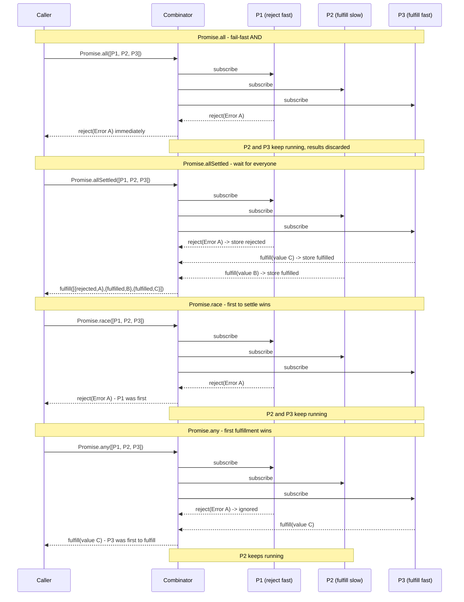
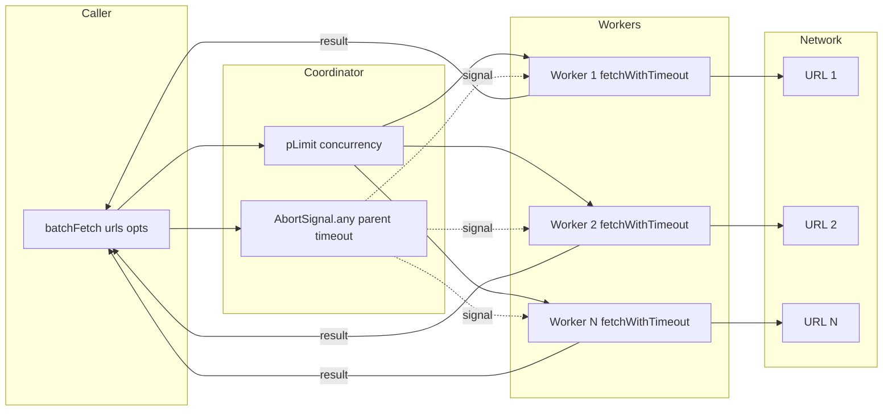

# 1.21 Promises API and Concurrency

> The Promise combinators (`Promise.all`, `Promise.allSettled`, `Promise.race`, `Promise.any`) are the four ways JavaScript answers a single question: **"I have many promises — how do I wait for them?"** Each one defines a different rule for what "done" means. Pair them with a concurrency limiter and `AbortController` and you have the full toolbox for non-trivial async coordination.

This note is the deepest possible reference on the four combinators, the `AggregateError` type, hand-rolled concurrency pools, and cancellable fetch via `AbortController`. Every major example is shown in side-by-side JavaScript and TypeScript. By the end you will be able to pick the right combinator on sight, implement all four from scratch, build a typed `pLimit(n)`, and cancel in-flight requests safely.

Prerequisite material: [[1.19 Asynchronous Paradigms Evolution]] for the historical why, [[1.20 Promises Specification]] for the spec-level Promise semantics that the combinators build on, and [[1.22 Async Await Runtime]] for how `async`/`await` desugars onto the same primitives shown here.

---

## 1. Purpose

### 1.1 The problem the combinators solve

A single Promise is easy: you `await` it or chain `.then`. The combinator API exists because real programs almost never deal with a single async value. A dashboard loads 12 widgets in parallel. A migration script deletes 50,000 rows. A redundant fetch fans out to three CDNs and uses whichever answers first. A test runner waits for every spec to finish before reporting totals.

Without combinators you would have to write this by hand every time:

```js
// Hand-rolled "wait for all" — what Promise.all replaces.
const results = [];
for (const task of tasks) {
  results.push(await task());
}
```

That loop is sequential. To make it parallel you would collect promises in an array and then poll, which the language does not natively expose. The combinators standardise the four useful policies for collecting an iterable of promises into a single awaitable value.

### 1.2 Why four combinators

Each combinator answers a different concurrency question:

| Combinator | Settles when | Rejects when | Fulfills with |
| --- | --- | --- | --- |
| `Promise.all` | All fulfill, or any rejects | Any rejects | Array of values (in input order) |
| `Promise.allSettled` | All settle (fulfill or reject) | Never | Array of `{status, value}` / `{status, reason}` |
| `Promise.race` | First promise settles (either way) | First promise rejects | First fulfilled value |
| `Promise.any` | First fulfills, or all reject | All reject | First fulfilled value |

`all` and `allSettled` wait for everyone. `race` and `any` wait for one. The split between `all`/`race` (legacy, ES2015) and `allSettled`/`any` (newer, ES2020/2021) reflects a decade of feedback: engineers kept reimplementing "wait for everyone without throwing" and "first success wins" with `Promise.all` and a `.catch(() => undefined)` hack. The newer pair exists to make those patterns explicit.

### 1.3 Why concurrency limiting matters

`Promise.all` is unbounded. If you call `Promise.all(Array.from({length: 10000}, fetch)`), it will fire 10,000 fetches immediately. The browser will queue most of them at 6 concurrent connections per origin. Node will happily open 10,000 sockets and exhaust file descriptors. The destination server will rate-limit you or worse. Memory will balloon because every response is buffered in parallel.

Concurrency limiting is the discipline of saying **"run all of these, but never more than N at the same instant."** It is not a feature of the Promise spec; it is a pattern built on top of it. The two most common shapes are:

- **Counter-based**: maintain an active count, queue the rest, drain as slots free.
- **Pool-based**: pre-allocate N "workers", feed them from a shared queue.

`p-limit`, `p-queue`, and `tiny-async-pool` are popular npm implementations. Section 5.2 builds a typed `pLimit(n)` from scratch so you never need to depend on one for the common case.

### 1.4 Why `AbortController` exists

Even with the right combinator and a concurrency limit, you still need cancellation. `Promise.race` with a timeout returns to the caller when the timeout fires, but the underlying fetch keeps running, consuming bandwidth and a connection slot. `Promise.all` rejects when one input rejects, but the other inputs keep running — you are paying for work you will throw away.

`AbortController` is the language-level primitive for signalling cancellation to anything that opts in. `fetch` accepts a `signal` option. Node streams accept `signal`. Most modern async APIs do too. Section 2.6 covers the exact contract; Section 9.4 builds a timeout helper around it.

### 1.5 The full picture

This note covers, in order: the exact semantics of each combinator (Section 2), the mental models that make them stick (Section 3), where each shows up in production (Section 4), side-by-side minimal and production code (Section 5), the failure modes that bite engineers (Section 6), the design patterns that prevent them (Section 7), what an interviewer will ask (Section 8), four exercises with full solutions (Section 9), a batch URL fetcher blueprint (Section 10), and the prerequisite/follow-on notes (Section 11).

---

## 2. Theory and Deep Dive

### 2.1 `Promise.all(iterable)` — fail-fast AND

Spec: ECMAScript `Promise.all` (ECMA-262 §27.2.4.1).

Algorithm (simplified):

1. Let `C` be the `this` value (so subclasses work; see `Promise.all` called on a subclass).
2. Let `promiseCapability` be `NewPromiseCapability(C)`.
3. Let `iteratorRecord` be `GetIterator(iterable)`.
4. Let `result` be `PerformPromiseAll(iteratorRecord, C, promiseCapability)`.
5. If `result` is an abrupt completion, call `iteratorRecord.[[Close]]()` and reject `promiseCapability` with that abrupt completion.
6. Return `promiseCapability.[[Promise]]`.

`PerformPromiseAll` walks the iterator, calls `Promise.resolve` on each value (so non-promises are coerced), assigns each a resolve/reject pair indexed by position, and keeps a `remainingElementsCount` counter. The first rejection calls the outer reject immediately and short-circuits all subsequent results. The last fulfillment decrements `remainingElementsCount` to 0 and resolves the outer promise with the values array in original input order.

Key consequences:

- **Fail-fast**: the moment any input rejects, the outer promise rejects with that reason. Remaining inputs are not cancelled — they keep running, but their results are discarded.
- **Order preservation**: the output array is in input order, not completion order. If promise 0 takes 10 seconds and promise 1 takes 1 millisecond, the output array is still `[value0, value1]`.
- **Non-promise inputs**: `Promise.all([1, 2, 3])` resolves to `[1, 2, 3]`. Each element is passed through `Promise.resolve`.
- **Empty iterable**: `Promise.all([])` resolves synchronously (well, on the next microtask) to `[]`.
- **Sync throw in the iterator**: if the iterable's `[Symbol.iterator]` or its `next()` throws, `Promise.all` rejects with that thrown value, and the iterator is closed if it has a `return()` method.

### 2.2 `Promise.allSettled(iterable)` — wait for everyone, no fail

Spec: ECMAScript `Promise.allSettled` (ECMA-262 §27.2.4.2). Added in ES2020.

The algorithm mirrors `Promise.all` but the per-element callbacks never call the outer reject. Instead:

- On fulfillment, store `{status: "fulfilled", value}` at the element's index.
- On rejection, store `{status: "rejected", reason}` at the element's index.
- When `remainingElementsCount` hits 0, resolve the outer promise with the array of result objects.

Key consequences:

- `Promise.allSettled` **never rejects** under normal circumstances. The only rejection path is a synchronous throw in the iterator itself (before any element is processed).
- The output shape is `{status, value}` or `{status, reason}` — never both `value` and `reason`. TypeScript models this as a discriminated union (see Section 5.1).
- `Promise.allSettled([])` resolves to `[]`.
- This is the right tool for **partial-success** batch operations: delete 100 records, then iterate the result array and log which ones failed.

### 2.3 `Promise.race(iterable)` — first to settle wins (any kind)

Spec: ECMAScript `Promise.race` (ECMA-262 §27.2.4.4). In ES2015.

Algorithm: walk the iterator, call `Promise.resolve` on each, attach a single resolve/reject pair to each. The first promise to settle (either fulfill or reject) settles the outer promise with the same outcome. Subsequent settlements are ignored.

Key consequences:

- **Either outcome wins**: if the first to settle is a rejection, `Promise.race` rejects. If it is a fulfillment, `Promise.race` fulfills. The name "race" is about settling, not about success.
- **No cancellation**: the losing promises keep running. `Promise.race` does not abort them. This is the most common source of bugs with `race`.
- **Empty iterable**: `Promise.race([])` **never settles**. The outer promise stays pending forever. This is documented behaviour, not a bug, but it is a footgun — see Section 6.7.
- **Non-promise inputs**: `Promise.race([42, slowPromise])` resolves to `42` on the next microtask, because `Promise.resolve(42)` is already settled.

### 2.4 `Promise.any(iterable)` — first fulfillment wins

Spec: ECMAScript `Promise.any` (ECMA-262 §27.2.4.3). Added in ES2021.

Algorithm: walk the iterator, attach a fulfill handler to each that resolves the outer promise, and a reject handler that decrements `remainingElementsCount`. When the last input rejects and `remainingElementsCount` hits 0, the outer promise rejects with an `AggregateError` whose `errors` array contains the rejection reasons in input order.

Key consequences:

- Rejections are **ignored** as long as at least one promise fulfills.
- Only when **all** inputs reject does `Promise.any` reject, and it rejects with an `AggregateError` — not the last reason, not the first reason, but a wrapper containing every reason.
- `Promise.any([])` rejects with `AggregateError([])` because there are zero inputs and zero fulfillments.
- This is the right tool for **redundant fetches** (hit 3 CDNs, take the first answer) and for **best-effort fan-out** where any success is enough.

### 2.5 The four combinators on the same input — Mermaid sequence

Below is a Mermaid sequence diagram showing how each of the four combinators handles the same input set: three promises where P1 rejects quickly, P2 fulfills slowly, and P3 fulfills quickly.



The diagram makes the four policies visual:

- `all`: rejects the moment P1 rejects.
- `allSettled`: waits for all three, returns the structured result array.
- `race`: settles the moment P1 settles (with a rejection — race does not care).
- `any`: ignores P1's rejection, settles the moment P3 fulfills.

### 2.6 `AbortController` and the `signal` contract

`AbortController` is a DOM standard (also exposed in Node since v15) for cooperative cancellation. The shape:

- `new AbortController()` returns a controller with a `signal` (an `AbortSignal`) and an `abort(reason?)` method.
- The `signal` is what you pass to async APIs. `fetch(url, { signal })` is the canonical example.
- When `controller.abort()` is called, the signal transitions to "aborted". Every consumer listening on that signal is notified.
- `signal.aborted` is a boolean for polling. `signal.addEventListener('abort', handler)` for the event form. `signal.reason` is the abort reason (defaults to a `DOMException` named `AbortError`).

The contract is cooperative: passing a `signal` to `fetch` does not force-cancel the network request. It tells `fetch` to reject the returned promise with the abort reason at the next opportunity and to stop processing the response body. The TCP connection may or may not be torn down depending on the platform.

Composing `AbortController` with the combinators:

- `Promise.race([fetch(url, { signal }), timeoutPromise])` returns when either settles. If the timeout wins, call `controller.abort()` to actually cancel the fetch.
- For cascading cancellation, use `AbortSignal.any([parentSignal, localSignal])` (Node 20+, modern browsers) so a parent abort propagates to children.
- `AbortSignal.timeout(ms)` (Node 17.3+, modern browsers) creates a signal that auto-aborts after `ms`. Combine with `fetch` for a one-line timeout.

### 2.7 Concurrency limiting patterns

There are three common patterns. Each trades off implementation complexity for throughput.

**Pattern A — Counter-based (the `p-limit` shape):** Maintain a count of active tasks and a queue of pending ones. When a slot is free, dequeue and start. When a task settles, decrement the count and try to drain.

**Pattern B — Worker pool (the `p-queue` shape):** Spawn N long-running "worker" async functions that pull from a shared queue. Each worker is just a `while` loop that awaits the next item.

**Pattern C — Recursive chunking:** Split the input into chunks of size N, run `Promise.all` on each chunk, then `await` the chunks sequentially. Simpler but less optimal — if one item in a chunk is slow, the next chunk waits for the whole chunk to drain.

Section 5.2 implements Pattern A from scratch as a typed `pLimit(n)`. Section 9.3 builds it again as an exercise.

### 2.8 `AggregateError`

`AggregateError` is a subclass of `Error` introduced in ES2021 alongside `Promise.any`. Its constructor is `new AggregateError(errors, message?)`. Two properties of interest:

- `errors`: an array of the constituent errors. For `Promise.any`, this is the rejection reasons in input order.
- `message`: the standard `Error.message`.

The `toString` of an `AggregateError` produces `"AggregateError: <message>"` — the individual errors are not in the string. You must iterate `error.errors` to inspect them.

`AggregateError` is also used by `Error` cause-chaining in some libraries and by `Promise.allSettled`'s conceptual sibling APIs in other languages. In JavaScript it is currently most associated with `Promise.any`.

### 2.9 Subclass support and `Promise.resolve`

`Promise.all`, `Promise.allSettled`, `Promise.race`, and `Promise.any` all use the `this` value as the constructor for the returned promise. If you call `MyPromise.all([...])` where `MyPromise extends Promise`, the returned promise is a `MyPromise`, not a plain `Promise`. This is rarely useful but is the reason the spec uses `SpeciesConstructor` indirectly through `NewPromiseCapability`.

Each input is passed through `Promise.resolve`. That means:

- `Promise.all([42, Promise.resolve(7)])` works.
- `Promise.all([thenable])` calls the thenable's `then` method.
- `Promise.all([Promise.resolve(1), Promise.resolve(2)])` is the common case.

This coercion is why passing non-promises does not throw — see Section 6.5.

### 2.10 Microtask ordering

All four combinators settle their outer promise via the microtask queue, not via synchronous calls. `Promise.all([1, 2, 3])` does not resolve synchronously even though every input is already settled. It resolves on the next microtask. This matters when you write code like:

```js
let ready;
Promise.all([1, 2, 3]).then(v => { ready = v; });
console.log(ready); // undefined, not [1, 2, 3]
```

The `then` callback is queued as a microtask and runs after the current synchronous code finishes. See [[1.22 Async Await Runtime]] for the full microtask model and [[1.26 Event Loop Concurrency Model]] for how it interleaves with I/O.

---

## 3. Mental Models

### 3.1 `Promise.all` = "AND — all must succeed, else fail"

Treat `Promise.all` as logical AND across promises. Every input must fulfill. If any rejects, the whole expression rejects with that reason and the others become irrelevant (though they keep running — see Section 6.1).

```js
// "Make me a sandwich AND pour me some juice, then bring both."
const [sandwich, juice] = await Promise.all([makeSandwich(), pourJuice()]);
```

### 3.2 `Promise.allSettled` = "wait for everyone, report cards"

Treat `allSettled` as a roll-call. Everyone must report, success or failure, and you get a structured array back. Nothing throws — you handle rejection by inspecting the `status` field.

```js
// "Send the invite to everyone; tell me who RSVP'd yes and who bounced."
const results = await Promise.allSettled(emails.map(sendInvite));
const yes = results.filter(r => r.status === 'fulfilled').map(r => r.value);
const bounced = results.filter(r => r.status === 'rejected').map(r => r.reason);
```

### 3.3 `Promise.race` = "first to finish (success or fail) wins"

Treat `race` as a literal race. Whoever crosses the finish line first — whether they cross it cleanly or trip and fall — wins. The race ends. The other runners keep running because nobody told them to stop.

```js
// "Fetch from the cache; if the network answers first, use that."
const cachedOrNetwork = await Promise.race([cache.get(key), fetch(url)]);
```

The footgun: the loser is still running. If the loser holds a socket, that socket is held until the loser settles. Section 6.2 covers this in depth.

### 3.4 `Promise.any` = "first success wins, ignore failures unless all fail"

Treat `any` as an optimist's race. Rejections are noise; keep waiting for the first success. Only if every single input rejects do you give up, and when you do, you wrap every reason in an `AggregateError` so nothing is lost.

```js
// "Hit three CDNs; use whichever answers first."
const fastest = await Promise.any([
  fetch('https://cdn-a.example.com/file'),
  fetch('https://cdn-b.example.com/file'),
  fetch('https://cdn-c.example.com/file'),
]);
```

### 3.5 Concurrency limit = "a queue with N slots, refill as each completes"

Picture a coffee shop with three baristas. Customers queue. When a barista finishes a drink, the next customer steps up. The throughput is bounded by the number of baristas, not by the size of the queue. Adding more customers does not open more slots — it just lengthens the queue.

The `pLimit(n)` pattern returns a function. Calling that function with a task does not run it immediately; it returns a promise that resolves when the task eventually runs (after queuing) and completes. From the caller's perspective, every call returns a promise; from the system's perspective, only N tasks run at once.

### 3.6 `AbortController` = "a walkie-talkie that only says STOP"

`AbortController` is a one-way broadcast channel. The controller holds the talk button; the signal is the receiver. Any number of receivers can listen to one controller. When the talk button is pressed (`abort()`), every receiver hears "stop" at the same time.

You cannot send any other message over this channel. You cannot un-press abort. You cannot ask "are you done?" — you can only check `signal.aborted` from the receiver side. The channel is single-use.

### 3.7 Combinators don't cancel — the mental model trap

The single most important mental model: **Promise combinators do not cancel their inputs.** They subscribe to outcomes. When `Promise.race` settles, the losers keep running. When `Promise.all` rejects, the still-pending inputs keep running. When `Promise.any` settles on the first success, the slow losers keep running.

Cancellation is a separate concern, handled by `AbortController`. If you need cancellation, you wire it up yourself. The combinators give you observation; `AbortController` gives you action.

---

## 4. Real-World Use Cases

### 4.1 `Promise.all` — parallel fan-out with bounded N

Use `Promise.all` when:

- The number of inputs is small and known (≤ ~100).
- Every input must succeed for the operation to be meaningful.
- Failure of one should abort the operation (fail-fast).

Classic examples:

- Loading a dashboard's widget data in parallel: `Promise.all([loadHeader(), loadBody(), loadFooter()])`.
- Validating a form's fields: `Promise.all([validateEmail(email), validatePassword(pw), validateUsername(u)])` — fails fast on the first invalid field.
- Loading a config and its schema together: `Promise.all([fetch('/config'), fetch('/schema')])`.

When N grows past a few hundred, switch to a concurrency limiter (Section 4.5).

### 4.2 `Promise.allSettled` — partial-success bulk operations

Use `Promise.allSettled` when:

- You want to attempt every input regardless of failures.
- You need a structured report of which succeeded and which failed.
- The operation is meaningful even with partial success.

Classic examples:

- Bulk delete: `Promise.allSettled(ids.map(id => api.delete(`/items/${id}`)))` followed by partitioning into deleted/failed lists for the user.
- Bulk email send: send to 1000 recipients, report which bounced.
- Multi-source data fetch: hit 5 endpoints, accept whichever answer; log the failures for ops.
- Best-effort cache warmup: warm 200 keys; failures are logged, not fatal.

### 4.3 `Promise.race` — timeouts and "first answer wins"

Use `Promise.race` when:

- You want the first outcome of any kind (success or failure).
- You are implementing a timeout.
- You are racing a cache against a network fetch.

Classic examples:

- Timeout: `Promise.race([fetch(url), rejectAfter(5000)])` — but note the resource leak (Section 6.2); the production pattern uses `AbortController` (Section 9.4).
- Cache vs network: `Promise.race([cache.get(key), fetch(url)])` — but if the cache returns `undefined` synchronously, `Promise.resolve(undefined)` wins immediately, defeating the point. Wrap the cache in a check or use `Promise.any` with the cache always resolving.
- "First ready" UI: race several data sources, use the first to render.

### 4.4 `Promise.any` — redundant fetches and fallbacks

Use `Promise.any` when:

- You want the first success; failures are noise.
- You are fanning out to redundant sources.
- All failures should still throw, but bundled.

Classic examples:

- Multi-CDN fetch: `Promise.any([fetch(cdnA), fetch(cdnB), fetch(cdnC)])` — use whichever responds first with a 2xx.
- Multi-region database read: query 3 read replicas, use the first answer.
- Bootstrap with fallback: `Promise.any([fetch(primary), fetch(secondary), fetch(tertiary)])`.
- Health check quorum: ping 5 nodes; if any reports healthy, the system is up.

Note: `fetch` rejects only on network errors, not on HTTP 4xx/5xx. To use `Promise.any` for "first 2xx", wrap `fetch` in a function that rejects on non-OK status.

### 4.5 `p-limit` / `p-queue` — large batches

When N is large (hundreds to millions), unbounded `Promise.all` is unsafe. Reach for a concurrency limiter.

- `p-limit`: simplest API, returns a function wrapper. `const limit = pLimit(5); await Promise.all(urls.map(u => limit(() => fetch(u))));`
- `p-queue`: full-featured, supports priorities, pausing, dynamic concurrency. Use when you need scheduling control.
- `tiny-async-pool`: specifically for "run all with concurrency N", returns an async iterator.
- Hand-rolled `pLimit(n)`: Section 5.2. No dependency, fully typed.

Typical use cases:

- Crawling 10,000 URLs.
- Importing 50,000 database rows.
- Resizing 2,000 images.
- Sending 100,000 webhook notifications.

### 4.6 `AbortController` — cancellable fetch

Use `AbortController` whenever you need to abort a request before it completes:

- User navigates away from a page mid-fetch.
- A search-as-you-type input fires a new request; the old one should be cancelled.
- A timeout helper wants to actually cancel the network request, not just race against it.
- A long-running upload is cancelled by a user click.
- A batch operation is aborted by a shutdown signal.

In React, the canonical pattern is:

```js
useEffect(() => {
  const controller = new AbortController();
  fetch('/api/data', { signal: controller.signal })
    .then(setData)
    .catch(err => { if (err.name !== 'AbortError') setError(err); });
  return () => controller.abort();
}, [query]);
```

The cleanup function aborts the controller on unmount or query change, and the fetch rejects with an `AbortError` that you filter out of error handling.

### 4.7 Composing the patterns

The most common production pattern is **concurrency-limited `allSettled` with per-request timeout and abort**:

```js
const limit = pLimit(5);
const results = await Promise.allSettled(
  urls.map(url => limit(() => fetchWithTimeout(url, 5000)))
);
```

This: limits concurrency to 5, waits for every URL, ignores individual failures, and aborts each request after 5 seconds. Section 10 builds this as a mini-project.

---

## 5. Code Examples

### 5.1 Example A — Minimal and Conceptual

Goal: run all four combinators on the same four-promise input and observe the differences.

#### JavaScript

```js
// Four promises with mixed outcomes:
// p0: fulfills quickly with 10
// p1: rejects quickly with Error("boom one")
// p2: fulfills slowly with 20
// p3: rejects slowly with Error("boom two")

const p0 = Promise.resolve(10);
const p1 = Promise.reject(new Error('boom one'));
const p2 = new Promise(r => setTimeout(() => r(20), 50));
const p3 = new Promise((resolve, rej) => setTimeout(() => rej(new Error('boom two')), 80));

const input = [p0, p1, p2, p3];

// all: fail-fast. p1 rejects immediately, so Promise.all rejects with p1's reason.
Promise.all(input).then(
  v => console.log('all fulfilled:', v),
  e => console.log('all rejected:', e.message) // "boom one"
);

// allSettled: waits for all four, never rejects.
Promise.allSettled(input).then(results => {
  for (const r of results) {
    if (r.status === 'fulfilled') console.log('allSettled ok:', r.value);
    else console.log('allSettled err:', r.reason.message);
  }
});
// Logs:
//   allSettled ok: 10
//   allSettled err: boom one
//   allSettled ok: 20
//   allSettled err: boom two

// race: first to settle. p0 and p1 are both already settled.
// Microtask order is implementation-defined but typically p0 first (resolve) or p1 first (reject).
Promise.race(input).then(
  v => console.log('race fulfilled:', v),    // 10 (if p0 wins the microtask race)
  e => console.log('race rejected:', e.message)
);

// any: first fulfillment. p0 fulfills with 10 immediately.
Promise.any(input).then(
  v => console.log('any fulfilled:', v), // 10
  e => console.log('any rejected:', e.errors.map(x => x.message)) // only if all rejected
);

// Empty-iterable behavior:
Promise.all([]).then(v => console.log('all([]):', v)); // []
Promise.allSettled([]).then(v => console.log('allSettled([]):', v)); // []
Promise.race([]).then(v => console.log('race([]):', v)); // never logs - never settles
Promise.any([]).catch(e => console.log('any([]) rejects:', e instanceof AggregateError)); // true
```

#### TypeScript

```ts
type SettledResult<T> =
  | { status: 'fulfilled'; value: T }
  | { status: 'rejected'; reason: unknown };

async function demo(): Promise<void> {
  const p0: Promise<number> = Promise.resolve(10);
  const p1: Promise<number> = Promise.reject(new Error('boom one'));
  const p2: Promise<number> = new Promise<number>(r => setTimeout(() => r(20), 50));
  const p3: Promise<number> = new Promise<number>((resolve, rej) =>
    setTimeout(() => rej(new Error('boom two')), 80)
  );

  const input: ReadonlyArray<Promise<number>> = [p0, p1, p2, p3];

  // Promise.all<T>(iterable) returns Promise<T[]>. Inference pulls T from the union
  // of element types; with number-promises it infers Promise<number[]>.
  try {
    const all: number[] = await Promise.all(input);
    console.log('all fulfilled:', all);
  } catch (e) {
    console.log('all rejected:', (e as Error).message); // "boom one"
  }

  // Promise.allSettled<T> returns Promise<PromiseSettledResult<T>[]>,
  // where PromiseSettledResult is the built-in discriminated union.
  const settled: PromiseSettledResult<number>[] = await Promise.allSettled(input);
  for (const r of settled) {
    if (r.status === 'fulfilled') console.log('allSettled ok:', r.value);
    else console.log('allSettled err:', (r.reason as Error).message);
  }

  // Promise.race<T> returns Promise<T>. With a mixed input the inferred T is the union.
  try {
    const first: number = await Promise.race(input);
    console.log('race fulfilled:', first);
  } catch (e) {
    console.log('race rejected:', (e as Error).message);
  }

  // Promise.any<T> returns Promise<T>. On all-reject, throws AggregateError.
  try {
    const firstOk: number = await Promise.any(input);
    console.log('any fulfilled:', firstOk); // 10
  } catch (e) {
    const agg = e as AggregateError;
    console.log('any rejected:', (agg.errors as Error[]).map(x => x.message));
  }

  // Empty iterables.
  const allEmpty: never[] = await Promise.all([] as const);
  const settledEmpty: PromiseSettledResult<never>[] = await Promise.allSettled([] as const);
  console.log('all([]):', allEmpty, 'allSettled([]):', settledEmpty);
  // Promise.race([]) never settles; awaiting it hangs forever. (Do not do this in a real program.)
  // Promise.any([]) rejects synchronously-ish with AggregateError.
  try {
    await Promise.any([] as const);
  } catch (e) {
    console.log('any([]) rejects with AggregateError:', e instanceof AggregateError); // true
  }
}

demo();
```

Note the TypeScript discriminated union: `r.status === 'fulfilled'` narrows `r` to the `{status: 'fulfilled'; value: number}` branch, so `r.value` is type-safe. This is the idiomatic way to consume `Promise.allSettled`'s output.

### 5.2 Example B — Production-Grade Typed `pLimit(n)`

Goal: a typed concurrency limiter returning a function wrapper, plus an example of using it to crawl URLs with per-request timeout and abort.

#### JavaScript

```js
// A production-grade pLimit implementation.
// Returns a function `limit(fn)` that runs `fn` when a slot is free,
// resolving/rejecting with whatever `fn` returns.
function pLimit(concurrency) {
  if (!Number.isInteger(concurrency) || concurrency < 1) {
    throw new RangeError(`pLimit: concurrency must be a positive integer, got ${concurrency}`);
  }

  let activeCount = 0;
  const queue = []; // FIFO of {run, resolve, reject}

  const next = () => {
    if (queue.length === 0) return;
    if (activeCount >= concurrency) return;
    activeCount += 1;
    const job = queue.shift();
    job.resolve(
      Promise.resolve()
        .then(() => job.run())
        .then(
          v => { activeCount -= 1; next(); return v; },
          e => { activeCount -= 1; next(); throw e; }
        )
    );
  };

  const limit = run => {
    return new Promise((resolve, reject) => {
      queue.push({ run, resolve, reject });
      next();
    });
  };

  // Attach a live counter for inspection / tests.
  Object.defineProperty(limit, 'activeCount', { get: () => activeCount });
  Object.defineProperty(limit, 'pendingCount', { get: () => queue.length });
  return limit;
}

// Per-request timeout helper using AbortController.
async function fetchWithTimeout(url, ms, opts = {}) {
  const controller = new AbortController();
  const timer = setTimeout(() => controller.abort(), ms);
  try {
    const res = await fetch(url, { ...opts, signal: controller.signal });
    return { ok: res.ok, status: res.status, url };
  } catch (err) {
    const isAbort = err && err.name === 'AbortError';
    return { ok: false, status: 0, url, error: isAbort ? 'timeout' : err.message };
  } finally {
    clearTimeout(timer);
  }
}

// Example: crawl a list of URLs with concurrency 5 and a 3-second timeout per request.
async function crawl(urls) {
  const limit = pLimit(5);
  const results = await Promise.allSettled(
    urls.map(url => limit(() => fetchWithTimeout(url, 3000)))
  );
  return results.map((r, i) => ({
    url: urls[i],
    status: r.status,
    payload: r.status === 'fulfilled' ? r.value : { error: String(r.reason) },
  }));
}

// Usage (uncomment to run in Node 18+):
// crawl([
//   'https://example.com/a',
//   'https://example.com/b',
//   'https://example.com/c',
// ]).then(console.log);
```

#### TypeScript

```ts
// A production-grade typed pLimit.
// The generic <Args extends unknown[], T> lets the wrapper preserve the wrapped
// function's argument types and return type.

type LimitedFunction<Args extends unknown[], T> = (...args: Args) => PromiseLike<T> | T;

interface Limit {
  <Args extends unknown[], T>(fn: LimitedFunction<Args, T>): (...args: Args) => Promise<T>;
  readonly activeCount: number;
  readonly pendingCount: number;
}

function pLimit(concurrency: number): Limit {
  if (!Number.isInteger(concurrency) || concurrency < 1) {
    throw new RangeError(`pLimit: concurrency must be a positive integer, got ${concurrency}`);
  }

  let activeCount = 0;
  // The queue stores deferred jobs. Each job is parameterized by the args to pass to `run`.
  interface Job {
    run: () => Promise<unknown>;
    resolve: (v: unknown) => void;
    reject: (e: unknown) => void;
  }
  const queue: Job[] = [];

  const next = (): void => {
    if (queue.length === 0) return;
    if (activeCount >= concurrency) return;
    activeCount += 1;
    const job = queue.shift() as Job;
    job.resolve(
      Promise.resolve()
        .then(() => job.run())
        .then(
          (v: unknown) => { activeCount -= 1; next(); return v; },
          (e: unknown) => { activeCount -= 1; next(); throw e; }
        )
    );
  };

  const limit = <Args extends unknown[], T>(fn: LimitedFunction<Args, T>) =>
    (...args: Args): Promise<T> => {
      return new Promise<T>((resolve, reject) => {
        const job: Job = {
          run: () => Promise.resolve(fn(...args)),
          resolve: v => resolve(v as T),
          reject,
        };
        queue.push(job);
        next();
      });
    };

  Object.defineProperty(limit, 'activeCount', { get: () => activeCount });
  Object.defineProperty(limit, 'pendingCount', { get: () => queue.length });
  return limit as Limit;
}

// Per-request timeout helper using AbortController, fully typed.
interface FetchResult {
  ok: boolean;
  status: number;
  url: string;
  body?: string;
  error?: string;
}

async function fetchWithTimeout(url: string, ms: number, opts: RequestInit = {}): Promise<FetchResult> {
  const controller = new AbortController();
  const timer = setTimeout(() => controller.abort(), ms);
  try {
    const res = await fetch(url, { ...opts, signal: controller.signal });
    const body = res.ok ? await res.text() : undefined;
    return { ok: res.ok, status: res.status, url, body };
  } catch (err) {
    const e = err as Error & { name?: string };
    const isAbort = e.name === 'AbortError';
    return { ok: false, status: 0, url, error: isAbort ? 'timeout' : e.message };
  } finally {
    clearTimeout(timer);
  }
}

// Example: crawl URLs with concurrency 5 and a 3-second timeout per request.
interface CrawlResult {
  url: string;
  status: 'fulfilled' | 'rejected';
  payload: FetchResult | { error: string };
}

async function crawl(urls: readonly string[]): Promise<CrawlResult[]> {
  const limit = pLimit(5);
  const settled = await Promise.allSettled(
    urls.map(url => limit(() => fetchWithTimeout(url, 3000))())
  );
  return settled.map((r, i) => ({
    url: urls[i],
    status: r.status,
    payload: r.status === 'fulfilled' ? r.value : { error: String(r.reason) },
  }));
}

export { pLimit, fetchWithTimeout, crawl };
export type { Limit, FetchResult, CrawlResult };
```

Note three subtleties in the TypeScript version:

1. **Generic preservation**: `limit(fn)` returns a function with the same argument and return types as `fn`. The caller writes `limit(() => fetchWithTimeout(url, 3000))()` and the returned `Promise<FetchResult>` flows through with no manual annotation.
2. **Discriminated union consumption**: `r.status === 'fulfilled'` narrows `r` so `r.value` is `FetchResult`, and in the `rejected` branch `r.reason` is `unknown`.
3. **`Error & { name?: string }` cast**: the DOM's `AbortError` is a `DOMException` with `name === 'AbortError'`. TypeScript's `Error` type does not always model `name` precisely; the intersection cast is a defensive pattern. In Node 18+ with `lib: ["dom"]` or `"dom.iterable"`, the `name` property is available on `Error` directly and the cast is unnecessary.

---

## 6. Common Mistakes and Anti-Patterns

### 6.1 Assuming `Promise.all` cancels the remaining inputs on rejection

**Mistake:** `Promise.all` rejects when the first input rejects, so the remaining inputs are cancelled.

**Reality:** `Promise.all` only stops *observing* the remaining inputs. It does not cancel them. If input 0 rejects while inputs 1-99 are mid-flight, those 99 promises keep running, consuming sockets, memory, and CPU. Their results are silently discarded by `Promise.all`, but the work still happens.

```js
// Anti-pattern: 100 fetches, fail-fast, no cancellation.
await Promise.all(urls.map(u => fetch(u))).catch(err => {
  console.log('one failed, but 99 fetches are still running');
  // No way to cancel them here.
});
```

**Fix:** use `AbortController` to cancel the entire batch on first failure.

```js
const controller = new AbortController();
const tasks = urls.map(u => fetch(u, { signal: controller.signal }));
try {
  await Promise.all(tasks);
} catch (err) {
  controller.abort(); // Actually cancel the in-flight fetches.
  throw err;
}
```

### 6.2 Using `Promise.race` for timeouts without `AbortController`

**Mistake:** `Promise.race([fetch(url), timeout(ms)])` cancels the fetch when the timeout wins.

**Reality:** `Promise.race` returns to the caller when the timeout fires, but the fetch is still running. The TCP connection is still open. The response body is still being downloaded. If you do this 1000 times you will exhaust the browser's connection pool.

```js
// Anti-pattern: timeout that leaks.
async function fetchWithLeak(url, ms) {
  return Promise.race([
    fetch(url),
    new Promise((resolve, rej) => setTimeout(() => rej(new Error('timeout')), ms)),
  ]);
}
// The fetch keeps running after the timeout. Resource leak.
```

**Fix:** wire `AbortController` through.

```js
async function fetchWithTimeout(url, ms, opts = {}) {
  const controller = new AbortController();
  const timer = setTimeout(() => controller.abort(), ms);
  try {
    return await fetch(url, { ...opts, signal: controller.signal });
  } finally {
    clearTimeout(timer);
  }
}
```

### 6.3 Expecting `Promise.any` to throw the individual rejection

**Mistake:** `Promise.any` rejects with the last error (or the first error) when all inputs reject.

**Reality:** `Promise.any` rejects with an `AggregateError` whose `errors` array contains every rejection reason in input order. It is not the last error, not the first error, and not a generic `Error`.

```js
// Anti-pattern: catch assumes a normal Error.
try {
  await Promise.any([Promise.reject(new Error('a')), Promise.reject(new Error('b'))]);
} catch (err) {
  console.log(err.message); // "All promises were rejected" (AggregateError's message)
  console.log(err.errors.map(e => e.message)); // ["a", "b"] -- the real reasons
}
```

**Fix:** always check `err instanceof AggregateError` and iterate `err.errors`.

```js
try {
  await Promise.any(tasks);
} catch (err) {
  if (err instanceof AggregateError) {
    for (const sub of err.errors) console.error(sub);
  } else {
    throw err;
  }
}
```

### 6.4 Forgetting to pass `signal` to `fetch`

**Mistake:** create an `AbortController`, call `controller.abort()`, but never pass `controller.signal` to `fetch`.

**Reality:** `abort()` on a controller whose signal no one is listening to does nothing observable. The fetch is not magically tracked.

```js
// Anti-pattern: signal never reaches fetch.
const controller = new AbortController();
setTimeout(() => controller.abort(), 1000);
const res = await fetch(url); // <-- signal not passed!
// The fetch is unaffected by the abort.
```

**Fix:** always thread the signal into the call.

```js
const res = await fetch(url, { signal: controller.signal });
```

The same applies to any other API that accepts a `signal`: Node's `fs.readFile`, `setTimeout` (Node 18+ with the experimental abort-controller flag), the Node child-process module's `exec`, etc.

### 6.5 Passing non-promises to combinators and being surprised by coercion

**Mistake:** `Promise.all([1, 2, 3])` throws because the inputs are not promises.

**Reality:** every input is passed through `Promise.resolve`. `Promise.all([1, 2, 3])` resolves to `[1, 2, 3]`. `Promise.race([42, slowPromise])` resolves to `42` immediately. This is convenient but can mask bugs:

```js
// Anti-pattern: a typo returns undefined instead of a promise, but Promise.all
// happily resolves with [undefined].
const tasks = [getUser(id), getProfile(id), getPost(id)]; // getPost is misspelled getPostss -> undefined
const [user, profile, post] = await Promise.all(tasks);
console.log(post); // undefined, no error thrown.
```

**Fix:** when mixing promises and synchronous values is a bug, validate the input array first or use TypeScript to enforce `Promise<T>[]`.

### 6.6 Treating `Promise.allSettled` results as a flat value array

**Mistake:** `const values = await Promise.allSettled(inputs); console.log(values[0]);` and expecting `values[0]` to be the first input's value.

**Reality:** `values[0]` is `{status, value}` or `{status, reason}`. You must check `status` first. Forgetting this leads to `undefined` values or runtime errors when you try to use `value` on a `rejected` result.

```js
// Anti-pattern: forgetting the discriminator.
const results = await Promise.allSettled(inputs);
for (const r of results) console.log(r.value); // undefined for rejected entries!
```

**Fix:** always narrow on `status`.

```js
const results = await Promise.allSettled(inputs);
for (const r of results) {
  if (r.status === 'fulfilled') console.log(r.value);
  else console.error(r.reason);
}
```

In TypeScript, the discriminator gives you a compile-time guarantee: `r.value` is only accessible in the `fulfilled` branch.

### 6.7 Passing an empty iterable to `Promise.race` and hanging forever

**Mistake:** `Promise.race([])` resolves immediately (like `Promise.all([])`).

**Reality:** `Promise.race([])` never settles. The returned promise stays pending forever. If you `await` it, your function never returns. If you pass it to another combinator, that combinator hangs too.

```js
// Anti-pattern: dynamically-built iterable that might be empty.
const candidates = sources.filter(s => s.isReady);
const fastest = await Promise.race(candidates.map(s => s.fetch()));
// If no source isReady, candidates is [] and this await hangs forever.
```

**Fix:** guard against empty input.

```js
if (candidates.length === 0) throw new Error('no candidates');
const fastest = await Promise.race(candidates.map(s => s.fetch()));
```

For the other combinators: `Promise.all([])` fulfills with `[]`, `Promise.allSettled([])` fulfills with `[]`, `Promise.any([])` rejects with `AggregateError([])`. Only `race` hangs.

### 6.8 Using unbounded `Promise.all` for large batches

**Mistake:** `Promise.all(Array.from({length: 10000}, (ignored, i) => fetch(`/api/item/${i}`)))` is fine because `Promise.all` handles it.

**Reality:** `Promise.all` will create 10,000 fetch promises immediately. The browser will queue them at 6 concurrent connections per origin, but each pending promise holds memory, and the destination server will likely rate-limit or block you. Node will happily open thousands of sockets and exhaust file descriptors.

**Fix:** use a concurrency limiter.

```js
const limit = pLimit(10);
const results = await Promise.all(
  Array.from({length: 10000}, (ignored, i) => limit(() => fetch(`/api/item/${i}`))())
);
```

### 6.9 Forgetting that `Promise.any` ignores rejections silently

**Mistake:** using `Promise.any` when you actually want to know about every rejection.

**Reality:** `Promise.any` discards rejection reasons unless *all* inputs reject. If 2 of 3 CDNs return 500 errors and the third succeeds, you get the successful response and never know about the 500s. This can hide systemic issues.

```js
// Anti-pattern: silent failures in monitoring.
const res = await Promise.any([fetch(cdnA), fetch(cdnB), fetch(cdnC)]);
// If cdnA and cdnB both returned 500, you'll never know.
```

**Fix:** log rejections via a side channel before they are discarded.

```js
const tracked = urls.map(u =>
  fetch(u).catch(err => {
    metrics.increment('fetch.failure', { url: u, reason: err.message });
    throw err;
  })
);
const res = await Promise.any(tracked);
```

### 6.10 Not handling `AggregateError` in `Promise.any` at all

**Mistake:** `await Promise.any(tasks)` with no `try/catch` because "one of them will succeed".

**Reality:** if all tasks reject, `Promise.any` throws an `AggregateError`. If the caller does not catch it, the rejection propagates as an unhandled rejection, which in Node prints a warning and in browsers fires `unhandledrejection`.

```js
// Anti-pattern: no error handling.
const res = await Promise.any(maybeEmptyArray);
// If maybeEmptyArray is empty or all-rejecting, this throws.
```

**Fix:** wrap in try/catch and handle the `AggregateError` explicitly.

---

## 7. Best Practices and Design Patterns

### 7.1 Use `Promise.all` only when N is small and bounded

If you can count the inputs on one hand (or even two), `Promise.all` is the right tool. It is the most readable, the most type-safe, and the most optimised. Past ~100 inputs, switch to a limiter. Past ~10,000 inputs, consider a queue with backpressure (see [[1.26 Event Loop Concurrency Model]]).

### 7.2 Use a concurrency limiter for large N

`pLimit(n)` is a 30-line function (Section 5.2). There is no reason to depend on a library for the common case. The library-grade alternatives (`p-queue`, `tiny-async-pool`) earn their weight when you need priorities, pausing, or dynamic concurrency.

### 7.3 Use `Promise.allSettled` when partial success is acceptable

If the operation is meaningful even with some failures (bulk delete, bulk email, cache warmup), `allSettled` is the right tool. It never throws, gives you a structured report, and lets you partition into successes and failures explicitly.

### 7.4 Use `Promise.race` with a timeout helper (and `AbortController`)

`Promise.race` is the building block for timeouts, but a timeout that does not cancel the underlying work is a resource leak. Always pair `race` with `AbortController` (Section 9.4) when timing out an abortable operation like `fetch`.

### 7.5 Use `AbortController` for every cancellable operation

Any `fetch` whose result you might not need should accept a `signal`. This includes:

- Fetches triggered by user input (search-as-you-type).
- Fetches triggered by route changes (cancel on navigation).
- Long-running uploads (cancel on user action).
- Batch operations (cancel on shutdown).

In Node, also use `signal` with `fs.readFile`, the Node child-process module's `exec`, `setTimeout`, and any API that supports it.

### 7.6 In TypeScript, type the results array explicitly

`Promise.all<T>(inputs)` returns `Promise<T[]>`. If TypeScript cannot infer `T` (mixed input types, conditional inputs), specify it explicitly.

```ts
// Explicit generic.
const results = await Promise.all<number>([fetchNum1(), fetchNum2(), maybeNum()]);
```

For `allSettled`, use the built-in `PromiseSettledResult<T>` discriminated union.

```ts
const results: PromiseSettledResult<User>[] = await Promise.allSettled(
  ids.map(id => fetchUser(id))
);
const users = results
  .filter((r): r is PromiseFulfilledResult<User> => r.status === 'fulfilled')
  .map(r => r.value);
```

The type guard `(r): r is PromiseFulfilledResult<User> => r.status === 'fulfilled'` lets `filter` narrow the array type, so `map(r => r.value)` is type-safe.

### 7.7 Partition `allSettled` results into successes and failures

```ts
function partition<T>(results: PromiseSettledResult<T>[]) {
  const fulfilled: T[] = [];
  const rejected: unknown[] = [];
  for (const r of results) {
    if (r.status === 'fulfilled') fulfilled.push(r.value);
    else rejected.push(r.reason);
  }
  return { fulfilled, rejected };
}
```

This is the canonical post-processing step for `allSettled`. Make it a utility in your codebase.

### 7.8 Use `AbortSignal.any` for cascading cancellation

When you have a parent signal (e.g., request-level cancellation) and a child signal (e.g., per-fetch timeout), combine them with `AbortSignal.any([parent, child])` (Node 20+, modern browsers). If either aborts, the combined signal aborts.

```js
async function fetchAll(urls, parentSignal) {
  return Promise.all(urls.map(async url => {
    const local = new AbortController();
    const timer = setTimeout(() => local.abort(), 5000);
    try {
      return await fetch(url, { signal: AbortSignal.any([parentSignal, local.signal]) });
    } finally {
      clearTimeout(timer);
    }
  }));
}
```

### 7.9 Use `AbortSignal.timeout` for one-shot timeouts

`AbortSignal.timeout(ms)` creates a signal that auto-aborts after `ms`. It is a one-liner for the most common timeout case.

```js
const res = await fetch(url, { signal: AbortSignal.timeout(5000) });
```

The thrown error on timeout is a `DOMException` with `name: 'TimeoutError'` (not `'AbortError'`). Distinguish them in your catch.

### 7.10 Always attach a `.catch` or wrap in `try/catch`

An unhandled promise rejection is a runtime warning in Node and an `unhandledrejection` event in browsers. Every combinator call that can reject must have a handler somewhere up the chain. This is not specific to the combinators but is worth restating because the combinator APIs make it easy to write code that "usually works" until one input rejects.

### 7.11 Cache promises, not values

When you memoise an async function, cache the promise, not the resolved value. This avoids double-fetching when the function is called twice in quick succession before the first fetch resolves.

```ts
const cache = new Map<string, Promise<Data>>();
function fetchCached(key: string): Promise<Data> {
  if (!cache.has(key)) cache.set(key, fetch(`/api/${key}`).then(r => r.json()));
  return cache.get(key)!;
}
```

The first caller gets the in-flight promise; the second caller gets the same promise; both `await` it and resolve together. This is the smallest possible "request deduper" and it works because of how promise resolution is shared.

---

## 8. Technical Interview Knowledge

### 8.1 Q: What is the difference between `Promise.all`, `Promise.allSettled`, `Promise.race`, and `Promise.any`?

**A:**

- `Promise.all`: fulfills when all inputs fulfill (with an array of values in input order); rejects immediately when any input rejects (fail-fast).
- `Promise.allSettled`: fulfills when all inputs settle; never rejects under normal input; returns an array of `{status, value}` or `{status, reason}` objects.
- `Promise.race`: settles (fulfills or rejects) when the first input settles, with the same outcome.
- `Promise.any`: fulfills when the first input fulfills; rejects with `AggregateError` only when all inputs reject.

**Trap to avoid:** `race` and `any` sound similar but differ on rejection handling. `race` will reject if the first to settle is a rejection. `any` will reject only if every input rejects.

### 8.2 Q: What does `Promise.all([])` return?

**A:** A promise that fulfills with an empty array `[]`. The fulfilment happens on the next microtask (not synchronously). This is useful as a "no-op async" — `await Promise.all([])` is a valid way to yield to the microtask queue.

### 8.3 Q: What does `Promise.race([])` return?

**A:** A promise that never settles. It stays pending forever. This is the only combinator with this behaviour for an empty input. It is a footgun: if you build the iterable dynamically and it happens to be empty, your `await` hangs.

### 8.4 Q: What is `AggregateError`?

**A:** A subclass of `Error` introduced in ES2021. It has an `errors` property (an array of the constituent errors) and a `message`. It is thrown by `Promise.any` when all inputs reject, with `errors` containing the rejection reasons in input order. You can also construct one manually: `new AggregateError([err1, err2], 'both failed')`.

### 8.5 Q: Implement `Promise.all` from scratch.

**A:**

```js
function promiseAll(iterable) {
  return new Promise((resolve, reject) => {
    const items = [...iterable];
    if (items.length === 0) { resolve([]); return; }
    const results = new Array(items.length);
    let remaining = items.length;
    items.forEach((item, index) => {
      Promise.resolve(item).then(
        value => {
          results[index] = value;
          if (--remaining === 0) resolve(results);
        },
        reject // fail-fast: first rejection wins
      );
    });
  });
}
```

Key points: spread the iterable into an array (handles iterables, closes the iterator), call `Promise.resolve` on each item (handles non-promises and thenables), store results at the correct index (preserves input order), count down `remaining` (handles out-of-order completion), reject immediately on first rejection (fail-fast).

### 8.6 Q: Implement `Promise.any` from scratch.

**A:**

```js
function promiseAny(iterable) {
  return new Promise((resolve, reject) => {
    const items = [...iterable];
    if (items.length === 0) {
      reject(new AggregateError([], 'All promises were rejected'));
      return;
    }
    const errors = new Array(items.length);
    let remaining = items.length;
    items.forEach((item, index) => {
      Promise.resolve(item).then(
        resolve, // first fulfillment wins
        reason => {
          errors[index] = reason;
          if (--remaining === 0) {
            reject(new AggregateError(errors, 'All promises were rejected'));
          }
        }
      );
    });
  });
}
```

Key points: empty input rejects with `AggregateError([])`, first fulfillment resolves the outer promise (later fulfillments are no-ops because the outer promise is already settled), all rejections collected into `errors` in input order, when the last one rejects the outer promise rejects with `AggregateError(errors)`.

### 8.7 Q: How do you limit concurrency with Promises?

**A:** The pattern is a counter-based queue (Section 5.2). Maintain `activeCount` and a FIFO `queue`. When `limit(fn)` is called, push a job onto the queue and try to drain. Drain: while `activeCount < concurrency` and the queue is non-empty, dequeue a job, increment `activeCount`, run it, and on settlement decrement `activeCount` and try to drain again.

```js
function pLimit(n) {
  let active = 0;
  const queue = [];
  const next = () => {
    if (active >= n || queue.length === 0) return;
    active++;
    const { run, resolve, reject } = queue.shift();
    resolve(Promise.resolve().then(run).then(
      v => { active--; next(); return v; },
      e => { active--; next(); throw e; }
    ));
  };
  return run => new Promise((resolve, reject) => {
    queue.push({ run, resolve, reject });
    next();
  });
}
```

Alternative patterns: worker pool (N async functions pulling from a shared queue), recursive chunking (split into chunks of N, await each chunk).

### 8.8 Q: How does `AbortController` work?

**A:** `AbortController` is a cooperative cancellation primitive. You create a controller with `new AbortController()`. The controller has a `signal` (an `AbortSignal`) and an `abort(reason?)` method. You pass the `signal` to async APIs like `fetch(url, { signal })`. When `controller.abort()` is called, the signal transitions to "aborted", the `abort` event fires on the signal, and every consumer that opted in (e.g., `fetch`) rejects its promise with the abort reason (default: a `DOMException` named `AbortError`).

The contract is cooperative: `AbortController` cannot force-cancel anything. It only signals. The consumer must opt in by checking `signal.aborted` or listening to the `abort` event. `fetch` opts in; a hand-written async function must opt in manually.

```js
async function cancellableWait(ms, signal) {
  return new Promise((resolve, reject) => {
    if (signal.aborted) return reject(signal.reason);
    const timer = setTimeout(() => resolve(), ms);
    signal.addEventListener('abort', () => {
      clearTimeout(timer);
      reject(signal.reason);
    });
  });
}
```

**Trap to avoid:** `abort()` is irreversible. Once aborted, the signal stays aborted. You cannot "un-abort" — you must create a new controller.

---

## 9. Practical Exercises

### 9.1 Exercise 1 — Implement `Promise.all` from scratch

**Task:** write a function `promiseAll(iterable)` that behaves identically to `Promise.all`, including: non-promise inputs, empty iterable, input-order preservation, fail-fast rejection, iterator-thrown error handling.

#### JavaScript solution

```js
function promiseAll(iterable) {
  return new Promise((resolve, reject) => {
    let items;
    try {
      items = [...iterable];
    } catch (err) {
      reject(err); // iterator threw during spread
      return;
    }
    if (items.length === 0) {
      resolve([]);
      return;
    }
    const results = new Array(items.length);
    let remaining = items.length;
    items.forEach((item, index) => {
      Promise.resolve(item).then(
        value => {
          results[index] = value;
          if (--remaining === 0) resolve(results);
        },
        reject // first rejection wins; outer promise is now settled, later reject calls are no-ops
      );
    });
  });
}

// Tests
async function test() {
  console.log(await promiseAll([])); // []
  console.log(await promiseAll([1, 2, 3])); // [1, 2, 3]
  console.log(await promiseAll([Promise.resolve(1), 2, Promise.resolve(3)])); // [1, 2, 3]
  console.log(await promiseAll([
    new Promise(r => setTimeout(() => r('slow'), 50)),
    Promise.resolve('fast'),
  ])); // ['slow', 'fast'] -- order preserved
  try {
    await promiseAll([Promise.resolve(1), Promise.reject(new Error('x'))]);
  } catch (e) {
    console.log('rejected:', e.message); // "x"
  }
}
test();
```

#### TypeScript solution

```ts
function promiseAll<T>(iterable: Iterable<T | PromiseLike<T>>): Promise<T[]> {
  return new Promise<T[]>((resolve, reject) => {
    let items: (T | PromiseLike<T>)[];
    try {
      items = [...iterable];
    } catch (err) {
      reject(err);
      return;
    }
    if (items.length === 0) {
      resolve([]);
      return;
    }
    const results: T[] = new Array<T>(items.length);
    let remaining: number = items.length;
    items.forEach((item, index) => {
      Promise.resolve(item).then(
        (value: T) => {
          results[index] = value;
          if (--remaining === 0) resolve(results);
        },
        reject
      );
    });
  });
}

// Tests
async function test(): Promise<void> {
  const a: never[] = await promiseAll<never>([]);
  const b: number[] = await promiseAll<number>([1, 2, 3]);
  const c: number[] = await promiseAll<number>([Promise.resolve(1), 2, Promise.resolve(3)]);
  const d: string[] = await promiseAll<string>([
    new Promise<string>(r => setTimeout(() => r('slow'), 50)),
    Promise.resolve('fast'),
  ]);
  console.log(a, b, c, d);
  try {
    await promiseAll<number>([Promise.resolve(1), Promise.reject(new Error('x'))]);
  } catch (e) {
    console.log('rejected:', (e as Error).message);
  }
}
test();
```

**Notes:**

- The `PromiseLike<T>` union member lets thenables (not just native Promises) be passed in.
- The explicit `<never>` for the empty-array case is because TypeScript cannot infer `T` from an empty array.
- The `results` array is pre-allocated with `new Array(length)` and indexed by position, preserving input order regardless of completion order.

### 9.2 Exercise 2 — Implement `Promise.allSettled` from scratch

**Task:** write `promiseAllSettled(iterable)` returning `Promise<{status, value} | {status, reason}[]>`.

#### JavaScript solution

```js
function promiseAllSettled(iterable) {
  return new Promise(resolve => {
    const items = [...iterable];
    if (items.length === 0) { resolve([]); return; }
    const results = new Array(items.length);
    let remaining = items.length;
    items.forEach((item, index) => {
      Promise.resolve(item).then(
        value => {
          results[index] = { status: 'fulfilled', value };
          if (--remaining === 0) resolve(results);
        },
        reason => {
          results[index] = { status: 'rejected', reason };
          if (--remaining === 0) resolve(results);
        }
      );
    });
  });
}

// Tests
async function test() {
  console.log(await promiseAllSettled([])); // []
  console.log(await promiseAllSettled([1, Promise.reject(new Error('x')), 3]));
  // [{status:'fulfilled',value:1}, {status:'rejected',reason:Error('x')}, {status:'fulfilled',value:3}]
}
test();
```

#### TypeScript solution

```ts
type Settled<T> =
  | { status: 'fulfilled'; value: T }
  | { status: 'rejected'; reason: unknown };

function promiseAllSettled<T>(iterable: Iterable<T | PromiseLike<T>>): Promise<Settled<T>[]> {
  return new Promise<Settled<T>[]>(resolve => {
    const items = [...iterable] as (T | PromiseLike<T>)[];
    if (items.length === 0) { resolve([]); return; }
    const results: Settled<T>[] = new Array<Settled<T>>(items.length);
    let remaining: number = items.length;
    items.forEach((item, index) => {
      Promise.resolve(item).then(
        (value: T) => {
          results[index] = { status: 'fulfilled', value };
          if (--remaining === 0) resolve(results);
        },
        (reason: unknown) => {
          results[index] = { status: 'rejected', reason };
          if (--remaining === 0) resolve(results);
        }
      );
    });
  });
}

// Note: the built-in PromiseSettledResult<T> is structurally identical to Settled<T>.
// Use PromiseSettledResult<T> in real code so your type aligns with the platform.
```

**Notes:**

- The outer promise's `executor` only calls `resolve`, never `reject` — the function signature is `(resolve) => ...`, not `(resolve, reject) => ...`. This makes it visually obvious that the function never rejects.
- The built-in `PromiseSettledResult<T>` type is structurally identical to `Settled<T>`. In production code, use the built-in type.

### 9.3 Exercise 3 — Implement `pLimit(n)`

**Task:** write a typed `pLimit(concurrency)` returning a function `limit(fn)` that runs `fn` when a slot is free.

#### JavaScript solution

```js
function pLimit(concurrency) {
  if (!Number.isInteger(concurrency) || concurrency < 1) {
    throw new RangeError(`concurrency must be a positive integer, got ${concurrency}`);
  }
  let active = 0;
  const queue = [];
  const next = () => {
    if (queue.length === 0 || active >= concurrency) return;
    active += 1;
    const job = queue.shift();
    job.resolve(
      Promise.resolve()
        .then(job.run)
        .then(
          v => { active -= 1; next(); return v; },
          e => { active -= 1; next(); throw e; }
        )
    );
  };
  const limit = run => new Promise((resolve, reject) => {
    queue.push({ run, resolve, reject });
    next();
  });
  Object.defineProperty(limit, 'activeCount', { get: () => active });
  Object.defineProperty(limit, 'pendingCount', { get: () => queue.length });
  return limit;
}

// Test
async function test() {
  const limit = pLimit(2);
  const start = Date.now();
  const log = (label) => console.log(`${label} at +${Date.now() - start}ms`);
  const task = (label, ms) => limit(() => {
    log(`start ${label}`);
    return new Promise(r => setTimeout(() => { log(`end ${label}`); r(label); }, ms));
  });
  const results = await Promise.all([
    task('a', 100),
    task('b', 100),
    task('c', 100),
    task('d', 100),
    task('e', 100),
  ]);
  console.log('results:', results);
  // Expected timeline: a and b start at +0, end at +100.
  // c and d start at +100, end at +200.
  // e starts at +200, ends at +300.
  // Total: ~300ms, not ~500ms (sequential) or ~100ms (unbounded).
}
test();
```

#### TypeScript solution

```ts
type Limited<Args extends unknown[], T> = (...args: Args) => PromiseLike<T> | T;

interface Limit {
  <Args extends unknown[], T>(fn: Limited<Args, T>): (...args: Args) => Promise<T>;
  readonly activeCount: number;
  readonly pendingCount: number;
}

function pLimit(concurrency: number): Limit {
  if (!Number.isInteger(concurrency) || concurrency < 1) {
    throw new RangeError(`concurrency must be a positive integer, got ${concurrency}`);
  }
  let active: number = 0;
  interface Job {
    run: () => Promise<unknown>;
    resolve: (v: unknown) => void;
    reject: (e: unknown) => void;
  }
  const queue: Job[] = [];
  const next = (): void => {
    if (queue.length === 0 || active >= concurrency) return;
    active += 1;
    const job = queue.shift() as Job;
    job.resolve(
      Promise.resolve()
        .then(() => job.run())
        .then(
          (v: unknown) => { active -= 1; next(); return v; },
          (e: unknown) => { active -= 1; next(); throw e; }
        )
    );
  };
  const limit = <Args extends unknown[], T>(fn: Limited<Args, T>) =>
    (...args: Args): Promise<T> =>
      new Promise<T>((resolve, reject) => {
        queue.push({
          run: () => Promise.resolve(fn(...args)),
          resolve: (v: unknown) => resolve(v as T),
          reject,
        });
        next();
      });
  Object.defineProperty(limit, 'activeCount', { get: () => active });
  Object.defineProperty(limit, 'pendingCount', { get: () => queue.length });
  return limit as Limit;
}

// Test
async function test(): Promise<void> {
  const limit = pLimit(2);
  const start: number = Date.now();
  const log = (label: string): void =>
    console.log(`${label} at +${Date.now() - start}ms`);
  const task = (label: string, ms: number): Promise<string> =>
    limit(() => {
      log(`start ${label}`);
      return new Promise<string>(r => setTimeout(() => {
        log(`end ${label}`);
        r(label);
      }, ms));
    })();
  const results: string[] = await Promise.all([
    task('a', 100),
    task('b', 100),
    task('c', 100),
    task('d', 100),
    task('e', 100),
  ]);
  console.log('results:', results);
}
test();
```

**Notes:**

- The `Job.run` field returns `Promise<unknown>` to fit any task type into one queue. The outer `Promise<T>` is reconstructed by the `resolve(v as T)` cast.
- The `as Job` cast on `queue.shift()` is safe because we just checked `queue.length > 0`.
- The `Object.defineProperty` calls expose live counters for monitoring and tests.

### 9.4 Exercise 4 — Build a timeout helper using `Promise.race` and `AbortController`

**Task:** write `withTimeout(promiseFactory, ms)` that runs `promiseFactory(controller.signal)` and rejects with a `TimeoutError` if it does not settle within `ms`. The underlying operation must actually be cancelled.

#### JavaScript solution

```js
class TimeoutError extends Error {
  constructor(ms) {
    super(`operation timed out after ${ms}ms`);
    this.name = 'TimeoutError';
  }
}

function withTimeout(factory, ms) {
  const controller = new AbortController();
  const timer = setTimeout(() => controller.abort(), ms);
  const timeout = new Promise((resolve, reject) => {
    controller.signal.addEventListener('abort', () => {
      reject(new TimeoutError(ms));
    });
  });
  const operation = factory(controller.signal);
  return Promise.race([operation, timeout]).finally(() => clearTimeout(timer));
}

// Usage: fetch with timeout.
async function fetchJson(url, ms) {
  return withTimeout(signal => fetch(url, { signal }).then(r => r.json()), ms);
}

// Usage: any async operation that accepts a signal.
async function slowCompute(ms) {
  return withTimeout(async signal => {
    for (let i = 0; i < 1e9; i++) {
      if (signal.aborted) throw new Error('aborted');
      if (i % 1e6 === 0) await new Promise(r => setImmediate(r));
    }
    return 'done';
  }, ms);
}

// Test
async function test() {
  try {
    await fetchJson('https://example.com/slow', 100);
  } catch (e) {
    console.log(e.name); // "TimeoutError" if it timed out, or other error
  }
}
test();
```

#### TypeScript solution

```ts
class TimeoutError extends Error {
  constructor(public readonly ms: number) {
    super(`operation timed out after ${ms}ms`);
    this.name = 'TimeoutError';
    Object.setPrototypeOf(this, TimeoutError.prototype);
  }
}

function withTimeout<T>(
  factory: (signal: AbortSignal) => Promise<T>,
  ms: number
): Promise<T> {
  const controller = new AbortController();
  const timer = setTimeout(() => controller.abort(), ms);
  const timeout = new Promise<never>((resolve, reject) => {
    controller.signal.addEventListener('abort', () => {
      reject(new TimeoutError(ms));
    });
  });
  const operation = factory(controller.signal);
  return Promise.race<T>([operation, timeout]).finally(() => clearTimeout(timer));
}

// Usage: fetch with timeout.
async function fetchJson<T>(url: string, ms: number): Promise<T> {
  return withTimeout<T>(signal =>
    fetch(url, { signal }).then(r => r.json() as Promise<T>)
  , ms);
}

// Usage: any async operation that accepts a signal.
async function slowCompute(ms: number): Promise<string> {
  return withTimeout<string>(async signal => {
    for (let i = 0; i < 1e9; i++) {
      if (signal.aborted) throw new Error('aborted');
      if (i % 1e6 === 0) await new Promise<void>(r => setImmediate(r));
    }
    return 'done';
  }, ms);
}

// Test
async function test(): Promise<void> {
  try {
    await fetchJson<unknown>('https://example.com/slow', 100);
  } catch (e) {
    const err = e as Error;
    console.log(err.name);
  }
}
test();
```

**Notes:**

- The `factory` takes the `AbortSignal` so the caller can wire it into `fetch` or any signal-aware API.
- The `Promise.race<T>` explicit generic ensures the return type is `Promise<T>` even though `timeout` is `Promise<never>`.
- The `.finally` clears the timer regardless of outcome — important to avoid holding the timer handle if `operation` settles first.
- The `TimeoutError` subclass uses `Object.setPrototypeOf` for cross-realm safety (Node's `vm` module, iframes).
- Note that on timeout, `controller.abort()` fires and the `fetch` (or other signal-aware operation) rejects with an `AbortError`. The `Promise.race` winner is the `timeout` promise (which rejects with `TimeoutError`), so the caller sees `TimeoutError`, not `AbortError`. The `AbortError` from the operation is silently swallowed because the outer promise is already settled. This is the desired behaviour.

---

## 10. Mini-Project Blueprint — Batch URL Fetcher

### 10.1 Goal

Build a `batchFetch` function that:

- Accepts a list of URLs.
- Accepts a concurrency limit (default 5).
- Accepts a per-request timeout in milliseconds (default 5000).
- Accepts an optional parent `AbortSignal` for cancelling the whole batch.
- Returns an array of `{url, status, ok, body?, error?}` in input order, one per URL, regardless of individual failures.

### 10.2 Architecture



The caller invokes `batchFetch`. The coordinator sets up a `pLimit(concurrency)` limiter and a per-request `AbortController` (combined with the parent signal via `AbortSignal.any`). Each URL goes through the limiter, which schedules it onto a free worker slot. The worker calls `fetchWithTimeout`, which races `fetch` against a timeout. Results flow back to the caller as an `allSettled`-shaped array.

### 10.3 Key files

- `batch-fetch.js` / `batch-fetch.ts` — the entry point.
- `p-limit.js` / `p-limit.ts` — the concurrency limiter (Section 5.2).
- `fetch-with-timeout.js` / `fetch-with-timeout.ts` — the per-request timeout helper (Section 9.4).
- `partition.js` / `partition.ts` — utility to split results into successes and failures.
- `batch-fetch.test.js` / `batch-fetch.test.ts` — unit tests with a mock server.
- `examples/crawl.js` / `examples/crawl.ts` — CLI example that crawls a list of URLs from a file.

### 10.4 Implementation sketch (TypeScript)

```ts
import { pLimit } from './p-limit';
import { fetchWithTimeout, FetchResult } from './fetch-with-timeout';

export interface BatchFetchOptions {
  concurrency?: number;
  timeoutMs?: number;
  parentSignal?: AbortSignal;
  headers?: Record<string, string>;
}

export interface BatchFetchResult {
  url: string;
  ok: boolean;
  status: number;
  body?: string;
  error?: string;
}

export async function batchFetch(
  urls: readonly string[],
  opts: BatchFetchOptions = {}
): Promise<BatchFetchResult[]> {
  const concurrency = opts.concurrency ?? 5;
  const timeoutMs = opts.timeoutMs ?? 5000;
  const limit = pLimit(concurrency);

  const tasks = urls.map(url => limit(async () => {
    const controller = new AbortController();
    const timer = setTimeout(() => controller.abort(), timeoutMs);
    const signals: AbortSignal[] = [controller.signal];
    if (opts.parentSignal) signals.push(opts.parentSignal);
    const combined = signals.length === 1
      ? signals[0]
      : AbortSignal.any(signals);
    try {
      const res = await fetch(url, {
        signal: combined,
        headers: opts.headers,
      });
      const body = res.ok ? await res.text() : undefined;
      return {
        url,
        ok: res.ok,
        status: res.status,
        body,
      } satisfies BatchFetchResult;
    } catch (err) {
      const e = err as Error & { name?: string };
      const isAbort = e.name === 'AbortError';
      const isTimeout = combined.aborted && !opts.parentSignal?.aborted;
      return {
        url,
        ok: false,
        status: 0,
        error: isTimeout ? `timeout after ${timeoutMs}ms` : e.message,
      } satisfies BatchFetchResult;
    } finally {
      clearTimeout(timer);
    }
  })());

  const settled = await Promise.allSettled(tasks);
  return settled.map((r, i) => {
    if (r.status === 'fulfilled') return r.value;
    return {
      url: urls[i],
      ok: false,
      status: 0,
      error: String(r.reason),
    } satisfies BatchFetchResult;
  });
}
```

### 10.5 Acceptance criteria

- Calling `batchFetch(urls)` with 100 URLs and default options returns 100 results, even if every URL 500s.
- With `concurrency: 3`, no more than 3 fetches are in flight at any moment (verifiable by instrumenting `fetch` with a counter).
- With `timeoutMs: 100`, a URL that takes 500ms returns `{ok: false, error: 'timeout after 100ms'}`.
- With `parentSignal` aborted before the call, every result has `ok: false` and an `error` mentioning abort.
- The result array is in the same order as the input `urls` array.
- Memory usage is bounded: only `concurrency` response bodies are buffered at once.

### 10.6 Stretch goals

- **Retry with backoff**: retry each URL up to N times with exponential backoff before reporting failure.
- **Priority queue**: accept `{url, priority}` pairs and use a priority queue instead of FIFO.
- **Progress callback**: invoke a callback with `(completed, total)` as each URL settles.
- **Streaming**: instead of buffering the body, return an async iterator of `{url, chunk}` events.
- **Rate limiting**: add a token-bucket rate limiter on top of the concurrency limiter.
- **Diagnostics**: log per-URL timings, retry counts, and final status to a structured log.

### 10.7 Testing strategy

- **Unit tests**: mock `fetch` with a function that returns canned responses after configurable delays. Verify concurrency, timeout, and abort behaviour.
- **Integration tests**: run against a local HTTP server that returns 200, 404, 500, and slow responses on different paths. Verify the full result shape.
- **Stress test**: feed 10,000 URLs (most pointing to the local server) and verify memory stays bounded and no sockets leak.
- **Cancellation test**: start a batch, abort the parent signal mid-batch, verify all in-flight fetches abort and the batch returns promptly.

---

## 11. Core Connections

### Prerequisites

- [[1.19 Asynchronous Paradigms Evolution]] — the historical context: callbacks, promises, async/await. Why promises exist and what they replaced.
- [[1.20 Promises Specification]] — the spec-level Promise semantics (states, settlements, `then`, `resolve`, `reject`) that the combinators build on. Read this first if you are shaky on the difference between "fulfilled" and "settled".

### Siblings and dependents

- [[1.22 Async Await Runtime]] — how `async`/`await` desugars onto the same Promise machinery shown here. Every `await` is roughly equivalent to a `.then` continuation; every `async` function returns a Promise.
- [[1.26 Event Loop Concurrency Model]] — the microtask queue that drives Promise settlement, and how it interleaves with I/O callbacks and `setImmediate`. Essential for understanding why `Promise.all([1, 2, 3])` does not resolve synchronously.
- [[3.12 HTTP and HTTPS Modules]] — Node's HTTP stack, where `fetch` (or `http.request`) actually opens sockets. The concurrency limits in this note exist because of the socket-level limits in this module.
- [[7.08 Concurrency Clustering Workers]] — process-level concurrency (clustering, worker threads) as a complement to the in-process concurrency shown here. Use the combinators and `pLimit` for I/O concurrency; use workers for CPU concurrency.

### Cross-cutting

- [[1.16 ES6 Classes Syntactic Sugar]] — `AggregateError` is a subclass of `Error`; the subclassing machinery is covered there.
- [[1.18 Mixins and Composition]] — composing small async utilities (like `pLimit` and `fetchWithTimeout`) into larger pipelines.
- [[2.18 OOP Patterns in TypeScript]] — the typed `pLimit` generic preservation pattern (`<Args extends unknown[], T>`) is an instance of the higher-order function typing covered there.

The throughline: this note is the *coordination* layer. [[1.20 Promises Specification]] is the *primitive* layer (what a single promise is). [[1.22 Async Await Runtime]] is the *syntax* layer (how you write the code that uses both). [[1.26 Event Loop Concurrency Model]] is the *runtime* layer (when your code actually runs). Master all four and you have the complete picture of asynchronous JavaScript.
