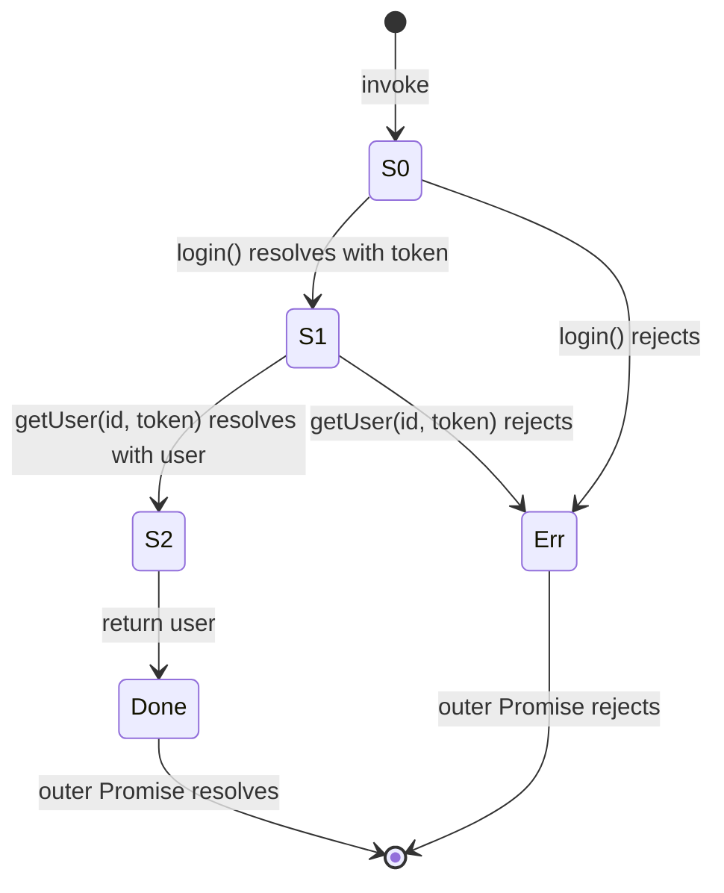
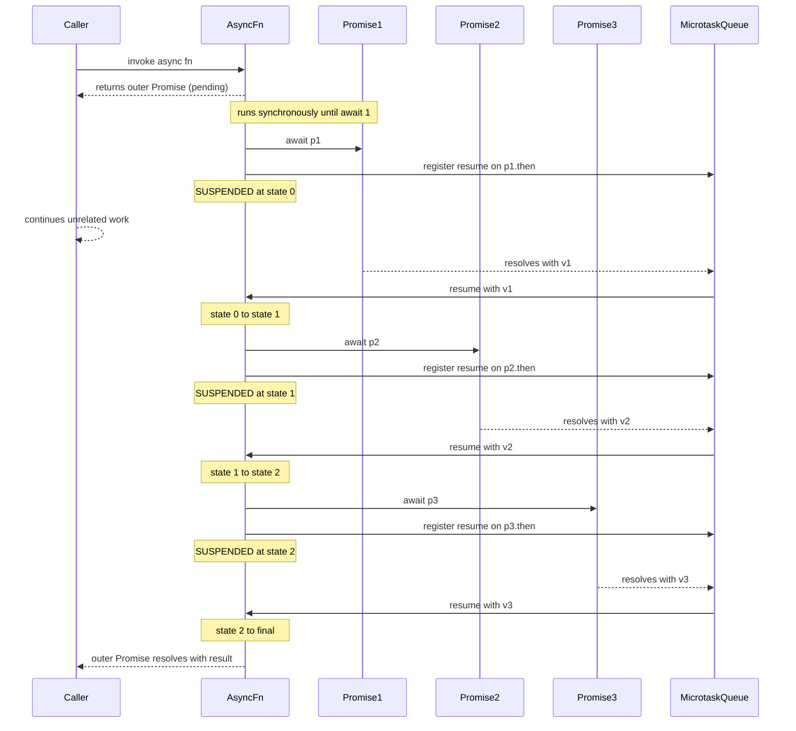
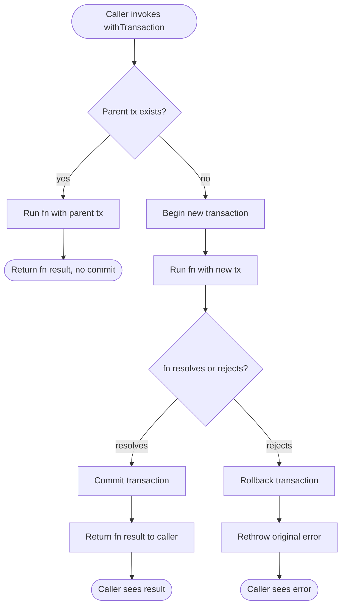

# 1.22 Async Await Runtime

## 1. Purpose

Async/await was added to ECMAScript in the ES2017 specification (June 2017), a mere two years after Promises were standardized in ES2015 and one year after generator functions had matured into production use. It is the single largest readability improvement in the language's history and the foundation of essentially every modern JavaScript and TypeScript codebase written since 2018.

The motivation was specific: Promise chains read inside-out and top-to-bottom at the same time, which is cognitively expensive. A four-step async flow written with `.then()` required the reader to mentally un-nest each callback, track the value passed down the chain, and remember that errors only surfaced through a trailing `.catch()`. Async functions invert this. The same four-step flow written with `await` reads as a flat sequence of statements, exactly like synchronous code, while remaining non-blocking under the hood.

ES2017 async/await fixes six concrete pain points that had dogged JavaScript developers for a decade:

1. **Callback hell and nested promise chains.** With async/await, a five-step async pipeline collapses from five nested `.then()` callbacks into five sequential lines, each starting with `await`. The visual shape of the code now matches the temporal order of operations. A reader scanning the function top-to-bottom sees the operations in execution order. The Pyramid of Doom (the deeply nested callback structure that plagued jQuery-era code and early Promise code) simply cannot be written with async/await, because each `await` returns control to the same flat lexical scope.

2. **Error handling with try/catch.** Before async/await, errors in a Promise chain needed a `.catch()` callback. That callback was a separate scope, so it could not reach the local variables of the success path. With async/await, a single `try { ... } catch (err) { ... }` wraps both the success path and the error path, sharing scope. You can use the same `let user;` declaration in both branches. You can fall back to a default value in the catch and continue. This is the same control flow primitive developers already knew from synchronous code.

3. **Stack trace preservation.** Promises spec'd in ES2015 produced notoriously bad stack traces. A rejection thrown from a deeply nested `.then()` callback surfaced with a one-line stack ending at the microtask queue, because the synchronous call stack had already unwound by the time the rejection handler ran. Async functions restore most of the stack by holding the suspended function's frame in memory and reusing it when the awaited Promise settles. V8 still loses some frames across `await` boundaries when `return promise` is used without `await`, but `return await promise` preserves them. The result is that an Error thrown from inside `await someApi()` carries a stack trace that points back to the calling async function, which is enormously more useful in production debugging.

4. **Composability with control flow.** Branching on a Promise result used to require either a separate `.then()` to extract the value or a wrapper that turned the Promise into a single value before branching. With async/await, an `if (await check()) { ... } else { ... }` reads naturally, with no extra ceremony. Loops over async operations read like synchronous loops: `for (const id of ids) { await process(id); }`. The language stops fighting the developer's mental model of sequential code.

5. **Looping over async collections.** Before async/await, running async work in a loop meant either manual Promise chaining or a `.reduce()`-based accumulator that read like a fold. With async/await, a `for (const item of items) { await process(item); }` reads like synchronous iteration. The `for await...of` loop (added in ES2018) goes further and consumes async iterables such as streams and paginated APIs.

6. **Mental model alignment with synchronous code.** The single biggest cognitive win. Engineers reading async code can apply the same mental model they apply to synchronous code, with the caveat that suspension may happen at each `await`. The Promise machinery is hidden. A new developer joining a codebase does not need to learn the Promise chaining API to read a route handler; they need only know that `await` means "wait for this to finish, then continue."

But async/await is not a silver bullet, and the spec authors were clear about what it does NOT fix:

- **It does not introduce multi-threading.** JavaScript is still single-threaded in its main realm. Async functions do not run on a background thread; they suspend and resume on the same event loop. CPU-bound work blocks the event loop just as much inside an async function as outside it.
- **It does not add cancellation.** A Promise, once created, cannot be cancelled. An async function awaiting that Promise cannot be cancelled either. The proposed `AbortController` integration is a separate API layered on top; the language itself still has no cancellation primitive built into async functions.
- **It defaults to sequential execution.** Two `await` statements in a row are sequential, not parallel. To get parallelism, you must explicitly opt in with `Promise.all` (or `Promise.allSettled`, `Promise.race`, `Promise.any`). This is the source of the single most common async/await performance bug, where independent operations are accidentally serialized.
- **It does not make unhandled rejections impossible.** A forgotten `await`, an unawaited Promise in a `forEach` callback, or a missing `try/catch` still produces an unhandled rejection, which Node.js now treats as a process crash by default (since Node 15).
- **It does not escape the microtask queue.** Every `await` schedules a microtask to resume the function. If your code awaits in a tight loop of millions of iterations, you are still subject to microtask starvation of the macrotask queue. I/O and timers can be delayed.

In short, async/await was added to make async code read like sync code, while making none of the underlying concurrency tradeoffs go away. The win is readability and error handling; the cost is the cognitive load of remembering that the function can suspend at every `await` and that suspension does not block the event loop. The next sections drill into the runtime mechanics that make this work.

## 2. Theory and Deep Dive

### 2.1 Spec reference

Async functions are defined in ECMAScript section 27.6 (Async Function Definitions), and `await` expressions in section 27.9 (the `await` Operator). The semantic core is in the abstract operation `AsyncFunctionStart`, which sets up the function's evaluation context, and in the `Await` abstract operation, which orchestrates suspension and resumption.

The spec defines three syntactic forms that participate in async/await:

- **`async function` declarations and expressions.** Always return a Promise. May contain `await` expressions in their body. Hoisted like regular function declarations (the declaration form, not the expression form).
- **Async arrow functions.** `async (x) => await f(x)`. Same semantics as async function expressions, with arrow function scoping rules (lexical `this`, no `arguments`, no `new.target`).
- **Async methods.** `class C { async m() { ... } }` or `const o = { async m() { ... } }`. Same semantics, with method-style `super` and `[[HomeObject]]` binding.

Two related syntactic forms build on async functions:

- **Top-level await.** Added in ES2022. Available only in ES modules. Lets a module `await` at the top level without wrapping in an async function.
- **`for await...of`.** Added in ES2018. Consumes async iterables (objects with a `[Symbol.asyncIterator]` method returning an async iterator whose `next()` returns a Promise).

### 2.2 The async function always returns a Promise

This is the single most important fact about async functions. Calling an async function does NOT run the function body synchronously to completion. It runs the body up to the first `await` (or to the first `return` or to the end), wraps whatever value the body produces in a Promise, and returns that Promise immediately to the caller.

The wrapping rules, derived from the spec's `AsyncFunctionStart` and the standard Promise resolution algorithm:

- If the body completes normally with value `v`, the returned Promise resolves with `v`.
- If the body throws an exception `e`, the returned Promise rejects with `e`.
- If the body returns a Promise (or any thenable), the returned Promise adopts the state of that Promise. This is "promise assimilation": the outer Promise resolves to whatever the inner Promise resolves to, including a recursive unwrap of nested thenables.
- If the body returns a non-thenable (e.g., `42`, `null`, `undefined`, a plain object), the returned Promise resolves with that value.
- If the body never reaches a `return` (infinite loop, deadlocked `await`), the returned Promise stays pending forever.

These rules are exactly the same as `new Promise((resolve, reject) => { try { resolve(body()); } catch (e) { reject(e); } })` with the assimilation rule applied at `resolve` time. The async function wrapper is, in effect, a Promise constructor that captures synchronous throws automatically.

### 2.3 What `await` actually does

`await x` does the following, per the `Await` abstract operation in the spec:

1. If `x` is not a thenable, wrap it in `Promise.resolve(x)` so the rest of the algorithm operates on a Promise.
2. Capture the current execution context (the async function's suspended frame, including local variables, the position of the `await` in the body, and the surrounding `try/catch` chain).
3. Register a continuation on the Promise: when the Promise settles (either resolves with value `v` or rejects with reason `r`), schedule a microtask that resumes the async function.
4. Suspend the async function. Control returns to the caller. The call stack unwinds.
5. When the Promise settles, the microtask queue runs the continuation. The async function resumes:
   - If the Promise resolved, the `await` expression evaluates to `v`, and execution continues from the statement after the `await`.
   - If the Promise rejected, the `await` expression throws `r` at that point, and the surrounding `try/catch` (if any) catches it.

The suspension is cooperative, not preemptive. The function does not pause mid-CPU-instruction; it pauses at the well-defined suspension point that is the `await` expression. Between suspension points, the function runs to completion synchronously, and no other code can interrupt it.

### 2.4 The engine rewrite: state machines

Under the hood, V8, SpiderMonkey, and JavaScriptCore all implement async functions as state machines, conceptually similar to how Babel transpiles async/await to ES5 with the `regenerator-runtime` helper. The function body is split at each `await` into a series of "states," and a hidden state variable tracks which state to resume in.

Consider this minimal async function:

```javascript
async function fetchUser(id) {
  const token = await login();
  const user = await getUser(id, token);
  return user;
}
```

The engine rewrites this conceptually as a state machine with three states (one per `await` plus the final return):



A rough conceptual equivalent in plain JavaScript (not the actual V8 output, but a faithful illustration of the semantics) is:

```javascript
function fetchUser(id) {
  return new Promise((resolve, reject) => {
    let state = 0;
    let token, user;

    function step(value, isError) {
      try {
        if (state === 0) {
          if (isError) throw value;
          token = value;
          state = 1;
          return login().then(
            (v) => step(v, false),
            (e) => step(e, true),
          );
        }
        if (state === 1) {
          if (isError) throw value;
          user = value;
          state = 2;
          return getUser(id, token).then(
            (v) => step(v, false),
            (e) => step(e, true),
          );
        }
        if (state === 2) {
          if (isError) throw value;
          resolve(user);
        }
      } catch (err) {
        reject(err);
      }
    }

    login().then(
      (v) => step(v, false),
      (e) => step(e, true),
    );
  });
}
```

This is a simplification. The real V8 implementation does not literally emit a `switch` statement or a `step` function. Instead, V8 uses byte-code-level continuations: each `await` becomes a `SuspendGenerator` byte-code, the suspended context is parked on the heap as a generator-like object, and a `ResumeGenerator` byte-code restores the context when the awaited Promise settles. But the conceptual model is correct: each `await` becomes a suspension point, the function's locals are promoted to fields on a hidden context object, and the body is split into resume-entry chunks.

The crucial consequence: **local variables in an async function are not stack-allocated across `await`.** They are heap-allocated (or, in V8's optimized tier, kept in a context object that survives suspension). This is why closures inside async functions over locals work correctly across `await`: those locals are not on the stack; they are on the heap, and they live as long as the async function's context lives.

### 2.5 V8's actual implementation

V8 implements async functions in Ignition (the byte-code interpreter) and TurboFan (the optimizing compiler) using a continuation-based approach. The key data structures are:

- An **async function context object** that holds the function's local variables, the current state (an integer offset into the byte-code), and a reference to the Promise that the function will eventually resolve or reject.
- A **resolve and reject pair** bound to that Promise, captured by the resume handlers.
- The byte-code for the function, with `SuspendGenerator` and `ResumeGenerator` byte-codes at each `await`.

When the function hits `await x`, V8 calls `PromiseResolveThenableJob` (or `PromiseResolve` if `x` is not a thenable), registers the async function's resume handler as a continuation, and then calls `SuspendGenerator`. The suspended context is parked on the heap.

When `x` settles, V8 schedules a microtask that calls `ResumeGenerator`, which restores the context, pushes the resolved value back onto the byte-code accumulator, and continues interpretation. If the Promise rejected, V8 throws the rejection reason at the `await` byte-code offset, which triggers normal exception handling (walking up the byte-code's handler table for a matching `try/catch`).

This is structurally the same machinery V8 uses for generators (`function*`) and async generators (`async function*`). All three share the `SuspendGenerator` / `ResumeGenerator` byte-code pair. This is why the conceptual model "async function equals a generator that yields promises" is so accurate: the runtime literally reuses the generator machinery.

### 2.6 `return await` vs `return`

This is the most subtle async/await topic and one of the most common interview questions.

Consider:

```javascript
async function a() { return fetch('/x'); }
async function b() { return await fetch('/x'); }
```

Both functions return a Promise that resolves to the same `Response` object. The observable difference is in stack traces and the timing of the outer Promise's resolution.

In `a`, the function returns the `fetch` Promise directly. The async function wrapper sees a thenable return value and adopts it: the outer Promise resolves when `fetch` resolves, but the async function's own stack frame has already been torn down by the time the resolution microtask runs. If `fetch` rejects, the rejection propagates through the outer Promise, but the stack trace ends at the microtask boundary, not at `a`'s call site.

In `b`, the function `await`s the `fetch` Promise. The async function's context stays alive across the resolution microtask. If `fetch` rejects, the rejection is thrown at the `await` site, where `b`'s stack frame is still alive, and the resulting Error carries `b`'s caller in its stack trace.

Practical guidance:

- **Inside a `try/catch`**: always use `return await`. If you `return promise` inside a try, the catch will never fire, because `return promise` does not throw at the return site; it adopts the Promise and the outer function returns immediately, leaving the catch as dead code.
- **Outside a `try/catch`**: `return promise` is faster. It avoids one extra microtask and one extra context retention. V8 has had optimizations to eliminate this overhead in some cases, but the safe rule is: `return await` only when you need the stack trace or need the catch to fire.
- **In a hot path**: profile. The microtask cost of `return await` is real but usually negligible. It matters in tight loops.

The performance difference is roughly one extra microtask per `return await`. In a 10,000-iteration loop, that is 10,000 microtasks. Each microtask is on the order of microseconds. So 10,000 microseconds is 10 milliseconds. Measurable, but rarely a problem in real code. The other cost is GC pressure: the async function's context object lives longer (until the awaited Promise settles), which can extend the lifetime of any closures it captures.

### 2.7 Top-level await

Top-level await (TLA) was added in ES2022 as a syntactic feature available only in ES modules. In an ESM file, you can write:

```javascript
// config.mjs (ESM)
export const config = await fetch('/config.json').then((r) => r.json());
```

This works because ESM is fundamentally async: the module graph is loaded, instantiated, and evaluated in distinct phases, and the evaluation phase can be made to wait on a Promise. The spec authors made TLA an ESM-only feature because CommonJS `require()` is synchronous; allowing `await` at the top of a CJS file would break the synchronous `require` contract.

When a module uses TLA, the module's evaluation returns a Promise instead of completing synchronously. Any module that imports it must wait on that Promise before its own evaluation begins. This means TLA can block the entire module graph: if module A awaits a never-resolving Promise, every module that imports A (directly or transitively) will never evaluate.

Rules and gotchas:

- TLA is forbidden in CommonJS. Node.js throws `SyntaxError: await is only valid in async functions and the top level bodies of modules` if you try.
- TLA is forbidden in classic scripts (loaded via `<script>` without `type="module"`).
- TLA is forbidden in dynamic `import()` callbacks unless they are async functions: `import('./x').then(async (m) => { await m.doThing(); })`.
- TLA is allowed in Worker modules, in Deno modules, and in browser ESM.
- TLA can deadlock if module A awaits a Promise that is only resolved when module B (which imports A) finishes evaluating. The loader detects this and throws.
- TLA changes the semantics of the module's exports: importers can no longer assume that importing the module gives them synchronously available values. If the importing module uses `import { config } from './config.mjs'`, the import is valid, but the importing module's own evaluation waits until `config.mjs`'s TLA settles.

### 2.8 `for await...of`

The `for await...of` loop (ES2018) iterates over async iterables. An async iterable is any object with a `[Symbol.asyncIterator]` method that returns an async iterator. An async iterator has a `next()` method that returns a Promise of `{ value, done }`.

```javascript
async function* lines(stream) {
  // an async generator is automatically an async iterable
  const reader = stream.getReader();
  try {
    while (true) {
      const { done, value } = await reader.read();
      if (done) break;
      yield value;
    }
  } finally {
    reader.releaseLock();
  }
}

for await (const chunk of lines(stream)) {
  console.log(chunk);
}
```

The loop desugars approximately to:

```javascript
const iter = stream[Symbol.asyncIterator]();
try {
  while (true) {
    const { done, value } = await iter.next();
    if (done) break;
    // loop body
  }
} finally {
  if (iter.return) await iter.return();
}
```

Two important details:

- The `finally` block calls `iter.return()` (if it exists) when the loop exits normally, breaks, or throws. This is how async generators clean up their resources (closing file handles, releasing locks, ending streams).
- The loop body is itself inside an async function context, so `await` is allowed in the body.

The `for await...of` loop also accepts sync iterables (arrays, sets, generators). In that case, each value is awaited individually: `for await (const x of [Promise.resolve(1), Promise.resolve(2)])` yields `1` then `2`. This is occasionally useful but more commonly a source of confusion; if you have a sync iterable of plain values, prefer a plain `for...of`.

### 2.9 Mermaid: suspension and resumption

The sequence diagram below shows an async function with three `await` points. The Caller is the synchronous code that invoked the async function. AsyncFn is the async function's suspended context. P1, P2, and P3 are the Promises being awaited. MTQ is the microtask queue.



The diagram captures three essential facts: (1) the caller gets a pending Promise back immediately, (2) each `await` suspends the function and registers a resume continuation, and (3) resumption happens via the microtask queue, not the call stack.

### 2.10 Error propagation through awaits

When an awaited Promise rejects, the rejection is thrown at the `await` site. The async function's exception handling then runs as if a synchronous throw had occurred. If the `await` is inside a `try/catch`, the catch fires. If not, the exception propagates out of the function body, and the async function's outer Promise rejects with the same reason.

This means a `try/catch` around an `await` catches rejections from the awaited Promise, but it also catches synchronous throws from code that runs after the Promise has already settled. For example:

```javascript
async function f() {
  try {
    const x = await mightReject();
    // If mightReject resolved, code here runs synchronously.
    // A throw here is also caught by the same try.
    JSON.parse('not json'); // throws SyntaxError, caught by the same catch
  } catch (e) {
    // catches BOTH the rejection from mightReject
    // AND the JSON.parse throw
    console.error(e);
  }
}
```

This is exactly the synchronous code model: one `try/catch` guards all the code in its block, whether the code is synchronous or asynchronous. The only difference is that the block can be suspended and resumed.

There is one subtle exception: if you forget the `await`, the catch never fires for the Promise's rejection, because the unawaited Promise is returned (or discarded) immediately and the function continues. The rejection then becomes an unhandled rejection (assuming nothing else awaits the Promise). This is the source of the most common silent async bug.

## 3. Mental Models

The async/await runtime is easier to reason about once you internalize four mental models. Each model captures a different aspect of the runtime; together they cover most real-world situations.

**Model 1: Async function equals a generator that yields promises.** This is the original Babel transform model, and it is still the most accurate mental model for the runtime. An async function is conceptually a generator that, at each `await`, yields the awaited Promise to a hidden runner. The runner waits for the Promise to settle, then calls `gen.next(resolvedValue)` (or `gen.throw(rejectionReason)`) to resume the generator. The async function's local variables survive suspension because they are fields on the generator object, which lives on the heap.

This model is so accurate that the early Babel transform literally did this: it rewrote `async function f() { await x; }` as `function f() { return spawn(function*() { yield x; }); }` where `spawn` was a runner that iterated the generator, awaited each yielded Promise, and called `next` or `throw` on the generator when the Promise settled. The spec's actual semantics are not defined in terms of generators, but the runtime behavior is identical, and V8 reuses the generator byte-codes for async functions.

**Model 2: Await equals "yield the promise, resume with its value when settled."** This is the user-facing model. You read `const x = await p;` as: "evaluate `p`, hand the resulting Promise to the runtime, suspend, and when the Promise settles, bind `x` to the resolved value (or throw the rejection at this line)."

The key cognitive shift: `await` does not block. It suspends the function, returns control to the caller, and schedules a resumption. The event loop keeps running. Other code executes. When the Promise settles, the function resumes via a microtask. The word "await" is unfortunate in some ways because it suggests blocking; a better name might have been `yieldUntil` or `resumeWhen`.

**Model 3: Try/catch around await equals "catches the promise's rejection."** A `try { await p; } catch (e) { ... }` reads as: "if `p` rejects, throw the rejection reason at the `await` site, and the catch fires." This is exactly the synchronous throw model. You can use the same catch to handle both Promise rejections and synchronous throws. You can have multiple `await`s in the same try block, and any of them rejecting lands in the same catch.

**Model 4: Sequential awaits equal "one at a time"; `Promise.all` with awaits equals "parallel."** Two `await` statements in a row are sequential: the second does not start until the first finishes. To run them in parallel, start both Promises first, then `await` them together with `Promise.all`.

```javascript
// Sequential: total time approximately 2 seconds
async function sequential() {
  const a = await fetchA(); // 1s
  const b = await fetchB(); // 1s, starts only after a resolves
  return [a, b];
}

// Parallel: total time approximately 1 second
async function parallel() {
  const [a, b] = await Promise.all([fetchA(), fetchB()]);
  return [a, b];
}
```

The rule of thumb: if the operations are independent (no data dependency between them), use `Promise.all`. If the second operation needs the result of the first, use sequential `await`. If you are not sure, draw the dependency graph: if there is an edge from A to B (B needs A's result), they must be sequential; otherwise they can be parallel.

These four models cover roughly 95 percent of real-world async/await code. The remaining 5 percent (concurrency-limited batches, cancellation with `AbortController`, race conditions with shared mutable state, deadlocks in top-level await) requires more careful thinking, but those situations are rare and benefit from explicit concurrency primitives rather than ad hoc async/await patterns.

## 4. Real-World Use Cases

Async/await is the default control-flow primitive in every modern JavaScript and TypeScript codebase. The use cases below are not exhaustive; they illustrate the dominant patterns you will see in production code.

**1. Express and Fastify route handlers.** Every HTTP handler in a modern Node.js server is an async function. The handler awaits database queries, external API calls, and cache lookups, then returns a response. Express historically did not handle rejected Promises from async handlers (the rejection became an unhandled rejection, and the request hung until timeout). The fix was either the `express-async-errors` package (which patches Express's router to forward rejections to the error middleware) or a manual wrapper. Fastify, Hapi, and Koa all handle async rejections natively, which is one of the reasons newer projects prefer them.

**2. React `useEffect` with an inner async function.** A `useEffect` callback cannot itself be async (React expects the callback to return either `undefined` or a cleanup function, and an async function returns a Promise, which React ignores and warns about). The pattern is to declare an inner async function inside the effect and call it immediately, optionally wiring cancellation via a flag or `AbortController`.

**3. Database transactions.** A transaction is a multi-step async flow: `await begin`, `await query(...)`, `await query(...)`, `await commit` (or `await rollback` on error). The sequential `await` model maps directly onto the transaction protocol. A typed wrapper that auto-commits on success and auto-rolls-back on error is the standard pattern; see Section 10 for a full blueprint.

**4. Sequential UI updates with intermediate renders.** Animation, progressive disclosure, and skeleton screen transitions often need to await a fetch, render intermediate state, await another fetch, render again. Sequential `await` is the natural fit because the operations are inherently ordered.

**5. Background jobs and queues.** BullMQ, Agenda, Bree, and similar task queue libraries expose async job handlers. The handler awaits work, updates progress, and returns a result. Errors thrown from the handler become job failures that the queue retries according to its policy.

**6. File system and stream processing.** Node.js `fs/promises` exposes Promise-based file operations. `for await (const chunk of createReadStream(path))` is the idiomatic way to stream-process a file without loading it all into memory. The async iterator handles back-pressure automatically: the loop pauses at each `await iter.next()` until the next chunk is available.

**7. Browser `fetch` chains with retries.** A `fetchWithRetry` helper typically uses an async function with a `for` loop that retries on failure with exponential backoff. The loop is naturally sequential: each retry waits for the previous to fail. The `AbortController` integration lets the caller cancel an in-flight retry sequence.

**8. WebSocket message handlers.** Async functions that process incoming WebSocket messages, await database writes, and broadcast updates to other clients. Each message handler is independent, but they share server state, so careful concurrency control is needed (often a per-key mutex or a queue).

**9. Server-side rendering with data preloading.** Next.js `getServerSideProps`, Remix `loader`, and similar frameworks use async functions to fetch data needed to render a route. The await chain fetches from the database, calls external APIs, and returns props to the renderer. The framework handles the timeout and error cases.

**10. Test setup and teardown.** Jest, Vitest, and Mocha all support async `beforeEach`, `afterEach`, `beforeAll`, `afterAll`. Each is an async function that the test runner awaits before proceeding. Tests themselves can be async; the runner awaits the test's returned Promise and treats a rejection as a test failure.

**11. CLI tools with interactive prompts.** Inquirer, Prompts, and similar libraries expose async functions for user input. A CLI flow that asks a series of questions reads as a sequence of `await` statements, with conditional branching on the answers.

**12. Database migrations and seed scripts.** Migration runners execute a sequence of async migration functions in order. Each migration wraps in a transaction (see Section 10), commits on success, and aborts the whole run on failure.

The unifying thread: async/await is the default way to write any code that needs to wait for an external operation. Callbacks and Promise chains are now legacy patterns, used only when async/await is unavailable (e.g., in a non-async callback that cannot be made async) or when the explicit Promise chaining API is more expressive (e.g., `Promise.race` for timeouts, `Promise.allSettled` for tolerant batches).

## 5. Code Examples

### 5.1 Example A — Minimal and Conceptual

The minimal example demonstrates the three core patterns: sequential awaits, parallel awaits with `Promise.all`, and error handling with try/catch.

**JavaScript:**

```javascript
// Simulate a latency-bounded async operation
function delay(ms, value) {
  return new Promise((resolve) => setTimeout(() => resolve(value), ms));
}

async function getUser(id) {
  return delay(50, { id, name: `User ${id}` });
}

async function getPosts(userId) {
  return delay(50, [`post1 for ${userId}`, `post2 for ${userId}`]);
}

// Sequential: total time approximately 100ms
async function sequentialFetch() {
  const user = await getUser(1);
  const posts = await getPosts(user.id);
  return { user, posts };
}

// Parallel: total time approximately 50ms (assuming independent ops)
async function parallelFetch() {
  const [user, settings] = await Promise.all([
    getUser(1),
    delay(50, { theme: 'dark' }),
  ]);
  return { user, settings };
}

// Error handling with try/catch
async function safeFetch() {
  try {
    const user = await getUser(1);
    if (!user) throw new Error('User not found');
    return user;
  } catch (err) {
    console.error('safeFetch failed:', err);
    return null;
  }
}

// Top-level await (ESM only, requires "type": "module")
// const result = await sequentialFetch();
// export default result;
```

**TypeScript:**

```typescript
interface User { id: number; name: string; }
interface Post { userId: number; text: string; }
interface Settings { theme: string; }

function delay<T>(ms: number, value: T): Promise<T> {
  return new Promise((resolve) => setTimeout(() => resolve(value), ms));
}

async function getUser(id: number): Promise<User> {
  return delay<User>(50, { id, name: `User ${id}` });
}

async function getPosts(userId: number): Promise<Post[]> {
  return delay<Post[]>(50, [
    { userId, text: 'post1' },
    { userId, text: 'post2' },
  ]);
}

async function sequentialFetch(): Promise<{ user: User; posts: Post[] }> {
  const user = await getUser(1);
  const posts = await getPosts(user.id);
  return { user, posts };
}

async function parallelFetch(): Promise<{ user: User; settings: Settings }> {
  const [user, settings] = await Promise.all([
    getUser(1),
    delay<Settings>(50, { theme: 'dark' }),
  ]);
  return { user, settings };
}

async function safeFetch(): Promise<User | null> {
  try {
    const user = await getUser(1);
    if (!user) throw new Error('User not found');
    return user;
  } catch (err) {
    console.error('safeFetch failed:', err);
    return null;
  }
}
```

### 5.2 Example B — Production-Grade

The production-grade example is a typed transaction wrapper that auto-commits on success and rolls back on error. This is the most common pattern in any backend that uses a relational database.

**JavaScript:**

```javascript
// Minimal DB client shape (in real code, this would be pg, mysql2, knex, etc.)
function createDbClient() {
  let nextTxId = 1;
  return {
    async query(text, params) {
      // pretend this hits a real DB
      return { rows: [{ ok: true, text, params }] };
    },
    async begin() {
      const txId = nextTxId++;
      console.log(`[tx ${txId}] BEGIN`);
      return { id: txId, query: this.query };
    },
    async commit(tx) { console.log(`[tx ${tx.id}] COMMIT`); },
    async rollback(tx) { console.log(`[tx ${tx.id}] ROLLBACK`); },
  };
}

/**
 * Runs `fn` inside a DB transaction. Commits on success,
 * rolls back on error. Always rethrows the original error.
 *
 * @param {object} db - database client
 * @param {(tx) => Promise<T>} fn - transaction body
 * @returns {Promise<T>}
 */
async function withTransaction(db, fn) {
  const tx = await db.begin();
  try {
    const result = await fn(tx);
    await db.commit(tx);
    return result;
  } catch (err) {
    try {
      await db.rollback(tx);
    } catch (rollbackErr) {
      // Rollback failed; log and attach as a cause but do not mask the original.
      console.error('Rollback failed:', rollbackErr);
      if (err instanceof Error && typeof err.cause === 'undefined') {
        err.cause = rollbackErr;
      }
    }
    throw err;
  }
}

// Usage
const db = createDbClient();
await withTransaction(db, async (tx) => {
  const a = await tx.query('INSERT INTO users ...', ['alice']);
  const b = await tx.query('INSERT INTO accounts ...', [a.rows[0].id]);
  return { user: a.rows[0], account: b.rows[0] };
});
```

**TypeScript:**

```typescript
interface QueryResult<T = unknown> { rows: T[]; }
interface Transaction {
  id: number;
  query: <T = unknown>(text: string, params?: unknown[]) => Promise<QueryResult<T>>;
}
interface DbClient {
  query<T = unknown>(text: string, params?: unknown[]): Promise<QueryResult<T>>;
  begin(): Promise<Transaction>;
  commit(tx: Transaction): Promise<void>;
  rollback(tx: Transaction): Promise<void>;
}

function createDbClient(): DbClient {
  let nextTxId = 1;
  const query = async <T = unknown>(
    text: string,
    params?: unknown[],
  ): Promise<QueryResult<T>> => {
    return { rows: [{ ok: true, text, params } as unknown as T] };
  };
  return {
    query,
    async begin(): Promise<Transaction> {
      const id = nextTxId++;
      console.log(`[tx ${id}] BEGIN`);
      return { id, query };
    },
    async commit(tx: Transaction): Promise<void> {
      console.log(`[tx ${tx.id}] COMMIT`);
    },
    async rollback(tx: Transaction): Promise<void> {
      console.log(`[tx ${tx.id}] ROLLBACK`);
    },
  };
}

async function withTransaction<T>(
  db: DbClient,
  fn: (tx: Transaction) => Promise<T>,
): Promise<T> {
  const tx = await db.begin();
  try {
    const result = await fn(tx);
    await db.commit(tx);
    return result;
  } catch (err) {
    try {
      await db.rollback(tx);
    } catch (rollbackErr) {
      console.error('Rollback failed:', rollbackErr);
      if (err instanceof Error && typeof (err as { cause?: unknown }).cause === 'undefined') {
        (err as { cause?: unknown }).cause = rollbackErr;
      }
    }
    throw err;
  }
}

// Usage
const db = createDbClient();
interface UserRow { ok: boolean; id: number; }
await withTransaction(db, async (tx) => {
  const a = await tx.query<UserRow>('INSERT INTO users ...', ['alice']);
  const b = await tx.query<{ accountId: number }>('INSERT INTO accounts ...', [a.rows[0].id]);
  return { user: a.rows[0], account: b.rows[0] };
});
```

The wrapper is small but encapsulates five concerns that would otherwise be duplicated in every call site: beginning the transaction, committing on success, rolling back on error, rethrowing the original error (not the rollback error), and attaching the rollback error as a `cause` so it is not silently lost. The TypeScript version adds explicit return types, generic transaction bodies, and a typed `DbClient` interface that can be swapped for a real `pg.Pool` or `knex` instance without changing the wrapper.

## 6. Common Mistakes and Anti-Patterns

Async/await has a small surface area but a large number of foot-guns. Below are the eight most common mistakes, ranked by frequency in real code reviews.

**1. Sequential awaits when you wanted parallel.** The single most common async/await bug. Two independent awaits in a row run sequentially, doubling the latency.

```javascript
// BAD: 2s total
async function bad() {
  const a = await fetch('/a'); // 1s
  const b = await fetch('/b'); // 1s, but starts only after a resolves
  return [a, b];
}

// GOOD: 1s total
async function good() {
  const [a, b] = await Promise.all([fetch('/a'), fetch('/b')]);
  return [a, b];
}
```

The fix is to start all independent Promises first, then `await` them together. `Promise.all` is the right tool when you need all results; `Promise.allSettled` when you want to tolerate individual failures; `Promise.race` for the first to settle (success or failure); `Promise.any` for the first to succeed.

**2. `await` in a non-async function.** A `SyntaxError`, caught at parse time.

```javascript
// BAD: SyntaxError: await is only valid in async functions
function bad() {
  const x = await fetch('/a'); // SyntaxError
  return x;
}

// GOOD
async function good() {
  const x = await fetch('/a');
  return x;
}
```

The error message is clear, but it can be confusing when the `await` is deep inside a callback that the developer assumed was async. Always check the function signature. Common variants: `await` inside a `.then()` callback (which is not async), `await` inside a `.reduce()` callback (which is not async unless you explicitly mark it), `await` inside a `forEach` callback (which is not async).

**3. `forEach` does not await its callback.** `Array.prototype.forEach` calls its callback synchronously and ignores the returned Promise. Awaits inside a `forEach` callback fire in parallel and uncontrolled, and the surrounding code does not wait for them.

```javascript
// BAD: does not wait; logs "done" before any fetch completes
async function bad() {
  const ids = [1, 2, 3];
  ids.forEach(async (id) => {
    await fetch(`/users/${id}`);
  });
  console.log('done'); // fires immediately
}

// GOOD: sequential, controlled
async function goodSequential() {
  const ids = [1, 2, 3];
  for (const id of ids) {
    await fetch(`/users/${id}`);
  }
  console.log('done'); // fires after all fetches
}

// GOOD: parallel, controlled
async function goodParallel() {
  const ids = [1, 2, 3];
  await Promise.all(ids.map((id) => fetch(`/users/${id}`)));
  console.log('done');
}
```

The `for...of` loop awaits each iteration. The `Promise.all(ids.map(...))` pattern starts all Promises in parallel and awaits them together. Note that `map` returns an array, which `Promise.all` consumes; `forEach` returns `undefined`, which is why it cannot be combined with `Promise.all` directly.

**4. Unhandled rejection in an async function (silent).** If an async function throws and nobody awaits its returned Promise or chains a `.catch()`, the rejection is unhandled. In Node.js 15+, unhandled rejections crash the process by default (was a warning before).

```javascript
// BAD: unhandled rejection if fetch rejects
function bad() {
  doAsyncWork(); // returned Promise ignored
}

// GOOD: caller handles rejection
async function good() {
  try {
    await doAsyncWork();
  } catch (err) {
    console.error(err);
  }
}
```

Always either `await` the call, `.catch()` it, or be inside an async function whose own Promise is awaited by its caller. Linters like `eslint-plugin-no-floating-promises` (part of `typescript-eslint` recommended) catch this at compile time.

**5. `return await` perf cost in non-try-catch context.** As discussed in section 2.6, `return await promise` outside a `try/catch` adds one extra microtask and one extra context retention for no observable benefit (when stack traces are not needed).

```javascript
// Slightly slower (extra microtask, no benefit when no try/catch)
async function slow() {
  return await fetch('/x');
}

// Faster
async function fast() {
  return fetch('/x');
}
```

The difference is microseconds per call. It matters in hot loops; it does not matter in request handlers. Use `return await` inside `try/catch` always; use `return promise` outside when you remember. The `typescript-eslint` rule `return-await` enforces this automatically.

**6. Top-level await in CommonJS.** `SyntaxError`.

```javascript
// commonjs-file.cjs (CommonJS)
// const x = await fetch('/x'); // SyntaxError: await is only valid in async functions
//   and the top level bodies of modules

// Fix option A: rename file to .mjs or set "type": "module" in package.json
// Fix option B: wrap in an async IIFE
(async () => {
  const x = await fetch('/x');
  // ...
})();
```

Node.js's error message is clear. The fix is to convert the file to ESM (preferred for new code) or wrap the await in an async IIFE (works in CJS but loses the module-graph blocking semantics of true TLA).

**7. Awaiting the same Promise twice.** Not a bug per se (Promises cache their result, so the second await is essentially free), but a sign of confused data flow.

```javascript
// Confused: a is awaited twice (works but suggests a refactor)
async function confused() {
  const a = fetch('/a');
  const result1 = await a;
  const result2 = await a; // same value, no extra fetch
  return [result1, result2];
}
```

The Promise is created once; awaiting it twice returns the same value both times. This is fine if intentional (rare) and usually a sign that the data flow should be restructured to await once and reuse the value.

**8. Forgetting to await in a `try` block, defeating the catch.** If you forget `await` on a Promise inside a `try`, the catch will never fire for that Promise's rejection.

```javascript
// BAD: catch never fires for fetch's rejection
async function bad() {
  try {
    fetch('/x'); // forgot await; fetch runs but its rejection is uncaught
  } catch (err) {
    console.error(err); // never fires
  }
}

// GOOD
async function good() {
  try {
    await fetch('/x');
  } catch (err) {
    console.error(err); // fires on rejection
  }
}
```

The async function returns immediately after the synchronous portion of the try block runs. The fetch Promise is in flight; if it rejects, the rejection is unhandled (becomes an unhandledRejection event). The catch is dead code. The `require-await` ESLint rule catches the more obvious form (an `await` keyword present in a function that is not async), but it does not catch the subtler "you meant to await here but forgot the keyword" case; only code review or a type-aware linter does.

## 7. Best Practices and Design Patterns

**1. Use `Promise.all` for parallel async ops.** Whenever you have N independent async operations, start all of them and `await Promise.all([...])`. This is the single most impactful change in most codebases: latency drops from `sum(latencies)` to `max(latencies)`. For a dashboard that fetches profile, feed, and notifications in 200ms, 300ms, and 250ms respectively, this is a drop from 750ms to 300ms.

**2. Use `for...of` (not `forEach`) when awaiting.** `for (const x of items) { await f(x); }` is sequential and controlled. `items.forEach(async ...)` is parallel and uncontrolled. If you want parallel, use `Promise.all(items.map(...))`. The only use case for `forEach` is when the callback is purely synchronous and you do not care about its (non-existent) return value.

**3. Wrap async handlers in error middleware.** Express does not handle async rejections natively. Either install `express-async-errors` (one-line patch) or wrap each handler with an `asyncHandler(fn)` higher-order function. Fastify, Koa, and Hapi handle this natively, which is a strong reason to prefer them for new projects.

```javascript
// Express wrapper
const asyncHandler = (fn) => (req, res, next) => {
  Promise.resolve(fn(req, res, next)).catch(next);
};

router.get('/users/:id', asyncHandler(async (req, res) => {
  const user = await getUser(req.params.id);
  res.json(user);
}));
```

The wrapper converts any rejection from the async handler into a call to `next(err)`, which routes to Express's error middleware. This is the single most important Express pattern for async code.

**4. Use `return await` inside `try/catch`; `return promise` outside.** Already discussed in section 2.6. The rule is: if there is a `try/catch` around the return, use `return await`; otherwise use `return promise`. The `typescript-eslint` rule `return-await` enforces this automatically with the `in-try-catch` option.

**5. Use top-level await only in ESM.** Top-level await is forbidden in CommonJS and in classic scripts. Use it for module initialization that needs async work (loading config, warming caches, registering service workers). Avoid it for runtime logic; that belongs in functions. Be aware that TLA blocks the module graph: any module that imports a TLA-using module waits for the TLA to settle.

**6. Type async function returns explicitly.** In TypeScript, `async function f(): Promise<User>` is explicit and readable. `async function f()` (return type inferred) works but is harder to refactor and obscures the contract at the call site. Always annotate the return type of exported async functions.

```typescript
// Good
async function getUser(id: number): Promise<User> { /* ... */ }

// Avoid (return type inferred, harder to refactor)
async function getUser(id: number) { /* ... */ }
```

**7. Use `AbortController` for cancellation.** Async/await has no built-in cancellation. `AbortController` is the standard mechanism. Pass the `signal` to `fetch`, and call `controller.abort()` to cancel. The fetch rejects with an `AbortError`, which the caller can catch and treat as a cancellation rather than a failure.

```javascript
async function fetchWithTimeout(url, ms) {
  const controller = new AbortController();
  const timer = setTimeout(() => controller.abort(), ms);
  try {
    const res = await fetch(url, { signal: controller.signal });
    return res;
  } finally {
    clearTimeout(timer);
  }
}
```

The `finally` block ensures the timer is cleared whether the fetch succeeded, failed, or was aborted. Without it, the timer would fire after a successful quick fetch and abort an already-completed operation (harmless but wasteful).

**8. Use `for await...of` for async iterables.** Streams, async generators, and paginated APIs all produce async iterables. The `for await...of` loop is the idiomatic consumer. It correctly handles cleanup via `iter.return()` in the `finally` block, which is critical for releasing file handles, network sockets, and database cursors.

**9. Use a concurrency limiter for batches.** When you have 10,000 items and a rate-limited API, `Promise.all` will overwhelm the API and get you rate-limited or banned. Use a concurrency-limited `mapAsync` (see Exercise 4) or a library like `p-limit` or `tiny-async-pool`. The right concurrency is usually 5 to 20, depending on the API's rate limit and your network's bandwidth.

**10. Always catch in the outermost layer.** Inner functions should throw; the outermost handler (Express error middleware, React error boundary, process `unhandledRejection` listener) should catch and log. Do not swallow errors silently in the middle. A `try/catch` that catches an error and returns `null` without logging is a bug farm; the next developer to debug an issue will have no idea why a value is missing.

**11. Use `Promise.allSettled` when you need partial success.** `Promise.all` fails fast: if one Promise rejects, the whole `Promise.all` rejects and the other results are discarded. `Promise.allSettled` waits for all Promises to settle and returns an array of `{ status, value }` or `{ status, reason }` objects. Use it when you want to collect as many results as possible and handle failures individually.

**12. Use structured errors, not strings.** `throw new Error('message')` gives you a stack trace; `throw 'message'` does not. Always throw `Error` subclasses. For domain-specific errors, define a hierarchy: `class NotFoundError extends Error {}`, `class ValidationError extends Error {}`. This lets the outer handler branch on the error type with `instanceof`.

## 8. Technical Interview Knowledge

**Q1: Is async/await just sugar over Promises?**

A: Yes, in the sense that every async function returns a Promise and every `await` operates on a Promise. No, in the sense that the engine does not literally rewrite async functions as Promise chains at parse time; it compiles them to byte-code with suspension/resumption primitives (`SuspendGenerator` / `ResumeGenerator` in V8). The observable behavior is identical to a Promise-chain rewrite, but the implementation is a state machine. The mental model "async function equals a generator yielding promises, run by a spawn helper" is accurate. The two views are not contradictory: the spec defines async functions in terms of Promise reactions, but the engine implements those reactions via generator-like continuations for efficiency.

**Q2: How does the engine implement async functions?**

A: V8, SpiderMonkey, and JavaScriptCore all use a continuation-based approach. The function body is split at each `await` into resume-entry points. Local variables are promoted to a heap-allocated context object. At each `await`, the engine registers a continuation on the awaited Promise, suspends the function (capturing the current byte-code offset and stack), and returns control to the caller. When the Promise settles, a microtask resumes the function, restoring the context and either continuing with the resolved value or throwing the rejection reason at the `await` site. This is the same machinery used for generators and async generators; all three share the `SuspendGenerator` / `ResumeGenerator` byte-code pair in V8.

**Q3: `return await` vs `return`?**

A: `return await promise` keeps the async function's context alive across the Promise's resolution, so the resulting stack trace (if the Promise rejects) includes the async function's caller. `return promise` returns the Promise directly; the outer async function's Promise adopts it, the function's own context is torn down, and the resulting stack trace is shorter. Inside a `try/catch`, you MUST use `return await` or the catch will never fire (because `return promise` does not throw at the return site; it adopts the Promise and returns immediately). Outside a `try/catch`, `return promise` is faster (one fewer microtask, one fewer context retention). The `typescript-eslint` rule `return-await` with the `in-try-catch` option enforces this automatically.

**Q4: Why can't you `await` in `forEach`?**

A: Because `Array.prototype.forEach` is a synchronous method that ignores the return value of its callback. When you pass an async function to `forEach`, the function returns a Promise, but `forEach` does not await it. The loop runs synchronously to completion, kicking off all the async work in parallel but not waiting for any of it. The surrounding async function returns before any of the work finishes. Use `for...of` for sequential awaiting, or `Promise.all(items.map(...))` for parallel awaiting. The same caveat applies to `Array.prototype.reduce`: passing an async callback does not make the reduce wait; you have to chain Promises manually or use a `for...of` loop.

**Q5: What is top-level await?**

A: A syntactic feature (ES2022) that allows `await` at the top level of an ES module. The module's evaluation returns a Promise instead of completing synchronously; any module that imports it waits on that Promise before its own evaluation begins. It is forbidden in CommonJS (because `require()` is synchronous) and in classic scripts (because they have no async evaluation phase). It is allowed in Worker modules, Deno modules, and browser ESM. It can deadlock the module graph if a module awaits a Promise that is only resolved by a module that imports it; the loader detects this and throws. Common use cases: loading config files at startup, warming caches, registering service workers.

**Q6: How does `for await...of` work?**

A: It iterates over async iterables. An async iterable has a `[Symbol.asyncIterator]` method that returns an async iterator. An async iterator has a `next()` method that returns a Promise of `{ value, done }`. The loop desugars to: call `[Symbol.asyncIterator]()`, then `while (true) { const { done, value } = await iter.next(); if (done) break; /* body */ }` wrapped in a `try/finally` that calls `iter.return()` (if it exists) when the loop exits. The `finally` is what lets async generators clean up resources (closing files, releasing locks, ending streams). The loop body is itself in an async context, so `await` is allowed in the body. Async generators (`async function*`) automatically produce async iterables, so they are the most common source for `for await...of` loops.

**Q7: Does `await` block the event loop?**

A: No. `await` suspends the async function and returns control to the caller. The event loop continues running other tasks. When the awaited Promise settles, a microtask resumes the async function. The only way to "block" the event loop is to run synchronous CPU-heavy code without yielding; `await` itself never blocks. However, a tight loop of `await` calls does consume microtask queue slots, which can starve macrotasks (I/O, timers) if the microtask queue never drains. This is rare but is the basis of the "do not await in a tight loop of 10 million iterations" rule. The fix is to batch work or to periodically yield to the event loop with `await new Promise((r) => setImmediate(r))`.

**Q8: How to handle errors in async functions?**

A: Three layers. (1) Inside the function: `try { await p; } catch (e) { ... }` catches both Promise rejections and synchronous throws. (2) At the function boundary: the async function's returned Promise rejects if the body throws; the caller can `.catch()` it or `await` it inside another `try/catch`. (3) At the process boundary: Node.js's `process.on('unhandledRejection', ...)` catches any Promise whose rejection was never observed. In modern Node.js (15+), unhandled rejections crash the process by default (configurable via `--unhandled-rejections=throw|warn|none`). The best practice is to handle errors as close to the source as possible, and to always have a process-level handler as a safety net. For typed errors, define an error hierarchy (`class NotFoundError extends Error {}`) and branch on `instanceof` in the outer handler.

## 9. Practical Exercises

### Exercise 1: Convert a promise-chain to async/await

**Problem.** Convert the following Promise chain to async/await. Preserve the exact behavior, including the error handling.

```javascript
function loadProfile(userId) {
  return getUser(userId)
    .then((user) => getPosts(user.id))
    .then((posts) => getComments(posts[0].id))
    .then((comments) => ({ comments }))
    .catch((err) => {
      console.error('Failed to load profile:', err);
      return { comments: [] };
    });
}
```

**Solution.**

```javascript
async function loadProfile(userId) {
  try {
    const user = await getUser(userId);
    const posts = await getPosts(user.id);
    const comments = await getComments(posts[0].id);
    return { comments };
  } catch (err) {
    console.error('Failed to load profile:', err);
    return { comments: [] };
  }
}
```

The async/await version is shorter, has a single scope for all variables, and handles errors with the familiar `try/catch` syntax. The `.catch()` at the end of the Promise chain is replaced by the `catch` block, which has access to all the local variables (it does not need them in this case, but in more complex flows it would). The return value of the catch block (`{ comments: [] }`) becomes the resolved value of the async function's outer Promise, exactly as the original `.catch()` returned it as the resolved value of the chained Promise.

### Exercise 2: Diagnose a sequential-awaits performance bug and fix with `Promise.all`

**Problem.** The following function takes 3 seconds to run, but the operations are independent. Diagnose and fix.

```javascript
async function loadDashboard(userId) {
  const profile = await getProfile(userId);             // 1s
  const feed = await getFeed(userId);                   // 1s
  const notifications = await getNotifications(userId); // 1s
  return { profile, feed, notifications };
}
```

**Diagnosis.** The three awaits are sequential: `getFeed` does not start until `getProfile` resolves, and `getNotifications` does not start until `getFeed` resolves. Since the three operations are independent (they all take only `userId` as input, not each other's output), they can run in parallel. Total time: 3 seconds sequential, 1 second parallel. The bug is invisible in code review unless the reviewer specifically looks for "are these awaits independent?".

**Solution.**

```javascript
async function loadDashboard(userId) {
  const [profile, feed, notifications] = await Promise.all([
    getProfile(userId),
    getFeed(userId),
    getNotifications(userId),
  ]);
  return { profile, feed, notifications };
}
```

`Promise.all` starts all three Promises in parallel and resolves when all three resolve (with an array of results in order). If any one rejects, `Promise.all` rejects with that reason. If you need to tolerate individual failures, use `Promise.allSettled` and inspect each result's `status`:

```javascript
async function loadDashboardTolerant(userId) {
  const results = await Promise.allSettled([
    getProfile(userId),
    getFeed(userId),
    getNotifications(userId),
  ]);
  const [profile, feed, notifications] = results.map((r) =>
    r.status === 'fulfilled' ? r.value : null,
  );
  return { profile, feed, notifications };
}
```

### Exercise 3: Implement an async retry helper

**Problem.** Implement `retry(fn, { retries: 3, delay: 100, backoff: 2 })` that calls `fn` (an async function), retries on failure up to `retries` times, with exponential backoff (delay multiplied by `backoff` each retry).

**Solution.**

```javascript
async function retry(fn, options) {
  const { retries = 3, delay = 100, backoff = 2 } = options;
  let lastErr;
  let currentDelay = delay;
  for (let attempt = 0; attempt <= retries; attempt++) {
    try {
      return await fn(attempt);
    } catch (err) {
      lastErr = err;
      if (attempt === retries) break;
      await new Promise((r) => setTimeout(r, currentDelay));
      currentDelay *= backoff;
    }
  }
  throw lastErr;
}

// Usage
const result = await retry(() => fetchFlakyEndpoint(), {
  retries: 4,
  delay: 200,
  backoff: 2,
});
```

**TypeScript version:**

```typescript
interface RetryOptions {
  retries?: number;
  delay?: number;
  backoff?: number;
}

async function retry<T>(
  fn: (attempt: number) => Promise<T>,
  options: RetryOptions = {},
): Promise<T> {
  const { retries = 3, delay = 100, backoff = 2 } = options;
  let lastErr: unknown;
  let currentDelay = delay;
  for (let attempt = 0; attempt <= retries; attempt++) {
    try {
      return await fn(attempt);
    } catch (err) {
      lastErr = err;
      if (attempt === retries) break;
      await new Promise<void>((r) => setTimeout(r, currentDelay));
      currentDelay *= backoff;
    }
  }
  throw lastErr;
}
```

The function uses `return await fn(attempt)` (not `return fn(attempt)`) so that the catch fires when `fn` rejects. The `break` after the last retry ensures we do not sleep after the final failure. The `attempt` argument lets `fn` log or branch on which attempt it is running. An extension would add a `shouldRetry(err)` predicate so the caller can decide which errors are retryable (e.g., retry on network errors but not on 400 Bad Request).

### Exercise 4: Implement `mapAsync` with concurrency limit

**Problem.** Implement `mapAsync(items, mapper, concurrency)` that runs `mapper` on each item, with at most `concurrency` mappers in flight at any time. Returns an array of results in the same order as `items`.

**Solution.**

```javascript
async function mapAsync(items, mapper, concurrency) {
  const results = new Array(items.length);
  let cursor = 0;
  let active = 0;

  await new Promise((resolve, reject) => {
    const launch = () => {
      // Resolve only when all items processed and no active workers.
      if (cursor >= items.length && active === 0) {
        resolve();
        return;
      }
      // Keep launching while we have items and capacity.
      while (active < concurrency && cursor < items.length) {
        const idx = cursor++;
        active++;
        Promise.resolve(mapper(items[idx], idx))
          .then((value) => {
            results[idx] = value;
          })
          .catch(reject)
          .finally(() => {
            active--;
            launch();
          });
      }
    };
    launch();
  });

  return results;
}

// Usage: process 100 items, 10 at a time
const items = Array.from({ length: 100 }, (ignored, i) => i);
const doubled = await mapAsync(
  items,
  async (x) => {
    await new Promise((r) => setTimeout(r, 10));
    return x * 2;
  },
  10,
);
```

**TypeScript version:**

```typescript
async function mapAsync<T, U>(
  items: readonly T[],
  mapper: (item: T, index: number) => Promise<U>,
  concurrency: number,
): Promise<U[]> {
  const results: U[] = new Array<U>(items.length);
  let cursor = 0;
  let active = 0;

  await new Promise<void>((resolve, reject) => {
    const launch = () => {
      if (cursor >= items.length && active === 0) {
        resolve();
        return;
      }
      while (active < concurrency && cursor < items.length) {
        const idx = cursor++;
        active++;
        Promise.resolve(mapper(items[idx], idx))
          .then((value) => {
            results[idx] = value;
          })
          .catch(reject)
          .finally(() => {
            active--;
            launch();
          });
      }
    };
    launch();
  });

  return results;
}
```

How it works:

1. `cursor` tracks the next item to start. `active` tracks the number of in-flight mappers.
2. `launch()` is called initially and after each mapper settles.
3. `launch()` starts as many mappers as possible without exceeding `concurrency`.
4. When a mapper resolves, its result is stored at the correct index. When it rejects, the whole `mapAsync` rejects immediately (via the `reject` passed to the outer Promise).
5. `launch()` resolves the outer Promise only when all items have been started and all in-flight mappers have settled.

The pattern is a worker pool without explicit worker functions. The recursive `launch` call from inside `finally` is what keeps the pool full. This is a well-known pattern; libraries like `p-limit` and `tiny-async-pool` implement variations of it.

An alternative implementation uses an explicit async worker loop:

```javascript
async function mapAsyncAlt(items, mapper, concurrency) {
  const results = new Array(items.length);
  let cursor = 0;

  async function worker() {
    while (cursor < items.length) {
      const idx = cursor++;
      results[idx] = await mapper(items[idx], idx);
    }
  }

  const workers = Array.from({ length: concurrency }, () => worker());
  await Promise.all(workers);
  return results;
}
```

This version spawns N worker coroutines, each of which pulls items off the shared `cursor` until exhausted. It is shorter and easier to reason about, but it has a subtle bug: if any `mapper` rejects, the worker's `await mapper(...)` throws, the worker Promise rejects, and `Promise.all(workers)` rejects. But the other workers keep running until they finish their current item, because there is no cancellation. The first version (`launch`-based) is more controlled because the outer `reject` is called immediately and no new mappers are started.

## 10. Mini-Project Blueprint

**Project: Build a transactional DB helper.**

Goal: implement `withTransaction(fn)` that runs `fn` inside a database transaction, auto-commits on success, auto-rolls back on error, propagates the original error, and supports nested calls (a transaction inside a transaction reuses the outer transaction).

**Architecture.**



The key insight is that nested `withTransaction` calls reuse the parent transaction rather than starting a new one. This matches the semantic of "a transaction within a transaction is the same transaction" (true savepoints are a separate feature; you can add them later). To propagate the parent transaction through the call stack without explicit threading, we use a context primitive. In Node.js production code, this is `AsyncLocalStorage` from the async-hooks module; here we provide a minimal mock so the example is self-contained.

**Skeleton (JavaScript).**

```javascript
// Minimal mock of AsyncLocalStorage (production: use Node's async-hooks module).
class AsyncLocalStorage {
  constructor() {
    this.store = undefined;
  }
  run(value, fn) {
    const prev = this.store;
    this.store = value;
    try {
      return fn();
    } finally {
      this.store = prev;
    }
  }
  getStore() {
    return this.store;
  }
}

const txStorage = new AsyncLocalStorage();

async function withTransaction(db, fn) {
  const parentTx = txStorage.getStore();
  if (parentTx) {
    // Nested call: reuse the parent transaction.
    return fn(parentTx);
  }
  const tx = await db.begin();
  return txStorage.run(tx, async () => {
    try {
      const result = await fn(tx);
      await db.commit(tx);
      return result;
    } catch (err) {
      try {
        await db.rollback(tx);
      } catch (rollbackErr) {
        console.error('Rollback failed:', rollbackErr);
        if (err instanceof Error && typeof err.cause === 'undefined') {
          err.cause = rollbackErr;
        }
      }
      throw err;
    }
  });
}

// Helper: get the current transaction (for use inside fn without explicit threading)
function currentTx() {
  const tx = txStorage.getStore();
  if (!tx) throw new Error('currentTx called outside of withTransaction');
  return tx;
}
```

**Skeleton (TypeScript).**

```typescript
interface QueryResult<T = unknown> { rows: T[]; }
interface Transaction {
  id: number;
  query: <T = unknown>(text: string, params?: unknown[]) => Promise<QueryResult<T>>;
}
interface DbClient {
  begin(): Promise<Transaction>;
  commit(tx: Transaction): Promise<void>;
  rollback(tx: Transaction): Promise<void>;
}

class AsyncLocalStorage<T> {
  private store: T | undefined;
  constructor() {
    this.store = undefined;
  }
  run<R>(value: T, fn: () => R): R {
    const prev = this.store;
    this.store = value;
    try {
      return fn();
    } finally {
      this.store = prev;
    }
  }
  getStore(): T | undefined {
    return this.store;
  }
}

const txStorage = new AsyncLocalStorage<Transaction>();

async function withTransaction<T>(
  db: DbClient,
  fn: (tx: Transaction) => Promise<T>,
): Promise<T> {
  const parentTx = txStorage.getStore();
  if (parentTx) {
    return fn(parentTx);
  }
  const tx = await db.begin();
  return txStorage.run(tx, async () => {
    try {
      const result = await fn(tx);
      await db.commit(tx);
      return result;
    } catch (err) {
      try {
        await db.rollback(tx);
      } catch (rollbackErr) {
        console.error('Rollback failed:', rollbackErr);
        if (err instanceof Error && typeof (err as { cause?: unknown }).cause === 'undefined') {
          (err as { cause?: unknown }).cause = rollbackErr;
        }
      }
      throw err;
    }
  });
}

function currentTx(): Transaction {
  const tx = txStorage.getStore();
  if (!tx) throw new Error('currentTx called outside of withTransaction');
  return tx;
}
```

**Features.**

1. Auto-commit on success, auto-rollback on error.
2. Original error propagated (rollback errors attached as `cause`).
3. Nested `withTransaction` calls reuse the parent transaction (savepoint semantics would be a next step).
4. `AsyncLocalStorage` propagates the transaction through the call stack, so deep helpers do not need to thread `tx` explicitly.
5. `currentTx()` helper for non-nested code that just wants "the current transaction."

**Extensions.**

- Add savepoints for true nested transactions (PostgreSQL `SAVEPOINT name` and `RELEASE SAVEPOINT name`).
- Add a `readOnly` flag that uses `BEGIN READ ONLY` to enforce read-only access.
- Add a timeout that rolls back after N milliseconds (using `AbortController` or `Promise.race`).
- Add structured logging of begin/commit/rollback events with the transaction ID and duration.
- Add metrics: transaction duration histogram, commit vs rollback ratio, active transaction gauge.
- Add a deadlock retry layer: if a rollback fails with a deadlock error, wait a random backoff and retry the whole `fn`.
- Add a maximum nesting depth check to catch programming errors that recurse into transactions indefinitely.

## 11. Core Connections

This note connects to:

- [[1.19 Asynchronous Paradigms Evolution]] — the historical arc from callbacks to Promises to async/await, and why each layer was added.
- [[1.20 Promises Specification]] — the spec that async/await is built on; every `await` is a Promise consumer, and every async function returns a Promise.
- [[1.21 Promises API and Concurrency]] — `Promise.all`, `Promise.race`, `Promise.allSettled`, `Promise.any` are the parallel primitives that complement sequential `await`.
- [[1.23 Generators and Iterators]] — async functions are conceptually "generators that yield promises"; the engine uses the same suspension machinery.
- [[1.24 Async Generators and Iterators]] — `async function*` and `for await...of` extend async/await to streams and paginated data.
- [[1.26 Event Loop Concurrency Model]] — the microtask queue that drives `await` resumption; macrotask starvation under tight `await` loops.
- [[1.08 Execution Context and Lexical Environment]] — the suspended execution context that holds the async function's locals across `await` is the same machinery described here.

**Tags.** #javascript #async #await #promise #es2017 #es2022 #concurrency #runtime #v8 #nodejs #typescript
