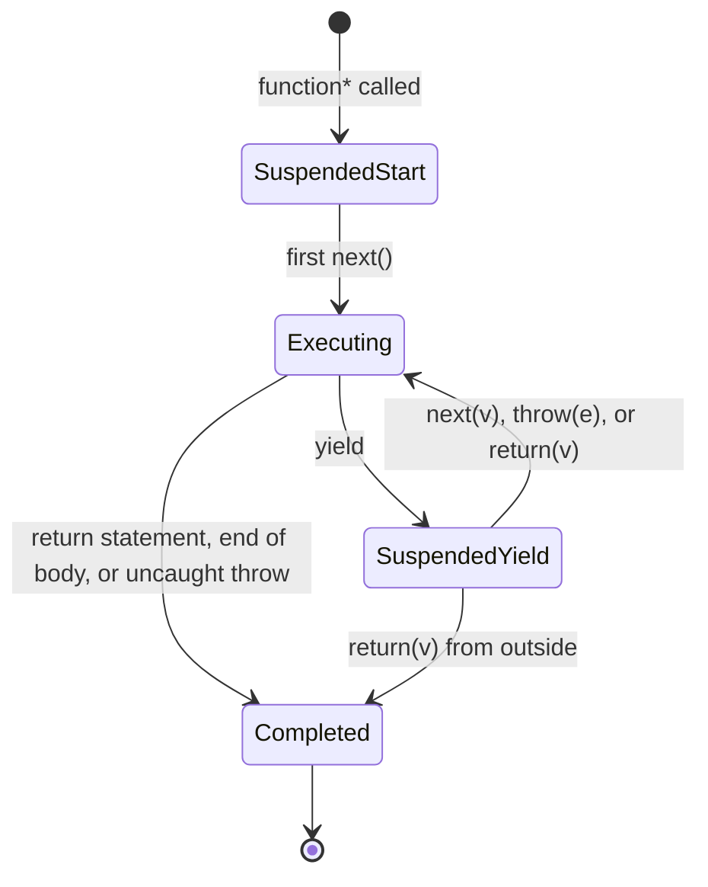

# 1.23 Generators and Iterators

> A generator is a function that can pause, hand a value back to its caller, wait for the caller to push a new value in, and then resume exactly where it left off. An iterator is the protocol that makes the pausing and resuming legible to the language. Together they are the foundation of lazy sequences, custom iteration, co-routine style state machines, and, historically, the runtime mechanism that powered the first async/await transpilers.

This note is the canonical reference for the Iterator protocol, the Iterable protocol, generator functions, `yield`, `yield*`, two-way communication via `next(value)`, and the early-termination methods `return()` and `throw()`. Every major example is shown side by side in JavaScript and TypeScript. After reading this you should be able to implement a custom iterable from scratch, build a lazy sequence library, and explain precisely why `async`/`await` is implemented on top of generators.

---

## 1. Purpose

### 1.1 The Problem Generators Solve

JavaScript has always been good at eagerly materializing data. An array literal like `[1, 2, 3]` allocates a contiguous block of memory and stores every value before anything is consumed. For small datasets this is fine. For large or unbounded datasets it is catastrophic. Consider the following two semantically identical operations:

```js
// Eager: materializes every number up front.
const squares = [];
for (let i = 1; i <= 1000000; i++) squares.push(i * i);
const firstTen = squares.slice(0, 10);
```

```js
// Lazy: produces one square at a time, on demand.
function* squares() {
  for (let i = 1; ; i++) yield i * i;
}
const firstTen = [];
for (const s of squares()) {
  firstTen.push(s);
  if (firstTen.length === 10) break;
}
```

The first version allocates an array of one million entries. The second version allocates effectively nothing. The difference is the difference between "compute everything now" and "compute the next thing when asked." Generators exist to make the second style as easy to write as the first.

### 1.2 What Generators and Iterators Enable

The two protocols together enable five categories of behavior that were either impossible or extremely awkward before ES6:

1. **Lazy sequences.** Infinite sequences (the natural numbers, the Fibonacci sequence, a stream of UUIDs) become first-class values you can pass around, compose, and consume piecewise.
2. **Custom iteration over user-defined collections.** A binary tree, a graph, a trie, a ring buffer, an LRU cache eviction queue — any data structure can opt into `for...of`, spread syntax, destructuring, and `Array.from` by implementing a single method.
3. **Co-routine style state machines.** A generator function preserves its local variables across suspensions, so you can write a stateful process as a single linear function rather than as an object with a `state` field and a `transition` method.
4. **Two-way communication with a paused computation.** `next(value)` lets a caller push data back into a paused generator. This is the basis of in-band signaling, ask-and-receive protocols, and the original `co` library that made generators usable for async control flow before native `async`/`await`.
5. **The runtime substrate of `async`/`await`.** Every `async` function, when transpiled by Babel or TypeScript to ES5, becomes a generator wrapped in a helper called `asyncToGenerator`. Even in modern engines, `async`/`await` is conceptually sugar over a paused computation that resumes on callback — the same shape generators provide synchronously. See [[1.22 Async Await Runtime]].

### 1.3 The Bug Class They Prevent

Without iterators, every "produce a sequence" abstraction in JavaScript had to choose one of three bad options:

- **Materialize an array.** O(n) memory. Fails for infinite or very large sequences.
- **Accept a callback.** Inversion of control. The producer owns the loop, the consumer cannot pause or stop early without a sentinel value.
- **Return a closure.** Works, but ad hoc: every library invents its own `{ hasNext, next }` or `() => { done, value }` shape, none of which interoperate with the language's `for...of`, spread, or destructuring.

The Iterator protocol eliminates the third problem by standardizing the shape. The Iterable protocol eliminates the second by giving consumers a uniform way to request an iterator. Generators eliminate the first by making it trivial to write producers that compute one value at a time.

The bug class prevented is, in one sentence: **"I had to allocate a million-element array just to read the first three values."**

---

## 2. Theory and Deep Dive

### 2.1 The Iterator Protocol

An object is an **iterator** when it implements a `next()` method with the following contract:

- `next()` takes no arguments (a value passed to the first `next()` is ignored by generators; see Section 2.6).
- `next()` returns an object with at least two properties:
  - `value` — the current value produced by the iterator. May be omitted when `done` is `true`.
  - `done` — a boolean. `false` means more values may follow. `true` means the iterator is exhausted.

A minimal hand-rolled iterator:

```js
// JavaScript
function makeIterator(array) {
  let index = 0;
  return {
    next() {
      if (index < array.length) {
        return { value: array[index++], done: false };
      }
      return { value: undefined, done: true };
    },
  };
}
const it = makeIterator(['a', 'b']);
console.log(it.next()); // { value: 'a', done: false }
console.log(it.next()); // { value: 'b', done: false }
console.log(it.next()); // { value: undefined, done: true }
console.log(it.next()); // { value: undefined, done: true } — stays done
```

```ts
// TypeScript
interface IteratorResult<T> {
  value: T | undefined;
  done: boolean;
}
interface ManualIterator<T> {
  next(): IteratorResult<T>;
}
function makeIterator<T>(array: T[]): ManualIterator<T> {
  let index = 0;
  return {
    next(): IteratorResult<T> {
      if (index < array.length) {
        return { value: array[index++], done: false };
      }
      return { value: undefined, done: true };
    },
  };
}
const it = makeIterator<string>(['a', 'b']);
console.log(it.next()); // { value: 'a', done: false }
```

Note that the TypeScript shapes above mirror the built-in `Iterator<T>` and `IteratorReturnResult<T>` interfaces in `lib.es2015.d.ts`. In real code you should use the built-in types rather than redefining them.

### 2.2 The Iterable Protocol

An object is an **iterable** when it implements a method keyed by `Symbol.iterator` that returns an iterator. The method takes no arguments.

```js
// JavaScript
const iterable = {
  data: [10, 20, 30],
  [Symbol.iterator]() {
    let index = 0;
    const data = this.data;
    return {
      next() {
        if (index < data.length) {
          return { value: data[index++], done: false };
        }
        return { value: undefined, done: true };
      },
    };
  },
};
for (const v of iterable) console.log(v); // 10, 20, 30
console.log([...iterable]);               // [10, 20, 30]
```

```ts
// TypeScript
const iterable: Iterable<number> = {
  data: [10, 20, 30],
  [Symbol.iterator](): Iterator<number> {
    let index = 0;
    const data = this.data;
    return {
      next(): IteratorResult<number> {
        if (index < data.length) {
          return { value: data[index++], done: false };
        }
        return { value: undefined, done: true };
      },
    };
  },
};
for (const v of iterable) console.log(v); // 10, 20, 30
```

Every built-in collection — `Array`, `Map`, `Set`, `String`, `TypedArray`, `NodeList`, `arguments` — implements `Symbol.iterator`. `for...of`, the spread operator, array destructuring, `Array.from`, `Promise.all`, `Promise.race`, `Promise.any`, `WeakRef`'s companion APIs, and `yield*` all consume iterables through that single method.

See [[1.32 Well-Known Symbols]] for the full list of well-known symbols including `Symbol.iterator`, `Symbol.asyncIterator`, and `Symbol.dispose`.

### 2.3 Generator Functions

A **generator function** is declared with the `function*` keyword (or `function *` — spacing is irrelevant, but `function*` is conventional). Calling a generator function does **not** execute its body. Instead, it constructs and returns a **generator object**, which is simultaneously:

- an Iterator (it has `next`, `return`, `throw`),
- an Iterable (it has a `Symbol.iterator` method that returns itself),
- an instance of the Generator prototype (which inherits from Iterator.prototype).

```js
// JavaScript
function* gen() {
  yield 1;
  yield 2;
  yield 3;
}
const g = gen();
console.log(g[Symbol.iterator]() === g); // true — generators iterate themselves
console.log(g.next()); // { value: 1, done: false }
console.log(g.next()); // { value: 2, done: false }
console.log(g.next()); // { value: 3, done: false }
console.log(g.next()); // { value: undefined, done: true }
```

```ts
// TypeScript
function* gen(): Generator<number, void, unknown> {
  yield 1;
  yield 2;
  yield 3;
}
const g: Generator<number, void, unknown> = gen();
console.log(g[Symbol.iterator]() === g); // true
```

The TypeScript type signature `Generator<TYield, TReturn, TNext>` is the full generator type. The three type parameters are:

- `TYield` — the type of values yielded out.
- `TReturn` — the type of the value returned by `return()` or by a `return` statement inside the generator body.
- `TNext` — the type of values the caller passes back in via `next(value)`.

Most code only needs `TYield`. The other two default to `any`/`unknown`.

### 2.4 `yield` — Suspended Animation

The `yield` keyword is only legal inside a generator function (or an async generator function, see [[1.24 Async Generators and Iterators]]). It does three things, atomically:

1. Evaluates the expression to its right.
2. Suspends execution of the generator. The entire call stack, local variables, and instruction pointer are preserved.
3. Returns the evaluated value to the caller as `{ value, done: false }`.

The next call to `next()` resumes execution **immediately after** the `yield` expression. The `yield` expression itself evaluates to whatever the next `next()` passes in (see Section 2.6).

```js
function* count() {
  console.log('start');
  console.log('yielding 1');
  const a = yield 1;
  console.log('resumed with', a);
  console.log('yielding 2');
  const b = yield 2;
  console.log('resumed with', b);
  return 'done';
}
const g = count();
console.log(g.next());     // logs "start", "yielding 1", returns { value: 1, done: false }
console.log(g.next('A'));  // logs "resumed with A", "yielding 2", returns { value: 2, done: false }
console.log(g.next('B'));  // logs "resumed with B", returns { value: 'done', done: true }
```

Notice that **the very first `next()` cannot meaningfully pass a value**, because there is no `yield` expression currently suspended waiting for a value. The argument is silently discarded by the runtime. This is a common source of bugs; see Section 6.

### 2.5 `yield*` — Delegation

The `yield*` expression delegates to another iterable. It iterates the inner iterable to completion, yielding each of its values in turn, and then evaluates to the value returned by the inner iterable's `return()` (or `undefined` if the inner iterable finished normally without a return value).

```js
// JavaScript
function* inner() {
  yield 'a';
  yield 'b';
  return 'inner-result'; // captured by yield*
}
function* outer() {
  yield 1;
  const result = yield* inner();
  console.log('delegation returned:', result);
  yield 2;
}
for (const v of outer()) console.log(v);
// 1, a, b, "delegation returned: inner-result", 2
```

```ts
// TypeScript
function* inner(): Generator<string, string, unknown> {
  yield 'a';
  yield 'b';
  return 'inner-result';
}
function* outer(): Generator<string | number, void, unknown> {
  yield 1;
  const result: string = yield* inner();
  console.log('delegation returned:', result);
  yield 2;
}
for (const v of outer()) console.log(v);
```

`yield*` is the idiomatic way to recurse in a generator. Without it, recursive generator calls would return an inner generator object that the outer generator never iterated, silently producing no values. With it, recursion composes naturally.

### 2.6 Two-Way Communication via `next(value)`

This is the feature that elevates generators from "lazy list" to "co-routine." When you call `next(value)`, the `value` argument becomes the result of the currently-suspended `yield` expression inside the generator.

```js
function* pingPong() {
  const x = yield 'ping';
  const y = yield `pong ${x}`;
  return `final ${y}`;
}
const g = pingPong();
console.log(g.next());        // { value: 'ping', done: false }
console.log(g.next('hello')); // { value: 'pong hello', done: false }
console.log(g.next('world')); // { value: 'final world', done: true }
```

The mental model is:

- The generator yields a question.
- The caller computes an answer.
- The caller passes the answer back via the next `next()`.
- The generator continues with the answer as the value of the `yield` expression.

This is precisely the shape that powered the `co` library and Koa 1.x: the generator yields a Promise, the runtime awaits the Promise, and then calls `next(resolvedValue)` to feed the resolved value back in. `async`/`await` is the syntactic version of this dance, with the runtime hidden behind the keyword. See [[1.19 Asynchronous Paradigms Evolution]].

### 2.7 `return(value)` — Early Termination

The `return(value)` method on a generator object forces the generator to terminate immediately. Execution jumps to the `finally` blocks of any pending `try` statements (so cleanup still runs), and then the generator returns `{ value, done: true }`. Any subsequent `next()` returns `{ value: undefined, done: true }`.

```js
function* withCleanup() {
  try {
    yield 1;
    yield 2;
    yield 3;
  } finally {
    console.log('cleanup ran');
  }
}
const g = withCleanup();
console.log(g.next());            // { value: 1, done: false }
console.log(g.return('forced'));  // logs "cleanup ran", returns { value: 'forced', done: true }
console.log(g.next());            // { value: undefined, done: true }
```

`for...of` and other consumers call `return()` automatically when they exit early (via `break`, `return`, `throw`, or `continue` to an outer label). This is why a generator wrapped in `for...of` always cleans up properly even on early exit.

### 2.8 `throw(error)` — Injected Errors

The `throw(error)` method throws an exception **inside** the generator at the point of the currently-suspended `yield`. If the generator has a `try`/`catch` around that `yield`, the catch runs and the generator may resume. If not, the exception propagates out of `throw()` and the generator is marked done.

```js
function* resilient() {
  try {
    yield 1;
    yield 2;
  } catch (e) {
    console.log('caught inside:', e.message);
    yield 3; // generator continues
  }
}
const g = resilient();
console.log(g.next());                  // { value: 1, done: false }
console.log(g.throw(new Error('boom'))); // logs "caught inside: boom", returns { value: 3, done: false }
console.log(g.next());                  // { value: undefined, done: true }
```

This is the second half of co-routine semantics. `next(v)` is "here is a value." `throw(e)` is "here is an error." A well-written generator can use `try`/`catch` around its `yield` expressions to handle errors injected by its consumer — exactly the pattern that async/await uses internally for rejected Promises.

### 2.9 Generators Preserve Scope Across Suspensions

A paused generator retains its full local scope. Local variables, parameters, `const` bindings, and (importantly) closures over outer variables all survive. The generator is, in effect, a closure over its own continuation. This is why generators can be used as state machines: the "state" is just the values of local variables.

```js
function* counter(start = 0) {
  let count = start;
  while (true) {
    const step = yield count;
    if (typeof step === 'number') count += step;
    else count++;
  }
}
const c = counter(10);
console.log(c.next());    // { value: 10, done: false }
console.log(c.next(5));   // { value: 15, done: false }
console.log(c.next(5));   // { value: 20, done: false }
console.log(c.next());    // { value: 21, done: false }
```

### 2.10 Sequence Diagram: Two-Way Communication

```mermaid
sequenceDiagram
    participant Caller
    participant Generator
    Caller->>Generator: next()
    Generator->>Caller: yield 1 (value=1, done=false)
    Note over Generator: paused at first yield
    Caller->>Generator: next("A")
    Note over Generator: resumes; first yield evaluates to "A"
    Generator->>Caller: yield 2 (value=2, done=false)
    Note over Generator: paused at second yield
    Caller->>Generator: throw(new Error("boom"))
    Note over Generator: error thrown at second yield
    Generator->>Generator: catch block runs
    Generator->>Caller: yield 3 (value=3, done=false)
    Caller->>Generator: return("forced")
    Note over Generator: finally block runs
    Generator->>Caller: { value: "forced", done: true }
```

### 2.11 Generator Object State Machine

A generator object is always in exactly one of three states. The transitions are irreversible.



Once a generator is `Completed`, every method on it returns `{ value: undefined, done: true }` and `throw()` returns a rejected promise shape (actually throws synchronously). You cannot rewind, restart, or clone a generator. You must construct a new one by calling the generator function again.

---

## 3. Mental Models

### 3.1 Iterator = A Cursor You Can Advance

Think of an iterator as a cursor positioned between elements. `next()` moves the cursor forward and reports the element it just passed. The cursor cannot move backward. The cursor cannot be duplicated. When the cursor reaches the end, `done` flips to `true` and stays there.

### 3.2 Iterable = Something With a Cursor

An iterable is a thing that knows how to produce a cursor. Asking the same iterable twice for a cursor gives you two independent cursors. This is why `[...arr, ...arr]` works: each spread asks `arr` for a fresh iterator.

### 3.3 Generator = A Function You Can Pause and Resume

A regular function runs to completion or throws. A generator function can pause mid-statement, hand a value to its caller, wait indefinitely, and resume exactly where it left off — possibly with new information the caller has pushed in.

### 3.4 `yield` = Pause Here, Hand Back This Value, Wait

Read `const x = yield produceSomething();` left to right as:

1. Evaluate `produceSomething()`.
2. Pause the generator.
3. Hand the value to the caller as `{ value, done: false }`.
4. Wait for the caller to call `next(v)`.
5. The expression `yield produceSomething()` then evaluates to `v`.
6. Assign `v` to `x` and continue.

### 3.5 `next(v)` = Resume, and the Previous Yield Evaluates to `v`

This is the part most developers get wrong on first contact. `next(v)` does **not** push `v` into the **next** yield. It pushes `v` into the **currently paused** yield, the one that produced the most recent `{ value, done: false }`.

### 3.6 `yield*` = Delegate to Another Iterable, Drain It

`yield* foo` says: "take whatever `foo` is, ask it for an iterator, and yield every value from it before continuing. If the iterator returns a final value via `return()`, capture that as the value of the `yield*` expression."

### 3.7 `return(v)` = Force-Quit With a Final Value

The generator's `finally` blocks still run, but no more `yield` statements will be honored. Any `yield` after a forced `return()` is unreachable.

### 3.8 `throw(e)` = Throw Inside the Generator

The error is injected at the paused `yield`. The generator can catch it. If it does not, the generator terminates and the error propagates out of the `throw()` call.

### 3.9 The Bookkeeping Analogy

A generator is like a bookkeeper who, at the end of each transaction, hands you a slip of paper with a number on it and waits. You read the number, do something with it, write a new number on the slip, and hand it back. The bookkeeper then continues from the exact line of the ledger they were on, using the new number you wrote down. If you instead hand them an error memo, they can either file it in their "exceptions" drawer and continue, or hand the memo back to you marked "unhandled."

---

## 4. Real-World Use Cases

### 4.1 `for...of` Consumes Iterables

Every `for...of` loop asks its right-hand side for a `Symbol.iterator`, calls `next()` repeatedly, and stops when `done` is `true`. If the loop body exits early, the runtime calls `return()` on the iterator.

```js
for (const [key, value] of new Map([['a', 1], ['b', 2]])) {
  console.log(key, value);
}
for (const char of 'hello') {
  console.log(char);
}
for (const node of document.querySelectorAll('div')) {
  console.log(node.tagName);
}
```

### 4.2 Spread and Destructuring

Both `[...iterable]` and `const [a, b] = iterable` consume an iterable. Spread drains the entire iterable into an array. Array destructuring calls `next()` once per binding.

```js
const [first, ...rest] = new Set([10, 20, 30, 40]);
console.log(first, rest); // 10, [20, 30, 40]
const copy = [...'abc'];  // ['a', 'b', 'c']
```

### 4.3 Redux Saga — Side-Effect Orchestration

[redux-saga](https://redux-saga.js.org/) uses generators to model side effects as declarative values. A saga `yield`s an object describing a side effect (an "Effect") rather than performing the side effect directly. The saga middleware interprets the Effect, performs the side effect, and feeds the result back into the generator via `next(result)`.

```js
import { call, put, takeEvery } from 'redux-saga/effects';

function* fetchUser(action) {
  try {
    const user = yield call(api.fetchUser, action.payload);
    yield put({ type: 'USER FETCH SUCCEEDED', user });
  } catch (e) {
    yield put({ type: 'USER FETCH FAILED', message: e.message });
  }
}

function* rootSaga() {
  yield takeEvery('USER FETCH REQUESTED', fetchUser);
}
```

The benefit is testability: because side effects are values, you can step through a saga in a test by calling `next()` repeatedly and asserting on the yielded values, without ever touching a real network.

### 4.4 Co / Koa 1.x — Pre-async/await Async

Before native `async`/`await`, the `co` library and Koa 1.x used generators as the control-flow primitive for asynchronous code. The pattern: a generator yields a Promise, `co` awaits it, then calls `next(resolvedValue)` to feed the value back in. If the Promise rejected, `co` called `throw(rejectionError)` instead.

```js
const co = require('co');
co(function* () {
  const user = yield fetchUser();
  const posts = yield fetchPosts(user.id);
  return { user, posts };
}).then(result => console.log(result));
```

This pattern is obsolete for new code — `async`/`await` is strictly better — but it is historically important and conceptually identical to how `async`/`await` is implemented. See [[1.19 Asynchronous Paradigms Evolution]].

### 4.5 Lazy Infinite Sequences

A generator can represent an unbounded sequence because it computes values one at a time on demand.

```js
function* naturalNumbers() {
  let n = 1;
  while (true) yield n++;
}
function* fibonacci() {
  let a = 0, b = 1;
  while (true) {
    yield a;
    [a, b] = [b, a + b];
  }
}
const firstTenFibs = [...take(10, fibonacci())];
```

### 4.6 Tree Traversal With `yield*` Recursion

Any recursive traversal can be written as a generator, and `yield*` makes the recursion read like the equivalent eager version.

```js
function* walk(node) {
  yield node.value;
  for (const child of node.children) {
    yield* walk(child);
  }
}
```

This is dramatically cleaner than maintaining an explicit stack or callbacks.

### 4.7 Pull-Backpressure Streams

Node.js Readable streams (post-Node 10) implement `Symbol.asyncIterator`. You can `for await` over them, which applies natural backpressure: the consumer pulls one chunk at a time and only asks for the next when ready. See [[3.07 Streams Fundamentals]] and [[1.24 Async Generators and Iterators]].

### 4.8 Custom Collections

A binary search tree, a linked list, a ring buffer — all can opt into the language's iteration machinery by implementing `Symbol.iterator`.

### 4.9 State Machines Without Classes

A turnstile, a parser, a TCP connection state machine — all can be modeled as generators that `yield` after each state transition and use the value passed back via `next()` as the next input event. See Section 9.4.

### 4.10 RegExps as Iterators (Stage 4 Proposal)

The `/d` flag (RegExp Match Indices, ES2022) and the proposed `String.prototype.matchAll` (already shipped) make regex iteration a first-class pattern. `matchAll` returns an iterable of matches that you can spread or `for...of` over.

---

## 5. Code Examples

### 5.1 Example A — Minimal and Conceptual

**Goal:** an infinite `naturalNumbers()` generator consumed by `for...of` with a `break`, plus a side-by-side TS version.

#### JavaScript

```js
// natural.js
function* naturalNumbers(start = 1) {
  let n = start;
  while (true) yield n++;
}

const result = [];
for (const n of naturalNumbers()) {
  result.push(n);
  if (result.length === 5) break;
}
console.log(result); // [1, 2, 3, 4, 5]

// Demonstrate that the generator is paused, not running.
const gen = naturalNumbers(100);
console.log(gen.next()); // { value: 100, done: false }
console.log(gen.next()); // { value: 101, done: false }
console.log(gen.return('stopped')); // { value: 'stopped', done: true }
console.log(gen.next()); // { value: undefined, done: true }
```

#### TypeScript

```ts
// natural.ts
function* naturalNumbers(start: number = 1): Generator<number, void, unknown> {
  let n = start;
  while (true) yield n++;
}

const result: number[] = [];
for (const n of naturalNumbers()) {
  result.push(n);
  if (result.length === 5) break;
}
console.log(result); // [1, 2, 3, 4, 5]

const gen: Generator<number, void, unknown> = naturalNumbers(100);
console.log(gen.next());            // { value: 100, done: false }
console.log(gen.next());            // { value: 101, done: false }
console.log(gen.return('stopped')); // { value: 'stopped', done: true }
console.log(gen.next());            // { value: undefined, done: true }
```

**Key observations:**

- The `while (true)` loop never runs away, because each `yield` suspends execution. The consumer controls pacing.
- `break` inside `for...of` triggers `return()` on the generator, which is why the infinite loop terminates cleanly without leaking.
- The TypeScript signature `Generator<number, void, unknown>` says: yields `number`, returns `void` (no explicit `return`), and does not accept input via `next(v)` (so we use `unknown`).

### 5.2 Example B — Production-Grade

**Goal:** a typed lazy tree-flatten using `yield*` recursion, with cleanup handling, error injection, and a small consumer harness that demonstrates `for...of`, spread, `return()`, and `throw()`.

#### JavaScript

```js
// tree.js
class TreeNode {
  constructor(value, children = []) {
    this.value = value;
    this.children = children;
  }
}

function* walkDepthFirst(node) {
  if (!node) return;
  try {
    yield node.value;
    for (const child of node.children) {
      yield* walkDepthFirst(child);
    }
  } finally {
    // Cleanup hook: called on return() or normal completion.
  }
}

function* walkBreadthFirst(root) {
  if (!root) return;
  const queue = [root];
  while (queue.length > 0) {
    const node = queue.shift();
    yield node.value;
    for (const child of node.children) queue.push(child);
  }
}

function* filter(fn, iterable) {
  for (const v of iterable) {
    if (fn(v)) yield v;
  }
}

function* map(fn, iterable) {
  for (const v of iterable) yield fn(v);
}

function* take(n, iterable) {
  let count = 0;
  for (const v of iterable) {
    if (count >= n) return;
    yield v;
    count++;
  }
}

// Build a sample tree:
//        1
//      / | \
//     2  3  4
//    / \     \
//   5   6     7
const root = new TreeNode(1, [
  new TreeNode(2, [new TreeNode(5), new TreeNode(6)]),
  new TreeNode(3),
  new TreeNode(4, [new TreeNode(7)]),
]);

console.log([...walkDepthFirst(root)]); // [1, 2, 5, 6, 3, 4, 7]
console.log([...walkBreadthFirst(root)]); // [1, 2, 3, 4, 5, 6, 7]
console.log([...take(3, walkDepthFirst(root))]); // [1, 2, 5]
console.log([...filter(v => v % 2 === 0, walkDepthFirst(root))]); // [2, 6, 4]
console.log([...map(v => v * 10, take(2, walkDepthFirst(root)))]); // [10, 20]

// Demonstrate cleanup on early exit:
const walker = walkDepthFirst(root);
console.log(walker.next()); // { value: 1, done: false }
console.log(walker.next()); // { value: 2, done: false }
console.log(walker.return('aborted')); // { value: 'aborted', done: true }

// Demonstrate error injection:
const walker2 = walkDepthFirst(root);
console.log(walker2.next()); // { value: 1, done: false }
try {
  walker2.throw(new Error(' injected'));
} catch (e) {
  console.log('caught outside:', e.message); // caught outside: injected
}
```

#### TypeScript

```ts
// tree.ts
interface TreeNode<T> {
  value: T;
  children: TreeNode<T>[];
}
function treeNode<T>(value: T, children: TreeNode<T>[] = []): TreeNode<T> {
  return { value, children };
}

function* walkDepthFirst<T>(node: TreeNode<T> | null): Generator<T, void, unknown> {
  if (!node) return;
  try {
    yield node.value;
    for (const child of node.children) {
      yield* walkDepthFirst<T>(child);
    }
  } finally {
    // Cleanup hook: runs on return() or normal completion.
  }
}

function* walkBreadthFirst<T>(root: TreeNode<T> | null): Generator<T, void, unknown> {
  if (!root) return;
  const queue: TreeNode<T>[] = [root];
  while (queue.length > 0) {
    const node = queue.shift()!;
    yield node.value;
    for (const child of node.children) queue.push(child);
  }
}

function* filter<T>(fn: (v: T) => boolean, iterable: Iterable<T>): Generator<T, void, unknown> {
  for (const v of iterable) {
    if (fn(v)) yield v;
  }
}

function* map<T, U>(fn: (v: T) => U, iterable: Iterable<T>): Generator<U, void, unknown> {
  for (const v of iterable) yield fn(v);
}

function* take<T>(n: number, iterable: Iterable<T>): Generator<T, void, unknown> {
  let count = 0;
  for (const v of iterable) {
    if (count >= n) return;
    yield v;
    count++;
  }
}

const root: TreeNode<number> = treeNode(1, [
  treeNode(2, [treeNode(5), treeNode(6)]),
  treeNode(3),
  treeNode(4, [treeNode(7)]),
]);

console.log([...walkDepthFirst(root)]);                              // [1, 2, 5, 6, 3, 4, 7]
console.log([...walkBreadthFirst(root)]);                            // [1, 2, 3, 4, 5, 6, 7]
console.log([...take(3, walkDepthFirst(root))]);                     // [1, 2, 5]
console.log([...filter(v => v % 2 === 0, walkDepthFirst(root))]);    // [2, 6, 4]
console.log([...map(v => v * 10, take(2, walkDepthFirst(root)))]);   // [10, 20]

const walker: Generator<number, void, unknown> = walkDepthFirst(root);
console.log(walker.next());            // { value: 1, done: false }
console.log(walker.next());            // { value: 2, done: false }
console.log(walker.return('aborted')); // { value: 'aborted', done: true }

const walker2: Generator<number, void, unknown> = walkDepthFirst(root);
console.log(walker2.next()); // { value: 1, done: false }
try {
  walker2.throw(new Error('injected'));
} catch (e) {
  console.log('caught outside:', (e as Error).message); // caught outside: injected
}
```

**Key observations:**

- `yield*` makes the recursive call read as if it were a plain `for...of` loop. Without `yield*`, `walkDepthFirst(child)` would return a generator object that the outer generator never iterated, silently producing nothing.
- The `try`/`finally` block guarantees cleanup runs on early termination via `return()` or `throw()`.
- `take(n, ...)` uses a plain `return` statement (not `return(v)`), so the generator returns `{ value: undefined, done: true }` after the nth value. The cleanup `finally` of any upstream generator still runs because `for...of` calls `return()` on its iterator when the loop exits naturally.
- The TypeScript generic `Generator<T, void, unknown>` parameterizes the yielded type. The `unknown` for `TNext` documents that the caller should not push values in.

---

## 6. Common Mistakes and Anti-Patterns

### 6.1 Forgetting the `*` in `function*`

```js
function broken() { yield 1; } // SyntaxError: Unexpected identifier 'yield'
```

The `*` is what makes `yield` legal. Without it, the parser sees `yield` as an identifier in a context where it is not allowed (in non-strict code `yield` is a contextual keyword, but it is still not a statement). Always write `function*`.

### 6.2 Generators Are One-Shot

```js
function* once() { yield 1; yield 2; }
const g = once();
console.log([...g]); // [1, 2]
console.log([...g]); // [] — g is exhausted, the second spread produces nothing
```

A generator object cannot be rewound. If you need to iterate the same sequence twice, call the generator function again to produce a fresh generator. If you need an iterable that produces a fresh iterator every time, return a generator function (not a generator object) from `Symbol.iterator`:

```js
const fresh = {
  *[Symbol.iterator]() { yield 1; yield 2; },
};
console.log([...fresh]); // [1, 2]
console.log([...fresh]); // [1, 2] — fresh iterator each time
```

### 6.3 `yield` Outside a Generator Function

```js
const f = () => { yield 1; }; // SyntaxError
function* outer() {
  const inner = () => { yield 2; }; // SyntaxError — arrow functions cannot be generators
}
```

`yield` is only legal inside a `function*` body (or `async function*`). Arrow functions cannot be generators. If you need a generator as a callback, define a `function*` and pass a reference to it, or pass a generator object.

### 6.4 Believing `yield` Returns the Yielded Value

```js
function* confused() {
  const x = yield 42;
  console.log(x); // undefined on first resume, then whatever next(v) passes
}
const g = confused();
console.log(g.next());     // { value: 42, done: false } — x is not 42
console.log(g.next());     // logs undefined, returns { value: undefined, done: true }
console.log(g.next('hi')); // has no effect — generator already done
```

The `yield 42` expression evaluates to the value passed to the **next** `next()`, not to `42`. The first `next()` has no preceding `yield` to feed, so its argument is discarded. The second `next()` (with no argument) feeds `undefined` to the suspended `yield 42`. The third `next('hi')` is too late — the generator is already done.

### 6.5 `for...of` Ignores the Final `done: true` Value

```js
function* withReturn() {
  yield 1;
  yield 2;
  return 3; // ignored by for...of
}
for (const v of withReturn()) console.log(v); // 1, 2 — not 3
console.log([...withReturn()]); // [1, 2] — not [1, 2, 3]
```

`for...of` and spread stop as soon as `done: true` is observed; they do not include the final `value`. The return value is only accessible via direct `next()` calls or via `yield*` delegation (which captures it as the value of the `yield*` expression).

### 6.6 Generators Don't Auto-Close on Manual `next()` Loops

```js
function* leaking() {
  try {
    yield 1;
    yield 2;
    yield 3;
  } finally {
    console.log('cleanup');
  }
}
const g = leaking();
console.log(g.next()); // { value: 1 }
// ... forget to call return(), let g go out of scope
```

When you drive a generator manually with `next()`, the runtime does **not** call `return()` when you abandon it. The `finally` block never runs (until garbage collection, which is non-deterministic and may never happen during the process lifetime). Use `for...of` (which calls `return()` on early exit) or call `g.return()` explicitly when you are done.

### 6.7 Yielding Inside a Callback Doesn't Work

```js
function* bad() {
  [1, 2, 3].forEach(n => yield n); // SyntaxError — arrow function is not a generator
}
```

Even with a `function*` callback, the `yield` would suspend the **inner** generator, not the outer one. Use a `for...of` loop instead:

```js
function* good() {
  for (const n of [1, 2, 3]) yield n;
}
```

### 6.8 Mixing `yield` and `await` Without `async function*`

```js
async function* asyncGen() { yield await fetch(url); } // correct — async generator
function* syncGen() { yield await fetch(url); }        // SyntaxError — await only legal in async functions
```

To combine `yield` and `await`, use `async function*`. See [[1.24 Async Generators and Iterators]].

### 6.9 Throwing Into a Completed Generator Throws Synchronously

```js
function* g() { yield 1; }
const it = g();
it.next(); it.next(); // now done
it.throw(new Error('x')); // throws synchronously, the Error propagates out of throw()
```

`throw()` on an already-done generator re-throws the error directly to the caller. There is no suspended `yield` to inject into.

### 6.10 Infinite Generators Without Break Will Hang

```js
function* naturals() { let i = 0; while (true) yield i++; }
const arr = [...naturals()]; // hangs forever, allocating until OOM
```

Spread and `Array.from` drain the iterable to completion. If the iterable is infinite, the program hangs. Always pair infinite generators with `take`, `for...of` + `break`, or a custom cap.

### 6.11 Yielding Objects Creates Identity Surprises

```js
function* objs() { yield { n: 1 }; yield { n: 1 }; }
const [a, b] = objs();
console.log(a === b); // false — each yield produces a new object
```

If you need to yield the same object reference repeatedly, hoist it out of the loop.

### 6.12 Forgetting `Symbol.iterator` Must Return an Iterator

```js
const broken = {
  [Symbol.iterator]() { return [1, 2, 3]; }, // arrays ARE iterators... no, they are ITERABLES
};
console.log([...broken]); // works only because Array's Symbol.iterator is delegated — confusing
```

An array is an iterable, not an iterator. Returning an array from `Symbol.iterator` happens to work because arrays also have `Symbol.iterator`, but it is fragile. Always return a proper iterator object with a `next()` method.

---

## 7. Best Practices and Design Patterns

### 7.1 Use Generators for Lazy Sequences and Custom Iterables

Any time you would return an array of computed values, ask whether the consumer always needs every value. If not, return a generator. The consumer pays only for what they use.

### 7.2 Use `yield*` for Delegation

Never write:

```js
function* bad(a, b) {
  for (const v of a) yield v;
  for (const v of b) yield v;
}
```

when you can write:

```js
function* good(a, b) {
  yield* a;
  yield* b;
}
```

`yield*` is faster (engines optimize the delegation path), shorter, and captures the inner iterable's return value if needed.

### 7.3 Always Implement `Symbol.iterator` for Custom Collections

A class that holds an ordered collection of values should implement `Symbol.iterator`. This unlocks `for...of`, spread, destructuring, `Array.from`, and interop with every library that consumes iterables.

```ts
class RingBuffer<T> {
  private buffer: T[] = [];
  constructor(private capacity: number) {}
  push(v: T): void {
    if (this.buffer.length >= this.capacity) this.buffer.shift();
    this.buffer.push(v);
  }
  *[Symbol.iterator](): Iterator<T> {
    for (const v of this.buffer) yield v;
  }
}
```

### 7.4 Use TypeScript's `Iterable<T>`, `Iterator<T>`, and `Generator<T>` Types

- `Iterable<T>` — anything with a `Symbol.iterator` that yields `T`.
- `Iterator<T>` — anything with a `next()` returning `IteratorResult<T>`.
- `Generator<TYield, TReturn, TNext>` — the full generator type.
- `IterableIterator<T>` — an object that is both an iterator and an iterable (what generator objects are).

Accept `Iterable<T>` in function parameters rather than `Array<T>` or `Generator<T>`. This lets callers pass arrays, sets, maps, strings, or generators interchangeably.

### 7.5 Don't Use Generators as a Replacement for async/await

The Koa 1.x / `co` pattern is obsolete. For new asynchronous code, use `async`/`await`. Reserve generators for synchronous lazy sequences, custom iterables, and synchronous state machines. For asynchronous lazy sequences, use `async function*` (async generators). See [[1.24 Async Generators and Iterators]].

### 7.6 Use Generators for Synchronous State Machines

When a process has discrete states and transitions, and does not need async, a generator can express the entire machine as a single linear function. See Section 9.4.

### 7.7 Always Clean Up in `try`/`finally`

If your generator opens a resource (a file handle, a database cursor, a WebSocket), wrap the body in `try`/`finally` so that `return()` and `throw()` trigger cleanup. Never assume the consumer will drain the generator to completion.

```ts
function* readLines(fd: FileHandle): Generator<string, void, unknown> {
  try {
    let line: string | null;
    while ((line = fd.readLine()) !== null) yield line;
  } finally {
    fd.close();
  }
}
```

### 7.8 Document the Three Generator Type Parameters

When you write `Generator<TYield, TReturn, TNext>`, set `TReturn` to `void` if the generator does not use a `return` statement with a value, and `TNext` to `unknown` if the generator does not accept input via `next(v)`. This signals intent to the type system and to readers.

### 7.9 Generator Composition Pattern

Compose generators the way you compose functions: small single-purpose generators, chained with helpers like `map`, `filter`, `take`. Each helper is a one-line generator. The result is a pipeline that consumes O(1) memory regardless of how many stages it has.

```ts
const pipeline = take(
  10,
  filter(isPrime, map(square, naturalNumbers()))
);
```

### 7.10 The "Iterator as Cursor" Pattern for Custom Collections

When you need fine-grained control over iteration (e.g., a parallel cursor over two collections), implement the iterator protocol by hand rather than using a generator. Generators are convenient but opaque; a hand-rolled iterator gives you explicit control over `next()`.

### 7.11 Use `Iterator.from` (Stage 3 Proposal) for Adapters

The `Iterator.from` proposal (and the `Iterator` helpers proposal more broadly) brings `map`, `filter`, `take`, `drop`, `reduce`, `toArray`, `forEach`, `some`, `every`, `find` to the `Iterator` prototype directly. Until it ships, use a library like `iterare` or write your own helpers as in Section 10.

### 7.12 Don't Reuse a Generator Across Concurrent Consumers

A generator is a single cursor. Two concurrent `for...of` loops over the same generator object will steal values from each other. If you need multiple concurrent consumers, give each one a fresh generator (call the generator function again) or buffer the sequence.

---

## 8. Technical Interview Knowledge

### Q1: What is the Iterator protocol?

**A:** The Iterator protocol is a protocol that defines a standard way for an object to produce a sequence of values. An object is an iterator when it implements a `next()` method that returns an object with `value` and `done` properties. `next()` should be idempotent after `done` becomes `true`: subsequent calls keep returning `{ value: undefined, done: true }`. The protocol also defines two optional methods, `return(value)` and `throw(error)`, which the consumer can use to notify the iterator that it is done early or that an error occurred.

### Q2: What is `Symbol.iterator`?

**A:** `Symbol.iterator` is a well-known symbol (see [[1.32 Well-Known Symbols]]) used as the method key that makes an object **iterable**. An object is iterable when it has a method keyed by `Symbol.iterator` that returns an iterator. The language uses this method to obtain an iterator in `for...of`, spread syntax, array destructuring, `Array.from`, `Promise.all`, `yield*`, and several other contexts. Built-in iterables include `Array`, `String`, `Map`, `Set`, `TypedArray`, `arguments`, and `NodeList`.

### Q3: What does `yield*` do?

**A:** `yield*` delegates to another iterable. It calls `Symbol.iterator` on the operand, iterates the resulting iterator to completion, and yields each of its values from the outer generator. The expression also evaluates to the value returned by the inner iterator's `return()` method (which is `undefined` for plain arrays and for generators that do not use a `return` statement with a value). `yield*` is the idiomatic way to recurse in a generator and to flatten nested iterables.

### Q4: Can you pass a value into a generator?

**A:** Yes. Calling `next(value)` on a generator object causes the currently-suspended `yield` expression inside the generator to evaluate to `value`. This is the two-way communication channel that makes generators usable as co-routines. The first `next()` cannot usefully pass a value, because no `yield` is currently suspended. The pattern of yielding a question and receiving an answer via the next `next()` is the basis of the `co`/Koa async pattern and of how `async`/`await` is implemented internally.

### Q5: How do you close a generator early?

**A:** Three ways:

1. Call `g.return(value)` explicitly. The generator's `finally` blocks run, and the generator becomes done with the supplied value.
2. Use `for...of` and `break` (or `return`, `throw`, `continue` to an outer label). The runtime calls `return()` on the iterator automatically.
3. Let the generator run to completion or throw inside it without catching.

Always use `try`/`finally` inside generators that hold resources, so cleanup runs on early termination.

### Q6: Implement an infinite sequence.

**A:**

```js
function* naturals(start = 1) {
  let n = start;
  while (true) yield n++;
}
function* fibonacci() {
  let a = 0, b = 1;
  while (true) {
    yield a;
    [a, b] = [b, a + b];
  }
}
function* take(n, iterable) {
  let i = 0;
  for (const v of iterable) {
    if (i++ >= n) return;
    yield v;
  }
}
console.log([...take(10, fibonacci())]);
// [0, 1, 1, 2, 3, 5, 8, 13, 21, 34]
```

The key insight is that `while (true)` does not hang, because each `yield` suspends execution. The consumer controls pacing via `take` (or via `break` inside a `for...of`).

### Q7: How does `for...of` interact with iterators?

**A:** `for (const v of expr)` evaluates `expr`, calls `Symbol.iterator` on the result to obtain an iterator, then repeatedly calls `next()` on that iterator. On each iteration, `v` is bound to the `value` property of the result. The loop terminates when `done` is `true`. The final `{ value, done: true }` result's `value` is **not** used as a loop iteration. If the loop body exits early via `break`, `return`, `throw`, or `continue` to an outer label, the runtime calls `return()` on the iterator if that method exists. If `return()` throws, the exception propagates out of the loop.

### Q8: What is the relationship between generators and async/await?

**A:** Conceptually, `async`/`await` is sugar over a paused computation that resumes on callback — the same shape generators provide synchronously. Concretely, every transpiler (Babel, TypeScript) implements `async`/`await` by rewriting the function as a generator wrapped in a helper called `asyncToGenerator`. The helper calls `next()`, awaits the returned Promise, then calls `next(resolvedValue)` (or `throw(rejectionError)` on rejection). Even in modern engines that implement `async`/`await` natively without generators, the conceptual model is identical: the function pauses at each `await`, the runtime resumes it when the Promise settles, and the `await` expression evaluates to the resolved value — exactly as `yield` evaluates to the value passed to the next `next()`. For asynchronous lazy sequences, ES2018 introduced `async function*` and `for await...of`, which combine the two protocols. See [[1.22 Async Await Runtime]] and [[1.24 Async Generators and Iterators]].

---

## 9. Practical Exercises

### 9.1 Exercise 1: Implement a `range(start, end, step)` Generator

**Problem:** Write a generator `range(start, end, step)` that yields `start`, `start + step`, `start + 2 * step`, ... up to (but not including) `end`. Support negative steps. Then consume it with `for...of` and with spread.

#### Worked Solution (JavaScript)

```js
function* range(start, end, step = 1) {
  if (step === 0) throw new Error('step must not be zero');
  if (step > 0) {
    for (let i = start; i < end; i += step) yield i;
  } else {
    for (let i = start; i > end; i += step) yield i;
  }
}
console.log([...range(0, 10, 2)]);     // [0, 2, 4, 6, 8]
console.log([...range(10, 0, -2)]);    // [10, 8, 6, 4, 2]
console.log([...range(1, 5)]);         // [1, 2, 3, 4]
for (const v of range(0, 3)) console.log(v); // 0, 1, 2
```

#### Worked Solution (TypeScript)

```ts
function* range(start: number, end: number, step: number = 1): Generator<number, void, unknown> {
  if (step === 0) throw new Error('step must not be zero');
  if (step > 0) {
    for (let i = start; i < end; i += step) yield i;
  } else {
    for (let i = start; i > end; i += step) yield i;
  }
}
console.log([...range(0, 10, 2)]);  // [0, 2, 4, 6, 8]
console.log([...range(10, 0, -2)]); // [10, 8, 6, 4, 2]
```

**Why this matters:** `range` is the canonical "lazy sequence" example. It demonstrates that the generator body is just an ordinary loop with a `yield` in the middle, and that the loop terminates naturally when the condition is false. No `break` is needed in the consumer.

### 9.2 Exercise 2: Implement `take(n, iterable)` and `map(fn, iterable)` as Generators

**Problem:** Write `take` and `map` as generators. Demonstrate that they compose lazily by interleaving them with an infinite generator and observing that only the necessary values are computed.

#### Worked Solution (JavaScript)

```js
function* naturals() {
  let n = 1;
  while (true) yield n++;
}
function* take(n, iterable) {
  let i = 0;
  for (const v of iterable) {
    if (i >= n) return;
    yield v;
    i++;
  }
}
function* map(fn, iterable) {
  for (const v of iterable) yield fn(v);
}
function* filter(fn, iterable) {
  for (const v of iterable) if (fn(v)) yield v;
}

// Compose: first 5 even squares of natural numbers.
const result = [...take(5, filter(v => v % 2 === 0, map(v => v * v, naturals())))];
console.log(result); // [4, 16, 36, 64, 100]

// Prove laziness: log every map invocation.
function* mapLogged(fn, iterable) {
  for (const v of iterable) {
    console.log('mapping', v);
    yield fn(v);
  }
}
console.log('starting');
const r2 = [...take(3, mapLogged(v => v * 10, naturals()))];
// logs: starting, mapping 1, mapping 2, mapping 3
console.log(r2); // [10, 20, 30]
```

#### Worked Solution (TypeScript)

```ts
function* naturals(): Generator<number, void, unknown> {
  let n = 1;
  while (true) yield n++;
}
function* take<T>(n: number, iterable: Iterable<T>): Generator<T, void, unknown> {
  let i = 0;
  for (const v of iterable) {
    if (i >= n) return;
    yield v;
    i++;
  }
}
function* map<T, U>(fn: (v: T) => U, iterable: Iterable<T>): Generator<U, void, unknown> {
  for (const v of iterable) yield fn(v);
}
function* filter<T>(fn: (v: T) => boolean, iterable: Iterable<T>): Generator<T, void, unknown> {
  for (const v of iterable) if (fn(v)) yield v;
}

const result = [...take(5, filter(v => v % 2 === 0, map(v => v * v, naturals())))];
console.log(result); // [4, 16, 36, 64, 100]
```

**Why this matters:** This exercise demonstrates that generator composition is structurally identical to function composition, but with lazy evaluation. Each `next()` call cascades up the chain: the outermost `take` asks `filter` for a value, `filter` asks `map`, `map` asks `naturals`. Only one value at a time is in flight.

### 9.3 Exercise 3: Build a Lazy Tree-Flatten With `yield*`

**Problem:** Given a nested array structure (e.g., `[1, [2, [3, 4], 5], 6]`), write a generator `deepFlatten` that yields every leaf value in order, using `yield*` for recursion.

#### Worked Solution (JavaScript)

```js
function* deepFlatten(node) {
  if (Array.isArray(node)) {
    for (const child of node) yield* deepFlatten(child);
  } else {
    yield node;
  }
}
const nested = [1, [2, [3, 4], 5], 6];
console.log([...deepFlatten(nested)]); // [1, 2, 3, 4, 5, 6]

// Realistic: flatten a tree of file nodes.
function* walkFiles(node) {
  if (node.type === 'file') {
    yield node.path;
  } else {
    for (const child of node.children) yield* walkFiles(child);
  }
}
const tree = {
  type: 'dir',
  children: [
    { type: 'file', path: '/a.txt' },
    { type: 'dir', children: [
      { type: 'file', path: '/b/c.txt' },
      { type: 'file', path: '/b/d.txt' },
    ]},
  ],
};
console.log([...walkFiles(tree)]); // ['/a.txt', '/b/c.txt', '/b/d.txt']
```

#### Worked Solution (TypeScript)

```ts
type Nested<T> = T | Nested<T>[];
function* deepFlatten<T>(node: Nested<T>): Generator<T, void, unknown> {
  if (Array.isArray(node)) {
    for (const child of node) yield* deepFlatten<T>(child);
  } else {
    yield node;
  }
}
const nested: Nested<number> = [1, [2, [3, 4], 5], 6];
console.log([...deepFlatten<number>(nested)]); // [1, 2, 3, 4, 5, 6]

interface FileNode { type: 'file'; path: string; }
interface DirNode { type: 'dir'; children: TreeNode[]; }
type TreeNode = FileNode | DirNode;

function* walkFiles(node: TreeNode): Generator<string, void, unknown> {
  if (node.type === 'file') {
    yield node.path;
  } else {
    for (const child of node.children) yield* walkFiles(child);
  }
}
```

**Why this matters:** This is the canonical `yield*` recursion pattern. Without `yield*`, the recursive call would return a generator object that the outer function never iterated. With `yield*`, the recursion reads almost identically to the eager version, but is fully lazy and uses O(depth) memory rather than O(n).

### 9.4 Exercise 4: Implement a Generator-Based State Machine (Turnstile)

**Problem:** A turnstile has two states: `LOCKED` and `UNLOCKED`. It accepts two events: `COIN` (insert a coin) and `PUSH` (push the arm). Transitions:

- LOCKED + COIN -> UNLOCKED (no output)
- LOCKED + PUSH -> LOCKED (output: "blocked")
- UNLOCKED + COIN -> UNLOCKED (output: "already unlocked")
- UNLOCKED + PUSH -> LOCKED (output: "passed")

Implement this as a generator that yields an output for each event and accepts events via `next(event)`.

#### Worked Solution (JavaScript)

```js
function* turnstile() {
  let state = 'LOCKED';
  while (true) {
    const event = yield state; // yield current state, wait for event
    if (state === 'LOCKED') {
      if (event === 'COIN') {
        state = 'UNLOCKED';
      } else if (event === 'PUSH') {
        // stay LOCKED, signal blocked
      }
    } else if (state === 'UNLOCKED') {
      if (event === 'COIN') {
        // stay UNLOCKED, signal already unlocked
      } else if (event === 'PUSH') {
        state = 'LOCKED';
      }
    }
  }
}

// Drive it:
const t = turnstile();
console.log(t.next());           // { value: 'LOCKED', done: false } — initial state
console.log(t.next('PUSH'));     // { value: 'LOCKED', done: false } — blocked
console.log(t.next('COIN'));     // { value: 'UNLOCKED', done: false }
console.log(t.next('COIN'));     // { value: 'UNLOCKED', done: false } — already unlocked
console.log(t.next('PUSH'));     // { value: 'LOCKED', done: false } — passed
console.log(t.next('PUSH'));     // { value: 'LOCKED', done: false } — blocked
```

To make outputs explicit, yield objects:

```js
function* turnstileWithOutput() {
  let state = 'LOCKED';
  while (true) {
    const event = yield { state };
    if (state === 'LOCKED' && event === 'COIN') {
      state = 'UNLOCKED';
    } else if (state === 'LOCKED' && event === 'PUSH') {
      yield { state, output: 'blocked' };
    } else if (state === 'UNLOCKED' && event === 'COIN') {
      yield { state, output: 'already unlocked' };
    } else if (state === 'UNLOCKED' && event === 'PUSH') {
      state = 'LOCKED';
    }
  }
}
```

#### Worked Solution (TypeScript)

```ts
type TurnstileState = 'LOCKED' | 'UNLOCKED';
type TurnstileEvent = 'COIN' | 'PUSH';
interface TurnstileOutput { state: TurnstileState; output?: string; }

function* turnstile(): Generator<TurnstileState, void, TurnstileEvent> {
  let state: TurnstileState = 'LOCKED';
  while (true) {
    const event: TurnstileEvent = yield state;
    if (state === 'LOCKED') {
      if (event === 'COIN') state = 'UNLOCKED';
      // PUSH: stay LOCKED
    } else {
      if (event === 'PUSH') state = 'LOCKED';
      // COIN: stay UNLOCKED
    }
  }
}

const t: Generator<TurnstileState, void, TurnstileEvent> = turnstile();
console.log(t.next());           // { value: 'LOCKED', done: false }
console.log(t.next('PUSH'));     // { value: 'LOCKED', done: false }
console.log(t.next('COIN'));     // { value: 'UNLOCKED', done: false }
console.log(t.next('COIN'));     // { value: 'UNLOCKED', done: false }
console.log(t.next('PUSH'));     // { value: 'LOCKED', done: false }
```

**Why this matters:** A generator state machine replaces a class with a `state` field and a `transition` method with a single linear function. The state is implicit in the program counter and the local variables. Each `yield` is a state the machine pauses in; each `next(event)` is a transition. This pattern scales to parser front-ends, network protocol handlers, and any system with discrete states and synchronous transitions. For asynchronous transitions (e.g., a state that needs to await a network call before transitioning), use `async function*` instead — see [[1.24 Async Generators and Iterators]].

---

## 10. Mini-Project Blueprint: Lazy Sequence Library

**Goal:** Build a small, fully-typed lazy sequence library in TypeScript that exposes `map`, `filter`, `take`, `drop`, `reduce`, `toArray`, `forEach`, `zip`, `chain`, and `scan`, all implemented as generators. The library should compose into pipelines that consume O(1) memory and short-circuit on demand.

### 10.1 Module Layout

```
src/
  types.ts         // public type aliases
  generators.ts    // core generators: map, filter, take, drop, scan, zip, chain
  consumers.ts     // reduce, toArray, forEach, count
  pipeline.ts      // fluent builder wrapping an Iterable
  index.ts         // public API
  tests/
    lazy.test.ts   // property-style tests
```

### 10.2 Core Types

```ts
// types.ts
export type Lazy<T> = Iterable<T>;
export type Reducer<T, U> = (acc: U, value: T) => U;
```

### 10.3 Core Generators

```ts
// generators.ts
export function* map<T, U>(fn: (v: T) => U, iter: Lazy<T>): Lazy<U> {
  for (const v of iter) yield fn(v);
}
export function* filter<T>(pred: (v: T) => boolean, iter: Lazy<T>): Lazy<T> {
  for (const v of iter) if (pred(v)) yield v;
}
export function* take<T>(n: number, iter: Lazy<T>): Lazy<T> {
  let i = 0;
  for (const v of iter) {
    if (i++ >= n) return;
    yield v;
  }
}
export function* drop<T>(n: number, iter: Lazy<T>): Lazy<T> {
  let i = 0;
  for (const v of iter) {
    if (i++ < n) continue;
    yield v;
  }
}
export function* scan<T, U>(fn: Reducer<T, U>, init: U, iter: Lazy<T>): Lazy<U> {
  let acc = init;
  for (const v of iter) {
    acc = fn(acc, v);
    yield acc;
  }
}
export function* zip<A, B>(a: Lazy<A>, b: Lazy<B>): Lazy<[A, B]> {
  const ia = a[Symbol.iterator]();
  const ib = b[Symbol.iterator]();
  while (true) {
    const ra = ia.next();
    const rb = ib.next();
    if (ra.done || rb.done) return;
    yield [ra.value, rb.value];
  }
}
export function* chain<T>(...iters: Lazy<T>[]): Lazy<T> {
  for (const it of iters) yield* it;
}
export function* naturals(start: number = 1): Lazy<number> {
  let n = start;
  while (true) yield n++;
}
```

### 10.4 Consumers

```ts
// consumers.ts
import type { Lazy, Reducer } from './types';

export function reduce<T, U>(fn: Reducer<T, U>, init: U, iter: Lazy<T>): U {
  let acc = init;
  for (const v of iter) acc = fn(acc, v);
  return acc;
}
export function toArray<T>(iter: Lazy<T>): T[] {
  return [...iter];
}
export function forEach<T>(fn: (v: T) => void, iter: Lazy<T>): void {
  for (const v of iter) fn(v);
}
export function count<T>(iter: Lazy<T>): number {
  let n = 0;
  for (const ignored of iter) n++;
  return n;
}
```

### 10.5 Fluent Pipeline

```ts
// pipeline.ts
import { map, filter, take, drop, scan, zip, chain } from './generators';
import { reduce, toArray, forEach, count } from './consumers';
import type { Lazy, Reducer } from './types';

export class Pipeline<T> {
  private constructor(private source: Lazy<T>) {}
  static from<U>(source: Lazy<U>): Pipeline<U> {
    return new Pipeline(source);
  }
  map<U>(fn: (v: T) => U): Pipeline<U> {
    return new Pipeline(map(fn, this.source));
  }
  filter(pred: (v: T) => boolean): Pipeline<T> {
    return new Pipeline(filter(pred, this.source));
  }
  take(n: number): Pipeline<T> {
    return new Pipeline(take(n, this.source));
  }
  drop(n: number): Pipeline<T> {
    return new Pipeline(drop(n, this.source));
  }
  scan<U>(fn: Reducer<T, U>, init: U): Pipeline<U> {
    return new Pipeline(scan(fn, init, this.source));
  }
  zip<U>(other: Lazy<U>): Pipeline<[T, U]> {
    return new Pipeline(zip(this.source, other));
  }
  chain(...others: Lazy<T>[]): Pipeline<T> {
    return new Pipeline(chain(this.source, ...others));
  }
  reduce<U>(fn: Reducer<T, U>, init: U): U {
    return reduce(fn, init, this.source);
  }
  toArray(): T[] {
    return toArray(this.source);
  }
  forEach(fn: (v: T) => void): void {
    forEach(fn, this.source);
  }
  count(): number {
    return count(this.source);
  }
  [Symbol.iterator](): Iterator<T> {
    return this.source[Symbol.iterator]();
  }
}
```

### 10.6 Public API and Demo

```ts
// index.ts
import { Pipeline } from './pipeline';
import { naturals } from './generators';

const result = Pipeline
  .from(naturals(1))
  .map(n => n * n)
  .filter(n => n % 2 === 1)
  .take(5)
  .toArray();
console.log(result); // [1, 9, 25, 49, 81]

const sumOfFirst100Evens = Pipeline
  .from(naturals(1))
  .filter(n => n % 2 === 0)
  .take(100)
  .reduce((a, b) => a + b, 0);
console.log(sumOfFirst100Evens); // 10100

// Short-circuit: never materializes the infinite sequence.
const firstThreeBig = Pipeline
  .from(naturals(1))
  .map(n => {
    console.log('mapping', n);
    return n * 1000;
  })
  .take(3)
  .toArray();
// logs: mapping 1, mapping 2, mapping 3
```

### 10.7 Testing Strategy

- **Property tests:** for any finite iterable, `toArray(pipeline) === pipeline.toArray()` (round-trip equivalence with eager arrays).
- **Laziness tests:** insert logging into `map` and assert that `take(3, map(log, naturals()))` calls `log` exactly three times.
- **Cleanup tests:** wrap a generator in `try`/`finally` with a counter, drive it with `for...of` and `break`, and assert that `finally` ran exactly once.
- **Type tests:** assert that `Pipeline.from(stringGenerator).map(s => s.length)` has type `Pipeline<number>`.

### 10.8 Extensions

- Add `chunk(n)` to group values into arrays of size `n`.
- Add `window(n)` for a sliding window of size `n`.
- Add `intersperse(value)` to insert a separator between each pair.
- Add `unique()` using a `Set` (note: this is not fully lazy, but useful).
- Add `interleave(other)` to alternate values from two iterables.
- Add `memoize()` to cache the results of an upstream pipeline (this breaks laziness but enables replay).

### 10.9 Performance Notes

- Each generator stage adds one `next()` call per value. For a 5-stage pipeline, that is 5 function calls per value. In V8 this is well-optimized; in tight loops an eager array can be 2-5x faster. Profile before optimizing.
- Generators cannot be inlined across module boundaries by current engines. If you need maximum speed, manually inline the pipeline as a single `for` loop.
- Avoid `yield*` in hot inner loops where the inner iterable is very short; the delegation overhead can exceed the body cost. For longer inner iterables, `yield*` is essentially free.

---

## 11. Core Connections

- [[1.06 Complex Types Arrays]] — Arrays are the most common iterable. Spread, destructuring, and `for...of` over arrays all flow through `Symbol.iterator`.
- [[1.13 Functional Programming Concepts]] — Generators compose like functions: `map`, `filter`, `take` are the lazy analogs of eager functional combinators.
- [[1.19 Asynchronous Paradigms Evolution]] — The `co`/Koa 1.x pattern, in which generators yielded Promises and a runtime fed resolved values back via `next(v)`, was the direct precursor to `async`/`await`.
- [[1.22 Async Await Runtime]] — `async`/`await` is implemented on top of the same paused-computation shape that generators provide synchronously. Transpilers literally rewrite `async` functions as generators wrapped in an `asyncToGenerator` helper.
- [[1.24 Async Generators and Iterators]] — `async function*` combines `yield` with `await`, producing async iterables consumable by `for await...of`. The natural extension of everything in this note to asynchronous sources.
- [[1.32 Well-Known Symbols]] — `Symbol.iterator` is one of the well-known symbols. This note assumes familiarity with the broader symbol protocol.
- [[3.07 Streams Fundamentals]] — Node.js Readable streams implement `Symbol.asyncIterator`, enabling `for await (const chunk of stream)` with natural backpressure. Generators are the synchronous counterpart of the pull-based stream model.

---

## 12. Summary Checklist

After studying this note, you should be able to:

- Implement a custom iterable from scratch using `Symbol.iterator` and a hand-rolled `next()` method.
- Use `function*`, `yield`, `yield*`, `next(v)`, `return(v)`, and `throw(e)` correctly.
- Explain why the first `next()` cannot usefully pass a value, and why `yield` evaluates to the value passed to the **next** `next()`.
- Build a lazy sequence library with `map`, `filter`, `take`, `drop`, `reduce`, `scan`, `zip`, and `chain`, all as generators.
- Implement a recursive tree traversal using `yield*`.
- Implement a synchronous state machine as a generator.
- Explain the conceptual and historical relationship between generators and `async`/`await`.
- Avoid the 12 common mistakes in Section 6, including one-shot generators, ignored final return values, and forgotten `return()` on early break.

The single most important idea: **a generator is a function whose body is split into pieces by `yield`, and each piece runs only when the caller asks for the next value.** Everything else — iterables, `yield*`, two-way communication, early termination — is a consequence of that one mechanism.
