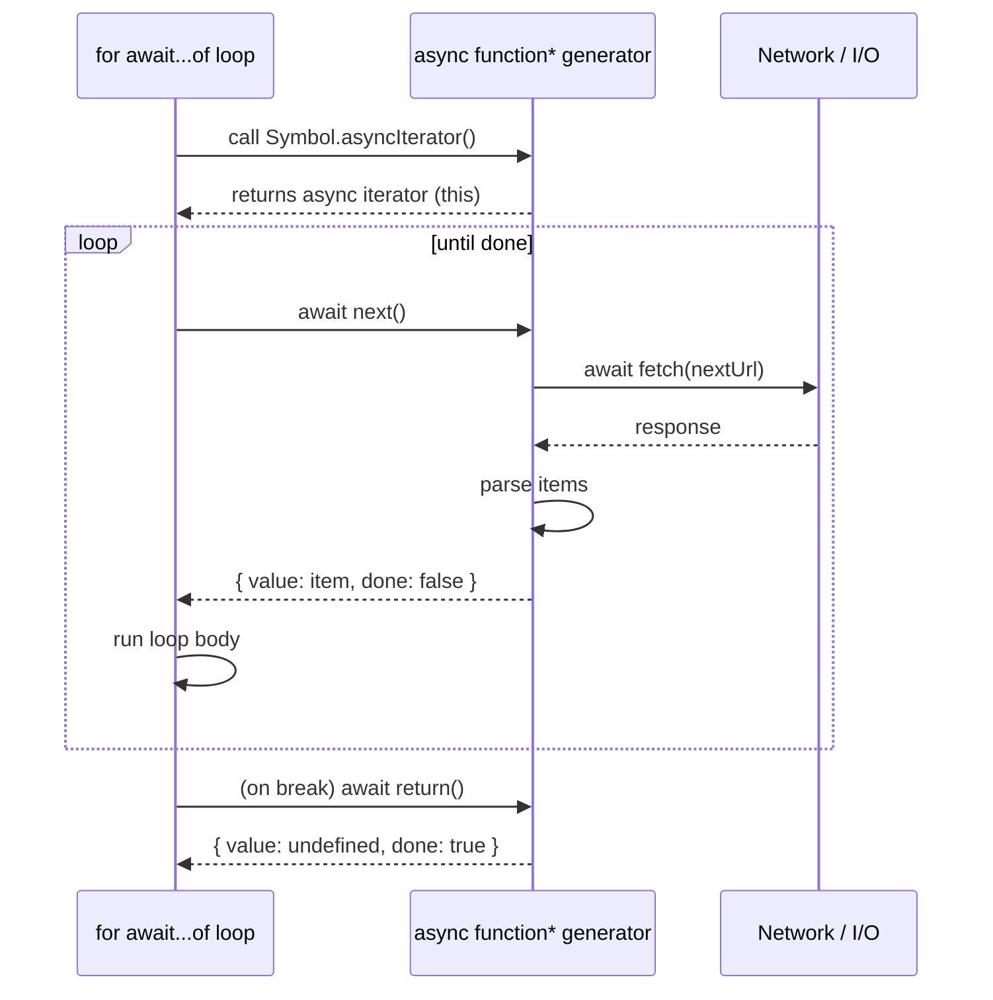
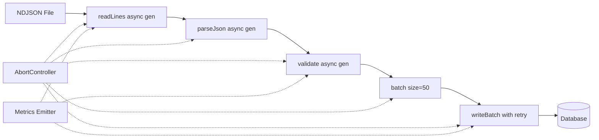

# 1.24 Async Generators and Iterators

> The unifying abstraction for streaming asynchronous data in JavaScript: a cursor where advancing it returns a promise, consumed by a loop that awaits each step.

## 1. Purpose

Synchronous iterators (covered in [[1.23 Generators and Iterators]]) solve one problem cleanly: walk through a finite or infinite sequence of values lazily, on demand, without materializing the entire collection. The protocol is brutally simple. The iterator exposes a `next()` method, `next()` returns `{ value, done }`, and `for...of` calls `next()` repeatedly until `done` is true. That works beautifully for arrays, sets, maps, ranges, and anything else where each value is already in memory.

The protocol breaks the moment the producer needs to do asynchronous work to compute the next value. Imagine you are reading rows from a Postgres cursor, paginating a REST API, draining a TCP socket, or replaying WebSocket messages. Each `next()` step requires awaiting I/O. A sync iterator cannot express this because its `next()` returns `{ value, done }` synchronously — there is no place to put the promise. You could yield promises out of a sync generator (`yield fetch(...)`) and then `await` them in the consumer, but the consumer becomes contorted: every iteration now needs an explicit `await`, and structural patterns like `for...of` no longer compose. The shape of the protocol has subtly fragmented.

Before async iterators were standardised in ES2018, JavaScript developers worked around this in three unsatisfying ways:

1. **Recursive callbacks**. Manually recurse on each `fetch().then(...)` and accumulate results into an outer array. Control flow becomes opaque, stack traces get tangled, and early termination (a `limit` clause, a `take(n)` combinator) must be threaded through every callback.
2. **Event emitters**. Node.js streams historically used `'data'` / `'end'` / `'error'` events. This works, but events push values at the consumer at the producer's pace (no backpressure unless you remember to `.pause()`), errors can fire after `'end'` if you are unlucky, and there is no first-class way to "iterate" a stream — you glue handlers instead of writing a loop.
3. **Observer libraries** (RxJS, Bacon, Most). These solve the problem well but bring a heavy dependency, a steep vocabulary (`Subject`, `BehaviorSubject`, `Operator`, `Scheduler`), and a programming style that does not interoperate with `async/await` natively.

Async iterators were designed to fix exactly this gap. They give JavaScript a single, native protocol for *streams of asynchronously-produced values*. Three things become possible:

- **Pull-based consumption of async data.** The consumer asks for the next value when it is ready; the producer does not push. This is the natural shape for paginated APIs and DB cursors, where pulling is cheap and pushing would require buffering.
- **Backpressure by construction.** Because the consumer pulls, a slow consumer automatically throttles the producer. No `.pause()` / `.resume()` bookkeeping.
- **Unified ergonomics with `async/await`.** You consume an async iterable with `for await...of`, which looks almost identical to `for...of`. The mental model carries over. You can `break`, `continue`, `return`, and `throw` inside the loop body exactly as you would in a sync loop.

The bug class this fixes is large: the manual-recursion / event-emitter spaghetti that historically surrounded streaming data. With async generators, a paginated API client becomes a few lines of straight-line code. A WebSocket consumer becomes a `for await` loop. A file reader becomes an async iterable that yields lines. A DB cursor becomes an async iterable that yields rows. Every one of these can be composed with `yield*`, plumbed through `mapAsync` / `filterAsync` / `takeAsync` operators, and terminated cleanly with `break` — all without a single explicit callback.

This note covers the protocol, the runtime semantics, the production patterns, and the failure modes. By the end you should be able to implement an async generator from scratch, consume Node streams and Web Streams with `for await...of`, build async-iterator pipelines, and convert between async iterables and streams in either direction.

## 2. Theory and Deep Dive

### 2.1 The Async Iterator Protocol

An async iterator is any object with a `next()` method whose return value is a `Promise` resolving to an iterator result:

```ts
interface AsyncIterator<T> {
  next(value?: any): Promise<IteratorResult<T, any>>;
  return?(value?: any): Promise<IteratorResult<T, any>>;
  throw?(error?: any): Promise<IteratorResult<T, any>>;
}

interface IteratorResult<T, TReturn = any> {
  done: boolean;
  value: T | TReturn;
}
```

Contrast with the sync `Iterator` where `next()` returns the result synchronously. Everything else is structurally the same: `{ done, value }`, the optional `return()` and `throw()` methods, the convention that `done: true` carries a final `value` of type `TReturn`.

The `next()` method may also accept an argument. In an async generator, the argument becomes the resolved value of the `await`-expression that the consumer is currently paused at — the same bidirectional channel sync generators have via `yield`. This is rarely used directly, but it is the foundation of advanced patterns like async coroutines and CSP-style channels.

### 2.2 The Async Iterable Protocol

An async iterable is any object with a `[Symbol.asyncIterator]` method that returns an async iterator:

```ts
interface AsyncIterable<T> {
  [Symbol.asyncIterator](): AsyncIterator<T>;
}
```

`Symbol.asyncIterator` is a well-known symbol (see [[1.32 Well-Known Symbols]]) distinct from `Symbol.iterator`. The two protocols are entirely separate: a sync iterable is *not* automatically an async iterable. (Though `for await...of` will accept a sync iterable and wrap each yielded value — see §2.5.)

This separation matters. A `Set` is sync iterable but not async iterable. If you want to consume a `Set` with `for await...of`, the runtime transparently adapts by iterating it synchronously and wrapping each value in a resolved promise. This is convenient, but it means you cannot tell from the call site whether the iteration is genuinely async or just wrapped.

### 2.3 The Async Generator Function

An async generator function is declared with the `async function*` keyword combination:

```js
async function* range(from, to) {
  for (let i = from; i < to; i++) {
    yield i;
  }
}
```

Calling `range(1, 5)` does not run the body. It returns an async generator object — an object that is simultaneously an async iterator and an async iterable (its `[Symbol.asyncIterator]` returns `this`). This mirrors how sync generator functions return sync generator objects.

Inside the body, three constructs are available:

- `yield expr` — pauses the generator, produces `expr` as the next value. If `expr` is a thenable (a promise or promise-like), the runtime awaits it before producing the value. This is the critical difference from sync generators: `yield fetch(url)` in an async generator yields the *resolved response*, not the promise.
- `yield* asyncIterable` — delegates to another async iterable, async generator, or (with adaptation) sync iterable. The outer generator pauses until the inner iterable is exhausted.
- `await expr` — standard async/await, usable anywhere in the body. `await` is for awaiting promises *inside* the generator; `yield` is for producing values *to the consumer*. They are orthogonal and both are common.

The interplay between `await` and `yield` is what makes async generators expressive. A typical body looks like:

```js
async function* paginate(url) {
  let next = url;
  while (next) {
    const res = await fetch(next);     // do async work
    const json = await res.json();
    for (const item of json.items) {
      yield item;                       // produce a value
    }
    next = json.next;
  }
}
```

Note that `await` is used for the network round trips, and `yield` is used to emit each item. The consumer sees a flat stream of items; the pagination mechanics are invisible.

### 2.4 What `yield` Does to a Thenable

This is subtle and worth stating explicitly. In an async generator, the expression after `yield` is evaluated, and if the result is a thenable, the runtime awaits it before resolving the iteration step. Concretely:

```js
async function* g() {
  yield Promise.resolve(1);   // consumer sees 1, not a promise
  yield 2;                    // consumer sees 2
}
```

The promise returned by the generator's `next()` resolves to `{ value: 1, done: false }` for the first yield — *after* the inner promise resolves. This means an async generator that yields promises acts as a sequential awaiter: each promise must resolve before the next value is produced.

This behaviour has a sharp edge: if a yielded promise rejects, the rejection propagates as a rejection of the `next()` promise. The consumer will see it as a thrown error inside `for await...of`. If the consumer does not have a `try/catch` around the loop, you get an unhandled rejection (see §6).

### 2.5 The `for await...of` Loop

`for await...of` is the dedicated consumer of async iterables. Its grammar:

```js
for await (const value of asyncIterable) {
  // value is already awaited
}
```

Semantically, it does the following:

1. Obtains the async iterator by calling `asyncIterable[Symbol.asyncIterator]()` (or, if the object only has `Symbol.iterator`, adapts it).
2. Repeatedly calls `iterator.next()`, awaits the returned promise, and binds `value` to the `value` field of the result.
3. Stops when `done` is true.
4. If the loop exits early (`break`, `return`, `throw`), calls `iterator.return()` if it exists and awaits the result.
5. If the body throws, calls `iterator.return()` and re-throws the error.
6. If `iterator.next()` rejects, the rejection is thrown into the loop body, where a surrounding `try/catch` can handle it.

The loop must appear inside an `async function`, inside an `async generator`, or at the top level of an ES module (where top-level await is enabled). Using it elsewhere is a `SyntaxError`:

```js
// SyntaxError: await is only valid in async functions
for await (const x of things) { console.log(x); }
```

The sequence diagram below shows the handshake between a consumer (`for await...of`) and an async generator.



### 2.6 `yield*` Delegation

`yield*` in an async generator delegates to another async iterable (or, with adaptation, a sync iterable). The outer generator yields each value the inner iterable produces, and forwards any `next(value)` argument, `return()`, or `throw()` calls to the inner iterator.

```js
async function* inner() {
  yield 1;
  yield 2;
}
async function* outer() {
  yield 0;
  yield* inner();   // yields 1, then 2
  yield 3;
}
```

Delegation is the foundation of async-iterator composition. A `concat` operator is literally `for (const it of iterables) yield* it`. A `map` operator is `for await (const x of source) yield f(x)`. The pattern is so consistent that you can build an entire pipeline library out of three-line async generators.

### 2.7 `return()` and `throw()`

Like sync generators, async generators expose `return(value)` and `throw(error)` methods. Both are async — they return promises. The semantics:

- `gen.return(value)` forces the generator to terminate as if a `return value` statement had been inserted at the current pause point. Any pending `try/finally` blocks in the generator body run. The returned promise resolves to `{ value, done: true }`.
- `gen.throw(error)` forces a `throw error` at the current pause point. If the generator catches it and yields another value, the promise resolves to that result. If the generator does not catch it, the promise rejects with `error`.

These methods are the early-termination and error-injection channels. `for await...of` calls `return()` for you on `break`, `return`, `throw`, or body-throw. If you consume an async iterator manually, you must call `return()` yourself — otherwise the generator's `try/finally` cleanup may never run, leaking resources.

### 2.8 Differences from Sync Iterators

| Aspect | Sync Iterator | Async Iterator |
|---|---|---|
| `next()` returns | `{ value, done }` | `Promise<{ value, done }>` |
| Symbol | `Symbol.iterator` | `Symbol.asyncIterator` |
| Consumer loop | `for...of` | `for await...of` |
| Generator syntax | `function*` | `async function*` |
| Context required | Anywhere | `async function`, `async generator`, or top-level await in ESM |
| Spread | `[...iterable]` | `[...asyncIterable]` works in module scope but is racy; use `for await` or `Promise.all` carefully |
| Backpressure | N/A (sync) | Built-in: consumer pulls, producer waits |

### 2.9 Node Streams, Web Streams, and Async Iterables

Since Node.js 10, all `Readable` streams are async iterables. You can do `for await (const chunk of readableStream)` directly. The stream's `[Symbol.asyncIterator]` is implemented in terms of the underlying `'data'` / `'end'` / `'error'` events, with proper backpressure: the loop pauses on each `next()` call, which means the consumer's await is the backpressure signal. The stream does not push the next chunk until the consumer asks for it.

Web Streams (`ReadableStream` from the `web-streams-polyfill` package, or native in browsers and Node 16+ and Deno) gained async-iterable support later — `ReadableStream.prototype.values()` returns an async iterator, and since the WHATWG spec revision, `ReadableStream` itself implements `Symbol.asyncIterator` as an alias for `values()`. The mental model is identical to Node streams.

This means the same `for await...of` loop works on:

- Node.js `Readable` (file streams, HTTP request bodies, process.stdin, zlib streams)
- Web `ReadableStream` (fetch response bodies, service worker streams, transform streams)
- Custom async generators you write yourself
- Anything that exposes `[Symbol.asyncIterator]`

The unification is the point. Once a source is async iterable, every consumer pattern (map, filter, take, batch, debounce) becomes available regardless of where the data came from.

## 3. Mental Models

Grasping async iterators usually requires holding three mental models simultaneously and watching them interlock.

**Model 1 — The cursor that returns a promise.** An async iterator is a cursor over a sequence of values. You ask it for the next value with `next()`. Unlike a sync cursor, the answer comes back as a promise: "I will tell you the next value when I have computed it." The consumer's `await` is the act of waiting for the cursor to advance. If the cursor is at the end of a network buffer, that `await` is a network round trip. If the cursor is at a queue of buffered items, that `await` is microtask-fast. The shape of the protocol is unchanged; only the latency of each step varies.

**Model 2 — The function you can pause and resume, with awaits.** An async generator is a function whose body you can pause mid-execution. Each `yield` is a pause point. When the consumer calls `next()`, the function runs until the next `yield` (or `return`), then pauses. The crucial addition over sync generators is that the body can contain `await` expressions, and each `await` blocks *only that generator's* advancement — not the entire event loop, not the consumer's other concurrent work. The async runtime parks the generator until the awaited promise resolves, then resumes it. From the consumer's perspective, the generator just took a long time to produce the next value.

**Model 3 — The stream of async values.** An async iterable is a stream. Values arrive over time. You consume it with `for await...of`, which is `for...of` with an `await` on each iteration. The loop body runs once per value, after that value has resolved. `break` ends the stream early. `return` ends it and yields a final value. `throw` injects an error into the producer. The same patterns you would use on a synchronous iterable (early termination, transformation, aggregation) work, just with each step wrapped in a promise.

**Model 4 — The bridge between push and pull.** Async generators are the natural bridge between push-based APIs (event emitters, WebSocket `onmessage`, `process.stdin.on('data')`) and pull-based consumers (`async/await` style code). You write a tiny adapter that subscribes to the push API and feeds values into a queue, then exposes an async iterator that pulls from the queue. The consumer writes `for await (const msg of wsMessages(socket))` and the push/pull impedance mismatch disappears. This pattern is so common that Node.js ships `events.on(emitter, eventName)` which returns exactly such an async iterator.

**Model 5 — Composable lazy pipelines.** Because async generators are lazy (the body only runs as `next()` is called), you can chain them: source → map → filter → take. Each stage is a small async generator that pulls from the previous stage. No data is buffered between stages. If the consumer breaks out of the final `take(10)`, the break propagates back through every stage via `return()`, all the way to the source. This is the same architecture as lazy sequences in Clojure or generators in Python, just async.

## 4. Real-World Use Cases

Async iterators are not a niche feature. They are the standard way to handle streaming data in modern JavaScript, and they appear in production code across the ecosystem.

**1. Node.js Readable streams.** Every `Readable` — `fs.createReadStream`, `http.IncomingMessage`, `zlib.Gunzip`, `process.stdin`, custom streams built with the Streams API — is async iterable. The idiomatic way to read a file in modern Node is:

```js
import { createReadStream } from 'node:fs';
for await (const chunk of createReadStream('./big.csv')) {
  parseChunk(chunk);
}
```

No `'data'` listener, no `.pause()`, no stream-mode confusion (`flowing` vs `paused`). The loop is the consumer; the stream is the producer; backpressure is automatic.

**2. Web Streams (fetch bodies, transform streams).** The `body` of a `fetch` Response is a `ReadableStream<Uint8Array>`. Consuming it with `for await` gives you incremental chunks as they arrive over the network — essential for large downloads, streaming JSON parsers, and SSE-style endpoints:

```js
const res = await fetch('https://api.example.com/stream');
for await (const chunk of res.body) {
  handleChunk(chunk);
}
```

In Node 18+ this works natively; in older environments you may need `Readable.fromWeb(res.body)` to adapt.

**3. Paginated REST APIs.** Most REST APIs expose list endpoints with cursor or offset pagination: `?page=1`, `?cursor=abc`, or `Link: rel="next"` headers. An async generator turns this into a flat stream of items:

```js
async function* allIssues(owner, repo) {
  let page = 1;
  while (true) {
    const res = await fetch(`https://api.github.com/repos/${owner}/${repo}/issues?page=${page}`);
    if (!res.ok) throw new Error(`HTTP ${res.status}`);
    const items = await res.json();
    if (items.length === 0) return;
    for (const item of items) yield item;
    page += 1;
  }
}
```

The consumer does `for await (const issue of allIssues('nodejs', 'node'))` and sees a flat stream of issues, never knowing pagination exists. Adding a `take(50)` upstream stops fetching once 50 items have been seen — the `break` propagates back, the generator's `try/finally` cleans up, and no further pages are requested.

**4. WebSocket message streams.** A WebSocket pushes messages via `onmessage`. Wrapping it as an async iterable lets you consume messages with `for await`:

```js
function wsMessages(socket) {
  return {
    [Symbol.asyncIterator]() {
      const queue = [];
      let resolveNext = null;
      const onMessage = (ev) => {
        if (resolveNext) {
          resolveNext({ value: ev.data, done: false });
          resolveNext = null;
        } else {
          queue.push(ev.data);
        }
      };
      socket.addEventListener('message', onMessage);
      return {
        next() {
          if (queue.length) return Promise.resolve({ value: queue.shift(), done: false });
          return new Promise(resolve => { resolveNext = resolve; });
        },
        return() {
          socket.removeEventListener('message', onMessage);
          return Promise.resolve({ value: undefined, done: true });
        }
      };
    }
  };
}
```

In Node, `events.on(socket, 'message')` does this for any `EventEmitter` — the pattern is so universal it was standardised.

**5. Database cursors.** Postgres, MySQL, MongoDB, and most other databases expose cursor-based fetching for large result sets. A driver-level async iterable hides the cursor entirely:

```js
const cursor = await db.collection('users').find({ active: true }).batchSize(100);
for await (const user of cursor) {
  await processUser(user);
}
```

MongoDB's Node driver supports this directly. Postgres's `pg-cursor` package and Prisma's cursor API offer similar shapes.

**6. File line readers.** Node's `readline` module returns an async iterable:

```js
import { createInterface } from 'node:readline';
import { createReadStream } from 'node:fs';
const rl = createInterface({ input: createReadStream('./big.log'), crlfDelay: Infinity });
for await (const line of rl) {
  inspect(line);
}
```

This is the canonical way to process a multi-gigabyte log file in Node without loading it into memory.

**7. Server-Sent Events.** An SSE endpoint is a long-lived HTTP response with `Content-Type: text/event-stream`. Fetching it with `for await` over the response body, then parsing the SSE framing, gives you an async iterable of events. This is how you build real-time dashboards, chat clients, and LLM token streams (OpenAI's streaming completions use SSE).

**8. Transform pipelines.** Compose async generators into a pipeline: read file → split lines → parse JSON → validate schema → batch writes. Each stage is a small async generator. The pipeline is lazy, has automatic backpressure, and can be terminated early by the consumer with a `break`. This is the architecture of ETL jobs, log processors, and CDC (Change Data Capture) systems.

**9. LLM token streams.** Modern LLM APIs (OpenAI, Anthropic, Gemini) stream completion tokens via SSE. Client SDKs wrap these as async iterables:

```js
const stream = await openai.chat.completions.create({ model: 'gpt-4', messages, stream: true });
for await (const chunk of stream) {
  process.stdout.write(chunk.choices[0]?.delta?.content ?? '');
}
```

The async iterable is the natural abstraction: tokens arrive asynchronously, you consume them as they do, the loop ends when the model finishes.

**10. Concurrency patterns.** Async iterators compose with concurrency primitives. You can wrap an async iterable in a `parallelMap(n, fn)` that processes up to `n` items concurrently while preserving order. You can build a `merge(iterables)` that combines multiple async iterables into one. You can implement a `debounce(ms)` over an event-derived async iterable. These are the building blocks of streaming data systems.

## 5. Code Examples

### 5.1 Example A — Minimal and Conceptual

A paginated GitHub issues fetcher, consumed by `for await...of`. The generator yields each issue as a flat stream; the consumer prints the first 10 and breaks.

**JavaScript:**

```js
// paginate.js — JS, ESM
async function* paginate(url) {
  let next = url;
  while (next) {
    const res = await fetch(next);
    if (!res.ok) throw new Error(`HTTP ${res.status}`);
    const json = await res.json();
    for (const item of json.items) yield item;
    next = json.next;   // hypothetical next-page cursor
  }
}

async function main() {
  let count = 0;
  const src = paginate('https://api.example.com/search?type=repo');
  try {
    for await (const item of src) {
      console.log(item.id);
      if (++count >= 10) break;
    }
  } catch (err) {
    console.error('stream failed:', err);
  }
}
main();
```

**TypeScript:**

```ts
// paginate.ts — TS, ESM
interface Item { id: string; name: string; }
interface Page { items: Item[]; next?: string; }

async function* paginate(url: string): AsyncGenerator<Item, void, unknown> {
  let next: string | undefined = url;
  while (next) {
    const res = await fetch(next);
    if (!res.ok) throw new Error(`HTTP ${res.status}`);
    const json: Page = await res.json();
    for (const item of json.items) yield item;
    next = json.next;
  }
}

async function main(): Promise<void> {
  let count = 0;
  const src: AsyncIterable<Item> = paginate('https://api.example.com/search?type=repo');
  try {
    for await (const item of src) {
      console.log(item.id);
      if (++count >= 10) break;
    }
  } catch (err) {
    console.error('stream failed:', err);
  }
}
main();
```

Both versions do exactly the same work. The TypeScript version adds type safety on the `Item` and `Page` shapes and annotates the return type as `AsyncGenerator<Item, void, unknown>` — the standard signature for an async generator that yields `Item`, returns nothing (`void`), and accepts no `next(value)` argument (`unknown`).

### 5.2 Example B — Production-Grade

A streaming ETL pipeline: read a file line by line, parse each line as JSON, validate against a schema, batch into groups of 50, and write each batch to a mock database. The pipeline is built entirely from small async generators composed with `yield*`. Errors are surfaced, retries are attempted, and backpressure is automatic.

**JavaScript:**

```js
// etl.js — JS, ESM, Node 18+
import { createReadStream } from 'node:fs';
import { createInterface } from 'node:readline';
import { setTimeout as sleep } from 'node:timers/promises';

// Source: lines from a file as an async iterable
function* readLines(path) {
  // createInterface already returns an async iterable, but we wrap it
  // so we can add logging and error context.
  const rl = createInterface({ input: createReadStream(path), crlfDelay: Infinity });
  try {
    for await (const line of rl) yield line;
  } finally {
    rl.close();
  }
}

// Transform: parse JSON, skip malformed lines but count them
async function* parseJson(lines) {
  let skipped = 0;
  for await (const line of lines) {
    try {
      yield JSON.parse(line);
    } catch {
      skipped += 1;
      if (skipped <= 3) console.warn('skipped malformed line');
    }
  }
  if (skipped) console.warn(`total skipped: ${skipped}`);
}

// Transform: validate each record has the required shape
async function* validate(records, requiredFields) {
  for await (const rec of records) {
    if (requiredFields.every(f => rec && typeof rec === 'object' && f in rec)) {
      yield rec;
    }
  }
}

// Transform: batch into groups of N
async function* batch(items, size) {
  let buf = [];
  for await (const item of items) {
    buf.push(item);
    if (buf.length >= size) {
      yield buf;
      buf = [];
    }
  }
  if (buf.length) yield buf;
}

// Sink: mock DB writer with retry
async function writeBatch(batch, attempt = 1) {
  // Simulate occasional flakiness
  if (Math.random() < 0.1 && attempt < 3) {
    throw new Error('transient DB error');
  }
  await sleep(10);
  console.log(`wrote ${batch.length} records`);
}

// Pipeline runner
async function run(path) {
  const pipeline = batch(validate(parseJson(readLines(path)), ['id', 'type']), 50);
  let total = 0;
  for await (const b of pipeline) {
    for (let attempt = 1; attempt <= 3; attempt++) {
      try {
        await writeBatch(b, attempt);
        total += b.length;
        break;
      } catch (err) {
        if (attempt === 3) throw err;
        await sleep(50 * attempt);
      }
    }
  }
  console.log(`done, total records: ${total}`);
}

run('./data/events.ndjson').catch(err => {
  console.error('pipeline failed:', err);
  process.exit(1);
});
```

**TypeScript:**

```ts
// etl.ts — TS, ESM, Node 18+, strict
import { createReadStream } from 'node:fs';
import { createInterface } from 'node:readline';
import { setTimeout as sleep } from 'node:timers/promises';

interface EventRecord {
  id: string;
  type: string;
  [key: string]: unknown;
}

type LineSource = AsyncIterable<string>;
type RecordSource = AsyncIterable<EventRecord>;
type BatchSource = AsyncIterable<EventRecord[]>;

async function* readLines(path: string): AsyncGenerator<string, void, unknown> {
  const rl = createInterface({ input: createReadStream(path), crlfDelay: Infinity });
  try {
    for await (const line of rl) yield line;
  } finally {
    rl.close();
  }
}

async function* parseJson(lines: LineSource): AsyncGenerator<EventRecord, void, unknown> {
  let skipped = 0;
  for await (const line of lines) {
    try {
      yield JSON.parse(line) as EventRecord;
    } catch {
      skipped += 1;
      if (skipped <= 3) console.warn('skipped malformed line');
    }
  }
  if (skipped) console.warn(`total skipped: ${skipped}`);
}

async function* validate(
  records: AsyncIterable<EventRecord>,
  requiredFields: ReadonlyArray<keyof EventRecord>
): RecordSource {
  for await (const rec of records) {
    if (rec && typeof rec === 'object' && requiredFields.every(f => f in rec)) {
      yield rec;
    }
  }
}

async function* batch(items: RecordSource, size: number): BatchSource {
  let buf: EventRecord[] = [];
  for await (const item of items) {
    buf.push(item);
    if (buf.length >= size) {
      yield buf;
      buf = [];
    }
  }
  if (buf.length) yield buf;
}

async function writeBatch(b: EventRecord[], attempt = 1): Promise<void> {
  if (Math.random() < 0.1 && attempt < 3) {
    throw new Error('transient DB error');
  }
  await sleep(10);
  console.log(`wrote ${b.length} records`);
}

async function run(path: string): Promise<void> {
  const pipeline: BatchSource = batch(
    validate(parseJson(readLines(path)), ['id', 'type'] as const),
    50
  );
  let total = 0;
  for await (const b of pipeline) {
    for (let attempt = 1; attempt <= 3; attempt++) {
      try {
        await writeBatch(b, attempt);
        total += b.length;
        break;
      } catch (err) {
        if (attempt === 3) throw err;
        await sleep(50 * attempt);
      }
    }
  }
  console.log(`done, total records: ${total}`);
}

run('./data/events.ndjson').catch((err: unknown) => {
  console.error('pipeline failed:', err);
  process.exit(1);
});
```

A few things to notice about the production version:

- **Every stage is a small async generator** with one responsibility. Each is independently testable.
- **Backpressure is automatic.** `batch` only pulls when the consumer pulls. `validate` only pulls when `batch` pulls. `readLines` only reads when `validate` pulls. If `writeBatch` is slow, the entire chain slows down — exactly what you want.
- **Early termination propagates.** If you `break` out of the `for await` loop in `run`, `batch.return()` is called, which calls `validate.return()`, which calls `parseJson.return()`, which calls `readLines.return()`, which runs the `finally` that closes `rl`. The file descriptor is released. No leak.
- **Errors propagate as rejections.** A thrown error inside any stage becomes a rejection of that stage's `next()` promise, which surfaces as a `throw` inside the consumer's `for await`. The `try/catch` in `run` catches DB errors locally; non-recoverable errors escape to the top-level `.catch`.
- **TypeScript narrows the streaming types.** `AsyncGenerator<string, void, unknown>` for the line source, `AsyncIterable<EventRecord>` for the record stream, `AsyncIterable<EventRecord[]>` for the batch stream. The types document the pipeline's shape at every stage.

## 6. Common Mistakes and Anti-Patterns

Async iterators look like sync iterators but they are not. The differences are easy to underestimate. Below are the failure modes I have seen most often in production code reviews.

### 6.1 `for await...of` Outside an Async Function

This is a `SyntaxError` at parse time. The `await` keyword is only valid inside an async context, and `for await...of` is no exception.

```js
// SyntaxError: await is only valid in async functions and the top level bodies of modules
function consume(stream) {
  for await (const x of stream) console.log(x);
}
```

**Fix:** mark the function `async`:

```js
async function consume(stream) {
  for await (const x of stream) console.log(x);
}
```

In ESM, top-level `for await...of` is allowed directly (because top-level await is enabled). In CommonJS, it is not — you must wrap in an async IIFE or use `Promise` chaining.

### 6.2 Forgetting to Handle Errors in the Async Iterable

If `next()` rejects and the consumer has no `try/catch` around the `for await`, the rejection becomes an unhandled rejection. In Node, this prints a warning and (depending on the `--unhandled-rejections` flag) may crash the process.

```js
async function* bad() {
  yield 1;
  throw new Error('boom');
}
// Silently blows up with an unhandled rejection
async function main() {
  for await (const x of bad()) console.log(x);
}
```

**Fix:** wrap the loop in `try/catch`:

```js
async function main() {
  try {
    for await (const x of bad()) console.log(x);
  } catch (err) {
    console.error('caught:', err);
  }
}
```

Better yet, ensure the source has a `finally` that cleans up (closes the file, releases the cursor, unsubscribes the listener). `for await...of` runs the generator's `finally` blocks even on early termination, but only if `return()` is called — which it is, automatically, on `break` or on a thrown error.

### 6.3 Not Calling `return()` on Early Break (Manual Consumption)

When you consume an async iterator *manually* (not via `for await...of`), you must call `return()` yourself on early termination. Otherwise the generator's `try/finally` cleanup never runs, leaking resources.

```js
async function manualConsume(iter) {
  while (true) {
    const { value, done } = await iter.next();
    if (done) break;
    if (shouldStop(value)) {
      // BUG: iter.return() never called — finally blocks do not run
      break;
    }
    handle(value);
  }
}
```

**Fix:**

```js
async function manualConsume(iter) {
  try {
    while (true) {
      const { value, done } = await iter.next();
      if (done) break;
      if (shouldStop(value)) break;
      handle(value);
    }
  } finally {
    await iter.return?.();
  }
}
```

`for await...of` does this automatically. Use it whenever possible.

### 6.4 Using `for...of` on an Async Iterable (Gets Promises, Not Values)

A sync `for...of` loop on an async iterable calls `Symbol.iterator`, not `Symbol.asyncIterator`. If the object only implements `Symbol.asyncIterator`, you get a `TypeError: x is not iterable`. If the object happens to also implement `Symbol.iterator` (rare but possible), you get the raw `{ value, done }` objects or, worse, promises yielded out of a sync generator — and your loop body has no `await`, so it sees promises where it expects values.

```js
async function* g() { yield 1; yield 2; }
// Bug: g()[Symbol.iterator] is undefined — TypeError
for (const x of g()) console.log(x);
```

**Fix:** use `for await...of`:

```js
for await (const x of g()) console.log(x);
```

### 6.5 Yielding a Promise That Rejects (Unhandled Rejection in the Consumer)

In an async generator, `yield somePromise` awaits `somePromise` before producing the value. If `somePromise` rejects, the rejection surfaces as a rejection of the `next()` call. If the consumer does not catch it, you get an unhandled rejection.

```js
async function* g() {
  yield Promise.reject(new Error('boom'));
}
// Unhandled rejection if no try/catch
for await (const x of g()) console.log(x);
```

**Fix:** either catch inside the generator, or ensure the consumer has a `try/catch`:

```js
async function* g() {
  try {
    yield await fetch('/flaky');
  } catch (err) {
    console.warn('skipping failed fetch:', err);
  }
}
```

Note the difference between `yield fetch(url)` and `yield await fetch(url)`. In an async generator, both await the promise before producing the value, but the explicit `await` makes the intent obvious and gives you a place to attach a `try/catch`.

### 6.6 Async Iterables Cannot Be Consumed by `Promise.all` Directly

`Promise.all` takes an array (or any iterable) of promises. An async iterable is *not* an array — calling `Promise.all(asyncIterable)` will not work as you might hope. `Promise.all` will try to iterate the async iterable synchronously via `Symbol.iterator`, which either throws or yields nothing useful.

```js
async function* g() { yield 1; yield 2; yield 3; }
// BUG: Promise.all tries Symbol.iterator, not Symbol.asyncIterator
// Either throws or returns []
Promise.all(g()).then(results => console.log(results));
```

**Fix:** if you genuinely want to materialize all values into an array (and you can afford to buffer them all in memory), use a helper:

```js
async function toArray(ai) {
  const arr = [];
  for await (const x of ai) arr.push(x);
  return arr;
}
```

Or, if you want *concurrent* processing of an async iterable (not just collecting), use a bounded-concurrency pattern (see §7.6). Do not reach for `Promise.all` directly — it defeats the entire purpose of streaming.

### 6.7 Mixing `return` of a Promise and `yield`

`return somePromise` in an async generator returns `somePromise` as the final `value`. The `value` is *not* awaited — it is delivered as-is. If you intended to await it, you must `return await somePromise`.

```js
async function* g() {
  yield 1;
  return fetch('/final');   // consumer gets a Promise as the final value
}
async function* g2() {
  yield 1;
  return await fetch('/final');  // consumer gets a Response
}
```

### 6.8 Forgetting That `yield*` to a Sync Iterable Works but Yields Values Synchronously

`yield*` in an async generator can delegate to a sync iterable. The values are yielded as-is (not wrapped in promises). This is usually fine but can surprise you if the sync iterable yields promises — those promises are *passed through* without being awaited, because the delegation machinery does not know it is inside an async context.

```js
async function* g() {
  yield* [Promise.resolve(1), Promise.resolve(2)];   // yields the raw promises
}
// Consumer sees Promise objects, not 1 and 2
for await (const x of g()) console.log(x);
```

**Fix:** iterate explicitly and `yield await`:

```js
async function* g() {
  for (const p of [Promise.resolve(1), Promise.resolve(2)]) yield await p;
}
```

### 6.9 Holding the Iterator Open Indefinitely

If you consume an async iterator manually and never call `next()` again (because you got distracted by another task), the generator stays paused. Any `try/finally` it has does not run. Any file descriptor it holds stays open. Any event listener it registered stays attached.

**Fix:** always either exhaust the iterator, call `return()`, or use `for await...of` (which handles termination correctly on `break`, `return`, and `throw`).

## 7. Best Practices and Design Patterns

### 7.1 Use `for await...of` for Sequential Async Consumption

`for await...of` is the right tool when you want to process items one at a time, in order, with each step awaiting the previous. It handles `return()` on `break`, propagates errors cleanly, and reads as naturally as a sync `for...of`. Reach for it by default.

### 7.2 Use Async Generators to Bridge Push-Based APIs

Event emitters, WebSockets, `process.stdin`, DOM events — these are push-based. Wrapping them as async iterables lets you consume them with `async/await` style:

```js
function clickStream(el) {
  return {
    [Symbol.asyncIterator]() {
      const queue = [];
      let resolveNext = null;
      const onClick = (ev) => {
        if (resolveNext) { resolveNext({ value: ev, done: false }); resolveNext = null; }
        else queue.push(ev);
      };
      el.addEventListener('click', onClick);
      return {
        next() {
          if (queue.length) return Promise.resolve({ value: queue.shift(), done: false });
          return new Promise(r => { resolveNext = r; });
        },
        return() {
          el.removeEventListener('click', onClick);
          return Promise.resolve({ value: undefined, done: true });
        }
      };
    }
  };
}
```

In Node, prefer `events.on(emitter, eventName)` — it is built-in, tested, and handles edge cases (like the `AbortSignal` for cancellation).

### 7.3 Always Handle Errors in Async Iteration

Wrap `for await` loops in `try/catch` unless you have a specific reason not to. Errors in async iteration are easy to miss because they manifest as rejections of the implicit `next()` promise, which do not have a call site in your code. A `try/catch` around the loop is the only way to be sure you see them.

### 7.4 Use `return()` for Early Termination

If you must consume an async iterator manually, wrap the consumption in `try/finally` and call `return()` in the `finally`. This guarantees the generator's cleanup runs even on early termination or error:

```js
const iter = source[Symbol.asyncIterator]();
try {
  while (true) {
    const { value, done } = await iter.next();
    if (done) break;
    if (shouldStop(value)) break;
    handle(value);
  }
} finally {
  await iter.return?.();
}
```

### 7.5 In TypeScript, Type Async Iterables as `AsyncIterable<T>` and `AsyncIterator<T>`

The built-in lib types are correct and well-named. Use them:

```ts
async function* gen(): AsyncGenerator<number, void, unknown> { yield 1; }
const iter: AsyncIterator<number> = gen();
const iterable: AsyncIterable<number> = gen();
```

`AsyncGenerator<TYield, TReturn, TNext>` is the more specific type for objects returned by `async function*`. Use it when you want to be precise. Use `AsyncIterable<T>` when you only need to consume.

### 7.6 Use `Readable.from(iterable)` to Convert an Async Iterable to a Node Stream

Node.js's `Readable.from` (in `node:stream`) accepts any async iterable (or sync iterable) and returns a `Readable` stream. This is the bridge from async-iterable land back to stream land — useful when you need to pipe data into a stream-consuming API:

```js
import { Readable } from 'node:stream';
async function* source() { yield 'a'; yield 'b'; yield 'c'; }
const readable = Readable.from(source());
readable.pipe(process.stdout);
```

The reverse direction (`Readable` → async iterable) is built-in: every `Readable` is already async iterable.

### 7.7 Use `AbortSignal` for Cancellation

For long-running async iterables, accept an `AbortSignal` and check it on each iteration. This gives consumers a uniform way to cancel:

```js
async function* poll(url, signal) {
  while (!signal.aborted) {
    const res = await fetch(url, { signal });
    const json = await res.json();
    yield json;
    await sleep(1000, { signal });
  }
}
```

`fetch` and `setTimeout` both accept `signal`; passing it through lets one `AbortController.abort()` cancel the entire pipeline.

### 7.8 Build a Small Operator Library

Async-iterator operators are tiny. Build a small library once and reuse it:

```js
async function* mapAsync(source, fn) {
  for await (const x of source) yield await fn(x);
}
async function* filterAsync(source, pred) {
  for await (const x of source) if (await pred(x)) yield x;
}
async function* takeAsync(source, n) {
  let i = 0;
  for await (const x of source) {
    if (i++ >= n) return;
    yield x;
  }
}
async function* concatAsync(...sources) {
  for (const s of sources) yield* s;
}
async function* flatMapAsync(source, fn) {
  for await (const x of source) yield* fn(x);
}
```

These five operators cover most pipeline needs. Each is five lines. Each composes. This is the foundation of libraries like `ixjs` and `iter-tools`.

### 7.9 Implement Bounded Concurrency with a Worker Pool

When you need *concurrent* processing of an async iterable (e.g., fetch N URLs from a stream with up to 5 in-flight at once), use a worker-pool pattern that pulls from the iterable and processes items in parallel while preserving order (or not, depending on requirements):

```js
async function parallelMap(source, fn, concurrency) {
  const results = new Map();
  const iterators = [];
  let index = 0;
  let nextPromise = source[Symbol.asyncIterator]().next();
  for (let i = 0; i < concurrency; i++) {
    iterators.push((async () => {
      while (true) {
        const current = index++;
        const { value, done } = await nextPromise;
        if (done) return;
        nextPromise = source[Symbol.asyncIterator]().next(); // race ahead
        results.set(current, await fn(value));
      }
    })());
  }
  await Promise.all(iterators);
  return [...results.values()];
}
```

(This is a sketch — the exact semantics depend on whether you need order preservation, backpressure, and graceful cancellation. See §9 Exercise 2 for a cleaner version.)

### 7.10 Use `try/finally` Inside Async Generators for Resource Cleanup

The `finally` block of an async generator runs when the generator is closed — either by exhausting it, by `return()`, or by `throw()`. Use it to release file descriptors, close cursors, unsubscribe listeners:

```js
async function* readWithCleanup(path) {
  const fd = await open(path, 'r');
  try {
    while (true) {
      const chunk = await readChunk(fd);
      if (!chunk) return;
      yield chunk;
    }
  } finally {
    await close(fd);
  }
}
```

`for await...of` calls `return()` on `break`, which runs the `finally`. This is the only way to guarantee cleanup of resources held by an async generator across all termination paths.

## 8. Technical Interview Knowledge

Eight questions and answers calibrated for mid-to-senior JavaScript interviews.

**Q1 — What is `Symbol.asyncIterator`?**

`Symbol.asyncIterator` is a well-known symbol (registered in `Symbol.registry` and exposed as `Symbol.asyncIterator`) that specifies the method an object must implement to be async iterable. An object is async iterable if it has a method keyed by `Symbol.asyncIterator` that returns an async iterator — an object whose `next()` method returns `Promise<IteratorResult<T>>`. It is distinct from `Symbol.iterator`; the two protocols do not share implementations. `for await...of` looks up `Symbol.asyncIterator` first; if absent, it falls back to `Symbol.iterator` and adapts.

**Q2 — How does `for await...of` differ from `for...of`?**

`for await...of` consumes async iterables. Each call to `iterator.next()` is awaited before binding the value. The loop must be inside an async function or ESM top-level scope (a `SyntaxError` otherwise). It also calls `iterator.return()` (if present) on early termination via `break`, `return`, or `throw`, and on errors thrown in the loop body. `for...of` is synchronous, does not await, and does not require an async context. `for await...of` will accept a sync iterable (adapting each yielded value into a resolved promise), but `for...of` will *not* accept a purely async iterable.

**Q3 — Can you `yield*` from an async generator to a sync iterable?**

Yes. `yield*` in an async generator accepts any iterable (sync or async). When the operand is sync iterable, the values are yielded as-is, without being wrapped or awaited. This is usually what you want for arrays of plain values. It is *not* what you want if the sync iterable yields promises that you wanted awaited — those promises will be passed through raw. To await each, iterate explicitly with `for (const p of syncIterable) yield await p`.

**Q4 — How do you consume a Node stream with `for await...of`?**

```js
import { createReadStream } from 'node:fs';
for await (const chunk of createReadStream('./file')) {
  console.log(chunk.length);
}
```

Every `Readable` is async iterable since Node 10. The `[Symbol.asyncIterator]` implementation internally uses the stream's events, with proper backpressure: the loop pauses on each `next()` until the consumer's `await` resolves, so a slow consumer automatically throttles the stream. On `break`, the loop calls `iterator.return()`, which destroys the stream. Errors emitted by the stream (`'error'` event) become rejections of the `next()` promise, surfacing as `throw` inside the loop.

**Q5 — Implement an async generator for paginated API.**

```js
async function* paginate(baseUrl) {
  let url = baseUrl;
  while (url) {
    const res = await fetch(url);
    if (!res.ok) throw new Error(`HTTP ${res.status}`);
    const body = await res.json();
    for (const item of body.items) yield item;
    url = body.next;   // or parse Link header
  }
}
```

Optional refinements: rate-limit via `await sleep(ms)` between pages, retry on transient failures, accept an `AbortSignal`, accept a `transform` function for each item, support a `take(n)` early break by simply `break`-ing in the consumer.

**Q6 — How do errors propagate in async iteration?**

Three sources of errors:

1. **Errors thrown inside the generator body.** These cause the current `next()` promise to reject. The consumer sees them as `throw` inside `for await...of`. If the generator has a `try/catch`, it can catch and recover (yield a fallback value or re-throw).
2. **Errors thrown by `iterator.throw(err)`.** The error is injected at the current pause point. Same handling as (1).
3. **Rejections of yielded promises.** `yield somePromise` awaits `somePromise`; if it rejects, the rejection becomes the rejection of `next()`. Same as (1).

In all cases, `for await...of` calls `iterator.return()` after the error propagates out of the loop body, ensuring the generator's `finally` blocks run. If the consumer has no `try/catch`, the error escapes as an unhandled rejection.

**Q7 — Can you use `Promise.all` with an async iterable?**

Not directly. `Promise.all` expects a sync iterable of promises. An async iterable is not a sync iterable (it has `Symbol.asyncIterator`, not `Symbol.iterator`). Calling `Promise.all(asyncIterable)` either throws (`x is not iterable`) or iterates nothing.

To collect all values: `for await (const x of ai) arr.push(x)`. To run them concurrently: materialize into an array first (if it fits in memory), then `Promise.all(arr.map(fn))`. To run with bounded concurrency: use a worker-pool pattern (see §7.9). If memory is a concern, prefer sequential `for await` with bounded concurrency over full materialisation.

**Q8 — How do you convert an async iterable to an array?**

There is no built-in `Array.fromAsync` in older runtimes (it landed in ES2024). Use a helper:

```js
async function toArray(ai) {
  const arr = [];
  for await (const x of ai) arr.push(x);
  return arr;
}
```

In modern environments (Node 22+, Chrome 122+, Safari 17.5+), `Array.fromAsync(asyncIterable)` works natively. Be cautious: materialising an unbounded async iterable (e.g., an infinite generator) into an array will hang or OOM. Use a `take(n)` upstream.

## 9. Practical Exercises

### Exercise 1 — Implement an Async Generator That Paginates a REST API

**Task:** Write an async generator `paginateIssues(owner, repo, token)` that yields every issue from the GitHub Issues API, handling pagination via the `Link` header. Support an `AbortSignal`.

**JavaScript Solution:**

```js
// exercise1.js
async function* paginateIssues(owner, repo, token, signal) {
  let url = `https://api.github.com/repos/${owner}/${repo}/issues?state=all&perPage=100`;
  while (url) {
    const res = await fetch(url, {
      headers: { Authorization: `Bearer ${token}`, Accept: 'application/vnd.github+json' },
      signal
    });
    if (res.status === 403) {
      const reset = Number(res.headers.get('x-ratelimit-reset')) * 1000;
      const wait = Math.max(0, reset - Date.now());
      await new Promise(r => setTimeout(r, Math.min(wait, 60000)));
      continue;
    }
    if (!res.ok) throw new Error(`HTTP ${res.status}`);
    const items = await res.json();
    for (const item of items) yield item;
    url = parseNextLink(res.headers.get('link'));
  }
}

function parseNextLink(linkHeader) {
  if (!linkHeader) return null;
  const match = linkHeader.match(/<([^>]+)>;\s*rel="next"/);
  return match ? match[1] : null;
}

async function main() {
  const token = process.env.GHTOKEN;
  let count = 0;
  for await (const issue of paginateIssues('nodejs', 'node', token)) {
    console.log(issue.number, issue.title);
    if (++count >= 25) break;
  }
}
main();
```

**TypeScript Solution:**

```ts
// exercise1.ts
interface Issue {
  number: number;
  title: string;
  state: 'open' | 'closed';
  // ...
}

async function* paginateIssues(
  owner: string,
  repo: string,
  token: string,
  signal?: AbortSignal
): AsyncGenerator<Issue, void, unknown> {
  let url: string | null = `https://api.github.com/repos/${owner}/${repo}/issues?state=all&perPage=100`;
  while (url) {
    const res = await fetch(url, {
      headers: { Authorization: `Bearer ${token}`, Accept: 'application/vnd.github+json' },
      signal
    });
    if (res.status === 403) {
      const reset = Number(res.headers.get('x-ratelimit-reset')) * 1000;
      const wait = Math.max(0, reset - Date.now());
      await new Promise<void>(r => setTimeout(r, Math.min(wait, 60000)));
      continue;
    }
    if (!res.ok) throw new Error(`HTTP ${res.status}`);
    const items: Issue[] = await res.json();
    for (const item of items) yield item;
    url = parseNextLink(res.headers.get('link'));
  }
}

function parseNextLink(linkHeader: string | null): string | null {
  if (!linkHeader) return null;
  const match = linkHeader.match(/<([^>]+)>;\s*rel="next"/);
  return match ? match[1] : null;
}

async function main(): Promise<void> {
  const token = process.env.GHTOKEN ?? '';
  let count = 0;
  for await (const issue of paginateIssues('nodejs', 'node', token)) {
    console.log(issue.number, issue.title);
    if (++count >= 25) break;
  }
}
main();
```

Key points: rate-limit handling (403 + `x-ratelimit-reset`), `Link` header parsing, abort signal threading, and `break` cleanly terminating the generator (which closes the underlying fetch).

### Exercise 2 — Build an Async-Iterator Pipeline (`mapAsync`, `filterAsync`, `takeAsync`)

**Task:** Implement three operators and demonstrate them on an infinite async generator.

**JavaScript Solution:**

```js
// exercise2.js
async function* mapAsync(source, fn) {
  let i = 0;
  for await (const x of source) yield await fn(x, i++);
}
async function* filterAsync(source, pred) {
  let i = 0;
  for await (const x of source) if (await pred(x, i++)) yield x;
}
async function* takeAsync(source, n) {
  let i = 0;
  for await (const x of source) {
    if (i++ >= n) return;
    yield x;
  }
}
async function* naturals() {
  for (let i = 1; ; i++) yield i;
}

async function main() {
  const pipeline = takeAsync(
    filterAsync(
      mapAsync(naturals(), x => x * x),
      x => x % 2 === 1
    ),
    5
  );
  for await (const x of pipeline) console.log(x);  // 1, 9, 25, 49, 81
}
main();
```

**TypeScript Solution:**

```ts
// exercise2.ts
async function* mapAsync<T, U>(
  source: AsyncIterable<T>,
  fn: (x: T, i: number) => Promise<U> | U
): AsyncGenerator<U, void, unknown> {
  let i = 0;
  for await (const x of source) yield await fn(x, i++);
}

async function* filterAsync<T>(
  source: AsyncIterable<T>,
  pred: (x: T, i: number) => Promise<boolean> | boolean
): AsyncGenerator<T, void, unknown> {
  let i = 0;
  for await (const x of source) if (await pred(x, i++)) yield x;
}

async function* takeAsync<T>(
  source: AsyncIterable<T>,
  n: number
): AsyncGenerator<T, void, unknown> {
  let i = 0;
  for await (const x of source) {
    if (i++ >= n) return;
    yield x;
  }
}

async function* naturals(): AsyncGenerator<number, void, unknown> {
  for (let i = 1; ; i++) yield i;
}

async function main(): Promise<void> {
  const pipeline = takeAsync(
    filterAsync(
      mapAsync(naturals(), x => x * x),
      x => x % 2 === 1
    ),
    5
  );
  for await (const x of pipeline) console.log(x);
}
main();
```

Key points: each operator is a small async generator; `takeAsync` calls `return()` implicitly via its own `return`, which propagates upstream and terminates `naturals()` (no infinite loop); TypeScript generics preserve type information through the pipeline.

### Exercise 3 — Convert a Node Stream to an Async Iterable and Consume It

**Task:** Read a gzip-compressed CSV file, decompress on the fly, split into lines, parse each line as CSV, and yield row objects. Consume with `for await...of`.

**JavaScript Solution:**

```js
// exercise3.js
import { createReadStream } from 'node:fs';
import { createInterface } from 'node:readline';
import { createGunzip } from 'node:zlib';
import { parse } from 'csv-parse/sync';

async function* rowsFromCsvGzip(path, columns) {
  const source = createReadStream(path).pipe(createGunzip());
  const rl = createInterface({ input: source, crlfDelay: Infinity });
  let headerSeen = false;
  for await (const line of rl) {
    if (!headerSeen) { headerSeen = true; continue; }
    const record = parse(line, { columns, skipEmptyLines: true })[0];
    if (record) yield record;
  }
}

async function main() {
  let count = 0;
  for await (const row of rowsFromCsvGzip('./data/events.csv.gz', ['id', 'type', 'ts'])) {
    console.log(row.id, row.type, row.ts);
    if (++count >= 5) break;
  }
}
main();
```

**TypeScript Solution:**

```ts
// exercise3.ts
import { createReadStream } from 'node:fs';
import { createInterface } from 'node:readline';
import { createGunzip } from 'node:zlib';
import { parse } from 'csv-parse/sync';

interface Row { id: string; type: string; ts: string; }

async function* rowsFromCsvGzip(
  path: string,
  columns: readonly string[]
): AsyncGenerator<Row, void, unknown> {
  const source = createReadStream(path).pipe(createGunzip());
  const rl = createInterface({ input: source, crlfDelay: Infinity });
  let headerSeen = false;
  for await (const line of rl) {
    if (!headerSeen) { headerSeen = true; continue; }
    const records = parse(line, { columns, skipEmptyLines: true }) as Row[];
    const record = records[0];
    if (record) yield record;
  }
}

async function main(): Promise<void> {
  let count = 0;
  for await (const row of rowsFromCsvGzip('./data/events.csv.gz', ['id', 'type', 'ts'])) {
    console.log(row.id, row.type, row.ts);
    if (++count >= 5) break;
  }
}
main();
```

Key points: piping a Readable into a Gunzip transform yields another Readable, which is itself async iterable; `readline.createInterface` consumes any async iterable `input` and is itself async iterable; `break` propagates back, closing both `rl` and the underlying stream; no `'data'` listeners, no `.pause()`, no manual backpressure.

### Exercise 4 — Build a WebSocket Message Consumer Using Async Iteration

**Task:** Wrap a `WebSocket` (browser or `ws` package) as an async iterable of messages. Consume it with `for await...of`, log each message, and stop after receiving `'QUIT'` or after 10 seconds.

**JavaScript Solution:**

```js
// exercise4.js — works in browser and Node (ws package)
function wsMessages(socket) {
  const queue = [];
  let resolveNext = null;
  let done = false;

  const onMessage = (ev) => {
    const data = typeof ev === 'string' ? ev : ev.data;
    if (resolveNext) {
      const r = resolveNext;
      resolveNext = null;
      r({ value: data, done: false });
    } else {
      queue.push(data);
    }
  };
  const onClose = () => {
    done = true;
    if (resolveNext) {
      const r = resolveNext;
      resolveNext = null;
      r({ value: undefined, done: true });
    }
  };
  const onError = (err) => {
    if (resolveNext) {
      const r = resolveNext;
      resolveNext = null;
      r(Promise.reject(err));
    }
  };

  socket.addEventListener('message', onMessage);
  socket.addEventListener('close', onClose);
  socket.addEventListener('error', onError);

  return {
    [Symbol.asyncIterator]() {
      return {
        next() {
          if (queue.length) return Promise.resolve({ value: queue.shift(), done: false });
          if (done) return Promise.resolve({ value: undefined, done: true });
          return new Promise((resolve, reject) => { resolveNext = resolve; });
        },
        return() {
          socket.removeEventListener('message', onMessage);
          socket.removeEventListener('close', onClose);
          socket.removeEventListener('error', onError);
          socket.close();
          return Promise.resolve({ value: undefined, done: true });
        }
      };
    }
  };
}

async function main() {
  const socket = new WebSocket('wss://example.com/feed');
  const timeout = new Promise(resolve => setTimeout(() => { socket.close(); resolve('timeout'); }, 10000));
  const consumer = (async () => {
    try {
      for await (const msg of wsMessages(socket)) {
        console.log(msg);
        if (msg === 'QUIT') break;
      }
    } catch (err) {
      console.error('ws error:', err);
    }
  })();
  await Promise.race([consumer, timeout]);
}
main();
```

**TypeScript Solution:**

```ts
// exercise4.ts
type WsEvent = MessageEvent | string;

interface AsyncIteratorResult<T> {
  value: T | undefined;
  done: boolean;
}

function wsMessages(socket: WebSocket): AsyncIterable<string> {
  const queue: string[] = [];
  let resolveNext: ((r: Promise<AsyncIteratorResult<string>>) => void) | null = null;
  let done = false;

  const extract = (ev: WsEvent): string => typeof ev === 'string' ? ev : ev.data;
  const onMessage = (ev: WsEvent): void => {
    const data = extract(ev);
    if (resolveNext) {
      const r = resolveNext;
      resolveNext = null;
      r(Promise.resolve({ value: data, done: false }));
    } else {
      queue.push(data);
    }
  };
  const onClose = (): void => {
    done = true;
    if (resolveNext) {
      const r = resolveNext;
      resolveNext = null;
      r(Promise.resolve({ value: undefined, done: true }));
    }
  };
  const onError = (err: unknown): void => {
    if (resolveNext) {
      const r = resolveNext;
      resolveNext = null;
      r(Promise.reject(err));
    }
  };

  socket.addEventListener('message', onMessage as EventListener);
  socket.addEventListener('close', onClose as EventListener);
  socket.addEventListener('error', onError as EventListener);

  return {
    [Symbol.asyncIterator]() {
      return {
        next(): Promise<AsyncIteratorResult<string>> {
          if (queue.length) return Promise.resolve({ value: queue.shift(), done: false });
          if (done) return Promise.resolve({ value: undefined, done: true });
          return new Promise<AsyncIteratorResult<string>>(resolve => {
            resolveNext = resolve as unknown as (r: Promise<AsyncIteratorResult<string>>) => void;
          });
        },
        return(): Promise<AsyncIteratorResult<string>> {
          socket.removeEventListener('message', onMessage as EventListener);
          socket.removeEventListener('close', onClose as EventListener);
          socket.removeEventListener('error', onError as EventListener);
          socket.close();
          return Promise.resolve({ value: undefined, done: true });
        }
      };
    }
  };
}

async function main(): Promise<void> {
  const socket = new WebSocket('wss://example.com/feed');
  const timeout = new Promise<'timeout'>(resolve =>
    setTimeout(() => { socket.close(); resolve('timeout'); }, 10000)
  );
  const consumer = (async () => {
    try {
      for await (const msg of wsMessages(socket)) {
        console.log(msg);
        if (msg === 'QUIT') break;
      }
    } catch (err) {
      console.error('ws error:', err);
    }
  })();
  await Promise.race([consumer, timeout]);
}
main();
```

Key points: the adapter queues messages that arrive before the consumer pulls (so no messages are lost); `return()` is called by `for await...of` on `break`, which unsubscribes listeners and closes the socket; errors on the socket surface as rejections of `next()`; the timeout races against the consumer and closes the socket from outside.

In Node, prefer `events.on(socket, 'message')` from `node:events` for `EventEmitter`-based sockets (the `ws` package's `WebSocket` is an `EventEmitter` in Node). The pattern above is for the browser `WebSocket` API.

## 10. Mini-Project Blueprint

### Streaming ETL Pipeline

**Goal:** Build a production-grade ETL pipeline that reads a large NDJSON file, transforms each record, validates it against a schema, batches validated records, writes batches to a database with retry, and exposes end-to-end backpressure and observability.

**Architecture:**



**Requirements:**

1. **Source stage.** Read a file as an async iterable of lines. Use `readline.createInterface({ input: createReadStream(path) })`. Provide a `finally` that closes the readline interface.
2. **Parse stage.** Parse each line as JSON. Skip malformed lines but emit a metric. Use a small async generator that wraps the source.
3. **Validate stage.** Validate each record against a schema (use `zod` or a hand-written validator). Skip invalid records but emit a metric. Optionally emit them to a dead-letter queue.
4. **Batch stage.** Batch into groups of N (configurable, default 50). Flush partial batches at end-of-stream.
5. **Sink stage.** Write each batch to a database with retry (exponential backoff, max 3 attempts). Surface permanent failures as thrown errors that terminate the pipeline.
6. **Backpressure.** Every stage pulls from the previous one via `for await`. No stage pushes. If the DB is slow, the batch stage stops pulling, the validate stage stops pulling, all the way back to the file reader. Memory stays bounded.
7. **Cancellation.** Accept an `AbortSignal`. Thread it through every `fetch`/`sleep`/DB call. One `controller.abort()` cancels the whole pipeline.
8. **Observability.** Emit metrics: lines read, lines skipped, records validated, records invalid, batches written, batches failed. Use a small `EventEmitter` or a structured logger.
9. **Error handling.** Wrap the consumer loop in `try/catch`. On error, run cleanup (close file, close DB connection) in `finally`. Emit a final metrics event with totals.
10. **Testing.** Each stage is a pure async generator that can be tested in isolation by feeding it a synthetic async iterable and collecting its output.

**Skeleton:**

**JavaScript:**

```js
// etl-pipeline.js
import { createReadStream } from 'node:fs';
import { createInterface } from 'node:readline';
import { setTimeout as sleep } from 'node:timers/promises';
import { EventEmitter } from 'node:events';

function makeMetrics() {
  const ee = new EventEmitter();
  const counts = { read: 0, skipped: 0, validated: 0, invalid: 0, batches: 0, failed: 0 };
  return {
    ee,
    inc(key) { counts[key] += 1; ee.emit('metric', key, counts[key]); },
    snapshot: () => ({ ...counts })
  };
}

async function* readLines(path, signal) {
  const rl = createInterface({ input: createReadStream(path), crlfDelay: Infinity });
  try {
    for await (const line of rl) {
      if (signal?.aborted) return;
      yield line;
    }
  } finally {
    rl.close();
  }
}

async function* parseJson(lines, metrics, signal) {
  for await (const line of lines) {
    if (signal?.aborted) return;
    try { yield JSON.parse(line); metrics.inc('read'); }
    catch { metrics.inc('skipped'); }
  }
}

async function* validate(records, requiredFields, metrics, signal) {
  for await (const rec of records) {
    if (signal?.aborted) return;
    const ok = rec && typeof rec === 'object' && requiredFields.every(f => f in rec);
    if (ok) { yield rec; metrics.inc('validated'); }
    else metrics.inc('invalid');
  }
}

async function* batch(items, size, signal) {
  let buf = [];
  for await (const item of items) {
    if (signal?.aborted) return;
    buf.push(item);
    if (buf.length >= size) { yield buf; buf = []; }
  }
  if (buf.length) yield buf;
}

async function writeBatch(db, b, signal) {
  for (let attempt = 1; attempt <= 3; attempt++) {
    try {
      await db.insertMany(b, { signal });
      return;
    } catch (err) {
      if (attempt === 3) throw err;
      await sleep(50 * attempt, { signal });
    }
  }
}

async function run({ path, db, batchSize = 50, signal, metrics }) {
  const pipeline = batch(
    validate(parseJson(readLines(path, signal), metrics, signal), ['id', 'type'], metrics, signal),
    batchSize,
    signal
  );
  try {
    for await (const b of pipeline) {
      if (signal?.aborted) break;
      try {
        await writeBatch(db, b, signal);
        metrics.inc('batches');
      } catch (err) {
        metrics.inc('failed');
        throw err;
      }
    }
  } finally {
    console.log('final metrics:', metrics.snapshot());
  }
}

export { run, makeMetrics };
```

**TypeScript:**

```ts
// etl-pipeline.ts
import { createReadStream } from 'node:fs';
import { createInterface } from 'node:readline';
import { setTimeout as sleep } from 'node:timers/promises';
import { EventEmitter } from 'node:events';

interface Record { id: string; type: string; [key: string]: unknown; }
interface Db { insertMany(rows: Record[], opts?: { signal?: AbortSignal }): Promise<void>; }
interface Metrics { read: number; skipped: number; validated: number; invalid: number; batches: number; failed: number; }
type MetricKey = keyof Metrics;

function makeMetrics() {
  const ee = new EventEmitter();
  const counts: Metrics = { read: 0, skipped: 0, validated: 0, invalid: 0, batches: 0, failed: 0 };
  return {
    ee,
    inc(key: MetricKey): void { counts[key] += 1; ee.emit('metric', key, counts[key]); },
    snapshot: (): Metrics => ({ ...counts })
  };
}

async function* readLines(path: string, signal?: AbortSignal): AsyncGenerator<string, void, unknown> {
  const rl = createInterface({ input: createReadStream(path), crlfDelay: Infinity });
  try {
    for await (const line of rl) {
      if (signal?.aborted) return;
      yield line;
    }
  } finally {
    rl.close();
  }
}

async function* parseJson(
  lines: AsyncIterable<string>,
  metrics: ReturnType<typeof makeMetrics>,
  signal?: AbortSignal
): AsyncGenerator<Record, void, unknown> {
  for await (const line of lines) {
    if (signal?.aborted) return;
    try { yield JSON.parse(line) as Record; metrics.inc('read'); }
    catch { metrics.inc('skipped'); }
  }
}

async function* validate(
  records: AsyncIterable<Record>,
  requiredFields: ReadonlyArray<keyof Record>,
  metrics: ReturnType<typeof makeMetrics>,
  signal?: AbortSignal
): AsyncGenerator<Record, void, unknown> {
  for await (const rec of records) {
    if (signal?.aborted) return;
    const ok = rec && typeof rec === 'object' && requiredFields.every(f => f in rec);
    if (ok) { yield rec; metrics.inc('validated'); }
    else metrics.inc('invalid');
  }
}

async function* batch(
  items: AsyncIterable<Record>,
  size: number,
  signal?: AbortSignal
): AsyncGenerator<Record[], void, unknown> {
  let buf: Record[] = [];
  for await (const item of items) {
    if (signal?.aborted) return;
    buf.push(item);
    if (buf.length >= size) { yield buf; buf = []; }
  }
  if (buf.length) yield buf;
}

async function writeBatch(db: Db, b: Record[], signal?: AbortSignal): Promise<void> {
  for (let attempt = 1; attempt <= 3; attempt++) {
    try { await db.insertMany(b, { signal }); return; }
    catch (err) {
      if (attempt === 3) throw err;
      await sleep(50 * attempt, { signal });
    }
  }
}

interface RunOptions {
  path: string;
  db: Db;
  batchSize?: number;
  signal?: AbortSignal;
  metrics: ReturnType<typeof makeMetrics>;
}

async function run({ path, db, batchSize = 50, signal, metrics }: RunOptions): Promise<void> {
  const pipeline = batch(
    validate(parseJson(readLines(path, signal), metrics, signal), ['id', 'type'] as const, metrics, signal),
    batchSize,
    signal
  );
  try {
    for await (const b of pipeline) {
      if (signal?.aborted) break;
      try { await writeBatch(db, b, signal); metrics.inc('batches'); }
      catch (err) { metrics.inc('failed'); throw err; }
    }
  } finally {
    console.log('final metrics:', metrics.snapshot());
  }
}

export { run, makeMetrics };
```

**Extensions for the dedicated learner:**

- **Parallel mapping.** Add a `parallelMap` stage between `validate` and `batch` that processes up to N records concurrently with order preservation.
- **Windowed batching.** Replace fixed-size batching with time-or-size batching: flush every N records *or* every M milliseconds, whichever comes first.
- **Checkpointing.** Persist the current byte offset to disk every K batches. On restart, seek to that offset. (Use `createReadStream` with `start` option.)
- **Multi-sink.** Fan out to two sinks: a primary DB and a backup log. Use `teeAsync` to duplicate the stream.
- **Schema evolution.** Add a `schemaVersion` field; route records to different validators based on version.
- **Web UI.** Expose the metrics `EventEmitter` over WebSocket for a live dashboard.

## 11. Core Connections

- [[1.19 Asynchronous Paradigms Evolution]] — async iterators are the fourth major async paradigm (after callbacks, promises, and async/await). They extend async/await to *streams* of values rather than single values.
- [[1.22 Async Await Runtime]] — the microtask scheduling that powers `await` is the same machinery that powers async generator `yield`. Understanding the event loop is essential for reasoning about backpressure.
- [[1.23 Generators and Iterators]] — sync generators and iterators are the foundation. Async iterators are structurally identical but with promises on the boundary. Read this note first if you have not.
- [[1.32 Well-Known Symbols]] — `Symbol.asyncIterator` is a well-known symbol, alongside `Symbol.iterator`, `Symbol.species`, `Symbol.toPrimitive`, and friends.
- [[3.07 Streams Fundamentals]] — Node streams are async iterables. The two APIs overlap heavily; this note explains the consumer side, the streams notes explain the producer side.
- [[3.08 Streams Advanced Backpressure]] — backpressure in async iteration is automatic (consumer pulls); in raw streams it requires `.pause()` / `.resume()` or `highWaterMark` tuning. The notes explain when each model applies.
- [[3.14 WebSockets and Realtime]] — WebSocket consumers benefit enormously from async iteration. The `wsMessages` adapter pattern is the bridge.

---

> Async iterators are the answer to "I have a stream of async values, how do I loop over them?" Once you internalise the protocol, every streaming problem — paginated APIs, file readers, WebSocket consumers, DB cursors, LLM token streams — collapses into the same shape: an async generator on the producer side, a `for await...of` on the consumer side, and a small library of operators in between. Master this, and you have mastered streaming in JavaScript.
