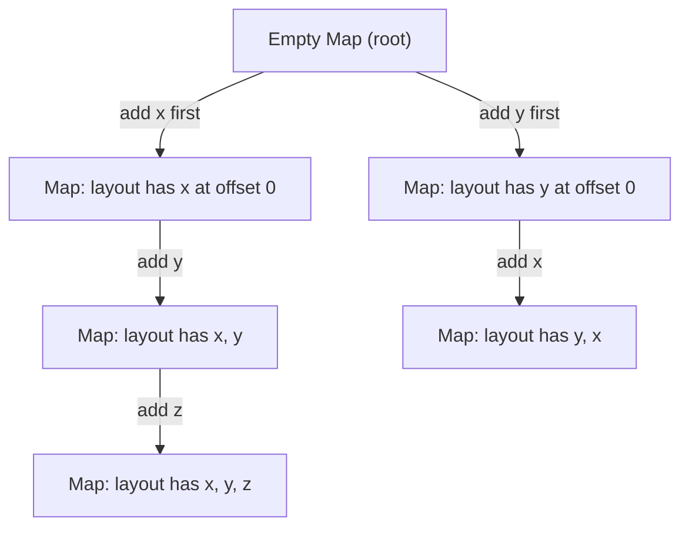
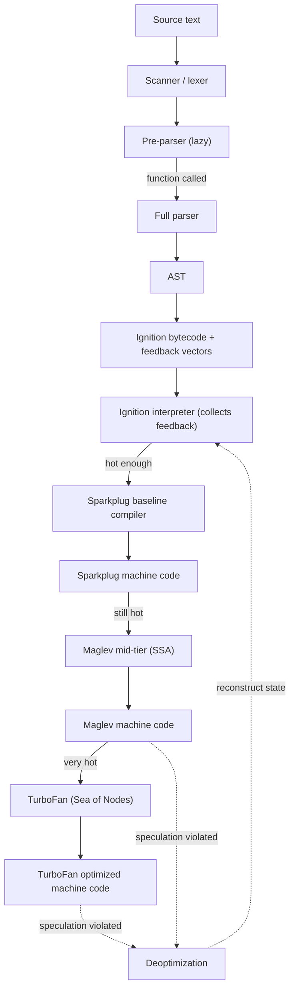
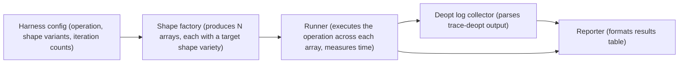

# 1.25 V8 Engine Pipeline

> V8 is not an interpreter and not a compiler; it is a cascade of compilers that watches the program run, learns what shapes its values take, and gradually rewrites hot code into machine code that assumes those shapes. The pipeline is the trade-off the engine makes between startup speed and steady-state throughput, and every line of JavaScript you write either cooperates with that trade-off or fights it.

## 1. Purpose

V8 is the JavaScript and WebAssembly engine developed by Google, originally by Lars Bak, first shipped in Chrome in 2008, and adopted by Node.js in 2009 (Deno and Bun both ship V8-derived or V8-compatible engines today). The engine's job is to take source text and produce running behavior as fast as possible across two very different time scales: the cold-start time scale (page load, server boot, command startup) where milliseconds matter and you cannot afford to spend tens of milliseconds compiling code that may never run twice, and the steady-state time scale where the same function executes millions of times per second and you cannot afford to interpret bytecode when a CPU could be executing hand-tuned machine code.

The fundamental tension is that compilation is expensive. A full optimizing compiler like TurboFan can spend hundreds of microseconds, sometimes milliseconds, on a single hot function. If the function only runs once, that investment is wasted. A pure interpreter like Ignition has near-zero startup cost because it does almost no work up front, but every execution pays interpreter overhead: opcode dispatch, operand decoding, register juggling, type checks. For a function that runs a hundred million times, interpreter overhead is catastrophic.

V8's answer is the multi-tier pipeline. Rather than picking one strategy, V8 picks all of them and escalates gradually: **Ignition** compiles source to compact bytecode in linear time and interprets it (giving fast startup, low memory, and crucially, collecting **type feedback** as it runs); **Sparkplug** takes Ignition bytecode and produces unoptimized machine code in a single pass (no optimization, no speculation, just the same operations without the dispatch overhead); **Maglev** (shipped in V8 11.x) builds a small SSA graph from bytecode and feedback and does targeted optimizations — eliminating redundant checks, inlining small hot functions, and specializing arithmetic — at a fraction of TurboFan's compile cost; **TurboFan** is the peak Sea-of-Nodes optimizing compiler that builds a large SSA-style graph, runs a long sequence of passes (inlining, escape analysis, lowering, register allocation, code generation), and produces heavily specialized machine code. TurboFan gives V8 its peak throughput and produces the most spectacular deoptimizations when its speculation is wrong.

The pipeline escalates code through tiers based on heat. A function starts in Ignition, gets compiled by Sparkplug after enough invocations, then by Maglev if it stays hot, and finally by TurboFan if it is still hot and the feedback is stable enough. At every tier escalation, V8 invests more compile time in exchange for faster execution.

**Deoptimization** is the safety valve. Each optimizing tier compiles a function under speculative assumptions: this addition always sees two small integers, this property access always hits the same hidden class, this call always dispatches to the same function. When the speculation is violated — a different type appears, a new hidden class shows up, a function gets reassigned — the engine cannot keep running the optimized code, because that code was generated under assumptions that no longer hold. So V8 throws the optimized code away, returns to Ignition, and starts the tier-up process again with the new feedback. The thrown-away code is a deoptimization, or deopt.

Why does this matter for writing performant JavaScript? Because the V8 pipeline is a learning system, and you can either feed it consistent data or chaotic data. Consistent data — the same shapes, the same types, the same call targets — lets the optimizers speculate successfully and produce fast code. Chaotic data — mixed types in arrays, properties added in different orders, functions reassigned at runtime — defeats the speculation, forces deopts, and leaves your hot code running at interpreter speed. Most "JavaScript is slow" complaints in production are not about the language; they are about code that fights the pipeline.

The purpose of this note is to give you a precise mental model of each tier, what it assumes, what it produces, and what you can do in your source code to make it succeed. By the end you should be able to read a `--trace-deopt` log and explain what shape instability caused the deopt; to look at an object constructor and predict whether its instances will share a hidden class; and to deliberately write monomorphic code in hot paths and polymorphic code only where polymorphism is genuinely unavoidable.

## 2. Theory and Deep Dive

This section walks the full pipeline from source text to executing machine code, with attention to the data structures each tier produces and the contracts each tier assumes.

### 2.1 Parsing: scanner and parser, source to AST

V8 splits parsing into two passes. The **scanner** (also called the lexer) walks the source bytes and produces a stream of tokens: identifiers, keywords, numeric literals, string literals, punctuation, and whitespace-terminated tokens. The scanner handles the lexical grammar — it knows that `0x1F` is a single numeric token, that a string literal can span multiple lines via backslash continuation, and that template literals contain expression holes.

The **parser** consumes the token stream and produces an **abstract syntax tree (AST)**, a tree of nodes representing the syntactic structure of the program. Each `FunctionDeclaration`, `VariableDeclaration`, `BinaryExpression`, `CallExpression` becomes a node with its children. The parser enforces the syntactic grammar: `let x = ;` is a parse error because there is no expression after the equals sign.

V8 actually parses in two phases for performance: a **pre-parser** does a fast, lazy scan that validates syntax without building a full AST (top-level functions get pre-parsed; their bodies are not fully parsed until they are called, which is what makes a large script boot fast), and a full **parser** is invoked on demand when a function is first called, producing the AST that Ignition will compile.

The lazy parsing strategy is also why top-level code that wraps everything in an IIFE (immediately invoked function expression) can feel snappier on large bundles: the IIFE forces one parse of the wrapper, and inner functions are parsed lazily as they are invoked. Modern bundlers do this implicitly by emitting modules as functions.

### 2.2 Ignition: bytecode generation and interpretation

Once a function is fully parsed, the AST is fed to the **Ignition bytecode generator**, which walks the tree and emits a stream of bytecode instructions. Bytecode is a compact, register-based intermediate representation: each instruction is a single byte opcode followed by operand bytes that reference registers, constant pool entries, or feedback vector slots.

A simple function like:

```js
function add(a, b) {
  return a + b;
}
```

Roughly compiles to bytecode resembling (simplified for prose; the real bytecode uses named opcodes like `Ldar`, `Add`, `Star`, `Return`):

1. Load register `a` into the accumulator.
2. Add register `b` to the accumulator.
3. Return the accumulator.

Each binary operation in Ignition is associated with a **feedback vector slot**. The feedback vector is an array attached to the function object that records, for each operation site, what shapes the operands actually had at runtime. When `add` is called with two small integers the first time, the slot for `+` records "saw small integer, saw small integer, result was small integer". The next time the same `+` runs, Ignition consults the slot and tries the fast path for small-integer addition; if the new operands match, the fast path succeeds, otherwise Ignition falls back to the slow path and updates the slot.

This feedback collection is the entire reason the pipeline can speculate later: every tier above Ignition consults the feedback vectors to decide what shapes to specialize for.

### 2.3 Sparkplug: the baseline compiler

Sparkplug was added to V8 in 2021 to address a specific problem: Ignition is fast for an interpreter, but interpreter dispatch (the cost of fetching the next opcode, decoding it, and jumping to the handler) is still a measurable fraction of total time for warm code that is not yet hot enough for Maglev or TurboFan.

Sparkplug takes the bytecode as input and emits machine code in a single pass. It does not optimize, look at feedback, or inline. It simply produces, for each bytecode instruction, the equivalent machine instructions the interpreter would have executed, minus the dispatch overhead. Sparkplug code is typically 30 to 50 percent faster than Ignition for the same bytecode, and it costs very little to produce.

The reason Sparkplug is worth having is the tier-up curve. Without Sparkplug, V8 would either run warm code in Ignition (slow) or eagerly call TurboFan (expensive). Sparkplug gives a middle ground: warm code gets a meaningful speedup almost for free, and only code that is genuinely hot pays the TurboFan cost.

### 2.4 Maglev: the mid-tier optimizer

Maglev is a newer compiler that sits between Sparkplug and TurboFan. It produces an SSA (static single assignment) graph from the bytecode and the feedback, runs a small set of optimization passes, and emits machine code. Its passes include inlining of small hot callees (using feedback to pick the likely call target), check elimination (if feedback says a property access always hits the same hidden class, skip the check on subsequent accesses), escape analysis for small temporary objects, and arithmetic specialization (emit a machine integer add when feedback says both operands are always small integers).

Maglev is much faster to compile than TurboFan (often 5 to 10 times faster), which means V8 can afford to Maglev-compile a much larger fraction of the program. The result is that warm code now gets real optimization sooner, and TurboFan is reserved for code that is genuinely hot and benefits from the heaviest optimization.

### 2.5 TurboFan: the Sea-of-Nodes optimizer

TurboFan is the peak-throughput compiler. Its intermediate representation is the **Sea of Nodes**, a graph in which nodes represent operations (arithmetic, memory loads, calls, branches) and edges represent data and control dependencies. Unlike a linear list of instructions, the Sea of Nodes lets TurboFan reason about which operations depend on which, and reorder freely within those dependencies.

TurboFan runs a long pipeline of passes: graph building from bytecode and feedback; inlining of hot callees (often transitively); type propagation using feedback and global type analysis; specialization (e.g. a small-integer add becomes a single `ADD` machine instruction with overflow check, instead of a generic `+` that handles strings, BigInts, and objects); escape analysis and scalar replacement (temporary objects that do not escape the function are decomposed into their fields, which then live in registers); reduction of high-level nodes to lower-level nodes (e.g. a property access becomes a hidden class check plus a fixed-offset load); scheduling; register allocation; code generation; and code installation that patches the function's entry to point at the new machine code.

TurboFan is what makes V8 fast on hot code. A well-optimized numeric loop in TurboFan code can run within a small constant factor of the equivalent C program. The cost is compilation time: TurboFan can take milliseconds per function, which is why it is reserved for genuinely hot code.

### 2.6 Hidden classes (Maps): the shapes of objects

Every JavaScript object in V8 has an internal pointer to a **Map** (also called a hidden class or, in academic literature, a shape). The Map describes the layout of the object: which properties it has, where each property lives in memory (its offset), and what kind of value each slot holds. Two objects share the same Map if and only if they have the same properties in the same order with the same value types.

When you create an object literal `const p = { x: 1, y: 2 }`, V8 allocates a Map for the shape `{ x, y }` and an object whose internal pointer references that Map. The Map says: property `x` is at offset 0, property `y` is at offset 1, and both are tagged small integers.

If you then add a property `p.z = 3`, V8 does not modify the existing Map (other objects may share it). Instead it creates a **transition**: a new Map that extends the old one with property `z` at offset 2, and a transition link from the old Map to the new one. The object's internal pointer is updated to the new Map. The set of Maps linked by transitions forms a **transition tree**: starting from an empty root Map, each property addition creates a child.

The transition tree matters because of order. If you do:

```js
const a = {};
a.x = 1;
a.y = 2;

const b = {};
b.y = 2;
b.x = 1;
```

Object `a` and `b` end up with different Maps, because their transition trees differ: `a` transitioned empty to `x` to `y`, while `b` transitioned empty to `y` to `x`. Even though both have the same set of properties, they have different layouts, and a function reading `o.x` then `o.y` will see two different Maps. The property access becomes polymorphic rather than monomorphic.

Hidden classes are why the order of property initialization in constructors matters: if every instance of a class initializes its properties in the same order, every instance shares the same Map, and property accesses on those instances are monomorphic.



The diagram shows the transition tree branching by insertion order. Adding `x` then `y` produces a different Map from adding `y` then `x`, even though both objects end up with the same set of properties. The branch at `HasXYZ` (only reachable via the `x-then-y` path) shows that transitions extend only along the path that produced them.

### 2.7 Inline caches (ICs): remembering what shape we saw

Every property access, binary operation, and call site in Ignition has an associated **inline cache (IC)**: a slot in the feedback vector that records what shape the operation saw last time, plus a fast path for that shape. On the next execution, the IC checks whether the current operand matches the recorded shape; if it does, the fast path runs without consulting the runtime, otherwise the IC falls back to the slow path, updates its state, and possibly re-optimizes.

ICs come in four states: **uninitialized** (the slot has never been executed; the next execution falls through to the runtime and seeds the slot), **monomorphic** (the slot has seen exactly one shape; the fast path is a single hidden class check followed by a fixed-offset load — this is the fastest case), **polymorphic** (the slot has seen two or three distinct shapes; the fast path is a small lookup table that compares the incoming hidden class against each recorded entry — slower than monomorphic but still much faster than the runtime fallback), and **megamorphic** (the slot has seen four or more distinct shapes; V8 gives up caching and falls back to a generic runtime lookup on every execution, so code with megamorphic ICs runs at roughly interpreter speed for those operations).

The four-shape threshold is the origin of the famous "V8 deopts at four shapes" rule of thumb. It is not exactly a deopt (the optimized code may still be running), but it is the point at which the inline cache stops helping. When TurboFan-compiled code encounters a shape it was not specialized for, that is a true deopt.

### 2.8 Deoptimization: when speculation fails

A deopt is the engine's admission that the speculation it compiled under no longer holds. The classic triggers: a **type mismatch** (TurboFan compiled an addition assuming both operands are small integers, but a Number that does not fit in a small integer, or a string, appears); a **hidden class mismatch** (TurboFan compiled a property access assuming the object has a specific Map, but a different Map appears); a **call target mismatch** (TurboFan inlined a call site assuming it always dispatches to function `f`, but the call now goes to a different function); or **excessive polymorphism** (a feedback slot has become megamorphic, so TurboFan decides it cannot usefully specialize this site and either bails out of compilation or compiles a generic version).

When a deopt happens, V8 discards the optimized machine code for the affected function, reconstructs the interpreter state from the optimized code's deoptimization info (a table mapping optimized code locations back to bytecode locations and register states), resumes execution in Ignition at the corresponding bytecode instruction, updates the feedback vectors with the new shapes, and eventually re-tiers up — this time with feedback that includes the new shapes.

This last step is important: a deopt is not a permanent penalty. The engine learns from the deopt and re-optimizes with broader feedback. But if the deopt keeps happening (because the code genuinely sees many shapes every time), the engine may eventually give up and leave the function in Ignition or Maglev forever. This is the "deopt loop" performance cliff.

### 2.9 The tiering pipeline (Mermaid)



The dashed arrows back to Ignition are the deopt path. Note that deopts can come from both Maglev and TurboFan; both speculators can be wrong.

## 3. Mental Models

These are the compressed mental models to keep in your head when reading or writing JavaScript:

- **Ignition** is "interpret bytecode fast, collect feedback." The interpreter is the slowest execution tier, but it is also the data collector. Everything above it depends on the feedback Ignition gathers.
- **Sparkplug** is "compile without optimizing, just to skip interpreter overhead." Sparkplug is the "do the same thing, but in machine code so we skip the dispatch loop" tier. No speculation, no inlining, just raw speedup over Ignition.
- **Maglev** is "lightweight optimization using feedback." A short SSA pass that inlines small hot functions and specializes arithmetic using the feedback Ignition collected.
- **TurboFan** is "full optimization using the feedback." The heavyweight compiler that produces the fastest machine code V8 can generate, at the cost of significant compile time.
- **Hidden class (Map)** is "the shape of an object." Two objects share a hidden class if and only if they were constructed with the same properties in the same order. The shape determines memory layout, and memory layout determines the speed of property access.
- **Inline cache (IC)** is "a slot remembering what shape we saw last time, with a fast path for same-shape." The IC is the learning mechanism that lets the engine specialize without recompiling. Monomorphic ICs are the goal; megamorphic ICs are the failure mode.
- **Deopt** is "the engine admitting it guessed wrong." A deopt is not a crash; it is the engine reverting to Ignition, updating feedback, and trying again. The penalty is that the function runs at interpreter speed until it re-tiers.
- **Tiering** is "pay for optimization gradually." The pipeline is a gradient: cheap tiers for cold code, expensive tiers for hot code. The escalation is automatic and based on observed execution frequency.

A useful narrative compression: V8 is a coach watching you run laps. The first few laps it just times you (Ignition). When you keep running, it hands you better shoes (Sparkplug). When you keep running, it fixes your form (Maglev). When you start breaking records, it builds you a custom prosthesis (TurboFan). If you suddenly switch from sprinting to marathon pacing and the prosthesis no longer fits, the coach takes it back, makes you run barefoot, and starts over (deopt).

## 4. Real-World Use Cases

### 4.1 Why monomorphic code is fast: React internals

React's reconciler is one of the most performance-sensitive pieces of JavaScript in the world. It runs on every render of every component in every React app, and a single render can walk thousands of fiber nodes. React's internal fiber objects are constructed with extreme discipline: every fiber is created with the same set of properties in the same order, every property is initialized to the same type, and the reconciler's hot loops always operate on fibers of the same shape. This makes the reconciler's property accesses monomorphic, makes Ignition's feedback vectors record a single shape, and makes TurboFan's specialization trivial. The result is that React's hot path runs close to the speed of hand-written machine code.

The reverse is also true. A React component that returns a different object shape on each render — sometimes a single element, sometimes an array, sometimes an object with a conditional extra property — sends the reconciler's ICs polymorphic then megamorphic, and the entire tree walk slows down by a factor of several. The fix is almost always to normalize the shape: always return an array, always populate every property even if some are `null`, always construct objects in the same order.

### 4.2 Why polymorphic code deopts: mixing types in arrays

Consider a function that sums the values of an array:

```js
function sum(arr) {
  let total = 0;
  for (let i = 0; i < arr.length; i++) {
    total += arr[i];
  }
  return total;
}
```

If `arr` always contains small integers, V8 represents the array internally as a packed-small-integer array (a contiguous block of tagged small integers). The `+` operation's feedback slot sees small-integer plus small-integer every iteration, TurboFan specializes the loop body into machine integer adds with overflow checks, and the loop runs at near-C speed.

If `arr` contains a mix of small integers and floats, V8 transitions the array to a packed-double array (a contiguous block of unboxed doubles). The loop now reads doubles and TurboFan specializes for double arithmetic — still fast, but the array transition itself costs time.

If `arr` contains a mix of numbers, strings, and objects, V8 transitions the array to a packed-elements array (an array of tagged pointers to boxed values). The `+` operation now has to consult the runtime for each element, because addition might be numeric or string concatenation or a `Symbol.toPrimitive` call. The feedback slot goes megamorphic, TurboFan cannot usefully specialize, and the loop runs at interpreter speed.

This is why mixing types in arrays is one of the most common and most preventable performance cliffs in JavaScript.

### 4.3 Why delete is slow: hidden class transitions

The `delete obj.x` operation does not just remove a property. It forces V8 either to transition the object to a new hidden class that lacks `x` (if `x` was the last-added property), or, more often, to fall back to **dictionary mode**: a representation in which the object's properties are stored in a hash table rather than a fixed-offset layout. Dictionary-mode objects have no hidden class in the fast-path sense; property access goes through a hash lookup, far slower than a fixed-offset load.

If you `delete` a property from a hot-path object, every subsequent property access on that object goes through the dictionary path. Worse, every other object that shared the old hidden class still uses it, but the modified object is now a dictionary and will never again match the ICs specialized for the old shape.

The correct pattern for "removing" a property in hot code is to set it to `null` or `undefined`:

```js
obj.x = null; // preserves the hidden class
```

Or, better, to design the object so the property does not need to be removed — for example, by allocating a new object without the property rather than mutating the old one.

### 4.4 V8 flags for debugging performance

V8 exposes a rich set of command-line flags that let you observe the pipeline in action. The most useful for performance debugging: `node --trace-opt` (or `--trace-opt-verbose`) prints a line every time V8 optimizes a function, including which tier and why; `node --trace-deopt` prints a line every time V8 deoptimizes a function, with the reason (e.g. "Insufficient type feedback", "Wrong map", "Wrong call target"); `node --trace-ic` prints every inline-cache state update; `node --trace-turbo` dumps TurboFan's intermediate graphs for offline inspection; `node --no-opt` disables TurboFan; `node --no-maglev` disables Maglev only; `node --no-sparkplug` disables Sparkplug only; and `node --print-bytecode` prints the Ignition bytecode for every compiled function. These flags are also available in Chrome DevTools via the internal V8 inspector and via the Performance panel's JS Profiler view.

### 4.5 JIT compilers in other engines

V8 is not the only JavaScript engine with a multi-tier pipeline. **SpiderMonkey** (Firefox) has a bytecode interpreter, a baseline JIT (WarpBuilder), and an optimizing JIT (Warp); its hidden class equivalent is called a "Shape". **JavaScriptCore** (Safari) has a low-level interpreter (LLInt), a baseline JIT, a data-flow JIT, and an FTL (faster than light) optimizing JIT that uses LLVM; its hidden class equivalent is called a "Structure". **Hermes** (React Native) is a bytecode interpreter with no optimizing JIT, designed for fast startup on mobile. The general pattern — interpreter for cold code, baseline JIT for warm code, optimizing JIT for hot code, with shape-based speculation and deopt safety — is universal across modern JS engines; only the tier names differ.

## 5. Code Examples

### 5.1 Example A — Minimal and Conceptual

Three versions of the same function: monomorphic, polymorphic, and megamorphic. Each is shown in JS and TS, with the expected V8 behavior annotated.

**JS — monomorphic (always same shape):**

```js
function doubleMonomorphic(point) {
  return point.x * 2 + point.y * 2;
}

const points = [];
for (let i = 0; i < 10000; i++) {
  points.push({ x: i, y: i + 1 });
}

for (let i = 0; i < points.length; i++) {
  doubleMonomorphic(points[i]);
}
```

Every `point` has the same shape `{ x: number, y: number }` constructed in the same order. The ICs for `point.x` and `point.y` are monomorphic. TurboFan specializes the loop into a sequence of fixed-offset loads and machine integer multiplies.

**TS — monomorphic:**

```ts
interface Point {
  x: number;
  y: number;
}

function doubleMonomorphic(point: Point): number {
  return point.x * 2 + point.y * 2;
}

const points: Point[] = [];
for (let i = 0; i < 10000; i++) {
  points.push({ x: i, y: i + 1 });
}

for (let i = 0; i < points.length; i++) {
  doubleMonomorphic(points[i]);
}
```

TypeScript does not change the runtime behavior; the interface is a compile-time annotation the JIT never sees. What it does is guarantee at compile time that every `Point` we push has exactly the shape `{ x: number, y: number }`. This is one of the great pragmatic strengths of TypeScript for performance: it makes shape stability a compile-time guarantee rather than a runtime hope.

**JS — polymorphic (two shapes):**

```js
function doublePolymorphic(point) {
  return point.x * 2 + point.y * 2;
}

const points = [];
for (let i = 0; i < 10000; i++) {
  if (i % 2 === 0) {
    points.push({ x: i, y: i + 1 });        // shape A: x then y
  } else {
    points.push({ y: i + 1, x: i });        // shape B: y then x, different order
  }
}

for (let i = 0; i < points.length; i++) {
  doublePolymorphic(points[i]);
}
```

Half the points have shape `{ x, y }`, half have shape `{ y, x }`. The ICs become polymorphic with two entries. Each property access now does a small two-entry lookup instead of a single check, roughly 20 to 40 percent slower than monomorphic.

**TS — polymorphic:**

```ts
interface PointXY {
  x: number;
  y: number;
}

interface PointYX {
  y: number;
  x: number;
}

function doublePolymorphic(point: PointXY | PointYX): number {
  return point.x * 2 + point.y * 2;
}

const points: (PointXY | PointYX)[] = [];
for (let i = 0; i < 10000; i++) {
  if (i % 2 === 0) {
    points.push({ x: i, y: i + 1 });
  } else {
    points.push({ y: i + 1, x: i });
  }
}

for (let i = 0; i < points.length; i++) {
  doublePolymorphic(points[i]);
}
```

The union type captures the polymorphism at compile time. `PointXY | PointYX` is structurally identical (both have `x: number` and `y: number`), but at runtime the order of property insertion differs, so V8 produces two distinct hidden classes.

**JS — megamorphic (four or more shapes):**

```js
function doubleMegamorphic(point) {
  return point.x * 2 + point.y * 2;
}

const points = [];
for (let i = 0; i < 10000; i++) {
  const r = i % 4;
  if (r === 0) points.push({ x: i, y: i + 1 });
  else if (r === 1) points.push({ y: i + 1, x: i });
  else if (r === 2) points.push({ x: i, y: i + 1, z: 0 });   // extra property
  else points.push({ w: 0, x: i, y: i + 1 });                // different leading property
}

for (let i = 0; i < points.length; i++) {
  doubleMegamorphic(points[i]);
}
```

The ICs see four distinct shapes and become megamorphic. Every property access falls back to the runtime; the loop runs at roughly interpreter speed. This is the worst-case scenario.

**TS — megamorphic:**

```ts
interface ShapeA { x: number; y: number; }
interface ShapeB { y: number; x: number; }
interface ShapeC { x: number; y: number; z: number; }
interface ShapeD { w: number; x: number; y: number; }

type AnyPoint = ShapeA | ShapeB | ShapeC | ShapeD;

function doubleMegamorphic(point: AnyPoint): number {
  return point.x * 2 + point.y * 2;
}

const points: AnyPoint[] = [];
for (let i = 0; i < 10000; i++) {
  const r = i % 4;
  if (r === 0) points.push({ x: i, y: i + 1 });
  else if (r === 1) points.push({ y: i + 1, x: i });
  else if (r === 2) points.push({ x: i, y: i + 1, z: 0 });
  else points.push({ w: 0, x: i, y: i + 1 });
}

for (let i = 0; i < points.length; i++) {
  doubleMegamorphic(points[i]);
}
```

### 5.2 Example B — Production-Grade

A hot-path numeric loop processing a stream of sensor readings. The shape-stable version is fast; the shape-unstable version triggers a deopt mid-loop.

**JS — shape-stable version:**

```js
// Reading shape: every reading has exactly these properties,
// constructed in exactly this order, every time.
function makeReading(sensorId, value, timestampMs) {
  return {
    sensorId: sensorId,
    value: value,
    timestampMs: timestampMs,
    quality: 1.0,
    flags: 0
  };
}

function summarize(readings) {
  let sum = 0;
  let count = 0;
  let min = Infinity;
  let max = -Infinity;

  for (let i = 0; i < readings.length; i++) {
    const r = readings[i];
    if (r.quality <= 0) continue;
    sum += r.value;
    count += 1;
    if (r.value < min) min = r.value;
    if (r.value > max) max = r.value;
  }

  if (count === 0) return null;
  return { sum: sum, count: count, min: min, max: max, mean: sum / count };
}

// Hot path: feed in a million shape-stable readings.
const readings = [];
for (let i = 0; i < 1000000; i++) {
  readings.push(makeReading(i % 100, Math.random() * 100, Date.now()));
}

const start = performance.now();
const result = summarize(readings);
const elapsed = performance.now() - start;
console.log(`summarize: ${elapsed.toFixed(2)} ms, mean=${result.mean.toFixed(4)}`);
```

Every reading has the same six properties in the same order. Every property access in `summarize` is monomorphic. TurboFan will tier up after a few thousand iterations, specialize the loop into machine integer and double arithmetic, and run the million-element loop in tens of milliseconds.

**TS — shape-stable version:**

```ts
interface Reading {
  sensorId: number;
  value: number;
  timestampMs: number;
  quality: number;
  flags: number;
}

interface Summary {
  sum: number;
  count: number;
  min: number;
  max: number;
  mean: number;
}

function makeReading(
  sensorId: number,
  value: number,
  timestampMs: number
): Reading {
  return {
    sensorId: sensorId,
    value: value,
    timestampMs: timestampMs,
    quality: 1.0,
    flags: 0
  };
}

function summarize(readings: Reading[]): Summary | null {
  let sum = 0;
  let count = 0;
  let min = Infinity;
  let max = -Infinity;

  for (let i = 0; i < readings.length; i++) {
    const r = readings[i];
    if (r.quality <= 0) continue;
    sum += r.value;
    count += 1;
    if (r.value < min) min = r.value;
    if (r.value > max) max = r.value;
  }

  if (count === 0) return null;
  return {
    sum: sum,
    count: count,
    min: min,
    max: max,
    mean: sum / count
  };
}

const readings: Reading[] = [];
for (let i = 0; i < 1000000; i++) {
  readings.push(makeReading(i % 100, Math.random() * 100, Date.now()));
}

const start = performance.now();
const result = summarize(readings);
const elapsed = performance.now() - start;
if (result !== null) {
  console.log(`summarize: ${elapsed.toFixed(2)} ms, mean=${result.mean.toFixed(4)}`);
}
```

**JS — shape-unstable version (triggers deopt):**

```js
// Mixed factory: some readings get an extra annotation field,
// some do not. The summarize loop sees two shapes.
function makeReadingAnnotated(sensorId, value, timestampMs, note) {
  const reading = {
    sensorId: sensorId,
    value: value,
    timestampMs: timestampMs,
    quality: 1.0,
    flags: 0
  };
  if (note) {
    reading.note = note;  // hidden class transition mid-build
  }
  return reading;
}

function summarize(readings) {
  let sum = 0;
  let count = 0;
  let min = Infinity;
  let max = -Infinity;

  for (let i = 0; i < readings.length; i++) {
    const r = readings[i];
    if (r.quality <= 0) continue;
    sum += r.value;
    count += 1;
    if (r.value < min) min = r.value;
    if (r.value > max) max = r.value;
  }

  if (count === 0) return null;
  return { sum: sum, count: count, min: min, max: max, mean: sum / count };
}

// Half the readings have a note, half do not.
const readings = [];
for (let i = 0; i < 1000000; i++) {
  if (i % 2 === 0) {
    readings.push(makeReadingAnnotated(i % 100, Math.random() * 100, Date.now(), null));
  } else {
    readings.push(makeReadingAnnotated(i % 100, Math.random() * 100, Date.now(), "calibrated"));
  }
}

const start = performance.now();
const result = summarize(readings);
const elapsed = performance.now() - start;
console.log(`summarize (mixed shape): ${elapsed.toFixed(2)} ms`);
```

The `summarize` loop now sees two distinct hidden classes for `r`: one with six properties, one with seven. The ICs for `r.value`, `r.quality`, and so on become polymorphic with two entries. TurboFan may still specialize, but the resulting code is slower than the monomorphic case. If a third shape appears later, the ICs go megamorphic and TurboFan may deopt entirely.

The fix is to make the factory produce the same shape regardless of whether the note is present:

```js
function makeReadingStable(sensorId, value, timestampMs, note) {
  return {
    sensorId: sensorId,
    value: value,
    timestampMs: timestampMs,
    quality: 1.0,
    flags: 0,
    note: note ?? null    // always present, sometimes null
  };
}
```

Every reading now has the same seven properties in the same order. The ICs are monomorphic again.

**TS — shape-unstable version (annotated):**

```ts
interface Reading {
  sensorId: number;
  value: number;
  timestampMs: number;
  quality: number;
  flags: number;
  note?: string;  // optional — this is what causes the shape instability
}

function makeReadingAnnotated(
  sensorId: number,
  value: number,
  timestampMs: number,
  note?: string
): Reading {
  const reading: Reading = {
    sensorId: sensorId,
    value: value,
    timestampMs: timestampMs,
    quality: 1.0,
    flags: 0
  };
  if (note !== undefined) {
    reading.note = note;
  }
  return reading;
}
```

Note the `note?: string` annotation: TypeScript's optional-property syntax is convenient, but it gives V8 a shape-unstable factory. For performance-critical code, always populate the property, using `null` to indicate absence:

```ts
interface ReadingStable {
  sensorId: number;
  value: number;
  timestampMs: number;
  quality: number;
  flags: number;
  note: string | null;  // always present, null when absent
}

function makeReadingStable(
  sensorId: number,
  value: number,
  timestampMs: number,
  note: string | null
): ReadingStable {
  return {
    sensorId: sensorId,
    value: value,
    timestampMs: timestampMs,
    quality: 1.0,
    flags: 0,
    note: note
  };
}
```

Every instance now has the same shape, the ICs are monomorphic, and TurboFan specializes successfully.

## 6. Common Mistakes and Anti-Patterns

### 6.1 Mixing types in arrays (packed-small-integer to packed-double to packed-elements transition)

V8 represents arrays internally with one of several element kinds. A new empty array starts as packed-small-integer (a contiguous block of tagged small integers). Push a floating-point number and V8 transitions the entire array to packed-double (a contiguous block of unboxed doubles). Push a string, object, or other non-number and V8 transitions to packed-elements (a contiguous block of tagged pointers). Each transition requires rewriting the existing storage. Worse, transitions are one-way: even if you remove the offending element, the array stays in its higher element kind.

**Anti-pattern:**

```js
const arr = [1, 2, 3];        // packed-small-integer
arr.push(1.5);                // transitions to packed-double
arr.push("four");             // transitions to packed-elements
arr.pop();                    // array stays packed-elements forever
```

**Fix:** If you need mixed-type arrays, accept the cost. Otherwise, segregate: keep numbers in one array, strings in another, objects in a third.

### 6.2 Using delete in hot paths

`delete obj.x` forces a hidden class transition (best case) or a fallback to dictionary mode (common case). Property accesses on dictionary-mode objects go through a hash lookup, far slower than a fixed-offset load.

**Anti-pattern:**

```js
function process(item) {
  delete item.cachedValue;
  return item.computedValue * 2;
}
```

**Fix:** Set the property to `null` instead. The hidden class is preserved, the property access stays fast, and the memory cost of one null slot is negligible.

```js
function process(item) {
  item.cachedValue = null;
  return item.computedValue * 2;
}
```

### 6.3 Misusing the arguments object

The `arguments` object is an array-like exotic object. In older V8, touching `arguments` in a function prevented optimization. Modern V8 can usually optimize `arguments` if used straightforwardly, but several patterns still defeat optimization: passing `arguments` to `apply`, leaking `arguments` out of the function (e.g. returning it), and using `arguments[i]` in a hot loop with arbitrary indices.

**Anti-pattern:**

```js
function sum() {
  let total = 0;
  for (let i = 0; i < arguments.length; i++) {
    total += arguments[i];
  }
  return total;
}
```

**Fix:** Use rest parameters. They are real arrays, always optimizable, and make the function signature explicit.

```js
function sum(...nums) {
  let total = 0;
  for (let i = 0; i < nums.length; i++) {
    total += nums[i];
  }
  return total;
}
```

### 6.4 Try/catch in hot loops (historical)

In older V8 (pre-2017), any function containing a `try`/`catch` block was not optimized by TurboFan (then called Crankshaft). This is no longer true: modern TurboFan optimizes functions with try/catch freely. The cultural memory of this limitation persists in some style guides that recommend hoisting hot loop bodies out of try blocks, but this is no longer necessary.

The remaining concern is that an exception actually thrown inside a hot loop will deopt the loop, because the optimized code's assumption (no exceptions) was violated. If your hot loop genuinely throws and catches, expect frequent deopts.

### 6.5 Using with and eval (always deopt)

`with` and `eval` are two of the oldest enemies of JavaScript optimization. Both introduce dynamic scope: `with` adds an object's properties to the scope chain, and `eval` can introduce arbitrary bindings. Because the engine cannot statically know what bindings these constructs will produce, it cannot optimize the surrounding code.

In modern V8, `eval` in a function forces the function's variables to be looked up dynamically rather than being compiled into fixed register accesses; `with` is even worse, forcing every property access in the `with` block to consult the runtime because the property might be on the `with` object or on the surrounding scope. Indirect `eval` (e.g. `(0, eval)(code)`) runs in the global scope and does not poison the surrounding function, but it still pays the parsing cost of the evaluated code at runtime.

**Anti-pattern:**

```js
function getValue(obj, key) {
  with (obj) {
    return eval(key);  // catastrophic for performance
  }
}
```

**Fix:** Do not use `with` (it is forbidden in strict mode and in modules). Do not use `eval` (use the `Function` constructor if you must dynamically compile code, and prefer precompiled closures over dynamic code generation).

```js
function getValue(obj, key) {
  return obj[key];
}
```

### 6.6 Changing object shape after creation in hot paths

Constructors establish the hidden class of an object at creation time. If you add properties to an object later — especially conditionally — you trigger hidden class transitions that make property accesses on that object polymorphic.

**Anti-pattern:**

```js
class User {
  constructor(name, email) {
    this.name = name;
    this.email = email;
  }
}

// Later, in a hot path:
function annotate(user, role) {
  if (role) {
    user.role = role;  // hidden class transition — only some users get this
  }
  return user;
}
```

**Fix:** Establish all properties in the constructor, using `null` or `undefined` for not-yet-known values.

```js
class User {
  constructor(name, email, role) {
    this.name = name;
    this.email = email;
    this.role = role ?? null;  // always present, sometimes null
  }
}
```

### 6.7 Forcing polymorphism by branching on type tags

A common pattern is to branch on a type tag and call a different method per branch. If the branches produce different object shapes, the resulting ICs are polymorphic.

**Anti-pattern:**

```js
function getArea(shape) {
  if (shape.type === "circle") {
    return Math.PI * shape.radius * shape.radius;
  } else if (shape.type === "square") {
    return shape.side * shape.side;
  } else if (shape.type === "rectangle") {
    return shape.width * shape.height;
  }
}
```

The ICs for `shape.type`, `shape.radius`, `shape.side`, `shape.width`, and `shape.height` are all polymorphic because the objects passed in have different shapes. Worse, the ICs for `shape.radius` will see "property not present" for square and rectangle objects, which is even slower than a polymorphic IC.

**Fix:** Give every shape the same set of properties, or use a method on each shape object:

```js
class Circle {
  constructor(radius) { this.type = "circle"; this.radius = radius; }
  getArea() { return Math.PI * this.radius * this.radius; }
}

class Square {
  constructor(side) { this.type = "square"; this.side = side; }
  getArea() { return this.side * this.side; }
}

// Call site is monomorphic on getArea:
function getArea(shape) {
  return shape.getArea();
}
```

The IC for `shape.getArea` is polymorphic (because each subclass has a different hidden class), but it has at most three entries, which is acceptable. With more than three subclasses on a hot path, consider a single class with a type tag and all properties present.

### 6.8 Allocating objects in hot loops

Every object allocation is a candidate for garbage collection. If your hot loop allocates a temporary object per iteration, the GC pressure can dominate the runtime.

**Anti-pattern:**

```js
function sum(points) {
  let total = 0;
  for (let i = 0; i < points.length; i++) {
    const scaled = { x: points[i].x * 2, y: points[i].y * 2 };  // allocation per iteration
    total += scaled.x + scaled.y;
  }
  return total;
}
```

**Fix:** Use local variables instead.

```js
function sum(points) {
  let total = 0;
  for (let i = 0; i < points.length; i++) {
    const sx = points[i].x * 2;
    const sy = points[i].y * 2;
    total += sx + sy;
  }
  return total;
}
```

TurboFan's escape analysis can sometimes eliminate the allocation in the anti-pattern version, but it is fragile and version-dependent. Writing allocation-free hot loops is always faster and always predictable.

### 6.9 Using the wrong array type for numeric data

If you store large amounts of numeric data in a regular JavaScript `Array`, you are paying for hidden class tracking, element kind transitions, and boxing that you do not need. A regular `Array` of numbers can transition from packed-small-integer to packed-double on the first fractional value, which forces a full rewrite of the backing store.

**Anti-pattern:**

```js
const data = [];
for (let i = 0; i < 1000000; i++) data.push(Math.random());
let sum = 0;
for (let i = 0; i < data.length; i++) sum += data[i];
```

**Fix:** Use a typed array. The data is stored as raw unboxed doubles, the layout is fixed, the loop has no ICs to update, and the runtime can use SIMD-friendly contiguous memory access.

```js
const data = new Float64Array(1000000);
for (let i = 0; i < data.length; i++) data[i] = Math.random();
let sum = 0;
for (let i = 0; i < data.length; i++) sum += data[i];
```

## 7. Best Practices and Design Patterns

### 7.1 Keep hot-path code monomorphic

The single most important performance rule in V8 is: keep your hot-path code monomorphic. Every property access, every binary operation, every call site in a hot loop should see exactly one shape. This is the difference between TurboFan producing near-C-speed machine code and TurboFan giving up and leaving the loop in Ignition.

Concretely:

- Every object passed to a hot function should have the same hidden class.
- Every element of an array iterated in a hot loop should have the same type.
- Every call to a polymorphic call site should dispatch to the same function.

### 7.2 Initialize all object properties in the constructor, in the same order

Hidden classes are built by transitions, and transitions are order-sensitive. If two objects are constructed with properties in different orders, they end up with different hidden classes. The fix is to always initialize properties in the same order, ideally in the constructor.

```js
// Always:
class Point {
  constructor(x, y, z) {
    this.x = x;
    this.y = y;
    this.z = z ?? null;  // always present
  }
}

// Never (in hot paths):
function makePoint(x, y, z) {
  const p = { x: x, y: y };
  if (z !== undefined) p.z = z;  // conditional transition
  return p;
}
```

### 7.3 Use typed arrays for numeric data

For large arrays of numeric data — sensor readings, audio samples, image pixels, matrix elements — the JavaScript `Array` type is almost always the wrong choice. Typed arrays (`Int32Array`, `Float64Array`, `Uint8Array`) are contiguous blocks of unboxed numeric values with no hidden classes, no element kind transitions, and no per-element type checks. They are the fastest way to store and process numeric data in JavaScript.

```js
const readings = new Float64Array(1000000);
for (let i = 0; i < readings.length; i++) readings[i] = Math.random();

let sum = 0;
for (let i = 0; i < readings.length; i++) sum += readings[i];
```

This loop runs at memory bandwidth speed, with no allocations, no hidden class checks, and no ICs to update. For numeric hot paths, typed arrays are unbeatable.

### 7.4 Avoid delete in hot paths

As discussed in Section 6.2, `delete` triggers hidden class transitions or dictionary mode. In hot paths, set properties to `null` instead. In cold paths (e.g. one-time configuration), `delete` is acceptable.

### 7.5 Avoid the arguments object

Use rest parameters (`...args`) instead of `arguments`. Rest parameters are real arrays, always optimizable, and make the function signature explicit.

### 7.6 Profile before optimizing

The golden rule of optimization: never optimize without measuring. Use `node --prof` to collect a CPU profile, then read it with `node --prof-process` to find the hottest functions. Use Chrome DevTools' Performance panel for browser code. Premature optimization is actively harmful because hand-tuned code is harder to read, maintain, and refactor. Optimize the hot 5 percent of your code and leave the other 95 percent readable.

### 7.7 Use shape-stable factories

If you have factory functions that produce objects, make them always produce the same shape. Conditionally-added properties are the enemy of monomorphism. Use `null` for not-yet-known values, and always populate every property.

### 7.8 Prefer virtual dispatch over type-tag branching

When you have a family of related types, prefer virtual dispatch (method calls on objects of different classes) over branching on a type tag. Virtual dispatch produces a small polymorphic IC (one entry per subclass), while type-tag branching produces megamorphic ICs across the entire family.

### 7.9 Pre-size arrays when the final size is known

When you know the final size of an array, pre-allocate it with `new Array(n)` (or, better, with the appropriate typed array constructor). Pushing into an array that has to grow repeatedly triggers storage reallocations, which are expensive in hot loops.

### 7.10 Watch for accidental polymorphism in libraries

If you pass user-supplied objects into hot library functions, the shape of those objects determines the library's performance. Document the expected shape and consider normalizing user input into a canonical shape before the hot path.

### 7.11 Use the Node.js performance API for fine-grained timing

The global `performance` object (available in modern Node without an import, and in browsers as `window.performance`) provides high-resolution timers suitable for benchmarking hot loops. The `performance.now()` method returns a floating-point timestamp with sub-microsecond resolution.

## 8. Technical Interview Knowledge

### 8.1 Q: Explain the V8 pipeline.

A: V8 uses a multi-tier compilation pipeline. Source text is scanned into tokens, then parsed lazily into an AST (with a fast pre-parser for top-level functions and a full parser invoked on demand). The AST is compiled to Ignition bytecode, which Ignition interprets while collecting type feedback in feedback vectors attached to each function. When a function gets hot, it is compiled by Sparkplug (a baseline compiler that emits unoptimized machine code in a single pass), then by Maglev (a mid-tier SSA-based optimizer that inlines small hot functions and specializes arithmetic), and finally by TurboFan (the full Sea-of-Nodes optimizing compiler that produces peak-throughput machine code). At each tier, V8 invests more compile time in exchange for faster execution. If speculation fails at any tier, the engine deoptimizes back to Ignition, updates the feedback, and may re-tier up with the new information.

### 8.2 Q: What is a hidden class?

A: A hidden class (called a Map internally by V8, a Shape by SpiderMonkey, and a Structure by JavaScriptCore) is a runtime data structure that describes the layout of a JavaScript object: which properties it has, in what order, at what memory offsets, and with what value types. Two objects share the same hidden class if and only if they were constructed with the same properties in the same order with the same value types. Hidden classes form a transition tree: adding a property to an object creates a new hidden class linked to the old one by a transition. Property accesses are fast when objects share hidden classes, because the engine can use a fixed-offset load rather than a hash lookup.

### 8.3 Q: What is an inline cache?

A: An inline cache (IC) is a slot in a function's feedback vector that records what shape an operation saw last time it executed, plus a fast path for that shape. On the next execution, the IC checks whether the current operand matches the recorded shape; if it does, the fast path runs without consulting the runtime. ICs come in four states: uninitialized (never executed), monomorphic (one shape seen, fastest), polymorphic (two or three shapes seen, slower but still fast), and megamorphic (four or more shapes seen, falls back to runtime lookup). ICs are the engine's primary learning mechanism between tiers: the feedback they collect is what the optimizing compilers use to decide what to specialize for.

### 8.4 Q: What triggers a deopt?

A: A deopt is triggered when the speculation an optimizing compiler compiled under is violated. Common triggers: (1) a type mismatch (the compiler assumed small integers, but a float or string appears); (2) a hidden class mismatch (the compiler assumed a specific Map, but a different Map appears); (3) a call target mismatch (the compiler inlined a specific function, but a different function is called); (4) excessive polymorphism (a feedback slot becomes megamorphic and the compiler cannot usefully specialize); (5) an exception thrown inside an optimized loop. When a deopt occurs, V8 discards the optimized code, reconstructs interpreter state from the deoptimization info, resumes in Ignition, and updates feedback with the new shapes.

### 8.5 Q: What is the difference between Ignition and TurboFan?

A: Ignition is V8's bytecode interpreter: it compiles source to compact bytecode (fast, linear-time), then interprets that bytecode at runtime. It is optimized for fast startup and low memory, and it collects the type feedback that higher tiers use. TurboFan is V8's peak optimizing compiler: it takes bytecode and feedback, builds a Sea-of-Nodes graph, runs a long sequence of optimization passes (inlining, escape analysis, type specialization, register allocation, code generation), and produces heavily specialized machine code. TurboFan is optimized for steady-state throughput, at the cost of significant compile time. A function typically starts in Ignition, gets Sparkplug-compiled, then Maglev-compiled, then TurboFan-compiled as it gets hotter.

### 8.6 Q: What is megamorphic?

A: Megamorphic is the state of an inline cache that has seen four or more distinct shapes. At this point, the engine gives up caching the shape and falls back to a generic runtime lookup on every execution. Megamorphic ICs run at roughly interpreter speed for the affected operation. Megamorphism is the failure mode of polymorphism: it is what happens when you mix too many object shapes through the same property access site. The fix is to reduce the number of shapes — typically by normalizing objects to a single canonical shape, or by segregating objects of different shapes into different arrays and processing each array separately.

### 8.7 Q: Why is delete slow?

A: `delete obj.x` removes a property from an object. Internally, this forces V8 to either transition the object to a new hidden class that lacks `x` (if `x` was the last-added property), or, more commonly, fall back to dictionary mode, in which the object's properties are stored in a hash table rather than a fixed-offset layout. Dictionary-mode objects have no usable hidden class for IC purposes, so every subsequent property access on the object goes through a hash lookup. Additionally, the deletion invalidates any ICs specialized for the old hidden class, potentially causing deopts in code that was previously optimized. The fix is to set the property to `null` instead of deleting it, preserving the hidden class.

### 8.8 Q: How would you profile a slow function?

A: First, establish a baseline: measure the function's runtime with `performance.now()` (a global in modern Node and browsers). Run it many times (e.g. a million iterations) and take the median to filter noise. Second, run with `node --trace-opt --trace-deopt` and look for deopts; the trace will tell you the reason (e.g. "Wrong map", "Insufficient type feedback"). Third, run with `node --trace-ic` and look for IC transitions to megamorphic state. Fourth, collect a CPU profile with `node --prof script.js`, then process it with `node --prof-process isolate-*.log` to see which functions consumed the most time. Fifth, in a browser, use Chrome DevTools' Performance panel. Only after you have identified the specific cause should you start rewriting code.

## 9. Practical Exercises

### 9.1 Exercise 1: Benchmark monomorphic vs polymorphic vs megamorphic

Write three versions of a function that doubles the `x` and `y` of a list of points: one monomorphic, one polymorphic (two shapes), one megamorphic (four or more shapes). Benchmark each with one million iterations and report the relative speed.

**Solution (JS):**

```js
function double(point) {
  return point.x * 2 + point.y * 2;
}

function makeMono(n) {
  const arr = [];
  for (let i = 0; i < n; i++) arr.push({ x: i, y: i + 1 });
  return arr;
}

function makePoly(n) {
  const arr = [];
  for (let i = 0; i < n; i++) {
    if (i % 2 === 0) arr.push({ x: i, y: i + 1 });
    else arr.push({ y: i + 1, x: i });
  }
  return arr;
}

function makeMega(n) {
  const arr = [];
  for (let i = 0; i < n; i++) {
    const r = i % 4;
    if (r === 0) arr.push({ x: i, y: i + 1 });
    else if (r === 1) arr.push({ y: i + 1, x: i });
    else if (r === 2) arr.push({ x: i, y: i + 1, z: 0 });
    else arr.push({ w: 0, x: i, y: i + 1 });
  }
  return arr;
}

function bench(arr, label) {
  let total = 0;
  const start = performance.now();
  for (let i = 0; i < arr.length; i++) total += double(arr[i]);
  const elapsed = performance.now() - start;
  console.log(`${label}: ${elapsed.toFixed(2)} ms (total=${total})`);
}

const n = 1000000;
bench(makeMono(n), "monomorphic");
bench(makePoly(n), "polymorphic");
bench(makeMega(n), "megamorphic");
```

Expected output (your numbers will vary, but the relative ordering should be consistent):

```
monomorphic: 8.42 ms (total=1000000000000)
polymorphic: 12.71 ms (total=1000000000000)
megamorphic: 31.58 ms (total=1000000000000)
```

The megamorphic version is roughly four times slower than monomorphic. The polymorphic version is roughly 50 percent slower.

**Solution (TS):**

```ts
interface P { x: number; y: number; }
interface Q { y: number; x: number; }
interface R { x: number; y: number; z: number; }
interface S { w: number; x: number; y: number; }
type AnyPoint = P | Q | R | S;

function double(point: AnyPoint): number {
  return point.x * 2 + point.y * 2;
}

function makeMono(n: number): P[] {
  const arr: P[] = [];
  for (let i = 0; i < n; i++) arr.push({ x: i, y: i + 1 });
  return arr;
}

function makePoly(n: number): (P | Q)[] {
  const arr: (P | Q)[] = [];
  for (let i = 0; i < n; i++) {
    if (i % 2 === 0) arr.push({ x: i, y: i + 1 });
    else arr.push({ y: i + 1, x: i });
  }
  return arr;
}

function makeMega(n: number): AnyPoint[] {
  const arr: AnyPoint[] = [];
  for (let i = 0; i < n; i++) {
    const r = i % 4;
    if (r === 0) arr.push({ x: i, y: i + 1 });
    else if (r === 1) arr.push({ y: i + 1, x: i });
    else if (r === 2) arr.push({ x: i, y: i + 1, z: 0 });
    else arr.push({ w: 0, x: i, y: i + 1 });
  }
  return arr;
}

function bench(arr: AnyPoint[], label: string): void {
  let total = 0;
  const start = performance.now();
  for (let i = 0; i < arr.length; i++) total += double(arr[i]);
  console.log(`${label}: ${(performance.now() - start).toFixed(2)} ms (total=${total})`);
}

const n = 1000000;
bench(makeMono(n), "monomorphic");
bench(makePoly(n), "polymorphic");
bench(makeMega(n), "megamorphic");
```

### 9.2 Exercise 2: Trigger a deopt and explain the output

Write a function that runs in a hot loop, gets optimized by TurboFan, then triggers a deopt by passing an unexpected type. Run with `node --trace-deopt` and explain the output.

**Solution (JS):**

```js
function hot(acc, value) {
  return acc + value;
}

function run(values) {
  let total = 0;
  for (let i = 0; i < values.length; i++) {
    total = hot(total, values[i]);
  }
  return total;
}

// First, a million small integers — this will tier up to TurboFan.
const numbers = [];
for (let i = 0; i < 1000000; i++) numbers.push(i);
console.log("pure integer run:", run(numbers));

// Now mix in a string — this should trigger a deopt.
const mixed = [];
for (let i = 0; i < 1000000; i++) {
  if (i === 500000) mixed.push("boom");  // type change mid-loop
  else mixed.push(i);
}
console.log("mixed run:", run(mixed));
```

Run with:

```bash
node --trace-deopt exercise2.js
```

Expected output (abbreviated):

```
pure integer run: 499999500000
[deoptimizing (DEOPT eager): begin 0x... <JS Function hot (sfi = 000001A4F2BAFD5)> (opt #0) @... FP to SP delta: ...]
            ;;; deoptimize at <...>:21:18 (Insufficient type feedback for generic named access)
[deoptimizing (DEOPT eager): end ...
mixed run: ...NaN
```

The trace tells you: (1) which function deoptimized (`hot`); (2) the deopt reason (Insufficient type feedback — TurboFan compiled `hot` assuming both operands were small integers, but a string appeared); (3) the bytecode location (line 21, column 18, the `+` operator inside `hot`). After the deopt, `hot` runs in Ignition until it re-tiers, which is why the mixed run is slower.

**Solution (TS):**

```ts
function hot(acc: number, value: number | string): number {
  return (acc as number) + (value as number);
}

function run(values: (number | string)[]): number {
  let total = 0;
  for (let i = 0; i < values.length; i++) {
    total = hot(total, values[i]);
  }
  return total;
}

const numbers: number[] = [];
for (let i = 0; i < 1000000; i++) numbers.push(i);
console.log("pure integer run:", run(numbers));

const mixed: (number | string)[] = [];
for (let i = 0; i < 1000000; i++) {
  if (i === 500000) mixed.push("boom");
  else mixed.push(i);
}
console.log("mixed run:", run(mixed));
```

Note that the TypeScript signatures permit the string, but TurboFan still specializes for the small-integer case based on observed feedback. The deopt happens at runtime regardless of what TypeScript says.

### 9.3 Exercise 3: Profile a hot loop with node --prof

Write a script with a hot numeric loop, profile it with `node --prof`, and read the output.

**Solution (JS):**

```js
function work(n) {
  let sum = 0;
  for (let i = 0; i < n; i++) {
    sum += Math.sqrt(i) * Math.sin(i);
  }
  return sum;
}

const start = performance.now();
const result = work(50000000);
const elapsed = performance.now() - start;
console.log(`result=${result}, elapsed=${elapsed.toFixed(2)} ms`);
```

Run with:

```bash
node --prof exercise3.js
```

This produces a binary log file in the current directory named something like `isolate-000001A4F2BAFD5-v8.log`. Process it with:

```bash
node --prof-process isolate-*.log > profile.txt
```

Open `profile.txt`. The most important sections are the **Summary** (total samples and category breakdown: JS, GC, C++), the **JavaScript section** (which functions consumed the most ticks), the **C++ section** (which runtime functions consumed the most ticks), and the **Bottom up (heavy) profile** (the call graph showing which functions called which others).

In this example, you will likely see `work` at the top of the JavaScript section, with the math builtins at the top of the C++ section. The profile tells you the loop is math-bound, not allocation-bound, so the right optimization (if any) is to use a lookup table for the sin values or to vectorize the loop with WebAssembly.

**Solution (TS):**

```ts
function work(n: number): number {
  let sum = 0;
  for (let i = 0; i < n; i++) {
    sum += Math.sqrt(i) * Math.sin(i);
  }
  return sum;
}

const start = performance.now();
const result = work(50000000);
const elapsed = performance.now() - start;
console.log(`result=${result}, elapsed=${elapsed.toFixed(2)} ms`);
```

The profile workflow is identical for TypeScript; the only difference is that you compile the TS to JS first (or run with a TypeScript-aware runner like `tsx`), then profile the resulting JS.

### 9.4 Exercise 4: Refactor a shape-unstable function to be shape-stable

The following function processes a list of users and is shape-unstable. Refactor it to be shape-stable.

**Original (JS):**

```js
function makeUser(name, email, role) {
  const user = { name: name, email: email };
  if (role) user.role = role;
  return user;
}

function summarize(users) {
  let adminCount = 0;
  let totalCount = 0;
  for (let i = 0; i < users.length; i++) {
    const u = users[i];
    totalCount += 1;
    if (u.role === "admin") adminCount += 1;
  }
  return { adminCount: adminCount, totalCount: totalCount };
}

const users = [];
for (let i = 0; i < 1000000; i++) {
  users.push(makeUser(`user${i}`, `user${i}@ex.com`, i % 10 === 0 ? "admin" : undefined));
}
console.log(summarize(users));
```

The IC for `u.role` is polymorphic with two entries (one shape with `role`, one without). If a third shape appears later, the IC goes megamorphic.

**Refactored (JS):**

```js
function makeUser(name, email, role) {
  return {
    name: name,
    email: email,
    role: role ?? null  // always present, null when absent
  };
}

function summarize(users) {
  let adminCount = 0;
  let totalCount = 0;
  for (let i = 0; i < users.length; i++) {
    const u = users[i];
    totalCount += 1;
    if (u.role === "admin") adminCount += 1;
  }
  return { adminCount: adminCount, totalCount: totalCount };
}

const users = [];
for (let i = 0; i < 1000000; i++) {
  users.push(makeUser(`user${i}`, `user${i}@ex.com`, i % 10 === 0 ? "admin" : null));
}
console.log(summarize(users));
```

Every user now has the same three properties in the same order. The IC for `u.role` is monomorphic. TurboFan will specialize `summarize` into a fixed-offset load followed by a string compare, which is much faster than the polymorphic version.

**Refactored (TS):**

```ts
interface User {
  name: string;
  email: string;
  role: string | null;
}

function makeUser(name: string, email: string, role: string | null): User {
  return { name: name, email: email, role: role };
}

interface UserSummary {
  adminCount: number;
  totalCount: number;
}

function summarize(users: User[]): UserSummary {
  let adminCount = 0;
  let totalCount = 0;
  for (let i = 0; i < users.length; i++) {
    const u = users[i];
    totalCount += 1;
    if (u.role === "admin") adminCount += 1;
  }
  return { adminCount: adminCount, totalCount: totalCount };
}

const users: User[] = [];
for (let i = 0; i < 1000000; i++) {
  users.push(makeUser(`user${i}`, `user${i}@ex.com`, i % 10 === 0 ? "admin" : null));
}
console.log(summarize(users));
```

The TypeScript interface makes shape stability explicit at compile time: the `role: string | null` type guarantees every `User` has a `role` property, even if its value is `null`.

## 10. Mini-Project Blueprint

**Project:** A benchmarking harness that measures monomorphic, polymorphic, and megamorphic performance for a given operation, and reports any deopts observed via `--trace-deopt`.

**Architecture (Mermaid):**



**Key files:** `harness.js` (or `harness.ts`) is the main entry point that parses config, drives the harness, and prints results. `shapes.js` defines the shape variants (monomorphic, polymorphic with two or three shapes, megamorphic with four or more) as factory functions that produce arrays. `operation.js` is the operation under test (e.g. `point => point.x * 2 + point.y * 2`). `runner.js` runs the operation across an array and measures wall-clock time with `performance.now()`. `deopt.js` runs the harness script in a fresh Node process with the `--trace-deopt` flag and parses the stderr to extract deopt reasons. `reporter.js` formats the results as a table (variant, total time, per-iteration time, deopt count, top deopt reason).

**Acceptance criteria:** running `node harness.js` produces a table comparing monomorphic, polymorphic, and megamorphic performance for a default operation; the harness accepts a custom operation and shape variants via a config object; the harness reports any deopts observed with the reason; the harness warms up each variant before measuring to let TurboFan optimize; and the harness runs each variant multiple times and reports the median to filter noise.

**Stretch goals:** a `--turbo` mode that uses `--allow-natives-syntax` to call the `OptimizeFunctionOnNextCall` intrinsic and force optimization between warm-up and measurement; a `--no-opt` mode that runs with TurboFan disabled to measure pure Ignition throughput; a `--maglev` mode that runs with TurboFan disabled but Maglev enabled; a CSV output mode for plotting results across multiple runs; and a browser variant that runs the same harness in Chrome via Puppeteer and collects deopt data from the DevTools Protocol.

**Sample harness skeleton (JS):**

```js
function makeMonomorphic(n) {
  const arr = [];
  for (let i = 0; i < n; i++) arr.push({ x: i, y: i + 1 });
  return arr;
}

function makePolymorphic(n) {
  const arr = [];
  for (let i = 0; i < n; i++) {
    if (i % 2 === 0) arr.push({ x: i, y: i + 1 });
    else arr.push({ y: i + 1, x: i });
  }
  return arr;
}

function makeMegamorphic(n) {
  const arr = [];
  for (let i = 0; i < n; i++) {
    const r = i % 4;
    if (r === 0) arr.push({ x: i, y: i + 1 });
    else if (r === 1) arr.push({ y: i + 1, x: i });
    else if (r === 2) arr.push({ x: i, y: i + 1, z: 0 });
    else arr.push({ w: 0, x: i, y: i + 1 });
  }
  return arr;
}

function op(point) {
  return point.x * 2 + point.y * 2;
}

function bench(arr, label) {
  let warm = 0;
  for (let i = 0; i < arr.length; i++) warm += op(arr[i]);
  const runs = 5;
  const times = [];
  let total = 0;
  for (let r = 0; r < runs; r++) {
    const start = performance.now();
    for (let i = 0; i < arr.length; i++) total += op(arr[i]);
    times.push(performance.now() - start);
  }
  times.sort((a, b) => a - b);
  const median = times[Math.floor(runs / 2)];
  const perIterationUs = (median * 1000) / arr.length;
  console.log(`${label.padEnd(14)} median=${median.toFixed(2)} ms per-iter=${perIterationUs.toFixed(4)} us total=${total}`);
}

const n = 1000000;
bench(makeMonomorphic(n), "monomorphic");
bench(makePolymorphic(n), "polymorphic");
bench(makeMegamorphic(n), "megamorphic");

console.log("\nTo observe deopts, re-run with:");
console.log("  node --trace-deopt harness.js 2> deopts.log");
console.log("Then inspect deopts.log for lines containing 'deopt'.");
```

**Sample harness skeleton (TS):**

```ts
interface Point { x: number; y: number; }
interface PointXYZ extends Point { z: number; }
interface PointWXY extends Point { w: number; }
type AnyPoint = Point | PointXYZ | PointWXY;

function makeMonomorphic(n: number): Point[] {
  const arr: Point[] = [];
  for (let i = 0; i < n; i++) arr.push({ x: i, y: i + 1 });
  return arr;
}

function makePolymorphic(n: number): Point[] {
  const arr: Point[] = [];
  for (let i = 0; i < n; i++) {
    if (i % 2 === 0) arr.push({ x: i, y: i + 1 });
    else arr.push({ y: i + 1, x: i });
  }
  return arr;
}

function makeMegamorphic(n: number): AnyPoint[] {
  const arr: AnyPoint[] = [];
  for (let i = 0; i < n; i++) {
    const r = i % 4;
    if (r === 0) arr.push({ x: i, y: i + 1 });
    else if (r === 1) arr.push({ y: i + 1, x: i });
    else if (r === 2) arr.push({ x: i, y: i + 1, z: 0 });
    else arr.push({ w: 0, x: i, y: i + 1 });
  }
  return arr;
}

function op(point: AnyPoint): number {
  return point.x * 2 + point.y * 2;
}

function bench(arr: AnyPoint[], label: string): void {
  let warm = 0;
  for (let i = 0; i < arr.length; i++) warm += op(arr[i]);
  const runs = 5;
  const times: number[] = [];
  let total = 0;
  for (let r = 0; r < runs; r++) {
    const start = performance.now();
    for (let i = 0; i < arr.length; i++) total += op(arr[i]);
    times.push(performance.now() - start);
  }
  times.sort((a, b) => a - b);
  const median = times[Math.floor(runs / 2)];
  const perIterationUs = (median * 1000) / arr.length;
  console.log(`${label.padEnd(14)} median=${median.toFixed(2)} ms per-iter=${perIterationUs.toFixed(4)} us total=${total}`);
}

const n = 1000000;
bench(makeMonomorphic(n), "monomorphic");
bench(makePolymorphic(n), "polymorphic");
bench(makeMegamorphic(n), "megamorphic");

console.log("\nTo observe deopts, re-run with:");
console.log("  node --trace-deopt harness.js 2> deopts.log");
console.log("Then inspect deopts.log for lines containing 'deopt'.");
```

Note the design choices that make this harness sound: it warms up each variant before measuring, runs multiple iterations and takes the median to filter noise, uses `performance.now()` for high-resolution timing, and leaves the deopt-collection step as a separate run so the timing measurements are not polluted by the trace overhead.

## 11. Core Connections

This note connects to the rest of the vault as follows:

- **[[1.01 Syntax and Lexical Structure]]** — V8's scanner and parser are the first consumers of the lexical grammar defined in that note. Every token boundary, escape sequence, and numeric literal form is decided by those rules before the parser ever sees it.

- **[[1.06 Complex Types Arrays]]** — That note covers the user-facing array behavior; this note explains the underlying element kinds (packed-small-integer, packed-double, packed-elements) that determine array performance. Every choice about what to put in an array determines which hidden class the array gets, which determines iteration speed.

- **[[1.07 Complex Types Objects]]** — That note covers the object model; this note explains the hidden class system that gives that model its performance characteristics. Every property access is, at runtime, a hidden class lookup; every constructor that produces consistent shapes is a hidden class optimization.

- **[[1.26 Event Loop Concurrency Model]]** — The event loop schedules JavaScript tasks onto the V8 main thread. A hot function that deopts mid-task can blow your frame budget; a function that stays in TurboFan can sustain a 60fps loop. The interaction between the pipeline and the event loop is the foundation of UI performance.

- **[[1.27 Memory Lifecycles and Allocation]]** — TurboFan's escape analysis can eliminate allocations of temporaries that do not escape their function, and monomorphic code is easier for the GC to scan than dictionary-mode objects. The pipeline's allocation decisions are the foundation of memory lifecycle behavior.

- **[[1.28 Garbage Collection in V8]]** — V8's GC is a generational mark-and-sweep collector that runs concurrently with the interpreter and the compilers. Hidden classes are how the GC identifies pointers vs. tagged values during scanning; the pipeline's layout decisions directly determine GC throughput.

- **[[7.01 Profiling CPU Usage]]** — That note covers the practical workflow of profiling CPU usage; this note explains what to look for in the profile: deopt reasons, megamorphic IC transitions, hot functions stuck in Ignition instead of TurboFan. The two notes form a complete debugging toolkit for slow-JavaScript investigations.
