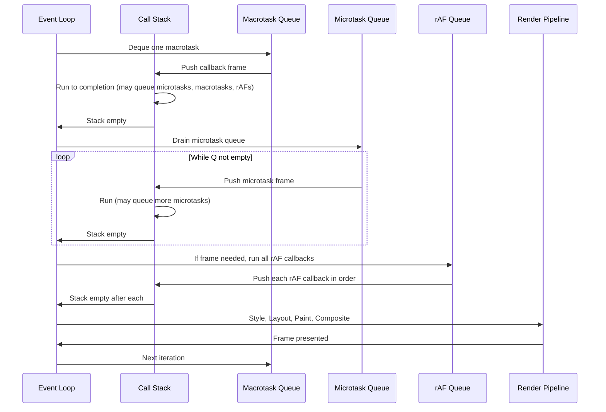
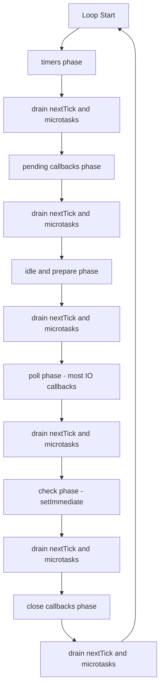

# 1.26 Event Loop Concurrency Model

## 1. Purpose

JavaScript was designed in 1995 by Brendan Eich in roughly ten days, originally for the narrow purpose of sprinkling small interactive behaviors onto web pages. The defining constraint of the language was the browser environment itself: a single UI thread was responsible for parsing HTML, applying CSS, executing JavaScript, and painting pixels to the screen. If JavaScript blocked that thread, the page froze. Eich therefore gave the language a concurrency model built around cooperative non-blocking I/O rather than preemptive threads. That single design decision, made for a 1995 web browser, is the reason modern JavaScript can today power streaming video players, real-time collaborative editors, and Node.js servers that handle tens of thousands of concurrent WebSocket connections from a single process.

The event loop is the runtime mechanism that delivers on this promise. It is the dispatcher that takes callback functions queued by Web APIs (timers, network, file system, DOM events) and feeds them back to the JavaScript engine when the call stack is empty. Without the event loop, every network request, every `setTimeout`, and every button click would have to be processed inline and synchronously, blocking the page. With the event loop, those operations are offloaded to host-provided C++ APIs in the browser or to libuv in Node, and the JavaScript thread is only briefly re-entered when results are ready.

The event loop enables four categories of behavior that define modern JavaScript:

1. **Responsive user interfaces.** Long I/O waits (`fetch`, IndexedDB, image decode) do not freeze the page because the JavaScript thread is not waiting; it has been released back to the event loop, which can repaint, process input, or run other callbacks in the meantime.
2. **High-concurrency servers (Node.js).** A single Node process can hold tens of thousands of open sockets because each `fs.readFile` or `http.get` releases the thread. The event loop processes the completion callbacks in sequence as results arrive.
3. **Cooperative multitasking within a single thread.** Multiple logical tasks (a network request here, an animation there, a click handler over there) interleave by yielding at well-defined suspension points such as `await` or callback boundaries. The programmer controls when to yield; the event loop controls the order of resumption.
4. **Predictable ordering between timer, I/O, microtask, and rendering work.** The browser event loop has a well-defined phase order (run a macrotask, drain microtasks, run animation frame callbacks, render, repeat). This makes it possible to reason precisely about which callback runs first.

But the same model that delivers these benefits creates the single largest class of performance bugs in JavaScript: **blocking the event loop**. Because there is exactly one JavaScript thread per realm, any synchronous work that takes too long freezes everything. A `while (true)` loop, a synchronous `JSON.parse` of a 200MB string, a tight CPU-bound computation, or a synchronous XHR all stall the event loop. During that stall, no timers fire, no network callbacks run, no UI is painted, and the page or server appears hung. In Node, this manifests as request latency spikes; in the browser, as jank and unresponsiveness.

A second, subtler bug class is **microtask starvation of macrotasks**. The HTML spec mandates that the microtask queue is drained completely after every macrotask and before the next macrotask. A microtask that schedules another microtask, which schedules another, which schedules another, can starve the macrotask queue indefinitely. Promises, `queueMicrotask`, and `await` continuations are all microtasks. An unbounded recursive `Promise.resolve().then()` chain will block timers, I/O callbacks, and rendering forever, even though no single function is doing much work.

A third class is **`requestAnimationFrame` misuse**. Animation frame callbacks run before repaint and do NOT fire when the tab is backgrounded, so using rAF for non-visual work (such as background reconciliation or polling) silently pauses when the user switches tabs.

This note covers all of these behaviors exhaustively. By the end, the reader will be able to predict the execution order of any combination of `setTimeout`, `Promise.then`, `queueMicrotask`, `requestAnimationFrame`, and synchronous code; explain the precise difference between the browser event loop and the Node event loop; diagnose a frozen page or server; and implement a cooperative scheduler that yields to the event loop on demand.

## 2. Theory and Deep Dive

### 2.1 The four pillars

The browser event loop has four conceptual components that interact in a well-defined order:

1. **The call stack (LIFO).** The single JavaScript execution stack. Functions push frames when called, pop them when they return. The event loop never runs JavaScript while the stack is non-empty.
2. **The host environment Web APIs / C++ APIs.** These are not JavaScript. They are browser-provided (or Node-provided) C++ implementations of `setTimeout`, `XMLHttpRequest` and `fetch`, the DOM, IndexedDB, WebCrypto, file system, and so on. They run on the browser C++ threads (or, in Node, on libuv's thread pool for some operations) and post completion callbacks back to the queues.
3. **The macrotask queue (FIFO).** Also called the task queue or event queue. Holds callbacks scheduled by `setTimeout`, `setInterval`, I/O completions, UI events such as `click` and `input`, `MessageChannel`, `postMessage`, and (in Node) `setImmediate`. The event loop picks ONE macrotask per iteration, runs it to completion, then drains microtasks.
4. **The microtask queue (FIFO).** Also called the job queue. Holds Promise reaction callbacks (`then`, `catch`, `finally`), `queueMicrotask`, `MutationObserver` callbacks, and (in Node) `process.nextTick` (which has its own queue that runs even before microtasks). The microtask queue is fully drained after every macrotask and after every microtask. New microtasks queued during the drain run before the next macrotask.

A separate, smaller queue exists for **animation frame callbacks** scheduled by `requestAnimationFrame`. This queue is processed at most once per frame, right before the browser's paint step, and only if a paint is scheduled.

### 2.2 The call stack

The call stack is the engine's mechanism for tracking which function is currently executing and where to return when it finishes. Each function invocation pushes a frame containing the function's local variables, `this`, `arguments`, and the return address. When the function returns, the frame is popped. Recursion depth is bounded by the stack size (V8's default is roughly 10,000 to 15,000 frames in browsers, higher in Node).

The event loop's most important rule about the call stack is: **JavaScript runs only when the stack is empty.** A macrotask is, by definition, the work that happens between the stack becoming empty and the next time it becomes empty. The phrase "runs a macrotask" means: deque a callback, push its frame, run to completion (synchronously, including any synchronous calls it makes), pop the frame, and check the microtask queue.

Because the stack must empty between macrotasks, the entire JavaScript program is effectively a sequence of macrotasks interleaved with microtask drains. The initial script is itself the first macrotask. Each click handler, each timer callback, each `await` continuation (continuations are microtasks) is another piece of work that runs only when the stack is empty.

### 2.3 The macrotask (task) queue

The HTML specification defines a "task" as a discrete unit of work scheduled to run on the event loop. Tasks are categorized into task sources, and the browser maintains at least one task queue per source. The common sources are:

- **The timer task source.** Callbacks from `setTimeout` and `setInterval`.
- **The networking task source.** Callbacks from `fetch`, `XMLHttpRequest`, WebSocket messages.
- **The DOM manipulation task source.** Used internally for some DOM batching.
- **The user interaction task source.** Click, input, keyboard, pointer events.
- **The history traversal task source.** Used by the back and forward cache.

The spec lets browsers freely interleave tasks from different sources; the order WITHIN a source is preserved, but the order BETWEEN sources is implementation-defined. This is why two `setTimeout(fn, 0)` calls reliably run in order (same source) but a `setTimeout` and a `fetch` callback may run in either order relative to each other (different sources).

Critical detail: `setTimeout(fn, 0)` is clamped. The HTML spec mandates that nested `setTimeout` calls past depth 5 are clamped to a minimum of 4ms. This means a chain of `setTimeout` callbacks that each schedule another `setTimeout(fn, 0)` will, after five levels of nesting, slow to one callback every 4ms. The 0ms delay is a request, not a guarantee.

`setInterval` has a related issue: it does not guarantee regular spacing. If callback N takes longer than the interval, callback N+1 fires immediately after N finishes (no overlap; only one callback is queued at a time per timer). The interval measures time from one fire to the next planned fire, so drift accumulates. Also, background tabs throttle `setInterval` to roughly 1Hz in Chrome.

### 2.4 The microtask queue

Microtasks were introduced with Promises in ES2015, but the concept pre-dates Promises (Node's `process.nextTick` has existed since 2009). The microtask queue is FIFO and is drained completely after every macrotask, after every microtask, and (in some browsers) at other integration points such as the end of a script.

The HTML spec's microtask checkpoint algorithm, simplified:

1. If performing a microtask checkpoint is already in progress, return.
2. Set the performing-a-microtask-checkpoint flag.
3. While the microtask queue is not empty:
   a. Deque the oldest microtask.
   b. Run it to completion (synchronously).
   c. If new microtasks were queued during step (b), they will be picked up by the next iteration of this while loop.
4. Clear the flag.

The implication is profound: a microtask that queues another microtask will see that new microtask run before the next macrotask. An unbounded chain of microtasks will never yield to the macrotask queue. This is "microtask starvation."

```javascript
// Microtask starvation - DO NOT RUN unless you want to hang the tab
function starve() {
  Promise.resolve().then(starve);
}
starve();
// setTimeout(() => console.log('never'), 0);  // never fires
```

The microtask queue includes:

- `Promise.prototype.then` / `catch` / `finally` reaction callbacks.
- `queueMicrotask(fn)` callbacks.
- `MutationObserver` callbacks (per the modern HTML spec).
- `async`/`await` continuations (which are sugar over `.then`).
- In Node only: `process.nextTick` callbacks, which have their own queue that runs BEFORE the microtask queue, making them even higher priority.

### 2.5 The animation frame queue

`requestAnimationFrame` (rAF) is a separate queue that runs callbacks at most once per frame, immediately before the browser's repaint step. The browser calls all rAF callbacks queued during the previous frame in registration order. The callback receives a high-resolution timestamp argument (the time relative to the page's time origin).

Critical properties:

- rAF callbacks do NOT run when the tab is backgrounded. The browser pauses rAF to save power. This is desirable for animations but catastrophic if you have used rAF for non-visual work such as a scheduler that drives computation via rAF.
- rAF callbacks run AFTER microtasks but BEFORE paint. The order in one frame is: macrotask, then microtasks, then rAF callbacks, then style, then layout, then paint, then composite.
- rAF runs at most once per frame. Multiple rAF calls in one frame produce multiple callbacks in the next frame.
- `cancelAnimationFrame(id)` cancels a pending rAF.
- The frame rate is bounded by the display refresh rate (typically 60Hz, but 120Hz or 144Hz on high-refresh displays). rAF cannot run more often than the display refreshes.

### 2.6 The rendering pipeline

The browser's rendering pipeline, between the rAF callbacks and the next macrotask, is conventionally described as four stages:

1. **Style recalculation.** Recompute which CSS rules apply to which elements. Triggered by class changes, attribute changes, media query changes, and so on.
2. **Layout.** Compute geometry (positions, sizes) of every visible element. Triggered by DOM mutations that affect geometry (adding or removing elements, changing dimensions, and so on). Layout is expensive because it cascades: changing a parent's width re-layouts all descendants.
3. **Paint.** Rasterize each layer into pixel bitmaps. Triggered by color, background, shadow, text changes.
4. **Composite.** The GPU combines the painted layers into the final frame. Triggered by transform and opacity changes, which is why animating `transform` and `opacity` is the cheapest way to animate because they skip layout and paint.

The browser only runs the pipeline if a frame is needed. Most browsers target 60 frames per second (one frame every roughly 16.67ms), so the event loop has roughly 16ms per iteration to do JavaScript work plus rendering. If JavaScript exceeds 16ms, the browser drops frames (jank).

Reading layout properties (such as `element.offsetWidth`, `getBoundingClientRect`, or `window.scrollY`) forces a synchronous layout (a "layout thrash" or "forced reflow"). Doing this in a loop is a classic performance bug.

### 2.7 The Node.js event loop: phases

Node's event loop is implemented by libuv, not by the HTML spec. It has a different, more elaborate phase structure. The phases, in order, are:

1. **timers.** Runs callbacks scheduled by `setTimeout` and `setInterval` whose thresholds have elapsed.
2. **pending callbacks.** Runs certain system-level callbacks (TCP errors, DNS errors, and so on) deferred from the previous iteration.
3. **idle, prepare.** Internal libuv use only.
4. **poll.** Retrieves new I/O events. This is where most file system and network callbacks run. If the poll queue is empty and a `setImmediate` is queued, libuv may jump to the check phase.
5. **check.** Runs callbacks scheduled by `setImmediate`.
6. **close callbacks.** Runs close handlers (such as `socket.on('close', ...)`).

Between each phase, Node drains two microtask-like queues:

- **The `process.nextTick` queue.** Runs ALL queued nextTick callbacks before moving on. Higher priority than microtasks.
- **The microtask queue (Promises).** Runs after the nextTick queue.

So the Node order per iteration is roughly: timers phase, drain nextTick and microtasks, pending callbacks phase, drain, idle and prepare phase, drain, poll phase, drain, check phase, drain, close callbacks phase, drain, repeat.

Critical Node-specific facts:

- `process.nextTick` is higher priority than Promises. A `Promise.resolve().then(fn)` runs AFTER a `process.nextTick(fn)` queued at the same time.
- `setImmediate` is NOT the same as `setTimeout(fn, 0)`. In the main module, their order is non-deterministic (depends on process startup timing). Inside an I/O callback, `setImmediate` always runs before `setTimeout(fn, 0)` because the check phase comes after the poll phase.
- libuv uses a thread pool (default 4 threads, configurable via the libuv thread pool size environment variable) for operations that lack async OS APIs: file system operations, `dns.lookup`, and some crypto. These do CPU or I/O work off-thread and post completion callbacks to the poll queue.
- Node has no `requestAnimationFrame` (no rendering). Animation work is not a Node concept.
- Node has no MutationObserver (no DOM).

### 2.8 Mermaid: one full browser event loop iteration



### 2.9 Mermaid: Node.js event loop phases



### 2.10 The ordering rules in plain English

Memorize these six rules and you can predict execution order of almost any mix:

1. **Sync code runs first.** Every line of synchronous code in the current macrotask runs to completion before any microtask or macrotask.
2. **Microtasks drain before the next macrotask.** After the current macrotask finishes, the microtask queue is fully drained (including microtasks queued during the drain) before the next macrotask.
3. **Microtasks drain before rAF.** Microtasks run before rAF callbacks in the same frame.
4. **rAF runs before paint and at most once per frame.** If the tab is backgrounded, rAF does not run.
5. **Macrotask ordering between sources is implementation-defined.** Order within a source is FIFO.
6. **`process.nextTick` (Node only) runs before microtasks, between every phase.**

### 2.11 What `await` does to the event loop

An `await x` expression, where `x` is a Promise, suspends the async function and registers a continuation. The continuation is scheduled as a microtask when `x` settles. This means:

- Each `await` is a suspension point that yields control to the microtask queue.
- A loop of `await` calls processes one iteration per microtask drain, NOT per macrotask.
- The macrotask queue can starve if a `for` loop awaits a Promise that resolves immediately (`await Promise.resolve()`), because each iteration is a microtask.

For long async loops that need to let I/O through, you must explicitly yield to a macrotask: `await new Promise(r => setTimeout(r, 0))` (browser) or `await new Promise(r => setImmediate(r))` (Node).

### 2.12 ECMAScript spec relationship

The ECMAScript spec itself does not define the event loop. It defines the abstract operation `EnqueueJob` (renamed `HostEnqueuePromiseJob` in newer specs) which schedules a Promise reaction as a "Job." The host (browser or Node) is responsible for deciding WHEN the Job runs. The HTML spec and libuv each provide their own event loop that drains the Job queue at well-defined points.

This separation of concerns is why the language semantics (Promise resolution order) and the host semantics (when Jobs run relative to timers and I/O) are specified in different documents. The ECMAScript spec guarantees that a resolved Promise's `then` callback runs after the current synchronous execution finishes; the HTML spec guarantees it runs before the next macrotask.

### 2.13 How V8 implements the queues

V8 itself maintains a microtask queue per isolate (per realm). When a Promise resolves, V8 enqueues the reaction callbacks onto this internal queue. The embedder (Chrome or Node) calls `MicrotasksPolicy::kAuto` or `kExplicit` to control when V8 drains the queue. Chrome drains automatically at every microtask checkpoint (end of macrotask, end of microtask). Node historically used explicit draining at the end of each phase but moved to auto-draining in Node 11+, aligning browser and Node behavior for the common case.

## 3. Mental Models

Mental models matter because the event loop is invisible. You cannot see the queues; you can only reason about them. The right metaphor collapses a thousand lines of spec into one intuition.

**Mental model 1: The chef and the ticket rail.** The call stack is the chef currently cooking a dish. The macrotask queue is the ticket rail: each ticket is one order. The chef pulls one ticket, cooks it to completion (no interrupting mid-dish), and only then pulls the next ticket. The microtask queue is the chef's "while I'm at this station" list, small things the chef can do without walking back to the rail. After each dish (and after each small thing), the chef does all the small things queued. If a small thing queues another small thing, that one runs too, before the chef walks back to the rail. The rAF queue is the chef's "before the next plate leaves the kitchen, garnish it" list, done once per plate that gets sent out.

**Mental model 2: Call stack equals "now."** Whatever is on the call stack is happening RIGHT NOW. There is nothing else happening. JavaScript is single-threaded; only one function is ever executing at a time. The call stack is the entire present moment.

**Mental model 3: Macrotask queue equals "next."** The macrotask queue is the list of things that will happen, one at a time, after the current thing finishes and after all microtasks drain. It is the future, sequenced FIFO.

**Mental model 4: Microtask queue equals "right after now, before next."** The microtask queue is the urgent insert list. Anything queued as a microtask will run before the next macrotask. If you queue a microtask inside a microtask, the new one runs before the next macrotask too. Microtasks are "as soon as possible but not synchronously."

**Mental model 5: rAF equals "right before the next paint."** Animation frame callbacks are tied to the visual refresh. They run at most once per frame, just before pixels are repainted. They are the only queue that knows about rendering.

**Mental model 6: Blocking equals "the whole world stops."** Because there is one thread, any synchronous work blocks everything. While `JSON.parse(hugeString)` runs, no timer fires, no fetch resolves, no click is handled, no pixel is painted. The browser cannot even scroll. The page appears frozen. In Node, the server appears to drop connections.

**Mental model 7: Node's nextTick equals "even more urgent than microtasks."** In Node, `process.nextTick` is the most urgent queue. It runs after every phase and before microtasks. Use sparingly.

**Mental model 8: Phases in Node, frames in browser.** The browser's loop is frame-driven (60Hz target, rAF plus paint per frame). Node's loop is throughput-driven (no rendering, just phase rotation). The browser has a "render" step; Node does not.

## 4. Real-World Use Cases

### 4.1 `setTimeout(fn, 0)` to defer to the next tick

A common idiom for breaking a long synchronous operation into two pieces: do the first half now, schedule the second half with `setTimeout(fn, 0)` (or `queueMicrotask`), and the UI can paint between them. Used by libraries like React's pre-fiber reconciler for chunking render work, and by jQuery internally for ready handlers.

Real example: clicking a button triggers heavy work. The button's `:active` style will not paint until the click handler returns. Deferring the heavy work with `setTimeout(work, 0)` lets the browser paint the active state first, giving the user immediate feedback.

### 4.2 `queueMicrotask` for high-priority cleanup

When a Promise resolves, its `then` callbacks run as microtasks. If you have cleanup work that must happen before any other timer or I/O callback, schedule it with `queueMicrotask`. Examples: releasing a lock, releasing a slot in a semaphore, notifying subscribers that a value has changed before they observe a stale state.

### 4.3 `requestAnimationFrame` for smooth animations

The right tool for any visual animation. rAF syncs to the monitor's refresh, so you never render frames the user will never see (which wastes battery and CPU). Before rAF (pre-2012), developers used `setInterval(animate, 16)` which drifted, oversampled on high-refresh displays, and kept running in backgrounded tabs.

Real example: a particle system animating 5,000 particles. Each rAF callback computes new positions and writes them to a canvas. On a 60Hz display, this runs 60 times per second. On a 120Hz iPad, it runs 120 times per second, producing smoother motion automatically with no code change. When the user switches tabs, it pauses, saving battery.

### 4.4 `Promise.resolve().then(fn)` for microtask scheduling

Equivalent to `queueMicrotask(fn)` for non-throwing functions. Used to defer a small piece of work to the next microtask drain. Async/await's continuation uses this internally.

### 4.5 `async`/`await` running continuations as microtasks

Every `await` suspends the async function and resumes it via a microtask when the awaited Promise settles. This is why `for await (const x of stream)` consumes one item per microtask: it can starve the macrotask queue if items resolve immediately.

Real example: paginating through an API with `await fetch(url)` in a loop. Each iteration yields to the microtask queue, but because fetch involves real I/O, the loop pauses at each network round trip and the event loop has time to handle other work.

### 4.6 Long-running computation blocks the loop

A naive JSON parser of a 100MB file, a tight prime sieve, or a synchronous crypto operation will freeze the page or server. Solutions:

- **Chunk the work.** Process N items, then `await new Promise(r => setTimeout(r, 0))` to yield to the macrotask queue. This lets timers, I/O, and rendering through.
- **Use a Web Worker (browser) or Worker thread (Node).** Offload CPU-heavy work to a separate thread. The main thread posts a message, the worker computes, the worker posts the result back. The main thread's event loop is untouched.
- **Use a native addon.** For genuinely CPU-heavy work (image processing, video encoding), write the heavy work in C++ via Node N-API or the browser's WebAssembly. The JavaScript event loop is for orchestration, not for computation.

### 4.7 Batching DOM writes

Reading `element.offsetWidth` forces layout. Writing `element.style.width` schedules layout. If you interleave reads and writes, each read forces a layout reflow. The fix: batch all reads, then all writes. This is what libraries like FastDOM do. It can turn a 100ms layout thrash into a 5ms single reflow.

### 4.8 Backgrounded-tab pausing

When a tab is backgrounded, browsers throttle `setTimeout`/`setInterval` to once per second (Chrome) and pause rAF entirely. If your code uses `setInterval(refresh, 100)` to poll an API, it will run only once per second in a background tab. If your code uses rAF to drive a scheduler, it will stop entirely. For true background work, use `setInterval` with a long interval, the Page Visibility API to detect visibility changes, or a Service Worker.

## 5. Code Examples

### 5.1 Example A — Minimal and Conceptual

Predict the output order of `setTimeout`, `Promise.then`, `queueMicrotask`, `requestAnimationFrame`, and synchronous code.

**JavaScript:**

```javascript
console.log('1 sync');

setTimeout(() => console.log('2 setTimeout'), 0);

Promise.resolve().then(() => console.log('3 promise.then'));

queueMicrotask(() => console.log('4 queueMicrotask'));

requestAnimationFrame(() => console.log('5 rAF'));

console.log('6 sync');
```

**TypeScript:**

```typescript
console.log('1 sync');

setTimeout(() => console.log('2 setTimeout'), 0);

Promise.resolve().then(() => console.log('3 promise.then'));

queueMicrotask(() => console.log('4 queueMicrotask'));

requestAnimationFrame(() => console.log('5 rAF'));

console.log('6 sync');
```

**Execution order and explanation:**

1. `1 sync` — synchronous, runs immediately.
2. `6 sync` — synchronous, runs immediately after `1`.
3. `3 promise.then` — microtask, drains after current macrotask.
4. `4 queueMicrotask` — microtask, drains in the same microtask drain.
5. `2 setTimeout` — macrotask, runs in the NEXT iteration.
6. `5 rAF` — runs before the next paint, which is tied to the frame. In practice, rAF usually fires between the microtask drain and the first macrotask, but the exact ordering of rAF versus setTimeout depends on browser timing: if a paint is scheduled before the setTimeout fires, rAF runs first; otherwise setTimeout runs first.

The reliable rule: sync first, then microtasks in FIFO, then macrotasks interleaved with rAF (browser-dependent).

For a stable, predictable answer: `1, 6, 3, 4, 2 or 5, 5 or 2`. The first four are deterministic; the last two race based on frame timing.

### 5.2 Example B — Production-Grade Cooperative Task Scheduler

A typed task scheduler that yields to the event loop every N milliseconds to avoid blocking. Supports priority levels: microtask, macrotask, animation frame.

**JavaScript:**

```javascript
// Cooperative scheduler with priority levels.
// Yields to the event loop every budgetMs to avoid blocking.

const PRIORITY = Object.freeze({
  Microtask: 'microtask',
  Macrotask: 'macrotask',
  AnimationFrame: 'animation-frame',
});

class CooperativeScheduler {
  constructor(budgetMs = 8) {
    this.budgetMs = budgetMs;
    this.queues = {
      [PRIORITY.Microtask]: [],
      [PRIORITY.Macrotask]: [],
      [PRIORITY.AnimationFrame]: [],
    };
    this.macrotaskScheduled = false;
    this.frameLoopActive = false;
  }

  schedule(task, priority = PRIORITY.Macrotask) {
    if (typeof task !== 'function') {
      throw new TypeError('task must be a function');
    }
    this.queues[priority].push(task);
    this.kick(priority);
  }

  kick(priority) {
    if (priority === PRIORITY.Microtask) {
      queueMicrotask(() => this.drainMicrotasks());
    } else if (priority === PRIORITY.Macrotask) {
      if (!this.macrotaskScheduled) {
        this.macrotaskScheduled = true;
        setTimeout(() => {
          this.macrotaskScheduled = false;
          this.drainMacrotasks();
        }, 0);
      }
    } else if (priority === PRIORITY.AnimationFrame) {
      if (!this.frameLoopActive) {
        this.frameLoopActive = true;
        const loop = () => {
          this.drainAnimationFrame();
          if (this.queues[PRIORITY.AnimationFrame].length > 0) {
            requestAnimationFrame(loop);
          } else {
            this.frameLoopActive = false;
          }
        };
        requestAnimationFrame(loop);
      }
    }
  }

  drainMicrotasks() {
    const q = this.queues[PRIORITY.Microtask];
    while (q.length > 0) {
      const task = q.shift();
      try {
        task();
      } catch (err) {
        // Defer error to macrotask to avoid throwing inside the microtask drain.
        setTimeout(() => { throw err; }, 0);
      }
    }
  }

  drainMacrotasks() {
    const q = this.queues[PRIORITY.Macrotask];
    const start = performance.now();
    while (q.length > 0) {
      const task = q.shift();
      try {
        task();
      } catch (err) {
        console.error('Scheduler task error:', err);
      }
      if (performance.now() - start > this.budgetMs) {
        // Yield to the event loop.
        if (q.length > 0) {
          this.macrotaskScheduled = true;
          setTimeout(() => {
            this.macrotaskScheduled = false;
            this.drainMacrotasks();
          }, 0);
        }
        return;
      }
    }
  }

  drainAnimationFrame() {
    const q = this.queues[PRIORITY.AnimationFrame];
    const start = performance.now();
    while (q.length > 0 && performance.now() - start < this.budgetMs) {
      const task = q.shift();
      try {
        task(performance.now());
      } catch (err) {
        console.error('rAF task error:', err);
      }
    }
  }
}

// Usage:
const scheduler = new CooperativeScheduler(8);
for (let i = 0; i < 10000; i++) {
  scheduler.schedule(() => { /* unit of work */ }, PRIORITY.Macrotask);
}
scheduler.schedule(() => console.log('urgent cleanup'), PRIORITY.Microtask);
scheduler.schedule((t) => console.log('paint at', t), PRIORITY.AnimationFrame);
```

**TypeScript:**

```typescript
// Cooperative scheduler with priority levels.
// Yields to the event loop every budgetMs to avoid blocking.

type TaskPriority = 'microtask' | 'macrotask' | 'animation-frame';

const PRIORITY = Object.freeze({
  Microtask: 'microtask' as const,
  Macrotask: 'macrotask' as const,
  AnimationFrame: 'animation-frame' as const,
});

type MicrotaskFn = () => void;
type MacrotaskFn = () => void;
type AnimationFrameFn = (time: number) => void;

class CooperativeScheduler {
  private readonly budgetMs: number;
  private readonly queues: {
    readonly microtask: Array<MicrotaskFn>;
    readonly macrotask: Array<MacrotaskFn>;
    readonly 'animation-frame': Array<AnimationFrameFn>;
  };
  private macrotaskScheduled: boolean;
  private frameLoopActive: boolean;

  constructor(budgetMs: number = 8) {
    this.budgetMs = budgetMs;
    this.queues = {
      microtask: [],
      macrotask: [],
      'animation-frame': [],
    };
    this.macrotaskScheduled = false;
    this.frameLoopActive = false;
  }

  schedule(task: MicrotaskFn, priority: 'microtask'): void;
  schedule(task: MacrotaskFn, priority: 'macrotask'): void;
  schedule(task: AnimationFrameFn, priority: 'animation-frame'): void;
  schedule(task: () => void, priority: TaskPriority = PRIORITY.Macrotask): void {
    if (typeof task !== 'function') {
      throw new TypeError('task must be a function');
    }
    if (priority === PRIORITY.Microtask) {
      this.queues.microtask.push(task as MicrotaskFn);
    } else if (priority === PRIORITY.Macrotask) {
      this.queues.macrotask.push(task as MacrotaskFn);
    } else {
      this.queues['animation-frame'].push(task as AnimationFrameFn);
    }
    this.kick(priority);
  }

  private kick(priority: TaskPriority): void {
    if (priority === PRIORITY.Microtask) {
      queueMicrotask(() => this.drainMicrotasks());
    } else if (priority === PRIORITY.Macrotask) {
      if (!this.macrotaskScheduled) {
        this.macrotaskScheduled = true;
        setTimeout(() => {
          this.macrotaskScheduled = false;
          this.drainMacrotasks();
        }, 0);
      }
    } else if (priority === PRIORITY.AnimationFrame) {
      if (!this.frameLoopActive) {
        this.frameLoopActive = true;
        const loop = (): void => {
          this.drainAnimationFrame();
          if (this.queues['animation-frame'].length > 0) {
            requestAnimationFrame(loop);
          } else {
            this.frameLoopActive = false;
          }
        };
        requestAnimationFrame(loop);
      }
    }
  }

  private drainMicrotasks(): void {
    const q = this.queues.microtask;
    while (q.length > 0) {
      const task = q.shift() as MicrotaskFn;
      try {
        task();
      } catch (err) {
        setTimeout(() => { throw err; }, 0);
      }
    }
  }

  private drainMacrotasks(): void {
    const q = this.queues.macrotask;
    const start = performance.now();
    while (q.length > 0) {
      const task = q.shift() as MacrotaskFn;
      try {
        task();
      } catch (err) {
        console.error('Scheduler task error:', err);
      }
      if (performance.now() - start > this.budgetMs) {
        if (q.length > 0) {
          this.macrotaskScheduled = true;
          setTimeout(() => {
            this.macrotaskScheduled = false;
            this.drainMacrotasks();
          }, 0);
        }
        return;
      }
    }
  }

  private drainAnimationFrame(): void {
    const q = this.queues['animation-frame'];
    const start = performance.now();
    while (q.length > 0 && performance.now() - start < this.budgetMs) {
      const task = q.shift() as AnimationFrameFn;
      try {
        task(performance.now());
      } catch (err) {
        console.error('rAF task error:', err);
      }
    }
  }
}

// Usage:
const scheduler = new CooperativeScheduler(8);
for (let i = 0; i < 10000; i++) {
  scheduler.schedule(() => { /* unit of work */ }, PRIORITY.Macrotask);
}
scheduler.schedule(() => console.log('urgent cleanup'), PRIORITY.Microtask);
scheduler.schedule((t) => console.log('paint at', t), PRIORITY.AnimationFrame);
```

Key design points:

- **Three queues**, one per priority, with three independent drains.
- **Budget tracking** in `drainMacrotasks` and `drainAnimationFrame` re-arms itself with `setTimeout(0)` when exceeded.
- **Error isolation** so one failing task does not kill the drain.
- **Lazy frame loop** that only runs while there is animation work.
- **Microtask errors are deferred** to a macrotask via `setTimeout(() => { throw err; }, 0)` to avoid throwing inside the microtask drain, which would propagate up to the macrotask that triggered the drain and produce confusing stack traces.

## 6. Common Mistakes and Anti-Patterns

### 6.1 Blocking the loop with synchronous I/O or heavy CPU

The classic. Any sync I/O (`fs.readFileSync`, `JSON.parse` of huge strings, synchronous XHR, `crypto.scryptSync`) or tight CPU loop (`while (true)`, naive prime sieve) freezes everything. In Node, this manifests as latency spikes on all requests; in the browser, as jank and unresponsive UI.

**Fix:** Use async APIs (`fs.promises.readFile`, `crypto.scrypt`). For CPU work, chunk with `await new Promise(r => setTimeout(r, 0))` every N ms, or offload to a Worker.

### 6.2 Infinite microtask loop

```javascript
function starve() {
  Promise.resolve().then(starve);
}
starve();
```

This never yields. The microtask queue is never empty, so the macrotask queue (timers, I/O, rendering) never runs. The page hangs with the call stack always returning to the microtask drain. No error is thrown.

**Fix:** Use `setTimeout(starve, 0)` for deferral that lets macrotasks through, or use a real scheduler with a budget.

### 6.3 `setTimeout(fn, 0)` does not fire immediately

The HTML spec clamps nested `setTimeout` past depth 5 to 4ms minimum. So:

```javascript
function recurse(depth) {
  console.log(depth);
  if (depth < 100) setTimeout(() => recurse(depth + 1), 0);
}
recurse(0);
```

The first 5 fire roughly 0ms apart; the rest are clamped to roughly 4ms apart. The whole chain takes roughly 380ms instead of the hoped-for 0.

**Fix:** For truly urgent work, use `queueMicrotask` (but beware starvation). For high-throughput deferral, batch multiple operations per macrotask, or use `MessageChannel` (browser) or `setImmediate` (Node) which do not clamp.

### 6.4 `setInterval` drift

`setInterval(fn, 16)` does not fire every 16ms. It fires at most every 16ms. If callback N takes 50ms, callbacks N+1, N+2, N+3 do NOT fire in quick succession; only one is queued. The interval measures from one fire to the next planned fire, so drift accumulates. Also, background tabs throttle `setInterval` to 1Hz in Chrome.

**Fix:** For animations, use `requestAnimationFrame`. For regular non-visual work, use `setTimeout` recursively (`function step() { doWork(); setTimeout(step, 16); }`) to avoid drift accumulation. For precise scheduling, compute `delta = now - lastTime` and catch up.

### 6.5 `requestAnimationFrame` does not fire when tab is backgrounded

rAF pauses when the tab is hidden. If you have built a scheduler, a heartbeat, or any non-visual logic on top of rAF, it silently stops.

**Fix:** Use the Page Visibility API (`document.visibilityState`) to detect backgrounding and switch to a fallback timer. For non-visual work, do not use rAF.

### 6.6 Mixing microtasks and macrotasks and being surprised by order

```javascript
console.log('A');
setTimeout(() => console.log('B'));
Promise.resolve().then(() => console.log('C'));
console.log('D');
```

Output: `A, D, C, B`. Developers who do not know microtasks drain before the next macrotask often expect `A, D, B, C` (queue order) or `A, B, C, D` (declaration order). The correct rule: sync first, then all microtasks, then one macrotask, then more microtasks, then another macrotask.

### 6.7 Reading layout in a loop (layout thrash)

```javascript
for (let i = 0; i < items.length; i++) {
  items[i].style.left = (items[i].offsetLeft + 10) + 'px';
}
```

Each `offsetLeft` read forces layout because the previous `style.left` write invalidated it. N iterations equals N layouts. With 1,000 items, this can take 100ms instead of 5ms.

**Fix:** Read all positions first, then write all positions. Or use `requestAnimationFrame` to batch writes.

### 6.8 `await` inside a forEach

```javascript
ids.forEach(async (id) => { await fetch('/api/' + id); });
console.log('done');
```

`forEach` does not await its callback. `'done'` logs before any fetch completes, and unhandled rejections may be lost.

**Fix:** Use `for...of` (`for (const id of ids) { await fetch('/api/' + id); }`) or `Promise.all(ids.map(id => fetch('/api/' + id)))` for parallel.

### 6.9 Unhandled rejection crashing Node

In Node 15 and later, unhandled Promise rejections crash the process by default. Forgetting a `.catch()` on a Promise from an I/O callback can take down a server.

**Fix:** Always terminate Promise chains with `.catch()` or wrap `await` in `try/catch`. Use `process.on('unhandledRejection', ...)` as a safety net (but not as a primary handler).

### 6.10 Using `process.nextTick` recursively

In Node, `process.nextTick` runs before I/O. Recursively calling `process.nextTick` starves I/O forever.

```javascript
function rec() { process.nextTick(rec); }
rec();
// I/O never runs; server appears hung.
```

**Fix:** Use `setImmediate` for recursive deferral that lets I/O through.

## 7. Best Practices and Design Patterns

### 7.1 Never block with synchronous I/O

Use the async version of every I/O API. In Node, prefer `fs.promises.readFile` over `fs.readFileSync` (except in startup code that runs once). In the browser, use `fetch` instead of synchronous XHR (which is deprecated and removed in modern browsers).

### 7.2 Chunk long computations

For CPU-bound work that must run on the main thread, yield every N milliseconds:

```javascript
async function processItems(items) {
  const start = performance.now();
  for (let i = 0; i < items.length; i++) {
    doWork(items[i]);
    if (performance.now() - start > 8) {
      await new Promise(resolve => setTimeout(resolve, 0));
    }
  }
}
```

In Node, use `setImmediate` instead of `setTimeout(0)` for the yield: it is faster and explicitly designed for this use case.

### 7.3 Use microtasks for high-priority cleanup

When you need cleanup to run before any other timer or I/O callback, use `queueMicrotask` or `Promise.resolve().then(fn)`. Use cases: releasing locks, releasing slots, notifying subscribers of a synchronous state change.

### 7.4 Use `requestAnimationFrame` for visual work

For anything that touches the DOM in a way the user will see, schedule it with rAF. This ensures the work runs at most once per frame and aligns with the browser's paint cycle. For high-refresh displays, rAF will fire more often, producing smoother animation for free.

### 7.5 Use Workers for CPU-heavy work

The Web Worker API (browser) and Node Worker threads let you run CPU-heavy work on a separate thread with its own event loop. The main thread posts a message, the worker computes, the worker posts the result back. Use this for: image processing, video encoding, cryptographic brute-force, large JSON parsing, ML inference.

### 7.6 In Node, prefer `setImmediate` for I/O-bound deferral

`setImmediate` runs in the check phase, after the poll phase. It is the right way to defer work "right after the current I/O cycle." `setTimeout(0)` is for timer-aligned deferral.

### 7.7 Use `process.nextTick` sparingly

`process.nextTick` is higher priority than microtasks. It runs before I/O. Used recursively, it starves I/O. Used appropriately (such as to ensure an error is emitted on the next tick after an EventEmitter is constructed, so listeners can attach), it is essential. Used carelessly, it destroys throughput.

### 7.8 Batch DOM reads and writes

Separate read phases from write phases in any code that touches layout. Read all values first, then write all values. Use FastDOM or a similar library if you cannot enforce this manually.

### 7.9 Detect tab visibility for background-aware scheduling

Use the Page Visibility API to switch to a fallback (slower) timer when the tab is backgrounded. This is critical for any scheduler that uses rAF.

### 7.10 Use `AbortController` for cancellation

Long-running async work (fetch, rAF loops, setInterval loops) should accept an `AbortSignal` so callers can cancel. The event loop will not free resources tied to a pending callback unless you explicitly cancel it.

### 7.11 Use `MessageChannel` for zero-delay macrotasks

In the browser, `MessageChannel` (with `port.postMessage`) schedules a macrotask with no clamping, unlike `setTimeout(0)`'s 4ms clamp after depth 5. Used by React Scheduler and other high-performance libraries.

## 8. Technical Interview Knowledge

### 8.1 Q: Explain the event loop.

**A:** The event loop is the runtime mechanism that coordinates the single JavaScript thread with the host environment's asynchronous APIs. It has four components: the call stack (where the current function executes), the Web APIs and C++ APIs (which run timers, network, I/O off-thread), the macrotask queue (timers, I/O callbacks, UI events), and the microtask queue (Promise reactions, queueMicrotask, MutationObserver). The loop runs one macrotask to completion, drains the microtask queue (including microtasks spawned during the drain), runs any animation frame callbacks if a paint is scheduled, optionally renders, and repeats. Because JavaScript is single-threaded, any synchronous work blocks the loop.

### 8.2 Q: What is the difference between a microtask and a macrotask?

**A:** A macrotask is a discrete unit of work scheduled via `setTimeout`, `setInterval`, I/O completion, UI events, or `setImmediate` (Node). One macrotask runs per loop iteration. A microtask is a smaller unit scheduled via Promise reactions, `queueMicrotask`, or `MutationObserver`. All queued microtasks run after every macrotask (and after every microtask) before the next macrotask. Microtasks can starve macrotasks; macrotasks cannot starve microtasks (within reason).

### 8.3 Q: What does `setTimeout(fn, 0)` do?

**A:** Schedules `fn` as a macrotask. It does not run immediately; it runs after the current macrotask finishes and after the microtask queue drains. The HTML spec clamps nested `setTimeout` calls past depth 5 to 4ms, so a chain of `setTimeout(fn, 0)` calls each scheduling another will, after five levels, fire at most once per 4ms.

### 8.4 Q: How does `requestAnimationFrame` work?

**A:** Schedules a callback to run before the browser's next repaint. The callback receives a high-resolution timestamp. Multiple rAF calls in one frame all run in the next frame, in registration order. rAF is synced to the display refresh (60Hz, 120Hz, and so on), so it runs at most once per frame. It does NOT fire when the tab is backgrounded. It is the right tool for any visual animation; the wrong tool for non-visual work.

### 8.5 Q: What is the Node.js event loop phase order?

**A:** timers (setTimeout, setInterval), then pending callbacks, then idle and prepare, then poll (most I/O), then check (setImmediate), then close callbacks. Between each phase, Node drains the `process.nextTick` queue and then the microtask (Promise) queue. `process.nextTick` is higher priority than microtasks.

### 8.6 Q: What happens if a microtask spawns another microtask?

**A:** The new microtask runs in the same microtask drain, before the next macrotask. If a microtask recursively spawns microtasks indefinitely, the macrotask queue is starved: no timers, I/O, or rendering ever runs. This is "microtask starvation." It produces a hung page or server with no error.

### 8.7 Q: How does `async`/`await` interact with the event loop?

**A:** Each `await` suspends the async function and registers a continuation as a microtask. When the awaited Promise settles, the continuation runs as a microtask. This means a tight `for` loop with `await Promise.resolve()` runs one iteration per microtask drain, which can starve the macrotask queue. To let macrotasks through, yield with `await new Promise(r => setTimeout(r, 0))` or, in Node, `await new Promise(r => setImmediate(r))`.

### 8.8 Q: How would you chunk a long computation?

**A:** Track elapsed time with `performance.now()`. After every N items (or every 8ms), yield by awaiting a macrotask: `await new Promise(resolve => setTimeout(resolve, 0))` (browser) or `await new Promise(resolve => setImmediate(resolve))` (Node). For truly CPU-heavy work, offload to a Web Worker (browser) or Node Worker threads. Be careful not to use `queueMicrotask` for the yield: it does not let macrotasks through.

## 9. Practical Exercises

### 9.1 Exercise 1 — Predict output order of 15 mixed async calls

Predict the console output order:

```javascript
console.log('A');
setTimeout(() => console.log('B'), 0);
Promise.resolve().then(() => console.log('C'));
queueMicrotask(() => console.log('D'));
requestAnimationFrame(() => console.log('E'));
console.log('F');
setTimeout(() => console.log('G'), 0);
Promise.resolve().then(() => console.log('H'));
queueMicrotask(() => console.log('I'));
console.log('J');
Promise.resolve().then(() => {
  console.log('K');
  Promise.resolve().then(() => console.log('L'));
});
setTimeout(() => {
  console.log('M');
  Promise.resolve().then(() => console.log('N'));
  queueMicrotask(() => console.log('O'));
}, 0);
```

**Worked solution:**

1. **Sync lines first:** `A`, `F`, `J`. (In source order: A, then F, then J.)
2. **Microtask drain number 1:** Microtasks queued during the sync macrotask: C, D, H, I, then K (from the Promise that logs K and queues L). Within K, L is queued as a microtask during the drain, so L runs in the same drain. Order: `C, D, H, I, K, L`.
3. **rAF:** E runs before the next paint. The exact ordering relative to setTimeout depends on frame timing. Typically `E` runs between microtask drain number 1 and the first setTimeout, or after the first setTimeout, depending on the browser's frame schedule. For a stable answer, assume rAF fires once before the first setTimeout (common in Chrome if a paint is requested).
4. **Macrotask number 2 (first setTimeout):** `B`. After B finishes, microtask drain: none queued.
5. **Macrotask number 3 (second setTimeout):** `G`. After G finishes, microtask drain: none queued.
6. **Macrotask number 4 (third setTimeout, the one with M, N, O):** `M`. After M finishes, microtask drain: `N` (Promise.then) then `O` (queueMicrotask). Order: `N, O`.

**Final order (assuming rAF fires before first setTimeout):**

`A, F, J, C, D, H, I, K, L, E, B, G, M, N, O`

The non-obvious parts: microtasks drain in FIFO including microtasks queued during the drain (L after K); rAF sits between microtasks and the next macrotask; the third setTimeout's microtasks (N, O) drain after M.

### 9.2 Exercise 2 — Implement a task chunker that yields every 16ms

**JavaScript:**

```javascript
async function chunk(items, worker, budgetMs = 16) {
  const len = items.length;
  let i = 0;
  while (i < len) {
    const start = performance.now();
    while (i < len && performance.now() - start < budgetMs) {
      worker(items[i], i);
      i++;
    }
    if (i < len) {
      await new Promise(resolve => setTimeout(resolve, 0));
    }
  }
}

// Usage:
const items = Array.from({ length: 100000 }, (ignored, i) => i);
await chunk(items, (item) => { /* per-item work */ });
```

**TypeScript:**

```typescript
async function chunk<T>(
  items: ReadonlyArray<T>,
  worker: (item: T, index: number) => void,
  budgetMs: number = 16,
): Promise<void> {
  const len = items.length;
  let i = 0;
  while (i < len) {
    const start = performance.now();
    while (i < len && performance.now() - start < budgetMs) {
      worker(items[i], i);
      i++;
    }
    if (i < len) {
      await new Promise<void>(resolve => setTimeout(resolve, 0));
    }
  }
}

const items: ReadonlyArray<number> = Array.from({ length: 100000 }, (ignored, i) => i);
await chunk(items, (item: number) => { /* per-item work */ });
```

**Why 16ms?** A 60Hz display refreshes every roughly 16.67ms. Yielding every 16ms gives the browser one full frame to render between chunks, preventing jank. In Node, use `setImmediate` instead of `setTimeout(0)`:

```javascript
await new Promise(resolve => setImmediate(resolve));
```

### 9.3 Exercise 3 — Build a microtask-based batcher

A batcher collects writes and flushes them as a single microtask, so multiple synchronous calls in one macrotask produce one flush.

**JavaScript:**

```javascript
class MicrotaskBatcher {
  constructor(flush) {
    this.flush = flush;
    this.items = [];
    this.scheduled = false;
  }

  add(item) {
    this.items.push(item);
    if (!this.scheduled) {
      this.scheduled = true;
      queueMicrotask(() => this.drain());
    }
  }

  drain() {
    this.scheduled = false;
    const snapshot = this.items;
    this.items = [];
    this.flush(snapshot);
  }
}

// Usage:
const batcher = new MicrotaskBatcher((items) => {
  console.log('flushing', items.length, 'items');
});
batcher.add(1);
batcher.add(2);
batcher.add(3);
// "flushing 3 items" logged in the next microtask drain.
```

**TypeScript:**

```typescript
class MicrotaskBatcher<T> {
  private readonly flush: (items: ReadonlyArray<T>) => void;
  private items: Array<T>;
  private scheduled: boolean;

  constructor(flush: (items: ReadonlyArray<T>) => void) {
    this.flush = flush;
    this.items = [];
    this.scheduled = false;
  }

  add(item: T): void {
    this.items.push(item);
    if (!this.scheduled) {
      this.scheduled = true;
      queueMicrotask(() => this.drain());
    }
  }

  private drain(): void {
    this.scheduled = false;
    const snapshot = this.items;
    this.items = [];
    this.flush(snapshot);
  }
}

const batcher = new MicrotaskBatcher<number>((items) => {
  console.log('flushing', items.length, 'items');
});
batcher.add(1);
batcher.add(2);
batcher.add(3);
```

**Why microtask?** The flush runs before any timer or I/O callback, so observers see a consistent state. If you used `setTimeout(0)`, the flush would be delayed until the next macrotask, which could let other code observe a half-batched state.

### 9.4 Exercise 4 — Diagnose and fix a blocked event loop

**Scenario:** A Node server has latency spikes to 5+ seconds every few minutes. The logs show no errors. CPU usage is normal.

**Diagnosis steps:**

1. **Enable event loop monitoring.** Use Node's `monitorEventLoopDelay` function from the perf hooks built-in module to measure loop lag.
2. **Profile CPU.** Run Node with `--prof` and analyze with `node --prof-process`. Look for hot functions in the JS land (not in `epollWait` or `uvIo`).
3. **Look for sync I/O.** Grep the codebase for the `Sync` suffix (`readFileSync`, `writeFileSync`, `existsSync`). These are the most common culprit.
4. **Look for huge JSON.parse.** If you parse large API responses, profile the parse time.
5. **Look for unbounded computations.** Tight loops over large arrays.

**JavaScript diagnostic:**

```javascript
// Use monitorEventLoopDelay from Node's perf hooks module.
const h = monitorEventLoopDelay();
h.enable();
setInterval(() => {
  console.log('p99 lag ms:', h.percentile(99) / 1e6);
}, 5000);
```

**TypeScript diagnostic:**

```typescript
// Use monitorEventLoopDelay from Node's perf hooks module.
const h: ReturnType<typeof monitorEventLoopDelay> = monitorEventLoopDelay();
h.enable();
setInterval(() => {
  console.log('p99 lag ms:', h.percentile(99) / 1e6);
}, 5000);
```

**Common fixes:**

- Replace `readFileSync` with `fs.promises.readFile`.
- Stream large JSON through a streaming parser.
- Chunk CPU-bound work with `setImmediate` yields.
- Offload CPU-bound work to Node Worker threads.

**Fix for a specific case:** If you find `JSON.parse(hugeApiResponse)`:

```javascript
// Before (blocks):
const data = JSON.parse(await res.text());

// After (streamed, non-blocking):
const stream = res.body.pipeThrough(new TextDecoderStream());
const data = await parseJsonStream(stream);
```

Or, if streaming is not an option, offload to a worker:

```javascript
// Offload to a Node Worker thread.
const worker = new Worker('./parse-worker.js');
worker.postMessage(hugeString);
const data = await new Promise((resolve, reject) => {
  worker.once('message', resolve);
  worker.once('error', reject);
});
```

## 10. Mini-Project Blueprint — Build a Cooperative Scheduler

**Goal:** A fully typed cooperative scheduler that yields to the event loop, supports three priority levels (microtask, macrotask, animation frame), and exposes a clean async API for "yield," "next frame," and "schedule."

**Architecture:**

1. **Three queues**, one per priority, each a simple array.
2. **Three drainers**, each with a budget (default 8ms).
3. **A single coordinator** that knows which queue to kick when work is added.
4. **A public API:**
   - `schedule(task, priority)` — enqueue a task at the given priority.
   - `yield()` — returns a Promise that resolves on the next macrotask. Use `await scheduler.yield()` to break up a long function.
   - `nextFrame()` — returns a Promise that resolves on the next rAF callback, with the timestamp.
   - `flush()` — drain everything synchronously (for testing).
   - `idle()` — returns a Promise that resolves when the queue is empty.

5. **Error isolation** so one failing task does not kill the drain.
6. **Cancellation** via `AbortSignal`.

**Side-by-side implementation:**

**JavaScript:**

```javascript
class Scheduler {
  constructor(budgetMs = 8) {
    this.budgetMs = budgetMs;
    this.microtasks = [];
    this.macrotasks = [];
    this.frameTasks = [];
    this.macrotaskScheduled = false;
    this.frameLoopActive = false;
  }

  schedule(task, priority = 'macrotask') {
    if (priority === 'microtask') {
      this.microtasks.push(task);
      queueMicrotask(() => this.drainMicro());
    } else if (priority === 'macrotask') {
      this.macrotasks.push(task);
      this.kickMacrotask();
    } else {
      this.frameTasks.push(task);
      this.kickFrame();
    }
  }

  yield() {
    return new Promise(resolve => {
      this.macrotasks.push(resolve);
      this.kickMacrotask();
    });
  }

  nextFrame() {
    return new Promise(resolve => {
      this.frameTasks.push((t) => resolve(t));
      this.kickFrame();
    });
  }

  idle() {
    if (
      this.microtasks.length === 0 &&
      this.macrotasks.length === 0 &&
      this.frameTasks.length === 0
    ) {
      return Promise.resolve();
    }
    return new Promise(resolve => {
      this.schedule(resolve, 'microtask');
    });
  }

  kickMacrotask() {
    if (!this.macrotaskScheduled) {
      this.macrotaskScheduled = true;
      setTimeout(() => {
        this.macrotaskScheduled = false;
        this.drainMacro();
      }, 0);
    }
  }

  kickFrame() {
    if (!this.frameLoopActive) {
      this.frameLoopActive = true;
      const loop = () => {
        this.drainFrame();
        if (this.frameTasks.length > 0) {
          requestAnimationFrame(loop);
        } else {
          this.frameLoopActive = false;
        }
      };
      requestAnimationFrame(loop);
    }
  }

  drainMicro() {
    const q = this.microtasks;
    while (q.length > 0) {
      const task = q.shift();
      try { task(); } catch (err) { setTimeout(() => { throw err; }, 0); }
    }
  }

  drainMacro() {
    const q = this.macrotasks;
    const start = performance.now();
    while (q.length > 0) {
      const task = q.shift();
      try { task(); } catch (err) { console.error(err); }
      if (performance.now() - start > this.budgetMs && q.length > 0) {
        this.kickMacrotask();
        return;
      }
    }
  }

  drainFrame() {
    const q = this.frameTasks;
    const start = performance.now();
    while (q.length > 0 && performance.now() - start < this.budgetMs) {
      const task = q.shift();
      try { task(performance.now()); } catch (err) { console.error(err); }
    }
  }
}
```

**TypeScript:**

```typescript
type Priority = 'microtask' | 'macrotask' | 'animation-frame';

type Microtask = () => void;
type Macrotask = () => void;
type FrameTask = (time: number) => void;

class Scheduler {
  private readonly budgetMs: number;
  private readonly microtasks: Array<Microtask>;
  private readonly macrotasks: Array<Macrotask>;
  private readonly frameTasks: Array<FrameTask>;
  private macrotaskScheduled: boolean;
  private frameLoopActive: boolean;

  constructor(budgetMs: number = 8) {
    this.budgetMs = budgetMs;
    this.microtasks = [];
    this.macrotasks = [];
    this.frameTasks = [];
    this.macrotaskScheduled = false;
    this.frameLoopActive = false;
  }

  schedule(task: Microtask, priority: 'microtask'): void;
  schedule(task: Macrotask, priority: 'macrotask'): void;
  schedule(task: FrameTask, priority: 'animation-frame'): void;
  schedule(task: Microtask | Macrotask | FrameTask, priority: Priority = 'macrotask'): void {
    if (priority === 'microtask') {
      this.microtasks.push(task as Microtask);
      queueMicrotask(() => this.drainMicro());
    } else if (priority === 'macrotask') {
      this.macrotasks.push(task as Macrotask);
      this.kickMacrotask();
    } else {
      this.frameTasks.push(task as FrameTask);
      this.kickFrame();
    }
  }

  yield(): Promise<void> {
    return new Promise<void>(resolve => {
      this.macrotasks.push(resolve);
      this.kickMacrotask();
    });
  }

  nextFrame(): Promise<number> {
    return new Promise<number>(resolve => {
      this.frameTasks.push((t) => resolve(t));
      this.kickFrame();
    });
  }

  idle(): Promise<void> {
    if (
      this.microtasks.length === 0 &&
      this.macrotasks.length === 0 &&
      this.frameTasks.length === 0
    ) {
      return Promise.resolve();
    }
    return new Promise<void>(resolve => {
      this.schedule(resolve, 'microtask');
    });
  }

  private kickMacrotask(): void {
    if (!this.macrotaskScheduled) {
      this.macrotaskScheduled = true;
      setTimeout(() => {
        this.macrotaskScheduled = false;
        this.drainMacro();
      }, 0);
    }
  }

  private kickFrame(): void {
    if (!this.frameLoopActive) {
      this.frameLoopActive = true;
      const loop = (): void => {
        this.drainFrame();
        if (this.frameTasks.length > 0) {
          requestAnimationFrame(loop);
        } else {
          this.frameLoopActive = false;
        }
      };
      requestAnimationFrame(loop);
    }
  }

  private drainMicro(): void {
    const q = this.microtasks;
    while (q.length > 0) {
      const task = q.shift() as Microtask;
      try { task(); } catch (err) { setTimeout(() => { throw err; }, 0); }
    }
  }

  private drainMacro(): void {
    const q = this.macrotasks;
    const start = performance.now();
    while (q.length > 0) {
      const task = q.shift() as Macrotask;
      try { task(); } catch (err) { console.error(err); }
      if (performance.now() - start > this.budgetMs && q.length > 0) {
        this.kickMacrotask();
        return;
      }
    }
  }

  private drainFrame(): void {
    const q = this.frameTasks;
    const start = performance.now();
    while (q.length > 0 && performance.now() - start < this.budgetMs) {
      const task = q.shift() as FrameTask;
      try { task(performance.now()); } catch (err) { console.error(err); }
    }
  }
}
```

**Usage example:**

```typescript
const scheduler = new Scheduler(8);

async function process(items: ReadonlyArray<number>): Promise<void> {
  for (const item of items) {
    doWork(item);
    await scheduler.yield();
  }
}

async function animate(): Promise<void> {
  while (true) {
    const t = await scheduler.nextFrame();
    draw(t);
  }
}

function doWork(item: number): void { /* ... */ }
function draw(time: number): void { /* ... */ }
```

**Extensions:**

- Add `AbortSignal` support for cancellation.
- Add a priority boost API (move tasks from macrotask queue to microtask queue).
- Add instrumentation (log per-task time, count, queue depth).
- Add fairness (round-robin between sources if you split macrotasks into multiple queues).
- Add backpressure (reject new tasks when the queue exceeds a size).

## 11. Core Connections

- [[1.20 Promises Specification]] — Promises are the primary source of microtasks. The Promise resolution algorithm and the `then` job queue are the formal underpinnings of microtask scheduling. This note assumes the reader understands Promise states and assimilation.
- [[1.22 Async Await Runtime]] — Async/await is sugar over Promises, with each `await` registering a microtask continuation. The interaction between async functions and the event loop is the source of subtle bugs (sequential awaiting, microtask starvation in tight loops).
- [[1.25 V8 Engine Pipeline]] — The V8 engine compiles and executes JavaScript on the main thread. The event loop sits outside V8 (in the browser or in libuv for Node) and feeds callbacks to V8 when the stack is empty.
- [[1.27 Memory Lifecycles and Allocation]] — Closures captured by scheduled callbacks extend the lifetime of objects. A long-lived macrotask queue holding closures over large objects causes memory growth.
- [[3.02 Libuv Event Loop]] — Node's event loop is implemented by libuv. The phase order (timers, pending, idle and prepare, poll, check, close) and the thread pool (default 4 threads) are libuv concepts, not JavaScript concepts.
- [[3.05 Microtask Queues and Process NextTick]] — Node's `process.nextTick` queue runs before the Promise microtask queue, between every phase. It is the highest-priority queue in Node and the easiest way to starve I/O.
- [[7.03 Event Loop Monitoring]] — Production monitoring of event loop lag (via `monitorEventLoopDelay` in Node, or the Long Task API in browsers) is how you detect a blocked loop before users complain.

---

The event loop is the central organizing concept of JavaScript concurrency. Master the order (sync, then microtasks, then rAF, then macrotask, then repeat), master the Node phases, master the budget-yield pattern, and you can predict, diagnose, and fix virtually every performance and ordering bug in the language.
