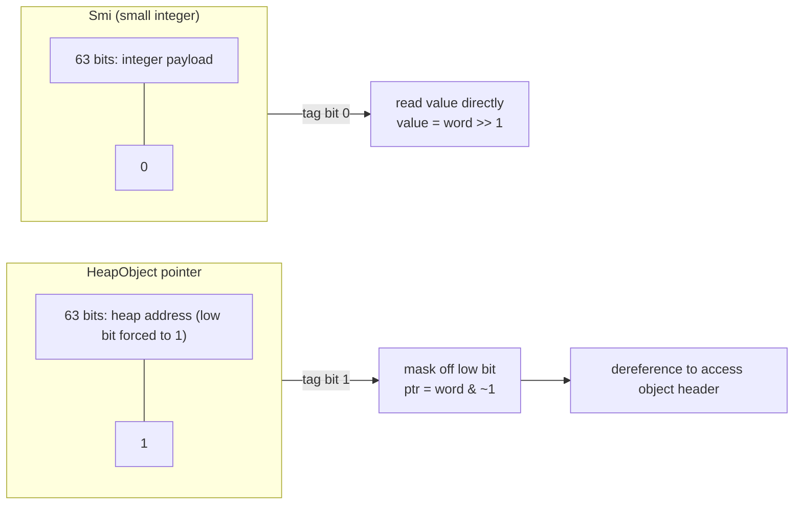
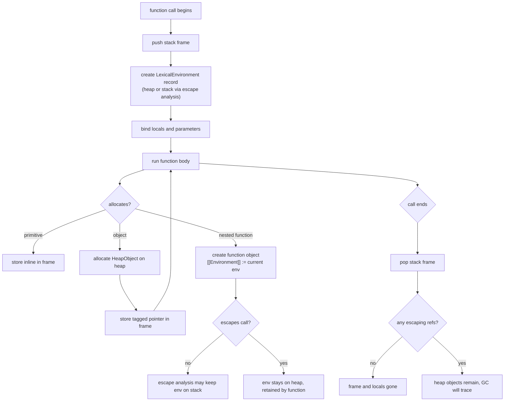

# 1.27 Memory Lifecycles and Allocation

## 1. Purpose

JavaScript is a garbage-collected language, which lulls most developers into believing they never have to think about memory. That belief is correct about ninety percent of the time and catastrophically wrong the other ten percent. The ninety percent covers ordinary CRUD apps, dashboards, form-driven admin tools, and anything where the working set of objects is small, short-lived, and replaced wholesale on every user interaction. The V8 garbage collector (see [[1.28 Garbage Collection in V8]]) will quietly reclaim the debris, the frame rate will stay above sixty, and nobody will file a bug. The ten percent covers games, editors, drawing canvases, video pipelines, real-time audio, large data visualizations, dev tools, server-side streaming, and any code that lives inside a hot loop running ten thousand times per second. In those worlds, ignoring memory is the same as ignoring performance, and ignoring performance is the same as shipping a broken product.

The purpose of this note is to give you the mental machinery to predict, before you run the code, where each value you create will live, how long it will live, what it costs to allocate it, and what it costs the garbage collector to reclaim it. That machinery has three pillars.

The first pillar is the distinction between the **stack** and the **heap**. The stack is the per-thread, per-call LIFO data structure that holds function frames, local primitive variables, and pointers to heap objects. Allocation on the stack is essentially free: it is a single pointer arithmetic on a `rsp`-like register. Deallocation is equally free: the pointer is moved back when the function returns. The heap is the global pool of dynamically allocated objects: every `Object`, `Array`, `Map`, `Function`, `Symbol` wrapper, `BigInt`, long string, boxed number, and closure environment record. Heap allocation is not free: V8 has to find a free slot, write header metadata, register the object with the garbage collector, and possibly trigger a collection if a space is full. Deallocation is not free either: the GC must trace live references, sweep dead ones, and compact the survivors. Stack allocation is therefore preferred whenever possible.

The second pillar is **pointer tagging**, V8's trick for cramming a small integer and a heap pointer into the same machine word without boxing. The lowest bit of every V8 value tells the runtime: zero means the value is a Smi (small integer, with the actual value stored in the upper bits), one means it is a HeapObject pointer. This single design decision is responsible for a large fraction of V8's throughput on numeric code, because it eliminates a heap allocation and an indirection for every integer less than roughly one billion. Understanding it is the difference between being able to read a V8 flame chart and being mystified by it.

The third pillar is the **relationship between execution context and memory**. Every function call creates an execution context (see [[1.08 Execution Context and Lexical Environment]]), and that context carries a LexicalEnvironment record. When a nested function escapes the call (because it is returned, stored on an object, or passed to a callback), the engine must keep that environment record alive on the heap, because the escaping function might read its bindings later. This is exactly what a closure is (see [[1.10 Closures and Lexical Scope]]), and it is the reason closures retain memory. The same mechanism, in the opposite direction, is escape analysis: if V8 can prove that an object never escapes the call that allocated it, it can place the object on the stack instead of the heap, eliminating GC pressure entirely.

The reader should finish this note able to look at any line of JavaScript and answer four questions. Where does this value live? How long will it live? What did it cost to create? And what will it cost the garbage collector to reclaim? Once those four questions become reflexive, memory stops being an act of faith and starts being an engineering discipline.

## 2. Theory and Deep Dive

### 2.1 The stack: frames, locals, and pointers

Every time JavaScript calls a function, V8 pushes a **stack frame** onto the call stack. The frame is a contiguous block of memory whose layout is fixed by the JIT-compiled code for that function. It contains, in roughly this order from low to high address: the return address (where to jump back to when the function exits), the saved frame pointer of the caller, the saved values of any callee-saved registers, the function's local variables (in the order they were declared or in a JIT-chosen order), scratch space for intermediate expressions, and any spilled temporaries that did not fit in registers.

Primitive values that fit in a machine word, such as Smi integers, booleans, `undefined`, `null`, and tagged pointers, are stored **inline** in the frame. There is no separate heap object for them, and no indirection when reading or writing them. This is why `let i = 0; while (i < 1000) i++;` compiles down to something very close to a register increment: the value of `i` lives either in a register or in a stack slot, and the loop overhead is one compare and one branch per iteration.

Object references are also stored in the frame, but what is stored is a **pointer**, not the object itself. When you write `const obj = { x: 1 };`, V8 allocates a HeapObject somewhere in the heap, places a tagged pointer to it in the stack slot for `obj`, and from then on every `obj.x` access is a load of the pointer from the stack followed by a load of `x` from the heap. The pointer is the only thing on the stack; the object never is.

The stack has three properties that make it blazingly fast. First, allocation is a single subtraction of the stack pointer (on x86 the stack grows downward, so the pointer is decremented by the frame size). Second, deallocation is a single restoration of the saved frame pointer, which automatically frees every local in one instruction. Third, the stack is cache-hot: the most recently used stack pages are in L1, so reads and writes to locals are nearly free in wall-clock terms. The cost of all this speed is that the stack is strictly LIFO and strictly per-call. You cannot return a pointer to a stack local, because the local ceases to exist the moment the function returns.

### 2.2 The heap: objects, arrays, closures, environment records

The heap is the global pool of long-lived memory. Every value that does not fit in a tagged machine word, or that must outlive the function call which created it, lives here. The heap is shared across the entire isolate (V8's term for a JavaScript runtime instance), and it is managed by the garbage collector, not by the program. The program allocates by issuing `new` or executing an object literal; the program never explicitly frees. The GC traces live references from a set of roots (registers, the stack, global handles, built-ins) and reclaims anything unreachable.

Heap objects in V8 are not opaque blobs. Every HeapObject has a **header word** pointing to a Map (V8's internal name for the hidden class, not the ECMAScript `Map`), followed by a body of inline fields. The Map describes the object's type, its size, its shape (which properties it has and where they live), and the address of the C++ virtual table for any built-in behavior. Reading `obj.x` therefore involves: load the pointer to `obj` from the stack, load the Map pointer from the first word of `obj`, look up the offset of `x` in the Map (cached by the inline cache, see [[1.25 V8 Engine Pipeline]]), and load the field at that offset. Three loads instead of one, plus a cache lookup. This is why accessing a property is several times slower than accessing a local, and why hidden class transitions matter.

Arrays in V8 are HeapObjects whose elements can be stored in one of several backing-store modes. A `PACKED SMI ELEMENTS` array stores Smis inline in a contiguous buffer; a `PACKED DOUBLE ELEMENTS` array stores unboxed doubles in a contiguous buffer; a `PACKED ELEMENTS` array stores tagged pointers, one per element, to heap-resident values. Transitions between these modes go only one way (Smi to Double to Tagged), and a transition deoptimizes the array's hot paths. This is why `[1, 2, 3]` followed later by `arr.push({})` is a real performance regression in a tight loop: the array's backing store was a flat buffer of integers, and now it must be converted into an array of pointers, copying every element and growing the heap representation.

Closures are heap-allocated for a subtle reason. A function in JavaScript carries its `[[Environment]]` internal slot, which points at the LexicalEnvironment record that was active when the function was created (see [[1.10 Closures and Lexical Scope]]). Environment records are heap objects in V8, because they must outlive the function call that produced them whenever the inner function escapes. When `outer` returns `inner`, the engine cannot put `inner`'s captured environment on `outer`'s stack frame, because that frame is about to be popped. The environment therefore lives on the heap, with `inner` holding a pointer to it, and the GC will keep it alive until `inner` itself becomes unreachable. The cost of a closure is the cost of the environment record plus the cost of every object that environment transitively keeps alive.

### 2.3 Pointer tagging: Smi vs HeapObject

V8 represents every JavaScript value as a tagged machine word. On a 64-bit build, every value is 64 bits wide. The lowest bit is the tag bit. If it is zero, the value is a **Smi** (small integer), and the actual integer value is the upper 63 bits shifted right by one (or, on the older 32-bit convention, 31 bits of payload). If the lowest bit is one, the value is a **HeapObject pointer**, and the actual heap address is the word with the lowest bit cleared (i.e. the pointer is stored with the low bit set, and the runtime masks it off before dereferencing).



The reason this matters is that **a Smi never allocates a heap object**. The integer 42 is not a `Number` wrapper, not a heap allocation, not a pointer indirection. It is just the bits `0x0000000000000054` (42 shifted left by one) sitting in a register or a stack slot. Arithmetic on Smis is plain CPU arithmetic followed by a shift, and the only check is whether the result still fits in the Smi range. If it does, no allocation occurs. If it does not, V8 allocates a HeapNumber, stores the double there, and replaces the value with a HeapObject pointer. This is called a Smi overflow deopt, and it is one of the most common reasons a numeric hot loop suddenly slows down.

The Smi range on a 64-bit build is roughly negative 2 to the 62nd to positive 2 to the 62nd, far beyond any practical integer. On 32-bit builds (and on pointer-compressed 64-bit builds, where V8 stores only the low 32 bits of every pointer), the Smi range is negative 2 to the 31st to positive 2 to the 31st, which is roughly negative two billion to positive two billion. Anything outside that range becomes a HeapNumber.

Non-integer numeric values (doubles, `Infinity`, `NaN`, fractional numbers) are always HeapNumbers. So are integers that overflow the Smi range. A HeapNumber is a HeapObject with a header word and an 8-byte payload holding an IEEE 754 double. Allocating a HeapNumber costs a heap allocation and registers the object with the GC, which is why a loop that performs floating-point arithmetic and stores the results in an array will produce noticeable GC pressure.

### 2.4 Memory alignment

V8 aligns every heap object to a kPointerSize boundary, which is 8 bytes on 64-bit builds (or 4 bytes with pointer compression). Alignment serves two purposes. First, it lets the lowest bits of every pointer be used as tag bits without losing any actual address bits, because aligned pointers always have zero in their low bits and the engine can set the tag bit without ambiguity. Second, it lets the CPU use aligned load and store instructions, which on most architectures are faster than unaligned accesses and on some are required. The cost of alignment is a small amount of padding waste between objects, typically a few bytes per object.

Arrays of doubles use a stricter alignment, 8 bytes, so that the JIT can emit SIMD vector instructions for hot numeric loops. This is why `Float64Array` outperforms `Array<number>` for serious numeric work: the elements are stored as raw doubles in a tightly packed, aligned buffer, with no headers, no tag bits, no per-element allocation, and no hidden class lookups.

### 2.5 V8's string representations

Strings are HeapObjects, but V8 does not have one string type; it has several, and choosing between them at runtime is one of the more intricate pieces of the engine. Each representation is optimized for a different access pattern.

A **SeqString** is a flat array of character codes. It comes in two flavors: SeqOneByteString, which uses one byte per character and is suitable for Latin-1 text, and SeqTwoByteString, which uses two bytes per character and is required for any string containing code points above U+00FF. V8 chooses between them based on the actual content at creation time, so `"hello"` is one-byte and `"héllo"` is two-byte. Most short strings end up as SeqStrings.

A **ConsString** is a rope: a binary tree node holding references to a left substring and a right substring. When you write `a + b` for non-trivial strings, V8 does not copy the characters; it allocates a ConsString whose left and right children are `a` and `b`. This makes concatenation O(1) instead of O(n). The cost is paid later, when you actually index into the string or call a method that needs the flat representation: at that point V8 "flattens" the rope, walking the tree and copying characters into a new SeqString. Repeated concatenation in a loop builds a degenerate left-leaning tree that has to be flattened on the next read, which is why `s += chunk` inside a tight loop is a classic performance trap.

A **SlicedString** is a view into another string, holding a reference to the parent and a start and end offset. `"hello world".slice(0, 5)` does not copy the characters; it allocates a SlicedString pointing at the original. This keeps the parent alive, which can be a memory leak if you slice a small piece out of a multi-megabyte string and keep it for a long time: the entire parent stays in the heap because the slice holds a reference.

An **ExternalString** is a string whose character data lives outside the V8 heap, in memory owned by the embedder (a Node Buffer, a WebAssembly linear memory, a native addon). The V8 string object holds only a pointer to the external buffer and a length. This avoids a copy when passing large strings across the native boundary, and it is how Node exposes large file contents to JavaScript without duplicating them.

### 2.6 Escape analysis

Escape analysis is the JIT's attempt to recover the speed of stack allocation for objects that, syntactically, look like heap allocations. The idea is straightforward in principle. When TurboFan (V8's optimizing compiler, see [[1.25 V8 Engine Pipeline]]) inlines a function, it can see every use of every object the function creates. If it can prove that no reference to a given object ever leaves the inlined scope (the object is not returned, not stored into a field of another object that escapes, not passed to a non-inlined call), then the object does not need to exist on the heap at all. Its fields can be unpacked into individual stack slots or registers, and every field access becomes a local variable access.

In practice, V8's escape analysis is conservative. It works best for short-lived intermediate objects inside tight loops, where the object is created, used a few times, and discarded before the iteration ends. The classic example is allocating a temporary `{x, y}` point inside a hot loop to pass to a helper function that gets inlined: with escape analysis, the object never hits the heap. Without it, the loop allocates one object per iteration and the minor GC runs constantly.

Escape analysis is fragile. Adding a single use that the compiler cannot inline (returning the object, storing it in a closure, passing it to a function the compiler could not inline) defeats the analysis for that object and forces a heap allocation. This is why micro-benchmarks of "object creation cost" can vary by an order of magnitude depending on whether the surrounding code lets TurboFan inline enough to trigger escape analysis.

### 2.7 The relationship between execution context and memory

Memory in JavaScript is not allocated in a vacuum. Every allocation happens inside an execution context, and the context determines how long the allocation must live. The relevant chain is: a context has a LexicalEnvironment, the LexicalEnvironment is a heap object (or stack-allocated in some optimized cases), and any function created in that context holds a pointer to it through its `[[Environment]]` slot. When the context's stack frame is popped, only the LexicalEnvironment (and the values it captures) might survive, and only if some escaping function still references them.

This is why closures are heap-allocated, why closures retain memory, and why a single long-lived closure can keep a chain of environments alive that stretches back to the global. It is also why escape analysis is the natural counter to closures: if the compiler can prove that a function does not actually escape, then its environment does not need to outlive its frame, and the closure becomes a stack-allocated value instead of a heap-allocated one.



## 3. Mental Models

A good mental model is one you can run in your head without consulting the spec. The four models below cover the vast majority of decisions you will make about memory in JavaScript.

**Model one: the stack is fast, automatic, LIFO, and per-call.** Picture a stack of plates. Each function call adds a plate (a frame) to the top. Each return removes that plate. You cannot remove a plate from the middle, and you cannot keep a plate after the function that placed it returns. Everything that lives on a plate (locals, arguments, saved registers) is free to allocate and free to reclaim. The stack is the right place for anything that does not need to outlive the current call.

**Model two: the heap is slower, GC-managed, and global.** Picture a warehouse with a forklift. You can put a pallet (an object) anywhere in the warehouse, and you can keep it for as long as you want, even after the function that placed it returns. The forklift (the garbage collector) periodically drives through the warehouse, marks every pallet that is still reachable from the loading dock (the roots), and hauls the unmarked ones away. This is flexible but slow: each pallet has paperwork (a header word), the forklift is expensive to operate (a GC pause), and pallets get scattered (fragmentation, eventually requiring compaction).

**Model three: the lowest bit tells you what the word is.** Pointer tagging reduces to a single rule: read the lowest bit. If it is zero, the word is a Smi, and the integer value is the upper bits shifted right. If it is one, the word is a pointer to a HeapObject, and the actual address is the word with the low bit cleared. There is no separate type field, no boxing, and no allocation for small integers. This is the single biggest reason numeric code in V8 is fast.

**Model four: a closure is a function plus a hidden pointer to its captured environment record.** When you write a nested function that reads an outer variable, the engine pairs the function code with a pointer to the environment record that holds the outer variable. The pair travels together: wherever the function goes, the environment goes with it. If the environment holds large objects, those objects stay alive until the function is garbage-collected. This is why a single `setInterval(() => readHugeBuffer(), 1000)` will keep `hugeBuffer` alive forever, even if nothing else references it.

**Model five: escape means heap, non-escape means stack.** Whenever you create an object, ask: does any reference to this object leave the current function? If the answer is yes (returned, stored on a field of an escaping object, passed to a callback the compiler cannot inline), the object must go on the heap. If the answer is no, escape analysis may keep it on the stack, but only if TurboFan decides the function is hot enough to optimize and inlines aggressively enough to see the non-escape.

These five models, applied reflexively, will let you predict allocation behavior for almost any line of JavaScript you encounter.

## 4. Real-World Use Cases

### 4.1 Why `Uint8Array` is faster than `Array<number>`

A regular `Array<number>` of one million small integers is, in V8, a `PACKED SMI ELEMENTS` array. Its backing store is a contiguous buffer of one million tagged Smi words, each 8 bytes wide on a 64-bit build. That is 8 megabytes of heap, plus a header, plus the array object itself. Writing to it is a tagged store, reading from it is a tagged load followed by a shift to extract the integer, and the GC has to scan the whole 8 megabytes on every minor collection because every slot is a potential pointer.

A `Uint8Array` of one million bytes is a typed array backed by an `ArrayBuffer`. The backing store is exactly 1 megabyte of raw bytes, with no headers, no tag bits, no per-element indirection. Writing to it is a single byte store, reading from it is a single byte load with zero masking, and the GC does not scan the buffer at all because it contains no pointers. The result is roughly 8x less memory and noticeably faster access, plus a dramatic reduction in GC pause time because the buffer is invisible to the marker.

The same reasoning applies, with different constants, to `Int32Array`, `Float64Array`, and the rest of the typed array family. Any time you are storing a large amount of numeric data, the typed array version will beat the regular array version on every dimension that matters.

### 4.2 Why string concatenation in a loop is slow

Building a long string by repeated `+=` is a classic anti-pattern. Each `+=` looks like an O(1) operation, and indeed V8 will often allocate a ConsString instead of copying, so the allocation itself is cheap. The problem is what happens next. The ConsString tree grows left-leaning, one node per iteration, until the next operation that needs the flat representation (an `indexOf`, a `slice`, a `console.log`, a comparison) triggers a flatten. Flattening walks the entire tree and copies every character into a new SeqString, an O(n squared) operation if you flatten once per iteration (which happens if the loop body does anything with the running string besides append).

The fix is to push the chunks into an array and call `join` once at the end:

```javascript
// slow
let s = "";
for (const chunk of chunks) s += chunk;

// fast
const parts = [];
for (const chunk of chunks) parts.push(chunk);
const s = parts.join("");
```

`join` measures the total length, allocates one SeqString of exactly the right size, and copies each chunk in once. It is O(n) instead of O(n squared), and it produces a single flat string with no rope overhead.

### 4.3 Closures in hot loops retain large environments

A subtle performance bug appears when you create closures inside a hot loop and the closures capture a large outer variable. Consider:

```javascript
function process(bigBuffer, count) {
  const result = [];
  for (let i = 0; i < count; i++) {
    result.push(() => bigBuffer[i]); // each closure captures bigBuffer
  }
  return result;
}
```

Each arrow function closes over `bigBuffer`. Even if the closures are never called, the array of them keeps `bigBuffer` alive for as long as the array lives. If `bigBuffer` is a multi-megabyte Buffer or typed array, and the closures are stored in a long-lived cache, you have just pinned megabytes of memory for no good reason. The fix is usually to read the value out at loop time and close over the value, not the buffer:

```javascript
function process(bigBuffer, count) {
  const result = [];
  for (let i = 0; i < count; i++) {
    const v = bigBuffer[i];
    result.push(() => v);
  }
  return result;
}
```

Now each closure captures a single small value, and `bigBuffer` can be reclaimed as soon as `process` returns (assuming nothing else holds it).

### 4.4 `Buffer.allocUnsafe` vs `Buffer.alloc`

In Node.js, `Buffer.alloc(size)` returns a buffer initialized to all zeros. `Buffer.allocUnsafe(size)` returns a buffer whose contents are whatever happened to be in that memory previously. The unsafe variant is faster because it skips the zeroing pass, which for large buffers is a measurable cost. The danger is that the previous contents might be sensitive data from a previous allocation: a private key, a password, a chunk of a database query result. If you then expose even a portion of the buffer to an untrusted party (writing it to a network socket, returning it from an API), you have just leaked memory.

The safe rule is: use `Buffer.alloc` whenever the buffer will hold or transitively touch sensitive data, and reserve `Buffer.allocUnsafe` for cases where you will completely overwrite the buffer before reading from it (for example, `fs.read` into a preallocated buffer, or a `Buffer.from` copy that fills every byte). The Node standard library uses `allocUnsafe` internally for performance-critical paths where it can prove the buffer is fully overwritten before use.

### 4.5 Memory profiling in Chrome DevTools

The Memory tab in Chrome DevTools offers three main tools for diagnosing memory issues. The **Heap Snapshot** captures a full picture of every reachable object in the heap at a moment in time, with type, retained size, and the retaining path for each. The **Allocation Timeline** records every allocation over a time window, letting you see exactly which calls produced which objects. The **Allocation Sampling** profile samples allocations at low overhead, useful for long-running sessions where a full timeline would be too expensive.

The standard workflow for finding a leak is: take a heap snapshot, perform the action you suspect leaks, take another snapshot, and use DevTools' "compare" view to see which objects were allocated between the two snapshots and not freed. The retaining path panel tells you, for any leaked object, the chain of references keeping it alive, which is usually enough to identify the closure or cache that needs to be cleared. See [[1.29 Memory Leaks Diagnostic]] for a deeper walkthrough.

## 5. Code Examples

### 5.1 Example A — Minimal and Conceptual

This example demonstrates stack vs heap allocation with a recursive function and a closure. The recursive function uses only Smis and tagged pointers; the closure demonstrates environment record retention.

**JavaScript**

```javascript
// factorial: each recursive call pushes a new stack frame.
// the local n is a Smi stored inline in the frame.
// no heap allocation per call, just frame growth.
function factorial(n) {
  if (n <= 1) return 1;
  return n * factorial(n - 1);
}

// makeCounter: returns a closure that captures the count variable.
// the LexicalEnvironment for makeCounter must outlive the call,
// because the returned function holds a reference to it.
// this is heap allocation: the env record and the function object.
function makeCounter() {
  let count = 0; // Smi, stored in the env record
  return function next() {
    count = count + 1; // mutates the captured binding
    return count;
  };
}

const counter = makeCounter();
console.log(counter()); // 1
console.log(counter()); // 2
console.log(factorial(5)); // 120
```

**TypeScript**

```typescript
function factorial(n: number): number {
  if (n <= 1) return 1;
  return n * factorial(n - 1);
}

function makeCounter(): () => number {
  let count: number = 0;
  return function next(): number {
    count = count + 1;
    return count;
  };
}

const counter: () => number = makeCounter();
console.log(counter()); // 1
console.log(counter()); // 2
console.log(factorial(5)); // 120
```

In `factorial`, every recursive call is pure stack work: a new frame with a Smi local, a multiplication, a return. Nothing escapes, so nothing needs the heap. In `makeCounter`, the returned `next` function escapes, so the environment holding `count` must live on the heap, where the GC will keep it alive as long as `counter` is reachable. The two examples illustrate the two extremes of the allocation spectrum.

### 5.2 Example B — Production-Grade Typed Object Pool

In a hot loop that creates and discards many small objects (a particle system, a network packet decoder, a game entity update), the minor GC will run constantly, producing visible frame hitches. The fix is an object pool: preallocate a fixed set of objects, hand them out from the pool, and return them when done, so no allocation happens inside the loop.

**JavaScript**

```javascript
// A minimal but production-quality object pool.
// Preallocates N objects of shape T, hands them out, and reuses them.
// The reset function is called on each object before reuse.
class ObjectPool {
  constructor(factory, reset, size) {
    this.factory = factory;
    this.reset = reset;
    this.free = new Array(size);
    this.inUse = new Set();
    for (let i = 0; i < size; i++) {
      this.free[i] = factory();
    }
  }

  acquire() {
    if (this.free.length === 0) {
      // Optional policy: grow, or throw, or return null.
      // Growing re-introduces allocation, so prefer sizing correctly up front.
      this.free.push(this.factory());
    }
    const obj = this.free.pop();
    this.inUse.add(obj);
    return obj;
  }

  release(obj) {
    if (!this.inUse.has(obj)) return; // double release guard
    this.inUse.delete(obj);
    this.reset(obj);
    this.free.push(obj);
  }

  // Helper: run a function with a borrowed object, always release.
  withAcquired(fn) {
    const obj = this.acquire();
    try {
      return fn(obj);
    } finally {
      this.release(obj);
    }
  }
}

// Example: a particle system that updates 10000 particles per frame
// without allocating any per-frame objects.
function makeParticle() {
  return { x: 0, y: 0, vx: 0, vy: 0, life: 0 };
}

function resetParticle(p) {
  p.x = 0; p.y = 0; p.vx = 0; p.vy = 0; p.life = 0;
}

const pool = new ObjectPool(makeParticle, resetParticle, 10000);

function tick(dt) {
  for (let i = 0; i < 10000; i++) {
    const p = pool.acquire();
    // ... update p ...
    p.x += p.vx * dt;
    p.y += p.vy * dt;
    p.life -= dt;
    pool.release(p);
  }
}

setInterval(() => tick(0.016), 16);
```

**TypeScript**

```typescript
interface Poolable {
  // marker interface; concrete shapes vary
}

class ObjectPool<T> {
  private readonly factory: () => T;
  private readonly reset: (obj: T) => void;
  private readonly free: T[];
  private readonly inUse: Set<T>;

  constructor(factory: () => T, reset: (obj: T) => void, size: number) {
    this.factory = factory;
    this.reset = reset;
    this.free = new Array<T>(size);
    this.inUse = new Set<T>();
    for (let i = 0; i < size; i++) {
      this.free[i] = factory();
    }
  }

  acquire(): T {
    if (this.free.length === 0) {
      this.free.push(this.factory());
    }
    const obj = this.free.pop() as T;
    this.inUse.add(obj);
    return obj;
  }

  release(obj: T): void {
    if (!this.inUse.has(obj)) return;
    this.inUse.delete(obj);
    this.reset(obj);
    this.free.push(obj);
  }

  withAcquired<U>(fn: (obj: T) => U): U {
    const obj = this.acquire();
    try {
      return fn(obj);
    } finally {
      this.release(obj);
    }
  }
}

interface Particle {
  x: number;
  y: number;
  vx: number;
  vy: number;
  life: number;
}

function makeParticle(): Particle {
  return { x: 0, y: 0, vx: 0, vy: 0, life: 0 };
}

function resetParticle(p: Particle): void {
  p.x = 0; p.y = 0; p.vx = 0; p.vy = 0; p.life = 0;
}

const pool = new ObjectPool<Particle>(makeParticle, resetParticle, 10000);

function tick(dt: number): void {
  for (let i = 0; i < 10000; i++) {
    const p = pool.acquire();
    p.x += p.vx * dt;
    p.y += p.vy * dt;
    p.life -= dt;
    pool.release(p);
  }
}

setInterval(() => tick(0.016), 16);
```

The pool trades a one-time upfront allocation of ten thousand objects for zero per-frame allocations. The `Set` of in-use objects adds a small per-acquire overhead, but it is dwarfed by the savings from not triggering the minor GC. In a real engine the `Set` could be replaced by a free-list bitset if profiling showed it mattered. The `withAcquired` helper makes the borrow-and-release pattern exception-safe, which matters in code paths that can throw.

## 6. Common Mistakes and Anti-Patterns

### 6.1 Accidental closures retaining large objects

The single most common memory bug in JavaScript. A callback closes over a large object that the developer did not realize was captured, and the callback lives forever (in a `setInterval`, a long-lived event emitter, a module-level cache). The large object stays alive as long as the callback does, even if the callback never reads it.

```javascript
// bad: every callback keeps the entire response in memory
function scheduleLogs(response) {
  response.items.forEach((item) => {
    setInterval(() => console.log(item.id), 1000);
  });
}

// good: capture only the id, not the response
function scheduleLogs(response) {
  for (const item of response.items) {
    const id = item.id;
    setInterval(() => console.log(id), 1000);
  }
}
```

The fix is to read out exactly the values the callback needs and let the large object go out of scope.

### 6.2 Creating objects in hot loops

Every object created in a hot loop is one more thing the minor GC has to sweep. A loop that allocates a temporary `{x, y}` per iteration at ten thousand iterations per frame will produce ten thousand objects per frame, which is roughly the threshold where GC pauses become visible. Escape analysis can sometimes save you, but relying on it is fragile.

```javascript
// bad
for (let i = 0; i < points.length; i++) {
  const tmp = { x: points[i].x, y: points[i].y };
  draw(tmp);
}

// good: hoist the temp, mutate it in place
const tmp = { x: 0, y: 0 };
for (let i = 0; i < points.length; i++) {
  tmp.x = points[i].x;
  tmp.y = points[i].y;
  draw(tmp);
}
```

### 6.3 String concatenation in loops

As discussed in Section 4.2, `s += chunk` in a loop is O(n squared) due to ConsString flattening. Use `Array.push` plus `join`.

```javascript
// bad
let html = "";
for (const row of rows) html += `<tr>${row}</tr>`;

// good
const parts = [];
for (const row of rows) parts.push(`<tr>${row}</tr>`);
const html = parts.join("");
```

### 6.4 Growing arrays dynamically when the size is known

`Array.push` amortizes to O(1) because V8 doubles the backing store when it runs out of space, but each doubling is a copy of every existing element. If you know the final size, preallocate with the array constructor or `Array.from`.

```javascript
// bad: many reallocations
const result = [];
for (let i = 0; i < n; i++) result.push(compute(i));

// good: one allocation
const result = new Array(n);
for (let i = 0; i < n; i++) result[i] = compute(i);
```

### 6.5 `Buffer.allocUnsafe` without overwrite

Using `allocUnsafe` for a buffer that will be partially exposed before being fully written leaks memory contents from previous allocations. This is a security vulnerability, not a performance issue.

```javascript
// bad: buffer may contain sensitive data from a previous allocation
const buf = Buffer.allocUnsafe(1024);
socket.write(buf.slice(0, 100)); // bytes 100..1023 are uninitialized!

// good: zeroed, no leak risk
const buf = Buffer.alloc(1024);
```

### 6.6 Mixing typed arrays with regular arrays

A typed array's hot path relies on the JIT knowing every element is the same numeric type. Storing an object reference into a typed array is impossible (the type system forbids it), but the parallel mistake with regular arrays is easy: starting with `[1, 2, 3]` (PACKED SMI) and later pushing an object transitions the array to PACKED ELEMENTS, copying every element from the inline Smi buffer into an array of pointers. This is a one-time O(n) cost, but it also permanently slows down every subsequent access.

```javascript
// bad: transition from SMI to TAGGED
const arr = [1, 2, 3, 4, 5];
// ... later ...
arr.push({ x: 1 }); // backing store rewritten, every element boxed

// good: if you need mixed types, start with the right shape
const arr = [1, 2, 3, 4, 5, { x: 1 }];
```

### 6.7 Holding references in long-lived caches without eviction

A `Map` used as a cache that never evicts will grow forever. Every key, every value, and everything transitively reachable from either stays alive until the Map itself is unreachable.

```javascript
// bad: unbounded cache
const cache = new Map();
function getUser(id) {
  if (!cache.has(id)) cache.set(id, fetchUser(id));
  return cache.get(id);
}

// good: bounded with LRU or weak references
const cache = new WeakMap(); // keys must be objects, GC reclaims entries
// or use a proper LRU with a max size
```

### 6.8 Forgetting that `arguments` and rest parameters capture

Older code that uses the `arguments` object can accidentally retain the entire argument list, including large objects passed in. Rest parameters (`...args`) are safer because they create a fresh array, but they still close over everything passed in.

### 6.9 Detaching ArrayBuffers without dropping references

`ArrayBuffer.prototype.transfer()` detaches the source buffer, making its backing memory inaccessible. This is useful for moving data between workers without copying, but if any reference to the original buffer remains, attempts to read from it will throw, and you may have intended to drop the reference to free memory.

## 7. Best Practices and Design Patterns

**Preallocate when the size is known.** If you know the final length of an array, allocate it once with `new Array(n)` and write by index. The savings come from avoiding repeated backing-store copies and from letting the JIT emit tighter code (no bounds-check growth path).

**Use typed arrays for numeric data.** Any time you are storing more than a few hundred numbers of the same type, use the appropriate typed array (`Uint8Array`, `Int32Array`, `Float64Array`). The memory savings alone usually justify it, and the access speed improvement is substantial.

**Use object pools for hot paths.** When a loop runs many times per frame and creates short-lived objects, preallocate a pool and acquire/release instead of `new`. Be honest about whether the pool is actually helping: measure GC pause time before and after, and watch for the pool itself becoming a leak source if `release` is missed.

**Avoid creating closures in tight loops.** A closure created in a loop captures the loop's environment, and if the closure outlives the iteration, the environment stays alive. Read out exactly the values you need, and create the closure outside the loop with the values passed as arguments.

**Use `Array.join` for string building.** The pattern `parts.push(chunk); result = parts.join("")` is the canonical fast string builder in JavaScript. It is O(n) and produces a single flat SeqString.

**Use `Buffer.alloc`, not `allocUnsafe`, for sensitive data.** The performance difference is real but small, and the security cost of a leak is total. Reserve `allocUnsafe` for paths where you will completely overwrite the buffer before any read.

**Profile before optimizing.** The first rule of memory optimization is the same as for CPU optimization: measure. Use Chrome DevTools' Allocation Timeline or Node's `--prof` flag to see what is actually being allocated and what is actually being retained. Most "memory optimizations" applied without measurement make the code worse without helping the GC.

**Prefer flat data over nested objects for large collections.** An array of one thousand `{x, y, vx, vy}` objects is one thousand HeapObjects plus an array of one thousand pointers. Four parallel `Float32Array` buffers (`x`, `y`, `vx`, `vy`) are four flat buffers with no per-element heap allocation, no headers, and no GC scanning. The structure-of-arrays pattern is dramatically more memory-efficient and cache-friendly for large numeric datasets.

**Watch for hidden class transitions.** Adding a property to an object after creation forces V8 to transition to a new hidden class, which deoptimizes inline caches and slows field access. Initialize all properties in the constructor, in the same order, every time.

**Use `WeakMap` and `WeakRef` for associations that should not keep things alive.** A `WeakMap` lets you attach metadata to an object without preventing its collection; when the object is collected, the entry disappears. This is the right tool for caches keyed by object identity.

## 8. Technical Interview Knowledge

### 8.1 What goes on the stack vs the heap?

The stack holds function frames, local primitive variables (Smi integers, booleans, undefined, null), and tagged pointers to heap objects. The heap holds every Object, Array, Function, environment record, HeapNumber, and string. The rule of thumb: if it fits in a tagged machine word, it is on the stack; if it is a complex value with a header and fields, it is on the heap. Object references on the stack are pointers, not the objects themselves.

### 8.2 How does V8 represent small integers?

V8 uses pointer tagging. On a 64-bit build, every value is a 64-bit word. The lowest bit is the tag: zero means Smi, one means HeapObject. A Smi stores the actual integer in the upper 63 bits (the value is the word shifted right by one). This means small integers never require heap allocation; they live directly in registers or stack slots. The Smi range is roughly negative 2 to the 62nd to positive 2 to the 62nd on 64-bit builds, and roughly negative 2 to the 31st to positive 2 to the 31st on 32-bit or pointer-compressed builds.

### 8.3 What is escape analysis?

Escape analysis is a JIT optimization that determines whether an object allocated inside a function ever escapes that function (is returned, stored in a field of another escaping object, or passed to a non-inlined call). If the object does not escape, TurboFan can scalar-replace it: instead of allocating a heap object, it places each field in a separate stack slot or register. This eliminates the heap allocation entirely and removes the object from GC consideration. Escape analysis is conservative and works best for short-lived intermediates in tight, inlined loops.

### 8.4 Why are closures heap-allocated?

A closure is a function whose `[[Environment]]` internal slot points at the LexicalEnvironment that was active when the function was created. When the closure escapes (is returned, stored, or passed to a callback), the environment record must outlive the stack frame of the function that created it. The only place it can live is the heap. The environment record stays alive until the closure itself becomes unreachable, at which point the GC can reclaim both. This is also why closures retain memory: every binding in the captured environment, and every object reachable from those bindings, stays alive as long as the closure does.

### 8.5 Why is `Uint8Array` faster than `Array<number>`?

Three reasons. First, memory: a `Uint8Array` of n elements uses exactly n bytes; a regular array of small integers uses 8n bytes (one tagged word per element) on a 64-bit build. Second, access speed: typed array elements are raw bytes at a fixed offset, accessed with a single load instruction; regular array elements are tagged words requiring a tag check and possibly a shift. Third, GC cost: typed array backing stores contain no pointers, so the GC does not scan them; regular array backing stores are scanned on every minor collection because every slot could be a pointer.

### 8.6 How does V8 represent strings?

V8 has several string types. SeqString is a flat array of character codes (one-byte or two-byte, depending on content). ConsString is a binary tree of two substrings, used to make concatenation O(1) at the cost of flattening on demand. SlicedString is a view into another string with an offset and length, used by `slice` and `substring`. ExternalString holds a pointer to memory outside the V8 heap, used by embedders like Node to expose large buffers without copying. V8 chooses among these representations automatically based on the operations performed.

### 8.7 What is pointer tagging?

Pointer tagging is the practice of reserving one or more low bits of every value word to encode the value's type. V8 uses a single tag bit: 0 means Smi (the value is the upper bits shifted right), 1 means HeapObject (the actual address is the word with the low bit cleared). This eliminates the need for a separate type field, avoids boxing small integers into heap objects, and lets the runtime distinguish a pointer from an integer with a single bit test. The cost is that heap pointers must be aligned to a multiple of the tag size (typically 4 or 8 bytes), which wastes a small amount of memory per object.

### 8.8 How would you reduce GC pressure in a hot loop?

Four levers, in order of impact. First, eliminate allocations: hoist temporaries out of the loop, reuse objects via a pool, preallocate arrays to their final size. Second, use typed arrays instead of regular arrays for numeric data, which removes the backing store from GC scanning entirely. Third, ensure the code is hot enough for TurboFan to inline and run escape analysis on short-lived intermediates. Fourth, if allocations are unavoidable, batch them: collect results in a preallocated buffer and flush in chunks, so the GC sees fewer, larger allocation events rather than many small ones. Always measure with the Allocation Timeline before and after; GC behavior is counter-intuitive and assumptions are usually wrong.

## 9. Practical Exercises

### 9.1 Predict which allocations go to stack vs heap

Predict, for each line in the function below, whether the value lives on the stack or the heap, and explain why.

```javascript
function analyze(xs) {
  const n = xs.length;          // line A
  const sum = 0;                // line B
  const pair = { a: 1, b: 2 };  // line C
  const fn = () => pair.a;      // line D
  for (let i = 0; i < n; i++) { // line E
    sum += xs[i];               // line F
  }
  return fn;                    // line G
}
```

**Solution**

- Line A: `xs` is a tagged pointer to a heap-allocated Array, stored on the stack. `xs.length` is read from the array's header and assigned to `n`, which is a Smi stored inline in the stack frame. No new heap allocation.
- Line B: `sum` is a Smi, stored inline in the stack frame. No heap allocation. (Note: `const sum = 0` followed by `sum += xs[i]` is actually a syntax error because `const` forbids reassignment; in real code this would be `let`. Treat the intent as a Smi local.)
- Line C: `{ a: 1, b: 2 }` allocates a HeapObject (an ordinary object with a Map pointer and two inline fields). The stack slot for `pair` holds a tagged pointer to that heap object. One heap allocation.
- Line D: `() => pair.a` allocates a function object on the heap, with its `[[Environment]]` slot pointing at the current LexicalEnvironment, which in turn references `pair`. The stack slot for `fn` holds a tagged pointer. One heap allocation (the function), plus the environment record is forced onto the heap because `pair` is captured and the function escapes.
- Line E: `i` is a Smi stored inline in the stack frame. No heap allocation.
- Line F: `xs[i]` reads an element from the heap-allocated array. The result is a tagged value (Smi or HeapObject pointer depending on the array's element kind). The `+=` operation may produce a HeapNumber if the running sum overflows the Smi range, but for small integer inputs it stays as a Smi. Typically no new heap allocation.
- Line G: returns `fn`, which is already a heap pointer. No new allocation; the existing pointer is returned by value (copied into the caller's frame).

Total new heap allocations per call: two (the object literal and the closure), plus the environment record if it was not already on the heap.

### 9.2 Implement an object pool for a hot loop

Implement an object pool that supports acquire, release, and reset, and use it to eliminate allocations in a loop that processes 10000 work items per tick.

**Solution**

See Section 5.2 for the full implementation. The key design points are: preallocate all objects in the constructor; use an array as a free-list stack (pop and push are O(1)); use a Set to track in-use objects so release can detect double-release; provide a `withAcquired` helper that uses try/finally to guarantee release even on exception. The reset callback lets callers zero out fields without the pool knowing the object's shape, which keeps the pool generic.

### 9.3 Refactor a closure-leaking function

The function below leaks memory because the interval callback closes over the entire `request` object. Refactor it so the callback closes over only what it needs.

```javascript
function pollStatus(request) {
  setInterval(() => {
    console.log(request.url, request.response.status);
  }, 1000);
}
```

**Solution**

```javascript
function pollStatus(request) {
  const url = request.url;
  const status = request.response.status;
  setInterval(() => {
    console.log(url, status);
  }, 1000);
}
```

The refactored version reads out the two primitive values the callback actually needs before creating the closure. The closure captures `url` and `status` (both Smis or short strings, depending on content) rather than the entire `request` object, which may hold megabytes of body, headers, and metadata. Once `pollStatus` returns, `request` becomes unreachable (assuming nothing else holds it), and the GC can reclaim it. The interval callback keeps only the two small strings alive.

### 9.4 Use Chrome DevTools to capture a heap snapshot and identify retained objects

Open a page in Chrome, open DevTools, go to the Memory tab, and follow this procedure.

1. Take a heap snapshot (call it Snapshot 1).
2. Perform the action you suspect leaks (for example, opening and closing a modal ten times).
3. Force a garbage collection by clicking the "Collect garbage" button (the trash can icon).
4. Take a second heap snapshot (Snapshot 2).
5. Select Snapshot 2 and switch the view to "Comparison", comparing against Snapshot 1.
6. Sort by "Delta" (the difference in retained size between the two snapshots) descending.
7. The largest positive deltas are your leak candidates. Select one to see its retaining path in the lower panel.
8. The retaining path shows the chain of references keeping the object alive. Walk up the chain until you find the reference you control (usually a closure, a cache, a detached DOM node, or an event listener that was not removed).
9. Fix the code to break the reference (clear the cache, remove the listener, null out the closure).
10. Repeat the procedure to confirm the leak is gone.

**Worked example**. You notice that opening and closing a modal leaks about 10 KB per cycle. The comparison view shows an extra `HTMLDivElement` retained per cycle, with retaining path `ModalController.listeners -> clickHandler closure -> modalElement`. The fix is to remove the click listener when the modal closes, which breaks the closure and lets the GC reclaim the modal element.

## 10. Mini-Project Blueprint

**Project: Build a typed object pool**

Build a generic, fully typed object pool in TypeScript that preallocates objects of a given shape, hands them out, resets them on release, and supports both manual acquire/release and a borrow-with-callback helper. The pool should be usable for any short-lived object in a hot loop (particles, network packets, transform matrices, draw calls) and should produce zero per-iteration allocations when used correctly.

**Requirements**

1. Generic over the pooled object type `T`.
2. Constructor takes a factory function, a reset function, and an initial size.
3. `acquire()` returns a `T`, growing the pool if necessary (with a warning in development).
4. `release(obj)` returns the object to the pool, calling reset first. Double-release is a no-op (or a warning in development).
5. `withAcquired(fn)` borrows an object, calls `fn` with it, and always releases, even if `fn` throws.
6. `stats()` returns the current size, free count, and in-use count, for observability.
7. Optional: a `drain(n)` method that removes up to `n` idle objects from the pool to shrink it after a burst.
8. Optional: a `useCount` WeakMap that tracks how many times each object has been acquired, for debugging wear patterns.

**TypeScript skeleton**

```typescript
export interface Poolable {
  // marker; concrete types provide their own shape
}

export interface PoolStats {
  size: number;
  free: number;
  inUse: number;
}

export class ObjectPool<T extends Poolable> {
  private readonly factory: () => T;
  private readonly reset: (obj: T) => void;
  private readonly free: T[];
  private readonly inUse: Set<T>;
  private highWaterMark: number;

  constructor(factory: () => T, reset: (obj: T) => void, initialSize: number) {
    this.factory = factory;
    this.reset = reset;
    this.free = new Array<T>(initialSize);
    this.inUse = new Set<T>();
    this.highWaterMark = initialSize;
    for (let i = 0; i < initialSize; i++) {
      this.free[i] = factory();
    }
  }

  acquire(): T {
    if (this.free.length === 0) {
      if (typeof console !== "undefined") {
        console.warn("ObjectPool growing beyond initial size");
      }
      const grown = this.factory();
      this.highWaterMark = Math.max(this.highWaterMark, this.free.length + 1);
      this.free.push(grown);
    }
    const obj = this.free.pop() as T;
    this.inUse.add(obj);
    return obj;
  }

  release(obj: T): void {
    if (!this.inUse.has(obj)) {
      if (typeof console !== "undefined") {
        console.warn("ObjectPool.release called on unknown object");
      }
      return;
    }
    this.inUse.delete(obj);
    this.reset(obj);
    this.free.push(obj);
  }

  withAcquired<U>(fn: (obj: T) => U): U {
    const obj = this.acquire();
    try {
      return fn(obj);
    } finally {
      this.release(obj);
    }
  }

  drain(max: number): number {
    const removed = Math.min(max, this.free.length);
    this.free.length = this.free.length - removed;
    return removed;
  }

  stats(): PoolStats {
    return {
      size: this.free.length + this.inUse.size,
      free: this.free.length,
      inUse: this.inUse.size,
    };
  }
}
```

**Validation tests**

- Acquire and release the same object 10000 times; verify no growth and zero net allocations (measure with `--expose-gc` and `gc()` between batches).
- Acquire without releasing; verify `inUse` grows and `free` shrinks.
- Release an object not in the pool; verify no-op and warning.
- `withAcquired` that throws; verify the object is released (check `stats().inUse` returns to zero after the call).
- Drain a pool of 100 down to 50; verify `stats().size` is 50 and `free` is 50.

**Extension ideas**

- Add a `maxSize` option that causes `acquire` to block or throw instead of growing.
- Add a `ttlMs` option that auto-releases objects held too long (requires a timer per acquire, with its own allocation cost).
- Add a `validate` callback that checks an object's integrity before reuse, to catch corruption from misuse.

## 11. Core Connections

- [[1.03 Primitive Data Types]] — primitives are the values that fit in a tagged machine word; this note explains why.
- [[1.06 Complex Types Arrays]] — array element kinds (PACKED SMI, PACKED DOUBLE, PACKED ELEMENTS) are heap representations chosen by V8 based on content.
- [[1.07 Complex Types Objects]] — object shape, hidden classes, and inline properties are heap layout decisions made by V8.
- [[1.08 Execution Context and Lexical Environment]] — the execution context is the unit that owns a stack frame; the LexicalEnvironment is the heap record that closures capture.
- [[1.10 Closures and Lexical Scope]] — closures are the canonical example of heap-allocated environment records retaining memory.
- [[1.25 V8 Engine Pipeline]] — TurboFan is the optimizing compiler that performs escape analysis and decides what stays on the stack.
- [[1.28 Garbage Collection in V8]] — the GC traces from roots through heap pointers; everything in this note about heap allocation is reclaimed by the machinery described there.
- [[1.29 Memory Leaks Diagnostic]] — the practical side of this note: how to find the closures and caches that retain memory they should not.
