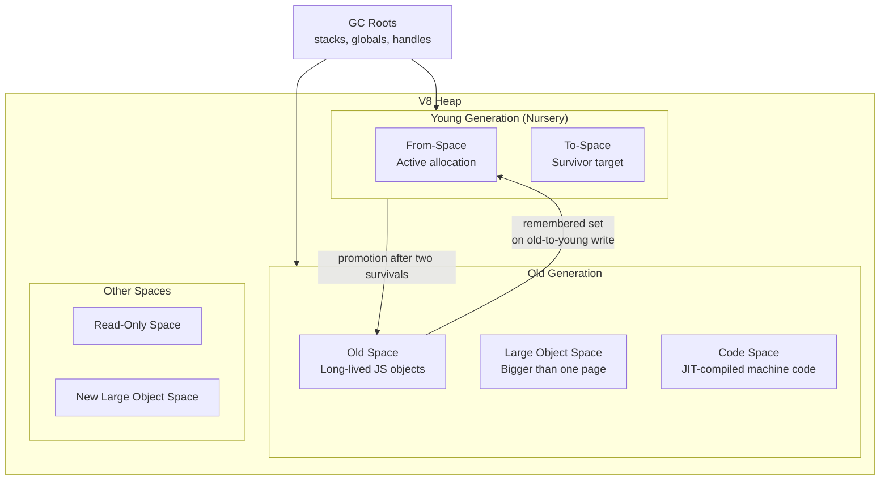
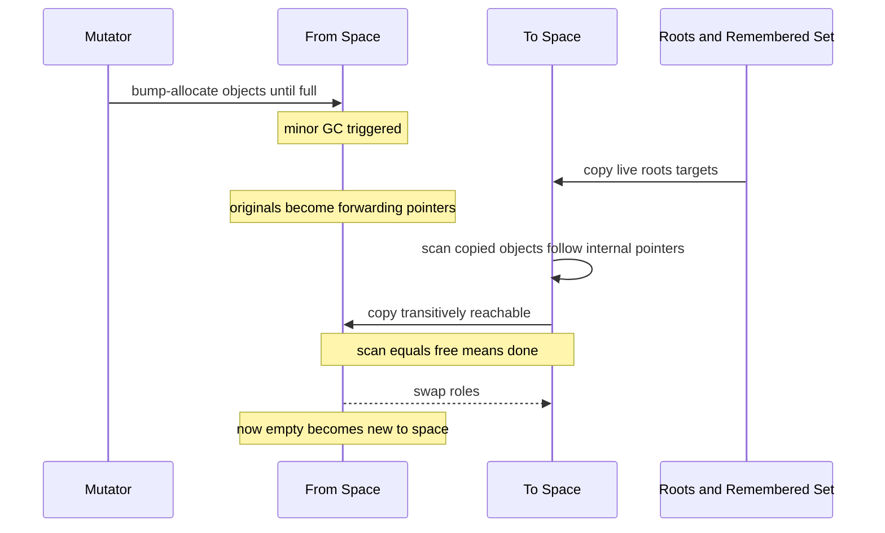
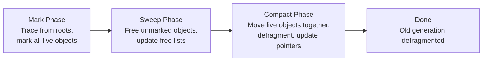
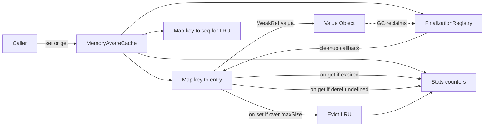

# 1.28 Garbage Collection in V8

## 1. Purpose

Garbage collection is the silent partner of every JavaScript program. Every `const obj = {}`, every `[]` literal, every closure capture, every Promise allocation places a small block of memory onto the V8 heap. The developer never calls `free()`. The runtime must reclaim that memory when the object is no longer reachable, or the process will eventually exhaust its address space and crash with an Out Of Memory termination. The garbage collector is the mechanism that performs this reclamation automatically, and the quality of its design determines whether your Node.js server can sustain 100,000 requests per second, whether your React app keeps a smooth 60 frames per second under heavy component churn, and whether your Cloudflare Worker stays inside its 128 megabyte memory budget.

Three concrete problems drive the existence of an automatic garbage collector in V8:

1. **Manual memory management is unsafe.** In C and C++, the developer is responsible for pairing every allocation with an explicit deallocation. The history of systems programming is largely a history of mistakes in this pairing: use-after-free bugs (where memory is freed but a pointer to it is still used), double-free bugs (where the same block is freed twice), and memory leaks (where memory is never freed). These bugs are not just crashes — use-after-free is the most common class of security vulnerability in browsers, because a freed block can be reallocated to an attacker-controlled object and then accessed through the stale pointer. By reclaiming memory automatically when it is provably unreachable, garbage collection eliminates the entire class of use-after-free and double-free bugs.

2. **Manual memory management is cognitively expensive.** Even in code where memory bugs are not security-critical, the developer must track object lifetimes across call stacks, event loops, asynchronous boundaries, and module boundaries. In a language like JavaScript that is designed for rapid prototyping and for non-expert programmers, this tracking cost would dwarf the cost of writing the actual logic. The garbage collector lets the developer compose objects, closures, and async continuations without ever reasoning about ownership.

3. **The generational hypothesis is empirically true.** Across virtually every workload ever measured — browsers, servers, build tools, compilers, games — most allocated objects die very young. A request handler allocates a parsed URL, a headers object, a response buffer, and a log record; by the time the response is sent, all of those become unreachable simultaneously. A UI framework allocates virtual DOM nodes on every render; by the next render, the previous tree is dead. This empirical regularity is the foundation of generational garbage collection: if most objects die young, we can scan the young objects very frequently and cheaply, and scan the long-lived objects rarely and expensively.

The V8 garbage collector is engineered around one central trade-off: **pause time versus throughput versus memory footprint**. A garbage collector can be tuned to minimise pause times (so the user never sees a frame drop), to maximise throughput (so the program completes faster overall), or to minimise memory use (so the process fits in a small container). No single collector can optimise all three simultaneously. V8's design, refined through the Orinoco project, makes different choices in different generations: the young generation uses a fast copying collector that prioritises pause time, the old generation uses a concurrent Mark-Sweep-Compact collector that prioritises throughput while keeping pauses short through incremental and parallel techniques. The result is a collector that, in typical Node.js workloads, achieves pause times of a few milliseconds for minor collections and tens of milliseconds for major collections, while sustaining allocation rates of hundreds of megabytes per second.

What V8's GC achieves, concretely:

- **Automatic reclamation** of unreachable objects without developer intervention.
- **Low pause times** (sub-millisecond for minor GC, low tens of milliseconds for major GC on typical heaps) so interactive applications stay responsive.
- **High throughput** so compute-bound Node.js servers do not lose significant CPU to GC overhead.
- **Bounded memory growth** in steady state, so long-running processes do not balloon.
- **Safe finalisation** through `WeakRef` and `FinalizationRegistry`, allowing caches to evict entries when memory pressure mounts.

What breaks without it: every JavaScript program would eventually leak to OOM, every closure capture would be a potential leak, every async callback would be a use-after-free waiting to happen, and every framework that holds ephemeral state (React trees, Express request objects, Worker threads' message ports) would have to manually manage lifetimes across asynchronous boundaries where the developer has no visibility. The garbage collector is not a feature of the language — it is the precondition that makes the language usable.

## 2. Theory and Deep Dive

### 2.1 Reachability and the GC Roots

Before any collection can run, the collector must know which objects are *live*. V8 defines a set of **GC roots** — the starting points from which liveness is computed. An object is live if and only if it is reachable from some root via a chain of pointer references. Anything not reachable is garbage and may be reclaimed.

The root set in V8 includes:

- The active execution stacks of all isolates (each frame's local variables, parameters, and `this`).
- The global object (`globalThis` and its properties, including `process`, `console`, and friends in Node.js).
- Built-in roots that the engine itself holds (built-in prototypes, intrinsics like `Array.prototype`, well-known symbols).
- The set of active `WeakRef` targets that have not yet been cleared (these are roots only in a qualified sense; see below).
- Handles held by the embedder (in Node.js, this includes references held by native addons and by libuv handles until they are closed).
- The remembered set for cross-generation references (discussed below).

A subtle but crucial point: an object reachable from a root is not necessarily *useful*. It may be reachable only because some long-lived cache still holds it, even though no code will ever read it again. The garbage collector reclaims *unreachable* objects; it does not reclaim *stale-but-reachable* objects. That distinction is the entire reason memory leaks are possible in a garbage-collected language — leaks are not failures of the GC, they are failures of the program to release references it no longer needs.

### 2.2 The Generational Hypothesis

The **generational hypothesis** (sometimes called the weak generational hypothesis) is the empirical observation that, in real programs, newly allocated objects tend to die young, while old objects tend to stay alive. This is not a theorem; it is a measurement, and it has been confirmed across essentially every programming workload ever profiled. The hypothesis comes in two forms:

- **Weak generational hypothesis:** most objects die young.
- **Strong generational hypothesis:** old objects rarely reference young objects.

The weak form justifies splitting the heap into a small **young generation** (also called the nursery) and a large **old generation**. The young generation is collected frequently and cheaply; only a small fraction of its contents survive each collection, so a copying collector that touches only live objects is very efficient. The old generation is collected rarely; when it is collected, the cost of scanning the entire old generation is amortised over a long interval.

The strong form is *almost* true but not quite — old objects do sometimes reference young objects, for example when a long-lived cache holds a freshly allocated value. This breaks the assumption that the young generation can be collected by scanning only the young generation's own pointers. The fix is the **remembered set**: whenever the mutator writes a pointer from an old object to a young object, the runtime records the location of the write in a side structure (the store buffer or remembered set). During a minor collection, the collector scans the roots, the young generation, and the remembered set — but not the entire old generation.

### 2.3 Heap Layout



The young generation is split into two equal **semi-spaces** called **from-space** and **to-space**. At any moment, allocation proceeds into from-space; to-space is empty, reserved for the next minor collection. The semi-space size is small — typically between 1 and 8 megabytes per isolate, sized so that a minor collection takes at most a few milliseconds even on a slow device. The old generation is a single contiguous space (well, several contiguous spaces, but conceptually one) sized in proportion to the configured heap limit. On a 64-bit system, the default old generation limit in Node.js is approximately 1.4 gigabytes per isolate (adjustable via `--max-old-space-size`).

### 2.4 The Scavenger — Minor GC with Cheney's Algorithm

The minor collector in V8 is called the **Scavenger**. It implements a variant of **Cheney's copying collector**, an algorithm first published by C. J. Cheney in 1970. The algorithm is beautifully simple and is worth understanding in detail because it is the foundation of every generational collector.

**Setup.** The young generation is split into two semi-spaces of equal size: from-space and to-space. Allocation goes into from-space, bumping a pointer forward until it hits the end of the space. When from-space fills up, a minor collection is triggered.

**Algorithm.**

1. **Initialise.** Two pointers, `scan` and `free`, are set to the start of to-space. The roots and the remembered set are scanned for pointers into from-space.
2. **Copy.** For each pointer into from-space found in a root or in the remembered set, the pointed-to object is *copied* to to-space at the `free` pointer, and `free` is advanced by the object's size. The original location in from-space is overwritten with a *forwarding pointer* — a marker that says "this object has been moved; its new address is X." If a root already points to a forwarded object, the pointer is simply updated to the new address (no second copy).
3. **Scan.** The `scan` pointer is advanced through to-space. For each object scanned, every pointer field in the object is examined. If the field points into from-space, the target is either copied (if not yet forwarded) or updated to the existing forwarding address. This is the key trick: by scanning the *copied* objects in to-space, the collector transitively reaches all live objects reachable from the roots.
4. **Termination.** When `scan` catches up to `free`, every reachable object has been copied to to-space. The dead objects in from-space are simply abandoned.
5. **Swap.** The roles of from-space and to-space are swapped. The now-empty old from-space becomes the new to-space for the next collection.



The elegance of Cheney's algorithm is that it performs a breadth-first traversal of the live object graph using only the to-space itself as the work queue. No separate queue or stack is needed; the `scan` and `free` pointers and the gap between them *are* the queue. This makes the algorithm cache-friendly and stack-overflow-proof.

**Cost.** The Scavenger touches only live objects (it copies them) and the root set. Dead objects are never touched. This is the magic of copying collection: the cost of a minor GC is proportional to the *live* set, not the *allocated* set. If 99 percent of the young generation is garbage (as the generational hypothesis predicts), then a minor collection that reclaims 100 megabytes of garbage might only have to copy 1 megabyte of survivors. This is why the young generation can be collected dozens of times per second without perceptible cost.

**Promotion.** Every object carries a small marker indicating how many minor collections it has survived. When an object survives a configurable number of collections (in V8, the threshold is currently two), it is **promoted** to the old generation instead of being copied back to to-space. Promotion is the bridge between the two generations: the young generation's copying collector is efficient because most objects never survive long enough to be promoted.

**Evacuation to old space.** When an object is promoted, it is moved to the old generation, and any pointers to it (in roots, in the remembered set, or in other surviving young objects) are updated to the new old-generation address. The old generation now must remember that it has a pointer into the young generation (because the promoted object may contain pointers to other young objects that have not yet been promoted), so the appropriate entries are added to the remembered set.

### 2.5 Mark-Sweep-Compact — Major GC

The old generation cannot use a copying collector. Copying collection requires doubling the memory (one semi-space is always empty, reserved for the copy), and the old generation is typically far too large to waste half of its memory. Instead, the old generation uses **Mark-Sweep-Compact**, a three-phase algorithm:



**Phase 1: Marking.** Starting from the GC roots, the collector performs a graph traversal. Every reachable object is marked as live. The marking uses a per-object mark colour — V8 uses tri-colour marking: white for unmarked, grey for marked-but-children-unscanned, black for fully scanned. The traversal continues until no grey objects remain; at that point, every object is either black (live) or white (dead).

**Phase 2: Sweeping.** The collector walks the old generation linearly. Each white (unmarked) object is added to a free list. The free list is a set of bins, one per size class, that the allocator consults when satisfying future allocation requests into the old generation. Black objects are left in place; their mark bits are cleared for the next cycle.

**Phase 3: Compaction.** Sweeping alone leaves the old generation fragmented — live objects are scattered among free gaps, which makes allocating large contiguous objects difficult and degrades cache locality. Compaction moves live objects to one end of the space, eliminating the gaps. Because moving objects invalidates every pointer to them, the collector must update all pointers during compaction. Compaction is the most expensive phase, so V8 does not compact the entire old generation on every major collection — it compacts fragmented pages individually based on a fragmentation heuristic.

### 2.6 Incremental Marking

A single mark phase on a multi-gigabyte heap could take hundreds of milliseconds — an unacceptable pause for an interactive application. V8 addresses this with **incremental marking**: the mark phase is broken into small steps, each lasting a few milliseconds, interleaved with JavaScript execution. Between steps, the mutator runs normally and may mutate the object graph.

The challenge with incremental marking is that the mutator can change the graph in ways that invalidate the invariants the marker relies on. Specifically, the marker assumes that once an object is black (fully scanned), none of its pointer fields can ever point to a white (unmarked) object — because if it did, the white object would be reachable but never visited. But if the mutator writes a pointer from a black object to a white object after the black object was scanned, that invariant is broken.

The solution is the **write barrier**.

### 2.7 Write Barriers

A **write barrier** is a small piece of code that the runtime injects into every store of a pointer value into an object field. Its job is to maintain the tricolour invariant during incremental and concurrent marking. When the mutator stores a pointer `obj.field = target`, the write barrier checks the colours of `obj` and `target`:

- If `obj` is black (already scanned) and `target` is white (not yet marked), then without intervention the marker would never visit `target` through `obj`, because it has already finished scanning `obj`. The write barrier handles this by either turning `target` grey (so the marker will visit it later) or turning `obj` grey (so the marker will re-scan it). V8 uses a variant of the Dijkstra-style write barrier that shades the target grey.

The write barrier is the price of incremental marking. Every pointer store in your program pays a small cost (typically a few extra instructions, plus a possible store-buffer entry) so that the mark phase can be interrupted. The cost is invisible in most code, but in tight numeric loops that perform many pointer stores, it can be measurable. This is one reason V8's optimising compiler can sometimes store data into unboxed representations that bypass the write barrier for arrays of doubles.

### 2.8 Concurrent Marking

**Concurrent marking** takes incremental marking one step further: instead of running the marker on the main thread interleaved with the mutator, the marker runs on a *background thread* while the mutator continues to execute JavaScript. This eliminates the marker's contribution to pause time almost entirely.

Concurrent marking is significantly harder than incremental marking because the mutator and the marker are running truly in parallel on different cores. The mutator can move objects (during compaction), change their hidden classes, or rewire their pointers, all while the marker is mid-traversal. The write barrier remains necessary, but additional synchronisation is required for the parts of the heap that the marker and the mutator both touch. V8's concurrent marker is designed so that the only stop-the-world work it requires is a brief *marking finalisation* at the end of the cycle, which scans only a small set of objects that may have been mutated concurrently with the marker.

### 2.9 Parallel GC

**Parallel GC** is distinct from concurrent GC. In parallel GC, multiple GC threads run simultaneously *during* the pause, while the mutator is stopped. The goal is to reduce the duration of the pause by distributing the work across cores. V8 uses parallel marking and parallel compaction: when a major collection's mark phase runs stop-the-world, it spawns worker threads that each take a portion of the marking work from a shared work-stealing queue.

The distinction matters:

- **Concurrent:** GC and mutator overlap in time. Reduces total pause time.
- **Parallel:** Multiple GC threads during a pause. Reduces the *length* of each pause but does not eliminate it.
- **Incremental:** One GC thread, interleaved with the mutator. Reduces pause length by chunking.

V8's modern collector uses all three: incremental and concurrent marking to push most marking work off the main thread, parallel sweeping and compaction during the pause to finish quickly, and parallel evacuation of the young generation during minor collections.

### 2.10 The Orinoco Project

**Orinoco** is the name of V8's multi-year project (announced around 2015, gradually landing over the following years) to make the garbage collector concurrent and parallel. Before Orinoco, V8's major collections were fully stop-the-world: a major GC pause could exceed 100 milliseconds on a large heap, causing visible frame drops in Chrome and stalled event-loop ticks in Node.js. The Orinoco project restructured the collector to:

1. **Parallelise the Scavenger.** Minor collections now use multiple helper threads to copy survivors, reducing the young-gen pause.
2. **Make marking incremental and concurrent.** Most of the mark phase runs on background threads and in small main-thread slices, so a major collection rarely causes a long pause.
3. **Concurrently sweep.** Sweeping the free lists happens on background threads after marking finishes, not in the pause.
4. **Parallelise compaction.** Compaction still requires a pause (because pointers must be updated atomically), but the work is divided across cores.
5. **Concurrently compact.** Newer refinements (around 2018 onward) introduced concurrent compaction for non-overlapping pages, further reducing pause time.

The cumulative effect of Orinoco is that, on a typical Node.js heap of a few hundred megabytes, major GC pauses are now in the low tens of milliseconds — a roughly order-of-magnitude improvement over the pre-Orinoco collector. For most interactive workloads, GC is now effectively invisible to the user.

### 2.11 Idle-Time GC

Beyond Orinoco, V8 integrates with the embedder's scheduler (Chrome's task scheduler or Node.js's libuv loop) to perform GC work during *idle* time — moments when the main thread has nothing else to do. When the scheduler predicts an idle window (for example, between animation frames in a browser, or between event-loop ticks when the queue is empty in Node.js), it offers V8 a deadline. V8 can then perform a slice of incremental GC work, finishing before the deadline. This further reduces the work that must happen during stop-the-world pauses and helps the collector keep up with allocation even when the mutator is busy.

### 2.12 WeakRefs and FinalizationRegistry

The `WeakRef` and `FinalizationRegistry` APIs (ES2021) are the language-level surface that interacts with the garbage collector. They allow the program to observe, in a controlled way, when the collector reclaims an object.

A `WeakRef` holds a non-keeping reference to an object. The object can be reclaimed by the GC if no strong reference to it exists. The `WeakRef.prototype.deref()` method returns the target if it is still alive, or `undefined` if it has been reclaimed. The reclamation is *not* observed synchronously — the GC does not call back into JavaScript during collection. Instead, a `FinalizationRegistry` callback is scheduled on the event loop after the collection completes, providing eventual notification of the reclamation.

These APIs exist because:

- A `WeakMap` or `WeakSet` does not allow iteration or direct lookup of values by weakness; you cannot implement a cache that *evicts* on collection using only `WeakMap`.
- Caches that hold strong references never evict, which defeats the purpose of GC.
- `WeakRef` plus `FinalizationRegistry` together allow a cache to hold a non-keeping reference and clean up its bookkeeping when the target is collected.

The semantics are deliberately underspecified: the spec does not guarantee that `FinalizationRegistry` callbacks will ever run, only that they *may* run if and when the GC reclaims the target. This is intentional — a spec-mandated callback would force the GC into behavioural constraints that would compromise its performance. Programmers must treat finalisation as best-effort.

### 2.13 The Cost Model

A working cost model for V8 GC, accurate to within an order of magnitude:

- A **minor GC** (Scavenger) on a typical Node.js heap takes 1 to 5 milliseconds, touches only the young generation (a few megabytes), and runs dozens of times per second under load.
- A **major GC** (Mark-Sweep-Compact) on a 100-megabyte old generation, with Orinoco, has a stop-the-world portion of 5 to 50 milliseconds; the bulk of the marking and sweeping happens concurrently or incrementally.
- A **full compaction** of a fragmented old generation can pause for 100+ milliseconds on very large heaps — this is the worst case and is rare.
- The **write barrier** adds roughly 1 to 3 nanoseconds per pointer store.
- **Allocation** of a small object in from-space is essentially free (a pointer bump), but every allocation brings the next minor GC slightly closer.

This cost model is the basis for the practical advice in the rest of the note: avoid long-lived references that pin survivors, avoid unbounded growth of old-generation structures, and use `WeakRef` where caches must not keep objects alive.

## 3. Mental Models

Theory is precise but unintuitive. The following metaphors make V8's GC behaviour predictable when reasoning about real programs.

### 3.1 Young Generation = The Scratchpad

Think of the young generation as a scratchpad on your desk. You scribble notes on it constantly — a parsed URL here, a temporary array there, a closure capture for an async callback. Most of what you write on the scratchpad is throwaway: once the request is served or the function returns, the note is useless. The scratchpad is small (a few megabytes) and is wiped clean frequently. Anything still on the scratchpad when it is wiped gets copied to your filing cabinet if it has proven useful across two wipes; otherwise it is gone.

This metaphor captures the essence: allocating in the young generation is *cheap*, and dying in the young generation is *free*. You should never feel guilty about creating short-lived objects. The engine was designed for exactly that pattern.

Where the metaphor breaks down: the scratchpad is wiped on a *schedule* triggered by fullness, not by usefulness. If you allocate a single very large object that fills the scratchpad, the wipe happens immediately, and you pay for the copy of anything live. The fix is to size your scratchpad usage to leave headroom — which V8 does automatically by sizing the semi-spaces.

### 3.2 Old Generation = The Filing Cabinet

The old generation is the filing cabinet: large, slow to search, rarely emptied, and containing only objects that have proven themselves useful. Items enter the cabinet via promotion; they leave only when a major collection marks them as unreachable and sweeps them.

The cabinet metaphor explains why leaks are insidious: an item placed in the cabinet and then forgotten stays there until you explicitly remove it. The cabinet does not know that you have stopped caring about an item — it only knows whether the item is reachable. Reachability is not usefulness.

The metaphor also explains major GC pauses: searching a large filing cabinet for items that should be discarded is intrinsically expensive, even with Orinoco's parallel and concurrent techniques. The bigger the cabinet, the longer the search.

### 3.3 The Scavenger = The Photocopier

When the scratchpad fills, the Scavenger runs through it like a photocopier: it copies every page that is still live into a fresh scratchpad, leaves the dead pages behind, and swaps the two. The work is proportional to the live pages, not the dead ones, so a scratchpad that is 99 percent dead costs almost nothing to wipe.

The photocopier metaphor explains why a workload that keeps even a small fraction of the scratchpad alive forever is pathological: every wipe has to copy that same small fraction, again and again. This is the "premature promotion" anti-pattern — objects that survive just long enough to be promoted but then immediately become dead. They end up in the filing cabinet (old generation) where they will be swept only on the next major collection, and they consume old-generation memory in the meantime.

### 3.4 Mark-Sweep-Compact = The Curator

The old generation's collector is a curator who periodically walks the filing cabinet, marks every folder still referenced from the front desk (the roots), throws away the unmarked folders, and then compacts the remaining folders so they sit contiguously with no gaps. The marking is exhaustive (every reachable folder is found), the sweeping is fast (free lists are updated), and the compaction is selective (only the most fragmented shelves are reorganised).

The curator metaphor captures the worst-case pause: compaction requires moving folders, which means every reference to a moved folder must be updated. While the curator is moving folders, nobody else can use the cabinet.

### 3.5 Incremental Marking = The Inspector

Instead of one curator doing all the marking in one visit, the inspector visits for a few minutes at a time, several times a day, marking folders incrementally. Between visits, the office staff (the mutator) continues to file and retrieve folders. The inspector leaves sticky notes (the write barrier) asking the staff to flag any folder that gets a new reference added to it after it has already been inspected, so the inspector can re-check it on the next visit.

The sticky-note metaphor is exactly the write barrier. It is cheap (a single sticky note per changed reference) but essential to correctness.

### 3.6 Concurrent Marking = The Night Shift

The inspector's work is so important that the office hires a night-shift inspector who works while the day staff is at their desks. The night-shift inspector and the day staff share the filing cabinet, so they have to coordinate carefully: the day staff must still leave sticky notes on any folder they touch, and the night-shift inspector must periodically synchronise with the day staff to make sure no folder is missed.

The metaphor captures the parallelism of concurrent marking: the marker and the mutator are simultaneously active, and correctness depends on disciplined coordination (the write barrier plus atomicity invariants at page boundaries).

### 3.7 Write Barrier = The Sticky Note

The write barrier, isolated, is the sticky note: "I changed a reference in this folder; please re-inspect." Every pointer store in JavaScript is implicitly preceded by the runtime's check for whether a sticky note is needed. The check is cheap but not free; in hot loops with many pointer stores, the cumulative cost of sticky notes is measurable.

### 3.8 Promotion Threshold = The Probation Period

An object on the scratchpad is on probation. It must prove its worth by surviving two consecutive wipes. If it survives both, it graduates to the filing cabinet. If it dies before then, it is gone without ceremony. This is why long-lived objects eventually stop being touched by minor GCs entirely — they have graduated and are no longer on the scratchpad.

The probation-period metaphor explains a subtle failure mode: an object that lives "just a bit too long" — long enough to be promoted, but not long enough to be genuinely useful — wastes a promotion slot and then becomes old-generation garbage that will not be collected until the next major GC. This is the source of the "tenure thrash" anti-pattern.

## 4. Real-World Use Cases

### 4.1 Request-Per-Object Allocation in Node.js Servers

An Express or Fastify handler typically allocates dozens of objects per request: a parsed request object, a headers dictionary, a params object, an intermediate body, a response payload, and a log record. Under load (say, 5,000 requests per second), this is hundreds of thousands of allocations per second. The young generation handles this load with aplomb: most of these objects die when the request completes, the Scavenger reclaims them in a few milliseconds, and the server sustains its throughput without visible GC pauses. This is the workload the generational hypothesis was invented for, and it is why Node.js can serve high request volumes despite being a single-threaded, garbage-collected runtime.

### 4.2 Long-Lived Caches Causing Major GC Pauses

A common production failure mode: a developer adds an in-memory cache (a `Map` keyed by user ID, holding response data) to speed up reads. The cache grows over hours as more users hit the system. Eventually the cache holds hundreds of megabytes of old-generation data. Each major GC must mark every cached entry, even though most entries are barely being read. Major GC pauses grow from 5 milliseconds to 50 milliseconds to 200 milliseconds, and the service's p99 latency spikes.

The fix is not to remove the cache but to bound it: use an LRU with a max size, set a TTL, and use `WeakRef` for entries that can be regenerated. The cache stays in the young generation (or is collected when memory pressure mounts) rather than pinning hundreds of megabytes of old-generation memory.

### 4.3 WeakMap for DOM and Component Metadata

In a browser framework, you often want to attach data to a DOM element without storing it on the element itself (which would create a leak if the element is removed from the document while the data is still referenced). `WeakMap` solves this: the element is the key, the data is the value, and when the element is no longer referenced anywhere else (the document has removed it, no closures capture it), the GC reclaims both the element and the associated value.

```javascript
const metadata = new WeakMap();
function track(el, info) { metadata.set(el, info); }
// When el is removed from the DOM and no other reference holds it,
// both el and info become eligible for collection.
```

The same pattern applies in Node.js: associate cleanup hooks with a `Socket` or `Worker` via `WeakMap` so that the metadata does not outlive the resource.

### 4.4 WeakRef Caches for Derived Data

A build tool (Webpack, Rollup, esbuild) often caches derived artifacts: parsed ASTs, transpiled modules, source maps. These can be regenerated from source, so holding them forever wastes memory. A `WeakRef`-based cache holds the derived data only while memory is plentiful; under pressure, the GC reclaims it, and the cache recomputes on the next access. This is precisely the pattern used by `lru-cache` and similar libraries.

### 4.5 The Node.js Heap Size Flag

Node.js exposes `--max-old-space-size=N` (where N is in megabytes) to control the old-generation limit. The default is roughly 1.4 GB on a 64-bit system. For a memory-intensive workload (an in-memory database, a large build), you raise it: `node --max-old-space-size=4096 server.js` allows the old generation to grow to 4 GB before the GC starts aggressively reclaiming (and eventually throws a JavaScript heap out of memory error if it cannot keep up). Setting this flag too high pushes the process toward the OS limit and can cause the kernel to kill the process (OOM killer on Linux).

### 4.6 Chrome DevTools Memory Panel

The Memory panel in Chrome DevTools exposes three tools directly tied to the GC:

- **Heap snapshot** — a full snapshot of the reachable heap, useful for finding what is keeping an object alive. The snapshot uses the dominator tree to show retaining paths.
- **Allocation instrumentation on timeline** — records every allocation, so you can correlate allocations with user actions.
- **Allocation sampling** — a lower-overhead statistical profile of allocations by type and stack.

For Node.js, the equivalent is the `--inspect` flag plus Chrome DevTools, or the `v8` module's `writeHeapSnapshot` function.

### 4.7 V8 Flags for GC Visibility

- `node --trace-gc` — prints a line per GC event with timings, memory before and after, and the reason for the collection.
- `node --trace-gc-verbose` — more detail, including the breakdown of phases.
- `node --expose-gc` — exposes `global.gc()` so the program can force a collection (useful in benchmarks; never use in production).
- `node --max-semi-space-size=N` — sets the young generation semi-space size in MB.
- `node --initial-old-space-size=N` — pre-allocates the old generation to avoid early growth pauses.

### 4.8 Worker Threads and Per-Isolate Heaps

Each Node.js `Worker` has its own V8 isolate and therefore its own heap, with its own young and old generations. This is critical for parallelism: a Worker's GC pauses do not affect the main thread's event loop. Communication between workers uses structured cloning (which allocates new objects in the receiving isolate), so the GC of one worker does not retain references into another worker's heap.

### 4.9 Real-Time Audio and Animation

In a real-time audio application (Web Audio API, a synthesiser, a game), a GC pause of even 10 milliseconds causes an audible glitch. The standard mitigation is to *pre-allocate* all audio buffers in the old generation before playback begins, then to *avoid allocating* during the audio render loop. Since the render loop creates no new objects, the young generation never fills, and no minor GC is triggered. This is the object pool pattern applied at the application level.

## 5. Code Examples

### 5.1 Example A — Minimal and Conceptual

This minimal example demonstrates three allocation patterns and lets you observe, with `--trace-gc`, how each affects the collector. The patterns are: (1) a tight loop that allocates short-lived objects (cheap, GC-friendly), (2) a loop that retains objects in a growing array (forces promotion, eventually triggers major GC), and (3) a `WeakRef`-based hold that does not prevent collection.

**JavaScript:**

```javascript
// Run with: node --expose-gc --trace-gc minimal.js

// Pattern 1: short-lived allocations. Most die in the young generation.
function churn(count) {
  let sum = 0;
  for (let i = 0; i < count; i++) {
    const obj = { x: i, y: i * 2, label: 'temp-' + i };
    sum += obj.x;
  }
  return sum;
}

// Pattern 2: retained allocations. Survivors are promoted to old generation.
function retain(count) {
  const bucket = [];
  for (let i = 0; i < count; i++) {
    bucket.push({ x: i, y: i * 2, label: 'kept-' + i });
  }
  return bucket;
}

// Pattern 3: weak reference. Does not prevent GC of the target.
function weakHold(target) {
  const ref = new WeakRef(target);
  return () => {
    const v = ref.deref();
    return v === undefined ? 'collected' : v.label;
  };
}

if (typeof globalThis.gc === 'function') globalThis.gc();

console.log('churn total:', churn(1000000));
console.log('retain length:', retain(50000).length);

let target = { label: 'transient' };
const probe = weakHold(target);
console.log('before gc:', probe());
target = null;
if (typeof globalThis.gc === 'function') globalThis.gc();
console.log('after gc:', probe());
```

**TypeScript:**

```typescript
// Run with: ts-node --expose-gc --trace-gc minimal.ts

interface Record {
  x: number;
  y: number;
  label: string;
}

function churn(count: number): number {
  let sum = 0;
  for (let i = 0; i < count; i++) {
    const obj: Record = { x: i, y: i * 2, label: 'temp-' + i };
    sum += obj.x;
  }
  return sum;
}

function retain(count: number): Record[] {
  const bucket: Record[] = [];
  for (let i = 0; i < count; i++) {
    bucket.push({ x: i, y: i * 2, label: 'kept-' + i });
  }
  return bucket;
}

function weakHold(target: Record): () => string {
  const ref = new WeakRef<Record>(target);
  return (): string => {
    const v = ref.deref();
    return v === undefined ? 'collected' : v.label;
  };
}

declare const globalThis: typeof global & { gc?: () => void };

if (typeof globalThis.gc === 'function') globalThis.gc();

console.log('churn total:', churn(1000000));
console.log('retain length:', retain(50000).length);

let target: Record | null = { label: 'transient' };
const probe = weakHold(target);
console.log('before gc:', probe());
target = null;
if (typeof globalThis.gc === 'function') globalThis.gc();
console.log('after gc:', probe());
```

The `--trace-gc` output will show many Scavenge events during `churn` (each reclaiming mostly dead objects) and a few Mark-Sweep events during `retain` (as the survivors are promoted). The final `probe()` call will return `'collected'` because the explicit `gc()` reclaims the unreachable target.

### 5.2 Example B — Production-Grade Memory-Aware Cache

A production-grade LRU cache that uses `WeakRef` for values (so they can be GC'd under memory pressure) plus `FinalizationRegistry` for cleanup, with a hard size cap, TTL expiry, and hit/miss statistics. Fully typed.

**JavaScript:**

```javascript
'use strict';

/**
 * MemoryAwareCache: an LRU cache that holds values via WeakRef so the GC can
 * reclaim them under pressure. Entries that are GC'd are cleaned up via
 * FinalizationRegistry. A hard max-size cap and a TTL bound the strong
 * references held in the LRU order queue.
 */
class MemoryAwareCache {
  constructor(options = {}) {
    this.maxSize = options.maxSize ?? 256;
    this.ttlMs = options.ttlMs ?? 60000;
    this.store = new Map(); // key to { ref, expireAt, size }
    this.order = new Map(); // key to sequence number (for LRU eviction)
    this.seq = 0;
    this.stats = { hits: 0, misses: 0, evictions: 0, expirations: 0, finalizations: 0 };

    this.registry = new FinalizationRegistry((key) => {
      if (this.store.has(key)) {
        const entry = this.store.get(key);
        if (entry.ref.deref() === undefined) {
          this.store.delete(key);
          this.order.delete(key);
          this.stats.finalizations++;
        }
      }
    });
  }

  set(key, value, size = 1) {
    if (this.store.has(key)) {
      const entry = this.store.get(key);
      entry.ref = new WeakRef(value);
      entry.expireAt = Date.now() + this.ttlMs;
      entry.size = size;
      this.order.set(key, this.seq++);
      this.registry.register(value, key);
      return;
    }

    while (this.store.size >= this.maxSize) {
      this.evictOne();
    }

    const entry = {
      ref: new WeakRef(value),
      expireAt: Date.now() + this.ttlMs,
      size,
    };
    this.store.set(key, entry);
    this.order.set(key, this.seq++);
    this.registry.register(value, key);
  }

  get(key) {
    const entry = this.store.get(key);
    if (!entry) {
      this.stats.misses++;
      return undefined;
    }
    if (Date.now() > entry.expireAt) {
      this.store.delete(key);
      this.order.delete(key);
      this.stats.expirations++;
      this.stats.misses++;
      return undefined;
    }
    const value = entry.ref.deref();
    if (value === undefined) {
      this.store.delete(key);
      this.order.delete(key);
      this.stats.finalizations++;
      this.stats.misses++;
      return undefined;
    }
    this.order.set(key, this.seq++);
    this.stats.hits++;
    return value;
  }

  evictOne() {
    if (this.order.size === 0) return;
    let oldestKey = null;
    let oldestSeq = Infinity;
    for (const [k, s] of this.order) {
      if (s < oldestSeq) {
        oldestSeq = s;
        oldestKey = k;
      }
    }
    if (oldestKey !== null) {
      this.store.delete(oldestKey);
      this.order.delete(oldestKey);
      this.stats.evictions++;
    }
  }

  snapshot() {
    const total = this.stats.hits + this.stats.misses;
    return {
      size: this.store.size,
      stats: { ...this.stats },
      hitRate: total === 0 ? 0 : this.stats.hits / total,
    };
  }
}

module.exports = { MemoryAwareCache };
```

**TypeScript:**

```typescript
'use strict';

export interface MemoryAwareCacheOptions {
  maxSize?: number;
  ttlMs?: number;
}

interface CacheEntry<V> {
  ref: WeakRef<V>;
  expireAt: number;
  size: number;
}

export interface CacheStats {
  hits: number;
  misses: number;
  evictions: number;
  expirations: number;
  finalizations: number;
}

export interface CacheSnapshot {
  size: number;
  stats: CacheStats;
  hitRate: number;
}

export class MemoryAwareCache<K, V> {
  private readonly maxSize: number;
  private readonly ttlMs: number;
  private readonly store = new Map<K, CacheEntry<V>>();
  private readonly order = new Map<K, number>();
  private seq = 0;
  private readonly stats: CacheStats = {
    hits: 0,
    misses: 0,
    evictions: 0,
    expirations: 0,
    finalizations: 0,
  };
  private readonly registry: FinalizationRegistry<K>;

  constructor(options: MemoryAwareCacheOptions = {}) {
    this.maxSize = options.maxSize ?? 256;
    this.ttlMs = options.ttlMs ?? 60000;

    this.registry = new FinalizationRegistry<K>((key: K) => {
      const entry = this.store.get(key);
      if (entry && entry.ref.deref() === undefined) {
        this.store.delete(key);
        this.order.delete(key);
        this.stats.finalizations++;
      }
    });
  }

  set(key: K, value: V, size: number = 1): void {
    const existing = this.store.get(key);
    if (existing !== undefined) {
      existing.ref = new WeakRef<V>(value);
      existing.expireAt = Date.now() + this.ttlMs;
      existing.size = size;
      this.order.set(key, this.seq++);
      this.registry.register(value, key);
      return;
    }
    while (this.store.size >= this.maxSize) {
      this.evictOne();
    }
    const entry: CacheEntry<V> = {
      ref: new WeakRef<V>(value),
      expireAt: Date.now() + this.ttlMs,
      size,
    };
    this.store.set(key, entry);
    this.order.set(key, this.seq++);
    this.registry.register(value, key);
  }

  get(key: K): V | undefined {
    const entry = this.store.get(key);
    if (entry === undefined) {
      this.stats.misses++;
      return undefined;
    }
    if (Date.now() > entry.expireAt) {
      this.store.delete(key);
      this.order.delete(key);
      this.stats.expirations++;
      this.stats.misses++;
      return undefined;
    }
    const value = entry.ref.deref();
    if (value === undefined) {
      this.store.delete(key);
      this.order.delete(key);
      this.stats.finalizations++;
      this.stats.misses++;
      return undefined;
    }
    this.order.set(key, this.seq++);
    this.stats.hits++;
    return value;
  }

  private evictOne(): void {
    if (this.order.size === 0) return;
    let oldestKey: K | null = null;
    let oldestSeq = Infinity;
    for (const [k, s] of this.order) {
      if (s < oldestSeq) {
        oldestSeq = s;
        oldestKey = k;
      }
    }
    if (oldestKey !== null) {
      this.store.delete(oldestKey);
      this.order.delete(oldestKey);
      this.stats.evictions++;
    }
  }

  snapshot(): CacheSnapshot {
    const total = this.stats.hits + this.stats.misses;
    return {
      size: this.store.size,
      stats: { ...this.stats },
      hitRate: total === 0 ? 0 : this.stats.hits / total,
    };
  }
}
```

Notes on the implementation:

- The cache holds values via `WeakRef`, so if no other reference to the value exists, the GC may reclaim it. The next `get` will return `undefined` and the entry is cleaned up.
- The `FinalizationRegistry` callback removes dead entries lazily, but `get` also handles the case where the registry has not yet fired (finalisation is eventual, not synchronous).
- The hard `maxSize` cap on the strong-reference LRU order ensures that even if the GC does not reclaim anything, the cache never grows without bound.
- The `seq` counter implements LRU: every access updates the sequence number, and eviction picks the smallest.
- Stats are tracked for observability, so production dashboards can monitor hit rate, eviction rate, and finalisation rate.

## 6. Common Mistakes and Anti-Patterns

### 6.1 Holding References in Long-Lived Closures

```javascript
function setupListener() {
  const hugeData = loadHugeDataset(); // 500 MB
  button.addEventListener('click', () => {
    console.log('clicked, first row:', hugeData[0]);
  });
}
setupListener();
```

**Why it fails:** The closure passed to `addEventListener` captures `hugeData` by lexical reference. The listener is registered on a long-lived `button`, so the closure is reachable, and so is `hugeData`. The 500 MB stays in the old generation until the button is removed and the listener is detached.

**Fix:**

```javascript
function setupListener() {
  const hugeData = loadHugeDataset();
  const firstRow = hugeData[0]; // extract only what the closure needs
  button.addEventListener('click', () => {
    console.log('clicked, first row:', firstRow);
  });
}
// And when done:
button.removeEventListener('click', handler);
```

By extracting only the needed data, the closure captures a single value instead of the entire dataset.

### 6.2 Accumulating in a Global Map Without Eviction

```javascript
const sessions = new Map();
function onConnect(id, socket) {
  sessions.set(id, { socket, startedAt: Date.now() });
}
// Never called:
function onDisconnect(id) { /* forgotten */ }
```

**Why it fails:** `sessions` is a global strong-reference map. Every session that ever connected remains in the map forever, even after the socket is closed. The map grows without bound; the old generation fills; major GC pauses lengthen; eventually OOM.

**Fix:**

```javascript
const sessions = new Map();
function onConnect(id, socket) {
  sessions.set(id, { socket, startedAt: Date.now() });
  socket.on('close', () => sessions.delete(id));
}
// Or use WeakMap keyed by the socket itself:
const meta = new WeakMap();
function onConnect(socket) {
  meta.set(socket, { startedAt: Date.now() });
}
```

### 6.3 Detached DOM Nodes

```javascript
function renderList(items) {
  const parent = document.getElementById('list');
  const cachedChildren = [];
  items.forEach(item => {
    const li = document.createElement('li');
    li.textContent = item;
    parent.appendChild(li);
    cachedChildren.push(li); // retained reference!
  });
  return cachedChildren;
}
// Later, the list is cleared:
document.getElementById('list').innerHTML = '';
// But cachedChildren still holds the li nodes — they are detached but not GC'd.
```

**Why it fails:** Removing a node from the document does not make it unreachable if a JS reference still points to it. The node, its event listeners, and its child nodes all stay alive.

**Fix:** Clear the JS reference when the node is removed from the document. Use `WeakRef` if you genuinely need a "may still be alive" reference.

### 6.4 setInterval Holding References

```javascript
function startPolling(url) {
  const bigBuffer = new ArrayBuffer(50 * 1024 * 1024);
  setInterval(() => {
    fetch(url).then(r => r.arrayBuffer()).then(b => {
      // process b against bigBuffer
    });
  }, 1000);
}
```

**Why it fails:** The interval callback captures `bigBuffer`. The interval is never cleared, so the callback (and the buffer) stay alive for the lifetime of the process.

**Fix:**

```javascript
function startPolling(url) {
  const bigBuffer = new ArrayBuffer(50 * 1024 * 1024);
  const handle = setInterval(() => {
    fetch(url).then(r => r.arrayBuffer()).then(b => {
      // process
    });
  }, 1000);
  // Provide a way to stop:
  return () => clearInterval(handle);
}
```

### 6.5 Circular References in Old Code

```javascript
function makePair() {
  const a = { name: 'a' };
  const b = { name: 'b' };
  a.partner = b;
  b.partner = a;
  return a;
}
// Some developers worry: 'If a and b reference each other,
// will the GC ever reclaim them?'
```

**Why it confuses:** In reference-counting collectors (used by some old runtimes), circular references are a leak. Modern tracing collectors (including V8) do not use reference counting — they use reachability from roots. If neither `a` nor `b` is reachable from a root, both are reclaimed regardless of the cycle.

**Fix:** No fix needed; the worry is unfounded. But the pattern is still confusing for developers coming from reference-counted languages, and it can mask genuine leaks (you stop investigating because you assume the cycle is the problem). Use heap snapshots to confirm that suspected leaks are real.

### 6.6 Unnecessary Object Creation in Hot Loops

```javascript
function sumPoints(points) {
  let total = 0;
  for (let i = 0; i < points.length; i++) {
    const vec = { x: points[i].x, y: points[i].y }; // unnecessary allocation
    total += vec.x + vec.y;
  }
  return total;
}
```

**Why it fails:** Each iteration allocates a `{ x, y }` object that is immediately discarded. The young generation handles this, but at high iteration counts (millions), the cumulative allocation rate triggers frequent Scavenger pauses and reduces throughput.

**Fix:**

```javascript
function sumPoints(points) {
  let total = 0;
  for (let i = 0; i < points.length; i++) {
    total += points[i].x + points[i].y; // no allocation
  }
  return total;
}
```

Or, if you need the intermediate object, hoist it and mutate it (the object pool pattern applied at the function level):

```javascript
function sumPoints(points) {
  let total = 0;
  const vec = { x: 0, y: 0 }; // allocated once
  for (let i = 0; i < points.length; i++) {
    vec.x = points[i].x;
    vec.y = points[i].y;
    total += vec.x + vec.y;
  }
  return total;
}
```

### 6.7 Using WeakRef Where a Strong Reference Is Needed

```javascript
const cache = new Map();
function getOrCompute(key) {
  let value = cache.get(key);
  if (value === undefined) {
    value = expensiveCompute(key);
    cache.set(key, new WeakRef(value)); // bug!
  } else {
    value = value.deref(); // may be undefined
  }
  return value;
}
```

**Why it fails:** Storing a `WeakRef` in a `Map` means the only strong reference is the local variable `value`, which goes out of scope when the function returns. The GC may reclaim the value at any time after the function returns, making the cache useless.

**Fix:** Use `WeakRef` only when you have a separate strong holder for the value, or use a proper memory-aware cache (see Section 5.2) that maintains a strong LRU of recent entries alongside the weak references.

### 6.8 Relying on FinalizationRegistry for Correctness

```javascript
const registry = new FinalizationRegistry(key => {
  saveToDisk(key); // critical state must be persisted!
});
function track(resource) {
  registry.register(resource, resource.id);
}
```

**Why it fails:** `FinalizationRegistry` callbacks are best-effort. They may never run if the GC never reclaims the object (e.g., the process exits first), and they may run much later than you expect. Critical cleanup must not depend on finalisation.

**Fix:** Use explicit cleanup hooks (`finally`, `Symbol.dispose`, lifecycle methods). Use `FinalizationRegistry` only as a safety net for cases where explicit cleanup was missed.

### 6.9 Premature Promotion via Long-Lived Intermediate State

```javascript
function handle(request) {
  const ctx = { user: request.user, session: request.session, log: [] };
  // ctx survives many awaits and is reachable for the whole request
  for (let i = 0; i < request.items.length; i++) {
    ctx.log.push({ step: i, at: Date.now() });
  }
  // ... 200 ms of async work ...
  return ctx.log[ctx.log.length - 1];
}
```

**Why it fails:** `ctx` is held across awaits, so it survives several minor GCs and is promoted. Its `log` array grows, and each entry is also promoted. By the time the request completes, the old generation holds `ctx` and all its entries, which will not be reclaimed until the next major GC. Under high load, this can pin significant old-generation memory.

**Fix:** Keep intermediate state in local variables that die in the young generation. If you must accumulate, write to a log sink that flushes immediately (a file, a queue, a stream) rather than to an in-request array.

## 7. Best Practices and Design Patterns

### 7.1 Use WeakMap and WeakSet for Metadata

When you need to associate data with an object whose lifetime you do not control, prefer `WeakMap` (or `WeakSet` for presence-only tracking). The weak keyed collection does not keep the key alive, so when the key is reclaimed, the entry becomes reclaimable too.

```javascript
const visitCounts = new WeakMap();
function recordVisit(user) {
  const count = visitCounts.get(user) ?? 0;
  visitCounts.set(user, count + 1);
}
```

### 7.2 Use WeakRef Plus FinalizationRegistry for Caches

Caches of derived or recomputable data should hold values via `WeakRef` and clean up entries via `FinalizationRegistry`. This lets the cache participate in the GC's memory decisions: under pressure, values are reclaimed; when memory is plentiful, the cache hits.

### 7.3 Avoid Globals That Grow Unbounded

A global `Map` or `Set` that is added to but never removed from is a leak by definition. Either bound it (LRU with max size), key it weakly (`WeakMap`), or schedule periodic cleanup. The same applies to module-level singletons that accumulate state.

### 7.4 Clear Timers and Listeners

`setInterval`, `setTimeout`, `addEventListener`, `EventEmitter.on`, and similar APIs create references that the runtime holds. Always store the handle and clear it when the associated resource is destroyed. In a React component, this means clearing in `useEffect`'s cleanup function; in a Node.js `Socket`, this means clearing on `close`.

### 7.5 Use Object Pools for Hot Paths

For tight loops that create many short-lived objects of the same shape (game entities, parsed tokens, network buffers), an object pool can eliminate allocation pressure. The pool holds a free list of pre-allocated objects; the loop acquires and releases instead of allocating. This shifts allocation off the hot path entirely.

```javascript
const pool = [];
function acquire() { return pool.pop() ?? { x: 0, y: 0 }; }
function release(obj) { obj.x = 0; obj.y = 0; pool.push(obj); }
```

Caveat: pools defeat the GC's ability to reclaim unused memory (the pool itself is a strong root). Size the pool to your peak concurrent usage, not to the total number of objects ever created.

### 7.6 Profile With node --trace-gc and Chrome DevTools

In production, periodically capture a heap snapshot and look for unexpected growth. Use `--trace-gc` during load tests to verify that minor GC pauses stay below a few milliseconds and major GC pauses stay below a few tens of milliseconds. Use the Allocation timeline to identify the call sites responsible for the bulk of allocation.

### 7.7 Prefer Stack Allocation via Primitives

Where a value can be a primitive (`number`, `boolean`, `string` in V8's SMI representation), prefer it over an object wrapper. Small integers in V8 are stored inline in the stack frame or in the parent object's in-object slot, with no heap allocation. This is a micro-optimisation, but in hot numeric code it is the difference between a fast path and a Scavenger-dominated path.

### 7.8 Align With the Generational Hypothesis

Design data structures so that short-lived objects die together. A request-scoped container that holds all of a request's allocations, then is dropped as a unit at the end of the request, dies efficiently: every object in the container becomes unreachable simultaneously, and the Scavenger reclaims them in one pass. Avoid structures that mix short-lived and long-lived data, because the long-lived portion pins the whole structure.

### 7.9 Use Explicit Lifecycle APIs

For resources with deterministic lifetimes (database connections, file handles, network sockets), use explicit lifecycle APIs (`Symbol.dispose`, `using` declarations, `finally` blocks) rather than relying on the GC. The GC is for memory; resource cleanup should be deterministic.

### 7.10 Tune the Heap Size for Your Workload

For long-running Node.js servers, set `--max-old-space-size` explicitly to a value that gives the GC headroom but stays below the container limit. For bursty workloads, raise `--max-semi-space-size` to reduce minor GC frequency. Always test under load.

## 8. Technical Interview Knowledge

### 8.1 Question One — Explain the Generational Hypothesis

**Q:** What is the generational hypothesis, and why does it matter for garbage collection?

**A:** The generational hypothesis is the empirical observation that, in most real programs, newly allocated objects tend to die young, while old objects tend to stay alive. It comes in a weak form (most objects die young) and a strong form (old objects rarely point to young objects). The hypothesis matters because it justifies splitting the heap into a small young generation collected frequently and cheaply, and a large old generation collected rarely. The young generation uses a copying collector whose cost is proportional to the *live* set, which is small because most objects die. The old generation uses a Mark-Sweep-Compact collector whose cost is amortised over a long interval.

**Trap to avoid:** Do not state the hypothesis as a theorem or a property of the language. It is an empirical property of workloads, and it can fail (e.g., a program that allocates one huge long-lived object per request and lets it accumulate).

### 8.2 Question Two — How Does the Scavenger Work

**Q:** Describe V8's Scavenger (minor GC).

**A:** The Scavenger is a copying collector based on Cheney's algorithm. The young generation is split into two semi-spaces: from-space and to-space. Allocation proceeds into from-space until it fills. Then the collector copies every live object (reachable from the roots and the remembered set) from from-space to to-space, leaving dead objects behind. As objects are copied, their original locations are overwritten with forwarding pointers so that subsequent references to them can be updated to the new address. The collector scans the copied objects in to-space to find further live objects transitively. When all live objects have been copied, the two spaces swap roles: the now-empty former from-space becomes the new to-space. Objects that have survived two minor collections are promoted to the old generation.

**Trap to avoid:** Do not confuse the Scavenger with Mark-Sweep. The Scavenger does not mark; it copies. The cost is proportional to survivors, not to total allocation.

### 8.3 Question Three — What Is Mark-Sweep-Compact

**Q:** How does the old generation's collector work?

**A:** The old generation uses Mark-Sweep-Compact in three phases. The mark phase traces from the GC roots, marking every reachable object (using a tri-colour scheme: white for unmarked, grey for marked-but-children-unscanned, black for fully scanned). The sweep phase walks the old generation linearly and adds unmarked (white) objects to free lists for future allocation. The compact phase moves live objects to one end of the space to eliminate fragmentation, updating all pointers to moved objects. Compaction is selective: only the most fragmented pages are compacted on each cycle, because compaction is the most expensive phase.

**Trap to avoid:** Do not forget the compaction phase. Without it, the old generation would fragment and large allocations would fail.

### 8.4 Question Four — What Is a Write Barrier

**Q:** What is a write barrier, and why is it necessary?

**A:** A write barrier is a small piece of code that the runtime injects into every store of a pointer value into an object field. It maintains the tricolour invariant during incremental and concurrent marking: that a black object (already scanned) must never point to a white object (not yet marked), because the white object would then be reachable but never visited. When the mutator stores a pointer into a black object's field, the write barrier ensures the target is marked grey (will be visited) so that the marker does not miss it. The cost is a few extra instructions per pointer store, plus a possible store-buffer entry. The benefit is that the mark phase can be interrupted and interleaved with the mutator without correctness violations.

**Trap to avoid:** Do not say the write barrier is "for performance." It is for correctness during incremental and concurrent marking. The performance cost is the price you pay for the pause-time benefit of incremental marking.

### 8.5 Question Five — What Is Incremental Marking

**Q:** What problem does incremental marking solve, and how?

**A:** A single mark phase on a large heap can take hundreds of milliseconds, an unacceptable pause for interactive applications. Incremental marking breaks the mark phase into small steps, each lasting a few milliseconds, interleaved with JavaScript execution. Between steps, the mutator runs and may mutate the object graph; the write barrier maintains the invariants the marker needs. The total marking work is unchanged, but it is spread across many small slices instead of one long pause, dramatically reducing the worst-case pause time. V8 further reduces pause time by *concurrent* marking: the marker runs on a background thread, with the main thread doing only brief finalisation.

**Trap to avoid:** Do not confuse incremental (one thread, interleaved) with concurrent (separate thread, parallel to mutator). They are different mechanisms for the same goal.

### 8.6 Question Six — How Does V8 Achieve Low Pause Times

**Q:** V8's GC pauses are typically only a few milliseconds. How?

**A:** Five techniques combine: (1) generational collection, so most collections are minor Scavenger passes on a small young generation; (2) parallel Scavenger, so the minor GC uses multiple helper threads; (3) incremental marking, so the major mark phase is broken into small slices interleaved with the mutator; (4) concurrent marking, so the bulk of the mark phase runs on a background thread; (5) parallel and concurrent sweeping and compaction, so the post-mark work is distributed across cores and partly off-thread. Together these are the Orinoco project. The residual stop-the-world pauses are short finalisation steps and compaction of fragmented pages.

**Trap to avoid:** Do not credit a single technique. The low pause times are the cumulative effect of all five.

### 8.7 Question Seven — What Is the Orinoco Project

**Q:** What is Orinoco, and what problem did it solve?

**A:** Orinoco is V8's multi-year project to make the garbage collector concurrent and parallel. Before Orinoco, major collections were fully stop-the-world: a major GC on a large heap could pause for 100+ milliseconds, causing visible frame drops in Chrome and stalled event-loop ticks in Node.js. Orinoco restructured the collector to use incremental and concurrent marking (most marking happens off the main thread), parallel sweeping and compaction (multiple helper threads during the pause), and concurrent compaction for non-overlapping pages. The result is that, on typical heaps, major GC pauses are in the low tens of milliseconds — an order-of-magnitude improvement.

**Trap to avoid:** Do not describe Orinoco as a single feature. It is a portfolio of changes that landed over several years.

### 8.8 Question Eight — What Is WeakRef For

**Q:** What problem does `WeakRef` solve, and what are its limitations?

**A:** `WeakRef` allows a program to hold a reference to an object without preventing the GC from reclaiming it. The `deref()` method returns the target if it is still alive, or `undefined` if it has been reclaimed. The primary use case is caches: a cache of derived or recomputable data can hold values via `WeakRef` so that, under memory pressure, the GC reclaims them and the cache becomes a miss; on the next access, the cache recomputes. The limitations: (1) reclamation is observed only eventually via `FinalizationRegistry`, never synchronously; (2) the spec does not guarantee that `FinalizationRegistry` callbacks will ever run; (3) programs must not rely on finalisation for correctness. `WeakRef` is for memory-friendly caches and metadata, not for resource cleanup.

**Trap to avoid:** Do not say `WeakRef` is for "letting the GC clean up resources." It is not; resource cleanup should be deterministic (`finally`, `Symbol.dispose`). `WeakRef` is for memory management of re-creatable data.

## 9. Practical Exercises

### 9.1 Exercise One — Demonstrate Object Promotion from Young to Old Generation

**Goal:** Observe an object surviving multiple minor GCs and being promoted to the old generation.

**Setup:** Run with `node --expose-gc --trace-gc exercise1.js`.

**Steps:**

1. Allocate an object.
2. Hold it in a strong reference.
3. Trigger several minor GCs by allocating and discarding scratch objects.
4. Observe in the `--trace-gc` output that the held object survives multiple Scavenger passes.
5. Use the `v8` module to write a heap snapshot and confirm the object is in the old generation.

**Full worked solution:**

```javascript
// exercise1.js
// Run: node --expose-gc --trace-gc exercise1.js
const v8 = require('v8');

const survivor = { label: 'I will live', data: new Array(1000).fill(0) };

function allocateScratch(n) {
  for (let i = 0; i < n; i++) {
    const tmp = { x: i, y: i * 2, payload: new Array(50).fill(i) };
    // tmp goes out of scope immediately, dies in young gen.
  }
}

// Trigger 5 minor GCs by filling the young generation repeatedly.
for (let round = 0; round < 5; round++) {
  allocateScratch(20000);
  if (typeof globalThis.gc === 'function') globalThis.gc();
}

console.log('survivor still alive:', survivor.label);
// Write a heap snapshot; open in Chrome DevTools and search for "I will live".
// The retained object will be in Old Space, not New Space.
v8.writeHeapSnapshot('exercise1.heapsnapshot');
console.log('snapshot written');
```

**Reasoning:** Each call to `allocateScratch` fills the young generation with objects that immediately become garbage. The explicit `globalThis.gc()` triggers a minor GC after each round. The `survivor` object is reachable from the module scope (a GC root), so it survives every minor GC; after two survivals, V8 promotes it to the old generation. The heap snapshot, opened in Chrome DevTools, shows the object in the Old Space (you can confirm by inspecting its space attribute in the snapshot's view).

### 9.2 Exercise Two — Implement a WeakRef-Based Cache with FinalizationRegistry

**Goal:** Build a small cache that holds values via `WeakRef`, evicts dead entries via `FinalizationRegistry`, and verifies that entries are reclaimed after the GC runs.

**Setup:** Run with `node --expose-gc exercise2.js`.

**Steps:**

1. Implement the cache (or use the production-grade version from Section 5.2).
2. Insert several entries.
3. Drop the strong references to some values.
4. Force GC.
5. Verify that the dropped entries are no longer in the cache and that the `FinalizationRegistry` callback ran.

**Full worked solution:**

```javascript
// exercise2.js
// Run: node --expose-gc exercise2.js

class WeakCache {
  constructor() {
    this.map = new Map();
    this.finalized = 0;
    this.registry = new FinalizationRegistry((key) => {
      if (this.map.has(key) && this.map.get(key).ref.deref() === undefined) {
        this.map.delete(key);
        this.finalized++;
      }
    });
  }
  set(key, value) {
    const ref = new WeakRef(value);
    this.map.set(key, { ref, insertedAt: Date.now() });
    this.registry.register(value, key);
  }
  get(key) {
    const entry = this.map.get(key);
    if (!entry) return undefined;
    const v = entry.ref.deref();
    if (v === undefined) { this.map.delete(key); }
    return v;
  }
  size() { return this.map.size; }
}

const cache = new WeakCache();

// Insert three entries; hold strong references to two of them.
let a = { name: 'A' };
let b = { name: 'B' };
let c = { name: 'C' };
cache.set('a', a);
cache.set('b', b);
cache.set('c', c);

console.log('initial size:', cache.size()); // 3

// Drop the strong reference to 'a' and 'c'. 'b' stays alive.
a = null;
c = null;

// Force GC (may need multiple passes for finalization to run).
for (let i = 0; i < 5; i++) {
  if (typeof globalThis.gc === 'function') globalThis.gc();
}

// Use setTimeout to allow finalization callbacks to run on the event loop.
setTimeout(() => {
  console.log('size after GC:', cache.size()); // likely 1 (only 'b' remains)
  console.log('finalized count:', cache.finalized); // likely 2
  console.log('get(a):', cache.get('a')); // undefined
  console.log('get(b):', cache.get('b')); // { name: 'B' }
}, 100);
```

**Reasoning:** The cache holds values via `WeakRef`, so dropping the only strong reference makes the value eligible for collection. The explicit `gc()` triggers the collection; the `FinalizationRegistry` callback is scheduled on the event loop after the collection, hence the `setTimeout`. After finalisation, the entries for `a` and `c` are removed; `b` (still strongly referenced) remains.

### 9.3 Exercise Three — Profile GC Pauses With node --trace-gc

**Goal:** Write a deliberately leaky program, run it under `--trace-gc`, and identify the GC pattern that indicates a leak.

**Setup:** Run with `node --trace-gc --max-old-space-size=128 exercise3.js`.

**Steps:**

1. Write a program that grows an unbounded global array.
2. Run it under `--trace-gc`.
3. Observe that the old generation grows monotonically and that major GC pauses lengthen over time.
4. Identify the line where the leak occurs.

**Full worked solution:**

```javascript
// exercise3.js
// Run: node --trace-gc --max-old-space-size=128 exercise3.js

const leaked = [];
let tick = 0;
setInterval(() => {
  for (let i = 0; i < 1000; i++) {
    leaked.push({
      id: tick++,
      payload: new Array(100).fill(tick),
      timestamp: Date.now(),
    });
  }
  console.log('tick ' + tick + ', leaked length ' + leaked.length);
}, 50);
```

**Reasoning:** The `leaked` array is a module-level strong root. Each `setInterval` callback pushes 1,000 objects into it; nothing ever removes them. Under `--trace-gc`, you will see:

- Many Scavenge events early, as the new objects are initially in the young generation.
- Increasing frequency of Mark-Sweep events as survivors are promoted.
- Monotonically growing old-space size (the "old generation" number in each line increases).
- Increasing pause durations for major GCs.
- Eventually, an OOM termination: "FATAL ERROR: Ineffective mark-compacts near heap limit Allocation failed - JavaScript heap out of memory."

The leak is the `leaked.push(...)` line. The fix is to bound the array: `if (leaked.length > MAX) leaked.shift();` (or, better, use a proper ring buffer).

### 9.4 Exercise Four — Diagnose and Fix a Memory Leak

**Goal:** Diagnose a leak in a small server-like program and fix it.

**Setup:** A simulated request handler that caches responses but never evicts.

**Steps:**

1. Run the program under load.
2. Capture a heap snapshot at startup and after the load.
3. Compare the snapshots to find what grew.
4. Identify the leaking structure.
5. Fix the leak.
6. Re-run and confirm the leak is gone.

**Full worked solution (broken version):**

```javascript
// exercise4-broken.js
const cache = new Map();
function handleRequest(req) {
  const key = req.userId + ':' + req.path;
  if (cache.has(key)) return cache.get(key);
  const result = { body: render(req), at: Date.now() };
  cache.set(key, result);
  return result;
}
function render(req) { return 'response for ' + req.path; }

// Simulated load:
let counter = 0;
setInterval(() => {
  for (let i = 0; i < 100; i++) {
    handleRequest({ userId: 'u' + (counter++), path: '/items/' + i });
  }
  console.log('cache size:', cache.size);
}, 100);
```

Run with:

```bash
node --inspect exercise4-broken.js
```

Open Chrome DevTools, capture a heap snapshot, run the load, capture another snapshot, and use the Comparison view. The diff will show that `Map` entries and their body strings grew by thousands. The retaining path will point to the `cache` Map at module scope.

**Full worked solution (fixed version):**

```javascript
// exercise4-fixed.js
const maxCache = 1000;
const ttlMs = 60000;
const cache = new Map();

function handleRequest(req) {
  const key = req.userId + ':' + req.path;
  const existing = cache.get(key);
  if (existing && Date.now() - existing.at < ttlMs) {
    return existing;
  }
  // Evict LRU / expired entries to maintain the cap.
  if (cache.size >= maxCache) {
    const oldestKey = cache.keys().next().value;
    cache.delete(oldestKey);
  }
  const result = { body: render(req), at: Date.now() };
  cache.set(key, result);
  return result;
}
function render(req) { return 'response for ' + req.path; }
```

**Reasoning:** The fixed version enforces a hard `maxCache` cap, evicting the oldest entry (Map iteration is insertion order, so `keys().next().value` is the oldest) when the cap is reached. It also expires entries by TTL on read. Re-running under load shows the cache size stabilising at `maxCache` and the heap staying flat.

## 10. Mini-Project Blueprint

- **Project name:** Memory-Aware Cache
- **Scope:** A production-grade, fully typed in-memory cache for Node.js that uses `WeakRef` for values, `FinalizationRegistry` for cleanup, a hard max-size cap with LRU eviction, a per-entry TTL, and detailed hit/miss/eviction statistics. The cache is intended for derived or recomputable data where occasional misses are acceptable and memory footprint must be bounded.
- **Architecture sketch:**



- **Key files:**
  - `src/MemoryAwareCache.ts` — the cache class with full type safety.
  - `src/MemoryAwareCache.test.ts` — unit tests covering hits, misses, eviction, expiration, finalisation.
  - `src/bench.ts` — a benchmark that allocates under load and reports hit rate, eviction rate, and pause times.
  - `src/example.ts` — an example usage as a derived-data cache in a fake request handler.
  - `README.md` — usage documentation.
- **Acceptance criteria:**
  - The cache holds values via `WeakRef`; values with no other strong reference can be GC'd.
  - The `FinalizationRegistry` removes dead entries (eventually).
  - The cache enforces `maxSize` via LRU eviction.
  - Each entry has a TTL; expired entries are removed on read.
  - Hit rate, miss count, eviction count, expiration count, and finalisation count are tracked and exposed via `snapshot()`.
  - The TypeScript types are strict (no `any`, no `@ts-ignore`).
  - The benchmark demonstrates stable memory under sustained load with a bounded working set.
- **Stretch goals:**
  - Add a `sizeOf` callback so the cache can be bounded by total bytes rather than entry count.
  - Add an optional `onEvict` callback for side effects on eviction.
  - Add a `peek(key)` method that does not update LRU order.
  - Add a `clear()` method that deregisters all finalizers.
  - Integrate with `Performance.eventLoopUtilization` to report GC pressure alongside cache stats.
  - Add a `WeakMap` mode where keys are weak (useful for associating derived data with object keys without keeping them alive).

## 11. Core Connections

**Prerequisites (read these first):**
- [[1.07 Complex Types Objects]]
- [[1.10 Closures and Lexical Scope]]
- [[1.27 Memory Lifecycles and Allocation]]

**Sibling notes (read alongside this one):**
- [[1.25 V8 Engine Pipeline]]
- [[1.29 Memory Leaks Diagnostic]]
- [[7.02 Memory Leak Identification]]

**Dependents (notes that build on this one):**
- [[1.29 Memory Leaks Diagnostic]]
- [[7.02 Memory Leak Identification]]

---

**Tags:** #javascript #v8 #garbage-collection #memory #performance #interview
