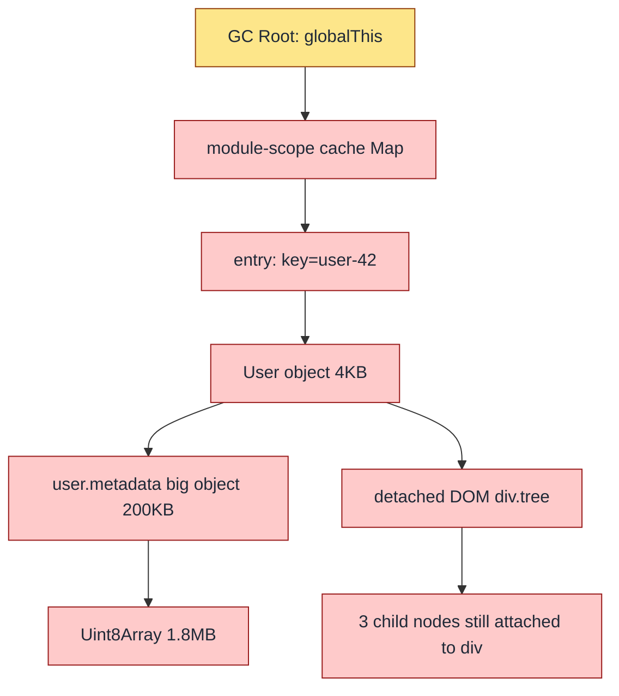
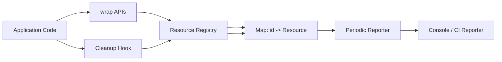

# 1.29 Memory Leaks Diagnostic

> A memory leak in JavaScript is never about a missing `free()`. It is about a reference you forgot you were still holding. The garbage collector cannot read your intent; it can only trace reachability. If a path exists from a root to an object, the object lives, whether you wanted it to or not.

This note is the diagnostic counterpart to [[1.28 Garbage Collection in V8]]. Where the sibling note explains how the collector decides what to free, this note explains how the program defeats the collector by retaining objects it no longer needs, how to detect that retention, and how to write code that does not retain it in the first place.

---

## 1. Purpose

JavaScript has no manual memory management. There is no `free()`, no `delete` operator that frees memory (the `delete` keyword only removes properties), no `malloc`/`free` pair. The V8 garbage collector (and the collectors in SpiderMonkey and JavaScriptCore) trace from a set of roots through every reachable reference and reclaim everything that is unreachable. From the programmer's perspective, memory should "just work."

It does not. The illusion breaks down the moment a program holds a reference longer than necessary. The object is still reachable from a root, so the collector cannot free it, but the program will never use it again. That is a memory leak: an object is reachable but unwanted. The collector is doing exactly what it was told. The bug is in the telling.

Leaks matter because they are slow poison. A crash from a missing null check happens immediately and is fixed in minutes. A leak grows by a few kilobytes per request, or a few megabytes per hour, and is invisible until the process hits its memory ceiling. In a browser tab the tab slows, then freezes, then crashes with the terse "Aw, Snap!" In a Node.js service the process slows as V8 spends ever more time in marking, then triggers an out-of-memory abort that restarts the container at three in the morning. The longer a leak runs, the more damage it does, and the harder it is to reproduce because it depends on time and traffic, not on a single input.

JavaScript leaks are subtle precisely because there is no `free` to forget. A C programmer who forgets to call `free` knows exactly what they did not do. A JavaScript programmer who leaks usually has no idea anything is wrong: the code looks idiomatic, the tests pass, the linter is silent. The leak is a structural property of the reference graph, not a syntactic property of the code. Detecting it requires tools, and fixing it requires understanding the reference graph that the tools expose.

This note exists because roughly nine out of ten real-world JavaScript leaks fall into six recurring patterns. Once you internalize those six patterns, you can spot most leaks by reading code. Once you internalize the diagnostic workflow, you can confirm any leak with Chrome DevTools or `node --inspect` in under fifteen minutes. Once you internalize the fix patterns, you can write code that does not leak in the first place.

The six patterns are:

1. **Accidental globals** — assigning to an undeclared variable in sloppy mode attaches it to the global object, where it lives for the lifetime of the page or process.
2. **Detached DOM nodes** — removing a node from the document but keeping a JS reference to it (or to a child of it) leaves a subtree alive in JS memory while invisible to the user.
3. **Forgotten timers** — `setInterval` callbacks hold their closure forever; if the closure captures something large, that something large lives until the interval is cleared.
4. **Closure retention** — an inner function captures more of its enclosing scope than it needs, often an entire `this` or a large argument object, because V8 conservatively retains the whole activation.
5. **Event listener leaks** — `addEventListener` without a matching `removeEventListener` keeps the listener, its closure, and everything the closure captures alive for as long as the emitter lives.
6. **Singleton accumulators** — a `Map` or `Set` or array on a long-lived object (a module-level cache, a registry, a connection pool) grows without bound because nobody prunes it.

These six account for the overwhelming majority of leaks seen in production SPAs, Node services, and Electron apps. The remaining fraction is exotic: WeakRef misuse, FinalizationRegistry ordering bugs, native addon handles, worker thread message ports, and the like. Master the six, and you have mastered the practical problem.

---

## 2. Theory and Deep Dive

### 2.1 What a leak actually is

A memory leak is the conjunction of two facts:

1. An object is **reachable** from a GC root.
2. The program will **never use the object again**.

The garbage collector only verifies fact (1). It cannot verify fact (2) because intent is not observable. From V8's perspective, a Map entry that has not been read in six hours is indistinguishable from a Map entry that is about to be read. The collector's rule is conservative: if reachable, keep.

The programmer's job is therefore to make the reference graph match intent. If the program is done with an object, the references to it must be severed: variables reassigned, Map entries deleted, listeners removed, timers cleared, DOM nodes detached and dereferenced. Any reference left standing keeps the object alive.

### 2.2 The retention chain

Reachability is transitive. An object is reachable if any path of references leads from a root to it. The path is called the **retention chain**. The leak diagnostic problem is almost always the problem of finding the retention chain, because the chain is rarely the obvious one.

The GC roots in a browser are roughly: the global object (`globalThis`), the active call stack (every local variable on every frame), the set of registered event listeners, pending timers, DOM document nodes, and a handful of internal roots (built-in prototypes, the active Promise job queue). In Node, the roots are `globalThis`, the active call stack, pending timers, active I/O watchers, and the module system's loaded-module registry.



In this diagram, the programmer wanted to free the `User` object after logout. They did everything obvious: they removed the user from the visible UI, they set the local `currentUser` variable to `undefined`, they even called `cache.delete(userId)`. But they forgot about the module-scope Map keyed by `user-42` that a different module populated. That Map holds the entry, the entry holds the user, the user holds its metadata, the user holds a detached DOM subtree, the metadata holds a 1.8MB `Uint8Array`. One forgotten reference keeps the entire 2MB graph alive.

This is why leaks are hard: the retention chain is invisible in source code. You cannot see module-scope Maps by reading the function that "frees" the user. You can only see them by asking the runtime.

### 2.3 Pattern 1 — Accidental globals

In sloppy (non-strict) mode, assigning to an identifier that was not declared with `let`, `const`, or `var` creates a property on the global object:

```javascript
function processOrder(order) {
  total = order.price * order.qty; // implicit global
  return total;
}
```

`total` is now `globalThis.total`. It will never be collected for the lifetime of the page or process. If `processOrder` is called a million times, only the last value survives (because each call overwrites the same property), but the pattern is still a leak if the value is large.

The fix is `use strict` or modules (which are strict by default) or always declaring variables. The ESLint rule `no-implicit-globals` catches it at lint time.

### 2.4 Pattern 2 — Detached DOM nodes

A DOM node is "detached" when it has been removed from the document tree (so the user cannot see it and the browser's rendering pipeline does not need it) but a JS reference to it still exists. The browser cannot free the node's memory because the JS heap still references it. Worse, the node retains its children, its event listeners, its inline data, and any data attached via `element.dataset` or libraries like jQuery's `.data()`.

The classic pattern:

```javascript
const tree = document.querySelector('#big-tree');
container.removeChild(tree); // detached, but `tree` still holds it
// `tree` lives forever unless `tree = null` or it goes out of scope
```

A subtler pattern is `container.innerHTML = ''`, which removes all children from the document but does not affect any JS variables that still point to those children. If a closure captured a child reference, every descendant of that child is leaked.

Detached DOM nodes are the most common leak in SPAs. They are also the easiest to find with Chrome DevTools, because the heap snapshot classifies any `HTMLDivElement` (or similar) that is not in the document as "Detached" with a yellow warning.

### 2.5 Pattern 3 — Forgotten timers

`setInterval(callback, ms)` schedules `callback` to run every `ms` milliseconds, forever, until `clearInterval(id)` is called. The V8 timer subsystem holds a strong reference to the callback. The callback is a function object, which closes over its lexical environment. The lexical environment holds whatever variables the callback references. Until the interval is cleared, every one of those variables is retained.

```javascript
function startPolling(user) {
  setInterval(() => {
    fetch(`/api/${user.id}/notifications`);
  }, 5000);
}
```

The interval callback closes over `user`. If `user` is a 4MB profile object with an embedded photo, that 4MB is retained for the lifetime of the page, even if the user logs out and is "removed" from the app. The fix is to capture only what is needed (`user.id`) and to clear the interval when polling should stop.

`setTimeout` has the same shape but only fires once, so the leak is bounded to one timeout duration. `setInterval` is unbounded.

### 2.6 Pattern 4 — Closure retention

A closure captures the variables it references from its enclosing scope. Modern engines optimize this: if a closure only uses `x` from a scope that also has `y`, only `x` is retained. But the optimization has limits. A closure that captures `this` captures the entire object; a closure that captures `arguments` captures the entire arguments object; a closure that captures a large config object captures the whole config even if it only reads one field.

The pattern:

```javascript
function makeHandler(bigConfig) {
  return function handleClick() {
    console.log(bigConfig.label); // captures whole bigConfig
  };
}
```

If `bigConfig` is a 50KB object containing API keys, secrets, full localization tables, and a photo, all 50KB is retained as long as `handleClick` is reachable. The fix is to extract what the closure actually needs before constructing it:

```javascript
function makeHandler(bigConfig) {
  const label = bigConfig.label; // narrow capture
  return function handleClick() {
    console.log(label);
  };
}
```

After this rewrite, `bigConfig` is unreachable once `makeHandler` returns (assuming nothing else holds it), and the closure retains only the small `label` string.

### 2.7 Pattern 5 — Event listener leaks

`target.addEventListener(type, listener)` registers `listener` on `target`. The target now holds a strong reference to the listener. If the listener is never removed (with `removeEventListener(type, listener)`, which requires the same function reference), the listener and its captured closure live as long as `target` does. If `target` is `window` or `document`, that is forever.

The leak compounds in SPAs: each route change adds new listeners to `window`; without cleanup, the listener count grows linearly with navigation count, and each old listener retains the component it was supposed to serve, even after that component is unmounted.

The modern fix is `AbortController`: pass an `AbortSignal` to `addEventListener`, and call `controller.abort()` to remove all listeners registered with that signal in one call. The classic fix is to keep the function reference and call `removeEventListener` in a cleanup phase (React's `useEffect` return, Vue's `onBeforeUnmount`, Angular's `ngOnDestroy`).

### 2.8 Pattern 6 — Singleton accumulators

A module-scope `Map`, `Set`, or array that grows without bound is a leak waiting to happen. The pattern:

```javascript
const cache = new Map();
export function getUser(id) {
  if (!cache.has(id)) cache.set(id, fetchUser(id));
  return cache.get(id);
}
```

Every user ever requested stays in `cache` forever. In a long-running service this is a slow leak. In a browser tab it is faster: every navigation, every search, every list-view populates the cache, and nothing is evicted.

The fixes are: bound the cache (LRU with a size cap), use `WeakMap` if keys are objects and you want entries to disappear when keys disappear, or use `WeakRef` for values if you want the cache to clear when memory pressure evicts the values.

### 2.9 Detection — the three workflows

**Workflow A: Chrome DevTools Heap Snapshot (browser).** Open DevTools → Memory → Heap snapshot. Take a snapshot (S1). Perform the suspected leaking action (open a modal, navigate, do a search). Perform it again (to flush one-shot allocations). Take another snapshot (S2). Select S2, change view to "Comparison" against S1, sort by delta. Anything that grew is suspect. Filter the class list by `Detached` to find detached DOM nodes. For each suspect, look at the "Retainers" panel to see the retention chain back to a root.

**Workflow B: Chrome DevTools Allocation Timeline.** DevTools → Memory → Allocation instrumentation on timeline. Record while performing the action. The timeline shows blue bars (allocated and still alive) and gray bars (allocated and already collected). Steady-state blue bars that do not turn gray are leaks. Click a blue bar to see what was allocated.

**Workflow C: Node.js profiling.** Three tools, in increasing order of detail:

- `process.memoryUsage()` — returns `{ rss, heapTotal, heapUsed, external, arrayBuffers }`. Log it periodically. If `heapUsed` grows monotonically across GC cycles, you have a leak.
- `node --inspect yourScript.js` — opens the same Chrome DevTools Memory panel as the browser, against the Node process. Same workflow.
- `node --heap-prof yourScript.js` — writes a V8 heap profile that can be loaded in DevTools → Memory → Load. Shows allocation stacks, so you can see which function allocated the surviving bytes.

A common Node trick is to drive the suspected code in a loop and log `heapUsed` after each forced GC:

```javascript
function forceGc() { global.gc && global.gc(); }
for (let i = 0; i < 20; i++) {
  doSuspectedWork();
  forceGc();
  console.log(process.memoryUsage().heapUsed);
}
```

Run with `node --expose-gc`. If the numbers are flat after the first few iterations (warm-up), there is no leak. If they grow linearly, there is a leak, and the slope tells you the leak rate per iteration.

### 2.10 Why V8 does not just "fix" this

A reasonable question: why does V8 not detect that an object is "unused" and free it? The answer is that unused is undecidable. The only sound definition of "unused" is "unreachable," and reachability is what V8 already computes. Anything more aggressive (predicting that a reachable object will never be read) is unsafe in general, because the program might read it on the next line.

`WeakRef` and `WeakMap` exist precisely because they let the programmer express "this reference does not count for retention purposes." They are the language's escape hatch from the conservative reachability rule. Use them when you genuinely do not want to keep an object alive but want to use it if it is still around.

---

## 3. Mental Models

**Leak = an object you forgot you were still holding.** Every leak reduces to this. The fix is always to find the forgotten holder and sever it. The forgotten holder is rarely the obvious variable; it is usually a Map, a listener registry, a timer's closure, or a module-scope cache. Train yourself to ask, every time you create a long-lived data structure, "who removes entries from this, and when?"

**Retention chain = the path from a root to the leaked object.** A leak is not an object; it is a path. The same object can be leaked by many paths, and fixing one path does not fix the leak if another path remains. The DevTools "Retainers" panel exists to show you the path. Read it from the leaked object upward, and each step is a reference that, if severed, would free the object.

**Detached DOM = the node is gone from the page but still in JS memory.** The browser has two heaps: the DOM tree (rendered) and the JS heap (referenced). A node can be in either, both, or neither. Removing a node from the DOM tree does not remove it from the JS heap. The node retains its children, its attributes, its listeners, and any data attached to it. To actually free it, you must remove it from the DOM and drop every JS reference to it.

**Forgotten timer = the interval is still firing, still holding its closure.** A `setInterval` that nobody clears is a permanent allocation. The closure it captured is alive forever. Even if the closure does nothing visible, the objects it closes over are alive. The fix is always the same: keep the interval id, call `clearInterval` when the work is done, in a cleanup hook.

**Closure retention = the function only needs `x` but accidentally captures the whole `this`.** Closures capture by reference, and they capture conservatively. If a closure uses one field of a large object, modern engines often retain only that field, but they are not required to, and the optimization is fragile. The defensive pattern is to extract what you need into a local variable before constructing the closure, so the closure captures the small local, not the large object.

**Singleton accumulator = a Map that grows by one entry per request.** The Map never shrinks because nobody prunes it. The fix is to bound the Map (LRU, TTL, or both), or to switch to `WeakMap` if keys are objects and the entries should disappear when keys disappear, or to use `WeakRef`-valued entries so values can be collected under memory pressure.

**The unifying frame:** every leak is an ownership question. Who owns this object? Who is responsible for releasing it? If the answer is "nobody" or "everybody," you have a leak. The discipline of writing leak-free code is the discipline of making ownership explicit: every long-lived reference has a designated cleanup site, and that site is called.

---

## 4. Real-World Use Cases

**Single-page applications that grow memory over time.** The canonical SPA leak: a user navigates between routes for an hour, the DevTools Memory tab shows heap growing by 2MB per navigation, and the tab eventually freezes. The cause is almost always component leaks — mounted components whose cleanup did not run, or whose listeners were not removed, or whose detached DOM subtrees are still referenced by closures in a module-scope array.

**Long-running Node.js services that OOM after days.** A REST API that runs fine in dev and in load tests for an hour, but restarts itself every 36 hours in production with `FATAL ERROR: CALL AND RETRY LAST Allocation failed - JavaScript heap out of memory`. The cause is usually a singleton accumulator: a connection-pool Map that never evicts idle connections, a per-user cache that never expires, or an in-memory queue that grows when the consumer falls behind.

**Electron apps with DOM leaks.** Electron combines a Chromium renderer (DOM heap) with a Node.js main process (JS heap) and an IPC bridge. A common Electron leak is a renderer that creates DOM nodes for each message from the main process, never removes them, and never nulls the JS references. The renderer grows until the app crawls.

**React component leaks — missing `useEffect` cleanup.** A `useEffect` that subscribes to a store or adds a window listener and returns no cleanup function leaks the listener and the component instance:

```javascript
useEffect(() => {
  window.addEventListener('resize', () => setWidth(window.innerWidth));
  // no return => listener leaks forever, captures component state
}, []);
```

Each mount adds a listener; each unmount does not remove one. After a hundred navigations, a hundred listeners fire on each resize, each calling `setWidth` on an unmounted component (React warning: "Can't perform a state update on an unmounted component").

**Vue 2 reactivity retaining old component instances.** Vue 2's reactivity converts every property of the `data` object to a getter/setter and tracks dependencies. If a component's `data` references a large object that is also referenced by a global event bus, the bus retains the component's reactivity system, which retains the component. Vue 3's Proxy-based reactivity has the same risk in a different shape. The fix is the same: unregister from the bus in `beforeUnmount`.

**WebSocket message handlers that accumulate.** A service that opens a WebSocket, registers a per-message handler that pushes into a growing array "for replay later," and never trims the array, leaks linearly with message count. After a week of high traffic, the array holds gigabytes.

**Map-keyed caches that should be WeakMaps.** A common pattern: a DOM-node-to-metadata Map, populated by a library, where the DOM nodes are created and destroyed by the application. The Map holds the nodes alive (as keys) and the metadata alive (as values), even after the application is done with both. Switching to `WeakMap` lets the entries disappear when the keys disappear.

**Promise chains that never settle.** A Promise that is never resolved or rejected retains its resolver, its rejecter, and the closures attached via `.then`. If the resolver is captured in a long-lived data structure, the Promise, the closures, and everything they capture live forever. The fix is to always settle Promises (resolve or reject), or to use `Promise.race` with a timeout to force settlement.

---

## 5. Code Examples

### 5.1 Example A — Minimal and Conceptual

Each of the six patterns in ten lines, side by side in JS and TS. Every example shows the leak and the fix on adjacent lines.

#### Pattern 1 — Accidental globals

**JavaScript:**

```javascript
// Leaky
function tally(order) {
  total = order.price * order.qty; // implicit global
  return total;
}

// Fixed
'use strict';
function tallyFixed(order) {
  const total = order.price * order.qty;
  return total;
}
```

**TypeScript:**

```typescript
// TS prevents this at compile time: `total` is an unresolved name.
// But `declare global` and `any` typing can reintroduce it.
function tally(order: { price: number; qty: number }): number {
  let total = order.price * order.qty; // explicit let
  return total;
}
```

#### Pattern 2 — Detached DOM nodes

**JavaScript:**

```javascript
// Leaky
const cache = {};
function render(id) {
  const el = document.createElement('div');
  el.textContent = id;
  cache[id] = el; // kept forever even after removal
  document.body.appendChild(el);
  document.body.removeChild(el); // detached but cached
}

// Fixed
function renderFixed(id) {
  const el = document.createElement('div');
  el.textContent = id;
  document.body.appendChild(el);
  // do not retain el anywhere; let it die with the scope
}
```

**TypeScript:**

```typescript
// Leaky
const domCache: Record<string, HTMLDivElement> = {};
function render(id: string): void {
  const el = document.createElement('div');
  el.textContent = id;
  domCache[id] = el;
  document.body.appendChild(el);
  document.body.removeChild(el);
}

// Fixed: use WeakMap so the entry dies when key dies (here key is a string,
// so use a Map with explicit eviction instead).
const liveNodes = new Set<HTMLDivElement>();
function renderFixed(id: string): void {
  const el = document.createElement('div');
  el.textContent = id;
  document.body.appendChild(el);
  liveNodes.add(el);
  // cleanup elsewhere: liveNodes.delete(el) on unmount
}
```

#### Pattern 3 — Forgotten timers

**JavaScript:**

```javascript
// Leaky
function startPolling(user) {
  setInterval(() => {
    fetch(`/api/${user.id}/notifications`); // captures user forever
  }, 5000);
}

// Fixed
function startPollingFixed(userId, stopSignal) {
  const id = setInterval(() => {
    fetch(`/api/${userId}/notifications`);
  }, 5000);
  stopSignal.addEventListener('abort', () => clearInterval(id));
}
```

**TypeScript:**

```typescript
// Leaky
function startPolling(user: { id: string; profile: Uint8Array }): void {
  setInterval(() => {
    fetch(`/api/${user.id}/notifications`);
  }, 5000);
}

// Fixed
function startPollingFixed(
  userId: string,
  stopSignal: AbortSignal
): void {
  const id = setInterval(() => {
    fetch(`/api/${userId}/notifications`);
  }, 5000);
  stopSignal.addEventListener('abort', () => clearInterval(id), { once: true });
}
```

#### Pattern 4 — Closure retention

**JavaScript:**

```javascript
// Leaky
function makeHandler(bigConfig) {
  return function onClick() {
    console.log(bigConfig.label); // retains whole bigConfig
  };
}

// Fixed
function makeHandlerFixed(bigConfig) {
  const label = bigConfig.label; // narrow capture
  return function onClick() {
    console.log(label);
  };
}
```

**TypeScript:**

```typescript
interface BigConfig {
  label: string;
  apiKey: string;
  localization: Record<string, string>;
  photo: Uint8Array;
}

// Leaky
function makeHandler(bigConfig: BigConfig): () => void {
  return function onClick(): void {
    console.log(bigConfig.label);
  };
}

// Fixed
function makeHandlerFixed(bigConfig: BigConfig): () => void {
  const label = bigConfig.label;
  return function onClick(): void {
    console.log(label);
  };
}
```

#### Pattern 5 — Event listener leaks

**JavaScript:**

```javascript
// Leaky
function bindResize() {
  window.addEventListener('resize', () => {
    document.body.style.width = window.innerWidth + 'px';
  });
}

// Fixed (AbortController)
function bindResizeFixed(signal) {
  window.addEventListener('resize', () => {
    document.body.style.width = window.innerWidth + 'px';
  }, { signal });
}
```

**TypeScript:**

```typescript
// Leaky
function bindResize(): void {
  window.addEventListener('resize', () => {
    document.body.style.width = `${window.innerWidth}px`;
  });
}

// Fixed
function bindResizeFixed(signal: AbortSignal): void {
  window.addEventListener(
    'resize',
    () => {
      document.body.style.width = `${window.innerWidth}px`;
    },
    { signal }
  );
}
```

#### Pattern 6 — Singleton accumulators

**JavaScript:**

```javascript
// Leaky
const userCache = new Map();
export function getUser(id) {
  if (!userCache.has(id)) userCache.set(id, fetchUser(id));
  return userCache.get(id);
}

// Fixed (WeakMap if keys are objects; here keys are strings, so LRU)
const lru = new Map();
const CAP = 1000;
export function getUserFixed(id) {
  if (lru.has(id)) {
    const v = lru.get(id);
    lru.delete(id); lru.set(id, v); // move to MRU
    return v;
  }
  const v = fetchUser(id);
  lru.set(id, v);
  if (lru.size > CAP) lru.delete(lru.keys().next().value);
  return v;
}
```

**TypeScript:**

```typescript
interface User { id: string; name: string; }

// Leaky
const userCache = new Map<string, User>();
function getUser(id: string): User {
  if (!userCache.has(id)) userCache.set(id, fetchUser(id));
  return userCache.get(id)!;
}

// Fixed (WeakMap variant when keys are objects)
const metaByNode = new WeakMap<HTMLElement, User>();
function attachMeta(node: HTMLElement, user: User): void {
  metaByNode.set(node, user); // entry dies when node is GC'd
}
```

### 5.2 Example B — Production-Grade

A leak-free event-emitter-based component with proper cleanup, a `WeakRef`-valued cache, and a `FinalizationRegistry` for resource cleanup. Side by side in JS and TS.

The component is a "SessionRegistry": it tracks user sessions keyed by session id, caches the session object via `WeakRef` (so memory pressure can evict it), cleans up the cache entry when the session is GC'd via `FinalizationRegistry`, exposes a subscribe/unsubscribe event API, and supports an `AbortSignal` for global teardown.

**JavaScript:**

```javascript
// session-registry.js
const sessions = new Map(); // id -> WeakRef<Session>
const tokens = new Map();   // id -> unregister token
const listeners = new Set(); // Set<() => void>

const registry = new FinalizationRegistry((id) => {
  const ref = sessions.get(id);
  if (ref && !ref.deref()) {
    sessions.delete(id);
    tokens.delete(id);
    emit('evicted', id);
  }
});

function emit(type, payload) {
  for (const fn of listeners) {
    try { fn({ type, payload }); } catch (e) { /* swallow */ }
  }
}

export function register(id, session) {
  if (sessions.has(id)) {
    throw new Error(`session ${id} already registered`);
  }
  const ref = new WeakRef(session);
  sessions.set(id, ref);
  const token = registry.register(session, id, session);
  tokens.set(id, token);
  emit('registered', id);
}

export function lookup(id) {
  const ref = sessions.get(id);
  return ref ? ref.deref() : undefined;
}

export function unregister(id) {
  const ref = sessions.get(id);
  if (!ref) return;
  const session = ref.deref();
  if (session) registry.unregister(session);
  sessions.delete(id);
  tokens.delete(id);
  emit('unregistered', id);
}

export function subscribe(fn, signal) {
  listeners.add(fn);
  if (signal) {
    signal.addEventListener('abort', () => listeners.delete(fn), { once: true });
  }
  return () => listeners.delete(fn);
}

export function teardown(signal) {
  if (signal.aborted) { listeners.clear(); return; }
  signal.addEventListener('abort', () => {
    listeners.clear();
    for (const id of [...sessions.keys()]) unregister(id);
  }, { once: true });
}
```

**TypeScript:**

```typescript
// session-registry.ts
export interface Session {
  id: string;
  userId: string;
  startedAt: number;
  data: unknown;
}

export type RegistryEvent =
  | { type: 'registered'; payload: string }
  | { type: 'unregistered'; payload: string }
  | { type: 'evicted'; payload: string };

type Listener = (event: RegistryEvent) => void;

const sessions = new Map<string, WeakRef<Session>>();
const tokens = new Map<string, { unregister: () => void }>();
const listeners = new Set<Listener>();

const registry = new FinalizationRegistry<string>((id: string) => {
  const ref = sessions.get(id);
  if (ref && !ref.deref()) {
    sessions.delete(id);
    tokens.delete(id);
    emit({ type: 'evicted', payload: id });
  }
});

function emit(event: RegistryEvent): void {
  for (const fn of listeners) {
    try { fn(event); } catch { /* swallow listener errors */ }
  }
}

export function register(id: string, session: Session): void {
  if (sessions.has(id)) {
    throw new Error(`session ${id} already registered`);
  }
  const ref = new WeakRef(session);
  sessions.set(id, ref);
  registry.register(session, id, session);
  tokens.set(id, {
    unregister: () => registry.unregister(session),
  });
  emit({ type: 'registered', payload: id });
}

export function lookup(id: string): Session | undefined {
  const ref = sessions.get(id);
  return ref ? ref.deref() : undefined;
}

export function unregister(id: string): void {
  const ref = sessions.get(id);
  if (!ref) return;
  const session = ref.deref();
  if (session) registry.unregister(session);
  sessions.delete(id);
  tokens.delete(id);
  emit({ type: 'unregistered', payload: id });
}

export function subscribe(fn: Listener, signal?: AbortSignal): () => void {
  listeners.add(fn);
  if (signal) {
    signal.addEventListener(
      'abort',
      () => { listeners.delete(fn); },
      { once: true }
    );
  }
  return () => { listeners.delete(fn); };
}

export function teardown(signal: AbortSignal): void {
  if (signal.aborted) {
    listeners.clear();
    return;
  }
  signal.addEventListener(
    'abort',
    () => {
      listeners.clear();
      for (const id of Array.from(sessions.keys())) unregister(id);
    },
    { once: true }
  );
}
```

Key properties of this design:

- The `sessions` Map holds `WeakRef<Session>`, not `Session`. If V8 evicts the underlying Session under memory pressure, the entry stays in the Map but `ref.deref()` returns `undefined`.
- The `FinalizationRegistry` callback fires (asynchronously, on a future GC) when a Session is collected, and removes the stale entry. This is what keeps the Map from growing forever with dead refs.
- The `tokens` Map holds an `unregister` closure so that explicit `unregister(id)` removes the registry entry before GC, which is important when the same Session object might be reused for a new id later.
- `subscribe` returns an unsubscribe function and also accepts an `AbortSignal` for signal-driven teardown. Either pattern works; both can be used together.
- `teardown(signal)` wires a one-shot abort handler that clears listeners and unregisters every session. This is the global shutdown path; calling it from `process.on('SIGTERM')` or a React unmount gives a single point of cleanup.
- Listener errors are swallowed to prevent one bad listener from breaking the emit loop. In production you would log them.

---

## 6. Common Mistakes and Anti-Patterns

### 6.1 `setInterval` without `clearInterval`

The single most common leak in tutorials and copy-pasted code. The interval fires forever; the closure it captured lives forever; nothing tells it to stop. Always store the id and clear it in a cleanup hook. Use `AbortSignal` with a small wrapper if you have many timers tied to one lifecycle.

### 6.2 `addEventListener` without `removeEventListener`

Compounds with every mount. The listener retains its closure, which retains the component, which retains its DOM. The fix is `AbortController` (modern) or storing the function reference and calling `removeEventListener` in cleanup (classic). The function reference must be the exact same one passed to `addEventListener` — an inline arrow function in `addEventListener` cannot be removed because each call creates a new function.

### 6.3 Closures capturing `this` unnecessarily

```javascript
class Foo {
  constructor() { this.big = new Uint8Array(1e7); }
  go() {
    document.addEventListener('click', function () {
      console.log(this); // captures `this`, retains `this.big`
    });
  }
}
```

The callback references `this`, so the closure retains the entire `Foo` instance, including the 10MB `big` buffer. The fix is to extract the one field the callback needs:

```javascript
go() {
  const label = this.label; // narrow capture
  document.addEventListener('click', () => console.log(label));
}
```

### 6.4 Maps that grow forever

A module-scope `Map` populated by every request, with no eviction policy, leaks at the rate of (entry size) times (request rate). After a day of 1000 requests per second with 1KB entries, that is 86GB. Always bound caches: LRU with a cap, TTL with expiry, or `WeakMap`/`WeakRef` if the lifecycle of the key/value is owned elsewhere.

### 6.5 Detached DOM after `innerHTML = ''`

```javascript
function rebuild(container) {
  const cached = container.firstChild; // reference captured
  container.innerHTML = ''; // removes children from DOM
  // cached is now detached; if cached is in a closure, it leaks
}
```

`innerHTML = ''` removes children from the document but does not affect JS references. Any closure still pointing at a removed child keeps that child (and its subtree) alive. The fix is to drop the references before clearing, or to use `container.replaceChildren()` and let the old children fall out of scope.

### 6.6 Promises that never settle

```javascript
function fetchWithTimeout(url, ms) {
  return new Promise((resolve, reject) => {
    fetch(url).then(resolve, reject);
    // no timeout => if fetch hangs forever, promise hangs forever
  });
}
```

A Promise that never resolves or rejects retains its executor closures and every `.then` callback attached to it. If the executor captured a large object, that object is leaked. The fix is `Promise.race` with a timeout:

```javascript
function fetchWithTimeoutFixed(url, ms) {
  const timeout = new Promise((ignored, reject) =>
    setTimeout(() => reject(new Error('timeout')), ms)
  );
  return Promise.race([fetch(url), timeout]);
}
```

### 6.7 Storing listeners in a Map keyed by id and never deleting

A pub/sub that keeps a Map of subscriber ids → callbacks, where the same subscriber registers many times under new ids, leaks the callbacks. Always delete on unsubscribe, and consider deduplicating by callback reference.

### 6.8 Caching rejected Promises

A cache that stores `Promise<result>` will store the rejected Promise on failure. Subsequent reads return the same rejection. If the cache is unbounded, rejections accumulate. The fix is to delete the entry on failure (`try { await p; } catch { cache.delete(key); throw e; }`) or to store the resolved value only.

### 6.9 Forgetting to `unref` Node timers

A `setInterval` in a Node service that runs every second prevents the process from exiting cleanly on `SIGTERM`, because the timer keeps the event loop alive. The fix is `timer.unref()` (Node-only) so the timer does not block exit, or explicit `clearInterval` in the shutdown handler.

### 6.10 Holding the previous value in a `useEffect`

```javascript
useEffect(() => {
  const id = setTimeout(() => setState(prev), 1000);
  return () => clearTimeout(id);
}, [prev]); // captures prev on every change
```

Each effect run captures `prev`. The cleanup clears the timer but the closure still references `prev`. If `prev` is a large object, this is a transient leak (cleaned up when the effect re-runs) but can compound under fast prop changes.

---

## 7. Best Practices and Design Patterns

### 7.1 Always pair `setInterval` with `clearInterval`

The interval id is a resource. Treat it like a file descriptor: open it, use it, close it. Store it in a variable that lives as long as the interval should, and call `clearInterval(id)` exactly when the interval should stop. Use `AbortSignal` as a unified teardown primitive if you have many resources tied to one lifecycle.

### 7.2 Always pair `addEventListener` with `removeEventListener` (or use `AbortController`)

The listener is a resource. Either keep the function reference and remove it explicitly, or pass an `AbortSignal` and call `controller.abort()` to remove every listener registered with that signal in one call. The `AbortController` pattern is strictly better for component-scoped listeners because one `abort()` cleans up every listener, timer, and fetch the component created.

### 7.3 Use `WeakMap` for per-object metadata

If you need to attach metadata to objects whose lifecycle you do not control, use `WeakMap`. The entry disappears when the key is collected. This is the correct data structure for "per-DOM-node metadata," "per-class-instance cache," "per-promise cancellation token," and similar patterns.

### 7.4 Use `WeakRef` for caches whose values can be recreated

A `WeakRef` lets you hold a value without keeping it alive. The value may be collected under memory pressure; `ref.deref()` then returns `undefined`. Use this for caches where a miss is recoverable (re-fetch, re-compute). Pair with `FinalizationRegistry` to clean up the cache entry when the value is collected, so the Map of `id -> WeakRef` does not accumulate dead refs.

### 7.5 Use `FinalizationRegistry` for resource cleanup

If you create a JS object that owns a non-JS resource (a file handle, a database connection, a native buffer), register it with `FinalizationRegistry` so the resource is released when the JS object is collected. This is not a substitute for explicit `close()`/`dispose()`, but it is a backstop for the case where the caller forgets.

### 7.6 In React, return cleanup from `useEffect`

Every `useEffect` that creates a resource (listener, timer, subscription, WebSocket) must return a function that destroys it. React calls the cleanup before re-running the effect and on unmount. Without it, every effect run accumulates resources.

### 7.7 In Node, handle `process.on('exit')` and `SIGTERM`

`process.on('exit')` fires when the event loop is about to drain (synchronous only). `process.on('SIGTERM')` fires on the kill signal (async-safe). Register cleanup in both: close database pools, flush logs, clear intervals, abort in-flight requests. A service that does not handle `SIGTERM` is a service that leaks connections on every deploy.

### 7.8 Profile regularly with heap snapshots

Make a heap snapshot part of your release checklist for long-running services. Take a baseline, run a realistic workload for an hour, take another snapshot, compare. Anything that grew is suspect. This is much cheaper than debugging an OOM in production.

### 7.9 Bound every cache

LRU with a size cap, TTL with expiry, or both. No cache should be unbounded. If you think your cache is bounded by the input domain, double-check the domain size; user-generated ids are effectively unbounded.

### 7.10 Prefer narrow captures in closures

Extract the fields a closure needs into locals before constructing the closure. This makes the capture set explicit, helps the engine retain only what is needed, and documents intent for the next reader.

### 7.11 Treat `AbortSignal` as the universal cleanup primitive

A single `AbortController` can drive the cleanup of listeners, timers, fetches, and subscriptions. Wire it through your component tree or service lifecycle. Calling `controller.abort()` is the one call that cleans up everything.

---

## 8. Technical Interview Knowledge

### 8.1 What are the common memory leak patterns in JavaScript?

**Answer:** Six patterns cover the majority: (1) accidental globals from assigning to undeclared identifiers in sloppy mode; (2) detached DOM nodes removed from the document but still referenced by JS; (3) forgotten timers — `setInterval` without `clearInterval`, with the callback retaining a large closure; (4) closure retention — a closure that captures more than it needs, often a whole `this` or `arguments`; (5) event listener leaks — `addEventListener` without `removeEventListener`, common in SPAs; (6) singleton accumulators — module-scope Maps or arrays that grow without bound.

**Trap:** Saying "JS has a garbage collector so leaks are rare." The opposite is true: leaks are common because the programmer has no explicit free and the leak is structural, not syntactic.

### 8.2 How do you detect a memory leak?

**Answer:** Three workflows. (a) In the browser, Chrome DevTools Memory tab → Heap snapshot → take S1, perform the suspected action, take S2, compare, sort by delta, inspect Retainers. (b) Also in DevTools, Allocation Timeline shows blue bars that survive (leaks) vs gray bars that were collected (healthy). (c) In Node, log `process.memoryUsage().heapUsed` after a forced GC across iterations of the suspected code; monotonic growth indicates a leak. For deeper diagnosis, `node --inspect` connects the same DevTools Memory tab to a Node process, and `node --heap-prof` produces a heap profile loadable in DevTools.

**Trap:** Saying "watch the OS memory." OS resident set size includes V8's heap overhead, native buffers, and the OS file cache. It is too noisy to diagnose leaks. Use `heapUsed`, not `rss`, for leak detection.

### 8.3 What is a detached DOM node?

**Answer:** A DOM node that has been removed from the document tree (so it is not rendered and not reachable from `document`) but is still referenced by a JavaScript variable. The browser's DOM renderer does not need it, but V8's garbage collector sees it as reachable from a JS root and therefore cannot free it. The node retains its children, its attributes, its event listeners, and any data attached via `dataset` or libraries. The classic causes are storing a node reference in a long-lived variable, capturing a node in a closure, or using `innerHTML = ''` while a JS reference to a child still exists.

**Trap:** Saying "a node with `display: none`." That is not detached — it is still in the document, just not rendered. Detached means removed from the document entirely.

### 8.4 How do you fix a closure leak?

**Answer:** A closure leak occurs when a closure captures more than it needs. The fix is to extract the needed fields into local variables before constructing the closure, so the closure captures the small locals instead of the large enclosing object. For example, instead of `return () => console.log(bigConfig.label)`, write `const label = bigConfig.label; return () => console.log(label);`. After this rewrite, `bigConfig` is unreachable once the outer function returns (assuming nothing else holds it), and the closure retains only the small `label` string. Modern engines often perform this optimization automatically, but it is fragile and not guaranteed; explicit narrowing is defensive.

**Trap:** Saying "use `useCallback`." That memoizes the function; it does not change what the closure captures.

### 8.5 What is `WeakRef` for?

**Answer:** `WeakRef` holds a weak reference to an object — a reference that does not count for garbage collection purposes. The object can be collected while the `WeakRef` still exists; afterward, `ref.deref()` returns `undefined`. Use cases: caches whose values can be recreated, observers that should not keep their subjects alive, registries keyed by objects whose lifecycle is owned elsewhere. Pair with `FinalizationRegistry` to clean up the cache entry when the value is collected.

**Trap:** Saying "use `WeakRef` for everything." `WeakRef` makes collection non-deterministic; you cannot rely on `deref()` returning a value even if the object is still alive, because the GC may have just not run yet. Use `WeakRef` only when you genuinely tolerate a miss.

### 8.6 How does Chrome DevTools Heap Snapshot work?

**Answer:** A heap snapshot is a serialized graph of every reachable JavaScript object at a point in time, with each object's type, size, and retainers. DevTools takes the snapshot by asking V8 to walk its heap and emit a JSON-like format. The UI presents the graph in several views: Summary (grouped by constructor), Comparison (delta between two snapshots), Containment (tree from roots), and Statistics (pie chart by type). The Retainers panel for any object shows the reference path from a root to that object — the retention chain. Filtering by "Detached" finds DOM nodes that are no longer in the document.

**Trap:** Saying "the snapshot shows what was freed." A snapshot shows what is alive at that moment. To see what was freed, compare two snapshots.

### 8.7 How would you profile a Node.js memory leak?

**Answer:** Start with `process.memoryUsage()` logging after each forced GC (`node --expose-gc`), driven in a loop by the suspected code. If `heapUsed` grows monotonically, there is a leak. Then run the same code under `node --inspect` and use Chrome DevTools' Memory tab against the Node process: take a baseline snapshot, run the workload, take another, compare, inspect retainers. For allocation-site attribution, run with `node --heap-prof` and load the resulting profile in DevTools → Load profile, which shows the call stacks that allocated the surviving bytes.

**Trap:** Trying to profile on a production server with the live load. Profiling adds overhead and produces noisy data. Profile in a staging environment with a controlled, repeatable workload.

### 8.8 What is `FinalizationRegistry`?

**Answer:** `FinalizationRegistry` is a callback registry that fires when a registered object is garbage-collected. You register an object, a "held value" (often an id or token), and a callback; when the object is collected, the callback is called with the held value. Use it to clean up resources associated with JS objects whose lifecycle you do not control: cache entries whose values are held by `WeakRef`, native handles wrapped in JS objects, observer registrations tied to JS objects. The callback is asynchronous and may fire long after the object is collected, or never (if the process exits first). It is a backstop, not a replacement for explicit `close()` or `dispose()`.

**Trap:** Relying on `FinalizationRegistry` for correctness. The callback is not guaranteed to fire (the process may exit first, or the GC may never run if memory pressure is low). Use it for best-effort cleanup, never for resources that must be released.

---

## 9. Practical Exercises

### 9.1 Identify the leak in five snippets and fix each

**Snippet A:**

```javascript
function logCount() {
  count = count + 1; // never declared
  console.log(count);
}
```

**Diagnosis:** `count` is an implicit global; the assignment creates `globalThis.count`. **Fix:** declare with `let count = 0;` outside the function, or use strict mode.

```javascript
'use strict';
let count = 0;
function logCount() {
  count += 1;
  console.log(count);
}
```

**Snippet B:**

```javascript
const buttons = document.querySelectorAll('button');
buttons.forEach((b) => {
  b.addEventListener('click', function () {
    console.log(b.textContent);
  });
});
```

**Diagnosis:** Each button gets a listener that captures `b` (the button itself). If the buttons are later removed from the DOM and replaced, the listeners and the captured buttons are retained by the document's listener registry. **Fix:** use event delegation on a stable parent, or remove listeners when the buttons are removed, or use `AbortSignal`.

```javascript
const buttons = document.querySelectorAll('button');
const ac = new AbortController();
buttons.forEach((b) => {
  b.addEventListener('click', () => console.log(b.textContent), {
    signal: ac.signal,
  });
});
// later, when buttons are replaced:
// ac.abort();
```

**Snippet C:**

```javascript
function startTicker(symbol) {
  setInterval(() => {
    const data = fetchQuote(symbol);
    console.log(data);
  }, 1000);
}
```

**Diagnosis:** `setInterval` is never cleared; `symbol` is captured forever. **Fix:** return a stop function or accept an `AbortSignal`.

```javascript
function startTicker(symbol, signal) {
  const id = setInterval(() => {
    const data = fetchQuote(symbol);
    console.log(data);
  }, 1000);
  signal.addEventListener('abort', () => clearInterval(id), { once: true });
}
```

**Snippet D:**

```javascript
const nodes = [];
function render(items) {
  for (const item of items) {
    const div = document.createElement('div');
    div.textContent = item;
    document.body.appendChild(div);
    nodes.push(div); // kept forever
  }
}
```

**Diagnosis:** `nodes` is a module-scope array that grows by `items.length` per call. Each entry is a DOM node retained in JS even if later removed from the DOM. **Fix:** bound the array, or do not retain the nodes.

```javascript
function render(items) {
  for (const item of items) {
    const div = document.createElement('div');
    div.textContent = item;
    document.body.appendChild(div);
    // do not retain div anywhere; let it die with the function scope
  }
}
```

**Snippet E:**

```javascript
function makeApi(config) {
  return function request(path) {
    return fetch(config.baseURL + path, {
      headers: { Authorization: config.apiKey },
    });
  };
}
```

**Diagnosis:** The returned `request` closure captures the whole `config` (including potentially large fields the closure does not use). **Fix:** narrow the capture.

```javascript
function makeApi(config) {
  const baseURL = config.baseURL;
  const apiKey = config.apiKey;
  return function request(path) {
    return fetch(baseURL + path, {
      headers: { Authorization: apiKey },
    });
  };
}
```

### 9.2 Capture a heap snapshot in Chrome DevTools and find a detached DOM node

**Setup:** Open Chrome and navigate to a page with dynamic content (a SPA, or a small test page you control). Open DevTools → Memory tab. Select "Heap snapshot" and click "Take snapshot." This is S1.

**Action:** Trigger a DOM-removing action — navigate to another route, close a modal, click a "clear" button. Do it a few times to flush one-shot allocations.

**Snapshot S2:** Take another snapshot. Select S2 in the left panel. In the class filter, type "Detached" or scroll the class list looking for entries labeled "Detached HTMLDivElement" (or similar). These are DOM nodes removed from the document but still referenced by JS.

**Inspect retainers:** Click a detached node. The Retainers panel below shows the reference path from a root to this node. Read upward: the first retainer is the immediate holder; the last is the GC root. Somewhere in the chain is the forgotten variable, Map, or closure that is keeping the node alive.

**Verify the fix:** Modify the code to drop that reference (delete the Map entry, null the variable, remove the listener). Reload the page, repeat the action, take S3. The detached node should be gone (or its count should be near zero).

**Common finding:** The retainer is often a jQuery-style data cache, a per-element `Map<HTMLElement, ...>`, a closure in an event listener that was not removed, or a ref stored in a React `useRef` that was not reset on unmount.

### 9.3 Implement a leak-free pub/sub with cleanup

**Goal:** A `PubSub` class where subscribers can be added and removed, where the subscription returns an unsubscribe function, where an `AbortSignal` can drive teardown, and where no subscriber retains the pub/sub (or vice versa) after unsubscribe.

**JavaScript:**

```javascript
class PubSub {
  constructor() {
    this.subs = new Map(); // topic -> Set<callback>
  }
  subscribe(topic, fn, signal) {
    if (!this.subs.has(topic)) this.subs.set(topic, new Set());
    this.subs.get(topic).add(fn);
    const unsub = () => {
      const set = this.subs.get(topic);
      if (set) {
        set.delete(fn);
        if (set.size === 0) this.subs.delete(topic);
      }
    };
    if (signal) {
      if (signal.aborted) { unsub(); return unsub; }
      signal.addEventListener('abort', unsub, { once: true });
    }
    return unsub;
  }
  publish(topic, payload) {
    const set = this.subs.get(topic);
    if (!set) return;
    for (const fn of set) {
      try { fn(payload); } catch (e) { /* log */ }
    }
  }
  clear() { this.subs.clear(); }
}
```

**TypeScript:**

```typescript
type Subscriber<T> = (payload: T) => void;

class PubSub<T = unknown> {
  private subs = new Map<string, Set<Subscriber<T>>>();

  subscribe(topic: string, fn: Subscriber<T>, signal?: AbortSignal): () => void {
    let set = this.subs.get(topic);
    if (!set) { set = new Set(); this.subs.set(topic, set); }
    set.add(fn);

    const unsub = (): void => {
      const current = this.subs.get(topic);
      if (!current) return;
      current.delete(fn);
      if (current.size === 0) this.subs.delete(topic);
    };

    if (signal) {
      if (signal.aborted) { unsub(); return unsub; }
      signal.addEventListener('abort', unsub, { once: true });
    }
    return unsub;
  }

  publish(topic: string, payload: T): void {
    const set = this.subs.get(topic);
    if (!set) return;
    for (const fn of set) {
      try { fn(payload); } catch { /* swallow */ }
    }
  }

  clear(): void { this.subs.clear(); }
}
```

**Verification:** Each `subscribe` returns an `unsub` function that, when called, removes the callback from the Set and deletes the Set (and the Map entry) when it becomes empty. The `signal` path wires the same `unsub` to a one-shot abort handler, so a single `controller.abort()` cleans up every subscription made with that signal. There is no module-scope accumulator; `clear()` empties everything. A heap snapshot before and after a thousand subscribe-then-unsub cycles should show zero net growth.

### 9.4 Use `WeakRef` and `FinalizationRegistry` to build a memory-aware cache

**Goal:** A `Cache<K, V>` where keys are strings and values are objects, the cache holds values via `WeakRef` so memory pressure can evict them, and `FinalizationRegistry` cleans up dead entries so the Map does not accumulate stale refs. Provide `get`, `set`, and an optional `recreate` callback for misses.

**JavaScript:**

```javascript
class WeakCache {
  constructor(recreate) {
    this.map = new Map();
    this.recreate = recreate;
    this.registry = new FinalizationRegistry((key) => {
      const ref = this.map.get(key);
      if (ref && !ref.deref()) this.map.delete(key);
    });
  }
  get(key) {
    const ref = this.map.get(key);
    const val = ref ? ref.deref() : undefined;
    if (val) return val;
    if (this.recreate) {
      const fresh = this.recreate(key);
      this.set(key, fresh);
      return fresh;
    }
    return undefined;
  }
  set(key, value) {
    const existing = this.map.get(key);
    if (existing) this.registry.unregister(existing);
    const ref = new WeakRef(value);
    this.map.set(key, ref);
    this.registry.register(value, key, ref);
  }
  has(key) {
    const ref = this.map.get(key);
    return !!ref && !!ref.deref();
  }
  delete(key) {
    const ref = this.map.get(key);
    if (!ref) return false;
    this.registry.unregister(ref);
    this.map.delete(key);
    return true;
  }
  size() {
    let n = 0;
    for (const ref of this.map.values()) if (ref.deref()) n += 1;
    return n;
  }
}
```

**TypeScript:**

```typescript
type Recreator<K, V> = (key: K) => V;

class WeakCache<K extends string | number, V extends object> {
  private map = new Map<K, WeakRef<V>>();
  private readonly recreate?: Recreator<K, V>;
  private readonly registry: FinalizationRegistry<K>;

  constructor(recreate?: Recreator<K, V>) {
    this.recreate = recreate;
    this.registry = new FinalizationRegistry<K>((key: K) => {
      const ref = this.map.get(key);
      if (ref && !ref.deref()) this.map.delete(key);
    });
  }

  get(key: K): V | undefined {
    const ref = this.map.get(key);
    const val = ref ? ref.deref() : undefined;
    if (val) return val;
    if (this.recreate) {
      const fresh = this.recreate(key);
      this.set(key, fresh);
      return fresh;
    }
    return undefined;
  }

  set(key: K, value: V): void {
    const existing = this.map.get(key);
    if (existing) this.registry.unregister(existing);
    const ref = new WeakRef<V>(value);
    this.map.set(key, ref);
    this.registry.register(value, key, ref);
  }

  has(key: K): boolean {
    const ref = this.map.get(key);
    return !!ref && !!ref.deref();
  }

  delete(key: K): boolean {
    const ref = this.map.get(key);
    if (!ref) return false;
    this.registry.unregister(ref);
    this.map.delete(key);
    return true;
  }

  size(): number {
    let n = 0;
    for (const ref of this.map.values()) if (ref.deref()) n += 1;
    return n;
  }
}
```

**Verification:** Insert a thousand objects into the cache. Without holding any other references to them, force a GC (in Node, `global.gc()` with `--expose-gc`; in Chrome, click "Collect garbage" in DevTools Memory tab). Then call `cache.size()`. It should be near zero, because every value was collected and every dead ref was pruned by the `FinalizationRegistry` callback. Without the registry, `cache.size()` would still report zero live values but the Map itself would have a thousand entries holding dead `WeakRef` objects — a small but real leak.

---

## 10. Mini-Project Blueprint

### Build a Leak Detector

A small library that instruments event listeners, timers, and DOM nodes, tracks their allocation and cleanup sites, and reports any resources still alive after a configurable interval. Useful in development and in CI smoke tests to catch leaks before they ship.

### Architecture



### Scope

- **Instrument `addEventListener` and `removeEventListener`** on `EventTarget.prototype`. Each call records `{ target, type, listener, stack, timestamp }` keyed by a synthetic id; each `removeEventListener` deletes the entry. Provide a `getLiveListeners()` accessor.
- **Instrument `setTimeout` and `setInterval`** on `globalThis`. Each call records `{ id, ms, stack, timestamp }`. Each `clearTimeout`/`clearInterval` deletes the entry. For `setInterval`, also record the fire count.
- **Instrument DOM node creation** (`document.createElement`) and removal (`removeChild`, `replaceChildren`, `innerHTML` setter). Track which created nodes are still in the document vs detached.
- **Periodic reporter:** every N seconds (default 10s in dev, off in production), log a summary: live listener count, live timer count, detached node count, and the top five retainers by allocation stack.
- **Cleanup hook:** an `onShutdown(callback)` API so the application can register a teardown that the detector can verify ran.

### Key Files

- `src/detector.ts` — the core registry, instruments, reporter.
- `src/instrument.ts` — the wrapping logic for each API.
- `src/report.ts` — formatting and threshold-based assertions for CI.
- `src/index.ts` — public API: `install()`, `uninstall()`, `getLiveListeners()`, `getLiveTimers()`, `getDetachedNodes()`, `report()`.
- `test/detector.test.ts` — unit tests covering each leak pattern (creates a leak, asserts the detector flags it, fixes the leak, asserts the detector clears it).

### Public API (TypeScript)

```typescript
export interface ListenerRecord {
  id: number;
  target: EventTarget;
  type: string;
  listener: EventListenerOrEventListenerObject;
  stack: string;
  timestamp: number;
}

export interface TimerRecord {
  id: number;
  ms: number;
  interval: boolean;
  stack: string;
  timestamp: number;
  fireCount: number;
}

export interface DetachedNodeRecord {
  id: number;
  node: Node;
  stack: string;
  timestamp: number;
}

export interface DetectorOptions {
  reportIntervalMs?: number;
  maxListeners?: number;
  maxTimers?: number;
  maxDetached?: number;
  onReport?: (summary: DetectorSummary) => void;
}

export interface DetectorSummary {
  liveListeners: number;
  liveTimers: number;
  detachedNodes: number;
  topListeners: ListenerRecord[];
  topTimers: TimerRecord[];
  topDetached: DetachedNodeRecord[];
  exceededThresholds: string[];
}

export function install(options?: DetectorOptions): void;
export function uninstall(): void;
export function getLiveListeners(): ListenerRecord[];
export function getLiveTimers(): TimerRecord[];
export function getDetachedNodes(): DetachedNodeRecord[];
export function report(): DetectorSummary;
```

### Implementation Sketch (Side-by-Side)

**JavaScript:**

```javascript
const listeners = new Map();
const timers = new Map();
const detached = new Map();
let nextId = 1;
let reportInterval = null;
let options = {};

function snapshot() {
  return new Error().stack;
}

function install(opts = {}) {
  options = opts;
  const origAdd = EventTarget.prototype.addEventListener;
  const origRemove = EventTarget.prototype.removeEventListener;
  EventTarget.prototype.addEventListener = function (type, listener, capture) {
    const id = nextId++;
    listeners.set(id, {
      id, target: this, type, listener, capture,
      stack: snapshot(), timestamp: Date.now(),
    });
    return origAdd.call(this, type, listener, capture);
  };
  EventTarget.prototype.removeEventListener = function (type, listener, capture) {
    for (const [id, rec] of listeners) {
      if (rec.target === this && rec.type === type && rec.listener === listener) {
        listeners.delete(id);
        break;
      }
    }
    return origRemove.call(this, type, listener, capture);
  };

  const origSetTimeout = globalThis.setTimeout;
  const origClearTimeout = globalThis.clearTimeout;
  globalThis.setTimeout = function (fn, ms, ...args) {
    const id = origSetTimeout.call(globalThis, fn, ms, ...args);
    timers.set(id, {
      id, ms, interval: false,
      stack: snapshot(), timestamp: Date.now(), fireCount: 0,
    });
    return id;
  };
  globalThis.clearTimeout = function (id) {
    timers.delete(id);
    return origClearTimeout.call(globalThis, id);
  };

  if (opts.reportIntervalMs) {
    reportInterval = origSetTimeout.call(globalThis, function tick() {
      doReport();
      reportInterval = origSetTimeout.call(globalThis, tick, opts.reportIntervalMs);
    }, opts.reportIntervalMs);
  }
}

function doReport() {
  const summary = {
    liveListeners: listeners.size,
    liveTimers: timers.size,
    detachedNodes: detached.size,
    exceededThresholds: [],
  };
  if (options.maxListeners && summary.liveListeners > options.maxListeners) {
    summary.exceededThresholds.push(`listeners ${summary.liveListeners} > ${options.maxListeners}`);
  }
  if (options.onReport) options.onReport(summary);
  if (summary.exceededThresholds.length > 0) {
    console.warn('[leak-detector]', summary);
  }
}

function uninstall() {
  if (reportInterval) clearTimeout(reportInterval);
  // restore originals omitted for brevity
}

module.exports = { install, uninstall };
```

**TypeScript:**

```typescript
import type {
  ListenerRecord, TimerRecord, DetachedNodeRecord,
  DetectorOptions, DetectorSummary,
} from './types';

const listeners = new Map<number, ListenerRecord>();
const timers = new Map<number, TimerRecord>();
const detached = new Map<number, DetachedNodeRecord>();
let nextId = 1;
let reportInterval: ReturnType<typeof setTimeout> | null = null;
let options: Required<DetectorOptions> = {
  reportIntervalMs: 0,
  maxListeners: Infinity,
  maxTimers: Infinity,
  maxDetached: Infinity,
  onReport: () => {},
};

function snapshot(): string {
  return new Error().stack ?? '<no stack>';
}

export function install(opts: DetectorOptions = {}): void {
  options = { ...options, ...opts } as Required<DetectorOptions>;

  const origAdd = EventTarget.prototype.addEventListener;
  const origRemove = EventTarget.prototype.removeEventListener;

  EventTarget.prototype.addEventListener = function (
    this: EventTarget,
    type: string,
    listener: EventListenerOrEventListenerObject | null,
    optionsArg?: boolean | AddEventListenerOptions
  ): void {
    if (listener) {
      const id = nextId++;
      listeners.set(id, {
        id,
        target: this,
        type,
        listener: listener as EventListener,
        stack: snapshot(),
        timestamp: Date.now(),
      });
    }
    origAdd.call(this, type, listener, optionsArg);
  };

  EventTarget.prototype.removeEventListener = function (
    this: EventTarget,
    type: string,
    listener: EventListenerOrEventListenerObject | null,
    optionsArg?: boolean | EventListenerOptions
  ): void {
    if (listener) {
      for (const [id, rec] of listeners) {
        if (rec.target === this && rec.type === type && rec.listener === listener) {
          listeners.delete(id);
          break;
        }
      }
    }
    origRemove.call(this, type, listener, optionsArg);
  };

  if (options.reportIntervalMs > 0) {
    const tick = (): void => {
      doReport();
      reportInterval = setTimeout(tick, options.reportIntervalMs);
    };
    reportInterval = setTimeout(tick, options.reportIntervalMs);
  }
}

function doReport(): void {
  const summary: DetectorSummary = {
    liveListeners: listeners.size,
    liveTimers: timers.size,
    detachedNodes: detached.size,
    topListeners: Array.from(listeners.values()).slice(0, 5),
    topTimers: Array.from(timers.values()).slice(0, 5),
    topDetached: Array.from(detached.values()).slice(0, 5),
    exceededThresholds: [],
  };
  if (summary.liveListeners > options.maxListeners) {
    summary.exceededThresholds.push(
      `listeners ${summary.liveListeners} > ${options.maxListeners}`
    );
  }
  options.onReport(summary);
  if (summary.exceededThresholds.length > 0) {
    console.warn('[leak-detector]', summary);
  }
}

export function uninstall(): void {
  if (reportInterval) clearTimeout(reportInterval);
  listeners.clear();
  timers.clear();
  detached.clear();
}

export function getLiveListeners(): ListenerRecord[] {
  return Array.from(listeners.values());
}

export function getLiveTimers(): TimerRecord[] {
  return Array.from(timers.values());
}

export function getDetachedNodes(): DetachedNodeRecord[] {
  return Array.from(detached.values());
}

export function report(): DetectorSummary {
  return {
    liveListeners: listeners.size,
    liveTimers: timers.size,
    detachedNodes: detached.size,
    topListeners: getLiveListeners().slice(0, 5),
    topTimers: getLiveTimers().slice(0, 5),
    topDetached: getDetachedNodes().slice(0, 5),
    exceededThresholds: [],
  };
}
```

### Acceptance Criteria

- After `install()`, every `addEventListener` call creates a record; every matching `removeEventListener` deletes it.
- After `install()`, every `setTimeout` creates a record; every matching `clearTimeout` deletes it; `setInterval` records persist until cleared.
- `report()` returns the current counts and the top five records by allocation time.
- A test that mounts a component, adds three listeners and two timers, unmounts (running cleanup that removes two listeners and one timer), and calls `report()` shows `liveListeners: 1, liveTimers: 1` — proving the detector caught the leak.
- A test that creates a detached DOM node (without dropping the reference) shows `detachedNodes: 1` after a forced GC.

### Stretch Goals

- Add `AbortSignal` integration: an `install({ signal })` variant that auto-uninstalls on abort.
- Add a CI mode that throws when `exceededThresholds` is non-empty, for use in a smoke test that runs after a Playwright navigation.
- Add allocation-site grouping: aggregate records by file/line of the stack, so a single leaky call site is reported once with a count.
- Add `WeakRef` instrumentation: track `WeakRef` creation and `deref()` success rate, to detect caches that never get evicted.
- Add `FinalizationRegistry` instrumentation: track registry registrations and callback firings, to detect backstops that never fire.

---

## 11. Core Connections

- [[1.07 Complex Types Objects]] — Objects are the unit of retention. Every leak is an object retained past its usefulness. Understanding reference semantics (objects are passed by reference, not by value) is the foundation of understanding why leaks happen.
- [[1.10 Closures and Lexical Scope]] — Closures are the mechanism behind three of the six leak patterns (forgotten timers, closure retention, event listener leaks). The closure captures the lexical environment, and that environment stays alive as long as the closure does.
- [[1.28 Garbage Collection in V8]] — The companion note. This note explains what defeats the collector; the sibling explains how the collector works. Reachability, roots, mark-and-sweep, generational collection, and the orphanization that frees unreachable objects are all defined there.
- [[3.10 Event Emitter Pattern]] — Event emitters are a frequent leak source: every listener added without a matching removal is a leak. The emitter's listener registry is the retention chain root in many SPA leaks.
- [[7.02 Memory Leak Identification]] — The vault-wide diagnostic playbook. Cross-references this note for the engine-internals view and provides the production-tooling view (APM integration, alerting, leak-rate trending).
- [[5.04 Unit Testing Fundamentals]] — Leak detection belongs in the test suite. A smoke test that mounts, exercises, and unmounts a component, then asserts zero live resources via the leak detector from Section 10, catches leaks before they ship. The patterns in this note's exercises are testable directly with the unit-testing discipline covered there.

---

#memory-leaks #garbage-collection #devtools #weakref #finalization-registry #detached-dom #closures #event-listeners #nodejs #browser #performance
