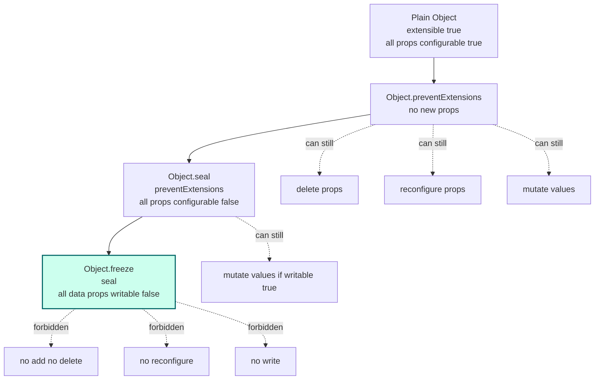
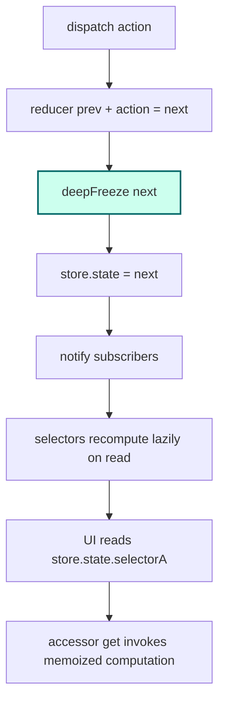

# 1.30 Property Descriptors and Attributes

> Every property on every JavaScript object carries an invisible four-attribute manifest that decides whether the property can be rewritten, reconfigured, deleted, or even seen. Most developers never look at it. The ones who do can build immutable stores, observable objects, lazy computed properties, and bulletproof APIs that cannot be accidentally broken by a stray assignment. This note is the complete map of that manifest.

## 1. Purpose

JavaScript objects, at the surface, look like simple bags of key-value pairs. You write `user.name = "Ada"` and the engine stores `"Ada"` under the key `"name"`. You read it back with `user.name`. You delete it with `delete user.name`. The simplicity is an illusion. Hidden behind every property is a descriptor object that records four things about that property: whether the property's value can be reassigned (`writable`), whether the property can be reconfigured or deleted (`configurable`), whether the property shows up in enumeration (`enumerable`), and what the property's current value is (`value`). For accessor properties, `value` and `writable` are replaced by `get` and `set` functions. These attributes are not metadata sitting off to the side; they are the property itself.

Property descriptors exist because JavaScript needed a way to support real programming patterns that the simple key-value model could not express. Consider a constant. You want to attach a named value to an object and guarantee that no code anywhere can overwrite it. Without descriptors you would have no enforcement mechanism; any code with a reference to the object could write `Math.PI = 3`. With descriptors you set `writable: false` and the assignment silently fails in sloppy mode, or throws a `TypeError` in strict mode. Consider a computed property whose value depends on other properties. Without descriptors you would have to remember to call a function every time you read it. With accessor descriptors you install a `get` function and the property reads transparently, recomputing on every access. Consider an internal bookkeeping field that you do not want leaking into `for...in` loops or `JSON.stringify` output. Without descriptors you would have to filter those calls manually. With `enumerable: false` the field simply disappears from iteration while remaining readable and writable from code that knows it exists.

Property descriptors also exist because the language needed escape hatches for objects that must remain stable across untrusted code. The global `Math` object, the prototype objects for built-in constructors, the `globalThis` object itself, library configuration objects exposed to third-party plugins: all of these need protection against accidental or malicious mutation. The engine gives you three escalating levels of object integrity: `Object.preventExtensions` blocks new property additions, `Object.seal` blocks additions and reconfigurations, and `Object.freeze` blocks additions, reconfigurations, and writes. Each level is implemented by walking the property list and flipping descriptor attributes. There is no separate "frozen" flag on the object; freeze is just a coordinated sweep of descriptor mutations.

Why is `Object.freeze` not enough for true immutability? Because `Object.freeze` is shallow. When you call `Object.freeze(config)` on an object whose `endpoints` property is itself an object, the `endpoints` reference becomes read-only, but the object it points to remains fully mutable. A caller can still write `config.endpoints.primary = "https://evil.example.com"` and the freeze will not stop them. The frozen object's identity is locked, but its transitive closure of nested objects is wide open. True immutability requires a deep freeze: walk the object graph, freeze every nested object and array, and freeze the leaves. Even deep freeze has limits: it cannot freeze `Map`, `Set`, `Date`, `RegExp`, `Function`, or any object whose internal state is held in slots rather than named properties. For those, you need defensive copies or wrappers.

The purpose of this note is to make property descriptors fully visible. By the end you should be able to read a descriptor object, predict exactly what operations will succeed and fail on the property, implement deep freeze from scratch, build observable objects using accessor descriptors, choose between `Object.freeze`, `Readonly<T>`, and `as const` for any given scenario, and answer any interview question on object integrity. You should also understand why Vue 2 used `Object.defineProperty` for reactivity, why Vue 3 abandoned it for `Proxy`, and what the tradeoffs were.

## 2. Theory and Deep Dive

The ECMAScript specification, formally Ecma-262, models every named property of an ordinary object as a Record with a small fixed set of fields. The spec calls this a Property Descriptor. In userland you never see the spec Record directly; you see a plain JavaScript object passed to or returned from `Object.defineProperty`, `Object.defineProperties`, and `Object.getOwnPropertyDescriptor`. The mapping is one-to-one. The plain object is the spec Record projected into JavaScript.

### 2.1 The Four Descriptor Attributes

Every property descriptor has the following fields, divided into two mutually exclusive groups.

**Data descriptor fields:**
- `value` (any JavaScript value, defaults to `undefined`): the actual stored value of the property.
- `writable` (boolean, defaults to `false` when created via `Object.defineProperty`, `true` when created via assignment or literal): if `false`, attempts to set the property via assignment fail silently in sloppy mode and throw `TypeError` in strict mode.

**Accessor descriptor fields:**
- `get` (function or `undefined`): a function called with no arguments and `this` bound to the target object whenever the property is read. Its return value becomes the value of the read. If `undefined`, reads return `undefined`.
- `set` (function or `undefined`): a function called with one argument (the assigned value) and `this` bound to the target object whenever the property is written. Its return value is ignored.

**Shared fields (present in both data and accessor descriptors):**
- `enumerable` (boolean, defaults to `false` via `defineProperty`, `true` via literal): if `true`, the property is visited by `for...in` loops, included in `Object.keys`, `Object.values`, `Object.entries`, and serialized by `JSON.stringify`. If `false`, the property is effectively hidden from those mechanisms but still directly readable and writable.
- `configurable` (boolean, defaults to `false` via `defineProperty`, `true` via literal): if `true`, the property's descriptor can be replaced with another via `Object.defineProperty`, the property can be converted from data to accessor or back, and the property can be deleted with `delete`. If `false`, the descriptor is locked: only `writable` can be changed, and only from `true` to `false`. You cannot change `enumerable`, `configurable`, `value`, or `get`/`set`, and you cannot delete.

A descriptor that contains `value` or `writable` is a data descriptor. A descriptor that contains `get` or `set` is an accessor descriptor. A descriptor that contains neither is treated as a data descriptor with `value: undefined`. A descriptor that contains both is invalid and `Object.defineProperty` will throw a `TypeError`.

### 2.2 The Defaults Trap

The single most important thing to memorize about descriptors is the divergence of defaults. There are two ways a property can be created: assignment or literal syntax on one hand, and `Object.defineProperty` on the other. They produce properties with opposite defaults.

| Creation method | `value` | `writable` | `enumerable` | `configurable` |
| --- | --- | --- | --- | --- |
| `obj.x = 1` (assignment) | `1` | `true` | `true` | `true` |
| `{ x: 1 }` (literal) | `1` | `true` | `true` | `true` |
| `Object.defineProperty(obj, "x", { value: 1 })` | `1` | `false` | `false` | `false` |

When you call `Object.defineProperty` and pass a descriptor object, the engine fills in missing fields with `false` for booleans and `undefined` for `value`/`get`/`set`. So the minimal descriptor `{ value: 1 }` produces a property that is non-writable, non-enumerable, and non-configurable. This is the opposite of what most developers expect. If you want a `defineProperty`-created property to behave like a literal-created one, you must explicitly set `writable: true, enumerable: true, configurable: true`.

### 2.3 Reading Descriptors

`Object.getOwnPropertyDescriptor(obj, key)` returns a fresh descriptor object describing the own property `key` of `obj`. It returns `undefined` if `obj` has no own property with that key. The returned object is a copy; mutating it does not affect the actual property. There is also `Object.getOwnPropertyDescriptors(obj)` which returns an object mapping every own property key to its descriptor. This is the canonical way to inspect what an object actually looks like at the descriptor level.

JS:

```js
const obj = {};
Object.defineProperty(obj, "hidden", { value: 42, enumerable: false });
Object.defineProperty(obj, "visible", { value: 7, enumerable: true, writable: true, configurable: true });

console.log(Object.getOwnPropertyDescriptor(obj, "hidden"));
// { value: 42, writable: false, enumerable: false, configurable: false }

console.log(Object.getOwnPropertyDescriptors(obj));
// { hidden: { value: 42, writable: false, enumerable: false, configurable: false },
//   visible: { value: 7, writable: true, enumerable: true, configurable: true } }
```

TS:

```ts
const obj: Record<string, unknown> = {};
Object.defineProperty(obj, "hidden", { value: 42, enumerable: false });
Object.defineProperty(obj, "visible", { value: 7, enumerable: true, writable: true, configurable: true });

console.log(Object.getOwnPropertyDescriptor(obj, "hidden"));
console.log(Object.getOwnPropertyDescriptors(obj));
```

### 2.4 Writing Descriptors

`Object.defineProperty(obj, key, descriptor)` installs or reconfigures the property `key` on `obj`. It returns the same `obj` (mutated in place). If the property does not yet exist, the descriptor is installed as-is (with defaults filled in). If the property already exists and is `configurable: true`, the descriptor replaces the old one. If the property already exists and is `configurable: false`, the operation is restricted: you can change `writable` from `true` to `false` (but not from `false` to `true`), you can change `value` if `writable` is `true`, and you cannot change `enumerable`, `configurable`, `get`, or `set`. Any attempt to do an illegal reconfiguration throws a `TypeError`.

`Object.defineProperties(obj, descriptorsMap)` takes an object whose own enumerable properties are descriptor objects and calls `Object.defineProperty` for each. It returns `obj`. The order of definition follows `Object.keys` order on the descriptors map.

### 2.5 Object Integrity Levels

The engine provides three escalating levels of object integrity. Each one is implemented as a sweep over the object's own properties combined with an internal slot flag on the object.

**`Object.preventExtensions(obj)`** sets the object's internal `[[Extensible]]` slot to `false`. After this, attempts to add new properties via assignment silently fail in sloppy mode and throw `TypeError` in strict mode. `Object.defineProperty(obj, newKey, ...)` also throws. Existing properties can still be deleted, reconfigured, and modified. You can check whether an object is extensible with `Object.isExtensible(obj)`.

**`Object.seal(obj)`** calls `preventExtensions` and then walks every own property and sets `configurable: false` on each. After this, no properties can be added or deleted, and no property can be reconfigured. Existing data properties can still have their `value` changed if `writable: true` was set before sealing. You can check with `Object.isSealed(obj)`.

**`Object.freeze(obj)`** calls `seal` and then walks every own data property and sets `writable: false`. Accessor properties (those with `get`/`set`) are not affected by the writable step because they do not have a `writable` field; their set function is still invoked normally if defined. After freeze, no properties can be added, deleted, reconfigured, or (for data properties) written. You can check with `Object.isFrozen(obj)`.



Note that all three operations are shallow. The internal flag is set only on the object you pass in. Nested objects are not touched. Deep integrity requires recursive application.

### 2.6 The `configurable: false` Lock

The single most subtle attribute is `configurable`. When `configurable: false`, the descriptor is locked. The spec says you may still change `writable: true` to `writable: false` (this is the one allowed transition) but you may not change any other field, you may not convert between data and accessor, and you may not delete the property. This exists so that library authors can hand out objects whose API surface cannot be tampered with by consumers, but the library can still selectively harden write access later.

There is one important escape: even on a non-configurable data property, if `writable` is `true`, the `value` can still be changed by direct assignment. Non-configurable means "the descriptor shape cannot change," not "the value cannot change." That is `writable`'s job.

### 2.7 The `enumerable: false` Hiding

When `enumerable: false`, the property is hidden from `for...in`, `Object.keys`, `Object.values`, `Object.entries`, `JSON.stringify`, and the spread operator `{ ...obj }`. It is still visible to `Object.getOwnPropertyNames`, `Object.getOwnPropertySymbols`, `Reflect.ownKeys`, and direct property access. This is how built-ins like `Array.prototype`'s methods remain invisible to `for...in` over arrays: every method on `Array.prototype` is defined as non-enumerable.

### 2.8 Accessor Properties in Depth

An accessor property has no `value` and no `writable`. Instead it has `get` and `set`. When you read the property, the engine invokes `get` with `this` bound to the receiver. When you assign to the property, the engine invokes `set` with `this` bound to the receiver and the new value as the sole argument. If `set` is `undefined`, assignments silently fail (or throw in strict mode). If `get` is `undefined`, reads return `undefined`.

Accessors are how JavaScript expresses computed properties. They are how `Array.prototype.length` works (it appears to be a number you can set, but setting it truncates or extends the array). They are how `Date.prototype.fullYear` getters and setters work. They are how Vue 2 implements reactivity: each data property on a component instance is replaced with an accessor that notifies watchers on write.

Accessors are also how you build observable objects, lazy properties, validation-enforced properties, and computed properties that cache their results. We will see all of these in the code examples.

### 2.9 Inherited Properties and Descriptors

Descriptor attributes are only meaningful for own properties. Inherited properties (those found on the prototype chain) are not affected by `Object.defineProperty` calls on the instance. If you call `Object.freeze(instance)`, only the instance's own properties are frozen. The prototype remains mutable. This is why freezing an instance does not prevent a malicious actor from mutating `Object.prototype` itself (which is a separate, more dangerous operation that this note does not encourage but which the language permits unless the environment has locked down built-in prototypes).

### 2.10 The `Reflect` Mirror

Every descriptor operation has a `Reflect` counterpart. `Reflect.defineProperty` returns a boolean instead of throwing. `Reflect.getOwnPropertyDescriptor` is identical to `Object.getOwnPropertyDescriptor` for ordinary objects but uses the spec's internal `[[GetOwnProperty]]` directly. `Reflect.deleteProperty` returns a boolean instead of throwing. These are useful when you want to handle failures gracefully rather than wrap everything in try/catch. See `[[1.31 Proxy and Reflect APIs]]` for the full treatment.

## 3. Mental Models

Treat a property descriptor as the metadata card stapled to the back of every property. The property's value is what you see on the front. The card records the rules of engagement. Most properties have a boring card: writable, enumerable, configurable, all `true`. But the moment you see `Object.defineProperty` in a codebase, you should automatically reach for `Object.getOwnPropertyDescriptor` and read the card before reasoning about the property.

`configurable: false` is the lock on the card itself. Once locked, you cannot replace the card with a different one. You cannot peel the card off (delete the property). The one exception is that you can flip the `writable` bit from `true` to `false` (tightening, never loosening). Think of it as a one-way ratchet: properties can be hardened but never softened.

`enumerable: false` is the invisibility cloak. The property is still there, fully functional, but the standard iteration macros refuse to see it. This is the difference between "I can read this if I know the name" and "I can discover this by walking the object." Hidden properties are how you store internal state without polluting serialization.

`writable: false` is the read-only sticker. Direct assignment bounces off. You can still reconfigure the property if `configurable: true` (which would let you change `value` via the descriptor). So `writable: false` alone is not a security boundary; it is a guard against accidental writes. For real immutability you need `writable: false` plus `configurable: false` plus the object being non-extensible. That combination is exactly what `Object.freeze` installs.

`Object.freeze` is the "lock everything down, shallowly" button. It walks own properties, sets `configurable: false` and `writable: false` on each, and marks the object non-extensible. The reference itself is still mutable (you can reassign the variable), and any object reachable from a frozen object's properties is still mutable. Freeze is a shallow shield, not a deep one.

Deep freeze is the recursive version: freeze the root, then walk every own property value and if it is an object, deep-freeze it too. The result is that the entire reachable graph from the root is frozen. This is what you want for configuration objects,Redux state, and any data that must be treated as value-like.

A helpful analogy: think of a property as a glass display case in a museum. The `value` is the artifact inside. `writable: false` is a "do not touch" sign on the case (visitors can still reach in if they ignore the sign, but the language yells at them in strict mode). `configurable: false` is the case welded to the floor (you cannot remove or replace the case). `enumerable: false` is the case hidden in a back room (visitors on the public tour do not see it, but staff with the catalog can find it). `Object.freeze` is welding every case to the floor and putting "do not touch" signs on all of them. Deep freeze is doing that to every room in the museum.

Another analogy, this time from file systems: a property is a file. `writable: false` is `chmod -w`. `configurable: false` is the file being on a read-only filesystem (you cannot even `rm` it). `enumerable: false` is the file not showing up in `ls` (but `stat` still works if you know the path). `Object.preventExtensions` is the directory being marked no-new-files. `Object.seal` is the directory being marked no-new-files plus every file being undeletable. `Object.freeze` is all of the above plus every file being read-only.

## 4. Real-World Use Cases

Property descriptors are not theoretical. They show up in production frameworks, libraries, and the JavaScript platform itself. Here are the highest-impact real-world uses.

**Redux store state.** The reference implementation of Redux, in development mode, freezes every state object returned by the reducer. This is a defensive measure: if a developer accidentally mutates state instead of returning a new state object, the freeze turns the silent mutation into a loud `TypeError`. The freeze is shallow, but combined with the reducer pattern (which returns top-level new objects on every action) it catches the vast majority of accidental mutations. Without descriptors, Redux would have no way to enforce immutability at runtime.

**React `propTypes` and `defaultProps`.** React class components historically defined `propTypes` and `defaultProps` as static properties on the component class. The React team installed these via `Object.defineProperty` to mark them non-enumerable so they did not leak into iteration over the class. Similar patterns appear in many libraries that attach metadata to classes: the metadata is stored as non-enumerable properties so it does not pollute `for...in` or `JSON.stringify` over class instances.

**Vue 2 reactivity.** Vue 2's reactivity system walks the data object passed to a component and replaces every property with an accessor descriptor. The `get` records the currently-running render function as a dependent of the property. The `set` notifies all dependent render functions that the property changed, triggering a re-render. This is a brilliant use of accessor descriptors, but it has limits: it cannot detect addition or deletion of properties (because there is no accessor installed for properties that did not exist at init time), and it cannot observe array index writes or length truncation. Vue 2 worked around the array issue by patching seven mutation methods. Vue 3 abandoned this approach entirely in favor of `Proxy`, which intercepts all operations including add and delete. See `[[1.31 Proxy and Reflect APIs]]` for the modern approach.

**Computed properties in classes.** The `get` and `set` keywords in class bodies are syntactic sugar for accessor descriptors. When you write `class Point { get x() { return this.coords[0]; } }`, the engine installs an accessor descriptor on `Point.prototype` with `get` set to the function and `enumerable: false, configurable: true`. This is the canonical way to expose derived state as if it were a stored property.

**Hidden internal state.** Library authors routinely store bookkeeping fields on objects as non-enumerable properties. jQuery stores event handler registries on DOM elements under non-enumerable keys. Moment.js stores parsed date internals under non-enumerable properties. The pattern keeps the object's serialized form clean while still allowing the library to attach metadata.

**Array `length`.** The `length` property of arrays is an accessor-like data property with special semantics. Its descriptor is `{ value: N, writable: true, enumerable: false, configurable: false }`. The engine intercepts writes to `length`: if you set it to a smaller number, the engine truncates the array; if you set it to a larger number, the engine extends the array with holes. The `configurable: false` ensures you cannot delete `length` or change it into an accessor. This is one of the most performance-critical descriptor configurations in the entire language.

**`Symbol.toStringTag`.** The well-known symbol `Symbol.toStringTag` is conventionally defined as a non-enumerable own property on objects that want to customize `Object.prototype.toString` output. Setting it non-enumerable keeps it out of `JSON.stringify` and `for...in` while still being readable by `Object.prototype.toString.call`. See `[[1.32 Well-Known Symbols]]` for the full treatment.

**Configuration objects.** Many libraries expose a global config object whose shape must remain stable for the lifetime of the application. Webpack's `stats` presets, Babel's plugin options, ESLint's `env` flags: all of these are candidates for `Object.freeze` or `Object.defineProperties` with carefully chosen attributes. Freezing prevents downstream code from accidentally rebinding a config key to something unexpected.

**Defensive copies and clones.** `Object.getOwnPropertyDescriptors` combined with `Object.create` is the canonical way to clone an object while preserving its prototype and all descriptor attributes. The pattern is `Object.create(Object.getPrototypeOf(src), Object.getOwnPropertyDescriptors(src))`. This is the only correct way to clone an object that has accessor properties; a shallow `{ ...src }` would invoke the accessors and store their return values, losing the accessor itself.

## 5. Code Examples

This section presents two side-by-side JS/TS code examples. The first is a minimal survey of every descriptor mode in roughly twenty lines. The second is a production-grade deep-freeze utility paired with an observable factory built on accessor descriptors.

### 5.1 Example A — Minimal and Conceptual

JS:

```js
// Minimal survey of every property descriptor mode in JavaScript.

// 1. Literal: all defaults true.
const a = { x: 1 };
console.log(Object.getOwnPropertyDescriptor(a, "x"));
// { value: 1, writable: true, enumerable: true, configurable: true }

// 2. defineProperty with explicit data descriptor (locked down by default).
const b = {};
Object.defineProperty(b, "y", { value: 2 });
console.log(Object.getOwnPropertyDescriptor(b, "y"));
// { value: 2, writable: false, enumerable: false, configurable: false }

// 3. Accessor descriptor.
const c = { internal: 0 };
Object.defineProperty(c, "count", {
  get() { return this.internal; },
  set(v) { this.internal = v; },
  enumerable: true,
  configurable: true,
});
c.count = 5;
console.log(c.count, c.internal); // 5 5

// 4. Object.freeze on a shallow object.
const d = Object.freeze({ z: 9 });
d.z = 10;            // silently fails (TypeError in strict mode)
console.log(d.z);    // 9

// 5. Object.seal: values still writable if writable was true.
const e = Object.seal({ w: 3 });
e.w = 4;             // OK, seal does not touch writable
console.log(e.w);    // 4

// 6. Object.preventExtensions: existing still mutable, no new keys.
const f = Object.preventExtensions({ q: 1 });
f.q = 2;             // OK
f.newProp = 3;       // silently fails
console.log(f.q, f.newProp); // 2 undefined
```

TS:

```ts
// Minimal survey of every property descriptor mode in TypeScript.

// 1. Literal: all defaults true.
const a = { x: 1 } as const;
console.log(Object.getOwnPropertyDescriptor(a, "x"));

// 2. defineProperty with explicit data descriptor (locked down by default).
const b: Record<string, unknown> = {};
Object.defineProperty(b, "y", { value: 2 });
console.log(Object.getOwnPropertyDescriptor(b, "y"));

// 3. Accessor descriptor.
interface Counter { internal: number; count: number; }
const c: Counter = { internal: 0 } as Counter;
Object.defineProperty(c, "count", {
  get(this: Counter) { return this.internal; },
  set(this: Counter, v: number) { this.internal = v; },
  enumerable: true,
  configurable: true,
});
c.count = 5;
console.log(c.count, c.internal);

// 4. Object.freeze on a shallow object.
const d: Readonly<{ z: number }> = Object.freeze({ z: 9 });
// d.z = 10; // TS error: cannot assign to readonly property
console.log(d.z);

// 5. Object.seal: values still writable if writable was true.
const e: { w: number } = Object.seal({ w: 3 });
e.w = 4;
console.log(e.w);

// 6. Object.preventExtensions: existing still mutable, no new keys.
const f: { q: number } = Object.preventExtensions({ q: 1 });
f.q = 2;
// f.newProp = 3; // TS error: property does not exist on type
console.log(f.q);
```

Note the TS variant: `Object.freeze` narrows the type to `Readonly<T>` automatically in TypeScript's standard library, so the compiler catches attempts to mutate at compile time in addition to the runtime check. `Object.seal` does not narrow, so the TS type still allows writes. `Object.preventExtensions` does not narrow either, but TS will reject property additions if the declared type is closed.

### 5.2 Example B — Production-Grade

This example implements two utilities: a typed deep-freeze that handles the common object, array, and date cases, and an observable factory that wraps any object with accessor properties that notify subscribers on write.

JS:

```js
// Production-grade deep freeze with cycle detection and type guards.
function deepFreeze(value, seen = new WeakSet()) {
  if (value === null || typeof value !== "object") {
    return value;
  }
  if (seen.has(value)) {
    return value;
  }
  seen.add(value);

  // Freeze functions and class instances defensively (best effort).
  // Note: freezing a Function makes its properties non-writable but
  // does not prevent the function itself from being called.
  if (typeof value === "function") {
    Object.freeze(value);
    return value;
  }

  // Date, RegExp, Map, Set: freeze the wrapper, cannot freeze internal slots.
  if (value instanceof Date || value instanceof RegExp) {
    Object.freeze(value);
    return value;
  }

  // Recurse into own properties before freezing the parent.
  // Order matters: freeze children first so the parent's frozen state
  // is internally consistent.
  const keys = Reflect.ownKeys(value);
  for (const key of keys) {
    const descriptor = Object.getOwnPropertyDescriptor(value, key);
    if (descriptor && "value" in descriptor) {
      deepFreeze(descriptor.value, seen);
    }
  }

  return Object.freeze(value);
}

// Usage.
const config = {
  api: {
    baseUrl: "https://api.example.com",
    endpoints: { users: "/users", posts: "/posts" },
  },
  timeouts: [1000, 5000, 15000],
  retries: 3,
};
deepFreeze(config);

config.api.baseUrl = "https://evil.example.com"; // silently fails
config.api.endpoints.users = "/hack";            // silently fails
config.timeouts.push(60000);                     // throws in strict mode (frozen array push)

console.log(config.api.baseUrl); // still https://api.example.com
```

```js
// Observable factory using accessor descriptors.
function observable(target, onChange) {
  const storage = { ...target };
  const result = {};

  for (const key of Object.keys(target)) {
    Object.defineProperty(result, key, {
      get() { return storage[key]; },
      set(v) {
        const prev = storage[key];
        if (Object.is(prev, v)) return;
        storage[key] = v;
        onChange(key, prev, v);
      },
      enumerable: true,
      configurable: false,
    });
  }

  // Lock the result: no new keys, no reconfiguration.
  Object.preventExtensions(result);
  return result;
}

const state = observable({ count: 0, name: "Ada" }, (key, prev, next) => {
  console.log(`changed ${key} from ${prev} to ${next}`);
});

state.count = 1;     // logs: changed count from 0 to 1
state.count = 1;     // no log, same value
state.name = "Grace"; // logs: changed name from Ada to Grace
state.newKey = 1;    // silently fails, non-extensible
```

TS:

```ts
// Production-grade deep freeze with cycle detection and type guards.
type DeepReadonly<T> =
  T extends (...args: any[]) => any ? T :
  T extends Map<infer K, infer V> ? ReadonlyMap<K, V> :
  T extends Set<infer U> ? ReadonlySet<U> :
  T extends object ? { readonly [K in keyof T]: DeepReadonly<T[K]> } :
  T;

function deepFreeze<T>(value: T, seen: WeakSet<object> = new WeakSet()): DeepReadonly<T> {
  if (value === null || typeof value !== "object") {
    return value as DeepReadonly<T>;
  }
  if (seen.has(value as object)) {
    return value as DeepReadonly<T>;
  }
  seen.add(value as object);

  if (typeof value === "function") {
    Object.freeze(value);
    return value as DeepReadonly<T>;
  }

  if (value instanceof Date || value instanceof RegExp) {
    Object.freeze(value);
    return value as DeepReadonly<T>;
  }

  const keys = Reflect.ownKeys(value as object);
  for (const key of keys) {
    const descriptor = Object.getOwnPropertyDescriptor(value, key);
    if (descriptor && "value" in descriptor) {
      deepFreeze(descriptor.value, seen);
    }
  }

  return Object.freeze(value) as DeepReadonly<T>;
}

// Usage.
interface AppConfig {
  api: {
    baseUrl: string;
    endpoints: { users: string; posts: string };
  };
  timeouts: number[];
  retries: number;
}

const config: AppConfig = {
  api: {
    baseUrl: "https://api.example.com",
    endpoints: { users: "/users", posts: "/posts" },
  },
  timeouts: [1000, 5000, 15000],
  retries: 3,
};
const frozen = deepFreeze(config);

// frozen.api.baseUrl = "https://evil.example.com"; // TS error
// frozen.timeouts.push(60000);                    // TS error
console.log(frozen.api.baseUrl);
```

```ts
// Observable factory using accessor descriptors, fully typed.
type Listener<T> = <K extends keyof T>(key: K, prev: T[K], next: T[K]) => void;

function observable<T extends object>(target: T, onChange: Listener<T>): T {
  const storage: T = { ...target };
  const result = {} as T;

  (Object.keys(target) as Array<keyof T>).forEach((key) => {
    Object.defineProperty(result, key, {
      get(this: T) { return storage[key]; },
      set(this: T, v: T[keyof T]) {
        const prev = storage[key];
        if (Object.is(prev, v)) return;
        storage[key] = v;
        onChange(key, prev, v);
      },
      enumerable: true,
      configurable: false,
    });
  });

  Object.preventExtensions(result);
  return result;
}

interface State { count: number; name: string; }
const state: State = observable<State>(
  { count: 0, name: "Ada" },
  (key, prev, next) => console.log(`changed ${String(key)} from ${prev} to ${next}`)
);

state.count = 1;      // logs: changed count from 0 to 1
state.count = 1;      // no log
state.name = "Grace"; // logs: changed name from Ada to Grace
```

The TS version gains compile-time enforcement through the `DeepReadonly<T>` mapped type, which recursively adds `readonly` to every property. The runtime freeze and the type-level readonly work together: TS stops you at compile time, the runtime freeze stops you (or your dependencies) at runtime. This is the gold standard for immutability in TypeScript codebases.

## 6. Common Mistakes and Anti-Patterns

### 6.1 Assuming `Object.freeze` Is Deep

The most common mistake. Developers call `Object.freeze(config)` and assume the entire object graph is immutable. It is not. Only the top-level properties are frozen. Nested objects remain mutable. The fix is `deepFreeze` (see Practical Exercise 1).

```js
const config = Object.freeze({ endpoints: { primary: "https://a.example.com" } });
config.endpoints.primary = "https://evil.example.com"; // succeeds!
console.log(config.endpoints.primary); // https://evil.example.com
```

### 6.2 Forgetting `Object.defineProperty` Defaults Differ from Literal Defaults

The second most common mistake. A developer writes `Object.defineProperty(obj, "x", { value: 1 })` and expects `x` to behave like a literal property. It does not. It is non-writable, non-enumerable, and non-configurable. The fix is to be explicit: `{ value: 1, writable: true, enumerable: true, configurable: true }`.

```js
const obj = {};
Object.defineProperty(obj, "x", { value: 1 });
obj.x = 2;                       // silently fails
console.log(obj.x);              // 1
console.log(Object.keys(obj));   // [] (x is non-enumerable)
delete obj.x;                    // silently fails (non-configurable)
console.log(obj.x);              // 1, still there
```

### 6.3 Trying to Delete a `configurable: false` Property

`delete` on a non-configurable property silently fails in sloppy mode and throws `TypeError` in strict mode. This is one of the few cases where the language throws on `delete`. The fix is to design your objects so that properties you intend to delete are `configurable: true`, or to use a sentinel value (like `null`) instead of deletion.

```js
"use strict";
const obj = {};
Object.defineProperty(obj, "x", { value: 1, configurable: false });
delete obj.x; // TypeError: Cannot delete property 'x' of #<Object>
```

### 6.4 Trying to Reconfigure a `configurable: false` Property

Similar to the above but for `Object.defineProperty`. If the property is `configurable: false`, you cannot change `enumerable`, `configurable`, `value` (when `writable: false`), `get`, or `set`. The only allowed change is `writable: true` to `writable: false`. Any other attempted reconfiguration throws `TypeError`.

```js
"use strict";
const obj = {};
Object.defineProperty(obj, "x", { value: 1, configurable: false });
Object.defineProperty(obj, "x", { enumerable: true }); // TypeError
Object.defineProperty(obj, "x", { value: 2 });          // TypeError (writable is false)
Object.defineProperty(obj, "x", { writable: false });   // OK, this is the allowed transition
```

### 6.5 Assuming `Object.freeze` Returns a New Object

`Object.freeze` (and `Object.seal` and `Object.preventExtensions`) returns the same object reference that was passed in. It mutates the object in place by setting its internal flag and walking its properties. Code that assumes freeze returns a new object will introduce subtle bugs.

```js
const original = { x: 1 };
const frozen = Object.freeze(original);
console.log(original === frozen); // true, same reference
// If you wanted a new frozen object you must clone first:
const fresh = Object.freeze({ ...original });
```

### 6.6 Believing Frozen Arrays Cannot Be Sorted

This is a subtle and historical issue. The spec says that `Array.prototype.sort` on a frozen array should throw a `TypeError` because the operation writes to indices and to `length`, which are non-writable on a frozen array. In older engines, however, the sort was implemented via internal methods that bypassed the descriptor checks, and the array was silently sorted in place despite being frozen. Modern engines (post-ES2019) correctly throw. If you need to sort a frozen array, you must clone it first.

```js
"use strict";
const arr = Object.freeze([3, 1, 2]);
arr.sort(); // Modern engines: TypeError, Cannot assign to read only property '0'
            // Older engines: silently sorts in place
// Correct pattern:
const sorted = [...arr].sort();
```

### 6.7 Treating `writable: false` as a Security Boundary

`writable: false` only blocks direct assignment. If `configurable: true`, anyone with a reference to the object can call `Object.defineProperty(obj, "x", { value: evilValue })` and replace the value. For real immutability you need `writable: false` plus `configurable: false` plus the object being non-extensible.

### 6.8 Forgetting that Accessor Properties Are Not Affected by `writable`

`Object.freeze` sets `writable: false` on every own data property. It does nothing to accessor properties because accessors have no `writable` field. The `set` function, if present, is still invoked normally. So a frozen object with an accessor that has a `set` can still have its apparent value changed through the setter.

```js
const obj = { internal: 0 };
Object.defineProperty(obj, "count", { get() { return this.internal; }, set(v) { this.internal = v; } });
Object.freeze(obj);
obj.count = 99;             // set runs, internal becomes 99
console.log(obj.count);     // 99
// Note: `internal` is a separate data property and is frozen, so this throws in strict mode.
// But the point stands: freeze did not block the set function itself.
```

### 6.9 Freezing Objects with Cyclic References

A naive recursive deep-freeze will stack-overflow on cyclic references. The fix is a `WeakSet` of already-visited objects, as shown in the production-grade example. Without cycle detection, `deepFreeze({ a: {} })` works, but `const a = {}; a.self = a; deepFreeze(a);` recurses forever.

### 6.10 Believing `Object.keys` Reveals All Properties

`Object.keys` returns only own enumerable string-keyed properties. It omits symbol-keyed properties, non-enumerable properties, and inherited properties. If you want the complete picture you need `Reflect.ownKeys(obj)`, which returns own string and symbol keys regardless of enumerability. Misunderstanding this leads to invisible properties that surprise you in debugging.

## 7. Best Practices and Design Patterns

**Use `Object.freeze` for top-level configuration objects.** A config object that the rest of your application reads from is a prime candidate for freeze. It catches accidental writes, communicates intent ("this is read-only"), and has near-zero runtime cost in modern engines (frozen objects can be optimized more aggressively than mutable ones).

**Use `Object.defineProperty` when you need fine-grained control.** If you want a single non-enumerable property on an otherwise-mutable object, `defineProperty` is the right tool. If you want an accessor with controlled `set` validation, `defineProperty` is the right tool. If you want a constant on an object (non-writable, non-configurable, but enumerable so users can see it), `defineProperty` is the right tool.

**Implement `deepFreeze` once and reuse it.** The utility belongs in a shared `freeze.ts` module. Use it for Redux state, for parsed JSON config files loaded at startup, for any data that should be treated as a value. Pair it with `DeepReadonly<T>` at the type level so the compiler also enforces immutability.

**Use `Object.getOwnPropertyDescriptor` to inspect before assuming.** When you receive an object from a third party and need to know whether a property is writable or enumerable, do not guess. Inspect. The inspection is cheap and removes all ambiguity.

**Prefer TypeScript `Readonly<T>` and `ReadonlyArray<T>` for type-level immutability.** Compile-time enforcement is cheaper than runtime enforcement and catches mistakes earlier. `Readonly<T>` makes every property `readonly`, `ReadonlyArray<T>` removes mutating methods. They are zero-cost at runtime (they compile away) and provide strong guarantees during development.

**Prefer `as const` for literal-type inference.** When you have a small constant object whose values you want to narrow to literal types (so `"users"` becomes the type `"users"` rather than `string`), append `as const`. This also makes every property `readonly` at the type level. `const endpoints = { users: "/users" } as const;` gives you `{ readonly users: "/users" }`.

**Pair runtime freeze with type-level `Readonly` for defense in depth.** Neither alone is sufficient. The TS type can be bypassed with `as any` or by code that does not type-check. The runtime freeze can be bypassed by code that runs in sloppy mode (in older codebases) or by code that uses `Object.defineProperty` to reconfigure before freezing (a contrived attack but possible). Together they cover both the accidental and the adversarial cases.

**Avoid freezing objects with prototype chains you do not control.** If you freeze a class instance, you freeze only the instance's own properties. The prototype remains mutable. A consumer can still mutate `Class.prototype.method` and break every instance, frozen or not. If you need to harden a class, freeze the prototype explicitly after defining it.

**Document non-obvious descriptor configurations.** If you ship a library that defines non-enumerable or non-writable properties, document them. Otherwise consumers will be confused when `JSON.stringify` omits fields they expected, or when assignments silently fail. A short comment block above each `defineProperty` call saves hours of debugging downstream.

**Prefer `Reflect.defineProperty` over `Object.defineProperty` in code that wants graceful failure.** `Reflect.defineProperty` returns `false` on failure instead of throwing. This is cleaner than try/catch when you expect occasional conflicts and want to handle them with control flow.

**Do not freeze functions you intend to call.** Freezing a function makes its properties non-writable, which is fine, but it does not prevent the function itself from being invoked. However, some engines deoptimize frozen functions. If you have a hot function, do not freeze it.

**Use `Object.getOwnPropertyDescriptors` with `Object.create` for faithful clones.** The pattern `Object.create(Object.getPrototypeOf(src), Object.getOwnPropertyDescriptors(src))` is the only way to clone an object while preserving accessors. Spread (`{ ...src }`) invokes accessors and loses them. `JSON.parse(JSON.stringify(src))` loses everything that is not JSON-serializable.

## 8. Technical Interview Knowledge

This section presents eight questions and concise answers that cover the most commonly asked material on property descriptors in JavaScript interviews.

**Q1: What are the four descriptor attributes?**

A1: Every data property has four attributes: `value` (the stored value), `writable` (boolean, controls whether assignment can change `value`), `enumerable` (boolean, controls visibility in `for...in`, `Object.keys`, `JSON.stringify`), and `configurable` (boolean, controls whether the descriptor can be reconfigured or the property deleted). Accessor properties replace `value` and `writable` with `get` and `set` functions but keep `enumerable` and `configurable`.

**Q2: What is the difference between a data descriptor and an accessor descriptor?**

A2: A data descriptor stores a value directly and has `value` and `writable` fields. An accessor descriptor delegates reads and writes to functions and has `get` and `set` fields. The two are mutually exclusive: a single property cannot have both `value` and `get` (or `set`). The presence of `value` or `writable` makes it a data descriptor; the presence of `get` or `set` makes it an accessor descriptor. You can convert between them only if `configurable: true`.

**Q3: What does `Object.freeze` do?**

A3: `Object.freeze(obj)` calls `Object.seal(obj)` (which calls `Object.preventExtensions(obj)` and sets `configurable: false` on every own property) and then sets `writable: false` on every own data property. The result is an object to which no properties can be added, from which no properties can be deleted, whose property descriptors cannot be reconfigured, and whose data property values cannot be changed by assignment. Accessor properties are not affected by the writable step. The operation is shallow and returns the same object reference.

**Q4: Is `Object.freeze` deep?**

A4: No. `Object.freeze` only freezes the object you pass in. Nested objects remain fully mutable. To freeze the entire reachable graph you must implement a recursive `deepFreeze` that walks own properties and freezes each nested object. Even `deepFreeze` cannot freeze objects whose state is held in internal slots rather than named properties, such as `Map`, `Set`, `Date`, `RegExp`, and `WeakMap`. For those, you need defensive copies or wrapper types.

**Q5: What does `configurable: false` prevent?**

A5: It prevents four things: deleting the property with `delete`, changing `enumerable` via `Object.defineProperty`, changing `get` or `set` via `Object.defineProperty`, and converting between data and accessor descriptors. It also prevents changing `value` via `Object.defineProperty` if `writable` is `false`. The one allowed transition is changing `writable` from `true` to `false`. Attempts to do anything forbidden throw a `TypeError` in strict mode and silently fail in sloppy mode.

**Q6: What is the difference between `Object.seal` and `Object.freeze`?**

A6: `Object.seal` calls `Object.preventExtensions` and sets `configurable: false` on every own property. The result is that no properties can be added or deleted, and no descriptors can be reconfigured, but existing data properties can still have their values changed by assignment if they were `writable: true`. `Object.freeze` does everything `seal` does plus sets `writable: false` on every own data property, so values cannot be changed either. In short: sealed objects are fixed-shape but mutable in values; frozen objects are fixed-shape and read-only.

**Q7: How does Vue 2 reactivity use `Object.defineProperty`?**

A7: Vue 2 walks the data object passed to a component on initialization. For each own property, it replaces the existing data descriptor with an accessor descriptor. The `get` function records the currently-running render watcher as a dependent of the property. The `set` function notifies all dependent watchers that the property changed, triggering a re-render. This approach has three known limitations: it cannot detect property addition or deletion (because there is no accessor installed for keys that did not exist at init time, which is why Vue 2 provides `Vue.set` and `Vue.delete`), it cannot observe array index writes or `length` truncation (worked around by patching seven mutation methods), and it cannot observe `Map` or `Set` mutations. Vue 3 replaced this with `Proxy`, which intercepts all operations including add, delete, and `Map`/`Set` methods.

**Q8: How would you implement `deepFreeze`?**

A8: The function takes a value and a `WeakSet` of already-visited objects (for cycle detection). If the value is not an object, return it. If the value is already in the seen set, return it (cycle). Otherwise add it to the seen set. For each own property (obtained via `Reflect.ownKeys`), get its descriptor; if the descriptor has a `value` field (i.e., it is a data descriptor), recursively call `deepFreeze` on that value. After all nested values are frozen, call `Object.freeze` on the value and return it. The function should skip or shallow-freeze `Date`, `RegExp`, `Map`, `Set`, and `Function` because their internal state cannot be frozen via property descriptors. The return type in TypeScript should be `DeepReadonly<T>`, a recursive mapped type that adds `readonly` to every property.

## 9. Practical Exercises

### Exercise 1: Implement `deepFreeze(obj)`

**Goal:** Write a function that recursively freezes an object and all nested objects, with cycle detection and special-case handling for non-plain objects.

**JS Solution:**

```js
function deepFreeze(value, seen = new WeakSet()) {
  if (value === null || typeof value !== "object") return value;
  if (seen.has(value)) return value;
  seen.add(value);

  // Best-effort for non-plain objects: shallow-freeze and return.
  if (value instanceof Date || value instanceof RegExp) {
    return Object.freeze(value);
  }
  if (value instanceof Map || value instanceof Set) {
    return Object.freeze(value);
  }
  if (typeof value === "function") {
    return Object.freeze(value);
  }

  // Recurse into own data properties.
  for (const key of Reflect.ownKeys(value)) {
    const descriptor = Object.getOwnPropertyDescriptor(value, key);
    if (descriptor && "value" in descriptor) {
      deepFreeze(descriptor.value, seen);
    }
  }

  return Object.freeze(value);
}

// Test.
const cyclic = { name: "root" };
cyclic.self = cyclic;
deepFreeze(cyclic);
cyclic.name = "changed"; // silently fails
console.log(cyclic.name); // root
```

**TS Solution:**

```ts
type DeepReadonly<T> =
  T extends (...args: any[]) => any ? T :
  T extends Map<any, any> ? ReadonlyMap<any, any> :
  T extends Set<any> ? ReadonlySet<any> :
  T extends object ? { readonly [K in keyof T]: DeepReadonly<T[K]> } :
  T;

function deepFreeze<T>(value: T, seen: WeakSet<object> = new WeakSet()): DeepReadonly<T> {
  if (value === null || typeof value !== "object") return value as DeepReadonly<T>;
  if (seen.has(value as object)) return value as DeepReadonly<T>;
  seen.add(value as object);

  if (value instanceof Date || value instanceof RegExp) {
    return Object.freeze(value) as DeepReadonly<T>;
  }
  if (value instanceof Map || value instanceof Set) {
    return Object.freeze(value) as DeepReadonly<T>;
  }
  if (typeof value === "function") {
    return Object.freeze(value) as DeepReadonly<T>;
  }

  for (const key of Reflect.ownKeys(value as object)) {
    const descriptor = Object.getOwnPropertyDescriptor(value, key);
    if (descriptor && "value" in descriptor) {
      deepFreeze(descriptor.value, seen);
    }
  }

  return Object.freeze(value) as DeepReadonly<T>;
}
```

### Exercise 2: Build an Observable Factory Using Accessor Descriptors

**Goal:** Write a function `observable(target, listener)` that returns a new object whose properties mirror `target` but invoke `listener(key, prev, next)` on every change.

**JS Solution:**

```js
function observable(target, listener) {
  const storage = { ...target };
  const proxy = {};

  for (const key of Object.keys(target)) {
    Object.defineProperty(proxy, key, {
      get() { return storage[key]; },
      set(v) {
        const prev = storage[key];
        if (Object.is(prev, v)) return;
        storage[key] = v;
        listener(key, prev, v);
      },
      enumerable: true,
      configurable: false,
    });
  }

  Object.preventExtensions(proxy);
  return proxy;
}

const state = observable({ count: 0 }, (k, p, n) => console.log(`${k}: ${p} -> ${n}`));
state.count = 1;  // count: 0 -> 1
state.count = 1;  // (no log, same value)
state.count = 2;  // count: 1 -> 2
```

**TS Solution:**

```ts
type ChangeListener<T> = <K extends keyof T>(key: K, prev: T[K], next: T[K]) => void;

function observable<T extends Record<string, unknown>>(target: T, listener: ChangeListener<T>): T {
  const storage: T = { ...target };
  const proxy = {} as T;

  (Object.keys(target) as Array<keyof T & string>).forEach((key) => {
    Object.defineProperty(proxy, key, {
      get() { return storage[key]; },
      set(v: T[keyof T]) {
        const prev = storage[key];
        if (Object.is(prev, v)) return;
        storage[key] = v;
        listener(key, prev, v);
      },
      enumerable: true,
      configurable: false,
    });
  });

  Object.preventExtensions(proxy);
  return proxy;
}

interface State { count: number; }
const state: State = observable<State>({ count: 0 }, (k, p, n) => console.log(`${String(k)}: ${p} -> ${n}`));
state.count = 1;
```

### Exercise 3: Compare Literal vs `defineProperty` Defaults in a Table

**Goal:** Write a script that creates the same property via literal and via `defineProperty` and prints a comparison table.

**JS Solution:**

```js
function compare(key) {
  const literal = { [key]: 1 };
  const defined = {};
  Object.defineProperty(defined, key, { value: 1 });

  const ld = Object.getOwnPropertyDescriptor(literal, key);
  const dd = Object.getOwnPropertyDescriptor(defined, key);

  console.log(`Attribute      | literal | defineProperty`);
  console.log(`---------------|---------|----------------`);
  console.log(`value          | ${String(ld.value).padEnd(7)} | ${String(dd.value)}`);
  console.log(`writable       | ${String(ld.writable).padEnd(7)} | ${String(dd.writable)}`);
  console.log(`enumerable     | ${String(ld.enumerable).padEnd(7)} | ${String(dd.enumerable)}`);
  console.log(`configurable   | ${String(ld.configurable).padEnd(7)} | ${String(dd.configurable)}`);
}

compare("x");
// Attribute      | literal | defineProperty
// ---------------|---------|----------------
// value          | 1       | 1
// writable       | true    | false
// enumerable     | true    | false
// configurable   | true    | false
```

**TS Solution:**

```ts
function compare(key: string): void {
  const literal: Record<string, unknown> = { [key]: 1 };
  const defined: Record<string, unknown> = {};
  Object.defineProperty(defined, key, { value: 1 });

  const ld = Object.getOwnPropertyDescriptor(literal, key);
  const dd = Object.getOwnPropertyDescriptor(defined, key);
  if (!ld || !dd) return;

  console.log(`Attribute      | literal | defineProperty`);
  console.log(`---------------|---------|----------------`);
  console.log(`value          | ${String(ld.value).padEnd(7)} | ${String(dd.value)}`);
  console.log(`writable       | ${String(ld.writable).padEnd(7)} | ${String(dd.writable)}`);
  console.log(`enumerable     | ${String(ld.enumerable).padEnd(7)} | ${String(dd.enumerable)}`);
  console.log(`configurable   | ${String(ld.configurable).padEnd(7)} | ${String(dd.configurable)}`);
}

compare("x");
```

### Exercise 4: Implement `mySeal` and `myFreeze` Using `defineProperty`

**Goal:** Without using `Object.seal` or `Object.freeze`, reimplement both using only `Object.defineProperty`, `Object.preventExtensions`, and `Object.getOwnPropertyDescriptor`.

**JS Solution:**

```js
function mySeal(obj) {
  Object.preventExtensions(obj);
  for (const key of Reflect.ownKeys(obj)) {
    const descriptor = Object.getOwnPropertyDescriptor(obj, key);
    if (!descriptor) continue;
    if (descriptor.configurable) {
      Object.defineProperty(obj, key, { ...descriptor, configurable: false });
    }
  }
  return obj;
}

function myFreeze(obj) {
  mySeal(obj);
  for (const key of Reflect.ownKeys(obj)) {
    const descriptor = Object.getOwnPropertyDescriptor(obj, key);
    if (!descriptor) continue;
    if ("value" in descriptor && descriptor.writable) {
      Object.defineProperty(obj, key, { ...descriptor, writable: false });
    }
  }
  return obj;
}

// Test.
const obj = myFreeze({ a: 1, b: { nested: 2 } });
console.log(Object.isFrozen(obj));            // true
obj.a = 99;                                   // silently fails
console.log(obj.a);                           // 1
```

**TS Solution:**

```ts
function mySeal<T extends object>(obj: T): T {
  Object.preventExtensions(obj);
  for (const key of Reflect.ownKeys(obj) as Array<string | symbol>) {
    const descriptor = Object.getOwnPropertyDescriptor(obj, key);
    if (!descriptor) continue;
    if (descriptor.configurable) {
      Object.defineProperty(obj, key, { ...descriptor, configurable: false });
    }
  }
  return obj;
}

function myFreeze<T extends object>(obj: T): Readonly<T> {
  mySeal(obj);
  for (const key of Reflect.ownKeys(obj) as Array<string | symbol>) {
    const descriptor = Object.getOwnPropertyDescriptor(obj, key);
    if (!descriptor) continue;
    if ("value" in descriptor && descriptor.writable) {
      Object.defineProperty(obj, key, { ...descriptor, writable: false });
    }
  }
  return obj as Readonly<T>;
}

const obj = myFreeze<{ a: number; b: { nested: number } }>({ a: 1, b: { nested: 2 } });
console.log(Object.isFrozen(obj));
// obj.a = 99; // TS error: cannot assign to readonly property
console.log(obj.a);
```

## 10. Mini-Project Blueprint

**Project:** Build a typed immutable store with accessor-based selectors.

**Goal:** Combine everything in this note into a single, cohesive library: a small Redux-like store whose state is deep-frozen on every dispatch, whose selectors are accessor properties that lazily recompute, and whose entire public surface is fully typed in TypeScript.

**Architecture:**



**Skeleton (TS):**

```ts
type Listener<S> = (state: S) => void;
type Reducer<S, A> = (state: S, action: A) => S;

interface Store<S, A> {
  getState: () => S;
  dispatch: (action: A) => void;
  subscribe: (listener: Listener<S>) => () => void;
}

function createStore<S extends object, A>(
  reducer: Reducer<S, A>,
  initial: S
): Store<S, A> {
  let state: S = deepFreeze(initial);
  const listeners = new Set<Listener<S>>();

  return {
    getState: () => state,
    dispatch: (action: A) => {
      const next = reducer(state, action);
      state = deepFreeze(next);
      listeners.forEach((l) => l(state));
    },
    subscribe: (listener: Listener<S>) => {
      listeners.add(listener);
      return () => listeners.delete(listener);
    },
  };
}

// Selectors as accessor properties.
interface AppState {
  todos: Array<{ id: number; text: string; done: boolean }>;
  filter: "all" | "active" | "done";
}

function createSelectorState(store: Store<AppState, any>): AppState {
  const result = {} as AppState;
  Object.defineProperty(result, "todos", {
    get: () => store.getState().todos,
    enumerable: true,
    configurable: false,
  });
  Object.defineProperty(result, "filter", {
    get: () => store.getState().filter,
    set: (v: AppState["filter"]) => store.dispatch({ type: "setFilter", payload: v }),
    enumerable: true,
    configurable: false,
  });
  Object.preventExtensions(result);
  return result;
}

// Usage.
const reducer: Reducer<AppState, any> = (state, action) => {
  if (action.type === "setFilter") return { ...state, filter: action.payload };
  return state;
};

const store = createStore(reducer, { todos: [], filter: "all" });
const view = createSelectorState(store);
view.filter = "done"; // dispatches setFilter
console.log(view.filter); // "done"
```

**Extensions to build:**

1. Add a memoization layer to selectors that caches results keyed by state identity.
2. Add a `replaceReducer` function that hot-swaps the reducer at runtime.
3. Add middleware support (action => next => action pipelines) similar to Redux middleware.
4. Add a `devtools` hook that records every state snapshot for time-travel debugging.
5. Add a `persist` layer that serializes state to `localStorage` on every dispatch and rehydrates on startup.

**Why this project matters:** It exercises every concept in this note. `deepFreeze` recurses through the state graph. Accessor descriptors back the selectors. `Object.preventExtensions` locks the view object. TypeScript's `DeepReadonly<T>` makes the immutability visible at compile time. The store is small enough to build in an afternoon and rich enough to demonstrate real production patterns.

## 11. Core Connections

- `[[1.02 Variables and Mutability]]` — Establishes the foundational distinction between rebinding a variable (let vs const) and mutating an object. Descriptors extend that distinction down to the property level: a `const` binding to a frozen object is fully immutable; a `const` binding to a plain object is still mutable through property writes.
- `[[1.07 Complex Types Objects]]` — Covers the object primitive, property access semantics, and prototype chains. Property descriptors are the lower-level mechanism beneath the high-level object operations covered there. Reading this note first gives you the surface model; this note gives you the underlying attribute model.
- `[[1.31 Proxy and Reflect APIs]]` — Proxies intercept operations at the object level (get, set, has, deleteProperty, defineProperty, and so on). `Reflect.defineProperty` and `Reflect.getOwnPropertyDescriptor` are the Proxy-aware counterparts of the `Object` statics. Vue 3's switch from `Object.defineProperty` to `Proxy` is the canonical example of moving from property-level interception to object-level interception.
- `[[1.32 Well-Known Symbols]]` — Many well-known symbols (`Symbol.toStringTag`, `Symbol.iterator`, `Symbol.toPrimitive`) are conventionally defined as non-enumerable own properties. Descriptors are how you control their enumerability. The combination of symbols and descriptors is the modern way to attach metadata that does not leak into iteration.
- `[[2.04 Type Inference and Contextual]]` — `Readonly<T>`, `ReadonlyArray<T>`, and `as const` are the type-level counterparts of `Object.freeze`. They provide compile-time enforcement of immutability that the runtime freeze then enforces at execution time. Together they form the defense-in-depth pattern recommended in this note's best practices.
- `[[2.10 Utility Types Deep Dive]]` — `DeepReadonly<T>`, `DeepPartial<T>`, and `Mutable<T>` are recursive mapped types that mirror runtime descriptor operations at the type level. The `DeepReadonly<T>` implementation in this note's production example is the canonical pattern, and the broader treatment of mapped types belongs in that note.

Property descriptors are the bedrock beneath every higher-level JavaScript metaprogramming feature. Proxies intercept operations on descriptors. Symbols are stored as descriptor values. TypeScript's mapped types model descriptor attributes at compile time. Once you internalize the four-attribute model, the three integrity levels, and the deep-freeze pattern, every other piece of the metaprogramming stack becomes legible. You can read Vue's source, you can read Redux's source, you can read the ECMAScript spec's OrdinaryDefineOwnProperty abstract operation, and they all reduce to the same small set of concepts you now hold.
