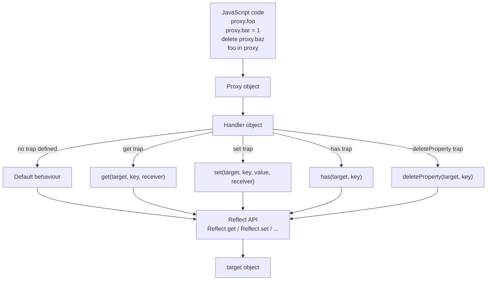
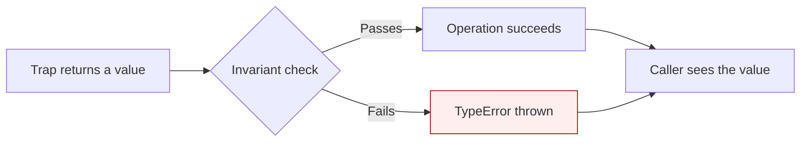
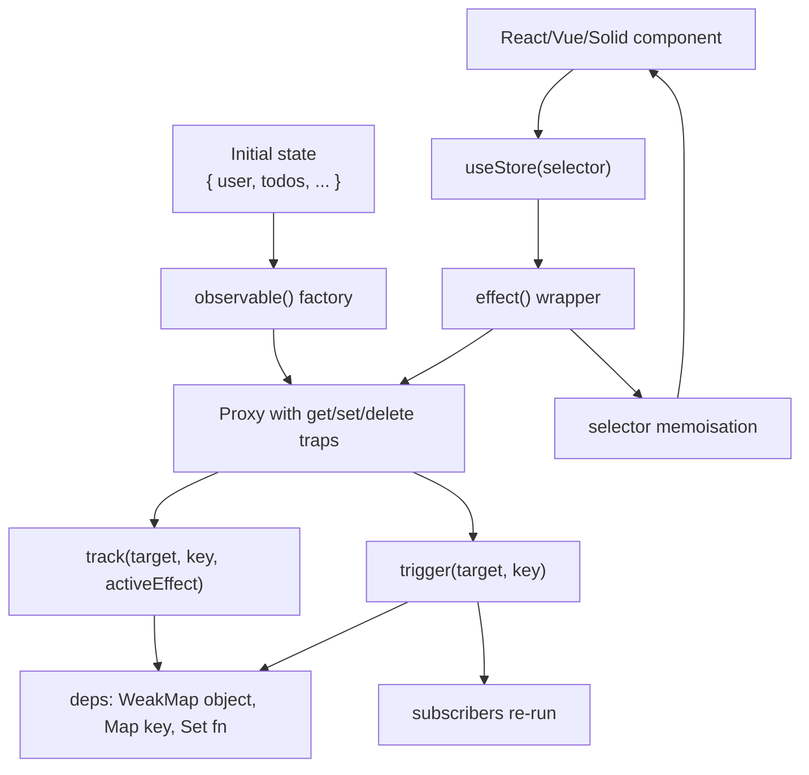

# 1.31 Proxy and Reflect APIs

## 1. Purpose

The Proxy API gives JavaScript metaprogramming at the object operation level. Where [[1.30 Property Descriptors and Attributes]] lets you control how a single property behaves (its mutability, enumerability, configurability), the Proxy API lets you intercept every fundamental operation on an object — every read, every write, every delete, every enumeration, every prototype lookup, even function invocation and construction. It is the difference between controlling one property and rewriting the semantics of an object as a whole.

Three problems Proxy solves that no other construct can:

1. **Whole-object interception.** [[1.07 Complex Types Objects]] in JavaScript is normally transparent — if you read `obj.x`, you get `obj.x`. Property descriptors can make one property read-only or hidden, but they cannot make reading `obj.x` trigger a side effect unless `x` is an accessor property (a getter/setter pair). Proxy lets you make *every* property access on the object — including ones you have not predefined — trigger arbitrary logic. This is what makes Vue 3 reactivity possible: any property read on a reactive object registers a dependency, any property write notifies subscribers, and this works for properties that did not even exist when the proxy was created.

2. **Virtual objects.** A Proxy does not need a meaningful target. You can wrap `Object.create(null)` and synthesise properties on demand from the `get` trap. The proxy appears to have arbitrary keys, but no actual storage exists. This is how RPC stubs work (a proxy that turns `client.users.list()` into a network call), how memoisation caches work (a proxy that materialises heavy values on read), and how LINQ-style query builders work (a proxy that records the chain of property accesses and emits SQL).

3. **Spec-level interception.** Proxy traps map one-to-one to the 13 internal methods of the ECMAScript specification (`[[Get]]`, `[[Set]]`, `[[HasProperty]]`, `[[Delete]]`, `[[OwnPropertyKeys]]`, `[[GetOwnProperty]]`, `[[DefineOwnProperty]]`, `[[GetPrototypeOf]]`, `[[SetPrototypeOf]]`, `[[Call]]`, `[[Construct]]`, `[[IsExtensible]]`, `[[PreventExtensions]]`). Before ES6, no user-level API exposed these. Proxy is the spec authors' decision to expose the engine's own object protocol to JavaScript code, and that is why a Proxy can intercept operations like `Object.keys` (which uses `[[OwnPropertyKeys]]`), `in` (which uses `[[HasProperty]]`), and `delete` (which uses `[[Delete]]`) — not just dot access.

The Reflect API exists because, once Proxy exposes the 13 internal methods, you need a clean way to invoke the *default* behaviour of each method from inside a trap. Without Reflect, a `get` trap that wants to "do something, then read the property normally" must reimplement the property lookup algorithm by hand — including prototype chain walking, accessor invocation, and receiver semantics. Reflect moves that default behaviour into a namespace of 13 functions, one per trap, so the trap body becomes `log(key); return Reflect.get(target, key, receiver);` instead of a 30-line reimplementation. Reflect also gives you a functional alternative to a handful of awkward old methods: `Reflect.has(obj, key)` instead of `(key in obj)`, `Reflect.deleteProperty(obj, key)` instead of `delete obj[key]`, `Reflect.construct(F, args)` instead of `new F(...args)` with the additional ability to pass `newTarget`.

Historical context. ES5 gave JavaScript property descriptors (`Object.defineProperty`, `Object.getOwnPropertyDescriptor`) and a small bag of reflection utilities (`Object.keys`, `Object.getPrototypeOf`, `Object.freeze`). For about six years this was the entire metaprogramming surface. Frameworks that needed reactivity — Vue 2, Knockout, Ember — built it on `Object.defineProperty` by walking an object's own keys and converting each one to a getter/setter pair. This had three structural problems: it could not detect the addition of new keys, it could not observe indexed access into arrays (because every index would have needed a descriptor), and it required eager initialisation. ES6 (ES2015) shipped Proxy and Reflect together in 2015. Vue 3, released in 2020, abandoned the descriptor approach entirely and rebuilt reactivity on Proxy. MobX 6, Immer, SolidJS, and Svelte 5 runes all use Proxy for the same reasons.

Without Proxy and Reflect, JavaScript could not host a modern reactivity system, could not build a clean RPC client library, and could not implement record-and-replay test mocking at the language level. This note covers both APIs end to end, including the proxy invariants the spec enforces to keep the language safe.

## 2. Theory and Deep Dive

### 2.1 The Anatomy of a Proxy

A Proxy is created with `new Proxy(target, handler)`. The `target` is any object (or, for the `apply` and `construct` traps, a function). The `handler` is a plain object whose optional properties are the trap functions. Once created, the proxy behaves exactly like the target for any operation you do not trap, and behaves like your trap function for any operation you do trap.



The single most important property of this design is that the proxy is **not** the target. Two objects exist: the target (real storage) and the proxy (the virtual front). Identity comparisons reveal this: `proxy !== target`. If you hand the proxy to code that compares it against the original target with `===`, the comparison fails. Some libraries (Immer, Vue 3) maintain a `WeakMap` from target to proxy and back to keep this consistent within their own boundary, but at the language level, a proxy is a distinct object.

### 2.2 The 13 Traps and Their Spec Internal Methods

The table below maps each trap to the internal method it overrides and the JavaScript syntax that triggers it. Memorise this table — it is the contract of the Proxy API.

| Trap | Spec Internal Method | Triggered By |
|------|----------------------|--------------|
| `get` | `[[Get]]` | `proxy[key]`, `proxy.key`, destructuring, `Reflect.get` |
| `set` | `[[Set]]` | `proxy[key] = v`, `proxy.key = v`, `Reflect.set` |
| `has` | `[[HasProperty]]` | `key in proxy`, `Reflect.has`, `with` (in sloppy mode) |
| `deleteProperty` | `[[Delete]]` | `delete proxy[key]`, `Reflect.deleteProperty` |
| `ownKeys` | `[[OwnPropertyKeys]]` | `Object.keys`, `Object.getOwnPropertyNames`, `Object.getOwnPropertySymbols`, `Reflect.ownKeys`, `for...in` (via `[[OwnPropertyKeys]]` then filter) |
| `getOwnPropertyDescriptor` | `[[GetOwnProperty]]` | `Object.getOwnPropertyDescriptor`, `Reflect.getOwnPropertyDescriptor`, used by `Object.keys` internally |
| `defineProperty` | `[[DefineOwnProperty]]` | `Object.defineProperty`, `Reflect.defineProperty`, also `proxy[key] = v` when the property is currently an accessor |
| `getPrototypeOf` | `[[GetPrototypeOf]]` | `Object.getPrototypeOf`, the prototype accessor property, `Object.prototype.isPrototypeOf`, `instanceof` (via the `hasInstance` well-known symbol, with a prototype walk fallback) |
| `setPrototypeOf` | `[[SetPrototypeOf]]` | `Object.setPrototypeOf`, assignment to the prototype accessor property |
| `apply` | `[[Call]]` | `proxy(...)`, `Function.prototype.call`, `Function.prototype.apply`, `Reflect.apply` |
| `construct` | `[[Construct]]` | `new proxy(...)`, `Reflect.construct` |
| `isExtensible` | `[[IsExtensible]]` | `Object.isExtensible`, `Reflect.isExtensible` |
| `preventExtensions` | `[[PreventExtensions]]` | `Object.preventExtensions`, `Reflect.preventExtensions` |

Notice that all 13 traps have a one-to-one correspondence with the spec internal methods. The Proxy API is, in effect, the spec internal method table exposed as user-overridable functions.

### 2.3 The Reflect API

Reflect provides a static method for each trap. They take the same arguments as the trap, in the same order. The return value is what the trap is supposed to return. Crucially, `Reflect` methods do the *default* thing — they perform the operation as if no trap were defined, walking the prototype chain, invoking accessors, and respecting descriptors.

| Reflect Method | Returns | Notes |
|----------------|---------|-------|
| `Reflect.get(target, key, receiver?)` | the property value | invokes getters with `receiver` as `this` |
| `Reflect.set(target, key, value, receiver?)` | boolean success | invokes setters with `receiver` as `this` |
| `Reflect.has(target, key)` | boolean | walks prototype chain |
| `Reflect.deleteProperty(target, key)` | boolean success | functional form of `delete` |
| `Reflect.ownKeys(target)` | array of strings and symbols | own keys only, no prototype walk |
| `Reflect.getOwnPropertyDescriptor(target, key)` | descriptor or `undefined` | own only |
| `Reflect.defineProperty(target, key, descriptor)` | boolean success | functional `Object.defineProperty` |
| `Reflect.getPrototypeOf(target)` | object or null | |
| `Reflect.setPrototypeOf(target, proto)` | boolean success | |
| `Reflect.apply(target, thisArg, argsList)` | call result | functional `Function.prototype.apply` |
| `Reflect.construct(target, argsList, newTarget?)` | new instance | functional `new` |
| `Reflect.isExtensible(target)` | boolean | |
| `Reflect.preventExtensions(target)` | boolean success | |

The historical reason Reflect exists. Before ES6, JavaScript had `Object.defineProperty`, `Object.getOwnPropertyDescriptor`, `Object.keys`, `Object.getPrototypeOf`, `Object.setPrototypeOf`, `Object.preventExtensions`, `Object.isExtensible`, and `Function.prototype.apply`. These methods were inconsistently placed (some on `Object`, one on `Function.prototype`), they returned different things (`defineProperty` returned the object, `getOwnPropertyDescriptor` returned the descriptor), and they threw on failure rather than returning a boolean. Reflect fixes all of this: one namespace, one return type per category (boolean for setters, value for getters), and no exceptions for ordinary failure. The `defineProperty` returning `false` instead of throwing is the difference that makes a `defineProperty` trap writable without try/catch.

### 2.4 Proxy Invariants

The spec does not let a proxy lie arbitrarily. For each trap there is a set of *invariants* — runtime checks the engine performs on the trap's return value. If a trap returns a value that violates the invariant, the engine throws a `TypeError`. These invariants exist to keep proxies consistent with the rest of the language: prototypes, non-configurable properties, and frozen objects all have guarantees that other code relies on, and the proxy must not break them.

The most important invariants:

1. **`getPrototypeOf` invariant.** If the target is extensible, the trap may return any object or `null`. If the target is non-extensible, the trap must return the *exact* same value as `Object.getPrototypeOf(target)` — you cannot lie about the prototype of a frozen object.

2. **`getOwnPropertyDescriptor` invariant.** If the target has a non-configurable own property, the trap must return a descriptor that reports it as non-configurable. If the target is non-extensible, the trap cannot invent properties that do not exist on the target (the engine would report them to callers, breaking the non-extensible contract).

3. **`get` invariant.** If the target has a non-configurable, non-writable data property, the trap must return the *exact* value of that property. The engine reads the descriptor from the target, checks `configurable: false, writable: false`, and if the trap's return value differs from `[[Value]]`, throws. This prevents a proxy from making a "constant" property appear to change.

4. **`set` invariant.** If the target has a non-configurable, non-writable data property, the trap must not report success (`return true`) when the new value differs from the current value. In strict mode the assignment itself throws.

5. **`deleteProperty` invariant.** If the target has a non-configurable own property, the trap must report failure (`return false`); deleting it is impossible.

6. **`defineProperty` invariant.** If the target is non-extensible, the trap cannot add a property that does not exist on the target. If the target has a non-configurable own property, the trap cannot change its configurability to `true`, cannot change its `writable` from `false` to `true` (the reverse is allowed), and cannot change a non-configurable accessor's `get` or `set` to a different value.

7. **`ownKeys` invariant.** The returned array must contain all own non-configurable property keys of the target. It must not contain duplicates. It must not contain keys that do not exist on a non-extensible target. The type of each element must be either string or symbol.

8. **`isExtensible` invariant.** The trap must return the same boolean as `Object.isExtensible(target)` — you cannot lie about extensibility.

9. **`preventExtensions` invariant.** If the trap returns `true` (claims success), the target must actually be non-extensible after the trap returns. The engine will check.

10. **`apply` and `construct` invariants.** The target must be callable (for `apply`) or constructable (for `construct`). You cannot define `apply` on a proxy whose target is a plain object.

11. **`setPrototypeOf` invariant.** If the target is non-extensible, the trap must return `false` (or throw) when asked to change the prototype. The prototype cannot change on a non-extensible object.



The invariants are why a Vue 3 reactive proxy cannot simply lie about a frozen object's properties. If you do `Object.freeze(state)` and then wrap it in `reactive(state)`, Vue 3's `get` trap will be called but it must still return the actual values for non-writable, non-configurable properties — meaning reactivity tracking works, but mutation will not bypass the freeze. The invariants keep the language honest.

### 2.5 Revocable Proxies

`Proxy.revocable(target, handler)` returns `{ proxy, revoke }`. The `proxy` behaves like a normal proxy. The `revoke` function, when called, makes the proxy permanently unusable: any subsequent operation on the proxy throws `TypeError`. Revoke is idempotent — calling it more than once is fine.

Use cases for revocable proxies:

- **Teardown.** When a component unmounts, you revoke the proxy that gave the component access to the store. Any late-fired callback that touches the store through the proxy gets a `TypeError` instead of silently operating on a stale reference.
- **Capability revocation.** A function hands a proxy to untrusted code instead of the real object. The proxy restricts access (read-only, only certain keys). When the untrusted code is done, revoke.
- **Caching eviction.** A WeakMap from key to revocable proxy, plus a finalisation registry that calls `revoke` when the key is garbage collected.

```javascript
const { proxy, revoke } = Proxy.revocable({}, {
  get(t, k) { return Reflect.get(t, k); }
});
proxy.x = 1;
console.log(proxy.x); // 1
revoke();
console.log(proxy.x); // TypeError: Cannot perform 'get' on a proxy that has been revoked
```

### 2.6 The Receiver Argument

The `get` and `set` traps receive a fourth argument: `receiver`. This is the object on which the operation began — normally the proxy itself, but it can be a different object if the property lookup walked up the prototype chain and hit the proxy as a prototype.

```javascript
const proto = new Proxy({ greeting: 'hi' }, {
  get(target, key, receiver) {
    console.log('receiver is proto?', receiver === proto); // false
    return Reflect.get(target, key, receiver);
  }
});
const obj = Object.create(proto);
console.log(obj.greeting); // receiver is proto? false, then 'hi'
```

In the example, `obj.greeting` walks the prototype chain to `proto`, the proxy's `get` trap fires, and `receiver` is `obj`, not `proto`. The correct thing to do is forward `receiver` to `Reflect.get` so that if `greeting` were an accessor, its `this` would be `obj`, not the proxy. This is why the rule "always use Reflect, always forward the receiver" exists — getting the receiver wrong silently breaks accessors and class field semantics.

### 2.7 Performance Characteristics

A Proxy is, in every engine, slower than direct property access on a plain object. The exact cost varies:

- V8 reports a per-access cost of roughly 2x to 10x for a `get` trap with a simple body, and much more if the trap is polymorphic.
- TurboFan deoptimises call sites that mix proxied and non-proxied objects heavily, because the inline cache cannot predict the shape.
- The `ownKeys` trap is particularly expensive: `Object.keys` on a proxy forces the engine to call the trap, then validate the return value against the invariants, then filter for enumerable string keys. This is order N on every call.

Practical rule: never use a Proxy in a hot inner loop. Use it at the boundary of a system (request handlers, store getters, RPC clients) where the cost is dominated by I/O. Vue 3 gets away with Proxy-based reactivity because the trap body is small (a `Map.set` for dependency tracking) and the actual hot path of the framework is the diff and patch algorithm, not the proxy access.

## 3. Mental Models

### 3.1 Model One — The Wrapper

A Proxy is a wrapper object that sits between your code and a real target. Every operation you do on the wrapper is intercepted by a handler function. If the handler function does nothing, the operation reaches the target unchanged.

This model captures the basics: you wrap, you intercept, you forward. It survives the simple cases (logging, validation) and the medium cases (observability, RPC stubs). It breaks down when you try to think about prototype walks (where the receiver is not the proxy) and invariants (where the wrapper is not allowed to lie). When the wrapper model starts to break, switch to model two.

### 3.2 Model Two — The Virtual Method Table

A Proxy is a virtual method table for the 13 spec internal methods. Each trap is one entry in the table. Without a proxy, every object has the same method table: the engine's built-in implementations. With a proxy, the method table is your handler object, with the engine's implementation available as the `Reflect.*` defaults.

This model survives every case including invariants (the engine still validates the return value of each virtual method call) and prototype walks (the receiver is the object that started the lookup, not the proxy). It also explains why `Reflect` exists — it is the default method table, exposed as functions, so your virtual method can call the default and then augment.

### 3.3 Model Three — The Honesty Contract

A Proxy is an object that is allowed to customise behaviour but is not allowed to lie. The traps let you choose what happens; the invariants force you to honour the contracts the rest of the language relies on. A frozen object's properties cannot appear to change. A non-configurable property cannot be deleted. The prototype of a non-extensible object cannot change.

This model is the one to reach for when an invariant `TypeError` shows up in production. The error is the engine enforcing the honesty contract; your trap tried to lie; fix the trap to honour the contract (typically by calling `Reflect.get(target, key, receiver)` instead of returning a synthesised value).

## 4. Real-World Use Cases

### 4.1 Vue 3 Reactivity

Vue 3's `reactive()` function wraps an object in a Proxy whose `get` trap calls `track(target, key)` (registering the current effect as a dependent of `target.key`) and whose `set` trap calls `trigger(target, key)` (re-running every dependent effect). Deep reactivity is achieved lazily: when the `get` trap returns a value that is itself an object, Vue wraps it in a reactive proxy on the way out and caches the mapping in a `WeakMap`. Arrays are handled by the same proxy, with special-case logic in `set` for `length` and indexed writes.

This replaced Vue 2's `Object.defineProperty` walk, which could not detect new keys (you had to call `Vue.set`) and could not observe indexed access into arrays without patching array methods. Proxy solves both problems at the spec level: `[[Set]]` fires for any new key, and `[[Get]]` fires for any index.

### 4.2 MobX Observables

MobX 6 uses Proxy to implement `makeObservable` and `makeAutoObservable`. Each observable object's `get` trap tracks the running reaction; each `set` trap notifies observers. The proxy target is the original object, and MobX stores the observable metadata in a side-table keyed by the target.

### 4.3 Immer

Immer produces a *draft* of your state by wrapping the current state in a Proxy whose traps record mutations instead of applying them directly. When you finish the recipe function, Immer walks the recorded mutations and produces a new immutable state tree, leaving the original untouched. The proxy is the mechanism by which "you write mutating code, we give you immutable output" works.

### 4.4 RPC Stubs

A gRPC-web or tRPC client can build a proxy that forwards every method call to a remote server. The `get` trap returns a function; calling that function triggers the `apply` trap (or the function itself, depending on design), which serialises the call name and arguments and sends them over the wire. The result is an object that *looks* like a local API but is actually a network client.

```javascript
const client = new Proxy({}, {
  get(target, service) {
    return new Proxy({}, {
      get(t, method) {
        return (...args) => fetch(`/rpc/${service}/${method}`, {
          method: 'POST',
          body: JSON.stringify(args)
        }).then(r => r.json());
      }
    });
  }
});
// client.users.list() -> POST /rpc/users/list
```

### 4.5 Validation Libraries

Libraries like Zod's `.catch()` mode, Joi wraps, and custom validation libraries use a Proxy to validate every `set`. The `set` trap runs the schema, throws on invalid, otherwise calls `Reflect.set`. Combined with TypeScript's `ProxyHandler<T>` type, this gives you a typed, validated object.

### 4.6 Form Libraries

Form libraries (React Hook Form, Formik, SolidJS forms) use Proxy to track dirty state: the `set` trap records the path of every change so the library can compute "is this field different from the initial value?" without the user writing it.

### 4.7 TypeScript's `ProxyHandler<T>`

TypeScript ships a built-in `ProxyHandler<T>` type that describes the shape of a handler for a target of type `T`. This is the type you should use when writing typed proxies — it gives you parameter types and return types that match the spec, with the added benefit that the proxy itself is typed as `T` (so callers see the original type).

## 5. Code Examples

### 5.1 Example A — Minimal and Conceptual

#### 5.1.1 A Logging Proxy

**JavaScript:**

```javascript
function logProxy(target) {
  return new Proxy(target, {
    get(t, key, receiver) {
      const value = Reflect.get(t, key, receiver);
      console.log(`get ${String(key)} ->`, value);
      return value;
    },
    set(t, key, value, receiver) {
      console.log(`set ${String(key)} =`, value);
      return Reflect.set(t, key, value, receiver);
    }
  });
}

const obj = logProxy({ a: 1 });
obj.a;          // logs: get a -> 1
obj.b = 2;      // logs: set b = 2
obj.a + obj.b;  // logs both gets
```

**TypeScript:**

```typescript
function logProxy<T extends object>(target: T): T {
  return new Proxy<T>(target, {
    get(t: T, key: PropertyKey, receiver: unknown) {
      const value = Reflect.get(t, key, receiver);
      console.log(`get ${String(key)} ->`, value);
      return value;
    },
    set(t: T, key: PropertyKey, value: unknown, receiver: unknown) {
      console.log(`set ${String(key)} =`, value);
      return Reflect.set(t, key, value, receiver);
    }
  });
}

const obj = logProxy({ a: 1 });
obj.a;
obj.b = 2;
```

#### 5.1.2 A Validation Proxy

**JavaScript:**

```javascript
function validated(target, schema) {
  return new Proxy(target, {
    set(t, key, value, receiver) {
      const validator = schema[key];
      if (validator && !validator(value)) {
        throw new TypeError(`Invalid value for ${String(key)}: ${value}`);
      }
      return Reflect.set(t, key, value, receiver);
    }
  });
}

const user = validated({}, {
  name: v => typeof v === 'string' && v.length > 0,
  age: v => typeof v === 'number' && v >= 0 && v < 150
});

user.name = 'Ada';  // ok
user.age = 36;      // ok
user.age = 999;     // throws TypeError
```

**TypeScript:**

```typescript
type Schema<T> = {
  [K in keyof T]?: (value: T[K]) => boolean;
};

function validated<T extends object>(target: T, schema: Schema<T>): T {
  return new Proxy<T>(target, {
    set(t: T, key: PropertyKey, value: unknown, receiver: unknown) {
      const k = key as keyof T;
      const validator = schema[k];
      if (validator && !validator(value as T[typeof k])) {
        throw new TypeError(`Invalid value for ${String(key)}: ${value}`);
      }
      return Reflect.set(t, key, value, receiver);
    }
  });
}

interface User { name: string; age: number; }

const user = validated<User>({}, {
  name: v => typeof v === 'string' && v.length > 0,
  age: v => typeof v === 'number' && v >= 0 && v < 150
});

user.name = 'Ada';
user.age = 36;
user.age = 999; // throws TypeError
```

#### 5.1.3 A Virtual-Properties Proxy

**JavaScript:**

```javascript
const vector = new Proxy({ x: 3, y: 4 }, {
  get(t, key, receiver) {
    if (key === 'magnitude') {
      return Math.hypot(t.x, t.y);
    }
    if (key === 'angle') {
      return Math.atan2(t.y, t.x);
    }
    if (key === 'unit') {
      const m = Math.hypot(t.x, t.y);
      return { x: t.x / m, y: t.y / m };
    }
    return Reflect.get(t, key, receiver);
  },
  has(t, key) {
    return ['magnitude', 'angle', 'unit'].includes(key) || Reflect.has(t, key);
  },
  ownKeys(t) {
    return [...Reflect.ownKeys(t), 'magnitude', 'angle', 'unit'];
  },
  getOwnPropertyDescriptor(t, key) {
    if (['magnitude', 'angle', 'unit'].includes(key)) {
      return { configurable: true, enumerable: true, get: () => vector[key] };
    }
    return Reflect.getOwnPropertyDescriptor(t, key);
  }
});

console.log(vector.magnitude);      // 5
console.log(vector.angle);          // ~0.927
console.log(Object.keys(vector));   // ['x', 'y', 'magnitude', 'angle', 'unit']
```

**TypeScript:**

```typescript
interface Vector {
  x: number;
  y: number;
  readonly magnitude: number;
  readonly angle: number;
  readonly unit: { x: number; y: number };
}

function makeVector(x: number, y: number): Vector {
  const base: { x: number; y: number } = { x, y };
  const proxy = new Proxy<{ x: number; y: number }>(base, {
    get(t, key: PropertyKey, receiver: unknown) {
      switch (key) {
        case 'magnitude': return Math.hypot(t.x, t.y);
        case 'angle': return Math.atan2(t.y, t.x);
        case 'unit': {
          const m = Math.hypot(t.x, t.y) || 1;
          return { x: t.x / m, y: t.y / m };
        }
        default: return Reflect.get(t, key, receiver);
      }
    },
    has(t, key: PropertyKey) {
      return ['magnitude', 'angle', 'unit'].includes(key) || Reflect.has(t, key);
    },
    ownKeys(t) {
      return [...Reflect.ownKeys(t), 'magnitude', 'angle', 'unit'];
    },
    getOwnPropertyDescriptor(t, key: PropertyKey) {
      if (['magnitude', 'angle', 'unit'].includes(key)) {
        return {
          configurable: true,
          enumerable: true,
          get: () => (proxy as Record<PropertyKey, unknown>)[key]
        };
      }
      return Reflect.getOwnPropertyDescriptor(t, key);
    }
  });
  return proxy as unknown as Vector;
}

const v = makeVector(3, 4);
console.log(v.magnitude, v.angle, v.unit);
```

### 5.2 Example B — Production-Grade

#### 5.2.1 A Typed Observable Factory with Deep Reactivity

**JavaScript:**

```javascript
const targetToProxy = new WeakMap();
const proxyToTarget = new WeakMap();
const subscribers = new Map(); // target -> Map<key, Set<fn>>
const KEYS = Symbol('keys');   // sentinel for ownKeys tracking

function isObject(v) {
  return v !== null && typeof v === 'object';
}

function subscribe(target, key, fn) {
  if (!subscribers.has(target)) subscribers.set(target, new Map());
  const byKey = subscribers.get(target);
  if (!byKey.has(key)) byKey.set(key, new Set());
  byKey.get(key).add(fn);
}

function notify(target, key) {
  const byKey = subscribers.get(target);
  if (!byKey) return;
  const fns = byKey.get(key);
  if (fns) for (const fn of fns) fn();
  // also notify ownKeys subscribers on any structural change
  if (key !== KEYS) {
    const keysFns = byKey.get(KEYS);
    if (keysFns) for (const fn of keysFns) fn();
  }
}

function observable(target) {
  if (!isObject(target)) return target;
  if (targetToProxy.has(target)) return targetToProxy.get(target);

  const proxy = new Proxy(target, {
    get(t, key, receiver) {
      const value = Reflect.get(t, key, receiver);
      if (typeof activeEffect === 'function') {
        subscribe(t, key, activeEffect);
      }
      return isObject(value) ? observable(value) : value;
    },
    set(t, key, value, receiver) {
      const resolved = isObject(value)
        ? (proxyToTarget.get(value) || value)
        : value;
      const ok = Reflect.set(t, key, resolved, receiver);
      notify(t, key);
      return ok;
    },
    deleteProperty(t, key) {
      const ok = Reflect.deleteProperty(t, key);
      notify(t, key);
      return ok;
    },
    has(t, key) {
      if (typeof activeEffect === 'function') subscribe(t, key, activeEffect);
      return Reflect.has(t, key);
    },
    ownKeys(t) {
      if (typeof activeEffect === 'function') subscribe(t, KEYS, activeEffect);
      return Reflect.ownKeys(t);
    }
  });

  targetToProxy.set(target, proxy);
  proxyToTarget.set(proxy, target);
  return proxy;
}

let activeEffect = null;
function effect(fn) {
  activeEffect = fn;
  try { fn(); } finally { activeEffect = null; }
}

const state = observable({ user: { name: 'Ada', age: 36 }, todos: [] });

effect(() => {
  console.log('name is', state.user.name);
});

state.user.name = 'Grace'; // logs: name is Grace
state.user.age = 200;      // no log, no effect depends on age
```

**TypeScript:**

```typescript
const targetToProxy = new WeakMap<object, object>();
const proxyToTarget = new WeakMap<object, object>();
const subscribers = new Map<object, Map<PropertyKey, Set<() => void>>>();
const KEYS: unique symbol = Symbol('keys');
let activeEffect: (() => void) | null = null;

function isObject(v: unknown): v is object {
  return v !== null && typeof v === 'object';
}

function subscribe(target: object, key: PropertyKey, fn: () => void): void {
  if (!subscribers.has(target)) subscribers.set(target, new Map());
  const byKey = subscribers.get(target)!;
  if (!byKey.has(key)) byKey.set(key, new Set());
  byKey.get(key)!.add(fn);
}

function notify(target: object, key: PropertyKey): void {
  const byKey = subscribers.get(target);
  if (!byKey) return;
  const fns = byKey.get(key);
  if (fns) for (const fn of fns) fn();
  if (key !== KEYS) {
    const keysFns = byKey.get(KEYS);
    if (keysFns) for (const fn of keysFns) fn();
  }
}

function observable<T extends object>(target: T): T {
  if (!isObject(target)) return target;
  if (targetToProxy.has(target)) return targetToProxy.get(target) as T;

  const proxy = new Proxy<T>(target, {
    get(t: T, key: PropertyKey, receiver: unknown) {
      const value = Reflect.get(t, key, receiver);
      if (activeEffect) subscribe(t as object, key, activeEffect);
      return isObject(value) ? observable(value) : value;
    },
    set(t: T, key: PropertyKey, value: unknown, receiver: unknown) {
      const resolved = isObject(value)
        ? (proxyToTarget.get(value) ?? value)
        : value;
      const ok = Reflect.set(t, key, resolved, receiver);
      notify(t as object, key);
      return ok;
    },
    deleteProperty(t: T, key: PropertyKey) {
      const ok = Reflect.deleteProperty(t, key);
      notify(t as object, key);
      return ok;
    },
    has(t: T, key: PropertyKey) {
      if (activeEffect) subscribe(t as object, key, activeEffect);
      return Reflect.has(t, key);
    },
    ownKeys(t: T) {
      if (activeEffect) subscribe(t as object, KEYS, activeEffect);
      return Reflect.ownKeys(t);
    }
  });

  targetToProxy.set(target, proxy as unknown as object);
  proxyToTarget.set(proxy as unknown as object, target as unknown as object);
  return proxy;
}

function effect(fn: () => void): void {
  activeEffect = fn;
  try { fn(); } finally { activeEffect = null; }
}

interface AppState {
  user: { name: string; age: number };
  todos: string[];
}

const state = observable<AppState>({ user: { name: 'Ada', age: 36 }, todos: [] });

effect(() => {
  console.log('name is', state.user.name);
});

state.user.name = 'Grace';
```

The factory handles: (a) deep reactivity by recursively wrapping object values on `get`, (b) identity stability via the `WeakMap` cache so wrapping the same target twice returns the same proxy, (c) `set` going through `Reflect.set` with the correct receiver so accessors and class fields still work, (d) `has` and `ownKeys` tracking for `in` and `Object.keys` effects, (e) the active-effect stack via a module-level `activeEffect` variable that the `effect()` helper sets and clears, (f) the `KEYS` sentinel symbol so structural changes (adding or deleting keys) trigger `ownKeys`-based effects.

## 6. Common Mistakes and Anti-Patterns

### 6.1 Forgetting `Reflect` and Reimplementing the Default

```javascript
// Bad: hand-rolled get that does not walk the prototype chain
const bad = new Proxy({ a: 1 }, {
  get(t, key) {
    console.log('get', key);
    return t[key]; // does not handle getters, does not honor receiver
  }
});
```

**Why it fails.** `t[key]` does not invoke accessors with the receiver, does not handle Symbol keys correctly in some edge cases, and obscures the intent. The fix is `Reflect.get(t, key, receiver)`.

**Fix:**

```javascript
const good = new Proxy({ a: 1 }, {
  get(t, key, receiver) {
    console.log('get', key);
    return Reflect.get(t, key, receiver);
  }
});
```

### 6.2 Violating a Proxy Invariant

```javascript
const frozen = Object.freeze({ x: 1 });
const lying = new Proxy(frozen, {
  get(t, key) {
    if (key === 'x') return 999; // lie
    return Reflect.get(t, key);
  }
});
console.log(lying.x);
// TypeError: 'get' on proxy: property 'x' is a read-only and
// non-configurable data property on the proxy target but the proxy
// did not return its actual value
```

**Why it fails.** The target has `x` as a non-configurable, non-writable data property (because `Object.freeze` sets both). The `get` invariant requires the trap to return the actual value in this case. The engine catches the lie and throws.

**Fix:** Honour the contract.

```javascript
const honest = new Proxy(frozen, {
  get(t, key, receiver) {
    if (key === 'x') {
      // can still log, just cannot lie about the value
      console.log('reading x');
    }
    return Reflect.get(t, key, receiver);
  }
});
```

### 6.3 Proxying `Object.create(null)` and Forgetting About the Prototype

```javascript
const blank = Object.create(null);
const wrapped = new Proxy(blank, {
  get(t, key) {
    console.log('get', key);
    return Reflect.get(t, key);
  }
});
wrapped.toString; // logs 'get toString' and returns undefined
```

**Why it fails.** A normal object inherits from `Object.prototype`, so `obj.toString` exists. An object with `null` prototype does not have `toString`. Wrapping it in a proxy does not add it. Code that assumes the proxy is a normal object (`JSON.stringify`, template literals, certain libraries) breaks.

**Fix:** Either document the null prototype contract, or add the prototype methods you need.

```javascript
const safer = new Proxy(Object.assign(Object.create(null), {
  toString() { return '[object NullProto]'; }
}), {
  get(t, key, receiver) {
    return Reflect.get(t, key, receiver);
  }
});
```

### 6.4 Wrong `this` Binding Inside Traps

```javascript
class Counter {
  constructor() { this.count = 0; }
  increment() { this.count++; }
}

const proxy = new Proxy(new Counter(), {
  get(t, key, receiver) {
    const value = Reflect.get(t, key);
    if (typeof value === 'function') {
      return value.bind(t); // binds to target, not receiver
    }
    return value;
  }
});

proxy.increment();
console.log(proxy.count);
// the increment mutated t.count, bypassing the proxy entirely
// any reactivity the proxy would have provided on `this.count++` is lost
```

**Why it fails.** Binding to `t` means `this` inside `increment` is the target, not the proxy. Any reactivity the proxy would have provided on the `this.count++` write is bypassed — the write goes to the target directly.

**Fix:** Bind to `receiver`, or use `Reflect.apply` with the right `this`.

```javascript
const proxy2 = new Proxy(new Counter(), {
  get(t, key, receiver) {
    const value = Reflect.get(t, key, receiver);
    if (typeof value === 'function') {
      return (...args) => Reflect.apply(value, receiver, args);
    }
    return value;
  }
});

proxy2.increment();
console.log(proxy2.count); // 1, with reactivity preserved
```

### 6.5 Using a Proxy in a Hot Path

```javascript
// Bad: wrapping every vector in a hot loop
function physicsStep(particles) {
  for (let i = 0; i < particles.length; i++) {
    const p = observable(particles[i]); // recreated every iteration
    p.x += p.vx;
    p.y += p.vy;
    // ... 1000 more operations
  }
}
```

**Why it fails.** Creating a proxy per iteration, plus the per-access trap cost, makes this loop orders of magnitude slower than direct property access. The reactivity overhead is paid for code that does not need it.

**Fix:** Lift the proxy creation out of the loop, or use a plain data structure inside the hot path and re-wrap at the boundary.

```javascript
function physicsStep(particles) {
  for (let i = 0; i < particles.length; i++) {
    const p = particles[i]; // direct access in the hot path
    p.x += p.vx;
    p.y += p.vy;
  }
  // Notify observers once after the batch
}
```

### 6.6 Using a Revoked Proxy

```javascript
const { proxy, revoke } = Proxy.revocable({ x: 1 }, {});
revoke();
console.log(proxy.x);
// TypeError: Cannot perform 'get' on a proxy that has been revoked
```

**Why it fails.** `revoke()` permanently disables the proxy. Any subsequent operation throws. The bug shows up in async code where a callback fires after the revoke.

**Fix:** Track lifecycle. Either do not revoke while async work is in flight, or wrap proxy access in try/catch and treat `TypeError` as a "this resource is gone" signal.

```javascript
function safeGet(proxy, key) {
  try {
    return proxy[key];
  } catch (e) {
    if (e instanceof TypeError) return undefined;
    throw e;
  }
}
```

### 6.7 Returning the Wrong Type from a Boolean Trap

```javascript
const bad = new Proxy({ a: 1 }, {
  set(t, key, value) {
    t[key] = value;
    // forgot to return true
  }
});
// strict mode: TypeError because the trap returned undefined (falsy)
```

**Why it fails.** The `set`, `deleteProperty`, `defineProperty`, `setPrototypeOf`, and `preventExtensions` traps must return a boolean. In strict mode, returning a falsy value (or forgetting to return anything) causes the engine to throw `TypeError`.

**Fix:** Always return a boolean. The simplest correct form is `return Reflect.set(...)` since `Reflect.set` returns a boolean.

```javascript
const good = new Proxy({ a: 1 }, {
  set(t, key, value, receiver) {
    t[key] = value;
    return true; // or, better: return Reflect.set(t, key, value, receiver);
  }
});
```

### 6.8 The `ownKeys` Invariant Trap

```javascript
const obj = Object.preventExtensions({ a: 1, b: 2 });
const bad = new Proxy(obj, {
  ownKeys() {
    return ['a', 'c']; // 'c' does not exist, 'b' is missing
  }
});
Object.keys(bad);
// TypeError: 'ownKeys' on proxy: trap returned a key 'c' that is not in the target
```

**Why it fails.** `ownKeys` must include all own keys of a non-extensible target (and must not include non-existent keys). The engine validates the return value.

**Fix:** Always start from `Reflect.ownKeys(target)` and add or remove only the keys you are allowed to.

```javascript
const good = new Proxy(obj, {
  ownKeys(t) {
    return Reflect.ownKeys(t);
  }
});
```

## 7. Best Practices and Design Patterns

### 7.1 Always Use `Reflect` Inside Traps

Every trap that wants to do "the default thing, plus" should call the matching `Reflect` method. This is not just a stylistic preference — it is the only correct way to honour receiver semantics, accessor invocation, and descriptor awareness without reimplementing spec algorithms. The single line `return Reflect.get(t, key, receiver);` does what 30 lines of hand-written code would otherwise try to do, and gets it right.

### 7.2 Forward the Receiver

In `get` and `set`, always forward the `receiver` argument. The receiver is the object the operation began on — usually the proxy itself, but sometimes a descendant in the prototype chain. Getting it wrong silently breaks accessors and class field initialisers. The rule is: if your trap signature includes `receiver`, pass it through.

### 7.3 Respect Invariants or Use a Non-Frozen Target

If you need to synthesise values (virtual properties, RPC stubs), use a fresh `{}` or `Object.create(null)` as the target so there are no non-configurable properties to lie about. If you must wrap a real object, never lie about non-configurable, non-writable properties — the engine will catch you.

### 7.4 Use `Proxy.revocable` for Anything with a Lifecycle

Any proxy handed to untrusted code, or held open by a long-lived component, should be revocable. Keep the `revoke` function next to the teardown logic. This prevents use-after-free and stale-reference bugs.

### 7.5 Avoid Proxies in Hot Paths

Profile before optimising, but assume proxies cost 2-10x per access. If your inner loop is running a million times per second, do not put a proxy in it. Use plain objects in the hot path; wrap at the boundary.

### 7.6 Use TypeScript's `ProxyHandler<T>` for Typing

```typescript
const handler: ProxyHandler<MyType> = {
  get(t, key, receiver) { /* ... */ }
};
const proxy: MyType = new Proxy<MyType>(target, handler);
```

`ProxyHandler<T>` gives you correctly-typed trap parameters and lets the proxy preserve the target's type for callers. Without it you will fight `unknown` and `any` at every turn.

### 7.7 Document the Contract

A proxy that intercepts `set` for validation, `get` for tracking, and `ownKeys` for filtering is doing three things at once. Document what the proxy intercepts, what it does, and what it does *not* do. A common bug is a caller assuming the proxy will deep-reactive on `delete` when only `set` is trapped.

### 7.8 Maintain Identity with a WeakMap

If you wrap the same target multiple times, callers will get different proxies and identity comparisons will fail. Cache the proxy per target in a `WeakMap` and return the cached proxy on subsequent calls. This is what Vue 3, MobX, and Immer all do.

### 7.9 Be Cautious with `ownKeys` and Iteration

`ownKeys` is the most expensive trap because `Object.keys`, `Object.entries`, `for...in`, and destructuring all funnel through it. If your proxy is iterated often, make sure `ownKeys` is cheap and returns a stable array.

### 7.10 Design Pattern — The Reactive Layer

The dominant pattern for Proxy usage is the "reactive layer": a function `reactive(target)` returns a proxy that tracks reads (in an `effect` context) and notifies writes. This pattern, pioneered by Vue 3 and copied by SolidJS, Svelte 5, and many others, is the modern face of fine-grained reactivity in JavaScript. Its key insight is that the proxy is the boundary between "the user writes plain mutating code" and "the framework tracks dependencies and triggers updates."

## 8. Technical Interview Knowledge

### 8.1 Q: What is a Proxy?

**A:** A Proxy is an object created with `new Proxy(target, handler)` that intercepts fundamental operations on `target` via trap functions defined in `handler`. The 13 traps correspond to the 13 internal methods of the ECMAScript spec — `[[Get]]`, `[[Set]]`, `[[HasProperty]]`, `[[Delete]]`, `[[OwnPropertyKeys]]`, `[[GetOwnProperty]]`, `[[DefineOwnProperty]]`, `[[GetPrototypeOf]]`, `[[SetPrototypeOf]]`, `[[Call]]`, `[[Construct]]`, `[[IsExtensible]]`, `[[PreventExtensions]]`. The proxy is a distinct object from the target (`proxy !== target`). Operations you do not trap fall through to the target with default behaviour.

**Trap to avoid:** Do not confuse Proxy with property descriptors. Descriptors control one property; Proxy controls the whole object.

### 8.2 Q: List the 13 traps.

**A:** `get`, `set`, `has`, `deleteProperty`, `ownKeys`, `getOwnPropertyDescriptor`, `defineProperty`, `getPrototypeOf`, `setPrototypeOf`, `apply`, `construct`, `isExtensible`, `preventExtensions`. Each maps one-to-one to a spec internal method.

**Trap to avoid:** A common mistake is to forget the two extensibility traps (`isExtensible`, `preventExtensions`) and the two function traps (`apply`, `construct`). The latter two only work when the target is a function.

### 8.3 Q: What is `Reflect` for?

**A:** Reflect is a namespace of 13 static methods, one per trap, that perform the *default* behaviour of the corresponding internal method. Inside a trap, `Reflect.get(target, key, receiver)` is the correct way to "do the default thing." Reflect also provides a functional alternative to old methods (`Reflect.has` for `in`, `Reflect.deleteProperty` for `delete`, `Reflect.construct` for `new`, `Reflect.apply` for `Function.prototype.apply`) and returns booleans instead of throwing on ordinary failure.

**Trap to avoid:** Do not reimplement the default behaviour by hand. The receiver semantics, accessor invocation, and descriptor awareness are subtle; `Reflect` is the only correct way.

### 8.4 Q: What is a proxy invariant?

**A:** A runtime check the spec mandates on the return value of each trap. For example, the `get` trap on a non-configurable, non-writable data property must return the exact value of that property — if the trap returns anything else, the engine throws `TypeError`. Invariants exist to keep the proxy consistent with the rest of the language: frozen objects cannot appear to mutate, non-configurable properties cannot be deleted, the prototype of a non-extensible object cannot change.

**Trap to avoid:** A candidate who cannot name at least two invariants has not used Proxy in production. Be ready with the `get` invariant and the `ownKeys` invariant.

### 8.5 Q: How does Vue 3 use Proxy?

**A:** Vue 3's `reactive()` returns a Proxy whose `get` trap calls `track(target, key)` (registering the current effect as a dependent of `target.key`) and whose `set` trap calls `trigger(target, key)` (re-running dependent effects). Deep reactivity is lazy: when `get` returns an object, it is wrapped in a reactive proxy on the way out, and the wrapping is cached in a `WeakMap` for identity stability. This replaced Vue 2's `Object.defineProperty` walk, which could not detect new keys or array indexed writes.

**Trap to avoid:** Do not say "Vue 3 uses Proxy for change detection" — that is vague. Name the traps (`get`, `set`), the dependency tracking mechanism (`track`/`trigger`), and the WeakMap cache.

### 8.6 Q: What is `Proxy.revocable`?

**A:** `Proxy.revocable(target, handler)` returns `{ proxy, revoke }`. The `proxy` behaves like a normal proxy. Calling `revoke()` permanently disables the proxy: any subsequent operation throws `TypeError`. Revocation is idempotent. Use cases: capability revocation (hand a restricted proxy to untrusted code, revoke when done), component teardown (revoke the proxy when a component unmounts so late callbacks fail loudly instead of mutating stale state), and cache eviction (revoke a cached proxy when its key is garbage collected).

**Trap to avoid:** Do not confuse revoke with `Object.seal` or `Object.freeze`. Revocation disables the proxy itself; the target is unaffected.

### 8.7 Q: How would you build a validation proxy?

**A:** Use a `set` trap. Look up a validator function for the key in a schema map; if the validator returns false, throw `TypeError`. Otherwise call `Reflect.set(target, key, value, receiver)` and return its result. Be aware of the `set` invariant: if the target has a non-configurable, non-writable property, the trap cannot report success for a different value.

```javascript
function validated(target, schema) {
  return new Proxy(target, {
    set(t, key, value, receiver) {
      const v = schema[key];
      if (v && !v(value)) throw new TypeError(`Invalid ${String(key)}`);
      return Reflect.set(t, key, value, receiver);
    }
  });
}
```

**Trap to avoid:** The naive version forgets to forward `receiver` to `Reflect.set`, which breaks setters.

### 8.8 Q: Why not use proxies in hot paths?

**A:** Every trap invocation has overhead: the engine must call the trap function, validate its return value against the invariants, and (often) deoptimise the inline cache for the call site. V8 reports 2-10x per-access cost for simple traps, and polymorphic proxy usage (mixing proxied and plain objects at the same call site) causes megamorphic caches and lost optimisation. Use proxies at the boundary of a system (where I/O dominates), not in inner loops.

**Trap to avoid:** Do not say "proxies are slow" without qualification. They are slower than direct access, but the cost is acceptable when amortised over I/O or when the framework's hot path is elsewhere (Vue 3's diff, not the proxy).

## 9. Practical Exercises

### 9.1 Exercise One — Logging Proxy

**Goal:** Implement a proxy that logs every `get` and `set` to a callback, with timestamps.

**Setup:** A function `logProxy(target, onEvent)` that returns a proxy.

**Steps:**

1. Define `get` and `set` traps.
2. In each, call `onEvent` with `{ op, key, value, ts }`.
3. Forward to `Reflect.get` / `Reflect.set` with the receiver.

**Full worked solution:**

**JavaScript:**

```javascript
function logProxy(target, onEvent) {
  return new Proxy(target, {
    get(t, key, receiver) {
      const value = Reflect.get(t, key, receiver);
      onEvent({ op: 'get', key: String(key), value, ts: Date.now() });
      return value;
    },
    set(t, key, value, receiver) {
      const ok = Reflect.set(t, key, value, receiver);
      onEvent({ op: 'set', key: String(key), value, ts: Date.now(), ok });
      return ok;
    },
    has(t, key) {
      const result = Reflect.has(t, key);
      onEvent({ op: 'has', key: String(key), value: result, ts: Date.now() });
      return result;
    },
    deleteProperty(t, key) {
      const ok = Reflect.deleteProperty(t, key);
      onEvent({ op: 'delete', key: String(key), ts: Date.now(), ok });
      return ok;
    }
  });
}

const events = [];
const obj = logProxy({ a: 1 }, e => events.push(e));
obj.a;
obj.b = 2;
'a' in obj;
delete obj.b;
console.log(events);
```

**TypeScript:**

```typescript
type LogEvent =
  | { op: 'get'; key: string; value: unknown; ts: number }
  | { op: 'set'; key: string; value: unknown; ts: number; ok: boolean }
  | { op: 'has'; key: string; value: boolean; ts: number }
  | { op: 'delete'; key: string; ts: number; ok: boolean };

function logProxy<T extends object>(target: T, onEvent: (e: LogEvent) => void): T {
  return new Proxy<T>(target, {
    get(t: T, key: PropertyKey, receiver: unknown) {
      const value = Reflect.get(t, key, receiver);
      onEvent({ op: 'get', key: String(key), value, ts: Date.now() });
      return value;
    },
    set(t: T, key: PropertyKey, value: unknown, receiver: unknown) {
      const ok = Reflect.set(t, key, value, receiver);
      onEvent({ op: 'set', key: String(key), value, ts: Date.now(), ok });
      return ok;
    },
    has(t: T, key: PropertyKey) {
      const result = Reflect.has(t, key);
      onEvent({ op: 'has', key: String(key), value: result, ts: Date.now() });
      return result;
    },
    deleteProperty(t: T, key: PropertyKey) {
      const ok = Reflect.deleteProperty(t, key);
      onEvent({ op: 'delete', key: String(key), ts: Date.now(), ok });
      return ok;
    }
  });
}
```

**Reasoning:** Every trap forwards to `Reflect` so accessors and class fields work. The `onEvent` callback receives a structured event so the caller can decide what to do (log to console, buffer to an array, ship to a telemetry endpoint). The TypeScript version uses a discriminated union for the event type so callers can narrow on `op`.

### 9.2 Exercise Two — Schema Validation Proxy

**Goal:** Build a proxy that validates every `set` against a schema, supports nested objects, and supports per-key error messages.

**Setup:** A schema is `{ [key]: { type, validate, message } }`.

**Steps:**

1. Define `set` trap.
2. Look up the schema entry for the key.
3. Run `validate`; on failure throw `TypeError` with `message`.
4. If the value is an object and the schema declares a nested schema, recursively wrap.
5. Forward to `Reflect.set`.

**Full worked solution:**

**JavaScript:**

```javascript
const proxyToTarget = new WeakMap();

function validated(target, schema) {
  const proxy = new Proxy(target, {
    set(t, key, value, receiver) {
      const rule = schema[key];
      if (rule) {
        if (rule.type && typeof value !== rule.type) {
          throw new TypeError(rule.message || `Expected ${rule.type} for ${String(key)}`);
        }
        if (rule.validate && !rule.validate(value)) {
          throw new TypeError(rule.message || `Validation failed for ${String(key)}`);
        }
        if (rule.nested && value && typeof value === 'object') {
          value = validated(value, rule.nested);
        }
      }
      return Reflect.set(t, key, value, receiver);
    },
    get(t, key, receiver) {
      const value = Reflect.get(t, key, receiver);
      const rule = schema[key];
      if (rule && rule.nested && value && typeof value === 'object'
          && !proxyToTarget.has(value)) {
        return validated(value, rule.nested);
      }
      return value;
    }
  });
  proxyToTarget.set(proxy, target);
  return proxy;
}

const person = validated({}, {
  name: { type: 'string', validate: v => v.length > 0, message: 'name required' },
  age: { type: 'number', validate: v => v >= 0 && v < 150, message: 'age out of range' },
  address: {
    type: 'object',
    nested: {
      city: { type: 'string', message: 'city required' },
      zip: { type: 'string', validate: v => /^\d{5}$/.test(v), message: 'zip must be 5 digits' }
    }
  }
});

person.name = 'Ada';      // ok
person.age = 36;          // ok
person.age = 999;         // throws: age out of range
person.address = { city: 'NYC', zip: '10001' }; // ok
person.address.zip = '123'; // throws: zip must be 5 digits
```

**TypeScript:**

```typescript
interface SchemaRule<T = any> {
  type?: 'string' | 'number' | 'boolean' | 'object';
  validate?: (value: T) => boolean;
  message?: string;
  nested?: Schema;
}
type Schema = { [key: string]: SchemaRule };

const proxyToTarget = new WeakMap<object, object>();

function validated<T extends object>(target: T, schema: Schema): T {
  const proxy = new Proxy<T>(target, {
    set(t: T, key: PropertyKey, value: unknown, receiver: unknown) {
      const rule = schema[String(key)];
      if (rule) {
        if (rule.type && typeof value !== rule.type) {
          throw new TypeError(rule.message || `Expected ${rule.type} for ${String(key)}`);
        }
        if (rule.validate && !rule.validate(value as any)) {
          throw new TypeError(rule.message || `Validation failed for ${String(key)}`);
        }
        if (rule.nested && value && typeof value === 'object') {
          value = validated(value as object, rule.nested);
        }
      }
      return Reflect.set(t, key, value, receiver);
    },
    get(t: T, key: PropertyKey, receiver: unknown) {
      const value = Reflect.get(t, key, receiver);
      const rule = schema[String(key)];
      if (rule && rule.nested && value && typeof value === 'object') {
        const v = value as object;
        if (!proxyToTarget.has(v)) {
          return validated(v, rule.nested);
        }
      }
      return value;
    }
  });
  proxyToTarget.set(proxy as unknown as object, target as unknown as object);
  return proxy;
}
```

**Reasoning:** The `set` trap enforces the schema; the `get` trap re-wraps nested objects so writing `person.address.zip = '123'` triggers the nested validation. The `proxyToTarget` WeakMap prevents double-wrapping when a nested proxy is read back through `get`.

### 9.3 Exercise Three — Deep Observable

**Goal:** Implement an observable factory with deep reactivity, `effect()` for dependency tracking, and a selector helper.

**Steps:**

1. Maintain a global `activeEffect`.
2. `effect(fn)` sets `activeEffect`, runs `fn`, clears.
3. `observable(target)` returns a proxy whose `get` subscribes `activeEffect` to `(target, key)` and whose `set` notifies subscribers.
4. Recursively wrap object values on `get`; cache by target.

**Full worked solution:**

**JavaScript:**

```javascript
const subs = new Map();
const cache = new WeakMap();
const KEYS = Symbol('keys');
let active = null;

function track(target, key) {
  if (!active) return;
  if (!subs.has(target)) subs.set(target, new Map());
  const byKey = subs.get(target);
  if (!byKey.has(key)) byKey.set(key, new Set());
  byKey.get(key).add(active);
}

function trigger(target, key) {
  const byKey = subs.get(target);
  if (!byKey) return;
  const fns = byKey.get(key);
  if (fns) fns.forEach(fn => fn());
  if (key !== KEYS) {
    const keysFns = byKey.get(KEYS);
    if (keysFns) keysFns.forEach(fn => fn());
  }
}

function effect(fn) {
  active = fn;
  try { fn(); } finally { active = null; }
}

function isObj(v) { return v && typeof v === 'object'; }

function observable(target) {
  if (!isObj(target)) return target;
  if (cache.has(target)) return cache.get(target);

  const proxy = new Proxy(target, {
    get(t, key, receiver) {
      track(t, key);
      const v = Reflect.get(t, key, receiver);
      return isObj(v) ? observable(v) : v;
    },
    set(t, key, value, receiver) {
      const ok = Reflect.set(t, key, value, receiver);
      trigger(t, key);
      return ok;
    },
    deleteProperty(t, key) {
      const ok = Reflect.deleteProperty(t, key);
      trigger(t, key);
      return ok;
    },
    has(t, key) {
      track(t, key);
      return Reflect.has(t, key);
    },
    ownKeys(t) {
      track(t, KEYS);
      return Reflect.ownKeys(t);
    }
  });

  cache.set(target, proxy);
  return proxy;
}

// Selector: derived state that re-runs when dependencies change
function selector(fn) {
  let cached;
  let dirty = true;
  const run = () => { cached = fn(); dirty = false; };
  effect(run); // initial run, registers dependencies
  return () => {
    if (dirty) run();
    return cached;
  };
}

const state = observable({ count: 0, list: [] });
effect(() => console.log('count:', state.count));
state.count++; // logs: count: 1
state.count++; // logs: count: 2

const double = selector(() => state.count * 2);
console.log(double()); // 4
state.count = 10;
console.log(double()); // 20
```

**TypeScript:**

```typescript
const subs = new Map<object, Map<PropertyKey, Set<() => void>>>();
const cache = new WeakMap<object, object>();
const KEYS: unique symbol = Symbol('keys');
let active: (() => void) | null = null;

function track(target: object, key: PropertyKey): void {
  if (!active) return;
  if (!subs.has(target)) subs.set(target, new Map());
  const byKey = subs.get(target)!;
  if (!byKey.has(key)) byKey.set(key, new Set());
  byKey.get(key)!.add(active);
}

function trigger(target: object, key: PropertyKey): void {
  const byKey = subs.get(target);
  if (!byKey) return;
  const fns = byKey.get(key);
  if (fns) fns.forEach(fn => fn());
  if (key !== KEYS) {
    const keysFns = byKey.get(KEYS);
    if (keysFns) keysFns.forEach(fn => fn());
  }
}

function effect(fn: () => void): void {
  active = fn;
  try { fn(); } finally { active = null; }
}

function isObj(v: unknown): v is object {
  return v !== null && typeof v === 'object';
}

function observable<T extends object>(target: T): T {
  if (!isObj(target)) return target;
  if (cache.has(target)) return cache.get(target) as T;

  const proxy = new Proxy<T>(target, {
    get(t: T, key: PropertyKey, receiver: unknown) {
      track(t as object, key);
      const v = Reflect.get(t, key, receiver);
      return isObj(v) ? observable(v) : v;
    },
    set(t: T, key: PropertyKey, value: unknown, receiver: unknown) {
      const ok = Reflect.set(t, key, value, receiver);
      trigger(t as object, key);
      return ok;
    },
    deleteProperty(t: T, key: PropertyKey) {
      const ok = Reflect.deleteProperty(t, key);
      trigger(t as object, key);
      return ok;
    },
    has(t: T, key: PropertyKey) {
      track(t as object, key);
      return Reflect.has(t, key);
    },
    ownKeys(t: T) {
      track(t as object, KEYS);
      return Reflect.ownKeys(t);
    }
  });

  cache.set(target, proxy as unknown as object);
  return proxy;
}

function selector<T>(fn: () => T): () => T {
  let cached: T;
  let dirty = true;
  const run = () => { cached = fn(); dirty = false; };
  effect(run);
  return () => {
    if (dirty) run();
    return cached;
  };
}
```

**Reasoning:** The cache (`WeakMap`) is essential — without it, each `get` of a nested object creates a new proxy, identity comparisons break, and subscribers are attached to the wrong target. The selector helper shows how `effect` can be composed to build derived state. The `KEYS` sentinel symbol lets `ownKeys`-based effects (such as "log every time the set of keys changes") re-run when keys are added or removed.

### 9.4 Exercise Four — RPC Stub with `apply`

**Goal:** Build a proxy that turns `client.service.method(arg1, arg2)` into a POST to `/rpc/service/method`.

**Steps:**

1. Outer proxy: `get` returns an inner proxy for the service.
2. Inner proxy: `get` returns a function.
3. The function serialises args and calls `fetch`.
4. Use `apply` trap on the inner-inner proxy to demonstrate the trap.

**Full worked solution:**

**JavaScript:**

```javascript
function rpcClient(baseUrl) {
  return new Proxy({}, {
    get(target, service) {
      return new Proxy({}, {
        get(target2, method) {
          // The actual function that performs the fetch
          const fn = (...args) =>
            fetch(`${baseUrl}/${service}/${method}`, {
              method: 'POST',
              headers: { 'content-type': 'application/json' },
              body: JSON.stringify({ args })
            }).then(r => r.json());

          // Wrap fn in a proxy whose apply trap adds logging
          return new Proxy(fn, {
            apply(target, thisArg, argsList) {
              console.log(`RPC ${service}/${method}`, argsList);
              return Reflect.apply(target, thisArg, argsList);
            }
          });
        }
      });
    }
  });
}

const client = rpcClient('https://api.example.com');
// client.users.list() -> POST https://api.example.com/users/list with body {"args":[]}
// client.orders.create({ sku: 'A1', qty: 2 }) -> POST .../orders/create {"args":[{"sku":"A1","qty":2}]}
```

**TypeScript:**

```typescript
type Json = unknown;
type RpcClient = Record<string, Record<string, (...args: Json[]) => Promise<Json>>>;

function rpcClient(baseUrl: string): RpcClient {
  return new Proxy({} as RpcClient, {
    get(target: RpcClient, service: string) {
      return new Proxy({} as Record<string, (...args: Json[]) => Promise<Json>>, {
        get(target2, method: string) {
          const fn = (...args: Json[]): Promise<Json> =>
            fetch(`${baseUrl}/${service}/${method}`, {
              method: 'POST',
              headers: { 'content-type': 'application/json' },
              body: JSON.stringify({ args })
            }).then(r => r.json() as Promise<Json>);

          return new Proxy(fn, {
            apply(
              target: (...args: Json[]) => Promise<Json>,
              thisArg: unknown,
              argsList: Json[]
            ) {
              console.log(`RPC ${service}/${method}`, argsList);
              return Reflect.apply(target, thisArg, argsList);
            }
          }) as (...args: Json[]) => Promise<Json>;
        }
      });
    }
  });
}
```

**Reasoning:** Three nested proxies build the call path: outer for service, middle for method, inner for the call itself (the `apply` trap). The `apply` trap is the cleanest place to add cross-cutting concerns (logging, retries, auth headers) because every call funnels through it. The TypeScript version erases type safety on the call signature (everything is `(...args: Json[])`), which is the price of metaprogramming; in production you would generate typed clients from an OpenAPI spec.

## 10. Mini-Project Blueprint

**Project name:** Typed Observable Store

**Scope:** A small store library that exposes `createStore(initial)`, `useStore(selector)`, and `subscribe(selector, fn)`. Built on Proxy and Reflect, with deep reactivity, selector memoisation, and full TypeScript typing.

**Architecture sketch:**



**Key files:**

- `src/observable.ts` — the `observable()` factory and the proxy traps.
- `src/effect.ts` — the `effect()` and `selector()` helpers.
- `src/store.ts` — `createStore`, `useStore`, `subscribe`.
- `src/react.ts` — React binding (`useStore` hook using `useSyncExternalStore`).
- `src/types.ts` — public types: `Store<T>`, `Selector<T, U>`, `Subscriber<U>`.
- `tests/observable.test.ts` — unit tests for tracking, deep reactivity, identity stability, invariant compliance.
- `tests/store.test.ts` — integration tests: subscribe, unsubscribe, selector recomputation, batched updates.

**Acceptance criteria:**

- `useStore(state => state.user.name)` re-renders the component only when `user.name` changes, not when `user.age` changes.
- Writing `store.user.address.city = 'NYC'` triggers subscribers of `state.user.address.city` and `state.user.address` (deep reactivity).
- Wrapping the same target twice returns the same proxy (identity stability via `WeakMap`).
- A frozen target wrapped in `observable()` does not throw `TypeError` from invariant violations (the `set` trap must honour the freeze).
- `Proxy.revocable` is used internally so that calling `store.dispose()` makes every subsequent access throw.
- Selector memoisation: a selector whose inputs have not changed returns the cached value without re-running.
- Batched updates: multiple `set` calls in a single tick trigger subscribers once, after the batch.

**Stretch goals:**

- Time-travel debugging: record every `set` in a history array, expose `store.undo()` / `store.redo()`.
- Devtools: a global hook that exposes the dependency graph for visualisation.
- Persistence: a persist middleware that serialises the store to `localStorage` on every `set` (throttled).
- Cross-tab sync: a `BroadcastChannel` middleware that syncs the store across browser tabs.
- SSR-safe: the store must work without `window` (no Proxy access during module load).

## 11. Core Connections

**Prerequisites (read these first):**
- [[1.07 Complex Types Objects]]
- [[1.30 Property Descriptors and Attributes]]

**Sibling notes (read alongside this one):**
- [[1.32 Well-Known Symbols]]
- [[2.17 API Design with Types]]
- [[2.19 Decorators and Metaprogramming]]

**Dependents (notes that build on this one):**
- [[4.08 Dependency Injection DI]]

---

**Tags:** #javascript #metaprogramming #proxy #reflect #advanced
