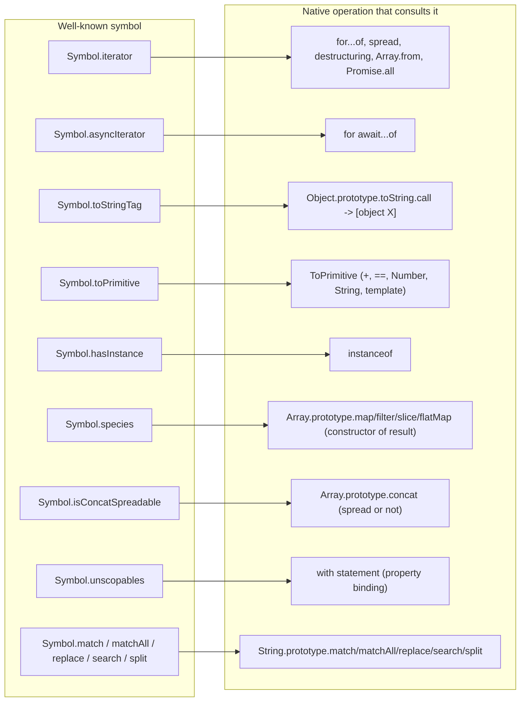
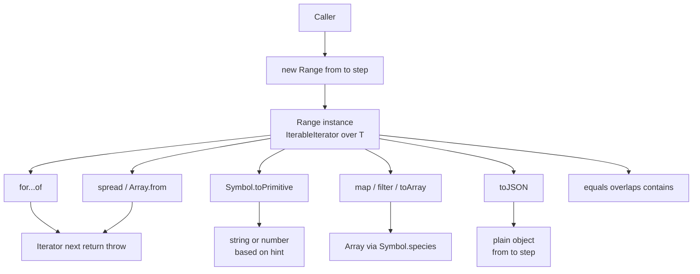

# 1.32 Well-Known Symbols

> A set of engine-level hooks stored on the `Symbol` constructor, each one a single property key the runtime looks for when performing a native operation — letting your objects participate in `for...of`, `instanceof`, `Array.prototype.concat`, `String.prototype.match`, and coercion, without ever touching the string-key namespace.

## 1. Purpose

JavaScript objects communicate with the runtime through protocols. A protocol is, in this context, a contract that says: *if your object has a method with this name, the engine will call it under these circumstances*. The iterator protocol is the most famous example — `for...of` does not work on arrays because arrays are arrays; it works because arrays expose a method at a specific key, and the engine looks for that key, calls it, and walks the returned iterator.

Before ES6, every such protocol lived at a string key. `toString`, `valueOf`, `toJSON` — all strings. This worked, but it had a structural problem: the string namespace is the user's namespace too. If the language wanted to add a new protocol hook for, say, iteration, what would it call it? `iterate`? `forEach`? Anything the spec chose would collide with the millions of existing objects in the wild that might have a property with that name for unrelated reasons. Every protocol addition became a breaking-change negotiation. The result was that the language barely added any new protocols between ES3 and ES5.1.

Well-known symbols are the answer. A symbol is a unique, non-string property key. Two symbols created by `Symbol("foo")` are not equal to each other — even though they share a description, they are distinct values. The language can therefore define a fixed set of *well-known* symbols — each stored as a property of the `Symbol` constructor, like `Symbol.iterator` or `Symbol.toPrimitive` — and the engine can look them up on user objects with zero risk of colliding with anything the user wrote. A user's own `iterator` string property is unaffected; the engine does not look at it. Only `Symbol.iterator` (the specific symbol value) is consulted.

The deeper purpose is twofold:

1. **Open the protocol layer to user objects.** Before ES6, only built-in objects (arrays, strings, maps) could participate in `for...of`, and only built-in regexes worked with `String.prototype.match`. With well-known symbols, *any* user-defined object can opt into the same machinery an array uses, by simply implementing the right symbol-keyed method. There is no subclassing requirement, no interface declaration, no registration step.
2. **Do it without breaking the string-key namespace.** The engine can keep adding protocols in future ECMAScript editions (and it has — `Symbol.asyncIterator` in ES2018, `Symbol.matcher` proposed for the pattern-matching proposal) without ever risking a name clash with existing user code.

What this enables, concretely:

- **Custom iteration.** Implement `Symbol.iterator` and your object works with `for...of`, spread, destructuring, `Array.from`, `Promise.all`. Implement `Symbol.asyncIterator` and it works with `for await...of`.
- **Custom type tag.** `Symbol.toStringTag` lets you control the `[object X]` string returned by `Object.prototype.toString.call(obj)`. The spec itself uses this on `Math`, `JSON`, `arguments`, module namespace objects, and platform objects like `WebSocket`.
- **Custom coercion.** `Symbol.toPrimitive` lets an object decide, with full knowledge of the coercion hint (`"string"`, `"number"`, `"default"`), how it should be converted to a primitive. When present, ToPrimitive calls it instead of falling through to the legacy `valueOf` / `toString` pair.
- **Custom `instanceof`.** `Symbol.hasInstance` lets a class define its own `instanceof` semantics. This is how libraries implement branded types, structural "is-a" checks, and cross-realm type guards.
- **Controlling Array method return type.** `Symbol.species` lets an Array subclass decide which constructor gets used when `map`, `filter`, `slice`, `flatMap` (and friends) produce a result.
- **Controlling `Array.prototype.concat` spreading.** `Symbol.isConcatSpreadable` lets an array-like object decide whether `concat` should flatten it into the result or treat it as a single element. Arrays default to spreadable; plain objects with a `length` and indexed entries default to *not* spreadable unless they set this symbol to `true`.
- **Regex-like objects.** `Symbol.match`, `Symbol.replace`, `Symbol.search`, and `Symbol.split` let any object behave like a regex when used with the corresponding `String.prototype` methods, and is the foundation of the proposed `Pattern` matching protocol.
- **Scoping opt-outs.** `Symbol.unscopables` lets a prototype declare which of its properties should *not* be exposed inside a `with` block. `Array.prototype` uses it to hide modern methods from `with` scope so legacy code that declared local variables with those names keeps working.

Why symbols, not strings? Three reasons:

1. **No collision.** A symbol is a unique value. The engine looks for *the* `Symbol.iterator`, not for "any property named iterator." User code cannot accidentally shadow it.
2. **Hidden by default.** `for...in` loops, `Object.keys`, and `JSON.stringify` all skip symbol-keyed properties. Well-known symbols do not pollute enumeration. They are *there*, but invisible to the common reflection paths. (You can still see them with `Object.getOwnPropertySymbols` and `Reflect.ownKeys`.)
3. **Forward-compatible.** The spec can keep adding well-known symbols without touching existing semantics. The mere existence of a new symbol on `Symbol` is not a breaking change; only the *use* of it by a native operation is.

By the end of this note you should be able to list every well-known symbol, name the native operation each one customizes, implement the four most important ones (`iterator`, `toPrimitive`, `toStringTag`, `hasInstance`) from scratch, and explain when `Symbol.species` matters and when it is silently ignored.

## 2. Theory and Deep Dive

### 2.1 What "well-known" means

A *well-known symbol* is a symbol value defined by the ECMAScript specification and exposed as a property of the `Symbol` constructor. Each one is a singleton: there is exactly one `Symbol.iterator` in a given realm. (Realms are isolated global environments — each iframe, worker, or Node `vm` context has its own copy of `Symbol`, and therefore its own `Symbol.iterator`. See Section 2.13 for the cross-realm subtleties.)

The full list of well-known symbols standardised as of ES2024:

| Symbol | Standardised in | Customizes |
|---|---|---|
| `Symbol.iterator` | ES2015 | `for...of`, spread, destructuring, `Array.from`, `Promise.all`, etc. |
| `Symbol.asyncIterator` | ES2018 | `for await...of` |
| `Symbol.hasInstance` | ES2015 | `instanceof` |
| `Symbol.isConcatSpreadable` | ES2015 | `Array.prototype.concat` |
| `Symbol.match` | ES2015 | `String.prototype.match`, `Symbol.matchAll`, the `isRegExp` abstract operation |
| `Symbol.matchAll` | ES2020 | `String.prototype.matchAll` |
| `Symbol.replace` | ES2015 | `String.prototype.replace` and `replaceAll` |
| `Symbol.search` | ES2015 | `String.prototype.search` |
| `Symbol.split` | ES2015 | `String.prototype.split` |
| `Symbol.species` | ES2015 | The constructor used by `Array.prototype.map`, `filter`, `slice`, `splice`, `flatMap`, etc. (and `Promise.prototype.then` in subclasses, `RegExp.prototype[Symbol.split]`'s `SpeciesConstruct`, `TypedArray` species for several methods) |
| `Symbol.toPrimitive` | ES2015 | The ToPrimitive abstract operation (preferred over `valueOf` / `toString`) |
| `Symbol.toStringTag` | ES2015 | `Object.prototype.toString` (the `[object X]` string) |
| `Symbol.unscopables` | ES2015 | `with` statement property binding |

Each one is a hook. The runtime consults it at a specific, well-defined point in a native operation, and the *presence* (and sometimes the *value*) of that hook changes the operation's behavior. The hook is consulted via `GetMethod` — that is, the engine reads the property, coerces `undefined` to a no-op, and calls it as a function. If the property is present but not callable, a `TypeError` is thrown.

### 2.2 The lookup mechanism

When the engine needs to perform, say, iteration on an object `obj`, it does the moral equivalent of:

```js
const iteratorMethod = obj[Symbol.iterator];
if (typeof iteratorMethod !== "function") {
  throw new TypeError("obj is not iterable");
}
const iterator = iteratorMethod.call(obj);
if (typeof iterator.next !== "function") {
  throw new TypeError("iterator is not an iterator");
}
```

The lookup is dynamic, walks the prototype chain normally (which is why plain arrays work via `Array.prototype[Symbol.iterator]`), and is *non-coercive about return type*. `Symbol.iterator` must return an object with a callable `next`. `Symbol.toPrimitive` must return a primitive (string, number, boolean, symbol, bigint) — returning an object throws. `Symbol.hasInstance` must return a boolean (it goes through ToBoolean). Knowing the contract for each symbol is half the battle.

### 2.3 `Symbol.iterator`

The most-used well-known symbol. When `for...of`, the spread operator, array destructuring, `Array.from`, `Promise.all`, `Promise.race`, `Set`/`Map`/`WeakSet`/`WeakMap` constructors, `Object.groupBy`, `Map.groupBy`, or `Array.fromAsync` encounters an object, they call `obj[Symbol.iterator]()` and expect an *iterator* back — an object with a `next()` method that returns `{ value, done }`. Optional `return(value?)` and `throw(error?)` methods support early termination and error propagation.

Critical details:

- The iterable protocol (the `[Symbol.iterator]` method) and the iterator protocol (the `next()` part) are *separate*. Arrays work by returning a fresh `ArrayIterator` each time `Symbol.iterator` is called.
- An object can also be its own iterator, by returning `this` from `Symbol.iterator`. This is what generator instances do, and it is a common pattern for single-shot iterables like file streams.
- The return value of `next()` must have a `value` and a `done`. If `done` is `true`, `value` is ignored.
- Calling `Symbol.iterator` more than once on the same iterable should produce independent iterators that do not interfere with each other.

### 2.4 `Symbol.asyncIterator`

The async analogue. When `for await...of` encounters an object, it calls `obj[Symbol.asyncIterator]()` and expects an async iterator — an object whose `next()` returns a Promise of `{ value, done }`. Optional `return(value?)` and `throw(error?)` also return promises.

Critical details:

- An object can be both iterable and async-iterable, but `for await...of` prefers `Symbol.asyncIterator`. If absent, `for await...of` falls back to `Symbol.iterator` and awaits each yielded value.
- Async iterators are the foundation of streaming I/O in modern JavaScript: Node's Readable streams implement `Symbol.asyncIterator` since Node 10, the Web Streams API's `ReadableStream` supports it directly in modern browsers, and most database drivers expose cursors as async iterables.
- See [[1.24 Async Generators and Iterators]] for the full streaming-protocol treatment.

### 2.5 `Symbol.toStringTag`

The `Object.prototype.toString` method, when called via `Object.prototype.toString.call(obj)`, historically returned one of a small fixed set of strings: `[object Object]`, `[object Array]`, `[object Function]`, `[object Date]`, `[object RegExp]`, `[object Error]`, `[object Arguments]`, `[object Math]`, `[object JSON]`. ES6 made this extensible: if `obj` has a `Symbol.toStringTag` property whose value is a string, that string is used in place of the legacy class name. So `Object.prototype.toString.call(Math)` returns `[object Math]`; `Object.prototype.toString.call(Promise.resolve())` returns `[object Promise]`.

Critical details — the easy-to-miss part:

- `Symbol.toStringTag` only customizes `Object.prototype.toString.call(obj)`. It does *not* customize `String(obj)` or `obj.toString()`. The `toString` method on `Object.prototype` is what reads `Symbol.toStringTag`. If your class overrides `toString`, it bypasses the symbol entirely.
- `Symbol.toStringTag` is read as a *string* via `ToString`. If you set it to a non-string, it gets coerced.
- `Object.prototype.toString` is the most reliable way to inspect an object's "kind" cross-realm, because it does not depend on the `instanceof` chain or the prototype identity. This is why libraries like lodash use it for type detection. `Symbol.toStringTag` lets your objects participate in this scheme honestly.

### 2.6 `Symbol.toPrimitive`

When an object needs to be converted to a primitive (because of `+`, `==`, `${obj}`, `Number(obj)`, `String(obj)`, or any operation that goes through the ToPrimitive abstract operation), the engine first checks for `Symbol.toPrimitive`. If it is present and callable, it is called with a single argument `hint` — one of `"string"`, `"number"`, or `"default"`:

- `"string"` is passed when the context wants a string: `String(obj)`, `${obj}`, `obj + ""` (technically the abstract operation calls ToPrimitive with hint string for template literals and the `String` function).
- `"number"` is passed when the context wants a number: `Number(obj)`, `+obj`, `obj * 2`, `obj < 3`.
- `"default"` is passed when the context is ambiguous: `obj + x` (when `x` is not obviously a string or number), `obj == x` (loose equality between object and primitive), `Date(obj)`.

Critical details:

- The method **must return a primitive**. Returning an object throws `TypeError: Cannot convert object to primitive value`.
- If `Symbol.toPrimitive` is absent, the engine falls back to `OrdinaryToPrimitive`, which tries `valueOf` then `toString` for `"number"` hint, or `toString` then `valueOf` for `"string"` hint. For `"default"` hint, OrdinaryToPrimitive behaves like `"number"` (except for `Date`, which behaves like `"string"`).
- `Symbol.toPrimitive` is preferred over the legacy pair. If you define it, your `valueOf` and `toString` are bypassed for coercion purposes. `String(obj)`, `Number(obj)`, and `${obj}` all go through ToPrimitive, so they will use `Symbol.toPrimitive` and then `ToString` or `ToNumber` the result.
- The hint is advisory, not mandatory. Your implementation can ignore it and always return the same kind of primitive. `Symbol.prototype[Symbol.toPrimitive]` always returns the symbol itself, ignoring the hint.
- For `Date`, the spec installs `Symbol.toPrimitive` on `Date.prototype` to preserve the legacy "default behaves like string" quirk.

### 2.7 `Symbol.hasInstance`

The `instanceof` operator consults `Symbol.hasInstance` on its right-hand operand. The expression `obj instanceof C` is specified to:

1. Check that `C` is callable. If not, throw `TypeError`.
2. Look up `C[Symbol.hasInstance]`. If it is callable, call it with `obj` and return ToBoolean of the result.
3. Otherwise, fall back to `OrdinaryHasInstance(C, obj)`, which walks `obj`'s prototype chain comparing to `C.prototype`.

Critical details:

- `Symbol.hasInstance` is defined as non-writable and non-configurable on `Function.prototype`. You cannot simply assign `Foo[Symbol.hasInstance] = ...` on a function — the assignment silently fails in non-strict mode and throws in strict mode. You must use `Object.defineProperty(Foo, Symbol.hasInstance, { value: ... })`.
- Every function inherits the default `Symbol.hasInstance` (which calls `OrdinaryHasInstance`). Defining your own on a class via `static [Symbol.hasInstance](obj) { ... }` shadows it cleanly because static methods become own properties of the constructor.
- This is the foundation of branded types and nominal-type emulation in TS-friendly libraries (e.g., the `Big` type, branded `UserId` types, the `Effect` library's `Ref` markers).

### 2.8 `Symbol.species`

When an Array (or Array subclass) method like `map`, `filter`, `slice`, `splice`, `flat`, `flatMap`, `concat` produces a new array, the spec consults `Symbol.species` to decide which constructor to use. The default behavior on `Array` is `Symbol.species` is a getter that returns `this` — so `Array.prototype.map` called on an `Array` instance returns an `Array`, and called on a `MyArray` instance returns a `MyArray`.

Critical details:

- `Symbol.species` is consulted via the abstract operation `SpeciesConstructor(original, defaultConstructor)`. It reads `original.constructor`, then `constructor[Symbol.species]`. If `Symbol.species` is `undefined`, the default constructor is used. If it is `null`, the default constructor is also used (this is the "I want plain arrays" escape hatch). If it is a constructor, that constructor is used. If it is anything else, `TypeError`.
- Not all array-returning methods honor `Symbol.species`. `Array.prototype.flat` and `flatMap` *do* honor it; `Array.prototype.fill`, `copyWithin`, `sort`, `reverse` mutate in place and return the same array, so species is irrelevant; `Array.from` and `Array.of` use the `this` value of the constructor call directly, not species; `Array.prototype.keys`, `values`, `entries` return iterators, not arrays.
- `Symbol.species` is the most controversial well-known symbol. Subclassing `Array` and getting `MyArray` back from every `map` and `filter` is rarely what you want, and the indirection hurts engine optimization. The recommended pattern for Array subclasses is `static get [Symbol.species]() { return Array; }` (or `null`) to avoid surprising consumers.

### 2.9 `Symbol.isConcatSpreadable`

`Array.prototype.concat` is unusual: it flattens its arguments one level deep, but only if they are "spreadable." Arrays are spreadable by default. Array-like objects (anything with a `length` and indexed properties, like `arguments` or a NodeList) are *not* spreadable by default — they get added as a single element. `Symbol.isConcatSpreadable` lets you override:

- Setting it to `true` on an array-like object makes `concat` flatten it.
- Setting it to `false` on an array makes `concat` treat it as a single element.

Critical details:

- The check is `ToBoolean(obj[Symbol.isConcatSpreadable])` *if the property is present*. If the property is absent, the default applies: arrays spread, non-arrays do not.
- This is consulted only by `Array.prototype.concat`. No other method checks it.

### 2.10 `Symbol.unscopables`

`with (obj) { ... }` adds `obj`'s properties to the scope chain. This was used heavily in old ES5 code for template-style APIs. The problem: when `Array.prototype` got new methods (`keys`, `values`, `entries`, `includes`, `flat`, `flatMap`, `at`), existing code that had local variables or outer-scope bindings with those names would suddenly shadow them inside `with (arr) { ... }`. The fix: `Array.prototype[Symbol.unscopables]` is an object whose own properties are `true` for each name that should *not* be exposed in `with` scope.

Critical details:

- This symbol is essentially useless in modern code, because `with` is forbidden in strict mode (and ES modules, classes, and most modern tooling are strict by default). It exists for backward compatibility with old code that used `with` on arrays.
- The shape is: an object literal like `{ at: true, copyWithin: true, entries: true, fill: true, find: true, findIndex: true, flat: true, flatMap: true, includes: true, keys: true, values: true }`. The values are checked with ToBoolean. Setting a value to `false` (or omitting the key) re-exposes that property in `with` scope.
- The `with` statement checks `obj[Symbol.unscopables]` *for each property name* it considers. If `unscopables[name]` is truthy, that name is skipped.

### 2.11 `Symbol.match`, `Symbol.replace`, `Symbol.search`, `Symbol.split`, `Symbol.matchAll`

These five symbols make an object *regex-like*. The relevant `String.prototype` methods consult them:

- `String.prototype.match(regexp)`: if `regexp[Symbol.match]` is `undefined` or `true`, the object is treated as a regex and `regexp[Symbol.match](this)` is called. If `regexp[Symbol.match]` is `false`, the object is coerced to a string and `new RegExp(regexp)` is used instead (the legacy path). This is why `"/foo/g".match("\\bfoo\\b")` works — a string argument is not a regex.
- `String.prototype.replace(pattern, replacement)`: if `pattern[Symbol.replace]` is callable, `pattern[Symbol.replace](this, replacement)` is called.
- `String.prototype.search(regexp)`: if `regexp[Symbol.search]` is callable, `regexp[Symbol.search](this)` is called.
- `String.prototype.split(separator, limit)`: if `separator[Symbol.split]` is callable, `separator[Symbol.split](this, limit)` is called.
- `String.prototype.matchAll(regexp)`: if `regexp[Symbol.matchAll]` is callable, it is called. Otherwise, `regexp` is coerced to string and a `new RegExp(regexp, "g")` is used. Unlike the others, `matchAll` *requires* the `global` flag — passing a non-global regex throws.

The `Symbol.match` symbol is also consulted by the abstract operation `IsRegExp`, which is used by `new RegExp(pattern)` to detect when `pattern` is already a regex. If `pattern[Symbol.match]` is `true` (or absent and `pattern` is a RegExp), it is treated as a regex; if `false`, it is treated as a string source. This is what lets you do `new RegExp(/foo/g, "i")` — the spec sees that `/foo/g` is a regex (via `Symbol.match`) and uses its source.

Critical details:

- A regex-like object must implement the relevant symbol as a function. Returning non-functions from these symbols does not help — the engine checks `typeof obj[Symbol.match] === "function"`.
- Setting `Symbol.match` to `false` on a RegExp instance makes `String.prototype.match` treat it as a plain string source for `new RegExp`. This is the escape hatch for libraries that want to "demote" a regex.
- The four-symbol regex protocol is the foundation of the proposed `Pattern` matching protocol that aims to unify regex, pattern matching, and extractor objects.

### 2.12 The map



The diagram is the whole story: each well-known symbol is a one-to-one mapping to a specific native operation. There is no overlap. If you want to customize `for...of`, you implement `Symbol.iterator`; there is nothing else to do. The protocol surface is small and the consult sites are well-defined.

### 2.13 Cross-realm subtleties

Each realm (window, iframe, worker, Node `vm` context) has its own `Symbol` constructor, and therefore its own copy of every well-known symbol. The symbols themselves are technically not shared across realms — `window.Symbol.iterator !== iframe.contentWindow.Symbol.iterator` per the spec — but engines like V8 intern well-known symbols by description, so cross-realm iteration of built-in arrays works in practice. For user-defined iterables that store their `Symbol.iterator` method explicitly on the object instance, cross-realm behavior is not guaranteed and may break. The safe pattern is to use class methods (`Symbol.iterator` written inside the class body), which are looked up via the prototype chain using the realm of the prototype.

The famous cross-realm footgun is `instanceof`. `obj instanceof C` where `obj` is from realm A and `C` is from realm B looks up `C[Symbol.hasInstance]` (which finds `Function.prototype[Symbol.hasInstance]` on realm B), and that calls `OrdinaryHasInstance`, which walks `obj`'s prototype chain comparing to `C.prototype`. But `obj` is a realm-A array, so its prototype is realm A's `Array.prototype`, not realm B's. So `[1,2,3] instanceof realmB.Array` is `false`. This is why `Array.isArray(obj)` exists — it does not depend on the prototype chain, it checks the internal exotic-object nature directly.

### 2.14 Symbols and TypeScript

TypeScript models well-known symbols as `unique symbol` typed properties on the `Symbol` constructor. The `SymbolConstructor` interface declares them like this (paraphrased from `lib.es2015.symbol.d.ts` and friends):

```ts
interface SymbolConstructor {
  readonly iterator: unique symbol;
  readonly asyncIterator: unique symbol;
  readonly hasInstance: unique symbol;
  readonly isConcatSpreadable: unique symbol;
  readonly match: unique symbol;
  readonly matchAll: unique symbol;
  readonly replace: unique symbol;
  readonly search: unique symbol;
  readonly split: unique symbol;
  readonly species: unique symbol;
  readonly toPrimitive: unique symbol;
  readonly toStringTag: unique symbol;
  readonly unscopables: unique symbol;
}
```

The `unique symbol` type is what lets TS track identity at compile time. When you write a computed property `[Symbol.iterator]` in a class body, TS understands the key is the *specific* `Symbol.iterator`, and types the method accordingly. The `Iterable<T>` and `Iterator<T>` and `IterableIterator<T>` interfaces in `lib.es2015.iterable.d.ts` use this to type `for...of` and friends.

When you write your own symbol-keyed properties, the rule is:

- Use `unique symbol` for a `const` declared symbol whose identity you want tracked at compile time (e.g., `const mySym: unique symbol = Symbol("mySym")`).
- Use `symbol` for a parameter or property that accepts any symbol value.

For well-known symbols specifically, you never declare them yourself — you just use `Symbol.iterator` etc., and TS resolves the type from the lib.

## 3. Mental Models

A well-known symbol is best held in the head as **"a hook the engine looks for at a specific point."** You do not call well-known symbols yourself (usually). You *define* them on your objects, and the engine *calls* them. They are inbound method calls from the runtime, not outbound calls you make.

Concretely, here are the seven mental models that make the whole system click:

1. **`Symbol.iterator` = "make this thing work with `for...of`."** If you can answer the question "what does `for...of` do with my object?" by writing a method that returns an iterator, you have implemented the iterable protocol. Everything else — spread, destructuring, `Array.from`, `Promise.all` — is free.

2. **`Symbol.asyncIterator` = "make this thing work with `for await...of`."** Same shape, but `next` returns a Promise. The natural shape for streaming I/O.

3. **`Symbol.toPrimitive` = "answer when the engine asks 'convert yourself to a primitive.'"** The hint tells you what flavor of primitive would be most helpful. You can ignore it and always return the same thing, or you can be polite and return a string for `"string"` hint and a number for `"number"` hint. The only hard rule is you must return a primitive.

4. **`Symbol.hasInstance` = "answer when the engine asks 'is X an instance of you?'"** This is `instanceof`'s callback. The right-hand side of `instanceof` is your class; the left-hand side is whatever the user passed. You return a boolean. This is how you implement branded types and structural type guards.

5. **`Symbol.species` = "tell Array methods which constructor to use for the result."** When `map` or `filter` builds a new array, it asks `this.constructor[Symbol.species]` what to construct with. The default returns `this`, so subclasses get back their own type. Returning `Array` forces plain arrays. Returning `null` also forces plain arrays. Returning a custom constructor is rarely useful.

6. **`Symbol.toStringTag` = "your name in `[object X]`."** It is read by `Object.prototype.toString` and nothing else. It is the most defensive, opt-in way to give your class a recognizable type tag for logging and duck-typing libraries.

7. **`Symbol.match` / `replace` / `search` / `split` = "make this object behave like a regex for the corresponding String method."** Each one is consulted by exactly one `String.prototype` method. Together they form the "regex-like" protocol. Implement all four and you have a first-class matcher.

The eighth, `Symbol.unscopables`, is the odd one out. Its mental model is: "if you ever use `with` on this object, hide these properties from the scope chain." Since you should not be using `with`, this is essentially a maintenance burden the spec carries for legacy code.

The unified picture: well-known symbols are *extension points the language offered itself when it ran out of string keys*. Every native operation that wanted a customization hook after ES5.1 was specified to look for a symbol instead. Your objects can opt in by defining the symbol-keyed method, with zero risk of colliding with anything else.

## 4. Real-World Use Cases

Well-known symbols are not theoretical. They show up in production code in five recurring shapes:

1. **Custom collections.** A `List`, `Tree`, `Graph`, `LinkedList`, `RingBuffer`, `PriorityQueue` — any non-array data structure wants to be iterable so it can be passed to `Array.from`, spread into a function, destructured, or consumed by `for...of`. The standard implementation is a generator method: `*[Symbol.iterator]() { for (const node of this.nodes()) yield node.value; }`. Once you have this, your collection plugs into the entire ecosystem. See [[1.23 Generators and Iterators]] for the iterator protocol details.

2. **Value objects with coercion.** A `Money`, `Distance`, `Temperature`, `BigNumber`, or `Decimal` class often wants to interoperate with plain numbers in arithmetic and comparison contexts, while carrying unit information. Implementing `Symbol.toPrimitive` lets the class control exactly how it coerces. `Number(money)` can return the cents amount; `${money}` can return a formatted string; `money + 100` coerces the object first (losing the type). The common pattern is to make `Symbol.toPrimitive` return a number for `"number"` and `"default"` hints, and a formatted string for `"string"` hint, and rely on explicit methods (`money.add(100)`) for type-preserving operations. This is the pattern `decimal.js` and `big.js` use.

3. **Branded types and custom `instanceof`.** In TS, branded types (`type UserId = string & { readonly brand: unique symbol }`) are a compile-time fiction — at runtime, a `UserId` is just a string. To make `instanceof` work for branded types at runtime, libraries like `effect` and `fp-ts` use wrapper classes with `Symbol.hasInstance`. More usefully, `Symbol.hasInstance` can implement *structural* `instanceof`: `class Even { static [Symbol.hasInstance](x: unknown) { return typeof x === "number" && x % 2 === 0; } }` — now `4 instanceof Even` is `true`. This is impossible without `Symbol.hasInstance`, because `instanceof` would otherwise walk the prototype chain looking for `Even.prototype`.

4. **Regex-like matchers.** A `Glob`, `Route`, `JSONPath`, `CSS Selector`, or `Type Predicate` object can implement `Symbol.match`, `Symbol.replace`, `Symbol.search`, and `Symbol.split` to behave like a regex when used with the corresponding `String.prototype` methods. For example, a `Glob` class implementing `Symbol.match` lets you write `"foo.js".match(glob("*.js"))` and get back a match array. The `path-to-regexp` library and similar routing utilities use this pattern. The proposed `Pattern` protocol formalizes it.

5. **`Symbol.toStringTag` for debugging clarity.** Logging an object and seeing `[object Object]` is unhelpful. Setting `Symbol.toStringTag` on your classes to a descriptive name (`"Money"`, `"LinkedList"`, `"RingBuffer"`) makes `Object.prototype.toString.call(obj)` return `[object Money]`, which is much more useful in logs, error messages, and debugging tools. The spec itself does this for built-in objects like `Math`, `JSON`, `arguments`, module namespace objects, and the prototype objects of `Map`, `Set`, `WeakMap`, `WeakSet`, `ArrayBuffer`, `DataView`, `Promise`, and `Error`.

6. **`Symbol.species` in custom Array subclasses.** The classic example is `class MyArray extends Array {}`. Without any species configuration, `[1,2,3].map(x => x*2)` on a `MyArray` returns a `MyArray`. This is sometimes desired and sometimes surprising. The fix is `static get [Symbol.species]() { return Array; }` on `MyArray`, which forces all species-aware methods to return plain arrays. Node.js's `Buffer` is a real-world example of similar machinery.

7. **`Symbol.isConcatSpreadable` for legacy array-likes.** If you have an array-like object (with a `length` and indexed entries, but not a real array) that you want `[].concat(it)` to flatten, set `it[Symbol.isConcatSpreadable] = true`. In modern code you would typically use `Array.from(nodeList)` or `[...nodeList]` instead.

8. **`Symbol.asyncIterator` for streaming I/O.** Node's Readable streams implement `Symbol.asyncIterator` since Node 10, so `for await (const chunk of readable) { ... }` works. The Web Streams API's `ReadableStream` supports it directly in modern browsers. Database cursors in drivers like `pg-cursor` and MongoDB's cursor API expose async iterators. This is the most consequential real-world use of a well-known symbol in modern JavaScript — it is what makes streaming data ergonomic.

9. **Library extension points.** Some libraries expose symbols as their public extension API. The `iterable-operator` library and the proposed `Iterator Helpers` proposal (ES2025+) consume `Symbol.iterator` and produce new iterators via methods like `.map`, `.filter`, `.take`. The proposed `Pattern` proposal introduces `Symbol.matcher` as a new well-known symbol. As the language grows, more well-known symbols will be added, and libraries that already understand the pattern will adopt them quickly.

## 5. Code Examples

### 5.1 Example A — Minimal and Conceptual

Six minimal demonstrations, each no more than five lines for the core idea, side by side in JS and TS.

**Symbol.iterator** — make any object work with `for...of`:

JavaScript:

```js
const range = {
  from: 1, to: 3,
  [Symbol.iterator]() {
    let n = this.from;
    return { next: () => n <= this.to ? { value: n++, done: false } : { value: undefined, done: true } };
  }
};
console.log([...range]); // [1, 2, 3]
```

TypeScript:

```ts
interface Range { from: number; to: number; }
const range: Range & Iterable<number> = {
  from: 1, to: 3,
  [Symbol.iterator](): Iterator<number> {
    let n = this.from;
    return { next: (): IteratorResult<number> =>
      n <= this.to ? { value: n++, done: false } : { value: undefined, done: true } };
  }
};
console.log([...range]); // [1, 2, 3]
```

**Symbol.asyncIterator** — make an object work with `for await...of`:

JavaScript:

```js
const ticks = {
  [Symbol.asyncIterator]() {
    let i = 0;
    return {
      next: () => new Promise(resolve =>
        setTimeout(() => resolve({ value: i++, done: i > 3 }), 200))
    };
  }
};
(async () => { for await (const t of ticks) console.log(t); })(); // 0, 1, 2
```

TypeScript:

```ts
const ticks: AsyncIterable<number> = {
  [Symbol.asyncIterator](): AsyncIterator<number> {
    let i = 0;
    return {
      next: () => new Promise<IteratorResult<number>>(resolve =>
        setTimeout(() => resolve({ value: i++, done: i > 3 }), 200))
    };
  }
};
(async () => { for await (const t of ticks) console.log(t); })(); // 0, 1, 2
```

**Symbol.toStringTag** — customize `[object X]`:

JavaScript:

```js
class Money {
  constructor(cents) { this.cents = cents; }
  get [Symbol.toStringTag]() { return "Money"; }
}
console.log(Object.prototype.toString.call(new Money(500))); // [object Money]
```

TypeScript:

```ts
class Money {
  constructor(public cents: number) {}
  get [Symbol.toStringTag](): string { return "Money"; }
}
console.log(Object.prototype.toString.call(new Money(500))); // [object Money]
```

**Symbol.toPrimitive** — control coercion:

JavaScript:

```js
class Temperature {
  constructor(kelvin) { this.kelvin = kelvin; }
  [Symbol.toPrimitive](hint) {
    return hint === "string" ? `${this.kelvin}K` : this.kelvin;
  }
}
const t = new Temperature(300);
console.log(`${t}`);     // 300K
console.log(t + 5);      // 305
console.log(t == 300);   // true
```

TypeScript:

```ts
class Temperature {
  constructor(public kelvin: number) {}
  [Symbol.toPrimitive](hint: "string" | "number" | "default"): string | number {
    return hint === "string" ? `${this.kelvin}K` : this.kelvin;
  }
}
const t = new Temperature(300);
console.log(`${t}`);     // 300K
console.log(t + 5);      // 305
console.log(t == 300);   // true
```

**Symbol.hasInstance** — customize `instanceof`:

JavaScript:

```js
const Even = {
  [Symbol.hasInstance](x) { return typeof x === "number" && x % 2 === 0; }
};
console.log(4 instanceof Even); // true
console.log(3 instanceof Even); // false
```

TypeScript:

```ts
const Even = {
  [Symbol.hasInstance](x: unknown): boolean {
    return typeof x === "number" && x % 2 === 0;
  }
} as unknown as { (x: unknown): boolean } & { [Symbol.hasInstance](x: unknown): boolean };
console.log(4 instanceof Even); // true
console.log(3 instanceof Even); // false
```

**Symbol.species** — control Array method return type:

JavaScript:

```js
class SafeArray extends Array {
  static get [Symbol.species]() { return Array; }
}
const s = SafeArray.from([1, 2, 3]);
const m = s.map(x => x * 2);
console.log(m instanceof SafeArray); // false
console.log(m instanceof Array);     // true
```

TypeScript:

```ts
class SafeArray<T> extends Array<T> {
  static get [Symbol.species](): ArrayConstructor { return Array; }
}
const s = SafeArray.from<number>([1, 2, 3]);
const m = s.map(x => x * 2);
console.log(m instanceof SafeArray); // false
console.log(m instanceof Array);     // true
```

### 5.2 Example B — Production-Grade

A typed `SortedSet<T>` collection implementing `Symbol.iterator` (so it works with `for...of`, spread, `Array.from`), `Symbol.toStringTag` (for debugging), `Symbol.toPrimitive` (so `${set}` and `Number(set)` produce useful values), and `Symbol.species` (so subclassing works predictably). It also implements `Symbol.hasInstance` for a structural check.

JavaScript:

```js
class SortedSet {
  constructor(values = []) {
    this.items = [...new Set(values)].sort((a, b) => (a < b ? -1 : a > b ? 1 : 0));
  }

  *[Symbol.iterator]() {
    for (const v of this.items) yield v;
  }

  get [Symbol.toStringTag]() {
    return "SortedSet";
  }

  [Symbol.toPrimitive](hint) {
    if (hint === "string") return `SortedSet(${this.items.join(",")})`;
    if (hint === "number") return this.items.length;
    return this.items.join(",");
  }

  static [Symbol.hasInstance](x) {
    return x != null
      && typeof x === "object"
      && Array.isArray(x.items)
      && typeof x[Symbol.iterator] === "function"
      && Object.prototype.toString.call(x) === "[object SortedSet]";
  }

  static get [Symbol.species]() {
    return Array;
  }

  map(fn) {
    const Ctor = this.constructor[Symbol.species] || Array;
    const out = new Ctor(this.items.length);
    for (let i = 0; i < this.items.length; i++) out[i] = fn(this.items[i], i);
    return out;
  }

  filter(fn) {
    const Ctor = this.constructor[Symbol.species] || Array;
    const out = new Ctor();
    for (let i = 0; i < this.items.length; i++) {
      if (fn(this.items[i], i)) out.push(this.items[i]);
    }
    return out;
  }

  add(value) {
    if (this.items.includes(value)) return this;
    const idx = this.items.findIndex(v => v > value);
    if (idx === -1) this.items.push(value);
    else this.items.splice(idx, 0, value);
    return this;
  }

  has(value) { return this.items.includes(value); }
  get size() { return this.items.length; }
}

const s = new SortedSet([3, 1, 2, 1]);
console.log([...s]);                                   // [1, 2, 3]
console.log(`${s}`, Number(s));                        // SortedSet(1,2,3) 3
console.log(Object.prototype.toString.call(s));        // [object SortedSet]
console.log(s instanceof SortedSet);                   // true
const doubled = s.map(x => x * 10);
console.log(doubled, doubled instanceof Array, doubled instanceof SortedSet); // [10,20,30] true false
```

TypeScript:

```ts
class SortedSet<T> implements Iterable<T> {
  private items: T[];
  private readonly compare: (a: T, b: T) => number;

  constructor(values: Iterable<T> = [], compare?: (a: T, b: T) => number) {
    this.compare = compare ?? ((a, b) => (a < b ? -1 : a > b ? 1 : 0));
    this.items = [...new Set(values)].sort(this.compare);
  }

  *[Symbol.iterator](): IterableIterator<T> {
    for (const v of this.items) yield v;
  }

  get [Symbol.toStringTag](): string {
    return "SortedSet";
  }

  [Symbol.toPrimitive](hint: "string" | "number" | "default"): string | number {
    if (hint === "string") return `SortedSet(${this.items.join(",")})`;
    if (hint === "number") return this.items.length;
    return this.items.join(",");
  }

  static [Symbol.hasInstance](x: unknown): x is SortedSet<unknown> {
    return (
      x != null &&
      typeof x === "object" &&
      Array.isArray((x as { items?: unknown }).items) &&
      typeof (x as { [Symbol.iterator]?: unknown })[Symbol.iterator] === "function" &&
      Object.prototype.toString.call(x) === "[object SortedSet]"
    );
  }

  static get [Symbol.species](): ArrayConstructor {
    return Array;
  }

  map<U>(fn: (value: T, index: number) => U): U[] {
    const Ctor = (this.constructor as unknown as { [Symbol.species]?: ArrayConstructor })
      [Symbol.species] ?? Array;
    const out = new Ctor(this.items.length);
    for (let i = 0; i < this.items.length; i++) out[i] = fn(this.items[i], i);
    return out as U[];
  }

  filter(fn: (value: T, index: number) => boolean): T[] {
    const Ctor = (this.constructor as unknown as { [Symbol.species]?: ArrayConstructor })
      [Symbol.species] ?? Array;
    const out = new Ctor();
    for (let i = 0; i < this.items.length; i++) {
      if (fn(this.items[i], i)) out.push(this.items[i]);
    }
    return out as T[];
  }

  add(value: T): this {
    if (this.items.includes(value)) return this;
    const idx = this.items.findIndex(v => this.compare(v, value) > 0);
    if (idx === -1) this.items.push(value);
    else this.items.splice(idx, 0, value);
    return this;
  }

  has(value: T): boolean { return this.items.includes(value); }
  get size(): number { return this.items.length; }
}

const s = new SortedSet<number>([3, 1, 2, 1]);
console.log([...s]);                                    // [1, 2, 3]
console.log(`${s}`, Number(s));                         // SortedSet(1,2,3) 3
console.log(Object.prototype.toString.call(s));         // [object SortedSet]
console.log(s instanceof SortedSet);                    // true
const doubled: number[] = s.map(x => x * 10);
console.log(doubled, doubled instanceof Array, doubled instanceof SortedSet); // [10,20,30] true false
```

The TS version is heavier because it must encode the symbol-keyed members in the type system. The pattern `(this.constructor as unknown as { [Symbol.species]?: ArrayConstructor })[Symbol.species]` is needed because TS does not let you index a `Function`-typed value with `Symbol.species` directly. A cleaner alternative is to declare a static getter that returns `ArrayConstructor` and cast `this.constructor` to the type of the class itself.

## 6. Common Mistakes and Anti-Patterns

### 6.1 `Symbol.iterator` returns an object that is not an iterator

The iterable protocol requires `Symbol.iterator` to return an object with a callable `next` method. Returning the raw data (an array, a plain object, `undefined`) is the most common mistake.

```js
const broken = { [Symbol.iterator]() { return { items: [1,2,3] }; } };
[...broken]; // TypeError: broken[Symbol.iterator](...).next is not a function
```

Fix: always return an object with `next()`. If you want to delegate to another iterable, use `yield*` in a generator, or return `otherIterable[Symbol.iterator]()`. Arrays happen to be iterable themselves, so `[Symbol.iterator]() { return [1,2,3]; }` accidentally works, but only by luck — the consumer iterates the returned array as a fresh iterable, not as a cursor.

### 6.2 `Symbol.toPrimitive` returns an object

The contract is strict: the method must return a primitive. Returning an object (even one with a `valueOf` of its own) throws.

```js
class Bad {
  [Symbol.toPrimitive]() { return { wrapped: 1 }; } // wrong
}
`${new Bad()}`; // TypeError: Cannot convert object to primitive value
```

Fix: return a string, number, boolean, symbol, or bigint. If you cannot produce a primitive, throw an explicit `Error` with a helpful message — the engine's `TypeError` is uninformative.

### 6.3 Forgetting that `Symbol.toStringTag` only affects `Object.prototype.toString.call`

This is the most common confusion. `Symbol.toStringTag` does *not* affect `String(obj)`, `obj.toString()`, or template literals. It only affects `Object.prototype.toString.call(obj)`.

```js
class Foo {
  get [Symbol.toStringTag]() { return "Custom"; }
  toString() { return "I am Foo"; }
}
const f = new Foo();
console.log(Object.prototype.toString.call(f)); // [object Custom]
console.log(String(f), `${f}`, f.toString());    // I am Foo / I am Foo / I am Foo
```

If you want `String(obj)` to also reflect the tag, you must override `toString` as well. They are independent.

### 6.4 `Symbol.species` is silently ignored by methods that do not return arrays

Setting `Symbol.species` on your class affects only `map`, `filter`, `slice`, `splice`, `flat`, `flatMap`, `concat` (when used as the receiver), and a handful of `TypedArray` methods. It does *not* affect:

- `Array.from` and `Array.of` — these use the `this` value of the constructor call directly.
- `Array.prototype.keys`, `values`, `entries` — these return iterators, not arrays.
- `Array.prototype.fill`, `copyWithin`, `sort`, `reverse` — these mutate in place and return the same object.
- `Array.prototype.find`, `findIndex`, `findLast`, `findLastIndex`, `indexOf`, `includes`, `some`, `every`, `reduce`, `reduceRight`, `join`, `toString`, `forEach` — these return non-array values.
- `Set.prototype` and `Map.prototype` methods — these have their own species behavior or none.

If your subclass overrides, say, `slice` to call `super.slice()` and then wrap the result, the `super.slice()` call will already respect species (returning a plain `Array` if species is `Array`). That is usually what you want, but it can be surprising if you expected `slice` to always return the subclass type.

### 6.5 `Symbol.hasInstance` only works with `instanceof`

Defining `Symbol.hasInstance` on a class does not change `typeof`, `Array.isArray`, duck-typing checks, or any other type-detection mechanism. It only changes the behavior of `instanceof`. If you want your type guard to be used in other contexts, you must expose it as a regular function (e.g., `Even.is(x)` or a TS type predicate `isEven(x): x is Even`).

```js
class Even {
  static [Symbol.hasInstance](x) { return typeof x === "number" && x % 2 === 0; }
}
4 instanceof Even; // true
typeof 4 === "Even"; // false (typeof returns "number")
Even.is(4); // would need a separate static method
```

### 6.6 `Symbol.unscopables` only matters in `with`, which is forbidden in strict mode

```js
"use strict";
with (obj) { x; } // SyntaxError: strict mode code may not contain 'with'
```

Since ES modules, classes, and most modern tooling are strict by default, `Symbol.unscopables` is essentially dead code. Do not implement it on your own classes unless you are explicitly supporting legacy non-strict consumers (which you should not be). The only legitimate use is the spec's own use on `Array.prototype`, which exists to keep ancient code working.

### 6.7 Assigning `Symbol.hasInstance` directly on a function silently fails

Because `Symbol.hasInstance` is defined on `Function.prototype` as non-writable and non-configurable, the naive assignment does not work:

```js
function Foo() {}
Foo[Symbol.hasInstance] = (x) => x != null && typeof x === "object"; // silent failure in non-strict
"use strict";
Foo[Symbol.hasInstance] = (x) => x != null && typeof x === "object"; // TypeError in strict
```

Fix: use `Object.defineProperty`:

```js
Object.defineProperty(Foo, Symbol.hasInstance, {
  value: (x) => x != null && typeof x === "object",
});
```

Or use a class with a `static [Symbol.hasInstance]` method, which is the cleanest pattern.

### 6.8 Cross-realm `instanceof` failures

`obj instanceof C` walks `obj`'s prototype chain comparing to `C.prototype`. If `obj` was created in a different realm (iframe, worker, Node `vm` context) than `C`, the prototypes are different objects even if structurally identical, so `instanceof` returns `false`.

```js
const iframe = document.createElement("iframe");
document.body.appendChild(iframe);
const iframeArray = new iframe.contentWindow.Array(1, 2, 3);
console.log(iframeArray instanceof Array); // false
console.log(Array.isArray(iframeArray));    // true (Array.isArray checks internal class, not prototype)
```

Fix: use `Array.isArray` for arrays. For your own classes, either accept the limitation, use a `Symbol.toStringTag`-based check (`Object.prototype.toString.call(x) === "[object MyClass]"`), or implement a static `is(x)` method that does structural checking.

### 6.9 `Symbol.toPrimitive` and `valueOf` / `toString` interplay

If you define `Symbol.toPrimitive`, the legacy `valueOf` and `toString` are bypassed for ToPrimitive calls. `String(obj)`, `Number(obj)`, and `${obj}` all go through ToPrimitive, so they will use your `Symbol.toPrimitive`. The only way `toString` is called independently is if you call `obj.toString()` directly. The mistake is thinking that defining `Symbol.toPrimitive` *and* `toString` gives you a fallback — it does not, because `Symbol.toPrimitive` is preferred. If you want `String(obj)` to also reflect the tag, you must override `toString` as well and delegate to `Symbol.toPrimitive("string")` from inside it.

Related: not handling the `hint === "default"` case in `Symbol.toPrimitive` produces surprising `undefined` results in `obj + 1` and `obj == x` contexts. Always handle all three hints explicitly, even if `default` falls through to one of the others (`return hint === "number" ? 42 : "str"`).

### 6.10 `Symbol.species` returning a constructor that does not accept the expected arguments

When `Array.prototype.map` calls `new Ctor(length)` (via `ArraySpeciesCreate`), it expects `Ctor` to behave like `Array` when constructed with a single numeric argument or with no arguments. If your species constructor has a different signature, you will get surprising results or a `TypeError`. Stick to `Array` or `Array`-compatible constructors.

## 7. Best Practices and Design Patterns

1. **Use `Symbol.iterator` for every custom collection.** If you build a data structure (list, tree, queue, ring buffer, graph), make it iterable. The cost is one generator method; the benefit is integration with the entire language.

2. **Use `Symbol.asyncIterator` for streaming sources.** Anything that produces values over time (file reads, DB cursors, paginated APIs, WebSocket messages, sensor data) should be exposed as an async iterable, unifying consumption under `for await...of`.

3. **Use `Symbol.toPrimitive` for value objects that need coercion.** Money, distance, temperature, big numbers — any class that wraps a primitive and needs to interoperate with `+`, `==`, `Number()`, `String()`, and template literals. Always handle all three hints. Always return a primitive.

4. **Use `Symbol.toStringTag` for debugging clarity.** Set it on every class that might appear in logs or error messages. The string should be the class name, no more. It also lets you write reliable `Object.prototype.toString.call(x) === "[object MyClass]"` checks that survive cross-realm and prototype-chain issues.

5. **Use `Symbol.hasInstance` for branded types and structural `instanceof`.** If you have a wrapper class for branded primitives (UserId, EmailAddress, ISODate), define `static [Symbol.hasInstance]` to perform an honest runtime check.

6. **Use `Symbol.species` carefully — and prefer `null` or `Array`.** If you subclass `Array`, set `static get [Symbol.species]() { return Array; }` unless you have a specific reason to keep the subclass type. Returning `null` is equivalent and is more explicit about intent. Returning a custom constructor is rarely useful and almost always surprises consumers.

7. **Avoid `Symbol.unscopables`.** It exists for `with`, which you should not be using. Implementing it on your own classes adds complexity for zero benefit in modern code.

8. **Use `Symbol.match`, `Symbol.replace`, `Symbol.search`, `Symbol.split` for regex-like objects.** If you are building a matcher (glob, route, JSONPath, selector), implement all four (and `Symbol.matchAll` if relevant) so your object plugs into the existing `String.prototype` API. This is a much better integration story than inventing a new method namespace.

9. **In TypeScript, type well-known symbol properties explicitly.** For `Symbol.iterator`, use `Iterable<T>` and `Iterator<T>` (or `IterableIterator<T>`). For `Symbol.toPrimitive`, type the hint as `"string" | "number" | "default"` and the return as `string | number | boolean | symbol | bigint`. For `Symbol.toStringTag`, type the getter as `string`. For `Symbol.hasInstance`, declare the static method's signature with `x is T` return type to make it a type guard. For `Symbol.species`, declare the static getter's return type as the constructor type you intend to return.

10. **In TypeScript, use `unique symbol` for your own symbol constants, not for the well-known ones.** The well-known symbols are already declared as `unique symbol` on the `SymbolConstructor` interface. For your own library extension points, declare `const mySym: unique symbol = Symbol("mySym")` so TS can track identity across compilation units. Use plain `symbol` for parameters and properties that accept any symbol.

11. **Document the contract for each well-known symbol you implement.** `Symbol.iterator` must return an iterator; `Symbol.toPrimitive` must return a primitive; `Symbol.hasInstance` must return a boolean; `Symbol.species` must return a constructor (or null). A one-line comment in the source makes these contracts explicit for the next reader.

12. **Prefer well-known symbols over string-keyed methods for protocol hooks.** If you are designing a library extension point, ask: "is this a hook the engine or other libraries should look up generically?" If yes, use a symbol (well-known or your own `unique symbol`). If it is a method users will call directly by name, use a string. Symbols are for *inbound* hooks the runtime calls; strings are for *outbound* methods users call.

13. **Test cross-realm behavior.** If your library will be used in Node `vm` contexts, iframes, or workers, write tests that construct your objects in one realm and consume them in another. The common breakages are: custom iterables whose `Symbol.iterator` is a realm-specific key (fix by using class-method syntax, which is prototype-chain-resolved), and `instanceof` checks that fail because the prototype is from a different realm (fix with `Symbol.toStringTag`-based checks or static `is(x)` methods).

## 8. Technical Interview Knowledge

### 8.1 What is a well-known symbol?

A well-known symbol is a symbol value defined by the ECMAScript specification and exposed as a property of the `Symbol` constructor (e.g., `Symbol.iterator`, `Symbol.toPrimitive`). Each one is a singleton per realm and acts as a hook: the runtime looks it up on objects at specific points in native operations and calls it as a method to customize behavior. There are about 13 well-known symbols standardized as of ES2024 (`iterator`, `asyncIterator`, `hasInstance`, `isConcatSpreadable`, `match`, `matchAll`, `replace`, `search`, `split`, `species`, `toPrimitive`, `toStringTag`, `unscopables`). They exist because string keys would collide with user properties — symbols are unique, non-enumerable by default, and hidden from `for...in`, `Object.keys`, and `JSON.stringify`.

### 8.2 What does `Symbol.iterator` do?

`Symbol.iterator` is consulted by `for...of`, the spread operator, array destructuring, `Array.from`, `Promise.all`, `Promise.race`, `Promise.allSettled`, `Promise.any`, the `Set`, `Map`, `WeakSet`, `WeakMap` constructors, and `Object.groupBy`/`Map.groupBy`. When any of these encounter an object, they call `obj[Symbol.iterator]()` and expect an iterator back — an object with a `next()` method that returns `{ value, done }`. If `Symbol.iterator` is absent or not callable, the engine throws `TypeError: obj is not iterable`. The iterable protocol (the `[Symbol.iterator]` method) is separate from the iterator protocol (the `next` method); the same object can implement both (returning `this`), or only the iterable protocol (returning a fresh iterator each call).

### 8.3 What does `Symbol.toPrimitive` do?

`Symbol.toPrimitive` is consulted by the ToPrimitive abstract operation, which is called whenever an object needs to be coerced to a primitive — by `+`, `==`, `<`, `Number(obj)`, `String(obj)`, `${obj}`, `obj + ""`, and any other context that needs a primitive from an object. The method is called with a single `hint` argument: `"string"`, `"number"`, or `"default"`. It must return a primitive; returning an object throws `TypeError`. If `Symbol.toPrimitive` is absent, the engine falls back to `OrdinaryToPrimitive`, which tries `valueOf` then `toString` for `number` hint, `toString` then `valueOf` for `string` hint, and `number`-style behavior for `default` (except `Date`, which uses `string`-style). `Symbol.toPrimitive` is preferred: if defined, the legacy methods are bypassed.

### 8.4 How does `Symbol.hasInstance` work?

`Symbol.hasInstance` is consulted by the `instanceof` operator. The expression `obj instanceof C` checks that `C` is callable, then looks up `C[Symbol.hasInstance]`. If it is callable, it is called with `obj` and the result is converted to boolean. If absent, the engine falls back to `OrdinaryHasInstance(C, obj)`, which walks `obj`'s prototype chain comparing each prototype to `C.prototype`. The default `Symbol.hasInstance` is on `Function.prototype` and is non-writable, non-configurable — so you cannot assign `Foo[Symbol.hasInstance] = ...` directly; you must use `Object.defineProperty` or a `static [Symbol.hasInstance](obj) { ... }` method in a class body. Use cases: branded types, structural type guards, custom `instanceof` semantics for libraries.

### 8.5 What is `Symbol.species` for?

`Symbol.species` is consulted by `Array.prototype.map`, `filter`, `slice`, `splice`, `flat`, `flatMap`, `concat` (and a few `TypedArray` methods, and `Promise.prototype.then` in subclasses) to determine which constructor to use for the result. The default on `Array` is a getter returning `this`, so a `MyArray` instance's `map` produces a `MyArray`. Setting `static get [Symbol.species]() { return Array; }` on a subclass forces plain-array results. Setting it to `null` does the same (the engine falls back to the default constructor). It is controversial because it makes subclass behavior surprising and hurts engine optimization; the modern recommendation is to set it to `Array` (or `null`) on any Array subclass unless you have a specific reason to keep the subclass type.

### 8.6 How would you make an object iterable?

Implement `Symbol.iterator` as a method that returns an iterator — an object with a `next()` function returning `{ value, done }`. The simplest way is a generator method:

```js
class Range {
  constructor(from, to) { this.from = from; this.to = to; }
  *[Symbol.iterator]() {
    for (let n = this.from; n <= this.to; n++) yield n;
  }
}
[...new Range(1, 5)]; // [1, 2, 3, 4, 5]
```

The generator function (note the `*`) returns a generator object, which is both an iterator and an iterable (its own `Symbol.iterator` returns itself). For more control over `return()` (early termination cleanup) and `throw()` (error propagation from the consumer), hand-roll the iterator object with explicit `next`, `return`, and `throw` methods — see Exercise 9.1 for that pattern.

### 8.7 What is `Symbol.toStringTag`?

`Symbol.toStringTag` is consulted by `Object.prototype.toString` (specifically, by `Object.prototype.toString.call(obj)`). If `obj[Symbol.toStringTag]` is a string, it is used in the `[object X]` output. Otherwise, the legacy class name is used (`Object`, `Array`, `Function`, etc.). It does *not* affect `String(obj)`, `obj.toString()`, or template literals — those call `toString` directly. The spec uses it on `Math`, `JSON`, `arguments`, module namespace objects, and the prototype objects of `Map`, `Set`, `Promise`, and others. Users set it on their own classes to get useful `[object MyClassName]` output in logs and to enable reliable cross-realm type detection via `Object.prototype.toString.call(x) === "[object MyClassName]"`.

### 8.8 How does `Symbol.match` make an object regex-like?

`Symbol.match`, `Symbol.replace`, `Symbol.search`, `Symbol.split`, and `Symbol.matchAll` are consulted by the corresponding `String.prototype` methods. When you call `str.match(obj)`, the engine checks `obj[Symbol.match]`. If it is callable, `obj[Symbol.match](str)` is called and its result returned. If `obj[Symbol.match]` is `false`, `obj` is treated as a string and `new RegExp(obj)` is used instead (the legacy path). The four methods together form the "regex-like" protocol: implementing all four makes your object behave like a regex when used with `String.prototype.match`, `replace`, `search`, `split`, and `matchAll`. This is how `path-to-regexp`, glob libraries, and proposed pattern-matching protocols integrate with the existing string API. `Symbol.match` is also used by the abstract operation `IsRegExp`, which `new RegExp(pattern)` consults to decide whether `pattern` is already a regex.

## 9. Practical Exercises

### 9.1 Exercise 1 — Make a custom range object iterable

**Goal.** Implement a `Range` object (not a class, just a plain object) representing an inclusive numeric range `[from, to]` with a `step`. It should work with `for...of`, spread, destructuring, and `Array.from`.

**Requirements.** The object must be created by a factory function `range(from, to, step)`. `step` defaults to `1` and can be negative. The iterator must support early termination (calling `return()` when the consumer breaks out).

JavaScript solution:

```js
function range(from, to, step = 1) {
  return {
    from, to, step,
    [Symbol.iterator]() {
      let current = this.from;
      const end = this.to;
      const step = this.step;
      return {
        next() {
          const done = step > 0 ? current > end : current < end;
          if (done) return { value: undefined, done: true };
          const value = current;
          current += step;
          return { value, done: false };
        },
        return(value) {
          console.log(`range iterator closed at ${value}`);
          return { value, done: true };
        },
      };
    },
  };
}

for (const n of range(1, 5)) {
  if (n === 3) break;
  console.log(n);
}
// 1, 2, then "range iterator closed at undefined"

console.log([...range(0, 10, 2)]);   // [0, 2, 4, 6, 8, 10]
console.log([...range(5, 0, -1)]);   // [5, 4, 3, 2, 1, 0]
const [a, b] = range(100, 200);
console.log(a, b);                    // 100, 101
```

TypeScript solution:

```ts
interface Range extends Iterable<number> {
  from: number;
  to: number;
  step: number;
}

function range(from: number, to: number, step: number = 1): Range {
  return {
    from, to, step,
    [Symbol.iterator](): Iterator<number, undefined, unknown> {
      let current = from;
      return {
        next(): IteratorResult<number, undefined> {
          const done = step > 0 ? current > to : current < to;
          if (done) return { value: undefined, done: true };
          const value = current;
          current += step;
          return { value, done: false };
        },
        return(value?: number): IteratorResult<number, undefined> {
          console.log(`range iterator closed at ${value}`);
          return { value: undefined, done: true };
        },
      };
    },
  };
}

for (const n of range(1, 5)) { if (n === 3) break; console.log(n); }
console.log([...range(0, 10, 2)], [...range(5, 0, -1)]);
const [a, b] = range(100, 200);
console.log(a, b);
```

**Key points.** The `return()` method is called by `for...of` when the consumer breaks, returns, or throws. It is optional but recommended for resource cleanup. The factory function returns a fresh iterator on each call, so multiple consumers can iterate independently.

### 9.2 Exercise 2 — Implement a Money class with `Symbol.toPrimitive` and `Symbol.toStringTag`

**Goal.** A `Money` class wrapping a cents amount and a currency code. `${money}` produces `"USD 5.00"`; `Number(money)` produces `500` (cents); `money + 100` produces `600` (cents, as a number); `money == 500` is `true`; `Object.prototype.toString.call(money)` produces `[object Money]`.

JavaScript solution:

```js
class Money {
  constructor(cents, currency = "USD") {
    if (!Number.isInteger(cents)) throw new TypeError("cents must be an integer");
    this.cents = cents;
    this.currency = currency;
  }

  get [Symbol.toStringTag]() {
    return "Money";
  }

  [Symbol.toPrimitive](hint) {
    if (hint === "string") {
      const sign = this.cents < 0 ? "-" : "";
      const abs = Math.abs(this.cents);
      const whole = Math.floor(abs / 100);
      const frac = String(abs % 100).padStart(2, "0");
      return `${sign}${this.currency} ${whole}.${frac}`;
    }
    if (hint === "number") return this.cents;
    return this.cents;
  }

  add(other) {
    if (other instanceof Money && other.currency !== this.currency) {
      throw new TypeError("currency mismatch");
    }
    const otherCents = other instanceof Money ? other.cents : other;
    return new Money(this.cents + otherCents, this.currency);
  }

  toString() {
    return this[Symbol.toPrimitive]("string");
  }
}

const m = new Money(500, "USD");
console.log(`${m}`, Number(m), m + 100, m == 500);   // USD 5.00 500 600 true
console.log(Object.prototype.toString.call(m));       // [object Money]
console.log(m.add(new Money(250, "USD")), m.add(50)); // USD 7.50 USD 5.50
```

TypeScript solution:

```ts
type PrimitiveHint = "string" | "number" | "default";
type PrimitiveResult = string | number | boolean | symbol | bigint;

class Money {
  constructor(
    public readonly cents: number,
    public readonly currency: string = "USD",
  ) {
    if (!Number.isInteger(cents)) {
      throw new TypeError("cents must be an integer");
    }
  }

  get [Symbol.toStringTag](): string {
    return "Money";
  }

  [Symbol.toPrimitive](hint: PrimitiveHint): PrimitiveResult {
    if (hint === "string") {
      const sign = this.cents < 0 ? "-" : "";
      const abs = Math.abs(this.cents);
      const whole = Math.floor(abs / 100);
      const frac = String(abs % 100).padStart(2, "0");
      return `${sign}${this.currency} ${whole}.${frac}`;
    }
    return this.cents;
  }

  add(other: Money | number): Money {
    if (other instanceof Money) {
      if (other.currency !== this.currency) {
        throw new TypeError("currency mismatch");
      }
      return new Money(this.cents + other.cents, this.currency);
    }
    return new Money(this.cents + other, this.currency);
  }

  toString(): string {
    return this[Symbol.toPrimitive]("string") as string;
  }
}

const m = new Money(500, "USD");
console.log(`${m}`, Number(m), m + 100, m == 500);
console.log(Object.prototype.toString.call(m));
console.log(m.add(new Money(250, "USD")), m.add(50));
```

**Key points.** `Symbol.toPrimitive` is called by `Number(m)` with hint `"number"`, by `${m}` with hint `"string"`, and by `m + 100` and `m == 500` with hint `"default"`. The implementation returns the cents amount for both `"number"` and `"default"`, which is the common pattern for value objects.

### 9.3 Exercise 3 — Use `Symbol.hasInstance` for a branded type check

**Goal.** A `UserId` branded type that wraps a string. At runtime, `instanceof UserId` should only return `true` for `UserId` instances (not for arbitrary strings or objects). Add a `UserId.is(x)` static type guard for TS consumers.

JavaScript solution:

```js
const BRAND = Symbol("UserId");

class UserId {
  constructor(value) {
    if (typeof value !== "string" || value.length === 0) {
      throw new TypeError("UserId requires a non-empty string");
    }
    this.value = value;
    this[BRAND] = true;
    Object.freeze(this);
  }

  static [Symbol.hasInstance](x) {
    return x != null
      && typeof x === "object"
      && Object.is(x[BRAND], true)
      && typeof x.value === "string"
      && Object.getPrototypeOf(x) === UserId.prototype;
  }

  static is(x) {
    return x instanceof UserId;
  }

  toString() { return this.value; }
  toJSON() { return this.value; }

  get [Symbol.toStringTag]() { return "UserId"; }
}

const id = new UserId("user-123");
console.log(id instanceof UserId, {} instanceof UserId, "user-123" instanceof UserId);
console.log(Object.create(UserId.prototype) instanceof UserId, UserId.is(id)); // false true
```

TypeScript solution:

```ts
declare const BRAND: unique symbol;

class UserId {
  private readonly [BRAND]: true;
  public readonly value: string;

  constructor(value: string) {
    if (value.length === 0) {
      throw new TypeError("UserId requires a non-empty string");
    }
    this.value = value;
    this[BRAND] = true;
    Object.freeze(this);
  }

  static [Symbol.hasInstance](x: unknown): x is UserId {
    return (
      x != null &&
      typeof x === "object" &&
      Object.is((x as { [BRAND]?: unknown })[BRAND], true) &&
      typeof (x as { value?: unknown }).value === "string" &&
      Object.getPrototypeOf(x) === UserId.prototype
    );
  }

  static is(x: unknown): x is UserId {
    return x instanceof UserId;
  }

  toString(): string { return this.value; }
  toJSON(): string { return this.value; }

  get [Symbol.toStringTag](): string { return "UserId"; }
}

const id = new UserId("user-123");
console.log(id instanceof UserId, {} instanceof UserId, "user-123" instanceof UserId);
console.log(Object.create(UserId.prototype) instanceof UserId, UserId.is(id));
```

**Key points.** The `BRAND` symbol is a *private* marker that an attacker cannot easily forge. The `Symbol.hasInstance` check verifies both the brand and the prototype, defending against two attacks: (1) someone constructing a plain object with the same brand (caught by the prototype check), and (2) someone using `Object.create(UserId.prototype)` (caught by the brand check). The `static is(x)` method is the recommended TS-friendly entry point, since it returns `x is UserId` and works as a type guard. The `Object.freeze(this)` makes the brand tamper-proof.

### 9.4 Exercise 4 — Use `Symbol.species` to control a custom collection's method return type

**Goal.** A `Vector` class extending `Array` that adds a `magnitude()` method. Without species configuration, `Vector.from([3,4]).map(x => x*2)` returns a `Vector` (because the default species is `this`). Configure species so that `map`, `filter`, `slice`, and `flatMap` return plain `Array`s, while keeping `Vector` itself constructable.

JavaScript solution:

```js
class Vector extends Array {
  static get [Symbol.species]() {
    return Array;
  }

  magnitude() {
    return Math.sqrt(this.reduce((sum, x) => sum + x * x, 0));
  }

  toString() {
    return `Vector(${super.toString()})`;
  }

  get [Symbol.toStringTag]() { return "Vector"; }
}

const v = Vector.from([3, 4]);
console.log(v instanceof Vector);           // true
console.log(v.magnitude());                  // 5
console.log(Object.prototype.toString.call(v)); // [object Vector]

const doubled = v.map(x => x * 2);
console.log(doubled);                        // [6, 8]
console.log(doubled instanceof Vector);      // false (species is Array)
console.log(doubled instanceof Array);       // true
console.log(typeof doubled.magnitude);       // undefined

const evens = v.filter(x => x % 2 === 0);
console.log(evens, evens instanceof Vector); // [4] false

const sliced = v.slice(0, 1);
console.log(sliced, sliced instanceof Vector); // [3] false

const flat = Vector.from([1, [2, 3], 4]).flat();
console.log(flat, flat instanceof Vector);  // [1, 2, 3, 4] false
```

TypeScript solution:

```ts
class Vector<T> extends Array<T> {
  static get [Symbol.species](): ArrayConstructor {
    return Array;
  }

  magnitude(): number {
    return Math.sqrt(this.reduce<number>((sum, x) => sum + x * x, 0));
  }

  toString(): string {
    return `Vector(${super.toString()})`;
  }

  get [Symbol.toStringTag](): string { return "Vector"; }
}

const v = Vector.from<number>([3, 4]);
console.log(v instanceof Vector, v.magnitude());

const doubled: number[] = v.map(x => x * 2);
console.log(doubled, doubled instanceof Vector, doubled instanceof Array);

const evens: number[] = v.filter((x): x is number => x % 2 === 0);
console.log(evens, evens instanceof Vector);

const sliced: number[] = v.slice(0, 1);
console.log(sliced, sliced instanceof Vector);

const flat: number[] = Vector.from<number | number[]>([1, [2, 3], 4]).flat();
console.log(flat, flat instanceof Vector);
```

**Key points.** Without `Symbol.species`, the `map`, `filter`, `slice`, and `flatMap` calls would all return `Vector` instances. By setting `static get [Symbol.species]() { return Array; }`, we force them to return plain arrays, which is the safe default for utility-style subclasses. To keep the `Vector` type, omit the species getter (or explicitly return `Vector`). Note that `Vector.from` itself still returns a `Vector` — `Array.from` uses the constructor's `this` value directly, not species.

## 10. Mini-Project Blueprint

### Build a typed numeric `Range` class

A `Range` class representing an inclusive numeric range with a step, designed for use in iteration pipelines, arithmetic, and serialization. It implements `Symbol.iterator`, `Symbol.toPrimitive`, `Symbol.toStringTag`, `Symbol.hasInstance`, and `Symbol.species`. The skeletons below are number-only for clarity; the stretch goals cover adding `bigint` support via a generic `<T extends number | bigint>`.

**Requirements.**

1. Constructor `new Range(from, to, step)` where `step` defaults to `1`. Validates that `from`, `to`, `step` are all numbers and `step` is non-zero.
2. `Symbol.iterator` yields each value lazily. Supports `return()` for early termination cleanup (logging).
3. `Symbol.toPrimitive` returns a formatted string for `"string"` hint, the count of values for `"number"` hint, and the formatted string for `"default"` hint.
4. `Symbol.toStringTag` returns `"Range"`.
5. `Symbol.hasInstance` checks for the `Range` prototype and a numeric `from`/`to`/`step`.
6. `Symbol.species` returns `Array`, so any array-returning methods on subclasses produce plain arrays.
7. Helper methods: `size` (count), `contains(x)`, `toArray()`, `map(fn)`, `filter(fn)`.
8. Comparable: implements `equals(other)` and `overlaps(other)`.
9. Serializable: `toJSON()` returns `{ from, to, step }`.
10. Immutable: all properties are readonly; methods return new `Range` instances where appropriate.

**Architecture.**



**JavaScript skeleton.**

```js
class Range {
  #from;
  #to;
  #step;

  constructor(from, to, step = 1) {
    if (typeof from !== "number" || typeof to !== "number" || typeof step !== "number") {
      throw new TypeError("from, to, step must be numbers");
    }
    if (step === 0) throw new TypeError("step must not be zero");
    this.#from = from;
    this.#to = to;
    this.#step = step;
    Object.freeze(this);
  }

  get from() { return this.#from; }
  get to() { return this.#to; }
  get step() { return this.#step; }

  *[Symbol.iterator]() {
    const step = this.#step;
    const from = this.#from;
    const to = this.#to;
    if (step > 0) for (let n = from; n <= to; n += step) yield n;
    else for (let n = from; n >= to; n += step) yield n;
  }

  get [Symbol.toStringTag]() { return "Range"; }

  [Symbol.toPrimitive](hint) {
    if (hint === "number") return this.size;
    return `Range(${this.#from}, ${this.#to}, ${this.#step})`;
  }

  static [Symbol.hasInstance](x) {
    return x != null
      && typeof x === "object"
      && Object.getPrototypeOf(x) === Range.prototype;
  }

  static get [Symbol.species]() { return Array; }

  get size() {
    const span = this.#step > 0 ? this.#to - this.#from : this.#from - this.#to;
    const absStep = Math.abs(this.#step);
    return Math.floor(span / absStep) + 1;
  }

  contains(x) {
    if (typeof x !== "number") return false;
    if (this.#step > 0) {
      if (x < this.#from || x > this.#to) return false;
    } else {
      if (x > this.#from || x < this.#to) return false;
    }
    return (x - this.#from) % this.#step === 0;
  }

  toArray() { return [...this]; }
  map(fn) { return this.toArray().map(fn); }
  filter(fn) { return this.toArray().filter(fn); }

  equals(other) {
    return other instanceof Range
      && other.#from === this.#from
      && other.#to === this.#to
      && other.#step === this.#step;
  }

  overlaps(other) {
    return this.contains(other.#from) || this.contains(other.#to)
        || other.contains(this.#from) || other.contains(this.#to);
  }

  toJSON() { return { from: this.#from, to: this.#to, step: this.#step }; }
  toString() { return this[Symbol.toPrimitive]("string"); }
}
```

**TypeScript skeleton.**

```ts
class Range implements Iterable<number>, IterableIterator<number> {
  readonly #from: number;
  readonly #to: number;
  readonly #step: number;
  #iter: Iterator<number> | null = null;

  constructor(from: number, to: number, step: number = 1) {
    if (typeof from !== "number" || typeof to !== "number" || typeof step !== "number") {
      throw new TypeError("from, to, step must be numbers");
    }
    if (step === 0) throw new TypeError("step must not be zero");
    this.#from = from;
    this.#to = to;
    this.#step = step;
    Object.freeze(this);
  }

  get from(): number { return this.#from; }
  get to(): number { return this.#to; }
  get step(): number { return this.#step; }

  [Symbol.iterator](): IterableIterator<number> { return this; }

  next(): IteratorResult<number, undefined> {
    if (this.#iter === null) {
      const from = this.#from;
      const to = this.#to;
      const step = this.#step;
      this.#iter = (function* (): Generator<number> {
        if (step > 0) for (let n = from; n <= to; n += step) yield n;
        else for (let n = from; n >= to; n += step) yield n;
      })();
    }
    return this.#iter.next();
  }

  return(): IteratorResult<number, undefined> {
    this.#iter = null;
    return { value: undefined, done: true };
  }

  get [Symbol.toStringTag](): string { return "Range"; }

  [Symbol.toPrimitive](hint: "string" | "number" | "default"): string | number {
    if (hint === "number") return this.size;
    return `Range(${this.#from}, ${this.#to}, ${this.#step})`;
  }

  static [Symbol.hasInstance](x: unknown): x is Range {
    return x != null
      && typeof x === "object"
      && Object.getPrototypeOf(x) === Range.prototype;
  }

  static get [Symbol.species](): ArrayConstructor { return Array; }

  get size(): number {
    const span = this.#step > 0 ? this.#to - this.#from : this.#from - this.#to;
    const absStep = Math.abs(this.#step);
    return Math.floor(span / absStep) + 1;
  }

  contains(x: unknown): boolean {
    if (typeof x !== "number") return false;
    if (this.#step > 0) {
      if (x < this.#from || x > this.#to) return false;
    } else {
      if (x > this.#from || x < this.#to) return false;
    }
    return (x - this.#from) % this.#step === 0;
  }

  toArray(): number[] { return [...this]; }
  map<U>(fn: (value: number, index: number) => U): U[] { return this.toArray().map(fn); }
  filter(fn: (value: number, index: number) => boolean): number[] { return this.toArray().filter(fn); }

  equals(other: unknown): boolean {
    return other instanceof Range
      && (other as Range).#from === this.#from
      && (other as Range).#to === this.#to
      && (other as Range).#step === this.#step;
  }

  overlaps(other: Range): boolean {
    return this.contains(other.#from) || this.contains(other.#to)
        || other.contains(this.#from) || other.contains(this.#to);
  }

  toJSON(): { from: number; to: number; step: number } {
    return { from: this.#from, to: this.#to, step: this.#step };
  }

  toString(): string { return this[Symbol.toPrimitive]("string") as string; }
}
```

The TS version mirrors the JS version line-for-line, with type annotations on the private fields, the constructor parameters, the `next`/`return` return types (`IteratorResult<number, undefined>`), the `Symbol.toPrimitive` hint (`"string" | "number" | "default"`), and the `Symbol.hasInstance` return type (`x is Range`, making it a type guard). The `Iterable<number>` and `IterableIterator<number>` interface declarations make the class both an iterable (consumable by `for...of`) and its own iterator (so `Symbol.iterator` returns `this`).

**Acceptance criteria.**

1. `new Range(1, 5)` iterates `1, 2, 3, 4, 5`. `new Range(5, 1, -1)` iterates `5, 4, 3, 2, 1`. `new Range(0, 10, 2)` iterates `0, 2, 4, 6, 8, 10`.
2. `new Range(1n, 5n)` (bigint version, available via the generic stretch goal) iterates `1n, 2n, 3n, 4n, 5n`. Mixing `number` and `bigint` throws.
3. `[...new Range(1, 1000000)]` does not block excessively; values are produced lazily.
4. `Object.prototype.toString.call(new Range(1, 5))` returns `[object Range]`.
5. `Number(new Range(1, 5))` returns `5` (the size).
6. `${new Range(1, 5)}` returns `Range(1, 5, 1)`.
7. `new Range(1, 5).contains(3)` is `true`; `.contains(6)` is `false`.
8. `new Range(1, 5).equals(new Range(1, 5, 1))` is `true`.
9. `new Range(1, 5).overlaps(new Range(4, 10))` is `true`.
10. `JSON.stringify(new Range(1, 5))` returns `'{"from":1,"to":5,"step":1}'`.
11. A subclass `class StrictRange extends Range {}` produces plain arrays from `map` and `filter` (because `Symbol.species` is `Array`).

**Stretch goals.**

- Add a generic `<T extends number | bigint>` so the class works for both, with appropriate casts at arithmetic boundaries.
- Implement async iteration via `Symbol.asyncIterator` that yields values on a `setImmediate` boundary (for cooperative scheduling on large ranges).
- Implement `Symbol.split` so `"a,b,c,d".split(new Range(1, 3))` does something sensible (e.g., splits at the first N characters).
- Implement `Symbol.hasInstance` to accept `Range` instances from other realms (cross-realm support via `Symbol.toStringTag` check).
- Add a `chunk(size)` method returning an iterable of arrays.
- Add a `zip(otherRange)` method returning an iterable of pairs.
- Implement `Symbol.toPrimitive` with hint `"default"` returning a `Date`-like string for date ranges (if `from`/`to` are valid timestamps).

**Testing strategy.**

- Unit tests for every public method, covering positive and negative cases.
- Property-based tests using fast-check: for any `(from, to, step)` triple with `step !== 0`, `range.toArray().length === range.size`.
- Cross-realm test: construct a `Range` in a Node `vm` context and verify `instanceof` and `Symbol.toStringTag` checks work.
- Performance test: `for (const n of new Range(0, 1000000)) {}` completes in under 50ms (laziness check).

## 11. Core Connections

- [[1.03 Primitive Data Types]] — Symbols are the seventh primitive type. The well-known symbols are a fixed subset of symbol values that the runtime looks for.
- [[1.04 Type Coercion and Equality]] — `Symbol.toPrimitive` is the modern hook into the ToPrimitive abstract operation. This note's Section 2.6 is the deep dive; the coercion note is the broader context.
- [[1.06 Complex Types Arrays]] — `Symbol.species`, `Symbol.isConcatSpreadable`, and `Symbol.unscopables` are all array-centric.
- [[1.17 Subclassing Prototypal Underpinnings]] — `Symbol.species` is most relevant when subclassing `Array` (or `Promise`, or `TypedArray`).
- [[1.23 Generators and Iterators]] — `Symbol.iterator` is the foundation of the iterator protocol. The iterators note is the full treatment of generators, `next`/`return`/`throw`, and lazy sequences.
- [[1.24 Async Generators and Iterators]] — `Symbol.asyncIterator` is the foundation of the async iterator protocol. The async iterators note is the full treatment of streaming I/O and `for await...of`.
- [[1.31 Proxy and Reflect APIs]] — Proxies and well-known symbols are the two halves of ES6 metaprogramming. Proxies intercept operations on an object (property access, assignment, enumeration); well-known symbols customize the *behavior* of specific native operations.

The throughline: well-known symbols are the language's *inbound* metaprogramming surface — hooks the runtime calls into your objects at well-defined points. Proxies (the companion note) are the *outbound* metaprogramming surface — traps that intercept operations your code performs on an object. Together they make JavaScript one of the most extensible languages in widespread use: you can make any object iterable, comparable, coercible, regex-like, and type-checkable, all without subclassing anything and without polluting the string-key namespace that your users care about. The cost is a small vocabulary — thirteen symbols, each mapped to a single native operation. The payoff is that your objects become first-class citizens of the language's own machinery.
