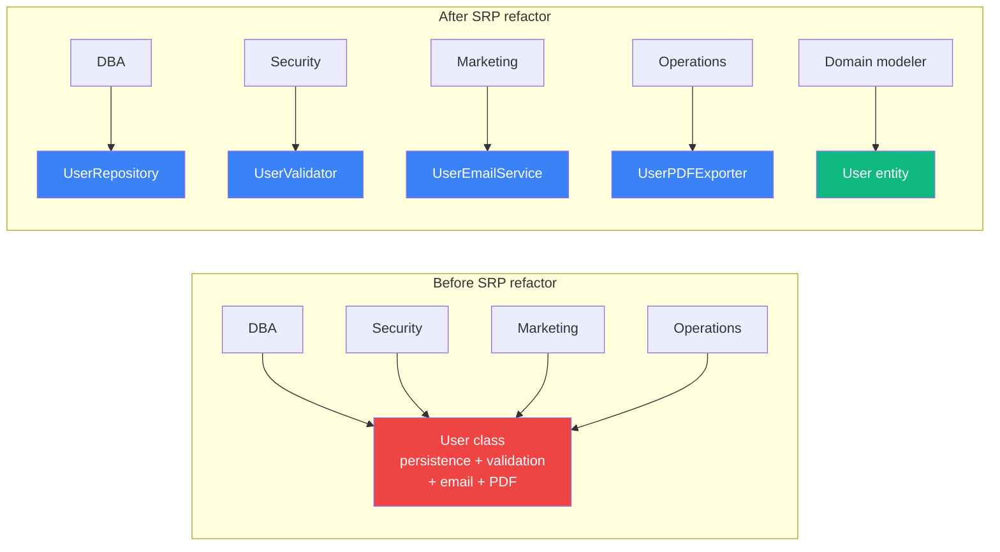
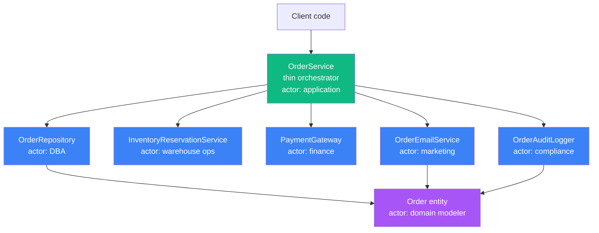

# 4.01 SOLID Single Responsibility

> A class should have one, and only one, reason to change. That reason is always an actor: a group of stakeholders who want the class to evolve for their purposes. Mastering SRP means learning to see the invisible actors hiding inside every fat class, and the courage to split them apart before the next merge conflict arrives.

## 1. Purpose

The Single Responsibility Principle is the first letter of SOLID, the five-design-principle acronym coined by Robert C. Martin (Uncle Bob) in the early two-thousands and codified in his two-thousand-two book *Agile Software Development: Principles, Patterns, and Practices*. SRP is the foundation of SOLID, because the other four principles, Open-Closed, Liskov Substitution, Interface Segregation, and Dependency Inversion, all assume that the units they operate on are already coherent. If a class mixes five responsibilities, applying OCP or DIP to it is like painting the walls of a house whose foundations are mud.

SRP exists because real software changes along multiple axes simultaneously, and those axes are driven by different people with different goals. The accounting department wants the invoice math to change because tax law changed. The operations team wants the logging format to change because they switched log aggregators. The marketing team wants the welcome email copy to change because of a rebrand. The security team wants the password policy to change because a new compliance standard landed. If all four of these concerns live inside one `User` class, every change touches the same file, every merge has a higher chance of conflict, every regression ripples across unrelated features, and every developer opening the file has to load the entire mental model of four teams into their head before they can safely edit a single line.

The classical statement of SRP is deceptively simple: *a class should have one, and only one, reason to change*. The trouble with this phrasing is that "reason to change" is ambiguous. Novices read it as "a class should do one thing," and they are wrong. The principle is not about counting methods. It is about counting actors. An actor is a group of stakeholders, a single person or team or external system, whose interest in the class is cohesive. If two different actors would both, independently, file a change request against the same class for unrelated reasons, the class has two responsibilities and violates SRP. If only one actor ever files change requests against the class, the class has one responsibility and satisfies SRP, even if it has forty methods.

What SRP prevents, concretely, is the slow accumulation of unrelated concerns inside a single class. Without SRP, codebases evolve toward God classes: the `UserService` that has eight hundred lines, forty methods, and knows about the database, the email server, the PDF library, the audit log, the cache, the feature flag system, and the rate limiter. When marketing asks for a tweak to the welcome email subject line, the developer touches `UserService.sendWelcomeEmail`, breaks an unrelated password-hashing test, and ships a regression that costs an hour of downtime. SRP prevents this by insisting that the welcome email logic live in a class whose only actor is marketing, and that the password hashing logic live in a class whose only actor is security. Then a marketing change cannot, by construction, ripple into security code.

SRP also prevents merge conflicts. When a class serves one actor, only that actor's representatives edit it. Two developers on the same team are likely coordinating already, so their changes are sequenced rather than collided. Two developers on different teams never touch the same file, because the file only contains one of the actors' concerns. Merge conflicts are not really a version control problem. They are an SRP problem. A codebase with high SRP compliance has dramatically fewer merge conflicts, because the file boundaries align with the team boundaries.

What SRP is **not**: SRP is not "a class should do one thing." A class can do many related things and still satisfy SRP, as long as all those things serve one actor and change for one set of reasons. A `List` class with `add`, `remove`, `get`, `set`, `slice`, `sort`, and `reverse` has many methods but one actor (the developer using the list as a data structure) and satisfies SRP. A `User` class that validates its own email, persists itself, sends its own welcome email, and exports itself to PDF has four methods that look small but serve four actors, and it violates SRP. The naive count of methods is irrelevant. The count of actors is everything.

The misunderstanding matters because it produces two opposite failure modes. The first is the God class, where developers take "SRP is not about counting methods" as license to add everything to one class. The second is the over-engineered codebase, where developers take "SRP is about one thing per class" literally and split `List` into `ListAdder`, `ListRemover`, `ListGetter`, `ListSetter`, and `ListIterator`. Both are wrong. The right question is always: who is the actor for this class, and is there more than one?

The purpose of this note is to give you a complete, predictable mental model of SRP. By the end you should be able to look at any class and name its actor in one sentence. You should be able to spot SRP violations in seconds by asking "who would file a change request against this class, and for what reasons?" You should be able to refactor a God class into focused classes without over-splitting. You should know precisely when to apply SRP aggressively and when to leave a cohesive class alone.

## 2. Theory and Deep Dive

### 2.1 The Actor Concept

The single most important idea in SRP is the actor. Uncle Bob redefined the principle in later writings: *a class should have one, and only one, reason to change, where a reason to change is a request from an actor*. An actor is not a user of the software in the end-user sense. An actor is a stakeholder, a group, a team, an external system, or a regulatory body, whose needs drive changes to the software.

Consider an e-commerce application. The actors include the customers (smoother checkout), the marketing team (promotions, email copy), the finance team (invoice math, tax), the operations team (logging, monitoring), the security team (auth, audit trails), the data team (events for analytics), and the legal team (privacy controls for GDPR, CCPA). Each actor will, over the lifetime of the software, file change requests. The question SRP asks is: does each class get change requests from exactly one actor, or from several?

The number of responsibilities equals the number of distinct actors that would request changes to the class. This is independent of how many methods the class has. A class with one method can violate SRP if that one method serves two actors. A class with thirty methods can satisfy SRP if all thirty methods serve one actor.

### 2.2 The Definition Restated

Robert C. Martin's restated definition, from the two-thousand-four edition of his principles papers, is: *a class should have one, and only one, reason to change, that reason being a request from one and only one actor*. The phrasing matters because "reason to change" alone is too easy to misread. A class might change because the language added a new feature, because a dependency released a breaking version, because performance regressed, or because the developer felt like cleaning it up. None of these are the "reason to change" SRP cares about. SRP cares about change requests from actors. If you cannot point to a specific actor who would request the change, the change is not an SRP concern.

The precise test: ask, "who would ask for this change?" If the answer is "the finance team, because the new tax law requires VAT to be calculated differently," that is one actor and one reason. If a class is on the receiving end of both that change request and one from marketing for the rebrand, it serves two actors and violates SRP.

### 2.3 The Canonical Violation: The Fat User Class

The textbook SRP violation is a `User` class that handles persistence, validation, email sending, and PDF export. The class looks harmless on the surface, often smaller than the God classes you see in real codebases, but it commits four actors to the same file:

1. The **DBA**, who cares about the persistence schema, column types, indexes, migration strategy, and query patterns.
2. The **security team**, who cares about password hashing, email validation, input sanitization, and credential rotation.
3. The **marketing team**, who cares about welcome emails, re-engagement emails, and the tone of communications.
4. The **operations team**, who cares about audit logs, exportable reports, and PDF invoices for accounting reconciliation.

If all four concerns live in `User`, then a schema migration by the DBA, a password policy change by security, a welcome email redesign by marketing, and a PDF layout update by ops all touch the same file. Four teams, one file, guaranteed merge conflicts.

### 2.4 The Refactoring: Split by Actor

The SRP-compliant refactor is to split the fat class into one class per actor. Each resulting class has exactly one actor and exactly one reason to change:

- `User`, the entity, holding only the in-memory representation of a user and the invariants that make a user a user. Its actor is the domain modeler.
- `UserRepository`, handling persistence. Its actor is the DBA. Changes to schema, query patterns, and storage technology land here.
- `UserValidator`, handling validation. Its actor is the security team. Changes to password strength rules, email format requirements, and input sanitization land here.
- `UserEmailService`, handling email sending. Its actor is marketing. Changes to welcome email copy, subject lines, and template selection land here.
- `UserPDFExporter`, handling PDF export. Its actor is ops. Changes to invoice layout, branding on the export, and document metadata land here.

Each class has one actor. Each class changes for one set of reasons. Merge conflicts between teams vanish, because team boundaries align with file boundaries.

### 2.5 Cohesion and Coupling

SRP drives both high cohesion and low coupling. Cohesion is the degree to which the elements of a single module belong together. Coupling is the degree to which different modules depend on each other. SRP increases cohesion by grouping things that change together (the concerns of one actor) into one module. SRP decreases coupling by separating things that change separately (the concerns of different actors) into different modules.

The heuristic is: **things that change together, stay together; things that change separately, stay separate.** If two methods in the same class are always changed in the same commit, by the same team, for the same reason, they belong together, they are cohesive. If two methods are changed in different commits, by different teams, for different reasons, they should be in different classes, they are coupled to unrelated changes.

Cohesion is measured by the ratio of methods that change together to total methods. A class where every method changes in every commit is maximally cohesive. A class where no two methods ever change in the same commit has zero cohesion. Low cohesion is an SRP smell. Coupling is measured by the number of other modules that must change when this module changes. SRP does not directly target coupling, but by separating actors, it usually also reduces coupling, because each actor's class talks to fewer other classes than the God class did.

### 2.6 Before and After SRP Refactor

The diagram below shows the structure of the fat `User` class on the left, serving four actors, and the SRP-refactored structure on the right, with one class per actor. The fat class is a single node with four colored arrows pointing at it, one per actor. The refactored structure has five nodes, each with one colored arrow.



The fat class on the left is one node with four in-edges, one per actor. The refactored structure on the right is five nodes, each with one in-edge. The visual asymmetry is the SRP signal: a node with many in-edges of different colors is a God class.

### 2.7 The Reason-to-Change Test

The operational test for SRP is the "reason to change" exercise. For each method, ask: "if this method needed to change, who would ask for the change, and why?" Group methods by their answer. If all methods have the same answer, the class satisfies SRP. If methods have different answers, the class violates SRP and should be split along the answer boundaries.

The test is most powerful when you trace through a year of git history. Open the file, look at every commit that touched it, and label each commit with the team that requested it. If you see commits from the DBA team, the security team, the marketing team, and the ops team, all on the same file, you have a God class with four actors. The fix is mechanical: extract each team's concerns into its own class.

### 2.8 SRP and Structural Boundaries

SRP draws structural boundaries in software. A boundary is a line across which a change on one side does not propagate to the other side. In a God class, there are no internal boundaries. In an SRP-compliant codebase, every actor boundary is also a class boundary, and class boundaries are also file boundaries, and file boundaries are also package boundaries if the codebase is disciplined.

The relationship between SRP and Conway's Law is direct. Conway's Law states that software structures mirror the communication structures of the organizations that produce them. SRP makes this mirroring explicit: if you have a DBA team, a security team, a marketing team, and an ops team, then your codebase should have a persistence package, a validation package, an email package, and an export package, each owned by exactly one team. SRP is the design principle that lets Conway's Law work in your favor rather than against you.

### 2.9 SRP at Different Granularities

SRP applies at every granularity: functions, classes, modules, packages, services. At each level, the unit should serve one actor and change for one reason. The principle is scale-invariant. The granularity you choose to apply SRP at depends on the cost of change. Refactoring a function is cheap. Refactoring a class is moderately expensive. Splitting a package is expensive. Splitting a service is very expensive, because it involves network boundaries, deployment pipelines, and operational ownership. The right time to apply SRP aggressively is at the class and package level, before the God class grows so large that the only fix is a service split.

### 2.10 SRP and Testability

SRP improves testability dramatically. A God class with four actors typically requires four kinds of tests, each with different fixtures, doubles, and assertions. The test file is often larger than the class itself, and a change to one actor's concern breaks unrelated tests. An SRP-compliant codebase has one focused test file per class, each covering one actor's concerns.

The testability test is a useful proxy for SRP. If you find yourself writing a test file that requires four different sets of mocks (database, email, PDF, validation) just to test one method, the class is serving four actors. Split the class, and the test file splits naturally with it.

### 2.11 SRP and the Single-Actor File Heuristic

A useful heuristic from Sandi Metz and others: a file should be readable in one sitting, ideally under one hundred lines, and should be nameable in a single noun phrase that describes one actor's concern. If the file is too long to read in one sitting, or if its name requires a conjunction (`UserPersistenceAndEmailAndPDF`), the file is serving multiple actors and violates SRP. The fix is to split the file until each file is short and singularly named.

This is a heuristic, not a rule. Some classes are legitimately long, like a parser with many productions, but they serve one actor (the language implementer) and have one reason to change (the grammar). Length alone is not an SRP violation. Length plus multiple actors is.

### 2.12 SRP and the Dependency Direction

SRP interacts with the dependency direction. A class should depend on classes that change for the same reason, or on stable abstractions that change rarely. If a class serving actor A depends on a class serving actor B, then a change to B can break A. This is acceptable if the dependency is on a stable interface owned by A, but unacceptable if the dependency is on a concrete class owned by B. This is where SRP meets the Dependency Inversion Principle, covered in [[4.05 SOLID Dependency Inversion]]. When you split a God class, the resulting classes will need to communicate, and the communication channel should be an interface owned by the consuming class, not a direct reference to the producing class.

## 3. Mental Models

### 3.1 One Class, One Actor, One Reason to Change

The simplest mental model is a triplet: one class, one actor, one reason to change. If you can fill in all three slots with a single answer (one class, named `UserRepository`, serves the DBA, changes when the schema changes), the class satisfies SRP. If you have to use "and" in any slot (one class, named `User`, serves the DBA *and* marketing, changes when the schema changes *and* when the rebrand happens), the class violates SRP.

This model is the entry point. It works for ninety percent of cases. It fails when the actor is hard to name, or when the actor is a meta-stakeholder like "the future maintainer" or "the framework author." For those cases, switch to the next model.

### 3.2 The Conjunction Test

The conjunction test is the operational form of the triplet. Read the class name, then read the list of methods, then ask: "this class is responsible for X and Y and Z." If you can stop at X, you satisfy SRP. If you need to chain with "and," you violate SRP. The number of "and"s is the number of actors minus one.

The conjunction test is brutally honest. A class named `User` with methods `save`, `validate`, `sendWelcomeEmail`, and `exportToPDF` is responsible for persistence and validation and email and PDF. Four responsibilities, four actors, one God class.

### 3.3 The Committee Metaphor

A class is like a committee. A committee with one member makes decisions quickly. A committee with five members from five different departments spends most of its time negotiating. A God class is a committee with five members: the DBA, the security person, the marketing lead, the ops engineer, and the domain expert. Every change is a five-person meeting. An SRP-compliant class is a committee with one member, who decides and acts.

### 3.4 The Color-Coded Source File

Imagine every actor has a color. DBA is blue. Security is red. Marketing is yellow. Ops is green. Domain is purple. Each line of source code is colored by the actor who would request a change to that line. A class that satisfies SRP is monochromatic. A class that violates SRP is a rainbow. The goal of SRP refactoring is to make every source file monochromatic.

This model survives edge cases that the triplet does not. A method can serve one actor and have many lines; that is fine, the lines are all one color. The model breaks down only when an actor is hard to identify, which is itself a signal that the code is unclear about who it serves.

### 3.5 The Filing Cabinet

A codebase is a filing cabinet. Each drawer is a package. Each folder is a class. Each document is a method. A well-organized filing cabinet has one drawer per team: the DBA drawer, the security drawer, the marketing drawer. A God class is a single folder stuffed with documents from every team. The metaphor captures the cognitive cost of God classes: they force every reader to load the concerns of every team into their head, even when they only care about one team's work.

### 3.6 The Department Store vs. the Boutique

A God class is a department store. It sells everything to everyone. It is convenient for the store operator (one building, one utility bill, one set of staff) but inconvenient for the customer. An SRP-compliant class is a boutique. It sells one thing to one kind of customer. The boutique is small, focused, and easy to change. Splitting a God class is like converting a department store into a row of boutiques: the conversion is expensive but the result is easier to operate and easier to change.

### 3.7 Where the Models Break Down

The models break down in three cases. First, when the actor is "the framework" or "the language," SRP is hard to apply because the actor is not a human team. In these cases, fall back to the cohesion test: are all the methods in this class cohesive around one concern? Second, when the class is a pure data transfer object with no behavior, SRP is trivially satisfied because there is no behavior to assign to an actor. Do not over-think DTOs. Third, when the class is a façade that intentionally aggregates multiple actors for the convenience of a caller, the façade itself serves the caller's actor, not the underlying actors. This is acceptable as long as the façade is thin and the underlying classes are SRP-compliant. See [[4.04 SOLID Interface Segregation]] for the façade pattern.

## 4. Real-World Use Cases

### 4.1 Fat Controllers in Web Frameworks

The single most common SRP violation in real codebases is the fat controller. A controller in Express, Fastify, NestJS, or any web framework is supposed to translate HTTP requests into application calls and translate application responses back into HTTP. Its actor is the API consumer. Its reason to change is the API contract.

In practice, controllers accumulate business logic, database queries, email sends, file uploads, and PDF generation. The actor becomes "the API consumer and the DBA and marketing and ops." Every change ripples through the controller. The fix is to extract business logic into a service layer, persistence into a repository, email into a notifier, and so on. The controller should be left with only HTTP-related concerns: parsing the request, calling the service, formatting the response.

### 4.2 God Objects in Legacy Codebases

God objects are the dominant SRP violation in legacy codebases. A God object knows about everything: persistence, business rules, external integrations, logging, caching, configuration. The canonical example is a `UserService` or `OrderService` with hundreds of methods. Its actor is "everyone."

God objects are created by accretion: each new feature adds a method, because the God object already has access to everything the feature needs. The fix is the extract class refactoring, covered in [[4.13 Refactoring Techniques]]: identify the actors, extract each actor's methods into a focused class, and let the God object delegate. Over a series of refactoring commits, the God object shrinks until it can be deleted.

### 4.3 Mixing Business Logic and Infrastructure

A subtle SRP violation is the mixing of business logic with infrastructure concerns. A `PricingService` that calculates prices, persists them, and emits events is mixing the business actor (the pricing analyst) with the infrastructure actor (the platform engineer who owns the database and the message queue). The fix is to separate the pricing calculation (business) from the pricing persistence and event emission (infrastructure). The pricing calculation stays in `PricingService`; the persistence and event emission move to a `PricingRepository` and a `PricingEventPublisher`.

This pattern is the core of Clean Architecture and Hexagonal Architecture, covered in [[4.09 Clean and Onion Architecture]]. The boundary between business and infrastructure is the most important SRP boundary in a codebase, because it lets business logic be tested without infrastructure and lets infrastructure be swapped without touching business logic.

### 4.4 Mixing Domain and UI

A classic SRP violation in older codebases is mixing domain logic with UI rendering. A `User` class that knows how to render itself as HTML, or a `Product` class that knows how to render itself as a JSON response, is mixing the domain actor with the UI actor. The fix is to move rendering out of the domain class into a separate renderer or serializer.

Modern frameworks usually enforce this separation. React components do not contain domain logic; they call services. NestJS controllers do not contain domain logic; they call services. But the pattern still appears in template engines that allow domain methods to be called from templates, and in monolithic frameworks that encourage domain classes to implement a `toJSON` method that grows over time to include UI concerns.

### 4.5 Library Design: One Module, One Job

In library design, SRP is the principle behind the Unix philosophy: each module should do one job and do it well. The npm ecosystem exemplifies this. Small, focused packages like `lodash`, `date-fns`, `zod`, `pino` each do one job. Large, do-everything packages like `moment` (in its original form) accumulated multiple actors, dates, timezones, durations, formatting, parsing, and became hard to maintain and hard to tree-shake. The fix in `moment`'s case was a complete rewrite as a collection of smaller packages, which is the SRP refactor at the package level.

### 4.6 Configuration Objects

A common SRP violation in Node applications is the configuration object that knows how to load itself from environment variables, validate itself, and provide typed accessors. The actor for loading is operations. The actor for validation is security. The actor for typed access is the application developer. Three actors, one class. The fix is to split into `ConfigLoader` (ops), `ConfigValidator` (security), and a `Config` value object (application developer). The `Config` value object is constructed by the loader after validation and handed to the application.

### 4.7 The Audit Log Cross-Cutting Concern

Audit logging is a cross-cutting concern that often ends up inside every business class. A `UserService` that audits every method call is mixing the application actor with the compliance actor. The fix is to extract the audit logic into an `AuditLogger` class whose actor is compliance, and to invoke it from a thin wrapper or middleware that does not pollute the business class. This is the same pattern as extracting logging, metrics, and tracing into their own modules. See [[4.08 Dependency Injection DI]] for how to wire these cross-cutting concerns without polluting business classes.

### 4.8 Feature Flag Services

Feature flag services often end up mixed with business logic. A `CheckoutService` that checks a feature flag for every step is mixing the business actor with the experimentation actor (the growth team running A/B tests). The fix is to extract the feature flag checks into a `FeatureFlagService` whose actor is the growth team, and to let the `CheckoutService` depend on it through a stable interface. When the growth team changes their flag provider, the `CheckoutService` does not change, only the `FeatureFlagService` implementation changes. This is SRP plus DIP working together.

## 5. Code Examples

### 5.1 Example A — Minimal and Conceptual

The minimal example is a fat `User` class that handles persistence, validation, email, and PDF export. We show the violating form first, then the SRP-refactored form, in both JavaScript and TypeScript. The point of this example is to make the four-actor violation visible and to show the mechanical extraction of each actor into its own class.

**JavaScript — violating form:**

```javascript
// fat-user.js — violates SRP by serving four actors in one class.
class User {
  constructor({ id, email, password }) {
    this.id = id; this.email = email; this.password = password;
  }
  // Actor: DBA — persistence concern.
  async save(db) {
    await db.query("INSERT INTO users (id, email, password) VALUES (?, ?, ?)", [this.id, this.email, this.password]);
  }
  // Actor: Security — validation concern.
  isValid() {
    return typeof this.email === "string" && this.email.includes("@") && typeof this.password === "string" && this.password.length >= 12;
  }
  // Actor: Marketing — email concern.
  async sendWelcomeEmail(mailer) {
    await mailer.send({ to: this.email, subject: "Welcome aboard!", body: `Hello ${this.email}, thanks for signing up.` });
  }
  // Actor: Operations — PDF export concern.
  async exportToPDF(pdfLibrary) {
    const doc = pdfLibrary.create();
    doc.text(`User Report\nID: ${this.id}\nEmail: ${this.email}`);
    return doc.end();
  }
}
module.exports = { User };
```

**TypeScript — violating form:**

```typescript
// fat-user.ts — violates SRP by serving four actors in one class.

interface UserRecord { id: string; email: string; password: string; }
interface Database {
  query(sql: string, params: ReadonlyArray<unknown>): Promise<unknown>;
}
interface Mailer {
  send(message: { to: string; subject: string; body: string }): Promise<void>;
}
interface PDFLibrary {
  create(): { text(content: string): void; end(): Promise<Buffer> };
}

class User {
  constructor(
    public readonly id: string,
    public readonly email: string,
    public readonly password: string,
  ) {}

  // Actor: DBA — persistence concern.
  async save(db: Database): Promise<void> {
    await db.query(
      "INSERT INTO users (id, email, password) VALUES (?, ?, ?)",
      [this.id, this.email, this.password],
    );
  }

  // Actor: Security — validation concern.
  isValid(): boolean {
    return this.email.includes("@") && this.password.length >= 12;
  }

  // Actor: Marketing — email concern.
  async sendWelcomeEmail(mailer: Mailer): Promise<void> {
    await mailer.send({
      to: this.email,
      subject: "Welcome aboard!",
      body: `Hello ${this.email}, thanks for signing up.`,
    });
  }

  // Actor: Operations — PDF export concern.
  async exportToPDF(pdfLibrary: PDFLibrary): Promise<Buffer> {
    const doc = pdfLibrary.create();
    doc.text(`User Report\nID: ${this.id}\nEmail: ${this.email}`);
    return doc.end();
  }
}
```

The violating form has four methods that serve four different actors. A schema change by the DBA, a password policy change by security, a welcome email redesign by marketing, and a PDF layout change by ops all touch the same file. That is the SRP violation, regardless of how small the class is.

**JavaScript — SRP-refactored form:**

```javascript
// user-entity.js — actor: domain modeler.
class User {
  constructor({ id, email, password }) {
    if (typeof id !== "string") throw new Error("id must be a string");
    if (typeof email !== "string") throw new Error("email must be a string");
    this.id = id;
    this.email = email;
    this.password = password;
  }
}

// user-repository.js — actor: DBA.
class UserRepository {
  constructor(db) {
    this.db = db;
  }

  async save(user) {
    const sql = "INSERT INTO users (id, email, password) VALUES (?, ?, ?)";
    await this.db.query(sql, [user.id, user.email, user.password]);
  }

  async findById(id) {
    const sql = "SELECT id, email, password FROM users WHERE id = ?";
    const rows = await this.db.query(sql, [id]);
    return rows[0] ? new User(rows[0]) : null;
  }
}

// user-validator.js — actor: security.
class UserValidator {
  isValid(user) {
    return (
      typeof user.email === "string" &&
      user.email.includes("@") &&
      typeof user.password === "string" &&
      user.password.length >= 12
    );
  }
}

// user-email-service.js — actor: marketing.
class UserEmailService {
  constructor(mailer) {
    this.mailer = mailer;
  }

  async sendWelcome(user) {
    await this.mailer.send({
      to: user.email,
      subject: "Welcome aboard!",
      body: `Hello ${user.email}, thanks for signing up.`,
    });
  }
}

// user-pdf-exporter.js — actor: operations.
class UserPDFExporter {
  constructor(pdfLibrary) {
    this.pdfLibrary = pdfLibrary;
  }

  async export(user) {
    const doc = this.pdfLibrary.create();
    doc.text(`User Report\nID: ${user.id}\nEmail: ${user.email}`);
    return doc.end();
  }
}

module.exports = {
  User,
  UserRepository,
  UserValidator,
  UserEmailService,
  UserPDFExporter,
};
```

**TypeScript — SRP-refactored form:**

```typescript
// user-entity.ts — actor: domain modeler.
class User {
  constructor(
    public readonly id: string,
    public readonly email: string,
    public readonly password: string,
  ) {
    if (typeof id !== "string") throw new Error("id must be a string");
    if (typeof email !== "string") throw new Error("email must be a string");
  }
}

// user-repository.ts — actor: DBA.
interface Database {
  query<T = unknown>(sql: string, params: ReadonlyArray<unknown>): Promise<ReadonlyArray<T>>;
}
interface UserRecord { id: string; email: string; password: string; }

class UserRepository {
  constructor(private readonly db: Database) {}

  async save(user: User): Promise<void> {
    await this.db.query(
      "INSERT INTO users (id, email, password) VALUES (?, ?, ?)",
      [user.id, user.email, user.password],
    );
  }

  async findById(id: string): Promise<User | null> {
    const rows = await this.db.query<UserRecord>(
      "SELECT id, email, password FROM users WHERE id = ?",
      [id],
    );
    const row = rows[0];
    return row ? new User(row.id, row.email, row.password) : null;
  }
}

// user-validator.ts — actor: security.
class UserValidator {
  isValid(user: User): boolean {
    return user.email.includes("@") && user.password.length >= 12;
  }
}

// user-email-service.ts — actor: marketing.
interface Mailer {
  send(message: { to: string; subject: string; body: string }): Promise<void>;
}

class UserEmailService {
  constructor(private readonly mailer: Mailer) {}

  async sendWelcome(user: User): Promise<void> {
    await this.mailer.send({
      to: user.email,
      subject: "Welcome aboard!",
      body: `Hello ${user.email}, thanks for signing up.`,
    });
  }
}

// user-pdf-exporter.ts — actor: operations.
interface PDFLibrary {
  create(): { text(content: string): void; end(): Promise<Buffer> };
}

class UserPDFExporter {
  constructor(private readonly pdfLibrary: PDFLibrary) {}

  async export(user: User): Promise<Buffer> {
    const doc = this.pdfLibrary.create();
    doc.text(`User Report\nID: ${user.id}\nEmail: ${user.email}`);
    return doc.end();
  }
}
```

The refactored form has five classes, each serving exactly one actor. The `User` entity is a pure data holder with construction-time invariants. `UserRepository` handles persistence and is owned by the DBA. `UserValidator` handles validation and is owned by security. `UserEmailService` handles welcome emails and is owned by marketing. `UserPDFExporter` handles PDF export and is owned by ops. A change request from any one of these actors touches exactly one file.

### 5.2 Example B — Production-Grade

The production-grade example is a typed user-management system that goes beyond the minimal example by including: a fully typed `User` entity with value-object semantics, a `UserRepository` with both SQL and in-memory implementations behind a common interface, a `UserValidator` with composable rules, a `UserEmailService` with template selection and failure retry, a `UserPDFExporter` with brand-aware document assembly, and an orchestration layer that wires them together without any of them knowing about each other directly.

**JavaScript — production-grade:**

```javascript
// user-management.js — production-grade SRP-compliant user management.

// Actor: domain modeler.
class User {
  constructor({ id, email, passwordHash, createdAt }) {
    if (!id || typeof id !== "string") throw new Error("User requires a string id");
    if (!email || typeof email !== "string") throw new Error("User requires a string email");
    this.id = id;
    this.email = email;
    this.passwordHash = passwordHash;
    this.createdAt = createdAt ?? new Date();
  }

  withEmail(newEmail) {
    return new User({ id: this.id, email: newEmail, passwordHash: this.passwordHash, createdAt: this.createdAt });
  }
}

// Actor: security.
class UserValidator {
  constructor(rules = []) { this.rules = rules; }
  validate(user) {
    return this.rules.map((rule) => rule(user)).filter(Boolean);
  }
  isValid(user) { return this.validate(user).length === 0; }
}

const emailFormatRule = (user) => (user.email.includes("@") ? null : "email must contain @");
const passwordStrengthRule = (user) =>
  user.passwordHash.length >= 16 ? null : "password hash must be at least 16 characters";

// Actor: DBA.
class SqlUserRepository {
  constructor(db, tableName = "users") { this.db = db; this.tableName = tableName; }

  async save(user) {
    const sql = `INSERT INTO ${this.tableName} (id, email, passwordHash, createdAt) VALUES (?, ?, ?, ?)`;
    await this.db.query(sql, [user.id, user.email, user.passwordHash, user.createdAt]);
  }

  async findById(id) {
    const sql = `SELECT id, email, passwordHash, createdAt FROM ${this.tableName} WHERE id = ?`;
    const rows = await this.db.query(sql, [id]);
    return rows[0] ? new User(rows[0]) : null;
  }

  async updateEmail(id, newEmail) {
    await this.db.query(`UPDATE ${this.tableName} SET email = ? WHERE id = ?`, [newEmail, id]);
  }
}

class InMemoryUserRepository {
  constructor() { this.store = new Map(); }
  async save(user) { this.store.set(user.id, user); }
  async findById(id) { return this.store.get(id) ?? null; }
  async updateEmail(id, newEmail) {
    const existing = this.store.get(id);
    if (existing) this.store.set(id, existing.withEmail(newEmail));
  }
}

// Actor: marketing.
class UserEmailService {
  constructor(mailer, templates) { this.mailer = mailer; this.templates = templates; }

  async sendWelcome(user, attempt = 1) {
    const t = this.templates.welcome;
    try {
      await this.mailer.send({
        to: user.email,
        subject: t.subject,
        body: t.body.replace("{{email}}", user.email),
      });
    } catch (error) {
      if (attempt >= 3) throw error;
      await new Promise((r) => setTimeout(r, 2 ** attempt * 100));
      await this.sendWelcome(user, attempt + 1);
    }
  }
}

// Actor: operations.
class UserPDFExporter {
  constructor(pdfLibrary, branding) { this.pdfLibrary = pdfLibrary; this.branding = branding; }
  async export(user) {
    const doc = this.pdfLibrary.create();
    doc.text(this.branding.companyName);
    doc.text(`User Report — ${user.id}`);
    doc.text(`Email: ${user.email}`);
    doc.text(`Member since: ${user.createdAt.toISOString()}`);
    return doc.end();
  }
}

// Actor: application orchestrator (wire-only).
class UserSignupService {
  constructor({ repository, validator, emailService, hasher }) {
    this.repository = repository;
    this.validator = validator;
    this.emailService = emailService;
    this.hasher = hasher;
  }

  async signup({ id, email, password }) {
    const passwordHash = await this.hasher.hash(password);
    const user = new User({ id, email, passwordHash });
    const errors = this.validator.validate(user);
    if (errors.length > 0) throw new Error(`Validation failed: ${errors.join("; ")}`);
    await this.repository.save(user);
    await this.emailService.sendWelcome(user);
    return user;
  }
}

module.exports = {
  User, UserValidator, emailFormatRule, passwordStrengthRule,
  SqlUserRepository, InMemoryUserRepository, UserEmailService, UserPDFExporter, UserSignupService,
};
```

**TypeScript — production-grade:** The TypeScript version adds explicit interfaces and typed method signatures to the JavaScript structure. The class structure is identical; only the type annotations differ. The key interfaces, the entity, and the orchestrator are shown below.

```typescript
// user-management.ts — production-grade SRP-compliant user management.

interface UserRecord {
  readonly id: string;
  readonly email: string;
  readonly passwordHash: string;
  readonly createdAt: Date;
}
interface Database {
  query<T = unknown>(sql: string, params: ReadonlyArray<unknown>): Promise<ReadonlyArray<T>>;
}
interface UserRepository {
  save(user: User): Promise<void>;
  findById(id: string): Promise<User | null>;
  updateEmail(id: string, newEmail: string): Promise<void>;
}
interface Mailer { send(message: { to: string; subject: string; body: string }): Promise<void>; }
interface EmailTemplates { readonly welcome: { readonly subject: string; readonly body: string }; }
interface PDFLibrary { create(): { text(s: string): void; end(): Promise<Buffer> }; }
interface Branding { readonly companyName: string; readonly accentColor: string; }
interface PasswordHasher { hash(password: string): Promise<string>; }
type ValidationRule = (user: User) => string | null;

class User implements UserRecord {
  public readonly createdAt: Date;
  constructor(
    public readonly id: string,
    public readonly email: string,
    public readonly passwordHash: string,
    createdAt?: Date,
  ) {
    if (!id) throw new Error("User requires a string id");
    if (!email) throw new Error("User requires a string email");
    this.createdAt = createdAt ?? new Date();
  }
  withEmail(newEmail: string): User {
    return new User(this.id, newEmail, this.passwordHash, this.createdAt);
  }
}

class UserValidator {
  constructor(private readonly rules: ReadonlyArray<ValidationRule> = []) {}
  validate(user: User): ReadonlyArray<string> {
    return this.rules.map((rule) => rule(user)).filter((r): r is string => r !== null);
  }
  isValid(user: User): boolean { return this.validate(user).length === 0; }
}

const emailFormatRule: ValidationRule = (user) =>
  user.email.includes("@") ? null : "email must contain @";
const passwordStrengthRule: ValidationRule = (user) =>
  user.passwordHash.length >= 16 ? null : "password hash must be at least 16 characters";

class SqlUserRepository implements UserRepository {
  constructor(private readonly db: Database, private readonly tableName = "users") {}
  async save(user: User): Promise<void> {
    const sql = `INSERT INTO ${this.tableName} (id, email, passwordHash, createdAt) VALUES (?, ?, ?, ?)`;
    await this.db.query(sql, [user.id, user.email, user.passwordHash, user.createdAt]);
  }
  async findById(id: string): Promise<User | null> {
    const rows = await this.db.query<UserRecord>(
      `SELECT id, email, passwordHash, createdAt FROM ${this.tableName} WHERE id = ?`, [id],
    );
    const row = rows[0];
    return row ? new User(row.id, row.email, row.passwordHash, row.createdAt) : null;
  }
  async updateEmail(id: string, newEmail: string): Promise<void> {
    await this.db.query(`UPDATE ${this.tableName} SET email = ? WHERE id = ?`, [newEmail, id]);
  }
}

class InMemoryUserRepository implements UserRepository {
  private readonly store = new Map<string, User>();
  async save(user: User): Promise<void> { this.store.set(user.id, user); }
  async findById(id: string): Promise<User | null> { return this.store.get(id) ?? null; }
  async updateEmail(id: string, newEmail: string): Promise<void> {
    const existing = this.store.get(id);
    if (existing) this.store.set(id, existing.withEmail(newEmail));
  }
}

class UserEmailService {
  constructor(private readonly mailer: Mailer, private readonly templates: EmailTemplates) {}
  async sendWelcome(user: User, attempt = 1): Promise<void> {
    const t = this.templates.welcome;
    try {
      await this.mailer.send({
        to: user.email,
        subject: t.subject,
        body: t.body.replace("{{email}}", user.email),
      });
    } catch (error) {
      if (attempt >= 3) throw error;
      await new Promise((r) => setTimeout(r, 2 ** attempt * 100));
      await this.sendWelcome(user, attempt + 1);
    }
  }
}

class UserPDFExporter {
  constructor(private readonly pdfLibrary: PDFLibrary, private readonly branding: Branding) {}
  async export(user: User): Promise<Buffer> {
    const doc = this.pdfLibrary.create();
    doc.text(this.branding.companyName);
    doc.text(`User Report — ${user.id}`);
    doc.text(`Email: ${user.email}`);
    doc.text(`Member since: ${user.createdAt.toISOString()}`);
    return doc.end();
  }
}

interface SignupDependencies {
  readonly repository: UserRepository;
  readonly validator: UserValidator;
  readonly emailService: UserEmailService;
  readonly hasher: PasswordHasher;
}

class UserSignupService {
  constructor(private readonly deps: SignupDependencies) {}
  async signup(request: { readonly id: string; readonly email: string; readonly password: string }): Promise<User> {
    const passwordHash = await this.deps.hasher.hash(request.password);
    const user = new User(request.id, request.email, passwordHash, new Date());
    const errors = this.deps.validator.validate(user);
    if (errors.length > 0) throw new Error(`Validation failed: ${errors.join("; ")}`);
    await this.deps.repository.save(user);
    await this.deps.emailService.sendWelcome(user);
    return user;
  }
}
```

The production-grade TypeScript version highlights several SRP-relevant decisions. The `UserRepository` is exposed through an interface, so the SQL implementation can be swapped for the in-memory implementation without touching the orchestration code. The `UserValidator` accepts a list of rules, so new rules can be added without modifying the validator class itself, which keeps the validator serving only the security actor. The `UserEmailService` owns retry logic because retry is a marketing-actor concern (marketing cares whether the welcome email actually arrived). The `UserSignupService` orchestrator is wire-only: it constructs objects and calls them in order, but it contains no business logic of its own, so it does not introduce a new actor.

## 6. Common Mistakes and Anti-Patterns

### 6.1 Misunderstanding SRP as "One Method per Class"

The most common mistake is reading SRP as "a class should do one thing" and then splitting every method into its own class (`UserSaver`, `UserFinder`, `UserEmailer`, each with one method). The cognitive overhead of navigating these fragments is higher than the overhead of the original God class.

**Why it fails:** SRP is about actors, not methods. A class with one actor and many methods satisfies SRP. The number of methods is irrelevant.

**Fix:** Count actors, not methods. If all methods serve the same actor, leave them together. If methods serve different actors, split along actor boundaries.

### 6.2 Splitting Too Aggressively (Over-Engineering)

The mirror mistake is splitting a class that does not need splitting. A `List` class with `add`, `remove`, `get`, `set`, `slice`, `sort`, and `reverse` serves one actor. Splitting it into `ListAdder`, `ListRemover`, `ListSorter` is over-engineering: each split class still serves the same actor.

**Why it fails:** The split does not align with actor boundaries. The resulting classes are still changed for the same reasons, by the same teams, in the same commits.

**Fix:** Use the "reason to change" test. If the methods in a class all change for the same reason, leave them together. When in doubt, do not split; wait until you actually see a change request that touches only some of the methods, then split along that boundary.

### 6.3 Ignoring Actors and Splitting by Feature Instead

A subtle mistake is splitting a class by feature rather than by actor. A developer might split a fat `UserService` into `UserServiceForSignup` and `UserServiceForLogin`, on the theory that signup and login are different features. But signup and login are both changed by the same security team for the same authentication-policy reasons. The split does not align with actor boundaries.

**Why it fails:** The split aligns with feature names rather than with stakeholders. Two features can serve the same actor.

**Fix:** Identify the actor for each method. Group methods by actor, not by feature. Two features that serve the same actor belong in the same class. One feature that serves two actors belongs in two classes.

### 6.4 Mixing Business Logic and Infrastructure

A common mistake is leaving business logic and infrastructure in the same class. A `PricingService` that calculates prices, persists them, and emits events is mixing the business actor with the infrastructure actor. A database migration touches the pricing formula file, which is a merge-conflict risk between two teams.

**Why it fails:** The business actor and the infrastructure actor are different stakeholders with different change cadences.

**Fix:** Separate business logic from infrastructure. The business class contains only calculations and invariants. The infrastructure classes contain persistence, messaging, and external calls. The business class depends on infrastructure through interfaces. See [[4.09 Clean and Onion Architecture]] for the full pattern.

### 6.5 God Classes

The God class is the canonical SRP anti-pattern. A God class accumulates responsibilities over time until it serves every actor in the system. God classes are usually created by accretion: each new feature adds a method, because the God class already has access to everything the feature needs.

**Why it fails:** Every change touches the God class. Every team's commits collide on it. Every test requires mocking every external dependency. The God class becomes the bottleneck of the entire codebase.

**Fix:** Identify the actors served by the God class. Extract each actor's methods into a focused class. Replace the original methods with delegating calls. Over a series of refactoring commits, the God class shrinks until it can be deleted or until it becomes a thin façade. See [[4.13 Refactoring Techniques]] for the extract-class refactoring.

### 6.6 "I'll Just Add One More Method" Creep

God classes are built one method at a time. The mistake is the rationalization: "this method is small, and it's related to the existing methods, so I'll just add it to the same class." Each individual addition seems harmless. The accumulation is what produces the God class.

**Why it fails:** Each addition introduces a new actor or strengthens an existing secondary actor. The class slowly shifts from "serves one actor" to "serves many actors," invisibly at the method level.

**Fix:** Before adding a method to an existing class, ask: "does this method serve the same actor as the existing methods?" If different, extract a new class. If unsure, add it but flag for review. Track the actors in a comment at the top of the class.

### 6.7 Static Utility Classes That Mix Actors

A `UserUtils` class with `static isValidEmail`, `static hashPassword`, `static formatUserName`, and `static generatePasswordResetLink` is mixing the security actor with the UI actor with the application actor. The "Utils" suffix is a smell that the developer could not name the actor.

**Why it fails:** The "Utils" name hides the actor. Methods serving different actors coexist without a clear boundary.

**Fix:** Never use "Utils" as a suffix. Split into focused classes named after their actors: `EmailValidator`, `PasswordHasher`, `UserNameFormatter`, `PasswordResetTokenGenerator`.

### 6.8 Putting Logging, Metrics, and Tracing Inside Business Classes

A subtle SRP violation is putting observability concerns directly inside business classes. A `OrderService` that calls `logger.info`, `metrics.increment`, and `tracer.span` inside every method is mixing the business actor with the observability actor (the platform team that owns logging infrastructure).

**Why it fails:** Observability is a cross-cutting concern with its own actor. Embedding it in business classes couples business changes to observability changes.

**Fix:** Extract observability into its own modules. Use middleware, decorators, or interceptors to apply observability without modifying business classes. The business class should not know about logging or metrics.

### 6.9 Mixing Serialization with Domain Logic

A common mistake in REST APIs is putting serialization logic on the domain class. A `User` class with a `toJSON` method that produces the API response shape is mixing the domain actor with the API actor. When the front-end asks for a new field in the response, the change touches the domain class.

**Why it fails:** The serialization shape is driven by API consumers, not by domain invariants. Coupling them means API changes ripple into domain code.

**Fix:** Move serialization into a separate `UserSerializer` or use a presentation layer that maps domain objects to response shapes. See [[4.04 SOLID Interface Segregation]] for the segregation of presentation concerns.

### 6.10 Configuration Classes That Load, Validate, and Expose

A common Node.js mistake is a configuration class that loads itself from environment variables, validates itself, and exposes typed accessors, all in one class. The actor for loading is the operations team. The actor for validation is the security team. The actor for typed access is the application developer. Three actors, one class.

**Why it fails:** When operations changes the deployment environment, they touch the same file as security when they change the secrets policy, and the same file as the application developer when they add a new config field.

**Fix:** Split into `ConfigLoader` (operations), `ConfigValidator` (security), and a `Config` value object (application developer). The loader reads the environment, the validator checks the result, and the `Config` value object is handed to the application as a read-only typed object.

## 7. Best Practices and Design Patterns

### 7.1 Identify the Actor for Each Class

Before writing or modifying a class, name its actor in one sentence. If you cannot name the actor in one sentence, you do not yet understand the class's responsibility, and you are at risk of building a God class. Write the actor name in a comment at the top of the class file, so future readers know whom the class serves.

### 7.2 Split When a Class Serves Multiple Actors

When you discover that a class serves multiple actors, split it. The split should align with actor boundaries: one class per actor. The split is mechanical: extract methods, extract dependencies, extract tests. The hardest part is identifying the actors, not the extraction itself.

### 7.3 Group by Actor, Not by Feature

When organizing a package or module, you can group classes by actor or by feature. Feature grouping (a `users` package with `User`, `UserRepository`, `UserValidator`, `UserEmailService`, `UserPDFExporter`) is fine for navigation. Actor grouping (a `persistence` package with `UserRepository`, `OrderRepository`, `ProductRepository`) is better for ownership and merge-conflict reduction: the DBA team owns the `persistence` package, the security team owns the `validation` package, and so on. Use whichever fits your organization, but be consistent.

### 7.4 Use the "Reason to Change" Test

For each method in a class, ask: "if this method needed to change, who would ask for the change, and why?" Group methods by their answer. If all methods have the same answer, the class satisfies SRP. If methods have different answers, the class violates SRP. Do this exercise periodically, not just when refactoring. It is the cheapest way to catch SRP violations before they become God classes.

### 7.5 Refactor When Adding the Nth Responsibility

A practical rule: when you are about to add the second responsibility to a class, refactor first. Extract the existing responsibility into its own class, then add the new responsibility as its own class. This prevents the second responsibility from accreting into the first. The rule is conservative, but the cost of early refactoring is much lower than the cost of letting a God class grow. Some teams use a threshold of three responsibilities before refactoring, on the theory that two responsibilities are often still cohesive. Never let the threshold go above three.

### 7.6 Avoid Premature Splitting

SRP is a refactoring principle, not a design principle. Do not split a class before you have evidence that it serves multiple actors. Start with a cohesive class. Add methods as needed. When you discover that the class is receiving change requests from two different actors, split it then. Premature splitting produces over-engineered codebases with too many small classes and too much indirection.

The exception is when you have prior knowledge that a class will serve multiple actors. If you are building a class that you know will be touched by the DBA, security, marketing, and ops teams, design it split from the start. Without prior knowledge, wait for evidence.

### 7.7 Use Interfaces to Decouple Actors

When two actor-owned classes need to communicate, use an interface owned by the consuming class. The `UserSignupService` (application actor) depends on `UserRepository` (DBA actor) through an interface that the application owns. The DBA team provides implementations of that interface. This is the Dependency Inversion Principle, covered in [[4.05 SOLID Dependency Inversion]], but it is enabled by SRP: without SRP, the actors are mixed in one class, and there is no clean boundary across which to invert the dependency.

### 7.8 Use the Façade Pattern for Multi-Actor Operations

Sometimes an operation spans multiple actors: a signup operation involves validation (security), persistence (DBA), and email (marketing). Rather than putting all three concerns in one class, use a façade. The façade is a thin orchestrator that calls into focused classes. The façade itself has one actor: the application developer who needs a single signup entry point. The façade contains no business logic; it only wires and delegates. See [[4.04 SOLID Interface Segregation]] for when to use a façade versus when to expose the focused classes directly.

### 7.9 Keep the Domain Layer Pure

The domain layer, the layer that contains business entities and invariants, should be pure: no database calls, no HTTP calls, no logging, no metrics. Its actor is the domain modeler. Its reason to change is the domain itself. Keeping the domain layer pure is the most important SRP application in a layered architecture, because it lets the domain be tested without infrastructure and lets infrastructure be swapped without touching the domain. See [[4.09 Clean and Onion Architecture]].

### 7.10 Use the Repository Pattern for Persistence

The repository pattern is SRP applied to persistence. A `UserRepository` has one actor (the DBA) and one responsibility (persisting and retrieving users). Business classes depend on repository interfaces and never know about SQL, NoSQL, or file-based storage. The pattern lets you swap persistence technologies without touching business logic, and it lets you test business logic with an in-memory repository.

### 7.11 Use the Strategy Pattern for Variable Business Rules

When business rules vary by context (different pricing rules for different markets, different validation rules for different user types), use the strategy pattern. Each strategy is a class with one actor (the stakeholder who owns that rule). The selector that picks a strategy is a separate class with a different actor (the application developer who wires the rules). This keeps each rule's actor in its own class, rather than mixing all rules in one switch statement inside a God class.

### 7.12 Track Actors in Code Comments

A simple, low-cost best practice: at the top of each class file, write a one-line comment naming the actor. Example: `// Actor: DBA — owns persistence schema and query patterns.` This makes SRP visible in the source code. Code reviewers can see at a glance whether a proposed change crosses actor boundaries.

## 8. Technical Interview Knowledge

### 8.1 Question One

**Q:** What is the Single Responsibility Principle?

**A:** The Single Responsibility Principle, the S in SOLID, states that a class should have one, and only one, reason to change, where a reason to change is a request from a single actor. A class that serves one actor satisfies SRP. A class that serves two or more actors violates SRP, regardless of how many methods it has.

**Trap to avoid:** Do not say "a class should do one thing." That is the novice misreading. The correct answer centers on actors, not on method count. Be ready to give an example of a class with many methods that satisfies SRP (like `List`) and a class with few methods that violates SRP (like a `User` class that persists itself).

### 8.2 Question Two

**Q:** What is an actor in the context of SRP?

**A:** An actor is a single stakeholder or cohesive group of stakeholders who request changes to a class. Actors can be teams (DBA, security), individuals (the product owner for a feature), external systems (the compliance auditor), or regulatory bodies (GDPR, PCI DSS). The key property is that the actor's change requests are cohesive. If two different actors would request changes to a class for unrelated reasons, the class has two responsibilities.

**Trap to avoid:** Do not confuse "actor" with "user of the class." A class can have many callers but one actor. The actor is the stakeholder who requests changes, not the consumer of the API.

### 8.3 Question Three

**Q:** What is the difference between SRP and cohesion?

**A:** Cohesion is a measure of how strongly the elements of a single module relate to one another. SRP is a design principle that aims to maximize cohesion by grouping elements that serve the same actor. Cohesion is the property; SRP is the rule that produces it. A class can be highly cohesive but still violate SRP if the concern serves multiple actors. In practice, satisfying SRP usually produces high cohesion, because methods serving the same actor tend to be related.

**Trap to avoid:** Do not say "SRP and cohesion are the same thing." They are related but distinct. Cohesion is a measure; SRP is a principle that uses the actor concept to drive the measure up.

### 8.4 Question Four

**Q:** How do you identify SRP violations in code?

**A:** Four signals. First, the conjunction test: if you cannot describe the class's responsibility without using "and," the class serves multiple actors. Second, the git history test: look at the commits touching the class over the past year. If commits come from different teams for unrelated reasons, the class serves multiple actors. Third, the test file test: if the test file requires mocking many unrelated dependencies (database, email, PDF, validation) to test a single method, the class serves multiple actors. Fourth, the comment test: if you cannot write a one-line actor-name comment at the top of the class without using "and," the class serves multiple actors.

**Trap to avoid:** Do not rely on method count alone. A class with thirty methods can satisfy SRP; a class with three methods can violate it. Always go back to the actor question.

### 8.5 Question Five

**Q:** When would you NOT apply SRP?

**A:** Three cases. First, when you have no evidence that a class serves multiple actors. Premature splitting produces over-engineering. Start cohesive and split when evidence appears. Second, when the class is a pure data transfer object with no behavior. DTOs have no actor in the SRP sense; they are just data. Third, when the class is a thin façade that intentionally aggregates multiple actors for the convenience of a caller. The façade itself has one actor (the caller), and the underlying classes are SRP-compliant, so the façade does not introduce a violation.

**Trap to avoid:** Do not say "I apply SRP always." That signals over-engineering. The interviewer wants to hear that you understand the cost of splitting and the value of waiting for evidence.

### 8.6 Question Six

**Q:** How does SRP relate to refactoring?

**A:** SRP is the primary driver of the extract-class refactoring. When a class violates SRP, the fix is to extract each actor's concerns into its own class. The original class either shrinks to a single actor or becomes a thin façade. SRP also drives the move-method refactoring and the extract-interface refactoring. In a mature codebase, most refactoring commits are SRP-driven: a class has accreted a second responsibility, and the developer extracts it before adding more.

**Trap to avoid:** Do not describe SRP as a refactoring technique. SRP is a design principle. The refactoring techniques (extract class, move method, extract interface) are the operations that bring code into SRP compliance.

### 8.7 Question Seven

**Q:** Can you give an example of an SRP violation?

**A:** The canonical example is a `User` class that handles persistence, validation, email sending, and PDF export. The class has four methods but serves four actors: the DBA (persistence), the security team (validation), the marketing team (email), and the operations team (PDF). A change request from any of these actors touches the same file, risking merge conflicts with the other three. The fix is to split into `User` (entity), `UserRepository` (DBA), `UserValidator` (security), `UserEmailService` (marketing), and `UserPDFExporter` (operations).

**Trap to avoid:** Do not give a vague example like "a class that does too much." Be concrete. Name the actors. Name the methods. Name the resulting classes.

### 8.8 Question Eight

**Q:** How do you split a God class?

**A:** The procedure has six steps. First, identify the actors served by the God class. Second, for each actor, create a new class named after the actor's concern (for example, `UserRepository` for the DBA). Third, move the methods belonging to each actor into the corresponding new class. Fourth, update the God class to delegate to the new classes, so existing callers still work. Fifth, move the corresponding tests into one test file per new class. Sixth, after all callers are updated to use the new classes directly, delete the God class or reduce it to a thin façade if a single entry point is still needed. The procedure is mechanical, but it should be done incrementally, one actor at a time, with tests passing after each step.

**Trap to avoid:** Do not try to split a God class in one commit. The blast radius is too large. Split incrementally: one actor per commit, with the God class delegating to the new class until all callers are migrated. See [[4.13 Refactoring Techniques]] for the incremental extract-class procedure.

## 9. Practical Exercises

### 9.1 Exercise One — Identify SRP Violations in a Fat Class

**Goal:** Given a fat `Invoice` class, identify the actors it serves and the SRP violations.

**Setup:** Here is the violating class in JavaScript.

```javascript
class Invoice {
  constructor({ id, customer, items, total, createdAt }) {
    this.id = id; this.customer = customer; this.items = items;
    this.total = total; this.createdAt = createdAt;
  }
  async save(db) {
    await db.query(
      "INSERT INTO invoices (id, customer, total) VALUES (?, ?, ?)",
      [this.id, this.customer, this.total],
    );
  }
  calculateTax(taxRate) { return this.total * taxRate; }
  async sendToCustomer(mailer) {
    await mailer.send({ to: this.customer.email, subject: `Invoice ${this.id}`, body: `Total: ${this.total}` });
  }
  async exportToPDF(pdfLibrary) {
    const doc = pdfLibrary.create();
    doc.text(`Invoice ${this.id} for ${this.customer.name}`);
    return doc.end();
  }
  logToAuditTrail(auditLogger) {
    auditLogger.log({ event: "invoice-accessed", invoiceId: this.id, timestamp: Date.now() });
  }
}
```

**Steps:**

1. List every method in the class.
2. For each method, name the actor who would request changes to it.
3. Group methods by actor.
4. Identify how many actors the class serves.

**Full worked solution:**

```javascript
// Method-by-method actor analysis:
//
// constructor           -> actor: domain modeler (shape of an Invoice)
// save(db)              -> actor: DBA (persistence schema and queries)
// calculateTax(taxRate) -> actor: finance (tax law and pricing rules)
// sendToCustomer(mailer) -> actor: marketing or customer support (email copy)
// exportToPDF(pdfLibrary) -> actor: operations (document layout and branding)
// logToAuditTrail(auditLogger) -> actor: compliance (audit trail and retention)
//
// The class serves SIX actors. It violates SRP five times over.
// Refactor plan: split into six classes, one per actor.

class InvoiceRepository {
  constructor(db) { this.db = db; }
  async save(invoice) {
    await this.db.query(
      "INSERT INTO invoices (id, customer, total) VALUES (?, ?, ?)",
      [invoice.id, invoice.customer, invoice.total],
    );
  }
}
class InvoiceTaxCalculator {
  calculate(invoice, taxRate) { return invoice.total * taxRate; }
}
class InvoiceEmailService {
  constructor(mailer) { this.mailer = mailer; }
  async sendToCustomer(invoice) {
    await this.mailer.send({
      to: invoice.customer.email,
      subject: `Invoice ${invoice.id}`,
      body: `Total: ${invoice.total}`,
    });
  }
}
class InvoicePDFExporter {
  constructor(pdfLibrary) { this.pdfLibrary = pdfLibrary; }
  async export(invoice) {
    const doc = this.pdfLibrary.create();
    doc.text(`Invoice ${invoice.id} for ${invoice.customer.name}`);
    return doc.end();
  }
}
class InvoiceAuditLogger {
  constructor(auditLogger) { this.auditLogger = auditLogger; }
  logAccess(invoice) {
    this.auditLogger.log({ event: "invoice-accessed", invoiceId: invoice.id, timestamp: Date.now() });
  }
}
// The Invoice entity class is unchanged from the setup: it keeps only the
// construction-time fields and the invariants that make an Invoice an Invoice.
```

**Reasoning:** The original `Invoice` class served six actors in one file. Each actor's concern was a single method, which made the violation easy to miss in code review. The fix was to extract each method into a class named after the actor's concern. Each extracted class has one actor and one reason to change. Merge conflicts between the six teams disappear because each team owns its own file.

### 9.2 Exercise Two — Refactor a God Class

**Goal:** Refactor a `ReportService` God class into SRP-compliant focused classes, in both JavaScript and TypeScript.

**Setup:** The `ReportService` class generates financial reports. It reads data from the database, formats the data as a report, renders the report as PDF, and emails the PDF to subscribers. It serves four actors: the DBA (data queries), the finance team (report logic), the operations team (PDF rendering), and the marketing team (email distribution).

**Steps:**

1. Identify the four actors and their methods.
2. Extract each actor's methods into a focused class.
3. Add a thin orchestrator façade that wires the four classes.
4. Verify the orchestrator contains no business logic.

**Full worked solution — JavaScript:**

```javascript
// report-service-refactored.js

// Actor: DBA — owns the SQL queries and schema.
class ReportDataRepository {
  constructor(db) { this.db = db; }
  async fetchMonthlyRevenue(year, month) {
    return this.db.query("SELECT date, revenue FROM revenue WHERE year = ? AND month = ?", [year, month]);
  }
  async fetchMonthlyExpenses(year, month) {
    return this.db.query("SELECT date, expense FROM expenses WHERE year = ? AND month = ?", [year, month]);
  }
}

// Actor: finance — owns the report math and structure.
class ReportComposer {
  compose({ revenue, expenses, year, month }) {
    const totalRevenue = revenue.reduce((sum, r) => sum + r.revenue, 0);
    const totalExpenses = expenses.reduce((sum, e) => sum + e.expense, 0);
    return {
      title: `Financial Report for ${year}-${month}`,
      totalRevenue,
      totalExpenses,
      profit: totalRevenue - totalExpenses,
      rows: [
        ...revenue.map((r) => ({ date: r.date, amount: r.revenue, type: "revenue" })),
        ...expenses.map((e) => ({ date: e.date, amount: e.expense, type: "expense" })),
      ],
    };
  }
}

// Actor: operations — owns the PDF rendering and branding.
class ReportPDFRenderer {
  constructor(pdfLibrary, branding) { this.pdfLibrary = pdfLibrary; this.branding = branding; }
  async render(report) {
    const doc = this.pdfLibrary.create();
    doc.text(this.branding.companyName);
    doc.text(report.title);
    doc.text(`Total Revenue: ${report.totalRevenue}`);
    doc.text(`Profit: ${report.profit}`);
    for (const row of report.rows) doc.text(`${row.date} ${row.type} ${row.amount}`);
    return doc.end();
  }
}

// Actor: marketing — owns the email distribution and copy.
class ReportEmailDistributor {
  constructor(mailer, subscriberList) { this.mailer = mailer; this.subscriberList = subscriberList; }
  async distribute(pdfBuffer, report) {
    for (const subscriber of this.subscriberList) {
      await this.mailer.send({
        to: subscriber.email,
        subject: report.title,
        body: "Please find attached this month's financial report.",
        attachments: [{ filename: "report.pdf", content: pdfBuffer }],
      });
    }
  }
}

// Actor: application orchestrator — wire-only, no business logic.
class ReportService {
  constructor({ repository, composer, renderer, distributor }) {
    this.repository = repository;
    this.composer = composer;
    this.renderer = renderer;
    this.distributor = distributor;
  }

  async generateAndDistribute(year, month) {
    const revenue = await this.repository.fetchMonthlyRevenue(year, month);
    const expenses = await this.repository.fetchMonthlyExpenses(year, month);
    const report = this.composer.compose({ revenue, expenses, year, month });
    const pdfBuffer = await this.renderer.render(report);
    await this.distributor.distribute(pdfBuffer, report);
    return report;
  }
}
```

**Full worked solution — TypeScript:** The TypeScript version adds typed interfaces and method signatures. The class bodies are identical to the JavaScript version above; only the types differ. The key types and the orchestrator are shown below.

```typescript
// report-service-refactored.ts (key types and orchestrator)
interface Database {
  query<T = unknown>(sql: string, params: ReadonlyArray<unknown>): Promise<ReadonlyArray<T>>;
}
interface RevenueRow { readonly date: string; readonly revenue: number; }
interface ExpenseRow { readonly date: string; readonly expense: number; }
interface FinancialReport {
  readonly title: string;
  readonly totalRevenue: number;
  readonly totalExpenses: number;
  readonly profit: number;
  readonly rows: ReadonlyArray<{ readonly date: string; readonly amount: number; readonly type: "revenue" | "expense" }>;
}
interface ComposeInput {
  readonly revenue: ReadonlyArray<RevenueRow>;
  readonly expenses: ReadonlyArray<ExpenseRow>;
  readonly year: number;
  readonly month: number;
}
interface PDFLibrary { create(): { text(s: string): void; end(): Promise<Buffer> }; }
interface Mailer {
  send(m: { to: string; subject: string; body: string; attachments: ReadonlyArray<{ filename: string; content: Buffer }> }): Promise<void>;
}
interface ReportServiceDeps {
  readonly repository: ReportDataRepository;
  readonly composer: ReportComposer;
  readonly renderer: ReportPDFRenderer;
  readonly distributor: ReportEmailDistributor;
}

class ReportService {
  constructor(private readonly deps: ReportServiceDeps) {}
  async generateAndDistribute(year: number, month: number): Promise<FinancialReport> {
    const revenue = await this.deps.repository.fetchMonthlyRevenue(year, month);
    const expenses = await this.deps.repository.fetchMonthlyExpenses(year, month);
    const report = this.deps.composer.compose({ revenue, expenses, year, month });
    const pdfBuffer = await this.deps.renderer.render(report);
    await this.deps.distributor.distribute(pdfBuffer, report);
    return report;
  }
}
// The four focused classes (ReportDataRepository, ReportComposer, ReportPDFRenderer,
// ReportEmailDistributor) have identical bodies to the JavaScript version above,
// with typed signatures referencing the interfaces here.
```

**Reasoning:** The original `ReportService` mixed four actors. The refactor extracted each actor into a focused class. The orchestrator only wires the four classes together in order. A schema migration touches only `ReportDataRepository`. A new metric touches only `ReportComposer`. A rebrand touches only `ReportPDFRenderer`. New email copy touches only `ReportEmailDistributor`. Merge conflicts between the four teams are eliminated.

### 9.3 Exercise Three — Identify the Actors for a Class

**Goal:** Given a `ShoppingCart` class, identify the actors it serves and decide whether to split it.

**Setup:** The `ShoppingCart` class has these methods (each followed by its actor):

- `constructor()` initializes `items` and `couponCode` — actor: domain modeler.
- `addItem(product, quantity)`, `removeItem(productId)`, `applyCoupon(code)` — actor: shopper (cart manipulation).
- `calculateSubtotal()`, `calculateDiscount(couponService)`, `calculateTotal(couponService, taxRate)` — actor: finance (pricing math).
- `async checkout(paymentGateway, couponService, taxRate)` — actor: checkout operations (payment).
- `serialize()` — actor: API consumer (persistence shape).

The class serves four distinct actors. Your task is to confirm the actor analysis and propose a split.

**Steps:**

1. List every method.
2. For each method, name the actor.
3. Group methods by actor.
4. Decide whether the class satisfies SRP and, if not, propose a split.

**Full worked solution:**

```javascript
// Method-by-method actor analysis:
//
// addItem, removeItem, applyCoupon     -> actor: shopper (cart manipulation)
// calculateSubtotal, calculateDiscount, -> actor: finance (pricing math)
//   calculateTotal
// checkout(paymentGateway, ...)        -> actor: checkout operations (payment)
// serialize()                          -> actor: API consumer (persistence shape)
//
// The class serves FOUR distinct actors. Refactor proposal: split into four
// focused classes plus a thin orchestrator.
//
//   ShoppingCart         (shopper, cart state only: items, coupon, add, remove)
//   CartPricingService   (finance: subtotal, discount, total)
//   CheckoutService      (operations: payment + clearing the cart)
//   CartSerializer       (API consumer: serialize shape)

class ShoppingCart {
  constructor() { this.items = []; this.couponCode = null; }
  addItem(product, quantity) { this.items.push({ product, quantity }); }
  removeItem(productId) { this.items = this.items.filter((i) => i.product.id !== productId); }
  applyCoupon(code) { this.couponCode = code; }
  getItems() { return [...this.items]; }
  getCouponCode() { return this.couponCode; }
  clear() { this.items = []; this.couponCode = null; }
}

class CartPricingService {
  calculateSubtotal(cart) {
    return cart.getItems().reduce((sum, i) => sum + i.product.price * i.quantity, 0);
  }
  calculateDiscount(cart, couponService) {
    const code = cart.getCouponCode();
    return code ? couponService.lookupDiscount(code, this.calculateSubtotal(cart)) : 0;
  }
  calculateTotal(cart, couponService, taxRate) {
    const subtotal = this.calculateSubtotal(cart);
    const discount = this.calculateDiscount(cart, couponService);
    const taxable = subtotal - discount;
    return taxable + taxable * taxRate;
  }
}

class CheckoutService {
  constructor(pricingService, paymentGateway) {
    this.pricingService = pricingService;
    this.paymentGateway = paymentGateway;
  }
  async checkout(cart, couponService, taxRate) {
    const total = this.pricingService.calculateTotal(cart, couponService, taxRate);
    await this.paymentGateway.charge(total);
    cart.clear();
    return total;
  }
}

class CartSerializer {
  serialize(cart) {
    return {
      items: cart.getItems().map((i) => ({ productId: i.product.id, quantity: i.quantity })),
      couponCode: cart.getCouponCode(),
    };
  }
}
```

**Reasoning:** The original `ShoppingCart` served four actors in one class. The shopper's cart manipulation, the finance team's pricing math, the checkout operations team's payment flow, and the API consumer's serialization shape were all in one file. The refactor extracted each actor's concerns into a focused class. The new `ShoppingCart` is a pure cart-state class with one actor (the shopper). `CartPricingService` has one actor (finance). `CheckoutService` has one actor (checkout operations). `CartSerializer` has one actor (the API consumer). Merge conflicts between the four teams are eliminated.

The lesson is that even a class that feels small and focused can serve multiple actors. The actor analysis is the only reliable test. Method count is misleading; the original `ShoppingCart` had only eight methods, but it served four actors.

### 9.4 Exercise Four — Decide When to Split vs Keep Cohesive

**Goal:** Given four classes, decide for each whether to split it or leave it cohesive, with reasoning.

**Setup:** The four classes are:

1. A `List` class with `add`, `remove`, `get`, `set`, `slice`, `sort`, `reverse`, `map`, `filter`, `reduce`.
2. A `Logger` class with `debug`, `info`, `warn`, `error`, `trace`, and a `format` method that formats log entries.
3. A `UserService` class with `createUser`, `getUser`, `updateUser`, `deleteUser`, `sendWelcomeEmail`, `validateUser`, `exportUserToPDF`.
4. A `Config` class with `get(key)`, `set(key, value)`, `loadFromEnv()`, `validate()`, `toJSON()`.

**Steps:**

1. For each class, identify the actor or actors.
2. Apply the "reason to change" test.
3. Decide: split or keep cohesive.
4. If splitting, name the resulting classes.

**Full worked solution:**

```javascript
// Class 1: List (add, remove, get, set, slice, sort, reverse, map, filter, reduce)
// All methods serve one actor: the developer using List as a data structure.
// Decision: KEEP COHESIVE. One actor, many methods, singular responsibility.

// Class 2: Logger (debug, info, warn, error, trace, format)
// Level methods serve the application developer. format serves the ops team
// (they consume logs in their aggregator). Two actors.
// Decision: SPLIT into Logger (application developer) and LogFormatter (ops).

// Class 3: UserService (createUser, getUser, updateUser, deleteUser, sendWelcomeEmail, validateUser, exportUserToPDF)
// CRUD methods serve the application developer. sendWelcomeEmail serves marketing.
// validateUser serves security. exportUserToPDF serves operations. Four actors.
// Decision: SPLIT into UserService (orchestrator), UserRepository (DBA),
// UserValidator (security), UserEmailService (marketing), UserPDFExporter (operations).

// Class 4: Config (get, set, loadFromEnv, validate, toJSON)
// get/set serve the application developer. loadFromEnv serves operations.
// validate serves security. toJSON serves the API consumer. Four actors.
// Decision: SPLIT into ConfigLoader (operations), ConfigValidator (security),
// Config (application developer, immutable value object), ConfigSerializer (API consumer).
// The Config value object is constructed by the loader after validation and
// handed to the application as a read-only typed object.
```

**Reasoning:** The four classes illustrate the full spectrum of SRP decisions. `List` is the case where splitting is over-engineering: one actor, many methods, all cohesive. `Logger` is the case where one method serves a different actor and should be extracted. `UserService` is the canonical God class with four actors. `Config` is the subtle case where the class looks small but actually serves four actors because the construction, validation, and serialization are all driven by different teams.

The lesson is that the decision to split or keep cohesive is always based on the actor analysis, never on method count or class size. A small class can violate SRP (Config). A large class can satisfy SRP (List). The actor test is the only reliable signal.

## 10. Mini-Project Blueprint

- **Project name:** Refactor a Fat Service into Focused, Typed, SRP-Compliant Classes.
- **Scope:** Take a God service that handles order creation, persistence, payment, inventory reservation, email notification, and audit logging, all in one class. Identify the six actors. Split the God service into six focused classes plus a thin orchestrator. Add full TypeScript types and an in-memory implementation of each dependency for testing. Verify that each class has one actor and one reason to change.
- **Architecture sketch:**



- **Key files:**
  - `order-entity.ts` — the `Order` value object with construction-time invariants.
  - `order-repository.ts` — the `OrderRepository` interface and an `InMemoryOrderRepository` implementation.
  - `inventory-reservation-service.ts` — the `InventoryReservationService` interface and an in-memory implementation.
  - `payment-gateway.ts` — the `PaymentGateway` interface and a fake implementation for testing.
  - `order-email-service.ts` — the `OrderEmailService` class with template-based email rendering.
  - `order-audit-logger.ts` — the `OrderAuditLogger` class that writes structured audit events.
  - `order-service.ts` — the thin orchestrator that wires the six classes together.
  - `order-service.test.ts` — focused tests, one file per class.

- **Acceptance criteria:**
  - Each of the six focused classes has a one-line actor-name comment at the top.
  - The `OrderService` orchestrator contains no business logic; it only wires and calls.
  - Each focused class has its own test file with tests that mock only its direct dependencies.
  - Changing the persistence technology (swap `InMemoryOrderRepository` for a SQL implementation) touches only `order-repository.ts` and its tests.
  - Changing the email copy touches only `order-email-service.ts`.
  - Changing the audit log format touches only `order-audit-logger.ts`.
  - The full system test (create an order end-to-end) passes with all in-memory implementations.

- **Stretch goals:**
  - Add a seventh actor: a `OrderMetricsEmitter` owned by the platform team, that emits Prometheus metrics for order volume and latency. Wire it through the orchestrator without modifying any of the existing six classes.
  - Add a configuration layer that lets the orchestrator be assembled from a dependency-injection container, so the wiring lives in one place and can be swapped for tests. See [[4.08 Dependency Injection DI]].
  - Add a façade that exposes a single `createOrder` entry point for callers who do not want to know about the six underlying classes, while keeping the six classes individually accessible for callers who do. See [[4.04 SOLID Interface Segregation]].
  - Add Open-Closed compliance: a new actor (say, a `OrderFraudChecker` owned by the security team) can be added without modifying the orchestrator, by registering it as a pre-persistence hook. See [[4.02 SOLID Open Closed]].

- **Reference implementation skeleton (TypeScript):** The seven files below show the SRP-compliant end state. Each focused class is exposed through an interface and has an in-memory fake for testing. The orchestrator is wire-only: it constructs the `Order`, reserves inventory, charges payment, persists, emails, and audits, with no business logic of its own. The entity and orchestrator are shown in full; the other four focused classes follow the same shape (interface plus in-memory fake) and are listed as sketches.

```typescript
// order-entity.ts — actor: domain modeler.
interface OrderItem {
  readonly productId: string;
  readonly quantity: number;
  readonly price: number;
}

class Order {
  public readonly createdAt: Date;

  constructor(
    public readonly id: string,
    public readonly customerId: string,
    public readonly items: ReadonlyArray<OrderItem>,
    createdAt?: Date,
  ) {
    if (!id) throw new Error("Order requires an id");
    if (!customerId) throw new Error("Order requires a customerId");
    if (items.length === 0) throw new Error("Order requires at least one item");
    this.createdAt = createdAt ?? new Date();
  }

  total(): number {
    return this.items.reduce((sum, i) => sum + i.price * i.quantity, 0);
  }
}

// Four focused classes, each with an interface and an in-memory fake.
//   OrderRepository               — actor: DBA.            save, findById.
//   InventoryReservationService   — actor: warehouse ops.  reserve, release.
//   PaymentGateway                — actor: finance.        charge, refund.
//   OrderEmailService             — actor: marketing.      sendOrderConfirmation.
//   OrderAuditLogger              — actor: compliance.     logCreated, logPaymentCaptured.

interface OrderServiceDeps {
  readonly repository: OrderRepository;
  readonly inventory: InventoryReservationService;
  readonly payment: PaymentGateway;
  readonly emailService: OrderEmailService;
  readonly auditLogger: OrderAuditLogger;
}

// order-service.ts — actor: application orchestrator (wire-only).
class OrderService {
  constructor(private readonly deps: OrderServiceDeps) {}

  async createOrder(
    id: string,
    customerId: string,
    items: ReadonlyArray<OrderItem>,
  ): Promise<Order> {
    const order = new Order(id, customerId, items);
    for (const item of items) {
      await this.deps.inventory.reserve(item.productId, item.quantity);
    }
    const tx = await this.deps.payment.charge(order.total(), customerId);
    await this.deps.repository.save(order);
    await this.deps.emailService.sendOrderConfirmation(order);
    this.deps.auditLogger.logCreated(order);
    this.deps.auditLogger.logPaymentCaptured(order, tx.transactionId);
    return order;
  }
}
```

Each of the seven files (six focused classes plus one orchestrator) has one actor and one reason to change. Each focused class can be tested independently with its own in-memory fake. Each focused class can be modified by its owning team without merge conflicts with the other teams.

## 11. Core Connections

**Prerequisites (read these first):**
- [[1.16 ES6 Classes Syntactic Sugar]] — SRP operates on classes, so a working understanding of ES6 class syntax is assumed throughout.
- [[1.18 Mixins and Composition]] — composition over inheritance is the structural mechanism SRP relies on for splitting concerns.
- [[2.18 OOP Patterns in TypeScript]] — the typed patterns used in the production-grade examples (interfaces, implementations, dependency injection through constructor parameters) are covered here.

**Sibling notes (read alongside this one):**
- [[4.02 SOLID Open Closed]] — OCP builds on SRP. A class that satisfies SRP is much easier to extend without modification.
- [[4.03 SOLID Liskov Substitution]] — LSP assumes SRP-compliant base classes. A God class is hard to substitute correctly.
- [[4.04 SOLID Interface Segregation]] — ISP is SRP applied to interfaces. A fat interface is the interface-level equivalent of a God class.
- [[4.05 SOLID Dependency Inversion]] — DIP relies on SRP to define actor-owned abstractions. Without SRP, the abstractions are fat and DIP cannot help.
- [[4.06 GRASP Principles]] — GRASP's Information Expert and Creator patterns interact with SRP by asking where responsibility should live.
- [[4.07 DRY YAGNI KISS]] — SRP and DRY sometimes appear to conflict. The resolution is that DRY applies within an actor; cross-actor duplication is acceptable.
- [[4.12 Code Smells]] — God class, fat controller, and feature envy are code smells that signal SRP violations.
- [[4.13 Refactoring Techniques]] — Extract Class, Move Method, and Extract Interface are the refactorings that bring code into SRP compliance.

**Dependents (notes that build on this one):**
- [[4.08 Dependency Injection DI]] — DI is the wiring mechanism that lets SRP-compliant focused classes be composed into applications without coupling.
- [[4.09 Clean and Onion Architecture]] — Clean Architecture's layer boundaries are SRP boundaries: the domain layer serves the domain modeler, the use-case layer serves the application, the interface adapter layer serves the API consumer, and the infrastructure layer serves the platform team.
- [[4.10 CQRS and Event Sourcing]] — CQRS is SRP applied to the read/write split: the read model serves the query actor, the write model serves the command actor.
- [[5.03 Testability by Design]] — SRP is the single biggest contributor to testability. Focused classes have focused tests; God classes have sprawling, brittle test suites.

---

**Tags:** #software-engineering #design-principles #solid #srp #architecture #refactoring #typescript #javascript
