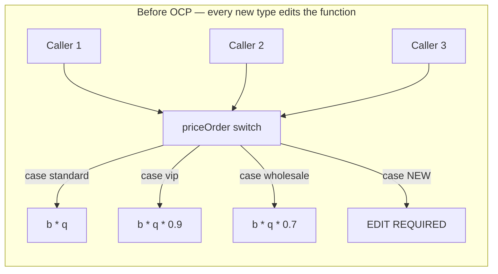
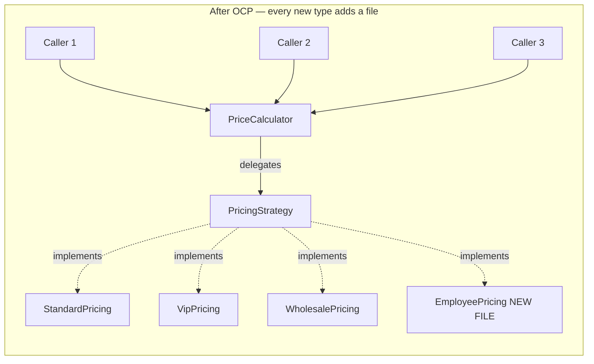
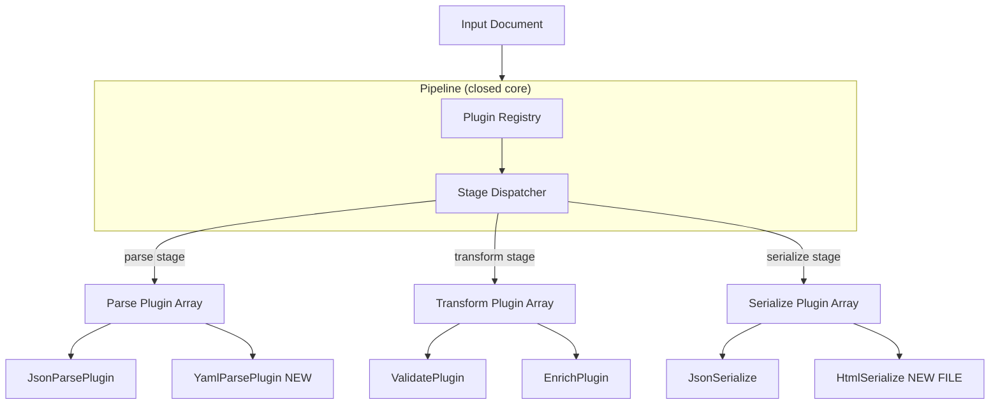

# 4.02 SOLID Open Closed

> The Open/Closed Principle is the second letter of SOLID, and the one that quietly determines whether your codebase gets easier or harder to extend over time. Bertrand Meyer coined it in 1988 in *Object-Oriented Software Construction* with a single sentence: "Software entities — classes, modules, functions, and so on — should be open for extension, but closed for modification." *Open for extension* means you can add new behavior to the entity. *Closed for modification* means you do so without editing the entity's existing source. The mechanism that makes both halves possible at once is **polymorphism**: the entity talks to an abstraction (an interface, an abstract base, a function signature, a plugin contract), and new behavior is supplied by a new implementation of that abstraction. When OCP is honored, adding a new pricing rule, a new payment gateway, a new notification channel, or a new plugin becomes "drop in a new file, register it, ship" — not "open the giant switch statement, add a branch, retest everything downstream." This note covers the five mechanisms that achieve it (inheritance, strategy, plugin, higher-order function, decorator), the smell that signals its violation (`switch` and `if/else` over type), the cost it prevents (regressions, rippling test failures, frozen releases), and the discipline of knowing when applying it would be over-engineering. Side-by-side JavaScript and TypeScript appear for every example.

## 1. Purpose

### 1.1 The problem OCP was invented to solve

By the late 1980s, the software industry had a name for the dominant pathology of large codebases: *the software crisis*. A common pattern was the *modification avalanche*: a new requirement would arrive, a developer would open the central module, add a branch to a switch, run the test suite, and discover that three other tests had broken — because the same module was used by three other features. The fix for the broken tests would itself introduce new behavior, which would break tests elsewhere. Release dates slipped. Bugs shipped. Codebases calcified.

Meyer's diagnosis was structural, not procedural. The problem was not that developers were careless; the problem was that the **unit of change** was wrong. In a procedural codebase, the unit of change was *the function*. To add a feature, you changed the function. Because every caller depended on the function's exact behavior, every caller was a hostage to that modification. Meyer's proposal was to invert the unit of change: make the **module** closed (its source stable, its callers safe), and provide a *separate* extension seam (a subclass, a deferred feature, a generic parameter) where new behavior could be added without touching the module itself.

### 1.2 The definition, parsed

"Open for extension" means: there exists a documented, contract-defined way to make the entity do something it did not do before. The entity's behavior grows; it does not stay the same.

"Closed for modification" means: the entity's *existing source code* is not edited when that new behavior is added. Its callers, its tests, and its binaries do not need to be revisited.

Both halves must hold simultaneously. "Open but not closed" is a codebase where you can add features by editing existing files — that is just procedural programming. "Closed but not open" is a codebase where existing files are frozen but there is no way to extend them — that is a dead library. The principle demands the seam: a stable core that defines *how* extensions attach, and an open periphery where extensions *do* attach.

### 1.3 The mechanism: polymorphism over branching

The technical mechanism that makes "open and closed" possible at once is **polymorphism** — the ability of a single call site to dispatch to different implementations based on the runtime type of its target. Where a procedural design would encode the choice with a `switch` over a type tag, an OCP-compliant design encodes the choice by selecting *which polymorphic instance* to call. The call site is identical for every variant; the variant is supplied from outside.

In JavaScript and TypeScript, the polymorphism toolkit is broader than in classical OO languages:

- **Subtype polymorphism** — a `class` with subclasses that override methods.
- **Structural polymorphism** — any object that has the right shape is acceptable (duck typing in JS, structural typing in TS).
- **Higher-order polymorphism** — passing a function as the varying part.
- **Ad hoc dispatch** — a registry (a `Map` keyed by a string) that maps a name to a handler.

All four achieve OCP. The principle does not care *how* you polymorph; it cares that the *core* is closed and the *variant* is external.

### 1.4 What OCP enables

When a codebase honors OCP, three things become true simultaneously:

1. **Regression risk is bounded.** A new feature added through the extension seam cannot break existing features that depend on the core, because the core source is unchanged. Existing tests for the core continue to pass without modification.
2. **Parallel development is possible.** One team can work on the core while another writes a new extension. They do not edit the same files, so they do not collide.
3. **Open-ended extension is possible.** A plugin system, a hook registry, or a strategy table can accept extensions that the original authors never imagined. VS Code's extension marketplace, Webpack's loader chain, Babel's transform pipeline, and Express's middleware stack all exist because their cores are OCP-compliant.

### 1.5 What OCP does not promise

OCP is not a license to abstract everything. A technically OCP-compliant codebase can still be unmaintainable — if every function is wrapped in three layers of strategy and registry, tracing a single call exceeds the cost of the original `switch`. OCP must be applied where variation is *real and recurring*, not hypothetical. The principle is a tool for managing *expected* change, not a mandate to predict *all possible* change.

By the end of this note you should be able to: define OCP precisely, identify an OCP violation in any codebase within sixty seconds, refactor it to a strategy or plugin form with side-by-side JS and TS, and articulate the precise moment at which applying OCP becomes over-engineering. We lean on `[[4.01 SOLID Single Responsibility]]` for the precondition (a class must have one reason to change before its extension seam can be clean) and prepare you for `[[4.03 SOLID Liskov Substitution]]`, which governs what an extension is *allowed* to do to the contract.

## 2. Theory and Deep Dive

### 2.1 Meyer's original formulation and its 1996 reinterpretation

Meyer's 1988 formulation was tied to his Eiffel language and relied on two mechanisms: **inheritance** (a subclass extends the parent without modifying it) and **deferred features** (what other languages call abstract methods — the parent declares the contract, the subclass fills it in). The parent is closed: its source is fixed. The parent is open: a new subclass can extend it. This is *strict* OCP.

Robert C. Martin (Uncle Bob), in his 1996 paper "The Open-Closed Principle," broadened the formulation. He argued that the principle is about **abstractions**, not inheritance per se. Any module that depends on an abstraction (an interface, an abstract class, a function signature) is closed against the concrete implementations of that abstraction, and open to new implementations. Martin's restatement is the version that survives in modern SOLID literature, and it is the one we use here. A TypeScript interface, a JavaScript function parameter, and a Node.js event name are all valid OCP seams — inheritance is one option among many.

The two formulations agree on the goal: the *core* is stable; the *variant* is supplied externally. For JavaScript and TypeScript engineers, Martin's broader reading is the practical one, because so much of our polymorphism is structural or functional rather than class-based.

### 2.2 The five mechanisms

Five mechanisms dominate OCP-compliant code in JavaScript and TypeScript. Each has a sweet spot, a cost, and a characteristic smell.#### 2.2.1 Inheritance — subclass and override

A base class declares a method (often abstract). Subclasses override the method to supply variant behavior. The core calls the method through a base-typed reference; the actual dispatch happens at runtime via the prototype chain.

```typescript
abstract class ShippingMethod {
  abstract cost(weightKg: number): number;
}

class StandardShipping extends ShippingMethod {
  cost(weightKg: number) { return weightKg * 1.5 + 5; }
}

class ExpressShipping extends ShippingMethod {
  cost(weightKg: number) { return weightKg * 3.0 + 12; }
}
```

Adding a `SameDayShipping` method means writing a new file with a new subclass — no existing code changes. Sweet spot: when variants share substantial common behavior (the base class carries real implementation, not just an abstract method). Cost: tight coupling between base and subclass; changes to the base still ripple. Smell: deep inheritance hierarchies (more than two levels), which violate `[[4.03 SOLID Liskov Substitution]]` almost as a rule.

#### 2.2.2 Strategy pattern — inject a strategy object

The core declares an interface for the varying behavior. Each variant is an implementation of that interface. The core receives a strategy instance through its constructor or a setter, and delegates to it. This is the most common OCP mechanism in production TypeScript.

```typescript
interface PricingStrategy {
  price(base: number, qty: number): number;
}

class PriceCalculator {
  constructor(private strategy: PricingStrategy) {}
  total(base: number, qty: number) { return this.strategy.price(base, qty); }
}
```

Adding a new pricing rule means writing a new class that implements `PricingStrategy` — no change to `PriceCalculator`. Sweet spot: when the variant is selected *per call* or *per configuration*, not per class hierarchy. Cost: one extra indirection per call; the strategy object's lifetime must be managed. Smell: strategies with a single method that just transform a value — a plain function would be simpler (see 2.2.4).

#### 2.2.3 Plugin pattern — register handlers at runtime

The core exposes a registry. Extensions register themselves with a key (a string, a symbol, a type tag). The core looks up the handler by key at runtime and dispatches. This is the mechanism behind Webpack loaders, Babel plugins, VS Code extensions, and Express middleware.

```typescript
type Formatter = (input: string) => string;
const formatters = new Map<string, Formatter>();

function registerFormatter(name: string, fn: Formatter) {
  formatters.set(name, fn);
}

function format(name: string, input: string) {
  const fn = formatters.get(name);
  if (!fn) throw new Error(`Unknown formatter: ${name}`);
  return fn(input);
}
```

Adding a new formatter means calling `registerFormatter` with a new name and a new function — no existing code changes. Sweet spot: when the set of variants is open-ended, discovered at startup (e.g. by scanning a directory or a `package.json` field), or supplied by third parties. Cost: the registry is a global; the dispatch is dynamic and harder to type-check; errors at lookup time are runtime, not compile time. Smell: registries that grow to hundreds of entries with no namespaces — the lookup key becomes a collision magnet.

#### 2.2.4 Higher-order functions — pass a function

For simple cases, the strategy *is* a function. There is no interface, no class, no registry — just a parameter that accepts a function. This is the most idiomatic OCP mechanism in functional-leaning JavaScript.

```typescript
function total(base: number, qty: number, price: (b: number, q: number) => number) {
  return price(base, qty);
}

const standardTotal = total(100, 2, (b, q) => b * q * 0.9);
const bulkTotal     = total(100, 50, (b, q) => b * q * 0.7);
```

Adding a new pricing rule means writing a new function literal at the call site — no existing code changes. Sweet spot: when the variant is a single transformation with no state of its own. Cost: the function's signature must be documented carefully because there is no interface to read. Smell: functions-within-functions-within-functions where a small strategy object would be more readable.

#### 2.2.5 Decorator pattern — wrap and add behavior

The core implements an interface. A decorator implements the same interface, holds a reference to the core, and adds behavior before or after delegating. Decorators compose: you can stack several. This is the mechanism behind `@Injectable()` in NestJS, `@Log` in experimental TypeScript decorators, and the `wrap` pattern in middlewares.

```typescript
class LoggingRepo implements Repo {
  constructor(private inner: Repo, private log: (msg: string) => void) {}
  async find(id: string) {
    this.log(`find ${id}`);
    const result = await this.inner.find(id);
    this.log(`found ${result?.id ?? "none"}`);
    return result;
  }
}
```

Adding new cross-cutting behavior (caching, metrics, retries, auth) means writing a new decorator class — no change to the inner repo. Sweet spot: when the behavior is *orthogonal* to the core. Cost: stack traces become long and the order of decorators matters subtly. Smell: decorators that change the contract — these violate LSP from `[[4.03 SOLID Liskov Substitution]]`.

### 2.3 Worked example: the `PriceCalculator`

We will trace one example through violation and refactoring. The setup: an e-commerce platform prices orders. Customers come in three types — `standard`, `vip`, and `wholesale` — each with a different discount formula.

#### 2.3.1 The OCP-violating version

The violating version is a `priceOrder` function with a `switch` over `CustomerType`. Each `case` applies a different discount multiplier (`standard` gets `b * q`, `vip` gets `b * q * 0.9`, `wholesale` gets `b * q * 0.7`). To add a fourth type — say, `employee` with a 0.5 discount — a developer must edit this function, add a `case`, update the `CustomerType` union, re-run every test that touches `priceOrder`, and hope no other code branch has its own switch over `CustomerType` that they forgot to update. (There almost always is one.) This is the modification avalanche Meyer described.

#### 2.3.2 The OCP-compliant refactor

The refactor introduces a `PricingStrategy` interface with one method `price(basePrice, qty)`. Three implementations (`StandardPricing`, `VipPricing`, `WholesalePricing`) each apply their discount. A `PriceCalculator` class receives a `PricingStrategy` in its constructor and delegates `total()` to it. To add `employee` pricing, a developer writes a new file with `class EmployeePricing implements PricingStrategy { price(b, q) { return b * q * 0.5; } }`. No existing file is touched. No existing test is invalidated. The `PriceCalculator` source is closed; the strategy seam is open. This is OCP. The full code for an equivalent example (shipping cost) appears in Section 5.1.

#### 2.3.3 Before and after, visually





The visual difference is the difference between a hub-and-spoke that grows by adding spokes *to the hub* (Before) and a hub-and-spoke that grows by adding spokes *at the rim* (After). The hub is closed; the rim is open.

### 2.4 The cost of not applying OCP

The modification avalanche shows up concretely in three measurable ways.

**Test churn.** Every edit to a switch-based function invalidates tests that assert on its output. As the switch grows, the test suite grows quadratically: a 10-case switch touched by 5 callers needs ~50 test cases; an 11th case adds ~5 new tests just for the new column.

**Bug rediscovery.** When a developer adds a case to a switch in module A and forgets the parallel switch in module B, the system develops bugs like "feature X works for standard customers but crashes for employees." These bugs are rediscovered independently by different teams because there is no compiler-enforced link between the two switches. TypeScript narrows this with discriminated unions, but only when both switches use the same union.

**Release coupling.** When a new feature requires editing the central module, the feature cannot ship without a re-release of the central module. Every consumer must upgrade, even those that do not use the new feature. OCP-aligned codebases can ship new features as new files in new packages, and consumers that do not need the feature do not need to upgrade.

### 2.5 The closed half is about *source*, not *behavior*

A common confusion: "closed for modification" sounds like it means the module's behavior never changes. It does not. A `PriceCalculator` injected with a `StandardPricing` strategy and one injected with a `VipPricing` strategy behave differently at runtime. The principle does not forbid this. It forbids editing the *source* of `PriceCalculator` to make the behavior change. The source is closed; the *instantiation* is open. The dependency-injection container (see `[[4.08 Dependency Injection DI]]`) is what allows source-stable modules to have runtime-variable behavior.

This distinction matters for testing. A unit test for `PriceCalculator` should mock the strategy, not the calculator. The calculator's source is closed; its tests are stable across the lifetime of the project.

### 2.6 The open half requires a *contract*

"Open for extension" is meaningless without a contract that defines *how* extensions attach. A codebase where the developers "just know" that they should add a new method to a class is not OCP-compliant — it is procedural with extra steps. The contract must be:

1. **Documented.** The interface, the abstract method, the registry signature, or the function parameter must be visible in the type system or in a comment that the type system can check.
2. **Stable.** Once published, the contract should not change in a breaking way. (See `[[4.04 SOLID Interface Segregation]]`.)
3. **Discoverable.** A new developer should be able to find the extension seam by reading the code, not by reading a wiki page.

TypeScript's `interface` and `abstract class` keywords make contracts first-class. JavaScript developers must rely on JSDoc, on convention, and on the discipline of treating a function's parameter list as the contract. The stronger the contract, the more confident you can be that an extension is *correct* — which is what `[[4.03 SOLID Liskov Substitution]]` formalizes.

## 3. Mental Models

### 3.1 The extension-slot model

Think of an OCP-compliant module as an electrical appliance with a socket. The appliance (the closed core) draws power and runs. The socket (the extension seam) accepts any plug that matches its shape. To add a new feature, you do not open the appliance and solder a new wire. You plug a new device into the socket. The appliance's source is unchanged; its behavior is extended.

The plug must match the socket's shape (the contract). A plug with the wrong pins (a strategy that does not implement the interface) does not fit. TypeScript enforces this at compile time; JavaScript enforces it at runtime, often with a confusing `TypeError`. The appliance can have multiple sockets (multiple extension seams) — a web framework has a socket for middleware, a socket for route handlers, a socket for template engines. And the appliance can be sold without any plugs (the core is useful by itself).

Where the model breaks down: real appliances have a fixed number of sockets. OCP-compliant modules can have *one* extension seam (a single strategy) or an *unbounded* seam (a plugin registry). The metaphor handles the unbounded case poorly. Switch to the next model for that.

### 3.2 The menu model

Think of an OCP-compliant plugin system as a restaurant menu. The menu (the registry) is the list of dishes the kitchen can prepare. The kitchen (the core) is closed: its recipes are written, its staff is trained, its workflow is fixed. To add a new dish, you add a line to the menu and a recipe card — you do not rewire the kitchen.

The menu is *extensible* (you can always add a dish) but the kitchen's *capacity* is fixed (you cannot cook 10,000 dishes at once — the registry is open, but dispatch must be efficient). Dishes are *independent* (adding pad thai does not affect the cheeseburger recipe). The menu has *categories* (appetizers, mains, desserts); a good registry is namespaced (`formatters.csv`, `formatters.json`, `formatters.yaml`) to avoid collisions.

Where the model breaks down: a restaurant's menu is curated by a chef. A plugin registry can be populated by anyone, including third parties you have never met. The menu model does not capture the *trust* problem — what happens when a plugin is malicious, buggy, or incompatible.

### 3.3 The contract-and-subcontractor model

Think of an OCP-compliant module as a general contractor on a construction site. The general contractor (the core) defines the contract: "I need a foundation that can support 10 tonnes, poured by Tuesday, for under $50,000." The general contractor does not pour the foundation. The general contractor hires a subcontractor (the strategy or plugin) who meets the contract.

The contract has *quality bars*. A subcontractor who pours a 5-tonne foundation has breached the contract — this is a `[[4.03 SOLID Liskov Substitution]]` violation, and the general contractor's structure must not collapse as a result. The general contractor can fire a subcontractor and hire a different one (the strategy is replaceable at runtime). The general contractor can hire multiple subcontractors (multiple strategies compose, as in the decorator pattern).

Where the model breaks down: a general contractor negotiates each subcontract. A strategy is selected by configuration or by lookup, not by negotiation. The model implies more flexibility than the type system actually allows. Treat the contract as fixed; the subcontractor either meets it or does not.

### 3.4 The unified mental model

Hold all three models simultaneously. The *socket* tells you what the extension seam looks like (a typed parameter, an interface, a registry key). The *menu* tells you how extensions coexist (independent, namespaced, open-ended). The *contract* tells you what an extension is allowed to do (obey the interface, do not weaken the postconditions, do not strengthen the preconditions). When a senior engineer says "this module is OCP-compliant," they are implicitly asserting all three: there is a socket, the menu is open, and the contract is documented.

### 3.5 Add behavior by adding code, not by changing code

This is the one-sentence distillation. If, to add a feature, you must open an existing file and edit it, you are violating OCP. If you can add the feature by creating a new file and registering it, you are honoring OCP. The principle is that simple to state and that hard to design for — because the seam must be in the right place, with the right contract, before the new feature exists. OCP rewards foresight. The next section shows where foresight has paid off at scale.

## 4. Real-World Use Cases

### 4.1 VS Code extensions

VS Code's entire extension ecosystem exists because the editor core is OCP-compliant. The core exposes a documented API (`vscode.languages.registerCompletionItemProvider`, `vscode.commands.registerCommand`). An extension calls these registration functions at activation time. The core never imports the extension; the extension imports the core's API. Adding support for a new language (Rust, Zig, Mojo) does not require editing VS Code's source — it requires writing a new extension package and publishing it to the marketplace. The core is closed; the extension API is the seam.

The economic consequence: a third party can extend a Microsoft product without Microsoft's involvement, without forking the codebase, and without waiting for a release cycle. The cost is real — the API must remain stable across versions, or extensions break — and that cost is paid by the API design discipline discussed in `[[4.04 SOLID Interface Segregation]]`.

### 4.2 Webpack loaders and plugins

Webpack's loader chain is a strategy pipeline. A loader is a function `(source: string) => string`. The core invokes each loader in order, passing the source through the chain. To add support for a new file type — say, `.yaml` — you write a `yaml-loader` package and add it to `webpack.config.js`. You do not edit Webpack. The loader interface is the contract; the loader is the strategy; the configuration is the registry.

Webpack's plugin system is the same idea at a coarser grain. A plugin registers handlers for compiler hooks (`compilation`, `emit`, `done`). The compiler fires hooks at well-defined lifecycle points; the plugin's handler runs. To add behavior — minification, bundle analysis, asset manifest generation — you write a plugin. The lesson: a single product can have multiple OCP seams, each at a different grain. Loaders are fine-grained (per file); plugins are coarse-grained (per build).

### 4.3 Babel transforms

Babel's transform pipeline is a plugin system. Every syntax transform — arrow functions to function expressions, optional chaining to ternaries, JSX to `React.createElement` — is a plugin. The Babel core parses the source into an AST, walks the AST, and asks each registered plugin "do you want to transform this node?" The plugin returns either a transformed node or `null` (no change). The Babel core never knows which plugins are installed; it just iterates the registered ones.

Adding support for a new syntax proposal means writing a new Babel plugin — a function `(babel) => ({ name, visitor })`. The `visitor` object maps AST node types to handler functions. The contract is the visitor shape; the AST is the data; the plugin is the strategy.

### 4.4 Payment gateways

Almost every e-commerce backend has a `PaymentProcessor` abstraction with one implementation per gateway: `StripeProcessor`, `PaypalProcessor`, `AdyenProcessor`, `BraintreeProcessor`. The business code calls `processor.charge(amount, token)`; the actual gateway call happens inside the strategy. Adding a new gateway means writing a new strategy class; the business code is unchanged.

This is a strategy and not a plugin because of *cardinality*. There are maybe a dozen payment gateways that matter; the set is small, known, and stable. A plugin registry would be over-engineering.

### 4.5 Notification channels

Notification systems — order confirmations, password-reset emails, two-factor-auth codes — typically need to send via email, SMS, push, and Slack. Each channel has a different API (SMTP, Twilio, FCM, Slack webhook), a different rate limit, and a different failure mode. The clean design is a `NotificationChannel` interface with one implementation per medium. The orchestrator iterates the channels configured for a given event and dispatches.

Adding a new channel — say, WhatsApp Business — means writing a new `WhatsAppChannel` class. The orchestrator is unchanged. The configuration decides which channels are active for which events.

### 4.6 Tax calculators per country

Tax calculation is the canonical OCP example because the rules are *legislated* and change on a schedule that does not respect your release calendar. A VAT calculator that handles Germany (19%), France (20%), and the UK (20%) cannot be a switch — every annual rate change would require editing the switch and re-releasing the whole tax module. The OCP-compliant design is a `TaxRule` interface with one implementation per jurisdiction. When Germany changes its rate from 19% to 22% in 2025, you write a new `GermanyTaxRule2025` class. The old `GermanyTaxRule2024` is retained for historical invoices (you cannot retroactively change a tax calculation on an invoice that has already been issued). This is a bonus of OCP rarely mentioned: *historical variants coexist with current variants* because each variant is its own class.

### 4.7 React component variants

React has an idiomatic equivalent of the strategy pattern: *composition over configuration*. A `Button` component that supports variants (primary, secondary, danger) can be a single component with a `variant` prop — a switch on type, a micro-scale OCP violation. The OCP-compliant version is a set of small components (`PrimaryButton`, `SecondaryButton`, `DangerButton`) composed from a shared `Button` base. In practice, React teams often accept the small violation because the component is small and the variants are stable. This is the *judgment* part of OCP: the principle is a tool, not a religion.

### 4.8 Express and Fastify middleware

Express middleware is the decorator pattern applied to an HTTP handler. A middleware is a function `(req, res, next) => void`. The Express core iterates the middleware chain for each request. Adding a new cross-cutting concern — auth, logging, rate limiting, CORS — means writing a new middleware function and `app.use`-ing it. The Express core is unchanged. Fastify uses the same model with a typed hook system.

### 4.9 NestJS modules and providers

NestJS is built on dependency injection (see `[[4.08 Dependency Injection DI]]`). Every service is a class annotated with `@Injectable()`. Every controller declares its dependencies in its constructor. The DI container resolves dependencies at startup. To swap an implementation — say, to use a `MockEmailService` in tests instead of a `SmtpEmailService` — you change the provider configuration. The controller source is unchanged. This is OCP via the DI container: the controller depends on an abstraction (`EmailService`), and the implementation is supplied externally.

## 5. Code Examples

### 5.1 Example A — Minimal and Conceptual

The minimal example contrasts an OCP violation (a switch on type) with an OCP-compliant refactor (a strategy). The domain is shipping cost calculation, with two variants: `standard` and `express`.

#### 5.1.1 JavaScript — violation

```javascript
function shippingCost(weightKg, type) {
  switch (type) {
    case "standard": return weightKg * 1.5 + 5;
    case "express":  return weightKg * 3.0 + 12;
    default: throw new Error(`Unknown shipping type: ${type}`);
  }
}

console.log(shippingCost(2, "standard")); // 8
console.log(shippingCost(2, "express"));  // 18
// To add 'sameDay', you must edit this function.
```

#### 5.1.2 TypeScript — violation

```typescript
type ShippingType = "standard" | "express";

function shippingCost(weightKg: number, type: ShippingType): number {
  switch (type) {
    case "standard":  return weightKg * 1.5 + 5;
    case "express":   return weightKg * 3.0 + 12;
    default: {
      const exhaustive: never = type;
      throw new Error(`Unknown shipping type: ${exhaustive}`);
    }
  }
}
```

The TypeScript version uses the `never`-typed exhaustive check, which produces a *compile-time* error if a new variant is added to the union without a matching case. This is a partial mitigation of the OCP violation: the compiler tells you that you forgot a case. It does not, however, eliminate the violation — you still have to edit `shippingCost` to add the case.

#### 5.1.3 JavaScript — strategy refactor

```javascript
const standardShipping = { cost(weightKg) { return weightKg * 1.5 + 5; } };
const expressShipping  = { cost(weightKg) { return weightKg * 3.0 + 12; } };

function shippingCost(weightKg, method) { return method.cost(weightKg); }

console.log(shippingCost(2, standardShipping)); // 8
console.log(shippingCost(2, expressShipping));  // 18

// To add 'sameDay', write a new object. No existing code changes.
const sameDayShipping = { cost(weightKg) { return weightKg * 5.0 + 25; } };
console.log(shippingCost(2, sameDayShipping)); // 35
```

#### 5.1.4 TypeScript — strategy refactor

```typescript
interface ShippingMethod {
  cost(weightKg: number): number;
}

class StandardShipping implements ShippingMethod { cost(w: number) { return w * 1.5 + 5; } }
class ExpressShipping  implements ShippingMethod { cost(w: number) { return w * 3.0 + 12; } }
class SameDayShipping  implements ShippingMethod { cost(w: number) { return w * 5.0 + 25; } }

function shippingCost(weightKg: number, method: ShippingMethod): number {
  return method.cost(weightKg);
}

console.log(shippingCost(2, new StandardShipping())); // 8
console.log(shippingCost(2, new ExpressShipping()));  // 18
console.log(shippingCost(2, new SameDayShipping()));  // 35
```

The contract is `ShippingMethod`. The seam is the `method` parameter. Adding a new variant means writing a new class — no existing file is touched.

### 5.2 Example B — Production-Grade

The production example is a typed plugin system. The domain is a document export pipeline: a document (a tree of nodes) can be exported to multiple formats (Markdown, HTML, PDF, JSON). The set of formats is open-ended — third parties can add their own. The system must support registration, runtime dispatch, lifecycle hooks (initialize, export, finalize), and error handling.

#### 5.2.1 JavaScript — production plugin system

```javascript
// plugins.js
const registry = new Map();

export function registerExporter(format, exporter) {
  if (typeof exporter.export !== "function") {
    throw new TypeError(`Exporter for ${format} must have an export() method`);
  }
  if (typeof exporter.initialize === "function") exporter.initialize();
  registry.set(format, exporter);
  return function unregister() {
    if (typeof exporter.finalize === "function") exporter.finalize();
    registry.delete(format);
  };
}

export function exportDocument(format, document) {
  const exporter = registry.get(format);
  if (!exporter) {
    const known = Array.from(registry.keys()).sort().join(", ");
    throw new Error(`Unknown exporter: ${format}. Known: ${known}`);
  }
  try { return exporter.export(document); }
  catch (error) { error.message = `Exporter ${format} failed: ${error.message}`; throw error; }
}

export function listFormats() { return Array.from(registry.keys()).sort(); }
```

```javascript
// builtins.js
import { registerExporter } from "./plugins.js";

registerExporter("markdown", {
  initialize() { this.buffer = []; },
  export(doc) { return doc.nodes.map(n => `# ${n.text}`).join("\n\n"); },
  finalize() { this.buffer = null; }
});

registerExporter("html", {
  export(doc) { return doc.nodes.map(n => `<p>${n.text}</p>`).join("\n"); }
});

registerExporter("json", { export(doc) { return JSON.stringify(doc); } });
```

```javascript
// main.js
import "./builtins.js";
import { exportDocument, listFormats } from "./plugins.js";

const doc = { nodes: [{ text: "Hello" }, { text: "World" }] };

console.log(listFormats());                       // ["html", "json", "markdown"]
console.log(exportDocument("markdown", doc));     // "# Hello\n\n# World"
console.log(exportDocument("pdf", doc));          // throws: Unknown exporter: pdf
```

#### 5.2.2 TypeScript — production plugin system

```typescript
// plugins.ts
export interface Document { nodes: Array<{ text: string }>; }
export interface Exporter {
  name: string;
  initialize?(): void;
  export(document: Document): string;
  finalize?(): void;
}

const registry = new Map<string, Exporter>();

export function registerExporter(format: string, exporter: Exporter): () => void {
  if (typeof exporter.export !== "function") {
    throw new TypeError(`Exporter for ${format} must have an export() method`);
  }
  exporter.initialize?.();
  registry.set(format, exporter);
  return () => { exporter.finalize?.(); registry.delete(format); };
}

export function exportDocument(format: string, document: Document): string {
  const exporter = registry.get(format);
  if (!exporter) {
    const known = Array.from(registry.keys()).sort().join(", ");
    throw new Error(`Unknown exporter: ${format}. Known: ${known}`);
  }
  try { return exporter.export(document); }
  catch (error) {
    if (error instanceof Error) error.message = `Exporter ${format} failed: ${error.message}`;
    throw error;
  }
}

export function listFormats(): string[] { return Array.from(registry.keys()).sort(); }
```

```typescript
// builtins.ts
import { registerExporter, Exporter, Document } from "./plugins.js";

class MarkdownExporter implements Exporter {
  name = "markdown";
  export(doc: Document): string { return doc.nodes.map(n => `# ${n.text}`).join("\n\n"); }
}

class HtmlExporter implements Exporter {
  name = "html";
  export(doc: Document): string { return doc.nodes.map(n => `<p>${n.text}</p>`).join("\n"); }
}

class JsonExporter implements Exporter {
  name = "json";
  export(doc: Document): string { return JSON.stringify(doc); }
}

registerExporter("markdown", new MarkdownExporter());
registerExporter("html", new HtmlExporter());
registerExporter("json", new JsonExporter());
```

```typescript
// main.ts
import "./builtins.js";
import { exportDocument, listFormats, Document } from "./plugins.js";

const doc: Document = { nodes: [{ text: "Hello" }, { text: "World" }] };

console.log(listFormats());                       // ["html", "json", "markdown"]
console.log(exportDocument("markdown", doc));     // "# Hello\n\n# World"
```

#### 5.2.3 Why this is production-grade

Several details separate the production version from a tutorial version:

1. **Registration returns an unregister function.** Tests can clean up after themselves; a plugin can be unloaded at runtime (hot-reload).
2. **Lifecycle hooks are optional.** The core calls `exporter.initialize?.()` with optional chaining. Plugins that do not need them pay no cost.
3. **The error message lists known formats.** A user who requests `pdf` and gets `Unknown exporter: pdf. Known: html, json, markdown` can self-diagnose without reading source.
4. **The `try/catch` wraps the export call** and prepends the format to the error message, making stack traces from deep inside a plugin navigable.
5. **The registry is a typed `Map<string, Exporter>`** rather than a bare object. `Map` keys can be any string (including `"toString"`, `"constructor"`) without collision with inherited properties — a subtle bug class for plain-object registries.

#### 5.2.4 Adding a third-party exporter

A third party (in a separate package) adds PDF support without touching the core:

```typescript
// in package @my-org/pdf-exporter
import { registerExporter, Exporter, Document } from "@my-org/exporter-core";

class PdfExporter implements Exporter {
  name = "pdf";
  export(doc: Document): string { return `%PDF-1.4\n... ${doc.nodes.length} nodes ...`; }
}

registerExporter("pdf", new PdfExporter());
```

No file in `@my-org/exporter-core` was edited. The core is closed; the registration seam is open. This is OCP at production scale.

## 6. Common Mistakes and Anti-Patterns

### 6.1 Switch statements on type

```javascript
function area(shape) {
  switch (shape.type) {
    case "circle":   return Math.PI * shape.r * shape.r;
    case "square":   return shape.side * shape.side;
    case "triangle": return 0.5 * shape.base * shape.height;
    default: throw new Error(`Unknown shape: ${shape.type}`);
  }
}
```

**Why it fails:** Every new shape (rectangle, hexagon, ellipse) requires editing `area`. If the codebase also has `perimeter`, `draw`, and `serialize` functions with parallel switches, every new shape requires editing four functions in four files. The compiler does not enforce that all four switches stay in sync.

**Fix:** Replace the type tag with a polymorphic method.

```javascript
function area(shape) { return shape.area(); }

const circle   = { area() { return Math.PI * this.r * this.r; } };
const square   = { area() { return this.side * this.side; } };
const triangle = { area() { return 0.5 * this.base * this.height; } };

// To add rectangle, write a new object. No existing code changes.
const rectangle = { area() { return this.w * this.h; } };
```

### 6.2 If/else chains for variants

```javascript
function formatPrice(amount, currency) {
  if (currency === "USD") return `$${amount.toFixed(2)}`;
  else if (currency === "EUR") return `${amount.toFixed(2)}€`;
  else if (currency === "JPY") return `¥${Math.round(amount)}`;
  else if (currency === "GBP") return `£${amount.toFixed(2)}`;
  else throw new Error(`Unknown currency: ${currency}`);
}
```

**Why it fails:** Same as the switch. Every new currency edits the function. Worse, the `if/else` chain is linear — adding `CNY` at the bottom means every `formatPrice` call for `USD` runs through three comparisons before finding its match.

**Fix:** A lookup table.

```javascript
const formatters = {
  USD: amt => `$${amt.toFixed(2)}`,
  EUR: amt => `${amt.toFixed(2)}€`,
  JPY: amt => `¥${Math.round(amt)}`,
};

function formatPrice(amount, currency) {
  const fmt = formatters[currency];
  if (!fmt) throw new Error(`Unknown currency: ${currency}`);
  return fmt(amount);
}

// To add GBP, add a property. No existing code changes.
formatters.GBP = amt => `£${amt.toFixed(2)}`;
```

### 6.3 Modifying base classes to add features

```typescript
abstract class Vehicle { abstract drive(): void; }

// Later, someone needs a flying car. They edit Vehicle:
abstract class Vehicle {
  abstract drive(): void;
  abstract fly(): void;  // <-- ADDED LATER
}

class Car extends Vehicle {
  drive() { /* ... */ }
  fly() { throw new Error("Cars can't fly"); }  // forced to implement
}
```

**Why it fails:** Adding `fly` to `Vehicle` forces every existing subclass to implement `fly` (or inherit a throwing default). This violates OCP *and* LSP (the throwing subclasses are not substitutable for the base). The smell is a base class that grows methods whenever a new subclass needs a new capability.

**Fix:** Use composition. A `Vehicle` has an optional `FlightCapability`.

```typescript
interface FlightCapability { fly(): void; }

abstract class Vehicle {
  abstract drive(): void;
  flight?: FlightCapability;
}

class Car extends Vehicle { drive() { /* ... */ } }  // no fly(), no problem

class FlyingCar extends Vehicle {
  drive() { /* ... */ }
  flight = { fly() { /* ... */ } };
}

// Caller code:
if (vehicle.flight) vehicle.flight.fly();
```

The base class is closed. The new capability is added as a new interface and a new optional property. Existing subclasses are unchanged. See `[[4.04 SOLID Interface Segregation]]`.

### 6.4 Premature abstraction — over-using strategy when a function would do

```typescript
// Over-engineered: a strategy interface, a class, and a constructor parameter
// for what is a single-line transformation.
interface DoubleStrategy { double(x: number): number; }
class PlainDoubleStrategy implements DoubleStrategy {
  double(x: number) { return x * 2; }
}
class MathDoer {
  constructor(private strategy: DoubleStrategy) {}
  run(x: number) { return this.strategy.double(x); }
}
const doer = new MathDoer(new PlainDoubleStrategy());
console.log(doer.run(5)); // 10
```

**Why it fails:** The strategy interface has one method and one implementation. There is no variation. The strategy is ceremony: it adds a class, an interface, a constructor parameter, and an indirection for zero benefit. A future reader has to trace through four files to find that `MathDoer.run(5)` returns `10`.

**Fix:** Use a function.

```typescript
function double(x: number) { return x * 2; }
function run(x: number, fn: (n: number) => number) { return fn(x); }
console.log(run(5, double)); // 10
```

*Introduce the seam when variation is real, not hypothetical.* If you have only one variant, you need a function. When the second variant arrives, refactor to a strategy. See Section 7 for the rule of three.

### 6.5 Leaking implementation details through the extension seam

```typescript
interface UserRepository {
  // The interface leaks the storage technology:
  findBySql(sql: string): User[];
  // The interface leaks the cache layer:
  invalidateCache(): void;
  // The interface leaks the connection pool:
  withConnection<T>(fn: (conn: DbConnection) => T): T;
  find(id: string): User | null;
}
```

**Why it fails:** The extension seam is supposed to abstract over the *variant* (SQL vs NoSQL, cached vs uncached). When the interface exposes `findBySql`, every implementation must accept SQL — even a NoSQL one. When it exposes `invalidateCache`, every implementation must have a cache. The seam is closed to non-SQL, non-cached implementations — the opposite of open.

**Fix:** Narrow the interface to operations every implementation can support. Move technology-specific operations to separate, narrower interfaces.

```typescript
interface UserRepository {
  find(id: string): User | null;
  save(user: User): void;
  delete(id: string): void;
}

interface SqlRepository extends UserRepository {
  findBySql(sql: string): User[];
}

interface CachedRepository extends UserRepository {
  invalidateCache(): void;
}
```

A caller that needs `findBySql` declares its dependency as `SqlRepository`. A caller that only needs `find` declares its dependency as `UserRepository`. The seams are now open to non-SQL and non-cached implementations. This is `[[4.04 SOLID Interface Segregation]]` applied to OCP.

### 6.6 Not documenting the extension point

```typescript
// A class that *can* be subclassed, but the seam is undocumented.
class OrderProcessor {
  process(order: Order) { this.validate(order); this.price(order); this.charge(order); }
  validate(order: Order) { /* base validation */ }
  price(order: Order) { /* base pricing */ }
  charge(order: Order) { /* base charge */ }
}

// A new developer subclasses and overrides price(), not knowing charge() reads order.price
class DiscountOrderProcessor extends OrderProcessor {
  price(order: Order) { order.price = order.price * 0.9; }
}
```

**Why it fails:** The extension seam exists (you can subclass and override `price`), but it is not documented. The base class does not declare which methods are *intended* to be overridden. The new developer overrides `price` without realizing that the base `charge` depends on the order's `price` being set by the time `charge` runs.

**Fix:** Mark the seam explicitly. In TypeScript, use `protected` and `abstract`. In JSDoc, document the contract.

```typescript
abstract class OrderProcessor {
  process(order: Order) { this.validate(order); this.price(order); this.charge(order); }
  protected validate(order: Order) { /* overridable */ }
  /** Override to compute the order's price. Must set order.price. */
  protected abstract price(order: Order): void;
  protected charge(order: Order) { /* reads order.price */ }
}

class DiscountOrderProcessor extends OrderProcessor {
  protected price(order: Order) { order.price = order.basePrice * 0.9; }
}
```

The `abstract` keyword forces the subclass to implement `price`. The `protected` keyword signals that `validate` and `charge` are overridable but not part of the public API. The JSDoc comment documents the contract: `price` must set `order.price`.

### 6.7 (Bonus) Extending via inheritance when composition would be better

```typescript
// A logging decorator implemented by inheritance:
class LoggingUserService extends UserService {
  private log = console.log;
  createUser(name: string) {
    this.log(`creating ${name}`);
    const user = super.createUser(name);
    this.log(`created ${user.id}`);
    return user;
  }
}

// This works for UserService. But you also want logging on OrderService,
// PaymentService, EmailService... so you write:
class LoggingOrderService extends OrderService { /* ... */ }
class LoggingPaymentService extends PaymentService { /* ... */ }
```

**Reasoning:** The logging behavior is duplicated across four subclasses. Changing the log format requires editing four files. Adding logging to a fifth service requires writing a fifth subclass. The behavior is not composable: you cannot have a *cached* *logging* user service without writing `CachedLoggingUserService extends LoggingUserService` and `LoggingCachedUserService extends CachedUserService` — the combinatorial explosion kills the design.

**Fix:** Use the decorator pattern with composition.

```typescript
interface UserService {
  createUser(name: string): User;
}

class LoggingUserService implements UserService {
  constructor(private inner: UserService) {}
  createUser(name: string) {
    console.log(`creating ${name}`);
    const user = this.inner.createUser(name);
    console.log(`created ${user.id}`);
    return user;
  }
}

// Compose: logged.createUser() calls LoggingUserService -> CachedUserService -> RealUserService
const cached = new CachedUserService(realService);
const logged = new LoggingUserService(cached);
```

The decorator implements the same interface as the inner service. Adding a new decorator (e.g. `MetricsUserService`) means writing a new class. Composing decorators in different orders produces different behavior without writing new classes. *Prefer composition over inheritance for orthogonal concerns.* See `[[4.01 SOLID Single Responsibility]]`.

## 7. Best Practices and Design Patterns

### 7.1 Use strategy for variants

When the variation is along a single axis (pricing rule, shipping method, payment gateway), use the strategy pattern. The interface should be narrow (one or two methods), the implementations should be small (one file each), and the selection should be explicit (the caller passes the strategy; the core does not look it up).

**Rule of thumb:** if you have two variants and a clear contract, write the strategy. If you have one variant, write a function. If you have five variants, write the strategy and a registry to look them up by name.

### 7.2 Use plugins for open-ended extension

When the set of variants is unbounded (loaders, transforms, export formats), use a plugin registry. The registry should be namespaced (`formatters.csv`, `formatters.json`), the registration should return an unregister function (for testing and hot-reload), and the dispatch should produce a helpful error when the plugin is missing.

**Rule of thumb:** if a third party should be able to add a variant without forking your code, use a plugin registry. If only your team will ever add variants, a strategy table is enough.

### 7.3 Use higher-order functions for simple cases

When the variation is a single transformation with no state, pass a function. The function's signature *is* the contract; the call site is the registration; the principle is honored. Resist the urge to wrap every function in an interface "for future flexibility" — the future flexibility is already there, because the caller can pass any function that matches the signature.

**Rule of thumb:** if the strategy interface would have exactly one method and the method takes primitives and returns a primitive, use a function.

### 7.4 Do not over-engineer — the rule of three

A `switch` is fine if it rarely changes. A `switch` over the days of the week will never grow a new case. A `switch` over HTTP methods is unlikely to grow `PATCH` more than once a decade. For these cases, the switch is the simplest, most readable, and most performant option.

The rule of three: *wait until a third variant appears before refactoring to a strategy*. The first variant is just code. The second variant suggests that variation might be a pattern. The third variant confirms the pattern. Refactoring at three is cheap; refactoring at one is over-engineering.

**Counter-rule:** some domains are *known* to be variable from day one. Payment gateways, tax rules, and notification channels are *expected* to grow. For these, start with the strategy even if you have only one variant today.

### 7.5 Document extension points

Every extension seam should be discoverable from the type system or from a comment that lives next to the seam. Mark overridable methods `protected` (not `public`) and `abstract` where possible. Write a JSDoc comment on the seam: "Override this to customize X. The contract is Y." If you use a registry, document the contract of the registration function and the lifecycle of a registered plugin.

The test of a good extension point: a new developer can write a correct extension without reading the core's source. If they must read the core to understand the contract, the seam is not documented well enough.

### 7.6 Use TypeScript to enforce the extension contract

TypeScript's `interface` and `abstract class` keywords make the contract a compile-time artifact. A strategy that does not implement the interface fails to type-check. A subclass that does not override an `abstract` method fails to type-check. The exhaustive `never` check in a switch makes the compiler warn you when a new variant is added to a union — a partial mitigation that at least prevents the *silent* bug.

For plugin registries, use a literal-union type for the registration key to prevent typos:

```typescript
type Format = "markdown" | "html" | "json" | "pdf";
const registry = new Map<Format, Exporter>();

function registerExporter(format: Format, exporter: Exporter) {
  registry.set(format, exporter);
}
```

A caller who writes `registerExporter("md", ...)` gets a compile-time error: `"md"` is not assignable to `Format`. The contract is enforced at the type level.

### 7.7 Keep extension seams narrow and testable

Every method on the extension interface is a method every implementation must provide. A 10-method interface forces every strategy to implement 10 methods, even if most care about only one. This is `[[4.04 SOLID Interface Segregation]]` applied to OCP. Keep the interface to the smallest set of methods that captures the variation; pull everything else out into separate, narrower interfaces.

An extension should also be unit-testable without the core. A `VipPricing` strategy should be testable by constructing it and calling `price(100, 2)` — no `PriceCalculator` needed. This requires that the strategy's dependencies (if any) are also injected, not constructed internally. The benefit: tests for the strategy are fast, deterministic, and unaffected by changes to the core.

## 8. Technical Interview Knowledge

### 8.1 Question One — What is OCP?

**Q:** What is the Open/Closed Principle?

**A:** The Open/Closed Principle states that software entities (classes, modules, functions) should be open for extension but closed for modification. "Open for extension" means new behavior can be added. "Closed for modification" means existing source code is not edited when behavior is added. The principle is achieved through polymorphism: the entity depends on an abstraction (an interface, an abstract method, a function parameter), and new behavior is supplied as a new implementation of that abstraction.

**Trap to avoid:** Do not say "you can never edit existing code." Bug fixes always edit existing code. The principle is about *adding features*, not fixing bugs. Say "the source is stable across feature additions, not across bug fixes."

### 8.2 Question Two — How do you achieve OCP?

**Q:** How do you achieve OCP in practice?

**A:** Through one of five mechanisms: (1) inheritance — subclass and override; (2) strategy pattern — inject a strategy object that implements an interface; (3) plugin pattern — register handlers in a map keyed by name; (4) higher-order functions — pass a function as the varying part; (5) decorator pattern — wrap the core with a class that implements the same interface and adds behavior. The common thread is that the *core* depends on an abstraction and the *variant* is supplied externally.

**Trap to avoid:** Do not say "use inheritance." Inheritance is one mechanism, not the only one, and in modern TypeScript it is often the worst choice because it couples the subclass to the parent's implementation. Mention the other four.

### 8.3 Question Three — Example of OCP violation?

**Q:** Give a concrete example of an OCP violation.

**A:** A function with a `switch` statement over a type tag. For example, `function area(shape) { switch (shape.type) { case "circle": return Math.PI * shape.r * shape.r; case "square": return shape.side * shape.side; } }`. Adding a new shape (triangle) requires editing this function. If the codebase has parallel switches for `perimeter`, `draw`, and `serialize`, every new shape requires editing four functions. The fix is to make `area` a method on each shape object and have the function delegate: `function area(shape) { return shape.area(); }`. Adding a triangle now means writing a new object with an `area` method — no existing code changes.

**Trap to avoid:** Have a *concrete* example ready. Abstract descriptions do not impress. Code on a whiteboard does.

### 8.4 Question Four — When would you NOT apply OCP?

**Q:** When would you choose not to apply OCP?

**A:** Three cases. First, when the variation is rare and stable: a `switch` over the days of the week will never grow a new case. Second, when the variation is a single transformation: a strategy interface with one method and one implementation is ceremony; a plain function is simpler. Third, when the cost of the abstraction exceeds the cost of the change. The rule of three: wait for the third variant before refactoring.

**Trap to avoid:** Do not say "I always apply OCP." Senior engineers know when *not* to apply it. The interviewer is testing your judgment, not your obedience.

### 8.5 Question Five — Strategy vs plugin?

**Q:** What is the difference between the strategy pattern and the plugin pattern?

**A:** Both achieve OCP by externalizing the variant. The difference is *cardinality* and *selection*. A strategy is selected *per call* by the caller; the set of strategies is small, known, and stable. A plugin is registered in a registry and selected *by name* at runtime; the set is open-ended, may be supplied by third parties, and may be discovered at startup. Concretely: a `PaymentProcessor` strategy is one of `Stripe`, `PayPal`, `Adyen` — chosen by configuration. A Webpack loader is a plugin — chosen by `webpack.config.js`, and any npm package can add one.

**Trap to avoid:** Do not conflate the two. A strategy is *injected*; a plugin is *registered*. The selection mechanism differs.

### 8.6 Question Six — OCP and polymorphism?

**Q:** How does OCP relate to polymorphism?

**A:** Polymorphism is the mechanism that makes OCP possible. "Open for extension" requires a way to add new behavior; "closed for modification" requires that the call site does not change. Polymorphism satisfies both: the call site calls a method on an abstraction, and the actual implementation is determined at runtime by the type of the object. New behavior is added by writing a new implementation; the call site is unchanged. Without polymorphism (e.g. in a strictly procedural language with no function pointers), OCP is impossible — every new behavior requires editing the call site. In JavaScript and TypeScript, polymorphism takes four forms: subtype (class override), structural (duck typing), higher-order (function parameter), and ad hoc (registry lookup). All four achieve OCP.

**Trap to avoid:** Do not say "polymorphism is inheritance." Inheritance is one form. JavaScript's structural typing and first-class functions give you three other forms that are often more appropriate.

### 8.7 Question Seven — Testing OCP-compliant code?

**Q:** How do you test OCP-compliant code?

**A:** Three levels. (1) Test the core with a mock strategy: a mock strategy lets you assert that the core delegates correctly. (2) Test each strategy in isolation: a strategy is a small object with a narrow interface, so its tests are fast and deterministic. (3) Test the registration and dispatch: for a plugin system, write a test that registers a fake plugin, dispatches to it, asserts it was called, then unregisters and asserts it is no longer called.

The key property: a test for the core does not change when a new strategy is added. If adding a new strategy requires editing the core's tests, the core is not OCP-compliant.

**Trap to avoid:** Do not say "test everything via the core." That defeats the point of OCP. The strategies must be testable in isolation.

### 8.8 Question Eight — How does OCP reduce regressions?

**Q:** How does OCP reduce regression risk?

**A:** By changing the unit of change. In a procedural design, the unit of change is the function — adding a feature edits the function, which can break every caller. In an OCP-compliant design, the unit of change is the file — adding a feature writes a new file, which cannot break existing callers because existing callers do not import it. Concretely: existing tests for the core continue to pass without modification (because the core source is unchanged); existing callers continue to behave as before; the new feature is exercised by new tests against the new file. The regression surface is the new file plus its registration, not the entire codebase. Release cycles can be shorter, because a new feature does not require re-running the full test suite for the core.

**Trap to avoid:** Do not say "OCP eliminates regressions." It does not. A bad strategy can still ship bugs. OCP *bounds* the regression surface to the new code.

## 9. Practical Exercises

### 9.1 Exercise One — Identify OCP violations in a switch

**Goal:** Identify every OCP violation in the following code snippet and explain why each is a violation.

```javascript
function processOrder(order) {
  // Pricing
  let price = 0;
  switch (order.customerType) {
    case "standard":  price = order.basePrice * order.qty; break;
    case "vip":       price = order.basePrice * order.qty * 0.9; break;
    case "wholesale": price = order.basePrice * order.qty * 0.7; break;
  }
  // Tax
  let tax = 0;
  switch (order.country) {
    case "US": tax = price * 0.07; break;
    case "DE": tax = price * 0.19; break;
    case "UK": tax = price * 0.20; break;
  }
  // Shipping
  let shipping = 0;
  switch (order.shippingMethod) {
    case "standard": shipping = 5; break;
    case "express":  shipping = 12; break;
  }
  // Notification
  switch (order.channel) {
    case "email": sendEmail(order.email, "Order confirmed"); break;
    case "sms":   sendSms(order.phone, "Order confirmed"); break;
  }
  return price + tax + shipping;
}
```

**Steps:**

1. Read the function and list every `switch`.
2. For each switch, identify the axis of variation.
3. For each axis, explain what would have to be edited to add a new variant.
4. Identify the parallel-switch risk.

**Full worked solution:**

There are four OCP violations, one per `switch`.

**Violation 1: `order.customerType` switch (pricing).** Adding a new customer type requires editing this function to add a `case`. If the codebase has parallel switches for `customerType` elsewhere (`discountRate`, `displayBadge`), each must be edited. The pricing logic is also mixed with tax, shipping, and notification in a single function — a violation of `[[4.01 SOLID Single Responsibility]]`.

**Violation 2: `order.country` switch (tax).** Adding a new country requires editing this function. Tax rates change annually. Worse, tax calculation is rarely a single rate — it involves tiers, exemptions, and rounding rules — so the `case` body will grow until it is itself a complex function.

**Violation 3: `order.shippingMethod` switch (shipping).** Adding a new shipping method requires editing this function. Parallel switches for shipping (`estimatedDeliveryDate`, `trackingUrl`) each must be edited.

**Violation 4: `order.channel` switch (notification).** Adding a new notification channel requires editing this function. Parallel switches for notification (`formatMessage`, `validateContact`) each must be edited.

**Parallel-switch risk:** The `customerType` axis is the most dangerous. Customer types drive pricing, discounts, badges, eligibility, and reporting. A codebase with five years of history will have a `customerType` switch in dozens of places. The TypeScript compiler will warn you about exhaustive switches that lack the new case, but it cannot warn you about `if (order.customerType === "standard")` checks scattered through conditionals.

**Reasoning:** Each switch is a hub. Each new variant is a spoke that must be added to the hub. The hub grows linearly with variants; the cross-product of (variants × parallel switches) grows quadratically. The fix is to invert the design: make each variant a spoke at the rim, and the hub a closed dispatcher.

### 9.2 Exercise Two — Refactor to strategy pattern

**Goal:** Refactor the `processOrder` function from Exercise One to use the strategy pattern. Each axis of variation becomes a strategy interface with one implementation per variant.

**Steps:**

1. Define four interfaces: `PricingStrategy`, `TaxStrategy`, `ShippingStrategy`, `NotificationStrategy`.
2. Move each `case` body into a strategy class.
3. Inject the four strategies into an `OrderProcessor` class.
4. Verify that adding a new variant requires only a new file, not an edit to `OrderProcessor`.

**Full worked solution (TypeScript):**

```typescript
// strategies.ts
export interface PricingStrategy { price(basePrice: number, qty: number): number; }
export class StandardPricing  implements PricingStrategy { price(b, q) { return b * q; } }
export class VipPricing       implements PricingStrategy { price(b, q) { return b * q * 0.9; } }
export class WholesalePricing implements PricingStrategy { price(b, q) { return b * q * 0.7; } }

export interface TaxStrategy { tax(amount: number): number; }
export class UsTax implements TaxStrategy { tax(a) { return a * 0.07; } }
export class DeTax implements TaxStrategy { tax(a) { return a * 0.19; } }
export class UkTax implements TaxStrategy { tax(a) { return a * 0.20; } }

export interface ShippingStrategy { cost(): number; }
export class StandardShipping implements ShippingStrategy { cost() { return 5; } }
export class ExpressShipping  implements ShippingStrategy { cost() { return 12; } }

export interface NotificationStrategy { send(order: Order): void; }
export class EmailNotification implements NotificationStrategy {
  send(order: Order) { sendEmail(order.email, "Order confirmed"); }
}
export class SmsNotification implements NotificationStrategy {
  send(order: Order) { sendSms(order.phone, "Order confirmed"); }
}

// processor.ts
export interface Order { basePrice: number; qty: number; email?: string; phone?: string; }

export class OrderProcessor {
  constructor(
    private pricing: PricingStrategy,
    private tax: TaxStrategy,
    private shipping: ShippingStrategy,
    private notify: NotificationStrategy
  ) {}

  process(order: Order): number {
    const price = this.pricing.price(order.basePrice, order.qty);
    const tax = this.tax.tax(price);
    this.notify.send(order);
    return price + tax + this.shipping.cost();
  }
}

// main.ts
import { StandardPricing, DeTax, ExpressShipping, EmailNotification } from "./strategies.js";
const processor = new OrderProcessor(
  new StandardPricing(), new DeTax(), new ExpressShipping(), new EmailNotification()
);
console.log(processor.process({ basePrice: 100, qty: 2, email: "ada@example.com" })); // 250
```

**Full worked solution (JavaScript):**

```javascript
// strategies.js
const standardPricing  = { price(b, q) { return b * q; } };
const vipPricing       = { price(b, q) { return b * q * 0.9; } };
const wholesalePricing = { price(b, q) { return b * q * 0.7; } };

const usTax = { tax(a) { return a * 0.07; } };
const deTax = { tax(a) { return a * 0.19; } };

const standardShipping = { cost() { return 5; } };
const expressShipping  = { cost() { return 12; } };

const emailNotification = { send(order) { sendEmail(order.email, "Order confirmed"); } };

function createOrderProcessor(pricing, tax, shipping, notify) {
  return {
    process(order) {
      const price = pricing.price(order.basePrice, order.qty);
      const taxAmount = tax.tax(price);
      notify.send(order);
      return price + taxAmount + shipping.cost();
    }
  };
}

// main.js
const processor = createOrderProcessor(standardPricing, deTax, expressShipping, emailNotification);
console.log(processor.process({ basePrice: 100, qty: 2, email: "ada@example.com" })); // 250
```

**Reasoning:** The four axes of variation are now four interfaces. `OrderProcessor` depends on the four interfaces, not on any concrete implementation. Adding a new variant for any axis means writing a new file that implements the corresponding interface. No existing file is edited. The `process` method is closed; the four seams are open.

The composition root (`main.ts` / `main.js`) is where strategies are selected. This is dependency injection (see `[[4.08 Dependency Injection DI]]`): dependencies are *injected* into the processor at construction time, rather than constructed internally.

### 9.3 Exercise Three — Build a plugin system

**Goal:** Build a plugin system for an HTTP server that allows plugins to register route handlers, middleware, and lifecycle hooks (start, stop). The system must support third-party plugins, hot registration, and clean error isolation (a failing plugin does not crash the server).

**Steps:**

1. Define the `Plugin` interface: `name`, `register(api)`, `start?()`, `stop?()`.
2. Define the `PluginApi` interface: `get(path, handler)`, `use(middleware)`, `onStart(fn)`, `onStop(fn)`.
3. Implement the plugin loader: scan a directory, import each `.js` file, instantiate the default export, call `register`.
4. Implement error isolation: wrap each plugin call in `try/catch`, log failures, continue.
5. Test by writing two plugins (logging and routes) and loading them.

**Full worked solution (TypeScript):**

```typescript
// types.ts
export type Handler = (req: unknown, res: unknown) => void | Promise<void>;
export type Middleware = (req: unknown, res: unknown, next: () => void) => void;

export interface PluginApi {
  get(path: string, handler: Handler): void;
  use(middleware: Middleware): void;
  onStart(fn: () => void | Promise<void>): void;
  onStop(fn: () => void | Promise<void>): void;
}

export interface Plugin {
  name: string;
  register(api: PluginApi): void;
  start?(): void | Promise<void>;
  stop?(): void | Promise<void>;
}
```

```typescript
// server.ts
import { Plugin, PluginApi, Handler, Middleware } from "./types.js";

type Hook = () => void | Promise<void>;

export class Server {
  private routes = new Map<string, Handler>();
  private middlewares: Middleware[] = [];
  private startHooks: Hook[] = [];
  private stopHooks: Hook[] = [];
  private plugins = new Map<string, Plugin>();
  constructor(private log: (msg: string) => void = console.log) {}

  private apiFor(name: string): PluginApi {
    return {
      get: (path, handler) => { this.routes.set(path, handler); },
      use: (mw) => { this.middlewares.push(mw); },
      onStart: (fn) => { this.startHooks.push(fn); },
      onStop:  (fn) => { this.stopHooks.push(fn); }
    };
  }

  register(plugin: Plugin): () => void {
    if (this.plugins.has(plugin.name)) throw new Error(`Plugin already registered: ${plugin.name}`);
    try {
      plugin.register(this.apiFor(plugin.name));
      this.plugins.set(plugin.name, plugin);
      this.log(`[${plugin.name}] registered`);
    } catch (error) { this.log(`[${plugin.name}] registration FAILED: ${error}`); }
    return () => { this.plugins.delete(plugin.name); this.log(`[${plugin.name}] unregistered`); };
  }

  async start(): Promise<void> {
    for (const plugin of this.plugins.values()) {
      try { await plugin.start?.(); this.log(`[${plugin.name}] started`); }
      catch (error) { this.log(`[${plugin.name}] start FAILED: ${error}`); }
    }
    for (const hook of this.startHooks) { try { await hook(); } catch (e) { this.log(`start hook FAILED: ${e}`); } }
  }

  async stop(): Promise<void> {
    for (const hook of this.stopHooks) { try { await hook(); } catch (e) { this.log(`stop hook FAILED: ${e}`); } }
    for (const plugin of this.plugins.values()) {
      try { await plugin.stop?.(); this.log(`[${plugin.name}] stopped`); }
      catch (e) { this.log(`[${plugin.name}] stop FAILED: ${e}`); }
    }
  }

  dispatch(path: string, req: unknown, res: unknown): void {
    const handler = this.routes.get(path);
    if (!handler) { this.log(`no route for ${path}`); return; }
    Promise.resolve(handler(req, res)).catch(e => this.log(`handler FAILED: ${e}`));
  }
}
```

```typescript
// loader.ts — uses dynamic import() to load plugins from a directory
import { Plugin } from "./types.js";
import { Server } from "./server.js";
import { pathToFileURL } from "node:url";
import { readdir } from "node:fs/promises";
import { join } from "node:path";

export async function loadPlugins(dir: string, server: Server): Promise<void> {
  let entries: string[];
  try { entries = await readdir(dir); }
  catch { return; }
  for (const entry of entries) {
    if (!entry.endsWith(".js") && !entry.endsWith(".mjs")) continue;
    try {
      const mod = await import(pathToFileURL(join(dir, entry)).href);
      if (mod.default && typeof mod.default === "function") {
        server.register(new mod.default() as Plugin);
      }
    } catch (error) { server["log"](`failed to load ${entry}: ${error}`); }
  }
}
```

```typescript
// plugins/logging-plugin.js — a minimal plugin that adds middleware
import { Plugin, PluginApi } from "../types.js";

export default class LoggingPlugin implements Plugin {
  name = "logging";
  register(api: PluginApi) {
    api.use((req, res, next) => {
      console.log(`[logging] ${new Date().toISOString()} request received`);
      next();
    });
  }
}

// plugins/routes-plugin.js would register route handlers via api.get(...)
// and implement start/stop lifecycle hooks.
```

```typescript
// main.ts
import { Server } from "./server.js";
import { loadPlugins } from "./loader.js";

const server = new Server();
await loadPlugins("./plugins", server);
await server.start();
server.dispatch("/health", {}, {});
await server.stop();
```

**Reasoning:** The `Server` class is closed: its source does not change when a new plugin is added. The `Plugin` interface is the contract; the `PluginApi` is the seam. Error isolation: every plugin call is wrapped in `try/catch` — a failing `register` logs and continues, a failing `start` hook logs and continues, a failing handler logs and the server keeps serving. The loader uses dynamic `import()` to load plugins from a directory; each plugin file is a separate module with a default export. This is the same mechanism VS Code uses to load extensions, simplified.

### 9.4 Exercise Four — Decide when OCP is over-engineering

**Goal:** Given four code snippets, decide for each whether applying OCP is justified or over-engineering. Justify each decision.

**Setup:**

Snippet A: a `switch` over HTTP status codes that maps each code to a default message.

```javascript
function defaultMessage(status) {
  switch (status) {
    case 200: return "OK";
    case 404: return "Not Found";
    case 500: return "Internal Server Error";
    default:  return "Unknown";
  }
}
```

Snippet B: a `switch` over `customer.type` in a billing system that is updated monthly with new customer tiers.

Snippet C: a function that doubles a number — one caller, one implementation: `function double(x) { return x * 2; }`.

Snippet D: a `switch` over `payment.gateway` in a checkout flow that currently supports Stripe but the team plans to add PayPal next quarter.

**Steps:**

1. For each snippet, identify the axis of variation.
2. Estimate the *expected* rate of change for that axis.
3. Compare the cost of the OCP refactor to the cost of editing the switch.
4. Decide: apply OCP, or leave the switch.

**Full worked solution:**

**Snippet A — leave the switch.** The axis is HTTP status codes. The set is defined by RFC 9110 and changes maybe once a decade. The cost of editing the switch is trivial: one `case` line. The OCP refactor would be much higher with no benefit. *Decision: do not apply OCP.*

**Snippet B — apply OCP.** The axis is customer tiers in a billing system, updated monthly (12+ times per year). The cost of editing the switch is the cost of a regression in billing (high — billing bugs erode customer trust). *Decision: apply OCP.*

**Snippet C — leave the function.** There is no variation. The function `double` has one implementation and one caller. Wrapping it in a strategy interface is pure ceremony. *Decision: do not apply OCP.*

**Snippet D — apply OCP, but not today.** The axis is payment gateways. The team *plans* to add PayPal next quarter. Payment gateways are a known-variable domain. The cost of starting with a strategy is small; the cost of refactoring a `switch` later is larger (the switch will have been copied to `refund`, `void`, `capture`, and `webhook` handlers by then). *Decision: apply OCP now, even with one implementation.*

**Reasoning:** The decision hinges on two questions. (1) How often does the axis change? (2) Is the domain known to vary, even if it does not change today? If the answer to (1) is "rarely" and (2) is "no," leave the switch. If (1) is "frequently" or (2) is "yes," apply OCP. The rule of three is a heuristic for case (1); the known-variable-domain rule is a heuristic for case (2). Senior engineers apply both, with judgment.

## 10. Mini-Project Blueprint

- **Project name:** Typed Plugin Pipeline — a document-processing pipeline that accepts plugins for parse, transform, and serialize stages, with full type safety, lifecycle hooks, and error isolation.
- **Scope:** Build a small framework (one core package, `@pipeline/core`, plus three example plugins in separate packages) that demonstrates OCP at production scale. The core defines the `Plugin` interface, the `Pipeline` class, and the registration API. Each plugin implements one stage of the pipeline. The pipeline runs a document through all registered plugins in order, with each plugin able to short-circuit the pipeline, modify the document, or emit side effects.
- **Architecture sketch:**



- **Key files:**
  - `packages/core/src/types.ts` — the `Plugin`, `PipelineApi`, `Document`, `Stage` types.
  - `packages/core/src/pipeline.ts` — the `Pipeline` class with `register`, `run`, `start`, `stop`.
  - `packages/core/src/loader.ts` — the dynamic-import plugin loader.
  - `plugins/json-parse/src/index.ts` — example parse plugin.
  - `plugins/validate/src/index.ts` — example transform plugin.
  - `plugins/html-serialize/src/index.ts` — example serialize plugin.
  - `apps/demo/src/main.ts` — composition root.
  - `apps/demo/test/pipeline.test.ts` — tests for the core (mock plugins).

- **Acceptance criteria:**
  - A new plugin can be added by creating a new package and registering it — no file in `@pipeline/core` is edited.
  - The pipeline's tests pass without modification when a new plugin is added.
  - A failing plugin logs an error and the pipeline continues with the next plugin.
  - The TypeScript compiler rejects a plugin that does not implement the `Plugin` interface.
  - A plugin can be registered and unregistered at runtime (hot-reload support).
  - The `start` and `stop` hooks are called in registration order for `start` and reverse order for `stop` (LIFO cleanup).
  - The composition root (the demo app) is the only place that knows which plugins are loaded.

- **Stretch goals:**
  - Add a `PluginContext` that plugins receive, with access to a logger, a config object, and a metrics emitter — all injected via the composition root, not constructed by the plugin.
  - Add a dependency declaration: a plugin can declare `dependsOn: ["json-parse"]` and the loader ensures dependencies are registered first.
  - Add a schema-validation layer: plugins declare a Zod schema for the document shape they expect, and the pipeline validates before dispatching.
  - Publish `@pipeline/core` to a local npm registry and have the example plugins install it as a real dependency, to verify the third-party workflow works end-to-end.

The blueprint is deliberately scoped to be buildable in a weekend but to expose every OCP decision: where the seam is, what the contract is, how extensions attach, how errors are isolated, and how the composition root wires everything together. Building it once makes the principle stick in a way that reading about it does not.

## 11. Core Connections

**Prerequisites (read these first):**
- [[4.01 SOLID Single Responsibility]] — a class must have one reason to change before its extension seam can be clean. A class with multiple responsibilities cannot be closed against one responsibility while remaining open to another.
- [[1.16 ES6 Classes Syntactic Sugar]] — the `class`, `extends`, `abstract`, and `protected` keywords are the syntactic substrate of the inheritance and strategy mechanisms.
- [[1.18 Mixins and Composition]] — composition is the preferred mechanism for OCP in modern TypeScript; mixins are one way to compose.
- [[2.06 Interfaces vs Type Aliases]] — the choice between `interface` and `type alias` affects how the extension contract is declared and how it can be augmented by third-party type declarations.

**Sibling notes (read alongside this one):**
- [[4.03 SOLID Liskov Substitution]] — governs what an extension is *allowed* to do to the contract. An extension that violates LSP breaks the closed core even if it is technically OCP-compliant.
- [[4.04 SOLID Interface Segregation]] — governs the *width* of the extension seam. A narrow interface is a clean seam; a wide interface forces every extension to implement methods it does not need.
- [[4.05 SOLID Dependency Inversion]] — the core depends on the abstraction, not the implementation. OCP is achieved *through* dependency inversion: the abstraction is the seam.
- [[4.08 Dependency Injection DI]] — the composition root is where abstractions are bound to implementations. DI is the runtime mechanism that lets OCP-compliant source code have variable runtime behavior.

**Dependents (notes that build on this one):**
- [[4.11 Modular Monolith vs Microservices]] — a modular monolith honors OCP at the module boundary; a microservice honors OCP at the network boundary. The principle is the same; the seam is different.
- [[2.18 OOP Patterns in TypeScript]] — the strategy, plugin, and decorator patterns are formalized here.
- [[2.17 API Design with Types]] — a public API is an OCP seam. Breaking changes to the API are OCP violations for downstream consumers.

---

**Tags:** #software-engineering #solid #design-principles #ocp #polymorphism #strategy-pattern #plugin-architecture #typescript #javascript #interview-prep
