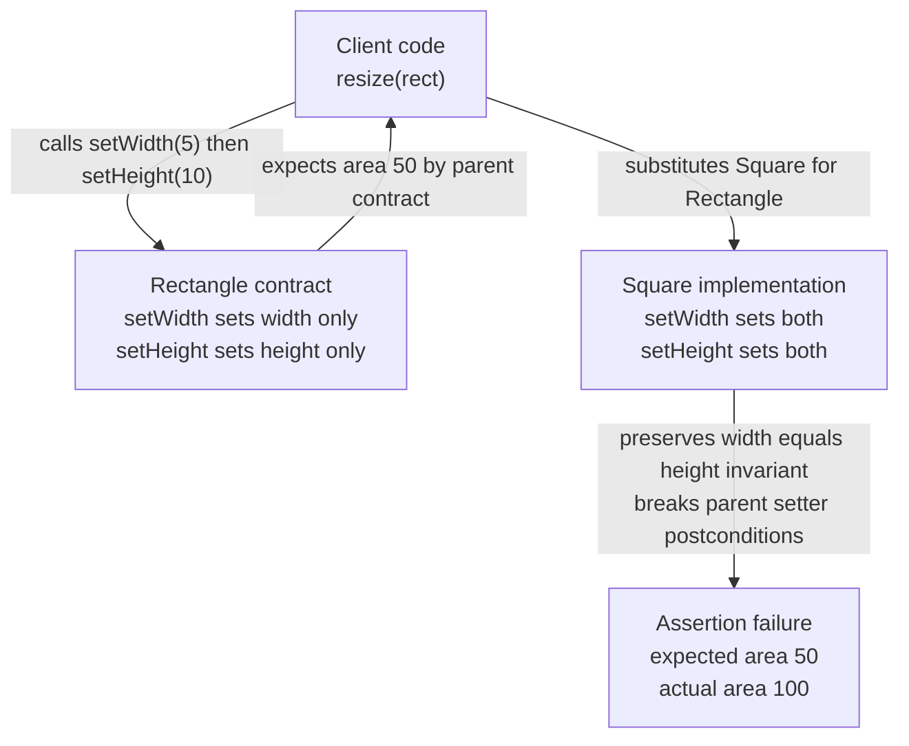
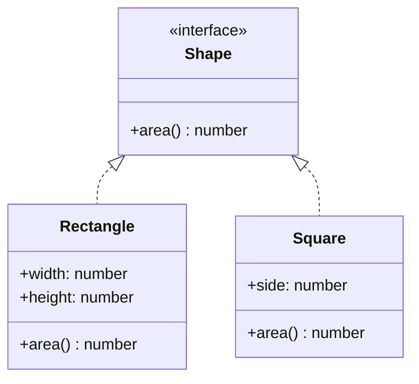
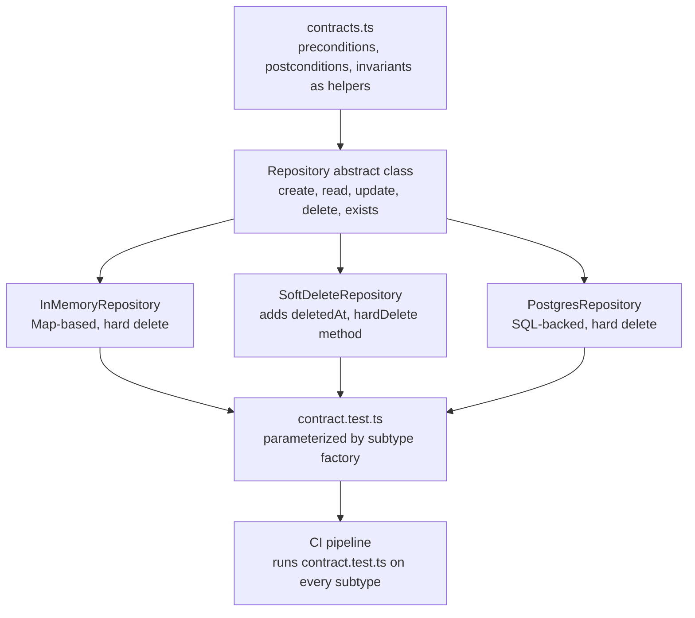

# 4.03 SOLID Liskov Substitution

## 1. Purpose

In 1987 Barbara Liskov delivered a keynote at the OOPSLA conference titled "Data Abstraction and Hierarchy." The single sentence she published that year, refined with Jeannette Wing in their 1994 paper "A Behavioral Notion of Subtyping," became the load-bearing definition of what it means for one type to be a subtype of another:

> Let phi(x) be a property provable about objects x of type T. Then phi(y) should be true for objects y of type S where S is a subtype of T.

In plainer English: if S is a subtype of T, then anywhere the program expects a T, you can hand it an S and the program must still behave correctly. The subtype cannot surprise the caller. The subtype cannot throw for inputs the supertype accepts. The subtype cannot weaken promises the supertype made. The subtype cannot mutate state the supertype promised to keep stable. Subtyping is not a syntactic relationship; it is a behavioral contract.

This is the L in SOLID. It is the principle most often quoted, most often misunderstood, and most often silently violated in everyday code. The other four SOLID principles tell you how to organize code; LSP tells you what inheritance means. Without LSP, the others are decoration on top of a broken substrate.

Why LSP exists:

**1. Inheritance is a promise, not a syntax trick.** A subclass, by virtue of being accepted wherever its parent is accepted, inherits the parent's contract. Callers reason about parent-typed references assuming the parent's behavior. If the subtype silently breaks that behavior, every caller is a latent bug. LSP exists to make the implicit promise explicit and the explicit promise enforceable.

**2. "Is-a" thinking leads developers into traps.** A Square is-a Rectangle in everyday language, so developers model Square as a subclass of Rectangle. Then Square.setHeight(10) silently changes width to 10 too, and a client that called setWidth(5) then setHeight(10) and expected area 50 receives 100. The "is-a" relationship was real in geometry and a lie in code. LSP forces the question: does the subtype behave like the supertype, not just look like it?

**3. Static types do not catch contract violations.** TypeScript will happily accept `class Square extends Rectangle` and confirm that a Square can be assigned to a Rectangle-typed variable. TypeScript checks shape; it does not check behavior. LSP is the principle that catches what types cannot.

**4. Surprising subtypes are the most expensive kind of bug.** When a method throws NotImplementedError for a parent method, or returns null where the parent never did, or accepts only a subset of inputs, the failure surfaces far from the cause. The caller was written against the parent's contract. The bug appears in code that has no reference to the subtype. LSP exists to make these failures impossible by construction.

The bug class this note explains:

- Square extends Rectangle, breaking area expectations because Square maintains width equal to height.
- A ReadOnlyList extends List and throws on push, pop, and splice — any client iterating and mutating breaks.
- An AdminUser extends User and throws on deactivate because admins cannot be deactivated, so the generic deactivation routine crashes for one user type.
- A CsvStreamReader extends StreamReader and returns empty strings for read instead of blocking, so consumers expecting blocking semantics busy-loop.
- A PersistentError extends Error and overrides toString to redact internal messages, so logging pipelines that depend on toString output produce corrupted audit trails.
- A TimeoutPromise extends Promise and resolves twice on timeout, breaking the one-resolution invariant.
- A SortedList extends List and accepts arbitrary inserts, then silently fails to maintain sort order.

Read this note once and you will be able to scan a class hierarchy and identify which subclasses violate LSP within five minutes, refactor a Square-Rectangle violation into composition or interface-based design, write a supertype test suite that any compliant subtype must pass, and explain to an interviewer why "is-a" is not enough.

## 2. Theory and Deep Dive

### 2.1 The two faces of subtyping

Subtyping has two faces. The syntactic face, enforced by TypeScript and most static type systems, says: S is a subtype of T if S has at least the members T has, with compatible types. This is structural subtyping in TypeScript's case (and nominal in Java's). The syntactic face answers the question "can I assign an S to a T-typed slot without a type error?"

The behavioral face, enforced by LSP, says: S is a subtype of T only if every program that behaves correctly when handed a T also behaves correctly when handed an S. This is not a type-system question; it is a program-behavior question. The behavioral face answers the question "can I substitute an S for a T and still trust the program?"

The gap between those two faces is where every LSP violation lives. TypeScript accepts the assignment; the program breaks at runtime.

### 2.2 The contract

The contract of a type is the set of obligations and guarantees that the type publishes. A contract has four parts:

**Preconditions** are what must be true before a method is called for the method to behave correctly. For Rectangle.setWidth(w), the precondition is `w > 0`. For Array.indexOf(x), the precondition is that `this` is an array (trivially true) and `x` is a value of any type (also trivial). For a bank Account.withdraw(amount), the precondition is `amount > 0`, `amount <= balance`, and `account is not frozen`.

**Postconditions** are what the method guarantees will be true after it returns, assuming the preconditions held. For Rectangle.setWidth(w), the postcondition is `this.width === w` and `this.height === old(this.height)` (unchanged) and `this.area() === w * this.height`. For Array.indexOf, the postcondition is `result === -1` (if x not present) or `this[result] === x` (if present) and the array is unchanged.

**Invariants** are conditions that must always be true for any instance of the type, before and after every method call. For Rectangle, invariants are `width > 0` and `height > 0`. For a SortedList, the invariant is `for all i, list[i] <= list[i+1]`. For a BankAccount, invariants might include `balance >= 0` and `createdAt` is immutable.

**History constraint** (sometimes called the immutability constraint) is the rule that a subtype cannot introduce state changes the supertype was allowed to make. If the supertype is immutable, the subtype must also be immutable. The subtype cannot add setters that the supertype lacked.

A type's contract is the conjunction of all four. A subtype honors the contract if and only if it satisfies all four LSP rules.

### 2.3 The four LSP rules

LSP is operationalized as four rules about how a subtype may differ from its supertype:

**Rule 1: Preconditions cannot be strengthened in a subtype.** The subtype may accept a superset of what the supertype accepts, never a subset. If Rectangle.setWidth accepts any positive number, Square.setWidth cannot reject inputs the parent accepts. If a parent UserRepository.findById accepts any string id, a subtype CachedUserRepository cannot reject ids shorter than 8 characters.

**Rule 2: Postconditions cannot be weakened in a subtype.** The subtype may promise more than the supertype, never less. If Rectangle.setWidth guarantees `this.width === w` after the call, the subtype cannot guarantee `this.width === w || this.width === oldWidth`. If a parent method guarantees it returns a non-null User, the subtype cannot return null.

**Rule 3: Invariants of the supertype must be preserved.** If Rectangle guarantees `width > 0` after construction, Square must also guarantee `width > 0` (and `width === height`, its additional invariant, but only on top of the parent's). The subtype may add invariants; it may not remove them.

**Rule 4: History constraint — no new mutability.** If the supertype is immutable, the subtype must be immutable. A subtype cannot add setters or mutating methods to an immutable parent. The reasoning: callers of an immutable supertype rely on the value not changing. If the subtype mutates, every reference held by such callers changes under them.

These four rules together define behavioral subtyping. S is a behavioral subtype of T if and only if S satisfies all four rules. Any violation of any rule is an LSP violation.

### 2.4 The Square/Rectangle problem

The Square/Rectangle problem is the canonical LSP violation. It appears in every textbook because it is the cleanest possible example of "is-a" being a lie.

Rectangle:

- Has width and height, independently settable.
- setWidth(w) sets width to w, leaves height unchanged.
- setHeight(h) sets height to h, leaves width unchanged.
- area() returns width times height.

Square:

- Has side length s, with the invariant width equal to height.
- setWidth(w) sets both width and height to w (to preserve the invariant).
- setHeight(h) sets both to h.

Now consider the client:

```js
function resize(rect) {
  rect.setWidth(5);
  rect.setHeight(10);
  console.assert(rect.area() === 50);
}
```

If you pass a Rectangle, area is 50. If you pass a Square, area is 100 (because setting height to 10 also set width to 10). The assert fails. The client, written against the Rectangle contract, breaks when handed a Square.

Square violates Rule 2 (postconditions): Rectangle.setWidth(w) promises `this.height === old(this.height)`, but Square.setWidth(w) changes height. Square also violates Rule 2 for setHeight: Rectangle.setHeight(h) promises `this.width === old(this.width)`, but Square.setHeight(h) changes width.

The geometric is-a relationship is real. The behavioral is-a relationship is false. Square is not a behavioral subtype of Rectangle because Square cannot honor Rectangle's postconditions on the setters without losing its own invariant. The two contracts are incompatible.

### 2.5 Mermaid: the Square/Rectangle violation



### 2.6 The fix: refactor away the inheritance

The Square/Rectangle problem is not fixed by tweaking Square. It is fixed by changing the inheritance relationship. Two standard refactorings:

**Refactor 1: Common Shape interface.** Both Rectangle and Square implement a Shape interface that exposes area(). Neither is a subtype of the other. Clients that need only area accept a Shape. Clients that need independent width/height setting accept a Rectangle (and never a Square).

**Refactor 2: Make the types immutable.** Rectangle is immutable: it has width and height set at construction, no setters. Square is immutable: it has side set at construction. Now Square could in principle extend Rectangle — but only because Rectangle's contract no longer has the setter postconditions that Square would violate. The two contracts align.

The general lesson: if a subtype would violate the parent's postconditions, do not make it a subtype. Either demote both to implementors of a shared interface, or remove the methods whose postconditions cannot be honored.

### 2.7 Mermaid: the LSP-compliant refactor



Both implement Shape. Neither inherits from the other. The independent-setter contract lives only on Rectangle; Square cannot violate a contract it never claimed to honor.

### 2.8 Why static types do not catch LSP violations

TypeScript's structural type system checks that a subtype has the right members with the right types. It does not check that the subtype's methods satisfy the parent's postconditions. It does not check that the subtype does not strengthen preconditions. It does not check that the subtype preserves invariants. These are behavioral properties, and TypeScript (like every mainstream statically-typed language) does not encode them.

A Square extends Rectangle in TypeScript compiles cleanly. The setWidth override has the same signature. The return type is the same. The structural check passes. The contract is broken at runtime, invisible to the type system.

This is why LSP cannot be enforced by the language. It must be enforced by design discipline, by code review, and by test suites that run every subtype against the supertype's tests. Section 7 covers this in detail.

### 2.9 LSP and the Open/Closed Principle

LSP is the foundation of the Open/Closed Principle (OCP, see [[4.02 SOLID Open Closed]]). OCP says a module should be open for extension but closed for modification. The mechanism by which you extend without modifying is substitution: you write the module against an abstraction, and you supply a new subtype at the seam. That substitution only works if the subtype honors the abstraction's contract — i.e., if the subtype is LSP-compliant.

If subtypes can violate LSP, OCP collapses. Every new subtype might require changes in the module that depends on it, because the module now has to special-case the surprising behavior. The "closed for modification" guarantee evaporates. OCP without LSP is a wish.

### 2.10 LSP and Interface Segregation

The Interface Segregation Principle (ISP, see [[4.04 SOLID Interface Segregation]]) is LSP's sibling. ISP says clients should not be forced to depend on methods they do not use. The connection to LSP: when an interface is fat (many methods), subtypes often have nothing sensible to do for some methods, and they throw NotImplementedError. That throw is an LSP violation (the parent's contract for that method, even if implicit, was "this method works").

ISP fixes this by splitting fat interfaces. Each subtype implements only the interfaces it can honor. LSP compliance becomes possible because no subtype is forced to claim it can do something it cannot.

### 2.11 Design by contract

Design by contract (DbC), formalized by Bertrand Meyer for Eiffel in the 1980s, is the engineering practice that makes LSP enforceable. DbC requires:

1. Preconditions, postconditions, and invariants written down — as comments, as assertions, or as executable checks.
2. Runtime checking of those contracts in development and test.
3. Subclasses that override methods must respect the parent's contracts: weaker or equal preconditions, stronger or equal postconditions, all invariants preserved.

In JavaScript and TypeScript, DbC is typically implemented with assertion helpers and runtime type guards (often via zod, io-ts, or hand-rolled checks). TypeScript's type system gives you the static shape; the assertion helpers give you the runtime behavior. Section 5.2 shows a full pattern.

### 2.12 Behavioral subtyping summarized

Behavioral subtyping is the requirement that a subtype be substitutable for its supertype in every observable context. The four LSP rules are the decomposition of that requirement into operational checks. The contract (preconditions, postconditions, invariants, history) is the medium through which the checks are expressed. The test suite is the executable form of the contract. The code review is the human form. All three together — contract documentation, executable tests, and review — are how a team enforces LSP in a real codebase.

## 3. Mental Models

**Mental model 1: The battery duck.** "If it looks like a duck and quacks like a duck, but needs batteries, you probably have the wrong abstraction." A subtype that needs additional setup, additional arguments, additional state, or additional privileges beyond what the supertype's contract specifies is a battery duck. It looks right structurally; it lies behaviorally. Square is a battery duck: it looks like a Rectangle (it has width, height, area) but it needs the additional constraint width equal to height, which the parent's contract does not mention.

**Mental model 2: The substitution test.** Before declaring S a subtype of T, run every test you wrote for T against S. If any test fails, S is not a subtype of T, regardless of what the syntax says. This is the operational version of LSP. Tests are the executable form of the contract.

**Mental model 3: The contract triangle.** A type's contract has three vertices: preconditions (what the type demands of callers before a method runs), postconditions (what the type guarantees after the method runs), and invariants (what the type guarantees about itself at all observable times). Subtyping is substitutability across all three vertices simultaneously.

**Mental model 4: Behavior, not structure.** When in doubt, ask: does S behave like T would in every situation the program might put it in? If there is even one situation where S surprises a T-expecting caller, the answer is no. TypeScript answers the structural question; only you can answer the behavioral question.

**Mental model 5: Subtype equals "honors the parent's contract, no surprises."** This is the slogan-length version of LSP. Any subtype that produces a surprise — a thrown error, a missing return value, an unexpected side effect, a forbidden state change — fails the slogan and fails LSP.

**Where the metaphors break down:** the battery duck metaphor is good for flagging suspicious subtypes but bad at explaining the four-rule structure. The substitution test is operationally precise but only as good as the test suite — a missing test for a postcondition lets violations through. The contract triangle is the precise model and should be your default; the other two are intuitive entry points. The slogan is memorable but vague; reach for the four rules when you need precision.

## 4. Real-World Use Cases

LSP violations appear in production code with depressing regularity. The patterns below recur across codebases, languages, and decades.

**1. Subclassing Array.** The DOM's NodeList is array-like but not an Array. For years developers wrote `class MyArray extends Array` to add utility methods, only to discover that V8's hidden-class optimizations demote the subclass to a slow path, that `Symbol.species` interplays unexpectedly with `map` and `filter` (the returned array is sometimes the subclass, sometimes Array), and that the subclass's constructor must correctly forward arguments to the parent. The LSP-compliant path: do not subclass Array. Use a plain Array and attach utility functions, or wrap an Array in a class via composition (the class has an `items` field of type Array).

**2. Subclassing Error.** `class MyError extends Error` is so common that TypeScript's documentation recommends it. Pre-ES6 transpilers shipped broken versions of this pattern (see [[1.17 Subclassing Prototypal Underpinnings]]). Even today, subclassing Error requires care: the `message` property, the `stack` property, and `name` must all be preserved. A subclass that overrides toString to redact internal details, or that swallows the stack on construction, violates the Error contract — callers that log errors via toString will see corrupted output. The LSP rule: a custom error must be substitutable for Error everywhere, including in catch blocks, logging pipelines, and error-reporting services.

**3. Subclassing Stream.** Node's Readable, Writable, Duplex, and Transform streams ([[3.07 Streams Fundamentals]]) are designed for subclassing. But each subclass must honor the stream contract: a Readable subclass must produce data when the runtime requests it via its read implementation method, must emit 'data' and 'end' at the right times, must respect backpressure (pausing when the consumer is slow). A subclass that emits 'data' before the consumer attaches a listener loses data. A subclass that calls `push(chunk)` synchronously in the constructor violates the lifecycle contract. Stream subclassing is the canonical example of LSP holding the entire Node ecosystem together — every transform stream, every custom readable, every duplex is substitutable for the base classes because they all honor the contracts documented in the Node stream spec.

**4. Subclassing Promise.** `class TimeoutPromise extends Promise` is an antipattern. The Promise contract is: resolve at most once, reject at most once, never both. A TimeoutPromise that resolves twice on timeout violates this. Subclassing Promise is also technically tricky because Promise's constructor uses the executor pattern and `Symbol.species` controls the constructor used by `.then`. The LSP-compliant path: do not subclass Promise. Use `Promise.race` with a timeout, or wrap a Promise in a class that exposes a different interface.

**5. Repository subclasses.** A generic Repository exposes CRUD: create, read, update, delete. A subtype SoftDeleteRepository overrides delete to set a `deletedAt` flag instead of removing the record. This is LSP-compliant if (a) read honors the deletion (returns null or throws NotFound), (b) the soft-delete is observable to other queries consistently, and (c) the contract for delete ("after delete, the record is gone") is amended in the parent to "after delete, the record is no longer visible to read". If the parent contract is hard delete and the subtype silently does soft delete, a caller that depends on disk space being freed will be surprised. Section 5.2 shows a clean version.

**6. The NotImplementedError antipattern.** A subclass throws `throw new Error('not implemented')` for a parent method it cannot support. This is the most direct LSP violation: the parent's contract is "this method works", the subtype's contract is "this method throws". Common in fat-interface implementations where the interface was not segregated (see [[4.04 SOLID Interface Segregation]]). Examples: a ReadOnlyCollection extends Collection and throws on add; a GuestUser extends User and throws on changePassword; an InMemoryStore extends PersistentStore and throws on flushToDisk. Every one of these is a structural is-a relationship that is a behavioral is-not.

**7. ORM base classes.** ORMs like TypeORM, Sequelize, and Prisma often encourage entity inheritance: `class Admin extends User`. The trap: the ORM may dispatch lifecycle hooks (beforeInsert, afterUpdate) polymorphically, and a subtype that throws or returns unexpected values from a hook breaks every query that touches that entity. Subtypes of ORM entities must be carefully LSP-compliant because the ORM is a generic client of every entity.

**8. Express middleware and error handlers.** Express error handlers have the signature `(err, req, res, next)`. A custom error handler that does not call `next` when it cannot handle the error type breaks the chain. The contract is "either respond or call next". A subtype (in the sense of a function passed where an error handler is expected) that does neither is an LSP violation against the Express error-handler contract. The same applies to Connect-style middleware: a middleware that does not call `next` and does not send a response breaks the chain.

**9. React component hierarchies.** Although React favors composition over inheritance, class components (and the rare modern subclass) must honor the React component contract: render returns ReactNode, lifecycle methods are called by React in a specific order, state updates are async. A subclass that overrides shouldComponentUpdate to always return false breaks siblings that depend on prop changes propagating. A subclass that overrides render to return undefined violates the implicit postcondition that render returns something React can render.

**10. EventTarget subclasses.** Custom EventTarget subclasses must honor the dispatch contract: addEventListener registers, removeEventListener unregisters, dispatchEvent fires listeners synchronously in registration order. A subclass that fires listeners asynchronously breaks callers expecting ordering. A subclass that swallows preventDefault breaks callers depending on cancellation.

## 5. Code Examples

### 5.1 Example A — Minimal and Conceptual

The Square/Rectangle violation, side by side in JS and TS, followed by the LSP-compliant refactor.

#### The violation

**JavaScript:**

```javascript
class Rectangle {
  constructor(width, height) {
    if (width <= 0 || height <= 0) {
      throw new Error('width and height must be positive');
    }
    this.width = width;
    this.height = height;
  }

  setWidth(w) {
    if (w <= 0) throw new Error('width must be positive');
    this.width = w;
  }

  setHeight(h) {
    if (h <= 0) throw new Error('height must be positive');
    this.height = h;
  }

  area() {
    return this.width * this.height;
  }
}

class Square extends Rectangle {
  constructor(side) {
    super(side, side);
  }

  setWidth(w) {
    if (w <= 0) throw new Error('width must be positive');
    this.width = w;
    this.height = w;
  }

  setHeight(h) {
    if (h <= 0) throw new Error('height must be positive');
    this.width = h;
    this.height = h;
  }
}

function resize(rectangle) {
  rectangle.setWidth(5);
  rectangle.setHeight(10);
  console.assert(rectangle.area() === 50, 'expected area 50');
}

resize(new Rectangle(2, 2));
resize(new Square(2));
```

The first call passes. The second call asserts: area is 100, not 50. Square broke Rectangle's postcondition that setWidth leaves height unchanged.

**TypeScript:**

```typescript
class Rectangle {
  protected width: number;
  protected height: number;

  constructor(width: number, height: number) {
    if (width <= 0 || height <= 0) {
      throw new Error('width and height must be positive');
    }
    this.width = width;
    this.height = height;
  }

  setWidth(w: number): void {
    if (w <= 0) throw new Error('width must be positive');
    this.width = w;
  }

  setHeight(h: number): void {
    if (h <= 0) throw new Error('height must be positive');
    this.height = h;
  }

  area(): number {
    return this.width * this.height;
  }
}

class Square extends Rectangle {
  constructor(side: number) {
    super(side, side);
  }

  setWidth(w: number): void {
    if (w <= 0) throw new Error('width must be positive');
    this.width = w;
    this.height = w;
  }

  setHeight(h: number): void {
    if (h <= 0) throw new Error('height must be positive');
    this.width = h;
    this.height = h;
  }
}

function resize(rectangle: Rectangle): void {
  rectangle.setWidth(5);
  rectangle.setHeight(10);
  console.assert(rectangle.area() === 50, 'expected area 50');
}

resize(new Rectangle(2, 2));
resize(new Square(2));
```

TypeScript compiles this without complaint. The structural check passes. The contract is broken at runtime.

#### The fix: shared interface, no inheritance

**JavaScript:**

```javascript
class Shape {
  area() {
    throw new Error('subclass must implement area');
  }
}

class Rectangle extends Shape {
  constructor(width, height) {
    super();
    if (width <= 0 || height <= 0) {
      throw new Error('width and height must be positive');
    }
    this.width = width;
    this.height = height;
  }

  setWidth(w) {
    if (w <= 0) throw new Error('width must be positive');
    this.width = w;
  }

  setHeight(h) {
    if (h <= 0) throw new Error('height must be positive');
    this.height = h;
  }

  area() {
    return this.width * this.height;
  }
}

class Square extends Shape {
  constructor(side) {
    super();
    if (side <= 0) throw new Error('side must be positive');
    this.side = side;
  }

  setSide(s) {
    if (s <= 0) throw new Error('side must be positive');
    this.side = s;
  }

  area() {
    return this.side * this.side;
  }
}

function resize(rectangle) {
  rectangle.setWidth(5);
  rectangle.setHeight(10);
  console.assert(rectangle.area() === 50, 'expected area 50');
}

resize(new Rectangle(2, 2));
// resize(new Square(2));
// Square has no setWidth method; the bug cannot occur by construction.
// A function that needs only area accepts a Shape.

function totalArea(shapes) {
  return shapes.reduce((sum, s) => sum + s.area(), 0);
}

totalArea([new Rectangle(2, 3), new Square(4)]); // 6 + 16 = 22
```

Square is no longer a Rectangle. The independent-setter contract is not inherited and cannot be violated. The shared interface is Shape (area only), which both honor.

**TypeScript:**

```typescript
interface Shape {
  area(): number;
}

class Rectangle implements Shape {
  private width: number;
  private height: number;

  constructor(width: number, height: number) {
    if (width <= 0 || height <= 0) {
      throw new Error('width and height must be positive');
    }
    this.width = width;
    this.height = height;
  }

  setWidth(w: number): void {
    if (w <= 0) throw new Error('width must be positive');
    this.width = w;
  }

  setHeight(h: number): void {
    if (h <= 0) throw new Error('height must be positive');
    this.height = h;
  }

  area(): number {
    return this.width * this.height;
  }
}

class Square implements Shape {
  private side: number;

  constructor(side: number) {
    if (side <= 0) throw new Error('side must be positive');
    this.side = side;
  }

  setSide(s: number): void {
    if (s <= 0) throw new Error('side must be positive');
    this.side = s;
  }

  area(): number {
    return this.side * this.side;
  }
}

function resize(rectangle: Rectangle): void {
  rectangle.setWidth(5);
  rectangle.setHeight(10);
  console.assert(rectangle.area() === 50, 'expected area 50');
}

resize(new Rectangle(2, 2));
// resize(new Square(2));
// Type error: Square is not assignable to Rectangle.
// TypeScript itself refuses the substitution at the call site.

function totalArea(shapes: Shape[]): number {
  return shapes.reduce((sum, s) => sum + s.area(), 0);
}

totalArea([new Rectangle(2, 3), new Square(4)]); // 22
```

TypeScript now refuses the substitution at the call site. The bug cannot occur. The shared Shape interface allows both to be passed wherever only `area()` is needed.

### 5.2 Example B — Production-Grade

A typed repository hierarchy with LSP-compliant contracts, runtime contract checks, and a supertype test suite. This pattern is suitable for a real codebase with audit requirements.

**JavaScript:**

```javascript
class Repository {
  constructor(options = {}) {
    this.entityType = options.entityType || 'Repository';
    this.auditLog = [];
  }

  async create(record) {
    throw new Error('Repository.create must be implemented by subclass');
  }

  async read(id) {
    throw new Error('Repository.read must be implemented by subclass');
  }

  async update(id, patch) {
    throw new Error('Repository.update must be implemented by subclass');
  }

  async delete(id) {
    throw new Error('Repository.delete must be implemented by subclass');
  }

  async exists(id) {
    const found = await this.read(id);
    return found !== null && found !== undefined;
  }

  log(message) {
    this.auditLog.push({ at: new Date().toISOString(), message });
  }
}

class InMemoryRepository extends Repository {
  constructor(options = {}) {
    super(options);
    this.store = new Map();
  }

  async create(record) {
    if (!record || typeof record.id === 'undefined') {
      throw new Error('record must have an id');
    }
    if (this.store.has(record.id)) {
      throw new Error(`record ${record.id} already exists`);
    }
    const clone = Object.freeze({ ...record });
    this.store.set(record.id, clone);
    this.log(`created ${record.id}`);
    return clone;
  }

  async read(id) {
    return this.store.has(id) ? this.store.get(id) : null;
  }

  async update(id, patch) {
    if (!this.store.has(id)) {
      throw new Error(`record ${id} not found`);
    }
    const current = this.store.get(id);
    const next = Object.freeze({ ...current, ...patch, id });
    this.store.set(id, next);
    this.log(`updated ${id}`);
    return next;
  }

  async delete(id) {
    if (!this.store.has(id)) {
      throw new Error(`record ${id} not found`);
    }
    this.store.delete(id);
    this.log(`deleted ${id}`);
  }
}

class SoftDeleteRepository extends InMemoryRepository {
  constructor(options = {}) {
    super(options);
    this.deletedAt = new Map();
  }

  async read(id) {
    if (this.deletedAt.has(id)) return null;
    return super.read(id);
  }

  async delete(id) {
    if (!this.store.has(id)) {
      throw new Error(`record ${id} not found`);
    }
    this.deletedAt.set(id, new Date().toISOString());
    this.log(`soft-deleted ${id}`);
  }

  async hardDelete(id) {
    if (!this.deletedAt.has(id)) {
      throw new Error(`record ${id} is not soft-deleted`);
    }
    this.store.delete(id);
    this.deletedAt.delete(id);
    this.log(`hard-deleted ${id}`);
  }
}

async function runRepositoryContract(repo) {
  const created = await repo.create({ id: 1, name: 'alpha' });
  if (created.id !== 1) throw new Error('create postcondition violated');
  if (created.name !== 'alpha') throw new Error('create postcondition violated');

  const read = await repo.read(1);
  if (read === null) throw new Error('read postcondition violated');
  if (read.name !== 'alpha') throw new Error('read postcondition violated');

  const updated = await repo.update(1, { name: 'beta' });
  if (updated.name !== 'beta') throw new Error('update postcondition violated');
  if (updated.id !== 1) throw new Error('update invariant violated');

  await repo.delete(1);
  const afterDelete = await repo.read(1);
  if (afterDelete !== null) throw new Error('delete postcondition violated');
}

runRepositoryContract(new InMemoryRepository())
  .then(() => runRepositoryContract(new SoftDeleteRepository()))
  .then(() => console.log('both subtypes passed the supertype contract'))
  .catch((err) => console.error('LSP violation:', err.message));
```

SoftDeleteRepository is LSP-compliant because: (a) read honors the parent's contract (returns null for missing records, returns the record for present ones) — it strengthens postconditions on deleted records (returns null where the parent might still return a record), which is allowed; (b) delete honors the parent's contract (after delete, read returns null) — soft-delete happens to keep the record in memory, but read is overridden so the record is not observable; (c) hardDelete is a new method, not a parent method, so it cannot violate the parent's contract.

**TypeScript:**

```typescript
interface Identifiable {
  id: string | number;
}

interface RepositoryOptions {
  entityType?: string;
  enableAuditLog?: boolean;
}

interface AuditEntry {
  at: string;
  message: string;
}

abstract class Repository<T extends Identifiable> {
  protected readonly entityType: string;
  protected readonly auditLog: AuditEntry[];

  constructor(options: RepositoryOptions = {}) {
    this.entityType = options.entityType || 'Repository';
    this.auditLog = [];
  }

  abstract create(record: T): Promise<T>;
  abstract read(id: string | number): Promise<T | null>;
  abstract update(id: string | number, patch: Partial<T>): Promise<T>;
  abstract delete(id: string | number): Promise<void>;

  async exists(id: string | number): Promise<boolean> {
    const found = await this.read(id);
    return found !== null;
  }

  protected log(message: string): void {
    this.auditLog.push({ at: new Date().toISOString(), message });
  }
}

class InMemoryRepository<T extends Identifiable> extends Repository<T> {
  protected readonly store: Map<string | number, T>;

  constructor(options: RepositoryOptions = {}) {
    super(options);
    this.store = new Map();
  }

  async create(record: T): Promise<T> {
    if (this.store.has(record.id)) {
      throw new Error(`record ${String(record.id)} already exists`);
    }
    const clone: T = Object.freeze({ ...record }) as T;
    this.store.set(record.id, clone);
    this.log(`created ${String(record.id)}`);
    return clone;
  }

  async read(id: string | number): Promise<T | null> {
    return this.store.has(id) ? (this.store.get(id) as T) : null;
  }

  async update(id: string | number, patch: Partial<T>): Promise<T> {
    const current = this.store.get(id);
    if (!current) {
      throw new Error(`record ${String(id)} not found`);
    }
    const next: T = Object.freeze({ ...current, ...patch, id: current.id }) as T;
    this.store.set(id, next);
    this.log(`updated ${String(id)}`);
    return next;
  }

  async delete(id: string | number): Promise<void> {
    if (!this.store.has(id)) {
      throw new Error(`record ${String(id)} not found`);
    }
    this.store.delete(id);
    this.log(`deleted ${String(id)}`);
  }
}

class SoftDeleteRepository<T extends Identifiable> extends InMemoryRepository<T> {
  protected readonly deletedAt: Map<string | number, string>;

  constructor(options: RepositoryOptions = {}) {
    super(options);
    this.deletedAt = new Map();
  }

  async read(id: string | number): Promise<T | null> {
    if (this.deletedAt.has(id)) return null;
    return super.read(id);
  }

  async delete(id: string | number): Promise<void> {
    if (!this.store.has(id)) {
      throw new Error(`record ${String(id)} not found`);
    }
    this.deletedAt.set(id, new Date().toISOString());
    this.log(`soft-deleted ${String(id)}`);
  }

  async hardDelete(id: string | number): Promise<void> {
    if (!this.deletedAt.has(id)) {
      throw new Error(`record ${String(id)} is not soft-deleted`);
    }
    this.store.delete(id);
    this.deletedAt.delete(id);
    this.log(`hard-deleted ${String(id)}`);
  }
}

async function runRepositoryContract<T extends Identifiable>(
  repo: Repository<T>,
  sample: T
): Promise<void> {
  const created = await repo.create(sample);
  if (created.id !== sample.id) throw new Error('create postcondition violated');

  const read = await repo.read(sample.id);
  if (read === null) throw new Error('read postcondition violated');

  const updated = await repo.update(sample.id, {} as Partial<T>);
  if (updated.id !== sample.id) throw new Error('update invariant violated: id changed');

  await repo.delete(sample.id);
  const afterDelete = await repo.read(sample.id);
  if (afterDelete !== null) {
    throw new Error('delete postcondition violated: read after delete returned non-null');
  }

  const existsAfterDelete = await repo.exists(sample.id);
  if (existsAfterDelete) throw new Error('exists postcondition violated');
}

async function main() {
  try {
    await runRepositoryContract(
      new InMemoryRepository<{ id: number; name: string }>(),
      { id: 1, name: 'alpha' }
    );
    await runRepositoryContract(
      new SoftDeleteRepository<{ id: number; name: string }>(),
      { id: 1, name: 'alpha' }
    );
    console.log('both subtypes passed the supertype contract');
  } catch (err) {
    console.error('LSP violation:', (err as Error).message);
  }
}

main();
```

The contract test `runRepositoryContract` is the executable form of LSP. It runs against any subtype. If a subtype fails, it is not LSP-compliant. This is the pattern you should adopt in production code: write the contract test once, parameterize by subtype, run it against every subtype in CI.

## 6. Common Mistakes and Anti-Patterns

### 6.1 Mistake One: NotImplementedError on a parent method

```javascript
class ReadOnlyList extends Array {
  push(...items) {
    throw new Error('ReadOnlyList does not support push');
  }
  pop() {
    throw new Error('ReadOnlyList does not support pop');
  }
  splice(...args) {
    throw new Error('ReadOnlyList does not support splice');
  }
}
```

**Why it fails:** The parent's contract for push is "adds items to the end of the list". The subtype's contract is "throws". The subtype has strengthened its postcondition beyond what the parent allows (the parent allowed items to be added; the subtype does not). Every caller written against Array that calls push breaks when handed a ReadOnlyList.

**Fix:** Do not subclass Array. Use composition, or use a separate ReadOnlyList interface that does not include mutating methods.

```javascript
class ReadOnlyListView {
  constructor(items) {
    this.items = Object.freeze([...items]);
  }
  at(i) { return this.items[i]; }
  get length() { return this.items.length; }
  [Symbol.iterator]() { return this.items[Symbol.iterator](); }
}
```

### 6.2 Mistake Two: Strengthening preconditions

```javascript
class UserRepository {
  async findById(id) {
    if (typeof id !== 'string') throw new Error('id must be a string');
    // ... fetch from db
  }
}

class CachedUserRepository extends UserRepository {
  async findById(id) {
    if (typeof id !== 'string') throw new Error('id must be a string');
    if (id.length < 8) throw new Error('id must be at least 8 characters'); // strengthened
    // ... check cache, then super.findById
  }
}
```

**Why it fails:** The parent accepts any string id. The subtype rejects short strings. A caller written against UserRepository that passes a 5-character id breaks when handed a CachedUserRepository. The subtype has strengthened the precondition.

**Fix:** Either reject short ids in the parent (if that is the real contract) or do not strengthen in the subtype. Cache lookups for short ids can be no-ops (cache miss then falls through to super).

```javascript
class CachedUserRepository extends UserRepository {
  async findById(id) {
    if (id.length >= 8 && this.cache.has(id)) return this.cache.get(id);
    const result = await super.findById(id);
    if (result && id.length >= 8) this.cache.set(id, result);
    return result;
  }
}
```

### 6.3 Mistake Three: Weakening postconditions

```javascript
class OrderRepository {
  async findById(id) {
    // returns the order or null
    return db.orders.findOne({ id });
  }
}

class OrderRepositoryWithFallback extends OrderRepository {
  async findById(id) {
    const local = await super.findById(id);
    if (local === null) {
      return { id, status: 'unknown' }; // synthesized record
    }
    return local;
  }
}
```

**Why it fails:** The parent's contract is "returns the order or null". The subtype returns a synthesized record instead of null. A caller that checks for null to mean "not found" will treat the synthesized record as a real order. The subtype has weakened the postcondition (it no longer guarantees null means not found).

**Fix:** Either change the parent's contract to allow synthesized records (and update all callers) or do not synthesize.

```javascript
class OrderRepositoryWithFallback extends OrderRepository {
  async findById(id) {
    return super.findById(id);
  }
  async findByIdOrSynthesize(id) {
    const local = await super.findById(id);
    return local !== null ? local : { id, status: 'unknown' };
  }
}
```

The new method has a different name and a different contract. No caller of findById is surprised.

### 6.4 Mistake Four: Adding surprising side effects

```javascript
class User {
  constructor(name) {
    this.name = name;
    this.createdAt = new Date();
  }
  rename(newName) {
    this.name = newName;
  }
}

class AuditedUser extends User {
  rename(newName) {
    super.rename(newName);
    this.lastModifiedAt = new Date();
    sendEmail(this.email, 'Your name was changed'); // surprise!
  }
}
```

**Why it fails:** The parent's rename has the implicit postcondition "updates the name and has no other observable effect". The subtype adds an email send. A caller in a test, in a transaction, or in a low-priority path is surprised by the email.

**Fix:** Either declare the side effect in the parent (rename may trigger notifications) or extract the notification to a separate method.

```javascript
class AuditedUser extends User {
  rename(newName) {
    super.rename(newName);
    this.lastModifiedAt = new Date();
  }
  renameAndNotify(newName) {
    this.rename(newName);
    sendEmail(this.email, 'Your name was changed');
  }
}
```

### 6.5 Mistake Five: Incompatible return type that weakens the contract

```javascript
class PaymentGateway {
  async charge(amount) {
    return { success: true, transactionId: 'tx-1' };
  }
}

class StubPaymentGateway extends PaymentGateway {
  async charge(amount) {
    return null; // no transactionId, no success flag
  }
}
```

**Why it fails:** The parent's contract is "returns an object with success and transactionId". The subtype returns null. Any caller that reads `result.transactionId` throws.

**Fix:** The stub must return a result shaped like the parent's, or the parent must declare that null is a possible return (in which case all callers must check).

```javascript
class StubPaymentGateway extends PaymentGateway {
  async charge(amount) {
    return { success: false, transactionId: null, reason: 'stub' };
  }
}
```

### 6.6 Mistake Six: History constraint violation (subtype adds mutability to immutable parent)

```javascript
class ImmutablePoint {
  constructor(x, y) {
    this.x = x;
    this.y = y;
    Object.freeze(this);
  }
  withX(newX) {
    return new ImmutablePoint(newX, this.y);
  }
}

class MutablePoint extends ImmutablePoint {
  setX(newX) { this.x = newX; } // adds mutability
}
```

**Why it fails:** ImmutablePoint is frozen. Callers rely on references not changing. MutablePoint unfreezes and adds a setter. A caller that held an ImmutablePoint reference and asserted `point.x === originalX` now sees `point.x` change.

**Fix:** Do not subclass immutable types with mutable ones. Use a separate MutablePoint class.

```javascript
class ImmutablePoint {
  constructor(x, y) { this.x = x; this.y = y; Object.freeze(this); }
  withX(newX) { return new ImmutablePoint(newX, this.y); }
  withY(newY) { return new ImmutablePoint(this.x, newY); }
}

class MutablePoint {
  constructor(x, y) { this.x = x; this.y = y; }
  setX(newX) { this.x = newX; return this; }
  setY(newY) { this.y = newY; return this; }
  toImmutable() { return new ImmutablePoint(this.x, this.y); }
}
```

The two classes coexist. Neither inherits from the other. A conversion method (`toImmutable`) bridges them.

### 6.7 Mistake Seven: "Is-a" thinking without "behaves-as-a" validation

```javascript
class Bird {
  fly() { /* take off */ }
  layEgg() { /* ... */ }
}

class Ostrich extends Bird {
  fly() {
    throw new Error('ostriches cannot fly');
  }
}
```

**Why it fails:** An ostrich is-a bird in everyday language. But if Bird's contract includes "fly() makes the bird fly", an ostrich is not a behavioral bird. The structural is-a is real; the behavioral is-a is false.

**Fix:** Model the capability separately.

```javascript
class Bird {
  layEgg() { /* ... */ }
}

class FlyingBird extends Bird {
  fly() { /* take off */ }
}

class FlightlessBird extends Bird {
  // no fly method
}

class Ostrich extends FlightlessBird {}
class Sparrow extends FlyingBird {}
```

Now no caller of a FlightlessBird tries to call fly.

### 6.8 Mistake Eight: Overriding a method to do nothing

```javascript
class LifecycleHook {
  afterSave(record) {
    this.updateSearchIndex(record);
  }
}

class NoOpHook extends LifecycleHook {
  afterSave(record) {
    // intentionally empty
  }
}
```

**Why it fails:** If the parent's contract for afterSave is "updates the search index", the subtype that does nothing has weakened the postcondition. The search index is now stale.

**Fix:** Either make the parent's contract explicit that afterSave is optional, or do not subclass. Better: define a separate interface for the optional hook.

```javascript
class LifecycleHook {
  afterSave(record) {
    this.updateSearchIndex(record);
  }
}

// NoOpHook is not a subtype; it is a different class.
class NoOpHook {
  afterSave(record) { /* no-op */ }
}
```

If your framework needs to accept either, define an interface both implement, with the contract "afterSave is called but the implementation may do anything (including nothing)".

## 7. Best Practices and Design Patterns

**1. Design by contract.** Document preconditions, postconditions, and invariants for every public method. The documentation can be JSDoc, a TypeScript doc comment, or an executable assertion. The act of writing the contract forces you to think about what the method promises. Without a written contract, you cannot tell whether a subtype honors it.

```typescript
/**
 * Sets the width of this rectangle.
 *
 * @precondition w > 0
 * @postcondition this.width === w
 * @postcondition this.height === old(this.height)
 * @postcondition this.area() === w * old(this.height)
 * @param w the new width, must be positive
 */
setWidth(w: number): void { /* ... */ }
```

**2. Favor composition over inheritance when LSP would be violated.** If the subtype cannot honor the parent's postconditions, do not inherit. Use composition: the new class holds an instance of the would-be parent and exposes only the methods it can honor. Square does not extend Rectangle; Square holds a side and exposes area(). A ReadOnlyListView does not extend Array; it holds an Array and exposes at, length, and iteration.

This is the same advice given in [[1.18 Mixins and Composition]]. LSP is the technical reason why.

**3. Use interfaces for capabilities, classes for shared implementation.** Rectangle and Square both implement Shape (capability). Neither inherits from the other. Inheritance is reserved for cases where the subtype truly honors the parent's full contract. The general rule: prefer many small interfaces to one large base class.

This is also the Interface Segregation Principle (see [[4.04 SOLID Interface Segregation]]). LSP and ISP reinforce each other: small interfaces are easier to honor in full, which makes LSP compliance easier.

**4. Use TypeScript to enforce contracts at compile time.** TypeScript's type system catches structural violations. If a subtype overrides a method with an incompatible signature, TypeScript rejects the override. If a subtype returns the wrong type, TypeScript rejects the assignment. Use `readonly` fields for invariants. Use `private` and `protected` to prevent subtypes from breaking invariants by direct field access.

```typescript
interface Shape { area(): number; }

class Rectangle implements Shape {
  private readonly width: number;
  private readonly height: number;
  constructor(width: number, height: number) {
    this.width = width;
    this.height = height;
  }
  area() { return this.width * this.height; }
}
```

`readonly` fields cannot be reassigned after construction, which prevents the history constraint violation.

**5. Test subtypes against supertype tests.** Write a test suite for the supertype's contract. Run it against every subtype. If a subtype fails any test, it is not LSP-compliant. This is the most direct operational test of LSP.

```typescript
function runRepositoryContract<T extends Identifiable>(
  repo: Repository<T>,
  sample: T
): Promise<void> { /* see Section 5.2 */ }
```

In Jest or Vitest, this is typically done with a parameterized test that loops over a list of subtype factories:

```typescript
const subtypes: Array<{ name: string; make: () => Repository<TestRecord> }> = [
  { name: 'InMemory', make: () => new InMemoryRepository<TestRecord>() },
  { name: 'SoftDelete', make: () => new SoftDeleteRepository<TestRecord>() },
  { name: 'Postgres', make: () => new PostgresRepository<TestRecord>(testPool) },
];

for (const { name, make } of subtypes) {
  describe(`Repository contract for ${name}`, () => {
    beforeEach(() => { /* reset state */ });
    it('honors create-read-update-delete', async () => {
      await runRepositoryContract(make(), { id: 1, name: 'alpha' });
    });
  });
}
```

This pattern catches LSP violations in CI before they reach production.

**6. Avoid NotImplementedError.** If a subtype cannot implement a parent method, the interface is too fat. Split it (ISP) or use composition. Never throw NotImplementedError from a parent method; it is a structural admission of an LSP violation.

**7. Make immutability the default.** Immutable types cannot violate the history constraint (there is no mutation to add). Immutable types are also automatically thread-safe, which matters in Node worker threads (see [[3.18 Worker Threads]]). The more of your domain model is immutable, the fewer LSP violations you will write.

**8. Audit overrides carefully.** Every method override is a potential LSP violation. For each override, ask: does it strengthen a precondition? Does it weaken a postcondition? Does it add a side effect? Does it change a return type? If the answer to any of these is yes, the override is suspect. Code review should treat every override as requiring justification.

**9. When to break the rule.** LSP is a strong principle, but it is not absolute. Some legacy hierarchies have known LSP violations that cannot be refactored without breaking the world. In those cases: (a) document the violation explicitly, (b) write tests that verify the actual (violating) behavior so callers know what to expect, (c) contain the violation to the smallest possible scope, (d) plan a migration path. Do not pretend the violation does not exist; that is how callers write code against the parent contract and break in production.

**10. Library that exemplifies the practice.** The Node.js stream library ([[3.07 Streams Fundamentals]]) is the canonical example. Readable, Writable, Duplex, and Transform are subclassed by hundreds of community implementations (gzip, csv parsers, encryption streams, request bodies). They all work because the stream contract is precisely documented and runtime-asserted: a Readable that emits 'data' before listeners attach loses data, and the runtime warns about this. The Node stream implementation is design by contract in action.

## 8. Technical Interview Knowledge

### 8.1 Question One

**Q:** What is the Liskov Substitution Principle?

**A:** LSP states that objects of a subtype shall be substitutable for objects of the supertype without altering the correctness of the program. Formally, if S is a subtype of T, then for any property provable about objects of type T, that property must hold for objects of type S. Operationally, this means a subtype must honor the supertype's contract: preconditions cannot be strengthened, postconditions cannot be weakened, invariants must be preserved, and the subtype cannot add mutability the supertype lacked. LSP is the principle that makes inheritance safe; without it, polymorphism becomes a source of latent bugs.

**Trap to avoid:** Do not answer "subtypes can be used wherever the supertype is used." That is the syntactic definition, and it is what TypeScript enforces. LSP is the behavioral definition: subtypes must behave correctly when used wherever the supertype is used.

### 8.2 Question Two

**Q:** Explain the Square/Rectangle problem.

**A:** A Rectangle has independent width and height, with setWidth and setHeight methods. A Square is geometrically a Rectangle, so developers often model Square extends Rectangle. But Square must maintain width equal to height, so Square.setWidth also sets height, and Square.setHeight also sets width. A client written against the Rectangle contract that calls setWidth(5), setHeight(10), and expects area 50 gets 100 from a Square. Square violates Rectangle's postcondition that setWidth leaves height unchanged. The fix is to not model Square as a subtype of Rectangle: either share a Shape interface that exposes only area, or make both immutable. The lesson: geometric is-a does not imply behavioral is-a.

**Trap to avoid:** Do not propose "fix Square so setWidth only sets width". That breaks Square's invariant. The point is that Square's invariant and Rectangle's contract are incompatible; no tweak to Square resolves the conflict.

### 8.3 Question Three

**Q:** What is a contract in the context of LSP?

**A:** A contract is the set of obligations and guarantees a type publishes. It has four parts: preconditions (what must be true before a method is called), postconditions (what the method guarantees will be true after it returns), invariants (what must always be true for any instance of the type), and the history constraint (the subtype cannot introduce state changes the supertype did not allow, e.g., adding mutability to an immutable parent). A subtype honors the contract if it satisfies all four LSP rules.

**Trap to avoid:** Do not confuse the contract with the type signature. The signature is structural (parameters and return type). The contract is behavioral (what the method promises about state and effects).

### 8.4 Question Four

**Q:** What are preconditions and postconditions, and how do they constrain subtypes?

**A:** Preconditions are conditions that must hold before a method is called for the method to behave correctly (e.g., `amount > 0` for withdraw). Postconditions are conditions the method guarantees will hold after it returns, assuming the preconditions held (e.g., `this.balance === old(this.balance) - amount`). LSP constrains subtypes: preconditions cannot be strengthened in a subtype (the subtype may accept more inputs, never fewer), and postconditions cannot be weakened (the subtype may promise more, never less). A subtype that strengthens a precondition breaks callers that pass inputs the parent accepted. A subtype that weakens a postcondition breaks callers that depend on the parent's guarantees.

**Trap to avoid:** Do not say "preconditions can be relaxed in a subtype". The precise statement is "preconditions cannot be strengthened" — which is equivalent to "preconditions can be weakened or kept the same". Use the canonical phrasing.

### 8.5 Question Five

**Q:** How do you test LSP compliance?

**A:** Write a contract test suite for the supertype: a set of tests that verify the supertype's preconditions, postconditions, and invariants. Then run the same suite against every subtype, parameterized by a subtype factory. If any subtype fails any test, it is not LSP-compliant. This is the operational form of LSP: the contract is the test suite, and substitution is the test run. In Jest or Vitest, the pattern is a loop over subtype factories that wraps the same `describe` block. Any new subtype added to the codebase automatically inherits the contract test by being added to the loop.

**Trap to avoid:** Do not say "use TypeScript to enforce LSP". TypeScript enforces structural subtyping, not behavioral. It cannot catch a Square that overrides setWidth to also set height.

### 8.6 Question Six

**Q:** When would you NOT use inheritance?

**A:** Do not use inheritance when the subtype cannot honor the supertype's full contract. Specifically: (a) when the subtype would throw for a parent method (NotImplementedError pattern), (b) when the subtype would strengthen a precondition (reject inputs the parent accepted), (c) when the subtype would weaken a postcondition (return less than the parent promised), (d) when the subtype would add surprising side effects, (e) when the subtype would change the return type incompatibly, (f) when the subtype would add mutability to an immutable parent, (g) when the "is-a" relationship is structural but not behavioral (Ostrich extends Bird but cannot fly). In all these cases, use composition (the new class holds an instance of the would-be parent) or a shared interface (both classes implement a smaller interface).

**Trap to avoid:** Do not answer "use composition always". Inheritance is appropriate when the subtype truly honors the supertype's contract and code reuse is the goal. The question is when NOT to use inheritance; the answer is when LSP would be violated.

### 8.7 Question Seven

**Q:** What is the history constraint?

**A:** The history constraint (sometimes called the immutability constraint) is the fourth LSP rule: a subtype cannot introduce state changes that the supertype did not allow. The most common case is that an immutable supertype cannot have a mutable subtype. If ImmutablePoint is frozen at construction, MutablePoint extends ImmutablePoint with a setX method violates the history constraint: callers that held an ImmutablePoint reference assumed the value would never change, but the subtype mutates it. The reasoning: callers of an immutable supertype rely on the value not changing over time. The subtype that adds mutation breaks this reliance.

**Trap to avoid:** Do not confuse the history constraint with the invariant rule. The invariant rule says "what must be true at any observable moment". The history constraint says "what state transitions are allowed". An immutable type has no state transitions; a subtype cannot add them.

### 8.8 Question Eight

**Q:** How does LSP relate to interfaces?

**A:** LSP and interfaces are deeply linked. An interface is a pure contract: a set of methods with documented preconditions, postconditions, and invariants, and no implementation. A class that implements an interface is a subtype of that interface, and LSP applies: the class must honor the interface's contract. The advantage of interfaces over class inheritance is that a class can implement multiple interfaces (multiple contract compliance) but only extend one class (single implementation inheritance). When LSP compliance is in doubt, interfaces are safer: each interface is small, each implementation declares only what it can honor, and there is no inherited implementation to surprise callers. The Interface Segregation Principle (ISP) builds on this: small interfaces are easier to honor in full, which makes LSP compliance easier. The two principles reinforce each other.

**Trap to avoid:** Do not say "interfaces enforce LSP". They do not; they declare contracts that LSP then constrains implementors to honor. Enforcement is still up to the developer (via tests and code review).

## 9. Practical Exercises

### 9.1 Exercise One — Diagnose the Square/Rectangle violation

**Goal:** Given a Square extends Rectangle implementation, identify exactly which LSP rules are violated and which postconditions are broken.

**Setup:**

```javascript
class Rectangle {
  constructor(w, h) { this.width = w; this.height = h; }
  setWidth(w) { this.width = w; }
  setHeight(h) { this.height = h; }
  area() { return this.width * this.height; }
}

class Square extends Rectangle {
  constructor(s) { super(s, s); }
  setWidth(w) { this.width = w; this.height = w; }
  setHeight(h) { this.width = h; this.height = h; }
}
```

**Steps:**

1. Identify the postconditions of Rectangle.setWidth and Rectangle.setHeight.
2. Check whether Square.setWidth honors those postconditions.
3. Check whether Square.setHeight honors those postconditions.
4. Identify which LSP rules are violated.

**Full worked solution:**

```javascript
// Step 1: Rectangle.setWidth postconditions
// - this.width === w (the new width)
// - this.height === old(this.height) (height unchanged)
// - this.area() === w * old(this.height)

// Step 2: Square.setWidth analysis
class Square extends Rectangle {
  constructor(s) { super(s, s); }
  setWidth(w) {
    this.width = w;
    this.height = w; // <- changes height
  }
}
// Square.setWidth postcondition check:
// - this.width === w? Yes.
// - this.height === old(this.height)? NO. Square changes height.
// Square violates Rule 2 (postconditions cannot be weakened):
// the parent promised height unchanged; Square breaks that promise.

// Step 3: Square.setHeight analysis
class Square extends Rectangle {
  setHeight(h) {
    this.width = h;  // <- changes width
    this.height = h;
  }
}
// Square.setHeight postcondition check:
// - this.height === h? Yes.
// - this.width === old(this.width)? NO. Square changes width.
// Square violates Rule 2 (postconditions cannot be weakened):
// the parent promised width unchanged; Square breaks that promise.

// Step 4: Rules violated
// - Rule 2 (postconditions cannot be weakened): YES, violated on both setters.
// - Rule 1 (preconditions cannot be strengthened): No, both accept any positive number.
// - Rule 3 (invariants must be preserved): Square adds the width === height
//   invariant, which is fine (additional invariants are allowed), but in doing
//   so it must still preserve the parent's postconditions. It does not.
// - Rule 4 (history constraint): Not applicable, neither type is immutable.

// Conclusion: Square is NOT a behavioral subtype of Rectangle.
// The violation is on Rule 2, on both setWidth and setHeight.
```

**Reasoning:** The diagnostic pattern is to (a) enumerate the parent's postconditions for each method, (b) check each subtype override against each postcondition, (c) any failure is an LSP violation. Square fails on height-unchanged for setWidth and width-unchanged for setHeight.

### 9.2 Exercise Two — Refactor to use composition

**Goal:** Refactor the Square extends Rectangle code so that Square and Rectangle are both LSP-compliant, using either composition or a shared interface.

**Setup:** The original code from Exercise One.

**Steps:**

1. Identify what Rectangle and Square share (the area computation).
2. Define a Shape interface that exposes only what they share.
3. Rewrite Rectangle and Square as implementors of Shape, not subclasses of each other.
4. Verify that any code written against Rectangle (using setWidth and setHeight) cannot accidentally receive a Square.

**Full worked solution:**

```javascript
class Shape {
  area() { throw new Error('subclass must implement'); }
}

class Rectangle extends Shape {
  constructor(w, h) {
    super();
    if (w <= 0 || h <= 0) throw new Error('dimensions must be positive');
    this.width = w;
    this.height = h;
  }
  setWidth(w) {
    if (w <= 0) throw new Error('width must be positive');
    this.width = w;
  }
  setHeight(h) {
    if (h <= 0) throw new Error('height must be positive');
    this.height = h;
  }
  area() { return this.width * this.height; }
}

class Square extends Shape {
  constructor(s) {
    super();
    if (s <= 0) throw new Error('side must be positive');
    this.side = s;
  }
  setSide(s) {
    if (s <= 0) throw new Error('side must be positive');
    this.side = s;
  }
  area() { return this.side * this.side; }
}

// Verify: a function that needs independent setters takes a Rectangle.
function resize(rectangle) {
  rectangle.setWidth(5);
  rectangle.setHeight(10);
  return rectangle.area();
}

resize(new Rectangle(2, 2)); // 50, works
// resize(new Square(2)); // TypeError: square.setWidth is not a function
// The type error is the point: Square cannot be passed where Rectangle is expected.

// A function that only needs area takes a Shape.
function totalArea(shapes) {
  return shapes.reduce((sum, s) => sum + s.area(), 0);
}

totalArea([new Rectangle(2, 3), new Square(4)]); // 6 + 16 = 22, works
```

**Reasoning:** The Shape interface exposes only area, which both honor. Rectangle keeps the independent-setter contract; Square has its own setSide method. Functions that need setters take Rectangle (and never receive a Square); functions that need only area take Shape (and can receive either). The LSP violation is gone because there is no inheritance between Square and Rectangle.

### 9.3 Exercise Three — Identify contract violations in a subtype

**Goal:** Given a subtype, identify all LSP violations.

**Setup:**

```javascript
class BankAccount {
  constructor(owner, initialBalance) {
    if (initialBalance < 0) throw new Error('initialBalance must be non-negative');
    this.owner = owner;
    this.balance = initialBalance;
    this.frozen = false;
  }
  deposit(amount) {
    if (amount <= 0) throw new Error('amount must be positive');
    if (this.frozen) throw new Error('account is frozen');
    this.balance += amount;
    return this.balance;
  }
  withdraw(amount) {
    if (amount <= 0) throw new Error('amount must be positive');
    if (this.frozen) throw new Error('account is frozen');
    if (amount > this.balance) throw new Error('insufficient funds');
    this.balance -= amount;
    return this.balance;
  }
}

class SavingsAccount extends BankAccount {
  withdraw(amount) {
    if (amount > 500) throw new Error('savings withdrawal limit is 500');
    return super.withdraw(amount);
  }
}

class JointAccount extends BankAccount {
  constructor(owners, initialBalance) {
    super(owners[0], initialBalance);
    this.owners = owners;
  }
  withdraw(amount) {
    const result = super.withdraw(amount);
    notifyAllOwners(this.owners, `withdrew ${amount}`);
    return result;
  }
}

class LockedAccount extends BankAccount {
  withdraw(amount) {
    throw new Error('account is locked');
  }
}
```

**Steps:**

1. For each subtype, identify the parent's contract for withdraw.
2. Check whether the subtype's override honors the contract.
3. Identify which LSP rule is violated, if any.

**Full worked solution:**

```javascript
// Parent contract for withdraw:
// Preconditions:
//   - amount > 0
//   - not frozen
//   - amount <= balance
// Postconditions:
//   - balance reduced by amount
//   - returns the new balance

// SavingsAccount.withdraw strengthens preconditions:
//   - amount > 0 (inherited)
//   - not frozen (inherited)
//   - amount <= balance (inherited)
//   - amount <= 500 (NEW, strengthened)
// Violation: Rule 1 (preconditions cannot be strengthened).
// A caller that calls parent.withdraw(600) on a sufficiently funded
// account succeeds; the same call on SavingsAccount throws.

// JointAccount.withdraw adds a side effect:
//   - calls notifyAllOwners after withdraw
// Violation: Rule 2 (postconditions cannot be weakened).
// The parent's implicit postcondition is "no side effects beyond balance change".
// The subtype adds an external notification, which can surprise callers
// (e.g., a test that did not expect emails to be sent).
// Whether this is a violation depends on whether the parent contract
// documented notifications as possible. If not, it is a violation.

// LockedAccount.withdraw throws:
//   - always throws, regardless of preconditions
// Violation: Rule 2 (postconditions cannot be weakened).
// The parent's postcondition is "balance reduced, returns new balance".
// The subtype breaks this completely. Also a violation of the implicit
// contract that withdraw is callable when preconditions hold.
// This is the NotImplementedError pattern.

// Fixes:
// SavingsAccount: move the withdrawal limit into the parent as a configurable
// property, or do not subclass. If the limit is a real SavingsAccount behavior,
// the parent contract should declare "withdraw may be subject to per-subtype limits".
class BankAccount {
  constructor(owner, initialBalance, withdrawalLimit = Infinity) {
    // ...
    this.withdrawalLimit = withdrawalLimit;
  }
  withdraw(amount) {
    if (amount > this.withdrawalLimit) throw new Error('exceeds withdrawal limit');
    // ...
  }
}
class SavingsAccount extends BankAccount {
  constructor(owner, initialBalance) {
    super(owner, initialBalance, 500);
  }
  // no override needed; LSP-compliant because the parent contract now
  // includes the withdrawal limit
}

// JointAccount: declare the notification in the parent contract,
// or extract to a separate method.
class BankAccount {
  withdraw(amount) {
    // ... reduces balance
    this.onWithdrawal?.(amount);
  }
}
class JointAccount extends BankAccount {
  constructor(owners, initialBalance) {
    super(owners[0], initialBalance);
    this.owners = owners;
    this.onWithdrawal = (amount) => notifyAllOwners(this.owners, `withdrew ${amount}`);
  }
  // no override; the parent's contract declares onWithdrawal as a hook
}

// LockedAccount: do not subclass BankAccount with withdraw capability.
// Either use a different interface (ReadOnlyAccount) or always
// honor the contract (which means LockedAccount cannot exist as a subtype).
class ReadOnlyAccount {
  constructor(owner, balance) { /* ... */ }
  getBalance() { /* ... */ }
  // no withdraw method
}
class LockedAccount extends ReadOnlyAccount {}
```

**Reasoning:** The diagnostic pattern is: for each override, write the parent's preconditions and postconditions, then check the override against them. Strengthened preconditions and weakened postconditions are LSP violations. Side effects not declared in the parent contract are violations if any caller depends on their absence.

### 9.4 Exercise Four — Write a supertype test suite and verify subtypes pass

**Goal:** Write a contract test suite for Repository and verify that InMemoryRepository and SoftDeleteRepository both pass.

**Setup:**

```typescript
abstract class Repository<T extends Identifiable> {
  abstract create(record: T): Promise<T>;
  abstract read(id: string | number): Promise<T | null>;
  abstract update(id: string | number, patch: Partial<T>): Promise<T>;
  abstract delete(id: string | number): Promise<void>;
}
```

**Steps:**

1. Write a parameterized contract test that takes a Repository factory and a sample record.
2. The test exercises create, read, update, delete, and exists, checking postconditions at each step.
3. Run the test against InMemoryRepository and SoftDeleteRepository.
4. Add a deliberately broken subtype (e.g., a repo whose delete does nothing) and verify the test catches it.

**Full worked solution:**

```typescript
import { describe, it, expect } from 'vitest';

interface Identifiable { id: string | number; }
interface TestRecord extends Identifiable { id: number; name: string; }

async function runRepositoryContract<T extends Identifiable>(
  repo: Repository<T>,
  sample: T
): Promise<void> {
  // create postcondition: returns the created record with the same id
  const created = await repo.create(sample);
  expect(created.id).toBe(sample.id);

  // read postcondition: returns the record after create
  const read = await repo.read(sample.id);
  expect(read).not.toBeNull();
  expect(read?.id).toBe(sample.id);

  // exists postcondition: returns true after create
  const existsBefore = await repo.exists(sample.id);
  expect(existsBefore).toBe(true);

  // update postcondition: returns the updated record, id unchanged
  const updated = await repo.update(sample.id, { name: 'updated' } as Partial<T>);
  expect(updated.id).toBe(sample.id);

  // delete postcondition: read returns null after delete
  await repo.delete(sample.id);
  const readAfterDelete = await repo.read(sample.id);
  expect(readAfterDelete).toBeNull();

  // exists postcondition: returns false after delete
  const existsAfter = await repo.exists(sample.id);
  expect(existsAfter).toBe(false);

  // delete twice should throw (parent contract: delete is idempotent-fail)
  await expect(repo.delete(sample.id)).rejects.toThrow();
}

const subtypes: Array<{ name: string; make: () => Repository<TestRecord> }> = [
  { name: 'InMemoryRepository', make: () => new InMemoryRepository<TestRecord>() },
  { name: 'SoftDeleteRepository', make: () => new SoftDeleteRepository<TestRecord>() },
];

for (const { name, make } of subtypes) {
  describe(`Repository contract: ${name}`, () => {
    it('honors the supertype contract', async () => {
      await runRepositoryContract(make(), { id: 1, name: 'alpha' });
    });
  });
}

// A deliberately broken subtype to verify the test catches violations.
class BrokenRepository<T extends Identifiable> extends InMemoryRepository<T> {
  async delete(id: string | number): Promise<void> {
    // does nothing - violates the delete postcondition
  }
}

describe('Repository contract: BrokenRepository (should fail)', () => {
  it('violates the delete postcondition', async () => {
    // This test is expected to fail; the assertion proves the test catches the violation.
    await expect(
      runRepositoryContract(new BrokenRepository<TestRecord>(), { id: 1, name: 'alpha' })
    ).rejects.toThrow();
  });
});
```

**Reasoning:** The contract test encodes LSP as an executable check. Every subtype must pass. A new subtype added to the codebase is automatically tested by being added to the `subtypes` array. The BrokenRepository test proves the suite catches violations, which gives confidence that passing subtypes are truly LSP-compliant.

## 10. Mini-Project Blueprint

- **Project name:** Contract-Validated Class Hierarchy
- **Scope:** Build a small hierarchy of repositories (in-memory, soft-delete, postgres-stub) with explicit contracts, runtime contract checks, and a supertype test suite that runs in CI. The deliverable is a library that demonstrates LSP-compliant inheritance and shows how to catch violations automatically.
- **Architecture sketch:**



- **Key files:**
  - `contracts.ts` — assertion helpers for preconditions, postconditions, and invariants.
  - `Repository.ts` — abstract Repository class with documented contracts.
  - `InMemoryRepository.ts` — Map-based implementation.
  - `SoftDeleteRepository.ts` — soft-delete implementation, extends InMemoryRepository.
  - `PostgresRepository.ts` — SQL-backed implementation (using pg or a similar driver).
  - `contract.test.ts` — parameterized contract test that runs against every subtype.
  - `violation.test.ts` — a deliberately broken subtype that proves the contract test catches violations.
  - `README.md` — documents the contracts and the LSP compliance of each subtype.

- **Acceptance criteria:**
  - All three subtypes pass the contract test suite.
  - The deliberately broken subtype fails the contract test suite, demonstrating that violations are caught.
  - Every public method has a documented precondition, postcondition, and invariant (in JSDoc).
  - The SoftDeleteRepository's `delete` method is verified to satisfy the parent's postcondition that read returns null after delete (because read is overridden to check deletedAt).
  - The PostgresRepository uses transactions so that delete plus read-after-delete is observable atomically.
  - CI runs the contract suite on every pull request that touches a Repository file.

- **Stretch goals:**
  - Add a fourth subtype: CachedRepository that wraps another Repository with an LRU cache. Verify it passes the contract suite.
  - Add property-based tests (using fast-check) that generate random sequences of operations and verify the contract holds for every sequence.
  - Add a runtime contract checker that asserts preconditions and postconditions at every method call in development mode, and is stripped in production via a build flag.
  - Add a CodeTransformer (TypeScript compiler API) that reads JSDoc contract annotations and emits runtime checks automatically.
  - Document the history constraint by adding an ImmutableRepository variant (snapshot-based reads) and verifying it cannot be subclassed by a mutable variant without violating the suite.

## 11. Core Connections

**Prerequisites (read these first):**
- [[4.01 SOLID Single Responsibility]] — SRP is the first SOLID principle; LSP assumes types are well-defined and have single responsibilities.
- [[4.02 SOLID Open Closed]] — OCP depends on LSP. Substitution is the mechanism by which OCP achieves extension without modification; if subtypes violate LSP, OCP collapses.
- [[1.14 Prototypes and Inheritance]] — the prototype chain is JavaScript's inheritance mechanism; LSP is the contract that makes inheritance safe.
- [[1.16 ES6 Classes Syntactic Sugar]] — `class extends` is the syntax for declaring subtypes; LSP is the rule for whether the declaration is valid.

**Sibling notes (read alongside this one):**
- [[4.04 SOLID Interface Segregation]] — ISP and LSP reinforce each other: small interfaces are easier to honor in full, making LSP compliance easier.
- [[4.05 SOLID Dependency Inversion]] — DIP depends on abstractions; LSP ensures those abstractions are honored by their implementations.
- [[1.17 Subclassing Prototypal Underpinnings]] — the mechanics of how `extends` wires up the prototype chain; LSP is the contract that those wires should carry.
- [[1.18 Mixins and Composition]] — composition is the standard refactoring for LSP violations; this note explains why.

**Dependents (notes that build on this one):**
- [[4.04 SOLID Interface Segregation]] — ISP assumes LSP: a segregated interface is only useful if every implementor honors its contract.
- [[4.05 SOLID Dependency Inversion]] — DIP's abstractions are only as good as the LSP compliance of their implementations.
- [[2.18 OOP Patterns in TypeScript]] — patterns like Template Method, Strategy, and State rely on LSP-compliant substitution.
- [[3.07 Streams Fundamentals]] — Node streams are the canonical example of LSP holding a real ecosystem together.
- [[3.10 Event Emitter Pattern]] — subclasses of EventEmitter must honor its emit/on contract; LSP makes that safe.

---

**Tags:** #solid #lsp #design-principles #inheritance #behavioral-subtyping #design-by-contract #advanced
