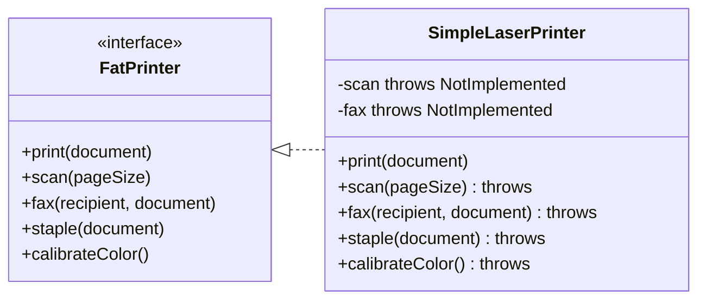
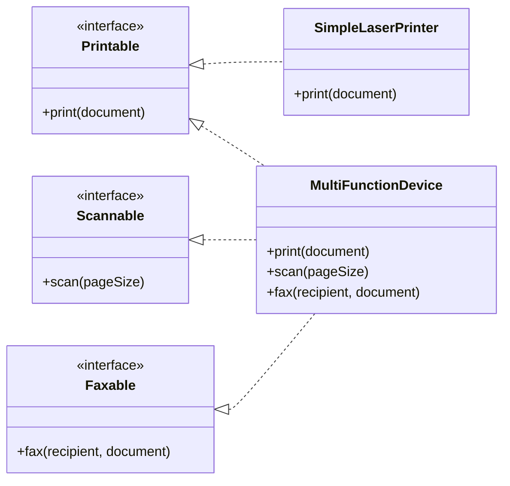
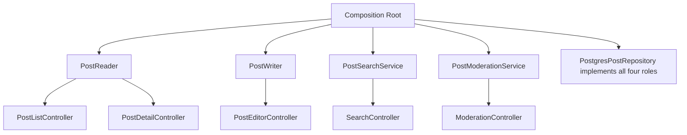

# 4.04 SOLID Interface Segregation

> The Interface Segregation Principle is the SOLID rule that disciplines the surface area of an abstraction: a client should never be forced to depend on a method it does not use. A fat interface is a slow-motion accident — every consumer pays the coupling tax for capabilities only a few of them want. Segregate by role, compose with intersections, and let TypeScript structural typing do the bookkeeping for free.

## 1. Purpose

The Interface Segregation Principle, abbreviated ISP, is the fourth letter of the SOLID acronym coined by Robert C. Martin in the late 1990s. Its formal statement is short and unforgiving: clients should not be forced to depend on methods they do not use. The principle exists because object-oriented languages had developed a habit in the 1990s of growing interfaces the way a kitchen drawer grows utensils — every new capability was bolted onto the existing interface because it was conceptually related to the entity the interface described. A printer interface gained a scan method, then a fax method, then a stapling method, then a color calibration method, until the printer interface became a small operating system.

The cost of this bloat is not theoretical. When an interface grows fat, every class that implements it must implement every method, even the ones that make no sense for that class. A simple inkjet printer that can only print must now carry a scan method, a fax method, and a stapling method. None of those methods can actually do anything. They become either silent no-operations that mislead callers into thinking the device can perform them, or they throw a runtime exception that crashes the caller at the worst possible moment. Both outcomes are bugs that the type system should have caught at compile time. ISP exists to push that failure from runtime to compile time, where it belongs.

ISP also exists to defend the dependency graph of a system against viral coupling. When a client depends on a fat interface, the client transitively depends on every method that the interface exposes, even methods the client never calls. When any one of those methods changes — its signature, its return type, its documented contract — every client that depends on the interface must be revisited, recompiled, retested, and redeployed. A change to the fax method ripples through the build pipeline of a service that only ever called print. Multiply that across a hundred services and a fat interface becomes a tax on the velocity of the entire engineering organization.

ISP prevents three concrete failure modes that recur in mature codebases: the runtime NotImplemented exception (a client calls a method the implementing class cannot honor); the silent no-operation (the implementing class returns a sentinel or does nothing, and the bug surfaces far downstream); and the cascade recompile (a single method signature change forces every consumer to rebuild, turning a minutes-long release into hours).

The canonical illustrative example, repeated in nearly every textbook treatment of ISP, is the office printer parable. An interface named `Printer` declares three methods: `print`, `scan`, and `fax`. A simple printer class — say, a basic laser printer in a small office — implements the interface. It can print beautifully. It cannot scan and it cannot fax, because it has no scanning glass and no telephone line. The implementer, faced with the choice of what to put in the `scan` and `fax` methods, picks one of the bad options: throw an exception, return null, or log a warning and pretend. Every choice is wrong. ISP says: stop forcing the simple printer to implement those methods at all. Split the fat interface into three small ones — `Printer` with `print`, `Scanner` with `scan`, `Fax` with `fax` — and let the simple printer implement only the first. The multifunction device implements all three. The type system now expresses the truth: a simple printer is a printer, not a scanner and not a fax.

In a TypeScript codebase, ISP gains an additional layer of flexibility because TypeScript uses structural typing rather than nominal typing. A class does not need to declare `implements Printer` for the type system to consider it a printer. If the class has a compatible `print` method, it is a printer for the purposes of type-checking. This means segregation in TypeScript is even cheaper than in nominally typed languages like Java or C: you split the interface, and existing code that already exposes the right methods satisfies the smaller interfaces automatically, with no source changes at all. The compiler does the bookkeeping. This note explains how to exploit that property for clean, role-based abstractions without falling into the trap of over-segregating into single-method interfaces that obscure more than they reveal.

The purpose of this note is to give you a complete, operational understanding of ISP. By the end you should be able to spot an ISP violation by reading the interface and its callers, refactor a fat interface into role interfaces without breaking callers, compose segregated interfaces with TypeScript intersection types and the utility types `Pick`, `Omit`, and `Partial`, know when to segregate aggressively and when to leave a cohesive interface alone, and defend your decisions in a code review with language tied to the SOLID principles and the engineering costs they exist to prevent.

## 2. Theory and Deep Dive

ISP is best understood as a principle about the cohesion of an interface. An interface is cohesive when every method on it serves the same role and is used by the same set of clients. An interface loses cohesion when it accumulates methods that serve different roles or that are used by disjoint sets of clients. ISP is the rule that says: when cohesion drops, split the interface.

### 2.1 The Fat Interface Anatomy

A fat interface is one that has grown beyond a single role. The signature is typically long — five, ten, sometimes twenty methods. The methods cluster into groups by concern: a print cluster, a scan cluster, a fax cluster. The interface is named after an entity (`Printer`, `Document`, `User`) rather than after a role (`Printable`, `Readable`, `Auditable`).

In TypeScript:

```typescript
interface Printer {
  print(document: Document): Promise<void>;
  scan(pageSize: PageSize): Promise<ScannedImage>;
  fax(recipient: string, document: Document): Promise<FaxResult>;
  staple(document: Document): Promise<void>;
  calibrateColor(): Promise<ColorProfile>;
}
```

In JavaScript, the equivalent informal contract looks like a class or an object literal:

```javascript
class OfficePrinter {
  print(document) {
    /* really prints */
  }

  scan(pageSize) {
    throw new Error("This printer cannot scan");
  }

  fax(recipient, document) {
    throw new Error("This printer cannot fax");
  }

  staple(document) {
    throw new Error("This printer cannot staple");
  }

  calibrateColor() {
    throw new Error("This printer is monochrome");
  }
}
```

The five methods belong to five different roles. A device that can only print must still implement the other four. Each implementation that cannot perform the operation has to choose between throwing and lying. Both choices are defects.

### 2.2 The Segregation Process

Segregation is the act of splitting one fat interface into a family of small interfaces, each named after a single role, each containing only the methods that role requires. The fat `Printer` interface becomes:

```typescript
interface Printer {
  print(document: Document): Promise<void>;
}

interface Scanner {
  scan(pageSize: PageSize): Promise<ScannedImage>;
}

interface Fax {
  fax(recipient: string, document: Document): Promise<FaxResult>;
}

interface Stapler {
  staple(document: Document): Promise<void>;
}

interface ColorCalibrator {
  calibrateColor(): Promise<ColorProfile>;
}
```

A simple laser printer now declares `implements Printer` and nothing else. The compile-time type system guarantees that no caller can ask it to scan, fax, staple, or calibrate. The runtime exceptions disappear because the methods that would have thrown them no longer exist on the class.

A multifunction device declares `implements Printer, Scanner, Fax, Stapler, ColorCalibrator` and provides real implementations of all five. Or, more idiomatically in TypeScript, the device declares that it implements a composed intersection type:

```typescript
type MultiFunctionDevice = Printer & Scanner & Fax & Stapler & ColorCalibrator;
```

An intersection type in TypeScript means a value that satisfies every member of the intersection simultaneously. A class that implements `MultiFunctionDevice` must provide every method on every constituent interface. This is the structural-typing way of saying "this thing is all of these things at once," and it is the natural idiom for combining segregated interfaces.

### 2.3 Structural Typing Changes the Game

In a nominally typed language like Java, C, or C, a class must explicitly declare `implements Printer` for the type system to accept it as a `Printer`. Refactoring a fat interface into segregated interfaces requires touching every implementing class to add the new `implements` clauses. That is real work, and the cost of that work is one of the pressures that keeps fat interfaces fat.

In TypeScript, structural typing means that a class is considered to implement an interface if its shape is compatible with the interface, regardless of whether the class mentions the interface by name. The following code type-checks without any explicit declaration:

```typescript
interface Printable {
  print(document: Document): Promise<void>;
}

class SimpleLaserPrinter {
  // No "implements Printable" declaration.
  async print(document: Document): Promise<void> {
    await sendToPrintEngine(document);
  }
}

const printable: Printable = new SimpleLaserPrinter();
```

The compiler looks at `SimpleLaserPrinter`, sees that it has a `print` method with a compatible signature, and accepts the assignment. This means that splitting a fat interface in TypeScript can be done without touching a single existing implementation: the new smaller interface is declared, and every existing class that already exposes the right method shape automatically satisfies it. The cost of segregation collapses to a one-line interface declaration. There is no longer any excuse for fat interfaces in TypeScript code.

### 2.4 Role Interface Naming

A role interface is named after the role it plays in a collaboration, not after the entity that performs the role. The role is what the client cares about: the client wants something printed, something scanned, something faxed. The client does not care whether the thing performing the role is a printer, a multifunction device, a software-based PDF writer, or a cloud service that faxes on demand.

Role interface names tend to use the `-able` suffix in English-speaking codebases: `Printable`, `Scannable`, `Iterable`, `Serializable`, `Comparable`, `Auditable`, `Cloneable`. The suffix signals that the interface describes a capability, not an identity. An object is `Printable` if it can be printed. An object is `Iterable` if it can be iterated. The name frames the interface as a contract about what the object can do for you.

The other common naming convention is a noun phrase describing the role rather than the entity: `Reader`, `Writer`, `Listener`, `Observer`, `Repository`. A `Reader` is anything that reads. A `UserReader` is anything that reads users. The name focuses on the activity rather than on the actor.

What you want to avoid is naming a role interface after the concrete entity that performs the role. An interface named `Printer` is ambiguous: does it mean "the abstract concept of a printer" or "the role of being printable"? In the original fat interface, `Printer` meant the former — the entity. After segregation, the print role should be `Printer` (with the understanding that the interface now describes a single capability) or `Printable`. Both are defensible; the project should pick one convention and apply it consistently. The worst outcome is mixed conventions where `Printer` is sometimes a fat entity interface and sometimes a thin role interface, leaving readers to guess from context.

### 2.5 Interface Composition

Once an interface is segregated, the question of how to recombine the small interfaces for objects that perform multiple roles arises. There are three idioms in TypeScript:

**Intersection types**: `type MultiFunction = Printer & Scanner & Fax`. The result is a type that demands every method from every constituent. This is the most common idiom for combining role interfaces.

**Interface extension**: `interface MultiFunction extends Printer, Scanner, Fax {}`. This creates a named interface that inherits the members of all three. Functionally similar to intersection but creates a named type that can be referenced elsewhere.

**Object composition at the class level**: a class declares `implements Printer, Scanner, Fax` separately, without ever naming a combined type. This is appropriate when no caller ever needs to refer to the combined type — each caller takes only the role interface it needs.

The first two are equivalent for most purposes. The third is the most segregating: nothing in the code ever names a combined type, and each consuming function takes exactly one role interface. This is the purest expression of ISP. The combined type appears only when a caller genuinely needs a multi-role collaborator — for example, a class that needs to print and scan in the same transaction.

### 2.6 Fat Versus Segregated, Visually





The first diagram shows the fat interface forcing the simple laser printer to carry five methods, four of which throw at runtime. The second diagram shows the segregated design: the simple laser printer carries only one method, the multifunction device carries three, and the type system guarantees that no caller can ask the simple laser printer to scan or fax.

### 2.7 Cohesion and the Interface Segregation Test

How do you know when an interface has lost cohesion and needs segregating? The test is empirical: examine the callers. If every caller uses every method, the interface is cohesive. If different callers use disjoint subsets of the methods, the interface has multiple roles hiding inside it, and those roles want to be split.

Concretely, suppose an interface has eight methods. Caller A uses methods one through three. Caller B uses methods four through six. Caller C uses methods seven and eight. No caller uses the full surface. The interface is three roles in a trench coat. This caller-usage test is the practical heart of ISP: a six-method interface used in its entirety by every caller is cohesive; a three-method interface used in disjoint one-method subsets by three different callers is already too fat. The number of methods is a hint, not the verdict.

### 2.8 ISP and the Open-Closed Principle

ISP is the handmaiden of the Open-Closed Principle (OCP, see [[4.02 SOLID Open Closed]]). OCP says a module should be open for extension but closed for modification. A fat interface is forced to be modified every time a new capability is added — the interface gains a method, every implementor must be touched, every client rebuilds. A family of segregated interfaces is extended by adding a new role interface alongside the existing ones; existing interfaces stay closed, existing implementors stay untouched, and only the new implementor and the new client are aware of the new role. This is the architectural payoff of ISP: it makes OCP achievable. Without segregation, every new capability reopens the existing contract.

### 2.9 ISP and Liskov Substitution

ISP also reinforces the Liskov Substitution Principle (LSP, see [[4.03 SOLID Liskov Substitution]]). LSP says a subtype must be substitutable for its supertype without surprising the caller. A class that throws NotImplemented on a method it inherits from a fat interface violates LSP: the caller expects the method to work, the subtype throws. The classic LSP violation is precisely the fat interface with a method that some subtypes cannot implement. The cure is ISP — split the interface so that the offending method moves to a separate role interface, and the subtype no longer inherits it. LSP identifies the symptom (a subtype that cannot honor a contract), and ISP prescribes the treatment (split the contract).

### 2.10 The Over-Segregation Failure Mode

ISP can be over-applied. If you segregate too aggressively — one method per interface, or one interface per caller — the codebase drowns in tiny interfaces that no one can hold in their head. A class that previously implemented one interface now implements fifteen. Dependency injection lists grow to absurd length. The architecture diagram becomes a spiderweb of one-method boxes connected by arrows.

The remedy is to segregate by role, not by method and not by caller. A role is a coherent set of methods that one client wants to use together. If three methods always travel together — they are called in sequence by the same client, they share invariants, they make sense as a unit — they belong on one interface, even if a different client uses only one of them. Segregation is about roles, not about the smallest possible surface.

A reasonable rule of thumb is three to five methods per role interface. Fewer than three and you should ask whether the interface is a real role or a fragment. More than five and you should ask whether the interface is mixing concerns. The number is a hint, not a rule — but a codebase where every interface has exactly one method is a codebase where ISP has been over-applied.

## 3. Mental Models

ISP is best held in the head through several complementary mental models, each of which captures a facet of the principle and breaks down in a different edge case. Hold all of them, switch between them, and you will rarely be wrong about whether an interface is well-designed.

### 3.1 The Wall Outlet Model

Think of an interface as a wall outlet. A fat interface is a single outlet that tries to be every kind of outlet at once: USB-A, USB-C, HDMI, Ethernet, three-prong power, coaxial, and a garden hose connector. The faceplate is enormous, the connector is a chimera, and any device you plug in has to deal with the connectors it does not want. A segregated interface family is a wall with separate outlets, each shaped for one purpose. A device plugs into only the outlet it needs. The outlet does not know or care about the others.

This model captures the asymmetry of consumer and provider: the consumer picks the outlet, the outlet just exists. It also captures the fact that outlets can coexist without interfering — adding a new outlet type does not change the existing ones.

The model breaks down for software because software outlets can be combined into a single multi-role outlet (intersection type). A wall outlet cannot simultaneously be USB-C and HDMI; they are physically different connectors. In software, a single object can satisfy many role interfaces simultaneously, and the type system tracks which roles it satisfies without forcing the caller to choose.

### 3.2 The Restaurant Menu Model

A fat interface is the prix fixe menu: every diner gets every course, whether they want it or not. A vegetarian at a steakhouse prix fixe is in the same position as a simple printer implementing a fat interface — they have to refuse most of what arrives. A segregated interface family is the a-la-carte menu: each diner orders only what they want. The kitchen still prepares everything, but no diner is forced to consume what they do not want.

This model captures the consumer's perspective: the consumer pays (in coupling, in compile time, in cognitive load) for everything on the interface whether or not they use it. Segregation lets the consumer pay only for what they order.

The model breaks down because software interfaces are free to create. Adding a new dish to the menu in a restaurant has a real marginal cost. Adding a new role interface in TypeScript has no runtime cost and almost no compile-time cost. This means segregation is much cheaper in software than the restaurant metaphor suggests — you can and should segregate more aggressively than a restaurant can offer a-la-carte items.

### 3.3 The Toolbox Model

A fat interface is a toolbox where every tool is in one drawer. You open the drawer to get a screwdriver and a hammer, a wrench, and a tape measure all stare at you. A segregated interface family is a toolbox where each drawer holds one kind of tool. You open the screwdriver drawer for screwdrivers, the wrench drawer for wrenches. You do not have to look at tools you are not using.

This model captures the cognitive load on the developer. Reading a fat interface requires the developer to mentally filter out the methods they do not want. Reading a small role interface presents only the relevant methods. The developer's attention is a finite resource and the interface designer should respect it.

The model breaks down because tools in a software interface often need to be used together. A screwdriver and a wrench are rarely used in the same motion; a print method and a scan method on a multifunction device might be used in the same transaction. The model underweights the value of grouping methods that collaborate. The remedy is to compose interfaces with intersections when collaboration is real.

### 3.4 The Universal Remote Model

A fat interface is a universal remote with seventy buttons, of which you use five. The other sixty-five are for devices you do not own. Every time you reach for the remote, your thumb has to navigate past the unused buttons. The remote is heavy, confusing, and easy to press the wrong button on. A segregated interface family is a remote with five buttons. It does only what you need.

This model captures the cost of unused surface area in user-facing terms: the unused methods are not just dead code, they are noise that obscures the methods you actually want. A reader of a fat interface has to read every method to find the one they want; a reader of a small interface finds it immediately.

The model breaks down because a software interface is not a physical object. You cannot lose a small interface the way you can lose a small remote. The cost of having many small interfaces in software is the navigation cost of finding the right one — which is real, but mitigated by good naming and good tooling.

### 3.5 The Structural Shape Model (TypeScript-specific)

In TypeScript, an interface is a shape. An object either fits the shape or it does not. There is no declaration, no registration, no inheritance chain. The shape either matches or it does not, and the compiler tells you which. This is the structural shape model: interfaces are patterns the compiler checks objects against, not identities the objects carry.

This model captures why ISP is so cheap in TypeScript. Declaring a new role interface is just writing down a shape. Any object that already has that shape satisfies the interface. The cost of segregation is the cost of writing the shape, which is one line. The benefit is that the type system now distinguishes the roles.

The model breaks down for nominal-thinking developers who come from Java or C and expect `implements` declarations. They will look for the declaration, not find it, and be confused about whether the interface is actually being used. The remedy is to internalize the structural model and to use `implements` declarations as documentation when they aid readability, even when the compiler does not require them. All five models also assume that the consumer knows which role it needs. When the consumer's need is dynamic, ISP gives way to a different pattern entirely — a strategy interface, a command object, or a callback. ISP is a principle about static interface design; knowing when it is the wrong tool is part of mastering it.

## 4. Real-World Use Cases

ISP is not a textbook curiosity. It appears in production codebases wherever an interface serves more than one kind of client. This section walks through the major categories.

### 4.1 Repository Interfaces

The repository pattern is the most common application of ISP in production TypeScript codebases. The fat interface temptation is to declare one `Repository<T>` interface with `findById`, `findMany`, `save`, `update`, `delete`, `bulkInsert`, `bulkUpdate`, `bulkDelete`, `count`, `transaction`, and so on. Every service that uses the repository depends on all ten methods, even a read-only reporting service that never writes and a write-only ingestion service that never reads.

The segregated design splits the repository into role interfaces: `Readable<T>` with `findById`, `findMany`, `count`; `Writable<T>` with `save`, `update`, `delete`; `BulkOperational<T>` with the bulk methods; `Transactional` with `transaction`. A read-only service depends only on `Readable<T>`; a write-only service on `Writable<T>`; a full data-access service on the intersection of all four. The dependency declarations document what each service actually does.

### 4.2 Service Layer Interfaces

In NestJS and similar frameworks, services are often interfaces injected into controllers. A fat `UserService` might declare `getUser`, `listUsers`, `createUser`, `updateUser`, `deleteUser`, `changePassword`, `resetPassword`, `verifyEmail`, `grantAdmin`, `revokeAdmin`. A controller that handles profile reads uses only `getUser`; a controller that handles admin actions uses `grantAdmin` and `revokeAdmin`. The fat interface couples every controller to every method. The segregated design splits into `UserReader`, `UserWriter`, `UserAdminService`, `UserAuthService`. Each controller takes only the role it needs, and the dependency graph reflects actual usage.

### 4.3 Plugin Contracts

Plugin systems live and die by their contract design. A fat plugin contract that demands twenty methods keeps plugin authors away; a segregated contract that asks for one small interface makes plugin development trivial.

VSCode extensions are an example. An extension can implement `activate` and `deactivate` and nothing else. Specific capabilities (a language provider, a command, a debugger) are registered through separate contribution points, each with its own small interface. An extension that contributes a command depends only on the command contract. The fat-interface alternative — one mega-interface with optional methods for every contribution type — would have killed the extension ecosystem.

### 4.4 Event Listener Interfaces

A fat event listener interface declares one method per event type: `onUserCreated`, `onUserUpdated`, `onUserDeleted`, `onOrderPlaced`, `onOrderShipped`, `onOrderRefunded`. A listener that cares only about order refunds must implement all six methods, with five being empty no-ops. This is the classic ISP violation in event-driven systems.

The segregated design uses one interface per event: `UserCreatedListener`, `OrderRefundedListener`, and so on. A listener implements only the interface for the event it cares about. The dispatcher maintains a separate list of listeners per event type and notifies only the relevant list. Java's event listener hierarchy followed this pattern; modern TypeScript emitters like `mitt` and `EventEmitter2` follow it too.

### 4.5 React Component Props

In React, a component's props are an interface. A fat props interface accumulates every prop the component might ever use — layout, data, behavior, styling, accessibility — and a consumer has to understand all of them, even when it only cares about a few.

The segregated design splits props into composable slices. A `Button` component might accept `LayoutProps & StyleProps & BehaviorProps & AccessibilityProps`, where each slice is a small interface. Consumers that only need layout and behavior compose only those slices. The utility types `Pick`, `Omit`, and `Partial` (see [[2.10 Utility Types Deep Dive]]) make this trivial at the type level.

### 4.6 Library API Surface

Public libraries face the ISP test hardest of all. A library that exposes one fat interface forces every consumer to learn it in full; a library that exposes many small interfaces lets consumers learn only what they need. Lodash and Ramda are internally collections of small functions — the ultimate segregation. Stripe's API is segregated by resource: customers, charges, refunds, sources, each a separate interface with a small surface.

### 4.7 Express Middleware Contracts

Express middleware is a function `(req, res, next) => void`. The contract is minimal. Different middlewares do different things — logging, authentication, body parsing, compression — but they all share the same tiny interface. This is ISP at the function level: the interface is so small that any function with the right shape qualifies, and the same shape composes into chains. The minimal interface is why Express middleware is so reusable.

### 4.8 Configuration Objects

Configuration objects are a frequent fat-interface offender. A config object accumulates every option any consumer might need: database config, cache config, logging config, feature flags, secrets. Every consumer that reads any option depends transitively on the entire config shape. The segregated design splits the config into role interfaces (`DatabaseConfig`, `CacheConfig`, `LoggingConfig`, `FeatureFlags`); each consumer takes only the slice it needs. This is the pattern behind NestJS's typed config namespaces and the `convict` library's schema segregation.

## 5. Code Examples

### 5.1 Example A — Minimal and Conceptual

**JavaScript (fat interface):**

```javascript
class FatPrinter {
  // A simple laser printer forced into a fat contract.
  async print(document) {
    await sendToEngine(document);
  }

  async scan(pageSize) {
    // This device has no scanner. Throw at runtime.
    throw new Error("SimpleLaserPrinter cannot scan");
  }

  async fax(recipient, document) {
    // This device has no fax modem. Throw at runtime.
    throw new Error("SimpleLaserPrinter cannot fax");
  }
}

async function scanAndEmail(printer, document) {
  // Caller assumes printer can scan. Will crash at runtime
  // for the simple laser printer above.
  const image = await printer.scan("A4");
  await emailImage(image);
}

// Latent bug: type system cannot prevent this call.
const printer = new FatPrinter();
scanAndEmail(printer, myDocument).catch((err) => {
  console.error("Runtime crash that ISP would have prevented:", err.message);
});
```

**TypeScript (fat interface, still wrong):**

```typescript
interface Document { readonly id: string; readonly pages: Page[]; }
interface ScannedImage { readonly data: Uint8Array; readonly width: number; readonly height: number; }
type PageSize = "A4" | "Letter";

interface Printer {
  print(document: Document): Promise<void>;
  scan(pageSize: PageSize): Promise<ScannedImage>;
  fax(recipient: string, document: Document): Promise<void>;
}

class SimpleLaserPrinter implements Printer {
  async print(document: Document): Promise<void> {
    await sendToEngine(document);
  }

  async scan(pageSize: PageSize): Promise<ScannedImage> {
    // Cannot scan. Throw at runtime.
    throw new Error("SimpleLaserPrinter cannot scan");
  }

  async fax(recipient: string, document: Document): Promise<void> {
    // Cannot fax. Throw at runtime.
    throw new Error("SimpleLaserPrinter cannot fax");
  }
}

async function scanAndEmail(printer: Printer, document: Document): Promise<void> {
  // Caller can call scan because the fat interface declares it.
  const image = await printer.scan("A4");
  await emailImage(image);
}
```

**JavaScript (segregated):**

```javascript
// Role-based informal contracts. JavaScript does not enforce these,
// but documenting them clarifies intent.

class SimpleLaserPrinter {
  // Implements only the Printable role.
  async print(document) {
    await sendToEngine(document);
  }
}

class MultiFunctionDevice {
  async print(document) {
    await sendToEngine(document);
  }

  async scan(pageSize) {
    return await scanGlass(pageSize);
  }

  async fax(recipient, document) {
    return await dialAndFax(recipient, document);
  }
}

async function scanAndEmail(printable, document) {
  // Caller requires a scanner, not a printer.
  if (typeof printable.scan !== "function") {
    throw new TypeError("Expected an object with a scan method");
  }
  const image = await printable.scan("A4");
  await emailImage(image);
}

// Now the call site fails fast with a clear error.
const simple = new SimpleLaserPrinter();
scanAndEmail(simple, myDocument).catch((err) => {
  console.error("Caught early:", err.message);
});
```

**TypeScript (segregated, properly typed):**

```typescript
interface Document { readonly id: string; readonly pages: Page[]; }
interface ScannedImage { readonly data: Uint8Array; readonly width: number; readonly height: number; }
type PageSize = "A4" | "Letter";

interface Printable {
  print(document: Document): Promise<void>;
}

interface Scannable {
  scan(pageSize: PageSize): Promise<ScannedImage>;
}

interface Faxable {
  fax(recipient: string, document: Document): Promise<void>;
}

// Composed type for the multifunction device.
type MultiFunctionDevice = Printable & Scannable & Faxable;

class SimpleLaserPrinter implements Printable {
  async print(document: Document): Promise<void> {
    await sendToEngine(document);
  }
}

class OfficeMultiFunction implements MultiFunctionDevice {
  async print(document: Document): Promise<void> {
    await sendToEngine(document);
  }

  async scan(pageSize: PageSize): Promise<ScannedImage> {
    return await scanGlass(pageSize);
  }

  async fax(recipient: string, document: Document): Promise<void> {
    await dialAndFax(recipient, document);
  }
}

// Caller declares exactly the role it needs.
async function scanAndEmail(scanner: Scannable, document: Document): Promise<void> {
  const image = await scanner.scan("A4");
  await emailImage(image);
}

const simple = new SimpleLaserPrinter();
const multi = new OfficeMultiFunction();

// scanAndEmail(simple, myDocument);
// ^ Compile-time error: SimpleLaserPrinter is not a Scannable.
//    The bug from the fat-interface version is now impossible.

scanAndEmail(multi, myDocument); // OK: multi is Scannable.
```

### 5.2 Example B — Production-Grade Typed Repository

**JavaScript (fat repository, the anti-pattern):**

```javascript
// A fat repository contract in plain JavaScript. No compile-time safety.
// Every service that takes a UserRepository depends on every method,
// even ones it never calls.

class FatUserRepository {
  async findById(id) { return await db.users.findOne({ id }); }
  async findMany(query) { return await db.users.findMany(query); }
  async count(query) { return await db.users.count(query); }
  async save(user) { return await db.users.insert(user); }
  async update(id, patch) { return await db.users.updateOne({ id }, patch); }
  async delete(id) { return await db.users.deleteOne({ id }); }
  async bulkInsert(users) { return await db.users.insertMany(users); }
  async grantAdmin(id) { return await db.users.updateOne({ id }, { role: "admin" }); }
  async resetPassword(id) {
    const token = generateToken();
    await db.users.updateOne({ id }, { passwordResetToken: token });
    await emailService.sendResetEmail(id, token);
  }
}

class UserProfileController {
  // Controller only reads, but takes the whole fat repository.
  constructor(userRepository) { this.userRepository = userRepository; }
  async getProfile(userId) { return await this.userRepository.findById(userId); }
}

class AdminActionController {
  // Controller only admin-acts, but takes the whole fat repository.
  constructor(userRepository) { this.userRepository = userRepository; }
  async promote(userId) { return await this.userRepository.grantAdmin(userId); }
}

// Both controllers can call any method on the fat repository.
// The type system cannot prevent adminActionController from
// accidentally calling resetPassword, even though it should not.
```

**TypeScript (segregated role interfaces):**

```typescript
interface User {
  readonly id: string;
  readonly email: string;
  readonly role: "member" | "admin";
  readonly displayName: string;
}

interface UserQuerySpec {
  readonly role?: "member" | "admin";
  readonly createdAfter?: Date;
  readonly limit?: number;
  readonly cursor?: string;
}

interface Page<T> {
  readonly items: readonly T[];
  readonly nextCursor: string | null;
}

interface PasswordResetToken {
  readonly token: string;
  readonly expiresAt: Date;
}

// Segregated role interfaces. Each captures one client concern.

interface UserReader {
  findById(id: string): Promise<User | null>;
  findMany(spec: UserQuerySpec): Promise<Page<User>>;
  count(spec: UserQuerySpec): Promise<number>;
}

interface UserWriter {
  save(user: User): Promise<User>;
  update(id: string, patch: Partial<Omit<User, "id">>): Promise<User>;
  remove(id: string): Promise<void>;
}

interface UserAdminService {
  grantAdmin(id: string): Promise<User>;
  revokeAdmin(id: string): Promise<User>;
}

interface UserAuthService {
  resetPassword(id: string): Promise<PasswordResetToken>;
  verifyEmail(id: string, token: string): Promise<User>;
}

// Composition for clients that need multiple roles.

type FullUserRepository = UserReader & UserWriter & UserAdminService & UserAuthService;

// Concrete implementation provides every role.

class PostgresUserRepository implements FullUserRepository {
  constructor(
    private readonly db: PostgresClient,
    private readonly emailService: EmailService,
  ) {}

  async findById(id: string): Promise<User | null> {
    const row = await this.db.queryFirst("SELECT * FROM users WHERE id = $1", [id]);
    return row ? toUser(row) : null;
  }

  async findMany(spec: UserQuerySpec): Promise<Page<User>> {
    const { sql, params } = buildUserQuery(spec);
    const rows = await this.db.query<UserRow>(sql, params);
    const items = rows.map(toUser);
    const nextCursor = items.length === (spec.limit ?? 50) ? encodeCursor(items[items.length - 1].id) : null;
    return { items, nextCursor };
  }

  async count(spec: UserQuerySpec): Promise<number> {
    const { sql, params } = buildUserCountQuery(spec);
    const row = await this.db.queryFirst<{ count: number }>(sql, params);
    return row?.count ?? 0;
  }

  async save(user: User): Promise<User> {
    await this.db.execute(
      "INSERT INTO users (id, email, role, displayName) VALUES ($1, $2, $3, $4)",
      [user.id, user.email, user.role, user.displayName],
    );
    return user;
  }

  // update builds a parameterised UPDATE from the patch keys,
  // runs RETURNING *, and returns the refreshed User row.
  async update(id: string, patch: Partial<Omit<User, "id">>): Promise<User> { /* see Appendix */ throw new Error("not shown"); }

  async remove(id: string): Promise<void> {
    await this.db.execute("DELETE FROM users WHERE id = $1", [id]);
  }

  async grantAdmin(id: string): Promise<User> {
    return await this.update(id, { role: "admin" });
  }

  async revokeAdmin(id: string): Promise<User> {
    return await this.update(id, { role: "member" });
  }

  // resetPassword mints a secure token, persists a password-reset row,
  // and emails the user. Returns the token and its expiry.
  async resetPassword(id: string): Promise<PasswordResetToken> { /* see Appendix */ throw new Error("not shown"); }

  // verifyEmail checks the token against the emailVerifications table,
  // flips emailVerified to true on the user row, and returns the user.
  async verifyEmail(id: string, token: string): Promise<User> { /* see Appendix */ throw new Error("not shown"); }
}

// Clients declare exactly the role they need.

class UserProfileController {
  constructor(private readonly users: UserReader) {}

  async getProfile(userId: string): Promise<User> {
    const user = await this.users.findById(userId);
    if (!user) throw new NotFoundError(`User ${userId} not found`);
    return user;
  }

  async listUsers(cursor: string | null): Promise<Page<User>> {
    return await this.users.findMany({ limit: 50, cursor: cursor ?? undefined });
  }
}

class AdminActionController {
  constructor(private readonly adminService: UserAdminService) {}

  async promote(userId: string): Promise<User> {
    return await this.adminService.grantAdmin(userId);
  }

  async demote(userId: string): Promise<User> {
    return await this.adminService.revokeAdmin(userId);
  }
}

class PasswordResetController {
  constructor(private readonly authService: UserAuthService) {}

  async requestReset(userId: string): Promise<{ message: string }> {
    await this.authService.resetPassword(userId);
    return { message: "If the user exists, a reset email has been sent." };
  }
}

// Wiring at composition root.

const emailService = new SmtpEmailService(smtpConfig);
const fullRepo = new PostgresUserRepository(dbClient, emailService);

const profileController = new UserProfileController(fullRepo);
const adminController = new AdminActionController(fullRepo);
const passwordController = new PasswordResetController(fullRepo);

// Each controller sees only the role it asked for. The type system
// prevents adminController from calling resetPassword and prevents
// profileController from calling grantAdmin. The dependency graph
// documents itself.
```

The TypeScript version enforces segregation at compile time: `UserProfileController` declares `UserReader` as its dependency type, and the compiler will reject any attempt to call `grantAdmin` or `resetPassword` on that dependency. The JavaScript version cannot enforce this — the segregation is documented in comments and naming conventions but is not machine-checked. In a TypeScript codebase, the compiler does the work for free.

## 6. Common Mistakes and Anti-Patterns

### 6.1 The Fat Interface (Everything in One)

```typescript
interface UserRepository {
  findById(id: string): Promise<User | null>;
  findMany(spec: UserQuerySpec): Promise<Page<User>>;
  save(user: User): Promise<User>;
  update(id: string, patch: Partial<User>): Promise<User>;
  remove(id: string): Promise<void>;
  bulkInsert(users: User[]): Promise<number>;
  bulkUpdate(patches: UserPatch[]): Promise<number>;
  grantAdmin(id: string): Promise<User>;
  revokeAdmin(id: string): Promise<User>;
  resetPassword(id: string): Promise<void>;
  verifyEmail(id: string, token: string): Promise<User>;
  purgeInactive(before: Date): Promise<number>;
}
```

**Why it fails:** Every consumer depends on every method. A read-only reporting service that calls only `findMany` is coupled to `purgeInactive`, a destructive admin operation. A change to the `bulkInsert` signature forces a recompile of the reporting service. The interface mixes four distinct roles — read, write, admin, auth — under one name.

**Fix:** Split into `UserReader`, `UserWriter`, `UserAdminService`, `UserAuthService`. Compose with intersection types for clients that need multiple roles.

### 6.2 Throwing NotImplemented for Unused Methods

```typescript
class ReadOnlyUserRepository implements UserRepository {
  async findById(id: string): Promise<User | null> {
    return await db.users.findOne({ id });
  }

  async save(user: User): Promise<User> {
    throw new Error("NotImplemented: this repository is read-only");
  }

  async remove(id: string): Promise<void> {
    throw new Error("NotImplemented: this repository is read-only");
  }

  // ... every write method throws ...
}
```

**Why it fails:** The type system has been lied to. The interface declares that `save` returns a `Promise<User>`; the implementation throws. Callers cannot tell from the type system that this implementation is unsafe. The bug surfaces only at runtime, in production. This is also a Liskov Substitution violation — the subtype is not substitutable for the supertype.

**Fix:** Implement only the role interfaces you can honor. A read-only repository implements `UserReader` only. Callers that need write access take `UserWriter` as a dependency and the type system routes them to a writable implementation.

### 6.3 Forcing All Clients to Depend on the Fat Interface

```typescript
class UserReportService {
  // Report service only reads, but takes the fat repository.
  constructor(private readonly repo: UserRepository) {}

  async dailyActiveUsers(): Promise<number> {
    return await this.repo.count({ activeToday: true });
  }
}
```

**Why it fails:** The report service now depends on every method on `UserRepository`. A change to `grantAdmin` or `purgeInactive` forces a recompile and retest of the report service, even though it never calls those methods.

**Fix:** Declare the narrowest interface the consumer needs (`constructor(private readonly repo: UserReader)`). The report service is now immune to changes in the admin methods.

### 6.4 Ignoring Role-Based Naming

```typescript
interface UserHelper {
  findById(id: string): Promise<User | null>;
  sendWelcomeEmail(id: string): Promise<void>;
  rotateApiKey(id: string): Promise<string>;
  revokeAllSessions(id: string): Promise<void>;
}
```

**Why it fails:** The name `UserHelper` is meaningless — it describes a vague category, not a role. A reader cannot tell from the name what the interface is for or who uses it. The name also implies the interface is a helper for the `User` entity, which encourages more methods to be added whenever a user-related operation is needed — the fat interface grows by gravity.

**Fix:** Name the interface after the role. Methods about reading users? `UserReader`. About authentication? `UserAuthService`. About lifecycle emails? `UserLifecycleEmailService`. The name should describe one role and exclude the others.

### 6.5 Mixing Concerns in One Interface

```typescript
interface OrderService {
  placeOrder(order: Order): Promise<Order>;
  cancelOrder(orderId: string): Promise<void>;
  refundOrder(orderId: string, amount: number): Promise<Refund>;
  shipOrder(orderId: string, tracking: TrackingInfo): Promise<void>;
  notifyCustomer(orderId: string, message: string): Promise<void>;
  syncToAccounting(orderId: string): Promise<void>;
  archiveOrder(orderId: string): Promise<void>;
}
```

**Why it fails:** This interface handles ordering, refunds, fulfillment, customer communications, accounting integration, and retention — six different concerns. Each concern is used by a different service, and each change to any concern ripples through all of them.

**Fix:** Split by concern: `OrderPlacementService`, `OrderCancellationService`, `RefundService`, `FulfillmentService`, `OrderNotificationService`, `AccountingSyncService`, `OrderRetentionService`. Each is small, focused, and used only by the service that needs it.

### 6.6 Over-Segregating (One Method Per Interface)

```typescript
interface UserFindById { findById(id: string): Promise<User | null>; }
interface UserFindMany { findMany(spec: UserQuerySpec): Promise<Page<User>>; }
interface UserCount { count(spec: UserQuerySpec): Promise<number>; }
interface UserSave { save(user: User): Promise<User>; }
interface UserUpdate { update(id: string, patch: Partial<User>): Promise<User>; }
interface UserRemove { remove(id: string): Promise<void>; }

class UserReportService {
  constructor(
    private readonly findById: UserFindById,
    private readonly findMany: UserFindMany,
    private readonly count: UserCount,
  ) {}
}
```

**Why it fails:** The granularity is too fine. `findById`, `findMany`, and `count` are all reading operations and always travel together — every client that uses one uses the others. Splitting them adds three constructor parameters, three injection tokens, and zero isolation benefit.

**Fix:** Group methods that travel together into a single role interface (`UserReader` with `findById`, `findMany`, `count`). The consumer takes one parameter, the role is clear, and the methods that collaborate are grouped.

### 6.7 Backwards-Compatibility Pressure

```typescript
// Legacy fat interface that ships in a published library.
interface PublicUserRepository {
  findById(id: string): Promise<User | null>;
  findMany(spec: UserQuerySpec): Promise<Page<User>>;
  save(user: User): Promise<User>;
  update(id: string, patch: Partial<User>): Promise<User>;
  remove(id: string): Promise<void>;
  grantAdmin(id: string): Promise<User>;
  // ... 8 more methods ...
}

// Cannot remove methods without breaking consumers.
// Cannot split without changing the public type.
```

**Why it fails:** The fat interface is public and consumed by external code. Segregating it would be a breaking change. The library authors are stuck.

**Fix:** Add new segregated interfaces alongside the legacy fat one. Internally, prefer the new interfaces. Document the legacy interface as deprecated. Over major versions, migrate consumers and eventually remove the fat interface. The Adapter pattern (see [[4.02 SOLID Open Closed]]) can bridge old and new in the meantime.

### 6.8 Treating Interfaces as Classes

```typescript
interface User {
  id: string;
  email: string;
  role: "member" | "admin";
  displayName: string;
  // And then, weirdly:
  save(): Promise<User>;
  update(patch: Partial<User>): Promise<User>;
  remove(): Promise<void>;
}
```

**Why it fails:** This mixes a data shape (the `User` entity) with behavior (persistence operations). It is the Active Record pattern, and it forces every consumer that reads a `User` to also see persistence methods they may not call. A reporting service that just renders a user's display name now depends on `save`, `update`, and `remove`.

**Fix:** Separate data from behavior. The `User` interface is a pure data shape; persistence lives on `UserWriter`, a separate role interface that takes a `User` and saves it. This is the Data Mapper pattern.

## 7. Best Practices and Design Patterns

### 7.1 Segregate by Client Role

The first principle of segregation is to segregate by client role, not by method or by entity. A role is a coherent set of methods that one client uses together. The way to discover roles is to read the call sites: methods that travel together belong on one interface; methods used by disjoint sets of callers belong on separate interfaces. The number of methods is a hint; the actual usage pattern is the verdict.

### 7.2 Name Interfaces by Role

Name an interface after the role it plays in a collaboration, not after the entity it operates on. `Printable`, `Scannable`, `UserReader`, `UserWriter`, `UserAdminService` are good names. `Printer`, `UserHelper`, `UserUtil`, `UserManager` are bad — they describe the entity or a vague category. The `-able` suffix signals a capability; the noun-phrase form (`Reader`, `Writer`, `Service`) is the alternative. Pick one convention and apply it consistently.

### 7.3 Compose with Intersection Types in TypeScript

When a client needs multiple roles, compose them with an intersection type rather than declaring a new named interface. `type FullUserRepository = UserReader & UserWriter & UserAdminService & UserAuthService;` is a one-liner that says exactly what it means. The intersection type reuses the existing role interfaces and adds no new contract. A new named interface, by contrast, creates a new type that must be kept in sync with the roles it composes and tempts developers to add methods to it that do not belong on any of the roles.

### 7.4 Do Not Over-Segregate

Three to five methods per role interface is a reasonable rule of thumb. Fewer than three is suspicious — ask whether the interface is a real role or a fragment. More than five is suspicious — ask whether the interface is mixing concerns. The number is a hint, not a rule: a two-method interface that captures a real role (`Transactional` with `begin` and `commit`) is fine; a six-method interface that captures one cohesive role is also fine. The test is cohesion, not the count.

### 7.5 Use Base Interfaces for Shared Methods

When multiple role interfaces share a method, factor that method onto a base interface and have each role extend the base. If every repository role needs a `count` method:

```typescript
interface Countable<T> {
  count(spec: QuerySpec<T>): Promise<number>;
}

interface UserReader extends Countable<User> {
  findById(id: string): Promise<User | null>;
  findMany(spec: QuerySpec<User>): Promise<Page<User>>;
}

interface OrderReader extends Countable<Order> {
  findById(id: string): Promise<Order | null>;
  findMany(spec: QuerySpec<Order>): Promise<Page<Order>>;
}
```

Both `UserReader` and `OrderReader` inherit `count`, and callers that depend only on `Countable<User>` can take either role. This is interface inheritance used to share small, cohesive contracts — the correct use of the mechanism.

### 7.6 Document the Role Each Interface Plays

Every interface should have a doc comment explaining the role it plays, the kinds of clients that should depend on it, and the kinds that should not. Without it, the next developer to touch the interface will add a method that does not belong, and the fat interface grows back.

```typescript
/**
 * Reads users from the data store. Use this for any service that needs to
 * query users without modifying them. Writers should depend on UserWriter;
 * services that need both should depend on UserReader & UserWriter.
 */
interface UserReader {
  findById(id: string): Promise<User | null>;
  findMany(spec: UserQuerySpec): Promise<Page<User>>;
  count(spec: UserQuerySpec): Promise<number>;
}
```

### 7.7 Use the Adapter Pattern for Fat Third-Party Interfaces

You will frequently depend on third-party libraries whose interfaces are fat and that you cannot change. The Adapter pattern lets you present a segregated face to your code while delegating to the fat third-party interface internally.

```typescript
interface ReadableUser {
  findById(id: string): Promise<User | null>;
}

class MongoUserCollection implements ReadableUser {
  constructor(private readonly collection: MongoCollection) {}

  async findById(id: string): Promise<User | null> {
    return await this.collection.findOne({ id });
  }
}
```

Your code depends on `ReadableUser`, a small role interface. The adapter implements it by delegating to the fat Mongo collection — your code never sees the fat interface.

### 7.8 Use `Pick` and `Omit` for Ad-Hoc Segregation

TypeScript's utility types `Pick` and `Omit` (see [[2.10 Utility Types Deep Dive]]) let you segregate an existing interface without declaring new role interfaces. For a read-only view of a fat `UserRepository`, write `Pick<UserRepository, "findById" | "findMany" | "count">` and pass that as the dependency type. This is appropriate for one-off segregation; for repeated use, declare a named role interface with a doc comment.

### 7.9 Prefer Pure Data Shapes for Entities

Keep entity interfaces (`User`, `Order`, `Product`) as pure data shapes. Persistence lives on `UserWriter`, `OrderWriter`, `ProductWriter`; domain logic lives on `UserAuthService`, `OrderPlacementService`, `ProductPricingService`. The entity is the noun; the role interfaces are the verbs.

### 7.10 Use `implements` for Documentation

In TypeScript, the `implements` clause is optional — structural typing means a class does not need to declare it. But declaring it is good documentation: it tells the reader "this class is intended to satisfy this role" and the compiler will check the declaration. Without `implements`, a class might satisfy an interface by accident and a future refactor might break the match silently; with `implements`, the breakage is a compile error. Finally, make interface size and cohesion a code-review checklist item. When a new method is added to an interface, ask whether it belongs on this role or on a new one. When a consumer takes a dependency, ask whether the dependency type is the narrowest role it needs. These questions, asked consistently, prevent the slow growth of fat interfaces.

## 8. Technical Interview Knowledge

### 8.1 Question One

**Q:** What is the Interface Segregation Principle?

**A:** ISP is the SOLID principle that states clients should not be forced to depend on methods they do not use. In practice this means designing small, role-based interfaces rather than large, multi-purpose ones. A fat interface forces every implementing class to provide every method, even when some methods make no sense for that implementation, leading to runtime exceptions or silent no-operations. ISP prescribes splitting the fat interface into a family of small role interfaces, each capturing one cohesive capability, and letting clients depend on only the role they need.

**Trap to avoid:** Do not stop at the one-sentence definition. The interviewer wants the rationale (fat interfaces cause coupling, runtime exceptions, ripple-effect recompiles) and the remedy (segregate by role, compose with intersections).

### 8.2 Question Two

**Q:** Give an example of an ISP violation.

**A:** The classic example is a fat `Printer` interface that declares `print`, `scan`, and `fax`. A simple laser printer that can only print must still implement `scan` and `fax`, typically by throwing `NotImplemented` or returning a sentinel value. Callers that ask for a `Printer` cannot tell from the type system that the simple laser printer cannot scan. The fix is to segregate into three interfaces — `Printable`, `Scannable`, `Faxable` — and have the simple laser printer implement only `Printable`. The multifunction device implements all three, or a composed intersection type.

**Trap to avoid:** Do not stop at the example. Walk through the fix: the role interfaces, the composition, the compile-time guarantee. Interviewers want to see the design move from problem to solution.

### 8.3 Question Three

**Q:** How do you segregate an interface?

**A:** First, identify the roles hidden inside the fat interface by examining the callers — methods used by disjoint sets of callers are different roles. Second, declare a new role interface for each cluster, naming it after the role (`Reader`, `Writer`, `AuthService`) rather than the entity. Third, move the methods onto the appropriate role interface. Fourth, have each implementing class declare `implements` only the roles it can honor. Fifth, update each caller to depend on the narrowest role it uses. Sixth, for callers that need multiple roles, compose with an intersection type (`Reader & Writer`). In TypeScript, the structural-typing property means existing implementations often satisfy the new role interfaces automatically, so the migration can be done incrementally without touching every class.

**Trap to avoid:** Do not skip the caller-analysis step. Segregation by caller usage is the heart of the principle; segregation by method count or by guesswork produces bad splits.

### 8.4 Question Four

**Q:** What is the difference between a fat interface and a role interface?

**A:** A fat interface declares many methods spanning multiple concerns, named after the entity it operates on (`Printer`, `UserRepository`), and used by different clients for disjoint subsets of its surface. A role interface declares a small, cohesive set of methods capturing one capability, named after the role (`Printable`, `UserReader`), and used by clients that all need the same capability. The fat interface optimizes for the implementor's convenience; the role interface optimizes for the consumer's. ISP prefers the consumer's convenience because consumers outnumber implementors and because consumer coupling is what ripples through the codebase.

**Trap to avoid:** Do not say "fat interfaces have many methods and role interfaces have few." The count is a symptom, not the definition. A six-method interface used cohesively by every caller is a role interface; a three-method interface used in disjoint subsets by three callers is already fat.

### 8.5 Question Five

**Q:** How does ISP relate to SRP?

**A:** SRP (Single Responsibility Principle, see [[4.01 SOLID Single Responsibility]]) says a class should have one reason to change. ISP says a client should not depend on methods it does not use. The two principles attack the same underlying problem — mixing concerns — from opposite ends. SRP is about the implementor: do not put two concerns in one class. ISP is about the consumer: do not force a consumer to depend on two concerns when it only needs one. In practice, when you find a class that violates SRP, the interface it implements is usually fat and needs to be segregated too — the two refactors travel together.

**Trap to avoid:** Do not say "ISP is SRP for interfaces." That is a glib paraphrase that hides the distinction. SRP is about change axes; ISP is about dependency direction. The interviewer wants to see that you understand both axes.

### 8.6 Question Six

**Q:** How does TypeScript's structural typing affect ISP?

**A:** Structural typing makes ISP almost free to apply. In a nominally typed language, splitting a fat interface requires every implementing class to add `implements NewRoleInterface` declarations, which is real refactoring work and creates resistance to segregation. In TypeScript, a class satisfies an interface if its shape matches, regardless of whether it declares `implements`. So splitting a fat interface into role interfaces can be done by declaring the new interfaces and updating callers to depend on the narrower type — the implementing classes already satisfy the new interfaces structurally and need not be touched. This makes aggressive segregation practical in TypeScript in a way it is not in Java or C. The cost of ISP drops from "refactor every implementor" to "add an interface declaration and update a few type annotations."

**Trap to avoid:** Do not forget to mention the downside. Structural typing also means a class can satisfy an interface by accident — its shape happens to match — and a future refactor might break the match silently. Using explicit `implements` declarations for documentation is the remedy.

### 8.7 Question Seven

**Q:** When would you NOT segregate an interface?

**A:** Three situations. First, when the interface is already cohesive — every caller uses every method — segregation adds ceremony without benefit. Second, when the interface is small (one to three methods) and the methods are used together by every caller, segregation would create single-method interfaces that obscure the role. Third, when the interface is part of a stable public API and segregating it would be a breaking change for external consumers, the cost of the break exceeds the benefit; in that case, add new segregated interfaces alongside the legacy fat one and prefer them internally, deprecating the fat one over multiple major versions. A fourth, softer reason is when the team is small and the codebase is young — premature segregation can fragment the design before the roles are clear.

**Trap to avoid:** Do not say "never segregate a small interface." Small interfaces can still violate ISP if they mix concerns. The criterion is cohesion, not size.

### 8.8 Question Eight

**Q:** How do you name segregated interfaces?

**A:** Name the interface after the role it plays, not the entity it operates on. Two conventions are common. The `-able` suffix names a capability (`Printable`, `Scannable`, `Iterable`, `Serializable`, `Comparable`); the noun-phrase form names an activity (`Reader`, `Writer`, `Listener`, `Repository`, `Service`). Pick one and apply it consistently. Avoid vague names like `Helper`, `Util`, `Manager`, `Handler` — they describe a category, not a role, and invite fat interfaces. Pair the role name with the entity when the role is entity-specific: `UserReader`, `OrderWriter`, `ProductPricingService`.

**Trap to avoid:** Do not claim that `Printer` is always wrong. The project convention determines whether the role is named `Printer` or `Printable`. What is always wrong is inconsistency — sometimes `Printer`, sometimes `Printable`, sometimes `PrinterService` for the same role.

## 9. Practical Exercises

### 9.1 Exercise One — Identify ISP Violations in a Fat Interface

**Goal:** Train the eye to spot ISP violations by reading a fat interface and its callers.

**Setup:** The following fat interface is given. Read it, then read the four caller code blocks beneath it, and identify which methods each caller actually uses. Identify the ISP violations.

```typescript
interface DocumentService {
  open(id: string): Promise<Document>;
  save(document: Document): Promise<void>;
  exportPdf(document: Document): Promise<Blob>;
  exportDocx(document: Document): Promise<Blob>;
  email(document: Document, recipient: string): Promise<void>;
  sign(document: Document, signer: string): Promise<SignedDocument>;
  notarize(document: Document): Promise<NotarizedDocument>;
  archive(document: Document): Promise<void>;
  purge(documentId: string): Promise<void>;
}

// Caller 1: a read-only viewer. Uses open, exportPdf.
class DocumentViewerController {
  constructor(private readonly docs: DocumentService) {}
  async view(id: string) { return await this.docs.open(id); }
  async downloadPdf(id: string) { const doc = await this.docs.open(id); return await this.docs.exportPdf(doc); }
}

// Caller 2: a writer. Uses open, save.
class DocumentEditorController {
  constructor(private readonly docs: DocumentService) {}
  async edit(id: string, patch: Partial<Document>) {
    const doc = await this.docs.open(id);
    Object.assign(doc, patch);
    await this.docs.save(doc);
  }
}

// Caller 3: a legal signing flow. Uses open, sign, notarize.
class SigningController {
  constructor(private readonly docs: DocumentService) {}
  async signAndNotarize(id: string, signer: string) {
    const doc = await this.docs.open(id);
    const signed = await this.docs.sign(doc, signer);
    return await this.docs.notarize(signed);
  }
}

// Caller 4: a retention job. Uses purge only.
class RetentionJob {
  constructor(private readonly docs: DocumentService) {}
  async run() {
    const stale = await this.findStale();
    for (const id of stale) { await this.docs.purge(id); }
  }
  private async findStale() { return []; }
}
```

**Steps:**

1. List the methods each caller uses.
2. Identify the roles hiding inside the fat interface.
3. Identify which callers are coupled to methods they do not use.
4. Describe the segregation.

**Full worked solution:**

```typescript
// Caller 1 (Viewer) uses: open, exportPdf.
// Caller 2 (Editor) uses: open, save.
// Caller 3 (Signing) uses: open, sign, notarize.
// Caller 4 (Retention) uses: purge.

// Roles hiding inside the fat interface:
//   DocumentReader (open), DocumentWriter (save),
//   DocumentExporter (exportPdf, exportDocx), DocumentMailer (email),
//   DocumentSigner (sign), DocumentNotary (notarize),
//   DocumentRetentionService (archive, purge).

// Each caller is currently coupled to every method on the fat interface,
// even though each one uses at most three. Segregating by role removes
// the unused coupling for every caller.

interface DocumentReader { open(id: string): Promise<Document>; }
interface DocumentWriter { save(document: Document): Promise<void>; }
interface DocumentExporter {
  exportPdf(document: Document): Promise<Blob>;
  exportDocx(document: Document): Promise<Blob>;
}
interface DocumentMailer { email(document: Document, recipient: string): Promise<void>; }
interface DocumentSigner { sign(document: Document, signer: string): Promise<SignedDocument>; }
interface DocumentNotary { notarize(document: Document): Promise<NotarizedDocument>; }
interface DocumentRetentionService {
  archive(document: Document): Promise<void>;
  purge(documentId: string): Promise<void>;
}

// Each caller takes only the roles it needs.
class DocumentViewerController {
  constructor(private readonly reader: DocumentReader, private readonly exporter: DocumentExporter) {}
  async view(id: string) { return await this.reader.open(id); }
  async downloadPdf(id: string) {
    const doc = await this.reader.open(id);
    return await this.exporter.exportPdf(doc);
  }
}

class DocumentEditorController {
  constructor(private readonly reader: DocumentReader, private readonly writer: DocumentWriter) {}
  async edit(id: string, patch: Partial<Document>) {
    const doc = await this.reader.open(id);
    Object.assign(doc, patch);
    await this.writer.save(doc);
  }
}

class SigningController {
  constructor(
    private readonly reader: DocumentReader,
    private readonly signer: DocumentSigner,
    private readonly notary: DocumentNotary,
  ) {}
  async signAndNotarize(id: string, signerName: string) {
    const doc = await this.reader.open(id);
    const signed = await this.signer.sign(doc, signerName);
    return await this.notary.notarize(signed);
  }
}

class RetentionJob {
  constructor(private readonly retention: DocumentRetentionService) {}
  async run() {
    const stale = await this.findStale();
    for (const id of stale) { await this.retention.purge(id); }
  }
  private async findStale() { return []; }
}
```

**Reasoning:** The Viewer caller now depends only on `DocumentReader` and `DocumentExporter`; a change to `purge` or `notarize` no longer ripples through it. The Retention job depends only on `DocumentRetentionService`; a change to `exportPdf` does not affect it.

### 9.2 Exercise Two — Segregate a Fat Interface

**Goal:** Refactor a fat notification interface into role interfaces, preserving all callers.

**Setup:**

```typescript
interface NotificationService {
  sendEmail(to: string, subject: string, body: string): Promise<void>;
  sendSms(to: string, body: string): Promise<void>;
  sendPush(userId: string, title: string, body: string): Promise<void>;
  sendSlack(channel: string, message: string): Promise<void>;
  sendWebhook(url: string, payload: unknown): Promise<void>;
  scheduleEmail(to: string, subject: string, body: string, sendAt: Date): Promise<string>;
  cancelScheduled(notificationId: string): Promise<void>;
  getDeliveryStatus(notificationId: string): Promise<DeliveryStatus>;
}
```

**Steps:**

1. Identify the roles.
2. Declare role interfaces.
3. Compose them for full access.
4. Update each caller.

**Full worked solution (TypeScript):**

```typescript
interface EmailSender { sendEmail(to: string, subject: string, body: string): Promise<void>; }
interface SmsSender { sendSms(to: string, body: string): Promise<void>; }
interface PushSender { sendPush(userId: string, title: string, body: string): Promise<void>; }
interface SlackSender { sendSlack(channel: string, message: string): Promise<void>; }
interface WebhookSender { sendWebhook(url: string, payload: unknown): Promise<void>; }
interface ScheduledEmailService {
  scheduleEmail(to: string, subject: string, body: string, sendAt: Date): Promise<string>;
  cancelScheduled(notificationId: string): Promise<void>;
}
interface NotificationTracker { getDeliveryStatus(notificationId: string): Promise<DeliveryStatus>; }

// Composition for full access.
type FullNotificationService =
  & EmailSender & SmsSender & PushSender & SlackSender
  & WebhookSender & ScheduledEmailService & NotificationTracker;

// Concrete implementation provides every method on every role.
class SnsNotificationService implements FullNotificationService {
  // Each method delegates to the appropriate AWS SDK call. Bodies omitted.
}

// Each caller takes only what it needs.
class WelcomeFlow {
  constructor(private readonly email: EmailSender) {}
  async welcome(userId: string, email: string) {
    await this.email.sendEmail(email, "Welcome", "Welcome aboard!");
  }
}

class OtpFlow {
  constructor(private readonly sms: SmsSender) {}
  async sendOtp(phone: string, code: string) {
    await this.sms.sendSms(phone, `Your code is ${code}`);
  }
}

class StatusDashboard {
  constructor(private readonly tracker: NotificationTracker) {}
  async statusFor(id: string) {
    return await this.tracker.getDeliveryStatus(id);
  }
}
```

**Full worked solution (JavaScript):**

```javascript
// JavaScript has no interfaces; the segregation is documented by naming
// and enforced by duck-typing checks at call boundaries if desired.
// The SnsNotificationService class exposes every method listed above;
// bodies are omitted for brevity.

// Each caller stores the role-named dependency and uses only its methods.
class WelcomeFlow {
  constructor(emailSender) { this.email = emailSender; }
  async welcome(userId, email) {
    await this.email.sendEmail(email, "Welcome", "Welcome aboard!");
  }
}

class OtpFlow {
  constructor(smsSender) { this.sms = smsSender; }
  async sendOtp(phone, code) { await this.sms.sendSms(phone, `Your code is ${code}`); }
}

class StatusDashboard {
  constructor(notificationTracker) { this.tracker = notificationTracker; }
  async statusFor(id) { return await this.tracker.getDeliveryStatus(id); }
}

// Wiring: the same SnsNotificationService instance satisfies every role.
const notifier = new SnsNotificationService();
// welcomeFlow, otpFlow, dashboard each receive `notifier`.
```

**Reasoning:** Each caller now declares only the role it needs. In TypeScript the compiler enforces it; in JavaScript the role is documented by naming and parameter naming. The fat interface is gone; the implementation class is unchanged.

### 9.3 Exercise Three — Build Role-Based Interfaces for a Repository

**Goal:** Design a full segregated repository interface family for an `Order` entity, with composition for full access.

**Setup:** Consider an `Order` entity with read, write, search, reporting, and lifecycle operations. Design the role interfaces.

**Steps:**

1. List the operations an order repository might support.
2. Group them by client role.
3. Declare the role interfaces.
4. Compose for full access.

**Full worked solution (TypeScript):**

```typescript
interface Order {
  readonly id: string;
  readonly customerId: string;
  readonly items: readonly OrderItem[];
  readonly status: "pending" | "paid" | "shipped" | "delivered" | "cancelled";
  readonly createdAt: Date;
  readonly updatedAt: Date;
}

interface OrderQuerySpec {
  readonly customerId?: string;
  readonly status?: Order["status"];
  readonly createdAfter?: Date;
  readonly createdBefore?: Date;
  readonly limit?: number;
  readonly cursor?: string;
}

interface Page<T> {
  readonly items: readonly T[];
  readonly nextCursor: string | null;
}

interface OrderReader {
  findById(id: string): Promise<Order | null>;
  findMany(spec: OrderQuerySpec): Promise<Page<Order>>;
  count(spec: OrderQuerySpec): Promise<number>;
}
interface OrderWriter {
  insert(order: Order): Promise<Order>;
  update(id: string, patch: Partial<Omit<Order, "id" | "createdAt">>): Promise<Order>;
  remove(id: string): Promise<void>;
}
interface OrderSearchService {
  search(query: string, spec: OrderQuerySpec): Promise<Page<Order>>;
  suggest(prefix: string, limit: number): Promise<readonly string[]>;
}
interface OrderReportingService {
  dailyRevenue(date: Date): Promise<number>;
  topProducts(spec: OrderQuerySpec, limit: number): Promise<readonly { productId: string; revenue: number }[]>;
  averageOrderValue(spec: OrderQuerySpec): Promise<number>;
}
interface OrderLifecycleService {
  markPaid(id: string, paymentRef: string): Promise<Order>;
  markShipped(id: string, tracking: string): Promise<Order>;
  markDelivered(id: string): Promise<Order>;
  cancel(id: string, reason: string): Promise<Order>;
}

// Composition: full repository.
type OrderRepository =
  & OrderReader & OrderWriter & OrderSearchService
  & OrderReportingService & OrderLifecycleService;

// Concrete implementation. Bodies delegate to Postgres queries and are
// omitted for brevity; what matters for ISP is the implements clause.
class PostgresOrderRepository implements OrderRepository {
  // findById, findMany, count, insert, update, remove, search, suggest,
  // dailyRevenue, topProducts, averageOrderValue, markPaid, markShipped,
  // markDelivered, cancel — each delegates to a parameterised SQL query.
  async findById(id: string): Promise<Order | null> { /* query */ return null; }
  // ... remaining 14 method bodies elided ...
}

// Each consumer takes only the role it needs.
class OrderListController {
  constructor(private readonly reader: OrderReader) {}
  async list(cursor: string | null) {
    return await this.reader.findMany({ limit: 25, cursor: cursor ?? undefined });
  }
}

class RevenueReportService {
  constructor(private readonly reporting: OrderReportingService) {}
  async weeklyReport(start: Date) {
    const days: { date: Date; revenue: number }[] = [];
    for (let i = 0; i < 7; i++) {
      const date = new Date(start);
      date.setDate(date.getDate() + i);
      days.push({ date, revenue: await this.reporting.dailyRevenue(date) });
    }
    return days;
  }
}

class FulfillmentController {
  constructor(private readonly lifecycle: OrderLifecycleService) {}
  async ship(orderId: string, tracking: string) {
    return await this.lifecycle.markShipped(orderId, tracking);
  }
}
```

**Reasoning:** Each role interface captures one client concern. The composition type recombines them for the implementing class without coupling any individual consumer to the full surface. A change to `topProducts` no longer ripples through `OrderListController`; a change to `findMany` no longer ripples through `FulfillmentController`. The dependency graph is honest.

### 9.4 Exercise Four — Decide When Segregation Is Over-Engineering

**Goal:** Train the judgment to recognize when an interface is already cohesive and segregating it would be over-engineering.

**Setup:** Three interfaces are given. For each, decide whether to segregate or leave alone, and explain why.

```typescript
// Interface 1.
interface Point {
  readonly x: number;
  readonly y: number;
  readonly z: number;
  distanceTo(other: Point): number;
  midpoint(other: Point): Point;
  translate(dx: number, dy: number, dz: number): Point;
}

// Interface 2.
interface HttpClient {
  get(url: string): Promise<Response>;
  post(url: string, body: unknown): Promise<Response>;
  put(url: string, body: unknown): Promise<Response>;
  patch(url: string, body: unknown): Promise<Response>;
  delete(url: string): Promise<Response>;
  head(url: string): Promise<Response>;
  options(url: string): Promise<Response>;
  uploadFile(url: string, file: File): Promise<Response>;
  downloadFile(url: string): Promise<Blob>;
  websocket(url: string): Promise<WebSocket>;
}

// Interface 3.
interface Clock {
  now(): Date;
  nowMillis(): number;
}
```

**Steps:**

1. For each interface, examine whether all callers use all methods.
2. Decide whether segregation would reduce coupling or just add ceremony.
3. Justify each decision.

**Full worked solution:**

**Interface 1 (Point): Leave alone.** The interface is small, all methods are about point geometry, and every caller that uses a `Point` plausibly uses all three methods. Segregating `distanceTo` into a `Measurable` interface and `translate` into a `Translatable` interface would create single-method interfaces that no caller actually wants in isolation. Over-segregation.

**Interface 2 (HttpClient): Segregate.** The interface is fat. A REST client might use only `get`, `post`, `put`, `patch`, `delete`. A file uploader uses only `uploadFile` and `downloadFile`. A websocket client uses only `websocket`. A `head`-only health check uses only `head` and `options`. The roles are `RestClient`, `FileTransferClient`, `WebsocketClient`, `HttpProbeClient`. Each caller takes only the role it needs; a full HTTP library implements all of them.

**Interface 3 (Clock): Leave alone.** Two methods, both about time, both used together by any caller that needs a clock. Segregating would create two single-method interfaces and every consumer would take both. Over-segregation.

**Reasoning:** The criterion is cohesion and caller usage, not method count. `Point` and `Clock` are small but cohesive; `HttpClient` serves disjoint client roles. Segregation reduces coupling when callers use disjoint subsets; it adds ceremony when callers use everything together.

## 10. Mini-Project Blueprint

- **Project name:** Segregated Typed Repository for a Blogging Platform
- **Scope:** A TypeScript data-access layer for a blogging platform with `Post`, `Author`, and `Comment` entities. Each entity has segregated read, write, search, and moderation role interfaces. The composition root wires a single Postgres implementation per entity to all role-specific consumers. The deliverable is a working type-safe data-access module plus a small Express-style controller layer that demonstrates each consumer depending on only the role it needs.
- **Architecture sketch:**



- **Key files:**
  - `types.ts` — entity interfaces (`Post`, `Author`, `Comment`), query specs, page types.
  - `roles.ts` — role interfaces (`PostReader`, `PostWriter`, `PostSearchService`, `PostModerationService`, and the composed `PostRepository` intersection type).
  - `postgresPostRepository.ts` — concrete implementation of all four roles.
  - `postgresAuthorRepository.ts` — same pattern for `Author`.
  - `postgresCommentRepository.ts` — same pattern for `Comment`.
  - `controllers/postListController.ts` — depends on `PostReader` only.
  - `controllers/postEditorController.ts` — depends on `PostReader & PostWriter`.
  - `controllers/searchController.ts` — depends on `PostSearchService` only.
  - `controllers/moderationController.ts` — depends on `PostModerationService` only.
  - `compositionRoot.ts` — wires implementations to controllers.
  - `tests/isolation.test.ts` — TypeScript compile-time tests asserting that controllers cannot call methods outside their declared role (using `@ts-expect-error` assertions).
- **Acceptance criteria:**
  - Each controller declares only the role interface(s) it uses as constructor parameter types.
  - The TypeScript compiler rejects any attempt by a controller to call a method outside its declared role, verified by `@ts-expect-error` tests in the test file.
  - The composition root constructs exactly one repository instance per entity and passes it as every role interface to every controller.
  - Adding a new method to `PostWriter` does not require any change to `PostListController`, `SearchController`, or `ModerationController` — verified by a mutation test.
  - Adding a new role interface (say `PostAnalyticsService`) does not require changes to any existing controller.
  - Each role interface has a doc comment describing the role and the kinds of clients that should depend on it.
  - Each role interface has between two and five methods. Any role interface that grows beyond five is itself a candidate for further segregation.
- **Stretch goals:**
  - Add a `Transactional` role interface with `beginTransaction`, `commit`, `rollback` and have controllers that need transactional semantics depend on `Transactional & PostWriter & CommentWriter`.
  - Add an in-memory mock implementation of each role interface for testing, demonstrating that consumers can be tested with narrow mocks rather than full repositories.
  - Add a runtime adapter for a third-party search engine (Algolia, Elasticsearch) that implements `PostSearchService` only, demonstrating the adapter pattern for fat third-party interfaces.
  - Generate a dependency graph document from the TypeScript compiler API showing which controller depends on which role interface, proving visually that no controller depends on the full `PostRepository` type.

## 11. Core Connections

**Prerequisites (read these first):**
- [[4.01 SOLID Single Responsibility]] — ISP is the consumer-side counterpart of SRP; the two principles attack mixed concerns from opposite ends and travel together in refactorings.
- [[4.02 SOLID Open Closed]] — ISP makes OCP achievable: new capabilities arrive as new role interfaces, and existing interfaces stay closed.
- [[4.03 SOLID Liskov Substitution]] — fat interfaces with NotImplemented methods are LSP violations; segregating the interface is the cure.
- [[2.06 Interfaces vs Type Aliases]] — the choice between `interface` and `type` matters for intersection composition; role interfaces are typically declared with `interface`, and their compositions with `type`.
- [[2.10 Utility Types Deep Dive]] — `Pick`, `Omit`, and `Partial` enable ad-hoc segregation without declaring new named role interfaces; `Extract` and `Exclude` refine composed types.

**Sibling notes (read alongside this one):**
- [[4.05 SOLID Dependency Inversion]] — DIP says depend on abstractions; ISP says the abstraction should be narrow. The two together define the shape of a well-designed dependency.

**Dependents (notes that build on this one):**
- [[2.06 Interfaces vs Type Aliases]] — the mechanics of interface declaration, extension, and intersection are the tools ISP uses.
- [[2.10 Utility Types Deep Dive]] — the utility types are the ad-hoc segregation toolkit.

---

**Tags:** #solid #isp #typescript #interface-design #design-principles
