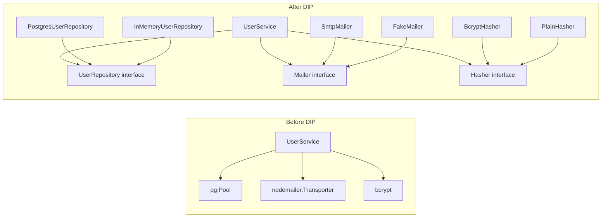
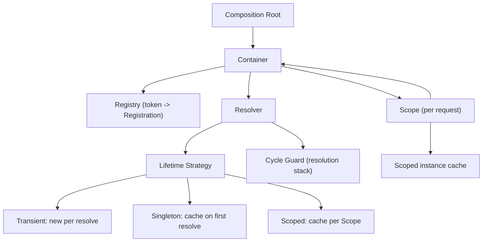

# 4.05 SOLID Dependency Inversion

> The fifth and final letter of SOLID. The principle that flips the direction of dependency arrows so that high-level policy never bows to low-level mechanism. The principle that makes your code testable, swappable, and late-bound. The principle that gave rise to Dependency Injection, Inversion of Control, and an entire generation of frameworks from Spring to NestJS to Angular.

## 1. Purpose

The Dependency Inversion Principle (DIP) exists for one reason: to decouple high-level policy from low-level detail so that the intent of your system survives every change in the machinery that implements it.

A high-level module is the part of the system that captures business value. It is the orchestration code that says "register this user, charge their card, send a welcome email, and audit the action." A low-level module is the part of the system that touches the messy outside world: the Postgres driver, the Stripe SDK, the SMTP client, the file system, the cloud SDK. Without DIP, high-level code reaches down and grabs a concrete low-level class. The high-level code now "knows" about Postgres. It knows about Stripe. It knows about the SMTP wire format. The dependency arrow points downward, from policy to detail, and every ripple in the detail layer shakes the policy layer.

Robert C. Martin stated the principle in two rules:

1. **High-level modules should not depend on low-level modules. Both should depend on abstractions.**
2. **Abstractions should not depend on details. Details should depend on abstractions.**

The first rule reverses the conventional arrow. Instead of `UserService` depending on `PostgresUserRepository`, both `UserService` and `PostgresUserRepository` depend on a `UserRepository` interface. The interface is owned by the high-level layer; the low-level layer implements it. The arrow now points from the detail toward the abstraction, and from the abstraction toward the policy that defined it. Control has been inverted.

The second rule is subtler and more often ignored. The abstraction itself must not encode details. If your `UserRepository` interface exposes a `runSql(query: string)` method, you have leaked SQL into the abstraction. Every implementor must speak SQL. Mongo cannot implement it. An in-memory test double cannot implement it. The abstraction is corrupted by detail. A clean abstraction exposes `findById(id)`, `save(user)`, `delete(id)` and lets each implementor decide how to satisfy those operations.

What DIP enables:

- **Swappable implementations.** Swap Postgres for Mongo, Stripe for a fake, SMTP for an in-memory mailer, by changing one wiring line. The high-level code never recompiles.
- **Testability.** Inject a mock or a stub at the seam the abstraction creates. Unit tests run in milliseconds with no database, no network, no credit card.
- **Late binding.** Decide at startup, or at runtime, which implementation to use. The same binary runs against an in-memory store in dev and a Postgres cluster in production.
- **Parallel development.** Two teams agree on an interface and work independently. The high-level team builds against the interface; the low-level team implements it.
- **Isolation of change.** When the Stripe API changes, only the Stripe adapter changes. The high-level payment orchestration code stays put.

The mechanism that makes DIP practical is **dependency injection** (DI). Instead of a class reaching out and constructing its own dependencies, something outside the class provides them, typically through the constructor. The class declares what it needs; the outside world decides what to give it. The class never knows the concrete type of what it received.

This note covers DIP from first principles to a production-grade typed DI container. By the end you will be able to define DIP, refactor coupled code to use DI, build your own container, and test services in isolation.

Related foundational notes: [[4.01 SOLID Single Responsibility]], [[4.02 SOLID Open Closed]], [[4.03 SOLID Liskov Substitution]], [[4.04 SOLID Interface Segregation]], [[4.08 Dependency Injection DI]].

## 2. Theory and Deep Dive

### 2.1 The Before Picture

Consider a service that registers users. Without DIP, the service constructs its own dependencies.

```javascript
// JavaScript, before DIP
const { Pool } = require("pg");
const bcrypt = require("bcrypt");
const nodemailer = require("nodemailer");

class UserService {
  constructor() {
    this.pool = new Pool({ connectionString: process.env.databaseUrl });
    this.transporter = nodemailer.createTransport({
      host: "smtp.example.com",
      port: 587,
    });
  }

  async register(email, password) {
    const hash = await bcrypt.hash(password, 12);
    const result = await this.pool.query(
      "insert into users (email, password-hash) values ($1, $2) returning id",
      [email, hash]
    );
    await this.transporter.sendMail({
      from: "no-reply@example.com",
      to: email,
      subject: "Welcome",
      text: "Welcome aboard",
    });
    return result.rows[0].id;
  }
}

module.exports = { UserService };
```

```typescript
// TypeScript, before DIP
import { Pool } from "pg";
import * as bcrypt from "bcrypt";
import * as nodemailer from "nodemailer";

class UserService {
  private pool: Pool;
  private transporter: nodemailer.Transporter;

  constructor() {
    this.pool = new Pool({ connectionString: process.env.databaseUrl });
    this.transporter = nodemailer.createTransport({
      host: "smtp.example.com",
      port: 587,
    });
  }

  async register(email: string, password: string): Promise<number> {
    const hash = await bcrypt.hash(password, 12);
    const result = await this.pool.query(
      "insert into users (email, password-hash) values ($1, $2) returning id",
      [email, hash]
    );
    await this.transporter.sendMail({
      from: "no-reply@example.com",
      to: email,
      subject: "Welcome",
      text: "Welcome aboard",
    });
    return result.rows[0].id as number;
  }
}

export { UserService };
```

This `UserService` is untestable in isolation. To exercise the `register` method you must stand up a Postgres database, an SMTP server, and you must accept that every test sends a real email. The class is fused to three concrete collaborators. The dependency arrows point downward into the depths of the infrastructure stack.

The coupling also blocks substitution. If you decide to migrate from Postgres to Mongo, you must open `UserService`, rip out the `Pool`, swap in a `MongoClient`, rewrite every query, and pray nothing else in the class depends on Postgres semantics. The class is the wrong place for that surgery. The class should describe what users do; some other place should describe how users are persisted.

### 2.2 The After Picture

Apply DIP. Define abstractions that describe what the service needs, not how those needs are met. Inject concrete implementors through the constructor.

```javascript
// JavaScript, after DIP
class UserService {
  constructor(userRepository, mailer, hasher) {
    this.userRepository = userRepository;
    this.mailer = mailer;
    this.hasher = hasher;
  }

  async register(email, password) {
    const hash = await this.hasher.hash(password);
    const user = await this.userRepository.save({ email, passwordHash: hash });
    await this.mailer.sendWelcome(email);
    return user.id;
  }
}

module.exports = { UserService };
```

```typescript
// TypeScript, after DIP
interface UserRepository {
  save(user: { email: string; passwordHash: string }): Promise<{ id: number }>;
  findById(id: number): Promise<{ id: number; email: string } | null>;
}

interface Mailer {
  sendWelcome(email: string): Promise<void>;
}

interface Hasher {
  hash(plain: string): Promise<string>;
  verify(plain: string, hashed: string): Promise<boolean>;
}

class UserService {
  constructor(
    private readonly userRepository: UserRepository,
    private readonly mailer: Mailer,
    private readonly hasher: Hasher
  ) {}

  async register(email: string, password: string): Promise<number> {
    const hash = await this.hasher.hash(password);
    const user = await this.userRepository.save({ email, passwordHash: hash });
    await this.mailer.sendWelcome(email);
    return user.id;
  }
}

export { UserService, UserRepository, Mailer, Hasher };
```

`UserService` now depends on three abstractions. It does not know about Postgres, SMTP, or bcrypt. It knows only the shape of what it needs. A test can construct a `UserService` with a fake repository, a fake mailer, and a fake hasher that return canned values. The test runs in microseconds. A production composition root can wire `PostgresUserRepository`, `SmtpMailer`, and `BcryptHasher` into the same `UserService`. The class is identical in both contexts.

### 2.3 Before/After Diagram



On the left, three rigid arrows lock `UserService` to its concrete collaborators. On the right, six implementors fan in toward three abstractions, and `UserService` knows only about those abstractions. New implementors can be added without touching `UserService`. Old implementors can be retired without touching `UserService`.

### 2.4 Dependency Injection

Dependency Injection is the pattern that delivers DIP. The class declares its dependencies; an external assembler provides them. The three classic forms of DI are:

1. **Constructor injection.** Dependencies are passed as constructor arguments. This is the preferred form. It makes dependencies explicit, immutable, and visible at the moment of construction. If a dependency is required, it cannot be omitted.
2. **Setter injection.** Dependencies are set via a method call after construction. Useful for optional dependencies but allows the object to exist in a partially constructed state.
3. **Method injection.** Dependencies are passed as method arguments. Useful when the dependency varies per call, such as a `RequestContext` or a per-request logger.

```typescript
// TypeScript, three forms of DI
interface Logger {
  log(message: string): void;
}

class ConstructorInjection {
  constructor(private readonly logger: Logger) {}
}

class SetterInjection {
  private logger?: Logger;
  setLogger(logger: Logger): void {
    this.logger = logger;
  }
}

class MethodInjection {
  doWork(input: string, logger: Logger): void {
    logger.log(`working on ${input}`);
  }
}
```

Constructor injection is the default choice in serious codebases because it makes the dependency graph inspectable and prevents the "object constructed but missing a dependency" failure mode.

### 2.5 Inversion of Control

Inversion of Control is the broader principle of which DI is one application. The classic program calls a framework; an inverted program is called by the framework. The framework owns the main loop, dispatches events, and invokes your code at the right moment. Your code plug into the framework through abstractions.

A non-inverted console program reads input, processes it, writes output, all under your control:

```javascript
// JavaScript, no IoC
function main() {
  const input = readFromStdin();
  const result = process(input);
  writeToStdout(result);
}
main();
```

An inverted web server registers handlers with a framework and then waits. The framework decides when to call `handler`:

```javascript
// JavaScript, IoC
const express = require("express");
const app = express();

app.get("/health", (req, res) => {
  res.json({ ok: true });
});

app.listen(3000); // framework now owns the loop
```

DI is IoC applied to object assembly. You do not call the container; the container calls your constructor at the right time with the right dependencies. You declare what you need; the framework decides when and how to deliver it.

### 2.6 The Dependency Injection Container

A DI container is a registry that knows how to construct every service in your application. You register a service under a token; you ask the container for that token; the container recursively resolves dependencies, constructs the object graph, and hands it back.

A minimal mental model:

1. Register `UserService` with a factory function `(c) => new UserService(c.resolve(userRepositoryToken), c.resolve(mailerToken), c.resolve(hasherToken))`.
2. Register `userRepositoryToken` with a factory that constructs `PostgresUserRepository` (or `InMemoryUserRepository` depending on environment).
3. Register `mailerToken` and `hasherToken` similarly.
4. Ask the container for `userServiceToken`. The container walks the graph, resolves each token in turn, constructs leaf dependencies first, and returns the assembled `UserService`.

Popular DI containers in the JS and TS ecosystem include:

- **NestJS** ships its own DI container built on decorators and reflect-metadata. Providers are registered against tokens; controllers and services declare dependencies via constructor type metadata.
- **Angular** has had a powerful DI container since its earliest days. The `@Injectable()` decorator marks a class as injectable; providers configure how tokens map to factories; the framework resolves the graph at bootstrap.
- **InversifyJS** is a standalone container for TS that uses symbols as tokens and `@inject` decorators on constructor parameters.
- **Awilix** is a lightweight container for Node that supports function-style and class-style injection by parameter name inspection. It does not require decorators.
- **TypeDI** is another TS option, decorator-driven, with explicit service lifetimes.

### 2.7 Service Lifetimes

A service lifetime controls how often the container constructs an instance for a given token. The three canonical lifetimes:

1. **Transient.** The container constructs a new instance every time the token is resolved. Use for stateless or cheap-to-construct services that should not be shared.
2. **Singleton.** The container constructs one instance for the lifetime of the container. Use for stateful services that must be shared, for expensive resources such as connection pools, and for configuration objects.
3. **Scoped.** The container constructs one instance per scope. A scope is typically a request, a session, or a unit of work. Use for services that should be shared within a request but isolated across requests, such as a request-scoped logger or a transaction manager.

Choosing the wrong lifetime is a classic source of bugs. A repository that holds a database connection should be a singleton; creating a new connection per request would exhaust the pool. A request context that carries a correlation ID should be scoped; making it a singleton would leak state across concurrent requests. A pure function service that performs a calculation can be transient; sharing it adds nothing.

Lifetime safety also matters: a singleton must not depend on a scoped service. If it did, the singleton would capture the scoped instance from its first resolution and reuse it forever, defeating the scope. Most containers refuse such configurations at resolution time and throw an error.

### 2.8 The Composition Root

The composition root is the single location in your application where you wire the dependency graph. It is the only place that knows about concrete types. Everything else depends on abstractions.

```typescript
// TypeScript, a composition root
import { UserService } from "./userService";
import { PostgresUserRepository } from "./postgresUserRepository";
import { SmtpMailer } from "./smtpMailer";
import { BcryptHasher } from "./bcryptHasher";

function buildUserService(): UserService {
  const userRepository = new PostgresUserRepository({ connectionString: process.env.databaseUrl });
  const mailer = new SmtpMailer({ host: "smtp.example.com", port: 587 });
  const hasher = new BcryptHasher({ rounds: 12 });
  return new UserService(userRepository, mailer, hasher);
}

const userService = buildUserService();
export { userService };
```

The composition root is allowed to depend on concretions because its entire job is to construct them. The rest of the codebase imports `UserService` and the abstractions; never the concretions. A useful lint rule: no source file outside the composition root may import a file whose name ends in `PostgresUserRepository` or `SmtpMailer`.

### 2.9 Dependency Inversion vs Liskov Substitution

DIP says "depend on the abstraction." [[4.03 SOLID Liskov Substitution]] says "every implementor of the abstraction must be substitutable for it." The two principles are partners. DIP creates the seam; LSP guarantees the seam is safe. If `InMemoryUserRepository` throws on `save` because it is read-only, it violates LSP, and the seam that DIP created is now a trapdoor. See [[4.03 SOLID Liskov Substitution]] for the contract rules that make an implementor substitutable.

### 2.10 Dependency Inversion vs Interface Segregation

DIP says "depend on the abstraction." [[4.04 SOLID Interface Segregation]] says "the abstraction should be narrow." The two principles together produce small, focused, role-specific interfaces: `UserReader`, `UserWriter`, `UserFinder`. A service that only reads users depends only on `UserReader`. A service that writes depends only on `UserWriter`. Fat interfaces defeat DIP because they force implementors to provide methods they cannot satisfy, and they force consumers to depend on methods they do not use.

### 2.11 The Cost of DIP

DIP is not free. The benefits come with a price.

- **Indirection.** Every dependency is one extra hop through an interface. Reading the code requires following the interface to find the implementor.
- **Boilerplate.** Defining an interface for every collaborator, plus a composition root that wires them, adds files and lines. For a small script this is overkill.
- **Runtime cost.** DI containers use reflection or factory functions. Resolution is fast but not free. For most applications the cost is negligible; for hot paths it can matter.
- **Learning curve.** Newcomers must understand abstractions, injection, scopes, and the container before they can be productive.

The right calibration is to apply DIP at the seams where change is likely and where testability matters. A throwaway script does not need it. A long-lived service that talks to a database, a payment processor, and an email gateway absolutely does.

## 3. Mental Models

### 3.1 Depend on the Abstraction, Not the Concretion

Think of every dependency as a contract. A contract says "I need something that can do X." A concretion says "I need this specific person to do X." A contract lets you swap any qualified performer into the role. A concretion locks you to one performer. DIP is the discipline of writing contracts and accepting any performer who satisfies them.

### 3.2 High-Level Is Policy, Low-Level Is Detail

High-level code answers "what should happen." Low-level code answers "how it physically happens." The registration flow says "persist the user, then send a welcome email." That is policy. Whether persistence means a SQL insert or a Mongo document is detail. Whether the email goes through SMTP or a transactional email API is detail. DIP walls policy away from detail by interposing an abstraction at every boundary.

### 3.3 Dependency Injection Means Give, Do Not Take

A class that calls `new` inside itself is taking. A class that receives its dependencies through its constructor is being given. The class that takes is in charge of construction; the class that is given is free to focus on its job. "Do not `new` your dependencies" is the slogan of DI.

### 3.4 The IoC Container Is a Wiring Registry

Imagine a switchboard operator who knows every extension in the building. You tell the operator "connect me to Accounts Payable"; the operator routes the call to the right desk. The container is the operator. You register `accountsPayable` against a factory; you ask the container for `accountsPayable`; the container runs the factory, recursively resolves its dependencies, and connects you to the assembled object.

### 3.5 The Hollywood Principle

"Do not call us, we will call you." Your code does not ask the framework "what should I do next." Your code registers handlers and waits. The framework decides when to invoke them. DI is the object-assembly version of this: your class does not ask "where do I get my dependencies." Your class declares them and waits for them to arrive.

### 3.6 The Seesaw of Coupling

Every dependency is a weight on one side of a seesaw. Without DIP, the weight sits on the concrete side: the high-level class is pinned to the low-level class. With DIP, the weight shifts to the abstract side: both classes sit on the abstraction, and neither touches the other directly. The seesaw tips toward flexibility.

### 3.7 The Socket and the Plug

An abstraction is a socket. A concrete implementor is a plug. Any plug that matches the socket's shape can be inserted. The socket does not care whether the plug was made by Acme or by Zenith. It only cares that the shape matches. Defining good sockets (small, role-specific, behavior-focused) is the heart of DIP.

### 3.8 The Composition Root Is the Only Hardware Store

In a DIP codebase, only the composition root is allowed to know about specific brands of plugs and sockets. Everywhere else, code speaks in generic terms. The composition root is the hardware store where you pick up the actual plug, the actual socket, and physically mate them. The rest of the codebase is an architect's blueprint that refers only to "a plug" and "a socket."

## 4. Real-World Use Cases

### 4.1 NestJS

NestJS is built around DIP. Every provider is registered against a token. Controllers and services declare dependencies via constructor parameter types, which NestJS reads using reflect-metadata. The framework constructs the object graph at bootstrap. The same controller class can be tested with mock providers and run in production with real providers without changing a line.

```typescript
// TypeScript, NestJS provider and consumer
import { Injectable, Inject } from "@nestjs/common";

@Injectable()
class PostgresUserRepository implements UserRepository {
  async save(user: User): Promise<{ id: number }> {
    // ...
  }
}

@Injectable()
class UserService {
  constructor(@Inject("UserRepository") private readonly repo: UserRepository) {}
}
```

The `@Injectable()` decorator marks a class as available for DI. The `@Inject("UserRepository")` decorator tells NestJS which token to resolve for that parameter. NestJS handles construction, lifetime, and resolution.

### 4.2 Angular

Angular has had DI since version one. The framework resolves a tree of injectors; each component has its own injector that can override providers lower in the tree. This makes it possible to swap a service implementation for a single subtree, which is invaluable for testing and for feature-flagged variations.

```typescript
// TypeScript, Angular provider
import { Injectable } from "@angular/core";

@Injectable({ providedIn: "root" })
class AuthService {
  // ...
}
```

`providedIn: "root"` registers the service as a singleton in the root injector. Components declare dependencies through constructor types and Angular resolves them.

### 4.3 Awilix

Awilix is a lightweight container for Node that uses parameter name inspection to resolve dependencies. It does not require decorators or TypeScript metadata. A class constructor that names its parameter `userRepository` will receive whatever the container has registered under that name.

```javascript
// JavaScript, Awilix
const awilix = require("awilix");

const container = awilix.createContainer();
container.register({
  userRepository: awilix.asClass(PostgresUserRepository).singleton(),
  mailer: awilix.asClass(SmtpMailer).singleton(),
  userService: awilix.asClass(UserService),
});

const userService = container.resolve("userService");
```

Awilix is popular in Express and Fastify codebases that want DI without a heavy framework.

### 4.4 InversifyJS

InversifyJS uses symbols as tokens and `@inject` decorators on constructor parameters. It is more verbose than Awilix but offers stronger typing and richer lifetime control.

```typescript
// TypeScript, InversifyJS
import { Container, injectable, inject } from "inversify";

const TYPES = {
  UserRepository: Symbol.for("UserRepository"),
  Mailer: Symbol.for("Mailer"),
};

@injectable()
class UserService {
  constructor(
    @inject(TYPES.UserRepository) private readonly repo: UserRepository,
    @inject(TYPES.Mailer) private readonly mailer: Mailer
  ) {}
}

const container = new Container();
container.bind<UserRepository>(TYPES.UserRepository).to(PostgresUserRepository).inSingletonScope();
container.bind<Mailer>(TYPES.Mailer).to(SmtpMailer);
container.bind(UserService).toSelf();
```

### 4.5 Test Doubles

The most common everyday use of DIP is test isolation. When a service depends on an abstraction, you can substitute a fake, a stub, a spy, or a mock. Without DIP, the service is fused to its real collaborator and the test must stand up the real thing or hack around it with module rewrites.

```typescript
// TypeScript, test with a fake
class FakeUserRepository implements UserRepository {
  public saved: User[] = [];
  async save(user: User): Promise<{ id: number }> {
    this.saved.push(user);
    return { id: this.saved.length };
  }
  async findById(id: number): Promise<User | null> {
    return this.saved[id - 1] ?? null;
  }
}

test("register persists the user", async () => {
  const repo = new FakeUserRepository();
  const mailer = { sendWelcome: async () => {} };
  const hasher = { hash: async () => "hashed" };
  const service = new UserService(repo, mailer, hasher);

  const id = await service.register("a@b.com", "secret");

  expect(id).toBe(1);
  expect(repo.saved[0].email).toBe("a@b.com");
});
```

### 4.6 Plugin Systems

When your application must accept third-party extensions, DIP is the mechanism. Define an extension interface; let plugins implement it; inject the plugin collection into the host.

```typescript
// TypeScript, plugin system
interface RoutePlugin {
  path: string;
  handle(request: Request): Promise<Response>;
}

class PluginRegistry {
  private plugins: RoutePlugin[] = [];
  register(plugin: RoutePlugin): void {
    this.plugins.push(plugin);
  }
  all(): RoutePlugin[] {
    return [...this.plugins];
  }
}

class Router {
  constructor(private readonly registry: PluginRegistry) {}
  async dispatch(request: Request): Promise<Response> {
    const plugin = this.registry.all().find((p) => p.path === request.url);
    if (!plugin) return new Response("not found", { status: 404 });
    return plugin.handle(request);
  }
}
```

### 4.7 Multi-Environment Configuration

The same codebase runs in development, staging, and production. The differences are in the implementations: in-memory store in dev, Postgres in staging, a sharded Postgres cluster in production. The composition root picks the implementation per environment. The application code is identical across all three.

```typescript
// TypeScript, environment-driven composition
function buildUserRepository(env: string): UserRepository {
  switch (env) {
    case "test":
      return new InMemoryUserRepository();
    case "production":
      return new PostgresUserRepository({ connectionString: process.env.databaseUrl });
    default:
      return new SqliteUserRepository({ path: "./dev.db" });
  }
}
```

### 4.8 Feature Flags

A feature flag chooses between two implementations of the same abstraction. The composition root reads the flag and binds the corresponding implementor. The application code is unaware of the flag.

```typescript
// TypeScript, feature-flagged binding
const useNewRecommendationEngine = config.flags.newRecommender;
container.bind<Recommender>(RecommenderToken)
  .to(useNewRecommendationEngine ? NewRecommender : LegacyRecommender)
  .inSingletonScope();
```

## 5. Code Examples

### 5.1 Example A — Minimal and Conceptual

A side-by-side comparison of the coupled version and the DIP version of a simple notification service.

#### 5.1.A Coupled, before DIP (JavaScript)

```javascript
// JavaScript, coupled
class NotificationService {
  constructor() {
    this.sender = require("./emailSender");
  }

  async notify(userId, message) {
    const user = await this.fetchUser(userId);
    await this.sender.sendEmail(user.email, message);
  }

  async fetchUser(userId) {
    const db = require("./database");
    return db.users.findById(userId);
  }
}

module.exports = { NotificationService };
```

#### 5.1.A Coupled, before DIP (TypeScript)

```typescript
// TypeScript, coupled
import { sendEmail } from "./emailSender";
import { database } from "./database";

class NotificationService {
  async notify(userId: number, message: string): Promise<void> {
    const user = await database.users.findById(userId);
    await sendEmail(user.email, message);
  }
}

export { NotificationService };
```

The service reaches into two modules at call time. It cannot be tested without `emailSender` and `database` being loaded. The dependencies are implicit and global.

#### 5.1.B Decoupled, after DIP (JavaScript)

```javascript
// JavaScript, after DIP
class NotificationService {
  constructor(userRepository, emailSender) {
    this.userRepository = userRepository;
    this.emailSender = emailSender;
  }

  async notify(userId, message) {
    const user = await this.userRepository.findById(userId);
    await this.emailSender.send(user.email, message);
  }
}

module.exports = { NotificationService };
```

#### 5.1.B Decoupled, after DIP (TypeScript)

```typescript
// TypeScript, after DIP
interface UserRepository {
  findById(id: number): Promise<{ id: number; email: string }>;
}

interface EmailSender {
  send(to: string, body: string): Promise<void>;
}

class NotificationService {
  constructor(
    private readonly userRepository: UserRepository,
    private readonly emailSender: EmailSender
  ) {}

  async notify(userId: number, message: string): Promise<void> {
    const user = await this.userRepository.findById(userId);
    await this.emailSender.send(user.email, message);
  }
}

export { NotificationService, UserRepository, EmailSender };
```

The service now declares its dependencies explicitly. A test constructs a `NotificationService` with fakes. Production constructs it with a database-backed repository and an SMTP sender.

#### 5.1.C Composition root (JavaScript)

```javascript
// JavaScript, composition root
const { NotificationService } = require("./notificationService");
const { PostgresUserRepository } = require("./postgresUserRepository");
const { SmtpEmailSender } = require("./smtpEmailSender");

function buildNotificationService() {
  const userRepository = new PostgresUserRepository(process.env.databaseUrl);
  const emailSender = new SmtpEmailSender({
    host: process.env.smtpHost,
    port: Number(process.env.smtpPort),
  });
  return new NotificationService(userRepository, emailSender);
}

module.exports = { buildNotificationService };
```

#### 5.1.C Composition root (TypeScript)

```typescript
// TypeScript, composition root
import { NotificationService, UserRepository, EmailSender } from "./notificationService";
import { PostgresUserRepository } from "./postgresUserRepository";
import { SmtpEmailSender } from "./smtpEmailSender";

function buildNotificationService(): NotificationService {
  const userRepository: UserRepository = new PostgresUserRepository(process.env.databaseUrl);
  const emailSender: EmailSender = new SmtpEmailSender({
    host: process.env.smtpHost,
    port: Number(process.env.smtpPort),
  });
  return new NotificationService(userRepository, emailSender);
}

export { buildNotificationService };
```

### 5.2 Example B — Production-Grade

A typed DI container with registration, resolution, service lifetimes, and cyclic-dependency detection. This is the same shape of container you would find in Awilix or InversifyJS, stripped to its essence.

#### 5.2.A The container (TypeScript)

```typescript
// TypeScript, a minimal DI container
type Lifetime = "transient" | "singleton" | "scoped";

interface Registration<T> {
  factory: (container: Container) => T;
  lifetime: Lifetime;
  singletonInstance?: T;
}

class Container {
  private registrations = new Map<symbol, Registration<unknown>>();
  private resolutionStack: symbol[] = [];

  register<T>(token: symbol, factory: (container: Container) => T, lifetime: Lifetime = "transient"): void {
    this.registrations.set(token, { factory, lifetime });
  }

  resolve<T>(token: symbol): T {
    const registration = this.registrations.get(token);
    if (!registration) {
      throw new Error(`No registration found for token ${token.toString()}`);
    }

    if (this.resolutionStack.includes(token)) {
      const cycle = [...this.resolutionStack, token].map((t) => t.toString()).join(" -> ");
      throw new Error(`Cyclic dependency detected: ${cycle}`);
    }

    if (registration.lifetime === "singleton" && registration.singletonInstance !== undefined) {
      return registration.singletonInstance as T;
    }

    this.resolutionStack.push(token);
    try {
      const instance = registration.factory(this);
      if (registration.lifetime === "singleton") {
        registration.singletonInstance = instance;
      }
      return instance as T;
    } finally {
      this.resolutionStack.pop();
    }
  }

  createScope(): Scope {
    return new Scope(this);
  }
}

class Scope {
  private scopedInstances = new Map<symbol, unknown>();
  constructor(private readonly parent: Container) {}

  resolve<T>(token: symbol): T {
    const registration = (this.parent as unknown as { registrations: Map<symbol, Registration<unknown>> }).registrations.get(token);
    if (!registration) {
      throw new Error(`No registration found for token ${token.toString()}`);
    }

    if (registration.lifetime === "scoped") {
      if (this.scopedInstances.has(token)) {
        return this.scopedInstances.get(token) as T;
      }
      const instance = registration.factory(this.parent);
      this.scopedInstances.set(token, instance);
      return instance as T;
    }

    return this.parent.resolve<T>(token);
  }
}

export { Container, Scope, Lifetime };
```

#### 5.2.B The container (JavaScript)

```javascript
// JavaScript, a minimal DI container
class Container {
  constructor() {
    this.registrations = new Map();
    this.resolutionStack = [];
  }

  register(token, factory, lifetime = "transient") {
    this.registrations.set(token, { factory, lifetime });
  }

  resolve(token) {
    const registration = this.registrations.get(token);
    if (!registration) {
      throw new Error(`No registration found for token ${token.toString()}`);
    }

    if (this.resolutionStack.includes(token)) {
      const cycle = [...this.resolutionStack, token].map((t) => t.toString()).join(" -> ");
      throw new Error(`Cyclic dependency detected: ${cycle}`);
    }

    if (registration.lifetime === "singleton" && registration.singletonInstance !== undefined) {
      return registration.singletonInstance;
    }

    this.resolutionStack.push(token);
    try {
      const instance = registration.factory(this);
      if (registration.lifetime === "singleton") {
        registration.singletonInstance = instance;
      }
      return instance;
    } finally {
      this.resolutionStack.pop();
    }
  }

  createScope() {
    return new Scope(this);
  }
}

class Scope {
  constructor(parent) {
    this.parent = parent;
    this.scopedInstances = new Map();
  }

  resolve(token) {
    const registration = this.parent.registrations.get(token);
    if (!registration) {
      throw new Error(`No registration found for token ${token.toString()}`);
    }

    if (registration.lifetime === "scoped") {
      if (this.scopedInstances.has(token)) {
        return this.scopedInstances.get(token);
      }
      const instance = registration.factory(this.parent);
      this.scopedInstances.set(token, instance);
      return instance;
    }

    return this.parent.resolve(token);
  }
}

module.exports = { Container, Scope };
```

#### 5.2.C Registering services (TypeScript)

```typescript
// TypeScript, registering services
import { Container } from "./container";

const Tokens = {
  Logger: Symbol.for("Logger"),
  Database: Symbol.for("Database"),
  UserRepository: Symbol.for("UserRepository"),
  Mailer: Symbol.for("Mailer"),
  UserService: Symbol.for("UserService"),
  RequestContext: Symbol.for("RequestContext"),
} as const;

const container = new Container();

container.register(Tokens.Logger, (c) => new ConsoleLogger(), "singleton");
container.register(Tokens.Database, (c) => new PgPool({ connectionString: process.env.databaseUrl }), "singleton");
container.register(Tokens.UserRepository, (c) => new PostgresUserRepository(c.resolve(Tokens.Database), c.resolve(Tokens.Logger)), "singleton");
container.register(Tokens.Mailer, (c) => new SmtpMailer({ host: process.env.smtpHost }), "singleton");
container.register(Tokens.RequestContext, (c) => new RequestContext(crypto.randomUUID()), "scoped");
container.register(Tokens.UserService, (c) => new UserService(c.resolve(Tokens.UserRepository), c.resolve(Tokens.Mailer), c.resolve(Tokens.Logger), c.resolve(Tokens.RequestContext)), "scoped");

const userService = container.resolve(Tokens.UserService);
```

#### 5.2.D Registering services (JavaScript)

```javascript
// JavaScript, registering services
const { Container } = require("./container");

const Tokens = {
  Logger: Symbol.for("Logger"),
  Database: Symbol.for("Database"),
  UserRepository: Symbol.for("UserRepository"),
  Mailer: Symbol.for("Mailer"),
  UserService: Symbol.for("UserService"),
  RequestContext: Symbol.for("RequestContext"),
};

const container = new Container();

container.register(Tokens.Logger, (c) => new ConsoleLogger(), "singleton");
container.register(Tokens.Database, (c) => new PgPool({ connectionString: process.env.databaseUrl }), "singleton");
container.register(Tokens.UserRepository, (c) => new PostgresUserRepository(c.resolve(Tokens.Database), c.resolve(Tokens.Logger)), "singleton");
container.register(Tokens.Mailer, (c) => new SmtpMailer({ host: process.env.smtpHost }), "singleton");
container.register(Tokens.RequestContext, (c) => new RequestContext(crypto.randomUUID()), "scoped");
container.register(Tokens.UserService, (c) => new UserService(c.resolve(Tokens.UserRepository), c.resolve(Tokens.Mailer), c.resolve(Tokens.Logger), c.resolve(Tokens.RequestContext)), "scoped");

const userService = container.resolve(Tokens.UserService);
```

#### 5.2.E Per-request scope (TypeScript)

```typescript
// TypeScript, per-request scope
function handleRequest(request: IncomingRequest, response: ServerResponse): void {
  const scope = container.createScope();
  const userService = scope.resolve<UserService>(Tokens.UserService);
  userService.register(request.body.email, request.body.password)
    .then((id) => response.json({ id }))
    .catch((err) => response.status(500).json({ error: err.message }));
}
```

#### 5.2.F Per-request scope (JavaScript)

```javascript
// JavaScript, per-request scope
function handleRequest(request, response) {
  const scope = container.createScope();
  const userService = scope.resolve(Tokens.UserService);
  userService.register(request.body.email, request.body.password)
    .then((id) => response.json({ id }))
    .catch((err) => response.status(500).json({ error: err.message }));
}
```

Each request gets its own scope. The scoped `RequestContext` and `UserService` are unique per request; the singleton `Logger`, `Database`, `UserRepository`, and `Mailer` are shared across all requests. The container enforces lifetime rules: a singleton factory can resolve other singletons or transients safely; a scoped factory can resolve singletons, transients, or other scoped services within the same scope.

## 6. Common Mistakes and Anti-Patterns

### 6.1 Calling `new` Inside a Class

The most common DIP violation. A class instantiates its own dependency inline.

```typescript
// TypeScript, anti-pattern
class OrderService {
  private repo: OrderRepository;
  constructor() {
    this.repo = new PostgresOrderRepository(); // coupled
  }
}
```

`OrderService` is now fused to `PostgresOrderRepository`. Tests cannot substitute a fake. Migrations require editing `OrderService`. Fix: accept the dependency through the constructor.

### 6.2 Depending on Concretions Instead of Abstractions

Even when you inject, you can inject the wrong thing.

```typescript
// TypeScript, anti-pattern
class OrderService {
  constructor(private readonly repo: PostgresOrderRepository) {}
}
```

The dependency arrow still points at a concretion. You cannot swap in `MongoOrderRepository` without editing `OrderService`. Fix: define an `OrderRepository` interface and depend on it.

### 6.3 Service Locator Anti-Pattern

The class asks a global container for its dependencies instead of receiving them.

```typescript
// TypeScript, anti-pattern
class OrderService {
  private repo = container.resolve<OrderRepository>(Tokens.OrderRepository);
  place(order: Order): void {
    this.repo.save(order);
  }
}
```

This looks like DIP but breaks it. The dependency is now hidden. The class is no longer pure: it cannot be constructed without the global container. Tests cannot substitute a fake without manipulating the global. The class lies about what it needs. Fix: declare dependencies as constructor parameters and let the caller inject them.

### 6.4 Over-Using DI

Not every dependency deserves an interface and an injection. A pure utility such as a date formatter or a slugify function does not change between environments; injecting it adds ceremony for no benefit.

```typescript
// TypeScript, over-engineered
class SlugifyService {
  slugify(input: string): string {
    return input.toLowerCase().replace(/\s+/g, "-");
  }
}

class ArticleService {
  constructor(private readonly slugify: SlugifyService) {}
}
```

Just import the function. Reserve DI for collaborators that touch the outside world or that vary by environment.

### 6.5 Not Documenting the Dependency Graph

A large DI graph becomes incomprehensible without a map. When a bug appears in `InvoiceService`, you need to know that it depends on `TaxCalculator`, `PdfRenderer`, and `StorageClient`, and that `TaxCalculator` depends on `TaxRateRepository`. Without documentation, newcomers must trace the composition root by hand. Fix: generate a dependency graph from the container (most containers expose introspection), or maintain a written map.

### 6.6 Circular Dependencies

A depends on B, B depends on A. The container cannot construct either; resolution loops forever (or until your cycle detector trips).

```typescript
// TypeScript, anti-pattern
class A {
  constructor(private readonly b: B) {}
}
class B {
  constructor(private readonly a: A) {}
}
```

Circular dependencies almost always indicate a design problem. Extract the shared responsibility into a third class that both A and B depend on. Or break the cycle with an event bus: A emits an event that B listens to, removing the direct dependency.

### 6.7 Leaky Abstractions

The interface exposes implementation detail.

```typescript
// TypeScript, anti-pattern
interface UserRepository {
  runQuery(sql: string, params: unknown[]): Promise<unknown[]>;
}
```

Every implementor must speak SQL. Mongo cannot implement this. An in-memory fake cannot implement this. The abstraction is a Postgres shaped hole. Fix: design operations at the domain level (`findById`, `save`, `findByEmail`).

### 6.8 Singleton Depending on Scoped

A singleton captures a scoped dependency at first resolution and reuses it forever.

```typescript
// TypeScript, anti-pattern
container.register(Tokens.AuditLog, (c) => new AuditLog(c.resolve(Tokens.RequestContext)), "singleton");
```

`AuditLog` is a singleton, `RequestContext` is scoped. The first request resolves `AuditLog`, which captures whatever `RequestContext` was active at that moment. Every subsequent request sees the first request's context. Fix: make `AuditLog` scoped, or pass the context per method call instead of through the constructor.

### 6.9 Using the Container as a Service Locator in Application Code

Application code reaches into the container directly.

```typescript
// TypeScript, anti-pattern
class OrderController {
  post(request: Request): Response {
    const service = container.resolve<OrderService>(Tokens.OrderService);
    return service.place(request.body);
  }
}
```

The controller now depends on the container. It cannot be tested without the global. It hides its real dependency (`OrderService`) behind a token lookup. Fix: resolve the service at the composition root (or the request scope) and pass it into the controller.

### 6.10 God Interfaces

A fat interface that tries to be everything to everyone.

```typescript
// TypeScript, anti-pattern
interface Repository {
  findById(id: number): Promise<unknown>;
  save(entity: unknown): Promise<void>;
  delete(id: number): Promise<void>;
  query(sql: string): Promise<unknown[]>;
  transaction<T>(work: () => T): Promise<T>;
  bulkInsert(items: unknown[]): Promise<void>;
  stream(query: string): AsyncIterable<unknown>;
}
```

Every implementor must provide every method, even if it cannot. Consumers depend on methods they do not use. This violates [[4.04 SOLID Interface Segregation]] and weakens DIP. Fix: split into `Reader`, `Writer`, `Finder`, `Transactional`, `Streaming`.

### 6.11 Forgetting to Register a Dependency

The container throws at runtime because a token is unbound. This is the runtime cost of dynamic registration. Fix: prefer compile-time-checked wiring where possible (constructor injection with typed tokens), or write a startup self-test that resolves every public service and fails fast.

### 6.12 Mixing DI Styles

Some services are constructor-injected, some use property injection, some reach into a global container. The codebase has no single convention. Newcomers cannot predict how a service receives its dependencies. Fix: pick one style (constructor injection) and enforce it with linting and review.

## 7. Best Practices and Design Patterns

### 7.1 Depend on Interfaces

Define an interface for every collaborator that varies by environment or that you want to fake in tests. The interface should be small, behavior-focused, and owned by the consumer side. See [[4.04 SOLID Interface Segregation]] and [[2.06 Interfaces vs Type Aliases]].

### 7.2 Inject via Constructor

Constructor injection makes dependencies explicit, immutable, and visible at the moment of construction. Prefer it over setter injection and method injection except in the narrow cases where those forms are required.

### 7.3 Use a DI Container for Complex Graphs

When the graph has dozens of services and multiple lifetimes, a container pays for itself. For small graphs, manual construction in the composition root is clearer.

### 7.4 Keep the Graph Acyclic

Refuse cycles at design time. If two services truly need to call each other, extract the shared responsibility into a third service or introduce an event bus.

### 7.5 Document Lifetimes

Annotate each registration with its lifetime and the reason. A reader should understand at a glance why `Database` is a singleton, why `RequestContext` is scoped, and why `SlugNormalizer` is transient.

### 7.6 Use DI for Testability

The primary practical payoff of DIP is fast, isolated tests. Every service should be constructible with fakes. Every test should run without external resources.

### 7.7 Do Not Over-Engineer

A script that runs once and exits does not need a DI container. A service with one collaborator that never changes does not need an interface. Apply DIP where the cost of coupling is real: at boundaries with external systems, at points of likely change, and at seams you need for testing.

### 7.8 Own the Abstraction on the Consumer Side

The interface that `UserService` depends on should live next to `UserService`, not next to `PostgresUserRepository`. The consumer defines what it needs; the implementor adapts to that need. This is the literal meaning of "inversion": the high-level module owns the abstraction that the low-level module implements.

### 7.9 Fail Fast at Startup

Resolve every entry-point service at boot. If a registration is missing, the application should refuse to start. A missing dependency discovered at request time is a production incident.

### 7.10 Prefer Composition Over Inheritance

Inheritance creates compile-time coupling that DI cannot soften. A subclass is fused to its parent. Composition through injected abstractions is flexible: swap the collaborator, change the behavior. See [[1.18 Mixins and Composition]].

### 7.11 Use Tokens That Survive Minification

If you rely on constructor parameter names for resolution (Awilix style), minification will rename them and break resolution. Use string or symbol tokens with explicit `@Inject` decorators, or use TS `emitDecoratorMetadata` with class-token bindings.

### 7.12 Scope Per Request, Singleton Per Process

The default lifetime policy for HTTP services: repositories, clients, and pools are singletons; request context, per-request loggers, and unit-of-work objects are scoped; pure function helpers are transient. Deviate only with a reason.

### 7.13 Make the Composition Root Thin

The composition root should do nothing but construct and wire. No business logic. No conditionals beyond environment selection. The moment it grows logic, you have leaked policy into the wiring layer.

### 7.14 Use Decorators for Metadata in Frameworks

In NestJS, Angular, and InversifyJS, decorators carry DI metadata. Learn the decorator vocabulary of your framework. See [[2.19 Decorators and Metaprogramming]].

### 7.15 Test the Wiring

Write an integration test that asks the container for every entry-point service and asserts it constructs without error. This catches missing registrations and cyclic dependencies at test time, before they reach production.

## 8. Technical Interview Knowledge

### 8.1 Q: What is the Dependency Inversion Principle?

A: DIP is the fifth SOLID principle. It has two rules: high-level modules should not depend on low-level modules; both should depend on abstractions. And abstractions should not depend on details; details should depend on abstractions. The practical effect is that high-level policy code depends on interfaces it owns, and low-level infrastructure implements those interfaces. The dependency arrow is reversed, which makes the policy code testable, swappable, and late-bound.

### 8.2 Q: What is the difference between Dependency Injection and Inversion of Control?

A: IoC is the broader principle: a framework calls your code rather than your code calling the framework. DI is one specific application of IoC to object assembly: instead of a class constructing its own dependencies (calling `new`), an external assembler provides them. All DI is IoC, but IoC also covers event loops, callback-based frameworks, template methods, and any pattern where control flows into your code from outside.

### 8.3 Q: What is a DI container?

A: A registry that maps tokens to factories and resolves the dependency graph on demand. You register a service under a token with a factory function and a lifetime; you ask the container for the token; it walks the graph, constructs leaf dependencies first, and returns the assembled instance. Containers also manage lifetimes (transient, singleton, scoped) and often detect cyclic dependencies.

### 8.4 Q: What are service lifetimes?

A: Transient constructs a new instance per resolution. Singleton constructs one instance for the lifetime of the container. Scoped constructs one instance per scope (typically per request). Choosing the wrong lifetime causes bugs: a singleton holding a database connection is correct; a transient holding a database connection exhausts the pool; a singleton depending on a scoped service captures the first scope forever.

### 8.5 Q: How does DIP help testability?

A: By depending on abstractions, a service can be constructed with fakes, stubs, spies, or mocks. Tests do not need to stand up the real database, real SMTP server, or real payment processor. They run in milliseconds, in isolation, and exercise only the unit under test. Without DIP, the service is fused to its real collaborators and tests must either spin up the real dependencies or hack around them with module rewriting.

### 8.6 Q: What is the service locator anti-pattern?

A: Using a global container as a dependency resolver inside application code. A class calls `container.resolve(Token)` to fetch its dependencies instead of receiving them through the constructor. The pattern hides dependencies, prevents testing without the global container, and couples every class to the container. The fix is constructor injection: declare what you need and let the caller provide it.

### 8.7 Q: How does NestJS do dependency injection?

A: NestJS uses TypeScript decorators and reflect-metadata. A class marked `@Injectable()` is registered as a provider in a module. Controllers and services declare dependencies as constructor parameters; NestJS reads the parameter types via metadata reflection and resolves them from the provider registry. Providers can be registered against class tokens, string tokens, or symbol tokens (with the `@Inject(token)` decorator). NestJS supports transient, request-scoped, and singleton lifetimes.

### 8.8 Q: When would you NOT use DI?

A: In a small script with no variation points and no tests. In a hot path where the indirection cost matters and the dependency is a pure function. When the dependency is a stable language built-in (Date, Math, JSON). When the cost of abstraction (extra interface, extra factory, extra wiring) exceeds the cost of coupling. DI is a tool for managing complexity; where there is no complexity, the tool is overhead.

## 9. Practical Exercises

### 9.1 Exercise 1: Identify DIP Violations

Inspect the following code and list every DIP violation.

```typescript
// TypeScript, exercise
class PaymentProcessor {
  private stripe: StripeClient;
  constructor() {
    this.stripe = new StripeClient(process.env.stripeKey);
  }
  async charge(customerId: number, amount: number): Promise<void> {
    const db = new Database(process.env.databaseUrl);
    const customer = await db.query("select * from customers where id = $1", [customerId]);
    await this.stripe.charges.create({ amount, source: customer.cardToken });
    await db.query("insert into charges (customer-id, amount) values ($1, $2)", [customerId, amount]);
  }
}
```

#### Worked Solution

1. `new StripeClient` inside the constructor. The processor is fused to Stripe. A test cannot substitute a fake. A migration to a different processor requires editing this class.
2. `new Database` inside the `charge` method. The processor is fused to the database. A connection is created on every call, exhausting the pool.
3. No abstraction for the payment gateway. Even if Stripe were injected, the type would be `StripeClient`, a concretion.
4. No abstraction for the customer repository. The processor knows SQL.
5. The processor does two jobs (charging and persistence), violating [[4.01 SOLID Single Responsibility]] and worsening the DIP violations.
6. Environment variables are read inline, hiding configuration as a dependency.

Refactored sketch:

```typescript
// TypeScript, refactored sketch
interface PaymentGateway {
  charge(cardToken: string, amount: number): Promise<void>;
}
interface CustomerRepository {
  findById(id: number): Promise<{ cardToken: string }>;
  recordCharge(customerId: number, amount: number): Promise<void>;
}

class PaymentProcessor {
  constructor(
    private readonly gateway: PaymentGateway,
    private readonly customers: CustomerRepository,
  ) {}
  async charge(customerId: number, amount: number): Promise<void> {
    const customer = await this.customers.findById(customerId);
    await this.gateway.charge(customer.cardToken, amount);
    await this.customers.recordCharge(customerId, amount);
  }
}
```

### 9.2 Exercise 2: Refactor Coupled Code to Use DI

Given the following coupled service, refactor it to use DIP and constructor injection. Provide both JS and TS.

```javascript
// JavaScript, exercise
class ReportService {
  async generate(userId) {
    const fs = require("fs");
    const user = await fetchUser(userId);
    const data = await fetchAnalytics(userId);
    const pdf = await renderPdf(user, data);
    fs.writeFileSync(`/tmp/report-${userId}.pdf`, pdf);
    return `/tmp/report-${userId}.pdf`;
  }
}
```

#### Worked Solution (JavaScript)

```javascript
// JavaScript, refactored
class ReportService {
  constructor(userFetcher, analyticsFetcher, pdfRenderer, storage) {
    this.userFetcher = userFetcher;
    this.analyticsFetcher = analyticsFetcher;
    this.pdfRenderer = pdfRenderer;
    this.storage = storage;
  }

  async generate(userId) {
    const user = await this.userFetcher.fetch(userId);
    const data = await this.analyticsFetcher.fetch(userId);
    const pdf = await this.pdfRenderer.render(user, data);
    const path = `report-${userId}.pdf`;
    await this.storage.write(path, pdf);
    return path;
  }
}

// Composition root
const { ReportService } = require("./reportService");
const { ApiUserFetcher } = require("./apiUserFetcher");
const { ApiAnalyticsFetcher } = require("./apiAnalyticsFetcher");
const { PuppeteerPdfRenderer } = require("./puppeteerPdfRenderer");
const { S3Storage } = require("./s3Storage");

function buildReportService() {
  return new ReportService(
    new ApiUserFetcher(process.env.usersApiUrl),
    new ApiAnalyticsFetcher(process.env.analyticsApiUrl),
    new PuppeteerPdfRenderer(),
    new S3Storage({ bucket: process.env.reportsBucket }),
  );
}

module.exports = { buildReportService };
```

#### Worked Solution (TypeScript)

```typescript
// TypeScript, refactored
interface UserFetcher {
  fetch(userId: number): Promise<{ id: number; name: string; email: string }>;
}
interface AnalyticsFetcher {
  fetch(userId: number): Promise<{ visits: number; revenue: number }>;
}
interface PdfRenderer {
  render(user: { name: string; email: string }, data: { visits: number; revenue: number }): Promise<Buffer>;
}
interface Storage {
  write(path: string, content: Buffer): Promise<void>;
}

class ReportService {
  constructor(
    private readonly userFetcher: UserFetcher,
    private readonly analyticsFetcher: AnalyticsFetcher,
    private readonly pdfRenderer: PdfRenderer,
    private readonly storage: Storage,
  ) {}

  async generate(userId: number): Promise<string> {
    const user = await this.userFetcher.fetch(userId);
    const data = await this.analyticsFetcher.fetch(userId);
    const pdf = await this.pdfRenderer.render(user, data);
    const path = `report-${userId}.pdf`;
    await this.storage.write(path, pdf);
    return path;
  }
}

// Composition root
import { ReportService, UserFetcher, AnalyticsFetcher, PdfRenderer, Storage } from "./reportService";
import { ApiUserFetcher } from "./apiUserFetcher";
import { ApiAnalyticsFetcher } from "./apiAnalyticsFetcher";
import { PuppeteerPdfRenderer } from "./puppeteerPdfRenderer";
import { S3Storage } from "./s3Storage";

function buildReportService(): ReportService {
  return new ReportService(
    new ApiUserFetcher(process.env.usersApiUrl),
    new ApiAnalyticsFetcher(process.env.analyticsApiUrl),
    new PuppeteerPdfRenderer(),
    new S3Storage({ bucket: process.env.reportsBucket }),
  );
}

export { buildReportService };
```

### 9.3 Exercise 3: Build a Simple DI Container

Implement a container that supports `register(token, factory)`, `resolve(token)`, and singleton lifetime. Include cyclic-dependency detection. Provide both JS and TS.

#### Worked Solution (JavaScript)

```javascript
// JavaScript, exercise 3
class Container {
  constructor() {
    this.registrations = new Map();
    this.resolutionStack = [];
  }

  register(token, factory, lifetime = "transient") {
    this.registrations.set(token, { factory, lifetime, instance: undefined });
  }

  resolve(token) {
    const registration = this.registrations.get(token);
    if (!registration) {
      throw new Error(`Unregistered token: ${token.toString()}`);
    }
    if (this.resolutionStack.includes(token)) {
      const cycle = [...this.resolutionStack, token].map((t) => t.toString()).join(" -> ");
      throw new Error(`Cycle: ${cycle}`);
    }
    if (registration.lifetime === "singleton" && registration.instance !== undefined) {
      return registration.instance;
    }
    this.resolutionStack.push(token);
    try {
      const instance = registration.factory(this);
      if (registration.lifetime === "singleton") {
        registration.instance = instance;
      }
      return instance;
    } finally {
      this.resolutionStack.pop();
    }
  }
}

module.exports = { Container };
```

#### Worked Solution (TypeScript)

```typescript
// TypeScript, exercise 3
type Lifetime = "transient" | "singleton";

interface Registration<T> {
  factory: (container: Container) => T;
  lifetime: Lifetime;
  instance?: T;
}

class Container {
  private registrations = new Map<symbol, Registration<unknown>>();
  private resolutionStack: symbol[] = [];

  register<T>(token: symbol, factory: (container: Container) => T, lifetime: Lifetime = "transient"): void {
    this.registrations.set(token, { factory, lifetime });
  }

  resolve<T>(token: symbol): T {
    const registration = this.registrations.get(token) as Registration<T> | undefined;
    if (!registration) {
      throw new Error(`Unregistered token: ${token.toString()}`);
    }
    if (this.resolutionStack.includes(token)) {
      const cycle = [...this.resolutionStack, token].map((t) => t.toString()).join(" -> ");
      throw new Error(`Cycle: ${cycle}`);
    }
    if (registration.lifetime === "singleton" && registration.instance !== undefined) {
      return registration.instance;
    }
    this.resolutionStack.push(token);
    try {
      const instance = registration.factory(this);
      if (registration.lifetime === "singleton") {
        registration.instance = instance;
      }
      return instance;
    } finally {
      this.resolutionStack.pop();
    }
  }
}

export { Container, Lifetime };
```

### 9.4 Exercise 4: Test a Service with a Mocked Dependency

Given a `SignupService` that depends on `EmailSender` and `UserRepository`, write a unit test that exercises the happy path without touching the real email or the real database. Provide both JS and TS.

```typescript
// TypeScript, service under test
class SignupService {
  constructor(
    private readonly users: UserRepository,
    private readonly mailer: EmailSender,
  ) {}
  async signup(email: string, password: string): Promise<number> {
    const existing = await this.users.findByEmail(email);
    if (existing) throw new Error("email taken");
    const user = await this.users.create({ email, passwordHash: password });
    await this.mailer.sendWelcome(email);
    return user.id;
  }
}
```

#### Worked Solution (JavaScript)

```javascript
// JavaScript, exercise 4 test
const { SignupService } = require("./signupService");

function makeFakes() {
  const saved = [];
  const users = {
    async findByEmail(email) {
      return saved.find((u) => u.email === email) ?? null;
    },
    async create(user) {
      const record = { ...user, id: saved.length + 1 };
      saved.push(record);
      return record;
    },
  };
  const sent = [];
  const mailer = {
    async sendWelcome(email) {
      sent.push(email);
    },
  };
  return { users, mailer, saved, sent };
}

test("signup persists user and sends welcome", async () => {
  const { users, mailer, saved, sent } = makeFakes();
  const service = new SignupService(users, mailer);

  const id = await service.signup("a@b.com", "secret");

  expect(id).toBe(1);
  expect(saved).toHaveLength(1);
  expect(saved[0].email).toBe("a@b.com");
  expect(sent).toEqual(["a@b.com"]);
});

test("signup rejects duplicate email", async () => {
  const { users, mailer } = makeFakes();
  users.create({ email: "a@b.com", passwordHash: "x" });
  const service = new SignupService(users, mailer);

  await expect(service.signup("a@b.com", "secret")).rejects.toThrow("email taken");
});
```

#### Worked Solution (TypeScript)

```typescript
// TypeScript, exercise 4 test
import { SignupService, UserRepository, EmailSender } from "./signupService";

interface SavedUser {
  id: number;
  email: string;
  passwordHash: string;
}

function makeFakes() {
  const saved: SavedUser[] = [];
  const users: UserRepository = {
    async findByEmail(email: string): Promise<SavedUser | null> {
      return saved.find((u) => u.email === email) ?? null;
    },
    async create(user: { email: string; passwordHash: string }): Promise<SavedUser> {
      const record: SavedUser = { ...user, id: saved.length + 1 };
      saved.push(record);
      return record;
    },
  };
  const sent: string[] = [];
  const mailer: EmailSender = {
    async sendWelcome(email: string): Promise<void> {
      sent.push(email);
    },
  };
  return { users, mailer, saved, sent };
}

test("signup persists user and sends welcome", async () => {
  const { users, mailer, saved, sent } = makeFakes();
  const service = new SignupService(users, mailer);

  const id = await service.signup("a@b.com", "secret");

  expect(id).toBe(1);
  expect(saved).toHaveLength(1);
  expect(saved[0].email).toBe("a@b.com");
  expect(sent).toEqual(["a@b.com"]);
});

test("signup rejects duplicate email", async () => {
  const { users, mailer } = makeFakes();
  await users.create({ email: "a@b.com", passwordHash: "x" });
  const service = new SignupService(users, mailer);

  await expect(service.signup("a@b.com", "secret")).rejects.toThrow("email taken");
});
```

The test runs in microseconds. No Postgres, no SMTP, no network. The abstractions pay for themselves the moment the test runs.

## 10. Mini-Project Blueprint

### 10.1 Project: Build a Typed DI Container

Goal: implement a small, fully-typed DI container in TypeScript that supports registration against symbol tokens, three service lifetimes, scoped resolution, cyclic-dependency detection, and compile-time type checking of `resolve<T>`.

### 10.2 Architecture



### 10.3 Token and Registration Types

```typescript
// TypeScript, tokens
type Token<T> = symbol & { readonly phantomType: T };

function token<T>(description: string): Token<T> {
  return Symbol.for(description) as Token<T>;
}

type Lifetime = "transient" | "singleton" | "scoped";

interface Registration<T> {
  factory: (container: Container) => T;
  lifetime: Lifetime;
  instance?: T;
}
```

The phantom `phantomType` field lets `Token<T>` carry type information without affecting the runtime value, so `resolve<UserService>(token)` returns a `UserService` instead of `unknown`.

### 10.4 Container with Lifetime and Cycle Detection

```typescript
// TypeScript, container
class Container {
  private registrations = new Map<symbol, Registration<unknown>>();
  private resolutionStack: symbol[] = [];

  register<T>(token: Token<T>, factory: (container: Container) => T, lifetime: Lifetime = "transient"): this {
    this.registrations.set(token, { factory, lifetime });
    return this;
  }

  registerSingleton<T>(token: Token<T>, factory: (container: Container) => T): this {
    return this.register(token, factory, "singleton");
  }

  registerScoped<T>(token: Token<T>, factory: (container: Container) => T): this {
    return this.register(token, factory, "scoped");
  }

  resolve<T>(token: Token<T>): T {
    const registration = this.registrations.get(token) as Registration<T> | undefined;
    if (!registration) {
      throw new Error(`Unregistered token: ${token.toString()}`);
    }
    if (registration.lifetime === "scoped") {
      throw new Error(`Scoped token ${token.toString()} cannot be resolved from the root container; create a scope first`);
    }
    return this.resolveInternal(token, registration);
  }

  private resolveInternal<T>(token: symbol, registration: Registration<T>): T {
    if (registration.lifetime === "singleton" && registration.instance !== undefined) {
      return registration.instance;
    }
    if (this.resolutionStack.includes(token)) {
      const cycle = [...this.resolutionStack, token].map((t) => t.toString()).join(" -> ");
      throw new Error(`Cyclic dependency detected: ${cycle}`);
    }
    this.resolutionStack.push(token);
    try {
      const instance = registration.factory(this) as T;
      if (registration.lifetime === "singleton") {
        registration.instance = instance;
      }
      return instance;
    } finally {
      this.resolutionStack.pop();
    }
  }

  createScope(): Scope {
    return new Scope(this);
  }

  assertAllRegistered(tokens: symbol[]): void {
    const missing = tokens.filter((t) => !this.registrations.has(t));
    if (missing.length > 0) {
      throw new Error(`Missing registrations: ${missing.map((t) => t.toString()).join(", ")}`);
    }
  }
}
```

### 10.5 Scope for Per-Request Lifetime

```typescript
// TypeScript, scope
class Scope {
  private scopedInstances = new Map<symbol, unknown>();
  private resolutionStack: symbol[] = [];

  constructor(private readonly parent: Container) {}

  resolve<T>(token: Token<T>): T {
    const registration = this.parent.registrationsFor(token);
    if (!registration) {
      throw new Error(`Unregistered token: ${token.toString()}`);
    }
    if (registration.lifetime === "scoped") {
      if (this.scopedInstances.has(token)) {
        return this.scopedInstances.get(token) as T;
      }
      if (this.resolutionStack.includes(token)) {
        const cycle = [...this.resolutionStack, token].map((t) => t.toString()).join(" -> ");
        throw new Error(`Cyclic dependency detected: ${cycle}`);
      }
      this.resolutionStack.push(token);
      try {
        const instance = registration.factory(this.parent) as T;
        this.scopedInstances.set(token, instance);
        return instance;
      } finally {
        this.resolutionStack.pop();
      }
    }
    return this.parent.resolve(token);
  }
}
```

The container exposes a `registrationsFor(token)` method (not shown) that returns the registration for inspection; this is a common introspection hook in production containers.

### 10.6 Usage

```typescript
// TypeScript, usage
interface Logger { log(message: string): void; }
interface Database { query(sql: string): Promise<unknown[]>; }
interface UserRepository { findById(id: number): Promise<unknown>; }
interface UserService { register(email: string): Promise<number>; }

const Tokens = {
  Logger: token<Logger>("Logger"),
  Database: token<Database>("Database"),
  UserRepository: token<UserRepository>("UserRepository"),
  UserService: token<UserService>("UserService"),
  RequestContext: token<{ id: string }>("RequestContext"),
};

class ConsoleLogger implements Logger { log(message: string) { console.log(message); } }
class PostgresDatabase implements Database { async query(sql: string) { return []; } }
class PostgresUserRepository implements UserRepository {
  constructor(private readonly db: Database, private readonly logger: Logger) {}
  async findById(id: number) { this.logger.log(`find ${id}`); return this.db.query("select ..."); }
}
class UserServiceImpl implements UserService {
  constructor(
    private readonly repo: UserRepository,
    private readonly logger: Logger,
    private readonly ctx: { id: string },
  ) {}
  async register(email: string) { this.logger.log(`ctx=${this.ctx.id}`); return 1; }
}

const container = new Container();
container.registerSingleton(Tokens.Logger, () => new ConsoleLogger());
container.registerSingleton(Tokens.Database, () => new PostgresDatabase());
container.registerSingleton(Tokens.UserRepository, (c) => new PostgresUserRepository(c.resolve(Tokens.Database), c.resolve(Tokens.Logger)));
container.registerScoped(Tokens.RequestContext, () => ({ id: crypto.randomUUID() }));
container.registerScoped(Tokens.UserService, (c) => new UserServiceImpl(c.resolve(Tokens.UserRepository), c.resolve(Tokens.Logger), c.resolve(Tokens.RequestContext)));

container.assertAllRegistered([Tokens.Logger, Tokens.Database, Tokens.UserRepository, Tokens.UserService, Tokens.RequestContext]);

function handleRequest(): void {
  const scope = container.createScope();
  const service = scope.resolve(Tokens.UserService);
  service.register("a@b.com");
}
```

### 10.7 Acceptance Criteria

1. `resolve<T>(token)` returns a value of type `T` at compile time.
2. Singleton instances are shared across resolutions from the root container.
3. Scoped instances are shared within a scope and isolated across scopes.
4. Transient instances are new per resolution.
5. A cyclic dependency throws a `Cyclic dependency detected: A -> B -> A` error.
6. Resolving an unregistered token throws an `Unregistered token` error.
7. Resolving a scoped token from the root container throws an error pointing the user to `createScope`.
8. `assertAllRegistered` reports every missing registration before the application starts.

### 10.8 Stretch Goals

- Add async factory support: `registerAsync(token, async (c) => new Foo(await c.resolveAsync(bar)))`.
- Add module support: groups of registrations that can be enabled or disabled.
- Add disposal: an `IDisposable` interface and a container-level `dispose()` that calls it on cached singletons.
- Add a dependency-graph visualizer that emits a Mermaid diagram of the registered graph.
- Add override support for tests: `scope.override(token, fake)` to substitute a fake without re-registering.

## 11. Core Connections

- [[4.01 SOLID Single Responsibility]] — A class with one responsibility has one reason to change, which usually means one axis of dependency. SRP makes DIP tractable; DIP makes SRP testable.
- [[4.02 SOLID Open Closed]] — DIP is the mechanism by which the Open Closed Principle is achieved. You extend the system by adding a new implementor of an existing abstraction, not by editing existing code.
- [[4.03 SOLID Liskov Substitution]] — DIP creates the seam; LSP guarantees the seam is safe. A substitute that violates LSP turns a DIP-designed seam into a trapdoor.
- [[4.04 SOLID Interface Segregation]] — DIP says "depend on the abstraction"; ISP says "the abstraction should be narrow." Together they produce small, role-specific, behavior-focused interfaces.
- [[4.08 Dependency Injection DI]] — The companion note that goes deeper into DI patterns, containers, and the mechanics of injection.
- [[2.06 Interfaces vs Type Aliases]] — In TypeScript, `interface` is the canonical form for abstractions that classes implement. Type aliases work but interact less cleanly with `implements`.
- [[2.19 Decorators and Metaprogramming]] — Modern DI containers in TS (NestJS, InversifyJS, TypeDI) use decorators and reflect-metadata to carry dependency information. Understanding decorators unlocks framework DI.
- [[1.18 Mixins and Composition]] — Composition via injected abstractions is the flexible alternative to inheritance. DIP is the principle behind that flexibility.
- [[1.16 ES6 Classes Syntactic Sugar]] — Classes give JS a familiar shape for constructor injection and interface-style contracts.
- [[1.15 Object Creation Patterns]] — Constructor functions, factory functions, and the several ways to construct objects interact with how DI delivers dependencies.

> DIP is the principle that says: stop reaching down into the machinery. Define a contract, accept any implementor, and let the composition root decide which one. The high-level code becomes durable; the low-level code becomes replaceable; the tests become fast; the system becomes supple. Master DIP and the rest of SOLID clicks into place, because every other principle either creates the seam (SRP, OCP, ISP, LSP) or depends on it (DIP).
