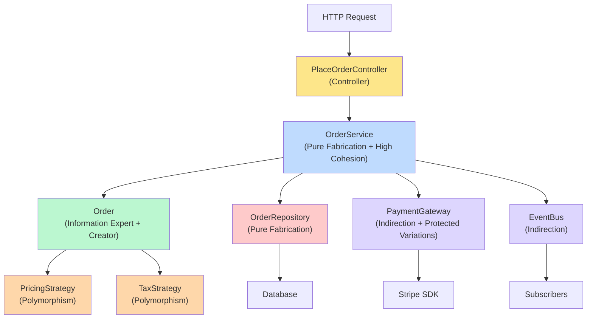

# 4.06 GRASP Principles

> The GRASP patterns are the answer to the most frequent question in object design: who does what? Craig Larman gave us a catalog of nine patterns that turn this question from a vibe into a decision. They sit beneath SOLID, beneath the Gang of Four, beneath every framework you have ever used: they are the substrate of responsibility assignment. Master GRASP, and the question "where should this method live?" stops being a guess and starts being a judgment you can defend in a code review.

## 1. Purpose

GRASP, which stands for **General Responsibility Assignment Software Patterns**, is a catalog of nine patterns published by Craig Larman in his nineteen-ninety-seven book *Applying UML and Patterns: An Introduction to Object-Oriented Analysis and Design and the Unified Process*. The patterns address the single most frequent decision in object-oriented design: which class should be assigned a given responsibility? Where SOLID gives you principles that name qualities you want a design to have (single responsibility, open-closed, and so on), GRASP gives you concrete patterns for deciding which class should hold which responsibility in the first place.

Larman observed that novices struggle not with abstraction or syntax but with assignment. They can write a class. They cannot decide whether the `calcTotal` method should live on `Order`, on `LineItem`, on a `PricingService`, on a `CartCalculator`, or on a `CheckoutController`. Every design decision reduces, eventually, to a question of the form "who should do this?", and GRASP gives nine principled answers.

The nine patterns are:

1. **Information Expert** — assign the responsibility to the class that has the information needed to fulfill it.
2. **Creator** — assign the responsibility of creating an object to the class that aggregates, contains, or closely uses it.
3. **Controller** — assign the responsibility of receiving and coordinating a system operation (a use case) to a controller class.
4. **Low Coupling** — assign responsibilities so that coupling between classes remains low.
5. **High Cohesion** — assign responsibilities so that cohesion within each class remains high.
6. **Polymorphism** — assign varying behavior to a polymorphic operation rather than to conditional code.
7. **Pure Fabrication** — invent a class that does not correspond to a domain concept, in order to preserve cohesion and coupling.
8. **Indirection** — assign the responsibility to an intermediary object to decouple two otherwise coupled components.
9. **Protected Variations** — wrap points of predicted variation behind a stable interface.

GRASP complements SOLID in a specific way. SOLID is a set of principles, qualities you want a design to have. GRASP is a set of patterns, techniques for achieving those qualities through responsibility assignment. When you apply SRP, you ask "should this responsibility be split out?" and GRASP tells you where it should go. When you apply DIP, you introduce an abstraction, and Indirection and Protected Variations are the patterns for that. When you apply OCP, you wrap variation behind an extension point, and Polymorphism is the pattern for that. GRASP is the operational layer beneath SOLID. SOLID names the destination; GRASP names the route.

What GRASP provides, concretely:

- A **vocabulary** for design discussion. "Why is that method on the controller instead of on the entity?" becomes a question with a defensible answer.
- A **checklist** for code review. Every method on every class can be interrogated: "Which GRASP pattern justifies this assignment?"
- A **teaching tool** that bridges the gap between UML class diagrams and running code.
- A **diagnostic** for smells. A God class signals a Low Coupling and High Cohesion failure. A switch statement signals a Polymorphism failure. A domain entity with database calls signals an Information Expert failure.
- A **foundation** for architecture. Layered, hexagonal, clean, and onion architectures all assume GRASP at the class level. The Repository is Pure Fabrication. The Service Layer is Controller plus Pure Fabrication. The Adapter is Indirection plus Protected Variations. The Strategy is Polymorphism.

This note covers all nine patterns from first principles through production code. By the end you should be able to list the nine patterns from memory, apply each one to a real design problem, choose between Pure Fabrication and Information Expert when they conflict, and identify which GRASP patterns are present in any codebase you read.

Related foundational notes: [[4.01 SOLID Single Responsibility]], [[4.02 SOLID Open Closed]], [[4.03 SOLID Liskov Substitution]], [[4.04 SOLID Interface Segregation]], [[4.05 SOLID Dependency Inversion]], [[4.09 Clean and Onion Architecture]].

## 2. Theory and Deep Dive

### 2.1 The Central Question: Responsibility Assignment

A responsibility is a contract that a class takes on. There are two kinds: **doing** responsibilities (do something, initiate an action, control an activity) and **knowing** responsibilities (know private data, know related objects, know things it can derive). When you design a system, every behavior the system must support decomposes into a network of responsibilities. Each responsibility must be assigned to exactly one class. The question GRASP answers is: which class?

Larman's insight was that the heuristics designers use to answer this question are few in number, repeatable, and nameable. They are not laws of physics; they are guidelines that produce good designs more often than not. He named nine of them. The first five (Information Expert, Creator, Controller, Low Coupling, High Cohesion) are the most frequently applied. The next four (Polymorphism, Pure Fabrication, Indirection, Protected Variations) are more specialized and often invoked in combination with the first five.

### 2.2 Information Expert

**Statement**: Assign a responsibility to the class that has the information needed to fulfill it.

The Information Expert is the class that already knows the data required to compute the responsibility. If the responsibility is to compute the total of an order, and the order holds line items, and each line item holds its quantity and its product's price, then the Order class is the Information Expert for the order total. Not an `OrderCalculator` service. Not a `CheckoutHelper`. The Order itself.

The pattern pushes behavior toward the data. This is the foundation of object-oriented design: an object is data plus the behavior that operates on that data, bundled together behind an interface. When you put the calcTotal method on a service that reaches into Order to read its line items, you have violated Information Expert. The service is not the expert; it is a tourist reading someone else's data. Information Expert increases cohesion (the class that has the data uses the data, so the data and its manipulation live together), decreases coupling (no other class needs to reach in to read the data), and preserves encapsulation (the class exposes only the result of the computation, not the data itself).

The pattern has limits. Sometimes the Information Expert for a responsibility is two or more classes that each hold part of the data; then the responsibility must be split, or assigned to a class that coordinates the others. Sometimes the Information Expert is a domain entity, but giving it the responsibility would force it to depend on infrastructure (a database, a message queue), damaging its cohesion. In that case Pure Fabrication takes over (see 2.7 below).

### 2.3 Creator

**Statement**: Assign class B the responsibility of creating object A if one or more of the following is true:
- B aggregates A.
- B contains A.
- B records A.
- B closely uses A.
- B has the initializing data for A.

The Creator pattern answers the question "who should construct this object?" The default answer is: the object that is closest to it in the structure. If an Order aggregates LineItems, the Order is the natural creator of LineItems. If a Cart contains Products, the Cart is the natural creator. If a Department records Employees, the Department creates them.

Creator reduces coupling because the creator already knows about the created class for other reasons. The Order already knows about LineItem because it aggregates them; asking the Order to also create them adds no new dependency. Asking a separate `LineItemFactory` to create them would add a new class and a new dependency, with no corresponding benefit.

Creator is often combined with Information Expert: the class that holds the initializing data for an object is also the class that has the information to create it. If Order has the product ID and quantity needed to construct a LineItem, then Order is both the Information Expert for that data and the Creator for the LineItem.

The pattern is violated when creation is delegated to a "factory" without reason. A `UserFactory` that creates `User` objects from raw input data, where no other class aggregates or contains Users, is usually a violation. The class that receives the input data and needs a User is itself the Creator. Exceptions apply when creation is genuinely complex (multi-step initialization, polymorphic selection, configuration-driven construction): a Factory class is then justified, usually as a Pure Fabrication that concentrates creation logic to preserve cohesion in the calling class.

### 2.4 Controller

**Statement**: Assign the responsibility of receiving or handling a system event or operation to a class representing one of the following:
- The whole system, device, or subsystem (a facade controller).
- A use-case scenario within which the system event occurs (a use-case or session controller).

A system event is an external input that triggers a use case: a button click, an HTTP request, a CLI command, a message from a queue. The Controller is the first object after the UI layer. It receives the event, parses it, and orchestrates the domain objects that fulfill the use case. The Controller pattern is the foundation of MVC controllers, NestJS controllers, Express route handlers, and command handlers in CQRS. Without it, the UI layer would reach directly into domain objects, and every change to a domain object would ripple into the UI.

There are two flavors of Controller. The **facade controller** represents the whole system or subsystem, and is appropriate when there are few system events and the orchestration is simple. The **use-case controller** represents a single use-case scenario, and is appropriate when there are many system events and you want each controller focused on one flow. Most modern web frameworks use use-case controllers: one controller per resource or per use case.

The Controller should be thin. It parses input, calls the domain, and packages output. It should not contain business logic, because that would make it a God object. The logic for "what does this order cost?" belongs to the Order (Information Expert), not to the CheckoutController. The Controller's job is to receive the request and ask the domain to fulfill it.

### 2.5 Low Coupling

**Statement**: Assign responsibilities so that coupling between classes remains low.

Coupling is the degree to which one class knows about another class. A class is coupled to another if it calls its methods, holds a reference to it, or knows about its concrete type. High coupling means a change to one class ripples into many others; low coupling means changes are localized.

Low Coupling is a meta-pattern: it is not a single assignment decision but a criterion that judges every other assignment. When you decide between two candidate classes for a responsibility, you ask: which choice leaves the system with lower coupling? If assigning to class A creates three new dependencies and assigning to class B creates zero, you assign to B. Low Coupling is preserved by depending on abstractions (interfaces, abstract classes) rather than concretions. If your class depends on a `PaymentGateway` interface rather than on the concrete `StripeGateway`, swapping Stripe for PayPal touches only the wiring, not the dependent class. This is the link between GRASP Low Coupling and the SOLID Dependency Inversion Principle.

Low Coupling is never zero coupling. Two objects that collaborate must be coupled in some way. The goal is to minimize coupling to *unstable* things, and to minimize the *surface area* of the coupling (the number of methods and types one class sees on another).

### 2.6 High Cohesion

**Statement**: Assign responsibilities so that cohesion within each class remains high.

Cohesion is the degree to which the responsibilities of a single class belong together. A class with high cohesion has methods that all work on the same data, all serve the same actor, and all change for the same reasons. A class with low cohesion has methods that do unrelated things, work on unrelated data, and change for unrelated reasons.

High Cohesion is the partner of Low Coupling. They are the yin and yang of modularity. Low Coupling says "minimize dependencies between classes"; High Cohesion says "maximize the relatedness of things inside a class." You want both. A class that has high cohesion tends to have low coupling, because it does one thing and does not need to call many other classes. A class that has low cohesion tends to have high coupling, because it does many unrelated things and needs many dependencies to do them.

Cohesion is measured qualitatively. The test is: can you describe what this class does in one sentence, without using the word "and"? If you cannot, the class probably has low cohesion. "The UserService registers users, sends welcome emails, generates PDF invoices, audits actions, and manages feature flags" fails the test. "The UserRegistrationService registers new users and only registers new users" passes. High Cohesion is violated by the God class, by the Utils class (a bag of unrelated static methods), and by the Manager class that does everything related to a noun.

### 2.7 Pure Fabrication

**Statement**: Invent a class that does not correspond to a domain concept, in order to preserve High Cohesion and Low Coupling.

The name comes from the fact that the class is fabricated, not modeled. It does not represent a real-world entity. It exists because assigning a responsibility to a domain entity would damage that entity's cohesion.

The canonical example is the Repository. A `User` domain entity, if it followed Information Expert literally, would save itself (`user.save()`). But saving requires SQL, connection pools, and transaction management. Putting that on User couples it to the database driver and the schema, collapsing its cohesion and exploding its coupling. Pure Fabrication says: invent a class that does not exist in the domain model. Call it `UserRepository`. Assign the save responsibility to it. The fabrication takes on the persistence responsibility, the coupling, and the cohesion around persistence. User stays focused on domain logic and depends on no infrastructure.

Pure Fabrication is the pattern that gives us Repositories, UnitOfWork, EmailSenders, PaymentGateways, EventPublishers, and most Service classes. It is one of the most frequently applied patterns in modern layered architectures.

The danger of Pure Fabrication is overuse: developers fabricate a service for every domain entity, and the domain model becomes anemic. The guideline is to fabricate only when Information Expert would damage cohesion or coupling. If the responsibility is naturally a domain responsibility (computing an order total, applying a discount, validating an invariant), Information Expert wins. If the responsibility is a cross-cutting concern (persistence, notification, integration), Pure Fabrication wins.

### 2.8 Indirection

**Statement**: Assign the responsibility to an intermediary object to decouple two or more components.

Indirection introduces a middleman between two classes that would otherwise be coupled. The middleman exposes a stable interface to one side and adapts to the other. The two sides never talk directly; they talk through the intermediary. Indirection is the pattern behind the Adapter, Facade, Mediator, and Proxy patterns from the Gang of Four, and behind every message bus, event emitter, and middleware pipeline.

The benefit is that changes on one side do not ripple to the other. If the sender changes its message format or the receiver is replaced, only the intermediary adapts. The two sides remain stable. Indirection is not free, however: every intermediary is a class to maintain, a hop in the call chain, a potential point of failure. Indirection without a decoupling benefit is a violation of the YAGNI principle. The rule is: introduce an intermediary when there is a clear, articulable decoupling benefit. "We might want to swap this out someday" is not articulable. "This component is unstable and we want to insulate the rest of the system from its changes" is.

### 2.9 Protected Variations

**Statement**: Wrap points of predicted or likely variation behind a stable interface, so that changes to those points do not ripple to clients.

Protected Variations says: identify the parts of the system most likely to change, and protect the rest of the system from those changes by hiding them behind a stable interface. The interface is the protection; the variation is behind it. The pattern is closely related to the SOLID Open-Closed Principle: OCP says a class should be open for extension but closed for modification; Protected Variations says identify what varies, encapsulate it, and expose a stable interface. The two are the same idea from different angles.

Protected Variations is implemented by Polymorphism (when the variation is in behavior), by Indirection (when the variation is in implementation), by configuration (when the variation is in parameters), and by adapter layers (when the variation is in external interfaces). The unifying idea is: do not let clients see the variation. Typical points of variation worth protecting include external APIs, database drivers, pricing and tax rules, notification channels, and feature flags. Each is wrapped behind an interface; the client depends on the interface, and the variation lives behind it.

### 2.10 The Nine Patterns as a Map

The diagram below maps each GRASP pattern to its primary use case. Each pattern answers a specific question about responsibility assignment.

```mermaid
graph TD
    Q1["Who has the data needed<br/>to fulfill this responsibility?"]
    Q2["Who should create<br/>this object?"]
    Q3["Who handles the<br/>incoming system event?"]
    Q4["Which assignment keeps<br/>dependencies minimal?"]
    Q5["Which assignment keeps<br/>each class focused?"]
    Q6["How do we handle<br/>varying behavior?"]
    Q7["Where do we put a<br/>non-domain responsibility?"]
    Q8["How do we decouple two<br/>unstable components?"]
    Q9["How do we isolate<br/>points of likely change?"]

    Q1 --> P1["Information Expert"]
    Q2 --> P2["Creator"]
    Q3 --> P3["Controller"]
    Q4 --> P4["Low Coupling"]
    Q5 --> P5["High Cohesion"]
    Q6 --> P6["Polymorphism"]
    Q7 --> P7["Pure Fabrication"]
    Q8 --> P8["Indirection"]
    Q9 --> P9["Protected Variations"]

    P1 --> UC1["Domain behavior lives<br/>on the entity that owns the data"]
    P2 --> UC2["Aggregates, containers,<br/>and close users create"]
    P3 --> UC3["Use-case orchestration<br/>in a thin controller class"]
    P4 --> UC4["Depend on abstractions,<br/>minimize surface area"]
    P5 --> UC5["One class, one actor,<br/>one reason to change"]
    P6 --> UC6["Replace conditionals<br/>with polymorphic dispatch"]
    P7 --> UC7["Repositories, services,<br/>adapters, gateways"]
    P8 --> UC8["Adapter, Facade, Mediator,<br/>event bus, middleware"]
    P9 --> UC9["Stable interface wrapping<br/>an unstable implementation"]
```



### 2.11 The Patterns in Combination

In real code, GRASP patterns are rarely applied alone. They combine. A Repository is Pure Fabrication plus Low Coupling (it depends on an interface) plus Protected Variations (it wraps the database). A use-case Controller is Controller plus Low Coupling (it depends on service interfaces) plus High Cohesion (it does one use case). A Strategy is Polymorphism plus Protected Variations plus Indirection (the context holds an interface that is the indirection, the strategies are the polymorphic variation, the interface protects callers from changes in strategy selection).

The mental model is: every class in a well-designed system is the result of multiple GRASP patterns applied together. The patterns are not a menu of single choices; they are a checklist of considerations that all apply to every assignment.

## 3. Mental Models

GRASP is best remembered not as a list of nine names but as a set of mental shortcuts for the design moment. Each pattern is a one-line question you ask yourself when staring at a blank file.

- **Information Expert** = "Ask the one who knows." If a class already has the data needed to compute something, that class should compute it. Don't make a tourist service that reads the data and computes externally.
- **Creator** = "The container creates." If class B aggregates, contains, or has the initializing data for class A, B should create A. Don't invent a factory when there's already a natural parent.
- **Controller** = "The first stop after the UI." Incoming system events land on a controller, which orchestrates and delegates. The controller is the receptionist of the system.
- **Low Coupling** = "Minimize what I see." Every dependency I add is a future breakage. I ask: can I depend on less? Can I depend on an abstraction instead of a concrete class?
- **High Cohesion** = "One class, one job." If I can't describe my class in one sentence without the word "and," the class has too many responsibilities.
- **Polymorphism** = "Replace the switch." If I have a conditional that picks behavior based on type, I should have a polymorphic operation instead. The conditional is a smell; the polymorphism is the cure.
- **Pure Fabrication** = "Invent a class when the domain object would be incoherent." If assigning a responsibility to a domain entity would damage the entity's cohesion (typically because the responsibility requires infrastructure), fabricate a class to take it on.
- **Indirection** = "Put a middleman between two unstable things." When two components would be directly coupled and one of them is unstable, insert an intermediary.
- **Protected Variations** = "Wrap what might change." Identify the variation points and hide them behind a stable interface.

A useful mnemonic: "IC-CLE-HIP" — Information expert, Creator, Controller, Low-coupling, High-cohesion, Polymorphism — the first six, the most frequently applied. The last three (Pure Fabrication, Indirection, Protected Variations) are the "specialist" patterns, invoked when the first six are insufficient.

A second mental model: GRASP is the operating system of object design. SOLID is the policy. GoF is the application library. You write your code on top of all three, but GRASP is the layer that translates principles into concrete assignment decisions.

A third model: every method is a question — "who should answer this?" The nine patterns are nine ways to identify the right answerer. Information Expert picks the one with the data. Creator picks the one with the lifecycle. Controller picks the one with the entry point. Low Coupling picks the one that minimizes ripples. High Cohesion picks the one that fits the existing focus. Polymorphism picks the abstract over the conditional. Pure Fabrication picks an invented class when no real one fits. Indirection picks an intermediary. Protected Variations picks the one behind the interface.

## 4. Real-World Use Cases

GRASP patterns appear throughout real codebases. Recognizing them by name accelerates reading, reviewing, and refactoring.

### 4.1 Repository Pattern (Pure Fabrication)

The Repository is the textbook Pure Fabrication. The domain entity `User` would, if it followed Information Expert literally, save itself (`user.save()`). But saving requires SQL, connection pools, and transaction boundaries. Putting these on `User` destroys its cohesion. So we fabricate `UserRepository`, which has no domain analog but takes on the persistence responsibility. Every layered architecture (Clean, Hexagonal, Onion) assumes Repositories as Pure Fabrications.

### 4.2 Service Layer (Controller plus Pure Fabrication)

A `CheckoutService` is a Controller for the checkout use case (it receives the request and orchestrates the domain) and a Pure Fabrication (no real-world "checkout service" object exists; it is invented to coordinate Order, Cart, Inventory, and Payment). The Service Layer pattern formalized by Martin Fowler is GRASP in combination.

### 4.3 Adapter Pattern (Indirection plus Protected Variations)

The Adapter from the Gang of Four is Indirection (the adapter is an intermediary between client and adaptee) plus Protected Variations (the adapter wraps the unstable adaptee behind a stable target interface). When you write a `StripePaymentAdapter` that implements `PaymentGateway` and wraps the Stripe SDK, you are applying both patterns.

### 4.4 Strategy Pattern (Polymorphism)

The Strategy pattern is GRASP Polymorphism. Instead of a switch statement that picks a pricing algorithm, you have a `PricingStrategy` interface with multiple implementations. The context holds a reference to a `PricingStrategy` and calls `strategy.price(order)`. The conditional disappears; the variation is encapsulated in the polymorphic dispatch.

### 4.5 Domain-Driven Design Aggregates (Creator plus Information Expert)

In DDD, an Aggregate Root like `Order` is the Creator of its `LineItem` children (you add a line item by calling `order.addLineItem(product, quantity)`, not by constructing a LineItem externally and attaching it). The Order is also the Information Expert for its own invariants (it can refuse to add a line item that would exceed a maximum, or compute its total). The Aggregate pattern is Creator plus Information Expert applied at the cluster level.

### 4.6 MVC Controllers (Controller)

The `C` in MVC is GRASP Controller. The controller receives the HTTP request, parses it, calls the appropriate service, and returns a response. It does not compute totals, query the database, or render HTML. It orchestrates. NestJS, Spring MVC, Ruby on Rails, ASP.NET MVC, and Express route handlers all implement GRASP Controller.

### 4.7 Event Bus (Indirection)

An event bus is Indirection at scale. Publishers and subscribers never know about each other. The bus is the intermediary. This decouples producers from consumers, allowing new subscribers to be added without modifying publishers. Every message queue (Kafka, RabbitMQ, SQS) is Indirection at the infrastructure level.

### 4.8 Configuration-Driven Variation (Protected Variations)

When you read a config file at startup and use it to select an implementation (for example choosing between a Stripe gateway and a PayPal gateway based on a configuration value), you are applying Protected Variations. The variation (which payment provider) is behind the stable interface (`PaymentGateway`), and the variation point is the configuration.

### 4.9 Facade (Indirection plus High Cohesion)

A Facade simplifies access to a complex subsystem by exposing a single, cohesive interface. It is Indirection (the facade is the intermediary between client and subsystem) plus High Cohesion (the facade's methods are all about a single subsystem, so they belong together).

### 4.10 Domain Events (Indirection plus Pure Fabrication)

A Domain Event (`OrderPlaced`) is a small fabricated object that carries information about something that happened. It decouples the producer (Order, who just publishes the event) from the consumers (InventoryService, EmailService, AnalyticsService). The event bus that carries it is Indirection; the event class itself is Pure Fabrication (no domain concept corresponds to "an order-placed event record" — it exists only to communicate).

## 5. Code Examples

### 5.1 Example A — Minimal and Conceptual

Each GRASP pattern, demonstrated in the smallest possible example. Side-by-side JavaScript and TypeScript.

#### 5.1.1 Information Expert

The Order knows its line items; the Order computes the total.

```javascript
// JavaScript — Information Expert
class LineItem {
  constructor(product, quantity) {
    this.product = product;
    this.quantity = quantity;
  }
  subtotal() {
    return this.product.price * this.quantity;
  }
}

class Order {
  constructor() {
    this.items = [];
  }
  add(item) {
    this.items.push(item);
  }
  total() {
    return this.items.reduce((sum, item) => sum + item.subtotal(), 0);
  }
}

const order = new Order();
order.add(new LineItem({ name: "Book", price: 20 }, 2));
order.add(new LineItem({ name: "Pen", price: 5 }, 3));
console.log(order.total()); // 55
```

```typescript
// TypeScript — Information Expert
interface Product {
  name: string;
  price: number;
}

class LineItem {
  constructor(
    private readonly product: Product,
    private readonly quantity: number,
  ) {}

  subtotal(): number {
    return this.product.price * this.quantity;
  }
}

class Order {
  private readonly items: LineItem[] = [];

  add(item: LineItem): void {
    this.items.push(item);
  }

  total(): number {
    return this.items.reduce((sum, item) => sum + item.subtotal(), 0);
  }
}

const order = new Order();
order.add(new LineItem({ name: "Book", price: 20 }, 2));
order.add(new LineItem({ name: "Pen", price: 5 }, 3));
console.log(order.total()); // 55
```

#### 5.1.2 Creator

The Order creates its LineItems because it aggregates them.

```javascript
// JavaScript — Creator
class Order {
  constructor() {
    this.items = [];
  }
  addItem(product, quantity) {
    const item = new LineItem(product, quantity); // Order is the Creator
    this.items.push(item);
  }
}
```

```typescript
// TypeScript — Creator
class Order {
  private readonly items: LineItem[] = [];

  addItem(product: Product, quantity: number): void {
    const item = new LineItem(product, quantity); // Order is the Creator
    this.items.push(item);
  }
}
```

#### 5.1.3 Controller

A use-case controller receives a request and orchestrates the domain.

```javascript
// JavaScript — Controller
class CheckoutController {
  constructor(orderService) {
    this.orderService = orderService;
  }
  handle(request) {
    const { cartId, userId, paymentToken } = request.body;
    return this.orderService.placeOrder({ cartId, userId, paymentToken });
  }
}
```

```typescript
// TypeScript — Controller
interface CheckoutRequest {
  body: { cartId: string; userId: string; paymentToken: string };
}

class CheckoutController {
  constructor(private readonly orderService: OrderService) {}

  handle(request: CheckoutRequest): Promise<OrderResult> {
    const { cartId, userId, paymentToken } = request.body;
    return this.orderService.placeOrder({ cartId, userId, paymentToken });
  }
}
```

#### 5.1.4 Low Coupling

Depend on an abstraction, not a concretion.

```javascript
// JavaScript — Low Coupling
class OrderProcessor {
  constructor(paymentGateway) {
    // depends on the interface, not on StripeGateway specifically
    this.paymentGateway = paymentGateway;
  }
  process(order) {
    return this.paymentGateway.charge(order.total());
  }
}
```

```typescript
// TypeScript — Low Coupling
interface PaymentGateway {
  charge(amount: number): Promise<ChargeResult>;
}

class OrderProcessor {
  constructor(private readonly paymentGateway: PaymentGateway) {}

  process(order: Order): Promise<ChargeResult> {
    return this.paymentGateway.charge(order.total());
  }
}
```

#### 5.1.5 High Cohesion

A class with one focused responsibility.

```javascript
// JavaScript — High Cohesion
class PriceCalculator {
  calculate(order) {
    let total = order.subtotal();
    total = this.applyDiscount(total, order.discount);
    total = this.applyTax(total, order.taxRate);
    return total;
  }
  applyDiscount(amount, discount) {
    return amount - amount * discount;
  }
  applyTax(amount, rate) {
    return amount + amount * rate;
  }
}
// One class, one job: computing a price. Every method serves that job.
```

```typescript
// TypeScript — High Cohesion
class PriceCalculator {
  calculate(order: Order): number {
    let total = order.subtotal();
    total = this.applyDiscount(total, order.discount);
    total = this.applyTax(total, order.taxRate);
    return total;
  }

  private applyDiscount(amount: number, discount: number): number {
    return amount - amount * discount;
  }

  private applyTax(amount: number, rate: number): number {
    return amount + amount * rate;
  }
}
// One class, one job: computing a price. Every method serves that job.
```

#### 5.1.6 Polymorphism

Replace a conditional with polymorphic dispatch.

```javascript
// JavaScript — Polymorphism
class RegularPricing {
  price(order) {
    return order.subtotal();
  }
}
class VIPPricing {
  price(order) {
    return order.subtotal() * 0.9;
  }
}
class Order {
  constructor(pricing) {
    this.pricing = pricing;
    this.items = [];
  }
  total() {
    return this.pricing.price(this);
  }
}
// No switch statement. The pricing strategy varies polymorphically.
```

```typescript
// TypeScript — Polymorphism
interface PricingStrategy {
  price(order: Order): number;
}

class RegularPricing implements PricingStrategy {
  price(order: Order): number {
    return order.subtotal();
  }
}

class VIPPricing implements PricingStrategy {
  price(order: Order): number {
    return order.subtotal() * 0.9;
  }
}

class Order {
  private readonly items: LineItem[] = [];
  constructor(private readonly pricing: PricingStrategy) {}

  subtotal(): number {
    return this.items.reduce((s, i) => s + i.subtotal(), 0);
  }

  total(): number {
    return this.pricing.price(this);
  }
}
// No switch statement. The pricing strategy varies polymorphically.
```

#### 5.1.7 Pure Fabrication

A repository that has no domain analog but takes on persistence.

```javascript
// JavaScript — Pure Fabrication
class User {
  constructor(id, email) {
    this.id = id;
    this.email = email;
  }
  // User does NOT save itself. That would damage its cohesion.
}

class UserRepository {
  // Fabricated class. No real-world analog. Exists to preserve User's cohesion.
  constructor(db) {
    this.db = db;
  }
  async save(user) {
    await this.db.query("insert into users values ($1, $2)", [
      user.id,
      user.email,
    ]);
  }
  async findById(id) {
    const row = await this.db.query("select * from users where id = $1", [id]);
    return row ? new User(row.id, row.email) : null;
  }
}
```

```typescript
// TypeScript — Pure Fabrication
class User {
  constructor(
    public readonly id: string,
    public readonly email: string,
  ) {}
  // User does NOT save itself. That would damage its cohesion.
}

interface Database {
  query<T>(sql: string, params: unknown[]): Promise<T | null>;
}

class UserRepository {
  // Fabricated class. No real-world analog. Exists to preserve User's cohesion.
  constructor(private readonly db: Database) {}

  async save(user: User): Promise<void> {
    await this.db.query("insert into users values ($1, $2)", [
      user.id,
      user.email,
    ]);
  }

  async findById(id: string): Promise<User | null> {
    const row = await this.db.query<{ id: string; email: string }>(
      "select * from users where id = $1",
      [id],
    );
    return row ? new User(row.id, row.email) : null;
  }
}
```

#### 5.1.8 Indirection

An adapter that decouples the client from a third-party SDK.

```javascript
// JavaScript — Indirection
class StripePaymentAdapter {
  constructor(stripe) {
    this.stripe = stripe; // the unstable third-party SDK
  }
  async charge(amount) {
    const result = await this.stripe.charges.create({
      amount: amount * 100,
      currency: "usd",
    });
    return { transactionId: result.id, success: result.paid };
  }
}
// Client code depends on the adapter, not on Stripe directly.
```

```typescript
// TypeScript — Indirection
interface PaymentResult {
  transactionId: string;
  success: boolean;
}

interface StripeLike {
  charges: {
    create(input: { amount: number; currency: string }): Promise<{
      id: string;
      paid: boolean;
    }>;
  };
}

class StripePaymentAdapter {
  constructor(private readonly stripe: StripeLike) {}

  async charge(amount: number): Promise<PaymentResult> {
    const result = await this.stripe.charges.create({
      amount: amount * 100,
      currency: "usd",
    });
    return { transactionId: result.id, success: result.paid };
  }
}
// Client code depends on the adapter, not on Stripe directly.
```

#### 5.1.9 Protected Variations

A stable interface that wraps an unstable implementation.

```javascript
// JavaScript — Protected Variations
class TaxService {
  constructor(strategy) {
    this.strategy = strategy; // could be US, EU, UK, etc.
  }
  computeTax(order) {
    return this.strategy.compute(order); // variation hidden behind this method
  }
}
// The client calls taxService.computeTax(order) and never knows
// whether US, EU, or UK tax rules are in effect.
```

```typescript
// TypeScript — Protected Variations
interface TaxStrategy {
  compute(order: Order): number;
}

class TaxService {
  constructor(private readonly strategy: TaxStrategy) {}

  computeTax(order: Order): number {
    return this.strategy.compute(order); // variation hidden behind this method
  }
}
// The client calls taxService.computeTax(order) and never knows
// whether US, EU, or UK tax rules are in effect.
```

### 5.2 Example B — Production-Grade Typed Order-Processing System

A complete order-processing system that applies Controller, Information Expert, Creator, Low Coupling, High Cohesion, Pure Fabrication, Indirection, Polymorphism, and Protected Variations together. Each pattern is annotated with a comment.

```javascript
// JavaScript — Production-grade order-processing system

// --- Domain entities (Information Expert + Creator) ---

class Product {
  constructor(id, name, price) {
    this.id = id;
    this.name = name;
    this.price = price;
  }
}

class LineItem {
  constructor(product, quantity) {
    this.product = product;
    this.quantity = quantity;
    if (quantity <= 0) throw new Error("quantity must be positive");
  }
  subtotal() {
    return this.product.price * this.quantity; // Information Expert
  }
  increment(qty) {
    return new LineItem(this.product, this.quantity + qty); // immutable update
  }
}

class Order {
  // Creator: Order creates its own LineItems because it aggregates them
  constructor(id, customerId, pricingStrategy, taxStrategy) {
    this.id = id;
    this.customerId = customerId;
    this.items = [];
    this.status = "draft";
    this.pricingStrategy = pricingStrategy;
    this.taxStrategy = taxStrategy;
  }

  addItem(product, quantity) {
    const existing = this.items.find((i) => i.product.id === product.id);
    if (existing) {
      this.items = this.items.map((i) =>
        i === existing ? i.increment(quantity) : i,
      );
    } else {
      this.items.push(new LineItem(product, quantity)); // Creator
    }
  }

  subtotal() {
    return this.items.reduce((sum, i) => sum + i.subtotal(), 0); // Information Expert
  }

  total() {
    const priced = this.pricingStrategy.price(this); // Polymorphism
    return this.taxStrategy.compute(priced); // Polymorphism
  }

  markAsPaid() {
    if (this.status !== "draft") {
      throw new Error(`cannot pay order in status ${this.status}`);
    }
    this.status = "paid";
    return this;
  }
}

// --- Polymorphism: pricing strategies ---

class RegularPricing {
  price(order) {
    return order.subtotal();
  }
}

class VIPPricing {
  price(order) {
    const subtotal = order.subtotal();
    return subtotal > 100 ? subtotal * 0.9 : subtotal;
  }
}

// --- Polymorphism: tax strategies ---

class USTaxStrategy {
  compute(amount) {
    return amount * 1.07;
  }
}

class EUTaxStrategy {
  compute(amount) {
    return amount * 1.21;
  }
}

// --- Pure Fabrication: repository (persistence) ---

class OrderRepository {
  constructor(db) {
    this.db = db;
  }
  async save(order) {
    const row = {
      id: order.id,
      customerId: order.customerId,
      status: order.status,
      total: order.total(),
    };
    await this.db.query(
      `insert into orders (id, "customer-id", status, total)
       values ($1, $2, $3, $4)
       on conflict (id) do update set status = $3, total = $4`,
      [row.id, row.customerId, row.status, row.total],
    );
  }
  async findById(id) {
    const row = await this.db.query("select * from orders where id = $1", [id]);
    if (!row) return null;
    // Reconstitute would be implemented here in a real system.
    return row;
  }
}

// --- Pure Fabrication: payment gateway interface and adapter (Indirection) ---

class StripePaymentAdapter {
  constructor(stripeSdk) {
    this.stripeSdk = stripeSdk;
  }
  async charge(amount) {
    const result = await this.stripeSdk.charges.create({
      amount: Math.round(amount * 100),
      currency: "usd",
    });
    return { transactionId: result.id, success: result.paid };
  }
}

// --- Pure Fabrication + Controller: the order service (use-case orchestration) ---

class OrderService {
  // Low Coupling: depends on abstractions, not concretions
  constructor({ orderRepository, paymentGateway, eventBus, clock }) {
    this.orderRepository = orderRepository;
    this.paymentGateway = paymentGateway;
    this.eventBus = eventBus;
    this.clock = clock;
  }

  async placeOrder({ customerId, items, pricing, tax }) {
    const orderId = this.clock.now().toString();
    const order = new Order(orderId, customerId, pricing, tax);

    // Creator responsibility: order creates its own line items
    for (const { product, quantity } of items) {
      order.addItem(product, quantity);
    }

    const total = order.total();
    const payment = await this.paymentGateway.charge(total);
    if (!payment.success) {
      throw new Error(`payment failed for order ${orderId}`);
    }

    order.markAsPaid();
    await this.orderRepository.save(order);

    // Indirection: event bus decouples publisher from subscribers
    await this.eventBus.publish({
      type: "OrderPlaced",
      orderId,
      customerId,
      total,
      timestamp: this.clock.now(),
    });

    return { orderId, total, transactionId: payment.transactionId };
  }
}

// --- Controller: HTTP entry point ---

class PlaceOrderController {
  constructor(orderService) {
    this.orderService = orderService;
  }
  async handle(request, reply) {
    try {
      const result = await this.orderService.placeOrder({
        customerId: request.body.customerId,
        items: request.body.items,
        pricing: request.body.vip ? new VIPPricing() : new RegularPricing(),
        tax: request.body.region === "EU" ? new EUTaxStrategy() : new USTaxStrategy(),
      });
      reply.status(201).send(result);
    } catch (error) {
      reply.status(400).send({ error: error.message });
    }
  }
}

// --- Protected Variations: configuration-driven wiring ---

function buildApplication({ db, stripeSdk, eventBus, clock }) {
  // Protected Variations: the wiring is the variation point;
  // everything behind the service interface stays stable.
  const orderRepository = new OrderRepository(db);
  const paymentGateway = new StripePaymentAdapter(stripeSdk);
  const orderService = new OrderService({
    orderRepository,
    paymentGateway,
    eventBus,
    clock,
  });
  const placeOrderController = new PlaceOrderController(orderService);
  return { placeOrderController, orderService };
}

module.exports = {
  Product,
  LineItem,
  Order,
  RegularPricing,
  VIPPricing,
  USTaxStrategy,
  EUTaxStrategy,
  OrderRepository,
  StripePaymentAdapter,
  OrderService,
  PlaceOrderController,
  buildApplication,
};
```

```typescript
// TypeScript — Production-grade order-processing system

// --- Domain entities (Information Expert + Creator) ---

export class Product {
  constructor(
    public readonly id: string,
    public readonly name: string,
    public readonly price: number,
  ) {}
}

export class LineItem {
  constructor(
    public readonly product: Product,
    public readonly quantity: number,
  ) {
    if (quantity <= 0) throw new Error("quantity must be positive");
  }

  subtotal(): number {
    return this.product.price * this.quantity; // Information Expert
  }

  increment(qty: number): LineItem {
    return new LineItem(this.product, this.quantity + qty); // immutable update
  }
}

export type OrderStatus = "draft" | "paid" | "shipped" | "cancelled";

export interface PricingStrategy {
  price(order: Order): number;
}

export interface TaxStrategy {
  compute(amount: number): number;
}

export class Order {
  // Creator: Order creates its own LineItems because it aggregates them
  constructor(
    public readonly id: string,
    public readonly customerId: string,
    private readonly pricingStrategy: PricingStrategy,
    private readonly taxStrategy: TaxStrategy,
  ) {
    if (customerId.trim() === "") throw new Error("customerId required");
  }

  private items: LineItem[] = [];
  private status: OrderStatus = "draft";

  addItem(product: Product, quantity: number): void {
    const existing = this.items.find((i) => i.product.id === product.id);
    if (existing) {
      this.items = this.items.map((i) =>
        i === existing ? i.increment(quantity) : i,
      );
    } else {
      this.items.push(new LineItem(product, quantity)); // Creator
    }
  }

  subtotal(): number {
    return this.items.reduce((sum, i) => sum + i.subtotal(), 0); // Information Expert
  }

  total(): number {
    const priced = this.pricingStrategy.price(this); // Polymorphism
    return this.taxStrategy.compute(priced); // Polymorphism
  }

  markAsPaid(): this {
    if (this.status !== "draft") {
      throw new Error(`cannot pay order in status ${this.status}`);
    }
    this.status = "paid";
    return this;
  }

  toJSON() {
    return {
      id: this.id,
      customerId: this.customerId,
      status: this.status,
      total: this.total(),
      items: this.items.map((i) => ({
        productId: i.product.id,
        quantity: i.quantity,
      })),
    };
  }
}

// --- Polymorphism: pricing strategies ---

export class RegularPricing implements PricingStrategy {
  price(order: Order): number {
    return order.subtotal();
  }
}

export class VIPPricing implements PricingStrategy {
  price(order: Order): number {
    const subtotal = order.subtotal();
    return subtotal > 100 ? subtotal * 0.9 : subtotal;
  }
}

// --- Polymorphism: tax strategies ---

export class USTaxStrategy implements TaxStrategy {
  compute(amount: number): number {
    return amount * 1.07;
  }
}

export class EUTaxStrategy implements TaxStrategy {
  compute(amount: number): number {
    return amount * 1.21;
  }
}

// --- Pure Fabrication: repository (persistence) ---

export interface Database {
  query<T>(sql: string, params: unknown[]): Promise<T | null>;
}

export interface OrderRow {
  id: string;
  customerId: string;
  status: OrderStatus;
  total: number;
}

export class OrderRepository {
  // Fabricated. No domain analog. Exists to preserve Order's cohesion.
  constructor(private readonly db: Database) {}

  async save(order: Order): Promise<void> {
    const row = order.toJSON();
    await this.db.query(
      `insert into orders (id, "customer-id", status, total)
       values ($1, $2, $3, $4)
       on conflict (id) do update set status = $3, total = $4`,
      [row.id, row.customerId, row.status, row.total],
    );
  }

  async findById(id: string): Promise<OrderRow | null> {
    return this.db.query<OrderRow>("select * from orders where id = $1", [id]);
  }
}

// --- Pure Fabrication + Indirection: payment gateway adapter ---

export interface PaymentResult {
  transactionId: string;
  success: boolean;
}

export interface PaymentGateway {
  charge(amount: number): Promise<PaymentResult>;
}

export interface StripeSdk {
  charges: {
    create(input: {
      amount: number;
      currency: string;
    }): Promise<{ id: string; paid: boolean }>;
  };
}

export class StripePaymentAdapter implements PaymentGateway {
  // Indirection: intermediary between client and Stripe SDK.
  // Protected Variations: Stripe changes do not ripple past this class.
  constructor(private readonly stripeSdk: StripeSdk) {}

  async charge(amount: number): Promise<PaymentResult> {
    const result = await this.stripeSdk.charges.create({
      amount: Math.round(amount * 100),
      currency: "usd",
    });
    return { transactionId: result.id, success: result.paid };
  }
}

// --- Pure Fabrication + Controller: the order service (use-case orchestration) ---

export interface EventBus {
  publish(event: unknown): Promise<void>;
}

export interface Clock {
  now(): Date;
}

export interface OrderServiceDeps {
  orderRepository: OrderRepository;
  paymentGateway: PaymentGateway;
  eventBus: EventBus;
  clock: Clock;
}

export interface PlaceOrderInput {
  customerId: string;
  items: Array<{ product: Product; quantity: number }>;
  pricing: PricingStrategy;
  tax: TaxStrategy;
}

export interface PlaceOrderResult {
  orderId: string;
  total: number;
  transactionId: string;
}

export class OrderService {
  // Low Coupling: every dependency is an interface.
  // High Cohesion: this class does one thing — orchestrate order placement.
  constructor(private readonly deps: OrderServiceDeps) {}

  async placeOrder(input: PlaceOrderInput): Promise<PlaceOrderResult> {
    const { orderRepository, paymentGateway, eventBus, clock } = this.deps;
    const orderId = clock.now().getTime().toString();
    const order = new Order(
      orderId,
      input.customerId,
      input.pricing,
      input.tax,
    );

    // Creator: Order creates its own LineItems.
    for (const { product, quantity } of input.items) {
      order.addItem(product, quantity);
    }

    const total = order.total();
    const payment = await paymentGateway.charge(total);
    if (!payment.success) {
      throw new Error(`payment failed for order ${orderId}`);
    }

    order.markAsPaid();
    await orderRepository.save(order);

    // Indirection: event bus decouples publisher from subscribers.
    await eventBus.publish({
      type: "OrderPlaced",
      orderId,
      customerId: input.customerId,
      total,
      timestamp: clock.now(),
    });

    return { orderId, total, transactionId: payment.transactionId };
  }
}

// --- Controller: HTTP entry point ---

export interface HttpRequest {
  body: {
    customerId: string;
    items: Array<{ productId: string; quantity: number; vip: boolean }>;
    region: "US" | "EU";
  };
}

export interface HttpResponse {
  status(code: number): { send(body: unknown): void };
}

export class PlaceOrderController {
  // Controller: first stop after the HTTP layer.
  constructor(private readonly orderService: OrderService) {}

  async handle(request: HttpRequest, reply: HttpResponse): Promise<void> {
    try {
      // In a real system, products would be loaded from a ProductRepository.
      const productCatalog = new Map<string, Product>([
        ["p1", new Product("p1", "Book", 20)],
        ["p2", new Product("p2", "Pen", 5)],
      ]);

      const items = request.body.items.map((i) => ({
        product: productCatalog.get(i.productId)!,
        quantity: i.quantity,
      }));

      const result = await this.orderService.placeOrder({
        customerId: request.body.customerId,
        items,
        pricing: request.body.items.some((i) => i.vip)
          ? new VIPPricing()
          : new RegularPricing(),
        tax: request.body.region === "EU" ? new EUTaxStrategy() : new USTaxStrategy(),
      });

      reply.status(201).send(result);
    } catch (error) {
      const message =
        error instanceof Error ? error.message : "unknown error";
      reply.status(400).send({ error: message });
    }
  }
}

// --- Protected Variations: configuration-driven wiring ---

export interface ApplicationDeps {
  db: Database;
  stripeSdk: StripeSdk;
  eventBus: EventBus;
  clock: Clock;
}

export function buildApplication(deps: ApplicationDeps) {
  // Protected Variations: the wiring is the variation point;
  // everything behind the service interface stays stable.
  const orderRepository = new OrderRepository(deps.db);
  const paymentGateway = new StripePaymentAdapter(deps.stripeSdk);
  const orderService = new OrderService({
    orderRepository,
    paymentGateway,
    eventBus: deps.eventBus,
    clock: deps.clock,
  });
  const placeOrderController = new PlaceOrderController(orderService);
  return { placeOrderController, orderService };
}
```

The structure of the production-grade system, with each GRASP pattern annotated:



## 6. Common Mistakes and Anti-Patterns

### 6.1 Ignoring Information Expert (Logic in the Wrong Class)

The most frequent GRASP violation. A `PriceCalculator` service reaches into `Order` to read its line items, computes the total externally, and writes it back. The Order class becomes a passive data bag. Cohesion drops, coupling rises, and encapsulation is lost.

**Fix**: Move the total computation onto Order. Order is the Information Expert; it has the items, so it computes the total. PriceCalculator either disappears or is reserved for cross-order computations (like "total of all orders this month").

### 6.2 Overusing Pure Fabrication (Everything Becomes a Service)

Some teams fabricate a service for every domain entity: UserService, OrderService, ProductService, InvoiceService, each holding the logic that should live on the entity. The entities become anemic data holders; the services become God objects.

**Fix**: Apply Pure Fabrication only when Information Expert would damage cohesion. The test: "Does this responsibility require infrastructure the entity should not depend on?" If yes, fabricate. If no, assign to the entity.

### 6.3 Controller Becomes God Object

The controller accumulates business logic. What starts as a thin entry point gradually absorbs validation, calculation, orchestration, error handling, and persistence. The controller ends up at two thousand lines, with thirty methods, each containing business logic that belongs on the domain or in a service.

**Fix**: Keep controllers thin. The controller parses input, calls the service, and packages output. If you find yourself writing business logic in a controller, extract it to a service method.

### 6.4 Low Coupling at the Cost of High Cohesion

A developer, in pursuit of Low Coupling, splits every responsibility into its own class. The `Order` class becomes `Order`, `OrderTotalCalculator`, `OrderValidator`, `OrderStatusManager`, `OrderDiscountApplier`, `OrderTaxApplier`. Coupling is low, but cohesion is also low: each class has one tiny method, and the Order concept is fragmented across six files.

**Fix**: Balance Low Coupling with High Cohesion. Split only when the responsibility has a different actor or a different rate of change. If two responsibilities always change together, they belong together.

### 6.5 Indirection Without a Reason (Indirection Without Benefit)

A developer introduces a layer "just in case." An `OrderServiceProxy` that delegates every call to `OrderService`. An `EventBusInterface` with one implementation. A `RepositoryBase` with no shared logic. The indirection adds classes, adds hops, adds cognitive load, and adds no decoupling benefit.

**Fix**: Introduce indirection only when there is a clear, articulable decoupling benefit. "We might want to swap this someday" is not articulable. "This third-party SDK is unstable and we want to isolate its changes" is. Apply the YAGNI test.

### 6.6 Protected Variations Wrapping Everything (Over-Engineering)

Every method is wrapped in an interface. Every value is behind a getter. Every configuration is configurable. The system is "flexible" in principle but unmaintainable in practice, because every change requires touching the interface, the implementation, the wiring, and the configuration.

**Fix**: Wrap only the points that are likely to change. Use Protected Variations for external integrations, business rules that change often, and infrastructure that may be swapped. The rule: variation is expensive; protect only where variation exists.

### 6.7 Creator Violated by External Factories

A `LineItemFactory` is used to construct `LineItem` objects, even though the only class that aggregates LineItems is `Order`. The factory exists for no reason; it adds a class, adds a dependency, and adds a hop, with no cohesion or coupling benefit.

**Fix**: Apply Creator. The class that aggregates, contains, or has the initializing data for an object is its creator. Reserve factories for cases of genuine construction complexity (multi-step initialization, polymorphic selection).

### 6.8 Polymorphism Violated by Switch Statements

A `price(order, customerType)` method contains a switch on `customerType` to pick the pricing rule. Every new customer type requires modifying the switch, which violates OCP. The switch grows; testing becomes harder; the conditional is duplicated across every method that varies by customer type.

**Fix**: Replace the switch with a polymorphic operation. Define a `PricingStrategy` interface, implement it for each customer type, and call `strategy.price(order)`. Adding a new type means adding a new class, not modifying existing code.

### 6.9 God Class (High Cohesion + Low Coupling Both Violated)

The `OrderManager` class handles persistence, validation, calculation, notification, auditing, and reporting. It is the canonical GRASP failure: High Cohesion is violated (the class does many unrelated things) and Low Coupling is violated (the class depends on every other class in the system). Every change touches the same file; every regression ripples across the entire system.

**Fix**: Split the God class by responsibility. Persistence goes to a Repository. Validation goes to a Validator or to the entity itself. Calculation goes to the entity (Information Expert) or to a Strategy (Polymorphism). Notification goes to a Notifier (Pure Fabrication). Auditing goes to an Auditor (Pure Fabrication). Each class has one responsibility, one actor, and few dependencies.

## 7. Best Practices and Design Patterns

### 7.1 Apply GRASP When Assigning Responsibility

Every time you write a method on a class, ask: "Why is this method here, and not elsewhere?" If you cannot answer with a GRASP pattern, the placement is suspect. The patterns are a checklist: run through them for every assignment decision.

### 7.2 Use Information Expert as the Default

Information Expert is the default pattern. If a class has the data needed to compute a responsibility, that class gets the responsibility. Override the default only when another pattern clearly applies: Creator for object construction, Controller for use-case orchestration, Pure Fabrication for cross-cutting concerns.

### 7.3 Use Controller for Use-Case Orchestration

Every system event lands on a controller. The controller is thin: it parses input, calls the service, packages output. Business logic lives elsewhere. One controller per use case, not one controller per entity. A `CheckoutController` is good; a `OrderController` that handles checkout, cancellation, refund, shipment tracking, and invoice generation is a God object.

### 7.4 Use Pure Fabrication for Non-Domain Concerns

Persisting an entity, sending an email, and calling an external API are not domain responsibilities. Each is a cross-cutting concern that should live in a fabricated class: Repository, EmailSender, ExternalGateway. The domain entity stays focused on domain logic.

### 7.5 Balance Low Coupling and High Cohesion

The two patterns are partners. Splitting too aggressively maximizes Low Coupling but fragments High Cohesion. Merging too aggressively maximizes High Cohesion but creates a God class. The balance point is the responsibility boundary: things that change together, stay together; things that change separately, stay separate.

### 7.6 Use Indirection When There Is a Clear Decoupling Benefit

Introduce an intermediary when (a) one of the two endpoints is unstable, (b) you have multiple implementations of one side, or (c) you want to add cross-cutting behavior (logging, caching, retry) without modifying either endpoint. Do not introduce indirection for its own sake.

### 7.7 Use Protected Variations for Points Likely to Change

Identify the variation points: external APIs, business rules, infrastructure choices, configuration values. Wrap each behind a stable interface. Do not wrap stable, internal, single-implementation behavior. The cost of the abstraction is paid only where the variation exists.

### 7.8 Use Polymorphism Instead of Conditionals

Replace switch statements and if-else chains that select behavior with polymorphic dispatch. Define an interface, implement it for each variant, and call the interface. New variants are added by adding classes, not by modifying existing code. This is the link between GRASP Polymorphism and the SOLID Open-Closed Principle.

### 7.9 Combine Patterns and Name Them

Real designs combine GRASP patterns. A Repository is Pure Fabrication plus Low Coupling plus Protected Variations. A Strategy is Polymorphism plus Protected Variations plus Indirection. An Adapter is Indirection plus Protected Variations. Recognize the combinations so you can apply them deliberately, and name classes after the pattern they embody: `UserRepository` signals Pure Fabrication, `CheckoutController` signals Controller, `PaymentGateway` signals Indirection, `PricingStrategy` signals Polymorphism. The name communicates design intent to every reader.

## 8. Technical Interview Knowledge

### 8.1 Q: What is GRASP?

**A**: GRASP stands for General Responsibility Assignment Software Patterns. It is a catalog of nine patterns published by Craig Larman in nineteen-ninety-seven. The patterns address the most frequent decision in object-oriented design: which class should be assigned a given responsibility. The nine patterns are Information Expert, Creator, Controller, Low Coupling, High Cohesion, Polymorphism, Pure Fabrication, Indirection, and Protected Variations. GRASP complements SOLID: SOLID is a set of principles (qualities to achieve); GRASP is a set of patterns (techniques for achieving those qualities through responsibility assignment).

### 8.2 Q: List the nine GRASP patterns.

**A**:
1. Information Expert — assign a responsibility to the class that has the information needed to fulfill it.
2. Creator — assign creation responsibility to the class that aggregates, contains, or closely uses the created object.
3. Controller — assign the handling of a system event to a controller class.
4. Low Coupling — assign responsibilities so that coupling between classes remains low.
5. High Cohesion — assign responsibilities so that cohesion within each class remains high.
6. Polymorphism — assign varying behavior to a polymorphic operation rather than to conditional code.
7. Pure Fabrication — invent a class that does not correspond to a domain concept in order to preserve cohesion and coupling.
8. Indirection — assign the responsibility to an intermediary to decouple two components.
9. Protected Variations — wrap points of variation behind a stable interface.

### 8.3 Q: What is Information Expert?

**A**: Information Expert is the pattern of assigning a responsibility to the class that has the information needed to fulfill it. The class that already holds the data should perform the computation that uses that data. This increases cohesion (the data and its manipulation live together), decreases coupling (no other class needs to reach in to read the data), and preserves encapsulation (the class exposes only the result, not the data). The canonical example: an Order that holds line items computes its own total; we do not delegate this to an external PriceCalculator.

### 8.4 Q: What is Pure Fabrication?

**A**: Pure Fabrication is the pattern of inventing a class that does not correspond to a domain concept, in order to preserve High Cohesion and Low Coupling. The class is fabricated; it has no real-world analog. It exists because assigning a responsibility to a domain entity would damage the entity's cohesion. The canonical example: the Repository. A User domain entity, if it followed Information Expert literally, would save itself (`user.save()`). But saving requires database access, which would couple User to the database driver and destroy its cohesion. So we fabricate `UserRepository`, which takes on the persistence responsibility, and User stays focused on domain logic. Pure Fabrication is the pattern behind Repositories, Services, Adapters, Gateways, and most cross-cutting infrastructure classes.

### 8.5 Q: How does GRASP relate to SOLID?

**A**: GRASP and SOLID operate at different layers. SOLID is a set of principles that name qualities a design should have (single responsibility, open-closed, and so on). GRASP is a set of patterns for assigning responsibilities to classes. SOLID names the destination; GRASP names the route. When you apply SRP and ask "should this responsibility be split out?", GRASP tells you where it should go (Pure Fabrication for non-domain concerns, Information Expert for domain concerns). When you apply DIP and introduce an abstraction, GRASP Indirection and Protected Variations are the patterns for that. When you apply OCP and wrap variation behind an extension point, GRASP Polymorphism is the pattern for that. GRASP is the operational layer beneath SOLID.

### 8.6 Q: What is the Creator pattern?

**A**: Creator is the pattern of assigning the responsibility of creating an object to the class that aggregates, contains, records, closely uses, or has the initializing data for that object. The pattern reduces coupling because the creator already knows about the created class for other reasons; adding the creation responsibility adds no new dependency. The canonical example: an Order aggregates LineItems, so the Order creates its own LineItems. Creator is violated when an external factory is used despite a natural creator existing.

### 8.7 Q: What is Protected Variations?

**A**: Protected Variations is the pattern of wrapping points of predicted or likely variation behind a stable interface, so that changes to those points do not ripple to clients. The interface is the protection; the variation is behind it. The pattern is closely related to the SOLID Open-Closed Principle. It is implemented by Polymorphism (when the variation is in behavior), by Indirection (when the variation is in implementation), by configuration (when the variation is in parameters), and by adapter layers (when the variation is in external interfaces). Examples worth protecting: external APIs, database drivers, pricing rules, tax calculators, notification channels, feature flags.

### 8.8 Q: When would you use Indirection?

**A**: Use Indirection when there is a clear, articulable decoupling benefit. The four most common reasons: (1) one of the two endpoints is unstable and you want to insulate the rest of the system from its changes; (2) you have multiple implementations of one side and want to swap them without modifying the other side; (3) you want to add cross-cutting behavior (logging, caching, retry, authorization) without modifying either endpoint; (4) you want to decouple a publisher from its subscribers (the event bus pattern). Do not introduce indirection for its own sake; the YAGNI test applies. If you cannot point to a specific variation that the indirection protects against, remove it.

## 9. Practical Exercises

### 9.1 Exercise 1 — Assign Responsibilities for E-Commerce Checkout

**Prompt**: You are designing an e-commerce checkout flow. A customer reviews their cart, enters a shipping address, selects a payment method, and submits the order. The system must compute the order total (including tax and shipping), charge the payment method, decrement inventory, send a confirmation email, and persist the order. Identify the GRASP patterns you would apply and which class gets each responsibility.

**Worked Solution**:

1. **Controller** — `CheckoutController`. Receives the HTTP request. Parses input (cart ID, address, payment method). Calls `CheckoutService.submit(input)`. Packages the response. Thin; no business logic.

2. **Information Expert** — `Cart.subtotal()`. The Cart holds its items, so it computes its own subtotal. `Order.total()` — the Order holds its line items and its pricing strategy, so it computes its own total. `Inventory.decrement(product, quantity)` — the Inventory knows its stock levels, so it decrements them.

3. **Creator** — `Order` is created by `CheckoutService` (which has the initializing data: the cart, the customer, the address). `Order` creates its own `LineItem` children from the cart items (because it aggregates them).

4. **Polymorphism** — `PricingStrategy` (Regular, VIP, Discount) selected based on the customer. `TaxStrategy` (US, EU, UK) selected based on the shipping address. `ShippingCostStrategy` (Standard, Express, Overnight) selected based on the shipping method. `PaymentGateway` (Stripe, PayPal) selected based on the payment method. Each is a polymorphic operation, not a conditional.

5. **Pure Fabrication** — `OrderRepository` (persistence). `EmailSender` (notification). `InventoryRepository` (persistence for inventory). `PaymentGateway` and its adapters (integration). `CheckoutService` itself (orchestrates the use case but does not correspond to a domain concept).

6. **Indirection** — `EventBus`. The order placement publishes an `OrderPlaced` event. Subscribers (EmailSender, AnalyticsService, FraudDetectionService) consume the event. The publisher does not know about the subscribers. The bus is the intermediary.

7. **Protected Variations, Low Coupling, High Cohesion** — The `PaymentGateway`, `TaxStrategy`, and `EmailSender` interfaces protect the system from changes in their respective implementations. Every fabricated class depends on an interface, not a concrete class, so the `CheckoutService` depends on `OrderRepository`, `PaymentGateway`, `EmailSender`, and `EventBus` abstractions, never on concretions. Each class has exactly one responsibility: `Order` computes its total, `OrderRepository` persists, `EmailSender` sends, `CheckoutService` orchestrates.

**Result**: A system with clear separation of concerns, low coupling, high cohesion, and points of variation protected behind stable interfaces.

### 9.2 Exercise 2 — Identify GRASP Patterns in Existing Code

**Prompt**: Read the following code and identify which GRASP patterns are applied and which are violated.

```javascript
class UserController {
  constructor(db, emailSdk) {
    this.db = db;
    this.emailSdk = emailSdk;
  }
  async register(req, res) {
    const { email, password } = req.body;
    if (!email.includes("@")) {
      return res.status(400).send({ error: "invalid email" });
    }
    if (password.length < 8) {
      return res.status(400).send({ error: "weak password" });
    }
    const hash = await bcrypt.hash(password, 12);
    const result = await this.db.query(
      "insert into users (email, \"password-hash\") values ($1, $2) returning id",
      [email, hash],
    );
    await this.emailSdk.send({
      from: "no-reply@example.com",
      to: email,
      subject: "Welcome",
      text: "Welcome aboard",
    });
    return res.status(201).send({ id: result.rows[0].id });
  }
}
```

**Worked Solution**:

**Patterns violated**: Nearly every GRASP pattern is violated here. **Controller** is violated because the `UserController` does validation, hashing, database queries, and email sending instead of just parsing input and calling a service. **Information Expert** is violated because there is no `User` domain entity; the validation logic should live on a `User` class. **High Cohesion** is violated because the controller has at least five responsibilities (HTTP handling, validation, hashing, persistence, email sending). **Low Coupling** is violated because the controller is directly coupled to `bcrypt`, the database driver, and the email SDK. **Pure Fabrication** is missing (no `UserRepository`, `EmailSender`, or `PasswordHasher`). **Protected Variations** is missing (the email SDK is directly invoked). **Indirection** is missing (no event bus for the `UserRegistered` event; adding analytics later would require modifying the controller).

**Refactored structure**: `UserController` (Controller only — parses HTTP, calls `UserService.register`). `UserService` (Pure Fabrication plus use-case Controller — orchestrates registration). `User` (Information Expert — validates its own email and password). `PasswordHasher` (Pure Fabrication — wraps bcrypt). `UserRepository` (Pure Fabrication — persistence). `EmailSender` (Pure Fabrication plus Indirection plus Protected Variations — interface for email providers). `EventBus` (Indirection — publishes `UserRegistered` for any subscriber).

### 9.3 Exercise 3 — Refactor a God Class Using GRASP

**Prompt**: Refactor the following God class using GRASP patterns. Identify the responsibilities, where each should go, and which pattern justifies the assignment.

```javascript
class OrderManager {
  constructor(db, stripeSdk, emailSdk, logger) {
    this.db = db;
    this.stripeSdk = stripeSdk;
    this.emailSdk = emailSdk;
    this.logger = logger;
  }

  async placeOrder(customerId, items) {
    // validate
    if (!customerId) throw new Error("customerId required");
    for (const item of items) {
      if (item.quantity <= 0) throw new Error("invalid quantity");
    }
    // compute total
    let total = 0;
    for (const item of items) {
      total += item.product.price * item.quantity;
    }
    // apply discount
    if (customerIsVIP(customerId)) {
      total = total * 0.9;
    }
    // apply tax
    total = total * 1.07;
    // charge
    const result = await this.stripeSdk.charges.create({
      amount: total * 100,
      currency: "usd",
    });
    if (!result.paid) throw new Error("payment failed");
    // persist
    await this.db.query("insert into orders ...", [customerId, total]);
    // email
    await this.emailSdk.send({ to: customerId, subject: "Order confirmed" });
    // log
    this.logger.info(`Order placed for ${customerId}: ${total}`);
    return { total, transactionId: result.id };
  }
}
```

**Worked Solution**:

**Responsibilities identified**:

1. Use-case orchestration (placeOrder).
2. Input validation.
3. Subtotal computation.
4. Discount application.
5. Tax computation.
6. Payment charging.
7. Persistence.
8. Email notification.
9. Logging.

**Refactored assignments**:

1. **`PlaceOrderController`** (Controller) — receives the HTTP request, calls `OrderService.placeOrder(input)`, packages the response.
2. **`OrderService`** (Pure Fabrication plus use-case Controller) — orchestrates the use case, validates input shape, calls domain and infrastructure, publishes the event.
3. **`Order`** (Information Expert plus Creator) — validates its own invariants, computes its own subtotal, applies pricing and tax strategies, creates its own LineItems.
4. **`LineItem`** (Information Expert) — validates its own quantity, computes its own subtotal.
5. **`PricingStrategy`** (Polymorphism) — RegularPricing, VIPPricing. The `if (customerIsVIP)` conditional becomes a polymorphic dispatch.
6. **`TaxStrategy`** (Polymorphism) — USTaxStrategy, EUTaxStrategy. The hardcoded `* 1.07` becomes a strategy call.
7. **`PaymentGateway`** (Indirection plus Protected Variations plus Pure Fabrication) — interface implemented by `StripePaymentAdapter`.
8. **`OrderRepository`** (Pure Fabrication) — persistence.
9. **`EmailSender`** (Pure Fabrication plus Indirection plus Protected Variations) — interface for email providers.
10. **`EventBus`** (Indirection) — publishes `OrderPlaced`; the email sending becomes a subscriber, decoupled from the order placement.
11. **`Logger`** — already separate; `OrderService` calls `logger.info` after the order is placed.

The refactored system demonstrates every GRASP pattern in concert: Information Expert on Order and LineItem, Creator on Order, Controller on PlaceOrderController and OrderService, Low Coupling through interface-only dependencies, High Cohesion through single-responsibility classes, Polymorphism through PricingStrategy and TaxStrategy, Pure Fabrication through OrderRepository, EmailSender, PaymentGateway, and OrderService, Indirection through EventBus and PaymentGateway, and Protected Variations through the stable interfaces that wrap the volatile Stripe SDK, email provider, and business rules.

### 9.4 Exercise 4 — Decide Between Pure Fabrication and Information Expert

**Prompt**: You are designing a domain entity `Invoice`. Should the `generatePDF()` method (which produces a PDF representation) live on the Invoice (Information Expert) or on a fabricated `InvoicePDFGenerator` class (Pure Fabrication)? Defend your choice.

**Worked Solution**:

**Analysis**: Information Expert says the Invoice has the data needed to generate the PDF (line items, totals, customer info), so the Invoice should generate the PDF. Pure Fabrication says generating a PDF requires a PDF library (PDFKit, Puppeteer, etc.), which is infrastructure; putting the PDF generation on the Invoice couples it to that library and damages its cohesion.

**The deciding question**: Does the responsibility require infrastructure that the domain entity should not depend on? In this case, yes. The Invoice should not depend on a PDF library. If you change the library or add a new output format (HTML, CSV, JSON), you should not have to modify the Invoice.

**Decision**: Use Pure Fabrication. Create `InvoicePDFGenerator` (or `InvoiceRenderer` with a `renderToPDF` method) that takes an Invoice and produces a PDF.

**Nuances**: The Invoice can expose a `toJSON()` method that returns its data in a structured form. This is Information Expert (the Invoice knows its own data) and is not infrastructure-coupled. The `InvoicePDFGenerator` takes the Invoice (or its JSON representation) and produces a PDF. This is Pure Fabrication (no domain analog) and is infrastructure-coupled (to the PDF library). If you later want HTML output, you create `InvoiceHTMLGenerator`. The Invoice stays the same. This is Protected Variations in action: the variation (output format) is behind a stable interface.

**General rule**: If the responsibility is naturally a domain responsibility (computing a total, applying a discount, validating an invariant), use Information Expert. If the responsibility is a cross-cutting concern (persistence, notification, integration, rendering), use Pure Fabrication. The deciding question is: "Does this responsibility require infrastructure the entity should not depend on?" If yes, fabricate. If no, assign to the entity.

## 10. Mini-Project Blueprint

### 10.1 Build a Typed Order-Processing System

**Goal**: Build a small but complete order-processing system that applies Controller, Information Expert, Creator, Low Coupling, High Cohesion, Pure Fabrication, Indirection, Polymorphism, and Protected Variations. The system should be runnable, testable, and ready to extend.

**Stack**: Node.js, TypeScript, Fastify (HTTP), an in-memory database for development, a fake Stripe SDK for testing.

**Steps**:

1. **Define the domain entities.**
   - `Product` (id, name, price).
   - `LineItem` (product, quantity, subtotal). Validates quantity. Computes its own subtotal.
   - `Order` (id, customerId, items, status, pricingStrategy, taxStrategy). Creates its own LineItems. Computes its own subtotal and total. Validates its own invariants. Transitions its own status.

2. **Define the polymorphic strategies.**
   - `PricingStrategy` interface. `RegularPricing`, `VIPPricing`, `BulkDiscountPricing` implementations.
   - `TaxStrategy` interface. `USTaxStrategy`, `EUTaxStrategy`, `UKTaxStrategy` implementations.

3. **Define the Pure Fabrications.**
   - `OrderRepository` (save, findById, findByCustomer). Uses a `Database` interface.
   - `PaymentGateway` interface. `StripePaymentAdapter` and `FakePaymentGateway` implementations.
   - `EmailSender` interface. `SMTPEmailSender` and `ConsoleEmailSender` implementations.
   - `EventBus` interface. `InMemoryEventBus` and `RedisEventBus` implementations.

4. **Define the use-case service.**
   - `OrderService.placeOrder(input)`. Orchestrates the use case. Validates input, creates the Order, charges the payment, persists the order, publishes the event. Depends on interfaces (Low Coupling). Does one thing (High Cohesion).

5. **Define the controller.**
   - `PlaceOrderController.handle(request, reply)`. Parses the HTTP request, calls `orderService.placeOrder`, packages the response. Thin.

6. **Define the subscribers.**
   - `OrderConfirmationEmailSubscriber`. Listens for `OrderPlaced`, sends a confirmation email.
   - `InventoryDecrementSubscriber`. Listens for `OrderPlaced`, decrements inventory.
   - `AnalyticsSubscriber`. Listens for `OrderPlaced`, records an analytics event.

7. **Wire the application.**
   - `buildApplication(deps)`. Takes infrastructure dependencies (Database, StripeSdk, EventBus, Clock). Constructs the repositories, gateways, senders, bus, service, controller. Returns the controller and service. This is Protected Variations: the wiring is the variation point; everything behind the service interface stays stable.

8. **Write the HTTP entry point.**
   - A Fastify route `POST /orders` that calls `placeOrderController.handle(request, reply)`.

9. **Write tests.**
   - Unit tests for `Order`, `LineItem`, `PricingStrategy`, `TaxStrategy` (no mocks needed; pure domain).
   - Unit tests for `OrderService` with fake implementations of `OrderRepository`, `PaymentGateway`, `EmailSender`, `EventBus`.
   - Integration tests for `PlaceOrderController` with the real `OrderService` and fake infrastructure.
   - End-to-end tests with a real Fastify server and fake infrastructure.

10. **Document the patterns.**
    - In each class, add a comment naming the GRASP pattern(s) it embodies. This communicates the design intent to future readers.

**Extension points**: Adding a new pricing strategy, a new payment provider, a new tax region, or a new `OrderPlaced` subscriber each requires only a new class plus one wiring line, with no modification to existing code. Swapping the in-memory database for Postgres requires only implementing the `Database` interface and passing the new instance to `buildApplication`. The system is open for extension and closed for modification, by construction.

**Success criteria**:

- The system handles `POST /orders` and returns a 201 with the order ID, total, and transaction ID.
- The system publishes an `OrderPlaced` event that triggers the email, inventory, and analytics subscribers.
- The system can run with an in-memory database and fake Stripe SDK for development.
- The system can run with Postgres and real Stripe for production, by changing one line of wiring.
- Every class has a comment naming its GRASP pattern(s).
- Every test runs in under one second.

The final system architecture mirrors the diagram shown at the end of Section 5.2, extended with three subscribers (order confirmation email, inventory decrement, analytics) hanging off the EventBus, and an EmailSender interface behind the email subscriber that wraps the SMTP server. Every arrow from the OrderService points to an interface, not a concrete class; every variation point (payment provider, email provider, pricing rule, tax rule, persistence technology) sits behind a stable abstraction.

## 11. Core Connections

GRASP does not stand alone. It is the substrate beneath every other design note in this vault.

- [[4.01 SOLID Single Responsibility]] — SRP is the principle; High Cohesion is the GRASP pattern that achieves it. Both ask "does this class have one reason to change?" Both split God classes along actor boundaries. Read SRP for the actor concept; read GRASP for the assignment patterns that put responsibilities in the right place after the split.

- [[4.02 SOLID Open Closed]] — OCP is the principle; Polymorphism and Protected Variations are the GRASP patterns that achieve it. Polymorphism replaces conditionals with dispatch, so new variants extend without modifying. Protected Variations wraps variation points behind stable interfaces, so changes do not ripple.

- [[4.03 SOLID Liskov Substitution]] — LSP is the principle that makes Polymorphism safe. Without LSP, polymorphic dispatch is dangerous: a subclass that violates the substitution contract breaks the callers. Read LSP for the contracts polymorphic hierarchies must respect.

- [[4.04 SOLID Interface Segregation]] — ISP is the principle; Low Coupling is the GRASP pattern that achieves it at the interface level. ISP says clients should not depend on methods they do not use; Low Coupling says minimize the surface area of dependencies. Both push toward small, focused interfaces.

- [[4.05 SOLID Dependency Inversion]] — DIP is the principle; Indirection and Pure Fabrication are the GRASP patterns that achieve it. Indirection inserts the abstraction between two components; Pure Fabrication invents the class that implements the abstraction. Read DIP for the dependency injection mechanism; read GRASP for the patterns that justify the existence of the abstraction.

- [[4.09 Clean and Onion Architecture]] — Clean and Onion architectures assume GRASP at every layer. The Use Case layer is GRASP Controller. The Entity layer is GRASP Information Expert plus Creator. The Repository is GRASP Pure Fabrication. The Gateway is GRASP Indirection plus Protected Variations. The Dependency Rule is GRASP Low Coupling applied at the architectural level.

The deep insight: GRASP is not optional. Every codebase applies GRASP, whether the developers know it or not. The question is whether the application is deliberate or accidental. A codebase where GRASP is applied deliberately has controllers that are thin, entities that are rich, repositories that are fabricated, and variation points that are protected. A codebase where GRASP is applied accidentally has God classes, anemic entities, services that wrap services, and conditionals everywhere. The patterns are the same in both; the difference is whether the developers chose them or stumbled into them. This note exists so that you choose them.
