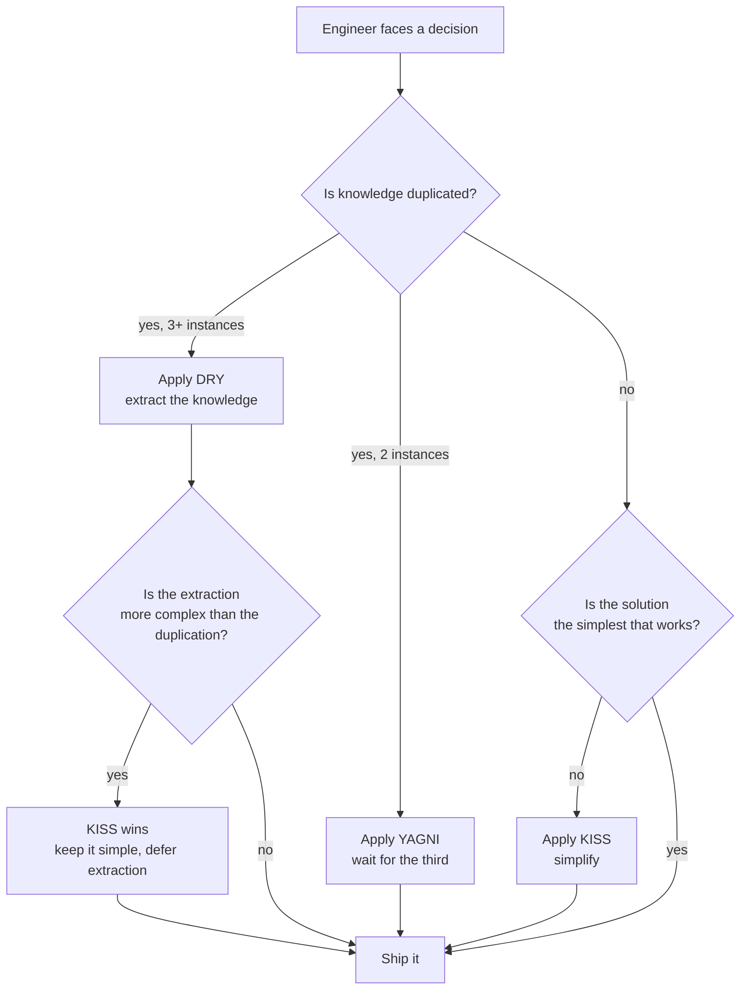
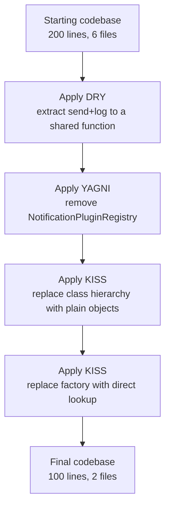

# 4.07 DRY YAGNI KISS

> Three pragmatic principles that act as counterweights to the engineer's natural instinct to over-build. DRY fights duplication of knowledge. YAGNI fights speculation about the future. KISS fights complexity for its own sake. Together they form a stabilizing triangle: too little of any one and the codebase slides toward spaghetti, too much of any one and it slides toward ravioli, that tangled mess of over-abstraction where every change ripples through six indirection layers and a generic of a generic of a generic.

## 1. Purpose

The three principles in this note exist because software engineers, left to their own devices, tend to over-engineer. We are paid to think about the future, and the future is a canvas on which the imagination paints nightmares: what if the requirements change, what if we need to scale to a million users, what if we add a second database, what if the marketing team wants a new feature next quarter. These fears are not irrational — requirements do change, scale does matter, new features do arrive. The trouble is that the engineer's response to these fears, if unchecked, produces code that is harder to read, test, change, and delete than the simple code it replaced. The cure becomes worse than the disease. DRY, YAGNI, and KISS are the three principles that prevent this self-inflicted wound.

**DRY** (Don't Repeat Yourself) was articulated by Andy Hunt and Dave Thomas in *The Pragmatic Programmer* (1999). The canonical statement is: *every piece of knowledge must have a single, unambiguous, authoritative representation within a system*. Note the word "knowledge." DRY is not about avoiding duplicate lines of code; it is about avoiding duplicate pieces of knowledge. Two functions that look identical but encode different knowledge (one validates an email for the registration flow, the other for the password-reset flow) are not a DRY violation, even if they look like twins. Two functions that look different but encode the same knowledge (one computes sales tax for the cart, the other for the invoice) are a DRY violation, even if their implementations diverge. The cost of a DRY violation is the change-one-forget-the-other problem: when the tax rule changes, you update the cart, you ship, and three weeks later finance discovers that invoices were computing tax under the old rule.

**YAGNI** (You Aren't Gonna Need It) comes from Kent Beck's Extreme Programming (XP) movement of the late 1990s. The canonical statement is: *always implement things when you actually need them, never when you just foresee that you need them*. YAGNI is the principle that refuses speculative generality. If you build a feature today because you think you will need it tomorrow, and tomorrow never comes, you have written dead code. Dead code is not free — it occupies space, must be read and understood by every developer who touches the file, must be tested and maintained through dependency upgrades, and gives the false impression that the system does something it does not do. Worse, when the speculative need finally arrives, the actual requirement will almost certainly differ from the speculation, and the speculative code will resist the real requirement because it was built for a future that did not happen.

**KISS** (Keep It Simple, Stupid) is attributed to Kelly Johnson, an aeronautical engineer at Lockheed Skunk Works, who used it as a design principle for aircraft. The canonical statement is: *the simplest solution that could possibly work is usually the right one*. KISS is the principle that prefers the boring solution over the clever one, the function over the framework, the loop over the recursion scheme, the table over the object hierarchy, the direct call over the message bus. Complexity is seductive because it feels like sophistication, but every unit of complexity you add multiplies the cognitive load on every reader, tester, and debugger who comes after.

The three principles are counterweights to over-engineering, but they are also counterweights to each other. DRY, taken to its extreme, produces over-abstraction: every pair of similar lines is extracted into a parameterized function, and the parameter list grows until the function is more complex than the duplicated code would have been. YAGNI, taken to its extreme, produces stasis: the developer never refactors because "we might not need the cleaner version either," and the codebase accumulates cruft until it collapses under its own weight. KISS, taken to its extreme, produces myopia: the developer chooses the simplest solution for the immediate problem, ignoring that the same problem will recur ten times, and ends up with ten copies of the simple solution.

The balance is the point. DRY says: when knowledge is duplicated, extract. YAGNI says: when the future is speculative, wait. KISS says: when complexity creeps in, simplify. The mature engineer applies all three simultaneously, and when they conflict, picks the one that the current context demands. This note teaches you to recognize each principle, recognize each violation, and resolve the conflicts between them.

Related foundational notes: [[4.01 SOLID Single Responsibility]], [[4.06 GRASP Principles]], [[4.12 Code Smells]], [[4.13 Refactoring Techniques]].

## 2. Theory and Deep Dive

### 2.1 DRY: Knowledge, Not Code

The most common misunderstanding of DRY is that it is about avoiding duplicate code. It is not. The Hunt and Thomas definition is precise: *every piece of knowledge must have a single, unambiguous, authoritative representation within a system*. The unit of duplication that DRY attacks is the piece of knowledge, not the line of code.

A piece of knowledge is any decision the system encodes. The sales tax rate for California is a piece of knowledge. The rule that an email address must match a particular regular expression is a piece of knowledge. The fact that a user is identified by their email address during login is a piece of knowledge. The algorithm for hashing a password with bcrypt at cost factor twelve is a piece of knowledge. The mapping between an HTTP status code and a user-facing error message is a piece of knowledge.

When a piece of knowledge appears in two places in the codebase, DRY is violated. It does not matter whether the two appearances look alike. The tax rate of seven and a quarter percent might appear as the literal `0.0725` in the cart module and as `7.25` in the invoice module (one as a fraction, one as a percentage). The two literals look different, but they encode the same knowledge, and when the rate changes, both must be updated. This is a DRY violation. The fix is not to make them look the same; the fix is to extract the knowledge into a single named constant, `californiaSalesTaxRate`, and reference it from both modules.

Conversely, two pieces of code that look identical are not necessarily a DRY violation. Consider two functions that both validate an email address with the same regular expression. One is called from the registration flow, the other from the password-reset flow. If the registration flow's email validation and the password-reset flow's email validation serve different business rules (registration requires the email to be unique in the database; password-reset requires the email to exist in the database), then the two functions encode different knowledge, even though the regular expression itself is identical. Extracting the regular expression into a shared constant is correct DRY. Merging the two functions into one parameterized function is incorrect DRY, because the two functions serve different actors and will change for different reasons. The merged function will accumulate parameters until it becomes harder to read than the two separate functions were.

This distinction is the heart of DRY. The naive application of DRY (any duplicate code must be extracted) produces over-abstraction. The correct application of DRY (any duplicate knowledge must be extracted) produces clean code.

### 2.2 The Cost of DRY Violations

The cost of a DRY violation is the change-one-forget-the-other problem. When knowledge is duplicated, every change to that knowledge must be applied to every copy. If the engineer forgets one, the system enters an inconsistent state where the same piece of knowledge produces different behavior depending on which code path executes. The tax rate is `0.0725` in the cart and `0.0750` in the invoice; the customer is charged the correct tax at checkout, but the invoice shows the wrong tax; three weeks later, finance reconciles and discovers the discrepancy. The cost is not just the bug fix — it is the loss of trust: every system bitten by a change-one-forget-the-other bug becomes a system where engineers are afraid to change anything. They add a comment: "if you change this rate, also change it in invoice.js." The comment rots; six months later, no one reads it; the bug returns. The cost is also the cognitive load on every new engineer, who must hold three locations in their head instead of one every time they think about sales tax.

### 2.3 Over-DRY: Premature Abstraction

The opposite failure is over-DRY. Over-DRY is what happens when the engineer treats DRY as a license to extract every duplicate. The symptom is the parameterized function with eight optional parameters, the abstract base class with one concrete subclass, the generic-of-a-generic that abstracts over a problem that only ever had one instance.

Over-DRY produces three costs. First, the abstraction itself is more complex than the duplicated code would have been. Reading a function call to `processEntity(entity, { validate: true, transform: lowercase, persist: false, cache: true, audit: true })` is harder than reading two functions, `processAndSave(entity)` and `processAndCache(entity)`, that each do their thing directly. Second, the abstraction is wrong for at least one of the call sites. The abstracted function is built to satisfy all current call sites, and the parameters exist to handle the differences between them. When a new call site appears with a new difference, the parameter list grows. Third, the abstraction resists change. When the underlying knowledge diverges (the registration email validation needs to add a check for disposable email domains, the password-reset email validation does not), the abstracted function must be split, and splitting an abstraction is harder than extracting one.

The rule of thumb that prevents over-DRY is the Rule of Three. The Rule of Three says: extract when you have three instances of the same knowledge, not two. The first time you write the code, you write it. The second time you write the same code, you wince, but you write it again, because the second instance might be a coincidence. The third time you write the same code, you extract, because now you have evidence of a pattern, not a coincidence.

### 2.4 YAGNI: Don't Build for the Speculative Future

YAGNI is the principle that refuses speculative generality. The canonical statement, from Kent Beck's Extreme Programming, is: *always implement things when you actually need them, never when you just foresee that you need them*.

The engineer's temptation is to build for the future. "We might need to support multiple databases, so let's add an abstraction layer now." "We might need a second tenant, so let's multi-tenant the schema now." "We might need a new payment provider, so let's build a PaymentProvider interface with one implementation now." Each is defensible in isolation. The trouble is that the future they anticipate may never arrive, and if it does, it will arrive with requirements that differ from the speculation.

YAGNI says: build for the actual present, not the speculative future. When the second database arrives, add the abstraction layer. When the second tenant arrives, multi-tenant the schema. When the second payment provider arrives, extract the interface. The cost of waiting is the cost of refactoring, which is real but bounded. The cost of building now is the cost of carrying the abstraction, which is real and unbounded, because the abstraction must be maintained for as long as it exists, even if the speculative future never arrives.

### 2.5 The Cost of YAGNI Violations

The cost of a YAGNI violation is dead code: code that exists but is not used. It occupies space, must be read and understood by every developer who touches the file, must be tested (or, worse, is not tested and silently rots), must be maintained through dependency upgrades, and gives the false impression that the system does something it does not do. A YAGNI violation also produces the wrong abstraction: the engineer who builds the `PaymentProvider` interface with one implementation is guessing at what the abstraction should look like, shaped by a sample size of one. When the second provider arrives, it will not fit the abstraction, and the engineer either contorts the second provider to fit (wrong) or refactors the abstraction to fit both (the work that should have been done in the first place, but is now harder because the wrong abstraction is in the way). The most pernicious YAGNI violation is the configuration system that supports any conceivable combination of features, with environment-specific overrides, feature flags, and hierarchical inheritance — ninety-six keys of which eleven are used, the other eighty-five documented in a YAML file no one reads. It grows into a tax on every future change.

### 2.6 Over-YAGNI: Never Refactoring

The opposite failure is over-YAGNI: the engineer uses YAGNI as an excuse to never refactor. "We don't need to extract this function, we might not need the cleaner version either." Over-YAGNI produces a codebase where cruft accumulates until the system collapses under its own weight.

YAGNI is about features, not about structure. YAGNI says: do not build a feature you do not need. It does not say: do not refactor code that you do need. The distinction is critical. Building a new payment provider abstraction before you have a second provider is a feature, and YAGNI applies. Extracting a function because the existing code is hard to read is a refactor, and YAGNI does not apply. Adding a generic type parameter because you might need it later is a feature; replacing a hundred-line function with five twenty-line functions because the hundred-line function is hard to test is a refactor. The rule of thumb: refactors do not add new capabilities — they change the structure of the code without changing its behavior. If the change adds a new capability (a new feature, abstraction, extension point), YAGNI applies. If it preserves capabilities (the same inputs produce the same outputs, but the code is cleaner), YAGNI does not apply.

### 2.7 KISS: The Simplest Thing That Could Possibly Work

KISS is the principle that prefers the boring solution. The canonical statement, attributed to Kelly Johnson of Lockheed Skunk Works, is: *the simplest solution that could possibly work is usually the right one*.

The engineer's temptation is the clever solution. It uses a monad where a function would do, a generic where a concrete type would do, a message bus where a function call would do, a framework where a library would do, a class hierarchy where a switch statement would do. The clever solution is more interesting to write than the boring solution, which is why engineers reach for it. KISS says: prefer the boring solution — it is easier to read, test, debug, and delete. It is also easier to change, because the next engineer who reads it does not have to understand the cleverness before they can make the change.

The cost of complexity is the cognitive load it imposes on every reader. A five-line function that does one thing can be read in five seconds. A fifty-line class hierarchy that does the same thing requires the reader to load the entire hierarchy into their head before they can understand any part of it. The cognitive load multiplies: every reader pays the cost, every time they read it, for as long as the code exists.

### 2.8 The Cost of Complexity

The cost of complexity is not just the cognitive load; it is also the bug surface, the test surface, and the change surface. Complex code has more places for bugs to hide: a five-line function has five places a bug can be; a fifty-line class hierarchy has fifty, plus the interactions between them. The bug rate scales with complexity, not with functionality. Complex code requires more tests to cover the same functionality, because the tests must cover the interactions as well as the units — a five-line function needs one test, a fifty-line class hierarchy needs one per interaction plus one per unit plus integration tests. And complex code resists change, because every change must thread through the complexity: a five-line function can be changed in five minutes, a fifty-line class hierarchy in five days, because the change ripples through the hierarchy, the tests, the documentation, and the dependent code.

### 2.9 The Relationship Between the Three Principles

The three principles are not independent. They interact, and sometimes they conflict.

DRY fights duplication of knowledge. YAGNI fights speculation about the future. KISS fights complexity for its own sake. The three principles share a common enemy: over-engineering. They differ in what they attack. DRY attacks duplication that has already happened. YAGNI attacks duplication that has not yet been justified. KISS attacks complexity regardless of its source.

The conflicts are real. DRY and YAGNI conflict when the engineer sees two instances of the same knowledge and considers extracting. DRY says extract now, before the third instance appears. YAGNI says wait, because the third instance might never appear, or it might appear with a different requirement that the early abstraction does not satisfy. The resolution is the Rule of Three: extract on the third instance, not the second. This is DRY (extract the knowledge) and YAGNI (wait for evidence) in balance.

DRY and KISS conflict when the engineer sees two instances of the same knowledge and considers extracting, but the extraction would produce a more complex construct than the duplication. DRY says extract, because duplication is wrong. KISS says keep the duplication, because the simpler solution is the right one. The resolution is to extract the knowledge (a constant, a small function) without extracting a complex abstraction. If the only way to extract is to introduce a parameterized function with many options, KISS wins, and the duplication stays until a simpler extraction becomes possible.

YAGNI and KISS conflict when the engineer considers a feature that would simplify the current code but that is speculative. YAGNI says do not build the feature, because it is speculative. KISS says build the feature, because it would simplify the current code. The resolution is to ask whether the feature is a refactor or a new capability. If it is a refactor (same behavior, cleaner code), KISS wins, and YAGNI does not apply. If it is a new capability (the code does something it did not do before), YAGNI wins, and the feature is not built until it is needed.



The diagram above shows the decision flow when the three principles interact. The engineer faces a decision, asks whether knowledge is duplicated, applies DRY or YAGNI based on the count, asks whether the solution is the simplest that works, applies KISS if not, and resolves conflicts between DRY and KISS by deferring extraction when the abstraction would be more complex than the duplication.

### 2.10 The Spaghetti vs Ravioli Spectrum

The three principles exist on a spectrum. At one end is spaghetti code: code with no abstraction, no extraction, no structure. Every function is a hundred lines, every file is a thousand lines, every change touches ten files, and the system cannot be understood by reading any single file. Spaghetti is what happens when KISS is applied without DRY: the engineer chooses the simplest solution for every local problem, and the global result is a tangled mess.

At the other end is ravioli code: code with too much abstraction, too much extraction, too much structure. Every function is three lines, every file is twenty lines, every change touches twenty files, and the system cannot be understood by reading any single file. Ravioli is what happens when DRY is applied without KISS: the engineer extracts every duplicate into an abstraction, and the global result is a different tangled mess.

The healthy middle is the code where DRY, YAGNI, and KISS are in balance. Knowledge is extracted when the Rule of Three is satisfied. Speculative features are not built. The simplest solution that could possibly work is preferred. The code is neither spaghetti nor ravioli. It is pasta of the correct shape for the problem at hand.

## 3. Mental Models

### 3.1 DRY as the Single Source of Truth

The mental model for DRY is the single source of truth. Every piece of knowledge has one home. If you want to know the sales tax rate, you go to one file; if you want to know the email validation rule, you go to one file; there is no second place to look because there is no second copy. This is not about deduplication for its own sake; it is about the change-one-update-one property: when the knowledge changes, you change it in one place and the change propagates everywhere it is used. You do not have to remember the other places, because there are no other places. The single source of truth is what makes the change-one-forget-the-other bug impossible. It applies beyond code, to configuration (one environment variable per fact), documentation (one canonical doc, not three that drift), schemas (one schema per entity), and test data (one fixture per scenario).

### 3.2 YAGNI as the Just-In-Time Builder

The mental model for YAGNI is the just-in-time builder: build the thing when you need it, not before. The just-in-time builder does not stockpile abstractions against a speculative future; stocks appear only when demand is real and present. The just-in-time builder is not lazy — does not skip refactors — and is not a procrastinator — does not defer work that should be done now. The distinction is between a feature (a new capability) and a refactor (a new structure for an existing capability). The just-in-time builder adds features when they are needed and refactors when the existing structure becomes a burden. The test: does this work serve a real, present requirement, or a speculative, future one? If real and present, do it now; if speculative and future, defer.

### 3.3 KISS as the Simplest Thing That Could Possibly Work

The mental model for KISS is the simplest thing that could possibly work. When faced with a problem, the engineer lists the candidate solutions and picks the simplest one that solves the problem — the one with the fewest moving parts, abstractions, indirections, and concepts the reader must load into their head. The simplest thing is not the laziest thing: the laziest requires the least effort to write (a hundred-line function with no abstraction, easy to write but hard to read), while the simplest requires the least effort to read, test, debug, and change (five twenty-line functions, harder to write but easier to read). Nor is it the dumbest thing: the dumbest ignores requirements, while the simplest satisfies all requirements with the minimum machinery.

### 3.4 The Rule of Three as the Balance Point

The mental model for the balance between DRY and YAGNI is the Rule of Three: extract on the third instance, not the second. The first instance is just code; the second is a coincidence; the third is a pattern, and patterns deserve extraction. The Rule of Three is the meeting point of DRY (extract duplication) and YAGNI (do not extract prematurely): extract when the duplication is real, which is when it has happened three times. Two instances is not enough evidence; three is enough. The Rule of Three is a heuristic, not a law — two instances are enough when the duplication is a piece of knowledge certain to change (a tax rate, a magic number), and three are not enough when the three serve different actors and would change for different reasons.

### 3.5 Abstract When There Are Three Or More Instances of the Same Intent

The refinement of the Rule of Three is: abstract when there are three or more instances of the same intent. The key word is intent. Two or three pieces of code can look identical and have different intent. The intent is what the code is for, not what the code does. The intent test: would these pieces of code change for the same reason? If yes, they have the same intent and can be abstracted; if no, they have different intents and must not be abstracted, because the abstraction would couple them and a change to one would ripple to the other. The intent test is the guardrail that prevents over-DRY — it is the difference between clean code and ravioli.

### 3.6 The Three Principles as a Balance

The mental model for the three principles together is a balance scale, with DRY on one side, YAGNI on the other, and KISS as the fulcrum. DRY pulls toward abstraction; YAGNI pulls against it; KISS decides which way the scale tips by asking whether the abstraction is simpler than the duplication. When the scale tips toward DRY, extract; when it tips toward YAGNI, wait; when KISS cannot decide, defer, because deferring is reversible and extracting prematurely is not. The balance is dynamic: the right decision today may be wrong tomorrow, because the requirements change. The engineer who extracts today may need to inline tomorrow; the engineer who defers today may need to extract tomorrow. The balance is not a static state; it is a continuous process of re-evaluation.

## 4. Real-World Use Cases

### 4.1 Refactoring Duplicated Logic

The most common use case for DRY is refactoring duplicated logic. The engineer notices that the same calculation appears in three places: the cart, the invoice, and the report. The three calculations look identical, but were written by three different engineers with three different variable names. The engineer extracts the calculation into a single function, replaces the three duplications with calls to the function, and the system now has one source of truth. The refactor is not free: the engineer must verify the three duplications are actually the same calculation (not three that look similar but differ in subtle ways like rounding), must verify the call sites can accept the function's signature, and must add tests for the function. The refactor is worth the cost when the duplication is real and the calculation is likely to change.

### 4.2 Avoiding Premature Frameworks

The most common use case for YAGNI is avoiding premature frameworks. The engineer is building a small web service and is tempted to introduce an ORM, a DI container, a message bus, or a configuration system. Each framework solves a real problem but imposes a cost: the learning curve, the boilerplate, the constraints, the upgrade path. YAGNI says: introduce the framework when the problem it solves is real and present. If the service has one entity, an ORM is overkill; use a query builder or raw SQL. If the service has one dependency, a DI container is overkill; construct the dependency in the entry point and pass it in. When the problem becomes real (twenty entities, twenty dependencies, asynchronous work), introduce the framework. The cost of introducing it later is bounded; the cost of carrying it from the start is unbounded.

### 4.3 Choosing Simple Functions Over Complex Class Hierarchies

The most common use case for KISS is choosing simple functions over complex class hierarchies. The engineer is building a feature and is tempted to model it as a class hierarchy: an abstract base class, several concrete subclasses, a factory, a registry. KISS says: prefer the simple function. If the feature is "compute the discount for a cart based on the customer's tier," write a function `computeDiscount(cart, customerTier)` that switches on the tier. The function is twenty lines, easy to read, test, and change. The class hierarchy would be two hundred lines across five files, with the same behavior. When the feature grows, the function may need to become a class hierarchy; refactor then, when the need is real.

### 4.4 Config-Driven Design (DRY)

A real-world application of DRY is config-driven design. The engineer has a system with many similar operations: send a welcome email, send a password-reset email, send a verification email, send a receipt email. Each operation has the same structure (load a template, render with variables, send via the email provider) but different parameters. The naive implementation is four functions, one per operation, each with the same structure — a DRY violation. The DRY implementation is a config-driven design: one function `sendEmail(operation, recipient, variables)` and a configuration object mapping operation names to their templates and parameters. The structure is defined once; the operations are defined as data. Adding or removing an operation is a config change, not a code change.

### 4.5 Just-In-Time Design (YAGNI)

A real-world application of YAGNI is just-in-time design. The engineer is building a feature and is tempted to design for extensibility: a plugin system, a hook system, a strategy pattern with one strategy. YAGNI says: design for the present, and refactor for the future when the future arrives. Build the feature as a direct implementation, with no plugin system, no hooks, no strategy pattern. When the future arrives (a second strategy, a plugin, a hook), refactor the direct implementation into the extensible design. The feature is built for the present; the extensibility is added when it is needed; the system is smaller, simpler, and easier to change in the meantime.

### 4.6 Minimal APIs (KISS)

A real-world application of KISS is the minimal API. The engineer is building a web service and is tempted to introduce a framework: Express, NestJS, Fastify, with controllers, middleware, dependency injection, decorators. KISS says: prefer the minimal API. If the service has three routes, write three functions that take a request and return a response. The functions are twenty lines each, easy to read, test, and change. The framework would be two hundred lines of boilerplate with the same behavior. When the service grows (ten routes, middleware, authentication), the minimal API may need to become a framework; refactor then, when the need is real.

### 4.7 The Real-World Tension

In real codebases, the three principles are in constant tension. The engineer who applies DRY aggressively produces ravioli. The engineer who applies YAGNI aggressively produces cruft. The engineer who applies KISS aggressively produces spaghetti. The mature engineer applies all three, in balance, with judgment. The judgment comes from experience, from code review, from watching the codebase evolve over time. It is not a formula; it is a feel for the right level of abstraction, the right time to extract, defer, or simplify. This note gives you the principles; the judgment is yours to develop.

## 5. Code Examples

### 5.1 Example A — Minimal and Conceptual

This section presents three minimal examples, one for each principle. Each example shows the violation and the fix, in side-by-side JavaScript and TypeScript.

#### 5.1.1 DRY Violation and Fix

The DRY violation is a piece of knowledge (the sales tax rate) duplicated in two places.

```javascript
// JavaScript, DRY violation
function computeCartTotal(cart) {
  const subtotal = cart.items.reduce((sum, item) => sum + item.price * item.quantity, 0);
  const tax = subtotal * 0.0725; // California sales tax
  return subtotal + tax;
}

function computeInvoiceTotal(invoice) {
  const subtotal = invoice.lines.reduce((sum, line) => sum + line.amount, 0);
  const tax = subtotal * 0.0725; // California sales tax
  return subtotal + tax;
}
```

```javascript
// JavaScript, DRY fix
const californiaSalesTaxRate = 0.0725;

function computeCartTotal(cart) {
  const subtotal = cart.items.reduce((sum, item) => sum + item.price * item.quantity, 0);
  const tax = subtotal * californiaSalesTaxRate;
  return subtotal + tax;
}

function computeInvoiceTotal(invoice) {
  const subtotal = invoice.lines.reduce((sum, line) => sum + line.amount, 0);
  const tax = subtotal * californiaSalesTaxRate;
  return subtotal + tax;
}
```

```typescript
// TypeScript, DRY violation
interface CartItem { price: number; quantity: number; }
interface Cart { items: CartItem[]; }
interface InvoiceLine { amount: number; }
interface Invoice { lines: InvoiceLine[]; }

function computeCartTotal(cart: Cart): number {
  const subtotal = cart.items.reduce((sum, item) => sum + item.price * item.quantity, 0);
  const tax = subtotal * 0.0725; // California sales tax
  return subtotal + tax;
}

function computeInvoiceTotal(invoice: Invoice): number {
  const subtotal = invoice.lines.reduce((sum, line) => sum + line.amount, 0);
  const tax = subtotal * 0.0725; // California sales tax
  return subtotal + tax;
}
```

```typescript
// TypeScript, DRY fix
interface CartItem { price: number; quantity: number; }
interface Cart { items: CartItem[]; }
interface InvoiceLine { amount: number; }
interface Invoice { lines: InvoiceLine[]; }

const californiaSalesTaxRate = 0.0725;

function computeCartTotal(cart: Cart): number {
  const subtotal = cart.items.reduce((sum, item) => sum + item.price * item.quantity, 0);
  const tax = subtotal * californiaSalesTaxRate;
  return subtotal + tax;
}

function computeInvoiceTotal(invoice: Invoice): number {
  const subtotal = invoice.lines.reduce((sum, line) => sum + line.amount, 0);
  const tax = subtotal * californiaSalesTaxRate;
  return subtotal + tax;
}
```

Note that the DRY fix extracts the knowledge (the tax rate) into a single named constant. It does not merge the two functions, because the two functions serve different actors (the cart and the invoice) and may change for different reasons. This is the intent test in action: the knowledge (the rate) is the same, so it is extracted; the functions (the cart total and the invoice total) serve different intents, so they are not merged.

#### 5.1.2 YAGNI Violation and Fix

The YAGNI violation is a speculative abstraction built for a future that may never arrive.

```javascript
// JavaScript, YAGNI violation
class PaymentProcessor {
  constructor(provider) {
    this.provider = provider;
  }

  async process(amount, currency, customer) {
    return this.provider.charge(amount, currency, customer);
  }

  async refund(transactionId) {
    return this.provider.refund(transactionId);
  }

  async verify(customer) {
    return this.provider.verify(customer);
  }
}

// Only one provider is ever used.
const stripeProvider = {
  async charge(amount, currency, customer) { /* call Stripe */ },
  async refund(transactionId) { /* call Stripe */ },
  async verify(customer) { /* call Stripe */ },
};

const processor = new PaymentProcessor(stripeProvider);
```

```javascript
// JavaScript, YAGNI fix
const stripe = require("./stripe-client");

async function processPayment(amount, currency, customer) {
  return stripe.charge(amount, currency, customer);
}

async function refundPayment(transactionId) {
  return stripe.refund(transactionId);
}

async function verifyCustomer(customer) {
  return stripe.verify(customer);
}
```

```typescript
// TypeScript, YAGNI violation
interface PaymentProvider {
  charge(amount: number, currency: string, customer: string): Promise<string>;
  refund(transactionId: string): Promise<void>;
  verify(customer: string): Promise<boolean>;
}

class PaymentProcessor {
  constructor(private provider: PaymentProvider) {}

  async process(amount: number, currency: string, customer: string): Promise<string> {
    return this.provider.charge(amount, currency, customer);
  }

  async refund(transactionId: string): Promise<void> {
    return this.provider.refund(transactionId);
  }

  async verify(customer: string): Promise<boolean> {
    return this.provider.verify(customer);
  }
}

class StripeProvider implements PaymentProvider {
  async charge(amount: number, currency: string, customer: string): Promise<string> { /* ... */ }
  async refund(transactionId: string): Promise<void> { /* ... */ }
  async verify(customer: string): Promise<boolean> { /* ... */ }
}

const processor = new PaymentProcessor(new StripeProvider());
```

```typescript
// TypeScript, YAGNI fix
import { stripe } from "./stripe-client";

export async function processPayment(amount: number, currency: string, customer: string): Promise<string> {
  return stripe.charge(amount, currency, customer);
}

export async function refundPayment(transactionId: string): Promise<void> {
  return stripe.refund(transactionId);
}

export async function verifyCustomer(customer: string): Promise<boolean> {
  return stripe.verify(customer);
}

// When the second provider arrives, extract the PaymentProvider interface then.
// Refactoring at that point is bounded work; carrying the abstraction now is unbounded cost.
```

The YAGNI fix removes the speculative `PaymentProvider` abstraction and the `PaymentProcessor` wrapper. The system has one provider (Stripe), so the system calls Stripe directly. When the second provider arrives (PayPal, say), the engineer extracts the `PaymentProvider` interface and the `PaymentProcessor` wrapper, with knowledge of both providers, so the abstraction is shaped by two instances instead of one.

#### 5.1.3 KISS Violation and Fix

The KISS violation is a complex class hierarchy where a simple function would do.

```javascript
// JavaScript, KISS violation
class DiscountStrategy {
  apply(cart) {
    throw new Error("subclass must implement");
  }
}

class NoDiscountStrategy extends DiscountStrategy {
  apply(cart) { return 0; }
}

class PercentageDiscountStrategy extends DiscountStrategy {
  constructor(percentage) { super(); this.percentage = percentage; }
  apply(cart) {
    const subtotal = cart.items.reduce((s, i) => s + i.price * i.quantity, 0);
    return subtotal * this.percentage;
  }
}

class FixedDiscountStrategy extends DiscountStrategy {
  constructor(amount) { super(); this.amount = amount; }
  apply(cart) { return this.amount; }
}

class DiscountStrategyFactory {
  static create(tier) {
    if (tier === "regular") return new NoDiscountStrategy();
    if (tier === "silver") return new PercentageDiscountStrategy(0.05);
    if (tier === "gold") return new PercentageDiscountStrategy(0.10);
    if (tier === "platinum") return new FixedDiscountStrategy(50);
    return new NoDiscountStrategy();
  }
}

function computeDiscount(cart, customerTier) {
  const strategy = DiscountStrategyFactory.create(customerTier);
  return strategy.apply(cart);
}
```

```javascript
// JavaScript, KISS fix
function computeDiscount(cart, customerTier) {
  const subtotal = cart.items.reduce((s, i) => s + i.price * i.quantity, 0);
  switch (customerTier) {
    case "silver":    return subtotal * 0.05;
    case "gold":      return subtotal * 0.10;
    case "platinum":  return 50;
    case "regular":
    default:          return 0;
  }
}
```

```typescript
// TypeScript, KISS violation
interface CartItem { price: number; quantity: number; }
interface Cart { items: CartItem[]; }
type CustomerTier = "regular" | "silver" | "gold" | "platinum";

abstract class DiscountStrategy {
  abstract apply(cart: Cart): number;
}

class NoDiscountStrategy extends DiscountStrategy {
  apply(cart: Cart): number { return 0; }
}

class PercentageDiscountStrategy extends DiscountStrategy {
  constructor(private percentage: number) { super(); }
  apply(cart: Cart): number {
    const subtotal = cart.items.reduce((s, i) => s + i.price * i.quantity, 0);
    return subtotal * this.percentage;
  }
}

class FixedDiscountStrategy extends DiscountStrategy {
  constructor(private amount: number) { super(); }
  apply(cart: Cart): number { return this.amount; }
}

class DiscountStrategyFactory {
  static create(tier: CustomerTier): DiscountStrategy {
    if (tier === "regular") return new NoDiscountStrategy();
    if (tier === "silver") return new PercentageDiscountStrategy(0.05);
    if (tier === "gold") return new PercentageDiscountStrategy(0.10);
    if (tier === "platinum") return new FixedDiscountStrategy(50);
    return new NoDiscountStrategy();
  }
}

function computeDiscount(cart: Cart, customerTier: CustomerTier): number {
  const strategy = DiscountStrategyFactory.create(customerTier);
  return strategy.apply(cart);
}
```

```typescript
// TypeScript, KISS fix
interface CartItem { price: number; quantity: number; }
interface Cart { items: CartItem[]; }
type CustomerTier = "regular" | "silver" | "gold" | "platinum";

function computeDiscount(cart: Cart, customerTier: CustomerTier): number {
  const subtotal = cart.items.reduce((s, i) => s + i.price * i.quantity, 0);
  switch (customerTier) {
    case "silver":    return subtotal * 0.05;
    case "gold":      return subtotal * 0.10;
    case "platinum":  return 50;
    case "regular":
    default:          return 0;
  }
}
```

The KISS fix replaces four classes and a factory with a single function. The function is twenty lines, the hierarchy is eighty lines. The function is easier to read, easier to test, easier to change. When the discount rules become complex enough that the function would be unreadable (fifty tiers, combinations, conditional rules), the engineer refactors to a strategy pattern, with knowledge of the actual complexity. Until then, the simple function is the right answer.

### 5.2 Example B — Production-Grade

This section presents a production-grade system that balances DRY, YAGNI, and KISS. The system is a notification service that sends notifications via multiple channels (email, SMS, push). The naive implementation duplicates the send logic across three channels (DRY violation), introduces a generic plugin system for channels that do not exist yet (YAGNI violation), and uses a class hierarchy with abstract base classes and factories (KISS violation). The production-grade implementation extracts the shared send logic (DRY), uses a concrete channel registry instead of a plugin system (YAGNI), and uses simple functions and a record of channels instead of a class hierarchy (KISS).

#### 5.2.1 The Naive Implementation

```javascript
// JavaScript, naive: DRY violation, YAGNI violation, KISS violation
class NotificationChannel {
  async send(to, subject, body) { throw new Error("subclass must implement"); }
  async validate(to) { throw new Error("subclass must implement"); }
  async log(notification) { throw new Error("subclass must implement"); }
}

class EmailChannel extends NotificationChannel {
  async send(to, subject, body) {
    await this.validate(to);
    await smtp.send({ to, subject, body });
    await this.log({ channel: "email", to, subject });
  }
  async validate(to) { return to.includes("@"); }
  async log(notification) { await auditLog.write(notification); }
}

class SmsChannel extends NotificationChannel {
  async send(to, subject, body) {
    await this.validate(to);
    await twilio.send({ to, body });
    await this.log({ channel: "sms", to, body });
  }
  async validate(to) { return /^\d{10}$/.test(to); }
  async log(notification) { await auditLog.write(notification); }
}

class PushChannel extends NotificationChannel {
  async send(to, subject, body) {
    await this.validate(to);
    await fcm.send({ to, body });
    await this.log({ channel: "push", to, body });
  }
  async validate(to) { return to.startsWith("device:"); }
  async log(notification) { await auditLog.write(notification); }
}

// YAGNI violation: a plugin registry for channels that do not exist yet
class NotificationPluginRegistry {
  constructor() { this.plugins = new Map(); }
  register(name, plugin) { this.plugins.set(name, plugin); }
  get(name) { return this.plugins.get(name); }
  list() { return Array.from(this.plugins.keys()); }
}

const registry = new NotificationPluginRegistry();
registry.register("email", new EmailChannel());
registry.register("sms", new SmsChannel());
registry.register("push", new PushChannel());

// KISS violation: a factory to construct the channels
class NotificationChannelFactory {
  static create(registry, name) {
    const plugin = registry.get(name);
    if (!plugin) throw new Error("unknown channel: " + name);
    return plugin;
  }
}

async function sendNotification(channelName, to, subject, body) {
  const channel = NotificationChannelFactory.create(registry, channelName);
  return channel.send(to, subject, body);
}
```

```typescript
// TypeScript, naive: DRY violation, YAGNI violation, KISS violation
import { smtp, twilio, fcm, auditLog } from "./providers";

interface NotificationPayload { to: string; subject: string; body: string; }
interface AuditEntry { channel: string; to: string; body: string; }

abstract class NotificationChannel {
  abstract send(to: string, subject: string, body: string): Promise<void>;
  abstract validate(to: string): Promise<boolean>;
  abstract log(entry: AuditEntry): Promise<void>;
}

class EmailChannel extends NotificationChannel {
  async send(to: string, subject: string, body: string): Promise<void> {
    if (!(await this.validate(to))) throw new Error("invalid email");
    await smtp.send({ to, subject, body });
    await this.log({ channel: "email", to, body });
  }
  async validate(to: string): Promise<boolean> { return to.includes("@"); }
  async log(entry: AuditEntry): Promise<void> { await auditLog.write(entry); }
}

class SmsChannel extends NotificationChannel {
  async send(to: string, subject: string, body: string): Promise<void> {
    if (!(await this.validate(to))) throw new Error("invalid phone");
    await twilio.send({ to, body });
    await this.log({ channel: "sms", to, body });
  }
  async validate(to: string): Promise<boolean> { return /^\d{10}$/.test(to); }
  async log(entry: AuditEntry): Promise<void> { await auditLog.write(entry); }
}

class PushChannel extends NotificationChannel {
  async send(to: string, subject: string, body: string): Promise<void> {
    if (!(await this.validate(to))) throw new Error("invalid device token");
    await fcm.send({ to, body });
    await this.log({ channel: "push", to, body });
  }
  async validate(to: string): Promise<boolean> { return to.startsWith("device:"); }
  async log(entry: AuditEntry): Promise<void> { await auditLog.write(entry); }
}

interface NotificationPlugin {
  send(to: string, subject: string, body: string): Promise<void>;
  validate(to: string): Promise<boolean>;
}

class NotificationPluginRegistry {
  private plugins = new Map<string, NotificationPlugin>();
  register(name: string, plugin: NotificationPlugin): void { this.plugins.set(name, plugin); }
  get(name: string): NotificationPlugin | undefined { return this.plugins.get(name); }
  list(): string[] { return Array.from(this.plugins.keys()); }
}

const registry = new NotificationPluginRegistry();
registry.register("email", new EmailChannel());
registry.register("sms", new SmsChannel());
registry.register("push", new PushChannel());

class NotificationChannelFactory {
  static create(registry: NotificationPluginRegistry, name: string): NotificationPlugin {
    const plugin = registry.get(name);
    if (!plugin) throw new Error("unknown channel: " + name);
    return plugin;
  }
}

async function sendNotification(channelName: string, to: string, subject: string, body: string): Promise<void> {
  const channel = NotificationChannelFactory.create(registry, channelName);
  return channel.send(to, subject, body);
}
```

The naive implementation has three problems. The `log` method is duplicated across three channels (DRY violation). The `NotificationPluginRegistry` is a plugin system for channels that do not exist yet (YAGNI violation). The `NotificationChannelFactory` is a factory that adds no value over a direct lookup (KISS violation). The abstract `NotificationChannel` class with three subclasses is a class hierarchy where a record of functions would do (KISS violation).

#### 5.2.2 The Production-Grade Implementation

```javascript
// JavaScript, production-grade: DRY, YAGNI, KISS in balance
const { smtp, twilio, fcm } = require("./providers");
const auditLog = require("./audit-log");

// DRY: the shared send + log logic is defined once
async function sendViaChannel(channel, provider, to, subject, body) {
  await provider.send(to, subject, body);
  await auditLog.write({ channel, to, body });
}

// KISS: each channel is a plain object with two functions, not a class
const emailChannel = {
  validate(to) { return to.includes("@"); },
  async send(to, subject, body) {
    if (!this.validate(to)) throw new Error("invalid email");
    await sendViaChannel("email", smtp, to, subject, body);
  },
};

const smsChannel = {
  validate(to) { return /^\d{10}$/.test(to); },
  async send(to, subject, body) {
    if (!this.validate(to)) throw new Error("invalid phone");
    await sendViaChannel("sms", twilio, to, subject, body);
  },
};

const pushChannel = {
  validate(to) { return to.startsWith("device:"); },
  async send(to, subject, body) {
    if (!this.validate(to)) throw new Error("invalid device token");
    await sendViaChannel("push", fcm, to, subject, body);
  },
};

// YAGNI: a plain record of channels, not a plugin registry
const channels = {
  email: emailChannel,
  sms: smsChannel,
  push: pushChannel,
};

// KISS: a direct lookup, not a factory
async function sendNotification(channelName, to, subject, body) {
  const channel = channels[channelName];
  if (!channel) throw new Error("unknown channel: " + channelName);
  return channel.send(to, subject, body);
}

module.exports = { sendNotification, channels };
```

```typescript
// TypeScript, production-grade: DRY, YAGNI, KISS in balance
import { smtp, twilio, fcm } from "./providers";
import { auditLog } from "./audit-log";

interface AuditEntry { channel: string; to: string; body: string; }
interface ChannelProvider {
  send(to: string, subject: string, body: string): Promise<void>;
}
interface NotificationChannel {
  validate(to: string): boolean;
  send(to: string, subject: string, body: string): Promise<void>;
}

// DRY: the shared send + log logic is defined once
async function sendViaChannel(
  channel: string,
  provider: ChannelProvider,
  to: string,
  subject: string,
  body: string,
): Promise<void> {
  await provider.send(to, subject, body);
  await auditLog.write({ channel, to, body } as AuditEntry);
}

// KISS: each channel is a plain object with two functions, not a class
const emailChannel: NotificationChannel = {
  validate(to: string): boolean { return to.includes("@"); },
  async send(to: string, subject: string, body: string): Promise<void> {
    if (!this.validate(to)) throw new Error("invalid email");
    await sendViaChannel("email", smtp, to, subject, body);
  },
};

const smsChannel: NotificationChannel = {
  validate(to: string): boolean { return /^\d{10}$/.test(to); },
  async send(to: string, subject: string, body: string): Promise<void> {
    if (!this.validate(to)) throw new Error("invalid phone");
    await sendViaChannel("sms", twilio, to, subject, body);
  },
};

const pushChannel: NotificationChannel = {
  validate(to: string): boolean { return to.startsWith("device:"); },
  async send(to: string, subject: string, body: string): Promise<void> {
    if (!this.validate(to)) throw new Error("invalid device token");
    await sendViaChannel("push", fcm, to, subject, body);
  },
};

// YAGNI: a plain record of channels, not a plugin registry
const channels: Record<string, NotificationChannel> = {
  email: emailChannel,
  sms: smsChannel,
  push: pushChannel,
};

// KISS: a direct lookup, not a factory
async function sendNotification(channelName: string, to: string, subject: string, body: string): Promise<void> {
  const channel = channels[channelName];
  if (!channel) throw new Error("unknown channel: " + channelName);
  return channel.send(to, subject, body);
}

export { sendNotification, channels, type NotificationChannel };
```

The production-grade implementation is half the size of the naive implementation. The `sendViaChannel` function is the DRY extraction: the shared send-plus-log logic is defined once and called by all three channels. The plain `channels` record is the YAGNI fix: there is no plugin registry, because there are no plugins beyond the three that exist. The direct lookup in `sendNotification` is the KISS fix: there is no factory, because the factory added no value over the direct lookup. The plain objects instead of classes is the KISS fix: the classes added no value over the objects, because the objects have no shared state and no inheritance.

When the fourth channel arrives (webhook, say), the engineer adds a `webhookChannel` object and a `webhook: webhookChannel` entry in the `channels` record. The change is ten lines, in one file, with no ripple. When the channels need shared state (a connection pool, a retry policy), the engineer refactors the plain objects into a class with a constructor, with knowledge of the actual shared state. Until then, the plain objects are the right answer.

## 6. Common Mistakes and Anti-Patterns

### 6.1 Over-DRY: Extracting Prematurely

The first mistake is extracting on the second instance, before the Rule of Three is satisfied. The engineer sees two similar functions and immediately extracts a parameterized function. The parameter list grows to handle the differences. The third instance never arrives, or it arrives with a different intent that the parameterized function does not fit.

The fix is to wait for the third instance. Two instances is coincidence; three is a pattern. The smell is the parameterized function with more than three optional parameters. Inline it back to the originals, and re-extract when the pattern is clearer.

### 6.2 Wrong DRY: Merging Unrelated Look-Alikes

The second mistake is merging two pieces of code that look identical but serve different intents. The merged function serves two actors, and when one actor's requirement changes, the change ripples to the other. The classic example: the registration flow and the password-reset flow both validate emails with the same regular expression. The engineer merges them. Then marketing asks for a disposable-email check in registration. The merged function now rejects disposable emails in password-reset too, where it should not.

The fix is the intent test: would these pieces of code change for the same reason? If yes, merge. If no, keep them separate even if they look identical. The smell is a function with a `mode` parameter that selects behavior — split it back into two functions.

### 6.3 Under-DRY: Copy-Paste

The third mistake is the opposite: failing to extract when the Rule of Three is satisfied. The engineer copies the same function into three places because extracting would take a few minutes. The three copies drift. When the underlying knowledge changes, the engineer updates two of three and forgets the third. The bug ships.

The fix is the Rule of Three: when the third instance appears, extract. The cost of extraction is bounded; the cost of carrying the duplication is unbounded. The smell is the same magic number in three places, or the same function with three slightly different implementations.

### 6.4 YAGNI Violation: Speculative Features

The fourth mistake is building a feature for a speculative future. The feature sits unused, accumulating maintenance cost, until the requirement arrives, by which point the feature is the wrong shape and must be refactored anyway. The classic example is the multi-tenant schema for a single-tenant application: the engineer adds a `tenantId` column to every table because "we might add multi-tenancy later." The column is always `1`. Every query filters by `tenantId = 1`, which is dead code. When real multi-tenancy arrives, the requirements differ (separate databases per tenant, not a column), and the column must be removed.

The fix is to defer the feature until it is needed. The cost of refactoring later is bounded; the cost of carrying the speculative feature is unbounded. The smell is the configuration key that is never set, the interface with one implementation, the abstract base class with one concrete subclass, the parameter that is always the same value.

### 6.5 KISS Violation: Over-Engineered Abstraction

The fifth mistake is building an abstraction where a simple function would do. The classic example is the Strategy pattern with one strategy: an abstract `DiscountStrategy` class with one concrete subclass, a factory, and a context class. The direct solution is a function with a switch statement. The abstraction is eighty lines across five files; the direct solution is twenty lines in one file. The behavior is identical.

The fix is to prefer the simple function. When the second strategy arrives, refactor to the Strategy pattern with knowledge of both. The smell is the abstract class with one concrete subclass, the interface with one implementation, the factory that constructs one type, the configuration system with three keys.

### 6.6 Conflict: DRY vs YAGNI (Extract Now for One Future Use)

The sixth mistake is mishandling the conflict between DRY and YAGNI. The engineer sees two instances of the same knowledge and considers extracting. DRY says extract now. YAGNI says wait, because the third instance might never arrive, or it might arrive with a different intent. The engineer picks one principle and ignores the other.

The naive application of DRY produces over-abstraction; the naive application of YAGNI produces duplication that drifts. The fix is the Rule of Three: extract on the third instance, not the second, which satisfies DRY (the knowledge is extracted) and YAGNI (the extraction is justified by evidence of a pattern). The smell is the engineer who always extracts or never extracts.

### 6.7 Conflict: DRY vs KISS (Extraction Adds Complexity)

The seventh mistake is mishandling the conflict between DRY and KISS. DRY says extract. KISS says the extraction is more complex than the duplication. The naive application of DRY produces the parameterized function with eight optional parameters; the naive application of KISS produces the duplication that drifts.

The mature engineer extracts the knowledge (a constant, a small function) without extracting a complex abstraction. If the only way to extract is to introduce a parameterized function with many options, KISS wins, and the duplication stays until a simpler extraction becomes possible. The smell is the parameterized function with many optional parameters, the abstract class with a deep inheritance hierarchy, the generic-of-a-generic.

### 6.8 Conflict: YAGNI vs KISS (Refactor vs Feature)

The eighth mistake is mishandling the conflict between YAGNI and KISS. The engineer considers a change that would simplify the current code but is speculative. YAGNI says do not build it; KISS says build it because it simplifies. The naive application of YAGNI produces cruft; the naive application of KISS produces speculative features.

The mature engineer asks whether the change is a refactor or a new capability. If it is a refactor (same behavior, cleaner code), KISS wins, and YAGNI does not apply. If it is a new capability, YAGNI wins, and the change is not built until it is needed. The smell is the engineer who never refactors (over-YAGNI) or the engineer who builds speculative features (over-KISS).

## 7. Best Practices and Design Patterns

### 7.1 Apply DRY When There Are Three Or More Instances of the Same Intent

The first best practice is the Rule of Three with the intent test. Extract when there are three or more instances of the same knowledge, where "same knowledge" means "would change for the same reason." Count the instances: when you see the second, note it; when you see the third, extract. Before extracting, verify the intent — would all three change for the same reason? If yes, extract; if no, they are look-alikes with different intents, do not extract.

### 7.2 Apply YAGNI Strictly: Do Not Build for Hypothetical

The second best practice is strict YAGNI. Do not build a feature for a hypothetical future; build it when the future arrives, with knowledge of the actual requirements. For every change, ask: does this serve a real, present requirement, or a speculative, future one? If real and present, build it. If speculative and future, defer it, and document the deferral in a comment or ticket so the team knows it was considered and not forgotten.

### 7.3 Apply KISS by Default

The third best practice is to apply KISS by default. When faced with a decision between a simple solution and a complex solution, pick the simple solution unless there is a clear, present reason to pick the complex one. List the candidate solutions for every problem, pick the simplest one that solves the problem, and only escalate to the next simplest if the first is insufficient (it fails a requirement, does not scale, or is fragile). Do not skip to the complex solution without justification.

### 7.4 Refactor When Patterns Emerge

The fourth best practice is to refactor when patterns emerge. Patterns are not visible at the start; they become visible as the third, fourth, fifth instance of the same knowledge appears. Review the codebase regularly for emerging patterns (the same knowledge three times, the same structure in three places, the same bug in three places), and refactor at that point, with knowledge of the pattern. The refactor is the work that DRY demands, applied at the time YAGNI permits, with the simplicity KISS demands.

### 7.5 Document When You Choose One Principle Over Another

The fifth best practice is to document the choice when the principles conflict. When DRY and YAGNI conflict and you defer the extraction, document the deferral. When DRY and KISS conflict and you keep the duplication, document the decision. The documentation is for the next engineer, who will see the duplication or the speculative feature and will not know why it is there. A good comment states the conflict, the choice, and the condition under which the choice should be revisited: "This logic is duplicated in cart.js and invoice.js. We have not extracted it because the two copies serve different actors and may diverge. If a third copy appears with the same intent, extract to a shared function."

### 7.6 Favor Composition and Small Functions

The sixth best practice is to favor composition and small functions. Small functions are easier to read, test, and reuse. Composition (combining small functions into larger behaviors) is more flexible than inheritance, because composition can be changed at runtime and inheritance cannot. Write functions that do one thing, are short (under twenty lines), and have descriptive names. Compose them into larger behaviors by calling them in sequence. Avoid class hierarchies unless the hierarchy is justified by clear, present shared state.

### 7.7 Use Constants for Knowledge, Functions for Behavior, Records for Registries

The seventh best practice is to match the abstraction to the knowledge. A piece of knowledge that is a value (a rate, a threshold, a magic number) is a constant. A piece of knowledge that is a behavior (a calculation, a transformation, a side effect) is a function. A piece of knowledge that is a registry (a set of named channels, a set of named strategies) is a record. Reach for a class only when the knowledge has shared state that must be initialized and preserved across calls.

### 7.8 Use the Adapter Pattern for Fat Third-Party Interfaces

The eighth best practice is to use the Adapter pattern when a third-party interface is fat and you only need a slice. Define a narrow interface for the slice you need, write an adapter that implements the narrow interface by delegating to the third-party interface, and depend on the narrow interface. The adapter isolates the third-party interface from your code, so changes to the third-party interface only affect the adapter.

### 7.9 Re-Evaluate Abstractions During Code Review

The ninth best practice is to re-evaluate abstractions during code review. The review is the moment when a second engineer sees the code for the first time, and that perspective is the most reliable indicator of whether the abstraction is the right size. If the second engineer finds the abstraction confusing, it is probably over-engineered. If they find duplication, it is probably under-extracted. Ask during review: is this the simplest solution that could possibly work? Is the abstraction justified by three or more instances of the same intent? Is there speculative generality? Is there duplicated knowledge? If the answer to any is no, request a change.

### 7.10 Delete Speculative Code Aggressively

The tenth best practice is to delete speculative code aggressively. Speculative code is a liability, not an asset. It occupies space, imposes cognitive load, and resists change. Review the codebase regularly for speculative code (an interface with one implementation, a configuration key that is never set, a parameter that is always the same value), and delete it. If the code is needed later, it can be re-written with knowledge of the actual requirements, which will differ from the speculation.

## 8. Technical Interview Knowledge

### 8.1 What is DRY?

DRY stands for Don't Repeat Yourself, articulated by Andy Hunt and Dave Thomas in *The Pragmatic Programmer*. The canonical statement: every piece of knowledge must have a single, unambiguous, authoritative representation within a system. The key word is "knowledge," not "code" — DRY is about avoiding duplicate pieces of knowledge, not duplicate lines. Two functions that look identical but encode different knowledge are not a DRY violation; two that look different but encode the same knowledge are. The cost of a violation is the change-one-forget-the-other problem: when the knowledge changes, the engineer must update every copy, and if they forget one, the system enters an inconsistent state.

### 8.2 What is the Rule of Three?

The Rule of Three is a heuristic for when to apply DRY: extract on the third instance of the same knowledge, not the second. The first instance is just code; the second is a coincidence; the third is a pattern, and patterns deserve extraction. It prevents premature abstraction (extracting on the second instance, before the pattern is established) and under-extraction (never extracting, even when the pattern is clear). It is the meeting point of DRY (extract duplication) and YAGNI (do not extract prematurely).

### 8.3 What is YAGNI?

YAGNI stands for You Aren't Gonna Need It, from Kent Beck's Extreme Programming: always implement things when you actually need them, never when you just foresee that you need them. It is the principle that refuses speculative generality. The cost of a violation is dead code: code that exists but is not used, occupying space, imposing cognitive load, and resisting change. YAGNI applies to features, not to refactors. A refactor (same behavior, cleaner code) is not speculative and is not forbidden; a new capability is speculative and is forbidden until it is needed.

### 8.4 What is KISS?

KISS stands for Keep It Simple, Stupid, attributed to Kelly Johnson of Lockheed Skunk Works: the simplest solution that could possibly work is usually the right one. It is the principle that prefers the boring solution over the clever one, the function over the framework, the loop over the recursion scheme, the table over the object hierarchy. The cost of complexity is the cognitive load it imposes on every reader, tester, and debugger. KISS is not the same as the laziest thing that could possibly work — the simplest solution satisfies all requirements with the minimum machinery, while the laziest skips requirements because skipping is easier than satisfying.

### 8.5 When do DRY and YAGNI conflict?

DRY and YAGNI conflict when the engineer sees two instances of the same knowledge and considers extracting. DRY says extract now; YAGNI says wait, because the third instance might never appear, or might appear with a different intent. The resolution is the Rule of Three: extract on the third instance, which satisfies DRY (the knowledge is extracted) and YAGNI (the extraction is justified by evidence of a pattern). The conflict also arises when the third instance has a different intent: DRY says extract because the knowledge is duplicated; YAGNI says do not extract because the intent is different. The resolution is the intent test — extract only when the instances have the same intent (would change for the same reason).

### 8.6 Example of Over-DRY?

A classic example is the parameterized function with many optional parameters. The engineer sees two similar functions and merges them into one, with optional parameters to handle the differences. The parameter list grows as the differences accumulate, until the function is harder to read than the two originals. A concrete example: a `sendEmail` function with parameters `template`, `recipient`, `variables`, `cc`, `bcc`, `attachments`, `priority`, `deferUntil`, `retryPolicy`, `trackOpens`, `trackClicks` — half used by one call site, ignored by the other. The fix is to inline back to the two original functions and re-extract when a third function with the same intent appears.

### 8.7 Example of a KISS Violation?

A classic example is the Strategy pattern with one strategy: an abstract `DiscountStrategy` class with one concrete subclass, a factory, and a context class. The direct solution is a function with a switch statement. The abstraction is eighty lines across five files; the direct solution is twenty lines in one file. The behavior is identical. The abstraction adds complexity without adding value, because there is only one strategy. The fix is to inline the abstraction to the direct function; when the second strategy arrives, refactor to the Strategy pattern with knowledge of both.

### 8.8 How do you balance the three?

The balance is the Rule of Three with the intent test, applied with KISS as the default. For every decision, list the candidate solutions, pick the simplest one that could possibly work (KISS). If it involves duplication, wait for the third instance before extracting (YAGNI). When the third instance arrives, extract, but only if the three have the same intent (DRY with the intent test). If the extraction would be more complex than the duplication, keep the duplication until a simpler extraction becomes possible (KISS wins over DRY). If the change is a refactor, do it now (KISS wins over YAGNI); if it is a new capability, defer until needed (YAGNI wins over KISS). The balance is dynamic: re-evaluate as the codebase evolves, and refactor when the patterns emerge.

## 9. Practical Exercises

### 9.1 Exercise 1: Identify DRY Violations and Refactor

The following code has DRY violations. Identify them and refactor.

```javascript
// JavaScript, exercise 1
function formatUserName(user) {
  const first = user.firstName.trim();
  const last = user.lastName.trim();
  return first + " " + last;
}

function formatEmployeeName(employee) {
  const first = employee.firstName.trim();
  const last = employee.lastName.trim();
  return first + " " + last;
}

function formatCustomerName(customer) {
  const first = customer.firstName.trim();
  const last = customer.lastName.trim();
  return first + " " + last;
}
```

Solution: The three functions duplicate the same knowledge (the rule for formatting a name from a first and last name). They serve the same intent (they would all change if the name format changed, e.g., to "last, first"). This is a DRY violation. The fix is to extract the formatting into a single function and call it from the three sites.

```javascript
// JavaScript, exercise 1 solution
function formatName(firstName, lastName) {
  return firstName.trim() + " " + lastName.trim();
}

function formatUserName(user) {
  return formatName(user.firstName, user.lastName);
}

function formatEmployeeName(employee) {
  return formatName(employee.firstName, employee.lastName);
}

function formatCustomerName(customer) {
  return formatName(customer.firstName, customer.lastName);
}
```

```typescript
// TypeScript, exercise 1 solution
interface Person { firstName: string; lastName: string; }

function formatName(firstName: string, lastName: string): string {
  return firstName.trim() + " " + lastName.trim();
}

function formatUserName(user: Person): string {
  return formatName(user.firstName, user.lastName);
}

function formatEmployeeName(employee: Person): string {
  return formatName(employee.firstName, employee.lastName);
}

function formatCustomerName(customer: Person): string {
  return formatName(customer.firstName, customer.lastName);
}
```

Note: we extracted the formatting logic but kept the three wrapper functions. The three wrappers serve as named entry points for their domains (user, employee, customer), and they document the intent at the call site. If the wrappers had additional logic (a title for employees, a suffix for customers), they would be the right place for that logic. The formatting logic is the DRY extraction; the wrappers are the call sites.

### 9.2 Exercise 2: Remove YAGNI-Violating Speculative Features

The following code has speculative features. Identify them and remove them.

```javascript
// JavaScript, exercise 2
class UserRepository {
  constructor(db, options = {}) {
    this.db = db;
    this.cache = options.cache || null;
    this.auditLog = options.auditLog || null;
    this.encryptionKey = options.encryptionKey || null;
    this.tenantId = options.tenantId || 1;
    this.readReplica = options.readReplica || null;
  }

  async findById(id) {
    if (this.cache) {
      const cached = await this.cache.get("user:" + id);
      if (cached) return cached;
    }
    const query = { id, tenantId: this.tenantId };
    const user = this.readReplica
      ? await this.readReplica.findOne("users", query)
      : await this.db.findOne("users", query);
    if (this.cache && user) await this.cache.set("user:" + id, user);
    if (this.auditLog) await this.auditLog.write({ action: "find", id });
    return user;
  }

  async save(user) {
    const toSave = this.encryptionKey ? this.encrypt(user) : user;
    await this.db.insert("users", { ...toSave, tenantId: this.tenantId });
    if (this.cache) await this.cache.invalidate("user:" + user.id);
    if (this.auditLog) await this.auditLog.write({ action: "save", id: user.id });
  }

  encrypt(user) {
    // speculative: encryption is not yet a requirement
  }
}
```

Solution: The code has five speculative features: cache, audit log, encryption, multi-tenancy, and read replica. None of these are used by the current callers (all are optional, and the options object is never populated with them). They are YAGNI violations. The fix is to remove them and re-introduce them when they are actually needed.

```javascript
// JavaScript, exercise 2 solution
class UserRepository {
  constructor(db) {
    this.db = db;
  }

  async findById(id) {
    return this.db.findOne("users", { id });
  }

  async save(user) {
    await this.db.insert("users", user);
  }
}
```

```typescript
// TypeScript, exercise 2 solution
interface User { id: string; [key: string]: unknown; }
interface Database {
  findOne(table: string, query: Record<string, unknown>): Promise<User | null>;
  insert(table: string, doc: User): Promise<void>;
}

class UserRepository {
  constructor(private db: Database) {}

  async findById(id: string): Promise<User | null> {
    return this.db.findOne("users", { id });
  }

  async save(user: User): Promise<void> {
    await this.db.insert("users", user);
  }
}
```

When the cache arrives, add a `CachedUserRepository` wrapper (decorator pattern) that wraps `UserRepository` and adds the cache. When the audit log arrives, add an `AuditingUserRepository` wrapper. When encryption arrives, add an `EncryptingUserRepository` wrapper. When multi-tenancy arrives, add a `tenantId` parameter to the query. When the read replica arrives, add a `ReadReplicaUserRepository` wrapper. Each feature is added in isolation, with knowledge of its actual requirements, instead of all five being guessed at once.

### 9.3 Exercise 3: Simplify an Over-Engineered Abstraction

The following code is over-engineered. Simplify it.

```javascript
// JavaScript, exercise 3
class EventHandler {
  handle(event) { throw new Error("subclass must implement"); }
}

class UserCreatedHandler extends EventHandler {
  handle(event) { console.log("User created:", event.userId); }
}

class UserUpdatedHandler extends EventHandler {
  handle(event) { console.log("User updated:", event.userId); }
}

class UserDeletedHandler extends EventHandler {
  handle(event) { console.log("User deleted:", event.userId); }
}

class EventHandlerFactory {
  static create(eventType) {
    if (eventType === "userCreated") return new UserCreatedHandler();
    if (eventType === "userUpdated") return new UserUpdatedHandler();
    if (eventType === "userDeleted") return new UserDeletedHandler();
    throw new Error("unknown event type: " + eventType);
  }
}

class EventBus {
  constructor() { this.handlers = new Map(); }

  subscribe(eventType, handler) {
    if (!this.handlers.has(eventType)) this.handlers.set(eventType, []);
    this.handlers.get(eventType).push(handler);
  }

  publish(event) {
    const handler = EventHandlerFactory.create(event.type);
    handler.handle(event);
  }
}
```

Solution: The code has an abstract base class with three subclasses that each implement one method, a factory that constructs the subclasses, and a bus that uses the factory. The behavior is "log the event." The direct solution is a record of functions, indexed by event type, with no class hierarchy and no factory.

```javascript
// JavaScript, exercise 3 solution
const handlers = {
  userCreated: (event) => console.log("User created:", event.userId),
  userUpdated: (event) => console.log("User updated:", event.userId),
  userDeleted: (event) => console.log("User deleted:", event.userId),
};

function publish(event) {
  const handler = handlers[event.type];
  if (!handler) throw new Error("unknown event type: " + event.type);
  handler(event);
}
```

```typescript
// TypeScript, exercise 3 solution
interface UserEvent { type: string; userId: string; }
type EventHandler = (event: UserEvent) => void;

const handlers: Record<string, EventHandler> = {
  userCreated: (event) => console.log("User created:", event.userId),
  userUpdated: (event) => console.log("User updated:", event.userId),
  userDeleted: (event) => console.log("User deleted:", event.userId),
};

function publish(event: UserEvent): void {
  const handler = handlers[event.type];
  if (!handler) throw new Error("unknown event type: " + event.type);
  handler(event);
}
```

The simplified code is twenty lines, down from forty. It is easier to read, easier to test, and easier to change. When the handlers need shared state (a database connection, a logger), the engineer can pass the state as a parameter to the handler functions, or refactor to a class with a constructor. Until then, the record of functions is the right answer.

### 9.4 Exercise 4: Balance All Three in a Real Design

Design a configuration loader that reads configuration from environment variables, with the following requirements: (1) it must support string, number, and boolean values; (2) it must support a default value when the environment variable is not set; (3) it must support a required flag that throws when the variable is missing and no default is given. The system will be used by ten services, each with five to ten configuration keys.

The naive design has three failure modes. The over-DRY design extracts a generic `ConfigValue<T>` class with type parameters, validators, transformers, and a fluent builder API, which is more complex than the duplication it eliminates. The over-YAGNI design adds support for configuration sources that are not environment variables (files, remote config servers, command-line flags) before any of those sources are needed. The over-KISS design has no abstraction at all, with each service reading environment variables directly and duplicating the parsing and defaulting logic.

The balanced design extracts the parsing logic into a small set of functions (DRY), supports only environment variables (YAGNI), and uses plain functions instead of a class hierarchy (KISS).

```javascript
// JavaScript, exercise 4 solution
function getString(key, defaultValue) {
  const value = process.env[key];
  if (value === undefined) {
    if (defaultValue === undefined) throw new Error("missing required env: " + key);
    return defaultValue;
  }
  return value;
}

function getNumber(key, defaultValue) {
  const value = process.env[key];
  if (value === undefined) {
    if (defaultValue === undefined) throw new Error("missing required env: " + key);
    return defaultValue;
  }
  const parsed = Number(value);
  if (Number.isNaN(parsed)) throw new Error("env " + key + " is not a number: " + value);
  return parsed;
}

function getBoolean(key, defaultValue) {
  const value = process.env[key];
  if (value === undefined) {
    if (defaultValue === undefined) throw new Error("missing required env: " + key);
    return defaultValue;
  }
  if (value === "true" || value === "1") return true;
  if (value === "false" || value === "0") return false;
  throw new Error("env " + key + " is not a boolean: " + value);
}

// Each service defines its configuration as a plain object.
const userServiceConfig = {
  port: getNumber("userServicePort", 3000),
  databaseUrl: getString("userServiceDatabaseUrl"),
  logLevel: getString("userServiceLogLevel", "info"),
  enableMetrics: getBoolean("userServiceEnableMetrics", false),
};
```

```typescript
// TypeScript, exercise 4 solution
function getString(key: string, defaultValue?: string): string {
  const value = process.env[key];
  if (value === undefined) {
    if (defaultValue === undefined) throw new Error("missing required env: " + key);
    return defaultValue;
  }
  return value;
}

function getNumber(key: string, defaultValue?: number): number {
  const value = process.env[key];
  if (value === undefined) {
    if (defaultValue === undefined) throw new Error("missing required env: " + key);
    return defaultValue;
  }
  const parsed = Number(value);
  if (Number.isNaN(parsed)) throw new Error("env " + key + " is not a number: " + value);
  return parsed;
}

function getBoolean(key: string, defaultValue?: boolean): boolean {
  const value = process.env[key];
  if (value === undefined) {
    if (defaultValue === undefined) throw new Error("missing required env: " + key);
    return defaultValue;
  }
  if (value === "true" || value === "1") return true;
  if (value === "false" || value === "0") return false;
  throw new Error("env " + key + " is not a boolean: " + value);
}

interface UserServiceConfig {
  port: number;
  databaseUrl: string;
  logLevel: string;
  enableMetrics: boolean;
}

const userServiceConfig: UserServiceConfig = {
  port: getNumber("userServicePort", 3000),
  databaseUrl: getString("userServiceDatabaseUrl"),
  logLevel: getString("userServiceLogLevel", "info"),
  enableMetrics: getBoolean("userServiceEnableMetrics", false),
};
```

The balanced design extracts the parsing logic into three functions (DRY: the parse-and-default logic is defined once per type, not duplicated across ten services). It supports only environment variables (YAGNI: no file loader, no remote config server, no command-line flag parser, because those sources are not requirements). It uses plain functions and a plain config object (KISS: no class hierarchy, no builder, no fluent API). When a new configuration source arrives (a file, say), the engineer refactors the three functions to read from a source abstraction, with knowledge of both sources. Until then, the direct read from `process.env` is the right answer.

## 10. Mini-Project Blueprint

The mini-project is to refactor an over-engineered codebase. The codebase is a notification system that has all three failure modes: DRY violations (the send-plus-log logic is duplicated across three channels), YAGNI violations (a plugin system for channels that do not exist), and KISS violations (a class hierarchy with an abstract base class, three subclasses, a factory, and a registry, where a record of functions would do).

### 10.1 The Starting Point

The starting point is the naive implementation from Section 5.2.1: an abstract `NotificationChannel` class, three concrete subclasses, a `NotificationPluginRegistry`, a `NotificationChannelFactory`, and an `EventBus`-like entry point. It is two hundred lines across six files. The behavior is "send a notification via the named channel."

### 10.2 The Refactor Plan

The refactor plan is to apply DRY, YAGNI, and KISS in sequence, one principle at a time, with a commit per principle. The sequence matters: DRY first (to identify the shared knowledge), YAGNI second (to remove the speculative features), KISS last (to simplify the remaining structure).



### 10.3 Step 1: Apply DRY

Extract the send-plus-log logic, which is duplicated across the three channels, into a shared function that takes the channel name, provider, recipient, subject, and body, and performs the send and the log. The three channels now call the shared function instead of duplicating the logic. The send-plus-log logic is defined once; the three channels still exist as classes, but each `send` method is a one-liner. The codebase is now one hundred and sixty lines.

### 10.4 Step 2: Apply YAGNI

Remove the `NotificationPluginRegistry`. The registry is a plugin system for channels that do not exist; the three channels are known at compile time, and the registry adds no value over a plain record. Remove the registry, the `register` calls, and the `list` method. The three channels are now registered in a plain record at the top of the file. The codebase is now one hundred and twenty lines.

### 10.5 Step 3: Apply KISS

Replace the class hierarchy with plain objects. The abstract `NotificationChannel` class, the three concrete subclasses, and the `NotificationChannelFactory` become a record of plain objects, each with a `validate` function and a `send` function. The `sendNotification` entry point does a direct lookup in the record. The codebase is now one hundred lines in two files, with behavior identical to the starting point.

### 10.6 Step 4: Verify Behavior

Verify that the behavior of the refactored codebase is identical to the starting codebase, using the existing test suite, which should pass without modification. If it does not pass, the refactor introduced a behavior change and must be corrected.

### 10.7 Acceptance Criteria

The mini-project is complete when:

1. The codebase is one hundred lines or fewer, in two files or fewer.
2. The behavior is identical to the starting codebase, verified by the test suite.
3. The send-plus-log logic is defined once (DRY).
4. There is no plugin system, no factory, no abstract base class (YAGNI, KISS).
5. The channels are plain objects in a record (KISS).
6. Adding a new channel is a ten-line change in one file.

### 10.8 Stretch Goals

1. Add a fourth channel (webhook) as a ten-line change, and verify the acceptance criteria still hold.
2. Add a shared state (a connection pool) by refactoring the plain objects to a class with a constructor.
3. Add a second configuration source (a file) by refactoring the configuration loading.

The stretch goals demonstrate that the balanced design is more changeable than the over-engineered design, because each change is a small, isolated, bounded refactor instead of a large, cross-cutting, unbounded one.

## 11. Core Connections

- [[4.01 SOLID Single Responsibility]] — SRP asks "who is the actor?" and splits classes by actor; DRY asks "what is the knowledge?" and extracts knowledge into a single source. They complement each other: SRP prevents a class from serving multiple actors, DRY prevents knowledge from being scattered across multiple classes. The over-DRY failure (merging unrelated look-alikes) is often an SRP failure: the merged function serves multiple actors and must be split by SRP before DRY can be correctly applied.
- [[4.06 GRASP Principles]] — DRY aligns with "Information Expert" (assign responsibility to the class that has the information), since the single source of truth is the information expert. YAGNI aligns with "Creator" (assign creation only when there is a clear reason), since speculative creation is a YAGNI violation. KISS aligns with "Low Coupling" and "High Cohesion" (keep it simple by keeping couplings few and cohesion high).
- [[4.12 Code Smells]] — "Duplicated Code" is the symptom of a DRY violation (the same knowledge in two places); "Speculative Generality" is the symptom of a YAGNI violation (code built for a future that may never arrive); "Primitive Obsession" is often a KISS violation (choosing a primitive where a small class would be simpler, or a small class where a primitive would be simpler).
- [[4.13 Refactoring Techniques]] — "Extract Function" is the DRY fix (extract duplicated knowledge into a single function); "Inline Class" is the YAGNI fix (remove the speculative class); "Replace Conditional with Polymorphism" is the KISS-violation-to-KISS-fix transition (refactor to polymorphism when the conditional becomes complex; refactor back to a conditional when the polymorphism becomes complex); "Replace Method with Method Object" is the KISS fix for a function that has grown too large to extract cleanly.
- [[4.11 Modular Monolith vs Microservices]] — The choice between modular monolith and microservices is a YAGNI question: microservices add operational complexity (service discovery, distributed tracing, network failure handling) for a scale the system may never reach. YAGNI says start with the modular monolith and split when scale demands it. The modular monolith is also a KISS choice (the simpler solution that could possibly work). The DRY question in a modular monolith is how to share knowledge across modules without coupling them; the answer is usually a shared kernel module containing cross-cutting knowledge.

These connections show that DRY, YAGNI, and KISS are not isolated principles but part of a network that reinforces itself: SRP and DRY together prevent the God class; GRASP and YAGNI together prevent the speculative framework; Code smells and KISS together prevent the over-engineered abstraction; Refactoring techniques are the tools that move the codebase toward compliance with all three; the modular monolith vs microservices decision is a YAGNI and KISS decision at the architectural scale.

The reader who has finished this note should be able to define DRY, YAGNI, and KISS precisely; identify violations of each by reading the code; balance the conflicts between them using the Rule of Three, the intent test, and the refactor-vs-feature distinction; and refactor over-engineered code toward the balance point where the three principles reinforce each other instead of fighting each other.
