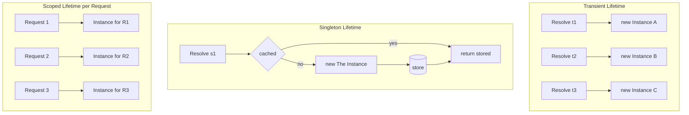
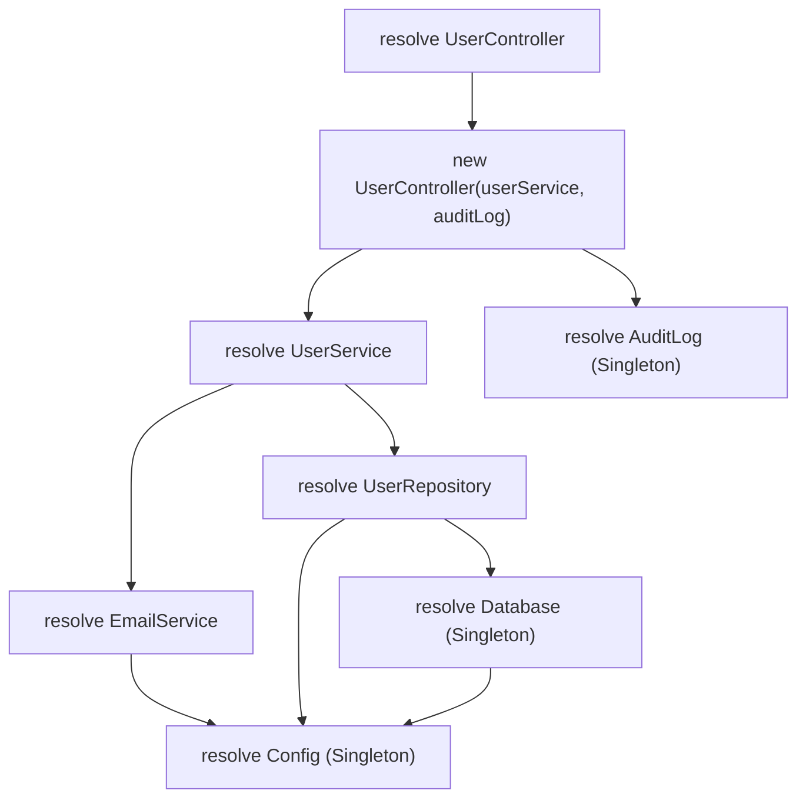
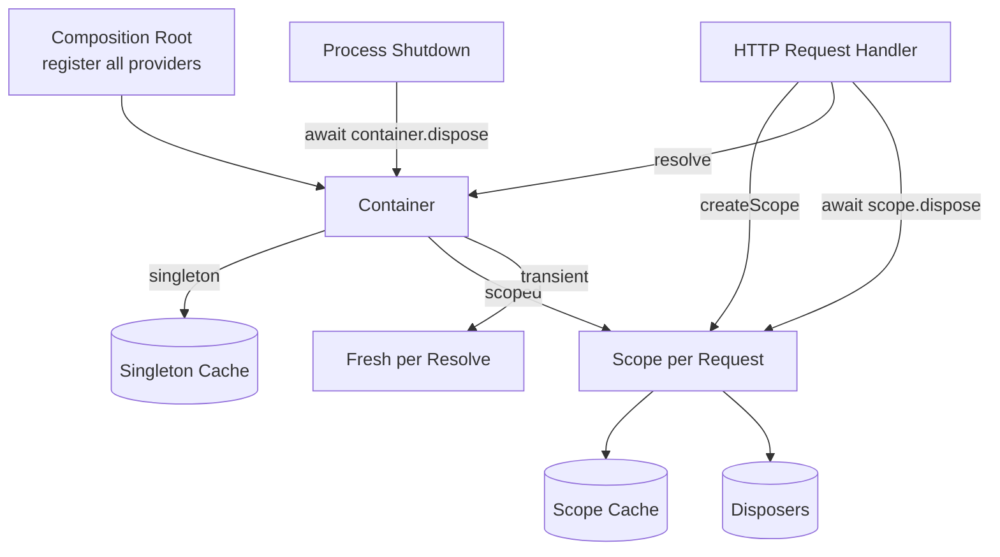

# 4.08 Dependency Injection DI

> The technique that lets you say "I need a thing that does X" without ever knowing which concrete thing will do X at runtime. The mechanism that turns tightly coupled code into composable, testable, late-bound systems. The wiring that gives NestJS, Angular, Spring, and .NET their entire architecture. The reason your unit tests run in milliseconds instead of minutes.

## 1. Purpose

Dependency Injection exists because the alternative is unbearable. When a class reaches out and constructs its own dependencies, every ripple in those dependencies ripples back into the class. When a class declares what it needs and lets something outside provide it, the class becomes testable, swappable, and composable. DI is the technique that makes the Inversion of Control principle concrete.

The deeper principle behind DI is Inversion of Control. IoC says: do not call the framework, the framework calls you. Without IoC, your code is in charge: it constructs what it needs, calls what it needs, and orchestrates the entire flow. With IoC, the framework is in charge: it constructs your classes, calls your methods, and orchestrates the flow. Your code becomes a set of plug-ins that the framework composes. This inversion is the single biggest architectural shift in modern server-side code, and DI is the wiring that makes it work.

IoC predates DI. The classic example is a GUI event loop: instead of your code calling `readInput()` in a loop, you register handlers and the event loop calls them. The Hollywood Principle — do not call us, we will call you — captures the same idea. The template method pattern inverts control by letting subclasses fill in algorithm steps. The strategy pattern inverts control by accepting a callable. DI is IoC specialized for one concern: the construction and provisioning of dependencies.

The relationship between IoC, DI, and DIP is precise:

- **DIP (Dependency Inversion Principle)** is the design principle. It says high-level modules should depend on abstractions, not low-level concretes. See [[4.05 SOLID Dependency Inversion]] for the full treatment.
- **DI (Dependency Injection)** is the technique. It says: do not construct your dependencies inside your class; accept them from outside, usually through the constructor.
- **IoC (Inversion of Control)** is the broader principle. It says: invert the direction of control so the framework drives the flow and your code is plug-in shaped.
- **IoC container (DI container)** is the tool. It is a registry that knows how to construct every service in your app, resolve the dependency graph, and manage the lifetime of each instance.

DI containers exist because wiring a real application by hand becomes unworkable past a certain size. A controller needs a service, the service needs a repository, the repository needs a database client, the database client needs a config, the config needs the environment. Constructing that graph manually at the entry point is a wall of `new` calls that must be updated every time a dependency changes. A DI container manages that graph declaratively: you register each service with a token and a provider, and the container resolves the entire graph on demand. The container also handles service lifetimes, so a singleton database connection is shared, a transient validator is fresh each time, and a request-scoped transaction is one-per-request without you writing that logic manually.

What DI enables, concretely:

- **Decouple construction from usage.** A class that uses a logger does not know whether the logger is `ConsoleLogger`, `FileLogger`, or `DatadogLogger`. The class knows only the `Logger` interface.
- **Enable testability.** Inject a mock at the seam the constructor creates. Unit tests run with no database, no network, no external services. See [[5.04 Unit Testing Fundamentals]].
- **Enable late binding.** Decide at startup, or at runtime, which implementation to use. The same binary runs against an in-memory store in dev and a Postgres cluster in production.
- **Enable plugin architectures.** Third-party code can register providers for tokens the core app defines. The core app never knows the concrete type.
- **Centralize lifetime management.** Singletons are shared. Transients are fresh. Scopes are request-bounded. The container handles each correctly.

This note covers DI from first principles through a production-grade typed container. By the end you will be able to refactor coupled code to use DI, build a container from scratch, choose between Transient, Singleton, and Scoped lifetimes, and diagnose cyclic dependencies.

Related foundational notes: [[4.05 SOLID Dependency Inversion]], [[2.19 Decorators and Metaprogramming]], [[2.06 Interfaces vs Type Aliases]].

## 2. Theory and Deep Dive

### 2.1 Constructor Injection

Constructor injection is the dominant form of DI. The class declares its dependencies as constructor parameters. The caller — usually the DI container, sometimes a test, sometimes a manual composition root — passes the concrete instances. The class stores them on its instance and uses them throughout its lifetime.

The advantages of constructor injection are overwhelming:

- **Required dependencies are visible.** A class with `constructor(userRepository, emailService, auditLog)` advertises exactly what it needs. You cannot instantiate the class without providing all three.
- **Required dependencies are immutable.** Store them as readonly fields and they cannot be reassigned after construction. The class is safe by construction (modulo the dependencies themselves).
- **The dependency graph is acyclic by construction.** If A's constructor needs B, B must exist before A. If B's constructor needs A, you have a cycle and the container will fail loudly at resolution time.
- **Testing is trivial.** Instantiate the class with mocks in a test, and you have a fully isolated unit.

Constructor injection is the default in NestJS, Angular, Spring, .NET, and every other major DI framework. Use it for required dependencies. Use it for almost everything else too.

### 2.2 Property Injection

Property injection sets dependencies after construction. The container instantiates the class with a no-arg constructor, then assigns the dependencies to public properties. The class uses those properties at runtime.

Property injection is rare in modern TypeScript and Node. Its legitimate uses are narrow:

- **Optional dependencies.** A service might use a metrics emitter if one is present, but should still work if one is absent. Property injection lets the container set the property when a binding exists and leave it null otherwise.
- **Avoiding constructor bloat in legacy code.** A class with twelve constructor parameters might be refactored to keep the constructor small and accept the rest as properties. This is usually a smell.
- **Framework-internal wiring.** Some frameworks (Angular historically, some Java frameworks) use property or setter injection to break cycles or to support optional features.

Property injection has serious drawbacks:

- **The object is partially constructed between construction and property assignment.** Any method called during that window will see null dependencies.
- **Required dependencies cannot be enforced.** The compiler will not catch a missing property assignment. The failure moves from compile time to runtime.
- **Immutability is lost.** Properties can be reassigned. The class is no longer safe by construction.
- **Testing is more verbose.** You must instantiate the class and then set its properties; you cannot do both in one line.

Use property injection only for true optional dependencies. Even then, prefer a nullable constructor parameter with a default of null.

### 2.3 Method Injection

Method injection passes a dependency as a parameter to a specific method, not to the constructor. The dependency is scoped to that call. The class does not store it.

Method injection fits a specific shape of problem: the dependency varies per call. The classic example is a per-request database transaction. A `UserService.transfer(from, to, amount, tx)` method takes a transaction as a parameter. The transaction is created by a request middleware, passed down through the call stack, and committed or rolled back at the end. The service does not own the transaction; it uses the one given.

Method injection also fits when a service handles many kinds of context-dependent collaborators. A `NotificationService.send(channel, message)` method takes a channel — email, SMS, push, webhook — that the caller selects. The service does not hold all possible channels as constructor parameters; it accepts the one needed for this call.

The drawback of method injection is that callers must know about the dependency. The caller is no longer insulated from the dependency graph. Use method injection when the dependency is genuinely per-call, not per-instance. Method injection is also a useful tool for breaking cyclic dependencies, as we will see in Section 2.7 and Exercise 9.4.

### 2.4 Service Lifetimes

A service lifetime is the rule that decides when the container creates a new instance and when it reuses an existing one. The three standard lifetimes are Transient, Singleton, and Scoped.

**Transient** creates a new instance every time the service is resolved. Use Transient for lightweight, stateless services: validators, mappers, formatters. The container never caches a Transient; each resolution is a fresh construction. The cost is construction overhead on every call. The benefit is isolation: no two callers share state.

**Singleton** creates one instance for the lifetime of the container. Use Singleton for stateful shared services: database connection pools, in-memory caches, configuration objects, logger instances. The container constructs the instance on first resolution and returns the same instance on every subsequent resolution. The benefit is shared state and amortized construction cost. The risk is the captive dependency problem: a Singleton that depends on a Scoped or Transient service captures the first instance it was given and never updates. The Scoped service becomes effectively Singleton for the lifetime of that capture. See Section 6.7.

**Scoped** creates one instance per scope. A scope is a bounded resolution context: typically one HTTP request, one background job, one unit test. The container constructs a fresh instance at the start of the scope, returns the same instance to every resolver within the scope, and disposes it at the end. Use Scoped for request-bound state: a database transaction, a per-request cache, a correlation ID holder, a tenant context.

The interaction between lifetimes is the most error-prone part of DI. The cardinal rules are:

- A Singleton can depend on other Singletons safely.
- A Scoped can depend on Singletons and other Scoped services safely.
- A Transient can depend on anything safely.
- A Singleton must not depend on a Scoped or Transient service. The Singleton captures the first instance and never releases it.
- A Scoped must not depend on a Transient that needs the request context if the Transient is captured beyond the scope.

These rules are checked by the better DI containers at registration time. NestJS will warn when a Singleton provider depends on a Request-scoped provider. The .NET DI container throws on the equivalent misconfiguration.



### 2.5 The DI Container

A DI container is a registry that maps tokens to providers and resolves the dependency graph on demand. The four canonical operations are:

1. **Register** a token with a provider. The token is the key the rest of the app asks for. The provider is the recipe the container uses to construct the service.
2. **Resolve** a token. The container looks up the provider, runs it, and returns the instance.
3. **Release** a scope. The container disposes of scoped instances created within that scope.
4. **Dispose** the container. The container disposes of singleton instances it has cached.

A token can be a string, a symbol, a class reference, or any opaque value. Symbols are preferred in TypeScript because they are globally unique and never collide. Class references are common in NestJS because the framework can read decorator metadata from them. Strings are common in lightweight JS containers because they are simple, but they risk collisions across modules.

A provider can be:

- A class (the container constructs it via `new`).
- A factory function (the container calls it and uses the return value).
- A pre-built value (the container returns it as-is).

The provider also carries the lifetime: Transient, Singleton, or Scoped.

### 2.6 Resolution Algorithm

The resolution algorithm is a recursive descent through the dependency graph. Pseudocode:

```
function resolve(token, scope, chain):
  if chain includes token:
    throw CyclicDependencyError(chain plus token)
  provider = registry[token]
  if provider is undefined:
    throw MissingProviderError(token)
  if provider.lifetime == Singleton and provider.cached:
    return provider.cached
  if provider.lifetime == Scoped and scope has token:
    return scope[token]
  nextChain = chain plus token
  args = provider.dependencies.map(dep => resolve(dep, scope, nextChain))
  instance = new provider.class(...args)
  if provider.lifetime == Singleton:
    provider.cached = instance
  if provider.lifetime == Scoped:
    scope[token] = instance
  return instance
```

The recursion is what makes DI powerful: ask for the top of the graph and the container walks all the way to the leaves, constructing each node with its dependencies, and returns the assembled root. The same algorithm builds a controller with its service with its repository with its database client with its config.

The chain parameter carries the set of tokens currently being resolved. If a token appears in the chain during its own resolution, the graph has a cycle and the container throws immediately. The chain is appended on each recursive call so that the deepest level sees the full path back to the root, which makes the error message useful.

### 2.7 Cyclic Dependencies

A cyclic dependency is a graph in which A depends on B and B depends on A. The resolution algorithm would loop forever: resolving A requires resolving B; resolving B requires resolving A; resolving A requires resolving B; forever. The cycle-detection step in the algorithm — checking the chain on every entry — breaks the loop and throws a `CyclicDependencyError` instead.

Cycles are almost always a design smell. They usually indicate that two classes have grown entangled and need to be split. Common fixes:

- **Extract a third class.** If A and B both need shared logic, move that logic into C and have both A and B depend on C. The cycle disappears.
- **Use an event bus.** If A calls B which calls back into A, replace the callback with an event. A emits `userRegistered`; B subscribes. A and B no longer reference each other.
- **Use method injection for one direction.** If A needs B for most operations but B needs A only for one callback, pass A as a parameter to that one method on B. The constructor graph stays acyclic.
- **Introduce a lazy proxy.** Some containers (Spring, .NET) support lazy resolution: a `Lazy<B>` is injected into A; the actual B is resolved on first use. This breaks the construction cycle but does not break the logical cycle, and the resulting code is fragile. Use only as a last resort.

The right answer is almost always to refactor. Cycles indicate that the dependency graph has a knot; untying the knot produces a cleaner design.

### 2.8 NestJS DI

NestJS is the most popular TypeScript-first Node framework and DI is its spine. Every NestJS app is a tree of modules; every module declares providers; every provider is a class decorated with `@Injectable()`; every controller and service receives its dependencies through its constructor.

NestJS uses TypeScript's `emitDecoratorMetadata` tsconfig flag to read constructor parameter types at runtime. The `@Injectable()` decorator marks a class as injectable. The `@Module()` decorator declares which providers a module contributes to the global registry. The `@Controller()` decorator marks a class as a controller and lets it receive injectable dependencies.

The default lifetime in NestJS is Singleton. A provider registered in a module is instantiated once and shared across the app. Request-scoped providers are opt-in via `@Injectable({ scope: Scope.REQUEST })`. Transient providers use `Scope.TRANSIENT`. NestJS warns loudly when a Singleton provider depends on a Request-scoped provider, because that Request-scoped provider becomes a de facto Singleton.

NestJS supports three provider styles:

- **Class provider.** `{ provide: UserRepository, useClass: PostgresUserRepository }`. The container constructs the class.
- **Value provider.** `{ provide: Config, useValue: { port: 3000 } }`. The container returns the literal value.
- **Factory provider.** `{ provide: DatabaseClient, useFactory: (config) => new Pool({ connectionString: config.databaseUrl }), inject: [Config] }`. The container resolves the injected tokens and calls the factory.

Custom tokens are supported via string or symbol keys: `{ provide: "LOGGER", useClass: ConsoleLogger }`. To inject a string-token dependency, the constructor parameter needs `@Inject("LOGGER")` because TypeScript's metadata cannot infer the token from the type.

### 2.9 Awilix DI

Awilix is a lightweight, framework-agnostic DI container for Node. Its distinguishing feature is name-based resolution: the container resolves dependencies by reading the parameter names of a constructor or function. A service with `constructor(userRepository, emailService)` receives whatever the container has registered under the names `userRepository` and `emailService`. No decorators, no metadata, no TypeScript configuration.

Awilix uses `asClass`, `asFunction`, and `asValue` to register providers:

- `asClass(UserService).scoped()` constructs the class with `new` and applies the lifetime.
- `asFunction(makeLogger).singleton()` calls the function and caches the result.
- `asValue({ port: 3000 })` returns the literal value.

The lifetime methods are `.transient()`, `.singleton()`, and `.scoped()`. A scope is created via `container.createScope()` and shares singleton state with the parent while maintaining its own scoped state.

Awilix is the right choice when you want DI without a framework and without TypeScript decorator metadata. The parameter-name approach is brittle if you minify your code (parameter names get mangled), so Awilix supports explicit dependency declaration via an injection map for those cases. See [[2.19 Decorators and Metaprogramming]] for the broader context on when decorator-based DI is preferable to reflection-based DI.

### 2.10 InversifyJS DI

InversifyJS is a TypeScript-first DI container that uses decorators and symbolic tokens. The pattern is verbose but explicit:

- Define a `TYPES` object holding string or symbol keys for each service.
- Decorate every injectable class with `@injectable()`.
- Decorate every constructor parameter that needs injection with `@inject(TYPES.Foo)`.
- Register bindings: `container.bind<UserRepository>(TYPES.UserRepository).to(PostgresUserRepository)`.
- Resolve: `container.get<UserRepository>(TYPES.UserRepository)`.

InversifyJS supports lifetimes via `.inSingletonScope()`, `.inTransientScope()`, and `.inRequestScope()` (the InversifyJS term for scoped). It supports factory bindings via `toFactory`, dynamic value bindings via `toDynamicValue`, and provider bindings for async resolution.

InversifyJS is the most explicit of the three. Every dependency is declared twice: once as a token, once as a parameter decorator. The verbosity is the cost of being unambiguous about which interface each constructor parameter refers to — useful when a constructor takes two parameters of the same type (two `Logger` instances, one for audit and one for debug, distinguished by named bindings).

### 2.11 The DI Resolution Graph

The resolution graph is the tree the container walks to build a service. Visualizing it makes the recursive structure clear and the lifetime story visible. Singletons appear once; transients appear at every site; scoped services appear once per scope.



The container walks this tree from the root. Singletons are constructed once and cached; the cache is consulted on every revisit, which is why `Config` is constructed only once even though it appears three times in the graph. Transients are constructed every time they appear. Scoped services are constructed once per scope. The container returns the assembled root with all dependencies wired.

## 3. Mental Models

### 3.1 DI Is "Give Me the Dependency From Outside"

The first mental model is the simplest: a class should not fetch its own dependencies. It should declare them and accept them. Compare:

```javascript
class UserService {
  constructor() {
    this.repo = new PostgresUserRepository(); // bad: class fetches its own dep
  }
}
```

```javascript
class UserService {
  constructor(repo) {
    this.repo = repo; // good: class accepts the dep from outside
  }
}
```

The first class is self-sufficient but coupled. The second is dependent but free. DI is the practice of choosing the second shape every time.

### 3.2 IoC Is "The Container Calls Your Constructor"

The second model extends the first: not only do you accept dependencies from outside, but the thing that calls your constructor is the container, not application code. The container knows your dependencies because you registered them. The container constructs them, then constructs you with them. You never call `new UserService(...)` in application code — only in tests.

This inverts control: the framework drives construction, your code is plug-in shaped. The Hollywood Principle in concrete form.

### 3.3 Lifetime Is "How Long Does the Instance Live"

The third model reduces lifetimes to a single question per service: when does this instance die?

- **Transient:** never lives. Fresh on every call. No state, no sharing.
- **Singleton:** lives forever (for the life of the container). Shared state, shared cost.
- **Scoped:** lives for one unit of work. Request, job, test. Shared within that unit, isolated across units.

Choose by asking: does this service carry state that must be shared, isolated, or never present? Shared means Singleton. Isolated means Scoped. Never present means Transient.

### 3.4 Transient Is "Fresh Every Time"

The Transient model is the fresh sandwich. Every customer gets a new one. No reuse. The cost is construction; the benefit is isolation. Use Transient when construction is cheap and sharing would cause bugs.

### 3.5 Singleton Is "One Forever"

The Singleton model is the office coffee machine. One unit, shared by everyone, refilled as needed. The cost is shared state (concurrency, cache invalidation); the benefit is amortized cost and consistency. Use Singleton when the resource is expensive to construct or must be shared.

### 3.6 Scoped Is "One Per Request"

The Scoped model is the hotel room. Each guest gets their own for the duration of their stay. No sharing across guests. Cleanup happens at checkout. Use Scoped when state must be consistent within a unit of work and isolated across units.

### 3.7 The Container Is "The Factory That Knows How to Build Everything"

The container is a meta-factory. Ask it for any service and it builds the whole subgraph. You register recipes; it executes them. The container is the only place in the app that knows the concrete types of every dependency. Everywhere else depends on abstractions.

## 4. Real-World Use Cases

### 4.1 NestJS — DI as the Spine

NestJS is built around DI. Every module is a registration boundary. Every provider is a service. Every controller receives dependencies by constructor injection. The framework handles resolution, lifetime, and wiring. A typical NestJS service:

```typescript
@Injectable()
export class UserService {
  constructor(
    @InjectRepository(User) private readonly repo: Repository<User>,
    private readonly email: EmailService,
    private readonly config: ConfigService,
  ) {}
}
```

The constructor declares three dependencies. The framework resolves them at controller instantiation. The class never references a concrete repository, a concrete email sender, or a concrete config source.

### 4.2 Angular — DI on the Client

Angular has had DI since version 1. Components, directives, pipes, and services all receive dependencies through their constructors. Angular's DI is hierarchical: each component has its own injector, and resolution walks up the tree until a provider is found. This allows fine-grained provider overrides at any level of the component tree.

### 4.3 Awilix — Lightweight DI for Node

Awilix is the choice when you want DI without a framework. The pattern is a single composition root that registers every service and resolves the top of the graph at startup:

```javascript
const container = createContainer();
container.register({
  config: asValue({ databaseUrl: "postgres://localhost/app" }),
  database: asClass(Database).singleton(),
  userRepository: asClass(UserRepository).scoped(),
  userService: asClass(UserService).scoped(),
});
```

Awilix reads the parameter names of `UserService`'s constructor and resolves `userRepository` from the registry. No decorators, no metadata, no TypeScript configuration.

### 4.4 InversifyJS — Decorator-Based DI for TypeScript

InversifyJS is the choice when you want explicit, typed DI with symbolic tokens. The verbosity is the cost of being unambiguous:

```typescript
const TYPES = {
  UserRepository: Symbol.for("UserRepository"),
  EmailService: Symbol.for("EmailService"),
};

@injectable()
class UserService {
  constructor(
    @inject(TYPES.UserRepository) repo: UserRepository,
    @inject(TYPES.EmailService) email: EmailService,
  ) {}
}

container.bind<UserRepository>(TYPES.UserRepository).to(PostgresUserRepository);
```

Every dependency is named twice — once as a token, once as a parameter decorator — which is verbose but impossible to misread.

### 4.5 Test Doubles via DI

DI's most immediate payoff is testability. A service that accepts its dependencies by constructor can be tested with mocks in one line:

```typescript
const fakeRepo = { findById: jest.fn().mockResolvedValue({ id: 1, name: "Ada" }) };
const fakeEmail = { send: jest.fn() };
const service = new UserService(fakeRepo, fakeEmail);
const result = await service.register("ada@example.com", "p@ssw0rd");
expect(fakeRepo.findById).toHaveBeenCalledWith("ada@example.com");
expect(fakeEmail.send).toHaveBeenCalledTimes(1);
```

No database. No SMTP. No network. The test runs in milliseconds. See [[5.04 Unit Testing Fundamentals]] for the full treatment of test doubles, mocks, stubs, and fakes.

### 4.6 Multi-Environment Configuration

The same binary runs in dev, test, and prod by registering different providers at the composition root:

```typescript
const container = new Container();
if (process.env.nodeEnv === "test") {
  container.bind(UserRepository).to(InMemoryUserRepository);
} else {
  container.bind(UserRepository).to(PostgresUserRepository);
}
```

The application code never branches on environment. The container resolves the right implementation at startup.

### 4.7 Feature Flags as Injection Tokens

Feature flags become injection tokens. The container resolves the right implementation per flag:

```typescript
const container = new Container();
if (featureFlags.useNewCheckout) {
  container.bind(CheckoutService).to(NewCheckoutService);
} else {
  container.bind(CheckoutService).to(LegacyCheckoutService);
}
```

Toggle a flag, restart, and the new implementation is wired. No code change in the calling code.

## 5. Code Examples

### 5.1 Example A — Minimal and Conceptual

The minimal example covers constructor injection and a tiny container that resolves one service with one dependency. Side-by-side JavaScript and TypeScript.

**JavaScript:**

```javascript
class ConsoleLogger {
  log(message) {
    console.log(`[log] ${message}`);
  }
}

class UserRepository {
  constructor(logger) {
    this.logger = logger;
  }
  async findById(id) {
    this.logger.log(`findById ${id}`);
    return { id, name: "Ada Lovelace" };
  }
}

class UserService {
  constructor(repo, logger) {
    this.repo = repo;
    this.logger = logger;
  }
  async greet(id) {
    const user = await this.repo.findById(id);
    this.logger.log(`Hello, ${user.name}`);
    return user;
  }
}

// Minimal container: a map of token to factory with lifetime.
class Container {
  constructor() {
    this.factories = new Map();
    this.singletons = new Map();
  }
  singleton(token, factory) {
    this.factories.set(token, { factory, lifetime: "singleton" });
  }
  transient(token, factory) {
    this.factories.set(token, { factory, lifetime: "transient" });
  }
  resolve(token) {
    const entry = this.factories.get(token);
    if (!entry) throw new Error(`No provider for ${String(token)}`);
    if (entry.lifetime === "singleton") {
      if (this.singletons.has(token)) return this.singletons.get(token);
      const instance = entry.factory(this);
      this.singletons.set(token, instance);
      return instance;
    }
    return entry.factory(this);
  }
}

// Composition root: register everything, then resolve the top of the graph.
const container = new Container();
container.singleton("Logger", () => new ConsoleLogger());
container.singleton("UserRepository", (c) => new UserRepository(c.resolve("Logger")));
container.transient("UserService", (c) =>
  new UserService(c.resolve("UserRepository"), c.resolve("Logger"))
);

const userService = container.resolve("UserService");
userService.greet(1);
```

**TypeScript:**

```typescript
interface Logger {
  log(message: string): void;
}

interface UserRepository {
  findById(id: number): Promise<{ id: number; name: string }>;
}

interface UserService {
  greet(id: number): Promise<{ id: number; name: string }>;
}

class ConsoleLogger implements Logger {
  log(message: string): void {
    console.log(`[log] ${message}`);
  }
}

class PostgresUserRepository implements UserRepository {
  constructor(private readonly logger: Logger) {}
  async findById(id: number): Promise<{ id: number; name: string }> {
    this.logger.log(`findById ${id}`);
    return { id, name: "Ada Lovelace" };
  }
}

class UserServiceImpl implements UserService {
  constructor(
    private readonly repo: UserRepository,
    private readonly logger: Logger,
  ) {}
  async greet(id: number): Promise<{ id: number; name: string }> {
    const user = await this.repo.findById(id);
    this.logger.log(`Hello, ${user.name}`);
    return user;
  }
}

type Lifetime = "singleton" | "transient" | "scoped";
type Factory = (c: Container) => unknown;

class Container {
  private readonly factories = new Map<symbol, { factory: Factory; lifetime: Lifetime }>();
  private readonly singletons = new Map<symbol, unknown>();

  register(token: symbol, factory: Factory, lifetime: Lifetime = "singleton"): void {
    this.factories.set(token, { factory, lifetime });
  }
  singleton(token: symbol, factory: Factory): void {
    this.register(token, factory, "singleton");
  }
  transient(token: symbol, factory: Factory): void {
    this.register(token, factory, "transient");
  }
  resolve<T>(token: symbol): T {
    const entry = this.factories.get(token);
    if (!entry) throw new Error(`No provider for ${String(token)}`);
    if (entry.lifetime === "singleton") {
      if (this.singletons.has(token)) return this.singletons.get(token) as T;
      const instance = entry.factory(this) as T;
      this.singletons.set(token, instance);
      return instance;
    }
    return entry.factory(this) as T;
  }
}

const Tokens = {
  Logger: Symbol("Logger"),
  UserRepository: Symbol("UserRepository"),
  UserService: Symbol("UserService"),
} as const;

const container = new Container();
container.singleton(Tokens.Logger, () => new ConsoleLogger());
container.singleton(Tokens.UserRepository, (c) =>
  new PostgresUserRepository(c.resolve(Tokens.Logger)),
);
container.transient(Tokens.UserService, (c) =>
  new UserServiceImpl(c.resolve(Tokens.UserRepository), c.resolve(Tokens.Logger)),
);

const userService = container.resolve<UserService>(Tokens.UserService);
await userService.greet(1);
```

### 5.2 Example B — Production-Grade Typed Container

The production example extends the minimal container with three features that real apps need: scoped lifetimes, cyclic dependency detection, and disposal. Side-by-side JavaScript and TypeScript.

**JavaScript:**

```javascript
class CyclicDependencyError extends Error {
  constructor(chain) {
    super(`Cyclic dependency detected: ${chain.map(String).join(" -> ")}`);
    this.name = "CyclicDependencyError";
    this.chain = chain;
  }
}

class Scope {
  constructor() {
    this.instances = new Map();
    this.disposers = [];
  }
  has(token) { return this.instances.has(token); }
  get(token) { return this.instances.get(token); }
  set(token, instance) { this.instances.set(token, instance); }
  registerDisposer(fn) { this.disposers.push(fn); }
  async dispose() {
    for (const fn of this.disposers.reverse()) {
      try { await fn(); } catch (err) { console.error("Disposal error", err); }
    }
    this.disposers.length = 0;
    this.instances.clear();
  }
}

class Container {
  constructor() {
    this.factories = new Map();
    this.singletons = new Map();
    this.singletonDisposers = [];
  }
  singleton(token, factory, options) {
    options = options || {};
    this.factories.set(token, { factory, lifetime: "singleton", dispose: options.dispose });
  }
  transient(token, factory) {
    this.factories.set(token, { factory, lifetime: "transient" });
  }
  scoped(token, factory, options) {
    options = options || {};
    this.factories.set(token, { factory, lifetime: "scoped", dispose: options.dispose });
  }
  createScope() { return new Scope(); }
  resolve(token, scope, chain) {
    scope = scope || null;
    chain = chain || [];
    if (chain.includes(token)) {
      throw new CyclicDependencyError(chain.concat([token]));
    }
    const entry = this.factories.get(token);
    if (!entry) throw new Error(`No provider for ${String(token)}`);
    const nextChain = chain.concat([token]);
    if (entry.lifetime === "singleton") {
      if (this.singletons.has(token)) return this.singletons.get(token);
      const instance = entry.factory(this, scope, nextChain);
      this.singletons.set(token, instance);
      if (entry.dispose) this.singletonDisposers.push(() => entry.dispose(instance));
      return instance;
    }
    if (entry.lifetime === "scoped") {
      if (!scope) throw new Error(`Cannot resolve scoped ${String(token)} without a scope`);
      if (scope.has(token)) return scope.get(token);
      const instance = entry.factory(this, scope, nextChain);
      scope.set(token, instance);
      if (entry.dispose) scope.registerDisposer(() => entry.dispose(instance));
      return instance;
    }
    return entry.factory(this, scope, nextChain);
  }
  async dispose() {
    for (const fn of this.singletonDisposers.reverse()) {
      try { await fn(); } catch (err) { console.error("Singleton disposal error", err); }
    }
    this.singletonDisposers.length = 0;
    this.singletons.clear();
  }
}

// Application services.
class DatabaseClient {
  async query(sql) { console.log("query", sql); return { rows: [{ id: 1, name: "Ada" }] }; }
}
class Transaction {
  constructor(db) { this.db = db; this.committed = false; }
  async query(sql) {
    if (this.committed) throw new Error("Transaction already closed");
    return this.db.query(sql);
  }
  async commit() { this.committed = true; console.log("commit"); }
  async rollback() { this.committed = true; console.log("rollback"); }
}
class UserRepository {
  constructor(tx) { this.tx = tx; }
  async findById(id) {
    const result = await this.tx.query(`select * from users where id = ${id}`);
    return result.rows[0];
  }
}
class UserService {
  constructor(repo) { this.repo = repo; }
  async greet(id) {
    const user = await this.repo.findById(id);
    return `Hello, ${user.name}`;
  }
}

// Composition root.
const container = new Container();
container.singleton("Database", () => new DatabaseClient());
container.scoped(
  "Transaction",
  (c) => new Transaction(c.resolve("Database", null)),
  { dispose: async (tx) => { if (!tx.committed) await tx.rollback(); } },
);
container.scoped("UserRepository", (c, scope) =>
  new UserRepository(c.resolve("Transaction", scope)),
);
container.transient("UserService", (c, scope) =>
  new UserService(c.resolve("UserRepository", scope)),
);

async function handleRequest() {
  const scope = container.createScope();
  try {
    const service = container.resolve("UserService", scope);
    const result = await service.greet(1);
    const tx = scope.get("Transaction");
    await tx.commit();
    return result;
  } finally {
    await scope.dispose();
  }
}

await handleRequest();
await container.dispose();
```

**TypeScript:**

```typescript
type Lifetime = "singleton" | "transient" | "scoped";
type Factory<T = unknown> = (container: Container, scope: Scope | null, chain: symbol[]) => T;
type Dispose<T = unknown> = (instance: T) => void | Promise<void>;

interface Provider<T = unknown> {
  factory: Factory<T>;
  lifetime: Lifetime;
  dispose?: Dispose<T>;
}

class CyclicDependencyError extends Error {
  constructor(public readonly chain: symbol[]) {
    super(`Cyclic dependency detected: ${chain.map((s) => s.toString()).join(" -> ")}`);
    this.name = "CyclicDependencyError";
  }
}

class Scope {
  private readonly instances = new Map<symbol, unknown>();
  private readonly disposers: Array<() => void | Promise<void>> = [];

  has(token: symbol): boolean { return this.instances.has(token); }
  get<T>(token: symbol): T | undefined { return this.instances.get(token) as T | undefined; }
  set<T>(token: symbol, instance: T): void { this.instances.set(token, instance); }
  registerDisposer(fn: () => void | Promise<void>): void { this.disposers.push(fn); }
  async dispose(): Promise<void> {
    for (const fn of this.disposers.reverse()) {
      try { await fn(); } catch (err) { console.error("Disposal error", err); }
    }
    this.disposers.length = 0;
    this.instances.clear();
  }
}

class Container {
  private readonly factories = new Map<symbol, Provider>();
  private readonly singletons = new Map<symbol, unknown>();
  private readonly singletonDisposers: Array<() => void | Promise<void>> = [];

  register<T>(token: symbol, factory: Factory<T>, lifetime: Lifetime, dispose?: Dispose<T>): void {
    this.factories.set(token, { factory, lifetime, dispose });
  }
  singleton<T>(token: symbol, factory: Factory<T>, dispose?: Dispose<T>): void {
    this.register(token, factory, "singleton", dispose);
  }
  transient<T>(token: symbol, factory: Factory<T>): void {
    this.register(token, factory, "transient");
  }
  scoped<T>(token: symbol, factory: Factory<T>, dispose?: Dispose<T>): void {
    this.register(token, factory, "scoped", dispose);
  }
  createScope(): Scope { return new Scope(); }
  resolve<T>(token: symbol, scope: Scope | null = null, chain: symbol[] = []): T {
    if (chain.includes(token)) {
      throw new CyclicDependencyError(chain.concat([token]));
    }
    const entry = this.factories.get(token);
    if (!entry) throw new Error(`No provider for ${token.toString()}`);
    const nextChain = chain.concat([token]);

    if (entry.lifetime === "singleton") {
      if (this.singletons.has(token)) return this.singletons.get(token) as T;
      const instance = entry.factory(this, scope, nextChain) as T;
      this.singletons.set(token, instance);
      if (entry.dispose) this.singletonDisposers.push(() => entry.dispose!(instance));
      return instance;
    }
    if (entry.lifetime === "scoped") {
      if (!scope) throw new Error(`Cannot resolve scoped ${token.toString()} without a scope`);
      if (scope.has(token)) return scope.get<T>(token)!;
      const instance = entry.factory(this, scope, nextChain) as T;
      scope.set(token, instance);
      if (entry.dispose) scope.registerDisposer(() => entry.dispose!(instance));
      return instance;
    }
    return entry.factory(this, scope, nextChain) as T;
  }
  async dispose(): Promise<void> {
    for (const fn of this.singletonDisposers.reverse()) {
      try { await fn(); } catch (err) { console.error("Singleton disposal error", err); }
    }
    this.singletonDisposers.length = 0;
    this.singletons.clear();
  }
}

// Application services and tokens.
interface DatabaseClient {
  query(sql: string): Promise<{ rows: Array<Record<string, unknown>> }>;
}
interface Transaction {
  query(sql: string): Promise<{ rows: Array<Record<string, unknown>> }>;
  commit(): Promise<void>;
  rollback(): Promise<void>;
  readonly committed: boolean;
}
interface UserRepository {
  findById(id: number): Promise<{ id: number; name: string }>;
}
interface UserService {
  greet(id: number): Promise<string>;
}

const Tokens = {
  Logger: Symbol("Logger"),
  Database: Symbol("Database"),
  Transaction: Symbol("Transaction"),
  UserRepository: Symbol("UserRepository"),
  UserService: Symbol("UserService"),
} as const;

class ConsoleLogger {
  log(message: string): void { console.log(`[log] ${message}`); }
}

class PgDatabaseClient implements DatabaseClient {
  async query(sql: string): Promise<{ rows: Array<Record<string, unknown>> }> {
    console.log("query", sql);
    return { rows: [{ id: 1, name: "Ada Lovelace" }] };
  }
}

class PgTransaction implements Transaction {
  private committedFlag = false;
  constructor(private readonly db: DatabaseClient) {}
  get committed(): boolean { return this.committedFlag; }
  async query(sql: string): Promise<{ rows: Array<Record<string, unknown>> }> {
    if (this.committedFlag) throw new Error("Transaction already closed");
    return this.db.query(sql);
  }
  async commit(): Promise<void> { this.committedFlag = true; console.log("commit"); }
  async rollback(): Promise<void> { this.committedFlag = true; console.log("rollback"); }
}

class PgUserRepository implements UserRepository {
  constructor(private readonly tx: Transaction) {}
  async findById(id: number): Promise<{ id: number; name: string }> {
    const result = await this.tx.query(`select * from users where id = ${id}`);
    return result.rows[0] as { id: number; name: string };
  }
}

class UserServiceImpl implements UserService {
  constructor(private readonly repo: UserRepository) {}
  async greet(id: number): Promise<string> {
    const user = await this.repo.findById(id);
    return `Hello, ${user.name}`;
  }
}

// Composition root.
const container = new Container();
container.singleton(Tokens.Logger, () => new ConsoleLogger());
container.singleton(Tokens.Database, () => new PgDatabaseClient(), async () => {
  console.log("closing database");
});
container.scoped(
  Tokens.Transaction,
  (c) => new PgTransaction(c.resolve<DatabaseClient>(Tokens.Database)),
  async (tx) => { if (!tx.committed) await tx.rollback(); },
);
container.scoped(Tokens.UserRepository, (c, scope) =>
  new PgUserRepository(c.resolve<Transaction>(Tokens.Transaction, scope)),
);
container.transient(Tokens.UserService, (c, scope) =>
  new UserServiceImpl(c.resolve<UserRepository>(Tokens.UserRepository, scope)),
);

async function handleRequest(): Promise<string> {
  const scope = container.createScope();
  try {
    const service = container.resolve<UserService>(Tokens.UserService, scope);
    const result = await service.greet(1);
    const tx = scope.get<Transaction>(Tokens.Transaction)!;
    await tx.commit();
    return result;
  } finally {
    await scope.dispose();
  }
}

await handleRequest();
await container.dispose();
```

## 6. Common Mistakes and Anti-Patterns

### 6.1 `new` Inside a Class

```javascript
class UserService {
  constructor() {
    this.repo = new PostgresUserRepository(); // defeats DI
    this.logger = new ConsoleLogger();
  }
}
```

**Why it fails:** The class is welded to the concrete types. You cannot substitute a mock in tests. You cannot swap Postgres for Mongo. You cannot run the class in two configurations in the same process. The class reaches out and grabs what it needs, breaking the inversion of control.

**Fix:** Accept the dependencies as constructor parameters. Let the container or the test provide them.

```javascript
class UserService {
  constructor(repo, logger) {
    this.repo = repo;
    this.logger = logger;
  }
}
```

### 6.2 Service Locator Anti-Pattern

```javascript
class UserService {
  constructor() {
    this.container = globalContainer; // service locator
  }
  async greet(id) {
    const repo = this.container.resolve("UserRepository"); // resolve on demand
    const user = await repo.findById(id);
    return `Hello, ${user.name}`;
  }
}
```

**Why it fails:** The class hides its dependencies. The constructor takes no parameters, so the class looks dependency-free. In reality it depends on the entire container. Tests cannot substitute mocks without mutating the global container. The dependency graph is invisible. The class is coupled to the container API.

**Fix:** Use constructor injection. Declare every dependency as a parameter.

```javascript
class UserService {
  constructor(repo) { this.repo = repo; }
  async greet(id) {
    const user = await this.repo.findById(id);
    return `Hello, ${user.name}`;
  }
}
```

### 6.3 Cyclic Dependencies

```javascript
class A {
  constructor(b) { this.b = b; }
  doA() { this.b.doB(); }
}
class B {
  constructor(a) { this.a = a; }
  doB() { this.a.doA(); }
}
// Container: A needs B, B needs A. Resolution loops forever.
```

**Why it fails:** The container cannot construct either class. Resolution enters an infinite recursion or throws a `CyclicDependencyError` (if the container detects cycles). The cycle is also a design smell: two classes that mutually depend on each other are usually one class or three classes in disguise.

**Fix:** Extract the shared logic into a third class, use an event bus, or use method injection for one direction. See Section 9.4 for a worked example.

### 6.4 Wrong Lifetime: Singleton for Stateful Per-Request

```javascript
container.singleton("Transaction", (c) => new Transaction(c.resolve("Database")));
```

**Why it fails:** Every request resolves the same `Transaction` instance. Request A's commit closes the transaction for request B. Request B's queries fail with "transaction already closed." Production goes down at the first burst of concurrent traffic.

**Fix:** Use Scoped for per-request state. The container constructs one instance per scope (per request) and disposes it at the end.

```javascript
container.scoped("Transaction", (c) => new Transaction(c.resolve("Database")));
```

### 6.5 Over-DI: Everything Injectable

```javascript
container.transient("GreetingFormatter", () => new GreetingFormatter());
container.transient("HelloWorldString", () => "Hello, World");
container.transient("AddTwoNumbers", () => (a, b) => a + b);
```

**Why it fails:** The container is now responsible for trivial values that have no business being registered. Indirection has cost — every resolve is a map lookup and a function call — and the reader has to jump to the composition root to understand what `HelloWorldString` is. DI adds value when dependencies are stateful, swappable, or cross-cutting. A constant string is none of those.

**Fix:** Inline the trivial. Use DI for the parts of the graph that benefit from it. Leave the constants, pure functions, and value objects alone.

### 6.6 Not Documenting the Graph

```javascript
container.singleton("A", (c) => new A(c.resolve("B"), c.resolve("C")));
container.singleton("B", (c) => new B(c.resolve("D")));
container.singleton("C", (c) => new C(c.resolve("D")));
container.singleton("D", (c) => new D());
// 50 more bindings...
```

**Why it fails:** Six months later, no one remembers which service depends on which. The graph is a wall of registrations with no narrative. When a bug appears in service D, every consumer of D is suspect, and the only way to find them is to grep.

**Fix:** Group registrations by module or feature. Add a comment block at the top of each module's registrations describing the subgraph. Generate a graph visualization from the container at startup in development. NestJS modules do this naturally: each module declares its providers, and the framework can print the resolved graph.

### 6.7 Captive Dependency

```javascript
container.singleton("UserService", (c) =>
  new UserService(c.resolve("UserRepository")) // UserRepository is scoped
);
```

**Why it fails:** The Singleton captures the first `UserRepository` instance it was given — the one from the first request. Every subsequent request resolves the same Singleton, which still holds the first `UserRepository`. The Scoped service becomes a de facto Singleton, and the per-request isolation you thought you had is gone. Worse, the captured `UserRepository` may hold a transaction that was committed in request 1; queries in request 2 fail with "transaction closed."

**Fix:** Ensure Singletons depend only on other Singletons. If a Singleton needs request-scoped behavior, inject a factory (a function that resolves the scoped service on demand) instead of the service itself.

```javascript
container.singleton("UserService", (c) =>
  new UserService((scope) => c.resolve("UserRepository", scope))
);
```

### 6.8 Injecting Concrete Classes Instead of Abstractions

```javascript
class UserService {
  constructor(repo) { // typed as PostgresUserRepository
    this.repo = repo;
  }
}
container.singleton("UserService", (c) =>
  new UserService(c.resolve("PostgresUserRepository"))
);
```

**Why it fails:** The service depends on a concrete class, not an interface. Substituting a different repository requires editing the service. The service is no longer testable with a stub that is not a `PostgresUserRepository`. DIP is violated; the inversion has been undone.

**Fix:** Depend on an interface (a TS interface, or in JS a documented shape). Register the interface token to the concrete class at the composition root. The service never references the concrete class.

```javascript
class UserService {
  constructor(repo) { // typed as UserRepository interface
    this.repo = repo;
  }
}
container.singleton("UserRepository", (c) => new PostgresUserRepository());
container.singleton("UserService", (c) => new UserService(c.resolve("UserRepository")));
```

## 7. Best Practices and Design Patterns

### 7.1 Use Constructor Injection by Default

Constructor injection makes dependencies explicit, required, and immutable. Use it for every required dependency. Reserve property and method injection for the rare cases where they are genuinely needed (optional dependencies, per-call context). Constructor injection is the default in every major DI framework; do not fight the grain.

### 7.2 Use a Container for Complex Graphs

When your app has more than a handful of services, manual wiring becomes a wall of `new` calls that must be updated on every change. A container manages the graph declaratively. Use one when the graph is non-trivial. For tiny scripts and CLIs, manual construction at the entry point is fine.

### 7.3 Keep the Graph Acyclic

Cycles indicate design knots. Untie them by extracting shared logic, using events, or using method injection. A clean acyclic graph is easy to reason about, easy to test, and easy to extend. When a cycle appears, treat it as a design signal, not a container limitation.

### 7.4 Document Lifetimes

Every provider registration should make its lifetime visible. Group registrations by lifetime in the composition root. Comment on why a service is Scoped or Singleton. The next reader (which may be you in six months) should understand the lifetime story at a glance. Better containers can print the resolved graph at startup; use that capability in development.

### 7.5 Use DI for Testability

The primary payoff of DI is fast, isolated unit tests. Inject mocks at the seams the constructor creates. Do not reach into a global container from within a test; construct the service under test directly with the doubles you control. See [[5.04 Unit Testing Fundamentals]] for the test-double taxonomy: dummy, stub, spy, mock, fake.

### 7.6 Use TypeScript to Type Injection Tokens

TypeScript's type system can enforce that the type you ask for is the type you get. Use `resolve<T>` with the explicit type parameter, or use a typed token that carries its own type. InversifyJS's `container.bind<UserRepository>(...)` and the TS container in Section 5.2 both do this. Compile-time type safety at the resolution boundary catches a class of bugs that JS-only containers cannot.

### 7.7 Do Not Over-Engineer: Sometimes `new` Is Fine

A pure function, a value object, a constant — none of these benefit from DI. Registering them adds indirection without value. Reserve DI for services with dependencies, services with lifetimes, and services that must be swappable. When in doubt, leave it out; you can always add a registration later when the need becomes real.

### 7.8 Composition Root Pattern

All container registration happens in one place: the composition root, at the application entry point. Application code never references the container. Library code never references the container. Only the entry point knows the container exists. This keeps the container out of the dependency graph and prevents the service-locator anti-pattern from creeping back in. See [[4.09 Clean and Onion Architecture]] for how the composition root fits into a layered architecture.

### 7.9 Dispose Properly

Singletons and scoped services that hold resources (database connections, file handles, subscriptions) must be disposed. Provide a `dispose` callback when registering and call `container.dispose()` and `scope.dispose()` at the appropriate lifecycle boundaries (process shutdown, request end). Failing to dispose leaks resources and is the most common source of slow degradation in long-running DI-driven processes.

### 7.10 Use Symbols as Tokens in TypeScript

String tokens collide. Class-reference tokens require the concrete class to be importable everywhere the token is used, defeating the abstraction. Symbol tokens are globally unique and carry no implementation baggage. Use `Symbol("UserService")` for every token, and collect them in a single `Tokens` object for visibility. Symbols also work as object keys without collision, which matters when you compose multiple module registries.

## 8. Technical Interview Knowledge

### 8.1 What Is Dependency Injection?

**A:** Dependency Injection is a technique where a class receives its dependencies from an external source rather than constructing them itself. The class declares what it needs (typically through constructor parameters); the caller — usually a DI container — provides the concrete instances. DI decouples construction from usage, enables late binding, and makes classes testable in isolation.

**Trap to avoid:** Do not confuse DI with the Dependency Inversion Principle. DIP is the principle (depend on abstractions); DI is the technique (accept dependencies from outside). DI without DIP is possible — you can inject a concrete class — but it loses most of the benefit.

### 8.2 Difference Between DI and IoC?

**A:** IoC is the broader principle: invert the direction of control so the framework drives the flow and your code is plug-in shaped. DI is one specific form of IoC applied to dependency construction: instead of a class constructing its own dependencies, an external container constructs them and injects them. The template-method pattern, the event loop, and the strategy pattern are all forms of IoC that are not DI. DI is IoC specialized for dependency provisioning.

**Trap to avoid:** Do not say "IoC is the same as DI." They are related but not identical. DI is a subset of IoC.

### 8.3 What Is a DI Container?

**A:** A DI container is a registry that maps tokens to providers and resolves the dependency graph on demand. The four canonical operations are register (bind a token to a provider), resolve (construct the service for a token, recursively resolving its dependencies), release a scope (dispose scoped instances), and dispose the container (dispose singleton instances). The container also manages service lifetimes: Transient (new instance per resolve), Singleton (one instance app-wide), and Scoped (one instance per scope).

**Trap to avoid:** Do not describe the container as "a class that holds singletons." Modern containers do far more: lifecycle management, cyclic detection, factory providers, async disposal, hierarchical scopes.

### 8.4 What Are Service Lifetimes?

**A:** The three standard lifetimes are:

- **Transient:** a new instance is constructed on every resolve. Use for lightweight, stateless services.
- **Singleton:** one instance is constructed on first resolve and shared for the life of the container. Use for stateful shared services, caches, connection pools.
- **Scoped:** one instance per scope (per HTTP request, per job, per test). Use for request-bound state such as transactions, correlation IDs, tenant context.

The captive dependency rule: a Singleton must not depend on a Scoped or Transient service, because the Singleton captures the first instance and the shorter-lived service effectively becomes a Singleton.

**Trap to avoid:** Do not say "Singleton means one instance per app." That is the practical effect but the precise definition is "one instance per container." A test that creates a fresh container gets a fresh Singleton.

### 8.5 What Is the Service Locator Anti-Pattern?

**A:** Service Locator is the pattern of resolving dependencies from a global container inside a class instead of accepting them through the constructor. The class takes no constructor parameters but calls `container.resolve("Foo")` whenever it needs a service. The anti-pattern hides dependencies, makes the class coupled to the container API, makes testing difficult (you must mutate the global container), and breaks the inversion of control (the class is calling the framework, not the other way around).

**Trap to avoid:** Do not defend Service Locator as "convenient." The convenience is real but the cost — invisible dependencies, untestable code — is higher than the saving. The exception is the composition root itself, which is the one place that legitimately talks to the container.

### 8.6 How Does NestJS Do DI?

**A:** NestJS uses TypeScript decorator metadata. Every injectable class is decorated with `@Injectable()`. Every module declares its providers in `@Module({ providers: [...] })`. The framework reads constructor parameter types via `Reflect.getMetadata("design:paramtypes", Class)` and resolves each parameter from the module's provider registry. The default lifetime is Singleton; request-scoped providers opt in via `@Injectable({ scope: Scope.REQUEST })`. NestJS supports class providers (`useClass`), value providers (`useValue`), and factory providers (`useFactory` with `inject: [...]`). Custom string or symbol tokens require `@Inject(token)` on the constructor parameter because TypeScript's metadata cannot infer the token from the type.

**Trap to avoid:** Do not forget to mention `emitDecoratorMetadata` and `experimentalDecorators` tsconfig flags. Without them, NestJS cannot read parameter types and DI silently fails. See [[2.19 Decorators and Metaprogramming]] for the underlying decorator mechanics.

### 8.7 How Do You Handle Cyclic Dependencies?

**A:** Four approaches, in order of preference:

1. **Refactor.** Extract the shared logic into a third class that both A and B depend on. The cycle disappears. This is almost always the right answer.
2. **Use an event bus.** Replace the callback with an event. A emits; B subscribes. A and B no longer reference each other directly.
3. **Method injection for one direction.** If A needs B for most operations but B needs A only for one callback, pass A as a parameter to that one method on B. The constructor graph stays acyclic.
4. **Lazy proxy (last resort).** Some containers support lazy resolution: inject a `Lazy<B>` that resolves B on first use. This breaks the construction cycle but not the logical cycle, and the code is fragile.

The diagnostic: a container with cycle detection throws `CyclicDependencyError` at resolution time, listing the chain. Read the chain to identify the cycle, then apply the appropriate fix.

**Trap to avoid:** Do not recommend "lazy injection" as the default. It papers over the design problem. Reach for it only when refactoring is genuinely impossible.

### 8.8 When Would You NOT Use DI?

**A:** DI is overhead. The cost is real: indirection on every dependency, a registry to maintain, a framework or hand-rolled container to learn. The benefit is decoupling, testability, late binding, and lifecycle management. Use DI when the benefit exceeds the cost. Do not use DI when:

- The app is a small script or CLI with no need for swapability or testing.
- The dependency is a pure function or value object with no state and no implementation variance.
- The graph is trivially small (two or three services) and manual construction is clearer than a container.
- The app is a throwaway prototype.

Even in those cases, prefer constructor injection (pass dependencies through the constructor) — that costs nothing. Reserve the container for when the graph is non-trivial.

**Trap to avoid:** Do not say "always use DI." That is dogma. The right answer is "use DI when the decoupling, testability, or lifecycle management benefit exceeds the indirection cost."

## 9. Practical Exercises

### 9.1 Exercise One — Refactor Coupled Code to Use DI

**Goal:** Take a service that constructs its own dependencies and refactor it to use constructor injection.

**Setup:**

```javascript
class UserService {
  constructor() {
    this.db = new PgDatabaseClient({ url: "postgres://localhost/app" });
    this.logger = new ConsoleLogger();
    this.email = new SmtpEmailClient({ host: "smtp.example.com" });
  }
  async register(email, password) {
    const hash = await bcrypt.hash(password, 12);
    const result = await this.db.query(
      "insert into users (email, passwordHash) values ($1, $2) returning id",
      [email, hash]
    );
    this.logger.log(`Registered ${email}`);
    await this.email.send({ to: email, subject: "Welcome", body: "Welcome aboard" });
    return result.rows[0].id;
  }
}
```

**Steps:**

1. Identify the three concrete dependencies: `PgDatabaseClient`, `ConsoleLogger`, `SmtpEmailClient`.
2. Define interfaces for each: `DatabaseClient`, `Logger`, `EmailClient`.
3. Rewrite `UserService` to accept them as constructor parameters.
4. Write a composition root that wires the concrete classes.

**Full worked solution (JavaScript):**

```javascript
class ConsoleLogger {
  log(message) { console.log(`[log] ${message}`); }
}
class PgDatabaseClient {
  async query(sql, params) {
    console.log("query", sql, params);
    return { rows: [{ id: 1 }] };
  }
}
class SmtpEmailClient {
  async send(opts) { console.log("email", opts.to, opts.subject); }
}

class UserService {
  constructor(db, logger, email) {
    this.db = db;
    this.logger = logger;
    this.email = email;
  }
  async register(email, password) {
    const hash = await bcrypt.hash(password, 12);
    const result = await this.db.query(
      "insert into users (email, passwordHash) values ($1, $2) returning id",
      [email, hash]
    );
    this.logger.log(`Registered ${email}`);
    await this.email.send({ to: email, subject: "Welcome", body: "Welcome aboard" });
    return result.rows[0].id;
  }
}

// Composition root.
const userService = new UserService(
  new PgDatabaseClient({ url: "postgres://localhost/app" }),
  new ConsoleLogger(),
  new SmtpEmailClient({ host: "smtp.example.com" })
);
```

**Full worked solution (TypeScript):**

```typescript
interface Logger { log(message: string): void; }
interface DatabaseClient {
  query(sql: string, params: unknown[]): Promise<{ rows: Array<Record<string, unknown>> }>;
}
interface EmailClient { send(opts: { to: string; subject: string; body: string }): Promise<void>; }

class ConsoleLogger implements Logger {
  log(message: string): void { console.log(`[log] ${message}`); }
}
class PgDatabaseClient implements DatabaseClient {
  constructor(private readonly opts: { url: string }) {}
  async query(sql: string, params: unknown[]): Promise<{ rows: Array<Record<string, unknown>> }> {
    console.log("query", sql, params);
    return { rows: [{ id: 1 }] };
  }
}
class SmtpEmailClient implements EmailClient {
  constructor(private readonly opts: { host: string }) {}
  async send(opts: { to: string; subject: string; body: string }): Promise<void> {
    console.log("email", opts.to, opts.subject);
  }
}

interface UserService { register(email: string, password: string): Promise<number>; }

class UserServiceImpl implements UserService {
  constructor(
    private readonly db: DatabaseClient,
    private readonly logger: Logger,
    private readonly email: EmailClient
  ) {}
  async register(email: string, password: string): Promise<number> {
    const hash = await bcrypt.hash(password, 12);
    const result = await this.db.query(
      "insert into users (email, passwordHash) values ($1, $2) returning id",
      [email, hash]
    );
    this.logger.log(`Registered ${email}`);
    await this.email.send({ to: email, subject: "Welcome", body: "Welcome aboard" });
    return result.rows[0].id as number;
  }
}

// Composition root.
const userService: UserService = new UserServiceImpl(
  new PgDatabaseClient({ url: "postgres://localhost/app" }),
  new ConsoleLogger(),
  new SmtpEmailClient({ host: "smtp.example.com" })
);
```

**Reasoning:** The class no longer references concrete types in its constructor. Each dependency is an interface; the composition root binds interfaces to implementations. Tests construct `UserServiceImpl` with mocks. Swapping implementations requires editing one line at the composition root.

### 9.2 Exercise Two — Build a Simple DI Container

**Goal:** Build a container that supports singleton and transient lifetimes, with a `resolve` method that walks the dependency graph and detects cycles.

**Setup:** No starter code. Build from scratch.

**Steps:**

1. Implement `register(token, factory, lifetime)` and `resolve(token)`.
2. Support `singleton` and `transient` lifetimes.
3. Add cycle detection by tracking the resolution chain.
4. Test by resolving a three-level graph: `UserService -> UserRepository -> DatabaseClient`.

**Full worked solution (JavaScript):**

```javascript
class Container {
  constructor() {
    this.providers = new Map();
    this.singletons = new Map();
  }
  singleton(token, factory) {
    this.providers.set(token, { factory, lifetime: "singleton" });
  }
  transient(token, factory) {
    this.providers.set(token, { factory, lifetime: "transient" });
  }
  resolve(token, chain) {
    chain = chain || [];
    if (chain.includes(token)) {
      throw new Error(`Cycle: ${chain.concat([token]).map(String).join(" -> ")}`);
    }
    const provider = this.providers.get(token);
    if (!provider) throw new Error(`No provider for ${String(token)}`);
    if (provider.lifetime === "singleton" && this.singletons.has(token)) {
      return this.singletons.get(token);
    }
    const instance = provider.factory(this, chain.concat([token]));
    if (provider.lifetime === "singleton") this.singletons.set(token, instance);
    return instance;
  }
}

class DatabaseClient { query() { return "rows"; } }
class UserRepository {
  constructor(db) { this.db = db; }
  findById(id) { return { id, name: "Ada" }; }
}
class UserService {
  constructor(repo) { this.repo = repo; }
  greet(id) { return `Hello, ${this.repo.findById(id).name}`; }
}

const container = new Container();
container.singleton("Database", () => new DatabaseClient());
container.singleton("UserRepository", (c) => new UserRepository(c.resolve("Database")));
container.transient("UserService", (c) => new UserService(c.resolve("UserRepository")));

console.log(container.resolve("UserService").greet(1));
```

**Full worked solution (TypeScript):**

```typescript
type Lifetime = "singleton" | "transient";
type Factory = (c: Container, chain: symbol[]) => unknown;

interface Provider { factory: Factory; lifetime: Lifetime; }

class Container {
  private readonly providers = new Map<symbol, Provider>();
  private readonly singletons = new Map<symbol, unknown>();

  singleton(token: symbol, factory: Factory): void {
    this.providers.set(token, { factory, lifetime: "singleton" });
  }
  transient(token: symbol, factory: Factory): void {
    this.providers.set(token, { factory, lifetime: "transient" });
  }
  resolve<T>(token: symbol, chain: symbol[] = []): T {
    if (chain.includes(token)) {
      throw new Error(`Cycle: ${chain.concat([token]).map((s) => s.toString()).join(" -> ")}`);
    }
    const provider = this.providers.get(token);
    if (!provider) throw new Error(`No provider for ${token.toString()}`);
    if (provider.lifetime === "singleton" && this.singletons.has(token)) {
      return this.singletons.get(token) as T;
    }
    const instance = provider.factory(this, chain.concat([token])) as T;
    if (provider.lifetime === "singleton") this.singletons.set(token, instance);
    return instance;
  }
}

interface DatabaseClient { query(): string; }
interface UserRepository { findById(id: number): { id: number; name: string }; }
interface UserService { greet(id: number): string; }

class DatabaseClientImpl implements DatabaseClient {
  query(): string { return "rows"; }
}
class UserRepositoryImpl implements UserRepository {
  constructor(private readonly db: DatabaseClient) {}
  findById(id: number): { id: number; name: string } { return { id, name: "Ada" }; }
}
class UserServiceImpl implements UserService {
  constructor(private readonly repo: UserRepository) {}
  greet(id: number): string { return `Hello, ${this.repo.findById(id).name}`; }
}

const Tokens = {
  Database: Symbol("Database"),
  UserRepository: Symbol("UserRepository"),
  UserService: Symbol("UserService"),
} as const;

const container = new Container();
container.singleton(Tokens.Database, () => new DatabaseClientImpl());
container.singleton(Tokens.UserRepository, (c) =>
  new UserRepositoryImpl(c.resolve<DatabaseClient>(Tokens.Database))
);
container.transient(Tokens.UserService, (c) =>
  new UserServiceImpl(c.resolve<UserRepository>(Tokens.UserRepository))
);

console.log(container.resolve<UserService>(Tokens.UserService).greet(1));
```

**Reasoning:** The container is a thin wrapper around a `Map`. Singleton state is kept in a separate map and consulted on every resolve. The chain parameter to `resolve` carries the set of tokens currently being resolved; if a token appears in the chain, the resolution is cyclic and we throw. The chain is appended on each recursive call so that the deepest level sees the full path.

### 9.3 Exercise Three — Add Service Lifetimes (Scoped)

**Goal:** Extend the container from Exercise Two with Scoped lifetime. A scope is a bounded resolution context: every resolve within the scope for a scoped token returns the same instance, and a new scope gets a fresh instance.

**Steps:**

1. Add a `Scope` class with `has`, `get`, `set`, and `dispose`.
2. Add `scoped(token, factory, dispose)` to the container.
3. Modify `resolve(token, scope, chain)` to consult the scope for scoped services.
4. Add `createScope()` to the container.

**Full worked solution (JavaScript):**

```javascript
class Scope {
  constructor() {
    this.instances = new Map();
    this.disposers = [];
  }
  has(token) { return this.instances.has(token); }
  get(token) { return this.instances.get(token); }
  set(token, instance) { this.instances.set(token, instance); }
  registerDisposer(fn) { this.disposers.push(fn); }
  async dispose() {
    for (const fn of this.disposers.reverse()) await fn();
    this.disposers.length = 0;
    this.instances.clear();
  }
}

class Container {
  constructor() {
    this.providers = new Map();
    this.singletons = new Map();
  }
  singleton(token, factory) {
    this.providers.set(token, { factory, lifetime: "singleton" });
  }
  transient(token, factory) {
    this.providers.set(token, { factory, lifetime: "transient" });
  }
  scoped(token, factory, dispose) {
    this.providers.set(token, { factory, lifetime: "scoped", dispose });
  }
  createScope() { return new Scope(); }
  resolve(token, scope, chain) {
    scope = scope || null;
    chain = chain || [];
    if (chain.includes(token)) {
      throw new Error(`Cycle: ${chain.concat([token]).map(String).join(" -> ")}`);
    }
    const provider = this.providers.get(token);
    if (!provider) throw new Error(`No provider for ${String(token)}`);
    const next = chain.concat([token]);
    if (provider.lifetime === "singleton") {
      if (this.singletons.has(token)) return this.singletons.get(token);
      const instance = provider.factory(this, scope, next);
      this.singletons.set(token, instance);
      return instance;
    }
    if (provider.lifetime === "scoped") {
      if (!scope) throw new Error(`Scoped ${String(token)} needs a scope`);
      if (scope.has(token)) return scope.get(token);
      const instance = provider.factory(this, scope, next);
      scope.set(token, instance);
      if (provider.dispose) scope.registerDisposer(() => provider.dispose(instance));
      return instance;
    }
    return provider.factory(this, scope, next);
  }
}

// Test: scoped transaction per request.
class DatabaseClient {
  async query(sql) { console.log("db query:", sql); return { rows: [{ id: 1, name: "Ada" }] }; }
}
class Transaction {
  constructor(db) { this.db = db; this.closed = false; }
  async query(sql) {
    if (this.closed) throw new Error("closed");
    return this.db.query(sql);
  }
  async commit() { this.closed = true; console.log("commit"); }
  async rollback() { this.closed = true; console.log("rollback"); }
}
class UserRepository {
  constructor(tx) { this.tx = tx; }
  async findById(id) {
    return (await this.tx.query(`select * from users where id=${id}`)).rows[0];
  }
}

const container = new Container();
container.singleton("Database", () => new DatabaseClient());
container.scoped(
  "Transaction",
  (c) => new Transaction(c.resolve("Database")),
  async (tx) => { if (!tx.closed) await tx.rollback(); }
);
container.scoped("UserRepository", (c, scope) =>
  new UserRepository(c.resolve("Transaction", scope))
);

async function request() {
  const scope = container.createScope();
  try {
    const repo = container.resolve("UserRepository", scope);
    const user = await repo.findById(1);
    await scope.get("Transaction").commit();
    return user;
  } finally {
    await scope.dispose();
  }
}

await request();
```

**Full worked solution (TypeScript):**

```typescript
type Lifetime = "singleton" | "transient" | "scoped";
type Factory<T = unknown> = (c: Container, scope: Scope | null, chain: symbol[]) => T;
type Dispose<T = unknown> = (instance: T) => void | Promise<void>;

interface Provider<T = unknown> {
  factory: Factory<T>;
  lifetime: Lifetime;
  dispose?: Dispose<T>;
}

class Scope {
  private readonly instances = new Map<symbol, unknown>();
  private readonly disposers: Array<() => void | Promise<void>> = [];
  has(token: symbol): boolean { return this.instances.has(token); }
  get<T>(token: symbol): T | undefined { return this.instances.get(token) as T | undefined; }
  set<T>(token: symbol, instance: T): void { this.instances.set(token, instance); }
  registerDisposer(fn: () => void | Promise<void>): void { this.disposers.push(fn); }
  async dispose(): Promise<void> {
    for (const fn of this.disposers.reverse()) await fn();
    this.disposers.length = 0;
    this.instances.clear();
  }
}

class Container {
  private readonly providers = new Map<symbol, Provider>();
  private readonly singletons = new Map<symbol, unknown>();
  singleton<T>(token: symbol, factory: Factory<T>): void {
    this.providers.set(token, { factory, lifetime: "singleton" });
  }
  transient<T>(token: symbol, factory: Factory<T>): void {
    this.providers.set(token, { factory, lifetime: "transient" });
  }
  scoped<T>(token: symbol, factory: Factory<T>, dispose?: Dispose<T>): void {
    this.providers.set(token, { factory, lifetime: "scoped", dispose });
  }
  createScope(): Scope { return new Scope(); }
  resolve<T>(token: symbol, scope: Scope | null = null, chain: symbol[] = []): T {
    if (chain.includes(token)) {
      throw new Error(`Cycle: ${chain.concat([token]).map((s) => s.toString()).join(" -> ")}`);
    }
    const provider = this.providers.get(token);
    if (!provider) throw new Error(`No provider for ${token.toString()}`);
    const next = chain.concat([token]);
    if (provider.lifetime === "singleton") {
      if (this.singletons.has(token)) return this.singletons.get(token) as T;
      const instance = provider.factory(this, scope, next) as T;
      this.singletons.set(token, instance);
      return instance;
    }
    if (provider.lifetime === "scoped") {
      if (!scope) throw new Error(`Scoped ${token.toString()} needs a scope`);
      if (scope.has(token)) return scope.get<T>(token)!;
      const instance = provider.factory(this, scope, next) as T;
      scope.set(token, instance);
      if (provider.dispose) scope.registerDisposer(() => provider.dispose!(instance));
      return instance;
    }
    return provider.factory(this, scope, next) as T;
  }
}

interface DatabaseClient {
  query(sql: string): Promise<{ rows: Array<Record<string, unknown>> }>;
}
interface Transaction {
  query(sql: string): Promise<{ rows: Array<Record<string, unknown>> }>;
  commit(): Promise<void>;
  rollback(): Promise<void>;
  readonly closed: boolean;
}
interface UserRepository { findById(id: number): Promise<{ id: number; name: string }> }

class DatabaseClientImpl implements DatabaseClient {
  async query(sql: string): Promise<{ rows: Array<Record<string, unknown>> }> {
    console.log("db query:", sql);
    return { rows: [{ id: 1, name: "Ada" }] };
  }
}
class PgTransaction implements Transaction {
  private closedFlag = false;
  constructor(private readonly db: DatabaseClient) {}
  get closed(): boolean { return this.closedFlag; }
  async query(sql: string): Promise<{ rows: Array<Record<string, unknown>> }> {
    if (this.closedFlag) throw new Error("closed");
    return this.db.query(sql);
  }
  async commit(): Promise<void> { this.closedFlag = true; console.log("commit"); }
  async rollback(): Promise<void> { this.closedFlag = true; console.log("rollback"); }
}
class PgUserRepository implements UserRepository {
  constructor(private readonly tx: Transaction) {}
  async findById(id: number): Promise<{ id: number; name: string }> {
    const result = await this.tx.query(`select * from users where id=${id}`);
    return result.rows[0] as { id: number; name: string };
  }
}

const Tokens = {
  Database: Symbol("Database"),
  Transaction: Symbol("Transaction"),
  UserRepository: Symbol("UserRepository"),
} as const;

const container = new Container();
container.singleton(Tokens.Database, () => new DatabaseClientImpl());
container.scoped(
  Tokens.Transaction,
  (c) => new PgTransaction(c.resolve<DatabaseClient>(Tokens.Database)),
  async (tx) => { if (!tx.closed) await tx.rollback(); }
);
container.scoped(Tokens.UserRepository, (c, scope) =>
  new PgUserRepository(c.resolve<Transaction>(Tokens.Transaction, scope))
);

async function request(): Promise<{ id: number; name: string }> {
  const scope = container.createScope();
  try {
    const repo = container.resolve<UserRepository>(Tokens.UserRepository, scope);
    const user = await repo.findById(1);
    await scope.get<Transaction>(Tokens.Transaction)!.commit();
    return user;
  } finally {
    await scope.dispose();
  }
}

await request();
```

**Reasoning:** The Scope is a small map with a list of disposers. Scoped services are stored in the scope on first resolution and returned from the scope on subsequent resolutions within the same scope. A new scope means a new map, hence a new instance. The dispose callback fires when the scope is disposed, rolling back uncommitted transactions and freeing resources.

### 9.4 Exercise Four — Diagnose and Fix a Cyclic Dependency

**Goal:** Identify the cycle in a registration set, explain why it is a problem, and refactor to break it.

**Setup:**

```javascript
class OrderService {
  constructor(inventoryService, paymentService) {
    this.inventory = inventoryService;
    this.payment = paymentService;
  }
  async place(order) {
    await this.inventory.reserve(order.items);
    await this.payment.charge(order.total, order.customerId);
    await this.inventory.confirm(order.items);
  }
}
class InventoryService {
  constructor(orderService) { this.orders = orderService; }
  async reserve(items) { /* ... */ }
  async confirm(items) { /* ... */ }
}
class PaymentService {
  constructor(orderService) { this.orders = orderService; }
  async charge(amount, customerId) { /* ... */ }
}
```

**Steps:**

1. Identify the cycle by drawing the dependency graph.
2. Explain why the cycle is a problem.
3. Refactor to break it. Choose one of: extract a third class, use events, use method injection.

**Analysis:** The cycle is `OrderService -> InventoryService -> OrderService` (and the same shape through `PaymentService`). Both `InventoryService` and `PaymentService` take `OrderService` as a constructor parameter, presumably so they can call back into it. The container cannot construct either `InventoryService` or `PaymentService` first because each needs an `OrderService` that has not been built yet, and the `OrderService` needs both of them. Resolution loops and throws `CyclicDependencyError`.

**Full worked solution (JavaScript, with event bus):**

```javascript
class EventBus {
  constructor() { this.handlers = new Map(); }
  on(event, fn) {
    if (!this.handlers.has(event)) this.handlers.set(event, []);
    this.handlers.get(event).push(fn);
  }
  async emit(event, payload) {
    const handlers = this.handlers.get(event) || [];
    for (const fn of handlers) await fn(payload);
  }
}

class OrderService {
  constructor(inventory, payment, bus) {
    this.inventory = inventory;
    this.payment = payment;
    this.bus = bus;
  }
  async place(order) {
    await this.inventory.reserve(order.items);
    await this.payment.charge(order.total, order.customerId);
    await this.bus.emit("order.placed", order);
  }
}

class InventoryService {
  constructor(bus) {
    this.bus = bus;
    this.bus.on("order.placed", (order) => this.confirm(order.items));
  }
  async reserve(items) { console.log("reserve", items.length); }
  async confirm(items) { console.log("confirm", items.length); }
}

class PaymentService {
  async charge(amount, customerId) { console.log("charge", amount, customerId); }
}

// Composition root: no cycle.
const bus = new EventBus();
const payment = new PaymentService();
const inventory = new InventoryService(bus); // depends on bus, not on OrderService
const orders = new OrderService(inventory, payment, bus);

await orders.place({ items: [{ sku: "A" }], total: 42, customerId: 7 });
```

**Full worked solution (TypeScript, with event bus):**

```typescript
interface Order { items: Array<{ sku: string }>; total: number; customerId: number; }
type EventHandler<T> = (payload: T) => void | Promise<void>;

class EventBus {
  private readonly handlers = new Map<string, Array<EventHandler<unknown>>>();
  on<T>(event: string, fn: EventHandler<T>): void {
    const list = this.handlers.get(event) || [];
    list.push(fn as EventHandler<unknown>);
    this.handlers.set(event, list);
  }
  async emit<T>(event: string, payload: T): Promise<void> {
    const list = this.handlers.get(event) || [];
    for (const fn of list) await fn(payload);
  }
}

interface InventoryService { reserve(items: Array<{ sku: string }>): Promise<void>; }
interface PaymentService { charge(amount: number, customerId: number): Promise<void>; }
interface OrderService { place(order: Order): Promise<void>; }

class InventoryServiceImpl implements InventoryService {
  constructor(private readonly bus: EventBus) {
    this.bus.on<Order>("order.placed", (order) => this.confirm(order.items));
  }
  async reserve(items: Array<{ sku: string }>): Promise<void> {
    console.log("reserve", items.length);
  }
  private async confirm(items: Array<{ sku: string }>): Promise<void> {
    console.log("confirm", items.length);
  }
}
class PaymentServiceImpl implements PaymentService {
  async charge(amount: number, customerId: number): Promise<void> {
    console.log("charge", amount, customerId);
  }
}
class OrderServiceImpl implements OrderService {
  constructor(
    private readonly inventory: InventoryService,
    private readonly payment: PaymentService,
    private readonly bus: EventBus
  ) {}
  async place(order: Order): Promise<void> {
    await this.inventory.reserve(order.items);
    await this.payment.charge(order.total, order.customerId);
    await this.bus.emit<Order>("order.placed", order);
  }
}

const bus = new EventBus();
const payment = new PaymentServiceImpl();
const inventory = new InventoryServiceImpl(bus);
const orders = new OrderServiceImpl(inventory, payment, bus);

await orders.place({ items: [{ sku: "A" }], total: 42, customerId: 7 });
```

**Reasoning:** The original cycle was `OrderService -> InventoryService -> OrderService` and `OrderService -> PaymentService -> OrderService`. Both `InventoryService` and `PaymentService` took `OrderService` as a constructor parameter so they could call back into it. The fix replaces the callback with an event. `OrderService` emits `order.placed`; `InventoryService` subscribes and confirms. The dependency arrows now point only one way: `OrderService` depends on `InventoryService`, `InventoryService` depends on `EventBus`. The cycle is broken. The graph is acyclic and the container can resolve it. The event bus is itself injectable as a Singleton, which is the recommended lifetime for an in-process event bus.

## 10. Mini-Project Blueprint

**Project name:** Typed DI Container with Lifetimes and Cycle Detection

**Scope:** Build a TypeScript-first DI container from scratch. The container supports Transient, Singleton, and Scoped lifetimes; cyclic dependency detection with a clear error message; factory and class providers; async disposal; and full type safety at the resolution boundary. The deliverable is a small library plus a demo app that uses it to wire a request-scoped transaction scenario.

**Architecture sketch:**



**Key files:**

1. `src/container.ts` — the `Container` class with `singleton`, `transient`, `scoped`, `createScope`, `resolve`, and `dispose`.
2. `src/scope.ts` — the `Scope` class with `has`, `get`, `set`, `registerDisposer`, and `dispose`.
3. `src/errors.ts` — `CyclicDependencyError`, `MissingProviderError`, `MissingScopeError`.
4. `src/types.ts` — `Lifetime`, `Factory`, `Dispose`, `Provider` interfaces.
5. `src/tokens.ts` — application-specific `Tokens` object collecting every `Symbol(...)`.
6. `src/services/` — the application services (`DatabaseClient`, `Transaction`, `UserRepository`, `UserService`, `Logger`).
7. `src/compositionRoot.ts` — the entry point that registers everything and exposes a singleton `container` instance.
8. `src/handleRequest.ts` — the request handler that creates a scope, resolves the top of the graph, and disposes the scope.
9. `tests/container.test.ts` — unit tests for the container: singleton caching, transient freshness, scoped isolation, cycle detection error, missing provider error.
10. `tests/services.test.ts` — integration tests for the services wired through the container.
11. `README.md` — usage documentation.

**Acceptance criteria:**

- `resolve<T>` returns a value of type `T`; a mismatched cast is a compile error.
- Singleton services are constructed exactly once for the life of the container.
- Transient services are constructed on every resolve.
- Scoped services are constructed once per scope and shared within that scope.
- A cyclic registration throws `CyclicDependencyError` with a chain listing every token in the cycle.
- A missing provider throws `MissingProviderError` naming the missing token.
- A scoped resolve without a scope throws `MissingScopeError`.
- `container.dispose()` calls every registered singleton disposer in reverse-registration order.
- `scope.dispose()` calls every registered scoped disposer in reverse-registration order.
- The demo app handles 1000 concurrent requests, each with its own scope, and disposes all of them without leaking transactions.

**Stretch goals:**

- Add `bind(token).toClass(Class)`, `bind(token).toValue(value)`, `bind(token).toFactory(fn)` fluent API mirroring InversifyJS.
- Add hierarchical containers: a child container inherits from a parent and can override registrations.
- Add async resolution: `resolveAsync<T>` for factories that return promises.
- Add a `validate()` method that walks every registration and constructs the graph at startup, throwing on cycles and missing providers before any request is served.
- Print a Mermaid diagram of the resolved graph for debugging.

## 11. Core Connections

**Prerequisites (read these first):**
- [[4.05 SOLID Dependency Inversion]] — DIP is the principle; DI is the technique. Read this first to understand why injection is worth the indirection.
- [[2.06 Interfaces vs Type Aliases]] — DI depends on abstract types. This note explains when to use an interface and when to use a type alias for an injection token.

**Sibling notes (read alongside this one):**
- [[2.19 Decorators and Metaprogramming]] — NestJS and InversifyJS use decorators to mark injectable classes and injection points. This note covers the decorator mechanics.
- [[3.20 Middleware Pattern]] — request-scoped DI pairs naturally with middleware that creates and disposes the scope per request. This note covers the middleware pipeline.

**Dependents (notes that build on this one):**
- [[4.09 Clean and Onion Architecture]] — clean and onion architectures use DI to enforce the dependency rule: dependencies point inward toward the domain core.
- [[5.04 Unit Testing Fundamentals]] — DI is the foundation of mock-based unit testing. This note covers the test-double patterns that DI enables.

---

**Tags:** #javascript #typescript #node #dependency-injection #inversion-of-control #di-container #nestjs #awilix #inversify #architecture #design-patterns
