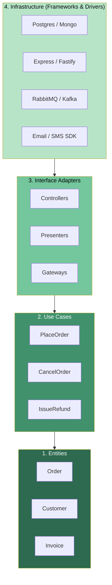
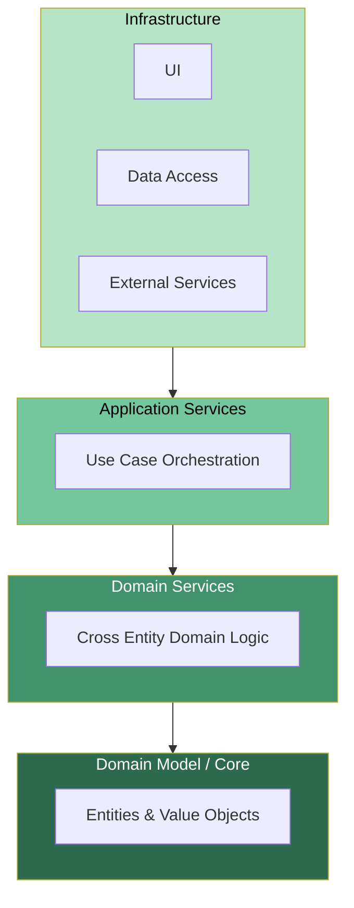
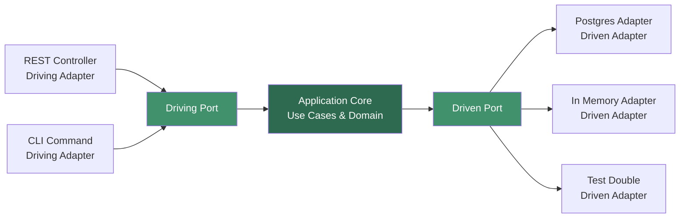

# 4.09 Clean and Onion Architecture

> The dependency rule: source code dependencies must point **inward** only. The domain is pure. The infrastructure is dirty. Dirt never flows inward.

---

## 1. Purpose

Clean Architecture was popularized by **Robert C. Martin** (Uncle Bob) in the 2012 blog post "The Clean Architecture" and the 2017 book of the same name. Its purpose is not academic ceremony. It is a survival strategy for codebases that must live longer than the frameworks they were built on, longer than the databases they were first wired to, and longer than the delivery teams that wrote the first line.

The core insight is brutally simple: **business rules are precious; infrastructure is replaceable**. Your domain knowledge about what an "order" is, what a "valid payment" means, what an "approved loan" requires, that knowledge changes slowly and is the actual product. The Postgres driver, the Express middleware, the Redis client, the Next.js request handler those are commodities. They change every year. They go end of life. They get acquired and ruined. If your business rules are entangled with them, you cannot escape.

Clean Architecture exists to make the entanglement impossible by construction. It does this through three concrete mechanisms:

1. **Layering** — Code is organized into concentric layers, each with a single responsibility band.
2. **The Dependency Rule** — Source code dependencies may only point inward toward the domain. The outermost layer (frameworks, drivers, UI, DB) may know about the inner layers, but the inner layers know nothing about the outer ones.
3. **Inversion via Interfaces** — The inner layers define the interfaces (ports) they need; the outer layers implement them (adapters). This is the [[4.05 SOLID Dependency Inversion]] principle applied at the architectural scale.

Onion Architecture, proposed by **Jeffrey Palermo** in 2008, arrives at the same destination from a different angle. It emphasizes that the **domain model sits at the center**, surrounded by domain services, then application services, then infrastructure, with dependencies always pointing inward. Hexagonal Architecture (Ports and Adapters), proposed by **Alistair Cockburn** in 2005, frames the same idea as a hexagon: the application core exposes **ports** (interfaces) and **adapters** (implementations) plug into them from outside.

All three Clean, Onion, Hexagonal are the same pattern wearing different outfits. The unifying principle: **the domain is the heart, infrastructure is the periphery, and the direction of dependency is non negotiable**.

What does this achieve in practice?

- **Swappable infrastructure.** You can replace Postgres with MongoDB, Express with Fastify, REST with gRPC, without touching the domain. You change an adapter, not the law of the business.
- **Testable core.** Domain and use case tests run in milliseconds with no database, no HTTP server, no containers. They are pure functions over in memory data.
- **Framework agnostic domain.** Your `Order`, `Customer`, `Invoice` types know nothing about TypeORM, Prisma, Mongoose, or Sequelize. They survive a framework migration.
- **Late binding of decisions.** You can write the entire domain and use case layer before choosing a database. The architecture does not force premature commitment.
- **Parallelizable work.** Frontend, backend, infra, and domain teams can work concurrently against stable interface contracts.

The cost is real: more files, more interfaces, more indirection. Clean Architecture is a tax you pay gladly on long lived, business critical systems. It is a tax you should refuse on a throwaway script, a marketing landing page, or a prototype you intend to discard. Knowing when to pay the tax and when to refuse it is part of the craft.

---

## 2. Theory and Deep Dive

### 2.1 The Four Layers

Clean Architecture defines four concentric layers. Reading from the inside out:

1. **Entities** (Enterprise Business Rules) — The domain models. Pure data structures with behavior, or pure functions over them. An `Order` knows its own total, its own validity, its own state transitions. Entities change only when the business itself changes, not when the database changes.

2. **Use Cases** (Application Business Rules) — The orchestration layer. A use case represents a single intention of the application: `PlaceOrder`, `CancelSubscription`, `IssueRefund`. It loads entities from repositories, asks them to do domain work, persists the result. Use cases change when the application's behavior changes, not when the framework changes.

3. **Interface Adapters** — The translators. Controllers convert HTTP requests into use case inputs. Presenters convert use case outputs into HTTP responses. Gateways convert domain calls into repository calls. This layer absorbs the format mismatches between the world and the domain.

4. **Infrastructure / Frameworks & Drivers** — The actual machinery. The database client, the HTTP server, the message queue client, the email sender, the file system. This layer is the dirtiest: full of I/O, side effects, third party SDKs, and framework quirks.



### 2.2 The Dependency Rule

> If a circle A lies inside a circle B, then A may not know anything about B. Code in B may know about code in A.

This is the entire architecture, expressed in one sentence. Everything else is implementation.

Concretely:

- Entities import nothing outside their own layer. No `pg`, no `express`, no `dotenv`, no `axios`.
- Use cases import entities and their own abstractions (repository interfaces defined in the use case layer or the entity layer).
- Adapters import use cases and the abstractions they implement.
- Infrastructure imports adapters, frameworks, drivers, and the abstractions it implements.

The dependency direction is enforced by interfaces. When a use case needs a repository, it does not import a `PostgresUserRepository`. It declares an interface, `UserRepository`, and accepts any object that satisfies it. The Postgres implementation lives in infrastructure, implements the interface, and is injected at runtime. The use case never knows Postgres exists.

This is [[4.05 SOLID Dependency Inversion]] scaled to the whole system:

> High level modules should not depend on low level modules. Both should depend on abstractions.

### 2.3 Onion Architecture

Jeffrey Palermo's Onion Architecture (2008) presents the same idea with a slightly different layering:



The Onion's emphasis:

- **Object oriented domain model at the center.** Not just data, but behavior.
- **Domain Services** for logic that crosses multiple entities (e.g., `TransferService` moving money between two `Account` entities).
- **Application Services** as the use case layer.
- **Infrastructure on the outside**, including UI and data access, depending inward.

The differences from Clean Architecture are mostly vocabulary. Where Clean says "Use Cases," Onion says "Application Services." Where Clean says "Interface Adapters," Onion folds them into Infrastructure. Practitioners freely mix the vocabularies; you should treat them as the same pattern.

### 2.4 Hexagonal Architecture (Ports and Adapters)

Alistair Cockburn's Hexagonal Architecture (2005) predates both. It frames the system as a hexagon: the **application core** at the center, with **ports** on its surfaces, and **adapters** plugged into the ports from outside.

- A **port** is an interface the application defines. Driving ports are how the outside world invokes the application (e.g., `OrderService.place`). Driven ports are how the application invokes the outside world (e.g., `OrderRepository.save`).
- An **adapter** is an implementation of a port. A REST controller is a driving adapter for the `OrderService` port. A Postgres repository is a driven adapter for the `OrderRepository` port.



The hexagon is symmetric: any number of driving adapters (REST, GraphQL, CLI, gRPC, jobs) can invoke the same core, and any number of driven adapters (Postgres, Mongo, in memory, fakes) can satisfy the same port. This symmetry is the architecture's killer feature. It makes the application **equally invocable from a test, a CLI, and an HTTP server**, with no special cases.

### 2.5 Comparing the Three

| Aspect | Clean | Onion | Hexagonal |
|---|---|---|---|
| Origin | Robert C. Martin (2012) | Jeffrey Palermo (2008) | Alistair Cockburn (2005) |
| Center | Entities | Domain Model | Application Core |
| Key concept | Dependency Rule | Concentric layers | Ports & Adapters |
| Layer count | 4 | 4 | 2 (core + adapters) |
| Interface location | Inner layers declare | Inner layers declare | Core declares ports |
| Emphasis | Separation of concerns | Domain centrality | Symmetry of adapters |

In practice, modern teams describe their system as "Clean Architecture" and implement it with ports and adapters. The labels are not worth fighting over.

### 2.6 Where Do Interfaces Live?

A common source of confusion: where in the layering do the repository interfaces live?

The rule: **interfaces live with their consumer, not their implementer.**

- A use case needs a `UserRepository`. The interface lives in the use case layer (or a shared domain layer).
- The Postgres implementation lives in infrastructure.
- Infrastructure imports the interface and implements it.
- The use case never imports infrastructure.

In TypeScript:

```typescript
// usecases/types.ts (use case layer)
export interface UserRepository {
  findById(id: string): Promise<User | null>;
  save(user: User): Promise<void>;
}

// infrastructure/pg/UserRepository.ts (infrastructure layer)
import type { UserRepository } from "../../usecases/types";
export class PgUserRepository implements UserRepository { /* ... */ }
```

This is the inversion. The use case owns the contract. Infrastructure conforms.

### 2.7 The Dependency Rule in TypeScript

TypeScript gives us cheap enforcement. With path aliases and import boundaries (via tools like `eslint-plugin-import` or `dependency-cruiser`), we can forbid:

- Files in `domain/` from importing anything outside `domain/`.
- Files in `usecases/` from importing anything outside `domain/` and `usecases/`.
- Files in `adapters/` from importing infrastructure they do not implement.
- Files in `infrastructure/` from importing use cases they do not drive.

Without enforcement, the dependency rule is a gentleman's agreement. With enforcement, it is a build failure. Always enforce.

### 2.8 The Cost

Clean Architecture is not free. The costs:

- **More files.** A single use case becomes: entity, use case, input DTO, output DTO, controller, presenter, repository interface, repository implementation, DI wiring. Eight files where one would do.
- **More indirection.** Tracing a request means jumping through layers.
- **More boilerplate.** Mapping between ORM entities, domain entities, and DTOs is repetitive.
- **Steeper onboarding.** New developers must understand the layering before being productive.

These costs are justified when the system is long lived, business critical, and likely to outlive its current infrastructure. They are unjustified when the system is a prototype, a script, or a service whose entire job is "read row, return JSON."

---

## 3. Mental Models

### 3.1 The Onion

Picture an onion. The center is the domain. Each ring is a layer. Knives (dependencies) only ever cut inward, never outward. You can peel a ring off (replace Express with Fastify, replace Postgres with Mongo) without touching the inner rings. You cannot peel a ring off if the inner rings grew roots into it.

### 3.2 The Heart, the Brain, the Translators, the Hands and Feet

- **Domain = the heart.** It beats on its own. It does not need the rest of the body to know it is a heart. Pull it out and it still knows what an `Order` is.
- **Use cases = the brain.** It reads the situation, decides what the heart should do, tells the hands to act. The brain coordinates; it does not pump blood itself.
- **Adapters = the translators.** They speak HTTP to the outside and method calls to the inside. They speak SQL to the database and method calls to the domain. They never have opinions about what should happen; they only translate.
- **Infrastructure = the hands and feet.** They do the actual work: open the database connection, send the HTTP response, push the message onto the queue. They are strong but dumb.

### 3.3 The Dirt Rule

Picture the domain as a clean white room. Infrastructure is mud. The dependency rule says: mud may flow toward the room, but it must stop at the door. The room stays clean. If you find mud inside the room, you have a leak. Common leaks: an `@Entity()` decorator on a domain class, an `import express from "express"` in a use case, a `req.body` reference in an entity method.

### 3.4 The Plug and Socket

The domain has sockets (interfaces). Infrastructure has plugs (implementations). You can swap a European plug for a US plug; the socket does not care, as long as the plug's pins match. The socket (interface) is defined by the device that needs power (the use case), not by the power company (the infrastructure).

### 3.5 The Library Author

Write your domain as if you were publishing it as an npm package with zero dependencies. If your `Order` class would be embarrassed to appear in a public package because it imports `pg`, you have a violation. The domain should be publishable as `@yourorg/domain` with `dependencies: {}`.

---

## 4. Real-World Use Cases

### 4.1 Domain Driven Design Projects

Clean Architecture is the structural half of DDD. Where DDD gives you strategic patterns (Bounded Contexts, Ubiquitous Language, Aggregates) and tactical patterns (Entities, Value Objects, Repositories, Domain Events), Clean Architecture gives you the layering that protects them. A DDD aggregate is the innermost ring of Clean Architecture. A DDD repository is the port; the ORM implementation is the adapter.

### 4.2 Enterprise Applications

Insurance claims, banking ledgers, tax engines, healthcare records. These systems live for decades. The original database is gone. The original framework is gone. The original team is gone. The business rules survive because they were kept pure. Clean Architecture is the standard pattern for these systems because the cost of the architecture is dwarfed by the cost of a ten year migration when the framework dies.

### 4.3 Microservices

Each microservice has its own bounded context and its own clean architecture. The service exposes driving adapters (REST, gRPC, events) and driven adapters (its own database, downstream services). The domain of each service is small, focused, and pure. See [[4.11 Modular Monolith vs Microservices]] for how this scales.

### 4.4 Libraries and SDKs

A library like `date-fns` or `zod` is, in effect, a pure domain with no infrastructure. Clean Architecture makes this natural: the domain is the library; the consumer provides the adapters. A payment SDK exposes a `PaymentGateway` port; the merchant wires it to Stripe, PayPal, or a test double.

### 4.5 Testable Systems

The killer feature for fast moving teams: domain tests run without a database. A `PlaceOrder` use case test creates an in memory repository, invokes the use case, asserts on the result. No Docker, no testcontainers, no fixtures, no migrations. Five hundred domain tests run in two seconds. The test suite for the infrastructure (does Postgres actually persist?) is small and slow, but it is a separate suite, run less often.

### 4.6 Multi Frontend Applications

A single domain can be driven by REST, GraphQL, gRPC, a CLI, a job runner, and a test harness, all against the same use cases. Each frontend is a different driving adapter. The use case does not know which one called it. This eliminates the "we have to rewrite the use cases for GraphQL" problem; you write a GraphQL adapter, not a new use case.

### 4.7 Compliance Heavy Domains

Healthcare (HIPAA), finance (SOX, PCI), aerospace (DO 178C). These domains require auditability of business rules. Clean Architecture makes the business rules inspectable as a single, pure layer. Auditors can read the use cases without navigating framework plumbing.

---

## 5. Code Examples

### 5.1 Example A — Minimal and Conceptual

A `User` entity, a `RegisterUser` use case, a `UserRepository` interface, and a Postgres adapter implementing it.

#### JavaScript

```javascript
// domain/User.js
class User {
  constructor({ id, email, createdAt }) {
    if (!email || !email.includes("@")) {
      throw new Error("Invalid email");
    }
    this.id = id;
    this.email = email;
    this.createdAt = createdAt;
  }

  rename(newEmail) {
    if (!newEmail || !newEmail.includes("@")) {
      throw new Error("Invalid email");
    }
    this.email = newEmail;
  }
}

module.exports = { User };
```

```javascript
// usecases/RegisterUser.js
class RegisterUser {
  constructor({ userRepository, idGenerator, clock }) {
    this.userRepository = userRepository;
    this.idGenerator = idGenerator;
    this.clock = clock;
  }

  async execute({ email }) {
    const existing = await this.userRepository.findByEmail(email);
    if (existing) {
      throw new Error("User already exists");
    }

    const { User } = require("../domain/User");
    const user = new User({
      id: this.idGenerator(),
      email,
      createdAt: this.clock.now(),
    });

    await this.userRepository.save(user);
    return { id: user.id, email: user.email };
  }
}

module.exports = { RegisterUser };
```

```javascript
// usecases/types.js (the port, as a JSDoc typedef)
/**
 * @typedef {Object} UserRepository
 * @property {(email: string) => Promise<Object|null>} findByEmail
 * @property {(user: Object) => Promise<void>} save
 */

module.exports = {};
```

```javascript
// infrastructure/pg/PgUserRepository.js
const { Pool } = require("pg");

class PgUserRepository {
  constructor({ connectionString }) {
    this.pool = new Pool({ connectionString });
  }

  async findByEmail(email) {
    const res = await this.pool.query(
      "SELECT id, email, createdAt FROM users WHERE email = $1",
      [email]
    );
    if (res.rowCount === 0) return null;
    const row = res.rows[0];
    const { User } = require("../../domain/User");
    return new User({
      id: row.id,
      email: row.email,
      createdAt: row.createdAt,
    });
  }

  async save(user) {
    await this.pool.query(
      "INSERT INTO users (id, email, createdAt) VALUES ($1, $2, $3)",
      [user.id, user.email, user.createdAt]
    );
  }
}

module.exports = { PgUserRepository };
```

```javascript
// infrastructure/memory/InMemoryUserRepository.js
class InMemoryUserRepository {
  constructor() {
    this.users = new Map();
  }

  async findByEmail(email) {
    for (const u of this.users.values()) {
      if (u.email === email) return u;
    }
    return null;
  }

  async save(user) {
    this.users.set(user.id, user);
  }
}

module.exports = { InMemoryUserRepository };
```

```javascript
// composition/wireUser.js
const { RegisterUser } = require("../usecases/RegisterUser");
const { InMemoryUserRepository } = require("../infrastructure/memory/InMemoryUserRepository");

function wireUser() {
  const userRepository = new InMemoryUserRepository();
  const registerUser = new RegisterUser({
    userRepository,
    idGenerator: () => Math.random().toString(36).slice(2),
    clock: { now: () => new Date() },
  });
  return { registerUser };
}

module.exports = { wireUser };
```

#### TypeScript

```typescript
// domain/User.ts
export interface UserProps {
  id: string;
  email: string;
  createdAt: Date;
}

export class User {
  private readonly id: string;
  private email: string;
  private readonly createdAt: Date;

  constructor(props: UserProps) {
    if (!props.email || !props.email.includes("@")) {
      throw new Error("Invalid email");
    }
    this.id = props.id;
    this.email = props.email;
    this.createdAt = props.createdAt;
  }

  rename(newEmail: string): void {
    if (!newEmail || !newEmail.includes("@")) {
      throw new Error("Invalid email");
    }
    this.email = newEmail;
  }

  snapshot(): UserProps {
    return { id: this.id, email: this.email, createdAt: this.createdAt };
  }
}
```

```typescript
// usecases/types.ts
import type { User } from "../domain/User";

export interface UserRepository {
  findByEmail(email: string): Promise<User | null>;
  save(user: User): Promise<void>;
}

export interface IdGenerator {
  generate(): string;
}

export interface Clock {
  now(): Date;
}
```

```typescript
// usecases/RegisterUser.ts
import type { UserRepository, IdGenerator, Clock } from "./types";

export interface RegisterUserInput {
  email: string;
}

export interface RegisterUserOutput {
  id: string;
  email: string;
}

export class RegisterUser {
  constructor(
    private readonly deps: {
      userRepository: UserRepository;
      idGenerator: IdGenerator;
      clock: Clock;
    }
  ) {}

  async execute(input: RegisterUserInput): Promise<RegisterUserOutput> {
    const existing = await this.deps.userRepository.findByEmail(input.email);
    if (existing) {
      throw new Error("User already exists");
    }

    const { User } = await import("../domain/User");
    const user = new User({
      id: this.deps.idGenerator.generate(),
      email: input.email,
      createdAt: this.deps.clock.now(),
    });

    await this.deps.userRepository.save(user);
    return { id: user.snapshot().id, email: user.snapshot().email };
  }
}
```

```typescript
// infrastructure/pg/PgUserRepository.ts
import { Pool } from "pg";
import type { UserRepository } from "../../usecases/types";
import { User } from "../../domain/User";

export class PgUserRepository implements UserRepository {
  private readonly pool: Pool;

  constructor(connectionString: string) {
    this.pool = new Pool({ connectionString });
  }

  async findByEmail(email: string): Promise<User | null> {
    const res = await this.pool.query(
      "SELECT id, email, createdAt FROM users WHERE email = $1",
      [email]
    );
    if (res.rowCount === 0) return null;
    const row = res.rows[0];
    return new User({
      id: row.id,
      email: row.email,
      createdAt: row.createdAt,
    });
  }

  async save(user: User): Promise<void> {
    const snap = user.snapshot();
    await this.pool.query(
      "INSERT INTO users (id, email, createdAt) VALUES ($1, $2, $3)",
      [snap.id, snap.email, snap.createdAt]
    );
  }
}
```

```typescript
// infrastructure/memory/InMemoryUserRepository.ts
import type { UserRepository } from "../../usecases/types";
import type { User } from "../../domain/User";

export class InMemoryUserRepository implements UserRepository {
  private readonly users = new Map<string, User>();

  async findByEmail(email: string): Promise<User | null> {
    for (const u of this.users.values()) {
      if (u.snapshot().email === email) return u;
    }
    return null;
  }

  async save(user: User): Promise<void> {
    this.users.set(user.snapshot().id, user);
  }
}
```

```typescript
// composition/wireUser.ts
import { RegisterUser } from "../usecases/RegisterUser";
import { InMemoryUserRepository } from "../infrastructure/memory/InMemoryUserRepository";

export function wireUser() {
  const userRepository = new InMemoryUserRepository();
  const registerUser = new RegisterUser({
    userRepository,
    idGenerator: { generate: () => crypto.randomUUID() },
    clock: { now: () => new Date() },
  });
  return { registerUser };
}
```

Notice the structure: the use case imports only the interface, the infrastructure implements it, the composition root wires them. The dependency direction is inward everywhere. Swap `InMemoryUserRepository` for `PgUserRepository` by changing one line in the composition root. The use case does not change.

### 5.2 Example B — Production Grade

A typed order processing system with all four layers: `Order` entity, `PlaceOrder` use case, repository interface, controller, presenter, and two adapters (in memory and Postgres).

#### JavaScript

```javascript
// domain/Order.js
class Order {
  constructor({ id, customerId, items, status, total, placedAt }) {
    if (!items || items.length === 0) {
      throw new Error("Order must have at least one item");
    }
    this.id = id;
    this.customerId = customerId;
    this.items = Object.freeze([...items]);
    this.status = status || "PENDING";
    this.total = total ?? this.computeTotal();
    this.placedAt = placedAt;
  }

  computeTotal() {
    return this.items.reduce((sum, i) => sum + i.price * i.quantity, 0);
  }

  markAsPaid() {
    if (this.status !== "PENDING") {
      throw new Error(`Cannot pay order in status ${this.status}`);
    }
    this.status = "PAID";
  }

  cancel() {
    if (this.status === "SHIPPED") {
      throw new Error("Cannot cancel shipped order");
    }
    this.status = "CANCELLED";
  }
}

module.exports = { Order };
```

```javascript
// usecases/types.js
/**
 * @typedef {Object} OrderItem
 * @property {string} sku
 * @property {number} price
 * @property {number} quantity
 *
 * @typedef {Object} OrderRepository
 * @property {(id: string) => Promise<Object|null>} findById
 * @property {(order: Object) => Promise<void>} save
 * @property {() => Promise<Object[]>} listByCustomer
 *
 * @typedef {Object} PaymentGateway
 * @property {(amount: number, ref: string) => Promise<{ ok: boolean, transactionId?: string, error?: string }>} charge
 *
 * @typedef {Object} IdGenerator
 * @property {() => string} generate
 *
 * @typedef {Object} Clock
 * @property {() => Date} now
 */

module.exports = {};
```

```javascript
// usecases/PlaceOrder.js
class PlaceOrder {
  constructor({ orderRepository, paymentGateway, idGenerator, clock }) {
    this.orderRepository = orderRepository;
    this.paymentGateway = paymentGateway;
    this.idGenerator = idGenerator;
    this.clock = clock;
  }

  async execute({ customerId, items }) {
    const { Order } = require("../domain/Order");
    const order = new Order({
      id: this.idGenerator.generate(),
      customerId,
      items,
      placedAt: this.clock.now(),
    });

    const result = await this.paymentGateway.charge(order.total, order.id);
    if (!result.ok) {
      return { ok: false, error: result.error };
    }

    order.markAsPaid();
    await this.orderRepository.save(order);

    return {
      ok: true,
      orderId: order.id,
      total: order.total,
      transactionId: result.transactionId,
    };
  }
}

module.exports = { PlaceOrder };
```

```javascript
// adapters/PlaceOrderController.js
class PlaceOrderController {
  constructor({ placeOrderUseCase }) {
    this.placeOrderUseCase = placeOrderUseCase;
  }

  async handle(req, res) {
    const { customerId, items } = req.body;
    if (!customerId || !Array.isArray(items) || items.length === 0) {
      return res.status(400).json({ error: "Invalid request body" });
    }
    try {
      const result = await this.placeOrderUseCase.execute({ customerId, items });
      if (!result.ok) {
        return res.status(402).json({ error: result.error });
      }
      return res.status(201).json(result);
    } catch (err) {
      return res.status(500).json({ error: err.message });
    }
  }
}

module.exports = { PlaceOrderController };
```

```javascript
// infrastructure/pg/PgOrderRepository.js
const { Pool } = require("pg");
const { Order } = require("../../domain/Order");

class PgOrderRepository {
  constructor({ pool }) {
    this.pool = pool;
  }

  async findById(id) {
    const res = await this.pool.query(
      "SELECT id, customerId, items, status, total, placedAt FROM orders WHERE id = $1",
      [id]
    );
    if (res.rowCount === 0) return null;
    const row = res.rows[0];
    return new Order({
      id: row.id,
      customerId: row.customerId,
      items: row.items,
      status: row.status,
      total: row.total,
      placedAt: row.placedAt,
    });
  }

  async save(order) {
    await this.pool.query(
      `INSERT INTO orders (id, customerId, items, status, total, placedAt)
       VALUES ($1, $2, $3, $4, $5, $6)
       ON CONFLICT (id) DO UPDATE SET status = $4, total = $5`,
      [order.id, order.customerId, JSON.stringify(order.items), order.status, order.total, order.placedAt]
    );
  }

  async listByCustomer() {
    const res = await this.pool.query("SELECT * FROM orders ORDER BY placedAt DESC LIMIT 100");
    return res.rows.map((row) => new Order({
      id: row.id,
      customerId: row.customerId,
      items: row.items,
      status: row.status,
      total: row.total,
      placedAt: row.placedAt,
    }));
  }
}

module.exports = { PgOrderRepository };
```

```javascript
// infrastructure/memory/InMemoryOrderRepository.js
class InMemoryOrderRepository {
  constructor() {
    this.orders = new Map();
  }

  async findById(id) {
    return this.orders.get(id) ?? null;
  }

  async save(order) {
    this.orders.set(order.id, order);
  }

  async listByCustomer() {
    return [...this.orders.values()];
  }
}

module.exports = { InMemoryOrderRepository };
```

```javascript
// infrastructure/stripe/StripePaymentGateway.js
class StripePaymentGateway {
  constructor({ stripe, apiKey }) {
    this.stripe = stripe(apiKey);
  }

  async charge(amount, ref) {
    try {
      const intent = await this.stripe.paymentIntents.create({
        amount: Math.round(amount * 100),
        currency: "usd",
        metadata: { orderId: ref },
      });
      return { ok: true, transactionId: intent.id };
    } catch (err) {
      return { ok: false, error: err.message };
    }
  }
}

module.exports = { StripePaymentGateway };
```

```javascript
// composition/wireOrder.js
const { PlaceOrder } = require("../usecases/PlaceOrder");
const { PlaceOrderController } = require("../adapters/PlaceOrderController");
const { InMemoryOrderRepository } = require("../infrastructure/memory/InMemoryOrderRepository");
const { StripePaymentGateway } = require("../infrastructure/stripe/StripePaymentGateway");
const stripe = require("stripe");

function wireOrder({ env }) {
  const orderRepository =
    env === "test"
      ? new InMemoryOrderRepository()
      : require("../infrastructure/pg/PgOrderRepository").PgOrderRepository;
  const paymentGateway = new StripePaymentGateway({
    stripe,
    apiKey: process.env.STRIPEAPIKEY,
  });

  const placeOrderUseCase = new PlaceOrder({
    orderRepository: typeof orderRepository === "function" ? new orderRepository({}) : orderRepository,
    paymentGateway,
    idGenerator: { generate: () => crypto.randomUUID() },
    clock: { now: () => new Date() },
  });

  const placeOrderController = new PlaceOrderController({ placeOrderUseCase });
  return { placeOrderController };
}

module.exports = { wireOrder };
```

#### TypeScript

```typescript
// domain/Order.ts
export type OrderStatus = "PENDING" | "PAID" | "SHIPPED" | "CANCELLED";

export interface OrderItem {
  sku: string;
  price: number;
  quantity: number;
}

export interface OrderProps {
  id: string;
  customerId: string;
  items: OrderItem[];
  status?: OrderStatus;
  total?: number;
  placedAt: Date;
}

export class Order {
  private readonly id: string;
  private readonly customerId: string;
  private readonly items: ReadonlyArray<OrderItem>;
  private status: OrderStatus;
  private readonly total: number;
  private readonly placedAt: Date;

  constructor(props: OrderProps) {
    if (!props.items || props.items.length === 0) {
      throw new Error("Order must have at least one item");
    }
    this.id = props.id;
    this.customerId = props.customerId;
    this.items = Object.freeze([...props.items]);
    this.status = props.status ?? "PENDING";
    this.total = props.total ?? this.computeTotal();
    this.placedAt = props.placedAt;
  }

  private computeTotal(): number {
    return this.items.reduce((sum, i) => sum + i.price * i.quantity, 0);
  }

  markAsPaid(): void {
    if (this.status !== "PENDING") {
      throw new Error(`Cannot pay order in status ${this.status}`);
    }
    this.status = "PAID";
  }

  cancel(): void {
    if (this.status === "SHIPPED") {
      throw new Error("Cannot cancel shipped order");
    }
    this.status = "CANCELLED";
  }

  snapshot(): OrderProps {
    return {
      id: this.id,
      customerId: this.customerId,
      items: [...this.items],
      status: this.status,
      total: this.total,
      placedAt: this.placedAt,
    };
  }
}
```

```typescript
// usecases/types.ts
import type { Order } from "../domain/Order";

export interface OrderRepository {
  findById(id: string): Promise<Order | null>;
  save(order: Order): Promise<void>;
  listByCustomer(customerId: string): Promise<Order[]>;
}

export interface PaymentResult {
  ok: boolean;
  transactionId?: string;
  error?: string;
}

export interface PaymentGateway {
  charge(amount: number, reference: string): Promise<PaymentResult>;
}

export interface IdGenerator {
  generate(): string;
}

export interface Clock {
  now(): Date;
}
```

```typescript
// usecases/PlaceOrder.ts
import type {
  OrderRepository,
  PaymentGateway,
  IdGenerator,
  Clock,
} from "./types";
import { Order } from "../domain/Order";

export interface PlaceOrderInput {
  customerId: string;
  items: { sku: string; price: number; quantity: number }[];
}

export interface PlaceOrderOutput {
  ok: boolean;
  orderId?: string;
  total?: number;
  transactionId?: string;
  error?: string;
}

export class PlaceOrder {
  constructor(
    private readonly deps: {
      orderRepository: OrderRepository;
      paymentGateway: PaymentGateway;
      idGenerator: IdGenerator;
      clock: Clock;
    }
  ) {}

  async execute(input: PlaceOrderInput): Promise<PlaceOrderOutput> {
    const order = new Order({
      id: this.deps.idGenerator.generate(),
      customerId: input.customerId,
      items: input.items,
      placedAt: this.deps.clock.now(),
    });

    const snap = order.snapshot();
    const result = await this.deps.paymentGateway.charge(snap.total, snap.id);
    if (!result.ok) {
      return { ok: false, error: result.error };
    }

    order.markAsPaid();
    await this.deps.orderRepository.save(order);

    return {
      ok: true,
      orderId: snap.id,
      total: snap.total,
      transactionId: result.transactionId,
    };
  }
}
```

```typescript
// adapters/PlaceOrderController.ts
import type { PlaceOrder, PlaceOrderOutput } from "../usecases/PlaceOrder";

export interface HttpRequest {
  body?: unknown;
  params?: Record<string, string>;
}

export interface HttpResponse {
  status: number;
  body: unknown;
}

export class PlaceOrderController {
  constructor(private readonly placeOrderUseCase: PlaceOrder) {}

  async handle(req: HttpRequest): Promise<HttpResponse> {
    const body = req.body as
      | { customerId?: string; items?: { sku: string; price: number; quantity: number }[] }
      | undefined;

    if (!body?.customerId || !Array.isArray(body.items) || body.items.length === 0) {
      return { status: 400, body: { error: "Invalid request body" } };
    }

    try {
      const result: PlaceOrderOutput = await this.placeOrderUseCase.execute({
        customerId: body.customerId,
        items: body.items,
      });
      if (!result.ok) {
        return { status: 402, body: { error: result.error } };
      }
      return { status: 201, body: result };
    } catch (err) {
      const message = err instanceof Error ? err.message : "Unknown error";
      return { status: 500, body: { error: message } };
    }
  }
}
```

```typescript
// adapters/PlaceOrderPresenter.ts
import type { PlaceOrderOutput } from "../usecases/PlaceOrder";

export interface PlaceOrderViewModel {
  id: string;
  total: string;
  transactionId: string;
}

export class PlaceOrderPresenter {
  present(output: PlaceOrderOutput): PlaceOrderViewModel {
    if (!output.ok) {
      throw new Error(output.error ?? "Unknown failure");
    }
    return {
      id: output.orderId!,
      total: output.total!.toFixed(2),
      transactionId: output.transactionId!,
    };
  }
}
```

```typescript
// infrastructure/pg/PgOrderRepository.ts
import { Pool } from "pg";
import type { OrderRepository } from "../../usecases/types";
import { Order, OrderProps } from "../../domain/Order";

interface OrderRow {
  id: string;
  customerId: string;
  items: OrderProps["items"];
  status: string;
  total: number;
  placedAt: Date;
}

export class PgOrderRepository implements OrderRepository {
  constructor(private readonly pool: Pool) {}

  async findById(id: string): Promise<Order | null> {
    const res = await this.pool.query<OrderRow>(
      "SELECT id, customerId, items, status, total, placedAt FROM orders WHERE id = $1",
      [id]
    );
    if (res.rowCount === 0) return null;
    const row = res.rows[0];
    return new Order({
      id: row.id,
      customerId: row.customerId,
      items: row.items,
      status: row.status as OrderProps["status"],
      total: Number(row.total),
      placedAt: row.placedAt,
    });
  }

  async save(order: Order): Promise<void> {
    const snap = order.snapshot();
    await this.pool.query(
      `INSERT INTO orders (id, customerId, items, status, total, placedAt)
       VALUES ($1, $2, $3, $4, $5, $6)
       ON CONFLICT (id) DO UPDATE SET status = $4, total = $5`,
      [snap.id, snap.customerId, JSON.stringify(snap.items), snap.status, snap.total, snap.placedAt]
    );
  }

  async listByCustomer(customerId: string): Promise<Order[]> {
    const res = await this.pool.query<OrderRow>(
      "SELECT * FROM orders WHERE customerId = $1 ORDER BY placedAt DESC",
      [customerId]
    );
    return res.rows.map((row) => new Order({
      id: row.id,
      customerId: row.customerId,
      items: row.items,
      status: row.status as OrderProps["status"],
      total: Number(row.total),
      placedAt: row.placedAt,
    }));
  }
}
```

```typescript
// infrastructure/memory/InMemoryOrderRepository.ts
import type { OrderRepository } from "../../usecases/types";
import type { Order } from "../../domain/Order";

export class InMemoryOrderRepository implements OrderRepository {
  private readonly orders = new Map<string, Order>();

  async findById(id: string): Promise<Order | null> {
    return this.orders.get(id) ?? null;
  }

  async save(order: Order): Promise<void> {
    this.orders.set(order.snapshot().id, order);
  }

  async listByCustomer(customerId: string): Promise<Order[]> {
    return [...this.orders.values()].filter(
      (o) => o.snapshot().customerId === customerId
    );
  }
}
```

```typescript
// infrastructure/stripe/StripePaymentGateway.ts
import Stripe from "stripe";
import type { PaymentGateway, PaymentResult } from "../../usecases/types";

export class StripePaymentGateway implements PaymentGateway {
  private readonly stripe: Stripe;

  constructor(apiKey: string) {
    this.stripe = new Stripe(apiKey, { apiVersion: "2024-06-20" as Stripe.LatestApiVersion });
  }

  async charge(amount: number, reference: string): Promise<PaymentResult> {
    try {
      const intent = await this.stripe.paymentIntents.create({
        amount: Math.round(amount * 100),
        currency: "usd",
        metadata: { orderId: reference },
      });
      return { ok: true, transactionId: intent.id };
    } catch (err) {
      const message = err instanceof Error ? err.message : "Charge failed";
      return { ok: false, error: message };
    }
  }
}
```

```typescript
// composition/wireOrder.ts
import { PlaceOrder } from "../usecases/PlaceOrder";
import { PlaceOrderController } from "../adapters/PlaceOrderController";
import { PlaceOrderPresenter } from "../adapters/PlaceOrderPresenter";
import { InMemoryOrderRepository } from "../infrastructure/memory/InMemoryOrderRepository";
import { PgOrderRepository } from "../infrastructure/pg/PgOrderRepository";
import { StripePaymentGateway } from "../infrastructure/stripe/StripePaymentGateway";
import { Pool } from "pg";
import { randomUUID } from "node:crypto";

export interface OrderWiring {
  placeOrderController: PlaceOrderController;
  placeOrderPresenter: PlaceOrderPresenter;
}

export function wireOrder(env: "test" | "prod"): OrderWiring {
  const orderRepository =
    env === "test"
      ? new InMemoryOrderRepository()
      : new PgOrderRepository(new Pool({ connectionString: process.env.DATABASEURL }));

  const paymentGateway = new StripePaymentGateway(process.env.STRIPEAPIKEY ?? "");

  const placeOrderUseCase = new PlaceOrder({
    orderRepository,
    paymentGateway,
    idGenerator: { generate: randomUUID },
    clock: { now: () => new Date() },
  });

  const placeOrderController = new PlaceOrderController(placeOrderUseCase);
  const placeOrderPresenter = new PlaceOrderPresenter();

  return { placeOrderController, placeOrderPresenter };
}
```

Notice what happens when you want to change the database from Postgres to MongoDB: you write a `MongoOrderRepository` class implementing `OrderRepository`, change one line in `wireOrder`, and you are done. The `Order` entity, the `PlaceOrder` use case, the controller, and the presenter are untouched. That is the dependency rule paying off.

---

## 6. Common Mistakes and Anti Patterns

### 6.1 Domain Entities Decorated with ORM Annotations

**Anti pattern:** Slapping `@Entity()` and `@Column()` from TypeORM or Prisma on a domain class.

```typescript
// WRONG
import { Entity, PrimaryGeneratedColumn, Column } from "typeorm";

@Entity()
export class User {
  @PrimaryGeneratedColumn()
  id: string;

  @Column()
  email: string;
}
```

This couples the domain to TypeORM forever. The domain is no longer pure. The dependency direction is reversed: the domain now depends on infrastructure.

**Fix:** Keep domain entities plain. Define a separate ORM entity in the infrastructure layer. Map between them in the repository.

### 6.2 Use Cases Importing the HTTP Framework

**Anti pattern:** A use case that imports `express` to read `req.body` or call `res.json()`.

```typescript
// WRONG
import { Request, Response } from "express";

export class PlaceOrder {
  async execute(req: Request, res: Response): Promise<void> {
    const body = req.body;
    res.json({ ok: true });
  }
}
```

The use case now knows about Express. Replacing Express with Fastify means rewriting every use case.

**Fix:** Use cases take plain input objects and return plain output objects. Controllers do the HTTP work.

### 6.3 Leaking ORM Entities to Controllers

**Anti pattern:** A controller that receives a TypeORM `User` entity and serializes it directly.

```typescript
// WRONG
app.get("/users/:id", async (req, res) => {
  const user = await userRepo.findOne(req.params.id); // TypeORM entity
  res.json(user); // leaks ORM internals, including lazy relations
});
```

The controller now depends on TypeORM's serialization behavior, lazy loading semantics, and column naming. Changing the ORM breaks the API contract.

**Fix:** Map to a DTO in the repository or presenter. Controllers return DTOs, never ORM entities.

### 6.4 Infrastructure Defining Domain Interfaces

**Anti pattern:** The `UserRepository` interface is declared in `infrastructure/repositories/UserRepository.ts`, and the use case imports it from there.

The use case now depends on infrastructure. The dependency direction is outward. The whole architecture is undone.

**Fix:** Interfaces live with their consumer. Declare `UserRepository` in `usecases/types.ts` or `domain/repositories.ts`. Infrastructure imports and implements it.

### 6.5 Too Many Layers for a Small App

**Anti pattern:** A three endpoint CRUD service with entities, use cases, controllers, presenters, repositories, interfaces, and adapters. Eight files per endpoint. The team spends more time navigating layers than writing features.

**Fix:** Architecture is a function of expected lifespan and complexity. For a small CRUD service, a single `routes.ts` that calls the database directly is fine. Promote to Clean Architecture when (a) the domain grows nontrivial business rules, (b) the system must outlive its current framework, or (c) you need fast unit tests without a database. See [[4.11 Modular Monolith vs Microservices]] for sizing guidance.

### 6.6 Anemic Domain Model

**Anti pattern:** The `Order` class is just a bag of getters and setters. All logic lives in use cases or services.

```typescript
// WRONG
export class Order {
  constructor(
    public id: string,
    public customerId: string,
    public items: OrderItem[],
    public status: OrderStatus,
    public total: number,
  ) {}
}

// use case
order.status = "PAID";
order.total = order.items.reduce((s, i) => s + i.price * i.quantity, 0);
```

The use case knows that paying means setting status to PAID. Another use case might forget. The invariant is not protected. This is the "anemic domain model" anti pattern Fowler named decades ago. The domain is just a struct.

**Fix:** Push behavior into the entity. `order.markAsPaid()` enforces the state machine. `order.total` is computed by the entity. Use cases orchestrate; entities enforce.

### 6.7 Using the ORM's `save` Directly from Use Cases

**Anti pattern:** The use case imports the ORM's repository and calls `repo.save(user)`.

```typescript
// WRONG
import { getRepository } from "typeorm";

export class RegisterUser {
  async execute(input) {
    const repo = getRepository(UserEntity);
    await repo.save(input);
  }
}
```

The use case is now welded to TypeORM. You cannot test it without a database. You cannot swap to Prisma.

**Fix:** Define a `UserRepository` port. Inject it. The use case calls `this.userRepository.save(user)`. The TypeORM implementation lives in infrastructure.

### 6.8 Single God Repository

**Anti pattern:** One `Repository` class with `findUsers`, `findOrders`, `saveInvoice`, `deleteCustomer`. It implements a dozen interfaces. It changes every sprint. Every conflict touches it.

**Fix:** One repository per aggregate root. `UserRepository`, `OrderRepository`, `InvoiceRepository`. Each is small, focused, and independently swappable.

### 6.9 Cross Aggregate Foreign Keys in Domain

**Anti pattern:** `Order` holds a `customerId: string`. The use case then queries the customer repository to validate it. The use case is now orchestrating aggregate to aggregate invariants.

**Fix:** Cross aggregate references use IDs (this is fine). Cross aggregate invariant enforcement goes in a domain service, not in an entity or a use case. The use case calls the domain service.

### 6.10 Returning Promises of ORM Entities from the Repository

**Anti pattern:** `findById` returns a Promise of the ORM entity. Callers can call lazy loaded relations that hit the database, breaking the purity of the use case layer.

**Fix:** Repositories return domain entities. Mapping happens inside the repository. Lazy loading is impossible because the domain entity has no ORM hooks.

---

## 7. Best Practices and Design Patterns

### 7.1 Keep the Domain Pure

The domain folder imports nothing. No `pg`, no `express`, no `dotenv`, no `axios`, no `redis`. Use `eslint` rules or `dependency-cruiser` to enforce this. A domain file that imports infrastructure should fail CI.

### 7.2 Define Repository Interfaces in the Domain or Use Case Layer

The interface lives where it is consumed. If only one use case uses it, put it next to that use case. If many use cases use it, put it in `usecases/types.ts` or `domain/repositories.ts`. Never in `infrastructure/`.

### 7.3 Implement Interfaces in Infrastructure

The Postgres implementation of `UserRepository` lives at `infrastructure/pg/PgUserRepository.ts`. The Mongo implementation lives at `infrastructure/mongo/MongoUserRepository.ts`. The in memory implementation lives at `infrastructure/memory/InMemoryUserRepository.ts`. All implement the same interface. All are swappable.

### 7.4 Use Dependency Injection to Wire

The composition root is the only place that knows about concrete implementations. It instantiates the database, the repositories, the use cases, the controllers, and wires them together. The rest of the system depends on interfaces. See [[4.08 Dependency Injection DI]].

### 7.5 Test the Domain Without Infrastructure

Domain and use case tests use the in memory repository. They run in milliseconds. They do not start a database. They do not hit the network. They are the fast feedback loop.

### 7.6 Test the Infrastructure Separately

A small, slower suite tests that `PgUserRepository` actually persists to Postgres, that `StripePaymentGateway` actually charges (against Stripe's test API). These tests run on CI, not on every save.

### 7.7 Use TypeScript to Enforce Boundaries

Use `eslint-plugin-boundaries` or `dependency-cruier` with rules:

- `domain/**` may only import from `domain/**`.
- `usecases/**` may import from `domain/**` and `usecases/**`.
- `adapters/**` may import from `domain/**`, `usecases/**`, and `adapters/**`.
- `infrastructure/**` may import from anywhere.

A violation fails the build. Without enforcement, the architecture decays in weeks.

### 7.8 Use Value Objects for Primitive Obsession

`email: string` is primitive obsession. `Email` is a value object with validation in its constructor. The domain refuses to construct an invalid `Email`. Use cases never revalidate. See [[1.13 Functional Programming Concepts]] for how value objects compose.

### 7.9 One Use Case per File, per Class

A use case is a single intention. `PlaceOrder`, `CancelOrder`, `IssueRefund`. Not `OrderService` with thirty methods. The single responsibility makes them easy to test, easy to reason about, and easy to wire.

### 7.10 Inputs and Outputs Are Plain Objects

Use case inputs and outputs are plain interfaces, not class instances. They serialize cleanly to JSON. They are easy to construct in tests. They carry no behavior.

### 7.11 Map at the Boundary

Mapping between ORM entities and domain entities happens in the repository. Mapping between domain entities and DTOs happens in the presenter. Mapping between HTTP requests and use case inputs happens in the controller. Each layer speaks its own language; the translators are at the seams.

### 7.12 Do Not Over Architect Small Apps

A to do list app does not need Clean Architecture. A webhook forwarder does not need it. A script does not need it. The cost is real and the benefit is small. Use Clean Architecture when the system has long lived, complex business rules, or when the infrastructure choices are unstable. Otherwise, prefer simplicity.

### 7.13 Use Domain Events for Cross Aggregate Communication

When placing an order should trigger an email, do not put the email call in the use case. Emit an `OrderPlaced` event. A separate handler picks it up and sends the email. This keeps the use case focused and the email concern in infrastructure. See [[4.10 CQRS and Event Sourcing]].

### 7.14 Treat External APIs as Driven Adapters

Any third party API (Stripe, SendGrid, Twilio) is a driven adapter. Define a port (`PaymentGateway`, `EmailSender`, `SmsSender`), implement it in infrastructure. The use case depends on the port. You can swap Stripe for Braintree by changing one line in the composition root.

---

## 8. Technical Interview Knowledge

### Q1: What is Clean Architecture?

**A:** Clean Architecture is a layered architecture proposed by Robert C. Martin in which the system is organized into concentric layers (Entities, Use Cases, Interface Adapters, Infrastructure), with the strict rule that source code dependencies point inward only. The innermost layer (the domain) depends on nothing. The outermost layer (infrastructure) depends on the inner layers. This keeps the business rules pure, framework agnostic, and independently testable, while infrastructure (databases, HTTP frameworks, third party SDKs) can be swapped without touching the domain.

### Q2: What is the dependency rule?

**A:** The dependency rule states that source code dependencies must point inward only. If layer A is inside layer B, then code in A may not reference anything in B. Concretely: entities import nothing; use cases import entities and their own port interfaces; adapters import use cases and implement ports; infrastructure imports adapters, frameworks, and drivers. The rule is enforced by defining interfaces in inner layers and implementing them in outer layers, combined with [[4.05 SOLID Dependency Inversion]]. Without enforcement (lint rules, dependency cruiser), the rule decays.

### Q3: What are the layers of Clean Architecture?

**A:** Four layers, from the inside out. **Entities** hold enterprise business rules: domain models with behavior, changing only when the business changes. **Use Cases** hold application business rules: orchestration of entities for a single intention (e.g., PlaceOrder), changing when application behavior changes. **Interface Adapters** translate between layers: controllers convert HTTP into use case inputs, presenters convert use case outputs into HTTP responses, gateways convert domain calls into repository calls. **Infrastructure** holds the actual machinery: databases, HTTP servers, message queues, third party SDKs, the file system.

### Q4: What is the difference between Clean, Onion, and Hexagonal Architecture?

**A:** They are the same pattern with different vocabulary. **Clean Architecture** (Uncle Bob, 2012) emphasizes four layers and the dependency rule. **Onion Architecture** (Jeffrey Palermo, 2008) emphasizes a domain model at the center with concentric layers and the same inward dependency rule; its vocabulary is Domain Model, Domain Services, Application Services, Infrastructure. **Hexagonal Architecture** (Alistair Cockburn, 2005) emphasizes ports (interfaces the application defines) and adapters (implementations that plug in), with the symmetry that any number of driving and driven adapters can attach. In practice, teams use the labels interchangeably and implement the same structure: a pure domain at the center, ports defined by the core, adapters implemented in infrastructure.

### Q5: How do you keep the domain pure?

**A:** Four practices. First, no infrastructure imports in domain files: no `pg`, no `express`, no `axios`, no ORM decorators. Second, define repository and gateway interfaces in the domain or use case layer, never in infrastructure; the domain owns the contract. Third, map between ORM entities and domain entities inside the repository, so domain entities never leak ORM types. Fourth, enforce these rules with tooling: `eslint-plugin-boundaries`, `dependency-cruiser`, or path alias constraints that fail the build on a violation. The test: the domain folder should be publishable as an npm package with zero dependencies.

### Q6: What is an anemic domain model?

**A:** A domain model that contains only data (fields, getters, setters) and no behavior. All business logic lives in services or use cases. This is an anti pattern because invariants are no longer protected by the entity that owns the data: any code can set any field, so the rules get duplicated, drift, and break. The fix is to push behavior into the entity: `order.markAsPaid()` enforces the state machine, `order.total` is computed by the entity, `user.rename(email)` validates. The entity becomes the single source of truth for its own invariants.

### Q7: When is Clean Architecture over engineering?

**A:** When the system is short lived, the business rules are trivial, the infrastructure is stable, and the team is small. A CRUD service with five endpoints and no business logic does not need four layers per endpoint. A prototype that will be thrown away does not need the indirection. A script does not need a repository interface. The cost of Clean Architecture (more files, more mapping, more indirection, steeper onboarding) is justified when the system has long lived, complex, business critical rules; when the infrastructure choices are unstable; when fast unit tests without a database are required; or when multiple frontends must drive the same domain. Otherwise, prefer the simplest architecture that works.

### Q8: How does Clean Architecture relate to Domain Driven Design?

**A:** Clean Architecture is the structural half; DDD is the modeling half. DDD's tactical patterns (Entities, Value Objects, Aggregates, Repositories, Domain Events) fit naturally into the Clean Architecture's inner layers: DDD Entities and Value Objects are Clean Architecture Entities; DDD Repositories are the ports Clean Architecture use cases depend on; DDD Domain Services are the cross aggregate logic in the use case or domain service layer. DDD's strategic patterns (Bounded Contexts, Ubiquitous Language) define the boundaries of a Clean Architecture system: each Bounded Context is one Clean Architecture core. Together they answer: what is the domain (DDD) and how do we protect it (Clean Architecture).

---

## 9. Practical Exercises

### Exercise 1: Identify Layer Violations

**Prompt:** The following TypeScript code is in a file at `src/usecases/PlaceOrder.ts`. Identify every Clean Architecture violation.

```typescript
import { Request, Response } from "express";
import { getRepository } from "typeorm";
import { OrderEntity } from "../infrastructure/typeorm/OrderEntity";
import { sendEmail } from "../infrastructure/email/sendgrid";

export class PlaceOrder {
  async execute(req: Request, res: Response): Promise<void> {
    const body = req.body;
    const repo = getRepository(OrderEntity);
    const order = new OrderEntity();
    order.id = Math.random().toString();
    order.customerId = body.customerId;
    order.items = body.items;
    order.total = body.items.reduce((s, i) => s + i.price * i.quantity, 0);
    order.status = "PAID";
    await repo.save(order);
    await sendEmail(order.customerId, "Order confirmed");
    res.json({ ok: true, orderId: order.id });
  }
}
```

**Worked Solution:**

Six violations:

1. **Use case imports the HTTP framework.** `import { Request, Response } from "express"` couples the use case to Express. The use case must take plain input objects and return plain output objects. The HTTP work belongs in a controller.

2. **Use case imports the ORM.** `import { getRepository } from "typeorm"` and `getRepository(OrderEntity)` couple the use case to TypeORM. The use case should depend on an `OrderRepository` interface, injected at construction.

3. **Use case imports infrastructure directly.** `import { sendEmail } from "../infrastructure/email/sendgrid"` couples the use case to SendGrid. The use case should depend on an `EmailSender` port, or better, emit an `OrderPlaced` domain event that a separate handler picks up.

4. **Use case imports the ORM entity.** `import { OrderEntity } from "../infrastructure/typeorm/OrderEntity"` means the use case is constructing an ORM entity, not a domain entity. There is no domain entity at all. The order has no behavior: `markAsPaid` is replaced by directly setting `status = "PAID"`. This is an anemic domain model.

5. **Domain invariants are not protected.** `order.total` is computed in the use case. If another use case computes it differently, the invariant drifts. The `Order` entity should compute its own total.

6. **The use case does presentation.** `res.json(...)` is the presenter's job. The use case should return a plain output object; a controller should map it to an HTTP response.

**Refactored sketch:**

```typescript
// domain/Order.ts
export class Order {
  // ...constructor validates items, computes total
  markAsPaid() { /* state machine */ }
}

// usecases/types.ts
export interface OrderRepository { save(order: Order): Promise<void>; }
export interface EmailSender { send(to: string, body: string): Promise<void>; }

// usecases/PlaceOrder.ts
export class PlaceOrder {
  constructor(private deps: { orderRepository: OrderRepository; emailSender: EmailSender; idGenerator: IdGenerator; }) {}
  async execute(input: PlaceOrderInput): Promise<PlaceOrderOutput> {
    const order = new Order({ id: this.deps.idGenerator.generate(), ...input });
    order.markAsPaid();
    await this.deps.orderRepository.save(order);
    await this.deps.emailSender.send(input.customerId, "Order confirmed");
    return { ok: true, orderId: order.snapshot().id };
  }
}
```

### Exercise 2: Refactor a Coupled App to Clean Architecture

**Prompt:** You have a single file `server.js` that contains an Express app, a Mongoose model, business logic, and HTTP handlers. Refactor it into Clean Architecture. The original:

```javascript
const express = require("express");
const mongoose = require("mongoose");

const UserSchema = new mongoose.Schema({ email: String, createdAt: Date });
const User = mongoose.model("User", UserSchema);

const app = express();
app.use(express.json());

app.post("/users", async (req, res) => {
  if (!req.body.email || !req.body.email.includes("@")) {
    return res.status(400).json({ error: "Invalid email" });
  }
  const existing = await User.findOne({ email: req.body.email });
  if (existing) return res.status(409).json({ error: "Exists" });
  const user = new User({ email: req.body.email, createdAt: new Date() });
  await user.save();
  res.status(201).json({ id: user.id, email: user.email });
});

app.listen(3000);
```

**Worked Solution:**

Step 1: Extract the domain. The `User` entity owns email validation.

```javascript
// domain/User.js
class User {
  constructor({ id, email, createdAt }) {
    if (!email || !email.includes("@")) throw new Error("Invalid email");
    this.id = id;
    this.email = email;
    this.createdAt = createdAt;
  }
}
module.exports = { User };
```

Step 2: Define the repository port in the use case layer.

```javascript
// usecases/types.js
/**
 * @typedef {Object} UserRepository
 * @property {(email: string) => Promise<Object|null>} findByEmail
 * @property {(user: Object) => Promise<void>} save
 */
module.exports = {};
```

Step 3: Write the use case, depending only on the port.

```javascript
// usecases/RegisterUser.js
class RegisterUser {
  constructor({ userRepository, idGenerator, clock }) {
    this.userRepository = userRepository;
    this.idGenerator = idGenerator;
    this.clock = clock;
  }
  async execute({ email }) {
    if (await this.userRepository.findByEmail(email)) {
      return { ok: false, code: "EXISTS" };
    }
    const { User } = require("../domain/User");
    const user = new User({
      id: this.idGenerator(),
      email,
      createdAt: this.clock.now(),
    });
    await this.userRepository.save(user);
    return { ok: true, id: user.id, email: user.email };
  }
}
module.exports = { RegisterUser };
```

Step 4: Implement the port in infrastructure with Mongoose.

```javascript
// infrastructure/mongo/MongoUserRepository.js
const mongoose = require("mongoose");
const { User } = require("../../domain/User");

const UserSchema = new mongoose.Schema({ email: String, createdAt: Date });
const UserModel = mongoose.model("User", UserSchema);

class MongoUserRepository {
  async findByEmail(email) {
    const doc = await UserModel.findOne({ email });
    if (!doc) return null;
    return new User({ id: doc.id, email: doc.email, createdAt: doc.createdAt });
  }
  async save(user) {
    await new UserModel({ email: user.email, createdAt: user.createdAt }).save();
  }
}
module.exports = { MongoUserRepository };
```

Step 5: Write a controller that speaks HTTP to the outside and use case to the inside.

```javascript
// adapters/RegisterUserController.js
class RegisterUserController {
  constructor({ registerUserUseCase }) {
    this.registerUserUseCase = registerUserUseCase;
  }
  async handle(req, res) {
    try {
      const result = await this.registerUserUseCase.execute({ email: req.body.email });
      if (!result.ok) {
        return res.status(409).json({ error: "Exists" });
      }
      return res.status(201).json({ id: result.id, email: result.email });
    } catch (err) {
      return res.status(400).json({ error: err.message });
    }
  }
}
module.exports = { RegisterUserController };
```

Step 6: Wire in the composition root.

```javascript
// composition/wire.js
const { RegisterUser } = require("../usecases/RegisterUser");
const { MongoUserRepository } = require("../infrastructure/mongo/MongoUserRepository");
const { RegisterUserController } = require("../adapters/RegisterUserController");

function wire() {
  const userRepository = new MongoUserRepository();
  const registerUserUseCase = new RegisterUser({
    userRepository,
    idGenerator: () => crypto.randomUUID(),
    clock: { now: () => new Date() },
  });
  return { registerUserController: new RegisterUserController({ registerUserUseCase }) };
}
module.exports = { wire };
```

Step 7: The new `server.js` is now tiny.

```javascript
const express = require("express");
const mongoose = require("mongoose");
const { wire } = require("./composition/wire");

async function main() {
  await mongoose.connect(process.env.MONGOURL);
  const { registerUserController } = wire();
  const app = express();
  app.use(express.json());
  app.post("/users", (req, res) => registerUserController.handle(req, res));
  app.listen(3000);
}
main();
```

The result: the domain has no Mongoose. The use case has no Express. The controller has no Mongoose. Swapping Mongoose for Postgres means writing a `PgUserRepository` and changing one line in `wire`. Swapping Express for Fastify means writing a new controller; the use case is untouched.

### Exercise 3: Build a Use Case with a Repository Interface

**Prompt:** Build a `CancelOrder` use case that loads an order by ID, cancels it (the entity enforces the state machine), and saves it back. The use case depends on an `OrderRepository` interface and a `Clock` for the cancellation timestamp.

**Worked Solution (TypeScript):**

```typescript
// domain/Order.ts
export type OrderStatus = "PENDING" | "PAID" | "SHIPPED" | "CANCELLED";

export class Order {
  constructor(
    private readonly id: string,
    private status: OrderStatus,
    private readonly cancelledAt: Date | null,
  ) {}

  cancel(at: Date): void {
    if (this.status === "SHIPPED") {
      throw new Error("Cannot cancel shipped order");
    }
    if (this.status === "CANCELLED") {
      throw new Error("Order already cancelled");
    }
    this.status = "CANCELLED";
    this.cancelledAt = at;
  }

  snapshot() {
    return { id: this.id, status: this.status, cancelledAt: this.cancelledAt };
  }
}
```

```typescript
// usecases/types.ts
import type { Order } from "../domain/Order";

export interface OrderRepository {
  findById(id: string): Promise<Order | null>;
  save(order: Order): Promise<void>;
}

export interface Clock {
  now(): Date;
}
```

```typescript
// usecases/CancelOrder.ts
import type { OrderRepository, Clock } from "./types";

export interface CancelOrderInput {
  orderId: string;
}

export interface CancelOrderOutput {
  ok: boolean;
  orderId?: string;
  cancelledAt?: Date;
  error?: string;
}

export class CancelOrder {
  constructor(
    private readonly deps: { orderRepository: OrderRepository; clock: Clock },
  ) {}

  async execute(input: CancelOrderInput): Promise<CancelOrderOutput> {
    const order = await this.deps.orderRepository.findById(input.orderId);
    if (!order) {
      return { ok: false, error: "Order not found" };
    }
    try {
      order.cancel(this.deps.clock.now());
    } catch (err) {
      const message = err instanceof Error ? err.message : "Cancel failed";
      return { ok: false, error: message };
    }
    await this.deps.orderRepository.save(order);
    const snap = order.snapshot();
    return { ok: true, orderId: snap.id, cancelledAt: snap.cancelledAt! };
  }
}
```

Test it without a database:

```typescript
// tests/CancelOrder.test.ts
import { Order } from "../domain/Order";
import { CancelOrder } from "../usecases/CancelOrder";

class FakeOrderRepository {
  private store = new Map<string, Order>();
  seed(order: Order) { this.store.set(order.snapshot().id, order); }
  async findById(id: string) { return this.store.get(id) ?? null; }
  async save(order: Order) { this.store.set(order.snapshot().id, order); }
}

test("cancels a pending order", async () => {
  const repo = new FakeOrderRepository();
  const order = new Order("o1", "PENDING", null);
  repo.seed(order);
  const useCase = new CancelOrder({
    orderRepository: repo,
    clock: { now: () => new Date("2025-01-01T00:00:00Z") },
  });
  const result = await useCase.execute({ orderId: "o1" });
  expect(result.ok).toBe(true);
  expect(result.cancelledAt?.toISOString()).toBe("2025-01-01T00:00:00.000Z");
});

test("refuses to cancel a shipped order", async () => {
  const repo = new FakeOrderRepository();
  const order = new Order("o1", "SHIPPED", null);
  repo.seed(order);
  const useCase = new CancelOrder({
    orderRepository: repo,
    clock: { now: () => new Date() },
  });
  const result = await useCase.execute({ orderId: "o1" });
  expect(result.ok).toBe(false);
  expect(result.error).toMatch(/shipped/);
});
```

### Exercise 4: Implement the Interface with Two Different Adapters

**Prompt:** Implement the `OrderRepository` interface with (a) an in memory adapter for tests and (b) a Postgres adapter for production. Demonstrate that the same `CancelOrder` use case works with both.

**Worked Solution (TypeScript):**

```typescript
// infrastructure/memory/InMemoryOrderRepository.ts
import type { OrderRepository } from "../../usecases/types";
import type { Order } from "../../domain/Order";

export class InMemoryOrderRepository implements OrderRepository {
  private readonly store = new Map<string, Order>();

  seed(order: Order): void {
    this.store.set(order.snapshot().id, order);
  }

  async findById(id: string): Promise<Order | null> {
    return this.store.get(id) ?? null;
  }

  async save(order: Order): Promise<void> {
    this.store.set(order.snapshot().id, order);
  }
}
```

```typescript
// infrastructure/pg/PgOrderRepository.ts
import { Pool } from "pg";
import type { OrderRepository } from "../../usecases/types";
import { Order, OrderStatus } from "../../domain/Order";

interface Row {
  id: string;
  status: OrderStatus;
  cancelledAt: Date | null;
}

export class PgOrderRepository implements OrderRepository {
  constructor(private readonly pool: Pool) {}

  async findById(id: string): Promise<Order | null> {
    const res = await this.pool.query<Row>(
      "SELECT id, status, cancelledAt FROM orders WHERE id = $1",
      [id],
    );
    if (res.rowCount === 0) return null;
    const row = res.rows[0];
    return new Order(row.id, row.status, row.cancelledAt);
  }

  async save(order: Order): Promise<void> {
    const snap = order.snapshot();
    await this.pool.query(
      `INSERT INTO orders (id, status, cancelledAt)
       VALUES ($1, $2, $3)
       ON CONFLICT (id) DO UPDATE SET status = $2, cancelledAt = $3`,
      [snap.id, snap.status, snap.cancelledAt],
    );
  }
}
```

The use case works with either:

```typescript
// usage with in memory (tests)
const inMemory = new InMemoryOrderRepository();
inMemory.seed(new Order("o1", "PENDING", null));
const useCaseA = new CancelOrder({
  orderRepository: inMemory,
  clock: { now: () => new Date("2025-01-01T00:00:00Z") },
});
await useCaseA.execute({ orderId: "o1" }); // ok

// usage with Postgres (prod)
const pg = new PgOrderRepository(new Pool({ connectionString: process.env.DATABASEURL }));
const useCaseB = new CancelOrder({
  orderRepository: pg,
  clock: { now: () => new Date() },
});
await useCaseB.execute({ orderId: "o1" }); // ok, persisted
```

The use case does not know which repository it is using. The same code, the same tests, the same invariants. Only the composition root differs. That is the dependency rule paying off.

---

## 10. Mini Project Blueprint

### Project: Build a Typed Order Processing System

Build a small but realistic order processing system using Clean Architecture in TypeScript. The system supports placing orders, paying for them, cancelling them, and listing a customer's orders. Two adapters (in memory for tests, Postgres for production) implement the same repository interface.

#### 10.1 Folder Layout

```
src/
  domain/
    Order.ts
    OrderItem.ts
    Customer.ts
    events/
      OrderPlaced.ts
      OrderCancelled.ts
  usecases/
    types.ts
    PlaceOrder.ts
    PayOrder.ts
    CancelOrder.ts
    ListOrders.ts
  adapters/
    PlaceOrderController.ts
    PayOrderController.ts
    CancelOrderController.ts
    ListOrdersController.ts
    PlaceOrderPresenter.ts
    ListOrdersPresenter.ts
  infrastructure/
    memory/
      InMemoryOrderRepository.ts
      InMemoryPaymentGateway.ts
    pg/
      PgOrderRepository.ts
    stripe/
      StripePaymentGateway.ts
    events/
      EventBus.ts
      EmailOnOrderPlaced.ts
  composition/
    wire.ts
  server.ts
```

#### 10.2 Domain

`Order` entity with state machine: `PENDING` then `PAID` then `SHIPPED`, with `CANCELLED` available from `PENDING` or `PAID`. Methods: `place()`, `markAsPaid()`, `ship()`, `cancel(at)`. Each method enforces its own preconditions. `OrderItem` is a value object with `sku`, `price`, `quantity`, computed `subtotal`.

#### 10.3 Use Cases

`PlaceOrder`, `PayOrder`, `CancelOrder`, `ListOrders`. Each takes a plain input, returns a plain output, depends on `OrderRepository`, `PaymentGateway` (for `PayOrder`), `EventBus`, `IdGenerator`, `Clock`. Each emits a domain event (`OrderPlaced`, `OrderPaid`, `OrderCancelled`).

#### 10.4 Ports (in `usecases/types.ts`)

```typescript
export interface OrderRepository {
  findById(id: string): Promise<Order | null>;
  save(order: Order): Promise<void>;
  listByCustomer(customerId: string): Promise<Order[]>;
}

export interface PaymentGateway {
  charge(amount: number, reference: string): Promise<PaymentResult>;
  refund(transactionId: string): Promise<PaymentResult>;
}

export interface EventBus {
  publish(event: DomainEvent): Promise<void>;
  subscribe(handler: (event: DomainEvent) => Promise<void>): void;
}

export interface IdGenerator { generate(): string; }
export interface Clock { now(): Date; }
```

#### 10.5 Adapters

Controllers convert HTTP requests into use case inputs. Presenters convert use case outputs into JSON view models. Each controller is a thin shell that does request validation and delegates to the use case.

#### 10.6 Infrastructure

- `InMemoryOrderRepository`: a `Map` keyed by order ID.
- `InMemoryPaymentGateway`: returns success unless `amount > 10000`.
- `PgOrderRepository`: uses `pg` Pool, maps rows to `Order` entities.
- `StripePaymentGateway`: uses the `stripe` SDK.
- `EventBus`: in memory pub/sub. `EmailOnOrderPlaced` subscribes to `OrderPlaced` and sends an email via `EmailSender` (also a port).

#### 10.7 Composition Root

`wire.ts` chooses adapters based on `NODEENV`:

```typescript
export function wire(env: "test" | "prod") {
  const orderRepository = env === "test"
    ? new InMemoryOrderRepository()
    : new PgOrderRepository(new Pool({ connectionString: process.env.DATABASEURL }));

  const paymentGateway = env === "test"
    ? new InMemoryPaymentGateway()
    : new StripePaymentGateway(process.env.STRIPEAPIKEY ?? "");

  const eventBus = new EventBus();
  const emailSender = env === "test"
    ? { send: async () => undefined }
    : new SendGridEmailSender(process.env.SENDGRIDAPIKEY ?? "");
  eventBus.subscribe(new EmailOnOrderPlaced(emailSender).handle);

  const placeOrder = new PlaceOrder({ orderRepository, paymentGateway, eventBus, idGenerator: { generate: randomUUID }, clock: { now: () => new Date() } });
  // ...wire other use cases

  return {
    placeOrderController: new PlaceOrderController(placeOrder),
    // ...
  };
}
```

#### 10.8 Server

`server.ts` is a thin Express (or Fastify) shell that mounts controllers. It has no business logic.

#### 10.9 Tests

- **Domain tests**: pure unit tests of `Order` state machine. No mocks, no database.
- **Use case tests**: use `InMemoryOrderRepository` and `InMemoryPaymentGateway`. Fast, deterministic.
- **Adapter tests**: `PgOrderRepository` against a real Postgres (via testcontainers). Slower, run on CI.
- **API tests**: end to end against the Express app with the in memory adapters.

#### 10.10 Stretch Goals

- Add a `ShipOrder` use case that requires integration with a shipping provider API.
- Add CQRS: separate read models for `ListOrders` backed by a denormalized table. See [[4.10 CQRS and Event Sourcing]].
- Add event sourcing: store `OrderPlaced`, `OrderPaid`, `OrderCancelled` events; reconstruct the `Order` from the event stream.
- Add a GraphQL adapter in addition to the REST adapter; both drive the same use cases.
- Add a CLI adapter: `node cli.js place-order --customer c1 --item sku1:10:2`. Same use cases, different driving adapter.

By the end of this project you will have: a pure domain, four use cases, four controllers, four presenters, two repository implementations, two payment gateway implementations, a domain event bus with an email handler, a composition root, and four test suites. You will have swapped adapters at least twice. You will have felt the dependency rule in your fingers. That is the goal.

---

## 11. Core Connections

- [[4.05 SOLID Dependency Inversion]] — The dependency rule is the Dependency Inversion Principle applied at the architectural scale. Inner layers define interfaces; outer layers implement them.
- [[4.08 Dependency Injection DI]] — DI is the mechanism that wires adapters to ports at runtime. The composition root is the DI container.
- [[4.10 CQRS and Event Sourcing]] — Clean Architecture's ports and adapters compose naturally with CQRS (separate read and write models) and event sourcing (events as the source of truth).
- [[4.11 Modular Monolith vs Microservices]] — Each module in a modular monolith, or each service in a microservices system, can be a small Clean Architecture. The boundary is the Bounded Context.
- [[3.23 Database Integration and ORM Patterns]] — Repository implementations live in infrastructure. The ORM is an implementation detail of the adapter, not visible to the domain.
- [[1.13 Functional Programming Concepts]] — Pure functions, immutability, and value objects align with the pure domain layer. Functional core, imperative shell is the same idea wearing functional clothes.

Clean Architecture is not a framework, a library, or a folder structure. It is a stance about what is precious and what is replaceable. The business rules are precious. The infrastructure is replaceable. The dependency direction must reflect that, or it will reverse itself, and the precious will become entangled with the replaceable, and you will pay for it in migrations you cannot afford. Build the onion. Keep the heart pure. Let the dirt stay at the edge.
