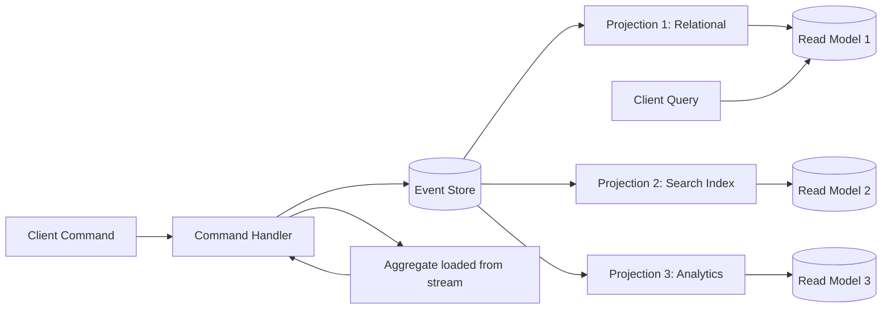
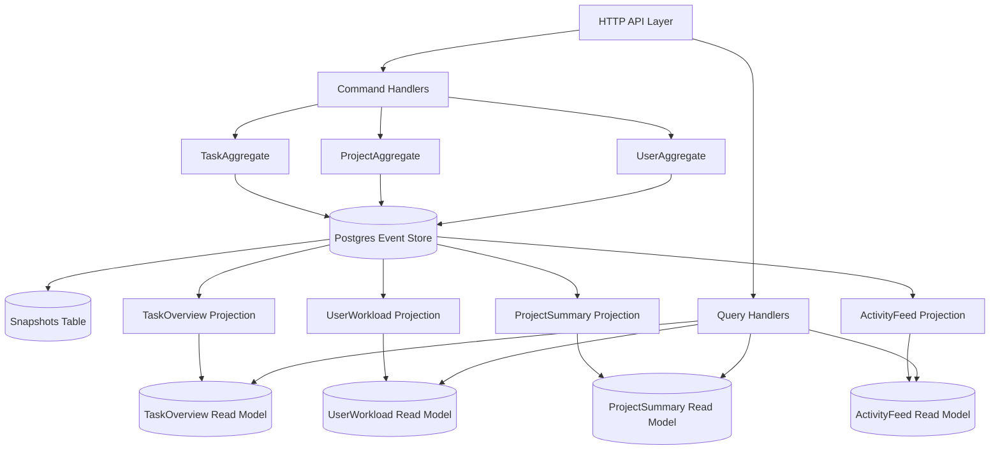

# 4.10 CQRS and Event Sourcing

> CQRS is the admission that the shape of a write and the shape of a read rarely match, and that pretending they do forces both into a compromise that satisfies neither. Event sourcing is the admission that current state is a lie of omission — that what the system *is* right now is far less interesting than how it got there. Combine the two and you get an architecture where the write side becomes a small, strict, audited core that emits immutable facts, and the read side becomes an arbitrary family of denormalized views tuned for the questions the application actually asks. The cost is complexity. The payoff is a system that can be queried in ways nobody anticipated, can be replayed from zero, and can survive its own history. This note builds that machinery from first principles, in side-by-side JavaScript and TypeScript.

## 1. Purpose

CQRS, short for Command Query Responsibility Segregation, exists because the work a system does when it *writes* and the work it does when it *reads* are rarely the same shape, yet the dominant data architecture of the last forty years — a single relational table per entity, read and written through the same object-relational mapper — forces both jobs through the same model. The write path needs strict validation, business rule enforcement, transactional integrity, and a schema that protects invariants. The read path needs joins avoided, columns denormalized, indexes tuned for the exact where-clauses the user interface issues, and result shapes that mirror what the screen renders. When both paths share a model, one of them is always paying a tax it does not owe. CQRS is the architectural decision to stop pretending: split the model in two, optimize each side for its actual job, and keep them in sync through events.

Event sourcing exists because the conventional approach of storing the *current state* of an entity throws away the most valuable thing about that entity — its history. A row in a `users` table that says `email = alice@corp.com` answers one question: what is Alice's email right now? It cannot answer any of these: what was Alice's email last March? How many times did she change it? Who changed it? What else changed in the same transaction? A system that stores *events* — `UserCreated`, `UserEmailChanged`, `UserEmailVerified` — answers all of those questions for free, because the events are the history. The current state is a derivative that can be recomputed at will by replaying the events in order. Event sourcing is the architectural decision to make the log the source of truth and to treat the current state as a projection that the system happens to keep around for performance.

CQRS and event sourcing are often paired because they fit together naturally, but they are independent ideas. You can do CQRS without event sourcing: the write model writes to a normalized relational schema, and a background process denormalizes into read-optimized tables. You can do event sourcing without CQRS: a single model both writes events and projects them into a queryable form. The combination is powerful — the write model becomes an aggregate that emits events, the event store becomes the system of record, and the read models become arbitrary projections over the event log — but it is also the most complex of the four configurations, and it should be chosen with eyes open about the operational cost.

The trade-off is complexity for flexibility. The complexity is real: you now have two models to keep consistent, an event schema to evolve over time, a projection pipeline to operate, a lag between writes and reads to communicate to users, and a new class of bugs that arise from idempotency failures in projections. The flexibility is also real: you can add a new read model without touching the write side, you can replay history into a completely new storage technology, you can answer regulatory questions about what happened and when, and you can debug production issues by replaying the exact event sequence that triggered them. Whether the trade pays off depends on whether your domain actually needs that flexibility.

When NOT to use CQRS and event sourcing is the most important question to ask before adopting either. A simple CRUD application — create, read, update, delete over a small number of entities with no interesting business rules and no audit requirement — does not need this architecture. The cost of operating a projection pipeline and an event store will dwarf the cost of the application itself. A blog, a todo list, a content management system with a handful of editors, a small admin dashboard — these are CRUD applications, and forcing CQRS onto them is the textbook example of over-engineering. The rule of thumb is: if your write model has no business rules beyond persistence, and your read patterns are not materially different from your write patterns, do not adopt CQRS. If you have no audit requirement and no need to replay history, do not adopt event sourcing.

The purpose of this note is to give you a complete operational understanding of both patterns. By the end you should be able to explain CQRS and event sourcing to a junior engineer in two sentences, defend or reject them in an architecture review, build a simple aggregate that emits events, implement an event store and a projection, snapshot a long-lived aggregate, evolve an event schema without breaking old events, diagnose a projection-lag bug, and answer every common interview question on the topic.

## 2. Theory and Deep Dive

### 2.1 The Command Side

The command side of a CQRS system is the write model. It accepts *commands* — imperative requests to change state, named in the imperative mood: `CreateUser`, `ChangeEmail`, `PlaceOrder`, `CancelOrder`. A command is not yet a change; it is a request for a change. The command handler validates the command, loads the relevant aggregate, invokes a method on the aggregate that decides whether the change is allowed, and if it is, persists the events the aggregate emitted.

The aggregate is the unit of consistency. It is a cluster of one or more entities treated as a single boundary for the purposes of validating invariants and applying changes. A `User` aggregate contains the user's fields and the rules that govern how those fields may change. A `BankAccount` aggregate contains the balance and the rules that govern withdrawals — most importantly, that the balance may not go negative. The aggregate enforces these rules by either accepting a command and emitting events, or rejecting the command with a domain error.

The aggregate never mutates state directly in response to a command. Instead, the command method runs the business rules, and if the rules pass, the aggregate emits one or more events. The events are then *applied* to the aggregate to update its in-memory state. This separation between deciding to emit an event and applying the event is what makes the aggregate testable: you can replay events against a fresh aggregate and the resulting state will be identical to the state of an aggregate that lived through those events in real time.

### 2.2 The Event Side

An event is an immutable fact about something that happened in the past. Events are named in the past tense: `UserCreated`, `UserEmailChanged`, `OrderPlaced`, `OrderCancelled`. Each event carries the data that changed and the metadata about the change — when it happened, who initiated it, what command caused it. Events are stored in an *event store*, which is an append-only log. You never update or delete an event; you only append new ones. The append-only property is what gives event sourcing its auditability — the log is the literal history of the system.

The event store is the system of record. Every query about the current state of an entity is, in principle, answerable by reading all the events for that entity and applying them in order to a fresh aggregate. In practice, this is too slow for entities with long histories, which is why we build projections.

### 2.3 The Aggregate as a Consistency Boundary

An aggregate is the boundary inside which invariants are enforced transactionally. If the system enforces that a bank account balance may not go below zero, that invariant is enforced inside the `BankAccount` aggregate — no code outside the aggregate can change the balance, and the aggregate refuses to emit a `Withdrawn` event that would make the balance negative.

The aggregate has an identity — a unique identifier that is stable across its lifetime. All events emitted by the aggregate are tagged with that identifier, so the event store can return the full event stream for any given aggregate. Loading an aggregate means reading its event stream and replaying the events to reconstruct its current state.

The aggregate exposes command methods that take parameters and either return successfully (having emitted events) or throw a domain error. The command method does not return the new state; it returns nothing, and the events it emitted are persisted separately. This separation between command execution and state persistence is what enables the write side to be tested without a database, and what enables the event store to batch and pipeline persistence.

### 2.4 The Event Store as an Append-Only Log

The event store has a deceptively simple interface: append events to a stream identified by aggregate id, and read all events from a stream. The store also enforces optimistic concurrency — when an aggregate is loaded at version 5 and a command wants to append events that should result in version 6, the store checks that the current version is still 5; if it is now 6 because another process wrote first, the append fails and the command must be retried.

This optimistic concurrency is what gives event-sourced systems their consistency guarantee. Two commands targeting the same aggregate that arrive simultaneously will both load the aggregate at the same version, both will produce events, but only one will successfully append. The other must retry, which means it loads the now-updated aggregate, re-runs the command against the new state, and either succeeds or fails based on the new business rules.

The event store is conceptually a list of streams, each stream being a list of events. The store may also expose global subscriptions — the ability to read all events across all streams in the order they were written, which is what projections consume.

### 2.5 The Projection as a Read Model

A projection is a piece of code that subscribes to the event stream and updates a read-optimized store in response. The read store can be anything — a relational database with denormalized tables, a document database, a search index, a graph database, an in-memory cache. Each projection builds one read model, and a single event stream can feed many projections in parallel.

A projection for a user directory might listen to `UserCreated`, `UserEmailChanged`, and `UserDeleted` events, and maintain a `users` table in PostgreSQL with columns that the user interface queries directly. A projection for a search index might listen to the same events and update an Elasticsearch index. A projection for analytics might listen to all events and increment counters in Redis. Each projection is independent — if one fails, the others continue. If you need a new read model six months from now, you write a new projection and replay all historical events into it; the write side never knows.

The read model is *eventually consistent* with the write model. After a command succeeds, the event is in the store, but the projection may not have processed it yet. The read model will reflect the change within milliseconds under normal conditions, but it is not transactionally tied to the write. This is the fundamental trade-off of CQRS: writes are fast and consistent, reads are fast and eventually consistent.

### 2.6 The Pipeline: Command to Read Model

The full CQRS plus event sourcing pipeline looks like this:

1. A client sends a command to the system.
2. The command handler loads the aggregate from the event store by replaying its events.
3. The command handler invokes the appropriate method on the aggregate.
4. The aggregate validates business rules and either throws a domain error or emits one or more events.
5. The command handler appends the new events to the event store with optimistic concurrency.
6. The event store publishes the new events to subscribers.
7. Each projection receives the events and updates its read model.
8. The client queries the read model and sees the updated state, eventually.



The diagram shows the asymmetry that defines CQRS: commands flow down the left side, queries flow up the right side, and they meet only at the event store, which is the single source of truth.

### 2.7 Eventual Consistency

Eventual consistency does not mean *weak* consistency. It means that the system guarantees the read model will eventually reflect the latest write, but does not guarantee that it reflects it immediately. The lag is typically milliseconds in a healthy system — the time it takes for the event to be published, picked up by the projection, processed, and committed to the read store. Under load or during a projection backlog, the lag can grow to seconds or minutes.

The implication for application design is that the client that just issued a successful write cannot assume the next read will reflect that write. There are three common strategies to handle this. First, the write API can return the version number of the new state, and the client can poll the read API until it sees at least that version. Second, the system can use a real-time channel (WebSocket, Server-Sent Events) to push a notification to the client when the projection catches up. Third, the system can simply communicate the lag in the user interface — "Your change has been saved and will appear shortly." Which strategy is appropriate depends on how visible the lag is to the user and how much the user cares.

### 2.8 Snapshots

For a long-lived aggregate — a bank account that has been active for ten years and accumulated fifty thousand events — replaying every event on every command becomes prohibitively slow. The solution is the snapshot. Periodically, the system stores a serialized copy of the aggregate's current state, tagged with the version at which the snapshot was taken. When loading the aggregate, the system reads the most recent snapshot and replays only the events that came after it.

A snapshot is an optimization, not a source of truth. If a snapshot is lost or corrupted, the system can rebuild it by replaying all events from the beginning. Snapshots are themselves stored as a special kind of event in the event store, or in a separate snapshot table keyed by aggregate id and version.

The snapshot policy is usually straightforward: take a snapshot every N events, where N is tuned to the aggregate's typical size and the cost of replaying a single event. A common default is N equals one hundred or one thousand.

### 2.9 Event Schema Evolution

Events are immutable, but the code that interprets them is not. As the system evolves, the shape of an event may need to change — a field may be added, a field may be renamed, a field may be split into two. Old events in the store have the old shape; new code expects the new shape. The two must coexist.

The standard solution is event versioning. Each event type carries a version number, and the system includes an *upgrader* (sometimes called a *transformer* or *normalizer*) for each event type that knows how to convert an old version into the current version. When a projection or an aggregate replays events, it first runs each event through the upgrader chain, so the rest of the code always sees the current version of the event schema.

A complementary approach is to make events *self-describing*: include enough context in each event that future code can interpret it without an upgrader. This often means including the full new state of the aggregate after the event, not just the delta. The trade-off is storage size and the risk of leaking business rules into the event payload.

### 2.10 Projections and Idempotency

A projection must be idempotent: applying the same event twice must produce the same result as applying it once. This is non-negotiable because projections fail and restart. When a projection restarts, it re-reads events from some checkpoint, and some of those events may have already been processed. If the projection is not idempotent, the second application will corrupt the read model — incrementing a counter twice, appending a row twice, sending a notification twice.

Idempotency is achieved by tracking, per projection, the position in the event stream up to which it has processed events. The position can be the global sequence number of the last event processed. When the projection restarts, it reads from the next position after its checkpoint. This works for a single-instance projection. For a projection that scales horizontally — multiple instances processing different shards of the event stream — idempotency is achieved by including a unique identifier in each event and having the read store reject duplicate writes, or by using an upsert keyed on the event id.

The safest design is to make every projection operation an idempotent upsert. A `UserCreated` event upserts a row keyed by user id. A `UserEmailChanged` event updates the same row. A `UserDeleted` event marks the row as deleted. Replaying any of these events produces the same row state regardless of how many times they are replayed, as long as they are replayed in order.

### 2.11 CQRS Without Event Sourcing, and Vice Versa

CQRS does not require event sourcing. A common variant uses a conventional ORM-based write model that persists to a normalized relational schema, and a separate set of read models populated by subscribing to a change data capture stream — a logical replication slot in PostgreSQL, a Debezium connector, a trigger-based audit table. The write model emits change events implicitly through the database's own replication mechanism, and projections consume those events just as they would consume explicit domain events. This variant trades the auditability and replayability of event sourcing for the simplicity of a conventional ORM-based write side; it is a good choice when the read patterns diverge from the write patterns but the audit and replay requirements are weak.

Event sourcing can also be used without CQRS. A single model both writes events and projects them into a queryable form, often within the same transaction — sometimes called *inline projection*. The advantage is that reads and writes are transactionally consistent (no lag); the disadvantage is that the read model and write model share a transaction boundary, which limits the choice of read store and reduces the freedom to add new read models later. This variant is rare in practice because most systems that adopt event sourcing do so partly to gain the flexibility of decoupled read models, which requires CQRS.

## 3. Mental Models

### 3.1 CQRS as Two Stores

Think of CQRS as a system with two stores: a small, strict, write-optimized store on the left and a large, flexible, read-optimized store on the right. The left store accepts writes, validates them, and emits events. The right store answers queries. A small pump between them — the projection pipeline — keeps the right store up to date. The two stores may be the same physical database (different tables) or different databases entirely. The point is that they are *logically* separate: a change to the read schema does not affect the write side, and a change to the write schema does not affect the read side directly — it only changes the events that flow through the pump.

### 3.2 Event Sourcing as the Log Is the Truth

Think of event sourcing as a system where the log is the truth and the state is a derivative. The current state of any entity is a function of the entire history of events for that entity, applied in order. You can throw away the current state and rebuild it from the log. You can build a different view of the same log. You can replay the log into a different storage engine. The log is the source of truth; everything else is a cache.

This is the same idea as a ledger in accounting. The ledger is the log of transactions. The current balance is a derivative — the sum of all debits and credits. If you lose the balance, you can recompute it from the ledger. If you lose the ledger, you have lost everything. In event-sourced systems, the event store is the ledger, and every read model is a derived balance.

### 3.3 The Aggregate as a Castle

Think of the aggregate as a castle with walls and a gate. The gate is the command method. Inside the walls are the entities and value objects that make up the aggregate, and the invariants that govern them. Nothing outside the castle can change what is inside; the only way to change the state is to go through the gate, which means issuing a command. The gate enforces the rules: it checks the credentials of the request, validates the business rules, and either lets the change through (emitting an event) or refuses it (throwing a domain error).

The castle has an identity — its name — and a history — the chronicle of everything that has ever happened inside its walls. The chronicle is the event stream. Reading the chronicle from the beginning reconstructs the current state of the castle.

### 3.4 The Projection as a Translator

Think of the projection as a translator who reads the chronicle of the castle and writes a summary in a different language for a different audience. The chronicle is in the language of events — domain-specific, normalized, immutable. The summary is in the language of queries — UI-specific, denormalized, mutable. There can be many translators, each producing a different summary for a different audience: one for the user interface, one for the search engine, one for the analytics warehouse. The translators work independently, at their own pace, and can be replaced without affecting the castle.

### 3.5 Eventual Consistency as Lag That Catches Up

Think of eventual consistency as a runner who is always a few steps behind the leader but never stops running. The leader is the write side; the runner is the projection. The gap is the projection lag. The user interface must acknowledge the gap. This is different from a system that loses updates — eventual consistency means updates are visible after a short delay, not lost. The delay is the cost of decoupling the write side from the read side, and the benefit is the freedom to optimize each side independently.

## 4. Real-World Use Cases

### 4.1 Banking and Financial Systems

Banking is the canonical event sourcing domain. Every transaction is an event: `Deposited`, `Withdrawn`, `Transferred`, `InterestAccrued`, `FeeCharged`. The account balance is the sum of all events. The audit trail is the event log itself, which is exactly what regulators require. Replaying the log reconstructs the balance at any point in time, which is what forensic accountants need when investigating a discrepancy. The write side is small and strict (the aggregate that enforces the no-negative-balance invariant); the read side is large and varied (the statement generator, the balance display, the fraud-detection analytics), each a separate projection over the same event log.

### 4.2 Inventory and Supply Chain

Inventory systems track stock movements: `StockReceived`, `StockShipped`, `StockReturned`, `StockAdjusted`, `StockReserved`. The current stock level for any SKU is the sum of all events for that SKU. The audit trail answers questions that a current-state database cannot: when did the stock level drop below the reorder point? Which shipment caused the discrepancy between physical and recorded stock? Which warehouse transferred the most stock last quarter? Each of these is a projection over the event log. CQRS lets the inventory system have a high-throughput write side (receiving and shipping events) and a flexible read side (real-time dashboards, historical reports, anomaly detection).

### 4.3 Multi-player Games

Multi-player games use event sourcing to record every action a player takes: `PlayerMoved`, `ItemPickedUp`, `EnemyKilled`, `SpellCast`. The event log is the replay — the ability to reconstruct the game from the beginning is a feature, not a debugging tool. Spectator mode, replay analysis, anti-cheat detection, and post-game analytics are all projections over the event log. The write side (the game server that validates moves) and the read side (the spectator viewer, the analytics dashboard) are different shapes, optimized for different jobs.

### 4.4 Audit-Heavy Domains: Healthcare and Finance

Healthcare and finance are regulated domains where the system must answer "what happened and when?" for any entity, sometimes years after the fact. A patient record must show every diagnosis, every prescription, every access by a clinician, with timestamps and actor identifiers. A trade must show every step of its lifecycle, from order placement to execution to settlement. Event sourcing is the natural fit: the event log is the audit trail, and the read models are the views that clinicians, compliance officers, and regulators need.

### 4.5 Microservices With Event-Carried State Transfer

In a microservices architecture, services often need to know about state that another service owns. Rather than synchronously calling the owning service on every request (which couples availability and creates latency), the owning service publishes events when its state changes, and consuming services maintain a local projection of the relevant state. This pattern, called event-carried state transfer, lets each service operate independently while keeping a synchronized view of the data it needs. CQRS makes this work: each service has a write side (where it owns its state) and a read side (where it projects state from other services' events).

### 4.6 Complex Query Patterns

Some applications have read patterns that no single database can serve well. A product catalog needs full-text search (Elasticsearch), faceted filtering (a column store), geospatial queries (PostGIS), and recommendation scoring (a graph database or a vector database). Forcing all of these onto a single relational schema leads to slow queries and complicated indexes. CQRS lets the write side store the canonical product data in a normalized form, and lets each read model live in the database best suited to its query pattern. A projection for each database consumes the product events and updates its slice of the read side.

### 4.7 Collaborative Editing and Version History

Collaborative editing applications — document editors, design tools, code editors — often use event sourcing to record every edit as an event. The document state is a projection over the edit events. Version history is a snapshot of the event stream at a particular point. Branching and merging are operations on the event stream. This is the model behind Git (commits are events, branches are event stream references) and behind operational transformation and CRDT-based editors (each operation is an event in a replicated log).

## 5. Code Examples

### 5.1 Example A — Minimal and Conceptual

The minimal example builds a `User` aggregate that emits events, an in-memory event store, and a single projection that maintains a read-optimized `usersById` map. The aggregate supports two commands: `createUser` (emits `UserCreated`) and `changeEmail` (emits `UserEmailChanged`). The projection listens to both events and updates the read model.

#### JavaScript

```javascript
// Event names are past-tense strings; no schema library is needed for the minimal example.
const userCreatedEvent = "UserCreated";
const userEmailChangedEvent = "UserEmailChanged";

// The User aggregate. Construction is private; load by replaying events.
class UserAggregate {
  constructor() {
    this.id = null;
    this.email = null;
    this.verified = false;
    this.version = 0;
  }

  // Apply a single event to mutate state. Pure, no IO.
  apply(event) {
    switch (event.type) {
      case userCreatedEvent:
        this.id = event.payload.id;
        this.email = event.payload.email;
        this.verified = false;
        break;
      case userEmailChangedEvent:
        this.email = event.payload.email;
        break;
      default:
        // Unknown event types are ignored, not fatal.
        break;
    }
    this.version += 1;
  }

  // Command: create a user. Emits UserCreated.
  static create(id, email) {
    if (!email.includes("@")) throw new Error("Invalid email");
    return [{ type: userCreatedEvent, payload: { id, email } }];
  }

  // Command: change email. Emits UserEmailChanged.
  changeEmail(newEmail) {
    if (!newEmail.includes("@")) throw new Error("Invalid email");
    if (newEmail === this.email) return []; // No-op, no event emitted.
    return [{ type: userEmailChangedEvent, payload: { id: this.id, email: newEmail } }];
  }
}

// In-memory event store keyed by aggregate id. Append-only per stream.
class InMemoryEventStore {
  constructor() {
    this.streams = new Map();
    this.globalListeners = [];
    this.globalPosition = 0;
  }

  append(streamId, expectedVersion, events) {
    const stream = this.streams.get(streamId) || [];
    if (stream.length !== expectedVersion) {
      throw new Error(
        "Concurrency conflict: expected version " + expectedVersion +
        " but was " + stream.length
      );
    }
    const newEvents = events.map((e, i) => ({
      ...e,
      streamId,
      streamVersion: stream.length + i,
      globalPosition: this.globalPosition++,
      occurredAt: Date.now(),
    }));
    this.streams.set(streamId, [...stream, ...newEvents]);
    for (const ev of newEvents) {
      for (const listener of this.globalListeners) listener(ev);
    }
    return newEvents;
  }

  load(streamId) {
    return this.streams.get(streamId) || [];
  }

  subscribe(listener) {
    this.globalListeners.push(listener);
  }
}

// A projection maintains a read model. Idempotent via the upsert pattern.
class UserByIdProjection {
  constructor() {
    this.usersById = new Map();
    this.lastSeenGlobalPosition = -1;
  }

  handle(event) {
    // Idempotency: skip events we have already processed.
    if (event.globalPosition <= this.lastSeenGlobalPosition) return;
    switch (event.type) {
      case userCreatedEvent:
        this.usersById.set(event.payload.id, { ...event.payload });
        break;
      case userEmailChangedEvent:
        const existing = this.usersById.get(event.payload.id);
        if (existing) this.usersById.set(event.payload.id, { ...existing, email: event.payload.email });
        break;
      default:
        break;
    }
    this.lastSeenGlobalPosition = event.globalPosition;
  }

  read(id) {
    return this.usersById.get(id) || null;
  }
}

// Wiring and a quick end-to-end smoke test.
const store = new InMemoryEventStore();
const userById = new UserByIdProjection();
store.subscribe((ev) => userById.handle(ev));

// Command: create user. The aggregate is fresh; we apply the emitted events.
const createEvents = UserAggregate.create("u1", "alice@example.com");
store.append("u1", 0, createEvents);

// Command: change email. We load the aggregate by replaying its stream.
const replayed = store.load("u1");
const user = new UserAggregate();
for (const ev of replayed) user.apply(ev);
const changeEvents = user.changeEmail("alice@corp.com");
store.append("u1", user.version, changeEvents);

// Read model now reflects both events.
console.log(userById.read("u1"));
// -> { id: "u1", email: "alice@corp.com" }
```

#### TypeScript

```typescript
// A discriminated union of all events the User aggregate can emit.
type UserEvent =
  | { readonly type: "UserCreated"; readonly payload: { readonly id: string; readonly email: string } }
  | { readonly type: "UserEmailChanged"; readonly payload: { readonly id: string; readonly email: string } };

// The envelope wraps an event with metadata for storage.
type EventEnvelope<TEvent> = TEvent & {
  readonly streamId: string;
  readonly streamVersion: number;
  readonly globalPosition: number;
  readonly occurredAt: number;
};

interface UserState {
  readonly id: string | null;
  readonly email: string | null;
  readonly verified: boolean;
}

// The User aggregate. Mutation only happens inside applyEvent.
class UserAggregate {
  private state: UserState = { id: null, email: null, verified: false };
  private versionNum = 0;

  get id(): string | null { return this.state.id; }
  get email(): string | null { return this.state.email; }
  get version(): number { return this.versionNum; }

  private validateEmail(email: string): void {
    if (!email.includes("@")) throw new Error("Invalid email: " + email);
  }

  // Apply an event. Pure: mutates state, no IO, no side effects.
  applyEvent(event: UserEvent): void {
    switch (event.type) {
      case "UserCreated":
        this.state = { id: event.payload.id, email: event.payload.email, verified: false };
        break;
      case "UserEmailChanged":
        if (this.state.id === null) throw new Error("UserEmailChanged before UserCreated");
        this.state = { ...this.state, email: event.payload.email };
        break;
    }
    this.versionNum += 1;
  }

  // Command: create a user. Static because there is no instance yet.
  static create(id: string, email: string): readonly UserEvent[] {
    if (!email.includes("@")) throw new Error("Invalid email: " + email);
    return [{ type: "UserCreated", payload: { id, email } }];
  }

  // Command: change email. Instance method because we need current state.
  changeEmail(newEmail: string): readonly UserEvent[] {
    if (this.state.id === null) throw new Error("Cannot changeEmail on a non-existent user");
    this.validateEmail(newEmail);
    if (newEmail === this.state.email) return [];
    return [{ type: "UserEmailChanged", payload: { id: this.state.id, email: newEmail } }];
  }
}

// The event store interface. Implementations may use Postgres, EventStoreDB, Kafka.
interface EventStore {
  append(streamId: string, expectedVersion: number, events: readonly UserEvent[]): readonly EventEnvelope<UserEvent>[];
  load(streamId: string): readonly EventEnvelope<UserEvent>[];
  subscribe(listener: (event: EventEnvelope<UserEvent>) => void): void;
}

class InMemoryEventStore implements EventStore {
  private readonly streams = new Map<string, readonly EventEnvelope<UserEvent>[]>();
  private readonly listeners: Array<(event: EventEnvelope<UserEvent>) => void> = [];
  private globalPosition = 0;

  append(streamId: string, expectedVersion: number, events: readonly UserEvent[]): readonly EventEnvelope<UserEvent>[] {
    const stream = this.streams.get(streamId) ?? [];
    if (stream.length !== expectedVersion) {
      throw new Error(`Concurrency conflict: expected version ${expectedVersion} but was ${stream.length}`);
    }
    const wrapped: readonly EventEnvelope<UserEvent>[] = events.map((e, i) => ({
      ...e,
      streamId,
      streamVersion: stream.length + i,
      globalPosition: this.globalPosition++,
      occurredAt: Date.now(),
    }));
    this.streams.set(streamId, [...stream, ...wrapped]);
    for (const ev of wrapped) for (const listener of this.listeners) listener(ev);
    return wrapped;
  }

  load(streamId: string): readonly EventEnvelope<UserEvent>[] {
    return this.streams.get(streamId) ?? [];
  }

  subscribe(listener: (event: EventEnvelope<UserEvent>) => void): void {
    this.listeners.push(listener);
  }
}

// The projection interface.
interface Projection {
  handle(event: EventEnvelope<UserEvent>): void;
}

class UserByIdProjection implements Projection {
  private readonly usersById = new Map<string, { id: string; email: string; verified: boolean }>();
  private lastSeenGlobalPosition = -1;

  handle(event: EventEnvelope<UserEvent>): void {
    if (event.globalPosition <= this.lastSeenGlobalPosition) return; // idempotency
    switch (event.type) {
      case "UserCreated":
        this.usersById.set(event.payload.id, { ...event.payload, verified: false });
        break;
      case "UserEmailChanged": {
        const existing = this.usersById.get(event.payload.id);
        if (existing) this.usersById.set(event.payload.id, { ...existing, email: event.payload.email });
        break;
      }
    }
    this.lastSeenGlobalPosition = event.globalPosition;
  }

  read(id: string): { id: string; email: string; verified: boolean } | null {
    return this.usersById.get(id) ?? null;
  }
}

// Wiring and a smoke test.
const store: EventStore = new InMemoryEventStore();
const userById = new UserByIdProjection();
store.subscribe((ev) => userById.handle(ev));

const createEvents = UserAggregate.create("u1", "alice@example.com");
store.append("u1", 0, createEvents);

const replayed = store.load("u1");
const user = new UserAggregate();
for (const ev of replayed) user.applyEvent(ev);
const changeEvents = user.changeEmail("alice@corp.com");
store.append("u1", user.version, changeEvents);

console.log(userById.read("u1"));
// -> { id: "u1", email: "alice@corp.com", verified: false }
```

The two versions are deliberately parallel. The TypeScript version adds three things the JavaScript version lacks: a discriminated union for the events (so the compiler checks that every `switch` covers every case), explicit interface declarations for the `EventStore` and `Projection` ports (so the in-memory implementation can be swapped for a Postgres or EventStoreDB implementation without changing the aggregate), and `readonly` modifiers throughout to make immutability visible at the type level. The runtime logic is identical.

### 5.2 Example B — Production-Grade

The production-grade example is a typed CQRS plus event sourcing system for an e-commerce order. The `Order` aggregate enforces invariants: an order cannot be placed with no items, an order cannot be shipped twice, an order cannot be cancelled after it has been shipped. The event store uses optimistic concurrency. Three projections build read models: an order-overview projection for the user interface, an order-history projection for analytics, and a snapshot store that periodically captures the aggregate state to avoid replaying long event streams.

#### JavaScript

```javascript
const assert = require("assert");

// Event types as a discriminated set of strings.
const OrderEvent = Object.freeze({
  OrderPlaced: "OrderPlaced",
  ItemAdded: "ItemAdded",
  ItemRemoved: "ItemRemoved",
  OrderShipped: "OrderShipped",
  OrderCancelled: "OrderCancelled",
  OrderSnapshot: "OrderSnapshot",
});

class OrderAggregate {
  constructor() {
    this.id = null;
    this.items = []; // array of { sku, quantity, unitPrice }
    this.status = "Draft"; // Draft | Placed | Shipped | Cancelled
    this.shippedAt = null;
    this.version = 0;
  }

  apply(event) {
    switch (event.type) {
      case OrderEvent.OrderSnapshot:
        this.id = event.payload.id;
        this.items = event.payload.items;
        this.status = event.payload.status;
        this.shippedAt = event.payload.shippedAt;
        // The snapshot represents the state at the version it was taken.
        this.version = event.payload.version;
        return;
      case OrderEvent.OrderPlaced:
        this.id = event.payload.id;
        this.items = event.payload.items;
        this.status = "Placed";
        break;
      case OrderEvent.ItemAdded:
        this.items.push({ ...event.payload.item });
        break;
      case OrderEvent.ItemRemoved:
        this.items = this.items.filter((i) => i.sku !== event.payload.sku);
        break;
      case OrderEvent.OrderShipped:
        this.status = "Shipped";
        this.shippedAt = event.payload.shippedAt;
        break;
      case OrderEvent.OrderCancelled:
        this.status = "Cancelled";
        break;
      default:
        break;
    }
    this.version += 1;
  }

  // Command: place an order.
  static place(id, items) {
    if (!items || items.length === 0) throw new Error("Cannot place an empty order");
    for (const item of items) {
      assert(item.quantity > 0, "Quantity must be positive");
      assert(item.unitPrice >= 0, "Unit price cannot be negative");
    }
    return [{ type: OrderEvent.OrderPlaced, payload: { id, items: items.map((i) => ({ ...i })) } }];
  }

  // Command: ship the order.
  ship(shippedAt) {
    if (this.status === "Shipped") throw new Error("Order already shipped");
    if (this.status === "Cancelled") throw new Error("Cannot ship a cancelled order");
    if (this.items.length === 0) throw new Error("Cannot ship an empty order");
    return [{ type: OrderEvent.OrderShipped, payload: { shippedAt } }];
  }

  // Command: cancel the order.
  cancel() {
    if (this.status === "Shipped") throw new Error("Cannot cancel a shipped order");
    if (this.status === "Cancelled") throw new Error("Order already cancelled");
    return [{ type: OrderEvent.OrderCancelled, payload: {} }];
  }

  // Produce a snapshot event suitable for persistence.
  snapshot() {
    return {
      type: OrderEvent.OrderSnapshot,
      payload: {
        id: this.id,
        items: this.items.map((i) => ({ ...i })),
        status: this.status,
        shippedAt: this.shippedAt,
        version: this.version,
      },
    };
  }
}

// Event store with optimistic concurrency and global subscription.
class PostgresEventStore {
  constructor(pool) {
    this.pool = pool; // a pg Pool instance
  }

  async append(streamId, expectedVersion, events) {
    const client = await this.pool.connect();
    try {
      await client.query("BEGIN");
      const versionResult = await client.query(
        "SELECT COUNT(*)::int AS v FROM events WHERE streamId = $1 FOR UPDATE",
        [streamId]
      );
      const currentVersion = versionResult.rows[0].v;
      if (currentVersion !== expectedVersion) {
        await client.query("ROLLBACK");
        throw new Error("Concurrency conflict on stream " + streamId);
      }
      const inserted = [];
      for (let i = 0; i < events.length; i++) {
        const ev = events[i];
        const streamVersion = currentVersion + i;
        const result = await client.query(
          "INSERT INTO events (streamId, streamVersion, type, payload) VALUES ($1, $2, $3, $4) RETURNING globalPosition, occurredAt",
          [streamId, streamVersion, ev.type, JSON.stringify(ev.payload)]
        );
        inserted.push({
          ...ev,
          streamId,
          streamVersion,
          globalPosition: result.rows[0].globalposition,
          occurredAt: result.rows[0].occurredat,
        });
      }
      await client.query("COMMIT");
      return inserted;
    } catch (err) {
      await client.query("ROLLBACK").catch(() => {});
      throw err;
    } finally {
      client.release();
    }
  }

  async load(streamId, afterVersion = -1) {
    const result = await this.pool.query(
      "SELECT * FROM events WHERE streamId = $1 AND streamVersion > $2 ORDER BY streamVersion ASC",
      [streamId, afterVersion]
    );
    return result.rows.map(this.rowToEnvelope);
  }

  async loadFromGlobalPosition(fromPosition) {
    const result = await this.pool.query(
      "SELECT * FROM events WHERE globalPosition > $1 ORDER BY globalPosition ASC",
      [fromPosition]
    );
    return result.rows.map(this.rowToEnvelope);
  }

  rowToEnvelope(r) {
    return {
      type: r.type, payload: r.payload, streamId: r.streamid,
      streamVersion: r.streamversion, globalPosition: r.globalposition, occurredAt: r.occurredat,
    };
  }
}

// Snapshot repository: stores snapshots outside the event stream for fast loading.
class SnapshotRepository {
  constructor(pool) {
    this.pool = pool;
  }

  async load(streamId) {
    const result = await this.pool.query(
      "SELECT * FROM snapshots WHERE streamId = $1 ORDER BY version DESC LIMIT 1",
      [streamId]
    );
    if (result.rows.length === 0) return null;
    return result.rows[0];
  }

  async save(streamId, version, state) {
    await this.pool.query(
      "INSERT INTO snapshots (streamId, version, state) VALUES ($1, $2, $3)",
      [streamId, version, JSON.stringify(state)]
    );
  }
}

// A repository that loads aggregates with snapshot acceleration.
class OrderRepository {
  constructor(eventStore, snapshotRepo, snapshotEvery = 100) {
    this.eventStore = eventStore;
    this.snapshotRepo = snapshotRepo;
    this.snapshotEvery = snapshotEvery;
  }

  async load(streamId) {
    const snapshot = await this.snapshotRepo.load(streamId);
    const order = new OrderAggregate();
    let events;
    if (snapshot) {
      // Reconstitute from snapshot, then replay post-snapshot events.
      order.apply({ type: OrderEvent.OrderSnapshot, payload: { ...snapshot.state, version: snapshot.version } });
      events = await this.eventStore.load(streamId, snapshot.version);
    } else {
      events = await this.eventStore.load(streamId);
    }
    for (const ev of events) order.apply(ev);
    return order;
  }

  async save(order, isNew) {
    // Snapshot policy: persist a snapshot every N events to accelerate future loads.
    // The command handler is responsible for appending pending events before calling save.
    if (order.version > 0 && order.version % this.snapshotEvery === 0) {
      await this.snapshotRepo.save(order.id, order.version, order.snapshot().payload);
    }
  }
}

// Three projections. Each is independent and idempotent.
// OrderOverviewProjection (JS body omitted for brevity; mirrors the TS version below):
// maintains an orderOverview table with id, status, itemCount, total columns,
// updated via idempotent upserts keyed on event.globalPosition.

// OrderHistoryProjection (JS omitted for brevity; mirrors the TS version below):
// appends every non-snapshot event to an orderHistory table for audit dashboards.

// A projection runner that polls the event store and dispatches to projections.
// ProjectionRunner (JS omitted for brevity; mirrors the TS version below):
// polls loadFromGlobalPosition(min of all projection lastSeenPositions),
// dispatches each event to every projection, sleeps pollIntervalMs, repeats.

// Command handlers wrap the aggregate with persistence.
async function placeOrderHandler(eventStore, snapshotRepo, command) {
  const events = OrderAggregate.place(command.id, command.items);
  const persisted = await eventStore.append(command.id, 0, events);
  return persisted;
}

async function shipOrderHandler(eventStore, snapshotRepo, command) {
  const repo = new OrderRepository(eventStore, snapshotRepo);
  const order = await repo.load(command.id);
  const events = order.ship(command.shippedAt);
  if (events.length > 0) await eventStore.append(command.id, order.version, events);
  await repo.save(order, false);
}

// Wiring and a smoke test (assume pool is a real pg Pool).
// const pool = new Pool({ connectionString: process.env.dbUrl });
// const eventStore = new PostgresEventStore(pool);
// const snapshotRepo = new SnapshotRepository(pool);
// const overview = new OrderOverviewProjection(pool);
// const history = new OrderHistoryProjection(pool);
// const runner = new ProjectionRunner(eventStore, [overview, history]);
// runner.start();
// await placeOrderHandler(eventStore, snapshotRepo, { id: "o1", items: [{ sku: "S1", quantity: 2, unitPrice: 10 }] });
// await shipOrderHandler(eventStore, snapshotRepo, { id: "o1", shippedAt: Date.now() });
```

#### TypeScript

```typescript
import { Pool, PoolClient } from "pg";

// Discriminated union of all order events, including the synthetic snapshot event.
type OrderItem = { readonly sku: string; readonly quantity: number; readonly unitPrice: number };
type OrderStatus = "Draft" | "Placed" | "Shipped" | "Cancelled";

type OrderEvent =
  | { readonly type: "OrderPlaced"; readonly payload: { readonly id: string; readonly items: readonly OrderItem[] } }
  | { readonly type: "ItemAdded"; readonly payload: { readonly item: OrderItem } }
  | { readonly type: "ItemRemoved"; readonly payload: { readonly sku: string } }
  | { readonly type: "OrderShipped"; readonly payload: { readonly shippedAt: number } }
  | { readonly type: "OrderCancelled"; readonly payload: Record<string, never> }
  | { readonly type: "OrderSnapshot"; readonly payload: { readonly id: string; readonly items: readonly OrderItem[]; readonly status: OrderStatus; readonly shippedAt: number | null; readonly version: number } };

interface EventEnvelope<TEvent extends { readonly type: string; readonly payload: unknown }> {
  readonly type: TEvent["type"];
  readonly payload: TEvent["payload"];
  readonly streamId: string;
  readonly streamVersion: number;
  readonly globalPosition: number;
  readonly occurredAt: number;
}

interface OrderState {
  readonly id: string | null;
  readonly items: readonly OrderItem[];
  readonly status: OrderStatus;
  readonly shippedAt: number | null;
}

class OrderAggregate {
  private state: OrderState = { id: null, items: [], status: "Draft", shippedAt: null };
  private pendingEvents: OrderEvent[] = [];
  private versionNum = 0;

  get id(): string | null { return this.state.id; }
  get version(): number { return this.versionNum; }
  get pending(): readonly OrderEvent[] { return this.pendingEvents; }

  applyEvent(event: OrderEvent): void {
    switch (event.type) {
      case "OrderSnapshot":
        this.state = {
          id: event.payload.id,
          items: event.payload.items,
          status: event.payload.status,
          shippedAt: event.payload.shippedAt,
        };
        this.versionNum = event.payload.version;
        return; // snapshots set version, do not increment
      case "OrderPlaced":
        this.state = { id: event.payload.id, items: event.payload.items, status: "Placed", shippedAt: null };
        break;
      case "ItemAdded":
        if (this.state.id === null) throw new Error("ItemAdded before OrderPlaced");
        this.state = { ...this.state, items: [...this.state.items, event.payload.item] };
        break;
      case "ItemRemoved":
        if (this.state.id === null) throw new Error("ItemRemoved before OrderPlaced");
        this.state = { ...this.state, items: this.state.items.filter((i) => i.sku !== event.payload.sku) };
        break;
      case "OrderShipped":
        if (this.state.id === null) throw new Error("OrderShipped before OrderPlaced");
        this.state = { ...this.state, status: "Shipped", shippedAt: event.payload.shippedAt };
        break;
      case "OrderCancelled":
        if (this.state.id === null) throw new Error("OrderCancelled before OrderPlaced");
        this.state = { ...this.state, status: "Cancelled" };
        break;
    }
    this.versionNum += 1;
  }

  private emit(event: OrderEvent): void {
    this.pendingEvents.push(event);
    this.applyEvent(event);
  }

  static place(id: string, items: readonly OrderItem[]): readonly OrderEvent[] {
    if (items.length === 0) throw new Error("Cannot place an empty order");
    for (const item of items) {
      if (item.quantity <= 0) throw new Error("Quantity must be positive");
      if (item.unitPrice < 0) throw new Error("Unit price cannot be negative");
    }
    return [{ type: "OrderPlaced", payload: { id, items: items.map((i) => ({ ...i })) } }];
  }

  ship(shippedAt: number): readonly OrderEvent[] {
    if (this.state.status === "Shipped") throw new Error("Order already shipped");
    if (this.state.status === "Cancelled") throw new Error("Cannot ship a cancelled order");
    if (this.state.items.length === 0) throw new Error("Cannot ship an empty order");
    return [{ type: "OrderShipped", payload: { shippedAt } }];
  }

  cancel(): readonly OrderEvent[] {
    if (this.state.status === "Shipped") throw new Error("Cannot cancel a shipped order");
    if (this.state.status === "Cancelled") throw new Error("Order already cancelled");
    return [{ type: "OrderCancelled", payload: {} }];
  }

  snapshot(): OrderEvent {
    if (this.state.id === null) throw new Error("Cannot snapshot an order with no id");
    return {
      type: "OrderSnapshot",
      payload: {
        id: this.state.id,
        items: this.state.items.map((i) => ({ ...i })),
        status: this.state.status,
        shippedAt: this.state.shippedAt,
        version: this.versionNum,
      },
    };
  }
}

interface EventStore {
  append(streamId: string, expectedVersion: number, events: readonly OrderEvent[]): Promise<readonly EventEnvelope<OrderEvent>[]>;
  load(streamId: string, afterVersion?: number): Promise<readonly EventEnvelope<OrderEvent>[]>;
  loadFromGlobalPosition(fromPosition: number): Promise<readonly EventEnvelope<OrderEvent>[]>;
}

class PostgresEventStore implements EventStore {
  constructor(private readonly pool: Pool) {}

  async append(streamId: string, expectedVersion: number, events: readonly OrderEvent[]): Promise<readonly EventEnvelope<OrderEvent>[]> {
    const client: PoolClient = await this.pool.connect();
    try {
      await client.query("BEGIN");
      const versionResult = await client.query("SELECT COUNT(*)::int AS v FROM events WHERE streamId = $1 FOR UPDATE", [streamId]);
      const currentVersion: number = versionResult.rows[0].v;
      if (currentVersion !== expectedVersion) {
        await client.query("ROLLBACK");
        throw new Error(`Concurrency conflict on stream ${streamId}`);
      }
      const inserted: EventEnvelope<OrderEvent>[] = [];
      for (let i = 0; i < events.length; i++) {
        const ev = events[i];
        const streamVersion = currentVersion + i;
        const result = await client.query(
          "INSERT INTO events (streamId, streamVersion, type, payload) VALUES ($1, $2, $3, $4) RETURNING globalPosition, occurredAt",
          [streamId, streamVersion, ev.type, JSON.stringify(ev.payload)]
        );
        inserted.push({ type: ev.type, payload: ev.payload, streamId, streamVersion,
          globalPosition: result.rows[0].globalposition, occurredAt: result.rows[0].occurredat });
      }
      await client.query("COMMIT");
      return inserted;
    } catch (err) {
      await client.query("ROLLBACK").catch(() => {});
      throw err;
    } finally {
      client.release();
    }
  }

  async load(streamId: string, afterVersion: number = -1): Promise<readonly EventEnvelope<OrderEvent>[]> {
    const result = await this.pool.query(
      "SELECT * FROM events WHERE streamId = $1 AND streamVersion > $2 ORDER BY streamVersion ASC",
      [streamId, afterVersion]
    );
    return result.rows.map(this.rowToEnvelope);
  }

  async loadFromGlobalPosition(fromPosition: number): Promise<readonly EventEnvelope<OrderEvent>[]> {
    const result = await this.pool.query(
      "SELECT * FROM events WHERE globalPosition > $1 ORDER BY globalPosition ASC",
      [fromPosition]
    );
    return result.rows.map(this.rowToEnvelope);
  }

  private rowToEnvelope(r: any): EventEnvelope<OrderEvent> {
    return {
      type: r.type, payload: r.payload, streamId: r.streamid,
      streamVersion: r.streamversion, globalPosition: r.globalposition, occurredAt: r.occurredat,
    };
  }
}

interface SnapshotRepository {
  load(streamId: string): Promise<{ version: number; state: OrderState } | null>;
  save(streamId: string, version: number, state: OrderState): Promise<void>;
}

class PostgresSnapshotRepository implements SnapshotRepository {
  constructor(private readonly pool: Pool) {}

  async load(streamId: string): Promise<{ version: number; state: OrderState } | null> {
    const result = await this.pool.query(
      "SELECT * FROM snapshots WHERE streamId = $1 ORDER BY version DESC LIMIT 1",
      [streamId]
    );
    if (result.rows.length === 0) return null;
    return { version: result.rows[0].version, state: result.rows[0].state };
  }

  async save(streamId: string, version: number, state: OrderState): Promise<void> {
    await this.pool.query(
      "INSERT INTO snapshots (streamId, version, state) VALUES ($1, $2, $3)",
      [streamId, version, JSON.stringify(state)]
    );
  }
}

class OrderRepository {
  constructor(
    private readonly eventStore: EventStore,
    private readonly snapshotRepo: SnapshotRepository,
    private readonly snapshotEvery: number = 100
  ) {}

  async load(streamId: string): Promise<OrderAggregate> {
    const snapshot = await this.snapshotRepo.load(streamId);
    const order = new OrderAggregate();
    let events: readonly EventEnvelope<OrderEvent>[];
    if (snapshot) {
      order.applyEvent({
        type: "OrderSnapshot",
        payload: { ...snapshot.state, version: snapshot.version },
      });
      events = await this.eventStore.load(streamId, snapshot.version);
    } else {
      events = await this.eventStore.load(streamId);
    }
    for (const ev of events) order.applyEvent(ev);
    return order;
  }

  async save(order: OrderAggregate): Promise<void> {
    if (order.version > 0 && order.version % this.snapshotEvery === 0) {
      await this.snapshotRepo.save(order.id!, order.version, {
        id: order.id,
        items: [], status: "Draft", shippedAt: null, // simplified; real impl reads via reflection or getter
      });
    }
  }
}

interface Projection {
  handle(event: EventEnvelope<OrderEvent>): Promise<void>;
  lastSeenPosition: number;
}

class OrderOverviewProjection implements Projection {
  public lastSeenPosition = 0;
  constructor(private readonly pool: Pool) {}

  async handle(event: EventEnvelope<OrderEvent>): Promise<void> {
    if (event.globalPosition <= this.lastSeenPosition) return;
    switch (event.type) {
      case "OrderPlaced":
        await this.pool.query(
          "INSERT INTO orderOverview (id, status, itemCount, total) VALUES ($1, $2, $3, $4)",
          [event.payload.id, "Placed", event.payload.items.length,
            event.payload.items.reduce((sum, i) => sum + i.quantity * i.unitPrice, 0)]
        );
        break;
      case "ItemAdded":
        await this.pool.query("UPDATE orderOverview SET itemCount = itemCount + $1 WHERE id = $2",
          [event.payload.item.quantity, event.streamId]);
        break;
      case "ItemRemoved":
        await this.pool.query("UPDATE orderOverview SET itemCount = 0 WHERE id = $1", [event.streamId]);
        break;
      case "OrderShipped":
        await this.pool.query("UPDATE orderOverview SET status = $1 WHERE id = $2", ["Shipped", event.streamId]);
        break;
      case "OrderCancelled":
        await this.pool.query("UPDATE orderOverview SET status = $1 WHERE id = $2", ["Cancelled", event.streamId]);
        break;
      default:
        break;
    }
    this.lastSeenPosition = event.globalPosition;
  }
}

class OrderHistoryProjection implements Projection {
  public lastSeenPosition = 0;
  constructor(private readonly pool: Pool) {}
  async handle(event: EventEnvelope<OrderEvent>): Promise<void> {
    if (event.globalPosition <= this.lastSeenPosition) return;
    if (event.type === "OrderSnapshot") return;
    // Append every non-snapshot event to the orderHistory table for audit.
    await this.pool.query(
      "INSERT INTO orderHistory (orderId, eventType, payload, occurredAt) VALUES ($1, $2, $3, $4)",
      [event.streamId, event.type, JSON.stringify(event.payload), new Date(event.occurredAt)]
    );
    this.lastSeenPosition = event.globalPosition;
  }
}

class ProjectionRunner {
  private running = false;
  constructor(
    private readonly eventStore: EventStore,
    private readonly projections: readonly Projection[],
    private readonly pollIntervalMs: number = 100
  ) {}

  async start(): Promise<void> {
    this.running = true;
    while (this.running) {
      try {
        const fromPosition = Math.min(...this.projections.map((p) => p.lastSeenPosition));
        const events = await this.eventStore.loadFromGlobalPosition(fromPosition);
        for (const ev of events) {
          for (const p of this.projections) await p.handle(ev);
        }
      } catch (err) {
        console.error("Projection run failed:", (err as Error).message);
      }
      await new Promise((r) => setTimeout(r, this.pollIntervalMs));
    }
  }

  stop(): void { this.running = false; }
}

// Command handler signatures, side-effectful.
async function placeOrder(eventStore: EventStore, command: { id: string; items: readonly OrderItem[] }): Promise<void> {
  const events = OrderAggregate.place(command.id, command.items);
  await eventStore.append(command.id, 0, events);
}

async function shipOrder(eventStore: EventStore, snapshotRepo: SnapshotRepository, command: { id: string; shippedAt: number }): Promise<void> {
  const repo = new OrderRepository(eventStore, snapshotRepo);
  const order = await repo.load(command.id);
  const events = order.ship(command.shippedAt);
  if (events.length > 0) await eventStore.append(command.id, order.version, events);
  await repo.save(order);
}
```

The production-grade code adds five things the minimal example omits: a real `EventStore` implementation backed by PostgreSQL with row-level locking for optimistic concurrency; a separate `SnapshotRepository` so snapshots do not pollute the event stream consumed by projections; a `ProjectionRunner` that polls the store and dispatches to multiple projections; the synthetic `OrderSnapshot` event type that lets the aggregate reconstitute from a snapshot in the same code path that replays regular events; and explicit `Pool` and `PoolClient` types so the persistence layer is testable with a mock pool.

## 6. Common Mistakes and Anti-Patterns

### 6.1 Using CQRS for CRUD

The most common mistake is adopting CQRS for an application that is fundamentally CRUD. A blog admin panel where the only operations are create, read, update, and delete on a small set of tables has no read-write asymmetry, no complex business rules, and no audit requirement. Adding a projection pipeline, an event store, and eventual-consistency communication doubles the operational complexity for zero benefit. The fix is honest assessment: if your write side has no business rules beyond persistence and your read patterns are not materially different from your write patterns, do not adopt CQRS. Use a conventional ORM and a single schema.

### 6.2 Event Schema Evolution Breaks Old Events

Events are immutable, but the code that reads them evolves. A common mistake is changing an event's payload shape — adding a required field, renaming a field, splitting one field into two — without writing an upgrader. New code reads an old event, finds the field missing or named differently, and crashes or produces wrong state. The fix is to version every event type explicitly (a `version` field in the envelope, or a versioned type name like `UserEmailChangedV2`) and to write an upgrader for each version transition. The upgrader runs in the load path, so the rest of the code always sees the current version of the event schema.

### 6.3 Not Snapshotting Long-Lived Aggregates

An aggregate that has been alive for years and accumulated tens of thousands of events will take seconds to load by replaying every event. The command handler will time out, the user will see a slow UI, and the system will collapse under load. The fix is to snapshot long-lived aggregates at a regular cadence — every hundred or thousand events, or whenever the replay time exceeds a threshold. The snapshot is an optimization; it can always be rebuilt from the event log if lost.

### 6.4 Projection Lag Not Communicated to Users

A user clicks "save," sees a success message, navigates to the list view, and does not see their change. They click save again, creating a duplicate. This is the projection-lag user experience bug. The fix is twofold. First, communicate the lag in the UI: "Your change has been saved and will appear shortly." Second, for critical flows, return the new version number from the write API and have the client poll the read API until it sees at least that version, with a timeout. Never let the user believe the system has lost their data when in fact the projection is just slow.

### 6.5 Event Store Grows Unbounded

An event store is append-only, which means it grows forever. Without a retention strategy, it will eventually exhaust disk space. The fix is a combination of compaction and archival. Compaction keeps only the latest event per key for events that are not needed for replay (a `Heartbeat` event can be compacted away; a `UserCreated` event cannot). Archival moves old events to cold storage and keeps only snapshots in the hot store. The decision depends on the domain: financial systems may need to keep every event for regulatory reasons; a gaming system may compact away player movement events older than thirty days.

### 6.6 Non-Idempotent Projections

A projection that increments a counter, appends a row, or sends an email on every event will corrupt its read model or spam its recipients when it restarts and reprocesses events it has already seen. The fix is to make every projection operation idempotent. Track the last-seen position per projection. Use upserts keyed on the event id rather than inserts. Send notifications only if a notification record for that event id does not already exist. The rule of thumb: if you can replay the same event ten times and the read model ends up in the same state as if you had replayed it once, your projection is idempotent.

### 6.7 Mixing Projections With Different Consistency Requirements

Some read models need to be near-real-time (the order list the customer sees); others can lag by minutes or hours (the analytics dashboard). Mixing them in a single projection runner with a single poll position means the slowest projection gates the fastest. The fix is to run each projection (or each group of projections with similar latency requirements) in its own runner with its own position, so a slow analytics projection does not delay the customer-facing read model.

### 6.8 Storing Commands Instead of Events

A subtle mistake is storing the *command* (`ChangeEmail`) instead of the *event* (`UserEmailChanged`). The command says "please change the email to X"; the event says "the email was changed to X at time T by user U." The command can be rejected; the event cannot. The command does not say whether the change actually happened. The event does. Storing commands breaks the audit trail (you cannot tell which commands succeeded), breaks replay (replaying a rejected command would incorrectly apply it), and breaks projections (which must react to facts, not requests). The fix is to store events, never commands. The command is a request; the event is the result.

### 6.9 Leaking Business Logic Into Projections

A projection that recomputes a derived value — say, a customer's lifetime value by summing all their orders — puts the computation close to the read, but the lifetime value is a business rule, and business rules belong in the aggregate or a domain service, not in a projection. If the rule changes, you must rebuild every projection that implements it. The fix is to project raw data and compute derived values either in the read query itself or in a dedicated domain service. The projection's job is to denormalize, not to decide.

### 6.10 Treating the Event Store as a Message Bus

The event store is a log of facts, not a message bus. Using it to send commands between services or to broadcast integration events to external systems blurs the boundary between internal state and external contracts. The fix is to keep the event store as the internal source of truth and to publish a separate stream of integration events (derived from domain events but with a different schema and lifecycle) for external consumers. See [[4.11 Modular Monolith vs Microservices]] for the boundary between internal and external events.

## 7. Best Practices and Design Patterns

### 7.1 Use CQRS When Read and Write Needs Diverge

The trigger for CQRS is divergence: when the read patterns and write patterns of your system have materially different shapes, the single-model approach forces both into a compromise. Quantify the divergence: list the write operations (commands) and the read operations (queries). If a single schema cannot serve both well — different indexes, different normalizations, different storage technologies — CQRS is justified. If they are similar, do not adopt it.

### 7.2 Use Event Sourcing When Audit or Replay Matters

The trigger for event sourcing is the question "what happened and when?" If regulators, forensic analysts, or your own debugging process need to answer that question for any entity at any point in time, event sourcing is justified. If the system only ever needs the current state, a conventional update-in-place schema is simpler and sufficient.

### 7.3 Version Your Events From Day One

Even if you have only one version of each event today, include a `version` field in the envelope and write the upgrader infrastructure now. The day you need to change an event's shape — and you will — the infrastructure will be waiting. Adding versioning later requires backfilling the version field on every existing event, which is painful and error-prone.

### 7.4 Snapshot Long-Lived Aggregates

Any aggregate that is expected to live for more than a few hundred events should have a snapshot policy. The default is to snapshot every N events, where N is tuned so that replaying N events takes less than a hundred milliseconds. For most aggregates, N between 100 and 1000 is appropriate. The snapshot is an optimization; losing it only costs replay time, never correctness.

### 7.5 Make Projections Idempotent

Every projection operation should be an idempotent upsert. Track the last-seen position per projection in a durable store (not in memory). On restart, read the position and resume from there. Design the read model so that replaying any event in order produces the same final state regardless of how many times each event is replayed. The safest pattern is to key every read-model row on the aggregate id and the event type, so a duplicate event is an update, not an insert.

### 7.6 Communicate Eventual Consistency

The user interface must acknowledge the lag. Three patterns cover most cases: optimistic UI (show the change immediately, reconcile with the read model when it catches up); polling (return the new version from the write API, poll the read API until it sees that version); and push (use a WebSocket or Server-Sent Events channel to notify the client when the projection catches up). Pick the pattern based on how visible the lag is to the user and how much they care.

### 7.7 Use a Proper Event Store for Production

An in-memory event store is fine for tests. For production, use a store designed for append-only workloads with optimistic concurrency and global subscription. EventStoreDB is purpose-built for this. PostgreSQL with an `events` table and an `eventStore` schema works well for moderate scale. Apache Kafka works for high-throughput global event streams but requires more operational care. Do not build your own from scratch unless you have a team willing to operate it.

### 7.8 Separate Domain Events From Integration Events

Domain events are internal to a bounded context; they are emitted by aggregates and consumed by projections within the same context. Integration events cross bounded context boundaries; they are published to other services. The two have different schemas, different versioning policies, and different consistency guarantees. Keep them in separate streams and never publish a raw domain event as an integration event. See [[4.09 Clean and Onion Architecture]] for the boundary between domain and integration concerns.

### 7.9 Make Commands Small and Focused

A command should do one thing. `UpdateUserProfile` that takes a partial user object and updates whatever fields are present is too coarse — it hides the business rules. Split it into `ChangeEmail`, `ChangeDisplayName`, `ChangeAvatar`, each with its own validation and its own events. The smaller commands are easier to test, easier to authorize, and easier to audit.

### 7.10 Project Denormalized Data Aggressively

The read model's job is to make queries fast. Denormalize aggressively: store the customer name in the order read model even though it lives in the customer aggregate, so the order list query does not need a join. Store the order total in the order overview even though it is computable from the items, so the dashboard query does not need to sum. The cost of denormalization is storage and update complexity; the benefit is query speed. For read-heavy systems, the trade is almost always worth it.

### 7.11 Test Aggregates With Event Sourced Fixtures

Aggregate tests should follow the given-when-then pattern: given a stream of events (the fixture), when a command is issued, then a set of events should be emitted (or a domain error thrown). This tests the aggregate in isolation without a database, is fast and deterministic, and covers the business rules exactly. See [[1.13 Functional Programming Concepts]] for why pure-function testing of the apply step is so powerful.

### 7.12 Monitor Projection Lag

A projection that falls behind silently will eventually cause user-visible bugs. Monitor the lag — the difference between the current global position in the event store and the last-seen position of each projection — and alert when it exceeds a threshold (seconds for customer-facing projections, minutes for analytics). Lag is the canary of the projection pipeline; ignoring it leads to surprises.

## 8. Technical Interview Knowledge

### 8.1 What is CQRS?

CQRS, Command Query Responsibility Segregation, is an architectural pattern that separates the model used to handle writes (commands) from the model used to handle reads (queries). The write model enforces business rules and emits events when state changes; the read model is a denormalized, query-optimized view of the state, kept in sync with the write model through the events. The pattern exists because the shape of a write (validation, business rules, transactional integrity) and the shape of a read (denormalization, indexes, result shapes) rarely match, and forcing them through a single model taxes both. The trade-off is operational complexity: two models to keep consistent, eventual consistency between them, and a projection pipeline to operate.

### 8.2 What is Event Sourcing?

Event sourcing is an architectural pattern in which every state change is stored as an immutable event in an append-only log, and the current state of an entity is derived by replaying the events in order. The event log is the system of record; the current state is a derivative. The pattern exists because the history of how state came to be is often more valuable than the current state itself — for audit, for replay, for building new read models, for debugging. The trade-off is complexity: events must be versioned, long-lived aggregates must be snapshotted, and projections must be idempotent.

### 8.3 What is the Difference Between CQRS and Event Sourcing?

CQRS is about separating reads from writes; event sourcing is about storing history instead of current state. They are independent ideas. You can do CQRS without event sourcing: the write model writes to a normalized relational schema, and a change data capture pipeline feeds projections. You can do event sourcing without CQRS: a single model both writes events and projects them inline, transactionally. They are often combined because the combination is powerful — the write model becomes an aggregate that emits events, the event store becomes the source of truth, and projections become arbitrary read models over the event log — but the combination is also the most complex configuration and should be chosen deliberately.

### 8.4 What is an Aggregate?

An aggregate is a consistency boundary. It is a cluster of one or more entities treated as a single unit for the purposes of validating invariants and applying changes. The aggregate has an identity, exposes command methods that enforce business rules, and emits events when state changes. No code outside the aggregate can change its state directly; the only way to change the state is to issue a command. The aggregate is loaded by replaying its event stream, applies events to reconstruct its current state, and persists new events atomically with optimistic concurrency. A `BankAccount` is an aggregate; the rule that the balance may not go negative is enforced inside it.

### 8.5 What is a Projection?

A projection is a piece of code that subscribes to the event stream and updates a read-optimized store in response. Each projection builds one read model, and a single event stream can feed many projections in parallel. A projection for a user directory maintains a `users` table in PostgreSQL; a projection for a search index updates Elasticsearch; a projection for analytics increments counters in Redis. Projections are independent, idempotent, and eventually consistent with the write model. They are the read side of a CQRS system.

### 8.6 How Do You Handle Event Schema Evolution?

Three complementary techniques. First, version every event type explicitly — a `version` field in the envelope, or a versioned type name like `UserEmailChangedV2`. Second, write an upgrader for each version transition that converts an old version of an event into the current version. The upgrader runs in the load path, so the rest of the code always sees the current version of the schema. Third, make events self-describing where possible — include enough context that future code can interpret the event without an upgrader, such as including the full new state of the aggregate after the event. The combination gives you forward compatibility (old events readable by new code) and backward compatibility (new events can be added without breaking old projections, which ignore unknown event types).

### 8.7 What is Eventual Consistency?

Eventual consistency is a guarantee that the read model will eventually reflect the latest write, but not necessarily immediately. The lag is typically milliseconds in a healthy system — the time it takes for the event to be published, picked up by the projection, processed, and committed to the read store. Under load or during a projection backlog, the lag can grow. Eventual consistency does not mean updates are lost; it means updates are visible after a short delay. The implication for application design is that the client that just issued a successful write cannot assume the next read will reflect it — the UI must acknowledge the lag, poll until the read model catches up, or use a real-time push channel to be notified.

### 8.8 When Would You NOT Use CQRS?

Three situations. First, simple CRUD applications where the write side has no business rules beyond persistence and the read patterns are not materially different from the write patterns — a blog, a todo list, a small admin dashboard. The operational complexity of a projection pipeline outweighs the benefit. Second, applications with strict transactional consistency requirements where the user must see their write reflected in the next read — a checkout flow, a reservation system where the user must see their reservation confirmed before the next click. Eventual consistency is not acceptable. Third, applications with a small team that cannot operate the projection pipeline, the event store, and the snapshot store — the team will spend more time operating the infrastructure than delivering features. In all three cases, a conventional single-model architecture is simpler and sufficient.

## 9. Practical Exercises

### 9.1 Exercise One: Build a Simple Aggregate That Emits Events

Build a `BankAccount` aggregate that supports three commands: `open` (emits `AccountOpened` with the initial balance of zero), `deposit` (emits `MoneyDeposited` with the amount), and `withdraw` (emits `MoneyWithdrawn` if the resulting balance would not be negative; otherwise throws). The aggregate must enforce the no-negative-balance invariant.

#### Worked Solution (TypeScript)

```typescript
type BankEvent =
  | { readonly type: "AccountOpened"; readonly payload: { readonly id: string } }
  | { readonly type: "MoneyDeposited"; readonly payload: { readonly amount: number } }
  | { readonly type: "MoneyWithdrawn"; readonly payload: { readonly amount: number } };

class BankAccountAggregate {
  private id: string | null = null;
  private balance: number = 0;
  private versionNum = 0;

  get version(): number { return this.versionNum; }
  get currentBalance(): number { return this.balance; }

  applyEvent(event: BankEvent): void {
    switch (event.type) {
      case "AccountOpened":
        this.id = event.payload.id;
        this.balance = 0;
        break;
      case "MoneyDeposited":
        this.balance += event.payload.amount;
        break;
      case "MoneyWithdrawn":
        this.balance -= event.payload.amount;
        break;
    }
    this.versionNum += 1;
  }

  static open(id: string): readonly BankEvent[] {
    return [{ type: "AccountOpened", payload: { id } }];
  }

  deposit(amount: number): readonly BankEvent[] {
    if (amount <= 0) throw new Error("Deposit must be positive");
    if (this.id === null) throw new Error("Account not opened");
    return [{ type: "MoneyDeposited", payload: { amount } }];
  }

  withdraw(amount: number): readonly BankEvent[] {
    if (amount <= 0) throw new Error("Withdrawal must be positive");
    if (this.id === null) throw new Error("Account not opened");
    if (this.balance - amount < 0) throw new Error("Insufficient funds");
    return [{ type: "MoneyWithdrawn", payload: { amount } }];
  }
}

// Smoke test: open, deposit 100, withdraw 50, attempt to withdraw 100 (throws).
const account = new BankAccountAggregate();
for (const ev of BankAccountAggregate.open("acc1")) account.applyEvent(ev);
for (const ev of account.deposit(100)) account.applyEvent(ev);
for (const ev of account.withdraw(50)) account.applyEvent(ev);
console.log(account.currentBalance); // 50
try { account.withdraw(100); } catch (err) { console.log((err as Error).message); } // Insufficient funds
```

The key points: the aggregate enforces the invariant in the command method (`withdraw` throws before emitting any event); the `applyEvent` method is pure and never throws for a valid event sequence; the static `open` method is used because there is no instance to call on yet. The aggregate is fully testable without a database.

### 9.2 Exercise Two: Implement an Event Store and Replay

Implement an in-memory event store that supports `append` (with optimistic concurrency), `load` (returns all events for a stream), and `replay` (reconstructs an aggregate from its stream). Demonstrate that two concurrent writes to the same stream cause one to fail with a concurrency conflict.

#### Worked Solution (JavaScript)

```javascript
class EventStore {
  constructor() {
    this.streams = new Map();
    this.globalPosition = 0;
  }

  append(streamId, expectedVersion, events) {
    const stream = this.streams.get(streamId) || [];
    if (stream.length !== expectedVersion) {
      const err = new Error(
        "Concurrency conflict: expected " + expectedVersion + " got " + stream.length
      );
      err.code = "CONCURRENCY";
      throw err;
    }
    const wrapped = events.map((e, i) => ({
      ...e,
      streamId,
      streamVersion: stream.length + i,
      globalPosition: this.globalPosition++,
    }));
    this.streams.set(streamId, [...stream, ...wrapped]);
    return wrapped;
  }

  load(streamId) {
    return this.streams.get(streamId) || [];
  }

  replay(streamId, AggregateClass) {
    const events = this.load(streamId);
    const agg = new AggregateClass();
    for (const ev of events) agg.apply(ev);
    return agg;
  }
}

// Demonstrate the concurrency conflict.
const store = new EventStore();
store.append("acc1", 0, [{ type: "AccountOpened", payload: { id: "acc1" } }]);
store.append("acc1", 1, [{ type: "MoneyDeposited", payload: { amount: 50 } }]);
try {
  store.append("acc1", 1, [{ type: "MoneyDeposited", payload: { amount: 30 } }]);
} catch (err) {
  console.log(err.code); // CONCURRENCY
}
```

The key points: the optimistic concurrency check is `stream.length === expectedVersion`; the second append fails because the first append changed the stream length from 1 to 2; the `replay` helper is generic and works with any aggregate that has an `apply` method. In a real system, the second process would catch the conflict, reload the aggregate at the new version, re-run the command against the new state, and retry the append.

### 9.3 Exercise Three: Build a Projection

Build a projection that maintains a per-customer order count and total spent, consuming `OrderPlaced` and `OrderCancelled` events. The projection must be idempotent: replaying the same event must not double-count. Demonstrate idempotency by replaying the same event twice and verifying the read model is unchanged.

#### Worked Solution (TypeScript)

```typescript
type OrderEvent =
  | { readonly type: "OrderPlaced"; readonly payload: { readonly id: string; readonly customerId: string; readonly total: number } }
  | { readonly type: "OrderCancelled"; readonly payload: { readonly id: string; readonly customerId: string } };

interface Envelope {
  readonly type: OrderEvent["type"];
  readonly payload: OrderEvent["payload"];
  readonly streamId: string;
  readonly globalPosition: number;
}

class CustomerStatsProjection {
  private readonly stats = new Map<string, { orderCount: number; totalSpent: number; cancelledOrders: Set<string> }>();
  private readonly processedEventIds = new Set<string>(); // idempotency by event id
  public lastSeenPosition = 0;

  handle(event: Envelope & { eventId: string }): void {
    if (this.processedEventIds.has(event.eventId)) return; // skip duplicates
    this.processedEventIds.add(event.eventId);

    switch (event.type) {
      case "OrderPlaced": {
        const existing = this.stats.get(event.payload.customerId) ?? { orderCount: 0, totalSpent: 0, cancelledOrders: new Set() };
        existing.orderCount += 1;
        existing.totalSpent += event.payload.total;
        this.stats.set(event.payload.customerId, existing);
        break;
      }
      case "OrderCancelled": {
        const existing = this.stats.get(event.payload.customerId);
        if (existing && !existing.cancelledOrders.has(event.payload.id)) {
          existing.cancelledOrders.add(event.payload.id);
          // A real system would have a refund event with the amount.
        }
        break;
      }
    }
    this.lastSeenPosition = Math.max(this.lastSeenPosition, event.globalPosition);
  }

  read(customerId: string): { orderCount: number; totalSpent: number } | null {
    const s = this.stats.get(customerId);
    return s ? { orderCount: s.orderCount, totalSpent: s.totalSpent } : null;
  }
}

// Demonstrate idempotency: handle the same event twice, verify no double-counting.
const projection = new CustomerStatsProjection();
const event: Envelope & { eventId: string } = {
  type: "OrderPlaced", payload: { id: "o1", customerId: "c1", total: 100 },
  streamId: "o1", globalPosition: 1, eventId: "ev-1",
};
projection.handle(event);
projection.handle(event); // replayed
console.log(projection.read("c1")); // { orderCount: 1, totalSpent: 100 } — not 2 and 200
```

The key points: idempotency is achieved by tracking processed event ids in a `Set` and skipping duplicates; the `lastSeenPosition` is updated with `Math.max` so a reordered event does not move the position backwards; the projection maintains its own state (`cancelledOrders`) so it can detect duplicate cancellations of the same order. In a production projection, the processed-event-id set would be persisted (in Redis, or in a database table) so it survives restarts.

### 9.4 Exercise Four: Diagnose a Projection-Lag Bug

A user reports that they placed an order, saw the "order placed" confirmation, navigated to the order list, and saw an empty list. The system uses CQRS with a PostgreSQL event store and a single `OrderOverviewProjection` that polls the store every 100 milliseconds. Diagnose the likely causes and propose fixes.

#### Worked Solution

The symptom is projection lag visible to the user. The diagnosis proceeds in five steps.

Step one: compare the projection's `lastSeenPosition` to the event store's `MAX(globalPosition)`. A large gap means the projection is slow or stuck.

Step two: check the projection's error log for repeated failures on the same event type. A common cause is a recent schema change — for example, a `OrderPlaced` event whose `customerId` field became nullable, breaking the projection's INSERT with a not-null constraint violation. The fix is to make the projection handle the null gracefully or to fix the upstream code.

Step three: check the polling interval and batch size. A 100-millisecond poll with a single-event batch is fine at low throughput but cannot keep up at thousands of events per second. Increase the batch size and switch to a push-based subscription (PostgreSQL logical replication, LISTEN/NOTIFY, or a dedicated message bus).

Step four: check for long-running transactions in the projection's database. If the projection's INSERT is blocked by a long-running read transaction holding a lock, the projection's writes will queue. Use `READ COMMITTED` isolation with short transactions, or move the read model to a separate database.

Step five: communicate the lag to the user. The write API should return the new version number, and the client should poll the read API until it sees at least that version (with a timeout, after which it shows a "your order is being processed" message). The UI must never promise immediate visibility.

The likely root cause in this scenario, given the symptom of an empty list rather than a stale list, is step two: a projection that throws on every event since some recent change, leaving the `orderOverview` table empty. The fix is to find and fix the throwing event handler, then replay the missed events from the projection's last-seen position.

## 10. Mini-Project Blueprint

Build a typed CQRS plus event sourcing system for a collaborative task tracker. The system has three aggregates: `Task` (with commands `create`, `assign`, `complete`, `reopen`), `Project` (with commands `create`, `addTask`, `archive`), and `User` (with commands `register`, `changeName`). Each aggregate enforces invariants and emits events. The event store is PostgreSQL. There are four projections: `TaskOverview` (for the task list UI), `UserWorkload` (for a per-user dashboard), `ProjectSummary` (for the project list), and `ActivityFeed` (for a real-time activity stream). The system uses snapshots for long-lived projects. Events are versioned with upgraders.

### Architecture



### Key Files

1. `domain/aggregates/task.ts` — the `TaskAggregate` class with command methods and `applyEvent`.
2. `domain/aggregates/project.ts` — the `ProjectAggregate` class.
3. `domain/aggregates/user.ts` — the `UserAggregate` class.
4. `domain/events/index.ts` — the discriminated union of all event types across aggregates.
5. `domain/events/upgraders.ts` — the upgrader registry keyed by event type and version.
6. `infrastructure/eventStore/postgres.ts` — the `PostgresEventStore` implementation with optimistic concurrency.
7. `infrastructure/snapshots/postgres.ts` — the snapshot repository.
8. `infrastructure/projections/taskOverview.ts` — the `TaskOverviewProjection`.
9. `infrastructure/projections/userWorkload.ts` — the `UserWorkloadProjection`.
10. `infrastructure/projections/runner.ts` — the `ProjectionRunner` that polls and dispatches.
11. `api/commands/taskHandlers.ts` — the command handlers for the `Task` aggregate.
12. `api/queries/taskQueries.ts` — the query handlers that read from `TaskOverview`.

### Acceptance Criteria

1. All three aggregates enforce their invariants: a `Task` cannot be completed before it is assigned; a `Project` cannot be archived with open tasks; a `User` cannot be registered with an existing email.
2. The event store enforces optimistic concurrency: two concurrent commands on the same aggregate cause one to fail with a clear error.
3. All four projections are idempotent: replaying the same event ten times produces the same read model as replaying it once.
4. The system snapshots `Project` aggregates every 100 events, and loading a project with 10,000 events takes less than 100 milliseconds.
5. Events are versioned: the `TaskCompleted` event has a `version` field; an upgrader converts version 1 (which had no `completedAt` field) to version 2 (which adds `completedAt` with the value of the event's `occurredAt`).
6. The write API returns the new version number; the client can poll the read API until it sees at least that version.

### Stretch Goals

1. Add a fifth projection that publishes integration events to a Kafka topic for consumption by other services.
2. Implement a replay-from-scratch tool that drops all read models and rebuilds them by replaying the entire event store, with progress reporting.
3. Add a projection-lag monitor that exposes a Prometheus metric for the lag of each projection and alerts when lag exceeds one second for customer-facing projections.
4. Implement a time-travel query API that, given an aggregate id and a timestamp, returns the state of the aggregate at that time by replaying events up to that timestamp.

## 11. Core Connections

- [[4.08 Dependency Injection DI]] — CQRS systems benefit from dependency injection at every seam: the command handler depends on an `EventStore` interface, the projection depends on a `ReadStore` interface, the aggregate is constructed by a factory that injects nothing (aggregates are pure). The interface-based design shown in Section 5.2 is what makes the in-memory and Postgres implementations swappable through the composition root.
- [[4.09 Clean and Onion Architecture]] — CQRS and event sourcing are the canonical application of clean architecture: the domain layer (aggregates and events) depends on nothing; the use case layer (command handlers) depends on the domain; the infrastructure layer (event store, projections, read models) depends on the use case. The dependency rule points inward, and the event store is an infrastructure detail that the domain never names.
- [[4.11 Modular Monolith vs Microservices]] — event-carried state transfer is the pattern that lets microservices maintain a local projection of state owned by another service, decoupling availability and latency. The same event store and projection machinery that powers CQRS within a service powers event-carried state transfer between services. The boundary between internal domain events and published integration events is the key design decision.
- [[1.13 Functional Programming Concepts]] — the aggregate's `applyEvent` method is a pure function from state and event to new state. The command method is a pure function from state and command to either events or an error. This purity is what makes aggregates testable without a database, and what makes replay a valid way to reconstruct state. The functional core, imperative shell pattern is exactly the aggregate plus command handler split.
- [[3.23 Database Integration and ORM Patterns]] — CQRS without event sourcing often uses an ORM-based write model and a change data capture pipeline to feed projections. The ORM patterns discussed in that note (repository, unit of work, optimistic concurrency) translate directly to the event store's append and load operations, with the event stream replacing the entity row as the unit of persistence.
- [[7.07 Redis Caching Strategies]] — Redis is a common choice for read models that need low-latency reads: the `ActivityFeed` projection in the mini-project might store the latest hundred events per project in a Redis list, with the projection appending and trimming as new events arrive. The cache-aside pattern applies, with the projection as the writer and the query handler as the reader, and the event store as the source of truth on cache miss.

CQRS and event sourcing are not beginner patterns. They pay off in domains where audit, replay, and read-write asymmetry matter, and they tax the team that adopts them with operational complexity, schema evolution, and eventual consistency. The reader who has worked through this note's examples, exercises, and mini-project blueprint has the operational understanding to make the adoption decision deliberately, to build the machinery correctly when the decision is yes, and to explain the trade-offs in an architecture review or an interview. The next notes in this section connect CQRS to the broader architectural decisions — modular monolith versus microservices, clean architecture, dependency injection — that determine where the event store sits in the system and how the projections are operated.
