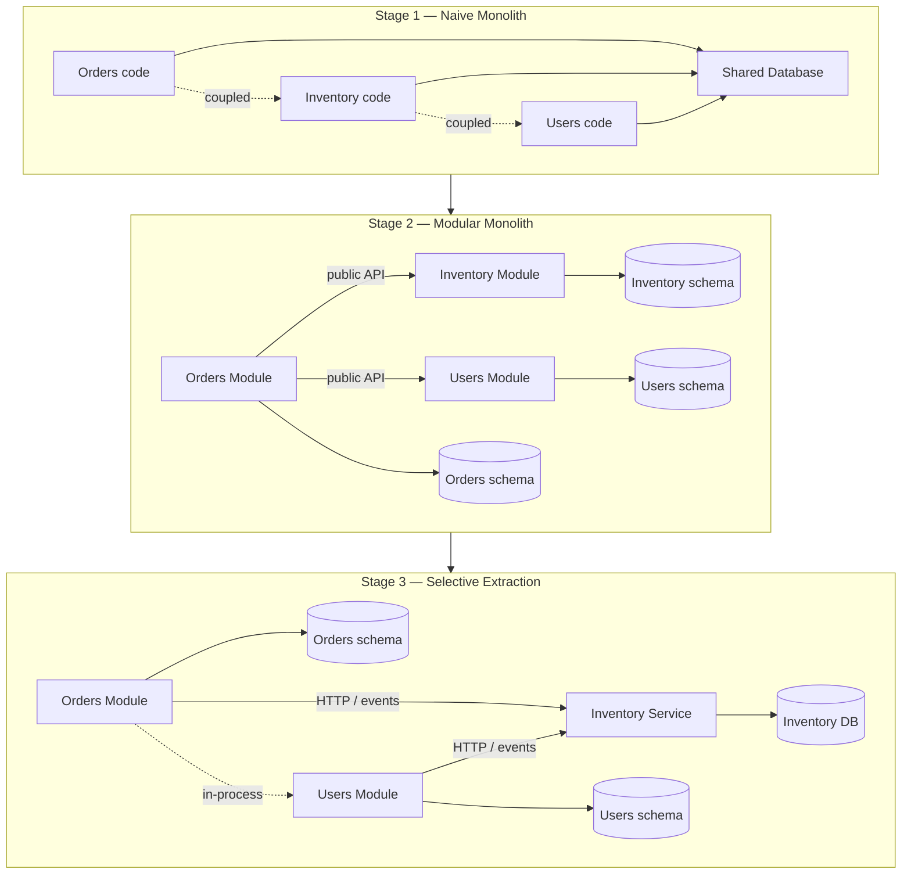
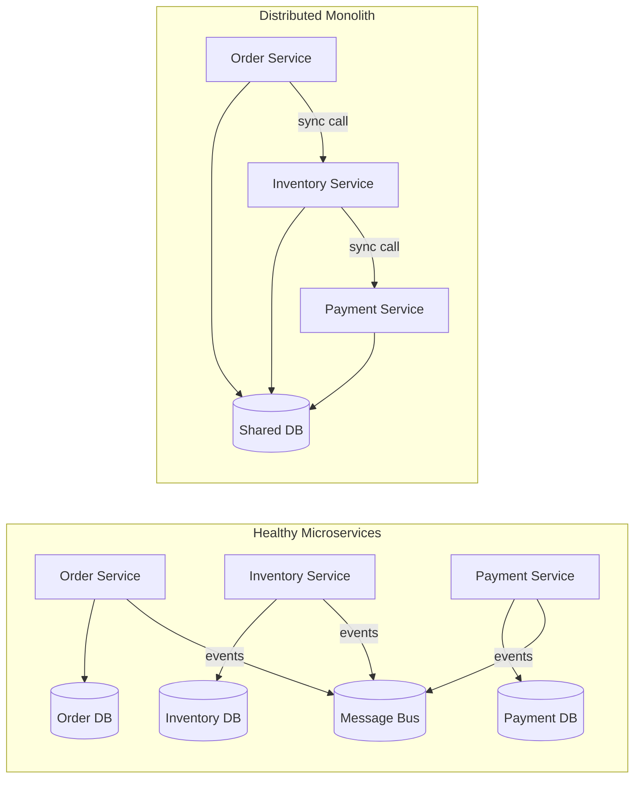
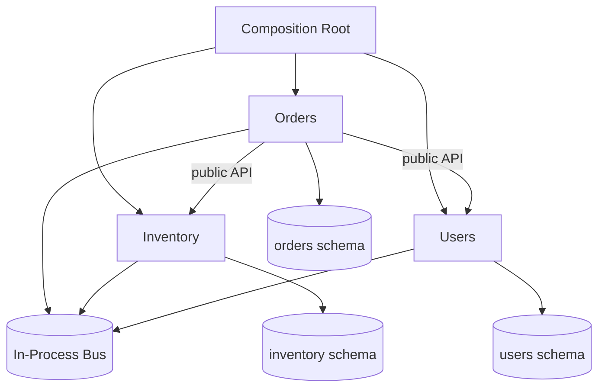

# 4.11 Modular Monolith vs Microservices

> A modular monolith is the disciplined middle path between an undifferentiated ball of mud and a fleet of distributed services that cannot survive without one another. It keeps the operational simplicity of a single deployable while imposing the internal discipline that microservices demand: bounded contexts, owned data, stable APIs, and a respect for Conway's Law. The hardest lesson in software architecture is that microservices are not a destination — they are an extraction you earn only after boundaries have stabilized inside a monolith. Extract too early and you get a distributed monolith, which is the worst of both worlds.

## 1. Purpose

This note exists because the choice between monolith, modular monolith, and microservices is one of the few architectural decisions that cannot be undone cheaply. A decade of conference talks and resume-driven development has produced a generation of engineers who believe that microservices are the default for any "serious" system, and that a monolith is a synonym for legacy. The opposite is closer to the truth: most teams that adopt microservices prematurely end up operating a distributed monolith — a system with the operational complexity of microservices and the coupling of a monolith, plus a network in between to add latency and failure modes.

The modular monolith exists because the naive monolith — a single deployable with no internal structure — does not scale with the size of the team or the complexity of the domain. A naive monolith starts as a small application with a few routes and a database. As features accumulate, modules bleed into each other. A change in the authentication code touches the billing tables. A refactor in the order pipeline breaks the email service. The deployment unit remains one, but the cognitive load grows quadratically, because every feature can interact with every other feature. The naive monolith is operationally simple but structurally degenerate. It is the architecture of a system that has not yet been architected.

The modular monolith preserves the operational simplicity of the single deployable while imposing internal structure. It is still one process, one database connection pool, one deployment pipeline, one set of logs. But inside, the code is divided into modules with hard boundaries: each module owns its own tables (or schema), exposes a well-defined API to other modules, and is forbidden from reaching into another module's internals. The internal structure mirrors what microservices would look like if you removed the network. The modular monolith exists to make the eventual transition to microservices possible — not inevitable — by forcing the boundaries to exist before the network does.

Microservices exist because some pressures cannot be answered by a single deployable. The first is independent scaling: if one component sees a hundred times the traffic of the others, running it on its own pool of machines lets the rest of the system stay small. The second is independent deployment cadence: when one team needs to ship a fix multiple times a day and every other team must coordinate around it, the friction becomes a tax on the organization. The third is technology diversity: a component that benefits from a different language, runtime, or datastore cannot easily live inside a homogeneous monolith. The fourth is team autonomy: when an organization grows past the Dunbar number, the coordination cost of a shared codebase exceeds the cost of running distributed services, and Conway's Law demands that the architecture split along team boundaries.

The trade-off is stark. A monolith is simple to operate — one process to deploy, one database to back up, one log stream to read — but hard to scale, because every instance runs every line of code. Microservices invert this. They are simple to scale (each service scales independently) but hard to operate: dozens of services, dozens of pipelines, distributed tracing, service meshes, eventual consistency, partial-failure handling, and a permanent taxonomy of outages that did not exist when the system was a single process. A monolith pays its complexity tax in the source code; microservices pay theirs in the operations layer. The modular monolith is the architecture that pays the smallest total tax for most systems most of the time, because the operational cost of distributed systems is rarely fully visible until you have lived with it for a year.

When to choose each: start with a modular monolith, even if you expect to extract microservices later. The modular monolith is the cheapest place to discover the right boundaries, because refactoring inside a single process is a hundred times cheaper than refactoring across a network. Extract a module as a microservice only when three conditions are simultaneously true: the boundary around it has stabilized, there is a concrete operational pressure that the single deployable cannot meet, and the team that owns the module has the operational maturity to run a service independently. Choose the naive monolith only for systems small enough that the cost of imposing module boundaries exceeds the cost of not having them. Choose microservices from day one only when the organization is already operating as multiple independent teams with separate on-call rotations, and the cost of cross-team coordination in a shared codebase is provably higher than the cost of distributed-systems operations.

By the end of this note you should be able to choose between the three architectures with explicit reasoning, design module boundaries that survive extraction, run the extraction from monolith to microservice without producing a distributed monolith, and diagnose a distributed-monolith anti-pattern when you see one in the wild.

## 2. Theory and Deep Dive

The three architectures — naive monolith, modular monolith, microservices — are not three points on a line. They are three points in a two-dimensional space whose axes are deployment topology and internal coupling. The naive monolith is one deployment with high internal coupling. The modular monolith is one deployment with low internal coupling. The microservices architecture is many deployments with low internal coupling. The fourth quadrant — many deployments with high internal coupling — is the distributed monolith, the anti-pattern that haunts most "microservices" codebases.

### 2.1 The Naive Monolith

A naive monolith is a single deployable unit with no enforced internal boundaries. Its identifying feature is not that it is one process — many modular monoliths are also one process — but that any part of the code can reach into any other part. The persistence layer of the orders feature reads directly from the users table. The email-sending code imports the order-totaling code, which imports the tax-calculation code, which imports the inventory-lookup code. The dependency graph of imports is a hairball. Tests are slow because every test boots the entire application. Refactors cascade. A change to a shared utility class can break a feature in a completely unrelated module.

The naive monolith is the architecture that emerges when no architecture is imposed. It is the default state of a codebase under pressure to ship features, because the fastest way to add a feature is to reach for whatever code already exists and extend it. Without an active counterforce — module boundaries, code ownership, lint rules forbidding cross-module imports — every codebase decays toward a naive monolith. Entropy increases unless work is done to decrease it.

### 2.2 The Modular Monolith

A modular monolith is a single deployable unit with enforced internal boundaries. The enforcement is structural: each module lives in its own directory, exposes a public API, and forbids other modules from importing its internals. The enforcement is also data-oriented: each module owns its own tables or its own schema, and other modules do not query those tables directly. Communication between modules happens through the public API, which is a set of in-process function calls with stable signatures.

The modular monolith borrows the most important discipline of microservices — bounded contexts with owned data and stable APIs — and applies it inside a single process. The result is operationally as simple as a naive monolith but structurally as disciplined as a microservice architecture. The trade-off is that the discipline has to be actively maintained. There is no network boundary to prevent the orders module from reaching into the inventory tables — only lint rules, code review, and architectural fitness functions. The boundary is a convention, not a physical fact. A well-built modular monolith has each module exposing a single entry point (a public API module), owning its own data, publishing and consuming events through an in-process event bus, with its own tests that do not require booting other modules. Each module can be extracted to a microservice without changing any code outside the module — the public API becomes the network contract.

### 2.3 Microservices

A microservices architecture is a system composed of independently deployable services, each running in its own process, communicating over a network. Each service owns its own data, exposes its own API (typically HTTP REST, gRPC, or GraphQL), and is deployed independently. The identifying feature is not the size of each service — "micro" is a misleading word that has caused enormous harm — but the independence of deployment, scaling, and ownership. Each service has its own deployment pipeline, its own release cadence, its own on-call rotation. Each service chooses its own technology stack. There is no shared database: if service A needs data owned by service B, it asks through the API or subscribes to events. Failures are partial: if service A is down, service B continues to serve requests that do not depend on A.

The hard part of microservices is not building them. The hard part is operating them. The operational surface area includes: distributed tracing, service discovery, load balancing, circuit breaking, retries with exponential backoff, idempotency, eventual consistency, schema evolution across independent services, canary deployments, feature flags, secret management per service, observability per service, on-call rotations per service, and the social coordination cost of cross-service incidents. A team that has not mastered these disciplines will produce a distributed monolith.

### 2.4 The Distributed Monolith

A distributed monolith is a system that has the deployment topology of microservices — many services, many processes, network communication — but the coupling of a monolith. It is the worst of both worlds. The identifying symptoms: services that cannot be deployed independently because a change in one requires a coordinated change in others; services that share a database, so a schema change in one breaks another; synchronous call chains where a request traverses five services before returning, so the latency is the sum of the latencies and the failure of any one service fails the chain; services that share a codebase through vendored libraries, so a bug fix in the library requires redeploying every service.

The distributed monolith is the default failure mode of premature microservices. The network boundary that was supposed to provide autonomy instead provides latency, failure modes, and serialization overhead, while the coupling that was supposed to disappear follows the team across the wire. The cure is to either consolidate the services back into a modular monolith (often the right answer) or to invest heavily in decoupling through async communication, event-driven boundaries, and eventual consistency.

### 2.5 Conway's Law

Melvin Conway observed in 1967 that "any organization that designs a system will produce a design whose structure is copies of the organization's communication structure." This is the single most predictive law in software architecture. If your engineering organization is divided into four teams, your system will have four components, regardless of what the architecture diagram claims. If your organization is one team of five people, your system will be a monolith, regardless of how many services you draw on the whiteboard.

Conway's Law is not a constraint to fight. It is a constraint to use. The corollary, called the "inverse Conway maneuver," is that you should design the organization you want first, and let the architecture follow. If you want microservices with clean boundaries, organize your teams around those boundaries — give each team end-to-end ownership of one service. If your organization is one team, do not build microservices: the team will not have the bandwidth to operate them, and the boundaries will erode under ship-it-now pressure, because the same people who own both services will shortcut the network call with a direct database query. The modular monolith is the right starting point for most teams because a small team can impose module boundaries inside a single deployable, and when the team grows and splits, the module boundaries become the team boundaries.

### 2.6 The Transition Path

The transition from naive monolith to modular monolith to microservices is not a one-way ratchet. It is a reversible journey, and most systems that go all the way to microservices end up consolidating some services back. The path has four stages.

Stage one is the naive monolith. The system is small, the team is small, the boundaries are not yet known. The right move is to ship features and observe where the natural seams emerge. Premature abstraction is as costly as premature distribution.

Stage two is the modular monolith. The system has grown to the point where the naive monolith is hurting — features step on each other, refactors cascade, tests are slow. The right move is to identify the natural modules — usually aligned with bounded contexts from domain-driven design — and impose boundaries: directory structure, public APIs, owned data, lint rules forbidding cross-module imports. The boundaries are still conventions, but they are enforced conventions.

Stage three is the selective extraction. One or two modules have grown to the point where the single deployable cannot meet their needs — they need to scale independently, deploy more frequently, or be owned by a separate team. The right move is to extract those modules as microservices, one at a time, with the extraction driven by a concrete operational pressure. The extraction is expensive — it requires designing a network contract, setting up a deployment pipeline, handling partial failure — and it should be done only when the payoff is clear.

Stage four is the steady state. Some modules are services, some are still inside the monolith. The system is a hybrid. This is the normal state of a mature system. The myth that a system must be "all microservices" or "all monolith" is a false dichotomy. Most mature systems are hybrids, with the most pressured modules extracted and the rest remaining in the monolith.

### 2.7 Communication Patterns

Inside a modular monolith, modules communicate through in-process function calls. The call is synchronous, the latency is sub-microsecond, and the failure modes are limited to exceptions thrown synchronously. This is the cheapest possible communication, and it is the reason the modular monolith is operationally simpler than microservices. When a module needs to communicate asynchronously — for example, to notify other modules that an order was placed — it publishes an event to an in-process event bus. Other modules subscribe and react. The event bus is a simple in-memory pub-sub, often built on Node's `EventEmitter`. This decouples the publisher from the subscribers.

When a module is extracted as a microservice, the communication crosses a network boundary. The in-process function call becomes an HTTP request, a gRPC call, or a message on a queue. The latency goes from sub-microsecond to milliseconds. The failure modes multiply: network partitions, service unavailability, timeouts, retries, duplicate messages. The event bus becomes a real message broker — Kafka, RabbitMQ, Redis Streams, SQS — with its own operational complexity.

The choice of synchronous versus asynchronous communication is independent of the deployment topology. A modular monolith can use async events, and microservices can use synchronous calls. But the trend should be toward async as the system grows, because synchronous chains are the primary cause of distributed-monolith anti-patterns. A request that traverses five services synchronously has the latency of the slowest service and the availability of the least available service.

### 2.8 Data Ownership

The single most important rule in either architecture is that each module (or service) owns its own data. Inside a modular monolith, this means each module has its own tables or its own schema, and other modules do not query those tables directly. If module B needs data owned by module A, it calls module A's public API. Inside a microservices architecture, this means each service has its own database.

The shared-database anti-pattern is the most common way to turn a microservices architecture into a distributed monolith. When multiple services share a database, a schema change in one can break another, the services become coupled at the data layer, and the supposed autonomy is illusory. The same anti-pattern inside a modular monolith — modules querying each other's tables — turns it into a naive monolith with extra steps. Data ownership has a cost: cross-module queries that would be a single SQL join become multiple API calls, and the system loses transactional consistency across modules. The compensation is eventual consistency through events and the Saga pattern, covered in [[4.10 CQRS and Event Sourcing]]. The loss of distributed transactions is a feature, not a bug: it forces the team to design for failure and make the boundaries explicit.

### 2.9 The Evolution Diagram

The following Mermaid diagram shows the evolution from a naive monolith through a modular monolith to a hybrid system with some extracted microservices. The evolution is not linear: the modular monolith is a stable state, and extraction is selective.



### 2.10 The Distributed Monolith Diagram

The following Mermaid diagram contrasts a healthy microservices architecture with a distributed monolith. The healthy architecture has async boundaries and owned data. The distributed monolith has synchronous chains and a shared database.



The healthy architecture can tolerate the failure of any one service because the others communicate asynchronously through the bus. The distributed monolith fails as a unit: if Inventory is down, Order cannot complete, and the shared database means a schema change in any service can break the others.

## 3. Mental Models

The architectures are easiest to reason about through physical metaphors. Each metaphor captures one essential property of the architecture it describes.

**The naive monolith is one big box.** Everything is in the same container. You do not need to label anything because there are no compartments. When you need to find something, you rummage. When you add something, you toss it in. The box is easy to carry because it has one handle. But the more you put in it, the harder it is to find anything, and the more likely it is that two things you toss in will collide. The naive monolith is the architecture of a mover who has not yet unpacked.

**The modular monolith is one big box, but inside it is organized into rooms.** The box still has one handle — you carry it as a unit, you ship it as a unit, you open it as a unit. But inside, there are walls. The kitchen stuff is in the kitchen. The bedroom stuff is in the bedroom. To move something from the kitchen to the bedroom, you walk through the door — you do not reach through the wall. The walls are conventions, not concrete, but everyone agrees to respect them. The modular monolith is the architecture of a well-organized household.

**Microservices are many small boxes, each talking to the others over the network.** Each box has its own handle. Each box can be carried by a different person. Each box can be replaced without unpacking the others. But to get something from one box to another, you have to send a message — and the message might get lost, or arrive late, or arrive twice. The cost of coordination goes up because the boxes cannot see inside each other. Microservices are the architecture of a city, where each building is independent but the mail must be delivered.

**The distributed monolith is many small boxes that cannot live without each other.** Each box has its own handle, but the contents are so tangled that you cannot move one box without opening the others. The boxes are nominally independent but functionally coupled. You pay the cost of many boxes — the handles, the labels, the separate shipping — and you get none of the benefit, because the boxes must travel together anyway. The distributed monolith is the architecture of a bad divorce, where the spouses have moved into separate apartments but still share a bank account and a kitchen.

**The transition is the act of extracting a room into its own building when it needs independence.** You do not extract every room. You extract the room that has grown so busy it needs its own staff, its own hours, its own security. The extraction is expensive — you have to build a new foundation, run a new door, set up a mail route — so you do it only when the payoff is clear. The transition is the architecture of a growing town, where the general store spins off a post office when the volume of mail justifies it.

These metaphors are reasoning tools. When you are about to extract a service, ask: is this room ready to be its own building? Does it have its own staff, its own hours, its own reason to exist independently? If the answer is no, the extraction will produce a distributed monolith. When you are about to share a database between two services, ask: would you share a kitchen with your ex-spouse? If the answer is no, do not share the database.

## 4. Real-World Use Cases

The case studies below are the canonical examples that the industry references when arguing for or against each architecture.

**Shopify — modular monolith at scale.** Shopify is the most cited example of a modular monolith operating at enormous scale. The platform processes billions of dollars in transactions per year from a single Ruby on Rails application. Shopify has explicitly rejected microservices for most of its system, arguing that the operational complexity of distributed services is not justified by the scaling pressure they solve. Instead, the company has invested heavily in module boundaries inside the monolith: each "component" (Shopify's term) has its own directory, public API, and data ownership. The monolith is deployed as a unit, but internally it is structured as if it were a fleet of services.

**GitHub — Ruby monolith.** GitHub runs one of the largest Ruby on Rails applications in the world. The company has been public about its commitment to the monolith and its skepticism of microservices, arguing that the productivity cost of distributed systems exceeds the scaling benefit for most of its workload. GitHub has extracted a small number of services for specific high-pressure components (for example, the git repository storage layer), but the bulk remains a single deployable. GitHub's approach is a textbook example of the hybrid steady state.

**Basecamp — Rails monolith.** Basecamp (formerly 37signals) is the company whose founders wrote the book on Ruby on Rails and have been vocal advocates of the monolith for over fifteen years. Basecamp's argument is economic: a small team can build and operate a monolith, while a microservices architecture requires a large operations team whose cost is not justified by the size of the customer base. Basecamp has shipped a series of products — Basecamp, Hey, Campfire — all as Rails monoliths, with a team of fewer than fifty engineers. The company's "Shape Up" methodology and the founders' blog posts are essential reading for anyone considering the trade-off.

**Amazon — microservices at scale.** Amazon is the canonical case study for microservices at scale. The company's transition from a monolith to a service-oriented architecture in the early 2000s is the origin story of the modern microservices movement. Jeff Bezos's famous "API mandate" — every team must expose its functionality through a network API, and no team may connect to another team's database directly — was the catalyst. The mandate was an organizational intervention as much as a technical one: it forced the company to organize around services, with each service owned by a team that had end-to-end responsibility. The lesson from Amazon is not "you should use microservices" but "you should use microservices when you are Amazon's size."

**Netflix — microservices at scale.** Netflix is the second canonical case study. The migration from a monolithic DVD-shipping application to a microservices-based streaming platform is one of the most documented architectural transitions in the industry. Netflix's argument was driven by two pressures: the need to scale to tens of millions of concurrent users, and the need for the engineering organization to grow past a few hundred engineers without coordination collapse. The company built an entire platform — Asgard, Eureka, Hystrix, Zuul — to operate its microservices, and open-sourced much of it. Netflix is also a cautionary tale: the company has since consolidated some of its more granular services, acknowledging that the cost of operating thousands of services exceeded the benefit, and that the right granularity is coarser than the early literature suggested.

**Startups — start monolith, extract later.** The dominant pattern in startups is to begin with a monolith — often a naive monolith, sometimes a modular one — and to extract microservices only when a concrete pressure forces the extraction. The reason is economic: a startup with five engineers cannot operate a microservices architecture, but it can ship a monolith. The successful startups — Stripe, Airbnb, Uber in its early years — all began as monoliths and extracted services as they scaled.

**Enterprise — microservices for team autonomy.** Large enterprises often adopt microservices not for technical reasons but for organizational ones. When an enterprise has dozens of engineering teams, each with its own priorities and release cadence, the coordination cost of a shared codebase exceeds the operational cost of distributed services. Microservices allow each team to own its slice end-to-end, ship at its own cadence, and choose its own technology within organizational standards. The trade-off is that the enterprise must invest in platform engineering — a team that builds and operates the shared infrastructure that the product teams build on. Without that platform investment, the enterprise ends up with a distributed monolith.

## 5. Code Examples

The two examples below illustrate the architectures in code. Example A is a minimal modular monolith with two modules (orders and inventory) and a well-defined public API. Example B is a production-grade extraction of the inventory module as a microservice with an event-driven boundary.

### 5.1 Example A — Minimal and Conceptual

The minimal example shows the structure of a modular monolith. There are two modules — `orders` and `inventory` — each with its own data and a public API. The modules communicate through in-process function calls. The example is intentionally small but shows all the structural elements: module boundaries, public APIs, owned data, and a composition root that wires the modules together.

#### TypeScript

```typescript
// src/modules/inventory/inventory.types.ts
export type Sku = string;
export type Quantity = number;

export interface StockLevel {
  sku: Sku;
  available: Quantity;
  reserved: Quantity;
}

export interface ReservationResult {
  reservationId: string;
  sku: Sku;
  quantity: Quantity;
  expiresAt: Date;
}
```

```typescript
// src/modules/inventory/inventory.public-api.ts
import type { Sku, Quantity, StockLevel, ReservationResult } from "./inventory.types";

export interface InventoryApi {
  getStock(sku: Sku): Promise<StockLevel>;
  reserve(sku: Sku, qty: Quantity): Promise<ReservationResult>;
  release(reservationId: string): Promise<void>;
  commit(reservationId: string): Promise<void>;
}
```

```typescript
// src/modules/inventory/inventory.repository.ts
import type { Sku, StockLevel } from "./inventory.types";

export class InventoryRepository {
  private db: Map<Sku, StockLevel> = new Map();

  async upsert(level: StockLevel): Promise<void> {
    this.db.set(level.sku, level);
  }

  async find(sku: Sku): Promise<StockLevel | null> {
    return this.db.get(sku) ?? null;
  }

  async mutate(sku: Sku, fn: (level: StockLevel) => StockLevel): Promise<void> {
    const current = await this.find(sku);
    if (!current) throw new Error(`Unknown sku: ${sku}`);
    await this.upsert(fn(current));
  }
}
```

```typescript
// src/modules/inventory/inventory.module.ts
import type { InventoryApi } from "./inventory.public-api";
import { InventoryRepository } from "./inventory.repository";
import type { Sku, Quantity, ReservationResult } from "./inventory.types";

export class InventoryModule implements InventoryApi {
  private reservations: Map<string, { sku: Sku; qty: Quantity; expiresAt: Date }> = new Map();

  constructor(private readonly repo: InventoryRepository) {}

  async getStock(sku: Sku): Promise<{ sku: Sku; available: number; reserved: number }> {
    const level = await this.repo.find(sku);
    if (!level) throw new Error(`Unknown sku: ${sku}`);
    return level;
  }

  async reserve(sku: Sku, qty: Quantity): Promise<ReservationResult> {
    const level = await this.repo.find(sku);
    if (!level) throw new Error(`Unknown sku: ${sku}`);
    if (level.available < qty) throw new Error(`Insufficient stock for ${sku}`);
    const reservationId = crypto.randomUUID();
    const expiresAt = new Date(Date.now() + 5 * 60 * 1000);
    await this.repo.mutate(sku, (l) => ({
      ...l,
      available: l.available - qty,
      reserved: l.reserved + qty,
    }));
    this.reservations.set(reservationId, { sku, qty, expiresAt });
    return { reservationId, sku, quantity: qty, expiresAt };
  }

  async release(reservationId: string): Promise<void> {
    const r = this.reservations.get(reservationId);
    if (!r) return;
    await this.repo.mutate(r.sku, (l) => ({
      ...l,
      available: l.available + r.qty,
      reserved: l.reserved - r.qty,
    }));
    this.reservations.delete(reservationId);
  }

  async commit(reservationId: string): Promise<void> {
    const r = this.reservations.get(reservationId);
    if (!r) throw new Error(`Unknown reservation: ${reservationId}`);
    await this.repo.mutate(r.sku, (l) => ({ ...l, reserved: l.reserved - r.qty }));
    this.reservations.delete(reservationId);
  }
}
```

```typescript
// src/modules/orders/orders.types.ts
import type { Sku, Quantity } from "../inventory/inventory.types";

export type OrderId = string;
export type UserId = string;

export interface OrderLine {
  sku: Sku;
  quantity: Quantity;
  unitPrice: number;
}

export interface Order {
  id: OrderId;
  userId: UserId;
  lines: OrderLine[];
  status: "pending" | "confirmed" | "cancelled";
  createdAt: Date;
}
```

```typescript
// src/modules/orders/orders.public-api.ts
import type { Order, OrderId, UserId, OrderLine } from "./orders.types";

export interface OrdersApi {
  placeOrder(userId: UserId, lines: OrderLine[]): Promise<Order>;
  getOrder(id: OrderId): Promise<Order | null>;
  cancelOrder(id: OrderId): Promise<void>;
}
```

```typescript
// src/modules/orders/orders.module.ts
import type { OrdersApi } from "./orders.public-api";
import type { Order, OrderId, UserId, OrderLine } from "./orders.types";
import type { InventoryApi } from "../inventory/inventory.public-api";

export class OrdersModule implements OrdersApi {
  private orders: Map<OrderId, Order> = new Map();

  constructor(
    private readonly inventory: InventoryApi,
    private readonly priceList: Map<string, number>,
  ) {}

  async placeOrder(userId: UserId, lines: OrderLine[]): Promise<Order> {
    if (lines.length === 0) throw new Error("Cannot place an empty order");
    const reservations: string[] = [];
    try {
      for (const line of lines) {
        const r = await this.inventory.reserve(line.sku, line.quantity);
        reservations.push(r.reservationId);
      }
      const order: Order = {
        id: crypto.randomUUID(),
        userId,
        lines,
        status: "confirmed",
        createdAt: new Date(),
      };
      for (const r of reservations) await this.inventory.commit(r);
      this.orders.set(order.id, order);
      return order;
    } catch (err) {
      for (const r of reservations) await this.inventory.release(r);
      throw err;
    }
  }

  async getOrder(id: OrderId): Promise<Order | null> {
    return this.orders.get(id) ?? null;
  }

  async cancelOrder(id: OrderId): Promise<void> {
    const order = this.orders.get(id);
    if (!order) return;
    order.status = "cancelled";
    this.orders.set(id, order);
  }
}
```

```typescript
// src/app.ts — composition root
import { InventoryRepository } from "./modules/inventory/inventory.repository";
import { InventoryModule } from "./modules/inventory/inventory.module";
import { OrdersModule } from "./modules/orders/orders.module";

export function buildApp() {
  const inventoryRepo = new InventoryRepository();
  const inventory = new InventoryModule(inventoryRepo);
  const priceList = new Map([["sku-1", 9.99], ["sku-2", 19.99]]);
  const orders = new OrdersModule(inventory, priceList);
  return { inventory, orders };
}
```

The structure above can be enforced with a lint rule that forbids imports across module internals. A module may only import another module's `.public-api.ts` file.

#### JavaScript

```javascript
// src/modules/inventory/inventory.repository.js
export class InventoryRepository {
  constructor() {
    this.db = new Map();
  }
  async upsert(level) { this.db.set(level.sku, level); }
  async find(sku) { return this.db.get(sku) ?? null; }
  async mutate(sku, fn) {
    const current = await this.find(sku);
    if (!current) throw new Error(`Unknown sku: ${sku}`);
    await this.upsert(fn(current));
  }
}
```

```javascript
// src/modules/inventory/inventory.module.js
export class InventoryModule {
  constructor(repo) {
    this.repo = repo;
    this.reservations = new Map();
  }
  async getStock(sku) {
    const level = await this.repo.find(sku);
    if (!level) throw new Error(`Unknown sku: ${sku}`);
    return level;
  }
  async reserve(sku, qty) {
    const level = await this.repo.find(sku);
    if (!level) throw new Error(`Unknown sku: ${sku}`);
    if (level.available < qty) throw new Error(`Insufficient stock for ${sku}`);
    const reservationId = crypto.randomUUID();
    const expiresAt = new Date(Date.now() + 5 * 60 * 1000);
    await this.repo.mutate(sku, (l) => ({
      ...l, available: l.available - qty, reserved: l.reserved + qty,
    }));
    this.reservations.set(reservationId, { sku, qty, expiresAt });
    return { reservationId, sku, quantity: qty, expiresAt };
  }
  async release(reservationId) {
    const r = this.reservations.get(reservationId);
    if (!r) return;
    await this.repo.mutate(r.sku, (l) => ({
      ...l, available: l.available + r.qty, reserved: l.reserved - r.qty,
    }));
    this.reservations.delete(reservationId);
  }
  async commit(reservationId) {
    const r = this.reservations.get(reservationId);
    if (!r) throw new Error(`Unknown reservation: ${reservationId}`);
    await this.repo.mutate(r.sku, (l) => ({ ...l, reserved: l.reserved - r.qty }));
    this.reservations.delete(reservationId);
  }
}
```

```javascript
// src/modules/orders/orders.module.js
export class OrdersModule {
  constructor(inventory, priceList) {
    this.inventory = inventory;
    this.priceList = priceList;
    this.orders = new Map();
  }
  async placeOrder(userId, lines) {
    if (lines.length === 0) throw new Error("Cannot place an empty order");
    const reservations = [];
    try {
      for (const line of lines) {
        const r = await this.inventory.reserve(line.sku, line.quantity);
        reservations.push(r.reservationId);
      }
      const order = {
        id: crypto.randomUUID(), userId, lines,
        status: "confirmed", createdAt: new Date(),
      };
      for (const r of reservations) await this.inventory.commit(r);
      this.orders.set(order.id, order);
      return order;
    } catch (err) {
      for (const r of reservations) await this.inventory.release(r);
      throw err;
    }
  }
  async getOrder(id) { return this.orders.get(id) ?? null; }
  async cancelOrder(id) {
    const order = this.orders.get(id);
    if (!order) return;
    order.status = "cancelled";
    this.orders.set(id, order);
  }
}
```

```javascript
// src/app.js — composition root
import { InventoryRepository } from "./modules/inventory/inventory.repository.js";
import { InventoryModule } from "./modules/inventory/inventory.module.js";
import { OrdersModule } from "./modules/orders/orders.module.js";

export function buildApp() {
  const inventoryRepo = new InventoryRepository();
  const inventory = new InventoryModule(inventoryRepo);
  const priceList = new Map([["sku-1", 9.99], ["sku-2", 19.99]]);
  const orders = new OrdersModule(inventory, priceList);
  return { inventory, orders };
}
```

The JavaScript version is structurally identical to the TypeScript version. The only difference is the absence of type annotations. The module boundaries, public APIs, and data ownership are enforced by the same conventions: file structure, code review, and a lint rule that forbids cross-module imports of internal files.

### 5.2 Example B — Production-Grade

The production-grade example extends the modular monolith above to extract the inventory module as a microservice. The extraction has three parts. First, the inventory module is lifted out of the monolith into its own service. Second, an event-driven boundary is introduced so that the orders module does not need to call the inventory service synchronously — instead, it publishes a command to reserve stock, and the inventory service publishes an event when the reservation is confirmed. Third, the orders module subscribes to the inventory service's events and updates its own state in response.

This pattern is called "command and event" or "request and reply over a message bus." It decouples the two services temporally: the orders module does not block waiting for the inventory service, and the inventory service does not need to be available when the orders module publishes the command. The trade-off is that the orders module must handle the case where the inventory service never replies — a timeout, a retry, a compensating action.

#### TypeScript — shared contract

```typescript
// shared/contracts.ts — published as a package both services depend on
export interface ReserveStockCommand {
  commandId: string;
  correlationId: string;
  sku: string;
  quantity: number;
  orderId: string;
}

export interface StockReservedEvent {
  eventId: string;
  correlationId: string;
  reservationId: string;
  sku: string;
  quantity: number;
  orderId: string;
  expiresAt: string;
}

export interface StockUnavailableEvent {
  eventId: string;
  correlationId: string;
  orderId: string;
  sku: string;
  reason: "insufficient" | "unknown-sku";
}

export interface CommitReservationCommand {
  commandId: string;
  correlationId: string;
  reservationId: string;
}

export interface ReleaseReservationCommand {
  commandId: string;
  correlationId: string;
  reservationId: string;
}
```

#### TypeScript — the message bus abstraction

```typescript
// shared/message-bus.ts
export interface Message {
  messageId: string;
  correlationId: string;
  type: string;
  payload: unknown;
  occurredAt: string;
}

export interface MessageBus {
  publish(topic: string, message: Message): Promise<void>;
  subscribe(topic: string, handler: (message: Message) => Promise<void>): Promise<void>;
}
```

```typescript
// shared/redis-message-bus.ts
import type { Message, MessageBus } from "./message-bus";
import { createClient } from "redis";

export class RedisMessageBus implements MessageBus {
  private publisher;
  private subscriber;
  private handlers: Map<string, Set<(m: Message) => Promise<void>>> = new Map();

  constructor(url: string) {
    this.publisher = createClient({ url });
    this.subscriber = createClient({ url });
  }

  async connect(): Promise<void> {
    await this.publisher.connect();
    await this.subscriber.connect();
    await this.subscriber.pSubscribe(">*", async (raw, channel) => {
      const message = JSON.parse(raw) as Message;
      const handlers = this.handlers.get(channel) ?? new Set();
      for (const handler of handlers) {
        try { await handler(message); } catch (err) { console.error("Handler error", err); }
      }
    });
  }

  async publish(topic: string, message: Message): Promise<void> {
    await this.publisher.publish(topic, JSON.stringify(message));
  }

  async subscribe(topic: string, handler: (m: Message) => Promise<void>): Promise<void> {
    if (!this.handlers.has(topic)) this.handlers.set(topic, new Set());
    this.handlers.get(topic)!.add(handler);
  }
}
```

#### TypeScript — inventory service (extracted microservice)

```typescript
// inventory-service/src/main.ts
import { RedisMessageBus } from "../../shared/redis-message-bus";
import { InventoryRepository } from "./inventory.repository";
import { InventoryService } from "./inventory.service";

async function main() {
  const redisUrl = process.env.REDISURL ?? "redis://localhost:6379";
  const bus = new RedisMessageBus(redisUrl);
  await bus.connect();
  const repo = new InventoryRepository();
  await repo.seed([
    { sku: "sku-1", available: 100, reserved: 0 },
    { sku: "sku-2", available: 50, reserved: 0 },
  ]);
  const service = new InventoryService(repo, bus);
  await service.start();
  console.log("Inventory service started");
}

main().catch((err) => { console.error(err); process.exit(1); });
```

```typescript
// inventory-service/src/inventory.service.ts
import type { MessageBus, Message } from "../../shared/message-bus";
import type {
  ReserveStockCommand, CommitReservationCommand, ReleaseReservationCommand,
  StockReservedEvent, StockUnavailableEvent,
} from "../../shared/contracts";
import { InventoryRepository } from "./inventory.repository";

export class InventoryService {
  constructor(
    private readonly repo: InventoryRepository,
    private readonly bus: MessageBus,
  ) {}

  async start(): Promise<void> {
    await this.bus.subscribe("inventory.commands.reserve", (m) => this.handleReserve(m));
    await this.bus.subscribe("inventory.commands.commit", (m) => this.handleCommit(m));
    await this.bus.subscribe("inventory.commands.release", (m) => this.handleRelease(m));
  }

  private async handleReserve(message: Message): Promise<void> {
    const cmd = message.payload as ReserveStockCommand;
    try {
      const reservation = await this.reserve(cmd.sku, cmd.quantity, cmd.orderId);
      const event: StockReservedEvent = {
        eventId: crypto.randomUUID(),
        correlationId: message.correlationId,
        reservationId: reservation.reservationId,
        sku: cmd.sku, quantity: cmd.quantity, orderId: cmd.orderId,
        expiresAt: reservation.expiresAt.toISOString(),
      };
      await this.bus.publish("inventory.events.reserved", {
        messageId: crypto.randomUUID(), correlationId: message.correlationId,
        type: "StockReserved", payload: event, occurredAt: new Date().toISOString(),
      });
    } catch (err) {
      const reason = (err as Error).message.includes("Unknown") ? "unknown-sku" : "insufficient";
      const event: StockUnavailableEvent = {
        eventId: crypto.randomUUID(), correlationId: message.correlationId,
        orderId: cmd.orderId, sku: cmd.sku, reason,
      };
      await this.bus.publish("inventory.events.unavailable", {
        messageId: crypto.randomUUID(), correlationId: message.correlationId,
        type: "StockUnavailable", payload: event, occurredAt: new Date().toISOString(),
      });
    }
  }

  private async handleCommit(message: Message): Promise<void> {
    const cmd = message.payload as CommitReservationCommand;
    await this.commit(cmd.reservationId);
  }

  private async handleRelease(message: Message): Promise<void> {
    const cmd = message.payload as ReleaseReservationCommand;
    await this.release(cmd.reservationId);
  }

  private async reserve(sku: string, qty: number, orderId: string) {
    const level = await this.repo.find(sku);
    if (!level) throw new Error(`Unknown sku: ${sku}`);
    if (level.available < qty) throw new Error(`Insufficient stock for ${sku}`);
    const reservationId = crypto.randomUUID();
    const expiresAt = new Date(Date.now() + 5 * 60 * 1000);
    await this.repo.mutate(sku, (l) => ({
      ...l, available: l.available - qty, reserved: l.reserved + qty,
    }));
    await this.repo.saveReservation({ reservationId, sku, qty, orderId, expiresAt });
    return { reservationId, expiresAt };
  }

  private async commit(reservationId: string): Promise<void> {
    const r = await this.repo.findReservation(reservationId);
    if (!r) throw new Error(`Unknown reservation: ${reservationId}`);
    await this.repo.mutate(r.sku, (l) => ({ ...l, reserved: l.reserved - r.qty }));
    await this.repo.deleteReservation(reservationId);
  }

  private async release(reservationId: string): Promise<void> {
    const r = await this.repo.findReservation(reservationId);
    if (!r) return;
    await this.repo.mutate(r.sku, (l) => ({
      ...l, available: l.available + r.qty, reserved: l.reserved - r.qty,
    }));
    await this.repo.deleteReservation(reservationId);
  }
}
```

#### TypeScript — orders module in the monolith (now async)

```typescript
// src/modules/orders/orders.module.ts (revised)
import type { MessageBus, Message } from "../../../shared/message-bus";
import type {
  ReserveStockCommand, StockReservedEvent, StockUnavailableEvent,
  CommitReservationCommand, ReleaseReservationCommand,
} from "../../../shared/contracts";
import type { Order, OrderId, UserId, OrderLine } from "./orders.types";

interface PendingOrder {
  orderId: OrderId;
  userId: UserId;
  lines: OrderLine[];
  reservations: Map<string, string>;
  createdAt: Date;
}

export class OrdersModule {
  private orders: Map<OrderId, Order> = new Map();
  private pending: Map<string, PendingOrder> = new Map();
  private awaiters: Map<string, {
    resolve: (r: string) => void;
    reject: (e: Error) => void;
    timer: NodeJS.Timeout;
  }> = new Map();

  constructor(
    private readonly bus: MessageBus,
    private readonly priceList: Map<string, number>,
  ) {}

  async start(): Promise<void> {
    await this.bus.subscribe("inventory.events.reserved", (m) => this.onReserved(m));
    await this.bus.subscribe("inventory.events.unavailable", (m) => this.onUnavailable(m));
  }

  async placeOrder(userId: UserId, lines: OrderLine[]): Promise<Order> {
    if (lines.length === 0) throw new Error("Cannot place an empty order");
    const orderId = crypto.randomUUID();
    const correlationId = orderId;
    const pending: PendingOrder = {
      orderId, userId, lines,
      reservations: new Map(), createdAt: new Date(),
    };
    this.pending.set(correlationId, pending);

    const reservations: Promise<string>[] = lines.map((line) =>
      this.requestReservation(correlationId, orderId, line.sku, line.quantity),
    );

    try {
      const reservationIds = await Promise.all(reservations);
      for (let i = 0; i < lines.length; i++) {
        pending.reservations.set(lines[i].sku, reservationIds[i]);
      }
      for (const rid of reservationIds) {
        const cmd: CommitReservationCommand = {
          commandId: crypto.randomUUID(), correlationId, reservationId: rid,
        };
        await this.bus.publish("inventory.commands.commit", {
          messageId: crypto.randomUUID(), correlationId,
          type: "CommitReservation", payload: cmd, occurredAt: new Date().toISOString(),
        });
      }
      const order: Order = {
        id: orderId, userId, lines, status: "confirmed", createdAt: pending.createdAt,
      };
      this.orders.set(orderId, order);
      this.pending.delete(correlationId);
      return order;
    } catch (err) {
      for (const [, rid] of pending.reservations) {
        const cmd: ReleaseReservationCommand = {
          commandId: crypto.randomUUID(), correlationId, reservationId: rid,
        };
        await this.bus.publish("inventory.commands.release", {
          messageId: crypto.randomUUID(), correlationId,
          type: "ReleaseReservation", payload: cmd, occurredAt: new Date().toISOString(),
        });
      }
      this.pending.delete(correlationId);
      throw err;
    }
  }

  private requestReservation(
    correlationId: string, orderId: string, sku: string, qty: number,
  ): Promise<string> {
    return new Promise((resolve, reject) => {
      const timer = setTimeout(() => {
        this.awaiters.delete(correlationId + ":" + sku);
        reject(new Error(`Reservation timeout for ${sku}`));
      }, 5000);
      this.awaiters.set(correlationId + ":" + sku, { resolve, reject, timer });
      const cmd: ReserveStockCommand = {
        commandId: crypto.randomUUID(), correlationId, sku, quantity: qty, orderId,
      };
      this.bus.publish("inventory.commands.reserve", {
        messageId: crypto.randomUUID(), correlationId,
        type: "ReserveStock", payload: cmd, occurredAt: new Date().toISOString(),
      });
    });
  }

  private async onReserved(message: Message): Promise<void> {
    const evt = message.payload as StockReservedEvent;
    const key = message.correlationId + ":" + evt.sku;
    const awaiter = this.awaiters.get(key);
    if (awaiter) {
      clearTimeout(awaiter.timer);
      this.awaiters.delete(key);
      awaiter.resolve(evt.reservationId);
    }
  }

  private async onUnavailable(message: Message): Promise<void> {
    const evt = message.payload as StockUnavailableEvent;
    const key = message.correlationId + ":" + evt.sku;
    const awaiter = this.awaiters.get(key);
    if (awaiter) {
      clearTimeout(awaiter.timer);
      this.awaiters.delete(key);
      awaiter.reject(new Error(`Stock unavailable for ${evt.sku}: ${evt.reason}`));
    }
  }

  async getOrder(id: OrderId): Promise<Order | null> {
    return this.orders.get(id) ?? null;
  }

  async cancelOrder(id: OrderId): Promise<void> {
    const order = this.orders.get(id);
    if (!order) return;
    order.status = "cancelled";
    this.orders.set(id, order);
  }
}
```

#### JavaScript — shared contract

```javascript
// shared/contracts.js — documentation only, no runtime types
// ReserveStockCommand: { commandId, correlationId, sku, quantity, orderId }
// StockReservedEvent: { eventId, correlationId, reservationId, sku, quantity, orderId, expiresAt }
// StockUnavailableEvent: { eventId, correlationId, orderId, sku, reason }
// CommitReservationCommand: { commandId, correlationId, reservationId }
// ReleaseReservationCommand: { commandId, correlationId, reservationId }
```

#### JavaScript — the message bus abstraction

```javascript
// shared/message-bus.js
import { createClient } from "redis";

export class RedisMessageBus {
  constructor(url) {
    this.publisher = createClient({ url });
    this.subscriber = createClient({ url });
    this.handlers = new Map();
  }
  async connect() {
    await this.publisher.connect();
    await this.subscriber.connect();
    await this.subscriber.pSubscribe(">*", async (raw, channel) => {
      const message = JSON.parse(raw);
      const handlers = this.handlers.get(channel) ?? new Set();
      for (const handler of handlers) {
        try { await handler(message); } catch (err) { console.error("Handler error", err); }
      }
    });
  }
  async publish(topic, message) {
    await this.publisher.publish(topic, JSON.stringify(message));
  }
  async subscribe(topic, handler) {
    if (!this.handlers.has(topic)) this.handlers.set(topic, new Set());
    this.handlers.get(topic).add(handler);
  }
}
```

#### JavaScript — inventory service (extracted microservice)

```javascript
// inventory-service/src/inventory.service.js
export class InventoryService {
  constructor(repo, bus) {
    this.repo = repo;
    this.bus = bus;
  }
  async start() {
    await this.bus.subscribe("inventory.commands.reserve", (m) => this.handleReserve(m));
    await this.bus.subscribe("inventory.commands.commit", (m) => this.handleCommit(m));
    await this.bus.subscribe("inventory.commands.release", (m) => this.handleRelease(m));
  }
  async handleReserve(message) {
    const cmd = message.payload;
    try {
      const reservation = await this.reserve(cmd.sku, cmd.quantity, cmd.orderId);
      await this.bus.publish("inventory.events.reserved", {
        messageId: crypto.randomUUID(), correlationId: message.correlationId,
        type: "StockReserved",
        payload: {
          eventId: crypto.randomUUID(), correlationId: message.correlationId,
          reservationId: reservation.reservationId, sku: cmd.sku,
          quantity: cmd.quantity, orderId: cmd.orderId,
          expiresAt: reservation.expiresAt.toISOString(),
        },
        occurredAt: new Date().toISOString(),
      });
    } catch (err) {
      const reason = err.message.includes("Unknown") ? "unknown-sku" : "insufficient";
      await this.bus.publish("inventory.events.unavailable", {
        messageId: crypto.randomUUID(), correlationId: message.correlationId,
        type: "StockUnavailable",
        payload: {
          eventId: crypto.randomUUID(), correlationId: message.correlationId,
          orderId: cmd.orderId, sku: cmd.sku, reason,
        },
        occurredAt: new Date().toISOString(),
      });
    }
  }
  async handleCommit(message) {
    const cmd = message.payload;
    await this.commit(cmd.reservationId);
  }
  async handleRelease(message) {
    const cmd = message.payload;
    await this.release(cmd.reservationId);
  }
  async reserve(sku, qty, orderId) {
    const level = await this.repo.find(sku);
    if (!level) throw new Error(`Unknown sku: ${sku}`);
    if (level.available < qty) throw new Error(`Insufficient stock for ${sku}`);
    const reservationId = crypto.randomUUID();
    const expiresAt = new Date(Date.now() + 5 * 60 * 1000);
    await this.repo.mutate(sku, (l) => ({
      ...l, available: l.available - qty, reserved: l.reserved + qty,
    }));
    await this.repo.saveReservation({ reservationId, sku, qty, orderId, expiresAt });
    return { reservationId, expiresAt };
  }
  async commit(reservationId) {
    const r = await this.repo.findReservation(reservationId);
    if (!r) throw new Error(`Unknown reservation: ${reservationId}`);
    await this.repo.mutate(r.sku, (l) => ({ ...l, reserved: l.reserved - r.qty }));
    await this.repo.deleteReservation(reservationId);
  }
  async release(reservationId) {
    const r = await this.repo.findReservation(reservationId);
    if (!r) return;
    await this.repo.mutate(r.sku, (l) => ({
      ...l, available: l.available + r.qty, reserved: l.reserved - r.qty,
    }));
    await this.repo.deleteReservation(reservationId);
  }
}
```

```javascript
// inventory-service/src/main.js
import { RedisMessageBus } from "../../shared/message-bus.js";
import { InventoryRepository } from "./inventory.repository.js";
import { InventoryService } from "./inventory.service.js";

async function main() {
  const redisUrl = process.env.REDISURL ?? "redis://localhost:6379";
  const bus = new RedisMessageBus(redisUrl);
  await bus.connect();
  const repo = new InventoryRepository();
  await repo.seed([
    { sku: "sku-1", available: 100, reserved: 0 },
    { sku: "sku-2", available: 50, reserved: 0 },
  ]);
  const service = new InventoryService(repo, bus);
  await service.start();
  console.log("Inventory service started");
}

main().catch((err) => { console.error(err); process.exit(1); });
```

#### JavaScript — orders module in the monolith (now async)

```javascript
// src/modules/orders/orders.module.js (revised)
export class OrdersModule {
  constructor(bus, priceList) {
    this.bus = bus;
    this.priceList = priceList;
    this.orders = new Map();
    this.pending = new Map();
    this.awaiters = new Map();
  }
  async start() {
    await this.bus.subscribe("inventory.events.reserved", (m) => this.onReserved(m));
    await this.bus.subscribe("inventory.events.unavailable", (m) => this.onUnavailable(m));
  }
  async placeOrder(userId, lines) {
    if (lines.length === 0) throw new Error("Cannot place an empty order");
    const orderId = crypto.randomUUID();
    const correlationId = orderId;
    const pending = {
      orderId, userId, lines, reservations: new Map(), createdAt: new Date(),
    };
    this.pending.set(correlationId, pending);
    const reservations = lines.map((line) =>
      this.requestReservation(correlationId, orderId, line.sku, line.quantity),
    );
    try {
      const reservationIds = await Promise.all(reservations);
      for (let i = 0; i < lines.length; i++) {
        pending.reservations.set(lines[i].sku, reservationIds[i]);
      }
      for (const rid of reservationIds) {
        await this.bus.publish("inventory.commands.commit", {
          messageId: crypto.randomUUID(), correlationId,
          type: "CommitReservation",
          payload: { commandId: crypto.randomUUID(), correlationId, reservationId: rid },
          occurredAt: new Date().toISOString(),
        });
      }
      const order = {
        id: orderId, userId, lines, status: "confirmed", createdAt: pending.createdAt,
      };
      this.orders.set(orderId, order);
      this.pending.delete(correlationId);
      return order;
    } catch (err) {
      for (const [, rid] of pending.reservations) {
        await this.bus.publish("inventory.commands.release", {
          messageId: crypto.randomUUID(), correlationId,
          type: "ReleaseReservation",
          payload: { commandId: crypto.randomUUID(), correlationId, reservationId: rid },
          occurredAt: new Date().toISOString(),
        });
      }
      this.pending.delete(correlationId);
      throw err;
    }
  }
  requestReservation(correlationId, orderId, sku, qty) {
    return new Promise((resolve, reject) => {
      const timer = setTimeout(() => {
        this.awaiters.delete(correlationId + ":" + sku);
        reject(new Error(`Reservation timeout for ${sku}`));
      }, 5000);
      this.awaiters.set(correlationId + ":" + sku, { resolve, reject, timer });
      this.bus.publish("inventory.commands.reserve", {
        messageId: crypto.randomUUID(), correlationId, type: "ReserveStock",
        payload: { commandId: crypto.randomUUID(), correlationId, sku, quantity: qty, orderId },
        occurredAt: new Date().toISOString(),
      });
    });
  }
  async onReserved(message) {
    const evt = message.payload;
    const key = message.correlationId + ":" + evt.sku;
    const awaiter = this.awaiters.get(key);
    if (awaiter) {
      clearTimeout(awaiter.timer);
      this.awaiters.delete(key);
      awaiter.resolve(evt.reservationId);
    }
  }
  async onUnavailable(message) {
    const evt = message.payload;
    const key = message.correlationId + ":" + evt.sku;
    const awaiter = this.awaiters.get(key);
    if (awaiter) {
      clearTimeout(awaiter.timer);
      this.awaiters.delete(key);
      awaiter.reject(new Error(`Stock unavailable for ${evt.sku}: ${evt.reason}`));
    }
  }
  async getOrder(id) { return this.orders.get(id) ?? null; }
  async cancelOrder(id) {
    const order = this.orders.get(id);
    if (!order) return;
    order.status = "cancelled";
    this.orders.set(id, order);
  }
}
```

The result of the extraction is two independently deployable units. The inventory service can be scaled horizontally without scaling the orders module, and deployed without redeploying the orders module. The two services communicate through a message bus, so if the inventory service is briefly unavailable, the orders module can still accept commands and process them when inventory comes back. The trade-off is the added complexity of the message bus, the need to handle timeouts and partial failures, and the loss of transactional consistency — compensated by the Saga pattern visible in the `placeOrder` method's release-on-failure path.

## 6. Common Mistakes and Anti-Patterns

The anti-patterns below are the recurring failure modes of teams that adopt these architectures. Each one is preventable, and each one is expensive to undo once it has set in.

**6.1 The distributed monolith — tightly coupled microservices.** The most common anti-pattern in the industry. The system has the deployment topology of microservices but the coupling of a monolith. The symptoms: services must be deployed in lockstep because a change in one requires a change in another; services call each other synchronously in long chains, so the failure of one fails the whole chain; services share a database or share a codebase through vendored libraries, so a change in the shared layer ripples through every service. The cure is to either consolidate the services back into a modular monolith (often the right answer) or to invest in decoupling: replace synchronous chains with events, give each service its own database, and split shared libraries into per-service copies. The distributed monolith is almost always the result of premature extraction.

**6.2 The shared database across microservices.** A specific and especially insidious form of coupling. Two services share a single database, often because it was the path of least resistance when one was extracted from the other. The shared database means a schema change in service A can break service B; it means service B can read service A's tables directly, bypassing service A's API and creating an invisible coupling that no one notices until service A changes its data model; it means there is no real autonomy. The cure is to give each service its own database. If service B needs data owned by service A, it asks service A through its API or subscribes to events. The migration is painful — it requires breaking foreign keys, replacing them with replicated identifiers, and accepting eventual consistency — but it is the only way to make the services truly independent.

**6.3 Synchronous call chains.** A request enters service A, which calls service B, which calls service C, which calls service D, which calls service E, which returns. The latency of the request is the sum of the latencies of the five services. The availability is the product of the availabilities — if each service has 99.9 percent availability, the chain has 99.5 percent availability, which is two nines worse than any individual service. The cure is to break the chain: use events where possible, use the Saga pattern for multi-step workflows, and reserve synchronous calls for read-heavy operations where the response must be immediate. The test for a synchronous call is: does the caller need the result right now, in this request, to return a response to the user? If yes, the call may be synchronous. If no, the call should be async.

**6.4 Premature microservices — starting with microservices before boundaries stabilize.** A team decides on day one that the system will be microservices, before anyone knows what the modules are. The result is a set of services whose boundaries are guesses, not discoveries. The guesses are wrong, because the right boundaries emerge from the domain and from usage, and they emerge only after the system has been in production for a while. The wrong boundaries lead to constant cross-service communication, which leads to the distributed monolith. The cure is to start with a modular monolith, observe where the natural seams are, and extract services only when the seam is stable and the pressure to extract is clear.

**6.5 No module boundaries in the monolith — spaghetti.** A team adopts the modular monolith architecture in name but not in practice. The code is in one directory, there are no enforced boundaries, any file can import any other file, and the "modules" are aspirational labels in a wiki page rather than structural facts in the code. The result is a naive monolith with extra documentation. The cure is to enforce the boundaries structurally: separate directories per module, public API files that other modules are allowed to import, lint rules (such as `no-restricted-imports` in ESLint) that forbid cross-module imports of internal files, and architectural fitness functions (automated tests that fail when a boundary is violated) in the continuous integration pipeline. A boundary that is not enforced is not a boundary.

**6.6 Ignoring Conway's Law.** A team of five engineers designs a microservices architecture with twelve services, because the architecture diagram looked impressive. The team cannot operate twelve services — there is not enough on-call capacity, not enough deployment pipeline expertise, not enough observability maturity. The services degrade into a distributed monolith, because the same five engineers own all of them and shortcut the network calls with direct database queries. The cure is to design the architecture for the organization you have, not the organization you wish you had. If you have one team, build a monolith. If you have four teams, you can support four to six services. If you have twenty teams, you can support dozens.

**6.7 Over-extracting — too many too-small services.** A related anti-pattern where the team has the organizational capacity but extracts services too aggressively. Each service is a single CRUD entity, with no business logic of its own. The result is a fleet of services whose only job is to forward requests to each other. The latency of the system is dominated by network hops. The operational cost is multiplied by the number of services, with no corresponding benefit in autonomy or scaling. The cure is to consolidate services that are always deployed together, that share a single bounded context, and that have no independent scaling pressure. The right size for a service is a bounded context, not a database table.

**6.8 Treating the event bus as a synchronous channel.** A team adopts event-driven communication but uses it as if it were synchronous. The publisher waits for the subscriber to acknowledge before continuing, defeating the entire purpose of the event bus. The publisher depends on the subscriber being available, recreating the synchronous coupling the event bus was supposed to eliminate. The cure is to commit to async semantics: the publisher publishes and forgets; the subscriber reacts when it can; the publisher learns about the outcome through a separate event the subscriber publishes. If the publisher must know the outcome synchronously, use a synchronous call — do not pretend the event bus is a request-response channel.

## 7. Best Practices and Design Patterns

The practices below are the disciplines that make the architectures work. They apply to both the modular monolith and the microservices architecture, because the disciplines are the same — only the topology differs.

**7.1 Start with a modular monolith.** Unless your organization is already operating as multiple independent teams with separate on-call rotations, start with a modular monolith. The modular monolith is the cheapest place to discover the right boundaries, because refactoring inside a single process is a hundred times cheaper than refactoring across a network. Even if you expect to extract microservices later, the modular monolith is the right starting point, because the module boundaries you discover will become the service boundaries you extract.

**7.2 Define clear module boundaries, aligned with bounded contexts.** Use domain-driven design to identify the bounded contexts of your domain. Each bounded context becomes a module. A bounded context is a region of the domain where a particular ubiquitous language applies — where the word "order" means the same thing to everyone, where the entity "Customer" has the same attributes. Boundaries between bounded contexts are the natural seams for module (and later, service) boundaries. Do not split modules along technical layers — split them along domain lines. Technical layering happens inside each module.

**7.3 Each module owns its data.** Each module has its own tables or its own schema. Other modules do not query those tables directly. If module B needs data owned by module A, it calls module A's public API. This rule is the single most important discipline in either architecture. Without it, the modules are coupled at the data layer, and the boundary is illusory. The cost of this rule is that cross-module queries that would be a single SQL join become multiple API calls. The compensation is eventual consistency, which forces the team to design for failure and makes the boundaries explicit.

**7.4 Communicate through stable APIs.** Each module exposes a public API — a set of functions or methods with stable signatures — that other modules import. The API is the contract. Changes to the API must be backward-compatible (additive) or coordinated across modules. Internal changes — to the module's implementation, its data model, its private helpers — do not affect other modules. The public API is the only thing other modules see. Enforce this with directory structure (a `public-api.ts` file in each module), lint rules (forbid imports of internal files), and code review (reject pull requests that reach across the boundary).

**7.5 Extract microservices only when boundaries stabilize and the pressure is clear.** Wait until a module's boundary has been stable for a release cycle or two — no major refactors, no boundary-moving changes. Then extract it as a microservice only if there is a concrete operational pressure: the module needs to scale independently, it needs to deploy more frequently than the rest of the monolith, it needs a different technology stack, or it needs to be owned by a separate team. If none of these pressures are present, leave it in the monolith. The cost of extraction is high, and it is wasted if the boundary moves six months later.

**7.6 Avoid synchronous chains — use events where possible.** When two services need to coordinate, prefer an asynchronous event-driven boundary over a synchronous call. The publisher publishes a command or event; the subscriber reacts; the publisher learns the outcome through a separate event. This decouples the services temporally and allows them to tolerate each other's failures. Reserve synchronous calls for read-heavy operations where the response must be immediate, and even then, prefer to read from a read model that is populated asynchronously (the CQRS pattern, covered in [[4.10 CQRS and Event Sourcing]]).

**7.7 Respect Conway's Law.** Design the architecture for the organization you have. If you have one team, build a monolith. If you have multiple teams, give each team end-to-end ownership of one or more modules (or services). Do not build microservices for an organization that cannot operate them. Do not split a service across two teams — split the service, or merge the teams. The architecture and the organization should be isomorphic. When they are not, the architecture will deform to match the organization, regardless of what the diagrams say.

**7.8 Use architectural fitness functions to enforce boundaries.** A boundary that is not enforced is not a boundary. Write automated tests that fail when a boundary is violated: a test that imports every file in the `orders` module and asserts that none of them import from `inventory/internal`; a test that runs the schema migrations and asserts that no module creates tables in another module's schema; a test that scans the network calls and asserts that no service connects to another service's database. These tests run in continuous integration and prevent the boundaries from eroding under deadline pressure.

**7.9 Version the public APIs.** When a module (or service) exposes an API, version it. Inside a monolith, this means additive changes only — new methods, new optional parameters — and a deprecation period before removing anything. Across services, this means versioned endpoints (`/v1/orders`, `/v2/orders`) or versioned event schemas (a `version` field on every event). Versioning lets the system evolve without coordinated deployments, which is the whole point of independent deployability.

**7.10 Invest in observability before you need it.** The day you extract your first microservice is the day you can no longer debug by attaching a debugger to a single process. You need distributed tracing — a correlation ID that flows through every request and every event — to reconstruct what happened across services. You need structured logs that include the correlation ID. You need metrics per service. You need dashboards that show the health of each service and the flow of requests between them. Build this observability stack before you extract the first service, not after. The cost of building it later — retro-fitting correlation IDs through a fleet of services that were not designed for them — is enormous.

## 8. Technical Interview Knowledge

The eight questions below are the ones that recur in architecture interviews. Each answer is the shortest version that a senior candidate should be able to give from memory; the rest of this note is the long version.

**8.1 What is the difference between a monolith, a modular monolith, and microservices?**

A monolith (in the naive sense) is a single deployable unit with no enforced internal boundaries — any part of the code can reach into any other. A modular monolith is a single deployable unit with enforced internal boundaries — each module owns its data, exposes a public API, and is forbidden from reaching into another module's internals. Microservices are many independently deployable units, each running in its own process, communicating over a network. The key dimensions are deployment topology (one versus many) and internal coupling (high versus low). The modular monolith is one deployment with low coupling; microservices are many deployments with low coupling; the naive monolith is one deployment with high coupling; the distributed monolith is many deployments with high coupling.

**8.2 What is a distributed monolith?**

A distributed monolith is a system with the deployment topology of microservices (many services, network communication) but the coupling of a monolith. The symptoms are: services that must be deployed in lockstep, services that share a database, synchronous call chains where the failure of one service fails the whole chain, and shared codebases that couple every service to every other. The distributed monolith is the worst of both worlds: it has the operational complexity of microservices and the coupling of a monolith, plus a network in between to add latency and failure modes. It is almost always the result of premature extraction — splitting services before the boundaries have stabilized.

**8.3 When would you choose microservices?**

I would choose microservices when three conditions are simultaneously true. First, the boundaries between modules have stabilized inside a modular monolith — I know what each module owns and the boundaries have not moved in several release cycles. Second, there is a concrete operational pressure that the single deployable cannot meet: a module needs to scale independently, deploy more frequently than the rest, use a different technology stack, or be owned by a separate team. Third, the organization has the operational maturity to run the service independently — a dedicated team, an on-call rotation, observability, deployment automation. If any of the three is missing, I would keep the module in the monolith.

**8.4 How do you transition from a monolith to microservices?**

The transition is a four-stage process. Stage one is the naive monolith: ship features, observe where the natural seams emerge. Stage two is the modular monolith: impose boundaries — directory structure, public APIs, owned data, lint rules — to make the seams explicit. Stage three is selective extraction: when a module's boundary is stable and a concrete pressure justifies it, extract that module as a service, one at a time. The extraction involves replacing in-process calls with network calls (or events), giving the service its own database, and setting up its deployment pipeline. Stage four is the steady state: a hybrid system where some modules are services and the rest remain in the monolith. The transition is reversible — services can be consolidated back into the monolith when the pressure that justified them subsides.

**8.5 What is Conway's Law?**

Conway's Law, stated by Melvin Conway in 1967, says that any organization that designs a system will produce a design whose structure copies the organization's communication structure. In practice: a system built by one team will be a monolith, regardless of what the architecture diagram says. A system built by four teams will have four components, with boundaries along team lines. The corollary, called the inverse Conway maneuver, is that you should design the organization you want first and let the architecture follow. If you want microservices with clean boundaries, organize your teams around those boundaries — give each team end-to-end ownership of one service. Conway's Law explains why the modular monolith is the right starting point for most teams: a small team can impose module boundaries inside a single deployable, and when the team grows and splits, the module boundaries become the team boundaries.

**8.6 How do modules communicate in a modular monolith?**

Modules communicate through in-process function calls to each other's public APIs. The public API is a set of functions or methods with stable signatures, exposed through a designated file (often called `public-api.ts` or `index.ts`). Other modules import only the public API; they do not import internal files. The calls are synchronous, the latency is sub-microsecond, and the failure modes are limited to synchronous exceptions. For asynchronous communication — when a module needs to notify other modules that something happened — the module publishes an event to an in-process event bus (often built on Node's `EventEmitter`), and other modules subscribe. The event bus decouples the publisher from the subscribers. The same patterns — public API and event bus — are used in microservices, but the function calls become network calls and the event bus becomes a message broker.

**8.7 What is the shared-database anti-pattern?**

The shared-database anti-pattern is when multiple microservices connect to the same database. It is a specific form of coupling that defeats the purpose of microservices. The symptoms: a schema change in one service can break another; services read each other's tables directly, bypassing each other's APIs; there is no real autonomy, because the services are coupled at the data layer. The cure is to give each service its own database. If service B needs data owned by service A, it asks service A through its API or subscribes to events that service A publishes. The migration is painful — it requires breaking foreign keys, replacing them with replicated identifiers, and accepting eventual consistency — but it is the only way to make the services truly independent. The same anti-pattern inside a modular monolith — modules querying each other's tables — turns it into a naive monolith with extra steps.

**8.8 How do you handle data consistency across microservices?**

You cannot use distributed transactions across microservices — they are slow, fragile, and most message brokers and databases do not support them. Instead, you use eventual consistency through the Saga pattern. A saga is a sequence of local transactions, each performed by one service, with compensating transactions to undo the work if a later step fails. In the order-placement example: the orders service publishes a ReserveStock command; the inventory service reserves the stock and publishes a StockReserved event; the orders service publishes a CommitReservation command; the inventory service commits. If any step fails, the saga publishes compensating commands (ReleaseReservation) to undo the work that has been done. The system is eventually consistent: at any given moment, the data across services may be temporarily inconsistent, but it converges to a consistent state as the saga completes. The trade-off is that the system must be designed to tolerate temporary inconsistency, which means the UI must reflect provisional states and the business must accept that some operations take time to complete.

## 9. Practical Exercises

The four exercises below are calibrated to develop the skills the note is designed to teach. Each one has a full worked solution.

### 9.1 Exercise One — Design a modular monolith with clear boundaries

**Exercise.** You are building an e-commerce platform with the following capabilities: a product catalog, a shopping cart, an order pipeline, an inventory system, a payment processor, and a notification service that sends emails. Design the module boundaries for a modular monolith. For each module, list its public API, its owned data, and the other modules it is allowed to communicate with.

**Worked solution.** The natural module boundaries follow the bounded contexts of the e-commerce domain. There are six modules.

Module one is `catalog`. It owns the product definitions — name, description, price, images, attributes. Its public API exposes queries like `getProduct(sku)`, `searchProducts(query)`, and `listCategories()`. Its owned data is the `products` and `categories` tables. It does not communicate with any other module synchronously; it publishes events (`ProductCreated`, `PriceChanged`) that other modules subscribe to, because the cart and the order pipeline need to know the current price at the time of addition.

Module two is `cart`. It owns the shopping carts — which user has which items in their cart, with what quantity, added when. Its public API exposes `addToCart(userId, sku, qty)`, `getCart(userId)`, `removeFromCart(userId, sku)`. Its owned data is the `carts` and `cartItems` tables. It communicates with `catalog` to fetch product details and current prices when displaying the cart, but it does not depend on `catalog` being available — it caches the last known price and shows a warning if the catalog is unreachable.

Module three is `orders`. It owns the orders — order lines, status, totals, shipping address. Its public API exposes `placeOrder(userId, lines)`, `getOrder(id)`, `cancelOrder(id)`. Its owned data is the `orders` and `orderLines` tables. It communicates with `inventory` (to reserve and commit stock) and `payment` (to charge the customer) through in-process calls during order placement. It publishes an `OrderPlaced` event that the notification service subscribes to.

Module four is `inventory`. It owns the stock levels — for each SKU, how many units are available, reserved, and on order. Its public API exposes `getStock(sku)`, `reserve(sku, qty)`, `commit(reservationId)`, `release(reservationId)`. Its owned data is the `stockLevels` and `reservations` tables. It does not communicate with any other module synchronously; it reacts to commands from `orders` and publishes events (`StockReserved`, `StockReleased`) that `orders` subscribes to.

Module five is `payment`. It owns the payment transactions — charge ID, amount, status, gateway reference. Its public API exposes `charge(userId, amount, paymentMethodId)`, `refund(chargeId)`, `getCharge(chargeId)`. Its owned data is the `charges` table. It communicates with an external payment gateway through their APIs. It does not communicate with other internal modules synchronously; it publishes events (`ChargeSucceeded`, `ChargeFailed`) that `orders` subscribes to.

Module six is `notifications`. It owns nothing — it is a pure side-effect module. Its public API exposes `sendEmail(to, template, data)`. It subscribes to events from other modules (`OrderPlaced`, `ChargeFailed`, `StockLow`) and sends emails in response. It has no owned data of its own, though it may write to a log table for audit.

The composition root wires the modules together, injecting each module's dependencies through its public API. A lint rule forbids any module from importing another module's internal files. An architectural fitness function asserts that no module queries another module's tables.

### 9.2 Exercise Two — Identify module boundaries in an existing monolith

**Exercise.** You have inherited a naive Rails monolith with the following top-level directories: `app/models`, `app/controllers`, `app/services`, `app/jobs`, `app/mailers`. There are 80 models, 40 controllers, and 25 services. The models reference each other freely: `Order` has many `OrderItems`, `OrderItem` belongs to `Product` and `Variant`, `Product` has many `Variants`, `Variant` has many `InventoryLevels`, `InventoryLevel` belongs to `Warehouse`, `Order` belongs to `User` and `Address`, `User` has many `Addresses`, `Address` belongs to `Country`. There are no enforced boundaries. Identify the natural module boundaries and propose a migration path to a modular monolith.

**Worked solution.** The first step is to cluster the models by domain. The natural clusters are: catalog (Product, Variant, Category, Brand), inventory (InventoryLevel, Warehouse, StockMovement), orders (Order, OrderItem, Shipment, Refund), users (User, Address, Country, Preference), payments (Charge, PaymentMethod, Transaction), notifications (EmailLog, SmsLog). Each cluster is a candidate module.

The second step is to identify the cross-cluster references. The `Order` model touches `User`, `Address`, `Product`, `Variant`, `InventoryLevel`, and `Charge`. The `OrderItem` model touches `Product`, `Variant`. The `InventoryLevel` model touches `Variant` and `Warehouse`. These references are the coupling that must be broken.

The third step is to break the references one at a time, starting with the easiest. The easiest are the references that are purely read-only and could be replaced by a denormalized field. For example, `OrderItem` references `Product` to get the product name at the time of order — but the order should snapshot the product name into an `orderItems.productName` column, because the order is a historical record and should not change if the product name changes. After the snapshot, `OrderItem` no longer needs to reference `Product`.

The harder references are those that need live data. For example, the order pipeline needs to check current stock levels before confirming an order. Today, it queries `InventoryLevel` directly through the model association. After the migration, it should call the inventory module's public API — `inventory.reserve(sku, qty)` — which returns a reservation ID. The order pipeline never touches the `InventoryLevel` model directly.

The migration path is incremental. Step one is to introduce the module directory structure: `app/modules/catalog/models`, `app/modules/inventory/models`, and so on. Move one model at a time, starting with the leaf models (those that few others depend on). Step two is to introduce a public API for each module — a Ruby module that exposes the methods other modules are allowed to call. Step three is to add a lint rule that forbids cross-module imports of internal files. Step four is to add an architectural fitness function — a test that scans the source files and fails if any module imports another module's internal files. Step five is to migrate the cross-module references one at a time, replacing direct model access with public API calls, over the course of several sprints.

The result is a modular monolith with six modules, each owning its own tables, each exposing a public API, each forbidden from reaching into another module's internals. The migration took several months, but the system was deployed as a single unit throughout — there was no big-bang cutover.

### 9.3 Exercise Three — Extract a module as a microservice

**Exercise.** In the modular monolith from Exercise 9.1, the inventory module has become a bottleneck. It needs to scale independently during flash sales, it needs to deploy more frequently than the rest of the monolith (because the warehouse team is constantly adding new stock policies), and it has been assigned to a dedicated team. Describe the steps to extract it as a microservice with an event-driven boundary.

**Worked solution.** The extraction has six steps.

Step one is to stabilize the public API. The inventory module's public API — `getStock`, `reserve`, `commit`, `release` — is already in place from the modular monolith phase. Confirm that no changes are planned for the API in the next release cycle. If changes are planned, make them now, while extraction is still cheap.

Step two is to design the network contract. The in-process function calls become commands and events on a message bus. Each command (ReserveStock, CommitReservation, ReleaseReservation) is a message with a correlation ID, a command ID, and the command payload. Each event (StockReserved, StockUnavailable, ReservationCommitted, ReservationReleased) is a message with an event ID, the correlation ID of the command that triggered it, and the event payload. The contract is published as a shared package that both the orders module and the inventory service depend on.

Step three is to introduce the message bus inside the monolith. Before extracting the inventory module, replace the direct function calls from orders to inventory with messages on an in-process message bus. This step is internal to the monolith and does not change the deployment topology, but it lets the team validate the command-event contract while the system is still a single process. Run this for a release cycle to shake out bugs in the contract.

Step four is to extract the inventory module into its own service. The inventory module becomes a standalone Node.js process that subscribes to the inventory command topics on a real message broker (Redis Streams, Kafka, RabbitMQ) and publishes events to the inventory event topics. The inventory module's database is moved to a separate database (or a separate schema, at minimum) that only the inventory service connects to.

Step five is to switch the orders module from publishing to the in-process bus to publishing to the real broker. This is a configuration change — the orders module's message bus is replaced with a real-bus implementation. The orders module continues to subscribe to the inventory events, now from the real broker.

Step six is to validate the extraction. Run the system in production with the extracted inventory service for a release cycle. Monitor the latency of the order placement flow (it should be slightly higher, due to the network hop, but not dramatically so). Monitor the availability (the order flow should now tolerate brief inventory outages, because the orders module can publish commands and process them when inventory comes back). Monitor the deployment independence (the inventory team should be able to deploy without coordinating with the orders team).

The extraction is complete when the inventory service is deployed independently, scaled independently, and owned by a dedicated team. The orders module still calls the inventory service, but through the message bus, not through in-process function calls. The system is now a hybrid: a modular monolith for most of the modules, with one extracted microservice for inventory.

### 9.4 Exercise Four — Diagnose a distributed-monolith anti-pattern

**Exercise.** A platform team has built a "microservices architecture" with eight services: `frontend-bff`, `auth-service`, `user-service`, `catalog-service`, `cart-service`, `order-service`, `inventory-service`, `payment-service`. All eight services connect to the same PostgreSQL database, each with its own schema but in the same database instance. The frontend BFF calls all seven other services synchronously in a single request to render the home page. When the catalog service is deployed, the team must also deploy the cart service and the order service, because they all share a vendored library that defines the product DTOs. When the inventory service is slow, the entire home page is slow, because the frontend BFF blocks on the inventory call. Diagnose the anti-patterns and propose a remediation.

**Worked solution.** There are three distinct anti-patterns here, all symptoms of a distributed monolith.

Anti-pattern one is the shared database. All eight services connect to the same PostgreSQL instance. While they have separate schemas, the shared instance means a slow query in one service can degrade the others, and the operational boundary is fuzzy — there is no clean ownership of the database. The remediation is to give each service its own database instance. Start with the services that have the most distinct data (catalog, inventory, payments) and migrate them first. The migration requires breaking any cross-schema foreign keys (which should not exist anyway, but often do) and replacing them with replicated identifiers.

Anti-pattern two is the synchronous call chain in the frontend BFF. The BFF calls seven services synchronously to render the home page. The latency of the page is the sum of the latencies of the seven calls, and the availability is the product of the availabilities. A slow inventory service tanks the page. The remediation is to break the chain. Identify which of the seven calls are strictly necessary for the initial render and which can be loaded asynchronously. For the asynchronous ones, return a placeholder in the initial render and fetch the data through a separate request. For the necessary ones, consider a read model that is populated asynchronously by events from the owning services — the BFF reads from the read model instead of calling each service. This is the CQRS pattern, covered in [[4.10 CQRS and Event Sourcing]].

Anti-pattern three is the shared vendored library. The catalog, cart, and order services share a library that defines the product DTOs. A change to the library requires redeploying all three services, because they must agree on the DTO shape. The remediation is to break the shared library. Each service should define its own DTOs, even if they have the same shape — the duplication is the cost of independence. If the DTOs are truly identical, consider publishing them as a versioned package that each service upgrades independently, with a deprecation period for old versions. The key is that no service should be forced to deploy because another service changed a shared library.

The deeper diagnosis is that this system is a distributed monolith: it has the deployment topology of microservices but the coupling of a monolith. The team extracted services before the boundaries had stabilized, before they had invested in async communication, and before they had given each service its own database. The remediation is significant — it requires re-architecting the data ownership, the communication patterns, and the shared libraries — and the team should consider whether consolidating some of the services back into a modular monolith is the cheaper path. For example, the cart, catalog, and order services are tightly coupled because they all need product data — they might be better as three modules in a single deployable, with the inventory and payment services as the only extracted microservices.

## 10. Mini-Project Blueprint

**Project.** Build a modular monolith with three modules — orders, inventory, users — each with its own tables, communicating through public APIs and an in-process event bus, fully typed in TypeScript with a JavaScript fallback.

**Architecture.**



**Key files.**

1. `src/modules/users/users.types.ts` — type definitions for User, UserId, UserProfile.
2. `src/modules/users/users.public-api.ts` — the UsersApi interface: getUser, createUser, updateUser.
3. `src/modules/users/users.repository.ts` — private to the users module; queries the users schema.
4. `src/modules/users/users.module.ts` — implements UsersApi; publishes UserCreated, UserUpdated events.
5. `src/modules/inventory/inventory.types.ts` — Sku, Quantity, StockLevel, ReservationResult.
6. `src/modules/inventory/inventory.public-api.ts` — the InventoryApi interface.
7. `src/modules/inventory/inventory.repository.ts` — private to inventory; queries the inventory schema.
8. `src/modules/inventory/inventory.module.ts` — implements InventoryApi.
9. `src/modules/orders/orders.types.ts` — Order, OrderLine, OrderId.
10. `src/modules/orders/orders.public-api.ts` — the OrdersApi interface.
11. `src/modules/orders/orders.module.ts` — implements OrdersApi; calls inventory and users through their public APIs; publishes OrderPlaced events.
12. `src/shared/event-bus.ts` — in-process event bus built on Node's EventEmitter.
13. `src/app.ts` — composition root that wires the modules together.
14. `tests/architecture/boundaries.test.ts` — architectural fitness function that asserts no module imports another module's internal files.
15. `.eslintrc.json` — lint rule that forbids cross-module imports of internal files (using `no-restricted-imports` with patterns).

**Acceptance criteria.**

1. Each module is in its own directory under `src/modules/<name>/`, with a `public-api.ts` file that other modules are allowed to import.
2. Each module owns its own schema in a single SQLite database (for development), with migrations that create only its own tables.
3. The orders module calls the inventory and users modules only through their public APIs; no direct imports of internal files.
4. The orders module publishes an `OrderPlaced` event to the in-process event bus when an order is confirmed; the users module subscribes to update a `totalOrders` counter (a contrived but illustrative side-effect).
5. The architectural fitness function test passes: it scans the source files and asserts that no file in `src/modules/orders/` imports from `src/modules/inventory/inventory.repository.ts` or `src/modules/users/users.repository.ts` (and the symmetric checks for the other modules).
6. The ESLint rule reports zero violations: no module imports another module's internal files.

**Stretch goals.**

1. Add a `notifications` module that subscribes to `OrderPlaced` and logs the email it would send (without actually sending it).
2. Replace the in-process event bus with a Redis-backed implementation behind the same interface, to validate that the abstraction holds.
3. Extract the inventory module as a separate process communicating through Redis Streams, following the pattern in Section 5.2.
4. Add a CQRS read model that projects `OrderPlaced` events into an `order-history` view used by a query endpoint, decoupling the read path from the write path.

The reader who completes this project will have built a modular monolith from scratch, with enforced module boundaries, owned data, public APIs, and an event bus. The reader will then have the foundation to extract any single module as a microservice, because the public API of that module is already the network contract.

## 11. Core Connections

This note sits at the intersection of architectural patterns, organizational design, and distributed-systems operations. The connections below are the notes that develop the themes introduced here.

- [[4.09 Clean and Onion Architecture]] — the layering pattern that organizes code inside each module. The modular monolith's modules and the microservices' services both benefit from clean architecture internally: the domain at the center, the dependencies pointing inward, the infrastructure at the edges. A module that follows clean architecture is one whose public API is a thin wrapper around a pure domain, which makes it trivially extractable as a service.

- [[4.10 CQRS and Event Sourcing]] — the patterns that make event-driven communication between modules and services work. The transition from synchronous in-process calls to async events requires a read model (the Q in CQRS) so that queries do not need to traverse the service boundary, and event sourcing so that the state of each module can be reconstructed from the events it has emitted. The order-placement example in Section 5.2 is a primitive saga; the full CQRS and event-sourcing treatment is the next step in maturing that design.

- [[4.08 Dependency Injection DI]] — the mechanism that wires modules together in the composition root. The modular monolith's `buildApp` function in Section 5.1 is a hand-rolled dependency injection container; a production system uses a real DI container to manage lifetimes, scoped dependencies, and configuration. The same DI container that wires modules inside the monolith can wire the message bus, the read models, and the service clients when modules are extracted as services.

- [[3.19 REST API Design]] — the network contract for synchronous communication between services. When a module is extracted as a microservice and the call must be synchronous (because the response is needed immediately), the contract is a REST API. The principles of resource design, status codes, versioning, and pagination determine whether the service's API is a clean boundary or a leaky abstraction.

- [[3.23 Database Integration and ORM Patterns]] — the patterns for giving each module (or service) its own data. The choice of ORM, the schema migration strategy, the read-model patterns, and the transaction boundaries all determine whether the module's data ownership is real or aspirational. A module that shares a transaction across another module's tables has not actually decoupled, regardless of what the directory structure says.

- [[7.08 Concurrency Clustering Workers]] — the operational layer that lets the monolith (and each microservice) scale vertically and survive process failures. A modular monolith deployed as a single Node.js process is limited to one CPU core; the cluster module, worker threads, or a process manager like PM2 lets it use all cores. Each extracted microservice has the same concern at its own scale. The patterns for inter-process communication, graceful shutdown, and zero-downtime restart apply equally to both architectures.

The reader who has internalized this note and the six connected notes above has the full architectural vocabulary needed to design, build, extract, and operate systems at any scale — from a single-process monolith to a fleet of independently deployable services — and, more importantly, to choose the right architecture for the problem and the team in front of them.
