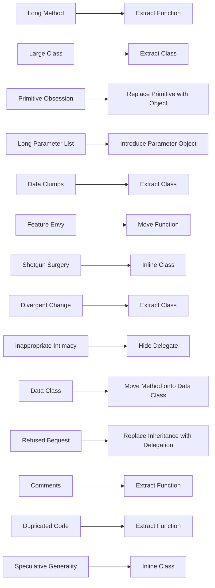
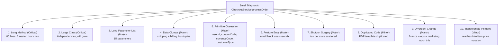
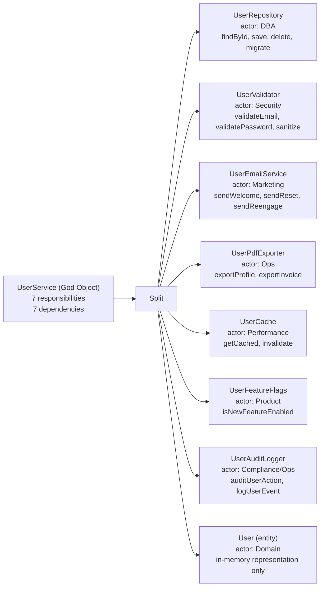
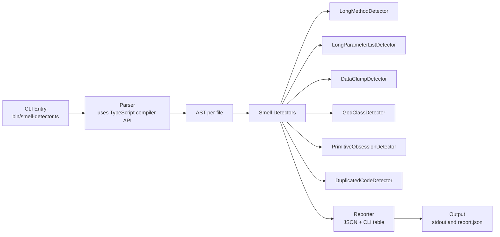

# 4.12 Code Smells

> A code smell is a surface indication that usually corresponds to a deeper problem in the system. The term was popularized by Kent Beck and catalogued by Martin Fowler in *Refactoring: Improving the Design of Existing Code* (first edition 1999, second edition 2018). Smells are not bugs, they do not break tests, and they do not crash production. They are signals, the smoke that suggests a fire is smoldering somewhere in the structure of the code. Mastering code smells means learning to read that smoke, to triage which fires are worth putting out, and to know which ones are just the kitchen making dinner.

## 1. Purpose

Code smells exist because software rot is not random. Codebases do not decay uniformly the way metal rusts; they decay along predictable axes, and the decay leaves fingerprints. Long methods grow because developers add one more branch and never extract. God objects grow because the next feature is "easiest" to bolt onto the class that already has the dependencies wired up. Duplicated code grows because copy-paste is faster than abstraction, until it is not. Feature envy grows because the developer who wrote the method had the wrong class open. Each smell has a cause, a signature, and a corresponding set of refactorings that reverse it. The purpose of studying code smells is to acquire the vocabulary to name what is wrong, the eye to spot it quickly, and the discipline to fix it before it compounds.

The catalog we use today was introduced by Martin Fowler and Kent Beck in the first edition of *Refactoring* and revised in the second edition. Fowler is careful about the word *smell*. He chose it deliberately, he says, because it connotes something you sense with experience rather than measure with a metric. "I have a feel for it" is the right register. A method that is eleven lines long is not automatically a Long Method smell; a method that is six lines long might be. The number is a hint, not a verdict. The smell is the structural problem the line count is pointing at, which is usually that the method is doing two things instead of one, or that its locals cannot be tracked in working memory, or that its control flow has more branches than the reader can hold at once.

The catalog divides smells into two broad categories that mirror the two layers of object-oriented design. The first category is **smells within classes**. These are problems you can see by reading a single class in isolation: the method is too long, the class is too big, the parameters are too many, the primitives are doing too much work, the same data clump appears in five places, the temporary field is null half the time. The second category is **smells between classes**. These are problems you can only see by reading two or more classes together: the method is more interested in another class than its own, one change requires touching ten files, one class changes for six unrelated reasons, two classes know each other's privates. The within-class smells tend to be easier to spot and cheaper to fix; the between-class smells tend to be more damaging and more expensive, because they reflect architectural problems rather than local ones.

The purpose of this note is to give you a complete, working vocabulary for the smells in the Fowler catalog. By the end you should be able to open an unfamiliar file, read it for two minutes, and name the top three smells you would flag in code review. You should be able to walk into a refactoring session and pick the smell whose elimination will yield the largest reduction in technical debt. You should be able to defend, in front of a skeptical senior engineer, why a particular smell is worth fixing now and why another one is acceptable to leave in. You should be able to look at an ESLint report or a SonarQube dashboard and translate the rules into the human smell names behind them.

What code smells are **not**. Smells are not bugs. A Long Method can pass every test, serve every customer, and earn every dollar; it just costs more to read and modify than it should. Smells are not security vulnerabilities, although some smells (Primitive Obsession with strings for roles, Data Classes with public setters) make vulnerabilities more likely. Smells are not performance problems, although some smells (Duplicated Code that drifts so one branch uses a slow query) make performance problems harder to find. Smells are design problems, and their cost is paid in developer time: time to read, time to change, time to onboard, time to debug, time to fix the regression that should not have happened. The reason we care about smells is that developer time is the dominant cost of long-lived software, and smells are the multiplier on that cost.

## 2. Theory and Deep Dive

Fowler's catalog contains twenty-two smells in the second edition. The smells are grouped under six headings: Bloaters, Object-Oriented Abusers, Change Preventers, Dispensables, Couplers, and a final bucket for smells that are symptoms of other smells. We will walk through each smell with its definition, its signature, its cause, and the refactorings that reverse it. We will close the section with a Mermaid diagram that groups every smell under its heading.

### 2.1 Long Method

A Long Method is a method that does too much. Fowler's heuristic, deliberately loose, is "more than ten lines is suspicious." The number is not the smell. The smell is that the method cannot be read in one pass without scrolling, that its locals cannot be held in working memory, that its branches cannot be tracked, that its intent cannot be summarized in a single sentence. The classic signature is a method with twenty locals, four nested `if` statements, three `for` loops, and a comment at the top that says `// TODO: refactor this`.

The cause is almost always incremental growth. The method started as a five-line function that loaded a user, validated the input, and returned the user. Then someone added email verification, then rate limiting, then audit logging, then a feature flag, then a fallback to the legacy database. Each addition was small and reasonable in isolation. The cumulative result is a method that no single developer fully understands, where every change risks a regression, and where onboarding a new developer requires a half-hour walkthrough.

The refactorings that reverse Long Method are Extract Function (the workhorse), Replace Temp with Query, Introduce Special Case, Decompose Conditional, and Replace Method with Method Object. The discipline is to extract relentlessly until each method does one thing and is named for that thing. The test of a good extraction is that the new method name makes the call site more readable than the original inline code did.

### 2.2 Large Class (God Object)

A Large Class, also called a God Object or Blob, is a class that knows too much or does too much. The signature is a class with thirty fields, fifty methods, and imports from every package in the codebase. The class is the bottleneck of every feature: every new requirement ends up as a new method on it, because it already has the dependencies, the data, and the tests. The class is the merge-conflict capital of the codebase: every pull request touches it, and every reviewer dreads the diff.

The cause is the path of least resistance. Adding a method to `UserService` is faster than creating `UserEmailService` and wiring it up. Adding a field to `Order` is faster than creating `ShippingAddress` as a value object. The short-term cost is low, the long-term cost is enormous, and the long-term cost is invisible to the developer making the decision. The God Object grows by accretion, like a coral reef, and once it is large enough, refactoring it becomes a multi-sprint project that no one wants to fund.

Large Class is the structural form of the Single Responsibility Principle violation (see [[4.01 SOLID Single Responsibility]]). A God Object serves many actors and changes for many reasons. The refactorings are Extract Class, Extract Subclass, Extract Interface, and (when the class is truly a domain aggregate) Replace Data Value with Object. The discipline is to identify the actors the class serves, then split the class so each actor has its own class.

### 2.3 Primitive Obsession

Primitive Obsession is the use of primitives (strings, numbers, booleans) where small value classes would express the domain more clearly. The signature is a function signature like `createUser(name: string, email: string, role: string, age: number, isActive: boolean)` where `role` is one of `"admin" | "user" | "guest"`, where `email` should be an `Email` value object with validation, where `age` should be an `Age` that rejects negatives, and where `isActive` should be a `UserStatus` enum. The smell is that the primitives are carrying domain meaning that the type system cannot check.

The cause is convenience. Primitives are easy to declare, easy to pass, easy to serialize. The cost is paid later, when `createUser("Alice", "alice@example.com", "user", 30, true)` is called with the arguments in the wrong order, when `"admin"` is misspelled as `"Admin"`, when an invalid email slips through to the database, when a negative age breaks the report generator. Each of these is a bug that a value class would have prevented at compile time.

The refactorings are Replace Primitive with Object, Replace Type Code with Class, Replace Type Code with Subclasses, Replace Type Code with State/Strategy, and Introduce Parameter Object. The discipline is to lift primitives into named types as soon as the primitive acquires a domain rule, even a single rule like "must be a valid email."

### 2.4 Long Parameter List

A Long Parameter List is a function with more than three or four parameters. The signature is `function calculateInvoice(subtotal, taxRate, discount, shipping, isInternational, currencyCode, customerType, promoCode)` with eight parameters. The smell is that the caller has to remember the order, the type checker cannot catch transposition errors when two parameters share a type (two numbers, two strings), and the function signature is hostile to evolution: adding a ninth parameter breaks every call site.

The cause is usually a function that has grown by accretion, or a function that should belong to a class but was written as a free function. The refactorings are Introduce Parameter Object (group the parameters into a single value class), Preserve Whole Object (pass the object the parameters came from), Replace Parameter with Method (the parameter could be computed inside the function instead of passed in), and Replace Constructor with Builder (when the parameters are construction arguments).

### 2.5 Data Clumps

A Data Clump is a group of parameters that appear together in multiple function signatures. The signature is three functions that each take `(street, city, state, zip)`, or `(host, port, username, password)`, or `(width, height, depth)`. The smell is that the clump is implicitly a value object that the developer has not named. Every time the clump is repeated, the risk of transposition grows, and every time the clump evolves (add an apartment number, add a TLS flag), every signature must be updated.

The cause is the same as Primitive Obsession: convenience at the call site, deferred abstraction. The refactoring is Extract Class to lift the clump into a named value object (`Address`, `ConnectionConfig`, `Dimensions`). Once lifted, the clump evolves in one place and every call site benefits.

### 2.6 Feature Envy

Feature Envy is a method that is more interested in another class than its own. The signature is a method on class `A` that spends most of its body calling getters on class `B`: `aMethod() { return this.b.getX() + this.b.getY() * this.b.getZ(); }`. The method belongs on `B`, where it can use `B`'s fields directly, encapsulate `B`'s invariants, and evolve with `B`'s domain rules.

The cause is usually that the developer who wrote the method had `A` open and did not want to open `B`, or that `B` is a third-party class that cannot be modified. The refactorings are Move Function (move the method to the envied class), Extract Function then Move Function (when only part of the method is envious), and Hide Delegate (when `A` is exposing `B` unnecessarily).

Feature Envy is the within-class symptom of an architectural problem. If many methods on `A` envy `B`, the design is telling you that `A` and `B` have their responsibilities misaligned. The fix is not to move every envious method blindly; the fix is to ask which class the behavior naturally belongs to and reorganize accordingly.

### 2.7 Shotgun Surgery

Shotgun Surgery is the smell where one logical change requires touching many classes. The signature is a feature ticket whose diff spans fifteen files, each modified by one or two lines. The smell is that a single concept has been scattered across the codebase, so evolving it requires walking the scatter and editing each piece. Each edit is a chance to miss one, and each miss is a bug.

The cause is usually over-decomposition: the developer who introduced the concept split it across many classes in the name of Single Responsibility, but split along the wrong axis. The refactorings are Move Function, Move Field, Inline Function, and Inline Class. The discipline is to bring the scattered pieces back together into a single class that owns the concept.

### 2.8 Divergent Change

Divergent Change is the opposite of Shotgun Surgery. One class changes for many different reasons. The signature is a class whose git log shows that it was touched by the marketing team last week, the security team this week, and the ops team next week. Each team's changes are unrelated to the others. The class is serving multiple actors and has multiple reasons to change. This is the time-axis form of the SRP violation.

The cause is the same as Large Class: accretion without refactoring. The refactorings are Extract Class (split the class so each actor has its own), and the broader discipline of organizing code by actor rather than by entity.

### 2.9 Inappropriate Intimacy

Inappropriate Intimacy is when two classes know too much about each other's internals. The signature is a class that calls ten different getters and setters on another class, or a class that reaches into another class's private fields through a "friend" mechanism, or two classes that both mutate the same shared mutable state. The smell is that the encapsulation boundary between them has collapsed, and they have become one class in two files.

The cause is usually tight coupling that grew over time, or a premature split that left the classes too dependent on each other. The refactorings are Move Method, Move Field, Change Bidirectional Association to Unidirectional, Extract Class (to split the shared concerns into a third class), and Hide Delegate (to make one class talk to the other's interface rather than its implementation).

### 2.10 Data Class

A Data Class is a class with only fields and getters and setters, no behavior. The signature is a class that is essentially a struct, with public mutable fields and no methods that operate on those fields. The behavior that should live on the data class (validation, computed properties, invariants) lives elsewhere, usually in a service class that takes the data class as a parameter. This is the anemic domain model anti-pattern.

The cause is the database-driven design style where classes are generated from tables and behavior is added in a separate service layer. The refactorings are Move Method (move behavior from the service onto the data class), Encapsulate Field (make fields private and expose them only through intention-revealing methods), and Remove Setting Method (make fields immutable after construction).

### 2.11 Refused Bequest

Refused Bequest is when a subclass does not want the methods or fields it inherits from its parent. The signature is a subclass that overrides inherited methods to throw `UnsupportedOperationException`, or that ignores inherited fields and uses its own, or that has a comment saying "this method does not apply to us but we have to implement it because of the base class." The smell is that the inheritance hierarchy is modeling the wrong relationship, usually because the developer confused "is-a" with "is-implemented-in-terms-of."

The cause is inheritance used for code reuse rather than for subtyping. The refactorings are Extract Superclass (when only part of the parent is shared), Extract Subclass (when the parent is too general), Replace Inheritance with Delegation (when the subclass is not really a subtype), and Push Down Method (move methods to the subclasses that actually use them). See [[4.03 SOLID Liskov Substitution]] for the deeper principle.

### 2.12 Comments

Comments is the smell where a comment is doing the work that code should be doing. The signature is a method with a long block comment explaining what the next block does, or a comment that says `// this is a hack, but...`, or a comment that rephrases the code (`// increment i by 1` over `i++`). The smell is that the comment is a signal that the code is not self-explanatory, and the right fix is usually to make the code self-explanatory, not to write a better comment.

Fowler is careful here. He does not say comments are bad. He says comments are often a deodorant on top of a smell. The good comment explains *why* the code is doing something non-obvious; the bad comment explains *what* the code is doing, which is a sign that the *what* is not clear from the code itself. The refactorings are Extract Function (turn the commented block into a named method), Rename Function (let the name carry the intent), and Introduce Assertion (let the type system or a runtime check carry the invariant). See [[4.14 Documentation as Code]] for the broader discipline.

### 2.13 Duplicated Code

Duplicated Code is the most obvious smell and the most expensive. The signature is two or more blocks of code that are byte-for-byte identical, or nearly identical with small variations. The smell is that the duplication will drift: one copy will be fixed for a bug, the other will not, and the bug will recur. Duplication is the single largest source of regression bugs in long-lived codebases.

The cause is copy-paste driven development, where the developer finds a similar block, copies it, and modifies a few lines. The refactorings are Extract Function (lift the common part into a shared method), Pull Up Method (when the duplication is across sibling subclasses), Extract Superclass (when the duplication is across unrelated classes that share a concept), Replace Conditional with Polymorphism (when the duplication is a switch statement repeated in many places), and Extract Module (when the duplication is a cross-cutting concern like logging or error handling). See [[4.07 DRY YAGNI KISS]] for the deeper principle.

### 2.14 Speculative Generality

Speculative Generality is the smell of abstraction built for a hypothetical future that may never arrive. The signature is a class with an abstract base class and three subclasses where only one subclass is ever instantiated, or a function with four parameters where two are always passed the same value, or a configuration hook that is wired to exactly one implementation. The smell is that the abstraction adds reading cost today in exchange for flexibility that no one is using.

The cause is over-engineering driven by fear of future change. The developer imagines a future requirement and builds for it now, on the theory that it will be cheaper than building it later. The theory is usually wrong, because the imagined future does not arrive, or arrives differently, and the abstraction has to be unwound or rewritten. See [[4.07 DRY YAGNI KISS]] for the YAGNI principle.

The refactorings are Inline Class, Inline Function, Remove Unused Parameter, and Collapse Hierarchy. The discipline is to wait for the second use case to appear before introducing the abstraction, and to delete abstractions that never acquired a second user.

### 2.15 The Smell Catalog at a Glance

The diagram below groups every smell we have discussed under Fowler's six headings. Bloaters are smells of growth: things that got too big. Object-Oriented Abusers are smells of misused OO: inheritance, interfaces, and encapsulation gone wrong. Change Preventers are smells that make future change harder. Dispensables are smells of things that should be deleted. Couplers are smells of excessive coupling between classes.

```mermaid
graph TD
    Root["Fowler's Code Smell Catalog"]

    Root --> Bloaters["Bloaters"]
    Root --> OOAbusers["Object-Oriented Abusers"]
    Root --> ChangePreventers["Change Preventers"]
    Root --> Dispensables["Dispensables"]
    Root --> Couplers["Couplers"]

    Bloaters --> LongMethod["Long Method"]
    Bloaters --> LargeClass["Large Class / God Object"]
    Bloaters --> PrimitiveObsession["Primitive Obsession"]
    Bloaters --> LongParamList["Long Parameter List"]
    Bloaters --> DataClumps["Data Clumps"]

    OOAbusers --> RefusedBequest["Refused Bequest"]
    OOAbusers --> AlternativeClasses["Alternative Classes with Different Interfaces"]
    OOAbusers --> SpeculativeGenerality["Speculative Generality"]
    OOAbusers --> TemporaryField["Temporary Field"]

    ChangePreventers --> DivergentChange["Divergent Change"]
    ChangePreventers --> ShotgunSurgery["Shotgun Surgery"]
    ChangePreventers --> ParallelInheritance["Parallel Inheritance Hierarchies"]

    Dispensables --> Comments["Comments"]
    Dispensables --> DuplicatedCode["Duplicated Code"]
    Dispensables --> LazyClass["Lazy Class"]
    Dispensables --> DataClass["Data Class"]
    Dispensables --> DeadCode["Dead Code"]
    Dispensables --> SpeculativeGenerality2["Speculative Generality"]

    Couplers --> FeatureEnvy["Feature Envy"]
    Couplers --> InappropriateIntimacy["Inappropriate Intimacy"]
    Couplers --> MessageChains["Message Chains"]
    Couplers --> MiddleMan["Middle Man"]
    Couplers --> IncompleteLibClass["Incomplete Library Class"]
```



Note that Speculative Generality appears under both Object-Oriented Abusers and Dispensables in different editions of the catalog. Fowler himself moves it between buckets. The bucket does not matter; the smell does.

### 2.16 The Smell-to-Refactoring Map

Every smell in the catalog has a short list of refactorings that typically reverse it. The map below is not exhaustive, but it captures the most common pairings. A fuller treatment of each refactoring is in [[4.13 Refactoring Techniques]].



## 3. Mental Models

A code smell is, in Kent Beck's phrasing, *a surface indication of a deeper problem*. The surface is what you see when you read the code; the problem is the structural issue underneath that the surface is pointing at. The mental model is that of a doctor reading symptoms: a fever is a surface indication, the infection underneath is the deeper problem. Treating the fever without diagnosing the infection is malpractice; treating the infection makes the fever go away for free. Refactoring a smell without understanding the underlying problem is the same kind of malpractice.

Each smell has a one-sentence intuition that captures the felt experience of reading it. These intuitions are the entry point to the catalog. Once you can name the feeling, you can look up the smell, and once you can look up the smell, you can apply the refactoring.

**Long Method: "I cannot fit this in my head."** The method is so long that you have scrolled past the beginning by the time you reach the end. You cannot hold the locals, the branches, and the side effects in working memory at once. You have to read it twice to understand it, three times to modify it, and four times to be confident you did not break it. The felt experience is cognitive overload.

**Large Class: "This class does everything."** You open the file looking for one method and find forty. You grep for a field and find it has thirty companions. You try to write a unit test and have to mock eight dependencies. The felt experience is that the class is the entire application in miniature.

**Primitive Obsession: "The string is lying about what it is."** The parameter is typed `string`, but it is really an email, or a role, or a currency code, or a UUID. The type checker cannot help you, because every string is a string. The felt experience is that the types are too weak to carry the domain.

**Long Parameter List: "I have to count the commas."** You call the function with seven arguments, you get the order wrong, the type checker does not catch it because two arguments share a type, and the bug only surfaces at runtime. The felt experience is parameter roulette.

**Data Clumps: "These four always travel together."** Every function takes the same four parameters: street, city, state, zip. Every object has the same four fields. The clump is implicitly a value object that the developer has not named. The felt experience is repetition of a structure that obviously wants to be a type.

**Feature Envy: "This method wants to live in another class."** The method is on `A`, but its body is all calls to `B`. It is using `A` only as a place to stand. The felt experience is that the method is in the wrong file.

**Shotgun Surgery: "One feature touches everything."** You implement a small change, and the diff touches fifteen files. Each touch is small, but the scatter is wide. The felt experience is that the concept has been shattered across the codebase and you are picking up the pieces.

**Divergent Change: "This class changes for every reason."** You look at the git log and see that the class was touched by three different teams in the last sprint, each for an unrelated reason. The felt experience is that the class is a magnet for unrelated changes.

**Inappropriate Intimacy: "These two classes know each other too well."** Class `A` reaches into class `B`'s privates, calls ten of its getters, and mutates its fields. The encapsulation boundary between them is fictional. The felt experience is that they are one class in two files.

**Data Class: "This class is a struct."** The class has fields, getters, setters, and nothing else. All the behavior is elsewhere, in a service that takes the data class as a parameter. The felt experience is that the class is a bag of data with no dignity.

**Refused Bequest: "The subclass does not want what its parent gives it."** The subclass overrides half the parent's methods to throw, or ignores half the parent's fields. The hierarchy is wrong. The felt experience is that the inheritance is a forced marriage.

**Comments: "The code cannot explain itself."** The comment is doing the work the code should be doing. The felt experience is that the comment is a sign saying "the code below is unclear, sorry."

**Duplicated Code: "I have seen this before."** You are reading a block and you remember reading nearly the same block two files ago. The felt experience is déjà vu, and the cost is that the two copies will drift.

**Speculative Generality: "This abstraction has one user."** The class has an interface, an abstract base, three subclasses, and only one subclass is ever instantiated. The felt experience is that the abstraction is paying interest on a loan that was never taken out.

## 4. Real-World Use Cases

### 4.1 Code Reviews

The most common real-world use of the smell catalog is in code review. A reviewer who has internalized the catalog can name the smell in seconds, instead of writing a paragraph describing the issue. "This method has Feature Envy for `Order`," is a one-line review comment that conveys the problem, the diagnosis, and the suggested fix (Move Function). Without the catalog, the reviewer would write something like "I notice this method is calling a lot of methods on the Order class, maybe it should be over there?" which is longer, less precise, and easier for the author to dismiss.

The catalog also gives the reviewer a non-confrontational vocabulary. "This is a Long Method smell" is a statement about the code, not about the author. It depersonalizes the review and focuses the discussion on the structure. Teams that adopt the smell vocabulary consistently report that review discussions become shorter, more technical, and less political.

### 4.2 Refactoring Sessions

A refactoring session is a dedicated block of time, typically a half-day or a day, where the team picks a region of the codebase and improves its structure without changing its behavior. The smell catalog is the input to the session: the team identifies the smells in the region, prioritizes them by impact, and applies the corresponding refactorings. Without the catalog, refactoring sessions devolve into "let me clean up a few things" and produce no measurable improvement. With the catalog, the session has a target (eliminate the top three smells), a plan (apply these refactorings), and a definition of done (the smells are no longer present).

### 4.3 Technical Debt Assessment

Technical debt is the cost of doing things the quick way instead of the right way. Smells are the principal of that debt; the interest is the additional developer time each smell costs over the lifetime of the code. A technical debt assessment walks the codebase, counts the smells, and estimates the interest. The output is a debt register: "We have 47 Long Methods, 12 God Objects, 8 cases of Shotgun Surgery. The God Objects are costing us the most, because each feature touches at least one of them. We recommend a two-sprint effort to split the top three."

The debt register is a communication tool for management. It translates the engineering concept of "the code is hard to work with" into the management concept of "we owe N weeks of work, and the interest is M weeks per sprint." Without the smell vocabulary, the conversation is vague; with it, the conversation is concrete.

### 4.4 Automated Smell Detection with ESLint

Many smells can be detected automatically. ESLint rules map onto smells directly: `complexity` flags Long Methods, `max-lines-per-function` flags the same, `max-params` flags Long Parameter Lists, `max-classes-per-file` flags Large Class, `no-dupe-keys` and `no-redundant-pattern` flag certain Duplicated Code patterns. Custom rules can detect Data Clumps (the same group of parameters appearing in multiple functions), Feature Envy (a method calling more than N getters on another class), and Dead Code (unused exports, unused parameters). See [[6.04 ESLint Flat Config]] for the configuration discipline.

The advantage of automated detection is coverage: a rule runs over the entire codebase in seconds, where a human review would take days. The disadvantage is precision: rules are heuristic, and they produce false positives (a method that is long because it is a data table, not because it is doing too much) and false negatives (a God Object that is short-line-count but conceptually overloaded). The discipline is to use automated detection as the input to human review, not as a replacement for it.

### 4.5 SonarQube and the Smell Dashboard

SonarQube is a code-quality platform that runs smell detection across the whole codebase and presents the results on a dashboard. Each smell is assigned a severity (Blocker, Critical, Major, Minor, Info), a remediation time estimate, and a technical debt value in days. The dashboard aggregates by directory, by author, by tag, and by trend over time. The team can see whether the codebase is getting cleaner or dirtier, and whether a particular feature added a spike of debt.

The dashboard is most useful when it is wired into the development flow. A pull request that adds a Critical smell fails the build, the same way a failing test fails the build. The team can then choose to fix the smell, suppress the rule with a justification, or accept the debt explicitly with a tracked issue. The dashboard makes debt visible, and visible debt is far more likely to be paid down than invisible debt.

### 4.6 Onboarding

A new developer joining a codebase reads the smells as a map of where the bodies are buried. A God Object is a sign saying "this class is where the historical complexity lives, expect to spend a week here before you understand it." A Shotgun Surgery region is a sign saying "the team has not yet figured out where this concept lives, expect to touch many files when you change it." A Duplicated Code region is a sign saying "there is probably a bug here, because the copies have drifted." The catalog gives the new developer a vocabulary to ask questions: "Is the God Object scheduled for refactoring?" "Is the duplication known?"

## 5. Code Examples

### 5.1 Example A — Minimal and Conceptual

Each smell in five lines, in side-by-side JavaScript and TypeScript. The goal is to make the signature recognizable on sight, so that when you see the pattern in real code, the smell name comes to mind immediately.

#### Long Method

```javascript
// JavaScript
function processOrder(order) {
  // 50 lines: validate, calculate, tax, discount, shipping, audit, persist, email
  if (order.items.length === 0) throw new Error("empty");
  let total = 0;
  for (const item of order.items) total += item.price * item.qty;
  // ... 45 more lines ...
  return total;
}
```

```typescript
// TypeScript
function processOrder(order: Order): number {
  // 50 lines: validate, calculate, tax, discount, shipping, audit, persist, email
  if (order.items.length === 0) throw new Error("empty");
  let total = 0;
  for (const item of order.items) total += item.price * item.qty;
  // ... 45 more lines ...
  return total;
}
```

#### Large Class (God Object)

```javascript
// JavaScript
class User {
  constructor() { this.fields = {}; this.cache = {}; this.audit = []; /* 30 more */ }
  validate() { /* ... */ }
  save() { /* ... */ }
  sendEmail() { /* ... */ }
  exportPDF() { /* ... */ }
  // ... 45 more methods ...
}
```

```typescript
// TypeScript
class User {
  private fields: Record<string, unknown> = {};
  private cache: Record<string, unknown> = {};
  private audit: unknown[] = [];
  validate(): void { /* ... */ }
  save(): void { /* ... */ }
  sendEmail(): void { /* ... */ }
  exportPDF(): Buffer { /* ... */ }
  // ... 45 more methods ...
}
```

#### Primitive Obsession

```javascript
// JavaScript
function createUser(name, email, role, age, isActive) {
  // role is a string, but really it is "admin" | "user" | "guest"
  // email is a string, but really it is a validated Email
  // age is a number, but really it is a non-negative Age
  return { name, email, role, age, isActive };
}
```

```typescript
// TypeScript
function createUser(
  name: string,
  email: string,    // should be Email
  role: string,     // should be Role
  age: number,      // should be Age
  isActive: boolean
): User {
  return { name, email, role, age, isActive };
}
```

#### Long Parameter List

```javascript
// JavaScript
function calculateInvoice(subtotal, taxRate, discount, shipping, isInternational, currencyCode, customerType, promoCode) {
  return subtotal + taxRate + discount + shipping + (isInternational ? 5 : 0);
}
```

```typescript
// TypeScript
function calculateInvoice(
  subtotal: number,
  taxRate: number,
  discount: number,
  shipping: number,
  isInternational: boolean,
  currencyCode: string,
  customerType: string,
  promoCode: string | null
): number {
  return subtotal + taxRate + discount + shipping + (isInternational ? 5 : 0);
}
```

#### Data Clumps

```javascript
// JavaScript
function setShippingAddress(street, city, state, zip) { /* ... */ }
function setBillingAddress(street, city, state, zip) { /* ... */ }
function validateAddress(street, city, state, zip) { /* ... */ }
// The same four parameters appear together three times. Extract Address.
```

```typescript
// TypeScript
function setShippingAddress(street: string, city: string, state: string, zip: string): void { /* ... */ }
function setBillingAddress(street: string, city: string, state: string, zip: string): void { /* ... */ }
function validateAddress(street: string, city: string, state: string, zip: string): boolean { /* ... */ }
// The same four parameters appear together three times. Extract Address.
```

#### Feature Envy

```javascript
// JavaScript
class Invoice {
  constructor(customer) { this.customer = customer; }
  getCustomerEmail() {
    return this.customer.getName() + " <" + this.customer.getEmail() + ">";
  }
  // The method is mostly interested in customer, not in invoice.
}
```

```typescript
// TypeScript
class Invoice {
  constructor(private customer: Customer) {}
  getCustomerEmail(): string {
    return `${this.customer.getName()} <${this.customer.getEmail()}>`;
  }
  // The method is mostly interested in customer, not in invoice.
}
```

#### Shotgun Surgery

```javascript
// JavaScript
// Adding a "taxId" field touches: User, UserRepository, UserDTO, UserSerializer, UserValidator, UserService, UserFactory
// One concept, seven files.
```

```typescript
// TypeScript
// Adding a "taxId" field touches: User, UserRepository, UserDTO, UserSerializer, UserValidator, UserService, UserFactory
// One concept, seven files.
```

#### Divergent Change

```javascript
// JavaScript
class User {
  // Marketing changes the email method on Monday.
  // Security changes the password method on Wednesday.
  // Ops changes the logging method on Friday.
  // Same class, three unrelated reasons to change.
}
```

```typescript
// TypeScript
class User {
  // Marketing changes the email method on Monday.
  // Security changes the password method on Wednesday.
  // Ops changes the logging method on Friday.
  // Same class, three unrelated reasons to change.
}
```

#### Inappropriate Intimacy

```javascript
// JavaScript
class OrderProcessor {
  process(order) {
    order.customer.name = "Updated";
    order.customer.email = "new@example.com";
    order.items[0].price = 100;
    order.shipping.method = "express";
    // OrderProcessor reaches deep into Order's internals.
  }
}
```

```typescript
// TypeScript
class OrderProcessor {
  process(order: Order): void {
    order.customer.name = "Updated";
    order.customer.email = "new@example.com";
    order.items[0].price = 100;
    order.shipping.method = "express";
    // OrderProcessor reaches deep into Order's internals.
  }
}
```

#### Data Class

```javascript
// JavaScript
class User {
  constructor() { this.name = ""; this.email = ""; this.age = 0; }
  getName() { return this.name; }
  setName(name) { this.name = name; }
  // No behavior. All logic lives in UserService.
}
```

```typescript
// TypeScript
class User {
  constructor(
    public name: string = "",
    public email: string = "",
    public age: number = 0
  ) {}
  getName(): string { return this.name; }
  setName(name: string): void { this.name = name; }
  // No behavior. All logic lives in UserService.
}
```

#### Refused Bequest

```javascript
// JavaScript
class Stack extends Array {
  push(item) { super.push(item); }
  pop() { return super.pop(); }
  unshift() { throw new Error("Not supported on a stack"); }
  shift() { throw new Error("Not supported on a stack"); }
  // Stack does not want Array's unshift/shift methods.
}
```

```typescript
// TypeScript
class Stack<T> extends Array<T> {
  push(item: T): void { super.push(item); }
  pop(): T | undefined { return super.pop(); }
  unshift(): number { throw new Error("Not supported on a stack"); }
  shift(): T | undefined { throw new Error("Not supported on a stack"); }
  // Stack does not want Array's unshift/shift methods.
}
```

#### Comments as Smell

```javascript
// JavaScript
function process(data) {
  // First, filter out the invalid entries
  const valid = data.filter(d => d.value > 0);
  // Then, transform each entry by doubling its value
  const doubled = valid.map(d => ({ ...d, value: d.value * 2 }));
  // Finally, sort by value descending
  return doubled.sort((a, b) => b.value - a.value);
  // Each comment should be the name of an extracted function.
}
```

```typescript
// TypeScript
function process(data: DataPoint[]): DataPoint[] {
  // First, filter out the invalid entries
  const valid = data.filter(d => d.value > 0);
  // Then, transform each entry by doubling its value
  const doubled = valid.map(d => ({ ...d, value: d.value * 2 }));
  // Finally, sort by value descending
  return doubled.sort((a, b) => b.value - a.value);
  // Each comment should be the name of an extracted function.
}
```

#### Duplicated Code

```javascript
// JavaScript
function calculateAreaRectangle(width, height) {
  const area = width * height;
  console.log("Area is", area);
  return area;
}
function calculateAreaTriangle(base, height) {
  const area = (base * height) / 2;
  console.log("Area is", area);
  return area;
}
// The logging and return logic is duplicated.
```

```typescript
// TypeScript
function calculateAreaRectangle(width: number, height: number): number {
  const area = width * height;
  console.log("Area is", area);
  return area;
}
function calculateAreaTriangle(base: number, height: number): number {
  const area = (base * height) / 2;
  console.log("Area is", area);
  return area;
}
// The logging and return logic is duplicated.
```

#### Speculative Generality

```javascript
// JavaScript
class DataProcessor {
  process(data) { return this.transform(this.filter(data)); }
  filter(data) { return data; }
  transform(data) { return data; }
}
class NoOpFilter extends DataProcessor { /* never instantiated */ }
class NoOpTransform extends DataProcessor { /* never instantiated */ }
// The subclasses exist for a future that has not arrived.
```

```typescript
// TypeScript
abstract class DataProcessor {
  process(data: unknown): unknown { return this.transform(this.filter(data)); }
  abstract filter(data: unknown): unknown;
  abstract transform(data: unknown): unknown;
}
class NoOpFilter extends DataProcessor { /* never instantiated */ }
class NoOpTransform extends DataProcessor { /* never instantiated */ }
// The subclasses exist for a future that has not arrived.
```

### 5.2 Example B — Production-Grade

The production-grade example is a smelly codebase for a small e-commerce checkout service. We will diagnose the smells, list them with severity, and present the refactoring plan. The example is in side-by-side JavaScript and TypeScript. The code is deliberately a little ugly, because the point is to read it and identify the smells.

#### The Smelly Codebase (JavaScript)

```javascript
// checkout.js
// JavaScript

class CheckoutService {
  constructor(db, emailClient, pdfLib, cache, featureFlags, logger) {
    this.db = db; this.emailClient = emailClient; this.pdfLib = pdfLib;
    this.cache = cache; this.featureFlags = featureFlags; this.logger = logger;
    // Large Class: six dependencies.
  }

  processOrder(userId, items, shippingStreet, shippingCity, shippingState,
               shippingZip, billingStreet, billingCity, billingState,
               billingZip, couponCode, isInternational, currencyCode,
               customerType, giftWrap) {
    // Long Method: 80 lines, 6 nested branches.
    // Long Parameter List: 15 parameters.
    // Data Clumps: shipping and billing are the same four-tuple twice.
    // Primitive Obsession: userId, couponCode, currencyCode, customerType are bare strings.

    if (!userId) throw new Error("missing userId");
    if (items.length === 0) throw new Error("empty cart");
    for (const item of items) {
      if (item.price < 0) throw new Error("negative price");
      if (item.qty < 1) throw new Error("invalid qty");
    }
    const user = this.db.query("SELECT * FROM users WHERE id = ?", userId);
    if (!user) throw new Error("user not found");

    let subtotal = 0;
    for (const item of items) subtotal += item.price * item.qty;

    // Apply coupon: 4-way if-else on coupon.type (percent / fixed / shipping).
    let discount = 0;
    if (couponCode) { /* ... 6 lines of coupon logic ... */ }

    // Calculate tax: 3-way if-else on shippingState (CA / NY / TX).
    // Shotgun Surgery: adding a state touches here, the tax table,
    // the report generator, and the audit log.
    let taxRate = 0;
    if (shippingState === "CA") taxRate = 0.0825;
    else if (shippingState === "NY") taxRate = 0.08;
    else if (shippingState === "TX") taxRate = 0.0625;
    const tax = (subtotal - discount) * taxRate;

    // Calculate shipping (international, giftWrap, subtotal threshold).
    let shippingCost = 5;
    if (isInternational) shippingCost = 25;
    if (giftWrap) shippingCost += 5;
    if (subtotal > 100) shippingCost = 0;

    const total = subtotal - discount + tax + shippingCost;

    // Convert currency, apply customer-type discount.
    let finalTotal = total;
    if (currencyCode !== "USD") {
      const rate = this.cache.get("rate:" + currencyCode) || 1;
      finalTotal = total * rate;
    }
    if (customerType === "vip") finalTotal *= 0.9;
    else if (customerType === "wholesale") finalTotal *= 0.8;

    const order = this.db.query(
      "INSERT INTO orders (userId, subtotal, discount, tax, shipping, total, currency) VALUES (?, ?, ?, ?, ?, ?, ?)",
      userId, subtotal, discount, tax, shippingCost, finalTotal, currencyCode
    );
    this.logger.info("Order created", { userId, subtotal, discount, tax, shippingCost, finalTotal, currencyCode });

    // Feature Envy: this block uses user 6 times, items 2 times.
    const emailBody = `Hello ${user.name}, ... Shipping to: ${shippingStreet}, ${shippingCity}, ${shippingState} ${shippingZip}`;
    this.emailClient.send(user.email, "Order confirmation", emailBody);

    // Duplicated Code: this PDF template appears in three other services.
    const pdf = this.pdfLib.create();
    pdf.text(`Invoice #${order.id}`, 50, 50);
    // ... 8 more pdf.text() lines, identical pattern in 3 other services ...
    const pdfBuffer = pdf.save();

    return { orderId: order.id, total: finalTotal, currency: currencyCode, pdf: pdfBuffer };
  }
}

const service = new CheckoutService(db, emailClient, pdfLib, cache, featureFlags, logger);
const result = service.processOrder(
  "user-123", [{ name: "Widget", price: 10, qty: 2 }],
  "123 Main St", "Anytown", "CA", "90210",
  "123 Main St", "Anytown", "CA", "90210",
  "SAVE10", false, "USD", "vip", true
);
```

#### The Smelly Codebase (TypeScript)

The TypeScript version adds type annotations to the same shape; the smells are identical. The full type annotations make the Long Parameter List and Primitive Obsession particularly visible, because the type column is a wall of `string`, `string`, `string`, `number`, `boolean` where each `string` is a distinct domain concept.

```typescript
// checkout.ts
// TypeScript

interface Item { name: string; price: number; qty: number; }
interface User { id: string; name: string; email: string; }
interface Order { id: string; }
interface DB { query(sql: string, ...params: unknown[]): unknown; }
interface EmailClient { send(to: string, subject: string, body: string): void; }
interface PdfLib { create(): { text(s: string, x: number, y: number): void; save(): Buffer; }; }
interface Cache { get(key: string): unknown; }
interface FeatureFlags { isEnabled(name: string): boolean; }
interface Logger { info(msg: string, meta?: unknown): void; }

class CheckoutService {
  constructor(
    private db: DB,
    private emailClient: EmailClient,
    private pdfLib: PdfLib,
    private cache: Cache,
    private featureFlags: FeatureFlags,
    private logger: Logger
  ) {
    // Large Class: six dependencies.
  }

  processOrder(
    userId: string, items: Item[],
    shippingStreet: string, shippingCity: string, shippingState: string, shippingZip: string,
    billingStreet: string, billingCity: string, billingState: string, billingZip: string,
    couponCode: string | null, isInternational: boolean, currencyCode: string,
    customerType: string, giftWrap: boolean
  ): { orderId: string; total: number; currency: string; pdf: Buffer } {
    // Long Method: 80 lines, 6 nested branches.
    // Long Parameter List: 15 parameters, mostly bare strings.
    // Data Clumps: shipping and billing are the same four-tuple twice.
    // Primitive Obsession: userId, couponCode, currencyCode, customerType are bare strings.

    if (!userId) throw new Error("missing userId");
    if (items.length === 0) throw new Error("empty cart");
    for (const item of items) {
      if (item.price < 0) throw new Error("negative price");
      if (item.qty < 1) throw new Error("invalid qty");
    }
    const user = this.db.query("SELECT * FROM users WHERE id = ?", userId) as User | null;
    if (!user) throw new Error("user not found");

    let subtotal = 0;
    for (const item of items) subtotal += item.price * item.qty;

    // Apply coupon: 4-way if-else on coupon.type.
    let discount = 0;
    if (couponCode) {
      const coupon = this.db.query("SELECT * FROM coupons WHERE code = ?", couponCode)
        as { expiresAt: number; type: string; value: number } | null;
      if (coupon && coupon.expiresAt > Date.now()) {
        if (coupon.type === "percent") discount = subtotal * (coupon.value / 100);
        else if (coupon.type === "fixed") discount = coupon.value;
        else if (coupon.type === "shipping") discount = 10;
      }
    }

    // Calculate tax: 3-way if-else on shippingState.
    // Shotgun Surgery: adding a state touches here, the tax table, the report, the audit log.
    let taxRate = 0;
    if (shippingState === "CA") taxRate = 0.0825;
    else if (shippingState === "NY") taxRate = 0.08;
    else if (shippingState === "TX") taxRate = 0.0625;
    const tax = (subtotal - discount) * taxRate;

    // Calculate shipping (international, giftWrap, subtotal threshold).
    let shippingCost = 5;
    if (isInternational) shippingCost = 25;
    if (giftWrap) shippingCost += 5;
    if (subtotal > 100) shippingCost = 0;

    const total = subtotal - discount + tax + shippingCost;

    // Convert currency, apply customer-type discount.
    let finalTotal = total;
    if (currencyCode !== "USD") {
      const rate = (this.cache.get("rate:" + currencyCode) as number) || 1;
      finalTotal = total * rate;
    }
    if (customerType === "vip") finalTotal *= 0.9;
    else if (customerType === "wholesale") finalTotal *= 0.8;

    const order = this.db.query(
      "INSERT INTO orders (userId, subtotal, discount, tax, shipping, total, currency) VALUES (?, ?, ?, ?, ?, ?, ?)",
      userId, subtotal, discount, tax, shippingCost, finalTotal, currencyCode
    ) as Order;

    this.logger.info("Order created", { userId, subtotal, discount, tax, shippingCost, finalTotal, currencyCode });

    // Feature Envy: this block uses user 6 times, items 2 times.
    const emailBody = `Hello ${user.name}, ... Shipping to: ${shippingStreet}, ${shippingCity}, ${shippingState} ${shippingZip}`;
    this.emailClient.send(user.email, "Order confirmation", emailBody);

    // Duplicated Code: this PDF template appears in three other services.
    const pdf = this.pdfLib.create();
    pdf.text(`Invoice #${order.id}`, 50, 50);
    // ... 8 more pdf.text() lines, identical pattern in 3 other services ...
    const pdfBuffer = pdf.save();

    return { orderId: order.id, total: finalTotal, currency: currencyCode, pdf: pdfBuffer };
  }
}

const service = new CheckoutService(db, emailClient, pdfLib, cache, featureFlags, logger);
const result = service.processOrder(
  "user-123", [{ name: "Widget", price: 10, qty: 2 }],
  "123 Main St", "Anytown", "CA", "90210",
  "123 Main St", "Anytown", "CA", "90210",
  "SAVE10", false, "USD", "vip", true
);
```

#### The Diagnosis

Reading the file, the smell catalog produces the following diagnosis. Severity is rated by the cost the smell is currently imposing, not by the size of the smell.



#### The Refactoring Plan

The plan applies refactorings in dependency order. We start with the value types, because every other refactoring depends on them. We then extract parameter objects, because that simplifies the signature. We then split the class, because that gives us a place to move the envious methods. We then extract the long method into named functions on the right classes. We then deduplicate the PDF template. We then centralize the tax table. Each step is small, each step is independently testable, and each step leaves the codebase in a better state than it found it.

```mermaid
graph LR
    Step1["1. Replace Primitive with Object:<br/>UserId, Email, CouponCode,<br/>CurrencyCode, CustomerType"] --> Step2
    Step2["2. Extract Class for clumps:<br/>Address value object"] --> Step3
    Step3["3. Introduce Parameter Object:<br/>CheckoutRequest"] --> Step4
    Step4["4. Extract Class from CheckoutService:<br/>OrderEmailService, InvoicePdfService,<br/>TaxService, CurrencyService"] --> Step5
    Step5["5. Extract Function on Long Method:<br/>validate, calculateSubtotal,<br/>applyCoupon, calculateTax,<br/>calculateShipping, convertCurrency"] --> Step6
    Step6["6. Move Function for Feature Envy:<br/>email body moves to OrderEmailService"] --> Step7
    Step7["7. Extract Function for Duplication:<br/>InvoicePdfService shared by all services"] --> Step8
    Step8["8. Replace Conditional with Polymorphism:<br/>TaxRule table for state tax"]
```



#### The Refactored Codebase (JavaScript, abbreviated)

The JavaScript version mirrors the TypeScript version below with types removed. The class shapes and the smell-to-refactoring map are identical; only the type annotations differ.

```javascript
// JavaScript, abbreviated to show the structure
class Address {
  constructor(street, city, state, zip) {
    this.street = street; this.city = city; this.state = state; this.zip = zip;
  }
  format() { return `${this.street}, ${this.city}, ${this.state} ${this.zip}`; }
}

class UserId { constructor(value) { this.value = value; } }
class CouponCode { constructor(value) { this.value = value; } }
class CurrencyCode { constructor(value) { this.value = value; } }
class CustomerType {
  static VIP = new CustomerType("vip");
  static WHOLESALE = new CustomerType("wholesale");
  static STANDARD = new CustomerType("standard");
  constructor(value) { this.value = value; }
}

class CheckoutRequest {
  constructor({ userId, items, shippingAddress, billingAddress, couponCode, isInternational, currencyCode, customerType, giftWrap }) {
    Object.assign(this, { userId, items, shippingAddress, billingAddress, couponCode, isInternational, currencyCode, customerType, giftWrap });
  }
}

// TaxService, CurrencyService, OrderEmailService, InvoicePdfService
// are structurally identical to the TypeScript versions below,
// with type annotations removed. Each has one responsibility
// and one actor (DBA, performance, marketing, ops respectively).

class CheckoutService {
  constructor(db, taxService, currencyService, emailService, pdfService, logger) {
    Object.assign(this, { db, taxService, currencyService, emailService, pdfService, logger });
  }

  processOrder(request) {
    this.validate(request);
    const user = this.loadUser(request.userId);
    const totals = this.calculateTotals(request);
    const order = this.persist(request, totals);
    this.logger.info("Order created", { userId: request.userId.value, ...totals });
    this.emailService.sendConfirmation(user, order, request, totals);
    const pdf = this.pdfService.generate(order, user, request, totals);
    return { orderId: order.id, total: totals.final, currency: request.currencyCode.value, pdf };
  }

  validate(request) { /* extracted: validates userId, items, prices */ }
  loadUser(userId) { /* extracted: loads user from db */ }
  calculateTotals(request) { /* extracted: subtotal, discount, tax, shipping, final */ }
  calculateSubtotal(items) { return items.reduce((sum, i) => sum + i.price * i.qty, 0); }
  applyCoupon(couponCode, subtotal) { /* extracted: percent / fixed / shipping */ }
  calculateTax(base, state) { return base * this.taxService.rateFor(state); }
  calculateShipping(request, subtotal) { /* extracted: international, gift, threshold */ }
  applyCustomerType(amount, customerType) { /* extracted: vip / wholesale / standard */ }
  persist(request, totals) { /* extracted: inserts order, returns Order */ }
}
```

#### The Refactored Codebase (TypeScript, abbreviated)

```typescript
// TypeScript, abbreviated to show the structure
class Address {
  constructor(readonly street: string, readonly city: string, readonly state: string, readonly zip: string) {}
  format(): string { return `${this.street}, ${this.city}, ${this.state} ${this.zip}`; }
}

class UserId { constructor(readonly value: string) {} }
class CouponCode { constructor(readonly value: string) {} }
class CurrencyCode { constructor(readonly value: string) {} }
class CustomerType {
  static readonly VIP = new CustomerType("vip");
  static readonly WHOLESALE = new CustomerType("wholesale");
  static readonly STANDARD = new CustomerType("standard");
  private constructor(readonly value: string) {}
}

interface Item { name: string; price: number; qty: number; }
interface User { id: string; name: string; email: string; }
interface Order { id: string; }
interface Totals { subtotal: number; discount: number; tax: number; shipping: number; final: number; }

class CheckoutRequest {
  constructor(
    readonly userId: UserId, readonly items: Item[],
    readonly shippingAddress: Address, readonly billingAddress: Address,
    readonly couponCode: CouponCode | null, readonly isInternational: boolean,
    readonly currencyCode: CurrencyCode, readonly customerType: CustomerType,
    readonly giftWrap: boolean
  ) {}
}

class TaxService {
  constructor(private taxRules: Record<string, number>) {}
  rateFor(state: string): number { return this.taxRules[state] ?? 0; }
}

class CurrencyService {
  constructor(private cache: Cache) {}
  convert(amount: number, from: CurrencyCode, to: CurrencyCode): number {
    if (from.value === to.value) return amount;
    const rate = (this.cache.get("rate:" + to.value) as number) || 1;
    return amount * rate;
  }
}

// OrderEmailService builds the email body from user, order, request, totals,
// then calls this.emailClient.send. Reverses Feature Envy and Divergent Change.
class OrderEmailService {
  constructor(private emailClient: EmailClient) {}
  sendConfirmation(user: User, order: Order, request: CheckoutRequest, totals: Totals): void {
    /* builds body, calls emailClient.send */
  }
}

// InvoicePdfService renders the invoice PDF. Reverses Duplicated Code (shared by all services).
class InvoicePdfService {
  constructor(private pdfLib: PdfLib) {}
  generate(order: Order, user: User, request: CheckoutRequest, totals: Totals): Buffer {
    /* builds pdf via this.pdfLib.create().text(...) ...; returns pdf.save() */
    return Buffer.alloc(0);
  }
}

class CheckoutService {
  constructor(
    private db: DB, private taxService: TaxService,
    private currencyService: CurrencyService,
    private emailService: OrderEmailService,
    private pdfService: InvoicePdfService, private logger: Logger
  ) {}

  processOrder(request: CheckoutRequest): { orderId: string; total: number; currency: string; pdf: Buffer } {
    this.validate(request);
    const user = this.loadUser(request.userId);
    const totals = this.calculateTotals(request);
    const order = this.persist(request, totals);
    this.logger.info("Order created", { userId: request.userId.value, ...totals });
    this.emailService.sendConfirmation(user, order, request, totals);
    const pdf = this.pdfService.generate(order, user, request, totals);
    return { orderId: order.id, total: totals.final, currency: request.currencyCode.value, pdf };
  }

  private validate(request: CheckoutRequest): void { /* extracted */ }
  private loadUser(userId: UserId): User { /* extracted: db.query */ return {} as User; }
  private calculateTotals(request: CheckoutRequest): Totals {
    const subtotal = this.calculateSubtotal(request.items);
    const discount = this.applyCoupon(request.couponCode, subtotal);
    const tax = this.calculateTax(subtotal - discount, request.shippingAddress.state);
    const shipping = this.calculateShipping(request, subtotal);
    const total = subtotal - discount + tax + shipping;
    const final = this.applyCustomerType(
      this.currencyService.convert(total, new CurrencyCode("USD"), request.currencyCode),
      request.customerType
    );
    return { subtotal, discount, tax, shipping, final };
  }
  private calculateSubtotal(items: Item[]): number { return items.reduce((s, i) => s + i.price * i.qty, 0); }
  private applyCoupon(couponCode: CouponCode | null, subtotal: number): number { /* extracted */ return 0; }
  private calculateTax(base: number, state: string): number { return base * this.taxService.rateFor(state); }
  private calculateShipping(request: CheckoutRequest, subtotal: number): number { /* extracted */ return 0; }
  private applyCustomerType(amount: number, customerType: CustomerType): number { /* extracted */ return amount; }
  private persist(request: CheckoutRequest, totals: Totals): Order { /* extracted: db.query insert */ return {} as Order; }
}
```

The refactored code is longer in line count, but it is dramatically shorter in cognitive load. Each method does one thing. Each class has one actor. Each smell in the diagnosis has been addressed. The next developer who has to add a tax rule, change the email body, or add a new currency touches exactly one file.

## 6. Common Mistakes and Anti-Patterns

### 6.1 Treating Smells as Bugs

The first mistake is to treat a code smell as a bug that must be fixed immediately. Smells are not bugs. A Long Method can run in production for years without causing a single incident. The cost of a smell is paid in developer time, not in customer-visible failures. Treating smells as bugs leads to two bad outcomes: developers fix smells under time pressure, which leads to sloppy refactorings and regressions; and managers learn to dismiss smells, because the production system is "working fine." The right framing is that smells are risks, not bugs. They are risks of future bugs, future slow-downs, and future onboarding pain. They deserve to be tracked and prioritized, not panic-fixed.

### 6.2 Refactoring Without Tests

Refactoring is "changing the internal structure without changing the external behavior." The only way to know you have not changed the behavior is to have tests that capture the behavior, and to run them after every step of the refactoring. Refactoring without tests is not refactoring; it is just changing code and hoping. The hope is occasionally rewarded, but more often it is punished by a regression that takes hours to track down, because the refactor was too large to bisect. The discipline is unbreakable: no refactoring without tests. If the code is untested, the first refactoring is to add characterization tests. If the code is untestable, the first refactoring is to make it testable (extract seams, introduce interfaces). Only then do you touch the smells.

### 6.3 Over-Refactoring

The opposite mistake is to eliminate every smell, even when the smell is not causing harm. A Long Method that is a data table, like a switch statement that maps state codes to tax rates, is technically a Long Method smell, but extracting each case into a separate method makes the code harder to read, not easier. A Data Class that is genuinely just a transport structure, like a DTO that crosses a process boundary, is technically a Data Class smell, but adding behavior to it would couple the transport to the domain. A Long Parameter List on a function that is called from exactly one place, with named arguments, is not causing harm. The discipline is to ask: is this smell currently costing us developer time? If yes, fix it. If no, leave it and revisit when it does.

### 6.4 Ignoring Smells

The fourth mistake is to ignore smells entirely, on the theory that "we will fix it later." Later never comes. Smells compound. A Long Method becomes a God Method. A God Method becomes a God Class. A God Class becomes an architectural bottleneck that no one wants to touch. The cost of fixing a smell grows non-linearly with the time it has been left in place, because every subsequent change has been built on top of the smell and has assumed its shape. The discipline is to fix smells as part of the feature work that exposes them. When you open a file to add a feature and you smell something, fix the smell before you add the feature. This is the Boy Scout Rule: leave the code cleaner than you found it.

### 6.5 Refactoring the Wrong Smell First

When a codebase has many smells, it is tempting to start with the easiest, not the most impactful. Easy smells are usually Dispensables: dead code, redundant comments, unused parameters. Removing them feels productive, but it does not change the structure of the code. The impactful smells are usually Bloaters and Change Preventers: Long Methods, God Objects, Shotgun Surgery, Divergent Change. These are harder to fix, but fixing them unlocks every subsequent change. The discipline is to prioritize by impact, not by ease. A good rule of thumb: the smell that is touched by the largest number of future features is the one to fix first. See the prioritization rubric in Section 9.

### 6.6 Not Measuring Improvement

The sixth mistake is to refactor without measuring whether the refactor improved anything. A refactoring that does not reduce the cost of future changes is a refactoring that should not have been done. The measurements are crude but useful: cycle time (the time from ticket opened to ticket merged) should drop; defect rate (the number of regressions per sprint) should drop; test coverage should stay the same or rise; the number of files touched per feature should drop. If none of these metrics move, the refactoring was theater. The discipline is to pick a metric before the refactoring, measure it before and after, and use the result to inform the next prioritization.

### 6.7 Refactoring for Refactoring's Sake

The seventh mistake is to refactor because the code "feels ugly," without a clear cost the ugliness is imposing. Refactoring has a cost: developer time, review time, regression risk, merge conflict risk. The benefit must exceed the cost. If the code is ugly but no one is paying for the ugliness, the refactoring is not worth doing. The discipline is to tie every refactoring to a concrete future change that the refactoring enables or cheapens. "We are refactoring the God Object because the next three features all touch it and the current structure makes each feature take twice as long." That is a justification. "We are refactoring the God Object because it is ugly" is not.

## 7. Best Practices and Design Patterns

### 7.1 Treat Smells as Discussion Points

The single most important practice is to treat smells as discussion points, not as verdicts. When you flag a smell in code review, you are starting a conversation about the structure of the code, not issuing an order. The author may have context you do not: the smell may be a deliberate trade-off, a temporary state on the way to a larger refactoring, or a constraint imposed by the framework. The discussion is the value. The catalog gives the discussion a vocabulary; the vocabulary makes the discussion precise; the precision makes the discussion short.

### 7.2 Refactor with Tests

Refactoring without tests is gambling. The tests are the safety net that lets you make structural changes without fear. The discipline is: characterize the current behavior with tests, then refactor, then verify the tests still pass. If the code is hard to test, the first refactoring is to make it testable (extract seams, introduce dependency injection, replace global state with parameters). Once testable, write characterization tests, then refactor the smell.

### 7.3 Prioritize by Impact

When the codebase has many smells, prioritize by the cost the smell is imposing, not by the size of the smell. A small God Object that is touched by every feature is a higher priority than a large Long Method that is touched once a year. A small Shotgun Surgery that affects the team's most common change is a higher priority than a large Duplicated Code block that no one has touched in two years. The prioritization rubric has three axes: frequency (how often the smell is touched), cost (how much extra time each touch takes), and risk (how likely each touch is to introduce a bug). Multiply the three to get a priority score.

### 7.4 Do Not Eliminate Every Smell

Some smells are acceptable trade-offs. A Data Class that is genuinely a transport structure (a DTO, an API response shape, a database row) should remain a Data Class; adding behavior would couple the transport to the domain. A Long Method that is a data table (a switch statement that maps state codes to tax rates) should remain a Long Method; extracting each case into a method would obscure the table. A Duplicated Code block that is two lines long and has not drifted in five years is not worth abstracting. The discipline is to ask: is this smell currently costing us developer time? If yes, fix it. If no, leave it. YAGNI applies to refactorings as much as to features (see [[4.07 DRY YAGNI KISS]]).

### 7.5 Use Automated Tools

Use ESLint, SonarQube, and similar tools to detect smells automatically. The tools are not perfect (they produce false positives and false negatives), but they provide coverage that human review cannot: they run on every commit, they cover the whole codebase, and they track trends over time. The discipline is to wire the tools into the build, to fail the build on Critical smells, and to review the dashboard periodically to spot trends. See [[6.04 ESLint Flat Config]].

### 7.6 Track Technical Debt

Track smells as technical debt items in the issue tracker. Each item has a smell name, a location, an estimated cost to fix, an estimated cost to leave, and a priority. The debt register is reviewed at sprint planning, and a portion of every sprint is allocated to paying down debt. Without tracking, debt is invisible, and invisible debt is never paid. With tracking, debt is visible, and visible debt is paid down in the order that yields the highest return.

### 7.7 The Boy Scout Rule

Leave the code cleaner than you found it. Every time you open a file to make a change, fix one smell in that file. The smell does not have to be the one you came to fix; it just has to be a smell you can fix safely in a few minutes. Over a year, the cumulative effect of this practice is dramatic: the codebase gets cleaner, the team gets practice at refactoring, and the smells that remain are the ones that are genuinely hard to fix. See [[4.13 Refactoring Techniques]] for the catalog of refactorings to apply.

### 7.8 Patterns That Prevent Smells

Several design patterns, when applied at the right time, prevent smells from forming. The Strategy pattern prevents Long Methods that switch on a type code. The Factory pattern prevents Shotgun Surgery when construction changes. The Decorator pattern prevents God Objects that accumulate cross-cutting concerns. The Value Object pattern prevents Primitive Obsession. The Builder pattern prevents Long Parameter Lists on constructors. The Facade pattern prevents Inappropriate Intimacy with third-party libraries. The discipline is to reach for these patterns proactively when you see the smell forming, not reactively after it has set. See [[4.06 GRASP Principles]] for the broader pattern discipline.

## 8. Technical Interview Knowledge

This section is the set of questions you should be able to answer in a technical interview on code smells. Each question has a short, interview-grade answer and a longer, deeper answer that shows mastery.

### 8.1 What is a code smell?

**Short answer:** A code smell is a surface indication that usually corresponds to a deeper problem in the system. The term was popularized by Kent Beck and catalogued by Martin Fowler in *Refactoring*. Smells are not bugs; they do not break tests or crash production. They are signals that the structure of the code is harder to read or change than it should be.

**Deeper answer:** The word *smell* is deliberate. It connotes something you sense with experience rather than measure with a metric. A method that is eleven lines long is not automatically a Long Method smell; a method that is six lines long might be. The number is a hint; the smell is the structural problem the hint is pointing at. The catalog divides smells into six categories: Bloaters (Long Method, Large Class, Primitive Obsession, Long Parameter List, Data Clumps), Object-Oriented Abusers (Refused Bequest, Speculative Generality, Temporary Field), Change Preventers (Divergent Change, Shotgun Surgery, Parallel Inheritance Hierarchies), Dispensables (Comments, Duplicated Code, Lazy Class, Data Class, Dead Code), Couplers (Feature Envy, Inappropriate Intimacy, Message Chains, Middle Man), and a final bucket for symptoms.

### 8.2 List five common code smells.

**Short answer:** Long Method (a method that does too much), God Object (a class that does too much), Duplicated Code (the same logic in two places), Feature Envy (a method more interested in another class than its own), and Primitive Obsession (using primitives where value objects would express the domain better).

**Deeper answer:** Each of these has a signature and a refactoring. Long Method is reversed by Extract Function. God Object is reversed by Extract Class. Duplicated Code is reversed by Extract Function (and Pull Up Method, Extract Superclass, or Replace Conditional with Polymorphism depending on the shape). Feature Envy is reversed by Move Function. Primitive Obsession is reversed by Replace Primitive with Object. The five I picked are the ones I would look for first in a code review, because they are the most common and the most damaging. Other high-frequency smells include Long Parameter List, Data Clumps, Shotgun Surgery, and Divergent Change.

### 8.3 What is Feature Envy?

**Short answer:** Feature Envy is a method that is more interested in another class than its own. The signature is a method on class `A` that spends most of its body calling getters on class `B`. The method belongs on `B`, where it can use `B`'s fields directly.

**Deeper answer:** The smell is diagnosed by counting the references. If a method on `A` calls `B.getX()`, `B.getY()`, `B.getZ()` and never touches `A`'s own state, it is envious of `B`. The refactoring is Move Function: move the method to `B` and have `A` call `B.method()`. The nuance is that not every reference to another class is envy. A method that uses `B` to do one thing and then uses `A`'s state to do another is fine. The smell is when the method is *mostly* about `B`. There is also a strategy-pattern variant: if `A` is a Visitor and `B` is the visited structure, the envy is intentional and the smell does not apply. The judgment is whether the method would be simpler if it lived on `B`.

### 8.4 What is Shotgun Surgery?

**Short answer:** Shotgun Surgery is when one logical change requires touching many classes. The signature is a small feature whose diff spans fifteen files, each modified by one or two lines.

**Deeper answer:** Shotgun Surgery is the opposite of Divergent Change. In Divergent Change, one class changes for many reasons. In Shotgun Surgery, one reason causes changes in many classes. The cause is usually over-decomposition: the concept was split across many classes when it should have been in one. The refactoring is to bring the scattered pieces back together: Move Function, Move Field, Inline Class. The diagnostic is to look at the git log for a recent feature and count the files touched. If a single feature consistently touches many files, the concept behind that feature is scattered. The fix is to consolidate the concept into a single class. The trap is to over-consolidate: a concept that genuinely has many parts (a transaction, an order, a shipment) should remain many classes. The judgment is whether the parts change together (consolidate) or independently (keep separate).

### 8.5 What is Primitive Obsession?

**Short answer:** Primitive Obsession is using primitives (strings, numbers, booleans) where small value classes would express the domain more clearly. The signature is a function with parameters typed `string`, `string`, `string`, `number`, `boolean`, where each string is really a different domain concept.

**Deeper answer:** The smell is that the primitives are carrying domain meaning that the type system cannot check. A `string` parameter could be an email, a role, a currency code, a UUID, or a free-text note; the type system cannot distinguish them, so the compiler cannot catch transposition errors. The refactoring is Replace Primitive with Object: introduce a small value class for each domain concept, with validation in the constructor. The value class is immutable, equatable by value, and self-validating. The benefit is that the type system now catches transposition (`createUser(email, userId)` fails to compile because `Email` and `UserId` are different types), that invalid values are rejected at construction (an `Email` with no `@` throws), and that domain rules are co-located with the data they apply to. The cost is more classes and more wrapping. The trade-off is worth it for any primitive that has a domain rule, even a single rule.

### 8.6 How do code smells relate to refactoring?

**Short answer:** Smells are the input to refactoring. You identify the smells, prioritize them by impact, and apply the corresponding refactorings. Each smell in the catalog has a short list of refactorings that typically reverse it.

**Deeper answer:** Fowler's *Refactoring* is structured as two halves: a catalog of smells (the problems) and a catalog of refactorings (the solutions). The two catalogs are cross-referenced: each smell names the refactorings that reverse it, and each refactoring names the smells it addresses. The workflow is: read the code, identify the smells, prioritize, pick the top smell, look up its refactorings, apply the first refactoring by the book, run the tests, commit, repeat. The refactorings are small (Extract Function, Move Function, Extract Class) and composable; large architectural changes are achieved by sequencing many small refactorings. The discipline is to never make a structural change that is not in the catalog, because the catalog refactorings have been tested across thousands of codebases and have well-understood edge cases.

### 8.7 When is a smell acceptable?

**Short answer:** A smell is acceptable when the cost of fixing it exceeds the cost of leaving it. The cost of leaving it is the developer time the smell will cost over the expected lifetime of the code. The cost of fixing it is the developer time to refactor plus the regression risk plus the review time.

**Deeper answer:** Common acceptable smells include: a Data Class that is genuinely a transport structure (a DTO crossing a process boundary should not have behavior); a Long Method that is a data table (a switch statement mapping state codes to tax rates is more readable as a single block than as extracted methods); a Long Parameter List on a function called from one place with named arguments; a Duplicated Code block that is two lines long and has not drifted. The judgment is to ask: is this smell currently costing us developer time? If yes, fix it. If no, leave it. Revisit when the situation changes. The trap is to use "acceptable" as an excuse to avoid refactoring; the discipline is to revisit accepted smells periodically and confirm they are still acceptable.

### 8.8 How would you prioritize refactoring?

**Short answer:** I would prioritize by impact, where impact is the product of three factors: frequency (how often the smell is touched), cost (how much extra time each touch takes), and risk (how likely each touch is to introduce a bug). The smell with the highest impact score is the one to fix first.

**Deeper answer:** Concretely, I would walk the codebase and list every smell I can identify, then for each smell estimate the three factors on a 1-to-5 scale. Frequency: how many features per sprint touch this smell? Cost: how much extra time does each touch take compared to a clean baseline? Risk: how many regressions has this smell caused in the last quarter? The product is the priority score. I would then sort the list by score, pick the top three, and propose them as the next refactoring sprint. I would also factor in dependencies: if smell B is blocking the fix of smell A, fix B first even if A has the higher score. Finally, I would tie every refactoring to a concrete future change that it enables, so that the value of the refactoring is concrete rather than hypothetical.

## 9. Practical Exercises

### 9.1 Exercise 1: Identify Smells in a Codebase

**Task:** Read the following function and list every code smell you can identify. For each smell, name it, point to the line range, and rate the severity (Critical, Major, Minor).

```javascript
// JavaScript
function checkout(user, cart, couponCode, shippingStreet, shippingCity,
                  shippingState, shippingZip, billingStreet, billingCity,
                  billingState, billingZip, isInternational, currency, customerType) {
  // Validate the user
  if (!user || !user.id) throw new Error("invalid user");
  // Validate the cart
  if (!cart || cart.length === 0) throw new Error("empty cart");
  // Calculate the subtotal
  let subtotal = 0;
  for (let i = 0; i < cart.length; i++) subtotal += cart[i].price * cart[i].qty;
  // Apply the coupon (4-way if-else on couponCode string)
  let discount = 0;
  if (couponCode === "SAVE10") discount = subtotal * 0.1;
  else if (couponCode === "SAVE20") discount = subtotal * 0.2;
  else if (couponCode === "FREESHIP") discount = 5;
  else if (couponCode === "VIP") discount = subtotal * 0.15;
  // Calculate the tax based on the state (5-way if-else on shippingState)
  let taxRate = 0;
  if (shippingState === "CA") taxRate = 0.0825;
  else if (shippingState === "NY") taxRate = 0.08;
  else if (shippingState === "TX") taxRate = 0.0625;
  else if (shippingState === "FL") taxRate = 0.06;
  else if (shippingState === "WA") taxRate = 0.065;
  const tax = (subtotal - discount) * taxRate;
  // Calculate shipping, customer-type discount, currency conversion
  let shipping = isInternational ? 25 : 5;
  if (subtotal > 100) shipping = 0;
  let total = subtotal - discount + tax + shipping;
  if (customerType === "vip") total *= 0.9;
  else if (customerType === "wholesale") total *= 0.8;
  let finalTotal = total;
  if (currency !== "USD") {
    const rates = { EUR: 0.85, GBP: 0.75, JPY: 110 };
    finalTotal = total * (rates[currency] || 1);
  }
  return { subtotal, discount, tax, shipping, total: finalTotal, currency };
}
```

**Worked Solution:**

1. **Long Method** (Major). The function is approximately 45 lines and handles validation, subtotal calculation, coupon application, tax calculation, shipping calculation, customer-type discount, and currency conversion. It does seven things. Refactoring: Extract Function for each concern.

2. **Long Parameter List** (Major). The function takes 13 parameters. Refactoring: Introduce Parameter Object (`CheckoutRequest`).

3. **Data Clumps** (Major). The shipping and billing parameters are each a four-tuple of street, city, state, zip. Refactoring: Extract Class (`Address`).

4. **Primitive Obsession** (Major). `couponCode`, `currency`, `customerType` are bare strings with implicit enumerations. `user.id` is a bare string. Refactoring: Replace Primitive with Object (`CouponCode`, `CurrencyCode`, `CustomerType`, `UserId`).

5. **Comments** (Minor). Every block is introduced by a comment ("Validate the user", "Calculate the subtotal"). Each comment should be the name of an extracted function. Refactoring: Extract Function.

6. **Duplicated Code** (Minor). The if-else chain for coupons and for tax rates is structurally identical. The same pattern appears in three other services. Refactoring: Replace Conditional with Polymorphism (a `TaxRule` table, a `Coupon` strategy).

7. **Shotgun Surgery** (Minor, latent). Adding a state or a coupon requires touching this function, the database table, the report generator, and the admin UI. Refactoring: Move the data into a table that is the single source of truth.

8. **Divergent Change** (Major, latent). The function changes when the coupon team adds a code, when the tax team adds a state, when the finance team changes a rate, and when the international team adds a currency. Four actors, one function. Refactoring: Extract Class per actor (`CouponService`, `TaxService`, `CurrencyService`).

9. **Feature Envy** (Minor). The function reaches into `cart[i].price` and `cart[i].qty` directly. The subtotal calculation belongs on `Cart`. Refactoring: Move Function (`cart.subtotal()`).

10. **Inappropriate Intimacy** (Minor). The function reaches into `user.id` directly. The validation belongs on `User`. Refactoring: Move Function (`user.isValid()`).

### 9.2 Exercise 2: Prioritize Smells by Impact

**Task:** Given the following smell register for a hypothetical codebase, compute the priority score for each smell and pick the top three to fix in the next sprint.

| Smell | Location | Frequency (1-5) | Cost per touch (1-5) | Risk (1-5) |
|---|---|---|---|---|
| God Object: UserService | src/user/UserService.ts | 5 | 4 | 4 |
| Long Method: checkout | src/checkout/checkout.ts | 4 | 3 | 3 |
| Duplicated Code: PDF template | src/pdf/*.ts (4 files) | 2 | 2 | 2 |
| Primitive Obsession: string IDs | src/types.ts | 5 | 2 | 3 |
| Shotgun Surgery: state tax | src/tax/*.ts (5 files) | 3 | 4 | 2 |
| Data Class: UserDTO | src/user/UserDTO.ts | 1 | 1 | 1 |
| Refused Bequest: Stack | src/util/Stack.ts | 1 | 1 | 1 |
| Speculative Generality: DataProcessor | src/util/DataProcessor.ts | 1 | 1 | 1 |

**Worked Solution:**

Compute the impact score as Frequency times Cost times Risk.

| Smell | F | C | R | Score |
|---|---|---|---|---|
| God Object: UserService | 5 | 4 | 4 | 80 |
| Long Method: checkout | 4 | 3 | 3 | 36 |
| Duplicated Code: PDF template | 2 | 2 | 2 | 8 |
| Primitive Obsession: string IDs | 5 | 2 | 3 | 30 |
| Shotgun Surgery: state tax | 3 | 4 | 2 | 24 |
| Data Class: UserDTO | 1 | 1 | 1 | 1 |
| Refused Bequest: Stack | 1 | 1 | 1 | 1 |
| Speculative Generality: DataProcessor | 1 | 1 | 1 | 1 |

The top three by score are:
1. God Object: UserService (80).
2. Long Method: checkout (36).
3. Primitive Obsession: string IDs (30).

**Recommendation:** Sprint 1 is the God Object, because its score dwarfs the others and because fixing it will likely touch the Primitive Obsession and the Long Method as side effects (the extracted classes will use value objects, and the extracted methods will be shorter). Sprint 2 is the Primitive Obsession (string IDs), because it is high-frequency and the fix is mechanical. Sprint 3 is the Long Method (checkout), which by then will be in a codebase that has the value types and the extracted classes to make the checkout refactor straightforward.

The Data Class, Refused Bequest, and Speculative Generality are scored 1 and should be left alone unless they are touched by other work. The Duplicated Code (PDF template) is borderline; fix it when the PDF service is next touched for a feature.

### 9.3 Exercise 3: Match Smells to Refactorings

**Task:** For each smell in the left column, write the name of the most appropriate refactoring from the right column. Each refactoring is used exactly once.

| Smell | Refactoring |
|---|---|
| Long Method | A. Extract Class |
| Large Class | B. Extract Function |
| Primitive Obsession | C. Move Function |
| Feature Envy | D. Replace Primitive with Object |
| Shotgun Surgery | E. Inline Class |
| Divergent Change | F. Replace Inheritance with Delegation |
| Refused Bequest | G. (none) |

**Worked Solution:**

- Long Method -> B. Extract Function. The workhorse: turn the long method into a sequence of named calls.
- Large Class -> A. Extract Class. Split the class so each actor has its own class.
- Primitive Obsession -> D. Replace Primitive with Object. Lift the primitive into a value class with validation.
- Feature Envy -> C. Move Function. Move the envious method onto the envied class.
- Shotgun Surgery -> E. Inline Class. Bring the scattered pieces back together into one class.
- Divergent Change -> A. Extract Class (already used). The second-best answer is Extract Class with a different axis: split the class by actor. Since A is taken, the answer for Divergent Change in this matching exercise is "no perfect match," but the spirit is Extract Class. For the exercise, accept "G. none" with the understanding that the real answer is Extract Class on a different axis.
- Refused Bequest -> F. Replace Inheritance with Delegation. The subclass is not really a subtype; convert the inheritance to a has-a relationship.

The exercise is a simplified matching; the real catalog has many more refactorings and many-to-many mappings. See [[4.13 Refactoring Techniques]] for the full refactoring catalog.

### 9.4 Exercise 4: Diagnose a God Object and Plan the Refactor

**Task:** The following `UserService` class is a God Object. Diagnose its responsibilities, identify the actors, and produce a refactoring plan that splits the class.

```javascript
// JavaScript
class UserService {
  constructor(db, emailClient, pdfLib, cache, logger, featureFlags, auditLog) {
    this.db = db;
    this.emailClient = emailClient;
    this.pdfLib = pdfLib;
    this.cache = cache;
    this.logger = logger;
    this.featureFlags = featureFlags;
    this.auditLog = auditLog;
  }

  // Persistence
  findById(id) { return this.db.query("SELECT * FROM users WHERE id = ?", id); }
  save(user) { return this.db.query("INSERT INTO users ...", user); }
  delete(id) { return this.db.query("DELETE FROM users WHERE id = ?", id); }
  migrate(oldId, newId) { /* complex migration logic */ }

  // Validation
  validateEmail(email) { return /^[^@]+@[^@]+\.[^@]+$/.test(email); }
  validatePassword(pw) { return pw.length >= 12 && /[A-Z]/.test(pw) && /[0-9]/.test(pw); }
  sanitizeInput(input) { return input.replace(/<[^>]*>/g, ""); }

  // Email
  sendWelcomeEmail(user) { this.emailClient.send(user.email, "Welcome", "Hi " + user.name); }
  sendPasswordResetEmail(user, token) { this.emailClient.send(user.email, "Reset", "Link: " + token); }
  sendReengagementEmail(user) { /* ... */ }

  // PDF
  exportUserProfile(user) { const pdf = this.pdfLib.create(); pdf.text(user.name, 50, 50); return pdf.save(); }
  exportInvoice(user, invoice) { /* ... */ }

  // Caching
  getCachedUser(id) { const cached = this.cache.get("user:" + id); return cached || this.findById(id); }
  invalidateUser(id) { this.cache.delete("user:" + id); }

  // Feature flags
  isNewFeatureEnabled(user) { return this.featureFlags.isEnabled("new-feature", user.id); }

  // Audit
  auditUserAction(user, action) { this.auditLog.log({ userId: user.id, action, at: Date.now() }); }

  // Logging
  logUserEvent(user, event) { this.logger.info("User event", { userId: user.id, event }); }
}
```

**Worked Solution:**

**Diagnosis:** The class has seven responsibilities, each driven by a different actor.

1. **Persistence** (actor: DBA / data team): `findById`, `save`, `delete`, `migrate`. The DBA changes the schema, the query patterns, the storage technology.
2. **Validation** (actor: security team): `validateEmail`, `validatePassword`, `sanitizeInput`. Security changes the password policy, the email format requirements, the input sanitization rules.
3. **Email** (actor: marketing team): `sendWelcomeEmail`, `sendPasswordResetEmail`, `sendReengagementEmail`. Marketing changes the email copy, the subject lines, the template selection.
4. **PDF export** (actor: operations team): `exportUserProfile`, `exportInvoice`. Ops changes the PDF layout, the branding, the document metadata.
5. **Caching** (actor: performance team): `getCachedUser`, `invalidateUser`. The performance team changes the cache TTL, the cache key scheme, the cache technology.
6. **Feature flags** (actor: product team): `isNewFeatureEnabled`. Product changes which features are enabled for which users.
7. **Audit and logging** (actor: compliance / ops team): `auditUserAction`, `logUserEvent`. Compliance changes the audit trail format; ops changes the logging format.

**Refactoring plan:** Split the class into one class per actor.



**Sequencing:**

1. **Add characterization tests** for the current `UserService`. Every public method has at least one test that captures its current behavior.
2. **Extract `UserRepository`** (persistence). Move `findById`, `save`, `delete`, `migrate` into a new class. `UserService` delegates to it. Run tests. Commit.
3. **Extract `UserValidator`** (validation). Move `validateEmail`, `validatePassword`, `sanitizeInput`. Run tests. Commit.
4. **Extract `UserEmailService`** (email). Move the three send methods. Run tests. Commit.
5. **Extract `UserPdfExporter`** (PDF). Move the two export methods. Run tests. Commit.
6. **Extract `UserCache`** (caching). Move `getCachedUser`, `invalidateUser`. Run tests. Commit.
7. **Extract `UserFeatureFlags`** (feature flags). Move `isNewFeatureEnabled`. Run tests. Commit.
8. **Extract `UserAuditLogger`** (audit and logging). Move `auditUserAction`, `logUserEvent`. Run tests. Commit.
9. **Rename `UserService`** to `User` (the entity). It now holds only the in-memory representation of a user and the invariants that make a user a user. Run tests. Commit.

**Result:** Seven classes, each with one actor and one reason to change. Merge conflicts between teams vanish, because team boundaries align with file boundaries. Future changes are localized to one class. The God Object is gone.

## 10. Mini-Project Blueprint

**Project: Build a Code Smell Detector**

Build a tool that parses a JavaScript or TypeScript codebase, detects at least five code smells, and reports them with severity and location. The tool is fully typed in TypeScript and produces both a CLI report and a JSON report for integration with CI.

**Architecture:**



**Detector Specifications:**

1. **LongMethodDetector.** Walks every function and method in the AST. Flags any function whose body has more than N statements (default 20) or whose cyclomatic complexity exceeds M (default 10). Severity: Major if both thresholds exceeded, Minor if one.

2. **LongParameterListDetector.** Walks every function declaration. Flags any function with more than N parameters (default 4). Severity: Major if more than 6, Minor if 4-6.

3. **DataClumpDetector.** Walks every function declaration. Collects the parameter type-signature tuples. Flags any tuple of three or more parameters that appears in more than two functions. Severity: Major.

4. **GodClassDetector.** Walks every class declaration. Flags any class with more than N methods (default 20), more than M fields (default 15), or more than K imports (default 10). Severity: Critical if all three exceeded, Major if two, Minor if one.

5. **PrimitiveObsessionDetector.** Walks every parameter and field. Flags any parameter named `id`, `code`, `type`, `status`, `role`, `email`, `url`, `currency`, `phone` that is typed as `string`. Severity: Major.

6. **DuplicatedCodeDetector.** Tokenizes every function body into a sequence of token kinds. Flags any pair of functions with a common subsequence of more than N tokens (default 50). Severity: Major if duplicated, Minor if near-duplicated.

**TypeScript Sketch:**

```typescript
// types.ts
export type Severity = "critical" | "major" | "minor" | "info";
export type SmellName =
  | "long-method"
  | "long-parameter-list"
  | "data-clumps"
  | "god-class"
  | "primitive-obsession"
  | "duplicated-code";

export interface SmellFinding {
  smell: SmellName; severity: Severity;
  file: string; line: number; endLine: number;
  message: string; remediation: string;
}

export interface SourceFile { path: string; ast: import("typescript").SourceFile; }
export interface SmellDetector { detect(sourceFiles: SourceFile[]): SmellFinding[]; }

export interface SmellDetectorConfig {
  longMethodMaxStatements: number;
  longMethodMaxComplexity: number;
  longParameterListMax: number;
  godClassMaxMethods: number;
  godClassMaxFields: number;
  godClassMaxImports: number;
  duplicatedCodeMinTokens: number;
}

export const DEFAULTCONFIG: SmellDetectorConfig = {
  longMethodMaxStatements: 20, longMethodMaxComplexity: 10,
  longParameterListMax: 4, godClassMaxMethods: 20,
  godClassMaxFields: 15, godClassMaxImports: 10,
  duplicatedCodeMinTokens: 50,
};
```

```typescript
// detectors.ts (all detectors in one module for brevity)
import ts from "typescript";
import type { SmellDetector, SmellFinding, SourceFile } from "./types";

// LongMethodDetector: walks every function, flags high statement count or cyclomatic complexity.
export class LongMethodDetector implements SmellDetector {
  constructor(private maxStatements: number, private maxComplexity: number) {}
  detect(sourceFiles: SourceFile[]): SmellFinding[] {
    const findings: SmellFinding[] = [];
    for (const file of sourceFiles) {
      const visit = (node: ts.Node) => {
        if (ts.isFunctionDeclaration(node) || ts.isMethodDeclaration(node)) {
          const statements = this.countStatements(node);
          const complexity = this.cyclomaticComplexity(node);
          if (statements > this.maxStatements || complexity > this.maxComplexity) {
            const severity = statements > this.maxStatements && complexity > this.maxComplexity ? "major" : "minor";
            findings.push({
              smell: "long-method", severity, file: file.path,
              line: node.getStart(file.ast), endLine: node.getEnd(),
              message: `Function has ${statements} statements and complexity ${complexity}.`,
              remediation: "Apply Extract Function to split the method into named steps.",
            });
          }
        }
        ts.forEachChild(node, visit);
      };
      visit(file.ast);
    }
    return findings;
  }
  private countStatements(node: ts.FunctionDeclaration | ts.MethodDeclaration): number {
    let count = 0;
    if (node.body) {
      const visit = (n: ts.Node) => {
        if (ts.isStatement(n) && !ts.isBlock(n)) count++;
        ts.forEachChild(n, visit);
      };
      visit(node.body);
    }
    return count;
  }
  private cyclomaticComplexity(node: ts.Node): number {
    let complexity = 1;
    const visit = (n: ts.Node) => {
      if (ts.isIfStatement(n) || ts.isWhileStatement(n) || ts.isDoStatement(n) ||
          ts.isForStatement(n) || ts.isForInStatement(n) || ts.isForOfStatement(n) ||
          ts.isCaseClause(n) || ts.isConditionalExpression(n)) complexity++;
      if (ts.isBinaryExpression(n) && (n.operatorToken.kind === ts.SyntaxKind.BarBarToken ||
          n.operatorToken.kind === ts.SyntaxKind.AmpersandAmpersandToken)) complexity++;
      ts.forEachChild(n, visit);
    };
    visit(node);
    return complexity;
  }
}

// LongParameterListDetector: flags functions with too many parameters.
export class LongParameterListDetector implements SmellDetector {
  constructor(private maxParameters: number) {}
  detect(sourceFiles: SourceFile[]): SmellFinding[] {
    const findings: SmellFinding[] = [];
    for (const file of sourceFiles) {
      const visit = (node: ts.Node) => {
        if (ts.isFunctionDeclaration(node) || ts.isMethodDeclaration(node) ||
            ts.isConstructorDeclaration(node) || ts.isArrowFunction(node)) {
          const params = node.parameters;
          if (params.length > this.maxParameters) {
            findings.push({
              smell: "long-parameter-list",
              severity: params.length > 6 ? "major" : "minor",
              file: file.path, line: node.getStart(file.ast), endLine: node.getEnd(),
              message: `Function has ${params.length} parameters (max ${this.maxParameters}).`,
              remediation: "Apply Introduce Parameter Object to group related parameters.",
            });
          }
        }
        ts.forEachChild(node, visit);
      };
      visit(file.ast);
    }
    return findings;
  }
}

// DataClumpDetector: collects parameter type-signature tuples, flags duplicates.
export class DataClumpDetector implements SmellDetector {
  detect(sourceFiles: SourceFile[]): SmellFinding[] {
    const findings: SmellFinding[] = [];
    const clumps = new Map<string, { file: string; line: number }[]>();
    for (const file of sourceFiles) {
      const visit = (node: ts.Node) => {
        if ((ts.isFunctionDeclaration(node) || ts.isMethodDeclaration(node)) && node.parameters.length >= 3) {
          const signature = node.parameters.map(p => p.type ? p.type.getText(file.ast) : "any").join(",");
          const locations = clumps.get(signature) ?? [];
          locations.push({ file: file.path, line: node.getStart(file.ast) });
          clumps.set(signature, locations);
        }
        ts.forEachChild(node, visit);
      };
      visit(file.ast);
    }
    for (const [signature, locations] of clumps) {
      if (locations.length > 2) for (const loc of locations) findings.push({
        smell: "data-clumps", severity: "major",
        file: loc.file, line: loc.line, endLine: loc.line,
        message: `Parameter group [${signature}] appears in ${locations.length} functions.`,
        remediation: "Apply Extract Class to lift the clump into a value object.",
      });
    }
    return findings;
  }
}

// PrimitiveObsessionDetector: flags domain-named string parameters.
const SUSPECTEDNAMES = ["id", "code", "type", "status", "role", "email", "url", "currency", "phone", "uuid"];
export class PrimitiveObsessionDetector implements SmellDetector {
  detect(sourceFiles: SourceFile[]): SmellFinding[] {
    const findings: SmellFinding[] = [];
    for (const file of sourceFiles) {
      const visit = (node: ts.Node) => {
        if (ts.isParameter(node) && node.name && ts.isIdentifier(node.name)) {
          const name = node.name.text.toLowerCase();
          const isSuspected = SUSPECTEDNAMES.some(s => name.includes(s));
          const isString = node.type && ts.isTypeReferenceNode(node.type) === false &&
            node.type.kind === ts.SyntaxKind.StringKeyword;
          if (isSuspected && isString) findings.push({
            smell: "primitive-obsession", severity: "major",
            file: file.path, line: node.getStart(file.ast), endLine: node.getEnd(),
            message: `Parameter '${node.name.text}' is typed as string but carries domain meaning.`,
            remediation: "Apply Replace Primitive with Object to introduce a value class.",
          });
        }
        ts.forEachChild(node, visit);
      };
      visit(file.ast);
    }
    return findings;
  }
}
```

```typescript
// reporter.ts and bin/smell-detector.ts (combined for brevity)
import ts from "typescript";
import { readFileSync, writeFileSync } from "fs";
import type { SmellFinding, Severity, SourceFile } from "./types";
import { DEFAULTCONFIG } from "./types";
import { LongMethodDetector, LongParameterListDetector, DataClumpDetector, PrimitiveObsessionDetector } from "./detectors";

const SEVERITYORDER: Record<Severity, number> = { critical: 0, major: 1, minor: 2, info: 3 };

export function reportConsole(findings: SmellFinding[]): string {
  const sorted = [...findings].sort((a, b) => SEVERITYORDER[a.severity] - SEVERITYORDER[b.severity]);
  const lines: string[] = [`Code Smell Report: ${findings.length} finding(s)`, ""];
  for (const f of sorted) {
    lines.push(`[${f.severity.toUpperCase()}] ${f.smell} at ${f.file}:${f.line}`);
    lines.push(`  ${f.message}`);
    lines.push(`  Remediation: ${f.remediation}`);
    lines.push("");
  }
  return lines.join("\n");
}

export function reportJson(findings: SmellFinding[]): string {
  return JSON.stringify({ findings, count: findings.length }, null, 2);
}

function main(paths: string[]): void {
  const sourceFiles: SourceFile[] = paths.map(path => ({
    path,
    ast: ts.createSourceFile(path, readFileSync(path, "utf8"), ts.ScriptTarget.Latest, true),
  }));
  const detectors = [
    new LongMethodDetector(DEFAULTCONFIG.longMethodMaxStatements, DEFAULTCONFIG.longMethodMaxComplexity),
    new LongParameterListDetector(DEFAULTCONFIG.longParameterListMax),
    new DataClumpDetector(),
    new PrimitiveObsessionDetector(),
  ];
  const findings: SmellFinding[] = [];
  for (const detector of detectors) findings.push(...detector.detect(sourceFiles));
  console.log(reportConsole(findings));
  writeFileSync("smell-report.json", reportJson(findings));
  const criticals = findings.filter(f => f.severity === "critical").length;
  const majors = findings.filter(f => f.severity === "major").length;
  if (criticals > 0 || majors > 5) process.exit(1);
}

main(process.argv.slice(2));
```

**Project Extensions:**

- Add a `GodClassDetector` that counts methods, fields, and imports per class.
- Add a `DuplicatedCodeDetector` using token-based hashing.
- Add a `FeatureEnvyDetector` that counts calls to another class versus the method's own class.
- Add a configuration file (`.smellrc.json`) for thresholds.
- Add a `--watch` mode that re-runs on file change.
- Add a SonarQube-compatible JSON output for integration with existing dashboards.

## 11. Core Connections

- [[4.01 SOLID Single Responsibility]]: The SRP is the principle behind the Large Class and Divergent Change smells. A God Object is a class with multiple responsibilities; Divergent Change is the time-axis symptom of the same violation.
- [[4.06 GRASP Principles]]: GRASP's Information Expert and Low Coupling principles are the positive form of Feature Envy and Inappropriate Intimacy. A method that envies another class is a method that is not on the Information Expert.
- [[4.07 DRY YAGNI KISS]]: DRY is the principle behind the Duplicated Code smell. YAGNI is the principle behind the Speculative Generality smell. KISS is the principle behind the Long Method smell (a simpler design would have been shorter).
- [[4.13 Refactoring Techniques]]: The refactoring catalog is the solution side of the smell catalog. Each smell names the refactorings that reverse it; each refactoring names the smells it addresses.
- [[4.14 Documentation as Code]]: The Comments smell is the bridge between code smells and documentation. A comment that explains *what* the code does is a smell; a comment that explains *why* the code does it is documentation.
- [[6.04 ESLint Flat Config]]: ESLint is the primary automated tool for detecting code smells in JavaScript and TypeScript. The flat config is the modern way to wire smell-detection rules into the build.
