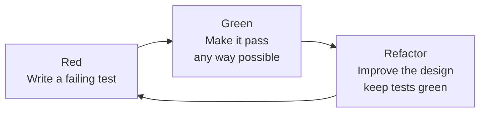
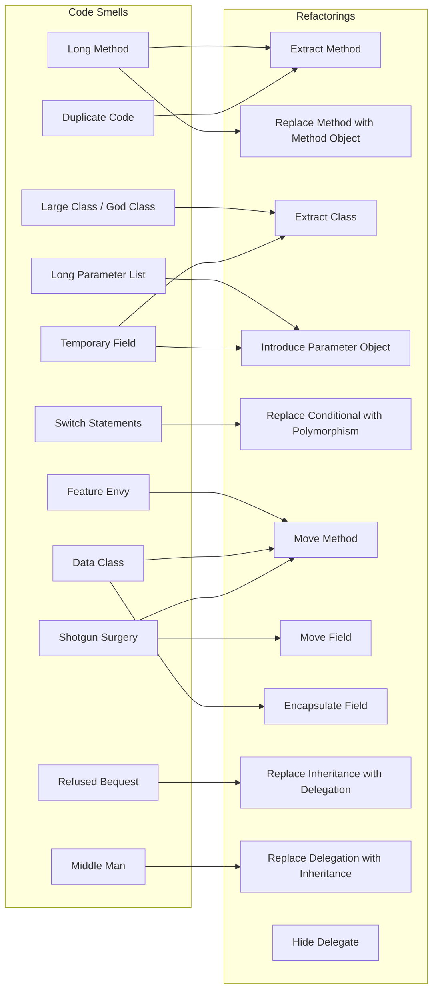
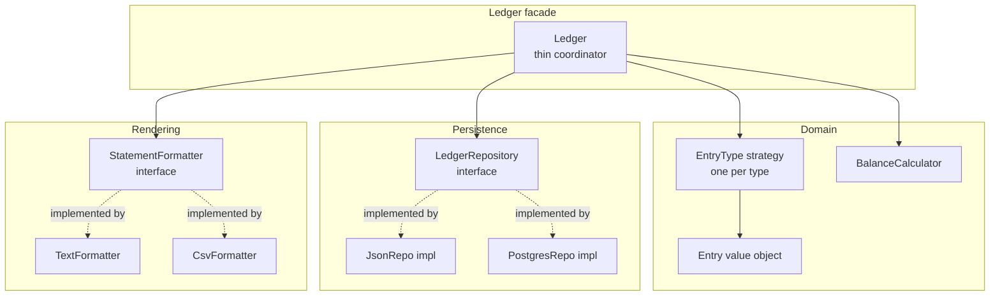

# 4.13 Refactoring Techniques

> "Any fool can write code that a computer can understand. Good programmers write code that humans can understand." — Kent Beck

Refactoring is the disciplined art of changing the internal structure of software without changing its observable behavior. This note is a maximalist field guide to Martin Fowler's catalog of refactorings, the Red-Green-Refactor cycle that protects them, and the smells that tell you when to apply each one. By the end you should be able to apply Extract Method, Extract Class, Move Method, Replace Conditional with Polymorphism, and Introduce Parameter Object with confidence, and to refactor safely under the protection of a passing test suite.

---

## 1. Purpose

### 1.1 What refactoring is, and is not

Refactoring is **a behavior-preserving transformation of source code**. The word has two meanings that practitioners blur on purpose:

1. **The activity** — restructuring existing code by changing its internal structure without changing its external behavior.
2. **The individual transformation** — a named, small, well-understood maneuver such as Extract Method or Move Field.

What refactoring is **not**:

- It is not rewriting. A rewrite throws the code away and starts over. Refactoring keeps the code alive and improves it incrementally.
- It is not bug fixing. Fixing a bug changes behavior; refactoring must not.
- It is not performance tuning. Performance tuning changes behavior (timing, allocations) intentionally. Refactoring changes structure for readability and extensibility.
- It is not "cleaning up." Casual cleanup without tests, without a catalog, and without small steps is just editing. Refactoring is disciplined.

### 1.2 Why refactoring matters

Refactoring is how a codebase pays down its [[4.14 Technical Debt Quantification and Management|technical debt]] before it bankrupts the team. Concretely it:

- **Improves design** without changing behavior, so the next feature lands in hours instead of days.
- **Reduces technical debt** continuously, instead of accumulating it for a painful rewrite.
- **Prepares for new features** by reshaping the code into the shape the new feature wants.
- **Makes code readable** so that onboarding, code review, and pair programming become cheaper.
- **Surveys bugs** because restructuring forces you to read code carefully, which often reveals latent defects (which you then fix in a separate commit, not during the refactoring).
- **Improves test coverage** because the prerequisite for refactoring is tests, and writing those tests surfaces untested branches.

### 1.3 The Red-Green-Refactor cycle

The Test-Driven Development cycle is the engine that makes refactoring safe. It has three beats:



- **Red** — Write a small, focused test that describes behavior you want but do not yet have. Run it. Watch it fail. Watching it fail matters: a test that passes before you implement is either a duplicate of an existing test or a broken test.
- **Green** — Write the smallest amount of production code that makes the test pass. Ugly is fine. Duplication is fine. Hard-coded values are fine. You are not designing yet.
- **Refactor** — Now that the tests are green, improve the design. Extract methods, rename variables, introduce polymorphism, move responsibilities. Run the tests after each step. If they go red, you broke behavior; revert and try again.

The cycle is short — minutes, not hours. The discipline is that **you never refactor on red**, and you never add new behavior during the refactor step.

### 1.4 The catalog

The phrase "the catalog" refers to Martin Fowler's *Refactoring: Improving the Design of Existing Code* (1999, second edition 2018). It enumerates dozens of named refactorings, each with:

- A **name** (so the team can talk about them precisely).
- A **motivation** describing when to apply it.
- A **mechanics** section describing the step-by-step procedure.
- One or more **examples**.

The catalog matters because names turn vague intuitions ("this class is too big") into actionable moves ("Extract Class"). Without the names you would rediscover each refactoring from scratch every time.

### 1.5 The non-negotiable prerequisite: tests

> "Refactor without tests and you are walking a tightrope without a net." — paraphrased Fowler

A refactoring is behavior-preserving **only if you can prove it**. The proof is a fast, deterministic, comprehensive test suite. Without it:

- You cannot tell the difference between a successful refactoring and one that silently broke a corner case.
- You cannot take small steps, because small steps require frequent feedback.
- You are doing archaeology, not engineering.

Legacy code without tests is the hard case. Michael Feathers' *Working Effectively with Legacy Code* defines legacy code as "code without tests" and presents techniques (characterization tests, seam identification, dependency breaking) for getting the first tests in place. We touch on this in Section 4 and Exercise 9.4.

---

## 2. Theory and Deep Dive

This section walks the major refactorings in Fowler's catalog. Each entry follows the same shape: **Intent**, **When to apply**, **Mechanics**, **Smell it cures**, and a tiny before/after sketch. Side-by-side JS and TS versions of larger examples appear in Section 5.

### 2.1 Extract Method

**Intent.** Turn a code fragment inside a method into its own method, called by name.

**When to apply.** Whenever a comment could explain what a block of code does, replace the block with a method whose name is the comment. Whenever a method is longer than ~10 lines. Whenever a fragment is duplicated.

**Mechanics.**

1. Create a new method. Name it after the intention of the fragment, not after how it does the work.
2. Copy the fragment into the new method.
3. For each local variable the fragment reads but does not write, pass it as a parameter.
4. For each local variable the fragment writes, decide: if it is only used after the fragment, return it; if it is used both before and after, the fragment is harder to extract — split it further or pass it as an output parameter (rare in JS).
5. Replace the fragment in the original method with a call to the new method.
6. Compile, run tests.

**Smell it cures.** Long Method, Comments, Duplicate Code.

### 2.2 Inline Method

**Intent.** Replace a call to a method with the method body, then delete the method.

**When to apply.** When a method's body is as clear as its name (often after a refactoring has made the body trivial). When indirection through a method adds friction without insight. Fowler: "Sometimes you find a method whose body is clearer than its name — that's a sign the indirection isn't paying its way."

**Mechanics.** Check that the method is not polymorphically overridden; find all call sites; replace each call with the body (mind parameters and locals); delete the method; run tests.

**Smell it cures.** Speculative Generality, indirection without insight.

### 2.3 Extract Class

**Intent.** Split a class that is doing too much into two or more classes, each with a single responsibility (see [[4.01 SOLID Single Responsibility]]).

**When to apply.** When a class has a name with "And" in it (`InvoiceAndTaxCalculator`), when subsets of fields are used by disjoint subsets of methods, when the class has grown past ~300 lines, when comments inside the class read like section headings.

**Mechanics.**

1. Decide how to split responsibilities.
2. Create a new class for the extracted responsibility.
3. Give the original class a field of the new class type (composition).
4. Move fields one at a time (use Move Field).
5. Move methods one at a time (use Move Method).
6. Update each call site to reach through the new field.
7. Run tests after every move.

**Smell it cures.** God Class / Large Class, Data Class paired with behavior elsewhere.

### 2.4 Inline Class

**Intent.** Merge a class that has become too small back into its host.

**When to apply.** After a series of refactorings has stripped a class of its responsibilities, when only a thin shell of delegation remains. The opposite of Extract Class.

**Mechanics.** Move every field and method from the small class into the host; replace references to the small class with references to the host; delete the small class; run tests.

**Smell it cures.** Lazy Class, middle-man delegation chains.

### 2.5 Move Method

**Intent.** Move a method from one class to another, the class where it belongs.

**When to apply.** When a method uses more features of another class than its own. This is the classic cure for [[4.12 Code Smells|Feature Envy]]: a method on `Order` that spends all its time calling getters on `Customer` belongs on `Customer`.

**Mechanics.**

1. Examine every feature used by the source method; consider also moving some of them.
2. If the source class will still need to call the method after the move, leave a delegating method on the source.
3. Declare the method on the target class.
4. Copy the code; adjust references to `this` to refer to the new host.
5. Delete the source method, or leave it as a delegator.
6. Run tests.

**Smell it cures.** Feature Envy, Shotgun Surgery (when the misplaced method forces changes in many places), Inappropriate Intimacy.

### 2.6 Move Field

**Intent.** Move a field from one class to the class where it is most used.

**When to apply.** When a field is used mostly by another class. Often precedes Move Method: you move the data first, then the methods that operate on it follow naturally.

**Mechanics.** Add the field to the target class; change the source's accessor to delegate to the target; migrate callers one at a time; delete the source field; run tests.

**Smell it cures.** Data Class, Feature Envy, Inappropriate Intimacy.

### 2.7 Replace Conditional with Polymorphism

**Intent.** Replace a `switch` or chain of `if/else if` that dispatches on type with a polymorphic hierarchy: one subclass per case.

**When to apply.** When the same type-based switch appears in multiple methods ( Shotgun Surgery waiting to happen), or when adding a new type requires touching many switch statements ( Open/Closed Principle violation). Each case becomes a subclass; the conditional disappears; the runtime picks the right behavior.

**Mechanics.**

1. If the type discriminator is a primitive (a string code), replace it with a class hierarchy (Type Code with Subclasses) or with a strategy table.
2. For each method that switches on the type: create an abstract method on the base class, override it in each subclass, move the case body into the override.
3. Delete the case from the switch; repeat until the switch is empty.
4. Delete the switch.
5. Run tests.

**Smell it cures.** Switch Statements, Combinatorial Explosion, repeated conditionals.

### 2.8 Introduce Parameter Object

**Intent.** Replace a group of parameters that travel together with a single object.

**When to apply.** When several methods accept the same cluster of parameters (a date range, a pagination window, a coordinate pair). The cluster is a hidden concept; naming it makes the domain explicit.

**Mechanics.**

1. Create a new class (or `interface`/`type` in TS) for the cluster.
2. Add a parameter of the new type to one method; have the body read from it.
3. Keep the old parameters temporarily; remove one at a time, running tests between removals.
4. Update callers to construct the new object.
5. Repeat for every method that accepts the cluster.

**Smell it cures.** Long Parameter List, Data Clumps, Duplicated Parameter Sets.

### 2.9 Replace Method with Method Object

**Intent.** Turn a long, hard-to-extract method into a class of its own, so that its locals become fields and the method's steps become small methods on the new class.

**When to apply.** When Extract Method fails because the method's locals are too tangled to break apart cleanly. Wrapping the method in a class sidesteps the parameter-passing problem: every local becomes a field, and any step can be extracted without parameters.

**Mechanics.**

1. Create a new class named after the method.
2. Add a field to the new class for every local and parameter of the original method.
3. Add a constructor that takes the original parameters.
4. Move the method body into a single method (often called `compute` or `invoke`) on the new class.
5. Replace the original method body with `new MethodObject(...).invoke()`.
6. Now Extract Method is easy: every step becomes a parameterless method.
7. Run tests.

**Smell it cures.** Long Method where Extract Method gets stuck.

### 2.10 Replace Inheritance with Delegation

**Intent.** Replace an `extends` relationship with a `has-a` field, delegating calls to it.

**When to apply.** When a subclass uses only a sliver of its parent's interface, when the parent's lifecycle is not truly the child's, when the relationship is `is-implemented-in-terms-of` rather than `is-a`. Also when you need to switch the delegate at runtime (inheritance is static; composition is dynamic).

**Mechanics.** Add a field of the parent type to the child; change every method on the child that calls `super` to call the delegate instead; remove the `extends`; run tests.

**Smell it cures.** Refused Bequest, inappropriate inheritance, "we inherited because we were lazy."

### 2.11 Replace Delegation with Inheritance

**Intent.** Replace a field-and-delegation pattern with `extends`, when the class is delegating everything.

**When to apply.** When a class delegates every method to another class — it is essentially a subclass pretending not to be. Promote it to a real subclass.

**Mechanics.** Make the class extend the delegate; remove the delegating methods; remove the field; run tests. Be careful: this is correct only if the delegate is truly the same kind of thing as the host.

**Smell it cures.** Middle Man (when delegation is total, you are inheriting in disguise).

### 2.12 Encapsulate Field

**Intent.** Make a public field private and expose it through accessor methods.

**When to apply.** Whenever a field is public. JavaScript's `class` fields are public by default; this refactoring is the standard remedy.

**Mechanics.** Make the field private (TS `private`, or JS `#`); add a getter and setter; rename the field if needed; update call sites; run tests. Prefer `readonly` or no setter at all when the field is set only in the constructor.

**Smell it cures.** Public Mutable State, Data Class.

### 2.13 Honorable mentions

The catalog is large. Other entries worth knowing: **Rename Method** (when the name no longer tells the truth, often the highest-leverage refactoring); **Extract Variable** (name a subexpression when Extract Method is too heavy); **Replace Temp with Query** (replace a local with a method call to remove mutable state); **Replace Magic Number with Symbolic Constant** (`7 * 60 * 60 * 1000` becomes a named constant); **Replace Array with Object** (`[name, age, email]` becomes `{ name, age, email }` to eliminate positional coupling); **Replace Constructor with Factory Function** (when construction varies by type); **Replace Error Code with Exception** (failure paths throw, not return magic numbers); **Replace Exception with Test** (replace a try/catch with a guard); **Hide Delegate** (when a client reaches `order.customer.address.zip`, put `order.zip()` on `Order`); **Replace Data Value with Object** (when a primitive like a phone number accrues validation and formatting, promote it to a class).

### 2.14 Smells to refactorings — the map

The catalog is most useful when navigated **from a smell to a refactoring**. You notice a smell, look it up, and apply the listed remedy. The map below is the heart of the catalog in one picture.



The map is not one-to-one. A single smell often has several candidate remedies; the right one depends on whether the smell is caused by misplaced data, misplaced behavior, or missing abstraction. Read [[4.12 Code Smells]] for the smell side of the map.

### 2.15 The atomic step

Every refactoring in the catalog is decomposable into **atomic steps** so small that each one keeps the tests green. Extract Method, for example, can be done in the single step "extract and replace," but the safe path is:

1. Add the new method with an empty body.
2. Compile.
3. Add the call from the original method (alongside the still-present fragment).
4. Compile, run tests — the new method is called but does nothing, so behavior is unchanged.
5. Move the body into the new method, one statement at a time, running tests between statements.
6. Delete the original fragment.

This obsessive incrementalism is what distinguishes refactoring from editing. A reviewer reading your commit history should be able to follow each step as a single, reviewable change.

---

## 3. Mental Models

Mental models compress the catalog into slogans you can recall under deadline pressure.

### 3.1 Refactoring = improve design without changing behavior

The defining constraint. If you change behavior — even slightly, even "for the better" — you are not refactoring, you are refactoring plus a feature or a bug fix. The constraint forces you to separate two activities that are tempting to mix: making the code better at its current job, and changing what its job is. Refuse to do both at once. The git history shows two commits: `refactor: extract InvoiceCalculator` and `feat: support tax-free invoices`.

### 3.2 Red-Green-Refactor = test, pass, improve

A three-beat loop. Each pass through the loop is minutes, not hours. The discipline is that **red and refactor never overlap**: you do not refactor while tests are failing, and you do not add behavior while refactoring.

### 3.3 Extract Method = name a chunk of code

Whenever you would write a comment to explain a block, write a method instead and let the method name be the comment. The name becomes the abstraction; the body becomes the detail you can ignore until you cannot. This single move dissolves Long Method, Comments, and Duplicate Code in one stroke.

### 3.4 Replace Conditional with Polymorphism = switch becomes subclasses

A `switch` on type is a missing class hierarchy in disguise. Each case is a behavior that belongs to one type; the `switch` itself belongs nowhere. Promote each case to a subclass override, delete the switch, and the Open/Closed Principle starts to hold: adding a new type means adding a new file, not editing five switches.

### 3.5 Introduce Parameter Object = group related params

If three parameters always travel together (a `startDate`, an `endDate`, a `timezone`), they are a single concept in disguise. Name the concept. The concept will then accrue behavior — a `contains(date)` method, a `toHumanString()` — that the loose params never could.

### 3.6 Move Method = put behavior with its data

If a method on `A` spends its time talking to `B`, it is homeless. Move it to `B`. The data and the behavior co-locate; the method becomes simpler because it no longer reaches across an object boundary; and `A` shrinks.

### 3.7 Tests = the safety net

Refactoring without tests is not refactoring; it is gambling. The tests are the proof that behavior was preserved. The suite must be fast (so you can run it after every atomic step), deterministic (no flakiness, no network, no clock), and meaningful (it asserts behavior, not implementation).

### 3.9 Two hats and the easy change

Kent Beck's metaphor: when you are coding, you wear one of two hats. The **feature hat** adds behavior and tests. The **refactoring hat** changes structure and adds no behavior. You can swap hats as often as you like, but you wear only one at a time. This pairs with "make the change easy, then make the easy change": before adding a feature, refactor the surrounding code so the feature has an obvious place to land, then add the feature, which is now trivial. The first commit is pure refactoring; the second is pure feature.

### 3.10 Refactor in small steps, commit each step

The git history of a refactoring should read like a tutorial. Each step compiles, each step passes tests, each step is one named move. If a step goes wrong, you revert one commit, not rewrite a day's work.

---

## 4. Real-World Use Cases

### 4.1 Daily development: refactor as you go

The Boy Scout rule: leave the code better than you found it. Every time you touch a file for any reason — a bug fix, a feature, a doc update — make one small improvement. Rename one misleading variable. Extract one method. Move one field. The improvements compound; over a year a codebase cleaned this way stays livable.

### 4.2 Before adding a feature: prepare the code

When a new feature is hard to add because the surrounding code is the wrong shape, do not force the feature into the wrong shape. Instead:

1. Write a failing test for the new feature (Red).
2. Notice that the implementation would be ugly.
3. Switch to the refactoring hat: refactor until the new feature has an obvious place.
4. Switch back: implement the feature (Green).
5. Refactor again if the implementation revealed more smells.

This is "make the change easy, then make the easy change."

### 4.3 Code reviews: suggest refactorings by name

A code review that says "this method is too long" is unhelpful. A review that says "Extract Method the validation block, then Replace Conditional with Polymorphism on the dispatch switch" is actionable. The catalog gives the team a shared vocabulary; the review becomes a precise prescription. Many teams attach a smell-to-refactoring cheat sheet to their PR template.

### 4.4 Technical debt sprints

When debt accumulates past the point where daily Boy-Scouting can keep up, schedule a deliberate refactoring sprint. Pick one module, write characterization tests until coverage is high, then walk the catalog: Extract Class the God Object, Replace Conditional with Polymorphism the dispatch switch, Introduce Parameter Object the seven-parameter methods. Track the work as debt tickets with measurable acceptance criteria ("the `Order` module has fewer than 200 lines and no method longer than 15 lines").

### 4.5 Legacy code modernization

Michael Feathers' definition: legacy code is code without tests. The first job is not to refactor; it is to get tests in place. Techniques include **characterization tests** (pin down current behavior by capturing outputs, even if the behavior is buggy — the tests become your safety net), **seams** (places where you can alter behavior without editing the code — dependency injection points, subclass overrides, module boundaries), and **dependency breaking** (Extract Interface, Parameterize Constructor, Subclass and Override Method — to introduce seams where there were none). Once the net is in place, the catalog applies normally.

### 4.6 Migration, performance, and framework upgrades

TypeScript adoption is itself a refactoring opportunity: the first pass adds types and surfaces latent bugs; the second pass applies the catalog with the compiler as an additional safety net. Refactoring and performance tuning are different activities but cooperate — refactor first to make the code clean, then profile to find the actual hot path. The same pattern of isolating a dependency behind a thin interface (Hide Delegate, Extract Interface) makes framework upgrades and vendor migrations a one-file change — the upgrade then lands on the seam, not on every call site.

---

## 5. Code Examples

This section presents side-by-side JS and TS for two scenarios. The minimal scenario shows the catalog's most common moves in five lines each. The production scenario is a refactoring session applied to a smelly `Invoice` module.

### 5.1 Example A — Minimal and Conceptual

A single file with the most common refactorings in their smallest form. JS and TS are shown side by side. Each block is "before → after."

#### A.1 Extract Method

**JavaScript (before):**

```javascript
function printOwing(invoice) {
  console.log("***********************");
  console.log("**** Customer Owes ****");
  console.log("***********************");
  let outstanding = 0;
  for (const o of invoice.orders) outstanding += o.amount;
  console.log(`name: ${invoice.customer}`);
  console.log(`amount: ${outstanding}`);
  console.log(`due: ${invoice.dueDate.toLocaleDateString()}`);
}
```

**JavaScript (after):**

```javascript
function printOwing(invoice) {
  printBanner();
  const outstanding = calculateOutstanding(invoice);
  printDetails(invoice, outstanding);
}
function printBanner() {
  console.log("***********************");
  console.log("**** Customer Owes ****");
  console.log("***********************");
}
function calculateOutstanding(invoice) {
  return invoice.orders.reduce((sum, o) => sum + o.amount, 0);
}
function printDetails(invoice, outstanding) {
  console.log(`name: ${invoice.customer}`);
  console.log(`amount: ${outstanding}`);
  console.log(`due: ${invoice.dueDate.toLocaleDateString()}`);
}
```

**TypeScript (after):** identical with `interface Order { amount: number; }`, `interface Invoice { customer: string; dueDate: Date; orders: Order[]; }`, and parameter/return type annotations (`: Invoice`, `: number`, `: void`).

#### A.2 Inline Method

**JavaScript (before):**

```javascript
function getRating(driver) {
  return moreThanFiveLateDeliveries(driver) ? 2 : 1;
}
function moreThanFiveLateDeliveries(driver) {
  return driver.numberOfLateDeliveries > 5;
}
```

**JavaScript (after):**

```javascript
function getRating(driver) {
  return driver.numberOfLateDeliveries > 5 ? 2 : 1;
}
```

**TypeScript (after):**

```typescript
interface Driver { numberOfLateDeliveries: number; }
function getRating(driver: Driver): number {
  return driver.numberOfLateDeliveries > 5 ? 2 : 1;
}
```

#### A.3 Extract Variable (Introduce Explaining Variable)

**JavaScript (before):**

```javascript
function price(order) {
  return order.quantity * order.itemPrice -
    Math.max(0, order.quantity - 500) * order.itemPrice * 0.05 +
    Math.min(order.quantity * order.itemPrice * 0.1, 100);
}
```

**JavaScript (after):**

```javascript
function price(order) {
  const basePrice = order.quantity * order.itemPrice;
  const quantityDiscount = Math.max(0, order.quantity - 500) * order.itemPrice * 0.05;
  const shipping = Math.min(basePrice * 0.1, 100);
  return basePrice - quantityDiscount + shipping;
}
```

**TypeScript (after):** same body with `interface Order { quantity: number; itemPrice: number; }` and `function price(order: Order): number`.

#### A.4 Replace Temp with Query

**JavaScript (before):**

```javascript
function price(order) {
  const basePrice = order.quantity * order.itemPrice;
  let discount = 0;
  if (basePrice > 1000) discount = basePrice * 0.05;
  return basePrice - discount;
}
```

**JavaScript (after):**

```javascript
function price(order) {
  const base = () => order.quantity * order.itemPrice;
  const discount = base() > 1000 ? base() * 0.05 : 0;
  return base() - discount;
}
```

**TypeScript (after):** same body with `interface Order { quantity: number; itemPrice: number; }`, `function price(order: Order): number`, and `const base = (): number => ...`.

#### A.5 Introduce Parameter Object

**JavaScript (before):**

```javascript
function entriesInVolumeBetween(entries, min, max) { /* ... */ }
function countEntriesBetween(entries, min, max) { /* ... */ }
function firstEntryBetween(entries, min, max) { /* ... */ }
```

**JavaScript (after):**

```javascript
class Volume {
  constructor(min, max) { this.min = min; this.max = max; }
  contains(v) { return v >= this.min && v <= this.max; }
}
function entriesInVolume(entries, vol) { /* uses vol.contains */ }
function countEntries(entries, vol) { /* ... */ }
function firstEntry(entries, vol) { /* ... */ }
```

**TypeScript (after):** same shape with `class Volume { constructor(public readonly min: number, public readonly max: number) {} ... }` and typed params.

#### A.6 Replace Conditional with Polymorphism

**JavaScript (before):**

```javascript
function birdSpeed(bird) {
  switch (bird.type) {
    case "european": return 10;
    case "african":  return bird.numberOfCoconuts > 2 ? 8 : 12;
    case "norwegian": return bird.isNailed ? 0 : 11;
    default: throw new Error("unknown bird");
  }
}
```

**JavaScript (after):**

```javascript
class Bird { speed() { return 0; } }
class EuropeanBird extends Bird { speed() { return 10; } }
class AfricanBird extends Bird {
  constructor(coconuts) { super(); this.coconuts = coconuts; }
  speed() { return this.coconuts > 2 ? 8 : 12; }
}
class NorwegianBlueBird extends Bird {
  constructor(nailed) { super(); this.nailed = nailed; }
  speed() { return this.nailed ? 0 : 11; }
}
function birdSpeed(bird) { return bird.speed(); }
```

**TypeScript (after):** same body with `abstract class Bird { abstract speed(): number; }` and `constructor(public readonly coconuts: number)` etc.

#### A.7 Move Method (Feature Envy)

**JavaScript (before):**

```javascript
class Account {
  constructor(type, daysOverdrawn) { this.type = type; this.daysOverdrawn = daysOverdrawn; }
  overdraftCharge() {
    if (this.type.isPremium) {
      const base = 10;
      return this.daysOverdrawn <= 7 ? base : base + (this.daysOverdrawn - 7) * 0.85;
    }
    return this.daysOverdrawn * 1.75;
  }
  bankCharge() {
    let result = 4.5;
    if (this.daysOverdrawn > 0) result += this.overdraftCharge();
    return result;
  }
}
class AccountType { constructor(isPremium) { this.isPremium = isPremium; } }
```

**JavaScript (after):** `overdraftCharge` envies `AccountType` and `daysOverdrawn`. Move the body to `AccountType`, passing `daysOverdrawn`:

```javascript
class AccountType {
  constructor(isPremium) { this.isPremium = isPremium; }
  overdraftCharge(daysOverdrawn) {
    if (this.isPremium) {
      const base = 10;
      return daysOverdrawn <= 7 ? base : base + (daysOverdrawn - 7) * 0.85;
    }
    return daysOverdrawn * 1.75;
  }
}
class Account {
  constructor(type, daysOverdrawn) { this.type = type; this.daysOverdrawn = daysOverdrawn; }
  overdraftCharge() { return this.type.overdraftCharge(this.daysOverdrawn); }
  bankCharge() {
    let result = 4.5;
    if (this.daysOverdrawn > 0) result += this.overdraftCharge();
    return result;
  }
}
```

**TypeScript (after):** same shape with `constructor(public readonly isPremium: boolean)` on `AccountType`, `overdraftCharge(daysOverdrawn: number): number`, and `Account`'s constructor typed `public readonly type: AccountType, public readonly daysOverdrawn: number`. Methods annotated with `: number`.

#### A.8 Replace Method with Method Object (sketch)

When a method's locals are too tangled to extract, wrap them in a class. JS:

```javascript
class Gamma {
  constructor(inputVal, quantity, yearToDate) {
    this.inputVal = inputVal; this.quantity = quantity; this.yearToDate = yearToDate;
    this.importantValue1 = 0; this.importantValue2 = 0; this.importantValue3 = 0;
  }
  compute() {
    this.importantValue1 = this.inputVal * this.quantity + this.account.delta();
    this.importantValue2 = this.inputVal * this.yearToDate + 100;
    this.importantThing();
    this.importantValue3 = this.importantValue2 * 7;
    return this.importantValue3 - 2 * this.importantValue1;
  }
  importantThing() {
    if ((this.yearToDate - this.importantValue1) > 100) this.importantValue2 -= 20;
  }
  account = { delta: () => 0 }; // injected collaborator
}
// Original method body becomes: return new Gamma(...).compute();
```

TS adds the obvious annotations to each field and method.

#### A.9 Encapsulate Field

**JavaScript (before):**

```javascript
class Person { constructor() { this.name = ""; } }
const p = new Person(); p.name = "Alice";
```

**JavaScript (after):**

```javascript
class Person {
  #name = "";
  get name() { return this.#name; }
  set name(value) { this.#name = value.trim(); }
}
```

**TypeScript (after):**

```typescript
class Person {
  #name = "";
  get name(): string { return this.#name; }
  set name(value: string) { this.#name = value.trim(); }
}
```

#### A.10 Replace Inheritance with Delegation

**JavaScript (before):**

```javascript
class Vector {
  constructor(x, y) { this.x = x; this.y = y; }
  magnitude() { return Math.hypot(this.x, this.y); }
}
class Stack extends Vector {
  constructor() { super(0, 0); this.items = []; }
  push(v) { this.items.push(v); this.x = v; }
  pop() { return this.items.pop(); }
}
```

`Stack` is using `Vector` as an implementation detail, not as an is-a relationship.

**JavaScript (after):**

```javascript
class Vector {
  constructor(x, y) { this.x = x; this.y = y; }
  magnitude() { return Math.hypot(this.x, this.y); }
}
class Stack {
  constructor() { this.items = []; this.vector = new Vector(0, 0); }
  push(v) { this.items.push(v); this.vector.x = v; }
  pop() { return this.items.pop(); }
  magnitude() { return this.vector.magnitude(); }
}
```

**TypeScript (after):** same shape with `class Vector { constructor(public x: number, public y: number) {} ... }`, `class Stack { private items: number[] = []; private vector: Vector = new Vector(0, 0); ... }`, and methods annotated `: number`, `: void`, `: number | undefined`.

### 5.2 Example B — Production-Grade Refactoring Session

A single smelly `Invoice` module that violates several SOLID principles and exhibits many smells. We refactor it step by step. Each step is committed separately, with the tests green between commits.

#### B.0 The starting point

**JavaScript (`invoice.js`):**

```javascript
// invoice.js — smells: God Class, Long Method, Switch Statements, Long Parameter List, Data Clump
class Invoice {
  constructor(customer, orders, dueDate, discountCode, currency, taxRate, timezone) {
    this.customer = customer; this.orders = orders; this.dueDate = dueDate;
    this.discountCode = discountCode; this.currency = currency;
    this.taxRate = taxRate; this.timezone = timezone;
  }
  total() {
    let subtotal = 0;
    for (const o of this.orders) subtotal += o.amount * o.price;
    let discount = 0;
    if (this.discountCode === "summer") discount = subtotal * 0.10;
    else if (this.discountCode === "vip") discount = subtotal * 0.20;
    else if (this.discountCode === "none") discount = 0;
    else throw new Error("unknown discount " + this.discountCode);
    const taxed = subtotal - discount;
    const tax = taxed * this.taxRate;
    let total = taxed + tax;
    if (this.currency === "JPY") total = Math.round(total);
    return { subtotal, discount, tax, total };
  }
  format() {
    const t = this.total();
    const tzDate = new Date(this.dueDate.toLocaleString("en-US", { timeZone: this.timezone }));
    const lines = [];
    lines.push(`Invoice for ${this.customer}`);
    lines.push(`Due: ${tzDate.toDateString()}`);
    for (const o of this.orders) lines.push(`${o.amount} x ${o.sku} @ ${o.price} = ${(o.amount * o.price).toFixed(2)}`);
    lines.push(`Subtotal: ${t.subtotal}`);
    lines.push(`Discount (${this.discountCode}): -${t.discount}`);
    lines.push(`Tax (${(this.taxRate * 100).toFixed(1)}%): +${t.tax}`);
    lines.push(`Total: ${t.total} ${this.currency}`);
    return lines.join("\n");
  }
  isOverdue(now) {
    const tzNow = new Date(now.toLocaleString("en-US", { timeZone: this.timezone }));
    return tzNow > this.dueDate;
  }
}
module.exports = { Invoice };
```

**TypeScript (`invoice.ts`):** the same code, with the obvious types added — `type DiscountCode = "none" | "summer" | "vip"`, `type Currency = "USD" | "EUR" | "JPY"`, an `Order` interface, an `InvoiceTotal` interface, and constructor parameters annotated. The body is identical.

#### B.1 The tests (the safety net)

Before touching anything, we need tests. They pin current behavior. Both JS and TS versions share this shape; only the import differs.

**`invoice.test.ts` (Vitest):**

```typescript
import { describe, it, expect } from "vitest";
import { Invoice } from "./invoice";

describe("Invoice", () => {
  const base = () => new Invoice(
    "Acme",
    [{ amount: 2, price: 10, sku: "A" }, { amount: 1, price: 5, sku: "B" }],
    new Date("2025-01-01T00:00:00Z"),
    "none", "USD", 0.10, "UTC",
  );

  it("computes subtotal, discount, tax, total for no discount", () => {
    const t = base().total();
    expect(t).toEqual({ subtotal: 25, discount: 0, tax: 2.5, total: 27.5 });
  });

  it("applies summer discount of 10 percent", () => {
    const inv = base(); inv.discountCode = "summer";
    expect(inv.total().discount).toBeCloseTo(2.5);
    expect(inv.total().total).toBeCloseTo(24.75);
  });

  it("applies vip discount of 20 percent", () => {
    const inv = base(); inv.discountCode = "vip";
    expect(inv.total().discount).toBeCloseTo(5);
    expect(inv.total().total).toBeCloseTo(22);
  });

  it("rounds JPY totals to whole yen", () => {
    const inv = base(); inv.currency = "JPY";
    expect(Number.isInteger(inv.total().total)).toBe(true);
  });

  it("formats a multi-line invoice", () => {
    const text = base().format();
    expect(text).toContain("Invoice for Acme");
    expect(text).toContain("2 x A @ 10 = 20.00");
    expect(text).toContain("Total: 27.5 USD");
  });

  it("detects overdue when now is past due", () => {
    const now = new Date("2025-06-01T00:00:00Z");
    expect(base().isOverdue(now)).toBe(true);
  });
});
```

All tests green. Refactoring hat on.

#### B.2 Step 1 — Extract Method the subtotal loop

**JS:**

```javascript
total() {
  const subtotal = this.calculateSubtotal();
  let discount = 0;
  if (this.discountCode === "summer") discount = subtotal * 0.10;
  else if (this.discountCode === "vip") discount = subtotal * 0.20;
  else if (this.discountCode === "none") discount = 0;
  else throw new Error("unknown discount " + this.discountCode);
  const taxed = subtotal - discount;
  const tax = taxed * this.taxRate;
  let total = taxed + tax;
  if (this.currency === "JPY") total = Math.round(total);
  return { subtotal, discount, tax, total };
}
calculateSubtotal() {
  return this.orders.reduce((s, o) => s + o.amount * o.price, 0);
}
```

**TS** is identical with `calculateSubtotal(): number`.

Run tests. Green. Commit: `refactor(invoice): extract calculateSubtotal`.

#### B.3 Step 2 — Extract Variable inside `total`

Name the intermediate values.

```javascript
total() {
  const subtotal = this.calculateSubtotal();
  const discount = this.discountFor(subtotal);
  const taxable = subtotal - discount;
  const tax = taxable * this.taxRate;
  const total = this.currency === "JPY" ? Math.round(taxable + tax) : taxable + tax;
  return { subtotal, discount, tax, total };
}
discountFor(subtotal) {
  if (this.discountCode === "summer") return subtotal * 0.10;
  if (this.discountCode === "vip") return subtotal * 0.20;
  if (this.discountCode === "none") return 0;
  throw new Error("unknown discount " + this.discountCode);
}
```

**TS** adds `discountFor(subtotal: number): number`. Run tests. Green. Commit: `refactor(invoice): extract discountFor`.

#### B.4 Step 3 — Replace Conditional with Polymorphism for discounts

The discount switch is the canonical smell. Replace with strategy objects keyed by code.

**TypeScript:**

```typescript
type DiscountCode = "none" | "summer" | "vip";
interface DiscountStrategy { rate: number; }

const DISCOUNTS: Record<DiscountCode, DiscountStrategy> = {
  none:   { rate: 0.00 },
  summer: { rate: 0.10 },
  vip:    { rate: 0.20 },
};

function discountFor(code: DiscountCode, subtotal: number): number {
  const d = DISCOUNTS[code];
  if (!d) throw new Error(`unknown discount ${code}`);
  return subtotal * d.rate;
}
```

The JS version is the same with no type annotations (`function discountFor(code, subtotal)`). Now adding a new discount is a one-line table entry, not a switch edit — the Open/Closed Principle holds. Run tests. Green. Commit: `refactor(invoice): replace discount switch with strategy table`.

#### B.5 Step 4 — Replace Conditional with Polymorphism for currency rounding

The `currency === "JPY"` check is another switch. Treat the rounding rule as a property of the currency.

**TypeScript:**

```typescript
type Currency = "USD" | "EUR" | "JPY";
interface CurrencySpec { decimals: number; }

const CURRENCIES: Record<Currency, CurrencySpec> = {
  USD: { decimals: 2 },
  EUR: { decimals: 2 },
  JPY: { decimals: 0 },
};

class Invoice {
  total(): InvoiceTotal {
    const subtotal = this.calculateSubtotal();
    const discount = this.discountFor(subtotal);
    const taxable = subtotal - discount;
    const tax = taxable * this.taxRate;
    const total = this.roundForCurrency(taxable + tax);
    return { subtotal, discount, tax, total };
  }
  roundForCurrency(value: number): number {
    const c = CURRENCIES[this.currency];
    const factor = 10 ** c.decimals;
    return Math.round(value * factor) / factor;
  }
}
```

Run tests. Green. Commit: `refactor(invoice): replace currency switch with currency table`.

#### B.6 Step 5 — Introduce Parameter Object for the timezone/dueDate cluster

The `timezone` and `dueDate` are a hidden concept: a zoned due date. Extract a class.

**JavaScript:**

```javascript
class ZonedDateTime {
  constructor(date, timezone) { this.date = date; this.timezone = timezone; }
  toLocalDate() {
    return new Date(this.date.toLocaleString("en-US", { timeZone: this.timezone }));
  }
  isBefore(now) {
    return this.toLocalDate() < new Date(now.toLocaleString("en-US", { timeZone: this.timezone }));
  }
}

class Invoice {
  constructor(customer, orders, due, discountCode, currency, taxRate) {
    this.due = due; // ZonedDateTime
    // ...other fields
  }
  isOverdue(now = new Date()) { return this.due.isBefore(now); }
}
```

**TypeScript:**

```typescript
class ZonedDateTime {
  constructor(public readonly date: Date, public readonly timezone: string) {}
  toLocalDate(): Date {
    return new Date(this.date.toLocaleString("en-US", { timeZone: this.timezone }));
  }
  isBefore(now: Date): boolean {
    const localNow = new Date(now.toLocaleString("en-US", { timeZone: this.timezone }));
    return this.toLocalDate() < localNow;
  }
}
```

Update the constructor signature and the test's `base()` factory. Run tests. Green. Commit: `refactor(invoice): introduce ZonedDateTime for tz/dueDate cluster`.

#### B.7 Step 6 — Extract Class: split formatting from calculation

`Invoice` does two things: compute money and render text. Split into `Invoice` (the model) and `InvoiceFormatter` (the view).

**TypeScript:**

```typescript
interface InvoiceParams {
  customer: string; orders: Order[]; due: ZonedDateTime;
  discountCode: DiscountCode; currency: Currency; taxRate: number;
}

class Invoice {
  constructor(public readonly p: InvoiceParams) {}
  get customer() { return this.p.customer; }
  get due() { return this.p.due; }
  total(): InvoiceTotal { /* ... */ return { subtotal: 0, discount: 0, tax: 0, total: 0 }; }
  isOverdue(now: Date = new Date()): boolean { return this.due.isBefore(now); }
}

class InvoiceFormatter {
  constructor(private readonly invoice: Invoice) {}
  format(): string {
    const i = this.invoice;
    const t = i.total();
    const lines: string[] = [
      `Invoice for ${i.customer}`,
      `Due: ${i.due.toLocalDate().toDateString()}`,
      ...i.orders.map(o => `${o.amount} x ${o.sku} @ ${o.price} = ${(o.amount * o.price).toFixed(2)}`),
      `Subtotal: ${t.subtotal}`,
      `Discount (${i.discountCode}): -${t.discount}`,
      `Tax (${(i.taxRate * 100).toFixed(1)}%): +${t.tax}`,
      `Total: ${t.total} ${i.currency}`,
    ];
    return lines.join("\n");
  }
}
```

The JS version is the same with no type annotations and `class InvoiceFormatter { constructor(invoice) { this.invoice = invoice; } ... }`. Update tests: anything that called `invoice.format()` now calls `new InvoiceFormatter(invoice).format()`. Run tests. Green. Commit: `refactor(invoice): extract InvoiceFormatter`.

#### B.8 Step 7 — Encapsulate Field: hide the mutable internals

After the previous step the constructor takes a params object. The fields are now read-only views. Go further: replace the public `discountCode` getter with a `discountFor(subtotal)` method that delegates to the strategy table, and replace the `currency` getter with `roundForCurrency(value)`. Each of these is its own commit.

#### B.9 What the refactorings bought us

- **Adding a new discount** is one line in `DISCOUNTS`.
- **Adding a new currency** is one line in `CURRENCIES`.
- **Changing the format** (HTML, PDF, plain text) is a new `InvoiceFormatter` sibling class — no change to `Invoice`.
- **Adding a new "due date in business days" rule** is a method on `ZonedDateTime`, not a tangle inside `Invoice.format`.
- **Testing** is easier because each class is small and has one responsibility.

The pattern: each refactoring replaces a switch or a long method with a small, named, extensible abstraction. The smell-to-refactoring map from Section 2.14 drove every step.

---

## 6. Common Mistakes and Anti-Patterns

### 6.1 Refactoring without tests

The cardinal sin. Without tests you cannot prove behavior was preserved; you are editing, not refactoring. The mistake is sometimes rationalized as "I'm just renaming" — but renames break callers, and only the compiler (in TS) or the tests catch the breakage. **Fix:** write characterization tests first. If the code is hard to test, apply Feathers' dependency-breaking techniques (Extract Interface, Parameterize Constructor) to introduce seams, then test.

### 6.2 Big-bang refactoring

"I'm going to spend three weeks refactoring the whole module." The branch drifts; merging is hell; nobody can review three weeks of changes; when something breaks you cannot bisect. **Fix:** refactor in small steps. Commit after each step. Land to `main` daily. The history in Section 5.2 is the model.

### 6.3 Refactoring while adding features

You start implementing a feature, spot a smell, refactor for an hour, lose your place, half-implement the feature, commit it all together, and the reviewer cannot tell which lines are the feature and which are the refactoring. **Fix:** two hats. Commit the refactoring first, then implement the feature on top. If the feature is the motivation for the refactoring, that is exactly the "make the change easy, then make the easy change" pattern.

### 6.4 Not running tests after each step

You extract a method, do not run the tests, extract another, do not run the tests, extract a third, run the tests, get a failure. Now you have three changes to bisect, and you have lost the small-step guarantee. **Fix:** run the tests after every atomic step. If the suite is slow, speed it up — but never skip the run.

### 6.5 Over-refactoring

You spend a day eliminating a Data Class smell that nothing depends on, or extracting a class that ends up with one method. The codebase is technically cleaner, but the team lost a day and the reader now has more files to navigate. **Fix:** refactor when the smell is causing pain — when the next feature is hard, when a bug fix touched three files because of Shotgun Surgery, when a reviewer cannot understand a method. Smells that are dormant are debt that is not currently accruing interest. See [[4.07 DRY YAGNI KISS]] — YAGNI applies to refactorings too.

### 6.6 Refactoring the wrong thing first

You spend a week polishing a clean module while the God Object three directories over is choking every new feature. Refactoring the easy code is satisfying but useless. **Fix:** prioritize by impact. Refactor the modules that block features, the modules that bug fixes touch repeatedly, the modules that onboarding engineers get stuck on. Use [[4.14 Technical Debt Quantification and Management|technical debt]] tickets with severity and impact.

### 6.7 Mixing refactorings with bug fixes in one commit

A reviewer reading "fix: crash when discount is null" should not have to also read a 200-line Extract Class. The fix and the refactoring get tangled; reverting the fix reverts the refactoring; cherry-picking becomes impossible. **Fix:** separate commits. If a refactoring reveals a bug, file the bug, finish the refactoring, then fix the bug in a separate commit.

### 6.8 Trusting IDE tools blindly

IDE refactorings (rename, extract, move) are usually safe, but they fail on dynamic features: `eval`, `Proxy`, stringly-typed method dispatch, monkey-patching. The tool may rename the wrong thing or miss a call site. **Fix:** use IDE tools as a first pass; verify with tests; review the diff before committing.

### 6.9 Refactoring without understanding the domain

You extract a `Money` class because Fowler's book says so, but the domain treats prices as plain numbers everywhere, and your new class spreads virally through the codebase, forcing conversions at every boundary. **Fix:** refactor toward the domain model — talk to a domain expert if one exists — before introducing a new abstraction. Refactorings should reveal the domain, not invent a new one.

### 6.10 Leaving a delegating method forever

After Move Method you leave a delegating method on the source class "in case anyone calls it." Six months later, half the callers use the delegate and half use the original, and the two paths have drifted. **Fix:** either delete the delegator immediately (if you control all callers) or schedule its removal. Do not leave temporary indirection forever.

### 6.11 Introducing abstractions before the third duplication

You extract a class after seeing the same pattern twice. The third instance looks different, and your abstraction does not fit it. **Fix:** the Rule of Three (see [[4.07 DRY YAGNI KISS]]): tolerate the duplication twice, extract on the third occurrence. By then you have seen enough variation to design the abstraction correctly.

### 6.12 Renaming to a worse name

A rename that loses information ("rename `calculateOutstanding` to `calc`") is worse than no rename. A rename that misleads ("rename `isOverdue` to `isLate`" when the domain calls it "overdue") breaks the shared vocabulary. **Fix:** treat names as part of the domain model. Get the team to agree on the vocabulary before renaming. Use Rename Method sparingly and review renames in PR.

---

## 7. Best Practices and Design Patterns

### 7.1 Always have tests before refactoring

The non-negotiable prerequisite. If the code lacks tests, write characterization tests until you have coverage of the behavior you intend to preserve. If the code is hard to test, break dependencies first (Extract Interface, Parameterize Constructor) until it is testable. See [[5.04 Unit Testing Fundamentals]].

### 7.2 Take small steps, commit each step

Each step should be one named refactoring, one commit, one reviewable diff. If a step requires more than ~30 lines of diff, it is probably two steps. The atomic-step discipline from Section 2.15 is the practice.

### 7.3 Run the tests after every step

After every commit, run the suite. If it is red, revert and try again. If the suite takes more than a few seconds, fix that — slow tests are a refactoring tax.

### 7.4 Use version control as a refactoring journal

Each commit message is a verb in the past tense: `extract calculateSubtotal`, `replace discount switch with strategy table`. The reader of the log can follow the refactoring as a story. Avoid `refactor stuff` or `cleanup`.

### 7.5 Don't mix refactoring with feature work

Two hats. One commit, one purpose. A reviewer should be able to tell from the message whether the commit changes behavior or only structure.

### 7.6 Prioritize by impact

Refactor the modules that block features, that bugs cluster in, that onboarding trips over. Use smell counts and impact estimates to rank debt tickets. Do not refactor clean modules because they are easy.

### 7.7 Use IDE refactoring tools

Modern editors (VS Code, WebStorm) implement Extract Method, Rename, Move, Inline safely for TS and for JS with type-checking enabled. They are faster than manual refactoring and less error-prone. Use them as a first pass; verify with tests; review the diff.

### 7.8 Refactor toward patterns, not from them

Design patterns (Strategy, State, Composite) are often the natural shape a refactoring reveals. Replace Conditional with Polymorphism tends to land on Strategy. Extract Class on a God Object tends to land on Facade. Do not start by writing a pattern and squeezing code into it — start from smells, refactor, and notice the pattern emerge.

### 7.9 Keep refactorings reversible; pair on risky ones

Prefer refactorings you can back out of. If a refactoring is irreversible (deleting a public API), do it in two commits: deprecate first, delete later. For high-stakes refactorings (changing a core data structure, splitting a widely-used class), pair-program — the second pair of eyes catches missed call sites, and the discipline of narrating each step keeps you in the small-step rhythm.

### 7.10 Cheat sheet, schedule, and metrics

Pin the Section 2.14 map on the wall. When you spot a smell, look it up; apply the listed remedy; do not improvise. Daily Boy-Scouting handles small smells; schedule a refactoring sprint each quarter for the big ones. Track metrics that matter: line count of the largest class, longest method, cyclomatic complexity, duplication percentage, test coverage. A sprint that moves none of these numbers was theater.

### 7.11 Document the why, not the what

The code shows the what. The commit message and the architecture decision record (ADR) show the why. "Extracted InvoiceFormatter because formatting was 60% of the class and blocked the HTML renderer" is useful. "Extracted InvoiceFormatter" is not.

### 7.12 Patterns that frequently emerge

Refactorings often reveal design patterns: **Strategy** from Replace Conditional with Polymorphism (when cases are interchangeable algorithms); **State** from the same refactoring (when cases are state-machine stages); **Template Method** from Extract Method (when the skeleton is stable and the steps vary); **Composite** from Extract Class (when the new class is recursively composable); **Facade** from Extract Class on a God Object; **Value Object** from Introduce Parameter Object (when the new object is immutable). See [[4.06 SOLID Dependency Inversion]] and [[4.10 Design Patterns Overview]] for the pattern side.

---

## 8. Technical Interview Knowledge

Eight Q&A pairs covering the catalog and the cycle.

### 8.1 Q: What is refactoring?

**A.** Refactoring is the process of changing the structure of existing code without changing its observable behavior. The word refers both to the activity and to each individual named transformation in Fowler's catalog (Extract Method, Move Method, etc.). The discipline is preserved by two rules: behavior must not change, and the safety net of a passing test suite must be present. Without tests, the activity is editing, not refactoring. Refactoring differs from rewriting (which discards the old code), from performance tuning (which intentionally changes timing behavior), and from bug fixing (which intentionally changes functional behavior).

### 8.2 Q: Explain Red-Green-Refactor.

**A.** Red-Green-Refactor is the TDD cycle and the engine that makes refactoring safe. **Red** means writing a small failing test that describes behavior you want. **Green** means writing the minimum production code to make the test pass; the code may be ugly. **Refactor** means improving the design of the now-passing code, keeping the tests green. The cycle is short — minutes, not hours — and the discipline is that you never refactor while tests are red and never add behavior while refactoring. The cycle gives you a fast feedback loop: each pass through the loop leaves the code in a known-good state, and the test suite proves it.

### 8.3 Q: How do you Extract Method?

**A.** First, identify a code fragment inside a method that does one identifiable thing. Create a new method named after the intention of the fragment, not its mechanism. Copy the fragment into the new method. For each local variable the fragment reads, add it as a parameter. For each local the fragment writes, decide whether to return it (if it is only used after the fragment) or to split further (if it is used both before and after). Replace the fragment in the original method with a call to the new method. Run tests. The atomic version is: add the new method with an empty body, add the call alongside the fragment, then move the body one statement at a time, running tests between moves.

### 8.4 Q: How do you Replace Conditional with Polymorphism?

**A.** When a method switches on a type code and the same switch appears in multiple places, replace it with a class hierarchy. Each case becomes a subclass overriding an abstract method on the base class. The mechanics: ensure the type discriminator is a class hierarchy (if it is a primitive string code, first apply Type Code with Subclasses); for each switching method, declare an abstract method on the base; copy each case body into the matching subclass override; delete the cases one at a time, running tests between deletions; when the switch is empty, delete it. After this refactoring, adding a new type means adding a new subclass and not editing any switch — the Open/Closed Principle holds.

### 8.5 Q: What is Introduce Parameter Object?

**A.** When a group of parameters always travel together (a date range, a pagination window, a coordinate pair), they represent a hidden domain concept. Replace them with a single object that names the concept. The mechanics: create a class or interface for the cluster; add a parameter of the new type to one method; have the body read from it; keep the old parameters temporarily; remove them one at a time, running tests between removals; update callers; repeat for every method that takes the cluster. The new object typically accrues behavior — `contains(date)`, `toHumanString()` — that the loose parameters never could, and Long Parameter List and Data Clump smells disappear together.

### 8.6 Q: Why do you need tests before refactoring?

**A.** Because the definition of refactoring requires that behavior is preserved, and tests are the proof. Without tests you cannot tell the difference between a successful refactoring and one that silently broke a corner case; you cannot take small steps because you have no fast feedback; and you cannot confidently commit because you cannot verify. The test suite must be fast (so you can run it after every atomic step), deterministic (no flakiness, no network, no clock), and meaningful (asserting behavior, not implementation). Legacy code without tests requires Feathers' techniques — characterization tests, seams, dependency breaking — to get the first tests in place before the catalog applies.

### 8.7 Q: How do you refactor safely?

**A.** Five practices. First, ensure tests exist and are green before you start; if they don't, write characterization tests. Second, take atomic steps: one named refactoring per commit, each leaving the tests green. Third, run the tests after every step; if red, revert and try again. Fourth, use version control: each commit is a single reviewable change with a verb-past-tense message. Fifth, wear one hat at a time: do not add behavior while refactoring, and do not refactor while adding behavior. Pair on risky steps, use IDE tools as a first pass, and prioritize by impact — refactor the modules that block features, not the modules that are easy.

### 8.8 Q: What is the relationship between smells and refactorings?

**A.** Smells and refactorings are two sides of the same coin. A smell is a heuristic indicator that something is wrong with the design (Long Method, God Class, Feature Envy). A refactoring is the named maneuver that fixes it (Extract Method, Extract Class, Move Method). Fowler's catalog maps each smell to one or more candidate refactorings. The map is many-to-many: a single smell often has several remedies (Long Method can be cured by Extract Method or by Replace Method with Method Object), and a single refactoring can cure several smells (Extract Method cures Long Method, Comments, and Duplicate Code). The right remedy depends on the cause: misplaced data, misplaced behavior, or missing abstraction. In practice you read code for smells, look up the candidate refactorings, pick the one that fits the cause, and apply it in small steps under tests.

---

## 9. Practical Exercises

Four exercises with full worked solutions. Each is designed to take 30–60 minutes.

### 9.1 Exercise 1 — Extract Method from a long function

**Problem.** The following function calculates a shipping cost report. It is one long method with three concerns mixed together. Apply Extract Method to split it into focused pieces. Write the missing tests first.

**JavaScript (before):**

```javascript
function shippingReport(orders) {
  let totalWeight = 0;
  let totalCost = 0;
  for (const o of orders) {
    totalWeight += o.weight;
    const cost = o.weight * 0.5 + (o.express ? 10 : 0);
    totalCost += cost;
  }
  const lines = [];
  lines.push("Shipping Report");
  lines.push(`Orders: ${orders.length}`);
  lines.push(`Total weight: ${totalWeight}kg`);
  lines.push(`Total cost: $${totalCost.toFixed(2)}`);
  return lines.join("\n");
}
```

**Worked solution (JS).** Tests first:

```javascript
const assert = require("node:assert");
function test() {
  const orders = [
    { weight: 2, express: false },
    { weight: 5, express: true },
  ];
  const out = shippingReport(orders);
  assert(out.includes("Orders: 2"));
  assert(out.includes("Total weight: 7kg"));
  // (2 * 0.5) + (5 * 0.5 + 10) = 1 + 12.5 = 13.5
  assert(out.includes("Total cost: $13.50"));
}
test();
```

Watch the test pass. Now refactor.

```javascript
function shippingReport(orders) {
  const totals = computeTotals(orders);
  return renderReport(orders, totals);
}

function computeTotals(orders) {
  let totalWeight = 0;
  let totalCost = 0;
  for (const o of orders) {
    totalWeight += o.weight;
    totalCost += costFor(o);
  }
  return { totalWeight, totalCost };
}

function costFor(order) {
  return order.weight * 0.5 + (order.express ? 10 : 0);
}

function renderReport(orders, totals) {
  return [
    "Shipping Report",
    `Orders: ${orders.length}`,
    `Total weight: ${totals.totalWeight}kg`,
    `Total cost: $${totals.totalCost.toFixed(2)}`,
  ].join("\n");
}
```

Run tests after each extraction. The three concerns — computation, rendering, and the per-order cost rule — are now three named functions.

**TypeScript (after):** the same body with `interface Order { weight: number; express: boolean; }`, `interface Totals { totalWeight: number; totalCost: number; }`, and parameter/return type annotations on each function (`orders: Order[]`, `totals: Totals`, `: string`, `: number`).

### 9.2 Exercise 2 — Replace Conditional with Polymorphism

**Problem.** The function below computes a discount based on a customer tier. The tier is a string code, and the same `switch` is about to be duplicated in a new `loyaltyPoints` function. Replace the conditional with polymorphism so that adding a new tier or a new tier-based computation is a one-line change.

**JavaScript (before):**

```javascript
function discount(tier, subtotal) {
  switch (tier) {
    case "bronze": return subtotal * 0.02;
    case "silver": return subtotal * 0.05;
    case "gold":   return subtotal * 0.10;
    case "none":   return 0;
    default: throw new Error("unknown tier " + tier);
  }
}
```

**Worked solution (JS).** Tests pin the current behavior:

```javascript
const assert = require("node:assert");
function test() {
  assert.strictEqual(discount("bronze", 100), 2);
  assert.strictEqual(discount("silver", 100), 5);
  assert.strictEqual(discount("gold", 100), 10);
  assert.strictEqual(discount("none", 100), 0);
  assert.throws(() => discount("platinum", 100));
}
test();
```

Introduce a strategy table:

```javascript
const TIERS = {
  bronze: { rate: 0.02 },
  silver: { rate: 0.05 },
  gold:   { rate: 0.10 },
  none:   { rate: 0.00 },
};

function discount(tier, subtotal) {
  const t = TIERS[tier];
  if (!t) throw new Error("unknown tier " + tier);
  return subtotal * t.rate;
}

function loyaltyPoints(tier, subtotal) {
  const t = TIERS[tier];
  if (!t) throw new Error("unknown tier " + tier);
  return Math.floor(subtotal * t.rate * 10);
}
```

Both functions share the strategy table; adding a tier is one entry; adding a tier-based computation is one new function reading the table. Run tests. Green.

If you prefer full class hierarchy polymorphism (more aligned with Fowler's original mechanics), each tier becomes a subclass of `Tier` overriding `discount` and `loyaltyPoints`; the lookup table maps codes to instances. The trade-off is more boilerplate for stricter type per-instance behavior.

**TypeScript (after, strategy table form):**

```typescript
type TierCode = "bronze" | "silver" | "gold" | "none";
interface TierStrategy { rate: number; }

const TIERS: Record<TierCode, TierStrategy> = {
  bronze: { rate: 0.02 },
  silver: { rate: 0.05 },
  gold:   { rate: 0.10 },
  none:   { rate: 0.00 },
};

function discount(tier: TierCode, subtotal: number): number {
  const t = TIERS[tier];
  if (!t) throw new Error(`unknown tier ${tier}`);
  return subtotal * t.rate;
}

function loyaltyPoints(tier: TierCode, subtotal: number): number {
  const t = TIERS[tier];
  if (!t) throw new Error(`unknown tier ${tier}`);
  return Math.floor(subtotal * t.rate * 10);
}
```

### 9.3 Exercise 3 — Extract Class from a God Object

**Problem.** The `UserManager` below is a God Object doing authentication, persistence, and email. Extract two classes — `UserRepository` and `MailService` — leaving `UserManager` as a thin coordinator.

**JavaScript (before):**

```javascript
class UserManager {
  constructor(db, mailer) {
    this.db = db;
    this.mailer = mailer;
    this.users = new Map();
  }
  register(email, password) {
    if (this.users.has(email)) throw new Error("exists");
    const id = crypto.randomUUID();
    const hash = this.hash(password);
    this.users.set(email, { id, email, hash });
    this.db.save("users", { id, email, hash });
    this.mailer.send(email, "Welcome", "Welcome aboard");
    return id;
  }
  login(email, password) {
    const u = this.users.get(email);
    if (!u || u.hash !== this.hash(password)) throw new Error("bad credentials");
    return u.id;
  }
  hash(s) {
    let h = 0;
    for (const c of s) h = (h * 31 + c.charCodeAt(0)) | 0;
    return String(h);
  }
}
```

**Worked solution (JS).** Tests first (sketch):

```javascript
const assert = require("node:assert");
function test() {
  const saved = [];
  const db = { save: (table, row) => saved.push({ table, row }) };
  const sent = [];
  const mailer = { send: (to, subj, body) => sent.push({ to, subj, body }) };
  const mgr = new UserManager(db, mailer);
  const id = mgr.register("a@b.c", "secret");
  assert.strictEqual(saved.length, 1);
  assert.strictEqual(saved[0].table, "users");
  assert.strictEqual(sent.length, 1);
  assert.strictEqual(sent[0].to, "a@b.c");
  assert.strictEqual(mgr.login("a@b.c", "secret"), id);
  assert.throws(() => mgr.login("a@b.c", "wrong"));
}
test();
```

Extract Class step by step. Pull out a `UserRepository` for persistence (a `Map` of users plus `add`, `findByEmail`, `exists` methods delegating to `db.save`). Pull out a `MailService` wrapping the mailer with a `sendWelcome(email)` method. Pull out a `PasswordHasher` holding the hash function. The new `UserManager` is a thin coordinator:

```javascript
class UserManager {
  constructor(repo, mail, hasher) {
    this.repo = repo;
    this.mail = mail;
    this.hasher = hasher;
  }
  register(email, password) {
    if (this.repo.exists(email)) throw new Error("exists");
    const id = crypto.randomUUID();
    const hash = this.hasher.hash(password);
    this.repo.add({ id, email, hash });
    this.mail.sendWelcome(email);
    return id;
  }
  login(email, password) {
    const u = this.repo.findByEmail(email);
    if (!u || u.hash !== this.hasher.hash(password)) throw new Error("bad credentials");
    return u.id;
  }
}
```

Update the test's constructor: `new UserManager(new UserRepository(db), new MailService(mailer), new PasswordHasher())`. Run tests. Green. Each class has one responsibility.

**TypeScript (after):**

```typescript
import { randomUUID } from "node:crypto";

interface User { id: string; email: string; hash: string; }
interface Db { save(table: string, row: User): void; }
interface Mailer { send(to: string, subject: string, body: string): void; }

class UserRepository {
  private users = new Map<string, User>();
  constructor(private readonly db: Db) {}
  add(user: User): void { if (this.users.has(user.email)) throw new Error("exists"); this.users.set(user.email, user); this.db.save("users", user); }
  findByEmail(email: string): User | undefined { return this.users.get(email); }
  exists(email: string): boolean { return this.users.has(email); }
}

class MailService {
  constructor(private readonly mailer: Mailer) {}
  sendWelcome(email: string): void { this.mailer.send(email, "Welcome", "Welcome aboard"); }
}

class PasswordHasher {
  hash(s: string): string { let h = 0; for (const c of s) h = (h * 31 + c.charCodeAt(0)) | 0; return String(h); }
}

class UserManager {
  constructor(
    private readonly repo: UserRepository,
    private readonly mail: MailService,
    private readonly hasher: PasswordHasher,
  ) {}
  register(email: string, password: string): string {
    if (this.repo.exists(email)) throw new Error("exists");
    const id = randomUUID();
    const hash = this.hasher.hash(password);
    this.repo.add({ id, email, hash });
    this.mail.sendWelcome(email);
    return id;
  }
  login(email: string, password: string): string {
    const u = this.repo.findByEmail(email);
    if (!u || u.hash !== this.hasher.hash(password)) throw new Error("bad credentials");
    return u.id;
  }
}
```

### 9.4 Exercise 4 — Refactor a smelly codebase with tests

**Problem.** You have been handed a 200-line `Billing` module with no tests. The module has a God Object, a Long Method, a Switch Statement on plan type, and a Long Parameter List of `(startDate, endDate, timezone, customerId, plan)`. Your job: (1) write characterization tests until you have 80% coverage, (2) apply the catalog one smell at a time, (3) keep tests green at every commit.

**Worked solution.** This is the same shape as Section 5.2's production example. The procedure: (1) **Inventory** every observable behavior — inputs, outputs, side effects, error paths. (2) **Write characterization tests** for each, capturing buggy behavior as `// TODO: bug` tests rather than fixing in-place. (3) **Identify smells** (God Object, Long Method, Switch Statements, Long Parameter List, Data Clump) and rank by impact. (4) **Refactor one smell at a time**: pick the matching refactoring from the Section 2.14 map, apply the mechanics in atomic steps, run tests after each step, commit with a verb-past-tense message. (5) **Stop when the next feature is easy** — refactor until the next feature has an obvious place, then implement it on top.

A concrete commit sequence: `test(billing): add characterization tests`; `refactor(billing): extract calculateUsage from Bill.total`; `refactor(billing): replace plan switch with strategy table`; `refactor(billing): introduce BillingWindow parameter object`; `refactor(billing): extract BillingRepository`; `refactor(billing): extract BillingFormatter`; `feat(billing): support usage-based plans` (the new feature, trivial because the refactorings prepared the ground).

**Key lesson.** The characterization tests are the safety net. Without them the catalog is dangerous. With them, the catalog is a precision tool.

---

## 10. Mini-Project Blueprint

**Project.** Refactor a legacy `ledger` module.

**Scenario.** A 350-line `Ledger` class accumulates entries, computes balances, formats statements, persists to a JSON file, and dispatches entry types via a switch. It has no tests. New product wants to add a "recurring entry" type, a CSV export, and a Postgres backend — none of which fit the current shape. Your job is to refactor the module so the three features land trivially.

### 10.1 Architecture (target shape)



The facade holds the workflow; the strategy table holds entry-type logic; the repository interface is the seam for the Postgres backend; the formatter interface is the seam for CSV export.

### 10.2 Step-by-step plan

1. **Inventory.** Read `Ledger` end to end. List every public method, every side effect, every switch case, every error path.
2. **Characterization tests.** Write tests covering every public method and every switch case. Aim for 80%+ coverage. Capture any latent bugs as tests asserting the buggy behavior, with `// TODO: bug` comments.
3. **Extract Method.** Pull each switch case out of `addEntry` into a named method on `Ledger`. Run tests.
4. **Replace Conditional with Polymorphism.** Build an `EntryType` strategy table; one entry per case; move the case bodies into the strategies. Run tests.
5. **Extract Class — repository.** Move the file I/O into a `JsonLedgerRepository`. Define a `LedgerRepository` interface. Inject it into `Ledger`. Run tests.
6. **Extract Class — formatter.** Move the statement rendering into a `TextStatementFormatter`. Define a `StatementFormatter` interface. Inject it. Run tests.
7. **Introduce Parameter Object.** Group `(startDate, endDate, accountId)` into a `LedgerWindow` value object. Run tests.
8. **Encapsulate Field.** Make the entry list private; expose only `add` and `iterator`. Run tests.
9. **Land the new features:**
   - Recurring entries: add an `EntryType` strategy and a `RecurringEntry` value object. No change to `Ledger`.
   - CSV export: add a `CsvStatementFormatter`. No change to `Ledger`.
   - Postgres backend: add a `PostgresLedgerRepository`. No change to `Ledger`.

Each new feature is a one-class change because the refactorings prepared the seams.

### 10.3 Reference skeleton (TypeScript)

```typescript
// domain/entry.ts
type EntryTypeCode = "income" | "expense" | "transfer";
interface Entry { id: string; type: EntryTypeCode; amount: number; occurredAt: Date; memo?: string; }

// domain/entry-type.ts — strategy table (Replace Conditional with Polymorphism)
interface EntryTypeStrategy { apply(balance: number, entry: Entry): number; }
const EntryTypes: Record<EntryTypeCode, EntryTypeStrategy> = {
  income:   { apply: (b, e) => b + e.amount },
  expense:  { apply: (b, e) => b - e.amount },
  transfer: { apply: (b, e) => b + e.amount }, // positive = received
};

// domain/balance-calculator.ts
class BalanceCalculator {
  compute(entries: ReadonlyArray<Entry>): number {
    return entries.reduce((b, e) => EntryTypes[e.type].apply(b, e), 0);
  }
}

// domain/ledger-window.ts — Introduce Parameter Object
class LedgerWindow {
  constructor(public readonly start: Date, public readonly end: Date, public readonly accountId: string) {
    if (start > end) throw new Error("start after end");
  }
  contains(date: Date): boolean { return date >= this.start && date <= this.end; }
}

// persistence/repository.ts — Extract Class + interface seam
interface LedgerRepository {
  load(window: LedgerWindow): Promise<Entry[]>;
  save(entry: Entry): Promise<void>;
}
class JsonLedgerRepository implements LedgerRepository {
  constructor(private readonly filePath: string) {}
  async load(window: LedgerWindow): Promise<Entry[]> { /* read JSON, filter by window */ return []; }
  async save(entry: Entry): Promise<void> { /* append to JSON file */ }
}

// rendering/formatter.ts — Extract Class + interface seam
interface StatementFormatter { format(entries: ReadonlyArray<Entry>, balance: number): string; }
class TextStatementFormatter implements StatementFormatter {
  format(entries: ReadonlyArray<Entry>, balance: number): string {
    const lines = entries.map(e => `${e.occurredAt.toISOString()} ${e.type} ${e.amount}`);
    lines.push(`Balance: ${balance}`);
    return lines.join("\n");
  }
}
class CsvStatementFormatter implements StatementFormatter {
  format(entries: ReadonlyArray<Entry>, balance: number): string {
    const rows = entries.map(e => [e.id, e.type, e.amount, e.occurredAt.toISOString()].join(","));
    return ["id,type,amount,occurredAt", ...rows, `,balance,${balance}`].join("\n");
  }
}

// ledger.ts — the thin facade
class Ledger {
  constructor(
    private readonly repo: LedgerRepository,
    private readonly formatter: StatementFormatter,
    private readonly calculator = new BalanceCalculator(),
  ) {}
  async add(entry: Entry): Promise<void> { await this.repo.save(entry); }
  async statement(window: LedgerWindow): Promise<string> {
    const entries = await this.repo.load(window);
    const balance = this.calculator.compute(entries);
    return this.formatter.format(entries, balance);
  }
}

export { Ledger, LedgerWindow, Entry, EntryTypes,
  LedgerRepository, JsonLedgerRepository,
  StatementFormatter, TextStatementFormatter, CsvStatementFormatter };
```

### 10.4 Test harness (Vitest)

```typescript
import { describe, it, expect, beforeEach } from "vitest";
import { Ledger, LedgerWindow, TextStatementFormatter, CsvStatementFormatter } from "./ledger";
import type { LedgerRepository, Entry } from "./ledger";

function makeFakeRepo(): LedgerRepository & { entries: Entry[] } {
  const entries: Entry[] = [];
  return {
    entries,
    async load() { return [...entries]; },
    async save(e: Entry) { entries.push(e); },
  };
}

describe("Ledger mini-project", () => {
  it("renders a text statement", async () => {
    const repo = makeFakeRepo();
    const ledger = new Ledger(repo, new TextStatementFormatter());
    await ledger.add({ id: "1", type: "income", amount: 100, occurredAt: new Date("2025-01-01") });
    await ledger.add({ id: "2", type: "expense", amount: 30, occurredAt: new Date("2025-01-02") });
    const text = await ledger.statement(new LedgerWindow(new Date("2025-01-01"), new Date("2025-12-31"), "acct-1"));
    expect(text).toContain("income 100");
    expect(text).toContain("expense 30");
    expect(text).toContain("Balance: 70");
  });

  it("renders a CSV statement", async () => {
    const repo = makeFakeRepo();
    const ledger = new Ledger(repo, new CsvStatementFormatter());
    await ledger.add({ id: "1", type: "income", amount: 100, occurredAt: new Date("2025-01-01") });
    const csv = await ledger.statement(new LedgerWindow(new Date("2025-01-01"), new Date("2025-12-31"), "acct-1"));
    expect(csv.split("\n")[0]).toBe("id,type,amount,occurredAt");
    expect(csv).toContain("1,income,100");
    expect(csv).toContain("balance,100");
  });
});
```

### 10.5 Acceptance criteria

- All characterization tests pass at every commit.
- `Ledger` is under 80 lines and has no method over 15.
- Adding a new entry type is one entry in `EntryTypes`.
- Adding a new export format is one new class implementing `StatementFormatter`.
- Adding a new backend is one new class implementing `LedgerRepository`.
- The git log reads as a story; each commit is a single named refactoring.

If all five hold, the refactor is done and the three new features are trivial to land on top.

---

## 11. Core Connections

Refactoring is one node in the design web. The wikilinks below are the related nodes you should visit next.

- **[[4.01 SOLID Single Responsibility]]** — Extract Class is the canonical SRP enforcement move. A class that violates SRP is a candidate for Extract Class; a class that obeys SRP is the destination.
- **[[4.12 Code Smells]]** — Smells are the input to refactorings. Read this first to learn to recognize Long Method, God Class, Feature Envy, Switch Statements, Long Parameter List, and the rest of the catalog's smells.
- **[[4.07 DRY YAGNI KISS]]** — YAGNI applies to refactorings too: refactor when the smell is causing pain, not because the catalog has an entry. DRY drives Extract Method and Extract Class on duplication. KISS prefers the smaller refactoring over the more clever one.
- **[[5.02 TDD Methodology]]** — Red-Green-Refactor is the cycle. This note covers the refactor beat; that one covers the red and green beats and the discipline of writing the test first.
- **[[5.04 Unit Testing Fundamentals]]** — Tests are the safety net for refactoring. This note covers the refactorings; that one covers the tests: what makes a unit test good, how to structure them, how to keep them fast and deterministic.
- **[[6.12 Debugging Techniques DevTools]]** — Refactoring reveals bugs; debugging fixes them. Keep the two activities separate: refactor under tests, then debug (in a separate commit) any latent defect the refactoring surfaced.

### 11.1 Adjacent notes

A few more notes extend the picture:

- **[[4.02 SOLID Open Closed Principle]]** — Replace Conditional with Polymorphism is the move that turns a closed module into an open one.
- **[[4.06 SOLID Dependency Inversion]]** — Extract Interface (a dependency-breaking prerequisite for refactoring legacy code) is the seam that lets you swap implementations for tests.
- **[[4.10 Design Patterns Overview]]** — Patterns are what refactorings reveal: Strategy from Replace Conditional with Polymorphism, Facade from Extract Class, Value Object from Introduce Parameter Object.
- **[[4.14 Technical Debt Quantification and Management]]** — Refactoring is how debt is paid down. This note covers the mechanics; that one covers the accounting.

The through-line of this vault's software-engineering section is: smells reveal problems, refactorings fix them, tests make the fixes safe, patterns emerge from the fixes, SOLID is the shape the patterns converge on, and technical debt is the accounting that schedules the work. This note sits in the middle of that through-line — the operational core where abstract design principles become concrete code changes.

---

> **End of note 4.13.** You can now apply Extract Method, Extract Class, Move Method, Replace Conditional with Polymorphism, and Introduce Parameter Object; you can refactor safely with tests using the Red-Green-Refactor cycle; and you can map the smells from [[4.12 Code Smells]] to the refactorings in this catalog. Pair this note with [[5.02 TDD Methodology]] for the cycle and [[5.04 Unit Testing Fundamentals]] for the safety net.
