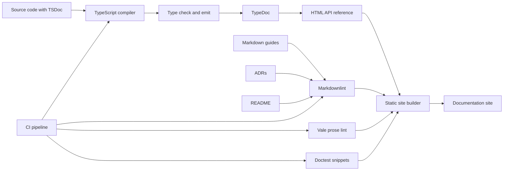
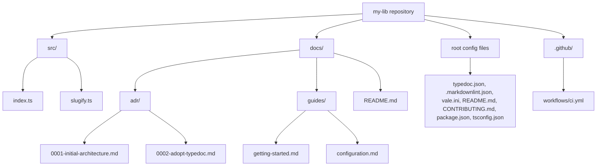

# 4.14 Documentation as Code

## 1. Purpose

Documentation is the part of the codebase that survives developer turnover, remote work, asynchronous handoffs, and the slow erosion of memory. When you write code you are simultaneously writing for two audiences: the machine that executes it, and the humans who must read it tomorrow. "Documentation as Code" is the discipline of treating those human-facing artifacts (API references, decision records, runbooks, onboarding guides) with the same engineering rigor as source code. Docs are versioned alongside code, reviewed in pull requests, tested in CI, and generated automatically from the same source of truth that produces the running system.

The fundamental argument for Documentation as Code is simple: **docs that live apart from code rot**. A wiki page that nobody updates, a README that was last touched two years ago, an API reference generated by hand from a spreadsheet (these are all symptoms of treating documentation as an afterthought). When docs are first-class citizens in the repository, they inherit every benefit that the rest of the codebase enjoys: version history, code review, automated testing, atomic commits, branch isolation, and reproducibility.

There are four primary types of documentation in a modern JavaScript or TypeScript project:

1. **API reference** (generated automatically from TSDoc or JSDoc comments embedded in the source). This is the canonical "what does this function do, what does it accept, what does it return" documentation. TypeDoc is the standard tool for TypeScript projects.
2. **Guides and tutorials** (handwritten prose that walks a reader through accomplishing a goal). These live as Markdown files in the repository and are typically rendered to a documentation site (Docusaurus, Astro Starlight, VitePress).
3. **Architectural Decision Records, or ADRs** (short, immutable Markdown files that capture a single architectural decision: the context, the options considered, the decision made, and the consequences). ADRs form a decision journal for the project.
4. **README** (the front door of the repository). A README answers: what is this, why does it exist, how do I install it, how do I use it, how do I contribute.

The "as code" philosophy means all four of these artifacts share the same lifecycle as the source. A pull request that adds a feature must also update the API reference and write the ADR that explains why. A release that ships a breaking change must update the README and the changelog. The CI pipeline lints the Markdown, checks for broken links, runs the embedded examples as doctests, and regenerates the API reference on every merge.

The downstream beneficiaries are concrete:

- **Onboarding engineers** can clone the repo and have a runnable mental model within hours instead of weeks.
- **API consumers** in another team or another company can read the generated reference without pinging the author on chat.
- **Future-you** six months from now can reopen the ADR folder and remember why the team chose a message queue over a streaming platform, with the tradeoffs laid out honestly.
- **Reviewers** can verify that a code change and its documentation change belong to the same commit, making drift visible.

In short: Documentation as Code is the practice of making the invisible (context, intent, decisions, examples) as durable, reviewable, and automatable as the code itself.

## 2. Theory and Deep Dive

### 2.1 TSDoc (comments the compiler understands)

TSDoc is a comment syntax for TypeScript source files. A TSDoc comment begins with `/**` and ends with `*/`, and contains a sequence of block tags. The TypeScript language server parses these comments and surfaces them in editor tooltips; TypeDoc parses them to generate HTML; the TypeScript compiler itself respects certain tags (notably `@deprecated` and `@param`) for emit and editor behavior.

A TSDoc comment looks like this:

```ts
/**
 * Computes the median of a numeric array.
 *
 * @remarks
 * Uses a sort-then-pick strategy. For very large arrays consider a
 * selection algorithm for better worst-case performance.
 *
 * @param values - Non-empty array of finite numbers.
 * @returns The median value.
 * @throws {RangeError} When the input array is empty.
 * @example
 * ```ts
 * median([1, 2, 3]); // 2
 * median([1, 2, 3, 4]); // 2.5
 * ```
 * @deprecated Since v2.1. Use `quantile(values, 0.5)` instead.
 * @see {@link quantile}
 * @since 1.0.0
 */
export function median(values: number[]): number {
  if (values.length === 0) {
    throw new RangeError("values must not be empty");
  }
  const sorted = [...values].sort((a, b) => a - b);
  const mid = Math.floor(sorted.length / 2);
  return sorted.length % 2 === 0
    ? (sorted[mid - 1] + sorted[mid]) / 2
    : sorted[mid];
}
```

The canonical block tags are:

- `@param name - description` (documents a parameter; the hyphen after the name is the TSDoc convention).
- `@returns description` (documents the return value).
- `@throws {ErrorType} description` (documents an exception that may be thrown).
- `@example` (provides a usage example; the example can be a fenced code block).
- `@deprecated message` (marks an API as deprecated; the TypeScript compiler emits a diagnostic when a deprecated symbol is used).
- `@see {@link symbol}` (cross-references another symbol; TypeDoc renders this as a clickable link).
- `@since version` (indicates the version in which the API was introduced).
- `@remarks` (extended prose; use for anything beyond the first summary line).
- `@privateRemarks` (internal notes that TypeDoc hides from public output).
- `@typeParam T - description` (documents a generic type parameter).

The first sentence of a TSDoc comment is the **summary**: it should fit on one line and stand alone. Editors show the summary in the symbol preview tooltip and TypeDoc shows it in the symbol list. Anything beyond the summary belongs in `@remarks`.

### 2.2 JSDoc (the JavaScript equivalent)

JSDoc predates TSDoc and remains the standard for JavaScript projects. TypeScript itself understands JSDoc, so a `.js` file with rich JSDoc annotations can deliver near-TypeScript levels of editor intelligence without ever adopting a separate type syntax. The tag set overlaps heavily with TSDoc; differences are mostly historical.

```js
/**
 * Computes the median of a numeric array.
 *
 * @param {number[]} values - Non-empty array of finite numbers.
 * @returns {number} The median value.
 * @throws {RangeError} When the input array is empty.
 * @example
 * median([1, 2, 3]); // 2
 * @see quantile
 * @since 1.0.0
 */
export function median(values) {
  if (values.length === 0) {
    throw new RangeError("values must not be empty");
  }
  const sorted = [...values].sort((a, b) => a - b);
  const mid = Math.floor(sorted.length / 2);
  return sorted.length % 2 === 0
    ? (sorted[mid - 1] + sorted[mid]) / 2
    : sorted[mid];
}
```

JSDoc requires explicit `{type}` annotations in each tag because the source has no native types to harvest. TypeScript's language server reads both, so a JavaScript project can migrate toward richer type information without committing to a full TypeScript conversion.

### 2.3 TypeDoc (automated API reference generation)

TypeDoc reads a TypeScript project, harvests every exported symbol, parses the TSDoc comments, and emits a static HTML site. The site includes:

- A module tree on the left.
- A symbol index organized by kind (functions, classes, interfaces, types, enums).
- Per-symbol pages with the summary, remarks, parameters, return type, examples, and cross-references.
- A search box.
- Inherited and implemented symbols surfaced on class pages.

A minimal `typedoc.json` configuration looks like:

```json
{
  "entryPoints": ["src/index.ts"],
  "out": "docs/api",
  "excludePrivate": true,
  "excludeInternal": true,
  "readme": "README.md",
  "githubPages": false,
  "plugin": ["typedoc-plugin-missing-exports"]
}
```

Run with `typedoc` from the command line; in a typical npm script `"docs:api": "typedoc"`. TypeDoc integrates with the TypeScript compiler API, so any type error in the source breaks the build (a built-in guarantee that the published reference matches the actual types).

### 2.4 Architectural Decision Records (ADRs)

An ADR is a short Markdown file (typically under 400 lines, often under 100) that captures a single architectural decision. The format, popularized by Michael Nygard, has four mandatory sections:

1. **Context** (what forces are at play, what constraints, what problem are we solving).
2. **Decision** (what did we choose, stated in the active voice and the present tense).
3. **Status** (Proposed, Accepted, Deprecated, Superseded). Status changes are themselves tracked by linking to the superseding ADR.
4. **Consequences** (what becomes easier, what becomes harder, what follow-up work is required).

Optional but recommended sections: **Considered Options** (with a brief evaluation of each), **Pros and Cons**, **Links** (to related ADRs, RFCs, tickets).

The filename convention is `NNNN-short-title.md`, where `NNNN` is a zero-padded sequence number. Sequence numbers are monotonic and never reused. The files are immutable once Accepted; if a decision is reversed, you write a new ADR that supersedes the old one and update the old one's Status field to "Superseded by ADR-0042".

Two popular toolchains:

- **adr-tools** (a Bash CLI by Nat Pryce). Creates, lists, links, and updates ADRs in a `docs/adr/` directory. Lightweight, language-agnostic.
- **MADR** (Markdown Any Decision Records). A more structured template with explicit "Considered Options" and "Pros and Cons of the Options" tables. Useful when the decision warrants visible evaluation of alternatives.

### 2.5 README structure

A README is the landing page of a repository. The minimum viable structure:

1. **Title and one-line description** (what is this, in a sentence).
2. **Badges** (build status, coverage, npm version, license).
3. **Why** (the problem this project solves and the audience it serves).
4. **Installation** (copy-pasteable commands).
5. **Quick start** (the smallest example that produces a visible result).
6. **Usage** (common patterns, configuration options, links to deeper guides).
7. **API reference** (a link to the generated TypeDoc site).
8. **Contributing** (link to `CONTRIBUTING.md`, code of conduct).
9. **License** (SPDX identifier and link to `LICENSE`).

Skip the badges if you have none. Skip the API reference link if the project is an application rather than a library. Never skip Installation and Quick Start.

### 2.6 Markdown linting

Markdown is a free-form format, which means it drifts. Markdownlint enforces a consistent style: heading hierarchy, list indentation, code fence language tags, line length, trailing whitespace, duplicate headings. The rules are individually configurable via `.markdownlint.json`:

```json
{
  "default": true,
  "MD013": false,
  "MD024": false,
  "MD033": false
}
```

`MD013` (line length) is usually disabled because Markdown wraps naturally. `MD024` (no duplicate headings) is disabled because repeated H2 headings under different H1s are common and harmless. `MD033` (no inline HTML) is disabled in projects that lean on raw HTML for badges.

### 2.7 Documentation testing

Two complementary testing strategies:

- **Prose linting** with Vale. Vale enforces a style guide on prose (voice, terminology, spelling, banned words). Configured via `vale.ini` and a `styles/` directory. Vale ships with style packs for Microsoft, Google, and write-good; teams adopt one and customize. Vale reads Markdown, HTML, and AsciiDoc; it flags passive voice, gendered pronouns, banned terms, and inconsistent capitalization. A typical Vale run takes seconds and catches dozens of subtle prose issues per pass.
- **Snippet testing** with doctest-style tools. For TypeScript, `@microsoft/api-extractor` and the `ts-docs-test` pattern compile every fenced code block in the docs to verify that the examples actually type-check. For runnable examples, doctest extracts `// => expected` comments and asserts that the expression evaluates to the expected value. The `doctest` npm package and `eslint-plugin-doctest` cover this ground. Snippet tests are the only mechanism that catches the failure mode where an example was correct at write time but drifted after a refactor.
- **Link checking** with `lychee` or `markdown-link-check`. Verifies that every internal and external link resolves. Critical for documentation sites that span hundreds of Markdown files. Lychee checks links in parallel, caches results, and handles rate limiting gracefully. A link checker run nightly catches link rot on external sites that you do not control.

### 2.8 Migration strategy (JSDoc to TSDoc)

Teams adopting TypeScript often have a JavaScript codebase rich with JSDoc. The migration path is incremental: the TypeScript compiler reads JSDoc, so a `.js` file with rich JSDoc already provides editor intelligence. The migration sequence is: first add a `tsconfig.json` with `allowJs` and `checkJs`, fix the resulting type errors, then convert files one at a time from `.js` to `.ts`, translating JSDoc type annotations into native TypeScript types. The TSDoc tags (`@param`, `@returns`, `@example`, `@deprecated`) survive the conversion unchanged; only the inline `{type}` annotations are removed because the types move into the signature. TypeDoc harvests both JSDoc and TSDoc, so the API reference quality is consistent across the migration boundary.

### 2.8 Documentation lifecycle



The diagram shows the four documentation streams (TSDoc-embedded source, Markdown guides, ADRs, README) all flowing through CI into a unified documentation site. The single most important property of this flow is that **every artifact is regenerated from source on every commit**, which is what "documentation as code" actually means in practice. CI is the orchestrator: it invokes the compiler, the linters, the doctest runner, the link checker, and the static site builder in sequence, and the only way a documentation change reaches the published site is by surviving every check on a merged commit.

## 3. Mental Models

Five mental models help internalize the practice:

**Model 1: Documentation lives with the code.** The repository is the single source of truth. There is no separate wiki space for API docs, no separate intranet for architecture, no separate share drive for runbooks. If a document is not in the repository, it does not exist. The corollary: any change to behavior is accompanied, in the same pull request, by a change to the relevant documentation. Reviewers reject PRs that change code without updating docs.

**Model 2: TSDoc is comments the compiler understands.** An ordinary `// comment` is invisible to tools. A `/** TSDoc */` comment is structured data: the language server reads it, the compiler respects `@deprecated`, TypeDoc harvests it. Writing TSDoc is not "leaving a comment"; it is "publishing an API contract."

**Model 3: TypeDoc turns TSDoc into a website.** The transformation is mechanical: parse the AST, extract symbols and their comments, emit HTML. If the TSDoc is rich, the website is rich. If the TSDoc is empty, the website is empty. The quality of generated docs is exactly the quality of the source comments.

**Model 4: An ADR is a decision journal, one file per decision.** ADRs are append-only. You never edit an accepted ADR to change its mind; you write a new one that supersedes it. The folder of ADRs reads like a captain's log: every significant turn of the project recorded, in order, with reasoning intact. This is the only durable defense against the "why did we do that?" question that haunts every codebase older than two years.

**Model 5: The README is the front door.** A reader who arrives at your repository cold should, within sixty seconds, know what the project is, whether they should care, how to install it, and where to go next. Everything else (the API reference, the guides, the ADRs) is one click deeper. The README is a hub, not a treatise.

## 4. Real-World Use Cases

**Library documentation.** An npm package ships with a README, a TypeDoc-generated API reference hosted on GitHub Pages or Vercel, and a `docs/` folder of guides. Consumers read the README first, follow links to the guides, and consult the API reference for signature details. The `effect`, `zod`, and `fp-ts` libraries are excellent examples of this pattern at scale.

**Internal platform documentation.** A platform team maintains an internal TypeScript SDK for interacting with the company's service mesh. The SDK repo contains TSDoc on every public method, ADRs for every significant design choice (why gRPC over REST, why bidirectional streams for telemetry, why a custom retry policy), and a runbook for operating the SDK in production. Other teams consume the SDK and the docs without ever pinging the platform team on chat.

**Architectural decision logs.** A team migrating a monolith to services writes an ADR per major decision: "We will use event sourcing for the orders service" (ADR-0007), "We will use Postgres as the event store" (ADR-0008), "We will use the outbox pattern for reliable publishing" (ADR-0012). Six months later, when a new engineer asks why the orders service has a complex write path, the answer is a single link to ADR-0007 and its successors.

**Repository READMEs.** A monorepo with twenty packages has a top-level README that explains the structure and a per-package README that explains each package. The per-package READMEs are short (installation, quick start, link to the package's TypeDoc site).

**API references.** A REST API exposed by a Node backend has its reference generated from the route handlers' TSDoc. Each handler documents its request shape, response shape, error codes, and required permissions. A tool like `@asteasolutions/zod-to-openapi` or `tsoa` turns the TSDoc and the Zod schemas into an OpenAPI spec, which is then served as `/docs/openapi.json` and rendered with Swagger UI or Redoc.

**Onboarding guides.** A `docs/onboarding.md` walks a new hire from zero to a running local environment in under an hour. The guide is tested in CI by a fresh Docker container that follows the steps verbatim (if any command fails, the build fails). This guarantees the onboarding guide is never subtly broken.

**Runbooks.** A `docs/runbooks/` folder contains one Markdown file per operational scenario: "Database failover", "Cache flush", "Rotate API keys", "Restore from backup". Each runbook is a numbered checklist with copy-pasteable commands, expected outputs, and escalation contacts. Runbooks are exercised during game days; failures are fixed in the runbook, not just in the moment.

## 5. Code Examples

### 5.1 Example A (Minimal and Conceptual)

#### TSDoc tags on a single function (TypeScript)

```ts
/**
 * Debounces a function call.
 *
 * @param fn - The function to debounce.
 * @param delayMs - Minimum interval between invocations, in milliseconds.
 * @returns A debounced version of `fn` with a `cancel` method.
 * @example
 * ```ts
 * const log = debounce((s: string) => console.log(s), 300);
 * log("a"); log("b"); log("c");
 * // after 300ms, prints "c"
 * ```
 * @since 1.2.0
 */
export function debounce<T extends (...args: any[]) => void>(
  fn: T,
  delayMs: number
): T & { cancel: () => void } {
  let timer: ReturnType<typeof setTimeout> | null = null;
  const wrapped = ((...args: Parameters<T>) => {
    if (timer) clearTimeout(timer);
    timer = setTimeout(() => fn(...args), delayMs);
  }) as T & { cancel: () => void };
  wrapped.cancel = () => {
    if (timer) {
      clearTimeout(timer);
      timer = null;
    }
  };
  return wrapped;
}
```

#### JSDoc equivalent (JavaScript)

```js
/**
 * Debounces a function call.
 *
 * @param {Function} fn - The function to debounce.
 * @param {number} delayMs - Minimum interval between invocations, in milliseconds.
 * @returns {Function & { cancel: () => void }} A debounced version of `fn`.
 * @example
 * const log = debounce((s) => console.log(s), 300);
 * log("a"); log("b"); log("c");
 * // after 300ms, prints "c"
 * @since 1.2.0
 */
export function debounce(fn, delayMs) {
  let timer = null;
  const wrapped = (...args) => {
    if (timer) clearTimeout(timer);
    timer = setTimeout(() => fn(...args), delayMs);
  };
  wrapped.cancel = () => {
    if (timer) {
      clearTimeout(timer);
      timer = null;
    }
  };
  return wrapped;
}
```

#### A minimal ADR

`docs/adr/0001-adopt-typedoc-for-api-reference.md`:

```markdown
# ADR 0001: Adopt TypeDoc for API reference generation

Date: 2025-01-15

## Status

Accepted

## Context

We ship a TypeScript SDK consumed by four internal teams. Currently
the API surface is documented in a wiki space that is updated
manually. The wiki pages drift from the source: signatures
change but the docs do not. Engineers waste time reconciling the two.

We need an API reference that is always in sync with the source.

## Decision

We will adopt TypeDoc as the API reference generator. Every public
export will carry TSDoc. The reference will be regenerated on every
merge to main and published to GitHub Pages.

## Consequences

- Positive: the API reference is always accurate to the latest main.
- Positive: engineers write TSDoc once and get editor tooltips and
  HTML output for free.
- Negative: every public symbol must carry TSDoc; PRs without TSDoc
  on new exports will fail CI.
- Follow-up: add a `docs:api` npm script and a CI job to publish.
```

#### A minimal README

```markdown
# debounce-utils

Tiny, dependency-free debounce and throttle utilities for JavaScript
and TypeScript.

## Installation

```sh
npm install debounce-utils
```

## Quick start

```ts
import { debounce } from "debounce-utils";

const save = debounce(() => api.save(), 500);
input.addEventListener("input", save);
```

## API

See the [full API reference](https://example.github.io/debounce-utils).

## Contributing

See [CONTRIBUTING.md](CONTRIBUTING.md).

## License

MIT
```

### 5.2 Example B (Production-Grade)

The production-grade example is a small library `safe-result` that exposes a `Result` type for error handling without exceptions. We show the source with full TSDoc, the JSDoc equivalent for a JavaScript port, the TypeDoc configuration, two ADRs, and the README.

#### Source with full TSDoc (TypeScript)

```ts
// src/index.ts

/**
 * A value of type `T` or an error of type `E`.
 *
 * @remarks
 * `Result` is a discriminated union that represents the outcome of an
 * operation that may fail. Use `ok` to construct a success and `err`
 * to construct a failure. Pattern-match on `result.ok` to consume.
 *
 * @typeParam T - The success value type.
 * @typeParam E - The error value type. Defaults to `Error`.
 *
 * @public
 */
export type Result<T, E = Error> =
  | { ok: true; value: T }
  | { ok: false; error: E };

/**
 * Constructs a successful `Result`.
 *
 * @typeParam T - The success value type.
 * @param value - The success value.
 * @returns A `Result` with `ok: true` and the given `value`.
 *
 * @example
 * ```ts
 * const r = ok(42);
 * if (r.ok) console.log(r.value); // 42
 * ```
 *
 * @since 1.0.0
 * @public
 */
export function ok<T>(value: T): Result<T, never> {
  return { ok: true, value };
}

/**
 * Constructs a failed `Result`.
 *
 * @typeParam E - The error value type.
 * @param error - The error value.
 * @returns A `Result` with `ok: false` and the given `error`.
 *
 * @example
 * ```ts
 * const r = err(new RangeError("negative"));
 * if (!r.ok) console.error(r.error.message);
 * ```
 *
 * @since 1.0.0
 * @public
 */
export function err<E>(error: E): Result<never, E> {
  return { ok: false, error };
}

/**
 * Runs a function that may throw and captures the outcome as a `Result`.
 *
 * @remarks
 * Use `tryRun` to convert a throwing API into a `Result`-returning API.
 * The thrown value is wrapped in an `Error` if it is not already an
 * `Error` instance.
 *
 * @typeParam T - The success value type.
 * @param fn - A function that may throw.
 * @returns `ok(value)` if `fn` returns, `err(error)` if `fn` throws.
 *
 * @example
 * ```ts
 * const r = tryRun(() => JSON.parse(input));
 * ```
 *
 * @since 1.1.0
 * @public
 */
export function tryRun<T>(fn: () => T): Result<T, Error> {
  try {
    return ok(fn());
  } catch (e) {
    return err(e instanceof Error ? e : new Error(String(e)));
  }
}

/**
 * Maps a successful `Result` to a new `Result` using a transform function.
 *
 * @typeParam T - The input success type.
 * @typeParam U - The output success type.
 * @typeParam E - The error type, preserved unchanged.
 * @param result - The input `Result`.
 * @param fn - A function from `T` to `U`.
 * @returns A new `Result` with the mapped value, or the original error.
 *
 * @example
 * ```ts
 * const r = map(ok(2), (n) => n * 10); // ok(20)
 * ```
 *
 * @since 1.2.0
 * @public
 */
export function map<T, U, E>(
  result: Result<T, E>,
  fn: (value: T) => U
): Result<U, E> {
  return result.ok ? ok(fn(result.value)) : result;
}
```

#### JSDoc equivalent for the same library (JavaScript)

```js
// src/index.js

/**
 * Runs a function that may throw and captures the outcome as a Result.
 *
 * @template T
 * @param {() => T} fn - A function that may throw.
 * @returns {import("./types").Result<T, Error>}
 *   ok(value) if fn returns, err(error) if fn throws.
 * @example
 * const r = tryRun(() => JSON.parse(input));
 * @since 1.1.0
 */
export function tryRun(fn) {
  try {
    return { ok: true, value: fn() };
  } catch (e) {
    return { ok: false, error: e instanceof Error ? e : new Error(String(e)) };
  }
}

/**
 * Maps a successful Result to a new Result using a transform function.
 *
 * @template T, U, E
 * @param {import("./types").Result<T, E>} result - The input Result.
 * @param {(value: T) => U} fn - A function from T to U.
 * @returns {import("./types").Result<U, E>}
 *   A new Result with the mapped value, or the original error.
 * @example
 * const r = map(ok(2), (n) => n * 10); // ok(20)
 * @since 1.2.0
 */
export function map(result, fn) {
  return result.ok ? { ok: true, value: fn(result.value) } : result;
}
```

#### TypeDoc configuration

`typedoc.json`:

```json
{
  "$schema": "https://typedoc.org/schema.json",
  "entryPoints": ["src/index.ts"],
  "out": "docs/api",
  "tsconfig": "tsconfig.json",
  "readme": "README.md",
  "name": "safe-result",
  "includeVersion": true,
  "excludePrivate": true,
  "excludeInternal": true,
  "excludeExternals": true,
  "categorizeByGroup": true,
  "categoryOrder": ["Constructors", "Functions", "Types", "*"],
  "navigation": {
    "includeCategories": true,
    "includeGroups": true
  },
  "githubPages": false,
  "plugin": ["typedoc-plugin-missing-exports"],
  "validation": {
    "notExported": true,
    "invalidLink": true,
    "notDocumented": false
  }
}
```

The `validation` block is the killer feature: `invalidLink: true` fails the build on any broken `{@link}` reference, and `notExported: true` fails the build if a non-exported symbol leaks into the public API. These checks are what turn TypeDoc from a passive renderer into a documentation-as-code enforcer.

#### ADR: choosing Result over exceptions

`docs/adr/0002-result-type-over-exceptions.md`:

```markdown
# ADR 0002: Use Result type instead of throwing exceptions

Date: 2025-02-01

## Status

Accepted

## Context

The library exposes parsing and validation functions that fail in
ordinary, expected ways: bad input, missing fields, type mismatches.
Using throw for these cases forces every caller to wrap calls in
try/catch, which is verbose and easy to forget. Exception-based
control flow also makes the function signatures lie: a function
declared to return T may actually return nothing and throw.

We considered three options:

1. Throw exceptions on failure.
2. Return a Result<T, E> discriminated union.
3. Return T | null and use null checks.

## Decision

We will return Result<T, E> from every function that may fail in
expected ways. We will reserve throw for truly unexpected
programmer errors (invariant violations, impossible states).

## Consequences

- Positive: signatures honestly declare the possibility of failure.
- Positive: callers must handle the error case; the compiler enforces it.
- Positive: error metadata is a value, not a stack trace, so it
  serializes cleanly.
- Negative: callers must learn the Result pattern.
- Negative: composition requires helpers like map and flatMap,
  which we will add in ADR-0003.
- Follow-up: write a guide on Result composition; consider adding
  flatMap in the next minor release.
```

#### ADR: choosing TypeDoc validation flags

`docs/adr/0003-enforce-typedoc-validation.md`:

```markdown
# ADR 0003: Enforce TypeDoc validation in CI

Date: 2025-02-10

## Status

Accepted

## Context

TypeDoc can render whatever it finds in the source, including
broken link references and symbols that are technically
exported but never intended to be public. Without enforcement, these
issues accumulate silently.

## Decision

We will enable TypeDoc validation flags invalidLink and notExported
in typedoc.json. CI will run typedoc on every pull request and fail
on any validation error.

## Consequences

- Positive: broken cross-references are impossible to merge.
- Positive: accidental public exports are caught at PR time.
- Negative: engineers must be more careful with link syntax.
- Follow-up: add a CONTRIBUTING note on TSDoc cross-references.
```

#### Production README

`README.md`:

```markdown
# safe-result

[](https://github.com/example/safe-result/actions)
[](https://www.npmjs.com/package/safe-result)
[](LICENSE)

A tiny, zero-dependency Result type for TypeScript and JavaScript.
Represent failure as a value, not an exception.

## Why

Exceptions lie in type signatures. A function declared to return T
may throw, and the type system cannot tell you when. Result<T, E>
makes the possibility of failure explicit in the return type, so the
compiler enforces handling.

## Installation

```sh
npm install safe-result
```

## Quick start

```ts
import { tryRun, map } from "safe-result";

const parsed = tryRun(() => JSON.parse(input));
const doubled = map(parsed, (value) => value.count * 2);

if (doubled.ok) {
  console.log(doubled.value);
} else {
  console.error(doubled.error);
}
```

## Usage

### Constructing results

```ts
import { ok, err } from "safe-result";

const success = ok(42);
const failure = err(new Error("nope"));
```

### Composing with map

```ts
import { map, tryRun } from "safe-result";

const result = map(tryRun(() => readConfig()), (cfg) => cfg.port);
```

## API reference

Full API reference is published at
<https://example.github.io/safe-result>.

## Architecture decisions

See [docs/adr](docs/adr) for the architectural decision log.

## Contributing

See [CONTRIBUTING.md](CONTRIBUTING.md). All public exports must
carry TSDoc; CI will fail otherwise.

## License

MIT
```

## 6. Common Mistakes and Anti-Patterns

**Mistake 1: Docs that lie.** The most common failure mode. A function's signature changes, the TSDoc is not updated, and the next reader trusts the stale comment. The fix is mechanical: regenerate the API reference on every commit and treat any type mismatch as a build failure. TypeDoc with `validation.invalidLink` and `validation.notExported` catches many classes of drift. Snippet tests catch the rest.

**Mistake 2: TSDoc with no `@param` or `@returns`.** A TSDoc comment that just says `/** Does the thing. */` adds almost nothing over the function name. Every parameter deserves at least a noun phrase describing what it represents; every non-void return deserves at least a noun phrase describing the result. The summary line is for the "what"; `@param` and `@returns` are for the contract.

**Mistake 3: No examples.** A function with rich `@param` documentation and zero `@example` blocks is half-documented. Readers learn fastest from a runnable snippet. Every public function should have at least one `@example` that a reader can copy, paste, and execute. For TypeScript examples, fence the block as a `ts` code block so the language server highlights it and doctest tools can extract it.

**Mistake 4: No ADRs.** A codebase that has evolved for three years without ADRs has lost the reasoning behind every significant choice. New engineers propose reverting decisions that were made for good reasons, and the team cannot articulate the original tradeoffs because everyone who was there has moved on. The fix is to start writing ADRs today, even retroactively for the most consequential existing decisions, and to make ADR-writing a habit for every new architectural choice.

**Mistake 5: README that is just installation.** A README that says `npm install foo` and nothing else wastes the front door. The README must answer "why does this exist" and "show me the smallest working example." If a reader cannot get to a successful run within five minutes of cloning, the README has failed.

**Mistake 6: Documentation not in CI.** Markdown that is never linted, examples that are never executed, links that are never checked (these rot). CI must run markdownlint, must execute the README's quick-start commands in a fresh container, must run Vale on prose, and must regenerate the TypeDoc reference. Any artifact that is not regenerated by CI is, by definition, drifting.

**Mistake 7: Overwhelming volume.** A library whose README is 3,000 words and whose every function has a 200-word `@remarks` block is harder to use, not easier. Documentation should be as short as possible while remaining complete. Move deep material to guides; keep the README short; let the API reference be exhaustive but terse.

**Mistake 8: Editing accepted ADRs.** An ADR is a historical record. If you edit an Accepted ADR to "fix" its reasoning, you destroy the audit trail. The correct action is to write a new ADR that supersedes the old one, link the two, and update the old one's Status field only.

**Mistake 9: TSDoc on private internals.** Documenting every internal helper with full TSDoc creates noise. Use `@internal` on symbols that are exported only for testing but are not part of the public API; TypeDoc with `excludeInternal: true` will hide them from the published reference. Reserve full TSDoc treatment for symbols that consumers will actually call.

**Mistake 10: Broken cross-references.** A `@see {@link Foo}` that points to a renamed symbol produces a dead link in the generated reference. The fix is to enable `validation.invalidLink` and to use symbol references, not string paths, wherever possible. Link checkers catch the external links that TypeDoc does not.

## 7. Best Practices and Design Patterns

**Write docs with the code.** The single most impactful practice. A pull request that adds a function adds its TSDoc in the same diff. A pull request that changes a function's behavior updates its TSDoc in the same diff. Reviewers reject PRs that touch code without touching docs.

**Use TSDoc for API reference.** Reserve TSDoc for the contract: parameters, returns, exceptions, examples, cross-references. Put narrative explanation in `@remarks` or in a guide. The summary line should stand alone.

**Generate with TypeDoc.** Do not hand-write the API reference. TypeDoc reads the TypeScript AST, so the reference is always structurally accurate. Configure TypeDoc to fail on broken links and on accidental public exports.

**Write ADRs for decisions.** Any decision that future-you would want to understand earns an ADR. The bar is "would someone reasonably question this in six months?" If yes, write the ADR.

**Test docs in CI.** The pipeline runs markdownlint, Vale, doctest, and TypeDoc. Any failure blocks the merge. This is what makes documentation "as code" rather than "as best effort."

**Use examples everywhere.** Every public function has at least one `@example`. Every README has a quick start. Every guide opens with a working snippet. Examples are the highest-bandwidth form of documentation.

**Keep README focused.** The README answers: what, why, install, quick start, where next. Everything else lives in dedicated files: API reference, guides, ADRs, contributing guide. The README is a hub, not a treatise.

**Lint markdown.** Markdownlint enforces consistent heading hierarchy, code-fence language tags, and list indentation. The rules are cheap to enable and pay off forever.

**Treat the docs folder as a first-class module.** A `docs/` folder has its own README that explains its structure: where guides live, where ADRs live, where the generated API reference is published. A new reader lands in `docs/README.md` and immediately understands the layout.

**Adopt a documentation style guide.** Vale ships with styles for Microsoft, Google, and write-good. Pick one and customize. The style guide enforces voice (use second person), terminology (be consistent), and banned words (avoid jargon).

## 8. Technical Interview Knowledge

**Q1: What is documentation as code?**

Documentation as code is the practice of treating documentation artifacts (API references, guides, ADRs, READMEs) with the same engineering discipline as source code. Docs live in the repository, are versioned with the code, are reviewed in pull requests, are linted and tested in CI, and are generated from the source where possible. The defining property is that the docs and the code share a single lifecycle: a change to behavior is accompanied by a change to docs in the same commit, and the documentation site is regenerated on every merge. This eliminates drift between what the code does and what the docs say it does.

**Q2: What is TSDoc?**

TSDoc is a comment syntax for TypeScript source files. Comments delimited by `/** ... */` are parsed by the TypeScript language server, surfaced in editor tooltips, and harvested by TypeDoc to produce HTML. TSDoc supports block tags like `@param`, `@returns`, `@throws`, `@example`, `@deprecated`, `@see`, `@since`, `@typeParam`, and `@remarks`. The TypeScript compiler itself respects certain tags, most notably `@deprecated`, which causes a diagnostic when a deprecated symbol is used. The first sentence of a TSDoc comment is the summary; editors show it in tooltips and TypeDoc shows it in the symbol list.

**Q3: What is TypeDoc and how does it differ from JSDoc?**

TypeDoc is a static site generator that reads a TypeScript project, extracts every exported symbol via the TypeScript compiler API, parses the attached TSDoc comments, and emits an HTML API reference. JSDoc, by contrast, is both a comment syntax and an older tool that reads JSDoc comments from JavaScript files and emits HTML. The two are often confused because "JSDoc" refers to both the comment syntax and the tool. In a TypeScript project, you write TSDoc comments and run TypeDoc; in a JavaScript project, you write JSDoc comments and can run either the JSDoc tool or TypeDoc in file mode to harvest them. TypeScript's language server understands both syntaxes.

**Q4: What is an ADR and what should one contain?**

An Architectural Decision Record is a short Markdown file that captures a single architectural decision. The canonical four sections are Context (the forces and constraints), Decision (what was chosen, in present tense), Status (Proposed, Accepted, Deprecated, or Superseded), and Consequences (what becomes easier, what becomes harder, what follow-up work is required). Optional but recommended: Considered Options with brief evaluations, and Links to related ADRs. ADRs are append-only; reversing a decision means writing a new ADR that supersedes the old one. The filename convention is `NNNN-short-title.md`, with monotonic sequence numbers that are never reused.

**Q5: What should a README contain?**

A README should contain: a title and one-line description; badges for build, coverage, version, license; a "Why" section explaining the problem the project solves; an Installation section with copy-pasteable commands; a Quick Start section with the smallest example that produces a visible result; a Usage section with common patterns; a link to the full API reference; a link to the contributing guide; and the license identifier. The README is the front door: a cold reader should know what the project is and how to start using it within sixty seconds.

**Q6: How do you keep documentation in sync with code?**

Three mechanisms, layered. First, co-commit: PRs that change behavior must change docs in the same diff, and reviewers enforce this. Second, generation: the API reference is regenerated from TSDoc on every merge, so structural drift is impossible. Third, CI testing: markdownlint catches style drift, Vale catches prose drift, doctest catches examples that no longer type-check or no longer produce the expected output, and link checkers catch broken cross-references. No single mechanism is sufficient; the combination is what makes "as code" real.

**Q7: How do you document architectural decisions in a team?**

Adopt a `docs/adr/` folder with a numbered filename convention (`NNNN-short-title.md`). Use a template with Context, Decision, Status, Consequences at minimum. Use a CLI like `adr-tools` or `madr` to scaffold new ADRs and to link superseded ones. Make ADR-writing part of the architectural review process: any decision that requires a design discussion produces an ADR before the implementation PR is merged. Review the ADR log periodically to ensure it tells a coherent story. Treat the ADR folder as append-only history; never rewrite accepted records.

**Q8: How do you test documentation?**

Four layers. Markdown linting with markdownlint enforces structural consistency. Prose linting with Vale enforces a style guide on language. Snippet testing compiles every fenced code block in the docs against the project's TypeScript configuration to catch examples that no longer type-check. Link checking with a tool like `markdown-link-check` or `lychee` verifies that every internal and external link resolves. Each layer runs in CI; any failure blocks the merge. For runnable examples, doctest extracts `// => expected` comments and asserts the expression evaluates to the expected value.

## 9. Practical Exercises

### Exercise 1: Write TSDoc for a function

Write TSDoc for the following TypeScript function. Include a summary, `@param`, `@returns`, `@throws`, `@example`, `@since`, and a `@see` cross-reference to `paginate`.

```ts
export function chunk<T>(items: T[], size: number): T[][] {
  if (size <= 0) throw new RangeError("size must be positive");
  const out: T[][] = [];
  for (let i = 0; i < items.length; i += size) {
    out.push(items.slice(i, i + size));
  }
  return out;
}
```

**Worked solution:**

```ts
/**
 * Splits an array into chunks of a fixed size.
 *
 * @remarks
 * The final chunk may be smaller than `size` if the array length is
 * not evenly divisible. The input array is not modified.
 *
 * @typeParam T - The element type.
 * @param items - The array to chunk.
 * @param size - The maximum chunk size. Must be a positive integer.
 * @returns An array of chunks, each of length `size` except possibly the last.
 * @throws {RangeError} When `size` is not a positive integer.
 * @example
 * ```ts
 * chunk([1, 2, 3, 4, 5], 2);
 * // [[1, 2], [3, 4], [5]]
 * ```
 * @see {@link paginate}
 * @since 1.0.0
 */
export function chunk<T>(items: T[], size: number): T[][] {
  if (size <= 0) throw new RangeError("size must be positive");
  const out: T[][] = [];
  for (let i = 0; i < items.length; i += size) {
    out.push(items.slice(i, i + size));
  }
  return out;
}
```

### Exercise 2: Write an ADR for a decision

Your team is choosing between Express and Fastify for a new HTTP service. Write an ADR that captures the decision. Use Context, Decision, Status, Consequences, and Considered Options.

**Worked solution:**

`docs/adr/0004-adopt-fastify-for-http-service.md`:

```markdown
# ADR 0004: Adopt Fastify for the new HTTP service

Date: 2025-03-01

## Status

Accepted

## Context

We are starting a new internal HTTP service that exposes a REST API
for the inventory domain. The service must handle up to 5,000
requests per second at peak, validate request bodies against JSON
schemas, and produce structured logs in JSON.

The team has prior experience with both Express and Fastify.

## Considered Options

### Option A: Express

- Mature, ubiquitous, enormous ecosystem.
- Slower than Fastify in published benchmarks.
- No built-in schema validation; we would add zod or ajv.
- Middleware model is well understood by the team.

### Option B: Fastify

- Faster than Express in published benchmarks.
- Built-in JSON schema validation via ajv.
- First-class plugin model with encapsulation.
- Smaller ecosystem than Express, but adequate for our needs.

## Decision

We will adopt Fastify.

## Consequences

- Positive: schema validation is built in, reducing boilerplate.
- Positive: published throughput meets our 5,000 rps target with headroom.
- Negative: some team members will need a ramp-up on the Fastify plugin model.
- Negative: a few Express middleware we relied on in other services
  will need Fastify equivalents.
- Follow-up: write an onboarding guide for Fastify; prototype the
  auth plugin before the first sprint.
```

### Exercise 3: Set up TypeDoc for a library

You have a TypeScript library at `src/index.ts` that exports three functions. Configure TypeDoc to generate an API reference into `docs/api`, exclude internal symbols, and fail on broken links.

**Worked solution:**

Install dependencies:

```sh
npm install --save-dev typedoc typedoc-plugin-missing-exports
```

Create `typedoc.json`:

```json
{
  "$schema": "https://typedoc.org/schema.json",
  "entryPoints": ["src/index.ts"],
  "out": "docs/api",
  "tsconfig": "tsconfig.json",
  "readme": "README.md",
  "name": "my-library",
  "includeVersion": true,
  "excludePrivate": true,
  "excludeInternal": true,
  "excludeExternals": true,
  "githubPages": false,
  "plugin": ["typedoc-plugin-missing-exports"],
  "validation": {
    "notExported": true,
    "invalidLink": true
  }
}
```

Add npm scripts to `package.json`:

```json
{
  "scripts": {
    "docs:api": "typedoc",
    "docs:serve": "npx http-server docs/api -p 8080"
  }
}
```

Mark any symbol that is exported only for testing as `@internal`:

```ts
/**
 * Internal helper. Not part of the public API.
 *
 * @internal
 */
export function parseInternal(input: string): unknown {
  return JSON.parse(input);
}
```

Run `npm run docs:api`. TypeDoc writes the reference to `docs/api/index.html`. Open with `npm run docs:serve` and visit `http://localhost:8080`. CI runs `npm run docs:api` on every pull request; a broken `@see` link or an accidental public export fails the build.

### Exercise 4: Write a README for a project

Write a README for a CLI tool named `mdtrim` that removes empty sections from Markdown files. The tool is published to npm as `mdtrim` and is invoked as `mdtrim <file>`.

**Worked solution:**

`README.md`:

```markdown
# mdtrim

[](https://www.npmjs.com/package/mdtrim)
[](LICENSE)

Removes empty sections from Markdown files. A section is "empty" if
it contains no non-whitespace content between its heading and the
next heading of equal or higher level.

## Why

Markdown files accumulate empty sections over time: an author adds a
heading, intends to fill it in later, and forgets. mdtrim strips
those sections in place, leaving the rest of the document intact.

## Installation

```sh
npm install -g mdtrim
```

## Quick start

```sh
mdtrim README.md
```

The file is rewritten in place. Pass --check to exit non-zero
without modifying, for use in CI:

```sh
mdtrim README.md --check
```

## Usage

```sh
mdtrim <file> [--check] [--dry-run]
```

- --check (exit with code 1 if the file would be modified; do not write).
- --dry-run (print the trimmed output to stdout; do not write).

## API reference

mdtrim is a CLI; there is no programmatic API.

## Contributing

See [CONTRIBUTING.md](CONTRIBUTING.md).

## License

MIT
```

## 10. Mini-Project Blueprint

**Project: Build a documentation pipeline.**

Build a small, fully-typed TypeScript library and a complete documentation pipeline around it. The library itself is incidental (pick anything small, like a `slugify` function with a few options). The point is the pipeline.

**Repository layout:**



**The library (`src/slugify.ts`):**

```ts
/**
 * Options for {@link slugify}.
 *
 * @public
 */
export interface SlugifyOptions {
  /**
   * The separator between words. Defaults to a single hyphen.
   */
  separator?: string;
  /**
   * Whether to lowercase the output. Defaults to `true`.
   */
  lowercase?: boolean;
}

/**
 * Converts a string into a URL-safe slug.
 *
 * @param input - The string to slugify.
 * @param options - Optional configuration.
 * @returns The slugified string.
 *
 * @example
 * ```ts
 * slugify("Hello, World!"); // "hello-world"
 * slugify("Hello, World!", { separator: "." }); // "hello.world"
 * ```
 *
 * @since 1.0.0
 * @public
 */
export function slugify(
  input: string,
  options: SlugifyOptions = {}
): string {
  const { separator = "-", lowercase = true } = options;
  const cleaned = input
    .normalize("NFKD")
    .replace(/[^\w\s-]/g, "")
    .trim()
    .replace(/\s+/g, separator);
  return lowercase ? cleaned.toLowerCase() : cleaned;
}
```

**The barrel (`src/index.ts`):**

```ts
export { slugify } from "./slugify";
export type { SlugifyOptions } from "./slugify";
```

**The TypeDoc config (`typedoc.json`):**

```json
{
  "$schema": "https://typedoc.org/schema.json",
  "entryPoints": ["src/index.ts"],
  "out": "docs/api",
  "tsconfig": "tsconfig.json",
  "readme": "README.md",
  "name": "my-lib",
  "includeVersion": true,
  "excludePrivate": true,
  "excludeInternal": true,
  "excludeExternals": true,
  "githubPages": false,
  "plugin": ["typedoc-plugin-missing-exports"],
  "validation": {
    "notExported": true,
    "invalidLink": true
  }
}
```

**The markdownlint config (`.markdownlint.json`):**

```json
{
  "default": true,
  "MD013": false,
  "MD024": false,
  "MD033": false
}
```

**The Vale config (`vale.ini`):**

```ini
StylesPath = .vale/styles

Vocab = Project

[*.md]
BasedOnStyles = Vale.Terms, Vale.Usage
```

**The npm scripts in `package.json`:**

```json
{
  "scripts": {
    "typecheck": "tsc --noEmit",
    "docs:api": "typedoc",
    "docs:lint": "markdownlint-cli2 \"**/*.md\""
  }
}
```

**The CI pipeline (`.github/workflows/ci.yml`):**

```yaml
name: CI

on:
  push:
    branches: [main]

jobs:
  docs:
    runs-on: ubuntu-latest
    steps:
      - uses: actions/checkout@v4
      - uses: actions/setup-node@v4
        with:
          node-version: 20
      - run: npm ci
      - name: Type check
        run: npm run typecheck
      - name: Markdown lint
        run: npm run docs:lint
      - name: Vale prose lint
        run: npx vale docs/ README.md
      - name: TypeDoc build
        run: npm run docs:api
      - name: Link check
        run: npx lychee --no-progress "**/*.md"
      - name: Upload API reference
        uses: actions/upload-artifact@v4
        with:
          name: api-reference
          path: docs/api
```

**Definition of done:** every commit on `main` produces a fresh TypeDoc reference, every Markdown file passes markdownlint and Vale, every link resolves, and the API reference is published as a CI artifact. A new engineer can clone the repo, run `npm ci && npm run docs:api`, and open `docs/api/index.html` to see a complete, accurate API reference. The pipeline catches drift before merge: a renamed function with a stale `@see` reference fails the TypeDoc step; a Markdown file with a broken heading hierarchy fails markdownlint; a prose drift (like using "utilize" instead of "use") fails Vale; a dead link fails lychee.

## 11. Core Connections

- [[2.17 API Design with Types]] (TSDoc is the contract layer of a typed API; rich TSDoc is what makes a typed API pleasant to consume).
- [[4.12 Code Smells]] (stale documentation, missing TSDoc, and absent ADRs are first-class code smells).
- [[4.13 Refactoring Techniques]] (a refactor that changes public behavior must update TSDoc, regenerate TypeDoc, and often write a new ADR).
- [[6.13 CI Pipeline Automation]] (the documentation pipeline (markdownlint, Vale, doctest, TypeDoc, link check) lives in CI).
- [[6.03 Publishing Libraries]] (the API reference is a publishable artifact, shipped alongside the npm package).
- [[2.15 Declaration Files and Merging]] (`.d.ts` files carry TSDoc too; the published reference for a library is often generated from declaration files rather than source).
