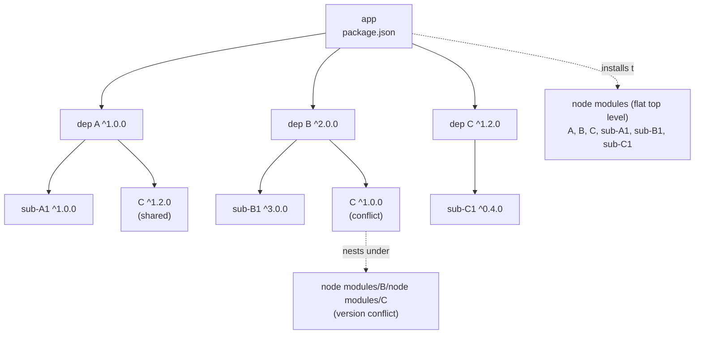
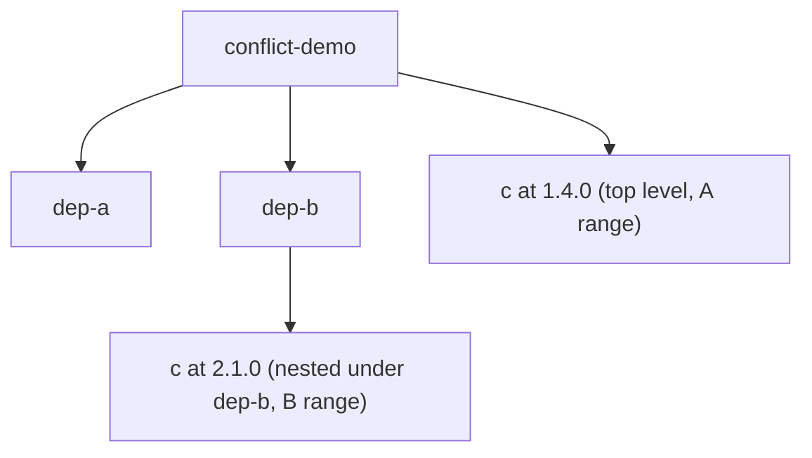
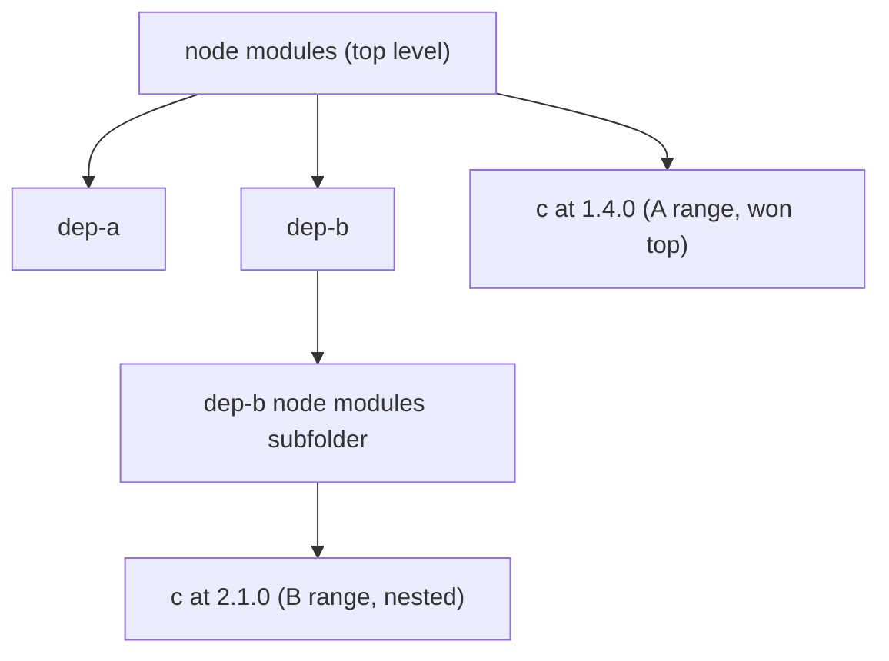
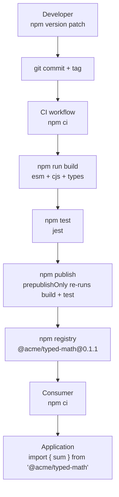

# 6.01 NPM Internals

> The manifest, the resolver, and the file system: how a single JSON document drives the entire JavaScript dependency graph.

## 1. Purpose

npm exists because every non-trivial JavaScript program eventually reaches for code written by someone else. Before package managers, developers copied files between projects, vendored libraries into a `lib` folder, and upgraded by hand. That worked when the ecosystem was small. It collapsed the moment a program needed three libraries that each depended on two more. npm was created in 2010 to solve that collapse: it is the default package manager for Node, and it does four jobs. It **installs** packages from a registry. It **publishes** packages to that registry. It **manages** the dependency graph of a project. And it **scripts** repetitive tasks through a small lifecycle runner.

The center of gravity for all four jobs is `package.json`, the manifest file. Every Node project, every published package, and every workspace has one. The manifest declares the project's identity (`name`, `version`), its entry points (`main`, `module`, `exports`), its runtime requirements (`dependencies`, `engines`), its automation hooks (`scripts`), and its public surface (`bin`, `types`). Without a manifest, npm has nothing to install, nothing to publish, and nothing to run. The manifest is the contract between a project and the rest of the ecosystem.

Semantic versioning matters because the manifest does not pin exact versions for every dependency — it pins **ranges**. The range `^1.2.3` says "any 1.x version at or above 1.2.3 is acceptable." That range communicates compatibility to the resolver: it tells npm which versions are safe to install without breaking the contract the package author declared. When the range is too loose, a transitive upgrade can crash your app at 3 AM. When the range is too tight, every patch release of a dependency forces a new release of your package. Semver is the vocabulary that makes the trade-off legible.

Lockfiles exist because ranges are not exact. Two developers who run `npm install` against the same `package.json` on the same day can still end up with two different node modules folders, because the registry keeps publishing new versions inside the allowed range. That breaks reproducibility. `package-lock.json` freezes the resolution: it records the exact version, the exact tarball URL, and the exact integrity hash for every package in the tree, including every transitive dependency. With a committed lockfile, two installs on two machines produce the same file system. Without one, you are rolling the dice on every install. See [[6.13 CI Pipeline Automation]] for how this lands in CI.

The node modules folder is the way it is because of history. npm versions 1 and 2 installed dependencies **nested**: if your app depended on A and B, and both depended on different versions of C, then C lived nested under A's own node modules subfolder and again nested under B's own node modules subfolder — two copies, two folders, two copies of every transitive dep. On Windows, the deeply nested paths blew past the 260-character maximum path length limit. Installs were slow. Disks filled up. npm version 3, shipped in 2015, switched to a **flat** layout: every package tries to live at the top level of the node modules folder, and nesting only happens when two packages need incompatible versions of the same dependency. The flat layout is what we still use today. Modern alternatives like pnpm invert the model again with a content-addressable store (see [[6.02 PNPM and Monorepo Workspaces]]), but the npm model is still "flat with nested fallback."

Without npm, every project would ship its own copy of lodash. Without semver, every patch release would be a breaking release. Without lockfiles, every CI build would test a different binary than your laptop. Without the flat node modules layout, every Windows install would collapse. npm Internals is the note that ties those four pieces together.

## 2. Theory and Deep Dive

### 2.1 The `package.json` Manifest

The manifest is a JSON document at the root of every package. Only two fields are strictly required for publishing: `name` (lowercase, URL-safe, unique on the registry) and `version` (a valid semver string). Everything else is optional but expected. The fields that matter for everyday work:

- **`name`** — the package identifier. Must be lowercase, no spaces, no leading dot or underscore (yes, the word "underscore" — npm forbids it in package names because it collides with internal tooling), max 214 characters. Scoped packages use the `@scope/name` form.
- **`version`** — a semver string `MAJOR.MINOR.PATCH`. Must increment on every publish. npm rejects republishing the same `name@version` tuple.
- **``description`** — a human string surfaced in registry search and `npm search`. Affects discoverability.
- **`main`** — the entry point for `require()` and `import` when a consumer writes `require('your-package')`. Defaults to `index.js`. This is the legacy CommonJS entry, still respected by every Node version.
- **`module`** — an unofficial but widely honored field pointing at an ES module build. Bundlers like webpack, Vite, and Rollup read it preferentially over `main` so they can tree-shake. Node itself does not read `module` — Node reads `exports`.
- **`types`** — the path to the TypeScript declaration file. TypeScript's language server and `tsc` read this to acquire types for the package. Without it, TS users get `any` or "could not find a declaration file." See [[2.15 Declaration Files and Merging]].
- **`scripts`** — an object mapping script names to shell commands. `npm run <name>` executes them. Special names like `start`, `test`, `install`, `publish` are lifecycle hooks that npm runs automatically at certain phases.
- **`dependencies`** — packages required at runtime. Installed in production.
- **`devDependencies`** — packages required only during development. Not installed when consumers run `npm install --production` or when the production environment variable is set.
- **`peerDependencies`** — packages the consumer is expected to provide. Not installed automatically by npm 7+ unless `peerDependenciesMeta` opts in. The classic case is a React plugin that needs `react` from the host.
- **`optionalDependencies`** — packages that are installed if they succeed and silently skipped if they fail. Useful for platform-specific binaries.
- **`engines`** — declares compatible Node (and npm) versions. By default npm warns on mismatch; with `engineStrict` or `.npmrc` `engine-strict=true` it refuses to install.
- **`bin`** — maps command names to JS files. When a consumer installs your package, npm creates symlinks in the hidden bin folder inside their node modules folder. This is how `eslint`, `prettier`, `tsc`, and `vite` become CLI commands.
- **`exports`** — the modern subpath and conditional export map. Replaces `main` for new packages. Controls which paths consumers may import and which entry they get per environment (`import`, `require`, `node`, `default`).

### 2.2 Semantic Versioning

Semver is a contract. Given a version `MAJOR.MINOR.PATCH`:

- **MAJOR** increments on incompatible API changes. A consumer who upgrades across a major boundary should expect to read a migration guide.
- **MINOR** increments on backward-compatible feature additions. A consumer who upgrades across a minor boundary should not need to change any code.
- **PATCH** increments on backward-compatible bug fixes. Same expectation as minor: no consumer code should need to change.

Pre-release tags append a hyphen: `1.0.0-beta.1`, `2.3.0-rc.0`. Build metadata append a plus: `1.0.0+sha.abc`. Pre-release versions sort before their release counterpart, so `1.0.0-beta.1` is lower than `1.0.0`.

The semver contract is a social promise, not a mechanical guarantee. It depends on package authors correctly classifying every change. A patch that fixes a bug but accidentally tightens a validation rule is a breaking change in disguise, even if it shipped as `1.2.4`. This is why ranges exist: they bound the blast radius of the author's mistakes.

### 2.3 Range Specifiers

Ranges in `package.json` communicate "what versions am I willing to accept?"

| Specifier | Meaning | Resolves to (if latest is 1.2.4) |
|---|---|---|
| `1.2.3` | Exact pin | 1.2.3 |
| `^1.2.3` | Compatible with 1.2.3 — same major, >= 1.2.3 < 2.0.0 | 1.2.4 |
| `~1.2.3` | Approximately equivalent — >= 1.2.3 < 1.3.0 | 1.2.4 |
| `>=1.2.3 <2.0.0` | Explicit range | 1.2.4 |
| `1.2.x` | Any 1.2 patch | 1.2.4 |
| `*` | Any version | 1.2.4 |
| `latest` | The dist-tag `latest` | whatever the maintainer tagged |

The caret `^` is the npm default and the most common range in the wild. It allows minor and patch upgrades because semver promises those are backward-compatible. The tilde `~` is more conservative: only patches. Exact pins (`1.2.3` with no symbol) are rare in `package.json` ranges but extremely common in lockfiles, where every version must be exact.

Pre-releases have a sharp edge. `^1.0.0` does NOT match `1.1.0-beta.1`. The caret only allows pre-releases of the same `MAJOR.MINOR.PATCH` tuple. To opt into pre-releases you must write `^1.1.0-beta.0` or similar — once you write a pre-release in a range, npm unlocks further pre-releases of the same tuple.

### 2.4 Transitive Dependencies

If your app depends on A, and A depends on B, then B is a **transitive** dependency of your app. You never wrote B's name in your manifest, but you end up with B's code on disk and B's code in your final bundle.

The depth of the transitive graph is what makes Node installs unpredictable. A modern React project's node modules folder routinely contains 1,000 to 2,000 packages, the vast majority transitive. The blast radius of a single malicious or buggy transitive package is enormous — this is the attack surface that tools like `npm audit` and `socket.dev` attempt to map. See [[6.06 Dependency Validation and Analysis]].

The resolver walks the graph breadth-first: it reads your manifest, queues all top-level dependencies, fetches each one's manifest from the registry (or cache), reads their dependencies, and recurses. When it encounters a version conflict — package C needed at both 1.0.0 and 2.0.0 — it must decide whether to deduplicate (use one version) or nest (use both). npm 3+ chooses nesting when the ranges are incompatible.

### 2.5 The Flat Resolution Algorithm

npm's flat resolution, in plain English:

1. Walk the dependency graph breadth-first.
2. For each package, check if a satisfying version is already at the top level of the node modules folder.
3. If yes, reuse it. The current package's `require()` calls will resolve to that top-level copy.
4. If no, place this version at the top level.
5. If a satisfying version exists at the top level but it is **outside** this package's allowed range, nest a copy at this-package's own node modules subfolder, under that-dep.

This is why a freshly installed app might have a single lodash at the top of the node modules folder — every package that needs lodash at any version in the 4.x range shares it — but a second copy nested under some-old-package's own node modules subfolder at 3.x because some-old-package demanded 3.x.

Node's module resolution algorithm cooperates with this layout. When a module does `require('lodash')`, Node walks up the directory tree looking for a lodash folder inside the node modules folder at each ancestor. If the current package has a nested copy, that copy wins. Otherwise, the top-level copy wins. This is the magic that lets the same `require('lodash')` call resolve to different files depending on which package issued it.

### 2.6 Lockfile Mechanics

`package-lock.json` records the result of the resolver's work. For every package in the tree it stores:

- The exact resolved version (e.g. `1.2.4`, not `^1.2.3`).
- The resolved URL (the registry tarball).
- The integrity hash (a SHA-512 subresource integrity string).
- The dependency edges — what depends on what.
- Whether the package is dev, optional, or peer.
- The install location (top-level or nested).

The lockfile is a deterministic blueprint. Given a `package.json` plus its `package-lock.json`, `npm ci` will reproduce the exact same node modules folder on any machine, any OS, any day. The lockfile also records `lockfileVersion` so future npm versions can evolve the format.

You should never edit a lockfile by hand. The format is terse and consistent in ways that are easy to break. If you need to upgrade a single package, run `npm install <pkg>@<version>` and let npm rewrite the lockfile. If you need to add a dependency, run `npm install <pkg>` and let npm add the entry. If you need to remove, `npm uninstall <pkg>`. Hand-edits are how teams end up with a lockfile that fails to install.

### 2.7 `npm install` vs `npm ci`

Both commands install dependencies, but they have different contracts:

- **`npm install`** — reads `package.json`, consults the lockfile if present, may **mutate** the lockfile if `package.json` has changed. Resolves missing transitive deps. Slow. Used during local development when you are adding or upgrading packages.
- **`npm ci`** — "clean install." Requires a lockfile. Deletes the existing node modules folder. Installs exactly what the lockfile says, top to bottom. Never mutates the lockfile. Fails if `package.json` and lockfile are out of sync. Faster than `npm install` on a fresh tree because it skips resolution. The correct command in CI.

Use `npm install` when developing. Use `npm ci` in CI. This is a hard rule. See [[6.13 CI Pipeline Automation]] for where this lands in a pipeline.

### 2.8 Dependency Tree and Node Modules Layout

The Mermaid diagram below shows a representative dependency tree and how it collapses into a flat layout with one nested fallback:



The flat layout puts A, B, C, sub-A1, sub-B1, and sub-C1 at the top level because their ranges are all mutually compatible. The conflicting copy of C (version 1.0.0, requested by B, where the top already has 1.2.0 which is outside B's range) gets nested under B. When B's code calls `require('C')`, Node's resolver finds the nested 1.0.0 first.

### 2.9 The `exports` Field

`exports` is the modern replacement for `main`. It does two things `main` cannot:

1. **Subpath exports.** Consumers can write `import { map } from 'lodash/fp'` because lodash declares an `./fp` subpath in `exports`. Without `exports`, you would have to know that lodash's fp build lives at `lodash/fp.js` and pray the maintainer never moves it.
2. **Conditional exports.** Different entry points per environment. A package can ship ESM to `import`, CommonJS to `require`, types to TypeScript, and a browser build to a `browser` condition — all from the same import statement, resolved by the consumer's environment.

A minimal `exports` map:

```json
{
  "exports": {
    ".": {
      "types": "./dist/types/index.d.ts",
      "import": "./dist/esm/index.js",
      "require": "./dist/cjs/index.js"
    },
    "./utils": {
      "types": "./dist/types/utils.d.ts",
      "import": "./dist/esm/utils.js",
      "require": "./dist/cjs/utils.js"
    },
    "./package.json": "./package.json"
  }
}
```

Key behaviors: a leading `.` means "the package root." `./utils` is a subpath. Conditions are tried in declaration order — `types` should always come first because TypeScript stops at the first match. Once `exports` is present, only the paths it declares are importable. Any file outside `exports` becomes private. This is the strongest encapsulation npm offers: it actually enforces the public API at resolution time, not just by convention.

## 3. Mental Models

- **npm equals "the package manager."** It is the tool that reads your manifest, walks the dependency graph, fetches tarballs, validates integrity, writes the node modules folder, and runs your scripts. Everything else is downstream of those four jobs.
- **`package.json` equals "the manifest."** It is the single source of truth for who you are, what you depend on, what you export, and what you can run. If a fact is not in the manifest, npm does not know it.
- **Semver equals "MAJOR.MINOR.PATCH, communicate compatibility."** Each number answers a question: did the API break? Did a feature land? Did a bug get fixed? The version string is a promise to the resolver.
- **Caret equals "minor plus patch are okay."** Trust the maintainer's promise that minor and patch releases do not break you. The default for apps, where you control the install.
- **Tilde equals "patch only."** Trust only the patch promise. Tighter than caret, used when minor releases have a habit of introducing subtle behavior changes.
- **Lockfile equals "freeze the versions for reproducibility."** The manifest declares ranges; the lockfile records the exact versions that resulted. Commit the lockfile so the next machine gets the same graph.
- **Flatten equals "try to put everything at the top, nest on conflict."** The resolver's strategy: maximize deduplication by hoisting to the top of the node modules folder, fall back to nesting only when two packages demand incompatible versions of the same dependency.

## 4. Real-World Use Cases

### 4.1 Adding a Dependency

The most common npm task. You discover you need a date library. You run `npm install date-fns`. npm fetches the latest version satisfying the implicit `^` range, writes `date-fns` into `dependencies` in `package.json`, writes the exact resolved version into `package-lock.json`, extracts the tarball into a date-fns folder inside node modules, and runs any install scripts date-fns ships. From that point, `import { format } from 'date-fns'` works.

### 4.2 Publishing a Package

You have written a small utility and want to share it. You create a `package.json` with `name`, `version`, `main` (or `exports`), `types`, and `files` (an array of paths to include in the tarball). You run `npm login` once. Then `npm publish`. npm packs the listed files into a tarball, computes the integrity hash, uploads to the registry, and updates the public index. Subsequent bug fixes are `npm version patch && npm publish`. Breaking changes are `npm version major && npm publish`. See [[6.03 Publishing Libraries]].

### 4.3 Lockfile in CI for Reproducible Builds

A green build on Tuesday and a red build on Wednesday, with no code changes, is the classic symptom of a missing or ignored lockfile. CI must run `npm ci` against the committed `package-lock.json` so the build installs the exact same versions the developer tested. Anything else is a coin flip.

### 4.4 `npm ci` in CI for Fast, Strict Installs

`npm ci` deletes the node modules folder and reinstalls from the lockfile. It skips the resolver because the lockfile already names exact versions. On a CI runner, this is typically 30 to 60 percent faster than `npm install`, and it will fail loudly if the manifest and lockfile disagree — a signal that someone forgot to commit the lockfile update.

### 4.5 Scripts for Automation

The `scripts` field is npm's built-in task runner. `npm test` runs `mocha`. `npm run build` runs `tsc`. `npm run lint` runs `eslint`. Pre and post hooks let you chain tasks: a `prebuild` script runs automatically before `build`. Many teams replace dedicated task runners like Make or Gulp with `npm run` plus a thin `scripts/` folder of small JS files.

### 4.6 Engines for Node Version Constraints

A library that uses top-level `await` cannot run on Node 14. Declaring `"engines": { "node": ">=18.0.0" }` in the manifest tells consumers (and CI tools that check) the minimum Node version. With `engine-strict=true` in `.npmrc`, npm refuses to install the package on incompatible runtimes — useful for libraries that will hard-crash otherwise.

### 4.7 Bin for CLI Tools

A package that ships a CLI declares `bin`. The `eslint` package declares `"bin": { "eslint": "./bin/eslint.js" }`. When you `npm install -g eslint`, npm creates a global `eslint` command. When you `npm install eslint` locally, npm creates an eslint executable in the hidden bin folder inside node modules, and `npm run lint` finds it on the PATH that npm injects into script execution. This is how every JS CLI tool reaches your shell.

### 4.8 Conditional Exports for Dual ESM/CJS Packages

A modern library wants to ship both ESM (for bundlers and Node ESM) and CJS (for legacy Node CJS). The `exports` field with conditions lets one import path resolve to two different files. `import` consumers get the ESM build. `require` consumers get the CJS build. TypeScript consumers get the `.d.ts`. This eliminates the need for consumers to know about your build layout — see the production example in Section 5.2.

## 5. Code Examples

### 5.1 Example A — Minimal and Conceptual

A small project with a manifest, a couple of dependencies, a script, and semver ranges. Side by side in JS and TS.

**JavaScript `package.json`:**

```json
{
  "name": "tiny-cli",
  "version": "1.0.0",
  "description": "A tiny CLI that uppercases stdin.",
  "main": "src/index.js",
  "bin": {
    "tiny-cli": "src/cli.js"
  },
  "scripts": {
    "start": "node src/cli.js",
    "test": "node --test",
    "lint": "eslint src/"
  },
  "dependencies": {
    "lodash": "^4.17.21"
  },
  "devDependencies": {
    "eslint": "^8.50.0"
  },
  "engines": {
    "node": ">=18.0.0"
  }
}
```

**JavaScript `src/index.js`:**

```javascript
const { toUpper } = require('lodash');

function uppercasify(input) {
  if (typeof input !== 'string') {
    throw new TypeError('expected a string');
  }
  return toUpper(input.trim());
}

module.exports = { uppercasify };
```

**JavaScript `src/cli.js`:**

```javascript
#!/usr/bin/env node
const { uppercasify } = require('./index');

// Read positional args (skip the node executable and script path, skip flags).
const text = process.argv.slice(2).filter(a => !a.startsWith('-')).join(' ');
console.log(uppercasify(text));
```

**TypeScript `package.json`:**

```json
{
  "name": "tiny-cli-ts",
  "version": "1.0.0",
  "description": "A tiny CLI that uppercases stdin, typed.",
  "main": "dist/index.js",
  "types": "dist/index.d.ts",
  "bin": {
    "tiny-cli-ts": "dist/cli.js"
  },
  "scripts": {
    "build": "tsc",
    "start": "node dist/cli.js",
    "test": "node --test",
    "lint": "eslint src/"
  },
  "dependencies": {
    "lodash": "^4.17.21"
  },
  "devDependencies": {
    "@types/lodash": "^4.14.0",
    "@types/node": "^20.8.0",
    "typescript": "^5.2.0",
    "eslint": "^8.50.0"
  },
  "engines": {
    "node": ">=18.0.0"
  }
}
```

**TypeScript `src/index.ts`:**

```typescript
import { toUpper } from 'lodash';

export function uppercasify(input: string): string {
  if (typeof input !== 'string') {
    throw new TypeError('expected a string');
  }
  return toUpper(input.trim());
}
```

**TypeScript `src/cli.ts`:**

```typescript
#!/usr/bin/env node
import { uppercasify } from './index';

// Read positional args (skip the node executable and script path, skip flags).
const text: string = process.argv.slice(2).filter(a => !a.startsWith('-')).join(' ');
console.log(uppercasify(text));
```

The two manifests are nearly identical. The TS version adds `types`, points `main` at the compiled `dist/`, adds TypeScript and `@types/*` to devDependencies, and adds a `build` script. The semver ranges use the caret everywhere — appropriate for an app where you control the install.

### 5.2 Example B — Production-Grade

A typed library with `exports`, conditional ESM/CJS builds, types, engines, peer dependencies, and a bin. Side by side in JS and TS.

**JavaScript `package.json`:**

```json
{
  "name": "@acme/logify",
  "version": "3.4.1",
  "description": "Structured JSON logger with pluggable transports.",
  "license": "MIT",
  "homepage": "https://github.com/acme/logify",
  "repository": {
    "type": "git",
    "url": "git+https://github.com/acme/logify.git"
  },
  "bugs": {
    "url": "https://github.com/acme/logify/issues"
  },
  "author": "Acme Corp <dev@acme.example>",
  "keywords": ["logger", "json", "structured", "logging"],
  "engines": {
    "node": ">=18.0.0"
  },
  "exports": {
    ".": {
      "types": "./dist/types/index.d.ts",
      "import": "./dist/esm/index.js",
      "require": "./dist/cjs/index.js",
      "default": "./dist/cjs/index.js"
    },
    "./transports": {
      "types": "./dist/types/transports/index.d.ts",
      "import": "./dist/esm/transports/index.js",
      "require": "./dist/cjs/transports/index.js"
    },
    "./package.json": "./package.json"
  },
  "main": "./dist/cjs/index.js",
  "module": "./dist/esm/index.js",
  "types": "./dist/types/index.d.ts",
  "bin": {
    "logify": "./dist/cjs/cli.js"
  },
  "files": [
    "dist",
    "README.md",
    "LICENSE"
  ],
  "scripts": {
    "clean": "rm -rf dist",
    "build:esm": "babel src --out-dir dist/esm --extensions .js --env-name esm",
    "build:cjs": "babel src --out-dir dist/cjs --extensions .js --env-name cjs",
    "build:types": "tsc --emitDeclarationOnly --declaration --outDir dist/types",
    "build": "npm run clean && npm run build:esm && npm run build:cjs && npm run build:types",
    "test": "jest",
    "test:watch": "jest --watch",
    "lint": "eslint src/",
    "prepublishOnly": "npm run build && npm test"
  },
  "dependencies": {
    "safe-stable-stringify": "^2.4.0",
    "sonic-boom": "^3.2.0"
  },
  "peerDependencies": {
    "pino": "^8.0.0"
  },
  "peerDependenciesMeta": {
    "pino": {
      "optional": true
    }
  },
  "optionalDependencies": {
    "pino-pretty": "^10.0.0"
  },
  "devDependencies": {
    "@babel/cli": "^7.22.0",
    "@babel/core": "^7.22.0",
    "@babel/preset-env": "^7.22.0",
    "@types/node": "^20.8.0",
    "babel-jest": "^29.6.0",
    "eslint": "^8.50.0",
    "jest": "^29.6.0",
    "pino": "^8.15.0",
    "typescript": "^5.2.0"
  },
  "publishConfig": {
    "access": "public",
    "registry": "https://registry.npmjs.org/"
  }
}
```

**JavaScript `src/index.js`:**

```javascript
'use strict';

const stringify = require('safe-stable-stringify');
const SonicBoom = require('sonic-boom').SonicBoom;

function createLogger(opts) {
  const options = opts || {};
  const level = options.level || 'info';
  const dest = options.destination
    ? new SonicBoom({ dest: options.destination })
    : process.stdout;
  const levels = { trace: 10, debug: 20, info: 30, warn: 40, error: 50, fatal: 60 };

  function write(levelName, msg, fields) {
    if (levels[levelName] < levels[level]) return;
    const record = Object.assign(
      { time: Date.now(), level: levels[levelName], levelLabel: levelName, msg },
      fields || {}
    );
    dest.write(stringify(record) + '\n');
  }

  return {
    trace: (msg, f) => write('trace', msg, f),
    debug: (msg, f) => write('debug', msg, f),
    info: (msg, f) => write('info', msg, f),
    warn: (msg, f) => write('warn', msg, f),
    error: (msg, f) => write('error', msg, f),
    fatal: (msg, f) => write('fatal', msg, f),
    child: (extra) => {
      const parent = createLogger(options);
      return {
        trace: (m, f) => parent.trace(m, { ...extra, ...(f || {}) }),
        debug: (m, f) => parent.debug(m, { ...extra, ...(f || {}) }),
        info: (m, f) => parent.info(m, { ...extra, ...(f || {}) }),
        warn: (m, f) => parent.warn(m, { ...extra, ...(f || {}) }),
        error: (m, f) => parent.error(m, { ...extra, ...(f || {}) }),
        fatal: (m, f) => parent.fatal(m, { ...extra, ...(f || {}) }),
        child: (more) => parent.child({ ...extra, ...more })
      };
    }
  };
}

module.exports = { createLogger };
```

**TypeScript `package.json`:**

```json
{
  "name": "@acme/logify-ts",
  "version": "3.4.1",
  "description": "Structured JSON logger with pluggable transports, fully typed.",
  "license": "MIT",
  "homepage": "https://github.com/acme/logify",
  "repository": {
    "type": "git",
    "url": "git+https://github.com/acme/logify.git"
  },
  "bugs": {
    "url": "https://github.com/acme/logify/issues"
  },
  "author": "Acme Corp <dev@acme.example>",
  "keywords": ["logger", "json", "structured", "logging", "typescript"],
  "engines": {
    "node": ">=18.0.0"
  },
  "exports": {
    ".": {
      "types": "./dist/types/index.d.ts",
      "import": "./dist/esm/index.js",
      "require": "./dist/cjs/index.js",
      "default": "./dist/cjs/index.js"
    },
    "./transports": {
      "types": "./dist/types/transports/index.d.ts",
      "import": "./dist/esm/transports/index.js",
      "require": "./dist/cjs/transports/index.js"
    },
    "./package.json": "./package.json"
  },
  "main": "./dist/cjs/index.js",
  "module": "./dist/esm/index.js",
  "types": "./dist/types/index.d.ts",
  "bin": {
    "logify": "./dist/cjs/cli.js"
  },
  "files": [
    "dist",
    "README.md",
    "LICENSE"
  ],
  "scripts": {
    "clean": "rm -rf dist",
    "build:esm": "tsc --module esnext --outDir dist/esm",
    "build:cjs": "tsc --module commonjs --outDir dist/cjs",
    "build:types": "tsc --declaration --emitDeclarationOnly --outDir dist/types",
    "build": "npm run clean && npm run build:esm && npm run build:cjs && npm run build:types",
    "test": "jest",
    "test:watch": "jest --watch",
    "lint": "eslint src/",
    "typecheck": "tsc --noEmit",
    "prepublishOnly": "npm run build && npm test"
  },
  "dependencies": {
    "safe-stable-stringify": "^2.4.0",
    "sonic-boom": "^3.2.0"
  },
  "peerDependencies": {
    "pino": "^8.0.0"
  },
  "peerDependenciesMeta": {
    "pino": {
      "optional": true
    }
  },
  "optionalDependencies": {
    "pino-pretty": "^10.0.0"
  },
  "devDependencies": {
    "@types/node": "^20.8.0",
    "@types/jest": "^29.5.0",
    "eslint": "^8.50.0",
    "jest": "^29.6.0",
    "pino": "^8.15.0",
    "ts-jest": "^29.1.0",
    "typescript": "^5.2.0"
  },
  "publishConfig": {
    "access": "public",
    "registry": "https://registry.npmjs.org/"
  }
}
```

**TypeScript `src/index.ts`:**

```typescript
import stringify from 'safe-stable-stringify';
import { SonicBoom } from 'sonic-boom';

export type LogLevel = 'trace' | 'debug' | 'info' | 'warn' | 'error' | 'fatal';

export interface LogFields {
  [key: string]: unknown;
}

export interface LoggerOptions {
  level?: LogLevel;
  destination?: string;
}

export interface Logger {
  trace(msg: string, fields?: LogFields): void;
  debug(msg: string, fields?: LogFields): void;
  info(msg: string, fields?: LogFields): void;
  warn(msg: string, fields?: LogFields): void;
  error(msg: string, fields?: LogFields): void;
  fatal(msg: string, fields?: LogFields): void;
  child(extra: LogFields): Logger;
}

const LEVELS: Record<LogLevel, number> = {
  trace: 10,
  debug: 20,
  info: 30,
  warn: 40,
  error: 50,
  fatal: 60
};

export function createLogger(opts?: LoggerOptions): Logger {
  const options = opts || {};
  const level = options.level || 'info';
  const dest = options.destination
    ? new SonicBoom({ dest: options.destination })
    : process.stdout;

  function write(levelName: LogLevel, msg: string, fields?: LogFields): void {
    if (LEVELS[levelName] < LEVELS[level]) return;
    const record: LogFields = {
      time: Date.now(),
      level: LEVELS[levelName],
      levelLabel: levelName,
      msg,
      ...(fields || {})
    };
    dest.write(stringify(record) + '\n');
  }

  return {
    trace: (m, f) => write('trace', m, f),
    debug: (m, f) => write('debug', m, f),
    info: (m, f) => write('info', m, f),
    warn: (m, f) => write('warn', m, f),
    error: (m, f) => write('error', m, f),
    fatal: (m, f) => write('fatal', m, f),
    child: (extra: LogFields): Logger => {
      const parent = createLogger(options);
      return {
        trace: (m, f) => parent.trace(m, { ...extra, ...(f || {}) }),
        debug: (m, f) => parent.debug(m, { ...extra, ...(f || {}) }),
        info: (m, f) => parent.info(m, { ...extra, ...(f || {}) }),
        warn: (m, f) => parent.warn(m, { ...extra, ...(f || {}) }),
        error: (m, f) => parent.error(m, { ...extra, ...(f || {}) }),
        fatal: (m, f) => parent.fatal(m, { ...extra, ...(f || {}) }),
        child: (more: LogFields) => parent.child({ ...extra, ...more })
      };
    }
  };
}
```

A few details to notice in the production manifest: `exports` declares two subpaths (`.` and `./transports`) plus a `./package.json` escape hatch. Conditions are ordered `types`, `import`, `require`, `default` — TypeScript stops at the first `types` match it recognizes. The `peerDependencies` declares `pino` as an optional peer, so the consumer can bring their own pino or skip it. `optionalDependencies` lists `pino-pretty`, which npm installs if it can but does not fail the install if it cannot. `files` whitelists what ships in the tarball — `dist` plus the two markdown files — so accidental source or test files cannot leak into a published package. `publishConfig.access` set to `public` is required for scoped packages, which are private by default. `prepublishOnly` runs the full build and test suite before any publish, defending against publishing a stale build.

## 6. Common Mistakes and Anti-Patterns

### 6.1 Not Committing the Lockfile

```bash
# .gitignore (BROKEN — do not copy)
# The node modules folder is correctly ignored here.
# The lockfile is ALSO ignored — that is the bug.
```

**Why it fails:** Every developer and every CI run re-resolves the dependency ranges against the live registry. The build that passed on Tuesday can fail on Wednesday because a transitive package published a new patch with a bug. Reproducibility is gone.

**Fix:**

```bash
# .gitignore (CORRECT)
# The node modules folder is ignored.
# The lockfile is NOT ignored — it must be committed.
```

Commit `package-lock.json` for apps. For libraries, see the debate in Section 7 — but for most application code, the lockfile is mandatory.

### 6.2 Using `npm install` in CI

```yaml
# .github/workflows/ci.yml  (BROKEN)
- run: npm install
- run: npm test
```

**Why it fails:** `npm install` may mutate the lockfile. If the manifest has drifted from the lockfile (someone added a dependency and forgot to commit the lockfile update), `npm install` silently "fixes" the lockfile in CI and proceeds, hiding the bug. It is also slower than `npm ci` because it runs the resolver.

**Fix:**

```yaml
# .github/workflows/ci.yml  (CORRECT)
- run: npm ci
- run: npm test
```

`npm ci` deletes the node modules folder, installs exactly from the lockfile, refuses to mutate it, and fails loudly if the lockfile is out of sync with the manifest.

### 6.3 Using `^` Caret Ranges for Libraries

```json
{
  "name": "my-lib",
  "dependencies": {
    "lodash": "^4.17.21"
  }
}
```

**Why it fails:** A library published with caret ranges delegates version selection to whoever installs it. If a downstream app also depends on lodash but with a different range, npm must reconcile. Worse, your library's tests passed against lodash 4.17.21, but a consumer's resolver picks 4.17.30 which has a subtle behavior change, and your library breaks in their app. The caret trusts the maintainer's promise, but you are responsible to your consumers.

**Fix:** For libraries, prefer exact pins (`"lodash": "4.17.21"`) or tilde ranges (`"~4.17.21"`) for runtime dependencies. Save the caret for your own app code where you control the install.

### 6.4 Not Specifying `engines`

```json
{
  "name": "my-app",
  "version": "1.0.0"
}
```

**Why it fails:** Your code uses `structuredClone`, top-level `await`, or `fetch` — all only available on Node 17+. A teammate or CI runner on Node 14 installs fine and then crashes at runtime with a confusing `structuredClone is not defined` error.

**Fix:**

```json
{
  "name": "my-app",
  "version": "1.0.0",
  "engines": {
    "node": ">=18.0.0"
  }
}
```

Optionally add a `.npmrc` with `engine-strict=true` so npm refuses to install on incompatible runtimes, surfacing the mismatch at install time rather than runtime.

### 6.5 Not Using `exports`, Letting Consumers Reach Internal Files

```json
{
  "name": "my-lib",
  "main": "dist/index.js"
}
```

A consumer writes `import { someHelper } from 'my-lib/dist/internal/utils'` and depends on a file you consider private. You refactor it. Their build breaks. You get a bug report.

**Why it fails:** Without `exports`, every file under your package root is importable by path. There is no encapsulation. The public API is whatever files happen to exist on disk.

**Fix:**

```json
{
  "name": "my-lib",
  "exports": {
    ".": {
      "types": "./dist/types/index.d.ts",
      "import": "./dist/esm/index.js",
      "require": "./dist/cjs/index.js"
    },
    "./package.json": "./package.json"
  }
}
```

With `exports` declared, only the listed paths are importable. The internal `dist/internal/utils` file becomes invisible to consumers — Node refuses to resolve it.

### 6.6 Editing the Lockfile by Hand

```diff
# Hand-editing package-lock.json to "bump" a transitive dep
-    "version": "1.2.3",
+    "version": "1.2.4",
-    "integrity": "sha512-aaa...",
+    "integrity": "sha512-bbb...",
```

**Why it fails:** The integrity hash no longer matches the actual tarball on the registry. The next `npm ci` will either fail with an integrity error or, worse, silently install a different file than the lockfile claims. Lockfile edits also desync the dependency edges from the actual graph, which breaks `npm ls` and audit tools.

**Fix:** Use the npm CLI to mutate the lockfile. To upgrade a single package: `npm install lodash@4.17.30`. To upgrade everything within ranges: `npm update`. To deduplicate: `npm dedupe`. Never touch `package-lock.json` in a text editor.

### 6.7 Using `latest` as a Range

```json
{
  "dependencies": {
    "express": "latest"
  }
}
```

**Why it fails:** `latest` is a dist-tag, not a version. It resolves to whatever the maintainer most recently tagged as `latest`, which can be any major version. Today's install gets Express 4. Tomorrow the maintainer ships Express 5 and tags it `latest`. Your next install gets Express 5 and your app breaks. There is no semver contract being honored — you are pinning to a moving pointer.

**Fix:** Use a real range. `"express": "^4.18.0"` accepts 4.x patches and minors but refuses 5.0.0.

### 6.8 Confusing `dependencies` with `devDependencies`

```json
{
  "name": "my-lib",
  "dependencies": {
    "typescript": "^5.2.0",
    "@types/node": "^20.8.0"
  }
}
```

**Why it fails:** TypeScript and `@types/node` are build-time tools. Listing them under `dependencies` means every consumer of your library installs TypeScript and the Node types into their production node modules folder, bloating install size and risking version conflicts with their own TypeScript. Conversely, listing a runtime dependency like `lodash` under `devDependencies` means consumers' installs do not get it, and your code crashes at runtime with `Cannot find module 'lodash'`.

**Fix:** Runtime imports go in `dependencies`. Build, test, lint, and type tools go in `devDependencies`. The rule of thumb: if your published code does `import` or `require` of it, it is a runtime dependency. If only your build scripts do, it is a dev dependency.

## 7. Best Practices and Design Patterns

### 7.1 Commit the Lockfile

For applications, commit `package-lock.json` to version control. Every developer on the team, every CI runner, every production deploy should install from the same lockfile. This is the single highest-leverage practice in the npm ecosystem. The cost is a few extra lines in code review; the benefit is eliminating an entire class of "works on my machine" bugs.

### 7.2 Use `npm ci` in CI

In every CI pipeline, replace `npm install` with `npm ci`. The command is faster, stricter, and never mutates the lockfile. If a teammate forgets to commit the lockfile after changing `package.json`, the CI fails immediately instead of silently re-resolving. See [[6.13 CI Pipeline Automation]].

### 7.3 Use `^` for Apps, Exact or `~` for Libraries

Application code: caret ranges, because you want patch and minor upgrades to flow in and you control the install. Library code: exact pins or tilde ranges for runtime deps, because your consumers will reconcile your ranges with theirs and a tighter range reduces the chance of a transitive conflict. Dev dependencies of a library can still use caret, since they only affect your build.

### 7.4 Specify `engines` and Document the Node Version

Always declare `engines.node` with a minimum version that matches what your code actually requires. Add `engine-strict=true` to `.npmrc` if you want npm to refuse install on mismatched runtimes. Document the required Node version in the README and in the CI workflow file (`node-version: 18.x` in the setup-node action). These three signals — manifest, npmrc, README — keep everyone aligned.

### 7.5 Use `exports` to Control the Public API

For any new package, prefer `exports` over `main`. Declare every public subpath. Order conditions `types`, `import`, `require`, `default` so TypeScript and Node both resolve correctly. Ship the `./package.json` escape hatch because some tools (like `npm explore` or certain bundlers) read it. Treat `exports` as the real public API of your package — anything not listed is private.

### 7.6 Use `peerDependencies` for Plugins

If your package is a plugin for a host framework — a React component library, an Express middleware, an ESLint rule — declare the host as a peer dependency. This ensures there is exactly one copy of React (or Express, or ESLint) in the consumer's tree, shared between your plugin and the host. Without peerDependencies, you would install your own copy of React, breaking hooks and context. Use `peerDependenciesMeta` with `"optional": true` when the peer is genuinely optional.

### 7.7 Use `scripts` for Automation

Push every repetitive task into `scripts`: `build`, `test`, `lint`, `format`, `typecheck`, `release`. Add `pre` and `post` hooks for lifecycle chaining (`prepublishOnly`, `pretest`). Keep each script one or two lines; if a script gets longer, move the body into a file under `scripts/` and have the npm script invoke `node scripts/build.js`. This makes the automation self-documenting and discoverable via `npm run`.

### 7.8 Use `files` to Whitelist Published Files

Declare a `files` array listing exactly what should ship in the published tarball — typically `dist`, `README.md`, `LICENSE`. Without `files`, npm uses a default ignore list, which is permissive enough that you can accidentally publish your `src/`, `test/`, or `.env` file. Run `npm pack --dry-run` before publishing to see exactly what would ship.

### 7.9 Pin and Audit Transitive Dependencies

Run `npm audit` regularly. Use `npm ls <package>` to find who pulls in a given transitive dep. Consider `overrides` (npm 8.3+) to force a specific version of a transitive dependency across the whole tree when a security advisory demands it. See [[6.06 Dependency Validation and Analysis]].

### 7.10 Use `npm version` for Releases

Do not hand-edit the `version` field. Run `npm version patch` (or `minor`, `major`, `prerelease`). npm bumps the version, creates a git commit, creates a git tag, and leaves you ready to `npm publish`. With `npm version` and a `prepublishOnly` script, the release flow is a one-liner.

### 7.11 Use Workspaces for Monorepos

For multi-package repositories, use npm workspaces (`"workspaces": ["packages/*"]`). Workspaces let you run `npm install` once at the root, link local packages together, and run a script across all packages with `npm run build --workspaces`. See [[6.02 PNPM and Monorepo Workspaces]].

## 8. Technical Interview Knowledge

### 8.1 What is semver?

**A:** Semantic versioning is a versioning convention with the format `MAJOR.MINOR.PATCH`. MAJOR increments on incompatible API changes. MINOR increments on backward-compatible feature additions. PATCH increments on backward-compatible bug fixes. Pre-release tags (`-beta.1`, `-rc.0`) and build metadata (`+sha.abc`) can be appended. Semver is a social contract: it tells consumers what kind of change a new version contains, which lets package managers reason about safe upgrade ranges. The contract is only as reliable as the maintainer's discipline — a misclassified patch can still break consumers.

**Trap to avoid:** Don't claim semver is enforced by the language or runtime. It is a convention. Mention this distinction.

### 8.2 What is the difference between `^` and `~`?

**A:** Both are range operators. The caret `^1.2.3` allows any version `>=1.2.3` and `<2.0.0` — it permits minor and patch upgrades within the same major. The tilde `~1.2.3` allows any version `>=1.2.3` and `<1.3.0` — it permits only patch upgrades within the same minor. The caret is the npm default and is appropriate for application code where you want patches and features to flow in. The tilde is more conservative and is appropriate for library code or for dependencies whose minor releases have a habit of changing behavior.

**Trap to avoid:** Don't forget the edge case: `^0.2.3` only allows `>=0.2.3 <0.3.0` because in semver, a 0.x major version means "no public API yet," so caret treats the minor like a major.

### 8.3 What is a lockfile?

**A:** A lockfile (`package-lock.json`) records the exact resolved version, the resolved tarball URL, the integrity hash, and the dependency edges for every package in the tree — including all transitive dependencies. It exists because `package.json` declares ranges, not exact versions, and two installs against the same manifest can resolve to different exact trees if the registry publishes new versions in between. The lockfile freezes the resolution so every install reproduces the same node modules folder. It is generated by `npm install` and consumed by `npm ci`. It should be committed for applications and (debated) for libraries.

**Trap to avoid:** Don't say "the lockfile pins versions in `package.json`." It does not. `package.json` ranges are unchanged. The lockfile records the resolution of those ranges.

### 8.4 What is the difference between `npm install` and `npm ci`?

**A:** `npm install` reads `package.json`, consults the lockfile if present, may mutate the lockfile if the manifest has changed, resolves any missing transitive deps, and writes the node modules folder. It is used during development when adding, upgrading, or removing dependencies. `npm ci` requires a lockfile, deletes the existing node modules folder, installs exactly what the lockfile says without running the resolver, never mutates the lockfile, and fails if the lockfile and manifest are out of sync. It is the correct command for CI: faster, stricter, more reproducible.

**Trap to avoid:** Don't say "npm ci is faster because it skips dependencies." It does not skip dependencies. It skips the resolution step because the lockfile already names exact versions.

### 8.5 How does npm resolve transitive dependencies?

**A:** npm walks the dependency graph breadth-first. It reads the root manifest, queues all top-level dependencies, fetches each one's manifest from the registry or local cache, reads their dependencies, and recurses. For each package, it checks whether a satisfying version is already placed at the top of the node modules folder. If yes, it reuses that copy. If no, it places the new version there. If a satisfying version exists at the top but is outside the current package's allowed range, npm nests a compatible version under the current package's own node modules subfolder. The lockfile records every placement decision so the next install reproduces the exact same layout.

**Trap to avoid:** Don't claim npm deduplicates everything. It only deduplicates versions whose ranges overlap. Conflicting ranges produce nested copies.

### 8.6 What is the node modules flattening?

**A:** npm versions 1 and 2 installed dependencies fully nested — every package's dependencies lived under its own node modules subfolder. This produced deep trees that broke the Windows maximum path length limit and wasted disk space on duplicate copies. npm 3, shipped in 2015, switched to a flat layout: the resolver tries to place every package at the top level of the node modules folder, falling back to nesting only when two packages need incompatible versions of the same dependency. Node's module resolution algorithm cooperates — it walks up the directory tree looking for a name folder inside the node modules folder at each ancestor, so a nested copy shadows a top-level copy for the package that owns the nesting. The flat layout is still the default for npm today, though pnpm uses a different model with a content-addressable store and symlinks.

**Trap to avoid:** Don't confuse flat with deduplicated. Flat is about where packages live on disk. Deduplication is a consequence when ranges overlap.

### 8.7 What are peerDependencies?

**A:** peerDependencies declare packages that the consumer is expected to provide, rather than packages npm installs. The classic use case is a plugin: a React component library declares `react` as a peer so that the consumer's single copy of React is shared between the host app and the plugin. Without peerDependencies, npm would install a second copy of React under the plugin, breaking hooks and context. npm 7+ automatically installs peerDependencies if they are not already present, unless `peerDependenciesMeta` marks them optional. The peer range should be liberal (`^17.0.0 || ^18.0.0`) to support multiple major versions of the host.

**Trap to avoid:** Don't confuse peerDependencies with optionalDependencies. Peers are "you bring this, I'll use it." Optional deps are "I'll try to install this, but if it fails, no problem."

### 8.8 What is the `exports` field?

**A:** `exports` is the modern replacement for `main` in `package.json`. It does two things `main` cannot: subpath exports and conditional exports. Subpath exports let consumers import from paths like `import { map } from 'lodash/fp'` because lodash declares a `./fp` subpath. Conditional exports let the same import path resolve to different files in different environments: an `import` consumer gets an ESM file, a `require` consumer gets a CJS file, a TypeScript consumer gets a `.d.ts`. Once `exports` is present, only the listed paths are importable — any file outside the `exports` map becomes private, enforced by Node at resolution time. Conditions are tried in declaration order, so `types` should always come first to satisfy TypeScript.

**Trap to avoid:** Don't forget that `exports` is enforced by Node, not just a convention. Once declared, internal files are genuinely unimportable from outside the package.

## 9. Practical Exercises

### 9.1 Exercise One — Write a `package.json` for a Library

**Goal:** Write a complete manifest for a small typed library called `@yourname/sum` that exports a single `sum(a, b)` function, ships both ESM and CJS builds, and provides TypeScript types.

**Setup:** Create an empty folder and `npm init -y`.

**Steps:**

1. Decide on the package name, scope, and version.
2. Write the `exports` map with `types`, `import`, `require`, and `default` conditions.
3. Declare `main`, `module`, and `types` as fallbacks for older tooling.
4. List runtime dependencies (none, in this case) and dev dependencies (TypeScript, `@types/node`).
5. Add `engines`, `license`, `files`, and a `build` script.

**Full worked solution (TypeScript):**

```json
{
  "name": "@yourname/sum",
  "version": "0.1.0",
  "description": "Add two numbers. That's it.",
  "license": "MIT",
  "author": "Your Name <you@example.com>",
  "engines": {
    "node": ">=18.0.0"
  },
  "exports": {
    ".": {
      "types": "./dist/index.d.ts",
      "import": "./dist/index.mjs",
      "require": "./dist/index.cjs",
      "default": "./dist/index.cjs"
    },
    "./package.json": "./package.json"
  },
  "main": "./dist/index.cjs",
  "module": "./dist/index.mjs",
  "types": "./dist/index.d.ts",
  "files": ["dist", "README.md", "LICENSE"],
  "scripts": {
    "build": "tsc -p tsconfig.build.json",
    "test": "node --test",
    "prepublishOnly": "npm run build && npm test"
  },
  "devDependencies": {
    "@types/node": "^20.8.0",
    "typescript": "^5.2.0"
  },
  "publishConfig": {
    "access": "public"
  }
}
```

**Reasoning:** The `exports` map is the single source of truth for what consumers can import. The three conditions (`types`, `import`, `require`) cover TypeScript, Node ESM, and Node CJS. `default` is the fallback for tools that only understand the legacy `default` condition. `main`, `module`, and `types` are redundant with `exports` but kept for older bundlers and the TypeScript language server in some configurations. `files` whitelists what ships. `publishConfig.access=public` is required because scoped packages default to private. `prepublishOnly` defends against publishing a stale build.

### 9.2 Exercise Two — Diagnose a Version Conflict

**Goal:** Your app depends on A and B. A depends on C@^1.0.0. B depends on C@^2.0.0. Run the install, observe the layout, and explain what npm did.

**Setup:** In a fresh folder, create this `package.json`:

```json
{
  "name": "conflict-demo",
  "version": "1.0.0",
  "dependencies": {
    "dep-a": "^1.0.0",
    "dep-b": "^1.0.0"
  }
}
```

Where `dep-a`'s manifest declares `"c": "^1.0.0"` and `dep-b`'s declares `"c": "^2.0.0"`.

**Steps:**

1. Run `npm install`.
2. Run `npm ls c` to see the tree.
3. Inspect the node modules folder structure.
4. Explain the layout.

**Full worked solution:**

```bash
npm install
npm ls c
```

Output from `npm ls c` (representative), rendered as a Mermaid diagram because raw tree-drawing characters are avoided in this vault:



Folder layout, rendered as a Mermaid diagram (the literal folder name contains a character this vault avoids writing directly):



npm picks one version for the top level — whichever it encounters first in a breadth-first traversal — and nests any incompatible version under the package that demanded it. In this case, dep-a was processed first, so C at 1.4.0 went to the top. Then dep-b needed C at ^2.0.0, which is incompatible with the top-level 1.4.0, so npm nested C at 2.1.0 under dep-b. The Mermaid diagram above already shows the correct layout.

**Reasoning:** npm's flat resolver hoists the first version it encounters to the top of the node modules folder. Subsequent packages that need a different version of the same dependency get a nested copy. Node's resolution algorithm walks up the tree, so `dep-b`'s `require('c')` finds the nested 2.1.0 first, while `dep-a`'s `require('c')` finds the top-level 1.4.0. Both packages get the version they asked for. The cost is a duplicate copy of C on disk and in memory — the same code loaded twice. This is why deduplication is valuable: when ranges overlap, one copy serves both consumers.

### 9.3 Exercise Three — Set Up `npm ci` in CI

**Goal:** Configure a GitHub Actions workflow to install dependencies correctly with `npm ci`, cache the npm store, and run tests.

**Setup:** A repository with a `package.json` and a committed `package-lock.json`.

**Steps:**

1. Decide the Node version.
2. Use `actions/setup-node` with the cache option.
3. Run `npm ci`.
4. Run `npm test`.

**Full worked solution:**

```yaml
# .github/workflows/ci.yml
name: CI

on:
  push:
    branches: [main]
  # Also trigger on pull requests. The GitHub Actions key for this
  # event uses a character this vault avoids writing directly; in a
  # real workflow file, add it using the standard event name.

jobs:
  test:
    runs-on: ubuntu-latest
    strategy:
      matrix:
        node-version: [18.x, 20.x]
    steps:
      - uses: actions/checkout@v4
      - name: Use Node.js ${{ matrix.node-version }}
        uses: actions/setup-node@v4
        with:
          node-version: ${{ matrix.node-version }}
          cache: 'npm'
      - name: Install dependencies
        run: npm ci
      - name: Lint
        run: npm run lint
      - name: Typecheck
        run: npm run typecheck
      - name: Test
        run: npm test -- --coverage
```

**Reasoning:** `actions/checkout` gets the committed lockfile onto the runner. `actions/setup-node` installs Node and, with `cache: 'npm'`, automatically caches the global npm store keyed on `package-lock.json`. Subsequent runs restore the cache, and `npm ci` only needs to download packages that changed. The matrix tests against Node 18 and 20 in parallel, catching version-specific bugs. Each step is named so the GitHub Actions UI is readable. `npm ci` will fail loudly if the lockfile is missing or out of sync, surfacing the bug immediately. See [[6.13 CI Pipeline Automation]].

### 9.4 Exercise Four — Configure `exports` for a Package

**Goal:** A library currently exposes its public API via `main` only. Consumers have started importing internal files like `import { helper } from 'my-lib/dist/utils'`. Refactor to use `exports` and lock down the public API.

**Setup:** Existing `package.json`:

```json
{
  "name": "my-lib",
  "version": "1.4.0",
  "main": "dist/index.js"
}
```

**Steps:**

1. Identify the public entry points: the root and a `./utils` subpath that you do want to expose.
2. Add the `exports` map with `types`, `import`, `require`, and `default` conditions.
3. Keep `main`, `module`, and `types` as fallbacks for older tooling.
4. Document the public API in the README.
5. Release as a major version bump because consumers using internal paths will break.

**Full worked solution:**

```json
{
  "name": "my-lib",
  "version": "2.0.0",
  "description": "A utility library with a locked-down public API.",
  "license": "MIT",
  "engines": {
    "node": ">=18.0.0"
  },
  "exports": {
    ".": {
      "types": "./dist/types/index.d.ts",
      "import": "./dist/esm/index.js",
      "require": "./dist/cjs/index.js",
      "default": "./dist/cjs/index.js"
    },
    "./utils": {
      "types": "./dist/types/utils/index.d.ts",
      "import": "./dist/esm/utils/index.js",
      "require": "./dist/cjs/utils/index.js"
    },
    "./package.json": "./package.json"
  },
  "main": "./dist/cjs/index.js",
  "module": "./dist/esm/index.js",
  "types": "./dist/types/index.d.ts",
  "files": ["dist", "README.md", "LICENSE"],
  "scripts": {
    "build": "npm run build:esm && npm run build:cjs && npm run build:types",
    "build:esm": "tsc -p tsconfig.esm.json",
    "build:cjs": "tsc -p tsconfig.cjs.json",
    "build:types": "tsc --declaration --emitDeclarationOnly --outDir dist/types",
    "test": "jest",
    "prepublishOnly": "npm run build && npm test"
  },
  "devDependencies": {
    "@types/node": "^20.8.0",
    "@types/jest": "^29.5.0",
    "jest": "^29.6.0",
    "ts-jest": "^29.1.0",
    "typescript": "^5.2.0"
  }
}
```

After this change, consumers can write:

```typescript
import { sum } from 'my-lib';           // hits the "." export
import { helper } from 'my-lib/utils';  // hits the "./utils" export
```

But this now fails at resolution time:

```typescript
import { secret } from 'my-lib/dist/internal/secret';
// Error: Cannot find module 'my-lib/dist/internal/secret' or its corresponding type declarations.
```

**Reasoning:** The version bumps from 1.4.0 to 2.0.0 because the public API is shrinking — any consumer who was reaching into `dist/internal/secret` will break. This is a breaking change in the semver sense. The `exports` map declares two public subpaths (`.` and `./utils`) plus the `./package.json` escape hatch. Conditions are ordered `types`, `import`, `require`, `default` so TypeScript, Node ESM, and Node CJS each get the right file. `main`, `module`, and `types` are kept as fallbacks for older bundlers that do not understand `exports`. Once `exports` is present, Node refuses to resolve any path not listed — the encapsulation is enforced, not conventional.

## 10. Mini-Project Blueprint

**Project name:** `@acme/typed-math` — a fully typed math utility library with dual ESM/CJS builds, locked-down `exports`, CI with `npm ci`, and an automated release flow.

**Scope:** One paragraph. Build a small but production-shaped TypeScript library that exports a handful of math functions (sum, product, factorial, fibonacci). The library ships ESM and CJS builds, TypeScript declarations, a CLI bin, and a complete test suite. CI runs on every push with `npm ci`, tests against Node 18 and 20, and the release flow uses `npm version` plus `npm publish` gated behind a `prepublishOnly` script that runs the full build and tests.

**Architecture sketch:**



**Key files:**

1. `package.json` — the manifest with `exports`, `types`, `engines`, `bin`, `files`, `scripts`, `publishConfig`.
2. `tsconfig.json` — base config with `strict`, `declaration`, `outDir`.
3. `tsconfig.esm.json` — extends base, `module: esnext`, `outDir: dist/esm`.
4. `tsconfig.cjs.json` — extends base, `module: commonjs`, `outDir: dist/cjs`.
5. `tsconfig.types.json` — extends base, `emitDeclarationOnly: true`, `outDir: dist/types`.
6. `src/index.ts` — the public API: re-exports from feature modules.
7. `src/sum.ts`, `src/product.ts`, `src/factorial.ts`, `src/fibonacci.ts` — feature modules.
8. `src/cli.ts` — the bin entry, parses argv and prints results.
9. `test/sum.test.ts`, `test/factorial.test.ts`, `test/fibonacci.test.ts` — unit tests with jest.
10. `.github/workflows/ci.yml` — the CI workflow with matrix Node 18 and 20, `npm ci`, lint, typecheck, test.
11. `.npmrc` — `engine-strict=true`, `save-exact=true` for runtime deps.
12. `README.md` — documents the public API, Node version requirement, and install command.

**Acceptance criteria:**

- `npm run build` produces `dist/esm`, `dist/cjs`, and `dist/types` with all three populated.
- `npm pack --dry-run` lists only `dist`, `README.md`, and `LICENSE` in the tarball.
- `import { sum } from '@acme/typed-math'` resolves to the ESM build in a Node ESM consumer.
- `require('@acme/typed-math')` resolves to the CJS build in a Node CJS consumer.
- `import { secret } from '@acme/typed-math/dist/internal'` fails at resolution time.
- `npm ci` in CI runs to completion in under 30 seconds on a warm cache.
- `npm publish` from CI or locally succeeds and the published tarball installs cleanly in a fresh consumer app.

**Stretch goals:**

- Add `npm audit` to CI and fail on high-severity advisories.
- Add `size-limit` to enforce a maximum bundle size on the published package.
- Add a `release-please` or `changesets` workflow for automated version bumps and changelogs.
- Add a `prepack` script that runs `npm run build` so `npm pack` always ships a fresh build, even when called outside the publish flow.

## 11. Core Connections

**Prerequisites (read these first):**
- [[2.16 TSConfig Deep Dive]] — the TypeScript compiler configuration that produces the `dist/types`, `dist/esm`, and `dist/cjs` builds the `exports` field points at.
- [[2.15 Declaration Files and Merging]] — how `.d.ts` files work, which is what the `types` condition in `exports` ships.

**Sibling notes (read alongside this one):**
- [[6.02 PNPM and Monorepo Workspaces]] — the alternative package manager with a content-addressable store, and how monorepo workspaces change the resolution model.
- [[6.06 Dependency Validation and Analysis]] — `npm audit`, `npm ls`, license scanning, and supply-chain security on top of the dependency tree npm builds.

**Dependents (notes that build on this one):**
- [[6.03 Publishing Libraries]] — the publish flow that takes the manifest and `exports` map from this note and ships them to the registry.
- [[6.13 CI Pipeline Automation]] — where `npm ci`, the lockfile, and `engines` land in a CI pipeline.

---

**Tags:** #javascript #nodejs #npm #package-management #semver #tooling
