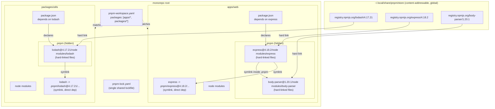
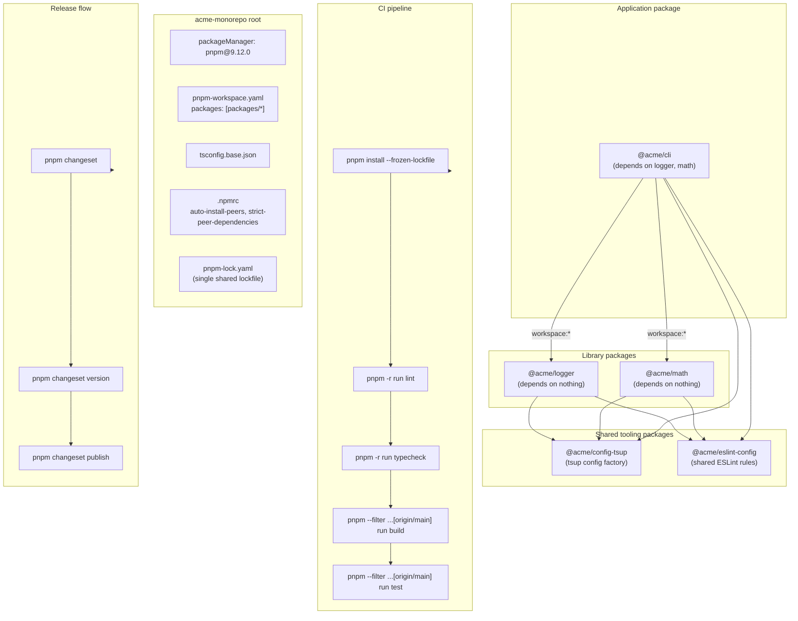

# 6.02 PNPM and Monorepo Workspaces

> One copy per version on disk, symlinks into every project, and a strict dependency tree that refuses to let you `require` what you did not declare. pnpm is what npm would be if it had been designed after we knew how big the ecosystem would get.

## 1. Purpose

npm was designed in 2010 for an ecosystem of a few thousand packages. By 2017 that ecosystem had grown to half a million packages, a typical React project's node modules folder contained 1,500 transitive dependencies, and three inefficiencies had become impossible to ignore. pnpm exists to fix those three inefficiencies.

The first inefficiency is **disk duplication**. The npm install algorithm, even with the flat layout introduced in npm 3, copies the full contents of every package into every project's node modules folder. If you have ten projects on your laptop and they all depend on `lodash@4.17.21`, npm writes ten identical copies of lodash to disk. Multiply that by the 1,500 transitive packages in a typical app, and a developer laptop routinely carries 20 GB of duplicate package content. The same duplication happens on every CI runner, on every Docker layer, on every deploy artifact. Disk is cheap, but disk IO is not: copying 20 GB of small files is the dominant cost of `npm install`, not the network fetch.

The second inefficiency is **slow installs**. Because npm copies files instead of linking them, every install physically writes every file of every package. On a cold install, network is the bottleneck. On a warm install (where the package tarball is already in the cache), file copying is the bottleneck. A project with 1,500 packages and 30,000 files takes 30,000 file writes to install, even if the tarballs are already cached locally. pnpm replaces those 30,000 file copies with 30,000 hard links, which is a metadata operation rather than a data operation, and is roughly an order of magnitude faster.

The third inefficiency is **phantom dependencies**. The flat node modules layout means that any package hoisted to the top level can be `require`d by your application code, even if your `package.json` does not list it. Suppose your app depends on `express`, and `express` depends on `body-parser`. npm hoists `body-parser` to the top of your node modules folder. Your app code can now write `require('body-parser')` and it works. It works until the day you remove `express` from your manifest, or `express` stops depending on `body-parser`, or `body-parser` is renamed. Then your app crashes in production because a dependency you never declared has disappeared. This is the phantom dependency bug, and it is endemic in npm-based projects. pnpm's symlink layout makes it structurally impossible: only packages you declared in your manifest are reachable from your code.

pnpm solves all three problems with one architectural change: a **content-addressable store** on disk, combined with a **symlinked node modules layout**. Every package version is stored exactly once globally, on disk, keyed by its content hash. Every project's node modules folder is built out of hard links into that store (for file content) and symlinks (for the folder structure). The store is shared across every project on the machine, so installing lodash in your eleventh project costs zero bytes and zero file copies — it just creates hard links into the existing store entry.

Monorepos exist for an orthogonal but related reason. A monorepo is a single Git repository that contains multiple publishable packages. Without a monorepo, the alternative is a "polyrepo" — one repository per package, with cross-package changes shipped as version bumps and registry installs. The polyrepo workflow is slow: a one-line change to a shared utility requires a commit, a publish, a version bump in every consumer, and a fresh install in every consumer. The polyrepo workflow is also error-prone: a refactor that touches three packages must be coordinated across three pull requests in three repos, and any one of them can fail independently. Monorepos collapse that complexity: one commit, one pull request, one CI run, one atomic change across every package.

Workspaces are the feature that makes monorepos work inside a package manager. npm, yarn, and pnpm all support workspaces. pnpm's implementation is the most strict and the most ergonomic: it reads a `pnpm-workspace.yaml` file at the repo root, treats every matched folder as a workspace package, links workspaces together so they can import each other by name without going through the registry, and provides a `--filter` flag plus the recursive `-r` flag for running commands across the entire workspace graph in topological order. pnpm workspaces are the foundation of every modern large JavaScript monorepo, from Vue to Vite to Nuxt to the bulk of the React ecosystem's published libraries.

This note covers the full surface: the content-addressable store, the hard link and symlink split, the strict node modules layout that kills phantom deps, the peer dependency resolution model, the workspace configuration file, the `--filter` selector syntax, the recursive `-r` runner, topological build ordering, side-by-side JavaScript and TypeScript examples, the common mistakes, the production patterns, and a mini-project blueprint that ties it all together. You will finish able to explain pnpm's storage model from first principles, set up a typed pnpm monorepo, use `--filter` and `-r` to run targeted and recursive commands, and diagnose phantom dependencies before they reach production.

For the foundations of npm itself, see [[6.01 NPM Internals]]. For the publishing workflow that takes a workspace package from a monorepo to the public registry, see [[6.03 Publishing Libraries]]. For the TypeScript project configuration that produces correct cross-workspace type resolution, see [[2.16 TSConfig Deep Dive]]. For the CI automation that runs pnpm install and `pnpm -r run build` on every push, see [[6.13 CI Pipeline Automation]].

## 2. Theory and Deep Dive

### 2.1 The Content-Addressable Store

The center of pnpm's architecture is a single directory on disk called the **store**. By default it lives at `~/.local/share/pnpm/store` on Linux, at `~/Library/pnpm/store` on macOS, and at `%LOCALAPPDATA%\pnpm\store` on Windows. The exact location is reported by `pnpm store path`. The store is global to the machine: every pnpm project on the same computer shares the same store.

The store is **content-addressable**. That phrase has a precise meaning: a package's location inside the store is determined by a hash of its contents, not by its name. Two different packages that happen to contain identical files will share storage. The same package version installed in a hundred projects will exist once in the store, not a hundred times. The store never duplicates content.

Concretely, the store contains one directory per package version. The directory name is of the form `registry.npmjs.org/lodash/4.17.21` (with a hash appended in newer pnpm versions, to disambiguate packages with identical names from different registries). Inside that directory is the unpacked package, exactly as if you had run `npm pack` and untarred it. Every file is the original, immutable, content-addressed file. The store is append-only in the sense that installing a new version adds a new directory; uninstalling a project that used a version does not remove the store entry, because other projects might still need it. Stale entries can be reclaimed with `pnpm store prune`.

The architectural payoff is dramatic. On a developer laptop with 20 pnpm projects, the total on-disk size of all node modules folders combined is roughly equal to the size of one npm-style project, because every project shares the same store. On a CI runner with a warm cache, `pnpm install` for a 1,500-package project completes in seconds, not minutes, because no files are copied — only hard links are created.

### 2.2 Hard Links versus Symlinks

pnpm uses **both** hard links and symlinks, and it is essential to understand the difference because the entire architecture depends on using each for the right job.

A **hard link** is a directory entry that points to the same underlying inode as another directory entry. Two hard links to the same file are indistinguishable: there is no "original" and no "shortcut." Both are first-class names for the same bytes on disk. Creating a hard link is a metadata operation — it does not copy the file's contents. Hard links are constrained: they cannot cross filesystem boundaries, they cannot reference directories (only files), and on most filesystems an inode is only freed when its last hard link is removed. pnpm uses hard links for **file content**: every file inside a project's node modules folder is a hard link to the corresponding file in the store. The bytes exist once on disk; every project that needs them just has a directory entry pointing at the same inode.

A **symbolic link** (symlink) is a special directory entry whose content is a path to another file or directory. The symlink is a "shortcut" — following it requires an extra filesystem lookup. Symlinks can cross filesystem boundaries, can reference directories, and can dangle (point at a target that does not exist). pnpm uses symlinks for **directory structure**: the node modules folder of a project is built out of symlinks into a hidden `.pnpm` directory that contains the real (hard-linked) package files arranged in a specific dependency graph.

The split is necessary because hard links cannot reference directories. pnpm wants every file to be a hard link into the store (for zero-copy installs) but it also wants packages to be addressable as directories (for `require('lodash')` to resolve). The solution: hard-link every individual file from the store into a hidden `.pnpm/lodash@4.17.21/node modules/lodash/` directory, and then symlink that directory into the project's top-level node modules folder.

### 2.3 The `.pnpm` Directory and the Strict Node Modules Layout

When you run `pnpm install` in a project, pnpm creates two things inside the project's node modules folder:

1. A hidden directory called `.pnpm` that contains one subfolder per installed package version, named with the version suffix (`lodash@4.17.21`, `express@4.18.2`, etc.). Inside each subfolder is a `node modules` folder containing the actual package files (hard-linked from the store) plus symlinks to that package's own dependencies. The `.pnpm` directory is the **real dependency graph** — it is the only place where the full transitive tree is materialised.

2. A flat list of symlinks at the top level of the project's node modules folder, one per direct dependency declared in `package.json`. Each symlink points at the corresponding package's directory inside `.pnpm`. These are the **only** entries visible to your application code.

The strict layout is what kills phantom dependencies. Your code can `require('lodash')` because `lodash` is a symlink at the top of your node modules folder. Your code cannot `require('body-parser')` unless you declared `body-parser` in your manifest, because there is no `body-parser` symlink at the top level — `body-parser` exists only nested inside `express`'s private directory under `.pnpm`. The filesystem enforces the manifest. This is the structural property that npm's flat layout violates.

The trade-off is that some legacy packages walk the node modules folder manually or assume a flat layout. Such packages occasionally break under pnpm. pnpm provides an escape hatch: the `node-linker=hoisted` setting in `.npmrc` falls back to npm-style flat hoisting. It should be used only as a last resort for unfixable legacy code; the default symlinked layout is what you want for every modern project.

### 2.4 Peer Dependencies and the Strict Resolution Model

Peer dependencies are the most semantically loaded field in `package.json`. A peer dependency is a declaration that says: "I expect to be used in a project that already has `react` at version 17 or higher. I will not install it myself. I will trust the consumer to provide it." See [[6.01 NPM Internals]] for the basics of peer deps.

npm versions 1 through 6 silently ignored peer deps — they printed a warning but installed nothing. npm 7+ tries to auto-install peer deps, which fixed a class of bugs but introduced a new class: when two of your dependencies declare incompatible peer ranges on the same package, npm picks one and the other fails at runtime. The npm 7+ peer resolution algorithm is heuristic, opinionated, and frequently surprising.

pnpm takes a third path: **strict peer resolution**. pnpm never auto-installs a peer dependency. If your project declares a package that has an unmet peer, pnpm fails the install with an `ERR PNPM MISSING PEER DEPENDENCY` error and refuses to proceed. The consumer must explicitly add the peer to their manifest. This is the correct behaviour: peer deps are a contract the consumer must opt into, not a side effect the package manager should silently satisfy.

pnpm also supports an `auto-install-peers=true` setting in `.npmrc` (and it became the default in pnpm 8). With auto-install-peers, pnpm will install peer deps automatically when there is no conflict, but it will still fail loudly when there is a conflict, unlike npm which picks a winner. The combination is the best of both worlds: convenience in the common case, strictness in the conflict case.

The other peer-related concept is the **peer dependency range**. A library that supports React 17 and 18 declares `"react": ">=17.0.0 <19.0.0"` as a peer. A library that only supports React 18 declares `"react": "^18.0.0"`. pnpm enforces the range: if your project has React 16 installed, pnpm fails the install. This catches version mismatches at install time instead of at the moment a hook throws `Invalid hook call` in production.

### 2.5 Workspace Configuration

A pnpm monorepo is configured by a single YAML file at the repository root: `pnpm-workspace.yaml`. The file contains a `packages` key whose value is a list of glob patterns. Each pattern matches zero or more workspace package directories.

```yaml
packages:
  - "apps/*"
  - "packages/*"
  - "tools/*"
  - "docs"
```

Every directory matched by a glob must contain a `package.json` file. pnpm treats each such directory as a workspace package. The package's `name` field in its manifest is its identity across the workspace: when one workspace package lists another workspace package's name in its `dependencies`, pnpm links them locally instead of fetching from the registry.

Workspace dependencies can be declared in two ways. The first is a plain version range, like `"@acme/utils": "^1.0.0"`. This works but has a hazard: if the workspace's local version does not satisfy the range, pnpm fails the install. The second is the `workspace:` protocol, like `"@acme/utils": "workspace:*"` or `"@acme/utils": "workspace:^"`. The `workspace:` protocol tells pnpm "always use the local workspace version, and when publishing, replace this with the actual version number." The `*` form publishes as the exact local version; the `^` form publishes as a caret range; the `~` form publishes as a tilde range. The `workspace:` protocol is the correct way to declare cross-workspace dependencies in a pnpm monorepo, because it is unambiguous (the link is always local during development) and because the publish-time replacement is automatic.

A workspace package can also be referenced by relative path, like `"file:../utils"`, but this is the npm-style escape hatch and is not recommended in pnpm monorepos. The `workspace:` protocol is strictly better.

### 2.6 The `--filter` Selector

The `--filter` flag (alias `-F`) is pnpm's selector syntax for targeting one or more workspace packages. Without `--filter`, every pnpm command runs in the current directory. With `--filter`, the command runs in the matched workspace packages.

The selector grammar is rich. The most common forms:

- `pnpm --filter @acme/utils build` — run `build` in the package named `@acme/utils`.
- `pnpm --filter utils build` — run `build` in the package whose name ends with `utils` (substring match).
- `pnpm --filter ./packages/utils build` — run `build` in the package at the given path.
- `pnpm --filter ./packages... build` — run `build` in every package under `packages/`.
- `pnpm --filter "@acme/utils..." build` — the trailing `...` means "this package and all its dependencies." Run `build` in `@acme/utils` and in every workspace package it depends on.
- `pnpm --filter "...^@acme/utils" build` — the leading `...^` means "every package that depends on this package." Run `build` in every workspace package that lists `@acme/utils` as a dependency. This is the "build the consumers of utils" selector and is extremely useful for impact analysis.
- `pnpm --filter "...@acme/utils" build` — the leading `...` (without `^`) means "this package and all its dependents." Run `build` in `@acme/utils` and in every package that consumes it.
- `pnpm --filter "*"` — every workspace package. Equivalent to `-r`.

The selector can also be scoped to changed files in Git, which is the foundation of CI build caching:

- `pnpm --filter "...[origin/main]" build` — run `build` in every package that changed since `origin/main`, plus every package that depends on a changed package. This is the selector that powers "only rebuild what changed" CI pipelines.

The `--filter` selector is the single most important pnpm feature for monorepo ergonomics. Every other monorepo task — running tests, building, linting, publishing — is built on top of it.

### 2.7 The Recursive `-r` Flag

The `-r` flag (alias `--recursive`) runs a command in every workspace package, in topological order. It is shorthand for `--filter "*"`. The two flags can be combined: `pnpm -r --filter @acme/* run test` runs `test` in every workspace package whose name starts with `@acme/`, in topological order.

Topological order is significant. If package B depends on package A, then A must be built before B can be built. pnpm reads the workspace dependency graph, performs a topological sort, and runs the command in that order. Without topological sorting, B's build would fail because A's build output does not exist yet. With topological sorting, A builds first, then B.

For commands that can run in parallel without ordering constraints (like `test`), pnpm provides `--parallel` to run the command in every workspace simultaneously. For commands that must run in order but where you want to fail fast, pnpm provides `--workspace-concurrency=N` to limit parallelism. The default is 4 concurrent packages.

The recursive runner also supports a bail-out flag: `--no-bail` continues running the command in remaining workspaces even if one fails. The default behaviour is to fail fast: the first failing workspace aborts the run.

### 2.8 The Shared Lockfile

A pnpm monorepo has exactly one lockfile: `pnpm-lock.yaml` at the repository root. There is no per-package lockfile. The single lockfile records every package and every version used anywhere in the workspace, including which workspace packages depend on which registry packages, and which workspace packages depend on each other.

The single-lockfile model is a deliberate choice. It guarantees that a fresh `pnpm install --frozen-lockfile` in CI produces exactly the same dependency graph on every machine. It prevents drift between workspace packages: if package A and package B both depend on `lodash`, they get the same `lodash` version, recorded once in the lockfile. It enables pnpm's install optimisations: pnpm can compute the entire install plan from the lockfile without re-resolving the registry.

The `--frozen-lockfile` flag (often shortened to `--frozen` in scripts) tells pnpm "do not modify the lockfile under any circumstances; if the manifest and lockfile disagree, fail." This is the correct flag for CI: it catches the case where a developer added a dependency to `package.json` but forgot to commit the updated lockfile. Without `--frozen-lockfile`, CI would silently regenerate the lockfile and the build would pass, masking the inconsistency.

### 2.9 Mermaid Diagram of Store, Symlinks, and Workspace



The diagram shows the three layers. The store (top) is global and content-addressable: one entry per package version, shared across every project. The monorepo (middle) has one workspace file, one lockfile, and two workspace packages. Each workspace package's node modules folder (bottom) contains a hidden `.pnpm` directory whose files are hard-linked back to the store, plus a top-level symlink per direct dependency that points into `.pnpm`. The structure enforces the manifest: only declared dependencies are reachable from application code.

## 3. Mental Models

Five mental models make pnpm click. Internalise these and every pnpm command becomes predictable.

**Store equals one copy per version, globally.** Think of the store as a library of immutable reference editions. There is one copy of lodash 4.17.21 in the library, ever. Installing lodash in a new project is the act of checking out a reference card that points at the library's copy — the book itself never moves. When you uninstall lodash from a project, the reference card is destroyed; the library book stays on the shelf because other projects may need it. Only `pnpm store prune` removes books nobody has checked out in a long time.

**Symlink equals a pointer from a project into the store's hierarchy.** A symlink is a signpost. The top-level `lodash` entry in your node modules folder is a signpost that says "the real lodash lives over there in the `.pnpm` subfolder." The signpost is per-project; the real lodash is shared. Following the signpost costs one extra filesystem lookup, which is negligible.

**Hard link equals shared file content.** A hard link is not a pointer; it is a second name for the same bytes. When pnpm creates a hard link from your project to the store, no bytes are copied. The file appears in two directories but exists once on disk. Editing the file through either path changes the bytes for both paths — which is why the store is append-only and packages inside it are treated as immutable.

**Monorepo equals many packages, one repo.** A monorepo is not a technical feature of the filesystem; it is a social and version-control choice. One Git repository holds N publishable packages. Each package has its own `package.json`, its own version, its own release cadence, its own test suite. What they share is the commit history, the CI pipeline, the contributor pool, and the cross-package refactor workflow. The package manager's job is to make those shared concerns workable.

**Workspace equals a package in a monorepo.** A workspace is one package inside a monorepo. It is identified by the `name` field in its `package.json`. Workspaces can depend on each other by name, and pnpm links them locally during install instead of fetching from the registry. The link is a symlink, not a copy: editing a file in workspace A is immediately visible to workspace B that depends on A, with no rebuild step required (unless B's build pipeline produces compiled output that A consumes, in which case B's build must be re-run).

**Filter equals run in this workspace, and optionally its deps or dependents.** The `--filter` selector is the targeting reticle of pnpm's command runner. A bare filter targets one workspace. A trailing `...` extends the target to include the workspace's dependencies. A leading `...` extends the target to include the workspace's dependents. Both can be combined: `...pkg...` means the package, its dependencies, and its dependents — the entire connected subgraph. This vocabulary is what makes `pnpm --filter` expressive enough for any monorepo task.

## 4. Real-World Use Cases

**Large open-source monorepos.** Vue, Vite, Nuxt, SvelteKit, Astro, Element Plus, Ant Design, React Router, Remix, Babel, and many other major JavaScript projects run on pnpm workspaces. Vue's monorepo has 50-plus packages, including the runtime, the compiler, the reactivity system, the server renderer, and the tooling. Without pnpm, building Vue would require checking out 50 repositories and running 50 installs. With pnpm, it is one checkout, one install, one command to build everything in topological order.

**Shared component libraries in a company.** A typical medium-sized company has a frontend application, a marketing site, an admin dashboard, and a customer portal. All four need the same design system: the same Button, Modal, Form, Date picker. Without a monorepo, the design system lives in its own repo, gets published to a private registry, and every consumer installs a version. A bug fix requires a publish and a coordinated upgrade in four repos. With a pnpm monorepo, the design system lives in `packages/ui`, all four apps live in `apps/*`, and a bug fix is one commit, one pull request, one CI run. The apps import from `@company/ui` via the `workspace:` protocol; the local link means the bug fix is immediately visible to all four apps.

**Multi-package libraries.** A library that ships multiple separately-installable entry points is a natural fit for a monorepo. The canonical example is a UI toolkit that publishes `@acme/core`, `@acme/icons`, `@acme/themes`, and `@acme/utils` as four independent packages. Consumers who only need the icons install only `@acme/icons` and get a small bundle. Consumers who want everything install all four. The monorepo lets the four packages share internal code (a private `@acme/internal` package) without that internal code ever being published.

**Internal tooling and CLIs.** A company with multiple backend services often has shared CLIs: a deployment CLI, a migration CLI, a logging CLI. These are awkward to distribute via the public npm registry and tedious to manage as separate repos. A pnpm monorepo lets the company keep all four CLIs in one repo, share a `@company/clibase` package that provides the common CLI plumbing, and publish each CLI to a private registry with `pnpm publish -r`.

**CI speedup.** The dominant cost of a CI pipeline for a JavaScript project is `npm install` or `yarn install`. pnpm's hard-link-based install is dramatically faster, especially on a runner with a warm cache. The GitHub Actions `pnpm/action-setup` action combined with `actions/cache` for the pnpm store can cut install time from 90 seconds to 8 seconds for a large project.

**Build caching and selective rebuilds.** The `--filter "...[origin/main]"` selector lets a CI pipeline run only the builds of packages that changed since the last merge to main, plus the builds of packages that depend on changed packages. On a 50-package monorepo where a typical pull request touches one or two packages, this turns a 5-minute "build everything" CI step into a 30-second "build what changed" step.

## 5. Code Examples

### 5.1 Example A — Minimal and Conceptual

The minimal pnpm monorepo has two packages: a shared library and an app that consumes it. The repository layout:

```
monorepo/
  package.json
  pnpm-workspace.yaml
  .npmrc
  packages/
    greeter/
      package.json
      index.js
    app/
      package.json
      index.js
```

#### 5.1.1 JavaScript — Root Manifest

```json
{
  "name": "monorepo",
  "private": true,
  "version": "0.0.0",
  "scripts": {
    "build": "pnpm -r run build",
    "test": "pnpm -r run test"
  },
  "devDependencies": {
    "pnpm": "^9.0.0"
  }
}
```

The root manifest is `private: true` so it can never be accidentally published. The `build` and `test` scripts use `pnpm -r` to recurse into every workspace.

#### 5.1.2 JavaScript — Workspace File

```yaml
# pnpm-workspace.yaml
packages:
  - "packages/*"
```

One line. Every subfolder of `packages/` that contains a `package.json` becomes a workspace.

#### 5.1.3 JavaScript — npmrc

```ini
# .npmrc
auto-install-peers=true
strict-peer-dependencies=true
shamefully-hoist=false
```

`auto-install-peers` lets pnpm install peer deps automatically when there is no conflict. `strict-peer-dependencies` makes conflicts fail loudly. `shamefully-hoist=false` keeps the strict symlinked layout (do not enable the npm-style flat hoist).

#### 5.1.4 JavaScript — Greeter Package

```json
{
  "name": "@mono/greeter",
  "version": "1.0.0",
  "main": "index.js",
  "scripts": {
    "build": "echo 'no build step'",
    "test": "node test.js"
  }
}
```

```js
// packages/greeter/index.js
function greet(name) {
  if (typeof name !== 'string' || name.length === 0) {
    throw new Error('greet requires a non-empty string name');
  }
  return `Hello, ${name}!`;
}

module.exports = { greet };
module.exports.greet = greet;
module.exports.default = greet;
```

#### 5.1.5 JavaScript — App Package

```json
{
  "name": "@mono/app",
  "version": "1.0.0",
  "main": "index.js",
  "scripts": {
    "start": "node index.js",
    "build": "echo 'no build step'",
    "test": "node test.js"
  },
  "dependencies": {
    "@mono/greeter": "workspace:*"
  }
}
```

The `workspace:*` protocol tells pnpm to link to the local greeter package during development and to substitute the actual version (`1.0.0`) at publish time.

```js
// packages/app/index.js
const { greet } = require('@mono/greeter');

function main() {
  const name = process.argv[2] || 'world';
  console.log(greet(name));
}

main();
```

Run `pnpm install` from the repo root, then `pnpm --filter @mono/app start`. The output is `Hello, world!` (or `Hello, <name>!` if you pass an argument).

#### 5.1.6 TypeScript — Root Manifest

```json
{
  "name": "monorepo-ts",
  "private": true,
  "version": "0.0.0",
  "scripts": {
    "build": "pnpm -r run build",
    "test": "pnpm -r run test",
    "typecheck": "pnpm -r run typecheck"
  },
  "devDependencies": {
    "typescript": "^5.4.0",
    "pnpm": "^9.0.0"
  }
}
```

The root carries TypeScript and pnpm as dev dependencies. Every workspace inherits them through the root's node modules folder.

#### 5.1.7 TypeScript — Workspace File

```yaml
# pnpm-workspace.yaml
packages:
  - "packages/*"
```

#### 5.1.8 TypeScript — Root tsconfig

```json
{
  "compilerOptions": {
    "target": "ES2022",
    "module": "NodeNext",
    "moduleResolution": "NodeNext",
    "strict": true,
    "declaration": true,
    "declarationMap": true,
    "sourceMap": true,
    "composite": true,
    "incremental": true,
    "esModuleInterop": true,
    "skipLibCheck": true,
    "outDir": "dist",
    "rootDir": "src"
  },
  "files": []
}
```

`composite: true` is what enables TypeScript's project references feature, which is the foundation of monorepo type checking. Each workspace package has its own `tsconfig.json` that extends this root config and adds a `references` array pointing at the packages it imports.

#### 5.1.9 TypeScript — Greeter Package

```json
{
  "name": "@mono/greeter",
  "version": "1.0.0",
  "type": "module",
  "main": "./dist/index.js",
  "types": "./dist/index.d.ts",
  "exports": {
    ".": {
      "types": "./dist/index.d.ts",
      "import": "./dist/index.js"
    }
  },
  "scripts": {
    "build": "tsc -p tsconfig.json",
    "typecheck": "tsc -p tsconfig.json --noEmit",
    "test": "node --test"
  },
  "devDependencies": {
    "typescript": "^5.4.0"
  }
}
```

```ts
// packages/greeter/src/index.ts
export interface GreetOptions {
  punctuation?: string;
}

export function greet(name: string, options: GreetOptions = {}): string {
  if (typeof name !== 'string' || name.length === 0) {
    throw new Error('greet requires a non-empty string name');
  }
  const punctuation = options.punctuation ?? '!';
  return `Hello, ${name}${punctuation}`;
}

export default greet;
```

```json
{
  "extends": "../../tsconfig.json",
  "compilerOptions": {
    "outDir": "./dist",
    "rootDir": "./src"
  },
  "include": ["src/**/*.ts"]
}
```

#### 5.1.10 TypeScript — App Package

```json
{
  "name": "@mono/app",
  "version": "1.0.0",
  "type": "module",
  "main": "./dist/index.js",
  "scripts": {
    "start": "node dist/index.js",
    "build": "tsc -p tsconfig.json",
    "typecheck": "tsc -p tsconfig.json --noEmit",
    "test": "node --test"
  },
  "dependencies": {
    "@mono/greeter": "workspace:*"
  },
  "devDependencies": {
    "typescript": "^5.4.0"
  }
}
```

```ts
// packages/app/src/index.ts
import { greet } from '@mono/greeter';

function main(): void {
  const name = process.argv[2] ?? 'world';
  console.log(greet(name, { punctuation: '.' }));
}

main();
```

```json
{
  "extends": "../../tsconfig.json",
  "compilerOptions": {
    "outDir": "./dist",
    "rootDir": "./src"
  },
  "include": ["src/**/*.ts"],
  "references": [
    { "path": "../greeter" }
  ]
}
```

The `references` array tells TypeScript that this package's types depend on the greeter package's types. TypeScript's `--build` mode will build greeter first, then app, in topological order. This mirrors what pnpm's `-r` does for scripts.

Run `pnpm install`, then `pnpm -r run build`, then `pnpm --filter @mono/app start`. The output is `Hello, world.`

### 5.2 Example B — Production-Grade

A production pnpm monorepo has more moving parts: a shared ESLint config, a shared tsconfig, a changeset workflow for versioning, a CI pipeline that uses selective rebuilds, and a publish step that respects the `workspace:` protocol.

The repository layout:

```
acme-monorepo/
  package.json
  pnpm-workspace.yaml
  .npmrc
  tsconfig.base.json
  .eslintrc.cjs
  .changeset/
    config.json
  .github/
    workflows/
      ci.yml
  packages/
    config-tsup/
      package.json
      tsup.config.ts
      index.ts
    eslint-config-acme/
      package.json
      index.cjs
    logger/
      package.json
      tsconfig.json
      src/index.ts
    math/
      package.json
      tsconfig.json
      src/index.ts
    cli/
      package.json
      tsconfig.json
      src/index.ts
```

#### 5.2.1 JavaScript — Root Files

```json
{
  "name": "acme-monorepo",
  "private": true,
  "version": "0.0.0",
  "engines": {
    "node": ">=20.0.0",
    "pnpm": ">=9.0.0"
  },
  "packageManager": "pnpm@9.12.0",
  "scripts": {
    "build": "pnpm -r --filter=\"!@acme/eslint-config\" run build",
    "test": "pnpm -r run test",
    "lint": "pnpm -r run lint",
    "typecheck": "pnpm -r run typecheck",
    "changeset": "changeset",
    "version": "changeset version",
    "release": "pnpm build && changeset publish"
  },
  "devDependencies": {
    "@changesets/cli": "^2.27.0",
    "eslint": "^9.0.0",
    "prettier": "^3.2.0",
    "tsup": "^8.0.0",
    "typescript": "^5.5.0"
  }
}
```

The `packageManager` field pins the pnpm version. Tools like Corepack read this field and automatically activate the correct pnpm version. The `engines` field documents the minimum Node and pnpm. The `build` script excludes the eslint-config workspace from the recursive build because ESLint configs do not need to be compiled.

```yaml
# pnpm-workspace.yaml
packages:
  - "packages/*"
```

```ini
# .npmrc
auto-install-peers=true
strict-peer-dependencies=true
shamefully-hoist=false
resolution-mode=highest
save-exact=false
```

`resolution-mode=highest` tells pnpm to always pick the highest version that satisfies a range (the npm default behaviour). The alternative `lowest-direct` is sometimes preferred for libraries to surface incompatibilities early.

```js
// .eslintrc.cjs
module.exports = {
  root: true,
  extends: ['@acme/eslint-config'],
  ignorePatterns: ['dist', 'coverage', 'node modules', '*.log'],
};
```

#### 5.2.2 JavaScript — Shared ESLint Config

```json
{
  "name": "@acme/eslint-config",
  "version": "1.0.0",
  "main": "index.cjs",
  "files": ["index.cjs"]
}
```

```js
// packages/eslint-config-acme/index.cjs
module.exports = {
  parserOptions: {
    ecmaVersion: 2022,
    sourceType: 'module',
  },
  env: {
    node: true,
    es2022: true,
  },
  rules: {
    'no-console': ['warn', { allow: ['warn', 'error'] }],
    'no-unused-vars': ['error', { argsIgnorePattern: '^ignore' }],
    'prefer-const': 'error',
    eqeqeq: ['error', 'always'],
  },
};
```

#### 5.2.3 JavaScript — Shared tsup Config

```json
{
  "name": "@acme/config-tsup",
  "version": "1.0.0",
  "main": "tsup.config.js",
  "files": ["tsup.config.js"],
  "devDependencies": {
    "tsup": "^8.0.0"
  }
}
```

```js
// packages/config-tsup/tsup.config.js
module.exports = {
  format: ['esm'],
  target: 'node20',
  dts: true,
  clean: true,
  sourcemap: true,
  treeshake: true,
};
```

#### 5.2.4 JavaScript — Logger Package

```json
{
  "name": "@acme/logger",
  "version": "1.4.0",
  "type": "module",
  "main": "./dist/index.js",
  "types": "./dist/index.d.ts",
  "exports": {
    ".": {
      "types": "./dist/index.d.ts",
      "import": "./dist/index.js"
    }
  },
  "files": ["dist"],
  "scripts": {
    "build": "tsup src/index.ts --config ../../packages/config-tsup/tsup.config.js",
    "test": "node --test",
    "lint": "eslint .",
    "typecheck": "tsc --noEmit"
  },
  "devDependencies": {
    "@acme/config-tsup": "workspace:*",
    "@acme/eslint-config": "workspace:*",
    "tsup": "^8.0.0",
    "typescript": "^5.5.0"
  }
}
```

```js
// packages/logger/src/index.js
const LEVELS = ['debug', 'info', 'warn', 'error'];

export function createLogger(name, options = {}) {
  const minLevel = LEVELS.indexOf(options.minLevel ?? 'info');
  return {
    debug(message, meta) { log('debug', name, message, meta); },
    info(message, meta) { log('info', name, message, meta); },
    warn(message, meta) { log('warn', name, message, meta); },
    error(message, meta) { log('error', name, message, meta); },
  };

  function log(level, loggerName, message, meta) {
    if (LEVELS.indexOf(level) < minLevel) return;
    const entry = {
      timestamp: new Date().toISOString(),
      level,
      logger: loggerName,
      message,
      ...(meta ?? {}),
    };
    const stream = level === 'error' || level === 'warn'
      ? process.stderr
      : process.stdout;
    stream.write(JSON.stringify(entry) + '\n');
  }
}
```

#### 5.2.5 JavaScript — Math Package

```json
{
  "name": "@acme/math",
  "version": "2.1.0",
  "type": "module",
  "main": "./dist/index.js",
  "types": "./dist/index.d.ts",
  "exports": {
    ".": {
      "types": "./dist/index.d.ts",
      "import": "./dist/index.js"
    }
  },
  "files": ["dist"],
  "scripts": {
    "build": "tsup src/index.js --config ../../packages/config-tsup/tsup.config.js",
    "test": "node --test",
    "lint": "eslint .",
    "typecheck": "tsc --noEmit"
  },
  "devDependencies": {
    "@acme/config-tsup": "workspace:*",
    "@acme/eslint-config": "workspace:*",
    "tsup": "^8.0.0",
    "typescript": "^5.5.0"
  }
}
```

```js
// packages/math/src/index.js
export function clamp(value, min, max) {
  if (min > max) {
    throw new RangeError(`min (${min}) must not exceed max (${max})`);
  }
  return Math.min(Math.max(value, min), max);
}

export function sum(values) {
  return values.reduce((acc, n) => acc + n, 0);
}

export function mean(values) {
  if (values.length === 0) return NaN;
  return sum(values) / values.length;
}
```

#### 5.2.6 JavaScript — CLI Package

```json
{
  "name": "@acme/cli",
  "version": "1.0.0",
  "type": "module",
  "main": "./dist/index.js",
  "types": "./dist/index.d.ts",
  "bin": {
    "acme": "./dist/index.js"
  },
  "exports": {
    ".": {
      "types": "./dist/index.d.ts",
      "import": "./dist/index.js"
    }
  },
  "files": ["dist"],
  "scripts": {
    "build": "tsup src/index.js --config ../../packages/config-tsup/tsup.config.js",
    "test": "node --test",
    "lint": "eslint .",
    "typecheck": "tsc --noEmit",
    "dev": "node src/index.js"
  },
  "dependencies": {
    "@acme/logger": "workspace:*",
    "@acme/math": "workspace:*"
  },
  "devDependencies": {
    "@acme/config-tsup": "workspace:*",
    "@acme/eslint-config": "workspace:*",
    "tsup": "^8.0.0",
    "typescript": "^5.5.0"
  }
}
```

```js
#!/usr/bin/env node
// packages/cli/src/index.js
import { createLogger } from '@acme/logger';
import { clamp, mean } from '@acme/math';

const logger = createLogger('acme-cli');

function parseArgs(argv) {
  const args = argv.slice(2);
  const numbers = [];
  let min = -Infinity;
  let max = Infinity;
  for (let i = 0; i < args.length; i++) {
    const arg = args[i];
    if (arg === '--min') {
      min = Number(args[++i]);
    } else if (arg === '--max') {
      max = Number(args[++i]);
    } else {
      const n = Number(arg);
      if (!Number.isNaN(n)) numbers.push(n);
    }
  }
  return { numbers, min, max };
}

function main() {
  const { numbers, min, max } = parseArgs(process.argv);
  if (numbers.length === 0) {
    logger.error('no numbers provided');
    process.exit(1);
  }
  const clamped = numbers.map((n) => clamp(n, min, max));
  const result = mean(clamped);
  logger.info('computed mean', { count: clamped.length, result });
  console.log(result);
}

main();
```

#### 5.2.7 TypeScript — Root Manifest and Configs

```json
{
  "name": "acme-monorepo-ts",
  "private": true,
  "version": "0.0.0",
  "engines": {
    "node": ">=20.0.0",
    "pnpm": ">=9.0.0"
  },
  "packageManager": "pnpm@9.12.0",
  "scripts": {
    "build": "pnpm -r --filter=\"!@acme/eslint-config\" run build",
    "test": "pnpm -r run test",
    "lint": "pnpm -r run lint",
    "typecheck": "pnpm -r run typecheck",
    "changeset": "changeset",
    "version": "changeset version",
    "release": "pnpm build && changeset publish"
  },
  "devDependencies": {
    "@changesets/cli": "^2.27.0",
    "@typescript-eslint/eslint-plugin": "^8.0.0",
    "@typescript-eslint/parser": "^8.0.0",
    "eslint": "^9.0.0",
    "prettier": "^3.2.0",
    "tsup": "^8.0.0",
    "typescript": "^5.5.0"
  }
}
```

```json
{
  "compilerOptions": {
    "target": "ES2022",
    "module": "NodeNext",
    "moduleResolution": "NodeNext",
    "lib": ["ES2022"],
    "strict": true,
    "noUncheckedIndexedAccess": true,
    "noImplicitOverride": true,
    "exactOptionalPropertyTypes": true,
    "declaration": true,
    "declarationMap": true,
    "sourceMap": true,
    "composite": true,
    "incremental": true,
    "esModuleInterop": true,
    "skipLibCheck": true,
    "forceConsistentCasingInFileNames": true
  },
  "files": []
}
```

`noUncheckedIndexedAccess` and `exactOptionalPropertyTypes` are the two strictest TypeScript options. In a monorepo, enabling them at the root and inheriting them everywhere guarantees uniform type rigour across every workspace.

#### 5.2.8 TypeScript — Shared ESLint Config

```json
{
  "name": "@acme/eslint-config",
  "version": "1.0.0",
  "main": "dist/index.cjs",
  "types": "dist/index.d.ts",
  "files": ["dist"],
  "scripts": {
    "build": "tsc -p tsconfig.json"
  },
  "devDependencies": {
    "@typescript-eslint/eslint-plugin": "^8.0.0",
    "@typescript-eslint/parser": "^8.0.0",
    "eslint": "^9.0.0",
    "typescript": "^5.5.0"
  }
}
```

```ts
// packages/eslint-config-acme/src/index.ts
import type { Linter } from 'eslint';

const config: Linter.Config = {
  parser: '@typescript-eslint/parser',
  parserOptions: {
    ecmaVersion: 2022,
    sourceType: 'module',
  },
  plugins: ['@typescript-eslint'],
  env: {
    node: true,
    es2022: true,
  },
  rules: {
    '@typescript-eslint/no-unused-vars': ['error', { argsIgnorePattern: '^ignore' }],
    '@typescript-eslint/explicit-function-return-type': 'warn',
    'no-console': ['warn', { allow: ['warn', 'error'] }],
    'prefer-const': 'error',
    eqeqeq: ['error', 'always'],
  },
};

export default config;
```

#### 5.2.9 TypeScript — Shared tsup Config

```ts
// packages/config-tsup/src/index.ts
import type { Options } from 'tsup';

export const config: Options = {
  format: ['esm'],
  target: 'node20',
  dts: true,
  clean: true,
  sourcemap: true,
  treeshake: true,
};

export default config;
```

```json
{
  "name": "@acme/config-tsup",
  "version": "1.0.0",
  "type": "module",
  "main": "./dist/index.js",
  "types": "./dist/index.d.ts",
  "exports": {
    ".": {
      "types": "./dist/index.d.ts",
      "import": "./dist/index.js"
    }
  },
  "files": ["dist"],
  "scripts": {
    "build": "tsup src/index.ts"
  },
  "devDependencies": {
    "tsup": "^8.0.0",
    "typescript": "^5.5.0"
  }
}
```

#### 5.2.10 TypeScript — Logger Package

```json
{
  "name": "@acme/logger",
  "version": "1.4.0",
  "type": "module",
  "main": "./dist/index.js",
  "types": "./dist/index.d.ts",
  "exports": {
    ".": {
      "types": "./dist/index.d.ts",
      "import": "./dist/index.js"
    }
  },
  "files": ["dist"],
  "scripts": {
    "build": "tsup src/index.ts",
    "test": "node --test --import tsx",
    "lint": "eslint .",
    "typecheck": "tsc --noEmit"
  },
  "devDependencies": {
    "@acme/config-tsup": "workspace:*",
    "@acme/eslint-config": "workspace:*",
    "tsup": "^8.0.0",
    "tsx": "^4.7.0",
    "typescript": "^5.5.0"
  }
}
```

```ts
// packages/logger/src/index.ts
export type LogLevel = 'debug' | 'info' | 'warn' | 'error';

export interface LoggerOptions {
  minLevel?: LogLevel;
}

export interface LogEntry {
  timestamp: string;
  level: LogLevel;
  logger: string;
  message: string;
  [key: string]: unknown;
}

export interface Logger {
  debug(message: string, meta?: Record<string, unknown>): void;
  info(message: string, meta?: Record<string, unknown>): void;
  warn(message: string, meta?: Record<string, unknown>): void;
  error(message: string, meta?: Record<string, unknown>): void;
}

const LEVELS: readonly LogLevel[] = ['debug', 'info', 'warn', 'error'] as const;

function levelIndex(level: LogLevel): number {
  return LEVELS.indexOf(level);
}

export function createLogger(name: string, options: LoggerOptions = {}): Logger {
  const minLevel = levelIndex(options.minLevel ?? 'info');

  function log(
    level: LogLevel,
    loggerName: string,
    message: string,
    meta?: Record<string, unknown>,
  ): void {
    if (levelIndex(level) < minLevel) return;
    const entry: LogEntry = {
      timestamp: new Date().toISOString(),
      level,
      logger: loggerName,
      message,
      ...(meta ?? {}),
    };
    const stream = level === 'error' || level === 'warn'
      ? process.stderr
      : process.stdout;
    stream.write(JSON.stringify(entry) + '\n');
  }

  return {
    debug: (message, meta) => log('debug', name, message, meta),
    info: (message, meta) => log('info', name, message, meta),
    warn: (message, meta) => log('warn', name, message, meta),
    error: (message, meta) => log('error', name, message, meta),
  };
}
```

#### 5.2.11 TypeScript — Math Package

```ts
// packages/math/src/index.ts
export function clamp(value: number, min: number, max: number): number {
  if (min > max) {
    throw new RangeError(`min (${min}) must not exceed max (${max})`);
  }
  return Math.min(Math.max(value, min), max);
}

export function sum(values: ReadonlyArray<number>): number {
  return values.reduce<number>((acc, n) => acc + n, 0);
}

export function mean(values: ReadonlyArray<number>): number {
  if (values.length === 0) return NaN;
  return sum(values) / values.length;
}

export interface Stats {
  count: number;
  min: number;
  max: number;
  mean: number;
  sum: number;
}

export function describe(values: ReadonlyArray<number>): Stats {
  if (values.length === 0) {
    throw new Error('describe requires at least one value');
  }
  let min = values[0]!;
  let max = values[0]!;
  let total = 0;
  for (const v of values) {
    if (v < min) min = v;
    if (v > max) max = v;
    total += v;
  }
  return {
    count: values.length,
    min,
    max,
    mean: total / values.length,
    sum: total,
  };
}
```

#### 5.2.12 TypeScript — CLI Package

```ts
#!/usr/bin/env node
// packages/cli/src/index.ts
import { createLogger } from '@acme/logger';
import type { Logger } from '@acme/logger';
import { clamp, mean } from '@acme/math';

const logger: Logger = createLogger('acme-cli');

interface ParsedArgs {
  numbers: number[];
  min: number;
  max: number;
}

function parseArgs(argv: ReadonlyArray<string>): ParsedArgs {
  const args = argv.slice(2);
  const numbers: number[] = [];
  let min = -Infinity;
  let max = Infinity;
  for (let i = 0; i < args.length; i++) {
    const arg = args[i]!;
    if (arg === '--min') {
      min = Number(args[++i]);
    } else if (arg === '--max') {
      max = Number(args[++i]);
    } else {
      const n = Number(arg);
      if (!Number.isNaN(n)) numbers.push(n);
    }
  }
  return { numbers, min, max };
}

function main(): void {
  const { numbers, min, max } = parseArgs(process.argv);
  if (numbers.length === 0) {
    logger.error('no numbers provided');
    process.exit(1);
  }
  const clamped = numbers.map((n) => clamp(n, min, max));
  const result = mean(clamped);
  logger.info('computed mean', { count: clamped.length, result });
  console.log(result);
}

main();
```

#### 5.2.13 CI Workflow

```yaml
# .github/workflows/ci.yml
name: CI

on:
  push:
    branches: [main]

jobs:
  verify:
    runs-on: ubuntu-latest
    steps:
      - uses: actions/checkout@v4
        with:
          fetch-depth: 0

      - uses: pnpm/action-setup@v4
        with:
          version: 9

      - uses: actions/setup-node@v4
        with:
          node-version: 20
          cache: pnpm

      - name: Install
        run: pnpm install --frozen-lockfile

      - name: Lint
        run: pnpm -r run lint

      - name: Typecheck
        run: pnpm -r run typecheck

      - name: Build changed
        run: pnpm --filter "...[origin/main]" run build

      - name: Test changed
        run: pnpm --filter "...[origin/main]" run test
```

`fetch-depth: 0` is required for the `...[origin/main]` filter to work, because pnpm needs the full Git history to compute the diff against the base branch. The `cache: pnpm` input tells `actions/setup-node` to cache the pnpm store automatically. The `--frozen-lockfile` flag guarantees the install matches the committed lockfile.

## 6. Common Mistakes and Anti-Patterns

### 6.1 Relying on Phantom Dependencies

The single most common anti-pattern in npm-land is reaching for a package that is not in your manifest but happens to be hoisted into your node modules folder. A developer adds `import lodash from 'lodash'` to a file, the test passes, the code ships. Three months later, an unrelated dependency update removes the indirect path that hoisted lodash, and production breaks. Under pnpm's strict layout, the same code fails at `pnpm install` time, because lodash is not a top-level entry in the node modules folder. The fix is always the same: add the missing package to `package.json` and run `pnpm install`. Never rely on transitive dependencies being visible.

### 6.2 Not Using `--filter` for Targeted Commands

Running `pnpm -r run build` for every code change is wasteful. On a 50-package monorepo, a one-line change to one package triggers a full rebuild of every package. The fix is to use `--filter` selectors in development and in CI. For local development, `pnpm --filter @acme/cli run dev` builds and runs only the CLI package. For CI, `pnpm --filter "...[origin/main]" run build` rebuilds only what changed. The recursive `-r` flag is for full verification runs (nightly builds, release prep), not for the inner dev loop.

### 6.3 Not Topologically Sorting Builds

A monorepo where package B imports from package A must build A before B. pnpm's `-r` flag handles this automatically: it reads the workspace dependency graph and runs the command in topological order. The mistake is to bypass `-r` with a shell script that iterates over workspace folders alphabetically or in some other order. Such a script will eventually fail when a new package is added whose dependencies happen to be later in the iteration order. Always use `pnpm -r` or `pnpm --filter` for cross-workspace commands; never write a custom loop.

### 6.4 Shared Lockfile Drift

The single shared lockfile is a contract: every workspace package's dependencies must be reflected in `pnpm-lock.yaml`. The mistake is to add a dependency to a workspace's `package.json`, run `pnpm install` locally (which updates the lockfile), and forget to commit the lockfile change. CI then runs `pnpm install --frozen-lockfile`, which fails because the manifest and lockfile disagree. The fix is the `--frozen-lockfile` flag in CI: it makes the disagreement a hard error, which surfaces the missing commit immediately. The complementary fix is a pre-commit hook that runs `pnpm install --frozen-lockfile` locally and refuses to commit if the install would modify the lockfile.

### 6.5 Not Using `-r` for Cross-Workspace Operations

The mirror of 6.2: running a command in only the current workspace when the intent was to run it across all workspaces. A developer runs `pnpm run build` from the repo root expecting every package to build, but the command runs only the root `build` script. The fix is to make `pnpm -r` the default for cross-workspace commands: `pnpm -r run build`, `pnpm -r run test`, `pnpm -r run lint`. The root `package.json` `scripts` block should use `pnpm -r` internally so that `pnpm build` at the root triggers the recursive build.

### 6.6 Mixing npm and pnpm

A repository that has a `package-lock.json` and a `pnpm-lock.yaml` is a repository in transition, and the transition will hurt. The npm lockfile and the pnpm lockfile describe different dependency graphs; running `npm install` will write a `package-lock.json` that disagrees with the committed `pnpm-lock.yaml`, and running `pnpm install` will reverse the damage. The fix is to delete one set of lockfiles, delete the other package manager's binary from the developer toolchain, add an `engines` field that forbids the wrong package manager, and use a `packageManager` field plus Corepack to enforce the choice. A `.npmrc` with `engine-strict=true` makes the engines field a hard error.

### 6.7 Forgetting the `workspace:` Protocol

Declaring a workspace dependency with a plain version range, like `"@acme/utils": "^1.0.0"`, instead of the `workspace:` protocol, is a subtle bug. During development, pnpm will link to the local workspace package if the version satisfies the range. If the local version does not satisfy the range (because someone bumped the local version without updating the consumer's range), pnpm fetches the package from the registry instead of linking locally. The consumer then runs against an old published version while believing it is running against the local code. The fix is always to use the `workspace:` protocol for cross-workspace dependencies: `workspace:*` for any version, `workspace:^` for caret, `workspace:~` for tilde.

### 6.8 Using `shamefully-hoist=true` to Silence Errors

When a legacy package fails under pnpm's strict layout, the temptation is to add `shamefully-hoist=true` to `.npmrc`, which falls back to npm-style flat hoisting and makes the error go away. The error comes back later as a phantom dependency bug. The correct fix is almost always to add the missing transitive dependency to the package's manifest explicitly, or to patch the legacy package with `pnpm patch`. Reserve `shamefully-hoist=true` for packages you cannot fix and cannot patch; treat it as a last resort, document why it is needed, and remove it the moment the underlying package is updated.

### 6.9 Running `pnpm install` in CI Without `--frozen-lockfile`

A CI pipeline that runs plain `pnpm install` will silently regenerate the lockfile if a developer forgot to commit a change. The build passes, the broken code merges, and the breakage surfaces in production. The fix is `--frozen-lockfile`: it forbids any lockfile modification and fails the build if the manifest and lockfile disagree. Every CI pipeline should use `--frozen-lockfile`. Every local dev workflow should use plain `pnpm install` (so the lockfile can be updated and committed).

### 6.10 Not Pruning the Store

The pnpm store grows monotonically. Every package version ever installed on the machine stays in the store until explicitly pruned. On a long-lived developer laptop, the store can grow to tens of gigabytes. The fix is `pnpm store prune`, which removes store entries that no project on the machine references. Run it periodically (a cron job, a launchd task, or just a manual `pnpm store prune` once a month). It is safe: it never removes entries that any project still uses.

## 7. Best Practices and Design Patterns

### 7.1 Use pnpm for Every Monorepo

If you are starting a new monorepo today, use pnpm. There is no scenario where npm or yarn is a better choice for a multi-package repository. pnpm's strict layout catches phantom deps, its store saves disk and install time, its `--filter` selector is more expressive than yarn's `workspaces` command, and its `workspace:` protocol is cleaner than anything npm offers. The only reason to use yarn is if you depend on yarn-only features like Plug'n'Play (which has its own trade-offs). The only reason to use npm is if you cannot install pnpm — and you can always install pnpm via Corepack.

### 7.2 Declare Every Dependency Explicitly

The strict layout only protects you if your manifests are honest. Every package your code imports must be in the `dependencies` or `devDependencies` of the workspace's `package.json`. Audit your manifests periodically with `pnpm why <package>` to see which workspace depends on which transitive package, and use `pnpm list --depth=Infinity` to spot packages that are imported but not declared. The ESLint rule `import/no-extraneous-dependencies` enforces this at lint time and is a non-negotiable inclusion in any pnpm monorepo.

### 7.3 Use `--filter` for Targeted Operations

In local development, default to `--filter` selectors rather than `-r`. Run `pnpm --filter @acme/cli dev` to start one app, `pnpm --filter @acme/cli... build` to build one app and its dependencies, `pnpm --filter "...^@acme/utils" test` to test every consumer of utils. Reserve `-r` for full verification runs. The mental overhead is small, the CI savings are large.

### 7.4 Use `-r` for Cross-Workspace Operations

When you do need to run a command across every workspace, always use `pnpm -r run <script>` rather than a shell loop. The recursive runner handles topological ordering, parallelism, and bail-out semantics for free. Override the defaults with `--workspace-concurrency=1` for strictly serial execution (useful for debugging order-dependent failures) or `--parallel` for unordered parallel execution (useful for `test` when order does not matter).

### 7.5 Trust the Topological Sort

pnpm's recursive runner always executes in topological order. If your build breaks because package B was built before package A, you have a dependency graph problem, not a pnpm problem. The fix is to declare the dependency: add `@acme/utils` to package B's `dependencies` with the `workspace:` protocol, run `pnpm install`, and the topological sort will pick up the edge. Never work around a missing dependency edge with a custom shell script that builds A before B; declare the edge and let pnpm enforce it.

### 7.6 Share tsconfig and ESLint Configs as Workspace Packages

Put the root tsconfig in `tsconfig.base.json` and have every workspace package extend it. Put the shared ESLint config in `packages/eslint-config-acme` and have every workspace package extend `@acme/eslint-config`. Put the shared tsup config in `packages/config-tsup` and import it from every workspace's `tsup.config.ts`. Sharing configs as workspace packages means a one-line change to the shared config propagates to every workspace on the next install. It also means the configs are versioned: if a breaking change to the ESLint config would affect every workspace, you can land it in a single pull request and see the impact across the entire monorepo in CI.

### 7.7 Use Changesets for Versioning and Publishing

Changesets is the de facto standard for versioning and publishing pnpm monorepos. A developer runs `pnpm changeset`, answers two questions (which packages changed, and what kind of change — patch, minor, major), and a markdown file is written to `.changeset/`. When the pull request merges, the next `changeset version` run consumes those files, bumps versions in the affected `package.json` files, updates the `workspace:` dependencies in consumers, and generates a changelog. The `changeset publish` step then publishes the new versions to the registry. The full workflow is documented at https://github.com/changesets/changesets. See [[6.03 Publishing Libraries]] for the deeper publishing mechanics.

### 7.8 Pin the pnpm Version with `packageManager` and Corepack

Add `"packageManager": "pnpm@9.12.0"` to the root `package.json`. Enable Corepack (`corepack enable`). Every developer who clones the repo and runs `pnpm` gets the exact pinned version, automatically, without installing pnpm themselves. The CI pipeline uses the `pnpm/action-setup@v4` action with the same version. This eliminates "works on my machine" install bugs caused by pnpm version drift.

### 7.9 Use `--frozen-lockfile` in CI, Plain `pnpm install` Locally

CI must never modify the lockfile. Local development must always be able to modify the lockfile. The asymmetry is intentional: local development is where dependencies are added and upgraded; CI is where the lockfile is verified. `--frozen-lockfile` in CI catches the case where a developer added a dependency but forgot to commit the lockfile. Plain `pnpm install` locally makes sure the developer's machine has the right lockfile to commit.

### 7.10 Cache the pnpm Store in CI

Use `actions/cache` (or the equivalent on your CI provider) to cache the pnpm store across runs. The store key should include the operating system and the hash of `pnpm-lock.yaml`. A warm cache turns a 90-second install into an 8-second install. The `actions/setup-node@v4` action with `cache: pnpm` does this automatically.

## 8. Technical Interview Knowledge

### 8.1 Q: What is pnpm?

pnpm is a fast, disk-efficient package manager for JavaScript. It is a drop-in replacement for npm: it reads the same `package.json` format, it installs from the same npm registry, it runs the same lifecycle scripts. It differs in three ways. First, it uses a global content-addressable store: every package version is stored once on disk, and every project links to that store rather than copying the files. Second, it uses a symlinked node modules layout that exposes only the dependencies a project explicitly declares, eliminating phantom dependencies. Third, it ships a first-class workspaces implementation with a powerful `--filter` selector and a recursive `-r` runner for cross-workspace commands.

### 8.2 Q: What is the content-addressable store?

The store is a directory on disk (typically `~/.local/share/pnpm/store`) that contains one subfolder per package version, addressed by the registry hostname, the package name, and the version. Every project on the machine that needs `lodash@4.17.21` gets its files hard-linked from the same store entry. The store is append-only in normal use: installing a new version adds an entry, but uninstalling a project does not remove the entry (other projects may still need it). Stale entries are reclaimed by `pnpm store prune`. The store is what makes pnpm installs fast (hard links are metadata operations, not file copies) and disk-efficient (one copy per version, globally).

### 8.3 Q: What are phantom dependencies and how does pnpm prevent them?

A phantom dependency is a package your code imports that is not declared in your `package.json` but happens to be reachable because npm's flat hoisting placed it at the top of your node modules folder. The bug surfaces when the hoisting changes (because a dependency is removed or upgraded) and the phantom package disappears from your code's view. pnpm prevents phantom dependencies structurally: only packages declared in your manifest are symlinked to the top level of your node modules folder. Transitive dependencies exist only inside the hidden `.pnpm` directory, under the specific package that depends on them. The filesystem enforces the manifest: code that imports an undeclared package fails at module resolution time, not at the moment a hoisting change happens.

### 8.4 Q: How do workspaces work?

A workspace is a package inside a monorepo. pnpm reads `pnpm-workspace.yaml` at the repo root, finds every directory matched by the `packages` globs that contains a `package.json`, and treats each one as a workspace package. When one workspace package lists another workspace package's name in its `dependencies`, pnpm links them locally via symlink rather than fetching from the registry. The `workspace:` protocol (`workspace:*`, `workspace:^`, `workspace:~`) makes the local link explicit and tells pnpm how to substitute the real version at publish time. A single `pnpm-lock.yaml` at the repo root records the entire workspace dependency graph, including the local links.

### 8.5 Q: What does `--filter` do?

`--filter` is pnpm's selector syntax for targeting one or more workspace packages. A bare selector (`--filter @acme/cli`) targets one package by name. A path selector (`--filter ./packages/cli`) targets one package by filesystem path. A trailing `...` (`--filter @acme/cli...`) targets the package and all its dependencies. A leading `...` (`--filter ...@acme/cli`) targets the package and all its dependents. A leading `...^` (`--filter ...^@acme/cli`) targets only the dependents, not the package itself. A Git diff selector (`--filter "...[origin/main]"`) targets every package that changed since `origin/main`, plus every package that depends on a changed package. The selector is what powers targeted builds, targeted tests, and "only rebuild what changed" CI pipelines.

### 8.6 Q: How does pnpm determine the build order in a monorepo?

pnpm reads the workspace dependency graph, builds a directed acyclic graph (DAG) where each node is a workspace package and each edge is a `dependencies` entry using the `workspace:` protocol, and performs a topological sort on that DAG. The recursive `-r` runner executes commands in that topological order. If package B depends on package A, A is built first. If there is a cycle (A depends on B and B depends on A), pnpm fails the install with a cycle error. The sort is automatic and requires no configuration; the only requirement is that cross-workspace dependencies are declared with the `workspace:` protocol so pnpm knows they are workspace edges.

### 8.7 Q: How does pnpm differ from npm?

pnpm differs from npm in five ways. (1) Storage: pnpm uses a global content-addressable store with hard links; npm copies files into every project. (2) Layout: pnpm uses a strict symlinked layout that exposes only declared dependencies; npm uses a flat hoisted layout that exposes transitive dependencies. (3) Peer deps: pnpm uses strict peer resolution and never silently picks a winner on conflict; npm 7+ auto-installs peers and picks a winner on conflict. (4) Workspaces: pnpm's `--filter` selector and `workspace:` protocol are first-class; npm's workspaces are functional but less expressive. (5) Lockfile: pnpm's lockfile is a single shared file at the repo root; npm's lockfile is per-package (though npm workspaces do share a single root lockfile, the format and resolution differ). All three (npm, yarn, pnpm) read the same `package.json` and install from the same registry, so the choice is about workflow, not ecosystem.

### 8.8 Q: How do you version a monorepo?

There are three common strategies. **Fixed mode** (sometimes called unified mode) keeps every workspace package at the same version; a change to one package bumps every package. This is what Babel uses. **Independent mode** lets each package have its own version and bumps only the packages that changed. This is what most modern monorepos use. **Lockstep with subranges** is a hybrid where closely-coupled packages share a version but loosely-coupled packages can drift. The tool that powers independent mode is Changesets: developers write a changeset describing what changed and what kind of bump it warrants, `changeset version` consumes the changesets and bumps the affected packages, and `changeset publish` publishes the new versions. The `workspace:` protocol in dependent packages is automatically updated to the new version at publish time.

## 9. Practical Exercises

### 9.1 Exercise: Set Up a Two-Package pnpm Monorepo

**Task.** Create a pnpm monorepo with two workspace packages: a `greeter` library and an `app` that imports from it. Verify that the local link works (editing greeter's source immediately affects app's output) and that a phantom dependency is correctly rejected.

**Solution.**

Step 1: Create the directory structure.

```bash
mkdir -p mono/greeter mono/app
cd mono
```

Step 2: Write the root files.

```json
{
  "name": "mono",
  "private": true,
  "version": "0.0.0",
  "scripts": {
    "start": "pnpm --filter @mono/app start"
  }
}
```

```yaml
# pnpm-workspace.yaml
packages:
  - "greeter"
  - "app"
```

```ini
# .npmrc
auto-install-peers=true
strict-peer-dependencies=true
```

Step 3: Write the greeter package.

```json
{
  "name": "@mono/greeter",
  "version": "1.0.0",
  "main": "index.js"
}
```

```js
// greeter/index.js
module.exports = {
  greet(name) {
    return `Hello, ${name}!`;
  },
};
```

Step 4: Write the app package.

```json
{
  "name": "@mono/app",
  "version": "1.0.0",
  "main": "index.js",
  "dependencies": {
    "@mono/greeter": "workspace:*"
  }
}
```

```js
// app/index.js
const { greet } = require('@mono/greeter');
console.log(greet(process.argv[2] || 'world'));
```

Step 5: Install and run.

```bash
pnpm install
pnpm start
# Hello, world!
pnpm start Alice
# Hello, Alice!
```

Step 6: Verify the local link. Edit `greeter/index.js` to return `Hi, ${name}!` instead. Run `pnpm start` again. The output should be `Hi, world!` immediately, with no rebuild step.

Step 7: Verify phantom dependency rejection. Add `const lodash = require('lodash');` to `app/index.js`. Run `pnpm start`. The script should fail with `Cannot find module 'lodash'`, because lodash is not declared in app's manifest and is not symlinked to the top of app's node modules folder. Add `lodash` to app's `dependencies`, run `pnpm install`, and the script runs.

### 9.2 Exercise: Use `--filter` to Run a Script in a Specific Workspace and Its Dependencies

**Task.** Extend the monorepo from 9.1 with a third package `formatter` that `app` depends on. Use `--filter` to (a) run a script in only `app`, (b) run a script in `app` and its dependencies, (c) run a script in every package that depends on `formatter`.

**Solution.**

Step 1: Add the formatter package.

```json
{
  "name": "@mono/formatter",
  "version": "1.0.0",
  "main": "index.js",
  "scripts": {
    "build": "echo 'building formatter'",
    "echo-name": "echo formatter"
  }
}
```

```js
// formatter/index.js
module.exports = {
  upper(value) {
    return String(value).toUpperCase();
  },
};
```

Step 2: Update app to depend on formatter.

```json
{
  "name": "@mono/app",
  "version": "1.0.0",
  "main": "index.js",
  "scripts": {
    "start": "node index.js",
    "build": "echo 'building app'",
    "echo-name": "echo app"
  },
  "dependencies": {
    "@mono/greeter": "workspace:*",
    "@mono/formatter": "workspace:*"
  }
}
```

```js
// app/index.js
const { greet } = require('@mono/greeter');
const { upper } = require('@mono/formatter');
const name = process.argv[2] || 'world';
console.log(upper(greet(name)));
```

Step 3: Add a `build` script to greeter too.

```json
{
  "name": "@mono/greeter",
  "version": "1.0.0",
  "main": "index.js",
  "scripts": {
    "build": "echo 'building greeter'",
    "echo-name": "echo greeter"
  }
}
```

Step 4: Run `pnpm install` to pick up the new dependency edge.

Step 5: (a) Run a script in only app.

```bash
pnpm --filter @mono/app run echo-name
# app
```

Only `app` ran. Neither greeter nor formatter ran.

Step 6: (b) Run a script in app and its dependencies.

```bash
pnpm --filter @mono/app... run echo-name
# greeter
# formatter
# app
```

The trailing `...` extended the target to include greeter and formatter. The output is in topological order: greeter and formatter first (in some order, since they have no inter-dependency), then app.

Step 7: (c) Run a script in every package that depends on formatter.

```bash
pnpm --filter "...^@mono/formatter" run echo-name
# app
```

The leading `...^` selected the dependents of formatter (excluding formatter itself). Only app depends on formatter, so only app ran. If you wanted to include formatter, you would drop the `^`: `pnpm --filter "...@mono/formatter" run echo-name` would run formatter and app.

### 9.3 Exercise: Build in Topological Order with `-r`

**Task.** Add a fourth package `validator` that depends on `formatter`. Add a fifth package `reporter` that depends on both `validator` and `greeter`. Use `pnpm -r run build` and observe the build order. Then break the graph by introducing a cycle and verify that pnpm rejects it.

**Solution.**

Step 1: Add the two new packages.

```json
{
  "name": "@mono/validator",
  "version": "1.0.0",
  "main": "index.js",
  "scripts": {
    "build": "echo 'building validator'",
    "echo-name": "echo validator"
  },
  "dependencies": {
    "@mono/formatter": "workspace:*"
  }
}
```

```json
{
  "name": "@mono/reporter",
  "version": "1.0.0",
  "main": "index.js",
  "scripts": {
    "build": "echo 'building reporter'",
    "echo-name": "echo reporter"
  },
  "dependencies": {
    "@mono/validator": "workspace:*",
    "@mono/greeter": "workspace:*"
  }
}
```

Step 2: Run `pnpm install` to wire up the new edges.

Step 3: Run `pnpm -r run build`. The output is in topological order. Greeter and formatter build first (no dependencies between them, order may vary). Validator builds next (depends on formatter). App builds next (depends on greeter and formatter). Reporter builds last (depends on validator and greeter).

```bash
pnpm -r run build
# building greeter
# building formatter
# building validator
# building app
# building reporter
```

(The exact order of greeter versus formatter may swap, because they have no inter-dependency. The relative order of validator, app, and reporter is fixed: validator before reporter, app before reporter, because reporter depends on both.)

Step 4: Introduce a cycle. Edit `formatter/package.json` to depend on `validator`:

```json
{
  "name": "@mono/formatter",
  "version": "1.0.0",
  "main": "index.js",
  "scripts": {
    "build": "echo 'building formatter'"
  },
  "dependencies": {
    "@mono/validator": "workspace:*"
  }
}
```

Step 5: Run `pnpm install`. pnpm detects the cycle (formatter depends on validator, validator depends on formatter) and fails the install with a cycle error. Revert the change.

### 9.4 Exercise: Diagnose and Fix a Phantom Dependency

**Task.** You inherit a project with the following symptoms: the test suite passes locally, but on CI it fails with `Cannot find module 'fast-deep-equal'`. The package's `package.json` does not list `fast-deep-equal` in its dependencies. Explain what is happening and fix it.

**Solution.**

Step 1: Diagnose. The local environment has `fast-deep-equal` reachable in the node modules folder because some other package (perhaps a dev tool like `eslint-plugin-import`) hoists it. The CI environment installs only production dependencies (or installs with `--frozen-lockfile` and a slightly different graph), so `fast-deep-equal` is not hoisted there. The local test passes by accident; the CI test fails by design.

Step 2: Confirm. Run `pnpm why fast-deep-equal` locally. The output shows which package brings in `fast-deep-equal` as a transitive dependency. Run `grep -r "fast-deep-equal" src/` to find where the source code imports it. The import exists in the source but the package is not in `dependencies`.

Step 3: Reproduce locally. Run `pnpm install --prod` to install only production dependencies. Run the test suite. It fails with the same `Cannot find module` error as CI. This confirms the phantom dependency hypothesis.

Step 4: Fix. Add `fast-deep-equal` to the package's `dependencies` with an appropriate range. Pin the version that is already in the lockfile to avoid surprise upgrades.

```bash
pnpm add fast-deep-equal
```

Step 5: Verify. Run `pnpm install --prod` again. Run the test suite. It passes. Run `pnpm install` (without `--prod`) to restore the dev dependencies. Run the test suite again. It still passes.

Step 6: Prevent recurrence. Add the `import/no-extraneous-dependencies` ESLint rule to the shared ESLint config. The rule fails lint if a source file imports a package that is not in the manifest. Commit the change. Future phantom dependencies will be caught at lint time, not at CI time.

## 10. Mini-Project Blueprint

### Project: Typed pnpm Monorepo with Shared Tooling, Filters, and CI

Build a typed pnpm monorepo with three publishable packages, a shared tsup config, a shared ESLint config, a changeset workflow, and a CI pipeline that runs selective rebuilds. The reader should finish able to clone the repo, run `pnpm install`, run `pnpm build`, and see all three packages build in topological order, then run `pnpm test` and see all three test suites pass.

#### Architecture



#### Key Files

1. `package.json` — root manifest, `packageManager: pnpm@9.12.0`, `engines: node>=20`, scripts delegating to `pnpm -r`.
2. `pnpm-workspace.yaml` — `packages: ["packages/*"]`.
3. `.npmrc` — `auto-install-peers=true`, `strict-peer-dependencies=true`, `shamefully-hoist=false`.
4. `tsconfig.base.json` — strict, composite, NodeNext module resolution.
5. `packages/config-tsup/` — shared tsup config as a workspace package.
6. `packages/eslint-config-acme/` — shared ESLint config as a workspace package.
7. `packages/logger/` — `@acme/logger`, depends on no other workspace package.
8. `packages/math/` — `@acme/math`, depends on no other workspace package.
9. `packages/cli/` — `@acme/cli`, depends on `@acme/logger` and `@acme/math` via `workspace:*`.
10. `.changeset/config.json` — changeset configuration, `changelog: @changesets/cli/changelog`, `access: public`, `baseBranch: main`.
11. `.github/workflows/ci.yml` — CI pipeline using `pnpm/action-setup@v4`, `actions/setup-node@v4` with `cache: pnpm`, `--frozen-lockfile`, `--filter "...[origin/main]"` for selective rebuilds.
12. `.github/workflows/release.yml` — release pipeline triggered on push to main, runs `changeset version`, commits the version bump, then `changeset publish` with an `NPMAUTHTOKEN` secret.

#### Acceptance Criteria

1. A fresh clone, after `corepack enable && pnpm install`, builds every package with `pnpm build` in under 30 seconds on a warm CI cache.
2. `pnpm install --frozen-lockfile` succeeds in CI when the lockfile is committed and up to date; it fails with a clear error when a developer added a dependency but forgot to commit the lockfile.
3. The `--filter "...[origin/main]"` selector correctly identifies changed packages and their dependents. A change to `@acme/math` triggers a rebuild of `@acme/math` and `@acme/cli`, but not `@acme/logger`.
4. The `workspace:*` dependencies in `@acme/cli`'s manifest are correctly substituted with the actual version (`1.4.0`, `2.1.0`) when `changeset publish` runs.
5. `pnpm why <package>` works for every registry dependency, and `pnpm list --depth=Infinity` shows the full workspace graph with no missing edges.
6. Editing a file in `@acme/logger`'s source is immediately visible to `@acme/cli` (after a rebuild of logger), with no `pnpm install` step required.
7. The strict layout catches phantom dependencies: a `require('lodash')` in `@acme/cli` without a manifest entry fails at module resolution time, not at runtime.
8. The changeset workflow produces a version bump, a changelog entry, and a published tarball for every changed package on merge to main.

#### Stretch Goals

1. Add `pnpm audit --prod` to the CI pipeline and fail on high-severity vulnerabilities.
2. Add `size-limit` to each library package and fail CI if the published tarball size grows beyond a budget.
3. Add a `pnpm pack` dry-run step that verifies the `files` whitelist in each package's manifest produces the expected tarball contents.
4. Migrate to TypeScript's project references with `tsc --build` for type-checking, replacing the per-package `tsc --noEmit` script.
5. Add a remote build cache (Turborepo or Nx) to share build outputs across CI runners and developer machines.

## 11. Core Connections

- [[6.01 NPM Internals]] — pnpm reads the same `package.json` format, installs from the same registry, and uses the same semver ranges. The npm fundamentals (manifest fields, lockfiles, transitive resolution, peer dependencies) are the foundation on which pnpm's store and symlink layers are built.
- [[6.03 Publishing Libraries]] — pnpm's `workspace:` protocol is the bridge between monorepo development and registry publishing. The `changeset publish` workflow consumes the workspace graph and produces published tarballs with the correct version substitution. The dual-package hazard, the `files` whitelist, and the `exports` field all apply to pnpm workspace packages exactly as they apply to standalone packages.
- [[2.16 TSConfig Deep Dive]] — TypeScript's `composite` and project references features are the type-system counterpart to pnpm's workspace dependency graph. The `references` array in each workspace's `tsconfig.json` mirrors the `workspace:*` edges in `package.json`, and `tsc --build` traverses them in the same topological order that `pnpm -r` traverses the workspace graph.
- [[6.13 CI Pipeline Automation]] — pnpm's `--frozen-lockfile` and `--filter "...[origin/main]"` selectors are the foundation of fast, correct CI pipelines for JavaScript monorepos. The store cache, the lockfile check, and the selective rebuild combine to turn a 5-minute "install and build everything" CI step into a 30-second "install frozen and build what changed" step.
- [[4.11 Modular Monolith vs Microservices]] — the monorepo is the version-control counterpart of the modular monolith. A monorepo packages multiple deployables into one repository for the same reasons a modular monolith packages multiple modules into one process: atomic cross-package refactors, shared tooling, unified CI, and a single contributor pool. The choice between a monorepo and polyrepos mirrors the choice between a modular monolith and microservices: trade coordination cost against deployment independence.
