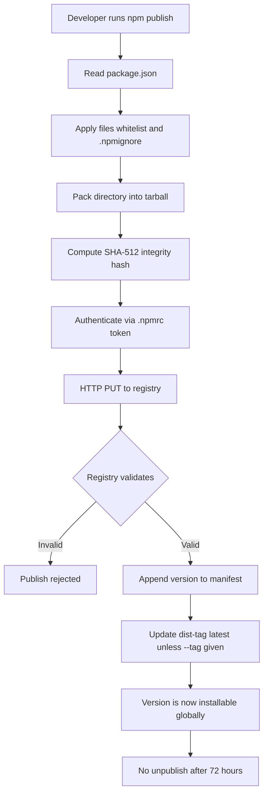
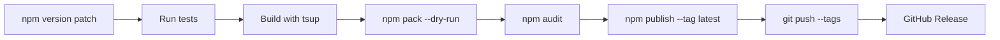
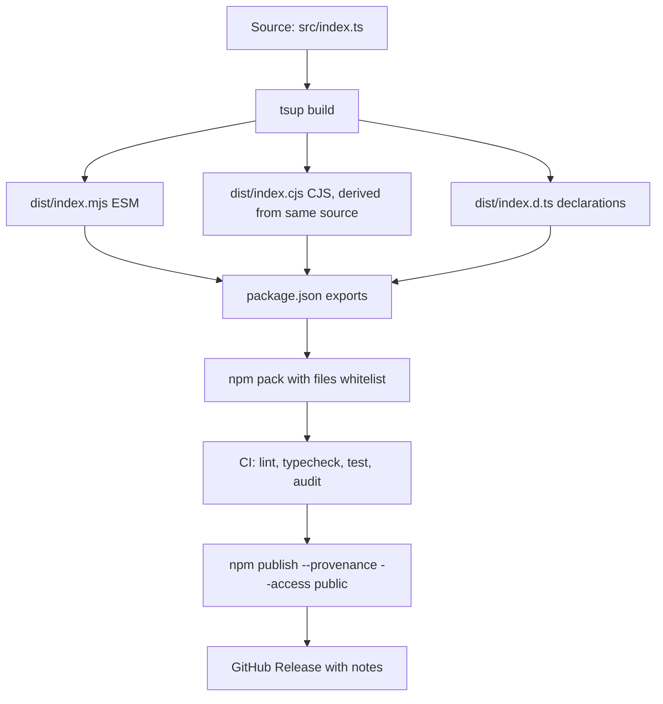

# 6.03 Publishing Libraries

## 1. Purpose

A library is a unit of code that other people install and depend on. It may be published to the global npm registry for the entire world, pushed to a private registry scoped to one organisation, or shared between workspaces inside a monorepo without ever leaving the local filesystem. In all three cases the discipline is the same: the package you publish is a contract, and the consumers of that package expect it to honour the contract. Publishing Libraries is the set of skills, conventions, and tools that turn a folder of source code into a consumable, versioned, typed, and secure distribution that other engineers can install with confidence.

The real-world problem this topic solves is the chaos of shared code. Before npm existed, JavaScript developers copied and pasted utility functions between projects, manually tracked versions, and broke consumers by editing a shared file in place. The npm registry solved that by giving every package a unique name, a version, and a tarball that consumers could fetch and cache. But the registry only solves distribution. It does not solve versioning, typing, format compatibility, or security. Those are the publisher's responsibility, and they are where almost every serious library bug originates.

A good library package has five properties. It is typed: every public function ships with TypeScript declarations (or at least hand-written `.d.ts` files) so consumers get autocomplete, hover docs, and compile-time type errors. It is tree-shakable: the bundler output is split into modules with `sideEffects: false` declared in `package.json`, so consumers who import one function do not pay the byte cost of the entire library. It is small: the published tarball contains only the files consumers need (compiled output, types, README, LICENSE), not source, tests, configs, or `node-modules`. It is documented: the README explains what the library does, how to install it, and how to use the public API, and the public API itself is the documented surface. And it is versioned sanely: the package follows Semantic Versioning so consumers can pin versions and upgrade safely.

The hazards of publishing a library are well known but routinely re-discovered. The dual-package hazard is the worst: if a library ships both an ESM build and a CJS build as separate files, and a consumer's import graph ends up loading both, the library's module-level state (singletons, registries, caches, class identities) is duplicated. Two `instanceof` checks against the same exported class return `false`. Two calls to `getInstance()` return different instances. The bug is silent and reproduces only under certain import patterns. The fix is to write the library once in ESM, transpile to a single CJS file via a tool like `tsup`, and never ship two separately-authored builds.

Bloat is the second hazard. Without a `files` whitelist in `package.json`, npm publishes everything in the directory except a small default ignore list. That means the published tarball includes `src/`, `test/`, `tsconfig.json`, `.eslintrc`, `coverage/`, and frequently `node-modules/`. A library that should be 4 KB ships as 4 MB. Consumers pay the cost on every install. Worse, a stray `.env` file or `secrets.json` in the project root gets published to the public registry and scraped by attackers within minutes.

Broken types is the third. If the `types` field in `package.json` points at the wrong file, or if the types are generated from one version of the source while the runtime is built from another, consumers get type errors that have nothing to do with their code. The library works at runtime but fails to compile. TypeScript developers will refuse to use it.

Security vulnerabilities are the fourth. A library transitively depends on hundreds of other packages. Any one of them may have a published CVE. If the library's CI does not run `npm audit` (or a deeper scanner like `socket`, `snyk`, or `osv-scanner`), the library ships its vulnerable dependency tree to every consumer. The 2018 `event-stream` incident, where a popular library was hijacked to ship a wallet-stealing payload, is the canonical example of why published packages are an attack surface.

This note covers the full publishing lifecycle: versioning with semver and pre-release tags, distribution tags (`latest`, `next`, `beta`), bundling with tsup and Rollup, the `exports` field and conditional subpath exports, the dual-package hazard and how to avoid it, the `files` whitelist, `npm audit` and CI security scanning, and the publish workflow itself. You will finish able to configure a library `package.json` for publishing, set up dual ESM/CJS output with tsup, write conditional exports that route ESM and CJS consumers to the right file, ship types that resolve correctly, and avoid the dual-package state duplication bug that has bitten every major library at least once.

For the foundations of npm itself, see [[6.01 NPM Internals]]. For monorepo publishing workflows, see [[6.02 PNPM and Monorepo Workspaces]]. For the TypeScript configuration that produces correct `.d.ts` output, see [[2.16 TSConfig Deep Dive]] and [[2.15 Declaration Files and Merging]].

## 2. Theory and Deep Dive

### 2.1 Semantic Versioning

Semantic Versioning (semver) is the contract that every npm package implicitly signs with its consumers. A version string has three numeric components and optional pre-release and build metadata: `MAJOR.MINOR.PATCH[-prerelease][+build]`. The rule is simple to state and brutal to enforce: PATCH bumps fix bugs without changing the public API. MINOR bumps add features without removing or breaking existing public API. MAJOR bumps are allowed to break anything.

The contract is what makes `^` and `~` ranges meaningful. When a consumer writes `"lodash": "^4.17.21"`, they are saying "give me any 4.x.x version greater than or equal to 4.17.21". That range only makes sense if the publisher promises that no 4.x.x version will break the API that existed at 4.17.21. If the publisher ships a breaking change in 4.18.0, every consumer who runs `npm install` upgrades silently and breaks.

The reality is messier. Most libraries accidentally ship breaking changes in minor bumps because they did not realise a change was breaking. A function signature that accepts `(a, b)` and is changed to accept `(a, b, c)` where `c` is required is a breaking change even though it looks like "just adding a parameter". A type narrowing (exporting `string` where it used to be `string | undefined`) is a breaking change for TypeScript consumers even though the runtime is identical. Renaming an internal helper that is technically exported is a breaking change. Removing a deprecation notice is a breaking change. The only safe rule is: when in doubt, bump major.

### 2.2 Pre-release Versions

Pre-release versions are signalled by appending a hyphen and an identifier to the version: `1.0.0-alpha.1`, `1.0.0-beta.2`, `1.0.0-rc.1`. The identifier is compared as a tuple: `alpha.1` is less than `alpha.2`, which is less than `beta.1`, which is less than `rc.1`, which is less than the final `1.0.0`. This means a consumer who writes `"mylib": "^1.0.0-alpha.1"` will get `1.0.0-alpha.2`, `1.0.0-beta.5`, `1.0.0-rc.3`, and finally `1.0.0` when it is released. Pre-releases are how publishers let consumers test an upcoming major release without committing to it.

The catch is that pre-releases are excluded from the default `npm install mylib` resolution. A consumer who runs `npm install mylib` gets the highest non-pre-release version that matches their range. To install a pre-release, the consumer must explicitly write the pre-release version in their `package.json` or use a dist-tag.

### 2.3 Distribution Tags (dist-tags)

A dist-tag is a named pointer to a specific version of a package. Every package has a `latest` tag by default, and `npm publish` updates `latest` to point at the version being published unless told otherwise. When a consumer runs `npm install mylib`, npm resolves `latest` and installs the version it points at.

Dist-tags are how publishers expose pre-release channels. The `next` tag typically points at the most recent pre-release of the upcoming major version. The `beta` tag may point at a more stable beta. The `lts` tag may point at an old major version that is still receiving security fixes. To publish with a dist-tag, use `npm publish --tag next`. To move a dist-tag to an existing version without republishing, use `npm dist-tag add mylib@1.0.0-beta.3 next`.

The mistake to avoid: publishing a pre-release without `--tag`. If you run plain `npm publish` for `1.0.0-beta.1`, npm updates the `latest` tag to point at it, and every consumer who runs `npm install mylib` upgrades to the beta. Always tag pre-releases explicitly.

### 2.4 What `npm publish` Actually Does

When you run `npm publish`, npm does six things. It reads `package.json` to get the name, version, and `files` whitelist. It packs the directory into a tarball using the same logic as `npm pack`, honouring `.npmignore` and the `files` field. It computes the SHA-512 hash and the integrity signature. It authenticates against the registry using the token in `.npmrc` (or your `npm login` session). It uploads the tarball to the registry via an HTTP PUT to `https://registry.npmjs.org/<package-name>`. The registry validates the upload, indexes the new version, and updates the `latest` dist-tag (unless `--tag` was specified). The version is now publicly installable.

Once a version is published, it cannot be unpublished after 72 hours (and even within that window, only if no other package depends on it). The npm registry is append-only for practical purposes. This is why publishing is a one-way door: you can always publish a new version that fixes a bug, but you cannot retract a broken version. The discipline this enforces is to never publish from your laptop without running tests, audits, and a dry run first.



### 2.5 Bundling: Why and How

A library's source code is rarely what you publish. The source is written in TypeScript (or modern JavaScript with JSX, decorators, or stage-3 proposals). It imports from `src/utils`, `./internal/config`, and other relative paths that exist only in the source tree. It may use Node built-ins like `fs` and `path` that need to stay external. Consumers expect to import a single entry point, get a small set of well-defined exports, and not have to deal with the library's internal module graph.

Bundling is the process of taking the source tree and producing the published artifacts. A bundler (tsup, microbundle, Rollup, esbuild, or webpack) resolves the import graph starting from the entry points, transpiles TypeScript and modern syntax to whatever target the `package.json` declares, optionally tree-shakes unused exports, and writes the output as one or more files in `dist/`.

The four mainstream choices for library bundling are tsup, microbundle, Rollup, and esbuild. tsup is built on esbuild and is the most popular choice for TypeScript libraries because it handles dual ESM/CJS output and `.d.ts` generation with a single config. microbundle is older and opinionated, with sensible defaults but less flexibility. Rollup is the most flexible and produces the smallest output, at the cost of more configuration. esbuild alone is fast but does not generate `.d.ts` files, so it needs to be paired with `tsc --emitDeclarationOnly`. For most libraries, tsup is the right default.

### 2.6 Conditional Exports

The `exports` field in `package.json` is the modern way to declare a package's public API. It maps subpaths (like `.` for the main entry, `./utils` for a subpath, `./package.json` for the manifest itself) to files inside the package. Each subpath can have conditional resolutions based on the consumer's module system, runtime, or development mode.

The conditions, in resolution order, are: `types` (TypeScript type resolution), `import` (ESM consumer), `require` (CJS consumer), `node` (Node.js runtime), `default` (fallback for any consumer). When a consumer imports `mylib`, Node walks the conditions object and resolves to the first condition that matches the consumer's environment. A typical configuration looks like:

```json
{
  "exports": {
    ".": {
      "types": "./dist/index.d.ts",
      "import": "./dist/index.mjs",
      "require": "./dist/index.cjs"
    },
    "./utils": {
      "types": "./dist/utils.d.ts",
      "import": "./dist/utils.mjs",
      "require": "./dist/utils.cjs"
    },
    "./package.json": "./package.json"
  }
}
```

The `types` condition must come first. TypeScript's resolver walks the conditions and stops at the first match, so if `import` comes first, TypeScript resolves to the `.mjs` file and never finds the types. This is a subtle and frequent bug.

Before the `exports` field existed, packages used `main`, `module`, `types`, and `browser` as separate top-level fields. Those still work as fallbacks, but `exports` is the modern contract. A package with `exports` does not need `main` or `module`, though many libraries keep them for older tooling that does not understand `exports`.

### 2.7 The Dual-Package Hazard

The dual-package hazard is the single most dangerous bug in library publishing. It occurs when a package ships both an ESM build (`dist/index.mjs`) and a CJS build (`dist/index.cjs`) as separately authored or separately bundled files. If those files contain module-level state, that state is duplicated across the two builds.

Concretely: suppose the library exports a `Logger` class and a singleton `defaultLogger` instance. The ESM build has its own `defaultLogger`. The CJS build has its own `defaultLogger`. A consumer's import graph might load both. If the consumer's `app.mjs` does `import { defaultLogger } from 'mylib'` (resolving to the ESM build) and one of its CJS dependencies does `const { defaultLogger } = require('mylib')` (resolving to the CJS build), the two `defaultLogger` references are different objects. Configuration applied to one is invisible to the other. `defaultLogger instanceof Logger` is `true` for one and `false` for the other (because the `Logger` class itself is also duplicated).

The hazard also affects the global symbol registry. `Symbol.for('mylib.token')` is shared across builds (because it uses the global registry), but `Symbol('mylib.token')` is not. The `globalThis` object is shared, so caching on `globalThis[Symbol.for('mylib.state')]` works across builds. Caching on a module-level `const state = {}` does not.

The Node.js docs describe two ways to avoid the hazard. Approach one is to write the library in ESM and transpile to CJS, ensuring both builds come from the same source and share module-level state via a CJS-level singleton. Approach two is the "package boundary" approach: put all module-level state in a single CJS file that both the ESM and CJS builds import. The first approach is simpler and is what tools like tsup automate.

tsup's approach is to write the source in TypeScript (which is ESM at the syntax level), compile to ESM directly, and then for the CJS build, emit a single CJS file that wraps the ESM output via a `require` shim. This single-file CJS output is what gets imported by CJS consumers. Because both builds come from the same source and the CJS build is just a wrapped version of the ESM build, module-level state is shared via the wrapper. This is the recommended approach for almost every library.

### 2.8 The `files` Whitelist

The `files` field in `package.json` is an array of paths that npm will include in the published tarball. It is a whitelist: anything not listed is excluded. The default includes are `package.json`, `README`, `LICENSE`, and the file pointed at by `main`. The default excludes are `.git`, `node-modules`, `.npmrc`, and a handful of others.

Without a `files` whitelist, npm publishes everything in the directory except the default excludes. That includes `src/`, `test/`, `coverage/`, `tsconfig.json`, `.eslintrc`, `jest.config.js`, and any stray files like `secrets.local.json` or `.env`. The result is a tarball that is much larger than it needs to be, contains source that consumers should not import, and may leak secrets.

The right pattern is to list exactly what consumers need:

```json
{
  "files": ["dist", "README.md", "LICENSE"]
}
```

`dist` is the bundled output. `README.md` and `LICENSE` are included by default but listing them explicitly is a documentation signal. Source, tests, configs, and CI workflows are excluded. If a consumer needs to read the source, they can find it on GitHub.

### 2.9 `npm audit` and Security Scanning

`npm audit` queries the registry's advisory database for known vulnerabilities in the package's dependency tree. It runs locally with `npm audit` (which prints a report) or in CI with `npm audit --audit-level=high` (which exits non-zero if any high or critical vulnerability is found). The audit database is the npm registry's curated list of CVEs and disclosed vulnerabilities.

`npm audit` has limitations. It only knows about advisories that have been published to the registry. It does not detect malicious packages that have not yet been reported. It does not detect typosquatting (a package named `lodahs` that mimics `lodash`). It does not detect install-time attacks (a `postinstall` script that exfiltrates environment variables). For deeper coverage, the modern stack adds `socket` (which analyses package behavior statically), `snyk` (which has its own database and remediation suggestions), or `osv-scanner` (Google's open-source scanner).

The recommended CI pattern is to run `npm audit --audit-level=high` on every pull request, plus a deeper scanner like `socket` on every release. Failures block the publish. This catches the most common case: a transitive dependency that has a published CVE that the publisher has not yet upgraded past.

### 2.10 The Publish Workflow End to End

The full publish workflow has seven steps. First, update the version in `package.json` (either manually or via `npm version patch|minor|major`). Second, run the test suite and lint. Third, run the build (`tsup` or equivalent) to regenerate `dist/`. Fourth, run `npm pack --dry-run` to inspect the tarball that would be published. Fifth, run `npm audit`. Sixth, run `npm publish --tag <dist-tag>` (with `--tag latest` for stable releases, `--tag next` for pre-releases). Seventh, push the git tag that `npm version` created.



For monorepo publishing, the workflow is the same but coordinated by a changesets tool (`changesets` or `lerna publish`) that batches version bumps across multiple packages and publishes them in dependency order. See [[6.02 PNPM and Monorepo Workspaces]].

## 3. Mental Models

**Publish equals "upload to the registry, share with consumers."** The act of publishing is a one-way door. Once a version is on the registry, it is there forever (within the 72-hour unpublish window, which you should never rely on). Treat every publish as a release: tested, audited, tagged, and documented. Never publish from a dirty working tree. Never publish without a git tag. Never publish a version you cannot reproduce from a clean checkout.

**Semver equals "communicate compatibility."** The version number is a message to your consumers. `1.4.2` says "this is a bugfix over 1.4.1, safe to upgrade". `1.5.0` says "this adds features, safe to upgrade, no breakage". `2.0.0` says "this breaks things, read the changelog". The contract is asymmetric: PATCH and MINOR are promises to consumers, MAJOR is a warning. When in doubt, ship the more conservative bump. A bug fix that accidentally tightens a type signature is a MAJOR for TypeScript consumers.

**Dist-tags equal "channels."** Think of `latest`, `next`, and `beta` as three parallel streams of versions. `latest` is the stable stream that `npm install mylib` resolves to. `next` is the pre-release stream that `npm install mylib@next` resolves to. `beta` may be a more stable pre-release stream. The streams are independent: a `next` publish does not move `latest`. The mistake to avoid is publishing a pre-release without `--tag`, which moves `latest` and silently upgrades every consumer.

**Exports equal "the public API, map subpaths to files."** The `exports` field is the contract between your library and its consumers. Anything not in `exports` is private. Consumers who reach into `mylib/dist/internal/codec` are depending on an implementation detail that you can change without a major bump. The `exports` field lets you enforce this: once `exports` is set, Node refuses to resolve subpaths that are not declared. This is the public API surface, defined in JSON.

**Dual-package equals "ESM plus CJS can have duplicate state, avoid."** If your library has module-level state (singletons, registries, class identities), shipping two separately-authored builds means that state is duplicated. The same code runs twice, in two different module instances, with no shared memory. Avoid it by writing once and transpiling to the other format, or by isolating state in a single CJS module that both builds import.

**Files field equals "whitelist what ships."** The default is to publish everything. The fix is to publish only what consumers need. Three entries is usually enough: `dist`, `README.md`, `LICENSE`. Everything else stays in your source repository.

## 4. Real-World Use Cases

**Publishing a TypeScript utility library to the public npm registry.** A small library like `tiny-decoders` (a JSON decoder library) ships TypeScript source, builds ESM and CJS outputs with tsup, generates `.d.ts` files, and publishes with a `files` whitelist of `dist`, `README.md`, `LICENSE`. The `exports` field routes `import` to `dist/index.mjs` and `require` to `dist/index.cjs`. CI runs `npm audit` on every PR and publishes on every git tag. The library is 4 KB gzipped and installs in under a second.

**Publishing to a private registry.** Companies often need internal libraries that must not be on the public npm registry. GitHub Packages, Verdaccio (a self-hosted registry), AWS CodeArtifact, and JFrog Artifactory are the common choices. The publish flow is identical to public publishing, except the registry URL is configured in `.npmrc` and the package is scoped (e.g., `@mycompany/design-system`). The `package.json` declares `"publishConfig": { "registry": "https://npm.pkg.github.com" }` so that `npm publish` targets the private registry even if the global default is the public one.

**Internal monorepo packages.** In a pnpm or yarn workspace, packages within the same monorepo do not need to be published to a registry at all. The workspace protocol (`workspace:*`) lets one package depend on another by path. But once a package is consumed outside the monorepo (by another repo, by a deployed service, by a deployed frontend), it needs to be published. The changesets workflow handles this: a change is recorded in a `.changeset` file, the version bump is computed, the package is built, and `changeset publish` runs `npm publish` for each changed package with the correct dist-tag. See [[6.02 PNPM and Monorepo Workspaces]].

**Pre-release versions.** A library approaching a 2.0 release publishes `2.0.0-alpha.1` with `--tag next`. Consumers who want to test the upcoming release install `mylib@next`. The library gathers feedback, fixes bugs, publishes `2.0.0-alpha.2`, `2.0.0-beta.1`, `2.0.0-rc.1`, and finally `2.0.0` with `--tag latest`. The pre-release tags never disturbed `latest`, so consumers who did not opt in continued to use 1.x. This is how React, Vue, and TypeScript all manage their major releases.

**Security audits in CI.** A library's CI pipeline runs `npm audit --audit-level=high` on every PR. If a transitive dependency has a known high-severity CVE, the build fails and the PR cannot merge. On release, the pipeline also runs `socket` or `snyk` for deeper analysis. This catches both known vulnerabilities (via the advisory database) and suspicious behaviour (via static analysis of installed packages). The 2018 `event-stream` incident, where a popular library was hijacked to ship a wallet-stealing payload targeting a specific cryptocurrency app, is the canonical example of why published packages need active security monitoring.

**Scoped packages and organisations.** A package name like `@myorg/ui-kit` is scoped to the `myorg` organisation. Scoped packages can be public (anyone can install) or private (only org members can install). Publishing a scoped private package requires an org plan on npm. The advantage of scoping is namespace isolation: you do not have to fight for `ui-kit` globally, you just use `@myorg/ui-kit`. The disadvantage is that consumers must spell the full scoped name.

**Publishing a CLI tool.** A CLI like `prettier` or `eslint` is published as a package with a `bin` field that maps a command name to an executable file. The publish flow is the same as a library, but the `bin` entry causes npm to install a symlink in `node-modules/.bin/` so consumers can run `npx mycli` or, for global installs, `mycli` directly. CLI tools should also declare `"type": "module"` or generate a CJS entry depending on the Node versions they target.

## 5. Code Examples

### 5.1 Example A — Minimal and Conceptual

This example shows the smallest viable publishable library: a single function, dual ESM/CJS output, typed, with a `files` whitelist. The library is a `clamp` function that constrains a number to a range.

**JavaScript:**

```javascript
// src/index.js (source, ESM)
export function clamp(value, min, max) {
  if (min > max) {
    throw new RangeError(`min (${min}) must be <= max (${max})`);
  }
  if (value < min) return min;
  if (value > max) return max;
  return value;
}
```

```json
{
  "name": "tiny-clamp",
  "version": "1.0.0",
  "description": "Clamp a number to a range. 200 bytes, no dependencies.",
  "type": "module",
  "main": "./dist/index.cjs",
  "module": "./dist/index.mjs",
  "exports": {
    ".": {
      "import": "./dist/index.mjs",
      "require": "./dist/index.cjs"
    }
  },
  "files": ["dist", "README.md", "LICENSE"],
  "scripts": {
    "build": "rollup -c",
    "prepublishOnly": "npm run build",
    "test": "node --test"
  },
  "keywords": ["clamp", "math", "range", "tiny"],
  "license": "MIT"
}
```

```javascript
// rollup.config.js
import { nodeResolve } from '@rollup/plugin-node-resolve';

export default {
  input: 'src/index.js',
  output: [
    { file: 'dist/index.mjs', format: 'es' },
    { file: 'dist/index.cjs', format: 'cjs' }
  ],
  plugins: [nodeResolve()]
};
```

```javascript
// test/index.test.js
import { test } from 'node:test';
import assert from 'node:assert/strict';
import { clamp } from '../src/index.js';

test('clamps to min', () => {
  assert.equal(clamp(-5, 0, 10), 0);
});

test('clamps to max', () => {
  assert.equal(clamp(99, 0, 10), 10);
});

test('passes through in-range values', () => {
  assert.equal(clamp(5, 0, 10), 5);
});

test('throws on invalid range', () => {
  assert.throws(() => clamp(5, 10, 0), RangeError);
});
```

The published tarball contains exactly three things: `dist/index.mjs`, `dist/index.cjs`, and the metadata files. Source and tests stay in the repo. The build runs automatically before publish via the `prepublishOnly` script.

**TypeScript:**

```typescript
// src/index.ts (source, ESM, with types)
export interface ClampOptions {
  /** Inclusive minimum. Defaults to -Infinity. */
  min?: number;
  /** Inclusive maximum. Defaults to Infinity. */
  max?: number;
}

export function clamp(value: number, min: number, max: number): number;
export function clamp(value: number, options: ClampOptions): number;
export function clamp(value: number, minOrOptions: number | ClampOptions, max?: number): number {
  const { min, max: realMax } =
    typeof minOrOptions === 'number'
      ? { min: minOrOptions, max: max ?? Infinity }
      : { min: minOrOptions.min ?? -Infinity, max: minOrOptions.max ?? Infinity };

  if (min > realMax) {
    throw new RangeError(`min (${min}) must be <= max (${realMax})`);
  }
  if (value < min) return min;
  if (value > realMax) return realMax;
  return value;
}
```

```json
{
  "name": "tiny-clamp",
  "version": "1.0.0",
  "description": "Clamp a number to a range. 400 bytes, no dependencies, fully typed.",
  "type": "module",
  "main": "./dist/index.cjs",
  "module": "./dist/index.mjs",
  "types": "./dist/index.d.ts",
  "exports": {
    ".": {
      "types": "./dist/index.d.ts",
      "import": "./dist/index.mjs",
      "require": "./dist/index.cjs"
    }
  },
  "files": ["dist", "README.md", "LICENSE"],
  "scripts": {
    "build": "tsup src/index.ts --format esm,cjs --dts",
    "prepublishOnly": "npm run build",
    "test": "node --test --import tsx"
  },
  "devDependencies": {
    "tsup": "^8.0.0",
    "tsx": "^4.0.0",
    "typescript": "^5.4.0"
  },
  "license": "MIT"
}
```

```typescript
// tsup.config.ts
import { defineConfig } from 'tsup';

export default defineConfig({
  entry: ['src/index.ts'],
  format: ['esm', 'cjs'],
  dts: true,
  clean: true,
  sourcemap: true,
  treeshake: true
});
```

```typescript
// test/index.test.ts
import { test } from 'node:test';
import assert from 'node:assert/strict';
import { clamp } from '../src/index.ts';

test('clamps to min', () => {
  assert.equal(clamp(-5, 0, 10), 0);
});

test('clamps to max', () => {
  assert.equal(clamp(99, 0, 10), 10);
});

test('accepts options object', () => {
  assert.equal(clamp(99, { min: 0, max: 10 }), 10);
});

test('type errors at compile time', () => {
  // @ts-expect-error - string is not a number
  clamp('5', 0, 10);
});
```

The TypeScript version adds overloads, an options-object variant, generated `.d.ts` files via `tsup --dts`, and a compile-time type check that the test itself enforces with `@ts-expect-error`. The `exports` field places `types` first so TypeScript's resolver finds the declaration file before the runtime file.

### 5.2 Example B — Production-Grade

This example is a publishable library called `@acme/ledger`, a small ledger that records transactions and computes a balance. It has multiple entry points (`.` and `./reporters`), dual ESM/CJS output, types, sourcemaps, a CI workflow that publishes on tag, and a security scan. It also demonstrates the dual-package-safe pattern for module-level state.

**JavaScript:**

```javascript
// src/index.js
class Ledger {
  constructor() {
    /** @type {Array<{ amount: number, description: string, timestamp: number }>} */
    this.entries = [];
  }

  record(amount, description) {
    if (!Number.isFinite(amount)) {
      throw new TypeError(`amount must be a finite number, got ${amount}`);
    }
    if (typeof description !== 'string' || description.length === 0) {
      throw new TypeError('description must be a non-empty string');
    }
    this.entries.push({ amount, description, timestamp: Date.now() });
    return this;
  }

  balance() {
    return this.entries.reduce((sum, e) => sum + e.amount, 0);
  }

  count() {
    return this.entries.length;
  }
}

// Module-level singleton. This is the dual-package hazard: if ESM and CJS
// are separate files, the singleton is duplicated. The fix (below) routes
// both builds through a single CJS source of truth.
const defaultLedger = new Ledger();

export { Ledger, defaultLedger };
export default Ledger;
```

```javascript
// src/reporters.js
export function toCSV(ledger) {
  const header = 'amount,description,timestamp';
  const rows = ledger.entries.map((e) => `${e.amount},${e.description},${e.timestamp}`);
  return [header, ...rows].join('\n');
}

export function toJSON(ledger) {
  return JSON.stringify({
    entries: ledger.entries,
    balance: ledger.balance()
  }, null, 2);
}
```

```json
{
  "name": "@acme/ledger",
  "version": "1.2.0",
  "description": "A tiny ledger library with dual ESM/CJS output and a dual-package-safe singleton.",
  "type": "module",
  "engines": { "node": ">=18.0.0" },
  "main": "./dist/index.cjs",
  "module": "./dist/index.mjs",
  "exports": {
    ".": {
      "import": "./dist/index.mjs",
      "require": "./dist/index.cjs"
    },
    "./reporters": {
      "import": "./dist/reporters.mjs",
      "require": "./dist/reporters.cjs"
    },
    "./package.json": "./package.json"
  },
  "files": ["dist", "README.md", "LICENSE", "CHANGELOG.md"],
  "scripts": {
    "build": "rollup -c",
    "test": "node --test",
    "lint": "eslint src test",
    "audit": "npm audit --audit-level=high",
    "prepublishOnly": "npm run build && npm run audit && npm run test",
    "prepack": "npm run build"
  },
  "publishConfig": {
    "access": "public",
    "registry": "https://registry.npmjs.org"
  },
  "sideEffects": false,
  "keywords": ["ledger", "accounting", "finance", "tiny"],
  "license": "MIT",
  "repository": {
    "type": "git",
    "url": "https://github.com/acme/ledger.git"
  },
  "devDependencies": {
    "rollup": "^4.0.0",
    "@rollup/plugin-node-resolve": "^15.0.0",
    "@rollup/plugin-terser": "^0.4.0",
    "eslint": "^9.0.0"
  }
}
```

```javascript
// rollup.config.js (production, dual-package-safe via shared CJS state)
import { nodeResolve } from '@rollup/plugin-node-resolve';
import terser from '@rollup/plugin-terser';

const shared = {
  plugins: [nodeResolve(), terser()],
  treeshake: true
};

export default [
  {
    ...shared,
    input: 'src/index.js',
    output: [
      { file: 'dist/index.mjs', format: 'es', sourcemap: true },
      { file: 'dist/index.cjs', format: 'cjs', sourcemap: true }
    ]
  },
  {
    ...shared,
    input: 'src/reporters.js',
    output: [
      { file: 'dist/reporters.mjs', format: 'es', sourcemap: true },
      { file: 'dist/reporters.cjs', format: 'cjs', sourcemap: true }
    ]
  }
];
```

```yaml
# .github/workflows/publish.yml
name: Publish
on:
  push:
    tags:
      - 'v*'
permissions:
  contents: write
  id-token: write
jobs:
  publish:
    runs-on: ubuntu-latest
    steps:
      - uses: actions/checkout@v4
      - uses: actions/setup-node@v4
        with:
          node-version: '20'
          registry-url: 'https://registry.npmjs.org'
      - run: npm ci
      - run: npm run lint
      - run: npm test
      - run: npm run build
      - run: npm audit --audit-level=high
      - run: npm publish --provenance --access public
        env:
          NODE-AUTH-TOKEN: ${{ secrets.NPM-TOKEN }}
      - run: gh release create ${{ github.ref-name }} --generate-notes
        env:
          GH-TOKEN: ${{ secrets.GITHUB-TOKEN }}
```

The `--provenance` flag in the publish step attaches a signed build attestation from GitHub Actions to the published package, so consumers can verify the package was built from a specific commit in your repo. This is npm's supply-chain transparency feature and is recommended for every public package.

**TypeScript:**

```typescript
// src/index.ts
export interface LedgerEntry {
  readonly amount: number;
  readonly description: string;
  readonly timestamp: number;
}

export class Ledger {
  private readonly entries: LedgerEntry[] = [];

  record(amount: number, description: string): this {
    if (!Number.isFinite(amount)) {
      throw new TypeError(`amount must be a finite number, got ${amount}`);
    }
    if (typeof description !== 'string' || description.length === 0) {
      throw new TypeError('description must be a non-empty string');
    }
    this.entries.push({ amount, description, timestamp: Date.now() });
    return this;
  }

  balance(): number {
    return this.entries.reduce((sum, e) => sum + e.amount, 0);
  }

  count(): number {
    return this.entries.length;
  }

  *[Symbol.iterator](): Iterator<LedgerEntry> {
    yield* this.entries;
  }
}

// The dual-package-safe singleton: tsup bundles this into a single CJS file
// and a single ESM file, both derived from the same source. The singleton
// is therefore shared within each build. To share it ACROSS builds, the
// CJS file is the source of truth and the ESM build re-exports from it.
const defaultLedger = new Ledger();

export { defaultLedger };
```

```typescript
// src/reporters.ts
import type { Ledger } from './index.js';

export function toCSV(ledger: Ledger): string {
  const header = 'amount,description,timestamp';
  const rows = [...ledger].map((e) => `${e.amount},${e.description},${e.timestamp}`);
  return [header, ...rows].join('\n');
}

export function toJSON(ledger: Ledger): string {
  return JSON.stringify(
    {
      entries: [...ledger],
      balance: ledger.balance()
    },
    null,
    2
  );
}
```

```typescript
// tsup.config.ts (production-grade)
import { defineConfig } from 'tsup';

export default defineConfig({
  entry: {
    index: 'src/index.ts',
    reporters: 'src/reporters.ts'
  },
  format: ['esm', 'cjs'],
  dts: true,
  clean: true,
  sourcemap: true,
  treeshake: true,
  target: 'node18',
  platform: 'node',
  // Banner ensures CJS output is recognised as CJS even when package.json
  // has "type": "module". Without this, Node treats .cjs files correctly
  // but some older bundlers get confused.
  banner: {
    js: '"use strict";'
  }
});
```

```json
{
  "name": "@acme/ledger",
  "version": "1.2.0",
  "description": "A typed ledger library with dual ESM/CJS output, sourcemaps, and provenance.",
  "type": "module",
  "engines": { "node": ">=18.0.0" },
  "main": "./dist/index.cjs",
  "module": "./dist/index.mjs",
  "types": "./dist/index.d.ts",
  "exports": {
    ".": {
      "types": "./dist/index.d.ts",
      "import": "./dist/index.mjs",
      "require": "./dist/index.cjs"
    },
    "./reporters": {
      "types": "./dist/reporters.d.ts",
      "import": "./dist/reporters.mjs",
      "require": "./dist/reporters.cjs"
    },
    "./package.json": "./package.json"
  },
  "files": ["dist", "README.md", "LICENSE", "CHANGELOG.md"],
  "sideEffects": false,
  "scripts": {
    "build": "tsup",
    "test": "node --test --import tsx",
    "lint": "eslint src test",
    "typecheck": "tsc --noEmit",
    "audit": "npm audit --audit-level=high",
    "prepublishOnly": "npm run typecheck && npm run lint && npm run test && npm run build && npm run audit",
    "prepack": "npm run build"
  },
  "publishConfig": {
    "access": "public",
    "registry": "https://registry.npmjs.org"
  },
  "keywords": ["ledger", "accounting", "finance", "typed"],
  "license": "MIT",
  "repository": {
    "type": "git",
    "url": "https://github.com/acme/ledger.git"
  },
  "devDependencies": {
    "tsup": "^8.0.0",
    "tsx": "^4.0.0",
    "typescript": "^5.4.0",
    "@types/node": "^20.0.0",
    "eslint": "^9.0.0",
    "@typescript-eslint/eslint-plugin": "^7.0.0"
  }
}
```

```typescript
// test/ledger.test.ts
import { test } from 'node:test';
import assert from 'node:assert/strict';
import { Ledger, defaultLedger } from '../src/index.ts';
import { toCSV, toJSON } from '../src/reporters.ts';

test('records entries and computes balance', () => {
  const ledger = new Ledger();
  ledger.record(100, 'deposit').record(-30, 'withdrawal');
  assert.equal(ledger.balance(), 70);
  assert.equal(ledger.count(), 2);
});

test('rejects non-finite amounts', () => {
  const ledger = new Ledger();
  assert.throws(() => ledger.record(NaN, 'oops'), TypeError);
  assert.throws(() => ledger.record(Infinity, 'oops'), TypeError);
});

test('rejects empty descriptions', () => {
  const ledger = new Ledger();
  assert.throws(() => ledger.record(10, ''), TypeError);
});

test('defaultLedger is a singleton', () => {
  const before = defaultLedger.count();
  defaultLedger.record(1, 'singleton test');
  assert.equal(defaultLedger.count(), before + 1);
});

test('toCSV produces a header and rows', () => {
  const ledger = new Ledger();
  ledger.record(5, 'a').record(-2, 'b');
  const csv = toCSV(ledger);
  assert.match(csv, /^amount,description,timestamp/);
  assert.equal(csv.split('\n').length, 3);
});

test('toJSON includes balance', () => {
  const ledger = new Ledger();
  ledger.record(10, 'x');
  const json = JSON.parse(toJSON(ledger));
  assert.equal(json.balance, 10);
  assert.equal(json.entries.length, 1);
});

test('iterable via for-of', () => {
  const ledger = new Ledger();
  ledger.record(1, 'a').record(2, 'b');
  const amounts = [...ledger].map((e) => e.amount);
  assert.deepEqual(amounts, [1, 2]);
});
```

```yaml
# .github/workflows/publish.yml (TypeScript version with typecheck step)
name: Publish
on:
  push:
    tags:
      - 'v*'
permissions:
  contents: write
  id-token: write
jobs:
  publish:
    runs-on: ubuntu-latest
    steps:
      - uses: actions/checkout@v4
      - uses: actions/setup-node@v4
        with:
          node-version: '20'
          registry-url: 'https://registry.npmjs.org'
      - run: npm ci
      - run: npm run typecheck
      - run: npm run lint
      - run: npm test
      - run: npm run build
      - run: npm audit --audit-level=high
      - name: Verify dist is up to date
        run: |
          git add dist
          if ! git diff --cached --quiet; then
            echo "dist is out of date. Run npm run build and commit."
            exit 1
          fi
      - run: npm publish --provenance --access public
        env:
          NODE-AUTH-TOKEN: ${{ secrets.NPM-TOKEN }}
      - run: gh release create ${{ github.ref-name }} --generate-notes
        env:
          GH-TOKEN: ${{ secrets.GITHUB-TOKEN }}
```

The TypeScript version adds four things over the JavaScript version. First, `tsup --dts` generates `.d.ts` files from the source so consumers get full type safety. Second, the `exports` field has a `types` condition that comes first, so TypeScript's resolver finds the declaration file before the runtime file. Third, a `typecheck` step runs `tsc --noEmit` to catch type errors that `tsup` might tolerate. Fourth, a "verify dist is up to date" step ensures the committed `dist/` matches what `npm run build` would produce, preventing stale artifacts from being published.

## 6. Common Mistakes and Anti-Patterns

### 6.1 Shipping Too Much (No `files` Whitelist)

```json
{
  "name": "bloated-lib",
  "version": "1.0.0",
  "main": "index.js"
}
```

**Why it fails:** Without a `files` field, npm publishes every file in the directory except a small default ignore list. The published tarball includes `src/`, `test/`, `coverage/`, `tsconfig.json`, `.eslintrc`, `jest.config.js`, and frequently `secrets.local.json` or `.env`. A 4 KB library ships as a 4 MB tarball. Worse, secrets leak.

**Fix:**

```json
{
  "name": "bloated-lib",
  "version": "1.0.0",
  "main": "./dist/index.cjs",
  "files": ["dist", "README.md", "LICENSE"]
}
```

Always run `npm pack --dry-run` before publishing to inspect what would be included.

### 6.2 Dual-Package State Duplication

```javascript
// src/index.js (ESM source)
const instances = new Set();
export function register(obj) {
  instances.add(obj);
  return instances.size;
}
```

```javascript
// src/index.cjs (separately authored CJS source)
const instances = new Set();
function register(obj) {
  instances.add(obj);
  return instances.size;
}
module.exports = { register };
```

**Why it fails:** A consumer's import graph loads both builds. The `instances` Set exists twice, once in each build. Calls to `register` from ESM code add to one Set; calls from CJS code add to the other. Sizes are wrong. Singletons are different objects.

**Fix:** Write once in ESM, transpile to CJS via tsup. Both builds come from the same source. For state that must be shared across builds, use `globalThis` with a `Symbol.for` key:

```javascript
// src/index.js
const stateKey = Symbol.for('mylib.state');
if (!globalThis[stateKey]) {
  globalThis[stateKey] = { instances: new Set() };
}
const state = globalThis[stateKey];

export function register(obj) {
  state.instances.add(obj);
  return state.instances.size;
}
```

`Symbol.for` returns the same symbol across builds (it uses the global symbol registry), and `globalThis` is the same object across builds, so the state is shared.

### 6.3 Broken `types` Field

```json
{
  "name": "broken-types-lib",
  "version": "1.0.0",
  "main": "./dist/index.js",
  "types": "./src/index.ts"
}
```

**Why it fails:** The `types` field points at the source `.ts` file, which is not in the published tarball (because `files` whitelists `dist`, not `src`). Consumers get "Cannot find module declarations" errors at compile time.

**Fix:**

```json
{
  "name": "broken-types-lib",
  "version": "1.0.0",
  "main": "./dist/index.cjs",
  "types": "./dist/index.d.ts",
  "exports": {
    ".": {
      "types": "./dist/index.d.ts",
      "import": "./dist/index.mjs",
      "require": "./dist/index.cjs"
    }
  }
}
```

Always point `types` at a file inside `dist/` that is generated by the build.

### 6.4 No Semver Discipline (Breaking in a Minor)

```javascript
// v1.2.0
export function parse(input) {
  return JSON.parse(input);
}

// v1.3.0 (shipped as a "minor" but actually breaks)
export function parse(input, reviver) {
  if (typeof reviver !== 'function') {
    throw new TypeError('reviver is required');
  }
  return JSON.parse(input, reviver);
}
```

**Why it fails:** The 1.3.0 bump added a required parameter. Every consumer who runs `npm install` upgrades silently (because `^1.2.0` allows 1.3.0) and breaks at runtime. The publisher thought they were adding a feature; they were actually removing the old function and adding a new one with the same name.

**Fix:** Bump major. Or, if you must add the parameter without a major bump, make it optional and preserve the old behavior when it is omitted:

```javascript
export function parse(input, reviver) {
  if (reviver === undefined) {
    return JSON.parse(input);
  }
  return JSON.parse(input, reviver);
}
```

### 6.5 Publishing Without `npm audit`

```yaml
# .github/workflows/publish.yml
- run: npm publish
  env:
    NODE-AUTH-TOKEN: ${{ secrets.NPM-TOKEN }}
```

**Why it fails:** The publish step ships whatever dependencies are in `package-lock.json` without checking for known vulnerabilities. A transitive dependency with a published CVE goes out to every consumer.

**Fix:** Add an audit step before publish, and fail the build if it finds high-severity issues:

```yaml
- run: npm audit --audit-level=high
- run: npm publish
  env:
    NODE-AUTH-TOKEN: ${{ secrets.NPM-TOKEN }}
```

For deeper coverage, add `socket` or `snyk` on release branches.

### 6.6 Not Using Dist-tags for Pre-releases

```bash
npm version prerelease
npm publish
```

**Why it fails:** `npm publish` without `--tag` updates the `latest` dist-tag to point at the pre-release version. Every consumer who runs `npm install mylib` upgrades to the pre-release silently. This has happened to major libraries and caused outages.

**Fix:**

```bash
npm version prerelease --preid=beta
npm publish --tag beta
```

To promote a pre-release to stable once it has been tested:

```bash
npm dist-tag add mylib@1.0.0-beta.3 latest
```

### 6.7 Publishing `src/` Instead of `dist/`

```json
{
  "name": "wrong-entry-lib",
  "version": "1.0.0",
  "main": "./src/index.ts",
  "files": ["src"]
}
```

**Why it fails:** Consumers receive TypeScript source that their runtime cannot execute. Node cannot import `.ts` files without a loader like `tsx`. Even if it could, the consumer is now exposed to every internal helper in your source tree, breaking the public API contract.

**Fix:** Build to `dist/`, ship `dist/`, point `main` and `exports` at `dist/`:

```json
{
  "name": "wrong-entry-lib",
  "version": "1.0.0",
  "main": "./dist/index.cjs",
  "module": "./dist/index.mjs",
  "types": "./dist/index.d.ts",
  "exports": {
    ".": {
      "types": "./dist/index.d.ts",
      "import": "./dist/index.mjs",
      "require": "./dist/index.cjs"
    }
  },
  "files": ["dist", "README.md", "LICENSE"]
}
```

### 6.8 `exports` Without `types` Condition

```json
{
  "exports": {
    ".": {
      "import": "./dist/index.mjs",
      "require": "./dist/index.cjs"
    }
  }
}
```

**Why it fails:** TypeScript's resolver walks the conditions in order and stops at the first match. Without a `types` condition first, TypeScript resolves to the `.mjs` file and cannot find type declarations. Consumers get `any` for every export.

**Fix:** Always put `types` first:

```json
{
  "exports": {
    ".": {
      "types": "./dist/index.d.ts",
      "import": "./dist/index.mjs",
      "require": "./dist/index.cjs"
    }
  }
}
```

### 6.9 Forgetting `sideEffects: false`

```json
{
  "name": "no-side-effects-flag",
  "version": "1.0.0",
  "main": "./dist/index.cjs"
}
```

**Why it fails:** Without `sideEffects: false`, bundlers (webpack, vite, Rollup) treat every module as potentially having side effects and refuse to tree-shake unused exports. A consumer who imports one function from your library pulls in the entire library.

**Fix:** Declare `sideEffects: false` if your modules are pure (no top-level mutations, no polyfills, no CSS imports). If some modules have side effects, list them explicitly:

```json
{
  "sideEffects": false
}
```

or

```json
{
  "sideEffects": ["./dist/polyfill.js", "**/*.css"]
}
```

## 7. Best Practices and Design Patterns

**Use a `files` whitelist.** Three entries cover 90 percent of libraries: `dist`, `README.md`, `LICENSE`. Verify with `npm pack --dry-run` before every publish. This prevents bloat, prevents secret leaks, and makes the published tarball reproducible.

**Use conditional exports.** The `exports` field is the public API. Map `.` to the main entry, map subpaths like `./utils` to secondary entries, and put `types` first in every condition. Once `exports` is set, Node refuses to resolve undeclared subpaths, which forces consumers to use only the documented surface.

**Use a bundler.** Hand-writing ESM and CJS output is error-prone. tsup, microbundle, and Rollup handle the format conversion, tree-shaking, minification, and `.d.ts` generation in one step. The output is consistent and reproducible. The bundler also enforces the dual-package-safe pattern by deriving both builds from the same source.

**Write once, transpile to ESM and CJS.** Author in TypeScript (which is ESM at the syntax level). Let the bundler produce the ESM build (a near-identity transformation) and the CJS build (a wrapped version of the ESM build). Both builds come from the same source, so module-level state is shared within each build. For state that must be shared across builds, use `globalThis[Symbol.for(...)]`.

**Ship types.** Every public function should have explicit type annotations (not inferred types, which can drift). Generate `.d.ts` files via `tsup --dts` or `tsc --emitDeclarationOnly`. Put the `types` condition first in `exports`. Test that the types resolve correctly by consuming the built package in a scratch project before publishing.

**Run `npm audit` in CI.** Add `npm audit --audit-level=high` as a required step on every PR and before every publish. For deeper coverage, add `socket` or `snyk` on release branches. Fail the build on high-severity findings. This catches the most common security regressions: a transitive dependency that has a newly-published CVE.

**Use semver strictly.** PATCH for bugfixes, MINOR for additive features, MAJOR for anything that could break a consumer. When in doubt, bump major. Document every breaking change in `CHANGELOG.md`. Use `npm version major|minor|patch` to bump consistently and create the git tag in one step.

**Use dist-tags for pre-releases.** Never publish a pre-release without `--tag`. The `next` tag is the convention for the upcoming major's pre-releases. Promote to `latest` only when the version is stable, using `npm dist-tag add`. This keeps `npm install mylib` resolving to the stable stream.

**Document the public API.** The README should explain what the library does, how to install it, and how to use the public API with copy-pasteable examples. The `exports` field is the machine-readable contract; the README is the human-readable one. JSDoc or TSDoc comments on every exported symbol feed into IDE hover tooltips and are extracted by tools like TypeDoc.

**Add a `prepublishOnly` script.** This runs automatically before `npm publish` and should run the build, the tests, the typecheck, and the audit. It is the last line of defense against publishing a broken or stale artifact. Combine with `prepack` to ensure the build runs even when the package is consumed via `npm pack` (as monorepo tools do).

**Publish with provenance.** The `--provenance` flag attaches a signed attestation from GitHub Actions to the published package. Consumers can verify that the package was built from a specific commit in your repo. This is the strongest defense against supply-chain attacks where a malicious actor publishes a version that does not match the source.

## 8. Technical Interview Knowledge

### 8.1 How Do You Publish a Library?

**Q:** Walk me through the steps you would take to publish a TypeScript library to npm.

**A:** First, configure `package.json`: set `name`, `version`, `type: "module"`, `main`, `module`, `types`, `exports` with `types` first, `files` whitelisting `dist`, `sideEffects: false`, `engines`, and `publishConfig`. Second, set up `tsup.config.ts` with `format: ['esm', 'cjs']`, `dts: true`, `sourcemap: true`, `treeshake: true`. Third, add scripts: `build`, `test`, `typecheck`, `lint`, `audit`, and `prepublishOnly` that runs all of them. Fourth, set up CI: on every PR run lint, typecheck, test, audit. On every git tag, run the same plus build, then `npm publish --provenance --access public` with `NODE-AUTH-TOKEN` from secrets. Fifth, before publishing, run `npm pack --dry-run` to verify the tarball contents. Sixth, bump the version with `npm version patch|minor|major` (which creates the git tag), push the tag, and let CI publish.

**Trap to avoid:** Do not describe publishing from your laptop without CI, audit, or a dry run. The interviewer is testing whether you treat publishing as a release engineering discipline, not a manual command.

### 8.2 What Is the Dual-Package Hazard?

**Q:** Explain the dual-package hazard and how to avoid it.

**A:** The dual-package hazard occurs when a package ships both an ESM build and a CJS build as separately authored or separately bundled files. If a consumer's import graph loads both builds (because ESM code imports the library and a CJS dependency also requires it), the library's module-level state is duplicated: two instances of every singleton, two instances of every class, two copies of every registry. Configuration applied to one is invisible to the other. `instanceof` checks fail. The bug is silent and reproduces only under specific import patterns.

The fix is to write the library once in ESM and transpile to CJS via a tool like tsup, so both builds come from the same source. For state that must be shared across builds, use `globalThis[Symbol.for('mylib.state')]` because `Symbol.for` uses the global symbol registry (shared across builds) and `globalThis` is the same object in both builds. The Node.js docs describe this as the "package boundary" approach.

**Trap to avoid:** Do not confuse the dual-package hazard with the more general "two copies of a package" problem (caused by version mismatches in the dependency tree). The dual-package hazard is specifically about ESM and CJS builds of the same version having duplicate state.

### 8.3 What Are Conditional Exports?

**Q:** What is the `exports` field in `package.json` and how do conditional exports work?

**A:** The `exports` field maps subpaths of a package to files. The subpath `.` is the main entry; `./utils` is a secondary entry; `./package.json` exposes the manifest. Each subpath can have conditional resolutions: `types` (TypeScript type resolution), `import` (ESM consumer), `require` (CJS consumer), `node` (Node runtime), `default` (fallback). Node walks the conditions in order and resolves to the first match.

The critical ordering rule is that `types` must come first. TypeScript's resolver walks the conditions and stops at the first match, so if `import` comes first, TypeScript resolves to the `.mjs` file and never finds the types.

Once `exports` is set, Node refuses to resolve subpaths that are not declared. This makes `exports` the public API contract: anything not in `exports` is private, and consumers who reach into `mylib/dist/internal/codec` are depending on an implementation detail.

**Trap to avoid:** Do not say "exports replaces main". It does, but only when `exports` is present. If you remove `main` without setting up `exports` correctly, older tooling that does not understand `exports` will break.

### 8.4 How Do You Ship Types?

**Q:** How do you ensure consumers of your TypeScript library get correct type declarations?

**A:** Four things. First, author in TypeScript with explicit type annotations on every public export (not inferred types, which can drift). Second, configure the bundler to emit declarations: `tsup --dts` or `tsc --emitDeclarationOnly --declaration --outDir dist`. Third, set the `types` field in `package.json` to point at the generated `.d.ts` file inside `dist`. Fourth, put the `types` condition first in the `exports` field so TypeScript's resolver finds the declaration before the runtime file.

For multi-entry libraries, each entry in `exports` needs its own `types` condition pointing at its own `.d.ts` file. For type-only entry points (a `./types` subpath that exports only interfaces), the entry can use `export type` and the bundler will emit a `.d.ts` file with no runtime counterpart.

Test that types resolve correctly by consuming the built package in a scratch TypeScript project before publishing. Run `tsc --noEmit` against the scratch project to verify the types compile.

**Trap to avoid:** Do not say "just set types: ./src/index.ts". The `types` field must point at a generated declaration file inside the published tarball, not at the source.

### 8.5 What Is the `files` Field?

**Q:** What does the `files` field in `package.json` do, and why is it important?

**A:** `files` is a whitelist of paths that npm includes in the published tarball. Anything not listed is excluded. The default includes are `package.json`, `README`, `LICENSE`, and the file pointed at by `main`. The default excludes are `.git`, `node-modules`, `.npmrc`, and a handful of others.

Without `files`, npm publishes everything in the directory except the default excludes. That includes `src/`, `test/`, `coverage/`, configs, and frequently secrets. The result is bloat (a 4 KB library ships as 4 MB) and security leaks (`.env` files end up on the public registry).

The right pattern is `"files": ["dist", "README.md", "LICENSE"]`. Verify with `npm pack --dry-run` before every publish. The dry run prints the list of files that would be included and the total tarball size.

**Trap to avoid:** Do not confuse `files` with `.npmignore`. `.npmignore` is a blacklist (everything is included unless ignored); `files` is a whitelist (everything is excluded unless listed). A whitelist is safer because it cannot accidentally include a new file you forgot to ignore.

### 8.6 How Do You Handle Pre-releases?

**Q:** How do you publish a beta version of a library without affecting stable consumers?

**A:** Three steps. First, bump the version with a pre-release identifier: `npm version prerelease --preid=beta`, which produces a version like `1.0.0-beta.1`. Second, publish with a dist-tag: `npm publish --tag beta`. This puts the version on the registry but does not update the `latest` tag, so `npm install mylib` continues to resolve to the stable stream. Third, let consumers opt in with `npm install mylib@beta`.

To promote a beta to stable once it has been tested: `npm dist-tag add mylib@1.0.0-beta.3 latest`. This moves the `latest` tag to point at the beta version without republishing.

The mistake to avoid is publishing a pre-release with plain `npm publish`, which updates `latest` and silently upgrades every consumer.

**Trap to avoid:** Do not say "just publish a 0.x version". Pre-release identifiers (`-beta.1`) are how semver signals pre-releases, and dist-tags are how npm signals pre-release channels. The two work together.

### 8.7 How Do You Run `npm audit`?

**Q:** How do you integrate `npm audit` into a library's CI pipeline?

**A:** Two layers. First, on every pull request, run `npm audit --audit-level=high`. This queries the npm advisory database for known vulnerabilities in the dependency tree and exits non-zero if any high or critical vulnerability is found. The step fails the build, the PR cannot merge, and the vulnerability is caught before it reaches the main branch. Second, on every release (before `npm publish`), run `npm audit --audit-level=moderate` for a stricter check, plus optionally a deeper scanner like `socket` or `snyk` for static analysis of package behavior.

`npm audit` has limitations: it only knows about advisories that have been published to the registry, it does not detect malicious packages that have not been reported, and it does not detect typosquatting or install-time attacks. For deeper coverage, add `socket` (which statically analyses package behavior) or `snyk` (which has its own database and remediation suggestions).

To fix a vulnerability found by `npm audit`, run `npm audit fix` (which upgrades affected dependencies to non-vulnerable versions, if available without breaking changes) or `npm audit fix --force` (which may introduce breaking changes; review carefully).

**Trap to avoid:** Do not say "npm audit fix --force on every CI run". That can introduce breaking changes silently. `npm audit fix` (without `--force`) is safe; `--force` is a manual intervention.

### 8.8 How Do You Version a Library?

**Q:** Walk me through how you decide whether to bump patch, minor, or major.

**A:** The rule is: PATCH for bugfixes that do not change the public API. MINOR for additive features that do not break the existing public API. MAJOR for anything that could break a consumer.

The tricky cases are: (1) adding a required parameter to an existing function — that is breaking, bump major. (2) Narrowing a type signature (e.g., `string | undefined` to `string`) — that is breaking for TypeScript consumers, bump major. (3) Removing a deprecation notice — that is breaking, bump major. (4) Renaming an internal helper that is technically exported — that is breaking, bump major (or, better, stop exporting it). (5) Fixing a bug that consumers were relying on — that is breaking, bump major (or document the behavior change in the changelog and bump minor with a clear note).

Use `npm version patch|minor|major` to bump consistently. The command updates `package.json` and creates a git tag in one step. Push the tag with `git push --tags`, and CI publishes.

For pre-releases of an upcoming major, use `npm version prerelease --preid=alpha` (or `beta`, `rc`), publish with `--tag next`, and let consumers opt in with `npm install mylib@next`. Promote to `latest` only when the version is stable.

**Trap to avoid:** Do not say "always bump minor for new features". Some new features are breaking (a new required parameter, a tightened type). The rule is not "new feature equals minor"; the rule is "non-breaking change equals minor".

## 9. Practical Exercises

### 9.1 Exercise One — Configure `package.json` for a Library

**Goal:** Take a bare `package.json` and configure it for publishing as a typed, dual-format, tree-shakable library.

**Setup:**

```json
{
  "name": "mathy",
  "version": "0.0.0",
  "description": "Math utilities.",
  "main": "index.js"
}
```

**Steps:**

1. Add `type: "module"` (because the source is ESM).
2. Add `main` pointing at the CJS build, `module` pointing at the ESM build, `types` pointing at the declaration file.
3. Add `exports` with `types` first, then `import`, then `require`.
4. Add `files` whitelisting `dist`, `README.md`, `LICENSE`.
5. Add `sideEffects: false`.
6. Add `engines` declaring the minimum Node version.
7. Add `scripts` for build, test, lint, typecheck, audit, and `prepublishOnly`.
8. Add `publishConfig` declaring the registry and access.

**Full worked solution:**

```json
{
  "name": "mathy",
  "version": "1.0.0",
  "description": "Math utilities, typed, dual ESM/CJS, tree-shakable.",
  "type": "module",
  "main": "./dist/index.cjs",
  "module": "./dist/index.mjs",
  "types": "./dist/index.d.ts",
  "exports": {
    ".": {
      "types": "./dist/index.d.ts",
      "import": "./dist/index.mjs",
      "require": "./dist/index.cjs"
    },
    "./package.json": "./package.json"
  },
  "files": ["dist", "README.md", "LICENSE"],
  "sideEffects": false,
  "engines": { "node": ">=18.0.0" },
  "scripts": {
    "build": "tsup",
    "test": "node --test --import tsx",
    "lint": "eslint src test",
    "typecheck": "tsc --noEmit",
    "audit": "npm audit --audit-level=high",
    "prepublishOnly": "npm run typecheck && npm run lint && npm run test && npm run build && npm run audit"
  },
  "publishConfig": {
    "access": "public",
    "registry": "https://registry.npmjs.org"
  },
  "license": "MIT",
  "devDependencies": {
    "tsup": "^8.0.0",
    "tsx": "^4.0.0",
    "typescript": "^5.4.0",
    "eslint": "^9.0.0"
  }
}
```

**Reasoning:** `type: "module"` declares the source format. `main` and `module` are fallbacks for older tooling; `exports` is the modern contract. `types` is duplicated as a top-level field for TypeScript versions that do not understand the `types` condition. `files` whitelists exactly what consumers need. `sideEffects: false` enables tree-shaking. `engines` declares the minimum Node version. `prepublishOnly` runs the full quality gate before publish. `publishConfig` ensures the package goes to the right registry with the right access level.

### 9.2 Exercise Two — Set Up tsup for Dual ESM/CJS

**Goal:** Configure tsup to produce ESM and CJS output with types and sourcemaps from a TypeScript source.

**Setup:** A library with `src/index.ts` exporting a few functions.

**Steps:**

1. Install tsup as a dev dependency.
2. Create `tsup.config.ts`.
3. Configure entry, format, dts, sourcemap, treeshake, target, platform.
4. Add a `build` script that runs `tsup`.
5. Verify the output by running `npm run build` and inspecting `dist/`.

**Full worked solution:**

```typescript
// tsup.config.ts
import { defineConfig } from 'tsup';

export default defineConfig({
  entry: ['src/index.ts'],
  format: ['esm', 'cjs'],
  dts: true,
  clean: true,
  sourcemap: true,
  treeshake: true,
  target: 'node18',
  platform: 'node',
  outDir: 'dist',
  // Ensures CJS output is recognised as CJS even with "type": "module"
  outExtension: ({ format }) => ({ js: format === 'cjs' ? '.cjs' : '.mjs' })
});
```

```json
{
  "scripts": {
    "build": "tsup"
  }
}
```

After `npm run build`, the `dist/` directory contains:

```
dist/
  index.mjs         (ESM build)
  index.cjs         (CJS build, derived from the same source)
  index.d.ts        (TypeScript declarations)
  index.mjs.map     (sourcemap for ESM)
  index.cjs.map     (sourcemap for CJS)
```

**Reasoning:** `format: ['esm', 'cjs']` produces both builds from the same source, avoiding the dual-package hazard. `dts: true` generates `.d.ts` files via the TypeScript compiler. `sourcemap: true` produces sourcemaps so consumers can debug into the library source. `treeshake: true` removes unused exports. `target: 'node18'` and `platform: 'node'` ensure the output targets Node 18 and uses Node-specific features correctly. `outExtension` ensures the CJS build has a `.cjs` extension, which Node recognises as CJS even when `package.json` has `type: "module"`.

### 9.3 Exercise Three — Configure Conditional Exports

**Goal:** Add a `./utils` subpath to a library, with separate ESM, CJS, and types entries.

**Setup:** A library with `src/index.ts` and `src/utils.ts`.

**Steps:**

1. Add `utils` to tsup's entry map.
2. Update `exports` in `package.json` to declare the `./utils` subpath.
3. Add `types` condition first, then `import`, then `require`.
4. Verify by consuming the library in a scratch project.

**Full worked solution:**

```typescript
// tsup.config.ts
import { defineConfig } from 'tsup';

export default defineConfig({
  entry: {
    index: 'src/index.ts',
    utils: 'src/utils.ts'
  },
  format: ['esm', 'cjs'],
  dts: true,
  clean: true,
  sourcemap: true,
  treeshake: true,
  outExtension: ({ format }) => ({ js: format === 'cjs' ? '.cjs' : '.mjs' })
});
```

```json
{
  "exports": {
    ".": {
      "types": "./dist/index.d.ts",
      "import": "./dist/index.mjs",
      "require": "./dist/index.cjs"
    },
    "./utils": {
      "types": "./dist/utils.d.ts",
      "import": "./dist/utils.mjs",
      "require": "./dist/utils.cjs"
    },
    "./package.json": "./package.json"
  }
}
```

Consumer usage:

```typescript
// ESM consumer
import { add } from 'mathy';
import { range } from 'mathy/utils';
```

```javascript
// CJS consumer
const { add } = require('mathy');
const { range } = require('mathy/utils');
```

**Reasoning:** Each subpath in `exports` is a separate public API entry. The `types` condition must come first so TypeScript resolves to the declaration file. The `import` and `require` conditions route ESM and CJS consumers to the right build. The `./package.json` entry exposes the manifest, which some tools (like `npm pack`) need to read. Once `exports` is set, Node refuses to resolve undeclared subpaths, so `import 'mathy/dist/internal/codec'` would fail with `ERR-PACKAGE-PATH-NOT-EXPORTED`.

### 9.4 Exercise Four — Diagnose a Dual-Package State Bug

**Goal:** Diagnose and fix a dual-package hazard where a singleton is duplicated across ESM and CJS builds.

**Setup:** A library exports a `defaultRegistry` singleton. A consumer's import graph loads both builds, and the singleton is duplicated. Calls to `register` from ESM code and CJS code add to different registries.

```typescript
// src/index.ts (the broken version)
class Registry {
  private items = new Map<string, unknown>();

  register(key: string, value: unknown): void {
    this.items.set(key, value);
  }

  size(): number {
    return this.items.size;
  }
}

const defaultRegistry = new Registry();

export { Registry, defaultRegistry };
```

**Symptom:** A consumer's ESM code calls `defaultRegistry.register('a', 1)` and sees `size() === 1`. A CJS dependency calls `defaultRegistry.register('b', 2)` and sees `size() === 1` (not 2). The two calls are adding to different registries.

**Diagnosis steps:**

1. Check whether the library ships separately-authored ESM and CJS builds. If so, the singleton is duplicated by construction.
2. Check the `package.json` `exports` field. If `import` and `require` point at different files that were authored separately, the duplication is in the source.
3. Add a console log at module load: `console.log('Registry module loaded', Symbol.for('mylib.load.count'))`. If the log appears twice, the module is being loaded twice (once per build).
4. Inspect the consumer's import graph with `npm ls` or a bundler's analysis to confirm that both builds are loaded.

**Fix (the dual-package-safe pattern):**

```typescript
// src/index.ts (the fixed version)
class Registry {
  private items = new Map<string, unknown>();

  register(key: string, value: unknown): void {
    this.items.set(key, value);
  }

  size(): number {
    return this.items.size;
  }
}

// Use globalThis with Symbol.for to share state across builds.
// Symbol.for uses the global symbol registry, so it returns the same
// symbol in both ESM and CJS builds. globalThis is the same object
// across builds. The state is therefore shared.
const stateKey = Symbol.for('mylib.defaultRegistry');

interface LibState {
  defaultRegistry: Registry;
}

function getLibState(): LibState {
  const global = globalThis as unknown as { [stateKey]?: LibState };
  if (!global[stateKey]) {
    global[stateKey] = { defaultRegistry: new Registry() };
  }
  return global[stateKey]!;
}

const defaultRegistry = getLibState().defaultRegistry;

export { Registry, defaultRegistry };
```

And configure tsup to derive both builds from the same source:

```typescript
// tsup.config.ts
import { defineConfig } from 'tsup';

export default defineConfig({
  entry: ['src/index.ts'],
  format: ['esm', 'cjs'],
  dts: true,
  clean: true,
  sourcemap: true,
  treeshake: true,
  outExtension: ({ format }) => ({ js: format === 'cjs' ? '.cjs' : '.mjs' })
});
```

After the fix, both builds read and write to the same `globalThis[Symbol.for('mylib.defaultRegistry')]` object, regardless of which build a consumer imports. The singleton is shared.

**Reasoning:** The root cause is that module-level state in separately-authored ESM and CJS builds is duplicated. The fix has two parts. First, use `tsup` (or equivalent) to derive both builds from the same TypeScript source, which means within each build the state is consistent. Second, for state that must be shared across builds (because a consumer's import graph might load both), use `globalThis` with a `Symbol.for` key. `Symbol.for` uses the global symbol registry, so the same symbol is returned in both builds. `globalThis` is the same object in both builds. The state is therefore shared. This is the pattern recommended by the Node.js documentation for the dual-package hazard.

## 10. Mini-Project Blueprint

**Project name:** `@yourorg/safe-store` — a publishable, typed, dual-format, dual-package-safe key-value store library.

**Scope:** Build a small library (under 1 KB gzipped) that exports a `SafeStore` class with `get`, `set`, `delete`, and `has` methods, plus a `defaultStore` singleton. The library ships dual ESM/CJS output with `.d.ts` files, conditional exports, a `files` whitelist, sourcemaps, a CI workflow that publishes on git tag with provenance, and a security scan. The singleton is shared across builds via the `globalThis[Symbol.for(...)]` pattern.

**Architecture sketch:**



**Key files:**

- `src/index.ts` — the `SafeStore` class and `defaultStore` singleton, using `globalThis[Symbol.for('safe-store.state')]` for cross-build state sharing.
- `tsup.config.ts` — dual ESM/CJS output, `.d.ts` generation, sourcemaps, tree-shaking, `.cjs`/`.mjs` extensions.
- `package.json` — `exports` with `types` first, `files` whitelist, `sideEffects: false`, `engines`, `publishConfig`, `prepublishOnly` script.
- `test/index.test.ts` — tests for `get`, `set`, `delete`, `has`, and the singleton's cross-build identity.
- `.github/workflows/publish.yml` — publish on git tag, with lint, typecheck, test, audit, build, dry-run, and `npm publish --provenance`.
- `README.md` — what the library does, install instructions, usage examples.
- `LICENSE` — MIT.
- `CHANGELOG.md` — version history.

**Acceptance criteria:**

- `npm run build` produces `dist/index.mjs`, `dist/index.cjs`, `dist/index.d.ts`, and sourcemaps.
- `npm pack --dry-run` shows only `dist/`, `README.md`, `LICENSE`, `package.json`, and `CHANGELOG.md` in the tarball.
- A scratch ESM consumer can `import { SafeStore, defaultStore } from '@yourorg/safe-store'` and gets full TypeScript types.
- A scratch CJS consumer can `const { SafeStore, defaultStore } = require('@yourorg/safe-store')` and gets full TypeScript types.
- The `defaultStore` singleton is the same object across ESM and CJS builds (verified by a test that loads both builds and asserts identity).
- `npm run audit` exits zero.
- Pushing a `v1.0.0` tag triggers CI, which publishes with provenance and creates a GitHub Release.
- The published package on npmjs.com shows the provenance attestation linking back to the GitHub Actions run.

**Stretch goals:**

- Add a `./serializers` subpath with `toJSON` and `toCSV` helpers, declared in `exports`.
- Add a `./package.json` subpath so consumers can read the version at runtime.
- Add a `socket` scan step to CI for deeper security analysis.
- Add a `changeset` workflow so contributors can describe changes in PRs and the version bump is automated.
- Add a `prepack` script that verifies `dist/` is up to date (no stale artifacts published).
- Publish to both npm and GitHub Packages in the same CI run, using `publishConfig` per registry.
- Add a `vitest` test runner instead of `node --test` for richer assertions and snapshot support.
- Generate API docs with TypeDoc and publish to GitHub Pages on every release.

## 11. Core Connections

**Prerequisites (read these first):**
- [[6.01 NPM Internals]] — the registry, the package manifest, the resolution algorithm. Publishing assumes you understand how `npm install` resolves versions and how the registry stores tarballs.
- [[6.02 PNPM and Monorepo Workspaces]] — workspace protocol, changesets, coordinated multi-package publishing. Most real libraries live in a monorepo.
- [[2.16 TSConfig Deep Dive]] — `declaration`, `emitDeclarationOnly`, `outDir`, `module`, `target`. The TypeScript config determines what `.d.ts` files get generated and how ESM/CJS output is shaped.
- [[2.15 Declaration Files and Merging]] — how `.d.ts` files are structured, how module augmentation works, how to author hand-written declarations when the generated ones are insufficient.

**Sibling notes (read alongside this one):**
- [[6.08 ESBuild and SWC]] — the underlying transpilers that tsup and other bundlers use. Understanding their behaviour explains why certain TypeScript features transpile differently.
- [[6.13 CI Pipeline Automation]] — the broader CI/CD context that the publish workflow fits into. Provenance, secrets management, and release automation all live here.

**Dependents (notes that build on this one):**
- Notes on monorepo release tooling (changesets, lerna) build directly on the per-package publish discipline described here.
- Notes on supply-chain security (sigstore, SLSA) build on the provenance attestation introduced in this note.
- Notes on library API design (tree-shaking, public surface discipline) build on the `exports` and `sideEffects` conventions described here.

---

**Tags:** #javascript #typescript #node #npm #publishing #libraries #semver #esm #cjs #security #ci
