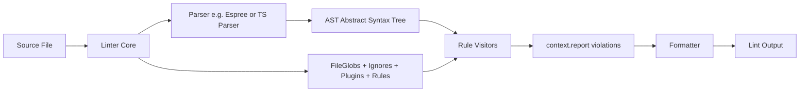

# 6.04 ESLint Flat Config

## 1. Purpose

ESLint exists to catch the class of mistakes that compilers traditionally ignore: code-quality issues that are syntactically legal but semantically suspect. JavaScript, as a dynamically typed language with implicit coercion, hoisting, and a permissive syntax, is unusually rich in footguns. `var` declarations leak out of blocks. `==` coerces in surprising ways (`[] == ![]` is `true`). Unused variables accumulate. `for-in` loops enumerate prototype keys. `eval` opens injection holes. The TypeScript compiler (see [[6.07 TSC Compiler Operation]]) catches type errors, but it does not catch stylistic drift, dead code, or convention violations. ESLint fills that gap. It parses source code into an abstract syntax tree (AST), walks the tree, runs a set of visitor functions called rules against each node, and reports violations with line numbers, messages, and (optionally) automatic fixes.

ESLint has been the dominant linter in the JavaScript ecosystem since 2013. Prior to ESLint 9, configuration lived in `.eslintrc.json`, `.eslintrc.js`, `.eslintrc.yml`, or a nested `eslintConfig` key in `package.json`. That legacy format had three structural problems. First, it was cascading: ESLint walked up the directory tree from each linted file, merging every `.eslintrc` it found, which made the effective configuration for any given file hard to predict. Second, it relied on string-based `extends` keys that resolved shareable configs through Node's module resolution algorithm, often producing surprising results in monorepos where the resolver traversed into the installed dependencies directory looking for shareable configs. Third, it was JSON or YAML by default, which meant no comments, no logic, no conditionals — every dynamic behaviour required escaping to a `.js` variant and giving up the schema validation that editors provided for JSON.

The flat config format, stabilised in ESLint 9 and the only format supported by default in ESLint 9 onward, replaces all of that with a single JavaScript module: `eslint.config.js` (or `.mjs`, `.cjs`, or `.ts` when running under a TypeScript-aware loader). The module exports an array of configuration objects. Each object can target a glob of files, declare ignores, attach plugins, set parser options, and define rules. The array is processed top-to-bottom, and later objects override earlier ones. There is no directory traversal, no `extends` string resolution, no JSON. Plugins are imported as real JavaScript values and placed into a `plugins` object literal, which means the dependency graph is explicit and statically analyzable. This format is simpler to reason about, simpler to type-check, simpler to share across packages, and dramatically simpler to extend with custom rules.

The flat config does not change what ESLint does at runtime — it still parses, walks, and reports — but it changes how teams configure the tool. With flat config, the configuration is a program, not a data file. That shift enables composition patterns (functions that build config objects), conditional logic (different rules in CI versus local), type safety (via `@eslint/js` types and `typescript-eslint` typed config helpers), and a much tighter integration with TypeScript projects. What would break, leak, or be impossible without ESLint? Code review would carry the entire burden of style enforcement, bugs like unused imports and missing `await` would ship to production, and TypeScript alone would not catch them — `tsc` is a type checker, not a linter. Section 2 unpacks the format, the parser pipeline, the rule authoring model, plugin internals, and the migration path from `.eslintrc`.

## 2. Theory and Deep Dive

### 2.1 The Flat Config File Contract

ESLint 9 looks for one of the following files in the project root, in priority order: `eslint.config.js`, `eslint.config.mjs`, `eslint.config.cjs`, `eslint.config.ts`, `eslint.config.mts`, `eslint.config.cts`. The file must export — via `module.exports` for CommonJS or `export default` for ESM — an array of configuration objects. An empty array is valid and lints nothing. Each object in the array supports a small, well-defined set of keys.

| Key | Type | Purpose |
| --- | --- | --- |
| `files` | string or string array | Globs that this config object applies to. Matched against the file being linted. |
| `ignores` | string array | Globs to exclude. Acts as a global ignore when `files` is absent. |
| `languageOptions` | object | Holds `parser`, `parserOptions`, `globals`, `ecmaVersion`, `sourceType`. |
| `plugins` | object literal | Maps plugin names to plugin objects. Plugin objects contain `rules` and optionally `configs`. |
| `rules` | object | Maps rule names (possibly `plugin/rule-name`) to severity and options. |
| `settings` | object | Shared key-value data passed to rules via `context.settings`. |
| `processor` | string or object | Extracts blocks from non-JS files (Markdown, HTML) so JS embedded in them is linted. |
| `linterOptions` | object | Currently holds `reportUnusedDisableDirectives`. |

Severity is one of three values: `"off"` (or `0`), `"warn"` (or `1`), `"error"` (or `2`). Numeric forms are accepted but the string forms are preferred for readability.

### 2.2 Array Processing Semantics

The array is the heart of flat config. ESLint walks the array once per linted file. For each config object, ESLint checks whether the object's `files` glob matches the current file and whether the `ignores` glob does not exclude it. Matching objects are merged in order. Merge semantics are additive for most keys: `rules` from later objects override individual rule entries from earlier ones, `plugins` accumulate, `languageOptions` deep-merges. A config object without a `files` key applies to every file that has not been ignored — this is the recommended pattern for global settings (parser, base rules, globals).

Because later objects override earlier ones, the conventional structure is: broad global config first, then narrow per-glob overrides last. This is the opposite of inheritance in `.eslintrc` (where the closest file wins), and the difference trips up migrators. In flat config, there is one array, in one file, processed top-to-bottom. No walk up the directory tree.

### 2.3 The ESLint Pipeline



The pipeline is deterministic and linear. ESLint reads the source text, asks the configured parser to produce an AST, then walks the AST emitting `enter` and `leave` events for each node type. Each registered rule supplies a visitor object whose keys are AST node type names (`Identifier`, `VariableDeclaration`, `CallExpression`, etc.). When ESLint enters a node of type `Identifier`, it calls every rule's `Identifier` visitor with `(node, context)`. The visitor inspects the node, optionally walks the parent chain via `node.parent`, and calls `context.report({ node, message, fix })` to emit a violation. Fixable rules also supply a `fix` function that returns a patcher; ESLint applies the patch and re-lints to confirm idempotence.

### 2.4 Parsers: Espree vs TypeScript ESLint

The default parser is Espree, a fork of Esprima maintained by the ESLint team. Espree handles standard ECMAScript through the latest spec, plus JSX. It does not understand TypeScript syntax (type annotations, generics, enums, `as` casts, `satisfies`). For TypeScript, the `@typescript-eslint/parser` package is required. It wraps the TypeScript compiler's own parser, producing an ESTree-compatible AST with TypeScript-specific node types attached as extra fields. This is why TypeScript ESLint is a "parser plus plugin" combo: the parser produces the tree, the plugin supplies the rules.

`languageOptions.parserOptions` controls parser behaviour. Common keys: `ecmaVersion` (`"latest"` by default in flat config), `sourceType` (`"module"` for ESM, `"commonjs"` for legacy, `"script"` for non-module scripts), `ecmaFeatures` (with `jsx: true` for React). For TypeScript, `parserOptions.project` points at `tsconfig.json` — required for type-aware rules (rules that need the type checker, like `no-floating-promises` or `strict-boolean-expressions`).

### 2.5 Plugins and Rules

A plugin is a JavaScript object with a `rules` property and optionally a `configs` property. In flat config, you import the plugin directly and reference its rules via the `plugin-name/rule-name` syntax. The `plugins` field in a config object maps a local alias to the imported plugin object:

```js
import jsdoc from 'eslint-plugin-jsdoc';

export default [
  { plugins: { jsdoc }, rules: { 'jsdoc/require-description': 'error' } }
];
```

This is a major simplification over `.eslintrc`, where plugin names were strings resolved through the installed dependencies directory, and rule names had to be prefixed with the same string. In flat config, the plugin is a value, not a name — the alias is purely a local label.

The `typescript-eslint` package exports a `config` helper that returns ready-made config objects, including the recommended rule set, the type-checked rule set (which requires `parserOptions.project`), and the stylistic rule set. These helpers compose naturally with the flat config array.

### 2.6 Authoring Custom Rules

A rule is a plain JavaScript object with two properties: `meta` and `create`. `meta` declares the rule's type (`"problem"`, `"suggestion"`, or `"layout"`), docs, messages (with placeholders), and whether the rule is fixable. `create` is a function `(context) => visitorObject`. The visitor object's keys are AST node type names; the values are functions receiving the node. Inside a visitor, `context.report({ node, message, data, fix })` emits a violation.

```js
const noConsoleLogRule = {
  meta: {
    type: 'problem',
    docs: { description: 'Disallow console.log in production source' },
    schema: [],
    messages: {
      unexpected: 'Unexpected console.log statement in {{file}}'
    }
  },
  create(context) {
    return {
      CallExpression(node) {
        if (
          node.callee.type === 'MemberExpression' &&
          node.callee.object.type === 'Identifier' &&
          node.callee.object.name === 'console' &&
          node.callee.property.name === 'log'
        ) {
          context.report({
            node,
            messageId: 'unexpected',
            data: { file: context.filename }
          });
        }
      }
    };
  }
};
```

A rule registered locally (not published as a plugin) is added to flat config via a `plugins` entry under an arbitrary key, then referenced by that key:

```js
export default [
  {
    plugins: { local: { rules: { 'no-console-log': noConsoleLogRule } } },
    rules: { 'local/no-console-log': 'error' }
  }
];
```

### 2.7 The AST

ESLint rules reason over an ESTree-shaped AST. Every node has a `type` string, a `range` (start and end offsets in source), and a `loc` (start and end `{line, column}`). Nodes carry their children as named properties (`ExpressionStatement` has `expression`; `BinaryExpression` has `left`, `operator`, `right`; `CallExpression` has `callee` and `arguments`). The parser attaches a `parent` pointer to each node when the `parserOptions` flag `requireExplicitChildren` is unset (default behaviour in ESLint 9). Walking the parent chain lets a rule distinguish, for example, an `Identifier` used as a reference from one used as a property name (`foo.bar` — the `bar` Identifier has parent of type `MemberExpression` with `computed: false`).

The TypeScript ESLint parser extends ESTree with TS-specific nodes: `TSPropertySignature`, `TSInterfaceDeclaration`, `TSTypeAnnotation`, `TSTypeReference`, `TSAsExpression`, `TSSatisfiesExpression`, `TSNonNullExpression`, and dozens more. Type-aware rules additionally access `context.parserServices.esTreeNodeToTSNodeMap` and `context.parserServices.program` (the TS Program) to ask the type checker questions like "is this expression of type `Promise<unknown>`?".

A practical consequence of the parent-pointer model is that rules can answer contextual questions cheaply. To check whether an `Identifier` is being declared rather than read, walk `node.parent`: a parent of type `VariableDeclarator` with `id === node` means declaration; a parent of type `MemberExpression` with `property === node` and `computed === false` means property access (not a reference); a parent of type `Property` with `key === node` and `computed === false` means object-literal key. Without these distinctions, a naive `Identifier` visitor would flag every property name as an undefined variable. The `no-unused-vars` rule spends most of its complexity on exactly this disambiguation.

Rule authors should also be aware of the `selector` engine. ESLint supports an ESQuery-like selector syntax that lets a rule listen for structural patterns instead of single node types. A selector like `'MemberExpression[object.name="console"][property.name="log"]'` matches exactly the `console.log(...)` call shape and avoids the manual inspection shown in the custom rule example earlier. Selectors are compiled to a fast matcher and run alongside plain node-type visitors, so they are the preferred approach for non-trivial patterns.

### 2.8 Migration From `.eslintrc`

ESLint 9 ships with the `@eslint/eslintrc` compatibility layer (`FlatCompat`), which translates `extends` strings and the legacy plugin resolution into flat config objects. The recommended path is:

1. Run `npx @eslint/migrate-config .eslintrc.json` to auto-generate a draft `eslint.config.js`.
2. Audit the draft: replace `extends` strings with direct imports of the corresponding packages, move globals from `env` into `languageOptions.globals`, and flatten the `overrides` array into additional top-level config objects.
3. Use `FlatCompat` only for shareable configs that have not yet published native flat-config exports. Most popular configs (including `eslint-config-prettier`, `eslint-plugin-import`, `typescript-eslint`) now ship native flat config.
4. Delete `.eslintrc.*` and `.eslintignore` (ignores now live in the flat config's `ignores` field).
5. Update the `eslint` script in `package.json` — the `--ext` flag is removed in ESLint 9; file matching is now driven by `files` globs in the config.

Section 9 walks through a complete migration exercise.

### 2.9 Ignoring Files

Ignores are first-class in flat config. A config object with only an `ignores` key acts as a global ignore list. The conventional pattern places a global ignore object first in the array:

```js
export default [
  { ignores: ['**/dist/**', '**/coverage/**', '**/*.d.ts'] },
  // ... rest of config
];
```

ESLint 9 also reads a `.gitignore` file automatically when `--gitignore` is passed on the CLI, but the canonical approach is explicit `ignores` in the config so the lint behaviour is visible in the codebase.

### 2.10 Performance Considerations

ESLint performance matters in CI and in editor integrations. Three factors dominate the runtime cost: parsing, rule traversal, and type checking. Parsing is roughly linear in source size and is rarely the bottleneck. Rule traversal is also linear in source size but multiplied by the number of registered rules; a config with 200 rules is several times slower than one with 30 rules, even if most rules never report. The dominant cost on TypeScript projects is type checking: rules like `no-floating-promises` and `no-unsafe-*` invoke the TypeScript checker, which must load the entire program (every file in `tsconfig.json`'s `include`), and the checker is by far the most expensive part of the pipeline.

Practical mitigations: scope type-checked rules to source files only (never to tests, configs, or scripts), use `projectService` (which caches the program across lint runs in the same process), enable ESLint's cache (`--cache` flag writes a `.eslintcache` file), and split the lint script into a fast `eslint .` (syntax rules only) and a slower `eslint . --rulesdir` (type-checked rules) if CI time becomes a problem. In editor integrations, the ESLint extension reuses the project service across file changes, so the type-checking cost is amortised across the session.

## 3. Mental Models

To internalise ESLint flat config, hold four mental models in parallel.

**Model 1: ESLint is an AST walker.** Source text in, AST out, rules walk the AST. Every rule is a function that runs once per matching node. The linter does not understand what your program does; it pattern-matches against tree shapes. This is why ESLint catches `no-unused-vars` (an `Identifier` node never read) but cannot catch a logical bug like `if (x = 5)` unless a rule explicitly checks for `AssignmentExpression` inside `IfStatement.test`.

**Model 2: Flat config is an array, processed top-to-bottom.** There is no inheritance, no cascade, no `.eslintrc` in a parent directory. Later objects override earlier ones for the same rule. The mental model is CSS specificity without the cascade: write the most general config first, the most specific last.

**Model 3: A plugin is a bundle of rules.** The plugin is just a JavaScript object. The `plugins` field in flat config gives it a local alias; you reference rules as `alias/rule-name`. Plugins can also ship their own config objects (the `configs` field), which are themselves arrays of flat-config objects.

**Model 4: TypeScript ESLint is a parser plus a plugin.** The parser (`@typescript-eslint/parser`) produces the tree; the plugin (`@typescript-eslint/eslint-plugin`) supplies the rules. Some rules are "syntax-only" (work without type information); others are "type-checked" (require `parserOptions.project` pointing at `tsconfig.json` and run the type checker). Type-checked rules are slower but more accurate — `no-floating-promises` cannot be implemented without knowing each call's return type.

A fifth, optional model: **flat config is a program, not a data file.** Because the config is JavaScript, you can build helpers, compose configs from packages, branch on environment variables, and type-check the whole thing with TypeScript. This is the single biggest productivity improvement over `.eslintrc` and the reason migration is worth the effort even for small projects.

## 4. Real-World Use Cases

### 4.1 Enforcing Style Consistency

The most common ESLint use case is style enforcement: prefer `const` over `let` when no rebinding occurs (`prefer-const`), ban `var` entirely (`no-var`), require arrow functions in callbacks (`prefer-arrow-callback`), enforce consistent quote style (`quotes`), and forbid trailing whitespace (`no-trailing-spaces`). With `eslint-config-prettier` (see [[6.05 Prettier Configuration]]) layered on top, ESLint delegates layout to Prettier and focuses purely on semantic style.

### 4.2 Catching Bugs Before They Ship

ESLint's `recommended` rule set catches a long tail of real bugs: `no-undef` (referencing undefined globals — though this is less useful in TypeScript, where `tsc` already catches it), `no-unused-vars` (dead variables), `no-unreachable` (code after `return`), `no-cond-assign` (assignment inside `if` conditions), `no-debugger` (leftover `debugger` statements), `no-dupe-keys` (duplicate keys in object literals), `no-irregular-whitespace` (zero-width spaces copied from chat apps). The `no-async-promise-executor` rule catches `new Promise(async (resolve) => ...)` — a pattern that swallows rejections. These are real defects, not stylistic preferences.

### 4.3 TypeScript-Specific Quality Gates

The `typescript-eslint` plugin ships rules that `tsc` cannot express: `no-explicit-any` (ban `any`), `no-unused-vars` (TS-aware version that respects type-only imports), `consistent-type-imports` (enforce `import type` for type-only imports, critical for bundlers that tree-shake type-only references), `no-floating-promises` (require `await` or explicit `.catch` on every Promise), `await-thenable` (ban `await` on non-Promise values), `no-misused-promises` (ban passing a `Promise` to an event handler expecting `void`), `strict-boolean-expressions` (catch `if (x)` where `x` could be `0` or `''`). Type-checked rules require `parserOptions.project` and add 2-5x to lint time, but they catch bugs that no other tool can.

### 4.4 Custom Rules for Team Conventions

Every team has conventions that no published rule enforces. Examples: "all React components must be exported as named, not default" (`no-default-export` from `eslint-plugin-import`), "service classes must have a `create` factory method" (custom rule matching `ClassDeclaration` with `superClass === null` and checking for a static `create` method), "no direct imports from `lodash` — use `lodash-es` for tree-shaking" (custom rule on `ImportDeclaration`), "all HTTP handlers must call `next` exactly once" (custom rule walking `CallExpression` to `next`). Custom rules codify decisions that would otherwise live only in a `CONTRIBUTING.md` file nobody reads.

### 4.5 CI Linting

A typical CI lint step runs `eslint . --max-warnings=0` and fails the build on any error or warning. With flat config, the CI script is identical to the local script — the config drives behaviour. CI should also run `tsc --noEmit` (see [[6.07 TSC Compiler Operation]]) and Prettier `--check` (see [[6.05 Prettier Configuration]]) as separate steps. See [[6.13 CI Pipeline Automation]] for the full pipeline.

### 4.6 Editor Integration

The VS Code ESLint extension reads `eslint.config.js` automatically when ESLint 9 is installed. The extension runs ESLint on every save (configurable) and surfaces violations as red squiggles. With `editor.codeActionsOnSave: { "source.fixAll.eslint": "explicit" }`, ESLint applies autofixes on save. This is the fastest feedback loop in the workflow — most fixable violations are corrected before the developer even switches to the terminal.

### 4.7 Monorepo Linting

In a monorepo with `apps/*` and `packages/*`, the root `eslint.config.js` typically imports each workspace's local config slice and applies it conditionally based on the file path. Tools like `eslint-plugin-import` with `import/no-extraneous-dependencies` enforce that workspace code only imports from declared `package.json` dependencies — critical for catching accidental cross-workspace imports. See [[6.06 Dependency Validation and Analysis]] for the dependency-side story.

### 4.8 Linting Non-JavaScript Files

Processors let ESLint lint JavaScript embedded in Markdown code blocks, HTML `<script>` tags, or Vue Single-File Components. The `eslint-plugin-markdown` processor extracts code blocks from `.md` files, and ESLint lints each as a standalone JS module. This is how documentation sites enforce that examples in README files are themselves lint-clean.

## 5. Code Examples

Every major example below is shown side-by-side in JavaScript and TypeScript. The JS variant assumes Node-style ESM with no type annotations; the TS variant adds types and uses the typed `typescript-eslint/config` helper where it adds value.

### 5.1 Example A — Minimal and Conceptual

**Goal**: A flat config that lints a small JS or TS project with the recommended rules, ignores `dist`, and bans `console.log`.

#### JavaScript variant

```js
// eslint.config.js
import js from '@eslint/js';
import globals from 'globals';

export default [
  // Global ignores
  {
    ignores: ['dist/**', 'coverage/**']
  },
  // Base recommended rules for every file
  // Note: ESLint 9 ignores the installed dependencies directory by default,
  // so an explicit entry for it is unnecessary.
  {
    files: ['**/*.js'],
    languageOptions: {
      ecmaVersion: 'latest',
      sourceType: 'module',
      globals: {
        ...globals.node,
        ...globals.es2021
      }
    },
    rules: {
      ...js.configs.recommended.rules,
      'no-console': ['error', { allow: ['warn', 'error'] }],
      'no-unused-vars': ['error', { args: 'after-used' }]
    }
  }
];
```

#### TypeScript variant

```ts
// eslint.config.ts
import js from '@eslint/js';
import tseslint from 'typescript-eslint';
import globals from 'globals';

export default tseslint.config(
  // Global ignores
  {
    ignores: ['dist/**', 'coverage/**', '**/*.d.ts']
  },
  // Base JS rules
  js.configs.recommended,
  // TypeScript recommended rules (syntax-only)
  ...tseslint.configs.recommended,
  // Type-checked rules (requires parserOptions.project)
  ...tseslint.configs.recommendedTypeChecked,
  {
    languageOptions: {
      parserOptions: {
        projectService: true,
        tsconfigRootDir: import.meta.dirname
      }
    }
  },
  // Project-specific overrides
  {
    files: ['**/*.ts', '**/*.tsx'],
    languageOptions: {
      ecmaVersion: 'latest',
      sourceType: 'module',
      globals: {
        ...globals.node,
        ...globals.browser
      }
    },
    rules: {
      'no-console': ['error', { allow: ['warn', 'error'] }],
      '@typescript-eslint/no-unused-vars': [
        'error',
        { args: 'after-used', vars: 'all' }
      ],
      '@typescript-eslint/consistent-type-imports': 'error',
      '@typescript-eslint/no-explicit-any': 'warn'
    }
  }
);
```

**Walkthrough**: The `tseslint.config` helper is a variadic function that flattens its arguments into the array ESLint expects, with one important twist: any config object passed without a `files` field is automatically scoped to `**/*.ts` and `**/*.ts` so the TypeScript rules do not run on plain `.js` files in the project. `projectService: true` enables the new `typescript-eslint` project service, which reads all `tsconfig.json` files in the workspace and assigns each linted file to the correct program — a major improvement over the legacy `project: './tsconfig.json'` option, which assumed one tsconfig per project.

### 5.2 Example B — Production-Grade

**Goal**: A typed flat config for a production Node/TS project that includes: recommended rules, type-checked rules, JSDoc enforcement, import boundary enforcement, a custom rule banning direct `console.log`, Prettier integration via `eslint-config-prettier`, and CI-friendly settings (max-warnings 0).

#### JavaScript variant (Node ESM project)

```js
// eslint.config.js
import js from '@eslint/js';
import importPlugin from 'eslint-plugin-import';
import jsdoc from 'eslint-plugin-jsdoc';
import prettierConfig from 'eslint-config-prettier';
import globals from 'globals';

const noConsoleLogRule = {
  meta: {
    type: 'problem',
    docs: { description: 'Disallow console.log in source code' },
    schema: [
      {
        type: 'object',
        properties: { allow: { type: 'array', items: { type: 'string' } } },
        additionalProperties: false
      }
    ],
    messages: {
      unexpected: 'Unexpected console.{{method}}() in {{file}}'
    }
  },
  create(context) {
    const options = context.options[0] || {};
    const allow = new Set(options.allow || ['warn', 'error', 'info']);
    return {
      CallExpression(node) {
        if (
          node.callee.type === 'MemberExpression' &&
          node.callee.object.type === 'Identifier' &&
          node.callee.object.name === 'console' &&
          node.callee.property.type === 'Identifier'
        ) {
          const method = node.callee.property.name;
          if (!allow.has(method)) {
            context.report({
              node,
              messageId: 'unexpected',
              data: { method, file: context.filename }
            });
          }
        }
      }
    };
  }
};

export default [
  // 1. Global ignores
  {
    ignores: [
      'dist/**',
      'coverage/**',
      '**/*.d.ts',
      'scripts/**'
    ]
  },
  // 2. Base JS recommended
  js.configs.recommended,
  // 3. Plugin bindings (no rules yet)
  {
    plugins: {
      import: importPlugin,
      jsdoc,
      local: { rules: { 'no-console-log': noConsoleLogRule } }
    }
  },
  // 4. All JS files
  {
    files: ['**/*.js', '**/*.mjs', '**/*.cjs'],
    languageOptions: {
      ecmaVersion: 'latest',
      sourceType: 'module',
      globals: { ...globals.node }
    },
    settings: {
      'import/resolver': {
        node: { extensions: ['.js', '.mjs', '.cjs'] }
      }
    },
    rules: {
      'no-console': 'off', // handled by custom rule
      'no-unused-vars': ['error', { args: 'after-used' }],
      'import/no-unresolved': 'error',
      'import/no-extraneous-dependencies': 'error',
      'import/order': [
        'error',
        {
          groups: ['builtin', 'external', 'internal', 'parent', 'sibling', 'index'],
          'newlines-between': 'always',
          alphabetize: { order: 'asc', caseInsensitive: true }
        }
      ],
      'jsdoc/require-jsdoc': [
        'error',
        { contexts: ['ExportNamedDeclaration > FunctionDeclaration'] }
      ],
      'jsdoc/require-param': 'error',
      'jsdoc/require-returns': 'error',
      'local/no-console-log': ['error', { allow: ['warn', 'error'] }]
    }
  },
  // 5. Test files: relaxed
  {
    files: ['**/*.test.js', '**/*.spec.js', 'tests/**/*.js'],
    rules: {
      'jsdoc/require-jsdoc': 'off',
      'local/no-console-log': 'off'
    }
  },
  // 6. Prettier: turn off conflicting rules LAST
  prettierConfig
];
```

#### TypeScript variant (Node + TS project with type-checked rules)

```ts
// eslint.config.ts
import js from '@eslint/js';
import tseslint from 'typescript-eslint';
import importPlugin from 'eslint-plugin-import';
import jsdoc from 'eslint-plugin-jsdoc';
import prettierConfig from 'eslint-config-prettier';
import globals from 'globals';

type ConsoleLogOptions = { allow?: string[] };

const noConsoleLogRule = {
  meta: {
    type: 'problem' as const,
    docs: { description: 'Disallow console.log in source code' },
    schema: [
      {
        type: 'object',
        properties: {
          allow: { type: 'array', items: { type: 'string' } }
        },
        additionalProperties: false
      }
    ],
    messages: {
      unexpected: 'Unexpected console.{{method}}() in {{file}}'
    }
  },
  create(context: { options: ConsoleLogOptions[]; filename: string; report: (r: { node: unknown; messageId: string; data: Record<string, string> }) => void }) {
    const options = context.options[0] || {};
    const allow = new Set(options.allow || ['warn', 'error', 'info']);
    return {
      CallExpression(node: {
        callee: {
          type: string;
          object?: { type: string; name?: string };
          property?: { type: string; name?: string };
        };
      }) {
        const callee = node.callee;
        if (
          callee.type === 'MemberExpression' &&
          callee.object &&
          callee.object.type === 'Identifier' &&
          callee.object.name === 'console' &&
          callee.property &&
          callee.property.type === 'Identifier'
        ) {
          const method = callee.property.name;
          if (method && !allow.has(method)) {
            context.report({
              node,
              messageId: 'unexpected',
              data: { method, file: context.filename }
            });
          }
        }
      }
    };
  }
};

export default tseslint.config(
  // 1. Global ignores
  {
    ignores: [
      'dist/**',
      'coverage/**',
      '**/*.d.ts',
      'scripts/**'
    ]
  },
  // 2. Base JS + TS recommended
  js.configs.recommended,
  ...tseslint.configs.recommended,
  ...tseslint.configs.recommendedTypeChecked,
  ...tseslint.configs.stylistic,
  // 3. Type-checked parser options
  {
    languageOptions: {
      parserOptions: {
        projectService: true,
        tsconfigRootDir: import.meta.dirname
      }
    }
  },
  // 4. Plugin bindings
  {
    plugins: {
      import: importPlugin,
      jsdoc,
      local: { rules: { 'no-console-log': noConsoleLogRule } }
    }
  },
  // 5. All TS files
  {
    files: ['**/*.ts', '**/*.tsx'],
    languageOptions: {
      ecmaVersion: 'latest',
      sourceType: 'module',
      globals: { ...globals.node, ...globals.browser }
    },
    settings: {
      'import/resolver': {
        typescript: { alwaysTryTypes: true }
      }
    },
    rules: {
      'no-console': 'off',
      '@typescript-eslint/no-unused-vars': [
        'error',
        { args: 'after-used', vars: 'all' }
      ],
      '@typescript-eslint/consistent-type-imports': [
        'error',
        { prefer: 'type-imports', fixStyle: 'separate-type-imports' }
      ],
      '@typescript-eslint/no-floating-promises': 'error',
      '@typescript-eslint/await-thenable': 'error',
      '@typescript-eslint/no-misused-promises': 'error',
      '@typescript-eslint/no-explicit-any': 'warn',
      'import/no-unresolved': 'error',
      'import/no-extraneous-dependencies': 'error',
      'import/order': [
        'error',
        {
          groups: ['builtin', 'external', 'internal', 'parent', 'sibling', 'index'],
          'newlines-between': 'always',
          alphabetize: { order: 'asc', caseInsensitive: true }
        }
      ],
      'jsdoc/require-jsdoc': [
        'error',
        { contexts: ['ExportNamedDeclaration > FunctionDeclaration'] }
      ],
      'local/no-console-log': ['error', { allow: ['warn', 'error'] }]
    }
  },
  // 6. Test files: relaxed
  {
    files: ['**/*.test.ts', '**/*.spec.ts', 'tests/**/*.ts'],
    rules: {
      'jsdoc/require-jsdoc': 'off',
      '@typescript-eslint/no-explicit-any': 'off',
      'local/no-console-log': 'off'
    }
  },
  // 7. Prettier integration: turn off conflicting rules LAST
  prettierConfig
);
```

**Key points**: The TypeScript variant uses `tseslint.config` so the type-checked rule sets (which require `parserOptions.project`) are correctly scoped to `.ts`/`.tsx` files only — running type-checked rules on `.js` files would throw because there is no tsconfig entry for them. `projectService: true` is the modern replacement for `project: './tsconfig.json'`; it auto-discovers all tsconfigs in the workspace. The Prettier config is always last in the array, ensuring that any stylistic ESLint rules from upstream configs are turned off after they were enabled. The custom rule is wrapped in a local plugin so it can be referenced as `local/no-console-log`.

## 6. Common Mistakes and Anti-Patterns

### 6.1 Linting TypeScript Without `typescript-eslint`

A frequent mistake is to install only ESLint and expect it to lint `.ts` files. The default Espree parser cannot read type annotations and crashes on `let x: number = 5`. Even if you swap in `@typescript-eslint/parser` without the plugin, you get parsing but no TS-specific rules — `no-unused-vars` still runs in JS mode and reports false positives on type-only imports. The fix is always the combo: `@typescript-eslint/parser` (parser) and `@typescript-eslint/eslint-plugin` (rules), best consumed via the `typescript-eslint` meta-package which exports both plus the `config` helper.

### 6.2 Conflicting Rules With Prettier

ESLint's `recommended` set historically included `quotes`, `semi`, `indent`, `no-mixed-spaces-and-tabs`, and other layout rules. Prettier (see [[6.05 Prettier Configuration]]) owns layout; if ESLint also enforces layout, the two fight, and `eslint --fix` followed by `prettier --write` produces a different file than the reverse — causing CI churn. The fix is to install `eslint-config-prettier` and place it last in the flat config array. It turns off every ESLint rule that conflicts with Prettier. The order matters: it must come after every other config that might enable a layout rule.

### 6.3 Enabling Every Available Rule

New teams sometimes enable the `recommended`, `recommended-type-checked`, `strict`, `strict-type-checked`, and `stylistic` rule sets all at once and add `eslint-plugin-sonarjs`, `eslint-plugin-functional`, and `eslint-plugin-jsx-a11y` on top. The result is a config that reports 800 violations on a clean codebase, half of them contradictory, with a 30-second lint time on a 200-file project. Lint output that noisy gets ignored. The fix is to start with `recommended` only, add rule sets incrementally, and auto-fix or `eslint-disable` the legacy code rather than enabling 50 rules and drowning in warnings.

### 6.4 Wrong `ignores` Patterns

Common ignore mistakes: forgetting `**/` prefix (`dist/**` matches `dist/` anywhere; `dist/**` without `**/dist/**` matches only top-level `dist`), forgetting that flat config `ignores` are relative to the config file location, ignoring `*.d.ts` files (they are generated and linting them produces nonsense errors from `@typescript-eslint/no-empty-interface` and friends), and not ignoring `*.config.{js,ts}` tooling files which often need relaxed rules. The pattern `'**/*.{js,ts}'` is correct; `'*.js'` without `**/` matches only top-level files.

### 6.5 Not Running ESLint in CI

A local config that nobody enforces is decoration. CI must run `eslint . --max-warnings=0` (or `--max-warnings=N` for a deliberate budget) on every pull request, and the build must fail on errors. Without CI enforcement, the config rots — developers add `eslint-disable` comments, the rule set drifts, and the lint step is removed when it gets too noisy. See [[6.13 CI Pipeline Automation]] for the complete CI pattern.

### 6.6 Custom Rules With Wrong AST Node Types

Custom rule authors often guess at AST node type names. The node type for `foo` in `foo.bar` is `Identifier`, but the node type for `foo` in `class Foo {}` is also `Identifier` (the `id` property of `ClassDeclaration`). The node type for `await x` is `AwaitExpression`, not `AwaitStatement`. The node type for `import x from 'y'` is `ImportDeclaration`, but the imported binding `x` is an `ImportDefaultSpecifier` whose `local` is the `Identifier`. Authors who write visitors against guessed names find their rules never fire. The fix is to use `@typescript-eslint/typescript-estree`'s `TSESTree` node type definitions or the online AST Explorer (https://astexplorer.net) to confirm node types before writing the visitor.

### 6.7 Type-Checked Rules Without `parserOptions.project`

Type-checked rules (`no-floating-promises`, `await-thenable`, `no-misused-promises`, `strict-boolean-expressions`, `no-unsafe-assignment`, etc.) need the TypeScript Program to query types. Without `parserOptions.project` (or the modern `projectService: true`), `typescript-eslint` throws an error at lint time: "Error: Error while loading rule '@typescript-eslint/no-floating-promises': You have used a rule which requires parserServices to be generated." The fix is to set `projectService: true` and ensure `tsconfig.json` includes every file ESLint lints. Files not in the tsconfig's `include` produce the cryptic "file is not in the project" error.

### 6.8 Using `no-undef` With TypeScript

The `no-undef` rule (from `js.configs.recommended`) checks that every referenced identifier is defined as a global or imported. In TypeScript, `tsc` already catches undefined references with better accuracy, and `no-undef` produces false positives on type-only references, enums, and namespace imports. The fix is to disable `no-undef` for `.ts`/`.tsx` files: `rules: { 'no-undef': 'off' }` in the TS-scoped config block. The `typescript-eslint` recommended configs already do this for you, but if you build your own config from scratch, it is a common gotcha.

### 6.9 Putting `eslint-config-prettier` First in the Array

Because flat config merges top-to-bottom with later overrides earlier, placing `prettierConfig` (which turns off layout rules) first means any subsequent config object that re-enables `quotes` or `semi` undoes the Prettier integration. `eslint-config-prettier` must always be the last element in the array.

## 7. Best Practices and Design Patterns

### 7.1 Always Use `typescript-eslint` for TS Projects

The `typescript-eslint` meta-package (`npm i -D typescript-eslint`) is the canonical entry point. It exports the parser, the plugin, the `config` helper, and the rule presets. Use `tseslint.config(...)` to build the array — it handles the scoping of TS-only rules to `.ts`/`.tsx` files automatically and provides type inference for the config objects (auto-completion in editors, type errors on typos).

### 7.2 Use `projectService` Over `project`

The legacy `parserOptions.project: './tsconfig.json'` assumed a single tsconfig. In any monorepo or project with multiple tsconfigs (`tsconfig.json`, `tsconfig.build.json`, `tsconfig.test.json`), this breaks. `projectService: true` enables the new project service, which auto-detects all tsconfigs, assigns each file to the right program, and reports clear errors when a file is not included in any tsconfig. It also dramatically improves lint performance on large projects because the type checker caches per-program.

### 7.3 Layer Prettier Last

`eslint-config-prettier` is always the last array element. If you compose configs from a shared library (e.g., `@your-org/eslint-config`), that library should also export Prettier as the last element of its own array, and consumers should not re-add it (or, if they do, it is idempotent — re-disabling already-disabled rules is a no-op).

### 7.4 Keep Rules Focused

A good rule set has 30-60 active rules, not 200. The recommended sets (`js.configs.recommended`, `tseslint.configs.recommended`) are well-curated. Add rules deliberately, one at a time, with the team's buy-in. Each new rule should fix a real bug that has occurred, not a hypothetical one. Rules that produce more than 10% false positives should be downgraded from `error` to `warn` or removed.

### 7.5 Use `ignores` Generously for Build Artifacts

Anything that is generated (`dist/`, `coverage/`, `*.d.ts` for type-only packages, `.next/`, `build/`, `out/`) should be in the global `ignores`. Linting generated code is wasted CI time and produces noise. The pattern `'**/*.d.ts'` is important: declaration files are emitted by `tsc` and re-linting them is meaningless.

### 7.6 Run ESLint in CI With `--max-warnings=0`

A config with `warn` severity on noisy rules is useful locally, but CI should treat warnings as failures. The `--max-warnings=0` flag enforces this. If a deliberate warning budget is needed (e.g., during a migration), set `--max-warnings=N` and decrement over time. See [[6.13 CI Pipeline Automation]].

### 7.7 Use Editor Integration With Autofix on Save

VS Code's ESLint extension, configured with `editor.codeActionsOnSave: { "source.fixAll.eslint": "explicit" }`, applies autofixes on every save. This eliminates an entire class of trivial violations (missing semicolons, wrong quote style, unused imports) before they ever reach version control. The feedback loop is sub-second and reduces the cognitive load of "did I follow the rules?" to zero.

### 7.8 Document Custom Rules

Every custom rule should have a `meta.docs.description`, a `meta.docs.url` (linking to an internal wiki page explaining the rationale and exceptions), and example code in the test fixture. Custom rules without tests rot; use `@eslint/eslint-plugin-test-scenarios` or the rule tester from `eslint` (`RuleTester`) to assert that the rule fires on bad code and does not fire on good code.

### 7.9 Compose Configs From Shareable Functions

Because flat config is JavaScript, a shareable config can export a function:

```ts
// packages/eslint-config/index.ts
import js from '@eslint/js';
import tseslint from 'typescript-eslint';

export function baseConfig(options: { projectType: 'app' | 'lib' }) {
  return tseslint.config(
    js.configs.recommended,
    ...tseslint.configs.recommended,
    {
      rules: {
        '@typescript-eslint/no-explicit-any':
          options.projectType === 'app' ? 'warn' : 'error'
      }
    }
  );
}
```

Consumers call `baseConfig({ projectType: 'lib' })` and spread the result into their own array. This is the recommended pattern for monorepos and organisations.

### 7.10 Use `linterOptions.reportUnusedDisableDirectives`

```js
{
  linterOptions: { reportUnusedDisableDirectives: 'error' }
}
```

This catches `// eslint-disable-next-line` comments that no longer suppress any violation — usually because the rule was removed or the code was refactored. Stale disable directives accumulate and hide real violations; this setting keeps them honest.

## 8. Technical Interview Knowledge

**Q1: What is ESLint?**
A: ESLint is a pluggable JavaScript and TypeScript linter. It parses source code into an AST, runs visitor functions called rules against each AST node, and reports violations as warnings or errors. Unlike a compiler, it does not transform or execute code; it inspects it. Unlike Prettier, it focuses on semantic quality and bug detection, not layout. ESLint is extensible through plugins (bundles of rules) and custom rules (developer-authored visitor functions).

**Q2: What is flat config and why was it introduced?**
A: Flat config is the ESLint 9+ configuration format. A single `eslint.config.js` file exports an array of config objects, processed top-to-bottom with later overrides earlier. It replaced `.eslintrc` (JSON/YAML/JS in cascading files) because the legacy format had three problems: directory-walking cascades were hard to reason about, `extends` strings resolved through the installed dependencies directory unpredictably in monorepos, and JSON/YAML could not express logic. Flat config is a JavaScript module, so configs can be typed, composed, and conditionally built.

**Q3: How do you configure ESLint for a TypeScript project?**
A: Install `typescript-eslint` (`npm i -D typescript-eslint eslint @eslint/js`). Use the `tseslint.config` helper to build the array. Include `js.configs.recommended`, `...tseslint.configs.recommended` (syntax rules), and `...tseslint.configs.recommendedTypeChecked` (type-checked rules). For type-checked rules, set `languageOptions.parserOptions.projectService: true` and `tsconfigRootDir: import.meta.dirname`. The `tseslint.config` helper automatically scopes TS rules to `.ts`/`.tsx` files. Disable `no-undef` for TS files (handled by `tsc`).

**Q4: How do you write a custom ESLint rule?**
A: A rule is an object with `meta` and `create`. `meta` declares type (`'problem'`, `'suggestion'`, `'layout'`), docs, schema (options), messages (with `{{placeholder}}`), and `fixable` (`'code'` or `'whitespace'`). `create(context)` returns a visitor object whose keys are AST node type names (`Identifier`, `CallExpression`, etc.) and whose values are functions receiving the node. Inside a visitor, call `context.report({ node, messageId, data, fix })` to emit a violation. Register the rule in a `plugins` object under a local alias and reference it as `alias/rule-name`. Test with `RuleTester` from `eslint`.

**Q5: How do you migrate from `.eslintrc` to flat config?**
A: Run `npx @eslint/migrate-config .eslintrc.json` to generate a draft. Replace `extends` strings with direct imports of the corresponding packages (most popular configs now ship native flat config). Move `env` keys into `languageOptions.globals` (use the `globals` package). Flatten `overrides` into additional top-level config objects ordered from general to specific. Delete `.eslintrc.*` and `.eslintignore` (ignores move into `ignores` field). Remove the `--ext` flag from the lint script. For shareable configs that have not yet migrated, use `FlatCompat` from `@eslint/eslintrc` as a shim.

**Q6: How do you integrate ESLint with Prettier?**
A: Install `eslint-config-prettier`. Add it as the last element in the flat config array. It turns off every ESLint rule that conflicts with Prettier's output (layout rules like `quotes`, `semi`, `indent`). The order matters: Prettier config must come after every other config that might enable a layout rule. Do not use `eslint-plugin-prettier` (which runs Prettier as an ESLint rule) — the modern recommendation is to run Prettier separately via `prettier --check` in CI and format-on-save in the editor, with ESLint only handling semantics.

**Q7: How do you run ESLint in CI?**
A: Add a script `"lint": "eslint ."` to `package.json`. In CI, run `npm run lint -- --max-warnings=0` so warnings fail the build. Cache the installed dependencies and the TypeScript program (via `projectService`) to speed up subsequent runs. Run `tsc --noEmit` and `prettier --check .` as separate CI steps. The full pipeline is `lint && typecheck && format-check && test`. See [[6.13 CI Pipeline Automation]].

**Q8: What is the AST and why does ESLint use it?**
A: The AST (Abstract Syntax Tree) is a tree representation of source code where each node is a syntactic construct (variable declaration, function call, identifier, etc.). ESLint uses the AST because rule authors need to reason about structure, not text. A rule like `no-unused-vars` walks `Identifier` nodes and checks whether each is referenced; this is trivial on the AST and nearly impossible with regex. ESLint uses the ESTree specification (Espree's output) or, for TypeScript, the `@typescript-eslint/parser` output (ESTree plus TS-specific node types). Type-aware rules additionally map ESTree nodes to TypeScript compiler nodes to query the type checker.

## 9. Practical Exercises

### Exercise 1: Flat Config for a TypeScript Project

**Task**: Create a flat config for a Node TypeScript project that lints `src/**/*.ts`, ignores `dist/`, uses recommended rules plus `no-explicit-any` as an error, and integrates Prettier.

**Solution**:

```ts
// eslint.config.ts
import js from '@eslint/js';
import tseslint from 'typescript-eslint';
import prettierConfig from 'eslint-config-prettier';
import globals from 'globals';

export default tseslint.config(
  { ignores: ['dist/**', '**/*.d.ts'] },
  js.configs.recommended,
  ...tseslint.configs.recommended,
  {
    files: ['src/**/*.ts'],
    languageOptions: {
      ecmaVersion: 'latest',
      sourceType: 'module',
      globals: { ...globals.node }
    },
    rules: {
      '@typescript-eslint/no-explicit-any': 'error',
      '@typescript-eslint/no-unused-vars': [
        'error',
        { args: 'after-used' }
      ]
    }
  },
  prettierConfig
);
```

Add to `package.json`:
```json
{
  "scripts": {
    "lint": "eslint .",
    "lint:fix": "eslint . --fix"
  }
}
```

Run `npm run lint` to verify. If `parserOptions.projectService` is needed for type-checked rules, add it to the `languageOptions` block.

### Exercise 2: Custom Rule

**Task**: Write a custom rule that disallows the `any` type annotation in TypeScript function parameters. The rule should report on `function foo(x: any) {}` and `(x: any) => {}` but allow `any` in type aliases and casts.

**Solution**:

```ts
// rules/no-any-param.ts
import type { TSESTree } from '@typescript-eslint/utils';
import { createRule } from '@typescript-eslint/utils/eslint-utils';

type MessageIds = 'noAnyParam';

export const noAnyParamRule = createRule<[], MessageIds>({
  name: 'no-any-param',
  meta: {
    type: 'problem',
    docs: {
      description: 'Disallow `any` type annotation on function parameters'
    },
    schema: [],
    messages: {
      noAnyParam:
        'Parameter {{param}} has type `any`; use `unknown` and narrow instead.'
    }
  },
  defaultOptions: [],
  create(context) {
    function checkParam(param: TSESTree.Parameter) {
      if (
        param.type === 'Identifier' &&
        param.typeAnnotation &&
        param.typeAnnotation.typeAnnotation.type === 'TSAnyKeyword'
      ) {
        context.report({
          node: param,
          messageId: 'noAnyParam',
          data: { param: param.name }
        });
      }
    }

    return {
      FunctionDeclaration(node) {
        node.params.forEach(checkParam);
      },
      FunctionExpression(node) {
        node.params.forEach(checkParam);
      },
      ArrowFunctionExpression(node) {
        node.params.forEach(checkParam);
      }
    };
  }
});
```

Register and use it:

```ts
// eslint.config.ts
import tseslint from 'typescript-eslint';
import { noAnyParamRule } from './rules/no-any-param';

export default tseslint.config(
  {
    plugins: {
      local: { rules: { 'no-any-param': noAnyParamRule } }
    },
    rules: {
      'local/no-any-param': 'error'
    }
  }
);
```

Test it with `RuleTester`:

```ts
import { RuleTester } from 'eslint';
import { noAnyParamRule } from './rules/no-any-param';

const ruleTester = new RuleTester({
  languageOptions: {
    parserOptions: { projectService: false }
  }
});

ruleTester.run('no-any-param', noAnyParamRule, {
  valid: [
    'function foo(x: unknown) {}',
    'function foo(x: string) {}',
    'const foo = (x: number) => x;'
  ],
  invalid: [
    {
      code: 'function foo(x: any) {}',
      errors: [{ messageId: 'noAnyParam', data: { param: 'x' } }]
    },
    {
      code: 'const foo = (x: any) => x;',
      errors: [{ messageId: 'noAnyParam', data: { param: 'x' } }]
    }
  ]
});
```

### Exercise 3: Integrate With Prettier

**Task**: Add Prettier integration to an existing flat config so that ESLint does not fight Prettier on layout, and add a CI script that runs both.

**Solution**:

Install dependencies:
```bash
npm i -D eslint-config-prettier prettier
```

Add Prettier as the last array element:

```ts
// eslint.config.ts
import js from '@eslint/js';
import tseslint from 'typescript-eslint';
import prettierConfig from 'eslint-config-prettier';

export default tseslint.config(
  js.configs.recommended,
  ...tseslint.configs.recommended,
  {
    rules: {
      '@typescript-eslint/no-explicit-any': 'warn'
    }
  },
  // MUST be last
  prettierConfig
);
```

Add scripts to `package.json`:

```json
{
  "scripts": {
    "lint": "eslint .",
    "format": "prettier --write .",
    "format:check": "prettier --check .",
    "ci": "npm run lint && npm run format:check && tsc --noEmit && npm test"
  }
}
```

Add a `.prettierrc.json`:

```json
{
  "semi": true,
  "singleQuote": true,
  "trailingComma": "all",
  "printWidth": 80
}
```

Verify: `npm run format` then `npm run lint` should produce no layout conflicts.

### Exercise 4: Diagnose a Rule Conflict

**Task**: A team reports that `eslint --fix` reorders imports in a way that conflicts with Prettier's formatting, causing a loop where saving in the editor applies ESLint fixes, then Prettier reformats differently, then ESLint re-applies its fixes. Diagnose and fix.

**Diagnosis steps**:

1. Check the flat config array order. Is `prettierConfig` last?
2. Check which rule is causing the import reordering. Likely `import/order` from `eslint-plugin-import`.
3. Check whether `eslint-config-prettier` disables `import/order`. It does not — `import/order` is not a layout rule in Prettier's sense, but its `newlines-between` and alphabetize options produce output that Prettier does not reformat.
4. The actual conflict is usually `import/order` with `newlines-between: 'always'` producing blank lines that Prettier collapses, or Prettier's `printWidth` wrapping long import statements that `import/order` then unwraps.

**Fix**:

Option A: Disable `newlines-between` in `import/order`:
```ts
'import/order': [
  'error',
  {
    groups: ['builtin', 'external', 'internal', 'parent', 'sibling', 'index'],
    // Remove newlines-between or set to 'never'
    'newlines-between': 'never',
    alphabetize: { order: 'asc', caseInsensitive: true }
  }
]
```

Option B: Use `eslint-plugin-import` with `eslint-plugin-prettier` to run Prettier as the final fixer (not recommended by Prettier team, but works).

Option C: Use a dedicated import sorter that is Prettier-aware, like `@ianvs/prettier-plugin-sort-imports`, and disable `import/order` entirely.

Verify the fix by running `eslint --fix file.ts && prettier --write file.ts && eslint --fix file.ts` — the file should not change between the second and third invocations (idempotence).

## 10. Mini-Project Blueprint

**Project**: Build a typed ESLint config package for an organisation.

**Goal**: Produce an npm package `@your-org/eslint-config` that exports a function `createConfig(options)` returning a flat config array. The package should support TypeScript projects, include custom rules, integrate with Prettier, and be CI-ready.

**Structure**:

```
packages/eslint-config/
  package.json
  tsconfig.json
  src/
    index.ts
    base.ts
    typescript.ts
    react.ts
    node.ts
    rules/
      no-console-log.ts
      no-default-export-component.ts
      require-error-boundary.ts
    tests/
      no-console-log.test.ts
      no-default-export-component.test.ts
      require-error-boundary.test.ts
```

**Implementation outline**:

`src/index.ts`:
```ts
import { baseConfig } from './base.js';
import { typescriptConfig } from './typescript.js';
import { reactConfig } from './react.js';
import { nodeConfig } from './node.js';

export type ConfigOptions = {
  projectType: 'app' | 'lib';
  framework?: 'react' | 'node' | 'none';
  enableTypeChecked?: boolean;
  enablePrettier?: boolean;
};

export function createConfig(options: ConfigOptions) {
  const configs = [
    ...baseConfig(options),
    ...typescriptConfig(options),
    options.framework === 'react' ? ...reactConfig(options) : [],
    options.framework === 'node' ? ...nodeConfig(options) : []
  ].flat();
  return configs;
}
```

`src/base.ts`:
```ts
import js from '@eslint/js';
import prettierConfig from 'eslint-config-prettier';
import { noConsoleLogRule } from './rules/no-console-log.js';

export function baseConfig(options: { projectType: 'app' | 'lib' }) {
  return [
    {
      ignores: ['dist/**', 'coverage/**', '**/*.d.ts']
    },
    js.configs.recommended,
    {
      plugins: {
        local: { rules: { 'no-console-log': noConsoleLogRule } }
      },
      rules: {
        'local/no-console-log':
          options.projectType === 'lib' ? 'error' : 'warn',
        'no-unused-vars': 'off' // handled by TS variant
      }
    }
  ];
}
```

`src/typescript.ts`:
```ts
import tseslint from 'typescript-eslint';
import type { ConfigOptions } from './index.js';

export function typescriptConfig(options: ConfigOptions) {
  const base = [
    ...tseslint.configs.recommended,
    ...(options.enableTypeChecked
      ? tseslint.configs.recommendedTypeChecked
      : [])
  ];
  return [
    ...base,
    {
      languageOptions: {
        parserOptions: {
          projectService: options.enableTypeChecked,
          tsconfigRootDir: import.meta.dirname
        }
      },
      rules: {
        '@typescript-eslint/no-explicit-any':
          options.projectType === 'lib' ? 'error' : 'warn',
        '@typescript-eslint/consistent-type-imports': 'error',
        '@typescript-eslint/no-unused-vars': [
          'error',
          { args: 'after-used' }
        ]
      }
    }
  ];
}
```

`src/rules/no-console-log.ts`: (from Example B)

`src/rules/no-default-export-component.ts`:
```ts
import { createRule } from '@typescript-eslint/utils/eslint-utils';

export const noDefaultExportComponentRule = createRule({
  name: 'no-default-export-component',
  meta: {
    type: 'problem',
    docs: { description: 'Disallow default exports for React components' },
    schema: [],
    messages: {
      noDefault:
        'React component {{name}} must use a named export, not default.'
    }
  },
  defaultOptions: [],
  create(context) {
    return {
      ExportDefaultDeclaration(node) {
        const decl = node.declaration;
        if (
          decl.type === 'FunctionDeclaration' ||
          (decl.type === 'Identifier' && /^[A-Z]/.test(decl.name))
        ) {
          const name =
            decl.type === 'FunctionDeclaration' && decl.id
              ? decl.id.name
              : decl.type === 'Identifier'
              ? decl.name
              : 'Anonymous';
          context.report({
            node,
            messageId: 'noDefault',
            data: { name }
          });
        }
      }
    };
  }
});
```

**CI integration** in the consumer project:

```yaml
# .github/workflows/ci.yml
name: CI
on: push
jobs:
  lint:
    runs-on: ubuntu-latest
    steps:
      - uses: actions/checkout@v4
      - uses: actions/setup-node@v4
        with:
          node-version: 20
          cache: npm
      - run: npm ci
      - run: npm run lint -- --max-warnings=0
      - run: npm run format:check
      - run: npx tsc --noEmit
      - run: npm test
```

**Deliverables**: The package exports `createConfig` with full TypeScript types, ships three custom rules with tests, integrates Prettier, and includes a CI workflow template in the README. Consumers install `@your-org/eslint-config`, call `createConfig({ projectType: 'app', framework: 'react', enableTypeChecked: true, enablePrettier: true })`, and get a production-ready lint setup in one line.

## 11. Core Connections

- [[6.05 Prettier Configuration]] — The formatter that owns layout; integrate via `eslint-config-prettier` placed last in the flat config array.
- [[6.06 Dependency Validation and Analysis]] — `eslint-plugin-import` rules like `no-extraneous-dependencies` enforce declared dependencies, complementing dependency analysis tools.
- [[1.01 Syntax and Lexical Structure]] — The AST that ESLint walks is a direct reflection of ECMAScript syntax; understanding lexical structure (tokens, hoisting, scope) is prerequisite to writing rules.
- [[6.07 TSC Compiler Operation]] — `tsc` is the type checker; ESLint is the linter. Type-checked ESLint rules reuse the TypeScript Program via `@typescript-eslint/parser`.
- [[4.12 Code Smells]] — Many ESLint rules codify code smells (`no-unused-vars`, `no-any`, `no-magic-numbers`); the rule set is the executable expression of a team's smell catalogue.
- [[6.13 CI Pipeline Automation]] — ESLint runs as a CI step with `--max-warnings=0`; the full pipeline is `lint && typecheck && format-check && test`.

---

**Summary**: ESLint flat config (ESLint 9+) replaces the cascading `.eslintrc` format with a single JavaScript module exporting an array of config objects, processed top-to-bottom. The format enables TypeScript types, plugin imports as values, and compositional helpers like `tseslint.config`. TypeScript projects use the `typescript-eslint` meta-package (parser plus plugin), with type-checked rules requiring `projectService: true`. Custom rules are objects with `meta` and `create(context)`, registered under a local plugin alias. Prettier integration is `eslint-config-prettier` placed last in the array. CI runs `eslint . --max-warnings=0`. The reader should now be able to write a flat config for TS, write a custom rule, integrate with Prettier, and run ESLint in CI.
