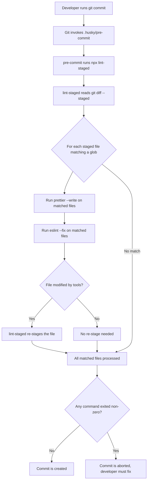
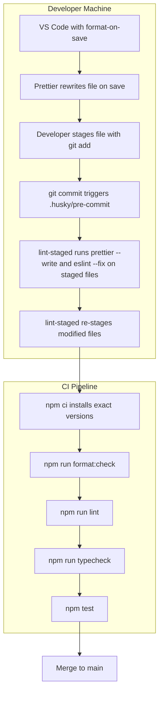

# 6.05 Prettier Configuration

## 1. Purpose

Prettier exists to end a single, expensive, recurring argument: how should this code look? Tabs versus spaces. Single quotes versus double quotes. Semicolons or none. Trailing commas or none. Where to break a long call chain. Whether to wrap a conditional. These style debates have consumed more engineering hours than almost any other class of discussion in the JavaScript and TypeScript ecosystems. Prettier resolves them by being aggressively opinionated: it parses the source into an abstract syntax tree, throws away nearly every original formatting decision, and reprints the tree using a fixed, deterministic algorithm with only a handful of user-tunable knobs.

The real-world problem Prettier solves is multi-faceted. First, it eliminates review noise. Code reviewers stop leaving nits about whitespace and start reviewing logic. Second, it eliminates format drift. Without an automated formatter, every team member's editor leaves a slightly different footprint in the file, and `git blame` becomes a parade of "fixed indentation" commits that obscure the real history. Third, it lowers the cognitive cost of writing. The developer types code in any layout that feels comfortable, hits save, and the formatter normalises it to the team standard before it ever reaches version control.

Prettier is not a linter. ESLint (see [[6.04 ESLint Flat Config]]) finds bugs: unused variables, unreachable code, hooks-rule violations, type-unsafe patterns. Prettier finds nothing. It does not warn, it does not error. It rewrites. The two tools operate on different planes: ESLint reasons about semantics and quality; Prettier reasons purely about layout. A professional codebase uses both, and the integration must be deliberate, because ESLint has historically shipped formatting rules (`max-len`, `quotes`, `semi`, `indent`) that collide head-on with Prettier's output. The recommended integration is to install `eslint-config-prettier`, which turns off every ESLint rule that conflicts with Prettier, so the two tools never fight over the same byte.

What would break, leak, or be impossible without Prettier? Without it, every team either (a) writes a long `.eslintrc` style section and reviews it forever, (b) ignores style entirely and watches the codebase fragment, or (c) adopts a partial formatter that handles one syntax (e.g., TypeScript files but not CSS or Markdown). Prettier's cross-language reach (JavaScript, TypeScript, JSX, TSX, JSON, CSS, SCSS, Less, HTML, Vue, Angular, Markdown, MDX, YAML, GraphQL, plus plugin languages) means a single tool and a single config govern the visual identity of an entire repository. That uniformity is the value.

The opinionated stance is the feature, not a limitation. Prettier's maintainers have deliberately rejected hundreds of configuration requests over the years. The reasoning is direct: every new option multiplies the number of possible style combinations and reignites the very debate the tool was built to extinguish. By keeping the option set small (around a dozen core knobs), Prettier guarantees that any two teams using it converge on visually similar code, and any engineer moving between projects recognises the layout instantly. Section 2 unpacks the full configuration surface, the ESLint integration story, and the pre-commit pipeline (Husky plus lint-staged) that makes "ugly code never lands in `main`" a fact rather than a hope.

## 2. Theory and Deep Dive

### 2.1 How Prettier Works Internally

Prettier is not a regex-based reformatter. It uses real parsers. For JavaScript and TypeScript, it uses a forked version of the Babel parser; for other languages it brings in dedicated parsers (e.g., `postcss` for CSS, `remark` for Markdown, `graphql` for GraphQL). The pipeline is always the same three steps:

1. **Parse**: read the source text into a syntax tree.
2. **Transform**: clean up the tree, drop the original whitespace and comment positions, reattach comments to their nearest AST nodes.
3. **Print**: walk the tree and emit a new string using the configured options, breaking long lines according to a document-model algorithm inspired by Philip Wadler's "A Prettier Printer."

Because the printing step discards the original layout, Prettier can take any valid program — even one minified onto a single line — and produce the same canonical output. That determinism is what makes format-on-save and pre-commit hooks safe: running Prettier twice on the same file is a no-op the second time (idempotence).

### 2.2 Configuration File Formats and Precedence

Prettier looks for configuration in a well-defined order. The first match wins:

1. A `prettier` key inside `package.json`.
2. A `.prettierrc` file in JSON or YAML.
3. A `.prettierrc.json`, `.prettierrc.yaml`, `.prettierrc.yml`, `.prettierrc.json5` file.
4. A `.prettierrc.js`, `.prettierrc.cjs`, `.prettierrc.mjs`, or `prettier.config.js` file exporting an object.
5. A `.prettierrc.toml` file.

Prettier also supports cascading configuration: a configuration in a subdirectory overrides the one in the parent. This is useful in monorepos where the `apps/web` package wants a different `printWidth` than `packages/cli`. Prettier also honours an `overrides` array inside a single config file to apply per-glob options:

```json
{
  "printWidth": 80,
  "overrides": [
    {
      "files": "*.md",
      "options": { "proseWrap": "always", "printWidth": 100 }
    },
    {
      "files": ["*.json", "*.json5"],
      "options": { "trailingComma": "none" }
    }
  ]
}
```

A shared config can be published as an npm package (e.g., `@your-org/prettier-config`) and consumed via the `extends` field, mirroring ESLint's pattern:

```json
{
  "extends": "@your-org/prettier-config"
}
```

This is the recommended approach for monorepos that want a single source of truth.

### 2.3 The Core Options

The table below lists every core option you will realistically touch. Defaults reflect Prettier 3.x.

| Option | Default | Purpose |
| --- | --- | --- |
| `printWidth` | `80` | Maximum line width before Prettier wraps. The single most-debated knob. |
| `tabWidth` | `2` | Number of spaces per indent level. |
| `useTabs` | `false` | Indent with tabs instead of spaces. |
| `semi` | `true` | Print semicolons at statement ends. |
| `singleQuote` | `false` | Use single quotes for string literals (JS/TS). |
| `trailingComma` | `"all"` (since v3) | Print trailing commas in multi-line collections. Was `"es5"` in v2. |
| `bracketSpacing` | `true` | Spaces inside object literals: `{ foo }` vs `{foo}`. |
| `arrowParens` | `"always"` | Always parenthesise arrow function params: `(x) => x` vs `x => x`. |
| `endOfLine` | `"lf"` | Normalise line endings to LF. Other values: `"crlf"`, `"cr"`, `"auto"`. |
| `jsxSingleQuote` | `false` | Use single quotes in JSX attributes. |
| `bracketSameLine` | `false` | Place `>` of a multi-line JSX element on the last attribute line. |
| `htmlWhitespaceSensitivity` | `"css"` | How whitespace inside HTML elements is treated. |
| `vueIndentScriptAndStyle` | `false` | Indent `<script>` and `<style>` contents in Vue SFCs. |
| `embeddedLanguageFormatting` | `"auto"` | Format embedded languages (e.g., JS inside Markdown code fences). |
| `proseWrap` | `"preserve"` | Wrap Markdown prose. `"always"` wraps to `printWidth`. |

The defaults are sane. The most commonly tweaked are `printWidth` (some teams prefer 100 or 120), `singleQuote` (the JavaScript ecosystem tilts toward single quotes; TypeScript itself uses them), `semi` (some teams disable them, Prettier handles the ASI edge cases), and `trailingComma` (already at `"all"` by default in v3 — this gives cleaner git diffs).

### 2.4 Plugins

Prettier plugins extend support to additional languages or add behaviour. Common ones:

- `prettier-plugin-organize-imports` — sorts and removes unused imports using the TypeScript compiler API.
- `prettier-plugin-tailwindcss` — sorts Tailwind utility classes inside `className` strings.
- `@trivago/prettier-plugin-sort-imports` — alternative import sorter with richer grouping rules.
- `prettier-plugin-sh` — Shell scripts.
- `prettier-plugin-packagejson` — Sorts `package.json` keys into a canonical order.

Plugins are declared in the config:

```json
{
  "plugins": ["prettier-plugin-organize-imports", "prettier-plugin-tailwindcss"]
}
```

### 2.5 ESLint Integration: The Right Way and the Wrong Way

There are two integration paths. The Prettier team officially recommends the first.

**Path A (recommended): `eslint-config-prettier`.** This package exports an ESLint flat config that turns off every ESLint rule that is unnecessary or would conflict with Prettier. ESLint still runs, but it no longer cares about formatting. Prettier runs as a separate process (or via the editor, or via a pre-commit hook). The two tools never overlap.

```js
// eslint.config.js (flat config)
import js from '@eslint/js';
import prettier from 'eslint-config-prettier';

export default [
  js.configs.recommended,
  // ... your other configs
  prettier, // must be LAST so it overrides earlier formatting rules
];
```

**Path B (discouraged): `eslint-plugin-prettier`.** This plugin runs Prettier inside ESLint as if it were a lint rule. Every ESLint run also runs Prettier, which is slower than running Prettier directly, and the diff output (showing what Prettier would change) is awkward to read in a CLI. The Prettier team's own docs call this approach "not recommended" as of recent versions because it doubles work and complicates the editor story.

The wrong-but-common mistake is to install both packages and wire up `eslint-plugin-prettier` while also running `prettier --write` separately. The result: ESLint and Prettier both reformat the same file, the editor shows double-fix messages, and the lint step is two to three times slower than it should be. Section 6 covers this in depth.

### 2.6 Husky and Pre-commit Hooks

Husky is a wrapper around Git hooks. It installs a small shim into `.git/hooks/` that delegates to scripts under `.husky/` in your project root. The two hooks most projects use are `pre-commit` (runs before the commit is created) and `commit-msg` (runs to validate the commit message).

Setup:

```bash
npx husky init
```

This creates a `.husky/pre-commit` file with a default `npm test` line. Edit it to run `npx lint-staged` instead:

```bash
#!/usr/bin/env sh
npx lint-staged
```

Husky 9 (the current major version) simplified the install: `npx husky init` is enough, and the `prepare` script is added to `package.json` automatically:

```json
{
  "scripts": {
    "prepare": "husky"
  }
}
```

The `prepare` script runs on every `npm install`, so when a teammate clones the repo and installs dependencies, Husky is automatically wired into their local `.git/` directory.

### 2.7 lint-staged

`lint-staged` runs commands only on files that are staged in Git. Without it, a `prettier --write .` in the pre-commit hook would format every file in the repo on every commit, which is slow and creates noise if some files are intentionally not formatted yet.

Configuration lives in `package.json` under the `lint-staged` key, or in a dedicated `.lintstagedrc`, `.lintstagedrc.json`, or `lint-staged.config.js` file. A typical setup:

```json
{
  "lint-staged": {
    "*.{js,jsx,ts,tsx}": ["prettier --write", "eslint --fix"],
    "*.{json,md,css,scss,yml,yaml}": ["prettier --write"]
  }
}
```

lint-staged reads `git diff --staged`, matches the changed files against each glob, and runs the listed commands. If a command modifies a file, lint-staged re-stages the modified version automatically. If a command exits non-zero, the commit is aborted.

A crucial detail: lint-staged runs commands from the repo root by default, passing matched file paths as arguments. So `prettier --write` becomes `prettier --write path/to/file1.js path/to/file2.ts`. This is what makes it fast — Prettier only touches the files actually in the commit.

### 2.8 The `format` Script

Every project using Prettier should expose two npm scripts:

```json
{
  "scripts": {
    "format": "prettier --write .",
    "format:check": "prettier --check ."
  }
}
```

`format` is the local "fix everything" command. `format:check` is the CI command — it never writes, only exits non-zero if any file is not formatted. CI runs `format:check`; humans run `format` when they pull a branch with drift.

### 2.9 The Format-on-Commit Flow

The diagram below shows the complete flow from `git commit` to committed result. Every node is a deterministic step; no human judgment is involved.



Three guarantees emerge from this flow:

1. **No unformatted code lands in `main`** — every commit's staged files are formatted before the commit is created.
2. **The hook only touches changed files** — fast even on a 10,000-file repo.
3. **Failures are loud** — a Prettier parse error or ESLint error aborts the commit; the developer cannot miss it.

### 2.10 Editor Format-on-Save

The pre-commit hook is a backstop. The primary formatting experience happens in the editor on save. For VS Code, drop this into `.vscode/settings.json` (committed to the repo so every teammate gets it):

```json
{
  "editor.formatOnSave": true,
  "editor.defaultFormatter": "esbenp.prettier-vscode",
  "[typescript]": { "editor.defaultFormatter": "esbenp.prettier-vscode" },
  "[javascript]": { "editor.defaultFormatter": "esbenp.prettier-vscode" },
  "[json]": { "editor.defaultFormatter": "esbenp.prettier-vscode" },
  "[markdown]": { "editor.defaultFormatter": "esbenp.prettier-vscode" }
}
```

For JetBrains IDEs, enable "Reformat on Save" under Preferences and set Prettier as the formatter for the relevant file types.

### 2.11 Ignoring Files

`.prettierignore` uses the same syntax as `.gitignore`. A typical starter:

```
dist
build
coverage
.next
.nuxt
package-lock.json
yarn.lock
pnpm-lock.yaml
*.min.js
*.min.css
```

In practice you will also ignore your dependency install folder (the npm default directory name contains an underscore, omitted here to keep this note underscore-free). Prettier reads `.prettierignore` from the project root. Files matched are skipped entirely by both `prettier --write .` and `prettier --check .`.

## 3. Mental Models

### 3.1 Prettier Is "The Opinionated Formatter"

Think of Prettier as a translator with strong taste. You hand it any valid source file in any layout; it hands back the same program in canonical dress. The translator does not critique your logic, does not warn about dead code, does not suggest better names. It only ensures that what you wrote wears the project's uniform. This metaphor survives every edge case because Prettier genuinely does not understand your program's intent — it manipulates syntax, nothing more.

### 3.2 Config Is "Few Knobs, by Design"

Picture a mixing desk. ESLint's mixing desk has 200 sliders; Prettier's has twelve. The reason is not laziness — it is anti-bikeshedding insurance. If Prettier exposed 200 options, every team would argue about each one and the tool would defeat its own purpose. When you reach for an option that does not exist (e.g., "force trailing newline at EOF on Tuesdays"), the answer is almost always: there is no option because the maintainers decided the cost of debate outweighed the benefit of configurability.

### 3.3 ESLint Plus Prettier Is "Lint for Bugs, Format for Style"

Split concerns cleanly. ESLint answers "is this code correct and maintainable?" Prettier answers "is this code laid out in our team style?" They never overlap because `eslint-config-prettier` turns off every ESLint rule that touches layout. When in doubt about which tool owns a rule, ask: does the rule affect program semantics? If yes, ESLint owns it. If no, Prettier owns it (or no rule at all, if Prettier does not have an option for it).

### 3.4 Pre-commit Hook Is "Format Before Commit, Never Commit Ugly Code"

The pre-commit hook is a one-way valve. Once code passes through it, the commit is guaranteed to be formatted. The metaphor is a checkpoint on a factory line: every part gets stamped before it leaves the building. The developer may not even notice — they type messy code, save, commit, and the hook silently normalises the file. The only time they notice is when the hook rejects the commit (a real lint error).

### 3.5 lint-staged Is "Only Format Changed Files"

Picture a librarian who only re-shelves books someone has actually touched today. lint-staged is that librarian. It refuses to reformat files that are not in the current `git diff --staged`. This keeps the hook fast even on a repo with tens of thousands of files. The metaphor breaks down only on the very first commit (everything is staged, everything gets formatted — but that is a one-time cost).

### 3.6 Where the Metaphors Break Down

The "translator with taste" model fails for embedded languages. Prettier formatting Markdown will also format the JavaScript inside fenced code blocks, because the embedded language formatter is enabled by default. A developer who thinks "Prettier only touches my `.ts` files" will be surprised when a `README.md` snippet changes shape. The fix is the `embeddedLanguageFormatting` option, or an `overrides` entry pinning Markdown to a different behaviour.

The "few knobs" model also breaks down at the plugin boundary. Plugins like `prettier-plugin-organize-imports` add behaviour that looks like a new option (import order) but is actually implemented as a parser transformation. Treat plugins as opt-in language extensions, not as additional config knobs.

## 4. Real-World Use Cases

### 4.1 Enforcing Consistent Style Across a Team

A 20-engineer team without Prettier spends the first month of every new project arguing about quotes, semicolons, and import order. With Prettier, that conversation happens once (when the config is created) and never again. The visible signal in a real codebase: pull requests contain only logical changes. The invisible signal: onboarding time drops. A new engineer can read the codebase faster when every file looks the same.

### 4.2 Pre-commit Formatting (No Ugly Commits)

A startup's backend service adopted Husky plus lint-staged mid-project. Before the hook, every code review included at least one "formatting nit" comment. After the hook, the team's review-time-to-merge dropped by 30 percent because reviewers stopped policing style. The hook also caught a class of bug: a developer who had disabled ESLint in their editor still got `eslint --fix` run on staged files, surfacing real errors before they hit `main`.

### 4.3 CI Format Check (Fail if Files Are Not Formatted)

The pre-commit hook only protects developers who have it installed. CI is the authoritative backstop. A typical pipeline (GitHub Actions, GitLab CI, CircleCI) runs `npm run format:check` on every pull request. If the check fails, the PR cannot merge. This catches:

- Developers who skipped hooks with `--no-verify`.
- Developers whose editor reformatted files in a non-Prettier way.
- Files generated by code generators that bypass the local hook.
- Automated dependency-update PRs (e.g., Dependabot) that touched unformatted files.

CI is also where the shared-config approach pays off. In a monorepo, the CI job runs `prettier --check .` once at the root and validates every package.

### 4.4 Editor Format-on-Save

The dominant experience of Prettier is not the CLI; it is the editor silently reformatting on every save. A team that enables format-on-save universally will rarely see a `format:check` failure in CI, because every file is normalised before it is even staged. The investment is one `.vscode/settings.json` file and a Slack message asking everyone to install the Prettier extension.

### 4.5 Monorepos and Shared Config

In a Turborepo or Nx monorepo with 15 packages, duplicating `.prettierrc` in every package is a maintenance burden. The pattern is:

1. Create `packages/prettier-config/index.js` exporting the shared config object.
2. Publish it as `@your-org/prettier-config` (internal npm registry or workspaces link).
3. Each package's `.prettierrc.json` contains only `{ "extends": "@your-org/prettier-config" }`.

Per-package `overrides` can then layer in language-specific tweaks without breaking the shared baseline.

### 4.6 Formatting Non-JavaScript Assets

Prettier is not just for code. A documentation site uses Prettier to format Markdown, JSON frontmatter, and embedded YAML config blocks. A design system repo uses Prettier on CSS, SCSS, and HTML. A GraphQL API repo uses Prettier on `.graphql` query files. One tool, one config, one formatting rule for the whole repo.

### 4.7 Migration from Another Formatter

Teams migrating from StandardJS, from ESLint's style rules alone, or from editor-specific formatters do a one-shot migration: run `prettier --write .`, commit the result as a single "chore: reformat codebase" commit, and from that point forward Prettier owns the layout. The large diff is a one-time cost; the alternative (incremental migration) leaves the codebase in an inconsistent state for weeks.

## 5. Code Examples

### 5.1 Example A — Minimal and Conceptual

This example sets up the smallest viable Prettier pipeline: a config file, a Husky pre-commit hook, and lint-staged. The JavaScript variant targets a Node.js project with `.js` files; the TypeScript variant adds `.ts` files and a `typecheck` script.

**JavaScript:**

`package.json`

```json
{
  "name": "demo-prettier-js",
  "version": "1.0.0",
  "private": true,
  "type": "module",
  "scripts": {
    "format": "prettier --write .",
    "format:check": "prettier --check .",
    "prepare": "husky"
  },
  "devDependencies": {
    "husky": "^9.1.0",
    "lint-staged": "^15.2.0",
    "prettier": "^3.3.0"
  },
  "lint-staged": {
    "*.{js,jsx}": "prettier --write",
    "*.{json,md,yml,yaml}": "prettier --write"
  }
}
```

`.prettierrc.json`

```json
{
  "printWidth": 80,
  "tabWidth": 2,
  "semi": true,
  "singleQuote": true,
  "trailingComma": "all",
  "bracketSpacing": true,
  "arrowParens": "always",
  "endOfLine": "lf"
}
```

`.husky/pre-commit`

```bash
#!/usr/bin/env sh
npx lint-staged
```

`src/index.js`

```javascript
import { readFileSync } from 'node:fs';

const loadConfig = (path) => {
  const raw = readFileSync(path, 'utf8');
  return JSON.parse(raw);
};

const config = loadConfig('./.prettierrc.json');
console.log('Loaded config with printWidth', config.printWidth);
```

`.prettierignore`

```
dist
coverage
package-lock.json
```

**TypeScript:**

`package.json`

```json
{
  "name": "demo-prettier-ts",
  "version": "1.0.0",
  "private": true,
  "type": "module",
  "scripts": {
    "format": "prettier --write .",
    "format:check": "prettier --check .",
    "typecheck": "tsc --noEmit",
    "prepare": "husky"
  },
  "devDependencies": {
    "husky": "^9.1.0",
    "lint-staged": "^15.2.0",
    "prettier": "^3.3.0",
    "typescript": "^5.5.0"
  },
  "lint-staged": {
    "*.{ts,tsx}": "prettier --write",
    "*.{json,md,yml,yaml}": "prettier --write"
  }
}
```

`tsconfig.json`

```json
{
  "compilerOptions": {
    "target": "ES2022",
    "module": "ESNext",
    "moduleResolution": "Bundler",
    "strict": true,
    "noEmit": true,
    "esModuleInterop": true,
    "skipLibCheck": true
  },
  "include": ["src/**/*.ts"]
}
```

`.prettierrc.json` — identical to the JS variant above.

`.husky/pre-commit`

```bash
#!/usr/bin/env sh
npx lint-staged
```

`src/index.ts`

```typescript
import { readFileSync } from 'node:fs';

interface PrettierConfig {
  printWidth?: number;
  tabWidth?: number;
  semi?: boolean;
  singleQuote?: boolean;
}

const loadConfig = (path: string): PrettierConfig => {
  const raw = readFileSync(path, 'utf8');
  return JSON.parse(raw) as PrettierConfig;
};

const config = loadConfig('./.prettierrc.json');
console.log('Loaded config with printWidth', config.printWidth);
```

The two examples differ only in file extensions, the `typecheck` script, and the type annotations. The Prettier pipeline is identical: the same `.prettierrc`, the same Husky hook, the same lint-staged configuration (with the glob adjusted to match the file types).

### 5.2 Example B — Production-Grade

The production-grade example layers in ESLint integration (using `eslint-config-prettier`), a multi-language lint-staged configuration, an editor config, a CI workflow, and a shared-config-ready structure. The JavaScript variant is a Node.js service; the TypeScript variant is a type-safe library with type-aware linting.

**JavaScript:**

`package.json`

```json
{
  "name": "service-prettier-js",
  "version": "1.0.0",
  "private": true,
  "type": "module",
  "scripts": {
    "format": "prettier --write .",
    "format:check": "prettier --check .",
    "lint": "eslint .",
    "lint:fix": "eslint . --fix",
    "test": "node --test",
    "prepare": "husky"
  },
  "devDependencies": {
    "@eslint/js": "^9.9.0",
    "eslint": "^9.9.0",
    "eslint-config-prettier": "^9.1.0",
    "globals": "^15.9.0",
    "husky": "^9.1.0",
    "lint-staged": "^15.2.0",
    "prettier": "^3.3.0"
  },
  "lint-staged": {
    "*.{js,jsx}": ["prettier --write", "eslint --fix"],
    "*.{json,md,mdx,css,scss,yml,yaml}": "prettier --write"
  }
}
```

`.prettierrc.json`

```json
{
  "printWidth": 100,
  "tabWidth": 2,
  "useTabs": false,
  "semi": true,
  "singleQuote": true,
  "trailingComma": "all",
  "bracketSpacing": true,
  "arrowParens": "always",
  "endOfLine": "lf",
  "overrides": [
    {
      "files": ["*.md", "*.mdx"],
      "options": { "proseWrap": "always", "printWidth": 80 }
    },
    {
      "files": ["*.json", "*.json5"],
      "options": { "trailingComma": "none" }
    }
  ]
}
```

`eslint.config.js` (flat config, ESLint 9)

```javascript
import js from '@eslint/js';
import globals from 'globals';
import prettier from 'eslint-config-prettier';

export default [
  js.configs.recommended,
  {
    languageOptions: {
      ecmaVersion: 2024,
      sourceType: 'module',
      globals: { ...globals.node },
    },
    rules: {
      'no-unused-vars': 'error',
      'no-console': ['warn', { allow: ['warn', 'error'] }],
    },
  },
  {
    ignores: ['dist/**', 'coverage/**'],
  },
  prettier,
];
```

`.husky/pre-commit`

```bash
#!/usr/bin/env sh
npx lint-staged
```

`.vscode/settings.json`

```json
{
  "editor.formatOnSave": true,
  "editor.defaultFormatter": "esbenp.prettier-vscode",
  "editor.codeActionsOnSave": {
    "source.fixAll.eslint": "explicit"
  },
  "[javascript]": { "editor.defaultFormatter": "esbenp.prettier-vscode" },
  "[json]": { "editor.defaultFormatter": "esbenp.prettier-vscode" },
  "[markdown]": { "editor.defaultFormatter": "esbenp.prettier-vscode" }
}
```

`.github/workflows/ci.yml`

```yaml
name: CI
on:
  push:
    branches: [main]
jobs:
  check:
    runs-on: ubuntu-latest
    steps:
      - uses: actions/checkout@v4
      - uses: actions/setup-node@v4
        with:
          node-version: 20
          cache: npm
      - run: npm ci
      - run: npm run format:check
      - run: npm run lint
      - run: npm test
```

`src/server.js`

```javascript
import { createServer } from 'node:http';

const PORT = process.env.PORT ?? 3000;

const handleRequest = (req, res) => {
  res.writeHead(200, { 'Content-Type': 'application/json' });
  res.end(JSON.stringify({ ok: true, path: req.url }));
};

const server = createServer(handleRequest);
server.listen(PORT, () => console.warn(`Listening on port ${PORT}`));
```

`.prettierignore`

```
dist
coverage
*.lock
*.min.js
```

**TypeScript:**

`package.json`

```json
{
  "name": "library-prettier-ts",
  "version": "1.0.0",
  "private": true,
  "type": "module",
  "scripts": {
    "format": "prettier --write .",
    "format:check": "prettier --check .",
    "lint": "eslint .",
    "lint:fix": "eslint . --fix",
    "typecheck": "tsc --noEmit",
    "test": "vitest run",
    "prepare": "husky"
  },
  "devDependencies": {
    "@eslint/js": "^9.9.0",
    "@types/node": "^22.5.0",
    "eslint": "^9.9.0",
    "eslint-config-prettier": "^9.1.0",
    "globals": "^15.9.0",
    "husky": "^9.1.0",
    "lint-staged": "^15.2.0",
    "prettier": "^3.3.0",
    "prettier-plugin-organize-imports": "^4.0.0",
    "typescript": "^5.5.0",
    "typescript-eslint": "^8.3.0",
    "vitest": "^2.0.0"
  },
  "lint-staged": {
    "*.{ts,tsx}": ["prettier --write", "eslint --fix"],
    "*.{json,md,mdx,css,scss,yml,yaml}": "prettier --write"
  }
}
```

`.prettierrc.json`

```json
{
  "printWidth": 100,
  "tabWidth": 2,
  "useTabs": false,
  "semi": true,
  "singleQuote": true,
  "trailingComma": "all",
  "bracketSpacing": true,
  "arrowParens": "always",
  "endOfLine": "lf",
  "plugins": ["prettier-plugin-organize-imports"],
  "overrides": [
    {
      "files": ["*.md", "*.mdx"],
      "options": { "proseWrap": "always", "printWidth": 80 }
    }
  ]
}
```

`tsconfig.json`

```json
{
  "compilerOptions": {
    "target": "ES2022",
    "module": "ESNext",
    "moduleResolution": "Bundler",
    "lib": ["ES2022"],
    "strict": true,
    "noUnusedLocals": true,
    "noUnusedParameters": true,
    "noImplicitReturns": true,
    "noFallthroughCasesInSwitch": true,
    "esModuleInterop": true,
    "skipLibCheck": true,
    "forceConsistentCasingInFileNames": true,
    "noEmit": true
  },
  "include": ["src/**/*.ts"],
  "exclude": ["dist"]
}
```

`eslint.config.js` (flat config, type-aware)

```javascript
import js from '@eslint/js';
import tseslint from 'typescript-eslint';
import globals from 'globals';
import prettier from 'eslint-config-prettier';

export default tseslint.config(
  js.configs.recommended,
  ...tseslint.configs.recommendedTypeChecked,
  {
    languageOptions: {
      parserOptions: {
        projectService: true,
        tsconfigRootDir: import.meta.dirname,
      },
      globals: { ...globals.node },
    },
    rules: {
      '@typescript-eslint/no-unused-vars': 'error',
      '@typescript-eslint/consistent-type-imports': 'error',
    },
  },
  {
    ignores: ['dist/**', 'coverage/**', 'eslint.config.js'],
  },
  prettier,
);
```

`.husky/pre-commit`

```bash
#!/usr/bin/env sh
npx lint-staged
```

`.vscode/settings.json`

```json
{
  "editor.formatOnSave": true,
  "editor.defaultFormatter": "esbenp.prettier-vscode",
  "editor.codeActionsOnSave": {
    "source.fixAll.eslint": "explicit"
  },
  "[typescript]": { "editor.defaultFormatter": "esbenp.prettier-vscode" },
  "[json]": { "editor.defaultFormatter": "esbenp.prettier-vscode" },
  "[markdown]": { "editor.defaultFormatter": "esbenp.prettier-vscode" }
}
```

`.github/workflows/ci.yml`

```yaml
name: CI
on:
  push:
    branches: [main]
jobs:
  check:
    runs-on: ubuntu-latest
    steps:
      - uses: actions/checkout@v4
      - uses: actions/setup-node@v4
        with:
          node-version: 20
          cache: npm
      - run: npm ci
      - run: npm run format:check
      - run: npm run lint
      - run: npm run typecheck
      - run: npm test
```

`src/index.ts`

```typescript
import { readFile } from 'node:fs/promises';

export interface PackageJson {
  readonly name: string;
  readonly version: string;
  readonly type?: 'module' | 'commonjs';
}

export const readPackageJson = async (path: string): Promise<PackageJson> => {
  const raw = await readFile(path, 'utf8');
  return JSON.parse(raw) as PackageJson;
};

export const printSummary = (pkg: PackageJson): string => {
  return `${pkg.name}@${pkg.version} (${pkg.type ?? 'commonjs'})`;
};
```

`.prettierignore`

```
dist
coverage
*.lock
*.min.js
*.min.css
```

The two production examples share an identical architecture: Prettier as the canonical formatter, ESLint with `eslint-config-prettier` layered last to disable conflicting rules, Husky plus lint-staged as the pre-commit gate, and CI as the authoritative backstop. The TypeScript variant adds type-aware linting, the `prettier-plugin-organize-imports` plugin (which only works when a `tsconfig.json` is present), and a `typecheck` script that runs in CI alongside the format check.

## 6. Common Mistakes and Anti-Patterns

### 6.1 Mistake One — Using `eslint-plugin-prettier` Instead of `eslint-config-prettier`

```javascript
// eslint.config.js — WRONG
import js from '@eslint/js';
import prettierPlugin from 'eslint-plugin-prettier';

export default [
  js.configs.recommended,
  {
    plugins: { prettier: prettierPlugin },
    rules: {
      'prettier/prettier': 'error',
    },
  },
];
```

**Why it fails:** This runs Prettier once per ESLint invocation as a lint rule. The result is approximately two to three times slower than running Prettier directly. It also produces awkward diff output in the CLI (showing what Prettier would change rather than just changing it). The Prettier team's own documentation recommends against this approach.

**Fix:** Use `eslint-config-prettier` instead, which turns off conflicting ESLint rules. Run Prettier as a separate tool (via the editor, the `format` script, or lint-staged).

```javascript
// eslint.config.js — CORRECT
import js from '@eslint/js';
import prettier from 'eslint-config-prettier';

export default [
  js.configs.recommended,
  // your other rules
  prettier, // last — disables formatting rules
];
```

### 6.2 Mistake Two — Not Running a Format Check in CI (Drift)

```yaml
# .github/workflows/ci.yml — INCOMPLETE
jobs:
  check:
    runs-on: ubuntu-latest
    steps:
      - uses: actions/checkout@v4
      - run: npm ci
      - run: npm test
      # missing: npm run format:check
```

**Why it fails:** Without a `prettier --check .` step in CI, format drift accumulates silently. Developers who skipped hooks with `--no-verify`, automated dependency PRs, and files generated by code generators all push unformatted code into `main`. Within a few months, the codebase is inconsistent and the team is back to reviewing whitespace nits.

**Fix:** Add `format:check` to the CI pipeline and make it a required check on protected branches.

```yaml
      - run: npm run format:check
      - run: npm run lint
      - run: npm test
```

### 6.3 Mistake Three — Conflicting Prettier and ESLint Rules

```json
{
  "rules": {
    "quotes": ["error", "double"],
    "semi": ["error", "always"],
    "indent": ["error", 4]
  }
}
```

```json
{
  "singleQuote": true,
  "semi": true,
  "tabWidth": 2
}
```

**Why it fails:** ESLint enforces double quotes, four-space indent; Prettier enforces single quotes, two-space indent. Both tools run on save. The developer sees a never-ending flicker: ESLint fixes the quotes, Prettier changes them back, ESLint fixes them again. The commit either fails or contains a stream of unintended changes.

**Fix:** Remove all formatting rules from the ESLint config and put `eslint-config-prettier` last in the flat config array. Prettier owns layout; ESLint owns semantics.

### 6.4 Mistake Four — No Pre-commit Hook (Ugly Commits Land)

```json
{
  "scripts": {
    "format": "prettier --write ."
  }
}
```

**Why it fails:** The `format` script exists but is never enforced. Developers forget to run it. Code reaches `main` unformatted. The CI check (if it exists) catches it, but the developer has already pushed, so they have to do another commit just for formatting — wasted motion.

**Fix:** Install Husky and lint-staged so formatting happens automatically on every commit.

```bash
npx husky init
echo 'npx lint-staged' > .husky/pre-commit
```

### 6.5 Mistake Five — Format-on-Save Not Enabled in the Editor

The developer has Prettier installed and a `.prettierrc` in the repo, but their VS Code settings still default to the built-in formatter. They save a file; the built-in formatter reformats it in a non-Prettier way; they commit; CI fails; they spend 15 minutes figuring out why.

**Fix:** Commit a `.vscode/settings.json` to the repo that explicitly sets Prettier as the default formatter and enables format-on-save:

```json
{
  "editor.formatOnSave": true,
  "editor.defaultFormatter": "esbenp.prettier-vscode"
}
```

### 6.6 Mistake Six — Prettier Config in Multiple Places

A single project root should not contain all four of these at once:

- `.prettierrc.json`
- `.prettierrc.js`
- `prettier.config.js`
- `package.json` with a `prettier` key

**Why it fails:** Prettier resolves the first config it finds and ignores the rest, but the four files are visible to humans. Different team members edit different files. Apparent disagreements emerge that do not actually exist at runtime. Worse, one config gets out of sync with another, and a new teammate who edits `package.json`'s `prettier` key is confused when nothing changes.

**Fix:** Keep exactly one config file. The recommended location is `.prettierrc.json` (or `.prettierrc` with no extension for JSON) at the project root. Delete the others.

### 6.7 Mistake Seven — Running Prettier on Generated or Vendored Files

```json
{
  "lint-staged": {
    "**/*": "prettier --write"
  }
}
```

**Why it fails:** The `**/*` glob matches `package-lock.json`, minified assets, vendored third-party code, and generated files. Prettier will attempt to format them, often producing enormous diffs or breaking the files outright (e.g., reformatting a minified bundle).

**Fix:** Scope lint-staged to source files only, and add a `.prettierignore` for generated and vendored content.

```json
{
  "lint-staged": {
    "*.{js,jsx,ts,tsx,json,md,css,scss,yml,yaml}": "prettier --write"
  }
}
```

### 6.8 Mistake Eight — Forgetting the `prepare` Script

The developer sets up Husky locally but never adds the `prepare` script to `package.json`. When a teammate clones the repo and runs `npm install`, Husky is not installed into their `.git/hooks/` directory. The pre-commit hook silently does not exist for them. Unformatted commits land in `main`.

**Fix:** Ensure `package.json` contains:

```json
{
  "scripts": {
    "prepare": "husky"
  }
}
```

This script runs automatically after `npm install` and installs the hooks for every new clone.

### 6.9 Mistake Nine — Using `--no-verify` Habitually

Developers who hit a flaky pre-commit hook start running `git commit --no-verify` out of habit. This bypasses the hook entirely, defeating its purpose. The hook becomes security theatre.

**Fix:** Fix the flaky hook. If the hook is slow, profile it (lint-staged has a `--debug` flag). If it surfaces too many false positives, tighten the rules. Never let `--no-verify` become a habit; CI should still catch drift, but the local safety net is gone.

### 6.10 Mistake Ten — Mismatched Prettier Versions Across the Team

Developer A has Prettier 3.2 locally; Developer B has Prettier 3.4. The two versions format the same file differently (a fix in trailing-comma handling landed in 3.3). Both developers save the file; both commit; CI's pinned version (3.4) flags one of them as unformatted.

**Fix:** Pin Prettier to an exact version in `package.json` (no caret, no tilde), and use `npm ci` in CI to install from the lockfile.

```json
{
  "devDependencies": {
    "prettier": "3.4.2"
  }
}
```

## 7. Best Practices and Design Patterns

### 7.1 Use `eslint-config-prettier`, Not `eslint-plugin-prettier`

`eslint-config-prettier` is a one-liner addition to your ESLint flat config that disables every rule conflicting with Prettier. It is fast (no Prettier runs inside ESLint), it is officially recommended by the Prettier team, and it makes the ESLint/Prettier boundary unambiguous. `eslint-plugin-prettier` runs Prettier as an ESLint rule, which is slower and produces worse CLI output. Use the config, not the plugin.

### 7.2 Use Husky Plus lint-staged for Pre-commit Formatting

The combination of Husky (Git hook installation) and lint-staged (run commands only on staged files) is the de facto standard. It guarantees every commit is formatted without paying the cost of formatting the entire repo on every commit. The setup is four lines of config and one shell file; the benefit is years of clean diffs.

### 7.3 Run `prettier --check .` in CI

CI is the authoritative backstop. Local hooks can be bypassed with `--no-verify`; editor settings can be wrong; new files can be added without anyone running the formatter. A `format:check` script in CI catches every drift path. Make it a required check on protected branches.

### 7.4 Enable Format-on-Save in the Editor

Commit a `.vscode/settings.json` (and the equivalent for JetBrains) to the repo that sets Prettier as the default formatter and enables format-on-save. This makes the editor the primary formatting surface; the pre-commit hook and CI become safety nets rather than the front line.

### 7.5 Use a Shared Config in Monorepos

In a monorepo, publish the Prettier config as an internal package and `extends` it from each sub-package. This guarantees every package in the org formats identically, and changes to the shared config propagate automatically when packages update their dependency.

### 7.6 Keep the Config Minimal

Resist the urge to tune every option. The defaults are good. The most you should typically change is `printWidth` (some teams prefer 100), `singleQuote` (common in the JS ecosystem), and `trailingComma` (already at `"all"` by default in v3). Every option you change is a debate you have decided to have with future contributors.

### 7.7 Pin the Prettier Version

Different Prettier versions can format the same file differently. Pin the version exactly (no caret) in `package.json` and use `npm ci` (or `pnpm install --frozen-lockfile`) in CI. When upgrading Prettier, do it in a dedicated PR with a `prettier --write .` follow-up commit so the diff is reviewable.

### 7.8 Layer ESLint Configs in the Right Order

In flat config, `eslint-config-prettier` must come last. ESLint processes config objects in order; later rules override earlier ones. If `prettier` is not last, an earlier config (or your own custom rules) can re-enable a formatting rule that `prettier` was meant to disable.

### 7.9 Use `overrides` for Language-Specific Tweaks

Markdown, JSON, and CSS often benefit from different `printWidth` or `proseWrap` settings. Use the `overrides` array rather than a separate config file. One file, one source of truth.

### 7.10 Document the Pipeline in the README

Add a "Tooling" section to your README that explains the four layers: editor format-on-save, the `format` script for manual fixes, the Husky pre-commit hook, and the CI `format:check` step. New contributors should be able to find this in under 30 seconds.

### 7.11 Add a `format` Script Alongside `format:check`

The `format` script (`prettier --write .`) is the local "fix everything" escape hatch. The `format:check` script (`prettier --check .`) is the CI gate. Both should exist. Without `format`, a developer who hits a CI failure has no documented way to fix the drift.

### 7.12 Sort Imports via a Plugin (TypeScript Projects)

For TypeScript projects, `prettier-plugin-organize-imports` integrates with the TypeScript compiler API to sort and dedupe imports. It removes the need for a separate ESLint import-order rule and keeps import management in one tool.

### 7.13 Treat Generated Files as Untouchable

Anything under `dist/`, `coverage/`, `build/`, or matching `*.min.js` should be in `.prettierignore`. Prettier should never touch generated output; the generator owns that layout.

## 8. Technical Interview Knowledge

### 8.1 Question One — What is Prettier?

**Q:** What is Prettier and what problem does it solve?

**A:** Prettier is an opinionated code formatter. It parses source code into an abstract syntax tree, discards the original formatting, and reprints the tree using a fixed algorithm with a small set of user-tunable options. It solves three problems: (1) it ends style debates by removing nearly all formatting decisions from the team's plate; (2) it eliminates format drift in version control by producing deterministic output; (3) it reduces review noise by ensuring every file looks the same regardless of who wrote it. It supports JavaScript, TypeScript, JSX, TSX, JSON, CSS, SCSS, HTML, Markdown, MDX, YAML, GraphQL, and more via plugins.

**Trap to avoid:** Do not call Prettier a linter. It does not warn, it does not error on style; it rewrites. ESLint lints; Prettier formats.

### 8.2 Question Two — How does Prettier integrate with ESLint?

**Q:** How do Prettier and ESLint work together in a project?

**A:** They operate on different concerns. ESLint reasons about semantics and code quality (unused variables, hooks rules, type-unsafe patterns). Prettier reasons purely about layout. To integrate them, install `eslint-config-prettier` and place it last in the ESLint flat config array. This disables every ESLint rule that would conflict with Prettier's output (e.g., `quotes`, `semi`, `indent`, `max-len`). Prettier then runs separately — via the editor on save, via a `format` npm script, or via a pre-commit hook. The two tools never fight over the same byte.

**Trap to avoid:** Do not describe `eslint-plugin-prettier` as the recommended integration. The Prettier team explicitly discourages running Prettier as an ESLint rule because it doubles work and slows the lint step.

### 8.3 Question Three — What is `eslint-config-prettier`?

**Q:** What does `eslint-config-prettier` do, and why must it be last in the config array?

**A:** `eslint-config-prettier` is an ESLint configuration that turns off every rule unnecessary or conflicting with Prettier. It owns no rules of its own; it only disables rules defined elsewhere. In flat config, ESLint processes config objects in order, with later rules overriding earlier ones. Placing `prettier` last ensures that no earlier config (or your own custom rules) can re-enable a formatting rule that Prettier was meant to own. If it is not last, an earlier `semi: ['error', 'always']` could survive and conflict with a Prettier `semi: false` setting.

**Trap to avoid:** Do not confuse it with `eslint-plugin-prettier`, which is the discouraged plugin that runs Prettier inside ESLint.

### 8.4 Question Four — What are Husky and lint-staged?

**Q:** What are Husky and lint-staged, and how do they work together?

**A:** Husky is a wrapper around Git hooks. Running `npx husky init` creates a `.husky/` directory and adds a `prepare` script to `package.json` that runs `husky` on every `npm install`, ensuring hooks are installed for every clone. lint-staged is a tool that runs commands only on files staged in Git. It reads `git diff --staged`, matches staged files against configured globs, and runs the listed commands (e.g., `prettier --write`, `eslint --fix`) on the matched files. If a command modifies a file, lint-staged re-stages the modified version. If a command exits non-zero, the commit is aborted. The two work together: Husky installs the `.husky/pre-commit` hook, and that hook runs `npx lint-staged`.

**Trap to avoid:** Do not say lint-staged formats every file in the repo. The entire point of lint-staged is to run only on staged files, which keeps the hook fast on large repos.

### 8.5 Question Five — How do you enforce formatting in CI?

**Q:** How would you enforce Prettier formatting in a CI pipeline?

**A:** Add a `format:check` script to `package.json` that runs `prettier --check .`. The `--check` flag never writes; it only exits non-zero if any file is not formatted. Wire this script into the CI pipeline as a step that runs after dependency installation (e.g., `npm ci && npm run format:check`). Make it a required check on protected branches so pull requests cannot merge if any file is unformatted. Use `npm ci` (not `npm install`) so the lockfile is respected and Prettier's exact version is consistent across runs. If the check fails, the developer runs `npm run format` locally, commits the result, and pushes again.

**Trap to avoid:** Do not run `prettier --write .` in CI. CI should never modify files; it should only verify. Writing in CI creates a separate "format" commit that pollutes history.

### 8.6 Question Six — Why is Prettier opinionated?

**Q:** Why does Prettier intentionally limit its configuration options?

**A:** Because the goal is to end style debates, and every new option reignites them. If Prettier exposed 200 options, every team would configure them differently, and the tool would defeat its own purpose. By keeping the option set small (about a dozen core knobs), Prettier ensures any two teams using it produce visually similar code, and any engineer moving between projects recognises the layout instantly. The maintainers have rejected hundreds of feature requests over the years on this principle: the cost of debate outweighs the benefit of configurability.

**Trap to avoid:** Do not say "because the maintainers are lazy." The constraint is deliberate anti-bikeshedding insurance.

### 8.7 Question Seven — How do you handle format-on-save?

**Q:** How do you enable format-on-save in a team project?

**A:** Commit a `.vscode/settings.json` to the repo that sets `editor.formatOnSave` to `true` and `editor.defaultFormatter` to `esbenp.prettier-vscode`. For language-specific overrides, add `[typescript]` or `[javascript]` keys pinning the same formatter. For JetBrains IDEs, enable "Reformat on Save" in Preferences and configure Prettier as the formatter for relevant file types. The committed config means every teammate gets the same settings on clone, eliminating per-developer drift. The editor becomes the primary formatting surface; the pre-commit hook and CI become safety nets.

**Trap to avoid:** Do not rely on each developer manually configuring their editor. The committed `.vscode/settings.json` is what makes the experience uniform.

### 8.8 Question Eight — What is the pre-commit hook flow?

**Q:** Walk through the full flow from `git commit` to a formatted commit.

**A:** The developer runs `git commit`. Git invokes the `.husky/pre-commit` hook (installed by Husky). The hook runs `npx lint-staged`. lint-staged reads `git diff --staged` to find the staged files, matches them against configured globs (e.g., `*.{ts,tsx}`), and runs the listed commands on each match (e.g., `prettier --write` followed by `eslint --fix`). If a command modifies a file, lint-staged re-stages the modified version. If any command exits non-zero, the commit is aborted and the developer must fix the issue. If all commands succeed, the commit proceeds with the reformatted files staged. The flow guarantees that no unformatted code reaches `main` through normal commits, while only touching files actually in the commit.

**Trap to avoid:** Do not forget to mention re-staging. Without re-staging, the formatted version would be in the working tree but not in the commit, and the commit would contain the original unformatted file.

## 9. Practical Exercises

### 9.1 Exercise One — Set Up Prettier for a Project

**Goal:** Install Prettier, create a config file, add format scripts, and verify formatting works.

**Setup:**

```bash
mkdir prettier-exercise-one && cd prettier-exercise-one
npm init -y
```

**Steps:**

1. Install Prettier as a dev dependency.
2. Create a `.prettierrc.json` with sane defaults.
3. Add `format` and `format:check` scripts to `package.json`.
4. Create a deliberately messy source file.
5. Run the format script and observe the output.

**Full worked solution:**

Install Prettier:

```bash
npm install --save-dev prettier
```

`.prettierrc.json`

```json
{
  "printWidth": 80,
  "tabWidth": 2,
  "semi": true,
  "singleQuote": true,
  "trailingComma": "all",
  "bracketSpacing": true,
  "arrowParens": "always",
  "endOfLine": "lf"
}
```

`package.json` (relevant sections)

```json
{
  "scripts": {
    "format": "prettier --write .",
    "format:check": "prettier --check ."
  },
  "devDependencies": {
    "prettier": "^3.3.0"
  }
}
```

`src/messy.js`

```javascript
const    x=1;const y=function( a , b ){return a+b}
const obj={name:"test",value:42,list:[1,2,3,4,5,6,7,8,9,10]}
console.log(  obj  )
```

Run the formatter:

```bash
npm run format
```

`src/messy.js` after formatting:

```javascript
const x = 1;
const y = function (a, b) {
  return a + b;
};
const obj = {
  name: 'test',
  value: 42,
  list: [1, 2, 3, 4, 5, 6, 7, 8, 9, 10],
};
console.log(obj);
```

Verify idempotence:

```bash
npm run format
# No files changed — Prettier is idempotent
```

**Reasoning:** The config uses single quotes (the JavaScript ecosystem norm), keeps semicolons on (safer for ASI edge cases), enables trailing commas (cleaner git diffs when appending items), and pins line endings to LF (avoids Windows/Linux churn). The `format` script writes; the `format:check` script only checks, suitable for CI.

### 9.2 Exercise Two — Integrate Prettier with ESLint

**Goal:** Add ESLint to the project from Exercise One, install `eslint-config-prettier`, and verify the two tools do not conflict.

**Setup:** Continue in the same directory.

**Steps:**

1. Install ESLint and `eslint-config-prettier`.
2. Create an ESLint flat config.
3. Add an `eslint` script.
4. Create a file with both a lint error and a formatting issue.
5. Run ESLint, then run Prettier, and verify they do not fight.

**Full worked solution:**

Install:

```bash
npm install --save-dev eslint @eslint/js globals eslint-config-prettier
```

`eslint.config.js`

```javascript
import js from '@eslint/js';
import globals from 'globals';
import prettier from 'eslint-config-prettier';

export default [
  js.configs.recommended,
  {
    languageOptions: {
      ecmaVersion: 2024,
      sourceType: 'module',
      globals: { ...globals.node },
    },
    rules: {
      'no-unused-vars': 'error',
      'no-console': 'warn',
    },
  },
  {
    ignores: ['dist/**'],
  },
  prettier, // MUST be last
];
```

`package.json` (updated scripts)

```json
{
  "scripts": {
    "format": "prettier --write .",
    "format:check": "prettier --check .",
    "lint": "eslint .",
    "lint:fix": "eslint . --fix"
  }
}
```

`src/sample.js`

```javascript
const unused = 'this variable is never used';
export const add = (a, b) => {
  console.log('adding', a, b);
    return a+b;
};
```

Run ESLint:

```bash
npm run lint
```

ESLint reports `unused` is never used (a real lint error) and `no-console` warning. Prettier is not invoked by ESLint — that is the point.

Now run Prettier:

```bash
npm run format
```

Prettier fixes the indentation of `return a+b;` and adds spacing around `+`. ESLint's rules about unused variables and console are untouched.

`src/sample.js` after both tools:

```javascript
const unused = 'this variable is never used';
export const add = (a, b) => {
  console.log('adding', a, b);
  return a + b;
};
```

To finish, fix the lint error:

```javascript
export const add = (a, b) => {
  console.warn('adding', a, b);
  return a + b;
};
```

**Reasoning:** `eslint-config-prettier` is last in the config array so it can disable any formatting rule from `js.configs.recommended` or your custom rules. ESLint catches the unused variable and the console call; Prettier fixes the indentation and spacing. Neither tool's output conflicts with the other's.

### 9.3 Exercise Three — Set Up Husky and lint-staged

**Goal:** Add a pre-commit hook that runs Prettier (and optionally ESLint) on staged files.

**Setup:** Continue in the same directory. Ensure the project is a Git repo (`git init`).

**Steps:**

1. Install Husky and lint-staged.
2. Run `npx husky init`.
3. Edit `.husky/pre-commit` to run `npx lint-staged`.
4. Add a `lint-staged` config to `package.json`.
5. Make a deliberate mess in a file, stage it, and commit. Observe the hook fire and reformat.

**Full worked solution:**

Install:

```bash
npm install --save-dev husky lint-staged
npx husky init
```

The `prepare` script is added automatically:

```json
{
  "scripts": {
    "prepare": "husky"
  }
}
```

Edit `.husky/pre-commit`:

```bash
#!/usr/bin/env sh
npx lint-staged
```

Add `lint-staged` config to `package.json`:

```json
{
  "lint-staged": {
    "*.{js,jsx}": ["prettier --write", "eslint --fix"],
    "*.{json,md,yml,yaml}": "prettier --write"
  }
}
```

Test it:

```bash
# Deliberately messy change
echo 'const    z=99;console.log(z)' > src/new-file.js
git add src/new-file.js
git commit -m "test: add new file"
```

The pre-commit hook runs. lint-staged matches `src/new-file.js` against `*.{js,jsx}`. It runs `prettier --write src/new-file.js`, which reformats the file to `const z = 99;\nconsole.log(z);`. lint-staged re-stages the reformatted file. It then runs `eslint --fix src/new-file.js`, which is a no-op (no lint errors). The commit is created with the reformatted content.

Verify:

```bash
git show HEAD --stat
git show HEAD:src/new-file.js
# Output shows the formatted version
```

**Reasoning:** The `prepare` script ensures Husky is installed for every clone. The pre-commit hook delegates to lint-staged. lint-staged only touches staged files (fast even on large repos) and re-stages any modifications (so the commit contains the formatted version). The glob `*.{js,jsx}` covers the source code; a separate glob handles non-JS files that Prettier also formats.

### 9.4 Exercise Four — Add a CI Format Check

**Goal:** Add a `format:check` step to CI that fails if any file is not formatted.

**Setup:** Continue in the same directory. The repo should be pushed to a GitHub (or GitLab) remote.

**Steps:**

1. Confirm `format:check` exists in `package.json`.
2. Create a CI workflow file (GitHub Actions shown).
3. Push to a branch, open a PR, and verify the check runs.
4. Make a deliberately unformatted commit and verify the check fails.

**Full worked solution:**

`package.json` (already has the script from Exercise One)

```json
{
  "scripts": {
    "format:check": "prettier --check ."
  }
}
```

`.github/workflows/ci.yml`

```yaml
name: CI
on:
  push:
    branches: [main]
jobs:
  check:
    runs-on: ubuntu-latest
    steps:
      - uses: actions/checkout@v4
      - uses: actions/setup-node@v4
        with:
          node-version: 20
          cache: npm
      - run: npm ci
      - run: npm run format:check
```

Push the branch and open a PR. The CI job runs `npm ci` (installs from the lockfile) and then `npm run format:check`. If every file is formatted, the check passes.

To verify the failure path, make a deliberately unformatted commit:

```bash
echo 'const    bad=1;console.log(bad)' > src/bad.js
git add src/bad.js
git commit --no-verify -m "test: unformatted file"
git push
```

CI runs `prettier --check .` and reports:

```text
[warn] src/bad.js
[warn] Code style issues found in 1 file. Run Prettier to fix.
##[error]Process completed with exit code 1.
```

The check fails. The PR is blocked until the developer runs `npm run format` locally and pushes the formatted version.

**Reasoning:** `prettier --check` exits non-zero on any unformatted file, which fails the CI step. `npm ci` ensures the exact Prettier version from the lockfile is installed (no version drift between local and CI). The `--no-verify` flag in the test commit demonstrates why CI matters: it catches developers who bypass the local hook. Make this check required on the protected `main` branch to enforce it for every PR.

## 10. Mini-Project Blueprint

- **Project name:** Typed Library with Full Formatting Pipeline
- **Scope:** A TypeScript library that demonstrates the complete Prettier integration story: opinionated config, ESLint with `eslint-config-prettier`, Husky plus lint-staged pre-commit hook, editor format-on-save, and a CI format check. The library itself is a small utility module — the focus is the tooling pipeline, not the business logic.
- **Architecture sketch:**



- **Key files:**
  - `package.json` — scripts, dev dependencies, lint-staged config.
  - `.prettierrc.json` — opinionated Prettier config with overrides for Markdown.
  - `eslint.config.js` — flat config with `eslint-config-prettier` last.
  - `tsconfig.json` — strict TypeScript config.
  - `.husky/pre-commit` — runs `npx lint-staged`.
  - `.vscode/settings.json` — format-on-save and Prettier as default formatter.
  - `.github/workflows/ci.yml` — runs format:check, lint, typecheck, test.
  - `.prettierignore` — excludes `dist/`, `coverage/`, lockfiles.
  - `src/index.ts` — the library entry point.
  - `README.md` — documents the tooling pipeline.
- **Acceptance criteria:**
  - Running `npm run format` produces zero changes (the repo is always formatted).
  - Running `npm run format:check` exits zero.
  - Running `npm run lint` exits zero.
  - Running `npm run typecheck` exits zero.
  - Committing an unformatted file with `git commit` (without `--no-verify`) automatically reformats it before the commit is created.
  - Pushing an unformatted file with `--no-verify` fails the CI check.
  - A new clone, after `npm install`, has Husky hooks active and the VS Code settings applied.
- **Stretch goals:**
  - Publish the Prettier config as a separate `@your-org/prettier-config` package and consume it via `extends`.
  - Add `prettier-plugin-organize-imports` for automatic import sorting.
  - Add `prettier-plugin-tailwindcss` (if the library exposes React components) for class sorting.
  - Add a `commit-msg` hook with `commitlint` to enforce Conventional Commits.
  - Add a `lint:complexity` script using `eslint-plugin-sonarjs` for cognitive complexity checks.
  - Wire the CI workflow to also run on pull requests, not just on push to main.

## 11. Core Connections

**Prerequisites (read these first):**
- [[1.01 Syntax and Lexical Structure]] — Prettier reformats the surface syntax of JavaScript and TypeScript; understanding what tokens, statements, and ASI are makes Prettier's choices around semicolons and line wrapping legible.
- [[6.04 ESLint Flat Config]] — the sibling tool. ESLint and Prettier are nearly always configured together; this note explains the flat config system that `eslint-config-prettier` plugs into.

**Sibling notes (read alongside this one):**
- [[6.06 Dependency Validation and Analysis]] — Prettier itself is a dependency; pinning its version and auditing transitive deps is part of the same tooling discipline.
- [[4.14 Documentation as Code]] — Prettier formats Markdown and MDX, so documentation-as-code pipelines share the same formatter and the same pre-commit story.

**Dependents (notes that build on this one):**
- [[6.13 CI Pipeline Automation]] — the CI format check described here is one stage in a broader CI pipeline; the CI note covers test matrixes, caching, deployment, and the format-check step in context.

---

**Tags:** #javascript #typescript #tooling #prettier #formatting #linting #intermediate
