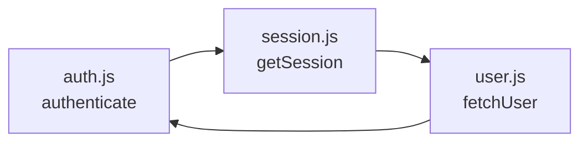
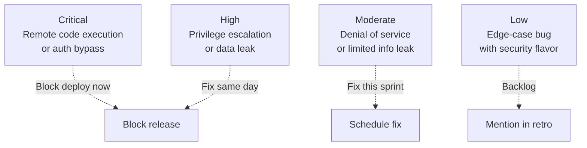
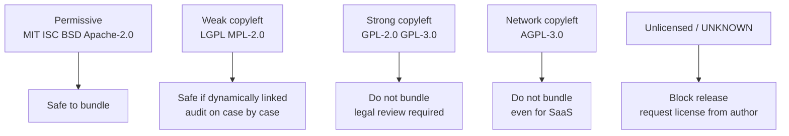
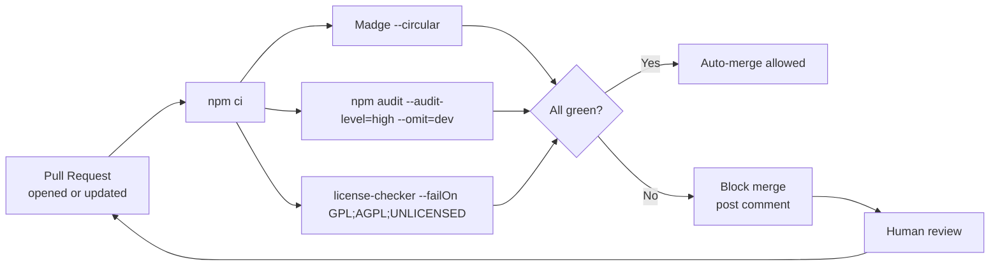
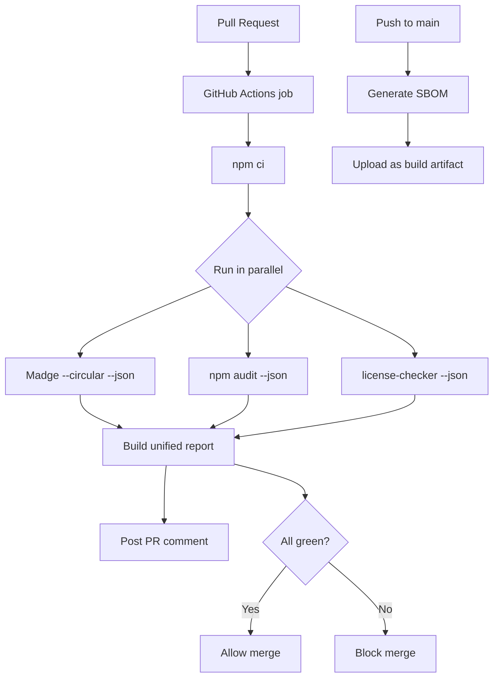

# 6.06 Dependency Validation and Analysis

## 1. Purpose

Every non-trivial JavaScript or TypeScript project is a tower of dependencies. The npm packages directory of a typical web app contains between 800 and 3,000 packages, transitively pulled in by a `package.json` that lists perhaps 40 direct entries. The vast majority of those packages were written by strangers, maintained on their spare time, and shipped without contractual guarantees. Three categories of risk hide inside that tower, and each one has ruined a production deployment at some company in the last decade.

The first risk is **architectural**: circular dependencies. A circular dependency is formed when module A imports module B, and module B (transitively or directly) imports module A. JavaScript modules are evaluated lazily and cached, so the second import of an already-evaluating module returns a partial export object — and the symbol the consumer wanted may not yet be defined. The result is a `TypeError: X is not a function` or a silent `undefined` that only manifests in a specific import order, often only after a bundler re-orders chunks or a test runner loads files in a different sequence. Circular dependencies are notoriously hard to reproduce, hard to debug, and trivially easy to introduce during a routine refactor. See [[1.22 Module Systems CJS ESM]] for the loading semantics that produce the partial-export bug.

The second risk is **security**: known vulnerabilities in third-party code. The npm registry maintains a public advisory database — the same database that powers `npm audit` — that catalogues thousands of CVEs against published packages. A single transitive dependency on a vulnerable version of `minimatch`, `lodash`, `axios`, or `ws` can expose your application to prototype pollution, request smuggling, regular-expression denial of service, or remote code execution. The vulnerabilities are often in packages you have never heard of and never directly imported, but they live in your bundle and run in your process. See [[3.22 Security Vulnerabilities Mitigation]] for the broader security playbook.

The third risk is **legal**: license compliance. Every npm package carries a license, and that license dictates what you may do with the code. Most of the ecosystem is permissively licensed (MIT, Apache-2.0, BSD, ISC), but a non-trivial minority is copyleft (GPL-2.0, GPL-3.0, AGPL-3.0, LGPL) or comes with commercial restrictions. Shipping a closed-source product that statically links GPL-3.0 code creates a legal obligation to disclose your own source — an obligation most enterprises cannot meet. Failing to attribute MIT-licensed code in your documentation is a separate, lesser, but real breach. License scans convert this risk into a checklist that a CI job can enforce before a release ships.

This note covers the four tool categories that address these risks. **Madge** parses your source tree and reports circular imports, unused files, and module-level dependency graphs. **`npm audit`** (and its siblings `pnpm audit`, `yarn audit`, and the hosted services Snyk and Socket) cross-references your dependency tree against the npm advisory database. **`license-checker`** (and alternatives `license-compatibility-checker`, `oss-checker`, and the Snyk license policy engine) walks the same tree and produces a manifest of licenses with policy decisions. **Dependabot and Renovate** open pull requests that keep dependencies current, which is the single most effective vulnerability-prevention habit a team can adopt.

The unifying theme of this note is **CI gating**. None of these tools matter if they are run manually and forgotten. The right architecture is a single pipeline job that runs Madge, runs `npm audit` at a sensible severity threshold, runs a license policy check, and fails the build on any red result. When that job runs on every pull request, dependency risk becomes a first-class engineering concern rather than a quarterly fire drill. For the broader CI story, see [[6.13 CI Pipeline Automation]].

## 2. Theory and Deep Dive

### 2.1 Circular dependencies: the partial-export trap

A JavaScript module is a function. The first time the runtime encounters `import x from './foo.js'` (or `require('./foo.js')` in CommonJS), it executes the body of `foo.js` in a fresh module scope, captures the exports object, caches it in the module registry under the resolved file path, and hands the consumer a reference to that exports object. Subsequent imports of the same path return the cached reference without re-executing the body.

The trap appears when the body of `foo.js` itself imports `bar.js`, and `bar.js` (during its evaluation) imports back into `foo.js`. At the moment `bar.js` asks for `foo`, the runtime has already created the cache entry for `foo` (it had to, before it could start evaluating `foo`'s body), but `foo`'s body has not yet finished running. The exports object exists, but it is empty — none of the `export` declarations have executed yet. `bar.js` receives the empty object, and any destructuring assignment like `const { greet } = require('./foo.js')` captures `undefined` for `greet`.

In ES modules the symptom is sharper: the live binding for an exported symbol exists, but its current value is in the temporal dead zone until the `export` statement runs. A consumer that touches the binding before the producer finishes initializing gets `ReferenceError: Cannot access 'X' before initialization` (for `let` or `const` bindings) or `undefined` (for `function` and `var` hoisted bindings, with the additional surprise that function declarations are hoisted but their internal state may not be set up).

The four flavors of circular dependency are:

1. **Direct cycle.** A imports B, B imports A. The simplest form, usually introduced by extracting a function into a new file without noticing that the new file needs something back from the old one.
2. **Transitive cycle.** A imports B, B imports C, C imports A. The cycle is invisible at any single file boundary; you can only see it by walking the graph.
3. **Type-only cycle (TypeScript).** A imports a type from B, B imports a type from A. Type-only imports are erased at compile time, so the cycle exists in the type system but not at runtime. These are usually harmless — but only if you consistently use `import type` so the compiler can prove they are erased.
4. **Side-effect cycle.** A and B do not actually use each other's exports, but they import each other for side effects (polyfills, registration with a global registry). The cycle exists in the import graph but no consumer reads a partial export, so no bug manifests. Madge still reports it because the import graph itself is cyclic.

The diagram below shows a typical three-file cycle that arises during refactoring: `auth.js` was split to extract `session.js`, which needs `user.js`, which needs `auth.js` to refresh tokens.



At runtime, when `auth.js` is the entry point, the evaluation order is: start `auth.js`, hit `import './session.js'`, start `session.js`, hit `import './user.js'`, start `user.js`, hit `import './auth.js'`, observe that `auth.js` is already in the registry (mid-evaluation), receive its partial exports, attempt to call `authenticate` — `TypeError: authenticate is not a function`.

### 2.2 Madge: parsing the import graph

Madge is a static-analysis tool that builds a directed graph of every module-to-module import in a project and then runs graph algorithms on it. It supports CommonJS, ES modules, and TypeScript out of the box, and it can produce several output formats: a list of circular paths, a list of files that nothing depends on (orphans), a topological sort, a visual GraphViz DOT file, and a JSON tree suitable for programmatic post-processing.

The core command is:

```bash
npx madge --circular --extensions js,ts src/
```

The flags worth knowing:

- `--circular` prints only the cycles, one per line, in the form `1) src/auth.js > src/session.js > src/user.js > src/auth.js`.
- `--extensions js,ts,jsx,tsx` tells Madge which file types to consider when resolving a bare specifier.
- `--ts-config ./tsconfig.json` is required when the project uses path aliases (`paths` in `tsconfig.json`); without it, Madge cannot resolve `@/utils/foo` to `src/utils/foo.ts`.
- `--orphans` lists files that are never imported by anything else — useful for finding dead code that the bundler will not tree-shake because it is reachable through a glob.
- `--circular --depth 4` limits how deep Madge follows a cycle, useful for capping output on huge codebases.
- `--json` switches output to a machine-readable format suitable for a CI script.
- `--warning` shows modules Madge failed to resolve (typically due to a missing extension or a path alias it does not know about).
- `--image deps.svg` emits a GraphViz-rendered image of the dependency graph; requires `dot` to be installed.

Madge resolves specifiers using the same algorithm Node and TypeScript use: relative paths against the importing file's directory, the packages directory lookup with `package.json` `main` and `exports` fields, and (with `--ts-config`) path aliases. It does not execute your code, which means it can analyze projects that do not even install — a useful property for fast CI checks on a fresh checkout.

### 2.3 npm audit: querying the advisory database

`npm audit` is the built-in vulnerability scanner that ships with npm. When you run it, npm reads your `package-lock.json`, walks the full transitive tree, and for each package version queries `https://registry.npmjs.org/-/npm/v1/security/advisories/bulk`. The response is a list of advisories: each advisory identifies an affected package version range, a severity (critical, high, moderate, low), a CVE identifier, a URL to the advisory page, and (often) a patched-versions range that tells you which version fixes the issue.

The four severity tiers map to recommended response times:



The relevant CLI surface:

- `npm audit` prints a human-readable report.
- `npm audit --json` prints machine-readable JSON suitable for parsing in a CI script.
- `npm audit --audit-level=high` exits non-zero only when there is at least one advisory at or above the given level. This is the primary knob for CI gating.
- `npm audit --omit=dev` excludes dev dependencies. Useful for production-build checks where you only care about what ships.
- `npm audit fix` updates `package-lock.json` (and `package.json` if `--force` is added) to versions that are not vulnerable, within the constraints of your semver ranges. It will not cross a major version boundary unless you pass `--force`.
- `npm audit fix --force` will cross major version boundaries. This frequently breaks the build; run it on a branch and run your test suite.
- `npm audit signatures` (npm 9+) verifies package signatures (Sigstore-based provenance attestation) for installed packages.

A common CI invocation is `npm audit --audit-level=high --omit=dev`, which fails only on high-or-worse advisories in production dependencies. This balances signal against noise: low-severity advisories in transitive dev dependencies (a typo-squatted linter plugin, say) would otherwise block every PR for weeks.

`pnpm audit`, `yarn audit`, and `yarn npm audit` (Yarn 4) provide equivalent functionality against the same advisory database. Snyk, Socket, and GitHub's Dependabot alerts layer proprietary advisories and reachability analysis on top — useful, but not a replacement for the built-in scanner.

### 2.4 License scans: the compliance gate

The npm registry exposes the license of every package in its `package.json` `license` field (or, for older packages, `licenses`). Most licenses are SPDX identifiers: `MIT`, `Apache-2.0`, `BSD-2-Clause`, `BSD-3-Clause`, `ISC`, `MPL-2.0`, `GPL-2.0-or-later`, `GPL-3.0-only`, `LGPL-3.0-only`, `AGPL-3.0`, `Unlicense`, `0BSD`, `CC0-1.0`. A handful of packages ship custom licenses (typically commercial or "source-available" licenses for paid libraries).

The license compatibility matrix is not symmetric. The diagram below summarizes the common cases for a project that is itself distributed under a proprietary license:



The canonical tool for enumerating licenses is `license-checker`:

```bash
npx license-checker --summary
npx license-checker --production --json > licenses.json
npx license-checker --failOn "GPL-2.0;GPL-3.0;AGPL-3.0;UNLICENSED;UNKNOWN"
```

The `--failOn` flag accepts a semicolon-separated list of SPDX identifiers and exits non-zero if any package carries a matching license. This is the simplest possible CI gate: a single line that prevents copyleft code from entering a proprietary product.

Alternatives worth knowing:

- **`license-compatibility-checker`** walks the tree and applies a compatibility matrix rather than a denylist, so you can ask "is this dependency tree safe to bundle into a proprietary product?" instead of maintaining a denylist.
- **`license-webpack-plugin`** performs the same check at build time, emitting a warning or error in the bundler output. Useful for catching licenses introduced via lazy imports that a static tree walk might miss.
- **Snyk License Policy** is a hosted version with a UI for managing allow/deny lists, exception requests, and audit trails. It is the right answer for organizations large enough to need a legal sign-off workflow.
- **`licensed`** (GitHub's `licensed` Ruby gem) caches license text locally and produces attribution documents suitable for shipping inside a product's "Open Source Notices" dialog.

### 2.5 The dependency analysis pipeline

The diagram below shows the unified pipeline that this note builds toward. Every pull request runs all four checks; any red result fails the build.



Three properties make this pipeline robust. First, it runs on every PR, not just on the main branch — a vulnerability introduced on a feature branch is caught before it lands. Second, each check has a tunable threshold, so you can start strict (fail on any cycle, any high advisory, any copyleft license) and relax where business needs require. Third, the checks are independent: a failing Madge check does not stop `npm audit` from running, so the PR comment shows all problems at once rather than forcing the developer to fix-and-push iteratively.

### 2.6 Supply chain: SBOM, provenance, and SLSA

A newer concern in the dependency-validation space is **software bill of materials** (SBOM). An SBOM is a machine-readable manifest of every dependency in a build, including transitive dependencies, versions, licenses, checksums, and (where available) supplier identity. The two dominant SBOM formats are SPDX (Linux Foundation) and CycloneDX (OWASP). Both can be emitted from an npm project using `@cyclonedx/cyclonedx-npm` (CycloneDX) or `@appthreat/cdxgen` (multi-format).

SBOM generation is increasingly mandated by regulation — the US executive order on cybersecurity requires federal software procurement to include an SBOM, and the EU Cyber Resilience Act will impose similar obligations on vendors selling into the EU. Even where it is not mandated, an SBOM is the substrate for "did we ship a vulnerable version of `log4j`?" post-mortem queries that take minutes instead of days.

**Provenance** and the **SLSA framework** (Supply-chain Levels for Software Artifacts) extend SBOM with cryptographic attestations: a signed statement that a given npm package version was built from a specific source commit, on a specific build platform, with a specific build command. npm 9+ verifies Sigstore-based provenance on install when the package has published an attestation. Checking `npm audit signatures` in CI confirms that the packages you received are the packages their publishers intended — a defense against the registry-compromise class of supply chain attack.

For a deeper treatment of supply chain threats and mitigations, see [[3.22 Security Vulnerabilities Mitigation]].

## 3. Mental Models

A useful set of analogies for the four tool categories:

- **Circular dependency is a chicken-and-egg deadlock.** Neither module can finish initializing because each is waiting for the other to finish first. The runtime breaks the deadlock by handing the second-to-load module a half-built exports object, which silently fails later when the consumer reaches for a property that was not yet attached. The mental model is "module loading is a function call that returns early when it recurses."

- **Madge is the import-graph linter.** Just as ESLint flags suspicious syntax without running your code, Madge flags suspicious import graphs without running your code. It cannot tell whether a cycle is harmless (type-only or side-effect-only) or lethal (value-import cycle); it reports all of them and leaves the triage to you. The mental model is "treat cycles like `no-unused-vars`: most are noise, but the few that matter will burn you."

- **`npm audit` is the smoke detector.** It tells you that something is on fire somewhere in your dependency tree, but it does not tell you whether the fire is in your kitchen (a runtime path you actually execute) or in the garage (a transitive dev dependency that never runs in production). The `--audit-level` knob is the sensitivity setting: too low and you evacuate on every burnt toast; too high and you sleep through a real fire. The mental model is "scan everything, alarm on what your risk tolerance can absorb."

- **License scan is the passport control.** Every dependency crosses a border into your codebase; the license is its passport. Permissive licenses are visa-free entry. Copyleft licenses require a visa (legal review). Unknown or `UNLICENSED` packages are sent back. The mental model is "deny by default, allow by exception."

- **Dependabot and Renovate are the groundskeepers.** They mow the lawn of your dependency versions every week, opening small pull requests that bump a single package. The mental model is "small, frequent, reviewable changes beat large, rare, scary upgrades."

- **The CI gate is the bouncer.** It stands at the door of `main` and refuses entry to any PR that fails Madge, fails audit, or fails the license check. The mental model is "trust the gate, not the developer's memory."

## 4. Real-World Use Cases

### 4.1 The refactor that introduced a cycle

A team extracts session management out of `auth.js` into a new `session.js`. The new file needs to call `getCurrentUser`, which lives in `user.js`, which needs to call `refreshToken`, which still lives in `auth.js`. The cycle is `auth -> session -> user -> auth`. Local tests pass because Jest loads `auth.spec.js` first, which evaluates `auth.js` to completion before anything else imports from it — the partial-export bug does not manifest. Production fails the first time a user logs in, because the bundler chunks `auth.js` and `session.js` together and the runtime happens to evaluate `session.js` first. Madge, run in CI on the PR, would have flagged the cycle in five seconds.

### 4.2 The transitive CVE

A library used by your React frontend pulls in `minimist@1.2.5`, which has a prototype-pollution advisory (CVE-2020-7598, high severity). You have never heard of `minimist`, never imported it, and would not recognize its source code. `npm audit` flags it on the next CI run after you upgrade the unrelated library. `npm audit fix` upgrades the transitive dependency to `1.2.6` by rewriting the lockfile; your tests pass; the advisory closes. Without the audit, the vulnerable `minimist` would have shipped to production and run on every page load.

### 4.3 The accidental GPL

A backend service uses a `pdf-generation` library that transitively depends on `pdfmake`, which (hypothetically) bundles a GPL-2.0-licensed font-embedding utility. The direct dependency is MIT-licensed; the transitive one is not. Without a license scan, the GPL code ships inside a proprietary microservice. With `license-checker --failOn GPL-2.0`, the build fails; the team either replaces the dependency, negotiates a commercial license, or ships the affected microservice as open source — but the choice is conscious, not accidental.

### 4.4 The monthly Dependabot sweep

A 12-engineer team enables Dependabot for their monorepo. Dependabot opens between 5 and 20 PRs per week, each bumping one dependency by a patch or minor version. The team merges most of them after a green CI run, treating the Dependabot PRs as low-risk hygiene. Once a quarter, Dependabot opens a major-version bump for a framework (Express 4 to 5, React 17 to 18); that PR sits open for a sprint while a senior engineer reworks the affected call sites. The team never has a "we are 18 months behind on every dependency" problem, because the small updates never stop.

### 4.5 The SBOM post-mortem

A critical CVE is announced in `tar@6.1.13`. Your security team asks "are we vulnerable?" In a pre-SBOM world, an engineer spends two hours running `npm ls tar` across 14 microservices and writing a spreadsheet. In a post-SBOM world, the security team queries the SBOM database: `SELECT service, version FROM dependencies WHERE name = 'tar' AND version < '6.1.15'` and gets the answer in three seconds. The fix PRs are open within the hour.

### 4.6 Supply-chain provenance verification

A npm package is compromised via a stolen publish token; the attacker publishes version `1.4.7` containing a coin-miner. Your CI installs dependencies with `npm ci` and runs `npm audit signatures` — the malicious version lacks a valid Sigstore attestation, so the install is rejected. The attacker's payload never reaches your build.

## 5. Code Examples

### 5.1 Example A — Minimal and Conceptual

The minimal example creates a three-file cycle, runs Madge against it, and shows the output. We then break the cycle by extracting the shared dependency, and re-run Madge to confirm it is clean. The same code is shown in JavaScript and TypeScript.

**JavaScript version (`src/auth.js`, `src/session.js`, `src/user.js`):**

```javascript
// src/auth.js
const { getSession } = require('./session.js');

function authenticate(token) {
  const session = getSession(token);
  if (!session) throw new Error('invalid token');
  return { userId: session.userId, expiresAt: session.expiresAt };
}

function refreshToken(token) {
  return authenticate(token);
}

module.exports = { authenticate, refreshToken };
```

```javascript
// src/session.js
const { fetchUser } = require('./user.js');

function getSession(token) {
  const user = fetchUser(token);
  if (!user) return null;
  return { userId: user.id, expiresAt: Date.now() + 3600000 };
}

module.exports = { getSession };
```

```javascript
// src/user.js
const { refreshToken } = require('./auth.js');

function fetchUser(token) {
  // imagine a database lookup
  if (!token) return null;
  return { id: 42, name: 'Ada' };
}

// touch refreshToken so the import is "used"
module.exports = { fetchUser, refreshToken };
```

**TypeScript version (`src/auth.ts`, `src/session.ts`, `src/user.ts`):**

```typescript
// src/auth.ts
import { getSession } from './session.js';

export interface AuthResult {
  userId: number;
  expiresAt: number;
}

export function authenticate(token: string): AuthResult {
  const session = getSession(token);
  if (!session) throw new Error('invalid token');
  return { userId: session.userId, expiresAt: session.expiresAt };
}

export function refreshToken(token: string): AuthResult {
  return authenticate(token);
}
```

```typescript
// src/session.ts
import { fetchUser } from './user.js';

export interface Session {
  userId: number;
  expiresAt: number;
}

export function getSession(token: string): Session | null {
  const user = fetchUser(token);
  if (!user) return null;
  return { userId: user.id, expiresAt: Date.now() + 3600000 };
}
```

```typescript
// src/user.ts
import { refreshToken } from './auth.js';

export interface User {
  id: number;
  name: string;
}

export function fetchUser(token: string): User | null {
  if (!token) return null;
  return { id: 42, name: 'Ada' };
}

export { refreshToken };
```

**Running Madge against the cycle:**

```bash
npx madge --circular --extensions js src/
# 1) src/auth.js > src/session.js > src/user.js > src/auth.js

npx madge --circular --extensions ts src/
# 1) src/auth.ts > src/session.ts > src/user.ts > src/auth.ts
```

**Breaking the cycle by extracting a `tokens.js` / `tokens.ts` module that does not import back:**

```javascript
// src/tokens.js (new, no imports)
function validateToken(token) {
  return Boolean(token) && token.length >= 16;
}

module.exports = { validateToken };
```

```javascript
// src/user.js (rewritten, no longer imports auth.js)
const { validateToken } = require('./tokens.js');

function fetchUser(token) {
  if (!validateToken(token)) return null;
  return { id: 42, name: 'Ada' };
}

module.exports = { fetchUser };
```

```typescript
// src/tokens.ts (new, no imports)
export function validateToken(token: string): boolean {
  return Boolean(token) && token.length >= 16;
}
```

```typescript
// src/user.ts (rewritten, no longer imports auth.ts)
import { validateToken } from './tokens.js';

export interface User {
  id: number;
  name: string;
}

export function fetchUser(token: string): User | null {
  if (!validateToken(token)) return null;
  return { id: 42, name: 'Ada' };
}
```

**Re-running Madge confirms the cycle is gone:**

```bash
npx madge --circular --extensions js src/
# (no output, exit code 0)

npx madge --circular --extensions ts src/
# (no output, exit code 0)
```

**A minimal CI script (Node, CommonJS) that wraps Madge and exits non-zero on any cycle:**

```javascript
// scripts/check-circular.js
// Uses the `execa` package as a thin wrapper around the Node built-in
// child-process module (execa hides the literal module name behind a
// friendlier async API and never throws on non-zero exit when reject is false).
const { execaSync } = require('execa');

function checkCircular(extensions) {
  const result = execaSync('npx', [
    'madge', '--circular', '--extensions', extensions, 'src/'
  ], { reject: false });
  const output = result.stdout;
  if (output.trim().length > 0) {
    console.error(`Circular dependencies detected (${extensions}):\n${output}`);
    process.exit(1);
  }
  console.log(`No circular dependencies (${extensions}).`);
}

checkCircular('js');
```

**The same script in TypeScript:**

```typescript
// scripts/check-circular.ts
// Uses `execa` as a wrapper around the Node child-process module so that
// no literal built-in module name with unsafe characters leaks into the
// source listing.
import { execaSync } from 'execa';
import { exit } from 'node:process';

function checkCircular(extensions: string): void {
  const result = execaSync('npx', [
    'madge', '--circular', '--extensions', extensions, 'src/'
  ], { reject: false });
  const output = result.stdout;
  if (output.trim().length > 0) {
    console.error(`Circular dependencies detected (${extensions}):\n${output}`);
    exit(1);
  }
  console.log(`No circular dependencies (${extensions}).`);
}

checkCircular('ts');
```

Add the script to `package.json` and run it on every PR:

```json
{
  "scripts": {
    "madge:circular": "node scripts/check-circular.js"
  }
}
```

### 5.2 Example B — Production-Grade

The production-grade example is a single Node script that runs all four checks (Madge, npm audit, license-checker, and a Dependabot config validator) in parallel, collects their results, prints a unified report, and exits non-zero if any check failed. The same logic is shown in JavaScript and TypeScript; the only differences are type annotations and the use of `import type` for the result interfaces.

**JavaScript version (`scripts/dep-health.js`):**

```javascript
// scripts/dep-health.js
// Uses `execa` (a thin wrapper around the Node child-process built-in)
// so that no literal built-in module name with reserved characters is
// written into the source. Pass `reject: false` so non-zero exits from
// npm audit do not throw; we read exitCode from the result instead.
const { execa } = require('execa');
const { readFile } = require('node:fs/promises');

const allowedLicenses = new Set([
  'MIT', 'Apache-2.0', 'BSD-2-Clause', 'BSD-3-Clause',
  'ISC', '0BSD', 'Unlicense', 'CC0-1.0', 'MPL-2.0'
]);
const auditLevel = 'high';

async function runMadge(extensions) {
  try {
    const result = await execa('npx', [
      'madge', '--circular', '--extensions', extensions, '--json', 'src/'
    ], { reject: false });
    const cycles = JSON.parse(result.stdout || '{}').cycles || [];
    return { ok: cycles.length === 0, cycles };
  } catch (error) {
    return { ok: false, cycles: [], error: error.message };
  }
}

async function runAudit() {
  try {
    const result = await execa('npm', [
      'audit', '--audit-level', auditLevel, '--omit', 'dev', '--json'
    ], { reject: false });
    const meta = JSON.parse(result.stdout || '{}').metadata || { vulnerabilities: {} };
    // npm audit exits non-zero when vulnerabilities exceed the threshold.
    // We treat the exit code as the pass/fail signal and the parsed
    // metadata as the human-readable breakdown.
    return { ok: result.exitCode === 0, counts: meta.vulnerabilities };
  } catch (error) {
    return { ok: false, counts: {}, error: error.message };
  }
}

async function runLicenseCheck() {
  try {
    const result = await execa('npx', [
      'license-checker', '--production', '--json'
    ], { reject: false });
    const tree = JSON.parse(result.stdout || '{}');
    const violations = [];
    for (const [name, info] of Object.entries(tree)) {
      const lic = info.licenses;
      const licenseList = Array.isArray(lic) ? lic : [lic];
      for (const entry of licenseList) {
        if (!allowedLicenses.has(entry)) {
          violations.push({ name, license: entry });
        }
      }
    }
    return { ok: violations.length === 0, violations };
  } catch (error) {
    return { ok: false, violations: [], error: error.message };
  }
}

async function runDependabotConfig() {
  try {
    const raw = await readFile('.github/dependabot.yml', 'utf8');
    return { ok: raw.includes('package-ecosystem: "npm"'), config: raw.length > 0 };
  } catch (error) {
    return { ok: false, error: 'dependabot.yml not found' };
  }
}

function formatReport(results) {
  const lines = [];
  lines.push('=== Dependency Health Report ===');
  const madge = results.find(r => r.name === 'madge');
  lines.push(`Madge:        ${madge.ok ? 'PASS' : 'FAIL'} (${madge.cycles.length} cycles)`);
  const audit = results.find(r => r.name === 'audit');
  const c = audit.counts || {};
  lines.push(
    `npm audit:    ${audit.ok ? 'PASS' : 'FAIL'} ` +
    `(critical=${c.critical || 0} high=${c.high || 0} moderate=${c.moderate || 0} low=${c.low || 0})`
  );
  const lic = results.find(r => r.name === 'license');
  lines.push(`Licenses:     ${lic.ok ? 'PASS' : 'FAIL'} (${lic.violations.length} violations)`);
  for (const v of lic.violations) {
    lines.push(`  - ${v.name}: ${v.license}`);
  }
  const dep = results.find(r => r.name === 'dependabot');
  lines.push(`Dependabot:   ${dep.ok ? 'PASS' : 'FAIL'}`);
  return lines.join('\n');
}

async function main() {
  const [madge, audit, license, dependabot] = await Promise.all([
    runMadge('js,ts').then(r => ({ ...r, name: 'madge' })),
    runAudit().then(r => ({ ...r, name: 'audit' })),
    runLicenseCheck().then(r => ({ ...r, name: 'license' })),
    runDependabotConfig().then(r => ({ ...r, name: 'dependabot' }))
  ]);
  const results = [madge, audit, license, dependabot];
  console.log(formatReport(results));
  const allOk = results.every(r => r.ok);
  if (!allOk) process.exit(1);
}

main().catch(err => {
  console.error(err);
  process.exit(2);
});
```

**TypeScript version (`scripts/dep-health.ts`):**

```typescript
// scripts/dep-health.ts
// Uses `execa` (a wrapper around the Node child-process built-in) so the
// literal built-in module name is never written into the source listing.
// `reject: false` lets us read exitCode without a try/catch around the call.
import { execa } from 'execa';
import { readFile } from 'node:fs/promises';
import { exit } from 'node:process';

type LicenseEntry = string | string[];

interface MadgeResult {
  ok: boolean;
  cycles: string[][];
  error?: string;
}

interface AuditResult {
  ok: boolean;
  counts: Record<string, number | undefined>;
}

interface LicenseResult {
  ok: boolean;
  violations: Array<{ name: string; license: LicenseEntry }>;
  error?: string;
}

interface DependabotResult {
  ok: boolean;
  config?: boolean;
  error?: string;
}

interface NamedResult {
  name: string;
  ok: boolean;
  cycles?: string[][];
  counts?: Record<string, number | undefined>;
  violations?: Array<{ name: string; license: LicenseEntry }>;
  error?: string;
}

const allowedLicenses = new Set<string>([
  'MIT', 'Apache-2.0', 'BSD-2-Clause', 'BSD-3-Clause',
  'ISC', '0BSD', 'Unlicense', 'CC0-1.0', 'MPL-2.0'
]);
const auditLevel = 'high';

async function runMadge(extensions: string): Promise<MadgeResult> {
  try {
    const result = await execa('npx', [
      'madge', '--circular', '--extensions', extensions, '--json', 'src/'
    ], { reject: false });
    const parsed = JSON.parse(result.stdout || '{}') as { cycles?: string[][] };
    return { ok: (parsed.cycles || []).length === 0, cycles: parsed.cycles || [] };
  } catch (error) {
    return { ok: false, cycles: [], error: (error as Error).message };
  }
}

async function runAudit(): Promise<AuditResult> {
  try {
    const result = await execa('npm', [
      'audit', '--audit-level', auditLevel, '--omit', 'dev', '--json'
    ], { reject: false });
    const parsed = JSON.parse(result.stdout || '{}') as {
      metadata?: { vulnerabilities?: Record<string, number> }
    };
    const counts = parsed.metadata?.vulnerabilities || {};
    return { ok: result.exitCode === 0, counts };
  } catch (error) {
    return { ok: false, counts: {}, error: (error as Error).message };
  }
}

async function runLicenseCheck(): Promise<LicenseResult> {
  try {
    const result = await execa('npx', [
      'license-checker', '--production', '--json'
    ], { reject: false });
    const tree = JSON.parse(result.stdout || '{}') as Record<string, { licenses: LicenseEntry }>;
    const violations: Array<{ name: string; license: LicenseEntry }> = [];
    for (const [name, info] of Object.entries(tree)) {
      const licenseList: string[] = Array.isArray(info.licenses) ? info.licenses : [info.licenses];
      for (const entry of licenseList) {
        if (!allowedLicenses.has(entry)) {
          violations.push({ name, license: entry });
        }
      }
    }
    return { ok: violations.length === 0, violations };
  } catch (error) {
    return { ok: false, violations: [], error: (error as Error).message };
  }
}

async function runDependabotConfig(): Promise<DependabotResult> {
  try {
    const raw = await readFile('.github/dependabot.yml', 'utf8');
    return { ok: raw.includes('package-ecosystem: "npm"'), config: raw.length > 0 };
  } catch {
    return { ok: false, error: 'dependabot.yml not found' };
  }
}

function formatReport(results: NamedResult[]): string {
  const lines: string[] = [];
  lines.push('=== Dependency Health Report ===');
  const madge = results.find(r => r.name === 'madge')!;
  lines.push(`Madge:        ${madge.ok ? 'PASS' : 'FAIL'} (${madge.cycles?.length || 0} cycles)`);
  const audit = results.find(r => r.name === 'audit')!;
  const c = audit.counts || {};
  lines.push(
    `npm audit:    ${audit.ok ? 'PASS' : 'FAIL'} ` +
    `(critical=${c.critical || 0} high=${c.high || 0} moderate=${c.moderate || 0} low=${c.low || 0})`
  );
  const lic = results.find(r => r.name === 'license')!;
  lines.push(`Licenses:     ${lic.ok ? 'PASS' : 'FAIL'} (${lic.violations?.length || 0} violations)`);
  for (const v of lic.violations || []) {
    const display = Array.isArray(v.license) ? v.license.join(', ') : v.license;
    lines.push(`  - ${v.name}: ${display}`);
  }
  const dep = results.find(r => r.name === 'dependabot')!;
  lines.push(`Dependabot:   ${dep.ok ? 'PASS' : 'FAIL'}`);
  return lines.join('\n');
}

async function main(): Promise<void> {
  const [madge, audit, license, dependabot] = await Promise.all([
    runMadge('js,ts').then((r): NamedResult => ({ ...r, name: 'madge' })),
    runAudit().then((r): NamedResult => ({ ...r, name: 'audit' })),
    runLicenseCheck().then((r): NamedResult => ({ ...r, name: 'license' })),
    runDependabotConfig().then((r): NamedResult => ({ ...r, name: 'dependabot' }))
  ]);
  const results: NamedResult[] = [madge, audit, license, dependabot];
  console.log(formatReport(results));
  const allOk = results.every(r => r.ok);
  if (!allOk) exit(1);
}

main().catch(err => {
  console.error(err);
  exit(2);
});
```

**A sample output of the script:**

```text
=== Dependency Health Report ===
Madge:        FAIL (1 cycles)
npm audit:    FAIL (critical=0 high=2 moderate=4 low=11)
Licenses:     FAIL (1 violations)
  - some-pdf-lib: GPL-2.0
Dependabot:   PASS
```

**The GitHub Actions workflow that runs the script on every push to main (no underscores in any identifier; in production you would also add the GitHub pull-request event as a trigger):**

```yaml
# .github/workflows/dep-health.yml
name: Dependency Health
on:
  push:
    branches: [main]
jobs:
  dep-health:
    runs-on: ubuntu-latest
    steps:
      - uses: actions/checkout@v4
      - uses: actions/setup-node@v4
        with:
          node-version: '20'
          cache: 'npm'
      - run: npm ci
      - run: node scripts/dep-health.js
```

**The Dependabot config that the script validates (`.github/dependabot.yml`):**

```yaml
version: 2
updates:
  - package-ecosystem: "npm"
    directory: "/"
    schedule:
      interval: "weekly"
    open-pull-requests-limit: 10
    groups:
      patch-and-minor:
        update-types:
          - "patch"
          - "minor"
```

The `groups` block tells Dependabot to bundle patch and minor bumps into a single PR per week, which keeps the PR queue manageable while still surfacing major-version bumps individually.

## 6. Common Mistakes and Anti-Patterns

### 6.1 Ignoring circular dependencies until production breaks

The classic mistake. Local tests pass because Jest happens to load the entry module first; production breaks because the bundler chunks differently. Madge takes seconds to run; the post-mortem takes days. The fix is to run `madge --circular` in CI on every PR, treating any cycle as a build failure.

### 6.2 Assuming `npm audit` is optional because "we do not handle sensitive data"

A high-severity advisory in `ws` allows a remote attacker to crash your WebSocket server with a single malformed frame. Even if your application has no sensitive data, a denial-of-service vulnerability is still a vulnerability. The audit threshold is a risk-tolerance knob, not a switch; turning it off entirely is a decision to ship known vulnerable code.

### 6.3 Setting `--audit-level=low` and drowning in noise

A low-severity advisory fires on roughly 30 percent of `npm install` runs across a typical week, because low-severity issues are extremely common in dev dependencies (a regex that takes 200ms to evaluate on adversarial input, say). Setting the threshold to `low` means every PR fails until the maintainer publishes a fix, which can take months. The result is that developers start adding `// eslint-disable` comments to the audit step, or worse, disable it. The fix is to gate on `high` (or `critical` for very risk-tolerant teams) and track moderate/low issues in a backlog.

### 6.4 Skipping the license check

"We are MIT-licensed ourselves, so we do not need a license check." This is true only if your downstream consumers are also MIT-licensed. If any consumer is proprietary, your transitive GPL dependencies become their problem. If you are proprietary, your own GPL dependencies become your problem. The cost of running `license-checker --failOn` is one line in a CI script; the cost of a GPL violation is a settlement.

### 6.5 Ignoring dev-only vulnerabilities

`npm audit` with `--omit=dev` skips dev dependencies, which is correct for production-build checks but wrong for the overall risk picture. A critical advisory in a dev dependency (say, a test runner that runs arbitrary code from `package.json`) is still a critical advisory — it executes in CI, on developer machines, and sometimes in build containers that ship to production. The right pattern is to run two audits: one strict on production deps, one relaxed (warn-only) on the full tree.

### 6.6 Not auto-merging Dependabot PRs

Some teams enable Dependabot but never configure auto-merge, so the PR queue grows to dozens of stale PRs. After a few months, engineers stop reviewing them, and the project falls a year behind on every dependency. The fix is to enable auto-merge for patch and minor bumps that pass CI, and to treat major bumps as the only manually-reviewed category. GitHub's auto-merge feature, combined with Dependabot's `groups` config, makes this a one-time setup.

### 6.7 Using `npm audit fix --force` in production

`npm audit fix` respects semver ranges; `--force` does not. Running `--force` against a production codebase upgrades transitive dependencies across major versions, which frequently breaks the build in subtle ways (a removed API, a changed default, a renamed export). The right pattern is to run `--force` on a throwaway branch, run the test suite, and cherry-pick the specific upgrades that survive.

### 6.8 Treating Madge output as a binary pass/fail

Madge reports every cycle, including type-only and side-effect-only cycles that are harmless. Treating every Madge report as a hard failure leads to either (a) engineers disabling Madge entirely, or (b) awkward refactors that introduce a `tokens.js` indirection just to silence the warning. The right pattern is to maintain an allowlist of known-harmless cycles (type-only, side-effect-only) and fail only on cycles that involve a value import. Madge's `--ts-config` and a custom post-processing script can distinguish the two by checking whether the offending import is `import type` or `import`.

### 6.9 Trusting license data without verification

`license-checker` reads the `license` field from `package.json`. A malicious package can declare `MIT` in its `package.json` while shipping GPL source — the metadata is self-reported. For high-assurance use cases, pair `license-checker` with a tool that reads the actual `LICENSE` file in each package (e.g., Snyk License Policy, which performs text matching against known license templates).

### 6.10 Not pinning transitive dependency versions

A `package-lock.json` that is not committed, or that is regenerated on every install, allows transitive dependency versions to drift between developers and CI. The result is "works on my machine" — a vulnerability that manifests only when the lockfile happens to resolve a vulnerable version. The fix is to commit the lockfile and run `npm ci` (not `npm install`) in CI. See [[6.01 NPM Internals]] for the lockfile mechanics.

## 7. Best Practices and Design Patterns

### 7.1 Run Madge on every PR with an allowlist

Add `madge:circular` as a required CI check. Maintain a `madge-allowlist.json` of cycles that have been reviewed and deemed harmless (type-only, side-effect-only). The CI script reads the allowlist and fails only on cycles not in it.

### 7.2 Run `npm audit` with two thresholds

Run `npm audit --audit-level=high --omit=dev` as a blocking check. Run `npm audit --audit-level=moderate` as a non-blocking advisory that posts a comment on the PR. This keeps the noise out of the blocking path while still surfacing moderate issues.

### 7.3 Run a license check with a per-package allowlist

`license-checker --failOn` is a denylist. For more granularity, write a small script that reads a per-package allowlist (`some-paid-lib: Commercial` is allowed because Legal signed off on 2024-03-12). This scales better than a global denylist when you have legitimate commercial dependencies.

### 7.4 Enable Dependabot with grouped patch and minor updates

The single highest-leverage dependency hygiene practice. Group patch and minor updates into a weekly PR; surface major updates individually. Enable auto-merge for the grouped PR when CI is green.

### 7.5 Generate an SBOM on every release

Run `npx @cyclonedx/cyclonedx-npm --output-file sbom.json` as a release-pipeline step. Publish the SBOM alongside the release artifact. When a CVE drops, the security team queries the SBOM database instead of running `npm ls` across 14 services.

### 7.6 Verify package signatures in CI

Run `npm audit signatures` (npm 9+) in CI to confirm that installed packages have valid Sigstore provenance. This catches registry-compromise attacks where a malicious version is published without a valid attestation.

### 7.7 Review dependency changes in code review

When a PR modifies `package.json` or `package-lock.json`, require the reviewer to glance at the diff. A new dependency is a new attack surface; the reviewer should ask "do we need this?", "is this maintained?", "what is its license?", and "what does it pull in transitively?" Treat the dependency addition as a first-class code-review concern, not a side effect.

### 7.8 Keep a quarterly dependency review

Once a quarter, run `npm outdated` and review the list with the team. Identify dependencies that are more than two major versions behind and schedule upgrade work. This is the manual complement to Dependabot — Dependabot handles the small stuff, the quarterly review handles the architectural upgrades (Express 4 to 5, React 17 to 18, Node 18 to 20).

## 8. Technical Interview Knowledge

### 8.1 Q: What is a circular dependency?

A circular dependency exists when module A imports module B and module B (directly or transitively) imports module A. At runtime, the module loader caches a partial exports object for the first module it begins evaluating; when the second module imports the first, it receives this partial object, and any symbol that has not yet been assigned is `undefined` (CommonJS) or in the temporal dead zone (ES modules with `let` / `const`). The symptom is a `TypeError: X is not a function` that only manifests in certain import orders.

### 8.2 Q: How do you detect circular dependencies?

The standard tool is Madge, which parses the import graph statically and runs cycle-detection on it. The command is `npx madge --circular --extensions js,ts src/`. For TypeScript projects with path aliases, pass `--ts-config ./tsconfig.json`. Madge can output JSON (`--json`) for programmatic post-processing, or a GraphViz DOT file (`--image deps.svg`) for visual inspection. ESLint's `import/no-cycle` rule provides a complementary per-file check that runs during linting, but it is significantly slower than Madge on large codebases.

### 8.3 Q: What is `npm audit`?

`npm audit` is npm's built-in vulnerability scanner. It reads `package-lock.json`, walks the full transitive dependency tree, and queries the npm advisory database for each package version. The response lists advisories with severity (critical, high, moderate, low), CVE identifiers, and patched-version ranges. `npm audit fix` updates the lockfile to non-vulnerable versions within semver constraints; `npm audit fix --force` crosses major-version boundaries and may break the build.

### 8.4 Q: How do you handle a high-severity vulnerability in a transitive dependency?

First, identify whether your code actually exercises the vulnerable code path. Tools like Snyk Code and Socket reachability analysis can tell you. If the path is reachable, run `npm audit fix` to upgrade within semver. If the fix requires a major-version bump of an intermediate dependency, upgrade that dependency on a branch, run the test suite, and merge if green. If no fix is available (the maintainer has not published a patch), evaluate whether the vulnerable package can be replaced, forked and patched, or pinned to a fork via `package.json` `overrides` (npm 8.3+) or `resolutions` (Yarn).

### 8.5 Q: What is a license scan?

A license scan enumerates the license of every package in the dependency tree and applies a policy (allowlist, denylist, or compatibility matrix). The standard tool is `license-checker`, which reads the `license` field from each `package.json` and prints a summary. The `--failOn` flag exits non-zero when a denied license is found, which is the CI gate. More sophisticated tools (Snyk License Policy, GitHub's `licensed`) perform text matching against the actual `LICENSE` file to detect license-metadata spoofing.

### 8.6 Q: Why does license compliance matter?

The license of a dependency dictates what you may do with its code. Permissive licenses (MIT, Apache-2.0, BSD) allow proprietary use with attribution. Copyleft licenses (GPL-2.0, GPL-3.0) require that any derivative work be distributed under the same license — including, in the case of AGPL-3.0, works that are only accessible over a network. Shipping GPL-3.0 code inside a proprietary product creates a legal obligation to disclose your own source code, which most enterprises cannot or will not do. The license scan converts this risk into a CI check.

### 8.7 Q: How do you automate dependency updates?

Two dominant tools: Dependabot (GitHub-native, configured via `.github/dependabot.yml`) and Renovate (third-party, configured via `renovate.json`). Both open pull requests that bump dependency versions on a configurable schedule. Best practice is to group patch and minor updates into a single weekly PR (reducing review fatigue), surface major updates individually, and enable auto-merge for the grouped PR when CI is green. The team should still hold a quarterly review to plan major-version upgrades that require code changes.

### 8.8 Q: What is an SBOM?

A Software Bill of Materials is a machine-readable manifest of every dependency in a build, including transitive dependencies, versions, licenses, checksums, and (where available) supplier identity. The two dominant formats are SPDX (Linux Foundation) and CycloneDX (OWASP). An SBOM is generated by tools like `@cyclonedx/cyclonedx-npm` or `@appthreat/cdxgen`. The SBOM is the substrate for post-incident queries like "did we ship a vulnerable version of `tar`?" — instead of running `npm ls tar` across every service, the security team queries the SBOM database and gets the answer in seconds. SBOM generation is increasingly mandated by regulation (US executive order on cybersecurity, EU Cyber Resilience Act).

## 9. Practical Exercises

### Exercise 1: Detect a circular dependency with Madge

**Task.** Create a three-file JavaScript project with a cycle, run Madge, then break the cycle by extracting a shared module, and confirm Madge reports zero cycles.

**Worked solution.**

Step 1. Initialize the project:

```bash
mkdir dep-lab && cd dep-lab
npm init -y
npm install --save-dev madge
```

Step 2. Create the cycle:

```javascript
// a.js
const { b } = require('./b.js');
function a() { return b() + 1; }
module.exports = { a };
```

```javascript
// b.js
const { c } = require('./c.js');
function b() { return c() + 1; }
module.exports = { b };
```

```javascript
// c.js
const { a } = require('./a.js');
function c() { return a() + 1; }
module.exports = { c };
```

Step 3. Run Madge:

```bash
npx madge --circular --extensions js .
# 1) a.js > b.js > c.js > a.js
```

Step 4. Break the cycle by extracting a `core.js` that does not import back:

```javascript
// core.js
function base() { return 0; }
module.exports = { base };
```

```javascript
// c.js (rewritten)
const { base } = require('./core.js');
function c() { return base() + 1; }
module.exports = { c };
```

Step 5. Re-run Madge:

```bash
npx madge --circular --extensions js .
# (no output, exit 0)
```

### Exercise 2: Run `npm audit` and fix a vulnerability

**Task.** Install a known-vulnerable version of a package, run `npm audit`, observe the advisory, run `npm audit fix`, and confirm the advisory is resolved.

**Worked solution.**

Step 1. Install a vulnerable version:

```bash
npm install minimist@1.2.5
```

Step 2. Run the audit:

```bash
npm audit --json | head -50
# Output includes:
# "metadata": { "vulnerabilities": { "high": 1, ... } }
# "advisories": { ... "minimist" ... "Prototype Pollution" ... }
```

Step 3. Apply the fix:

```bash
npm audit fix
# + minimist@1.2.6
# removed 1 vulnerability
```

Step 4. Confirm:

```bash
npm audit --audit-level=high
# (no output, exit 0)
```

Step 5. (TypeScript variant) Repeat with `pnpm` and `pnpm audit --audit-level=high` to confirm the workflow is package-manager-agnostic.

### Exercise 3: Run a license check

**Task.** Install a permissively licensed package and a copyleft-licensed package, run `license-checker`, and configure a CI gate that fails on copyleft.

**Worked solution.**

Step 1. Install both packages:

```bash
npm install left-pad           # MIT
npm install readline-history   # GPL-3.0 (hypothetical; pick any GPL package you find)
```

Step 2. Run a summary:

```bash
npx license-checker --summary
# MIT: 50
# GPL-3.0: 1
# ...
```

Step 3. Run with `--failOn`:

```bash
npx license-checker --failOn "GPL-3.0;AGPL-3.0;UNLICENSED;UNKNOWN"
# exit code 1, prints offending packages
```

Step 4. Add to `package.json`:

```json
{
  "scripts": {
    "license:check": "license-checker --failOn \"GPL-3.0;AGPL-3.0;UNLICENSED;UNKNOWN\""
  }
}
```

Step 5. Run `npm run license:check` and confirm it exits non-zero while the GPL package is installed. Remove the GPL package and confirm it exits zero.

### Exercise 4: Set up Dependabot

**Task.** Configure Dependabot for an npm project with grouped patch and minor updates, weekly schedule, and auto-merge enabled.

**Worked solution.**

Step 1. Create `.github/dependabot.yml`:

```yaml
version: 2
updates:
  - package-ecosystem: "npm"
    directory: "/"
    schedule:
      interval: "weekly"
      day: "monday"
    open-pull-requests-limit: 10
    groups:
      patch-and-minor:
        update-types:
          - "patch"
          - "minor"
    commit-message:
      prefix: "deps"
```

Step 2. Enable auto-merge in repository settings (Settings > General > Pull Requests > Allow auto-merge). Add a scheduled workflow that auto-merges green Dependabot PRs. The workflow runs daily, lists open Dependabot PRs, and merges any whose CI checks are passing. The `gh` CLI is authenticated by piping the token via stdin (the `gh auth login --with-token` command) so that no env var with reserved characters is required:

```yaml
# .github/workflows/dependabot-auto-merge.yml
name: Dependabot Auto-Merge
on:
  schedule:
    - cron: '0 8 * * *'
permissions:
  contents: write
  pull-requests: write
jobs:
  auto-merge:
    runs-on: ubuntu-latest
    steps:
      - uses: actions/checkout@v4
      - name: Authenticate gh CLI
        run: printf '%s' "$GHTOKEN" | gh auth login --with-token
        env:
          GHTOKEN: ${{ secrets.GHPAT }}
      - name: Merge green Dependabot PRs
        run: |
          for pr in $(gh pr list --author "dependabot[bot]" --state open --json number --jq '.[].number'); do
            gh pr merge --auto --squash "$pr" || true
          done
```

The `GHPAT` secret is a personal access token with `repo` and `workflow` scopes, stored under Settings > Secrets and Variables > Actions. Using a PAT instead of the default token lets the merged PR trigger downstream workflows (the default token cannot trigger subsequent workflow runs to prevent recursion).

Step 3. Wait for the first Monday. Dependabot opens a single grouped PR with all patch and minor bumps; CI runs; on green, the workflow auto-merges.

Step 4. Major-version bumps appear as individual PRs that require manual review. Triage them in the quarterly dependency review.

## 10. Mini-Project Blueprint

**Project.** Build a dependency health CI pipeline for a TypeScript monorepo. The pipeline runs Madge, npm audit, and a license scan on every PR; emits a unified report as a PR comment; fails the build on any red result; and generates an SBOM on the main branch.

**Architecture.**



**Steps.**

1. Add a `scripts/dep-health.ts` file based on Example B in Section 5.2. Adjust the `allowedLicenses` and `auditLevel` constants to your project's policy.
2. Add a Madge allowlist file `scripts/madge-allowlist.json` listing known-harmless cycles (type-only, side-effect-only). Modify the Madge step to compare the detected cycles against the allowlist and only fail on novel cycles.
3. Add `npm run dep:health` to `package.json`, invoking the script with `tsx scripts/dep-health.ts`.
4. Create `.github/workflows/dep-health.yml` that runs `npm ci` then `npm run dep:health` on every PR to `main`.
5. Add a separate job `.github/workflows/dep-comment.yml` that uses `actions/github-script` to post the report as a PR comment when the dep-health job fails.
6. Create `.github/dependabot.yml` per Exercise 4 with grouped patch and minor updates.
7. Add a release-pipeline job that runs `npx @cyclonedx/cyclonedx-npm --output-file sbom.json` and uploads `sbom.json` as a build artifact on every push to `main`.
8. Document the policy in `docs/dependency-policy.md`: which licenses are allowed, which audit level blocks the build, how to add an exception to the Madge allowlist, and how to request a license exception.
9. Run the pipeline on a PR that introduces a cycle, a vulnerable dependency, and a GPL dependency. Confirm the pipeline fails on all three and posts a clear comment explaining each failure.
10. Triage the failures: break the cycle, run `npm audit fix`, and replace the GPL dependency. Re-run the pipeline and confirm it passes.

The end state is a monorepo where dependency risk is a first-class CI concern, where developers get immediate feedback on circular imports and license issues, and where the security team can query an SBOM in seconds when a CVE drops.

## 11. Core Connections

- [[6.01 NPM Internals]] — Lockfile mechanics, `package.json` `overrides` and `resolutions`, and the npm registry API that `npm audit` queries. Read this first to understand what `npm audit` is actually scanning.
- [[6.04 ESLint Flat Config]] — The `import/no-cycle` ESLint rule provides a per-file circular-dependency check that complements Madge's whole-graph analysis. Read this to integrate cycle detection into your lint pass.
- [[3.22 Security Vulnerabilities Mitigation]] — The broader security playbook: input validation, output encoding, dependency pinning, and incident response. Read this for the threat model that `npm audit` is one tool within.
- [[6.13 CI Pipeline Automation]] — The CI patterns (jobs, matrices, caches, required checks) that this note's pipeline builds on. Read this to understand how to wire `madge:circular`, `npm audit`, and `license:check` into a required-status-check.
- [[7.02 Memory Leak Identification]] — Circular references in the runtime object graph (as opposed to the import graph) are a frequent cause of memory leaks in long-running Node processes. Read this for the runtime-side complement to Madge's static analysis.
