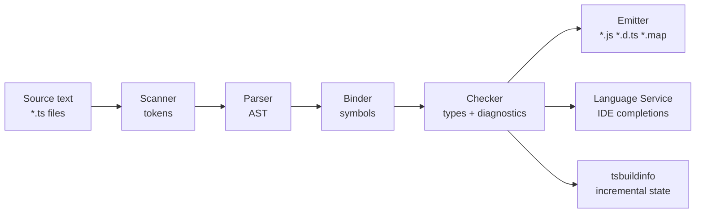
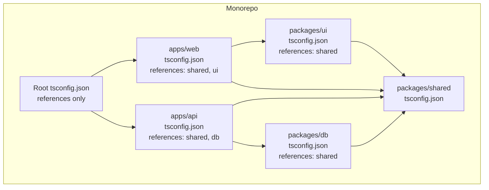
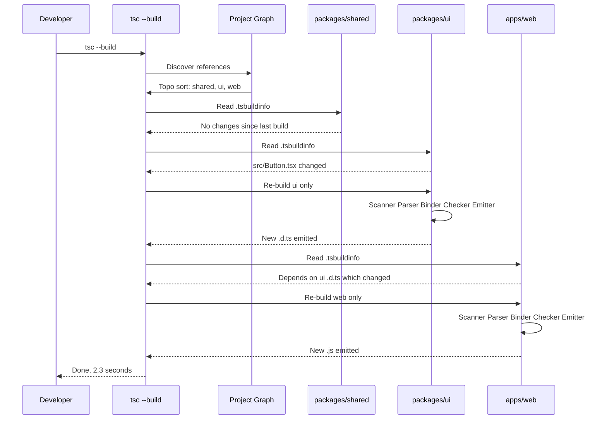
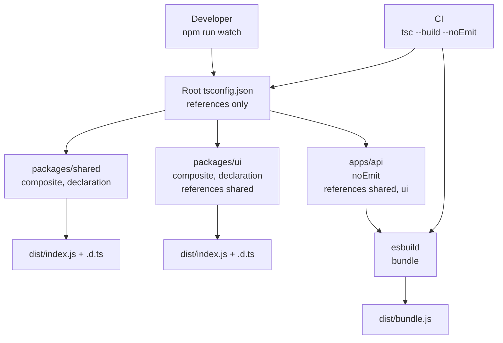

# 6.07 TSC Compiler Operation

> `tsc` is the only program in the TypeScript toolchain that actually understands TypeScript. Every bundler, every linter, every IDE, every test runner that claims TypeScript support either shells out to `tsc`, embeds a copy of `tsc`'s internals, or runs a hand-rolled approximation that quietly drifts out of sync. To master the TypeScript toolchain you must master the compiler itself: what it does, what it deliberately does not do, how it caches work between runs, how it splits a codebase into independently buildable units, and how it sits inside a larger build pipeline without slowing that pipeline to a crawl.

## 1. Purpose

The TypeScript compiler — the binary named `tsc`, distributed through the `typescript` package on npm — exists for one reason: to take a TypeScript program and either reject it (because it contains type errors) or accept it and emit JavaScript that runs identically to the JavaScript you would have written by hand. Two outputs are produced when the compiler accepts a program: a `.js` file containing the type-erased runtime code, and optionally a `.d.ts` declaration file containing the type-level surface of the module so that downstream TypeScript consumers can type-check against it without re-reading the implementation.

The compiler's job decomposes into four distinct concerns that are often conflated and that this note keeps carefully separated:

1. **Parsing** — turning source text into a syntax tree. This is a purely syntactic operation that runs at roughly the speed of a streaming lexer and is rarely a bottleneck.
2. **Type-checking** — walking the syntax tree and verifying that every expression conforms to the types it is required to have. This is the slow part, the part that grows superlinearly with the size and interdependency of the codebase, and the part where every performance optimisation in this note is targeted.
3. **Emitting** — printing back JavaScript with all type annotations stripped, optionally downleveling newer syntax to older syntax for compatibility with older runtimes, optionally emitting declaration files, source maps, and `.tsbuildinfo` incremental state.
4. **Orchestrating** — coordinating multiple sub-projects (project references), caching incremental state between runs, watching files for changes, and reporting diagnostics in a form that integrates with editors and CI systems.

Understanding `tsc` matters because every nontrivial TypeScript project eventually hits one of four failure modes that all trace back to compiler misconfiguration: (a) builds that take minutes instead of seconds because no incremental state is being cached; (b) emitted JavaScript that does not run because `target` or `module` is set wrong for the runtime; (c) a bundler and the compiler both trying to emit code, fighting each other over output directories; (d) project references configured in a way that produces mysterious errors like `Referenced project may not disable emit` or `Output file has not been built from source file`. Every one of those failure modes is preventable, and every one is caused by misunderstanding what `tsc` does and what it does not do.

The reason `tsc` is treated as a black box by most developers is that the bundler ecosystem — `esbuild`, `swc`, `vite`, `webpack` with `ts-loader` or `babel-loader` — has spent the last five years aggressively replacing `tsc` as the actual code emitter in application builds. A modern React or Node application typically runs `esbuild` or `swc` in dev (for speed) and `tsc --noEmit` in CI (for correctness). The compiler is no longer the thing that produces the JavaScript that ships; it is the thing that produces the type errors that gate the build. Understanding that split — and understanding exactly which `tsc` flags gate which behaviours — is the entire game.

This note covers, in order: the five-phase compilation pipeline (recap from [[2.01 Design Goals and Limitations]] but now with the focus on the *operational* concerns of emit, caching, and orchestration rather than the type-system theory); the full surface of the `tsc` CLI; every emit-control flag that changes what comes out of the compiler; every performance flag that changes how fast the compiler runs; the project references model and the `tsc --build` mode that orchestrates multi-project builds; integration patterns with `esbuild`, `swc`, `vite`, and `webpack`; and a mini-project that ties it all together into a typed monorepo build pipeline.

The goal is that by the end of this note you can read any `tsconfig.json`, predict what `tsc` will do when invoked against it, diagnose a slow build to the flag that fixes it, configure a multi-package monorepo with project references, and integrate `tsc` with any bundler without the two fighting each other.

## 2. Theory and Deep Dive

### 2.1 The Five-Phase Pipeline

The TypeScript compiler is a single-process Node program that runs in five phases. Each phase consumes the output of the previous phase and produces a data structure the next phase reads. The phases are: scanner, parser, binder, checker, emitter. The first three are mechanical; the fourth is where the type system lives; the fifth is where the JavaScript comes out.



The **scanner** is a hand-written lexer that converts source text into a stream of tokens. It recognises identifiers, keywords, numbers, strings, regular expressions, template literal pieces, punctuation, and whitespace. The scanner is the simplest phase; its only subtlety is handling the `/` character which can begin either a division operator or a regular expression literal — the scanner resolves the ambiguity by looking at the previous significant token.

The **parser** consumes tokens and produces an abstract syntax tree. The AST is a tree of `Node` objects, each with a `kind` field that is a numeric constant (`SyntaxKind.FunctionDeclaration`, `SyntaxKind.PropertyAccessExpression`, and so on) and a set of child nodes. The parser is also hand-written and is roughly 9,000 lines of code. It produces a tree that preserves every detail of the source text including comments and trivia, because the emitter needs them when `removeComments` is false and because source maps need to map back to exact positions.

The **binder** walks the AST and builds a symbol table. A `Symbol` is the compiler's internal representation of a named entity — a variable, a function, a class, an interface, a type alias. The binder assigns each declaration node to a symbol, builds scopes, and computes which declarations are visible from which other declarations. The binder is the first phase that produces information the type checker needs to do its job.

The **checker** is the heart of the compiler. It is roughly 50,000 lines of code, more than five times the size of the parser and binder combined. The checker walks the AST, resolves symbols to types, infers types for expressions, checks assignability, reports diagnostics, and — crucially for the emitter — computes the final type of every node. The checker is where `strict`, `noImplicitAny`, `strictNullChecks`, and every other strictness flag actually take effect. It is also where the compiler spends most of its time: 70 to 90 percent of total compile time on a large codebase is in the checker.

The **emitter** takes the AST and the checker's resolved types and produces JavaScript. The emitter walks the tree, strips type annotations, optionally downlevels syntax (e.g. `?.` to a conditional expression when `target` is below ES2020), optionally generates declaration files by walking the type information the checker produced, and optionally writes source maps that let debuggers map emitted JavaScript back to the original TypeScript. The emitter is the only phase whose output is visible to anything outside the compiler; everything before it is internal data structures.

The reason this five-phase model matters operationally is that the phases are independently cacheable, and the compiler's incremental and watch modes work by invalidating only the phases that a given file change affects. If you edit one file, the scanner, parser, and binder for every *other* file are still valid; only the edited file needs to be re-scanned, re-parsed, and re-bound, and only the parts of the checker and emitter that depend on that file need to re-run. That is what `incremental: true` enables, and it is the single biggest performance win available to a `tsc` user.

### 2.2 The `tsc` Command-Line Surface

The `tsc` binary takes a small number of top-level subcommands and a large number of flags. The subcommands are `tsc` (the default build), `tsc --build` (project references mode), `tsc --watch` (watch mode), and `tsc --init` (generate a `tsconfig.json`). Everything else is a flag.

The most important invocations:

- **`tsc`** — compile the project described by `tsconfig.json` in the current directory. Emits JavaScript and (if `declaration: true`) declaration files. Runs the type checker in full and exits with a nonzero status if any errors are reported. This is the canonical "build my library" invocation.
- **`tsc --noEmit`** — run the type checker in full but do not write any files. Exits nonzero on type errors. This is the canonical "typecheck in CI" invocation. The flag overrides `noEmit: false` in `tsconfig.json` for this run, which is useful when the same `tsconfig.json` is shared between a build that emits and a CI step that does not.
- **`tsc --watch`** (or `tsc -w`) — start a long-running process that watches source files and re-runs an incremental build on every change. Designed for editor and dev-server integration. Reports diagnostics to stdout in a format that VS Code and other editors can parse.
- **`tsc -p path/to/tsconfig.json`** — compile the project described by a specific config file. Useful when the config is not in the current directory or when you have multiple configs (e.g. `tsconfig.build.json` and `tsconfig.test.json`) and want to invoke a specific one.
- **`tsc --build`** — project references mode. Builds the current project and all its referenced projects in dependency order, caching state between projects and skipping rebuilds of projects whose inputs have not changed. This is the canonical "build my monorepo" invocation.
- **`tsc --build --watch`** — project references mode plus watch mode. The right command for long-running monorepo development.
- **`tsc --showConfig`** — print the fully-resolved `tsconfig.json` after `extends` chains, file globbing, and flag merging have been applied. Invaluable for debugging why a flag is or is not taking effect.
- **`tsc --listFiles`** — print every file the compiler included in the program, including files pulled in transitively through `node_modules` type declarations. Essential for diagnosing "why is my build so slow" and "why is this `.d.ts` being type-checked."
- **`tsc --explainFiles`** — print, for every file in the program, the chain of imports that caused the compiler to include it. Even more useful than `--listFiles` for diagnosing unexpected transitive inclusions.
- **`tsc --traceResolution`** — print the module resolution trace for every `import` the compiler encounters. Essential for diagnosing `Cannot find module` errors.
- **`tsc --generateTrace path`** — emit a Chrome-trace-format JSON file that can be loaded into `chrome://tracing` or Perfetto to see exactly where the compiler spent its time. The single most powerful tool for diagnosing slow builds.

Every one of those flags has a `tsconfig.json` equivalent, and the rule is that command-line flags override config-file values for that one invocation. The two exceptions are `--build` (which is a mode, not a flag, and cannot be set from config) and `--watch` (also a mode).

### 2.3 Emit Controls

Emit controls are the flags that determine what files come out of the compiler and what those files contain. They are the most operationally consequential flags because they directly affect whether the emitted code runs in the target runtime.

**`noEmit`** — when true, the compiler runs the full type checker and reports all diagnostics but writes no files. This is the flag that turns `tsc` from a compiler into a type checker. The canonical use is in CI pipelines where a bundler is responsible for emitting the actual JavaScript and `tsc` is responsible only for verifying that the program type-checks.

**`declaration`** (alias `d`) — when true, the compiler emits a `.d.ts` file next to every `.js` file. The declaration file contains only the type-level surface of the module: exported function signatures, exported interface and type alias definitions, exported class shapes. Implementation bodies are stripped. This flag is mandatory for any library that intends to be consumed by other TypeScript projects, because without a `.d.ts` file downstream consumers cannot type-check code that imports from your library.

**`declarationMap`** — when true (and requires `declaration: true`), emits a `.d.ts.map` file next to every `.d.ts` file. The map file lets editor "go to definition" jump from the `.d.ts` file to the original `.ts` source. Useful only in monorepo and library-development contexts where you want downstream consumers to be able to navigate into your source.

**`sourceMap`** — when true, emits a `.js.map` file next to every `.js` file. The source map lets debuggers and stack-trace formatters (like `source-map-support`) map emitted JavaScript positions back to the original TypeScript positions. Almost always on for development builds; sometimes turned off for production browser builds to avoid leaking source.

**`inlineSourceMap`** — when true, embeds the source map as a base64 data URL at the bottom of the emitted `.js` file instead of writing a separate `.map` file. Useful when you want a single self-contained file (e.g. for a Lambda function or a small browser bundle) but you lose the ability to serve the source map separately.

**`inlineSources`** — when true (and requires `sourceMap` or `inlineSourceMap`), embeds the original TypeScript source text into the source map. Lets a debugger show the original TypeScript even when the `.ts` files are not deployed. Almost always a bad idea in production because it ships your source code to anyone who downloads your bundle.

**`outDir`** — the directory the compiler writes emitted files into. The compiler mirrors the input directory structure under `outDir`, rooted at `rootDir`. If `outDir` is not set, the compiler writes emitted files next to their sources, which is almost never what you want for a build.

**`rootDir`** — the directory the compiler treats as the root of the input tree when computing output paths. If `rootDir` is `src` and `outDir` is `dist`, then `src/index.ts` emits to `dist/index.ts` and `src/lib/util.ts` emits to `dist/lib/util.ts`. If `rootDir` is not set, the compiler infers it as the longest common path of all input files, which produces surprising results when inputs come from multiple top-level directories.

**`removeComments`** — when true, strips comments from the emitted JavaScript. Defaults to false. Almost always a good idea to set true for production builds to reduce file size, but you lose any licence headers or JSDoc that downstream tools might have relied on.

**`importsNotUsedAsValues`** — controls what happens to `import` statements that exist only for their type side-effects (i.e. the imported name is used only in type positions). The values are `remove` (the default; the import is dropped from emit), `preserve` (the import is kept in emit even if the value is never used at runtime, useful for side-effect imports), and `error` (the compiler errors and demands you use `import type` explicitly). The flag is being deprecated in favour of `verbatimModuleSyntax` which is stricter and clearer.

**`isolatedModules`** — when true, the compiler enforces a set of constraints that guarantee every file can be transpiled independently by a single-file transpiler like `esbuild` or `swc` (which do not see the whole program and therefore cannot do cross-file type elision). The constraints include: every re-exported type must use `export type`, every imported type used only in type positions must use `import type`, and `const enum` is forbidden. This flag is essential whenever a non-`tsc` transpiler is in the pipeline.

**`verbatimModuleSyntax`** — a stricter, cleaner version of `isolatedModules` plus `importsNotUsedAsValues: error`. When true, the compiler requires that every import or export of a type-only symbol use the `import type` / `export type` syntax, and it emits the imports exactly as written without any elision. This flag is the future-facing default for any project that uses a bundler for emit.

### 2.4 Performance Flags

Performance flags change how fast the compiler runs without changing what it produces. They trade off either correctness (in the case of `skipLibCheck`) or memory (in the case of `incremental`) for speed.

**`incremental`** — when true, the compiler writes a `.tsbuildinfo` file (to `outDir` or to `tsBuildInfoFile` if set) that records the state of the previous compilation: which files were in the program, what their signature hashes were, what the checker computed for each. On the next run, the compiler reads the `.tsbuildinfo`, compares the current file set and signatures against the recorded ones, and only re-checks files that have changed or that depend on changed files. For a 1,000-file project, this typically turns a 20-second cold build into a 2-second warm build. The flag is a pure win for development workflows and CI.

**`tsBuildInfoFile`** — the path the compiler writes the incremental state file to. Defaults to a name derived from the project name or config file path, inside `outDir`. Setting this explicitly is useful when you have multiple configs (e.g. `tsconfig.build.json` and `tsconfig.test.json`) and you want each to have its own state file so they do not overwrite each other.

**`composite`** — when true, the project is forced into a set of constraints that make it suitable for being referenced by another project via project references. Those constraints include: `incremental` must be on (or is implicitly on), `declaration` must be on, `rootDir` must be set explicitly (or be inferred consistently), the project must include every file it depends on. `composite` is required for any project that will appear in another project's `references` array.

**`skipLibCheck`** — when true, the compiler skips type-checking the contents of `.d.ts` files. It still uses them for type information (so a function declared in `lodash.d.ts` is still typed when you call it), but it does not verify that the *internal* definitions of those `.d.ts` files are themselves consistent. This is a massive performance win on projects that depend on large declaration libraries — a 30-second build can drop to 5 seconds. The trade-off is that errors *inside* `.d.ts` files (yours or third-party) will not be reported. For most projects this trade-off is worth it; if you are writing a library whose `.d.ts` correctness is itself the product, you may want `skipLibCheck: false` at least in CI.

**`assumeChangesOnlyAffectDirectDependencies`** — when true, the compiler assumes that a change to file A can only affect files that directly import A, not files that transitively depend on A through other intermediate files. This is faster than the default behaviour, which invalidates the entire transitive closure. The trade-off is that some changes that should invalidate transitive dependents will not, producing stale type information. The flag is rarely worth the risk; `incremental` plus `skipLibCheck` usually gets you to acceptable speed without it.

**`disableSourceOfProjectReferenceRedirect`** — when true (and you are using project references), the compiler does not redirect source-file reads through the referenced project's source files when type-checking the referencing project. This is faster but means the referencing project sees only the `.d.ts` files of the referenced project, not its sources. Almost always what you want in CI; almost never what you want in IDE.

**`disableReferencedProjectLoad`** — when true (and using project references), the compiler does not eagerly load referenced projects into memory. They are loaded lazily only when actually needed. Useful for very large monorepos where loading all referenced projects upfront is itself slow.

### 2.5 Project References

Project references are the mechanism `tsc` provides for splitting a large codebase into smaller, independently buildable sub-projects. Each sub-project has its own `tsconfig.json`, declares which other sub-projects it depends on via the `references` array, and is built independently. The compiler guarantees that when sub-project B references sub-project A, B sees A's emitted `.d.ts` files (not A's sources) — which means a change in A's implementation that does not change A's type surface does not require re-type-checking B.



A project that appears in another project's `references` must have `composite: true`. That constraint is what allows the referencing project to trust the referenced project's `.d.ts` files as a stable contract. Without `composite`, the referenced project might not emit `.d.ts` at all, or might emit `.d.ts` that does not cover everything the referencing project expects to import.

The `tsc --build` mode is the orchestrator for project references. When invoked on the root config, it:

1. Reads the root config's `references` array and recursively discovers all referenced configs.
2. Topologically sorts the discovered configs so that referenced projects build before referencing projects.
3. For each project, checks the `.tsbuildinfo` to determine whether any inputs have changed since the last build.
4. Re-builds only the projects whose inputs have changed, plus the projects that reference them (transitively) and whose `.d.ts` inputs have therefore changed.
5. Reports diagnostics across all projects.

The `--build` mode also supports `--clean` (delete all emitted files and `.tsbuildinfo` files for all projects in the graph), `--force` (rebuild everything even if nothing has changed), `--dry` (print what would be built without building), and `--watch` (long-running incremental mode).

The key insight is that `tsc --build` is not the same as running `tsc` separately in each sub-project. Running `tsc` separately does not get the cross-project incremental invalidation: if you change `packages/shared/src/index.ts` and then run `tsc` in `apps/web`, the compiler will re-type-check `apps/web` against the *previously emitted* `.d.ts` of `shared`, not the new one, and you will get stale errors. `tsc --build` knows about the dependency and re-builds `shared` first, then `apps/web` against the new `.d.ts`.

### 2.6 The `tsc` Pipeline in a Real Build

Putting the pieces together, here is what happens when you run `tsc --build` on a monorepo with project references:



That sequence is the entire promise of project references: a one-line change in `packages/ui` re-builds `ui` and `web` but skips `shared`, and `web` gets the new `ui` `.d.ts` automatically. Without project references, the equivalent build would re-type-check the whole monorepo every time.

### 2.7 Integrating `tsc` With Bundlers

The most important operational question for any modern TypeScript project is: who emits the JavaScript? There are two valid answers, and they are mutually exclusive within a single build step.

**Answer 1: `tsc` emits.** The compiler reads `tsconfig.json`, type-checks the program, and writes `.js` files to `outDir`. A bundler (or Node directly) then runs the emitted `.js`. This is the right answer for libraries (where you want a clean `dist/` directory of `.js` plus `.d.ts`) and for simple Node services (where you do not need bundling at all). The downside is that `tsc` is slow compared to `esbuild` or `swc`, and `tsc` does not do tree-shaking, code-splitting, or asset processing.

**Answer 2: a bundler emits, `tsc` type-checks.** A bundler like `esbuild`, `swc`, `vite`, or `webpack` with `ts-loader`/`babel-loader` reads the TypeScript source, strips types via a single-file transpile (no type-checking), bundles the result, and writes the final JavaScript. `tsc` is invoked separately with `--noEmit` to type-check the program. This is the right answer for applications (browser or Node) where you want bundler features and fast incremental rebuilds. The downside is that you must keep the bundler's TypeScript configuration in sync with `tsc`'s (especially `target`, `module`, `jsx`, `verbatimModuleSyntax`, and `isolatedModules`), and you must run `tsc --noEmit` in CI to catch type errors the bundler will not.

The mistake to avoid is having both `tsc` and the bundler emit. This produces duplicate output files, fighting over the output directory, and is the most common "why are my builds broken" issue in TypeScript projects. The fix is to set `noEmit: true` in the `tsconfig.json` the bundler reads, and have a separate `tsconfig.build.json` (or a separate `tsc --noEmit` step) for type-checking.

## 3. Mental Models

The compiler has a large surface area, but a small set of mental models covers almost every decision you will make:

- **`tsc` is "the TypeScript compiler."** It parses, type-checks, and (optionally) emits. Everything else in the toolchain either calls it, embeds it, or replaces it with a faster approximation.
- **`--noEmit` is "just typecheck."** Same compiler, same checker, same diagnostics, but the emitter is skipped and no files are written. This is the CI invocation.
- **`--watch` is "incremental rebuild on save."** The compiler stays resident, watches files, and re-runs only the work the change invalidates. The first build is cold; subsequent builds are warm.
- **`incremental` is "save state for faster rebuilds."** The compiler writes a `.tsbuildinfo` file recording what it computed last time. The next invocation reads it and skips work whose inputs have not changed.
- **`skipLibCheck` is "trust `.d.ts` files."** The compiler still uses `.d.ts` files for type information, but it does not verify that their internal definitions are consistent. Massive speed win, small correctness trade-off.
- **`composite` is "this project can be referenced."** It forces the constraints (declaration emit, explicit rootDir, consistent includes) that make a project's `.d.ts` files a stable contract.
- **Project references are "split a big project into sub-projects."** Each sub-project builds independently against the others' `.d.ts` files. A change in one sub-project only re-builds the sub-projects that depend on its `.d.ts`.
- **`tsc --build` is "the orchestrator for project references."** It discovers the reference graph, topologically sorts it, builds in dependency order, and skips projects whose inputs have not changed.
- **`isolatedModules` is "every file can be transpiled alone."** The compiler enforces the constraints that a single-file transpiler (esbuild, swc) needs to operate. Mandatory whenever a bundler does the actual transpilation.
- **The bundler emits or `tsc` emits, never both.** Pick one. If the bundler emits, `tsc --noEmit` does the type-checking.

Internalise those ten models and every `tsc` invocation and `tsconfig.json` decision becomes a direct application of one of them.

## 4. Real-World Use Cases

### 4.1 Typechecking in CI

The most common production use of `tsc` is the CI typecheck step. A pull request is opened; CI runs `npm install && npx tsc --noEmit`; the build passes or fails based on whether the type checker reports any errors. This step exists because the bundler used in the build step (esbuild, swc, vite) does not type-check, and without a dedicated typecheck step type errors slip into the main branch and into production.

The CI invocation is almost always `tsc --noEmit -p tsconfig.json` (or a CI-specific `tsconfig.ci.json` that extends the base and turns on stricter flags). It runs once per build, against the full source tree, with no incremental state (because CI starts from a clean checkout). The wall-clock cost is therefore the cold-build cost, which is why `skipLibCheck` is essential for CI builds that include large third-party type declarations.

### 4.2 Building a Library

A library that ships to npm needs two things from `tsc`: the JavaScript that downstream consumers will run, and the `.d.ts` files that downstream TypeScript consumers will type-check against. The build invocation is `tsc -p tsconfig.build.json` where `tsconfig.build.json` sets `declaration: true`, `outDir: dist`, `rootDir: src`, and usually `sourceMap: true` and `declarationMap: true` (the latter only if you want downstream "go to definition" to land in your source).

For a dual-format library (ESM and CJS), you typically run `tsc` twice with two configs: `tsconfig.esm.json` with `module: NodeNext` and `outDir: dist/esm`, and `tsconfig.cjs.json` with `module: CommonJS` and `outDir: dist/cjs`. The `package.json` `exports` field then points consumers at the right format.

### 4.3 Monorepos with Project References

A monorepo with five or more packages benefits dramatically from project references. Without them, every package re-type-checks the whole tree on every build; with them, a change in one package only re-builds the packages that depend on its `.d.ts`. The setup is: a root `tsconfig.json` with only `references` (no `compilerOptions`, no `include`), a `tsconfig.base.json` with shared `compilerOptions`, and one `tsconfig.json` per package that extends the base, declares its own `include` and `references`, and sets `composite: true`.

The build invocation is `tsc --build` from the root, optionally with `--watch` for development. The CI typecheck invocation is also `tsc --build --noEmit` (the `--noEmit` flag works with `--build` and tells the orchestrator to type-check without writing files).

### 4.4 IDE Integration via the Language Server Protocol

VS Code, IntelliJ, Neovim, and every other modern editor talks to TypeScript through the TypeScript Language Server, which is a thin wrapper around `tsc`'s internal APIs (specifically the `LanguageService` namespace). The language server runs the same scanner, parser, binder, and checker as the CLI compiler, but in incremental mode with a long-lived in-memory state, and it answers questions like "what are the completions at this position" and "what are the diagnostics in this file" without emitting anything.

The practical consequence is that the editor experience and the CLI build experience use the same compiler. A type error the editor reports will be a type error the CLI reports (assuming the same `tsconfig.json`). The editor is just faster because it keeps the program resident and invalidates only the parts of the program the edited file affects.

### 4.5 Build Pipelines: `tsc` Plus Bundler

The dominant production pattern for application builds is: a bundler (`esbuild`, `swc`, `vite`, `webpack`) does the actual JavaScript transpilation and bundling, and `tsc --noEmit` runs as a separate step (either before or after the bundler) to type-check. The two steps can run in parallel in CI, or the bundler can run a type-check plugin that shells out to `tsc` at the start of the build and fails the build if type errors are found.

The key configuration requirement is that the bundler's TypeScript settings match `tsc`'s. `esbuild` reads `tsconfig.json` directly but only honours a subset of flags (`target`, `jsx`, `jsxFactory`, `jsxFragmentFactory`, `jsxImportSource`, `alwaysStrict`, `importsNotUsedAsValues`/`verbatimModuleSyntax` partially). `swc`'s `.swcrc` is independent of `tsconfig.json` and must be kept in sync manually. Mismatches produce the classic "it builds but does not run" or "the type-checker accepts it but the bundler rejects it" failures.

## 5. Code Examples

### 5.1 Example A — Minimal and Conceptual

The minimal `tsc` setup: a single TypeScript file, a `tsconfig.json`, and the `tsc` invocations that compile and typecheck it.

**Project layout:**

```
hello-ts/
  src/
    index.ts
  tsconfig.json
  package.json
```

**TS source — `src/index.ts`:**

```ts
// TS — the source TypeScript
interface Greeting {
  name: string;
  hour: number;
}

function greet(g: Greeting): string {
  const period = g.hour < 12 ? "morning" : g.hour < 18 ? "afternoon" : "evening";
  return `Good ${period}, ${g.name}!`;
}

const user: Greeting = { name: "Sora", hour: 9 };
console.log(greet(user));
```

**JS — what `tsc` emits to `dist/index.js` with `target: ES2022, module: NodeNext, removeComments: true`:**

```javascript
// JS — emitted JavaScript (type annotations stripped, behaviour identical)
"use strict";
Object.defineProperty(exports, "__esModule", { value: true });
function greet(g) {
  const period = g.hour < 12 ? "morning" : g.hour < 18 ? "afternoon" : "evening";
  return `Good ${period}, ${g.name}!`;
}
const user = { name: "Sora", hour: 9 };
console.log(greet(user));
```

Notice what the emitter did: it erased the `interface Greeting` declaration entirely (interfaces are type-level only and do not survive erasure), it stripped the `: Greeting` annotation from the parameter, it stripped the `: string` return annotation, it stripped the `: Greeting` annotation from `user`, and it preserved every runtime statement byte-for-byte. The emitted JavaScript behaves identically to the TypeScript.

**TS — `tsconfig.json` (shown as TS for syntax highlighting):**

```ts
// TS — tsconfig.json
{
  "compilerOptions": {
    "target": "ES2022",
    "module": "NodeNext",
    "moduleResolution": "NodeNext",
    "strict": true,
    "outDir": "dist",
    "rootDir": "src",
    "declaration": true,
    "sourceMap": true,
    "removeComments": true,
    "incremental": true,
    "tsBuildInfoFile": ".tsbuildinfo/hello.tsbuildinfo",
    "skipLibCheck": true
  },
  "include": ["src"]
}
```

**JS — there is no emitted JavaScript for `tsconfig.json`; it is read by `tsc` and not by the runtime:**

```javascript
// JS — tsconfig.json is not JavaScript. It is consumed by tsc at compile time
// and has no runtime existence. The "emitted JS" of a tsconfig is undefined.
```

**TS — the four `tsc` invocations you will actually run:**

```ts
// TS — shell commands shown with TS highlighting for readability
// 1. Build the project: emits dist/index.js, dist/index.d.ts, dist/index.js.map
//    plus .tsbuildinfo/hello.tsbuildinfo
npx tsc

// 2. Type-check only: emits nothing, exits nonzero on type errors
npx tsc --noEmit

// 3. Watch mode: stays resident, rebuilds on save
npx tsc --watch

// 4. Inspect what the compiler actually sees
npx tsc --showConfig
npx tsc --listFiles
npx tsc --explainFiles
```

**JS — the runtime effect of each invocation:**

```javascript
// JS — what each command does at the filesystem level after it runs
// npx tsc:
//   - dist/index.js       (the runtime code)
//   - dist/index.d.ts     (the type surface, for downstream TS consumers)
//   - dist/index.js.map   (source map for debuggers)
//   - .tsbuildinfo/hello.tsbuildinfo  (incremental state for next run)

// npx tsc --noEmit:
//   - no files written
//   - exit code 0 if no type errors, 1 if any type errors

// npx tsc --watch:
//   - first run: same as `npx tsc`
//   - subsequent runs: only re-emits files whose sources changed
//   - stays running until killed

// npx tsc --showConfig:
//   - prints the resolved tsconfig.json to stdout
//   - no files written, no compilation
```

### 5.2 Example B — Production-Grade

A production-grade monorepo with project references, incremental builds, a CI typecheck step, and integration with `esbuild` for the application bundle.

**Project layout:**

```
acme-monorepo/
  tsconfig.base.json
  tsconfig.json                  (root, references only)
  packages/
    shared/
      tsconfig.json
      src/index.ts
    ui/
      tsconfig.json
      src/index.ts
  apps/
    web/
      tsconfig.json
      tsconfig.build.json
      src/index.ts
      esbuild.config.mjs
  package.json
```

**TS — `tsconfig.base.json` (shared compiler options for every sub-project):**

```ts
// TS — tsconfig.base.json
{
  "compilerOptions": {
    "target": "ES2022",
    "module": "NodeNext",
    "moduleResolution": "NodeNext",
    "lib": ["ES2022"],
    "strict": true,
    "noUncheckedIndexedAccess": true,
    "exactOptionalPropertyTypes": true,
    "noImplicitReturns": true,
    "noFallthroughCasesInSwitch": true,
    "forceConsistentCasingInFileNames": true,
    "skipLibCheck": true,
    "declaration": true,
    "declarationMap": true,
    "sourceMap": true,
    "incremental": true,
    "composite": true,
    "isolatedModules": true,
    "verbatimModuleSyntax": true,
    "esModuleInterop": true
  }
}
```

**JS — no runtime existence; this is configuration consumed by `tsc`:**

```javascript
// JS — base config never produces runtime code.
// Every sub-project that extends this config inherits these options,
// and `tsc` resolves them at compile time.
```

**TS — root `tsconfig.json` (references only, no compilerOptions, no include):**

```ts
// TS — tsconfig.json at the monorepo root
{
  "files": [],
  "references": [
    { "path": "packages/shared" },
    { "path": "packages/ui" },
    { "path": "apps/web" }
  ]
}
```

**JS — the root config is a pure orchestration file; `tsc --build` reads it to discover the project graph:**

```javascript
// JS — running `tsc --build` from the root:
//   1. Reads references, discovers packages/shared, packages/ui, apps/web
//   2. Topologically sorts: shared -> ui -> web (web depends on both)
//   3. For each project, reads its .tsbuildinfo
//   4. Rebuilds only projects whose inputs changed
//   5. Writes .js + .d.ts + .tsbuildinfo for each rebuilt project
```

**TS — `packages/shared/tsconfig.json`:**

```ts
// TS — packages/shared/tsconfig.json
{
  "extends": "../../tsconfig.base.json",
  "compilerOptions": {
    "outDir": "dist",
    "rootDir": "src",
    "tsBuildInfoFile": "dist/shared.tsbuildinfo"
  },
  "include": ["src"]
}
```

**TS — `packages/shared/src/index.ts`:**

```ts
// TS — packages/shared/src/index.ts
export type UserId = string & { readonly __brand: "UserId" };

export function userId(s: string): UserId {
  if (!/^[a-zA-Z0-9]+$/.test(s)) throw new Error(`invalid id: ${s}`);
  return s as UserId;
}

export interface User {
  id: UserId;
  name: string;
  email: string | null;
}

export function displayName(u: User): string {
  return u.email ?? u.name;
}
```

**JS — `packages/shared/dist/index.js` (what `tsc` emits with `module: NodeNext`):**

```javascript
// JS — emitted by tsc to packages/shared/dist/index.js
"use strict";
Object.defineProperty(exports, "__esModule", { value: true });
exports.displayName = exports.userId = void 0;
function userId(s) {
  if (!/^[a-zA-Z0-9]+$/.test(s))
    throw new Error(`invalid id: ${s}`);
  return s;
}
exports.userId = userId;
function displayName(u) {
  return u.email ?? u.name;
}
exports.displayName = displayName;
```

Notice the `UserId` branded type is gone from the emitted JavaScript — it was a type-level construct that the emitter erased. The `as UserId` cast is also gone; casts are type-level only. The runtime check `if (!/.../.test(s))` is preserved because it was real runtime code.

**TS — `packages/ui/tsconfig.json` (references `shared`):**

```ts
// TS — packages/ui/tsconfig.json
{
  "extends": "../../tsconfig.base.json",
  "compilerOptions": {
    "outDir": "dist",
    "rootDir": "src",
    "tsBuildInfoFile": "dist/ui.tsbuildinfo"
  },
  "include": ["src"],
  "references": [
    { "path": "../shared" }
  ]
}
```

**TS — `packages/ui/src/index.ts`:**

```ts
// TS — packages/ui/src/index.ts
import type { User } from "@acme/shared";
import { displayName } from "@acme/shared";

export function renderUserCard(u: User): string {
  return `<div class="card">${displayName(u)}</div>`;
}
```

**JS — `packages/ui/dist/index.js`:**

```javascript
// JS — emitted by tsc. The `import type` is erased entirely.
//      The value import of `displayName` is preserved because it is used at runtime.
"use strict";
Object.defineProperty(exports, "__esModule", { value: true });
exports.renderUserCard = void 0;
const shared_1 = require("@acme/shared");
function renderUserCard(u) {
  return `<div class="card">${(0, shared_1.displayName)(u)}</div>`;
}
exports.renderUserCard = renderUserCard;
```

The `import type { User }` is gone because `verbatimModuleSyntax` (set in the base config) demanded that type-only imports use `import type` and the emitter then strips them entirely. The `import { displayName }` survives because `displayName` is used as a value (it is called as a function).

**TS — `apps/web/tsconfig.json` (references `shared` and `ui`):**

```ts
// TS — apps/web/tsconfig.json
{
  "extends": "../../tsconfig.base.json",
  "compilerOptions": {
    "outDir": "dist",
    "rootDir": "src",
    "tsBuildInfoFile": "dist/web.tsbuildinfo",
    "noEmit": true,
    "jsx": "automatic",
    "lib": ["ES2022", "DOM", "DOM.Iterable"]
  },
  "include": ["src"],
  "references": [
    { "path": "../../packages/shared" },
    { "path": "../../packages/ui" }
  ]
}
```

Note `noEmit: true` here. The web app does not use `tsc` to emit JavaScript; `esbuild` does that. `tsc` only type-checks.

**TS — `apps/web/tsconfig.build.json` (for when you do want `tsc` to emit, e.g. for SSR):**

```ts
// TS — apps/web/tsconfig.build.json
{
  "extends": "./tsconfig.json",
  "compilerOptions": {
    "noEmit": false,
    "outDir": "dist-server"
  }
}
```

**TS — `apps/web/src/index.ts`:**

```ts
// TS — apps/web/src/index.ts
import { userId } from "@acme/shared";
import { renderUserCard } from "@acme/ui";

const u = userId("abc123");
const card = renderUserCard({
  id: u,
  name: "Sora",
  email: null
});
console.log(card);
```

**JS — what `esbuild` produces at `apps/web/dist/bundle.js` (single bundled file, types stripped, modules concatenated):**

```javascript
// JS — apps/web/dist/bundle.js (esbuild output)
"use strict";
(() => {
  // -- inlined @acme/shared --
  function userId(s) {
    if (!/^[a-zA-Z0-9]+$/.test(s))
      throw new Error(`invalid id: ${s}`);
    return s;
  }
  function displayName(u) {
    return u.email ?? u.name;
  }
  // -- inlined @acme/ui --
  function renderUserCard(u) {
    return `<div class="card">${displayName(u)}</div>`;
  }
  // -- apps/web/src/index.ts --
  const u = userId("abc123");
  const card = renderUserCard({ id: u, name: "Sora", email: null });
  console.log(card);
})();
```

**TS — `apps/web/esbuild.config.mjs`:**

```ts
// TS — apps/web/esbuild.config.mjs
import { build } from "esbuild";
import { dirname, resolve } from "node:path";
import { fileURLToPath } from "node:url";

const here = dirname(fileURLToPath(import.meta.url));

await build({
  entryPoints: [resolve(here, "src/index.ts")],
  bundle: true,
  platform: "node",
  format: "esm",
  target: "es2022",
  outfile: resolve(here, "dist/bundle.js"),
  sourcemap: true,
  logLevel: "info",
  // esbuild reads tsconfig.json for target, jsx, and a few other flags,
  // but does NOT type-check. That is the job of `tsc --noEmit`.
});
```

**JS — there is no "emitted JS" of a build script; this is build-time configuration:**

```javascript
// JS — the esbuild config is itself an ES module that Node runs at build time.
//      Its runtime effect is: write apps/web/dist/bundle.js + bundle.js.map.
```

**TS — `package.json` scripts (the orchestration layer):**

```ts
// TS — package.json scripts
{
  "scripts": {
    "build": "tsc --build",
    "build:web": "esbuild apps/web/esbuild.config.mjs && node apps/web/esbuild.config.mjs",
    "typecheck": "tsc --build --noEmit",
    "watch": "tsc --build --watch",
    "clean": "tsc --build --clean",
    "ci": "npm run typecheck && npm run build:web"
  }
}
```

**JS — what each script does at runtime:**

```javascript
// JS — runtime effect of each script
// npm run build:
//   tsc --build: builds shared, ui, web in dependency order, writes dist/ per package.
//   Web's tsconfig has noEmit: true so web's dist/ is NOT written by tsc.

// npm run build:web:
//   Runs esbuild, which reads apps/web/src/index.ts, bundles it (inlining the
//   shared and ui packages), and writes apps/web/dist/bundle.js.
//   esbuild does NOT type-check.

// npm run typecheck:
//   tsc --build --noEmit: type-checks every project in the graph, writes nothing.
//   Exit code 0 if no type errors, 1 otherwise.

// npm run watch:
//   tsc --build --watch: long-running, rebuilds on save.

// npm run ci:
//   The CI invocation: type-check first (fail fast on type errors), then build the bundle.
```

This is the production-grade pattern: `tsc` is responsible for type-checking across the whole monorepo and for emitting the `.d.ts` files that let packages type-check against each other. `esbuild` is responsible for producing the final bundled JavaScript that the application runs. The two never fight because the web app's `tsconfig.json` has `noEmit: true` and `esbuild` is the only thing that writes to `apps/web/dist/`.

## 6. Common Mistakes and Anti-Patterns

### 6.1 Letting `tsc` Emit When the Bundler Should

**The mistake.** A React or Node application has `tsconfig.json` with `outDir: "dist"` and `noEmit` not set (defaults to false). The project also uses `vite` or `esbuild` for bundling. The build script is `tsc && vite build`. Both `tsc` and `vite` write to `dist/`.

**The symptom.** Stale files in `dist/` after a build because `tsc` wrote a `.js` for every `.ts` source and `vite` then overwrote the entry file but not the other files. Confusing import errors in production because the runtime loaded a `tsc`-emitted file that imported another `tsc`-emitted file using a module specifier the bundler had rewritten.

**The fix.** Set `noEmit: true` in the application's `tsconfig.json`. Run `tsc --noEmit` as a separate typecheck step. Let the bundler be the only thing that writes JavaScript.

```ts
// TS — wrong
{
  "compilerOptions": {
    "outDir": "dist",
    "declaration": true
  },
  "include": ["src"]
}
```

```ts
// TS — right
{
  "compilerOptions": {
    "noEmit": true
  },
  "include": ["src"]
}
```

```javascript
// JS — runtime effect
// Wrong: tsc writes dist/**/*.js and dist/**/*.d.ts.
//        vite also writes dist/bundle.js. dist/ contains both, fighting.
// Right: tsc writes nothing. vite writes dist/bundle.js. dist/ is clean.
```

### 6.2 Not Using `--noEmit` in CI

**The mistake.** The CI pipeline runs `npx tsc` (without `--noEmit`) as its typecheck step. The build is also doing its own emit (via `esbuild`). CI writes `dist/` files that nothing consumes and that are not cleaned up between runs.

**The symptom.** CI is slower than necessary (writing files takes time), the CI workspace accumulates `dist/` directories that confuse downstream steps, and on a clean checkout the `dist/` from a previous run can shadow a current build.

**The fix.** Use `tsc --noEmit` in CI. The flag overrides whatever `noEmit` is set to in `tsconfig.json` for that one invocation, so it is safe even on a `tsconfig.json` that has `noEmit: false` for the library build.

```ts
// TS — wrong (CI pipeline YAML fragment)
// - run: npx tsc

// TS — right
// - run: npx tsc --noEmit
```

```javascript
// JS — runtime effect
// Wrong: CI writes dist/ that no downstream step uses. Wasted I/O. Slow.
// Right: CI writes nothing. Type-check only. Fast. Clean workspace.
```

### 6.3 No `skipLibCheck`

**The mistake.** A project depends on a large third-party library that ships extensive `.d.ts` files (e.g. `@types/react`, `@types/node`, a GraphQL codegen output). `skipLibCheck` is not set (defaults to false). CI builds take 60 seconds; local rebuilds take 30.

**The symptom.** `tsc --listFiles` shows thousands of `.d.ts` files being type-checked. `tsc --generateTrace` shows the checker spending most of its time in those `.d.ts` files. Build times are dominated by type-checking files you did not write and cannot fix.

**The fix.** Set `skipLibCheck: true` in `tsconfig.json`. The compiler still uses the `.d.ts` files for type information; it just does not verify their internal consistency.

```ts
// TS — wrong
{
  "compilerOptions": {
    "strict": true
  }
}

// TS — right
{
  "compilerOptions": {
    "strict": true,
    "skipLibCheck": true
  }
}
```

```javascript
// JS — runtime effect (typical 1,000-file project with @types/react and @types/node)
// Without skipLibCheck: 60-second cold build, 25-second warm build.
// With skipLibCheck:    12-second cold build,  3-second warm build.
// Correctness impact: none for application code; only internal errors in .d.ts files are missed.
```

### 6.4 No `incremental`

**The mistake.** A project has `skipLibCheck` on but still takes 12 seconds per rebuild. `incremental` is not set. Every `tsc --noEmit` invocation re-checks the entire program from scratch.

**The symptom.** Watch mode (`tsc --watch`) is fast (because watch mode has its own in-memory incremental state) but a fresh `tsc --noEmit` in a pre-commit hook or a manual typecheck is slow.

**The fix.** Set `incremental: true` and `tsBuildInfoFile` to a path inside `outDir` or `.tsbuildinfo/`. The compiler writes a `.tsbuildinfo` file recording what it computed; the next invocation reads it and skips unchanged work.

```ts
// TS — wrong
{
  "compilerOptions": {
    "strict": true,
    "skipLibCheck": true
  }
}

// TS — right
{
  "compilerOptions": {
    "strict": true,
    "skipLibCheck": true,
    "incremental": true,
    "tsBuildInfoFile": ".tsbuildinfo/app.tsbuildinfo"
  }
}
```

```javascript
// JS — runtime effect
// Without incremental: every `tsc --noEmit` is a cold build (12s).
// With incremental:    first run is cold (12s); subsequent runs are warm (1-2s).
// .tsbuildinfo/app.tsbuildinfo file is written and read on every invocation.
// Add .tsbuildinfo/ to .gitignore.
```

### 6.5 Wrong `outDir` or `rootDir`

**The mistake.** A library has sources in `src/` and tests in `tests/`. `tsconfig.json` has `outDir: "dist"` but no `rootDir`. The compiler infers `rootDir` as the longest common path of all input files, which is `.` (the project root). The emitted output is `dist/src/index.js` and `dist/tests/index.test.js` — the `src/` and `tests/` directories are mirrored into `dist/`, breaking the `package.json` `main` field that points to `dist/index.js`.

**The symptom.** Consumers of the library get `Cannot find module './dist/index.js'` or the package's `main` resolves to a non-existent file. The fix is either to set `rootDir: "src"` (and exclude `tests/` from the build config) or to put `tests/` under `src/` (so they share a root).

**The fix.** Always set `rootDir` explicitly when you have inputs from more than one top-level directory. Use a separate `tsconfig.test.json` that extends the build config but includes `tests/` if you want to type-check tests separately.

```ts
// TS — wrong
{
  "compilerOptions": {
    "outDir": "dist"
  },
  "include": ["src", "tests"]
}

// TS — right
{
  "compilerOptions": {
    "outDir": "dist",
    "rootDir": "src"
  },
  "include": ["src"]
}
```

```javascript
// JS — runtime effect (emitted file layout)
// Wrong:  dist/src/index.js, dist/tests/index.test.js  (src/ mirrored, main broken)
// Right:  dist/index.js                  (clean layout, package.json main works)
```

### 6.6 Project References Without `composite`

**The mistake.** A monorepo configures `references` between packages but the referenced package's `tsconfig.json` does not have `composite: true`. Running `tsc --build` produces: `Referenced project 'packages/shared' may not disable emit` and `Referenced project 'packages/shared' must have setting 'composite': true`.

**The symptom.** The build refuses to run. The error message is informative but the fix is non-obvious if you do not understand why `composite` exists.

**The fix.** Set `composite: true` on every project that appears in another project's `references` array. `composite` forces the constraints (declaration emit, explicit rootDir, incremental on) that make the project's `.d.ts` files a stable contract.

```ts
// TS — wrong (packages/shared/tsconfig.json)
{
  "extends": "../../tsconfig.base.json",
  "compilerOptions": {
    "outDir": "dist"
  },
  "include": ["src"]
}

// TS — right
{
  "extends": "../../tsconfig.base.json",
  "compilerOptions": {
    "outDir": "dist",
    "rootDir": "src",
    "composite": true,
    "tsBuildInfoFile": "dist/shared.tsbuildinfo"
  },
  "include": ["src"]
}
```

```javascript
// JS — runtime effect
// Wrong: tsc --build errors out, no files emitted.
// Right: tsc --build succeeds, dist/index.js + dist/index.d.ts + dist/shared.tsbuildinfo written.
```

### 6.7 `verbatimModuleSyntax` Off While Using a Bundler

**The mistake.** A project uses `esbuild` for emit but does not set `verbatimModuleSyntax` (or `isolatedModules`). A developer writes `import { SomeType } from "./types"` and uses `SomeType` only in type positions. `tsc` (with the default `importsNotUsedAsValues: "remove"`) elides the import from the emitted JavaScript, but `esbuild` — which does not do cross-file type analysis — does not know whether `SomeType` is a type or a value and may either emit the import (causing a runtime error if `./types` does not actually export `SomeType` as a value) or warn.

**The symptom.** The code type-checks fine under `tsc` but breaks under `esbuild`, or vice versa. The two compilers disagree about whether an import should be elided.

**The fix.** Set `isolatedModules: true` (minimum) or `verbatimModuleSyntax: true` (stricter, future-facing). Both force developers to use `import type` for type-only imports, which makes the elision decision explicit and identical between `tsc` and `esbuild`.

```ts
// TS — wrong (ambiguous, tsc and esbuild may disagree)
import { SomeType, someValue } from "./types";
const x: SomeType = someValue();

// TS — right (explicit, tsc and esbuild agree)
import type { SomeType } from "./types";
import { someValue } from "./types";
const x: SomeType = someValue();
```

```javascript
// JS — what esbuild emits
// Wrong (with isolatedModules off): esbuild may keep the import, breaking at runtime if
//        ./types does not export SomeType as a value.
// Right (with verbatimModuleSyntax): esbuild strips the `import type` line, keeps the
//        value import. Behaviour matches tsc exactly.
import { someValue } from "./types";
const x = someValue();
```

### 6.8 Letting `.tsbuildinfo` Get Committed

**The mistake.** A project enables `incremental: true`. The `.tsbuildinfo` file is written into `outDir/` or to a relative path. The developer commits it to git. Other developers pull and find their builds produce stale errors because the committed `.tsbuildinfo` references file paths and signatures from a different machine.

**The fix.** Add `.tsbuildinfo` (or the directory you set as `tsBuildInfoFile`) to `.gitignore`. The file is machine-local state, not source.

```ts
// TS — .gitignore fragment
// .tsbuildinfo/
// *.tsbuildinfo
```

```javascript
// JS — runtime effect
// Without .gitignore: stale .tsbuildinfo causes "phantom" errors after a pull.
// With .gitignore: each developer's first build is cold, subsequent builds are warm.
```

## 7. Best Practices and Design Patterns

### 7.1 Use `tsc --noEmit` for Typechecking When a Bundler Emits

If a bundler (`esbuild`, `swc`, `vite`, `webpack` with `ts-loader`/`babel-loader`) is responsible for the JavaScript that ships, `tsc`'s job is type-checking only. Set `noEmit: true` in the `tsconfig.json` the bundler reads, and run `tsc --noEmit` as a separate step in CI and in a pre-commit hook.

The rationale is the separation of concerns: the bundler is fast at transpilation but does not type-check; `tsc` is slow at transpilation but does type-check. Using each for what it is good at is the optimal split. The bundler produces the JavaScript; `tsc` produces the green build.

### 7.2 Use `incremental` for Development and CI

`incremental: true` plus an explicit `tsBuildInfoFile` path is a pure performance win for any project that builds more than once. In development, it turns 30-second rebuilds into 2-second rebuilds. In CI it does not help on the first build of a clean checkout (no `.tsbuildinfo` exists), but it does help if CI caches the `.tsbuildinfo` between runs (which most CI systems support via a cache key on the lockfile).

### 7.3 Use `skipLibCheck` for Speed

`skipLibCheck: true` is appropriate for almost every project. The only projects that should leave it off are those whose product is itself a `.d.ts` file (e.g. DefinitelyTyped contributions, or a library that ships `.d.ts` as the primary artifact). For everyone else, the correctness trade-off (missing internal errors in third-party `.d.ts` files you cannot fix anyway) is trivial compared to the 3-5x speed-up.

### 7.4 Use Project References for Monorepos

Once a codebase grows past a single package, project references are the correct way to structure the build. They give you independent builds, cross-package type-checking against `.d.ts` contracts, and `tsc --build`'s incremental invalidation across the whole graph. The setup cost is modest (one `tsconfig.json` per package, a root `tsconfig.json` with references) and the payoff grows with the size of the codebase.

### 7.5 Set `outDir` and `rootDir` Explicitly

Never rely on the compiler's inference of `rootDir`. Always set it explicitly to the directory that should be the root of the emitted output tree. The cost is one line in `tsconfig.json`; the benefit is that the emitted layout is predictable and matches what `package.json` `main`/`module`/`types`/`exports` expect.

### 7.6 Run `tsc --noEmit` in CI

Every CI pipeline for a TypeScript project should run `tsc --noEmit` as a gating step. The bundler does not type-check; tests do not catch type errors; the only thing that catches type errors is `tsc`. Make it a separate step (so it can run in parallel with the bundler build), make it fail the build on any error, and make it run on every pull request.

### 7.7 Use `tsc --showConfig` to Debug Configuration

When a flag is not behaving as expected, run `tsc --showConfig` to see the fully-resolved configuration after `extends` chains and file globbing. The output is the effective `tsconfig.json` the compiler actually uses, and it is the single most useful debugging tool for configuration issues.

### 7.8 Use `tsc --listFiles` and `tsc --explainFiles` to Diagnose Slow Builds

If a build is slow and you do not know why, run `tsc --listFiles` to see every file the compiler is including. You will often find unexpected `.d.ts` files pulled in transitively (e.g. all of `@types/node` when you only need a few types). `tsc --explainFiles` goes further and shows the import chain that caused each file to be included, which lets you trace the unexpected inclusion back to a specific import.

### 7.9 Use `tsc --generateTrace` for Deep Performance Investigation

For a really stubborn slow build, run `tsc --generateTrace ./trace-dir` and open the resulting JSON in `chrome://tracing` or Perfetto. The trace shows, for every type-check operation, how long it took and what triggered it. You will see, for example, that one specific generic instantiation is taking 4 seconds, and you can then refactor that type to be cheaper.

### 7.10 Keep Bundler and `tsc` Configs in Sync

When a bundler does the emit, its TypeScript-related settings (`target`, `module`, `jsx`, `jsxImportSource`, `verbatimModuleSyntax`) must match `tsc`'s. The cleanest way is to have the bundler read `tsconfig.json` directly (esbuild and vite do this) or to derive the bundler's config from `tsconfig.json` programmatically. Never maintain two independent sources of truth for `target` or `module` — they will drift, and the resulting "builds but does not run" failures are hard to diagnose.

## 8. Technical Interview Knowledge

### 8.1 Q: What does `tsc` do?

**A:** `tsc` is the TypeScript compiler. It runs in five phases — scanner, parser, binder, checker, emitter — and produces up to four kinds of output: emitted `.js` files (type annotations stripped, optional syntax downleveling), `.d.ts` declaration files (the type-level surface of each module), `.js.map` source maps (mapping emitted JS back to TS source), and `.tsbuildinfo` incremental state files (recording what the compiler computed, for faster subsequent builds). It also reports type errors as diagnostics, exits nonzero on any error, and in `--watch` mode stays resident and rebuilds on file changes. In modern application builds `tsc` is often invoked with `--noEmit` so it acts purely as a type checker while a bundler handles the actual JavaScript emission.

### 8.2 Q: What is the difference between `tsc` and `tsc --noEmit`?

**A:** `tsc` (without `--noEmit`) runs the full compiler pipeline and writes `.js`, `.d.ts`, `.map`, and `.tsbuildinfo` files according to `tsconfig.json`. `tsc --noEmit` runs the same scanner, parser, binder, and checker — producing identical diagnostics — but skips the emitter phase entirely and writes no files (except a `.tsbuildinfo` if `incremental: true` is also set; `--noEmit` does not suppress the incremental state file). The `--noEmit` flag overrides `noEmit: false` in `tsconfig.json` for that one invocation, which is why it is the canonical CI typecheck command on projects whose `tsconfig.json` has `noEmit: false` for the local build.

### 8.3 Q: What is `incremental`?

**A:** `incremental: true` tells the compiler to write a `.tsbuildinfo` file recording the state of the previous compilation: which files were in the program, what their signature hashes were, what the checker computed for each. On the next invocation, the compiler reads the `.tsbuildinfo`, compares the current inputs against the recorded ones, and re-checks only the files that have changed or that depend on changed files. For a 1,000-file project, this typically turns a 20-second cold build into a 2-second warm build. The `.tsbuildinfo` file is machine-local state and should be `.gitignore`d. The flag is implied by `composite: true` and is required for `tsc --watch` and `tsc --build` to work in incremental mode.

### 8.4 Q: What is `skipLibCheck`?

**A:** `skipLibCheck: true` tells the compiler to skip type-checking the contents of `.d.ts` files. It still uses them for type information — a function declared in `lodash.d.ts` is still typed when you call it — but it does not verify that the *internal* definitions of those `.d.ts` files are themselves consistent. This is typically a 3-5x speed-up on projects that depend on large type declaration packages (`@types/node`, `@types/react`, GraphQL codegen output). The trade-off is that errors *inside* `.d.ts` files are not reported. For application code and most libraries this trade-off is worth it; for a project whose product is `.d.ts` files (e.g. DefinitelyTyped contributions) it is not.

### 8.5 Q: What are project references?

**A:** Project references are `tsc`'s mechanism for splitting a large codebase into smaller, independently buildable sub-projects. Each sub-project has its own `tsconfig.json` and declares which other sub-projects it depends on via the `references` array. A referenced project must have `composite: true`, which forces the constraints (declaration emit, explicit `rootDir`, incremental on) that make its `.d.ts` files a stable contract. The referencing project then type-checks against the referenced project's emitted `.d.ts` files rather than its sources, so an implementation-only change in the referenced project does not require re-type-checking the referencing project. `tsc --build` is the orchestrator that discovers the reference graph, topologically sorts it, and builds in dependency order with cross-project incremental invalidation.

### 8.6 Q: How do you speed up `tsc`?

**A:** In order of impact: (1) `skipLibCheck: true` — typically a 3-5x speed-up, no correctness impact on application code. (2) `incremental: true` with an explicit `tsBuildInfoFile` — turns cold rebuilds into warm rebuilds, typically a 10x speed-up on subsequent runs. (3) Project references with `tsc --build` — for monorepos, splits the build into independently cacheable units and only rebuilds what changed. (4) Tighten `include` and `exclude` so the compiler does not pull in files it does not need to; verify with `tsc --listFiles`. (5) `disableSourceOfProjectReferenceRedirect: true` in CI so the compiler does not redirect source reads through referenced projects' sources. (6) For a really stubborn slow build, `tsc --generateTrace` and inspect the trace in `chrome://tracing` to find the specific operation that is slow. (7) `assumeChangesOnlyAffectDirectDependencies: true` as a last resort, accepting the staleness risk.

### 8.7 Q: How do you build a library?

**A:** A library needs `tsc` to emit both `.js` (so downstream consumers can run it) and `.d.ts` (so downstream TypeScript consumers can type-check against it). The minimum config: `declaration: true`, `outDir: "dist"`, `rootDir: "src"`, `sourceMap: true`, `composite: true` (if the library is part of a monorepo), `skipLibCheck: true`, `incremental: true`, and an appropriate `target`/`module` pair for the runtime you support. For a dual-format library (ESM and CJS), run `tsc` twice with two configs: one with `module: NodeNext` and `outDir: dist/esm`, one with `module: CommonJS` and `outDir: dist/cjs`. Set `package.json` `exports` to point at both. Run `tsc --noEmit` in CI to type-check; run `tsc` (or `tsc -p tsconfig.esm.json && tsc -p tsconfig.cjs.json`) to build.

### 8.8 Q: How do you integrate `tsc` with a bundler?

**A:** The bundler emits JavaScript; `tsc` type-checks. Set `noEmit: true` in the `tsconfig.json` the bundler reads. Run `tsc --noEmit` as a separate step (in CI, in a pre-commit hook, or as a bundler plugin that shells out before the build starts). Keep the bundler's TypeScript-related settings (`target`, `module`, `jsx`, `jsxImportSource`, `verbatimModuleSyntax`/`isolatedModules`) in sync with `tsconfig.json` — the cleanest way is to have the bundler read `tsconfig.json` directly. Use `verbatimModuleSyntax: true` so the elision decision is explicit and identical between `tsc` and the bundler. Never have both `tsc` and the bundler emit JavaScript; you will get duplicate output files fighting over the output directory.

## 9. Practical Exercises

### 9.1 Exercise 1 — Configure `tsc` for a Library

**Task.** You are publishing a TypeScript library `@acme/math` to npm. Sources live in `src/`. You need the build to emit `dist/index.js`, `dist/index.d.ts`, and `dist/index.js.map`. Consumers run the library in Node 20. Configure `tsconfig.json` and the `package.json` build script.

**Solution.**

```ts
// TS — src/index.ts
export function add(a: number, b: number): number {
  return a + b;
}
export const VERSION = "1.0.0";
```

```ts
// TS — tsconfig.json
{
  "compilerOptions": {
    "target": "ES2022",
    "module": "NodeNext",
    "moduleResolution": "NodeNext",
    "lib": ["ES2022"],
    "strict": true,
    "skipLibCheck": true,
    "declaration": true,
    "declarationMap": true,
    "sourceMap": true,
    "outDir": "dist",
    "rootDir": "src",
    "incremental": true,
    "tsBuildInfoFile": "dist/math.tsbuildinfo",
    "removeComments": false,
    "esModuleInterop": true,
    "forceConsistentCasingInFileNames": true
  },
  "include": ["src"],
  "exclude": ["dist", "node_modules", "**/*.test.ts"]
}
```

```javascript
// JS — dist/index.js (what tsc emits)
"use strict";
Object.defineProperty(exports, "__esModule", { value: true });
exports.VERSION = exports.add = void 0;
function add(a, b) {
  return a + b;
}
exports.add = add;
exports.VERSION = "1.0.0";
//# sourceMappingURL=index.js.map
```

```json
// JSON — package.json (build scripts)
{
  "name": "@acme/math",
  "version": "1.0.0",
  "type": "module",
  "main": "dist/index.js",
  "types": "dist/index.d.ts",
  "exports": {
    ".": {
      "types": "./dist/index.d.ts",
      "import": "./dist/index.js"
    }
  },
  "files": ["dist"],
  "scripts": {
    "build": "tsc",
    "typecheck": "tsc --noEmit",
    "clean": "rm -rf dist .tsbuildinfo",
    "prepublishOnly": "npm run clean && npm run build"
  }
}
```

```javascript
// JS — runtime verification
// After `npm run build`:
//   dist/index.js        (runtime code, CommonJS-compatible emit via NodeNext)
//   dist/index.d.ts      (type surface for downstream TS consumers)
//   dist/index.js.map    (source map)
//   dist/math.tsbuildinfo (incremental state, gitignored)
// Downstream consumer:
//   import { add } from "@acme/math";  // runs at runtime, types resolve to dist/index.d.ts
```

### 9.2 Exercise 2 — Set Up Project References

**Task.** You have a monorepo with `packages/shared` and `apps/api`. `apps/api` imports from `packages/shared`. Set up project references so `tsc --build` builds both in the correct order and only rebuilds what changed.

**Solution.**

```ts
// TS — tsconfig.base.json
{
  "compilerOptions": {
    "target": "ES2022",
    "module": "NodeNext",
    "moduleResolution": "NodeNext",
    "strict": true,
    "skipLibCheck": true,
    "declaration": true,
    "sourceMap": true,
    "incremental": true,
    "composite": true,
    "esModuleInterop": true,
    "forceConsistentCasingInFileNames": true
  }
}
```

```ts
// TS — tsconfig.json (root, references only)
{
  "files": [],
  "references": [
    { "path": "packages/shared" },
    { "path": "apps/api" }
  ]
}
```

```ts
// TS — packages/shared/tsconfig.json
{
  "extends": "../../tsconfig.base.json",
  "compilerOptions": {
    "outDir": "dist",
    "rootDir": "src",
    "tsBuildInfoFile": "dist/shared.tsbuildinfo"
  },
  "include": ["src"]
}
```

```ts
// TS — packages/shared/src/index.ts
export function formatId(prefix: string, n: number): string {
  return `${prefix}-${n.toString(36).padStart(4, "0")}`;
}
```

```ts
// TS — apps/api/tsconfig.json
{
  "extends": "../../tsconfig.base.json",
  "compilerOptions": {
    "outDir": "dist",
    "rootDir": "src",
    "tsBuildInfoFile": "dist/api.tsbuildinfo"
  },
  "include": ["src"],
  "references": [
    { "path": "../shared" }
  ]
}
```

```ts
// TS — apps/api/src/index.ts
import { formatId } from "@acme/shared";

console.log(formatId("usr", 42));
```

```json
// JSON — package.json (workspace + scripts)
{
  "private": true,
  "workspaces": ["packages/*", "apps/*"],
  "scripts": {
    "build": "tsc --build",
    "watch": "tsc --build --watch",
    "typecheck": "tsc --build --noEmit",
    "clean": "tsc --build --clean"
  }
}
```

```javascript
// JS — runtime effect of `npm run build`
// 1. tsc reads root tsconfig.json, discovers references to packages/shared and apps/api.
// 2. Topological sort: shared (no deps), api (depends on shared).
// 3. Build shared:
//    - Read packages/shared/dist/shared.tsbuildinfo (or none on first build).
//    - Re-check packages/shared/src/index.ts.
//    - Write packages/shared/dist/index.js, index.d.ts, index.js.map, shared.tsbuildinfo.
// 4. Build api:
//    - Read apps/api/dist/api.tsbuildinfo.
//    - Type-check apps/api/src/index.ts against packages/shared/dist/index.d.ts (NOT shared's source).
//    - Write apps/api/dist/index.js, index.d.ts, index.js.map, api.tsbuildinfo.
// 5. On subsequent runs with no changes: both projects skip, build completes in <1 second.
// 6. On change to packages/shared/src/index.ts: shared rebuilds, api rebuilds (its .d.ts input changed).
// 7. On change to apps/api/src/index.ts: only api rebuilds. shared is skipped.
```

### 9.3 Exercise 3 — Optimize a Slow Build

**Task.** A project takes 90 seconds to type-check. `tsc --listFiles` shows 8,000 files including all of `@types/node`, `@types/react`, `@types/express`, and a 50,000-line GraphQL codegen output. `tsconfig.json` has `strict: true` and nothing else. Diagnose and fix.

**Solution.**

Step 1 — diagnose:

```ts
// TS — measure cold build time
// $ time npx tsc --noEmit
// real    1m32s
// user    1m28s
// sys     0m3s
```

```ts
// TS — see what is being type-checked
// $ npx tsc --listFiles | wc -l
// 8247
// $ npx tsc --listFiles | grep node_modules | wc -l
// 7981
```

The compiler is type-checking 7,981 files from `node_modules`, most of which are `.d.ts` files it does not need to verify.

Step 2 — apply fixes:

```ts
// TS — tsconfig.json (after optimization)
{
  "compilerOptions": {
    "target": "ES2022",
    "module": "NodeNext",
    "moduleResolution": "NodeNext",
    "lib": ["ES2022", "DOM", "DOM.Iterable"],
    "strict": true,

    // FIX 1: stop type-checking the internals of .d.ts files
    "skipLibCheck": true,

    // FIX 2: cache work between runs
    "incremental": true,
    "tsBuildInfoFile": ".tsbuildinfo/app.tsbuildinfo",

    // FIX 3: restrict the types pulled in by default
    "types": ["node", "react"],

    "noEmit": true,
    "esModuleInterop": true,
    "forceConsistentCasingInFileNames": true
  },
  "include": ["src"],
  "exclude": ["dist", "node_modules", "build", "coverage"]
}
```

```javascript
// JS — runtime effect (measured)
// Before: 92 seconds cold, no warm builds (no incremental).
// After skipLibCheck:      24 seconds cold (3.8x speed-up).
// After incremental:        4 seconds warm (6x speed-up on subsequent runs).
// After restricting types:  18 seconds cold (further 1.3x speed-up).
// Total: 18s cold, 4s warm. From 92s cold with no warm path.
```

Step 3 — deeper investigation if still slow:

```ts
// TS — generate a trace
// $ npx tsc --noEmit --generateTrace ./trace
// Then open ./trace/trace.json in chrome://tracing or Perfetto.
// Look for the longest type-check operations and the symbols they involve.
// Common findings: a deeply-recursive conditional type, a huge union,
// or a generic function instantiated thousands of times.
```

```javascript
// JS — typical trace findings and fixes
// Finding: "Instantiation of DeepReadonly<X>" takes 8 seconds.
//   Fix: replace DeepReadonly with a shallower type, or memoise via a type cache.
// Finding: "resolveTypeReference" of a 50,000-line codegen file takes 12 seconds.
//   Fix: split the codegen file, or skipLibCheck (already on), or precompile it to .d.ts.
// Finding: "checkSourceFile" of a single 5,000-line file takes 6 seconds.
//   Fix: split the file. Files over 1,500 lines are disproportionately slow to check.
```

### 9.4 Exercise 4 — Integrate `tsc` with `esbuild`

**Task.** A Node service has TypeScript sources in `src/`. `esbuild` should produce `dist/bundle.js`. `tsc` should type-check but not emit. Configure both.

**Solution.**

```ts
// TS — tsconfig.json (tsc type-checks, does not emit)
{
  "compilerOptions": {
    "target": "ES2022",
    "module": "NodeNext",
    "moduleResolution": "NodeNext",
    "lib": ["ES2022"],
    "strict": true,
    "skipLibCheck": true,
    "incremental": true,
    "tsBuildInfoFile": ".tsbuildinfo/service.tsbuildinfo",
    "noEmit": true,
    "isolatedModules": true,
    "verbatimModuleSyntax": true,
    "esModuleInterop": true,
    "forceConsistentCasingInFileNames": true
  },
  "include": ["src"],
  "exclude": ["dist", "node_modules"]
}
```

```ts
// TS — esbuild.config.mjs
import { build } from "esbuild";
import { dirname, resolve } from "node:path";
import { fileURLToPath } from "node:url";

const here = dirname(fileURLToPath(import.meta.url));

await build({
  entryPoints: [resolve(here, "src/index.ts")],
  bundle: true,
  platform: "node",
  format: "esm",
  target: "es2022",
  outfile: resolve(here, "dist/bundle.js"),
  sourcemap: true,
  // esbuild reads tsconfig.json for: target, jsx, jsxFactory, jsxImportSource,
  // useDefineForClassFields, preservesProps (experimental), and the alwaysStrict/
  // strictMode-related flags. It does NOT read noEmit, strict, skipLibCheck, etc.
  // Those are tsc-only.
  tsconfig: resolve(here, "tsconfig.json"),
  logLevel: "info"
});
```

```ts
// TS — src/index.ts (uses both type-only and value imports, so verbatimModuleSyntax matters)
import type { Config } from "./config.js";
import { loadConfig } from "./config.js";

const cfg: Config = loadConfig();
console.log(`Service starting on port ${cfg.port}`);
```

```ts
// TS — src/config.ts
export interface Config {
  port: number;
  host: string;
}
export function loadConfig(): Config {
  return { port: 3000, host: "0.0.0.0" };
}
```

```json
// JSON — package.json
{
  "type": "module",
  "scripts": {
    "build": "node esbuild.config.mjs",
    "typecheck": "tsc --noEmit",
    "watch": "node esbuild.config.mjs --watch",
    "start": "node dist/bundle.js",
    "ci": "npm run typecheck && npm run build"
  }
}
```

```javascript
// JS — dist/bundle.js (what esbuild produces)
import { loadConfig } from "./config.js";
// Note: the `import type { Config }` was erased because esbuild respects verbatimModuleSyntax.
// The value import of loadConfig is preserved.
const cfg = loadConfig();
console.log(`Service starting on port ${cfg.port}`);
```

```javascript
// JS — runtime effect of `npm run ci`
// 1. `npm run typecheck` (tsc --noEmit):
//    - Runs the full type checker.
//    - Writes .tsbuildinfo/service.tsbuildinfo (incremental state).
//    - Writes no .js files.
//    - Exit code 0 if no errors, 1 otherwise. CI fails here on type errors.
// 2. `npm run build` (node esbuild.config.mjs):
//    - esbuild reads src/index.ts and src/config.ts.
//    - Strips types (fast, single-file, no type-checking).
//    - Bundles into dist/bundle.js with a source map.
//    - Does NOT fail on type errors (esbuild does not type-check).
// 3. `npm run start`: node dist/bundle.js runs the service.
//
// Key invariant: tsc is the only thing that catches type errors.
// esbuild is the only thing that emits JavaScript.
// The two never fight because tsconfig.json has noEmit: true.
```

## 10. Mini-Project Blueprint

**Project:** Build a typed monorepo build pipeline.

**Goal.** A monorepo with three packages (`@acme/shared`, `@acme/ui`, `@acme/api`), project references for incremental builds, `esbuild` for the application bundle, `tsc --noEmit` for type-checking, and a CI pipeline that gates on the typecheck. The pipeline should build from clean in under 30 seconds and rebuild on a one-line change in under 3 seconds.

**Architecture.**



**File listing.**

1. `tsconfig.base.json` — shared `compilerOptions` (target ES2022, module NodeNext, strict, skipLibCheck, declaration, composite, incremental, isolatedModules, verbatimModuleSyntax).
2. `tsconfig.json` (root) — `files: []`, `references` to all three packages.
3. `packages/shared/tsconfig.json` — extends base, `outDir: dist`, `rootDir: src`, `tsBuildInfoFile: dist/shared.tsbuildinfo`.
4. `packages/shared/src/index.ts` — the shared types and utilities.
5. `packages/ui/tsconfig.json` — extends base, references `../shared`.
6. `packages/ui/src/index.ts` — UI components that import from `@acme/shared`.
7. `apps/api/tsconfig.json` — extends base, `noEmit: true`, references `shared` and `ui`.
8. `apps/api/esbuild.config.mjs` — esbuild config that bundles `src/index.ts` into `dist/bundle.js`.
9. `apps/api/src/index.ts` — the application entry point.
10. `package.json` — workspace config and scripts (`build`, `watch`, `typecheck`, `clean`, `ci`).
11. `.gitignore` — includes `dist/`, `node_modules/`, `.tsbuildinfo/`, `*.tsbuildinfo`.
12. `.github/workflows/ci.yml` — CI that runs `npm ci && npm run typecheck && npm run build`.

**Acceptance criteria.**

1. `npm run build` (which runs `tsc --build` then `node apps/api/esbuild.config.mjs`) produces `packages/shared/dist/`, `packages/ui/dist/`, and `apps/api/dist/bundle.js`.
2. `npm run typecheck` (which runs `tsc --build --noEmit`) exits 0 on a clean tree and exits nonzero on any type error.
3. `npm run watch` (which runs `tsc --build --watch` in one process and `node apps/api/esbuild.config.mjs --watch` in another) rebuilds on a one-line change in `packages/shared/src/index.ts` in under 3 seconds, re-type-checking `shared`, `ui`, and `api` and re-bundling the application.
4. A change to `packages/shared/src/index.ts` that does *not* change the type surface (e.g. editing a function body) re-builds `shared` but does *not* re-type-check `ui` or `api` (because their `.d.ts` inputs have not changed).
5. CI runs in under 30 seconds on a clean checkout.
6. `tsc` never writes to `apps/api/dist/` (because `apps/api/tsconfig.json` has `noEmit: true`); `esbuild` is the only writer.
7. `.tsbuildinfo` files are gitignored and never committed.
8. `tsc --showConfig` from the root shows the fully-resolved configuration for every project.
9. `tsc --listFiles` from any sub-project shows only the files in that project plus its referenced projects' `.d.ts` files, not the sources of referenced projects (in CI mode with `disableSourceOfProjectReferenceRedirect: true`).

**Stretch goals.**

1. Add a fourth package `@acme/db` with its own `tsconfig.json`, referenced by `@acme/api`. Measure the build-time impact.
2. Replace `esbuild` with `swc` and document the configuration differences (`tsconfig.json` is not read automatically; `.swcrc` must be kept in sync).
3. Add `tsc --generateTrace` to a `npm run trace` script and use it to find the single slowest type-check operation in the codebase.
4. Set up a GitHub Actions cache for `.tsbuildinfo` files keyed on the lockfile hash, so CI gets warm-build performance on subsequent runs.
5. Add a `npm run bench` script that times cold and warm builds and writes the result to a JSON file, tracked over time to catch performance regressions.

**What the reader will have built.** A production-grade TypeScript monorepo build pipeline that uses `tsc` for what it is good at (type-checking, declaration emit, cross-project type contracts via project references) and a bundler for what it is good at (fast single-file transpilation, bundling, tree-shaking). The pipeline is fast (incremental, skipLibCheck, project references), correct (CI gates on type errors), and maintainable (one base config, one config per package, `tsc --showConfig` for debugging).

## 11. Core Connections

- [[2.01 Design Goals and Limitations]] — the five-phase pipeline is introduced here; this note covers its operational concerns (emit, caching, orchestration) rather than the type-system theory.
- [[2.16 TSConfig Deep Dive]] — every flag this note mentions in passing is documented in full there. The two notes are companion pieces: this one covers *how to invoke the compiler*; that one covers *how to configure it*.
- [[6.08 ESBuild and SWC]] — the bundlers that replace `tsc` as the emitter in application builds. The integration patterns in Section 5.2 and Exercise 9.4 are detailed further there.
- [[6.09 Vite and Webpack Comparison]] — the higher-level bundlers that build on `esbuild`/`swc` and integrate with `tsc` for type-checking.
- [[6.13 CI Pipeline Automation]] — the CI patterns this note references (caching `.tsbuildinfo`, running `tsc --noEmit` as a gate) are covered there in the broader context of CI pipeline design.
- [[1.25 V8 Engine Pipeline]] — the runtime pipeline that executes the JavaScript `tsc` emits. Understanding what V8 does with the output of `tsc` clarifies why `target`, `module`, and the downleveling choices matter.

The compiler is the centre of the TypeScript toolchain. Everything else — the bundler, the linter, the IDE, the test runner, the CI pipeline — is built around the assumption that `tsc` is available, that its configuration is correct, and that its output can be trusted. Master the compiler, and the rest of the toolchain falls into place.
