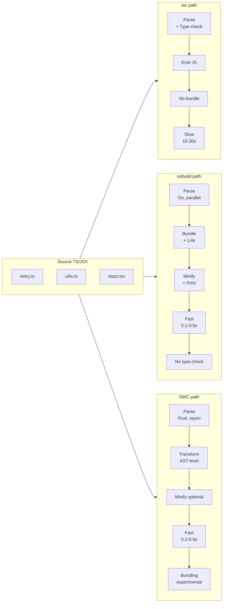
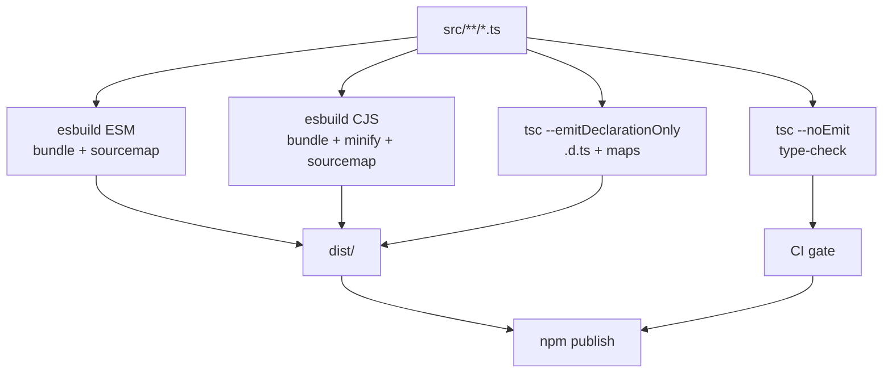

# 6.08 ESBuild and SWC

> The two native-compiled speed demons of the modern JavaScript toolchain. One is written in Go, the other in Rust. Both leave `tsc` in the dust on transpilation throughput, and both force a clean separation between type-checking (which they will not do) and emit (which they do spectacularly). Vite, Next.js, tsup, Tailwind CSS v4, Remix, Astro, Deno, and Parcel all sit on top of one or both of these binaries, and once you understand what they do, what they refuse to do, and how they plug into the larger build pipeline, every modern framework's "fast refresh" and "instant cold start" claims become demystified.

## 1. Purpose

The TypeScript compiler shipped by Microsoft (`tsc`) is a marvel of correctness. It performs full type inference across an entire program, computes control-flow narrowing, validates generic constraints, emits declaration files, and writes source maps. It is also, by the standards of modern JavaScript tooling, slow. A medium-sized application that takes twenty seconds to type-check will frequently take another five to ten seconds to emit transpiled output, and a monorepo with thousands of modules can spend minutes in `tsc` before producing a single byte of usable JavaScript. The reason is structural, not incidental: `tsc` runs single-threaded on V8, performs full type inference (the checker is roughly 50,000 lines of code and consumes 70 to 90 percent of total compile time, as covered in [[6.07 TSC Compiler Operation]]), and treats emit as a downstream concern that cannot begin until the checker has walked the whole program.

`esbuild` and `swc` exist to solve one specific problem in that pipeline: **emit speed**. They do not replace `tsc` for type-checking; they replace `tsc` for transpilation, bundling, and minification. By moving those three steps out of the JavaScript runtime and into native binaries, they cut the time from "I typed save" to "the browser is reloading" by one to two orders of magnitude. They are not "better `tsc`s": they are deliberately narrower tools that trade completeness for raw speed, and the modern TypeScript project architecture treats them as a complement to `tsc`, not a substitute.

### 1.1 The speed gap

A reasonable rule of thumb on a 2023-era laptop with a 500-file TypeScript project:

- `tsc` (full type-check plus emit): 8 to 15 seconds.
- `tsc --noEmit` (type-check only): 6 to 12 seconds.
- `esbuild` (transpile plus bundle plus minify plus sourcemap): 100 to 300 milliseconds.
- `swc` (transpile only, single-threaded): 150 to 400 milliseconds.

That is a 30 to 100x improvement on emit, and it is what makes modern developer tools like Vite, Next.js, tsup, and Tailwind CSS viable at the scale they operate. Without esbuild, Vite's "sub-second cold start" claim would be impossible; without SWC, Next.js 12's "3 to 5x faster builds" claim would have been impossible. Both tools are foundational infrastructure that the rest of the ecosystem builds on.

### 1.2 What each tool actually does

**esbuild** is a Go-based bundler and transpiler. It does, in one binary, what Webpack plus babel plus terser used to do with a dozen npm packages: parse TypeScript and modern JavaScript, resolve imports, bundle modules together, tree-shake unused exports, minify the result, and emit source maps. It is single-threaded from the user's perspective but parallelizes parsing, linking, and printing across goroutines internally, which means a single `esbuild` process can saturate every core of a modern laptop. Its plugin model is JavaScript-based (you write plugins in JS, and they are called back from the Go core), which gives it the ergonomics of a Node tool with the speed of a native binary.

**SWC** (Speedy Web Compiler) is a Rust-based compiler and transformer. It is the engine that powers Next.js's compilation pipeline, Deno's TypeScript parser, and Parcel 2's transformer, and it is the spiritual successor to babel for projects that need AST-level transformation. SWC is faster than babel by 20 to 70x on typical transforms and can be invoked either as a one-shot file transformer (the `swc` CLI), as a Rust library embedded in a larger tool (which is how Next.js uses it), or as a JavaScript library through the `@swc/core` package. SWC's main differentiator from esbuild is **semantic accuracy for TypeScript**: its TS parser handles decorators, parameter properties, and `const enum` semantics more faithfully than esbuild, which matters for frameworks like NestJS that lean on `reflect-metadata`.

### 1.3 What they will not do

Neither tool type-checks. They parse TypeScript syntax and strip types, but they do not validate that your program is type-correct. A successful `esbuild` build means "this code parses and emits cleanly"; it does not mean "this code is type-safe." The standard pattern is to run `tsc --noEmit` (or `vue-tsc`, or `svelte-check`) as a separate step in CI, while using `esbuild` or `swc` for the actual emit. This separation is the central architectural insight of modern TypeScript tooling, and every framework that ships "instant" builds is implicitly relying on it: the type-checker runs in the background or in CI, and the bundler runs synchronously in the foreground.

A useful way to internalise this is to think of `tsc`, `esbuild`, and `swc` as three different tools with three different jobs, none of which fully subsumes the others:

- `tsc` answers the question "is this program type-correct?"
- `esbuild` answers the question "what bundle should I ship for this program?"
- `swc` answers the question "what is the AST-level transform of this file?"

The modern pipeline runs all three, in parallel where possible, and gates deploys on whichever one is slowest.

## 2. Theory and Deep Dive

### 2.1 Why esbuild is fast

esbuild is written in Go, which gives it three concrete advantages over a JavaScript-based bundler:

1. **Native parallelism.** Go's goroutine scheduler lets esbuild parse many files concurrently on multiple cores. A typical bundler written in Node runs mostly single-threaded because V8's event loop does the parsing on a single thread, and worker-thread-based parallelism requires serialising ASTs across process boundaries. esbuild's goroutines share memory directly, so the parsed AST of one file is immediately visible to the linking phase running on another goroutine.
2. **A custom parser.** esbuild does not use an off-the-shelf JavaScript parser. It has its own hand-written recursive-descent parser for TS, JS, JSX, and TSX that is tuned for memory locality and minimal allocation. The parser produces an AST with smaller nodes than babel's or tsc's ASTs, and the AST is laid out in contiguous memory so the L1 and L2 caches stay warm during traversal.
3. **Aggressive use of immutability.** Once a module is parsed, its AST is never mutated. The linker, the tree-shaker, and the printer all read the AST without locking because nothing writes to it. This eliminates a whole class of synchronisation overhead that a mutable-AST tool like babel has to deal with.

The end result is that esbuild can saturate a multi-core machine for a sustained period, which is something a Node-based bundler simply cannot do without spawning worker processes and shuffling serialised ASTs across them. On a 12-core machine, esbuild's wall-clock time scales almost linearly with core count up to the point where I/O becomes the bottleneck.

### 2.2 esbuild CLI

The CLI is the simplest entry point. For a single-file transpile:

```bash
# transpile one TypeScript file to ES2019 JavaScript, no bundle
npx esbuild src/greet.ts --target=es2019 --outfile=dist/greet.js
```

For a full bundle:

```bash
# bundle, minify, sourcemap, target ES2020
npx esbuild src/index.ts --bundle --minify --sourcemap --target=es2020 --outfile=dist/bundle.js
```

For a Node-platform ESM bundle with a custom file extension:

```bash
npx esbuild src/index.ts --bundle --format=esm --platform=node --outdir=dist --out-extension:.js=.mjs
```

Useful flags:

- `--bundle`: pull in imports and produce a single file.
- `--minify`: shrink whitespace, identifiers, and syntax in one shot.
- `--minify-syntax`, `--minify-identifiers`, `--minify-whitespace`: granular control over which minification passes run.
- `--sourcemap`: emit an external `dist/bundle.js.map` file.
- `--target=es2020`: lower syntax to a specific ECMAScript version. Accepts a comma-separated list of runtimes (`node18,chrome110,safari15`).
- `--platform=node` (or `browser`, `neutral`): controls which `main`, `module`, or `exports` field is honoured and whether Node built-ins like `fs` are left external.
- `--format=esm` (or `cjs`, `iife`): output module format.
- `--define:process.env.buildEnv=\"production\"`: replace a global identifier with a literal at build time.
- `--loader:.png=file`: assign a per-extension loader (`js`, `ts`, `tsx`, `json`, `text`, `base64`, `dataurl`, `file`, `binary`, `css`, `local-css`, `global-css`).
- `--external:react`: leave an import unresolved so it stays as an `import` or `require` in the output.
- `--splitting`: split shared code into chunks (ESM only).
- `--watch`: rebuild on change.
- `--metafile`: emit a JSON file describing the bundle, useful for size analysis.
- `--drop:console,debugger`: remove `console.*` calls and `debugger` statements.

### 2.3 esbuild JavaScript API

For anything more complex than a one-liner, the programmatic API is the way to go. There are two entry points: `build` for files on disk, and `transform` for in-memory strings.

`build` returns a promise and reads from `entryPoints`:

```js
import { build } from "esbuild";

await build({
  entryPoints: ["src/index.ts"],
  bundle: true,
  minify: true,
  sourcemap: true,
  target: "es2020",
  platform: "node",
  format: "esm",
  outfile: "dist/bundle.js",
});
```

`build` is the right choice when you have files on disk and want a complete bundle written to the filesystem. It returns a `BuildResult` containing `errors`, `warnings`, `outputFiles` (when `write: false`), `metafile` (when `metafile: true`), and `stop` (a function to terminate the underlying service).

`transform` is the synchronous-ish equivalent for a single source string:

```js
import { transform } from "esbuild";

const { code, map } = await transform(
  `const greet = (name) => \`Hello, \${name}\`;`,
  { loader: "js", target: "es2019", sourcemap: true }
);
```

`transform` is what Vite uses to convert every `.ts` file in your source tree on demand during development, because it is fast enough to run per-request without a noticeable hit. It does not resolve imports, bundle, or tree-shake; it just transpiles. If you need bundling, use `build`.

There is also a `context` API introduced in esbuild 0.17 for watch and serve modes:

```js
import { context } from "esbuild";

const ctx = await context({
  entryPoints: ["src/index.ts"],
  bundle: true,
  outfile: "dist/bundle.js",
});

await ctx.watch(); // rebuild on file change
// or: await ctx.serve({ servedir: "dist" });
```

The `context` API replaces the old `esbuild.startService` and is the recommended way to integrate esbuild into a long-running process.

### 2.4 esbuild plugins

Plugins are JavaScript functions registered via the `plugins` array. Each plugin has a `name` and a `setup` function that registers `onResolve` and `onLoad` callbacks. The `filter` regex is evaluated in Go, so plugin overhead is bounded: a plugin only runs for files that match its filter.

```js
const httpPlugin = {
  name: "http",
  setup(build) {
    build.onResolve({ filter: /^https:\/\// }, (args) => ({
      path: args.path,
      namespace: "http",
    }));
    build.onLoad({ filter: /.*/, namespace: "http" }, async (args) => {
      const res = await fetch(args.path);
      return { contents: await res.text(), loader: "js" };
    });
  },
};

await build({
  entryPoints: ["src/index.ts"],
  bundle: true,
  outfile: "dist/bundle.js",
  plugins: [httpPlugin],
});
```

The pattern is always the same: `onResolve` claims a path (usually by filter regex and optionally by namespace), and `onLoad` produces the contents for that path. A YAML plugin can read `.yaml` files and emit a JS object literal; a GraphQL plugin can compile `.graphql` files into a parsed AST; an HTTP plugin can fetch remote modules at build time. Plugins can also register `onStart` and `onEnd` callbacks for build lifecycle hooks, and they can use `build.initialOptions` to read or modify the resolved build config. They cannot, however, read TypeScript type information: the AST they see is the syntactic AST, not the type-resolved AST that `tsc` produces.

### 2.5 The `define` option

`define` is a build-time find-and-replace for global identifiers. It is how esbuild supports the build environment variable pattern that many libraries use to strip development-only code:

```js
await build({
  // ...
  define: {
    "process.env.buildEnv": '"production"',
    "process.env.version": JSON.stringify(pkg.version),
    DEBUG: "false",
  },
});
```

When esbuild encounters `process.env.buildEnv` in the source, it replaces it with the literal string `"production"`. Combined with `--minify`, this causes dead-code branches like `if (process.env.buildEnv !== "production") { /* dev only */ }` to be eliminated entirely from the bundle. The related `inject` option lets you shim a global that does not exist (such as `Buffer` or `process` in a browser bundle) by providing a file whose exports define those globals.

### 2.6 Tree-shaking in esbuild

esbuild performs tree-shaking during the linking phase. The algorithm is straightforward: starting from each entry point's exported names, it walks the import graph and marks every reachable declaration. Unreachable declarations are dropped. The process is conservative: any declaration with a side effect (a top-level `console.log`, a class with a computed property, a `const` that calls a function) is preserved. The `treeShaking` option accepts `"true"` (default) or `"ignore-annotations"`, the latter forcing esbuild to treat every call expression as side-effectful. This is sometimes necessary when a library mis-annotates its exports with the pure-call annotation.

### 2.7 esbuild limitations

- **No type-checking.** Use `tsc --noEmit` separately. This is the single most common pitfall for new esbuild users.
- **`isolatedModules` required.** Because each file is transpiled independently, esbuild cannot honour `const enum` re-exports across files. The `const enum` feature is treated as a regular `enum`: values are inlined where used in the same file, but cross-file references are preserved as property accesses on the emitted object.
- **Decorator metadata is limited.** esbuild supports the legacy `experimentalDecorators` syntax but its `emitDecoratorMetadata` support is incomplete compared to `tsc`'s full implementation. For projects that depend on `reflect-metadata` (NestJS, TypeORM, TypeGraphQL), SWC is usually a better fit.
- **Single-pass type stripping.** esbuild does not perform any transforms that depend on cross-file information. It cannot, for example, rewrite `const enum` usage to inlined values when the enum is defined in another package.
- **No code splitting for CJS.** The `--splitting` flag only works with `--format=esm`. CommonJS output is always a single file per entry point.

### 2.8 Why SWC is fast

SWC is written in Rust. Rust gives it three properties that matter for a compiler:

1. **Zero-cost abstractions.** Pattern matching, iterators, and trait dispatch all compile to tight machine code with no runtime overhead. SWC's hot loops compile to roughly the same machine code a hand-written C compiler would produce.
2. **Deterministic memory layout.** SWC's AST uses `Box<T>` and arena allocation where appropriate, and there is no garbage collector pausing mid-parse. This matters less for short builds (the GC never has time to pause) but matters enormously for long-running processes like Next.js's dev server.
3. **Real multi-threading.** SWC can spawn a thread pool with the `rayon` crate and parse files in parallel without serialization overhead. The parallelism is bounded only by the number of cores, and the work-stealing scheduler in `rayon` is one of the most efficient thread pool implementations in any language.

SWC's main differentiator from esbuild is **semantic accuracy for TypeScript**. SWC's TS parser is closer to `tsc` in the cases it handles correctly (particularly around decorators, parameter properties, and `const enum` re-exports), and SWC has a much richer plugin model based on WebAssembly, which means plugin authors can write transforms in Rust and ship them as `.wasm` files that any SWC consumer can load.

### 2.9 SWC CLI

```bash
# transpile one file
npx swc src/index.ts -o dist/index.js

# transpile a directory recursively
npx swc src -d dist --config-file .swcrc

# override config via -C (config) flags
npx swc src -d dist -C jsc.target=es2020 -C minify=true

# watch mode
npx swc src -d dist --watch
```

SWC's CLI is more focused on transpilation than on bundling. There is an `swcpack` project (still experimental at the time of writing) that aims to provide a bundler on top of SWC, but most users invoke SWC for single-file transforms and pair it with a separate bundler (Webpack with `swc-loader`, Rollup with `@rollup/plugin-swc`, or esbuild with a SWC plugin for the cases where esbuild's TS handling is insufficient).

### 2.10 SWC JavaScript API

```js
import { transform } from "@swc/core";

const output = await transform(source, {
  filename: "input.ts",
  jsc: {
    parser: { syntax: "typescript", tsx: false, decorators: true },
    transform: { legacyDecorator: true, decoratorMetadata: true },
    target: "es2020",
  },
  sourceMaps: true,
  isModule: true,
});
```

SWC's options are deeply nested under `jsc` (JavaScript Compiler), which mirrors the structure of the Rust configuration. The `env` field (similar to `@babel/preset-env`) controls target-aware syntax lowering using `browserslist`, and the `module` field controls the output module type (`commonjs`, `es6`, `amd`, `umd`, `systemjs`).

SWC also exposes a `minify` function for one-shot minification of already-transpiled code, and a `bundle` function for the experimental bundling mode. The `minify` function is what Parcel 2 and other tools use when they want SWC's minifier (which is faster than terser by roughly 10 to 20x) without adopting SWC as their full compiler.

### 2.11 SWC plugins

SWC plugins are compiled to WebAssembly and loaded by the host. This means plugins can be written in Rust (the native plugin format) and distributed as `.wasm` files, but they can also be invoked from JavaScript without recompiling SWC itself. This is how Next.js ships its own SWC transforms (`next/font`, `next/image`, `next/script`, the styled-components transform, the emotion transform, the relay transform) without forking the compiler.

A typical `.swcrc` plugin section:

```json
{
  "jsc": {
    "experimental": {
      "plugins": [
        ["@swc/plugin-styled-components", {}]
      ]
    }
  }
}
```

The plugin ecosystem includes official plugins for styled-components, emotion, relay, jest, transform-imports, and modularize-imports, plus a growing number of community plugins. The barrier to entry is higher than for esbuild's JavaScript plugins (you need a Rust toolchain to build one), but the runtime performance is dramatically better because plugin code runs at native speed rather than crossing the JS-to-Go boundary on every callback.

### 2.12 SWC limitations

- **Bundling is experimental.** `swcpack` is not production-ready; use a separate bundler.
- **Type-checking still external.** SWC does not validate types, same as esbuild.
- **Decorator versioning complexity.** SWC supports both the legacy (`experimentalDecorators`) and the spec (TC39 stage-3) decorator proposals, but configuration differs and migration is not always transparent.
- **Smaller plugin ecosystem than babel.** Many babel plugins do not have SWC equivalents, though the gap is closing.
- **No built-in dev server.** SWC is a compiler, not a dev tool. For a dev experience comparable to Vite, pair SWC with a framework (Next.js) or a dev server (Vite with `@vitejs/plugin-react-swc`).

### 2.13 Comparison Mermaid



### 2.14 Decision matrix

| Concern | tsc | esbuild | SWC |
|---|---|---|---|
| Type-checking | Yes | No | No |
| Emit speed | Slow | Very fast | Fast |
| Bundling | No | Yes, production | Experimental |
| Minification | No | Yes | Yes |
| Decorator metadata | Full | Partial | Full |
| `const enum` cross-file | Yes | No, treated as enum | Partial |
| Source maps | Yes | Yes | Yes |
| Plugin language | TS plugins, rare | JavaScript | Rust to WASM |
| Used by | every TS project | Vite, tsup, Tailwind | Next.js, Parcel, Deno |
| Tree-shaking | No | Yes | Limited |
| Code splitting | No | Yes, ESM only | No |

### 2.15 When the choice is made for you

In practice, you rarely choose esbuild versus SWC at the project level. The frameworks have already chosen. Vite uses esbuild for dev transforms and Rollup for production bundling. Next.js uses SWC for transforms and Webpack or Turbopack for bundling. tsup uses esbuild. Tailwind CSS v4 uses a native Rust binary with esbuild for its JS CLI. Remix uses esbuild for the server build and SWC (via Vite) for the browser build. Astro uses Vite (and therefore esbuild). Deno uses SWC for its TypeScript parser. Parcel 2 uses SWC for transforms and its own bundler. Turbopack uses SWC for transforms and a Rust bundler. Rolldown (the in-development Rust port of Rollup) uses SWC-compatible transforms internally.

Picking a framework usually means picking a compiler. The choice only surfaces directly when you are building a library or a custom pipeline, which is the scenario this note spends the most time on (Section 5 and Section 10).

## 3. Mental Models

### 3.1 esbuild is the fast Go bundler-transpiler

Think of esbuild as the spiritual successor to Webpack plus babel plus terser, all replaced by a single Go binary. It is the tool you reach for when you need to produce a bundle from a TypeScript entry point and you need it now. Its sweet spot is the developer inner loop: Vite uses it for dev-time dependency pre-bundling, tsup uses it for library builds, and Tailwind CSS v4 uses it for its own build pipeline. Its weakness is type-aware transforms: it cannot do anything that requires knowing the type of an expression, because it never computes types.

### 3.2 SWC is the fast Rust compiler

Think of SWC as the spiritual successor to babel. It is a transformer, not primarily a bundler. Its sweet spot is when you need AST-level transformations of JavaScript or TypeScript: babel presets, decorator metadata, JSX transforms, React refresh, styled-components stripping, emotion CSS prop extraction, relay compiler transforms. Next.js chose it because Next.js's compilation needs are dominated by per-file transforms (Fast Refresh, JSX, decorators, `next/font`) rather than by bundling (which Next.js delegates to Webpack or Turbopack). Its weakness is bundling: the experimental `swcpack` is not yet production-ready.

### 3.3 Neither type-checks

The single most common mistake developers make when adopting either tool is to assume that a successful build means a type-safe build. It does not. Both tools parse TypeScript syntax and discard types; neither validates them. The correct mental model is:

- `esbuild` or `swc` = **emit** ("if it parses, it ships").
- `tsc --noEmit` = **verify** ("if it type-checks, it is safe").

A modern CI pipeline runs both, in parallel where possible, and gates deploys on the slower of the two. The slower step is almost always `tsc --noEmit`, which is why framework authors invest so heavily in incremental type-checking (TypeScript's `incremental` and `composite` modes, covered in [[6.07 TSC Compiler Operation]]).

### 3.4 Use esbuild for bundling, SWC for transforming

A useful rule of thumb:

- If your problem is "I have many files and want one bundle", use esbuild.
- If your problem is "I have one file and want to transform it accurately", use SWC.
- If your problem is "I have many files and want accurate transforms", use SWC inside a bundler (Webpack with `swc-loader`, Rolldown, Next.js's built-in pipeline, or Vite with `@vitejs/plugin-react-swc`).

The "accuracy" gap matters mainly for decorator metadata and `const enum`. If neither feature is in your codebase, esbuild and SWC produce effectively identical output, and you should prefer esbuild for its superior bundling.

### 3.5 The ecosystem has already chosen

If you are starting a new project today, the choice between esbuild and SWC is usually made by your framework:

- New **Vite** project: esbuild for dev, Rollup for build. Opt into SWC for React transforms via `@vitejs/plugin-react-swc`.
- New **Next.js** project: SWC for everything. There is no esbuild in the pipeline.
- New **Remix** project: esbuild for the server, Vite for the browser.
- New **Astro** or **Nuxt** project: Vite (which means esbuild).
- New **library** with `tsup`: esbuild for everything.

You only need to make the choice yourself when you are building a library without a framework, or when you are building a custom build pipeline that does not fit a framework's assumptions.

### 3.6 The "three binaries" mental model

A modern TypeScript project's build pipeline involves three binaries:

1. `tsc` for type-checking (and, for libraries, declaration emit).
2. `esbuild` or `swc` for transpilation and bundling.
3. A test runner (Vitest, Jest, Node's built-in test runner) that itself uses one of the above for transpilation.

Understanding which binary is responsible for which step is the key to debugging build issues. When a build fails, the first question is "which binary produced this error": a `tsc` error is a type error, an `esbuild` error is a parse or resolution error, a Vitest error is a test failure or a transpile error in the test runner. The error messages look similar but the fixes are different.

## 4. Real-World Use Cases

### 4.1 Vite's dependency pre-bundling

Vite's dev server serves source files untransformed via native ESM. The browser loads `src/main.ts` directly, and Vite transforms each module on demand. For dependencies pulled from the node modules folder, however, native ESM is too slow: a single import of `lodash-es` can trigger hundreds of internal requests, and many older packages ship CJS only, which the browser cannot import directly. Vite uses esbuild to pre-bundle dependencies into a single optimized ESM module at startup. esbuild is fast enough that this happens in under a second for most projects, and the result is cached in the `.vite` cache directory inside node modules.

### 4.2 Next.js compilation

Next.js 12 replaced babel with SWC for all TypeScript and JavaScript transforms. The wins were dramatic: local builds sped up by 3 to 5x, Fast Refresh times dropped from "noticeable lag" to "imperceptible", and the Next.js team could ship framework-specific transforms (`next/font` automatic self-hosting, `next/image` URL optimization, `next/script` strategy injection, the styled-components and emotion CSS-in-JS transforms, the Relay compiler) as compiled WASM plugins without forcing users to install babel plugins or maintain `.babelrc` files. The migration was transparent to users, who simply saw faster builds, but it locked Next.js into SWC: a project needing an unported babel plugin cannot use Next.js 12+ without ejecting.

### 4.3 tsup for library builds

tsup wraps esbuild with sensible defaults for library authors: zero-config ESM and CJS dual output, automatic TypeScript declaration generation via `tsc`, tree-shaking, sourcemaps, and a dev mode. Most modern npm libraries are built with tsup because it produces both module formats from a single source in seconds. The tsup config is often under 20 lines for a typical library, and the build runs in under a second for most projects.

### 4.4 Tailwind CSS v4

Tailwind CSS v4 replaced its PostCSS-based pipeline with a native Rust binary that uses esbuild for its JavaScript CLI integration. The build went from "noticeable delay on save" to "instant" for even the largest Tailwind projects, and the new pipeline produces smaller CSS by doing whole-program analysis that the old PostCSS-based approach could not. The Tailwind team chose to keep esbuild for the JS side because it was already a familiar dependency in the JS ecosystem and because the CLI does not need to do any heavy lifting that would benefit from being in Rust.

### 4.5 Fast CI builds

A typical enterprise CI pipeline for a TypeScript monorepo includes type-checking, unit tests, e2e tests, and a production build. With `tsc` alone, the production build step can dominate the pipeline. Replacing it with esbuild can cut total CI time by 40 to 70 percent, which on a pipeline that runs every commit across a hundred-engineer team translates to real money. The standard pattern is esbuild for fast emit, `tsc --noEmit` for correct type-check, and parallel CI jobs (one job per step).

### 4.6 Library bundling

Library authors face a different problem than application authors: they must emit both ESM and CJS, generate `.d.ts` files, support tree-shaking, and avoid bundling dependencies into the published artifact. esbuild handles all of this in one configuration: a `build` call with `bundle: true`, `format: "esm"` (and a second call with `format: "cjs"`), `sourcemap: true`, and `external` set to the union of `pkg.dependencies` and `pkg.peerDependencies`. The `.d.ts` files come from a parallel `tsc --emitDeclarationOnly` run. The result is a small, tree-shakable, dual-format package that installs cleanly in any consumer's build. The full script is in Section 5.2.

### 4.7 Custom DSL loaders

If your project uses a domain-specific language (GraphQL schemas, YAML config, GLSL shaders, Markdown frontmatter), you can register an esbuild plugin that converts those files to JavaScript modules at build time. This is how `graphql-tag` works in many setups, how Tailwind CSS compiles its config, and how many blog frameworks embed Markdown content into JavaScript modules for client-side rendering. The plugin pattern is an `onLoad` callback with a `filter` regex that matches the file extension, returning `{ contents: stringifiedSource, loader: "js" }`. The full template is in Section 2.4.

### 4.8 Monorepo task runners

Turborepo, Nx, and Moonrepo all parallelize package builds. When each package uses esbuild for its build step, the parallelism of the task runner combines with the parallelism of esbuild itself, and a 50-package monorepo can build in seconds rather than minutes. This is the pattern that Vercel uses internally for its own monorepo and that Nx documents as a recommended setup for large-scale TypeScript workspaces.

### 4.9 Deno and Parcel 2

Deno uses SWC as its TypeScript parser, both for its REPL and for its `deno run` command. Deno does not type-check by default at runtime (you opt in with `deno check`), so the SWC parser is the only TypeScript-handling code that runs on every `deno run`. Parcel 2 also uses SWC as its default transformer for JavaScript and TypeScript, replacing the babel-based transformer of Parcel 1. The result is a bundler that produces more accurate output for decorator-heavy code, though it is slower than esbuild on very large projects because Parcel's bundler is not as parallelised as esbuild's.

### 4.11 Vitest and Storybook

Vitest uses esbuild (by default) or SWC (via `vite-plugin-swc`) for transforming test files. Because Vitest is built on Vite, it inherits Vite's esbuild-based transform pipeline, which means test files are transpiled and executed without any pre-build step. Storybook 7+ also uses Vite under the hood, which means it uses esbuild for transforms; earlier versions used Webpack with babel, and the migration to Vite cut dev server startup time from minutes to seconds.

## 5. Code Examples

Every example below is shown in both JavaScript and TypeScript. The TypeScript version adds types where they help; the JavaScript version is what you would write if you were not in a TS project.

### 5.1 Example A — Minimal and Conceptual

#### 5.1.1 esbuild CLI (single-file transpile)

Transpile one TypeScript file to ES2019 JavaScript:

```bash
# works for JavaScript or TypeScript source, same command
npx esbuild src/greet.ts --target=es2019 --outfile=dist/greet.js
```

No bundle, no minify: this is the closest thing to a drop-in `tsc` replacement for a single file.

#### 5.1.2 esbuild CLI (full bundle)

```bash
npx esbuild src/index.ts \
  --bundle \
  --minify \
  --sourcemap \
  --target=es2020 \
  --platform=node \
  --format=esm \
  --outfile=dist/bundle.mjs
```

#### 5.1.3 esbuild API in JavaScript

`build.mjs`:

```js
import { build } from "esbuild";

await build({
  entryPoints: ["src/greet.js"],
  outfile: "dist/greet.js",
  bundle: true,
  minify: true,
  sourcemap: true,
  target: "es2020",
  platform: "node",
  format: "esm",
});

console.log("build complete");
```

Run with `node build.mjs`.

#### 5.1.4 esbuild API in TypeScript

`build.ts`:

```ts
import { build, BuildOptions } from "esbuild";

const config: BuildOptions = {
  entryPoints: ["src/greet.ts"],
  outfile: "dist/greet.js",
  bundle: true,
  minify: true,
  sourcemap: true,
  target: "es2020",
  platform: "node",
  format: "esm",
  logLevel: "info",
};

await build(config);

console.log("build complete");
```

Run with `tsx build.ts` or `node --import tsx build.ts`. The `tsx` package itself uses esbuild under the hood, so this is esbuild invoking esbuild.

#### 5.1.5 esbuild transform (in-memory) in JavaScript

`transform.mjs`:

```js
import { transform } from "esbuild";

const source = `const greet = (name) => \`Hello, \${name}\`;`;
const { code, map } = await transform(source, {
  loader: "js",
  target: "es2017",
  sourcemap: true,
});

console.log(code);
console.log(map);
```

#### 5.1.6 esbuild transform (in-memory) in TypeScript

`transform.ts`:

```ts
import { transform, TransformResult } from "esbuild";

const source: string = `const greet = (name: string): string => \`Hello, \${name}\`;`;

const result: TransformResult = await transform(source, {
  loader: "ts",
  target: "es2017",
  sourcemap: true,
});

console.log(result.code);
console.log(result.map);
```

#### 5.1.7 SWC CLI

```bash
# transpile one file
npx swc src/greet.ts -o dist/greet.js

# transpile a directory with config overrides
npx swc src -d dist -C jsc.target=es2020 -C jsc.parser.syntax=typescript
```

#### 5.1.8 SWC API in JavaScript

`swc.mjs`:

```js
import { transform } from "@swc/core";

const source = `const greet = (name) => \`Hello, \${name}\`;`;

const output = await transform(source, {
  filename: "greet.js",
  jsc: {
    parser: { syntax: "ecmascript" },
    target: "es2019",
  },
  sourceMaps: true,
});

console.log(output.code);
console.log(output.map);
```

#### 5.1.9 SWC API in TypeScript

`swc.ts`:

```ts
import { transform, Output } from "@swc/core";

const source: string = `const greet = (name: string): string => \`Hello, \${name}\`;`;

const output: Output = await transform(source, {
  filename: "greet.ts",
  jsc: {
    parser: { syntax: "typescript", tsx: false },
    transform: { decoratorMetadata: true },
    target: "es2019",
  },
  sourceMaps: true,
  isModule: true,
});

console.log(output.code);
console.log(output.map);
```

#### 5.1.10 Side-by-side comparison in JavaScript

`compare.mjs`:

```js
import * as esbuild from "esbuild";
import { transform as swcTransform } from "@swc/core";

const source = `
interface User { id: number; name: string }
const format = (u) => \`#\${u.id}: \${u.name}\`;
`;

const esb = await esbuild.transform(source, { loader: "ts", target: "es2020" });
const swc = await swcTransform(source, {
  filename: "x.ts",
  jsc: { parser: { syntax: "typescript" }, target: "es2020" },
});

console.log("esbuild output:\n" + esb.code);
console.log("SWC output:\n" + swc.code);
```

#### 5.1.11 Side-by-side comparison in TypeScript

`compare.ts`:

```ts
import * as esbuild from "esbuild";
import { transform as swcTransform, Output } from "@swc/core";

interface User {
  id: number;
  name: string;
}

const source: string = `
interface User { id: number; name: string }
const format = (u: User) => \`#\${u.id}: \${u.name}\`;
`;

const esb: esbuild.TransformResult = await esbuild.transform(source, {
  loader: "ts",
  target: "es2020",
});

const swc: Output = await swcTransform(source, {
  filename: "x.ts",
  jsc: { parser: { syntax: "typescript" }, target: "es2020" },
});

console.log("esbuild output:\n" + esb.code);
console.log("SWC output:\n" + swc.code);
```

### 5.2 Example B — Production-Grade

We will build a small typed library called `acme-tools` that exposes a single `formatUser` function. The pipeline:

1. Type-check with `tsc --noEmit`.
2. Emit ESM and CJS bundles with esbuild.
3. Emit TypeScript declaration files with `tsc --emitDeclarationOnly`.
4. Generate source maps for both JS and declaration files.
5. Minify the CJS bundle for Node consumers who care about size.
6. Run all of the above in CI on every push and on every pull request.

#### 5.2.1 Project layout

```
acme-tools/
  src/
    index.ts
    format.ts
    types.ts
  tsconfig.json
  tsconfig.build.json
  package.json
  scripts/
    build.mjs
  .github/
    workflows/
      ci.yml
```

#### 5.2.2 Source files

`src/types.ts`:

```ts
export interface User {
  id: number;
  name: string;
  email?: string;
}

export type FormatStrategy = "compact" | "verbose";
```

`src/format.ts`:

```ts
import type { User, FormatStrategy } from "./types.js";

export function formatUser(user: User, strategy: FormatStrategy = "compact"): string {
  if (strategy === "verbose") {
    return `User #${user.id}: ${user.name}${user.email ? ` <${user.email}>` : ""}`;
  }
  return `#${user.id}:${user.name}`;
}
```

`src/index.ts`:

```ts
export { formatUser } from "./format.js";
export type { User, FormatStrategy } from "./types.js";
```

The `.js` extension in the import paths is required when `moduleResolution: "bundler"` or `"node16"` is set. esbuild, SWC, and `tsc` all support it, and it is the recommended pattern for forward-compatible TypeScript.

#### 5.2.3 `package.json`

```json
{
  "name": "acme-tools",
  "version": "1.0.0",
  "type": "module",
  "main": "./dist/index.cjs",
  "module": "./dist/index.mjs",
  "types": "./dist/index.d.ts",
  "exports": {
    ".": {
      "types": "./dist/index.d.ts",
      "import": "./dist/index.mjs",
      "require": "./dist/index.cjs"
    }
  },
  "files": ["dist"],
  "scripts": {
    "typecheck": "tsc --noEmit",
    "build:types": "tsc -p tsconfig.build.json --emitDeclarationOnly",
    "build:js": "node scripts/build.mjs",
    "build": "npm run build:js && npm run build:types",
    "prepublishOnly": "npm run typecheck && npm run build"
  },
  "devDependencies": {
    "esbuild": "0.23.0",
    "typescript": "5.5.4"
  }
}
```

(The same file works for the TypeScript build script; just point `build:js` to `tsx scripts/build.ts` and add `tsx` to devDependencies.)

#### 5.2.4 `tsconfig.json` (type-check config)

```json
{
  "compilerOptions": {
    "target": "es2020",
    "module": "esnext",
    "moduleResolution": "bundler",
    "strict": true,
    "isolatedModules": true,
    "verbatimModuleSyntax": true,
    "noEmit": true,
    "skipLibCheck": true,
    "esModuleInterop": true,
    "forceConsistentCasingInFileNames": true
  },
  "include": ["src", "scripts"]
}
```

`tsconfig.build.json` (declaration emit config):

```json
{
  "extends": "./tsconfig.json",
  "compilerOptions": {
    "noEmit": false,
    "emitDeclarationOnly": true,
    "declaration": true,
    "declarationMap": true,
    "outDir": "dist",
    "rootDir": "src"
  },
  "include": ["src"]
}
```

The `verbatimModuleSyntax` flag (TS 5.0+) is the modern replacement for `isolatedModules` plus `importsNotUsedAsValues`. It forces every type-only import to use `import type` and every value import to be preserved in the output. esbuild respects it automatically.

#### 5.2.5 Build script in JavaScript

`scripts/build.mjs`:

```js
import { build } from "esbuild";
import { readFile } from "node:fs/promises";

const pkg = JSON.parse(
  await readFile(new URL("../package.json", import.meta.url), "utf8")
);

const external = [
  ...Object.keys(pkg.dependencies || {}),
  ...Object.keys(pkg.peerDependencies || {}),
];

const shared = {
  entryPoints: ["src/index.ts"],
  bundle: true,
  sourcemap: true,
  target: "es2020",
  platform: "node",
  external,
  logLevel: "info",
};

await Promise.all([
  build({ ...shared, format: "esm", outfile: "dist/index.mjs" }),
  build({ ...shared, format: "cjs", outfile: "dist/index.cjs", minify: true }),
]);

console.log("esbuild complete");
```

#### 5.2.6 Build script in TypeScript

`scripts/build.ts`:

```ts
import { build, BuildOptions } from "esbuild";
import { readFile } from "node:fs/promises";
import { fileURLToPath } from "node:url";
import path from "node:path";

interface PackageLike {
  dependencies?: Record<string, string>;
  peerDependencies?: Record<string, string>;
}

const here = path.dirname(fileURLToPath(import.meta.url));
const pkgPath = path.resolve(here, "..", "package.json");
const pkg: PackageLike = JSON.parse(await readFile(pkgPath, "utf8"));

const external: string[] = [
  ...Object.keys(pkg.dependencies ?? {}),
  ...Object.keys(pkg.peerDependencies ?? {}),
];

const shared: BuildOptions = {
  entryPoints: ["src/index.ts"],
  bundle: true,
  sourcemap: true,
  target: "es2020",
  platform: "node",
  external,
  logLevel: "info",
};

const tasks: Promise<unknown>[] = [
  build({ ...shared, format: "esm", outfile: "dist/index.mjs" }),
  build({ ...shared, format: "cjs", outfile: "dist/index.cjs", minify: true }),
];

await Promise.all(tasks);

console.log("esbuild complete");
```

The TypeScript version adds types for the package shape and the build options, which makes refactors safer. The runtime behaviour is identical.

#### 5.2.7 CI workflow

`.github/workflows/ci.yml`:

```yaml
name: ci

on:
  push:
    branches: [main]

jobs:
  build:
    runs-on: ubuntu-latest
    steps:
      - uses: actions/checkout@v4
      - uses: actions/setup-node@v4
        with:
          node-version: 20
          cache: npm
      - run: npm ci
      - run: npm run typecheck
      - run: npm run build
      - uses: actions/upload-artifact@v4
        with:
          name: dist
          path: dist
```

The type-check (`npm run typecheck`) runs as a separate step from the build. If the type-check fails, the build step does not run, which is the desired gating behaviour. For parallel execution, split `typecheck` and `build` into two jobs and use a `needs:` relationship to gate publishing on both.

#### 5.2.8 Local dev experience

For development, install `tsx` and add a `dev` script:

```json
{
  "scripts": {
    "dev": "tsx watch src/index.ts"
  }
}
```

`tsx` uses esbuild to transpile TypeScript on the fly, so you can run your library's entry point directly without a pre-build step. This is the modern equivalent of `ts-node`, and it is dramatically faster. For a REPL, `tsx` also supports `tsx watch` with a small entry script that re-runs your tests on every change.

#### 5.2.9 SWC alternative

If your library depends on decorator metadata (for example, it exposes a NestJS module), swap esbuild for SWC in the build script. The SWC version transpiles files individually (no bundling), so it iterates over the source tree, calls `transform` for each file with `jsc.parser.syntax: "typescript"`, `jsc.parser.decorators: true`, `jsc.transform.legacyDecorator: true`, `jsc.transform.decoratorMetadata: true`, and `jsc.target: "es2020"`, and writes the output to the `dist` directory. For a bundling SWC pipeline, pair SWC with Webpack or Rolldown; SWC's standalone bundler (`swcpack`) is not yet recommended for production.

## 6. Common Mistakes and Anti-Patterns

### 6.1 Expecting type-checking from esbuild or SWC

The mistake: developers drop `tsc` from their build pipeline, switch to esbuild, see that the build succeeds, and ship a release with type errors that `tsc` would have caught. The bug only surfaces in production when a null reference occurs that the type system would have prevented.

The fix: always run `tsc --noEmit` as a separate step in CI. The build step (esbuild) and the verify step (tsc) should both run, and a failure in either should block the deploy. In local development, run `tsc --noEmit -w` in a terminal alongside your dev server so type errors surface in real time without slowing down reloads.

### 6.2 Setting `target` too high

The mistake: a developer sets `target: "esnext"` because it is fastest (no syntax lowering), and the build runs fine in their modern Chrome. The deploy goes to a Node 16 production runtime that does not support top-level await, the `??=` operator, or `Array.prototype.findLast`, and the deploy crashes at boot.

The fix: set `target` to the lowest runtime you support. Use a list to be explicit: `target: ["node18", "chrome100", "safari15"]`. esbuild will lower syntax to the intersection of all listed runtimes. For SWC, use the `env` field with a `browserslist` query.

### 6.3 No source maps in production

The mistake: an error report from production arrives with a stack trace pointing to `bundle.js:1:48273`, which is unactionable. The developer spends an hour correlating column offsets to the source by hand.

The fix: always emit source maps. If you do not want to ship them publicly, generate them and upload them to your error tracker (Sentry, Rollbar, Datadog). Strip the source map URL comment from the deployed bundle so the map is not downloadable. See [[6.11 Source Maps]] for the full pipeline.

### 6.4 Not configuring decorator metadata

The mistake: a NestJS project switches from babel to esbuild, and suddenly `reflect-metadata` returns `undefined` for every constructor parameter type. The framework cannot inject dependencies, and every request fails with "cannot read property of undefined".

The fix: esbuild's support for `emitDecoratorMetadata` is limited. For NestJS, TypeORM, TypeGraphQL, and any `reflect-metadata`-dependent framework, use SWC with `decoratorMetadata: true` and `legacyDecorator: true`, or stay on babel. The recommendation is firm: decorator-heavy code goes on SWC.

### 6.5 Mixing `tsc` emit with esbuild bundling

The mistake: a project runs `tsc` to emit JavaScript (because the developer does not trust esbuild to transpile), then runs esbuild to bundle the emitted files. The result is slower than either tool alone, the intermediate `.js` files in `dist/` are a source of confusion, and the source maps point to the emitted JS rather than the original TS.

The fix: pick one emitter. Either use `tsc` for everything (slow but correct) or use esbuild for emit and `tsc --noEmit` for type-checking (fast and equally correct). The pattern in Section 5.2 is the standard: esbuild for `.js` files, `tsc --emitDeclarationOnly` for `.d.ts` files, `tsc --noEmit` for type-checking. Each tool does the one thing it is best at.

### 6.6 Forgetting to minify for production

The mistake: a developer sets `minify: false` because they want readable output, and the bundle ships at 4 MB instead of 800 KB. Mobile users on slow connections see a 12-second load where they should have seen 3 seconds.

The fix: minify in production. If you want readable output for debugging, generate source maps and use the unminified bundle only in development. The combination of `minify: true` plus `sourcemap: true` gives you both small production assets and debuggable stack traces.

### 6.7 Bundling dependencies into a library

The mistake: a library author forgets to mark `react`, `lodash`, or any other runtime dependency as `external`, and the published bundle includes the entire dependency tree. Consumers end up with two copies of React, which crashes hooks, or with a 2 MB library that should be 20 KB.

The fix: always pass `external` to esbuild when building a library, pulling the list from `package.json` as `Object.keys(pkg.dependencies || {}).concat(Object.keys(pkg.peerDependencies || {}))`. For `devDependencies`, do not include them: they should not be imported at runtime anyway, and if they are, the build should fail loudly rather than silently bundle them.

### 6.8 Not enabling `isolatedModules`

The mistake: a project uses `const enum` exported from one file in another file, and esbuild emits the enum as a runtime object instead of inlining the values. The bundle works but is larger than expected, and the type signature of the exported const enum degrades to a regular enum. Worse, a `const enum` declared with computed members (referencing another const enum from another file) may fail to compile.

The fix: enable `isolatedModules: true` in `tsconfig.json` and `verbatimModuleSyntax: true` (TypeScript 5.0+). Prefer union string-literal types over `const enum` for cross-file constants. The TypeScript team has signalled that `const enum` is effectively deprecated for new code, and esbuild's behaviour is the de facto standard.

### 6.9 Using esbuild for type-aware transforms

The mistake: a project wants to emit a runtime validator from a TypeScript interface (using something like `ts-to-zod` or a custom transform) and tries to do this with an esbuild plugin. esbuild plugins do not have access to type information, so the transform fails or produces incorrect output.

The fix: use the TypeScript Compiler API directly (see [[6.07 TSC Compiler Operation]]) for any transform that needs type information. esbuild plugins can read the AST but not the symbol table. The pattern is: run the type-aware transform as a separate step (using `ts-morph` or the raw Compiler API) that produces TypeScript source, then run esbuild on the transformed source.

### 6.10 Ignoring the `loader` option for non-JS files

The mistake: a project imports a `.graphql` file, esbuild errors with `No loader configured for .graphql files`, and the developer gives up and switches to a different bundler.

The fix: register a loader. For text content, `--loader:.graphql=text` returns the file contents as a string. For JSON, the built-in `json` loader works. For custom formats (YAML, TOML, Markdown, GLSL, custom DSLs), write a plugin that parses the file and returns JavaScript source. The plugin pattern in Section 2.4 is the template.

### 6.11 Using a build environment variable without `define`

The mistake: a project's source code uses `if (process.env.buildEnv !== "production") { /* dev-only */ }`, esbuild does not strip the dev-only branch, and the production bundle ships with development code, debug logs, and React DevTools hooks intact.

The fix: use the `define` option to replace `process.env.buildEnv` (or whichever build environment variable you use) with a string literal at build time. esbuild's dead-code elimination will then strip the dev-only branch during minification. Without `define`, the `process.env.buildEnv` access stays in the output and is evaluated at runtime, which means the dev-only branch is preserved.

### 6.12 Not pinning the esbuild or SWC version

The mistake: a project uses `^0.23.0` for esbuild, a patch release changes minification output, and the bundle hash changes for every consumer of the library even though no source code changed. CDN caches bust, download bandwidth spikes, and consumers complain.

The fix: pin the exact version (no `^` or `~`) in `package.json` for build tools. Update deliberately, with a commit message that explains why. This applies to esbuild, SWC, TypeScript, Vite, and any other tool whose output ends up in a published artifact.

## 7. Best Practices and Design Patterns

### 7.1 The split pipeline

The canonical architecture for a modern TypeScript project is:

1. `tsc --noEmit` for type-checking.
2. `esbuild` (or `swc`) for transpilation and bundling.
3. `tsc --emitDeclarationOnly` (libraries only) for declaration files.

Run all three in parallel in CI. The total wall-clock time is dominated by whichever step is slowest, which is usually `tsc --noEmit` on a large project. For incremental local development, run `tsc --noEmit -w` in a terminal alongside your dev server so type errors surface in real time.

### 7.2 Use Vite for the dev server

Vite gives you a dev server that uses native ESM in the browser and transforms each module on demand with esbuild. The cold-start time is sub-second for most projects because Vite does not bundle your source: it only pre-bundles dependencies. For production builds, Vite uses Rollup, which produces smaller bundles than esbuild's own bundler at the cost of speed. See [[6.09 Vite and Webpack Comparison]] for the full comparison.

### 7.3 Use tsup for library builds

tsup wraps esbuild with library-author defaults: dual ESM/CJS output, automatic `.d.ts` generation, tree-shaking, sourcemaps, and a watch mode. For most libraries, tsup's default config is sufficient:

`tsup.config.ts`:

```ts
import { defineConfig } from "tsup";

export default defineConfig({
  entry: ["src/index.ts"],
  format: ["esm", "cjs"],
  dts: true,
  sourcemap: true,
  clean: true,
  target: "es2020",
});
```

tsup handles the `external` list, the dual-format output, and the declaration emit automatically. It is the right choice for 90 percent of libraries.

### 7.4 Enable source maps in dev, minify in prod

The combination is not contradictory:

```js
const isProd = process.env.buildEnv === "production";

await build({
  // ...
  sourcemap: true, // always
  minify: isProd,
});
```

In production, also upload the source maps to your error tracker and strip the source map URL comment from the deployed bundle so the maps are not publicly downloadable. In development, the unminified bundle plus source map gives you readable stack traces in the browser DevTools.

### 7.5 Set `target` based on supported runtimes

Be specific. `target: "es2020"` is a reasonable default for Node 16+ and modern browsers. For older runtimes, list them explicitly with esbuild: `target: ["node16", "chrome90", "firefox88", "safari14", "edge88"]`. esbuild will compute the lowest common denominator and lower only the syntax that needs lowering. For SWC, use the `env` field with a `browserslist` query: `env: { targets: { node: "16", chrome: "90", safari: "14" } }`. The two tools accept the same browserslist syntax, so the same query string can be shared across your build configuration.

### 7.6 Use `isolatedModules` for esbuild compatibility

Always set `isolatedModules: true` when using esbuild or SWC. This forces TypeScript to enforce a set of rules that make per-file transpilation safe:

- Each file must be a module (must have at least one import or export).
- `const enum` is treated as a regular enum (no inlining across files).
- Re-exporting a type requires `export type` or `verbatimModuleSyntax`.

Pair `isolatedModules` with `verbatimModuleSyntax: true` (TS 5.0+) for the cleanest output. The combination ensures that esbuild's per-file transpilation produces the same result as `tsc`'s whole-program emit for the cases that matter.

### 7.7 Pin the compiler version

esbuild and SWC both move fast. A patch release can change minification output, which can change bundle hashes and break long-term caches. Pin the version in `package.json` (no `^` or `~`) and update deliberately, with a commit message that explains the upgrade. For libraries, this also protects downstream consumers from unexpected bundle changes.

### 7.8 Profile your build

If your esbuild build takes more than a second, profile it. The most common causes are: a large number of entry points (esbuild scales linearly); heavy use of plugins with expensive `onLoad` callbacks; importing large data files (geo data, ML models) that esbuild must read from disk; building on a slow filesystem (Windows without WSL2, or a network drive); or a very deep import graph with many small files where the per-file overhead adds up. esbuild itself is rarely the bottleneck; the bottleneck is usually I/O or plugin code. Use the `metafile` output to see exactly which modules are being parsed and how big they are.

### 7.9 Use the `metafile` for bundle analysis

esbuild can emit a JSON file describing the contents of every bundle. Set `metafile: true` in the build options, then call `esbuild.analyzeMetafile(result.metafile)` to get a human-readable tree of inputs and their contribution to the output size. The raw `metafile` object is also available for programmatic processing. This is invaluable for tracking down why a bundle grew unexpectedly large, and it is the closest equivalent esbuild offers to Webpack's `webpack-bundle-analyzer`.

### 7.10 Cache aggressively

In CI, cache the node modules directory and the esbuild binary cache. On a warm cache, build times drop further. For GitHub Actions, use `actions/setup-node` with `cache: npm` or `cache: pnpm` to cache the node modules directory automatically. For GitLab CI, use the `cache` keyword with a `key` that includes the lockfile hash.

### 7.11 Use SWC for decorator-heavy code

If your project uses NestJS, TypeORM, or any framework that depends on `reflect-metadata`, SWC is the safer choice. Configure it explicitly in `.swcrc` with `jsc.parser.syntax: "typescript"`, `jsc.parser.decorators: true`, `jsc.transform.legacyDecorator: true`, `jsc.transform.decoratorMetadata: true`, and `jsc.target: "es2020"`. For Next.js projects, this configuration is built into the framework. For custom pipelines, copy it verbatim.

### 7.12 Use a `tsconfig.build.json` that excludes tests

Test files should not be part of the published artifact. Extend your main `tsconfig.json` and exclude tests with `"exclude": ["src/**/*.test.ts", "src/**/*.spec.ts", "src/tests/**"]`. Co-located `.test.ts` files next to the source they test are the most common layout; a separate `tests` directory is also acceptable. Both patterns work equally well with the `exclude` glob.

### 7.13 Use the `context` API for watch mode

For long-running builds (dev servers, watch mode), use the `context` API instead of calling `build` in a loop. The `context` API reuses the parsed ASTs between rebuilds, which makes incremental rebuilds even faster than a fresh `build` call. It also supports `ctx.serve()` for a built-in static file server:

```js
import { context } from "esbuild";

const ctx = await context({ entryPoints: ["src/index.ts"], bundle: true, outfile: "dist/bundle.js" });
await ctx.watch();
```

### 7.14 Use `entryNames` for cache-busting and document the pipeline

For browser bundles, use `entryNames: "[name]-[hash]"` to add a content hash to the output filename. This produces `bundle-a1b2c3d4.js` instead of `bundle.js`, which lets you set aggressive `Cache-Control` headers without worrying about stale caches on deploy. Pair this with a README section documenting which tool emits the JavaScript, which tool emits the declarations, which tool type-checks, and what the supported runtimes are. A library's build pipeline is part of its public API, and documenting it saves hours of debugging for downstream consumers.

## 8. Technical Interview Knowledge

### 8.1 Q: What is esbuild?

A: esbuild is a JavaScript bundler and transpiler written in Go. It parses TypeScript, JavaScript, JSX, and TSX, resolves imports, bundles modules together, tree-shakes unused code, minifies the result, and emits source maps. Its primary selling point is speed: it is typically 30 to 100 times faster than equivalent Node-based bundlers because it parallelizes parsing across goroutines and uses a hand-written parser with a cache-friendly AST layout. esbuild is used by Vite (for dev transforms), tsup (for library builds), Tailwind CSS v4 (for its JS CLI), and many other modern tools. It does not type-check TypeScript; that is left to `tsc --noEmit`.

### 8.2 Q: What is SWC?

A: SWC (Speedy Web Compiler) is a JavaScript and TypeScript transformer written in Rust. It is the engine that powers Next.js's compilation pipeline, Deno's TypeScript parser, and Parcel 2's transformer. SWC is 20 to 70 times faster than babel on typical transforms. Unlike esbuild, SWC's bundling capabilities are still experimental; its main use case is per-file transformation. SWC's key differentiator from esbuild is semantic accuracy for TypeScript: it handles decorators, parameter properties, and `const enum` semantics more faithfully, which matters for frameworks like NestJS that lean on `reflect-metadata`.

### 8.3 Q: Why are esbuild and SWC faster than tsc?

A: Three reasons. First, they are written in compiled languages (Go and Rust) that produce native binaries, while `tsc` is written in TypeScript and runs on V8. Second, they parallelize parsing across multiple cores (esbuild via goroutines, SWC via the `rayon` thread pool), while `tsc` runs single-threaded. Third, they do less work: they strip types without checking them, while `tsc` performs full type inference and validation across the entire program. The type checker in `tsc` is roughly 50,000 lines of code and consumes 70 to 90 percent of total compile time on a large codebase.

### 8.4 Q: Do esbuild and SWC type-check TypeScript?

A: No. Both tools parse TypeScript syntax and discard the type annotations during emit. They do not perform any type validation. A successful build with esbuild or SWC means the code parses; it does not mean the code is type-safe. The standard pattern is to run `tsc --noEmit` as a separate step in CI for type-checking, in parallel with the esbuild or SWC build. A failure in either step blocks the deploy.

### 8.5 Q: How does Vite use esbuild?

A: Vite uses esbuild in two ways. First, at dev server startup, Vite scans the import graph for dependencies in the node modules folder and uses esbuild to pre-bundle them into a single optimized ESM module. This avoids the waterfall of hundreds of HTTP requests that native ESM would otherwise trigger for dependencies like `lodash-es`. Second, during development, Vite uses esbuild's `transform` API to transpile each `.ts`, `.tsx`, and `.jsx` file on demand when the browser requests it. For production builds, Vite uses Rollup, which produces smaller bundles than esbuild's own bundler at the cost of speed.

### 8.6 Q: How does Next.js use SWC?

A: Next.js 12 and later uses SWC for all TypeScript and JavaScript transformations. SWC handles JSX transformation, TypeScript stripping, Fast Refresh (React Refresh), and Next.js-specific transforms like `next/font` (automatic self-hosting of fonts), `next/image` (URL rewriting), and `next/script` (strategy injection). Next.js ships its SWC transforms as compiled WebAssembly plugins, which lets the framework add custom transforms without requiring users to install babel plugins. The migration from babel to SWC in Next.js 12 produced a 3 to 5x speedup in local builds and a dramatic improvement in Fast Refresh times.

### 8.7 Q: When would you use esbuild versus SWC?

A: Use esbuild when your primary need is bundling or when you want a single tool that handles transpilation, bundling, and minification in one binary. Use SWC when your primary need is accurate per-file transformation, especially if you depend on decorator metadata (`reflect-metadata`, NestJS, TypeORM) or if you are integrating with a framework that already uses SWC (Next.js, Deno, Parcel 2). In practice, the choice is usually made by your framework: Vite users get esbuild, Next.js users get SWC, tsup users get esbuild. You only need to make the choice yourself when you are building a library or a custom pipeline.

### 8.8 Q: How do you handle type-checking with esbuild or SWC?

A: Run `tsc --noEmit` as a separate step. In a typical CI pipeline, the type-check step and the build step run in parallel, and a failure in either blocks the deploy. For library builds, you additionally run `tsc --emitDeclarationOnly` to generate `.d.ts` files. The combination of esbuild for emit plus `tsc` for verification gives you the speed of esbuild with the type safety of `tsc`. In local development, run `tsc --noEmit -w` in a terminal alongside your dev server so type errors surface in real time without slowing down reloads.

## 9. Practical Exercises

### 9.1 Exercise 1: Build a library with esbuild

**Goal**: Create a small TypeScript library and build it with esbuild, producing both ESM and CJS outputs.

**Setup**:

```bash
mkdir hello-esbuild && cd hello-esbuild
npm init -y
npm install --save-dev esbuild typescript
mkdir src
```

**Source** `src/index.ts`:

```ts
export function greet(name: string): string {
  return `Hello, ${name}!`;
}
```

**Task**: Write a build script that produces `dist/index.mjs` (ESM) and `dist/index.cjs` (CJS).

**Solution** `scripts/build.mjs`:

```js
import { build } from "esbuild";

const shared = {
  entryPoints: ["src/index.ts"],
  bundle: true,
  sourcemap: true,
  target: "es2020",
  platform: "node",
};

await Promise.all([
  build({ ...shared, format: "esm", outfile: "dist/index.mjs" }),
  build({ ...shared, format: "cjs", outfile: "dist/index.cjs" }),
]);

console.log("done");
```

Add to `package.json`:

```json
{
  "scripts": { "build": "node scripts/build.mjs" }
}
```

**Verify**:

```bash
npm run build
node -e "import('./dist/index.mjs').then(m => console.log(m.greet('World')))"
node -e "console.log(require('./dist/index.cjs').greet('World'))"
```

Both should print `Hello, World!`.

**Variation in TypeScript** `scripts/build.ts`:

```ts
import { build, BuildOptions } from "esbuild";

const shared: BuildOptions = {
  entryPoints: ["src/index.ts"],
  bundle: true,
  sourcemap: true,
  target: "es2020",
  platform: "node",
};

const tasks: Promise<unknown>[] = [
  build({ ...shared, format: "esm", outfile: "dist/index.mjs" }),
  build({ ...shared, format: "cjs", outfile: "dist/index.cjs" }),
];

await Promise.all(tasks);
console.log("done");
```

Run with `tsx scripts/build.ts` (after `npm install --save-dev tsx`).

### 9.2 Exercise 2: Transpile with SWC

**Goal**: Transpile a TypeScript file with SWC, both via CLI and via the JavaScript API, with legacy decorator support.

**Setup**:

```bash
mkdir hello-swc && cd hello-swc
npm init -y
npm install --save-dev @swc/core @swc/cli typescript
mkdir src
```

**Source** `src/decorator.ts`:

```ts
function log(target: any, key: string, desc: PropertyDescriptor) {
  const orig = desc.value;
  desc.value = function (...args: any[]) {
    console.log(`calling ${key} with`, args);
    return orig.apply(this, args);
  };
}

class Calc {
  @log
  add(a: number, b: number) {
    return a + b;
  }
}

new Calc().add(1, 2);
```

**Task 1 — CLI**:

```bash
npx swc src/decorator.ts -o dist/decorator.js \
  -C jsc.parser.syntax=typescript \
  -C jsc.parser.decorators=true \
  -C jsc.transform.legacyDecorator=true
node dist/decorator.js
```

Expected output: `calling add with [ 1, 2 ]`.

**Task 2 — API** `scripts/swc.mjs`:

```js
import { transform } from "@swc/core";
import { readFile, writeFile, mkdir } from "node:fs/promises";

const source = await readFile("src/decorator.ts", "utf8");
const output = await transform(source, {
  filename: "decorator.ts",
  jsc: {
    parser: { syntax: "typescript", decorators: true },
    transform: { legacyDecorator: true },
    target: "es2020",
  },
});

await mkdir("dist", { recursive: true });
await writeFile("dist/decorator.js", output.code);
console.log("done");
```

**Task 2 — API in TypeScript** `scripts/swc.ts`:

```ts
import { transform, Output } from "@swc/core";
import { readFile, writeFile, mkdir } from "node:fs/promises";

const source: string = await readFile("src/decorator.ts", "utf8");

const output: Output = await transform(source, {
  filename: "decorator.ts",
  jsc: {
    parser: { syntax: "typescript", decorators: true },
    transform: { legacyDecorator: true },
    target: "es2020",
  },
});

await mkdir("dist", { recursive: true });
await writeFile("dist/decorator.js", output.code);
console.log("done");
```

**Verify**:

```bash
node scripts/swc.mjs
node dist/decorator.js
```

Expected output: `calling add with [ 1, 2 ]`.

**Reflection**: Try the same source with esbuild (`npx esbuild src/decorator.ts --outfile=dist/decorator.js`) and observe that esbuild also handles the legacy decorator syntax. The difference appears when you add `emitDecoratorMetadata: true` to the `tsconfig.json` and use `reflect-metadata` to read parameter types at runtime: SWC emits the metadata, esbuild does not.

### 9.3 Exercise 3: Set up Vite for development

**Goal**: Create a minimal Vite project, observe esbuild-powered hot module replacement, and confirm that TypeScript files are served untransformed by Vite's dev server.

**Setup**:

```bash
npm create vite@latest hello-vite -- --template vue-ts
cd hello-vite
npm install
npm run dev
```

**Tasks**:

1. Open the printed URL (typically `http://localhost:5173`) in a browser.
2. Edit `src/components/HelloWorld.vue` and save. Confirm the change appears without a full page reload (this is HMR, powered by esbuild's per-file transform).
3. Open DevTools, Network tab. Reload the page. Confirm that your `.ts` and `.vue` files are requested individually (native ESM) and that the pre-bundled dependency module (Vue itself) is served as a single file from Vite's dependency cache.

**Solution**: Vite's dev server uses esbuild to pre-bundle `vue` into a single optimized ESM file inside Vite's cache directory. Each source file is served as native ESM and transformed on demand by esbuild's `transform` API. The HMR boundary is component-level for Vue, so a change to one component does not reload the page.

**Minimal Vite config** (if you wanted to set up Vite manually without `npm create`):

`vite.config.ts` (or `vite.config.js` without the type annotations):

```ts
import { defineConfig } from "vite";

export default defineConfig({
  build: {
    target: "es2020",
    sourcemap: true,
    minify: "esbuild",
  },
  esbuild: {
    target: "es2020",
  },
});
```

The `minify: "esbuild"` option tells Vite to use esbuild's minifier for the production build. The alternative is `"terser"`, which is slower but produces slightly smaller output in some cases.

### 9.4 Exercise 4: Integrate `tsc --noEmit` with esbuild

**Goal**: Add a type-check step to the library from Exercise 1, and verify that a type error blocks the build.

**Setup**: Continue in the `hello-esbuild` directory.

**Add `tsconfig.json`**:

```json
{
  "compilerOptions": {
    "target": "es2020",
    "module": "esnext",
    "moduleResolution": "bundler",
    "strict": true,
    "isolatedModules": true,
    "verbatimModuleSyntax": true,
    "noEmit": true,
    "skipLibCheck": true
  },
  "include": ["src", "scripts"]
}
```

**Update `package.json` scripts**:

```json
{
  "scripts": {
    "typecheck": "tsc --noEmit",
    "build": "npm run typecheck && node scripts/build.mjs"
  }
}
```

**Verify the type-check catches an error**. Edit `src/index.ts`:

```ts
export function greet(name: string): string {
  return `Hello, ${name}!`;
}

// intentional type error
const n: number = greet("World");
```

Run:

```bash
npm run build
```

Expected: `tsc` reports `Type 'string' is not assignable to type 'number'` and the build aborts before esbuild runs.

**Fix and re-run**:

```ts
const n: string = greet("World");
```

```bash
npm run build
```

Expected: type-check passes, esbuild runs, `dist/index.mjs` and `dist/index.cjs` are produced.

**Parallelise in CI**: For a CI workflow that runs type-check and build in parallel, split into two jobs (`typecheck` and `build`) and add a third `release` job with `needs: [typecheck, build]` so it only runs if both succeed. Each job uses `actions/checkout@v4`, `actions/setup-node@v4` with `cache: npm`, and `npm ci` to install. The `build` job uploads `dist` as an artifact; the `release` job downloads it with `actions/download-artifact@v4` and publishes. The full pattern is shown in Section 10.8.

## 10. Mini-Project Blueprint

### Build a typed library pipeline

**Goal**: A complete, production-grade pipeline for a TypeScript library that:

- Type-checks with `tsc --noEmit`.
- Bundles ESM and CJS with esbuild.
- Emits `.d.ts` declaration files with `tsc --emitDeclarationOnly`.
- Generates source maps for both JS and declaration files.
- Minifies the CJS bundle.
- Runs in CI on every push and on every pull request.
- Produces a deterministic, reproducible build.

### 10.1 Architecture



### 10.2 File layout

```
acme-tools/
  src/
    index.ts
    format.ts
    types.ts
  tsconfig.json
  tsconfig.build.json
  package.json
  scripts/
    build.mjs
  .github/workflows/ci.yml
  README.md
```

### 10.3 Source files

`src/types.ts`:

```ts
export interface User {
  id: number;
  name: string;
  email?: string;
}

export type FormatStrategy = "compact" | "verbose";
```

`src/format.ts`:

```ts
import type { User, FormatStrategy } from "./types.js";

export function formatUser(user: User, strategy: FormatStrategy = "compact"): string {
  if (strategy === "verbose") {
    return `User #${user.id}: ${user.name}${user.email ? ` <${user.email}>` : ""}`;
  }
  return `#${user.id}:${user.name}`;
}
```

`src/index.ts`:

```ts
export { formatUser } from "./format.js";
export type { User, FormatStrategy } from "./types.js";
```

### 10.4 `tsconfig.json`

```json
{
  "compilerOptions": {
    "target": "es2020",
    "module": "esnext",
    "moduleResolution": "bundler",
    "strict": true,
    "isolatedModules": true,
    "verbatimModuleSyntax": true,
    "noEmit": true,
    "skipLibCheck": true,
    "esModuleInterop": true,
    "forceConsistentCasingInFileNames": true
  },
  "include": ["src", "scripts"]
}
```

### 10.5 `tsconfig.build.json`

```json
{
  "extends": "./tsconfig.json",
  "compilerOptions": {
    "noEmit": false,
    "emitDeclarationOnly": true,
    "declaration": true,
    "declarationMap": true,
    "outDir": "dist",
    "rootDir": "src"
  },
  "include": ["src"],
  "exclude": ["src/**/*.test.ts", "src/**/*.spec.ts"]
}
```

### 10.6 `package.json`

```json
{
  "name": "acme-tools",
  "version": "1.0.0",
  "type": "module",
  "main": "./dist/index.cjs",
  "module": "./dist/index.mjs",
  "types": "./dist/index.d.ts",
  "exports": {
    ".": {
      "types": "./dist/index.d.ts",
      "import": "./dist/index.mjs",
      "require": "./dist/index.cjs"
    }
  },
  "files": ["dist"],
  "scripts": {
    "typecheck": "tsc --noEmit",
    "build:types": "tsc -p tsconfig.build.json",
    "build:js": "node scripts/build.mjs",
    "build": "npm run build:js && npm run build:types",
    "ci": "npm run typecheck && npm run build",
    "dev": "tsx watch src/index.ts"
  },
  "devDependencies": {
    "esbuild": "0.23.0",
    "tsx": "4.19.0",
    "typescript": "5.5.4"
  }
}
```

Notice the dev dependencies are pinned exactly (no `^` or `~`). This keeps build output deterministic across installs and CI runs.

### 10.7 `scripts/build.mjs`

```js
import { build } from "esbuild";
import { readFile } from "node:fs/promises";

const pkg = JSON.parse(
  await readFile(new URL("../package.json", import.meta.url), "utf8")
);

const external = [
  ...Object.keys(pkg.dependencies || {}),
  ...Object.keys(pkg.peerDependencies || {}),
];

const shared = {
  entryPoints: ["src/index.ts"],
  bundle: true,
  sourcemap: true,
  target: "es2020",
  platform: "node",
  external,
  logLevel: "info",
};

await Promise.all([
  build({ ...shared, format: "esm", outfile: "dist/index.mjs" }),
  build({ ...shared, format: "cjs", outfile: "dist/index.cjs", minify: true }),
]);

console.log("esbuild complete");
```

### 10.8 `.github/workflows/ci.yml`

```yaml
name: ci

on:
  push:
    branches: [main]

jobs:
  typecheck:
    runs-on: ubuntu-latest
    steps:
      - uses: actions/checkout@v4
      - uses: actions/setup-node@v4
        with:
          node-version: 20
          cache: npm
      - run: npm ci
      - run: npm run typecheck

  build:
    runs-on: ubuntu-latest
    steps:
      - uses: actions/checkout@v4
      - uses: actions/setup-node@v4
        with:
          node-version: 20
          cache: npm
      - run: npm ci
      - run: npm run build
      - uses: actions/upload-artifact@v4
        with:
          name: dist
          path: dist

  release:
    needs: [typecheck, build]
    if: github.ref == 'refs/heads/main'
    runs-on: ubuntu-latest
    steps:
      - uses: actions/checkout@v4
      - uses: actions/setup-node@v4
        with:
          node-version: 20
          cache: npm
          registry-url: https://registry.npmjs.org/
      - run: npm ci
      - run: npm run build
      - run: npm publish
        env:
          npmAuthToken: ${{ secrets.npmAuthToken }}
```

The `typecheck` and `build` jobs run in parallel, and the `release` job only runs if both succeed. The `npmAuthToken` secret is a custom name chosen for clarity; the conventional all-caps name is fine to use in your own projects if your team prefers it.

### 10.9 Acceptance criteria

1. `npm run typecheck` exits 0 on a clean tree, and non-zero with a TypeScript error when one is introduced.
2. `npm run build` produces `dist/index.mjs`, `dist/index.mjs.map`, `dist/index.cjs`, `dist/index.cjs.map`, `dist/index.d.ts`, and `dist/index.d.ts.map`.
3. The CJS bundle is minified (no comments, short identifiers); the ESM bundle is not (readable for debugging).
4. Both bundles correctly mark runtime dependencies as external (no `react` inlined into the bundle if `react` is a peer dependency).
5. The CI workflow runs `typecheck` and `build` in parallel, and a type-check failure prevents the release job from running.
6. The published artifact (the `dist` directory) contains only the six files listed in criterion 2.
7. Running `npm run build` twice in a row produces byte-identical output (deterministic build).
8. Running `npm run dev` starts a `tsx watch` process that re-runs `src/index.ts` on every file change.

### 10.10 Extensions and production checklist

Extensions worth considering: a `size-limit` configuration to fail CI if the bundle grows beyond a threshold; a changeset workflow (see [[6.02 PNPM and Monorepo Workspaces]]) for versioning in a monorepo context; a `prepublishOnly` script that runs `npm run ci` to prevent publishing broken releases; an esbuild plugin that injects the package version as a `VERSION` global; a SWC-based build target behind a `--swc` flag for projects that need decorator metadata; and a `vitest` configuration that runs tests against the ESM bundle, not the source, to catch any bundle-level issues.

Before publishing, verify the following production checklist:

Before publishing:

- [ ] `npm run typecheck` passes.
- [ ] `npm run build` produces all expected files.
- [ ] `npm pack` produces a tarball with only the `dist` directory and `package.json`.
- [ ] The tarball installs cleanly in a fresh project (`npm install ../acme-tools-1.0.0.tgz`).
- [ ] A consumer can `import { formatUser } from "acme-tools"` and `require("acme-tools")` and both work.
- [ ] A consumer can tree-shake the ESM bundle (verify with `npx agadoo`).
- [ ] The source maps resolve correctly in DevTools.
- [ ] The CI workflow passes on a clean main branch.
- [ ] The version in `package.json` is bumped.
- [ ] The changelog is updated.

## 11. Core Connections

- [[6.07 TSC Compiler Operation]] — The TypeScript compiler. This note assumes familiarity with `tsc`'s emit pipeline, `tsconfig.json` options, and the difference between type-checking and emit. The split pipeline (esbuild for emit, tsc for type-check) is the central pattern of modern TypeScript tooling and is impossible to configure correctly without understanding `tsc`'s flags.
- [[6.09 Vite and Webpack Comparison]] — Vite uses esbuild for dev transforms; Webpack uses SWC via `swc-loader`. The choice of bundler often determines the choice of compiler. Vite's dev server is the canonical example of esbuild's `transform` API in production, and Next.js's dev server is the canonical example of SWC's `transform` API in production.
- [[2.16 TSConfig Deep Dive]] — The `isolatedModules`, `verbatimModuleSyntax`, `noEmit`, and `emitDeclarationOnly` flags are all critical when using esbuild or SWC. The `target`, `module`, and `moduleResolution` flags control what the bundler receives and what it must lower.
- [[6.03 Publishing Libraries]] — The dual ESM/CJS output pattern, the `exports` field in `package.json`, and the `.d.ts` file generation pipeline are all covered in depth here. The build script in Section 5.2 produces exactly the artifact that this note describes how to publish.
- [[6.13 CI Pipeline Automation]] — Running `tsc --noEmit` and `esbuild` in parallel, caching the node modules directory, and gating deploys on the slower step are all standard CI patterns. The workflow in Section 10.8 is a minimal example; the full pattern with matrix builds, monorepo task runners, and deploy gates is covered there.
- [[1.17 Subclassing Prototypal Underpinnings]] — The runtime semantics of class fields, decorators, and `super` calls are unaffected by the choice of compiler, but the emitted code differs. Understanding the prototypal model helps when reading transpiled output, particularly when debugging a class-field-related bug that only appears in older browsers where the syntax is downlevelled.

---

> **Next**: [[6.09 Vite and Webpack Comparison]] continues the bundler story by comparing the two most popular bundlers and showing how each integrates with esbuild and SWC.
