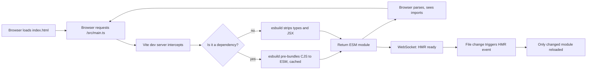
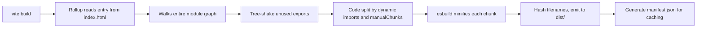
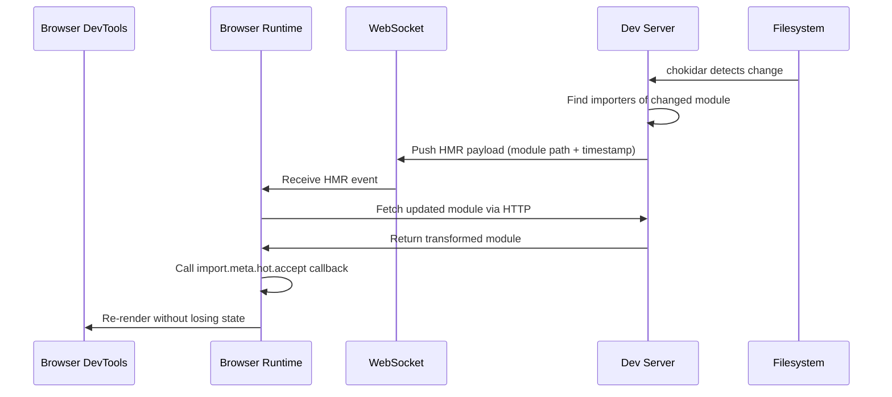

# 6.09 Vite and Webpack Comparison

## 1. Purpose

Every modern JavaScript project is shaped by a single choice that is rarely revisited after the first commit: which bundler sits behind the dev server and the production build. That choice is overwhelmingly now a choice between two tools — Vite and Webpack — and the reason this note exists is that the two tools come from different eras, make different assumptions about the browser and the developer workflow, and produce different failure modes when those assumptions are violated. A developer who treats them as interchangeable will hit configuration walls that look like bugs and bugs that look like configuration walls. A developer who understands the architecture of each can move between them in either direction, debug HMR failures, and pick the right tool for a new project without reaching for the wrong default.

Vite exists because Webpack's dev server, in any project above a thousand modules, takes seconds to start and seconds to rebuild on every save. Evan You released Vite in 2020 specifically to solve that problem. The observation that motivated Vite is that modern browsers already ship a module loader — native ES Modules — so the dev server does not need to bundle anything at all. The dev server can hand the browser a single HTML file with a `<script type="module">` tag, and the browser then issues one HTTP request per imported file. Vite intercepts those requests, transforms TypeScript and JSX on the fly with esbuild (see [[6.08 ESBuild and SWC]]), and serves the result. Startup is fast because nothing is bundled. HMR is fast because only the changed module is reloaded — not the entire dependency graph.

Vite's production build is a different story. Native ESM is great for development, terrible for production: hundreds of HTTP requests on first load kill performance. So for production Vite hands the build off to Rollup, which performs static analysis, tree-shaking, code splitting, and minification. The same source code is served two completely different ways depending on whether `vite` (dev) or `vite build` (prod) was invoked. This is the architectural decision that defines Vite: dev and prod are not the same pipeline, and that is intentional.

Webpack, by contrast, has been the dominant bundler since 2012. Webpack's model is that the dev server and the production build are the same pipeline with different flags. Both bundle the entire dependency graph into one or more chunks; the difference is whether the output is written to disk (prod) or kept in memory and served over HTTP with HMR enabled (dev). The advantage of this approach is that what you test in dev is exactly what ships in prod. The disadvantage is that startup time grows linearly with the size of the dependency graph, because every module must be parsed and its dependencies walked before the first request can be answered. In a 5000-module Next.js app, that startup can take 30 seconds.

Why both still matter:

1. **Vite is the modern default for new projects.** Vue, Svelte, Solid, Astro, Nuxt 3, Remix (in Vite mode), and the React `create-vite` templates all ship Vite by default. A developer starting a new SPA in 2024 or later would have to actively justify choosing Webpack. The reason is not fashion — it is that Vite's dev startup is one to two orders of magnitude faster than Webpack's for any nontrivial project, and that gap is felt on every file save.

2. **Webpack is still everywhere.** Next.js (until its transition to Turbopack finishes), Create React App, Angular CLI (until its transition to esbuild finishes), the majority of internal enterprise apps started before 2022, and an enormous long tail of projects in maintenance. A developer who joins an existing team is more likely to inherit a Webpack config than a Vite one. Understanding Webpack is not optional — it is a job-preservation skill.

3. **Libraries that ship to both worlds** need to know what each bundler does with their code. A library that uses `import.meta.url`, top-level await, or ESM-only dependencies works differently under Webpack 4, Webpack 5, and Vite. The right `package.json` `exports` field can be the difference between a library that works everywhere and one that breaks in half its consumers.

4. **Migrations from Webpack to Vite** are now a common engineering project. They are not always trivial — Webpack's `require.context`, custom loaders, and `DefinePlugin` patterns do not all have direct Vite equivalents — but the performance payoff is real, and many teams have done it. This note covers the migration path in enough detail that a developer can scope the work.

The goal of this note is to make the following second nature:

1. Read a Vite config or a Webpack config and predict what the dev server will do on startup, what the production build will produce, and where the configuration is brittle.
2. Diagnose the canonical failure modes of each tool: Vite's "dependency pre-bundling" errors, Webpack's "module parse failed" errors, HMR loops in both, sourcemap gaps in both.
3. Configure HMR correctly for React, Vue, and Svelte under both bundlers.
4. Migrate a small Webpack project to Vite without losing functionality, knowing which Webpack features have direct Vite equivalents and which require a plugin or a refactor.
5. Choose between the two for a new project with a defensible reason, not a vibe.

Cross-references to [[6.07 TSC Compiler Operation]] and [[6.08 ESBuild and SWC]] are intentional — Vite's dev transform layer is esbuild, and Webpack's TS pipeline (when using `ts-loader`) is `tsc`. The choice of bundler often determines the choice of TS transform, and that choice has correctness implications covered in those notes.

## 2. Theory and Deep Dive

The theory section is structured as a tour through the two tools' pipelines, the load-bearing concepts (loaders, plugins, HMR, code splitting, tree-shaking), and the trade-offs that flow from each architectural decision. Where a concept exists in both tools, the two implementations are contrasted directly. Where a concept exists in only one tool, the reason it does not exist in the other is given.

### 2.1 Vite Dev — Native ESM Serving

When a developer runs `vite`, the dev server starts an HTTP server (default port 5173), opens a WebSocket connection for HMR, and serves the project's `index.html`. That HTML file contains a `<script type="module" src="/src/main.ts">` tag. When the browser loads the page, it issues a GET request for `/src/main.ts`. Vite intercepts that request, runs the file through esbuild (which strips types and transpiles JSX in microseconds, not milliseconds), and returns the transformed JS to the browser. The browser parses it, sees `import` statements, and issues follow-up requests for each one.

Three things are happening that are worth slowing down on:

1. **The browser is the module loader.** Vite is not resolving imports in advance. The browser is. Vite only transforms files when the browser asks for them. This is why startup is fast — there is no upfront graph walk.
2. **esbuild is doing the transform, not `tsc` and not Babel.** esbuild is one to two orders of magnitude faster than either, which means the per-request transform cost is small enough that the user does not perceive it. See [[6.08 ESBuild and SWC]].
3. **Dependencies are pre-bundled.** If `main.ts` imports `react`, and React ships as CommonJS with hundreds of internal files, naively serving them all as ESM would produce hundreds of HTTP requests. Vite pre-bundles dependencies with esbuild the first time they are requested, converting CJS to ESM and combining the hundreds of files into a single optimized module. This pre-bundling is cached in `dependencyCacheDir` (typically `node modules/.vite/deps`) and re-run only when `package.json` or `vite.config.ts` changes.



The consequence of this architecture is that the dev server's first page load is O(number of imports) requests, but each subsequent navigation is fast because dependencies are cached. The cost is paid once, at first load.

### 2.2 Vite Build — Rollup

`vite build` switches to a completely different pipeline. Rollup takes over, performs static analysis on the entire graph, tree-shakes unused exports, splits the result into chunks based on dynamic imports and manual configuration, and writes the output to `dist/`. The output is minified (default minifier is esbuild, with terser as an option), hashed, and ready to be served by any static host.

The reason Vite uses Rollup instead of esbuild for production is that Rollup's tree-shaking and code-splitting are more mature than esbuild's, and the production build is not on the hot path — a 5-second build is fine, while a 5-second dev startup is not. esbuild's bundler is improving but historically produced larger output with worse tree-shaking.



### 2.3 Webpack Dev — Bundled In Memory

When a developer runs `webpack serve` (or `webpack-dev-server`), Webpack starts up, reads the entry point from `webpack.config.js`, walks the entire dependency graph, runs every file through its configured loaders (TypeScript via `ts-loader` or `babel-loader`, CSS via `css-loader`, etc.), and produces an in-memory bundle. That bundle is served by the dev server, and a WebSocket runtime is injected for HMR.

The graph walk is the expensive part. Every file is parsed, every `import` is resolved, every loader runs. In a project with 5000 modules, this can take 20-40 seconds before the first byte is served to the browser. Subsequent rebuilds on file change are incremental (Webpack caches what it can), but they still touch the affected subgraph, not just the single changed file.


### 2.4 Webpack Build — Bundled To Disk

`webpack --mode production` walks the same graph with the same loaders, but with production optimizations enabled: tree-shaking (`optimization.usedExports` and `optimization.minimize`), code splitting (`optimization.splitChunks`), minification (`TerserPlugin` by default), and scope hoisting (`ModuleConcatenationPlugin`). The output is written to the configured `output.path` directory.

The dev and prod pipelines are the same code path with different flags. This is Webpack's main architectural difference from Vite, and it is the source of both Webpack's main advantage (what you test is what you ship) and Webpack's main disadvantage (dev startup is slow because the same expensive pipeline runs in dev).

### 2.5 Loaders — Webpack's Transform Pipeline

A Webpack loader is a function that takes a source file's contents as a string and returns a transformed string (or AST, in some cases). Loaders are chained: the output of one loader feeds into the input of the next. The chain is specified per file extension in `module.rules`.

The canonical loader chain for a TypeScript file in a Webpack project is:

1. `ts-loader` (or `babel-loader` with `@babel/preset-typescript`) — strips types, transpiles TS syntax to JS.
2. (If using Babel) `@babel/preset-env` — transpiles modern JS syntax to the configured `target`.
3. The result is JS that Webpack can parse and bundle.

For a CSS file:

1. `css-loader` — parses `@import` and `url()` in CSS, returns a JS module that injects the CSS into the DOM at runtime.
2. `style-loader` — takes the JS module from `css-loader` and injects a `<style>` tag (dev mode) or extracts to a `.css` file (with `MiniCssExtractPlugin` in prod).

For images and fonts: `asset-loader` (Webpack 5 built-in) or `file-loader`/`url-loader` (Webpack 4) — emits the file as a separate asset and returns the URL.

The key thing to understand is that Webpack only understands JavaScript and JSON natively. Everything else — TypeScript, CSS, images, SVGs, YAML, Markdown — must be transformed into JS by a loader before Webpack can include it in the graph. This is why loader configuration is the bulk of a typical `webpack.config.js`.

Vite has a similar concept but does not require explicit loader configuration for common cases. Vite's dev server transforms `.ts`, `.tsx`, `.jsx`, `.css`, `.vue`, `.svelte`, and many other file types out of the box. Custom transforms are added via plugins, not loader rules.

### 2.6 Plugins — The Build Lifecycle Hooks

A Webpack plugin is a class with an `apply` method that receives the `compiler` object and registers hooks on the compilation lifecycle. Hooks fire at specific points: `beforeRun`, `compilation`, `emit`, `done`, etc. Plugins can do anything: define globals (`DefinePlugin`), extract CSS (`MiniCssExtractPlugin`), generate an HTML file (`HtmlWebpackPlugin`), copy files (`CopyPlugin`), analyze the bundle (`BundleAnalyzerPlugin`).

A Vite plugin is a Rollup plugin (with Vite-specific extensions). It is an object with hooks like `resolveId`, `load`, `transform`, `buildStart`, `buildEnd`, `closeBundle`. Vite adds its own hooks: `config` (modify the Vite config before it is resolved), `configResolved` (read the final config), `configureServer` (hook into the dev server), `transformIndexHtml` (modify the HTML entry), and `handleHotUpdate` (custom HMR logic).

The conceptual difference is that Webpack plugins operate on a `Compilation` object that represents the entire build, while Vite/Rollup plugins operate on individual modules in a more functional style. Both can do similar things, but the Webpack plugin API is more imperative (mutating arrays on the compilation object) and the Vite plugin API is more declarative (returning transformed values from hook functions).

### 2.7 Hot Module Replacement — HMR

HMR is the feature that lets a developer change a source file and see the result in the browser without a full page reload and without losing application state. Both Vite and Webpack support HMR, but the implementations differ.

**Webpack HMR:** Webpack's dev server injects a runtime (`webpack/hot/dev-server`) into the bundle. When a file changes, Webpack recompiles the affected modules, generates a hot update chunk (a small JS file containing the changed modules), and pushes it to the browser over WebSocket. The runtime applies the update by calling each changed module's `module.hot.accept` callback. If no accept callback is registered for a given module, the runtime walks up the import tree until it finds one; if it reaches the entry point without finding one, it triggers a full page reload.

**Vite HMR:** Vite's dev server watches files with chokidar. When a file changes, Vite determines which modules import the changed file, sends a WebSocket message listing the affected modules, and the browser runtime fetches the updated module via HTTP (re-running the transform if needed). The same `import.meta.hot.accept` API is used to register accept callbacks. The difference is that Vite never re-bundles — it just re-serves the single changed file. This is why Vite HMR is consistently faster than Webpack HMR for large projects.

Vite also provides framework-specific HMR via plugins: `@vitejs/plugin-react` provides React Fast Refresh (preserves component state across re-renders), `@vitejs/plugin-vue` provides Vue HMR (preserves component instance state), `@vitejs/plugin-svelte` provides Svelte HMR. The plugin's `handleHotUpdate` hook is where the framework-specific logic lives.



### 2.8 Code Splitting

Both tools support code splitting — the practice of producing multiple output chunks instead of one giant bundle, so that the browser loads code on demand.

**Webpack code splitting** has three mechanisms:

1. **Entry points** — multiple entries in `entry` produce multiple bundles. Simple but produces duplicated shared code.
2. **Dynamic imports** — `import('./module').then(...)` produces a separate chunk that is loaded on demand. This is the most common mechanism.
3. **SplitChunksPlugin** — automatically extracts shared code into common chunks based on heuristics (modules shared by N+ chunks, modules larger than X bytes, etc.). Configured via `optimization.splitChunks`.

**Vite code splitting** inherits Rollup's mechanisms:

1. **Dynamic imports** — same syntax, same effect.
2. **Manual chunks** — `build.rollupOptions.output.manualChunks` lets you specify which modules go into which named chunk.
3. **Implicit splitting** — Rollup automatically splits code at dynamic import boundaries.

The key practical difference is that Webpack's `splitChunks` has a richer set of heuristics for automatic common-chunk extraction, while Vite/Rollup relies more on explicit configuration. For most apps, default behavior is fine; for advanced cases (e.g., splitting vendor code from app code), both require manual configuration.

### 2.9 Tree-Shaking

Tree-shaking is the elimination of unused exports from the final bundle. Both tools support it, but with different default behaviors and different requirements on the source code.

**Webpack tree-shaking** requires:

1. `mode: 'production'` (which sets `optimization.usedExports: true` and `optimization.minimize: true`).
2. The module's `package.json` must have `"sideEffects": false` (or a side-effects allowlist), or Webpack will not shake it because it assumes every file might have side effects.
3. The source must use ESM `import`/`export` syntax (not CommonJS).

**Vite/Rollup tree-shaking** is on by default for production builds and is generally more aggressive than Webpack's. Rollup's tree-shaking is considered the reference implementation in the JS ecosystem. The same `sideEffects` field in `package.json` is respected.

A common mistake is to assume that tree-shaking will eliminate a dependency that is imported for its side effects (e.g., `import './polyfills'` or `import 'core-js/stable'`). Tree-shaking correctly preserves these imports — but only if the importing package's `package.json` declares them as side effects. Otherwise they may be silently dropped.

### 2.10 The Vite-Webpack Equivalence Table

| Concern | Vite | Webpack |
|---|---|---|
| Dev server | Native ESM, no bundling | Bundled in memory |
| Dev startup | O(1) for first request | O(graph size) before first request |
| Dev transform | esbuild | Loaders (ts-loader, babel-loader) |
| Prod bundler | Rollup | Webpack itself |
| Prod minifier | esbuild (default) or terser | Terser (default), esbuild optional |
| HMR | Per-module HTTP fetch | Hot update chunks over WebSocket |
| Loaders | Built-in for common types, plugins for rest | Explicit `module.rules` |
| Plugins | Rollup-compatible + Vite-specific hooks | Webpack plugin class with `apply` |
| Code splitting | Dynamic imports + manualChunks | Dynamic imports + splitChunks |
| Tree-shaking | Rollup (aggressive) | Webpack (requires `sideEffects`) |
| Config file | `vite.config.ts` (functional, returns config) | `webpack.config.js` (imperative object) |
| Config language | TS-native | JS by default, TS with `ts-node` |

This table is the cheat sheet. The rest of the note explains why each row is the way it is.

## 3. Mental Models

Five mental models cover the cases that matter. Each is a sentence that should be the first thing that comes to mind when the corresponding concept is named.

**Model 1 — Vite dev is "serve source as ESM, browser imports, HMR per module."** The browser is the bundler in dev. Vite is just a transformer and an HMR coordinator. This explains why Vite dev is fast (no upfront graph walk) and why Vite dev requires a browser that supports native ESM (which is all browsers since 2018, but not IE11 — Vite does not support IE11 in dev).

**Model 2 — Vite build is "Rollup bundling."** The dev server and the production build are different pipelines. The dev server does not bundle; the production build does. This is the source of the most common Vite prod-only bug: code that works in dev because the browser handles it natively, but fails in prod because Rollup's static analysis rejects it (e.g., dynamic imports with non-static arguments).

**Model 3 — Webpack is "bundle everything in dev and prod."** The same pipeline runs in both modes. This is the source of Webpack's main advantage (dev/prod parity) and main disadvantage (slow dev startup).

**Model 4 — A loader is "transform non-JS to JS."** Webpack only understands JS and JSON. Anything else — CSS, images, TS, Markdown — must be transformed by a loader into JS that Webpack can bundle. The output of a CSS loader is JS that, when executed, injects a `<style>` tag. The output of an image loader is JS that exports a URL string.

**Model 5 — A plugin is "hook into the build lifecycle."** Plugins fire at specific points (start, before emit, after emit, done) and can do anything: modify the output, add files, replace code, run side effects. Loaders transform individual files; plugins orchestrate the build.

Where the models break down:

- Vite's "browser is the bundler" model breaks down for dependencies, which Vite pre-bundles with esbuild. The browser does not see hundreds of React internals — it sees one pre-bundled module.
- Webpack's "bundle everything in dev" model breaks down with persistent caching in Webpack 5, which can skip unchanged subgraphs. The model is still mostly accurate but the startup cost is amortized after the first build.
- The "loader transforms non-JS to JS" model breaks down for `babel-loader`, which transforms JS to JS. The correct mental model is "loader transforms anything to JS Webpack can bundle," which includes JS-to-JS transforms.

## 4. Real-World Use Cases

### 4.1 Vite For New SPAs

A new SPA — React, Vue, Svelte, Solid, Preact — should default to Vite. The `npm create vite@latest` scaffold produces a working dev server in under a second and a production build in under five seconds for a typical app. Framework-specific templates (`npm create vite@latest my-app -- --template react-ts`) include the relevant Vite plugin pre-configured.

Production example: Vercel's dashboard, the new Vue docs site, the SvelteKit docs, Astro's site, and most new open-source SPAs started after 2022 use Vite.

### 4.2 Webpack For Existing Enterprise Apps

Existing apps built on Create React App, Next.js (pre-Turbopack), Angular CLI (pre-esbuild), or custom Webpack configs are not going to migrate overnight. A developer joining a team that maintains such an app needs to read the existing `webpack.config.js`, understand its loader chain, and add or modify rules without breaking the build. The skill is not "write a Webpack config from scratch" — it is "read someone else's Webpack config without panic."

Enterprise example: most Fortune 500 internal apps built between 2017 and 2022 use Webpack. Banks, insurance companies, healthcare providers — these are Webpack shops.

### 4.3 Libraries That Support Both

A library published to npm needs to work whether the consumer uses Vite, Webpack, Rollup, esbuild, or no bundler. This is the purpose of the `package.json` `exports` field:

```json
{
  "exports": {
    ".": {
      "types": "./dist/index.d.ts",
      "import": "./dist/index.mjs",
      "require": "./dist/index.cjs"
    }
  },
  "sideEffects": false
}
```

The `sideEffects: false` field is critical — without it, neither Webpack nor Vite will tree-shake the library, and consumers will ship unused code. The dual `import`/`require` entry points support both ESM and CJS consumers. The `types` entry supports TypeScript consumers.

### 4.4 Migration From Webpack To Vite

A typical migration path:

1. Audit the Webpack config for features that have no direct Vite equivalent: `require.context`, custom loaders, `DefinePlugin` with complex expressions, `NormalModuleReplacementPlugin`.
2. Replace each custom loader with a Vite plugin or a built-in transform. Most `css-loader` + `style-loader` configs become no-ops (Vite handles CSS natively). Most `file-loader` configs become no-ops (Vite handles assets natively).
3. Replace `DefinePlugin` with `define` in `vite.config.ts`.
4. Replace `HtmlWebpackPlugin` with Vite's built-in HTML handling.
5. Replace `resolve.alias` with Vite's `resolve.alias` (same syntax).
6. Test HMR for each framework — React Fast Refresh via `@vitejs/plugin-react`, Vue HMR via `@vitejs/plugin-vue`.
7. Run the production build and verify the output size and chunk structure match expectations.

Migration is typically a 1-3 day project for a small app, a 1-2 week project for a medium app, and a multi-month project for a large enterprise app with custom Webpack plugins. The ROI is real: a typical migration cuts dev startup from 30 seconds to 1 second and HMR from 2 seconds to 100 milliseconds.

## 5. Code Examples

### 5.1 Example A — Minimal and Conceptual

The minimal example is a single-page app with one React component, one CSS file, and one TypeScript entry. Both Vite and Webpack configs are shown for the same app, in both JavaScript and TypeScript.

**Project structure:**

```
my-app/
  index.html
  src/
    main.tsx (or main.jsx)
    App.tsx (or App.jsx)
    styles.css
  vite.config.ts (or vite.config.js)
  webpack.config.js (or webpack.config.ts)
  package.json
  tsconfig.json (TS only)
```

**`src/main.tsx` (TS) / `src/main.jsx` (JS):**

```typescript
// TS — entry point
import { createRoot } from 'react-dom/client';
import { App } from './App';
import './styles.css';

const root = document.getElementById('root');
if (!root) throw new Error('Root element not found');
createRoot(root).render(<App />);
```

```javascript
// JS — entry point
import { createRoot } from 'react-dom/client';
import { App } from './App';
import './styles.css';

const root = document.getElementById('root');
if (!root) throw new Error('Root element not found');
createRoot(root).render(<App />);
```

**`src/App.tsx` (TS) / `src/App.jsx` (JS):**

```typescript
// TS — minimal component
import { useState } from 'react';

export function App(): JSX.Element {
  const [count, setCount] = useState(0);
  return (
    <button onClick={() => setCount((c) => c + 1)}>
      Clicked {count} times
    </button>
  );
}
```

```javascript
// JS — minimal component
import { useState } from 'react';

export function App() {
  const [count, setCount] = useState(0);
  return (
    <button onClick={() => setCount((c) => c + 1)}>
      Clicked {count} times
    </button>
  );
}
```

**`index.html`:**

```html
<!doctype html>
<html lang="en">
  <head>
    <meta charset="UTF-8" />
    <meta name="viewport" content="width=device-width, initial-scale=1.0" />
    <title>Minimal App</title>
  </head>
  <body>
    <div id="root"></div>
    <script type="module" src="/src/main.tsx"></script>
  </body>
</html>
```

**Vite config (TS):**

```typescript
// vite.config.ts
import { defineConfig } from 'vite';
import react from '@vitejs/plugin-react';

export default defineConfig({
  plugins: [react()],
  server: {
    port: 5173,
    open: true,
  },
});
```

**Vite config (JS):**

```javascript
// vite.config.js
import { defineConfig } from 'vite';
import react from '@vitejs/plugin-react';

export default defineConfig({
  plugins: [react()],
  server: {
    port: 5173,
    open: true,
  },
});
```

That is the entire Vite config. Vite's `index.html` is the entry point (note the `<script type="module" src="/src/main.tsx">` tag), and `@vitejs/plugin-react` provides JSX transform and React Fast Refresh. No loader rules, no entry configuration, no output configuration.

**Webpack config (JS):**

```javascript
// webpack.config.js
const path = require('path');
const HtmlWebpackPlugin = require('html-webpack-plugin');

module.exports = {
  mode: 'development',
  entry: './src/main.jsx',
  output: {
    path: path.resolve(process.cwd(), 'dist'),
    filename: '[name].[contenthash].js',
    publicPath: '/',
  },
  resolve: {
    extensions: ['.js', '.jsx'],
  },
  module: {
    rules: [
      {
        test: /\.(js|jsx)$/,
        exclude: /node modules/,
        use: {
          loader: 'babel-loader',
          options: {
            presets: ['@babel/preset-env', ['@babel/preset-react', { runtime: 'automatic' }]],
          },
        },
      },
      {
        test: /\.css$/,
        use: ['style-loader', 'css-loader'],
      },
    ],
  },
  plugins: [
    new HtmlWebpackPlugin({
      template: './index.html',
    }),
  ],
  devServer: {
    hot: true,
    port: 3000,
    historyApiFallback: true,
  },
};
```

**Webpack config (TS):**

```typescript
// webpack.config.ts
import path from 'node:path';
import { fileURLToPath } from 'node:url';
import HtmlWebpackPlugin from 'html-webpack-plugin';
import type { Configuration } from 'webpack';

const currentDir = path.dirname(fileURLToPath(import.meta.url));

const config: Configuration = {
  mode: 'development',
  entry: './src/main.tsx',
  output: {
    path: path.resolve(currentDir, 'dist'),
    filename: '[name].[contenthash].js',
    publicPath: '/',
  },
  resolve: {
    extensions: ['.ts', '.tsx', '.js', '.jsx'],
  },
  module: {
    rules: [
      {
        test: /\.(ts|tsx)$/,
        exclude: /node modules/,
        use: {
          loader: 'ts-loader',
          options: {
            transpileOnly: true,
          },
        },
      },
      {
        test: /\.css$/,
        use: ['style-loader', 'css-loader'],
      },
    ],
  },
  plugins: [
    new HtmlWebpackPlugin({
      template: './index.html',
    }),
  ],
  devServer: {
    hot: true,
    port: 3000,
    historyApiFallback: true,
  },
};

export default config;
```

The differences to notice:

1. **Entry point.** Vite uses `index.html` as the entry. Webpack uses `src/main.tsx` directly and needs `HtmlWebpackPlugin` to inject the bundle into the HTML.
2. **Loader rules.** Vite has none (built-in). Webpack needs explicit rules for TS/JSX and CSS.
3. **Resolve extensions.** Vite resolves `.ts`, `.tsx`, `.jsx`, `.js`, `.mjs`, `.cjs`, `.json` by default. Webpack needs `resolve.extensions` set explicitly.
4. **Type safety.** Vite's config is TS-native. Webpack's TS config requires `ts-node` installed and `tsx` or `ts-node` to run it.
5. **Boilerplate.** The Vite config is 11 lines. The Webpack config is 35 lines. The ratio grows as features are added.

### 5.2 Example B — Production-Grade

The production-grade example is a typed Vite app with React, code splitting, environment-specific configuration, build analysis, and a custom plugin. The Webpack equivalent is also shown for comparison.

**Vite production config (TS):**

```typescript
// vite.config.ts
import { defineConfig, type UserConfig } from 'vite';
import react from '@vitejs/plugin-react';
import { visualizer } from 'rollup-plugin-visualizer';
import { compression } from 'vite-plugin-compression2';
import { fileURLToPath } from 'node:url';
import { dirname, resolve } from 'node:path';

const projectRoot = dirname(fileURLToPath(import.meta.url));

interface BuildEnv {
  mode: string;
  apiBaseUrl: string;
  sentryDsn: string;
}

function loadEnv(mode: string): BuildEnv {
  const apiBaseUrl =
    process.env.APIBASEURL ?? (mode === 'production' ? 'https://api.example.com' : 'http://localhost:3001');
  const sentryDsn = process.env.SENTRYDSN ?? '';
  return { mode, apiBaseUrl, sentryDsn };
}

const customPlugin = (): NonNullable<UserConfig['plugins']>[number] => ({
  name: 'custom-plugin',
  configResolved(resolved) {
    console.log(`[custom-plugin] Build mode: ${resolved.mode}`);
  },
  transform(code, id) {
    if (id.endsWith('.tsx') && code.includes('console.log')) {
      console.warn(`[custom-plugin] console.log found in ${id}`);
    }
    return null;
  },
  configureServer(server) {
    server.middlewares.use((req, res, next) => {
      res.setHeader('X-Custom-Header', 'vite-app');
      next();
    });
  },
});

export default defineConfig(({ mode }) => {
  const env = loadEnv(mode);
  const isProd = mode === 'production';

  return {
    plugins: [
      react({ include: /\.(tsx|jsx)$/ }),
      customPlugin(),
      compression({ algorithms: ['gzip'] }),
      isProd &&
        visualizer({
          filename: 'dist/stats.html',
          gzipSize: true,
          open: false,
        }),
    ].filter(Boolean),
    resolve: {
      alias: {
        '@': resolve(projectRoot, 'src'),
        '@components': resolve(projectRoot, 'src/components'),
        '@lib': resolve(projectRoot, 'src/lib'),
      },
    },
    server: {
      port: 5173,
      open: true,
      hmr: {
        overlay: true,
        port: 5174,
      },
      proxy: {
        '/api': {
          target: env.apiBaseUrl,
          changeOrigin: true,
        },
      },
    },
    build: {
      target: 'es2020',
      sourcemap: isProd ? 'hidden' : true,
      minify: isProd ? 'esbuild' : false,
      cssCodeSplit: true,
      rollupOptions: {
        output: {
          manualChunks: {
            'react-vendor': ['react', 'react-dom'],
            'router-vendor': ['react-router-dom'],
            'query-vendor': ['@tanstack/react-query'],
          },
          chunkFileNames: 'assets/[name]-[hash].js',
          entryFileNames: 'assets/[name]-[hash].js',
          assetFileNames: 'assets/[name]-[hash][extname]',
        },
      },
      chunkSizeWarningLimit: 1500,
    },
    define: {
      'import.meta.env.APIBASEURL': JSON.stringify(env.apiBaseUrl),
      'import.meta.env.SENTRYDSN': JSON.stringify(env.sentryDsn),
    },
    optimizeDeps: {
      include: ['react', 'react-dom', 'react-router-dom'],
      exclude: ['@tanstack/react-query-devtools'],
    },
    esbuild: {
      logOverride: { 'this-is-undefined-in-module': 'silent' },
      legalComments: 'none',
    },
  };
});
```

**Vite production config (JS):**

```javascript
// vite.config.js
import { defineConfig } from 'vite';
import react from '@vitejs/plugin-react';
import { visualizer } from 'rollup-plugin-visualizer';
import { compression } from 'vite-plugin-compression2';
import { fileURLToPath } from 'node:url';
import { dirname, resolve } from 'node:path';

const projectRoot = dirname(fileURLToPath(import.meta.url));

function loadEnv(mode) {
  const apiBaseUrl =
    process.env.APIBASEURL ??
    (mode === 'production' ? 'https://api.example.com' : 'http://localhost:3001');
  const sentryDsn = process.env.SENTRYDSN ?? '';
  return { mode, apiBaseUrl, sentryDsn };
}

const customPlugin = () => ({
  name: 'custom-plugin',
  configResolved(resolved) {
    console.log(`[custom-plugin] Build mode: ${resolved.mode}`);
  },
  transform(code, id) {
    if (id.endsWith('.tsx') && code.includes('console.log')) {
      console.warn(`[custom-plugin] console.log found in ${id}`);
    }
    return null;
  },
  configureServer(server) {
    server.middlewares.use((req, res, next) => {
      res.setHeader('X-Custom-Header', 'vite-app');
      next();
    });
  },
});

export default defineConfig(({ mode }) => {
  const env = loadEnv(mode);
  const isProd = mode === 'production';

  return {
    plugins: [
      react({ include: /\.(tsx|jsx)$/ }),
      customPlugin(),
      compression({ algorithms: ['gzip'] }),
      isProd &&
        visualizer({
          filename: 'dist/stats.html',
          gzipSize: true,
          open: false,
        }),
    ].filter(Boolean),
    resolve: {
      alias: {
        '@': resolve(projectRoot, 'src'),
        '@components': resolve(projectRoot, 'src/components'),
        '@lib': resolve(projectRoot, 'src/lib'),
      },
    },
    server: {
      port: 5173,
      open: true,
      hmr: { overlay: true, port: 5174 },
      proxy: {
        '/api': { target: env.apiBaseUrl, changeOrigin: true },
      },
    },
    build: {
      target: 'es2020',
      sourcemap: isProd ? 'hidden' : true,
      minify: isProd ? 'esbuild' : false,
      cssCodeSplit: true,
      rollupOptions: {
        output: {
          manualChunks: {
            'react-vendor': ['react', 'react-dom'],
            'router-vendor': ['react-router-dom'],
            'query-vendor': ['@tanstack/react-query'],
          },
          chunkFileNames: 'assets/[name]-[hash].js',
          entryFileNames: 'assets/[name]-[hash].js',
          assetFileNames: 'assets/[name]-[hash][extname]',
        },
      },
      chunkSizeWarningLimit: 1500,
    },
    define: {
      'import.meta.env.APIBASEURL': JSON.stringify(env.apiBaseUrl),
      'import.meta.env.SENTRYDSN': JSON.stringify(env.sentryDsn),
    },
    optimizeDeps: {
      include: ['react', 'react-dom', 'react-router-dom'],
      exclude: ['@tanstack/react-query-devtools'],
    },
    esbuild: {
      logOverride: { 'this-is-undefined-in-module': 'silent' },
      legalComments: 'none',
    },
  };
});
```

**Webpack production config (TS) — for comparison:**

```typescript
// webpack.config.ts
import path from 'node:path';
import { fileURLToPath } from 'node:url';
import HtmlWebpackPlugin from 'html-webpack-plugin';
import MiniCssExtractPlugin from 'mini-css-extract-plugin';
import { BundleAnalyzerPlugin } from 'webpack-bundle-analyzer';
import TerserPlugin from 'terser-webpack-plugin';
import CompressionPlugin from 'compression-webpack-plugin';
import { DefinePlugin, type Configuration } from 'webpack';

const currentDir = path.dirname(fileURLToPath(import.meta.url));
const isProd = process.env.NODEENV === 'production';

const config: Configuration = {
  mode: isProd ? 'production' : 'development',
  entry: {
    main: './src/main.tsx',
  },
  output: {
    path: path.resolve(currentDir, 'dist'),
    filename: 'assets/[name]-[contenthash:8].js',
    chunkFilename: 'assets/[name]-[contenthash:8].js',
    assetModuleFilename: 'assets/[name]-[hash][ext]',
    publicPath: '/',
    clean: true,
  },
  resolve: {
    extensions: ['.ts', '.tsx', '.js', '.jsx', '.json'],
    alias: {
      '@': path.resolve(currentDir, 'src'),
      '@components': path.resolve(currentDir, 'src/components'),
      '@lib': path.resolve(currentDir, 'src/lib'),
    },
  },
  devtool: isProd ? 'hidden-source-map' : 'eval-source-map',
  module: {
    rules: [
      {
        test: /\.(ts|tsx)$/,
        exclude: /node modules/,
        use: {
          loader: 'ts-loader',
          options: { transpileOnly: true, compilerOptions: { sourceMap: true } },
        },
      },
      {
        test: /\.css$/,
        use: [isProd ? MiniCssExtractPlugin.loader : 'style-loader', 'css-loader'],
      },
      {
        test: /\.(png|jpe?g|gif|svg|woff2?|eot|ttf)$/,
        type: 'asset/resource',
      },
    ],
  },
  plugins: [
    new HtmlWebpackPlugin({
      template: './index.html',
      minify: isProd,
    }),
    new DefinePlugin({
      'process.env.APIBASEURL': JSON.stringify(
        process.env.APIBASEURL ?? (isProd ? 'https://api.example.com' : 'http://localhost:3001')
      ),
      'process.env.SENTRYDSN': JSON.stringify(process.env.SENTRYDSN ?? ''),
    }),
    isProd &&
      new MiniCssExtractPlugin({
        filename: 'assets/[name]-[contenthash:8].css',
        chunkFilename: 'assets/[name]-[contenthash:8].css',
      }),
    isProd &&
      new CompressionPlugin({
        algorithm: 'gzip',
        filename: '[path][base].gz',
      }),
    isProd && new BundleAnalyzerPlugin({ analyzerMode: 'static', openAnalyzer: false }),
  ].filter(Boolean),
  optimization: {
    minimize: isProd,
    minimizer: [new TerserPlugin({ parallel: true, extractComments: false })],
    splitChunks: {
      chunks: 'all',
      cacheGroups: {
        reactVendor: {
          test: /[\\/]node modules[\\/](react|react-dom)[\\/]/,
          name: 'react-vendor',
          chunks: 'all',
        },
        routerVendor: {
          test: /[\\/]node modules[\\/](react-router|react-router-dom)[\\/]/,
          name: 'router-vendor',
          chunks: 'all',
        },
        queryVendor: {
          test: /[\\/]node modules[\\/]@tanstack[\\/]react-query[\\/]/,
          name: 'query-vendor',
          chunks: 'all',
        },
      },
    },
    runtimeChunk: 'single',
  },
  devServer: {
    hot: true,
    port: 3000,
    historyApiFallback: true,
    proxy: {
      '/api': {
        target: process.env.APIBASEURL ?? 'http://localhost:3001',
        changeOrigin: true,
      },
    },
    static: { directory: path.resolve(currentDir, 'public') },
  },
  performance: {
    maxAssetSize: 1500000,
    maxEntrypointSize: 1500000,
    hints: isProd ? 'warning' : false,
  },
};

export default config;
```

The production-grade configs illustrate the conceptual gap. The Vite config is structured as a single object with named sections (`build`, `server`, `optimizeDeps`, `define`). The Webpack config is structured as a flat object with cross-cutting concerns (`module.rules` for transforms, `plugins` for lifecycle hooks, `optimization` for chunking). Both achieve the same result, but the cognitive load of reading a Webpack config is higher because the relationship between rules, plugins, and optimization is implicit.

## 6. Common Mistakes and Anti-Patterns

### 6.1 Mistake One — Choosing Webpack For A New Project In 2024 Or Later

```javascript
// JS — wrong choice for a new SPA in 2024+
npx create-react-app my-app
// takes 2-5 minutes to install
// dev server takes 30+ seconds to start
// every save triggers a multi-second recompile
```

**Why it fails:** Create React App (CRA) is deprecated. Its maintenance has effectively stopped. The dev experience is dramatically worse than Vite for the same app. There is no upside to choosing CRA for a new project.

**Fix:**

```bash
# Use Vite instead
npm create vite@latest my-app -- --template react-ts
cd my-app && npm install
npm run dev
# dev server starts in under 1 second
# HMR is nearly instant
```

### 6.2 Mistake Two — Vite Config Trying To Do Too Much

```typescript
// TS — over-engineered Vite config
import { defineConfig } from 'vite';

export default defineConfig({
  build: {
    rollupOptions: {
      output: {
        manualChunks: (id) => {
          if (id.includes('node modules')) {
            if (id.includes('react')) return 'react';
            if (id.includes('lodash')) return 'lodash';
            if (id.includes('date-fns')) return 'date-fns';
            if (id.includes('axios')) return 'axios';
            if (id.includes('zod')) return 'zod';
            if (id.includes('clsx')) return 'clsx';
            if (id.includes('uuid')) return 'uuid';
            // ... 50 more lines of this
            return 'vendor';
          }
        },
      },
    },
  },
});
```

**Why it fails:** Vite's default chunking is good. Over-specifying `manualChunks` produces many tiny chunks, which causes waterfall requests on first load. The right default is to let Vite/Rollup handle it and only manually chunk large, stable vendors (React, router, query library).

**Fix:**

```typescript
// TS — sensible defaults
import { defineConfig } from 'vite';

export default defineConfig({
  build: {
    rollupOptions: {
      output: {
        manualChunks: {
          'react-vendor': ['react', 'react-dom'],
        },
      },
    },
  },
});
```

### 6.3 Mistake Three — Not Handling CSS Imports Correctly In Webpack

```javascript
// JS — broken CSS handling
module.exports = {
  module: {
    rules: [
      { test: /\.css$/, use: 'css-loader' }, // missing style-loader or MiniCssExtractPlugin.loader
    ],
  },
};
// Symptom: CSS is imported but never appears in the page.
// The build succeeds but the styles are silently dropped.
```

**Why it fails:** `css-loader` only parses CSS into a JS module. It does not inject the CSS into the DOM. You need `style-loader` (dev, injects via `<style>` tag) or `MiniCssExtractPlugin.loader` (prod, extracts to a `.css` file).

**Fix:**

```javascript
// JS — correct CSS handling
const MiniCssExtractPlugin = require('mini-css-extract-plugin');
const isProd = process.env.NODEENV === 'production';

module.exports = {
  module: {
    rules: [
      {
        test: /\.css$/,
        use: [isProd ? MiniCssExtractPlugin.loader : 'style-loader', 'css-loader'],
      },
    ],
  },
  plugins: [isProd && new MiniCssExtractPlugin({ filename: '[name].[contenthash].css' })].filter(Boolean),
};
```

### 6.4 Mistake Four — No Sourcemaps In Dev

```javascript
// JS — Webpack config without sourcemaps
module.exports = {
  mode: 'development',
  devtool: false, // or omitted, which defaults to eval in dev but with poor quality
  // ...
};
// Symptom: stack traces point to bundled code, not source.
// Debugging is a nightmare.
```

**Why it fails:** Without sourcemaps, errors in the browser point to lines in the bundle, not in the source. The whole point of a dev server is fast iteration, and you cannot iterate on what you cannot locate.

**Fix:**

```javascript
// JS — proper sourcemap config
module.exports = {
  mode: 'development',
  devtool: 'eval-source-map', // fast rebuild, good quality
  // For production: 'hidden-source-map' (uploaded to Sentry, not served)
  // For production debugging: 'source-map' (served with the bundle)
};
```

```typescript
// TS — Vite sourcemap config
import { defineConfig } from 'vite';

export default defineConfig(({ mode }) => ({
  build: {
    sourcemap: mode === 'production' ? 'hidden' : true,
  },
  esbuild: {
    sourcemap: mode === 'development',
  },
}));
```

### 6.5 Mistake Five — Code Splitting Gone Wrong — Too Many Tiny Chunks

```typescript
// TS — Vite config producing 200 tiny chunks
import { defineConfig } from 'vite';

export default defineConfig({
  build: {
    rollupOptions: {
      output: {
        manualChunks(id) {
          if (id.includes('node modules')) {
            return id.split('node modules/')[1].split('/')[0];
            // produces one chunk per npm package
            // 200+ chunks, 200+ HTTP requests on first load
          }
        },
      },
    },
  },
});
```

**Why it fails:** One chunk per package means the browser makes 200+ HTTP requests on first load. This is slower than one big bundle in most cases, because HTTP request overhead dominates over transfer time for small files. The right granularity is a handful of vendor chunks plus app chunks split at route boundaries.

**Fix:**

```typescript
// TS — sensible chunking
import { defineConfig } from 'vite';

export default defineConfig({
  build: {
    rollupOptions: {
      output: {
        manualChunks: {
          'react-vendor': ['react', 'react-dom', 'react-router-dom'],
          'query-vendor': ['@tanstack/react-query', '@tanstack/react-query-devtools'],
          // App code splits at dynamic import boundaries (route-level code splitting)
        },
      },
    },
    chunkSizeWarningLimit: 1500,
  },
});
```

### 6.6 Mistake Six — Not Using HMR Effectively — Full Reloads Everywhere

```typescript
// TS — React component that breaks HMR
import { useState, useEffect } from 'react';

export function Counter() {
  const [count, setCount] = useState(0);
  useEffect(() => {
    const interval = setInterval(() => setCount((c) => c + 1), 1000);
    return () => clearInterval(interval);
  }, []);
  return <button>{count}</button>;
}
// If Vite/Webpack does a full page reload on every save,
// the interval resets and the counter goes back to 0 every time.
// The developer loses the state they were debugging.
```

**Why it fails:** This happens when HMR is not configured for the framework. In Vite, the fix is to install and configure `@vitejs/plugin-react` (which provides React Fast Refresh). In Webpack, the fix is to install `@pmmmwh/react-refresh-webpack-plugin` and `react-refresh`.

**Fix:**

```typescript
// TS — Vite with React Fast Refresh
import { defineConfig } from 'vite';
import react from '@vitejs/plugin-react';

export default defineConfig({
  plugins: [react()], // enables React Fast Refresh, preserves state across saves
});
```

```javascript
// JS — Webpack with React Refresh
const ReactRefreshWebpackPlugin = require('@pmmmwh/react-refresh-webpack-plugin');

module.exports = {
  // ...
  module: {
    rules: [
      {
        test: /\.(js|jsx|ts|tsx)$/,
        use: {
          loader: 'babel-loader',
          options: {
            presets: [
              '@babel/preset-env',
              ['@babel/preset-react', { runtime: 'automatic' }],
              '@babel/preset-typescript',
            ],
            plugins: [require.resolve('react-refresh/babel')],
          },
        },
      },
    ],
  },
  plugins: [new ReactRefreshWebpackPlugin()],
};
```

### 6.7 Mistake Seven — Treating Vite Dev And Vite Build As The Same Pipeline

```typescript
// TS — code that works in dev but breaks in production
// In a component file:
const moduleName = 'HeavyWidget';
const HeavyWidget = import(`./widgets/${moduleName}`).then((m) => m.default);
// Works in dev: Vite serves the file directly when requested.
// Fails in build: Rollup cannot statically analyze dynamic imports with variables.
// Error: "Could not dynamically import ..."
```

**Why it fails:** Vite dev does not bundle, so it can serve any file the browser requests. Vite build uses Rollup, which must statically analyze the import graph at build time. Dynamic imports with non-static arguments break Rollup.

**Fix:**

```typescript
// TS — use a static import map for dynamic loading
const widgetLoaders: Record<string, () => Promise<{ default: React.ComponentType }>> = {
  HeavyWidget: () => import('./widgets/HeavyWidget'),
  LightWidget: () => import('./widgets/LightWidget'),
  FormWidget: () => import('./widgets/FormWidget'),
};

const HeavyWidget = React.lazy(widgetLoaders[moduleName] ?? widgetLoaders.LightWidget);
```

### 6.8 Mistake Eight — Webpack Config Without Mode Set

```javascript
// JS — Webpack config without mode
module.exports = {
  // mode is missing
  // ...
};
// Warning at build time:
// "configuration.mode: The 'mode' option has not been set..."
// Webpack defaults to 'production' which enables minification,
// but you lose the warning and the explicit opt-in to dev optimizations.
```

**Why it fails:** Without `mode`, Webpack does not know whether to apply production optimizations (minify, tree-shake, scope hoist) or development niceties (sourcemaps, React Refresh). The default is `production`, which is slow to rebuild in dev and produces unreadable output.

**Fix:**

```javascript
// JS — set mode explicitly (or via CLI --mode flag)
module.exports = (env) => ({
  mode: env.production ? 'production' : 'development',
  devtool: env.production ? 'hidden-source-map' : 'eval-source-map',
  // ...
});
```

## 7. Best Practices and Design Patterns

### 7.1 Use Vite For New Projects

This is the single most important decision. Vite is faster, simpler, and better maintained for new SPAs. The only exceptions are:

- The project must support IE11 (Vite does not support IE11 in dev; if you need it, use Webpack 4 with Babel transpilation).
- The project depends on a Webpack-specific feature with no Vite equivalent (rare, but `require.context` and some custom loaders fall in this category).
- The team has deep Webpack expertise and zero Vite expertise, and the cost of learning Vite exceeds the productivity gain (rare for any project expected to last more than six months).

### 7.2 Keep The Vite Config Minimal

A Vite config with 20 lines is doing its job. A Vite config with 200 lines is doing too much. Most apps need:

- One framework plugin (`@vitejs/plugin-react`, `@vitejs/plugin-vue`, etc.).
- `resolve.alias` for `@/`-style imports.
- `server.proxy` for API requests during dev.
- `build.target` set to a reasonable baseline (e.g., `es2020`).

Anything more should be justified. The temptation to "tune" Vite is usually a sign that the underlying problem (e.g., slow build, large bundle) has a different root cause.

### 7.3 Use Plugins For Framework-Specific Needs

React Fast Refresh, Vue HMR, Svelte HMR — these are not built into Vite. They are provided by framework-specific plugins. Always install and configure the plugin for your framework; do not assume HMR "just works."

For non-framework transforms (e.g., importing Markdown as a component, importing YAML as JSON, importing SVGs as React components), look for an existing Vite plugin before writing one. The Vite plugin ecosystem is large and well-maintained.

### 7.4 Enable Sourcemaps In Dev

Sourcemaps are non-optional in dev. Without them, stack traces point to bundled code and debugging is painful. Vite enables them by default for dev. Webpack does not enable them by default — set `devtool: 'eval-source-map'` or `devtool: 'cheap-module-source-map'` explicitly.

For production, the choice is between `hidden-source-map` (sourcemap generated but not referenced in the bundle — upload to Sentry/Datadog), `source-map` (sourcemap generated and referenced — anyone can download your source), or `false` (no sourcemap — smallest bundle, no debugging in prod). The right choice for most apps is `hidden-source-map` plus an upload step in CI.

### 7.5 Configure Code Splitting Thoughtfully

The default code-splitting behavior of both Vite and Webpack is good. Override it only when you have a measured reason:

- A vendor library is large and changes rarely (e.g., React, moment, lodash) — extract to a long-cached vendor chunk.
- A route is rarely visited (e.g., admin dashboard) — split it via dynamic import.
- Two routes share a large dependency (e.g., a charting library) — extract the shared dependency into a common chunk.

Do not split every file into its own chunk. Do not split tiny modules. Do not split code that is always loaded together.

### 7.6 Use HMR For Fast Feedback, But Verify State Preservation

HMR is the single biggest productivity boost in modern frontend development. Configure it correctly, and you will save seconds on every save. Misconfigure it, and you will get full page reloads that lose state.

The test for correct HMR is: open the app, interact with it (fill a form, expand a panel, scroll), then save a source file. If the app updates without losing state, HMR is working. If the page reloads, HMR is broken and you are paying the cost without the benefit.

### 7.7 Pin Your Tool Versions

Vite, Webpack, Rollup, esbuild, and their plugins all release breaking changes regularly. Pin them in `package.json` (use `package-lock.json` or `pnpm-lock.yaml` faithfully) and upgrade deliberately. A surprise major version bump in `@vitejs/plugin-react` can break a build that was working yesterday.

### 7.8 Treat The Config As Code

The bundler config is code. It should be:

- Type-checked (TS).
- Tested (at least smoke-tested with a `vite build` in CI).
- Reviewed (in PRs, not just edited by whoever has the most Webpack experience).
- Documented (comments explaining non-obvious choices).

A `webpack.config.js` with no comments and 500 lines is a liability. A `vite.config.ts` with 30 lines and 5 comments is an asset.

## 8. Technical Interview Knowledge

### 8.1 Question One

**Q:** What is the difference between Vite and Webpack?

**A:** The fundamental difference is the dev server. Vite's dev server serves source files as native ES Modules — the browser loads each module via HTTP, and Vite only transforms files on request. Webpack's dev server bundles the entire dependency graph into one or more chunks before serving anything. This means Vite's startup is O(1) for the first request (no upfront graph walk) while Webpack's startup is O(graph size). For production builds, Vite uses Rollup and Webpack uses its own bundler, but both produce minified, tree-shaken, code-split output. The trade-off is that Vite's dev and prod pipelines are different (which can cause dev/prod parity bugs), while Webpack's are the same pipeline with different flags.

**Trap to avoid:** Saying "Vite is faster than Webpack" without qualifying "in dev." Webpack and Vite production builds are comparable in speed for most apps; the speed difference is overwhelmingly in the dev server.

### 8.2 Question Two

**Q:** How does Vite's dev server work?

**A:** Vite's dev server intercepts HTTP requests for source files and transforms them on the fly with esbuild. The browser is given an `index.html` with `<script type="module" src="/src/main.ts">`. When the browser loads the page, it issues a GET for `/src/main.ts`, which Vite transforms (stripping types, transpiling JSX) and returns. The browser then issues follow-up requests for each `import` in the transformed module. Dependencies (e.g., React) are pre-bundled with esbuild on first request, converting CommonJS to ESM and combining internal files into a single optimized module. The result is that startup is fast (no upfront graph walk) and HMR is fast (only the changed module is re-fetched, not the whole graph).

**Trap to avoid:** Forgetting the pre-bundling step. Naive "Vite just serves files" is wrong — Vite pre-bundles dependencies with esbuild, which is a real and visible part of the architecture.

### 8.3 Question Three

**Q:** What is Hot Module Replacement (HMR)?

**A:** HMR is the mechanism by which a dev server pushes updated modules to the browser without a full page reload, preserving application state. When a source file changes, the dev server determines which modules depend on the changed file, sends a list of affected modules to the browser over WebSocket, and the browser fetches the updated module and re-executes it. Modules can register `import.meta.hot.accept` (Vite) or `module.hot.accept` (Webpack) callbacks to handle the update gracefully — for example, a React component re-renders itself without losing state. If no accept callback is found, the dev server falls back to a full page reload.

**Trap to avoid:** Conflating HMR with live reload. Live reload is "refresh the page on file change." HMR is "swap the changed module without refreshing." HMR preserves state; live reload does not.

### 8.4 Question Four

**Q:** What are Webpack loaders?

**A:** Loaders are functions that transform non-JavaScript files (or non-bundler-friendly JavaScript) into JavaScript modules that Webpack can include in its dependency graph. Webpack natively understands only JavaScript and JSON; everything else (TypeScript, CSS, images, fonts, YAML, Markdown) requires a loader. Loaders are configured in `module.rules` and can be chained — the output of one loader is the input of the next. Common loaders include `babel-loader` (JS transpilation), `ts-loader` (TypeScript transpilation), `css-loader` (parse CSS imports), `style-loader` (inject CSS via `<style>` tag), and `asset/resource` (Webpack 5 built-in for emitting files as assets).

**Trap to avoid:** Saying "loaders transform files." They transform files into JavaScript. The output of a CSS loader is not CSS — it is JavaScript that, when executed, injects CSS into the DOM. This distinction matters when debugging.

### 8.5 Question Five

**Q:** What are Vite plugins?

**A:** Vite plugins are objects that hook into the Vite/Rollup build lifecycle. They are compatible with Rollup plugins (Vite's build step is Rollup) and add Vite-specific hooks for the dev server: `config` (modify the Vite config), `configResolved` (read the final config), `configureServer` (hook into the dev server middleware), `transformIndexHtml` (modify the HTML entry), and `handleHotUpdate` (custom HMR logic). A Vite plugin can do anything a Webpack plugin can do, but the API is more functional (return transformed values from hook functions) and less imperative (mutating arrays on a compilation object).

**Trap to avoid:** Saying "Vite plugins are like Webpack plugins." They are conceptually similar but API-different. A Webpack plugin is a class with an `apply` method that registers callbacks on compiler hooks. A Vite plugin is an object with named hook functions. The mental models are different.

### 8.6 Question Six

**Q:** When would you choose Webpack over Vite?

**A:** Five scenarios:

1. **Existing project.** The project is already on Webpack, the migration cost is high, and the dev experience is "good enough." Migration is a project, not a side task.
2. **Module Federation.** Webpack 5's Module Federation is the most mature way to do micro-frontends. Vite has alternatives (e.g., `vite-plugin-federation`) but they are less battle-tested.
3. **Custom loader ecosystem.** The project depends on a Webpack loader with no Vite equivalent (rare but real — e.g., a custom loader for a domain-specific file format).
4. **Team expertise.** The team has deep Webpack expertise and the cost of retraining exceeds the productivity gain.
5. **Specific runtime requirements.** The project targets IE11 (Vite does not support IE11 in dev) or another environment that Vite's native-ESM dev server cannot serve.

**Trap to avoid:** Saying "Webpack is more mature." It is, but maturity is not a reason to choose it for a new project. Vite is mature enough for production at this point — the React docs, Vue docs, Astro, SvelteKit, and many large production apps use it.

### 8.7 Question Seven

**Q:** How do you migrate from Webpack to Vite?

**A:** A structured migration has seven steps:

1. **Audit the Webpack config.** List every loader, plugin, alias, and define. Identify which have direct Vite equivalents (most do) and which require a plugin or refactor.
2. **Install Vite and the framework plugin.** `npm install vite @vitejs/plugin-react --save-dev`.
3. **Replace the entry.** Move `<script type="module" src="/src/main.tsx">` into `index.html` and delete `HtmlWebpackPlugin`.
4. **Replace loaders with built-in transforms or plugins.** `babel-loader`/`ts-loader` becomes no-op (Vite uses esbuild). `css-loader` + `style-loader` becomes no-op (Vite handles CSS natively). `file-loader` becomes no-op (Vite handles assets natively). Custom loaders become Vite plugins.
5. **Replace `DefinePlugin` with `define`.** `new DefinePlugin({ 'process.env.NODEENV': JSON.stringify('production') })` becomes `define: { 'process.env.NODEENV': JSON.stringify('production') }` in `vite.config.ts`.
6. **Replace `resolve.alias` with Vite's `resolve.alias`.** The syntax is the same.
7. **Test HMR and the production build.** Verify that HMR preserves state, that the production build produces the expected chunks, and that the bundle size is comparable.

For large apps, expect to spend time on step 4 (custom loaders) and on edge cases like `require.context`, `import.meta.url` behavior differences, and CJS-only dependencies that Vite's pre-bundling does not handle gracefully.

**Trap to avoid:** Underestimating the migration. "It's just a config change" is wrong for any app with custom Webpack plugins or non-standard loader chains. Budget time for the audit and for prod-only bugs.

### 8.8 Question Eight

**Q:** How does Vite build for production?

**A:** Vite's production build is powered by Rollup. The flow is:

1. Vite reads the entry from `index.html` (the `<script type="module">` tag).
2. Rollup walks the entire module graph, starting from that entry.
3. Rollup applies tree-shaking — unused exports are eliminated.
4. Rollup applies code splitting — dynamic imports and `manualChunks` produce separate chunks.
5. esbuild (default) or terser minifies each chunk.
6. Hashes are added to filenames for cache-busting.
7. The output is written to `dist/` (or the configured `build.outDir`).
8. A `manifest.json` may be generated (with `build.manifest: true`) for server frameworks that need to know the hashed filenames.

The dev server (native ESM, no bundling) and the production build (Rollup bundling) are completely different pipelines. This is intentional — the dev server optimizes for fast startup and HMR, the production build optimizes for small bundle size and few HTTP requests.

**Trap to avoid:** Saying "Vite uses esbuild for production." Vite uses esbuild for the dev transform and for minification (by default), but the actual bundling for production is Rollup. esbuild's bundler is faster but historically produced larger output with worse tree-shaking.

## 9. Practical Exercises

### 9.1 Exercise One — Set Up Vite For A React App

**Goal:** Create a new React app with Vite, TypeScript, and React Fast Refresh. Verify HMR preserves state.

**Setup:**

```bash
npm create vite@latest my-vite-app -- --template react-ts
cd my-vite-app
npm install
npm run dev
```

**Steps:**

1. Open the app in the browser at `http://localhost:5173`.
2. Edit `src/App.tsx` — change the button text and save.
3. Verify the change appears without a full page reload.
4. Add a `useState` counter, increment it, then edit the component again.
5. Verify the counter value is preserved across the HMR update.

**Full worked solution:**

```typescript
// src/App.tsx
import { useState } from 'react';

function App() {
  const [count, setCount] = useState(0);
  return (
    <div>
      <h1>Vite + React</h1>
      <button onClick={() => setCount((c) => c + 1)}>Count is {count}</button>
      <p>Edit this file and save — the count should persist across HMR updates.</p>
    </div>
  );
}

export default App;
```

```typescript
// vite.config.ts
import { defineConfig } from 'vite';
import react from '@vitejs/plugin-react';

export default defineConfig({
  plugins: [react()],
  server: {
    port: 5173,
    hmr: { overlay: true },
  },
});
```

**Reasoning:** `@vitejs/plugin-react` provides JSX transform via Babel (with the automatic runtime) and React Fast Refresh via the `react-refresh` package. Fast Refresh preserves component state across saves by re-executing the component function with the same state, replacing only the component implementation. The `hmr.overlay` option shows compile errors as a browser overlay, which is faster than reading the terminal.

### 9.2 Exercise Two — Set Up Webpack For The Same App

**Goal:** Reproduce the same React app under Webpack with TypeScript, React Refresh, and CSS handling. Compare startup time and HMR speed to Vite.

**Setup:**

```bash
mkdir my-webpack-app && cd my-webpack-app
npm init -y
npm install react react-dom
npm install --save-dev webpack webpack-cli webpack-dev-server \
  html-webpack-plugin @babel/core @babel/preset-env @babel/preset-react \
  @babel/preset-typescript babel-loader ts-loader css-loader style-loader \
  @pmmmwh/react-refresh-webpack-plugin react-refresh typescript @types/react @types/react-dom
```

**Steps:**

1. Create `webpack.config.js`, `tsconfig.json`, `index.html`, `src/main.tsx`, `src/App.tsx`, `src/styles.css`.
2. Configure Babel with `react-refresh/babel` plugin and `@pmmmwh/react-refresh-webpack-plugin`.
3. Start the dev server with `npx webpack serve`.
4. Compare startup time to Vite (typically 5-15 seconds vs Vite's <1 second).
5. Verify HMR preserves state across saves.

**Full worked solution:**

```javascript
// webpack.config.js
const path = require('path');
const HtmlWebpackPlugin = require('html-webpack-plugin');
const ReactRefreshWebpackPlugin = require('@pmmmwh/react-refresh-webpack-plugin');
const isProd = process.env.NODEENV === 'production';

module.exports = {
  mode: isProd ? 'production' : 'development',
  entry: './src/main.tsx',
  output: {
    path: path.resolve(process.cwd(), 'dist'),
    filename: '[name].[contenthash].js',
    publicPath: '/',
    clean: true,
  },
  resolve: { extensions: ['.ts', '.tsx', '.js', '.jsx'] },
  devtool: 'eval-source-map',
  module: {
    rules: [
      {
        test: /\.(ts|tsx)$/,
        exclude: /node modules/,
        use: {
          loader: 'babel-loader',
          options: {
            presets: [
              '@babel/preset-env',
              ['@babel/preset-react', { runtime: 'automatic' }],
              '@babel/preset-typescript',
            ],
            plugins: isProd ? [] : [require.resolve('react-refresh/babel')],
          },
        },
      },
      { test: /\.css$/, use: ['style-loader', 'css-loader'] },
    ],
  },
  plugins: [
    new HtmlWebpackPlugin({ template: './index.html' }),
    !isProd && new ReactRefreshWebpackPlugin(),
  ].filter(Boolean),
  devServer: {
    hot: true,
    port: 3000,
    historyApiFallback: true,
  },
};
```

```typescript
// src/main.tsx
import { createRoot } from 'react-dom/client';
import { App } from './App';
import './styles.css';

const root = document.getElementById('root');
if (!root) throw new Error('Root element not found');
createRoot(root).render(<App />);
```

```typescript
// src/App.tsx
import { useState } from 'react';

export function App() {
  const [count, setCount] = useState(0);
  return (
    <div>
      <h1>Webpack + React</h1>
      <button onClick={() => setCount((c) => c + 1)}>Count is {count}</button>
    </div>
  );
}
```

```css
/* src/styles.css */
body { font-family: system-ui, sans-serif; }
button { padding: 0.5rem 1rem; cursor: pointer; }
```

```html
<!-- index.html -->
<!doctype html>
<html lang="en">
  <head>
    <meta charset="UTF-8" />
    <title>Webpack App</title>
  </head>
  <body>
    <div id="root"></div>
  </body>
</html>
```

**Reasoning:** The Webpack config requires explicit loader rules for TS, JSX, and CSS, plus the React Refresh Babel plugin and Webpack plugin. Vite handles all of this with one framework plugin. The dev startup time difference is the most visible cost of the Webpack approach; the HMR speed difference (Webpack re-builds the affected subgraph, Vite re-serves only the changed file) is the most felt cost during development.

### 9.3 Exercise Three — Configure A Vite Plugin

**Goal:** Write a Vite plugin that transforms SVG files into React components, so `import Logo from './logo.svg'` returns a component instead of a URL.

**Setup:**

```bash
mkdir my-svg-plugin && cd my-svg-plugin
npm init -y
npm install vite react react-dom
```

**Steps:**

1. Create `vite-plugin-svg-react.mjs` exporting a Vite plugin object.
2. Implement the `transform` hook: when an `.svg` file is imported, return a JS module that exports a React component wrapping the SVG.
3. Use the plugin in a sample Vite app.
4. Verify that `import Logo from './logo.svg'` produces a renderable component.

**Full worked solution:**

```typescript
// vite-plugin-svg-react.ts
import type { Plugin } from 'vite';

interface SvgPluginOptions {
  include?: string;
  exclude?: string;
}

const defaultInclude = /\.svg$/;

export function svgReact(options: SvgPluginOptions = {}): Plugin {
  const include = options.include ? new RegExp(options.include) : defaultInclude;
  const exclude = options.exclude ? new RegExp(options.exclude) : null;

  return {
    name: 'vite-plugin-svg-react',
    enforce: 'pre',
    transform(code, id) {
      if (!include.test(id)) return null;
      if (exclude && exclude.test(id)) return null;

      // Strip the import statement and extract the raw SVG markup from the file
      const svgMatch = code.match(/<svg[\s\S]*<\/svg>/);
      if (!svgMatch) return null;
      const svgContent = svgMatch[0];

      // Convert SVG attributes to camelCase for React (e.g., stroke-width -> strokeWidth)
      const reactSvg = svgContent.replace(
        /([a-z]+)-([a-z]+)/g,
        (match, p1, p2) => `${p1}${p2.charAt(0).toUpperCase() + p2.slice(1)}`
      );

      const componentCode = `
import React from 'react';
export default function SvgComponent(props) {
  return React.cloneElement(
    ${reactSvg.replace('<svg', '<svg {...props}')},
    props
  );
}
`;
      return { code: componentCode, map: null };
    },
  };
}
```

```typescript
// vite.config.ts
import { defineConfig } from 'vite';
import react from '@vitejs/plugin-react';
import { svgReact } from './vite-plugin-svg-react';

export default defineConfig({
  plugins: [react(), svgReact()],
});
```

```tsx
// src/App.tsx
import Logo from './logo.svg';

export function App() {
  return (
    <div>
      <Logo width={120} height={40} />
    </div>
  );
}
```

**Reasoning:** The `transform` hook receives the source code and file id. The plugin checks if the file matches the include pattern (`.svg$`) and returns a transformed module that exports a React component. The `enforce: 'pre'` option ensures this plugin runs before Vite's built-in asset handling, so the SVG is treated as code, not as an asset URL. This is the same pattern used by `vite-plugin-svgr`.

### 9.4 Exercise Four — Migrate A Small Webpack App To Vite

**Goal:** Take the Webpack app from Exercise Two and migrate it to Vite without losing functionality. Verify HMR, CSS handling, and production build.

**Setup:**

```bash
cp -r my-webpack-app my-webpack-to-vite
cd my-webpack-to-vite
npm uninstall webpack webpack-cli webpack-dev-server html-webpack-plugin \
  @babel/core @babel/preset-env @babel/preset-react @babel/preset-typescript \
  babel-loader ts-loader css-loader style-loader \
  @pmmmwh/react-refresh-webpack-plugin react-refresh
npm install --save-dev vite @vitejs/plugin-react
```

**Steps:**

1. Delete `webpack.config.js` and create `vite.config.ts`.
2. Update `index.html` to add `<script type="module" src="/src/main.tsx">`.
3. Update `package.json` scripts: `"dev": "vite"`, `"build": "vite build"`, `"preview": "vite preview"`.
4. Verify the dev server starts and HMR works.
5. Verify the production build (`npm run build`) produces `dist/` with the expected chunks.
6. Compare startup time and HMR speed to the Webpack version.

**Full worked solution:**

```typescript
// vite.config.ts
import { defineConfig } from 'vite';
import react from '@vitejs/plugin-react';

export default defineConfig({
  plugins: [react()],
  server: {
    port: 5173,
    open: true,
  },
  build: {
    target: 'es2020',
    sourcemap: true,
    rollupOptions: {
      output: {
        manualChunks: {
          'react-vendor': ['react', 'react-dom'],
        },
      },
    },
  },
});
```

```html
<!-- index.html -->
<!doctype html>
<html lang="en">
  <head>
    <meta charset="UTF-8" />
    <meta name="viewport" content="width=device-width, initial-scale=1.0" />
    <title>Vite App</title>
  </head>
  <body>
    <div id="root"></div>
    <script type="module" src="/src/main.tsx"></script>
  </body>
</html>
```

```json
{
  "name": "my-webpack-to-vite",
  "private": true,
  "version": "0.0.0",
  "type": "module",
  "scripts": {
    "dev": "vite",
    "build": "tsc && vite build",
    "preview": "vite preview"
  },
  "dependencies": {
    "react": "^18.3.1",
    "react-dom": "^18.3.1"
  },
  "devDependencies": {
    "@types/react": "^18.3.3",
    "@types/react-dom": "^18.3.0",
    "@vitejs/plugin-react": "^4.3.1",
    "typescript": "^5.5.0",
    "vite": "^5.4.0"
  }
}
```

```typescript
// src/main.tsx (unchanged)
import { createRoot } from 'react-dom/client';
import { App } from './App';
import './styles.css';

const root = document.getElementById('root');
if (!root) throw new Error('Root element not found');
createRoot(root).render(<App />);
```

```typescript
// src/App.tsx (unchanged)
import { useState } from 'react';

export function App() {
  const [count, setCount] = useState(0);
  return (
    <div>
      <h1>Migrated to Vite</h1>
      <button onClick={() => setCount((c) => c + 1)}>Count is {count}</button>
    </div>
  );
}
```

**Reasoning:** The migration removed 11 dev dependencies (Webpack, Babel, loaders, plugins) and replaced them with two (Vite, `@vitejs/plugin-react`). The source code is unchanged because Vite handles TypeScript, JSX, and CSS natively. The `index.html` change is the most visible structural difference — Vite uses the HTML as the entry point, while Webpack uses `src/main.tsx` and injects the bundle into the HTML via `HtmlWebpackPlugin`. The `type: "module"` in `package.json` is required because Vite's config is ESM.

## 10. Mini-Project Blueprint

- **Project name:** Typed Vite Dashboard
- **Scope:** A production-grade React + TypeScript dashboard built with Vite, featuring route-level code splitting, environment-aware configuration, a custom Vite plugin for build-time constants, HMR with state preservation, and a production build with sourcemaps uploaded to a hypothetical error tracker.
- **Architecture sketch:**

```mermaid
flowchart TD
    A[index.html entry] --> B[vite.config.ts]
    B --> C[@vitejs/plugin-react — Fast Refresh]
    B --> D[custom-plugin — build constants]
    B --> E[rollup-plugin-visualizer — bundle stats]
    C --> F[src/main.tsx]
    F --> G[Router with lazy routes]
    G --> H[Dashboard route — eager]
    G --> I[Settings route — lazy chunk]
    G --> J[Reports route — lazy chunk]
    H --> K[Shared chart vendor chunk]
    I --> K
    J --> K
    F --> L[Global styles]
    B --> M[Build output: dist/]
    M --> N[assets/index-hash.js]
    M --> O[assets/react-vendor-hash.js]
    M --> P[assets/chunk-settings-hash.js]
    M --> Q[assets/chunk-reports-hash.js]
    M --> R[stats.html — bundle analyzer]
```

- **Key files:**
  - `vite.config.ts` — typed Vite config with plugins, aliases, build options, environment-aware define.
  - `src/main.tsx` — React root with router.
  - `src/routes/Dashboard.tsx`, `Settings.tsx`, `Reports.tsx` — route components, lazily imported.
  - `src/lib/buildConstants.ts` — generated by the custom plugin, exposes build-time constants (`buildTimestamp`, `gitSha`, `version`).
  - `vite-plugin-build-info.ts` — custom Vite plugin that injects build-time constants.
  - `.env`, `.env.production` — environment variables loaded by Vite's built-in env handling.
  - `tsconfig.json` — strict TS config with `moduleResolution: "bundler"`.
  - `package.json` — scripts for `dev`, `build`, `preview`, `analyze`.

- **Acceptance criteria:**
  - Dev server starts in under 1 second on a warm cache.
  - HMR preserves component state across saves (verify with a counter that does not reset).
  - Production build produces at least three chunks: `index`, `react-vendor`, and one lazy route chunk per dynamic import.
  - Production build emits hidden sourcemaps (not referenced in the bundle).
  - Bundle analyzer report (`dist/stats.html`) shows no chunk larger than 250 KB gzipped.
  - `buildConstants.ts` exposes `buildTimestamp` and `gitSha` that match the build that produced the bundle.
  - The app works in Chrome, Firefox, and Safari (no native-ESM-only feature used that is not supported in all three).

- **Stretch goals:**
  - Add `vite-plugin-pwa` for service worker / offline support.
  - Add `vite-plugin-compression2` for gzip and brotli pre-compression of assets.
  - Add `@vitejs/plugin-react-swc` to replace Babel with SWC for faster transforms (see [[6.08 ESBuild and SWC]]).
  - Add a CI step that runs `vite build` and uploads `dist/stats.html` as an artifact, with a check that fails the build if any chunk exceeds a threshold (see [[6.13 CI Pipeline Automation]]).
  - Add a smoke test that runs `vite preview` and loads the app in a headless browser to verify the production build actually renders.

## 11. Core Connections

**Prerequisites (read these first):**
- [[2.16 TSConfig Deep Dive]] — explains the TypeScript compiler options that interact with Vite and Webpack. `moduleResolution: "bundler"` is the right choice for Vite projects; `moduleResolution: "node"` is the legacy choice for Webpack projects that still use `ts-loader` with module aliasing.
- [[6.07 TSC Compiler Operation]] — explains how `tsc` works, which is what `ts-loader` invokes under the hood. The `transpileOnly` option (which every Webpack TS config should use) skips type-checking in the loader and delegates it to a separate `tsc --noEmit` step.
- [[6.08 ESBuild and SWC]] — explains the faster TS transform tools that Vite uses (esbuild) and that the modern `@vitejs/plugin-react-swc` plugin uses (SWC). These are one to two orders of magnitude faster than `tsc` and Babel.

**Sibling notes (read alongside this one):**
- [[6.05 Prettier Configuration]] — bundler configs are code and should be formatted like code. Prettier should run on `vite.config.ts` and `webpack.config.ts`.
- [[6.06 Dependency Validation and Analysis]] — bundle analysis tools (`rollup-plugin-visualizer` for Vite, `webpack-bundle-analyzer` for Webpack) produce the data that dependency validation tools act on.

**Dependents (notes that build on this one):**
- [[6.13 CI Pipeline Automation]] — a CI pipeline for a Vite or Webpack project runs `vite build` or `webpack --mode production` as a smoke test, uploads the bundle analyzer report as an artifact, and may run Lighthouse against the production preview for performance regression detection.
- [[6.10 Alternative Runtimes Deno and Bun]] — both Deno and Bun ship their own bundlers, which are influenced by Vite's architecture (Deno's `deno bundle` uses esbuild; Bun's `bun build` is its own bundler). The mental model of "dev server with native ESM, production build with bundling" is the same.
- [[2.18 OOP Patterns in TypeScript]] — the plugin pattern (a class with an `apply` method for Webpack, an object with hook functions for Vite) is an example of the strategy pattern implemented at the language level.
- [[4.08 Dependency Injection DI]] — the bundler config itself is a form of dependency injection: the config injects loaders, plugins, and aliases into the bundler's pipeline, and the bundler's behavior is determined by what was injected.
