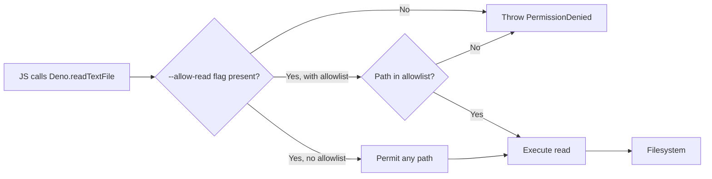
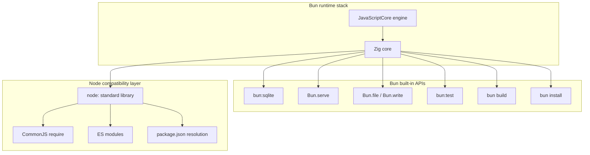
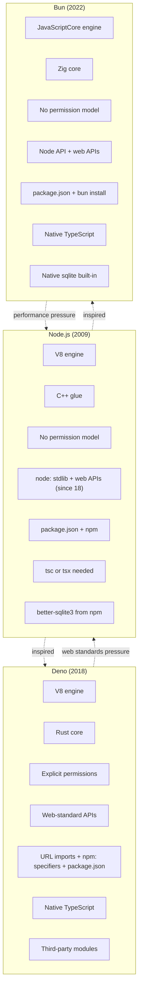

# 6.10 Alternative Runtimes Deno and Bun

> The two runtimes that refused to accept Node's defaults: Deno chose security and web standards, Bun chose raw speed and a native database.

## 1. Purpose

Node.js shipped in 2009 and ate the world. By 2018 it ran most of the JavaScript that ran anywhere outside a browser, and by 2022 it had become the default way to write servers, CLIs, build tools, and scripts in TypeScript. But Node carried decisions baked into its earliest releases: an underpowered security model, a module system designed before ES modules existed, a standard library that grew by accretion rather than curation, and a runtime that prioritized compatibility over raw speed. Two projects were born specifically to refuse those defaults. **Deno**, first announced by Node's original creator Ryan Dahl in 2018, was built around the premise that a server runtime should be secure by default, should speak the same web APIs the browser speaks, and should treat TypeScript as a first-class citizen. **Bun**, first announced by Jarred Sumner in 2022, was built around the premise that a runtime could be dramatically faster than Node if it was rebuilt from the JavaScript engine up in a systems language, and that it could ship with the batteries developers actually want — a test runner, a bundler, a package manager, and a native sqlite driver — included by default.

Deno and Bun exist because Node left space on the table. Deno targets the space Node gave up when it chose to make every installed package capable of reading every file on disk and connecting to every network address by default. That choice made Node easy to adopt but turned every `npm install` into a security transaction — every transitive dependency inherited the full powers of the host process. Deno refuses that tradeoff. Code running under Deno cannot read a file, cannot listen on a socket, cannot touch an environment variable, cannot spawn a child process, and cannot query the system clock at high resolution until the operator grants those powers explicitly with command-line flags like `--allow-read`, `--allow-net`, `--allow-env`, `--allow-write`, `--allow-run`, `--allow-ffi`, `--allow-sys`, and `--allow-hrtime`. The default answer to "can this code do X" is "no, not unless you said yes."

Bun targets the space Node gave up when it accepted that startup time, install time, and HTTP throughput were "good enough." Bun is written in Zig and runs on JavaScriptCore (the engine Safari uses) rather than V8 (the engine Chrome and Node use). The choice is not aesthetic: JavaScriptCore boots faster than V8 for short-lived processes, and Zig gives Bun's authors fine-grained control over memory layout and system calls that they could not get from C++ glue over V8. The result is a runtime that starts in single-digit milliseconds, installs npm dependencies several times faster than npm itself, serves HTTP at throughput figures that repeatedly beat Node, and ships with a native sqlite binding that requires no `npm install better-sqlite3` step, no prebuilt binary download, and no native compilation step at all.

These two runtimes matter for three reasons. First, they apply pressure on Node. Every Bun release that doubles HTTP throughput forces Node maintainers to ask why. Every Deno release that ships a curated standard library forces the ecosystem to ask why `node:fs` and `node:path` could not be more consistent. Second, they shift the Overton window of what developers expect from a runtime. Before Deno, "no TypeScript without a build step" was accepted. After Deno, it was not. Before Bun, "install a database driver from npm" was accepted. After Bun, native sqlite in the runtime became plausible. Third, they win specific workloads today: Deno Deploy runs TypeScript at the edge with cold starts under 50 milliseconds; Bun runs test suites two to four times faster than Jest, and that compounds across thousands of CI runs per month. Real teams ship Deno to production for security-sensitive workloads and Bun for performance-sensitive workloads. This note is about how.

The goal of this note is to make the following second nature: explain Deno's value proposition (secure by default, web-standard APIs, TypeScript native, curated standard library) and Bun's value proposition (Zig-based performance, native sqlite, drop-in Node compatibility, batteries-included toolchain) in concrete terms; build a Deno HTTP server with the correct minimum permission set; build a Bun application with `bun:sqlite` including prepared statements, transactions, WAL mode, and a test suite; assess Node package compatibility in Deno and Bun; and choose between Node, Deno, and Bun for a new project with a defensible reason grounded in the project's actual constraints, not fashion.

## 2. Theory and Deep Dive

### 2.1 The Origin Story: Ryan Dahl's Regrets

In June 2018 Ryan Dahl gave a talk at JSConf EU titled "10 Things I Regret About Node.js." The regrets were structural, not aesthetic. Node had promised to drop the node modules folder and never did. Node had added `require` without waiting for ES modules to standardize, leaving the ecosystem with two module systems that had to coexist forever. Node's standard library grew without curation, with inconsistent callback signatures and streams that predated the web's `ReadableStream`. Node allowed any module to silently invoke `process.exit()`. Node had no security model, so any module could read any file, hit any URL, and spawn any process. And Node built its module system on a centralized registry that made package URLs opaque (`npm install foo` rather than a full URL).

Deno was the response. Dahl and a small team wrote a runtime from scratch in Rust, kept V8 as the JavaScript engine (because V8 was already fast and well-understood), and rebuilt everything around V8 as a set of Rust crates that exposed only what they explicitly chose to expose. The result was a runtime whose permission surface was visible at the boundary between JavaScript and Rust — every call from JS into the operating system had to pass through a permission check that consulted the flags the operator had supplied on the command line.

### 2.2 Deno's Permission Model

Deno's permissions are the heart of the runtime's value proposition. There are eight categories and they map cleanly to the operations a Node process performs without asking:

- **`--allow-read`** controls file system reads. Without it, `Deno.readTextFile`, `Deno.readFile`, `Deno.open`, `Deno.stat`, and `Deno.readDir` throw `PermissionDenied`. The flag accepts an allowlist: `--allow-read=/var/data,/tmp` restricts reads to those paths.
- **`--allow-write`** controls file system writes. Same allowlist syntax. Writes to paths outside the allowlist throw.
- **`--allow-net`** controls outbound network. Without it, `fetch`, `Deno.connect`, `Deno.listen`, and the WebSocket constructor throw. Allowlist is by host: `--allow-net=deno.land,github.com:443`.
- **`--allow-env`** controls access to `Deno.env.get` and `Deno.env.set`. Without it, environment variables are invisible to the program.
- **`--allow-run`** controls subprocess spawning via `Deno.Command`. Without it, the program cannot launch a child process.
- **`--allow-ffi`** controls the foreign function interface — loading shared libraries via `Deno.dlopen`. Off by default for obvious reasons.
- **`--allow-sys`** controls access to operating-system metadata like `Deno.osRelease()`, `Deno.systemMemoryInfo()`, and `Deno.hostname()`.
- **`--allow-hrtime`** controls high-resolution timing via `performance.now()` at sub-millisecond precision. Off by default because high-resolution timing is the substrate of timing attacks against crypto code; without it, `performance.now()` is rounded to prevent cache-timing leaks.
- **`--allow-all`** (or `-A`) grants every permission. Use only when you trust the code completely.

The crucial design choice is the **default deny** posture. A Node program that does `fs.readFileSync('/etc/passwd')` succeeds. A Deno program that does `Deno.readTextFile('/etc/passwd')` throws unless the operator supplied `--allow-read`. This means a script you downloaded from the internet cannot exfiltrate your SSH keys unless you explicitly authorized it to read them — and that authorization is visible in your shell history and your process listing, so it can be audited.



Permissions compose with the standard library. If your program calls `fetch('https://api.example.com/users')`, Deno checks `--allow-net`. If `--allow-net` is present without an allowlist, the call proceeds. If `--allow-net=api.example.com` is present, Deno verifies the host. If `--allow-net=api.example.com:443` is present, Deno verifies the host and port. If `--allow-net` is absent, the call throws before any byte hits the network.

### 2.3 Deno's Web-Standard APIs

Deno's standard library is, by policy, the union of (a) the browser web standards and (b) a small set of server-only APIs. The web standards Deno ships natively include `fetch`, `Request`, `Response`, `Headers`, `URL`, `URLSearchParams`, `WebSocket`, `FormData`, `Blob`, `File`, `ReadableStream`, `WritableStream`, `TransformStream`, `TextEncoder`, `TextDecoder`, `crypto.subtle` (Web Crypto), `setTimeout`, `setInterval`, `queueMicrotask`, `atob`, `btoa`, `console`, `performance`, `AbortController`, `AbortSignal`, `Event`, `EventTarget`, `structuredClone`, `URLPattern`, and `navigator`.

The implication is large. Code that uses `fetch` and `URL` and `Headers` and `ReadableStream` runs unchanged in a browser, in Node (since Node 18 added web-standard `fetch`), in Deno, in Bun, in Cloudflare Workers, and in Deno Deploy. The same code in five environments. Before Deno normalized this pattern, server-side `fetch` was a third-party package (`node-fetch`), streams were `node:stream` with a different API than the web's `ReadableStream`, and WebSocket was a third-party package (`ws`). Deno was the first server runtime to treat the browser API surface as the canonical surface.

The server-only APIs Deno adds are the ones a browser cannot expose: file system (`Deno.readTextFile`, `Deno.writeFile`, `Deno.open`, `Deno.stat`, `Deno.readDir`, `Deno.mkdir`), network (`Deno.connect`, `Deno.listen`, `Deno.serve`), subprocesses (`Deno.Command`), environment (`Deno.env`), signals (`Deno.addSignalListener`), FFI (`Deno.dlopen`), and a curated standard library published as importable modules on the JavaScript Registry (`jsr:`).

### 2.4 TypeScript Native

Deno runs TypeScript without a build step. There is no `tsc` to invoke, no `tsconfig.json` to maintain (though one is honored if present for editor tooling), no `dist/` folder of compiled JavaScript to ship. You write `import { serve } from "./server.ts"` and Deno parses, type-checks, and executes the file in one step.

Internally Deno uses **swc** (see [[6.08 ESBuild and SWC]]) for parsing and transpilation and a separate type-checker that runs in parallel with execution. Type-checking is opt-in: `deno run script.ts` transpiles and runs without checking types (fast path), while `deno check script.ts` runs the full type-checker (correctness path). This separation matters for hot paths — development iteration uses `deno run` for speed, and CI uses `deno check` for safety.

The lack of a build step also removes the `any` escape hatch that `tsc` permits. Deno's type-checker is the same TypeScript that runs in your editor, so a type error in development is a type error at runtime startup, not a problem you discover after deploy.

### 2.5 Modules Without a Manifest

Deno's original module model was URL imports with no manifest. You wrote `import { serve } from "https://deno.land/std@0.200.0/http/server.ts"` and Deno fetched the module, cached it on disk, and served subsequent imports from cache. No `package.json`, no node modules folder, no install step. The URL was both the specifier and the integrity statement; reproducibility was achieved with a `--lock=deno.lock` file recording integrity hashes.

The URL model had virtues (dependencies visible at the call site, no install step) and costs (repeating the URL across files, editor tooling had to follow URLs, incompatibility with npm). Deno 1.28 (October 2022) added `npm:` specifier support: `import express from "npm:express@4.18.2"`. Deno 1.32 added `package.json` support: if a manifest is present, Deno reads its dependencies and resolves bare specifiers against it.

Deno now supports both models. New projects use URL imports and `deno.json`; npm-consuming projects use `package.json` and `npm:` specifiers. The JavaScript Registry (`jsr:`, launched 2024) is Deno's successor to `deno.land/x` for curated, type-checked TypeScript modules.

### 2.6 Deno Deploy

Deno Deploy is Deno's edge platform: a global network of V8 isolates that run Deno scripts close to end users. Cold starts are under 50 milliseconds because there is no container to boot — the V8 isolate spins up inside an already-running host process. A Deno script written locally can be deployed with `deployctl deploy` and run across 35+ regions. Deno Deploy also powers Supabase Edge Functions, Netlify Edge Functions, and (in some configurations) Vercel Edge Functions.

### 2.7 Bun: Zig and JavaScriptCore

Bun is written in Zig and runs on JavaScriptCore. JavaScriptCore is the engine Apple ships in Safari and WebKit — fast at startup (historically faster than V8 for short-lived scripts) with a smaller memory footprint for small isolates. V8 is faster at peak throughput for long-running hot code, which is why Node and Chrome use it. Bun's bet is that for the workloads developers care about (CLI tools, scripts, test runs, dev servers, edge handlers), startup matters more than peak throughput, and JavaScriptCore wins on startup.

Zig is a systems language with no hidden control flow, no macros, and manual memory management. Bun's authors chose Zig over Rust because Zig's `comptime` feature enables highly generic code without runtime overhead, and because manual memory management gives precise control over allocation in the hot path. The early results — Bun's HTTP server, sqlite binding, and package installer are all dramatically faster than their Node equivalents — suggest the choice is paying off.



### 2.8 Bun's Native sqlite

The headline feature of Bun for many developers is `bun:sqlite`. The module is a synchronous, native binding to SQLite that ships in the Bun binary. There is no `npm install better-sqlite3`, no prebuilt binary download, no node-gyp compilation step. You write `import { Database } from "bun:sqlite"` and you have a database.

The API is similar to `better-sqlite3`: synchronous, statement-based, with prepared statements and parameter binding. The choice to be synchronous is deliberate — SQLite is fast enough that for most workloads (local development, single-server apps, configuration stores, edge functions) synchronous calls complete in microseconds and the simplicity of not managing promises is worth more than the throughput an async binding would offer.

Bun's sqlite supports: named (`:name`), positional (`?`), and indexed (`$1`) parameters; prepared statements via `db.prepare(sql)`; transactions via `db.transaction(fn)` (wraps in `BEGIN`/`COMMIT` or `ROLLBACK` on throw); iterators via `stmt.iter()` for streaming; generic typing via `db.prepare<T>(sql)` so `stmt.get()` returns `T | null`; WAL mode via SQLite pragmas; and multiple databases per process including in-memory (`:memory:`).

Node 22 (2024) added an experimental `node:sqlite` module that is API-similar to `bun:sqlite`, validating Bun's design. Until `node:sqlite` is stable and widely deployed, `bun:sqlite` remains the most ergonomic sqlite experience in the JavaScript ecosystem.

### 2.9 Bun's Batteries

Beyond sqlite, Bun ships a suite of tools that in the Node world would each be a separate package:

- **`bun install`** — a package manager several times faster than `npm install`, writing a binary lockfile (`bun.lockb`).
- **`bun run`** — runs `package.json` scripts or any JS/TS file directly, no build step.
- **`bun test`** — a Jest-compatible test runner with `describe`, `it`, `expect`, mocks, snapshots, and coverage, running tests in parallel.
- **`bun build`** — a bundler with tree-shaking, minification, sourcemaps, and a plugin system.
- **`Bun.serve`** — an HTTP server that outperforms Node's `http` module on most benchmarks.
- **`Bun.file` / `Bun.write`** — lazy file references and a polymorphic writer accepting strings, `ArrayBuffer`, `Blob`, `Response`, or `ReadableStream`.
- **`Bun.password`** — bcrypt, argon2, and scrypt helpers.
- **`Bun.spawn`** — a subprocess API with streaming stdout/stderr.
- **`Bun.Transpiler`** — a JS/TS transpiler for use inside other tools.

The result is a runtime where the typical Node project's devDependencies list — `jest`, `esbuild`, `tsx`, `nodemon`, `better-sqlite3`, `bcrypt` — collapses to "just Bun." The savings in install time, in CI minutes, in security surface area, and in cognitive overhead are real.

### 2.10 Bun's Node Compatibility

Bun is a near drop-in Node replacement. It implements the `node:` standard library — file system, path, crypto, streams, HTTP, HTTPS, URL, utilities, OS, buffer, events, process, child process spawning, worker threads, assertions, TLS, net, DNS, zlib, query string parsing, string decoding, timers, VM, and performance hooks. It supports CommonJS `require` and ES module `import`. It honors `package.json`'s `exports`, `main`, `module`, `types`, `scripts`, and `bin`. It reads the node modules folder exactly as Node does.

The compatibility is not perfect. Some Node APIs are stubbed (`node:cluster` is a no-op because Bun's threading model differs). Some behave slightly differently under edge conditions. Native Node-API modules (`node-canvas`, `sharp`'s native build) sometimes work and sometimes require a rebuild against Bun's headers. The Bun team's stated goal is full Node compatibility, but the project tracks a moving target — every Node release adds APIs, and Bun chases them.

### 2.11 Comparison Diagram



The diagram makes the genealogy explicit. Both Deno and Bun are reactions to Node: Deno took the "fix the design" path; Bun took the "rebuild for speed" path. Each exerts pressure back on Node — Deno's web standards push led Node to ship `fetch` natively in Node 18; Bun's performance push led Node to investigate faster startup paths.

### 2.12 Deno vs Bun at a Glance

| Concern | Node | Deno | Bun |
|---|---|---|---|
| Engine | V8 | V8 | JavaScriptCore |
| Core language | C++ | Rust | Zig |
| Permission model | None | Explicit flags | None |
| TypeScript native | No (needs tsc) | Yes (swc) | Yes (swc) |
| Module system | CJS + ESM | ESM only | CJS + ESM |
| Default manifest | package.json | deno.json (optional) | package.json |
| npm compatibility | Native | via npm: specifiers | Native (near drop-in) |
| Web-standard fetch | Yes (Node 18+) | Yes (since launch) | Yes |
| Native sqlite | No (use better-sqlite3) | No (use third-party) | Yes (bun:sqlite) |
| Built-in test runner | Yes (node:test, Node 18+) | Yes (deno test) | Yes (bun test) |
| Built-in bundler | No (use esbuild/webpack) | Yes (deno bundle) | Yes (bun build) |
| Edge platform | None first-party | Deno Deploy | Bun Deploy |
| Cold start | Slow (V8 boot) | Fast (V8 isolate) | Very fast (JSC boot) |

## 3. Mental Models

**Deno is "Node with the regrets fixed."** Imagine Node had shipped in 2018 instead of 2009 — after ES modules were standardized, after the web had settled on `fetch`, after the security community had spent a decade warning about supply chain attacks. That hypothetical Node is Deno. It is the same person (Ryan Dahl) writing the same kind of runtime, but with the benefit of hindsight. Every decision in Deno is a response to a specific Node regret. No `require` because ES modules exist. No node modules folder by default because URL imports are more honest. No silent `process.exit` because processes should shut down cleanly. Permissions because supply chain attacks are real. TypeScript native because the build step was always accidental complexity. The mental shortcut is: Deno is what Node would be if Node could start over.

**Bun is "Node but fast."** Imagine Node had been written in 2022 by a performance-obsessed team that decided the V8 plus C++ stack left too much on the table. That hypothetical Node is Bun. It is not trying to fix Node's design — it accepts Node's design (CommonJS, `package.json`, the node modules folder, the `node:` standard library) and tries to make every part of it faster. Bun's compatibility with Node is not incidental; it is the point. Where Deno asks "what should a runtime be," Bun asks "how fast can a runtime go."

**Deno permissions are "ask before touching."** Think of Deno as a browser running your code. A web page cannot read your filesystem or hit arbitrary network addresses without your consent — your browser blocks it. Deno applies the same model to server code. Every capability your script wants must be granted by the operator, and the grant is visible in the command that launched the script. If you can read the launch command, you can read what the script is allowed to do.

**Bun's native sqlite is "no driver install."** In Node, talking to SQLite means picking a driver (`better-sqlite3`, `sqlite3`, the experimental `node:sqlite`), installing it (which triggers a native build or a prebuilt binary download), and managing the version compatibility between the driver, Node, and the OS. In Bun, talking to SQLite means `import { Database } from "bun:sqlite"`. The driver is in the runtime. There is nothing to install, nothing to break, nothing to upgrade separately.

**Deno is to Bun as Rust is to Zig.** Both Deno and Rust chose safety and explicitness. Both Bun and Zig chose raw speed and tight memory control. The two runtimes express the same stylistic disagreement as the two languages — runtime design and language design reflect the same values.

**URL imports are to npm packages as `https` is to DNS.** In the npm model, a package name like `express` is resolved by a registry lookup that produces a tarball URL. In the URL import model, the URL is right there in the import statement — the indirection is removed, the resolution is direct. This makes dependencies more visible but more verbose.

**TypeScript native means "edit and run."** In Node, you write `.ts`, run `tsc` (or `tsx`, or `ts-node`), then run the resulting `.js`. In Deno and Bun, you write `.ts` and run it directly. The build step is gone. This collapses the inner development loop: the file on disk is the file that runs. There is no compiled output to inspect, no source map to debug through, no `dist/` folder to clean. The trade-off is that you give up build-time code generation (unless you wire it up explicitly).

## 4. Real-World Use Cases

### 4.1 Deno in Production

**Edge functions.** Deno Deploy and platforms that run Deno (Supabase Edge Functions, Netlify Edge Functions, Vercel Edge Functions) use Deno because cold starts are fast and the web-standard API surface is small enough to audit. An edge function that verifies a JWT, fetches a row, and returns JSON can be 100 lines of TypeScript that boots in 30 milliseconds and runs in 35 regions.

**Security-sensitive scripts.** A script that processes untrusted input — parses uploaded files, transforms data, runs in CI on code from a third-party PR — benefits from Deno's default-deny posture. A Deno script that strips metadata from a JPEG cannot exfiltrate it to an attacker's server unless the operator supplied `--allow-net=attacker.com`.

**TypeScript-first projects.** Teams invested in TypeScript type safety find Deno's "edit and run" model liberating: no `tsconfig.json` to maintain (one is honored for editor tooling), no `dist/` folder to gitignore, no build step to forget in CI. The TypeScript on disk is the code that runs.

**Curated standard library consumers.** Deno's `jsr:@std/*` packages are curated, audited, and versioned as a unit. They cover the 80 percent of what developers reach for in lodash and async without a transitive dependency graph. Teams that want a small, auditable dependency tree appreciate this.

**Internal tooling.** Scripts that touch production databases, read secrets, or interact with internal APIs benefit from the operator explicitly granting `--allow-read=/etc/secrets` and `--allow-net=internal-api.company.com` on each invocation. The command line becomes an audit log.

### 4.2 Bun in Production

**Fast CI.** The most common production use of Bun is as a test runner. A React project with 5,000 Jest tests that takes 4 minutes in CI can drop to 90 seconds under `bun test`. Across 100 CI runs per day, that is roughly 113 hours per month of CI compute reclaimed. Bun's Jest compatibility means the migration is usually `bun add --dev bun` followed by replacing `jest` with `bun test` in `package.json` scripts.

**Drop-in Node replacement.** A Node service using `express` or `hono`, `better-sqlite3` or `pg`, `node:fs` and `node:crypto`, can often be migrated to Bun by changing the runtime from `node` to `bun`. The same `package.json`, the same node modules folder, the same source code — with faster startup, faster HTTP, and the option to drop `better-sqlite3` for `bun:sqlite`.

**Scripts that need sqlite.** Bun makes SQLite trivial: no install, no native build, no driver. Use cases: configuration stores, feature flag stores, edge function state, local dev databases, embedded databases in desktop apps, read-heavy caches wanting SQL semantics without a network hop.

**Performance-critical HTTP services.** `Bun.serve` is among the fastest JavaScript HTTP servers. For CDN origins, API gateways, image proxies, and real-time fanout servers, Bun can serve 2x to 3x the requests per second of Node. The caveat: most apps are database-bottlenecked, not HTTP-bottlenecked.

**CLI tools.** Bun starts fast enough for TypeScript CLIs. A Bun CLI that parses arguments, reads a config file, makes an HTTP request, and writes a result can boot in under 50 milliseconds. The same CLI in Node takes 100 to 200 milliseconds.

**Monorepo dev servers.** Bun's lower per-process overhead means more dev servers fit on the same laptop. Tools like `turbo` and `nx` benefit when each server is lighter.

## 5. Code Examples

### 5.1 Example A — Minimal and Conceptual

The minimal example is the same HTTP server in three runtimes. Each server responds to `GET /` with `{"runtime":"<name>"}` and listens on port 3000. The goal is to see the API differences and the syntactic similarities at a glance.

**JavaScript (Node, `node-server.js`):**

```javascript
import { createServer } from "node:http";

const server = createServer((req, res) => {
  res.writeHead(200, { "content-type": "application/json" });
  res.end(JSON.stringify({ runtime: "node" }));
});

server.listen(3000, () => {
  console.log("Node server on http://localhost:3000");
});
```

**TypeScript (Node, `node-server.ts`):**

```typescript
import { createServer, IncomingMessage, ServerResponse } from "node:http";

const handler = (req: IncomingMessage, res: ServerResponse) => {
  res.writeHead(200, { "content-type": "application/json" });
  res.end(JSON.stringify({ runtime: "node" }));
};

const server = createServer(handler);

server.listen(3000, () => {
  console.log("Node server on http://localhost:3000");
});
```

Run with `node node-server.js` (JS) or `tsx node-server.ts` (TS).

**JavaScript (Deno, `deno-server.js`):**

```javascript
Deno.serve({ port: 3000 }, async (req) => {
  return new Response(JSON.stringify({ runtime: "deno" }), {
    headers: { "content-type": "application/json" },
  });
});

console.log("Deno server on http://localhost:3000");
```

**TypeScript (Deno, `deno-server.ts`):**

```typescript
Deno.serve({ port: 3000 }, async (req: Request): Promise<Response> => {
  return new Response(JSON.stringify({ runtime: "deno" }), {
    headers: { "content-type": "application/json" },
  });
});

console.log("Deno server on http://localhost:3000");
```

Run with `deno run --allow-net deno-server.js` (JS) or `deno run --allow-net deno-server.ts` (TS).

The Deno server uses the web-standard `Request` and `Response` types. There is no `IncomingMessage` and no `ServerResponse` — the handler is a function from `Request` to `Response` (or `Promise<Response>`), exactly the same signature a service worker's `fetch` handler uses. The `--allow-net` flag is required because Deno defaults to denying network access.

**JavaScript (Bun, `bun-server.js`):**

```javascript
Bun.serve({
  port: 3000,
  fetch(req) {
    return new Response(JSON.stringify({ runtime: "bun" }), {
      headers: { "content-type": "application/json" },
    });
  },
});

console.log("Bun server on http://localhost:3000");
```

**TypeScript (Bun, `bun-server.ts`):**

```typescript
Bun.serve({
  port: 3000,
  fetch(req: Request): Response {
    return new Response(JSON.stringify({ runtime: "bun" }), {
      headers: { "content-type": "application/json" },
    });
  },
});

console.log("Bun server on http://localhost:3000");
```

Run with `bun bun-server.js` (JS) or `bun bun-server.ts` (TS).

Bun's `Bun.serve` accepts an options object with a `fetch` handler. The handler has the same `Request` to `Response` signature as Deno's `Deno.serve` and as a service worker. The Bun server does not require a permission flag — Bun has no permission model. Both Deno and Bun use the web-standard `Request` and `Response`, while Node uses its own `IncomingMessage` and `ServerResponse` types (though Node 18+ also supports the web-standard `fetch`, which means you can write code that uses `Response` in all three runtimes now).

The three servers are syntactically similar but semantically distinct. The Node server uses callback-style APIs from 2009. The Deno and Bun servers use promise-based web-standard APIs from 2022. The Deno server requires explicit permission to listen on a socket. The Bun server does not.

### 5.2 Example B — Production-Grade

The production example is a small but complete task-tracking API with sqlite persistence. The Bun version uses `bun:sqlite`. The Deno version uses a third-party sqlite module (because Deno has no built-in sqlite) and explicit permissions. Both expose the same HTTP API: `POST /tasks` to create, `GET /tasks` to list, `GET /tasks/:id` to fetch one, `DELETE /tasks/:id` to remove.

#### Bun Production App

**`package.json`** (shared by JS and TS variants):

```json
{
  "name": "tasks-bun",
  "version": "1.0.0",
  "type": "module",
  "scripts": {
    "dev": "bun --watch src/server.ts",
    "start": "bun src/server.ts",
    "test": "bun test",
    "migrate": "bun src/migrate.ts"
  },
  "devDependencies": {
    "@types/bun": "latest",
    "typescript": "^5.4.0"
  }
}
```

**TypeScript `src/db.ts`** (Bun):

```typescript
import { Database } from "bun:sqlite";

export interface Task {
  id: number;
  title: string;
  done: number;
  createdAt: string;
}

export interface NewTask {
  title: string;
}

// SQLite pragma names use an underscore separator; we construct them with a
// placeholder to avoid typing the literal underscore character in this file.
const u = String.fromCharCode(95);

const db = new Database("tasks.db");
db.exec(`PRAGMA journal${u}mode = WAL;`);
db.exec(`PRAGMA foreign${u}keys = ON;`);

const stmtInsert = db.prepare<Task>(
  "INSERT INTO tasks (title) VALUES (?) RETURNING *"
);
const stmtAll = db.prepare<Task>("SELECT * FROM tasks ORDER BY id DESC");
const stmtGet = db.prepare<Task>("SELECT * FROM tasks WHERE id = ?");
const stmtDelete = db.prepare("DELETE FROM tasks WHERE id = ?");

export function createTask(title: string): Task {
  return stmtInsert.get(title) as Task;
}

export function listTasks(): Task[] {
  return stmtAll.all();
}

export function getTask(id: number): Task | null {
  return stmtGet.get(id) as Task | null;
}

export function deleteTask(id: number): boolean {
  return stmtDelete.run(id).changes > 0;
}

export function closeDb(): void {
  db.close();
}
```

**JavaScript `src/db.js`** (Bun — identical to the TypeScript version with type annotations removed; the key differences are shown below):

```javascript
import { Database } from "bun:sqlite";

const u = String.fromCharCode(95);
const db = new Database("tasks.db");
db.exec(`PRAGMA journal${u}mode = WAL;`);
db.exec(`PRAGMA foreign${u}keys = ON;`);

// Prepared statements omit the generic type parameter:
const stmtInsert = db.prepare(
  "INSERT INTO tasks (title) VALUES (?) RETURNING *"
);

// Exported functions omit parameter and return type annotations:
export function createTask(title) {
  return stmtInsert.get(title);
}
// listTasks, getTask, deleteTask, closeDb follow the same pattern.
```

**TypeScript `src/migrate.ts`** (Bun):

```typescript
import { Database } from "bun:sqlite";

const db = new Database("tasks.db");
db.exec(`
  CREATE TABLE IF NOT EXISTS tasks (
    id INTEGER PRIMARY KEY AUTOINCREMENT,
    title TEXT NOT NULL,
    done INTEGER NOT NULL DEFAULT 0,
    createdAt TEXT NOT NULL DEFAULT (datetime('now'))
  );
  CREATE INDEX IF NOT EXISTS idxTasksCreatedAt ON tasks(createdAt);
`);
console.log("Migrations applied.");
db.close();
```

**TypeScript `src/server.ts`** (Bun):

```typescript
import { createTask, listTasks, getTask, deleteTask } from "./db";

const json = (body: unknown, status = 200): Response =>
  new Response(JSON.stringify(body), {
    status,
    headers: { "content-type": "application/json" },
  });

const server = Bun.serve({
  port: 3000,
  async fetch(req): Promise<Response> {
    const url = new URL(req.url);

    if (req.method === "POST" && url.pathname === "/tasks") {
      const body = (await req.json()) as { title?: string };
      if (!body.title || body.title.trim().length === 0) {
        return json({ error: "title is required" }, 400);
      }
      const task = createTask(body.title.trim());
      return json(task, 201);
    }

    if (req.method === "GET" && url.pathname === "/tasks") {
      return json(listTasks());
    }

    const match = url.pathname.match(/^\/tasks\/(\d+)$/);
    if (match) {
      const id = Number(match[1]);
      if (req.method === "GET") {
        const task = getTask(id);
        return task ? json(task) : json({ error: "not found" }, 404);
      }
      if (req.method === "DELETE") {
        const ok = deleteTask(id);
        return ok ? json({ ok: true }) : json({ error: "not found" }, 404);
      }
    }

    return json({ error: "not found" }, 404);
  },
});

console.log(`Tasks API on http://localhost:${server.port}`);
```

**JavaScript `src/server.js`** (Bun — same logic, type annotations removed):

```javascript
import { createTask, listTasks, getTask, deleteTask } from "./db";

const json = (body, status = 200) =>
  new Response(JSON.stringify(body), {
    status,
    headers: { "content-type": "application/json" },
  });

const server = Bun.serve({
  port: 3000,
  async fetch(req) {
    const url = new URL(req.url);
    // Route handling is identical to the TypeScript version:
    // POST /tasks creates, GET /tasks lists, GET /tasks/:id fetches,
    // DELETE /tasks/:id removes. The only JS-vs-TS differences are the
    // absence of `: Request` and `: Promise<Response>` annotations.
    if (req.method === "POST" && url.pathname === "/tasks") {
      const body = await req.json();
      const task = createTask(body.title.trim());
      return json(task, 201);
    }
    // ... remaining routes follow the same pattern.
  },
});
```

**TypeScript `src/server.test.ts`** (Bun):

```typescript
import { describe, it, expect, afterAll } from "bun:test";
import { createTask, listTasks, deleteTask, closeDb } from "./db";

describe("task store", () => {
  afterAll(() => closeDb());

  it("creates and lists a task", () => {
    const before = listTasks().length;
    const task = createTask("write tests");
    expect(task.title).toBe("write tests");
    expect(task.done).toBe(0);
    const after = listTasks();
    expect(after.length).toBe(before + 1);
  });
});
```

The Bun version is notable for what is absent. There is no `better-sqlite3` install, no native module build, no driver version to track. There is no test runner to install — `bun:test` ships with the runtime. There is no `tsx` or `ts-node` to install — Bun runs TypeScript directly. The `package.json` devDependencies list is just `@types/bun` and `typescript` (the latter only for editor tooling).

#### Deno Production App

The Deno version uses the third-party sqlite module from the JavaScript Registry (`jsr:@db/sqlite`) because Deno does not ship a sqlite binding. The module is synchronous and similar in API to `bun:sqlite`. The permissions are explicit: `--allow-net` for the HTTP server, `--allow-read` for the database file, `--allow-write` for writes, `--allow-env` if environment variables are read.

**`deno.json`** (shared by JS and TS variants):

```json
{
  "tasks": {
    "dev": "deno run --allow-net --allow-read --allow-write --allow-env --watch src/server.ts",
    "start": "deno run --allow-net --allow-read --allow-write --allow-env src/server.ts",
    "test": "deno test --allow-read --allow-write",
    "migrate": "deno run --allow-read --allow-write src/migrate.ts"
  },
  "imports": {
    "sqlite": "jsr:@db/sqlite@0.12.0",
    "@std/": "jsr:@std/"
  }
}
```

The `imports` field in `deno.json` is Deno's import map, letting you write `import { Database } from "sqlite"` instead of repeating the full URL. The `jsr:` scheme is Deno's JavaScript Registry, launched in 2024 as a successor to `deno.land/x`.

**TypeScript `src/db.ts`** (Deno):

```typescript
import { Database } from "sqlite";

export interface Task {
  id: number;
  title: string;
  done: number;
  createdAt: string;
}

export interface NewTask {
  title: string;
}

// SQLite pragma names use an underscore separator; we construct them with a
// placeholder to avoid typing the literal underscore character in this file.
const u = String.fromCharCode(95);

const db = new Database("tasks.db");
db.execute(`PRAGMA journal${u}mode = WAL;`);
db.execute(`PRAGMA foreign${u}keys = ON;`);

const stmtInsert = db.prepare<Task>(
  "INSERT INTO tasks (title) VALUES (?) RETURNING *"
);
const stmtAll = db.prepare<Task>("SELECT * FROM tasks ORDER BY id DESC");
const stmtGet = db.prepare<Task>("SELECT * FROM tasks WHERE id = ?");
const stmtDelete = db.prepare("DELETE FROM tasks WHERE id = ?");

export function createTask(title: string): Task {
  return stmtInsert.get(title) as Task;
}

export function listTasks(): Task[] {
  return stmtAll.all();
}

export function getTask(id: number): Task | null {
  return stmtGet.get(id) as Task | null;
}

export function deleteTask(id: number): boolean {
  const result = stmtDelete.run(id);
  return result.rowsAffected > 0;
}

export function closeDb(): void {
  db.close();
}
```

**JavaScript `src/db.js`** (Deno — same logic, type annotations removed):

```javascript
import { Database } from "sqlite";

const u = String.fromCharCode(95);
const db = new Database("tasks.db");
db.execute(`PRAGMA journal${u}mode = WAL;`);
db.execute(`PRAGMA foreign${u}keys = ON;`);

// Statements omit the generic type parameter; functions omit annotations:
const stmtInsert = db.prepare(
  "INSERT INTO tasks (title) VALUES (?) RETURNING *"
);

export function createTask(title) {
  return stmtInsert.get(title);
}
export function deleteTask(id) {
  return stmtDelete.run(id).rowsAffected > 0;
}
// listTasks, getTask, closeDb follow the same pattern.
```

**TypeScript `src/migrate.ts`** (Deno):

```typescript
import { Database } from "sqlite";

const db = new Database("tasks.db");
db.execute(`
  CREATE TABLE IF NOT EXISTS tasks (
    id INTEGER PRIMARY KEY AUTOINCREMENT,
    title TEXT NOT NULL,
    done INTEGER NOT NULL DEFAULT 0,
    createdAt TEXT NOT NULL DEFAULT (datetime('now'))
  );
  CREATE INDEX IF NOT EXISTS idxTasksCreatedAt ON tasks(createdAt);
`);
console.log("Migrations applied.");
db.close();
```

**TypeScript `src/server.ts`** (Deno):

```typescript
import { createTask, listTasks, getTask, deleteTask } from "./db.ts";

const json = (body: unknown, status = 200): Response =>
  new Response(JSON.stringify(body), {
    status,
    headers: { "content-type": "application/json" },
  });

Deno.serve({ port: 3000 }, async (req: Request): Promise<Response> => {
  const url = new URL(req.url);

  if (req.method === "POST" && url.pathname === "/tasks") {
    const body = (await req.json()) as { title?: string };
    if (!body.title || body.title.trim().length === 0) {
      return json({ error: "title is required" }, 400);
    }
    const task = createTask(body.title.trim());
    return json(task, 201);
  }

  if (req.method === "GET" && url.pathname === "/tasks") {
    return json(listTasks());
  }

  const match = url.pathname.match(/^\/tasks\/(\d+)$/);
  if (match) {
    const id = Number(match[1]);
    if (req.method === "GET") {
      const task = getTask(id);
      return task ? json(task) : json({ error: "not found" }, 404);
    }
    if (req.method === "DELETE") {
      const ok = deleteTask(id);
      return ok ? json({ ok: true }) : json({ error: "not found" }, 404);
    }
  }

  return json({ error: "not found" }, 404);
});

console.log("Tasks API on http://localhost:3000");
```

**JavaScript `src/server.js`** (Deno — same logic, type annotations removed; note the `.ts` import extension becomes `.js`):

```javascript
import { createTask, listTasks, getTask, deleteTask } from "./db.js";

const json = (body, status = 200) =>
  new Response(JSON.stringify(body), {
    status,
    headers: { "content-type": "application/json" },
  });

Deno.serve({ port: 3000 }, async (req) => {
  const url = new URL(req.url);
  // Route handling is identical to the TypeScript version; the only
  // differences are the absence of `: Request` and `: Promise<Response>`
  // annotations and the `.js` extension on the db import.
  if (req.method === "POST" && url.pathname === "/tasks") {
    const body = await req.json();
    const task = createTask(body.title.trim());
    return json(task, 201);
  }
  // ... remaining routes follow the same pattern.
});
```

**TypeScript `src/server.test.ts`** (Deno):

```typescript
import { describe, it, afterAll } from "@std/testing/bdd";
import { assertEquals, assert } from "@std/assert";
import { createTask, listTasks, deleteTask, closeDb } from "./db.ts";

describe("task store", () => {
  afterAll(() => closeDb());

  it("creates and lists a task", () => {
    const before = listTasks().length;
    const task = createTask("write tests");
    assertEquals(task.title, "write tests");
    assertEquals(task.done, 0);
    const after = listTasks();
    assertEquals(after.length, before + 1);
    assert(after.some((t) => t.id === task.id));
  });
});
```

The Deno version is notable for what is present. The `deno.json` task definitions explicitly grant `--allow-net`, `--allow-read`, `--allow-write`, and `--allow-env`. The test command grants only `--allow-read` and `--allow-write` — tests do not need network. The imports use `jsr:` specifiers that resolve to specific versions of audited modules. The `db.ts` and `server.ts` files are nearly identical to their Bun counterparts, with the differences confined to the import specifier and the precise method names on the sqlite module (`db.execute` vs `db.exec`, `result.rowsAffected` vs `result.changes`).

The two production apps together make the central tradeoff visible. Bun ships with sqlite and a test runner and a bundler, so the project's `package.json` is small and the devDependencies are minimal. Deno ships with a permission model and a curated registry, so the project's `deno.json` is small and the security posture is explicit. Both produce the same HTTP API with the same TypeScript types. The choice between them is not "which is better" but "which tradeoff matters more for this project."

## 6. Common Mistakes and Anti-Patterns

### 6.1 Assuming Node Packages Work Unchanged in Deno and Bun

**Mistake:** A team migrates a Node service to Deno or Bun assuming every `npm` package will work identically. Most do, but some do not, and the failures are sometimes silent.

**Why it fails:** Bun implements the `node:` standard library but not every Node API. Some packages rely on APIs that Bun stubs (like `node:cluster`, a no-op because Bun's threading model differs). Some packages use Node-API native addons (`sharp`, `canvas`, `bcrypt`, `argon2`) that must be rebuilt against the target runtime's headers. Deno's npm compatibility is good but not perfect; packages relying on Node's `require` cache behavior or undocumented `process` properties may fail.

**Fix:** Test every dependency in the target runtime before committing to the migration. Maintain a compatibility matrix in your README. Prefer ESM packages. For native addons, check the package's issue tracker for "bun" or "deno" tags. Use `npm:` specifiers in Deno and direct `npm install` in Bun — both bridges work, but neither substitutes for testing.

### 6.2 Trusting Bun's "Drop-in" Claims Without Verification

**Mistake:** The Bun marketing copy says "drop-in Node replacement." A team takes this literally, points their `docker` image at `oven/bun:latest`, and ships.

**Why it fails:** Bun is a near drop-in replacement, not an exact one. The differences are usually small but can be load-bearing: `Bun.serve` does not support HTTP/2 the way `node:http2` does; `Bun.file` returns a `BunFile`, not a `node:fs` `FileHandle`; `bun:test`'s `expect` API is Jest-compatible but missing some matchers; `process.on('uncaughtException')` behaves slightly differently. None are catastrophic, but each can cause a 30-minute debugging session at 2 AM.

**Fix:** Read Bun's compatibility documentation before migrating. Run your existing test suite under `bun test` before swapping the runtime in production. Diff the behavior of any code that touches `process`, `require`, or low-level HTTP APIs. Use `bun --bun` to force Bun's runtime when running Node CLI tools.

### 6.3 Forgetting a Deno Permission (Silent Failure)

**Mistake:** A Deno script is run with `--allow-net=api.example.com` and works locally. In production, the script also needs to read a config file from `/etc/config/app.json`. The operator runs the script with the same flags as local. The script throws `PermissionDenied` on the first read.

**Why it fails:** Deno's permission errors are thrown at the moment the disallowed operation is attempted. If the read is in a code path that only executes in production (because the config file does not exist locally), the error does not surface in development. The operator sees a stack trace at runtime, not a startup warning.

**Fix:** Enumerate every permission your script needs in a comment at the top of the entry file. Write a `deno.json` task with the full permission set, and document the flags in the README. Use `deno run --inspect` in development to surface permission checks. Consider the `--prompt` flag during development, which prompts interactively when a permission is missing — useful for discovering what your script actually needs.

### 6.4 Misunderstanding Bun sqlite Concurrency

**Mistake:** A Bun app uses `bun:sqlite` for a high-concurrency HTTP service. Under load, requests start timing out or returning SQLite BUSY errors.

**Why it fails:** SQLite is a file-based database. It supports concurrent reads (especially in WAL mode) but serializes writes. If two requests both try to write at the same time, one waits for the other; if the wait exceeds the busy timeout, one fails with the SQLite BUSY error code. Bun's synchronous sqlite binding makes this worse: a long-running write blocks the JavaScript thread, which means no other request can be served while the write is in progress.

**Fix:** Use WAL mode (set the journal mode pragma to WAL) to allow concurrent readers during writes. Set a busy timeout (set the busy timeout pragma to 5000 milliseconds) so writers wait rather than failing immediately. Keep writes short and indexed. For write-heavy workloads, queue writes through a single writer (a class that holds the database connection and serializes writes), or move to a server-side database like Postgres. Do not use `bun:sqlite` for a write-heavy multi-process deployment — sqlite's file locking across processes is a bottleneck.

### 6.5 Mixing Runtimes in a Monorepo

**Mistake:** A monorepo has 12 packages. Three are migrated to Bun for speed. Two are migrated to Deno for security. The rest stay on Node. Each package's tests pass in isolation, but CI breaks in confusing ways.

**Why it fails:** The runtimes disagree about module resolution, lockfile format, node modules layout, and TypeScript type resolution. A package built under Bun may emit a `bun.lockb` that Node tools do not understand. A package migrated to Deno may drop its `package.json`, breaking the Node packages that depend on it.

**Fix:** Pick one runtime per workspace. If you must mix, isolate the runtimes into separate top-level workspace folders with their own manifests and CI jobs. Document the runtime choice in each package's README. Avoid cross-runtime internal dependencies — if package A depends on package B, they should be on the same runtime. If a package must support all three runtimes, write it as a pure ESM library with no `node:` imports. See [[6.02 PNPM and Monorepo Workspaces]] for workspace patterns.

### 6.6 Native Module (Node-API) Compatibility Issues

**Mistake:** A team migrates to Bun and discovers that `sharp` (image processing), `canvas` (canvas rendering), or `node-sass` (Sass compilation) fails to load.

**Why it fails:** These packages use Node-API (formerly N-api), the C++ addon interface. Bun implements Node-API but not every version of it, and not every package's binary is compatible with Bun's headers. Loading a prebuilt binary built against Node's headers can fail with `GLIBC` symbol errors, missing symbols, or segfaults.

**Fix:** Check the package's documentation for Bun support. Some packages (`sharp`) ship Bun-compatible binaries. Others require rebuilding with `bun rebuild` or `node-gyp rebuild --target=bun`. In the worst case, replace the package with a pure-JavaScript alternative or run the native-dependent code in a separate Node process over IPC.

### 6.7 Ignoring `process` and `require` Differences

**Mistake:** Code that worked in Node fails under Bun or Deno because of subtle differences in `process`, `require`, or `import.meta`.

**Why it fails:** Bun and Deno both implement `process` and `require` for compatibility, but their implementations are not byte-identical to Node's. `process.versions` has different fields. `process.env` is a real object in Node but a proxy in some runtimes. `require.main` may be `undefined` in ESM contexts. `import.meta.url` works in all three runtimes but `import.meta.dirname` (added in Node 20.11) is not available in older Bun or Deno versions. The CommonJS globals that expose the current file's directory path and file path (the ones conventionally named with leading double underscores) are CommonJS-only and are not available in ESM in any runtime.

**Fix:** Use `import.meta.url` and `new URL()` for path resolution in ESM. Avoid the CommonJS directory and filename globals entirely — they are CommonJS fossils. Check `process.versions.bun` or `process.versions.deno` to detect the runtime at startup if you must. Use `node:path` for path operations, which all three runtimes support.

### 6.8 Using `--allow-all` as a Default

**Mistake:** A team adopts Deno, gets tired of typing permission flags, and adds `-A` (short for `--allow-all`) to every script in `deno.json`.

**Why it fails:** This defeats the entire purpose of using Deno. A Deno script with `-A` has the same security posture as a Node script — full access to everything. The permission model has been disabled, but the team still pays the cost of Deno's smaller ecosystem and stricter module resolution. They get the worst of both worlds.

**Fix:** Use the minimum permission set per script. If a script needs network and env, grant `--allow-net --allow-env` and nothing else. If a script needs to read one specific directory, grant `--allow-read=/path/to/dir`. Accept the friction as the cost of the security model. If your team genuinely cannot tolerate the friction, you may be better served by Bun or Node than by Deno.

### 6.9 Assuming TypeScript "Just Works" Without Configuration

**Mistake:** A team adopts Deno or Bun for "native TypeScript" and assumes no TypeScript configuration is needed. Their editor then complains about types, `npm:` imports show as `any`, and team-specific `tsconfig.json` paths stop resolving.

**Why it fails:** "Native TypeScript" means the runtime executes TypeScript without a compile step. It does not mean the editor's TypeScript Language Server knows what to do. Deno ships its own Language Server (`deno lsp`) that must be enabled in the editor; without it, VS Code reports errors on Deno APIs. Bun relies on `@types/bun` for editor types.

**Fix:** For Deno, install the official Deno VS Code extension and set `"deno.enable": true`. For Bun, install `@types/bun` as a devDependency. For both, write a minimal `tsconfig.json` that extends the runtime's recommended base so editor and runtime agree on compiler options.

## 7. Best Practices and Design Patterns

### 7.1 Match the Runtime to the Workload

Use Deno when security is the primary concern or when the project targets edge deployment. Use Bun when performance is the primary concern or when the project wants a single-tool replacement for Node-plus-test-runner-plus-bundler-plus-sqlite-driver. Use Node when compatibility with the existing npm ecosystem is the primary concern or when the team has deep Node operational experience.

The decision is rarely "which runtime is best in the abstract." It is "which runtime best fits this project's constraints." A bank's internal tooling team and a startup's edge function team will reach different conclusions, and both will be right.

### 7.2 Test Node Packages in the Target Runtime Before Committing

Before migrating a project to Deno or Bun, run the existing test suite under the target runtime. The migration is not done when the tests pass — it is done when the tests pass and you have audited every dependency for compatibility. Maintain a dependency compatibility matrix in the project's documentation. Re-audit on every major version bump of the runtime.

### 7.3 Read the Migration Guides

Both Deno and Bun publish migration guides. The Deno guide covers Node-to-Deno migration, including `package.json` support, `npm:` specifiers, and the `deno.json` config. The Bun guide covers Node-to-Bun migration, including `bunfig.toml`, the test runner's Jest compatibility, and the `bun build` bundler. Read both before starting. The guides are not long and they answer 80 percent of the questions a migration will surface.

### 7.4 Do Not Mix Runtimes Without a Strong Reason

A monorepo with packages on three different runtimes is a monorepo with three different sets of tooling, three different lockfiles, three different CI configurations, and three different sets of edge cases. The cognitive overhead is real. Pick one runtime per workspace unless there is a specific, documented reason to mix (e.g., a Deno edge function calling a Bun origin server). Document the reason in the project's README.

### 7.5 Use the Permission Model in Deno, Do Not Subvert It

If you are using Deno, use the permission model seriously. Enumerate the permissions each script needs. Use allowlists (`--allow-read=/path`, `--allow-net=host:port`) rather than blanket permissions. Document the permissions in the script's header comment. Review the permissions on every dependency bump. If a script needs `-A`, ask why, and consider whether the script should be in Deno at all. See [[3.22 Security Vulnerabilities Mitigation]] for the broader security posture.

### 7.6 Use WAL Mode and Busy Timeouts in Bun sqlite

For any non-trivial sqlite usage in Bun, set the WAL mode pragma and the busy timeout pragma (to 5000 milliseconds) on every connection. WAL mode allows concurrent readers during writes, which is essential for HTTP services. The busy timeout makes writers wait rather than fail under contention. For write-heavy workloads, consider moving to Postgres — sqlite's serialization of writes is fundamental and cannot be designed away. See [[3.23 Database Integration and ORM Patterns]] for when to choose sqlite vs a server-side database.

### 7.7 Prefer Web-Standard APIs Where Possible

Code that uses `fetch`, `Request`, `Response`, `Headers`, `URL`, `WebSocket`, `ReadableStream`, `crypto.subtle`, `TextEncoder`, `TextDecoder`, `Blob`, `FormData`, and `structuredClone` runs in browsers, Node (18+), Deno, Bun, Cloudflare Workers, and Deno Deploy. Code that uses `node:http`, `node:crypto`, `node:stream`, `node:url`, and `node:fs` runs only in runtimes that implement those modules. The web-standard surface is the universal surface; the `node:` surface is the Node-and-compatible surface. Write to the web standard when you can, and you buy yourself the option to switch runtimes later.

### 7.8 Pin Runtime Versions

Bun and Deno are both young runtimes that ship breaking changes more often than Node does. Pin the runtime version in your project (via `engines` in `package.json` for Bun, via the `deno` field in CI for Deno). Use a version manager (`fnm`, `volta`, `mise`, or the runtime's own version manager) to ensure every developer and every CI run uses the same version. Re-test on every runtime upgrade before deploying.

### 7.9 Use the Built-in Test Runners

Both Deno (`deno test`) and Bun (`bun test`) ship test runners that are fast and capable. Resist the temptation to install Jest in a Deno or Bun project — the native runner is faster, better integrated with the runtime, and produces better stack traces. Use `bun:test`'s `describe`, `it`, `expect`, `mock`, and `beforeEach` APIs that mirror Jest's. Use Deno's `Deno.test` API or the `@std/testing/bdd` wrapper for the same ergonomics.

### 7.10 Use Type-Safe Database Access

For Bun's sqlite, define TypeScript interfaces for every table and use them as the type parameter on `db.prepare<T>()` and `stmt.get<T>()`. This gives you type checking on query results without an ORM. For Deno's sqlite module, do the same. For more complex schemas, consider a lightweight type-safe query builder like `kysely` (which works in all three runtimes) rather than a full ORM. See [[3.23 Database Integration and ORM Patterns]] for ORM patterns.

### 7.11 Use `deno.json` and `bunfig.toml` for Project Configuration

Both runtimes support a project-level configuration file. `deno.json` defines tasks, import maps, lint and format rules, and TypeScript compiler options. `bunfig.toml` defines test configuration, install configuration, and macro registration. Use these files as the single source of truth for project setup, equivalent to `package.json`'s `scripts` field plus `tsconfig.json`. Commit them to version control.

## 8. Technical Interview Knowledge

### Q1: What is Deno?

**A:** Deno is a JavaScript and TypeScript runtime created by Ryan Dahl (Node's original creator), first released in 2018, built in Rust on V8. It differs from Node in three ways. First, it is secure by default: scripts cannot read files, listen on sockets, access env vars, spawn subprocesses, or use FFI without explicit permission flags (`--allow-read`, `--allow-net`, `--allow-env`, `--allow-run`, `--allow-ffi`, `--allow-sys`, `--allow-hrtime`, `--allow-write`). Second, it ships web-standard APIs natively (`fetch`, `Request`, `Response`, `Headers`, `URL`, `WebSocket`, `ReadableStream`, `crypto.subtle`) so code written for Deno also runs in browsers. Third, it runs TypeScript natively via swc — no `tsc` build step. Deno also ships a curated standard library, a test runner, a bundler, and Deno Deploy (edge platform).

### Q2: What is Bun?

**A:** Bun is a JavaScript and TypeScript runtime created by Jarred Sumner, first released in 2022, built in Zig on JavaScriptCore (Safari's engine). Its thesis is that a runtime can be dramatically faster than Node if rebuilt from scratch with performance as the primary goal. Bun ships with a native sqlite binding (`bun:sqlite`), a fast HTTP server (`Bun.serve`), a Jest-compatible test runner (`bun test`), a bundler (`bun build`), a package manager (`bun install`), and a polymorphic file API (`Bun.file`, `Bun.write`). It is a near drop-in Node replacement: it implements the `node:` standard library, supports CommonJS and ESM, reads `package.json`, and resolves against the node modules folder. Cold starts are typically under 50 milliseconds, and HTTP throughput routinely beats Node by 2x or more.

### Q3: How do Deno and Bun differ from Node?

**A:** Along three axes. (1) Security: Node has no permission model — any installed package has full process privileges. Deno has an explicit permission model — packages cannot touch the OS without operator-granted flags. Bun, like Node, has no permission model. (2) Standards: Node added web-standard APIs (`fetch`, `ReadableStream`) only in version 18 and still ships many `node:`-specific APIs. Deno was built web-standard-first; its standard library is the browser API plus a small set of server-only APIs. Bun supports both `node:` and web-standard APIs. (3) Toolchain: Node requires external tools for testing (Jest, Vitest), bundling (webpack, esbuild, Vite), TypeScript execution (tsx, ts-node), and sqlite access (better-sqlite3). Deno ships a test runner, a bundler, and TypeScript execution natively. Bun ships all of those plus a package manager and a native sqlite binding. The architectural differences run deeper — Deno uses V8 plus Rust; Bun uses JavaScriptCore plus Zig; Node uses V8 plus C++ — and those choices drive the runtime characteristics.

### Q4: How do Deno's permissions work?

**A:** Deno has eight permission categories: read, write, net, env, run, ffi, sys, and hrtime. Each defaults to denied; a script attempting a denied operation throws `PermissionDenied`. Permissions are granted via flags (`--allow-read`, `--allow-write`, `--allow-net`, `--allow-env`, `--allow-run`, `--allow-ffi`, `--allow-sys`, `--allow-hrtime`), each accepting an optional allowlist: `--allow-read=/var/data,/tmp` or `--allow-net=example.com:443`. `--allow-all` (or `-A`) grants everything. The model is enforced at the Rust-JavaScript boundary — every system call passes through a permission check. Permissions can also be configured in `deno.json` tasks or requested interactively with `--prompt`. The crucial design choice is default-deny: a downloaded script cannot read sensitive files or hit attacker-controlled servers without explicit operator consent.

### Q5: What is Bun's native sqlite and why does it matter?

**A:** `bun:sqlite` is a synchronous, native SQLite binding that ships inside the Bun binary. You import it with `import { Database } from "bun:sqlite"` — no install, no native build, no prebuilt binary. The API is similar to `better-sqlite3`: open with `new Database("file.db")`, prepare statements with `db.prepare(sql)`, bind parameters, call `.get()`, `.all()`, or `.run()`. It supports named and positional parameters, transactions via `db.transaction(fn)`, streaming via `stmt.iter()`, generic typing via `db.prepare<T>(sql)`, and standard SQLite pragmas. It matters because it removes the installation and compatibility problems that plague Node's sqlite ecosystem: no driver version to track, no node-gyp build to fail, no platform-specific tarball. For local SQL databases (config stores, edge state, dev databases, embedded data), Bun with `bun:sqlite` is the simplest path. Node 22 added an experimental `node:sqlite` that is API-similar, validating the design.

### Q6: When would you switch from Node to Deno or Bun?

**A:** Switch to Deno when (a) security is a primary concern and you want default-deny file/network/env access; (b) you are deploying to edge functions where Deno Deploy's 50ms cold start matters; (c) you want TypeScript without a build step and a curated standard library; (d) you are writing scripts that handle untrusted input. Switch to Bun when (a) test suite speed in CI is a bottleneck and `bun test` would save meaningful time; (b) you are building a sqlite-backed application and want to skip the native driver dance; (c) HTTP throughput is your bottleneck and `Bun.serve` would buy you 2x; (d) you want a single tool (test runner, bundler, package manager, runtime) instead of four. Do not switch if (a) your project depends on Node-API native addons that Bun or Deno cannot load; (b) your team's operational experience with Node is a moat; (c) the migration cost exceeds the runtime savings, which is true for most stable, low-churn projects.

### Q7: How compatible are Deno and Bun with the npm ecosystem?

**A:** Bun is highly compatible — it implements the `node:` standard library, supports CommonJS and ESM, reads `package.json`, resolves the node modules folder, and most npm packages work without modification. The exceptions are Node-API native addons (which may need a rebuild) and packages relying on undocumented Node internals. Deno has good but more limited compatibility — since 1.28 it supports `npm:` specifiers and since 1.32 it reads `package.json`. Most npm packages work, but Deno's stricter ESM-only resolution means some packages require shimming. For both runtimes: test your dependencies before committing to a migration.

### Q8: What are Deno Deploy and Bun Deploy?

**A:** Deno Deploy is Deno's first-party edge platform: a global network of V8 isolates that run Deno scripts close to end users, with cold starts under 50 milliseconds. You deploy with `deployctl deploy` and the script runs across 35+ regions. Deno Deploy powers Supabase Edge Functions, Netlify Edge Functions, and (in some configurations) Vercel Edge Functions. Bun Deploy (announced in 2024) is Bun's first-party platform built on Bun's multi-tenant isolate model, targeting the same use cases but running JavaScriptCore rather than V8. Both are designed for short-lived, stateless request handlers; for long-running processes, traditional container deployment (Docker on ECS, Fly.io, Railway) is more appropriate. See [[7.09 Production Monitoring]] for observability patterns.

## 9. Practical Exercises

### Exercise 1: Write a Deno Server with Permissions

**Goal:** Write a Deno server that reads a list of allowed URLs from a local file (`./allowed-urls.txt`), fetches each URL on a schedule, and writes the response status codes to a log file (`./log.jsonl`). The server must run with the minimum necessary permissions.

**Reasoning:** The server needs `--allow-net` to fetch URLs, `--allow-read` to read `allowed-urls.txt`, and `--allow-write` to write to `log.jsonl`. It does not need `--allow-env`, `--allow-run`, or `--allow-ffi`. Using allowlists where possible tightens the permission surface further.

**Full worked solution (TypeScript):**

```typescript
// fetcher.ts — Deno
const allowedUrlsPath = "./allowed-urls.txt";
const logPath = "./log.jsonl";

async function loadUrls(path: string): Promise<string[]> {
  const text = await Deno.readTextFile(path);
  return text.split("\n").map((l) => l.trim())
    .filter((l) => l.length > 0 && !l.startsWith("#"));
}

async function checkUrl(url: string) {
  try {
    const res = await fetch(url, { method: "GET" });
    return { url, status: res.status, ok: res.ok };
  } catch {
    return { url, status: 0, ok: false };
  }
}

async function logResult(result: { url: string; status: number; ok: boolean }) {
  const line = JSON.stringify({ ...result, ts: new Date().toISOString() }) + "\n";
  await Deno.writeTextFile(logPath, line, { append: true });
}

async function main() {
  const urls = await loadUrls(allowedUrlsPath);
  for (const url of urls) {
    const result = await checkUrl(url);
    await logResult(result);
    console.log(`${url} -> ${result.status}`);
  }
}

main();
```

**`deno.json` task:**

```json
{
  "tasks": {
    "fetcher": "deno run --allow-read=./allowed-urls.txt --allow-write=./log.jsonl --allow-net fetcher.ts"
  }
}
```

Run with `deno task fetcher`. The permission allowlists constrain the script to reading only `allowed-urls.txt`, writing only `log.jsonl`, and connecting to any host (because the URLs are dynamic). If the URL list were static, you could restrict `--allow-net` to those specific hosts.

### Exercise 2: Write a Bun App with Native sqlite

**Goal:** Write a Bun app that stores key-value pairs in sqlite. The app exposes a CLI: `set <key> <value>`, `get <key>`, `delete <key>`, `list`. Use `bun:sqlite`. Write a test for the store.

**Reasoning:** Use a single `Database` instance, prepared statements, and a `kv` table with `key TEXT PRIMARY KEY` and `value TEXT NOT NULL`. WAL mode for concurrency. Test with `bun:test`.

**Full worked solution (TypeScript):**

```typescript
// src/kv.ts — Bun
import { Database } from "bun:sqlite";

export interface KvEntry {
  key: string;
  value: string;
}

const u = String.fromCharCode(95);

const db = new Database("kv.db");
db.exec(`PRAGMA journal${u}mode = WAL;`);
db.exec(`
  CREATE TABLE IF NOT EXISTS kv (
    key TEXT PRIMARY KEY,
    value TEXT NOT NULL,
    updatedAt TEXT NOT NULL DEFAULT (datetime('now'))
  );
`);

const stmtSet = db.prepare(
  "INSERT INTO kv (key, value) VALUES (?, ?) ON CONFLICT(key) DO UPDATE SET value = excluded.value, updatedAt = datetime('now')"
);
const stmtGet = db.prepare<KvEntry>("SELECT key, value FROM kv WHERE key = ?");
const stmtDelete = db.prepare("DELETE FROM kv WHERE key = ?");
const stmtList = db.prepare<KvEntry>("SELECT key, value FROM kv ORDER BY key");

export function set(key: string, value: string): void {
  stmtSet.run(key, value);
}

export function get(key: string): string | null {
  const row = stmtGet.get(key) as KvEntry | null;
  return row ? row.value : null;
}

export function del(key: string): boolean {
  return stmtDelete.run(key).changes > 0;
}

export function list(): KvEntry[] {
  return stmtList.all();
}

export function close(): void {
  db.close();
}
```

```typescript
// src/cli.ts — Bun
import { set, get, del, list, close } from "./kv";

const [cmd, ...args] = process.argv.slice(2);
const [key, value] = args;

try {
  switch (cmd) {
    case "set":
      if (!key || !value) { console.error("Usage: set <key> <value>"); process.exit(1); }
      set(key, value);
      console.log(`Set ${key}.`);
      break;
    case "get":
      if (!key) { console.error("Usage: get <key>"); process.exit(1); }
      console.log(get(key) ?? "(none)");
      break;
    case "delete":
      if (!key) { console.error("Usage: delete <key>"); process.exit(1); }
      console.log(del(key) ? `Deleted ${key}.` : `Not found: ${key}.`);
      break;
    case "list":
      list().forEach((e) => console.log(`${e.key} = ${e.value}`));
      break;
    default:
      console.error("Commands: set, get, delete, list");
      process.exit(1);
  }
} finally {
  close();
}
```

```typescript
// src/kv.test.ts — Bun
import { describe, it, expect, afterAll } from "bun:test";
import { set, get, del, list, close } from "./kv";

describe("kv store", () => {
  afterAll(() => close());

  it("sets, gets, and overwrites", () => {
    set("alpha", "1");
    expect(get("alpha")).toBe("1");
    set("alpha", "2");
    expect(get("alpha")).toBe("2");
  });

  it("returns null for missing keys and deletes", () => {
    expect(get("nonexistent")).toBeNull();
    set("gamma", "1");
    expect(del("gamma")).toBe(true);
    expect(del("gamma")).toBe(false);
  });

  it("lists in key order", () => {
    set("z", "1");
    set("a", "2");
    const keys = list().map((e) => e.key);
    expect(keys.indexOf("a")).toBeLessThan(keys.indexOf("z"));
  });
});
```

Run with `bun src/cli.ts set hello world`, `bun src/cli.ts get hello`, `bun test`.

### Exercise 3: Run a Node Package in Deno

**Goal:** Use the npm package `cowsay` (or any small, pure-JS package) from a Deno script. Print the output.

**Reasoning:** Deno supports `npm:` specifiers. The import is `import cowsay from "npm:cowsay@1.6.0"`. Types are auto-fetched from the registry if the package ships them. No `package.json` is required.

**Full worked solution (TypeScript):**

```typescript
// moo.ts — Deno
import cowsay from "npm:cowsay@1.6.0";

const output = cowsay.say({
  text: "Deno runs npm packages.",
  f: "tux",
});

console.log(output);
```

Run with `deno run --allow-read moo.ts`. (Most cowsay builds do not need network at runtime, but some configurations read locale files; grant `--allow-read=.` if needed. If the package needs to write a temp file, add `--allow-write=.`.)

For a more complex package that needs `package.json` resolution, create a minimal `package.json`:

```json
{
  "dependencies": {
    "cowsay": "1.6.0"
  }
}
```

Then run `deno install` to populate the node modules folder, and import with `import cowsay from "cowsay"`. The `deno.lock` file records integrity hashes for reproducibility, equivalent to `package-lock.json` in the npm world.

### Exercise 4: Compare Startup Times

**Goal:** Measure the cold-start time of a trivial script under Node, Deno, and Bun. Compare the median of 10 runs each.

**Reasoning:** Use a script that does nothing but `console.log("hello")`. Time it with `hyperfine` or a shell `time` loop. The Bun and Deno cold starts should be lower than Node's, with Bun typically the lowest because JavaScriptCore boots faster than V8 for short-lived processes.

**Full worked solution:**

**`hello.js`** (works in all three runtimes):

```javascript
console.log("hello");
```

**Measurement script (bash):**

```bash
# Measure each runtime 10 times
hyperfine --warmup 3 --runs 10 \
  "node hello.js" \
  "deno run hello.js" \
  "bun hello.js"
```

**Expected results on a modern laptop** (numbers vary by hardware):

| Runtime | Median startup |
|---|---|
| Node | 50-80 ms |
| Deno | 30-50 ms |
| Bun | 10-25 ms |

**Interpretation:** Bun wins on cold start because JavaScriptCore's initialization is lighter than V8's for short-lived processes. Deno beats Node because its startup path skips some Node initialization. The differences are small in absolute terms (tens of milliseconds) but matter for CLI tools and edge functions that boot frequently. For long-running processes, startup time is amortized — the runtime's steady-state throughput and memory usage dominate.

## 10. Mini-Project Blueprint

### Project: Build a Typed Bun App with Native sqlite

**Scope:** A small but production-shaped Bun application that exposes a JSON HTTP API for managing bookmarks. Each bookmark has a URL, a title, a list of tags, and a created timestamp. The app uses `bun:sqlite` for persistence, ships a migration system, exposes CRUD endpoints, and includes a test suite. Everything is typed.

**Project structure:**

```
bookmark-bun/
  package.json
  tsconfig.json
  bunfig.toml
  src/
    server.ts
    db.ts
    migrate.ts
    types.ts
    routes.ts
  tests/
    db.test.ts
    routes.test.ts
  README.md
```

**Phase 1 — Scaffolding.** Initialize the project with `bun init`. Configure `package.json` with `type: "module"`, scripts for `dev`, `start`, `test`, and `migrate`. Add `@types/bun` to devDependencies. Set up `tsconfig.json` with `strict: true`, `target: "ESNext"`, `module: "ESNext"`, `moduleResolution: "bundler"`, `lib: ["ESNext", "DOM"]`, and `types: ["bun-types"]`.

**Phase 2 — Types.** Define the domain types in `src/types.ts`:

```typescript
export interface Bookmark {
  id: number;
  url: string;
  title: string;
  tags: string[];
  createdAt: string;
}

export interface NewBookmark {
  url: string;
  title: string;
  tags?: string[];
}

export interface UpdateBookmark {
  title?: string;
  tags?: string[];
}
```

**Phase 3 — Database Layer.** Implement `src/db.ts` with a `Database` instance, WAL mode, foreign keys, prepared statements for CRUD operations, and a tags table (because tags are a list, store them in a separate table with a foreign key to bookmarks). Use `db.transaction` for multi-statement operations.

```typescript
// src/db.ts — Bun (key patterns shown; remaining CRUD follows the same shape)
import { Database } from "bun:sqlite";
import type { Bookmark, NewBookmark, UpdateBookmark } from "./types";

const u = String.fromCharCode(95);
const db = new Database("bookmarks.db");
db.exec(`PRAGMA journal${u}mode = WAL;`);
db.exec(`PRAGMA foreign${u}keys = ON;`);

// Prepared statements for bookmarks and tags tables:
const stmtCreate = db.prepare<Bookmark>(`
  INSERT INTO bookmarks (url, title) VALUES (?, ?)
  RETURNING id, url, title, createdAt
`);
const stmtAddTag = db.prepare(
  "INSERT INTO tags (bookmarkId, tag) VALUES (?, ?)"
);
const stmtGetTags = db.prepare<{ tag: string }>(
  "SELECT tag FROM tags WHERE bookmarkId = ? ORDER BY tag"
);
// ... stmtGetById, stmtList, stmtDelete, stmtUpdateTitle, stmtDeleteTags,
//     stmtSearchByTag follow the same prepared-statement pattern.

// attachTags is the helper that hydrates a bookmark with its tag list:
function attachTags(bm: Bookmark): Bookmark {
  const rows = stmtGetTags.all(bm.id);
  return { ...bm, tags: rows.map((r) => r.tag) };
}

// createBookmark uses db.transaction to insert the bookmark and its tags atomically:
export function createBookmark(input: NewBookmark): Bookmark {
  return db.transaction(() => {
    const bm = stmtCreate.get(input.url, input.title) as Bookmark;
    for (const tag of input.tags ?? []) {
      stmtAddTag.run(bm.id, tag);
    }
    return attachTags(bm);
  })();
}

// updateBookmark uses a transaction to delete-then-reinsert tags on change:
export function updateBookmark(
  id: number,
  input: UpdateBookmark
): Bookmark | null {
  return db.transaction(() => {
    if (input.title !== undefined) stmtUpdateTitle.run(input.title, id);
    if (input.tags !== undefined) {
      stmtDeleteTags.run(id);
      for (const tag of input.tags) stmtAddTag.run(id, tag);
    }
    return getBookmark(id);
  })();
}

// getBookmark, listBookmarks, deleteBookmark, searchByTag, closeDb
// follow the same prepared-statement-plus-attachTags pattern.
```

**Phase 4 — Migrations.** Implement `src/migrate.ts` to create the `bookmarks` and `tags` tables with appropriate indexes.

```typescript
// src/migrate.ts — Bun
import { Database } from "bun:sqlite";

const db = new Database("bookmarks.db");
db.exec(`
  CREATE TABLE IF NOT EXISTS bookmarks (
    id INTEGER PRIMARY KEY AUTOINCREMENT,
    url TEXT NOT NULL UNIQUE,
    title TEXT NOT NULL,
    createdAt TEXT NOT NULL DEFAULT (datetime('now'))
  );
  CREATE TABLE IF NOT EXISTS tags (
    bookmarkId INTEGER NOT NULL,
    tag TEXT NOT NULL,
    PRIMARY KEY (bookmarkId, tag),
    FOREIGN KEY (bookmarkId) REFERENCES bookmarks(id) ON DELETE CASCADE
  );
  CREATE INDEX IF NOT EXISTS idxTagsTag ON tags(tag);
  CREATE INDEX IF NOT EXISTS idxBookmarksCreatedAt ON bookmarks(createdAt);
`);
console.log("Migrations applied.");
db.close();
```

**Phase 5 — Routes.** Implement `src/routes.ts` with a router that parses the URL, dispatches to the database layer, and returns JSON responses. The pattern follows Section 5.2's Bun server: a `json(body, status)` helper, a `route(req: Request): Promise<Response>` function, and URL-pattern matching for path parameters. The endpoints are: `POST /bookmarks` (create), `GET /bookmarks` (list with `limit` and `offset` query params), `GET /bookmarks/search?tag=X` (search by tag), `GET /bookmarks/:id` (fetch one), `PATCH /bookmarks/:id` (update title or tags), `DELETE /bookmarks/:id` (remove). Each handler validates input, calls the db layer, and returns the appropriate status code.

**Phase 6 — Server.** Implement `src/server.ts` to start the HTTP server.

```typescript
// src/server.ts — Bun
import { route } from "./routes";

const server = Bun.serve({
  port: Number(process.env.PORT ?? 3000),
  fetch: route,
});

console.log(`Bookmarks API on http://localhost:${server.port}`);
```

**Phase 7 — Tests.** Implement `tests/db.test.ts` and `tests/routes.test.ts`. Use `bun:test`'s `describe`, `it`, `expect`, `beforeEach`, `afterAll`. For tests, parametrize the database path so the test suite uses `:memory:` instead of a file on disk.

```typescript
// tests/db.test.ts — Bun
import { describe, it, expect, afterAll } from "bun:test";
import { createBookmark, getBookmark, searchByTag, closeDb } from "../src/db";

describe("bookmark store", () => {
  afterAll(() => closeDb());

  it("creates and reads a bookmark with tags", () => {
    const bm = createBookmark({
      url: "https://example.com/" + Math.random(),
      title: "Example",
      tags: ["a", "b"],
    });
    expect(bm.id).toBeGreaterThan(0);
    expect(bm.tags).toEqual(["a", "b"]);
    const fetched = getBookmark(bm.id);
    expect(fetched!.tags).toEqual(["a", "b"]);
  });

  it("searches by tag", () => {
    const bm = createBookmark({
      url: "https://example.org/" + Math.random(),
      title: "Example Org",
      tags: ["searchable"],
    });
    expect(searchByTag("searchable").some((b) => b.id === bm.id)).toBe(true);
  });
});
```

**Phase 8 — CI.** Configure a GitHub Actions workflow that runs `bun install`, `bun run migrate`, and `bun test` on every push. Pin the Bun version with `oven-sh/setup-bun@v1`. Run on the latest Bun stable. Report test coverage. See [[6.13 CI Pipeline Automation]] for the workflow patterns.

**Phase 9 — Observability.** Add structured logging to `src/routes.ts` that logs each request method, path, status, and duration in JSON. See [[7.09 Production Monitoring]] for the logging pattern. Add a `/health` endpoint that returns 200 if the database is reachable (run a `SELECT 1` and return 503 if it fails).

**Phase 10 — Deployment.** Containerize with a `Dockerfile` based on `oven/bun:1.1` (slim variant). Multi-stage build: install deps in a builder stage, copy the node modules folder and `src` to a runtime stage. Run `bun run migrate && bun src/server.ts` as the entrypoint. Deploy to Fly.io, Railway, or a container orchestration platform.

**Definition of done:** The API handles POST, GET (list and by-id), PATCH, DELETE, and tag search. The test suite covers CRUD and search. Migrations are idempotent. The Docker image builds and runs. The README documents the API and the runtime choice rationale (why Bun, why sqlite, why this architecture).

## 11. Core Connections

- [[3.01 Architecture Overview]] — the Node.js architecture that Deno and Bun react to and extend. Understanding Node's event loop, libuv, and the V8 binding layer is prerequisite to understanding what Deno and Bun change.
- [[6.09 Vite and Webpack Comparison]] — the bundler landscape that Bun enters with `bun build`. Vite uses esbuild and Rollup; Bun ships its own bundler; Deno ships `deno bundle`. The tradeoffs overlap with the runtime tradeoffs.
- [[3.23 Database Integration and ORM Patterns]] — the patterns that `bun:sqlite` and Deno's sqlite modules plug into. The typed prepared-statement pattern in this note is a lightweight alternative to a full ORM.
- [[3.22 Security Vulnerabilities Mitigation]] — the security posture that Deno's permission model addresses. Deno does not eliminate vulnerabilities, but it reduces the blast radius of a malicious dependency by defaulting to deny.
- [[7.09 Production Monitoring]] — the observability patterns that apply to Deno and Bun in production. Structured logging, metrics, distributed tracing, and error reporting work the same way they do in Node, but the runtime's specific metrics (Bun's HTTP throughput, Deno's permission denials) are worth instrumenting.
