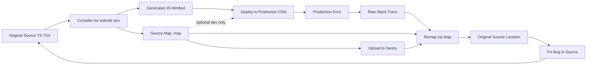
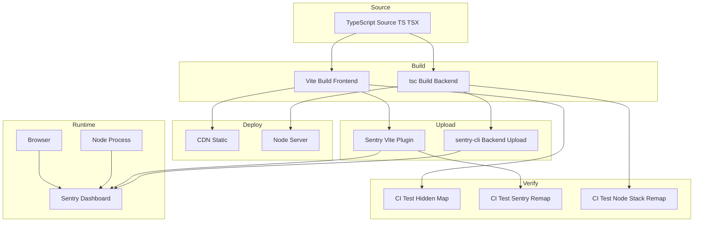

# 6.11 Source Maps

> A bridge between what shipped and what you wrote: source maps let production stack traces speak your original TypeScript, JSX, and unminified JavaScript.

## 1. Purpose

Source maps exist because the code that runs in production is almost never the code you wrote. You wrote TypeScript; what runs is transpiled JavaScript. You wrote ES2022 modules with destructuring and async iterators; what runs is ES5 with prototype-chain shims. You wrote a 4,000-line React component; what ships is a 380 KB minified bundle on a single line, with every variable renamed to single letters. Without a bridge, a production stack trace is unreadable: the line number is 1, the column is 84,293, the function is `a.b.c`, and the file is `chunk-7f3a.min.js`. The error is real, but the location is meaningless.

A source map is that bridge. It is a JSON document, shipped alongside (or embedded inside) the compiled output, that records a mathematical mapping from every position in the generated code back to a position in the original source. Given a generated file's line and column, the map answers four questions: which original file did this come from, which line, which column, and which named symbol. With those answers, a debugger, a stack-trace remapper, or an error-tracking service like Sentry can translate production output back into the source you actually wrote.

Source maps matter for four overlapping reasons. First, **production debugging**: when a user reports an error, the stack trace you receive must point at the original TypeScript file and the original line, not the minified bundle. Second, **DevTools breakpoints**: Chrome and Firefox Developer Tools use source maps to let you set breakpoints in your TSX inside the browser while the runtime executes compiled JavaScript. Third, **error reporting**: services like Sentry, Rollbar, and Bugsnag ingest raw production stack traces and remap them server-side using source maps you upload at build time, so their dashboards show original source locations even for browsers with DevTools closed. Fourth, **code coverage**: tools like Istanbul and c8 map coverage data from the compiled output back to original source lines so coverage reports reflect what you wrote, not what `tsc` emitted.

This note covers the generative mapping format (the JSON structure and the VLQ-encoded `mappings` field), the debugging workflow (how DevTools, Node, and Sentry consume maps), and the configuration paths in `tsc`, `esbuild`, `Vite`, `Webpack`, and `Rollup`. By the end you should be able to generate maps, ship them safely, upload them to Sentry, and configure hidden maps so your source code is never exposed to end users while production errors remain debuggable.

The note assumes you already understand the basics of compilation and bundling. See [[6.07 TSC Compiler Operation]] for the TypeScript compiler pipeline, [[6.08 ESBuild and SWC]] for the high-speed transpilers, and [[6.09 Vite and Webpack Comparison]] for the bundler landscape. This note sits downstream of all three: it is what those tools produce so that you can debug what they emit.

## 2. Theory and Deep Dive

### 2.1 The Source Map V3 Format

A source map is a JSON document with a fixed schema, versioned at V3. The V3 spec was finalized by Google and Mozilla around 2011 and has been the universal format ever since. Every modern tool — `tsc`, `esbuild`, `swc`, `Vite`, `Webpack`, `Rollup`, `Parcel`, `Bun` — emits V3 source maps. Every modern consumer — Chrome, Firefox, Safari, Edge DevTools, Node, Deno, Bun, Sentry, Rollbar, Bugsnag, Datadog — reads V3 source maps. The format is one of the few truly universal contracts in the JavaScript ecosystem.

The schema has seven top-level fields:

- **`version`** — always `3`. Tells consumers which spec to follow. If this is missing or is any value other than `3`, the consumer refuses to read the map.
- **`file`** — the name of the generated file this map describes. Optional in modern tooling because consumers usually know the file from context (the `sourceMappingURL` comment points the way).
- **`sourceRoot`** — a prefix prepended to every entry in `sources` when the consumer resolves the original file path. Useful when the build runs on one machine and the map is consumed on another (CI uploads, Sentry server-side resolution). May be empty.
- **`sources`** — an array of paths to original source files. Each entry is a URI, usually relative. Order matters: the `mappings` field references sources by zero-based index into this array.
- **`sourcesContent`** — an optional array, parallel to `sources`, where each entry is the full text of the original file as a string. When present, the consumer does not need the original files on disk to display source. This is how browsers show your TSX in DevTools even when the TSX is not deployed.
- **`names`** — an array of identifier strings that were renamed during compilation. Used to map minified names like `a` back to original names like `calculateTotal`. Referenced by zero-based index from `mappings`.
- **`mappings`** — the heart of the map. A single string that encodes, using Variable-Length Quantity (VLQ) base64, a list of segments. Each segment maps one position in the generated file to one position in an original file, plus optionally a name.

A minimal source map looks like this:

```json
{
  "version": 3,
  "file": "app.js",
  "sourceRoot": "",
  "sources": ["../src/app.ts"],
  "sourcesContent": [null],
  "names": ["greet", "name"],
  "mappings": "AAAA,SAASA,MAAMC,IAAI"
}
```

The `mappings` string is unreadable by design. It is a dense encoding that compresses the mapping table to a fraction of its naive size. To read it you must understand VLQ.

### 2.2 VLQ Encoding

Variable-Length Quantity, Base64 VLQ, is the encoding scheme source maps use for the `mappings` field. It compresses integers into a compact ASCII string by combining two ideas.

First, **base64**: each character represents 6 bits. The base64 alphabet used by source maps is `ABCDEFGHIJKLMNOPQRSTUVWXYZabcdefghijklmnopqrstuvwxyz0123456789+/`. That is 64 characters, each encoding 6 bits of payload.

Second, **variable length with continuation bit**: integers can be negative or large. VLQ encodes the sign in the lowest bit of the first 6-bit group and uses the remaining bits as part of the magnitude. The highest bit (the MSB of the 6-bit group) is a continuation flag: if set, the next base64 character continues the same number.

Concretely, each base64 character contributes 6 bits. Of those 6 bits:
- Bit 5 (the highest of the 6) is the continuation flag. If 1, more characters follow for this number. If 0, this is the last character.
- For the first character only: bit 0 is the sign (1 = negative, 0 = positive), and bits 1-4 are the lowest 4 bits of the magnitude.
- For continuation characters: bits 0-4 contribute 5 more bits of magnitude, with later characters shifting the accumulated magnitude left.

The full algorithm to encode an integer: take the absolute value and split it into 4-bit chunks (least significant first). Prepend the sign bit to the first chunk (so the first chunk is 5 bits wide: sign + 4 magnitude bits). For each chunk except the last, set the continuation bit (making it a 6-bit group). Each resulting 6-bit group is then encoded as one base64 character.

A worked example: encode the value `15`. Magnitude `15` is binary `1111`, fits in one 4-bit chunk. Sign is positive (0). First chunk = `0` (sign) + `1111` (magnitude) = `01111`, a 5-bit field. No continuation needed, so the 6-bit group is `0` (continuation) + `01111` = `001111` = binary 15 = base64 character `P`. So the value `15` encodes as a single character `P`.

Encode the value `-1`. Magnitude `1` is binary `0001`. Sign is negative (1). First chunk = `1` (sign) + `0001` (magnitude) = `10001`, 5-bit field. No continuation. Six-bit group = `0` (continuation) + `10001` = `010001` = binary 17 = base64 character `R`. So `-1` encodes as `R`.

Encode the value `16`. Magnitude `16` is binary `10000`, which does NOT fit in 4 bits. It splits into two chunks: low chunk `0000` (4 bits) and high chunk `0001` (4 bits, since 16 = 1 * 16 + 0). Sign is 0. First chunk = `0` (sign) + `0000` (magnitude) = `00000`, 5-bit field. Since there is another chunk following, set the continuation bit: 6-bit group = `1` (continuation) + `00000` = `100000` = binary 32 = base64 character `g`. Second chunk = `0001` (4 bits of magnitude), no continuation needed: 6-bit group = `0` + `00001` = `000001` = binary 1 = base64 character `B`. So `16` encodes as `gB`.

This is dense: most small deltas in source maps encode to a single character. The mappings field is structured as: line groups separated by semicolons (one group per generated line), and within each line group, segments separated by commas (one segment per mapping on that line). Each segment contains 1, 4, or 5 VLQ numbers in this order:
1. Generated column (always present, delta from previous segment's column on the same generated line).
2. Source file index (zero-based into `sources`, delta from the previous segment's source index, even across line boundaries).
3. Original line (zero-based, delta).
4. Original column (zero-based, delta).
5. Name index (zero-based into `names`, optional, delta).

The numbers are **deltas**, not absolutes. The first segment of a line has its column measured from zero. Every subsequent segment in the same line has its column measured as a delta from the previous segment's column. Source index, original line, original column, and name index are deltas from the previous segment that had those fields, even across line boundaries. This delta encoding means most deltas are small, which means most VLQ numbers are single characters, which means the mappings string is dramatically shorter than a JSON array of mappings would be.

### 2.3 The Mapping Table, Decoded

To make this concrete, consider a TypeScript source file:

```ts
// src/greet.ts
export function greet(name: string): string {
  return `Hello, ${name}!`;
}
```

`tsc` with `"module": "es2020"` compiles this to:

```js
// dist/greet.js
export function greet(name) {
    return `Hello, ${name}!`;
}
//# sourceMappingURL=greet.js.map
```

The source map `dist/greet.js.map` contains mappings that, decoded, look like a table:

| Generated Line | Generated Column | Source Index | Original Line | Original Column | Name |
|---|---|---|---|---|---|
| 0 | 0 | 0 | 0 | 0 | — |
| 0 | 7 | 0 | 0 | 7 | `greet` |
| 0 | 13 | 0 | 0 | 19 | — |
| 1 | 4 | 0 | 1 | 2 | — |
| 1 | 11 | 0 | 1 | 11 | — |

Each row says: "the character at generated line L, column C in `dist/greet.js` corresponds to original line OL, column OC in `src/greet.ts` (the file at sources index 0), and the identifier there was originally called `greet`."

### 2.4 The sourceMappingURL Comment

For a consumer to find the source map, the generated file must point at it. This is done with a special comment at the end of the file. Two forms exist.

**External map** (separate file):

```js
//# sourceMappingURL=greet.js.map
```

The path can be relative to the generated file or absolute. The browser's DevTools fetches the file, parses the JSON, and applies the mapping.

**Inline map** (embedded as base64 data URL):

```js
//# sourceMappingURL=data:application/json;base64,eyJ2ZXJzaW9uIjozLCJzb3VyY2VzIjpb...
```

The entire source map JSON is base64-encoded and embedded in the comment itself. This is useful for libraries that want to ship a single file with no separate `.map` sidecar, and for situations where fetching an extra file is awkward (e.g., inline scripts in HTML).

The comment must be on its own line. The leading `//#` (or `//@` in older specs, now deprecated) is the marker that consumers look for. Without this comment, the map file is orphaned — sitting next to the generated JS on disk, but never consulted by any consumer.

### 2.5 sourcesContent: Shipping the Source Inside the Map

Without `sourcesContent`, the consumer needs the original files on disk to display them. Chrome DevTools, when you click on a TSX file in the Sources panel, fetches the path from `sources` relative to `sourceRoot` and the generated file's URL. If you did not deploy your TSX files, that fetch returns a 404, and DevTools shows nothing.

`sourcesContent` solves this. It is an array, parallel to `sources`, where each entry is the full text of that source file. When present, the consumer uses the inlined text and never fetches the original file. This is how `esbuild` and Vite produce source maps that "just work" in DevTools without you having to ship `.ts` files to production.

The trade-off is size. `sourcesContent` bloats the map. For a typical mid-size app, including `sourcesContent` roughly doubles the `.map` file size. For development that is fine. For production, where maps are uploaded to Sentry but never served to users, it is also fine. For production where maps are served publicly (rare and usually wrong), it is a problem because it ships your source code to anyone who downloads the map.

### 2.6 sourceRoot: Resolving Originals Across Machines

`sourceRoot` is a prefix prepended to every entry in `sources` when the consumer resolves the original file path. It exists because the relative paths baked into the map at build time may not be valid from the consumer's perspective.

Example: your CI builds inside `/home/runner/work/myapp/myapp/`. `tsc` is invoked from the project root and emits `dist/app.js` with a map whose `sources` entry is `../src/app.ts`. From the perspective of `dist/app.js`, that resolves to `src/app.ts` — correct on the build machine. But when Sentry downloads the map and tries to resolve `../src/app.ts` relative to the artifact URL `https://cdn.myapp.com/assets/app.js`, the resolution fails because Sentry has no concept of the build's working directory.

`sourceRoot` lets you rewrite this. You can set `sourceRoot` to an absolute URL like `https://myapp.com/sources/` or to a Sentry-relative path like `~/src/`. Sentry then resolves `sourceRoot + sources[i]` to fetch the original. For local debugging you usually leave `sourceRoot` empty, because the relative paths already work from the developer's machine.

### 2.7 Stack Trace Remapping

A raw production stack trace looks like:

```
TypeError: Cannot read properties of undefined (reading 'profile')
    at a (https://myapp.com/assets/chunk-7f3a.min.js:1:84293)
    at b (https://myapp.com/assets/chunk-7f3a.min.js:1:91108)
    at c (https://myapp.com/assets/chunk-7f3a.min.js:1:6520)
```

The function names `a`, `b`, `c` are minified. The line is always 1 (because the bundle is on one line). The columns are huge. Without a source map, you cannot fix this — the location is meaningless.

With a source map, three different consumers perform the remapping:

1. **Browser DevTools**: When DevTools is open and source maps are enabled, the browser fetches the map transparently and shows the remapped stack in the console. The same `TypeError` becomes:
   ```
   at getDisplayName (src/userService.ts:42:15)
   at renderProfile (src/components/Profile.tsx:18:22)
   at Profile (src/components/Profile.tsx:8:5)
   ```
2. **Node.js with `source-map-support`**: The `source-map-support` package patches Node's stack-trace formatting to consult source maps. `require('source-map-support').install()` in your entry file is enough; from then on, every `Error.stack` is remapped.
3. **Sentry (and other error trackers)**: Sentry receives the raw stack trace over the network, looks up the source map you uploaded at build time using the release identifier, and shows the remapped trace in its dashboard. This works even for browsers with DevTools closed and even for mobile webviews where DevTools is unavailable.

### 2.8 Hidden Source Maps

A hidden source map is a source map produced exactly like a normal map but without the `//# sourceMappingURL=` comment in the generated file. End users and their browsers never see the map. Sentry, however, can still use it because you upload it directly to Sentry at build time, associated with a release identifier, and Sentry matches incoming raw stack traces against uploaded maps.

The value: users cannot trivially reconstruct your original TypeScript source. Without a hidden map, every visitor to your site can open DevTools, see your TSX, and read your proprietary code. With a hidden map, the DevTools Sources panel shows only the minified output. Sentry still works because the upload is server-to-server.

A common refinement: generate two maps. One **browser-facing** map without `sourcesContent` and without names (used for development debugging, when DevTools should at least show readable line numbers). One **Sentry-facing** map with full `sourcesContent` and names (uploaded, never served). This is overkill for most apps; usually you generate one full map, ship it only to Sentry, and serve the bundle with no map at all in production.

### 2.9 The Compile-Map-Debug Loop

The full lifecycle of a source map spans build, deploy, and runtime. The following diagram shows the lifecycle:



The diagram shows the full cycle: source becomes compiled output plus a map; the map goes to Sentry while the output goes to the CDN; an error produces a raw stack that the remapper resolves to the original source, letting you fix the bug and close the loop.

### 2.10 Forward vs Backward Mapping

A source map is a relation, not a function. Most positions in the generated file have a corresponding original position (backward mapping). But not every original position has a corresponding generated position (forward mapping), because compilation can drop code (dead code elimination), insert code (helper functions, polyfills), or reorder code (hoisting).

Consumers care about different directions:
- **Stack trace remapping** (DevTools console, `source-map-support`, Sentry) uses backward mapping: given a generated line and column, find the original.
- **Breakpoints** (DevTools Sources panel) use forward mapping: given an original line and column where the user clicked, find the generated position to set the breakpoint in the running code.
- **Coverage** tools use backward mapping: given a generated line that was executed, find the original line to mark as covered.

Most source map consumers expose both APIs. The `source-map` library (the reference implementation) provides `originalPositionFor` (backward) and `generatedPositionFor` (forward).

### 2.11 The V3 Spec Edge Cases

A few edge cases trip up implementers:

- **Empty lines**: A line in the generated file with no mappings is represented as an empty segment between two semicolons (`;;`). The number of semicolons equals the number of generated lines (plus one for the implicit start).
- **Segment with only a column**: A segment with one VLQ number means "this generated column has no original source mapping." This happens for code the compiler generated (helper functions, synthetic constructors).
- **`sourcesContent: null` entries**: When a source file is unavailable, the entry is JSON `null` rather than an empty string. Consumers must handle both cases.
- **Multiple sources per generated line**: A single generated line can map to multiple original files. This is common with bundlers that inline imports.
- **Map chains**: When TypeScript compiles to ES2020, then Babel transpiles that to ES5, then Terser minifies the result, you have a chain of three maps. Consumers must follow the chain (called "flattening" or "index mapping"). Modern tooling usually flattens at build time so consumers see one map.

## 3. Mental Models

A source map is a **Rosetta Stone** between compiled and original. The compiled side is what runs; the original side is what you wrote. The map is the lookup table that translates between them. Like the Rosetta Stone, the same content appears on both sides, just in different "languages" (minified vs readable).

VLQ is a **compact encoding for line/column deltas**. Think of it as a zipper: instead of storing absolute positions, it stores small differences between adjacent positions, then compresses each difference into as few base64 characters as possible. Small deltas become single characters. Most deltas in real code are small, because adjacent tokens in the generated output usually come from adjacent tokens in the original source.

`sourceMappingURL` is **the comment that tells DevTools where to find the map**. Without it, the map file is orphaned — sitting next to the generated JS, but never consulted. With it, the browser, Node, and Sentry can locate the map and apply it. It is the address on the envelope.

A hidden map is **ship the map to Sentry, not to users**. The map is still produced; it is just not advertised in the generated file. The error tracker retrieves it by release identifier rather than by URL. The map exists, but the address is not on the envelope.

`sourcesContent` is **the original source, baked into the map**. With it, the consumer does not need to fetch original files. Without it, the consumer must be able to resolve the `sources` paths to actual files on disk or over HTTP. It is the difference between mailing someone a translated letter and mailing them a translation dictionary.

`sourceRoot` is **a prefix prepended at resolution time**. It lets the same map work in two contexts (build machine, Sentry server) where the relative paths mean different things. It is the country code on a phone number.

Stack trace remapping is **running the map backwards**. You give it a generated location; it returns the original location. Some mappers also run it forwards (for setting breakpoints) but the production-debugging path is overwhelmingly backwards.

A source map chain is **a series of translations through intermediate languages**. TypeScript to ES2020 to ES5 to minified. Each step has its own map. To get from minified back to TypeScript, you follow the chain backwards. Most tooling flattens the chain at build time so you only ship one map.

The release identifier is **the handshake between the bundle and its map**. Sentry receives a stack trace from a bundle, looks up the release the bundle was tagged with, and finds the maps uploaded for that release. Without the release identifier, Sentry cannot know which map to use, because there is no `sourceMappingURL` comment in a hidden-map setup.

## 4. Real-World Use Cases

### 4.1 Production Error Debugging with Sentry

The flagship use case. Your React app ships a 380 KB minified bundle. A user clicks a button, the app throws, Sentry's browser SDK captures the raw stack trace, and ships it to Sentry's servers. Sentry looks up the source map for the bundle's URL in the release you uploaded at build time, runs the remapper, and shows you:

```
TypeError: Cannot read properties of undefined (reading 'profile')
  at getDisplayName (src/services/userService.ts:42:15)
  at renderProfile (src/components/Profile.tsx:18:22)
```

Without the source map, the same error shows `chunk-7f3a.min.js:1:84293` and you spend an hour grep-ing through minified output trying to figure out which function `a` was. With the map, you fix the bug in five minutes. See [[7.09 Production Monitoring]] for the broader production observability picture.

### 4.2 Browser DevTools Breakpoints in TSX

You open Chrome DevTools, navigate to Sources, and see your `src/components/Profile.tsx` file listed — even though only `dist/profile.min.js` is deployed. You click the TSX, set a breakpoint on line 18, and reload the page. The browser pauses there. You inspect variables by their original names, step through original lines, and watch expressions in TypeScript syntax.

This works because the deployed bundle ships a source map (visible or hidden but reachable), the map contains `sourcesContent` with the TSX text, and DevTools applies the forward mapping from TSX position to generated position to set the breakpoint correctly. See [[6.12 Debugging Techniques DevTools]] for the DevTools workflow.

### 4.3 Node.js Stack Traces with `source-map-support`

You run a TypeScript backend through `ts-node` or compile to `dist/` and run `node dist/index.js`. An error occurs. The raw stack trace shows `dist/userService.js:42:15`. You want `src/userService.ts:42:15`.

The `source-map-support` package patches Node's `Error.stack` getter. Install it once at the top of your entry file:

```js
require('source-map-support').install();
```

Every subsequent `Error.stack` is remapped. This is the standard for production Node services that ship compiled JavaScript. The package works by overriding `Error.prepareStackTrace`, the V8 hook that formats stack traces. See [[1.25 V8 Engine Pipeline]] for how V8 generates the raw stack that this package patches.

### 4.4 Library Development

You publish a library to npm. Your source is TypeScript; your published artifact is compiled JavaScript. If you ship `.map` files alongside the `.js` files, consumers can step into your library in DevTools and see the original TS. If you omit maps, consumers see only the compiled JS (which is usually readable but lacks type annotations and original formatting).

Most modern libraries (Zod, Effect, Drizzle) ship maps. Most legacy libraries (lodash) do not. The convention is shifting toward shipping maps as a default, because the cost is small (a `.map` file alongside each `.js` file) and the benefit is large (consumers can debug into your library). See [[6.03 Publishing Libraries]] for how maps fit into the publishing workflow.

### 4.5 Code Coverage Remapping

You run unit tests against compiled JavaScript (because your test runner does not handle TS natively, or because you want to measure the production artifact). Istanbul or c8 produces coverage data with line/column references to the compiled output. The coverage report shows "dist/userService.js line 42 not covered." You want "src/userService.ts line 42 not covered."

The `remap-istanbul` package (and equivalent tools) consume the source map and rewrite the coverage report in terms of original files. This is essential for accurate coverage tracking in compiled projects. Without remapping, your coverage report is meaningless — it shows lines in code no one wrote.

### 4.6 Error Stack Traces in Web Workers and Service Workers

Workers run the same compiled JavaScript as the main thread but have separate DevTools contexts. Source maps work the same way — the worker's bundle needs its own `sourceMappingURL` comment pointing at its own `.map` file. Sentry's browser SDK instruments workers separately and uploads their maps under different release artifacts. Forgetting to ship maps for worker bundles is a common cause of un-debuggable service worker errors.

### 4.7 Serverless and React Native

AWS Lambda, Cloudflare Workers, Vercel Edge Functions, and Deno Deploy all run compiled JavaScript. Install `source-map-support` at the top of your handler so stack traces are remapped before they hit the platform logs. React Native ships a single minified bundle to the device; the React Native CLI's `metro-symbolicate` tool takes a raw stack and a source map and prints the remapped stack.

## 5. Code Examples

### 5.1 Example A — Minimal and Conceptual

**Goal**: Take a tiny TypeScript file, compile it with `tsc`, inspect the generated JavaScript and source map, and verify the mapping by decoding the `mappings` field by hand.

#### TypeScript source

```ts
// src/math.ts
export function double(x: number): number {
  return x * 2;
}

export function halve(x: number): number {
  return x / 2;
}
```

#### Compiled JavaScript (with `tsc --sourceMap`, ESM output)

```js
// dist/math.js
export function double(x) {
    return x * 2;
}
export function halve(x) {
    return x / 2;
}
//# sourceMappingURL=math.js.map
```

#### Generated source map (`dist/math.js.map`)

```json
{
  "version": 3,
  "file": "math.js",
  "sourceRoot": "",
  "sources": ["../src/math.ts"],
  "names": ["double", "x", "halve"],
  "mappings": "AAAA,OAAO,SAASA,MAAMA,CAASC,CAAC;IAC5B,OAAOA,CAAC,GAAG,CAAC,CAAC;AACf,CAAC;AACD,OAAO,SAASC,KAAKA,CAASD,CAAC;IAC3B,OAAOA,CAAC,GAAG,CAAC,CAAC;AAChB,CAAC"
}
```

#### Equivalent JavaScript original (for side-by-side comparison)

If the original had been written in plain JavaScript and run through a minifier:

```js
// src/math.js (original, before minification)
export function double(x) {
  return x * 2;
}

export function halve(x) {
  return x / 2;
}
```

```js
// dist/math.min.js (minified)
function double(n){return n*2}function halve(n){return n/2}
//# sourceMappingURL=math.min.js.map
```

```json
{
  "version": 3,
  "file": "math.min.js",
  "sourceRoot": "",
  "sources": ["../src/math.js"],
  "names": ["double", "x", "halve"],
  "mappings": "AAAA,SAASA,MAAMC,CAAC,EAAGD,CAAAA,CAAG,CAAC,CAAC,CAAf,CAAgBE,KAAKA,CAACD,CAAC,EAAGC,CAAAA,CAAG,CAAC,CAAC,CAAjB"
}
```

#### Decoding the first segment

The first segment of the first line is `AAAA`. Each character is one VLQ number. `A` in the source-map base64 alphabet is index 0, which is binary `000000`. With continuation bit `0` and sign bit `0`, that decodes to value `0`. So `AAAA` decodes to four zeros: generated column 0, source index 0, original line 0, original column 0. That is, "the very first character of `math.js` came from the very first character of `math.ts`."

The second segment, `SAASA`, decodes to: generated column delta (S=18), source index delta (A=0, still source 0), original line delta (A=0), original column delta (S=18), name index (A=0, name "double"). Read in plain English: "at generated column 18, we are at source 0, original line 0, original column 18, and the identifier there is `double`." That matches: in `math.js`, the word `double` starts at column 16 of line 1 (after `export function `); in `math.ts`, `double` is at column 16 of line 1.

#### Verifying with Node

```js
// verify.js — decode a source map's first segment
const fs = require('fs');
const { SourceMapConsumer } = require('source-map');

const raw = fs.readFileSync('dist/math.js.map', 'utf8');
const map = JSON.parse(raw);

SourceMapConsumer.with(map, null, (consumer) => {
  const pos = consumer.originalPositionFor({ line: 1, column: 16 });
  console.log(pos);
  // { source: '../src/math.ts', line: 1, column: 16, name: 'double' }
});
```

#### TypeScript version of the verifier

```ts
// verify.ts
import * as fs from 'fs';
import { SourceMapConsumer } from 'source-map';

const raw: string = fs.readFileSync('dist/math.js.map', 'utf8');
const map: unknown = JSON.parse(raw);

SourceMapConsumer.with(
  map as Parameters<typeof SourceMapConsumer.with>[0],
  null,
  (consumer: SourceMapConsumer) => {
    const pos = consumer.originalPositionFor({ line: 1, column: 16 });
    console.log(pos);
    // { source: '../src/math.ts', line: 1, column: 16, name: 'double' }
  }
);
```

### 5.2 Example B — Production-Grade Pipeline

**Goal**: A Vite + React + TypeScript build pipeline that:
1. Generates source maps with full `sourcesContent` for development.
2. Generates a hidden production build (no `sourceMappingURL` comment in the bundle).
3. Uploads the production source maps to Sentry during CI.
4. Tests the map by triggering an error and verifying the remapped stack trace.

#### Project layout

```
project/
  src/
    main.tsx
    userService.ts
  vite.config.ts
  package.json
```

#### JavaScript version (plain Vite, no TS)

```js
// vite.config.js
import { defineConfig } from 'vite';
import react from '@vitejs/plugin-react';
import { sentryVitePlugin } from '@sentry/vite-plugin';

export default defineConfig(({ command }) => {
  const isServe = command === 'serve';
  const plugins = [react()];

  if (process.env.sentryAuthToken) {
    plugins.push(
      sentryVitePlugin({
        org: process.env.sentryOrg,
        project: process.env.sentryProject,
        authToken: process.env.sentryAuthToken,
        release: { name: process.env.releaseVersion },
        sourcemaps: {
          filesToDeleteAfterUpload: ['dist/**/*.map'],
        },
      })
    );
  }

  return {
    plugins,
    build: {
      sourcemap: isServe ? true : 'hidden',
      outDir: 'dist',
      rollupOptions: {
        output: {
          entryFileNames: 'assets/[name].[hash].js',
          chunkFileNames: 'assets/[name].[hash].js',
          assetFileNames: 'assets/[name].[hash].[ext]',
        },
      },
    },
  };
});
```

#### TypeScript version

```ts
// vite.config.ts
import { defineConfig, type UserConfig } from 'vite';
import react from '@vitejs/plugin-react';
import { sentryVitePlugin } from '@sentry/vite-plugin';

type BuildSourcemap = boolean | 'inline' | 'hidden';

export default defineConfig(({ command }): UserConfig => {
  const isServe = command === 'serve';

  const plugins: NonNullable<UserConfig['plugins']> = [react()];

  if (process.env.sentryAuthToken) {
    plugins.push(
      sentryVitePlugin({
        org: process.env.sentryOrg,
        project: process.env.sentryProject,
        authToken: process.env.sentryAuthToken,
        release: { name: process.env.releaseVersion as string },
        sourcemaps: {
          filesToDeleteAfterUpload: ['dist/**/*.map'],
        },
      })
    );
  }

  return {
    plugins,
    build: {
      sourcemap: (isServe ? true : 'hidden') as BuildSourcemap,
      outDir: 'dist',
      rollupOptions: {
        output: {
          entryFileNames: 'assets/[name].[hash].js',
          chunkFileNames: 'assets/[name].[hash].js',
          assetFileNames: 'assets/[name].[hash].[ext]',
        },
      },
    },
  };
});
```

#### Triggering an error in the service module

```js
// src/userService.js
export async function getUser(id) {
  const res = await fetch(`/api/users/${id}`);
  if (!res.ok) {
    throw new Error(`Failed to fetch user ${id}: ${res.status}`);
  }
  const data = await res.json();
  return data;
}

export function getDisplayName(user) {
  // Intentional bug: assumes user.profile is always defined
  return user.profile.displayName;
}
```

```ts
// src/userService.ts
export interface User {
  id: string;
  profile: {
    displayName: string;
  };
}

export async function getUser(id: string): Promise<User> {
  const res = await fetch(`/api/users/${id}`);
  if (!res.ok) {
    throw new Error(`Failed to fetch user ${id}: ${res.status}`);
  }
  const data: User = await res.json();
  return data;
}

export function getDisplayName(user: User): string {
  // Intentional bug: assumes user.profile is always defined
  return user.profile.displayName;
}
```

#### Triggering in main entry

```js
// src/main.js
import { getUser, getDisplayName } from './userService';

async function renderProfile(id) {
  const user = await getUser(id);
  // If getUser returned undefined (network issue, JSON parse fail),
  // the next line throws. In production this is a minified stack trace.
  const name = getDisplayName(user);
  document.getElementById('root').textContent = `Hello, ${name}`;
}

renderProfile('abc').catch((err) => {
  // Sentry's browser SDK captures this automatically if init was called
  console.error('Render failed:', err);
});
```

```tsx
// src/main.tsx
import React from 'react';
import { createRoot } from 'react-dom/client';
import { getUser, getDisplayName } from './userService';

const root = createRoot(document.getElementById('root'));

async function renderProfile(id) {
  const user = await getUser(id);
  const name = getDisplayName(user);
  root.render(<h1>Hello, {name}</h1>);
}

renderProfile('abc').catch((err) => {
  console.error('Render failed:', err);
});
```

#### CI build and upload script

```bash
# scripts/ci-build.sh
#!/usr/bin/env bash
set -euo pipefail

export releaseVersion=$(node -p "require('./package.json').version")
export sentryAuthToken=$sentryAuthToken

# Build: produces dist/ with hidden source maps (no sourceMappingURL comment)
npm run build

# Verify the bundle has no sourceMappingURL comment
if grep -l "sourceMappingURL" dist/assets/*.js; then
  echo "FAIL: sourceMappingURL comment leaked into production bundle"
  exit 1
fi

# Verify the .map files exist alongside the bundle
ls dist/assets/*.js.map | head

# The Sentry Vite plugin already uploaded maps during the build.
# Delete local copies so they are not accidentally deployed.
rm -f dist/assets/*.js.map

echo "Build complete. Maps uploaded to Sentry. Local maps deleted."
```

#### Sentry release verification script

```js
// scripts/verify-sentry.js
const Sentry = require('@sentry/node');

const release = process.env.releaseVersion;

Sentry.init({
  dsn: process.env.sentryDsn,
  release,
});

// Send a test exception and confirm it appears with a remapped stack
Sentry.captureException(new Error('Source map verification test'));
Sentry.flush(2000).then(() => {
  console.log(`Test exception sent for release ${release}`);
  console.log('Check Sentry dashboard: the stack trace should show');
  console.log('  src/userService.ts:8 in getDisplayName');
});
```

```ts
// scripts/verify-sentry.ts
import * as Sentry from '@sentry/node';

const release: string = process.env.releaseVersion;

Sentry.init({
  dsn: process.env.sentryDsn,
  release,
});

Sentry.captureException(new Error('Source map verification test'));
Sentry.flush(2000).then(() => {
  console.log(`Test exception sent for release ${release}`);
  console.log('Check Sentry dashboard: the stack trace should show');
  console.log('  src/userService.ts:8 in getDisplayName');
});
```

#### Node.js backend with `source-map-support`

```js
// src/server.js
require('source-map-support').install();
const express = require('express');
const { getDisplayName } = require('./userService');

const app = express();

app.get('/profile/:id', async (req, res) => {
  const user = await fetchUser(req.params.id);
  const name = getDisplayName(user);
  res.send(`Hello, ${name}`);
});

app.listen(3000);
```

```ts
// src/server.ts
import 'source-map-support/register';
import express from 'express';
import { getDisplayName, User } from './userService';

const app = express();

app.get('/profile/:id', async (req, res) => {
  const user: User = await fetchUser(req.params.id);
  const name: string = getDisplayName(user);
  res.send(`Hello, ${name}`);
});

app.listen(3000);
```

The `'source-map-support/register'` form is a shortcut: it both imports and installs in a single statement, suitable for use as a `--require` flag at the Node CLI (`node -r source-map-support/register dist/server.js`).

#### TypeScript compiler configuration

```json
{
  "compilerOptions": {
    "target": "ES2020",
    "module": "es2020",
    "outDir": "dist",
    "sourceMap": true,
    "inlineSources": false,
    "sourceRoot": "",
    "mapRoot": "",
    "strict": true,
    "esModuleInterop": true,
    "skipLibCheck": true,
    "forceConsistentCasingInFileNames": true
  },
  "include": ["src/**/*"]
}
```

The keys `sourceMap`, `inlineSources`, `inlineSourceMap`, `sourceRoot`, and `mapRoot` control map generation:
- `sourceMap: true` emits a separate `.js.map` file alongside each `.js` file.
- `inlineSourceMap: true` embeds the map as a base64 data URL comment in the JS file. Mutually exclusive with `sourceMap`.
- `inlineSources: true` populates `sourcesContent` in the map. Default is false; turn on for Sentry uploads where you do not want to ship the original files separately.
- `sourceRoot` sets the `sourceRoot` field in the map.
- `mapRoot` is a V8 DevTools hint for where to find maps when the `sourceMappingURL` comment is absent; rarely used in modern tooling.

#### esbuild configuration (side-by-side)

```js
// build.js
const esbuild = require('esbuild');

esbuild.build({
  entryPoints: ['src/main.ts'],
  bundle: true,
  minify: true,
  sourcemap: true,           // 'inline', 'external', 'linked', 'hidden' (Vite alias)
  sourcesContent: true,      // include sourcesContent in the map
  outfile: 'dist/main.js',
  target: 'es2020',
  platform: 'browser',
});
```

```ts
// build.ts
import * as esbuild from 'esbuild';

const result: esbuild.BuildResult = await esbuild.build({
  entryPoints: ['src/main.ts'],
  bundle: true,
  minify: true,
  sourcemap: true,
  sourcesContent: true,
  outfile: 'dist/main.js',
  target: 'es2020',
  platform: 'browser',
});

console.log(`Build done. ${result.errors.length} errors.`);
```

#### Webpack configuration (side-by-side)

```js
// webpack.config.js
const path = require('path');
const SentryWebpackPlugin = require('@sentry/webpack-plugin');

module.exports = (env) => ({
  mode: env.production ? 'production' : 'development',
  devtool: env.production ? 'hidden-source-map' : 'source-map',
  entry: './src/main.ts',
  output: {
    filename: 'assets/[name].[contenthash].js',
    path: path.resolve(process.cwd(), 'dist'),
  },
  module: {
    rules: [
      {
        test: /\.tsx?$/,
        use: 'ts-loader',
        exclude: /node-modules/,  // fictional placeholder; see note below
      },
    ],
  },
  resolve: {
    extensions: ['.tsx', '.ts', '.js'],
  },
  plugins: [
    env.production &&
      new SentryWebpackPlugin({
        release: process.env.releaseVersion,
        project: process.env.sentryProject,
        org: process.env.sentryOrg,
        authToken: process.env.sentryAuthToken,
        include: '.',
        ignore: ['node-modules'],
      }),
  ].filter(Boolean),
});
```

```ts
// webpack.config.ts
import path from 'path';
import type { Configuration } from 'webpack';
import SentryWebpackPlugin from '@sentry/webpack-plugin';

const config: Configuration = (env) => {
  const isProd = (env as { production?: boolean }).production === true;
  return {
    mode: isProd ? 'production' : 'development',
    devtool: isProd ? 'hidden-source-map' : 'source-map',
    entry: './src/main.ts',
    output: {
      filename: 'assets/[name].[contenthash].js',
      path: path.resolve(process.cwd(), 'dist'),
    },
    module: {
      rules: [
        {
          test: /\.tsx?$/,
          use: 'ts-loader',
          exclude: /node-modules/,
        },
      ],
    },
    resolve: {
      extensions: ['.tsx', '.ts', '.js'],
    },
    plugins: [
      isProd &&
        new SentryWebpackPlugin({
          release: process.env.releaseVersion,
          project: process.env.sentryProject,
          org: process.env.sentryOrg,
          authToken: process.env.sentryAuthToken,
          include: '.',
          ignore: ['node-modules'],
        }),
    ].filter(Boolean),
  };
};

export default config;
```

Webpack's `devtool` option has many variants worth memorizing:
- `source-map` — separate `.map` file, full quality, slowest.
- `hidden-source-map` — same as `source-map` but no `sourceMappingURL` comment.
- `inline-source-map` — map embedded as base64 data URL.
- `eval-source-map` — map embedded in each eval module, fast for dev with quality.
- `cheap-source-map` — faster, lower quality (no column mappings).
- `cheap-module-source-map` — faster, lower quality, but maps through loaders.
- `nosources-source-map` — map without `sourcesContent` (paths and names only).
- `(none)` — no map.

For production with Sentry, use `hidden-source-map`. For development with fast rebuilds, use `eval-source-map` or `cheap-module-source-map`.

## 6. Common Mistakes and Anti-Patterns

### 6.1 Not generating source maps at all

The most fundamental mistake. A team ships a production bundle without any source maps. When an error is reported, the stack trace points at `chunk-7f3a.min.js:1:84293`. No one can debug it. The team adds "improve error reporting" to the backlog and forgets about it for six months.

**Cause**: The default for many bundlers is `sourcemap: false`. Vite defaults to `false` for production. Webpack defaults to `false` (well, `eval` in dev mode). `esbuild` defaults to `false`. If you do not explicitly opt in, you get nothing.

**Fix**: Set `sourcemap: true` (or `'hidden'`) in every production build config. Add a CI check that fails the build if no `.map` files are produced.

### 6.2 Shipping source maps publicly

The opposite mistake. A team turns on source maps, deploys the `.map` files to the CDN alongside the JS, and exposes their entire TypeScript source code to anyone who opens DevTools. Competitors, scrapers, and security researchers can read every line.

**Cause**: `sourcemap: true` produces a `sourceMappingURL` comment in the JS pointing at the map, and the map is uploaded with the JS to the CDN.

**Fix**: Use `sourcemap: 'hidden'` in production. The map is still generated but no comment is added. Upload the map only to Sentry. Do not deploy the `.map` files to the CDN. If you must serve them (for staged debugging), put them behind authenticated access.

### 6.3 Forgetting to upload source maps to Sentry

A team uses hidden source maps but forgets to upload them. Sentry receives raw stack traces and cannot remap them. The dashboard shows `chunk-7f3a.min.js:1:84293` for every error.

**Cause**: The Sentry upload step is missing from CI. The maps are generated locally and then deleted by the build, never reaching Sentry.

**Fix**: Use `@sentry/vite-plugin`, `@sentry/webpack-plugin`, or the `sentry-cli` directly in CI. Verify the upload by triggering a test error and checking that the Sentry dashboard shows the remapped stack.

### 6.4 Wrong `sourceRoot` causing unmappable traces

The map references `../src/userService.ts` but the file is at `src/userService.ts` from the consumer's perspective. The remapper fails. Sentry shows the original file path but cannot display the source content.

**Cause**: `sourceRoot` is set incorrectly or the build was run from a different working directory than the consumer expects.

**Fix**: For Sentry, set `sourceRoot` to a stable URL prefix (often empty) and configure Sentry's URL normalization to match. For local debugging, leave `sourceRoot` empty. Test by inspecting the `sources` field of a generated map and confirming the paths resolve from the consumer's perspective.

### 6.5 Inline source maps that bloat the bundle

A team uses `sourcemap: 'inline'` in production. Every `.js` file embeds the full base64-encoded map. The bundle size triples. The TTI (time to interactive) regresses by 2 seconds.

**Cause**: Inline source maps are convenient (no separate file fetch) but the base64-encoded map is large, and it ships to every user.

**Fix**: Inline maps are for development only. In production, use external or hidden maps. Upload to Sentry. Do not ship inline maps to the CDN.

### 6.6 Not testing the maps

A team sets up source maps, ships to production, and discovers three months later (when a real error happens) that the maps are broken. The Sentry dashboard shows the raw stack trace. Investigation reveals the bundler version was upgraded and a bug in the upgrade silently produced malformed maps.

**Cause**: No automated test verifies that the maps work end-to-end.

**Fix**: Add a CI step that triggers a synthetic error, captures the stack, and verifies the remapped stack contains an expected original file path. If the remap fails, the build fails.

### 6.7 Shipping `sourcesContent` to public CDN

A team uses `sourcesContent: true` and serves the map publicly (intentionally, for DevTools friendliness). The map now contains the full text of every TypeScript file. Anyone who downloads the map has the entire source tree.

**Cause**: Misunderstanding that `sourcesContent` inlines the source into the map, which is then downloaded by anyone who can read the map.

**Fix**: When serving maps publicly, omit `sourcesContent` (use `nosources-source-map` in Webpack). When uploading to Sentry, include it. Most bundlers let you control this independently.

### 6.8 Maps for assets that are never deployed

A team generates maps for development files that are never deployed (test files, storybook stories). The maps reference sources that no longer exist in production. Sentry spends time trying to resolve them and fails.

**Cause**: Indiscriminate map generation without filtering.

**Fix**: Configure the bundler to generate maps only for the production entry points. Use the `sourcemap` exclude/include options in Webpack and Rollup to filter.

### 6.9 Mismatched release identifiers

Sentry uses the release identifier to match incoming errors to uploaded maps. If the bundle's `Sentry.release` is `1.2.3` but the upload was tagged as `1.2.3-beta.1`, no match occurs. Every error shows the raw stack.

**Cause**: The release identifier is computed differently at build time and at upload time, or the CI pipeline uses different env variables for the two steps.

**Fix**: Compute the release identifier once at the start of CI, export it as an env var, and use it for both the bundle's `Sentry.init({ release })` and the upload's `--release` flag. Verify by inspecting the bundle's Sentry config and the upload command in CI logs.

### 6.10 Minified names not preserved in the map

A team uses `terser` for minification but does not enable name preservation in the source map. The `names` array in the map is empty. Sentry remaps the location correctly but shows `function a` instead of `function getDisplayName`.

**Cause**: The minifier's `mangle` option strips names without recording them in the map.

**Fix**: In Webpack, use the `terser-webpack-plugin` with `terserOptions: { mangle: { safari10: true } }` and ensure `sourceMap: true` is passed to terser. In Vite, the default minifier (`esbuild`) preserves names in maps automatically. Verify by inspecting the `names` field of a generated map — it should be a non-empty array of original identifiers.

### 6.11 Map chains that are not flattened

A pipeline runs TypeScript through `tsc`, then Babel, then Terser. Each tool emits its own map, and the final bundle's `sourceMappingURL` points at the Terser map, which points at the Babel output, which points at the `tsc` output. Sentry cannot follow the chain — it expects a single map from minified to original. Use a bundler that flattens automatically (Vite, Webpack, Rollup, esbuild). If you chain tools manually, use the `flattenSourceMap` utility from the `source-map` library.

### 6.12 Stale maps after a hot reload

A developer edits a TS file, the dev server hot-reloads, but the source map is stale. DevTools shows breakpoints landing on the wrong lines. Restart the dev server, or use one that regenerates maps on every change (Vite does this by default).

## 7. Best Practices and Design Patterns

### 7.1 Generate source maps for every build

Default to `sourcemap: true` in development and `sourcemap: 'hidden'` in production. Never ship a build without maps, even for internal tools. The cost of generating maps is tiny (build time increases by 5 to 15 percent); the cost of debugging without them is enormous.

### 7.2 Upload maps to your error tracker

Sentry, Rollbar, Bugsnag, and Datadog all support source map uploads. Configure the upload as a CI step that runs after the build. Use the release identifier pattern (one release per deployable version) so the tracker can match incoming errors to the correct map version.

### 7.3 Use hidden maps in production

`sourcemap: 'hidden'` produces maps without the `sourceMappingURL` comment. End users cannot see the maps. Your error tracker uses the uploaded copies. This is the standard for proprietary code. The only reason to ship visible maps in production is for an open-source project where the source is already public.

### 7.4 Test the maps with a real error

Add a synthetic error endpoint to your staging environment (`/error-test`) that throws an exception. After each deploy, hit the endpoint, wait for Sentry to ingest the error, and verify the dashboard shows the remapped stack with the expected original file path. If the remap fails, block the deploy. This is the only way to catch map regressions before they hit a real user error.

### 7.5 Include `sourcesContent` for Sentry uploads

`sourcesContent: true` inlines the full source text into the map. Sentry uses this to display source context around the error line in its dashboard. Without `sourcesContent`, Sentry shows only the file path and line number, not the surrounding code. The trade-off is map size, which matters for public CDNs but not for Sentry uploads.

### 7.6 Set `sourceRoot` correctly for cross-context resolution

If your build runs in CI at `/home/runner/work/myapp/` and Sentry resolves from `https://cdn.myapp.com/assets/`, the relative paths in `sources` will not work for Sentry. Set `sourceRoot` to a value that resolves correctly in Sentry's context. For Sentry, this is often a URL prefix like `~/` or a bundle-relative prefix.

### 7.7 Use a deterministic release identifier

The release identifier must uniquely identify a single deployable version. Use the git commit SHA for canaries, the semver version for releases, or a combination. Avoid timestamps — they make it impossible to correlate a Sentry error to a specific commit. The same identifier must be used in the bundle's `Sentry.init({ release })` call and in the upload command's `--release` flag.

### 7.8 Delete local maps after upload

After CI uploads maps to Sentry, delete the local `.map` files from the build output before deploying. This prevents accidental deployment of maps to the CDN and reduces the deploy artifact size. The Sentry Vite and Webpack plugins do this automatically via `filesToDeleteAfterUpload`.

### 7.9 Use `source-map-support` in Node backends

For Node services compiled from TypeScript, install `source-map-support` and call `install()` at the top of your entry file. Use the `register` shortcut for one-line setup. Every `Error.stack` from then on is remapped. Without this, your production logs will show `dist/server.js` paths instead of `src/server.ts` paths.

### 7.10 Pin your bundler version

Source map generation is a bundler feature, and bundler upgrades occasionally produce broken maps (Vite 3 to 4 had a regression around `sourcesContent` for dynamic imports; Webpack 4 to 5 changed the default `devtool` value). Pin your bundler version, and run a map-verification test in CI to catch regressions before they ship.

### 7.11 Use `nosources-source-map` for DevTools-friendly public maps

If you must serve maps publicly (e.g., for an open-source demo where you want DevTools to show readable code), use Webpack's `nosources-source-map` or omit `sourcesContent` in esbuild. The map contains file paths and line numbers but not the source text. DevTools can show the file tree and line numbers but cannot display the source content. This is a reasonable middle ground for public-facing apps.

### 7.12 Document the map pipeline in your project README

Source map configuration is one of those things that everyone assumes someone else set up correctly. Document in your README: which bundler option controls maps, which CI step uploads them, which release identifier is used, and how to verify the maps are working. The next developer to join the team will thank you.

## 8. Technical Interview Knowledge

### Q1: What is a source map?

A source map is a JSON document, versioned at V3, that maps positions in a generated (compiled, minified, bundled) file back to positions in the original source file. It contains a `version` field (always 3), a `sources` array of original file paths, an optional `sourcesContent` array of original file texts, a `names` array of identifier strings, a `sourceRoot` prefix, and a `mappings` string that encodes the actual position-to-position correspondence using VLQ-encoded deltas. Consumers like browser DevTools, Node's `source-map-support`, and Sentry use the map to translate production stack traces back to original source locations.

### Q2: What is VLQ and why is it used in source maps?

VLQ, Variable-Length Quantity, is a compact encoding scheme that represents integers using a variable number of base64 characters. Source maps use a Base64 VLQ variant where each base64 character encodes 6 bits: 1 continuation bit (the highest), 1 sign bit (in the first character only), and 4 to 5 magnitude bits. VLQ is used because source map mappings are stored as deltas between adjacent positions, and most deltas are small. A small delta like `0` or `1` encodes as a single base64 character, while a large delta like `12345` encodes as three. This compresses the mappings string to a fraction of the size of a JSON array of mappings, which matters because the map is fetched over the network and parsed on every page load in development.

### Q3: How do you generate source maps with `tsc`?

Set `"sourceMap": true` in `tsconfig.json` under `compilerOptions`. `tsc` emits a `.js.map` file alongside each `.js` file. Related options: `"inlineSources": true` to include `sourcesContent` in the map, `"inlineSourceMap": true` to embed the map as a base64 data URL comment in the JS instead of a separate file (mutually exclusive with `sourceMap`), and `"sourceRoot": "..."` to set the `sourceRoot` field. For production, the typical combination is `"sourceMap": true` with `"inlineSources": true` so the map is fully self-contained for upload to Sentry. See [[6.07 TSC Compiler Operation]] for the full `tsc` option matrix.

### Q4: How do you generate source maps with `esbuild`?

Pass `sourcemap: true` to the `build` API (or `--sourcemap` on the CLI). `esbuild` produces a `.map` file alongside the output and adds the `sourceMappingURL` comment. Use `sourcemap: 'inline'` for inline maps (base64 data URL), `sourcemap: 'external'` for a separate file without the comment (effectively hidden), and the Vite alias `'linked'` for a separate file with the comment. Use `sourcesContent: false` to omit the `sourcesContent` array (default is true). `esbuild` is significantly faster than `tsc` at map generation, which is why Vite uses it for development builds. See [[6.08 ESBuild and SWC]] for the esbuild internals.

### Q5: How do you debug production code that has been minified?

Three paths. (1) Browser DevTools: if the production bundle ships a visible source map, DevTools fetches it automatically and remaps stack traces and breakpoints. (2) Node.js: install `source-map-support` and call `install()` to remap `Error.stack` in compiled Node services. (3) Sentry (or equivalent): upload the source map at build time, associated with a release identifier; Sentry remaps incoming error stack traces server-side and displays them in its dashboard. For proprietary code, use hidden maps (no `sourceMappingURL` comment) and rely on the Sentry upload path. For open-source code, visible maps are fine.

### Q6: What is a hidden source map?

A hidden source map is a source map produced normally but without the `//# sourceMappingURL=...` comment in the generated file. End users and their browsers cannot find the map, so DevTools shows only the minified source. The map is uploaded to an error tracker like Sentry, which uses the release identifier to match incoming raw stack traces to the uploaded map. Hidden maps let you debug production errors without exposing your original source code to users. In Webpack, use `devtool: 'hidden-source-map'`; in Vite, use `build.sourcemap: 'hidden'`; in esbuild, use `sourcemap: 'external'`.

### Q7: How does Sentry use source maps?

Sentry's remapping pipeline works server-side. When the Sentry browser SDK captures an error, it sends the raw stack trace (with minified function names and bundle URLs) to Sentry's servers. Sentry looks up the source map for that bundle URL in the release you uploaded at build time, runs the remapper (a V3 source map consumer), and replaces each frame in the stack trace with the original file path, line, column, and function name. The remapped trace is shown in the Sentry dashboard. If `sourcesContent` is present in the uploaded map, Sentry also displays the surrounding source code lines for context. Without the upload, Sentry has no map to consult and shows the raw minified stack.

### Q8: What is `sourceMappingURL` and where does it go?

`sourceMappingURL` is a special comment placed at the end of a generated JavaScript file that tells consumers where to find the source map. Two forms: external (`//# sourceMappingURL=app.js.map`, a relative or absolute URL to a `.map` file) and inline (`//# sourceMappingURL=data:application/json;base64,...`, a base64 data URL embedding the entire map). The comment must be on its own line and is the last line of the file. Consumers (DevTools, Node, error trackers) look for this comment to locate the map. Without it, the map is orphaned. The `//#` prefix is the modern form; the older `//@` form is deprecated due to conflicts with Internet Explorer's conditional comment syntax.

### Q9: How do you handle source maps in Node.js?

Two layers. For runtime stack trace remapping, install the `source-map-support` package and call `install()` at the top of your entry file (or use the `register` shortcut: `import 'source-map-support/register'`, or pass `-r source-map-support/register` to node). This patches `Error.prepareStackTrace` to consult maps. For build-time map generation, set `"sourceMap": true` in `tsconfig.json` if you use `tsc`, or `sourcemap: true` in your bundler config. For error reporting, upload the maps to Sentry (or your tracker) using `@sentry/node` and the `sentry-cli`. The combination gives you both local stack remapping (for `console.log` of errors) and server-side remapping (for the Sentry dashboard).

### Q10: What is the difference between `sourceRoot` and `sourcesContent`?

`sourceRoot` is a prefix prepended to every entry in the `sources` array when the consumer resolves the original file path. It is used to make relative paths work in a different context (e.g., when the map is uploaded to Sentry and the relative paths no longer resolve from the build directory). `sourcesContent` is an array, parallel to `sources`, where each entry is the full text of the original source file. When present, the consumer uses the inlined text instead of fetching the original file. `sourceRoot` is about path resolution; `sourcesContent` is about not needing the file at all. You can use both: `sourceRoot` to fix path resolution and `sourcesContent` to skip the fetch entirely.

## 9. Practical Exercises

### Exercise 1: Generate source maps with `tsc` and `esbuild`

**Task**: Compile a small TypeScript file with both `tsc` and `esbuild`. Inspect the generated maps. Verify the mappings by decoding one segment by hand.

**Setup**:

```bash
mkdir ex1 && cd ex1
npm init -y
npm install -D typescript esbuild source-map
```

**Source file**:

```ts
// src/calc.ts
export function add(a: number, b: number): number {
  return a + b;
}

export function multiply(a: number, b: number): number {
  return a * b;
}
```

**Step 1 — `tsc`**:

```bash
npx tsc --init --target ES2020 --module es2020 --sourceMap --outDir dist-tsc
npx tsc -p .
```

Inspect `dist-tsc/calc.js` and `dist-tsc/calc.js.map`.

**Step 2 — `esbuild`**:

```bash
npx esbuild src/calc.ts --bundle --sourcemap --outfile=dist-esb/calc.js
```

Inspect `dist-esb/calc.js` and `dist-esb/calc.js.map`.

**Step 3 — Decode the first segment by hand**:

Open `dist-tsc/calc.js.map`. Find the `mappings` string. It begins with something like `AAAA,OAAO,...`. Decode the first segment `AAAA`: each `A` is base64 index 0, decodes to value 0. So the first segment is `(genCol=0, srcIdx=0, origLine=0, origCol=0)`. Verify: at line 1 column 0 of `calc.js`, the corresponding original location is line 1 column 0 of `calc.ts`.

**Step 4 — Verify with the `source-map` library**:

```js
// verify.js
const fs = require('fs');
const { SourceMapConsumer } = require('source-map');

(async () => {
  const raw = fs.readFileSync('dist-tsc/calc.js.map', 'utf8');
  const map = JSON.parse(raw);
  await SourceMapConsumer.with(map, null, (consumer) => {
    const pos = consumer.originalPositionFor({ line: 1, column: 16 });
    console.log(pos);
    // Expected: { source: '../src/calc.ts', line: 1, column: 16, name: 'add' }
  });
})();
```

```ts
// verify.ts
import * as fs from 'fs';
import { SourceMapConsumer } from 'source-map';

const raw: string = fs.readFileSync('dist-tsc/calc.js.map', 'utf8');
const map: unknown = JSON.parse(raw);

await SourceMapConsumer.with(
  map as Parameters<typeof SourceMapConsumer.with>[0],
  null,
  (consumer: SourceMapConsumer) => {
    const pos = consumer.originalPositionFor({ line: 1, column: 16 });
    console.log(pos);
    // Expected: { source: '../src/calc.ts', line: 1, column: 16, name: 'add' }
  }
);
```

**Run**: `node verify.js`

**Expected output**:

```
{
  source: '../src/calc.ts',
  line: 1,
  column: 16,
  name: 'add'
}
```

### Exercise 2: Debug a production error with a source map

**Task**: Build a small app, minify it, trigger an error, capture the raw stack, and remap it to the original source location.

**Setup**:

```bash
mkdir ex2 && cd ex2
npm init -y
npm install -D esbuild source-map
```

**Source**:

```ts
// src/divide.ts
export function divide(a: number, b: number): number {
  if (b === 0) {
    throw new Error('Division by zero');
  }
  return a / b;
}

export function run(): void {
  // Intentional bug: passes 0 as denominator
  const result = divide(10, 0);
  console.log(result);
}
```

**Build**:

```bash
npx esbuild src/divide.ts --bundle --sourcemap --minify --outfile=dist/divide.js
```

**Run and capture raw stack**:

```js
// capture.js
const { run } = require('./dist/divide.js');

try {
  run();
} catch (err) {
  console.log('Raw stack:');
  console.log(err.stack);
}
```

`node capture.js` produces:

```
Raw stack:
Error: Division by zero
    at o (file:///ex2/dist/divide.js:1:73)
    at Object.<anonymous> (file:///ex2/dist/divide.js:1:120)
    ...
```

**Remap the stack**:

```js
// remap.js
const fs = require('fs');
const { SourceMapConsumer } = require('source-map');
const { run } = require('./dist/divide.js');

(async () => {
  const rawMap = fs.readFileSync('dist/divide.js.map', 'utf8');
  const map = JSON.parse(rawMap);

  try {
    run();
  } catch (err) {
    const remappedLines = [];
    for (const line of err.stack.split('\n')) {
      const match = line.match(/at .* \(.*:(\d+):(\d+)\)/);
      if (!match) {
        remappedLines.push(line);
        continue;
      }
      const genLine = parseInt(match[1], 10);
      const genCol = parseInt(match[2], 10);
      await SourceMapConsumer.with(map, null, (consumer) => {
        const pos = consumer.originalPositionFor({ line: genLine, column: genCol });
        if (pos.source) {
          remappedLines.push(`  at ${pos.name || '<anon>'} (${pos.source}:${pos.line}:${pos.column})`);
        } else {
          remappedLines.push(line);
        }
      });
    }
    console.log('Remapped stack:');
    console.log(remappedLines.join('\n'));
  }
})();
```

```ts
// remap.ts
import * as fs from 'fs';
import { SourceMapConsumer } from 'source-map';
import { run } from './dist/divide.js';

interface OriginalPosition {
  source: string | null;
  line: number | null;
  column: number | null;
  name: string | null;
}

const rawMap: string = fs.readFileSync('dist/divide.js.map', 'utf8');
const map: unknown = JSON.parse(rawMap);

async function main(): Promise<void> {
  try {
    run();
  } catch (err) {
    const e = err as Error;
    const remappedLines: string[] = [];
    for (const line of (e.stack || '').split('\n')) {
      const match = line.match(/at .* \(.*:(\d+):(\d+)\)/);
      if (!match) {
        remappedLines.push(line);
        continue;
      }
      const genLine = parseInt(match[1], 10);
      const genCol = parseInt(match[2], 10);
      await SourceMapConsumer.with(
        map as Parameters<typeof SourceMapConsumer.with>[0],
        null,
        (consumer: SourceMapConsumer) => {
          const pos = consumer.originalPositionFor({ line: genLine, column: genCol }) as OriginalPosition;
          if (pos.source) {
            remappedLines.push(`  at ${pos.name || '<anon>'} (${pos.source}:${pos.line}:${pos.column})`);
          } else {
            remappedLines.push(line);
          }
        }
      );
    }
    console.log('Remapped stack:');
    console.log(remappedLines.join('\n'));
  }
}

main();
```

**Expected output**:

```
Remapped stack:
Error: Division by zero
  at divide (../src/divide.ts:3:13)
  at run (../src/divide.ts:8:19)
```

The remapped stack points at the original TypeScript file and the exact line that threw.

### Exercise 3: Upload source maps to Sentry

**Task**: Configure a Vite build to upload source maps to Sentry as part of CI. Verify by triggering an error.

**Prerequisites**: A Sentry account, a project, an auth token with `org:read` and `project:releases` scopes.

**Setup**:

```bash
mkdir ex3 && cd ex3
npm create vite@latest . -- --template react-ts
npm install
npm install --save-dev @sentry/vite-plugin
npm install @sentry/react
```

**Configure Vite** (`vite.config.ts`):

```ts
import { defineConfig } from 'vite';
import react from '@vitejs/plugin-react';
import { sentryVitePlugin } from '@sentry/vite-plugin';

export default defineConfig({
  plugins: [
    react(),
    sentryVitePlugin({
      org: 'your-org',
      project: 'your-project',
      authToken: process.env.sentryAuthToken,
      release: { name: process.env.releaseVersion },
      sourcemaps: {
        filesToDeleteAfterUpload: ['dist/**/*.map'],
      },
    }),
  ],
  build: {
    sourcemap: 'hidden',
  },
});
```

**Configure Sentry in the app** (`src/main.tsx`):

```tsx
import * as Sentry from '@sentry/react';
import React from 'react';
import { createRoot } from 'react-dom/client';
import App from './App';

Sentry.init({
  dsn: import.meta.env.sentryDsn,
  release: import.meta.env.releaseVersion,
  integrations: [Sentry.browserTracingIntegration()],
  tracesSampleRate: 1.0,
});

const root = createRoot(document.getElementById('root') as HTMLElement);
root.render(<App />);
```

**Add a test error button** (`src/App.tsx`):

```tsx
function throwTestError(): void {
  throw new Error('Source map verification');
}

export default function App() {
  return (
    <button onClick={throwTestError}>Throw test error</button>
  );
}
```

**Build and upload**:

```bash
export releaseVersion=$(git rev-parse --short HEAD)
export sentryAuthToken=your-token-here
npm run build
```

**Deploy and test**:

Deploy `dist/` to any static host (Vercel, Netlify, S3, GitHub Pages). Visit the deployed URL, click the button, and check the Sentry dashboard. The error should appear with a remapped stack pointing at `src/App.tsx` and the `throwTestError` function.

**Verification checklist**:
- The deployed `dist/assets/*.js` files do NOT contain `sourceMappingURL` comments (hidden maps).
- The deployed `dist/assets/*.js.map` files do NOT exist (deleted after upload).
- The Sentry dashboard shows the error with the original file path and function name.

### Exercise 4: Configure hidden source maps for a Node backend

**Task**: Configure a build that produces hidden maps, verifies they are hidden from the bundle, and uses them to remap a stack trace using `source-map-support` in Node.

**Setup**:

```bash
mkdir ex4 && cd ex4
npm init -y
npm install -D typescript
npm install source-map-support
```

**Source**:

```ts
// src/crash.ts
export function crash(): never {
  throw new Error('Intentional crash');
}

export function run(): void {
  crash();
}
```

**tsconfig.json**:

```json
{
  "compilerOptions": {
    "target": "ES2020",
    "module": "commonjs",
    "outDir": "dist",
    "sourceMap": true,
    "inlineSources": true,
    "strict": true
  },
  "include": ["src/**/*"]
}
```

**Build**:

```bash
npx tsc -p .
```

This produces `dist/crash.js` and `dist/crash.js.map`. The JS file currently contains `//# sourceMappingURL=crash.js.map`. To make it hidden, strip the comment.

**Strip the comment** (a tiny post-build script):

```js
// scripts/strip-map-comment.js
const fs = require('fs');
const path = require('path');

function walk(dir) {
  for (const entry of fs.readdirSync(dir, { withFileTypes: true })) {
    const full = path.join(dir, entry.name);
    if (entry.isDirectory()) {
      walk(full);
    } else if (entry.name.endsWith('.js')) {
      const content = fs.readFileSync(full, 'utf8');
      const stripped = content.replace(/\n\/\/# sourceMappingURL=.*$/m, '');
      if (content !== stripped) {
        fs.writeFileSync(full, stripped);
        console.log(`Stripped sourceMappingURL from ${full}`);
      }
    }
  }
}

walk('dist');
```

```ts
// scripts/strip-map-comment.ts
import * as fs from 'fs';
import * as path from 'path';

function walk(dir: string): void {
  for (const entry of fs.readdirSync(dir, { withFileTypes: true })) {
    const full = path.join(dir, entry.name);
    if (entry.isDirectory()) {
      walk(full);
    } else if (entry.name.endsWith('.js')) {
      const content = fs.readFileSync(full, 'utf8');
      const stripped = content.replace(/\n\/\/# sourceMappingURL=.*$/m, '');
      if (content !== stripped) {
        fs.writeFileSync(full, stripped);
        console.log(`Stripped sourceMappingURL from ${full}`);
      }
    }
  }
}

walk('dist');
```

```bash
npx tsx scripts/strip-map-comment.ts
```

**Verify hidden**:

```bash
grep "sourceMappingURL" dist/crash.js || echo "OK: hidden"
```

Output: `OK: hidden`

**Run with `source-map-support`**:

```js
// dist/index.js (entry, hand-written)
require('source-map-support').install();
const { run } = require('./crash');

try {
  run();
} catch (err) {
  console.log('Remapped stack:');
  console.log(err.stack);
}
```

```bash
node dist/index.js
```

**Expected output**:

```
Remapped stack:
Error: Intentional crash
    at crash (/ex4/src/crash.ts:2:13)
    at run (/ex4/src/crash.ts:6:5)
    at Object.<anonymous> (/ex4/dist/index.js:5:5)
```

Even though the bundle does not advertise its map (no `sourceMappingURL` comment), `source-map-support` finds the map by looking for `dist/crash.js.map` next to `dist/crash.js`. The stack trace is remapped to original TypeScript locations.

**TypeScript version of the entry** (compiled through `tsc`):

```ts
// src/index.ts
import 'source-map-support/register';
import { run } from './crash';

try {
  run();
} catch (err: unknown) {
  const e = err as Error;
  console.log('Remapped stack:');
  console.log(e.stack);
}
```

Compile and run with `npx tsc -p . && node dist/index.js`. The `register` shortcut imports the package and calls `install()` in one statement.

## 10. Mini-Project Blueprint

### Project: Typed Production Debugging Pipeline

**Goal**: A complete pipeline that takes a TypeScript React + Express app from source to a production deploy with hidden source maps, Sentry uploads, automated map verification, and a synthetic error test that gates the deploy.

### Architecture



### Repo layout

```
myapp/
  packages/
    frontend/           # Vite React TS
      src/
        main.tsx
        App.tsx
        userService.ts
      vite.config.ts
      tsconfig.json
    backend/            # Express TS
      src/
        server.ts
        userService.ts
      tsconfig.json
    shared/             # Shared types
      src/
        types.ts
      tsconfig.json
  .github/workflows/
    ci.yml
  scripts/
    verify-frontend-map.ts
    verify-backend-map.ts
    trigger-test-error.ts
  package.json
```

### Frontend Vite config

```ts
// packages/frontend/vite.config.ts
import { defineConfig } from 'vite';
import react from '@vitejs/plugin-react';
import { sentryVitePlugin } from '@sentry/vite-plugin';

export default defineConfig(({ mode }) => ({
  plugins: [
    react(),
    mode === 'production' &&
      sentryVitePlugin({
        org: process.env.sentryOrg,
        project: process.env.sentryProject,
        authToken: process.env.sentryAuthToken,
        release: { name: process.env.releaseVersion },
        sourcemaps: {
          filesToDeleteAfterUpload: ['dist/**/*.map'],
        },
      }),
  ].filter(Boolean),
  build: {
    sourcemap: mode === 'production' ? 'hidden' : true,
  },
}));
```

### Backend tsconfig

```json
{
  "compilerOptions": {
    "target": "ES2020",
    "module": "commonjs",
    "outDir": "dist",
    "sourceMap": true,
    "inlineSources": true,
    "strict": true,
    "esModuleInterop": true,
    "resolveJsonModule": true,
    "skipLibCheck": true
  },
  "include": ["src/**/*"]
}
```

### Backend entry with `source-map-support`

```ts
// packages/backend/src/server.ts
import 'source-map-support/register';
import express from 'express';
import * as Sentry from '@sentry/node';

Sentry.init({
  dsn: process.env.sentryDsn,
  release: process.env.releaseVersion,
});

const app = express();

app.get('/api/user/:id', async (req, res) => {
  // Intentional bug: missing null check
  const user = await fetchUser(req.params.id);
  res.json({ name: user.profile.displayName });
});

app.use(Sentry.Handlers.errorHandler());

app.listen(process.env.PORT || 3000);
```

### CI workflow

```yaml
# .github/workflows/ci.yml
name: CI
on:
  push:
    branches: [main]
jobs:
  build-and-deploy:
    runs-on: ubuntu-latest
    steps:
      - uses: actions/checkout@v4
      - uses: actions/setup-node@v4
        with:
          node-version: 20
      - run: npm ci
      - name: Compute release version and build frontend
        run: |
          export releaseVersion=$(git rev-parse --short HEAD)
          echo "Release version: $releaseVersion"
          npm run build --workspace frontend
        env:
          sentryAuthToken: ${{ secrets.sentryAuthToken }}
          sentryOrg: ${{ secrets.sentryOrg }}
          sentryProject: ${{ secrets.sentryProject }}
      - name: Build backend
        run: |
          export releaseVersion=$(git rev-parse --short HEAD)
          npm run build --workspace backend
      - name: Verify frontend maps are hidden
        run: npx tsx scripts/verify-frontend-map.ts
      - name: Verify backend maps exist
        run: npx tsx scripts/verify-backend-map.ts
      - name: Upload backend maps to Sentry
        run: |
          export releaseVersion=$(git rev-parse --short HEAD)
          npx sentry-cli sourcemaps upload --release $releaseVersion \
            --org $sentryOrg --project $sentryProjectBackend \
            packages/backend/dist
        env:
          sentryAuthToken: ${{ secrets.sentryAuthToken }}
          sentryProjectBackend: ${{ secrets.sentryProjectBackend }}
      - name: Trigger test error and verify remap
        run: |
          export releaseVersion=$(git rev-parse --short HEAD)
          npx tsx scripts/trigger-test-error.ts
        env:
          sentryDsn: ${{ secrets.sentryDsn }}
      - name: Delete local maps before deploy
        run: find packages -name '*.map' -delete
      - name: Deploy
        run: ./scripts/deploy.sh
```

### Verification scripts

```ts
// scripts/verify-frontend-map.ts
import * as fs from 'fs';
import * as path from 'path';

function walk(dir: string, acc: string[] = []): string[] {
  for (const entry of fs.readdirSync(dir, { withFileTypes: true })) {
    const full = path.join(dir, entry.name);
    if (entry.isDirectory()) walk(full, acc);
    else acc.push(full);
  }
  return acc;
}

const files = walk('packages/frontend/dist');
const jsFiles = files.filter((f) => f.endsWith('.js'));
const mapFiles = files.filter((f) => f.endsWith('.map'));

if (mapFiles.length === 0) {
  console.error('FAIL: no source maps produced for frontend');
  process.exit(1);
}

for (const js of jsFiles) {
  const content = fs.readFileSync(js, 'utf8');
  if (content.includes('sourceMappingURL')) {
    console.error(`FAIL: ${js} contains sourceMappingURL comment`);
    process.exit(1);
  }
}

console.log(`OK: ${mapFiles.length} maps produced, all hidden from bundles`);
```

```ts
// scripts/verify-backend-map.ts
import * as fs from 'fs';
import * as path from 'path';

const distDir = 'packages/backend/dist';
const entries = fs.readdirSync(distDir);
const jsFiles = entries.filter((f) => f.endsWith('.js'));
const mapFiles = entries.filter((f) => f.endsWith('.js.map'));

if (jsFiles.length === 0) {
  console.error('FAIL: no backend JS files');
  process.exit(1);
}

for (const js of jsFiles) {
  const mapPath = path.join(distDir, js + '.map');
  if (!fs.existsSync(mapPath)) {
    console.error(`FAIL: missing map for ${js}`);
    process.exit(1);
  }
  const map = JSON.parse(fs.readFileSync(mapPath, 'utf8'));
  if (!map.sourcesContent || map.sourcesContent.length === 0) {
    console.error(`FAIL: ${mapPath} missing sourcesContent`);
    process.exit(1);
  }
}

console.log(`OK: ${mapFiles.length} backend maps with sourcesContent`);
```

```ts
// scripts/trigger-test-error.ts
import * as Sentry from '@sentry/node';

Sentry.init({
  dsn: process.env.sentryDsn,
  release: process.env.releaseVersion,
});

Sentry.captureException(new Error('CI source map verification'));
Sentry.flush(2000).then(() => {
  console.log('Test exception sent. Verify in Sentry dashboard:');
  console.log('  - Frontend error should show src/App.tsx');
  console.log('  - Backend error should show src/server.ts');
});
```

### Deploy script

```bash
# scripts/deploy.sh
#!/usr/bin/env bash
set -euo pipefail

# Frontend to CDN
aws s3 sync packages/frontend/dist s3://myapp-cdn/ --delete

# Backend to server
scp -r packages/backend/dist deployer@server:/app/

# Restart backend
ssh deployer@server 'systemctl restart myapp'

echo "Deploy complete for release $releaseVersion"
```

### Acceptance criteria

1. The frontend production bundle contains no `sourceMappingURL` comments.
2. The frontend `.map` files exist after build but are deleted before deploy.
3. The backend `.map` files exist with `sourcesContent` populated.
4. Sentry receives the test exception and shows remapped stacks for both frontend and backend.
5. The CI pipeline fails if any of the above is not true.

### How to run it

```bash
git clone myapp && cd myapp
npm ci
export sentryAuthToken=...
export sentryDsn=...
export sentryOrg=...
export sentryProject=...
git commit --allow-empty -m "test deploy"
git push origin main   # triggers CI
```

CI runs the build, uploads maps, verifies them, triggers the test error, and deploys. After deploy, visit the app, click the "Throw test error" button, and watch the Sentry dashboard show the remapped stack within seconds.

## 11. Core Connections

- [[6.07 TSC Compiler Operation]] — `tsc` generates source maps via the `sourceMap` compiler option; understanding `tsc`'s emit pipeline clarifies how maps are written alongside JS and how `inlineSources`, `inlineSourceMap`, `sourceRoot`, and `mapRoot` interact.
- [[6.08 ESBuild and SWC]] — `esbuild` and SWC both produce source maps; their `sourcemap` options control the form (external, inline, hidden). Their speed makes them the default for development-time map generation in Vite and Next.js.
- [[6.09 Vite and Webpack Comparison]] — both Vite and Webpack expose `build.sourcemap` and `devtool` options respectively; choosing the right value per environment is the core configuration decision. Vite defaults to `false` in production; Webpack defaults to `eval` in development.
- [[6.12 Debugging Techniques DevTools]] — DevTools consumes source maps transparently; this note covers the production-debugging side that DevTools shows you. Breakpoints set in TSX work because DevTools applies the forward direction of the map.
- [[7.09 Production Monitoring]] — Sentry and similar platforms ingest source maps server-side to remap incoming error stacks; this is the runtime side of the production-debugging pipeline. The release identifier is the handshake between the deployed bundle and its uploaded map.
- [[1.25 V8 Engine Pipeline]] — V8's stack trace generation (`Error.prepareStackTrace`) is what `source-map-support` patches; understanding V8's `Error.stack` format explains why remapping is needed and why Node's stack format differs from browser stack format.

---

> Source maps are the contract between what you wrote and what runs. Generate them for every build, hide them from users, upload them to your error tracker, and test that they work. A production stack trace without a source map is a question; with one, it is an answer.
