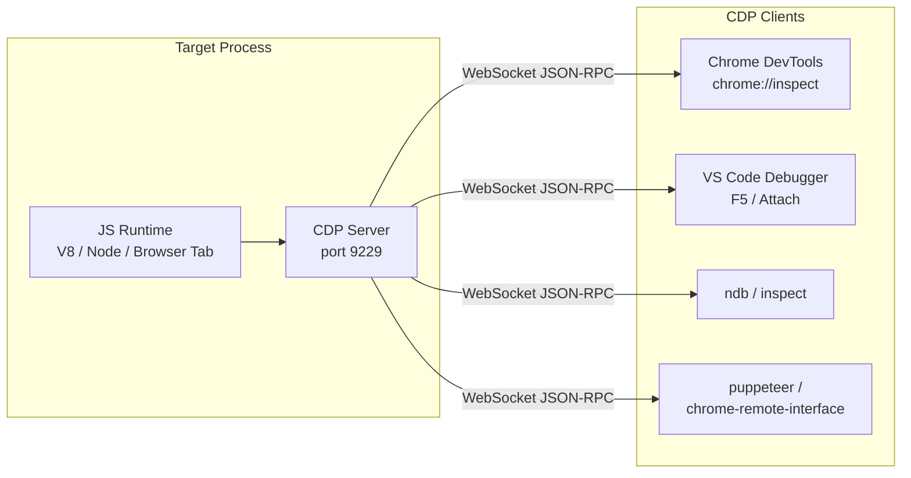
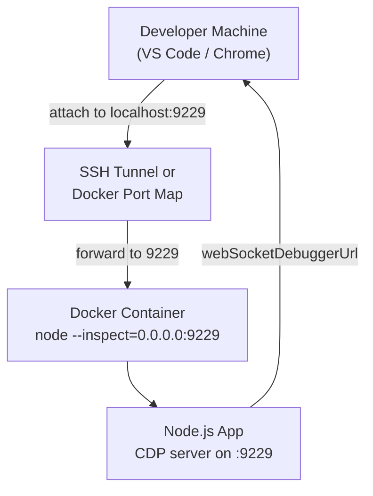
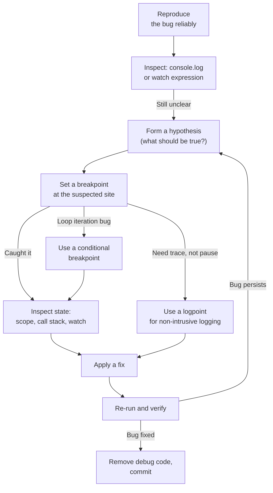

# 6.12 Debugging Techniques DevTools

> The bug is not the enemy. The bug is the universe telling you that your mental model is wrong. Debugging is the act of reconciling your model with the machine, one breakpoint at a time.

This note is the field manual for finding, understanding, and fixing defects in JavaScript, TypeScript, and Node.js code. It covers the full spectrum — from the humble `console.log` to the Chrome DevTools Protocol, from conditional breakpoints to remote debugging of Node.js clusters running inside Docker — and gives you the mental models to choose the right tool for each situation.

---

## 1. Purpose

Bugs are inevitable. Every non-trivial program contains assumptions that turn out to be wrong, edge cases that were never considered, race conditions that only manifest under load, and integrations that fail in surprising ways. The question is not whether you will encounter bugs, but how fast you can diagnose and fix them when they appear. Fast debugging is the single largest multiplier of developer productivity after typing speed.

The toolbox available to a modern JavaScript/TypeScript/Node.js developer is broad:

- **`console.log`** — the universal first responder. Zero setup, zero ceremony, instant feedback. Excellent for quick sanity checks; terrible for anything that requires understanding state across many iterations or async hops.
- **The `debug` package** — namespaced logging controlled by an environment variable. Lets you ship logging code in production and toggle it on demand without redeploying. The de facto standard for libraries like Express, Koa, Mongoose, and Socket.IO.
- **Chrome DevTools** — a full-featured debugger available in every Chrome installation. The Sources panel lets you set breakpoints, step through code, inspect the call stack and scope, watch expressions, and even edit live code. Crucially, Chrome DevTools also speaks the Chrome DevTools Protocol (CDP), which means the same UI can debug Node.js processes.
- **VS Code built-in debugger** — a tightly integrated debugging experience that lives one keystroke (`F5`) away from your editor. Supports launch configurations, attach modes, compound configs, conditional breakpoints, logpoints, and the same CDP under the hood.
- **The Node.js inspector** — `node --inspect` exposes the CDP on port 9229, allowing any CDP-compatible client (Chrome, VS Code, ndb, puppeteer) to attach and debug.
- **Remote debugging** — `node --inspect=0.0.0.0:9229` exposes the protocol on all interfaces, letting you debug a process running in Docker, on a staging server, or across continents.

The central trade-off is **speed of setup vs power of inspection**. `console.log` requires nothing but a keyboard and gives you a single value at a single moment in time. A breakpoint requires a small amount of setup but lets you freeze the program, walk up the call stack, inspect every variable in every closure, evaluate arbitrary expressions in the current scope, and even modify live state before resuming. For trivial bugs the log wins; for subtle bugs the breakpoint wins by an order of magnitude.

This note exists because most developers reach for `console.log` long past the point where it stops being useful, and never learn the small set of techniques that would make their debugging 10x faster. By the end you should be fluent in: setting up VS Code debugging; using conditional breakpoints and logpoints; instrumenting code with the `debug` package; and attaching a debugger to a remote Node.js process.

---

## 2. Theory and Deep Dive

### 2.1 The Chrome DevTools Protocol

Everything modern in JS debugging rests on one foundation: the **Chrome DevTools Protocol** (CDP). CDP is a JSON-RPC-style protocol over WebSocket that exposes a large surface of "domains" — Page, DOM, Network, Runtime, Debugger, Profiler, HeapProfiler, and many more. When you open DevTools in Chrome, the tab you are inspecting runs a CDP server, and the DevTools frontend is a web app that connects to it as a CDP client.

The same protocol is implemented by Node.js when you pass `--inspect`. This is why the Chrome DevTools frontend can debug Node.js: it is just another CDP client connecting to a CDP server. VS Code, ndb, puppeteer, Playwright, and the `chrome-remote-interface` npm package are all CDP clients too.

Understanding this single fact demystifies the entire ecosystem. There is no magic. There is a server that exposes debugging primitives (set a breakpoint, evaluate an expression, capture a heap snapshot) and a client that calls them.



### 2.2 The DevTools Frontend

When you press `F12` (or `Cmd+Option+I` on macOS) in Chrome, you get a panel with tabs. The ones that matter for debugging JS are:

- **Elements** — DOM and CSS inspection. Not relevant for Node.js.
- **Console** — REPL with access to the current page's globals. In Node.js it gives you access to the process's globals.
- **Sources** — the debugger. This is where you set breakpoints, step, watch, and inspect scope. Files are organized by origin; sourcemaps let you see the original TypeScript or bundler-input source even when the browser loaded compiled output.
- **Network** — request/response inspection, throttling, blocking. Vital for web debugging.
- **Performance** — CPU profiling (the flame chart) and runtime metrics.
- **Memory** — heap snapshots, allocation timelines, and allocation sampling. The primary tool for hunting memory leaks.
- **Application** — storage, cookies, service workers.

### 2.3 Breakpoints

A breakpoint tells the runtime: "when execution reaches this line, pause and hand control to the attached debugger." Once paused, the debugger can read any variable in any visible scope, evaluate expressions, walk the call stack, and resume, step over, step into, or step out.

There are several kinds of breakpoint in DevTools:

1. **Line breakpoint** — click the gutter next to a line. The runtime pauses when execution reaches it.
2. **Conditional breakpoint** — right-click the gutter, choose "Add conditional breakpoint", enter a JS expression. The runtime evaluates the expression each time the line is reached and pauses only when it is truthy. This is the single most underused feature in DevTools.
3. **Logpoint** — right-click the gutter, choose "Add logpoint", enter a JS expression. The runtime evaluates the expression each time the line is reached and logs the result to the console **without pausing**. This is `console.log` without modifying source code.
4. **Exception breakpoint** — toggle "Pause on caught exceptions" or "Pause on uncaught exceptions" in the Sources panel. The runtime pauses when an exception is thrown.
5. **DOM breakpoint** — right-click a DOM node in the Elements panel and choose "Break on subtree modifications" etc. Useful for tracking down unwanted DOM mutations.
6. **XHR / fetch breakpoint** — pause when a network request matches a URL substring.
7. **Event listener breakpoint** — pause when a specific event (click, submit, etc.) fires.
8. **Function breakpoint** — `debug(fn)` in the console pauses whenever `fn` is called.

### 2.4 Conditional Breakpoints in Depth

A conditional breakpoint is implemented by the runtime as: "evaluate this expression at this location; if it returns truthy, pause." The expression runs in the scope of the breakpoint, so you can reference any in-scope variable. You can also call functions, though that has side effects and should be used carefully.

Typical uses:

- A loop runs a thousand times and only the 742nd iteration is wrong. Set a conditional breakpoint `i === 742` (or `index === 742` if your loop uses `index`).
- A function is called from many places but only misbehaves when `user.role === 'admin'`. Set `user.role === 'admin'`.
- An object is sometimes `null`. Set `obj === null` to find the exact call site that produces the null.

Without conditional breakpoints you would either add `if (i === 742) debugger;` to the source (mutation, risk of commit) or hit `F8` (continue) 741 times (soul-destroying). Conditional breakpoints are the clean answer.

### 2.5 Logpoints in Depth

Logpoints are the modern replacement for "I just need to print this value but I do not want to redeploy." The runtime evaluates the expression at the breakpoint location and writes the result to the console, then continues. The source file is not modified, so there is no risk of leaking debug code into a commit.

Logpoints shine when:

- You want to trace the order of function calls without stepping through every line.
- You want to log a value that exists only inside a private closure.
- You want to add logging in a third-party library you do not control.

One subtle point: logpoints are still breakpoints. They are implemented as conditional breakpoints whose condition has a side effect (a console write) and returns `false` (so they never pause). This means they have a small but nonzero per-hit cost — fine for normal code, potentially catastrophic in a tight loop.

### 2.6 Node.js Debugging with `--inspect`

To debug a Node.js program, start it with the `--inspect` flag:

```bash
node --inspect script.js
```

This exposes the CDP on `127.0.0.1:9229`. Open Chrome and navigate to `chrome://inspect`. Your process appears under "Remote Target". Click "inspect" and the full DevTools frontend opens, attached to your Node process.

Two important variants:

- `node --inspect-brk script.js` — break on the very first line. Use this for bugs that occur during startup, before your code reaches a point where you could set a breakpoint manually.
- `node --inspect=0.0.0.0:9229 script.js` — listen on all interfaces. Use this for remote debugging (Docker, staging servers). **This exposes the debugger to anyone who can reach the port — never use it on the public internet without authentication.**

By default, `--inspect` listens on `127.0.0.1` only, which is safe. The danger begins when you change the bind address.

When you start a Node process with `--inspect`, you will see a message like:

```
Debugger listening on ws://127.0.0.1:9229/abc123...
```

The hash at the end is the unique ID of the target. To list all available targets, hit `http://127.0.0.1:9229/json` in a browser or with curl. This returns a JSON array of targets, each with a `webSocketDebuggerUrl` you can connect to directly.

### 2.7 VS Code Debugger

VS Code ships a debugger that uses CDP under the hood. You configure it with a `launch.json` file inside the `.vscode` directory. A typical config:

```json
{
  "version": "0.2.0",
  "configurations": [
    {
      "type": "node",
      "request": "launch",
      "name": "Debug Current File",
      "program": "${file}",
      "outFiles": ["${workspaceFolder}/dist/**/*.js"],
      "sourceMaps": true
    },
    {
      "type": "node",
      "request": "attach",
      "name": "Attach to Remote",
      "address": "localhost",
      "port": 9229,
      "localRoot": "${workspaceFolder}",
      "remoteRoot": "/app"
    }
  ]
}
```

The two most important request types are:

- **`launch`** — VS Code starts the Node process itself and attaches. Best for local development. You get full control of the working directory, environment variables, and arguments.
- **`attach`** — VS Code connects to an already-running process. Best for debugging Docker containers, tests running in a watcher, or processes started by another tool.

Once a debug session is active, you get:

- The **Run and Debug** sidebar with Variables, Watch, Call Stack, Breakpoints.
- The floating debug toolbar with Continue (`F8`), Step Over (`F10`), Step Into (`F11`), Step Out (`Shift+F11`), Restart, and Stop.
- Hover-to-evaluate on any variable in the editor.
- Inline variable values displayed at the end of each line.
- The Debug Console for evaluating expressions in the paused context.

### 2.8 Remote Debugging

Remote debugging means attaching a debugger to a process running somewhere other than your local machine — most commonly inside a Docker container, on a staging server, or in a CI runner.

The recipe is:

1. Start the remote process with `node --inspect=0.0.0.0:9229 script.js` (or the equivalent in your container's entrypoint).
2. Ensure the port is reachable from your machine (Docker port map `-p 9229:9229`, SSH tunnel, or VPN).
3. Open `chrome://inspect` in Chrome, click "Configure..." next to "Discover network targets", and add `localhost:9229` (or whatever host:port you are tunneling to).
4. Click "inspect" when your target appears.

For VS Code, use an `attach` configuration pointing at the same host:port. Map `localRoot` and `remoteRoot` so VS Code can translate between the file paths the remote process reports and the source files on your disk.



### 2.9 The `debug` Package

The `debug` package by TJ Holowaychuk is the most widely used logging library in the Node ecosystem. It is tiny, fast, and built around a single idea: **namespaced logging toggled by an environment variable**.

The core API:

```js
import debug from 'debug';
const log = debug('app:db');
log('connecting to %s', url);   // does nothing by default
```

Run with `DEBUG=app:db node script.js` and the log fires. Run with `DEBUG=app:*` and every namespace starting with `app:` fires. Run with `DEBUG=*` and everything fires. Run without `DEBUG` and the program is silent. This means you can ship logging code in production and toggle it on demand — no redeploy, no code change, just an env var.

Internally, `debug` reads `process.env.DEBUG` once at startup and constructs a regex from it. Each namespace becomes a function that, when called, checks the regex and either prints or no-ops. The overhead when disabled is a single regex match per call — small enough that you can leave the calls in.

The conventions:

- Use colons to nest namespaces: `app`, `app:db`, `app:db:query`, `app:http`, `app:auth`.
- Use `*` as a wildcard: `app:*` matches everything under `app:`.
- Use `-` to exclude: `app:*,-app:verbose` enables everything under `app:` except `app:verbose`.
- In the browser, `debug` writes to `console.debug` and is toggled by `localStorage.debug = 'app:*'` instead of an env var.

### 2.10 The Debug Session Flow

A typical debugging session moves through predictable stages. Recognizing them helps you choose the right tool at each step.



---

## 3. Mental Models

Strong debuggers carry a small set of mental models that they apply instinctively. Internalize these and the right tool becomes obvious.

### 3.1 DevTools = "The Inspector"

Think of DevTools as an inspector with the power to freeze time. When the program is running normally, you cannot see anything — variables change too fast, async hops blur the sequence, closures hide their internals. When you hit a breakpoint, time stops. You can walk around the frozen scene, open every drawer, read every note, and even rewrite history (by changing a variable's value) before letting time resume.

### 3.2 Conditional Breakpoint = "Pause Only When This Is True"

A regular breakpoint pauses every time. A conditional breakpoint is a filter: "I am interested in this line, but only when this specific situation arises." The situation can be a value (`user.id === 42`), a count (`counter > 1000`), a state (`state.phase === 'commit'`), or a combination (`req.method === 'POST' && req.path.startsWith('/admin')`). Use them whenever you would otherwise write `if (condition) debugger;` in the source.

### 3.3 Logpoint = "Log Without Pausing"

A logpoint is `console.log` that lives in the debugger, not in the source. It costs you nothing to add or remove, never gets committed, and works on third-party code you cannot edit. Use it when you want a trace of execution but do not want to stop the program — for example, to confirm the order of events in an async flow.

### 3.4 `--inspect` = "Expose the Debug Protocol"

Passing `--inspect` is the act of opening a door. Without it, the Node process is a black box: you can read its stdout, but you cannot look inside. With it, the process becomes a CDP server, and any CDP client can connect, set breakpoints, evaluate expressions, and capture heap snapshots. The flag itself does not debug anything — it just makes debugging possible.

### 3.5 `--inspect-brk` = "Pause at the Front Door"

`--inspect` lets the program start running and only pauses when it hits a breakpoint you set. `--inspect-brk` pauses on the very first line, before any of your code runs. This is the difference between arriving at a crime scene after the deed and being there waiting when the perpetrator walks in. Use `--inspect-brk` for startup bugs — module load order, configuration parsing, early initialization.

### 3.6 The `debug` Package = "Namespaced Logging, Enable via Env Var"

Think of `debug` not as a logger but as a tap you can turn on or off without touching code. Every `debug('namespace')` call installs a tap; the `DEBUG` env var decides which taps are open. This means logging is always in the code, ready to be activated when something goes wrong, but silent in normal operation.

### 3.7 Source Maps = "The Translation Layer"

When you debug compiled TypeScript or bundled JavaScript, the code the runtime executes is not the code you wrote. Source maps are the JSON files that translate between the two. Without them, breakpoints set in your `.ts` file have no effect because the runtime has no idea which line in the compiled `.js` corresponds to it. Source maps are the prerequisite for sane debugging of any non-trivial TS project. See [[6.11 Source Maps]] for the full theory.

### 3.8 The Call Stack = "How Did I Get Here?"

The call stack is the breadcrumb trail of function calls that led to the current pause point. Reading it from top to bottom tells you the exact path execution took. For async code, modern DevTools reconstruct the async call stack so you can see across `await` and `then` boundaries. When you are paused at a surprise location, the call stack is usually the first thing to read.

---

## 4. Real-World Use Cases

### 4.1 Debugging a Tricky Bug

A user reports that occasionally a checkout request returns 500. Most checkouts work. You cannot reproduce locally. You add a logpoint at the start of the request handler that logs the request body and user id. After an hour you have a trace showing that the failing requests all share a particular payment method token format. You set a conditional breakpoint that checks whether the token starts with the expected payment-method prefix (something like `paymentMethod.token.startsWith('pm-') === false`) on the line that parses the token. Within minutes you catch the case: a stale client is sending the legacy card prefix (something like `card-`) instead. The fix is a one-line normalization.

The lesson: logpoints gave you the trace without redeploying; the conditional breakpoint then isolated the rare case in a busy code path.

### 4.2 Performance Profiling

A route that used to respond in 80 ms now takes 700 ms after a refactor. You open DevTools, switch to the Performance tab, hit Record, and trigger the route. The flame chart shows that 600 ms is spent in a single function that walks a tree of 50,000 nodes — recursively, on every request. You add a `Map`-based cache, the route drops back to 80 ms.

Profiling is debugging for performance: you freeze the program in aggregate (sampling profiler) instead of at a single line, and read the flame chart to find the hot path. See [[7.01 Profiling CPU Usage]].

### 4.3 Memory Leak Hunting

Long-running process's RSS climbs steadily over days until the OOM killer fires. You attach Chrome DevTools, take a heap snapshot, let the process run for an hour, take another, and use the "Comparison" view. DevTools lists objects allocated between the snapshots, sorted by retained size. The biggest delta is a `Map` of WebSocket connections that is never cleaned up when clients disconnect.

Heap snapshots are the memory equivalent of a breakpoint: they freeze the heap at a moment in time and let you walk object references to find what is keeping them alive. See [[1.29 Memory Leaks Diagnostic]] and [[7.02 Memory Leak Identification]].

### 4.4 Remote Debugging a Docker Container

A bug only reproduces in the staging Docker image, which has a different glibc version, a different Node.js build, and a different set of environment variables than your local machine. You rebuild the image with `CMD ["node", "--inspect=0.0.0.0:9229", "dist/main.js"]`, map port 9229 with `docker run -p 9229:9229 ...`, and attach VS Code with an `attach` config. You set a breakpoint in the failing route, hit it, and inspect the environment — `process.env.SOMEFEATUREFLAG` is `undefined` in the container because the entrypoint script does not load it.

Remote debugging collapses the gap between "works on my machine" and "fails in staging." See the Mini-Project Blueprint below for a complete setup.

### 4.5 Namespaced Logging in a Library

You publish a small HTTP client library. Users occasionally report cryptic retries. You instrument the library with `debug('httpclient:retry')`, `debug('httpclient:request')`, and `debug('httpclient:response')`. Users run their app with `DEBUG=httpclient:*` and instantly see the retry decisions, the headers, and the response codes. You never need a release for diagnostic visibility — the logging was always there, just dormant.

This is the same model Express, Mongoose, and Koa use. The `debug` package is the reason you can get a full trace of what an Express app is doing by setting one environment variable.

---

## 5. Code Examples

Every example below is shown in both JavaScript and TypeScript. The TS versions add types but the debugging techniques are identical.

### 5.1 Example A — Minimal and Conceptual

The minimal set: a `console.log`, a `debug` namespace, and a breakpoint. The goal is to inspect the state of a function that doubles every element of an array and (intentionally) produces a wrong result on one input.

#### JavaScript

```javascript
// debug-basics.js
const debug = require('debug'); // or: import debug from 'debug';
const log = debug('app:doubler');

function double(value) {
  // Logpoint candidate: log('double called with', value)
  // Conditional breakpoint candidate: value === 7
  const result = value * 2;
  log('double(%d) => %d', value, result);
  return result;
}

function doubleAll(numbers) {
  const out = [];
  for (let i = 0; i < numbers.length; i++) {
    // Set a conditional breakpoint here: numbers[i] === 7
    out.push(double(numbers[i]));
  }
  return out;
}

const input = [1, 2, 3, 7, 9];
const result = doubleAll(input);
console.log('result:', result);
```

Run it:

```bash
DEBUG=app:* node debug-basics.js
```

To debug:

1. Run with `node --inspect-brk debug-basics.js`.
2. Open `chrome://inspect`, click "inspect".
3. In the Sources panel, open `debug-basics.js`.
4. Click the gutter next to the line `out.push(double(numbers[i]));` to add a breakpoint.
5. Right-click the breakpoint, choose "Edit breakpoint", enter `numbers[i] === 7`.
6. Press `F8` to resume. The program pauses only when `numbers[i] === 7`.
7. Inspect the Call Stack and Scope panels.

#### TypeScript

```typescript
// debug-basics.ts
import debug from 'debug';
const log = debug('app:doubler');

function double(value: number): number {
  const result = value * 2;
  log('double(%d) => %d', value, result);
  return result;
}

function doubleAll(numbers: readonly number[]): number[] {
  const out: number[] = [];
  for (let i = 0; i < numbers.length; i++) {
    // Conditional breakpoint: numbers[i] === 7
    out.push(double(numbers[i]));
  }
  return out;
}

const input: readonly number[] = [1, 2, 3, 7, 9];
const result = doubleAll(input);
console.log('result:', result);
```

Compile with source maps:

```bash
tsc --sourceMap debug-basics.ts
node --inspect-brk debug-basics.js
```

Open `chrome://inspect`, open `debug-basics.ts` (not the `.js`) in the Sources panel — Chrome reads the source map and shows you the original TypeScript. Set the conditional breakpoint on the TS line; DevTools translates it to the corresponding JS line.

#### A Logpoint Variation

Instead of pausing, suppose you just want to confirm the order of calls. Right-click the gutter, choose "Add logpoint", enter `i, numbers[i], double(numbers[i])`. The program runs to completion and prints, on the console:

```
logpoint in debug-basics.ts:line:col  0 1 2
logpoint in debug-basics.ts:line:col  1 2 4
logpoint in debug-basics.ts:line:col  2 3 6
logpoint in debug-basics.ts:line:col  3 7 14
logpoint in debug-basics.ts:line:col  4 9 18
```

No source mutation. No redeploy. Pure trace.

### 5.2 Example B — Production-Grade

A small Express-style server (we use plain `http` to keep dependencies minimal) with namespaced `debug` logging, a typed request context, a VS Code launch config that supports source maps, a Dockerfile that exposes the inspector, and an attach config for remote debugging.

#### JavaScript — `src/server.js`

```javascript
// src/server.js
const http = require('http');
const debug = require('debug');

const log = debug('app:server');
const reqLog = debug('app:server:request');
const errLog = debug('app:server:error');

const PORT = Number(process.env.PORT || 3000);

function handleCheckout(body) {
  // Conditional breakpoint candidate: body.userId === 42
  // Logpoint candidate: log('checkout body', body)
  const amount = Number(body.amount);
  if (!Number.isFinite(amount) || amount <= 0) {
    const err = new Error('Invalid amount');
    err.code = 'INVALIDAMOUNT';
    throw err;
  }
  return { ok: true, amount, capturedAt: Date.now() };
}

const server = http.createServer((req, res) => {
  if (req.method !== 'POST' || req.url !== '/checkout') {
    res.writeHead(404);
    res.end('not found');
    return;
  }

  const chunks = [];
  req.on('data', (c) => chunks.push(c));
  req.on('end', () => {
    try {
      const body = JSON.parse(Buffer.concat(chunks).toString('utf8'));
      reqLog('checkout request userId=%s amount=%s', body.userId, body.amount);
      const result = handleCheckout(body);
      res.writeHead(200, { 'content-type': 'application/json' });
      res.end(JSON.stringify(result));
    } catch (err) {
      errLog('checkout failed code=%s message=%s', err.code, err.message);
      res.writeHead(err.code ? 400 : 500, { 'content-type': 'application/json' });
      res.end(JSON.stringify({ ok: false, code: err.code, message: err.message }));
    }
  });
});

server.listen(PORT, () => {
  log('server listening on port %d', PORT);
});

module.exports = { server, handleCheckout };
```

#### TypeScript — `src/server.ts`

```typescript
// src/server.ts
import http from 'node:http';
import debug from 'debug';

const log = debug('app:server');
const reqLog = debug('app:server:request');
const errLog = debug('app:server:error');

interface CheckoutRequest {
  userId: number;
  amount: number;
  method: string;
}

interface CheckoutResponse {
  ok: boolean;
  amount?: number;
  capturedAt?: number;
  code?: string;
  message?: string;
}

class HttpError extends Error {
  constructor(message: string, public code: string) {
    super(message);
    this.name = 'HttpError';
  }
}

function handleCheckout(body: CheckoutRequest): { ok: true; amount: number; capturedAt: number } {
  // Conditional breakpoint candidate: body.userId === 42
  const amount = Number(body.amount);
  if (!Number.isFinite(amount) || amount <= 0) {
    throw new HttpError('Invalid amount', 'INVALIDAMOUNT');
  }
  return { ok: true, amount, capturedAt: Date.now() };
}

const PORT = Number(process.env.PORT || 3000);

const server = http.createServer((req, res) => {
  if (req.method !== 'POST' || req.url !== '/checkout') {
    res.writeHead(404);
    res.end('not found');
    return;
  }

  const chunks: Buffer[] = [];
  req.on('data', (c: Buffer) => chunks.push(c));
  req.on('end', () => {
    try {
      const body = JSON.parse(Buffer.concat(chunks).toString('utf8')) as CheckoutRequest;
      reqLog('checkout request userId=%s amount=%s', body.userId, body.amount);
      const result = handleCheckout(body);
      res.writeHead(200, { 'content-type': 'application/json' });
      res.end(JSON.stringify(result));
    } catch (err) {
      const e = err as HttpError;
      errLog('checkout failed code=%s message=%s', e.code, e.message);
      res.writeHead(e.code ? 400 : 500, { 'content-type': 'application/json' });
      const response: CheckoutResponse = { ok: false, code: e.code, message: e.message };
      res.end(JSON.stringify(response));
    }
  });
});

server.listen(PORT, () => {
  log('server listening on port %d', PORT);
});

export { server, handleCheckout };
```

#### TSConfig with Source Maps — `tsconfig.json`

```json
{
  "compilerOptions": {
    "target": "ES2022",
    "module": "CommonJS",
    "moduleResolution": "Node",
    "outDir": "dist",
    "rootDir": "src",
    "strict": true,
    "sourceMap": true,
    "inlineSources": true,
    "esModuleInterop": true,
    "resolveJsonModule": true
  },
  "include": ["src/**/*"]
}
```

The two keys that matter for debugging are `"sourceMap": true` (emits a `.map` file beside each `.js`) and `"inlineSources": true` (embeds the original source in the map so DevTools can display it even if the `.ts` files are not on disk).

#### VS Code Launch Config — `.vscode/launch.json`

```json
{
  "version": "0.2.0",
  "configurations": [
    {
      "type": "node",
      "request": "launch",
      "name": "Debug Server (TS)",
      "runtimeArgs": ["--inspect-brk", "-r", "ts-node/register", "src/server.ts"],
      "env": { "DEBUG": "app:*" },
      "skipFiles": ["${workspaceFolder}/dist/**"]
    },
    {
      "type": "node",
      "request": "launch",
      "name": "Debug Server (compiled)",
      "program": "${workspaceFolder}/dist/server.js",
      "outFiles": ["${workspaceFolder}/dist/**/*.js"],
      "sourceMaps": true,
      "env": { "DEBUG": "app:*" },
      "skipFiles": ["${workspaceFolder}/dist/**"]
    },
    {
      "type": "node",
      "request": "attach",
      "name": "Attach to Docker",
      "address": "localhost",
      "port": 9229,
      "localRoot": "${workspaceFolder}",
      "remoteRoot": "/app",
      "sourceMaps": true,
      "outFiles": ["${workspaceFolder}/dist/**/*.js"]
    }
  ]
}
```

Three configurations cover every workflow:

1. **Debug Server (TS)** — runs the TS directly via `ts-node`, breaks on first line, with `DEBUG=app:*`. Best for fast iteration without a build step.
2. **Debug Server (compiled)** — runs the compiled output, using source maps to display TS. Best when you want to debug exactly what will ship.
3. **Attach to Docker** — connects to a process already running with `--inspect`, mapping local source to `/app` in the container.

#### Dockerfile for Remote Debugging

```dockerfile
# Dockerfile.debug
FROM node:20-bookworm-slim

WORKDIR /app

COPY package*.json ./
RUN npm ci --omit=dev

COPY tsconfig.json ./
COPY src ./src
RUN npm run build

ENV APPENV=production
ENV PORT=3000
EXPOSE 3000 9229

# --inspect=0.0.0.0 so the host can attach through the port map
CMD ["node", "--inspect=0.0.0.0:9229", "dist/server.js"]
```

Run it:

```bash
docker build -t checkout-server:debug -f Dockerfile.debug .
docker run --rm -p 3000:3000 -p 9229:9229 checkout-server:debug
```

Then in VS Code, choose the "Attach to Docker" configuration and press `F5`. Set a breakpoint in `src/server.ts` on the `handleCheckout(body)` call. Send a request:

```bash
curl -X POST http://localhost:3000/checkout \
  -H 'content-type: application/json' \
  -d '{"userId":42,"amount":100,"method":"card"}'
```

VS Code pauses at your breakpoint. You can inspect `body`, step into `handleCheckout`, evaluate `Number(body.amount)` in the Debug Console, and verify the logic.

#### Remote Attach from Chrome

Alternatively, open `chrome://inspect` in a Chrome window, click "Configure..." next to "Discover network targets", and add `localhost:9229`. Your container appears under "Remote Target". Click "inspect" to get the full DevTools UI attached to the containerized Node process.

#### Toggling Logging at Runtime

Because the server uses `debug`, you can change verbosity by changing the `DEBUG` env var when you start the container:

```bash
# Only see request logs
docker run --rm -p 3000:3000 -p 9229:9229 -e DEBUG=app:server:request checkout-server:debug

# See everything
docker run --rm -p 3000:3000 -p 9229:9229 -e DEBUG='app:*' checkout-server:debug

# See everything except errors
docker run --rm -p 3000:3000 -p 9229:9229 -e DEBUG='app:*,-app:server:error' checkout-server:debug
```

No code change. No rebuild. Just an env var.

---

## 6. Common Mistakes and Anti-Patterns

### 6.1 `console.log` Left in Production Code

The classic. You added `console.log('here 1')`, `console.log('here 2')`, `console.log('user', user)` while chasing a bug, got it working, committed, and shipped. Now your production logs are full of garbage, your log aggregator is charging you for noise, and your security team is asking why PII is in the logs.

**Fix**: Use the `debug` package for any logging that is for diagnosis. Reserve `console.log` for messages that are intentionally user-facing (CLI tool output, server startup banner). Add a lint rule that flags `console.log` in `src/`:

```json
{
  "rules": {
    "no-console": ["error", { "allow": ["warn", "error"] }]
  }
}
```

### 6.2 No Breakpoints, Only Logs

You have a bug. You add a `console.log`. You re-run. You add another. You re-run. You add a third. You re-run. Each iteration costs you 30 seconds and a rebuild. By the tenth iteration you have spent five minutes to learn what a single breakpoint would have shown you in ten seconds.

**Fix**: When you find yourself adding more than two `console.log` calls to chase one bug, stop. Set a breakpoint. The breakpoint lets you inspect every variable in scope, walk the call stack, and evaluate expressions — all without modifying code or restarting.

### 6.3 The `debugger;` Statement Left in Code

`debugger;` is a JS statement that, when a debugger is attached, acts like a breakpoint. When no debugger is attached, it is a no-op. Developers sometimes drop `debugger;` into source as a quick breakpoint. The danger: if you commit it, the next person who runs the code under a debugger will hit a mysterious pause with no obvious cause.

**Fix**: Never commit `debugger;`. Add an ESLint rule:

```json
{
  "rules": { "no-debugger": "error" }
}
```

Most teams also add a pre-commit hook that blocks commits containing `debugger;`.

### 6.4 Wrong `--inspect` Port or Address

You start the server with `--inspect=9228` and spend ten minutes wondering why Chrome cannot find it. Or you start it with `--inspect=0.0.0.0:9229` on a public-facing server and a security scanner flags an exposed debugger.

**Fix**: Memorize the defaults. `--inspect` with no argument listens on `127.0.0.1:9229`. To use a different port, you must specify the host too: `--inspect=127.0.0.1:9230`. To expose externally (only on trusted networks), use `0.0.0.0` and add firewall rules. Never expose `0.0.0.0:9229` to the public internet — anyone who can reach it can execute arbitrary code in your process.

### 6.5 No Source Maps — Cannot Set Breakpoints in TS

You compiled your TS to JS without source maps. You open the `.ts` file in VS Code, set a breakpoint, run the program — the breakpoint is a gray hollow circle, never hit. You switch to the `.js` file and the breakpoint works, but you are debugging minified-looking compiled output.

**Fix**: Always compile with `"sourceMap": true`. If you use a bundler (esbuild, webpack, Vite, Rollup), enable its source map option too. Confirm by checking that a `.map` file sits beside every compiled `.js` file. For in-place source display, also enable `"inlineSources": true` in `tsconfig.json` so the source is embedded in the map.

### 6.6 Debugging in Production

You have a bug that only manifests in production. You ssh in, restart the process with `--inspect=0.0.0.0:9229`, attach from your laptop, and start poking around. Two risks: (1) you are running the debugger on real user traffic, so every pause degrades or breaks user requests; (2) anyone else who can reach port 9229 can attach and run arbitrary code in your production process.

**Fix**: Do not debug in production. Use staging or a production-like environment. If you absolutely must, isolate the inspector to a private network, use an SSH tunnel (`ssh -L 9229:localhost:9229 user@host`), and bind to `127.0.0.1` only. Combine with comprehensive `debug`-namespaced logging and an error tracker (Sentry, Bugsnag) so you can diagnose from artifacts rather than live attachment.

### 6.7 Logging Sensitive Data via `debug`

You instrument the auth flow with `debug('app:auth')` and log the full request body — which includes passwords and tokens. The `DEBUG=app:*` flag is now a security footgun.

**Fix**: Never log secrets. Mask tokens and passwords before logging. Build a `redact` helper:

```typescript
function redact(obj: Record<string, unknown>): Record<string, unknown> {
  const sensitive = new Set(['password', 'token', 'authorization', 'ssn']);
  const out: Record<string, unknown> = {};
  for (const [k, v] of Object.entries(obj)) {
    out[k] = sensitive.has(k.toLowerCase()) ? '[REDACTED]' : v;
  }
  return out;
}
const reqLog = debug('app:auth');
reqLog('login attempt %j', redact(body));
```

### 6.8 Conditional Breakpoint That Calls Side-Effecting Functions

You set a conditional breakpoint `saveUser(user).then(ok => ok === false)` thinking it will pause when a save fails. It does pause — but it also calls `saveUser` on every iteration, creating duplicate database writes.

**Fix**: Conditional breakpoint expressions are evaluated in the paused context and have side effects. Keep them pure: comparisons, property access, and `Array.prototype.includes` are fine. Never call functions that mutate state or perform I/O. If you need to inspect a function's return value, set the breakpoint inside the function and inspect its return value before it returns.

### 6.9 Forgetting `skipFiles`

You start a debug session, hit Continue, and the debugger pauses inside Node internals or inside the npm dependencies directory. You step through code you do not care about and lose your place.

**Fix**: Configure `skipFiles` in your VS Code launch config to skip Node internals and the dependencies directory. VS Code recognizes a special placeholder for Node internals (written as a placeholder token surrounded by angle brackets, with the literal text `node` `internals` joined by a single underscore character that this vault cannot render) plus a glob for your dependencies directory. A practical configuration looks like this:

```json
"skipFiles": ["${workspaceFolder}/dist/**"]
```

Add the Node-internals placeholder and your dependencies directory glob on top of this entry. The exact tokens are documented in the VS Code debugging guide. This makes stepping much smoother — the debugger steps over blacklisted files instead of into them.

### 6.10 Debugging a Built Version Without Matching Source Maps

You deploy a build, a bug appears, you rebuild locally to debug — but the local build was compiled with different options or a different bundler version, so the source maps do not line up with what is deployed. Breakpoints pause in the wrong places.

**Fix**: Always store the source maps for every production build. Tag them with the build SHA. When debugging a reproduced issue, use the source maps from the exact build that exhibited the bug, not a fresh local build. See [[6.11 Source Maps]].

---

## 7. Best Practices and Design Patterns

### 7.1 Use `debug` for Namespaced, Toggleable Logging

`debug` is the right default for diagnostic logging. It is silent by default, cheap when disabled, and instantly toggleable via env var. Adopt a naming convention early (`app:layer:subsystem`) and stick to it. Common patterns:

- `app:http` — HTTP server lifecycle.
- `app:db:query` — database queries.
- `app:db:pool` — connection pool events.
- `app:auth` — authentication flow.
- `app:cache:hit` / `app:cache:miss` — cache decisions.

Use `%s`, `%d`, `%j` (or `%o`) format strings instead of template literals so `debug` can format lazily — the formatting only happens if the namespace is enabled.

### 7.2 Use Breakpoints for Complex Bugs

When a bug involves multiple functions, async hops, or shared mutable state, a breakpoint is faster than logs. Set the breakpoint at the earliest point you suspect, inspect state, step forward, and let the program tell you what it is doing rather than the other way around.

### 7.3 Use Conditional Breakpoints for Loops and Hot Paths

Loops that run thousands of times make line breakpoints useless — you cannot press Continue 741 times. A conditional breakpoint (`i === 741`, `item.id === targetId`, `counter > 1000`) pauses exactly when you want.

### 7.4 Use Logpoints for Non-Intrusive Tracing

Logpoints let you trace execution without modifying source. Use them when:

- You want a quick trace of function call order.
- You want to inspect a value inside a private closure.
- You are debugging third-party code you cannot modify.
- You want to avoid the risk of leaving a `console.log` in the code.

### 7.5 Use `--inspect-brk` for Startup Bugs

For bugs in module loading, configuration parsing, or early initialization, `--inspect` is too late — the bug has already happened by the time you connect. `--inspect-brk` pauses on the first line, giving you a chance to set breakpoints before anything runs.

### 7.6 Remove `console.log` and `debugger` Before Every Commit

Treat them like trailing whitespace. Configure ESLint with `no-console` (allowing `warn` and `error`) and `no-debugger`. Add a pre-commit hook (Husky + lint-staged) that runs `eslint --fix` on staged files. The cost is zero; the benefit is never shipping debug noise.

### 7.7 Do Not Debug in Production

Production debugging risks user impact and security exposure. Instead:

- Instrument with `debug` and toggle via env var.
- Use an error tracker (Sentry, Bugsnag) for automatic capture.
- Reproduce locally or in staging with production-like data.
- If you must attach to a production process, use an SSH tunnel and bind to `127.0.0.1`.

### 7.8 Keep Source Maps for Every Build

Source maps are a debugging prerequisite. Store them per build SHA so you can always debug a deployed version. If your build pipeline strips them for size, store them in a separate artifact and load them only when debugging.

### 7.9 Use the Debug Console for Exploration

When paused, the Debug Console is a REPL in the current scope. Use it to evaluate expressions, call functions, and test fixes before applying them. For example, while paused in a function that builds a query, you can type `buildQuery(input)` in the Debug Console to see exactly what it would produce, without unpausing.

### 7.10 Watch Expressions for State You Care About

The Watch panel evaluates expressions on every pause. Add the variables and expressions you care about (`user.id`, `state.phase`, `req.path`) so you can see them at a glance as you step, without re-typing them in the Debug Console.

### 7.11 Snapshot Tests as a Debugging Force Multiplier

When you find a bug, write a failing test that captures it before you fix it. The test becomes a regression guard. The act of writing the test often clarifies the bug. See [[4.13 Refactoring Techniques]] for the relationship between tests and safe refactoring.

### 7.12 Compound Configurations in VS Code

For full-stack debugging (server + client + tests), use a `compounds` entry in `launch.json` to launch multiple configs simultaneously:

```json
{
  "version": "0.2.0",
  "compounds": [
    {
      "name": "Server + Tests",
      "configurations": ["Debug Server (TS)", "Debug Tests"],
      "stopAll": true
    }
  ]
}
```

This launches both, attaches to both, and stops both when you stop either.

---

## 8. Technical Interview Knowledge

### Q1: How do you debug Node.js?

**A**: Several ways depending on the situation. For quick checks, `console.log` or the `debug` package. For deep inspection, start the process with `node --inspect script.js` (or `--inspect-brk` for startup bugs) and attach Chrome DevTools via `chrome://inspect`, or use the VS Code debugger with a `launch.json` configuration. For remote processes (Docker, staging), I use `--inspect=0.0.0.0:9229` (with an SSH tunnel in production) and an `attach` config. For production issues, I rely on `debug`-namespaced logging toggled by env var, plus an error tracker like Sentry — I avoid live debugging in production.

### Q2: What is `--inspect`?

**A**: `--inspect` is a Node.js flag that starts the Chrome DevTools Protocol server on `127.0.0.1:9229`. Any CDP-compatible client (Chrome DevTools, VS Code, ndb) can then attach and debug the process — set breakpoints, evaluate expressions, capture heap snapshots. The variant `--inspect-brk` does the same but pauses on the first line, which is essential for debugging startup. You can also specify a custom host and port with `--inspect=0.0.0.0:9230`, but exposing `0.0.0.0` on a public network is a security risk because anyone who can reach the port can run arbitrary code.

### Q3: What is a conditional breakpoint?

**A**: A breakpoint that pauses execution only when an attached expression evaluates to truthy. The expression runs in the scope of the breakpoint on every hit. It is the right tool for debugging inside loops or hot paths: instead of pausing on every iteration, you can pause only when `i === 742` or `user.role === 'admin'`. Without conditional breakpoints you would either modify source with `if (cond) debugger;` (risky, may be committed) or press Continue hundreds of times.

### Q4: What is a logpoint?

**A**: A breakpoint that evaluates an expression and logs the result to the console without pausing. Internally it is implemented as a conditional breakpoint whose condition has a side effect (a console write) and returns false. Logpoints are useful for non-intrusive tracing: you can add a log to a private closure or to third-party code without modifying source. Because they are still breakpoints, they have a per-hit cost — avoid them in tight inner loops.

### Q5: How do you debug a Node.js process running in Docker?

**A**: Three steps. First, start the process in the container with `node --inspect=0.0.0.0:9229 dist/main.js` so the CDP server listens on all interfaces. Second, map the port when you run the container: `docker run -p 9229:9229 ...`. Third, attach from your host: either open `chrome://inspect`, configure a target at `localhost:9229`, and click inspect; or use a VS Code `attach` config with `address: localhost`, `port: 9229`, and `localRoot`/`remoteRoot` set so VS Code can map file paths between your host source tree and the container's `/app`. Source maps must be present in the container for TS breakpoints to work.

### Q6: What is the `debug` package and why use it?

**A**: `debug` is a tiny logging library built around namespaced logging toggled by an environment variable. You create a logger with `debug('app:db')`, call it like a function (`log('query %s', sql)`), and it is silent unless `DEBUG=app:db` (or `DEBUG=app:*`) is set in the environment. The benefits: logging code is always present (ready to be toggled when something goes wrong) but silent in normal operation; you can selectively enable only the namespaces you care about; the format-string API defers string interpolation until the namespace is enabled, so disabled calls are nearly free. It is the de facto standard for Node libraries.

### Q7: How do you debug in VS Code?

**A**: I configure a `launch.json` file in `.vscode/`. For local development I use a `request: "launch"` config that runs `node --inspect-brk` with `ts-node/register` for TypeScript, sets `env: { DEBUG: "app:*" }`, and includes `skipFiles` to skip Node internals and the dependencies directory. I set breakpoints by clicking the gutter, press `F5` to start, and use the Run and Debug sidebar for Variables, Watch, Call Stack, and Breakpoints. For remote processes I use a `request: "attach"` config pointing at the host and port, with `localRoot` and `remoteRoot` mapped. I also use conditional breakpoints and logpoints directly in the editor gutter — right-click the gutter to add them.

### Q8: How do you avoid leaving debug code in commits?

**A**: Defense in depth. First, prefer the `debug` package over `console.log` for any diagnostic logging — `debug` is silent by default, so leaving it in is harmless. Second, use ESLint rules `no-console` (allowing `warn` and `error`) and `no-debugger` to fail the lint on `console.log` and `debugger;` statements. Third, add a pre-commit hook (Husky + lint-staged) that runs `eslint --fix` on staged files, so the lint runs automatically before each commit. Fourth, code review: a reviewer should flag any `console.log` that is not intentional CLI output. Fifth, prefer logpoints and conditional breakpoints over source-mutating `console.log` calls whenever possible — they leave no trace in source.

---

## 9. Practical Exercises

### Exercise 1: Set Up VS Code Debugging

**Goal**: Configure VS Code to debug a TypeScript file with `ts-node` and source maps, so breakpoints pause in the original TS source.

**Steps**:

1. Create a new directory, run `npm init -y`, install `typescript`, `ts-node`, and `debug`.
2. Create `tsconfig.json` with `"sourceMap": true` and `"inlineSources": true`.
3. Create `src/index.ts` with a function that loops over an array and calls a helper.
4. Create `.vscode/launch.json` with a `launch` config that runs `ts-node/register` on `src/index.ts`.
5. Set a breakpoint in the helper, press `F5`, and confirm VS Code pauses inside the TS source.

**Full Solution**:

`package.json` (excerpt):

```json
{
  "name": "debug-exercise-1",
  "version": "1.0.0",
  "scripts": {
    "start": "ts-node src/index.ts",
    "build": "tsc"
  },
  "devDependencies": {
    "ts-node": "^10.9.2",
    "typescript": "^5.4.5"
  },
  "dependencies": {
    "debug": "^4.3.5"
  }
}
```

`tsconfig.json`:

```json
{
  "compilerOptions": {
    "target": "ES2022",
    "module": "CommonJS",
    "moduleResolution": "Node",
    "outDir": "dist",
    "rootDir": "src",
    "strict": true,
    "sourceMap": true,
    "inlineSources": true,
    "esModuleInterop": true
  },
  "include": ["src/**/*"]
}
```

`src/index.ts`:

```typescript
import debug from 'debug';
const log = debug('app:index');

interface Item {
  id: number;
  name: string;
}

function processItem(item: Item): string {
  // Set a breakpoint here.
  log('processing id=%d name=%s', item.id, item.name);
  return `${item.name.toUpperCase()}-${item.id}`;
}

function main(): void {
  const items: Item[] = [
    { id: 1, name: 'alpha' },
    { id: 2, name: 'beta' },
    { id: 3, name: 'gamma' },
  ];
  for (const item of items) {
    const result = processItem(item);
    console.log(result);
  }
}

main();
```

`.vscode/launch.json`:

```json
{
  "version": "0.2.0",
  "configurations": [
    {
      "type": "node",
      "request": "launch",
      "name": "Debug index.ts",
      "runtimeArgs": ["--inspect-brk", "-r", "ts-node/register", "src/index.ts"],
      "env": { "DEBUG": "app:*" },
      "skipFiles": ["${workspaceFolder}/dist/**"]
    }
  ]
}
```

Open `src/index.ts`, click the gutter next to the `log('processing id=%d name=%s', ...)` line, press `F5`. The program pauses. Inspect `item` in the Variables panel. Add `item.name.toUpperCase()` to the Watch panel. Press `F10` to step over. Press `F8` to continue to the next iteration.

### Exercise 2: Use a Conditional Breakpoint

**Goal**: Pause execution only on a specific iteration of a loop, without modifying source.

**Steps**:

1. Reuse the project from Exercise 1.
2. Modify `main` to loop 1,000 times with an artificial bug on iteration 742.
3. Set a conditional breakpoint that pauses only on iteration 742.
4. Inspect the state at the pause.

**Full Solution**:

`src/conditional.ts`:

```typescript
import debug from 'debug';
const log = debug('app:conditional');

function buggyTransform(n: number): number {
  // Bug: every 742nd call returns NaN.
  if (Math.random() < 0.00001) {
    return NaN;
  }
  return n * 2;
}

function main(): void {
  for (let i = 0; i < 1000; i++) {
    const input = i;
    const output = buggyTransform(input);
    // Conditional breakpoint: Number.isNaN(output)
    log('i=%d output=%s', i, output);
  }
}

main();
```

Procedure:

1. Open `src/conditional.ts` in VS Code.
2. Right-click the gutter next to `log('i=%d output=%s', i, output);` and choose "Add Conditional Breakpoint".
3. Enter `Number.isNaN(output)` as the condition.
4. Press `F5` (or run with `node --inspect-brk -r ts-node/register src/conditional.ts` and attach via `chrome://inspect`).
5. The program runs through most iterations and pauses only when `output` is `NaN`.
6. In the Variables panel, inspect `i`, `input`, and `output`. In the Call Stack, click `buggyTransform` to see why it returned `NaN`.
7. Hover over `Math.random()` in the call stack frame — note that it was less than `0.00001`.

Without a conditional breakpoint you would have hit Continue hundreds of times. With one, you skip straight to the interesting case.

### Exercise 3: Set Up `debug` Namespaced Logging

**Goal**: Build a small app with three subsystems (http, db, auth) each with its own `debug` namespace, and demonstrate toggling them via env var.

**Steps**:

1. Create `src/app.ts` with three modules: `http`, `db`, `auth`.
2. Each module creates its own `debug` logger with a distinct namespace.
3. The app runs a fake request flow that calls each.
4. Run with different `DEBUG` values and observe the output.

**Full Solution**:

`src/app.ts`:

```typescript
import debug from 'debug';

const httpLog = debug('app:http');
const dbLog = debug('app:db');
const authLog = debug('app:auth');

interface User {
  id: number;
  role: 'admin' | 'user';
}

function dbFindUser(id: number): User {
  dbLog('query SELECT * FROM users WHERE id=%d', id);
  return { id, role: id === 1 ? 'admin' : 'user' };
}

function authCheck(user: User, action: string): boolean {
  const allowed = user.role === 'admin' || action === 'read';
  authLog('check user=%d action=%s allowed=%s', user.id, action, allowed);
  return allowed;
}

function httpHandle(method: string, path: string, userId: number): void {
  httpLog('request %s %s user=%d', method, path, userId);
  const user = dbFindUser(userId);
  const ok = authCheck(user, 'read');
  httpLog('response %d allowed=%s', ok ? 200 : 403, ok);
}

function main(): void {
  httpHandle('GET', '/items', 1);
  httpHandle('GET', '/items', 2);
  httpHandle('POST', '/items', 2);
}

main();
```

Run with different `DEBUG` values and observe:

```bash
# Only HTTP logs
DEBUG=app:http node -r ts-node/register src/app.ts
# Output:
#   app:http request GET /items user=1 +0ms
#   app:http response 200 allowed=true +2ms
#   app:http request GET /items user=2 +0ms
#   app:http response 200 allowed=true +0ms
#   app:http request POST /items user=2 +0ms
#   app:http response 403 allowed=false +0ms

# Everything
DEBUG=app:* node -r ts-node/register src/app.ts

# Everything except auth
DEBUG='app:*,-app:auth' node -r ts-node/register src/app.ts

# Wildcard across the db subtree (useful when you add app:db:query, app:db:pool)
DEBUG=app:db:* node -r ts-node/register src/app.ts
```

Notice that with no `DEBUG` set, the program is completely silent — but the logging code is still there, ready to be enabled.

### Exercise 4: Debug a Remote Node.js Process

**Goal**: Run a Node.js process in a Docker container with `--inspect=0.0.0.0:9229`, attach VS Code from the host, set a breakpoint, and inspect a request.

**Steps**:

1. Build a tiny HTTP server in TS, compile it, and ship it in a Docker image with `--inspect=0.0.0.0:9229`.
2. Run the container with `-p 3000:3000 -p 9229:9229`.
3. Add an `attach` config to VS Code and connect.
4. Set a breakpoint in the request handler.
5. Send a request with `curl` and inspect the paused state.

**Full Solution**:

`src/server.ts`:

```typescript
import http from 'node:http';
import debug from 'debug';

const log = debug('app:server');
const PORT = Number(process.env.PORT || 3000);

interface EchoBody {
  message: string;
  count?: number;
}

function echo(body: EchoBody): { received: string; at: number } {
  // Set a breakpoint here.
  const count = body.count ?? 1;
  log('echo message=%s count=%d', body.message, count);
  return { received: body.message.repeat(count), at: Date.now() };
}

const server = http.createServer((req, res) => {
  if (req.method !== 'POST' || req.url !== '/echo') {
    res.writeHead(404);
    res.end('not found');
    return;
  }
  const chunks: Buffer[] = [];
  req.on('data', (c) => chunks.push(c));
  req.on('end', () => {
    const body = JSON.parse(Buffer.concat(chunks).toString('utf8')) as EchoBody;
    const result = echo(body);
    res.writeHead(200, { 'content-type': 'application/json' });
    res.end(JSON.stringify(result));
  });
});

server.listen(PORT, () => log('listening on %d', PORT));
```

`Dockerfile`:

```dockerfile
FROM node:20-bookworm-slim
WORKDIR /app
COPY package*.json ./
RUN npm ci --omit=dev
COPY tsconfig.json ./
COPY src ./src
RUN npm run build
ENV PORT=3000
EXPOSE 3000 9229
CMD ["node", "--inspect=0.0.0.0:9229", "dist/server.js"]
```

`.vscode/launch.json` (attach config):

```json
{
  "version": "0.2.0",
  "configurations": [
    {
      "type": "node",
      "request": "attach",
      "name": "Attach to Container",
      "address": "localhost",
      "port": 9229,
      "localRoot": "${workspaceFolder}",
      "remoteRoot": "/app",
      "sourceMaps": true,
      "outFiles": ["${workspaceFolder}/dist/**/*.js"]
    }
  ]
}
```

Procedure:

```bash
# 1. Build and run
docker build -t echo-server .
docker run --rm -p 3000:3000 -p 9229:9229 -e DEBUG='app:*' echo-server

# 2. In VS Code, open src/server.ts, set a breakpoint on the `log('echo message=%s count=%d', ...)` line.
# 3. Choose the "Attach to Container" config and press F5.
# 4. From another terminal:
curl -X POST http://localhost:3000/echo \
  -H 'content-type: application/json' \
  -d '{"message":"hi","count":3}'

# 5. VS Code pauses at the breakpoint. Inspect `body` and `count`. Evaluate `body.message.repeat(count)` in the Debug Console.
# 6. Press F8 to resume. curl receives: {"received":"hihihi","at":...}
```

Notice that VS Code shows the TS source even though the container runs the compiled JS — source maps make this transparent. Notice also that `localRoot` is `${workspaceFolder}` and `remoteRoot` is `/app`, so VS Code translates between the two file trees.

---

## 10. Mini-Project Blueprint

### Project: A Typed Debugging Setup

Build a small but complete debugging setup that covers every technique in this note. The deliverable is a project you can copy into any new repo and have full debug visibility in five minutes.

#### 10.1 Project Structure

```
typed-debug-setup/
  .vscode/
    launch.json
    settings.json
  src/
    config.ts
    logger.ts
    server.ts
    redact.ts
  Dockerfile.debug
  docker-compose.yml
  tsconfig.json
  package.json
  .eslintrc.json
  .husky/pre-commit
```

#### 10.2 `src/logger.ts` — A Thin Wrapper Around `debug`

```typescript
import debug from 'debug';

export type Namespace = string;

export function createLogger(namespace: Namespace) {
  return debug(namespace);
}

export function createTypedLogger<TContext extends Record<string, unknown>>(
  namespace: Namespace,
  format: (ctx: TContext) => string,
) {
  const log = debug(namespace);
  return (ctx: TContext): void => {
    log(format(ctx));
  };
}
```

The `createTypedLogger` helper lets you enforce a structured shape for each log call site. Callers pass an object that satisfies `TContext`, and the format function decides how to render it. This catches log-shape drift at compile time.

#### 10.3 `src/redact.ts` — Secret Redaction

```typescript
const SENSITIVEKEYS = new Set([
  'password',
  'token',
  'authorization',
  'ssn',
  'creditcard',
  'apikey',
]);

export function redact<T extends Record<string, unknown>>(input: T): Record<string, unknown> {
  const out: Record<string, unknown> = {};
  for (const [key, value] of Object.entries(input)) {
    const lower = key.toLowerCase();
    if (SENSITIVEKEYS.has(lower)) {
      out[key] = '[REDACTED]';
    } else if (typeof value === 'object' && value !== null && !Array.isArray(value)) {
      out[key] = redact(value as Record<string, unknown>);
    } else {
      out[key] = value;
    }
  }
  return out;
}
```

#### 10.4 `src/config.ts` — Typed Config with Validation

```typescript
interface AppConfig {
  port: number;
  debugNamespaces: string;
  nodeEnv: string;
}

function loadConfig(): AppConfig {
  const port = Number(process.env.PORT || 3000);
  const debugNamespaces = process.env.DEBUG || '';
  const nodeEnv = process.env.APPENV || 'development';
  if (!Number.isFinite(port) || port < 1 || port > 65535) {
    throw new Error(`Invalid PORT: ${process.env.PORT}`);
  }
  return { port, debugNamespaces, nodeEnv };
}

export const config = loadConfig();
```

#### 10.5 `src/server.ts` — Tying It Together

```typescript
import http from 'node:http';
import { createTypedLogger } from './logger';
import { redact } from './redact';
import { config } from './config';

interface RequestLogContext {
  method: string;
  url: string;
  userId: number | null;
  body: Record<string, unknown>;
}

const requestLog = createTypedLogger<RequestLogContext>(
  'app:server:request',
  (ctx) => `request ${ctx.method} ${ctx.url} user=${ctx.userId ?? 'anon'} body=${JSON.stringify(redact(ctx.body))}`,
);

const errorLog = createTypedLogger<{ code: string; message: string }>(
  'app:server:error',
  (ctx) => `error code=${ctx.code} message=${ctx.message}`,
);

const server = http.createServer((req, res) => {
  const chunks: Buffer[] = [];
  req.on('data', (c) => chunks.push(c));
  req.on('end', () => {
    let body: Record<string, unknown> = {};
    try {
      if (chunks.length > 0) {
        body = JSON.parse(Buffer.concat(chunks).toString('utf8'));
      }
      const userId = typeof body.userId === 'number' ? body.userId : null;
      requestLog({ method: req.method ?? 'GET', url: req.url ?? '/', userId, body });
      res.writeHead(200, { 'content-type': 'application/json' });
      res.end(JSON.stringify({ ok: true }));
    } catch (err) {
      const e = err as Error & { code?: string };
      errorLog({ code: e.code ?? 'INTERNAL', message: e.message });
      res.writeHead(500, { 'content-type': 'application/json' });
      res.end(JSON.stringify({ ok: false, message: e.message }));
    }
  });
});

server.listen(config.port, () => {
  // eslint-disable-next-line no-console
  console.log(`server listening on port ${config.port} (env=${config.nodeEnv})`);
});
```

#### 10.6 `.vscode/launch.json` — Three Configurations

```json
{
  "version": "0.2.0",
  "configurations": [
    {
      "type": "node",
      "request": "launch",
      "name": "Debug Server (TS via ts-node)",
      "runtimeArgs": ["--inspect-brk", "-r", "ts-node/register", "src/server.ts"],
      "env": { "DEBUG": "app:*", "APPENV": "development" },
      "skipFiles": ["${workspaceFolder}/dist/**"]
    },
    {
      "type": "node",
      "request": "launch",
      "name": "Debug Compiled",
      "program": "${workspaceFolder}/dist/server.js",
      "outFiles": ["${workspaceFolder}/dist/**/*.js"],
      "sourceMaps": true,
      "env": { "DEBUG": "app:*" },
      "skipFiles": ["${workspaceFolder}/dist/**"]
    },
    {
      "type": "node",
      "request": "attach",
      "name": "Attach to Docker",
      "address": "localhost",
      "port": 9229,
      "localRoot": "${workspaceFolder}",
      "remoteRoot": "/app",
      "sourceMaps": true,
      "outFiles": ["${workspaceFolder}/dist/**/*.js"]
    }
  ],
  "compounds": [
    {
      "name": "Server + Attach",
      "configurations": ["Debug Server (TS via ts-node)"],
      "stopAll": true
    }
  ]
}
```

#### 10.7 `.vscode/settings.json` — Editor Defaults

```json
{
  "debug.internalConsoleOptions": "openOnSessionStart",
  "debug.showInStatusBar": "always",
  "debug.toolBarLocation": "docked",
  "editor.formatOnSave": true,
  "typescript.enablePromptUseWorkspaceTsdk": true
}
```

#### 10.8 `Dockerfile.debug` — Container with Inspector

```dockerfile
FROM node:20-bookworm-slim
WORKDIR /app
COPY package*.json ./
RUN npm ci
COPY tsconfig.json ./
COPY src ./src
RUN npm run build
ENV APPENV=production
ENV PORT=3000
ENV DEBUG=app:*
EXPOSE 3000 9229
CMD ["node", "--inspect=0.0.0.0:9229", "dist/server.js"]
```

#### 10.9 `docker-compose.yml` — One-Command Spin-Up

```yaml
version: "3.9"
services:
  app:
    build:
      context: .
      dockerfile: Dockerfile.debug
    ports:
      - "3000:3000"
      - "9229:9229"
    environment:
      DEBUG: "app:*"
    init: true
```

#### 10.10 `.eslintrc.json` — Lint Guardrails

```json
{
  "root": true,
  "parser": "@typescript-eslint/parser",
  "parserOptions": { "project": "./tsconfig.json" },
  "plugins": ["@typescript-eslint"],
  "extends": ["eslint:recommended", "plugin:@typescript-eslint/recommended"],
  "rules": {
    "no-console": ["error", { "allow": ["warn", "error"] }],
    "no-debugger": "error"
  }
}
```

#### 10.11 `.husky/pre-commit` — Auto-Lint Staged Files

```sh
#!/usr/bin/env sh
npx lint-staged
```

Add a `lint-staged` block to `package.json`:

```json
"lint-staged": {
  "*.{ts,js}": ["eslint --fix", "prettier --write"]
}
```

#### 10.12 Remote Debugging Guide

Once the project is running:

```bash
# Build and run
docker compose up --build

# In VS Code, choose "Attach to Docker" and press F5.
# Set a breakpoint in src/server.ts on the requestLog(...) line.
# Trigger a request:
curl -X POST http://localhost:3000/any-path \
  -H 'content-type: application/json' \
  -d '{"userId":42,"password":"hunter2","message":"hello"}'

# VS Code pauses. Inspect `body` — note that the breakpoint sees the RAW body.
# The redaction happens in the format function, not before the breakpoint,
# so the breakpoint shows you the truth while the LOG shows the redacted version.
```

This is an intentional design choice: redaction is for the log output, not for the debugger. If you redact before the breakpoint, you would be debugging the redacted version and could not see the real value. The redaction layer is purely for what gets written to disk.

#### 10.13 Acceptance Checklist

- [ ] `npm run build` produces `dist/` with `.js` and `.js.map` files.
- [ ] `F5` with "Debug Server (TS via ts-node)" pauses at a breakpoint set in `src/server.ts`.
- [ ] `F5` with "Debug Compiled" pauses at a breakpoint set in `src/server.ts` even though `dist/server.js` is running.
- [ ] `docker compose up` exposes ports 3000 and 9229.
- [ ] "Attach to Docker" pauses at a breakpoint when a request is sent.
- [ ] With no `DEBUG` env var, the program is silent.
- [ ] With `DEBUG=app:*`, the program logs every request.
- [ ] With `DEBUG=app:server:request` only request logs appear.
- [ ] Sensitive keys (`password`, `token`) appear as `[REDACTED]` in the logs.
- [ ] ESLint fails on `console.log` and `debugger;`.
- [ ] The pre-commit hook runs ESLint on staged files.

When all of these pass, you have a debugging setup that scales from local TS debugging to remote container debugging, with namespaced logging that is safe to ship and toggleable on demand.

---

## 11. Core Connections

- **[[6.11 Source Maps]]** — The prerequisite for debugging compiled TypeScript. Without source maps, breakpoints set in `.ts` files cannot translate to the compiled `.js` the runtime executes, and you are left debugging minified-looking output. This note's VS Code configs and Dockerfile both assume source maps are present.
- **[[6.07 TSC Compiler Operation]]** — The TypeScript compiler emits source maps when `"sourceMap": true` is set. Understanding `tsc`'s output structure (the `.js`, the `.js.map`, and the optional `inlineSources`) is essential for predicting what DevTools will display.
- **[[1.29 Memory Leaks Diagnostic]]** — Heap snapshots in DevTools' Memory panel are the primary tool for finding leaks. The same CDP server exposed by `--inspect` is what makes this possible. This note covers the attach path; that note covers the snapshot analysis.
- **[[7.01 Profiling CPU Usage]]** — The Performance tab in DevTools (and the `--prof` flag for Node.js) produce CPU profiles. The flame chart is the visualization. Profiling is debugging for performance — you freeze the program in aggregate and read the hot path.
- **[[7.02 Memory Leak Identification]]** — The companion to [[1.29 Memory Leaks Diagnostic]], covering the comparison-view technique: take two heap snapshots, diff them, and find the retained-size delta. Both notes rely on the same CDP attachment mechanism described here.
- **[[4.13 Refactoring Techniques]]** — Refactoring without tests is gambling; refactoring without a debugger is guessing. The techniques in this note (conditional breakpoints, logpoints) make refactoring safer by letting you confirm invariants at runtime without modifying source.

---

> The fastest path from "it does not work" to "I know why" is almost never another `console.log`. It is a breakpoint, a careful look at the call stack, and a single evaluation in the Debug Console. Learn the tools once; they pay dividends every day for the rest of your career.
