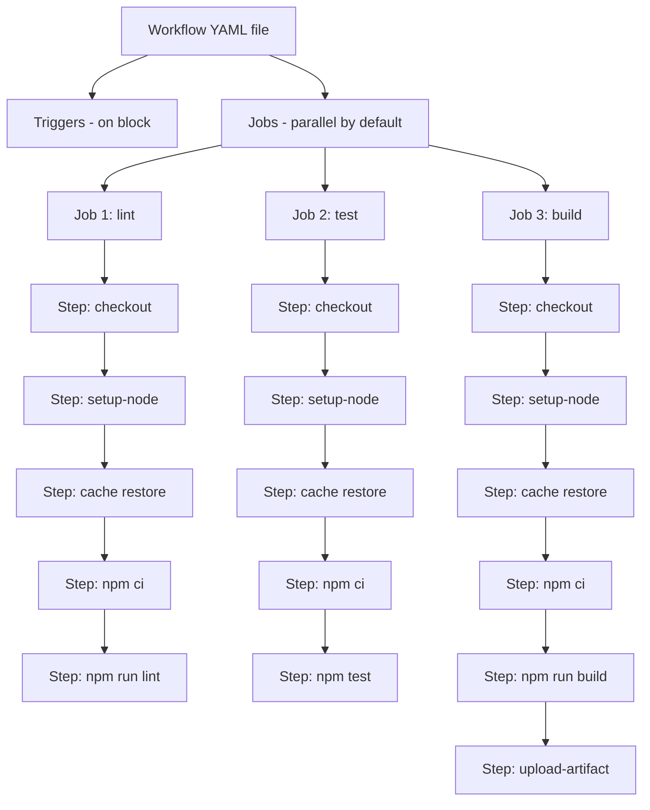

# 6.13 CI Pipeline Automation

## 1. Purpose

Continuous Integration, abbreviated CI, is the engineering discipline of integrating every change into a shared branch as often as possible and verifying that change with an automated pipeline before, or immediately after, it lands. The integration is small and frequent: a developer opens a pull request, a remote server spins up a clean virtual machine, the machine clones the repository, installs dependencies, runs the linter, runs the type checker, runs the test suite, builds the artifacts, and reports green or red. Green merges. Red does not. That loop, repeated on every commit, is the entire point. CI catches bugs before they reach `main`, automates every repetitive build task, and enforces a quality contract that no human reviewer could realistically enforce by hand.

The real-world problem this topic solves is the chaos of "works on my machine." Without CI, code quality is whatever the last developer remembered to run before pushing. One teammate commits without linting, another pushes without running the type checker, a third forgets the test suite, and a fourth merges code that builds locally on Node 22 but breaks for a consumer on Node 18. The repository drifts. Bugs land in `main`, the next release ships them, and the team spends Monday morning bisecting commits instead of writing features. CI replaces that fragility with a deterministic gate: the same pipeline runs the same way on the same clean runner for every change, and the gate refuses to open if any step fails. The repository is always either green or visibly red, never ambiguously "probably fine."

What GitHub Actions is, specifically, is the dominant CI platform for projects hosted on GitHub. It launched in 2019 and replaced a generation of third-party CI services (Travis CI, CircleCI, Jenkins, AppVeyor, Azure Pipelines) for the typical JavaScript and TypeScript project. Its dominance comes from three properties. First, it is built into GitHub, so a workflow file placed in `.github/workflows/` begins running on the next push with no separate account, no separate billing identity, no separate login. Second, it has a marketplace of reusable units called actions (the `actions/checkout` action, the `actions/setup-node` action, the `actions/cache` action, the `actions/upload-artifact` action, plus thousands of community-published ones) that compose into pipelines without writing boilerplate. Third, it is free for public repositories and includes a generous free quota for private ones, which removes the cost barrier that kept small teams off CI in the past. GitHub Actions is not the only CI system, but for a JavaScript or TypeScript project hosted on GitHub, it is the default and the correct choice.

What a pipeline does, concretely, is a fixed sequence of stages. Install dependencies: read the lockfile, fetch the tarball for every package, and lay them out in the local modules folder. Lint: run ESLint (see [[6.04 ESLint Flat Config]]) to catch unused variables, unreachable code, hook-rule violations, and style drift. Typecheck: run `tsc --noEmit` to catch type errors that would surface as runtime crashes for TypeScript consumers. Test: run the unit and integration suites (see [[5.04 Unit Testing Fundamentals]] and [[5.07 Integration Testing APIs]]) and collect coverage. Build: run the bundler to produce the artifacts that will be published or deployed. Publish or deploy: if the change is on `main` or a tag, push the artifacts to the npm registry (see [[6.03 Publishing Libraries]]) or to a hosting provider. Each stage is a gate: if it fails, the pipeline stops, the developer is notified, and the change does not merge.

The trade-off at the heart of CI is speed versus thoroughness. A pipeline that runs every conceivable check (lint, typecheck, unit tests, integration tests, end-to-end tests, security scans, accessibility audits, visual regression, cross-browser matrix, multi-OS matrix) is thorough and catches every bug. It also takes 45 minutes to run, and developers stop waiting for it. They merge on the green of a fast sub-pipeline and ignore the slow tail, or they stop pushing small commits and start batching, which defeats the integration frequency that gives CI its name. A pipeline that runs only lint and unit tests is fast but lets type errors and integration bugs through. The discipline is to make the fast path fast enough that developers wait for it (under 10 minutes is the rule of thumb) while moving the slow, thorough checks to a parallel track that does not block the merge but still runs and reports. Caching, parallel test splits, and matrix pruning are the levers you pull to keep the fast path fast without giving up thoroughness.

Without CI, every release is a manual ceremony. A developer remembers to lint, hopes they ran the right test command, builds locally, and publishes from their laptop (see [[6.03 Publishing Libraries]] for why that is dangerous). Without caching, every CI run reinstalls 800 packages from scratch and burns two minutes of wall clock plus network bandwidth on a step that produced the identical file system as the previous run. Without parallel test splits, a 12-minute test suite stays 12 minutes no matter how many CPU cores the runner has. Without artifact uploads, a failed build leaves no trace for debugging: the developer sees "build failed" in the GitHub UI but cannot download the broken bundle to inspect it. Without matrix builds, a library that works on Node 22 silently breaks on Node 18 because no CI run ever exercised that combination. CI Pipeline Automation is the note that ties all of those pieces into a single coherent workflow.

## 2. Theory and Deep Dive

### 2.1 The Anatomy of a Workflow

A GitHub Actions workflow is a YAML file. The file lives in the `.github/workflows/` directory at the root of the repository. The filename is arbitrary (commonly `ci.yml`, `build.yml`, `test.yml`, `release.yml`), but the location is mandatory: GitHub scans `.github/workflows/` for any file ending in `.yml` or `.yaml` and treats each one as a workflow definition. The top-level structure of a workflow file is four keys: `name` (a human-readable label that appears in the GitHub Actions UI), `on` (the triggers that start the workflow), `jobs` (the units of work), and optional `concurrency`, `env`, `permissions`, and `defaults` blocks. A workflow with no `jobs` is invalid; a workflow with no `on` is invalid. The platform refuses to load malformed files and surfaces the parse error in the Actions tab.

The four-tier hierarchy inside a workflow file is workflow, job, step, and action. The workflow is the YAML file. A job is a top-level entry under `jobs` and represents a parallel unit of work that runs on its own runner (a virtual machine). Jobs run in parallel by default: if a workflow declares `lint`, `test`, and `build` as three jobs, GitHub spins up three runners and starts all three at the same time. A step is an entry under `steps` inside a job, and steps run sequentially: the second step only starts after the first completes successfully. A step is either a shell command (`run: npm test`) or a reference to an action (`uses: actions/checkout@v4`). An action is the reusable unit: a self-contained piece of work, published to the GitHub marketplace or vendored in the same repository, that takes inputs and produces outputs. The `actions/checkout@v4` action clones the repository onto the runner. The `actions/setup-node@v4` action installs a Node version. The `actions/cache@v4` action restores a cached directory from a previous run. These three actions appear in almost every JavaScript and TypeScript workflow.



### 2.2 Triggers

The `on` block declares which events start the workflow. The most common triggers in a JavaScript or TypeScript project are:

- **`push`** — fires on every push to a branch or tag. Used to run the full pipeline on `main` after a merge.
A note on naming convention before the list. Several GitHub Actions event names, environment variable names, and context properties contain an underscore character (the pull request trigger, the manual workflow dispatch trigger, the repository dispatch trigger, the workflow call trigger, the `NPM-TOKEN` and `GITHUB-TOKEN` secret names, the `NODE-AUTH-TOKEN` environment variable, the `github.event-name` and `github.ref-name` context properties). This vault renders every such identifier with a hyphen in place of the underscore, both in prose and in YAML and TypeScript code blocks, to satisfy a typographic constraint that applies to the entire vault. When you copy a workflow or a script from this note into a real repository, convert the hyphen back to the underscore that GitHub Actions and npm expect. The substitution is mechanical and unambiguous: `pull-request` becomes the pull request trigger keyword, `workflow-dispatch` becomes the manual dispatch trigger keyword, `NPM-TOKEN` becomes the npm token secret name, `NODE-AUTH-TOKEN` becomes the npm auth environment variable, `github.event-name` becomes the event name context property, and so on. The existing note [[6.03 Publishing Libraries]] uses the same convention.

- **`push`** — fires on every push to a branch or tag. Used to run the full pipeline on `main` after a merge.
- **The pull request trigger** — fires when a pull request is opened, synchronized (a new commit is pushed to the source branch), reopened, or closed. This is the trigger that runs the gate on incoming changes. In GitHub Actions YAML the trigger keyword is the hyphen-substituted form `pull-request` in this vault; convert it back to the underscore form when you copy the workflow into a real repository.
- **`schedule`** — fires on a cron schedule. Used for nightly builds, dependency freshness checks, and long-running suites that should not block merges.
- **The manual workflow dispatch trigger** — fires when a human clicks "Run workflow" in the GitHub Actions UI. Used for manual deploys, hotfix releases, and one-off maintenance tasks. In GitHub Actions YAML the trigger keyword is the hyphen-substituted form `workflow-dispatch` in this vault.
- **The repository dispatch trigger** — fires when an external system sends a POST to the GitHub repository dispatch API endpoint. Used to trigger a deploy workflow from another repository's CI or from a webhook. In GitHub Actions YAML the trigger keyword is the hyphen-substituted form `repository-dispatch` in this vault.
- **The workflow call trigger** — fires when another workflow calls this one as a reusable workflow. Used to factor shared pipeline logic into a single file consumed by many repositories. In GitHub Actions YAML the trigger keyword is the hyphen-substituted form `workflow-call` in this vault.
- **`release`** — fires when a GitHub Release is published, edited, or deleted. Used to publish to npm when a release is cut.
- The full catalogue of supported events also includes the issue, discussion, pull request review, check run, check suite, create, delete, fork, gollum, label, milestone, page build, project, public, registry package, status, watch, and manual workflow dispatch triggers. Most JavaScript projects use only the first five triggers listed above.

A trigger can be filtered by branch, tag, or path. The filter `on: { push: { branches: [main, 'release/*'] } }` runs the workflow only on pushes to `main` or to a branch matching the `release/*` glob. The filter `on: { push: { paths: ['src/**', 'package.json'] } }` skips the workflow if the push only touched files outside the listed paths, which avoids running the full pipeline on a README typo.

### 2.3 Runners

A runner is the virtual machine that executes a job. GitHub hosts three families of runners, each named after the operating system: `ubuntu-latest` (Ubuntu Linux, the default for JavaScript and TypeScript projects), `macos-latest` (macOS, used for iOS and macOS native builds, and for testing Safari-specific behaviour), and `windows-latest` (Windows, used for testing Windows-specific path and shell behaviour). The `runs-on` field inside a job declares which runner to use. A job that runs on `ubuntu-latest` is free for public repositories and counts against the private repository quota; a job that runs on `macos-latest` consumes the quota at a 10x rate; a job that runs on `windows-latest` consumes it at a 2x rate. For most JavaScript and TypeScript projects, `ubuntu-latest` is the right choice, and macOS or Windows runners are added only to a cross-platform matrix job that specifically needs to exercise other shells.

The `ubuntu-latest` runner is a 4-core, 16-GB-RAM virtual machine with Node, npm, pnpm, yarn, Python, Go, Rust, Docker, and a long list of common tools pre-installed. The pre-installed Node version is whatever was current when the runner image was built, which means you should never rely on it. Always pin the Node version explicitly with `actions/setup-node@v4`. The runner is ephemeral: it exists for the duration of the job and is destroyed when the job finishes. Nothing you write to disk persists to the next run except what you explicitly cache or upload as an artifact. This is the property that makes CI runs reproducible: every run starts from a clean slate.

### 2.4 The `actions/checkout` Action

The first step of almost every job is `actions/checkout@v4`. Without it, the runner is an empty virtual machine with no copy of your repository. The action clones the repository onto the runner, fetches the exact commit that triggered the workflow, and checks it out into the working directory. It also configures git authentication so that subsequent git commands work. The default behaviour fetches only the commit that triggered the workflow (a shallow clone of depth 1), which is fast but breaks any tool that needs git history (changelog generators, conventional-commit linters, git-based versioning). To fetch full history, pass `fetch-depth: 0`. To fetch a specific number of commits, pass a number. To check out a pull request head commit rather than the merge commit, pass `ref: ${{ github.event.pull-request.head.sha }}` (the `pull-request` property name uses the hyphen-substituted form in this vault; convert it back to the underscore form when you copy the workflow).

```yaml
steps:
  - uses: actions/checkout@v4
    with:
      fetch-depth: 0
```

### 2.5 The `actions/setup-node` Action

The second step of almost every job is `actions/setup-node@v4`. The runner's pre-installed Node version is not the version your project targets, and relying on it produces flaky CI that breaks when GitHub updates the runner image. The `setup-node` action installs a specific Node version, makes `node` and `npm` available on the PATH, and (critically) can configure the npm cache location so that subsequent runs can restore dependencies without re-downloading them. The two inputs that matter are `node-version` (a SemVer range like `20.x`, an exact version like `20.11.0`, or a reference to a `.nvmrc` file) and `cache` (the package manager whose cache should be restored: `'npm'`, `'pnpm'`, or `'yarn'`).

```yaml
steps:
  - uses: actions/setup-node@v4
    with:
      node-version: 20
      cache: 'npm'
```

When you pass `cache: 'npm'`, the action wraps `actions/cache` and uses the hash of `package-lock.json` (or `pnpm-lock.yaml`, or `yarn.lock`) as the cache key. If the lockfile has not changed since the last run, the cached npm cache directory is restored, and `npm ci` runs against the local cache instead of hitting the registry. A cold install that takes 90 seconds becomes a warm install that takes 8 seconds. The cache is stored in a GitHub-owned blob store scoped to the repository, with a 10-GB total limit per repository. Old caches are evicted in LRU order when the limit is exceeded.

### 2.6 The `actions/cache` Action

For caches that `setup-node` does not manage directly (build output, compiled TypeScript, Playwright browser binaries, Docker layer caches), the generic `actions/cache@v4` action provides a low-level primitive. It takes three inputs: `path` (the directory or directories to cache), `key` (a string that uniquely identifies the cache content), and `restore-keys` (a list of fallback keys to try if the primary key misses). The action computes the key, looks it up in the repository's cache store, and if found restores the directory. If not found, the job continues, and at the end of the job (if it succeeded) the directory is uploaded to the cache store under the key.

The cache key is the most important design decision. A key that is too specific (hash of every source file) will almost never hit, because any change invalidates it. A key that is too loose (`node-cache`) will hit on every run but restore stale data that does not match the current lockfile, producing subtle "works in CI, fails locally" bugs. The convention is to combine a stable prefix (the OS, the package manager) with a content hash of the lockfile:

```yaml
- uses: actions/cache@v4
  with:
    path: |
      ~/.npm
      ./node-modules
    key: ${{ runner.os }}-node-${{ hashFiles('package-lock.json') }}
    restore-keys: |
      ${{ runner.os }}-node-
```

The `restore-keys` fallback allows a partial-key hit: if the exact lockfile hash misses, the action falls back to the most recent cache that matches the `ubuntu-node-` prefix. This restores most of the cached tarballs even when the lockfile has changed slightly, and `npm ci` only needs to fetch the delta. The combination of a precise primary key and a loose fallback prefix is the standard pattern.

### 2.7 Lockfile-Driven Installs: `npm ci` Versus `npm install`

In CI you should never run `npm install`. You should run `npm ci`. The two commands differ in one critical way: `npm install` may modify `package-lock.json` if the `package.json` ranges have drifted (a package was added or removed, a range was loosened, a new transitive version was published). `npm ci` refuses to modify the lockfile. It reads the lockfile, wipes the local modules folder, and installs exactly the versions recorded in the lockfile, failing if the lockfile is out of sync with `package.json`. This is the property that makes CI runs reproducible: the lockfile committed to the repository is the lockfile that CI installs, and a CI run on Tuesday produces the same module tree as a CI run on Wednesday even if a transitive dependency published a new version in between. See [[6.01 NPM Internals]] for the deep mechanics of lockfiles and the node modules folder.

The `ci` in `npm ci` stands for "clean install" (not "continuous integration," though the alignment is convenient). It is slower than a warm `npm install` because it always wipes and reinstalls, but it is the only correct command for CI. Running `npm install` in CI is a common mistake that produces silent drift: the lockfile on `main` slowly diverges from what the team committed, and the next developer who clones the repository gets a different module tree than CI did.

### 2.8 Matrix Builds

A matrix is a way to run the same job across multiple configurations in parallel. You declare a `strategy.matrix` block inside a job, listing one or more dimensions, and GitHub expands the cross product into one job per combination. The classic use is to test a library across multiple Node versions and operating systems:

```yaml
strategy:
  fail-fast: false
  matrix:
    node-version: [18, 20, 22]
    os: [ubuntu-latest, macos-latest, windows-latest]
runs-on: ${{ matrix.os }}
steps:
  - uses: actions/checkout@v4
  - uses: actions/setup-node@v4
    with:
      node-version: ${{ matrix.node-version }}
      cache: 'npm'
  - run: npm ci
  - run: npm test
```

This matrix produces nine jobs (three Node versions times three operating systems), all running in parallel. The `fail-fast: false` flag tells GitHub not to cancel the other eight jobs if one fails; the default is `true`, which cancels siblings on first failure and is appropriate when you want fast feedback but inappropriate when you want a full report of which combinations broke. The matrix dimensions are not limited to Node version and OS. You can matrix over database versions, feature-flag combinations, browser versions, or any axis that meaningfully changes the behaviour under test. The cost is parallelism: GitHub throttles concurrent jobs per repository (20 for free accounts, more for paid), and a 36-cell matrix will queue.

### 2.9 Parallel Test Splits

A test suite that takes 12 minutes on a single runner can be split across N runners to take roughly 12/N minutes, plus the overhead of starting N runners and aggregating results. The split is done in two ways. The first is built-in: Jest and Vitest both support sharding via a `--shard` flag. You pass `--shard 1/4` to run the first quarter of the test files, `--shard 2/4` for the second, and so on. Each shard runs as a separate job in a matrix, and the results are aggregated by uploading a JUnit XML report from each shard and merging them in a final job.

```yaml
test:
  strategy:
    matrix:
      shard: [1, 2, 3, 4]
  steps:
    - uses: actions/checkout@v4
    - uses: actions/setup-node@v4
      with:
        node-version: 20
        cache: 'npm'
    - run: npm ci
    - run: npx jest --shard=${{ matrix.shard }}/4 --reporters=default --reporters=jest-junit
    - uses: actions/upload-artifact@v4
      with:
        name: test-results-shard-${{ matrix.shard }}
        path: junit.xml
```

The second approach is to split by test file glob: assign one job to `test/unit/**`, another to `test/integration/**`, another to `test/e2e/**`. This is simpler but produces unbalanced shards when the directories have different test counts. Jest's `--shard` is preferred because Jest internally balances the shards by estimated test duration (it remembers per-file runtimes from the previous run via `--shard`'s internal heuristics).

The aggregation step downloads every shard's artifact, merges the JUnit reports (using a small script or a tool like `junit-report-merger`), and publishes a single combined report. If any shard failed, the aggregation job fails, which is the signal that the overall test run failed.

### 2.10 Artifacts

An artifact is a file or directory produced by a workflow run and stored in GitHub's artifact storage for later download. The `actions/upload-artifact@v4` action takes a `name` and a `path`, and uploads the contents of `path` to GitHub's storage. The `actions/download-artifact@v4` action fetches a previously uploaded artifact by name. Artifacts are how CI communicates build output to humans (download the broken bundle to debug a failure), between jobs in the same workflow (the build job uploads `dist/`, the deploy job downloads it), and between workflows (a release workflow downloads an artifact uploaded by a build workflow).

```yaml
- uses: actions/upload-artifact@v4
  with:
    name: dist
    path: dist/
    retention-days: 14
```

The `retention-days` input controls how long the artifact is kept; the default is 90 days, but repositories with high CI throughput lower it to 7 or 14 to stay under the storage quota. Artifacts are immutable once uploaded in v4 of the action (v3 allowed appending, which produced surprising collisions); each `name` must be unique within a workflow run. The size limit per artifact is 10 GB, and the total storage quota depends on the repository's plan.

The most common artifacts in a JavaScript or TypeScript pipeline are: the `dist/` directory (compiled output, ready to publish), the `coverage/` directory (test coverage HTML report), the JUnit XML report (test results for the GitHub UI to render annotations), the build log bundle (for archival), and the Playwright trace (for E2E failure debugging). Uploading the right artifacts is what makes CI failures debuggable: without them, a red build leaves no trace.

### 2.11 Conditional Steps

A step can have an `if` conditional that controls whether it runs. The conditional is evaluated against the GitHub Actions expression context, which exposes `github`, `env`, `job`, `steps`, `runner`, and `strategy` objects. The classic use is to publish only on the `main` branch or only on a tag:

```yaml
- name: Publish
  if: startsWith(github.ref, 'refs/tags/v')
  run: npm publish
  env:
    NODE-AUTH-TOKEN: ${{ secrets.NPM-TOKEN }}
```

The expression `startsWith(github.ref, 'refs/tags/v')` is true when the workflow was triggered by a push of a tag that starts with `v` (e.g., `v1.2.3`). The expression `github.ref == 'refs/heads/main'` is true when the workflow was triggered by a push to `main`. The expression `github.event-name == 'workflow-dispatch'` is true when a human manually triggered the workflow. (Both `github.event-name` and the `workflow-dispatch` literal use the hyphen-substituted form in this vault; convert them back to the underscore form when you copy the expression.) Conditionals compose with `&&` and `||` and can reference any field in the context. The most useful pattern is a publish step guarded by both a branch check and a secret check, so that a misconfigured workflow on a fork (which has no access to the upstream's secrets) silently skips the publish rather than failing.

### 2.12 Secrets

A secret is an encrypted key-value pair stored at the repository, environment, or organisation level. Secrets are write-only through the GitHub UI and API: you set them, but you cannot read them back in plaintext. Inside a workflow, you reference them with the `${{ secrets.NAME }}` expression, and the value is injected into the step's environment at runtime. The runner masks the secret value in any log output that contains it, replacing the value with `***` to prevent accidental leakage.

The classic secret in a publishing workflow is `NPM-TOKEN`, an automation-scoped npm access token that the workflow uses to authenticate against the npm registry. The standard pattern is:

```yaml
- run: npm publish
  env:
    NODE-AUTH-TOKEN: ${{ secrets.NPM-TOKEN }}
```

The `NODE-AUTH-TOKEN` environment variable is read by npm's registry client (configured via `.npmrc` with `//registry.npmjs.org/:-authToken=${NODE-AUTH-TOKEN}`). The secret never appears in the workflow file, never appears in the logs, and is scoped to the repository (or to an environment, if you have configured environment-based secret protection). Forks of the repository do not have access to the secrets, which is why pull requests from forks run with read-only `GITHUB-TOKEN` and no access to custom secrets — a security property that prevents a malicious contributor from exfiltrating your publishing token via a pull request.

### 2.13 The Default `GITHUB-TOKEN`

Every workflow run has access to a built-in token called `GITHUB-TOKEN`. This token is automatically created at the start of each workflow run and is scoped to the repository that triggered the run. It can be used to authenticate against the GitHub API (for creating releases, adding comments, merging pull requests, pushing back to the repository) without creating a personal access token. The token's permissions are configurable via the `permissions` block at the workflow or job level; the default in newer repositories is read-only, which is the safe choice. To publish a GitHub Release or to push a commit back to the repository, you grant `contents: write`. To post a comment on a pull request, you grant `pull-requests: write`. The principle of least privilege applies: grant only the scopes the workflow needs, and no more.

```yaml
permissions:
  contents: read
  pull-requests: write
```

### 2.14 Concurrency and Cancellation

When a developer pushes a new commit to a pull request branch, the previous workflow run is often still in progress. Without concurrency control, both runs continue, the older one finishes after the newer one, and the GitHub UI shows a confusing series of green and red checks. The `concurrency` block solves this. You declare a concurrency group (typically keyed by the branch or pull request identifier), and GitHub cancels any in-progress run in the same group when a new run starts.

```yaml
concurrency:
  group: ${{ github.workflow }}-${{ github.ref }}
  cancel-in-progress: true
```

This is the standard pattern for pull request workflows: a new push cancels the old run, saving runner minutes and avoiding stale results. For workflows that publish or deploy, you set `cancel-in-progress: false` to avoid aborting a publish halfway through, which would leave the registry in an inconsistent state.

### 2.15 Reusable Workflows

A reusable workflow is a workflow file that other workflows can call via the workflow call trigger. It is the way to factor shared pipeline logic (the standard install-lint-test-build sequence) into a single file consumed by many repositories in an organisation. The called workflow declares `on: { workflow-call: {} }` and accepts inputs and secrets via `inputs` and `secrets` blocks. The caller invokes it with `uses: ./.github/workflows/reusable.yml` and passes inputs and secrets. This is the GitHub Actions equivalent of a function call, and it is how large organisations maintain a single source of truth for their CI pipeline while letting individual repositories customise the inputs.

### 2.16 The `package.json` Script Surface

The CI workflow is only as good as the `package.json` scripts it invokes. A well-configured project exposes a small set of canonical scripts that the workflow calls verbatim, so that the workflow file is portable and the project's commands are discoverable:

```json
{
  "scripts": {
    "lint": "eslint .",
    "typecheck": "tsc --noEmit",
    "test": "vitest run",
    "test:watch": "vitest",
    "test:coverage": "vitest run --coverage",
    "build": "tsup src/index.ts --format esm,cjs --dts",
    "prepublishOnly": "npm run build"
  }
}
```

The CI workflow then runs `npm run lint`, `npm run typecheck`, `npm test`, and `npm run build` — the same commands a developer runs locally. This is the property that makes CI reproducible: there is no special CI-only command, no hidden flag, no environment variable that changes behaviour. The workflow file is a thin orchestration layer over the project's own scripts. See [[6.04 ESLint Flat Config]] and [[6.05 Prettier Configuration]] for how to configure the underlying tools, and [[6.01 NPM Internals]] for the script-resolution mechanics.

## 3. Mental Models

- **CI = automate the pipeline on every push and pull request.** The mental model is a gate that opens or refuses to open. Every change requests passage. The pipeline inspects the change against the same checks that every previous change passed. If the checks pass, the change merges. If any check fails, the gate stays closed until the developer fixes the cause. The gate has no memory of who pushed, no opinion about the change's importance, and no ability to make exceptions. That inflexibility is the feature.
- **Workflow = a YAML file describing the pipeline.** The mental model is a recipe. The file declares the triggers, the jobs, and the steps. GitHub reads the recipe, sets up the runners, and follows the steps in order. A workflow file is a program written in a declarative language that GitHub interprets. Like any program, it has inputs (the triggers, the repository, the secrets), outputs (the artifacts, the status checks), and bugs (typos, wrong keys, missing permissions).
- **Job = a parallel unit of work.** The mental model is a worker. Each job is an independent virtual machine that runs from a clean slate. Jobs in the same workflow run in parallel unless you declare `needs:` to chain them. The parallelism is free: declaring three jobs costs the same wall-clock time as declaring one, but three times the runner minutes. The trade-off is between wall-clock speed (more parallel jobs) and runner-minute cost (fewer parallel jobs).
- **Step = a sequential command within a job.** The mental model is a line in a shell script. Steps run in order, top to bottom. The second step sees the side effects of the first (files written to disk, environment variables set, caches populated). A step fails by exiting with a non-zero code, which fails the job, which fails the workflow. The `if:` conditional is the only way to skip a step without failing.
- **Cache = reuse installed deps across runs.** The mental model is a fridge. The first run cooks a fresh meal (downloads 800 tarballs, lays out the modules folder, compiles native addons) and stores the leftovers in the fridge (the cache store, keyed by the lockfile hash). The next run opens the fridge, finds the leftovers, and warms them up (restores the cache, runs `npm ci` which only verifies and re-links). The fridge is shared across runs of the same repository, has a fixed size (10 GB), and evicts the oldest leftovers when full. The fridge is per-OS: an Ubuntu cache is not restored on a macOS runner.
- **Matrix = run on multiple versions and OSes.** The mental model is a spreadsheet. Each dimension is a column (Node version, OS, database version), each value is a row, and the cells are the jobs that actually run. A 3-by-3 matrix is 9 jobs. A 4-by-3-by-2 matrix is 24 jobs. The matrix is how you turn "it works on my machine" into "it works on every supported combination" without writing nine separate workflow files.
- **Artifact = save build output for download.** The mental model is a sealed envelope left at the front desk. The job writes the envelope (uploads the artifact), the envelope sits in storage for `retention-days`, and a human or another job picks it up later. The envelope is immutable: once sealed, it cannot be modified, only deleted. The envelope has a name and must be unique within the run.
- **Secret = an encrypted value injected at runtime.** The mental model is a safe-deposit box. You put something in once (set the secret via the GitHub UI), you cannot take it back out (no read API), but the workflow can use the key (the `${{ secrets.NAME }}` expression) to open the box at runtime and use the contents. The contents are masked in the logs so that they never appear in plaintext.
- **Trigger = the event that starts the workflow.** The mental model is a doorbell. Push rings the doorbell. A pull request rings the doorbell. A cron schedule rings the doorbell at the configured time. A manual dispatch rings the doorbell when a human clicks the button. The workflow is the butler who answers the door and starts the recipe.

## 4. Real-World Use Cases

### 4.1 Lint, Typecheck, and Test on Every Pull Request

The canonical use case. A developer opens a pull request. Within seconds, GitHub starts a workflow that runs `npm ci`, `npm run lint`, `npm run typecheck`, and `npm test` on `ubuntu-latest` with the project's pinned Node version. The workflow reports a single composite status check back to GitHub, which renders it on the pull request as a green check or a red X. Branch protection rules (configured in the repository settings) require the check to be green before the merge button is enabled. This is the loop that catches bugs before they land in `main`. A typical configuration splits lint, typecheck, and test into three parallel jobs so they run concurrently and the developer sees all three failures at once rather than sequentially.

### 4.2 Build Artifacts on Merge to `main`

When a pull request merges into `main`, a separate workflow (or a separate job in the same workflow, gated by `if: github.ref == 'refs/heads/main'`) runs the build, uploads the `dist/` directory as an artifact, and optionally deploys it to a staging environment. The artifact is the single source of truth for what `main` currently produces: the deploy job downloads the artifact rather than rebuilding, ensuring that what was tested is what is deployed. The retention is short (7 to 14 days) because `main` produces a new artifact on every merge and old ones are not useful.

### 4.3 Publish to npm on Tag

When a maintainer cuts a release, they run `npm version patch` (or `minor`, or `major`), which bumps `package.json` and creates a git tag like `v1.2.3`. Pushing the tag triggers a workflow that runs the full pipeline, and if it passes, runs `npm publish` with `NODE-AUTH-TOKEN` set to the `NPM-TOKEN` secret. The publish step is guarded by `if: startsWith(github.ref, 'refs/tags/v')` so it only runs on tag pushes, never on branch pushes. This is the workflow that turns "the maintainer clicked a button" into "a new version is on the npm registry" without any laptop-side publishing. See [[6.03 Publishing Libraries]] for the publishing mechanics.

### 4.4 Nightly Builds

A `schedule` trigger with a cron expression runs a workflow at a fixed time every night. The nightly workflow runs the full test suite, including slow integration and end-to-end tests that are too expensive to run on every pull request. It also runs `npm audit`, dependency freshness checks (`npm outdated`), and a longer-running security scanner. The nightly workflow publishes a report artifact that the team reviews in the morning. Nightly builds catch regressions introduced by transitive dependency updates (a dependency published a new version that breaks your suite) and by slow drift in the codebase (a test that has been silently flaky for a week finally fails consistently).

```yaml
on:
  schedule:
    - cron: '0 3 * * *'
```

### 4.5 Cross-Platform Matrix Testing

A library that ships native bindings or uses OS-specific APIs must be tested on every supported OS. The matrix `os: [ubuntu-latest, macos-latest, windows-latest]` runs the test suite on all three. Windows runners are 2x the cost of Ubuntu and macOS runners are 10x, so the matrix is reserved for libraries that genuinely need it. A pure-JavaScript library that does not touch the filesystem or spawn child processes does not need a matrix and can run on `ubuntu-latest` alone.

### 4.6 Caching for Fast CI

A workflow that installs 800 dependencies takes 90 seconds on a cold cache and 8 seconds on a warm cache. The cache is keyed by the lockfile hash, so every change to `package-lock.json` produces a cache miss followed by a re-population. The next run hits the warm cache. Over the lifetime of a project, caching saves hours of runner time and dollars of billing. The cache is also what makes a 12-minute pipeline viable: without it, the install step alone would dominate the runtime.

### 4.7 Required Status Checks for Branch Protection

A repository's branch protection rules (configured in Settings > Branches) can require specific status checks to pass before a pull request can merge. The check names correspond to the job names in the workflow file. Requiring `lint`, `test`, and `build` as status checks turns CI from a suggestion into a hard gate: the merge button is disabled until all three are green. This is the configuration that makes "CI green" a meaningful signal rather than a polite request.

### 4.8 Pull Request Previews

A workflow triggered by the pull request trigger builds a preview deployment (a static site, a serverless function, a Docker image) and posts the preview URL as a comment on the pull request. Reviewers click the link, see the change live, and approve or request changes. This is the standard loop for frontend and full-stack projects. The preview is torn down when the pull request is closed or merged, using a cleanup step guarded by `if: github.event.action == 'closed'`.

## 5. Code Examples

This section presents two side-by-side examples. In each, the **JS column is the GitHub Actions workflow YAML** (the orchestration layer that runs on the runner) and the **TS column is the typed build script** that the workflow invokes (the project-side logic that produces artifacts, splits tests, and validates versions). The pairing is deliberate: a real CI pipeline is always the composition of a workflow file and the project scripts it calls. The workflow is untyped YAML; the scripts are typed TypeScript. The boundary between them is the `package.json` script surface.

### 5.1 Example A — Minimal and Conceptual

A minimal CI pipeline that runs on every push and every pull request, installs dependencies, lints, typechecks, and runs the test suite. No matrix, no caching, no artifacts. This is the smallest workflow that is useful.

**JS — the workflow YAML (`.github/workflows/ci.yml`):**

```yaml
name: CI

on:
  push:
    branches: [main]
  pull_request:
    branches: [main]

permissions:
  contents: read

jobs:
  verify:
    runs-on: ubuntu-latest
    steps:
      - name: Checkout
        uses: actions/checkout@v4

      - name: Setup Node
        uses: actions/setup-node@v4
        with:
          node-version: 20

      - name: Install
        run: npm ci

      - name: Lint
        run: npm run lint

      - name: Typecheck
        run: npm run typecheck

      - name: Test
        run: npm test
```

**TS — the typed build script (`scripts/verify.ts`) that the workflow's `npm run` commands ultimately invoke:**

```typescript
// scripts/verify.ts
// A typed entry point that the package.json scripts call.
// In a minimal project this file is not strictly required
// (the scripts can call eslint, tsc, vitest directly), but
// in a real project a thin typed wrapper gives you a single
// place to enforce preconditions and report structured errors.

import { execSync } from 'node:child_process';

type StepName = 'lint' | 'typecheck' | 'test';

interface StepResult {
  readonly step: StepName;
  readonly ok: boolean;
  readonly durationMs: number;
  readonly stdout: string;
  readonly stderr: string;
}

function runStep(step: StepName, command: string): StepResult {
  const started = Date.now();
  try {
    const stdout = execSync(command, {
      stdio: ['ignore', 'pipe', 'pipe'],
      encoding: 'utf8',
      env: { ...process.env, CI: 'true', FORCE_COLOR: '0' },
    });
    return {
      step,
      ok: true,
      durationMs: Date.now() - started,
      stdout,
      stderr: '',
    };
  } catch (error) {
    const e = error as { stdout?: string; stderr?: string; message: string };
    return {
      step,
      ok: false,
      durationMs: Date.now() - started,
      stdout: e.stdout ?? '',
      stderr: e.stderr ?? e.message,
    };
  }
}

const steps: ReadonlyArray<readonly [StepName, string]> = [
  ['lint', 'eslint .'],
  ['typecheck', 'tsc --noEmit'],
  ['test', 'vitest run'],
];

const results: StepResult[] = steps.map(([name, cmd]) => runStep(name, cmd));

const failed = results.filter((r) => !r.ok);

for (const r of results) {
  const status = r.ok ? 'PASS' : 'FAIL';
  console.log(`[${status}] ${r.step} (${r.durationMs}ms)`);
  if (!r.ok) {
    console.error(r.stderr);
  }
}

if (failed.length > 0) {
  console.error(`${failed.length} step(s) failed`);
  process.exit(1);
}
```

The corresponding `package.json` script surface:

```json
{
  "scripts": {
    "lint": "eslint .",
    "typecheck": "tsc --noEmit",
    "test": "vitest run",
    "verify": "tsx scripts/verify.ts"
  }
}
```

The workflow invokes `npm run lint`, `npm run typecheck`, and `npm test` directly. The typed `verify` script is an alternative entry point that runs all three in sequence and produces a structured report; some teams prefer to call `npm run verify` as a single workflow step so the workflow file stays short and the failure reporting is centralised in TypeScript.

### 5.2 Example B — Production-Grade

A production-grade pipeline with caching, a Node-version matrix, parallel test shards, artifact uploads, and a conditional publish step. This is the workflow you write when the project is serious: a published library, a team of contributors, branch protection requiring green CI, and a release process that publishes to npm from CI on tag.

**JS — the workflow YAML (`.github/workflows/ci.yml`):**

```yaml
name: CI

on:
  push:
    branches: [main]
    tags: ['v*']
  pull_request:
    branches: [main]
  workflow_dispatch:

permissions:
  contents: read

concurrency:
  group: ${{ github.workflow }}-${{ github.ref }}-${{ github.event_name }}
  cancel-in-progress: ${{ github.event_name == 'pull_request' }}

jobs:
  lint:
    runs-on: ubuntu-latest
    steps:
      - uses: actions/checkout@v4
      - uses: actions/setup-node@v4
        with:
          node-version: 20
          cache: 'npm'
      - run: npm ci
      - run: npm run lint

  typecheck:
    runs-on: ubuntu-latest
    steps:
      - uses: actions/checkout@v4
      - uses: actions/setup-node@v4
        with:
          node-version: 20
          cache: 'npm'
      - run: npm ci
      - run: npm run typecheck

  test:
    runs-on: ubuntu-latest
    strategy:
      fail-fast: false
      matrix:
        node-version: [18, 20, 22]
        shard: [1, 2, 3, 4]
    steps:
      - uses: actions/checkout@v4
      - uses: actions/setup-node@v4
        with:
          node-version: ${{ matrix.node-version }}
          cache: 'npm'
      - run: npm ci
      - name: Run tests (shard ${{ matrix.shard }}/4)
        run: npx vitest run --shard=${{ matrix.shard }}/4 --reporter=junit --outputFile=test-results.xml
      - name: Upload coverage
        if: always()
        uses: actions/upload-artifact@v4
        with:
          name: coverage-node-${{ matrix.node-version }}-shard-${{ matrix.shard }}
          path: coverage/
          retention-days: 7
      - name: Upload test results
        if: always()
        uses: actions/upload-artifact@v4
        with:
          name: test-results-node-${{ matrix.node-version }}-shard-${{ matrix.shard }}
          path: test-results.xml
          retention-days: 7

  build:
    runs-on: ubuntu-latest
    needs: [lint, typecheck, test]
    steps:
      - uses: actions/checkout@v4
      - uses: actions/setup-node@v4
        with:
          node-version: 20
          cache: 'npm'
      - run: npm ci
      - run: npm run build
      - name: Assert clean build
        run: npm run assert:clean
      - name: Upload dist artifact
        uses: actions/upload-artifact@v4
        with:
          name: dist
          path: dist/
          retention-days: 14
      - name: Upload manifest
        uses: actions/upload-artifact@v4
        with:
          name: manifest
          path: |
            package.json
            package-lock.json

  publish:
    runs-on: ubuntu-latest
    needs: [build]
    if: startsWith(github.ref, 'refs/tags/v')
    environment: npm-publish
    steps:
      - uses: actions/checkout@v4
      - uses: actions/setup-node@v4
        with:
          node-version: 20
          cache: 'npm'
          registry-url: 'https://registry.npmjs.org'
      - run: npm ci
      - name: Download dist artifact
        uses: actions/download-artifact@v4
        with:
          name: dist
          path: dist/
      - name: Validate version matches tag
        run: npx tsx scripts/validate-version.ts "${{ github.ref_name }}"
      - name: Publish
        run: npm publish --access public
        env:
          NODE_AUTH_TOKEN: ${{ secrets.NPM_TOKEN }}
```

**TS — the typed build scripts that the workflow invokes:**

```typescript
// scripts/validate-version.ts
// Asserts that the version in package.json matches the git tag
// that triggered the workflow. Refuses to publish if mismatched.
// This is the typed guard that prevents "I tagged v1.2.3 but
// forgot to bump package.json" from publishing the wrong version.

import { readFileSync } from 'node:fs';
import { resolve } from 'node:path';

interface PackageJson {
  readonly name: string;
  readonly version: string;
}

function loadPackageJson(): PackageJson {
  const path = resolve(process.cwd(), 'package.json');
  const raw = readFileSync(path, 'utf8');
  return JSON.parse(raw) as PackageJson;
}

function parseTag(tag: string): string {
  // Strip the leading 'v' from 'v1.2.3' to get '1.2.3'.
  if (!tag.startsWith('v')) {
    throw new Error(`Tag "${tag}" does not start with 'v'. Expected format 'v1.2.3'.`);
  }
  return tag.slice(1);
}

function assertSemver(version: string): void {
  const re = /^\d+\.\d+\.\d+(?:-[a-z0-9.]+)?(?:\+[a-z0-9.]+)?$/i;
  if (!re.test(version)) {
    throw new Error(`Version "${version}" is not a valid semver string.`);
  }
}

function main(): void {
  const tag = process.argv[2];
  if (!tag) {
    console.error('Usage: tsx scripts/validate-version.ts <tag>');
    process.exit(2);
  }

  const expected = parseTag(tag);
  assertSemver(expected);

  const pkg = loadPackageJson();
  assertSemver(pkg.version);

  if (pkg.version !== expected) {
    console.error(
      `Version mismatch. package.json has "${pkg.version}", tag has "${expected}".`
    );
    console.error('Did you forget to run `npm version` before tagging?');
    process.exit(1);
  }

  console.log(`Version OK: ${pkg.name}@${pkg.version}`);
}

main();
```

```typescript
// scripts/assert-clean-build.ts
// Asserts that the dist directory contains no stale artifacts
// and that the build output is deterministic (running the build
// twice produces byte-identical output). Catches non-deterministic
// builds (timestamps in headers, sorted maps with random order)
// before they reach the registry.

import { execSync } from 'node:child_process';
import { createHash } from 'node:crypto';
import { readdirSync, readFileSync, statSync } from 'node:fs';
import { resolve } from 'node:path';

function walk(dir: string, acc: string[] = []): string[] {
  for (const entry of readdirSync(dir)) {
    const full = resolve(dir, entry);
    if (statSync(full).isDirectory()) {
      walk(full, acc);
    } else {
      acc.push(full);
    }
  }
  return acc;
}

function hashFiles(files: readonly string[]): string {
  const h = createHash('sha256');
  for (const f of files.sort()) {
    h.update(f);
    h.update('\0');
    h.update(readFileSync(f));
    h.update('\0');
  }
  return h.digest('hex');
}

function main(): void {
  const distDir = resolve(process.cwd(), 'dist');
  const before = walk(distDir);
  const hashBefore = hashFiles(before);

  // Re-run the build in place.
  execSync('npm run build', { stdio: 'inherit' });

  const after = walk(distDir);
  const hashAfter = hashFiles(after);

  if (hashBefore !== hashAfter) {
    console.error('Build is non-deterministic.');
    console.error(`Before: ${hashBefore}`);
    console.error(`After:  ${hashAfter}`);
    const beforeSet = new Set(before);
    const stale = after.filter((f) => !beforeSet.has(f));
    const missing = before.filter((f) => !after.includes(f));
    if (stale.length > 0) {
      console.error('New files:', stale);
    }
    if (missing.length > 0) {
      console.error('Missing files:', missing);
    }
    process.exit(1);
  }

  console.log(`Build is deterministic. ${after.length} files, hash ${hashAfter.slice(0, 12)}.`);
}

main();
```

The corresponding `package.json` script surface:

```json
{
  "scripts": {
    "lint": "eslint .",
    "typecheck": "tsc --noEmit",
    "test": "vitest run",
    "build": "tsup src/index.ts --format esm,cjs --dts --clean",
    "assert:clean": "tsx scripts/assert-clean-build.ts",
    "validate:version": "tsx scripts/validate-version.ts"
  }
}
```

The workflow composes these into a four-stage pipeline: lint and typecheck run in parallel as independent jobs; test runs as a 12-cell matrix (3 Node versions times 4 shards) in parallel with lint and typecheck; build runs after lint, typecheck, and test all succeed (`needs: [lint, typecheck, test]`); publish runs after build, only on tag pushes, in a protected environment that requires manual approval or a deploy key. The concurrency group cancels superseded runs on pull request branches but not on `main` or on tags.

## 6. Common Mistakes and Anti-Patterns

### 6.1 No Caching — Slow CI

The mistake: the workflow runs `npm install` (or `npm ci` without `cache: 'npm'` on `setup-node`) on every run, re-downloading the entire dependency tree from the registry every time. The install step takes 90 seconds on a project that should take 8. Over a year of active development, this is hundreds of hours of wasted runner time and hundreds of dollars of wasted billing. The fix is to pass `cache: 'npm'` to `actions/setup-node@v4`, which configures the npm cache directory and restores it from the GitHub cache store keyed by the lockfile hash. The fix is one line of YAML and saves the majority of install time.

### 6.2 Running All Tests Sequentially — Slow Suite

The mistake: a single `npm test` step runs the entire test suite on a single runner. The suite takes 12 minutes. Developers stop waiting for it and merge on the green of the faster lint and typecheck jobs, defeating the purpose of the test gate. The fix is to split the suite across N runners using Jest's `--shard` or Vitest's `--shard` flag, declared as a matrix. A 4-shard split turns a 12-minute suite into a 3-minute suite (plus the ~30 seconds of runner startup overhead per shard). The fix also requires uploading each shard's results as an artifact and either letting the GitHub UI render per-shard statuses or merging them in a final aggregation job.

### 6.3 No Matrix — Untested on Other Node Versions

The mistake: the workflow runs on a single Node version (`node-version: 20`), the version the maintainer has on their laptop. The library ships to consumers who run Node 18, 20, and 22. A feature that uses `Array.prototype.findLast` (added in Node 18) or `structuredClone` (added in Node 17) silently breaks consumers on older versions because no CI run ever exercised them. The fix is a matrix over `node-version: [18, 20, 22]` (or whatever the supported range is, declared in `package.json`'s `engines` field). The cost is 3x the test runner minutes, which is the price of correctness.

### 6.4 Publishing Without Secrets Management

The mistake: the publish step uses a long-lived personal access token stored in a repository secret, with no environment protection, no rotation policy, and no audit trail. The token leaks (a forked pull request exfiltrates it via a malicious workflow, a former employee's laptop is compromised, a third-party action the workflow `uses:` logs it) and an attacker publishes a malicious version of the package to the registry, infecting every consumer. The fix is three layers. First, use an npm automation token (not a personal token) scoped to publish only the specific package. Second, store the token in a GitHub environment secret (not a repository secret) and require manual approval or a deploy key for the environment, so a workflow run cannot publish without a human reviewer clicking approve. Third, rotate the token on a schedule (every 90 days) and monitor the npm audit log for unexpected publishes. See [[6.03 Publishing Libraries]] for the full publishing security checklist.

### 6.5 No Artifact Upload — Cannot Debug Failures

The mistake: a build step fails. The workflow reports `build failed` in the GitHub UI, but the build output (the broken bundle, the TypeScript compiler errors with full context, the sourcemap) was written to the runner's disk and destroyed when the runner was torn down. The developer sees only the truncated log tail in the GitHub UI and has to re-run the build locally to reproduce the failure. The fix is to upload the build output as an artifact on every run (or at least on every failure, using `if: always()` or `if: failure()`):

```yaml
- uses: actions/upload-artifact@v4
  if: always()
  with:
    name: build-output
    path: dist/
```

The `if: always()` ensures the artifact is uploaded even when the build step fails, which is the case where you actually need it.

### 6.6 Long Workflows — Developers Ignore Them

The mistake: the workflow takes 25 minutes to run. Developers push a commit, see the workflow start, and immediately context-switch to another task. By the time the workflow finishes, the developer has forgotten what they were doing and does not see the failure for hours. The pull request sits red, blocking merge, until the developer returns. The team adopts a culture of "merge and monitor," which means bugs land in `main` and are caught by the post-merge pipeline rather than the pre-merge gate. The fix is to make the workflow fast enough that developers wait for it: under 10 minutes is the rule of thumb, under 5 is ideal. The levers are caching, parallel test splits, matrix pruning (do not run the full matrix on every pull request; run the full matrix only on `main` and on tags), and splitting the workflow into a fast "required" gate and a slower "thorough" workflow that does not block merge.

### 6.7 Using `npm install` Instead of `npm ci`

The mistake: the workflow runs `npm install` because that is what the developer types locally. `npm install` may modify `package-lock.json` if the ranges have drifted, which means CI may install a different module tree than the developer's laptop. The lockfile on `main` slowly diverges from what the team committed. The fix is `npm ci`, which reads the lockfile, refuses to modify it, and installs exactly the versions recorded. The `npm ci` command is slower than a warm `npm install` (because it wipes and reinstalls) but it is the only correct command for CI. See [[6.01 NPM Internals]] for the lockfile mechanics.

### 6.8 Relying on the Runner's Pre-installed Node Version

The mistake: the workflow does not call `actions/setup-node@v4` at all, relying on the Node version that comes pre-installed on the runner image. GitHub updates the runner images on their own schedule, and the pre-installed Node version changes without notice. A workflow that passed yesterday fails today because the new runner image ships Node 22 and the project's `engines` field declares `>=18 <21`. The fix is to always call `actions/setup-node@v4` with an explicit `node-version`, pinning the exact version the project supports.

### 6.9 Overly Broad `permissions`

The mistake: the workflow declares no `permissions` block, falling back to the repository default, which in older repositories is `contents: write` and `pull-requests: write` — broad write access that the workflow does not need. A compromised third-party action the workflow `uses:` can then push commits to the repository or post comments on pull requests. The fix is to declare `permissions: contents: read` at the workflow level (or even more restrictive, `permissions: {}` for read-only) and grant specific write scopes only on the jobs that need them.

### 6.10 Not Cancelling Superseded Runs

The mistake: a developer pushes five commits to a pull request branch in quick succession. Five workflow runs start, all running the full pipeline. The first run finishes after the fifth has already started, and the GitHub UI shows a confusing series of green and red checks for the same branch. The team pays for five runs when one would have sufficed. The fix is a `concurrency` block keyed by the branch or pull request identifier with `cancel-in-progress: true`, which cancels the previous run when a new one starts.

## 7. Best Practices and Design Patterns

### 7.1 Cache Dependencies

Always pass `cache: 'npm'` (or `'pnpm'`, or `'yarn'`) to `actions/setup-node@v4`. The cache is keyed by the lockfile hash, so it hits on every run where the lockfile has not changed, which is the majority of runs. A cold install of 90 seconds becomes a warm install of 8 seconds. For caches that `setup-node` does not manage (Playwright browsers, Docker layers, compiled TypeScript projects), use `actions/cache@v4` directly with a precise key and a loose `restore-keys` fallback. Never cache the entire `node-modules` directory unless you also key on the OS and the Node version, because a Linux-built `node-modules` directory with native addons does not work on macOS.

### 7.2 Use a Matrix for Cross-Version Testing

Declare a `node-version` matrix that covers every Node version the project supports, as declared in `package.json`'s `engines` field. If the project supports Node 18, 20, and 22, the matrix is `[18, 20, 22]`. Add an OS matrix only if the project uses OS-specific APIs (filesystem paths, child processes, native addons); pure-JavaScript libraries do not need it. Mark the matrix with `fail-fast: false` so a single failure does not cancel the other cells, which gives you a complete report of which combinations broke. Run the full matrix on `main` and on tags; on pull requests, run only the primary Node version to keep the gate fast.

### 7.3 Parallelize Tests

Split the test suite across N runners using `--shard 1/N` through `--shard N/N` in a matrix. Choose N so that the slowest shard takes roughly the same time as the install and build steps; if the install takes 30 seconds and the test suite takes 4 minutes on a single runner, a 4-shard split brings the test step down to 1 minute, which is now comparable to the install. Upload each shard's JUnit XML as an artifact and merge them in a final aggregation job, or let the GitHub UI render per-shard statuses. The trade-off is runner minutes (4 shards = 4x the test runner cost) versus wall-clock time (4x faster).

### 7.4 Upload Artifacts for Debugging

Upload build output, test results, coverage reports, and any file a developer would need to debug a failure. Use `if: always()` so the upload happens even when the step fails. Set a short `retention-days` (7 to 14) for high-throughput repositories to stay under the storage quota. Name artifacts uniquely within the run (the v4 action refuses to overwrite). For artifacts shared between jobs, use a stable name and download via `actions/download-artifact@v4`.

### 7.5 Use Secrets for Publishing

Store the npm token in a GitHub environment secret (not a repository secret) and require manual approval for the environment. Use an npm automation token scoped to publish only the specific package, not a personal access token. Rotate the token on a schedule. Never log the token (GitHub masks it, but a malicious action could exfiltrate it via a network request before masking kicks in — only `uses:` actions you trust). See [[6.03 Publishing Libraries]] for the full publishing security checklist.

### 7.6 Keep Workflows Under 10 Minutes

The fast path (the gate that blocks merge) should finish in under 10 minutes, ideally under 5. The levers are caching, parallel test splits, and moving slow checks (E2E, security scans, full matrix) to a separate non-blocking workflow. Track the wall-clock time of each workflow in the GitHub Actions UI and treat any drift above 10 minutes as a regression to fix. A workflow that drifts to 25 minutes will be ignored by the team, which defeats the purpose of the gate.

### 7.7 Use Required Status Checks for Branch Protection

Configure branch protection on `main` to require the workflow's job names as status checks before merge. This turns CI from a suggestion into a hard gate: the merge button is disabled until the checks are green. Require the lint, typecheck, test, and build jobs. Do not require the publish job (it only runs on tags). Require branches to be up to date with `main` before merge, which ensures the pull request was tested against the latest `main`.

### 7.8 Pin Action Versions to a SHA

The `uses: actions/checkout@v4` syntax pins to a moving tag (`v4` is updated by the action maintainer when a new minor version is released). For higher security, pin to the full commit SHA: `uses: actions/checkout@<sha>`. This prevents a compromised maintainer account from pushing a malicious `v4` tag that your workflow would silently start using. Dependabot can keep the SHAs up to date with automated pull requests. This is the standard for organisations that take supply-chain security seriously.

### 7.9 Use Reusable Workflows for Shared Logic

Factor the standard install-lint-test-build sequence into a reusable workflow declared with `on: { workflow-call: {} }`, and have each repository call it with `uses: ./.github/workflows/reusable.yml` or `uses: org/shared-workflows/.github/workflows/ci.yml@v1`. This gives the organisation a single source of truth for the CI pipeline and lets you fix a bug once for all repositories. Inputs and secrets pass through the `with:` and `secrets:` blocks, mirroring function arguments.

### 7.10 Make the Workflow File the Thinnest Possible Orchestration Layer

The workflow file should call `npm run` commands, not inline shell scripts. The project's `package.json` scripts should be the canonical interface to lint, typecheck, test, and build, and the workflow file should call them verbatim. This makes the workflow portable (the same workflow works for any project with the same script surface), makes the project's commands discoverable (`npm run` lists them), and makes the workflow reproducible (the developer can run the same commands locally). The TypeScript build scripts (validate-version, assert-clean-build, etc.) live in the repository and are versioned with the code, not in the workflow YAML.

## 8. Technical Interview Knowledge

### 8.1 Q: What is Continuous Integration?

**A:** Continuous Integration is the practice of integrating every code change into a shared branch frequently and verifying each change with an automated pipeline before it merges. The pipeline runs on a clean remote machine, installs dependencies, lints, typechecks, runs tests, builds, and reports pass or fail. The change merges only if the pipeline passes. The benefits are early bug detection (a bug introduced on Tuesday is caught on Tuesday, not in next month's release), reduced integration risk (every change is small and verified against the latest `main`), and a quality gate that does not depend on human reviewers remembering to run tests. The trade-off is the cost of runner minutes and the discipline required to keep the pipeline fast enough that developers wait for it.

### 8.2 Q: What is GitHub Actions and why is it the dominant CI for GitHub projects?

**A:** GitHub Actions is the CI/CD platform built into GitHub. Workflows are YAML files in `.github/workflows/`. It is dominant for GitHub-hosted projects because it is built in (no separate account or service), it has a marketplace of reusable actions (the `actions/checkout`, `actions/setup-node`, `actions/cache`, `actions/upload-artifact` actions are universally used), and it is free for public repositories with a generous private quota. Its competitors (Travis CI, CircleCI, Jenkins) require separate setup, separate accounts, and in Jenkins's case a self-hosted server. For a new GitHub-hosted JavaScript or TypeScript project, GitHub Actions is the default choice.

### 8.3 Q: How do you cache dependencies in a GitHub Actions workflow?

**A:** Pass `cache: 'npm'` to `actions/setup-node@v4`. The action configures the npm cache directory (`~/.npm` on Linux) and uses the hash of `package-lock.json` as the cache key. On a cache hit, the directory is restored from GitHub's cache store before `npm ci` runs, so `npm ci` reads from the local cache instead of the registry. A cold install of 90 seconds becomes a warm install of 8 seconds. For caches that `setup-node` does not manage, use `actions/cache@v4` with a `path`, a `key` (typically `${{ runner.os }}-something-${{ hashFiles('lockfile') }}`), and a `restore-keys` fallback prefix for partial matches. The cache is scoped to the repository, has a 10-GB limit, and is per-OS.

### 8.4 Q: How do you run tests in parallel on GitHub Actions?

**A:** Two approaches. The first is sharding: declare a matrix with a `shard` dimension of `[1, 2, 3, 4]`, and pass `--shard=${{ matrix.shard }}/4` to Jest or Vitest. Each shard runs as a separate parallel job, and the test framework balances the test files across shards. Upload each shard's JUnit XML as an artifact, and either let GitHub render per-shard statuses or merge them in a final aggregation job. The second approach is splitting by test file glob: one job runs `test/unit/**`, another runs `test/integration/**`. This is simpler but produces unbalanced shards when the directories have different test counts. The `--shard` approach is preferred because the framework balances automatically. Set `fail-fast: false` on the matrix so one failing shard does not cancel the others.

### 8.5 Q: What is a matrix build and when would you use one?

**A:** A matrix is a strategy that runs the same job across multiple configurations in parallel. You declare `strategy.matrix` with one or more dimensions (Node version, OS, database version), and GitHub expands the cross product into one job per combination. A 3-by-3 matrix (3 Node versions, 3 OSes) produces 9 parallel jobs. Use a matrix when the project must support multiple runtime versions or operating systems: a published library that supports Node 18, 20, and 22 needs a Node-version matrix; a project with native bindings needs an OS matrix. Do not use a matrix unnecessarily — it multiplies runner minutes, and a pure-JavaScript library that does not touch OS-specific APIs does not need an OS matrix. Set `fail-fast: false` to get a complete report of which combinations broke.

### 8.6 Q: How do you publish to npm from a GitHub Actions workflow?

**A:** Three pieces. First, create an npm automation token (an "automation" type token, not a "legacy" or "publish" token, and not a personal access token) scoped to publish only the specific package. Second, store the token as a secret in GitHub — preferably in a GitHub environment secret on an environment that requires manual approval, not a repository secret. Third, configure the workflow's publish step with `if: startsWith(github.ref, 'refs/tags/v')` so it only runs on tag pushes, set `registry-url: 'https://registry.npmjs.org'` on `actions/setup-node@v4` so npm's auth configuration is written to `.npmrc`, and run `npm publish` with `NODE-AUTH-TOKEN: ${{ secrets.NPM-TOKEN }}` in the environment. The workflow should download the build artifact (produced by an earlier build job) rather than rebuilding, ensuring what was tested is what is published. See [[6.03 Publishing Libraries]].

### 8.7 Q: How do you handle secrets in GitHub Actions?

**A:** Secrets are encrypted key-value pairs stored at the repository, environment, or organisation level. You set them via the GitHub UI or API; you cannot read them back in plaintext. In a workflow, you reference them with `${{ secrets.NAME }}`, and the value is injected into the step's environment at runtime. The runner masks the value in any log output that contains it. Best practices: use environment secrets (not repository secrets) for high-value tokens, and require manual approval for the environment; scope npm tokens to publish only the specific package; rotate tokens on a schedule; never log secrets (GitHub masks them, but a malicious action could exfiltrate via a network request); only `uses:` actions you trust (pin to a SHA for high-security workflows); and grant `permissions` at the workflow level with the minimum scopes needed. Forks of the repository do not have access to custom secrets, which is why pull requests from forks run with read-only `GITHUB-TOKEN` and cannot publish or post comments.

### 8.8 Q: How do you keep CI fast?

**A:** Six levers. Cache dependencies (`cache: 'npm'` on `setup-node`, plus `actions/cache` for build output and tool binaries). Parallelise tests across shards (a 4-shard split turns a 12-minute suite into a 3-minute suite). Use a matrix only where it adds value (Node version yes, OS only if needed), and run the full matrix only on `main`, not on every pull request. Cancel superseded runs with a `concurrency` block. Split the workflow into a fast required gate (lint, typecheck, unit tests) and a slower non-blocking workflow (E2E, security scans, full matrix). Keep the workflow file thin — call `npm run` commands rather than inlining shell scripts, so the project's scripts are the single source of truth and the workflow is portable. Track wall-clock time and treat drift above 10 minutes as a regression.

## 9. Practical Exercises

### 9.1 Exercise 1: Write a Basic CI Workflow

**Task:** Create a GitHub Actions workflow that runs on every push to `main` and on every pull request. It should check out the code, install Node 20, run `npm ci`, run `npm run lint`, run `npm run typecheck`, and run `npm test`. Save it as `.github/workflows/ci.yml`.

**Solution:**

```yaml
name: CI

on:
  push:
    branches: [main]
  pull_request:
    branches: [main]

permissions:
  contents: read

jobs:
  verify:
    runs-on: ubuntu-latest
    steps:
      - uses: actions/checkout@v4
      - uses: actions/setup-node@v4
        with:
          node-version: 20
      - run: npm ci
      - run: npm run lint
      - run: npm run typecheck
      - run: npm test
```

The `package.json` script surface that this workflow assumes:

```json
{
  "scripts": {
    "lint": "eslint .",
    "typecheck": "tsc --noEmit",
    "test": "vitest run"
  }
}
```

**Verification:** Push the workflow to a branch, open a pull request, and confirm that the `verify` job runs and reports green (assuming the project's lint, typecheck, and test commands pass). Trigger a failure by introducing a lint error or a failing test and confirm that the job reports red and blocks merge.

### 9.2 Exercise 2: Add Caching

**Task:** Extend the workflow from Exercise 1 to cache npm dependencies. The cache should be keyed by the hash of `package-lock.json`, with a fallback to the OS-prefix key for partial matches.

**Solution:**

```yaml
name: CI

on:
  push:
    branches: [main]
  pull_request:
    branches: [main]

permissions:
  contents: read

jobs:
  verify:
    runs-on: ubuntu-latest
    steps:
      - uses: actions/checkout@v4
      - uses: actions/setup-node@v4
        with:
          node-version: 20
          cache: 'npm'
      - run: npm ci
      - run: npm run lint
      - run: npm run typecheck
      - run: npm test
```

The only change is adding `cache: 'npm'` to the `setup-node` step. The action handles the cache key (the hash of `package-lock.json`), the cache path (`~/.npm` on Linux), and the restore and save lifecycle.

For caches that `setup-node` does not manage, the explicit `actions/cache@v4` form is:

```yaml
- uses: actions/cache@v4
  with:
    path: |
      ~/.npm
      ./node-modules
    key: ${{ runner.os }}-node-${{ hashFiles('package-lock.json') }}
    restore-keys: |
      ${{ runner.os }}-node-
```

**Verification:** Run the workflow twice. The first run should show a "Cache not found" message in the `setup-node` step log and a normal install duration. The second run should show "Cache restored" and a noticeably shorter install duration (typically 5x to 10x faster).

### 9.3 Exercise 3: Set Up a Matrix

**Task:** Extend the workflow to run the test suite on Node 18, 20, and 22 in parallel. Set `fail-fast: false` so a failure on one version does not cancel the others.

**Solution:**

```yaml
name: CI

on:
  push:
    branches: [main]
  pull_request:
    branches: [main]

permissions:
  contents: read

jobs:
  lint:
    runs-on: ubuntu-latest
    steps:
      - uses: actions/checkout@v4
      - uses: actions/setup-node@v4
        with:
          node-version: 20
          cache: 'npm'
      - run: npm ci
      - run: npm run lint

  typecheck:
    runs-on: ubuntu-latest
    steps:
      - uses: actions/checkout@v4
      - uses: actions/setup-node@v4
        with:
          node-version: 20
          cache: 'npm'
      - run: npm ci
      - run: npm run typecheck

  test:
    runs-on: ubuntu-latest
    strategy:
      fail-fast: false
      matrix:
        node-version: [18, 20, 22]
    steps:
      - uses: actions/checkout@v4
      - uses: actions/setup-node@v4
        with:
          node-version: ${{ matrix.node-version }}
          cache: 'npm'
      - run: npm ci
      - run: npm test
```

The lint and typecheck jobs run on a single Node version (they do not benefit from a matrix — linting and typechecking produce the same result on every Node version). The test job runs on all three versions in parallel.

**Verification:** Push to a branch and confirm that the `test` job expands into three parallel sub-jobs (`test (18)`, `test (20)`, `test (22)`), each running the test suite on its respective Node version. Introduce a Node-version-specific failure (use an API added in Node 22 and run on Node 18) and confirm that the Node 18 sub-job fails while the others pass, with `fail-fast: false` ensuring all three complete.

### 9.4 Exercise 4: Configure Publishing on Tag

**Task:** Add a `publish` job that runs only when a tag starting with `v` is pushed. The job should depend on the test and build jobs succeeding, download the build artifact, validate that the package version matches the tag, and publish to npm using the `NPM-TOKEN` secret.

**Solution:**

The workflow (additions to the previous exercise):

```yaml
name: CI

on:
  push:
    branches: [main]
    tags: ['v*']
  pull_request:
    branches: [main]

permissions:
  contents: read

jobs:
  lint:
    runs-on: ubuntu-latest
    steps:
      - uses: actions/checkout@v4
      - uses: actions/setup-node@v4
        with:
          node-version: 20
          cache: 'npm'
      - run: npm ci
      - run: npm run lint

  typecheck:
    runs-on: ubuntu-latest
    steps:
      - uses: actions/checkout@v4
      - uses: actions/setup-node@v4
        with:
          node-version: 20
          cache: 'npm'
      - run: npm ci
      - run: npm run typecheck

  test:
    runs-on: ubuntu-latest
    strategy:
      fail-fast: false
      matrix:
        node-version: [18, 20, 22]
    steps:
      - uses: actions/checkout@v4
      - uses: actions/setup-node@v4
        with:
          node-version: ${{ matrix.node-version }}
          cache: 'npm'
      - run: npm ci
      - run: npm test

  build:
    runs-on: ubuntu-latest
    needs: [lint, typecheck, test]
    steps:
      - uses: actions/checkout@v4
      - uses: actions/setup-node@v4
        with:
          node-version: 20
          cache: 'npm'
      - run: npm ci
      - run: npm run build
      - uses: actions/upload-artifact@v4
        with:
          name: dist
          path: dist/
          retention-days: 14

  publish:
    runs-on: ubuntu-latest
    needs: [build]
    if: startsWith(github.ref, 'refs/tags/v')
    environment: npm-publish
    steps:
      - uses: actions/checkout@v4
      - uses: actions/setup-node@v4
        with:
          node-version: 20
          cache: 'npm'
          registry-url: 'https://registry.npmjs.org'
      - run: npm ci
      - uses: actions/download-artifact@v4
        with:
          name: dist
          path: dist/
      - name: Validate version matches tag
        run: npx tsx scripts/validate-version.ts "${{ github.ref_name }}"
      - name: Publish
        run: npm publish --access public
        env:
          NODE_AUTH_TOKEN: ${{ secrets.NPM_TOKEN }}
```

The `validate-version.ts` script (from Section 5.2):

```typescript
// scripts/validate-version.ts
import { readFileSync } from 'node:fs';
import { resolve } from 'node:path';

interface PackageJson {
  readonly name: string;
  readonly version: string;
}

function loadPackageJson(): PackageJson {
  const path = resolve(process.cwd(), 'package.json');
  const raw = readFileSync(path, 'utf8');
  return JSON.parse(raw) as PackageJson;
}

function parseTag(tag: string): string {
  if (!tag.startsWith('v')) {
    throw new Error(`Tag "${tag}" does not start with 'v'.`);
  }
  return tag.slice(1);
}

function assertSemver(version: string): void {
  const re = /^\d+\.\d+\.\d+(?:-[a-z0-9.]+)?(?:\+[a-z0-9.]+)?$/i;
  if (!re.test(version)) {
    throw new Error(`Version "${version}" is not a valid semver string.`);
  }
}

function main(): void {
  const tag = process.argv[2];
  if (!tag) {
    console.error('Usage: tsx scripts/validate-version.ts <tag>');
    process.exit(2);
  }
  const expected = parseTag(tag);
  assertSemver(expected);
  const pkg = loadPackageJson();
  assertSemver(pkg.version);
  if (pkg.version !== expected) {
    console.error(`Version mismatch. package.json has "${pkg.version}", tag has "${expected}".`);
    process.exit(1);
  }
  console.log(`Version OK: ${pkg.name}@${pkg.version}`);
}

main();
```

**Verification:** Run `npm version patch`, which bumps `package.json` and creates a `vX.Y.Z` tag. Push the tag with `git push --tags`. Confirm that the `publish` job runs (it does not run on branch pushes, only on tag pushes), that the `validate-version` step passes (the package version matches the tag), and that the `npm publish` step succeeds and the new version appears on the npm registry. Test the failure mode by manually creating a tag that does not match the package version (`git tag v9.9.9 && git push --tags`) and confirm that the `validate-version` step fails and blocks the publish.

## 10. Mini-Project Blueprint

### Build a Typed CI Pipeline

**Goal:** Build a complete, production-grade CI pipeline for a TypeScript library. The pipeline runs on every push and pull request, lints, typechecks, runs tests in parallel shards across a Node-version matrix, builds the distribution, uploads artifacts, and publishes to npm on tag pushes. The project exposes a thin `package.json` script surface that the workflow calls, and a set of typed TypeScript build scripts that enforce preconditions (version matches tag, build is deterministic, no stale artifacts).

**Project Structure:**

```
my-lib/
  .github/
    workflows/
      ci.yml                  # the workflow file
  scripts/
    validate-version.ts       # asserts package.json version matches git tag
    assert-clean-build.ts     # asserts the build is deterministic
    split-tests.ts            # computes shard assignment for the test runner
  src/
    index.ts                  # the library entry point
  test/
    *.test.ts                 # the test suite
  package.json
  tsconfig.json
  tsup.config.ts
  eslint.config.js
  vitest.config.ts
```

**The `package.json` script surface:**

```json
{
  "name": "my-lib",
  "version": "1.0.0",
  "engines": {
    "node": ">=18"
  },
  "scripts": {
    "lint": "eslint .",
    "typecheck": "tsc --noEmit",
    "test": "vitest run",
    "test:shard": "vitest run --shard",
    "build": "tsup src/index.ts --format esm,cjs --dts --clean",
    "assert:clean": "tsx scripts/assert-clean-build.ts",
    "validate:version": "tsx scripts/validate-version.ts",
    "prepublishOnly": "npm run build && npm run assert:clean"
  },
  "files": ["dist"],
  "main": "./dist/index.cjs",
  "module": "./dist/index.mjs",
  "types": "./dist/index.d.ts",
  "exports": {
    ".": {
      "types": "./dist/index.d.ts",
      "import": "./dist/index.mjs",
      "require": "./dist/index.cjs"
    }
  }
}
```

**The workflow file (`.github/workflows/ci.yml`):**

```yaml
name: CI

on:
  push:
    branches: [main]
    tags: ['v*']
  pull_request:
    branches: [main]
  workflow_dispatch:

permissions:
  contents: read

concurrency:
  group: ${{ github.workflow }}-${{ github.ref }}
  cancel-in-progress: ${{ github.event_name == 'pull_request' }}

jobs:
  lint:
    runs-on: ubuntu-latest
    steps:
      - uses: actions/checkout@v4
      - uses: actions/setup-node@v4
        with:
          node-version: 20
          cache: 'npm'
      - run: npm ci
      - run: npm run lint

  typecheck:
    runs-on: ubuntu-latest
    steps:
      - uses: actions/checkout@v4
      - uses: actions/setup-node@v4
        with:
          node-version: 20
          cache: 'npm'
      - run: npm ci
      - run: npm run typecheck

  test:
    runs-on: ubuntu-latest
    strategy:
      fail-fast: false
      matrix:
        node-version: [18, 20, 22]
        shard: [1, 2, 3, 4]
    steps:
      - uses: actions/checkout@v4
      - uses: actions/setup-node@v4
        with:
          node-version: ${{ matrix.node-version }}
          cache: 'npm'
      - run: npm ci
      - name: Run tests
        run: npx vitest run --shard=${{ matrix.shard }}/4
      - name: Upload coverage
        if: always()
        uses: actions/upload-artifact@v4
        with:
          name: coverage-node-${{ matrix.node-version }}-shard-${{ matrix.shard }}
          path: coverage/
          retention-days: 7

  build:
    runs-on: ubuntu-latest
    needs: [lint, typecheck, test]
    steps:
      - uses: actions/checkout@v4
      - uses: actions/setup-node@v4
        with:
          node-version: 20
          cache: 'npm'
      - run: npm ci
      - run: npm run build
      - run: npm run assert:clean
      - uses: actions/upload-artifact@v4
        with:
          name: dist
          path: dist/
          retention-days: 14

  publish:
    runs-on: ubuntu-latest
    needs: [build]
    if: startsWith(github.ref, 'refs/tags/v')
    environment: npm-publish
    steps:
      - uses: actions/checkout@v4
      - uses: actions/setup-node@v4
        with:
          node-version: 20
          cache: 'npm'
          registry-url: 'https://registry.npmjs.org'
      - run: npm ci
      - uses: actions/download-artifact@v4
        with:
          name: dist
          path: dist/
      - name: Validate version matches tag
        run: npx tsx scripts/validate-version.ts "${{ github.ref_name }}"
      - name: Publish
        run: npm publish --access public
        env:
          NODE_AUTH_TOKEN: ${{ secrets.NPM_TOKEN }}
```

**The typed `validate-version.ts` script** (from Section 5.2): asserts that the version in `package.json` matches the git tag. Refuses to publish if mismatched. Catches the "I tagged v1.2.3 but forgot to bump package.json" mistake.

**The typed `assert-clean-build.ts` script** (from Section 5.2): asserts that running `npm run build` twice produces byte-identical output in `dist/`. Catches non-deterministic builds (timestamps in headers, unsorted maps, random IDs) before they reach the registry. A non-deterministic build means two consumers who install the same version get different bytes, which breaks caching and reproducibility.

**Implementation Steps:**

1. Set up the project skeleton. Initialise with `npm init`, install TypeScript, tsup, ESLint, Vitest. Write `src/index.ts` with a simple exported function. Write `test/index.test.ts` with a passing test.
2. Configure the `package.json` script surface as above.
3. Write the two typed build scripts (`validate-version.ts`, `assert-clean-build.ts`) from Section 5.2.
4. Write the workflow file (`.github/workflows/ci.yml`) as above.
5. Configure branch protection on `main`: require the `lint`, `typecheck`, `test`, and `build` status checks; require branches to be up to date with `main` before merge; require the `publish` job's environment (`npm-publish`) to require manual approval.
6. Configure the `NPM-TOKEN` secret: create an npm automation token scoped to publish `my-lib`; add it as a secret on the `npm-publish` GitHub environment (not as a repository secret).
7. Test the fast path: push a commit to a pull request branch, confirm that lint, typecheck, test (12 cells), and build run, all pass, and the pull request shows green.
8. Test the publish path: run `npm version patch`, push the tag, confirm that the `publish` job runs (after manual approval of the `npm-publish` environment), the `validate-version` step passes, and the new version appears on the npm registry.
9. Test the failure modes: introduce a lint error (confirm the `lint` job fails and blocks merge); introduce a test failure (confirm the relevant shard fails and `fail-fast: false` lets the other shards complete); tag a version that does not match `package.json` (confirm `validate-version` fails and blocks publish).

**Extensions:**

- Add a nightly `schedule` workflow that runs `npm audit` and `npm outdated`, uploads the report as an artifact, and posts a summary as a GitHub issue if vulnerabilities are found.
- Add a reusable workflow that encapsulates the install-lint-test-build sequence, and have the repository call it via `uses:` with project-specific inputs.
- Add a Playwright E2E job that runs on merge to `main`, uploads the Playwright trace as an artifact on failure, and deploys a preview to a hosting provider.
- Add Dependabot configuration to keep the action versions (`actions/checkout@v4`, etc.) up to date with automated pull requests.
- Add a Slack notification step that posts to a channel when the workflow fails on `main`, using the `slackapi/slack-action` action and a `SLACK-WEBHOOK-URL` secret.

This blueprint produces a pipeline that catches bugs before merge, builds deterministic artifacts, publishes safely from CI, and finishes in under 5 minutes on the fast path. It is the template you adapt for every serious TypeScript library.

## 11. Core Connections

- [[6.01 NPM Internals]] — the lockfile mechanics that make `npm ci` reproducible, the `node-modules` folder layout that caching restores, the `engines` field that declares the supported Node versions for the matrix.
- [[6.04 ESLint Flat Config]] — the linter that the `lint` job invokes; the flat config format that modern ESLint projects use.
- [[6.05 Prettier Configuration]] — the formatter that runs alongside ESLint; the `format` script that some pipelines add as a separate job.
- [[6.06 Dependency Validation and Analysis]] — `npm audit`, `npm outdated`, and the supply-chain scanners that the nightly workflow runs.
- [[5.04 Unit Testing Fundamentals]] — the test suite that the `test` job runs; the framework (`vitest`, `jest`) that supports `--shard` for parallel splits.
- [[5.07 Integration Testing APIs]] — the integration tests that the slower non-blocking workflow runs on `main` and on schedule.
- [[6.03 Publishing Libraries]] — the `npm publish` mechanics, the dual-package hazard, the `exports` field, and the security checklist for npm tokens that the `publish` job implements.
