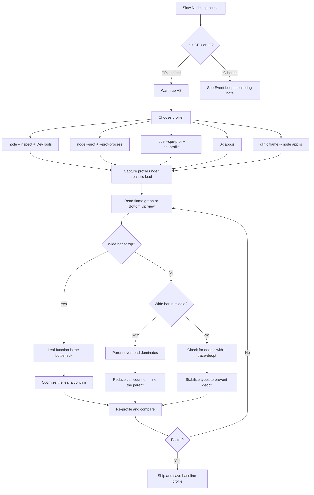
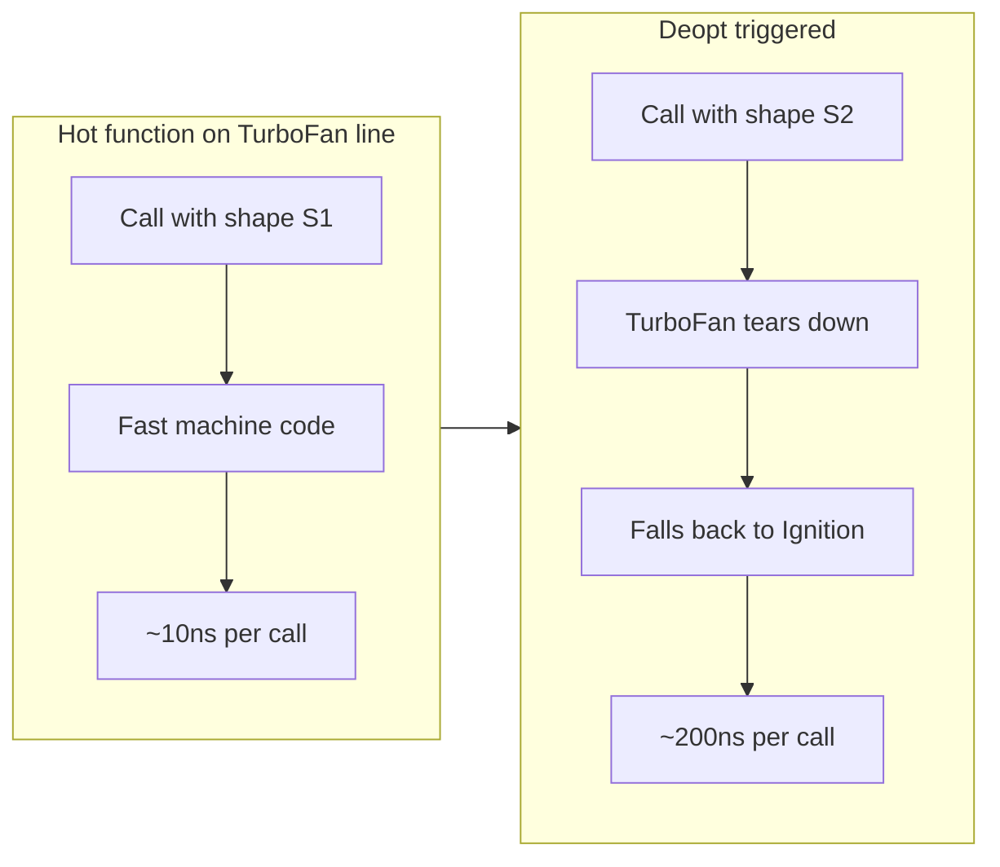
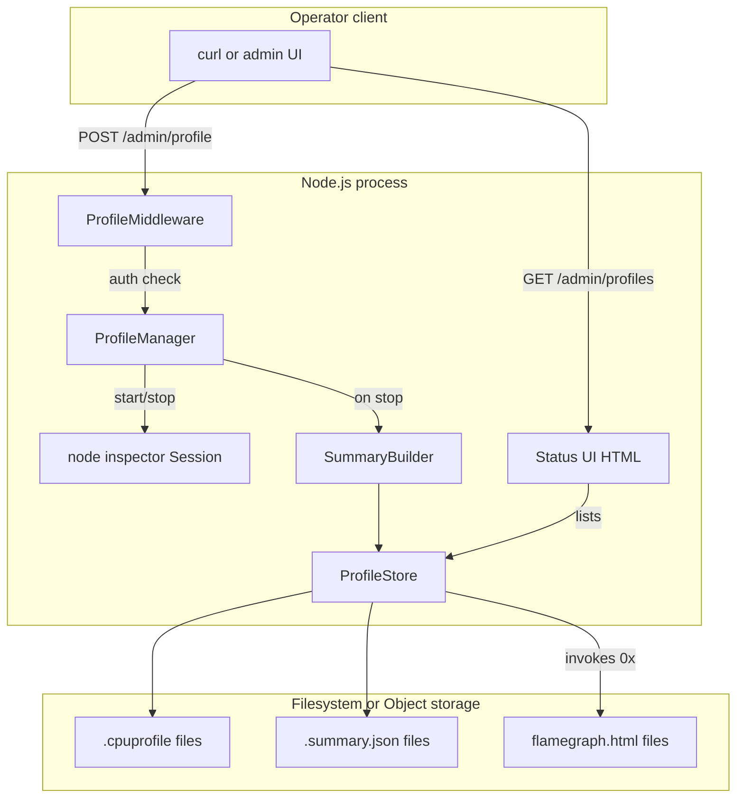

# 7.01 Profiling CPU Usage

> CPU profiling is the act of asking V8, "where did my program spend its time?" and getting back a structured answer you can act on. Without it, performance work is superstition. With it, performance work becomes a discipline.

## 1. Purpose

Node.js applications look slow for one of two reasons. Either they are waiting on something external (a database, a network socket, the filesystem, a lock), or they are burning CPU cycles on computation. The first class is diagnosed with event-loop monitoring, latency tracing, and distributed traces. The second class — CPU-bound code — is diagnosed with a CPU profiler. This note is about the second class.

CPU profiling matters because Node.js runs JavaScript on a single thread (with the worker-pool exceptions covered in [[3.03 Thread Pool and Worker Pool]]). Any millisecond that thread spends inside a hot function is a millisecond it cannot spend serving the next request, draining the next timer, or running the next microtask. A single endpoint that takes 800 milliseconds of CPU time will block every other request for those 800 milliseconds, no matter how many CPUs the machine has. Cluster mode and worker threads ([[3.17 Cluster Module]], [[3.18 Worker Threads]]) buy you parallelism, but they do not fix a hot function — they just clone it across cores. To make the function faster you must first see it.

The concrete problems CPU profiling solves:

- **Find slow functions.** The profiler tells you which function consumed the most samples. That is your prime suspect.
- **Optimize hot paths.** A "hot path" is the chain of function calls responsible for the majority of CPU time. Optimizing a hot path from O(n-squared) to O(n log n) can give a 100x speedup; optimizing a rarely-executed cold path gives nothing.
- **Detect deoptimizations.** V8 sometimes bails out of optimized machine code and falls back to the interpreter. A function that should be fast is suddenly slow, and only the profiler (or `--trace-deopt`) shows it.
- **Justify refactors.** Before you rewrite a hot loop in Rust or move work to a worker thread, measure. After you ship the change, measure again. A profile is evidence.
- **Set baselines.** Save a profile in your repo. Six months later, when a regression lands, you compare against the baseline and the regression jumps out.

The tools available in the Node.js ecosystem fall into four families:

1. **Chrome DevTools** — the interactive profiler you reach for in development. Connect Chrome to `node --inspect`, click "Record", exercise the code, click "Stop". You get a tree view, a bottom-up view, and a timeline chart. See [[6.12 Debugging Techniques DevTools]] for the broader DevTools surface.
2. **V8 built-in profiler (`node --prof`)** — a low-overhead sampling profiler built into V8. Produces a binary-ish text log (`isolate-*.log`), which `node --prof-process` formats into a readable summary. Ideal for production because overhead is tiny and the log is portable.
3. **`--cpu-prof` flag** — produces a `.cpuprofile` JSON file in the same format DevTools uses. You can drag the file into Chrome later, or process it programmatically. Pairs well with `--cpu-prof-dir`, `--cpu-prof-name`, and `--cpu-prof-interval`.
4. **Flame graph tools (`0x`, `clinic.js`)** — `0x` (by David Mark Clements) wraps `--cpu-prof` and renders an interactive HTML flame graph. `clinic.js` from NearForm ships four "medical" profilers — `clinic doctor` (auto-diagnoses), `clinic flame` (flame graph), `clinic bubbleprof` (async operations), `clinic heapprofiler` (allocations). Flame graphs are the single most readable visualization of CPU data ever invented.

Why flame graphs in particular help: a CPU profile is a sequence of `(timestamp, call stack)` samples. Reading a hundred-thousand-sample list is impossible. A flame graph stacks each sample as a horizontal bar — the x-axis is sample count (a proxy for time), the y-axis is call-stack depth. A wide bar means "this function was on top of the call stack for many samples" — it is hot. The visualization turns raw data into a picture you can act on in seconds. The eye is wired for shape, not spreadsheets.

Without CPU profiling, the Node.js developer is left with `console.time` and `performance.now()`. Those tools answer "how long did this take?" but not "why?". Profiling answers the why.

## 2. Theory and Deep Dive

### 2.1 How V8 samples the CPU

V8's CPU profiler is a sampling profiler, not an instrumenting profiler. An instrumenting profiler rewrites every function entry and exit to record wall-clock time — accurate but slow. A sampling profiler sets a timer (every 1 millisecond by default) and, when the timer fires, walks the current call stack and records it as one sample. The result is approximate: a function that runs for 0.5 ms may not appear at all, and a function that runs for 10 ms will appear in roughly 10 samples. The approximation is excellent for finding hot paths because hot paths dominate the sample count.

On Linux the timer is delivered as `SIGPROF`; on macOS it uses `setitimer`; on Windows a high-resolution waitable timer thread. The mechanism is invisible to you — V8 abstracts it. What you see is a sequence of samples. The sampling interval is configurable via `--prof-interval` (microseconds) for `--prof` and `--cpu-prof-interval` (microseconds, default 1000) for `--cpu-prof`. A smaller interval increases resolution and overhead; a larger interval reduces both. For most workloads 1 ms is the right number.

### 2.2 What a sample contains

Each sample is a tuple of `(timestamp, call stack)`. The call stack is an ordered list of `callFrame` objects, each containing:

- `functionName` — the name of the function (empty for anonymous).
- `scriptId` — V8 internal identifier for the script.
- `url` — the source file URL (`file:///app/src/handlers.js`).
- `lineNumber` and `columnNumber` — zero-based position of the call site.

V8 maintains a stack of "code objects" as functions enter and exit. When the timer fires, V8 walks that internal stack and emits a sample. Native C++ frames (libuv, V8 builtins) appear too, which is why you see things like `v8::SourcePosition` and `node::AsyncWrap` in production profiles.

### 2.3 The CPU profile JSON format

The `.cpuprofile` file written by `--cpu-prof` and by DevTools is a JSON object with this shape:

```
{
  nodes: [ { id, callFrame, hitCount, children } ],
  startTime: number,
  endTime: number,
  samples: [ number ],
  timeDeltas: [ number ]
}
```

- `nodes` is a forest of call-tree nodes. Each node has an `id`, a `callFrame` (the function), a `hitCount` (how many samples landed exactly on this node as the leaf), and a `children` array of node IDs.
- `startTime` and `endTime` are in microseconds since some epoch.
- `samples` is an array of node IDs, one per sample, in order.
- `timeDeltas` is an array of microsecond deltas between consecutive samples (length is `samples.length + 1` if you include the initial delta).

This format is documented in the Chrome DevTools Protocol under `Profiler.Profile`. It is also the format the `node:inspector` module hands you when you call `Profiler.stop`.

### 2.4 The `node --prof` pipeline

`node --prof app.js` enables V8's tick profiler. Every sample is written to a log file named `isolate-0xNNN-NNN-v8.log` in the current directory (the hex digits are the isolate address). The log is plain text but enormous and not meant for human reading. It contains tick events, code-creation events (so the formatter can map ticks to function names), and metadata.

After the run you execute:

```
node --prof-process isolate-0xNNN-NNN-v8.log > profile.txt
```

The output is grouped into sections:

- **Shared libraries** — time spent in native shared libraries (libc, libuv).
- **JavaScript** — time in JavaScript functions.
- **C++** — time in V8/Node C++ code.
- **Summary** — top functions by tick count.
- **C++ entry points** and **Bottom up (heavy) profile** — the most useful section, sorted by self-time.

The bottom-up profile inverts the call tree: instead of "main called handler called parse called JSON.parse", you see "JSON.parse was the leaf in N samples; of those, parse called it M times, handler called parse K times". This is the same logic DevTools uses for its "Bottom Up" view.

### 2.5 The `--cpu-prof` flag

`node --cpu-prof app.js` enables the same sampling but writes a `.cpuprofile` JSON instead of a V8 log. The default filename is `CPU.YYYYMMDD.HHMMSS.NNNNN.NNNNS.cpuprofile` (the trailing `S` denotes microseconds). Useful companion flags:

- `--cpu-prof-dir=profiles/` — output directory.
- `--cpu-prof-name=run.cpuprofile` — fixed filename.
- `--cpu-prof-interval=500` — sample every 500 microseconds.
- `--cpu-prof` combined with `--inspect-brk` lets you start the profiler manually from DevTools and ignore the auto-generated file.

### 2.6 DevTools workflow

The interactive workflow:

1. Start your process: `node --inspect app.js` (or `--inspect-brk` to pause on first line).
2. Open Chrome and navigate to `chrome://inspect`.
3. Under "Remote Target" you should see your Node process. Click "inspect".
4. A DevTools window opens. Switch to the "Performance" tab (older versions call it "Profiler" or "JavaScript Profiler").
5. Click the record button (filled circle). Exercise your code — send HTTP requests, run the workload, etc.
6. Click stop. The profile renders.
7. Use the dropdown to switch between "Chart" (timeline), "Heavy (Bottom Up)", and "Tree (Top Down)".

The "Heavy" view is the single fastest way to find a slow function. Sort by "Self Time" descending. The top entry is your hottest leaf.

### 2.7 Programmatic profiling with `node:inspector`

For automated profiling (CI, on-demand production profiles, test harnesses) use the `inspector` module:

```javascript
const { Session } = require('node:inspector');
const fs = require('node:fs');

const session = new Session();
session.connect();

function startProfiling() {
  session.post('Profiler.enable');
  session.post('Profiler.setSamplingInterval', { interval: 100 });
  session.post('Profiler.start');
}

function stopProfiling(filename) {
  return new Promise((resolve) => {
    session.post('Profiler.stop', (err, result) => {
      if (err) { resolve({ error: err }); return; }
      fs.writeFileSync(filename, JSON.stringify(result.profile));
      resolve({ filename, samples: result.profile.samples.length });
    });
  });
}
```

This is the same API DevTools uses internally. You can call `Profiler.start` and `Profiler.stop` programmatically, write the resulting profile to disk, and load it into DevTools or 0x later.

### 2.8 Flame graphs

A flame graph is a visualization of a CPU profile. The seminal implementation is Brendan Gregg's `FlameGraph` Perl script. In the Node ecosystem, `0x` and `clinic flame` produce them.

Anatomy:

- **x-axis** — sample count, not wall-clock time directly. The total width of the graph equals the total number of samples. Wider bar = more samples = more CPU time.
- **y-axis** — call-stack depth. The bottom of the graph is `main` (or `(root)`); each layer above is a function called by the layer below.
- **Bar width** — the sum of `selfTime` and `childrenTime` for that function in that calling context. A bar that is wide at the top means the function itself is the bottleneck (its self time is large). A bar that is wide in the middle with narrow children means the parent is calling many things, each cheap, but the parent's overhead dominates.
- **Color** — by default, random warm colors (red, orange, yellow). Color carries no semantic meaning in the original Gregg design. Some tools (e.g., `0x`) tint by module or by whether the frame is JavaScript vs native.

Reading a flame graph:

- Look for the **widest plateaus at the top of the stack**. Those are leaf functions that consume the most CPU.
- Look for **wide towers** — a tall narrow stack that appears many times means a deep call chain executed repeatedly. The widest frame in that tower is your optimization target.
- Use the **search box** to filter by function name. Non-matching frames are grayed out, matching frames stay colored. This is how you isolate "did MY code show up?".
- Click a frame to zoom into its subtree. The graph re-renders with that frame as the new root.

### 2.9 `0x` and `clinic flame`

`0x` wraps `--cpu-prof` and renders an interactive flame graph as a single HTML file. Usage:

```
npm install --global 0x
0x app.js
```

`0x` runs your script, captures a profile, and writes `flamegraph.html` to the current directory. Flags worth knowing: `--output-dir`, `--name`, `--title`, `--open` (auto-open in browser). You can also point `0x` at an existing `.cpuprofile`: `0x profile.cpuprofile`.

`clinic flame` from NearForm's `clinic.js`:

```
npm install --global clinic
clinic flame -- node app.js
```

`clinic flame` produces a richer UI: a summary panel with top functions, a timeline strip showing when samples clustered (so you can correlate with request timing), and the flame graph itself. Pairs naturally with `clinic doctor`, which inspects the same run and recommends the next tool to use.

### 2.10 Deoptimization

V8 has a tiered execution pipeline (see [[1.25 V8 Engine Pipeline]]): Ignition (interpreter) → Sparkplug (baseline JIT) → Maglev (mid-tier) → TurboFan (optimizing JIT). TurboFan generates fast machine code by making assumptions about types and shapes. If a function is called often enough, TurboFan compiles it. If a later call violates the assumptions, V8 deoptimizes — throws away the optimized code and falls back to Ignition. The function continues to work, but slowly.

Deopts are a frequent source of "this should be fast but isn't". Symptoms in a profile:

- A function appears hot but you cannot see why — the algorithm is fine.
- The function name in the profile may be annotated (in some tools) with a marker.
- `node --trace-deopt app.js` prints every deopt with a reason ("Insufficient type feedback for call", "wrong map", "wrong call target", etc.).
- `node --trace-opt app.js` prints optimization events so you can see whether TurboFan ever compiled the function.

Common deopt triggers:

- Passing objects of different hidden classes to the same function (see [[1.27 Memory Lifecycles and Allocation]] for hidden classes).
- `delete obj.prop` — mutates the shape.
- `arguments` misuse.
- `try/catch` in older V8 (largely fixed in modern TurboFan but still worth checking).
- `Object.defineProperty` after the object is hot.
- Monomorphic → polymorphic → megamorphic call sites.

When you spot a suspiciously hot function, always run `--trace-deopt` before assuming the algorithm is the problem. The fastest fix is often to stabilize the types, not to rewrite the algorithm.

### 2.11 The end-to-end workflow



The diagram captures the discipline: never optimize without first measuring, never assume the algorithm is the problem until you rule out deopts, and always re-measure after a change.

## 3. Mental Models

### 3.1 The security camera

A sampling profiler is a security camera that takes one still photo every millisecond. If a burglar spends 10 seconds in your living room, you will have roughly 10 photos of them. If they sprint through in 0.5 seconds, you might have zero or one photo. The camera does not tell you what happened between photos — it tells you where time accumulated. You cannot convict on a single frame, but a wide bar in the flame graph is a long, suspicious loiter, and that is enough to start an investigation.

Where this metaphor breaks: a real security camera captures a continuous image. The profiler captures a stack snapshot, which is a momentary state. The state between samples is inferred. If a function is called a million times for one microsecond each, it may never appear in any sample, even though it is genuinely expensive in aggregate. For ultra-fast-but-frequent functions you need an instrumenting profiler or manual `performance.now()` instrumentation.

### 3.2 The dinner-plate tower

A flame graph is a tower of dinner plates. The bottom plate is `main`. Every plate stacked above it is a function called by the plate below. The width of a plate is how much food (CPU time) was eaten while that function was on the call stack.

- A wide plate at the top means: this leaf function ate a lot of food itself.
- A wide plate in the middle with thin plates above means: this parent function called many cheap children, but the parent's own overhead (its own instructions, not its children's) is the cost.
- A tall, thin tower means: a deep call chain, executed briefly. Probably not your problem unless you see it repeated across the x-axis.
- The same plate appearing side by side many times means: the function was entered and exited repeatedly. Each entry is a separate plate.

### 3.3 Self time vs total time

Every frame has two numbers:

- **Self time** — samples where this function was the leaf (the code actually executing at the moment of the sample). This is what you optimize when you rewrite an algorithm.
- **Total time** — self time plus all samples attributed to descendants. This is what you optimize when you eliminate a call entirely (cache it, skip it, batch it).

If a parent function has high total time but low self time, do not rewrite the parent — find which child is hot and fix that. If a leaf function has high self time, that is your target. The Bottom Up view in DevTools is sorted by self time for exactly this reason.

### 3.4 The river

Think of CPU time as water flowing through a river network. The main river (`main`) carries all the water. Tributaries feed in (function calls). Where the river is widest, the most water is flowing. To reduce the total water (CPU time), dam the widest tributary first — that gives you the biggest reduction for the least effort. A narrow tributary, no matter how ugly its code, is not worth damming if it carries little water.

This is why "optimize the widest bar first" is the golden rule. A 30% reduction on a wide bar that consumes 40% of CPU time saves 12% of total runtime. A 90% reduction on a narrow bar that consumes 1% of CPU time saves 0.9%. The math always wins.

### 3.5 The factory retooling (deopt)

V8's TurboFan is a factory running a specialized production line for your function. It built the line based on the shapes of objects it saw in early calls. If you suddenly feed it a different shape, the line cannot handle it — V8 tears down the line (deopt) and falls back to a general-purpose workshop (Ignition). Throughput collapses. The fix is not to make the general-purpose workshop faster; the fix is to stop feeding the line shapes it was not built for.



## 4. Real-World Use Cases

### 4.1 Slow API endpoints

A Fastify or Express handler takes 600 ms per request where the database query is only 40 ms. The other 560 ms is CPU somewhere — a JSON transform, a regex, a deeply nested serializer, a hand-rolled validator. Profile the handler under realistic load (use `autocannon`):

```
node --inspect server.js
# in another terminal
autocannon -c 50 -d 30 http://localhost:3000/api/heavy
```

Record a CPU profile during the 30-second run. The hot function in the Bottom Up view is almost always a serialization routine, a regex, or a `JSON.parse(JSON.stringify(x))` deep-clone left over from a Stack Overflow answer.

### 4.2 High CPU usage in production

A worker process pinned at 100% CPU. It is not crashing, it is not logging errors, it is just grinding. Profile it with `--cpu-prof` for 30 seconds in production:

```
kill -USR2 <pid>   # if you wired up a signal handler that toggles --cpu-prof
# or restart the worker with --cpu-prof
```

The flame graph shows the loop. Often it is a `while (true)` polling loop with no backoff, an unbounded `for` over a huge array, or a regex with catastrophic backtracking (the classic `(a+)+b` against a long string of `a`s).

### 4.3 Build tool performance

Webpack builds that take 90 seconds. Vite dev server cold starts that take 30 seconds. TypeScript type-checking that takes 60 seconds. These are all CPU-bound workloads. Profile them:

```
0x -- npx webpack --mode production
```

The flame graph instantly shows which loader or plugin is hot. Often it is `babel-loader` running on a huge file, `ts-loader` doing full type checking in the hot path, or a custom plugin that walks the entire module graph on every emit. The fix is usually to cache, to parallelize with `thread-loader` or `workerpool`, or to switch to a faster tool (`esbuild`, `swc`).

### 4.4 Real-time apps

A WebSocket server starts dropping frames under load. Each incoming message triggers a parse, a state update, and a broadcast to N subscribers. If the broadcast serializes the same payload N times, CPU time scales as O(N) per message — death by a thousand serializations. Profile with `clinic flame` while traffic is realistic:

```
clinic flame -- node server.js
```

The flame graph shows `JSON.stringify` as a wide plateau. Fix: serialize once, send the same buffer to all subscribers.

### 4.5 Library benchmarks

You maintain a `deepClone` library. Two implementations: one recursive, one iterative with a stack. Microbenchmarks say the iterative version is 10% faster, but real-world usage is 30% slower. Profile both:

```
node --cpu-prof benchmark-recursive.js
node --cpu-prof benchmark-iterative.js
```

Diff the two flame graphs. The recursive version has a wider `JSON.stringify` frame because V8 inlines it; the iterative version has a wider `Array.prototype.push` frame because the stack array grows and triggers hidden-class transitions. The microbenchmark did not exercise the same shape transitions as real-world data.

### 4.6 Cron jobs and batch processing

A nightly job that processes 1 million records takes 4 hours. CPU is at 100% the whole time. Profile a representative slice:

```
node --cpu-prof --cpu-prof-name=nightly.cpuprofile nightly-job.js --slice 10000
```

The hot function is usually a per-record `new Date()` parse, a synchronous `fs.readFileSync` inside the loop, or a regex compiled inside the loop body. Fix once, runtime drops from 4 hours to 20 minutes.

### 4.7 GraphQL resolver performance

Apollo Server resolvers that each call `dataloader.load()`. Under load, the dataloader batches, but the resolver functions themselves still run per-field. The flame graph shows the resolver chain as a deep narrow tower repeated thousands of times. Optimize by collapsing resolvers, using `@inline` directives, or moving to a compiled schema (graphql-jit).

### 4.8 React server-side rendering

SSR with React 18 `renderToString` is CPU-heavy. The flame graph shows `ReactFiberReconciler` frames dominating. Switch to `renderToPipeableStream` with suspense boundaries to spread the work across ticks, or move rendering to a worker pool.

### 4.9 Lambda cold starts

Lambda cold start is dominated by `require()` calls and module initialization. The flame graph shows the module tree as a wide tower. The fix is bundling (esbuild, ncc), lazy `require()`, and removing heavyweight dependencies.

### 4.10 Database query building

Knex and Prisma build SQL strings on the fly. Under load, the query builder itself becomes a hot path. Profile and decide whether to cache built queries, switch to raw SQL for hot paths, or use a prepared-statement cache.

## 5. Code Examples

### 5.1 Example A — Minimal and Conceptual

A deliberately slow function: bubble sort on a random array, called from a hot loop. We profile it with the `node:inspector` module programmatically.

**JavaScript:**

```javascript
// bubble-profile.js
// Run: node bubble-profile.js
// Output: bubble.cpuprofile (drag into chrome://inspect > Performance > Load profile)

const { Session } = require('node:inspector');
const fs = require('node:fs');

function bubbleSort(arr) {
  const n = arr.length;
  for (let i = 0; i < n - 1; i++) {
    for (let j = 0; j < n - i - 1; j++) {
      if (arr[j] > arr[j + 1]) {
        const tmp = arr[j];
        arr[j] = arr[j + 1];
        arr[j + 1] = tmp;
      }
    }
  }
  return arr;
}

function workload() {
  const arr = Array.from({ length: 5000 }, () => Math.random());
  for (let i = 0; i < 20; i++) {
    const copy = arr.slice();
    bubbleSort(copy);
  }
}

async function main() {
  const session = new Session();
  session.connect();

  await new Promise((resolve) => {
    session.post('Profiler.enable', () => {
      session.post('Profiler.start', () => resolve());
    });
  });

  // Warm up V8 so TurboFan compiles bubbleSort
  workload();

  // Re-run; this is what the profile will capture
  workload();

  const { profile } = await new Promise((resolve) => {
    session.post('Profiler.stop', (err, res) => resolve(res));
  });

  fs.writeFileSync('bubble.cpuprofile', JSON.stringify(profile));
  console.log('Wrote bubble.cpuprofile with', profile.samples.length, 'samples');
  session.disconnect();
}

main();
```

**TypeScript:**

```typescript
// bubble-profile.ts
// Run: tsx bubble-profile.ts  (or tsc + node)
// Output: bubble.cpuprofile

import { Session } from 'node:inspector';
import { writeFileSync } from 'node:fs';

interface CpuProfileNode {
  id: number;
  callFrame: {
    functionName: string;
    scriptId: string;
    url: string;
    lineNumber: number;
    columnNumber: number;
  };
  hitCount: number;
  children?: number[];
}

interface CpuProfile {
  nodes: CpuProfileNode[];
  startTime: number;
  endTime: number;
  samples: number[];
  timeDeltas: number[];
}

function bubbleSort(arr: number[]): number[] {
  const n = arr.length;
  for (let i = 0; i < n - 1; i++) {
    for (let j = 0; j < n - i - 1; j++) {
      if (arr[j] > arr[j + 1]) {
        const tmp: number = arr[j];
        arr[j] = arr[j + 1];
        arr[j + 1] = tmp;
      }
    }
  }
  return arr;
}

function workload(): void {
  const arr: number[] = Array.from({ length: 5000 }, () => Math.random());
  for (let i = 0; i < 20; i++) {
    const copy: number[] = arr.slice();
    bubbleSort(copy);
  }
}

function postAsync<T>(session: Session, method: string, params?: object): Promise<T> {
  return new Promise((resolve, reject) => {
    session.post(method as any, params as any, (err: Error | null, result: T) => {
      if (err) reject(err);
      else resolve(result);
    });
  });
}

async function main(): Promise<void> {
  const session = new Session();
  session.connect();

  await postAsync(session, 'Profiler.enable');
  await postAsync(session, 'Profiler.start');

  // Warm up so TurboFan compiles bubbleSort before we measure
  workload();
  workload();

  const { profile } = await postAsync<{ profile: CpuProfile }>(session, 'Profiler.stop');

  writeFileSync('bubble.cpuprofile', JSON.stringify(profile));
  console.log(`Wrote bubble.cpuprofile with ${profile.samples.length} samples`);
  session.disconnect();
}

main();
```

Open the resulting `bubble.cpuprofile` in Chrome DevTools (Performance tab → "Load profile" button). The Bottom Up view will show `bubbleSort` as the dominant leaf, with the comparison and swap operations accounting for the bulk of self time.

### 5.2 Example B — Production-Grade

A production-grade profile harness: an HTTP server with an on-demand profiling endpoint, configurable sampling interval, automatic warmup, profile storage with metadata, and a typed profile manager class. Auth-protected so only internal operators can trigger profiling. Writes both a `.cpuprofile` (for DevTools) and a summary JSON (for dashboards).

**JavaScript:**

```javascript
// server.js
// Run: node server.js
// Trigger: curl -X POST -H "X-Profile-Token: secret" http://localhost:3000/admin/profile?durationMs=5000

const http = require('node:http');
const fs = require('node:fs');
const path = require('node:path');
const crypto = require('node:crypto');
const { Session } = require('node:inspector');
const profileToken = process.env.profileToken || 'secret';
const profileDir = process.env.profileDir || './profiles';
const defaultDurationMs = 5000;
const defaultIntervalUs = 500;

fs.mkdirSync(profileDir, { recursive: true });

class ProfileManager {
  constructor() {
    this.active = null;
  }

  isActive() {
    return this.active !== null;
  }

  async start({ intervalUs = defaultIntervalUs, label = 'on-demand' } = {}) {
    if (this.active) {
      throw new Error('Profile already running: ' + this.active.label);
    }
    const session = new Session();
    session.connect();
    await new Promise((resolve, reject) => {
      session.post('Profiler.enable', (err) => err ? reject(err) : resolve());
    });
    await new Promise((resolve, reject) => {
      session.post('Profiler.setSamplingInterval', { interval: intervalUs }, (err) => err ? reject(err) : resolve());
    });
    await new Promise((resolve, reject) => {
      session.post('Profiler.start', (err) => err ? reject(err) : resolve());
    });
    const startedAt = Date.now();
    this.active = { session, label, startedAt, intervalUs };
    return { label, startedAt, intervalUs };
  }

  async stop() {
    if (!this.active) throw new Error('No active profile');
    const { session, label, startedAt, intervalUs } = this.active;
    const { profile } = await new Promise((resolve, reject) => {
      session.post('Profiler.stop', (err, result) => err ? reject(err) : resolve(result));
    });
    session.disconnect();
    this.active = null;
    const endedAt = Date.now();
    const stamp = new Date(startedAt).toISOString().replace(/[:.]/g, '-');
    const filename = path.join(profileDir, `cpu-${label}-${stamp}.cpuprofile`);
    const summary = this.summarize(profile);
    const summaryFilename = path.join(profileDir, `cpu-${label}-${stamp}.summary.json`);
    const meta = {
      label, startedAt, endedAt, durationMs: endedAt - startedAt,
      intervalUs, sampleCount: profile.samples.length,
      topFunctions: summary.slice(0, 20),
    };
    fs.writeFileSync(filename, JSON.stringify(profile));
    fs.writeFileSync(summaryFilename, JSON.stringify(meta, null, 2));
    return { filename, summaryFilename, meta };
  }

  summarize(profile) {
    const counts = new Map();
    for (const sample of profile.samples) {
      const node = profile.nodes.find((n) => n.id === sample);
      if (!node) continue;
      const key = node.callFrame.functionName +
        '@' + node.callFrame.url + ':' + node.callFrame.lineNumber;
      counts.set(key, (counts.get(key) || 0) + 1);
    }
    return Array.from(counts.entries())
      .map(([key, count]) => ({ function: key, samples: count, percent: count / profile.samples.length }))
      .sort((a, b) => b.samples - a.samples);
  }
}

const manager = new ProfileManager();

// A deliberately hot handler so the demo has something to profile
function heavyComputation() {
  let total = 0;
  for (let i = 0; i < 1000000; i++) {
    total += Math.sqrt(i) * Math.sin(i);
  }
  return total;
}

const server = http.createServer(async (req, res) => {
  const url = new URL(req.url, 'http://localhost');

  if (url.pathname === '/work') {
    const result = heavyComputation();
    res.setHeader('Content-Type', 'application/json');
    res.end(JSON.stringify({ result }));
    return;
  }

  if (url.pathname === '/admin/profile' && req.method === 'POST') {
    if (req.headers['x-profile-token'] !== profileToken) {
      res.statusCode = 401;
      res.end(JSON.stringify({ error: 'unauthorized' }));
      return;
    }
    const durationMs = Number(url.searchParams.get('durationMs') || defaultDurationMs);
    const intervalUs = Number(url.searchParams.get('intervalUs') || defaultIntervalUs);
    const label = url.searchParams.get('label') || 'on-demand';
    if (manager.isActive()) {
      res.statusCode = 409;
      res.end(JSON.stringify({ error: 'profile already running' }));
      return;
    }
    try {
      await manager.start({ intervalUs, label });
      res.setHeader('Content-Type', 'application/json');
      res.end(JSON.stringify({ status: 'started', durationMs, label }));
      setTimeout(async () => {
        try {
          const result = await manager.stop();
          console.log('Profile saved:', result.filename);
        } catch (err) {
          console.error('Profile stop failed:', err);
        }
      }, durationMs);
    } catch (err) {
      res.statusCode = 500;
      res.end(JSON.stringify({ error: err.message }));
    }
    return;
  }

  if (url.pathname === '/admin/profile/status' && req.method === 'GET') {
    res.setHeader('Content-Type', 'application/json');
    res.end(JSON.stringify({ active: manager.isActive() }));
    return;
  }

  res.statusCode = 404;
  res.end(JSON.stringify({ error: 'not found' }));
});

const PORT = Number(process.env.PORT || 3000);
server.listen(PORT, () => {
  console.log(`Profile harness listening on http://localhost:${PORT}`);
  console.log(`Trigger with: curl -X POST -H "X-Profile-Token: ${profileToken}" ` +
    `http://localhost:${PORT}/admin/profile?durationMs=5000&label=demo`);
});
```

**TypeScript:**

```typescript
// server.ts
// Run: tsx server.ts
// Trigger: curl -X POST -H "X-Profile-Token: secret" http://localhost:3000/admin/profile?durationMs=5000

import http from 'node:http';
import fs from 'node:fs';
import path from 'node:path';
import { Session } from 'node:inspector';
import { URL } from 'node:url';

interface CallFrame {
  functionName: string;
  scriptId: string;
  url: string;
  lineNumber: number;
  columnNumber: number;
}

interface CpuProfileNode {
  id: number;
  callFrame: CallFrame;
  hitCount: number;
  children?: number[];
}

interface CpuProfile {
  nodes: CpuProfileNode[];
  startTime: number;
  endTime: number;
  samples: number[];
  timeDeltas: number[];
}

interface StartOptions {
  intervalUs?: number;
  label?: string;
}

interface StopResult {
  filename: string;
  summaryFilename: string;
  meta: ProfileMeta;
}

interface ProfileMeta {
  label: string;
  startedAt: number;
  endedAt: number;
  durationMs: number;
  intervalUs: number;
  sampleCount: number;
  topFunctions: HotFunctionEntry[];
}

interface HotFunctionEntry {
  function: string;
  samples: number;
  percent: number;
}

interface ActiveProfile {
  session: Session;
  label: string;
  startedAt: number;
  intervalUs: number;
}

class ProfileManager {
  private active: ActiveProfile | null = null;

  isActive(): boolean {
    return this.active !== null;
  }

  async start(options: StartOptions = {}): Promise<{ label: string; startedAt: number; intervalUs: number }> {
    const intervalUs = options.intervalUs ?? 500;
    const label = options.label ?? 'on-demand';
    if (this.active) {
      throw new Error(`Profile already running: ${this.active.label}`);
    }
    const session = new Session();
    session.connect();
    await this.post(session, 'Profiler.enable');
    await this.post(session, 'Profiler.setSamplingInterval', { interval: intervalUs });
    await this.post(session, 'Profiler.start');
    const startedAt = Date.now();
    this.active = { session, label, startedAt, intervalUs };
    return { label, startedAt, intervalUs };
  }

  async stop(): Promise<StopResult> {
    if (!this.active) throw new Error('No active profile');
    const { session, label, startedAt, intervalUs } = this.active;
    const { profile } = await this.post<{ profile: CpuProfile }>(session, 'Profiler.stop');
    session.disconnect();
    this.active = null;
    const endedAt = Date.now();
    const stamp = new Date(startedAt).toISOString().replace(/[:.]/g, '-');
    const filename = path.join(profileDir, `cpu-${label}-${stamp}.cpuprofile`);
    const summaryFilename = path.join(profileDir, `cpu-${label}-${stamp}.summary.json`);
    const summary = this.summarize(profile);
    const meta: ProfileMeta = {
      label,
      startedAt,
      endedAt,
      durationMs: endedAt - startedAt,
      intervalUs,
      sampleCount: profile.samples.length,
      topFunctions: summary.slice(0, 20),
    };
    fs.writeFileSync(filename, JSON.stringify(profile));
    fs.writeFileSync(summaryFilename, JSON.stringify(meta, null, 2));
    return { filename, summaryFilename, meta };
  }

  private summarize(profile: CpuProfile): HotFunctionEntry[] {
    const nodeById = new Map<number, CpuProfileNode>();
    for (const node of profile.nodes) nodeById.set(node.id, node);
    const counts = new Map<string, number>();
    for (const sample of profile.samples) {
      const node = nodeById.get(sample);
      if (!node) continue;
      const key = `${node.callFrame.functionName}@${node.callFrame.url}:${node.callFrame.lineNumber}`;
      counts.set(key, (counts.get(key) ?? 0) + 1);
    }
    return Array.from(counts.entries())
      .map(([fn, count]) => ({
        function: fn,
        samples: count,
        percent: count / profile.samples.length,
      }))
      .sort((a, b) => b.samples - a.samples);
  }

  private post<T>(session: Session, method: string, params?: object): Promise<T> {
    return new Promise<T>((resolve, reject) => {
      session.post(method as never, params as never, (err: Error | null, result: T) => {
        if (err) reject(err);
        else resolve(result);
      });
    });
  }
}

const profileToken = process.env.profileToken ?? 'secret';
const profileDir = process.env.profileDir ?? './profiles';
const defaultDurationMs = 5000;
const defaultIntervalUs = 500;

fs.mkdirSync(profileDir, { recursive: true });

const manager = new ProfileManager();

function heavyComputation(): number {
  let total = 0;
  for (let i = 0; i < 1000000; i++) {
    total += Math.sqrt(i) * Math.sin(i);
  }
  return total;
}

const server = http.createServer(async (req: http.IncomingMessage, res: http.ServerResponse) => {
  const url = new URL(req.url ?? '/', 'http://localhost');

  if (url.pathname === '/work') {
    const result = heavyComputation();
    res.setHeader('Content-Type', 'application/json');
    res.end(JSON.stringify({ result }));
    return;
  }

  if (url.pathname === '/admin/profile' && req.method === 'POST') {
    if (req.headers['x-profile-token'] !== profileToken) {
      res.statusCode = 401;
      res.setHeader('Content-Type', 'application/json');
      res.end(JSON.stringify({ error: 'unauthorized' }));
      return;
    }
    const durationMs = Number(url.searchParams.get('durationMs') ?? defaultDurationMs);
    const intervalUs = Number(url.searchParams.get('intervalUs') ?? defaultIntervalUs);
    const label = url.searchParams.get('label') ?? 'on-demand';
    if (manager.isActive()) {
      res.statusCode = 409;
      res.setHeader('Content-Type', 'application/json');
      res.end(JSON.stringify({ error: 'profile already running' }));
      return;
    }
    try {
      await manager.start({ intervalUs, label });
      res.setHeader('Content-Type', 'application/json');
      res.end(JSON.stringify({ status: 'started', durationMs, label }));
      setTimeout(async () => {
        try {
          const result = await manager.stop();
          console.log('Profile saved:', result.filename);
        } catch (err) {
          console.error('Profile stop failed:', err);
        }
      }, durationMs);
    } catch (err) {
      res.statusCode = 500;
      res.setHeader('Content-Type', 'application/json');
      res.end(JSON.stringify({ error: (err as Error).message }));
    }
    return;
  }

  if (url.pathname === '/admin/profile/status' && req.method === 'GET') {
    res.setHeader('Content-Type', 'application/json');
    res.end(JSON.stringify({ active: manager.isActive() }));
    return;
  }

  res.statusCode = 404;
  res.setHeader('Content-Type', 'application/json');
  res.end(JSON.stringify({ error: 'not found' }));
});

const PORT = Number(process.env.PORT ?? 3000);
server.listen(PORT, () => {
  console.log(`Profile harness listening on http://localhost:${PORT}`);
  console.log(`Trigger with: curl -X POST -H "X-Profile-Token: ${profileToken}" ` +
    `http://localhost:${PORT}/admin/profile?durationMs=5000&label=demo`);
});
```

Trigger the harness with `autocannon` driving the `/work` endpoint while a profile is active:

```
curl -X POST -H "X-Profile-Token: secret" \
  "http://localhost:3000/admin/profile?durationMs=10000&label=load"
autocannon -c 20 -d 8 http://localhost:3000/work
```

The resulting `.cpuprofile` opens in Chrome DevTools, and the `.summary.json` feeds a Grafana dashboard with the top-20 hot functions per profiling window.

## 6. Common Mistakes and Anti-Patterns

### 6.1 Profiling without load

```javascript
// server runs but no traffic is sent
node --inspect server.js
// then click "Record" in DevTools and wait 10 seconds
```

**Why it fails:** A profile with no traffic measures idle time. You will see `epollWait`, `uvRun`, and Node internals — none of which are your problem. The profile is unrepresentative.

**Fix:** Drive the server with realistic load during the entire recording window. Use `autocannon -c 50 -d 30 http://localhost:3000/endpoint` and record for the full 30 seconds.

### 6.2 Profiling in dev with a cold V8

```javascript
node --inspect app.js
// immediately hit record on the first request
```

**Why it fails:** V8 has not yet JIT-compiled your hot functions. The profile shows interpreted bytecode performance, which can be 5x-50x slower than optimized. You optimize based on data that does not match production.

**Fix:** Warm up V8 first. Send 1000 throwaway requests, then start the recording. Or run the workload once, stop, then record the second run. The Section 5.1 example deliberately calls `workload()` once before measuring for exactly this reason.

### 6.3 Ignoring deopts

```javascript
function sum(arr) {
  let total = 0;
  for (const v of arr) total += v;
  return total;
}
// called sometimes with numbers, sometimes with strings mixed in
sum([1, 2, 3, '4', 5]);
```

**Why it fails:** TurboFan compiles `sum` for monomorphic number arrays. The mixed array triggers a deopt. The profile shows `sum` as hot. You waste two days rewriting the loop in different ways, all of which still deopt.

**Fix:** Run `node --trace-deopt app.js` alongside the profile. The deopt reason tells you the offending shape. Fix the call site to always pass numbers, or move the conversion outside the hot loop. Then re-profile — the function often disappears from the top of the list.

### 6.4 Optimizing cold paths

```javascript
// micro-optimizing an analytics logger that runs once per hour
function formatLogLine(entry) {
  // 47 lines of hand-optimized string concatenation
}
```

**Why it fails:** The function accounts for 0.02% of CPU. Even a 99% improvement saves 0.0198% of runtime. Hours wasted, no measurable impact, code readability destroyed.

**Fix:** Always sort by self time first. Only optimize functions in the top 10 by self time, and only those that consume at least 1% of total CPU. If the function is not in that list, leave it alone.

### 6.5 Micro-optimizing without measuring

```javascript
// "I heard bitwise ops are faster than Math.floor"
const floored = x | 0;
// "I heard arr.at(-1) is slower than arr[arr.length-1]"
const last = arr[arr.length - 1];
```

**Why it fails:** In modern V8 these are usually the same speed after TurboFan. The "optimization" makes code less readable and produces no measurable benefit. Sometimes it is actually slower.

**Fix:** Measure with a microbenchmark (`mitata`, `tinybench`) and verify the flame graph actually changed. If the function is not in the top of the profile, do not micro-optimize it.

### 6.6 Not measuring before and after

```javascript
// "I refactored the hot loop, it feels faster"
// ships to production
// incident: p99 latency up 30%
```

**Why it fails:** Human perception of speed is unreliable, especially under load. The refactor may have introduced a hidden-class transition or a new deopt that costs more than the algorithmic improvement saves.

**Fix:** Save a baseline profile and timing measurement before the change. After the change, capture another profile under identical load. Diff the two. Use `autocannon` before and after, compare p50/p99. Only ship if the numbers improve.

### 6.7 Including startup overhead in the profile

```javascript
node --cpu-prof server.js
// profile includes 1.5s of module loading and server bootstrap
```

**Why it fails:** Module initialization, `require()` chains, and server bootstrap appear as huge frames at the bottom of the flame graph. They dominate the picture and hide the steady-state hot path you actually care about.

**Fix:** Start the profile after the server is ready. Use the programmatic `inspector` API (as in Section 5.2) and trigger `Profiler.start` only after `server.listen` callback fires. Stop the profile before shutdown.

### 6.8 Confusing self time with total time

```javascript
// "main is the hottest function in the Bottom Up view!"
// actually main has 100% total time (obviously) and 0.01% self time
```

**Why it fails:** Every sample has `main` (or `(root)` or `(program)`) on the stack, so `main` has 100% total time. Sorting by total time puts the root at the top, telling you nothing.

**Fix:** In the Bottom Up view, sort by self time. In the flame graph, look at the top of the stack, not the bottom. The root frame is wide because everything is beneath it; that is expected and unhelpful.

### 6.9 Running `--prof` in production for hours

```bash
node --prof server.js &
# leaves it running for 8 hours
# log file grows to 4 GB, disk fills, server crashes
```

**Why it fails:** `--prof` writes one tick per sample. At 1000 samples/sec, an 8-hour run is 28.8 million ticks. The log becomes gigabytes, parsing takes minutes, and the disk I/O affects the very system you are measuring.

**Fix:** Time-box production profiles. Use the programmatic API to start and stop profiling within a 30-60 second window. Save the profile, then disable. Repeat hourly if needed.

### 6.10 Profiling only one request when traffic varies

```bash
curl http://localhost:3000/slow-endpoint
# profile captures one request, misses the bimodal distribution
```

**Why it fails:** Real traffic has variance. Some requests hit a cache and are fast; others miss and compute everything. A single-request profile captures only one mode. You optimize for the wrong case.

**Fix:** Profile under sustained load with mixed traffic. Use `autocannon` with multiple routes and realistic weights. Capture at least 30 seconds so both modes appear in the profile.

## 7. Best Practices and Design Patterns

### 7.1 Profile under realistic load

Always pair the profiler with a load generator. `autocannon`, `wrk`, `k6`, and `artillery` are the standard choices. The load must match production in concurrency, request mix, payload sizes, and cache-hit ratio. A profile taken at concurrency 1 tells you about latency; a profile taken at concurrency 50 tells you about throughput and reveals contention.

### 7.2 Warm up V8 before recording

Run the workload at least once at full intensity before starting the recording. This lets TurboFan compile your hot functions. The second run (the recorded one) reflects steady-state performance. Without warmup, you measure interpreter performance and over-attribute cost to functions that V8 will eventually optimize.

### 7.3 Look at the widest bars first

In a flame graph, scan for the widest plates at the top of the stack. Those are the leaf functions consuming the most CPU. Optimize them first. The golden rule: a 50% reduction on a frame that consumes 40% of CPU saves 20% of total runtime. A 50% reduction on a frame that consumes 2% saves 1%. Always maximize expected savings per hour of engineering work.

### 7.4 Measure before and after

Save the baseline profile. Capture another after the change. Diff them. A diff can be as simple as comparing the top-10 self-time functions in each summary. If the change made things worse, revert. If it made no measurable difference, the change was not worth shipping.

### 7.5 Use `--prof` for production, DevTools for development

`--prof` has lower overhead than DevTools' interactive profiler because there is no inspector channel open and no real-time UI to update. Use it (or the programmatic `inspector` API in short bursts) in production. Use DevTools in development where you can interactively click, drill, and inspect source.

### 7.6 Use flame graphs for communication

A flame graph is the most readable CPU artifact. When you file a performance bug, attach a flame graph. When you present optimization work to a team, show a before-and-after flame graph pair. The visualization is universally legible in a way that raw profile data is not.

### 7.7 Time-box production profiles

Never run a production profiler unbounded. Set a 30-60 second window, capture, stop, persist. Use a cron job if you want regular samples. The disk and CPU overhead is small but not zero, and a forgotten profiler is a quiet production incident.

### 7.8 Combine CPU, memory, and event-loop signals

CPU profiling alone tells you what is slow but not always why. A function might be slow because it allocates 10 GB of garbage and triggers constant GC pauses (see [[7.02 Memory Leak Identification]]). Or it might be slow because it blocks the event loop and queues up timers (see [[7.03 Event Loop Monitoring]]). Always correlate CPU profiles with heap snapshots and event-loop lag metrics.

### 7.9 Automate profiling in CI

Add a step to CI that profiles a representative workload and compares the top-N hot functions against a baseline. If a new commit makes a function 2x hotter, the CI fails. This catches performance regressions before they ship. `clinic doctor` has a `--collect-only` mode that integrates well with CI.

### 7.10 Save raw profile data alongside reports

A summary is convenient; the raw `.cpuprofile` is truth. Keep both. The raw profile lets you re-analyze with new tools, drill into details the summary skipped, and compare across long time horizons. Disk is cheap; re-running a production workload to regenerate a profile is not.

### 7.11 Tune the sampling interval deliberately

The default 1 ms interval is right for most workloads. For very fast operations (microsecond-scale hot loops), use 100 us — overhead rises but resolution improves. For long-running production captures, use 5-10 ms to reduce overhead and file size. Always document the interval alongside the profile so consumers know what resolution they are working with.

### 7.12 Always close the inspector session

When using `node:inspector` programmatically, call `session.disconnect()` when done. An open session keeps the inspector channel alive, which itself has overhead and prevents clean shutdown. Wrap profile capture in try/finally to guarantee cleanup.

## 8. Technical Interview Knowledge

### 8.1 How do you profile Node.js CPU usage?

**A:** The main paths are (a) Chrome DevTools via `node --inspect` for interactive development profiling; (b) `node --prof app.js` followed by `node --prof-process isolate-*.log` for a low-overhead text summary suitable for production; (c) `node --cpu-prof app.js` to produce a `.cpuprofile` JSON that loads into DevTools or 0x; (d) the `0x` package which wraps `--cpu-prof` and renders an interactive HTML flame graph; (e) `clinic flame` from NearForm's clinic.js for a richer UX; and (f) the `node:inspector` module for programmatic control. In production I would use the programmatic inspector API in a 30-60 second window triggered by an authenticated endpoint, save the `.cpuprofile` to object storage, and load it in DevTools for analysis.

**Trap to avoid:** Saying "console.time" — that measures wall-clock duration of one call, not CPU distribution across thousands of calls.

### 8.2 What is a flame graph?

**A:** A flame graph is a visualization of a CPU profile invented by Brendan Gregg. The x-axis is sample count (proportional to CPU time); the y-axis is call-stack depth. Each horizontal bar is a function on the call stack. Bar width is the total time that function spent on the stack (self plus descendants). The bottom of the graph is the root (`main` or `(program)`); the top is the leaf function actually executing. Wide bars at the top indicate hot leaf functions; wide bars in the middle with narrow children indicate that the parent's own overhead dominates. Color is random warm by default and carries no semantic meaning.

**Trap to avoid:** Saying "the x-axis is wall-clock time" — it is sample count, which approximates time but is not the same.

### 8.3 What is `--prof`?

**A:** `--prof` is V8's built-in sampling profiler flag. When you run `node --prof app.js`, V8 samples the call stack at a configurable interval (default 1 ms) and writes the samples to a file named `isolate-0xNNN-NNN-v8.log` in the working directory. The log is plain text but not human-readable; you process it with `node --prof-process isolate-*.log`, which produces a summary grouped by shared libraries, JavaScript, C++, and a bottom-up heavy profile. The overhead is low, making it suitable for production captures.

**Trap to avoid:** Confusing `--prof` with `--cpu-prof`. `--prof` writes a V8 tick log; `--cpu-prof` writes a DevTools-compatible JSON. They use the same underlying sampler but produce different output formats.

### 8.4 How do you find a slow function in a Node.js application?

**A:** First, confirm the problem is CPU (not IO) using event-loop lag metrics. Second, warm up V8 by running the workload once. Third, capture a CPU profile under realistic load — I prefer DevTools in development and the programmatic inspector API in production. Fourth, open the Bottom Up (Heavy) view sorted by self time, or look at the flame graph and find the widest bars at the top of the stack. Fifth, drill into the calling context to confirm the function is on a hot path (called many times, not just once with a huge input). Sixth, before rewriting, run `--trace-deopt` to rule out a deopt as the actual cause. Seventh, optimize, then re-profile under identical load and compare.

**Trap to avoid:** Optimizing the first hot function you see without checking whether it is on a hot path. A function called once with a 10MB input is different from one called 10 million times with a 100-byte input; the fix is different.

### 8.5 What is a deopt?

**A:** A deoptimization is when V8 throws away optimized (TurboFan-compiled) machine code for a function and falls back to interpreted bytecode (Ignition). It happens when the assumptions TurboFan made about types or shapes are violated at runtime — for example, a function that was monomorphic (always called with the same hidden class) suddenly receives an object with a different hidden class. Symptoms include a function that should be fast appearing hot in the profile, and `--trace-deopt` prints the reason. Deopts are a frequent cause of mysterious performance regressions that no algorithmic change can fix.

**Trap to avoid:** Saying "deopt means the function is slow forever." V8 can re-optimize after enough new type feedback, but the bail-out cost itself is real and the re-optimization may not happen if the call site is now polymorphic.

### 8.6 How do you measure the impact of an optimization?

**A:** Capture a baseline: a CPU profile under a defined load, plus latency metrics (p50, p99) from `autocannon` or `wrk`, plus wall-clock duration of the target operation. Make the change. Re-capture under identical load (same concurrency, same payload sizes, same warmup). Compare: (a) did the target function's self time drop in the profile? (b) did p50/p99 latency improve? (c) did throughput (requests/sec) increase? If all three move in the right direction, the optimization worked. If only the profile improved but latency did not, the function was not on the critical path. If latency regressed, the change introduced a hidden cost (new deopt, allocation, or call overhead).

**Trap to avoid:** Reporting only "before p99 200ms, after p99 180ms" without showing that the load and warmup were identical. A 10% improvement is well within noise if the test setup varies.

### 8.7 What is the difference between dev and production profiling?

**A:** In development you optimize for detail and interactivity: use DevTools via `node --inspect`, click around the flame graph, drill into source, iterate quickly. V8 is often cold, so warmup is essential. In production you optimize for low overhead and safety: use `--prof` or the programmatic inspector API in time-boxed windows (30-60 seconds), write to disk, and analyze offline. Production traffic is realistic by definition, but you cannot pause to inspect. The two regimes complement each other — find the hot path in production, reproduce and iterate in development.

**Trap to avoid:** Running `node --inspect` in production. The inspector channel has overhead, and worse, anyone who can reach the inspect port can execute arbitrary code. Use the programmatic API instead, gated behind authentication.

### 8.8 What is `0x`?

**A:** `0x` is a Node.js flame graph tool written by David Mark Clements. You install it globally (`npm install --global 0x`) and run `0x app.js`. It launches your script with V8's CPU profiler enabled, captures a profile, and renders an interactive HTML flame graph as a single self-contained file. You can also point it at an existing `.cpuprofile`: `0x profile.cpuprofile`. It supports filtering by file (so you can hide third-party dependency folders), coloring by module, and zooming into subtrees. It is the de facto standard flame graph tool in the Node ecosystem.

**Trap to avoid:** Saying "0x is the only flame graph tool for Node." `clinic flame` is a strong alternative with better integration into a broader profiling suite, and Brendan Gregg's original `flamegraph.pl` works on `--prof` output with a stack-collapse step.

## 9. Practical Exercises

### 9.1 Exercise One — Profile a slow function with DevTools

**Goal:** Capture a CPU profile using Chrome DevTools, identify the hot function, and read the Bottom Up view.

**Setup:** Create `slow.js`:

```javascript
function sha256ish(input) {
  let h = 0x811c9dc5;
  for (let i = 0; i < input.length; i++) {
    h ^= input.charCodeAt(i);
    h = Math.imul(h, 0x01000193);
    for (let j = 0; j < 100; j++) {
      h = (h * 31 + j) | 0;
    }
  }
  return h >>> 0;
}

function workload() {
  const text = 'the quick brown fox jumps over the lazy dog'.repeat(50);
  let total = 0;
  for (let i = 0; i < 5000; i++) {
    total += sha256ish(text + i);
  }
  return total;
}

// warmup
workload();
// measured run
workload();
console.log('done');
```

**Steps:**

1. Run `node --inspect slow.js`.
2. Open `chrome://inspect` in Chrome.
3. Click "inspect" under your Node process.
4. Switch to the "Performance" tab.
5. Click the record button.
6. The script runs and finishes; click stop.
7. Open the "Heavy (Bottom Up)" view.

**Full worked solution:**

The Bottom Up view shows `sha256ish` as the dominant leaf. The inner `for (let j = 0; j < 100; j++)` loop accounts for most self time because `Math.imul` is called once per character but the inner loop runs 100 times per character. The fix is to remove the inner loop entirely (it does nothing useful — `h` is overwritten by the next outer iteration's `Math.imul`):

```javascript
function sha256ishFixed(input) {
  let h = 0x811c9dc5;
  for (let i = 0; i < input.length; i++) {
    h ^= input.charCodeAt(i);
    h = Math.imul(h, 0x01000193);
  }
  return h >>> 0;
}
```

Re-profile. The fixed function should consume roughly 1/100th the self time of the original.

**Reasoning:** DevTools is the right tool here because the workload is short and interactive iteration is fast. The Bottom Up view immediately identifies the leaf; the timeline confirms the function ran once during the recording window.

### 9.2 Exercise Two — Use `--prof` and `--prof-process`

**Goal:** Capture a V8 tick log, format it, and read the bottom-up heavy profile.

**Setup:** Reuse `slow.js` from Exercise One.

**Steps:**

1. Run `node --prof slow.js`. A file named `isolate-0xNNN-NNN-v8.log` appears.
2. Run `node --prof-process isolate-*.log > profile.txt`.
3. Open `profile.txt` in your editor.
4. Find the "Bottom up (heavy) profile" section.

**Full worked solution:**

The top of the file shows a summary with ticks attributed to JavaScript, C++, GC, and shared libraries. Scroll to "Bottom up (heavy) profile". The hottest function is `sha256ish`, with the inner `Math.imul` and the arithmetic right below it. The percentage column shows what fraction of total ticks landed on each leaf. Save the file:

```bash
node --prof slow.js
node --prof-process isolate-*.log > baseline.txt
# apply the fix from Exercise One
node --prof slow-fixed.js
node --prof-process isolate-*.log > after.txt
diff baseline.txt after.txt
```

The diff shows `sha256ish` dropping out of the top entries and the total tick count dropping roughly 100x.

**Reasoning:** `--prof` is the right tool when you want a portable, low-overhead capture and a text summary you can diff in version control. The format is less interactive than DevTools but more scriptable.

### 9.3 Exercise Three — Generate a flame graph with `0x`

**Goal:** Produce an interactive HTML flame graph from a Node.js CPU profile.

**Setup:** Install `0x` globally: `npm install --global 0x`. Use the `slow.js` file.

**Steps:**

1. Run `0x slow.js`.
2. `0x` runs the script, captures a profile, and writes `flamegraph.html` to the current directory.
3. Open `flamegraph.html` in a browser.
4. Hover over frames to see timing details.
5. Click a frame to zoom into its subtree.
6. Type `sha` in the search box to highlight `sha256ish`.

**Full worked solution:**

The flame graph shows a wide plateau for `sha256ish` near the top of the stack, with `Math.imul` as a child frame. The search filter highlights the matching frame in red and grays out the rest. Clicking `sha256ish` zooms the graph so that frame is the new root, revealing its internal structure. Export the flame graph by saving the HTML file — it is self-contained and can be attached to a bug report or shared with a team.

To produce a flame graph from an existing `.cpuprofile` instead of running a script:

```bash
0x profile.cpuprofile --output-dir flames/
```

**Reasoning:** `0x` is the right tool when you need to communicate findings. A flame graph is legible to engineers, managers, and stakeholders who would not read a `--prof-process` text dump.

### 9.4 Exercise Four — Optimize a hot path and measure

**Goal:** Identify a hot path in a real-looking workload, optimize it, and prove the improvement with before-and-after profiles.

**Setup:** Create `optimize.js`:

```javascript
const items = Array.from({ length: 100000 }, (x, i) => ({
  id: i,
  name: 'item-' + i,
  tags: ['a', 'b', 'c'].map((t) => t + i),
  price: Math.random() * 100,
}));

function serializeBad(items) {
  return items.map((item) => {
    const clone = JSON.parse(JSON.stringify(item));
    clone.upperName = clone.name.toUpperCase();
    clone.tagCount = clone.tags.length;
    return clone;
  });
}

function serializeGood(items) {
  const out = new Array(items.length);
  for (let i = 0; i < items.length; i++) {
    const item = items[i];
    out[i] = {
      id: item.id,
      name: item.name,
      upperName: item.name.toUpperCase(),
      tags: item.tags,
      tagCount: item.tags.length,
      price: item.price,
    };
  }
  return out;
}

function workload(fn) {
  // warmup
  for (let i = 0; i < 3; i++) fn(items);
  // measured
  const start = performance.now();
  for (let i = 0; i < 5; i++) fn(items);
  const end = performance.now();
  return (end - start) / 5;
}

console.log('bad:', workload(serializeBad), 'ms');
console.log('good:', workload(serializeGood), 'ms');
```

**Steps:**

1. Run `node optimize.js` to get baseline timing.
2. Profile `serializeBad` with `0x`: `0x -- node optimize-bad.js` (a version that only calls the bad function).
3. Inspect the flame graph — `JSON.parse` and `JSON.stringify` will dominate.
4. Profile `serializeGood` the same way.
5. Compare flame graphs and timings.

**Full worked solution:**

The bad function uses `JSON.parse(JSON.stringify(item))` to clone each item, which serializes and deserializes 100,000 objects — enormous CPU waste. The flame graph shows `JSON.stringify` and `JSON.parse` as wide plateaus consuming 70%+ of CPU.

The good function constructs the new object directly, skipping the serialize/deserialize round-trip. Its flame graph is dominated by `Array.prototype.map` (if used) or just by the loop iteration, with no `JSON.*` frames at all.

Typical numbers: bad ~400 ms per call, good ~15 ms per call — a 26x speedup.

For a more rigorous comparison, wrap both in `autocannon`:

```bash
# expose each as an HTTP endpoint and load-test
autocannon -c 10 -d 10 http://localhost:3000/bad
autocannon -c 10 -d 10 http://localhost:3000/good
```

The good endpoint should sustain dramatically higher requests/sec.

**Reasoning:** This exercise demonstrates the full loop: measure, profile, identify the hot path (JSON round-trip), optimize (direct construction), and re-measure to prove the improvement. The flame graph difference is visual evidence; the timing difference is quantitative evidence. Both should be saved alongside the commit.

## 10. Mini-Project Blueprint

**Project name:** Cpu Profile Harness — a typed, on-demand CPU profiling service for Node.js applications.

**Scope:** A small library and HTTP middleware that lets operators trigger authenticated, time-boxed CPU profiles against a running Node.js process. Profiles are written to disk (or object storage), enriched with metadata (label, duration, sample count, top-N hot functions), and rendered as flame graphs on a status page. The library exposes a typed programmatic API so it can be embedded in any framework (Express, Fastify, NestJS, plain `http`).

**Architecture sketch:**



**Key files:**

- `src/profileManager.ts` — the `ProfileManager` class (start, stop, summarize). Wraps `node:inspector.Session`. Fully typed.
- `src/profileStore.ts` — writes `.cpuprofile`, `.summary.json`, and (optionally) invokes `0x` to produce flame graph HTML. Supports local filesystem and S3 via a storage adapter interface.
- `src/middleware.ts` — framework-agnostic middleware. Exposes `/admin/profile` (POST to start a time-boxed profile), `/admin/profile/status` (GET active state), and `/admin/profiles` (GET list of saved profiles). Auth via bearer token.
- `src/summaryBuilder.ts` — walks the `.cpuprofile` JSON, builds the top-N hot functions list, computes self-time vs total-time percentages, extracts deopt hints by checking for known markers.
- `src/flameRenderer.ts` — shells out to `0x` to convert a `.cpuprofile` to `flamegraph.html`. Caches the rendered HTML next to the profile.
- `src/ui.ts` — minimal HTML page listing saved profiles with links to download the `.cpuprofile` and view the flame graph.
- `src/types.ts` — shared types: `CpuProfile`, `CpuProfileNode`, `CallFrame`, `ProfileMeta`, `HotFunctionEntry`, `StartOptions`, `StopResult`.
- `test/profileManager.test.ts` — unit tests using a fake `Session`.
- `test/integration.test.ts` — spins up a real HTTP server, triggers a profile, asserts files exist.
- `examples/express.ts` — Express integration example.
- `examples/fastify.ts` — Fastify integration example.

**Acceptance criteria:**

- An operator can POST to `/admin/profile?durationMs=5000&label=incident-42` and receive a 200 with `{ status: 'started', durationMs: 5000, label: 'incident-42' }`.
- After `durationMs` elapses, a `.cpuprofile` file and a `.summary.json` file exist on disk with the correct label and timestamp.
- The `.summary.json` contains a `topFunctions` array of at least 20 entries, each with `function`, `samples`, and `percent`.
- A GET to `/admin/profiles` returns an HTML page listing all saved profiles with download links.
- Each saved profile has a "View flame graph" link that renders `flamegraph.html` (rendered on first request, cached thereafter).
- Unauthorized requests to `/admin/profile` return 401.
- Concurrent requests to `/admin/profile` while a profile is active return 409.
- The TypeScript build passes with `strict: true` and no `any` types in public API.
- Integration tests run against a real `http` server and assert the file artifacts.

**Stretch goals:**

- Add a `--mode=continuous` flag that captures rolling 60-second profiles and rotates them, keeping only the last N.
- Integrate with OpenTelemetry to emit a span per profile capture.
- Add a diff endpoint that takes two profile IDs and returns the top-N functions whose self time changed by more than X%.
- Add automatic deopt detection by running the profiled process with `--trace-deopt` and correlating log lines with profile nodes.
- Add Prometheus metrics: `profileCapturesTotal`, `profileDurationSeconds`, `profileSampleCount`, `profileTopFunctionSelfTimeSeconds`.
- Add a WebSocket-based live flame graph view that updates as samples arrive (advanced — requires a streaming profile consumer).

## 11. Core Connections

**Prerequisites (read these first):**

- [[1.25 V8 Engine Pipeline]] — explains the Ignition, Sparkplug, Maglev, TurboFan tiers and why deopts happen. Without this, "deopt" is a magic word.
- [[1.26 Event Loop Concurrency Model]] — establishes why a single CPU-bound function blocks everything. CPU profiling exists because the event loop is single-threaded.
- [[3.01 Architecture Overview]] — the Node.js process model: main thread, libuv thread pool, V8 isolate. Profiles show frames from all three layers.

**Sibling notes (read alongside this one):**

- [[7.02 Memory Leak Identification]] — high CPU is often caused by GC pressure from a memory leak. Always correlate CPU profiles with heap snapshots.
- [[7.03 Event Loop Monitoring]] — event-loop lag is the symptom; CPU profiling is the diagnosis. Measure lag first, profile second.
- [[6.12 Debugging Techniques DevTools]] — the broader DevTools surface, of which the CPU profiler is one tab.

**Dependents (notes that build on this one):**

- Future notes on production observability, performance budgets, and worker-thread offloading will all reference this note as the source of truth on how to capture and read a CPU profile.

---

**Tags:** #javascript #typescript #nodejs #performance #profiling #cpu #flamegraph #v8 #observability #production #diagnostics
