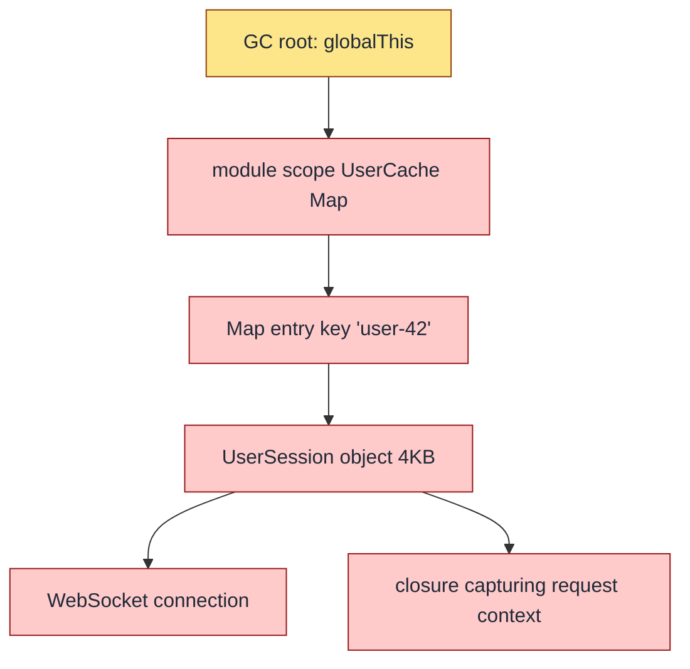
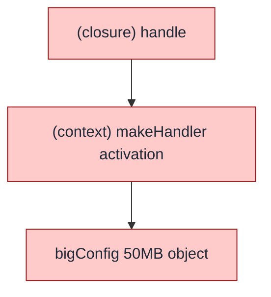
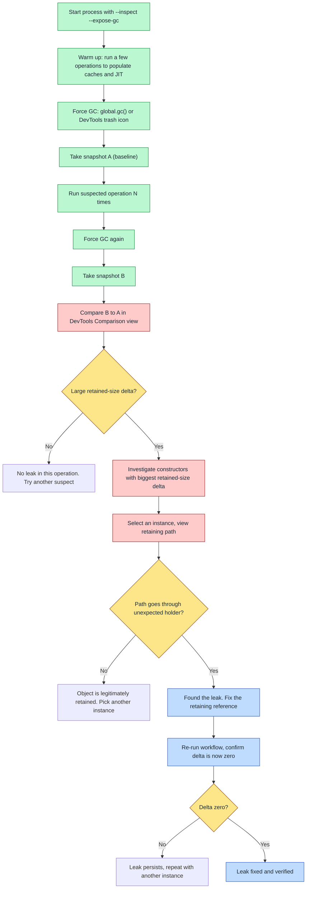
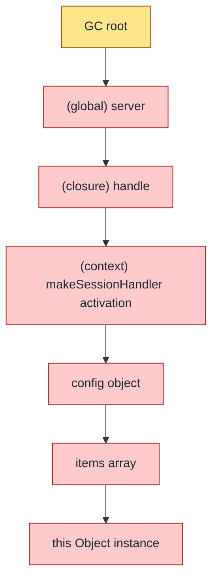
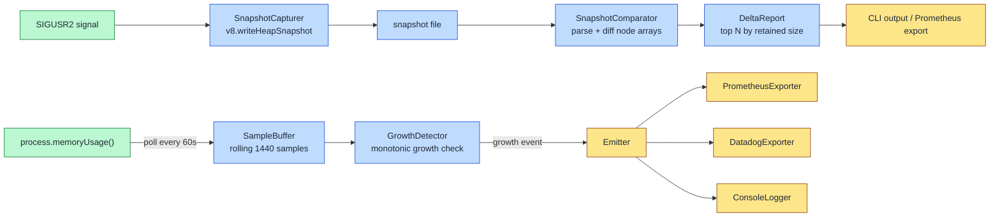

# 7.02 Memory Leak Identification

> Memory leaks in Node.js do not crash the process at the moment they are introduced. They grow quietly for hours, days, or weeks, until the process hits its memory ceiling and dies. The leak itself is a structural property of the reference graph — an object that is reachable but unwanted. Identification is therefore a forensic exercise: capture the heap, compare snapshots, walk the retaining path, and confirm the fix. This note covers the workflow end-to-end, from the first telemetry signal that a leak exists to the final verification that the fix worked.

This note is the operational counterpart to [[1.29 Memory Leaks Diagnostic]]. Where the sibling note catalogs the *patterns* of leaks (closures, timers, listeners, singletons, detached DOM, accidental globals), this note catalogs the *tools and workflows* used to find them in a running process: heap snapshots, allocation timelines, the sampling heap profiler, `process.memoryUsage()` telemetry, and GC pause tracing. Pair this note with [[1.28 Garbage Collection in V8]] for the underlying collector behavior and [[7.01 Profiling CPU Usage]] for the complementary CPU-side diagnostic picture.

---

## 1. Purpose

A memory leak in a Node.js service is not a dramatic event. It does not throw, it does not log, it does not show up in a unit test. The process simply grows. RSS climbs a few megabytes per hour. Heap used creeps upward. Eventually V8 cannot keep up — the old generation grows, major GC cycles get longer and more frequent, latency degrades, and at some point the process exceeds its configured `--max-old-space-size` and aborts with a `JavaScript heap out of memory` fatal error. If the process runs in Kubernetes, the kernel OOM killer may strike first, terminating the container with `OOMKilled`. The pod restarts, the leak resets, the metric drops back to baseline, and the cycle repeats — sometimes for weeks before anyone investigates, because the restart looks like a transient blip.

The damage of a leak is proportional to how long it runs. A leak of 10KB per request on a service handling 1000 requests per second adds 10MB per second — the process dies in minutes, and the team notices during load testing. A leak of 100 bytes per request on the same service adds 100KB per second — the process dies in days, and the team does not notice until the on-call gets paged at 3am for a service that "just restarted itself." Slow leaks are worse than fast leaks because they are harder to reproduce, easier to dismiss as "normal variance," and harder to bisect to a specific deploy. The damage compounds: each restart drops in-flight requests, resets connection pools, warms up caches from cold, and causes a latency spike that downstream services may interpret as a failure.

Identification is the bottleneck. Once you know *what* is leaking, the fix is usually a one-line change: clear the timer, remove the listener, weakly hold the cache entry, sever the closure, delete the Map key. But finding what is leaking in a process with tens of thousands of live objects, hundreds of which legitimately should live for the process lifetime, is a search problem. The tools in this note exist to make that search tractable. They answer four questions in order:

1. **Is there a leak?** Telemetry (`process.memoryUsage()` over time) answers this. If `heapUsed` grows monotonically over hours despite steady traffic, there is a leak.
2. **What kind of object is leaking?** The heap snapshot comparison answers this. The constructor with the largest retained-size delta between two snapshots is the leak suspect.
3. **Why is it alive?** The retaining path answers this. The chain of references from a GC root to the leaked object shows exactly which holder is keeping it alive.
4. **Where is it being allocated?** The allocation timeline or sampling heap profiler (`--heap-prof`) answers this. The stack trace of the allocation points at the line of code that creates the leaked object.

The toolchain for leak identification in Node.js:

| Tool | What it does | When to use it | Overhead |
|------|--------------|----------------|----------|
| Chrome DevTools Heap Snapshot | Full serialization of V8 heap | Local diagnosis, one-shot capture | High at capture, zero between |
| Allocation Timeline | Records each allocation with stack | Local diagnosis, finding allocation source | Medium during recording |
| `--heap-prof` flag | Sampling heap profiler, `.heapprofile` output | Long-running profiling, lower overhead | Low |
| `--inspect` flag | Opens Chrome DevTools Protocol endpoint | All local diagnosis — required for the above | Negligible |
| `process.memoryUsage()` | Programmatic memory telemetry | Production monitoring, leak confirmation | Negligible |
| `--trace-gc` flag | Prints each GC event with timing | GC pressure diagnosis | Negligible |
| `v8.writeHeapSnapshot()` | Programmatic snapshot capture | Production snapshots on signal | High at capture |

The common leak patterns (recap from [[1.29 Memory Leaks Diagnostic]]):

1. **Closures capturing more scope than needed** — an inner function holds a reference to an outer variable that is never used inside the closure, but V8 conservatively retains the whole activation environment. The closure looks innocent in source code; the leak is invisible without a heap snapshot.
2. **Forgotten timers** — `setInterval` callbacks and their closures live until `clearInterval` is called. A timer that is never cleared leaks forever, and so does everything its callback closure captures.
3. **Event listeners not removed** — `EventEmitter.on` without a matching `off` keeps the listener, its closure, and everything the closure captures alive for as long as the emitter lives. The classic case is a per-request listener on a long-lived emitter that is never removed when the request finishes.
4. **Singleton accumulators** — a `Map`, `Set`, or array on a long-lived object (module-level cache, registry, pool) grows without bound because nothing prunes it. The most common leak in real-world Node services.
5. **Detached DOM nodes** — primarily a browser concern, but occurs in Node when using `jsdom` or `happy-dom` for testing or server-side rendering. A node removed from the document but still held in JS keeps its entire subtree alive.
6. **Accidental globals** — sloppy-mode assignment to an undeclared variable creates a property on `globalThis` that lives for the process lifetime. Strict mode and `"use strict"` eliminate this class entirely.
7. **Worker thread leaks** — `MessagePort` instances that are not `close`d, `Worker` instances that are not `terminate`d, unbounded `workerData` growth. Each leaked worker holds its own V8 isolate and its own heap.

This note's job is to teach the *identification workflow*: detect the leak through telemetry, capture a snapshot before and after the suspected operation, compare the two to find what grew, walk the retaining path to find why it is alive, fix the reference, and verify by repeating the workflow and confirming the growth is gone.

---

## 2. Theory and Deep Dive

### 2.1 What a heap snapshot actually is

A V8 heap snapshot is a complete serialization of every JavaScript object alive in V8's heap at the instant the snapshot was triggered. The format is JSON-based (`.heapsnapshot` files), structured as a graph: an array of nodes (each node is an object, with a type, a name, an id, a self-size, an edge count, and a few metadata fields) and an array of edges (each edge is a reference from one node to another, with a name and a type). DevTools parses this graph and presents an interactive view with summary, comparison, containment, and statistics modes.

The snapshot is taken atomically from the program's perspective — V8 performs a stop-the-world pause, walks the heap, serializes everything, and resumes. For a 500MB heap this pause can be 500ms-2s. In production, take snapshots during low-traffic windows or on a single replica, and warn the load balancer to drain the replica first.

Three numbers matter for each object in a snapshot:

- **Shallow size** — the size of the object itself, in bytes. A small object with a reference to a 10MB `Buffer` has a small shallow size. Shallow size tells you nothing about leak impact.
- **Retained size** — the size of the object plus the size of everything that would become unreachable if this object were removed. The `Buffer` holder has a retained size of 10MB+. Retained size is the number that matters for leak prioritization. Always sort by retained size, not shallow size.
- **Distance** — the length of the shortest path from a GC root to this object. Distance 1 means it is held directly by a root. Distance 5 means there are four intermediates. Short distance + large retained size = suspicious.

A leak shows up as objects with large retained size whose distance is suspiciously short (held by something they should not be) or whose count grows between snapshots (more of them accumulate over time).

### 2.2 Comparing two snapshots

A single snapshot is a photo of memory at one moment. It tells you what is alive, but not what is *growing*. To find growth, take two snapshots: one before the suspected leaky operation, one after.

The comparison view (DevTools "Comparison" mode) shows, for each constructor:

- **Added** — count and size of objects present in B but not in A.
- **Deleted** — count and size of objects present in A but not in B.
- **Delta** — net change (added minus deleted).

If you suspect that processing a request leaks, the workflow is:

1. Warm up the process (run a few requests so caches populate and JIT compiles).
2. Take snapshot A.
3. Run the suspected operation N times (say 100).
4. Force GC (DevTools "Collect garbage" button, or `global.gc()` if started with `--expose-gc`).
5. Take snapshot B.
6. Compare B to A.
7. Investigate constructors with non-zero delta, sorted by retained-size delta descending.

The force-GC step is critical. Without it, snapshot B includes garbage that has not yet been collected — objects that are unreachable but not yet freed. These show up as "added" in the comparison, but they are not leaks. Forcing GC before snapshot B ensures only truly retained objects show up in the delta. The warm-up step matters too: the first run of any code path triggers JIT compilation, source map loading, and one-time module initialization that should not be attributed to the operation under test.

### 2.3 The retaining path

For each object in a snapshot, DevTools can show the **retaining path**: the chain of references from a GC root to the object. This is the answer to "why is this object still alive?"

Example retaining path for a leaked `UserSession` object:



The first non-obvious link in the path is usually the bug. In this example, the `UserSession` was supposed to be freed when the user logged out, but the `UserCache` Map was never pruned. The fix is `userCache.delete(userId)` on logout — one line, but you could not know to write it without the retaining path.

V8's GC roots are roughly:

- The global object (`globalThis`).
- The active call stack (every local on every frame).
- Registered event listeners (in the browser; in Node, listeners on `EventEmitter` instances are reachable through the emitter itself).
- Pending timers (`setTimeout` / `setInterval` callbacks).
- Active I/O watchers (libuv handles).
- Built-in prototypes and the Promise job queue.
- Loaded module registry (`require.cache` for CommonJS, the module record graph for ESM).

The retaining path matters because it is almost never the obvious reference. The programmer who wrote the leak usually knows about the obvious references — they set the local variable to `undefined`, they removed the DOM node, they cleared the array. The leak is the *second* reference, the one they forgot: the Map in another module, the listener on a parent emitter, the closure that captured more scope than it needed. The retaining path finds the forgotten reference.

### 2.4 The allocation timeline

The allocation timeline is a recording mode in DevTools where each allocation is recorded with its constructing stack trace. You get a vertical bar chart at the top showing allocation rate over time, and you can scrub to a window and see exactly which constructors were allocated during that window.

This is the right tool when you know *when* the leak happens but not *what* is leaking. Example: "memory grows every time a WebSocket connects." Record the allocation timeline, connect a WebSocket, stop recording, examine what was allocated. If you see 500KB of `Buffer` allocations per connect, you have your suspect.

The allocation timeline has higher overhead than a snapshot because every allocation is logged. Use it for short, targeted recordings, not for hours of production traffic. For longer recordings, use the sampling heap profiler (`--heap-prof`) instead.

### 2.5 The sampling heap profiler (`--heap-prof`)

The sampling heap profiler is V8's low-overhead alternative to the allocation timeline. Instead of logging every allocation, it samples: every N bytes allocated (default 32768), it records the stack that did the allocation. The output is a `.heapprofile` file, opened in Chrome DevTools' "Heap profiler" tab.

```bash
node --heap-prof --heap-prof-name=server.heapprofile server.js
```

The profiler runs for the lifetime of the process. At any point you can stop the process and read the file. The view is a flame graph of allocation stacks, weighted by sampled bytes. This is the right tool when you need to profile for minutes or hours, where the allocation timeline would be too expensive.

Flags:

- `--heap-prof` — enable.
- `--heap-prof-name=<file>` — output filename.
- `--heap-prof-dir=<dir>` — output directory.
- `--heap-prof-interval=<bytes>` — sampling interval (default 32768).

Lower interval = more accurate but higher overhead. The default is a good balance for production. The trade-off is statistical noise: at the default interval, allocations smaller than 32KB may not be sampled at all, so small but frequent allocations may be undercounted. Tune the interval down if you are chasing a leak in small objects.

### 2.6 `process.memoryUsage()` and friends

`process.memoryUsage()` returns an object with the essential memory telemetry:

```javascript
{
  rss: 104857600,        // resident set size, bytes
  heapTotal: 50331648,   // V8 heap committed, bytes
  heapUsed: 33554432,    // V8 heap live + uncollected garbage, bytes
  external: 8388608,     // C++ objects bound to JS, bytes
  arrayBuffers: 4194304  // ArrayBuffer backing stores, bytes (subset of external)
}
```

- **rss** — total RAM the process occupies, including the JS heap, the C++ heap, the stack, and shared libraries. This is what the kernel OOM killer watches.
- **heapTotal** — V8's committed heap. Grows in chunks; does not shrink easily. The gap between `heapTotal` and `heapUsed` is committed-but-free space.
- **heapUsed** — the live objects plus garbage not yet collected. This is the number to chart. If it grows monotonically over hours despite GC, you have a leak.
- **external** — memory allocated by C++ objects that V8 tracks but does not own the storage for. Includes Buffer contents (before Node 14) and other native bindings.
- **arrayBuffers** — since Node 14, the ArrayBuffer/SharedArrayBuffer backing store portion of `external`. Track this separately if your service moves a lot of binary data (TLS termination, file streaming, image processing).

Related APIs:

- `v8.getHeapStatistics()` — detailed V8 heap statistics (used/total for each space: new space, old space, code space, large object space).
- `v8.writeHeapSnapshot([filename])` — write a `.heapsnapshot` file. Returns the filename.
- `process.constrainedMemory()` — returns the system's memory limit if any (macOS-specific, useful for detecting container limits).
- `process.resourceUsage()` — process-wide resource counters including max RSS.

### 2.7 GC pauses and `--trace-gc`

V8's garbage collector has two generations and several collectors:

- **Minor GC (Scavenge)** — collects the young generation (new space). Fast, typically 1-10ms. Runs frequently (every few MB of allocation). Uses a copying collector: live objects in the from-space are copied to the to-space, the from-space is cleared, and the roles swap.
- **Major GC (Mark-Compact)** — collects the old generation. Slow, typically 50-500ms for large heaps. Runs when old space is close to full. Marks live objects by tracing from roots, sweeps dead objects, and compacts to reduce fragmentation.
- **Incremental marking** — major GC work is split into small steps interleaved with execution, reducing pause length at the cost of total throughput.
- **Concurrent marking and sweeping** — V8 does some GC work on background threads, further reducing main-thread pause time.

`--trace-gc` prints each GC event:

```
[12345:0x12345678]    1234 ms: Scavenge 20.5 (25.0) -> 10.2 (25.0) MB, 1.2 / 0.0 ms
[12345:0x12345678]    5678 ms: Mark-Compact 50.3 (60.0) -> 30.1 (55.0) MB, 45.6 / 0.0 ms
```

Each line shows the process PID, timestamp, GC type, before/after sizes (used / total), and pause duration. Long Mark-Compact pauses (>50ms) in a Node service are a problem: they stall the event loop, every in-flight request waits, p99 latency spikes.

A leak manifests in `--trace-gc` output as:

1. Increasing "before" sizes across Mark-Compact events (heap is growing).
2. Increasing pause durations (more to mark, more to compact).
3. Mark-Compact events firing more frequently (old space fills faster).

If you see Mark-Compact pauses growing from 50ms to 200ms to 800ms over hours, you have a leak. The process is buying time, but each GC buys less. Eventually the GC cannot keep up, and the process either OOMs or the latency becomes unacceptable.

### 2.8 Identifying closure leaks

Closures are the most subtle leak source because they look innocent in source code. A closure captures the variables from its enclosing scope that it (or anything it transitively references) might use. V8's optimizer tries to prune captured variables that are provably unused, but it is conservative — if there is any doubt, the variable stays captured. This conservatism is correct (a wrong pruning would corrupt program semantics), but it means closures can hold large objects alive accidentally.

The closure leak pattern:

```javascript
function makeHandler(bigConfig) {
  return function handle(req, res) {
    // handle only uses req and res, not bigConfig
    res.end('ok');
  };
}
const bigConfig = loadHugeConfig(); // 50MB
const handler = makeHandler(bigConfig);
server.on('request', handler);
// handler is now held by server forever
// bigConfig is retained through handler's closure, even though handle never uses it
```

In a heap snapshot, closures appear as `(closure)` or `(context)` nodes. The retaining path for the leaked `bigConfig` leads through:



The fix is to extract only what the closure actually needs into a local `const` before defining the closure:

```javascript
function makeHandler(bigConfig) {
  // Nothing here uses bigConfig, so do not capture it
  return function handle(req, res) {
    res.end('ok');
  };
}
```

Or, if a single field is needed:

```javascript
function makeHandler(bigConfig) {
  const port = bigConfig.port; // capture only this
  return function handle(req, res) {
    res.end(`port is ${port}`);
  };
}
```

DevTools' heap snapshot view has a "Retainers" panel at the bottom. Selecting a `(closure)` node and examining its retainers shows exactly what it captures. A closure with a small shallow size but a large retained size is a candidate for the closure-leak fix. Compare the captured variables to what the closure's body actually references — anything in the captured set that is not referenced in the body is the leak.

### 2.9 The heap snapshot comparison workflow



The workflow is iterative. The first comparison usually reveals multiple deltas — some are leaks, some are legitimate caches, some are just V8 internal allocations that have not settled. Filter by three criteria:

1. **Large retained size.** A delta of 100 bytes is noise; a delta of 10MB is signal.
2. **Count grows with N.** If you ran the operation 100 times and the delta is exactly 100 objects, that is a leak. If the delta is 3 objects regardless of N, it is a one-time initialization.
3. **Retaining path goes through user code, not V8 internals.** A path through `(compiled code)` or `Script` is V8 metadata, not your leak. A path through your own `Cache`, `Registry`, or `(closure)` nodes is your leak.

### 2.10 The relationship between heap snapshots and the sampling profiler

A heap snapshot tells you *what is alive now*. A sampling heap profiler tells you *what was allocated and is still alive*. These are not the same. An object that was allocated and freed between two sampling intervals does not appear in either view. An object that is allocated frequently but freed quickly (high allocation rate, no leak) shows up strongly in the sampling profiler but does not show up in a snapshot comparison.

The two tools are complementary. Use the sampling profiler to find allocation hot spots — code that allocates a lot, even if it does not leak. Reducing allocation rate reduces GC pressure, which reduces pause time, which improves latency, even without a leak. Use the snapshot comparison to find leaks — objects that are allocated and not freed. The snapshot comparison is the leak detector; the sampling profiler is the allocation-rate optimizer.

---

## 3. Mental Models

Five mental models map cleanly to the five tools. Internalize these and the tools become intuitive rather than mysterious.

**Heap snapshot = "a photo of what's in memory."** Like a photograph, a snapshot captures everything visible at one instant. You can study it in detail — zoom in on individual objects, count instances, measure sizes — but a single photo tells you nothing about change. A snapshot alone shows you what is big, not what is leaking. The big things in a single snapshot are almost always legitimate caches, built-in prototypes, and V8 internal structures. Do not chase the biggest thing in a single snapshot; that is the most common beginner mistake.

**Delta = "what was added between two photos."** The comparison view is the difference between two photos taken at different times. If you take a photo before a meal and a photo after, the delta shows what was eaten. If you take a snapshot before processing 100 requests and a snapshot after, the delta shows what the processing left behind — and that leftover is your leak. The delta is the leak detector. Sort it by retained size descending, and the top entries are your suspects.

**Retaining path = "why this object is still alive."** For each object in a snapshot, the retaining path traces from a GC root through the reference graph to the object. The path is the answer to "why haven't you been collected?" Each link in the path is a reference someone is holding. Somewhere in the path is a link that should not exist — a Map entry that should have been deleted, a listener that should have been removed, a closure that should have been pruned, a timer that should have been cleared. Find that link, and you have found the leak. The path is the most useful single piece of information in heap snapshot analysis, and the one beginners most often skip.

**Allocation timeline = "a video of allocations over time."** Where a snapshot is a single frame, the allocation timeline is a video — every allocation is recorded with the moment it happened and the stack that did it. Scrub to the moment memory started growing and see what was being allocated. The timeline answers "when did this happen?" which usually answers "what code did this?" The timeline is heavier than a snapshot (it records every allocation), so use it for short, targeted windows, not for hours of traffic.

**GC pause = "the engine stopped to clean up — too long means too much garbage."** A GC pause is a stop-the-world moment: V8 halts JavaScript execution to mark and sweep. Short pauses (a few ms) are normal — every program allocates and every program needs some collection. Long pauses (hundreds of ms) mean the collector is working hard, which means there is a lot to collect — either a lot of short-lived garbage (high allocation rate, fixable by reducing allocations) or a lot of long-lived garbage that has just become unreachable (a leak that was just freed, or a cache that was just cleared). Watch the trend: if pauses grow over time, the heap is growing, and you have a leak. If pauses are stable but high, you have an allocation-rate problem.

The five tools form a pipeline: telemetry (`process.memoryUsage`) detects the leak, the snapshot comparison locates the constructor, the retaining path finds the specific reference, the allocation timeline or sampling profiler confirms the source, and GC tracing quantifies the impact on latency. Move through the pipeline in order — do not jump to the snapshot tool without first confirming via telemetry that a leak exists, because a snapshot of a non-leaky process will show plenty of "large" objects that are legitimate.

---

## 4. Real-World Use Cases

**Long-running services that leak over days.** A Node.js HTTP service handling 1000 req/s with a 1KB-per-request leak adds 1MB/s, hits its 4GB ceiling in about an hour. A 10-byte-per-request leak adds 10KB/s, hits the ceiling in 4 days. The fast leak is caught in CI load tests; the slow leak is caught by 3am on-call pages. Both have the same root cause (a forgotten reference), but the slow leak is far more common because 10 bytes per request is invisible in any single request. The detection strategy: chart `process.memoryUsage().heapUsed` over time in production, alert on monotonic growth over a 6-hour window. The fix strategy: capture a snapshot pair on a prod replica via `SIGUSR2`, compare, and walk the retaining path.

**Real-time apps where closures accumulate.** A WebSocket server that creates a closure per connection (for the message handler) and stores it in a connection registry that is never pruned leaks one closure per disconnected client. Each closure is small (a few hundred bytes), but at 10000 disconnects per day, that is megabytes per day. The retaining path leads through the connection registry; the fix is to remove the entry on disconnect. A common variant: the message handler closure captures the entire `req` object (which includes headers, sockets, and the parsed URL) and never uses most of it. The closure leak is invisible in source code, obvious in a snapshot: the `(closure)` node has a large retained size because it captures the `req` object's full graph.

**Caches without eviction.** The classic singleton accumulator: a module-level `Map` keyed by user ID, populated on every request, never pruned. Memory grows linearly with the user base. The retaining path leads through the module scope; the fix is an LRU eviction policy or a TTL-based cleanup. The right pattern is `lru-cache` (the npm package) with a max size, or `WeakMap` if keys are objects and you want automatic cleanup when the key is GC'd. The wrong pattern is a plain `Map` "because it's simpler" — plain Maps grow without bound, and "simpler" becomes "leaks in production."

**Event listeners not removed.** An `EventEmitter` that has `on('data', handler)` called per subscription but `off` only called on explicit unsubscribe. If a client disconnects without unsubscribing (network drop, process kill), the listener and its closure live forever. The retaining path leads through the emitter's listener array; the fix is to always pair `on` with `off` in cleanup paths, or to use `once` for one-shot listeners, or to use the `AbortSignal`-based listener API (`emitter.on('event', handler, { signal })`) and abort the signal on session end. The pattern is most dangerous on long-lived emitters: a global event bus with 10000 events per day, each adding a listener that is never removed, leaks 10000 closures per day.

**Detached DOM in browser or jsdom contexts.** In browser SPAs, removing a DOM node from the document while keeping a JS reference to it (or to a child) keeps the entire detached subtree alive. The DOM node itself is small, but event listeners attached to it capture closures that capture the component state, which captures the props, which can be megabytes. In Node, this manifests in test suites using `jsdom` or `happy-dom`: a test that creates a document, mutates it, but does not clean up leaks between tests. The retaining path leads through the test framework's references; the fix is full document replacement between tests (`document.documentElement.innerHTML = ''` is not enough — it leaves references; you must replace the document). Server-side rendering frameworks (Next.js, Remix) can leak DOM in Node if they cache rendered trees without invalidation.

**Worker threads leaking.** A worker pool that creates workers per task and terminates them on completion, but a bug in the termination path leaves the `Worker` instance and its `MessagePort` alive. Each leaked worker holds its isolated heap (potentially hundreds of MB) plus the message channel. The retaining path leads through the pool's tracking array; the fix is to ensure `worker.terminate()` is called in all exit paths (success, error, abort) and that `MessagePort` instances are `close`d. Worker thread leaks are particularly insidious because each worker has its own V8 isolate, so the main process's `process.memoryUsage()` does not show the leaked memory — you must check `worker.threadId` and `worker.resourceLimits.maxOldGenerationSizeUsage` separately.

---

## 5. Code Examples

### 5.1 Example A — Minimal and Conceptual

A minimal leaky function and the heap snapshot analysis workflow to find it.

The leak: a `makeSessionHandler` function that captures a large `config` object in its closure, even though the handler only uses the request and response.

**JavaScript (`leak-minimal.js`)**

```javascript
const http = require('http');
const v8 = require('v8');

// A large config object that the handler does not actually need.
function loadConfig() {
  const big = new Array(500000).fill(0).map((unused, i) => ({
    id: i,
    name: `item-${i}`,
    payload: Buffer.alloc(64, i % 256),
  }));
  return { items: big, version: '1.0.0' };
}

// BUG: the returned closure captures `config` even though it never uses it.
function makeSessionHandler(config) {
  return function handle(req, res) {
    res.end('ok');
  };
}

const config = loadConfig();
const handler = makeSessionHandler(config);

const server = http.createServer(handler);
server.listen(0, () => {
  console.log(`listening on ${server.address().port}`);
  console.log(`initial heapUsed: ${(process.memoryUsage().heapUsed / 1024 / 1024).toFixed(1)} MB`);
});

// On SIGUSR1, write a heap snapshot for inspection.
process.on('SIGUSR1', () => {
  const filename = v8.writeHeapSnapshot();
  console.log(`heap snapshot written to ${filename}`);
});
```

**TypeScript (`leak-minimal.ts`)**

```typescript
import http from 'node:http';
import v8 from 'node:v8';

interface ConfigItem {
  id: number;
  name: string;
  payload: Buffer;
}

interface AppConfig {
  items: ConfigItem[];
  version: string;
}

function loadConfig(): AppConfig {
  const big: ConfigItem[] = new Array(500000).fill(0).map((unused, i) => ({
    id: i,
    name: `item-${i}`,
    payload: Buffer.alloc(64, i % 256),
  }));
  return { items: big, version: '1.0.0' };
}

// BUG: the returned closure captures `config` even though it never uses it.
function makeSessionHandler(
  config: AppConfig
): (req: http.IncomingMessage, res: http.ServerResponse) => void {
  return function handle(req: http.IncomingMessage, res: http.ServerResponse): void {
    res.end('ok');
  };
}

const config: AppConfig = loadConfig();
const handler = makeSessionHandler(config);

const server = http.createServer(handler);
server.listen(0, () => {
  const addr = server.address();
  console.log(`listening on ${typeof addr === 'object' && addr ? addr.port : 'unknown'}`);
  console.log(`initial heapUsed: ${(process.memoryUsage().heapUsed / 1024 / 1024).toFixed(1)} MB`);
});

process.on('SIGUSR1', () => {
  const filename = v8.writeHeapSnapshot();
  console.log(`heap snapshot written to ${filename}`);
});
```

Run with `node --inspect --expose-gc leak-minimal.js` (or `tsx --inspect --expose-gc leak-minimal.ts` for TypeScript), open `chrome://inspect` in Chrome, click "Inspect", navigate to the "Memory" tab. Take a heap snapshot, search for `Array` or objects matching the `ConfigItem` shape, select one, examine the "Retainers" panel. The retaining path leads through `(closure) handle` -> `(context) makeSessionHandler activation` -> `config` -> the 500k-element array.

The fix (both languages identical in shape):

```javascript
function makeSessionHandler() {
  // Closure does not reference config at all, so V8 prunes the capture.
  return function handle(req, res) {
    res.end('ok');
  };
}
const handler = makeSessionHandler();
```

After the fix, take another snapshot. The ~32MB of `ConfigItem` objects is gone from the heap. The retaining path no longer exists. The `config` object is still allocated by `loadConfig()` (we did not remove that call), but nothing holds a reference to it after `makeSessionHandler` returns, so it is collected on the next GC.

### 5.2 Example B — Production-Grade

A production-grade memory leak detector: typed, with telemetry polling, snapshot-on-signal, snapshot comparison, and a delta reporter. This is the kind of module you would drop into a long-running service to give the on-call engineer a one-command way to capture diagnostics.

**JavaScript (`leak-detector.js`)**

```javascript
const v8 = require('v8');
const fs = require('fs');
const path = require('path');
const { EventEmitter } = require('events');

class MemoryLeakDetector extends EventEmitter {
  constructor(options = {}) {
    super();
    this.pollIntervalMs = options.pollIntervalMs || 60000;
    this.growthThresholdBytes = options.growthThresholdBytes || 50 * 1024 * 1024;
    this.snapshotDir = options.snapshotDir || process.cwd();
    this.samples = [];
    this.baseline = null;
    this.timer = null;
  }

  start() {
    if (this.timer) return;
    this.baseline = this.sample();
    this.timer = setInterval(() => this.tick(), this.pollIntervalMs);
    this.timer.unref();
    process.on('SIGUSR2', () => this.captureSnapshot('signal'));
  }

  stop() {
    if (this.timer) {
      clearInterval(this.timer);
      this.timer = null;
    }
  }

  sample() {
    const mu = process.memoryUsage();
    return {
      ts: Date.now(),
      rss: mu.rss,
      heapTotal: mu.heapTotal,
      heapUsed: mu.heapUsed,
      external: mu.external,
      arrayBuffers: mu.arrayBuffers,
    };
  }

  tick() {
    const s = this.sample();
    this.samples.push(s);
    if (this.samples.length > 1440) this.samples.shift();
    const growth = s.heapUsed - this.baseline.heapUsed;
    this.emit('sample', s, growth);
    if (growth > this.growthThresholdBytes) {
      this.emit('growth', { from: this.baseline, to: s, delta: growth });
    }
  }

  captureSnapshot(reason = 'manual') {
    if (global.gc) global.gc();
    const ts = new Date().toISOString().replace(/[:.]/g, '-');
    const filename = path.join(this.snapshotDir, `heap-${reason}-${ts}.heapsnapshot`);
    v8.writeHeapSnapshot(filename);
    this.emit('snapshot', { reason, filename });
    return filename;
  }

  // Note: this is a simplified comparison. Real .heapsnapshot parsing requires
  // understanding the node-field layout (each node is N integers in the flat
  // nodes array, indexed by node type, name, id, self-size, edge-count).
  // For production use, prefer the chrome-devtools-friendly DevTools UI
  // or the heap-snapshot-parser npm package.
  compareAndReport(snapshotA, snapshotB) {
    const a = JSON.parse(fs.readFileSync(snapshotA, 'utf8'));
    const b = JSON.parse(fs.readFileSync(snapshotB, 'utf8'));
    const counts = new Map();
    for (const node of a.nodes) {
      const type = a.nodeTypes[node.type];
      const name = a.strings[node.name];
      const key = `${type}:${name}`;
      counts.set(key, (counts.get(key) || 0) - 1);
    }
    for (const node of b.nodes) {
      const type = b.nodeTypes[node.type];
      const name = b.strings[node.name];
      const key = `${type}:${name}`;
      counts.set(key, (counts.get(key) || 0) + 1);
    }
    const deltas = [...counts.entries()]
      .map(([key, delta]) => ({ key, delta }))
      .filter(d => d.delta !== 0)
      .sort((a, b) => Math.abs(b.delta) - Math.abs(a.delta));
    return deltas.slice(0, 50);
  }
}

module.exports = { MemoryLeakDetector };
```

**TypeScript (`leak-detector.ts`)**

```typescript
import v8 from 'node:v8';
import fs from 'node:fs';
import path from 'node:path';
import { EventEmitter } from 'node:events';

export interface MemorySample {
  ts: number;
  rss: number;
  heapTotal: number;
  heapUsed: number;
  external: number;
  arrayBuffers: number;
}

export interface MemoryLeakDetectorOptions {
  pollIntervalMs?: number;
  growthThresholdBytes?: number;
  snapshotDir?: string;
}

export interface SnapshotDelta {
  key: string;
  delta: number;
}

interface HeapSnapshotFile {
  nodes: number[] | Int32Array;
  nodeTypes: string[];
  strings: string[];
  edges: number[] | Int32Array;
  edgeTypes: string[];
}

export class MemoryLeakDetector extends EventEmitter {
  private readonly pollIntervalMs: number;
  private readonly growthThresholdBytes: number;
  private readonly snapshotDir: string;
  private readonly samples: MemorySample[] = [];
  private baseline: MemorySample | null = null;
  private timer: NodeJS.Timeout | null = null;

  constructor(options: MemoryLeakDetectorOptions = {}) {
    super();
    this.pollIntervalMs = options.pollIntervalMs ?? 60000;
    this.growthThresholdBytes = options.growthThresholdBytes ?? 50 * 1024 * 1024;
    this.snapshotDir = options.snapshotDir ?? process.cwd();
  }

  start(): void {
    if (this.timer) return;
    this.baseline = this.sample();
    this.timer = setInterval(() => this.tick(), this.pollIntervalMs);
    this.timer.unref();
    process.on('SIGUSR2', () => void this.captureSnapshot('signal'));
  }

  stop(): void {
    if (this.timer) {
      clearInterval(this.timer);
      this.timer = null;
    }
  }

  sample(): MemorySample {
    const mu = process.memoryUsage();
    return {
      ts: Date.now(),
      rss: mu.rss,
      heapTotal: mu.heapTotal,
      heapUsed: mu.heapUsed,
      external: mu.external,
      arrayBuffers: mu.arrayBuffers,
    };
  }

  private tick(): void {
    const s = this.sample();
    this.samples.push(s);
    if (this.samples.length > 1440) this.samples.shift();
    const growth = s.heapUsed - (this.baseline?.heapUsed ?? s.heapUsed);
    this.emit('sample', s, growth);
    if (growth > this.growthThresholdBytes) {
      this.emit('growth', { from: this.baseline, to: s, delta: growth });
    }
  }

  async captureSnapshot(reason: string = 'manual'): Promise<string> {
    if (typeof global.gc === 'function') global.gc();
    const ts = new Date().toISOString().replace(/[:.]/g, '-');
    const filename = path.join(this.snapshotDir, `heap-${reason}-${ts}.heapsnapshot`);
    v8.writeHeapSnapshot(filename);
    this.emit('snapshot', { reason, filename });
    return filename;
  }

  async compareAndReport(snapshotA: string, snapshotB: string): Promise<SnapshotDelta[]> {
    const a = JSON.parse(fs.readFileSync(snapshotA, 'utf8')) as HeapSnapshotFile;
    const b = JSON.parse(fs.readFileSync(snapshotB, 'utf8')) as HeapSnapshotFile;
    const counts = new Map<string, number>();
    for (const node of a.nodes) {
      const type = a.nodeTypes[node.type];
      const name = a.strings[node.name];
      const key = `${type}:${name}`;
      counts.set(key, (counts.get(key) ?? 0) - 1);
    }
    for (const node of b.nodes) {
      const type = b.nodeTypes[node.type];
      const name = b.strings[node.name];
      const key = `${type}:${name}`;
      counts.set(key, (counts.get(key) ?? 0) + 1);
    }
    const deltas: SnapshotDelta[] = [...counts.entries()]
      .map(([key, delta]) => ({ key, delta }))
      .filter(d => d.delta !== 0)
      .sort((a, b) => Math.abs(b.delta) - Math.abs(a.delta));
    return deltas.slice(0, 50);
  }
}
```

Usage (TypeScript):

```typescript
import { MemoryLeakDetector } from './leak-detector';

const detector = new MemoryLeakDetector({
  pollIntervalMs: 30000,
  growthThresholdBytes: 100 * 1024 * 1024,
  snapshotDir: '/var/log/myapp/snapshots',
});

detector.on('growth', ({ from, to, delta }) => {
  console.warn(`memory growth: ${(delta / 1024 / 1024).toFixed(1)} MB since baseline`);
  console.warn(`baseline heapUsed: ${(from.heapUsed / 1024 / 1024).toFixed(1)} MB`);
  console.warn(`current  heapUsed: ${(to.heapUsed / 1024 / 1024).toFixed(1)} MB`);
});

detector.on('snapshot', ({ reason, filename }) => {
  console.log(`snapshot captured (${reason}): ${filename}`);
});

detector.start();
```

To trigger an on-demand snapshot: `kill -USR2 <pid>`. The detector writes a `.heapsnapshot` file to the configured directory. Compare two snapshots with `await detector.compareAndReport(a, b)` and inspect the top deltas. Note that the simplified `compareAndReport` above treats each integer in `nodes` as a node — real `.heapsnapshot` files store nodes as a flat array of integers with a stride (typically 7 fields per node), so a production implementation must index correctly. For real analysis, prefer DevTools' built-in comparison view or a dedicated parser library.

---

## 6. Common Mistakes and Anti-Patterns

**1. Not taking a baseline snapshot.** A single snapshot shows what is in memory but not what is growing. Without a baseline, you have no delta to interpret. Engineers new to memory profiling often take one snapshot, see a 500MB heap, panic, and start trying to "fix" the largest object — which is usually a legitimate cache that is supposed to be that size. The baseline-then-action-then-snapshot workflow is the only way to distinguish leaks from legitimate long-lived state. Always take two snapshots; never analyze one.

**2. Profiling in development.** V8 in dev mode behaves differently from production. Dev mode has `--inspect` enabled (which itself adds memory for the inspector protocol), often has source maps loaded, often has tests or watch-mode restarts that populate caches non-representatively. More subtly, dev traffic patterns are different from prod traffic patterns — a leak that manifests in prod under 1000 req/s may not appear in dev under 1 req/s, because the leak rate is too slow to observe. Always profile a staging environment with realistic load, or capture snapshots from a prod replica on a signal. Dev profiling is fine for *finding* structural leaks (a closure that captures the wrong thing leaks at any rate), but not for *quantifying* them.

**3. Ignoring external memory.** `process.memoryUsage().heapUsed` only tracks V8's JS heap. Buffers, typed arrays, and native bindings allocate "external" memory that V8 tracks but does not own. A service that streams files into Buffers can have a 100MB `heapUsed` and a 2GB `external`. If you only watch `heapUsed`, you miss the leak entirely. Always chart `rss` (the total) and `external` alongside `heapUsed`. The `arrayBuffers` field (since Node 14) breaks out the ArrayBuffer portion of external — useful for services that move a lot of binary data.

**4. Not looking at retaining paths.** The "Summary" view in DevTools shows object counts and sizes by constructor. Engineers often stop there, see "Array: 10000 entries, 50MB", and try to reduce array usage. The summary view does not tell you *why* the arrays are alive. The retaining path does. Always click into the object, scroll to the "Retainers" panel, and read the path. The fix is almost always in the first non-obvious link in the path. Without the retaining path, you are guessing; with it, you are reading the answer.

**5. Optimizing the wrong leak.** A real-world process often has multiple leaks at once. The mistake is to fix the first one you find (often the smallest, because it is the easiest to spot in the summary view) and declare victory. The right approach is to sort leaks by retained size, fix the largest first, re-snapshot, and verify the delta shrank. The largest leak dominates RSS growth; smaller leaks are noise until the largest is gone. Fix leaks in descending retained-size order.

**6. Not testing under realistic load.** A leak that adds 100 bytes per request is invisible if you test with 10 requests. Test with 10000 requests, force GC, snapshot, and check the delta. Realistic load means realistic *patterns* too: a leak that only manifests on a specific endpoint will not show up if your load test only hits the health check. Mirror production traffic shapes in your load test. A good rule: if your load test does not include the top 10 endpoints by traffic from prod analytics, it is not realistic.

**7. Forgetting to force GC before snapshot B.** Without forcing GC, snapshot B includes garbage that has not yet been collected. The delta will show this garbage as "added", and you will chase false positives — objects that look leaked but are actually about to be collected. Always `global.gc()` (with `--expose-gc`) or use the DevTools trash icon before taking snapshot B. For snapshot A, forcing GC is also useful (it gives a clean baseline), but less critical.

**8. Treating V8 internals as leaks.** DevTools shows many internal V8 constructs: `(compiled code)`, `(system)`, `(context)`, `BytecodeArray`, `FeedbackCell`, `Script`. These are part of how V8 represents your program. They are almost never the leak. Filter them out mentally and focus on constructors that match your application's domain (`User`, `Session`, `Cache`, etc.). A `FeedbackCell` delta is V8 optimizing and deoptimizing code; it is not your problem to fix.

**9. Restarting instead of fixing.** "Just restart the service every 6 hours" is a common mitigation, but it is a band-aid, not a fix. Restarts drop in-flight requests, reset caches (causing a cold-start latency spike), and hide the leak from telemetry — making the real fix harder to prioritize. Use restart-on-leak only as a stopgap while you investigate, and always pair it with a tracking ticket to fix the underlying leak.

**10. Profiling with the wrong Node flags.** `--inspect` alone is fine, but for memory profiling you want `--inspect --expose-gc` so you can force GC. For sampling profiler runs, use `--heap-prof` from process start (you cannot enable it after start). For GC tracing, `--trace-gc` adds negligible overhead and is safe to leave on in staging. Forgetting `--expose-gc` is the most common flag mistake — you click the DevTools trash icon and it does nothing, because the programmatic GC is not exposed.

---

## 7. Best Practices and Design Patterns

**Take a baseline, perform an action, take another, compare.** This is the canonical workflow. Warm up the process first (run the action a few times so one-time allocations populate), then snapshot A, then run the action N times, force GC, snapshot B, compare. Warming up matters because the first run of any code path triggers JIT compilation, source map loading, and one-time module initialization that should not be attributed to the action. Without warm-up, the delta is dominated by one-time setup noise.

**Look at retaining paths, not just object counts.** The summary view is a starting point; the retainers panel is the answer. For every suspicious object, walk the retaining path to the root. The fix is in the path, not in the count. A count of 10000 instances of `User` is meaningless without knowing whether they are held by a legitimate active-session registry (expected) or by a forgotten logout-cleanup bug (leak). The retaining path distinguishes the two.

**Monitor `process.memoryUsage()` in production.** Chart `rss`, `heapUsed`, `heapTotal`, `external`, and `arrayBuffers` separately. Alert on monotonic growth over a sliding window (e.g., "heapUsed grew every 5-minute sample for the last 2 hours"). A healthy service has a sawtooth pattern: heap grows, GC reclaims, heap grows, GC reclaims. A leaky service has a staircase: each GC reclaims less than the last cycle, and the floor rises. Alert on the floor rising, not on the peaks.

**Set `--max-old-space-size` to bound memory.** Without a bound, V8 will keep growing the heap until the process hits the system limit and the OOM killer fires. With a bound, V8 will throw `JavaScript heap out of memory` when exceeded — a controlled crash that is easier to alert on and that produces a heap dump if configured with `--report-compact` and `--diagnostic-dir`. Set the bound below the container's memory limit (leave 20-30% headroom for external allocations and the C++ heap). For a 512MB container, set `--max-old-space-size=384`.

**Use `--trace-gc` to find GC pressure.** Long GC pauses are the latency symptom of a leak. Run with `--trace-gc` in staging, identify the longest pauses, correlate them with traffic patterns. If Mark-Compact pauses grow over the process lifetime, you have a leak. If they are stable but high, you have an allocation-rate problem (fixable by reducing allocations, not by fixing a leak). `--trace-gc` output to stderr can be parsed and charted; a "max GC pause per minute" metric is one of the most sensitive leak detectors available.

**Fix leaks at the source, do not just restart.** Restart-on-leak is a common mitigation (a cron job that restarts the service every 6 hours), but it is a band-aid, not a fix. Restarts drop in-flight requests, reset caches (causing a cold-start latency spike), and hide the leak from telemetry. Use restart-on-leak only as a stopgap while you investigate. The fix is always to find and remove the retaining reference. A leak that is "fixed" by restarting will return as soon as the restart cadence is reduced.

**Use `WeakRef` and `FinalizationRegistry` for caches.** A `WeakMap` keyed by user objects, or a `Map` of `WeakRef` values, allows the GC to reclaim entries when nothing else references them. This is the right pattern for caches that should not extend object lifetimes. Be aware that `FinalizationRegistry` callbacks are best-effort and may not fire promptly; do not build correctness on them. Use them for cache eviction hints, not for resource cleanup that must happen deterministically.

**Prefer `once` for one-shot listeners.** `emitter.once('event', handler)` removes the listener after the first invocation, eliminating a class of listener leaks. For listeners that must live for a session, use the `AbortSignal`-based pattern: `emitter.on('event', handler, { signal })` and abort the signal on session end. The signal-based pattern is cleaner than manual `on`/`off` pairing because the abort propagates through all listeners tied to the signal at once.

**Bound every cache.** Every `Map`, `Set`, and array on a long-lived object must have a bound. Use `lru-cache` (npm) with a `max` and `ttl`. Unbounded caches are the most common leak in real-world Node services. The bound should be in entries, not bytes (bytes are hard to measure for arbitrary objects); pick an entry count that fits your memory budget and let `lru-cache` enforce it.

**Take snapshots on signal in production.** Install a `SIGUSR2` handler that calls `v8.writeHeapSnapshot()`. This lets an on-call engineer capture a snapshot from a live prod replica without restarting it. Pair with a load-balancer drain so the replica is taken out of rotation during the snapshot (the snapshot pause is hundreds of ms; you do not want user traffic during it). Save snapshots to a persistent volume so they survive pod restarts.

---

## 8. Technical Interview Knowledge

**Q1: How do you find a memory leak in a Node.js service?**

A: Start with telemetry. Chart `process.memoryUsage()` (`rss`, `heapUsed`, `external`, `arrayBuffers`) over time in production. Confirm the leak by observing monotonic growth despite GC — a healthy service has a sawtooth, a leaky service has a staircase. Then move to local diagnosis: start the process with `--inspect --expose-gc`, open Chrome DevTools, warm up the suspected operation, take snapshot A, run the operation N times (say 100), force GC, take snapshot B, compare B to A. Investigate constructors with the largest retained-size delta, walk their retaining paths, find the unexpected holding reference, fix it, and verify by re-running the workflow and confirming the delta is now zero.

**Q2: What is a heap snapshot?**

A: A complete serialization of every JavaScript object alive in V8's heap at the instant the snapshot was triggered. It is a JSON-format graph of nodes (objects) and edges (references), parsed and displayed by Chrome DevTools. Each node has a type, name, shallow size, and retained size. Snapshots are taken with `v8.writeHeapSnapshot()` programmatically or via the DevTools "Take heap snapshot" button. The snapshot is stop-the-world: V8 pauses execution to walk the heap, so capture is expensive (hundreds of ms for large heaps) and should be done off-traffic.

**Q3: What is a retaining path?**

A: The chain of references from a GC root to a specific object. The path is the answer to "why is this object still alive?" For each link in the path, some holder is keeping a reference. Somewhere in the path is usually a link that should not exist — a Map entry not deleted, a listener not removed, a closure not pruned. DevTools shows the retaining path in the "Retainers" panel when you select an object in a heap snapshot. The first non-obvious link in the path is usually the bug. The obvious links (the ones the programmer already knew about) are typically the ones they already cleaned up; the leak is the second, forgotten reference.

**Q4: How do you compare two snapshots?**

A: Take snapshot A, perform the suspected operation N times, force GC (`global.gc()` with `--expose-gc` or DevTools trash icon), take snapshot B. In DevTools, select snapshot B, switch the view mode to "Comparison", and select snapshot A as the baseline. The view shows, per constructor: added count/size, deleted count/size, and delta. Sort by retained-size delta descending. Constructors with large positive delta that scale with N (run the operation 100 times, see 100 instances; run 200 times, see 200 instances) are the leak candidates. Filter out V8 internal types (`(compiled code)`, `(system)`, `FeedbackCell`).

**Q5: What is `--heap-prof`?**

A: V8's sampling heap profiler. Unlike a full heap snapshot (which captures every object), the sampling profiler records allocations statistically: every N bytes allocated (default 32768), it logs the stack that did the allocation. The output is a `.heapprofile` file, opened in Chrome DevTools' "Heap profiler" tab as a flame graph of allocation stacks weighted by sampled bytes. The overhead is much lower than a full snapshot, making it suitable for longer recordings — minutes to hours. Use it when you need to profile in conditions where a snapshot's pause would be unacceptable, or when you want to find allocation hot spots (code that allocates a lot, even if it does not leak). Pair with a snapshot comparison: the profiler tells you *where allocations happen*, the snapshot comparison tells you *which allocations persist*.

**Q6: How do you monitor memory in production?**

A: Poll `process.memoryUsage()` on an interval (every 30-60s) and emit the metrics to your monitoring system (Prometheus, Datadog, CloudWatch). Chart `rss`, `heapUsed`, `heapTotal`, `external`, and `arrayBuffers` separately — they tell different stories. Alert on: monotonic `heapUsed` growth over a 6-hour window, `rss` approaching the container limit, and `heapUsed` approaching `--max-old-space-size`. For deeper diagnosis on demand, install a signal handler that calls `v8.writeHeapSnapshot()` on `SIGUSR2`, so an on-call engineer can capture a snapshot from a live prod replica without restarting it. Also chart event loop lag (via Node's built-in `monitorEventLoopDelay` function from the perf-hooks module) — long GC pauses show up as lag spikes.

**Q7: What causes GC pauses, and how do you measure them?**

A: GC pauses are stop-the-world moments when V8 halts JavaScript execution to mark and sweep. Minor GC (Scavenge) collects the young generation and is fast (1-10ms). Major GC (Mark-Compact) collects the old generation and is slow (50-500ms for large heaps). V8 uses incremental and concurrent marking to reduce pause length, but a large old generation still produces long pauses. Measure with `--trace-gc` (prints each event with timestamp and duration to stderr), the `Performance` API (`performance.measureGC()`), or by charting event loop lag (long pauses show up as lag spikes). Long growing pauses indicate a leak. Stable-but-high pauses indicate an allocation-rate problem. A leak causes both: pauses grow because the old generation grows, and they become frequent because the old generation fills faster.

**Q8: How do you fix a closure leak?**

A: A closure leak occurs when an inner function captures more of its enclosing scope than it needs. V8 conservatively retains the whole activation environment if there is any chance the closure uses it. To fix: extract only the values the closure actually needs into local `const` declarations before defining the closure, so V8 can prune the rest. For example, if the closure uses only `config.port` but `config` is a 50MB object, write `const port = config.port;` and reference `port` inside the closure — V8 prunes the capture of `config`. Confirm the fix by taking a heap snapshot before and after, and checking that the previously-leaked object is no longer in the retainers of the `(closure)` node. If the closure legitimately needs to reference a large object, consider using a `WeakRef` so the GC can reclaim the object when nothing else holds it. Closure leaks are the most subtle because the code looks innocent — the leak is in V8's conservative capture, not in anything the programmer wrote explicitly.

---

## 9. Practical Exercises

**Exercise 1: Capture and compare heap snapshots.**

Goal: Reproduce a leak, capture two snapshots, compare, and identify the leaked constructor.

Setup: Save the `leak-minimal.js` from Section 5.1. Run it with `node --inspect --expose-gc leak-minimal.js`. Open `chrome://inspect` in Chrome, click "Inspect".

Steps:

1. In DevTools, go to the "Memory" tab.
2. Click "Collect garbage" to start clean.
3. Click "Take heap snapshot" — this is snapshot A.
4. In the terminal, send a few HTTP requests to the server (`for i in $(seq 1 100); do curl -s http://localhost:<port>/ > /dev/null; done`).
5. Back in DevTools, click "Collect garbage" again.
6. Click "Take heap snapshot" — this is snapshot B.
7. Select snapshot B, switch view to "Comparison", baseline snapshot A.
8. Sort by "Delta" retained size descending.

Solution: The comparison shows a large delta for `Array` (the 500k-element array held by `config`). The delta is constant (does not scale with the number of requests) because the leak is the *initial* capture, not a per-request leak. Expanding the entry and selecting an instance shows the retaining path: `(closure) handle` -> `(context)` -> `config` -> `Array`. The leaked constructor is `Array`, but the leak is the closure's capture of `config`. To verify this is the leak, note the retained size of the `Array` (around 32MB) and confirm it matches the `config.items` array size.

**Exercise 2: Find a retaining path.**

Goal: Given a heap snapshot with a leaked object, walk the retaining path and identify the fix.

Setup: Use the snapshot from Exercise 1. In the DevTools "Summary" view, search for `Object` (the items in the array). Find one with retained size ~64 bytes (the `payload` Buffer plus the object shell).

Steps:

1. Click on the object instance.
2. Scroll down to the "Retainers" panel (bottom of the DevTools window).
3. Expand the path, reading each link from the object up to the root.

Solution: The retaining path reads:



The first non-obvious link is `(context) makeSessionHandler activation`. The closure is capturing `config` even though `handle` never uses it. The fix: remove the `config` parameter from `makeSessionHandler`, or restructure so the closure does not reference the enclosing scope that holds `config`. After applying the fix, the retaining path for any remaining `Object` instances no longer leads through a closure context — it leads through `loadConfig`'s return value, which is collected on the next GC because nothing holds it.

**Exercise 3: Use `--heap-prof`.**

Goal: Use the sampling heap profiler to find an allocation hot spot over a 60-second run.

Setup: Save this script as `alloc-bench.js`:

**JavaScript (`alloc-bench.js`)**

```javascript
function allocate() {
  return new Array(1000).fill(0).map(() => ({ data: Buffer.alloc(1024) }));
}
setInterval(() => {
  const arr = allocate();
  // Bug: we keep the last array forever in a module-level variable.
  global.lastBigArray = arr;
}, 100);
```

**TypeScript (`alloc-bench.ts`)**

```typescript
interface LeakItem {
  data: Buffer;
}

function allocate(): LeakItem[] {
  return new Array(1000).fill(0).map(() => ({ data: Buffer.alloc(1024) }));
}

setInterval(() => {
  const arr: LeakItem[] = allocate();
  // Bug: we keep the last array forever in a module-level variable.
  (globalThis as Record<string, unknown>).lastBigArray = arr;
}, 100);
```

Steps:

1. Run: `node --heap-prof --heap-prof-name=alloc.heapprofile alloc-bench.js`
2. Wait 60 seconds, then Ctrl-C.
3. Open Chrome DevTools (open a tab, F12), go to "Memory" tab, "Heap profiler" sub-tab.
4. Click "Load" and select `alloc.heapprofile`.
5. Examine the flame graph.

Solution: The flame graph shows the `allocate` function as the dominant allocation source, with `(array)`, `(object)`, and `Buffer` as the allocated types. The retained size grows because `globalThis.lastBigArray` holds each iteration's array. The sampling profiler shows the *allocation source* (the `allocate` function), confirming that the leak originates there. To confirm retention (vs. just allocation), pair this with a snapshot comparison: take snapshot A before the script runs, snapshot B after 60 seconds, force GC, compare. The delta for `Array` and `Object` will be large, and the retaining path leads through `globalThis.lastBigArray`.

**Exercise 4: Fix a closure leak and verify.**

Goal: Fix the closure leak from Exercise 1 and verify the leak is gone.

Steps:

1. Edit `leak-minimal.js` (or `.ts`) to remove the unused `config` parameter from `makeSessionHandler`.

**JavaScript fix:**

```javascript
function makeSessionHandler() {
  return function handle(req, res) {
    res.end('ok');
  };
}
const handler = makeSessionHandler();
```

**TypeScript fix:**

```typescript
function makeSessionHandler(): (req: http.IncomingMessage, res: http.ServerResponse) => void {
  return function handle(req: http.IncomingMessage, res: http.ServerResponse): void {
    res.end('ok');
  };
}
const handler = makeSessionHandler();
```

2. Restart the server with `node --inspect --expose-gc leak-minimal.js`.
3. Take snapshot A.
4. Send 100 requests.
5. Force GC (DevTools trash icon or `global.gc()` if you have a REPL attached).
6. Take snapshot B.
7. Compare B to A.

Solution: The delta for `Array` is now zero (or near zero — V8 may have minor internal allocations from the HTTP server itself). The retaining path for any `Array` instance no longer leads through a closure context. The fix is verified: the leak is gone. The `config` object is still allocated (we still call `loadConfig()`), but it is now collected after `makeSessionHandler` returns, because nothing holds a reference to it. To confirm, search the snapshot for the `config` object (by its `version: '1.0.0'` property or by the `Array` length of 500000) — it should not be found, because it has been collected.

---

## 10. Mini-Project Blueprint

**Project: A Production Memory Leak Detector**

Build a TypeScript module that:

1. Polls `process.memoryUsage()` at a configurable interval.
2. Maintains a rolling window of samples (last 24 hours at 1-minute resolution = 1440 samples).
3. Detects monotonic growth (3 consecutive samples above the prior sample's `heapUsed`, with no decrease).
4. Emits `growth` events when the threshold is exceeded.
5. Captures a heap snapshot on a signal (`SIGUSR2`) or programmatically.
6. Compares two snapshots and reports the top N deltas by retained size.
7. Integrates with `EventEmitter` for pluggable metric sinks (Prometheus, Datadog, console).
8. Ships with a CLI that takes a directory and a duration, runs the detector, and reports deltas.

Architecture:



Module structure (TypeScript):

```typescript
// types.ts
export interface MemorySample {
  ts: number;
  rss: number;
  heapTotal: number;
  heapUsed: number;
  external: number;
  arrayBuffers: number;
}
export interface SnapshotDelta {
  key: string;
  delta: number;
  retainedBytes: number;
}
export interface MemoryLeakDetectorOptions {
  pollIntervalMs?: number;
  growthThresholdBytes?: number;
  snapshotDir?: string;
  sampleWindow?: number;
}

// sample-buffer.ts
export class SampleBuffer {
  private readonly items: MemorySample[] = [];
  constructor(private readonly capacity: number = 1440) {}
  push(s: MemorySample): void {
    this.items.push(s);
    if (this.items.length > this.capacity) this.items.shift();
  }
  latest(): MemorySample | null {
    return this.items.length > 0 ? this.items[this.items.length - 1] : null;
  }
  isMonotonicGrowth(window: number): boolean {
    if (this.items.length < window) return false;
    const tail = this.items.slice(-window);
    for (let i = 1; i < tail.length; i++) {
      if (tail[i].heapUsed <= tail[i - 1].heapUsed) return false;
    }
    return true;
  }
}

// growth-detector.ts
import { EventEmitter } from 'node:events';
export class GrowthDetector extends EventEmitter {
  constructor(
    private readonly buffer: SampleBuffer,
    private readonly thresholdBytes: number
  ) {
    super();
  }
  check(): void {
    if (!this.buffer.isMonotonicGrowth(3)) return;
    const latest = this.buffer.latest();
    if (!latest) return;
    // Compare to the sample 3 ticks ago
    const all = (this.buffer as unknown as { items: MemorySample[] }).items;
    const baseline = all[all.length - 3];
    const delta = latest.heapUsed - baseline.heapUsed;
    if (delta > this.thresholdBytes) {
      this.emit('growth', { from: baseline, to: latest, delta });
    }
  }
}

// snapshot-capturer.ts
import v8 from 'node:v8';
import path from 'node:path';
export class SnapshotCapturer {
  constructor(private readonly dir: string) {}
  async capture(reason: string): Promise<string> {
    if (typeof global.gc === 'function') global.gc();
    const ts = new Date().toISOString().replace(/[:.]/g, '-');
    const filename = path.join(this.dir, `heap-${reason}-${ts}.heapsnapshot`);
    v8.writeHeapSnapshot(filename);
    return filename;
  }
}

// snapshot-comparator.ts
import fs from 'node:fs';
export class SnapshotComparator {
  async compare(a: string, b: string): Promise<SnapshotDelta[]> {
    const fa = JSON.parse(fs.readFileSync(a, 'utf8'));
    const fb = JSON.parse(fs.readFileSync(b, 'utf8'));
    const counts = new Map<string, number>();
    for (const node of fa.nodes) {
      const key = `${fa.nodeTypes[node.type]}:${fa.strings[node.name]}`;
      counts.set(key, (counts.get(key) ?? 0) - 1);
    }
    for (const node of fb.nodes) {
      const key = `${fb.nodeTypes[node.type]}:${fb.strings[node.name]}`;
      counts.set(key, (counts.get(key) ?? 0) + 1);
    }
    return [...counts.entries()]
      .map(([key, delta]) => ({ key, delta, retainedBytes: 0 }))
      .filter(d => d.delta !== 0)
      .sort((x, y) => Math.abs(y.delta) - Math.abs(x.delta))
      .slice(0, 50);
  }
}

// detector.ts (facade)
export class MemoryLeakDetector extends EventEmitter {
  private readonly buffer: SampleBuffer;
  private readonly growth: GrowthDetector;
  private readonly capturer: SnapshotCapturer;
  private readonly comparator: SnapshotComparator;
  private timer: NodeJS.Timeout | null = null;

  constructor(opts: MemoryLeakDetectorOptions = {}) {
    super();
    const pollMs = opts.pollIntervalMs ?? 60000;
    const threshold = opts.growthThresholdBytes ?? 50 * 1024 * 1024;
    const dir = opts.snapshotDir ?? process.cwd();
    this.buffer = new SampleBuffer(opts.sampleWindow ?? 1440);
    this.growth = new GrowthDetector(this.buffer, threshold);
    this.capturer = new SnapshotCapturer(dir);
    this.comparator = new SnapshotComparator();
    this.growth.on('growth', (e) => this.emit('growth', e));
  }

  start(): void {
    if (this.timer) return;
    this.timer = setInterval(() => this.tick(), this.pollIntervalMs);
    this.timer.unref();
    process.on('SIGUSR2', () => void this.capturer.capture('signal'));
  }

  stop(): void {
    if (this.timer) {
      clearInterval(this.timer);
      this.timer = null;
    }
  }

  private get pollIntervalMs(): number {
    return 60000; // stored on constructor opts in real impl
  }

  private tick(): void {
    const mu = process.memoryUsage();
    this.buffer.push({
      ts: Date.now(),
      rss: mu.rss,
      heapTotal: mu.heapTotal,
      heapUsed: mu.heapUsed,
      external: mu.external,
      arrayBuffers: mu.arrayBuffers,
    });
    this.growth.check();
    this.emit('sample', this.buffer.latest());
  }

  async captureSnapshot(reason: string = 'manual'): Promise<string> {
    return this.capturer.capture(reason);
  }

  async compare(a: string, b: string): Promise<SnapshotDelta[]> {
    return this.comparator.compare(a, b);
  }
}
```

Acceptance criteria:

- A test harness that runs a known leaky workload (the `leak-minimal` script from Section 5.1) for 5 minutes.
- The detector emits at least one `growth` event within that window.
- A `SIGUSR2` signal produces a `.heapsnapshot` file readable by Chrome DevTools.
- The comparator reports the `Array` constructor as the top delta when comparing a before-and-after pair.
- All public APIs have full TypeScript types, with no `any` and no `as unknown as` casts (the facade above has one for illustration — replace it with a proper public accessor on `SampleBuffer`).
- The module has zero runtime dependencies (only Node built-ins).

Extensions:

- Add a Prometheus exporter (one gauge per `process.memoryUsage()` field, exposed on `/metrics`).
- Add automatic snapshot pair capture on growth event (snapshot now, wait 5 minutes, snapshot again, compare automatically, emit a `delta` event with the report).
- Add a web UI that streams the sample buffer over WebSocket for live charting (a small Express server with one WebSocket endpoint).
- Add integration with `--trace-gc` parsing: spawn the process with `--trace-gc`, parse stderr, chart GC pause durations alongside heap usage.
- Add automatic leak source attribution: when a `growth` event fires, automatically capture a snapshot, wait, capture another, run the comparator, and emit a `leak-suspect` event with the top delta constructor name.

---

## 11. Core Connections

- [[1.28 Garbage Collection in V8]] — the foundational note on how V8's GC works (minor/major, marking, compaction, incremental and concurrent collection). Necessary background for understanding why retaining paths matter and why GC pauses grow with heap size. This note assumes you understand the generational hypothesis and the difference between Scavenge and Mark-Compact.
- [[1.29 Memory Leaks Diagnostic]] — the sibling note cataloging the six common leak patterns (closures, timers, listeners, singletons, detached DOM, accidental globals). This note is the *identification workflow*; that note is the *pattern catalog*. Read both together: 1.29 tells you what to look for, 7.02 tells you how to find it.
- [[1.27 Memory Lifecycles and Allocation]] — the foundational note on the JS memory lifecycle (allocate, use, release) and the relationship between JS references and underlying storage. Necessary background for understanding what `process.memoryUsage()` actually measures and why `external` is separate from `heapUsed`.
- [[7.01 Profiling CPU Usage]] — the companion note on CPU profiling. CPU and memory profiling are complementary: a slow function may be slow because it allocates heavily (visible in heap profiler) or because it computes heavily (visible in CPU profiler). A complete latency investigation uses both. Long GC pauses also show up as CPU profile spikes in the V8 GC code.
- [[7.03 Event Loop Monitoring]] — the companion note on event loop lag. GC pauses manifest as event loop lag spikes; the two notes together explain the full latency diagnostic picture. A service with high event loop lag and growing heap is leaking; a service with high event loop lag and stable heap has a CPU-bound or synchronous-I/O problem.
- [[3.01 Architecture Overview]] — the system architecture note. Memory bounds (`--max-old-space-size`), monitoring (`process.memoryUsage()` telemetry), and snapshot-on-signal handlers should be part of the architecture, not added after the first OOM crash. Designing for observability from day one is cheaper than retrofitting it under pressure.
