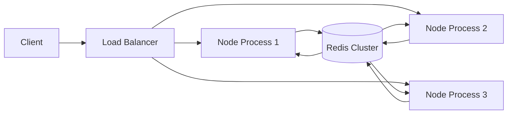
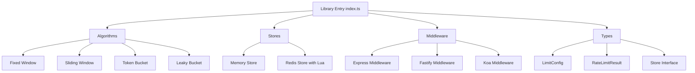

# 7.04 API Rate Limiting

## 1. Purpose

Rate limiting is the practice of restricting how many requests a client can make to a service within a defined window of time. It is the single most effective defense against denial-of-service attacks, brute-force credential attacks, scraping, spam, and abusive traffic patterns that would otherwise consume your server resources, starve legitimate users, or trigger cascading failures in downstream systems. Without rate limiting, any public endpoint is one attacker away from being taken offline; with rate limiting, the attacker's traffic is capped at a level your service can sustain.

The core purposes of rate limiting are fourfold. First, **preventing denial-of-service**: a single client cannot make ten thousand requests per second against your login endpoint, because the limiter rejects the surplus and the database, the CPU, and the network remain available for everyone else. Second, **fair resource allocation**: when capacity is finite (a database connection pool of fifty, a worker thread pool of eight, a single CPU core processing requests), the limiter ensures no single client can monopolize those resources at the expense of every other client. Third, **protecting downstream services**: when your API server sits in front of a database, a third-party API, or an expensive AI model, the rate limit on the outer service acts as a backpressure mechanism that prevents the inner service from being overwhelmed by a burst at the outer layer. Fourth, **cost control**: when each request costs money (an OpenAI token bill, a Stripe fee per call, an SMS message per verification, a CloudFront egress charge), rate limiting caps the financial blast radius of a buggy client, a misconfigured retry loop, or a malicious user.

The strategies you can employ differ in accuracy, fairness, memory cost, and complexity. The **fixed window** algorithm counts requests per discrete time window (for example, one hundred requests per minute, where the minute resets at the wall-clock boundary). It is the simplest to implement but suffers from a burst-at-the-boundary problem: a client can make one hundred requests at 11:59:59 and another one hundred at 12:00:00, effectively sending two hundred requests in one second, twice the configured per-minute rate. The **sliding window** algorithm counts requests in the last N seconds continuously, so the same burst is correctly rejected because the first batch is still inside the rolling window. It is more accurate but requires per-request timestamp storage (typically in a Redis sorted set) or a weighted-bucket approximation. The **token bucket** algorithm maintains a bucket of up to N tokens that refills at R tokens per second; each request consumes one token. It allows short bursts up to N while smoothing the long-term rate to R, which makes it ideal for user-facing APIs where a burst of legitimate activity (a dashboard loading a dozen widgets in parallel) is normal. The **leaky bucket** algorithm treats requests as drops entering a queue that drains at a fixed rate; when the queue is full, requests are rejected. Leaky bucket smooths output traffic to a constant rate and is often used for traffic shaping to downstream services that cannot tolerate bursts.

Why Redis specifically? Because rate limiting state must be shared across all instances of your application. If you deploy four Node processes behind a load balancer and each keeps its own in-memory counter, the effective limit is four times the configured limit, and a single client can bypass protection simply by having its requests land on different processes. Redis provides an external, atomic, low-latency store that every process can read and write to, with sub-millisecond response times, native atomic operations like `INCR` and `EXPIRE`, and the ability to run Lua scripts that perform multiple operations as a single atomic transaction. Redis is the standard choice for distributed rate limiting in the Node ecosystem; alternatives like Memcached lack Lua scripting, a relational database is too slow for the per-request workload, and an in-memory `Map` only works for a single-process deployment.

The HTTP status code for rate limiting is **429 Too Many Requests**, standardized in RFC 6585. A correct 429 response includes a `Retry-After` header (the number of seconds the client should wait before retrying) and ideally the `RateLimit-Limit`, `RateLimit-Remaining`, and `RateLimit-Reset` headers from the IETF draft-ietf-httpapi-ratelimit-headers specification, so well-behaved clients can implement exponential backoff and self-throttle. Without `Retry-After`, clients typically retry immediately, defeating the entire purpose of the limiter.

This note covers the four algorithms in depth, demonstrates side-by-side JavaScript and TypeScript implementations, shows a production-grade Redis-backed limiter with Lua scripts and typed Express middleware, catalogs the common mistakes that defeat the protection, and prepares you to choose the right strategy for any endpoint.

## 2. Theory and Deep Dive

### 2.1 Fixed Window

The fixed window algorithm partitions time into discrete, non-overlapping windows of length W (typically one minute, one second, or one hour). Each window is identified by an integer index computed as `floor(now / W)`. For each client and each window, the server maintains a counter; on each request, it increments the counter. If the counter exceeds the limit L, the request is rejected; otherwise, the request is admitted.

The implementation is the simplest of all algorithms: a single Redis `INCR` followed by an `EXPIRE` on the first request of a window. The pseudocode is: compute the key as `clientId concatenated with floor(now / W)`; call `INCR` on that key; if the returned value is one, call `EXPIRE` with a TTL of W seconds (this is the first request of the window, so set the expiration); if the returned value is greater than L, reject the request. The whole sequence is two Redis round trips for the first request of a window and one round trip for every subsequent request, and the `INCR` is itself atomic, so no race condition is possible.

The weakness is the **boundary burst**. Suppose the limit is one hundred per minute. A client makes one hundred requests at 11:59:59.999, then one hundred more at 12:00:00.001. Both bursts succeed because they fall into two different windows: the window ending at 12:00:00 and the window starting at 12:00:00. The effective peak rate over that one second is two hundred requests, twice the configured per-minute limit. For some use cases this is acceptable (the long-term average is still one hundred per minute, and the downstream service can probably sustain a one-second spike); for others, like login brute-force protection, the burst is dangerous because the attacker can try two hundred passwords in that one second.

The fixed window also has a **fairness cliff**: a client that arrives at 11:59:59 finds the window nearly full (because the previous fifty-nine seconds accumulated ninety-nine requests), but a client that arrives at 12:00:00 finds the window completely empty. The same client experiences wildly different service quality depending on the wall-clock moment of arrival, which is unintuitive and feels arbitrary.

### 2.2 Sliding Window

The sliding window algorithm addresses the boundary burst by counting requests in the last W seconds continuously, rather than in discrete windows. There are two implementation strategies: the **sorted-set approach** and the **weighted-counter approach**.

In the sorted-set approach, the server stores each request as a member of a Redis sorted set, with the score being the request timestamp in milliseconds. On each request, the server removes all members with score less than `now minus W times 1000`, then counts the remaining members with `ZCARD`. If the count is below the limit, it adds the new request with `ZADD` and sets a `PEXPIRE` on the key; otherwise, it rejects. The whole sequence is wrapped in a Lua script to make it atomic. The advantage is exact accuracy: the count is the precise number of requests in the last W seconds. The disadvantage is memory: one sorted-set member per request, which can be expensive for high-traffic endpoints (one million requests per minute means one million members per key, occupying roughly one hundred megabytes of Redis memory per active key).

In the weighted-counter approach (sometimes called the **sliding-window-with-buckets** approach, popularized by Cloudflare in their engineering blog), the server maintains a small number of fixed-window buckets (typically one per second, so sixty buckets for a one-minute window) and computes the count as a weighted sum of the current bucket and the previous bucket. If the current time is `t` and the boundary between the current bucket and the previous bucket is at `t0`, then the weighted count is `countCurrent + countPrevious multiplied by (1 minus (t minus t0) divided by W)`. This is approximate (it assumes uniform distribution within the previous bucket) but uses constant memory regardless of request volume (sixty integers per key instead of one million sorted-set members). The error is bounded by the bucket size and is acceptable for most use cases.

The sliding window eliminates the boundary burst. A client that makes one hundred requests at 11:59:59.999 and tries another one hundred at 12:00:00.001 finds that the first one hundred are still within the last sixty seconds (only two milliseconds have passed), so the second burst is correctly rejected. The cost is the extra Redis operations per request (a `ZREMRANGEBYSCORE`, a `ZCARD`, and a `ZADD` for the sorted-set approach, all wrapped in one Lua script) and the memory to store timestamps or bucket counts.

### 2.3 Token Bucket

The token bucket algorithm maintains a bucket with capacity C tokens. Tokens are added to the bucket at a fixed refill rate R tokens per second, up to the capacity C (so a bucket that is already full does not accumulate more tokens). Each request consumes one token; if the bucket is empty (that is, the token count is less than one), the request is rejected.

The implementation requires storing two values per client: the current token count and the timestamp of the last refill. On each request, the server computes the time elapsed since the last refill (in seconds), adds `elapsed multiplied by R` tokens to the bucket (capped at C, so the bucket never overflows), updates the timestamp to now, then either decrements the token count by one (admitting the request) or rejects. The Redis implementation uses a Lua script to make this read-modify-write atomic, because two concurrent clients could otherwise both read the same token count, both decide to admit, and both decrement, leading to over-admission.

The key property is that token bucket **allows bursts up to C** while smoothing the long-term average rate to R. If a client makes C requests instantly, all succeed (the bucket is full); the client must then wait `1 divided by R` seconds per additional request. This is ideal for user-facing APIs where a burst of activity (loading a dashboard with ten parallel API calls, syncing a freshly opened mobile app) is normal and legitimate, but sustained high-volume traffic should be throttled.

A common variant is the **two-token-bucket** (also called the **multi-bucket** or **hierarchical** rate limiter): a small capacity bucket for per-second limits (say, capacity ten, refill ten per second) and a larger bucket for per-day quotas (say, capacity ten thousand, refill ten thousand per day). The request must consume a token from both, allowing you to enforce both burst and daily limits simultaneously. Stripe and GitHub both use this pattern.

Another variant is the **Generic Cell Rate Algorithm** (GCRA), used in production by Shopify and others. GCRA achieves the same semantics as token bucket (burst capacity plus sustained rate) without storing a token count, by storing only a single timestamp (the theoretical arrival time of the next admissible request). This is more memory-efficient than token bucket (one number per key instead of two) and is the algorithm used by the `throttled` npm package.

### 2.4 Leaky Bucket

The leaky bucket algorithm models requests as drops entering a bucket with a hole. The bucket leaks at a fixed rate L (drops per second). If the bucket is full (the queue length is at capacity C), the new drop is rejected. The bucket's contents represent the queue of in-flight or pending requests.

Leaky bucket is functionally similar to token bucket with capacity C and rate R, but with the semantics inverted: token bucket allows bursts up to C and limits the average rate to R; leaky bucket enforces a strict output rate of L and rejects when the queue is full. The two algorithms produce similar traffic shaping but differ in their mental model: token bucket is about **permitting bursts** at the input, leaky bucket is about **smoothing output** to a constant rate.

In practice, leaky bucket is implemented as a FIFO queue with a fixed-rate drain. The Redis implementation is rare; more commonly, leaky bucket is implemented in-process (in a queue with a worker that processes one item every `1 divided by L` seconds) or via a message broker like RabbitMQ with a fixed consumer rate. The leaky bucket is the right choice when the downstream service is sensitive to bursts (for example, a legacy database that crashes when it receives more than fifty queries per second, even for a brief moment).

### 2.5 Mermaid Diagram of the Four Algorithms

```mermaid
flowchart TD
    A[Four Rate Limiting Algorithms] --> B[Fixed Window]
    A --> C[Sliding Window]
    A --> D[Token Bucket]
    A --> E[Leaky Bucket]

    B --> B1[Count requests in discrete window]
    B --> B2[Reset counter at boundary]
    B --> B3[Allows burst of 2x at boundary]
    B --> B4[One INCR plus one EXPIRE in Redis]

    C --> C1[Count requests in last N seconds]
    C --> C2[Continuous rolling window]
    C --> C3[No boundary burst]
    C --> C4[Sorted set or weighted buckets in Redis]

    D --> D1[Bucket of C tokens]
    D --> D2[Refill R tokens per second]
    D --> D3[Allows burst up to C]
    D --> D4[Lua script for atomic read modify write]

    E --> E1[Queue of pending requests]
    E --> E2[Drain at fixed rate L]
    E --> E3[Reject when queue full]
    E --> E4[Smooths output to constant rate]
```



### 2.6 Comparison Table

| Algorithm | Memory per key | Redis ops per request | Burst tolerance | Best for |
| --- | --- | --- | --- | --- |
| Fixed window | One integer | One INCR plus EXPIRE on first | Boundary burst of 2x | Simple quotas, non-sensitive endpoints |
| Sliding window (sorted set) | One member per request | ZREMRANGEBYSCORE, ZCARD, ZADD inside Lua | None (strict) | Login, OTP, security-sensitive |
| Sliding window (weighted) | Fixed number of buckets | Few INCRs inside Lua | None (strict, approximate) | High-traffic endpoints with memory limits |
| Token bucket | Two numbers (tokens, timestamp) | One Lua EVALSHA | Configurable burst up to C | Public APIs with legitimate bursts |
| Leaky bucket | One number (queue size, timestamp) | One Lua EVALSHA or in-process | None at output | Downstream traffic shaping |

### 2.7 Redis for Shared State

The fundamental requirement of distributed rate limiting is that every instance of your application sees the same counter. An in-memory `Map` in Node process A has no visibility into the `Map` in Node process B; if your load balancer round-robins requests across both processes, the effective rate limit is doubled. If you scale to ten processes, the effective limit is ten times the configured value.

Redis is the dominant choice for several reasons. First, **atomic operations**: Redis `INCR` is atomic at the server level, so two concurrent `INCR` calls from two Node processes will both increment correctly, with no race. Second, **expiration**: `EXPIRE` removes stale keys automatically, so the rate limiter does not leak memory as windows pass. Third, **Lua scripting**: a Lua script runs atomically inside Redis, so a multi-step operation (read, decide, write, set expiration) executes as a single indivisible transaction. Fourth, **low latency**: a typical Redis round trip on the same network is under one millisecond. Fifth, **persistence and replication**: Redis can persist to disk and replicate to replicas, so a single Redis failure does not lose all rate-limit state. Sixth, **ecosystem maturity**: the Node ecosystem has well-tested Redis clients (`ioredis`, `node-redis`) and rate-limit packages (`express-rate-limit` with the `rate-limit-redis` store, `fastify-rate-limit`).

The basic Redis primitives used in rate limiting are `INCR` (atomic increment), `EXPIRE` and `PEXPIRE` (set a key's time-to-live), `TTL` and `PTTL` (inspect remaining time-to-live, used to compute `Retry-After`), `EVAL` and `EVALSHA` (run a Lua script), `SCRIPT LOAD` (load a script and cache its SHA1 hash), and the sorted-set operations `ZADD`, `ZREMRANGEBYSCORE`, `ZCARD`, and `ZREMRANGEBYRANK`.

### 2.8 Lua Scripts for Atomicity

The reason Lua scripts matter is that a naive implementation of the fixed-window algorithm performs two separate Redis commands: `INCR` then `EXPIRE`. If the process crashes between the two, the key has no expiration and leaks forever. Worse, for token bucket, the read-modify-write cycle (read the current tokens, compute the new tokens, write back) is not atomic across multiple clients; two concurrent clients can both read the same token count, both decide to admit, and both decrement, leading to over-admission. Under high concurrency, the over-admission can be much larger than one.

A Lua script runs to completion without interruption by any other Redis command. The Redis documentation calls this "atomicity from the perspective of an external observer": from the moment the script starts to the moment it finishes, no other client's command can execute. For rate limiting, this means a token bucket implemented as a Lua script cannot be raced by concurrent requests.

The typical Lua script for token bucket takes the key, the capacity, the refill rate, the current time, and the requested token cost as arguments. It reads the stored bucket state, computes the elapsed time and the new token count (capped at capacity), updates the timestamp, writes the updated state back, and returns whether the request was admitted plus the remaining tokens. The Node client sends the script once with `EVALSHA` (after loading it with `SCRIPT LOAD` and caching the SHA1 hash) and gets a single response array back.

The pattern of `SCRIPT LOAD` once at startup, then `EVALSHA` for every request, avoids the overhead of resending the script body on every request. If Redis responds to `EVALSHA` with a `NOSCRIPT` error (which happens after a Redis flush, a restart, or a failover to a replica that has not loaded the script), the client should fall back to `EVAL` with the full script body, then re-cache the SHA1 for future use.

### 2.9 Distributed Rate Limiting Architecture

In a distributed deployment, every Node process points to the same Redis cluster. The architecture is: client to load balancer to Node process to Redis. The Node process runs the rate-limit middleware, which calls Redis with the client identifier and the limit configuration. Redis returns whether the request is admitted and the remaining capacity. The Node process either continues to the route handler or returns a 429.



The trade-off is that every request now requires a Redis round trip, adding latency (typically one to three milliseconds on the same network). For ultra-low-latency APIs, even one millisecond is unacceptable. The mitigation is a **local-plus-remote** strategy: each Node process keeps a small in-memory budget (say, ten percent of the global limit) that it consumes first, and only queries Redis when the local budget is exhausted. This reduces Redis load by roughly ninety percent while preserving the global limit's accuracy within a small error margin.

The Redis cluster can be a single instance (for small deployments), a primary-plus-replica setup with Sentinel (for high availability), or a multi-node Redis Cluster (for horizontal scaling). A single Redis instance handles roughly one hundred thousand operations per second on commodity hardware; for higher throughput, Redis Cluster shards the keyspace across multiple nodes.

### 2.10 Choosing an Algorithm

The choice of algorithm depends on the workload. **For login and authentication endpoints**, use a strict sliding window or a small token bucket, because brute-force protection requires accurate per-second accounting. **For public read APIs**, use token bucket with a generous capacity, because legitimate clients burst naturally and a strict limiter would reject legitimate traffic. **For expensive downstream operations** (AI generation, video transcoding, third-party API calls billed per request), use leaky bucket to smooth the output rate. **For multi-tenant SaaS**, use a per-tenant token bucket with tier-based capacities. **For signup and OTP endpoints**, use a tight sliding window keyed by email or username, not just by IP, to handle attackers rotating IPs across a botnet. **For webhook ingress**, use a per-partner token bucket.

The default for a new project should be token bucket: it handles bursts naturally, is easy to reason about, the Lua implementation is straightforward, and it is the algorithm used by most production rate-limit libraries.

## 3. Mental Models

- **Fixed window** is "one hundred per minute, resets at the boundary." Simple to think about, but the boundary is a sharp cliff where bursts can hide. Two clients, one arriving at 11:59:59 and one at 12:00:00, see wildly different service.
- **Sliding window** is "one hundred in the last sixty seconds, continuously." The window moves with the present moment; there is no boundary to exploit. The cost is per-request storage.
- **Token bucket** is "a bucket of tokens, refill rate, burst capacity." You can drink the whole bucket at once, but it refills slowly. Good for legitimate bursts.
- **Leaky bucket** is "a queue with a fixed output rate." Input can be bursty, but output is constant. Good for protecting downstream services.
- **Redis** is "a shared counter across instances." The counter lives outside any single process, so the limit is global. Every instance agrees on the count.
- **Lua script** is "a single indivisible operation." No other Redis command can interleave between the reads and writes inside the script. Race conditions cannot happen.
- **429 with `Retry-After`** is "the server tells you when to come back." Without it, clients retry blindly and the limiter fails to do its job.
- **Per-user versus per-IP** is "anonymous users share a limit by IP, authenticated users have their own bucket." A shared IP (a corporate NAT, a mobile carrier) should not punish authenticated users who happen to share it.
- **Backpressure** is "rate limiting flows upstream." When a downstream service is slow, the upstream limiter tightens, preventing pile-up and cascading failure.
- **Tiers** is "different limits for different clients." Free, paid, enterprise; human, bot, partner integration; read, write, admin. The limit is part of the product, not just a defense.
- **Local-plus-remote** is "spend local first, ask Redis when empty." Reduces Redis load by ninety percent at the cost of a small accuracy margin.
- **Weighted buckets** is "approximate sliding window with constant memory." Trade a small error for huge memory savings on high-traffic endpoints.

## 4. Real-World Use Cases

### 4.1 Public APIs with Per-User Limits

GitHub, Stripe, Twitter, and OpenAI all expose public REST APIs with per-user rate limits. GitHub uses a hybrid: five thousand requests per hour for authenticated requests, sixty per hour for unauthenticated. The limit is per-token, not per-IP, so a single user on multiple IPs gets one bucket and multiple users on one IP each get their own. The response headers `RateLimit-Limit`, `RateLimit-Remaining`, and `RateLimit-Reset` expose the current state so clients can self-throttle.

### 4.2 Login Endpoints for Brute-Force Prevention

The login endpoint is the most attacked endpoint in any system. Credential stuffing attacks use leaked password lists (the haveibeenpwned collections, the RockYou list) to try thousands of password combinations per account. A rate limit of ten login attempts per minute per username (or per IP-and-username pair) caps the attacker at six hundred attempts per hour, while a real user mistyping their password three times is unaffected. The limit should escalate: after five failed attempts, lock the account for fifteen minutes; after ten, lock for an hour. The combination of rate limiting, account lockout, breached-password checks, and multi-factor authentication provides defense in depth.

### 4.3 Search Endpoints for Expensive Queries

A full-text search across millions of documents can take seconds and consume significant CPU. A single user typing rapidly can fire dozens of searches in a minute. Rate limiting search to thirty per minute per user (with a token bucket allowing a burst of five for rapid typing) caps the load. The frontend should also debounce, but the backend limiter is the ultimate defense against a misbehaving client, a script, or an attacker probing the search index.

### 4.4 Signup Endpoints for Spam Prevention

Account creation is a target for spam bots that create thousands of accounts to send phishing messages, inflate follower counts, or abuse free-tier resources. A rate limit of five signups per hour per IP, combined with a CAPTCHA (Cloudflare Turnstile, Google reCAPTCHA, hCaptcha) and email verification, makes bulk account creation uneconomical. The limiter key should be the IP, optionally combined with the email domain to catch attackers rotating IPs but using the same disposable email provider.

### 4.5 Multi-Tenant SaaS Per-Tenant Limits

A SaaS platform with free and paid tiers enforces limits per tenant, not per user. A free tenant with ten users shares a one-hundred-per-minute budget; a paid tenant with one thousand users gets one thousand per minute; an enterprise tenant gets ten thousand per minute. The limiter key includes the tenant identifier: `ratelimit:tenant:123:minute:floor(now divided by 60)`. This protects the platform from one noisy tenant degrading service for others and provides a clean upgrade incentive. Stripe, Twilio, and SendGrid all use this pattern.

### 4.6 AI APIs with Per-Token Limits

OpenAI, Anthropic, and other LLM providers rate-limit by both requests per minute and tokens per minute, because a single request can consume thousands of tokens. The token limiter is a token bucket where the cost is the number of tokens in the request, not one. The implementation reads the request body, estimates the token count (using a tokenizer like `tiktoken` for OpenAI models), and consumes that many tokens from the bucket. This prevents a single user from monopolizing GPU capacity with one massive prompt.

### 4.7 Password Reset and OTP Endpoints

Password reset and one-time-password endpoints are special cases of brute-force prevention. The rate limit should be very tight (three attempts per hour per email) because the legitimate use case is rare (a user resets their password perhaps once a year) and the abuse case (OTP guessing) is severe. The limiter key should include the email or the target account identifier, not just the IP, so an attacker on a botnet of ten thousand IPs cannot try thirty thousand OTPs against a single account.

### 4.8 Webhook Ingress for Partner Integrations

When you accept webhooks from partners (Stripe, GitHub, Shopify, Twilio), you may want to rate-limit per partner to prevent a misconfigured partner from DOSing your ingress. The limit is per-partner-identifier (the webhook signing secret, the source IP range, the partner ID from the URL), and the response to over-limit is a 429 (which Stripe and GitHub will retry with exponential backoff) rather than a 500. The limit should accommodate the partner's documented burst pattern but cap sustained abuse.

## 5. Code Examples

### 5.1 Example A — Minimal and Conceptual

Each of the four algorithms in roughly twenty lines, side by side in JavaScript and TypeScript. These are in-memory implementations suitable for development or learning; they are not suitable for multi-process production deployments (see Section 6.1).

#### 5.1.A.1 Fixed Window — Minimal

**JavaScript:**
```javascript
const fixedWindow = (limit, windowMs) => {
  const counts = new Map();
  return (clientId) => {
    const now = Date.now();
    const windowKey = Math.floor(now / windowMs);
    const key = clientId + ':' + windowKey;
    const entry = counts.get(key) || { count: 0, expires: windowKey * windowMs + windowMs };
    if (now > entry.expires) {
      entry.count = 0;
      entry.expires = windowKey * windowMs + windowMs;
    }
    entry.count += 1;
    counts.set(key, entry);
    return entry.count <= limit;
  };
};

const limiter = fixedWindow(100, 60000);
console.log(limiter('user-1'));
```

**TypeScript:**
```typescript
interface FixedWindowEntry {
  count: number;
  expires: number;
}

const fixedWindow = (limit: number, windowMs: number) => {
  const counts = new Map<string, FixedWindowEntry>();
  return (clientId: string): boolean => {
    const now = Date.now();
    const windowKey = Math.floor(now / windowMs);
    const key = `${clientId}:${windowKey}`;
    const entry: FixedWindowEntry = counts.get(key) ?? { count: 0, expires: windowKey * windowMs + windowMs };
    if (now > entry.expires) {
      entry.count = 0;
      entry.expires = windowKey * windowMs + windowMs;
    }
    entry.count += 1;
    counts.set(key, entry);
    return entry.count <= limit;
  };
};

const limiter = fixedWindow(100, 60000);
console.log(limiter('user-1'));
```

#### 5.1.A.2 Sliding Window — Minimal

**JavaScript:**
```javascript
const slidingWindow = (limit, windowMs) => {
  const hits = new Map();
  return (clientId) => {
    const now = Date.now();
    const since = now - windowMs;
    const arr = hits.get(clientId) || [];
    while (arr.length && arr[0] < since) arr.shift();
    if (arr.length >= limit) return false;
    arr.push(now);
    hits.set(clientId, arr);
    return true;
  };
};

const limiter = slidingWindow(5, 10000);
```

**TypeScript:**
```typescript
const slidingWindow = (limit: number, windowMs: number) => {
  const hits = new Map<string, number[]>();
  return (clientId: string): boolean => {
    const now = Date.now();
    const since = now - windowMs;
    const arr = hits.get(clientId) ?? [];
    while (arr.length && arr[0] < since) arr.shift();
    if (arr.length >= limit) return false;
    arr.push(now);
    hits.set(clientId, arr);
    return true;
  };
};

const limiter = slidingWindow(5, 10000);
```

#### 5.1.A.3 Token Bucket — Minimal

**JavaScript:**
```javascript
const tokenBucket = (capacity, refillPerSec) => {
  const buckets = new Map();
  return (clientId) => {
    const now = Date.now();
    const b = buckets.get(clientId) || { tokens: capacity, last: now };
    const elapsed = (now - b.last) / 1000;
    b.tokens = Math.min(capacity, b.tokens + elapsed * refillPerSec);
    b.last = now;
    if (b.tokens < 1) return false;
    b.tokens -= 1;
    buckets.set(clientId, b);
    return true;
  };
};

const limiter = tokenBucket(10, 2);
```

**TypeScript:**
```typescript
interface Bucket {
  tokens: number;
  last: number;
}

const tokenBucket = (capacity: number, refillPerSec: number) => {
  const buckets = new Map<string, Bucket>();
  return (clientId: string): boolean => {
    const now = Date.now();
    const b: Bucket = buckets.get(clientId) ?? { tokens: capacity, last: now };
    const elapsed = (now - b.last) / 1000;
    b.tokens = Math.min(capacity, b.tokens + elapsed * refillPerSec);
    b.last = now;
    if (b.tokens < 1) return false;
    b.tokens -= 1;
    buckets.set(clientId, b);
    return true;
  };
};

const limiter = tokenBucket(10, 2);
```

#### 5.1.A.4 Leaky Bucket — Minimal

**JavaScript:**
```javascript
const leakyBucket = (capacity, leakPerSec) => {
  const queues = new Map();
  return (clientId) => {
    const now = Date.now();
    const q = queues.get(clientId) || { size: 0, last: now };
    const elapsed = (now - q.last) / 1000;
    q.size = Math.max(0, q.size - elapsed * leakPerSec);
    q.last = now;
    if (q.size >= capacity) return false;
    q.size += 1;
    queues.set(clientId, q);
    return true;
  };
};

const limiter = leakyBucket(5, 1);
```

**TypeScript:**
```typescript
interface QueueState {
  size: number;
  last: number;
}

const leakyBucket = (capacity: number, leakPerSec: number) => {
  const queues = new Map<string, QueueState>();
  return (clientId: string): boolean => {
    const now = Date.now();
    const q: QueueState = queues.get(clientId) ?? { size: 0, last: now };
    const elapsed = (now - q.last) / 1000;
    q.size = Math.max(0, q.size - elapsed * leakPerSec);
    q.last = now;
    if (q.size >= capacity) return false;
    q.size += 1;
    queues.set(clientId, q);
    return true;
  };
};

const limiter = leakyBucket(5, 1);
```

### 5.2 Example B — Production-Grade Redis-Backed Sliding Window Limiter

A typed Redis-backed rate limiter middleware using Lua scripts and the sorted-set sliding window approach. The Lua script is loaded once at startup with `SCRIPT LOAD`, cached by its SHA1 hash, and invoked with `EVALSHA` on every request. The middleware sets all four standard headers and returns 429 with a JSON body when the limit is exceeded.

**JavaScript:**
```javascript
const express = require('express');
const redis = require('ioredis');

const LUA = `
local key = KEYS[1]
local now = tonumber(ARGV[1])
local window = tonumber(ARGV[2])
local limit = tonumber(ARGV[3])
local member = ARGV[4]

redis.call('ZREMRANGEBYSCORE', key, 0, now - window)
local count = redis.call('ZCARD', key)
if count >= limit then
  local oldest = redis.call('ZRANGE', key, 0, 0, 'WITHSCORES')
  local oldestScore = tonumber(oldest[2] or now)
  local retryMs = oldestScore + window - now
  local retry = math.max(1, math.ceil(retryMs / 1000))
  return {0, count, retry}
end
redis.call('ZADD', key, now, member)
redis.call('PEXPIRE', key, window)
return {1, count + 1, 0}
`;

const client = new redis(process.env.redisUrl);
const shaPromise = client.script('LOAD', LUA);

const slidingWindowLimit = (limit, windowMs, keyFn) => async (req, res, next) => {
  const key = 'ratelimit:' + keyFn(req);
  const member = Date.now() + ':' + Math.random().toString(36).slice(2);
  const sha = await shaPromise;
  const result = await client.evalsha(sha, 1, key, Date.now(), windowMs, limit, member);
  const allowed = result[0] === 1;
  const remaining = Math.max(0, limit - result[1]);
  res.setHeader('RateLimit-Limit', String(limit));
  res.setHeader('RateLimit-Remaining', String(remaining));
  res.setHeader('RateLimit-Reset', String(Math.ceil(windowMs / 1000)));
  if (!allowed) {
    res.setHeader('Retry-After', String(result[2] || 1));
    return res.status(429).json({ error: 'too many requests', retryAfter: result[2] });
  }
  next();
};

const app = express();
app.set('trust proxy', 1);
app.use('/api', slidingWindowLimit(100, 60000, (req) => req.user?.id || req.ip));
app.get('/api/data', (req, res) => res.json({ ok: true }));
app.listen(3000);
```

**TypeScript:**
```typescript
import express, { Request, Response, NextFunction } from 'express';
import Redis from 'ioredis';

const LUA = `
local key = KEYS[1]
local now = tonumber(ARGV[1])
local window = tonumber(ARGV[2])
local limit = tonumber(ARGV[3])
local member = ARGV[4]

redis.call('ZREMRANGEBYSCORE', key, 0, now - window)
local count = redis.call('ZCARD', key)
if count >= limit then
  local oldest = redis.call('ZRANGE', key, 0, 0, 'WITHSCORES')
  local oldestScore = tonumber(oldest[2] or now)
  local retryMs = oldestScore + window - now
  local retry = math.max(1, math.ceil(retryMs / 1000))
  return {0, count, retry}
end
redis.call('ZADD', key, now, member)
redis.call('PEXPIRE', key, window)
return {1, count + 1, 0}
`;

interface RateLimitConfig {
  limit: number;
  windowMs: number;
  keyFn: (req: Request) => string;
}

interface AuthedRequest extends Request {
  user?: { id: string };
}

const client = new Redis(process.env.redisUrl as string);
const shaPromise: Promise<string> = client.script('LOAD', LUA);

const slidingWindowLimit = (config: RateLimitConfig) => {
  return async (req: AuthedRequest, res: Response, next: NextFunction): Promise<void> => {
    const key = `ratelimit:${config.keyFn(req)}`;
    const member = `${Date.now()}:${Math.random().toString(36).slice(2)}`;
    const sha = await shaPromise;
    const result = (await client.evalsha(
      sha,
      1,
      key,
      Date.now(),
      config.windowMs,
      config.limit,
      member,
    )) as unknown as number[];
    const allowed = result[0] === 1;
    const remaining = Math.max(0, config.limit - result[1]);
    res.setHeader('RateLimit-Limit', String(config.limit));
    res.setHeader('RateLimit-Remaining', String(remaining));
    res.setHeader('RateLimit-Reset', String(Math.ceil(config.windowMs / 1000)));
    if (!allowed) {
      res.setHeader('Retry-After', String(result[2] || 1));
      res.status(429).json({ error: 'too many requests', retryAfter: result[2] });
      return;
    }
    next();
  };
};

const app = express();
app.set('trust proxy', 1);
app.use('/api', slidingWindowLimit({
  limit: 100,
  windowMs: 60000,
  keyFn: (req: AuthedRequest) => req.user?.id ?? req.ip ?? 'anonymous',
}));
app.get('/api/data', (req: Request, res: Response) => res.json({ ok: true }));
app.listen(3000);
```

The Lua script receives the key name, the current time, the window duration, the limit, and a unique member identifier. It first removes all sorted-set members whose score is older than `now minus window`, trimming the set to only the requests within the sliding window. It then counts the remaining members with `ZCARD`. If the count is at or above the limit, the script computes the `Retry-After` as the time until the oldest surviving request expires (oldest score plus window minus now, divided by one thousand and rounded up, with a minimum of one), and returns a tuple of zero (rejected), the current count, and the retry value. If the count is below the limit, the script adds the new member with the current timestamp as its score, sets a `PEXPIRE` on the key, and returns a tuple of one (admitted), the new count, and zero.

The TypeScript version adds types for the config object and the authed request, casts the Redis result to a number array, and uses `??` for nullish coalescing. The Express `app.set('trust proxy', 1)` call tells Express to trust the first proxy hop, so `req.ip` is the real client IP from the `X-Forwarded-For` header rather than the proxy's IP.

## 6. Common Mistakes and Anti-Patterns

### 6.1 In-Memory Limiters in a Multi-Process Deployment

The single most common mistake is using an in-memory `Map` for rate limit state in a deployment with multiple Node processes (cluster mode, PM2, Kubernetes pods, ECS tasks, serverless). Each process keeps its own counter, so the effective limit is the configured limit multiplied by the number of processes. A limit of "one hundred per minute" with four processes becomes "four hundred per minute," and an attacker who lands on different processes can do four times the damage. With serverless, each invocation may be a fresh process with an empty Map, so the limit is effectively infinite.

The fix is to use a shared store (Redis) for any production deployment. The in-memory implementation is fine for development or a local-plus-remote hybrid (Section 7.7). For serverless, you must use Redis (or a managed equivalent like Upstash Redis) because there is no persistent process to hold state.

### 6.2 Too-High Limits That Provide No Protection

A limit of ten thousand requests per minute per user is not a rate limit; it is a logging threshold. The point of rate limiting is to cap traffic at a level the system can sustain. If your database can handle five hundred queries per second total, and you have one hundred active users, a per-user limit of ten thousand per minute is meaningless because the database will fall over long before any single user hits their cap.

The fix is to derive the limit from capacity. Compute the total sustainable throughput, subtract a safety margin, divide by the expected peak concurrent users, and set the per-user limit accordingly. A limit of one hundred per minute per user is a reasonable starting point for a typical CRUD API; five per minute for a login endpoint; one per hour for a bulk export.

### 6.3 Too-Low Limits That Cause False Positives

A limit of five requests per minute on a dashboard endpoint will reject legitimate users whose frontend loads a dozen widgets in parallel on page load. The user sees intermittent 429s, concludes the service is broken, and churns. This is particularly common when developers copy a "secure" low limit from a login endpoint to a general API endpoint without thinking about the use case.

The fix is to differentiate by endpoint and by user action. Login can be five per minute; dashboard can be one hundred per minute; bulk export can be one per hour. The limit should match the legitimate use case, with a small margin. A dashboard that loads twelve widgets in parallel needs a burst capacity of at least twelve, which a token bucket with capacity twenty handles gracefully.

### 6.4 Not Returning 429 with `Retry-After`

Returning a 500 or a 503 for rate-limited requests is wrong. The 5xx codes imply the server is broken; the 429 implies the client is misbehaving. Without `Retry-After`, well-behaved clients (those that retry on 5xx with exponential backoff) will retry immediately, defeating the limiter; misbehaving clients will also retry, and the wasted bandwidth and CPU is still on the server.

The fix is to always return 429 with `Retry-After` (in seconds) and, ideally, the `RateLimit-Limit`, `RateLimit-Remaining`, and `RateLimit-Reset` headers. The `Retry-After` value should be computed from the limiter state (the time until the oldest request in the window expires, for sliding window; the time for one token to refill, for token bucket) rather than a fixed constant, so the client gets accurate guidance.

### 6.5 Not Differentiating by User Type

A single rate limit applied to all clients treats anonymous users (who share a NAT IP or a mobile carrier's CGNAT) the same as authenticated users (who have their own identity), and treats free-tier users the same as paid-tier users. The result is either too restrictive (authenticated users behind a corporate NAT are punished for the behavior of others on the same IP) or too permissive (free-tier users get paid-tier limits, defeating the tier differentiation).

The fix is to choose the limiter key based on authentication status. For unauthenticated requests, key by IP (with a tighter limit). For authenticated requests, key by user ID (with a looser limit). For multi-tenant SaaS, key by tenant ID and apply tier-based limits. The middleware should look at the request, decide the key and the limit, and pass both to the limiter.

### 6.6 Race Conditions in Counting

A naive Redis implementation that does `GET key`, checks the count, then `INCR key` is racy. Two concurrent requests can both `GET` the count (say, ninety-nine), both decide to admit (because ninety-nine is below the limit of one hundred), and both `INCR`, resulting in a final count of one hundred and one and over-admission by one. Under high concurrency, the over-admission can be much larger: with one thousand concurrent requests arriving when the count is ninety-nine, dozens will read ninety-nine before any of them increments, and all will be admitted.

The fix is to use atomic operations. For fixed window, `INCR` is itself atomic; you call `INCR` first (which atomically returns the new value), then check if the result exceeds the limit. For sliding window and token bucket, you must use a Lua script to make the read-modify-write atomic (see Sections 2.8 and 5.2).

### 6.7 Forgetting to Set Expiration on Keys

A Redis key with no `EXPIRE` lives forever. A rate limiter that creates a new key per client per window but never sets expiration will leak memory indefinitely. After a year of operation, the Redis instance has tens of millions of stale keys, and the `INFO memory` command shows the server is approaching its `maxmemory` limit, at which point Redis starts evicting keys or rejecting writes, and the rate limiter starts behaving erratically.

The fix is to always set `EXPIRE` (or `PEXPIRE` for millisecond precision) when creating a new key, with a TTL equal to the window length (plus a small buffer). In a Lua script, set the expiration on every write, or use `SET key value EX seconds` to combine the set and the expiration into one atomic call.

### 6.8 Using `Date.now()` for the Redis Timestamp

The Lua script needs a "now" timestamp. Passing `Date.now()` from the Node process means the timestamp is the Node process's clock, not Redis's clock. If the Node process's clock is skewed (NTP drift, a container clock that has not synced), the limiter will misbehave: requests might be assigned to the wrong window, the `Retry-After` calculation might be negative, or two Node processes with different clock skews might disagree on which window a request belongs to.

The fix is to use `TIME` inside the Lua script, which returns Redis's own clock. Alternatively, ensure all Node processes use NTP and regularly sync their clocks (which is the default on most cloud VMs and containers).

### 6.9 Logging Sensitive Information in 429 Responses

A 429 response that includes the limiter key (for example, the user ID or the IP address) in the body leaks information to the attacker. The body should be a generic message ("too many requests") plus the `Retry-After` value. The detailed limiter state (the key, the count, the remaining capacity) belongs in server logs, not in the response.

The fix is to keep the 429 body minimal and to log the details with a request identifier that support can use to look up the rejection. The `RateLimit-Remaining` header is fine to expose (it is information the client already has), but the limiter key (which may contain the user ID or IP) is not.

### 6.10 Not Testing the Limiter Under Load

A rate limiter that works correctly at one request per second can fail catastrophically at one thousand requests per second. The Redis connection pool exhausts, the Lua script becomes a bottleneck (Redis is single-threaded, so a slow Lua script blocks all other commands), the Node event loop stalls waiting for Redis, and the limiter itself becomes the denial-of-service vector. This is only discoverable under load testing.

The fix is to load-test the limiter with `autocannon`, `k6`, or `artillery`, ramping from ten to five thousand requests per second, and verifying that the limiter admits exactly the configured number, rejects the rest with 429s, and that the latency stays under your target. If the limiter cannot keep up, switch to the local-plus-remote hybrid or to the weighted-bucket approximation.

## 7. Best Practices and Design Patterns

### 7.1 Use Redis for Any Multi-Instance Deployment

If your application runs as more than one process (cluster mode, PM2, Kubernetes, ECS, serverless), the rate limit state must live in a shared store. Redis is the standard choice for its atomicity, Lua scripting, and low latency. Even for single-process deployments, Redis is preferable because it survives process restarts (a crashed process loses its in-memory state, giving every user a fresh start, which an attacker can exploit by deliberately crashing the process).

### 7.2 Prefer Sliding Window or Token Bucket Over Fixed Window

Fixed window's boundary burst is a real and exploitable weakness. For security-sensitive endpoints (login, signup, OTP), use sliding window or token bucket. For non-sensitive endpoints where the boundary burst is acceptable, fixed window is simpler. The default for a new project should be token bucket: it handles bursts naturally, is easy to reason about, and the Lua implementation is straightforward.

### 7.3 Always Return 429 with `Retry-After` and `RateLimit-*` Headers

The 429 status code is the correct signal. The `Retry-After` header tells the client when to retry. The `RateLimit-Limit`, `RateLimit-Remaining`, and `RateLimit-Reset` headers (from the IETF draft, already implemented by GitHub, Stripe, and others) allow clients to self-throttle and avoid hitting the limit. Every rate-limited response should include all four headers, and the headers should be set on every response (not just 429s), so clients can see their remaining capacity and slow down proactively.

### 7.4 Differentiate Limits by User Type and Endpoint

Use a config object that maps endpoint-and-user-type to limit-and-window. Anonymous users get IP-keyed limits; authenticated users get user-ID-keyed limits; admin users get higher limits; bulk endpoints get lower limits. A typical config: `/login` at five per minute per username, `/api` at one hundred per minute per user, `/api/search` at thirty per minute per user, `/api/export` at one per hour per user.

### 7.5 Use Lua Scripts for Atomicity

Any rate limiter that does a read-modify-write (sliding window, token bucket, leaky bucket) must use a Lua script to make the operation atomic. The script is loaded once at startup with `SCRIPT LOAD`, and each request uses `EVALSHA` with the resulting hash. The script returns the admission decision, the remaining count, and the retry-after value as a packed array. Without the Lua script, concurrent requests can race and over-admit (see Section 6.6).

### 7.6 Test Under Load Before and After Deploying

Use `autocannon` or `k6` to verify the limiter admits exactly the configured number of requests per window, rejects the rest with 429s, and that the per-request latency stays under your target. Run the test against a staging environment that mirrors production before deploying. After deploying, monitor the 429 rate in production; a sudden spike indicates either a real attack or a misconfigured client or a too-low limit.

### 7.7 Implement a Local-Plus-Remote Hybrid for High-Throughput APIs

For APIs that handle tens of thousands of requests per second, even Redis becomes a bottleneck. The hybrid approach gives each Node process a small local budget (say, ten percent of the global limit) that it consumes from in-memory state first, querying Redis only when the local budget is exhausted. This reduces Redis load by roughly ninety percent while preserving the global limit's accuracy within a small error margin. The `cluster-rate-limiter` and `ratelimiter` npm packages implement this pattern.

### 7.8 Set Expiration on Every Key

Always set `EXPIRE` or `PEXPIRE` on every rate-limit key, with a TTL equal to the window length (plus a small buffer). In Lua, do this on every write, or set the TTL only on the first request of a window. Without expiration, Redis will accumulate stale keys forever and eventually run out of memory.

### 7.9 Monitor and Alert on 429 Rates

A sudden spike in 429s is a signal: either a real attack, or a misconfigured client, or a too-low limit. Set up dashboards on the 429 rate per route and per client, with alerts on anomalous spikes (a five-sigma increase over the trailing week, for example). The dashboard should also show the admission rate (the ratio of 200s to 429s).

### 7.10 Use Tiered Limits for Multi-Tenant SaaS

A free-tier user gets one hundred requests per minute; a paid-tier user gets one thousand; an enterprise-tier user gets ten thousand. The limit is part of the product, not just a defense. The config object maps tenant-tier to limit; the middleware reads the tenant from the auth context and applies the right limit. Stripe, Twilio, and SendGrid all use this pattern as a primary monetization lever.

### 7.11 Use the `Retry-After` from the Limiter State, Not a Constant

A fixed `Retry-After: 60` is misleading. The actual time until the limit resets depends on when the oldest request in the window expires. For sliding window, compute it from the oldest sorted-set member; for token bucket, compute it from `1 divided by refillRate`; for fixed window, compute it from the TTL of the key. The accurate `Retry-After` lets clients retry at exactly the right moment.

### 7.12 Document the Limits in Your API Documentation

Publish the rate limits in your API docs, alongside the headers clients should expect. This sets expectations, reduces support tickets ("why am I getting 429s?"), and turns the limit into a feature (paid tiers get higher limits, marketed as such). GitHub, Stripe, and OpenAI all document their limits and headers prominently.

## 8. Technical Interview Knowledge

### 8.1 Q: What is rate limiting?

A: Rate limiting is the practice of restricting the number of requests a client can make to a service within a defined window of time. Its purposes are to prevent denial-of-service attacks, ensure fair resource allocation among clients, protect downstream services from being overwhelmed, and control costs (especially when each request costs money, as with AI APIs or third-party APIs billed per call). The HTTP signal for rate limiting is the 429 Too Many Requests status code (RFC 6585), ideally accompanied by a `Retry-After` header telling the client when to retry and the `RateLimit-Limit`, `RateLimit-Remaining`, and `RateLimit-Reset` headers from the IETF draft. The four canonical algorithms are fixed window, sliding window, token bucket, and leaky bucket, each with different trade-offs in accuracy, memory, and burst tolerance. The standard implementation in a distributed Node deployment is a Redis-backed limiter using Lua scripts for atomicity.

### 8.2 Q: What is the difference between fixed window and sliding window?

A: Fixed window partitions time into discrete, non-overlapping windows and counts requests in each window independently. The boundary burst is its weakness: a client can make the full limit of requests at the end of one window and the full limit again at the start of the next, doubling the effective rate for that one second. Sliding window counts requests in the last N seconds continuously, so the same burst is correctly rejected because the first batch is still within the window. Sliding window is more accurate but requires per-request timestamp storage (a Redis sorted set with one member per request) or a weighted-bucket approximation (sixty integers per key for a one-minute window). Fixed window is one Redis `INCR` and one `EXPIRE`; sliding window is a Lua script with `ZREMRANGEBYSCORE`, `ZCARD`, and `ZADD`.

### 8.3 Q: What is the token bucket algorithm?

A: Token bucket maintains a bucket with a maximum capacity C tokens. Tokens are added at a fixed refill rate R tokens per second, up to the capacity. Each request consumes one token; if the bucket is empty, the request is rejected. The key property is that token bucket allows bursts up to C while smoothing the long-term average rate to R. The implementation stores the current token count and the timestamp of the last refill; on each request, it computes the elapsed time, adds `elapsed multiplied by R` tokens (capped at C), updates the timestamp, and either decrements or rejects. Because this is a read-modify-write, the Redis implementation must use a Lua script to ensure atomicity. Token bucket is the default choice for user-facing APIs where bursts are legitimate.

### 8.4 Q: Why use Redis for rate limiting?

A: Redis provides three properties that are essential for distributed rate limiting. First, atomicity: Redis commands like `INCR` are atomic at the server level, so two concurrent `INCR` calls from two Node processes will both increment correctly. Second, Lua scripting: a Lua script runs atomically inside Redis, so a multi-step operation (read, decide, write) executes as a single indivisible transaction. Third, shared state: every Node process points to the same Redis, so the limit is global across the deployment. An in-memory `Map` would only count requests seen by one process, so a four-process deployment would have an effective limit four times the configured value. Redis also has built-in key expiration, low latency (under one millisecond on the same network), and mature Node clients like `ioredis` and `node-redis`.

### 8.5 Q: How do you handle distributed rate limiting across multiple instances?

A: Every instance points to the same Redis cluster. The rate limit middleware, on each request, computes the limiter key (based on client identifier, route, and time window), sends a Lua script to Redis via `EVALSHA`, and receives the admission decision. Because Redis is the single source of truth, the limit is consistent across all instances regardless of which instance handled the request. The trade-off is the Redis round trip added to every request (typically one to three milliseconds); for ultra-high-throughput APIs, a local-plus-remote hybrid gives each instance a small in-memory budget (say, ten percent of the global limit) that it consumes first, querying Redis only when the local budget is exhausted, reducing Redis load by roughly ninety percent.

### 8.6 Q: What is a Lua script for in Redis rate limiting?

A: A Lua script is a snippet of Lua code that runs atomically inside the Redis server. From the perspective of any external client, the script executes as a single indivisible operation: no other Redis command can interleave between the script's reads and writes. This is essential for rate-limiting algorithms that do a read-modify-write, like sliding window or token bucket. Without a Lua script, two concurrent clients could both read the same state, both decide to admit, and both write, leading to over-admission. The script is loaded once with `SCRIPT LOAD`, which returns a SHA1 hash, and each subsequent request uses `EVALSHA` with the hash, avoiding the overhead of resending the script body. If Redis responds with `NOSCRIPT` (after a restart or flush), the client falls back to `EVAL` and re-caches the SHA1.

### 8.7 Q: How do you return a 429 response?

A: The 429 Too Many Requests status code (RFC 6585) signals that the client has been rate-limited. A correct 429 response includes the `Retry-After` header (the number of seconds the client should wait before retrying) and ideally the `RateLimit-Limit`, `RateLimit-Remaining`, and `RateLimit-Reset` headers, so well-behaved clients can implement exponential backoff and self-throttle. The body should be a minimal JSON object like `{"error":"too many requests","retryAfter":47}`; it should not include the limiter key or any sensitive identifier. The `Retry-After` value should be computed from the limiter state (the time until the oldest request in the window expires, for sliding window; the time for one token to refill, for token bucket; the TTL of the key, for fixed window), not a fixed constant. The headers should also be set on non-429 responses, so clients can see their remaining capacity and slow down before hitting the limit.

### 8.8 Q: How do you prevent brute-force login attacks with rate limiting?

A: Apply a tight sliding-window or token-bucket limit to the login endpoint, keyed by username (or by username-and-IP pair, to handle attackers rotating IPs across a botnet). A limit of five attempts per minute per username, with an escalating lockout (after five failed attempts, lock the account for fifteen minutes; after ten, lock for an hour; after twenty, lock for a day), caps the attacker at a few hundred attempts per hour, which is far too few to guess even a weak password. The limit should be on the username, not just the IP, because an attacker with a botnet of ten thousand IPs can otherwise try fifty thousand attempts per minute against a single account. Combine with password complexity requirements, breached-password checks (the haveibeenpwned API), and multi-factor authentication for defense in depth.

## 9. Practical Exercises

### 9.1 Exercise 1: Implement Fixed Window

**Task:** Implement a fixed-window rate limiter that takes a limit and a window size in milliseconds, and returns a function that takes a client identifier and returns true if the request is allowed, false otherwise. The limiter should use an in-memory `Map` and should clean up expired entries periodically to avoid memory leaks.

**Solution (JavaScript):**
```javascript
const createFixedWindow = (limit, windowMs) => {
  const counts = new Map();
  return (clientId) => {
    const now = Date.now();
    const windowStart = Math.floor(now / windowMs) * windowMs;
    const key = clientId + ':' + windowStart;
    const entry = counts.get(key);
    if (!entry) {
      counts.set(key, { count: 1, expires: windowStart + windowMs });
      if (Math.random() < 0.01) {
        for (const [k, v] of counts) {
          if (v.expires < now) counts.delete(k);
        }
      }
      return true;
    }
    entry.count += 1;
    const allowed = entry.count <= limit;
    if (Math.random() < 0.01) {
      for (const [k, v] of counts) {
        if (v.expires < now) counts.delete(k);
      }
    }
    return allowed;
  };
};

const limiter = createFixedWindow(5, 60000);
for (let i = 0; i < 10; i++) {
  console.log(i, limiter('user-1'));
}
```

**Solution (TypeScript):**
```typescript
interface FixedWindowEntry {
  count: number;
  expires: number;
}

const createFixedWindow = (limit: number, windowMs: number) => {
  const counts = new Map<string, FixedWindowEntry>();
  return (clientId: string): boolean => {
    const now = Date.now();
    const windowStart = Math.floor(now / windowMs) * windowMs;
    const key = `${clientId}:${windowStart}`;
    const entry = counts.get(key);
    const cleanup = () => {
      if (Math.random() < 0.01) {
        for (const [k, v] of counts) {
          if (v.expires < now) counts.delete(k);
        }
      }
    };
    if (!entry) {
      counts.set(key, { count: 1, expires: windowStart + windowMs });
      cleanup();
      return true;
    }
    entry.count += 1;
    cleanup();
    return entry.count <= limit;
  };
};

const limiter = createFixedWindow(5, 60000);
for (let i = 0; i < 10; i++) {
  console.log(i, limiter('user-1'));
}
```

The cleanup runs probabilistically (one percent of requests) to amortize the cost. The limit is per-window-per-client; the boundary burst is allowed (this is the fixed-window trade-off).

### 9.2 Exercise 2: Implement Token Bucket

**Task:** Implement a token-bucket rate limiter with capacity C and refill rate R tokens per second. The function should return an object with `allowed` (boolean) and `remaining` (number) so the caller can populate the `RateLimit-Remaining` header.

**Solution (JavaScript):**
```javascript
const createTokenBucket = (capacity, refillPerSec) => {
  const buckets = new Map();
  return (clientId) => {
    const now = Date.now();
    const b = buckets.get(clientId) || { tokens: capacity, last: now };
    const elapsed = (now - b.last) / 1000;
    b.tokens = Math.min(capacity, b.tokens + elapsed * refillPerSec);
    b.last = now;
    if (b.tokens < 1) {
      buckets.set(clientId, b);
      const waitMs = Math.ceil((1 - b.tokens) / refillPerSec * 1000);
      return { allowed: false, remaining: Math.floor(b.tokens), retryAfter: Math.ceil(waitMs / 1000) };
    }
    b.tokens -= 1;
    buckets.set(clientId, b);
    return { allowed: true, remaining: Math.floor(b.tokens), retryAfter: 0 };
  };
};

const limiter = createTokenBucket(10, 2);
for (let i = 0; i < 15; i++) {
  console.log(i, limiter('user-1'));
}
```

**Solution (TypeScript):**
```typescript
interface Bucket {
  tokens: number;
  last: number;
}

interface TokenBucketResult {
  allowed: boolean;
  remaining: number;
  retryAfter: number;
}

const createTokenBucket = (capacity: number, refillPerSec: number) => {
  const buckets = new Map<string, Bucket>();
  return (clientId: string): TokenBucketResult => {
    const now = Date.now();
    const b: Bucket = buckets.get(clientId) ?? { tokens: capacity, last: now };
    const elapsed = (now - b.last) / 1000;
    b.tokens = Math.min(capacity, b.tokens + elapsed * refillPerSec);
    b.last = now;
    if (b.tokens < 1) {
      buckets.set(clientId, b);
      const waitMs = Math.ceil((1 - b.tokens) / refillPerSec * 1000);
      return { allowed: false, remaining: Math.floor(b.tokens), retryAfter: Math.ceil(waitMs / 1000) };
    }
    b.tokens -= 1;
    buckets.set(clientId, b);
    return { allowed: true, remaining: Math.floor(b.tokens), retryAfter: 0 };
  };
};

const limiter = createTokenBucket(10, 2);
for (let i = 0; i < 15; i++) {
  console.log(i, limiter('user-1'));
}
```

With capacity ten and refill two per second, the first ten requests succeed instantly (draining the bucket), then the next five fail until the bucket refills. The `remaining` field populates the `RateLimit-Remaining` header; the `retryAfter` field populates the `Retry-After` header on the 429 response.

### 9.3 Exercise 3: Build a Redis-Backed Limiter

**Task:** Build a Redis-backed sliding-window rate limiter middleware for Express. The limiter should use a Lua script for atomicity, return 429 with `Retry-After` and `RateLimit-*` headers, and key by user ID for authenticated requests and by IP for anonymous requests.

**Solution (JavaScript):**
```javascript
const express = require('express');
const redis = require('ioredis');

const LUA = `
local key = KEYS[1]
local now = tonumber(ARGV[1])
local window = tonumber(ARGV[2])
local limit = tonumber(ARGV[3])
local member = ARGV[4]
redis.call('ZREMRANGEBYSCORE', key, 0, now - window)
local count = redis.call('ZCARD', key)
if count >= limit then
  local oldest = redis.call('ZRANGE', key, 0, 0, 'WITHSCORES')
  local oldestScore = tonumber(oldest[2] or now)
  local retry = math.max(1, math.ceil((oldestScore + window - now) / 1000))
  return {0, count, retry}
end
redis.call('ZADD', key, now, member)
redis.call('PEXPIRE', key, window)
return {1, count + 1, 0}
`;

const client = new redis(process.env.redisUrl);
const shaPromise = client.script('LOAD', LUA);

const rateLimit = (limit, windowMs) => async (req, res, next) => {
  const id = req.user?.id || req.ip;
  const key = 'ratelimit:' + id;
  const member = Date.now() + ':' + Math.random().toString(36).slice(2);
  const sha = await shaPromise;
  let result;
  try {
    result = await client.evalsha(sha, 1, key, Date.now(), windowMs, limit, member);
  } catch (err) {
    if (String(err).includes('NOSCRIPT')) {
      result = await client.eval(LUA, 1, key, Date.now(), windowMs, limit, member);
    } else {
      throw err;
    }
  }
  res.setHeader('RateLimit-Limit', String(limit));
  res.setHeader('RateLimit-Remaining', String(Math.max(0, limit - result[1])));
  res.setHeader('RateLimit-Reset', String(Math.ceil(windowMs / 1000)));
  if (result[0] === 0) {
    res.setHeader('Retry-After', String(result[2] || 1));
    return res.status(429).json({ error: 'too many requests', retryAfter: result[2] });
  }
  next();
};

const app = express();
app.set('trust proxy', 1);
app.use('/api', rateLimit(100, 60000));
app.get('/api/data', (req, res) => res.json({ ok: true }));
app.listen(3000);
```

**Solution (TypeScript):**
```typescript
import express, { Request, Response, NextFunction } from 'express';
import Redis from 'ioredis';

const LUA = `
local key = KEYS[1]
local now = tonumber(ARGV[1])
local window = tonumber(ARGV[2])
local limit = tonumber(ARGV[3])
local member = ARGV[4]
redis.call('ZREMRANGEBYSCORE', key, 0, now - window)
local count = redis.call('ZCARD', key)
if count >= limit then
  local oldest = redis.call('ZRANGE', key, 0, 0, 'WITHSCORES')
  local oldestScore = tonumber(oldest[2] or now)
  local retry = math.max(1, math.ceil((oldestScore + window - now) / 1000))
  return {0, count, retry}
end
redis.call('ZADD', key, now, member)
redis.call('PEXPIRE', key, window)
return {1, count + 1, 0}
`;

interface AuthedRequest extends Request {
  user?: { id: string };
}

const client = new Redis(process.env.redisUrl as string);
const shaPromise: Promise<string> = client.script('LOAD', LUA);

const rateLimit = (limit: number, windowMs: number) => {
  return async (req: AuthedRequest, res: Response, next: NextFunction): Promise<void> => {
    const id = req.user?.id ?? req.ip ?? 'anonymous';
    const key = `ratelimit:${id}`;
    const member = `${Date.now()}:${Math.random().toString(36).slice(2)}`;
    const sha = await shaPromise;
    let result: number[];
    try {
      result = (await client.evalsha(sha, 1, key, Date.now(), windowMs, limit, member)) as unknown as number[];
    } catch (err) {
      if (err instanceof Error && err.message.includes('NOSCRIPT')) {
        result = (await client.eval(LUA, 1, key, Date.now(), windowMs, limit, member)) as unknown as number[];
      } else {
        throw err;
      }
    }
    res.setHeader('RateLimit-Limit', String(limit));
    res.setHeader('RateLimit-Remaining', String(Math.max(0, limit - result[1])));
    res.setHeader('RateLimit-Reset', String(Math.ceil(windowMs / 1000)));
    if (result[0] === 0) {
      res.setHeader('Retry-After', String(result[2] || 1));
      res.status(429).json({ error: 'too many requests', retryAfter: result[2] });
      return;
    }
    next();
  };
};

const app = express();
app.set('trust proxy', 1);
app.use('/api', rateLimit(100, 60000));
app.get('/api/data', (req: Request, res: Response) => res.json({ ok: true }));
app.listen(3000);
```

The Lua script is loaded once and cached by SHA. Each request does one round trip to Redis via `EVALSHA`. If Redis responds with `NOSCRIPT` (after a restart or flush), the middleware falls back to `EVAL` with the full script body, so the limiter keeps working through a Redis restart. The middleware sets all four headers (`RateLimit-Limit`, `RateLimit-Remaining`, `RateLimit-Reset`, `Retry-After`) and returns 429 only when the limit is exceeded.

### 9.4 Exercise 4: Diagnose a Race Condition

**Task:** A developer writes the following naive rate limiter using `GET` and `INCR`:

```javascript
const count = await redis.get(key);
if (parseInt(count || '0') >= 100) return res.status(429).send('rate limited');
await redis.incr(key);
await redis.expire(key, 60);
next();
```

Under load, the limiter admits one hundred and five to one hundred and ten requests per minute instead of the configured one hundred. Diagnose the bug and provide the fix.

**Diagnosis:** The bug is a classic read-then-write race condition. Two concurrent requests both call `GET key` and both receive `99` (below the limit of one hundred). Both decide to admit. Both call `INCR`. The final count is one hundred and one. Under high concurrency, the over-admission compounds: dozens of concurrent requests can read ninety-nine before any of them increments, and all will be admitted, resulting in a final count well over one hundred. The bug is that `GET` and `INCR` are two separate Redis commands, and other clients' commands can interleave between them.

**Fix (JavaScript):**
```javascript
const count = await redis.incr(key);
if (count === 1) await redis.expire(key, 60);
if (count > 100) {
  const ttl = await redis.ttl(key);
  res.setHeader('Retry-After', String(Math.max(1, ttl)));
  return res.status(429).json({ error: 'too many requests', retryAfter: ttl });
}
next();
```

**Fix (TypeScript):**
```typescript
const count: number = await redis.incr(key);
if (count === 1) await redis.expire(key, 60);
if (count > 100) {
  const ttl: number = await redis.ttl(key);
  res.setHeader('Retry-After', String(Math.max(1, ttl)));
  res.status(429).json({ error: 'too many requests', retryAfter: ttl });
  return;
}
next();
```

The fix is to use `INCR` first (which is itself atomic) and check the returned value. `INCR` returns the post-increment value, so if the result is one hundred and one, the request is rejected. The count is one higher than the true admitted count (because the rejected request also incremented), but this is a small over-counting error in the safe direction, not an under-counting error (which would over-admit). The `EXPIRE` is set only on the first request of the window (when `count === 1`) to avoid resetting the TTL on every request. The `Retry-After` is computed from the actual TTL of the key, giving the client an accurate retry time.

For sliding window or token bucket (where the read-modify-write cannot be expressed as a single `INCR`), the fix is a Lua script, as shown in Exercise 3. The Lua script runs atomically inside Redis, so no other client's command can interleave between the read and the write.

## 10. Mini-Project Blueprint

**Project:** Build a typed rate limiter library.

**Goal:** A standalone npm package that provides all four algorithms (fixed window, sliding window, token bucket, leaky bucket), Redis-backed for distributed use, with a fully typed Express, Fastify, and Koa middleware, configurable per-route and per-user limits, proper 429 responses with all the standard headers, and a graceful `NOSCRIPT` fallback.

**Architecture:**



**Package Layout:**

- `src/algorithms/fixedWindow.ts` — Fixed window implementation, in-memory and Redis variants.
- `src/algorithms/slidingWindow.ts` — Sliding window with sorted-set Redis Lua script.
- `src/algorithms/tokenBucket.ts` — Token bucket with Redis Lua script.
- `src/algorithms/leakyBucket.ts` — Leaky bucket with Redis Lua script.
- `src/stores/memoryStore.ts` — In-memory `Map`-based store for development and tests.
- `src/stores/redisStore.ts` — Redis store using `ioredis`, with all Lua scripts loaded at construction and cached by SHA1.
- `src/middleware/express.ts` — Express middleware factory.
- `src/middleware/fastify.ts` — Fastify plugin factory.
- `src/middleware/koa.ts` — Koa middleware factory.
- `src/types.ts` — Shared types: `LimitConfig`, `RateLimitResult`, `StoreInterface`, `Algorithm`.
- `src/index.ts` — Public API.

**Public API (TypeScript):**
```typescript
import { createRateLimiter, redisStore, slidingWindow } from '@acme/ratelimiter';
import express from 'express';
import Redis from 'ioredis';

const redis = new Redis(process.env.redisUrl as string);
const limiter = createRateLimiter({
  algorithm: slidingWindow,
  store: redisStore(redis),
  defaultLimit: { limit: 100, windowMs: 60000 },
  keyFn: (req) => req.user?.id ?? req.ip ?? 'anonymous',
  routeOverrides: {
    '/login': { limit: 5, windowMs: 60000 },
    '/api/search': { limit: 30, windowMs: 60000 },
    '/api/export': { limit: 1, windowMs: 3600000 },
  },
});

const app = express();
app.use(limiter.express());
app.listen(3000);
```

**Acceptance Criteria:**

1. All four algorithms pass a property-based test: given a sequence of N requests at times T, the algorithm admits exactly the configured limit (plus or minus one for the race-tolerant fixed window).
2. The Redis store survives a process restart: rate limit state is in Redis, not in memory, so a crashed and restarted Node process picks up the existing counters.
3. The middleware returns 429 with `Retry-After`, `RateLimit-Limit`, `RateLimit-Remaining`, and `RateLimit-Reset` headers on every limited response, and sets the `RateLimit-*` headers on every successful response too.
4. The library is load-tested at five thousand requests per second with a Redis round-trip latency under five milliseconds and a per-request middleware overhead under one millisecond.
5. The TypeScript types are strict: `keyFn` returns `string`, `LimitConfig` is required, route overrides are validated against the route table at startup.
6. The library handles `NOSCRIPT` gracefully: if Redis responds with `NOSCRIPT` after a restart, the library falls back to `EVAL` with the full script body, re-caches the SHA1, and continues operating without dropping any requests.

**Implementation Notes:**

- Load all Lua scripts in the `redisStore` constructor with `SCRIPT LOAD`, cache the SHA1 hashes, and use `EVALSHA` for every request. On `NOSCRIPT`, re-load the script, update the cache, and retry; if it fails again, fall back to `EVAL`.
- The `StoreInterface` should be a generic interface with `check(key, config): Promise<RateLimitResult>`, so the memory store and the Redis store are interchangeable and the same middleware works with either.
- The middleware factory should return an object with `.express()`, `.fastify()`, and `.koa()` methods, so the same configuration works across frameworks.
- The `routeOverrides` should be a `Map<string, LimitConfig>` keyed by route prefix, looked up by longest-prefix match.
- The library should expose a `createLocalRemoteHybrid` function that wraps a Redis store with an in-memory cache, taking a `localBudgetFraction` (default 0.1) and a `refreshIntervalMs` (default 1000). This is the recommended configuration for high-throughput APIs.

## 11. Core Connections

- [[3.19 REST API Design]] — Rate limiting is part of the API contract; the 429 response and the `RateLimit-*` headers belong in the API documentation alongside the resource representations and the status codes. A well-documented rate limit is a feature, not just a defense.
- [[3.20 Middleware Pattern]] — Rate limiting is implemented as middleware that runs before the route handler, examining the request and either continuing or short-circuiting with a 429. The middleware composes with auth, logging, and validation middleware in a pipeline.
- [[3.22 Security Vulnerabilities Mitigation]] — Rate limiting is the primary defense against brute-force login attacks, credential stuffing, and denial-of-service. It is one layer in the defense-in-depth stack described in that note, alongside input validation, output escaping, CSRF tokens, and dependency audits.
- [[7.05 CORS and CSP Security]] — Both rate limiting and CORS/CSP are HTTP-header-driven defenses that protect the application at the edge; they compose to form the application's security perimeter, with rate limiting on the request side and CORS/CSP on the response side.
- [[7.07 Redis Caching Strategies]] — Redis is the standard store for both caching and rate limiting; the same Redis cluster often serves both purposes, with careful key namespacing (the `ratelimit:` prefix versus the `cache:` prefix) to avoid collisions and to allow independent TTL policies.
- [[7.08 Concurrency Clustering Workers]] — Multi-process Node deployments (cluster mode, PM2, Kubernetes pods, ECS tasks) require shared rate limit state in Redis, because in-memory state is per-process and the limit would otherwise be multiplied by the process count. The local-plus-remote hybrid pattern (Section 7.7) is the bridge between per-process state and global Redis state.
